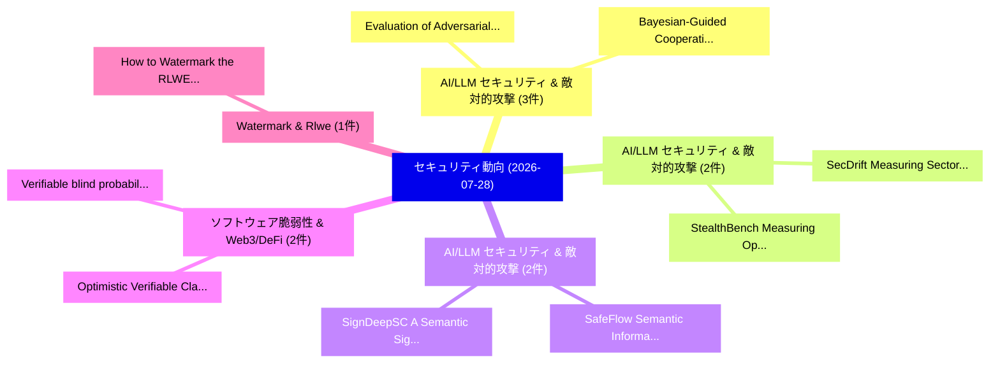

# 📅 02_daily: 日次エグゼクティブサマリー報告書 (2026-07-28)

**集計日時**: 2026-10-02 23:06:21 UTC  
**対象日付**: 2026-07-28  
**本日収集論文数**: 36 件  

---

## 💡 主要セキュリティ動向・脅威インサイト (Executive Insights)

本日の収集論文（計 36 件）において、以下の重点セキュリティ領域で活発な研究動向が確認されました：
- **AI/LLM セキュリティ & 敵対的攻撃** (3 件): 注目論文として 「Bayesian-Guided Cooperative RL...」、「Evaluation of Adversarial Robu...」 等が発表され、実務防御および攻撃検証の進展が見られます。
- **AI/LLM セキュリティ & 敵対的攻撃** (2 件): 注目論文として 「SecDrift: Measuring Sector-Con...」、「StealthBench: Measuring Operat...」 等が発表され、実務防御および攻撃検証の進展が見られます。
- **AI/LLM セキュリティ & 敵対的攻撃** (2 件): 注目論文として 「SafeFlow: Semantic Information...」、「SignDeepSC: A Semantic Signatu...」 等が発表され、実務防御および攻撃検証の進展が見られます。
- **ソフトウェア脆弱性 & Web3/DeFi** (2 件): 注目論文として 「Optimistic Verifiable Claims: ...」、「Verifiable blind probabilistic...」 等が発表され、実務防御および攻撃検証の進展が見られます。
- **Watermark & Rlwe** (1 件): 注目論文として 「How to Watermark the RLWE Homo...」 等が発表され、実務防御および攻撃検証の進展が見られます。

### 🗺️ 技術・脅威トピックマインドマップ

---

## 📌 日次セキュリティ論文一覧 (日本語表形式)

| No | arXiv ID | 論文タイトル (日本語訳) | 重要キーワード | 構造化エグゼクティブ要約 (背景・提案・影響) | 脅威分類 | 詳細リンク |
|---|---|---|---|---|---|---|
| 1 | `2607.25222v1` | [How to Watermark the RLWE Homomorphic Ciphertexts（セキュリティ分析論文）](../../okf/papers/2026-07-28/2607.25222.md) | `Homomorphic Ciphertexts`, `Yufei Zhou`, `Raw Meta` | 【提案】概要 (Overview & Key Finding) 本論文「How to Watermark the RLWE Homomorphic Ciphertexts（セキュリテ...。実証評価により経営層・セキュリティ管理者向け推奨アクション (E... | `arXiv` | [arXiv](https://arxiv.org/abs/2607.25222v1) &#124; [OKF](../../okf/papers/2026-07-28/2607.25222.md) |
| 2 | `2607.25225v1` | [SecDrift: Measuring Sector-Conditioned Security Drift in AI-Generated Code（セキュリティ分析論文）](../../okf/papers/2026-07-28/2607.25225.md) | `Conditioned Security Drift`, `Measuring Sector`, `Generated Code` | 【提案】概要 (Overview & Key Finding) 本論文「SecDrift: Measuring Sector-Conditioned Security Drift i...。実証評価により経営層・セキュリティ管理者向け推奨アクション (E... | `arXiv` | [arXiv](https://arxiv.org/abs/2607.25225v1) &#124; [OKF](../../okf/papers/2026-07-28/2607.25225.md) |
| 3 | `2607.25227v1` | [Decision-Level Hijacking: Injecting Cognitive Bias into 大規模言語モデル via Bit-Flip Attacks](../../okf/papers/2026-07-28/2607.25227.md) | `Injecting Cognitive Bias`, `Level Hijacking`, `Flip Attacks` | 【提案】概要 (Overview & Key Finding) 本論文「Decision-Level Hijacking: Injecting Cognitive Bias into...。実証評価により経営層・セキュリティ管理者向け推奨アクション (E... | `arXiv` | [arXiv](https://arxiv.org/abs/2607.25227v1) &#124; [OKF](../../okf/papers/2026-07-28/2607.25227.md) |
| 4 | `2607.25255v2` | [SafeFlow: Semantic Information-Flow Control for Blocking Malicious Propagation in Multi-Agent Systems（セキュリティ分析論文）](../../okf/papers/2026-07-28/2607.25255.md) | `Blocking Malicious Propagation`, `Semantic Information`, `Flow Control` | 【提案】概要 (Overview & Key Finding) 本論文「SafeFlow: Semantic Information-Flow Control for Blockin...。実証評価により経営層・セキュリティ管理者向け推奨アクション (E... | `arXiv` | [arXiv](https://arxiv.org/abs/2607.25255v2) &#124; [OKF](../../okf/papers/2026-07-28/2607.25255.md) |
| 5 | `2607.25283v1` | [ContractHIL-HLS: Contract-Aligned Multi-Agent Workflow with Hardware-in-the-Loop Feedback for HLS Design（セキュリティ分析論文）](../../okf/papers/2026-07-28/2607.25283.md) | `Aligned Multi`, `Agent Workflow`, `Contract-Aligned Multi` | 【提案】概要 (Overview & Key Finding) 本論文「ContractHIL-HLS: Contract-Aligned Multi-Agent Workflow ...。実証評価により経営層・セキュリティ管理者向け推奨アクション (E... | `arXiv` | [arXiv](https://arxiv.org/abs/2607.25283v1) &#124; [OKF](../../okf/papers/2026-07-28/2607.25283.md) |
| 6 | `2607.25297v1` | [Hybrid Analysis for Secure MCP Tool Use in LLMエージェント](../../okf/papers/2026-07-28/2607.25297.md) | `Tool Use`, `Yuexiang Xie`, `Yaliang Li` | 【提案】概要 (Overview & Key Finding) 本論文「Hybrid Analysis for Secure MCP Tool Use in LLMエージェント」（原...。実証評価により経営層・セキュリティ管理者向け推奨アクション (E... | `arXiv` | [arXiv](https://arxiv.org/abs/2607.25297v1) &#124; [OKF](../../okf/papers/2026-07-28/2607.25297.md) |
| 7 | `2607.25417v1` | [Bayesian-Guided Cooperative RL Beamforming for Wireless Adversarial User Detection（セキュリティ分析論文）](../../okf/papers/2026-07-28/2607.25417.md) | `Wireless Adversarial User Detection`, `Guided Cooperative`, `Bayesian-Guided Cooperative` | 【提案】概要 (Overview & Key Finding) 本論文「Bayesian-Guided Cooperative RL Beamforming for Wireless...。実証評価により経営層・セキュリティ管理者向け推奨アクション (E... | `arXiv` | [arXiv](https://arxiv.org/abs/2607.25417v1) &#124; [OKF](../../okf/papers/2026-07-28/2607.25417.md) |
| 8 | `2607.25425v1` | [The Disruptive Impact of 大規模言語モデル on Capture the Flag Competitions and the Path Toward Fair Play](../../okf/papers/2026-07-28/2607.25425.md) | `Path Toward Fair Play`, `Flag Competitions`, `Large Language Models` | 【提案】概要 (Overview & Key Finding) 本論文「The Disruptive Impact of 大規模言語モデル on Capture the Flag C...。実証評価により経営層・セキュリティ管理者向け推奨アクション (E... | `arXiv` | [arXiv](https://arxiv.org/abs/2607.25425v1) &#124; [OKF](../../okf/papers/2026-07-28/2607.25425.md) |
| 9 | `2607.25430v1` | [SafeStats: Efficient 2PC Protocols for Data Statistic-Related Functions（セキュリティ分析論文）](../../okf/papers/2026-07-28/2607.25430.md) | `Data Statistic`, `Related Functions`, `Statistic-Related Functions` | 【提案】概要 (Overview & Key Finding) 本論文「SafeStats: Efficient 2PC Protocols for Data Statistic-R...。実証評価により経営層・セキュリティ管理者向け推奨アクション (E... | `arXiv` | [arXiv](https://arxiv.org/abs/2607.25430v1) &#124; [OKF](../../okf/papers/2026-07-28/2607.25430.md) |
| 10 | `2607.25451v1` | [Bits and Memories: Measuring Verbatim Extraction Across LLM Quantization（セキュリティ分析論文）](../../okf/papers/2026-07-28/2607.25451.md) | `Measuring Verbatim Extraction Across`, `Akshay Sasi`, `Raw Meta` | 【提案】概要 (Overview & Key Finding) 本論文「Bits and Memories: Measuring Verbatim Extraction Across...。実証評価により経営層・セキュリティ管理者向け推奨アクション (E... | `arXiv` | [arXiv](https://arxiv.org/abs/2607.25451v1) &#124; [OKF](../../okf/papers/2026-07-28/2607.25451.md) |
| 11 | `2607.25461v2` | [From Profiling to Parameterization: Physics-Guided Acoustic Eavesdropping via Smartphone Accelerometers（セキュリティ分析論文）](../../okf/papers/2026-07-28/2607.25461.md) | `Guided Acoustic Eavesdropping`, `Smartphone Accelerometers`, `Physics-Guided Acoustic` | 【提案】概要 (Overview & Key Finding) 本論文「From Profiling to Parameterization: Physics-Guided Acou...。実証評価により経営層・セキュリティ管理者向け推奨アクション (E... | `arXiv` | [arXiv](https://arxiv.org/abs/2607.25461v2) &#124; [OKF](../../okf/papers/2026-07-28/2607.25461.md) |
| 12 | `2607.25479v1` | [Architectural Backdoors in Vision-Language Model Supply Chains via Representation Steering（セキュリティ分析論文）](../../okf/papers/2026-07-28/2607.25479.md) | `Language Model Supply Chains`, `Architectural Backdoors`, `Vision-Language Model` | 【提案】概要 (Overview & Key Finding) 本論文「Architectural Backdoors in Vision-Language Model Supply...。実証評価により経営層・セキュリティ管理者向け推奨アクション (E... | `arXiv` | [arXiv](https://arxiv.org/abs/2607.25479v1) &#124; [OKF](../../okf/papers/2026-07-28/2607.25479.md) |
| 13 | `2607.25502v1` | [Anti-Backdoor Coreset Selection via Cumulative Entropy（セキュリティ分析論文）](../../okf/papers/2026-07-28/2607.25502.md) | `Backdoor Coreset Selection`, `Cumulative Entropy`, `Anti-Backdoor Coreset` | 【提案】概要 (Overview & Key Finding) 本論文「Anti-Backdoor Coreset Selection via Cumulative Entropy（...。実証評価により経営層・セキュリティ管理者向け推奨アクション (E... | `arXiv` | [arXiv](https://arxiv.org/abs/2607.25502v1) &#124; [OKF](../../okf/papers/2026-07-28/2607.25502.md) |
| 14 | `2607.25517v1` | [Optimistic Verifiable Claims: A Blockchain Protocol for Conditionally Confidential Bidding in Decentralized Manufacturing（セキュリティ分析論文）](../../okf/papers/2026-07-28/2607.25517.md) | `Optimistic Verifiable Claims`, `Conditionally Confidential Bidding`, `Blockchain Protocol` | 【提案】概要 (Overview & Key Finding) 本論文「Optimistic Verifiable Claims: A Blockchain Protocol for...。実証評価により経営層・セキュリティ管理者向け推奨アクション (E... | `arXiv` | [arXiv](https://arxiv.org/abs/2607.25517v1) &#124; [OKF](../../okf/papers/2026-07-28/2607.25517.md) |
| 15 | `2607.25572v1` | [Mapping CVEs to MITRE ATT&CK Techniques: A Curated Gold-Set Classifier and the Limits of LLM-Assisted Label Expansion（セキュリティ分析論文）](../../okf/papers/2026-07-28/2607.25572.md) | `Assisted Label Expansion`, `Curated Gold`, `Set Classifier` | 【提案】概要 (Overview & Key Finding) 本論文「Mapping CVEs to MITRE ATT&CK Techniques: A Curated Gold...。実証評価により経営層・セキュリティ管理者向け推奨アクション (E... | `arXiv` | [arXiv](https://arxiv.org/abs/2607.25572v1) &#124; [OKF](../../okf/papers/2026-07-28/2607.25572.md) |
| 16 | `2607.25619v1` | [SkillGate: Cost Efficient Runtime Malicious Skill File Detection in Coding Agents（セキュリティ分析論文）](../../okf/papers/2026-07-28/2607.25619.md) | `Cost Efficient Runtime Malicious Skill File Detection`, `Coding Agents`, `Rui Yang` | 【提案】概要 (Overview & Key Finding) 本論文「SkillGate: Cost Efficient Runtime Malicious Skill File ...。実証評価により経営層・セキュリティ管理者向け推奨アクション (E... | `arXiv` | [arXiv](https://arxiv.org/abs/2607.25619v1) &#124; [OKF](../../okf/papers/2026-07-28/2607.25619.md) |
| 17 | `2607.25676v1` | [SignDeepSC: A Semantic Signature-based Approach for Robust Semantic Communication（セキュリティ分析論文）](../../okf/papers/2026-07-28/2607.25676.md) | `Robust Semantic Communication`, `Semantic Signature`, `Khalil Alhaj` | 【提案】概要 (Overview & Key Finding) 本論文「SignDeepSC: A Semantic Signature-based Approach for Rob...。実証評価により経営層・セキュリティ管理者向け推奨アクション (E... | `arXiv` | [arXiv](https://arxiv.org/abs/2607.25676v1) &#124; [OKF](../../okf/papers/2026-07-28/2607.25676.md) |
| 18 | `2607.25704v1` | [Verifiable blind probabilistic error cancellation（セキュリティ分析論文）](../../okf/papers/2026-07-28/2607.25704.md) | `Bo Yang`, `Elham Kashefi`, `Harold Ollivier` | 【提案】概要 (Overview & Key Finding) 本論文「Verifiable blind probabilistic error cancellation（セキュリテ...。実証評価により経営層・セキュリティ管理者向け推奨アクション (E... | `arXiv` | [arXiv](https://arxiv.org/abs/2607.25704v1) &#124; [OKF](../../okf/papers/2026-07-28/2607.25704.md) |
| 19 | `2607.25734v1` | [A Structuration Approach to Theorizing サイバーセキュリティ Practice: The STARC Model](../../okf/papers/2026-07-28/2607.25734.md) | `Theorizing Cybersecurity Practice`, `Md Aktaruzzaman`, `Atif Ahmad` | 【提案】概要 (Overview & Key Finding) 本論文「A Structuration Approach to Theorizing サイバーセキュリティ Pract...。実証評価により経営層・セキュリティ管理者向け推奨アクション (E... | `arXiv` | [arXiv](https://arxiv.org/abs/2607.25734v1) &#124; [OKF](../../okf/papers/2026-07-28/2607.25734.md) |
| 20 | `2607.25814v1` | [Evaluation of Adversarial Robustness in Arabic Language Models（セキュリティ分析論文）](../../okf/papers/2026-07-28/2607.25814.md) | `Arabic Language Models`, `Adversarial Robustness`, `Anwar Alajmi` | 【提案】概要 (Overview & Key Finding) 本論文「Evaluation of Adversarial Robustness in Arabic Language...。実証評価により# Evaluation of Adversari... | `arXiv` | [arXiv](https://arxiv.org/abs/2607.25814v1) &#124; [OKF](../../okf/papers/2026-07-28/2607.25814.md) |
| 21 | `2607.25842v1` | [Adversarial Deepfake Generation and an Investigation of Purification-Based Adversarial Detection（セキュリティ分析論文）](../../okf/papers/2026-07-28/2607.25842.md) | `Adversarial Deepfake Generation`, `Based Adversarial Detection`, `Purification-Based Adversarial` | 【提案】概要 (Overview & Key Finding) 本論文「Adversarial Deepfake Generation and an Investigation of...。実証評価により経営層・セキュリティ管理者向け推奨アクション (E... | `arXiv` | [arXiv](https://arxiv.org/abs/2607.25842v1) &#124; [OKF](../../okf/papers/2026-07-28/2607.25842.md) |
| 22 | `2607.25880v1` | [Stemma: Induced Decision Regions Reveal LLM Provenance（セキュリティ分析論文）](../../okf/papers/2026-07-28/2607.25880.md) | `Induced Decision Regions Reveal`, `Keyu Zhang`, `Vadim Safronov` | 【提案】概要 (Overview & Key Finding) 本論文「Stemma: Induced Decision Regions Reveal LLM Provenance（...。実証評価により経営層・セキュリティ管理者向け推奨アクション (E... | `arXiv` | [arXiv](https://arxiv.org/abs/2607.25880v1) &#124; [OKF](../../okf/papers/2026-07-28/2607.25880.md) |
| 23 | `2607.25914v1` | [Toward Standardized Cross-Vendor Agent Tool Trust Management in Autonomous Networks（セキュリティ分析論文）](../../okf/papers/2026-07-28/2607.25914.md) | `Vendor Agent Tool Trust Management`, `Toward Standardized Cross`, `Autonomous Networks` | 【提案】概要 (Overview & Key Finding) 本論文「Toward Standardized Cross-Vendor Agent Tool Trust Manag...。実証評価により経営層・セキュリティ管理者向け推奨アクション (E... | `arXiv` | [arXiv](https://arxiv.org/abs/2607.25914v1) &#124; [OKF](../../okf/papers/2026-07-28/2607.25914.md) |
| 24 | `2607.25916v2` | [Hermes: Low Tail-Latency Via Prefix Consensus（セキュリティ分析論文）](../../okf/papers/2026-07-28/2607.25916.md) | `Latency Via Prefix Consensus`, `Low Tail`, `Tail-Latency Via` | 【提案】概要 (Overview & Key Finding) 本論文「Hermes: Low Tail-Latency Via Prefix Consensus（セキュリティ分析論...。実証評価により経営層・セキュリティ管理者向け推奨アクション (E... | `arXiv` | [arXiv](https://arxiv.org/abs/2607.25916v2) &#124; [OKF](../../okf/papers/2026-07-28/2607.25916.md) |
| 25 | `2607.25936v1` | [From Role Prompt to Infinite Thinking: Exploiting Persona Conditioning for Inference Cost Attacks in LLMs（セキュリティ分析論文）](../../okf/papers/2026-07-28/2607.25936.md) | `Exploiting Persona Conditioning`, `Inference Cost Attacks`, `Infinite Thinking` | 【提案】概要 (Overview & Key Finding) 本論文「From Role Prompt to Infinite Thinking: Exploiting Perso...。実証評価により経営層・セキュリティ管理者向け推奨アクション (E... | `arXiv` | [arXiv](https://arxiv.org/abs/2607.25936v1) &#124; [OKF](../../okf/papers/2026-07-28/2607.25936.md) |
| 26 | `2607.25968v1` | [E-MagDiP: Electro-Magnetic based Differential Privacy for EEG based Community Sensing（セキュリティ分析論文）](../../okf/papers/2026-07-28/2607.25968.md) | `Differential Privacy`, `Electro-Magnetic based`, `Community Sensing` | 【提案】概要 (Overview & Key Finding) 本論文「E-MagDiP: Electro-Magnetic based 差分プライバシー for EEG based...。実証評価により経営層・セキュリティ管理者向け推奨アクション (E... | `arXiv` | [arXiv](https://arxiv.org/abs/2607.25968v1) &#124; [OKF](../../okf/papers/2026-07-28/2607.25968.md) |
| 27 | `2607.25987v2` | [IH-Benchmark: A Conflict-Centered Benchmark for Instruction-Hierarchy Robustness in LLM Applications（セキュリティ分析論文）](../../okf/papers/2026-07-28/2607.25987.md) | `Centered Benchmark`, `Hierarchy Robustness`, `Conflict-Centered Benchmark` | 【提案】概要 (Overview & Key Finding) 本論文「IH-Benchmark: A Conflict-Centered Benchmark for Instruc...。実証評価により経営層・セキュリティ管理者向け推奨アクション (E... | `arXiv` | [arXiv](https://arxiv.org/abs/2607.25987v2) &#124; [OKF](../../okf/papers/2026-07-28/2607.25987.md) |
| 28 | `2607.25995v1` | [Does Runtime Topology Context Improve LLM-Generated Kubernetes Security Patches?（セキュリティ分析論文）](../../okf/papers/2026-07-28/2607.25995.md) | `Generated Kubernetes Security Patches`, `LLM-Generated Kubernetes`, `Farooq Shaikh` | 【提案】### (日本語題名: Does Runtime Topology Context Improve LLM-Generated Kubernetes Security Pat...。実証評価により経営層・セキュリティ管理者向け推奨アクション (E... | `arXiv` | [arXiv](https://arxiv.org/abs/2607.25995v1) &#124; [OKF](../../okf/papers/2026-07-28/2607.25995.md) |
| 29 | `2607.26099v1` | [Lilith: Backdoor Generalization under Training-Inference Trigger Shift（セキュリティ分析論文）](../../okf/papers/2026-07-28/2607.26099.md) | `Inference Trigger Shift`, `Backdoor Generalization`, `Training-Inference Trigger` | 【提案】概要 (Overview & Key Finding) 本論文「Lilith: Backdoor Generalization under Training-Inferenc...。実証評価により経営層・セキュリティ管理者向け推奨アクション (E... | `arXiv` | [arXiv](https://arxiv.org/abs/2607.26099v1) &#124; [OKF](../../okf/papers/2026-07-28/2607.26099.md) |
| 30 | `2607.26102v1` | [A Reference-Free Score for Detecting Silent Reasoning Failures in 大規模言語モデル](../../okf/papers/2026-07-28/2607.26102.md) | `Detecting Silent Reasoning Failures`, `Free Score`, `Reference-Free Score` | 【提案】概要 (Overview & Key Finding) 本論文「A Reference-Free Score for Detecting Silent Reasoning F...。実証評価により経営層・セキュリティ管理者向け推奨アクション (E... | `arXiv` | [arXiv](https://arxiv.org/abs/2607.26102v1) &#124; [OKF](../../okf/papers/2026-07-28/2607.26102.md) |
| 31 | `2607.26115v1` | [GPT-Red: Automated Red Teaming via Self-Play at Scale（セキュリティ分析論文）](../../okf/papers/2026-07-28/2607.26115.md) | `Automated Red Teaming`, `Eric Wallace`, `Nikhil Kandpal` | 【提案】概要 (Overview & Key Finding) 本論文「GPT-Red: Automated Red Teaming via Self-Play at Scale（セ...。実証評価によりChoquette-Choo, Nikhil Ka... | `arXiv` | [arXiv](https://arxiv.org/abs/2607.26115v1) &#124; [OKF](../../okf/papers/2026-07-28/2607.26115.md) |
| 32 | `2607.26201v1` | [(EC)2: Event-Centric Explainability for サイバーセキュリティ Through Multi-Agent LLM Investigations](../../okf/papers/2026-07-28/2607.26201.md) | `Centric Explainability`, `Event-Centric Explainability`, `Multi-Agent LLM` | 【提案】概要 (Overview & Key Finding) 本論文「(EC)2: Event-Centric Explainability for サイバーセキュリティ Thro...。実証評価により経営層・セキュリティ管理者向け推奨アクション (E... | `arXiv` | [arXiv](https://arxiv.org/abs/2607.26201v1) &#124; [OKF](../../okf/papers/2026-07-28/2607.26201.md) |
| 33 | `2607.26204v1` | [On Exercising Governance Power in Decentralized Autonomous Organizations（セキュリティ分析論文）](../../okf/papers/2026-07-28/2607.26204.md) | `Decentralized Autonomous Organizations`, `Vabuk Pahari`, `Balakrishnan Chandrasekaran` | 【提案】概要 (Overview & Key Finding) 本論文「On Exercising Governance Power in Decentralized Autonom...。実証評価により経営層・セキュリティ管理者向け推奨アクション (E... | `arXiv` | [arXiv](https://arxiv.org/abs/2607.26204v1) &#124; [OKF](../../okf/papers/2026-07-28/2607.26204.md) |
| 34 | `2607.26241v2` | [Learning the Word Problem: Geodesic Lengths and Cryptographic Applications（セキュリティ分析論文）](../../okf/papers/2026-07-28/2607.26241.md) | `Word Problem`, `Geodesic Lengths`, `Cryptographic Applications` | 【提案】概要 (Overview & Key Finding) 本論文「Learning the Word Problem: Geodesic Lengths and Cryptog...。実証評価により経営層・セキュリティ管理者向け推奨アクション (E... | `arXiv` | [arXiv](https://arxiv.org/abs/2607.26241v2) &#124; [OKF](../../okf/papers/2026-07-28/2607.26241.md) |
| 35 | `2607.26314v1` | [StealthBench: Measuring Operational Stealth in Autonomous Offensive-Security Agents（セキュリティ分析論文）](../../okf/papers/2026-07-28/2607.26314.md) | `Measuring Operational Stealth`, `Autonomous Offensive`, `Security Agents` | 【提案】概要 (Overview & Key Finding) 本論文「StealthBench: Measuring Operational Stealth in Autonomo...。実証評価により経営層・セキュリティ管理者向け推奨アクション (E... | `arXiv` | [arXiv](https://arxiv.org/abs/2607.26314v1) &#124; [OKF](../../okf/papers/2026-07-28/2607.26314.md) |
| 36 | `2607.26339v1` | [RAGuard: A Layered Defense Framework for Retrieval-Augmented Generation Systems Against Data Poisoning（セキュリティ分析論文）](../../okf/papers/2026-07-28/2607.26339.md) | `Retrieval-Augmented Generation`, `Pushkal Kumar`, `Tucker Nielson` | 【提案】概要 (Overview & Key Finding) 本論文「RAGuard: A Layered Defense Framework for Retrieval-Augm...。実証評価により経営層・セキュリティ管理者向け推奨アクション (E... | `arXiv` | [arXiv](https://arxiv.org/abs/2607.26339v1) &#124; [OKF](../../okf/papers/2026-07-28/2607.26339.md) |

