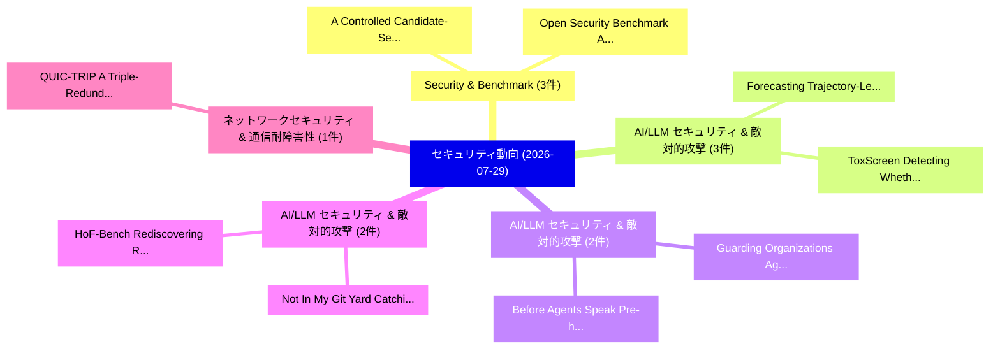

# 📅 02_daily: 日次エグゼクティブサマリー報告書 (2026-07-29)

**集計日時**: 2026-10-02 23:06:21 UTC  
**対象日付**: 2026-07-29  
**本日収集論文数**: 34 件  

---

## 💡 主要セキュリティ動向・脅威インサイト (Executive Insights)

本日の収集論文（計 34 件）において、以下の重点セキュリティ領域で活発な研究動向が確認されました：
- **Security & Benchmark** (3 件): 注目論文として 「A Controlled Candidate-Set Ben...」、「Open Security Benchmark: Auton...」 等が発表され、実務防御および攻撃検証の進展が見られます。
- **AI/LLM セキュリティ & 敵対的攻撃** (3 件): 注目論文として 「Forecasting Trajectory-Level S...」、「ToxScreen: Detecting Whether a...」 等が発表され、実務防御および攻撃検証の進展が見られます。
- **AI/LLM セキュリティ & 敵対的攻撃** (2 件): 注目論文として 「Guarding Organizations Against...」、「Before Agents Speak: Pre-hoc F...」 等が発表され、実務防御および攻撃検証の進展が見られます。
- **AI/LLM セキュリティ & 敵対的攻撃** (2 件): 注目論文として 「Not In My Git Yard: Catching B...」、「HoF-Bench: Rediscovering Real ...」 等が発表され、実務防御および攻撃検証の進展が見られます。
- **ネットワークセキュリティ & 通信耐障害性** (1 件): 注目論文として 「QUIC-TRIP: A Triple-Redundant ...」 等が発表され、実務防御および攻撃検証の進展が見られます。

### 🗺️ 技術・脅威トピックマインドマップ

---

## 📌 日次セキュリティ論文一覧 (日本語表形式)

| No | arXiv ID | 論文タイトル (日本語訳) | 重要キーワード | 構造化エグゼクティブ要約 (背景・提案・影響) | 脅威分類 | 詳細リンク |
|---|---|---|---|---|---|---|
| 1 | `2607.26371v1` | [A Controlled Candidate-Set Benchmark for Offline Satellite-Security Plan Decomposition（セキュリティ分析論文）](../../okf/papers/2026-07-29/2607.26371.md) | `Security Plan Decomposition`, `Controlled Candidate`, `Set Benchmark` | 【提案】概要 (Overview & Key Finding) 本論文「A Controlled Candidate-Set Benchmark for Offline Satell...。実証評価により経営層・セキュリティ管理者向け推奨アクション (E... | `arXiv` | [arXiv](https://arxiv.org/abs/2607.26371v1) &#124; [OKF](../../okf/papers/2026-07-29/2607.26371.md) |
| 2 | `2607.26379v1` | [QUIC-TRIP: A Triple-Redundant Journey Toward Secure Substation Communications（セキュリティ分析論文）](../../okf/papers/2026-07-29/2607.26379.md) | `Redundant Journey Toward Secure Substation Communications`, `Triple-Redundant Journey`, `Jorge David` | 【提案】概要 (Overview & Key Finding) 本論文「QUIC-TRIP: A Triple-Redundant Journey Toward Secure Sub...。実証評価により経営層・セキュリティ管理者向け推奨アクション (E... | `arXiv` | [arXiv](https://arxiv.org/abs/2607.26379v1) &#124; [OKF](../../okf/papers/2026-07-29/2607.26379.md) |
| 3 | `2607.26385v1` | [Collusion with Competitive Marginals: Price-Level Audits Are Blind by Construction（セキュリティ分析論文）](../../okf/papers/2026-07-29/2607.26385.md) | `Competitive Marginals`, `Price-Level Audits`, `Xin Xu` | 【提案】概要 (Overview & Key Finding) 本論文「Collusion with Competitive Marginals: Price-Level Audit...。実証評価により経営層・セキュリティ管理者向け推奨アクション (E... | `arXiv` | [arXiv](https://arxiv.org/abs/2607.26385v1) &#124; [OKF](../../okf/papers/2026-07-29/2607.26385.md) |
| 4 | `2607.26478v1` | [Explicit Separations for One-Query Unitary Synthesis（セキュリティ分析論文）](../../okf/papers/2026-07-29/2607.26478.md) | `Query Unitary Synthesis`, `Explicit Separations`, `One-Query Unitary` | 【提案】概要 (Overview & Key Finding) 本論文「Explicit Separations for One-Query Unitary Synthesis（セキ...。実証評価により経営層・セキュリティ管理者向け推奨アクション (E... | `arXiv` | [arXiv](https://arxiv.org/abs/2607.26478v1) &#124; [OKF](../../okf/papers/2026-07-29/2607.26478.md) |
| 5 | `2607.26574v2` | [Attack Ensembles Expose a Safety-Utility Trade-off in Black-Box Guard Defenses Against Encoded VLM Jailbreaks（セキュリティ分析論文）](../../okf/papers/2026-07-29/2607.26574.md) | `Attack Ensembles Expose`, `Utility Trade`, `Safety-Utility Trade` | 【提案】概要 (Overview & Key Finding) 本論文「Attack Ensembles Expose a Safety-Utility Trade-off in B...。実証評価により経営層・セキュリティ管理者向け推奨アクション (E... | `arXiv` | [arXiv](https://arxiv.org/abs/2607.26574v2) &#124; [OKF](../../okf/papers/2026-07-29/2607.26574.md) |
| 6 | `2607.26589v1` | [CDN Tsunami: Exploiting HTTP/3-HTTP/1.1 Conversion for DoS Attacks（セキュリティ分析論文）](../../okf/papers/2026-07-29/2607.26589.md) | `Ziyu Lin`, `Tianlong Su`, `Yingjie Lin` | 【提案】概要 (Overview & Key Finding) 本論文「CDN Tsunami: Exploiting HTTP/3-HTTP/1.1 Conversion for ...。実証評価により経営層・セキュリティ管理者向け推奨アクション (E... | `arXiv` | [arXiv](https://arxiv.org/abs/2607.26589v1) &#124; [OKF](../../okf/papers/2026-07-29/2607.26589.md) |
| 7 | `2607.26634v1` | [Guarding Organizations Against Malware Risk: A Novel Graph-Based マルウェア検出 Method](../../okf/papers/2026-07-29/2607.26634.md) | `Graph-Based Malware`, `Yinan Gao`, `Jiarong Xu` | 【提案】概要 (Overview & Key Finding) 本論文「Guarding Organizations Against マルウェア Risk: A Novel Grap...。実証評価により経営層・セキュリティ管理者向け推奨アクション (E... | `arXiv` | [arXiv](https://arxiv.org/abs/2607.26634v1) &#124; [OKF](../../okf/papers/2026-07-29/2607.26634.md) |
| 8 | `2607.26639v1` | [Borrowed Strength: Best-of-N Search over a Code EncodingBreaks Self-Check Jailbreak Defenses（セキュリティ分析論文）](../../okf/papers/2026-07-29/2607.26639.md) | `Check Jailbreak Defenses`, `Borrowed Strength`, `Self-Check Jailbreak` | 【提案】概要 (Overview & Key Finding) 本論文「Borrowed Strength: Best-of-N Search over a Code Encodin...。実証評価により経営層・セキュリティ管理者向け推奨アクション (E... | `arXiv` | [arXiv](https://arxiv.org/abs/2607.26639v1) &#124; [OKF](../../okf/papers/2026-07-29/2607.26639.md) |
| 9 | `2607.26655v2` | [Fingerprint-Driven Automation: Coupling Reconnaissance with POC Verification（セキュリティ分析論文）](../../okf/papers/2026-07-29/2607.26655.md) | `Driven Automation`, `Coupling Reconnaissance`, `Fingerprint-Driven Automation` | 【提案】概要 (Overview & Key Finding) 本論文「Fingerprint-Driven Automation: Coupling Reconnaissance ...。実証評価により経営層・セキュリティ管理者向け推奨アクション (E... | `arXiv` | [arXiv](https://arxiv.org/abs/2607.26655v2) &#124; [OKF](../../okf/papers/2026-07-29/2607.26655.md) |
| 10 | `2607.26656v1` | [Graph Is the Verifier: Agentic Reinforcement Learning for Interprocedural 脆弱性検出](../../okf/papers/2026-07-29/2607.26656.md) | `Agentic Reinforcement Learning`, `Interprocedural Vulnerability Detection`, `Wen Bin Leow` | 【提案】概要 (Overview & Key Finding) 本論文「Graph Is the Verifier: Agentic Reinforcement Learning f...。実証評価により経営層・セキュリティ管理者向け推奨アクション (E... | `arXiv` | [arXiv](https://arxiv.org/abs/2607.26656v1) &#124; [OKF](../../okf/papers/2026-07-29/2607.26656.md) |
| 11 | `2607.26719v1` | [Not In My Git Yard: Catching Backdoors at Commit and Release Time（セキュリティ分析論文）](../../okf/papers/2026-07-29/2607.26719.md) | `Catching Backdoors`, `Release Time`, `Dimitri Kokkonis` | 【提案】背景とセキュリティ上の課題 (Background & Problem) 本研究はサイバー脅威環境におけるセキュリティ構造・脆弱性の検証を目的としています。(主要検出項目: ...。実証評価により経営層・セキュリティ管理者向け推奨アクション (E... | `arXiv` | [arXiv](https://arxiv.org/abs/2607.26719v1) &#124; [OKF](../../okf/papers/2026-07-29/2607.26719.md) |
| 12 | `2607.26723v1` | [FARI: Robust One-Step Inversion for Watermarking in Diffusion Models（セキュリティ分析論文）](../../okf/papers/2026-07-29/2607.26723.md) | `Robust One`, `Step Inversion`, `Diffusion Models` | 【提案】概要 (Overview & Key Finding) 本論文「FARI: Robust One-Step Inversion for Watermarking in Dif...。実証評価により経営層・セキュリティ管理者向け推奨アクション (E... | `arXiv` | [arXiv](https://arxiv.org/abs/2607.26723v1) &#124; [OKF](../../okf/papers/2026-07-29/2607.26723.md) |
| 13 | `2607.26734v1` | [Verifiable Random Sampling（セキュリティ分析論文）](../../okf/papers/2026-07-29/2607.26734.md) | `Verifiable Random Sampling`, `Yeoh Wei Zhu`, `Anthony Alexiades Armenakas` | 【提案】概要 (Overview & Key Finding) 本論文「Verifiable Random Sampling（セキュリティ分析論文）」（原題: Verifiable ...。実証評価により経営層・セキュリティ管理者向け推奨アクション (E... | `arXiv` | [arXiv](https://arxiv.org/abs/2607.26734v1) &#124; [OKF](../../okf/papers/2026-07-29/2607.26734.md) |
| 14 | `2607.26791v1` | [SecRespond: AI Agents for Real-World Post-Compromise Incident Responseのベンチマーク評価](../../okf/papers/2026-07-29/2607.26791.md) | `World Post`, `Real-World Post`, `Compromise Incident` | 【提案】概要 (Overview & Key Finding) 本論文「SecRespond: AI Agents for Real-World Post-Compromise In...。実証評価により経営層・セキュリティ管理者向け推奨アクション (E... | `arXiv` | [arXiv](https://arxiv.org/abs/2607.26791v1) &#124; [OKF](../../okf/papers/2026-07-29/2607.26791.md) |
| 15 | `2607.26820v1` | [Forecasting Trajectory-Level Safety Risks in Black-Box Multi-Turn Interactions（セキュリティ分析論文）](../../okf/papers/2026-07-29/2607.26820.md) | `Level Safety Risks`, `Forecasting Trajectory`, `Trajectory-Level Safety` | 【提案】概要 (Overview & Key Finding) 本論文「Forecasting Trajectory-Level Safety Risks in Black-Box ...。実証評価により経営層・セキュリティ管理者向け推奨アクション (E... | `arXiv` | [arXiv](https://arxiv.org/abs/2607.26820v1) &#124; [OKF](../../okf/papers/2026-07-29/2607.26820.md) |
| 16 | `2607.26836v1` | [Before Agents Speak: Pre-hoc Failure Risk Inference in Multi-Agent Systems（セキュリティ分析論文）](../../okf/papers/2026-07-29/2607.26836.md) | `Failure Risk Inference`, `Agent Systems`, `Pre-hoc Failure` | 【提案】概要 (Overview & Key Finding) 本論文「Before Agents Speak: Pre-hoc Failure Risk Inference in ...。実証評価により経営層・セキュリティ管理者向け推奨アクション (E... | `arXiv` | [arXiv](https://arxiv.org/abs/2607.26836v1) &#124; [OKF](../../okf/papers/2026-07-29/2607.26836.md) |
| 17 | `2607.26849v1` | [ToxScreen: Detecting Whether an LLM Has Been Poisoned（セキュリティ分析論文）](../../okf/papers/2026-07-29/2607.26849.md) | `Detecting Whether`, `Anthony Hughes`, `Nicole Xing` | 【提案】概要 (Overview & Key Finding) 本論文「ToxScreen: Detecting Whether an LLM Has Been Poisoned（セ...。実証評価により経営層・セキュリティ管理者向け推奨アクション (E... | `arXiv` | [arXiv](https://arxiv.org/abs/2607.26849v1) &#124; [OKF](../../okf/papers/2026-07-29/2607.26849.md) |
| 18 | `2607.26933v1` | [Defending Against Backdoor Attacks via Alignment Checking in Model-Contrastive 連合学習](../../okf/papers/2026-07-29/2607.26933.md) | `Alignment Checking`, `Contrastive Federated Learning`, `Model-Contrastive Federated` | 【提案】概要 (Overview & Key Finding) 本論文「Defending Against Backdoor Attacks via Alignment Checki...。実証評価により経営層・セキュリティ管理者向け推奨アクション (E... | `arXiv` | [arXiv](https://arxiv.org/abs/2607.26933v1) &#124; [OKF](../../okf/papers/2026-07-29/2607.26933.md) |
| 19 | `2607.26935v1` | [What Does It Take to Detect an AI Agent? Minimal Feature Sets for Behavioral Detection under Browser Automation（セキュリティ分析論文）](../../okf/papers/2026-07-29/2607.26935.md) | `Minimal Feature Sets`, `Behavioral Detection`, `Browser Automation` | 【提案】Minimal Feature Sets for Behavioral Detection under Browser Automation ### (日本語題名: What...。実証評価により経営層・セキュリティ管理者向け推奨アクション (E... | `arXiv` | [arXiv](https://arxiv.org/abs/2607.26935v1) &#124; [OKF](../../okf/papers/2026-07-29/2607.26935.md) |
| 20 | `2607.26976v2` | [InkShield: Writing Style Protection Against Unauthorized Handwriting Mimicry（セキュリティ分析論文）](../../okf/papers/2026-07-29/2607.26976.md) | `Jian Xiong`, `Wenbo Jiang`, `Zihan Wang` | 【提案】概要 (Overview & Key Finding) 本論文「InkShield: Writing Style Protection Against Unauthorize...。実証評価により経営層・セキュリティ管理者向け推奨アクション (E... | `arXiv` | [arXiv](https://arxiv.org/abs/2607.26976v2) &#124; [OKF](../../okf/papers/2026-07-29/2607.26976.md) |
| 21 | `2607.26998v3` | [AgentSnare: Learning to Delay, Divert, and Defuse Autonomous Penetration Agents（セキュリティ分析論文）](../../okf/papers/2026-07-29/2607.26998.md) | `Defuse Autonomous Penetration Agents`, `Ruoyu Wang`, `Heng Zhao` | 【提案】概要 (Overview & Key Finding) 本論文「AgentSnare: Learning to Delay, Divert, and Defuse Auton...。実証評価により経営層・セキュリティ管理者向け推奨アクション (E... | `arXiv` | [arXiv](https://arxiv.org/abs/2607.26998v3) &#124; [OKF](../../okf/papers/2026-07-29/2607.26998.md) |
| 22 | `2607.27030v1` | [HoF-Bench: Rediscovering Real AI-Discovered CVEs Without Frontier Models（セキュリティ分析論文）](../../okf/papers/2026-07-29/2607.27030.md) | `Without Frontier Models`, `Rediscovering Real`, `AI-Discovered CVEs` | 【提案】背景とセキュリティ上の課題 (Background & Problem) 本研究はサイバー脅威環境におけるセキュリティ構造・脆弱性の検証を目的としています。(主要検出項目: ...。実証評価により経営層・セキュリティ管理者向け推奨アクション (E... | `arXiv` | [arXiv](https://arxiv.org/abs/2607.27030v1) &#124; [OKF](../../okf/papers/2026-07-29/2607.27030.md) |
| 23 | `2607.27080v1` | [MemSecBench: Tracking Agent Memory Poisoning from Persistence to Consequence and Repair（セキュリティ分析論文）](../../okf/papers/2026-07-29/2607.27080.md) | `Tracking Agent Memory Poisoning`, `Xuanze Chen`, `Xukang Xie` | 【提案】概要 (Overview & Key Finding) 本論文「MemSecBench: Tracking Agent Memory Poisoning from Persi...。実証評価により経営層・セキュリティ管理者向け推奨アクション (E... | `arXiv` | [arXiv](https://arxiv.org/abs/2607.27080v1) &#124; [OKF](../../okf/papers/2026-07-29/2607.27080.md) |
| 24 | `2607.27081v1` | [On-Policy Distillation for LLM Safety: A Routing Approach to Template-Robust Realignment（セキュリティ分析論文）](../../okf/papers/2026-07-29/2607.27081.md) | `Policy Distillation`, `Robust Realignment`, `On-Policy Distillation` | 【提案】概要 (Overview & Key Finding) 本論文「On-Policy Distillation for LLM Safety: A Routing Approa...。実証評価により経営層・セキュリティ管理者向け推奨アクション (E... | `arXiv` | [arXiv](https://arxiv.org/abs/2607.27081v1) &#124; [OKF](../../okf/papers/2026-07-29/2607.27081.md) |
| 25 | `2607.27164v1` | [Function Privatization in the Local Model（セキュリティ分析論文）](../../okf/papers/2026-07-29/2607.27164.md) | `Function Privatization`, `Local Model`, `Yuting Liang` | 【提案】概要 (Overview & Key Finding) 本論文「Function Privatization in the Local Model（セキュリティ分析論文）」（...。実証評価により経営層・セキュリティ管理者向け推奨アクション (E... | `arXiv` | [arXiv](https://arxiv.org/abs/2607.27164v1) &#124; [OKF](../../okf/papers/2026-07-29/2607.27164.md) |
| 26 | `2607.27267v1` | [FAVA: Formal Authorization for Verified Agents with Evidence-Backed Permission Graphs（セキュリティ分析論文）](../../okf/papers/2026-07-29/2607.27267.md) | `Backed Permission Graphs`, `Formal Authorization`, `Verified Agents` | 【提案】概要 (Overview & Key Finding) 本論文「FAVA: Formal Authorization for Verified Agents with Evi...。実証評価により経営層・セキュリティ管理者向け推奨アクション (E... | `arXiv` | [arXiv](https://arxiv.org/abs/2607.27267v1) &#124; [OKF](../../okf/papers/2026-07-29/2607.27267.md) |
| 27 | `2607.27288v1` | [Open Security Benchmark: Autonomous Enterprise Cyber Defenseに向けて](../../okf/papers/2026-07-29/2607.27288.md) | `Open Security Benchmark`, `Towards Autonomous Enterprise Cyber Defense`, `Autonomous Enterprise Cyber` | 【提案】概要 (Overview & Key Finding) 本論文「Open Security Benchmark: Autonomous Enterprise Cyber De...。実証評価により経営層・セキュリティ管理者向け推奨アクション (E... | `arXiv` | [arXiv](https://arxiv.org/abs/2607.27288v1) &#124; [OKF](../../okf/papers/2026-07-29/2607.27288.md) |
| 28 | `2607.27373v1` | [RoguePrompt: Dual-Layer Encoding for Self-Reconstruction to Circumvent LLM Moderation（セキュリティ分析論文）](../../okf/papers/2026-07-29/2607.27373.md) | `Layer Encoding`, `Dual-Layer Encoding`, `Benyamin Tafreshian` | 【提案】概要 (Overview & Key Finding) 本論文「RoguePrompt: Dual-Layer Encoding for Self-Reconstructio...。実証評価により経営層・セキュリティ管理者向け推奨アクション (E... | `arXiv` | [arXiv](https://arxiv.org/abs/2607.27373v1) &#124; [OKF](../../okf/papers/2026-07-29/2607.27373.md) |
| 29 | `2607.27374v1` | [From Backlog Items to Security Guidance: Continuous Security Complianceに向けて](../../okf/papers/2026-07-29/2607.27374.md) | `Security Guidance`, `Towards Continuous Security Compliance`, `Continuous Security` | 【提案】概要 (Overview & Key Finding) 本論文「From Backlog Items to Security Guidance: Continuous Sec...。実証評価により経営層・セキュリティ管理者向け推奨アクション (E... | `arXiv` | [arXiv](https://arxiv.org/abs/2607.27374v1) &#124; [OKF](../../okf/papers/2026-07-29/2607.27374.md) |
| 30 | `2607.27401v1` | [Low-Latency Bootstrapping for CKKS using Roots of Unity（セキュリティ分析論文）](../../okf/papers/2026-07-29/2607.27401.md) | `Latency Bootstrapping`, `Low-Latency Bootstrapping`, `Sebastien Coron` | 【提案】概要 (Overview & Key Finding) 本論文「Low-Latency Bootstrapping for CKKS using Roots of Unity...。実証評価により経営層・セキュリティ管理者向け推奨アクション (E... | `arXiv` | [arXiv](https://arxiv.org/abs/2607.27401v1) &#124; [OKF](../../okf/papers/2026-07-29/2607.27401.md) |
| 31 | `2607.27480v1` | [Granite: A Modular Methodology for Foundational Verification of Hardware-Software Leakage Contracts（セキュリティ分析論文）](../../okf/papers/2026-07-29/2607.27480.md) | `Software Leakage Contracts`, `Modular Methodology`, `Foundational Verification` | 【提案】概要 (Overview & Key Finding) 本論文「Granite: A Modular Methodology for Foundational Verific...。実証評価により経営層・セキュリティ管理者向け推奨アクション (E... | `arXiv` | [arXiv](https://arxiv.org/abs/2607.27480v1) &#124; [OKF](../../okf/papers/2026-07-29/2607.27480.md) |
| 32 | `2607.27491v1` | [Flock: Fast Proving for Batch Boolean Computations（セキュリティ分析論文）](../../okf/papers/2026-07-29/2607.27491.md) | `Batch Boolean Computations`, `Fast Proving`, `William Wang` | 【提案】概要 (Overview & Key Finding) 本論文「Flock: Fast Proving for Batch Boolean Computations（セキュリ...。実証評価によりRothblum, William Wang - ... | `arXiv` | [arXiv](https://arxiv.org/abs/2607.27491v1) &#124; [OKF](../../okf/papers/2026-07-29/2607.27491.md) |
| 33 | `2607.27510v1` | [Send and Pretend: Exploiting Transcript Consistency Issues in End-to-End Encrypted Group Chats（セキュリティ分析論文）](../../okf/papers/2026-07-29/2607.27510.md) | `Exploiting Transcript Consistency Issues`, `End Encrypted Group Chats`, `Moritz Grefner` | 【提案】概要 (Overview & Key Finding) 本論文「Send and Pretend: Exploiting Transcript Consistency Iss...。実証評価により経営層・セキュリティ管理者向け推奨アクション (E... | `arXiv` | [arXiv](https://arxiv.org/abs/2607.27510v1) &#124; [OKF](../../okf/papers/2026-07-29/2607.27510.md) |
| 34 | `2607.27528v1` | [ThreatForest: Multi-Agent Attack Tree Generation with Pluggable TTP Framework Mapping（セキュリティ分析論文）](../../okf/papers/2026-07-29/2607.27528.md) | `Agent Attack Tree Generation`, `Multi-Agent Attack`, `Cristian Leo` | 【提案】概要 (Overview & Key Finding) 本論文「ThreatForest: Multi-Agent Attack Tree Generation with P...。実証評価により経営層・セキュリティ管理者向け推奨アクション (E... | `arXiv` | [arXiv](https://arxiv.org/abs/2607.27528v1) &#124; [OKF](../../okf/papers/2026-07-29/2607.27528.md) |

