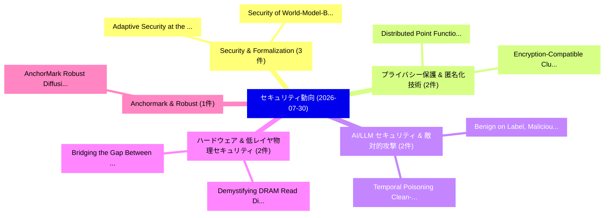

# 📅 02_daily: 日次エグゼクティブサマリー報告書 (2026-07-30)

**集計日時**: 2026-10-02 23:06:21 UTC  
**対象日付**: 2026-07-30  
**本日収集論文数**: 31 件  

---

## 💡 主要セキュリティ動向・脅威インサイト (Executive Insights)

本日の収集論文（計 31 件）において、以下の重点セキュリティ領域で活発な研究動向が確認されました：
- **Security & Formalization** (3 件): 注目論文として 「Adaptive Security at the Edge ...」、「Security of World-Model-Based ...」 等が発表され、実務防御および攻撃検証の進展が見られます。
- **プライバシー保護 & 匿名化技術** (2 件): 注目論文として 「Distributed Point Functions an...」、「Encryption-Compatible Clustere...」 等が発表され、実務防御および攻撃検証の進展が見られます。
- **AI/LLM セキュリティ & 敵対的攻撃** (2 件): 注目論文として 「Benign on Label, Malicious by ...」、「Temporal Poisoning: Clean-Labe...」 等が発表され、実務防御および攻撃検証の進展が見られます。
- **ハードウェア & 低レイヤ物理セキュリティ** (2 件): 注目論文として 「Demystifying DRAM Read Disturb...」、「Bridging the Gap Between PHE a...」 等が発表され、実務防御および攻撃検証の進展が見られます。
- **Anchormark & Robust** (1 件): 注目論文として 「AnchorMark: Robust Diffusion W...」 等が発表され、実務防御および攻撃検証の進展が見られます。

### 🗺️ 技術・脅威トピックマインドマップ

---

## 📌 日次セキュリティ論文一覧 (日本語表形式)

| No | arXiv ID | 論文タイトル (日本語訳) | 重要キーワード | 構造化エグゼクティブ要約 (背景・提案・影響) | 脅威分類 | 詳細リンク |
|---|---|---|---|---|---|---|
| 1 | `2607.27551v1` | [AnchorMark: Robust Diffusion Watermarking via Latent-Space Rotation Synchrony（セキュリティ分析論文）](../../okf/papers/2026-07-30/2607.27551.md) | `Robust Diffusion Watermarking`, `Space Rotation Synchrony`, `Latent-Space Rotation` | 【提案】概要 (Overview & Key Finding) 本論文「AnchorMark: Robust Diffusion Watermarking via Latent-Sp...。実証評価により経営層・セキュリティ管理者向け推奨アクション (E... | `arXiv` | [arXiv](https://arxiv.org/abs/2607.27551v1) &#124; [OKF](../../okf/papers/2026-07-30/2607.27551.md) |
| 2 | `2607.27604v1` | [Revisiting the Adversarial Robustness of Graph-Based Traffic Forecasting（セキュリティ分析論文）](../../okf/papers/2026-07-30/2607.27604.md) | `Based Traffic Forecasting`, `Adversarial Robustness`, `Graph-Based Traffic` | 【提案】概要 (Overview & Key Finding) 本論文「Revisiting the Adversarial Robustness of Graph-Based Tr...。実証評価により経営層・セキュリティ管理者向け推奨アクション (E... | `arXiv` | [arXiv](https://arxiv.org/abs/2607.27604v1) &#124; [OKF](../../okf/papers/2026-07-30/2607.27604.md) |
| 3 | `2607.27661v1` | [Strategy Phasing of Cyber Attacks on Digital Substations（セキュリティ分析論文）](../../okf/papers/2026-07-30/2607.27661.md) | `Strategy Phasing`, `Cyber Attacks`, `Digital Substations` | 【提案】概要 (Overview & Key Finding) 本論文「Strategy Phasing of Cyber Attacks on Digital Substation...。実証評価により経営層・セキュリティ管理者向け推奨アクション (E... | `arXiv` | [arXiv](https://arxiv.org/abs/2607.27661v1) &#124; [OKF](../../okf/papers/2026-07-30/2607.27661.md) |
| 4 | `2607.27696v1` | [Distributed Point Functions and Function Secret Sharing（セキュリティ分析論文）](../../okf/papers/2026-07-30/2607.27696.md) | `Distributed Point Functions`, `Function Secret Sharing`, `Elette Boyle` | 【提案】概要 (Overview & Key Finding) 本論文「Distributed Point Functions and Function Secret Sharing...。実証評価により経営層・セキュリティ管理者向け推奨アクション (E... | `arXiv` | [arXiv](https://arxiv.org/abs/2607.27696v1) &#124; [OKF](../../okf/papers/2026-07-30/2607.27696.md) |
| 5 | `2607.27776v1` | [CHARGE: Leveraging CWE Hierarchies for Hardware Security SystemVerilog Assertion Generation（セキュリティ分析論文）](../../okf/papers/2026-07-30/2607.27776.md) | `Hardware Security`, `Assertion Generation`, `Xiao Tan` | 【提案】概要 (Overview & Key Finding) 本論文「CHARGE: Leveraging CWE Hierarchies for Hardware Securit...。実証評価により経営層・セキュリティ管理者向け推奨アクション (E... | `arXiv` | [arXiv](https://arxiv.org/abs/2607.27776v1) &#124; [OKF](../../okf/papers/2026-07-30/2607.27776.md) |
| 6 | `2607.27858v1` | [Adaptive Security at the Edge for 6G-Enabled Healthcare IoT（セキュリティ分析論文）](../../okf/papers/2026-07-30/2607.27858.md) | `Adaptive Security`, `Enabled Healthcare`, `6G-Enabled Healthcare` | 【提案】概要 (Overview & Key Finding) 本論文「Adaptive Security at the Edge for 6G-Enabled Healthcare...。実証評価により経営層・セキュリティ管理者向け推奨アクション (E... | `arXiv` | [arXiv](https://arxiv.org/abs/2607.27858v1) &#124; [OKF](../../okf/papers/2026-07-30/2607.27858.md) |
| 7 | `2607.27886v2` | [Don't Trust the AI Ecosystem: Analyzing Privacy Leakage in Compromised Open-Source Components（セキュリティ分析論文）](../../okf/papers/2026-07-30/2607.27886.md) | `Analyzing Privacy Leakage`, `Compromised Open`, `Source Components` | 【提案】概要 (Overview & Key Finding) 本論文「Don't Trust the AI Ecosystem: Analyzing Privacy Leakage...。実証評価により経営層・セキュリティ管理者向け推奨アクション (E... | `arXiv` | [arXiv](https://arxiv.org/abs/2607.27886v2) &#124; [OKF](../../okf/papers/2026-07-30/2607.27886.md) |
| 8 | `2607.27936v1` | [Benign on Label, Malicious by Design: Clean-Label Dormant-to-Activated Backdoor via Machine Unlearning with Removable Camouflage（セキュリティ分析論文）](../../okf/papers/2026-07-30/2607.27936.md) | `Label Dormant`, `Activated Backdoor`, `Machine Unlearning` | 【提案】概要 (Overview & Key Finding) 本論文「Benign on Label, Malicious by Design: Clean-Label Dorma...。実証評価により経営層・セキュリティ管理者向け推奨アクション (E... | `arXiv` | [arXiv](https://arxiv.org/abs/2607.27936v1) &#124; [OKF](../../okf/papers/2026-07-30/2607.27936.md) |
| 9 | `2607.27951v1` | [Safeguards Based on Copyable Context Cannot Provide Reliable Safety for LLMs（セキュリティ分析論文）](../../okf/papers/2026-07-30/2607.27951.md) | `Safeguards Based`, `Pingyu Wu`, `Lingyao Zhu` | 【提案】背景とセキュリティ上の課題 (Background & Problem) 本研究はサイバー脅威環境におけるセキュリティ構造・脆弱性の検証を目的としています。(主要検出項目: ...。実証評価により経営層・セキュリティ管理者向け推奨アクション (E... | `arXiv` | [arXiv](https://arxiv.org/abs/2607.27951v1) &#124; [OKF](../../okf/papers/2026-07-30/2607.27951.md) |
| 10 | `2607.27990v1` | [Driving up Inference Energy on SNNs: Per-Sample and Universal Sponge Attacks（セキュリティ分析論文）](../../okf/papers/2026-07-30/2607.27990.md) | `Universal Sponge Attacks`, `Inference Energy`, `Spyridon Raptis` | 【提案】概要 (Overview & Key Finding) 本論文「Driving up Inference Energy on SNNs: Per-Sample and Uni...。実証評価により経営層・セキュリティ管理者向け推奨アクション (E... | `arXiv` | [arXiv](https://arxiv.org/abs/2607.27990v1) &#124; [OKF](../../okf/papers/2026-07-30/2607.27990.md) |
| 11 | `2607.28075v1` | [Temporal Poisoning: Clean-Label Backdoors via Event Redistribution in SNNs（セキュリティ分析論文）](../../okf/papers/2026-07-30/2607.28075.md) | `Temporal Poisoning`, `Label Backdoors`, `Event Redistribution` | 【提案】概要 (Overview & Key Finding) 本論文「Temporal Poisoning: Clean-Label Backdoors via Event Red...。実証評価により経営層・セキュリティ管理者向け推奨アクション (E... | `arXiv` | [arXiv](https://arxiv.org/abs/2607.28075v1) &#124; [OKF](../../okf/papers/2026-07-30/2607.28075.md) |
| 12 | `2607.28088v1` | [Checking Information Flow in Cloud-based IoT Access Control Policies (Extended Version)（セキュリティ分析論文）](../../okf/papers/2026-07-30/2607.28088.md) | `Checking Information Flow`, `Access Control Policies`, `Cloud-based IoT` | 【提案】概要 (Overview & Key Finding) 本論文「Checking Information Flow in Cloud-based IoT アクセス制御 Pol...。実証評価により経営層・セキュリティ管理者向け推奨アクション (E... | `arXiv` | [arXiv](https://arxiv.org/abs/2607.28088v1) &#124; [OKF](../../okf/papers/2026-07-30/2607.28088.md) |
| 13 | `2607.28147v3` | [Agent Harness Distillation: Inference-Time Harness Extraction and Exploitation in Autonomous Multi-Agent Systems（セキュリティ分析論文）](../../okf/papers/2026-07-30/2607.28147.md) | `Agent Harness Distillation`, `Time Harness Extraction`, `Autonomous Multi` | 【提案】概要 (Overview & Key Finding) 本論文「Agent Harness Distillation: Inference-Time Harness Extr...。実証評価により経営層・セキュリティ管理者向け推奨アクション (E... | `AI/ML Security` | [arXiv](https://arxiv.org/abs/2607.28147v3) &#124; [OKF](../../okf/papers/2026-07-30/2607.28147.md) |
| 14 | `2607.28165v2` | [Piggybacking on Perception: Stealthy Concurrent Audio Prompt Injections against Multimodal LLMエージェント](../../okf/papers/2026-07-30/2607.28165.md) | `Stealthy Concurrent Audio Prompt Injections`, `Mingxiao Liu`, `Yitong Li` | 【提案】概要 (Overview & Key Finding) 本論文「Piggybacking on Perception: Stealthy Concurrent Audio プ...。実証評価により経営層・セキュリティ管理者向け推奨アクション (E... | `arXiv` | [arXiv](https://arxiv.org/abs/2607.28165v2) &#124; [OKF](../../okf/papers/2026-07-30/2607.28165.md) |
| 15 | `2607.28179v1` | [Technology-Enhanced Tabletop Exercises for サイバーセキュリティ Education: Lessons Learned](../../okf/papers/2026-07-30/2607.28179.md) | `Enhanced Tabletop Exercises`, `Lessons Learned`, `Technology-Enhanced Tabletop` | 【提案】概要 (Overview & Key Finding) 本論文「Technology-Enhanced Tabletop Exercises for サイバーセキュリティ E...。実証評価により経営層・セキュリティ管理者向け推奨アクション (E... | `arXiv` | [arXiv](https://arxiv.org/abs/2607.28179v1) &#124; [OKF](../../okf/papers/2026-07-30/2607.28179.md) |
| 16 | `2607.28187v1` | [Old Tricks, New Models: How Simple Image Transformations Break Modern AI-based Content Moderation（セキュリティ分析論文）](../../okf/papers/2026-07-30/2607.28187.md) | `Old Tricks`, `New Models`, `Content Moderation` | 【提案】概要 (Overview & Key Finding) 本論文「Old Tricks, New Models: How Simple Image Transformation...。実証評価により経営層・セキュリティ管理者向け推奨アクション (E... | `arXiv` | [arXiv](https://arxiv.org/abs/2607.28187v1) &#124; [OKF](../../okf/papers/2026-07-30/2607.28187.md) |
| 17 | `2607.28191v1` | [Secure Aggregation for Privacy-Preserving 連合学習 on Clinical EEG Data](../../okf/papers/2026-07-30/2607.28191.md) | `Secure Aggregation`, `Preserving Federated Learning`, `Privacy-Preserving Federated` | 【提案】概要 (Overview & Key Finding) 本論文「Secure Aggregation for Privacy-Preserving 連合学習 on Clini...。実証評価により経営層・セキュリティ管理者向け推奨アクション (E... | `arXiv` | [arXiv](https://arxiv.org/abs/2607.28191v1) &#124; [OKF](../../okf/papers/2026-07-30/2607.28191.md) |
| 18 | `2607.28226v1` | [Security of World-Model-Based Embodied AI: A Lifecycle of Threats, Defenses, and Evaluation（セキュリティ分析論文）](../../okf/papers/2026-07-30/2607.28226.md) | `Based Embodied`, `Fazhong Liu`, `Zhuoyan Chen` | 【提案】概要 (Overview & Key Finding) 本論文「Security of World-Model-Based Embodied AI: A Lifecycle ...。実証評価により経営層・セキュリティ管理者向け推奨アクション (E... | `arXiv` | [arXiv](https://arxiv.org/abs/2607.28226v1) &#124; [OKF](../../okf/papers/2026-07-30/2607.28226.md) |
| 19 | `2607.28233v1` | [Demystifying DRAM Read Disturbance: Bridging the Gap Between Experimental Characterization and Device-Level Modeling of RowHammer and RowPress Phenomena（セキュリティ分析論文）](../../okf/papers/2026-07-30/2607.28233.md) | `Read Disturbance`, `Level Modeling`, `Device-Level Modeling` | 【提案】概要 (Overview & Key Finding) 本論文「Demystifying DRAM Read Disturbance: Bridging the Gap Be...。実証評価により経営層・セキュリティ管理者向け推奨アクション (E... | `arXiv` | [arXiv](https://arxiv.org/abs/2607.28233v1) &#124; [OKF](../../okf/papers/2026-07-30/2607.28233.md) |
| 20 | `2607.28338v1` | [Encryption-Compatible Clustered 連合学習 via Distributed Expectation-Maximization over Metadata](../../okf/papers/2026-07-30/2607.28338.md) | `Distributed Expectation`, `Encryption-Compatible Clustered`, `Compatible Clustered Federated Learning` | 【提案】概要 (Overview & Key Finding) 本論文「Encryption-Compatible Clustered 連合学習 via Distributed Ex...。実証評価により経営層・セキュリティ管理者向け推奨アクション (E... | `arXiv` | [arXiv](https://arxiv.org/abs/2607.28338v1) &#124; [OKF](../../okf/papers/2026-07-30/2607.28338.md) |
| 21 | `2607.28431v1` | [Emerging Challenges in Threat Modeling for GenAI-Augmented Systems: A View from the Trenches（セキュリティ分析論文）](../../okf/papers/2026-07-30/2607.28431.md) | `Emerging Challenges`, `Threat Modeling`, `Augmented Systems` | 【提案】概要 (Overview & Key Finding) 本論文「Emerging Challenges in 脅威 Modeling for GenAI-Augmented ...。実証評価により経営層・セキュリティ管理者向け推奨アクション (E... | `arXiv` | [arXiv](https://arxiv.org/abs/2607.28431v1) &#124; [OKF](../../okf/papers/2026-07-30/2607.28431.md) |
| 22 | `2607.28460v1` | [サイバーセキュリティ Detection Classification with Reasoning-enabled Language Models](../../okf/papers/2026-07-30/2607.28460.md) | `Language Models`, `Reasoning-enabled Language`, `Detection Classification` | 【提案】概要 (Overview & Key Finding) 本論文「サイバーセキュリティ Detection Classification with Reasoning-enab...。実証評価により経営層・セキュリティ管理者向け推奨アクション (E... | `arXiv` | [arXiv](https://arxiv.org/abs/2607.28460v1) &#124; [OKF](../../okf/papers/2026-07-30/2607.28460.md) |
| 23 | `2607.28542v1` | [Implementing Homomorphic Encryption-Based Logic Locking in System-on-Chip Designs（セキュリティ分析論文）](../../okf/papers/2026-07-30/2607.28542.md) | `Implementing Homomorphic Encryption`, `Based Logic Locking`, `Chip Designs` | 【提案】概要 (Overview & Key Finding) 本論文「Implementing 準同型暗号-Based Logic Locking in System-on-Chi...。実証評価により経営層・セキュリティ管理者向け推奨アクション (E... | `arXiv` | [arXiv](https://arxiv.org/abs/2607.28542v1) &#124; [OKF](../../okf/papers/2026-07-30/2607.28542.md) |
| 24 | `2607.28551v1` | [Formalization of security（セキュリティ分析論文）](../../okf/papers/2026-07-30/2607.28551.md) | `Gilles Barthe`, `Raw Meta`, `Executive Summary` | 【提案】概要 (Overview & Key Finding) 本論文「Formalization of security（セキュリティ分析論文）」（原題: Formalizatio...。実証評価により経営層・セキュリティ管理者向け推奨アクション (E... | `arXiv` | [arXiv](https://arxiv.org/abs/2607.28551v1) &#124; [OKF](../../okf/papers/2026-07-30/2607.28551.md) |
| 25 | `2607.28700v1` | [Bridging the Gap Between PHE and FHE: A Performance and Trade-off The Somewhat Homomorphic BGN Cryptosystemの分析](../../okf/papers/2026-07-30/2607.28700.md) | `Sefik Serengil`, `Alper Ozpinar`, `Raw Meta` | 【提案】概要 (Overview & Key Finding) 本論文「Bridging the Gap Between PHE and FHE: A Performance and...。実証評価により経営層・セキュリティ管理者向け推奨アクション (E... | `arXiv` | [arXiv](https://arxiv.org/abs/2607.28700v1) &#124; [OKF](../../okf/papers/2026-07-30/2607.28700.md) |
| 26 | `2607.28703v2` | [Costs of Arbitrary Real Matrix Factorizations for Pure-DP Continual Counting（セキュリティ分析論文）](../../okf/papers/2026-07-30/2607.28703.md) | `Arbitrary Real Matrix Factorizations`, `Continual Counting`, `Pure-DP Continual` | 【提案】概要 (Overview & Key Finding) 本論文「Costs of Arbitrary Real Matrix Factorizations for Pure-...。実証評価により経営層・セキュリティ管理者向け推奨アクション (E... | `arXiv` | [arXiv](https://arxiv.org/abs/2607.28703v2) &#124; [OKF](../../okf/papers/2026-07-30/2607.28703.md) |
| 27 | `2607.28747v1` | [Blockchain Transaction Simulation Phishing（セキュリティ分析論文）](../../okf/papers/2026-07-30/2607.28747.md) | `Blockchain Transaction Simulation Phishing`, `Xiaocan Wang`, `Shixuan Guan` | 【提案】概要 (Overview & Key Finding) 本論文「Blockchain Transaction Simulation Phishing（セキュリティ分析論文）」...。実証評価により経営層・セキュリティ管理者向け推奨アクション (E... | `arXiv` | [arXiv](https://arxiv.org/abs/2607.28747v1) &#124; [OKF](../../okf/papers/2026-07-30/2607.28747.md) |
| 28 | `2607.28757v1` | [Partial Derandomization for Leakage-Resilient Shamir's Secret Sharing over Composite Order Fields（セキュリティ分析論文）](../../okf/papers/2026-07-30/2607.28757.md) | `Composite Order Fields`, `Partial Derandomization`, `Resilient Shamir` | 【提案】概要 (Overview & Key Finding) 本論文「Partial Derandomization for Leakage-Resilient Shamir's ...。実証評価により経営層・セキュリティ管理者向け推奨アクション (E... | `arXiv` | [arXiv](https://arxiv.org/abs/2607.28757v1) &#124; [OKF](../../okf/papers/2026-07-30/2607.28757.md) |
| 29 | `2607.28862v1` | [TextCloak: Thwarting Unauthorized LLM Exploitation via RL-Driven Unlearnable Text（セキュリティ分析論文）](../../okf/papers/2026-07-30/2607.28862.md) | `Driven Unlearnable Text`, `Thwarting Unauthorized`, `RL-Driven Unlearnable` | 【提案】概要 (Overview & Key Finding) 本論文「TextCloak: Thwarting Unauthorized LLM Exploitation via ...。実証評価により経営層・セキュリティ管理者向け推奨アクション (E... | `arXiv` | [arXiv](https://arxiv.org/abs/2607.28862v1) &#124; [OKF](../../okf/papers/2026-07-30/2607.28862.md) |
| 30 | `2607.28878v1` | [YazSes: An Offline, Privacy-First, Cross-Platform Hold-to-Talk Voice-Dictation System（セキュリティ分析論文）](../../okf/papers/2026-07-30/2607.28878.md) | `Platform Hold`, `Talk Voice`, `Dictation System` | 【提案】概要 (Overview & Key Finding) 本論文「YazSes: An Offline, Privacy-First, Cross-Platform Hold-...。実証評価により経営層・セキュリティ管理者向け推奨アクション (E... | `arXiv` | [arXiv](https://arxiv.org/abs/2607.28878v1) &#124; [OKF](../../okf/papers/2026-07-30/2607.28878.md) |
| 31 | `2607.28884v1` | [Hollow-LLM Attack: Computationally Trivial Weights in Zero-Knowledge Verification of LLM Inference（セキュリティ分析論文）](../../okf/papers/2026-07-30/2607.28884.md) | `Computationally Trivial Weights`, `Hollow-LLM Attack`, `Knowledge Verification` | 【提案】概要 (Overview & Key Finding) 本論文「Hollow-LLM Attack: Computationally Trivial Weights in Z...。実証評価により経営層・セキュリティ管理者向け推奨アクション (E... | `arXiv` | [arXiv](https://arxiv.org/abs/2607.28884v1) &#124; [OKF](../../okf/papers/2026-07-30/2607.28884.md) |

