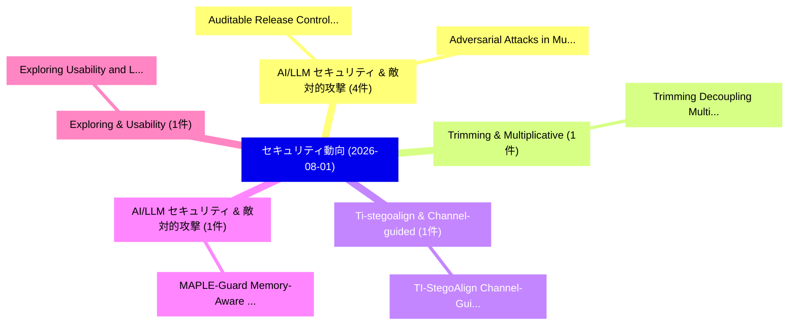

# 📅 02_daily: 日次エグゼクティブサマリー報告書 (2026-08-01)

**集計日時**: 2026-10-02 23:06:21 UTC  
**対象日付**: 2026-08-01  
**本日収集論文数**: 25 件  

---

## 💡 主要セキュリティ動向・脅威インサイト (Executive Insights)

本日の収集論文（計 25 件）において、以下の重点セキュリティ領域で活発な研究動向が確認されました：
- **AI/LLM セキュリティ & 敵対的攻撃** (4 件): 注目論文として 「Auditable Release Control for ...」、「Adversarial Attacks in Multi-A...」 等が発表され、実務防御および攻撃検証の進展が見られます。
- **Trimming & Multiplicative** (1 件): 注目論文として 「Trimming: Decoupling Multiplic...」 等が発表され、実務防御および攻撃検証の進展が見られます。
- **Ti-stegoalign & Channel-guided** (1 件): 注目論文として 「TI-StegoAlign: Channel-Guided ...」 等が発表され、実務防御および攻撃検証の進展が見られます。
- **AI/LLM セキュリティ & 敵対的攻撃** (1 件): 注目論文として 「MAPLE-Guard: Memory-Aware Link...」 等が発表され、実務防御および攻撃検証の進展が見られます。
- **Exploring & Usability** (1 件): 注目論文として 「Exploring Usability and Legal ...」 等が発表され、実務防御および攻撃検証の進展が見られます。

### 🗺️ 技術・脅威トピックマインドマップ

---

## 📌 日次セキュリティ論文一覧 (日本語表形式)

| No | arXiv ID | 論文タイトル (日本語訳) | 重要キーワード | 構造化エグゼクティブ要約 (背景・提案・影響) | 脅威分類 | 詳細リンク |
|---|---|---|---|---|---|---|
| 1 | `2608.00375v1` | [Trimming: Decoupling Multiplicative Depth from Modulus Chains in RNS-CKKS via Rational Levels（セキュリティ分析論文）](../../okf/papers/2026-08-01/2608.00375.md) | `Decoupling Multiplicative Depth`, `Modulus Chains`, `Rational Levels` | 【提案】概要 (Overview & Key Finding) 本論文「Trimming: Decoupling Multiplicative Depth from Modulus ...。実証評価により経営層・セキュリティ管理者向け推奨アクション (E... | `arXiv` | [arXiv](https://arxiv.org/abs/2608.00375v1) &#124; [OKF](../../okf/papers/2026-08-01/2608.00375.md) |
| 2 | `2608.00382v1` | [TI-StegoAlign: Channel-Guided Post-Training for Generative Text Steganography under Tokenization Inconsistency（セキュリティ分析論文）](../../okf/papers/2026-08-01/2608.00382.md) | `Generative Text Steganography`, `Guided Post`, `Channel-Guided Post` | 【提案】概要 (Overview & Key Finding) 本論文「TI-StegoAlign: Channel-Guided Post-Training for Generat...。実証評価により経営層・セキュリティ管理者向け推奨アクション (E... | `arXiv` | [arXiv](https://arxiv.org/abs/2608.00382v1) &#124; [OKF](../../okf/papers/2026-08-01/2608.00382.md) |
| 3 | `2608.00426v1` | [MAPLE-Guard: Memory-Aware Link Enforcement Against Memory-Link Poisoning in Multi-Agent Systems（セキュリティ分析論文）](../../okf/papers/2026-08-01/2608.00426.md) | `Memory-Aware Link`, `Link Poisoning`, `Agent Systems` | 【提案】概要 (Overview & Key Finding) 本論文「MAPLE-Guard: Memory-Aware Link Enforcement Against Memo...。実証評価により経営層・セキュリティ管理者向け推奨アクション (E... | `arXiv` | [arXiv](https://arxiv.org/abs/2608.00426v1) &#124; [OKF](../../okf/papers/2026-08-01/2608.00426.md) |
| 4 | `2608.00515v1` | [Auditable Release Control for Pedagogical Leakage in LLM Tutors（セキュリティ分析論文）](../../okf/papers/2026-08-01/2608.00515.md) | `Auditable Release Control`, `Pedagogical Leakage`, `Nizam Kadir` | 【提案】概要 (Overview & Key Finding) 本論文「Auditable Release Control for Pedagogical Leakage in LL...。実証評価により経営層・セキュリティ管理者向け推奨アクション (E... | `arXiv` | [arXiv](https://arxiv.org/abs/2608.00515v1) &#124; [OKF](../../okf/papers/2026-08-01/2608.00515.md) |
| 5 | `2608.00541v1` | [Exploring Usability and Legal Practice: Insights from German Judicial Users of Digital Forensics（セキュリティ分析論文）](../../okf/papers/2026-08-01/2608.00541.md) | `German Judicial Users`, `Exploring Usability`, `Legal Practice` | 【提案】概要 (Overview & Key Finding) 本論文「Exploring Usability and Legal Practice: Insights from G...。実証評価により経営層・セキュリティ管理者向け推奨アクション (E... | `arXiv` | [arXiv](https://arxiv.org/abs/2608.00541v1) &#124; [OKF](../../okf/papers/2026-08-01/2608.00541.md) |
| 6 | `2608.00543v1` | [Robust Watermarks Meet Backdoored Models: Evading Diffusion Semantic Watermarks via Stealthy Backdoor（セキュリティ分析論文）](../../okf/papers/2026-08-01/2608.00543.md) | `Robust Watermarks Meet Backdoored Models`, `Evading Diffusion Semantic Watermarks`, `Stealthy Backdoor` | 【提案】概要 (Overview & Key Finding) 本論文「Robust Watermarks Meet Backdoored Models: Evading Diffu...。実証評価により経営層・セキュリティ管理者向け推奨アクション (E... | `arXiv` | [arXiv](https://arxiv.org/abs/2608.00543v1) &#124; [OKF](../../okf/papers/2026-08-01/2608.00543.md) |
| 7 | `2608.00583v1` | [A False Average: Chain-of-Thought Monitors Collapse Where They Are the Only Defense（セキュリティ分析論文）](../../okf/papers/2026-08-01/2608.00583.md) | `False Average`, `Shikhar Shiromani`, `Leo Richter` | 【提案】概要 (Overview & Key Finding) 本論文「A False Average: Chain-of-Thought Monitors Collapse Whe...。実証評価により経営層・セキュリティ管理者向け推奨アクション (E... | `arXiv` | [arXiv](https://arxiv.org/abs/2608.00583v1) &#124; [OKF](../../okf/papers/2026-08-01/2608.00583.md) |
| 8 | `2608.00643v1` | [Domain Decoupling Attack: Exploiting the Validation Gap Between Protective DNS and Shared Edge Routing（セキュリティ分析論文）](../../okf/papers/2026-08-01/2608.00643.md) | `Domain Decoupling Attack`, `Shared Edge Routing`, `Weizhe Wang` | 【提案】概要 (Overview & Key Finding) 本論文「Domain Decoupling Attack: Exploiting the Validation Gap...。実証評価により経営層・セキュリティ管理者向け推奨アクション (E... | `arXiv` | [arXiv](https://arxiv.org/abs/2608.00643v1) &#124; [OKF](../../okf/papers/2026-08-01/2608.00643.md) |
| 9 | `2608.00660v1` | [Improving the Security of Containerized Workloads using Transparency and Traceability Services（セキュリティ分析論文）](../../okf/papers/2026-08-01/2608.00660.md) | `Containerized Workloads`, `Traceability Services`, `Nikos Fotiou` | 【提案】概要 (Overview & Key Finding) 本論文「Improving the Security of Containerized Workloads using...。実証評価により経営層・セキュリティ管理者向け推奨アクション (E... | `arXiv` | [arXiv](https://arxiv.org/abs/2608.00660v1) &#124; [OKF](../../okf/papers/2026-08-01/2608.00660.md) |
| 10 | `2608.00672v1` | [From Chasing Ghosts to Missed Attacks: Perspectives and Perceptions of SOC Practitioners on LLM Integration, Risks, and Readiness（セキュリティ分析論文）](../../okf/papers/2026-08-01/2608.00672.md) | `Missed Attacks`, `Stefan Albert Horstmann`, `Jonas Thurner` | 【提案】概要 (Overview & Key Finding) 本論文「From Chasing Ghosts to Missed Attacks: Perspectives and...。実証評価により経営層・セキュリティ管理者向け推奨アクション (E... | `arXiv` | [arXiv](https://arxiv.org/abs/2608.00672v1) &#124; [OKF](../../okf/papers/2026-08-01/2608.00672.md) |
| 11 | `2608.00698v1` | [Supporting サイバーセキュリティ Risk Management for Medical Devices via the SECUMAN Ontology and Shapes](../../okf/papers/2026-08-01/2608.00698.md) | `Medical Devices`, `Supporting Cybersecurity Risk Management`, `Risk Management` | 【提案】概要 (Overview & Key Finding) 本論文「Supporting サイバーセキュリティ Risk Management for Medical Devic...。実証評価により経営層・セキュリティ管理者向け推奨アクション (E... | `arXiv` | [arXiv](https://arxiv.org/abs/2608.00698v1) &#124; [OKF](../../okf/papers/2026-08-01/2608.00698.md) |
| 12 | `2608.00718v1` | [Adversarial Attacks in Multi-Agent LLM Pipelines: Unveiling Structural Vulnerabilities in Agentic AI Architectures（セキュリティ分析論文）](../../okf/papers/2026-08-01/2608.00718.md) | `Unveiling Structural Vulnerabilities`, `Adversarial Attacks`, `Multi-Agent LLM` | 【提案】概要 (Overview & Key Finding) 本論文「敵対的攻撃s in Multi-Agent LLM Pipelines: Unveiling Structur...。実証評価により経営層・セキュリティ管理者向け推奨アクション (E... | `arXiv` | [arXiv](https://arxiv.org/abs/2608.00718v1) &#124; [OKF](../../okf/papers/2026-08-01/2608.00718.md) |
| 13 | `2608.00747v2` | [When Prompts Control Robots: Prompt Injection Attacks in Multi-Agent Robotic Systems（セキュリティ分析論文）](../../okf/papers/2026-08-01/2608.00747.md) | `Prompt Injection Attacks`, `Agent Robotic Systems`, `Multi-Agent Robotic` | 【提案】概要 (Overview & Key Finding) 本論文「When Prompts Control Robots: プロンプトインジェクション Attacks in M...。実証評価により経営層・セキュリティ管理者向け推奨アクション (E... | `arXiv` | [arXiv](https://arxiv.org/abs/2608.00747v2) &#124; [OKF](../../okf/papers/2026-08-01/2608.00747.md) |
| 14 | `2608.00783v1` | [Safety Invariants for Agents Orchestrating Irreversible State Transitions: A Four-Dimensional Formalism Evaluated on Public Ledgers（セキュリティ分析論文）](../../okf/papers/2026-08-01/2608.00783.md) | `Agents Orchestrating Irreversible State Transitions`, `Safety Invariants`, `Public Ledgers` | 【提案】概要 (Overview & Key Finding) 本論文「Safety Invariants for Agents Orchestrating Irreversible...。実証評価により経営層・セキュリティ管理者向け推奨アクション (E... | `arXiv` | [arXiv](https://arxiv.org/abs/2608.00783v1) &#124; [OKF](../../okf/papers/2026-08-01/2608.00783.md) |
| 15 | `2608.00801v1` | [Hardware-rooted attestation for AI-agent evidence: composing IETF RATS with action evidence packages（セキュリティ分析論文）](../../okf/papers/2026-08-01/2608.00801.md) | `Hardware-rooted attestation`, `AI-agent evidence`, `Anton Sokolov` | 【提案】概要 (Overview & Key Finding) 本論文「Hardware-rooted attestation for AI-agent evidence: comp...。実証評価により経営層・セキュリティ管理者向け推奨アクション (E... | `arXiv` | [arXiv](https://arxiv.org/abs/2608.00801v1) &#124; [OKF](../../okf/papers/2026-08-01/2608.00801.md) |
| 16 | `2608.00826v1` | [XR-PRISM: Data-Driven Privacy and Risk Impact Scoring Metric for Extended Reality in Healthcare（セキュリティ分析論文）](../../okf/papers/2026-08-01/2608.00826.md) | `Risk Impact Scoring Metric`, `Driven Privacy`, `Data-Driven Privacy` | 【提案】概要 (Overview & Key Finding) 本論文「XR-PRISM: Data-Driven Privacy and Risk Impact Scoring M...。実証評価により経営層・セキュリティ管理者向け推奨アクション (E... | `arXiv` | [arXiv](https://arxiv.org/abs/2608.00826v1) &#124; [OKF](../../okf/papers/2026-08-01/2608.00826.md) |
| 17 | `2608.00869v1` | [Explainable Hybrid Feature Selection for Intrusion Detection in Internet of Medical Things Environments（セキュリティ分析論文）](../../okf/papers/2026-08-01/2608.00869.md) | `Explainable Hybrid Feature Selection`, `Medical Things Environments`, `Intrusion Detection` | 【提案】概要 (Overview & Key Finding) 本論文「Explainable Hybrid Feature Selection for Intrusion Dete...。実証評価により経営層・セキュリティ管理者向け推奨アクション (E... | `arXiv` | [arXiv](https://arxiv.org/abs/2608.00869v1) &#124; [OKF](../../okf/papers/2026-08-01/2608.00869.md) |
| 18 | `2608.00872v1` | [Similarity Weighted Aggregation with Global Differential Privacy for Federated Brain Lesion Segmentation（セキュリティ分析論文）](../../okf/papers/2026-08-01/2608.00872.md) | `Federated Brain Lesion Segmentation`, `Similarity Weighted Aggregation`, `Global Differential Privacy` | 【提案】概要 (Overview & Key Finding) 本論文「Similarity Weighted Aggregation with Global 差分プライバシー fo...。実証評価により経営層・セキュリティ管理者向け推奨アクション (E... | `arXiv` | [arXiv](https://arxiv.org/abs/2608.00872v1) &#124; [OKF](../../okf/papers/2026-08-01/2608.00872.md) |
| 19 | `2608.00882v1` | [Assuming You Knew: Fixing an Epistemic Semantics for Flow Policies Using Agentic AI（セキュリティ分析論文）](../../okf/papers/2026-08-01/2608.00882.md) | `Flow Policies Using Agentic`, `Epistemic Semantics`, `Raw Meta` | 【提案】概要 (Overview & Key Finding) 本論文「Assuming You Knew: Fixing an Epistemic Semantics for Fl...。実証評価により経営層・セキュリティ管理者向け推奨アクション (E... | `arXiv` | [arXiv](https://arxiv.org/abs/2608.00882v1) &#124; [OKF](../../okf/papers/2026-08-01/2608.00882.md) |
| 20 | `2608.00895v1` | [Multi-LLM Consensus Framework for Evaluating Banking-Sector NIDS Dataset Coverage of MITRE ATT&CK Techniques（セキュリティ分析論文）](../../okf/papers/2026-08-01/2608.00895.md) | `Multi-LLM Consensus`, `Evaluating Banking`, `Dataset Coverage` | 【提案】概要 (Overview & Key Finding) 本論文「Multi-LLM Consensus Framework for Evaluating Banking-Se...。実証評価により経営層・セキュリティ管理者向け推奨アクション (E... | `arXiv` | [arXiv](https://arxiv.org/abs/2608.00895v1) &#124; [OKF](../../okf/papers/2026-08-01/2608.00895.md) |
| 21 | `2608.02656v1` | [Secure AI Watermarking Framework for IP Protection in Multi-Tenant Cloud Platforms（セキュリティ分析論文）](../../okf/papers/2026-08-01/2608.02656.md) | `Tenant Cloud Platforms`, `Multi-Tenant Cloud`, `Kishor Kumar Gajula` | 【提案】概要 (Overview & Key Finding) 本論文「Secure AI Watermarking Framework for IP Protection in M...。実証評価により経営層・セキュリティ管理者向け推奨アクション (E... | `arXiv` | [arXiv](https://arxiv.org/abs/2608.02656v1) &#124; [OKF](../../okf/papers/2026-08-01/2608.02656.md) |
| 22 | `2608.02657v1` | [Your Agentic LLMs Secretly Encode Latent Signals of Indirect Prompt-Injection Exposure（セキュリティ分析論文）](../../okf/papers/2026-08-01/2608.02657.md) | `Secretly Encode Latent Signals`, `Indirect Prompt`, `Injection Exposure` | 【提案】概要 (Overview & Key Finding) 本論文「Your Agentic LLMs Secretly Encode Latent Signals of Ind...。実証評価により経営層・セキュリティ管理者向け推奨アクション (E... | `arXiv` | [arXiv](https://arxiv.org/abs/2608.02657v1) &#124; [OKF](../../okf/papers/2026-08-01/2608.02657.md) |
| 23 | `2608.02664v1` | [ZK-SR117: A Chunked Zero-Knowledge Attestation Design for Aggregated Fair-Lending Metrics, with a Control Mapping toward Full SR 11-7 Coverage（セキュリティ分析論文）](../../okf/papers/2026-08-01/2608.02664.md) | `Knowledge Attestation Design`, `Chunked Zero`, `Aggregated Fair` | 【提案】概要 (Overview & Key Finding) 本論文「ZK-SR117: A Chunked Zero-Knowledge Attestation Design f...。実証評価により経営層・セキュリティ管理者向け推奨アクション (E... | `arXiv` | [arXiv](https://arxiv.org/abs/2608.02664v1) &#124; [OKF](../../okf/papers/2026-08-01/2608.02664.md) |
| 24 | `2608.02665v1` | [Single Canonical Prompts Underestimate LLM Safety's Surface-Form Sensitivity（セキュリティ分析論文）](../../okf/papers/2026-08-01/2608.02665.md) | `Single Canonical Prompts Underestimate`, `Form Sensitivity`, `Surface-Form Sensitivity` | 【提案】概要 (Overview & Key Finding) 本論文「Single Canonical Prompts Underestimate LLM Safety's Sur...。実証評価により経営層・セキュリティ管理者向け推奨アクション (E... | `arXiv` | [arXiv](https://arxiv.org/abs/2608.02665v1) &#124; [OKF](../../okf/papers/2026-08-01/2608.02665.md) |
| 25 | `2608.04029v1` | [Contrastive mmWave-based Human Activity Recognition against Adversarial Label Flippingのセキュリティ強化](../../okf/papers/2026-08-01/2608.04029.md) | `Human Activity Recognition`, `mmWave-based Human`, `Securing Contrastive` | 【提案】概要 (Overview & Key Finding) 本論文「Contrastive mmWave-based Human Activity Recognition aga...。実証評価により経営層・セキュリティ管理者向け推奨アクション (E... | `arXiv` | [arXiv](https://arxiv.org/abs/2608.04029v1) &#124; [OKF](../../okf/papers/2026-08-01/2608.04029.md) |

