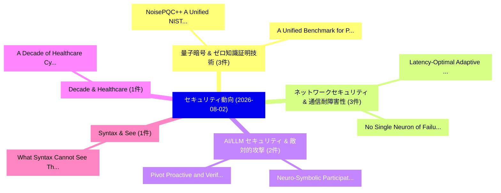

# 📅 02_daily: 日次エグゼクティブサマリー報告書 (2026-08-02)

**集計日時**: 2026-10-02 23:06:21 UTC  
**対象日付**: 2026-08-02  
**本日収集論文数**: 27 件  

---

## 💡 主要セキュリティ動向・脅威インサイト (Executive Insights)

本日の収集論文（計 27 件）において、以下の重点セキュリティ領域で活発な研究動向が確認されました：
- **量子暗号 & ゼロ知識証明技術** (3 件): 注目論文として 「NoisePQC++: A Unified NIST-Com...」、「A Unified Benchmark for Privac...」 等が発表され、実務防御および攻撃検証の進展が見られます。
- **ネットワークセキュリティ & 通信耐障害性** (3 件): 注目論文として 「Latency-Optimal Adaptive Split...」、「No Single Neuron of Failure: D...」 等が発表され、実務防御および攻撃検証の進展が見られます。
- **AI/LLM セキュリティ & 敵対的攻撃** (2 件): 注目論文として 「Neuro-Symbolic Participation G...」、「Pivot: Proactive and Verifiabl...」 等が発表され、実務防御および攻撃検証の進展が見られます。
- **Decade & Healthcare** (1 件): 注目論文として 「A Decade of Healthcare Cyber T...」 等が発表され、実務防御および攻撃検証の進展が見られます。
- **Syntax & See** (1 件): 注目論文として 「What Syntax Cannot See: The Dy...」 等が発表され、実務防御および攻撃検証の進展が見られます。

### 🗺️ 技術・脅威トピックマインドマップ

---

## 📌 日次セキュリティ論文一覧 (日本語表形式)

| No | arXiv ID | 論文タイトル (日本語訳) | 重要キーワード | 構造化エグゼクティブ要約 (背景・提案・影響) | 脅威分類 | 詳細リンク |
|---|---|---|---|---|---|---|
| 1 | `2608.00901v1` | [A Decade of Healthcare Cyber Threats: Empirical Analysis, Evidence-Based Prioritisation, and AI Threat Model（セキュリティ分析論文）](../../okf/papers/2026-08-02/2608.00901.md) | `Healthcare Cyber Threats`, `Based Prioritisation`, `Threat Model` | 【提案】概要 (Overview & Key Finding) 本論文「A Decade of Healthcare Cyber Threats: Empirical Analysi...。実証評価により経営層・セキュリティ管理者向け推奨アクション (E... | `arXiv` | [arXiv](https://arxiv.org/abs/2608.00901v1) &#124; [OKF](../../okf/papers/2026-08-02/2608.00901.md) |
| 2 | `2608.00937v1` | [Neuro-Symbolic Participation Governance for Verifiable AI Agents in Open Digital Twin Ecosystems（セキュリティ分析論文）](../../okf/papers/2026-08-02/2608.00937.md) | `Open Digital Twin Ecosystems`, `Symbolic Participation Governance`, `Neuro-Symbolic Participation` | 【提案】概要 (Overview & Key Finding) 本論文「Neuro-Symbolic Participation Governance for Verifiable ...。実証評価により経営層・セキュリティ管理者向け推奨アクション (E... | `arXiv` | [arXiv](https://arxiv.org/abs/2608.00937v1) &#124; [OKF](../../okf/papers/2026-08-02/2608.00937.md) |
| 3 | `2608.00954v1` | [NoisePQC++: A Unified NIST-Compliant PQC and Hybrid-PQC Implementation of the Noise Protocol（セキュリティ分析論文）](../../okf/papers/2026-08-02/2608.00954.md) | `Noise Protocol`, `NIST-Compliant PQC`, `Hybrid-PQC Implementation` | 【提案】概要 (Overview & Key Finding) 本論文「NoisePQC++: A Unified NIST-Compliant PQC and Hybrid-PQC...。実証評価により経営層・セキュリティ管理者向け推奨アクション (E... | `arXiv` | [arXiv](https://arxiv.org/abs/2608.00954v1) &#124; [OKF](../../okf/papers/2026-08-02/2608.00954.md) |
| 4 | `2608.00958v1` | [What Syntax Cannot See: The Dynamic Syntactic Invariance Principle and Several Instances of the Same Hidden Assumption, and a Contradiction（セキュリティ分析論文）](../../okf/papers/2026-08-02/2608.00958.md) | `Several Instances`, `Raw Meta`, `Executive Summar` | 【提案】背景とセキュリティ上の課題 (Background & Problem) 本研究はサイバー脅威環境におけるセキュリティ構造・脆弱性の検証を目的としています。(主要検出項目: ...。実証評価により経営層・セキュリティ管理者向け推奨アクション (E... | `arXiv` | [arXiv](https://arxiv.org/abs/2608.00958v1) &#124; [OKF](../../okf/papers/2026-08-02/2608.00958.md) |
| 5 | `2608.00965v1` | [An AI Approach to Verified Production Cryptographic Libraries（セキュリティ分析論文）](../../okf/papers/2026-08-02/2608.00965.md) | `Verified Production Cryptographic Libraries`, `Chuyue Sun`, `Su Fong` | 【提案】概要 (Overview & Key Finding) 本論文「An AI Approach to Verified Production Cryptographic Lib...。実証評価により経営層・セキュリティ管理者向け推奨アクション (E... | `arXiv` | [arXiv](https://arxiv.org/abs/2608.00965v1) &#124; [OKF](../../okf/papers/2026-08-02/2608.00965.md) |
| 6 | `2608.00997v2` | [Registry Descriptions Go Stale Unevenly: An 89-Day Measurement of Model Context Protocol Drift, and Why Drift-Ranked Re-Auditing Under-Covers It（セキュリティ分析論文）](../../okf/papers/2026-08-02/2608.00997.md) | `Registry Descriptions Go Stale Unevenly`, `Model Context Protocol Drift`, `Day Measurement` | 【提案】概要 (Overview & Key Finding) 本論文「Registry Descriptions Go Stale Unevenly: An 89-Day Meas...。実証評価により経営層・セキュリティ管理者向け推奨アクション (E... | `arXiv` | [arXiv](https://arxiv.org/abs/2608.00997v2) &#124; [OKF](../../okf/papers/2026-08-02/2608.00997.md) |
| 7 | `2608.01001v1` | [From AI Technical Debt to Agentic Technical Debt: A Systematic Mapping of Root Causes and Manifestations in Agentic AI Systems（セキュリティ分析論文）](../../okf/papers/2026-08-02/2608.01001.md) | `Agentic Technical Debt`, `Technical Debt`, `Systematic Mapping` | 【提案】概要 (Overview & Key Finding) 本論文「From AI Technical Debt to Agentic Technical Debt: A Sys...。実証評価により経営層・セキュリティ管理者向け推奨アクション (E... | `arXiv` | [arXiv](https://arxiv.org/abs/2608.01001v1) &#124; [OKF](../../okf/papers/2026-08-02/2608.01001.md) |
| 8 | `2608.01020v1` | [Inverting the Hidden: Unveiling Multimodal Privacy Leakage in Collaborative LVLM Inference（セキュリティ分析論文）](../../okf/papers/2026-08-02/2608.01020.md) | `Unveiling Multimodal Privacy Leakage`, `Shuaifan Jin`, `Zhibo Wang` | 【提案】概要 (Overview & Key Finding) 本論文「Inverting the Hidden: Unveiling Multimodal Privacy Leak...。実証評価により経営層・セキュリティ管理者向け推奨アクション (E... | `arXiv` | [arXiv](https://arxiv.org/abs/2608.01020v1) &#124; [OKF](../../okf/papers/2026-08-02/2608.01020.md) |
| 9 | `2608.01033v1` | [CallScreenBench: On-Device Models as Phone Secretariesのベンチマーク評価](../../okf/papers/2026-08-02/2608.01033.md) | `Device Models`, `On-Device Models`, `Phone Secretaries` | 【提案】概要 (Overview & Key Finding) 本論文「CallScreenBench: On-Device Models as Phone Secretariesの...。実証評価により経営層・セキュリティ管理者向け推奨アクション (E... | `arXiv` | [arXiv](https://arxiv.org/abs/2608.01033v1) &#124; [OKF](../../okf/papers/2026-08-02/2608.01033.md) |
| 10 | `2608.01043v2` | [Decoy Images Amplify Caption-Mediated Defenses Against Encoded Jailbreaks（セキュリティ分析論文）](../../okf/papers/2026-08-02/2608.01043.md) | `Decoy Images Amplify Caption`, `Caption-Mediated Defenses`, `Haoyu Zhang` | 【提案】概要 (Overview & Key Finding) 本論文「Decoy Images Amplify Caption-Mediated Defenses Against ...。実証評価により経営層・セキュリティ管理者向け推奨アクション (E... | `arXiv` | [arXiv](https://arxiv.org/abs/2608.01043v2) &#124; [OKF](../../okf/papers/2026-08-02/2608.01043.md) |
| 11 | `2608.01117v1` | [SoK: Intent-Oriented Systematization of Multi-Turn LLM Jailbreaks（セキュリティ分析論文）](../../okf/papers/2026-08-02/2608.01117.md) | `Oriented Systematization`, `Intent-Oriented Systematization`, `Multi-Turn LLM` | 【提案】概要 (Overview & Key Finding) 本論文「SoK: Intent-Oriented Systematization of Multi-Turn LLM ...。実証評価により経営層・セキュリティ管理者向け推奨アクション (E... | `arXiv` | [arXiv](https://arxiv.org/abs/2608.01117v1) &#124; [OKF](../../okf/papers/2026-08-02/2608.01117.md) |
| 12 | `2608.01148v1` | [Latency-Optimal Adaptive Split Inference for Privacy-Preserving Cloud-Edge-End Collaboration（セキュリティ分析論文）](../../okf/papers/2026-08-02/2608.01148.md) | `Optimal Adaptive Split Inference`, `Latency-Optimal Adaptive`, `Preserving Cloud` | 【提案】概要 (Overview & Key Finding) 本論文「Latency-Optimal Adaptive Split Inference for Privacy-Pr...。実証評価により経営層・セキュリティ管理者向け推奨アクション (E... | `arXiv` | [arXiv](https://arxiv.org/abs/2608.01148v1) &#124; [OKF](../../okf/papers/2026-08-02/2608.01148.md) |
| 13 | `2608.01192v1` | [A Unified Benchmark for Privacy-preserving Vector Search（セキュリティ分析論文）](../../okf/papers/2026-08-02/2608.01192.md) | `Unified Benchmark`, `Vector Search`, `Privacy-preserving Vector` | 【提案】概要 (Overview & Key Finding) 本論文「A Unified Benchmark for Privacy-preserving Vector Searc...。実証評価により経営層・セキュリティ管理者向け推奨アクション (E... | `arXiv` | [arXiv](https://arxiv.org/abs/2608.01192v1) &#124; [OKF](../../okf/papers/2026-08-02/2608.01192.md) |
| 14 | `2608.01197v1` | [Reputation-driven Cooperation in Lattice-based Decentralized 連合学習 through Evolutionary Game Theory](../../okf/papers/2026-08-02/2608.01197.md) | `Evolutionary Game Theory`, `Reputation-driven Cooperation`, `Lattice-based Decentralized` | 【提案】概要 (Overview & Key Finding) 本論文「Reputation-driven Cooperation in Lattice-based Decentra...。実証評価により経営層・セキュリティ管理者向け推奨アクション (E... | `arXiv` | [arXiv](https://arxiv.org/abs/2608.01197v1) &#124; [OKF](../../okf/papers/2026-08-02/2608.01197.md) |
| 15 | `2608.01373v1` | [The Boy Who Cried Wolf: Adversarial Misclassification of Safe Inputs as Unsafe in Multimodal Guardrails（セキュリティ分析論文）](../../okf/papers/2026-08-02/2608.01373.md) | `Adversarial Misclassification`, `Safe Inputs`, `Multimodal Guardrails` | 【提案】概要 (Overview & Key Finding) 本論文「The Boy Who Cried Wolf: Adversarial Misclassification o...。実証評価により経営層・セキュリティ管理者向け推奨アクション (E... | `arXiv` | [arXiv](https://arxiv.org/abs/2608.01373v1) &#124; [OKF](../../okf/papers/2026-08-02/2608.01373.md) |
| 16 | `2608.01375v1` | [AdaptoNet: Modular Foundation-Adaptive Neural Networks for Cyber-Physical Attack Detection in Power Grids（セキュリティ分析論文）](../../okf/papers/2026-08-02/2608.01375.md) | `Adaptive Neural Networks`, `Physical Attack Detection`, `Modular Foundation` | 【提案】概要 (Overview & Key Finding) 本論文「AdaptoNet: Modular Foundation-Adaptive Neural Networks ...。実証評価により経営層・セキュリティ管理者向け推奨アクション (E... | `arXiv` | [arXiv](https://arxiv.org/abs/2608.01375v1) &#124; [OKF](../../okf/papers/2026-08-02/2608.01375.md) |
| 17 | `2608.01388v1` | [Why Formal Monitors Fail: Attack Distribution Entropy as a Coverage Bound for LTL-Based LLM Agent Safety（セキュリティ分析論文）](../../okf/papers/2026-08-02/2608.01388.md) | `Attack Distribution Entropy`, `Coverage Bound`, `Agent Safety` | 【提案】概要 (Overview & Key Finding) 本論文「Why Formal Monitors Fail: Attack Distribution Entropy a...。実証評価により経営層・セキュリティ管理者向け推奨アクション (E... | `arXiv` | [arXiv](https://arxiv.org/abs/2608.01388v1) &#124; [OKF](../../okf/papers/2026-08-02/2608.01388.md) |
| 18 | `2608.01390v1` | [Pivot: Proactive and Verifiable Threshold Oblivious Pseudorandom Functions From Isogeny Group Actions（セキュリティ分析論文）](../../okf/papers/2026-08-02/2608.01390.md) | `Abhinav Sharma`, `Vikas Srivastava`, `Raw Meta` | 【提案】概要 (Overview & Key Finding) 本論文「Pivot: Proactive and Verifiable Threshold Oblivious Pse...。実証評価により経営層・セキュリティ管理者向け推奨アクション (E... | `arXiv` | [arXiv](https://arxiv.org/abs/2608.01390v1) &#124; [OKF](../../okf/papers/2026-08-02/2608.01390.md) |
| 19 | `2608.01414v1` | [No Single Neuron of Failure: Distributed Safety Alignment Against White-Box Attacks（セキュリティ分析論文）](../../okf/papers/2026-08-02/2608.01414.md) | `Box Attacks`, `White-Box Attacks`, `Simiao Xie` | 【提案】概要 (Overview & Key Finding) 本論文「No Single Neuron of Failure: Distributed Safety Alignme...。実証評価により経営層・セキュリティ管理者向け推奨アクション (E... | `arXiv` | [arXiv](https://arxiv.org/abs/2608.01414v1) &#124; [OKF](../../okf/papers/2026-08-02/2608.01414.md) |
| 20 | `2608.01454v2` | [How Benchmarks and Evaluation Protocols Shape Conclusions in Provenance-Based Intrusion Detection（セキュリティ分析論文）](../../okf/papers/2026-08-02/2608.01454.md) | `Based Intrusion Detection`, `Provenance-Based Intrusion`, `Lorenzo Guerra` | 【提案】概要 (Overview & Key Finding) 本論文「How Benchmarks and Evaluation Protocols Shape Conclusio...。実証評価により経営層・セキュリティ管理者向け推奨アクション (E... | `Privacy & Provenance` | [arXiv](https://arxiv.org/abs/2608.01454v2) &#124; [OKF](../../okf/papers/2026-08-02/2608.01454.md) |
| 21 | `2608.01539v1` | [SP2UBI: Secure and Privacy-Preserving Usage-Based Insurance（セキュリティ分析論文）](../../okf/papers/2026-08-02/2608.01539.md) | `Preserving Usage`, `Based Insurance`, `Privacy-Preserving Usage` | 【提案】概要 (Overview & Key Finding) 本論文「SP2UBI: Secure and Privacy-Preserving Usage-Based Insur...。実証評価により経営層・セキュリティ管理者向け推奨アクション (E... | `arXiv` | [arXiv](https://arxiv.org/abs/2608.01539v1) &#124; [OKF](../../okf/papers/2026-08-02/2608.01539.md) |
| 22 | `2608.02669v1` | [Vulnerabilities, Secrets and Misconfiguration in the Highest-Exposure Docker Hub Images（セキュリティ分析論文）](../../okf/papers/2026-08-02/2608.02669.md) | `Exposure Docker Hub Images`, `Highest-Exposure Docker`, `Cristhian Kapelinski` | 【提案】概要 (Overview & Key Finding) 本論文「Vulnerabilities, Secrets and Misconfiguration in the Hi...。実証評価により経営層・セキュリティ管理者向け推奨アクション (E... | `arXiv` | [arXiv](https://arxiv.org/abs/2608.02669v1) &#124; [OKF](../../okf/papers/2026-08-02/2608.02669.md) |
| 23 | `2608.02670v1` | [Permission Denied: Policy-Graded Evaluation of Coding Agents in Hardened Environments（セキュリティ分析論文）](../../okf/papers/2026-08-02/2608.02670.md) | `Permission Denied`, `Coding Agents`, `Hardened Environments` | 【提案】概要 (Overview & Key Finding) 本論文「Permission Denied: Policy-Graded Evaluation of Coding A...。実証評価により経営層・セキュリティ管理者向け推奨アクション (E... | `arXiv` | [arXiv](https://arxiv.org/abs/2608.02670v1) &#124; [OKF](../../okf/papers/2026-08-02/2608.02670.md) |
| 24 | `2608.02671v1` | [On the Performance of マルウェア検出 Classifiers Using Hardware Performance Counters](../../okf/papers/2026-08-02/2608.02671.md) | `Classifiers Using Hardware Performance Counters`, `Malware Detection Classifiers Using Hardware Performance Counters`, `Malware Detection Classifiers Using Hardwa` | 【提案】概要 (Overview & Key Finding) 本論文「On the Performance of マルウェア検出 Classifiers Using Hardwar...。実証評価により経営層・セキュリティ管理者向け推奨アクション (E... | `arXiv` | [arXiv](https://arxiv.org/abs/2608.02671v1) &#124; [OKF](../../okf/papers/2026-08-02/2608.02671.md) |
| 25 | `2608.02672v1` | [Security-First Evaluation of Text-to-Terraform: LLMs and SLMs for Secure IaC Generationのベンチマーク評価](../../okf/papers/2026-08-02/2608.02672.md) | `Francis Luis Santos Vargas`, `Diego Kreutz`, `Raw Meta` | 【提案】概要 (Overview & Key Finding) 本論文「Security-First Evaluation of Text-to-Terraform: LLMs an...。実証評価により経営層・セキュリティ管理者向け推奨アクション (E... | `arXiv` | [arXiv](https://arxiv.org/abs/2608.02672v1) &#124; [OKF](../../okf/papers/2026-08-02/2608.02672.md) |
| 26 | `2608.02674v1` | [Moving the Safety Barrier: Dynamic Routing Adaptive Alignment Against White-Box Attacks（セキュリティ分析論文）](../../okf/papers/2026-08-02/2608.02674.md) | `Safety Barrier`, `Box Attacks`, `White-Box Attacks` | 【提案】概要 (Overview & Key Finding) 本論文「Moving the Safety Barrier: Dynamic Routing Adaptive Ali...。実証評価により経営層・セキュリティ管理者向け推奨アクション (E... | `arXiv` | [arXiv](https://arxiv.org/abs/2608.02674v1) &#124; [OKF](../../okf/papers/2026-08-02/2608.02674.md) |
| 27 | `2608.02678v1` | [DenialRAG: Single-Document RAG Poisoning via Embedded Parametric Denial（セキュリティ分析論文）](../../okf/papers/2026-08-02/2608.02678.md) | `Embedded Parametric Denial`, `Single-Document RAG`, `Abay Zhurekbay` | 【提案】概要 (Overview & Key Finding) 本論文「DenialRAG: Single-Document RAG Poisoning via Embedded P...。実証評価により経営層・セキュリティ管理者向け推奨アクション (E... | `arXiv` | [arXiv](https://arxiv.org/abs/2608.02678v1) &#124; [OKF](../../okf/papers/2026-08-02/2608.02678.md) |

