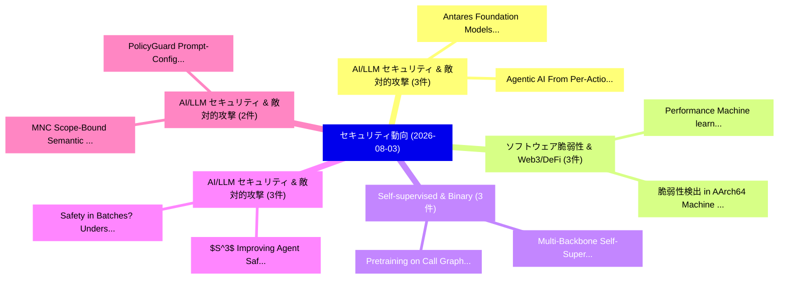

# 📅 02_daily: 日次エグゼクティブサマリー報告書 (2026-08-03)

**集計日時**: 2026-10-02 23:06:22 UTC  
**対象日付**: 2026-08-03  
**本日収集論文数**: 39 件  

---

## 💡 主要セキュリティ動向・脅威インサイト (Executive Insights)

本日の収集論文（計 39 件）において、以下の重点セキュリティ領域で活発な研究動向が確認されました：
- **AI/LLM セキュリティ & 敵対的攻撃** (3 件): 注目論文として 「Agentic AI: From Per-Action Ch...」、「Antares: Foundation Models for...」 等が発表され、実務防御および攻撃検証の進展が見られます。
- **ソフトウェア脆弱性 & Web3/DeFi** (3 件): 注目論文として 「Performance Machine learning a...」、「脆弱性検出 in AArch64 Machine Code ...」 等が発表され、実務防御および攻撃検証の進展が見られます。
- **Self-supervised & Binary** (3 件): 注目論文として 「Multi-Backbone Self-Supervised...」、「Pretraining on Call Graphs: Wh...」 等が発表され、実務防御および攻撃検証の進展が見られます。
- **AI/LLM セキュリティ & 敵対的攻撃** (3 件): 注目論文として 「Safety in Batches? Understandi...」、「$S^3$: Improving Agent Safety ...」 等が発表され、実務防御および攻撃検証の進展が見られます。
- **AI/LLM セキュリティ & 敵対的攻撃** (2 件): 注目論文として 「MNC: Scope-Bound Semantic Decl...」、「PolicyGuard: Prompt-Configurab...」 等が発表され、実務防御および攻撃検証の進展が見られます。

### 🗺️ 技術・脅威トピックマインドマップ

---

## 📌 日次セキュリティ論文一覧 (日本語表形式)

| No | arXiv ID | 論文タイトル (日本語訳) | 重要キーワード | 構造化エグゼクティブ要約 (背景・提案・影響) | 脅威分類 | 詳細リンク |
|---|---|---|---|---|---|---|
| 1 | `2608.01558v1` | [Agentic AI: From Per-Action Checks to Trajectory Assuranceのセキュリティ強化](../../okf/papers/2026-08-03/2608.01558.md) | `Action Checks`, `Per-Action Checks`, `Securing Agentic` | 【提案】概要 (Overview & Key Finding) 本論文「Agentic AI: From Per-Action Checks to Trajectory Assura...。実証評価により経営層・セキュリティ管理者向け推奨アクション (E... | `arXiv` | [arXiv](https://arxiv.org/abs/2608.01558v1) &#124; [OKF](../../okf/papers/2026-08-03/2608.01558.md) |
| 2 | `2608.01609v1` | [From Viral to Void: Multi-Dimensional Behavioral and Contractual Analysis for Rug Pull Identification（セキュリティ分析論文）](../../okf/papers/2026-08-03/2608.01609.md) | `Rug Pull Identification`, `Dimensional Behavioral`, `Multi-Dimensional Behavioral` | 【提案】概要 (Overview & Key Finding) 本論文「From Viral to Void: Multi-Dimensional Behavioral and Co...。実証評価により経営層・セキュリティ管理者向け推奨アクション (E... | `arXiv` | [arXiv](https://arxiv.org/abs/2608.01609v1) &#124; [OKF](../../okf/papers/2026-08-03/2608.01609.md) |
| 3 | `2608.01639v1` | [Mutate to Bypass: Autonomous Endpoint Evasion via Knowledge-Driven Multi-Agent Orchestration（セキュリティ分析論文）](../../okf/papers/2026-08-03/2608.01639.md) | `Autonomous Endpoint Evasion`, `Driven Multi`, `Knowledge-Driven Multi` | 【提案】概要 (Overview & Key Finding) 本論文「Mutate to Bypass: Autonomous Endpoint Evasion via Knowl...。実証評価により経営層・セキュリティ管理者向け推奨アクション (E... | `arXiv` | [arXiv](https://arxiv.org/abs/2608.01639v1) &#124; [OKF](../../okf/papers/2026-08-03/2608.01639.md) |
| 4 | `2608.01642v1` | [Performance Machine learning algorithms for predicting malwareの分析](../../okf/papers/2026-08-03/2608.01642.md) | `Performance Machine`, `Pranto Protim Choudhury`, `Muhammad Iqbal Hossain` | 【提案】概要 (Overview & Key Finding) 本論文「Performance Machine learning algorithms for predicting ...。実証評価によりAdnan Azmee, Pranto Proti... | `arXiv` | [arXiv](https://arxiv.org/abs/2608.01642v1) &#124; [OKF](../../okf/papers/2026-08-03/2608.01642.md) |
| 5 | `2608.01675v5` | [A New Characteristic-Uniform Model for Elliptic Curves -- Theory, Arithmetic, and Applications（セキュリティ分析論文）](../../okf/papers/2026-08-03/2608.01675.md) | `New Characteristic`, `Uniform Model`, `Elliptic Curves` | 【提案】概要 (Overview & Key Finding) 本論文「A New Characteristic-Uniform Model for Elliptic Curves ...。実証評価により経営層・セキュリティ管理者向け推奨アクション (E... | `Cryptography` | [arXiv](https://arxiv.org/abs/2608.01675v5) &#124; [OKF](../../okf/papers/2026-08-03/2608.01675.md) |
| 6 | `2608.01719v1` | [MNC: Scope-Bound Semantic Declassification for Private LLM-Agent Communication（セキュリティ分析論文）](../../okf/papers/2026-08-03/2608.01719.md) | `Bound Semantic Declassification`, `Agent Communication`, `Scope-Bound Semantic` | 【提案】概要 (Overview & Key Finding) 本論文「MNC: Scope-Bound Semantic Declassification for Private ...。実証評価により経営層・セキュリティ管理者向け推奨アクション (E... | `arXiv` | [arXiv](https://arxiv.org/abs/2608.01719v1) &#124; [OKF](../../okf/papers/2026-08-03/2608.01719.md) |
| 7 | `2608.01759v1` | [Benign Alone, Harmful Together: Exploiting Experience Composition in Self-Evolving LLMエージェント](../../okf/papers/2026-08-03/2608.01759.md) | `Exploiting Experience Composition`, `Benign Alone`, `Harmful Together` | 【提案】概要 (Overview & Key Finding) 本論文「Benign Alone, Harmful Together: Exploiting Experience C...。実証評価により経営層・セキュリティ管理者向け推奨アクション (E... | `arXiv` | [arXiv](https://arxiv.org/abs/2608.01759v1) &#124; [OKF](../../okf/papers/2026-08-03/2608.01759.md) |
| 8 | `2608.01763v1` | [EntailLLM: Verifying LLM-Generated Vulnerability Discovery Paths with Domain Knowledge via Logic Programming（セキュリティ分析論文）](../../okf/papers/2026-08-03/2608.01763.md) | `Generated Vulnerability Discovery Paths`, `Domain Knowledge`, `Logic Programming` | 【提案】概要 (Overview & Key Finding) 本論文「EntailLLM: Verifying LLM-Generated 脆弱性 Discovery Paths ...。実証評価により経営層・セキュリティ管理者向け推奨アクション (E... | `arXiv` | [arXiv](https://arxiv.org/abs/2608.01763v1) &#124; [OKF](../../okf/papers/2026-08-03/2608.01763.md) |
| 9 | `2608.01796v1` | [Multi-Backbone Self-Supervised Ensembles for Audio Deepfake Detection and a Cross-Track Generation-Detection Asymmetryの分析](../../okf/papers/2026-08-03/2608.01796.md) | `Audio Deepfake Detection`, `Backbone Self`, `Multi-Backbone Self` | 【提案】概要 (Overview & Key Finding) 本論文「Multi-Backbone Self-Supervised Ensembles for Audio Deep...。実証評価により経営層・セキュリティ管理者向け推奨アクション (E... | `arXiv` | [arXiv](https://arxiv.org/abs/2608.01796v1) &#124; [OKF](../../okf/papers/2026-08-03/2608.01796.md) |
| 10 | `2608.01901v1` | [GalSAS-SDR-SIM: An End-to-End Simulation Platform for Galileo Signal Authentication Service（セキュリティ分析論文）](../../okf/papers/2026-08-03/2608.01901.md) | `Galileo Signal Authentication Service`, `End Simulation Platform`, `Haiyang Wang` | 【提案】概要 (Overview & Key Finding) 本論文「GalSAS-SDR-SIM: An End-to-End Simulation Platform for G...。実証評価により経営層・セキュリティ管理者向け推奨アクション (E... | `arXiv` | [arXiv](https://arxiv.org/abs/2608.01901v1) &#124; [OKF](../../okf/papers/2026-08-03/2608.01901.md) |
| 11 | `2608.01934v1` | [Diagnosing High-Performance BFT Consensus via Mixture Modeling of Block Time Distributions（セキュリティ分析論文）](../../okf/papers/2026-08-03/2608.01934.md) | `Block Time Distributions`, `Diagnosing High`, `High-Performance BFT` | 【提案】概要 (Overview & Key Finding) 本論文「Diagnosing High-Performance BFT Consensus via Mixture M...。実証評価により経営層・セキュリティ管理者向け推奨アクション (E... | `arXiv` | [arXiv](https://arxiv.org/abs/2608.01934v1) &#124; [OKF](../../okf/papers/2026-08-03/2608.01934.md) |
| 12 | `2608.01938v1` | [D-MUTRA: DLT-based MUTual Remote Attestation for Multi-Agent Systems（セキュリティ分析論文）](../../okf/papers/2026-08-03/2608.01938.md) | `Remote Attestation`, `Agent Systems`, `DLT-based MUTual` | 【提案】概要 (Overview & Key Finding) 本論文「D-MUTRA: DLT-based MUTual Remote Attestation for Multi-...。実証評価により経営層・セキュリティ管理者向け推奨アクション (E... | `arXiv` | [arXiv](https://arxiv.org/abs/2608.01938v1) &#124; [OKF](../../okf/papers/2026-08-03/2608.01938.md) |
| 13 | `2608.02084v1` | [Pretraining on Call Graphs: When Binary Analysis Tasks Profit From Context（セキュリティ分析論文）](../../okf/papers/2026-08-03/2608.02084.md) | `Call Graphs`, `Samuel Valenzuela`, `Johannes Kinder` | 【提案】概要 (Overview & Key Finding) 本論文「Pretraining on Call Graphs: When Binary Analysis Tasks ...。実証評価により経営層・セキュリティ管理者向け推奨アクション (E... | `arXiv` | [arXiv](https://arxiv.org/abs/2608.02084v1) &#124; [OKF](../../okf/papers/2026-08-03/2608.02084.md) |
| 14 | `2608.02125v1` | [脆弱性検出 in AArch64 Machine Code Using a Digital Twin](../../okf/papers/2026-08-03/2608.02125.md) | `Machine Code Using`, `Digital Twin`, `Vulnerability Detection` | 【提案】概要 (Overview & Key Finding) 本論文「脆弱性検出 in AArch64 Machine Code Using a Digital Twin」（原題:...。実証評価により経営層・セキュリティ管理者向け推奨アクション (E... | `arXiv` | [arXiv](https://arxiv.org/abs/2608.02125v1) &#124; [OKF](../../okf/papers/2026-08-03/2608.02125.md) |
| 15 | `2608.02147v1` | [Measuring Post-Quantum TLS Deployment Across UK Internet Sectors（セキュリティ分析論文）](../../okf/papers/2026-08-03/2608.02147.md) | `Measuring Post`, `Deployment Across`, `Internet Sectors` | 【提案】概要 (Overview & Key Finding) 本論文「Measuring Post-量子 TLS Deployment Across UK Internet Sec...。実証評価により経営層・セキュリティ管理者向け推奨アクション (E... | `arXiv` | [arXiv](https://arxiv.org/abs/2608.02147v1) &#124; [OKF](../../okf/papers/2026-08-03/2608.02147.md) |
| 16 | `2608.02264v2` | [TurboRetry: Mitigating Large-Scale QUIC Handshake Floods with Off-the-Shelf DPU Offloading（セキュリティ分析論文）](../../okf/papers/2026-08-03/2608.02264.md) | `Mitigating Large`, `Handshake Floods`, `Large-Scale QUIC` | 【提案】概要 (Overview & Key Finding) 本論文「TurboRetry: Mitigating Large-Scale QUIC Handshake Flood...。実証評価により経営層・セキュリティ管理者向け推奨アクション (E... | `Network Security` | [arXiv](https://arxiv.org/abs/2608.02264v2) &#124; [OKF](../../okf/papers/2026-08-03/2608.02264.md) |
| 17 | `2608.02274v1` | [A Multi-Objective AutoML-based Efficient Intrusion Detection System for EV Charging Networks（セキュリティ分析論文）](../../okf/papers/2026-08-03/2608.02274.md) | `Efficient Intrusion Detection System`, `Charging Networks`, `Multi-Objective AutoML` | 【提案】概要 (Overview & Key Finding) 本論文「A Multi-Objective AutoML-based Efficient Intrusion Dete...。実証評価により経営層・セキュリティ管理者向け推奨アクション (E... | `arXiv` | [arXiv](https://arxiv.org/abs/2608.02274v1) &#124; [OKF](../../okf/papers/2026-08-03/2608.02274.md) |
| 18 | `2608.02296v1` | [TrainShield: Targeted Awareness for サイバーセキュリティ Training](../../okf/papers/2026-08-03/2608.02296.md) | `Targeted Awareness`, `Cybersecurity Training`, `Giovanni Pizzenti` | 【提案】概要 (Overview & Key Finding) 本論文「TrainShield: Targeted Awareness for サイバーセキュリティ Training...。実証評価により経営層・セキュリティ管理者向け推奨アクション (E... | `arXiv` | [arXiv](https://arxiv.org/abs/2608.02296v1) &#124; [OKF](../../okf/papers/2026-08-03/2608.02296.md) |
| 19 | `2608.02336v1` | [Lost in Permissions: Exploring the Microsoft 365 App Ecosystem（セキュリティ分析論文）](../../okf/papers/2026-08-03/2608.02336.md) | `App Ecosystem`, `Vincenzo Longo`, `Alberto Verna` | 【提案】概要 (Overview & Key Finding) 本論文「Lost in Permissions: Exploring the Microsoft 365 App Ec...。実証評価により経営層・セキュリティ管理者向け推奨アクション (E... | `arXiv` | [arXiv](https://arxiv.org/abs/2608.02336v1) &#124; [OKF](../../okf/papers/2026-08-03/2608.02336.md) |
| 20 | `2608.02348v1` | [Self-Supervised Representations for Binary Program Clustering: From Empirical Study to Retrieval-Augmented Learning（セキュリティ分析論文）](../../okf/papers/2026-08-03/2608.02348.md) | `Binary Program Clustering`, `Supervised Representations`, `Self-Supervised Representations` | 【提案】概要 (Overview & Key Finding) 本論文「Self-Supervised Representations for Binary Program Clus...。実証評価により経営層・セキュリティ管理者向け推奨アクション (E... | `arXiv` | [arXiv](https://arxiv.org/abs/2608.02348v1) &#124; [OKF](../../okf/papers/2026-08-03/2608.02348.md) |
| 21 | `2608.02407v1` | [Antares: Foundation Models for Agentic Vulnerability Localization（セキュリティ分析論文）](../../okf/papers/2026-08-03/2608.02407.md) | `Agentic Vulnerability Localization`, `Foundation Models`, `Supriti Vijay` | 【提案】概要 (Overview & Key Finding) 本論文「Antares: Foundation Models for Agentic 脆弱性 Localization...。実証評価により経営層・セキュリティ管理者向け推奨アクション (E... | `arXiv` | [arXiv](https://arxiv.org/abs/2608.02407v1) &#124; [OKF](../../okf/papers/2026-08-03/2608.02407.md) |
| 22 | `2608.02422v1` | [Agentic Incident Response through Digital Twin-Enhanced Multiscale Planning（セキュリティ分析論文）](../../okf/papers/2026-08-03/2608.02422.md) | `Agentic Incident Response`, `Enhanced Multiscale Planning`, `Digital Twin` | 【提案】概要 (Overview & Key Finding) 本論文「Agentic Incident Response through Digital Twin-Enhanced...。実証評価により経営層・セキュリティ管理者向け推奨アクション (E... | `arXiv` | [arXiv](https://arxiv.org/abs/2608.02422v1) &#124; [OKF](../../okf/papers/2026-08-03/2608.02422.md) |
| 23 | `2608.02478v2` | [Solving the Shortest Vector Problem in $2^{0.6039n}$ Time via Mid-point Hessian（セキュリティ分析論文）](../../okf/papers/2026-08-03/2608.02478.md) | `Shortest Vector Problem`, `Mid-point Hessian`, `Minki Hhan` | 【提案】概要 (Overview & Key Finding) 本論文「Solving the Shortest Vector Problem in $2^{0.6039n}$ Ti...。実証評価により経営層・セキュリティ管理者向け推奨アクション (E... | `arXiv` | [arXiv](https://arxiv.org/abs/2608.02478v2) &#124; [OKF](../../okf/papers/2026-08-03/2608.02478.md) |
| 24 | `2608.02681v1` | [Safety in Batches? Understanding and Mitigating Safety Failures in Batch Prompting（セキュリティ分析論文）](../../okf/papers/2026-08-03/2608.02681.md) | `Mitigating Safety Failures`, `Batch Prompting`, `Kihyun Kim` | 【提案】Understanding and Mitigating Safety Failures in Batch Prompting ### (日本語題名: Safety in B...。実証評価により経営層・セキュリティ管理者向け推奨アクション (E... | `arXiv` | [arXiv](https://arxiv.org/abs/2608.02681v1) &#124; [OKF](../../okf/papers/2026-08-03/2608.02681.md) |
| 25 | `2608.02683v1` | [$S^3$: Improving Agent Safety through Multi-Stage Defense（セキュリティ分析論文）](../../okf/papers/2026-08-03/2608.02683.md) | `Improving Agent Safety`, `Stage Defense`, `Multi-Stage Defense` | 【提案】概要 (Overview & Key Finding) 本論文「$S^3$: Improving Agent Safety through Multi-Stage Defen...。実証評価により経営層・セキュリティ管理者向け推奨アクション (E... | `arXiv` | [arXiv](https://arxiv.org/abs/2608.02683v1) &#124; [OKF](../../okf/papers/2026-08-03/2608.02683.md) |
| 26 | `2608.02687v3` | [PolicyGuard: Prompt-Configurable Semantic DLP for LLM Coding Agents（セキュリティ分析論文）](../../okf/papers/2026-08-03/2608.02687.md) | `Configurable Semantic`, `Coding Agents`, `Prompt-Configurable Semantic` | 【提案】概要 (Overview & Key Finding) 本論文「PolicyGuard: Prompt-Configurable Semantic DLP for LLM C...。実証評価により経営層・セキュリティ管理者向け推奨アクション (E... | `arXiv` | [arXiv](https://arxiv.org/abs/2608.02687v3) &#124; [OKF](../../okf/papers/2026-08-03/2608.02687.md) |
| 27 | `2608.02693v1` | [PRWeaver: Evaluating LLM-Based Code Auditors against Long-Horizon Malicious Pull Requests（セキュリティ分析論文）](../../okf/papers/2026-08-03/2608.02693.md) | `Horizon Malicious Pull Requests`, `Based Code Auditors`, `LLM-Based Code` | 【提案】概要 (Overview & Key Finding) 本論文「PRWeaver: Evaluating LLM-Based Code Auditors against Lo...。実証評価により経営層・セキュリティ管理者向け推奨アクション (E... | `arXiv` | [arXiv](https://arxiv.org/abs/2608.02693v1) &#124; [OKF](../../okf/papers/2026-08-03/2608.02693.md) |
| 28 | `2608.02695v1` | [Stylometric Defenses Against Author Impersonation in Software Repositories（セキュリティ分析論文）](../../okf/papers/2026-08-03/2608.02695.md) | `Software Repositories`, `Leonid Ravich`, `Michael Fire` | 【提案】概要 (Overview & Key Finding) 本論文「Stylometric Defenses Against Author Impersonation in So...。実証評価により経営層・セキュリティ管理者向け推奨アクション (E... | `arXiv` | [arXiv](https://arxiv.org/abs/2608.02695v1) &#124; [OKF](../../okf/papers/2026-08-03/2608.02695.md) |
| 29 | `2608.02698v1` | [StegAdaptive Covert Collusion in Tool-Using Agent Populations: A Black-Box, Cross-Principal Approachの分析](../../okf/papers/2026-08-03/2608.02698.md) | `Using Agent Populations`, `Tool-Using Agent`, `Adaptive Covert Collusion` | 【提案】概要 (Overview & Key Finding) 本論文「StegAdaptive Covert Collusion in Tool-Using Agent Popul...。実証評価により経営層・セキュリティ管理者向け推奨アクション (E... | `arXiv` | [arXiv](https://arxiv.org/abs/2608.02698v1) &#124; [OKF](../../okf/papers/2026-08-03/2608.02698.md) |
| 30 | `2608.02774v1` | [Privacy-Preserving AI Verification via Minimal Information Disclosure（セキュリティ分析論文）](../../okf/papers/2026-08-03/2608.02774.md) | `Minimal Information Disclosure`, `Privacy-Preserving AI`, `Sleem Abdelghafar` | 【提案】概要 (Overview & Key Finding) 本論文「Privacy-Preserving AI Verification via Minimal Informat...。実証評価により経営層・セキュリティ管理者向け推奨アクション (E... | `arXiv` | [arXiv](https://arxiv.org/abs/2608.02774v1) &#124; [OKF](../../okf/papers/2026-08-03/2608.02774.md) |
| 31 | `2608.02806v1` | [Fast Object Removal Attacks on Safety-Critical Video-based Perception Systems（セキュリティ分析論文）](../../okf/papers/2026-08-03/2608.02806.md) | `Fast Object Removal Attacks`, `Critical Video`, `Perception Systems` | 【提案】概要 (Overview & Key Finding) 本論文「Fast Object Removal Attacks on Safety-Critical Video-ba...。実証評価により経営層・セキュリティ管理者向け推奨アクション (E... | `arXiv` | [arXiv](https://arxiv.org/abs/2608.02806v1) &#124; [OKF](../../okf/papers/2026-08-03/2608.02806.md) |
| 32 | `2608.02820v1` | [Evading Chain-of-Thought Monitoring Through Model Poisoning（セキュリティ分析論文）](../../okf/papers/2026-08-03/2608.02820.md) | `Evading Chain`, `Giorgio Severi`, `Shujaat Mirza` | 【提案】概要 (Overview & Key Finding) 本論文「Evading Chain-of-Thought Monitoring Through モデル汚染（セキュリテ...。実証評価により経営層・セキュリティ管理者向け推奨アクション (E... | `arXiv` | [arXiv](https://arxiv.org/abs/2608.02820v1) &#124; [OKF](../../okf/papers/2026-08-03/2608.02820.md) |
| 33 | `2608.02821v1` | [What the Detector Can See: Evaluating CPS Anomaly Detectors Independently of the Decision Rule（セキュリティ分析論文）](../../okf/papers/2026-08-03/2608.02821.md) | `Detector Can See`, `Anomaly Detectors Independently`, `Decision Rule` | 【提案】概要 (Overview & Key Finding) 本論文「What the Detector Can See: Evaluating CPS Anomaly Detec...。実証評価により経営層・セキュリティ管理者向け推奨アクション (E... | `arXiv` | [arXiv](https://arxiv.org/abs/2608.02821v1) &#124; [OKF](../../okf/papers/2026-08-03/2608.02821.md) |
| 34 | `2608.02838v1` | [Decidability of Parameterised Dolev-Yao Secrecy（セキュリティ分析論文）](../../okf/papers/2026-08-03/2608.02838.md) | `Parameterised Dolev`, `Yao Secrecy`, `Dolev-Yao Secrecy` | 【提案】概要 (Overview & Key Finding) 本論文「Decidability of Parameterised Dolev-Yao Secrecy（セキュリティ分...。実証評価によりRamanujam, Srinibas Swain... | `arXiv` | [arXiv](https://arxiv.org/abs/2608.02838v1) &#124; [OKF](../../okf/papers/2026-08-03/2608.02838.md) |
| 35 | `2608.02843v1` | [MutMem: 持続的エージェントメモリにおける暗号認証付きデータ変容プロトコル](../../okf/papers/2026-08-03/2608.02843.md) | `Cryptographically Authorized Mutation`, `Persistent Agent Memory`, `Walid Saidi` | 【提案】概要 (Overview & Key Finding) 本論文「MutMem: 持続的エージェントメモリにおける暗号認証付きデータ変容プロトコル」（原題: MutMem: C...。実証評価により経営層・セキュリティ管理者向け推奨アクション (E... | `arXiv` | [arXiv](https://arxiv.org/abs/2608.02843v1) &#124; [OKF](../../okf/papers/2026-08-03/2608.02843.md) |
| 36 | `2608.04033v1` | [SoK: How Frontier AI Reshapes System-Level Security Risk Dynamics in Critical Infrastructure（セキュリティ分析論文）](../../okf/papers/2026-08-03/2608.04033.md) | `Level Security Risk Dynamics`, `Reshapes System`, `Critical Infrastructure` | 【提案】概要 (Overview & Key Finding) 本論文「SoK: How Frontier AI Reshapes System-Level Security Ris...。実証評価により経営層・セキュリティ管理者向け推奨アクション (E... | `arXiv` | [arXiv](https://arxiv.org/abs/2608.04033v1) &#124; [OKF](../../okf/papers/2026-08-03/2608.04033.md) |
| 37 | `2608.04034v1` | [A Multimodal Automatic Redteaming Evaluation based on Atomic Jailbreak Strategy Decoupling and Combination（セキュリティ分析論文）](../../okf/papers/2026-08-03/2608.04034.md) | `Atomic Jailbreak Strategy Decoupling`, `Shiji Zhao`, `Yuxuan Zhou` | 【提案】概要 (Overview & Key Finding) 本論文「A Multimodal Automatic Redteaming Evaluation based on A...。実証評価により経営層・セキュリティ管理者向け推奨アクション (E... | `arXiv` | [arXiv](https://arxiv.org/abs/2608.04034v1) &#124; [OKF](../../okf/papers/2026-08-03/2608.04034.md) |
| 38 | `2608.04039v1` | [AMD SEV-SNP: A Confidential Computing Primer（セキュリティ分析論文）](../../okf/papers/2026-08-03/2608.04039.md) | `Confidential Computing Primer`, `Amean Asad`, `Patrick Woodhead` | 【提案】概要 (Overview & Key Finding) 本論文「AMD SEV-SNP: A Confidential Computing Primer（セキュリティ分析論文...。実証評価により経営層・セキュリティ管理者向け推奨アクション (E... | `arXiv` | [arXiv](https://arxiv.org/abs/2608.04039v1) &#124; [OKF](../../okf/papers/2026-08-03/2608.04039.md) |
| 39 | `2608.16921v2` | [MITRE-SAGE: A Multi-Agent サイバーセキュリティ Question-Answering Model](../../okf/papers/2026-08-03/2608.16921.md) | `Answering Model`, `Question-Answering Model`, `Agent Cybersecurity Question` | 【提案】概要 (Overview & Key Finding) 本論文「MITRE-SAGE: A Multi-Agent サイバーセキュリティ Question-Answering...。実証評価により経営層・セキュリティ管理者向け推奨アクション (E... | `AI/ML Security` | [arXiv](https://arxiv.org/abs/2608.16921v2) &#124; [OKF](../../okf/papers/2026-08-03/2608.16921.md) |

