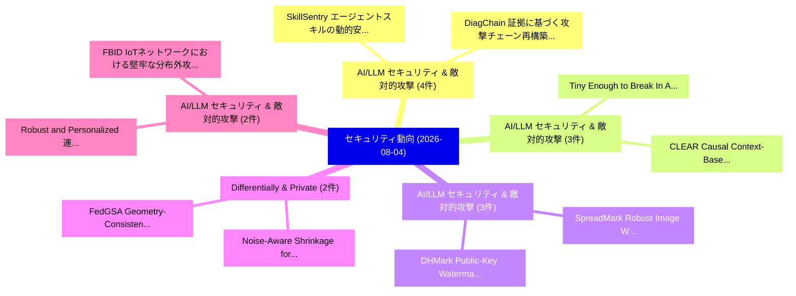

# 📅 02_daily: 日次エグゼクティブサマリー報告書 (2026-08-04)

**集計日時**: 2026-10-02 23:06:22 UTC  
**対象日付**: 2026-08-04  
**本日収集論文数**: 50 件  

---

## 💡 主要セキュリティ動向・脅威インサイト (Executive Insights)

本日の収集論文（計 50 件）において、以下の重点セキュリティ領域で活発な研究動向が確認されました：
- **AI/LLM セキュリティ & 敵対的攻撃** (4 件): 注目論文として 「SkillSentry: エージェントスキルの動的安全テスト...」、「DiagChain: 証拠に基づく攻撃チェーン再構築における...」 等が発表され、実務防御および攻撃検証の進展が見られます。
- **AI/LLM セキュリティ & 敵対的攻撃** (3 件): 注目論文として 「Tiny Enough to Break In: Agent...」、「CLEAR: Causal Context-Based Ag...」 等が発表され、実務防御および攻撃検証の進展が見られます。
- **AI/LLM セキュリティ & 敵対的攻撃** (3 件): 注目論文として 「DHMark: Public-Key Watermarkin...」、「SpreadMark: Robust Image Water...」 等が発表され、実務防御および攻撃検証の進展が見られます。
- **Differentially & Private** (2 件): 注目論文として 「FedGSA: Geometry-Consistent Su...」、「Noise-Aware Shrinkage for Diff...」 等が発表され、実務防御および攻撃検証の進展が見られます。
- **AI/LLM セキュリティ & 敵対的攻撃** (2 件): 注目論文として 「Robust and Personalized 連合学習 f...」、「FBID: IoTネットワークにおける堅牢な分布外攻撃検出の...」 等が発表され、実務防御および攻撃検証の進展が見られます。

### 🗺️ 技術・脅威トピックマインドマップ

---

## 📌 日次セキュリティ論文一覧 (日本語表形式)

| No | arXiv ID | 論文タイトル (日本語訳) | 重要キーワード | 構造化エグゼクティブ要約 (背景・提案・影響) | 脅威分類 | 詳細リンク |
|---|---|---|---|---|---|---|
| 1 | `2608.02986v1` | [Internalising the Identity Primitive: Cryptographic Individuality for an Autonomous Agent on a Public Blockchain（セキュリティ分析論文）](../../okf/papers/2026-08-04/2608.02986.md) | `Identity Primitive`, `Cryptographic Individuality`, `Autonomous Agent` | 【提案】概要 (Overview & Key Finding) 本論文「Internalising the Identity Primitive: Cryptographic Ind...。実証評価により経営層・セキュリティ管理者向け推奨アクション (E... | `arXiv` | [arXiv](https://arxiv.org/abs/2608.02986v1) &#124; [OKF](../../okf/papers/2026-08-04/2608.02986.md) |
| 2 | `2608.02995v1` | [SparSEEty: Extracting Tokens from Sparsity-Exploiting LLM Serving Systems via Deterministic Side Channels（セキュリティ分析論文）](../../okf/papers/2026-08-04/2608.02995.md) | `Deterministic Side Channels`, `Extracting Tokens`, `Sparsity-Exploiting LLM` | 【提案】概要 (Overview & Key Finding) 本論文「SparSEEty: Extracting Tokens from Sparsity-Exploiting L...。実証評価により経営層・セキュリティ管理者向け推奨アクション (E... | `arXiv` | [arXiv](https://arxiv.org/abs/2608.02995v1) &#124; [OKF](../../okf/papers/2026-08-04/2608.02995.md) |
| 3 | `2608.03009v1` | [Tiny Enough to Break In: Agentic Remote Access Trojans Powered by Small Language Models（セキュリティ分析論文）](../../okf/papers/2026-08-04/2608.03009.md) | `Agentic Remote Access Trojans Powered`, `Small Language Models`, `Tiny Enough` | 【提案】概要 (Overview & Key Finding) 本論文「Tiny Enough to Break In: Agentic Remote Access Trojans ...。実証評価により経営層・セキュリティ管理者向け推奨アクション (E... | `arXiv` | [arXiv](https://arxiv.org/abs/2608.03009v1) &#124; [OKF](../../okf/papers/2026-08-04/2608.03009.md) |
| 4 | `2608.03070v2` | [AI Security Leaderboard: Methodology, Results and Minimal Standard（セキュリティ分析論文）](../../okf/papers/2026-08-04/2608.03070.md) | `Security Leaderboard`, `Minimal Standard`, `Isadora De Andrade` | 【提案】概要 (Overview & Key Finding) 本論文「AI Security Leaderboard: Methodology, Results and Minim...。実証評価により経営層・セキュリティ管理者向け推奨アクション (E... | `arXiv` | [arXiv](https://arxiv.org/abs/2608.03070v2) &#124; [OKF](../../okf/papers/2026-08-04/2608.03070.md) |
| 5 | `2608.03093v1` | [DHMark: Public-Key Watermarking for LLM-Generated Text via Diffie-Hellman-Guided Rejection Sampling（セキュリティ分析論文）](../../okf/papers/2026-08-04/2608.03093.md) | `Guided Rejection Sampling`, `Key Watermarking`, `Generated Text` | 【提案】概要 (Overview & Key Finding) 本論文「DHMark: Public-Key Watermarking for LLM-Generated Text ...。実証評価により経営層・セキュリティ管理者向け推奨アクション (E... | `arXiv` | [arXiv](https://arxiv.org/abs/2608.03093v1) &#124; [OKF](../../okf/papers/2026-08-04/2608.03093.md) |
| 6 | `2608.03096v1` | [FakeI2V-Bench: the Applicability of Image-level Deepfake Detectors for Deepfake Video Detectionのベンチマーク評価](../../okf/papers/2026-08-04/2608.03096.md) | `Deepfake Detectors`, `Image-level Deepfake`, `Deepfake Video` | 【提案】概要 (Overview & Key Finding) 本論文「FakeI2V-Bench: the Applicability of Image-level Deepfak...。実証評価により経営層・セキュリティ管理者向け推奨アクション (E... | `arXiv` | [arXiv](https://arxiv.org/abs/2608.03096v1) &#124; [OKF](../../okf/papers/2026-08-04/2608.03096.md) |
| 7 | `2608.03110v1` | [PECR: A Reproducible Specification and Synthetic Stress Test of Telemetry-Informed Vulnerability Prioritization for SD-WAN（セキュリティ分析論文）](../../okf/papers/2026-08-04/2608.03110.md) | `Synthetic Stress Test`, `Informed Vulnerability Prioritization`, `Reproducible Specification` | 【提案】概要 (Overview & Key Finding) 本論文「PECR: A Reproducible Specification and Synthetic Stress...。実証評価により経営層・セキュリティ管理者向け推奨アクション (E... | `arXiv` | [arXiv](https://arxiv.org/abs/2608.03110v1) &#124; [OKF](../../okf/papers/2026-08-04/2608.03110.md) |
| 8 | `2608.03130v1` | [DP-MemView: A Memory Interface for Attribute-Level Transcript Privacy in Long-Term LLMエージェント](../../okf/papers/2026-08-04/2608.03130.md) | `Level Transcript Privacy`, `Memory Interface`, `Attribute-Level Transcript` | 【提案】概要 (Overview & Key Finding) 本論文「DP-MemView: A Memory Interface for Attribute-Level Tran...。実証評価により経営層・セキュリティ管理者向け推奨アクション (E... | `arXiv` | [arXiv](https://arxiv.org/abs/2608.03130v1) &#124; [OKF](../../okf/papers/2026-08-04/2608.03130.md) |
| 9 | `2608.03134v1` | [CLEAR: Causal Context-Based Agentic Reasoning for 脆弱性検出](../../okf/papers/2026-08-04/2608.03134.md) | `Based Agentic Reasoning`, `Causal Context`, `Context-Based Agentic` | 【提案】概要 (Overview & Key Finding) 本論文「CLEAR: Causal Context-Based Agentic Reasoning for 脆弱性検出...。実証評価により経営層・セキュリティ管理者向け推奨アクション (E... | `arXiv` | [arXiv](https://arxiv.org/abs/2608.03134v1) &#124; [OKF](../../okf/papers/2026-08-04/2608.03134.md) |
| 10 | `2608.03151v1` | [AirKey: Multimodal Acoustic-Assisted WiFi Sensing for Zero-Training Robust PIN Inference（セキュリティ分析論文）](../../okf/papers/2026-08-04/2608.03151.md) | `Multimodal Acoustic`, `Training Robust`, `Acoustic-Assisted WiFi` | 【提案】概要 (Overview & Key Finding) 本論文「AirKey: Multimodal Acoustic-Assisted WiFi Sensing for Z...。実証評価により経営層・セキュリティ管理者向け推奨アクション (E... | `arXiv` | [arXiv](https://arxiv.org/abs/2608.03151v1) &#124; [OKF](../../okf/papers/2026-08-04/2608.03151.md) |
| 11 | `2608.03165v2` | [SpreadMark: Robust Image Watermarking via Spread-Spectrum Embedding（セキュリティ分析論文）](../../okf/papers/2026-08-04/2608.03165.md) | `Robust Image Watermarking`, `Spectrum Embedding`, `Spread-Spectrum Embedding` | 【提案】概要 (Overview & Key Finding) 本論文「SpreadMark: Robust Image Watermarking via Spread-Spectr...。実証評価により経営層・セキュリティ管理者向け推奨アクション (E... | `AI/ML Security` | [arXiv](https://arxiv.org/abs/2608.03165v2) &#124; [OKF](../../okf/papers/2026-08-04/2608.03165.md) |
| 12 | `2608.03169v1` | [Test-time reasoning effort and unauthorized tool use in language-model agents: a prespecified equivalence study（セキュリティ分析論文）](../../okf/papers/2026-08-04/2608.03169.md) | `Test-time reasoning`, `language-model agents`, `Xiaonan Xu` | 【提案】概要 (Overview & Key Finding) 本論文「Test-time reasoning effort and unauthorized tool use in...。実証評価により経営層・セキュリティ管理者向け推奨アクション (E... | `arXiv` | [arXiv](https://arxiv.org/abs/2608.03169v1) &#124; [OKF](../../okf/papers/2026-08-04/2608.03169.md) |
| 13 | `2608.03174v1` | [Attribute-based Undetectable Watermarking for Generative AI Models（セキュリティ分析論文）](../../okf/papers/2026-08-04/2608.03174.md) | `Undetectable Watermarking`, `Attribute-based Undetectable`, `Miryam Mi` | 【提案】概要 (Overview & Key Finding) 本論文「Attribute-based Undetectable Watermarking for Generativ...。実証評価により経営層・セキュリティ管理者向け推奨アクション (E... | `arXiv` | [arXiv](https://arxiv.org/abs/2608.03174v1) &#124; [OKF](../../okf/papers/2026-08-04/2608.03174.md) |
| 14 | `2608.03232v1` | [MalTotal: Cost-Effective and Language-Agnostic Malicious Code Poisoning Detection for Millions of Repositories（セキュリティ分析論文）](../../okf/papers/2026-08-04/2608.03232.md) | `Agnostic Malicious Code Poisoning Detection`, `Language-Agnostic Malicious`, `Jian Zhao` | 【提案】概要 (Overview & Key Finding) 本論文「MalTotal: Cost-Effective and Language-Agnostic Maliciou...。実証評価により経営層・セキュリティ管理者向け推奨アクション (E... | `arXiv` | [arXiv](https://arxiv.org/abs/2608.03232v1) &#124; [OKF](../../okf/papers/2026-08-04/2608.03232.md) |
| 15 | `2608.03250v1` | [ShielDroid: A Hybrid Approach Integrating Machine and Deep Learning for Android マルウェア検出](../../okf/papers/2026-08-04/2608.03250.md) | `Deep Learning`, `Android Malware Detection`, `Ahmed Ann Noor Ryen` | 【提案】概要 (Overview & Key Finding) 本論文「ShielDroid: A Hybrid Approach Integrating Machine and D...。実証評価により経営層・セキュリティ管理者向け推奨アクション (E... | `arXiv` | [arXiv](https://arxiv.org/abs/2608.03250v1) &#124; [OKF](../../okf/papers/2026-08-04/2608.03250.md) |
| 16 | `2608.03267v1` | [FedGSA: Geometry-Consistent Subspace Aggregation for Differentially Private Federated LoRA（セキュリティ分析論文）](../../okf/papers/2026-08-04/2608.03267.md) | `Consistent Subspace Aggregation`, `Differentially Private Federated`, `Geometry-Consistent Subspace` | 【提案】概要 (Overview & Key Finding) 本論文「FedGSA: Geometry-Consistent Subspace Aggregation for Di...。実証評価により経営層・セキュリティ管理者向け推奨アクション (E... | `arXiv` | [arXiv](https://arxiv.org/abs/2608.03267v1) &#124; [OKF](../../okf/papers/2026-08-04/2608.03267.md) |
| 17 | `2608.03272v1` | [Attacking and Defending Multi-Agent Collaborative Filtering Systems Through Connectivity（セキュリティ分析論文）](../../okf/papers/2026-08-04/2608.03272.md) | `Defending Multi`, `Multi-Agent Collaborative`, `Anjun Hu` | 【提案】概要 (Overview & Key Finding) 本論文「Attacking and Defending Multi-Agent Collaborative Filte...。実証評価により経営層・セキュリティ管理者向け推奨アクション (E... | `arXiv` | [arXiv](https://arxiv.org/abs/2608.03272v1) &#124; [OKF](../../okf/papers/2026-08-04/2608.03272.md) |
| 18 | `2608.03274v2` | [Right Divisibility in Erasing Semi-Thue Systems: A Minimal View of Intruder Deduction（セキュリティ分析論文）](../../okf/papers/2026-08-04/2608.03274.md) | `Right Divisibility`, `Erasing Semi`, `Thue Systems` | 【提案】概要 (Overview & Key Finding) 本論文「Right Divisibility in Erasing Semi-Thue Systems: A Mini...。実証評価により経営層・セキュリティ管理者向け推奨アクション (E... | `arXiv` | [arXiv](https://arxiv.org/abs/2608.03274v2) &#124; [OKF](../../okf/papers/2026-08-04/2608.03274.md) |
| 19 | `2608.03277v1` | [Noise-Aware Shrinkage for Differentially Private Zeroth-Order Fine-Tuning of 大規模言語モデル](../../okf/papers/2026-08-04/2608.03277.md) | `Differentially Private Zeroth`, `Aware Shrinkage`, `Noise-Aware Shrinkage` | 【提案】概要 (Overview & Key Finding) 本論文「Noise-Aware Shrinkage for Differentially Private Zeroth...。実証評価により経営層・セキュリティ管理者向け推奨アクション (E... | `arXiv` | [arXiv](https://arxiv.org/abs/2608.03277v1) &#124; [OKF](../../okf/papers/2026-08-04/2608.03277.md) |
| 20 | `2608.03294v2` | [Provably Learning Multi-Head Attention with Queries（セキュリティ分析論文）](../../okf/papers/2026-08-04/2608.03294.md) | `Provably Learning Multi`, `Head Attention`, `Multi-Head Attention` | 【提案】概要 (Overview & Key Finding) 本論文「Provably Learning Multi-Head Attention with Queries（セキュ...。実証評価により経営層・セキュリティ管理者向け推奨アクション (E... | `arXiv` | [arXiv](https://arxiv.org/abs/2608.03294v2) &#124; [OKF](../../okf/papers/2026-08-04/2608.03294.md) |
| 21 | `2608.03328v1` | [Breaking ACDGV MinRank Gabidulin encryption schemes over matrix codes（セキュリティ分析論文）](../../okf/papers/2026-08-04/2608.03328.md) | `Thai Hung Le`, `Raw Meta`, `Executive Summary` | 【提案】概要 (Overview & Key Finding) 本論文「Breaking ACDGV MinRank Gabidulin encryption schemes ove...。実証評価により経営層・セキュリティ管理者向け推奨アクション (E... | `arXiv` | [arXiv](https://arxiv.org/abs/2608.03328v1) &#124; [OKF](../../okf/papers/2026-08-04/2608.03328.md) |
| 22 | `2608.03485v1` | [SkillSentry: エージェントスキルの動的安全テストのための適応型ハニーワールド](../../okf/papers/2026-08-04/2608.03485.md) | `Adaptive Honey Worlds`, `Dynamic Safety Testing`, `Agent Skills` | 【提案】概要 (Overview & Key Finding) 本論文「SkillSentry: エージェントスキルの動的安全テストのための適応型ハニーワールド」（原題: Skill...。実証評価により経営層・セキュリティ管理者向け推奨アクション (E... | `arXiv` | [arXiv](https://arxiv.org/abs/2608.03485v1) &#124; [OKF](../../okf/papers/2026-08-04/2608.03485.md) |
| 23 | `2608.03509v2` | [SkillJack: 自己進化型エージェントにおける持続的スキルバックドア攻撃](../../okf/papers/2026-08-04/2608.03509.md) | `Persistent Skill Backdoors`, `Evolving Agents`, `Self-Evolving Agents` | 【提案】概要 (Overview & Key Finding) 本論文「SkillJack: 自己進化型エージェントにおける持続的スキルバックドア攻撃」（原題: SkillJack:...。実証評価により経営層・セキュリティ管理者向け推奨アクション (E... | `arXiv` | [arXiv](https://arxiv.org/abs/2608.03509v2) &#124; [OKF](../../okf/papers/2026-08-04/2608.03509.md) |
| 24 | `2608.03520v1` | [AI Forensics Across White-, Grey-, and Black-Box Access: A Process Model and Research Agenda for Post-Incident Investigation of AI Systems（セキュリティ分析論文）](../../okf/papers/2026-08-04/2608.03520.md) | `Forensics Across White`, `Box Access`, `Process Model` | 【提案】概要 (Overview & Key Finding) 本論文「AI Forensics Across White-, Grey-, and Black-Box Access...。実証評価により経営層・セキュリティ管理者向け推奨アクション (E... | `arXiv` | [arXiv](https://arxiv.org/abs/2608.03520v1) &#124; [OKF](../../okf/papers/2026-08-04/2608.03520.md) |
| 25 | `2608.03534v1` | [A Challenge-Nonce Freshness Gap in Project Veraison's TPM Reference Schemes, Found by Appraising Application-Layer Action Evidence End-to-End（セキュリティ分析論文）](../../okf/papers/2026-08-04/2608.03534.md) | `Layer Action Evidence End`, `Nonce Freshness Gap`, `Project Veraison` | 【提案】概要 (Overview & Key Finding) 本論文「A Challenge-Nonce Freshness Gap in Project Veraison's T...。実証評価により経営層・セキュリティ管理者向け推奨アクション (E... | `arXiv` | [arXiv](https://arxiv.org/abs/2608.03534v1) &#124; [OKF](../../okf/papers/2026-08-04/2608.03534.md) |
| 26 | `2608.03554v1` | [ReputationChain: Robust Trust Updating for Blockchain-Enabled Supply Chains（セキュリティ分析論文）](../../okf/papers/2026-08-04/2608.03554.md) | `Robust Trust Updating`, `Enabled Supply Chains`, `Blockchain-Enabled Supply` | 【提案】概要 (Overview & Key Finding) 本論文「ReputationChain: Robust Trust Updating for Blockchain-E...。実証評価により経営層・セキュリティ管理者向け推奨アクション (E... | `arXiv` | [arXiv](https://arxiv.org/abs/2608.03554v1) &#124; [OKF](../../okf/papers/2026-08-04/2608.03554.md) |
| 27 | `2608.03567v1` | [CAN Disabler: Hardware-based Prevention method of Unauthorized Transmission in CAN and CAN-FD networks（セキュリティ分析論文）](../../okf/papers/2026-08-04/2608.03567.md) | `Hardware-based Prevention`, `Unauthorized Transmission`, `CAN-FD networks` | 【提案】概要 (Overview & Key Finding) 本論文「CAN Disabler: Hardware-based Prevention method of Unaut...。実証評価により経営層・セキュリティ管理者向け推奨アクション (E... | `arXiv` | [arXiv](https://arxiv.org/abs/2608.03567v1) &#124; [OKF](../../okf/papers/2026-08-04/2608.03567.md) |
| 28 | `2608.03590v1` | [Secure Long-Range Autonomous Valet Parking: A Reservation Scheme With Three-Factor Authentication and Key Agreement（セキュリティ分析論文）](../../okf/papers/2026-08-04/2608.03590.md) | `Range Autonomous Valet Parking`, `Secure Long`, `Factor Authentication` | 【提案】概要 (Overview & Key Finding) 本論文「Secure Long-Range Autonomous Valet Parking: A Reservati...。実証評価により経営層・セキュリティ管理者向け推奨アクション (E... | `arXiv` | [arXiv](https://arxiv.org/abs/2608.03590v1) &#124; [OKF](../../okf/papers/2026-08-04/2608.03590.md) |
| 29 | `2608.03591v1` | [DiagChain: 証拠に基づく攻撃チェーン再構築におけるLLMエージェント評価用診断ベンチマーク](../../okf/papers/2026-08-04/2608.03591.md) | `Grounded Attack Chain Reconstruction`, `Diagnostic Benchmark`, `Evidence-Grounded Attack` | 【提案】概要 (Overview & Key Finding) 本論文「DiagChain: 証拠に基づく攻撃チェーン再構築におけるLLMエージェント評価用診断ベンチマーク」（原題:...。実証評価により経営層・セキュリティ管理者向け推奨アクション (E... | `arXiv` | [arXiv](https://arxiv.org/abs/2608.03591v1) &#124; [OKF](../../okf/papers/2026-08-04/2608.03591.md) |
| 30 | `2608.03626v1` | [大規模言語モデルシステムのためのセキュリティ指向ライフサイクルモデル](../../okf/papers/2026-08-04/2608.03626.md) | `Large Language Model Systems`, `Oriented Lifecycle Model`, `Security-Oriented Lifecycle` | 【提案】概要 (Overview & Key Finding) 本論文「大規模言語モデルシステムのためのセキュリティ指向ライフサイクルモデル」（原題: A Security-Orie...。実証評価により経営層・セキュリティ管理者向け推奨アクション (E... | `arXiv` | [arXiv](https://arxiv.org/abs/2608.03626v1) &#124; [OKF](../../okf/papers/2026-08-04/2608.03626.md) |
| 31 | `2608.03642v3` | [マルウェアデータドリフト検出に対する回避およびポイズニング攻撃の実証分析](../../okf/papers/2026-08-04/2608.03642.md) | `Mingyue Yang`, `David Lie`, `Nicolas Papernot` | 【提案】概要 (Overview & Key Finding) 本論文「マルウェアデータドリフト検出に対する回避およびポイズニング攻撃の実証分析」（原題: Empirical Ana...。実証評価により経営層・セキュリティ管理者向け推奨アクション (E... | `arXiv` | [arXiv](https://arxiv.org/abs/2608.03642v3) &#124; [OKF](../../okf/papers/2026-08-04/2608.03642.md) |
| 32 | `2608.03700v1` | [エージェントがあなたを学習するとき: ペルソナスキルにおけるプライバシー漏洩、なりすましリスク、および防御のベンチマーク](../../okf/papers/2026-08-04/2608.03700.md) | `Benchmarking Privacy Leakage`, `Impersonation Risk`, `Persona Skills` | 【提案】概要 (Overview & Key Finding) 本論文「エージェントがあなたを学習するとき: ペルソナスキルにおけるプライバシー漏洩、なりすましリスク、および防御のベ...。実証評価により経営層・セキュリティ管理者向け推奨アクション (E... | `arXiv` | [arXiv](https://arxiv.org/abs/2608.03700v1) &#124; [OKF](../../okf/papers/2026-08-04/2608.03700.md) |
| 33 | `2608.03737v1` | [Dependency Triad: A Metric to Quantify the Dependencies Between Attributes for Local Differential Privacy（セキュリティ分析論文）](../../okf/papers/2026-08-04/2608.03737.md) | `Local Differential Privacy`, `Dependency Triad`, `Sandaru Jayawardana` | 【提案】概要 (Overview & Key Finding) 本論文「Dependency Triad: A Metric to Quantify the Dependencies...。実証評価により経営層・セキュリティ管理者向け推奨アクション (E... | `arXiv` | [arXiv](https://arxiv.org/abs/2608.03737v1) &#124; [OKF](../../okf/papers/2026-08-04/2608.03737.md) |
| 34 | `2608.03751v1` | [ドイツのスマートメーターインフラに対する遅延攻撃: CLSチャネルタイミング制約のセキュリティ分析](../../okf/papers/2026-08-04/2608.03751.md) | `German Smart Metering Infrastructure`, `Channel Timing Constraints`, `Delay Attacks` | 【提案】概要 (Overview & Key Finding) 本論文「ドイツのスマートメーターインフラに対する遅延攻撃: CLSチャネルタイミング制約のセキュリティ分析」（原題: ...。実証評価により経営層・セキュリティ管理者向け推奨アクション (E... | `arXiv` | [arXiv](https://arxiv.org/abs/2608.03751v1) &#124; [OKF](../../okf/papers/2026-08-04/2608.03751.md) |
| 35 | `2608.03937v1` | [Progressive Learning of a Diffusion-based Inpainting Model for Separating Overlapped Fingerprints（セキュリティ分析論文）](../../okf/papers/2026-08-04/2608.03937.md) | `Separating Overlapped Fingerprints`, `Progressive Learning`, `Inpainting Model` | 【提案】概要 (Overview & Key Finding) 本論文「Progressive Learning of a Diffusion-based Inpainting Mo...。実証評価により経営層・セキュリティ管理者向け推奨アクション (E... | `arXiv` | [arXiv](https://arxiv.org/abs/2608.03937v1) &#124; [OKF](../../okf/papers/2026-08-04/2608.03937.md) |
| 36 | `2608.04045v1` | [Robust and Personalized 連合学習 for Aircraft-Engine Prognostics under Benign and Adversarial Client Heterogeneity](../../okf/papers/2026-08-04/2608.04045.md) | `Adversarial Client Heterogeneity`, `Engine Prognostics`, `Aircraft-Engine Prognostics` | 【提案】概要 (Overview & Key Finding) 本論文「Robust and Personalized 連合学習 for Aircraft-Engine Progno...。実証評価により経営層・セキュリティ管理者向け推奨アクション (E... | `arXiv` | [arXiv](https://arxiv.org/abs/2608.04045v1) &#124; [OKF](../../okf/papers/2026-08-04/2608.04045.md) |
| 37 | `2608.04047v1` | [Beyond the QBER Threshold: A Temporal QBER Based Machine Learning Framework for Multi Attack Detection in BB84 QKD（セキュリティ分析論文）](../../okf/papers/2026-08-04/2608.04047.md) | `Multi Attack Detection`, `Deepak Singh`, `Devesh Kumar` | 【提案】概要 (Overview & Key Finding) 本論文「Beyond the QBER Threshold: A Temporal QBER Based Machin...。実証評価により経営層・セキュリティ管理者向け推奨アクション (E... | `arXiv` | [arXiv](https://arxiv.org/abs/2608.04047v1) &#124; [OKF](../../okf/papers/2026-08-04/2608.04047.md) |
| 38 | `2608.04052v1` | [When Modalities Fail to Tango: Conformal Backdoor Detection in Multimodal Contrastive Learning（セキュリティ分析論文）](../../okf/papers/2026-08-04/2608.04052.md) | `Conformal Backdoor Detection`, `Multimodal Contrastive Learning`, `Yiming Chen` | 【提案】背景とセキュリティ上の課題 (Background & Problem) 本研究はサイバー脅威環境におけるセキュリティ構造・脆弱性の検証を目的としています。(主要検出項目: ...。実証評価により経営層・セキュリティ管理者向け推奨アクション (E... | `arXiv` | [arXiv](https://arxiv.org/abs/2608.04052v1) &#124; [OKF](../../okf/papers/2026-08-04/2608.04052.md) |
| 39 | `2608.04053v1` | [AgentAntibody: プロンプトインジェクションからLLMエージェントを防御する適応型免疫システム](../../okf/papers/2026-08-04/2608.04053.md) | `Prompt Injection`, `Shihao Weng`, `Yang Feng` | 【提案】概要 (Overview & Key Finding) 本論文「AgentAntibody: プロンプトインジェクションからLLMエージェントを防御する適応型免疫システム」（...。実証評価により経営層・セキュリティ管理者向け推奨アクション (E... | `arXiv` | [arXiv](https://arxiv.org/abs/2608.04053v1) &#124; [OKF](../../okf/papers/2026-08-04/2608.04053.md) |
| 40 | `2608.04065v1` | [高度道路交通システムにおける言語モデルのためのインライン制御アーキテクチャ](../../okf/papers/2026-08-04/2608.04065.md) | `Intelligent Transportation Systems`, `Language Models`, `Narendra Kumar Dewangan` | 【提案】概要 (Overview & Key Finding) 本論文「高度道路交通システムにおける言語モデルのためのインライン制御アーキテクチャ」（原題: An Inline Co...。実証評価により経営層・セキュリティ管理者向け推奨アクション (E... | `arXiv` | [arXiv](https://arxiv.org/abs/2608.04065v1) &#124; [OKF](../../okf/papers/2026-08-04/2608.04065.md) |
| 41 | `2608.04073v1` | [FBID: IoTネットワークにおける堅牢な分布外攻撃検出のための適応的パーソナライズ連合学習](../../okf/papers/2026-08-04/2608.04073.md) | `Adaptive Personalized Federated Learning`, `Distribution Attack Detection`, `Cong Thanh Nguyen` | 【提案】概要 (Overview & Key Finding) 本論文「FBID: IoTネットワークにおける堅牢な分布外攻撃検出のための適応的パーソナライズ連合学習」（原題: FB...。実証評価により経営層・セキュリティ管理者向け推奨アクション (E... | `arXiv` | [arXiv](https://arxiv.org/abs/2608.04073v1) &#124; [OKF](../../okf/papers/2026-08-04/2608.04073.md) |
| 42 | `2608.04115v1` | [NEBULA: 透過的ローテーションリフレッシュトークンのための言語不可知型仕様](../../okf/papers/2026-08-04/2608.04115.md) | `Opaque Rotating Refresh Tokens`, `Independent Specification`, `Matteo Teodori` | 【提案】概要 (Overview & Key Finding) 本論文「NEBULA: 透過的ローテーションリフレッシュトークンのための言語不可知型仕様」（原題: NEBULA: A...。実証評価により経営層・セキュリティ管理者向け推奨アクション (E... | `arXiv` | [arXiv](https://arxiv.org/abs/2608.04115v1) &#124; [OKF](../../okf/papers/2026-08-04/2608.04115.md) |
| 43 | `2608.04143v1` | [ダークネットトラフィックにおける行動情報漏洩: 匿名ネットワークを横断するマルチチャネル分析](../../okf/papers/2026-08-04/2608.04143.md) | `Behavioral Information Leakage`, `Darknet Traffic`, `Md Zahidul Islam` | 【提案】概要 (Overview & Key Finding) 本論文「ダークネットトラフィックにおける行動情報漏洩: 匿名ネットワークを横断するマルチチャネル分析」（原題: Beh...。実証評価により経営層・セキュリティ管理者向け推奨アクション (E... | `arXiv` | [arXiv](https://arxiv.org/abs/2608.04143v1) &#124; [OKF](../../okf/papers/2026-08-04/2608.04143.md) |
| 44 | `2608.04164v1` | [QUICプロトコルにおけるロードバランシングのセキュリティ強化](../../okf/papers/2026-08-04/2608.04164.md) | `Securing Load Balancing`, `Garegin Grigoryan`, `Dagim Mindaye` | 【提案】概要 (Overview & Key Finding) 本論文「QUICプロトコルにおけるロードバランシングのセキュリティ強化」（原題: Securing Load Bala...。実証評価により経営層・セキュリティ管理者向け推奨アクション (E... | `arXiv` | [arXiv](https://arxiv.org/abs/2608.04164v1) &#124; [OKF](../../okf/papers/2026-08-04/2608.04164.md) |
| 45 | `2608.04167v1` | [サービス除外評価下におけるオープンワールドダークネットトラフィック識別](../../okf/papers/2026-08-04/2608.04167.md) | `Open-World Darknet`, `Md Zahidul Islam`, `Javeriah Saleem` | 【提案】概要 (Overview & Key Finding) 本論文「サービス除外評価下におけるオープンワールドダークネットトラフィック識別」（原題: Open-World Dar...。実証評価により経営層・セキュリティ管理者向け推奨アクション (E... | `arXiv` | [arXiv](https://arxiv.org/abs/2608.04167v1) &#124; [OKF](../../okf/papers/2026-08-04/2608.04167.md) |
| 46 | `2608.04173v1` | [敵対的に堅牢な剪定済みモデルのフォールトトランス耐性の解明](../../okf/papers/2026-08-04/2608.04173.md) | `Adversarially Robust Pruned Models`, `Understanding Fault Tolerance`, `Manali Dangarikar` | 【提案】概要 (Overview & Key Finding) 本論文「敵対的に堅牢な剪定済みモデルのフォールトトランス耐性の解明」（原題: Understanding Fault ...。実証評価により経営層・セキュリティ管理者向け推奨アクション (E... | `arXiv` | [arXiv](https://arxiv.org/abs/2608.04173v1) &#124; [OKF](../../okf/papers/2026-08-04/2608.04173.md) |
| 47 | `2608.04192v1` | [行動スキル再構築: LLMエージェントスキルからの隠蔽機能の再構成](../../okf/papers/2026-08-04/2608.04192.md) | `Behavioral Skill Reconstruction`, `Reconstructing Hidden Functionality`, `Agent Skills` | 【提案】概要 (Overview & Key Finding) 本論文「行動スキル再構築: LLMエージェントスキルからの隠蔽機能の再構成」（原題: Behavioral Skill...。実証評価により経営層・セキュリティ管理者向け推奨アクション (E... | `arXiv` | [arXiv](https://arxiv.org/abs/2608.04192v1) &#124; [OKF](../../okf/papers/2026-08-04/2608.04192.md) |
| 48 | `2608.04255v1` | [PriDyG: LLMとGNNの協調によるプライバシー保護型動的グラフ推論](../../okf/papers/2026-08-04/2608.04255.md) | `Dynamic Graph Inference`, `Privacy-preserving Dynamic`, `LLM-GNN Collaboration` | 【提案】概要 (Overview & Key Finding) 本論文「PriDyG: LLMとGNNの協調によるプライバシー保護型動的グラフ推論」（原題: PriDyG: Priv...。実証評価により経営層・セキュリティ管理者向け推奨アクション (E... | `arXiv` | [arXiv](https://arxiv.org/abs/2608.04255v1) &#124; [OKF](../../okf/papers/2026-08-04/2608.04255.md) |
| 49 | `2608.04261v1` | [Dimension Rigidity and Projective Geometry of Trace-Product Switchings of the Gold Cube（セキュリティ分析論文）](../../okf/papers/2026-08-04/2608.04261.md) | `Dimension Rigidity`, `Projective Geometry`, `Product Switchings` | 【提案】概要 (Overview & Key Finding) 本論文「Dimension Rigidity and Projective Geometry of Trace-Pro...。実証評価により経営層・セキュリティ管理者向け推奨アクション (E... | `arXiv` | [arXiv](https://arxiv.org/abs/2608.04261v1) &#124; [OKF](../../okf/papers/2026-08-04/2608.04261.md) |
| 50 | `2608.05199v1` | [モジュール型LLMセキュリティエージェントのための事後軌跡リスク認定機能](../../okf/papers/2026-08-04/2608.05199.md) | `Based Security Agents`, `Hoc Trajectory`, `Risk Certification` | 【提案】概要 (Overview & Key Finding) 本論文「モジュール型LLMセキュリティエージェントのための事後軌跡リスク認定機能」（原題: Post-Hoc Traj...。実証評価により経営層・セキュリティ管理者向け推奨アクション (E... | `arXiv` | [arXiv](https://arxiv.org/abs/2608.05199v1) &#124; [OKF](../../okf/papers/2026-08-04/2608.05199.md) |

