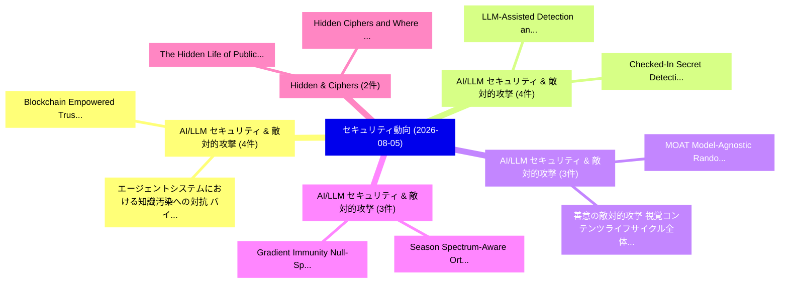

# 📅 02_daily: 日次エグゼクティブサマリー報告書 (2026-08-05)

**集計日時**: 2026-10-02 23:06:22 UTC  
**対象日付**: 2026-08-05  
**本日収集論文数**: 44 件  

---

## 💡 主要セキュリティ動向・脅威インサイト (Executive Insights)

本日の収集論文（計 44 件）において、以下の重点セキュリティ領域で活発な研究動向が確認されました：
- **AI/LLM セキュリティ & 敵対的攻撃** (4 件): 注目論文として 「エージェントシステムにおける知識汚染への対抗: バイザンチン...」、「Blockchain Empowered Trustwort...」 等が発表され、実務防御および攻撃検証の進展が見られます。
- **AI/LLM セキュリティ & 敵対的攻撃** (4 件): 注目論文として 「Checked-In Secret Detection: S...」、「LLM-Assisted Detection and Rep...」 等が発表され、実務防御および攻撃検証の進展が見られます。
- **AI/LLM セキュリティ & 敵対的攻撃** (3 件): 注目論文として 「善意の敵対的攻撃: 視覚コンテンツライフサイクル全体における...」、「MOAT: Model-Agnostic Randomize...」 等が発表され、実務防御および攻撃検証の進展が見られます。
- **AI/LLM セキュリティ & 敵対的攻撃** (3 件): 注目論文として 「Season: Spectrum-Aware Orthogo...」、「Gradient Immunity: Null-Space ...」 等が発表され、実務防御および攻撃検証の進展が見られます。
- **Hidden & Ciphers** (2 件): 注目論文として 「Hidden Ciphers and Where to Fi...」、「The Hidden Life of Public Safe...」 等が発表され、実務防御および攻撃検証の進展が見られます。

### 🗺️ 技術・脅威トピックマインドマップ

---

## 📌 日次セキュリティ論文一覧 (日本語表形式)

| No | arXiv ID | 論文タイトル (日本語訳) | 重要キーワード | 構造化エグゼクティブ要約 (背景・提案・影響) | 脅威分類 | 詳細リンク |
|---|---|---|---|---|---|---|
| 1 | `2608.04314v1` | [善意の敵対的攻撃: 視覚コンテンツライフサイクル全体における能動的保護に関するサーベイ](../../okf/papers/2026-08-05/2608.04314.md) | `Visual Content Lifecycle`, `Adversarial Attacks`, `Proactive Protection` | 【提案】概要 (Overview & Key Finding) 本論文「善意の敵対的攻撃: 視覚コンテンツライフサイクル全体における能動的保護に関するサーベイ」（原題: 敵対的攻撃s...。実証評価により経営層・セキュリティ管理者向け推奨アクション (E... | `arXiv` | [arXiv](https://arxiv.org/abs/2608.04314v1) &#124; [OKF](../../okf/papers/2026-08-05/2608.04314.md) |
| 2 | `2608.04317v1` | [Trident: 深層強化学習サイバー防御の攻略手法（エージェント型）](../../okf/papers/2026-08-05/2608.04317.md) | `Break Deep Reinforcement Learning Cyber Defenses`, `Ryozo Masukawa`, `Ian Bryant` | 【提案】概要 (Overview & Key Finding) 本論文「Trident: 深層強化学習サイバー防御の攻略手法（エージェント型）」（原題: Trident : How ...。実証評価により経営層・セキュリティ管理者向け推奨アクション (E... | `arXiv` | [arXiv](https://arxiv.org/abs/2608.04317v1) &#124; [OKF](../../okf/papers/2026-08-05/2608.04317.md) |
| 3 | `2608.04365v1` | [欺瞞的なモデルプロバイダに対する改ざん耐性を持つオブリビアス監査技術](../../okf/papers/2026-08-05/2608.04365.md) | `Proof Oblivious Audits`, `Deceptive Model Providers`, `Manipulation-Proof Oblivious` | 【提案】概要 (Overview & Key Finding) 本論文「欺瞞的なモデルプロバイダに対する改ざん耐性を持つオブリビアス監査技術」（原題: Manipulation-Pr...。実証評価により経営層・セキュリティ管理者向け推奨アクション (E... | `arXiv` | [arXiv](https://arxiv.org/abs/2608.04365v1) &#124; [OKF](../../okf/papers/2026-08-05/2608.04365.md) |
| 4 | `2608.04366v1` | [エージェントシステムにおける知識汚染への対抗: バイザンチン耐性を持つ安全な協調型RAGフレームワーク](../../okf/papers/2026-08-05/2608.04366.md) | `Combating Knowledge Corruption`, `Tolerant Secure Collaborative`, `Agent Systems` | 【提案】概要 (Overview & Key Finding) 本論文「エージェントシステムにおける知識汚染への対抗: バイザンチン耐性を持つ安全な協調型RAGフレームワーク」（原題...。実証評価により経営層・セキュリティ管理者向け推奨アクション (E... | `arXiv` | [arXiv](https://arxiv.org/abs/2608.04366v1) &#124; [OKF](../../okf/papers/2026-08-05/2608.04366.md) |
| 5 | `2608.04375v1` | [大規模言語モデル and Social Media Information Integrity: Opportunities, Challenges, and Research Directions](../../okf/papers/2026-08-05/2608.04375.md) | `Social Media Information Integrity`, `Research Directions`, `Large Language Models` | 【提案】概要 (Overview & Key Finding) 本論文「大規模言語モデル and Social Media Information Integrity: Opport...。実証評価により経営層・セキュリティ管理者向け推奨アクション (E... | `arXiv` | [arXiv](https://arxiv.org/abs/2608.04375v1) &#124; [OKF](../../okf/papers/2026-08-05/2608.04375.md) |
| 6 | `2608.04441v1` | [Season: Spectrum-Aware Orthogonal Gradient Refinement for Transfer-Based Adversarial Attacks（セキュリティ分析論文）](../../okf/papers/2026-08-05/2608.04441.md) | `Aware Orthogonal Gradient Refinement`, `Based Adversarial Attacks`, `Spectrum-Aware Orthogonal` | 【提案】概要 (Overview & Key Finding) 本論文「Season: Spectrum-Aware Orthogonal Gradient Refinement f...。実証評価により経営層・セキュリティ管理者向け推奨アクション (E... | `arXiv` | [arXiv](https://arxiv.org/abs/2608.04441v1) &#124; [OKF](../../okf/papers/2026-08-05/2608.04441.md) |
| 7 | `2608.04477v1` | [DeepInvert: Semi-Supervised Embedding Inversion Against Obfuscated Language Models（セキュリティ分析論文）](../../okf/papers/2026-08-05/2608.04477.md) | `Semi-Supervised Embedding`, `Zhicong Huang`, `Cheng Hong` | 【提案】概要 (Overview & Key Finding) 本論文「DeepInvert: Semi-Supervised Embedding Inversion Against...。実証評価により経営層・セキュリティ管理者向け推奨アクション (E... | `arXiv` | [arXiv](https://arxiv.org/abs/2608.04477v1) &#124; [OKF](../../okf/papers/2026-08-05/2608.04477.md) |
| 8 | `2608.04521v1` | [UC, Categorically: Rigorous Diagrammatic Proofs（セキュリティ分析論文）](../../okf/papers/2026-08-05/2608.04521.md) | `Rigorous Diagrammatic Proofs`, `Pooya Farshim`, `Martti Karvonen` | 【提案】概要 (Overview & Key Finding) 本論文「UC, Categorically: Rigorous Diagrammatic Proofs（セキュリティ分...。実証評価により経営層・セキュリティ管理者向け推奨アクション (E... | `arXiv` | [arXiv](https://arxiv.org/abs/2608.04521v1) &#124; [OKF](../../okf/papers/2026-08-05/2608.04521.md) |
| 9 | `2608.04523v1` | [Checked-In Secret Detection: Strings Are All You Need（セキュリティ分析論文）](../../okf/papers/2026-08-05/2608.04523.md) | `Checked-In Secret`, `Zhengdong Huang`, `Kevin Li` | 【提案】概要 (Overview & Key Finding) 本論文「Checked-In Secret Detection: Strings Are All You Need（セ...。実証評価により経営層・セキュリティ管理者向け推奨アクション (E... | `arXiv` | [arXiv](https://arxiv.org/abs/2608.04523v1) &#124; [OKF](../../okf/papers/2026-08-05/2608.04523.md) |
| 10 | `2608.04565v1` | [Breadcrumbing Search Agents（セキュリティ分析論文）](../../okf/papers/2026-08-05/2608.04565.md) | `Breadcrumbing Search Agents`, `Xuebin Li`, `Hanqing Zhao` | 【提案】概要 (Overview & Key Finding) 本論文「Breadcrumbing Search Agents（セキュリティ分析論文）」（原題: Breadcrumb...。実証評価により経営層・セキュリティ管理者向け推奨アクション (E... | `arXiv` | [arXiv](https://arxiv.org/abs/2608.04565v1) &#124; [OKF](../../okf/papers/2026-08-05/2608.04565.md) |
| 11 | `2608.04602v1` | [Adaptive Intrusion Detection System using Transformer-Based Neural Networks and Continual Learning Approach with Adversarial Investigation（セキュリティ分析論文）](../../okf/papers/2026-08-05/2608.04602.md) | `Adaptive Intrusion Detection System`, `Based Neural Networks`, `Adversarial Investigation` | 【提案】概要 (Overview & Key Finding) 本論文「Adaptive Intrusion Detection System using Transformer-B...。実証評価により経営層・セキュリティ管理者向け推奨アクション (E... | `arXiv` | [arXiv](https://arxiv.org/abs/2608.04602v1) &#124; [OKF](../../okf/papers/2026-08-05/2608.04602.md) |
| 12 | `2608.04626v1` | [Blockchain Empowered Trustworthy Agent Networks: Foundations, Taxonomy, and Future Directions（セキュリティ分析論文）](../../okf/papers/2026-08-05/2608.04626.md) | `Blockchain Empowered Trustworthy Agent Networks`, `Future Directions`, `Blockchain Empowered Trustworthy Agen` | 【提案】概要 (Overview & Key Finding) 本論文「Blockchain Empowered Trustworthy Agent Networks: Founda...。実証評価により経営層・セキュリティ管理者向け推奨アクション (E... | `arXiv` | [arXiv](https://arxiv.org/abs/2608.04626v1) &#124; [OKF](../../okf/papers/2026-08-05/2608.04626.md) |
| 13 | `2608.04680v1` | [MOAT: Model-Agnostic Randomized Transformations for preventing Efficiency Degradation Attacks on ViTs（セキュリティ分析論文）](../../okf/papers/2026-08-05/2608.04680.md) | `Agnostic Randomized Transformations`, `Efficiency Degradation Attacks`, `Model-Agnostic Randomized` | 【提案】概要 (Overview & Key Finding) 本論文「MOAT: Model-Agnostic Randomized Transformations for pre...。実証評価により経営層・セキュリティ管理者向け推奨アクション (E... | `arXiv` | [arXiv](https://arxiv.org/abs/2608.04680v1) &#124; [OKF](../../okf/papers/2026-08-05/2608.04680.md) |
| 14 | `2608.04741v1` | [LoginTrap: Uncovering Task-Agnostic Phishing-Style Indirect Prompt Injection Attacks against LLM-based Web Agents（セキュリティ分析論文）](../../okf/papers/2026-08-05/2608.04741.md) | `Style Indirect Prompt Injection Attacks`, `Uncovering Task`, `Agnostic Phishing` | 【提案】概要 (Overview & Key Finding) 本論文「LoginTrap: Uncovering Task-Agnostic Phishing-Style Indi...。実証評価により経営層・セキュリティ管理者向け推奨アクション (E... | `arXiv` | [arXiv](https://arxiv.org/abs/2608.04741v1) &#124; [OKF](../../okf/papers/2026-08-05/2608.04741.md) |
| 15 | `2608.04744v1` | [Web Cache Overflow: Exploiting Imprecise Keys for Cache Degradation and Beyond（セキュリティ分析論文）](../../okf/papers/2026-08-05/2608.04744.md) | `Web Cache Overflow`, `Exploiting Imprecise Keys`, `Cache Degradation` | 【提案】概要 (Overview & Key Finding) 本論文「Web Cache Overflow: Exploiting Imprecise Keys for Cache...。実証評価により経営層・セキュリティ管理者向け推奨アクション (E... | `arXiv` | [arXiv](https://arxiv.org/abs/2608.04744v1) &#124; [OKF](../../okf/papers/2026-08-05/2608.04744.md) |
| 16 | `2608.04755v1` | ["Allow" to Achieve, Over-Privileged Inadvertently: The Unintended Cost of Task-Completion-Driven Pop-up Decisions in Mobile GUI Agents（セキュリティ分析論文）](../../okf/papers/2026-08-05/2608.04755.md) | `Privileged Inadvertently`, `Driven Pop`, `Over-Privileged Inadvertently` | 【提案】概要 (Overview & Key Finding) 本論文「"Allow" to Achieve, Over-Privileged Inadvertently: The ...。実証評価により# "Allow" to Achieve, Ove... | `arXiv` | [arXiv](https://arxiv.org/abs/2608.04755v1) &#124; [OKF](../../okf/papers/2026-08-05/2608.04755.md) |
| 17 | `2608.04756v1` | [PURPOSE: Poisoning Conflict Resolution in RAG via Proxy-Fact-Grounded Updates（セキュリティ分析論文）](../../okf/papers/2026-08-05/2608.04756.md) | `Poisoning Conflict Resolution`, `Grounded Updates`, `Zijian Wang` | 【提案】概要 (Overview & Key Finding) 本論文「PURPOSE: Poisoning Conflict Resolution in RAG via Proxy...。実証評価により経営層・セキュリティ管理者向け推奨アクション (E... | `arXiv` | [arXiv](https://arxiv.org/abs/2608.04756v1) &#124; [OKF](../../okf/papers/2026-08-05/2608.04756.md) |
| 18 | `2608.04857v1` | [Hidden Ciphers and Where to Find Them: Static Discovery and Assessment of Cryptographic Assets in Software（セキュリティ分析論文）](../../okf/papers/2026-08-05/2608.04857.md) | `Hidden Ciphers`, `Static Discovery`, `Cryptographic Assets` | 【提案】概要 (Overview & Key Finding) 本論文「Hidden Ciphers and Where to Find Them: Static Discovery...。実証評価により経営層・セキュリティ管理者向け推奨アクション (E... | `arXiv` | [arXiv](https://arxiv.org/abs/2608.04857v1) &#124; [OKF](../../okf/papers/2026-08-05/2608.04857.md) |
| 19 | `2608.04881v1` | [HoRFFI: High-Openness RF Fingerprint Identification with a Similarity-Enhanced Variational Information Bottleneck（セキュリティ分析論文）](../../okf/papers/2026-08-05/2608.04881.md) | `Enhanced Variational Information Bottleneck`, `Fingerprint Identification`, `High-Openness RF` | 【提案】概要 (Overview & Key Finding) 本論文「HoRFFI: High-Openness RF Fingerprint Identification wit...。実証評価により経営層・セキュリティ管理者向け推奨アクション (E... | `arXiv` | [arXiv](https://arxiv.org/abs/2608.04881v1) &#124; [OKF](../../okf/papers/2026-08-05/2608.04881.md) |
| 20 | `2608.04893v1` | [When Does Latent Communication Pay? A Causal Audit of Relayed KV Caches in Multi-Agent LLMs（セキュリティ分析論文）](../../okf/papers/2026-08-05/2608.04893.md) | `Causal Audit`, `Multi-Agent LLMs`, `Jiaming Cheng` | 【提案】A Causal Audit of Relayed KV Caches in Multi-Agent LLMs ### (日本語題名: When Does Latent Co...。実証評価により経営層・セキュリティ管理者向け推奨アクション (E... | `arXiv` | [arXiv](https://arxiv.org/abs/2608.04893v1) &#124; [OKF](../../okf/papers/2026-08-05/2608.04893.md) |
| 21 | `2608.04907v1` | [LLM-Assisted Detection and Repair of Hardware Security Vulnerabilities in Verilog Designs（セキュリティ分析論文）](../../okf/papers/2026-08-05/2608.04907.md) | `Hardware Security Vulnerabilities`, `Assisted Detection`, `LLM-Assisted Detection` | 【提案】概要 (Overview & Key Finding) 本論文「LLM-Assisted Detection and Repair of Hardware Security ...。実証評価により経営層・セキュリティ管理者向け推奨アクション (E... | `arXiv` | [arXiv](https://arxiv.org/abs/2608.04907v1) &#124; [OKF](../../okf/papers/2026-08-05/2608.04907.md) |
| 22 | `2608.04957v1` | [Toward Practical Decentralized Proof-of-Location via Physical Witnessing Zones（セキュリティ分析論文）](../../okf/papers/2026-08-05/2608.04957.md) | `Toward Practical Decentralized Proof`, `Physical Witnessing Zones`, `Tamor Tomson` | 【提案】概要 (Overview & Key Finding) 本論文「Toward Practical Decentralized Proof-of-Location via Ph...。実証評価により経営層・セキュリティ管理者向け推奨アクション (E... | `arXiv` | [arXiv](https://arxiv.org/abs/2608.04957v1) &#124; [OKF](../../okf/papers/2026-08-05/2608.04957.md) |
| 23 | `2608.05011v2` | [Decentralized Searcher Competition in MEV Marketsに向けて](../../okf/papers/2026-08-05/2608.05011.md) | `Towards Decentralized Searcher Competition`, `Decentralized Searcher Competition`, `Roozbeh Sarenche` | 【提案】概要 (Overview & Key Finding) 本論文「Decentralized Searcher Competition in MEV Marketsに向けて」（...。実証評価により経営層・セキュリティ管理者向け推奨アクション (E... | `arXiv` | [arXiv](https://arxiv.org/abs/2608.05011v2) &#124; [OKF](../../okf/papers/2026-08-05/2608.05011.md) |
| 24 | `2608.05036v1` | [When Do PEFT Adaptations Leak Structure? Measuring Black-Box Structural Bounds in Public-Base Model Services（セキュリティ分析論文）](../../okf/papers/2026-08-05/2608.05036.md) | `Adaptations Leak Structure`, `Box Structural Bounds`, `Base Model Services` | 【提案】Measuring Black-Box Structural Bounds in Public-Base Model Services ### (日本語題名: When Do...。実証評価により経営層・セキュリティ管理者向け推奨アクション (E... | `arXiv` | [arXiv](https://arxiv.org/abs/2608.05036v1) &#124; [OKF](../../okf/papers/2026-08-05/2608.05036.md) |
| 25 | `2608.05040v1` | [Private Direct Preference Optimization for LLM Alignment（セキュリティ分析論文）](../../okf/papers/2026-08-05/2608.05040.md) | `Private Direct Preference Optimization`, `Yangfan Jiang`, `Fei Wei` | 【提案】概要 (Overview & Key Finding) 本論文「Private Direct Preference Optimization for LLM Alignmen...。実証評価により経営層・セキュリティ管理者向け推奨アクション (E... | `arXiv` | [arXiv](https://arxiv.org/abs/2608.05040v1) &#124; [OKF](../../okf/papers/2026-08-05/2608.05040.md) |
| 26 | `2608.05045v1` | [Gradient Immunity: Null-Space Resistance to Malicious Fine-Tuning（セキュリティ分析論文）](../../okf/papers/2026-08-05/2608.05045.md) | `Gradient Immunity`, `Space Resistance`, `Malicious Fine` | 【提案】概要 (Overview & Key Finding) 本論文「Gradient Immunity: Null-Space Resistance to Malicious F...。実証評価により経営層・セキュリティ管理者向け推奨アクション (E... | `arXiv` | [arXiv](https://arxiv.org/abs/2608.05045v1) &#124; [OKF](../../okf/papers/2026-08-05/2608.05045.md) |
| 27 | `2608.05055v1` | [Kerckhoffs-Compliant Watermarking for Physical Design IP Protection: From Placement to Routing（セキュリティ分析論文）](../../okf/papers/2026-08-05/2608.05055.md) | `Compliant Watermarking`, `Physical Design`, `Kerckhoffs-Compliant Watermarking` | 【提案】概要 (Overview & Key Finding) 本論文「Kerckhoffs-Compliant Watermarking for Physical Design I...。実証評価により経営層・セキュリティ管理者向け推奨アクション (E... | `arXiv` | [arXiv](https://arxiv.org/abs/2608.05055v1) &#124; [OKF](../../okf/papers/2026-08-05/2608.05055.md) |
| 28 | `2608.05063v1` | [Hardware Design and Security in the Era of Chiplets and LLMs（セキュリティ分析論文）](../../okf/papers/2026-08-05/2608.05063.md) | `Hardware Design`, `Johann Knechtel`, `Ozgur Sinanoglu` | 【提案】概要 (Overview & Key Finding) 本論文「Hardware Design and Security in the Era of Chiplets and...。実証評価によりGratz, Ramesh Karri -。 | `arXiv` | [arXiv](https://arxiv.org/abs/2608.05063v1) &#124; [OKF](../../okf/papers/2026-08-05/2608.05063.md) |
| 29 | `2608.05108v1` | [Agent Against Agent: An Agentic System for Automatic Prompt Injection Red Teaming（セキュリティ分析論文）](../../okf/papers/2026-08-05/2608.05108.md) | `Automatic Prompt Injection Red Teaming`, `Yanting Wang`, `Chenlong Yin` | 【提案】概要 (Overview & Key Finding) 本論文「Agent Against Agent: An Agentic System for Automatic プロ...。実証評価により経営層・セキュリティ管理者向け推奨アクション (E... | `arXiv` | [arXiv](https://arxiv.org/abs/2608.05108v1) &#124; [OKF](../../okf/papers/2026-08-05/2608.05108.md) |
| 30 | `2608.05201v1` | [ASTELD: A Six-Axis Classification Framework for Autonomous AI Agents - Design, Evaluation, and an OpenClaw Case Study（セキュリティ分析論文）](../../okf/papers/2026-08-05/2608.05201.md) | `Six-Axis Classification`, `Arif Hassan Zidan`, `Siyuan Li` | 【提案】概要 (Overview & Key Finding) 本論文「ASTELD: A Six-Axis Classification Framework for Autonom...。実証評価により経営層・セキュリティ管理者向け推奨アクション (E... | `arXiv` | [arXiv](https://arxiv.org/abs/2608.05201v1) &#124; [OKF](../../okf/papers/2026-08-05/2608.05201.md) |
| 31 | `2608.05210v1` | [Innocent Panels, Hateful Stories: Evaluating and Detecting Hateful Intent in Multi-Turn Visual Story Generation（セキュリティ分析論文）](../../okf/papers/2026-08-05/2608.05210.md) | `Turn Visual Story Generation`, `Detecting Hateful Intent`, `Innocent Panels` | 【提案】概要 (Overview & Key Finding) 本論文「Innocent Panels, Hateful Stories: Evaluating and Detect...。実証評価により経営層・セキュリティ管理者向け推奨アクション (E... | `arXiv` | [arXiv](https://arxiv.org/abs/2608.05210v1) &#124; [OKF](../../okf/papers/2026-08-05/2608.05210.md) |
| 32 | `2608.05217v1` | [A Survey of Adversarial Efficiency Degradation for Vision Transformer by Exploiting Input-adaptive Optimization（セキュリティ分析論文）](../../okf/papers/2026-08-05/2608.05217.md) | `Adversarial Efficiency Degradation`, `Vision Transformer`, `Exploiting Input` | 【提案】概要 (Overview & Key Finding) 本論文「A Survey of Adversarial Efficiency Degradation for Visi...。実証評価により経営層・セキュリティ管理者向け推奨アクション (E... | `arXiv` | [arXiv](https://arxiv.org/abs/2608.05217v1) &#124; [OKF](../../okf/papers/2026-08-05/2608.05217.md) |
| 33 | `2608.05223v1` | [a Risk Assessment of Malicious Skill Files in Coding Agentsに向けて](../../okf/papers/2026-08-05/2608.05223.md) | `Malicious Skill Files`, `Risk Assessment`, `Coding Agents` | 【提案】概要 (Overview & Key Finding) 本論文「a Risk Assessment of Malicious Skill Files in Coding Ag...。実証評価により経営層・セキュリティ管理者向け推奨アクション (E... | `arXiv` | [arXiv](https://arxiv.org/abs/2608.05223v1) &#124; [OKF](../../okf/papers/2026-08-05/2608.05223.md) |
| 34 | `2608.05231v1` | [CyberBridge: Bridging the Gap Between サイバーセキュリティ Education and Industry](../../okf/papers/2026-08-05/2608.05231.md) | `Paul Stankovski Wagner`, `Arthur Nijdam`, `Sara Ramezanian` | 【提案】概要 (Overview & Key Finding) 本論文「CyberBridge: Bridging the Gap Between サイバーセキュリティ Educat...。実証評価により経営層・セキュリティ管理者向け推奨アクション (E... | `arXiv` | [arXiv](https://arxiv.org/abs/2608.05231v1) &#124; [OKF](../../okf/papers/2026-08-05/2608.05231.md) |
| 35 | `2608.05247v1` | [The Hidden Life of Public Safety Communications Signals: A Comparative Security TETRA, TETRAPOL, and P25の分析](../../okf/papers/2026-08-05/2608.05247.md) | `Public Safety Communications Signals`, `Comparative Security`, `Larry Hernandez` | 【提案】概要 (Overview & Key Finding) 本論文「The Hidden Life of Public Safety Communications Signals...。実証評価により経営層・セキュリティ管理者向け推奨アクション (E... | `arXiv` | [arXiv](https://arxiv.org/abs/2608.05247v1) &#124; [OKF](../../okf/papers/2026-08-05/2608.05247.md) |
| 36 | `2608.05255v1` | [An Emerging Retail Portfolio Management Application: Personalized, Tax-Aware Reinforcement Learning with Natural Language Goals（セキュリティ分析論文）](../../okf/papers/2026-08-05/2608.05255.md) | `Aware Reinforcement Learning`, `Natural Language Goals`, `Tax-Aware Reinforcement` | 【提案】概要 (Overview & Key Finding) 本論文「An Emerging Retail Portfolio Management Application: Pe...。実証評価により経営層・セキュリティ管理者向け推奨アクション (E... | `arXiv` | [arXiv](https://arxiv.org/abs/2608.05255v1) &#124; [OKF](../../okf/papers/2026-08-05/2608.05255.md) |
| 37 | `2608.05300v1` | [eMicro: Real-Time Multi-Hop Access Control for Microservices with eBPF（セキュリティ分析論文）](../../okf/papers/2026-08-05/2608.05300.md) | `Hop Access Control`, `Time Multi`, `Real-Time Multi` | 【提案】概要 (Overview & Key Finding) 本論文「eMicro: Real-Time Multi-Hop アクセス制御 for Microservices wi...。実証評価により経営層・セキュリティ管理者向け推奨アクション (E... | `arXiv` | [arXiv](https://arxiv.org/abs/2608.05300v1) &#124; [OKF](../../okf/papers/2026-08-05/2608.05300.md) |
| 38 | `2608.05316v1` | [The Trust-Free Aggregation Layer of the Unicity Infrastructure（セキュリティ分析論文）](../../okf/papers/2026-08-05/2608.05316.md) | `Free Aggregation Layer`, `Unicity Infrastructure`, `Trust-Free Aggregation` | 【提案】概要 (Overview & Key Finding) 本論文「The Trust-Free Aggregation Layer of the Unicity Infrast...。実証評価により経営層・セキュリティ管理者向け推奨アクション (E... | `arXiv` | [arXiv](https://arxiv.org/abs/2608.05316v1) &#124; [OKF](../../okf/papers/2026-08-05/2608.05316.md) |
| 39 | `2608.05350v1` | [S12X Patch Diffing with QBinDiff（セキュリティ分析論文）](../../okf/papers/2026-08-05/2608.05350.md) | `Patch Diffing`, `Ben Gardiner`, `Raw Meta` | 【提案】概要 (Overview & Key Finding) 本論文「S12X Patch Diffing with QBinDiff（セキュリティ分析論文）」（原題: S12X ...。実証評価により経営層・セキュリティ管理者向け推奨アクション (E... | `arXiv` | [arXiv](https://arxiv.org/abs/2608.05350v1) &#124; [OKF](../../okf/papers/2026-08-05/2608.05350.md) |
| 40 | `2608.05430v1` | [Robust Context-Aware Malicious Instructions in Textの検出](../../okf/papers/2026-08-05/2608.05430.md) | `Robust Context`, `Aware Malicious Instructions`, `Aware Detection` | 【提案】概要 (Overview & Key Finding) 本論文「Robust Context-Aware Malicious Instructions in Textの検出」...。実証評価により経営層・セキュリティ管理者向け推奨アクション (E... | `arXiv` | [arXiv](https://arxiv.org/abs/2608.05430v1) &#124; [OKF](../../okf/papers/2026-08-05/2608.05430.md) |
| 41 | `2608.05461v1` | [Quantifying Bitcoin Network Resilience Through Critical Scenario Discovery: A Dual-Layer Framework for Discovering Contentious Fork Conditions in Decentralized Consensus（セキュリティ分析論文）](../../okf/papers/2026-08-05/2608.05461.md) | `Discovering Contentious Fork Conditions`, `Decentralized Consensus`, `Peter Foytik` | 【提案】概要 (Overview & Key Finding) 本論文「Quantifying Bitcoin Network Resilience Through Critical...。実証評価により経営層・セキュリティ管理者向け推奨アクション (E... | `arXiv` | [arXiv](https://arxiv.org/abs/2608.05461v1) &#124; [OKF](../../okf/papers/2026-08-05/2608.05461.md) |
| 42 | `2608.05474v1` | [Exploring Privacy Leakage and Data Disclosure Violations in the MacOS Application Ecosystem（セキュリティ分析論文）](../../okf/papers/2026-08-05/2608.05474.md) | `Exploring Privacy Leakage`, `Data Disclosure Violations`, `Application Ecosystem` | 【提案】概要 (Overview & Key Finding) 本論文「Exploring Privacy Leakage and Data Disclosure Violation...。実証評価により経営層・セキュリティ管理者向け推奨アクション (E... | `arXiv` | [arXiv](https://arxiv.org/abs/2608.05474v1) &#124; [OKF](../../okf/papers/2026-08-05/2608.05474.md) |
| 43 | `2608.06416v1` | [WorldMark: A Plug-and-Play World Knowledge Interface for Cross-Host Language Model Watermarking（セキュリティ分析論文）](../../okf/papers/2026-08-05/2608.06416.md) | `Play World Knowledge Interface`, `Host Language Model Watermarking`, `Cross-Host Language` | 【提案】概要 (Overview & Key Finding) 本論文「WorldMark: A Plug-and-Play World Knowledge Interface fo...。実証評価により経営層・セキュリティ管理者向け推奨アクション (E... | `arXiv` | [arXiv](https://arxiv.org/abs/2608.06416v1) &#124; [OKF](../../okf/papers/2026-08-05/2608.06416.md) |
| 44 | `2608.07591v1` | [Zero-Trust 連合学習 for Connected Aftermarket Devices](../../okf/papers/2026-08-05/2608.07591.md) | `Connected Aftermarket Devices`, `Trust Federated Learning`, `Zero-Trust Federated` | 【提案】概要 (Overview & Key Finding) 本論文「ゼロトラスト 連合学習 for Connected Aftermarket Devices」（原題: ゼロトラ...。実証評価により経営層・セキュリティ管理者向け推奨アクション (E... | `arXiv` | [arXiv](https://arxiv.org/abs/2608.07591v1) &#124; [OKF](../../okf/papers/2026-08-05/2608.07591.md) |

