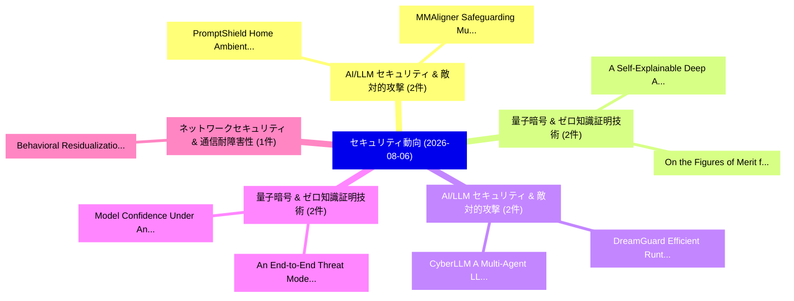

# 📅 02_daily: 日次エグゼクティブサマリー報告書 (2026-08-06)

**集計日時**: 2026-10-02 23:06:22 UTC  
**対象日付**: 2026-08-06  
**本日収集論文数**: 32 件  

---

## 💡 主要セキュリティ動向・脅威インサイト (Executive Insights)

本日の収集論文（計 32 件）において、以下の重点セキュリティ領域で活発な研究動向が確認されました：
- **AI/LLM セキュリティ & 敵対的攻撃** (2 件): 注目論文として 「PromptShield Home: Ambient Mul...」、「MMAligner: Safeguarding Multim...」 等が発表され、実務防御および攻撃検証の進展が見られます。
- **量子暗号 & ゼロ知識証明技術** (2 件): 注目論文として 「A Self-Explainable Deep Archit...」、「On the Figures of Merit for Qu...」 等が発表され、実務防御および攻撃検証の進展が見られます。
- **AI/LLM セキュリティ & 敵対的攻撃** (2 件): 注目論文として 「DreamGuard: Efficient Runtime ...」、「CyberLLM: A Multi-Agent LLM Fr...」 等が発表され、実務防御および攻撃検証の進展が見られます。
- **量子暗号 & ゼロ知識証明技術** (2 件): 注目論文として 「An End-to-End Threat Model for...」、「Model Confidence Under Answer-...」 等が発表され、実務防御および攻撃検証の進展が見られます。
- **ネットワークセキュリティ & 通信耐障害性** (1 件): 注目論文として 「Behavioral Residualization for...」 等が発表され、実務防御および攻撃検証の進展が見られます。

### 🗺️ 技術・脅威トピックマインドマップ

---

## 📌 日次セキュリティ論文一覧 (日本語表形式)

| No | arXiv ID | 論文タイトル (日本語訳) | 重要キーワード | 構造化エグゼクティブ要約 (背景・提案・影響) | 脅威分類 | 詳細リンク |
|---|---|---|---|---|---|---|
| 1 | `2608.05495v1` | [PromptShield Home: Ambient Multimodal Prompt Injection Defense for Smart-Home Agents（セキュリティ分析論文）](../../okf/papers/2026-08-06/2608.05495.md) | `Ambient Multimodal Prompt Injection Defense`, `Home Agents`, `Smart-Home Agents` | 【提案】概要 (Overview & Key Finding) 本論文「PromptShield Home: Ambient Multimodal プロンプトインジェクション Def...。実証評価により経営層・セキュリティ管理者向け推奨アクション (E... | `arXiv` | [arXiv](https://arxiv.org/abs/2608.05495v1) &#124; [OKF](../../okf/papers/2026-08-06/2608.05495.md) |
| 2 | `2608.05548v1` | [Behavioral Residualization for Unsupervised Intrusion Detection in Automotive CAN Networks（セキュリティ分析論文）](../../okf/papers/2026-08-06/2608.05548.md) | `Unsupervised Intrusion Detection`, `Behavioral Residualization`, `Chandan Hegde` | 【提案】概要 (Overview & Key Finding) 本論文「Behavioral Residualization for Unsupervised Intrusion D...。実証評価により経営層・セキュリティ管理者向け推奨アクション (E... | `arXiv` | [arXiv](https://arxiv.org/abs/2608.05548v1) &#124; [OKF](../../okf/papers/2026-08-06/2608.05548.md) |
| 3 | `2608.05552v1` | [A Self-Explainable Deep Architecture for Security Applications（セキュリティ分析論文）](../../okf/papers/2026-08-06/2608.05552.md) | `Explainable Deep Architecture`, `Security Applications`, `Self-Explainable Deep` | 【提案】概要 (Overview & Key Finding) 本論文「A Self-Explainable Deep Architecture for Security Appli...。実証評価により経営層・セキュリティ管理者向け推奨アクション (E... | `arXiv` | [arXiv](https://arxiv.org/abs/2608.05552v1) &#124; [OKF](../../okf/papers/2026-08-06/2608.05552.md) |
| 4 | `2608.05563v2` | [When Experience Becomes Instruction: Trajectory Poisoning in Self-Evolving Agent Skill Systems（セキュリティ分析論文）](../../okf/papers/2026-08-06/2608.05563.md) | `Evolving Agent Skill Systems`, `Trajectory Poisoning`, `Self-Evolving Agent` | 【提案】概要 (Overview & Key Finding) 本論文「When Experience Becomes Instruction: Trajectory Poisoni...。実証評価により経営層・セキュリティ管理者向け推奨アクション (E... | `arXiv` | [arXiv](https://arxiv.org/abs/2608.05563v2) &#124; [OKF](../../okf/papers/2026-08-06/2608.05563.md) |
| 5 | `2608.05578v1` | [Detecting Safety Training Modification in Language Models via Activation Analysis（セキュリティ分析論文）](../../okf/papers/2026-08-06/2608.05578.md) | `Detecting Safety Training Modification`, `Language Models`, `Glen Messenger` | 【提案】概要 (Overview & Key Finding) 本論文「Detecting Safety Training Modification in Language Mode...。実証評価により経営層・セキュリティ管理者向け推奨アクション (E... | `arXiv` | [arXiv](https://arxiv.org/abs/2608.05578v1) &#124; [OKF](../../okf/papers/2026-08-06/2608.05578.md) |
| 6 | `2608.05605v1` | [Enhancing Anomaly Resilience in Research Networks: A Large-Scale Forecasting Benchmark for Dynamic Security Baselining（セキュリティ分析論文）](../../okf/papers/2026-08-06/2608.05605.md) | `Enhancing Anomaly Resilience`, `Scale Forecasting Benchmark`, `Dynamic Security Baselining` | 【提案】概要 (Overview & Key Finding) 本論文「Enhancing Anomaly Resilience in Research Networks: A La...。実証評価により経営層・セキュリティ管理者向け推奨アクション (E... | `arXiv` | [arXiv](https://arxiv.org/abs/2608.05605v1) &#124; [OKF](../../okf/papers/2026-08-06/2608.05605.md) |
| 7 | `2608.05659v1` | [Breaking Customized LLMs for Coding: Automated Red Teaming for Instruction Backdoor Attacks（セキュリティ分析論文）](../../okf/papers/2026-08-06/2608.05659.md) | `Automated Red Teaming`, `Instruction Backdoor Attacks`, `Breaking Customized` | 【提案】概要 (Overview & Key Finding) 本論文「Breaking Customized LLMs for Coding: Automated Red Team...。実証評価により経営層・セキュリティ管理者向け推奨アクション (E... | `arXiv` | [arXiv](https://arxiv.org/abs/2608.05659v1) &#124; [OKF](../../okf/papers/2026-08-06/2608.05659.md) |
| 8 | `2608.05695v1` | [DreamGuard: Efficient Runtime Guardrail for LLMエージェント via Risk-Aware World Model](../../okf/papers/2026-08-06/2608.05695.md) | `Efficient Runtime Guardrail`, `Aware World Model`, `Risk-Aware World` | 【提案】概要 (Overview & Key Finding) 本論文「DreamGuard: Efficient Runtime Guardrail for LLMエージェント v...。実証評価により経営層・セキュリティ管理者向け推奨アクション (E... | `arXiv` | [arXiv](https://arxiv.org/abs/2608.05695v1) &#124; [OKF](../../okf/papers/2026-08-06/2608.05695.md) |
| 9 | `2608.05736v1` | [Algebraic Cryptanalytic Extraction on Hard-Label Neural Networks（セキュリティ分析論文）](../../okf/papers/2026-08-06/2608.05736.md) | `Algebraic Cryptanalytic Extraction`, `Label Neural Networks`, `Hard-Label Neural` | 【提案】概要 (Overview & Key Finding) 本論文「Algebraic Cryptanalytic Extraction on Hard-Label Neural...。実証評価により経営層・セキュリティ管理者向け推奨アクション (E... | `arXiv` | [arXiv](https://arxiv.org/abs/2608.05736v1) &#124; [OKF](../../okf/papers/2026-08-06/2608.05736.md) |
| 10 | `2608.05737v1` | [ABC: Numerical Data Collection under Local Differential Privacy without Prior Knowledge（セキュリティ分析論文）](../../okf/papers/2026-08-06/2608.05737.md) | `Numerical Data Collection`, `Local Differential Privacy`, `Prior Knowledge` | 【提案】背景とセキュリティ上の課題 (Background & Problem) 本研究はサイバー脅威環境におけるセキュリティ構造・脆弱性の検証を目的としています。(主要検出項目: ...。実証評価により経営層・セキュリティ管理者向け推奨アクション (E... | `arXiv` | [arXiv](https://arxiv.org/abs/2608.05737v1) &#124; [OKF](../../okf/papers/2026-08-06/2608.05737.md) |
| 11 | `2608.05754v1` | [Quantum One-Way Functions and Related Cryptographic Primitives（セキュリティ分析論文）](../../okf/papers/2026-08-06/2608.05754.md) | `Related Cryptographic Primitives`, `Quantum One`, `Way Functions` | 【提案】概要 (Overview & Key Finding) 本論文「量子 One-Way Functions and Related Cryptographic Primitiv...。実証評価によりNikolopoulos - **公開日時**: ... | `arXiv` | [arXiv](https://arxiv.org/abs/2608.05754v1) &#124; [OKF](../../okf/papers/2026-08-06/2608.05754.md) |
| 12 | `2608.05790v1` | [ChainClaw: A Layered Agent Framework for Reliable On-Chain Execution（セキュリティ分析論文）](../../okf/papers/2026-08-06/2608.05790.md) | `Chain Execution`, `On-Chain Execution`, `Jiacheng Wei` | 【提案】概要 (Overview & Key Finding) 本論文「ChainClaw: A Layered Agent Framework for Reliable On-Ch...。実証評価により経営層・セキュリティ管理者向け推奨アクション (E... | `arXiv` | [arXiv](https://arxiv.org/abs/2608.05790v1) &#124; [OKF](../../okf/papers/2026-08-06/2608.05790.md) |
| 13 | `2608.05831v1` | [On the Figures of Merit for Quantum Software Security: Toward a Rubricのベンチマーク評価](../../okf/papers/2026-08-06/2608.05831.md) | `Quantum Software Security`, `Benchmarking Rubric`, `Badhon Rahman` | 【提案】概要 (Overview & Key Finding) 本論文「On the Figures of Merit for 量子 Software Security: Towar...。実証評価により経営層・セキュリティ管理者向け推奨アクション (E... | `arXiv` | [arXiv](https://arxiv.org/abs/2608.05831v1) &#124; [OKF](../../okf/papers/2026-08-06/2608.05831.md) |
| 14 | `2608.05836v1` | [An End-to-End Threat Model for the Quantum-as-a-Service Pipeline（セキュリティ分析論文）](../../okf/papers/2026-08-06/2608.05836.md) | `End Threat Model`, `Service Pipeline`, `a-Service Pipeline` | 【提案】概要 (Overview & Key Finding) 本論文「An End-to-End 脅威 Model for the 量子-as-a-Service Pipeline...。実証評価により経営層・セキュリティ管理者向け推奨アクション (E... | `arXiv` | [arXiv](https://arxiv.org/abs/2608.05836v1) &#124; [OKF](../../okf/papers/2026-08-06/2608.05836.md) |
| 15 | `2608.05870v1` | [RustGo: Fairly Directed Greybox Fuzzing for Enforcing Rust Memory Safety（セキュリティ分析論文）](../../okf/papers/2026-08-06/2608.05870.md) | `Fairly Directed Greybox Fuzzing`, `Enforcing Rust Memory Safety`, `Dongyeon Yu` | 【提案】概要 (Overview & Key Finding) 本論文「RustGo: Fairly Directed Greybox Fuzzing for Enforcing R...。実証評価により経営層・セキュリティ管理者向け推奨アクション (E... | `arXiv` | [arXiv](https://arxiv.org/abs/2608.05870v1) &#124; [OKF](../../okf/papers/2026-08-06/2608.05870.md) |
| 16 | `2608.05884v1` | [The Vulnerability With No CVE: Managing Persistent Gaps Between Mandate and Authority in AI Coding Agents（セキュリティ分析論文）](../../okf/papers/2026-08-06/2608.05884.md) | `Coding Agents`, `Shayell Aharon Salomon Amir Shaked Matan Noga`, `Raw Meta` | 【提案】概要 (Overview & Key Finding) 本論文「The 脆弱性 With No CVE: Managing Persistent Gaps Between M...。実証評価により経営層・セキュリティ管理者向け推奨アクション (E... | `arXiv` | [arXiv](https://arxiv.org/abs/2608.05884v1) &#124; [OKF](../../okf/papers/2026-08-06/2608.05884.md) |
| 17 | `2608.05902v1` | [Tool Demo: Topology analysis with GPML for cyberattacks in Water Distribution Networksの検出](../../okf/papers/2026-08-06/2608.05902.md) | `Tool Demo`, `Water Distribution`, `Water Distribution Networks` | 【提案】概要 (Overview & Key Finding) 本論文「Tool Demo: Topology analysis with GPML for cyberattacks...。実証評価により経営層・セキュリティ管理者向け推奨アクション (E... | `arXiv` | [arXiv](https://arxiv.org/abs/2608.05902v1) &#124; [OKF](../../okf/papers/2026-08-06/2608.05902.md) |
| 18 | `2608.05909v1` | [MMAligner: Safeguarding Multimodal 大規模言語モデル through Representation Calibration](../../okf/papers/2026-08-06/2608.05909.md) | `Representation Calibration`, `Safeguarding Multimodal Large Language Models`, `Safeguarding Multimodal` | 【提案】概要 (Overview & Key Finding) 本論文「MMAligner: Safeguarding Multimodal 大規模言語モデル through Rep...。実証評価により経営層・セキュリティ管理者向け推奨アクション (E... | `arXiv` | [arXiv](https://arxiv.org/abs/2608.05909v1) &#124; [OKF](../../okf/papers/2026-08-06/2608.05909.md) |
| 19 | `2608.06061v1` | [A Note on the Influence of a Zero Length Nonce on GCM and GMAC（セキュリティ分析論文）](../../okf/papers/2026-08-06/2608.06061.md) | `Zero Length Nonce`, `Yaobin Shen`, `Raw Meta` | 【提案】概要 (Overview & Key Finding) 本論文「A Note on the Influence of a Zero Length Nonce on GCM a...。実証評価により経営層・セキュリティ管理者向け推奨アクション (E... | `arXiv` | [arXiv](https://arxiv.org/abs/2608.06061v1) &#124; [OKF](../../okf/papers/2026-08-06/2608.06061.md) |
| 20 | `2608.06124v1` | [dfence: Fine-Grained Speculation Barriers for Efficient and Effective Hardware-Software Protection in the Spectre Era (Extended Version)（セキュリティ分析論文）](../../okf/papers/2026-08-06/2608.06124.md) | `Grained Speculation Barriers`, `Effective Hardware`, `Software Protection` | 【提案】概要 (Overview & Key Finding) 本論文「dfence: Fine-Grained Speculation Barriers for Efficient...。実証評価により経営層・セキュリティ管理者向け推奨アクション (E... | `arXiv` | [arXiv](https://arxiv.org/abs/2608.06124v1) &#124; [OKF](../../okf/papers/2026-08-06/2608.06124.md) |
| 21 | `2608.06130v1` | [Hardware Keystores for AI Agent Signing Workflows: A Zero-Trust MCP Enforcement Architecture（セキュリティ分析論文）](../../okf/papers/2026-08-06/2608.06130.md) | `Agent Signing Workflows`, `Hardware Keystores`, `Enforcement Architecture` | 【提案】概要 (Overview & Key Finding) 本論文「Hardware Keystores for AI Agent Signing Workflows: A ゼロ...。実証評価により経営層・セキュリティ管理者向け推奨アクション (E... | `arXiv` | [arXiv](https://arxiv.org/abs/2608.06130v1) &#124; [OKF](../../okf/papers/2026-08-06/2608.06130.md) |
| 22 | `2608.06211v1` | [Reversible Unlearnable Examples: the Copyright Protection in Deep Learning Eraに向けて](../../okf/papers/2026-08-06/2608.06211.md) | `Reversible Unlearnable Examples`, `Copyright Protection`, `Deep Learning Era` | 【提案】概要 (Overview & Key Finding) 本論文「Reversible Unlearnable Examples: the Copyright Protecti...。実証評価により経営層・セキュリティ管理者向け推奨アクション (E... | `arXiv` | [arXiv](https://arxiv.org/abs/2608.06211v1) &#124; [OKF](../../okf/papers/2026-08-06/2608.06211.md) |
| 23 | `2608.06261v1` | [Game Hopping in Lean（セキュリティ分析論文）](../../okf/papers/2026-08-06/2608.06261.md) | `Game Hopping`, `Stefan Dziembowski`, `Daniele Micciancio` | 【提案】概要 (Overview & Key Finding) 本論文「Game Hopping in Lean（セキュリティ分析論文）」（原題: Game Hopping in L...。実証評価により経営層・セキュリティ管理者向け推奨アクション (E... | `arXiv` | [arXiv](https://arxiv.org/abs/2608.06261v1) &#124; [OKF](../../okf/papers/2026-08-06/2608.06261.md) |
| 24 | `2608.06315v2` | [A Sound Translation from Tamarin to ProVerif: Enabling Comparative Analysis（セキュリティ分析論文）](../../okf/papers/2026-08-06/2608.06315.md) | `Sound Translation`, `Kevin Morio`, `Yavor Ivanov` | 【提案】概要 (Overview & Key Finding) 本論文「A Sound Translation from Tamarin to ProVerif: Enabling ...。実証評価により経営層・セキュリティ管理者向け推奨アクション (E... | `arXiv` | [arXiv](https://arxiv.org/abs/2608.06315v2) &#124; [OKF](../../okf/papers/2026-08-06/2608.06315.md) |
| 25 | `2608.06469v1` | [Fairis: Fairness-Aware Aggregation with Provable Influence Containment against Fairness Poisoning Attacks in Collaborative Machine Learning（セキュリティ分析論文）](../../okf/papers/2026-08-06/2608.06469.md) | `Provable Influence Containment`, `Fairness Poisoning Attacks`, `Collaborative Machine Learning` | 【提案】概要 (Overview & Key Finding) 本論文「Fairis: Fairness-Aware Aggregation with Provable Influe...。実証評価により経営層・セキュリティ管理者向け推奨アクション (E... | `arXiv` | [arXiv](https://arxiv.org/abs/2608.06469v1) &#124; [OKF](../../okf/papers/2026-08-06/2608.06469.md) |
| 26 | `2608.06471v1` | [CyberForge: Verified Vulnerability Injection at Repository Level for サイバーセキュリティ Agent Training](../../okf/papers/2026-08-06/2608.06471.md) | `Verified Vulnerability Injection`, `Repository Level`, `Cybersecurity Agent Training` | 【提案】概要 (Overview & Key Finding) 本論文「CyberForge: Verified 脆弱性 Injection at Repository Level ...。実証評価により経営層・セキュリティ管理者向け推奨アクション (E... | `arXiv` | [arXiv](https://arxiv.org/abs/2608.06471v1) &#124; [OKF](../../okf/papers/2026-08-06/2608.06471.md) |
| 27 | `2608.06477v1` | [StepJack: Computer-Use Agent Safety Against Multi-Step Indirect Prompt Injectionのベンチマーク評価](../../okf/papers/2026-08-06/2608.06477.md) | `Computer-Use Agent`, `Multi-Step Indirect`, `Step Indirect Prompt` | 【提案】概要 (Overview & Key Finding) 本論文「StepJack: Computer-Use Agent Safety Against Multi-Step ...。実証評価により経営層・セキュリティ管理者向け推奨アクション (E... | `arXiv` | [arXiv](https://arxiv.org/abs/2608.06477v1) &#124; [OKF](../../okf/papers/2026-08-06/2608.06477.md) |
| 28 | `2608.06508v1` | [Canonicalization Failures as a Recurring Vulnerability Class: Representation Divergence in Cryptographic Systems and Its Avoidance（セキュリティ分析論文）](../../okf/papers/2026-08-06/2608.06508.md) | `Recurring Vulnerability Class`, `Canonicalization Failures`, `Representation Divergence` | 【提案】概要 (Overview & Key Finding) 本論文「Canonicalization Failures as a Recurring 脆弱性 Class: Rep...。実証評価により経営層・セキュリティ管理者向け推奨アクション (E... | `arXiv` | [arXiv](https://arxiv.org/abs/2608.06508v1) &#124; [OKF](../../okf/papers/2026-08-06/2608.06508.md) |
| 29 | `2608.06571v1` | [Model Confidence Under Answer-Preserving Attacks: An Informativeness-Manipulability Frontier（セキュリティ分析論文）](../../okf/papers/2026-08-06/2608.06571.md) | `Preserving Attacks`, `Answer-Preserving Attacks`, `Manipulability Frontier` | 【提案】概要 (Overview & Key Finding) 本論文「Model Confidence Under Answer-Preserving Attacks: An In...。実証評価により経営層・セキュリティ管理者向け推奨アクション (E... | `arXiv` | [arXiv](https://arxiv.org/abs/2608.06571v1) &#124; [OKF](../../okf/papers/2026-08-06/2608.06571.md) |
| 30 | `2608.06581v1` | [WhiteNet: Robust Identification of Overlapping IEEE 802.11 Signals Across Unseen Channels（セキュリティ分析論文）](../../okf/papers/2026-08-06/2608.06581.md) | `Signals Across Unseen Channels`, `Robust Identification`, `Signals Across Unseen` | 【提案】概要 (Overview & Key Finding) 本論文「WhiteNet: Robust Identification of Overlapping IEEE 802...。実証評価により経営層・セキュリティ管理者向け推奨アクション (E... | `arXiv` | [arXiv](https://arxiv.org/abs/2608.06581v1) &#124; [OKF](../../okf/papers/2026-08-06/2608.06581.md) |
| 31 | `2608.06641v2` | [From Documentation to Zero-day Vulnerabilities: LLM-Driven Fuzzing of JavaScript Engines in PDF Readers（セキュリティ分析論文）](../../okf/papers/2026-08-06/2608.06641.md) | `Driven Fuzzing`, `Zero-day Vulnerabilities`, `LLM-Driven Fuzzing` | 【提案】概要 (Overview & Key Finding) 本論文「From Documentation to Zero-day Vulnerabilities: LLM-Dri...。実証評価により経営層・セキュリティ管理者向け推奨アクション (E... | `AI/ML Security` | [arXiv](https://arxiv.org/abs/2608.06641v2) &#124; [OKF](../../okf/papers/2026-08-06/2608.06641.md) |
| 32 | `2608.06651v1` | [CyberLLM: A Multi-Agent LLM Framework for Autonomous Detection and Guarded Response in Automotive サイバーセキュリティ](../../okf/papers/2026-08-06/2608.06651.md) | `Autonomous Detection`, `Guarded Response`, `Multi-Agent LLM` | 【提案】概要 (Overview & Key Finding) 本論文「CyberLLM: A Multi-Agent LLM Framework for Autonomous De...。実証評価により経営層・セキュリティ管理者向け推奨アクション (E... | `arXiv` | [arXiv](https://arxiv.org/abs/2608.06651v1) &#124; [OKF](../../okf/papers/2026-08-06/2608.06651.md) |

