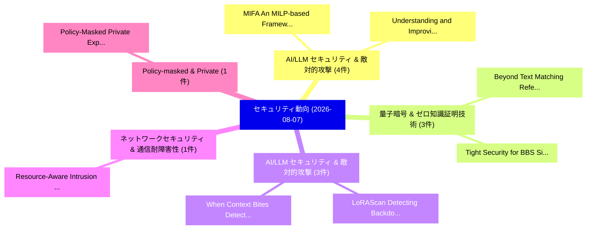

# 📅 02_daily: 日次エグゼクティブサマリー報告書 (2026-08-07)

**集計日時**: 2026-10-02 23:06:22 UTC  
**対象日付**: 2026-08-07  
**本日収集論文数**: 29 件  

---

## 💡 主要セキュリティ動向・脅威インサイト (Executive Insights)

本日の収集論文（計 29 件）において、以下の重点セキュリティ領域で活発な研究動向が確認されました：
- **AI/LLM セキュリティ & 敵対的攻撃** (4 件): 注目論文として 「MIFA: An MILP-based Framework ...」、「Understanding and Improving Mo...」 等が発表され、実務防御および攻撃検証の進展が見られます。
- **量子暗号 & ゼロ知識証明技術** (3 件): 注目論文として 「Tight Security for BBS Signatu...」、「Beyond Text Matching: Referenc...」 等が発表され、実務防御および攻撃検証の進展が見られます。
- **AI/LLM セキュリティ & 敵対的攻撃** (3 件): 注目論文として 「LoRAScan: Detecting Backdoor P...」、「When Context Bites: Detecting ...」 等が発表され、実務防御および攻撃検証の進展が見られます。
- **ネットワークセキュリティ & 通信耐障害性** (1 件): 注目論文として 「Resource-Aware Intrusion Detec...」 等が発表され、実務防御および攻撃検証の進展が見られます。
- **Policy-masked & Private** (1 件): 注目論文として 「Policy-Masked Private Experts:...」 等が発表され、実務防御および攻撃検証の進展が見られます。

### 🗺️ 技術・脅威トピックマインドマップ

---

## 📌 日次セキュリティ論文一覧 (日本語表形式)

| No | arXiv ID | 論文タイトル (日本語訳) | 重要キーワード | 構造化エグゼクティブ要約 (背景・提案・影響) | 脅威分類 | 詳細リンク |
|---|---|---|---|---|---|---|
| 1 | `2608.06655v1` | [Resource-Aware Intrusion Detection in Infrastructure Networks: A Game-Theoretic Approach（セキュリティ分析論文）](../../okf/papers/2026-08-07/2608.06655.md) | `Aware Intrusion Detection`, `Resource-Aware Intrusion`, `Infrastructure Networks` | 【提案】概要 (Overview & Key Finding) 本論文「Resource-Aware Intrusion Detection in Infrastructure Ne...。実証評価により経営層・セキュリティ管理者向け推奨アクション (E... | `arXiv` | [arXiv](https://arxiv.org/abs/2608.06655v1) &#124; [OKF](../../okf/papers/2026-08-07/2608.06655.md) |
| 2 | `2608.06690v2` | [Policy-Masked Private Experts: Auditable and Reversible Capability Access Control in Sparse MoE Models（セキュリティ分析論文）](../../okf/papers/2026-08-07/2608.06690.md) | `Reversible Capability Access Control`, `Masked Private Experts`, `Policy-Masked Private` | 【提案】概要 (Overview & Key Finding) 本論文「Policy-Masked Private Experts: Auditable and Reversible...。実証評価により経営層・セキュリティ管理者向け推奨アクション (E... | `arXiv` | [arXiv](https://arxiv.org/abs/2608.06690v2) &#124; [OKF](../../okf/papers/2026-08-07/2608.06690.md) |
| 3 | `2608.06724v1` | [Tight Security for BBS Signatures（セキュリティ分析論文）](../../okf/papers/2026-08-07/2608.06724.md) | `Tight Security`, `Rutchathon Chairattana`, `Dennis Hofheinz` | 【提案】概要 (Overview & Key Finding) 本論文「Tight Security for BBS Signatures（セキュリティ分析論文）」（原題: Tigh...。実証評価により経営層・セキュリティ管理者向け推奨アクション (E... | `arXiv` | [arXiv](https://arxiv.org/abs/2608.06724v1) &#124; [OKF](../../okf/papers/2026-08-07/2608.06724.md) |
| 4 | `2608.06778v1` | [Retrieval-Constrained Policy Optimization for Attack Technique Extraction from Cyber Threat Intelligence（セキュリティ分析論文）](../../okf/papers/2026-08-07/2608.06778.md) | `Constrained Policy Optimization`, `Attack Technique Extraction`, `Cyber Threat Intelligence` | 【提案】概要 (Overview & Key Finding) 本論文「Retrieval-Constrained Policy Optimization for Attack Te...。実証評価により経営層・セキュリティ管理者向け推奨アクション (E... | `arXiv` | [arXiv](https://arxiv.org/abs/2608.06778v1) &#124; [OKF](../../okf/papers/2026-08-07/2608.06778.md) |
| 5 | `2608.06795v1` | [LoRAScan: Detecting Backdoor Prompts in Low-Rank Adapters for 大規模言語モデル via Down-Projection Activation Spikes](../../okf/papers/2026-08-07/2608.06795.md) | `Detecting Backdoor Prompts`, `Projection Activation Spikes`, `Rank Adapters` | 【提案】概要 (Overview & Key Finding) 本論文「LoRAScan: Detecting Backdoor Prompts in Low-Rank Adapte...。実証評価により経営層・セキュリティ管理者向け推奨アクション (E... | `arXiv` | [arXiv](https://arxiv.org/abs/2608.06795v1) &#124; [OKF](../../okf/papers/2026-08-07/2608.06795.md) |
| 6 | `2608.06805v1` | [On a General Theoretical Framework for Radio Frequency Fingerprint-Based Authentication（セキュリティ分析論文）](../../okf/papers/2026-08-07/2608.06805.md) | `Radio Frequency Fingerprint`, `Based Authentication`, `Fingerprint-Based Authentication` | 【提案】概要 (Overview & Key Finding) 本論文「On a General Theoretical Framework for Radio Frequency ...。実証評価により経営層・セキュリティ管理者向け推奨アクション (E... | `arXiv` | [arXiv](https://arxiv.org/abs/2608.06805v1) &#124; [OKF](../../okf/papers/2026-08-07/2608.06805.md) |
| 7 | `2608.06826v1` | [POKEx: Performance POKE-key exchange and SIDH-variantsの分析](../../okf/papers/2026-08-07/2608.06826.md) | `POKE-key exchange`, `Hyeonhak Kim`, `Suhri Kim` | 【提案】概要 (Overview & Key Finding) 本論文「POKEx: Performance POKE-key exchange and SIDH-variantsの...。実証評価により経営層・セキュリティ管理者向け推奨アクション (E... | `arXiv` | [arXiv](https://arxiv.org/abs/2608.06826v1) &#124; [OKF](../../okf/papers/2026-08-07/2608.06826.md) |
| 8 | `2608.06830v1` | [When Coordination Becomes a Threat: Communication Attacks in LLM-Controlled Multi-Robot Systems（セキュリティ分析論文）](../../okf/papers/2026-08-07/2608.06830.md) | `Communication Attacks`, `Controlled Multi`, `LLM-Controlled Multi` | 【提案】概要 (Overview & Key Finding) 本論文「When Coordination Becomes a 脅威: Communication Attacks i...。実証評価により経営層・セキュリティ管理者向け推奨アクション (E... | `arXiv` | [arXiv](https://arxiv.org/abs/2608.06830v1) &#124; [OKF](../../okf/papers/2026-08-07/2608.06830.md) |
| 9 | `2608.06837v1` | [MIFA: An MILP-based Framework for Improving Differential Fault Attacks（セキュリティ分析論文）](../../okf/papers/2026-08-07/2608.06837.md) | `Improving Differential Fault Attacks`, `Improving Differential Fault Atta`, `Hanbeom Shin` | 【提案】概要 (Overview & Key Finding) 本論文「MIFA: An MILP-based Framework for Improving Differentia...。実証評価により経営層・セキュリティ管理者向け推奨アクション (E... | `arXiv` | [arXiv](https://arxiv.org/abs/2608.06837v1) &#124; [OKF](../../okf/papers/2026-08-07/2608.06837.md) |
| 10 | `2608.06848v1` | [Understanding and Improving Model Editing for Secure Code Generation（セキュリティ分析論文）](../../okf/papers/2026-08-07/2608.06848.md) | `Improving Model Editing`, `Secure Code Generation`, `Weifeng Sun` | 【提案】概要 (Overview & Key Finding) 本論文「Understanding and Improving Model Editing for Secure Co...。実証評価により経営層・セキュリティ管理者向け推奨アクション (E... | `arXiv` | [arXiv](https://arxiv.org/abs/2608.06848v1) &#124; [OKF](../../okf/papers/2026-08-07/2608.06848.md) |
| 11 | `2608.06862v1` | [SynChain: Inducing Computer-Use Agent Systems to Construct Their Own Attack Chains（セキュリティ分析論文）](../../okf/papers/2026-08-07/2608.06862.md) | `Use Agent Systems`, `Inducing Computer`, `Computer-Use Agent` | 【提案】概要 (Overview & Key Finding) 本論文「SynChain: Inducing Computer-Use Agent Systems to Constr...。実証評価により経営層・セキュリティ管理者向け推奨アクション (E... | `arXiv` | [arXiv](https://arxiv.org/abs/2608.06862v1) &#124; [OKF](../../okf/papers/2026-08-07/2608.06862.md) |
| 12 | `2608.06885v1` | [Rigid-Covert GNSS Spoofing of UAV Swarms: A Structural Blind Spot, Its Detection Limit, and Absolute-Anchor Defenses（セキュリティ分析論文）](../../okf/papers/2026-08-07/2608.06885.md) | `Structural Blind Spot`, `Rigid-Covert GNSS`, `Anchor Defenses` | 【提案】概要 (Overview & Key Finding) 本論文「Rigid-Covert GNSS Spoofing of UAV Swarms: A Structural ...。実証評価により経営層・セキュリティ管理者向け推奨アクション (E... | `arXiv` | [arXiv](https://arxiv.org/abs/2608.06885v1) &#124; [OKF](../../okf/papers/2026-08-07/2608.06885.md) |
| 13 | `2608.06947v1` | [When Context Bites: Detecting RAG Poisoning via Document-Level Attention Collapse（セキュリティ分析論文）](../../okf/papers/2026-08-07/2608.06947.md) | `Level Attention Collapse`, `Document-Level Attention`, `Yingtao Ren` | 【提案】概要 (Overview & Key Finding) 本論文「When Context Bites: Detecting RAG Poisoning via Documen...。実証評価により経営層・セキュリティ管理者向け推奨アクション (E... | `arXiv` | [arXiv](https://arxiv.org/abs/2608.06947v1) &#124; [OKF](../../okf/papers/2026-08-07/2608.06947.md) |
| 14 | `2608.06952v1` | [Casting the Net! Revisiting MasterFace Impersonation Attacks（セキュリティ分析論文）](../../okf/papers/2026-08-07/2608.06952.md) | `Impersonation Attacks`, `Jae Hong Seo`, `Seunghun Paik` | 【提案】Revisiting MasterFace Impersonation Attacks ### (日本語題名: Casting the Net!。実証評価により経営層・セキュリティ管理者向け推奨アクション (Executive Recommend... | `arXiv` | [arXiv](https://arxiv.org/abs/2608.06952v1) &#124; [OKF](../../okf/papers/2026-08-07/2608.06952.md) |
| 15 | `2608.06960v1` | [Statistical Executability and Program Equivalence in Decompilation for IoT Vulnerability Detectionの分析](../../okf/papers/2026-08-07/2608.06960.md) | `Program Equivalence`, `Statistical Executability`, `Vulnerability Detection` | 【提案】概要 (Overview & Key Finding) 本論文「Statistical Executability and Program Equivalence in De...。実証評価により経営層・セキュリティ管理者向け推奨アクション (E... | `arXiv` | [arXiv](https://arxiv.org/abs/2608.06960v1) &#124; [OKF](../../okf/papers/2026-08-07/2608.06960.md) |
| 16 | `2608.06984v1` | [HarnessSafe: Evaluating Safety Across Persistent Carriers in Agent Harnesses（セキュリティ分析論文）](../../okf/papers/2026-08-07/2608.06984.md) | `Evaluating Safety Across Persistent Carriers`, `Agent Harnesses`, `Evaluating Safety Across Persistent` | 【提案】概要 (Overview & Key Finding) 本論文「HarnessSafe: Evaluating Safety Across Persistent Carrie...。実証評価により経営層・セキュリティ管理者向け推奨アクション (E... | `arXiv` | [arXiv](https://arxiv.org/abs/2608.06984v1) &#124; [OKF](../../okf/papers/2026-08-07/2608.06984.md) |
| 17 | `2608.07016v2` | [Effects of parental controls in the context of Digital Forensics（セキュリティ分析論文）](../../okf/papers/2026-08-07/2608.07016.md) | `Digital Forensics`, `Mauro Vignati`, `Frank Breitinger` | 【提案】概要 (Overview & Key Finding) 本論文「Effects of parental controls in the context of Digital ...。実証評価により経営層・セキュリティ管理者向け推奨アクション (E... | `arXiv` | [arXiv](https://arxiv.org/abs/2608.07016v2) &#124; [OKF](../../okf/papers/2026-08-07/2608.07016.md) |
| 18 | `2608.07038v1` | [Beyond Text Matching: Reference-Free Evaluation for Human-Oriented Binary Reverse Engineeringに向けて](../../okf/papers/2026-08-07/2608.07038.md) | `Beyond Text Matching`, `Human-Oriented Binary`, `Oriented Binary Reverse Engineering` | 【提案】概要 (Overview & Key Finding) 本論文「Beyond Text Matching: Reference-Free Evaluation for Hum...。実証評価により経営層・セキュリティ管理者向け推奨アクション (E... | `arXiv` | [arXiv](https://arxiv.org/abs/2608.07038v1) &#124; [OKF](../../okf/papers/2026-08-07/2608.07038.md) |
| 19 | `2608.07063v1` | [Soft Redaction of Image Provenance via Zero-Knowledge Proofs（セキュリティ分析論文）](../../okf/papers/2026-08-07/2608.07063.md) | `Soft Redaction`, `Image Provenance`, `Knowledge Proofs` | 【提案】概要 (Overview & Key Finding) 本論文「Soft Redaction of Image Provenance via Zero-Knowledge P...。実証評価により経営層・セキュリティ管理者向け推奨アクション (E... | `arXiv` | [arXiv](https://arxiv.org/abs/2608.07063v1) &#124; [OKF](../../okf/papers/2026-08-07/2608.07063.md) |
| 20 | `2608.07104v1` | [SoK: Cryptographic Key Recovery for Cryptoasset Custody and Financial Technologies（セキュリティ分析論文）](../../okf/papers/2026-08-07/2608.07104.md) | `Cryptographic Key Recovery`, `Cryptoasset Custody`, `Financial Technologies` | 【提案】概要 (Overview & Key Finding) 本論文「SoK: Cryptographic Key Recovery for Cryptoasset Custody...。実証評価により経営層・セキュリティ管理者向け推奨アクション (E... | `arXiv` | [arXiv](https://arxiv.org/abs/2608.07104v1) &#124; [OKF](../../okf/papers/2026-08-07/2608.07104.md) |
| 21 | `2608.07143v3` | ["Operator, can you hear me?" A Faithful Line into the UNISOC Baseband（セキュリティ分析論文）](../../okf/papers/2026-08-07/2608.07143.md) | `Faithful Line`, `Eduard Vlad`, `Philipp Mao` | 【提案】概要 (Overview & Key Finding) 本論文「"Operator, can you hear me?" A Faithful Line into the U...。実証評価により経営層・セキュリティ管理者向け推奨アクション (E... | `arXiv` | [arXiv](https://arxiv.org/abs/2608.07143v3) &#124; [OKF](../../okf/papers/2026-08-07/2608.07143.md) |
| 22 | `2608.07451v1` | [An Architectural and Operational Dynamics of Phishkits in the Wildの分析](../../okf/papers/2026-08-07/2608.07451.md) | `Operational Dynamics`, `Mohammad Ali Tofighi`, `Behzad Ousat` | 【提案】概要 (Overview & Key Finding) 本論文「An Architectural and Operational Dynamics of Phishkits ...。実証評価により経営層・セキュリティ管理者向け推奨アクション (E... | `arXiv` | [arXiv](https://arxiv.org/abs/2608.07451v1) &#124; [OKF](../../okf/papers/2026-08-07/2608.07451.md) |
| 23 | `2608.07626v1` | [Beyond the Quantum Promise: A Security Classical Control in Quantum Key Distributionの分析](../../okf/papers/2026-08-07/2608.07626.md) | `Quantum Promise`, `Security Classical Control`, `Classical Control` | 【提案】概要 (Overview & Key Finding) 本論文「Beyond the 量子 Promise: A Security Classical Control in ...。実証評価により経営層・セキュリティ管理者向け推奨アクション (E... | `arXiv` | [arXiv](https://arxiv.org/abs/2608.07626v1) &#124; [OKF](../../okf/papers/2026-08-07/2608.07626.md) |
| 24 | `2608.07636v1` | [Deep OCR Systemsに対する敵対的攻撃](../../okf/papers/2026-08-07/2608.07636.md) | `Adversarial Attacks`, `Wenbo Sun`, `Yanyun Wang` | 【提案】概要 (Overview & Key Finding) 本論文「Deep OCR Systemsに対する敵対的攻撃」（原題: 敵対的攻撃s on Deep OCR Syste...。実証評価により経営層・セキュリティ管理者向け推奨アクション (E... | `arXiv` | [arXiv](https://arxiv.org/abs/2608.07636v1) &#124; [OKF](../../okf/papers/2026-08-07/2608.07636.md) |
| 25 | `2608.07688v1` | [IntelliAudit: Using 大規模言語モデル to Evaluate Audit Controls](../../okf/papers/2026-08-07/2608.07688.md) | `Using Large Language Models`, `Sina Moradi Sabet`, `Mohammad Reza Bagheri` | 【提案】概要 (Overview & Key Finding) 本論文「IntelliAudit: Using 大規模言語モデル to Evaluate Audit Controls...。実証評価により経営層・セキュリティ管理者向け推奨アクション (E... | `arXiv` | [arXiv](https://arxiv.org/abs/2608.07688v1) &#124; [OKF](../../okf/papers/2026-08-07/2608.07688.md) |
| 26 | `2608.07747v1` | [Adaptive Two-Level Allocation of a Conserved Capacity Budget Across Locations and Service Classes（セキュリティ分析論文）](../../okf/papers/2026-08-07/2608.07747.md) | `Conserved Capacity Budget Across Locations`, `Adaptive Two`, `Level Allocation` | 【提案】概要 (Overview & Key Finding) 本論文「Adaptive Two-Level Allocation of a Conserved Capacity B...。実証評価により経営層・セキュリティ管理者向け推奨アクション (E... | `arXiv` | [arXiv](https://arxiv.org/abs/2608.07747v1) &#124; [OKF](../../okf/papers/2026-08-07/2608.07747.md) |
| 27 | `2608.07762v1` | [Who Verifies the Benchmark? Decentralizing Trust in Large Language Model Evaluation（セキュリティ分析論文）](../../okf/papers/2026-08-07/2608.07762.md) | `Decentralizing Trust`, `Sahil Pardasani`, `Madhusudan Singh` | 【提案】Decentralizing Trust in Large Language Model Evaluation ### (日本語題名: Who Verifies the Be...。実証評価により経営層・セキュリティ管理者向け推奨アクション (E... | `arXiv` | [arXiv](https://arxiv.org/abs/2608.07762v1) &#124; [OKF](../../okf/papers/2026-08-07/2608.07762.md) |
| 28 | `2608.07776v1` | [Can AI Write Compliant Code, and to What Extent? Evaluating SOC 2 Compliance of Claude Fable 5, Claude Opus 4.8, and Claude Opus 5 Across Four Use Cases（セキュリティ分析論文）](../../okf/papers/2026-08-07/2608.07776.md) | `Claude Opus`, `Across Four Use Cases`, `Write Compliant Code` | 【提案】Evaluating SOC 2 Compliance of Claude Fable 5, Claude Opus 4.8, and Claude Opus 5 Acros...。実証評価により経営層・セキュリティ管理者向け推奨アクション (E... | `arXiv` | [arXiv](https://arxiv.org/abs/2608.07776v1) &#124; [OKF](../../okf/papers/2026-08-07/2608.07776.md) |
| 29 | `2608.07808v1` | [The Anatomy of a Prompt Injection: A Component Model for Structured Analysis（セキュリティ分析論文）](../../okf/papers/2026-08-07/2608.07808.md) | `Prompt Injection`, `Component Model`, `Raw Meta` | 【提案】概要 (Overview & Key Finding) 本論文「The Anatomy of a プロンプトインジェクション: A Component Model for S...。実証評価により経営層・セキュリティ管理者向け推奨アクション (E... | `arXiv` | [arXiv](https://arxiv.org/abs/2608.07808v1) &#124; [OKF](../../okf/papers/2026-08-07/2608.07808.md) |

