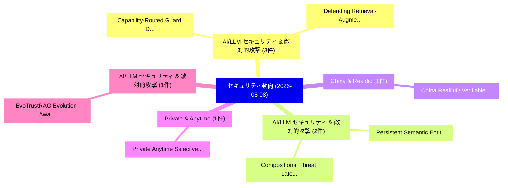

# 📅 02_daily: 日次エグゼクティブサマリー報告書 (2026-08-08)

**集計日時**: 2026-10-02 23:06:22 UTC  
**対象日付**: 2026-08-08  
**本日収集論文数**: 16 件  

---

## 💡 主要セキュリティ動向・脅威インサイト (Executive Insights)

本日の収集論文（計 16 件）において、以下の重点セキュリティ領域で活発な研究動向が確認されました：
- **AI/LLM セキュリティ & 敵対的攻撃** (3 件): 注目論文として 「Capability-Routed Guard: Defen...」、「Defending Retrieval-Augmented ...」 等が発表され、実務防御および攻撃検証の進展が見られます。
- **AI/LLM セキュリティ & 敵対的攻撃** (2 件): 注目論文として 「Persistent Semantic Entities i...」、「Compositional Threat Latent Co...」 等が発表され、実務防御および攻撃検証の進展が見られます。
- **China & Realdid** (1 件): 注目論文として 「China RealDID: Verifiable Cred...」 等が発表され、実務防御および攻撃検証の進展が見られます。
- **Private & Anytime** (1 件): 注目論文として 「Private Anytime Selective-Risk...」 等が発表され、実務防御および攻撃検証の進展が見られます。
- **AI/LLM セキュリティ & 敵対的攻撃** (1 件): 注目論文として 「EvoTrustRAG: Evolution-Aware C...」 等が発表され、実務防御および攻撃検証の進展が見られます。

### 🗺️ 技術・脅威トピックマインドマップ

---

## 📌 日次セキュリティ論文一覧 (日本語表形式)

| No | arXiv ID | 論文タイトル (日本語訳) | 重要キーワード | 構造化エグゼクティブ要約 (背景・提案・影響) | 脅威分類 | 詳細リンク |
|---|---|---|---|---|---|---|
| 1 | `2608.07846v1` | [China RealDID: Verifiable Credentials Anchored in Legal Identity（セキュリティ分析論文）](../../okf/papers/2026-08-08/2608.07846.md) | `Verifiable Credentials Anchored`, `Legal Identity`, `Raw Meta` | 【提案】概要 (Overview & Key Finding) 本論文「China RealDID: Verifiable Credentials Anchored in Legal...。実証評価により経営層・セキュリティ管理者向け推奨アクション (E... | `arXiv` | [arXiv](https://arxiv.org/abs/2608.07846v1) &#124; [OKF](../../okf/papers/2026-08-08/2608.07846.md) |
| 2 | `2608.07892v1` | [Capability-Routed Guard: Defending Large Reasoning Models Against Reasoning-Centric Jailbreaks（セキュリティ分析論文）](../../okf/papers/2026-08-08/2608.07892.md) | `Routed Guard`, `Capability-Routed Guard`, `Centric Jailbreaks` | 【提案】概要 (Overview & Key Finding) 本論文「Capability-Routed Guard: Defending Large Reasoning Mode...。実証評価により経営層・セキュリティ管理者向け推奨アクション (E... | `arXiv` | [arXiv](https://arxiv.org/abs/2608.07892v1) &#124; [OKF](../../okf/papers/2026-08-08/2608.07892.md) |
| 3 | `2608.07913v1` | [Private Anytime Selective-Risk Certification for Federated Retrieval-Augmented Generation: Guarantees and Empirical Limits（セキュリティ分析論文）](../../okf/papers/2026-08-08/2608.07913.md) | `Private Anytime Selective`, `Risk Certification`, `Federated Retrieval` | 【提案】概要 (Overview & Key Finding) 本論文「Private Anytime Selective-Risk Certification for Federa...。実証評価により経営層・セキュリティ管理者向け推奨アクション (E... | `arXiv` | [arXiv](https://arxiv.org/abs/2608.07913v1) &#124; [OKF](../../okf/papers/2026-08-08/2608.07913.md) |
| 4 | `2608.07933v1` | [EvoTrustRAG: Evolution-Aware Conflict Attribution and Evidence Handling for Reliable Retrieval-Augmented Generation（セキュリティ分析論文）](../../okf/papers/2026-08-08/2608.07933.md) | `Aware Conflict Attribution`, `Evidence Handling`, `Reliable Retrieval` | 【提案】概要 (Overview & Key Finding) 本論文「EvoTrustRAG: Evolution-Aware Conflict Attribution and E...。実証評価により経営層・セキュリティ管理者向け推奨アクション (E... | `arXiv` | [arXiv](https://arxiv.org/abs/2608.07933v1) &#124; [OKF](../../okf/papers/2026-08-08/2608.07933.md) |
| 5 | `2608.07949v1` | [Guixu: Valuation-Driven Data Discovery for Autonomous AI Agents with On-Chain Attestation（セキュリティ分析論文）](../../okf/papers/2026-08-08/2608.07949.md) | `Driven Data Discovery`, `Valuation-Driven Data`, `Chain Attestation` | 【提案】概要 (Overview & Key Finding) 本論文「Guixu: Valuation-Driven Data Discovery for Autonomous A...。実証評価により経営層・セキュリティ管理者向け推奨アクション (E... | `arXiv` | [arXiv](https://arxiv.org/abs/2608.07949v1) &#124; [OKF](../../okf/papers/2026-08-08/2608.07949.md) |
| 6 | `2608.07952v1` | [Persistent Semantic Entities in Tool-Augmented LLM Systems（セキュリティ分析論文）](../../okf/papers/2026-08-08/2608.07952.md) | `Persistent Semantic Entities`, `Tool-Augmented LLM`, `Zhaohui Wang` | 【提案】概要 (Overview & Key Finding) 本論文「Persistent Semantic Entities in Tool-Augmented LLM Syst...。実証評価により経営層・セキュリティ管理者向け推奨アクション (E... | `arXiv` | [arXiv](https://arxiv.org/abs/2608.07952v1) &#124; [OKF](../../okf/papers/2026-08-08/2608.07952.md) |
| 7 | `2608.07966v1` | [Velosiraptor: Code Synthesis for Memory Translation（セキュリティ分析論文）](../../okf/papers/2026-08-08/2608.07966.md) | `Code Synthesis`, `Memory Translation`, `Reto Achermann` | 【提案】概要 (Overview & Key Finding) 本論文「Velosiraptor: Code Synthesis for Memory Translation（セキュ...。実証評価により経営層・セキュリティ管理者向け推奨アクション (E... | `arXiv` | [arXiv](https://arxiv.org/abs/2608.07966v1) &#124; [OKF](../../okf/papers/2026-08-08/2608.07966.md) |
| 8 | `2608.08011v1` | [A Blueprint for Collaborative サイバーセキュリティ Operations Centres with Capacity for Shared Situational Awareness, Coordinated Response, and Joint Preparedness](../../okf/papers/2026-08-08/2608.08011.md) | `Shared Situational Awareness`, `Coordinated Response`, `Joint Preparedness` | 【提案】概要 (Overview & Key Finding) 本論文「A Blueprint for Collaborative サイバーセキュリティ Operations Cen...。実証評価により経営層・セキュリティ管理者向け推奨アクション (E... | `arXiv` | [arXiv](https://arxiv.org/abs/2608.08011v1) &#124; [OKF](../../okf/papers/2026-08-08/2608.08011.md) |
| 9 | `2608.08027v1` | [BASIS: Breach-Aware Selective Prompt Injection Shielding with Prefill Attention Probes（セキュリティ分析論文）](../../okf/papers/2026-08-08/2608.08027.md) | `Aware Selective Prompt Injection Shielding`, `Prefill Attention Probes`, `Breach-Aware Selective` | 【提案】概要 (Overview & Key Finding) 本論文「BASIS: Breach-Aware Selective プロンプトインジェクション Shielding w...。実証評価により経営層・セキュリティ管理者向け推奨アクション (E... | `arXiv` | [arXiv](https://arxiv.org/abs/2608.08027v1) &#124; [OKF](../../okf/papers/2026-08-08/2608.08027.md) |
| 10 | `2608.08029v1` | [Do All LLMs Know When They're Being Harmful? A Reproducibility Study of Latent-Space Safety Probes Across Model Families（セキュリティ分析論文）](../../okf/papers/2026-08-08/2608.08029.md) | `Space Safety Probes Across Model Families`, `Latent-Space Safety`, `Dun Li Chan` | 【提案】A Reproducibility Study of Latent-Space Safety Probes Across Model Families ### (日本語題名:...。実証評価により経営層・セキュリティ管理者向け推奨アクション (E... | `arXiv` | [arXiv](https://arxiv.org/abs/2608.08029v1) &#124; [OKF](../../okf/papers/2026-08-08/2608.08029.md) |
| 11 | `2608.08030v1` | [Algebraic Attack on Convolutional Neural Networks with Max Pooling（セキュリティ分析論文）](../../okf/papers/2026-08-08/2608.08030.md) | `Convolutional Neural Networks`, `Algebraic Attack`, `Max Pooling` | 【提案】概要 (Overview & Key Finding) 本論文「Algebraic Attack on Convolutional Neural Networks with ...。実証評価により経営層・セキュリティ管理者向け推奨アクション (E... | `arXiv` | [arXiv](https://arxiv.org/abs/2608.08030v1) &#124; [OKF](../../okf/papers/2026-08-08/2608.08030.md) |
| 12 | `2608.08100v1` | [Defending Retrieval-Augmented Intrusion Detection Against Knowledge Poisoning and Prompt Injection（セキュリティ分析論文）](../../okf/papers/2026-08-08/2608.08100.md) | `Defending Retrieval`, `Retrieval-Augmented Intrusion`, `Prompt Injection` | 【提案】概要 (Overview & Key Finding) 本論文「Defending Retrieval-Augmented Intrusion Detection Again...。実証評価により経営層・セキュリティ管理者向け推奨アクション (E... | `arXiv` | [arXiv](https://arxiv.org/abs/2608.08100v1) &#124; [OKF](../../okf/papers/2026-08-08/2608.08100.md) |
| 13 | `2608.08131v1` | [Compositional Threat Latent Compromise in LLM Agent Systems: The Order 66 Scenarioの分析](../../okf/papers/2026-08-08/2608.08131.md) | `Agent Systems`, `Compositional Threat Latent Compromise`, `Latent Compromise` | 【提案】概要 (Overview & Key Finding) 本論文「Compositional 脅威 Latent Compromise in LLM Agent Systems...。実証評価により経営層・セキュリティ管理者向け推奨アクション (E... | `arXiv` | [arXiv](https://arxiv.org/abs/2608.08131v1) &#124; [OKF](../../okf/papers/2026-08-08/2608.08131.md) |
| 14 | `2608.08195v1` | [Targeted Counterfactual Fingerprinting for Black-Box LLM Ownership Verification（セキュリティ分析論文）](../../okf/papers/2026-08-08/2608.08195.md) | `Targeted Counterfactual Fingerprinting`, `Ownership Verification`, `Black-Box LLM` | 【提案】概要 (Overview & Key Finding) 本論文「Targeted Counterfactual Fingerprinting for Black-Box LL...。実証評価により経営層・セキュリティ管理者向け推奨アクション (E... | `arXiv` | [arXiv](https://arxiv.org/abs/2608.08195v1) &#124; [OKF](../../okf/papers/2026-08-08/2608.08195.md) |
| 15 | `2608.08245v1` | [Privacy-Preserving Data Drift Detection and Recovery for Large-Scale LLM Applications via Proxy Representations（セキュリティ分析論文）](../../okf/papers/2026-08-08/2608.08245.md) | `Preserving Data Drift Detection`, `Proxy Representations`, `Privacy-Preserving Data` | 【提案】概要 (Overview & Key Finding) 本論文「Privacy-Preserving Data Drift Detection and Recovery fo...。実証評価により経営層・セキュリティ管理者向け推奨アクション (E... | `arXiv` | [arXiv](https://arxiv.org/abs/2608.08245v1) &#124; [OKF](../../okf/papers/2026-08-08/2608.08245.md) |
| 16 | `2608.08341v1` | [Differential Privacy for Markov Chain State Trajectories（セキュリティ分析論文）](../../okf/papers/2026-08-08/2608.08341.md) | `Markov Chain State Trajectories`, `Differential Privacy`, `Alexander Benvenuti` | 【提案】概要 (Overview & Key Finding) 本論文「差分プライバシー for Markov Chain State Trajectories（セキュリティ分析論文...。実証評価により経営層・セキュリティ管理者向け推奨アクション (E... | `arXiv` | [arXiv](https://arxiv.org/abs/2608.08341v1) &#124; [OKF](../../okf/papers/2026-08-08/2608.08341.md) |

