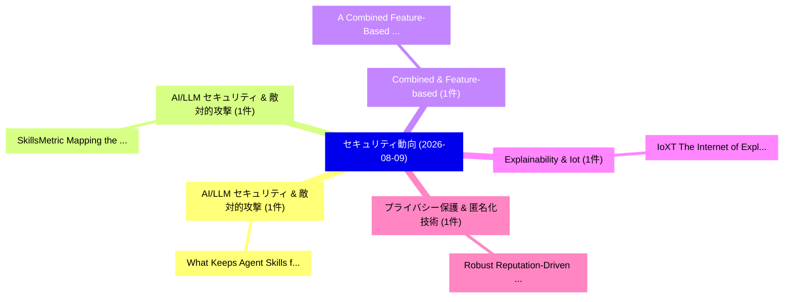

# 📅 02_daily: 日次エグゼクティブサマリー報告書 (2026-08-09)

**集計日時**: 2026-10-02 23:06:22 UTC  
**対象日付**: 2026-08-09  
**本日収集論文数**: 11 件  

---

## 💡 主要セキュリティ動向・脅威インサイト (Executive Insights)

本日の収集論文（計 11 件）において、以下の重点セキュリティ領域で活発な研究動向が確認されました：
- **AI/LLM セキュリティ & 敵対的攻撃** (1 件): 注目論文として 「What Keeps Agent Skills from B...」 等が発表され、実務防御および攻撃検証の進展が見られます。
- **AI/LLM セキュリティ & 敵対的攻撃** (1 件): 注目論文として 「SkillsMetric: Mapping the Dete...」 等が発表され、実務防御および攻撃検証の進展が見られます。
- **Combined & Feature-based** (1 件): 注目論文として 「A Combined Feature-Based Frame...」 等が発表され、実務防御および攻撃検証の進展が見られます。
- **Explainability & Iot** (1 件): 注目論文として 「IoXT: The Internet of Explaina...」 等が発表され、実務防御および攻撃検証の進展が見られます。
- **プライバシー保護 & 匿名化技術** (1 件): 注目論文として 「Robust Reputation-Driven Crowd...」 等が発表され、実務防御および攻撃検証の進展が見られます。

### 🗺️ 技術・脅威トピックマインドマップ

---

## 📌 日次セキュリティ論文一覧 (日本語表形式)

| No | arXiv ID | 論文タイトル (日本語訳) | 重要キーワード | 構造化エグゼクティブ要約 (背景・提案・影響) | 脅威分類 | 詳細リンク |
|---|---|---|---|---|---|---|
| 1 | `2608.08453v1` | [What Keeps Agent Skills from Being Reusable? Evidence from 138K SKILL.md Files（セキュリティ分析論文）](../../okf/papers/2026-08-09/2608.08453.md) | `Chi Zhang`, `Yimin Liu`, `Xinze Chen` | 【提案】Evidence from 138K SKILL.md Files ### (日本語題名: What Keeps Agent Skills from Being Reusable?。実証評価により経営層・セキュリティ管理者向け推奨アクション (E... | `arXiv` | [arXiv](https://arxiv.org/abs/2608.08453v1) &#124; [OKF](../../okf/papers/2026-08-09/2608.08453.md) |
| 2 | `2608.08468v1` | [SkillsMetric: Mapping the Detection Boundary of Static Analysis for Malicious Agent Skills（セキュリティ分析論文）](../../okf/papers/2026-08-09/2608.08468.md) | `Malicious Agent Skills`, `Detection Boundary`, `Xinze Chen` | 【提案】概要 (Overview & Key Finding) 本論文「SkillsMetric: Mapping the Detection Boundary of Static ...。実証評価により経営層・セキュリティ管理者向け推奨アクション (E... | `arXiv` | [arXiv](https://arxiv.org/abs/2608.08468v1) &#124; [OKF](../../okf/papers/2026-08-09/2608.08468.md) |
| 3 | `2608.08521v2` | [A Combined Feature-Based Framework for Disguise and Spoofing Detection in Face Recognition Systems（セキュリティ分析論文）](../../okf/papers/2026-08-09/2608.08521.md) | `Face Recognition Systems`, `Combined Feature`, `Spoofing Detection` | 【提案】概要 (Overview & Key Finding) 本論文「A Combined Feature-Based Framework for Disguise and Spo...。実証評価により経営層・セキュリティ管理者向け推奨アクション (E... | `arXiv` | [arXiv](https://arxiv.org/abs/2608.08521v2) &#124; [OKF](../../okf/papers/2026-08-09/2608.08521.md) |
| 4 | `2608.08556v1` | [IoXT: The Internet of Explainable Things. Why Explainability in IoT Requires a New System-Level Paradigm and Protocol Design（セキュリティ分析論文）](../../okf/papers/2026-08-09/2608.08556.md) | `Explainable Things`, `New System`, `Level Paradigm` | 【提案】Why Explainability in IoT Requires a New System-Level Paradigm and Protocol Design ### ...。実証評価により経営層・セキュリティ管理者向け推奨アクション (E... | `arXiv` | [arXiv](https://arxiv.org/abs/2608.08556v1) &#124; [OKF](../../okf/papers/2026-08-09/2608.08556.md) |
| 5 | `2608.08574v2` | [Robust Reputation-Driven Crowdsourced 連合学習](../../okf/papers/2026-08-09/2608.08574.md) | `Robust Reputation`, `Reputation-Driven Crowdsourced`, `Driven Crowdsourced Federated Learning` | 【提案】概要 (Overview & Key Finding) 本論文「Robust Reputation-Driven Crowdsourced 連合学習」（原題: Robust ...。実証評価により経営層・セキュリティ管理者向け推奨アクション (E... | `arXiv` | [arXiv](https://arxiv.org/abs/2608.08574v2) &#124; [OKF](../../okf/papers/2026-08-09/2608.08574.md) |
| 6 | `2608.08641v1` | [Whose Refusal Is It? The Unmeasured Contribution of Black-Box Multimodal Guardrails（セキュリティ分析論文）](../../okf/papers/2026-08-09/2608.08641.md) | `Box Multimodal Guardrails`, `Black-Box Multimodal`, `Haoyu Zhang` | 【提案】The Unmeasured Contribution of Black-Box Multimodal Guardrails ### (日本語題名: Whose Refusa...。実証評価により経営層・セキュリティ管理者向け推奨アクション (E... | `arXiv` | [arXiv](https://arxiv.org/abs/2608.08641v1) &#124; [OKF](../../okf/papers/2026-08-09/2608.08641.md) |
| 7 | `2608.08645v1` | [HaloMark: A Spectral Threshold for Embedding-Vector Watermarking under C2PA（セキュリティ分析論文）](../../okf/papers/2026-08-09/2608.08645.md) | `Spectral Threshold`, `Vector Watermarking`, `Embedding-Vector Watermarking` | 【提案】概要 (Overview & Key Finding) 本論文「HaloMark: A Spectral Threshold for Embedding-Vector Wat...。実証評価により経営層・セキュリティ管理者向け推奨アクション (E... | `arXiv` | [arXiv](https://arxiv.org/abs/2608.08645v1) &#124; [OKF](../../okf/papers/2026-08-09/2608.08645.md) |
| 8 | `2608.08795v1` | [Toward Metacognitive One-Shot Indirect Prompt Injection: Strategy Abstraction Via Outcome-Conditioned Reflection（セキュリティ分析論文）](../../okf/papers/2026-08-09/2608.08795.md) | `Shot Indirect Prompt Injection`, `Strategy Abstraction Via Outcome`, `Toward Metacognitive One` | 【提案】概要 (Overview & Key Finding) 本論文「Toward Metacognitive One-Shot Indirect プロンプトインジェクション: S...。実証評価により経営層・セキュリティ管理者向け推奨アクション (E... | `arXiv` | [arXiv](https://arxiv.org/abs/2608.08795v1) &#124; [OKF](../../okf/papers/2026-08-09/2608.08795.md) |
| 9 | `2608.08831v1` | [Treating Statewide CORS Networks as Spatially Distributed Sensors for GNSS Integrity Monitoring under Unintentional and Deliberate Threats（セキュリティ分析論文）](../../okf/papers/2026-08-09/2608.08831.md) | `Spatially Distributed Sensors`, `Treating Statewide`, `Integrity Monitoring` | 【提案】概要 (Overview & Key Finding) 本論文「Treating Statewide CORS Networks as Spatially Distribut...。実証評価により経営層・セキュリティ管理者向け推奨アクション (E... | `arXiv` | [arXiv](https://arxiv.org/abs/2608.08831v1) &#124; [OKF](../../okf/papers/2026-08-09/2608.08831.md) |
| 10 | `2608.08865v1` | [Beyond Best Response: Quantal Stackelberg Deception as Insurance Against Attacker Misspecification（セキュリティ分析論文）](../../okf/papers/2026-08-09/2608.08865.md) | `Beyond Best Response`, `Quantal Stackelberg Deception`, `Ahmed Ann Noor Ryen` | 【提案】概要 (Overview & Key Finding) 本論文「Beyond Best Response: Quantal Stackelberg Deception as ...。実証評価により経営層・セキュリティ管理者向け推奨アクション (E... | `arXiv` | [arXiv](https://arxiv.org/abs/2608.08865v1) &#124; [OKF](../../okf/papers/2026-08-09/2608.08865.md) |
| 11 | `2608.08924v1` | [From Noise to Meaning: Meaningful Secret Sharing with Tamper Detection for Facial Recognition（セキュリティ分析論文）](../../okf/papers/2026-08-09/2608.08924.md) | `Meaningful Secret Sharing`, `Tamper Detection`, `Facial Recognition` | 【提案】概要 (Overview & Key Finding) 本論文「From Noise to Meaning: Meaningful Secret Sharing with T...。実証評価により経営層・セキュリティ管理者向け推奨アクション (E... | `arXiv` | [arXiv](https://arxiv.org/abs/2608.08924v1) &#124; [OKF](../../okf/papers/2026-08-09/2608.08924.md) |

