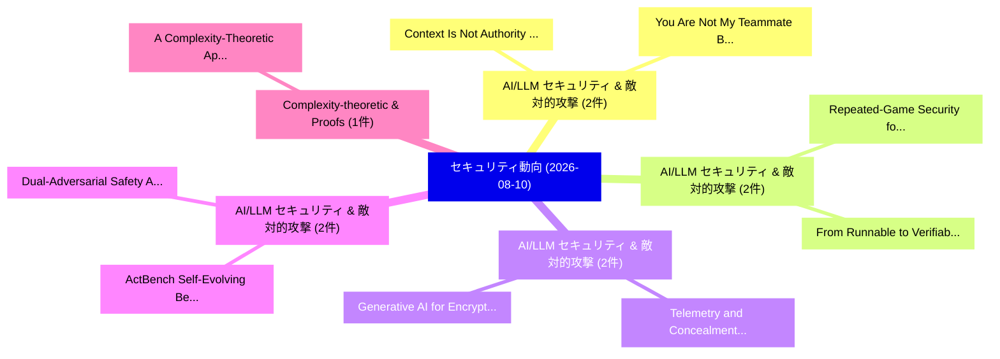

# 📅 02_daily: 日次エグゼクティブサマリー報告書 (2026-08-10)

**集計日時**: 2026-10-02 23:06:23 UTC  
**対象日付**: 2026-08-10  
**本日収集論文数**: 40 件  

---

## 💡 主要セキュリティ動向・脅威インサイト (Executive Insights)

本日の収集論文（計 40 件）において、以下の重点セキュリティ領域で活発な研究動向が確認されました：
- **AI/LLM セキュリティ & 敵対的攻撃** (2 件): 注目論文として 「Context Is Not Authority: Stru...」、「You Are Not My Teammate: Behav...」 等が発表され、実務防御および攻撃検証の進展が見られます。
- **AI/LLM セキュリティ & 敵対的攻撃** (2 件): 注目論文として 「Repeated-Game Security for Res...」、「From Runnable to Verifiable: A...」 等が発表され、実務防御および攻撃検証の進展が見られます。
- **AI/LLM セキュリティ & 敵対的攻撃** (2 件): 注目論文として 「Telemetry and Concealment in S...」、「Generative AI for Encrypted Tr...」 等が発表され、実務防御および攻撃検証の進展が見られます。
- **AI/LLM セキュリティ & 敵対的攻撃** (2 件): 注目論文として 「ActBench: Self-Evolving Benchm...」、「Dual-Adversarial Safety Alignm...」 等が発表され、実務防御および攻撃検証の進展が見られます。
- **Complexity-theoretic & Proofs** (1 件): 注目論文として 「A Complexity-Theoretic Approac...」 等が発表され、実務防御および攻撃検証の進展が見られます。

### 🗺️ 技術・脅威トピックマインドマップ

---

## 📌 日次セキュリティ論文一覧 (日本語表形式)

| No | arXiv ID | 論文タイトル (日本語訳) | 重要キーワード | 構造化エグゼクティブ要約 (背景・提案・影響) | 脅威分類 | 詳細リンク |
|---|---|---|---|---|---|---|
| 1 | `2608.08993v1` | [A Complexity-Theoretic Approach to Proofs of Space（セキュリティ分析論文）](../../okf/papers/2026-08-10/2608.08993.md) | `Marshall Ball`, `Jiaxin Guan`, `Raw Meta` | 【提案】概要 (Overview & Key Finding) 本論文「A Complexity-Theoretic Approach to Proofs of Space（セキュリ...。実証評価により経営層・セキュリティ管理者向け推奨アクション (E... | `arXiv` | [arXiv](https://arxiv.org/abs/2608.08993v1) &#124; [OKF](../../okf/papers/2026-08-10/2608.08993.md) |
| 2 | `2608.09001v1` | [Mind the Hook: Source-Level Auditing of Privacy Defenses in Retrieval-Augmented Generation（セキュリティ分析論文）](../../okf/papers/2026-08-10/2608.09001.md) | `Level Auditing`, `Privacy Defenses`, `Source-Level Auditing` | 【提案】概要 (Overview & Key Finding) 本論文「Mind the Hook: Source-Level Auditing of Privacy Defense...。実証評価により経営層・セキュリティ管理者向け推奨アクション (E... | `arXiv` | [arXiv](https://arxiv.org/abs/2608.09001v1) &#124; [OKF](../../okf/papers/2026-08-10/2608.09001.md) |
| 3 | `2608.09025v2` | [Context Is Not Authority: Structured Runtime Governance for Financial Market Agents（セキュリティ分析論文）](../../okf/papers/2026-08-10/2608.09025.md) | `Structured Runtime Governance`, `Financial Market Agents`, `Rui Tang` | 【提案】背景とセキュリティ上の課題 (Background & Problem) 本研究はサイバー脅威環境におけるセキュリティ構造・脆弱性の検証を目的としています。(主要検出項目: ...。実証評価により経営層・セキュリティ管理者向け推奨アクション (E... | `AI/ML Security` | [arXiv](https://arxiv.org/abs/2608.09025v2) &#124; [OKF](../../okf/papers/2026-08-10/2608.09025.md) |
| 4 | `2608.09047v1` | [Diversity Matters: Distributional Feature Coverage Sample Selection for Data-Efficient Backdoor Attacks（セキュリティ分析論文）](../../okf/papers/2026-08-10/2608.09047.md) | `Distributional Feature Coverage Sample Selection`, `Efficient Backdoor Attacks`, `Diversity Matters` | 【提案】概要 (Overview & Key Finding) 本論文「Diversity Matters: Distributional Feature Coverage Samp...。実証評価により経営層・セキュリティ管理者向け推奨アクション (E... | `arXiv` | [arXiv](https://arxiv.org/abs/2608.09047v1) &#124; [OKF](../../okf/papers/2026-08-10/2608.09047.md) |
| 5 | `2608.09055v1` | [Repeated-Game Security for Restaking-Based Verifiable Inference（セキュリティ分析論文）](../../okf/papers/2026-08-10/2608.09055.md) | `Based Verifiable Inference`, `Game Security`, `Repeated-Game Security` | 【提案】概要 (Overview & Key Finding) 本論文「Repeated-Game Security for Restaking-Based Verifiable I...。実証評価により経営層・セキュリティ管理者向け推奨アクション (E... | `arXiv` | [arXiv](https://arxiv.org/abs/2608.09055v1) &#124; [OKF](../../okf/papers/2026-08-10/2608.09055.md) |
| 6 | `2608.09066v1` | [SSHafe: A Real-Time SSH Brute Force Attack Detection and Novel Credential Rotation Standard（セキュリティ分析論文）](../../okf/papers/2026-08-10/2608.09066.md) | `Brute Force Attack Detection`, `Real-Time SSH`, `Amar Kumar Mandal` | 【提案】概要 (Overview & Key Finding) 本論文「SSHafe: A Real-Time SSH Brute Force Attack Detection an...。実証評価により経営層・セキュリティ管理者向け推奨アクション (E... | `arXiv` | [arXiv](https://arxiv.org/abs/2608.09066v1) &#124; [OKF](../../okf/papers/2026-08-10/2608.09066.md) |
| 7 | `2608.09069v2` | [Telemetry and Concealment in Self-Adapting Generative AI: Logging Architecture, Adversarial Model Hiding, and the Limits of Detection（セキュリティ分析論文）](../../okf/papers/2026-08-10/2608.09069.md) | `Adversarial Model Hiding`, `Adapting Generative`, `Logging Architecture` | 【提案】概要 (Overview & Key Finding) 本論文「Telemetry and Concealment in Self-Adapting Generative A...。実証評価により経営層・セキュリティ管理者向け推奨アクション (E... | `arXiv` | [arXiv](https://arxiv.org/abs/2608.09069v2) &#124; [OKF](../../okf/papers/2026-08-10/2608.09069.md) |
| 8 | `2608.09075v2` | [SLAC: Access-Driven CPU-to-GPU Side-channel Attacks via System-Level Cache on Apple Silicon（セキュリティ分析論文）](../../okf/papers/2026-08-10/2608.09075.md) | `Access-Driven CPU`, `Level Cache`, `Apple Silicon` | 【提案】概要 (Overview & Key Finding) 本論文「SLAC: Access-Driven CPU-to-GPU サイドチャネル攻撃 Attacks via Sy...。実証評価により経営層・セキュリティ管理者向け推奨アクション (E... | `AI/ML Security` | [arXiv](https://arxiv.org/abs/2608.09075v2) &#124; [OKF](../../okf/papers/2026-08-10/2608.09075.md) |
| 9 | `2608.09087v1` | [Joint Lyapunov Certificates for K-Agent Generative AI Governance: Stochastic Stability, Emergent Ensemble Risk, and Zero-Knowledge Governance Attestation（セキュリティ分析論文）](../../okf/papers/2026-08-10/2608.09087.md) | `Joint Lyapunov Certificates`, `Emergent Ensemble Risk`, `Knowledge Governance Attestation` | 【提案】概要 (Overview & Key Finding) 本論文「Joint Lyapunov Certificates for K-Agent Generative AI G...。実証評価により経営層・セキュリティ管理者向け推奨アクション (E... | `arXiv` | [arXiv](https://arxiv.org/abs/2608.09087v1) &#124; [OKF](../../okf/papers/2026-08-10/2608.09087.md) |
| 10 | `2608.09094v1` | [VUPER: Verified ASN.1 UPER Parser（セキュリティ分析論文）](../../okf/papers/2026-08-10/2608.09094.md) | `Syed Rafiul Hussain`, `Xiaotian Zhou`, `Kai Tu` | 【提案】概要 (Overview & Key Finding) 本論文「VUPER: Verified ASN.1 UPER Parser（セキュリティ分析論文）」（原題: VUPE...。実証評価により経営層・セキュリティ管理者向け推奨アクション (E... | `arXiv` | [arXiv](https://arxiv.org/abs/2608.09094v1) &#124; [OKF](../../okf/papers/2026-08-10/2608.09094.md) |
| 11 | `2608.09120v1` | [Renaming or Tightness: Enforcing Disjunctive Information Flow Policies（セキュリティ分析論文）](../../okf/papers/2026-08-10/2608.09120.md) | `Enforcing Disjunctive Information Flow Policies`, `Xin Xu`, `Siru Tao` | 【提案】概要 (Overview & Key Finding) 本論文「Renaming or Tightness: Enforcing Disjunctive Informatio...。実証評価により経営層・セキュリティ管理者向け推奨アクション (E... | `arXiv` | [arXiv](https://arxiv.org/abs/2608.09120v1) &#124; [OKF](../../okf/papers/2026-08-10/2608.09120.md) |
| 12 | `2608.09132v1` | [You Are Not My Teammate: Behavioral Fingerprint-based Suspicious Account Misuseの検出](../../okf/papers/2026-08-10/2608.09132.md) | `Behavioral Fingerprint`, `Suspicious Account Misuse`, `Suspicious Account` | 【提案】背景とセキュリティ上の課題 (Background & Problem) 本研究はサイバー脅威環境におけるセキュリティ構造・脆弱性の検証を目的としています。(主要検出項目: ...。実証評価により経営層・セキュリティ管理者向け推奨アクション (E... | `arXiv` | [arXiv](https://arxiv.org/abs/2608.09132v1) &#124; [OKF](../../okf/papers/2026-08-10/2608.09132.md) |
| 13 | `2608.09140v1` | [Beyond Direct Identifiers: Probabilistic Privacy Risk Estimation for Privacy-Conscious LLM Query Delegation（セキュリティ分析論文）](../../okf/papers/2026-08-10/2608.09140.md) | `Probabilistic Privacy Risk Estimation`, `Beyond Direct Identifiers`, `Query Delegation` | 【提案】概要 (Overview & Key Finding) 本論文「Beyond Direct Identifiers: Probabilistic Privacy Risk E...。実証評価により経営層・セキュリティ管理者向け推奨アクション (E... | `arXiv` | [arXiv](https://arxiv.org/abs/2608.09140v1) &#124; [OKF](../../okf/papers/2026-08-10/2608.09140.md) |
| 14 | `2608.09181v1` | [Memoir: Learning, Verifying, and Evolving False-Positive Memories for Static Application Security Testing Tools（セキュリティ分析論文）](../../okf/papers/2026-08-10/2608.09181.md) | `Static Application Security Testing Tools`, `Evolving False`, `Positive Memories` | 【提案】概要 (Overview & Key Finding) 本論文「Memoir: Learning, Verifying, and Evolving False-Positiv...。実証評価により経営層・セキュリティ管理者向け推奨アクション (E... | `arXiv` | [arXiv](https://arxiv.org/abs/2608.09181v1) &#124; [OKF](../../okf/papers/2026-08-10/2608.09181.md) |
| 15 | `2608.09225v1` | [Governing the KV Cache: Preventing Timing Side-Channel Leakage in Multi-Tenant LLM Inference（セキュリティ分析論文）](../../okf/papers/2026-08-10/2608.09225.md) | `Preventing Timing Side`, `Channel Leakage`, `Side-Channel Leakage` | 【提案】概要 (Overview & Key Finding) 本論文「Governing the KV Cache: Preventing Timing サイドチャネル攻撃 Lea...。実証評価により経営層・セキュリティ管理者向け推奨アクション (E... | `arXiv` | [arXiv](https://arxiv.org/abs/2608.09225v1) &#124; [OKF](../../okf/papers/2026-08-10/2608.09225.md) |
| 16 | `2608.09249v1` | [Track me if you can: Ephemeral coin tracing（セキュリティ分析論文）](../../okf/papers/2026-08-10/2608.09249.md) | `Ignacio Amores`, `Christian Cachin`, `Rohit Chatterjee` | 【提案】概要 (Overview & Key Finding) 本論文「Track me if you can: Ephemeral coin tracing（セキュリティ分析論文）...。実証評価により経営層・セキュリティ管理者向け推奨アクション (E... | `arXiv` | [arXiv](https://arxiv.org/abs/2608.09249v1) &#124; [OKF](../../okf/papers/2026-08-10/2608.09249.md) |
| 17 | `2608.09337v1` | [Economic Impact Assessment of Denial-of-Service and Time-Delay Attacks on Advanced Metering Infrastructure（セキュリティ分析論文）](../../okf/papers/2026-08-10/2608.09337.md) | `Economic Impact Assessment`, `Advanced Metering Infrastructure`, `Delay Attacks` | 【提案】概要 (Overview & Key Finding) 本論文「Economic Impact Assessment of Denial-of-Service and Tim...。実証評価により経営層・セキュリティ管理者向け推奨アクション (E... | `arXiv` | [arXiv](https://arxiv.org/abs/2608.09337v1) &#124; [OKF](../../okf/papers/2026-08-10/2608.09337.md) |
| 18 | `2608.09445v1` | [DiffSafeMerge: Mitigating Backdoor Inheritance in Diffusion Model Merging（セキュリティ分析論文）](../../okf/papers/2026-08-10/2608.09445.md) | `Mitigating Backdoor Inheritance`, `Diffusion Model Merging`, `Jiayang Zhang` | 【提案】概要 (Overview & Key Finding) 本論文「DiffSafeMerge: Mitigating Backdoor Inheritance in Diffu...。実証評価により経営層・セキュリティ管理者向け推奨アクション (E... | `arXiv` | [arXiv](https://arxiv.org/abs/2608.09445v1) &#124; [OKF](../../okf/papers/2026-08-10/2608.09445.md) |
| 19 | `2608.09452v1` | [A Content-Aware Pure Permutation with Intrinsic Avalanche Effect: Breaking the Diffusion-Permutation Dichotomy（セキュリティ分析論文）](../../okf/papers/2026-08-10/2608.09452.md) | `Aware Pure Permutation`, `Intrinsic Avalanche Effect`, `Content-Aware Pure` | 【提案】概要 (Overview & Key Finding) 本論文「A Content-Aware Pure Permutation with Intrinsic Avalanc...。実証評価により経営層・セキュリティ管理者向け推奨アクション (E... | `arXiv` | [arXiv](https://arxiv.org/abs/2608.09452v1) &#124; [OKF](../../okf/papers/2026-08-10/2608.09452.md) |
| 20 | `2608.09476v1` | [ActBench: Self-Evolving Benchmark of Behavioral Safety in Cowork Agents（セキュリティ分析論文）](../../okf/papers/2026-08-10/2608.09476.md) | `Evolving Benchmark`, `Behavioral Safety`, `Self-Evolving Benchmark` | 【提案】概要 (Overview & Key Finding) 本論文「ActBench: Self-Evolving Benchmark of Behavioral Safety ...。実証評価により経営層・セキュリティ管理者向け推奨アクション (E... | `arXiv` | [arXiv](https://arxiv.org/abs/2608.09476v1) &#124; [OKF](../../okf/papers/2026-08-10/2608.09476.md) |
| 21 | `2608.09498v1` | [ANTMAN: An Efficient and Interpretable RTL-Level Run-Time Detection Framework for Stealthy Branch Predictor Attacks on BOOM（セキュリティ分析論文）](../../okf/papers/2026-08-10/2608.09498.md) | `Stealthy Branch Predictor Attacks`, `Level Run`, `RTL-Level Run` | 【提案】概要 (Overview & Key Finding) 本論文「ANTMAN: An Efficient and Interpretable RTL-Level Run-Ti...。実証評価により経営層・セキュリティ管理者向け推奨アクション (E... | `arXiv` | [arXiv](https://arxiv.org/abs/2608.09498v1) &#124; [OKF](../../okf/papers/2026-08-10/2608.09498.md) |
| 22 | `2608.09506v2` | [Sound Enforcement of Dynamic Release Information Flow Policy-Full Version（セキュリティ分析論文）](../../okf/papers/2026-08-10/2608.09506.md) | `Dynamic Release Information Flow Policy`, `Sound Enforcement`, `Full Version` | 【提案】概要 (Overview & Key Finding) 本論文「Sound Enforcement of Dynamic Release Information Flow P...。実証評価によりChing, Danfeng Zhang - **... | `General Cyber Security` | [arXiv](https://arxiv.org/abs/2608.09506v2) &#124; [OKF](../../okf/papers/2026-08-10/2608.09506.md) |
| 23 | `2608.09524v1` | [STAIR: Effective Incident Response Using an End-to-End Agentic Planning Framework（セキュリティ分析論文）](../../okf/papers/2026-08-10/2608.09524.md) | `Effective Incident Response Using`, `Hanlin Jiang`, `Jionghao Huang` | 【提案】概要 (Overview & Key Finding) 本論文「STAIR: Effective Incident Response Using an End-to-End ...。実証評価により経営層・セキュリティ管理者向け推奨アクション (E... | `arXiv` | [arXiv](https://arxiv.org/abs/2608.09524v1) &#124; [OKF](../../okf/papers/2026-08-10/2608.09524.md) |
| 24 | `2608.09526v1` | [RangeFactory: Scalable Construction of Multi-Hop Cyber Ranges（セキュリティ分析論文）](../../okf/papers/2026-08-10/2608.09526.md) | `Hop Cyber Ranges`, `Scalable Construction`, `Multi-Hop Cyber` | 【提案】概要 (Overview & Key Finding) 本論文「RangeFactory: Scalable Construction of Multi-Hop Cyber ...。実証評価により経営層・セキュリティ管理者向け推奨アクション (E... | `arXiv` | [arXiv](https://arxiv.org/abs/2608.09526v1) &#124; [OKF](../../okf/papers/2026-08-10/2608.09526.md) |
| 25 | `2608.09542v1` | [Dual-Adversarial Safety Alignment: Cultivating Intrinsic Threat Comprehension in LRMs（セキュリティ分析論文）](../../okf/papers/2026-08-10/2608.09542.md) | `Cultivating Intrinsic Threat Comprehension`, `Adversarial Safety Alignment`, `Dual-Adversarial Safety` | 【提案】概要 (Overview & Key Finding) 本論文「Dual-Adversarial Safety Alignment: Cultivating Intrinsi...。実証評価により経営層・セキュリティ管理者向け推奨アクション (E... | `arXiv` | [arXiv](https://arxiv.org/abs/2608.09542v1) &#124; [OKF](../../okf/papers/2026-08-10/2608.09542.md) |
| 26 | `2608.09567v1` | [From Runnable to Verifiable: An Independent Reproducibility Study of LLM/Agent-Driven Vulnerability Validation Artifacts（セキュリティ分析論文）](../../okf/papers/2026-08-10/2608.09567.md) | `Driven Vulnerability Validation Artifacts`, `Agent-Driven Vulnerability`, `Bo Chen` | 【提案】概要 (Overview & Key Finding) 本論文「From Runnable to Verifiable: An Independent Reproducibi...。実証評価により経営層・セキュリティ管理者向け推奨アクション (E... | `arXiv` | [arXiv](https://arxiv.org/abs/2608.09567v1) &#124; [OKF](../../okf/papers/2026-08-10/2608.09567.md) |
| 27 | `2608.09624v1` | [Measuring the Wrong Thing: Internal Harmfulness Scores Anti-Rank Successful Jailbreaks（セキュリティ分析論文）](../../okf/papers/2026-08-10/2608.09624.md) | `Internal Harmfulness Scores Anti`, `Rank Successful Jailbreaks`, `Wrong Thing` | 【提案】概要 (Overview & Key Finding) 本論文「Measuring the Wrong Thing: Internal Harmfulness Scores ...。実証評価により経営層・セキュリティ管理者向け推奨アクション (E... | `arXiv` | [arXiv](https://arxiv.org/abs/2608.09624v1) &#124; [OKF](../../okf/papers/2026-08-10/2608.09624.md) |
| 28 | `2608.09643v1` | [Activation Probes Surface Code-Security Signals that the Model's Output Misses（セキュリティ分析論文）](../../okf/papers/2026-08-10/2608.09643.md) | `Activation Probes Surface Code`, `Security Signals`, `Output Misses` | 【提案】概要 (Overview & Key Finding) 本論文「Activation Probes Surface Code-Security Signals that th...。実証評価により経営層・セキュリティ管理者向け推奨アクション (E... | `arXiv` | [arXiv](https://arxiv.org/abs/2608.09643v1) &#124; [OKF](../../okf/papers/2026-08-10/2608.09643.md) |
| 29 | `2608.09699v2` | [Full-Key Recovery and Forgery from One MQOM v2.1 Signature（セキュリティ分析論文）](../../okf/papers/2026-08-10/2608.09699.md) | `Key Recovery`, `Full-Key Recovery`, `Luis Delgado` | 【提案】概要 (Overview & Key Finding) 本論文「Full-Key Recovery and Forgery from One MQOM v2.1 Signat...。実証評価により経営層・セキュリティ管理者向け推奨アクション (E... | `arXiv` | [arXiv](https://arxiv.org/abs/2608.09699v2) &#124; [OKF](../../okf/papers/2026-08-10/2608.09699.md) |
| 30 | `2608.09732v1` | [ColluSkill: Adversarial Cross-Skill Composition for Evading Agent Skill Scanners（セキュリティ分析論文）](../../okf/papers/2026-08-10/2608.09732.md) | `Evading Agent Skill Scanners`, `Adversarial Cross`, `Skill Composition` | 【提案】概要 (Overview & Key Finding) 本論文「ColluSkill: Adversarial Cross-Skill Composition for Eva...。実証評価により経営層・セキュリティ管理者向け推奨アクション (E... | `arXiv` | [arXiv](https://arxiv.org/abs/2608.09732v1) &#124; [OKF](../../okf/papers/2026-08-10/2608.09732.md) |
| 31 | `2608.09852v1` | [Generative AI for Encrypted Traffic Analysis: Synthetic Dataset Generation and Classifier Evaluation（セキュリティ分析論文）](../../okf/papers/2026-08-10/2608.09852.md) | `Synthetic Dataset Generation`, `Aswani Kumar Cherukuri`, `Harshil Patel` | 【提案】概要 (Overview & Key Finding) 本論文「Generative AI for Encrypted Traffic Analysis: Synthetic...。実証評価により経営層・セキュリティ管理者向け推奨アクション (E... | `arXiv` | [arXiv](https://arxiv.org/abs/2608.09852v1) &#124; [OKF](../../okf/papers/2026-08-10/2608.09852.md) |
| 32 | `2608.09865v1` | [A Bird's-Eye View on Security Considerations in RFCs（セキュリティ分析論文）](../../okf/papers/2026-08-10/2608.09865.md) | `Eye View`, `Security Considerations`, `s-Eye View` | 【提案】概要 (Overview & Key Finding) 本論文「A Bird's-Eye View on Security Considerations in RFCs（セキ...。実証評価により経営層・セキュリティ管理者向け推奨アクション (E... | `arXiv` | [arXiv](https://arxiv.org/abs/2608.09865v1) &#124; [OKF](../../okf/papers/2026-08-10/2608.09865.md) |
| 33 | `2608.09867v1` | [Stealing Reasoning Traces from Proprietary LLM APIs（セキュリティ分析論文）](../../okf/papers/2026-08-10/2608.09867.md) | `Stealing Reasoning Traces`, `Alexander Panfilov`, `David Schmotz` | 【提案】概要 (Overview & Key Finding) 本論文「Stealing Reasoning Traces from Proprietary LLM APIs（セキュ...。実証評価により経営層・セキュリティ管理者向け推奨アクション (E... | `arXiv` | [arXiv](https://arxiv.org/abs/2608.09867v1) &#124; [OKF](../../okf/papers/2026-08-10/2608.09867.md) |
| 34 | `2608.09914v1` | [Overcoming Data Scarcity and Confidentiality in Hardware Assurance via Synthetic Generation（セキュリティ分析論文）](../../okf/papers/2026-08-10/2608.09914.md) | `Overcoming Data Scarcity`, `Hardware Assurance`, `Synthetic Generation` | 【提案】概要 (Overview & Key Finding) 本論文「Overcoming Data Scarcity and Confidentiality in Hardwar...。実証評価により経営層・セキュリティ管理者向け推奨アクション (E... | `arXiv` | [arXiv](https://arxiv.org/abs/2608.09914v1) &#124; [OKF](../../okf/papers/2026-08-10/2608.09914.md) |
| 35 | `2608.10152v1` | [World-First SEM-based Recovery of Crash EDR Data from the EEPROM of a Severely Damaged SRS Module Using CrashScan（セキュリティ分析論文）](../../okf/papers/2026-08-10/2608.10152.md) | `World-First SEM`, `Severely Damaged`, `Module Using` | 【提案】概要 (Overview & Key Finding) 本論文「World-First SEM-based Recovery of Crash EDR Data from t...。実証評価により経営層・セキュリティ管理者向け推奨アクション (E... | `arXiv` | [arXiv](https://arxiv.org/abs/2608.10152v1) &#124; [OKF](../../okf/papers/2026-08-10/2608.10152.md) |
| 36 | `2608.10166v1` | [MarkNull: Model-Agnostic Watermark Removal in AI-Generated Images via On-Manifold Latent Manipulation（セキュリティ分析論文）](../../okf/papers/2026-08-10/2608.10166.md) | `Agnostic Watermark Removal`, `Manifold Latent Manipulation`, `Model-Agnostic Watermark` | 【提案】概要 (Overview & Key Finding) 本論文「MarkNull: Model-Agnostic Watermark Removal in AI-Genera...。実証評価により経営層・セキュリティ管理者向け推奨アクション (E... | `arXiv` | [arXiv](https://arxiv.org/abs/2608.10166v1) &#124; [OKF](../../okf/papers/2026-08-10/2608.10166.md) |
| 37 | `2608.10171v1` | [Generating Attacks for LLMs with GFlowNets（セキュリティ分析論文）](../../okf/papers/2026-08-10/2608.10171.md) | `Generating Attacks`, `Mehmet Fatih Amasyali`, `Emin Islam Tatli` | 【提案】概要 (Overview & Key Finding) 本論文「Generating Attacks for LLMs with GFlowNets（セキュリティ分析論文）」...。実証評価により経営層・セキュリティ管理者向け推奨アクション (E... | `arXiv` | [arXiv](https://arxiv.org/abs/2608.10171v1) &#124; [OKF](../../okf/papers/2026-08-10/2608.10171.md) |
| 38 | `2608.10279v1` | [Withholding the Completing Chunk: Deterministic Pair-Completion Guardrails for Streaming LLM Output（セキュリティ分析論文）](../../okf/papers/2026-08-10/2608.10279.md) | `Completing Chunk`, `Deterministic Pair`, `Completion Guardrails` | 【提案】概要 (Overview & Key Finding) 本論文「Withholding the Completing Chunk: Deterministic Pair-Co...。実証評価により経営層・セキュリティ管理者向け推奨アクション (E... | `arXiv` | [arXiv](https://arxiv.org/abs/2608.10279v1) &#124; [OKF](../../okf/papers/2026-08-10/2608.10279.md) |
| 39 | `2608.10281v1` | [From Prompt Injection to Web Exploitation: Revisiting Classic Vulnerabilities in LLM-Integrated Applications（セキュリティ分析論文）](../../okf/papers/2026-08-10/2608.10281.md) | `Revisiting Classic Vulnerabilities`, `Web Exploitation`, `Integrated Applications` | 【提案】概要 (Overview & Key Finding) 本論文「From プロンプトインジェクション to Web Exploitation: Revisiting Clas...。実証評価により経営層・セキュリティ管理者向け推奨アクション (E... | `arXiv` | [arXiv](https://arxiv.org/abs/2608.10281v1) &#124; [OKF](../../okf/papers/2026-08-10/2608.10281.md) |
| 40 | `2608.10300v2` | [Logit-Boundary Geometric Belief Interfaces and Sparse Sheaf-Enclave Protocols: A Self-Contained Substrate for Secure Network Electronic Health Record (EHR) Interoperability（セキュリティ分析論文）](../../okf/papers/2026-08-10/2608.10300.md) | `Secure Network Electronic Health Record`, `Boundary Geometric Belief Interfaces`, `Sparse Sheaf` | 【提案】概要 (Overview & Key Finding) 本論文「Logit-Boundary Geometric Belief Interfaces and Sparse S...。実証評価により経営層・セキュリティ管理者向け推奨アクション (E... | `arXiv` | [arXiv](https://arxiv.org/abs/2608.10300v2) &#124; [OKF](../../okf/papers/2026-08-10/2608.10300.md) |

