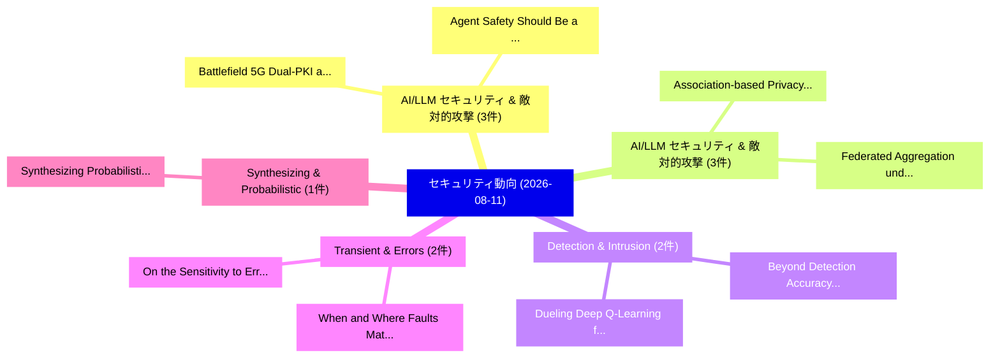

# 📅 02_daily: 日次エグゼクティブサマリー報告書 (2026-08-11)

**集計日時**: 2026-10-02 23:06:23 UTC  
**対象日付**: 2026-08-11  
**本日収集論文数**: 29 件  

---

## 💡 主要セキュリティ動向・脅威インサイト (Executive Insights)

本日の収集論文（計 29 件）において、以下の重点セキュリティ領域で活発な研究動向が確認されました：
- **AI/LLM セキュリティ & 敵対的攻撃** (3 件): 注目論文として 「Agent Safety Should Be a Runti...」、「Battlefield 5G: Dual-PKI and T...」 等が発表され、実務防御および攻撃検証の進展が見られます。
- **AI/LLM セキュリティ & 敵対的攻撃** (3 件): 注目論文として 「Association-based Privacy Atta...」、「Federated Aggregation under Mo...」 等が発表され、実務防御および攻撃検証の進展が見られます。
- **Detection & Intrusion** (2 件): 注目論文として 「Beyond Detection Accuracy: Mea...」、「Dueling Deep Q-Learning for In...」 等が発表され、実務防御および攻撃検証の進展が見られます。
- **Transient & Errors** (2 件): 注目論文として 「When and Where Faults Matter: ...」、「On the Sensitivity to Errors i...」 等が発表され、実務防御および攻撃検証の進展が見られます。
- **Synthesizing & Probabilistic** (1 件): 注目論文として 「Synthesizing Probabilistic Sat...」 等が発表され、実務防御および攻撃検証の進展が見られます。

### 🗺️ 技術・脅威トピックマインドマップ

---

## 📌 日次セキュリティ論文一覧 (日本語表形式)

| No | arXiv ID | 論文タイトル (日本語訳) | 重要キーワード | 構造化エグゼクティブ要約 (背景・提案・影響) | 脅威分類 | 詳細リンク |
|---|---|---|---|---|---|---|
| 1 | `2608.10349v1` | [Beyond Detection Accuracy: Measuring Explanation Cost, Stability, and Utility for Resource-Aware IoT Intrusion Detection（セキュリティ分析論文）](../../okf/papers/2026-08-11/2608.10349.md) | `Beyond Detection Accuracy`, `Measuring Explanation Cost`, `Intrusion Detection` | 【提案】概要 (Overview & Key Finding) 本論文「Beyond Detection Accuracy: Measuring Explanation Cost, ...。実証評価により経営層・セキュリティ管理者向け推奨アクション (E... | `arXiv` | [arXiv](https://arxiv.org/abs/2608.10349v1) &#124; [OKF](../../okf/papers/2026-08-11/2608.10349.md) |
| 2 | `2608.10521v1` | [Synthesizing Probabilistic Saturating Counters with Differentially Private Formal Guarantees（セキュリティ分析論文）](../../okf/papers/2026-08-11/2608.10521.md) | `Synthesizing Probabilistic Saturating Counters`, `Differentially Private Formal Guarantees`, `Zhiming Chi` | 【提案】概要 (Overview & Key Finding) 本論文「Synthesizing Probabilistic Saturating Counters with Dif...。実証評価により経営層・セキュリティ管理者向け推奨アクション (E... | `arXiv` | [arXiv](https://arxiv.org/abs/2608.10521v1) &#124; [OKF](../../okf/papers/2026-08-11/2608.10521.md) |
| 3 | `2608.10530v1` | [On Understanding, Identifying, and Mitigating Vulnerabilities in Agentic 大規模言語モデル](../../okf/papers/2026-08-11/2608.10530.md) | `Mitigating Vulnerabilities`, `Agentic Large Language Models`, `Md Jafrin Hossain` | 【提案】概要 (Overview & Key Finding) 本論文「On Understanding, Identifying, and Mitigating Vulnerabi...。実証評価により経営層・セキュリティ管理者向け推奨アクション (E... | `arXiv` | [arXiv](https://arxiv.org/abs/2608.10530v1) &#124; [OKF](../../okf/papers/2026-08-11/2608.10530.md) |
| 4 | `2608.10614v1` | [Trigger the Straggler: Load Hijack on Mixture-of-Experts LLMs（セキュリティ分析論文）](../../okf/papers/2026-08-11/2608.10614.md) | `Load Hijack`, `Rui Zhang`, `Wenbo Jiang` | 【提案】概要 (Overview & Key Finding) 本論文「Trigger the Straggler: Load Hijack on Mixture-of-Expert...。実証評価により経営層・セキュリティ管理者向け推奨アクション (E... | `arXiv` | [arXiv](https://arxiv.org/abs/2608.10614v1) &#124; [OKF](../../okf/papers/2026-08-11/2608.10614.md) |
| 5 | `2608.10736v1` | [A Lightweight Fault-Detection Scheme for Barrett Modular Multiplication Using Multiple Conditional Reduction Paths（セキュリティ分析論文）](../../okf/papers/2026-08-11/2608.10736.md) | `Barrett Modular Multiplication Using Multiple Conditional Reduction Paths`, `Lightweight Fault`, `Detection Scheme` | 【提案】概要 (Overview & Key Finding) 本論文「A Lightweight Fault-Detection Scheme for Barrett Modula...。実証評価により経営層・セキュリティ管理者向け推奨アクション (E... | `arXiv` | [arXiv](https://arxiv.org/abs/2608.10736v1) &#124; [OKF](../../okf/papers/2026-08-11/2608.10736.md) |
| 6 | `2608.10760v1` | [A Gateway Architecture for Enterprise MCP Authentication: Unifying Heterogeneous Auth, Identity Delegation, and the User / Non-User Persona Problem（セキュリティ分析論文）](../../okf/papers/2026-08-11/2608.10760.md) | `Unifying Heterogeneous Auth`, `User Persona Problem`, `Gateway Architecture` | 【提案】概要 (Overview & Key Finding) 本論文「A Gateway Architecture for Enterprise MCP Authenticatio...。実証評価により経営層・セキュリティ管理者向け推奨アクション (E... | `arXiv` | [arXiv](https://arxiv.org/abs/2608.10760v1) &#124; [OKF](../../okf/papers/2026-08-11/2608.10760.md) |
| 7 | `2608.10959v1` | [Once Poisoned, Arbitrarily Controlled: A Programmable Backdoor in VLMs（セキュリティ分析論文）](../../okf/papers/2026-08-11/2608.10959.md) | `Arbitrarily Controlled`, `Programmable Backdoor`, `Tao Lin` | 【提案】概要 (Overview & Key Finding) 本論文「Once Poisoned, Arbitrarily Controlled: A Programmable B...。実証評価により経営層・セキュリティ管理者向け推奨アクション (E... | `arXiv` | [arXiv](https://arxiv.org/abs/2608.10959v1) &#124; [OKF](../../okf/papers/2026-08-11/2608.10959.md) |
| 8 | `2608.11147v1` | [When and Where Faults Matter: A Study of Transient Errors in CKKS Multiplication（セキュリティ分析論文）](../../okf/papers/2026-08-11/2608.11147.md) | `Transient Errors`, `Vattana Chan`, `Karthik Swaminathan` | 【提案】概要 (Overview & Key Finding) 本論文「When and Where Faults Matter: A Study of Transient Erro...。実証評価により経営層・セキュリティ管理者向け推奨アクション (E... | `arXiv` | [arXiv](https://arxiv.org/abs/2608.11147v1) &#124; [OKF](../../okf/papers/2026-08-11/2608.11147.md) |
| 9 | `2608.11153v1` | [Strategies to Avoid Illegal Data Access（セキュリティ分析論文）](../../okf/papers/2026-08-11/2608.11153.md) | `Avoid Illegal Data Access`, `Muhammad Mubeen`, `Arslan Bisharat` | 【提案】概要 (Overview & Key Finding) 本論文「Strategies to Avoid Illegal Data Access（セキュリティ分析論文）」（原題...。実証評価により経営層・セキュリティ管理者向け推奨アクション (E... | `arXiv` | [arXiv](https://arxiv.org/abs/2608.11153v1) &#124; [OKF](../../okf/papers/2026-08-11/2608.11153.md) |
| 10 | `2608.11155v1` | [On the Sensitivity to Errors in Homomorphic Computing: Single Transient Bit-flip Client-side Error Characterization（セキュリティ分析論文）](../../okf/papers/2026-08-11/2608.11155.md) | `Single Transient Bit`, `Homomorphic Computing`, `Error Characterization` | 【提案】概要 (Overview & Key Finding) 本論文「On the Sensitivity to Errors in Homomorphic Computing: ...。実証評価により経営層・セキュリティ管理者向け推奨アクション (E... | `arXiv` | [arXiv](https://arxiv.org/abs/2608.11155v1) &#124; [OKF](../../okf/papers/2026-08-11/2608.11155.md) |
| 11 | `2608.11187v1` | [Statistically-Secure Bit Commitment and Coin Flipping Protocols Based on Quantum Hardware Assumptions（セキュリティ分析論文）](../../okf/papers/2026-08-11/2608.11187.md) | `Coin Flipping Protocols Based`, `Secure Bit Commitment`, `Quantum Hardware Assumptions` | 【提案】概要 (Overview & Key Finding) 本論文「Statistically-Secure Bit Commitment and Coin Flipping P...。実証評価により経営層・セキュリティ管理者向け推奨アクション (E... | `arXiv` | [arXiv](https://arxiv.org/abs/2608.11187v1) &#124; [OKF](../../okf/papers/2026-08-11/2608.11187.md) |
| 12 | `2608.11274v1` | [Agent Safety Should Be a Runtime Contract（セキュリティ分析論文）](../../okf/papers/2026-08-11/2608.11274.md) | `Runtime Contract`, `Yi Han`, `Jusheng Zhang` | 【提案】概要 (Overview & Key Finding) 本論文「Agent Safety Should Be a Runtime Contract（セキュリティ分析論文）」（...。実証評価によりNg, Yi Han, Jusheng Zhang... | `arXiv` | [arXiv](https://arxiv.org/abs/2608.11274v1) &#124; [OKF](../../okf/papers/2026-08-11/2608.11274.md) |
| 13 | `2608.11277v1` | [Knowledge-Graph-Guided Retrieval-Augmented LLMs for Explainable Root Cause Analysis in Automotive HiL Validation（セキュリティ分析論文）](../../okf/papers/2026-08-11/2608.11277.md) | `Guided Retrieval`, `Retrieval-Augmented LLMs`, `Hamza Ouarrad` | 【提案】概要 (Overview & Key Finding) 本論文「Knowledge-Graph-Guided Retrieval-Augmented LLMs for Exp...。実証評価により経営層・セキュリティ管理者向け推奨アクション (E... | `arXiv` | [arXiv](https://arxiv.org/abs/2608.11277v1) &#124; [OKF](../../okf/papers/2026-08-11/2608.11277.md) |
| 14 | `2608.11285v1` | [SegPAR: Class-Centric Decision-Based Sparse Attack for Semantic Segmentation（セキュリティ分析論文）](../../okf/papers/2026-08-11/2608.11285.md) | `Based Sparse Attack`, `Centric Decision`, `Semantic Segmentation` | 【提案】概要 (Overview & Key Finding) 本論文「SegPAR: Class-Centric Decision-Based Sparse Attack for ...。実証評価により経営層・セキュリティ管理者向け推奨アクション (E... | `arXiv` | [arXiv](https://arxiv.org/abs/2608.11285v1) &#124; [OKF](../../okf/papers/2026-08-11/2608.11285.md) |
| 15 | `2608.11286v1` | [Cyberattack Detection in Electric Vehicle Charging Infrastructure with Benign User Updatesのベンチマーク評価](../../okf/papers/2026-08-11/2608.11286.md) | `Electric Vehicle Charging Infrastructure`, `Cyberattack Detection`, `Benign User` | 【提案】概要 (Overview & Key Finding) 本論文「Cyberattack Detection in Electric Vehicle Charging Infr...。実証評価により経営層・セキュリティ管理者向け推奨アクション (E... | `arXiv` | [arXiv](https://arxiv.org/abs/2608.11286v1) &#124; [OKF](../../okf/papers/2026-08-11/2608.11286.md) |
| 16 | `2608.11291v1` | [Dueling Deep Q-Learning for Intrusion Detection（セキュリティ分析論文）](../../okf/papers/2026-08-11/2608.11291.md) | `Dueling Deep`, `Intrusion Detection`, `Laxima Niure Kandel` | 【提案】概要 (Overview & Key Finding) 本論文「Dueling Deep Q-Learning for Intrusion Detection（セキュリティ分...。実証評価によりBerkowitz, Laxima Niure K... | `arXiv` | [arXiv](https://arxiv.org/abs/2608.11291v1) &#124; [OKF](../../okf/papers/2026-08-11/2608.11291.md) |
| 17 | `2608.11293v1` | [Battlefield 5G: Dual-PKI and TPM-Based UE Attestation for Tactical 5G Standalone Networks（セキュリティ分析論文）](../../okf/papers/2026-08-11/2608.11293.md) | `Standalone Networks`, `TPM-Based UE`, `Al Nahian Bin Emran` | 【提案】概要 (Overview & Key Finding) 本論文「Battlefield 5G: Dual-PKI and TPM-Based UE Attestation f...。実証評価により経営層・セキュリティ管理者向け推奨アクション (E... | `arXiv` | [arXiv](https://arxiv.org/abs/2608.11293v1) &#124; [OKF](../../okf/papers/2026-08-11/2608.11293.md) |
| 18 | `2608.11295v1` | [Backdoor Decontamination Dynamics in LLMエージェント](../../okf/papers/2026-08-11/2608.11295.md) | `Backdoor Decontamination Dynamics`, `Gabriel Huang`, `Abhay Puri` | 【提案】概要 (Overview & Key Finding) 本論文「Backdoor Decontamination Dynamics in LLMエージェント」（原題: Bac...。実証評価により経営層・セキュリティ管理者向け推奨アクション (E... | `arXiv` | [arXiv](https://arxiv.org/abs/2608.11295v1) &#124; [OKF](../../okf/papers/2026-08-11/2608.11295.md) |
| 19 | `2608.11337v1` | [Association-based Privacy Attacks in Wireless Protocols: Formal Modeling and Mitigation（セキュリティ分析論文）](../../okf/papers/2026-08-11/2608.11337.md) | `Privacy Attacks`, `Wireless Protocols`, `Association-based Privacy` | 【提案】概要 (Overview & Key Finding) 本論文「Association-based Privacy Attacks in Wireless Protocols...。実証評価により経営層・セキュリティ管理者向け推奨アクション (E... | `arXiv` | [arXiv](https://arxiv.org/abs/2608.11337v1) &#124; [OKF](../../okf/papers/2026-08-11/2608.11337.md) |
| 20 | `2608.11348v1` | [Output-to-Input Loops for Black-Box Backdoor Detection in Fine-Tuned Open-Weight LLMsの実証研究](../../okf/papers/2026-08-11/2608.11348.md) | `Box Backdoor Detection`, `Input Loops`, `Black-Box Backdoor` | 【提案】概要 (Overview & Key Finding) 本論文「Output-to-Input Loops for Black-Box Backdoor Detection ...。実証評価により経営層・セキュリティ管理者向け推奨アクション (E... | `arXiv` | [arXiv](https://arxiv.org/abs/2608.11348v1) &#124; [OKF](../../okf/papers/2026-08-11/2608.11348.md) |
| 21 | `2608.11392v2` | [AI Guardrail Survival under Single-Cycle Agentic Self-Summarization（セキュリティ分析論文）](../../okf/papers/2026-08-11/2608.11392.md) | `Cycle Agentic Self`, `Guardrail Survival`, `Single-Cycle Agentic` | 【提案】概要 (Overview & Key Finding) 本論文「AI Guardrail Survival under Single-Cycle Agentic Self-S...。実証評価により経営層・セキュリティ管理者向け推奨アクション (E... | `arXiv` | [arXiv](https://arxiv.org/abs/2608.11392v2) &#124; [OKF](../../okf/papers/2026-08-11/2608.11392.md) |
| 22 | `2608.11418v1` | [A Study of Kernel Telemetry Options for Security-Oriented Provenance（セキュリティ分析論文）](../../okf/papers/2026-08-11/2608.11418.md) | `Kernel Telemetry Options`, `Oriented Provenance`, `Security-Oriented Provenance` | 【提案】概要 (Overview & Key Finding) 本論文「A Study of Kernel Telemetry Options for Security-Orient...。実証評価によりHoussel, Olivier Levillai... | `arXiv` | [arXiv](https://arxiv.org/abs/2608.11418v1) &#124; [OKF](../../okf/papers/2026-08-11/2608.11418.md) |
| 23 | `2608.11423v1` | [Federated Aggregation under Model Poisoning and Backdoor Attacks: A Reconstructed Cross-Dataset and Cross-Architecture Benchmarkの分析](../../okf/papers/2026-08-11/2608.11423.md) | `Federated Aggregation`, `Model Poisoning`, `Backdoor Attacks` | 【提案】概要 (Overview & Key Finding) 本論文「Federated Aggregation under モデル汚染 and Backdoor Attacks:...。実証評価により経営層・セキュリティ管理者向け推奨アクション (E... | `arXiv` | [arXiv](https://arxiv.org/abs/2608.11423v1) &#124; [OKF](../../okf/papers/2026-08-11/2608.11423.md) |
| 24 | `2608.11436v1` | [When Agents Talk: Honeytokens under Shared Memory（セキュリティ分析論文）](../../okf/papers/2026-08-11/2608.11436.md) | `Shared Memory`, `Raw Meta`, `Executive Summary` | 【提案】概要 (Overview & Key Finding) 本論文「When Agents Talk: Honeytokens under Shared Memory（セキュリテ...。実証評価によりGans - **公開日時**: `2026-08... | `arXiv` | [arXiv](https://arxiv.org/abs/2608.11436v1) &#124; [OKF](../../okf/papers/2026-08-11/2608.11436.md) |
| 25 | `2608.11469v1` | [The Next Challenge for Agentic サイバーセキュリティ: A Realistic, Contamination-Free Reverse Engineering Benchmark](../../okf/papers/2026-08-11/2608.11469.md) | `Free Reverse Engineering Benchmark`, `Contamination-Free Reverse`, `Agentic Cybersecurity` | 【提案】概要 (Overview & Key Finding) 本論文「The Next Challenge for Agentic サイバーセキュリティ: A Realistic,...。実証評価により経営層・セキュリティ管理者向け推奨アクション (E... | `arXiv` | [arXiv](https://arxiv.org/abs/2608.11469v1) &#124; [OKF](../../okf/papers/2026-08-11/2608.11469.md) |
| 26 | `2608.11489v1` | [A Runtime Decentralized Attestation and Coordinated Repair Framework for Automotive ECUsのセキュリティ強化](../../okf/papers/2026-08-11/2608.11489.md) | `Runtime Decentralized Attestation`, `Securing Automotive`, `Josh Dafoe` | 【提案】概要 (Overview & Key Finding) 本論文「A Runtime Decentralized Attestation and Coordinated Rep...。実証評価により経営層・セキュリティ管理者向け推奨アクション (E... | `arXiv` | [arXiv](https://arxiv.org/abs/2608.11489v1) &#124; [OKF](../../okf/papers/2026-08-11/2608.11489.md) |
| 27 | `2608.11492v2` | [Cross-Corpus Evaluation of Generalizable 脆弱性検出 in IoT Firmware](../../okf/papers/2026-08-11/2608.11492.md) | `Generalizable Vulnerability Detection`, `Sadib Hassan Rumman`, `Md Rayhanur Rahman` | 【提案】概要 (Overview & Key Finding) 本論文「Cross-Corpus Evaluation of Generalizable 脆弱性検出 in IoT F...。実証評価によりShariful Islam, Md。 | `Cryptography` | [arXiv](https://arxiv.org/abs/2608.11492v2) &#124; [OKF](../../okf/papers/2026-08-11/2608.11492.md) |
| 28 | `2608.11495v1` | [Defending against Model Extraction for GNNs with Model Reprogramming（セキュリティ分析論文）](../../okf/papers/2026-08-11/2608.11495.md) | `Model Extraction`, `Model Reprogramming`, `Yan Wen` | 【提案】概要 (Overview & Key Finding) 本論文「Defending against Model Extraction for GNNs with Model ...。実証評価により経営層・セキュリティ管理者向け推奨アクション (E... | `arXiv` | [arXiv](https://arxiv.org/abs/2608.11495v1) &#124; [OKF](../../okf/papers/2026-08-11/2608.11495.md) |
| 29 | `2608.13608v1` | [Evaluating Agentic Learning Harness Capabilities Without Labels via the Scaling Hypothesis（セキュリティ分析論文）](../../okf/papers/2026-08-11/2608.13608.md) | `Evaluating Agentic Learning Harness Capabilities Without Labels`, `Scaling Hypothesis`, `Aryan Luthra` | 【提案】背景とセキュリティ上の課題 (Background & Problem) 本研究はサイバー脅威環境におけるセキュリティ構造・脆弱性の検証を目的としています。(主要検出項目: ...。実証評価により経営層・セキュリティ管理者向け推奨アクション (E... | `AI/ML Security` | [arXiv](https://arxiv.org/abs/2608.13608v1) &#124; [OKF](../../okf/papers/2026-08-11/2608.13608.md) |

