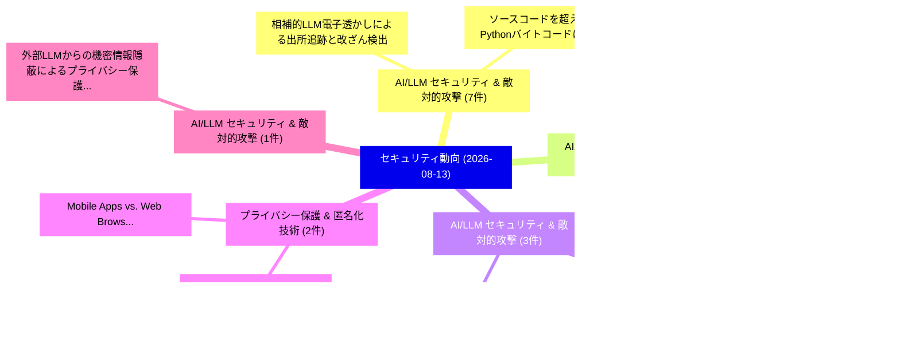

# 📅 02_daily: 日次エグゼクティブサマリー報告書 (2026-08-13)

**集計日時**: 2026-10-02 23:06:23 UTC  
**対象日付**: 2026-08-13  
**本日収集論文数**: 41 件  

---

## 💡 主要セキュリティ動向・脅威インサイト (Executive Insights)

本日の収集論文（計 41 件）において、以下の重点セキュリティ領域で活発な研究動向が確認されました：
- **AI/LLM セキュリティ & 敵対的攻撃** (7 件): 注目論文として 「相補的LLM電子透かしによる出所追跡と改ざん検出」、「ソースコードを超えて: Pythonバイトコードにおけるセキ...」 等が発表され、実務防御および攻撃検証の進展が見られます。
- **AI/LLM セキュリティ & 敵対的攻撃** (3 件): 注目論文として 「正当性とガバナンスの分離: エージェント型ワークフローにおけ...」、「ラベルは終点ではない: MCPエージェントセキュリティ評価に...」 等が発表され、実務防御および攻撃検証の進展が見られます。
- **AI/LLM セキュリティ & 敵対的攻撃** (3 件): 注目論文として 「レジリエントかつ安全な大規模エネルギーインターネットシステム...」、「InterSAGE: The Secure and Veri...」 等が発表され、実務防御および攻撃検証の進展が見られます。
- **プライバシー保護 & 匿名化技術** (2 件): 注目論文として 「TeleGapper: Telegramミニアプリにおけるプ...」、「Mobile Apps vs. Web Browsers: ...」 等が発表され、実務防御および攻撃検証の進展が見られます。
- **AI/LLM セキュリティ & 敵対的攻撃** (1 件): 注目論文として 「外部LLMからの機密情報隠蔽によるプライバシー保護型RAG」 等が発表され、実務防御および攻撃検証の進展が見られます。

### 🗺️ 技術・脅威トピックマインドマップ

---

## 📌 日次セキュリティ論文一覧 (日本語表形式)

| No | arXiv ID | 論文タイトル (日本語訳) | 重要キーワード | 構造化エグゼクティブ要約 (背景・提案・影響) | 脅威分類 | 詳細リンク |
|---|---|---|---|---|---|---|
| 1 | `2608.12675v1` | [外部LLMからの機密情報隠蔽によるプライバシー保護型RAG](../../okf/papers/2026-08-13/2608.12675.md) | `Concealing Sensitive Information`, `Privacy-Preserving RAG`, `Saleh Almohaimeed` | 【提案】概要 (Overview & Key Finding) 本論文「外部LLMからの機密情報隠蔽によるプライバシー保護型RAG」（原題: Privacy-Preserving R...。実証評価によりAlobaid - **公開日時**: `2026... | `arXiv` | [arXiv](https://arxiv.org/abs/2608.12675v1) &#124; [OKF](../../okf/papers/2026-08-13/2608.12675.md) |
| 2 | `2608.12713v1` | [相補的LLM電子透かしによる出所追跡と改ざん検出](../../okf/papers/2026-08-13/2608.12713.md) | `Tracing Provenance`, `Detecting Tampering`, `Leo Yu Zhang` | 【提案】概要 (Overview & Key Finding) 本論文「相補的LLM電子透かしによる出所追跡と改ざん検出」（原題: Tracing Provenance and De...。実証評価により経営層・セキュリティ管理者向け推奨アクション (E... | `arXiv` | [arXiv](https://arxiv.org/abs/2608.12713v1) &#124; [OKF](../../okf/papers/2026-08-13/2608.12713.md) |
| 3 | `2608.12761v1` | [正当性とガバナンスの分離: エージェント型ワークフローにおける出所完全性の検証](../../okf/papers/2026-08-13/2608.12761.md) | `Provenance Integrity`, `Agentic Workflows`, `Jesus Salas` | 【提案】背景とセキュリティ上の課題 (Background & Problem) 本研究はサイバー脅威環境におけるセキュリティ構造・脆弱性の検証を目的としています。(主要検出項目: ...。実証評価により経営層・セキュリティ管理者向け推奨アクション (E... | `arXiv` | [arXiv](https://arxiv.org/abs/2608.12761v1) &#124; [OKF](../../okf/papers/2026-08-13/2608.12761.md) |
| 4 | `2608.12789v1` | [PIPES: 出所と事前知識によるエージェント認識機能のセキュリティ強化](../../okf/papers/2026-08-13/2608.12789.md) | `Securing Agent Perception`, `Sanjay Kariyappa`, `Severin Klingler` | 【提案】概要 (Overview & Key Finding) 本論文「PIPES: 出所と事前知識によるエージェント認識機能のセキュリティ強化」（原題: PIPES: Securi...。実証評価によりEdward Suh - **公開日時**: `2... | `arXiv` | [arXiv](https://arxiv.org/abs/2608.12789v1) &#124; [OKF](../../okf/papers/2026-08-13/2608.12789.md) |
| 5 | `2608.12822v1` | [RealmEye: Arm CCA Realm VMのための仮想マシン内省技術](../../okf/papers/2026-08-13/2608.12822.md) | `Virtual Machine Introspection`, `Ruofei Qu`, `Wei Feng` | 【提案】概要 (Overview & Key Finding) 本論文「RealmEye: Arm CCA Realm VMのための仮想マシン内省技術」（原題: RealmEye: ...。実証評価により経営層・セキュリティ管理者向け推奨アクション (E... | `arXiv` | [arXiv](https://arxiv.org/abs/2608.12822v1) &#124; [OKF](../../okf/papers/2026-08-13/2608.12822.md) |
| 6 | `2608.12853v1` | [ソースコードを超えて: Pythonバイトコードにおけるセキュリティリスクの実証研究](../../okf/papers/2026-08-13/2608.12853.md) | `Python Bytecode Security Risks`, `Beyond Source`, `Baihong Chen` | 【提案】概要 (Overview & Key Finding) 本論文「ソースコードを超えて: Pythonバイトコードにおけるセキュリティリスクの実証研究」（原題: Beyond ...。実証評価により経営層・セキュリティ管理者向け推奨アクション (E... | `arXiv` | [arXiv](https://arxiv.org/abs/2608.12853v1) &#124; [OKF](../../okf/papers/2026-08-13/2608.12853.md) |
| 7 | `2608.12859v1` | [ソフトウェアグラフの解剖: ドライバーガイド型ファジングのための構造的分析](../../okf/papers/2026-08-13/2608.12859.md) | `Dissecting Software Graphs`, `Structural Insights`, `Guided Fuzzing` | 【提案】概要 (Overview & Key Finding) 本論文「ソフトウェアグラフの解剖: ドライバーガイド型ファジングのための構造的分析」（原題: Dissecting S...。実証評価により経営層・セキュリティ管理者向け推奨アクション (E... | `arXiv` | [arXiv](https://arxiv.org/abs/2608.12859v1) &#124; [OKF](../../okf/papers/2026-08-13/2608.12859.md) |
| 8 | `2608.12864v1` | [解釈可能なブロックチェーンフォレンジックのための持続的行動パターンの発見](../../okf/papers/2026-08-13/2608.12864.md) | `Discovering Persistent Behavioural Patterns`, `Interpretable Blockchain Forensics`, `Dorottya Zelenyanszki` | 【提案】概要 (Overview & Key Finding) 本論文「解釈可能なブロックチェーンフォレンジックのための持続的行動パターンの発見」（原題: Discovering P...。実証評価により経営層・セキュリティ管理者向け推奨アクション (E... | `arXiv` | [arXiv](https://arxiv.org/abs/2608.12864v1) &#124; [OKF](../../okf/papers/2026-08-13/2608.12864.md) |
| 9 | `2608.12880v1` | [ラベルは終点ではない: MCPエージェントセキュリティ評価における処置漏洩と構成概念妥当性](../../okf/papers/2026-08-13/2608.12880.md) | `Treatment Leakage`, `Construct Validity`, `Rana Muhammad Ahmed` | 【提案】背景とセキュリティ上の課題 (Background & Problem) 本研究はサイバー脅威環境におけるセキュリティ構造・脆弱性の検証を目的としています。(主要検出項目: ...。実証評価により経営層・セキュリティ管理者向け推奨アクション (E... | `arXiv` | [arXiv](https://arxiv.org/abs/2608.12880v1) &#124; [OKF](../../okf/papers/2026-08-13/2608.12880.md) |
| 10 | `2608.12889v1` | [スミッシング検出における敵対的堅牢性: 従来手法対Transformer検出系の敵対的脆弱性比較](../../okf/papers/2026-08-13/2608.12889.md) | `Adversarial Robustness`, `Smishing Detection`, `Adversarial Fragility` | 【提案】概要 (Overview & Key Finding) 本論文「スミッシング検出における敵対的堅牢性: 従来手法対Transformer検出系の敵対的脆弱性比較」（原題: A...。実証評価により経営層・セキュリティ管理者向け推奨アクション (E... | `arXiv` | [arXiv](https://arxiv.org/abs/2608.12889v1) &#124; [OKF](../../okf/papers/2026-08-13/2608.12889.md) |
| 11 | `2608.12911v1` | [視覚的証拠を超えて: ドキュメントMLLMにおける関係性プライバシー漏洩の解明と軽減](../../okf/papers/2026-08-13/2608.12911.md) | `Mitigating Relational Privacy Leakage`, `Beyond Visual Evidence`, `Beining Xu` | 【提案】概要 (Overview & Key Finding) 本論文「視覚的証拠を超えて: ドキュメントMLLMにおける関係性プライバシー漏洩の解明と軽減」（原題: Beyond ...。実証評価により経営層・セキュリティ管理者向け推奨アクション (E... | `arXiv` | [arXiv](https://arxiv.org/abs/2608.12911v1) &#124; [OKF](../../okf/papers/2026-08-13/2608.12911.md) |
| 12 | `2608.12916v1` | [レジリエントかつ安全な大規模エネルギーインターネットシステムに関する技術レポート](../../okf/papers/2026-08-13/2608.12916.md) | `Scale Energy Internet Systems`, `Technical Report`, `Secure Large` | 【提案】概要 (Overview & Key Finding) 本論文「レジリエントかつ安全な大規模エネルギーインターネットシステムに関する技術レポート」（原題: Technical...。実証評価により経営層・セキュリティ管理者向け推奨アクション (E... | `arXiv` | [arXiv](https://arxiv.org/abs/2608.12916v1) &#124; [OKF](../../okf/papers/2026-08-13/2608.12916.md) |
| 13 | `2608.12962v1` | [垂直型連合学習におけるバックドア脆弱性の理解: 研究と実務の乖離分析](../../okf/papers/2026-08-13/2608.12962.md) | `Understanding Backdoor Vulnerabilities`, `Vertical Federated Learning`, `Ziqi Zhao` | 【提案】概要 (Overview & Key Finding) 本論文「垂直型連合学習におけるバックドア脆弱性の理解: 研究と実務の乖離分析」（原題: Understanding B...。実証評価により経営層・セキュリティ管理者向け推奨アクション (E... | `arXiv` | [arXiv](https://arxiv.org/abs/2608.12962v1) &#124; [OKF](../../okf/papers/2026-08-13/2608.12962.md) |
| 14 | `2608.12977v1` | [手動セキュリティを超えて: LLMエージェントのための自己進化型防御メカニズムへ向けて](../../okf/papers/2026-08-13/2608.12977.md) | `Beyond Handcrafted Security`, `Towards Self`, `Evolving Defense` | 【提案】概要 (Overview & Key Finding) 本論文「手動セキュリティを超えて: LLMエージェントのための自己進化型防御メカニズムへ向けて」（原題: Beyond...。実証評価により経営層・セキュリティ管理者向け推奨アクション (E... | `arXiv` | [arXiv](https://arxiv.org/abs/2608.12977v1) &#124; [OKF](../../okf/papers/2026-08-13/2608.12977.md) |
| 15 | `2608.12996v1` | [ATOBench: 標的の証拠が偽りの場合の自律型ペネトレーションテストエージェントによる脆弱性検証追跡](../../okf/papers/2026-08-13/2608.12996.md) | `Penetration-Testing Agents`, `Qiyang Chen`, `Yixi Li` | 【提案】概要 (Overview & Key Finding) 本論文「ATOBench: 標的の証拠が偽りの場合の自律型ペネトレーションテストエージェントによる脆弱性検証追跡」（原...。実証評価により経営層・セキュリティ管理者向け推奨アクション (E... | `arXiv` | [arXiv](https://arxiv.org/abs/2608.12996v1) &#124; [OKF](../../okf/papers/2026-08-13/2608.12996.md) |
| 16 | `2608.13008v1` | [OmniSphinx: アクティブミックスネットワーク（拡張版）](../../okf/papers/2026-08-13/2608.13008.md) | `Active Mix Networks`, `Extended Version`, `Daniel Schadt` | 【提案】概要 (Overview & Key Finding) 本論文「OmniSphinx: アクティブミックスネットワーク（拡張版）」（原題: OmniSphinx: Activ...。実証評価により経営層・セキュリティ管理者向け推奨アクション (E... | `arXiv` | [arXiv](https://arxiv.org/abs/2608.13008v1) &#124; [OKF](../../okf/papers/2026-08-13/2608.13008.md) |
| 17 | `2608.13010v1` | [RAGSieve: Self-Referenced Local Contrast for Knowledge-Poison Detection in Retrieval-Augmented Generation（セキュリティ分析論文）](../../okf/papers/2026-08-13/2608.13010.md) | `Referenced Local Contrast`, `Poison Detection`, `Self-Referenced Local` | 【提案】概要 (Overview & Key Finding) 本論文「RAGSieve: Self-Referenced Local Contrast for Knowledge-...。実証評価により経営層・セキュリティ管理者向け推奨アクション (E... | `arXiv` | [arXiv](https://arxiv.org/abs/2608.13010v1) &#124; [OKF](../../okf/papers/2026-08-13/2608.13010.md) |
| 18 | `2608.13030v2` | [InterSAGE: The Secure and Verifiable Interoperability Protocol for An Internet of Agents（セキュリティ分析論文）](../../okf/papers/2026-08-13/2608.13030.md) | `Verifiable Interoperability Protocol`, `Zhenhua Zou`, `Sheng Guo` | 【提案】概要 (Overview & Key Finding) 本論文「InterSAGE: The Secure and Verifiable Interoperability P...。実証評価により経営層・セキュリティ管理者向け推奨アクション (E... | `AI/ML Security` | [arXiv](https://arxiv.org/abs/2608.13030v2) &#124; [OKF](../../okf/papers/2026-08-13/2608.13030.md) |
| 19 | `2608.13042v2` | [InSPECtor: Improving SLEIGH Processor Specification Veracity via Proxy（セキュリティ分析論文）](../../okf/papers/2026-08-13/2608.13042.md) | `Processor Specification Veracity`, `Michael Chesser`, `Paul Quirk` | 【提案】概要 (Overview & Key Finding) 本論文「InSPECtor: Improving SLEIGH Processor Specification Ver...。実証評価により経営層・セキュリティ管理者向け推奨アクション (E... | `AI/ML Security` | [arXiv](https://arxiv.org/abs/2608.13042v2) &#124; [OKF](../../okf/papers/2026-08-13/2608.13042.md) |
| 20 | `2608.13050v1` | [Operationalizing Cyber Threat Intelligence with GraphRAG（セキュリティ分析論文）](../../okf/papers/2026-08-13/2608.13050.md) | `Operationalizing Cyber Threat Intelligence`, `Atul Kabra`, `Prakhar Paliwal` | 【提案】概要 (Overview & Key Finding) 本論文「Operationalizing Cyber 脅威 Intelligence with GraphRAG（セキ...。実証評価によりHanawal - **公開日時**: `2026... | `arXiv` | [arXiv](https://arxiv.org/abs/2608.13050v1) &#124; [OKF](../../okf/papers/2026-08-13/2608.13050.md) |
| 21 | `2608.13138v1` | [A Commitment-Based Hybrid Post-Quantum Cryptographic Model for Multi-File Cloud Storage（セキュリティ分析論文）](../../okf/papers/2026-08-13/2608.13138.md) | `Based Hybrid Post`, `Quantum Cryptographic Model`, `File Cloud Storage` | 【提案】概要 (Overview & Key Finding) 本論文「A Commitment-Based Hybrid Post-量子 Cryptographic Model f...。実証評価により経営層・セキュリティ管理者向け推奨アクション (E... | `arXiv` | [arXiv](https://arxiv.org/abs/2608.13138v1) &#124; [OKF](../../okf/papers/2026-08-13/2608.13138.md) |
| 22 | `2608.13191v1` | [Smart Contract Invariants Protect Against Cybercriminals（セキュリティ分析論文）](../../okf/papers/2026-08-13/2608.13191.md) | `Sofia Bobadilla`, `Humaira Afrin`, `Angela Novelli` | 【提案】概要 (Overview & Key Finding) 本論文「スマートコントラクト Invariants Protect Against Cybercriminals（セキ...。実証評価により経営層・セキュリティ管理者向け推奨アクション (E... | `arXiv` | [arXiv](https://arxiv.org/abs/2608.13191v1) &#124; [OKF](../../okf/papers/2026-08-13/2608.13191.md) |
| 23 | `2608.13227v2` | [Homomorphic Aggregation of Continuous-Variable GKP States（セキュリティ分析論文）](../../okf/papers/2026-08-13/2608.13227.md) | `Homomorphic Aggregation`, `Continuous-Variable GKP`, `Nilesh Vyas` | 【提案】概要 (Overview & Key Finding) 本論文「Homomorphic Aggregation of Continuous-Variable GKP Stat...。実証評価により経営層・セキュリティ管理者向け推奨アクション (E... | `Cryptography` | [arXiv](https://arxiv.org/abs/2608.13227v2) &#124; [OKF](../../okf/papers/2026-08-13/2608.13227.md) |
| 24 | `2608.13271v1` | [Slow and Steady: Preventing MEV with Verifiable Delays（セキュリティ分析論文）](../../okf/papers/2026-08-13/2608.13271.md) | `Verifiable Delays`, `Zeta Avarikioti`, `Dimitris Karakostas` | 【提案】概要 (Overview & Key Finding) 本論文「Slow and Steady: Preventing MEV with Verifiable Delays（...。実証評価により経営層・セキュリティ管理者向け推奨アクション (E... | `arXiv` | [arXiv](https://arxiv.org/abs/2608.13271v1) &#124; [OKF](../../okf/papers/2026-08-13/2608.13271.md) |
| 25 | `2608.13272v1` | [Sovereign by necessity? Frontier AI export controls, cyber security, and the limits of national AI capability（セキュリティ分析論文）](../../okf/papers/2026-08-13/2608.13272.md) | `Alan Woodward`, `Andrew Rogoyski`, `Raw Meta` | 【提案】Frontier AI export controls, cyber security, and the limits of national AI capability #...。実証評価により経営層・セキュリティ管理者向け推奨アクション (E... | `arXiv` | [arXiv](https://arxiv.org/abs/2608.13272v1) &#124; [OKF](../../okf/papers/2026-08-13/2608.13272.md) |
| 26 | `2608.13290v1` | [VR-Themis: A Scalable Framework for Virtual Reality Application Clone Detection（セキュリティ分析論文）](../../okf/papers/2026-08-13/2608.13290.md) | `Virtual Reality Application Clone Detection`, `Gengyang Xu`, `Hanyang Guo` | 【提案】概要 (Overview & Key Finding) 本論文「VR-Themis: A Scalable Framework for Virtual Reality App...。実証評価により経営層・セキュリティ管理者向け推奨アクション (E... | `arXiv` | [arXiv](https://arxiv.org/abs/2608.13290v1) &#124; [OKF](../../okf/papers/2026-08-13/2608.13290.md) |
| 27 | `2608.13389v1` | [TopoIntent: セキュリティインテントのコンプライアンス検証済み実行可能ネットワークトポロジへのコンパイル](../../okf/papers/2026-08-13/2608.13389.md) | `Compiling Security Intent`, `Checked Network Topologies`, `Compliance-Checked Network` | 【提案】概要 (Overview & Key Finding) 本論文「TopoIntent: セキュリティインテントのコンプライアンス検証済み実行可能ネットワークトポロジへのコンパ...。実証評価により経営層・セキュリティ管理者向け推奨アクション (E... | `arXiv` | [arXiv](https://arxiv.org/abs/2608.13389v1) &#124; [OKF](../../okf/papers/2026-08-13/2608.13389.md) |
| 28 | `2608.13390v1` | [TeleGapper: Telegramミニアプリにおけるプライバシーポリシーの（不）信頼性に関する検証](../../okf/papers/2026-08-13/2608.13390.md) | `Privacy Policies`, `Telegram Mini`, `Luca Ferrari` | 【提案】概要 (Overview & Key Finding) 本論文「TeleGapper: Telegramミニアプリにおけるプライバシーポリシーの（不）信頼性に関する検証」（原...。実証評価により経営層・セキュリティ管理者向け推奨アクション (E... | `arXiv` | [arXiv](https://arxiv.org/abs/2608.13390v1) &#124; [OKF](../../okf/papers/2026-08-13/2608.13390.md) |
| 29 | `2608.13404v2` | [修正はセキュリティを損なうか？LLM駆動Infrastructure-as-Codeの反復修復におけるセキュリティ低下の実証研究](../../okf/papers/2026-08-13/2608.13404.md) | `Security Degradation`, `Driven Infrastructure`, `LLM-Driven Infrastructure` | 【提案】An Empirical Study of Security Degradation in Iterative LLM-Driven Infrastructure-as-Co...。実証評価により経営層・セキュリティ管理者向け推奨アクション (E... | `AI/ML Security` | [arXiv](https://arxiv.org/abs/2608.13404v2) &#124; [OKF](../../okf/papers/2026-08-13/2608.13404.md) |
| 30 | `2608.13450v1` | [自動運転車両における攻撃者到達可能なソフトウェア脆弱性のLLM支援動的脅威分析](../../okf/papers/2026-08-13/2608.13450.md) | `Reachable Software Weaknesses`, `Autonomous Vehicles`, `LLM-Assisted Dynamic` | 【提案】概要 (Overview & Key Finding) 本論文「自動運転車両における攻撃者到達可能なソフトウェア脆弱性のLLM支援動的脅威分析」（原題: LLM-Assist...。実証評価により経営層・セキュリティ管理者向け推奨アクション (E... | `cs.CR` | [arXiv](https://arxiv.org/abs/2608.13450v1) &#124; [OKF](../../okf/papers/2026-08-13/2608.13450.md) |
| 31 | `2608.13465v1` | [マルウェア分類モデルにおけるコンセプトドリフト検出と適応的再学習](../../okf/papers/2026-08-13/2608.13465.md) | `Concept Drift Detection`, `Malware Classification Models`, `Adaptive Retraining` | 【提案】概要 (Overview & Key Finding) 本論文「マルウェア分類モデルにおけるコンセプトドリフト検出と適応的再学習」（原題: Concept Drift Det...。実証評価によりAndreopoulos, Mark Sta。 | `cs.CR` | [arXiv](https://arxiv.org/abs/2608.13465v1) &#124; [OKF](../../okf/papers/2026-08-13/2608.13465.md) |
| 32 | `2608.13659v1` | ["I Thought You Were The Uncensored Place": Norms, Rules, and Moderation in AI-Generated Sexual Content Communities（セキュリティ分析論文）](../../okf/papers/2026-08-13/2608.13659.md) | `Generated Sexual Content Communities`, `AI-Generated Sexual`, `General Cyber Security` | 【提案】概要 (Overview & Key Finding) 本論文「"I Thought You Were The Uncensored Place": Norms, Rules...。実証評価により経営層・セキュリティ管理者向け推奨アクション (E... | `General Cyber Security` | [arXiv](https://arxiv.org/abs/2608.13659v1) &#124; [OKF](../../okf/papers/2026-08-13/2608.13659.md) |
| 33 | `2608.13685v1` | [Weird Machines in Transport Layer Security（セキュリティ分析論文）](../../okf/papers/2026-08-13/2608.13685.md) | `Transport Layer Security`, `Weird Machines`, `Michael Collins` | 【提案】概要 (Overview & Key Finding) 本論文「Weird Machines in Transport Layer Security（セキュリティ分析論文）」...。実証評価により経営層・セキュリティ管理者向け推奨アクション (E... | `AI/ML Security` | [arXiv](https://arxiv.org/abs/2608.13685v1) &#124; [OKF](../../okf/papers/2026-08-13/2608.13685.md) |
| 34 | `2608.13784v1` | [A Reproducibility Protocol for Cross-Implementation Evaluation of Post-Quantum ACVP Test Vectors（セキュリティ分析論文）](../../okf/papers/2026-08-13/2608.13784.md) | `Reproducibility Protocol`, `Test Vectors`, `Post-Quantum ACVP` | 【提案】概要 (Overview & Key Finding) 本論文「A Reproducibility Protocol for Cross-Implementation Eva...。実証評価により経営層・セキュリティ管理者向け推奨アクション (E... | `General Cyber Security` | [arXiv](https://arxiv.org/abs/2608.13784v1) &#124; [OKF](../../okf/papers/2026-08-13/2608.13784.md) |
| 35 | `2608.13792v1` | [The ack3 H1 2026 DeFi Incident Dataset: Audit Scope Across 135 Security Incidents（セキュリティ分析論文）](../../okf/papers/2026-08-13/2608.13792.md) | `Audit Scope Across`, `Incident Dataset`, `Security Incidents` | 【提案】概要 (Overview & Key Finding) 本論文「The ack3 H1 2026 DeFi Incident Dataset: Audit Scope Acr...。実証評価により経営層・セキュリティ管理者向け推奨アクション (E... | `General Cyber Security` | [arXiv](https://arxiv.org/abs/2608.13792v1) &#124; [OKF](../../okf/papers/2026-08-13/2608.13792.md) |
| 36 | `2608.13803v1` | [Mobile Apps vs. Web Browsers: A User Perception Study with Android Apps and Google Chrome（セキュリティ分析論文）](../../okf/papers/2026-08-13/2608.13803.md) | `Mobile Apps`, `Web Browsers`, `Android Apps` | 【提案】概要 (Overview & Key Finding) 本論文「Mobile Apps vs. Web Browsers: A User Perception Study w...。実証評価により経営層・セキュリティ管理者向け推奨アクション (E... | `Privacy & Provenance` | [arXiv](https://arxiv.org/abs/2608.13803v1) &#124; [OKF](../../okf/papers/2026-08-13/2608.13803.md) |
| 37 | `2608.13806v1` | [Vaulted Passkeys: A Device-Bound Proposal for Authenticated Credential Export and Import（セキュリティ分析論文）](../../okf/papers/2026-08-13/2608.13806.md) | `Authenticated Credential Export`, `Vaulted Passkeys`, `Bound Proposal` | 【提案】概要 (Overview & Key Finding) 本論文「Vaulted Passkeys: A Device-Bound Proposal for Authentic...。実証評価により経営層・セキュリティ管理者向け推奨アクション (E... | `AI/ML Security` | [arXiv](https://arxiv.org/abs/2608.13806v1) &#124; [OKF](../../okf/papers/2026-08-13/2608.13806.md) |
| 38 | `2608.13815v1` | [TLF: Rapid Characterization of RF Transceiver Parameters in Embedded Systems via Bus-Level Interception（セキュリティ分析論文）](../../okf/papers/2026-08-13/2608.13815.md) | `Rapid Characterization`, `Transceiver Parameters`, `Embedded Systems` | 【提案】概要 (Overview & Key Finding) 本論文「TLF: Rapid Characterization of RF Transceiver Parameter...。実証評価により経営層・セキュリティ管理者向け推奨アクション (E... | `Cryptography` | [arXiv](https://arxiv.org/abs/2608.13815v1) &#124; [OKF](../../okf/papers/2026-08-13/2608.13815.md) |
| 39 | `2608.14730v1` | [IP Protection in the Era of Visual Generative AI: A Survey（セキュリティ分析論文）](../../okf/papers/2026-08-13/2608.14730.md) | `Visual Generative`, `General Cyber Security`, `Alireza Dehghanpour Farashah` | 【提案】概要 (Overview & Key Finding) 本論文「IP Protection in the Era of Visual Generative AI: A Sur...。実証評価により経営層・セキュリティ管理者向け推奨アクション (E... | `General Cyber Security` | [arXiv](https://arxiv.org/abs/2608.14730v1) &#124; [OKF](../../okf/papers/2026-08-13/2608.14730.md) |
| 40 | `2608.14735v1` | [AccretionLink: On-Device Auditing of Exposure-Control Attacks on Attribute Inference（セキュリティ分析論文）](../../okf/papers/2026-08-13/2608.14735.md) | `Device Auditing`, `Control Attacks`, `Attribute Inference` | 【提案】概要 (Overview & Key Finding) 本論文「AccretionLink: On-Device Auditing of Exposure-Control A...。実証評価により経営層・セキュリティ管理者向け推奨アクション (E... | `Cryptography` | [arXiv](https://arxiv.org/abs/2608.14735v1) &#124; [OKF](../../okf/papers/2026-08-13/2608.14735.md) |
| 41 | `2608.14736v1` | [Not Discrete Enough: On the Inherent Insecurity of dTPMs for Measured Boot（セキュリティ分析論文）](../../okf/papers/2026-08-13/2608.14736.md) | `Inherent Insecurity`, `Measured Boot`, `Christian Werling` | 【提案】背景とセキュリティ上の課題 (Background & Problem) 本研究はサイバー脅威環境におけるセキュリティ構造・脆弱性の検証を目的としています。(主要検出項目: ...。実証評価により経営層・セキュリティ管理者向け推奨アクション (E... | `Cryptography` | [arXiv](https://arxiv.org/abs/2608.14736v1) &#124; [OKF](../../okf/papers/2026-08-13/2608.14736.md) |

