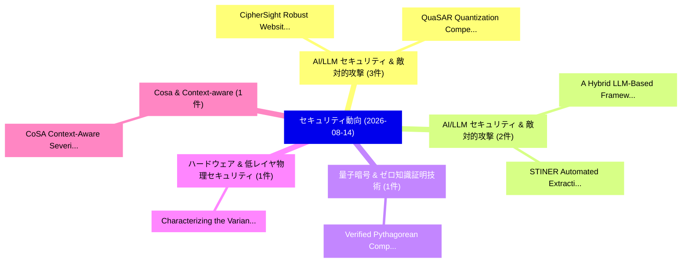

# 📅 02_daily: 日次エグゼクティブサマリー報告書 (2026-08-14)

**集計日時**: 2026-10-02 23:06:23 UTC  
**対象日付**: 2026-08-14  
**本日収集論文数**: 26 件  

---

## 💡 主要セキュリティ動向・脅威インサイト (Executive Insights)

本日の収集論文（計 26 件）において、以下の重点セキュリティ領域で活発な研究動向が確認されました：
- **AI/LLM セキュリティ & 敵対的攻撃** (3 件): 注目論文として 「CipherSight: Robust Website Fi...」、「QuaSAR: Quantization Compensat...」 等が発表され、実務防御および攻撃検証の進展が見られます。
- **AI/LLM セキュリティ & 敵対的攻撃** (2 件): 注目論文として 「A Hybrid LLM-Based Framework f...」、「STINER: Automated Extraction o...」 等が発表され、実務防御および攻撃検証の進展が見られます。
- **量子暗号 & ゼロ知識証明技術** (1 件): 注目論文として 「Verified Pythagorean Compositi...」 等が発表され、実務防御および攻撃検証の進展が見られます。
- **ハードウェア & 低レイヤ物理セキュリティ** (1 件): 注目論文として 「Characterizing the Variance En...」 等が発表され、実務防御および攻撃検証の進展が見られます。
- **Cosa & Context-aware** (1 件): 注目論文として 「CoSA: Context-Aware Severity A...」 等が発表され、実務防御および攻撃検証の進展が見られます。

### 🗺️ 技術・脅威トピックマインドマップ

---

## 📌 日次セキュリティ論文一覧 (日本語表形式)

| No | arXiv ID | 論文タイトル (日本語訳) | 重要キーワード | 構造化エグゼクティブ要約 (背景・提案・影響) | 脅威分類 | 詳細リンク |
|---|---|---|---|---|---|---|
| 1 | `2608.13846v1` | [Verified Pythagorean Composition for Adaptive Cryptographic Games: Noise Flooding in Homomorphic Encryption（セキュリティ分析論文）](../../okf/papers/2026-08-14/2608.13846.md) | `Verified Pythagorean Composition`, `Adaptive Cryptographic Games`, `Noise Flooding` | 【提案】概要 (Overview & Key Finding) 本論文「Verified Pythagorean Composition for Adaptive Cryptogra...。実証評価により経営層・セキュリティ管理者向け推奨アクション (E... | `Cryptography` | [arXiv](https://arxiv.org/abs/2608.13846v1) &#124; [OKF](../../okf/papers/2026-08-14/2608.13846.md) |
| 2 | `2608.13905v1` | [CipherSight: Robust Website Fingerprinting via Record-Resource Semantic Supervision under Distribution Shifts（セキュリティ分析論文）](../../okf/papers/2026-08-14/2608.13905.md) | `Robust Website Fingerprinting`, `Resource Semantic Supervision`, `Distribution Shifts` | 【提案】概要 (Overview & Key Finding) 本論文「CipherSight: Robust Website Fingerprinting via Record-R...。実証評価により経営層・セキュリティ管理者向け推奨アクション (E... | `AI/ML Security` | [arXiv](https://arxiv.org/abs/2608.13905v1) &#124; [OKF](../../okf/papers/2026-08-14/2608.13905.md) |
| 3 | `2608.13920v1` | [Characterizing the Variance Envelope: A Multi-Dimensional Spectre Telemetry Across Architectures and Workloadsの分析](../../okf/papers/2026-08-14/2608.13920.md) | `Variance Envelope`, `Dimensional Spectre Telemetry Across Architectures`, `Spectre Telemetry Across Architectures` | 【提案】概要 (Overview & Key Finding) 本論文「Characterizing the Variance Envelope: A Multi-Dimension...。実証評価により経営層・セキュリティ管理者向け推奨アクション (E... | `AI/ML Security` | [arXiv](https://arxiv.org/abs/2608.13920v1) &#124; [OKF](../../okf/papers/2026-08-14/2608.13920.md) |
| 4 | `2608.13928v1` | [CoSA: Context-Aware Severity Assessment via Context Analysis with 大規模言語モデル](../../okf/papers/2026-08-14/2608.13928.md) | `Aware Severity Assessment`, `Context-Aware Severity`, `Large Language Models` | 【提案】概要 (Overview & Key Finding) 本論文「CoSA: Context-Aware Severity Assessment via Context Ana...。実証評価により経営層・セキュリティ管理者向け推奨アクション (E... | `AI/ML Security` | [arXiv](https://arxiv.org/abs/2608.13928v1) &#124; [OKF](../../okf/papers/2026-08-14/2608.13928.md) |
| 5 | `2608.13930v1` | [Extracting and Verifying Illicit Bitcoin Addresses from Underground Forum Discussions（セキュリティ分析論文）](../../okf/papers/2026-08-14/2608.13930.md) | `Verifying Illicit Bitcoin Addresses`, `Underground Forum Discussions`, `Abdoul Nasser Hassane Amadou` | 【提案】概要 (Overview & Key Finding) 本論文「Extracting and Verifying Illicit Bitcoin Addresses from...。実証評価により経営層・セキュリティ管理者向け推奨アクション (E... | `AI/ML Security` | [arXiv](https://arxiv.org/abs/2608.13930v1) &#124; [OKF](../../okf/papers/2026-08-14/2608.13930.md) |
| 6 | `2608.13948v2` | [Exposing SIMD Parallelism in SQIsign: An AVX-512 Implementation（セキュリティ分析論文）](../../okf/papers/2026-08-14/2608.13948.md) | `AVX-512 Implementation`, `Weize Wang`, `Chutong Wang` | 【提案】概要 (Overview & Key Finding) 本論文「Exposing SIMD Parallelism in SQIsign: An AVX-512 Implem...。実証評価により経営層・セキュリティ管理者向け推奨アクション (E... | `Cryptography` | [arXiv](https://arxiv.org/abs/2608.13948v2) &#124; [OKF](../../okf/papers/2026-08-14/2608.13948.md) |
| 7 | `2608.13981v1` | [Structural Leakage in Graph Encryption: Attacks and Defenses（セキュリティ分析論文）](../../okf/papers/2026-08-14/2608.13981.md) | `Structural Leakage`, `Graph Encryption`, `Hua Shen` | 【提案】概要 (Overview & Key Finding) 本論文「Structural Leakage in Graph Encryption: Attacks and Def...。実証評価により経営層・セキュリティ管理者向け推奨アクション (E... | `AI/ML Security` | [arXiv](https://arxiv.org/abs/2608.13981v1) &#124; [OKF](../../okf/papers/2026-08-14/2608.13981.md) |
| 8 | `2608.14089v1` | [Regime-Conditional Verification: Correctness Estimation for Adapting and Monitoring Safety Classifiers（セキュリティ分析論文）](../../okf/papers/2026-08-14/2608.14089.md) | `Monitoring Safety Classifiers`, `Conditional Verification`, `Regime-Conditional Verification` | 【提案】概要 (Overview & Key Finding) 本論文「Regime-Conditional Verification: Correctness Estimation...。実証評価により経営層・セキュリティ管理者向け推奨アクション (E... | `Network Security` | [arXiv](https://arxiv.org/abs/2608.14089v1) &#124; [OKF](../../okf/papers/2026-08-14/2608.14089.md) |
| 9 | `2608.14094v1` | [P2Skill: Privacy Preserving Skill Distillation for Cloud-Local LLM Inference Systems（セキュリティ分析論文）](../../okf/papers/2026-08-14/2608.14094.md) | `Privacy Preserving Skill Distillation`, `Inference Systems`, `Cloud-Local LLM` | 【提案】概要 (Overview & Key Finding) 本論文「P2Skill: Privacy Preserving Skill Distillation for Clou...。実証評価により経営層・セキュリティ管理者向け推奨アクション (E... | `AI/ML Security` | [arXiv](https://arxiv.org/abs/2608.14094v1) &#124; [OKF](../../okf/papers/2026-08-14/2608.14094.md) |
| 10 | `2608.14126v1` | [BGA: A noise-immune neural distillation framework for malicious signature extraction in high-entropy encrypted flows（セキュリティ分析論文）](../../okf/papers/2026-08-14/2608.14126.md) | `noise-immune neural`, `high-entropy encrypted`, `Sheng Hong` | 【提案】概要 (Overview & Key Finding) 本論文「BGA: A noise-immune neural distillation framework for m...。実証評価により経営層・セキュリティ管理者向け推奨アクション (E... | `Cryptography` | [arXiv](https://arxiv.org/abs/2608.14126v1) &#124; [OKF](../../okf/papers/2026-08-14/2608.14126.md) |
| 11 | `2608.14149v1` | [QuaSAR: Quantization Compensation via Stable Activation-Aware Rank Truncation（セキュリティ分析論文）](../../okf/papers/2026-08-14/2608.14149.md) | `Aware Rank Truncation`, `Quantization Compensation`, `Stable Activation` | 【提案】概要 (Overview & Key Finding) 本論文「QuaSAR: Quantization Compensation via Stable Activation...。実証評価により経営層・セキュリティ管理者向け推奨アクション (E... | `AI/ML Security` | [arXiv](https://arxiv.org/abs/2608.14149v1) &#124; [OKF](../../okf/papers/2026-08-14/2608.14149.md) |
| 12 | `2608.14216v1` | [MazeRunner: Nonlinear Task and Clue Orchestration for LLM-driven Black-Box Automated Penetration Testing（セキュリティ分析論文）](../../okf/papers/2026-08-14/2608.14216.md) | `Box Automated Penetration Testing`, `Nonlinear Task`, `Clue Orchestration` | 【提案】概要 (Overview & Key Finding) 本論文「MazeRunner: Nonlinear Task and Clue Orchestration for L...。実証評価により経営層・セキュリティ管理者向け推奨アクション (E... | `AI/ML Security` | [arXiv](https://arxiv.org/abs/2608.14216v1) &#124; [OKF](../../okf/papers/2026-08-14/2608.14216.md) |
| 13 | `2608.14329v1` | [A Four-Axis Trustworthiness Benchmark for LLM-as-Judge in Principle-Based Regulation（セキュリティ分析論文）](../../okf/papers/2026-08-14/2608.14329.md) | `Axis Trustworthiness Benchmark`, `Four-Axis Trustworthiness`, `Based Regulation` | 【提案】概要 (Overview & Key Finding) 本論文「A Four-Axis Trustworthiness Benchmark for LLM-as-Judge ...。実証評価により経営層・セキュリティ管理者向け推奨アクション (E... | `AI/ML Security` | [arXiv](https://arxiv.org/abs/2608.14329v1) &#124; [OKF](../../okf/papers/2026-08-14/2608.14329.md) |
| 14 | `2608.14331v1` | [Equivalence Between Average-Case Hardness of Learning and Cryptography for Mixed Quantum States（セキュリティ分析論文）](../../okf/papers/2026-08-14/2608.14331.md) | `Mixed Quantum States`, `Case Hardness`, `Average-Case Hardness` | 【提案】概要 (Overview & Key Finding) 本論文「Equivalence Between Average-Case Hardness of Learning a...。実証評価により経営層・セキュリティ管理者向け推奨アクション (E... | `AI/ML Security` | [arXiv](https://arxiv.org/abs/2608.14331v1) &#124; [OKF](../../okf/papers/2026-08-14/2608.14331.md) |
| 15 | `2608.14356v1` | [Designing Inclusive Crypto-Asset Dispute Resolution A Hybrid AI and Smart Contract Online Dispute Resolution Framework for Vulnerable Users（セキュリティ分析論文）](../../okf/papers/2026-08-14/2608.14356.md) | `Designing Inclusive Crypto`, `Asset Dispute Resolution`, `Vulnerable Users` | 【提案】概要 (Overview & Key Finding) 本論文「Designing Inclusive Crypto-Asset Dispute Resolution A H...。実証評価により経営層・セキュリティ管理者向け推奨アクション (E... | `AI/ML Security` | [arXiv](https://arxiv.org/abs/2608.14356v1) &#124; [OKF](../../okf/papers/2026-08-14/2608.14356.md) |
| 16 | `2608.14370v1` | [A Hybrid LLM-Based Framework for Automated Security Annotation Generation in Business Process Models（セキュリティ分析論文）](../../okf/papers/2026-08-14/2608.14370.md) | `Automated Security Annotation Generation`, `Business Process Models`, `Md Kamrul Islam` | 【提案】概要 (Overview & Key Finding) 本論文「A Hybrid LLM-Based Framework for Automated Security Ann...。実証評価により経営層・セキュリティ管理者向け推奨アクション (E... | `AI/ML Security` | [arXiv](https://arxiv.org/abs/2608.14370v1) &#124; [OKF](../../okf/papers/2026-08-14/2608.14370.md) |
| 17 | `2608.14418v1` | [STINER: Automated Extraction of Strategic Cyber Threat Intelligence from X（セキュリティ分析論文）](../../okf/papers/2026-08-14/2608.14418.md) | `Strategic Cyber Threat Intelligence`, `Automated Extraction`, `Yasir Ech` | 【提案】概要 (Overview & Key Finding) 本論文「STINER: Automated Extraction of Strategic Cyber 脅威 Inte...。実証評価により経営層・セキュリティ管理者向け推奨アクション (E... | `AI/ML Security` | [arXiv](https://arxiv.org/abs/2608.14418v1) &#124; [OKF](../../okf/papers/2026-08-14/2608.14418.md) |
| 18 | `2608.14501v1` | [Lower Bounds on Black-Box Constructions of Pseudorandom Functions（セキュリティ分析論文）](../../okf/papers/2026-08-14/2608.14501.md) | `Lower Bounds`, `Box Constructions`, `Pseudorandom Functions` | 【提案】概要 (Overview & Key Finding) 本論文「Lower Bounds on Black-Box Constructions of Pseudorandom...。実証評価により経営層・セキュリティ管理者向け推奨アクション (E... | `Cryptography` | [arXiv](https://arxiv.org/abs/2608.14501v1) &#124; [OKF](../../okf/papers/2026-08-14/2608.14501.md) |
| 19 | `2608.14532v1` | [Trust Without Boundaries: An Architectural Satellite Flight Softwareの分析](../../okf/papers/2026-08-14/2608.14532.md) | `Trust Without Boundaries`, `Satellite Flight Software`, `Software Security` | 【提案】背景とセキュリティ上の課題 (Background & Problem) 本研究はサイバー脅威環境におけるセキュリティ構造・脆弱性の検証を目的としています。(主要検出項目: ...。実証評価により経営層・セキュリティ管理者向け推奨アクション (E... | `Software Security` | [arXiv](https://arxiv.org/abs/2608.14532v1) &#124; [OKF](../../okf/papers/2026-08-14/2608.14532.md) |
| 20 | `2608.14533v1` | [Finding Vulnerabilities via LLM-Augmented Semantics-Aware Type-Checking（セキュリティ分析論文）](../../okf/papers/2026-08-14/2608.14533.md) | `Finding Vulnerabilities`, `Augmented Semantics`, `Aware Type` | 【提案】概要 (Overview & Key Finding) 本論文「Finding Vulnerabilities via LLM-Augmented Semantics-Awa...。実証評価により経営層・セキュリティ管理者向け推奨アクション (E... | `AI/ML Security` | [arXiv](https://arxiv.org/abs/2608.14533v1) &#124; [OKF](../../okf/papers/2026-08-14/2608.14533.md) |
| 21 | `2608.14753v1` | [SynthGuard-ReleaseBench: Locked-Audit Evidence for Synthetic Tabular Data Releases（セキュリティ分析論文）](../../okf/papers/2026-08-14/2608.14753.md) | `Synthetic Tabular Data Releases`, `Audit Evidence`, `Locked-Audit Evidence` | 【提案】概要 (Overview & Key Finding) 本論文「SynthGuard-ReleaseBench: Locked-Audit Evidence for Synt...。実証評価により経営層・セキュリティ管理者向け推奨アクション (E... | `Privacy & Provenance` | [arXiv](https://arxiv.org/abs/2608.14753v1) &#124; [OKF](../../okf/papers/2026-08-14/2608.14753.md) |
| 22 | `2608.14787v1` | [From Positionwise Confidence to Prefix Scheduling: Verifier Skipping in Speculative Decoding（セキュリティ分析論文）](../../okf/papers/2026-08-14/2608.14787.md) | `Prefix Scheduling`, `Verifier Skipping`, `Speculative Decoding` | 【提案】概要 (Overview & Key Finding) 本論文「From Positionwise Confidence to Prefix Scheduling: Veri...。実証評価により経営層・セキュリティ管理者向け推奨アクション (E... | `General Cyber Security` | [arXiv](https://arxiv.org/abs/2608.14787v1) &#124; [OKF](../../okf/papers/2026-08-14/2608.14787.md) |
| 23 | `2608.14800v1` | [Bit-Level Triangular Content-Aware Permutation for Fragile Image Watermarking: Zero False Positive Rate, Single-Bit Sensitivity, and Arbitrary Dimension Support（セキュリティ分析論文）](../../okf/papers/2026-08-14/2608.14800.md) | `Zero False Positive Rate`, `Level Triangular Content`, `Fragile Image Watermarking` | 【提案】概要 (Overview & Key Finding) 本論文「Bit-Level Triangular Content-Aware Permutation for Frag...。実証評価により経営層・セキュリティ管理者向け推奨アクション (E... | `AI/ML Security` | [arXiv](https://arxiv.org/abs/2608.14800v1) &#124; [OKF](../../okf/papers/2026-08-14/2608.14800.md) |
| 24 | `2608.14826v1` | [Explainability Boosted Anomaly Detection Framework for O-RAN based NextG Networks（セキュリティ分析論文）](../../okf/papers/2026-08-14/2608.14826.md) | `O-RAN based`, `Explainability Boosted Anomaly Detection`, `Ali Fuat Sahin` | 【提案】概要 (Overview & Key Finding) 本論文「Explainability Boosted Anomaly Detection Framework for ...。実証評価により経営層・セキュリティ管理者向け推奨アクション (E... | `AI/ML Security` | [arXiv](https://arxiv.org/abs/2608.14826v1) &#124; [OKF](../../okf/papers/2026-08-14/2608.14826.md) |
| 25 | `2608.14861v1` | [STAR-FL: Secure 連合学習 with Spatial-Temporal Analysis and Robust Aggregation](../../okf/papers/2026-08-14/2608.14861.md) | `Robust Aggregation`, `Secure Federated Learning`, `General Cyber Security` | 【提案】概要 (Overview & Key Finding) 本論文「STAR-FL: Secure 連合学習 with Spatial-Temporal Analysis and...。実証評価により経営層・セキュリティ管理者向け推奨アクション (E... | `General Cyber Security` | [arXiv](https://arxiv.org/abs/2608.14861v1) &#124; [OKF](../../okf/papers/2026-08-14/2608.14861.md) |
| 26 | `2608.14876v1` | [Workspace Topology as an Attack Vector in Agentic Coding Assistants（セキュリティ分析論文）](../../okf/papers/2026-08-14/2608.14876.md) | `Agentic Coding Assistants`, `Workspace Topology`, `Attack Vector` | 【提案】概要 (Overview & Key Finding) 本論文「Workspace Topology as an Attack Vector in Agentic Codin...。実証評価によりDay, Pradeep Yadlapal。 | `AI/ML Security` | [arXiv](https://arxiv.org/abs/2608.14876v1) &#124; [OKF](../../okf/papers/2026-08-14/2608.14876.md) |

