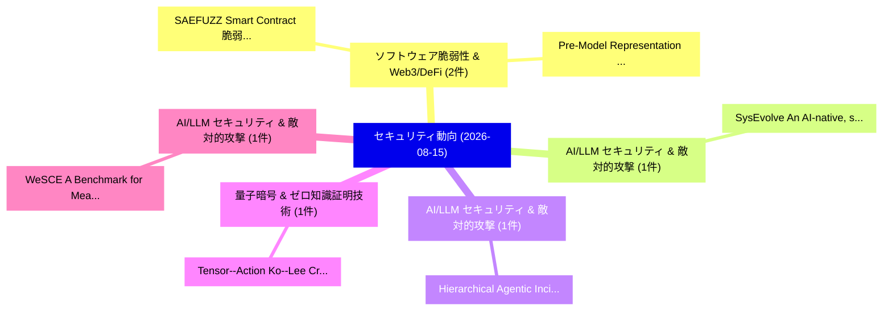

# 📅 02_daily: 日次エグゼクティブサマリー報告書 (2026-08-15)

**集計日時**: 2026-10-02 23:06:23 UTC  
**対象日付**: 2026-08-15  
**本日収集論文数**: 16 件  

---

## 💡 主要セキュリティ動向・脅威インサイト (Executive Insights)

本日の収集論文（計 16 件）において、以下の重点セキュリティ領域で活発な研究動向が確認されました：
- **ソフトウェア脆弱性 & Web3/DeFi** (2 件): 注目論文として 「SAEFUZZ: Smart Contract 脆弱性検出 ...」、「Pre-Model Representation Failu...」 等が発表され、実務防御および攻撃検証の進展が見られます。
- **AI/LLM セキュリティ & 敵対的攻撃** (1 件): 注目論文として 「SysEvolve: An AI-native, safe,...」 等が発表され、実務防御および攻撃検証の進展が見られます。
- **AI/LLM セキュリティ & 敵対的攻撃** (1 件): 注目論文として 「Hierarchical Agentic Incident ...」 等が発表され、実務防御および攻撃検証の進展が見られます。
- **量子暗号 & ゼロ知識証明技術** (1 件): 注目論文として 「Tensor--Action Ko--Lee Cryptog...」 等が発表され、実務防御および攻撃検証の進展が見られます。
- **AI/LLM セキュリティ & 敵対的攻撃** (1 件): 注目論文として 「WeSCE: A Benchmark for Measuri...」 等が発表され、実務防御および攻撃検証の進展が見られます。

### 🗺️ 技術・脅威トピックマインドマップ

---

## 📌 日次セキュリティ論文一覧 (日本語表形式)

| No | arXiv ID | 論文タイトル (日本語訳) | 重要キーワード | 構造化エグゼクティブ要約 (背景・提案・影響) | 脅威分類 | 詳細リンク |
|---|---|---|---|---|---|---|
| 1 | `2608.15012v1` | [SysEvolve: An AI-native, safe, autonomous adversarial attack-defense co-evolutionary system（セキュリティ分析論文）](../../okf/papers/2026-08-15/2608.15012.md) | `attack-defense co`, `Yuhan Meng`, `Shaofei Li` | 【提案】概要 (Overview & Key Finding) 本論文「SysEvolve: An AI-native, safe, autonomous 敵対的攻撃-defense...。実証評価により経営層・セキュリティ管理者向け推奨アクション (E... | `AI/ML Security` | [arXiv](https://arxiv.org/abs/2608.15012v1) &#124; [OKF](../../okf/papers/2026-08-15/2608.15012.md) |
| 2 | `2608.15016v1` | [Hierarchical Agentic Incident Response with Digital-Twin-Validated Attack Inference（セキュリティ分析論文）](../../okf/papers/2026-08-15/2608.15016.md) | `Hierarchical Agentic Incident Response`, `Validated Attack Inference`, `Yiran Gao` | 【提案】概要 (Overview & Key Finding) 本論文「Hierarchical Agentic Incident Response with Digital-Twi...。実証評価により経営層・セキュリティ管理者向け推奨アクション (E... | `AI/ML Security` | [arXiv](https://arxiv.org/abs/2608.15016v1) &#124; [OKF](../../okf/papers/2026-08-15/2608.15016.md) |
| 3 | `2608.15030v1` | [Tensor--Action Ko--Lee Cryptography: A Framework and Structural CryptCommuting Subgroup Constructionsの分析](../../okf/papers/2026-08-15/2608.15030.md) | `Action Ko`, `Lee Cryptography`, `Commuting Subgroup Constructions` | 【提案】概要 (Overview & Key Finding) 本論文「Tensor--Action Ko--Lee 暗号技術: A Framework and Structural...。実証評価により経営層・セキュリティ管理者向け推奨アクション (E... | `Cryptography` | [arXiv](https://arxiv.org/abs/2608.15030v1) &#124; [OKF](../../okf/papers/2026-08-15/2608.15030.md) |
| 4 | `2608.15092v1` | [WeSCE: A Benchmark for Measuring Security Drift in LLM-Driven Code Editing（セキュリティ分析論文）](../../okf/papers/2026-08-15/2608.15092.md) | `Measuring Security Drift`, `Driven Code Editing`, `LLM-Driven Code` | 【提案】概要 (Overview & Key Finding) 本論文「WeSCE: A Benchmark for Measuring Security Drift in LLM-...。実証評価により経営層・セキュリティ管理者向け推奨アクション (E... | `AI/ML Security` | [arXiv](https://arxiv.org/abs/2608.15092v1) &#124; [OKF](../../okf/papers/2026-08-15/2608.15092.md) |
| 5 | `2608.15108v1` | [Beyond Direct Access: Resource Hijacking in LLMエージェント](../../okf/papers/2026-08-15/2608.15108.md) | `Beyond Direct Access`, `Resource Hijacking`, `Puyu Zeng` | 【提案】概要 (Overview & Key Finding) 本論文「Beyond Direct Access: Resource Hijacking in LLMエージェント」（...。実証評価により経営層・セキュリティ管理者向け推奨アクション (E... | `AI/ML Security` | [arXiv](https://arxiv.org/abs/2608.15108v1) &#124; [OKF](../../okf/papers/2026-08-15/2608.15108.md) |
| 6 | `2608.15151v1` | [SAEFUZZ: Smart Contract 脆弱性検出 through Statically Guided Evolutionary Fuzzing](../../okf/papers/2026-08-15/2608.15151.md) | `Statically Guided Evolutionary Fuzzing`, `Smart Contract Vulnerability Detection`, `Smart Contract` | 【提案】概要 (Overview & Key Finding) 本論文「SAEFUZZ: スマートコントラクト 脆弱性検出 through Statically Guided Evo...。実証評価により経営層・セキュリティ管理者向け推奨アクション (E... | `AI/ML Security` | [arXiv](https://arxiv.org/abs/2608.15151v1) &#124; [OKF](../../okf/papers/2026-08-15/2608.15151.md) |
| 7 | `2608.15153v1` | [An Adaptive Gradient Clipping and Noise Injection Mechanism for Differentially Private 連合学習](../../okf/papers/2026-08-15/2608.15153.md) | `Noise Injection Mechanism`, `Differentially Private Federated Learning`, `Differentially Private` | 【提案】概要 (Overview & Key Finding) 本論文「An Adaptive Gradient Clipping and Noise Injection Mecha...。実証評価により経営層・セキュリティ管理者向け推奨アクション (E... | `AI/ML Security` | [arXiv](https://arxiv.org/abs/2608.15153v1) &#124; [OKF](../../okf/papers/2026-08-15/2608.15153.md) |
| 8 | `2608.15184v1` | [Pre-Model Representation Failures in GNN-Based Smart Contract 脆弱性検出](../../okf/papers/2026-08-15/2608.15184.md) | `Model Representation Failures`, `Pre-Model Representation`, `GNN-Based Smart` | 【提案】概要 (Overview & Key Finding) 本論文「Pre-Model Representation Failures in GNN-Based スマートコントラ...。実証評価により経営層・セキュリティ管理者向け推奨アクション (E... | `Software Security` | [arXiv](https://arxiv.org/abs/2608.15184v1) &#124; [OKF](../../okf/papers/2026-08-15/2608.15184.md) |
| 9 | `2608.15225v1` | [Inferring 1-Minimal Trigger Configurations for Assessing Linux Kernel CVE Triggerability（セキュリティ分析論文）](../../okf/papers/2026-08-15/2608.15225.md) | `Minimal Trigger Configurations`, `Assessing Linux Kernel`, `1-Minimal Trigger` | 【提案】概要 (Overview & Key Finding) 本論文「Inferring 1-Minimal Trigger Configurations for Assessin...。実証評価により経営層・セキュリティ管理者向け推奨アクション (E... | `AI/ML Security` | [arXiv](https://arxiv.org/abs/2608.15225v1) &#124; [OKF](../../okf/papers/2026-08-15/2608.15225.md) |
| 10 | `2608.15274v2` | [External Sinkhole Attack Detection in Large-Scale WSNs Using Metaheuristic Feature Selection（セキュリティ分析論文）](../../okf/papers/2026-08-15/2608.15274.md) | `External Sinkhole Attack Detection`, `Using Metaheuristic Feature Selection`, `Large-Scale WSNs` | 【提案】概要 (Overview & Key Finding) 本論文「External Sinkhole Attack Detection in Large-Scale WSNs ...。実証評価により経営層・セキュリティ管理者向け推奨アクション (E... | `Network Security` | [arXiv](https://arxiv.org/abs/2608.15274v2) &#124; [OKF](../../okf/papers/2026-08-15/2608.15274.md) |
| 11 | `2608.15276v1` | [Balancing Privacy and Compliance in DeFi: A Zero-Knowledge-Based Auditable Cross-Chain Framework（セキュリティ分析論文）](../../okf/papers/2026-08-15/2608.15276.md) | `Based Auditable Cross`, `Balancing Privacy`, `Huiheng Li` | 【提案】概要 (Overview & Key Finding) 本論文「Balancing Privacy and Compliance in DeFi: A Zero-Knowle...。実証評価により経営層・セキュリティ管理者向け推奨アクション (E... | `Cryptography` | [arXiv](https://arxiv.org/abs/2608.15276v1) &#124; [OKF](../../okf/papers/2026-08-15/2608.15276.md) |
| 12 | `2608.15310v1` | [FedADB: Class Anchor-Driven Dual-Branch 連合学習 for Mitigating Forgetting](../../okf/papers/2026-08-15/2608.15310.md) | `Class Anchor`, `Driven Dual`, `Anchor-Driven Dual` | 【提案】概要 (Overview & Key Finding) 本論文「FedADB: Class Anchor-Driven Dual-Branch 連合学習 for Mitiga...。実証評価により経営層・セキュリティ管理者向け推奨アクション (E... | `Privacy & Provenance` | [arXiv](https://arxiv.org/abs/2608.15310v1) &#124; [OKF](../../okf/papers/2026-08-15/2608.15310.md) |
| 13 | `2608.15369v1` | [AudioTQ: A Data-Oblivious 6-Bit CPU Audio Codec via Randomized Hadamard Rotation and Lloyd-Max Quantization（セキュリティ分析論文）](../../okf/papers/2026-08-15/2608.15369.md) | `Randomized Hadamard Rotation`, `Audio Codec`, `Max Quantization` | 【提案】概要 (Overview & Key Finding) 本論文「AudioTQ: A Data-Oblivious 6-Bit CPU Audio Codec via Ran...。実証評価により経営層・セキュリティ管理者向け推奨アクション (E... | `AI/ML Security` | [arXiv](https://arxiv.org/abs/2608.15369v1) &#124; [OKF](../../okf/papers/2026-08-15/2608.15369.md) |
| 14 | `2608.15391v1` | [TwinGridShield: Consequence-Aware Runtime Authorization for LLM Grid-Agent Actions（セキュリティ分析論文）](../../okf/papers/2026-08-15/2608.15391.md) | `Aware Runtime Authorization`, `Agent Actions`, `Consequence-Aware Runtime` | 【提案】概要 (Overview & Key Finding) 本論文「TwinGridShield: Consequence-Aware Runtime Authorization...。実証評価により経営層・セキュリティ管理者向け推奨アクション (E... | `AI/ML Security` | [arXiv](https://arxiv.org/abs/2608.15391v1) &#124; [OKF](../../okf/papers/2026-08-15/2608.15391.md) |
| 15 | `2608.15407v1` | [Chameleon: An Adaptive AI-Driven Honeypot Architecture Using Threat-Calibrated Particle Swarm Optimization and Semantic Deception Rapidly-Exploring Random Trees（セキュリティ分析論文）](../../okf/papers/2026-08-15/2608.15407.md) | `Driven Honeypot Architecture Using Threat`, `Calibrated Particle Swarm Optimization`, `Semantic Deception Rapidly` | 【提案】概要 (Overview & Key Finding) 本論文「Chameleon: An Adaptive AI-Driven Honeypot Architecture ...。実証評価により経営層・セキュリティ管理者向け推奨アクション (E... | `AI/ML Security` | [arXiv](https://arxiv.org/abs/2608.15407v1) &#124; [OKF](../../okf/papers/2026-08-15/2608.15407.md) |
| 16 | `2608.18164v1` | [Are LLMs Safe Beyond Text: Do Emojis Expose Gaps in Safety Evaluation（セキュリティ分析論文）](../../okf/papers/2026-08-15/2608.18164.md) | `Safe Beyond Text`, `Raw Meta`, `Executive Summary` | 【提案】概要 (Overview & Key Finding) 本論文「Are LLMs Safe Beyond Text: Do Emojis Expose Gaps in Saf...。実証評価により経営層・セキュリティ管理者向け推奨アクション (E... | `AI/ML Security` | [arXiv](https://arxiv.org/abs/2608.18164v1) &#124; [OKF](../../okf/papers/2026-08-15/2608.18164.md) |

