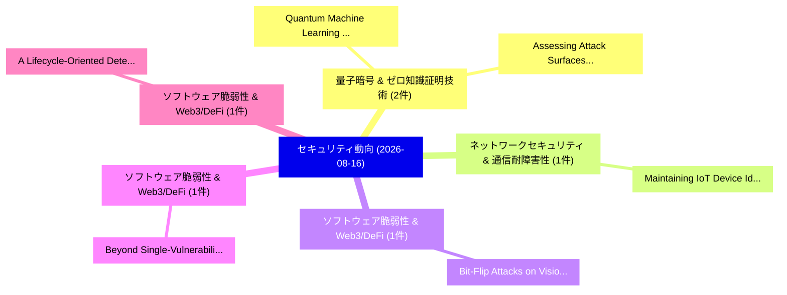

# 📅 02_daily: 日次エグゼクティブサマリー報告書 (2026-08-16)

**集計日時**: 2026-10-02 23:06:23 UTC  
**対象日付**: 2026-08-16  
**本日収集論文数**: 12 件  

---

## 💡 主要セキュリティ動向・脅威インサイト (Executive Insights)

本日の収集論文（計 12 件）において、以下の重点セキュリティ領域で活発な研究動向が確認されました：
- **量子暗号 & ゼロ知識証明技術** (2 件): 注目論文として 「Quantum Machine Learning for P...」、「Assessing Attack Surfaces in G...」 等が発表され、実務防御および攻撃検証の進展が見られます。
- **ネットワークセキュリティ & 通信耐障害性** (1 件): 注目論文として 「Maintaining IoT Device Identif...」 等が発表され、実務防御および攻撃検証の進展が見られます。
- **ソフトウェア脆弱性 & Web3/DeFi** (1 件): 注目論文として 「Bit-Flip Attacks on Vision-Lan...」 等が発表され、実務防御および攻撃検証の進展が見られます。
- **ソフトウェア脆弱性 & Web3/DeFi** (1 件): 注目論文として 「Beyond Single-Vulnerability Ev...」 等が発表され、実務防御および攻撃検証の進展が見られます。
- **ソフトウェア脆弱性 & Web3/DeFi** (1 件): 注目論文として 「A Lifecycle-Oriented Detection...」 等が発表され、実務防御および攻撃検証の進展が見られます。

### 🗺️ 技術・脅威トピックマインドマップ

---

## 📌 日次セキュリティ論文一覧 (日本語表形式)

| No | arXiv ID | 論文タイトル (日本語訳) | 重要キーワード | 構造化エグゼクティブ要約 (背景・提案・影響) | 脅威分類 | 詳細リンク |
|---|---|---|---|---|---|---|
| 1 | `2608.15465v1` | [Maintaining IoT Device Identification under Concept Drift via Budget-Aware Traffic Labeling（セキュリティ分析論文）](../../okf/papers/2026-08-16/2608.15465.md) | `Aware Traffic Labeling`, `Device Identification`, `Concept Drift` | 【提案】概要 (Overview & Key Finding) 本論文「Maintaining IoT Device Identification under Concept Dri...。実証評価により経営層・セキュリティ管理者向け推奨アクション (E... | `AI/ML Security` | [arXiv](https://arxiv.org/abs/2608.15465v1) &#124; [OKF](../../okf/papers/2026-08-16/2608.15465.md) |
| 2 | `2608.15475v1` | [Bit-Flip Attacks on Vision-Language-Action Models: Action-Decoding Architecture Shapes the Vulnerability（セキュリティ分析論文）](../../okf/papers/2026-08-16/2608.15475.md) | `Decoding Architecture Shapes`, `Flip Attacks`, `Action Models` | 【提案】概要 (Overview & Key Finding) 本論文「Bit-Flip Attacks on Vision-Language-Action Models: Acti...。実証評価により経営層・セキュリティ管理者向け推奨アクション (E... | `Software Security` | [arXiv](https://arxiv.org/abs/2608.15475v1) &#124; [OKF](../../okf/papers/2026-08-16/2608.15475.md) |
| 3 | `2608.15486v1` | [Beyond Single-Vulnerability Evaluation: Closing the Engineering Decision Gap Between C Retrofits and Native Safety（セキュリティ分析論文）](../../okf/papers/2026-08-16/2608.15486.md) | `Beyond Single`, `Native Safety`, `Software Security` | 【提案】概要 (Overview & Key Finding) 本論文「Beyond Single-脆弱性 Evaluation: Closing the Engineering D...。実証評価により経営層・セキュリティ管理者向け推奨アクション (E... | `Software Security` | [arXiv](https://arxiv.org/abs/2608.15486v1) &#124; [OKF](../../okf/papers/2026-08-16/2608.15486.md) |
| 4 | `2608.15518v1` | [A Lifecycle-Oriented Detection and Defense Framework for Price Manipulation Attacks in DeFi（セキュリティ分析論文）](../../okf/papers/2026-08-16/2608.15518.md) | `Price Manipulation Attacks`, `Oriented Detection`, `Lifecycle-Oriented Detection` | 【提案】概要 (Overview & Key Finding) 本論文「A Lifecycle-Oriented Detection and Defense Framework fo...。実証評価により経営層・セキュリティ管理者向け推奨アクション (E... | `Network Security` | [arXiv](https://arxiv.org/abs/2608.15518v1) &#124; [OKF](../../okf/papers/2026-08-16/2608.15518.md) |
| 5 | `2608.15617v1` | [Quantum Machine Learning for Power-System Attack Detection: Evaluation Choices Decide the Outcome Before the Models Doのベンチマーク評価](../../okf/papers/2026-08-16/2608.15617.md) | `System Attack Detection`, `Power-System Attack`, `Benchmarking Quantum Machine Learning` | 【提案】概要 (Overview & Key Finding) 本論文「量子 Machine Learning for Power-System Attack Detection: ...。実証評価により経営層・セキュリティ管理者向け推奨アクション (E... | `AI/ML Security` | [arXiv](https://arxiv.org/abs/2608.15617v1) &#124; [OKF](../../okf/papers/2026-08-16/2608.15617.md) |
| 6 | `2608.15640v1` | [A contribution to the critique of blockchain censorship（セキュリティ分析論文）](../../okf/papers/2026-08-16/2608.15640.md) | `General Cyber Security`, `Ruichao Jiang`, `Michelle Yeo` | 【提案】概要 (Overview & Key Finding) 本論文「A contribution to the critique of blockchain censorship...。実証評価により経営層・セキュリティ管理者向け推奨アクション (E... | `General Cyber Security` | [arXiv](https://arxiv.org/abs/2608.15640v1) &#124; [OKF](../../okf/papers/2026-08-16/2608.15640.md) |
| 7 | `2608.15642v1` | [When Time Meets Space: Entropy Integration and Dynamic Threshold for Adaptive DDoS Detection in SDN（セキュリティ分析論文）](../../okf/papers/2026-08-16/2608.15642.md) | `Entropy Integration`, `Dynamic Threshold`, `Zhaoyang Zhang` | 【提案】概要 (Overview & Key Finding) 本論文「When Time Meets Space: Entropy Integration and Dynamic ...。実証評価により経営層・セキュリティ管理者向け推奨アクション (E... | `AI/ML Security` | [arXiv](https://arxiv.org/abs/2608.15642v1) &#124; [OKF](../../okf/papers/2026-08-16/2608.15642.md) |
| 8 | `2608.15761v1` | [Provenance, Not Behaviour: A Serialisation Artifact in Edge-IIoTset and a Leakage-Free Benchmark for Precision-Agriculture Intrusion Detection（セキュリティ分析論文）](../../okf/papers/2026-08-16/2608.15761.md) | `Agriculture Intrusion Detection`, `Serialisation Artifact`, `Free Benchmark` | 【提案】背景とセキュリティ上の課題 (Background & Problem) 本研究はサイバー脅威環境におけるセキュリティ構造・脆弱性の検証を目的としています。(主要検出項目: ...。実証評価により経営層・セキュリティ管理者向け推奨アクション (E... | `Network Security` | [arXiv](https://arxiv.org/abs/2608.15761v1) &#124; [OKF](../../okf/papers/2026-08-16/2608.15761.md) |
| 9 | `2608.15778v1` | [Fast Simulation Algorithms for OLH using Binomial Modeling（セキュリティ分析論文）](../../okf/papers/2026-08-16/2608.15778.md) | `Fast Simulation Algorithms`, `Binomial Modeling`, `Berkay Kemal Balioglu` | 【提案】概要 (Overview & Key Finding) 本論文「Fast Simulation Algorithms for OLH using Binomial Model...。実証評価によりEmre Gursoy - **公開日時**: `... | `Privacy & Provenance` | [arXiv](https://arxiv.org/abs/2608.15778v1) &#124; [OKF](../../okf/papers/2026-08-16/2608.15778.md) |
| 10 | `2608.15814v1` | [Assessing Attack Surfaces in Generative Search Engines through Publisher Attributes: A Case Study in Political Domains（セキュリティ分析論文）](../../okf/papers/2026-08-16/2608.15814.md) | `Assessing Attack Surfaces`, `Generative Search Engines`, `Publisher Attributes` | 【提案】概要 (Overview & Key Finding) 本論文「Assessing Attack Surfaces in Generative Search Engines ...。実証評価により経営層・セキュリティ管理者向け推奨アクション (E... | `AI/ML Security` | [arXiv](https://arxiv.org/abs/2608.15814v1) &#124; [OKF](../../okf/papers/2026-08-16/2608.15814.md) |
| 11 | `2608.15888v1` | [Bounded Agents: Delegation Security for Multi-Agent AI Systems（セキュリティ分析論文）](../../okf/papers/2026-08-16/2608.15888.md) | `Bounded Agents`, `Delegation Security`, `Multi-Agent AI` | 【提案】概要 (Overview & Key Finding) 本論文「Bounded Agents: Delegation Security for Multi-Agent AI ...。実証評価により経営層・セキュリティ管理者向け推奨アクション (E... | `AI/ML Security` | [arXiv](https://arxiv.org/abs/2608.15888v1) &#124; [OKF](../../okf/papers/2026-08-16/2608.15888.md) |
| 12 | `2608.15913v1` | [Conjunctive Poisoning in AI Supply-Chain Applications（セキュリティ分析論文）](../../okf/papers/2026-08-16/2608.15913.md) | `Conjunctive Poisoning`, `Chain Applications`, `Supply-Chain Applications` | 【提案】概要 (Overview & Key Finding) 本論文「Conjunctive Poisoning in AI Supply-Chain Applications（セ...。実証評価により経営層・セキュリティ管理者向け推奨アクション (E... | `AI/ML Security` | [arXiv](https://arxiv.org/abs/2608.15913v1) &#124; [OKF](../../okf/papers/2026-08-16/2608.15913.md) |

