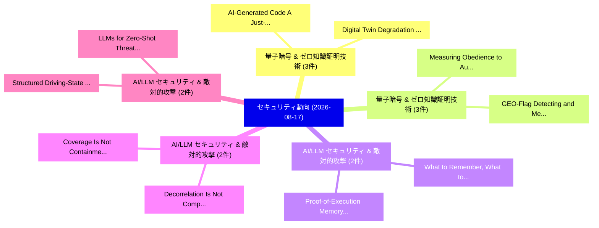

# 📅 02_daily: 日次エグゼクティブサマリー報告書 (2026-08-17)

**集計日時**: 2026-10-02 23:06:24 UTC  
**対象日付**: 2026-08-17  
**本日収集論文数**: 42 件  

---

## 💡 主要セキュリティ動向・脅威インサイト (Executive Insights)

本日の収集論文（計 42 件）において、以下の重点セキュリティ領域で活発な研究動向が確認されました：
- **量子暗号 & ゼロ知識証明技術** (3 件): 注目論文として 「Digital Twin Degradation: Dete...」、「AI-Generated Code: A Just-in-T...」 等が発表され、実務防御および攻撃検証の進展が見られます。
- **量子暗号 & ゼロ知識証明技術** (3 件): 注目論文として 「Measuring Obedience to Authori...」、「GEO-Flag: Detecting and Measur...」 等が発表され、実務防御および攻撃検証の進展が見られます。
- **AI/LLM セキュリティ & 敵対的攻撃** (2 件): 注目論文として 「Proof-of-Execution Memory: Def...」、「What to Remember, What to Reve...」 等が発表され、実務防御および攻撃検証の進展が見られます。
- **AI/LLM セキュリティ & 敵対的攻撃** (2 件): 注目論文として 「Coverage Is Not Containment: A...」、「Decorrelation Is Not Complemen...」 等が発表され、実務防御および攻撃検証の進展が見られます。
- **AI/LLM セキュリティ & 敵対的攻撃** (2 件): 注目論文として 「LLMs for Zero-Shot Threat Dete...」、「Structured Driving-State Narra...」 等が発表され、実務防御および攻撃検証の進展が見られます。

### 🗺️ 技術・脅威トピックマインドマップ

---

## 📌 日次セキュリティ論文一覧 (日本語表形式)

| No | arXiv ID | 論文タイトル (日本語訳) | 重要キーワード | 構造化エグゼクティブ要約 (背景・提案・影響) | 脅威分類 | 詳細リンク |
|---|---|---|---|---|---|---|
| 1 | `2608.16026v1` | [SkillWatermark: An Embedded Skill Watermark of Progressive Privacy Inference via Benign Prompts（セキュリティ分析論文）](../../okf/papers/2026-08-17/2608.16026.md) | `Progressive Privacy Inference`, `Benign Prompts`, `Yu Li` | 【提案】概要 (Overview & Key Finding) 本論文「SkillWatermark: An Embedded Skill Watermark of Progress...。実証評価により経営層・セキュリティ管理者向け推奨アクション (E... | `AI/ML Security` | [arXiv](https://arxiv.org/abs/2608.16026v1) &#124; [OKF](../../okf/papers/2026-08-17/2608.16026.md) |
| 2 | `2608.16032v1` | [Proof-of-Execution Memory: Defending LLMエージェント Against Forged-Reasoning Attacks by Verifying What Actually Happened](../../okf/papers/2026-08-17/2608.16032.md) | `Execution Memory`, `Reasoning Attacks`, `Forged-Reasoning Attacks` | 【提案】概要 (Overview & Key Finding) 本論文「Proof-of-Execution Memory: Defending LLMエージェント Against ...。実証評価により経営層・セキュリティ管理者向け推奨アクション (E... | `AI/ML Security` | [arXiv](https://arxiv.org/abs/2608.16032v1) &#124; [OKF](../../okf/papers/2026-08-17/2608.16032.md) |
| 3 | `2608.16044v1` | [Coverage Is Not Containment: A Fundamental Limit of Admission-Time Defenses Against Coordinated Poisoning of Vector Retrieval（セキュリティ分析論文）](../../okf/papers/2026-08-17/2608.16044.md) | `Fundamental Limit`, `Vector Retrieval`, `Admission-Time Defenses` | 【提案】背景とセキュリティ上の課題 (Background & Problem) 本研究はサイバー脅威環境におけるセキュリティ構造・脆弱性の検証を目的としています。(主要検出項目: ...。実証評価により経営層・セキュリティ管理者向け推奨アクション (E... | `AI/ML Security` | [arXiv](https://arxiv.org/abs/2608.16044v1) &#124; [OKF](../../okf/papers/2026-08-17/2608.16044.md) |
| 4 | `2608.16159v1` | [Digital Twin Degradation: Detecting Cyber Physical Attacks via Temporal Inconsistencies（セキュリティ分析論文）](../../okf/papers/2026-08-17/2608.16159.md) | `Detecting Cyber Physical Attacks`, `Digital Twin Degradation`, `Temporal Inconsistencies` | 【提案】概要 (Overview & Key Finding) 本論文「Digital Twin Degradation: Detecting Cyber Physical Atta...。実証評価により経営層・セキュリティ管理者向け推奨アクション (E... | `Cryptography` | [arXiv](https://arxiv.org/abs/2608.16159v1) &#124; [OKF](../../okf/papers/2026-08-17/2608.16159.md) |
| 5 | `2608.16160v1` | [A Calibrated and Explainable Bimodal Machine Learning Framework for Hybrid Intrusion Detection（セキュリティ分析論文）](../../okf/papers/2026-08-17/2608.16160.md) | `Hybrid Intrusion Detection`, `Hafsa Aslam`, `Yue Li` | 【提案】概要 (Overview & Key Finding) 本論文「A Calibrated and Explainable Bimodal Machine Learning F...。実証評価により経営層・セキュリティ管理者向け推奨アクション (E... | `AI/ML Security` | [arXiv](https://arxiv.org/abs/2608.16160v1) &#124; [OKF](../../okf/papers/2026-08-17/2608.16160.md) |
| 6 | `2608.16177v2` | [Measuring Obedience to Authority Across 大規模言語モデル with the Milgram Paradigm](../../okf/papers/2026-08-17/2608.16177.md) | `Measuring Obedience`, `Milgram Paradigm`, `Authority Across Large Language Models` | 【提案】概要 (Overview & Key Finding) 本論文「Measuring Obedience to Authority Across 大規模言語モデル with t...。実証評価により経営層・セキュリティ管理者向け推奨アクション (E... | `AI/ML Security` | [arXiv](https://arxiv.org/abs/2608.16177v2) &#124; [OKF](../../okf/papers/2026-08-17/2608.16177.md) |
| 7 | `2608.16187v1` | [AI-Generated Code: A Just-in-Time Vulnerability Detection and Remediation Pipelineのセキュリティ強化](../../okf/papers/2026-08-17/2608.16187.md) | `Time Vulnerability Detection`, `Generated Code`, `AI-Generated Code` | 【提案】概要 (Overview & Key Finding) 本論文「AI-Generated Code: A Just-in-Time 脆弱性 Detection and Rem...。実証評価により経営層・セキュリティ管理者向け推奨アクション (E... | `AI/ML Security` | [arXiv](https://arxiv.org/abs/2608.16187v1) &#124; [OKF](../../okf/papers/2026-08-17/2608.16187.md) |
| 8 | `2608.16190v1` | [Decorrelation Is Not Complementarity: Skill, Not Lineage, Governs Trusted-Monitor Ensembles（セキュリティ分析論文）](../../okf/papers/2026-08-17/2608.16190.md) | `Governs Trusted`, `Monitor Ensembles`, `Trusted-Monitor Ensembles` | 【提案】背景とセキュリティ上の課題 (Background & Problem) 本研究はサイバー脅威環境におけるセキュリティ構造・脆弱性の検証を目的としています。(主要検出項目: ...。実証評価により経営層・セキュリティ管理者向け推奨アクション (E... | `AI/ML Security` | [arXiv](https://arxiv.org/abs/2608.16190v1) &#124; [OKF](../../okf/papers/2026-08-17/2608.16190.md) |
| 9 | `2608.16223v1` | [Trusted Hardware Acceleration for Function Secret Sharing（セキュリティ分析論文）](../../okf/papers/2026-08-17/2608.16223.md) | `Trusted Hardware Acceleration`, `Function Secret Sharing`, `Pengzhi Huang` | 【提案】概要 (Overview & Key Finding) 本論文「Trusted Hardware Acceleration for Function Secret Shari...。実証評価によりEdward Suh - **公開日時**: `2... | `AI/ML Security` | [arXiv](https://arxiv.org/abs/2608.16223v1) &#124; [OKF](../../okf/papers/2026-08-17/2608.16223.md) |
| 10 | `2608.16246v1` | [CompoSkill: Compositional Skill Chain Attacks from Individually Scanner-Passing LLM Agent Skills（セキュリティ分析論文）](../../okf/papers/2026-08-17/2608.16246.md) | `Compositional Skill Chain Attacks`, `Individually Scanner`, `Agent Skills` | 【提案】概要 (Overview & Key Finding) 本論文「CompoSkill: Compositional Skill Chain Attacks from Indi...。実証評価により経営層・セキュリティ管理者向け推奨アクション (E... | `AI/ML Security` | [arXiv](https://arxiv.org/abs/2608.16246v1) &#124; [OKF](../../okf/papers/2026-08-17/2608.16246.md) |
| 11 | `2608.16391v1` | [Ventor-QTest: Threat-Model-Driven Verification of Vendor-Hosted LLM APIs（セキュリティ分析論文）](../../okf/papers/2026-08-17/2608.16391.md) | `Driven Verification`, `Vendor-Hosted LLM`, `Xiangfan Wu` | 【提案】概要 (Overview & Key Finding) 本論文「Ventor-QTest: 脅威-Model-Driven Verification of Vendor-Ho...。実証評価により経営層・セキュリティ管理者向け推奨アクション (E... | `AI/ML Security` | [arXiv](https://arxiv.org/abs/2608.16391v1) &#124; [OKF](../../okf/papers/2026-08-17/2608.16391.md) |
| 12 | `2608.16393v2` | [Security Assessment of DeepSeek Harness with A.I.G: Evaluating Resistance to Indirect Prompt Injection（セキュリティ分析論文）](../../okf/papers/2026-08-17/2608.16393.md) | `Indirect Prompt Injection`, `Security Assessment`, `Evaluating Resistance` | 【提案】概要 (Overview & Key Finding) 本論文「Security Assessment of DeepSeek Harness with A.I.G: Eva...。実証評価により経営層・セキュリティ管理者向け推奨アクション (E... | `AI/ML Security` | [arXiv](https://arxiv.org/abs/2608.16393v2) &#124; [OKF](../../okf/papers/2026-08-17/2608.16393.md) |
| 13 | `2608.16403v1` | [Recovering Process Variables from Industrial Network Traffic via Search-Based Optimization（セキュリティ分析論文）](../../okf/papers/2026-08-17/2608.16403.md) | `Recovering Process Variables`, `Industrial Network Traffic`, `Based Optimization` | 【提案】概要 (Overview & Key Finding) 本論文「Recovering Process Variables from Industrial Network Tr...。実証評価により経営層・セキュリティ管理者向け推奨アクション (E... | `Network Security` | [arXiv](https://arxiv.org/abs/2608.16403v1) &#124; [OKF](../../okf/papers/2026-08-17/2608.16403.md) |
| 14 | `2608.16422v1` | [Proving the Utility of 大規模言語モデル in Cybersecurity Simulations: A Comprehensive Examination](../../okf/papers/2026-08-17/2608.16422.md) | `Cybersecurity Simulations`, `Comprehensive Examination`, `Large Language Models` | 【提案】概要 (Overview & Key Finding) 本論文「Proving the Utility of 大規模言語モデル in Cybersecurity Simula...。実証評価により経営層・セキュリティ管理者向け推奨アクション (E... | `AI/ML Security` | [arXiv](https://arxiv.org/abs/2608.16422v1) &#124; [OKF](../../okf/papers/2026-08-17/2608.16422.md) |
| 15 | `2608.16430v1` | [DCI: Dependency Confidence Index for Assessing Open-Source Dependency Trustworthiness（セキュリティ分析論文）](../../okf/papers/2026-08-17/2608.16430.md) | `Dependency Confidence Index`, `Source Dependency Trustworthiness`, `Assessing Open` | 【提案】概要 (Overview & Key Finding) 本論文「DCI: Dependency Confidence Index for Assessing Open-Sou...。実証評価により経営層・セキュリティ管理者向け推奨アクション (E... | `General Cyber Security` | [arXiv](https://arxiv.org/abs/2608.16430v1) &#124; [OKF](../../okf/papers/2026-08-17/2608.16430.md) |
| 16 | `2608.16441v1` | [Experimental Validation and Mitigation of RRC Storm Attacks in 5G Cellular Networks（セキュリティ分析論文）](../../okf/papers/2026-08-17/2608.16441.md) | `Storm Attacks`, `Cellular Networks`, `Abdallah Abou Hasna` | 【提案】概要 (Overview & Key Finding) 本論文「Experimental Validation and Mitigation of RRC Storm Att...。実証評価により経営層・セキュリティ管理者向け推奨アクション (E... | `Network Security` | [arXiv](https://arxiv.org/abs/2608.16441v1) &#124; [OKF](../../okf/papers/2026-08-17/2608.16441.md) |
| 17 | `2608.16504v1` | [Vantage: Availability-Graded Broadcast for Signature-Free BFT（セキュリティ分析論文）](../../okf/papers/2026-08-17/2608.16504.md) | `Graded Broadcast`, `Availability-Graded Broadcast`, `Signature-Free BFT` | 【提案】概要 (Overview & Key Finding) 本論文「Vantage: Availability-Graded Broadcast for Signature-Fr...。実証評価により経営層・セキュリティ管理者向け推奨アクション (E... | `Cryptography` | [arXiv](https://arxiv.org/abs/2608.16504v1) &#124; [OKF](../../okf/papers/2026-08-17/2608.16504.md) |
| 18 | `2608.16508v1` | [LLMs for Zero-Shot Threat Detection via Structured Risk Indicators（セキュリティ分析論文）](../../okf/papers/2026-08-17/2608.16508.md) | `Shot Threat Detection`, `Structured Risk Indicators`, `Zero-Shot Threat` | 【提案】概要 (Overview & Key Finding) 本論文「LLMs for Zero-Shot 脅威 Detection via Structured Risk Ind...。実証評価により経営層・セキュリティ管理者向け推奨アクション (E... | `AI/ML Security` | [arXiv](https://arxiv.org/abs/2608.16508v1) &#124; [OKF](../../okf/papers/2026-08-17/2608.16508.md) |
| 19 | `2608.16536v1` | [DSPrompt: Dynamic Soft Prompt Defense Against M-RAG Corruption（セキュリティ分析論文）](../../okf/papers/2026-08-17/2608.16536.md) | `M-RAG Corruption`, `Chang Liu`, `Yuni Lai` | 【提案】概要 (Overview & Key Finding) 本論文「DSPrompt: Dynamic Soft Prompt Defense Against M-RAG Cor...。実証評価により経営層・セキュリティ管理者向け推奨アクション (E... | `AI/ML Security` | [arXiv](https://arxiv.org/abs/2608.16536v1) &#124; [OKF](../../okf/papers/2026-08-17/2608.16536.md) |
| 20 | `2608.16551v1` | [What to Remember, What to Reveal: Privacy-Aware Memory for Conversational Agents（セキュリティ分析論文）](../../okf/papers/2026-08-17/2608.16551.md) | `Aware Memory`, `Privacy-Aware Memory`, `Conversational Agents` | 【提案】概要 (Overview & Key Finding) 本論文「What to Remember, What to Reveal: Privacy-Aware Memory ...。実証評価により経営層・セキュリティ管理者向け推奨アクション (E... | `AI/ML Security` | [arXiv](https://arxiv.org/abs/2608.16551v1) &#124; [OKF](../../okf/papers/2026-08-17/2608.16551.md) |
| 21 | `2608.16598v1` | [Rigorous Statements and Proofs of the Lemmas in Simon's Algorithm for the Dihedral Coset Problem and Their Underlying Hypothesis（セキュリティ分析論文）](../../okf/papers/2026-08-17/2608.16598.md) | `Dihedral Coset Problem`, `Rigorous Statements`, `General Cyber Security` | 【提案】概要 (Overview & Key Finding) 本論文「Rigorous Statements and Proofs of the Lemmas in Simon's...。実証評価により経営層・セキュリティ管理者向け推奨アクション (E... | `General Cyber Security` | [arXiv](https://arxiv.org/abs/2608.16598v1) &#124; [OKF](../../okf/papers/2026-08-17/2608.16598.md) |
| 22 | `2608.16769v1` | [A Deployment-Oriented and Resource-Efficient Neuro-Symbolic Framework for Explainable DDoS Detection in Operational Technology Networks（セキュリティ分析論文）](../../okf/papers/2026-08-17/2608.16769.md) | `Operational Technology Networks`, `Efficient Neuro`, `Resource-Efficient Neuro` | 【提案】概要 (Overview & Key Finding) 本論文「A Deployment-Oriented and Resource-Efficient Neuro-Symb...。実証評価により経営層・セキュリティ管理者向け推奨アクション (E... | `Network Security` | [arXiv](https://arxiv.org/abs/2608.16769v1) &#124; [OKF](../../okf/papers/2026-08-17/2608.16769.md) |
| 23 | `2608.16775v1` | [Topological Attribution Distance (TAD): Revealing Segment-Level RAG Influence on LLM Output Geometry for Incident Log Analysis（セキュリティ分析論文）](../../okf/papers/2026-08-17/2608.16775.md) | `Topological Attribution Distance`, `Revealing Segment`, `Output Geometry` | 【提案】概要 (Overview & Key Finding) 本論文「Topological Attribution Distance (TAD): Revealing Segme...。実証評価により経営層・セキュリティ管理者向け推奨アクション (E... | `AI/ML Security` | [arXiv](https://arxiv.org/abs/2608.16775v1) &#124; [OKF](../../okf/papers/2026-08-17/2608.16775.md) |
| 24 | `2608.16791v1` | [Steering the Flow: Inverting Face Recognition Models via Gradient-Guided Flow Matching（セキュリティ分析論文）](../../okf/papers/2026-08-17/2608.16791.md) | `Inverting Face Recognition Models`, `Guided Flow Matching`, `Gradient-Guided Flow` | 【提案】概要 (Overview & Key Finding) 本論文「Steering the Flow: Inverting Face Recognition Models vi...。実証評価により経営層・セキュリティ管理者向け推奨アクション (E... | `General Cyber Security` | [arXiv](https://arxiv.org/abs/2608.16791v1) &#124; [OKF](../../okf/papers/2026-08-17/2608.16791.md) |
| 25 | `2608.16824v1` | [GEO-Flag: Detecting and Measuring GEO-Optimized Web Content（セキュリティ分析論文）](../../okf/papers/2026-08-17/2608.16824.md) | `Optimized Web Content`, `GEO-Optimized Web`, `Junjie Chu` | 【提案】概要 (Overview & Key Finding) 本論文「GEO-Flag: Detecting and Measuring GEO-Optimized Web Con...。実証評価により経営層・セキュリティ管理者向け推奨アクション (E... | `AI/ML Security` | [arXiv](https://arxiv.org/abs/2608.16824v1) &#124; [OKF](../../okf/papers/2026-08-17/2608.16824.md) |
| 26 | `2608.16858v1` | [ECO-ID: Event-Camera based Optical System for Secure Multi-User Ultra-Low Latency Identification（セキュリティ分析論文）](../../okf/papers/2026-08-17/2608.16858.md) | `Low Latency Identification`, `Optical System`, `Event-Camera based` | 【提案】概要 (Overview & Key Finding) 本論文「ECO-ID: Event-Camera based Optical System for Secure Mu...。実証評価により経営層・セキュリティ管理者向け推奨アクション (E... | `AI/ML Security` | [arXiv](https://arxiv.org/abs/2608.16858v1) &#124; [OKF](../../okf/papers/2026-08-17/2608.16858.md) |
| 27 | `2608.16961v1` | [Quantum-Safe Web Service Architecture Using Time-Based One-Time Passwords（セキュリティ分析論文）](../../okf/papers/2026-08-17/2608.16961.md) | `Safe Web Service Architecture Using Time`, `Based One`, `Time Passwords` | 【提案】概要 (Overview & Key Finding) 本論文「量子-Safe Web Service Architecture Using Time-Based One-T...。実証評価により経営層・セキュリティ管理者向け推奨アクション (E... | `AI/ML Security` | [arXiv](https://arxiv.org/abs/2608.16961v1) &#124; [OKF](../../okf/papers/2026-08-17/2608.16961.md) |
| 28 | `2608.16970v1` | [Probing the Prefill: Detecting Code Vulnerabilities via Latent Activations（セキュリティ分析論文）](../../okf/papers/2026-08-17/2608.16970.md) | `Detecting Code Vulnerabilities`, `Latent Activations`, `Alizishaan Khatri` | 【提案】概要 (Overview & Key Finding) 本論文「Probing the Prefill: Detecting Code Vulnerabilities via...。実証評価により経営層・セキュリティ管理者向け推奨アクション (E... | `AI/ML Security` | [arXiv](https://arxiv.org/abs/2608.16970v1) &#124; [OKF](../../okf/papers/2026-08-17/2608.16970.md) |
| 29 | `2608.17043v1` | [Remote-Timer-as-a-Service: Efficient Microarchitectural Leakage in the Cloud with Remote Timers（セキュリティ分析論文）](../../okf/papers/2026-08-17/2608.17043.md) | `Efficient Microarchitectural Leakage`, `Remote Timers`, `Martin Schwarzl` | 【提案】概要 (Overview & Key Finding) 本論文「Remote-Timer-as-a-Service: Efficient Microarchitectural...。実証評価により経営層・セキュリティ管理者向け推奨アクション (E... | `AI/ML Security` | [arXiv](https://arxiv.org/abs/2608.17043v1) &#124; [OKF](../../okf/papers/2026-08-17/2608.17043.md) |
| 30 | `2608.17068v1` | [CUSTOS: Toward Forensic-Ready Zero Trust at the Capture-Containment Boundary（セキュリティ分析論文）](../../okf/papers/2026-08-17/2608.17068.md) | `Ready Zero Trust`, `Toward Forensic`, `Containment Boundary` | 【提案】概要 (Overview & Key Finding) 本論文「CUSTOS: Toward Forensic-Ready ゼロトラスト at the Capture-Con...。実証評価により経営層・セキュリティ管理者向け推奨アクション (E... | `Cryptography` | [arXiv](https://arxiv.org/abs/2608.17068v1) &#124; [OKF](../../okf/papers/2026-08-17/2608.17068.md) |
| 31 | `2608.17070v1` | [Certified but Private: Scalable Zero-Knowledge Proofs for Neural Network Guarantees（セキュリティ分析論文）](../../okf/papers/2026-08-17/2608.17070.md) | `Neural Network Guarantees`, `Scalable Zero`, `Knowledge Proofs` | 【提案】概要 (Overview & Key Finding) 本論文「Certified but Private: Scalable Zero-Knowledge Proofs f...。実証評価により経営層・セキュリティ管理者向け推奨アクション (E... | `AI/ML Security` | [arXiv](https://arxiv.org/abs/2608.17070v1) &#124; [OKF](../../okf/papers/2026-08-17/2608.17070.md) |
| 32 | `2608.17082v1` | [SentryBus: A Multi-Vantage Observability Model and Validated Instrument for I2C Sensor-Interface Manipulation（セキュリティ分析論文）](../../okf/papers/2026-08-17/2608.17082.md) | `Vantage Observability Model`, `Validated Instrument`, `Interface Manipulation` | 【提案】概要 (Overview & Key Finding) 本論文「SentryBus: A Multi-Vantage Observability Model and Vali...。実証評価により経営層・セキュリティ管理者向け推奨アクション (E... | `Cryptography` | [arXiv](https://arxiv.org/abs/2608.17082v1) &#124; [OKF](../../okf/papers/2026-08-17/2608.17082.md) |
| 33 | `2608.17092v1` | [Structured Driving-State Narratives for Small Language Model-Based GNSS Spoofing Detection（セキュリティ分析論文）](../../okf/papers/2026-08-17/2608.17092.md) | `Small Language Model`, `Structured Driving`, `State Narratives` | 【提案】概要 (Overview & Key Finding) 本論文「Structured Driving-State Narratives for Small Language ...。実証評価により経営層・セキュリティ管理者向け推奨アクション (E... | `AI/ML Security` | [arXiv](https://arxiv.org/abs/2608.17092v1) &#124; [OKF](../../okf/papers/2026-08-17/2608.17092.md) |
| 34 | `2608.17093v1` | [Digital Twin-Based Intrusion Detection for Vehicle Powertrain CAN Bus Systems（セキュリティ分析論文）](../../okf/papers/2026-08-17/2608.17093.md) | `Based Intrusion Detection`, `Digital Twin`, `Vehicle Powertrain` | 【提案】概要 (Overview & Key Finding) 本論文「Digital Twin-Based Intrusion Detection for Vehicle Powe...。実証評価により経営層・セキュリティ管理者向け推奨アクション (E... | `Network Security` | [arXiv](https://arxiv.org/abs/2608.17093v1) &#124; [OKF](../../okf/papers/2026-08-17/2608.17093.md) |
| 35 | `2608.17145v1` | [Protocol-Embedded Compliance for Privacy-Preserving, Non-Custodial Digital Payments（セキュリティ分析論文）](../../okf/papers/2026-08-17/2608.17145.md) | `Custodial Digital Payments`, `Embedded Compliance`, `Protocol-Embedded Compliance` | 【提案】概要 (Overview & Key Finding) 本論文「Protocol-Embedded Compliance for Privacy-Preserving, No...。実証評価により経営層・セキュリティ管理者向け推奨アクション (E... | `Cryptography` | [arXiv](https://arxiv.org/abs/2608.17145v1) &#124; [OKF](../../okf/papers/2026-08-17/2608.17145.md) |
| 36 | `2608.17147v1` | [Picture the Epsilon: Pursuing Identity-Level Privacy Guarantees for Images（セキュリティ分析論文）](../../okf/papers/2026-08-17/2608.17147.md) | `Level Privacy Guarantees`, `Pursuing Identity`, `Identity-Level Privacy` | 【提案】概要 (Overview & Key Finding) 本論文「Picture the Epsilon: Pursuing Identity-Level Privacy Gu...。実証評価により経営層・セキュリティ管理者向け推奨アクション (E... | `Privacy & Provenance` | [arXiv](https://arxiv.org/abs/2608.17147v1) &#124; [OKF](../../okf/papers/2026-08-17/2608.17147.md) |
| 37 | `2608.17148v1` | [Authorization Before Context: A Model-Neutral Audience Boundary Against Cross-Audience Memory Leakage in Agentic Systems（セキュリティ分析論文）](../../okf/papers/2026-08-17/2608.17148.md) | `Audience Memory Leakage`, `Agentic Systems`, `Model-Neutral Audience` | 【提案】概要 (Overview & Key Finding) 本論文「Authorization Before Context: A Model-Neutral Audience ...。実証評価により経営層・セキュリティ管理者向け推奨アクション (E... | `AI/ML Security` | [arXiv](https://arxiv.org/abs/2608.17148v1) &#124; [OKF](../../okf/papers/2026-08-17/2608.17148.md) |
| 38 | `2608.17154v1` | [Beyond the Hype: Evaluating LLM Integration and Practical Limitations in Security Operation Centers（セキュリティ分析論文）](../../okf/papers/2026-08-17/2608.17154.md) | `Security Operation Centers`, `Practical Limitations`, `Elnaz Rabieinejad` | 【提案】概要 (Overview & Key Finding) 本論文「Beyond the Hype: Evaluating LLM Integration and Practic...。実証評価により経営層・セキュリティ管理者向け推奨アクション (E... | `AI/ML Security` | [arXiv](https://arxiv.org/abs/2608.17154v1) &#124; [OKF](../../okf/papers/2026-08-17/2608.17154.md) |
| 39 | `2608.17159v1` | [A Multi-Surface Consistency Audit of Software Citation Metadata（セキュリティ分析論文）](../../okf/papers/2026-08-17/2608.17159.md) | `Surface Consistency Audit`, `Software Citation Metadata`, `Multi-Surface Consistency` | 【提案】概要 (Overview & Key Finding) 本論文「A Multi-Surface Consistency Audit of Software Citation ...。実証評価により経営層・セキュリティ管理者向け推奨アクション (E... | `AI/ML Security` | [arXiv](https://arxiv.org/abs/2608.17159v1) &#124; [OKF](../../okf/papers/2026-08-17/2608.17159.md) |
| 40 | `2608.17176v1` | [The Acknowledgment Point Is the System: Durable Policy-Decision Receipts for AI Audit Evidence（セキュリティ分析論文）](../../okf/papers/2026-08-17/2608.17176.md) | `Durable Policy`, `Decision Receipts`, `Policy-Decision Receipts` | 【提案】概要 (Overview & Key Finding) 本論文「The Acknowledgment Point Is the System: Durable Policy-...。実証評価により経営層・セキュリティ管理者向け推奨アクション (E... | `Privacy & Provenance` | [arXiv](https://arxiv.org/abs/2608.17176v1) &#124; [OKF](../../okf/papers/2026-08-17/2608.17176.md) |
| 41 | `2608.17183v1` | [the Benchmarks: Evaluating Automated Safety Benchmarks for Small Language Modelsのベンチマーク評価](../../okf/papers/2026-08-17/2608.17183.md) | `Evaluating Automated Safety Benchmarks`, `Small Language`, `Small Language Models` | 【提案】概要 (Overview & Key Finding) 本論文「the Benchmarks: Evaluating Automated Safety Benchmarks ...。実証評価により経営層・セキュリティ管理者向け推奨アクション (E... | `AI/ML Security` | [arXiv](https://arxiv.org/abs/2608.17183v1) &#124; [OKF](../../okf/papers/2026-08-17/2608.17183.md) |
| 42 | `2608.17202v1` | [Fool's Gold: Defensive Deception Against Safety-Removal Attacks on Open-Weight Models（セキュリティ分析論文）](../../okf/papers/2026-08-17/2608.17202.md) | `Removal Attacks`, `Safety-Removal Attacks`, `Weight Models` | 【提案】概要 (Overview & Key Finding) 本論文「Fool's Gold: Defensive Deception Against Safety-Removal...。実証評価により経営層・セキュリティ管理者向け推奨アクション (E... | `General Cyber Security` | [arXiv](https://arxiv.org/abs/2608.17202v1) &#124; [OKF](../../okf/papers/2026-08-17/2608.17202.md) |

