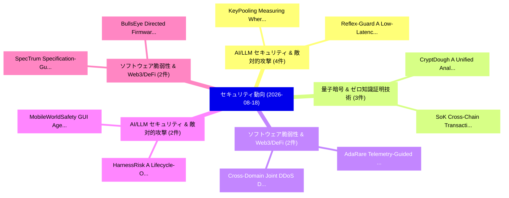

# 📅 02_daily: 日次エグゼクティブサマリー報告書 (2026-08-18)

**集計日時**: 2026-10-02 23:06:24 UTC  
**対象日付**: 2026-08-18  
**本日収集論文数**: 42 件  

---

## 💡 主要セキュリティ動向・脅威インサイト (Executive Insights)

本日の収集論文（計 42 件）において、以下の重点セキュリティ領域で活発な研究動向が確認されました：
- **AI/LLM セキュリティ & 敵対的攻撃** (4 件): 注目論文として 「KeyPooling: Measuring Where LL...」、「Reflex-Guard: A Low-Latency Gu...」 等が発表され、実務防御および攻撃検証の進展が見られます。
- **量子暗号 & ゼロ知識証明技術** (3 件): 注目論文として 「CryptDough: A Unified Analytic...」、「SoK: Cross-Chain Transaction I...」 等が発表され、実務防御および攻撃検証の進展が見られます。
- **ソフトウェア脆弱性 & Web3/DeFi** (2 件): 注目論文として 「Cross-Domain Joint DDoS Detect...」、「AdaRare: Telemetry-Guided Join...」 等が発表され、実務防御および攻撃検証の進展が見られます。
- **AI/LLM セキュリティ & 敵対的攻撃** (2 件): 注目論文として 「HarnessRisk: A Lifecycle-Orien...」、「MobileWorldSafety: GUI Agent S...」 等が発表され、実務防御および攻撃検証の進展が見られます。
- **ソフトウェア脆弱性 & Web3/DeFi** (2 件): 注目論文として 「BullsEye: Directed Firmware Fu...」、「SpecTrum: Specification-Guided...」 等が発表され、実務防御および攻撃検証の進展が見られます。

### 🗺️ 技術・脅威トピックマインドマップ

---

## 📌 日次セキュリティ論文一覧 (日本語表形式)

| No | arXiv ID | 論文タイトル (日本語訳) | 重要キーワード | 構造化エグゼクティブ要約 (背景・提案・影響) | 脅威分類 | 詳細リンク |
|---|---|---|---|---|---|---|
| 1 | `2608.17220v1` | [PACE: Policy-Attested Contract Execution for Safe AI Agents in Decentralized Finance（セキュリティ分析論文）](../../okf/papers/2026-08-18/2608.17220.md) | `Attested Contract Execution`, `Policy-Attested Contract`, `Decentralized Finance` | 【提案】概要 (Overview & Key Finding) 本論文「PACE: Policy-Attested Contract Execution for Safe AI Ag...。実証評価により経営層・セキュリティ管理者向け推奨アクション (E... | `AI/ML Security` | [arXiv](https://arxiv.org/abs/2608.17220v1) &#124; [OKF](../../okf/papers/2026-08-18/2608.17220.md) |
| 2 | `2608.17234v1` | [COMIC: Reference-Aware Safety Gating for Multimodal 大規模言語モデル](../../okf/papers/2026-08-18/2608.17234.md) | `Aware Safety Gating`, `Reference-Aware Safety`, `Multimodal Large Language Models` | 【提案】概要 (Overview & Key Finding) 本論文「COMIC: Reference-Aware Safety Gating for Multimodal 大規模...。実証評価により経営層・セキュリティ管理者向け推奨アクション (E... | `AI/ML Security` | [arXiv](https://arxiv.org/abs/2608.17234v1) &#124; [OKF](../../okf/papers/2026-08-18/2608.17234.md) |
| 3 | `2608.17251v1` | [ADAPTD: Adaptive Detection and Proactive Threat Defense for Autonomous APT attacks（セキュリティ分析論文）](../../okf/papers/2026-08-18/2608.17251.md) | `Proactive Threat Defense`, `Adaptive Detection`, `Network Security` | 【提案】概要 (Overview & Key Finding) 本論文「ADAPTD: Adaptive Detection and Proactive 脅威 Defense for...。実証評価により経営層・セキュリティ管理者向け推奨アクション (E... | `Network Security` | [arXiv](https://arxiv.org/abs/2608.17251v1) &#124; [OKF](../../okf/papers/2026-08-18/2608.17251.md) |
| 4 | `2608.17275v1` | [When Agents Act on Web3: An Attack-Surface Survey of MCP, Skills, and Tool Calling（セキュリティ分析論文）](../../okf/papers/2026-08-18/2608.17275.md) | `Surface Survey`, `Attack-Surface Survey`, `Tool Calling` | 【提案】概要 (Overview & Key Finding) 本論文「When Agents Act on Web3: An Attack-Surface Survey of MC...。実証評価により経営層・セキュリティ管理者向け推奨アクション (E... | `AI/ML Security` | [arXiv](https://arxiv.org/abs/2608.17275v1) &#124; [OKF](../../okf/papers/2026-08-18/2608.17275.md) |
| 5 | `2608.17355v1` | [FlowShield: cryptocurrency anti-money laundering with transaction semantics parsing and fund flow tracking（セキュリティ分析論文）](../../okf/papers/2026-08-18/2608.17355.md) | `anti-money laundering`, `Tsz Hon Yuen`, `Qishuang Fu` | 【提案】概要 (Overview & Key Finding) 本論文「FlowShield: cryptocurrency anti-money laundering with t...。実証評価により経営層・セキュリティ管理者向け推奨アクション (E... | `AI/ML Security` | [arXiv](https://arxiv.org/abs/2608.17355v1) &#124; [OKF](../../okf/papers/2026-08-18/2608.17355.md) |
| 6 | `2608.17360v1` | [Fair ASR: Re-Evaluating Black-Box Jailbreaks under Shared Target-Call Budgets（セキュリティ分析論文）](../../okf/papers/2026-08-18/2608.17360.md) | `Evaluating Black`, `Box Jailbreaks`, `Shared Target` | 【提案】概要 (Overview & Key Finding) 本論文「Fair ASR: Re-Evaluating Black-Box ジェイルブレイクs under Share...。実証評価により経営層・セキュリティ管理者向け推奨アクション (E... | `AI/ML Security` | [arXiv](https://arxiv.org/abs/2608.17360v1) &#124; [OKF](../../okf/papers/2026-08-18/2608.17360.md) |
| 7 | `2608.17361v1` | [Trusted Workflow Relays:Cross-Tenant Email Abuse and Composable Red Team Initial-Access Primitives in Multi-Tenant Clouds（セキュリティ分析論文）](../../okf/papers/2026-08-18/2608.17361.md) | `Trusted Workflow Relays`, `Composable Red Team Initial`, `Tenant Email Abuse` | 【提案】概要 (Overview & Key Finding) 本論文「Trusted Workflow Relays:Cross-Tenant Email Abuse and Co...。実証評価により経営層・セキュリティ管理者向け推奨アクション (E... | `General Cyber Security` | [arXiv](https://arxiv.org/abs/2608.17361v1) &#124; [OKF](../../okf/papers/2026-08-18/2608.17361.md) |
| 8 | `2608.17374v1` | [On the Pseudo-Mixing of Kac's Walk（セキュリティ分析論文）](../../okf/papers/2026-08-18/2608.17374.md) | `General Cyber Security`, `Aaron Smith`, `Vinod Vaikuntanathan` | 【提案】概要 (Overview & Key Finding) 本論文「On the Pseudo-Mixing of Kac's Walk（セキュリティ分析論文）」（原題: On ...。実証評価によりPillai, Aaron Smith, Vino... | `General Cyber Security` | [arXiv](https://arxiv.org/abs/2608.17374v1) &#124; [OKF](../../okf/papers/2026-08-18/2608.17374.md) |
| 9 | `2608.17442v2` | [FESC: Remodeling Long-Context Private Inference with Encrypted State-Space Models（セキュリティ分析論文）](../../okf/papers/2026-08-18/2608.17442.md) | `Context Private Inference`, `Remodeling Long`, `Encrypted State` | 【提案】概要 (Overview & Key Finding) 本論文「FESC: Remodeling Long-Context Private Inference with En...。実証評価により経営層・セキュリティ管理者向け推奨アクション (E... | `Privacy & Provenance` | [arXiv](https://arxiv.org/abs/2608.17442v2) &#124; [OKF](../../okf/papers/2026-08-18/2608.17442.md) |
| 10 | `2608.17445v1` | [Decomposition Attacks Across Unlinkable Identities: Limits of Stateful Defenses for LLM Services（セキュリティ分析論文）](../../okf/papers/2026-08-18/2608.17445.md) | `Decomposition Attacks Across Unlinkable Identities`, `Stateful Defenses`, `Decomposition Attacks Across Unli` | 【提案】概要 (Overview & Key Finding) 本論文「Decomposition Attacks Across Unlinkable Identities: Lim...。実証評価により経営層・セキュリティ管理者向け推奨アクション (E... | `AI/ML Security` | [arXiv](https://arxiv.org/abs/2608.17445v1) &#124; [OKF](../../okf/papers/2026-08-18/2608.17445.md) |
| 11 | `2608.17485v1` | [KeyPooling: Measuring Where LLM API Relay Paths Collapse Prompt Cache Isolation（セキュリティ分析論文）](../../okf/papers/2026-08-18/2608.17485.md) | `Relay Paths Collapse Prompt Cache Isolation`, `Bowen Sun`, `Yixi Cai` | 【提案】概要 (Overview & Key Finding) 本論文「KeyPooling: Measuring Where LLM API Relay Paths Collaps...。実証評価により経営層・セキュリティ管理者向け推奨アクション (E... | `AI/ML Security` | [arXiv](https://arxiv.org/abs/2608.17485v1) &#124; [OKF](../../okf/papers/2026-08-18/2608.17485.md) |
| 12 | `2608.17507v1` | [Cross-Domain Joint DDoS Detection in Multi-Controller SDN via Confidence-Based Entropy Fusion（セキュリティ分析論文）](../../okf/papers/2026-08-18/2608.17507.md) | `Based Entropy Fusion`, `Domain Joint`, `Cross-Domain Joint` | 【提案】概要 (Overview & Key Finding) 本論文「Cross-Domain Joint DDoS Detection in Multi-Controller S...。実証評価により経営層・セキュリティ管理者向け推奨アクション (E... | `AI/ML Security` | [arXiv](https://arxiv.org/abs/2608.17507v1) &#124; [OKF](../../okf/papers/2026-08-18/2608.17507.md) |
| 13 | `2608.17529v1` | [CryptDough: A Unified Analytics Engine for Secure Multiparty Computation（セキュリティ分析論文）](../../okf/papers/2026-08-18/2608.17529.md) | `Unified Analytics Engine`, `Secure Multiparty Computation`, `General Cyber Security` | 【提案】概要 (Overview & Key Finding) 本論文「CryptDough: A Unified Analytics Engine for Secure Multi...。実証評価により経営層・セキュリティ管理者向け推奨アクション (E... | `General Cyber Security` | [arXiv](https://arxiv.org/abs/2608.17529v1) &#124; [OKF](../../okf/papers/2026-08-18/2608.17529.md) |
| 14 | `2608.17532v1` | [SoK: Cross-Chain Transaction Identification and Matching（セキュリティ分析論文）](../../okf/papers/2026-08-18/2608.17532.md) | `Chain Transaction Identification`, `Cross-Chain Transaction`, `General Cyber Security` | 【提案】概要 (Overview & Key Finding) 本論文「SoK: Cross-Chain Transaction Identification and Matchin...。実証評価により経営層・セキュリティ管理者向け推奨アクション (E... | `General Cyber Security` | [arXiv](https://arxiv.org/abs/2608.17532v1) &#124; [OKF](../../okf/papers/2026-08-18/2608.17532.md) |
| 15 | `2608.17538v1` | [TENET: Telegram Mini App (in)security（セキュリティ分析論文）](../../okf/papers/2026-08-18/2608.17538.md) | `Telegram Mini App`, `Roberto Di Pietro`, `Andrea Ciccotelli` | 【提案】概要 (Overview & Key Finding) 本論文「TENET: Telegram Mini App (in)security（セキュリティ分析論文）」（原題: ...。実証評価により経営層・セキュリティ管理者向け推奨アクション (E... | `AI/ML Security` | [arXiv](https://arxiv.org/abs/2608.17538v1) &#124; [OKF](../../okf/papers/2026-08-18/2608.17538.md) |
| 16 | `2608.17539v1` | [Software Defined Networks Key Relay for Large-Scale Quantum Key Distribution Networks（セキュリティ分析論文）](../../okf/papers/2026-08-18/2608.17539.md) | `Software Defined Networks Key Relay`, `Scale Quantum Key Distribution Networks`, `Large-Scale Quantum` | 【提案】概要 (Overview & Key Finding) 本論文「Software Defined Networks Key Relay for Large-Scale 量子鍵...。実証評価により経営層・セキュリティ管理者向け推奨アクション (E... | `Network Security` | [arXiv](https://arxiv.org/abs/2608.17539v1) &#124; [OKF](../../okf/papers/2026-08-18/2608.17539.md) |
| 17 | `2608.17556v1` | [Reflex-Guard: A Low-Latency Guardrail for LLM Prompt Safety Using Dense Semantic Embeddings（セキュリティ分析論文）](../../okf/papers/2026-08-18/2608.17556.md) | `Prompt Safety Using Dense Semantic Embeddings`, `Latency Guardrail`, `Low-Latency Guardrail` | 【提案】概要 (Overview & Key Finding) 本論文「Reflex-Guard: A Low-Latency Guardrail for LLM Prompt Sa...。実証評価により経営層・セキュリティ管理者向け推奨アクション (E... | `AI/ML Security` | [arXiv](https://arxiv.org/abs/2608.17556v1) &#124; [OKF](../../okf/papers/2026-08-18/2608.17556.md) |
| 18 | `2608.17585v1` | [The Last Mile of Deepfake Speech Detection: An Industry-Academia Experience Report（セキュリティ分析論文）](../../okf/papers/2026-08-18/2608.17585.md) | `Deepfake Speech Detection`, `Academia Experience Report`, `Industry-Academia Experience` | 【提案】概要 (Overview & Key Finding) 本論文「The Last Mile of Deepfake Speech Detection: An Industry...。実証評価により経営層・セキュリティ管理者向け推奨アクション (E... | `General Cyber Security` | [arXiv](https://arxiv.org/abs/2608.17585v1) &#124; [OKF](../../okf/papers/2026-08-18/2608.17585.md) |
| 19 | `2608.17597v1` | [HarnessRisk: A Lifecycle-Oriented Benchmark for Agent Harness Safety（セキュリティ分析論文）](../../okf/papers/2026-08-18/2608.17597.md) | `Agent Harness Safety`, `Oriented Benchmark`, `Lifecycle-Oriented Benchmark` | 【提案】概要 (Overview & Key Finding) 本論文「HarnessRisk: A Lifecycle-Oriented Benchmark for Agent H...。実証評価により経営層・セキュリティ管理者向け推奨アクション (E... | `AI/ML Security` | [arXiv](https://arxiv.org/abs/2608.17597v1) &#124; [OKF](../../okf/papers/2026-08-18/2608.17597.md) |
| 20 | `2608.17610v1` | [the Impossibility of Imperfectly Complete Key Agreement in the QROMに向けて](../../okf/papers/2026-08-18/2608.17610.md) | `Imperfectly Complete Key Agreement`, `Fuyuki Kitagawa`, `Ryo Nishimaki` | 【提案】概要 (Overview & Key Finding) 本論文「the Impossibility of Imperfectly Complete Key Agreement...。実証評価により経営層・セキュリティ管理者向け推奨アクション (E... | `Cryptography` | [arXiv](https://arxiv.org/abs/2608.17610v1) &#124; [OKF](../../okf/papers/2026-08-18/2608.17610.md) |
| 21 | `2608.17629v1` | [Unclonable encryption from BB84 states: a simultaneous Goldreich-Levin reduction（セキュリティ分析論文）](../../okf/papers/2026-08-18/2608.17629.md) | `Goldreich-Levin reduction`, `Andrea Coladangelo`, `Qipeng Liu` | 【提案】概要 (Overview & Key Finding) 本論文「Unclonable encryption from BB84 states: a simultaneous ...。実証評価により経営層・セキュリティ管理者向け推奨アクション (E... | `AI/ML Security` | [arXiv](https://arxiv.org/abs/2608.17629v1) &#124; [OKF](../../okf/papers/2026-08-18/2608.17629.md) |
| 22 | `2608.17650v1` | [An Emulation Anchored Digital Twin Testbed for Cyberattack and Defense Analysis in Hospital IT OT Environments（セキュリティ分析論文）](../../okf/papers/2026-08-18/2608.17650.md) | `Ravi Kumar Bairagi`, `Prashant Rawat`, `Geeta Yadav` | 【提案】概要 (Overview & Key Finding) 本論文「An Emulation Anchored Digital Twin Testbed for Cyberatt...。実証評価により経営層・セキュリティ管理者向け推奨アクション (E... | `AI/ML Security` | [arXiv](https://arxiv.org/abs/2608.17650v1) &#124; [OKF](../../okf/papers/2026-08-18/2608.17650.md) |
| 23 | `2608.17659v1` | [MobileWorldSafety: GUI Agent Safety Against Environmental Injection Attacks in Android Appsのベンチマーク評価](../../okf/papers/2026-08-18/2608.17659.md) | `Android Apps`, `Sujin Chen`, `Lijun Li` | 【提案】概要 (Overview & Key Finding) 本論文「MobileWorldSafety: GUI Agent Safety Against Environment...。実証評価により経営層・セキュリティ管理者向け推奨アクション (E... | `AI/ML Security` | [arXiv](https://arxiv.org/abs/2608.17659v1) &#124; [OKF](../../okf/papers/2026-08-18/2608.17659.md) |
| 24 | `2608.17671v1` | [Automated Security Patch Backporting: How Far Are We?のベンチマーク評価](../../okf/papers/2026-08-18/2608.17671.md) | `Benchmarking Automated Security Patch Backporting`, `Automated Security Patch Backporting`, `Jincheng Yang` | 【提案】### (日本語題名: Automated Security Patch Backporting: How Far Are We?のベンチマーク評価)  > [!NOTE] ...。実証評価により経営層・セキュリティ管理者向け推奨アクション (E... | `AI/ML Security` | [arXiv](https://arxiv.org/abs/2608.17671v1) &#124; [OKF](../../okf/papers/2026-08-18/2608.17671.md) |
| 25 | `2608.17722v1` | [MemCatalyst: Amplifying Data Auditing on Vision-Language Models via Data Poisoning（セキュリティ分析論文）](../../okf/papers/2026-08-18/2608.17722.md) | `Amplifying Data Auditing`, `Language Models`, `Data Poisoning` | 【提案】概要 (Overview & Key Finding) 本論文「MemCatalyst: Amplifying Data Auditing on Vision-Languag...。実証評価により経営層・セキュリティ管理者向け推奨アクション (E... | `Privacy & Provenance` | [arXiv](https://arxiv.org/abs/2608.17722v1) &#124; [OKF](../../okf/papers/2026-08-18/2608.17722.md) |
| 26 | `2608.17729v1` | [BullsEye: Directed Firmware Fuzzing（セキュリティ分析論文）](../../okf/papers/2026-08-18/2608.17729.md) | `Directed Firmware Fuzzing`, `Software Security`, `Lorenzo Ralli` | 【提案】概要 (Overview & Key Finding) 本論文「BullsEye: Directed Firmware Fuzzing（セキュリティ分析論文）」（原題: Bu...。実証評価により経営層・セキュリティ管理者向け推奨アクション (E... | `Software Security` | [arXiv](https://arxiv.org/abs/2608.17729v1) &#124; [OKF](../../okf/papers/2026-08-18/2608.17729.md) |
| 27 | `2608.17738v1` | [SpecTrum: Specification-Guided Differential Fuzzing for Ethereum Consensus Clients（セキュリティ分析論文）](../../okf/papers/2026-08-18/2608.17738.md) | `Guided Differential Fuzzing`, `Ethereum Consensus Clients`, `Specification-Guided Differential` | 【提案】概要 (Overview & Key Finding) 本論文「SpecTrum: Specification-Guided Differential Fuzzing for...。実証評価により経営層・セキュリティ管理者向け推奨アクション (E... | `AI/ML Security` | [arXiv](https://arxiv.org/abs/2608.17738v1) &#124; [OKF](../../okf/papers/2026-08-18/2608.17738.md) |
| 28 | `2608.17754v1` | [Achievement Unlocked: Let's Get Hacked! Cybercrime in the Video Gaming Ecosystemの実証研究](../../okf/papers/2026-08-18/2608.17754.md) | `Achievement Unlocked`, `Get Hacked`, `Video Gaming` | 【提案】An Empirical Study of Cybercrime in the Video Gaming Ecosystem ### (日本語題名: Achievement ...。実証評価により経営層・セキュリティ管理者向け推奨アクション (E... | `Software Security` | [arXiv](https://arxiv.org/abs/2608.17754v1) &#124; [OKF](../../okf/papers/2026-08-18/2608.17754.md) |
| 29 | `2608.17758v1` | [Advancing Inclusivity in サイバーセキュリティ Education: Integrating Intersectionality to Enhance Student Engagement in Australian Higher Education Curriculums Strategies, Barriers, and Future Directions](../../okf/papers/2026-08-18/2608.17758.md) | `Australian Higher Education Curriculums Strategies`, `Enhance Student Engagement`, `Advancing Inclusivity` | 【提案】概要 (Overview & Key Finding) 本論文「Advancing Inclusivity in サイバーセキュリティ Education: Integrat...。実証評価によりセキュリティ影響と実験結果 (Results & ... | `General Cyber Security` | [arXiv](https://arxiv.org/abs/2608.17758v1) &#124; [OKF](../../okf/papers/2026-08-18/2608.17758.md) |
| 30 | `2608.17770v1` | [Efficient Fuzzy PSI under One-Sided Assumptions（セキュリティ分析論文）](../../okf/papers/2026-08-18/2608.17770.md) | `Efficient Fuzzy`, `Sided Assumptions`, `One-Sided Assumptions` | 【提案】概要 (Overview & Key Finding) 本論文「Efficient Fuzzy PSI under One-Sided Assumptions（セキュリティ分...。実証評価により経営層・セキュリティ管理者向け推奨アクション (E... | `General Cyber Security` | [arXiv](https://arxiv.org/abs/2608.17770v1) &#124; [OKF](../../okf/papers/2026-08-18/2608.17770.md) |
| 31 | `2608.17796v1` | [Diff-DDoS: Realistic Cyber-Physical Attack Synthesis and Robust Detection for 5G-Enabled CPS Using Tabular Diffusion Models（セキュリティ分析論文）](../../okf/papers/2026-08-18/2608.17796.md) | `Using Tabular Diffusion Models`, `Physical Attack Synthesis`, `Realistic Cyber` | 【提案】概要 (Overview & Key Finding) 本論文「Diff-DDoS: Realistic Cyber-Physical Attack Synthesis an...。実証評価により経営層・セキュリティ管理者向け推奨アクション (E... | `Cryptography` | [arXiv](https://arxiv.org/abs/2608.17796v1) &#124; [OKF](../../okf/papers/2026-08-18/2608.17796.md) |
| 32 | `2608.17829v1` | [The Model's Tell: Measuring Context-Leakage Attack Signals with Behavior Gauges（セキュリティ分析論文）](../../okf/papers/2026-08-18/2608.17829.md) | `Leakage Attack Signals`, `Measuring Context`, `Behavior Gauges` | 【提案】概要 (Overview & Key Finding) 本論文「The Model's Tell: Measuring Context-Leakage Attack Sign...。実証評価により経営層・セキュリティ管理者向け推奨アクション (E... | `AI/ML Security` | [arXiv](https://arxiv.org/abs/2608.17829v1) &#124; [OKF](../../okf/papers/2026-08-18/2608.17829.md) |
| 33 | `2608.17949v1` | [Tail exponents of conditional guesswork via the method of types（セキュリティ分析論文）](../../okf/papers/2026-08-18/2608.17949.md) | `General Cyber Security`, `Andreina Patrizia Motter`, `Adway Girish` | 【提案】概要 (Overview & Key Finding) 本論文「Tail exponents of conditional guesswork via the method ...。実証評価により経営層・セキュリティ管理者向け推奨アクション (E... | `General Cyber Security` | [arXiv](https://arxiv.org/abs/2608.17949v1) &#124; [OKF](../../okf/papers/2026-08-18/2608.17949.md) |
| 34 | `2608.17960v1` | [COMA: A Compositional Misleading Attack Class on Security-RAG, and a Causal Counterfactual Defense（セキュリティ分析論文）](../../okf/papers/2026-08-18/2608.17960.md) | `Compositional Misleading Attack Class`, `Causal Counterfactual Defense`, `Chinmay Gondhalekar` | 【提案】概要 (Overview & Key Finding) 本論文「COMA: A Compositional Misleading Attack Class on Securi...。実証評価により経営層・セキュリティ管理者向け推奨アクション (E... | `AI/ML Security` | [arXiv](https://arxiv.org/abs/2608.17960v1) &#124; [OKF](../../okf/papers/2026-08-18/2608.17960.md) |
| 35 | `2608.17998v1` | [Multivalued Consensus: General Adversaries Require More Communication（セキュリティ分析論文）](../../okf/papers/2026-08-18/2608.17998.md) | `Multivalued Consensus`, `Mose Mizrahi`, `Roger Wattenhofer` | 【提案】概要 (Overview & Key Finding) 本論文「Multivalued Consensus: General Adversaries Require More...。実証評価により経営層・セキュリティ管理者向け推奨アクション (E... | `Cryptography` | [arXiv](https://arxiv.org/abs/2608.17998v1) &#124; [OKF](../../okf/papers/2026-08-18/2608.17998.md) |
| 36 | `2608.18187v1` | [AdaRare: Telemetry-Guided Joint Profile Control for Greybox Fuzzing（セキュリティ分析論文）](../../okf/papers/2026-08-18/2608.18187.md) | `Guided Joint Profile Control`, `Greybox Fuzzing`, `Telemetry-Guided Joint` | 【提案】概要 (Overview & Key Finding) 本論文「AdaRare: Telemetry-Guided Joint Profile Control for Gre...。実証評価により経営層・セキュリティ管理者向け推奨アクション (E... | `AI/ML Security` | [arXiv](https://arxiv.org/abs/2608.18187v1) &#124; [OKF](../../okf/papers/2026-08-18/2608.18187.md) |
| 37 | `2608.18260v1` | [Redakto - The Incognito Tab for LLMs（セキュリティ分析論文）](../../okf/papers/2026-08-18/2608.18260.md) | `Saurav Kumar Saha`, `Raw Meta`, `Executive Summary` | 【提案】概要 (Overview & Key Finding) 本論文「Redakto - The Incognito Tab for LLMs（セキュリティ分析論文）」（原題: R...。実証評価により経営層・セキュリティ管理者向け推奨アクション (E... | `AI/ML Security` | [arXiv](https://arxiv.org/abs/2608.18260v1) &#124; [OKF](../../okf/papers/2026-08-18/2608.18260.md) |
| 38 | `2608.18274v1` | [Model Card for OpenAI Privacy Filter（セキュリティ分析論文）](../../okf/papers/2026-08-18/2608.18274.md) | `Model Card`, `Privacy Filter`, `Jessica Gan Lee` | 【提案】概要 (Overview & Key Finding) 本論文「Model Card for OpenAI Privacy Filter（セキュリティ分析論文）」（原題: M...。実証評価により経営層・セキュリティ管理者向け推奨アクション (E... | `Privacy & Provenance` | [arXiv](https://arxiv.org/abs/2608.18274v1) &#124; [OKF](../../okf/papers/2026-08-18/2608.18274.md) |
| 39 | `2608.18289v1` | [Evaluating Structured Information Extraction with Open Models in a High Risk Public Sector Application（セキュリティ分析論文）](../../okf/papers/2026-08-18/2608.18289.md) | `Evaluating Structured Information Extraction`, `High Risk Public Sector Application`, `Open Models` | 【提案】概要 (Overview & Key Finding) 本論文「Evaluating Structured Information Extraction with Open ...。実証評価により経営層・セキュリティ管理者向け推奨アクション (E... | `AI/ML Security` | [arXiv](https://arxiv.org/abs/2608.18289v1) &#124; [OKF](../../okf/papers/2026-08-18/2608.18289.md) |
| 40 | `2608.18349v1` | [XNET: Intelligent Dynamic Sampling for High-Speed Network Security Monitoring（セキュリティ分析論文）](../../okf/papers/2026-08-18/2608.18349.md) | `Speed Network Security Monitoring`, `Intelligent Dynamic Sampling`, `High-Speed Network` | 【提案】概要 (Overview & Key Finding) 本論文「XNET: Intelligent Dynamic Sampling for High-Speed Netwo...。実証評価により経営層・セキュリティ管理者向け推奨アクション (E... | `AI/ML Security` | [arXiv](https://arxiv.org/abs/2608.18349v1) &#124; [OKF](../../okf/papers/2026-08-18/2608.18349.md) |
| 41 | `2608.18351v1` | [Task-Conditioned Least-Privilege Learning for Executable Terminal and MCP Agents（セキュリティ分析論文）](../../okf/papers/2026-08-18/2608.18351.md) | `Conditioned Least`, `Privilege Learning`, `Task-Conditioned Least` | 【提案】概要 (Overview & Key Finding) 本論文「Task-Conditioned Least-Privilege Learning for Executabl...。実証評価により経営層・セキュリティ管理者向け推奨アクション (E... | `AI/ML Security` | [arXiv](https://arxiv.org/abs/2608.18351v1) &#124; [OKF](../../okf/papers/2026-08-18/2608.18351.md) |
| 42 | `2608.18359v1` | [0xPass: A Secure Protocol for Universal Cross-Chain Accounts（セキュリティ分析論文）](../../okf/papers/2026-08-18/2608.18359.md) | `Secure Protocol`, `Universal Cross`, `Chain Accounts` | 【提案】概要 (Overview & Key Finding) 本論文「0xPass: A Secure Protocol for Universal Cross-Chain Acc...。実証評価により経営層・セキュリティ管理者向け推奨アクション (E... | `Cryptography` | [arXiv](https://arxiv.org/abs/2608.18359v1) &#124; [OKF](../../okf/papers/2026-08-18/2608.18359.md) |

