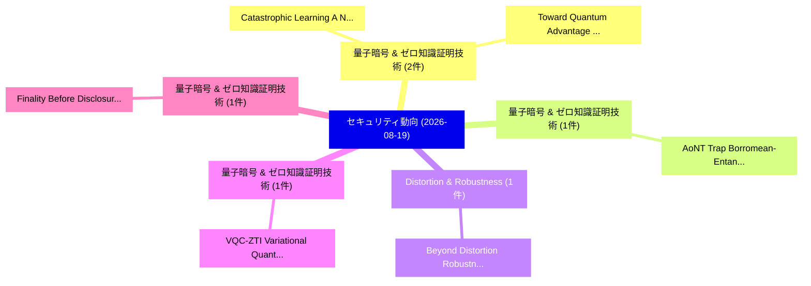

# 📅 02_daily: 日次エグゼクティブサマリー報告書 (2026-08-19)

**集計日時**: 2026-10-02 23:06:24 UTC  
**対象日付**: 2026-08-19  
**本日収集論文数**: 24 件  

---

## 💡 主要セキュリティ動向・脅威インサイト (Executive Insights)

本日の収集論文（計 24 件）において、以下の重点セキュリティ領域で活発な研究動向が確認されました：
- **量子暗号 & ゼロ知識証明技術** (2 件): 注目論文として 「Catastrophic Learning: A New A...」、「Toward Quantum Advantage in Le...」 等が発表され、実務防御および攻撃検証の進展が見られます。
- **量子暗号 & ゼロ知識証明技術** (1 件): 注目論文として 「AoNT Trap: Borromean-Entangled...」 等が発表され、実務防御および攻撃検証の進展が見られます。
- **Distortion & Robustness** (1 件): 注目論文として 「Beyond Distortion Robustness: ...」 等が発表され、実務防御および攻撃検証の進展が見られます。
- **量子暗号 & ゼロ知識証明技術** (1 件): 注目論文として 「VQC-ZTI: Variational Quantum C...」 等が発表され、実務防御および攻撃検証の進展が見られます。
- **量子暗号 & ゼロ知識証明技術** (1 件): 注目論文として 「Finality Before Disclosure for...」 等が発表され、実務防御および攻撃検証の進展が見られます。

### 🗺️ 技術・脅威トピックマインドマップ

---

## 📌 日次セキュリティ論文一覧 (日本語表形式)

| No | arXiv ID | 論文タイトル (日本語訳) | 重要キーワード | 構造化エグゼクティブ要約 (背景・提案・影響) | 脅威分類 | 詳細リンク |
|---|---|---|---|---|---|---|
| 1 | `2608.18403v1` | [AoNT Trap: Borromean-Entangled Mutable Chameleon Trapdoor Hash All-or-Nothing Stream Cipher（セキュリティ分析論文）](../../okf/papers/2026-08-19/2608.18403.md) | `Nothing Stream Cipher`, `Borromean-Entangled Mutable`, `Victor Kebande` | 【提案】概要 (Overview & Key Finding) 本論文「AoNT Trap: Borromean-Entangled Mutable Chameleon Trapdo...。実証評価により経営層・セキュリティ管理者向け推奨アクション (E... | `Cryptography` | [arXiv](https://arxiv.org/abs/2608.18403v1) &#124; [OKF](../../okf/papers/2026-08-19/2608.18403.md) |
| 2 | `2608.18567v1` | [Beyond Distortion Robustness: Rethinking Severe Cropping as Erasure-Resilient Message Embedding（セキュリティ分析論文）](../../okf/papers/2026-08-19/2608.18567.md) | `Beyond Distortion Robustness`, `Rethinking Severe Cropping`, `Resilient Message Embedding` | 【提案】概要 (Overview & Key Finding) 本論文「Beyond Distortion Robustness: Rethinking Severe Croppin...。実証評価により経営層・セキュリティ管理者向け推奨アクション (E... | `AI/ML Security` | [arXiv](https://arxiv.org/abs/2608.18567v1) &#124; [OKF](../../okf/papers/2026-08-19/2608.18567.md) |
| 3 | `2608.18572v1` | [VQC-ZTI: Variational Quantum Control for Zero Trust Protection of the Tactile Internet（セキュリティ分析論文）](../../okf/papers/2026-08-19/2608.18572.md) | `Variational Quantum Control`, `Zero Trust Protection`, `Tactile Internet` | 【提案】概要 (Overview & Key Finding) 本論文「VQC-ZTI: Variational 量子 Control for ゼロトラスト Protection o...。実証評価により経営層・セキュリティ管理者向け推奨アクション (E... | `Network Security` | [arXiv](https://arxiv.org/abs/2608.18572v1) &#124; [OKF](../../okf/papers/2026-08-19/2608.18572.md) |
| 4 | `2608.18605v1` | [Finality Before Disclosure for Ledger Authenticators in the Quantum Random Oracle Model（セキュリティ分析論文）](../../okf/papers/2026-08-19/2608.18605.md) | `Quantum Random Oracle Model`, `Ledger Authenticators`, `Maja Lie` | 【提案】概要 (Overview & Key Finding) 本論文「Finality Before Disclosure for Ledger Authenticators in...。実証評価により経営層・セキュリティ管理者向け推奨アクション (E... | `Cryptography` | [arXiv](https://arxiv.org/abs/2608.18605v1) &#124; [OKF](../../okf/papers/2026-08-19/2608.18605.md) |
| 5 | `2608.18610v1` | [Denoising-Aware Inversion: Revealing Privacy Risks in Noise-Protected Text Embeddings（セキュリティ分析論文）](../../okf/papers/2026-08-19/2608.18610.md) | `Revealing Privacy Risks`, `Protected Text Embeddings`, `Aware Inversion` | 【提案】概要 (Overview & Key Finding) 本論文「Denoising-Aware Inversion: Revealing Privacy Risks in N...。実証評価により経営層・セキュリティ管理者向け推奨アクション (E... | `AI/ML Security` | [arXiv](https://arxiv.org/abs/2608.18610v1) &#124; [OKF](../../okf/papers/2026-08-19/2608.18610.md) |
| 6 | `2608.18613v1` | [CTIFoundry: An Agent-Native Corpus Scaffold for Cyber Threat Intelligence（セキュリティ分析論文）](../../okf/papers/2026-08-19/2608.18613.md) | `Native Corpus Scaffold`, `Cyber Threat Intelligence`, `Agent-Native Corpus` | 【提案】概要 (Overview & Key Finding) 本論文「CTIFoundry: An Agent-Native Corpus Scaffold for Cyber 脅...。実証評価により経営層・セキュリティ管理者向け推奨アクション (E... | `AI/ML Security` | [arXiv](https://arxiv.org/abs/2608.18613v1) &#124; [OKF](../../okf/papers/2026-08-19/2608.18613.md) |
| 7 | `2608.18642v1` | [IriSig-Spoof: A Real-World Benchmark for Time-Robust Satellite RF Fingerprinting and Spoofing Detection（セキュリティ分析論文）](../../okf/papers/2026-08-19/2608.18642.md) | `World Benchmark`, `Robust Satellite`, `Spoofing Detection` | 【提案】概要 (Overview & Key Finding) 本論文「IriSig-Spoof: A Real-World Benchmark for Time-Robust Sa...。実証評価により経営層・セキュリティ管理者向け推奨アクション (E... | `AI/ML Security` | [arXiv](https://arxiv.org/abs/2608.18642v1) &#124; [OKF](../../okf/papers/2026-08-19/2608.18642.md) |
| 8 | `2608.18686v1` | [Improving LLM-Based SSH Honeypots Through Prompting and Fine-Tuning（セキュリティ分析論文）](../../okf/papers/2026-08-19/2608.18686.md) | `LLM-Based SSH`, `Veronica Valeros`, `Sebastian Garcia` | 【提案】概要 (Overview & Key Finding) 本論文「Improving LLM-Based SSH Honeypots Through Prompting and...。実証評価により経営層・セキュリティ管理者向け推奨アクション (E... | `AI/ML Security` | [arXiv](https://arxiv.org/abs/2608.18686v1) &#124; [OKF](../../okf/papers/2026-08-19/2608.18686.md) |
| 9 | `2608.18736v1` | [FedLNS: Leverage LayerNorm Signature Modeling to Mitigate Adversarial Manipulation in Federated LLMs（セキュリティ分析論文）](../../okf/papers/2026-08-19/2608.18736.md) | `Mitigate Adversarial Manipulation`, `Signature Modeling`, `Kai Li` | 【提案】概要 (Overview & Key Finding) 本論文「FedLNS: Leverage LayerNorm Signature Modeling to Mitiga...。実証評価により経営層・セキュリティ管理者向け推奨アクション (E... | `AI/ML Security` | [arXiv](https://arxiv.org/abs/2608.18736v1) &#124; [OKF](../../okf/papers/2026-08-19/2608.18736.md) |
| 10 | `2608.18749v1` | [Geometric Data Perturbation with Noisy-Anchor Alignment for Privacy-Preserving Collaborative Learning（セキュリティ分析論文）](../../okf/papers/2026-08-19/2608.18749.md) | `Geometric Data Perturbation`, `Preserving Collaborative Learning`, `Anchor Alignment` | 【提案】概要 (Overview & Key Finding) 本論文「Geometric Data Perturbation with Noisy-Anchor Alignment...。実証評価により経営層・セキュリティ管理者向け推奨アクション (E... | `Software Security` | [arXiv](https://arxiv.org/abs/2608.18749v1) &#124; [OKF](../../okf/papers/2026-08-19/2608.18749.md) |
| 11 | `2608.18772v1` | [Decisive Margins in Differentially Private Voting（セキュリティ分析論文）](../../okf/papers/2026-08-19/2608.18772.md) | `Differentially Private Voting`, `Decisive Margins`, `Quentin Hillebrand` | 【提案】概要 (Overview & Key Finding) 本論文「Decisive Margins in Differentially Private Voting（セキュリテ...。実証評価により経営層・セキュリティ管理者向け推奨アクション (E... | `Privacy & Provenance` | [arXiv](https://arxiv.org/abs/2608.18772v1) &#124; [OKF](../../okf/papers/2026-08-19/2608.18772.md) |
| 12 | `2608.18841v1` | [Copy-Protection with Correlated Challenges: Point Functions and More via Decisional Coset Monogamy（セキュリティ分析論文）](../../okf/papers/2026-08-19/2608.18841.md) | `Decisional Coset Monogamy`, `Correlated Challenges`, `Point Functions` | 【提案】概要 (Overview & Key Finding) 本論文「Copy-Protection with Correlated Challenges: Point Funct...。実証評価により経営層・セキュリティ管理者向け推奨アクション (E... | `AI/ML Security` | [arXiv](https://arxiv.org/abs/2608.18841v1) &#124; [OKF](../../okf/papers/2026-08-19/2608.18841.md) |
| 13 | `2608.18876v1` | [CauSec: Unboxing the Causal Drivers of Static Vulnerability Analysis Performance（セキュリティ分析論文）](../../okf/papers/2026-08-19/2608.18876.md) | `Causal Drivers`, `Md Akram Khan`, `Alejandro Velasco Dimate` | 【提案】概要 (Overview & Key Finding) 本論文「CauSec: Unboxing the Causal Drivers of Static 脆弱性 Analy...。実証評価により経営層・セキュリティ管理者向け推奨アクション (E... | `Software Security` | [arXiv](https://arxiv.org/abs/2608.18876v1) &#124; [OKF](../../okf/papers/2026-08-19/2608.18876.md) |
| 14 | `2608.18965v1` | [Who Can Make the Action Happen? An Authority-Decomposition Framework for High-Risk Automated Systems（セキュリティ分析論文）](../../okf/papers/2026-08-19/2608.18965.md) | `Risk Automated Systems`, `Action Happen`, `High-Risk Automated` | 【提案】An Authority-Decomposition Framework for High-Risk Automated Systems ### (日本語題名: Who Ca...。実証評価により経営層・セキュリティ管理者向け推奨アクション (E... | `AI/ML Security` | [arXiv](https://arxiv.org/abs/2608.18965v1) &#124; [OKF](../../okf/papers/2026-08-19/2608.18965.md) |
| 15 | `2608.18976v1` | [Catastrophic Learning: A New Attack Vector on Continual Learning Networks（セキュリティ分析論文）](../../okf/papers/2026-08-19/2608.18976.md) | `New Attack Vector`, `Continual Learning Networks`, `Catastrophic Learning` | 【提案】概要 (Overview & Key Finding) 本論文「Catastrophic Learning: A New Attack Vector on Continual...。実証評価により経営層・セキュリティ管理者向け推奨アクション (E... | `Cryptography` | [arXiv](https://arxiv.org/abs/2608.18976v1) &#124; [OKF](../../okf/papers/2026-08-19/2608.18976.md) |
| 16 | `2608.18991v1` | [A 12-Step Process for Industrial Internet of Things (IIoT) Forensics（セキュリティ分析論文）](../../okf/papers/2026-08-19/2608.18991.md) | `Step Process`, `Industrial Internet`, `12-Step Process` | 【提案】概要 (Overview & Key Finding) 本論文「A 12-Step Process for Industrial Internet of Things (II...。実証評価により経営層・セキュリティ管理者向け推奨アクション (E... | `IoT & Hardware Security` | [arXiv](https://arxiv.org/abs/2608.18991v1) &#124; [OKF](../../okf/papers/2026-08-19/2608.18991.md) |
| 17 | `2608.19011v1` | [From Threat Intelligence to Detection: Knowledge-driven Enrichment and Template-based Rule Grounding for Automated Sigma Rule Generation（セキュリティ分析論文）](../../okf/papers/2026-08-19/2608.19011.md) | `Automated Sigma Rule Generation`, `Rule Grounding`, `Knowledge-driven Enrichment` | 【提案】概要 (Overview & Key Finding) 本論文「From 脅威 Intelligence to Detection: Knowledge-driven Enr...。実証評価により経営層・セキュリティ管理者向け推奨アクション (E... | `AI/ML Security` | [arXiv](https://arxiv.org/abs/2608.19011v1) &#124; [OKF](../../okf/papers/2026-08-19/2608.19011.md) |
| 18 | `2608.19052v1` | [Malformer: A Multi-Modal Malware Detector Using Transformers（セキュリティ分析論文）](../../okf/papers/2026-08-19/2608.19052.md) | `Modal Malware Detector Using Transformers`, `Multi-Modal Malware`, `Software Security` | 【提案】概要 (Overview & Key Finding) 本論文「Malformer: A Multi-Modal マルウェア Detector Using Transform...。実証評価により経営層・セキュリティ管理者向け推奨アクション (E... | `Software Security` | [arXiv](https://arxiv.org/abs/2608.19052v1) &#124; [OKF](../../okf/papers/2026-08-19/2608.19052.md) |
| 19 | `2608.19122v1` | [Toward Quantum Advantage in Learning Parities with Structured Noise via Lower Bound Optimization of the Condition Number（セキュリティ分析論文）](../../okf/papers/2026-08-19/2608.19122.md) | `Toward Quantum Advantage`, `Lower Bound Optimization`, `Learning Parities` | 【提案】概要 (Overview & Key Finding) 本論文「Toward 量子 Advantage in Learning Parities with Structure...。実証評価により経営層・セキュリティ管理者向け推奨アクション (E... | `Software Security` | [arXiv](https://arxiv.org/abs/2608.19122v1) &#124; [OKF](../../okf/papers/2026-08-19/2608.19122.md) |
| 20 | `2608.19135v1` | [Autonomous Cyber Defense in Connected Vehicles: A Multi-Agent Approach to V2X Security（セキュリティ分析論文）](../../okf/papers/2026-08-19/2608.19135.md) | `Autonomous Cyber Defense`, `Connected Vehicles`, `Krishna Teja Medam` | 【提案】概要 (Overview & Key Finding) 本論文「Autonomous Cyber Defense in Connected Vehicles: A Multi...。実証評価により経営層・セキュリティ管理者向け推奨アクション (E... | `AI/ML Security` | [arXiv](https://arxiv.org/abs/2608.19135v1) &#124; [OKF](../../okf/papers/2026-08-19/2608.19135.md) |
| 21 | `2608.19155v1` | [FedGuard-DC: Privacy-Preserving Federated Load Forecasting and Cyber-Attack Detection for Data-Center Loads in Transmission Systems（セキュリティ分析論文）](../../okf/papers/2026-08-19/2608.19155.md) | `Preserving Federated Load Forecasting`, `Attack Detection`, `Center Loads` | 【提案】概要 (Overview & Key Finding) 本論文「FedGuard-DC: Privacy-Preserving Federated Load Forecast...。実証評価により経営層・セキュリティ管理者向け推奨アクション (E... | `Privacy & Provenance` | [arXiv](https://arxiv.org/abs/2608.19155v1) &#124; [OKF](../../okf/papers/2026-08-19/2608.19155.md) |
| 22 | `2608.19161v1` | [Beyond the Transcript: Detecting Covert Co ordination in Latent Multi-Agent Communication（セキュリティ分析論文）](../../okf/papers/2026-08-19/2608.19161.md) | `Detecting Covert Co`, `Latent Multi`, `Agent Communication` | 【提案】概要 (Overview & Key Finding) 本論文「Beyond the Transcript: Detecting Covert Co ordination i...。実証評価により経営層・セキュリティ管理者向け推奨アクション (E... | `AI/ML Security` | [arXiv](https://arxiv.org/abs/2608.19161v1) &#124; [OKF](../../okf/papers/2026-08-19/2608.19161.md) |
| 23 | `2608.19190v1` | [SiNMULI: Novel Signed Network Approach for Malicious URL Identification（セキュリティ分析論文）](../../okf/papers/2026-08-19/2608.19190.md) | `Avijit Gayen`, `Sayan Mondal`, `Angshuman Jana` | 【提案】概要 (Overview & Key Finding) 本論文「SiNMULI: Novel Signed Network Approach for Malicious UR...。実証評価により経営層・セキュリティ管理者向け推奨アクション (E... | `AI/ML Security` | [arXiv](https://arxiv.org/abs/2608.19190v1) &#124; [OKF](../../okf/papers/2026-08-19/2608.19190.md) |
| 24 | `2608.19191v1` | [The Structured Totient Preimage Problem: Reconstruction, Collisions, and Cryptographic Implications（セキュリティ分析論文）](../../okf/papers/2026-08-19/2608.19191.md) | `Cryptographic Implications`, `General Cyber Security`, `Raw Meta` | 【提案】概要 (Overview & Key Finding) 本論文「The Structured Totient Preimage Problem: Reconstruction...。実証評価により経営層・セキュリティ管理者向け推奨アクション (E... | `General Cyber Security` | [arXiv](https://arxiv.org/abs/2608.19191v1) &#124; [OKF](../../okf/papers/2026-08-19/2608.19191.md) |

