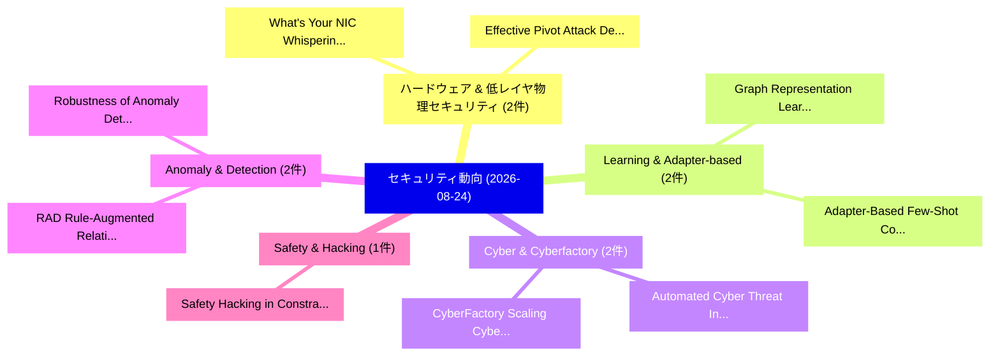

# 📅 02_daily: 日次エグゼクティブサマリー報告書 (2026-08-24)

**集計日時**: 2026-10-02 23:06:24 UTC  
**対象日付**: 2026-08-24  
**本日収集論文数**: 27 件  

---

## 💡 主要セキュリティ動向・脅威インサイト (Executive Insights)

本日の収集論文（計 27 件）において、以下の重点セキュリティ領域で活発な研究動向が確認されました：
- **ハードウェア & 低レイヤ物理セキュリティ** (2 件): 注目論文として 「What's Your NIC Whispering? Ne...」、「Effective Pivot Attack Detecti...」 等が発表され、実務防御および攻撃検証の進展が見られます。
- **Learning & Adapter-based** (2 件): 注目論文として 「Graph Representation Learning ...」、「Adapter-Based Few-Shot Continu...」 等が発表され、実務防御および攻撃検証の進展が見られます。
- **Cyber & Cyberfactory** (2 件): 注目論文として 「CyberFactory: Scaling Cyber Se...」、「Automated Cyber Threat Intelli...」 等が発表され、実務防御および攻撃検証の進展が見られます。
- **Anomaly & Detection** (2 件): 注目論文として 「RAD: Rule-Augmented Relational...」、「Robustness of Anomaly Detectio...」 等が発表され、実務防御および攻撃検証の進展が見られます。
- **Safety & Hacking** (1 件): 注目論文として 「Safety Hacking in Constrained ...」 等が発表され、実務防御および攻撃検証の進展が見られます。

### 🗺️ 技術・脅威トピックマインドマップ

---

## 📌 日次セキュリティ論文一覧 (日本語表形式)

| No | arXiv ID | 論文タイトル (日本語訳) | 重要キーワード | 構造化エグゼクティブ要約 (背景・提案・影響) | 脅威分類 | 詳細リンク |
|---|---|---|---|---|---|---|
| 1 | `2608.22915v1` | [Safety Hacking in Constrained Best-of-$N$ Inference-time Scaling（セキュリティ分析論文）](../../okf/papers/2026-08-24/2608.22915.md) | `Safety Hacking`, `Constrained Best`, `Inference-time Scaling` | 【提案】概要 (Overview & Key Finding) 本論文「Safety Hacking in Constrained Best-of-$N$ Inference-tim...。実証評価により経営層・セキュリティ管理者向け推奨アクション (E... | `AI/ML Security` | [arXiv](https://arxiv.org/abs/2608.22915v1) &#124; [OKF](../../okf/papers/2026-08-24/2608.22915.md) |
| 2 | `2608.22924v1` | [Cryptocurrencies in the Quantum Age: Migration Paths to PQC（セキュリティ分析論文）](../../okf/papers/2026-08-24/2608.22924.md) | `Quantum Age`, `Migration Paths`, `Aleksei Kodukhov` | 【提案】概要 (Overview & Key Finding) 本論文「Cryptocurrencies in the 量子 Age: Migration Paths to PQC（...。実証評価により経営層・セキュリティ管理者向け推奨アクション (E... | `Cryptography` | [arXiv](https://arxiv.org/abs/2608.22924v1) &#124; [OKF](../../okf/papers/2026-08-24/2608.22924.md) |
| 3 | `2608.22928v1` | [When Can Agents Safely Checkpoint, Fork, Restore, and Merge? Exact Checking for Execution Edits（セキュリティ分析論文）](../../okf/papers/2026-08-24/2608.22928.md) | `Exact Checking`, `Execution Edits`, `Yusheng Zheng` | 【提案】Exact Checking for Execution Edits ### (日本語題名: When Can Agents Safely Checkpoint, Fork,...。実証評価により経営層・セキュリティ管理者向け推奨アクション (E... | `AI/ML Security` | [arXiv](https://arxiv.org/abs/2608.22928v1) &#124; [OKF](../../okf/papers/2026-08-24/2608.22928.md) |
| 4 | `2608.22941v1` | [What's Your NIC Whispering? Network Threat Behavior Recognition via NIC Electromagnetic Side-Channel Leakage（セキュリティ分析論文）](../../okf/papers/2026-08-24/2608.22941.md) | `Network Threat Behavior Recognition`, `Electromagnetic Side`, `Channel Leakage` | 【提案】Network 脅威 Behavior Recognition via NIC Electromagnetic サイドチャネル攻撃 Leakage ### (日本語題名: W...。実証評価により経営層・セキュリティ管理者向け推奨アクション (E... | `Network Security` | [arXiv](https://arxiv.org/abs/2608.22941v1) &#124; [OKF](../../okf/papers/2026-08-24/2608.22941.md) |
| 5 | `2608.22954v1` | [Rational Dolev--Yao Attackers: Decidable Incentive-Aware Verification of Security Protocols in Strategic Logic（セキュリティ分析論文）](../../okf/papers/2026-08-24/2608.22954.md) | `Rational Dolev`, `Yao Attackers`, `Decidable Incentive` | 【提案】概要 (Overview & Key Finding) 本論文「Rational Dolev--Yao Attackers: Decidable Incentive-Awar...。実証評価により経営層・セキュリティ管理者向け推奨アクション (E... | `AI/ML Security` | [arXiv](https://arxiv.org/abs/2608.22954v1) &#124; [OKF](../../okf/papers/2026-08-24/2608.22954.md) |
| 6 | `2608.22987v1` | [The Anonymity Gap: Understanding Real Privacy in Shielded UTXO-based Protocols for DeFi（セキュリティ分析論文）](../../okf/papers/2026-08-24/2608.22987.md) | `Understanding Real Privacy`, `UTXO-based Protocols`, `Hanze Guo` | 【提案】概要 (Overview & Key Finding) 本論文「The Anonymity Gap: Understanding Real Privacy in Shield...。実証評価により経営層・セキュリティ管理者向け推奨アクション (E... | `Privacy & Provenance` | [arXiv](https://arxiv.org/abs/2608.22987v1) &#124; [OKF](../../okf/papers/2026-08-24/2608.22987.md) |
| 7 | `2608.23054v1` | [Graph Representation Learning of Lightweight IoT Ciphers（セキュリティ分析論文）](../../okf/papers/2026-08-24/2608.23054.md) | `Graph Representation Learning`, `Jonathan Cook`, `Arif Khan` | 【提案】概要 (Overview & Key Finding) 本論文「Graph Representation Learning of Lightweight IoT Cipher...。実証評価によりArif Khan - **公開日時**: `20... | `AI/ML Security` | [arXiv](https://arxiv.org/abs/2608.23054v1) &#124; [OKF](../../okf/papers/2026-08-24/2608.23054.md) |
| 8 | `2608.23181v2` | [CyberFactory: Scaling Cyber Security Capabilities with Instances from the Wild（セキュリティ分析論文）](../../okf/papers/2026-08-24/2608.23181.md) | `Scaling Cyber Security Capabilities`, `Jian Yang`, `Sing Li` | 【提案】概要 (Overview & Key Finding) 本論文「CyberFactory: Scaling Cyber Security Capabilities with ...。実証評価により経営層・セキュリティ管理者向け推奨アクション (E... | `AI/ML Security` | [arXiv](https://arxiv.org/abs/2608.23181v2) &#124; [OKF](../../okf/papers/2026-08-24/2608.23181.md) |
| 9 | `2608.23185v1` | [Automated Cyber Threat Intelligence Elicitation in Underground Forumsに向けて](../../okf/papers/2026-08-24/2608.23185.md) | `Towards Automated Cyber Threat Intelligence Elicitation`, `Automated Cyber Threat Intelligence Elicitation`, `Underground Forums` | 【提案】概要 (Overview & Key Finding) 本論文「Automated Cyber 脅威 Intelligence Elicitation in Undergro...。実証評価により経営層・セキュリティ管理者向け推奨アクション (E... | `AI/ML Security` | [arXiv](https://arxiv.org/abs/2608.23185v1) &#124; [OKF](../../okf/papers/2026-08-24/2608.23185.md) |
| 10 | `2608.23199v1` | [PhiShark2026: A Multi-Layer Active-Web Raw-Evidence Dataset for Phishing Website Research（セキュリティ分析論文）](../../okf/papers/2026-08-24/2608.23199.md) | `Phishing Website Research`, `Layer Active`, `Web Raw` | 【提案】概要 (Overview & Key Finding) 本論文「PhiShark2026: A Multi-Layer Active-Web Raw-Evidence Dat...。実証評価により経営層・セキュリティ管理者向け推奨アクション (E... | `Network Security` | [arXiv](https://arxiv.org/abs/2608.23199v1) &#124; [OKF](../../okf/papers/2026-08-24/2608.23199.md) |
| 11 | `2608.23308v1` | [FIDES: A Concordance Protocol for LLM-Generated Trading Strategies（セキュリティ分析論文）](../../okf/papers/2026-08-24/2608.23308.md) | `Generated Trading Strategies`, `Concordance Protocol`, `LLM-Generated Trading` | 【提案】概要 (Overview & Key Finding) 本論文「FIDES: A Concordance Protocol for LLM-Generated Trading...。実証評価により経営層・セキュリティ管理者向け推奨アクション (E... | `AI/ML Security` | [arXiv](https://arxiv.org/abs/2608.23308v1) &#124; [OKF](../../okf/papers/2026-08-24/2608.23308.md) |
| 12 | `2608.23339v1` | [CERTIoT-6G: Continuous サイバーセキュリティ Certification for IoT Devices in 5G/6G Networks](../../okf/papers/2026-08-24/2608.23339.md) | `Continuous Cybersecurity Certification`, `Anna Maria Mandalari`, `Evangelos Lempesis` | 【提案】概要 (Overview & Key Finding) 本論文「CERTIoT-6G: Continuous サイバーセキュリティ Certification for IoT...。実証評価により経営層・セキュリティ管理者向け推奨アクション (E... | `Cryptography` | [arXiv](https://arxiv.org/abs/2608.23339v1) &#124; [OKF](../../okf/papers/2026-08-24/2608.23339.md) |
| 13 | `2608.23365v1` | [SxSSD: A Secure and Extensible Software-defined Solid State Drive（セキュリティ分析論文）](../../okf/papers/2026-08-24/2608.23365.md) | `Solid State Drive`, `Extensible Software`, `Software-defined Solid` | 【提案】概要 (Overview & Key Finding) 本論文「SxSSD: A Secure and Extensible Software-defined Solid S...。実証評価により経営層・セキュリティ管理者向け推奨アクション (E... | `AI/ML Security` | [arXiv](https://arxiv.org/abs/2608.23365v1) &#124; [OKF](../../okf/papers/2026-08-24/2608.23365.md) |
| 14 | `2608.23375v1` | [Adversarial Entropy Inflation Against Gumbel-Based Inference Verification（セキュリティ分析論文）](../../okf/papers/2026-08-24/2608.23375.md) | `Based Inference Verification`, `Gumbel-Based Inference`, `Nikita Kezins` | 【提案】概要 (Overview & Key Finding) 本論文「Adversarial Entropy Inflation Against Gumbel-Based Infe...。実証評価により経営層・セキュリティ管理者向け推奨アクション (E... | `AI/ML Security` | [arXiv](https://arxiv.org/abs/2608.23375v1) &#124; [OKF](../../okf/papers/2026-08-24/2608.23375.md) |
| 15 | `2608.23382v2` | [Spectrum-Aware Bounds on Invertibility for Privacy-Enhancing Instance Encoding（セキュリティ分析論文）](../../okf/papers/2026-08-24/2608.23382.md) | `Enhancing Instance Encoding`, `Aware Bounds`, `Spectrum-Aware Bounds` | 【提案】概要 (Overview & Key Finding) 本論文「Spectrum-Aware Bounds on Invertibility for Privacy-Enha...。実証評価により経営層・セキュリティ管理者向け推奨アクション (E... | `Cryptography` | [arXiv](https://arxiv.org/abs/2608.23382v2) &#124; [OKF](../../okf/papers/2026-08-24/2608.23382.md) |
| 16 | `2608.23396v1` | [A Threshold Homomorphic Blockchain Architecture for Secure and Scalable IoT Sensor Data Aggregation（セキュリティ分析論文）](../../okf/papers/2026-08-24/2608.23396.md) | `Threshold Homomorphic Blockchain Architecture`, `Sensor Data Aggregation`, `Narendra Kumar Dewangan` | 【提案】概要 (Overview & Key Finding) 本論文「A Threshold Homomorphic Blockchain Architecture for Sec...。実証評価により経営層・セキュリティ管理者向け推奨アクション (E... | `Cryptography` | [arXiv](https://arxiv.org/abs/2608.23396v1) &#124; [OKF](../../okf/papers/2026-08-24/2608.23396.md) |
| 17 | `2608.23468v1` | [RAD: Rule-Augmented Relational Anomaly Detection（セキュリティ分析論文）](../../okf/papers/2026-08-24/2608.23468.md) | `Augmented Relational Anomaly Detection`, `Rule-Augmented Relational`, `Noah Dahle` | 【提案】概要 (Overview & Key Finding) 本論文「RAD: Rule-Augmented Relational Anomaly Detection（セキュリティ...。実証評価により経営層・セキュリティ管理者向け推奨アクション (E... | `AI/ML Security` | [arXiv](https://arxiv.org/abs/2608.23468v1) &#124; [OKF](../../okf/papers/2026-08-24/2608.23468.md) |
| 18 | `2608.23471v1` | [InjecMEM: Memory Injection Attack on LLM Agent Memory Systems（セキュリティ分析論文）](../../okf/papers/2026-08-24/2608.23471.md) | `Memory Injection Attack`, `Agent Memory Systems`, `Hanling Tian` | 【提案】概要 (Overview & Key Finding) 本論文「InjecMEM: Memory Injection Attack on LLM Agent Memory S...。実証評価により経営層・セキュリティ管理者向け推奨アクション (E... | `AI/ML Security` | [arXiv](https://arxiv.org/abs/2608.23471v1) &#124; [OKF](../../okf/papers/2026-08-24/2608.23471.md) |
| 19 | `2608.23536v1` | [Adapter-Based Few-Shot Continual Learning for Malicious Packet Recognition（セキュリティ分析論文）](../../okf/papers/2026-08-24/2608.23536.md) | `Shot Continual Learning`, `Malicious Packet Recognition`, `Andrew Arash Mahyari` | 【提案】概要 (Overview & Key Finding) 本論文「Adapter-Based Few-Shot Continual Learning for Malicious...。実証評価により経営層・セキュリティ管理者向け推奨アクション (E... | `AI/ML Security` | [arXiv](https://arxiv.org/abs/2608.23536v1) &#124; [OKF](../../okf/papers/2026-08-24/2608.23536.md) |
| 20 | `2608.23547v1` | [Robustness of Anomaly Detection Models for Industrial Control Systems under Training-Time Data Contamination（セキュリティ分析論文）](../../okf/papers/2026-08-24/2608.23547.md) | `Anomaly Detection Models`, `Industrial Control Systems`, `Time Data Contamination` | 【提案】概要 (Overview & Key Finding) 本論文「Robustness of Anomaly Detection Models for Industrial C...。実証評価により経営層・セキュリティ管理者向け推奨アクション (E... | `General Cyber Security` | [arXiv](https://arxiv.org/abs/2608.23547v1) &#124; [OKF](../../okf/papers/2026-08-24/2608.23547.md) |
| 21 | `2608.23550v1` | [When "Do Not" Is Not Deny: Security Rules in CLAUDE.md vs Built-In Controls（セキュリティ分析論文）](../../okf/papers/2026-08-24/2608.23550.md) | `Security Rules`, `Built-In Controls`, `Ting Yan` | 【提案】背景とセキュリティ上の課題 (Background & Problem) 本研究はサイバー脅威環境におけるセキュリティ構造・脆弱性の検証を目的としています。(主要検出項目: ...。実証評価により経営層・セキュリティ管理者向け推奨アクション (E... | `AI/ML Security` | [arXiv](https://arxiv.org/abs/2608.23550v1) &#124; [OKF](../../okf/papers/2026-08-24/2608.23550.md) |
| 22 | `2608.23731v1` | [Effective Pivot Attack Detection via System and Network Information（セキュリティ分析論文）](../../okf/papers/2026-08-24/2608.23731.md) | `Effective Pivot Attack Detection`, `Network Information`, `Ava Powelson` | 【提案】概要 (Overview & Key Finding) 本論文「Effective Pivot Attack Detection via System and Network...。実証評価により経営層・セキュリティ管理者向け推奨アクション (E... | `AI/ML Security` | [arXiv](https://arxiv.org/abs/2608.23731v1) &#124; [OKF](../../okf/papers/2026-08-24/2608.23731.md) |
| 23 | `2608.23763v1` | [TrustShiftProbe: Characterizing, Benchmarking, and Defending Staged Trust Attacks on MCP Servers（セキュリティ分析論文）](../../okf/papers/2026-08-24/2608.23763.md) | `Defending Staged Trust Attacks`, `Mehrdad Rostamzadeh`, `Sidhant Narula` | 【提案】概要 (Overview & Key Finding) 本論文「TrustShiftProbe: Characterizing, Benchmarking, and Defe...。実証評価により経営層・セキュリティ管理者向け推奨アクション (E... | `AI/ML Security` | [arXiv](https://arxiv.org/abs/2608.23763v1) &#124; [OKF](../../okf/papers/2026-08-24/2608.23763.md) |
| 24 | `2608.23774v1` | [ROBBIN: Rowhammer-Based Backdoor Injection during Inference（セキュリティ分析論文）](../../okf/papers/2026-08-24/2608.23774.md) | `Based Backdoor Injection`, `Rowhammer-Based Backdoor`, `Software Security` | 【提案】概要 (Overview & Key Finding) 本論文「ROBBIN: RowHammer-Based Backdoor Injection during Infer...。実証評価によりAdam Ding, Yunsi Fei - *。 | `Software Security` | [arXiv](https://arxiv.org/abs/2608.23774v1) &#124; [OKF](../../okf/papers/2026-08-24/2608.23774.md) |
| 25 | `2608.23785v1` | [A Scenario-Based Evaluation of CRQC+AI Vulnerability Spectrum for TLS 1.3 Cryptographic Dependencies（セキュリティ分析論文）](../../okf/papers/2026-08-24/2608.23785.md) | `Vulnerability Spectrum`, `Cryptographic Dependencies`, `Noel Grover` | 【提案】概要 (Overview & Key Finding) 本論文「A Scenario-Based Evaluation of CRQC+AI 脆弱性 Spectrum for...。実証評価により経営層・セキュリティ管理者向け推奨アクション (E... | `Cryptography` | [arXiv](https://arxiv.org/abs/2608.23785v1) &#124; [OKF](../../okf/papers/2026-08-24/2608.23785.md) |
| 26 | `2608.23858v1` | [Beyond the Mandate: A Systematic Security the Agent Payments Protocol (AP2)の分析](../../okf/papers/2026-08-24/2608.23858.md) | `Agent Payments Protocol`, `Systematic Security`, `Agent Payments Pro` | 【提案】概要 (Overview & Key Finding) 本論文「Beyond the Mandate: A Systematic Security the Agent Pay...。実証評価により経営層・セキュリティ管理者向け推奨アクション (E... | `AI/ML Security` | [arXiv](https://arxiv.org/abs/2608.23858v1) &#124; [OKF](../../okf/papers/2026-08-24/2608.23858.md) |
| 27 | `2608.23873v1` | [Semantic Overlays: Mitigating Prompt Injection with Annotations Beyond Tokens and Steering Vectors（セキュリティ分析論文）](../../okf/papers/2026-08-24/2608.23873.md) | `Mitigating Prompt Injection`, `Annotations Beyond Tokens`, `Semantic Overlays` | 【提案】概要 (Overview & Key Finding) 本論文「Semantic Overlays: Mitigating プロンプトインジェクション with Annota...。実証評価により経営層・セキュリティ管理者向け推奨アクション (E... | `AI/ML Security` | [arXiv](https://arxiv.org/abs/2608.23873v1) &#124; [OKF](../../okf/papers/2026-08-24/2608.23873.md) |

