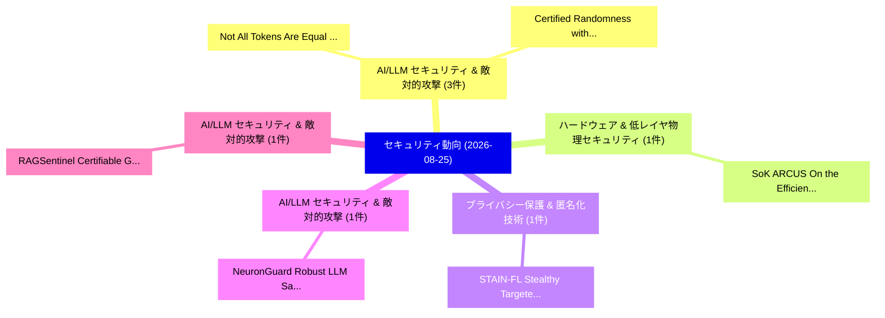

# 📅 02_daily: 日次エグゼクティブサマリー報告書 (2026-08-25)

**集計日時**: 2026-10-02 23:06:24 UTC  
**対象日付**: 2026-08-25  
**本日収集論文数**: 23 件  

---

## 💡 主要セキュリティ動向・脅威インサイト (Executive Insights)

本日の収集論文（計 23 件）において、以下の重点セキュリティ領域で活発な研究動向が確認されました：
- **AI/LLM セキュリティ & 敵対的攻撃** (3 件): 注目論文として 「Not All Tokens Are Equal: Regi...」、「Certified Randomness without S...」 等が発表され、実務防御および攻撃検証の進展が見られます。
- **ハードウェア & 低レイヤ物理セキュリティ** (1 件): 注目論文として 「SoK: ARCUS: On the Efficiency ...」 等が発表され、実務防御および攻撃検証の進展が見られます。
- **プライバシー保護 & 匿名化技術** (1 件): 注目論文として 「STAIN-FL: Stealthy Targeted At...」 等が発表され、実務防御および攻撃検証の進展が見られます。
- **AI/LLM セキュリティ & 敵対的攻撃** (1 件): 注目論文として 「NeuronGuard: Robust LLM Safety...」 等が発表され、実務防御および攻撃検証の進展が見られます。
- **AI/LLM セキュリティ & 敵対的攻撃** (1 件): 注目論文として 「RAGSentinel: Certifiable Geome...」 等が発表され、実務防御および攻撃検証の進展が見られます。

### 🗺️ 技術・脅威トピックマインドマップ

---

## 📌 日次セキュリティ論文一覧 (日本語表形式)

| No | arXiv ID | 論文タイトル (日本語訳) | 重要キーワード | 構造化エグゼクティブ要約 (背景・提案・影響) | 脅威分類 | 詳細リンク |
|---|---|---|---|---|---|---|
| 1 | `2608.23933v1` | [SoK: ARCUS: On the Efficiency and Efficacy of Hardware Fuzzing（セキュリティ分析論文）](../../okf/papers/2026-08-25/2608.23933.md) | `Hardware Fuzzing`, `Alenkruth Krishnan Murali`, `Raghul Saravanan` | 【提案】概要 (Overview & Key Finding) 本論文「SoK: ARCUS: On the Efficiency and Efficacy of Hardware ...。実証評価により経営層・セキュリティ管理者向け推奨アクション (E... | `AI/ML Security` | [arXiv](https://arxiv.org/abs/2608.23933v1) &#124; [OKF](../../okf/papers/2026-08-25/2608.23933.md) |
| 2 | `2608.23952v1` | [STAIN-FL: Stealthy Targeted Attack Injection with Contextual Triggers in 連合学習](../../okf/papers/2026-08-25/2608.23952.md) | `Stealthy Targeted Attack Injection`, `Contextual Triggers`, `Federated Learning` | 【提案】概要 (Overview & Key Finding) 本論文「STAIN-FL: Stealthy Targeted Attack Injection with Conte...。実証評価により経営層・セキュリティ管理者向け推奨アクション (E... | `AI/ML Security` | [arXiv](https://arxiv.org/abs/2608.23952v1) &#124; [OKF](../../okf/papers/2026-08-25/2608.23952.md) |
| 3 | `2608.23959v1` | [NeuronGuard: Robust LLM Safety Alignment via Ablation-Aware Safety Signal Redistribution（セキュリティ分析論文）](../../okf/papers/2026-08-25/2608.23959.md) | `Aware Safety Signal Redistribution`, `Safety Alignment`, `Ablation-Aware Safety` | 【提案】概要 (Overview & Key Finding) 本論文「NeuronGuard: Robust LLM Safety Alignment via Ablation-A...。実証評価により経営層・セキュリティ管理者向け推奨アクション (E... | `AI/ML Security` | [arXiv](https://arxiv.org/abs/2608.23959v1) &#124; [OKF](../../okf/papers/2026-08-25/2608.23959.md) |
| 4 | `2608.23965v1` | [RAGSentinel: Certifiable Geometric Consensus for Robust Retrieval-Augmented Generation（セキュリティ分析論文）](../../okf/papers/2026-08-25/2608.23965.md) | `Certifiable Geometric Consensus`, `Robust Retrieval`, `Augmented Generation` | 【提案】概要 (Overview & Key Finding) 本論文「RAGSentinel: Certifiable Geometric Consensus for Robust...。実証評価により経営層・セキュリティ管理者向け推奨アクション (E... | `AI/ML Security` | [arXiv](https://arxiv.org/abs/2608.23965v1) &#124; [OKF](../../okf/papers/2026-08-25/2608.23965.md) |
| 5 | `2608.23979v1` | [Rules Before Oracles: Auditable, User-Configurable Argument Selection for Deliberative Polling（セキュリティ分析論文）](../../okf/papers/2026-08-25/2608.23979.md) | `Configurable Argument Selection`, `Deliberative Polling`, `User-Configurable Argument` | 【提案】概要 (Overview & Key Finding) 本論文「Rules Before Oracles: Auditable, User-Configurable Argu...。実証評価により経営層・セキュリティ管理者向け推奨アクション (E... | `AI/ML Security` | [arXiv](https://arxiv.org/abs/2608.23979v1) &#124; [OKF](../../okf/papers/2026-08-25/2608.23979.md) |
| 6 | `2608.24017v1` | [WebMCP-Phalanx: Enforcing and Characterizing Trust Boundaries for Browser-Integrated LLMエージェント](../../okf/papers/2026-08-25/2608.24017.md) | `Characterizing Trust Boundaries`, `Browser-Integrated LLM`, `Fa Lee` | 【提案】概要 (Overview & Key Finding) 本論文「WebMCP-Phalanx: Enforcing and Characterizing Trust Boun...。実証評価により経営層・セキュリティ管理者向け推奨アクション (E... | `AI/ML Security` | [arXiv](https://arxiv.org/abs/2608.24017v1) &#124; [OKF](../../okf/papers/2026-08-25/2608.24017.md) |
| 7 | `2608.24022v1` | [What Guides the Agent? Adjudicating Unauthorized Behavior via Localizing Behavior-Guiding Instructions（セキュリティ分析論文）](../../okf/papers/2026-08-25/2608.24022.md) | `Adjudicating Unauthorized Behavior`, `Localizing Behavior`, `Guiding Instructions` | 【提案】Adjudicating Unauthorized Behavior via Localizing Behavior-Guiding Instructions ### (日本...。実証評価により経営層・セキュリティ管理者向け推奨アクション (E... | `AI/ML Security` | [arXiv](https://arxiv.org/abs/2608.24022v1) &#124; [OKF](../../okf/papers/2026-08-25/2608.24022.md) |
| 8 | `2608.24127v1` | [Anatomy of a Scam Call: What 10,000 real scam and spam calls reveal about how phone scammers operate（セキュリティ分析論文）](../../okf/papers/2026-08-25/2608.24127.md) | `Scam Call`, `Ethan Traister`, `Ankit Raj` | 【提案】概要 (Overview & Key Finding) 本論文「Anatomy of a Scam Call: What 10,000 real scam and spam ...。実証評価により経営層・セキュリティ管理者向け推奨アクション (E... | `AI/ML Security` | [arXiv](https://arxiv.org/abs/2608.24127v1) &#124; [OKF](../../okf/papers/2026-08-25/2608.24127.md) |
| 9 | `2608.24269v1` | [LLM-Enhanced Android Taint Analysisに向けて](../../okf/papers/2026-08-25/2608.24269.md) | `LLM-Enhanced Android`, `Enhanced Android Taint`, `Nicholas Miazzo` | 【提案】概要 (Overview & Key Finding) 本論文「LLM-Enhanced Android Taint Analysisに向けて」（原題: Towards LL...。実証評価により経営層・セキュリティ管理者向け推奨アクション (E... | `AI/ML Security` | [arXiv](https://arxiv.org/abs/2608.24269v1) &#124; [OKF](../../okf/papers/2026-08-25/2608.24269.md) |
| 10 | `2608.24354v1` | [Not All Tokens Are Equal: Region-Aware Consistency Repair of Backdoors in MLLMs（セキュリティ分析論文）](../../okf/papers/2026-08-25/2608.24354.md) | `Aware Consistency Repair`, `Region-Aware Consistency`, `Jiali Wei` | 【提案】背景とセキュリティ上の課題 (Background & Problem) 本研究はサイバー脅威環境におけるセキュリティ構造・脆弱性の検証を目的としています。(主要検出項目: ...。実証評価により経営層・セキュリティ管理者向け推奨アクション (E... | `AI/ML Security` | [arXiv](https://arxiv.org/abs/2608.24354v1) &#124; [OKF](../../okf/papers/2026-08-25/2608.24354.md) |
| 11 | `2608.24447v1` | [A Drop-in KEM Replacement for Client Signatures in Post-Quantum SSH（セキュリティ分析論文）](../../okf/papers/2026-08-25/2608.24447.md) | `Client Signatures`, `Drop-in KEM`, `Post-Quantum SSH` | 【提案】概要 (Overview & Key Finding) 本論文「A Drop-in KEM Replacement for Client Signatures in Post...。実証評価により経営層・セキュリティ管理者向け推奨アクション (E... | `Cryptography` | [arXiv](https://arxiv.org/abs/2608.24447v1) &#124; [OKF](../../okf/papers/2026-08-25/2608.24447.md) |
| 12 | `2608.24454v1` | [Defending Network Intrusion Detection Systems Based on Graph Neural Networks Against Structural Adversarial Attacks（セキュリティ分析論文）](../../okf/papers/2026-08-25/2608.24454.md) | `Defending Network Intrusion Detection Systems Based`, `Dimitri Galli`, `Andrea Venturi` | 【提案】概要 (Overview & Key Finding) 本論文「Defending Network Intrusion Detection Systems Based on ...。実証評価により経営層・セキュリティ管理者向け推奨アクション (E... | `AI/ML Security` | [arXiv](https://arxiv.org/abs/2608.24454v1) &#124; [OKF](../../okf/papers/2026-08-25/2608.24454.md) |
| 13 | `2608.24461v1` | [Do System Prompts Leave Behavioral Fingerprints? A Large-Scale Empirical Study of Clone Detection via Output Similarity（セキュリティ分析論文）](../../okf/papers/2026-08-25/2608.24461.md) | `Clone Detection`, `Output Similarity`, `Large-Scale Empirical` | 【提案】A Large-Scale Empirical Study of Clone Detection via Output Similarity ### (日本語題名: Do S...。実証評価により経営層・セキュリティ管理者向け推奨アクション (E... | `AI/ML Security` | [arXiv](https://arxiv.org/abs/2608.24461v1) &#124; [OKF](../../okf/papers/2026-08-25/2608.24461.md) |
| 14 | `2608.24498v1` | [SeriCrypt: An LLM-Driven Context-Aware Serialization Framework for Cryptographic Protocols（セキュリティ分析論文）](../../okf/papers/2026-08-25/2608.24498.md) | `Driven Context`, `LLM-Driven Context`, `Cryptographic Protocols` | 【提案】概要 (Overview & Key Finding) 本論文「SeriCrypt: An LLM-Driven Context-Aware Serialization Fr...。実証評価により経営層・セキュリティ管理者向け推奨アクション (E... | `AI/ML Security` | [arXiv](https://arxiv.org/abs/2608.24498v1) &#124; [OKF](../../okf/papers/2026-08-25/2608.24498.md) |
| 15 | `2608.24636v1` | [Asynchronous Verifiable Information Dispersal with Low Space and Communication Complexity（セキュリティ分析論文）](../../okf/papers/2026-08-25/2608.24636.md) | `Asynchronous Verifiable Information Dispersal`, `Low Space`, `Communication Complexity` | 【提案】概要 (Overview & Key Finding) 本論文「Asynchronous Verifiable Information Dispersal with Low ...。実証評価により経営層・セキュリティ管理者向け推奨アクション (E... | `AI/ML Security` | [arXiv](https://arxiv.org/abs/2608.24636v1) &#124; [OKF](../../okf/papers/2026-08-25/2608.24636.md) |
| 16 | `2608.24669v1` | [Who Falls for SMiSh? Learning Through Survey Data Where to Best Target Awareness Training for Mobile Messaging Attacks（セキュリティ分析論文）](../../okf/papers/2026-08-25/2608.24669.md) | `Best Target Awareness Training`, `Mobile Messaging Attacks`, `General Cyber Security` | 【提案】Learning Through Survey Data Where to Best Target Awareness Training for Mobile Messagi...。実証評価により経営層・セキュリティ管理者向け推奨アクション (E... | `General Cyber Security` | [arXiv](https://arxiv.org/abs/2608.24669v1) &#124; [OKF](../../okf/papers/2026-08-25/2608.24669.md) |
| 17 | `2608.24757v1` | [ICS サイバーセキュリティ Datasets: A Systematic Meta-Review of Coverage, Evaluation Practice, and Structural Gaps](../../okf/papers/2026-08-25/2608.24757.md) | `Systematic Meta`, `Structural Gaps`, `Cybersecurity Datasets` | 【提案】概要 (Overview & Key Finding) 本論文「ICS サイバーセキュリティ Datasets: A Systematic Meta-Review of Co...。実証評価により経営層・セキュリティ管理者向け推奨アクション (E... | `AI/ML Security` | [arXiv](https://arxiv.org/abs/2608.24757v1) &#124; [OKF](../../okf/papers/2026-08-25/2608.24757.md) |
| 18 | `2608.24777v1` | [StepGuard: Learning Step-Level Guardrails with Scalable Supervision and Safety-Utility Balancing（セキュリティ分析論文）](../../okf/papers/2026-08-25/2608.24777.md) | `Learning Step`, `Level Guardrails`, `Scalable Supervision` | 【提案】概要 (Overview & Key Finding) 本論文「StepGuard: Learning Step-Level Guardrails with Scalable...。実証評価により経営層・セキュリティ管理者向け推奨アクション (E... | `AI/ML Security` | [arXiv](https://arxiv.org/abs/2608.24777v1) &#124; [OKF](../../okf/papers/2026-08-25/2608.24777.md) |
| 19 | `2608.24778v1` | [Security Education in Higher Education through AI-Powered Gamification（セキュリティ分析論文）](../../okf/papers/2026-08-25/2608.24778.md) | `Security Education`, `Higher Education`, `Powered Gamification` | 【提案】概要 (Overview & Key Finding) 本論文「Security Education in Higher Education through AI-Power...。実証評価により経営層・セキュリティ管理者向け推奨アクション (E... | `General Cyber Security` | [arXiv](https://arxiv.org/abs/2608.24778v1) &#124; [OKF](../../okf/papers/2026-08-25/2608.24778.md) |
| 20 | `2608.24799v1` | [Masked Differential-linear Distinguishers and Quantum Approaches（セキュリティ分析論文）](../../okf/papers/2026-08-25/2608.24799.md) | `Masked Differential`, `Quantum Approaches`, `Differential-linear Distinguishers` | 【提案】概要 (Overview & Key Finding) 本論文「Masked Differential-linear Distinguishers and 量子 Approa...。実証評価により経営層・セキュリティ管理者向け推奨アクション (E... | `General Cyber Security` | [arXiv](https://arxiv.org/abs/2608.24799v1) &#124; [OKF](../../okf/papers/2026-08-25/2608.24799.md) |
| 21 | `2608.24832v1` | [Certified Randomness without Structure Against Shallow-Query Adversaries（セキュリティ分析論文）](../../okf/papers/2026-08-25/2608.24832.md) | `Certified Randomness`, `Query Adversaries`, `Shallow-Query Adversaries` | 【提案】背景とセキュリティ上の課題 (Background & Problem) 本研究はサイバー脅威環境におけるセキュリティ構造・脆弱性の検証を目的としています。(主要検出項目: ...。実証評価により経営層・セキュリティ管理者向け推奨アクション (E... | `Cryptography` | [arXiv](https://arxiv.org/abs/2608.24832v1) &#124; [OKF](../../okf/papers/2026-08-25/2608.24832.md) |
| 22 | `2608.24850v1` | [Research Methodologies for サイバーセキュリティ in Enterprise Environments: A Narrative Review, Synthesis and Executable Guide](../../okf/papers/2026-08-25/2608.24850.md) | `Research Methodologies`, `Enterprise Environments`, `Narrative Review` | 【提案】概要 (Overview & Key Finding) 本論文「Research Methodologies for サイバーセキュリティ in Enterprise Env...。実証評価により経営層・セキュリティ管理者向け推奨アクション (E... | `General Cyber Security` | [arXiv](https://arxiv.org/abs/2608.24850v1) &#124; [OKF](../../okf/papers/2026-08-25/2608.24850.md) |
| 23 | `2608.24857v1` | [Prompt Structure Redistributes, Not Reduces: An Empirical Security-Weaknesses in LLM-Generated Python Codeの分析](../../okf/papers/2026-08-25/2608.24857.md) | `Prompt Structure Redistributes`, `LLM-Generated Python`, `Generated Python Code` | 【提案】背景とセキュリティ上の課題 (Background & Problem) 本研究はサイバー脅威環境におけるセキュリティ構造・脆弱性の検証を目的としています。(主要検出項目: ...。実証評価により経営層・セキュリティ管理者向け推奨アクション (E... | `AI/ML Security` | [arXiv](https://arxiv.org/abs/2608.24857v1) &#124; [OKF](../../okf/papers/2026-08-25/2608.24857.md) |

