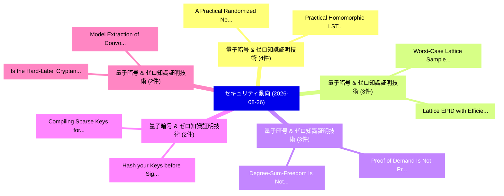

# 📅 02_daily: 日次エグゼクティブサマリー報告書 (2026-08-26)

**集計日時**: 2026-10-02 23:06:24 UTC  
**対象日付**: 2026-08-26  
**本日収集論文数**: 50 件  

---

## 💡 主要セキュリティ動向・脅威インサイト (Executive Insights)

本日の収集論文（計 50 件）において、以下の重点セキュリティ領域で活発な研究動向が確認されました：
- **量子暗号 & ゼロ知識証明技術** (4 件): 注目論文として 「A Practical Randomized Nearest...」、「Practical Homomorphic LSTM via...」 等が発表され、実務防御および攻撃検証の進展が見られます。
- **量子暗号 & ゼロ知識証明技術** (3 件): 注目論文として 「Worst-Case Lattice Sampler wit...」、「Lattice EPID with Efficient Re...」 等が発表され、実務防御および攻撃検証の進展が見られます。
- **量子暗号 & ゼロ知識証明技術** (3 件): 注目論文として 「Proof of Demand Is Not Proof o...」、「Degree-Sum-Freedom Is Not EA I...」 等が発表され、実務防御および攻撃検証の進展が見られます。
- **量子暗号 & ゼロ知識証明技術** (2 件): 注目論文として 「Hash your Keys before Signing:...」、「Compiling Sparse Keys for Boot...」 等が発表され、実務防御および攻撃検証の進展が見られます。
- **量子暗号 & ゼロ知識証明技術** (2 件): 注目論文として 「Is the Hard-Label Cryptanalyti...」、「Model Extraction of Convolutio...」 等が発表され、実務防御および攻撃検証の進展が見られます。

### 🗺️ 技術・脅威トピックマインドマップ

---

## 📌 日次セキュリティ論文一覧 (日本語表形式)

| No | arXiv ID | 論文タイトル (日本語訳) | 重要キーワード | 構造化エグゼクティブ要約 (背景・提案・影響) | 脅威分類 | 詳細リンク |
|---|---|---|---|---|---|---|
| 1 | `iacr-2024-1952` | [Worst-Case Lattice Sampler with Truncated Gadgets and Applications（セキュリティ分析論文）](../../okf/papers/2026-08-26/iacr-2024-1952.md) | `Case Lattice Sampler`, `Truncated Gadgets`, `Worst-Case Lattice` | 【提案】概要 (Overview & Key Finding) 本論文「Worst-Case Lattice Sampler with Truncated Gadgets and A...。実証評価により経営層・セキュリティ管理者向け推奨アクション (E... | `AI/ML Security` | [arXiv](https://arxiv.org/abs/iacr-2024-1952) &#124; [OKF](../../okf/papers/2026-08-26/iacr-2024-1952.md) |
| 2 | `iacr-2024-591` | [Hash your Keys before Signing: BUFF Security of the Additional NIST PQC Signatures（セキュリティ分析論文）](../../okf/papers/2026-08-26/iacr-2024-591.md) | `Raw Meta`, `Executive Summary`, `Key Finding` | 【提案】概要 (Overview & Key Finding) 本論文「Hash your Keys before Signing: BUFF Security of the Add...。実証評価により経営層・セキュリティ管理者向け推奨アクション (E... | `Cryptography` | [arXiv](https://arxiv.org/abs/iacr-2024-591) &#124; [OKF](../../okf/papers/2026-08-26/iacr-2024-591.md) |
| 3 | `iacr-2025-1176` | [A Practical Randomized Nearest-Colattice Framework for Arbitrary Norms（セキュリティ分析論文）](../../okf/papers/2026-08-26/iacr-2025-1176.md) | `Practical Randomized Nearest`, `Arbitrary Norms`, `Raw Meta` | 【提案】概要 (Overview & Key Finding) 本論文「A Practical Randomized Nearest-Colattice Framework for ...。実証評価により経営層・セキュリティ管理者向け推奨アクション (E... | `AI/ML Security` | [arXiv](https://arxiv.org/abs/iacr-2025-1176) &#124; [OKF](../../okf/papers/2026-08-26/iacr-2025-1176.md) |
| 4 | `iacr-2025-1219` | [Foundations of Single-Decryptor Encryption（セキュリティ分析論文）](../../okf/papers/2026-08-26/iacr-2025-1219.md) | `Decryptor Encryption`, `Single-Decryptor Encryption`, `Raw Meta` | 【提案】概要 (Overview & Key Finding) 本論文「Foundations of Single-Decryptor Encryption（セキュリティ分析論文）」...。実証評価により経営層・セキュリティ管理者向け推奨アクション (E... | `Cryptography` | [arXiv](https://arxiv.org/abs/iacr-2025-1219) &#124; [OKF](../../okf/papers/2026-08-26/iacr-2025-1219.md) |
| 5 | `iacr-2025-1225` | [Lattice EPID with Efficient Revocation（セキュリティ分析論文）](../../okf/papers/2026-08-26/iacr-2025-1225.md) | `Efficient Revocation`, `Raw Meta`, `Executive Summary` | 【提案】概要 (Overview & Key Finding) 本論文「Lattice EPID with Efficient Revocation（セキュリティ分析論文）」（原題:...。実証評価により経営層・セキュリティ管理者向け推奨アクション (E... | `Cryptography` | [arXiv](https://arxiv.org/abs/iacr-2025-1225) &#124; [OKF](../../okf/papers/2026-08-26/iacr-2025-1225.md) |
| 6 | `iacr-2025-1807` | [Traceability for Free: Traceable Ring Signatures Revisited（セキュリティ分析論文）](../../okf/papers/2026-08-26/iacr-2025-1807.md) | `Traceable Ring Signatures Revisited`, `Raw Meta`, `Executive Summary` | 【提案】概要 (Overview & Key Finding) 本論文「Traceability for Free: Traceable Ring Signatures Revisi...。実証評価により経営層・セキュリティ管理者向け推奨アクション (E... | `Cryptography` | [arXiv](https://arxiv.org/abs/iacr-2025-1807) &#124; [OKF](../../okf/papers/2026-08-26/iacr-2025-1807.md) |
| 7 | `iacr-2025-1868` | [Is the Hard-Label Cryptanalytic Model Extraction Really Polynomial?（セキュリティ分析論文）](../../okf/papers/2026-08-26/iacr-2025-1868.md) | `Label Cryptanalytic Model Extraction Really Polynomial`, `Hard-Label Cryptanalytic`, `Raw Meta` | 【提案】### (日本語題名: Is the Hard-Label Cryptanalytic Model Extraction Really Polynomial?（セキュリティ分...。実証評価により経営層・セキュリティ管理者向け推奨アクション (E... | `Cryptography` | [arXiv](https://arxiv.org/abs/iacr-2025-1868) &#124; [OKF](../../okf/papers/2026-08-26/iacr-2025-1868.md) |
| 8 | `iacr-2025-1988` | [Almost NTRU: Revisiting Noncommutativity Against Lattice Attacks（セキュリティ分析論文）](../../okf/papers/2026-08-26/iacr-2025-1988.md) | `Raw Meta`, `Executive Summary`, `Key Finding` | 【提案】概要 (Overview & Key Finding) 本論文「Almost NTRU: Revisiting Noncommutativity Against Lattic...。実証評価により経営層・セキュリティ管理者向け推奨アクション (E... | `Cryptography` | [arXiv](https://arxiv.org/abs/iacr-2025-1988) &#124; [OKF](../../okf/papers/2026-08-26/iacr-2025-1988.md) |
| 9 | `iacr-2025-2124` | [SALSAA – Sumcheck-Aided Lattice-based Succinct Arguments and Applications（セキュリティ分析論文）](../../okf/papers/2026-08-26/iacr-2025-2124.md) | `Aided Lattice`, `Succinct Arguments`, `Sumcheck-Aided Lattice` | 【提案】概要 (Overview & Key Finding) 本論文「SALSAA – Sumcheck-Aided Lattice-based Succinct Argument...。実証評価により経営層・セキュリティ管理者向け推奨アクション (E... | `Cryptography` | [arXiv](https://arxiv.org/abs/iacr-2025-2124) &#124; [OKF](../../okf/papers/2026-08-26/iacr-2025-2124.md) |
| 10 | `iacr-2025-709` | [Thunderbolt: Fast Asynchronous Off-Chain Bitcoin Transfers（セキュリティ分析論文）](../../okf/papers/2026-08-26/iacr-2025-709.md) | `Chain Bitcoin Transfers`, `Off-Chain Bitcoin`, `Raw Meta` | 【提案】概要 (Overview & Key Finding) 本論文「Thunderbolt: Fast Asynchronous Off-Chain Bitcoin Transf...。実証評価により経営層・セキュリティ管理者向け推奨アクション (E... | `Cryptography` | [arXiv](https://arxiv.org/abs/iacr-2025-709) &#124; [OKF](../../okf/papers/2026-08-26/iacr-2025-709.md) |
| 11 | `iacr-2025-858` | [Encrypted Matrix-Vector Products from Secret Dual Codes（セキュリティ分析論文）](../../okf/papers/2026-08-26/iacr-2025-858.md) | `Secret Dual Codes`, `Encrypted Matrix`, `Vector Products` | 【提案】概要 (Overview & Key Finding) 本論文「Encrypted Matrix-Vector Products from Secret Dual Codes...。実証評価により経営層・セキュリティ管理者向け推奨アクション (E... | `Cryptography` | [arXiv](https://arxiv.org/abs/iacr-2025-858) &#124; [OKF](../../okf/papers/2026-08-26/iacr-2025-858.md) |
| 12 | `iacr-2026-1091` | [Practical Homomorphic LSTM via Programmable Bootstrapping（セキュリティ分析論文）](../../okf/papers/2026-08-26/iacr-2026-1091.md) | `Practical Homomorphic`, `Programmable Bootstrapping`, `Raw Meta` | 【提案】概要 (Overview & Key Finding) 本論文「Practical Homomorphic LSTM via Programmable Bootstrappi...。実証評価により経営層・セキュリティ管理者向け推奨アクション (E... | `Cryptography` | [arXiv](https://arxiv.org/abs/iacr-2026-1091) &#124; [OKF](../../okf/papers/2026-08-26/iacr-2026-1091.md) |
| 13 | `iacr-2026-1098` | [A gentle introduction to lattice-based cryptography（セキュリティ分析論文）](../../okf/papers/2026-08-26/iacr-2026-1098.md) | `lattice-based cryptography`, `Raw Meta`, `Executive Summary` | 【提案】概要 (Overview & Key Finding) 本論文「A gentle introduction to 格子暗号（セキュリティ分析論文）」（原題: A gentle...。実証評価により経営層・セキュリティ管理者向け推奨アクション (E... | `Cryptography` | [arXiv](https://arxiv.org/abs/iacr-2026-1098) &#124; [OKF](../../okf/papers/2026-08-26/iacr-2026-1098.md) |
| 14 | `iacr-2026-1258` | [Beyond Anonymity Sets: A Security Model for Distributed Shuffling in Adversarial Environments（セキュリティ分析論文）](../../okf/papers/2026-08-26/iacr-2026-1258.md) | `Beyond Anonymity Sets`, `Security Model`, `Distributed Shuffling` | 【提案】概要 (Overview & Key Finding) 本論文「Beyond Anonymity Sets: A Security Model for Distributed...。実証評価により経営層・セキュリティ管理者向け推奨アクション (E... | `AI/ML Security` | [arXiv](https://arxiv.org/abs/iacr-2026-1258) &#124; [OKF](../../okf/papers/2026-08-26/iacr-2026-1258.md) |
| 15 | `iacr-2026-130` | [ARES: Online-Friendly Robust Threshold ECDSA with Amortized Costs（セキュリティ分析論文）](../../okf/papers/2026-08-26/iacr-2026-130.md) | `Friendly Robust Threshold`, `Amortized Costs`, `Online-Friendly Robust` | 【提案】概要 (Overview & Key Finding) 本論文「ARES: Online-Friendly Robust Threshold ECDSA with Amort...。実証評価により経営層・セキュリティ管理者向け推奨アクション (E... | `AI/ML Security` | [arXiv](https://arxiv.org/abs/iacr-2026-130) &#124; [OKF](../../okf/papers/2026-08-26/iacr-2026-130.md) |
| 16 | `iacr-2026-1423` | [CMALU: Compact Fault-Tolerant Modular Arithmetic Logic Unit for Post-Quantum Cryptography（セキュリティ分析論文）](../../okf/papers/2026-08-26/iacr-2026-1423.md) | `Tolerant Modular Arithmetic Logic Unit`, `Compact Fault`, `Quantum Cryptography` | 【提案】概要 (Overview & Key Finding) 本論文「CMALU: Compact Fault-Tolerant Modular Arithmetic Logic ...。実証評価により経営層・セキュリティ管理者向け推奨アクション (E... | `Cryptography` | [arXiv](https://arxiv.org/abs/iacr-2026-1423) &#124; [OKF](../../okf/papers/2026-08-26/iacr-2026-1423.md) |
| 17 | `iacr-2026-144` | [Designated-Verifier Dynamic zk-SNARKs with Applications to Dynamic Proofs of Index（セキュリティ分析論文）](../../okf/papers/2026-08-26/iacr-2026-144.md) | `Verifier Dynamic`, `Dynamic Proofs`, `Designated-Verifier Dynamic` | 【提案】概要 (Overview & Key Finding) 本論文「Designated-Verifier Dynamic zk-SNARKs with Applications...。実証評価により経営層・セキュリティ管理者向け推奨アクション (E... | `Cryptography` | [arXiv](https://arxiv.org/abs/iacr-2026-144) &#124; [OKF](../../okf/papers/2026-08-26/iacr-2026-144.md) |
| 18 | `iacr-2026-1492` | [Proof of Demand Is Not Proof of Work: On the Limits of Demand-Weighted Consensus under Free Pseudonyms（セキュリティ分析論文）](../../okf/papers/2026-08-26/iacr-2026-1492.md) | `Weighted Consensus`, `Free Pseudonyms`, `Demand-Weighted Consensus` | 【提案】背景とセキュリティ上の課題 (Background & Problem) 本研究はサイバー脅威環境におけるセキュリティ構造・脆弱性の検証を目的としています。(主要検出項目: ...。実証評価により経営層・セキュリティ管理者向け推奨アクション (E... | `Cryptography` | [arXiv](https://arxiv.org/abs/iacr-2026-1492) &#124; [OKF](../../okf/papers/2026-08-26/iacr-2026-1492.md) |
| 19 | `iacr-2026-1548` | [Revisiting the Wedge Attack on UOV problem（セキュリティ分析論文）](../../okf/papers/2026-08-26/iacr-2026-1548.md) | `Wedge Attack`, `Raw Meta`, `Executive Summary` | 【提案】概要 (Overview & Key Finding) 本論文「Revisiting the Wedge Attack on UOV problem（セキュリティ分析論文）」...。実証評価により経営層・セキュリティ管理者向け推奨アクション (E... | `Cryptography` | [arXiv](https://arxiv.org/abs/iacr-2026-1548) &#124; [OKF](../../okf/papers/2026-08-26/iacr-2026-1548.md) |
| 20 | `iacr-2026-1606` | [Verbeth: Secure Messaging with Metadata Minimization over Public Blockchain Logs（セキュリティ分析論文）](../../okf/papers/2026-08-26/iacr-2026-1606.md) | `Public Blockchain Logs`, `Secure Messaging`, `Metadata Minimization` | 【提案】概要 (Overview & Key Finding) 本論文「Verbeth: Secure Messaging with Metadata Minimization ov...。実証評価により経営層・セキュリティ管理者向け推奨アクション (E... | `AI/ML Security` | [arXiv](https://arxiv.org/abs/iacr-2026-1606) &#124; [OKF](../../okf/papers/2026-08-26/iacr-2026-1606.md) |
| 21 | `iacr-2026-1614` | [LFSRs and Boolean Masking: An In-depth Security Analysis（セキュリティ分析論文）](../../okf/papers/2026-08-26/iacr-2026-1614.md) | `Boolean Masking`, `In-depth Security`, `Raw Meta` | 【提案】概要 (Overview & Key Finding) 本論文「LFSRs and Boolean Masking: An In-depth Security Analysi...。実証評価により経営層・セキュリティ管理者向け推奨アクション (E... | `Cryptography` | [arXiv](https://arxiv.org/abs/iacr-2026-1614) &#124; [OKF](../../okf/papers/2026-08-26/iacr-2026-1614.md) |
| 22 | `iacr-2026-1654` | [Verifpal Seven Years Later: Can a Toy Become an Instrument?（セキュリティ分析論文）](../../okf/papers/2026-08-26/iacr-2026-1654.md) | `Verifpal Seven Years Later`, `Toy Become`, `Raw Meta` | 【提案】### (日本語題名: Verifpal Seven Years Later: Can a Toy Become an Instrument?（セキュリティ分析論文）)  >...。実証評価により経営層・セキュリティ管理者向け推奨アクション (E... | `Cryptography` | [arXiv](https://arxiv.org/abs/iacr-2026-1654) &#124; [OKF](../../okf/papers/2026-08-26/iacr-2026-1654.md) |
| 23 | `iacr-2026-1655` | [Hardness of Euclidean Closest Vector within $n^{1/2-\epsilon}$ and Binary Nearest Codeword within $n^{1-\epsilon}$（セキュリティ分析論文）](../../okf/papers/2026-08-26/iacr-2026-1655.md) | `Euclidean Closest Vector`, `Binary Nearest Codeword`, `Raw Meta` | 【提案】概要 (Overview & Key Finding) 本論文「Hardness of Euclidean Closest Vector within $n^{1/2-\ep...。実証評価により経営層・セキュリティ管理者向け推奨アクション (E... | `Cryptography` | [arXiv](https://arxiv.org/abs/iacr-2026-1655) &#124; [OKF](../../okf/papers/2026-08-26/iacr-2026-1655.md) |
| 24 | `iacr-2026-1662` | [Degree-Sum-Freedom Is Not EA Invariant: Exact Profiles in a 4-Uniform Permutation Family（セキュリティ分析論文）](../../okf/papers/2026-08-26/iacr-2026-1662.md) | `Uniform Permutation Family`, `Exact Profiles`, `4-Uniform Permutation` | 【提案】背景とセキュリティ上の課題 (Background & Problem) 本研究はサイバー脅威環境におけるセキュリティ構造・脆弱性の検証を目的としています。(主要検出項目: ...。実証評価により経営層・セキュリティ管理者向け推奨アクション (E... | `Cryptography` | [arXiv](https://arxiv.org/abs/iacr-2026-1662) &#124; [OKF](../../okf/papers/2026-08-26/iacr-2026-1662.md) |
| 25 | `iacr-2026-1733` | [TEE-Assisted Authenticated MPC for Resource Constrained Edge_Intelligence（セキュリティ分析論文）](../../okf/papers/2026-08-26/iacr-2026-1733.md) | `Assisted Authenticated`, `Resource Constrained`, `TEE-Assisted Authenticated` | 【提案】概要 (Overview & Key Finding) 本論文「TEE-Assisted Authenticated MPC for Resource Constrained...。実証評価により経営層・セキュリティ管理者向け推奨アクション (E... | `Cryptography` | [arXiv](https://arxiv.org/abs/iacr-2026-1733) &#124; [OKF](../../okf/papers/2026-08-26/iacr-2026-1733.md) |
| 26 | `iacr-2026-1747` | [Extending Distinguishing to Key Recovery for Subfield Subcodes of GRS codes（セキュリティ分析論文）](../../okf/papers/2026-08-26/iacr-2026-1747.md) | `Extending Distinguishing`, `Key Recovery`, `Subfield Subcodes` | 【提案】概要 (Overview & Key Finding) 本論文「Extending Distinguishing to Key Recovery for Subfield S...。実証評価により経営層・セキュリティ管理者向け推奨アクション (E... | `Cryptography` | [arXiv](https://arxiv.org/abs/iacr-2026-1747) &#124; [OKF](../../okf/papers/2026-08-26/iacr-2026-1747.md) |
| 27 | `iacr-2026-1773` | [Enforcing Winner-Only Disclosure: Verifiable Tally Hiding for Weighted DAO Governance（セキュリティ分析論文）](../../okf/papers/2026-08-26/iacr-2026-1773.md) | `Verifiable Tally Hiding`, `Enforcing Winner`, `Winner-Only Disclosure` | 【提案】概要 (Overview & Key Finding) 本論文「Enforcing Winner-Only Disclosure: Verifiable Tally Hidi...。実証評価により経営層・セキュリティ管理者向け推奨アクション (E... | `Cryptography` | [arXiv](https://arxiv.org/abs/iacr-2026-1773) &#124; [OKF](../../okf/papers/2026-08-26/iacr-2026-1773.md) |
| 28 | `iacr-2026-1776` | [Cofactor-torsion attacks on hinted scalar multiplications in SNARK circuits（セキュリティ分析論文）](../../okf/papers/2026-08-26/iacr-2026-1776.md) | `Cofactor-torsion attacks`, `Raw Meta`, `Executive Summary` | 【提案】概要 (Overview & Key Finding) 本論文「Cofactor-torsion attacks on hinted scalar multiplicatio...。実証評価により経営層・セキュリティ管理者向け推奨アクション (E... | `Cryptography` | [arXiv](https://arxiv.org/abs/iacr-2026-1776) &#124; [OKF](../../okf/papers/2026-08-26/iacr-2026-1776.md) |
| 29 | `iacr-2026-1777` | [Dynamic and Optimal Function Inversion in the Small-Time Regime（セキュリティ分析論文）](../../okf/papers/2026-08-26/iacr-2026-1777.md) | `Optimal Function Inversion`, `Time Regime`, `Small-Time Regime` | 【提案】概要 (Overview & Key Finding) 本論文「Dynamic and Optimal Function Inversion in the Small-Tim...。実証評価により経営層・セキュリティ管理者向け推奨アクション (E... | `Cryptography` | [arXiv](https://arxiv.org/abs/iacr-2026-1777) &#124; [OKF](../../okf/papers/2026-08-26/iacr-2026-1777.md) |
| 30 | `iacr-2026-1778` | [HOVER: Higher-Order Vanishing Endomorphism Recovery（セキュリティ分析論文）](../../okf/papers/2026-08-26/iacr-2026-1778.md) | `Order Vanishing Endomorphism Recovery`, `Higher-Order Vanishing`, `Raw Meta` | 【提案】概要 (Overview & Key Finding) 本論文「HOVER: Higher-Order Vanishing Endomorphism Recovery（セキュ...。実証評価により経営層・セキュリティ管理者向け推奨アクション (E... | `Cryptography` | [arXiv](https://arxiv.org/abs/iacr-2026-1778) &#124; [OKF](../../okf/papers/2026-08-26/iacr-2026-1778.md) |
| 31 | `iacr-2026-1779` | [Bootstrapping using Ring Switching without Slot Recovery（セキュリティ分析論文）](../../okf/papers/2026-08-26/iacr-2026-1779.md) | `Ring Switching`, `Slot Recovery`, `Raw Meta` | 【提案】背景とセキュリティ上の課題 (Background & Problem) 本研究はサイバー脅威環境におけるセキュリティ構造・脆弱性の検証を目的としています。(主要検出項目: ...。実証評価により経営層・セキュリティ管理者向け推奨アクション (E... | `Cryptography` | [arXiv](https://arxiv.org/abs/iacr-2026-1779) &#124; [OKF](../../okf/papers/2026-08-26/iacr-2026-1779.md) |
| 32 | `iacr-2026-1780` | [The Limits of $t$-Private Share Conversion（セキュリティ分析論文）](../../okf/papers/2026-08-26/iacr-2026-1780.md) | `Private Share Conversion`, `Raw Meta`, `Executive Summary` | 【提案】概要 (Overview & Key Finding) 本論文「The Limits of $t$-Private Share Conversion（セキュリティ分析論文）」...。実証評価により経営層・セキュリティ管理者向け推奨アクション (E... | `Cryptography` | [arXiv](https://arxiv.org/abs/iacr-2026-1780) &#124; [OKF](../../okf/papers/2026-08-26/iacr-2026-1780.md) |
| 33 | `iacr-2026-1781` | [Efficient Additive Randomized Encodings for String Oblivious Transfer: A Core Primitive for General Functions（セキュリティ分析論文）](../../okf/papers/2026-08-26/iacr-2026-1781.md) | `Efficient Additive Randomized Encodings`, `String Oblivious Transfer`, `Core Primitive` | 【提案】概要 (Overview & Key Finding) 本論文「Efficient Additive Randomized Encodings for String Obli...。実証評価により経営層・セキュリティ管理者向け推奨アクション (E... | `Cryptography` | [arXiv](https://arxiv.org/abs/iacr-2026-1781) &#124; [OKF](../../okf/papers/2026-08-26/iacr-2026-1781.md) |
| 34 | `iacr-2026-1782` | [EA Codes Approaching Singleton Bound (with Application to Field-Agnostic SNARKs)（セキュリティ分析論文）](../../okf/papers/2026-08-26/iacr-2026-1782.md) | `Codes Approaching Singleton Bound`, `Field-Agnostic SNARKs`, `Raw Meta` | 【提案】概要 (Overview & Key Finding) 本論文「EA Codes Approaching Singleton Bound (with Application ...。実証評価により経営層・セキュリティ管理者向け推奨アクション (E... | `Cryptography` | [arXiv](https://arxiv.org/abs/iacr-2026-1782) &#124; [OKF](../../okf/papers/2026-08-26/iacr-2026-1782.md) |
| 35 | `iacr-2026-1783` | [Compiling Sparse Keys for Bootstrapping FHEs: Algorithms, Hardware Acceleration, and Beyond（セキュリティ分析論文）](../../okf/papers/2026-08-26/iacr-2026-1783.md) | `Compiling Sparse Keys`, `Hardware Acceleration`, `Raw Meta` | 【提案】概要 (Overview & Key Finding) 本論文「Compiling Sparse Keys for Bootstrapping FHEs: Algorithm...。実証評価により経営層・セキュリティ管理者向け推奨アクション (E... | `Cryptography` | [arXiv](https://arxiv.org/abs/iacr-2026-1783) &#124; [OKF](../../okf/papers/2026-08-26/iacr-2026-1783.md) |
| 36 | `iacr-2026-1784` | [Faster Post-Quantum zkSNARK Provers Using the LCH Polynomial Basis（セキュリティ分析論文）](../../okf/papers/2026-08-26/iacr-2026-1784.md) | `Faster Post`, `Provers Using`, `Polynomial Basis` | 【提案】概要 (Overview & Key Finding) 本論文「Faster Post-量子 zkSNARK Provers Using the LCH Polynomial...。実証評価により経営層・セキュリティ管理者向け推奨アクション (E... | `Cryptography` | [arXiv](https://arxiv.org/abs/iacr-2026-1784) &#124; [OKF](../../okf/papers/2026-08-26/iacr-2026-1784.md) |
| 37 | `iacr-2026-1785` | [The Power of Rerandomization in Obfustopia: Collision-Resistant Hash, Somewhere-Extractable BARGs, and More（セキュリティ分析論文）](../../okf/papers/2026-08-26/iacr-2026-1785.md) | `Resistant Hash`, `Collision-Resistant Hash`, `Somewhere-Extractable BARGs` | 【提案】概要 (Overview & Key Finding) 本論文「The Power of Rerandomization in Obfustopia: Collision-R...。実証評価により経営層・セキュリティ管理者向け推奨アクション (E... | `Cryptography` | [arXiv](https://arxiv.org/abs/iacr-2026-1785) &#124; [OKF](../../okf/papers/2026-08-26/iacr-2026-1785.md) |
| 38 | `iacr-2026-1786` | [Bit Operation Cost of ``Holdout'' Key-Recovery Attacks Against Classic McEliece（セキュリティ分析論文）](../../okf/papers/2026-08-26/iacr-2026-1786.md) | `Bit Operation Cost`, `Key-Recovery Attacks`, `Raw Meta` | 【提案】概要 (Overview & Key Finding) 本論文「Bit Operation Cost of ``Holdout'' Key-Recovery Attacks ...。実証評価により経営層・セキュリティ管理者向け推奨アクション (E... | `Cryptography` | [arXiv](https://arxiv.org/abs/iacr-2026-1786) &#124; [OKF](../../okf/papers/2026-08-26/iacr-2026-1786.md) |
| 39 | `iacr-2026-1787` | [A Practical Optimization for Wiedemann XL（セキュリティ分析論文）](../../okf/papers/2026-08-26/iacr-2026-1787.md) | `Practical Optimization`, `Raw Meta`, `Executive Summary` | 【提案】概要 (Overview & Key Finding) 本論文「A Practical Optimization for Wiedemann XL（セキュリティ分析論文）」（...。実証評価により経営層・セキュリティ管理者向け推奨アクション (E... | `AI/ML Security` | [arXiv](https://arxiv.org/abs/iacr-2026-1787) &#124; [OKF](../../okf/papers/2026-08-26/iacr-2026-1787.md) |
| 40 | `iacr-2026-1788` | [Cryptthe DIZY Stream Cipher with Provable Securityの分析](../../okf/papers/2026-08-26/iacr-2026-1788.md) | `Stream Cipher`, `Provable Security`, `Raw Meta` | 【提案】概要 (Overview & Key Finding) 本論文「Cryptthe DIZY Stream Cipher with Provable Securityの分析」（...。実証評価により経営層・セキュリティ管理者向け推奨アクション (E... | `AI/ML Security` | [arXiv](https://arxiv.org/abs/iacr-2026-1788) &#124; [OKF](../../okf/papers/2026-08-26/iacr-2026-1788.md) |
| 41 | `iacr-2026-1789` | [HRFPRE: Fast Proxy Re-encryption for Multi-RSU Outsourcing and Hardware-assisted Revocation in the IoV.（セキュリティ分析論文）](../../okf/papers/2026-08-26/iacr-2026-1789.md) | `Fast Proxy Re`, `Multi-RSU Outsourcing`, `Hardware-assisted Revocation` | 【提案】### (日本語題名: HRFPRE: Fast Proxy Re-encryption for Multi-RSU Outsourcing and Hardware-ass...。実証評価により経営層・セキュリティ管理者向け推奨アクション (E... | `Cryptography` | [arXiv](https://arxiv.org/abs/iacr-2026-1789) &#124; [OKF](../../okf/papers/2026-08-26/iacr-2026-1789.md) |
| 42 | `iacr-2026-1790` | [Lithium: Making Iterative Rejection Sampling Practical for Compact Lattice Signatures（セキュリティ分析論文）](../../okf/papers/2026-08-26/iacr-2026-1790.md) | `Making Iterative Rejection Sampling Practical`, `Compact Lattice Signatures`, `Compact Lattice Signa` | 【提案】概要 (Overview & Key Finding) 本論文「Lithium: Making Iterative Rejection Sampling Practical ...。実証評価により経営層・セキュリティ管理者向け推奨アクション (E... | `AI/ML Security` | [arXiv](https://arxiv.org/abs/iacr-2026-1790) &#124; [OKF](../../okf/papers/2026-08-26/iacr-2026-1790.md) |
| 43 | `iacr-2026-1791` | [DIME: Query-Efficient Framework for Membership Inference on Diffusion Models（セキュリティ分析論文）](../../okf/papers/2026-08-26/iacr-2026-1791.md) | `Membership Inference`, `Diffusion Models`, `Raw Meta` | 【提案】概要 (Overview & Key Finding) 本論文「DIME: Query-Efficient Framework for Membership Inferenc...。実証評価により経営層・セキュリティ管理者向け推奨アクション (E... | `Cryptography` | [arXiv](https://arxiv.org/abs/iacr-2026-1791) &#124; [OKF](../../okf/papers/2026-08-26/iacr-2026-1791.md) |
| 44 | `iacr-2026-1792` | [Beyond Linear Subspace Trails: Nonlinear Subspaces for Gr\"obner Basis Attacks on Poseidon/Poseidon2 and Neptune（セキュリティ分析論文）](../../okf/papers/2026-08-26/iacr-2026-1792.md) | `Beyond Linear Subspace Trails`, `Nonlinear Subspaces`, `Basis Attacks` | 【提案】概要 (Overview & Key Finding) 本論文「Beyond Linear Subspace Trails: Nonlinear Subspaces for ...。実証評価により経営層・セキュリティ管理者向け推奨アクション (E... | `Cryptography` | [arXiv](https://arxiv.org/abs/iacr-2026-1792) &#124; [OKF](../../okf/papers/2026-08-26/iacr-2026-1792.md) |
| 45 | `iacr-2026-217` | [Cavefish: Communication-Optimal Light Client Protocol for UTxO Ledgers（セキュリティ分析論文）](../../okf/papers/2026-08-26/iacr-2026-217.md) | `Optimal Light Client Protocol`, `Communication-Optimal Light`, `Raw Meta` | 【提案】概要 (Overview & Key Finding) 本論文「Cavefish: Communication-Optimal Light Client Protocol f...。実証評価により経営層・セキュリティ管理者向け推奨アクション (E... | `AI/ML Security` | [arXiv](https://arxiv.org/abs/iacr-2026-217) &#124; [OKF](../../okf/papers/2026-08-26/iacr-2026-217.md) |
| 46 | `iacr-2026-261` | [Logarithmic-Depth Pseudorandom Functions from Well-Founded Code-Based Assumptions（セキュリティ分析論文）](../../okf/papers/2026-08-26/iacr-2026-261.md) | `Depth Pseudorandom Functions`, `Founded Code`, `Based Assumptions` | 【提案】概要 (Overview & Key Finding) 本論文「Logarithmic-Depth Pseudorandom Functions from Well-Foun...。実証評価により経営層・セキュリティ管理者向け推奨アクション (E... | `AI/ML Security` | [arXiv](https://arxiv.org/abs/iacr-2026-261) &#124; [OKF](../../okf/papers/2026-08-26/iacr-2026-261.md) |
| 47 | `iacr-2026-368` | [Additions, Multiplications, and the Interaction In-Between: Optimizing MPC Protocols via Leveled Linear Secret Sharing (Full Version)（セキュリティ分析論文）](../../okf/papers/2026-08-26/iacr-2026-368.md) | `Leveled Linear Secret Sharing`, `Full Version`, `Raw Meta` | 【提案】概要 (Overview & Key Finding) 本論文「Additions, Multiplications, and the Interaction In-Betw...。実証評価により経営層・セキュリティ管理者向け推奨アクション (E... | `Cryptography` | [arXiv](https://arxiv.org/abs/iacr-2026-368) &#124; [OKF](../../okf/papers/2026-08-26/iacr-2026-368.md) |
| 48 | `iacr-2026-464` | [Model Extraction of Convolutional Neural Networks with Max-Pooling（セキュリティ分析論文）](../../okf/papers/2026-08-26/iacr-2026-464.md) | `Convolutional Neural Networks`, `Model Extraction`, `Raw Meta` | 【提案】概要 (Overview & Key Finding) 本論文「Model Extraction of Convolutional Neural Networks with ...。実証評価により経営層・セキュリティ管理者向け推奨アクション (E... | `Cryptography` | [arXiv](https://arxiv.org/abs/iacr-2026-464) &#124; [OKF](../../okf/papers/2026-08-26/iacr-2026-464.md) |
| 49 | `iacr-2026-922` | [Generic Construction of CCA-Secure PKE from Key-Insulated and Privacy-Preserving Signatures with Publicly Derived Public Key（セキュリティ分析論文）](../../okf/papers/2026-08-26/iacr-2026-922.md) | `Publicly Derived Public Key`, `Generic Construction`, `Preserving Signatures` | 【提案】概要 (Overview & Key Finding) 本論文「Generic Construction of CCA-Secure PKE from Key-Insulat...。実証評価により経営層・セキュリティ管理者向け推奨アクション (E... | `AI/ML Security` | [arXiv](https://arxiv.org/abs/iacr-2026-922) &#124; [OKF](../../okf/papers/2026-08-26/iacr-2026-922.md) |
| 50 | `iacr-2026-952` | [Formalizing PQC Signature Transition: Case of PoW Blockchain Against On-Spend Attack（セキュリティ分析論文）](../../okf/papers/2026-08-26/iacr-2026-952.md) | `Signature Transition`, `Spend Attack`, `On-Spend Attack` | 【提案】概要 (Overview & Key Finding) 本論文「Formalizing PQC Signature Transition: Case of PoW Block...。実証評価により経営層・セキュリティ管理者向け推奨アクション (E... | `Cryptography` | [arXiv](https://arxiv.org/abs/iacr-2026-952) &#124; [OKF](../../okf/papers/2026-08-26/iacr-2026-952.md) |

