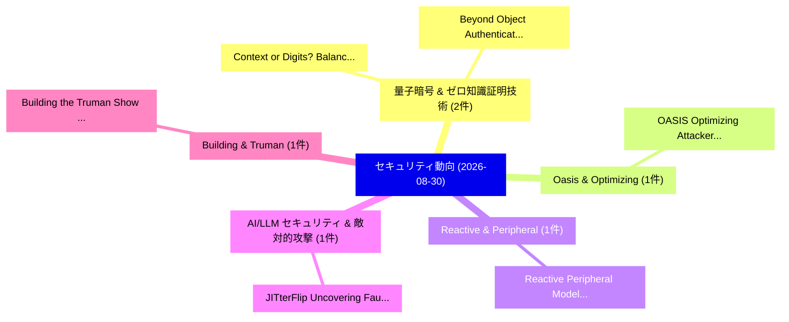

# 📅 02_daily: 日次エグゼクティブサマリー報告書 (2026-08-30)

**集計日時**: 2026-10-02 23:06:24 UTC  
**対象日付**: 2026-08-30  
**本日収集論文数**: 17 件  

---

## 💡 主要セキュリティ動向・脅威インサイト (Executive Insights)

本日の収集論文（計 17 件）において、以下の重点セキュリティ領域で活発な研究動向が確認されました：
- **量子暗号 & ゼロ知識証明技術** (2 件): 注目論文として 「Context or Digits? Balancing M...」、「Beyond Object Authentication: ...」 等が発表され、実務防御および攻撃検証の進展が見られます。
- **Oasis & Optimizing** (1 件): 注目論文として 「OASIS: Optimizing Attacker Seq...」 等が発表され、実務防御および攻撃検証の進展が見られます。
- **Reactive & Peripheral** (1 件): 注目論文として 「Reactive Peripheral Modeling f...」 等が発表され、実務防御および攻撃検証の進展が見られます。
- **AI/LLM セキュリティ & 敵対的攻撃** (1 件): 注目論文として 「JITterFlip: Uncovering Fault A...」 等が発表され、実務防御および攻撃検証の進展が見られます。
- **Building & Truman** (1 件): 注目論文として 「Building the Truman Show: A Tr...」 等が発表され、実務防御および攻撃検証の進展が見られます。

### 🗺️ 技術・脅威トピックマインドマップ

---

## 📌 日次セキュリティ論文一覧 (日本語表形式)

| No | arXiv ID | 論文タイトル (日本語訳) | 重要キーワード | 構造化エグゼクティブ要約 (背景・提案・影響) | 脅威分類 | 詳細リンク |
|---|---|---|---|---|---|---|
| 1 | `2608.29531v1` | [Context or Digits? Balancing Memorability and Efficiency in Virtual Reality Authentication（セキュリティ分析論文）](../../okf/papers/2026-08-30/2608.29531.md) | `Virtual Reality Authentication`, `Balancing Memorability`, `General Cyber Security` | 【提案】Balancing Memorability and Efficiency in Virtual Reality Authentication ### (日本語題名: Con...。実証評価により経営層・セキュリティ管理者向け推奨アクション (E... | `General Cyber Security` | [arXiv](https://arxiv.org/abs/2608.29531v1) &#124; [OKF](../../okf/papers/2026-08-30/2608.29531.md) |
| 2 | `2608.29568v2` | [OASIS: Optimizing Attacker Sequences for Hard-Label Black-Box Text Attacks（セキュリティ分析論文）](../../okf/papers/2026-08-30/2608.29568.md) | `Optimizing Attacker Sequences`, `Box Text Attacks`, `Label Black` | 【提案】概要 (Overview & Key Finding) 本論文「OASIS: Optimizing Attacker Sequences for Hard-Label Bla...。実証評価により経営層・セキュリティ管理者向け推奨アクション (E... | `General Cyber Security` | [arXiv](https://arxiv.org/abs/2608.29568v2) &#124; [OKF](../../okf/papers/2026-08-30/2608.29568.md) |
| 3 | `2608.29737v1` | [Reactive Peripheral Modeling for Faithful Firmware Rehosting（セキュリティ分析論文）](../../okf/papers/2026-08-30/2608.29737.md) | `Reactive Peripheral Modeling`, `Faithful Firmware Rehosting`, `Qinying Wang` | 【提案】概要 (Overview & Key Finding) 本論文「Reactive Peripheral Modeling for Faithful Firmware Reho...。実証評価により経営層・セキュリティ管理者向け推奨アクション (E... | `AI/ML Security` | [arXiv](https://arxiv.org/abs/2608.29737v1) &#124; [OKF](../../okf/papers/2026-08-30/2608.29737.md) |
| 4 | `2608.29745v1` | [JITterFlip: Uncovering Fault Attack Surfaces in JIT-Compiled LLM Serving（セキュリティ分析論文）](../../okf/papers/2026-08-30/2608.29745.md) | `Uncovering Fault Attack Surfaces`, `JIT-Compiled LLM`, `Tairui Wang` | 【提案】概要 (Overview & Key Finding) 本論文「JITterFlip: Uncovering フォールト攻撃 Surfaces in JIT-Compiled...。実証評価により経営層・セキュリティ管理者向け推奨アクション (E... | `AI/ML Security` | [arXiv](https://arxiv.org/abs/2608.29745v1) &#124; [OKF](../../okf/papers/2026-08-30/2608.29745.md) |
| 5 | `2608.29758v1` | [Building the Truman Show: A TrustZone-Based Framework for Lightweight Out-of-band Kernel Security Monitoring（セキュリティ分析論文）](../../okf/papers/2026-08-30/2608.29758.md) | `Kernel Security Monitoring`, `Zhenling Duan`, `Pan Dong` | 【提案】概要 (Overview & Key Finding) 本論文「Building the Truman Show: A TrustZone-Based Framework f...。実証評価により経営層・セキュリティ管理者向け推奨アクション (E... | `AI/ML Security` | [arXiv](https://arxiv.org/abs/2608.29758v1) &#124; [OKF](../../okf/papers/2026-08-30/2608.29758.md) |
| 6 | `2608.29773v1` | [HSMLog: Small Language Model-Assisted Hardware Security Module Log Anomaly Detection with Behavioral Analysis（セキュリティ分析論文）](../../okf/papers/2026-08-30/2608.29773.md) | `Assisted Hardware Security Module Log Anomaly Detection`, `Small Language Model`, `Model-Assisted Hardware` | 【提案】概要 (Overview & Key Finding) 本論文「HSMLog: Small Language Model-Assisted Hardware Security...。実証評価により経営層・セキュリティ管理者向け推奨アクション (E... | `AI/ML Security` | [arXiv](https://arxiv.org/abs/2608.29773v1) &#124; [OKF](../../okf/papers/2026-08-30/2608.29773.md) |
| 7 | `2608.29808v1` | [POLYFLOW: A Neuro-Symbolic Framework for Static Cross-Language Information Flow Analysis（セキュリティ分析論文）](../../okf/papers/2026-08-30/2608.29808.md) | `Static Cross`, `Cross-Language Information`, `Haoran Yang` | 【提案】概要 (Overview & Key Finding) 本論文「POLYFLOW: A Neuro-Symbolic Framework for Static Cross-L...。実証評価により経営層・セキュリティ管理者向け推奨アクション (E... | `AI/ML Security` | [arXiv](https://arxiv.org/abs/2608.29808v1) &#124; [OKF](../../okf/papers/2026-08-30/2608.29808.md) |
| 8 | `2608.29851v1` | [A Comprehensive Study of Native Code Bugs in Python Applications（セキュリティ分析論文）](../../okf/papers/2026-08-30/2608.29851.md) | `Native Code Bugs`, `Python Applications`, `Haoran Yang` | 【提案】概要 (Overview & Key Finding) 本論文「A Comprehensive Study of Native Code Bugs in Python App...。実証評価により経営層・セキュリティ管理者向け推奨アクション (E... | `AI/ML Security` | [arXiv](https://arxiv.org/abs/2608.29851v1) &#124; [OKF](../../okf/papers/2026-08-30/2608.29851.md) |
| 9 | `2608.29942v1` | [Influence Is Not Authority: When Causal Guardrail Signals Make Legitimate Tool Use Look Like an Attack in Tool-Using LLMエージェント](../../okf/papers/2026-08-30/2608.29942.md) | `Tool-Using LLM`, `Md Jahangir Alam`, `Syed Bahauddin Alam` | 【提案】背景とセキュリティ上の課題 (Background & Problem) 本研究はサイバー脅威環境におけるセキュリティ構造・脆弱性の検証を目的としています。(主要検出項目: ...。実証評価により経営層・セキュリティ管理者向け推奨アクション (E... | `AI/ML Security` | [arXiv](https://arxiv.org/abs/2608.29942v1) &#124; [OKF](../../okf/papers/2026-08-30/2608.29942.md) |
| 10 | `2608.29977v1` | [A New Algebraic Algorithm for LWE（セキュリティ分析論文）](../../okf/papers/2026-08-30/2608.29977.md) | `New Algebraic Algorithm`, `Luca Campa`, `Massimo Fumiani` | 【提案】概要 (Overview & Key Finding) 本論文「A New Algebraic Algorithm for LWE（セキュリティ分析論文）」（原題: A Ne...。実証評価により経営層・セキュリティ管理者向け推奨アクション (E... | `Cryptography` | [arXiv](https://arxiv.org/abs/2608.29977v1) &#124; [OKF](../../okf/papers/2026-08-30/2608.29977.md) |
| 11 | `2608.29979v1` | [Breaking Ambient Trust: In-Network Per-Process Access Control Against Lateral Movement（セキュリティ分析論文）](../../okf/papers/2026-08-30/2608.29979.md) | `Breaking Ambient Trust`, `Network Per`, `In-Network Per` | 【提案】概要 (Overview & Key Finding) 本論文「Breaking Ambient Trust: In-Network Per-Process アクセス制御 A...。実証評価により経営層・セキュリティ管理者向け推奨アクション (E... | `Cryptography` | [arXiv](https://arxiv.org/abs/2608.29979v1) &#124; [OKF](../../okf/papers/2026-08-30/2608.29979.md) |
| 12 | `2608.30004v1` | [Beyond Object Authentication: Context-Closed Post-Quantum Authentication for the WebPKI（セキュリティ分析論文）](../../okf/papers/2026-08-30/2608.30004.md) | `Beyond Object Authentication`, `Closed Post`, `Quantum Authentication` | 【提案】概要 (Overview & Key Finding) 本論文「Beyond Object Authentication: Context-Closed Post-量子 Au...。実証評価により経営層・セキュリティ管理者向け推奨アクション (E... | `AI/ML Security` | [arXiv](https://arxiv.org/abs/2608.30004v1) &#124; [OKF](../../okf/papers/2026-08-30/2608.30004.md) |
| 13 | `2608.30038v1` | [ActReal: System-Level Mobile Agents Challenge Mobile Automation Detection（セキュリティ分析論文）](../../okf/papers/2026-08-30/2608.30038.md) | `Level Mobile Agents Challenge Mobile Automation Detection`, `System-Level Mobile`, `Mingshuo Wang` | 【提案】概要 (Overview & Key Finding) 本論文「ActReal: System-Level Mobile Agents Challenge Mobile Au...。実証評価により経営層・セキュリティ管理者向け推奨アクション (E... | `AI/ML Security` | [arXiv](https://arxiv.org/abs/2608.30038v1) &#124; [OKF](../../okf/papers/2026-08-30/2608.30038.md) |
| 14 | `2608.30041v1` | [Reachability-Based Capability Confinement for LLMエージェント under Indirect Prompt Injection](../../okf/papers/2026-08-30/2608.30041.md) | `Based Capability Confinement`, `Indirect Prompt Injection`, `Reachability-Based Capability` | 【提案】概要 (Overview & Key Finding) 本論文「Reachability-Based Capability Confinement for LLMエージェント...。実証評価により経営層・セキュリティ管理者向け推奨アクション (E... | `AI/ML Security` | [arXiv](https://arxiv.org/abs/2608.30041v1) &#124; [OKF](../../okf/papers/2026-08-30/2608.30041.md) |
| 15 | `2608.30083v1` | [Zero-Knowledge Predicate Proofs Between AI Agents: A Measured, Cross-Protocol Gateway and the Source-Integrity Gap（セキュリティ分析論文）](../../okf/papers/2026-08-30/2608.30083.md) | `Protocol Gateway`, `Integrity Gap`, `Zero-Knowledge Predicate` | 【提案】概要 (Overview & Key Finding) 本論文「Zero-Knowledge Predicate Proofs Between AI Agents: A Me...。実証評価により経営層・セキュリティ管理者向け推奨アクション (E... | `AI/ML Security` | [arXiv](https://arxiv.org/abs/2608.30083v1) &#124; [OKF](../../okf/papers/2026-08-30/2608.30083.md) |
| 16 | `2609.00052v1` | [AgentProv: Auditing Agentic LLM API Providers via Tool-use Policy Probes（セキュリティ分析論文）](../../okf/papers/2026-08-30/2609.00052.md) | `Auditing Agentic`, `Policy Probes`, `Tool-use Policy` | 【提案】概要 (Overview & Key Finding) 本論文「AgentProv: Auditing Agentic LLM API Providers via Tool-...。実証評価により経営層・セキュリティ管理者向け推奨アクション (E... | `AI/ML Security` | [arXiv](https://arxiv.org/abs/2609.00052v1) &#124; [OKF](../../okf/papers/2026-08-30/2609.00052.md) |
| 17 | `2609.00060v1` | [A Formal Agent Payment Protocolsの分析](../../okf/papers/2026-08-30/2609.00060.md) | `Agent Payment Protocols`, `Formal Agent Payment`, `Mohit Kumar Jangid` | 【提案】概要 (Overview & Key Finding) 本論文「A Formal Agent Payment Protocolsの分析」（原題: A Formal Analy...。実証評価により経営層・セキュリティ管理者向け推奨アクション (E... | `AI/ML Security` | [arXiv](https://arxiv.org/abs/2609.00060v1) &#124; [OKF](../../okf/papers/2026-08-30/2609.00060.md) |

