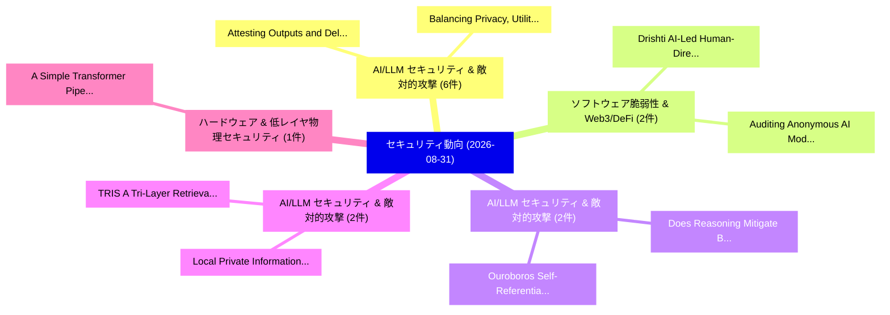

# 📅 02_daily: 日次エグゼクティブサマリー報告書 (2026-08-31)

**集計日時**: 2026-10-02 23:06:25 UTC  
**対象日付**: 2026-08-31  
**本日収集論文数**: 37 件  

---

## 💡 主要セキュリティ動向・脅威インサイト (Executive Insights)

本日の収集論文（計 37 件）において、以下の重点セキュリティ領域で活発な研究動向が確認されました：
- **AI/LLM セキュリティ & 敵対的攻撃** (6 件): 注目論文として 「Balancing Privacy, Utility, an...」、「Attesting Outputs and Delegati...」 等が発表され、実務防御および攻撃検証の進展が見られます。
- **ソフトウェア脆弱性 & Web3/DeFi** (2 件): 注目論文として 「Drishti: AI-Led Human-Directed...」、「Auditing Anonymous AI Models: ...」 等が発表され、実務防御および攻撃検証の進展が見られます。
- **AI/LLM セキュリティ & 敵対的攻撃** (2 件): 注目論文として 「Ouroboros: Self-Referential Ba...」、「Does Reasoning Mitigate Backdo...」 等が発表され、実務防御および攻撃検証の進展が見られます。
- **AI/LLM セキュリティ & 敵対的攻撃** (2 件): 注目論文として 「Local Private Information Retr...」、「TRIS: A Tri-Layer Retrieval In...」 等が発表され、実務防御および攻撃検証の進展が見られます。
- **ハードウェア & 低レイヤ物理セキュリティ** (1 件): 注目論文として 「A Simple Transformer Pipeline ...」 等が発表され、実務防御および攻撃検証の進展が見られます。

### 🗺️ 技術・脅威トピックマインドマップ

---

## 📌 日次セキュリティ論文一覧 (日本語表形式)

| No | arXiv ID | 論文タイトル (日本語訳) | 重要キーワード | 構造化エグゼクティブ要約 (背景・提案・影響) | 脅威分類 | 詳細リンク |
|---|---|---|---|---|---|---|
| 1 | `2608.30105v1` | [A Simple Transformer Pipeline for Full-Key Side-Channel Attacks on Uncropped Datasets（セキュリティ分析論文）](../../okf/papers/2026-08-31/2608.30105.md) | `Simple Transformer Pipeline`, `Key Side`, `Channel Attacks` | 【提案】概要 (Overview & Key Finding) 本論文「A Simple Transformer Pipeline for Full-Key サイドチャネル攻撃 At...。実証評価により経営層・セキュリティ管理者向け推奨アクション (E... | `Software Security` | [arXiv](https://arxiv.org/abs/2608.30105v1) &#124; [OKF](../../okf/papers/2026-08-31/2608.30105.md) |
| 2 | `2608.30112v1` | [Drishti: AI-Led Human-Directed Vulnerability Auditing for 5G Cores（セキュリティ分析論文）](../../okf/papers/2026-08-31/2608.30112.md) | `Directed Vulnerability Auditing`, `Led Human`, `AI-Led Human` | 【提案】概要 (Overview & Key Finding) 本論文「Drishti: AI-Led Human-Directed 脆弱性 Auditing for 5G Core...。実証評価により経営層・セキュリティ管理者向け推奨アクション (E... | `Software Security` | [arXiv](https://arxiv.org/abs/2608.30112v1) &#124; [OKF](../../okf/papers/2026-08-31/2608.30112.md) |
| 3 | `2608.30141v1` | [Balancing Privacy, Utility, and Safety in LLM Alignment through Preference Optimization（セキュリティ分析論文）](../../okf/papers/2026-08-31/2608.30141.md) | `Balancing Privacy`, `Preference Optimization`, `Dishu Yang` | 【提案】概要 (Overview & Key Finding) 本論文「Balancing Privacy, Utility, and Safety in LLM Alignment...。実証評価により経営層・セキュリティ管理者向け推奨アクション (E... | `AI/ML Security` | [arXiv](https://arxiv.org/abs/2608.30141v1) &#124; [OKF](../../okf/papers/2026-08-31/2608.30141.md) |
| 4 | `2608.30171v1` | [Reducio: Optimized Confidential Serverless Cloud Deployments for Enterprise Customers（セキュリティ分析論文）](../../okf/papers/2026-08-31/2608.30171.md) | `Optimized Confidential Serverless Cloud Deployments`, `Enterprise Customers`, `Optimized Confidential Serverless` | 【提案】概要 (Overview & Key Finding) 本論文「Reducio: Optimized Confidential Serverless Cloud Deploy...。実証評価により経営層・セキュリティ管理者向け推奨アクション (E... | `Privacy & Provenance` | [arXiv](https://arxiv.org/abs/2608.30171v1) &#124; [OKF](../../okf/papers/2026-08-31/2608.30171.md) |
| 5 | `2608.30177v1` | [Understanding Stage-Wise Utility-Risk Trade-offs in LLM Agent Memory（セキュリティ分析論文）](../../okf/papers/2026-08-31/2608.30177.md) | `Understanding Stage`, `Wise Utility`, `Risk Trade` | 【提案】概要 (Overview & Key Finding) 本論文「Understanding Stage-Wise Utility-Risk Trade-offs in LLM...。実証評価により経営層・セキュリティ管理者向け推奨アクション (E... | `AI/ML Security` | [arXiv](https://arxiv.org/abs/2608.30177v1) &#124; [OKF](../../okf/papers/2026-08-31/2608.30177.md) |
| 6 | `2608.30207v1` | [SIR: Self-improving Red-teaming for Compute Use Agents（セキュリティ分析論文）](../../okf/papers/2026-08-31/2608.30207.md) | `Compute Use Agents`, `Self-improving Red`, `Chen Xiong` | 【提案】概要 (Overview & Key Finding) 本論文「SIR: Self-improving Red-teaming for Compute Use Agents（...。実証評価により経営層・セキュリティ管理者向け推奨アクション (E... | `AI/ML Security` | [arXiv](https://arxiv.org/abs/2608.30207v1) &#124; [OKF](../../okf/papers/2026-08-31/2608.30207.md) |
| 7 | `2608.30288v1` | [Extracting Knowledge from Tools in LLMエージェント](../../okf/papers/2026-08-31/2608.30288.md) | `Extracting Knowledge`, `Chuanchao Zang`, `Jianing Wang` | 【提案】概要 (Overview & Key Finding) 本論文「Extracting Knowledge from Tools in LLMエージェント」（原題: Extra...。実証評価により経営層・セキュリティ管理者向け推奨アクション (E... | `AI/ML Security` | [arXiv](https://arxiv.org/abs/2608.30288v1) &#124; [OKF](../../okf/papers/2026-08-31/2608.30288.md) |
| 8 | `2608.30329v1` | [Ouroboros: Self-Referential Backdoor Attacks on Speech Enhancement via Clean Audio Triggers（セキュリティ分析論文）](../../okf/papers/2026-08-31/2608.30329.md) | `Referential Backdoor Attacks`, `Clean Audio Triggers`, `Speech Enhancement` | 【提案】概要 (Overview & Key Finding) 本論文「Ouroboros: Self-Referential Backdoor Attacks on Speech ...。実証評価により経営層・セキュリティ管理者向け推奨アクション (E... | `AI/ML Security` | [arXiv](https://arxiv.org/abs/2608.30329v1) &#124; [OKF](../../okf/papers/2026-08-31/2608.30329.md) |
| 9 | `2608.30332v1` | [A Roadmap to Available ICS Datasets and Testbeds for サイバーセキュリティ Research](../../okf/papers/2026-08-31/2608.30332.md) | `Cybersecurity Research`, `Network Security`, `Mohammad Hammoudeh` | 【提案】概要 (Overview & Key Finding) 本論文「A Roadmap to Available ICS Datasets and Testbeds for サイ...。実証評価によりAlqahtani, Mohammad。 | `Network Security` | [arXiv](https://arxiv.org/abs/2608.30332v1) &#124; [OKF](../../okf/papers/2026-08-31/2608.30332.md) |
| 10 | `2608.30379v1` | [KORD: Breaking the Key-Generation Bottleneck in Dealerless FSS via Protocol--Hardware Co-Design（セキュリティ分析論文）](../../okf/papers/2026-08-31/2608.30379.md) | `Generation Bottleneck`, `Hardware Co`, `Key-Generation Bottleneck` | 【提案】概要 (Overview & Key Finding) 本論文「KORD: Breaking the Key-Generation Bottleneck in Dealerl...。実証評価により経営層・セキュリティ管理者向け推奨アクション (E... | `Cryptography` | [arXiv](https://arxiv.org/abs/2608.30379v1) &#124; [OKF](../../okf/papers/2026-08-31/2608.30379.md) |
| 11 | `2608.30383v1` | [Using Hyper-V Sockets for Real-time Data Extraction from a Malware Analysis Sandbox（セキュリティ分析論文）](../../okf/papers/2026-08-31/2608.30383.md) | `Using Hyper`, `Hyper-V Sockets`, `Data Extraction` | 【提案】概要 (Overview & Key Finding) 本論文「Using Hyper-V Sockets for Real-time Data Extraction fro...。実証評価により経営層・セキュリティ管理者向け推奨アクション (E... | `Software Security` | [arXiv](https://arxiv.org/abs/2608.30383v1) &#124; [OKF](../../okf/papers/2026-08-31/2608.30383.md) |
| 12 | `2608.30387v1` | [Attesting Outputs and Delegation Ancestry in Multi-Agent AI Systems（セキュリティ分析論文）](../../okf/papers/2026-08-31/2608.30387.md) | `Attesting Outputs`, `Delegation Ancestry`, `Multi-Agent AI` | 【提案】概要 (Overview & Key Finding) 本論文「Attesting Outputs and Delegation Ancestry in Multi-Agen...。実証評価により経営層・セキュリティ管理者向け推奨アクション (E... | `AI/ML Security` | [arXiv](https://arxiv.org/abs/2608.30387v1) &#124; [OKF](../../okf/papers/2026-08-31/2608.30387.md) |
| 13 | `2608.30403v1` | [Why Are LLM Backdoor Defenses Fragmented? A Feature-Level Explanation with Sparse Autoencoders（セキュリティ分析論文）](../../okf/papers/2026-08-31/2608.30403.md) | `Backdoor Defenses Fragmented`, `Level Explanation`, `Sparse Autoencoders` | 【提案】A Feature-Level Explanation with Sparse Autoencoders ### (日本語題名: Why Are LLM Backdoor D...。実証評価により経営層・セキュリティ管理者向け推奨アクション (E... | `AI/ML Security` | [arXiv](https://arxiv.org/abs/2608.30403v1) &#124; [OKF](../../okf/papers/2026-08-31/2608.30403.md) |
| 14 | `2608.30441v1` | [ECLIPSE: Self-Evolving Stealthy Prompt Injection Attack against Long-Horizon Agentic Systems（セキュリティ分析論文）](../../okf/papers/2026-08-31/2608.30441.md) | `Evolving Stealthy Prompt Injection Attack`, `Horizon Agentic Systems`, `Self-Evolving Stealthy` | 【提案】概要 (Overview & Key Finding) 本論文「ECLIPSE: Self-Evolving Stealthy プロンプトインジェクション Attack ag...。実証評価により経営層・セキュリティ管理者向け推奨アクション (E... | `AI/ML Security` | [arXiv](https://arxiv.org/abs/2608.30441v1) &#124; [OKF](../../okf/papers/2026-08-31/2608.30441.md) |
| 15 | `2608.30473v1` | [Bounds on the Posterior-to-Prior Ratios for Inclusion Belief under Bounded Differential Privacy（セキュリティ分析論文）](../../okf/papers/2026-08-31/2608.30473.md) | `Bounded Differential Privacy`, `Prior Ratios`, `Inclusion Belief` | 【提案】概要 (Overview & Key Finding) 本論文「Bounds on the Posterior-to-Prior Ratios for Inclusion B...。実証評価により経営層・セキュリティ管理者向け推奨アクション (E... | `Cryptography` | [arXiv](https://arxiv.org/abs/2608.30473v1) &#124; [OKF](../../okf/papers/2026-08-31/2608.30473.md) |
| 16 | `2608.30519v1` | [Authority-Inference Separation in Agentic Finance: First-Line Control, Blockchain Enforcement, and Replayable Assurance（セキュリティ分析論文）](../../okf/papers/2026-08-31/2608.30519.md) | `Inference Separation`, `Agentic Finance`, `Line Control` | 【提案】概要 (Overview & Key Finding) 本論文「Authority-Inference Separation in Agentic Finance: Firs...。実証評価により経営層・セキュリティ管理者向け推奨アクション (E... | `AI/ML Security` | [arXiv](https://arxiv.org/abs/2608.30519v1) &#124; [OKF](../../okf/papers/2026-08-31/2608.30519.md) |
| 17 | `2608.30615v1` | [Operator-Empowered Vulnerability Hotfixing for 5G Radio Access Networksに向けて](../../okf/papers/2026-08-31/2608.30615.md) | `Empowered Vulnerability Hotfixing`, `Operator-Empowered Vulnerability`, `Towards Operator` | 【提案】概要 (Overview & Key Finding) 本論文「Operator-Empowered 脆弱性 Hotfixing for 5G Radio Access Ne...。実証評価により経営層・セキュリティ管理者向け推奨アクション (E... | `AI/ML Security` | [arXiv](https://arxiv.org/abs/2608.30615v1) &#124; [OKF](../../okf/papers/2026-08-31/2608.30615.md) |
| 18 | `2608.30648v1` | [Lie to Me: Finding Bugs in ZK DSL Toolchains with Adversarial Witness Injection（セキュリティ分析論文）](../../okf/papers/2026-08-31/2608.30648.md) | `Adversarial Witness Injection`, `Finding Bugs`, `Sebastian Watzinger` | 【提案】概要 (Overview & Key Finding) 本論文「Lie to Me: Finding Bugs in ZK DSL Toolchains with Adver...。実証評価により経営層・セキュリティ管理者向け推奨アクション (E... | `Cryptography` | [arXiv](https://arxiv.org/abs/2608.30648v1) &#124; [OKF](../../okf/papers/2026-08-31/2608.30648.md) |
| 19 | `2608.30686v1` | [Beyond the Payload: How User Invocation Shapes Coding Agent Vulnerability to Repository Poisoning（セキュリティ分析論文）](../../okf/papers/2026-08-31/2608.30686.md) | `Repository Poisoning`, `Fukang Zhu`, `Binbin Zhao` | 【提案】概要 (Overview & Key Finding) 本論文「Beyond the Payload: How User Invocation Shapes Coding A...。実証評価により経営層・セキュリティ管理者向け推奨アクション (E... | `AI/ML Security` | [arXiv](https://arxiv.org/abs/2608.30686v1) &#124; [OKF](../../okf/papers/2026-08-31/2608.30686.md) |
| 20 | `2608.30703v1` | [SingProbe Technical Report（セキュリティ分析論文）](../../okf/papers/2026-08-31/2608.30703.md) | `Technical Report`, `Sing Team`, `Raw Meta` | 【提案】概要 (Overview & Key Finding) 本論文「SingProbe Technical Report（セキュリティ分析論文）」（原題: SingProbe T...。実証評価により経営層・セキュリティ管理者向け推奨アクション (E... | `AI/ML Security` | [arXiv](https://arxiv.org/abs/2608.30703v1) &#124; [OKF](../../okf/papers/2026-08-31/2608.30703.md) |
| 21 | `2608.30748v1` | [The Fragility of Jailbreak Robustness Across Operational States（セキュリティ分析論文）](../../okf/papers/2026-08-31/2608.30748.md) | `Jailbreak Robustness Across Operational States`, `Hwang Youn Kim`, `Won Woo Ro` | 【提案】概要 (Overview & Key Finding) 本論文「The Fragility of ジェイルブレイク Robustness Across Operational...。実証評価により経営層・セキュリティ管理者向け推奨アクション (E... | `AI/ML Security` | [arXiv](https://arxiv.org/abs/2608.30748v1) &#124; [OKF](../../okf/papers/2026-08-31/2608.30748.md) |
| 22 | `2608.30969v1` | [DP-VOXLET: Provable Speaker Anonymization for Disentangled Speech Representations（セキュリティ分析論文）](../../okf/papers/2026-08-31/2608.30969.md) | `Provable Speaker Anonymization`, `Disentangled Speech Representations`, `Disentangled Speech Repr` | 【提案】概要 (Overview & Key Finding) 本論文「DP-VOXLET: Provable Speaker Anonymization for Disentang...。実証評価により経営層・セキュリティ管理者向け推奨アクション (E... | `Cryptography` | [arXiv](https://arxiv.org/abs/2608.30969v1) &#124; [OKF](../../okf/papers/2026-08-31/2608.30969.md) |
| 23 | `2608.31062v1` | [The Exclusion Ratchet: False-Positive Suppression Accumulates and Persists in Detection Rule Repositories（セキュリティ分析論文）](../../okf/papers/2026-08-31/2608.31062.md) | `Positive Suppression Accumulates`, `Detection Rule Repositories`, `False-Positive Suppression` | 【提案】概要 (Overview & Key Finding) 本論文「The Exclusion Ratchet: False-Positive Suppression Accum...。実証評価により経営層・セキュリティ管理者向け推奨アクション (E... | `AI/ML Security` | [arXiv](https://arxiv.org/abs/2608.31062v1) &#124; [OKF](../../okf/papers/2026-08-31/2608.31062.md) |
| 24 | `2608.31112v1` | [Unconditional Certified Randomness without Structure（セキュリティ分析論文）](../../okf/papers/2026-08-31/2608.31112.md) | `Unconditional Certified Randomness`, `Andrea Coladangelo`, `Dakshita Khurana` | 【提案】背景とセキュリティ上の課題 (Background & Problem) 本研究はサイバー脅威環境におけるセキュリティ構造・脆弱性の検証を目的としています。(主要検出項目: ...。実証評価により経営層・セキュリティ管理者向け推奨アクション (E... | `Cryptography` | [arXiv](https://arxiv.org/abs/2608.31112v1) &#124; [OKF](../../okf/papers/2026-08-31/2608.31112.md) |
| 25 | `2608.31142v1` | [Auditing Anonymous AI Models: A Four-Stage Protocol for Black-Box Identity Verification（セキュリティ分析論文）](../../okf/papers/2026-08-31/2608.31142.md) | `Box Identity Verification`, `Auditing Anonymous`, `Stage Protocol` | 【提案】概要 (Overview & Key Finding) 本論文「Auditing Anonymous AI Models: A Four-Stage Protocol for...。実証評価により経営層・セキュリティ管理者向け推奨アクション (E... | `Privacy & Provenance` | [arXiv](https://arxiv.org/abs/2608.31142v1) &#124; [OKF](../../okf/papers/2026-08-31/2608.31142.md) |
| 26 | `2608.31150v1` | [Local Private Information Retrieval for Graph-Based Replicated Systems（セキュリティ分析論文）](../../okf/papers/2026-08-31/2608.31150.md) | `Local Private Information Retrieval`, `Based Replicated Systems`, `Graph-Based Replicated` | 【提案】概要 (Overview & Key Finding) 本論文「Local Private Information Retrieval for Graph-Based Rep...。実証評価により経営層・セキュリティ管理者向け推奨アクション (E... | `AI/ML Security` | [arXiv](https://arxiv.org/abs/2608.31150v1) &#124; [OKF](../../okf/papers/2026-08-31/2608.31150.md) |
| 27 | `2609.00171v1` | [Explainable Artificial Intelligence for Industrial サイバーセキュリティ: A Review of Methods, Operational Integration, and Research Challenges](../../okf/papers/2026-08-31/2609.00171.md) | `Explainable Artificial Intelligence`, `Operational Integration`, `Research Challenges` | 【提案】概要 (Overview & Key Finding) 本論文「Explainable Artificial Intelligence for Industrial サイバー...。実証評価により経営層・セキュリティ管理者向け推奨アクション (E... | `AI/ML Security` | [arXiv](https://arxiv.org/abs/2609.00171v1) &#124; [OKF](../../okf/papers/2026-08-31/2609.00171.md) |
| 28 | `2609.00259v1` | [DUPIN: Attack Learning Is Still Needed! Demonstrating Few-Shot after Unsupervised Pretraining Is A Nimble Forensics Learner（セキュリティ分析論文）](../../okf/papers/2026-08-31/2609.00259.md) | `Nimble Forensics Learner`, `Chanwoo Bae`, `Hailun Ding` | 【提案】Demonstrating Few-Shot after Unsupervised Pretraining Is A Nimble Forensics Learner ###...。実証評価により経営層・セキュリティ管理者向け推奨アクション (E... | `AI/ML Security` | [arXiv](https://arxiv.org/abs/2609.00259v1) &#124; [OKF](../../okf/papers/2026-08-31/2609.00259.md) |
| 29 | `2609.00267v1` | [Delegation Without Trust: An Empirical Gap Identity, Authorization, and Runtime Governance in Multi-Agent LLM Systemsの分析](../../okf/papers/2026-08-31/2609.00267.md) | `Delegation Without Trust`, `Runtime Governance`, `Multi-Agent LLM` | 【提案】背景とセキュリティ上の課題 (Background & Problem) 本研究はサイバー脅威環境におけるセキュリティ構造・脆弱性の検証を目的としています。(主要検出項目: ...。実証評価により経営層・セキュリティ管理者向け推奨アクション (E... | `AI/ML Security` | [arXiv](https://arxiv.org/abs/2609.00267v1) &#124; [OKF](../../okf/papers/2026-08-31/2609.00267.md) |
| 30 | `2609.00309v1` | [Workload Identification with Physical Side Channels for AI Governance（セキュリティ分析論文）](../../okf/papers/2026-08-31/2609.00309.md) | `Physical Side Channels`, `Workload Identification`, `Simone Gargiulo` | 【提案】概要 (Overview & Key Finding) 本論文「Workload Identification with Physical Side Channels for...。実証評価により経営層・セキュリティ管理者向け推奨アクション (E... | `AI/ML Security` | [arXiv](https://arxiv.org/abs/2609.00309v1) &#124; [OKF](../../okf/papers/2026-08-31/2609.00309.md) |
| 31 | `2609.00340v1` | [OreProof: Verifiable Provenance with Limited Disclosure for Critical-Minerals Supply Chains Using Zero-Knowledge Proofs（セキュリティ分析論文）](../../okf/papers/2026-08-31/2609.00340.md) | `Minerals Supply Chains Using Zero`, `Verifiable Provenance`, `Limited Disclosure` | 【提案】概要 (Overview & Key Finding) 本論文「OreProof: Verifiable Provenance with Limited Disclosure...。実証評価により経営層・セキュリティ管理者向け推奨アクション (E... | `Cryptography` | [arXiv](https://arxiv.org/abs/2609.00340v1) &#124; [OKF](../../okf/papers/2026-08-31/2609.00340.md) |
| 32 | `2609.00390v1` | [NeuroPriv: Adversarial Representation Learning for Privacy in Wearable EEG Systems（セキュリティ分析論文）](../../okf/papers/2026-08-31/2609.00390.md) | `Adversarial Representation Learning`, `Sarmistha Sarna Gomasta`, `Bhawana Chhaglani` | 【提案】概要 (Overview & Key Finding) 本論文「NeuroPriv: Adversarial Representation Learning for Priv...。実証評価により経営層・セキュリティ管理者向け推奨アクション (E... | `Cryptography` | [arXiv](https://arxiv.org/abs/2609.00390v1) &#124; [OKF](../../okf/papers/2026-08-31/2609.00390.md) |
| 33 | `2609.00430v1` | [Don't Trust the Code, Check Its Effects: Runtime Refinement for Regenerated Systems Code Under an Adversarial Generator（セキュリティ分析論文）](../../okf/papers/2026-08-31/2609.00430.md) | `Runtime Refinement`, `Adversarial Generator`, `Jinhao Hu` | 【提案】概要 (Overview & Key Finding) 本論文「Don't Trust the Code, Check Its Effects: Runtime Refine...。実証評価により経営層・セキュリティ管理者向け推奨アクション (E... | `Cryptography` | [arXiv](https://arxiv.org/abs/2609.00430v1) &#124; [OKF](../../okf/papers/2026-08-31/2609.00430.md) |
| 34 | `2609.00445v1` | [Capability-Gated Language Models: Security Composes, Utility Does Not（セキュリティ分析論文）](../../okf/papers/2026-08-31/2609.00445.md) | `Gated Language Models`, `Security Composes`, `Capability-Gated Language` | 【提案】背景とセキュリティ上の課題 (Background & Problem) 本研究はサイバー脅威環境におけるセキュリティ構造・脆弱性の検証を目的としています。(主要検出項目: ...。実証評価により経営層・セキュリティ管理者向け推奨アクション (E... | `Cryptography` | [arXiv](https://arxiv.org/abs/2609.00445v1) &#124; [OKF](../../okf/papers/2026-08-31/2609.00445.md) |
| 35 | `2609.00464v1` | [Does Reasoning Mitigate Backdoor Attacks? A Neuro-Symbolic Perspective（セキュリティ分析論文）](../../okf/papers/2026-08-31/2609.00464.md) | `Symbolic Perspective`, `Neuro-Symbolic Perspective`, `Marco Antonio Corallo` | 【提案】A Neuro-Symbolic Perspective ### (日本語題名: Does Reasoning Mitigate Backdoor Attacks?。実証評価により経営層・セキュリティ管理者向け推奨アクション (Executive... | `AI/ML Security` | [arXiv](https://arxiv.org/abs/2609.00464v1) &#124; [OKF](../../okf/papers/2026-08-31/2609.00464.md) |
| 36 | `2609.00470v1` | [TRIS: A Tri-Layer Retrieval Integrity Sieve Against Knowledge Poisoning（セキュリティ分析論文）](../../okf/papers/2026-08-31/2609.00470.md) | `Tri-Layer Retrieval`, `Muhaimin Bin Munir`, `Akib Jawad Ononto` | 【提案】概要 (Overview & Key Finding) 本論文「TRIS: A Tri-Layer Retrieval Integrity Sieve Against Kno...。実証評価により経営層・セキュリティ管理者向け推奨アクション (E... | `AI/ML Security` | [arXiv](https://arxiv.org/abs/2609.00470v1) &#124; [OKF](../../okf/papers/2026-08-31/2609.00470.md) |
| 37 | `2609.00487v1` | [EvoFlint: An Evolutionary Atlas of Multi-Turn LLM Vulnerabilities（セキュリティ分析論文）](../../okf/papers/2026-08-31/2609.00487.md) | `Multi-Turn LLM`, `Anish Das Sarma`, `Feitong Qiao` | 【提案】概要 (Overview & Key Finding) 本論文「EvoFlint: An Evolutionary Atlas of Multi-Turn LLM Vulne...。実証評価により経営層・セキュリティ管理者向け推奨アクション (E... | `AI/ML Security` | [arXiv](https://arxiv.org/abs/2609.00487v1) &#124; [OKF](../../okf/papers/2026-08-31/2609.00487.md) |

