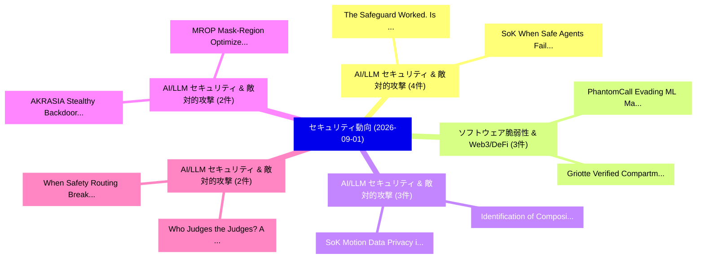

# 📅 02_daily: 日次エグゼクティブサマリー報告書 (2026-09-01)

**集計日時**: 2026-10-02 23:06:25 UTC  
**対象日付**: 2026-09-01  
**本日収集論文数**: 46 件  

---

## 💡 主要セキュリティ動向・脅威インサイト (Executive Insights)

本日の収集論文（計 46 件）において、以下の重点セキュリティ領域で活発な研究動向が確認されました：
- **AI/LLM セキュリティ & 敵対的攻撃** (4 件): 注目論文として 「The Safeguard Worked. Is the L...」、「SoK: When Safe Agents Fail Tog...」 等が発表され、実務防御および攻撃検証の進展が見られます。
- **ソフトウェア脆弱性 & Web3/DeFi** (3 件): 注目論文として 「PhantomCall: Evading ML Malwar...」、「Griotte: Verified Compartmenta...」 等が発表され、実務防御および攻撃検証の進展が見られます。
- **AI/LLM セキュリティ & 敵対的攻撃** (3 件): 注目論文として 「SoK: Motion Data Privacy in Ex...」、「Identification of Compositiona...」 等が発表され、実務防御および攻撃検証の進展が見られます。
- **AI/LLM セキュリティ & 敵対的攻撃** (2 件): 注目論文として 「MROP: Mask-Region Optimized Pu...」、「AKRASIA: Stealthy Backdoor Att...」 等が発表され、実務防御および攻撃検証の進展が見られます。
- **AI/LLM セキュリティ & 敵対的攻撃** (2 件): 注目論文として 「Who Judges the Judges? A Chine...」、「When Safety Routing Breaks: Un...」 等が発表され、実務防御および攻撃検証の進展が見られます。

### 🗺️ 技術・脅威トピックマインドマップ

---

## 📌 日次セキュリティ論文一覧 (日本語表形式)

| No | arXiv ID | 論文タイトル (日本語訳) | 重要キーワード | 構造化エグゼクティブ要約 (背景・提案・影響) | 脅威分類 | 詳細リンク |
|---|---|---|---|---|---|---|
| 1 | `2609.00502v1` | [GlitchLab: A Hardware-in-the-Loop Optimizer for Physical Fault Injection（セキュリティ分析論文）](../../okf/papers/2026-09-01/2609.00502.md) | `Physical Fault Injection`, `Loop Optimizer`, `the-Loop Optimizer` | 【提案】概要 (Overview & Key Finding) 本論文「GlitchLab: A Hardware-in-the-Loop Optimizer for Physica...。実証評価により経営層・セキュリティ管理者向け推奨アクション (E... | `General Cyber Security` | [arXiv](https://arxiv.org/abs/2609.00502v1) &#124; [OKF](../../okf/papers/2026-09-01/2609.00502.md) |
| 2 | `2609.00519v1` | [The Safeguard Worked. Is the LLM System Safer?（セキュリティ分析論文）](../../okf/papers/2026-09-01/2609.00519.md) | `System Safer`, `Pingyu Wu`, `Weiming Zhang` | 【提案】Is the LLM System Safer?。実証評価により経営層・セキュリティ管理者向け推奨アクション (Executive Recommendations) - 組織のセキュリティ設計およびリスク評価基準への影響確認 - 技術チー...。 | `AI/ML Security` | [arXiv](https://arxiv.org/abs/2609.00519v1) &#124; [OKF](../../okf/papers/2026-09-01/2609.00519.md) |
| 3 | `2609.00523v1` | [Transferable End-to-End Optimization for Indirect Long-Term Memory Poisoning in LLMエージェント](../../okf/papers/2026-09-01/2609.00523.md) | `Term Memory Poisoning`, `Transferable End`, `End Optimization` | 【提案】概要 (Overview & Key Finding) 本論文「Transferable End-to-End Optimization for Indirect Long-...。実証評価により経営層・セキュリティ管理者向け推奨アクション (E... | `AI/ML Security` | [arXiv](https://arxiv.org/abs/2609.00523v1) &#124; [OKF](../../okf/papers/2026-09-01/2609.00523.md) |
| 4 | `2609.00578v1` | [Same Request, Different Boundary: Evaluating サイバーセキュリティ Assistance across Conversational Contexts](../../okf/papers/2026-09-01/2609.00578.md) | `Different Boundary`, `Conversational Contexts`, `Evaluating Cybersecurity Assistance` | 【提案】概要 (Overview & Key Finding) 本論文「Same Request, Different Boundary: Evaluating サイバーセキュリティ...。実証評価により経営層・セキュリティ管理者向け推奨アクション (E... | `AI/ML Security` | [arXiv](https://arxiv.org/abs/2609.00578v1) &#124; [OKF](../../okf/papers/2026-09-01/2609.00578.md) |
| 5 | `2609.00595v1` | [SoK: When Safe Agents Fail Together: The Security of Multi Agent LLM Systems（セキュリティ分析論文）](../../okf/papers/2026-09-01/2609.00595.md) | `Multi Agent`, `Rui Yang`, `Junjie Xu` | 【提案】概要 (Overview & Key Finding) 本論文「SoK: When Safe Agents Fail Together: The Security of Mu...。実証評価により経営層・セキュリティ管理者向け推奨アクション (E... | `AI/ML Security` | [arXiv](https://arxiv.org/abs/2609.00595v1) &#124; [OKF](../../okf/papers/2026-09-01/2609.00595.md) |
| 6 | `2609.00604v1` | [NeuroGraph: An AI Graph-Driven Neuro-Symbolic Framework for Explainable Threat Reasoning in Advanced Manufacturing（セキュリティ分析論文）](../../okf/papers/2026-09-01/2609.00604.md) | `Explainable Threat Reasoning`, `Driven Neuro`, `Advanced Manufacturing` | 【提案】概要 (Overview & Key Finding) 本論文「NeuroGraph: An AI Graph-Driven Neuro-Symbolic Framework...。実証評価により経営層・セキュリティ管理者向け推奨アクション (E... | `AI/ML Security` | [arXiv](https://arxiv.org/abs/2609.00604v1) &#124; [OKF](../../okf/papers/2026-09-01/2609.00604.md) |
| 7 | `2609.00609v1` | [A Version Space Approach for Digital Circuit Analysis（セキュリティ分析論文）](../../okf/papers/2026-09-01/2609.00609.md) | `Raw Meta`, `Executive Summary`, `Key Finding` | 【提案】概要 (Overview & Key Finding) 本論文「A Version Space Approach for Digital Circuit Analysis（セ...。実証評価によりThornton - **公開日時**: `202... | `Cryptography` | [arXiv](https://arxiv.org/abs/2609.00609v1) &#124; [OKF](../../okf/papers/2026-09-01/2609.00609.md) |
| 8 | `2609.00676v1` | [Automating Static Code Analysis Through CI/CD Pipeline Integration（セキュリティ分析論文）](../../okf/papers/2026-09-01/2609.00676.md) | `Pipeline Integration`, `Ann Marie Reinhold`, `Software Security` | 【提案】概要 (Overview & Key Finding) 本論文「Automating Static Code Analysis Through CI/CD Pipeline ...。実証評価により経営層・セキュリティ管理者向け推奨アクション (E... | `Software Security` | [arXiv](https://arxiv.org/abs/2609.00676v1) &#124; [OKF](../../okf/papers/2026-09-01/2609.00676.md) |
| 9 | `2609.00705v1` | [PhantomCall: Evading ML Malware Detectors via Function Call Graph Perturbation（セキュリティ分析論文）](../../okf/papers/2026-09-01/2609.00705.md) | `Function Call Graph Perturbation`, `Malware Detectors`, `Md Ajwad Akil` | 【提案】概要 (Overview & Key Finding) 本論文「PhantomCall: Evading ML マルウェア Detectors via Function Ca...。実証評価により経営層・セキュリティ管理者向け推奨アクション (E... | `AI/ML Security` | [arXiv](https://arxiv.org/abs/2609.00705v1) &#124; [OKF](../../okf/papers/2026-09-01/2609.00705.md) |
| 10 | `2609.00708v1` | [Differentially Private Paired Table-Image Multimodal Synthesis（セキュリティ分析論文）](../../okf/papers/2026-09-01/2609.00708.md) | `Differentially Private Paired Table`, `Image Multimodal Synthesis`, `Table-Image Multimodal` | 【提案】概要 (Overview & Key Finding) 本論文「Differentially Private Paired Table-Image Multimodal Sy...。実証評価により経営層・セキュリティ管理者向け推奨アクション (E... | `Privacy & Provenance` | [arXiv](https://arxiv.org/abs/2609.00708v1) &#124; [OKF](../../okf/papers/2026-09-01/2609.00708.md) |
| 11 | `2609.00711v1` | [SoK: Motion Data Privacy in Extended Reality（セキュリティ分析論文）](../../okf/papers/2026-09-01/2609.00711.md) | `Motion Data Privacy`, `Extended Reality`, `Azim Ibragimov` | 【提案】概要 (Overview & Key Finding) 本論文「SoK: Motion Data Privacy in Extended Reality（セキュリティ分析論文...。実証評価によりRagan - **公開日時**: `2026-0... | `Cryptography` | [arXiv](https://arxiv.org/abs/2609.00711v1) &#124; [OKF](../../okf/papers/2026-09-01/2609.00711.md) |
| 12 | `2609.00786v1` | [MROP: Mask-Region Optimized Purification Against Backdoor Attack in Deep JSCC（セキュリティ分析論文）](../../okf/papers/2026-09-01/2609.00786.md) | `Mask-Region Optimized`, `Hyun Jong Yang`, `Network Security` | 【提案】概要 (Overview & Key Finding) 本論文「MROP: Mask-Region Optimized Purification Against Backdo...。実証評価により経営層・セキュリティ管理者向け推奨アクション (E... | `Network Security` | [arXiv](https://arxiv.org/abs/2609.00786v1) &#124; [OKF](../../okf/papers/2026-09-01/2609.00786.md) |
| 13 | `2609.00790v1` | [RISA: Response Inspection and Selective Actions for Refusal Calibration in 大規模言語モデル](../../okf/papers/2026-09-01/2609.00790.md) | `Response Inspection`, `Selective Actions`, `Refusal Calibration` | 【提案】概要 (Overview & Key Finding) 本論文「RISA: Response Inspection and Selective Actions for Ref...。実証評価により経営層・セキュリティ管理者向け推奨アクション (E... | `AI/ML Security` | [arXiv](https://arxiv.org/abs/2609.00790v1) &#124; [OKF](../../okf/papers/2026-09-01/2609.00790.md) |
| 14 | `2609.00806v1` | [Effective Interventions Against AI-Enhanced Scams（セキュリティ分析論文）](../../okf/papers/2026-09-01/2609.00806.md) | `Enhanced Scams`, `AI-Enhanced Scams`, `General Cyber Security` | 【提案】概要 (Overview & Key Finding) 本論文「Effective Interventions Against AI-Enhanced Scams（セキュリテ...。実証評価により経営層・セキュリティ管理者向け推奨アクション (E... | `General Cyber Security` | [arXiv](https://arxiv.org/abs/2609.00806v1) &#124; [OKF](../../okf/papers/2026-09-01/2609.00806.md) |
| 15 | `2609.00873v1` | [Membership Inference in Fine-tuned Diffusion Language Models via Token-level Memorization Asymmetry（セキュリティ分析論文）](../../okf/papers/2026-09-01/2609.00873.md) | `Diffusion Language Models`, `Membership Inference`, `Memorization Asymmetry` | 【提案】概要 (Overview & Key Finding) 本論文「Membership Inference in Fine-tuned Diffusion Language M...。実証評価により経営層・セキュリティ管理者向け推奨アクション (E... | `Privacy & Provenance` | [arXiv](https://arxiv.org/abs/2609.00873v1) &#124; [OKF](../../okf/papers/2026-09-01/2609.00873.md) |
| 16 | `2609.00886v1` | [Using LLMs to Elicit Security Requirements for Service-Oriented Cyber Ranges（セキュリティ分析論文）](../../okf/papers/2026-09-01/2609.00886.md) | `Elicit Security Requirements`, `Oriented Cyber Ranges`, `Service-Oriented Cyber` | 【提案】概要 (Overview & Key Finding) 本論文「Using LLMs to Elicit Security Requirements for Service-...。実証評価により経営層・セキュリティ管理者向け推奨アクション (E... | `AI/ML Security` | [arXiv](https://arxiv.org/abs/2609.00886v1) &#124; [OKF](../../okf/papers/2026-09-01/2609.00886.md) |
| 17 | `2609.00911v1` | [Pricing the DeFi Tail: Do Protocols or Depositors Price Operational Risk?（セキュリティ分析論文）](../../okf/papers/2026-09-01/2609.00911.md) | `Depositors Price Operational Risk`, `Nils Bundi`, `Raw Meta` | 【提案】### (日本語題名: Pricing the DeFi Tail: Do Protocols or Depositors Price Operational Risk?（セ...。実証評価により経営層・セキュリティ管理者向け推奨アクション (E... | `AI/ML Security` | [arXiv](https://arxiv.org/abs/2609.00911v1) &#124; [OKF](../../okf/papers/2026-09-01/2609.00911.md) |
| 18 | `2609.00954v1` | [Influence of Logging Frameworks on Bind9（セキュリティ分析論文）](../../okf/papers/2026-09-01/2609.00954.md) | `Logging Frameworks`, `Network Security`, `Hannes Signer` | 【提案】概要 (Overview & Key Finding) 本論文「Influence of Logging Frameworks on Bind9（セキュリティ分析論文）」（原...。実証評価により経営層・セキュリティ管理者向け推奨アクション (E... | `Network Security` | [arXiv](https://arxiv.org/abs/2609.00954v1) &#124; [OKF](../../okf/papers/2026-09-01/2609.00954.md) |
| 19 | `2609.01023v1` | [AKRASIA: Stealthy Backdoor Attack on Reasoning-based Code LLMs（セキュリティ分析論文）](../../okf/papers/2026-09-01/2609.01023.md) | `Stealthy Backdoor Attack`, `Reasoning-based Code`, `Chou Jin Chua` | 【提案】概要 (Overview & Key Finding) 本論文「AKRASIA: Stealthy Backdoor Attack on Reasoning-based Co...。実証評価により経営層・セキュリティ管理者向け推奨アクション (E... | `AI/ML Security` | [arXiv](https://arxiv.org/abs/2609.01023v1) &#124; [OKF](../../okf/papers/2026-09-01/2609.01023.md) |
| 20 | `2609.01036v1` | [MultiGait: A Multi-Sensor Multi-Perspective Multi-Session Biometric Inference Benchmark and its Dataset（セキュリティ分析論文）](../../okf/papers/2026-09-01/2609.01036.md) | `Session Biometric Inference Benchmark`, `Sensor Multi`, `Perspective Multi` | 【提案】概要 (Overview & Key Finding) 本論文「MultiGait: A Multi-Sensor Multi-Perspective Multi-Sessi...。実証評価により経営層・セキュリティ管理者向け推奨アクション (E... | `Privacy & Provenance` | [arXiv](https://arxiv.org/abs/2609.01036v1) &#124; [OKF](../../okf/papers/2026-09-01/2609.01036.md) |
| 21 | `2609.01046v1` | [HiveTraceGuard-Pro: A Compact Generative Guardrail for Prompt Injection, Jailbreaks, and Adversarial Obfuscation（セキュリティ分析論文）](../../okf/papers/2026-09-01/2609.01046.md) | `Compact Generative Guardrail`, `Prompt Injection`, `Adversarial Obfuscation` | 【提案】概要 (Overview & Key Finding) 本論文「HiveTraceGuard-Pro: A Compact Generative Guardrail for ...。実証評価により経営層・セキュリティ管理者向け推奨アクション (E... | `AI/ML Security` | [arXiv](https://arxiv.org/abs/2609.01046v1) &#124; [OKF](../../okf/papers/2026-09-01/2609.01046.md) |
| 22 | `2609.01050v1` | [What Limits Robustness in Deep Image Watermarking: An Mechanisms and Their Scaling Across Capacitiesの分析](../../okf/papers/2026-09-01/2609.01050.md) | `Deep Image Watermarking`, `Deep Image Watermarki`, `Zbigniew Piotrowski` | 【提案】概要 (Overview & Key Finding) 本論文「What Limits Robustness in Deep Image Watermarking: An M...。実証評価により経営層・セキュリティ管理者向け推奨アクション (E... | `Privacy & Provenance` | [arXiv](https://arxiv.org/abs/2609.01050v1) &#124; [OKF](../../okf/papers/2026-09-01/2609.01050.md) |
| 23 | `2609.01075v1` | [Lacan: Making Accountability in Anonymous Networks Real（セキュリティ分析論文）](../../okf/papers/2026-09-01/2609.01075.md) | `Anonymous Networks Real`, `Making Accountability`, `Naoya Takada` | 【提案】概要 (Overview & Key Finding) 本論文「Lacan: Making Accountability in Anonymous Networks Real...。実証評価により経営層・セキュリティ管理者向け推奨アクション (E... | `Cryptography` | [arXiv](https://arxiv.org/abs/2609.01075v1) &#124; [OKF](../../okf/papers/2026-09-01/2609.01075.md) |
| 24 | `2609.01077v1` | [JENGA: Exploiting Counter-Based RowHammer Countermeasures to Break Real-Time Predictability（セキュリティ分析論文）](../../okf/papers/2026-09-01/2609.01077.md) | `Exploiting Counter`, `Break Real`, `Time Predictability` | 【提案】概要 (Overview & Key Finding) 本論文「JENGA: Exploiting Counter-Based RowHammer Countermeasur...。実証評価により経営層・セキュリティ管理者向け推奨アクション (E... | `AI/ML Security` | [arXiv](https://arxiv.org/abs/2609.01077v1) &#124; [OKF](../../okf/papers/2026-09-01/2609.01077.md) |
| 25 | `2609.01096v1` | [CRSF: Collusion-Resilient Privacy-Preserving Sensor Fusion with Byzantine-Robust Participation（セキュリティ分析論文）](../../okf/papers/2026-09-01/2609.01096.md) | `Preserving Sensor Fusion`, `Resilient Privacy`, `Robust Participation` | 【提案】概要 (Overview & Key Finding) 本論文「CRSF: Collusion-Resilient Privacy-Preserving Sensor Fus...。実証評価により経営層・セキュリティ管理者向け推奨アクション (E... | `Privacy & Provenance` | [arXiv](https://arxiv.org/abs/2609.01096v1) &#124; [OKF](../../okf/papers/2026-09-01/2609.01096.md) |
| 26 | `2609.01110v1` | [Griotte: Verified Compartmentalisation via Capabilities（セキュリティ分析論文）](../../okf/papers/2026-09-01/2609.01110.md) | `Verified Compartmentalisation`, `June Rousseau`, `Linn Georges` | 【提案】概要 (Overview & Key Finding) 本論文「Griotte: Verified Compartmentalisation via Capabilities...。実証評価により経営層・セキュリティ管理者向け推奨アクション (E... | `AI/ML Security` | [arXiv](https://arxiv.org/abs/2609.01110v1) &#124; [OKF](../../okf/papers/2026-09-01/2609.01110.md) |
| 27 | `2609.01121v1` | [Sentinel-Based Failover for QKD-Augmented IPsec Tunnels（セキュリティ分析論文）](../../okf/papers/2026-09-01/2609.01121.md) | `Based Failover`, `Sentinel-Based Failover`, `QKD-Augmented IPsec` | 【提案】概要 (Overview & Key Finding) 本論文「Sentinel-Based Failover for QKD-Augmented IPsec Tunnels...。実証評価により経営層・セキュリティ管理者向け推奨アクション (E... | `Cryptography` | [arXiv](https://arxiv.org/abs/2609.01121v1) &#124; [OKF](../../okf/papers/2026-09-01/2609.01121.md) |
| 28 | `2609.01171v1` | [Johnny Still Receives Spam SMS: Assessing the Robustness of SMS Spam Detection（セキュリティ分析論文）](../../okf/papers/2026-09-01/2609.01171.md) | `Johnny Still Receives Spam`, `Spam Detection`, `Mohamed Ali Kaafar` | 【提案】概要 (Overview & Key Finding) 本論文「Johnny Still Receives Spam SMS: Assessing the Robustnes...。実証評価により経営層・セキュリティ管理者向け推奨アクション (E... | `AI/ML Security` | [arXiv](https://arxiv.org/abs/2609.01171v1) &#124; [OKF](../../okf/papers/2026-09-01/2609.01171.md) |
| 29 | `2609.01174v1` | [A SoK for SoCs: Reading the TI Leaves on AI for Cyber Threat Intelligence Generation and Sharing（セキュリティ分析論文）](../../okf/papers/2026-09-01/2609.01174.md) | `Cyber Threat Intelligence Generation`, `Saastha Vasan`, `Hadjer Benkraouda` | 【提案】概要 (Overview & Key Finding) 本論文「A SoK for SoCs: Reading the TI Leaves on AI for Cyber 脅...。実証評価により経営層・セキュリティ管理者向け推奨アクション (E... | `AI/ML Security` | [arXiv](https://arxiv.org/abs/2609.01174v1) &#124; [OKF](../../okf/papers/2026-09-01/2609.01174.md) |
| 30 | `2609.01185v1` | [Reveree: Diagnosing LLM Reverse-Engineering Agents（セキュリティ分析論文）](../../okf/papers/2026-09-01/2609.01185.md) | `Engineering Agents`, `Reverse-Engineering Agents`, `Hadjer Benkraouda` | 【提案】概要 (Overview & Key Finding) 本論文「Reveree: Diagnosing LLM Reverse-Engineering Agents（セキュリ...。実証評価により経営層・セキュリティ管理者向け推奨アクション (E... | `AI/ML Security` | [arXiv](https://arxiv.org/abs/2609.01185v1) &#124; [OKF](../../okf/papers/2026-09-01/2609.01185.md) |
| 31 | `2609.01186v1` | [Smart Contracts Claimed Vulnerable by the CVE Database, with Labels and Source Locations（セキュリティ分析論文）](../../okf/papers/2026-09-01/2609.01186.md) | `Smart Contracts Claimed Vulnerable`, `Source Locations`, `Software Security` | 【提案】概要 (Overview & Key Finding) 本論文「スマートコントラクトs Claimed Vulnerable by the CVE Database, wit...。実証評価により経営層・セキュリティ管理者向け推奨アクション (E... | `Software Security` | [arXiv](https://arxiv.org/abs/2609.01186v1) &#124; [OKF](../../okf/papers/2026-09-01/2609.01186.md) |
| 32 | `2609.01187v1` | [Athena: Vulnerability-Affected Library Identification via Knowledge Graph Completion（セキュリティ分析論文）](../../okf/papers/2026-09-01/2609.01187.md) | `Affected Library Identification`, `Knowledge Graph Completion`, `Vulnerability-Affected Library` | 【提案】概要 (Overview & Key Finding) 本論文「Athena: 脆弱性-Affected Library Identification via Knowled...。実証評価により経営層・セキュリティ管理者向け推奨アクション (E... | `AI/ML Security` | [arXiv](https://arxiv.org/abs/2609.01187v1) &#124; [OKF](../../okf/papers/2026-09-01/2609.01187.md) |
| 33 | `2609.01192v1` | [Verification of $K$- and Infinite-Step Strong/Weak Anonymity Using Concurrent Compositions（セキュリティ分析論文）](../../okf/papers/2026-09-01/2609.01192.md) | `Weak Anonymity Using Concurrent Compositions`, `Step Strong`, `Infinite-Step Strong` | 【提案】概要 (Overview & Key Finding) 本論文「Verification of $K$- and Infinite-Step Strong/Weak Anon...。実証評価により経営層・セキュリティ管理者向け推奨アクション (E... | `Software Security` | [arXiv](https://arxiv.org/abs/2609.01192v1) &#124; [OKF](../../okf/papers/2026-09-01/2609.01192.md) |
| 34 | `2609.01201v1` | [Identification of Compositional Risks in Data Protection Impact Assessments and Beyond（セキュリティ分析論文）](../../okf/papers/2026-09-01/2609.01201.md) | `Data Protection Impact Assessments`, `Compositional Risks`, `Meiko Jensen` | 【提案】概要 (Overview & Key Finding) 本論文「Identification of Compositional Risks in Data Protectio...。実証評価により経営層・セキュリティ管理者向け推奨アクション (E... | `Privacy & Provenance` | [arXiv](https://arxiv.org/abs/2609.01201v1) &#124; [OKF](../../okf/papers/2026-09-01/2609.01201.md) |
| 35 | `2609.01210v1` | [Who Judges the Judges? A Chinese Safety QA Benchmark for Evaluating LLM Responses and Safety Judges（セキュリティ分析論文）](../../okf/papers/2026-09-01/2609.01210.md) | `Chinese Safety`, `Safety Judges`, `Rui Yang` | 【提案】A Chinese Safety QA Benchmark for Evaluating LLM Responses and Safety Judges ### (日本語題名...。実証評価により経営層・セキュリティ管理者向け推奨アクション (E... | `AI/ML Security` | [arXiv](https://arxiv.org/abs/2609.01210v1) &#124; [OKF](../../okf/papers/2026-09-01/2609.01210.md) |
| 36 | `2609.01222v1` | [What's in Your Agent's Context? Context Privilege Escalation Attacks against AI Agent Harness（セキュリティ分析論文）](../../okf/papers/2026-09-01/2609.01222.md) | `Context Privilege Escalation Attacks`, `Agent Harness`, `Zichuan Li` | 【提案】Context 権限昇格 Attacks against AI Agent Harness ### (日本語題名: What's in Your Agent's Context?。実証評価により経営層・セキュリティ管理者向け推奨アクション (Ex... | `AI/ML Security` | [arXiv](https://arxiv.org/abs/2609.01222v1) &#124; [OKF](../../okf/papers/2026-09-01/2609.01222.md) |
| 37 | `2609.01232v1` | [Position Matters: Feature Inversion Attacks in ViT Split Inference with Token Reduction and Shuffling（セキュリティ分析論文）](../../okf/papers/2026-09-01/2609.01232.md) | `Feature Inversion Attacks`, `Position Matters`, `Split Inference` | 【提案】概要 (Overview & Key Finding) 本論文「Position Matters: Feature Inversion Attacks in ViT Spli...。実証評価により経営層・セキュリティ管理者向け推奨アクション (E... | `Privacy & Provenance` | [arXiv](https://arxiv.org/abs/2609.01232v1) &#124; [OKF](../../okf/papers/2026-09-01/2609.01232.md) |
| 38 | `2609.01235v1` | [MutMem-V2: Cryptographically Authorized Mutation in Persistent Agent Memory Portable Verification and Reproducible Evidence（セキュリティ分析論文）](../../okf/papers/2026-09-01/2609.01235.md) | `Persistent Agent Memory Portable Verification`, `Cryptographically Authorized Mutation`, `Reproducible Evidence` | 【提案】概要 (Overview & Key Finding) 本論文「MutMem-V2: Cryptographically Authorized Mutation in Per...。実証評価により経営層・セキュリティ管理者向け推奨アクション (E... | `AI/ML Security` | [arXiv](https://arxiv.org/abs/2609.01235v1) &#124; [OKF](../../okf/papers/2026-09-01/2609.01235.md) |
| 39 | `2609.01249v1` | [One Prompt Is Enough: Watermark Laundering Through Foundation Image Models（セキュリティ分析論文）](../../okf/papers/2026-09-01/2609.01249.md) | `Jidong Yang`, `Qi Li`, `Wei Zong` | 【提案】概要 (Overview & Key Finding) 本論文「One Prompt Is Enough: Watermark Laundering Through Foun...。実証評価により経営層・セキュリティ管理者向け推奨アクション (E... | `Privacy & Provenance` | [arXiv](https://arxiv.org/abs/2609.01249v1) &#124; [OKF](../../okf/papers/2026-09-01/2609.01249.md) |
| 40 | `2609.01273v1` | [Position: Privacy Is a Claim, Not a Property of Synthetic Data（セキュリティ分析論文）](../../okf/papers/2026-09-01/2609.01273.md) | `Synthetic Data`, `Jiachen Zhao`, `Antonia Januszewicz` | 【提案】背景とセキュリティ上の課題 (Background & Problem) 本研究はサイバー脅威環境におけるセキュリティ構造・脆弱性の検証を目的としています。(主要検出項目: ...。実証評価により経営層・セキュリティ管理者向け推奨アクション (E... | `AI/ML Security` | [arXiv](https://arxiv.org/abs/2609.01273v1) &#124; [OKF](../../okf/papers/2026-09-01/2609.01273.md) |
| 41 | `2609.01326v1` | [Hidden Services Protocol for Mixnets（セキュリティ分析論文）](../../okf/papers/2026-09-01/2609.01326.md) | `Hidden Services Protocol`, `Nicolas Constantinides`, `Mahdi Rahimi` | 【提案】概要 (Overview & Key Finding) 本論文「Hidden Services Protocol for Mixnets（セキュリティ分析論文）」（原題: H...。実証評価により経営層・セキュリティ管理者向け推奨アクション (E... | `Cryptography` | [arXiv](https://arxiv.org/abs/2609.01326v1) &#124; [OKF](../../okf/papers/2026-09-01/2609.01326.md) |
| 42 | `2609.01345v1` | [Cheap Verifiers, Large Blind Spots: Measuring the Reliability Cost of Cost-Saving Cascades（セキュリティ分析論文）](../../okf/papers/2026-09-01/2609.01345.md) | `Large Blind Spots`, `Cheap Verifiers`, `Reliability Cost` | 【提案】概要 (Overview & Key Finding) 本論文「Cheap Verifiers, Large Blind Spots: Measuring the Relia...。実証評価により経営層・セキュリティ管理者向け推奨アクション (E... | `AI/ML Security` | [arXiv](https://arxiv.org/abs/2609.01345v1) &#124; [OKF](../../okf/papers/2026-09-01/2609.01345.md) |
| 43 | `2609.01448v1` | [Verifiable quantum advantage in extremely low depth（セキュリティ分析論文）](../../okf/papers/2026-09-01/2609.01448.md) | `Alexandru Gheorghiu`, `Raw Meta`, `Executive Summary` | 【提案】概要 (Overview & Key Finding) 本論文「Verifiable 量子 advantage in extremely low depth（セキュリティ分析...。実証評価により経営層・セキュリティ管理者向け推奨アクション (E... | `Cryptography` | [arXiv](https://arxiv.org/abs/2609.01448v1) &#124; [OKF](../../okf/papers/2026-09-01/2609.01448.md) |
| 44 | `2609.01455v1` | [When Safety Routing Breaks: Understanding Alignment Fragility under Benign Fine-Tuning（セキュリティ分析論文）](../../okf/papers/2026-09-01/2609.01455.md) | `Understanding Alignment Fragility`, `Benign Fine`, `Yitong Guo` | 【提案】概要 (Overview & Key Finding) 本論文「When Safety Routing Breaks: Understanding Alignment Fra...。実証評価により経営層・セキュリティ管理者向け推奨アクション (E... | `AI/ML Security` | [arXiv](https://arxiv.org/abs/2609.01455v1) &#124; [OKF](../../okf/papers/2026-09-01/2609.01455.md) |
| 45 | `2609.01469v1` | [SVP Is NP-Hard for Some Rank-2 Cyclotomic Modules（セキュリティ分析論文）](../../okf/papers/2026-09-01/2609.01469.md) | `Cyclotomic Modules`, `Rank-2 Cyclotomic`, `Jiaqi Liu` | 【提案】概要 (Overview & Key Finding) 本論文「SVP Is NP-Hard for Some Rank-2 Cyclotomic Modules（セキュリテ...。実証評価により経営層・セキュリティ管理者向け推奨アクション (E... | `Cryptography` | [arXiv](https://arxiv.org/abs/2609.01469v1) &#124; [OKF](../../okf/papers/2026-09-01/2609.01469.md) |
| 46 | `2609.01487v1` | [Defense-as-Skill: Evolving Runtime Guard Skill for Skill-Augmented Agents（セキュリティ分析論文）](../../okf/papers/2026-09-01/2609.01487.md) | `Evolving Runtime Guard Skill`, `Augmented Agents`, `Skill-Augmented Agents` | 【提案】概要 (Overview & Key Finding) 本論文「Defense-as-Skill: Evolving Runtime Guard Skill for Skil...。実証評価により経営層・セキュリティ管理者向け推奨アクション (E... | `AI/ML Security` | [arXiv](https://arxiv.org/abs/2609.01487v1) &#124; [OKF](../../okf/papers/2026-09-01/2609.01487.md) |

