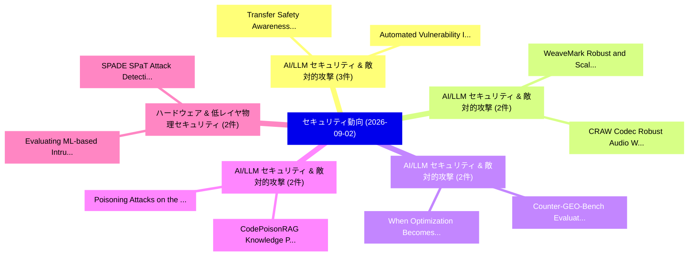

# 📅 02_daily: 日次エグゼクティブサマリー報告書 (2026-09-02)

**集計日時**: 2026-10-02 23:06:25 UTC  
**対象日付**: 2026-09-02  
**本日収集論文数**: 58 件  

---

## 💡 主要セキュリティ動向・脅威インサイト (Executive Insights)

本日の収集論文（計 58 件）において、以下の重点セキュリティ領域で活発な研究動向が確認されました：
- **AI/LLM セキュリティ & 敵対的攻撃** (3 件): 注目論文として 「Transfer Safety Awareness for ...」、「Automated Vulnerability Inject...」 等が発表され、実務防御および攻撃検証の進展が見られます。
- **AI/LLM セキュリティ & 敵対的攻撃** (2 件): 注目論文として 「WeaveMark: Robust and Scalable...」、「CRAW: Codec Robust Audio Water...」 等が発表され、実務防御および攻撃検証の進展が見られます。
- **AI/LLM セキュリティ & 敵対的攻撃** (2 件): 注目論文として 「Counter-GEO-Bench: Evaluating ...」、「When Optimization Becomes Mani...」 等が発表され、実務防御および攻撃検証の進展が見られます。
- **AI/LLM セキュリティ & 敵対的攻撃** (2 件): 注目論文として 「Poisoning Attacks on the PGM-i...」、「CodePoisonRAG: Knowledge Poiso...」 等が発表され、実務防御および攻撃検証の進展が見られます。
- **ハードウェア & 低レイヤ物理セキュリティ** (2 件): 注目論文として 「Evaluating ML-based Intrusion ...」、「SPADE: SPaT Attack Detection f...」 等が発表され、実務防御および攻撃検証の進展が見られます。

### 🗺️ 技術・脅威トピックマインドマップ

---

## 📌 日次セキュリティ論文一覧 (日本語表形式)

| No | arXiv ID | 論文タイトル (日本語訳) | 重要キーワード | 構造化エグゼクティブ要約 (背景・提案・影響) | 脅威分類 | 詳細リンク |
|---|---|---|---|---|---|---|
| 1 | `2609.01992v1` | [ClaimReceipt: Verifying Evidence Sufficiency and Coverage in Agent Evaluations（セキュリティ分析論文）](../../okf/papers/2026-09-02/2609.01992.md) | `Verifying Evidence Sufficiency`, `Agent Evaluations`, `Peiying Zhu` | 【提案】We introduce ClaimReceipt, a claim-relative receipt specification and selective verifie...。実証評価によりAgent evaluations face tw... | `AI/ML Security` | [arXiv](https://arxiv.org/abs/2609.01992v1) &#124; [OKF](../../okf/papers/2026-09-02/2609.01992.md) |
| 2 | `2609.02007v1` | [C$^2$T-OpenMax: A Novel Open-Set WiFi RF Fingerprinting Method via Center Constrained Learning and Confidence-Guided Tail Modeling（セキュリティ分析論文）](../../okf/papers/2026-09-02/2609.02007.md) | `Center Constrained Learning`, `Guided Tail Modeling`, `Open-Set WiFi` | 【提案】To address this problem, we propose C$^2$T-OpenMax, an enhanced OpenMax framework combi...。実証評価によりExperiments on a public W... | `General Cyber Security` | [arXiv](https://arxiv.org/abs/2609.02007v1) &#124; [OKF](../../okf/papers/2026-09-02/2609.02007.md) |
| 3 | `2609.02035v1` | [Implicit Manipulation for Skill Selection in LLMエージェント with Semantic Matching](../../okf/papers/2026-09-02/2609.02035.md) | `Implicit Manipulation`, `Skill Selection`, `Semantic Matching` | 【提案】Based on this observation, we present Implicit Skill-Selection Manipulation via Semanti...。実証評価によりMoreover, ISM remains eff... | `AI/ML Security` | [arXiv](https://arxiv.org/abs/2609.02035v1) &#124; [OKF](../../okf/papers/2026-09-02/2609.02035.md) |
| 4 | `2609.02048v1` | [Type-Directed, Secure-by-Construction Enclave Partitioning for LLVM（セキュリティ分析論文）](../../okf/papers/2026-09-02/2609.02048.md) | `Construction Enclave Partitioning`, `General Cyber Security`, `Construction Enclave Pa` | 【提案】We address these challenges with a three-step approach.。実証評価によりRuntime overhead is dominated by fixed enclave costs for sho... | `General Cyber Security` | [arXiv](https://arxiv.org/abs/2609.02048v1) &#124; [OKF](../../okf/papers/2026-09-02/2609.02048.md) |
| 5 | `2609.02082v2` | [Transfer Safety Awareness for Cross-Modal Safety Drift in Multimodal 大規模言語モデル](../../okf/papers/2026-09-02/2609.02082.md) | `Transfer Safety Awareness`, `Modal Safety Drift`, `Cross-Modal Safety` | 【提案】Motivated by the observation that safety signals from unsafe text processing can be tra...。実証評価によりExperiments across multip... | `AI/ML Security` | [arXiv](https://arxiv.org/abs/2609.02082v2) &#124; [OKF](../../okf/papers/2026-09-02/2609.02082.md) |
| 6 | `2609.02127v1` | [Stored Is Not Supported: Typed Provenance and Assertion Guardrails for Persistent AI Agents（セキュリティ分析論文）](../../okf/papers/2026-09-02/2609.02127.md) | `Typed Provenance`, `Assertion Guardrails`, `Deying Yu` | 【提案】Untrusted inputs, プロンプトインジェクションs, and model inferences can therefore enter persistent s...。実証評価によりThese results validate th... | `AI/ML Security` | [arXiv](https://arxiv.org/abs/2609.02127v1) &#124; [OKF](../../okf/papers/2026-09-02/2609.02127.md) |
| 7 | `2609.02177v1` | [WeaveMark: Robust and Scalable Multi-bit LLM Watermarking via Coded Payload Spreading（セキュリティ分析論文）](../../okf/papers/2026-09-02/2609.02177.md) | `Coded Payload Spreading`, `Scalable Multi`, `Multi-bit LLM` | 【提案】新規に提案し WeaveMark, a robust and scalable multi-bit LLM watermarking scheme based on code...。実証評価によりExperiments show large ga... | `AI/ML Security` | [arXiv](https://arxiv.org/abs/2609.02177v1) &#124; [OKF](../../okf/papers/2026-09-02/2609.02177.md) |
| 8 | `2609.02208v1` | [Agentic Settlement Protocol: An Application Profile for Refundable, Delayed-Fulfilment Agent Commerce on Stablecoin Rails（セキュリティ分析論文）](../../okf/papers/2026-09-02/2609.02208.md) | `Agentic Settlement Protocol`, `Fulfilment Agent Commerce`, `Stablecoin Rails` | 【提案】提示し the Agentic Settlement Protocol (ASP), an application profile over on-chain authori...。実証評価によりThis is a design paper; a... | `AI/ML Security` | [arXiv](https://arxiv.org/abs/2609.02208v1) &#124; [OKF](../../okf/papers/2026-09-02/2609.02208.md) |
| 9 | `2609.02268v1` | [Retrosynthesis of Synthetic Media for Explainable AI Provenance Forensics（セキュリティ分析論文）](../../okf/papers/2026-09-02/2609.02268.md) | `Synthetic Media`, `Provenance Forensics`, `Yijie Lin` | 【提案】In this work, we propose a self-referential retrosynthesis framework for explainable AI...。実証評価によりExperimental results show... | `AI/ML Security` | [arXiv](https://arxiv.org/abs/2609.02268v1) &#124; [OKF](../../okf/papers/2026-09-02/2609.02268.md) |
| 10 | `2609.02293v1` | [SEAL: Reinforcing Global Safety in Mixture-of-Experts through Shared Expert ALignment（セキュリティ分析論文）](../../okf/papers/2026-09-02/2609.02293.md) | `Reinforcing Global Safety`, `Shared Expert`, `Recent Hybrid` | 【提案】Recent Hybrid MoE architecture adds \textit{shared experts} to capture consistently use...。実証評価によりSEAL reduces attack succe... | `AI/ML Security` | [arXiv](https://arxiv.org/abs/2609.02293v1) &#124; [OKF](../../okf/papers/2026-09-02/2609.02293.md) |
| 11 | `2609.02316v1` | [Counter-GEO-Bench: Evaluating Defenses Against Information-Distorting Generative Engine Optimization（セキュリティ分析論文）](../../okf/papers/2026-09-02/2609.02316.md) | `Distorting Generative Engine Optimization`, `Information-Distorting Generative`, `Bing Zheng` | 【提案】Therefore, we present Counter-GEO-Bench, a defense benchmark that pairs 247 human-verif...。実証評価によりTherefore, we present Cou... | `AI/ML Security` | [arXiv](https://arxiv.org/abs/2609.02316v1) &#124; [OKF](../../okf/papers/2026-09-02/2609.02316.md) |
| 12 | `2609.02328v1` | [Poisoning Attacks on the PGM-index（セキュリティ分析論文）](../../okf/papers/2026-09-02/2609.02328.md) | `Poisoning Attacks`, `Atsuki Sato`, `Yusuke Matsui` | 【提案】新規に提案し PGM-attack, an efficient poisoning attack that sequentially inserts adversarial ...。実証評価によりOur experiments show that... | `AI/ML Security` | [arXiv](https://arxiv.org/abs/2609.02328v1) &#124; [OKF](../../okf/papers/2026-09-02/2609.02328.md) |
| 13 | `2609.02376v1` | [Removing Speech, Keeping Activities: A Privacy Firewall for Acoustic Sensing in Assisted Living（セキュリティ分析論文）](../../okf/papers/2026-09-02/2609.02376.md) | `Removing Speech`, `Keeping Activities`, `Privacy Firewall` | 【提案】提示し a privacy firewall pipeline based on a U-Net encoder-decoder, trained entirely on s...。実証評価によりEvaluated on the ESC-50 a... | `Network Security` | [arXiv](https://arxiv.org/abs/2609.02376v1) &#124; [OKF](../../okf/papers/2026-09-02/2609.02376.md) |
| 14 | `2609.02393v1` | [CAPTCHAs in the Agentic Era: Solvers That Learn from Every Encounter（セキュリティ分析論文）](../../okf/papers/2026-09-02/2609.02393.md) | `Agentic Era`, `Every Encounter`, `Oguzhan Salman` | 【提案】Our system pairs a fine-tuned YOLOv8 detector with an open-weight VLM behind a confiden...。実証評価によりIt reaches 85.4% overall ... | `AI/ML Security` | [arXiv](https://arxiv.org/abs/2609.02393v1) &#124; [OKF](../../okf/papers/2026-09-02/2609.02393.md) |
| 15 | `2609.02465v1` | [Can Risk-Based Alerting Mitigate サイバーセキュリティ Alert Fatigue?](../../okf/papers/2026-09-02/2609.02465.md) | `Based Alerting Mitigate Cybersecurity Alert Fatigue`, `Can Risk`, `Risk-Based Alerting` | 【提案】本論文では present the first systematic evaluation of RBA.。実証評価によりOur results show that certain combinations of hypotheses achie... | `Software Security` | [arXiv](https://arxiv.org/abs/2609.02465v1) &#124; [OKF](../../okf/papers/2026-09-02/2609.02465.md) |
| 16 | `2609.02469v1` | [Evaluating ML-based Intrusion Detection Systems: The Illusion of Model Efficacy（セキュリティ分析論文）](../../okf/papers/2026-09-02/2609.02469.md) | `Intrusion Detection Systems`, `ML-based Intrusion`, `Model Efficacy` | 【提案】Improved detection rates, reduced false alarms, and optimized algorithms contribute to ...。実証評価によりThe experimental findings... | `AI/ML Security` | [arXiv](https://arxiv.org/abs/2609.02469v1) &#124; [OKF](../../okf/papers/2026-09-02/2609.02469.md) |
| 17 | `2609.02532v1` | [SpiderSapien: Client-Centric Web Crawler and Security Scanner（セキュリティ分析論文）](../../okf/papers/2026-09-02/2609.02532.md) | `Centric Web Crawler`, `Security Scanner`, `Client-Centric Web` | 【提案】新規に提案し SpiderSapien, a client-centric crawler and security scanner.。実証評価によりThe evaluation of our approach shows substantial... | `AI/ML Security` | [arXiv](https://arxiv.org/abs/2609.02532v1) &#124; [OKF](../../okf/papers/2026-09-02/2609.02532.md) |
| 18 | `2609.02553v1` | [The Shape of Ownership: Verifying LLM Provenance through Semantic Structures（セキュリティ分析論文）](../../okf/papers/2026-09-02/2609.02553.md) | `Semantic Structures`, `Relational Organization`, `Zhongrui Sun` | 【提案】To this end, we introduce PROSE (Provenance through Relational Organization of Semantic...。実証評価によりExtensive experiments acr... | `AI/ML Security` | [arXiv](https://arxiv.org/abs/2609.02553v1) &#124; [OKF](../../okf/papers/2026-09-02/2609.02553.md) |
| 19 | `2609.02564v1` | [A Finger on the Scale: Covert Policy Steering through Agentic Skills（セキュリティ分析論文）](../../okf/papers/2026-09-02/2609.02564.md) | `Covert Policy Steering`, `Agentic Skills`, `Covert Policy Ste` | 【提案】We further present SkillShift, a constrained black-box framework for covert policy stee...。実証評価によりMoreover, the evaluated s... | `AI/ML Security` | [arXiv](https://arxiv.org/abs/2609.02564v1) &#124; [OKF](../../okf/papers/2026-09-02/2609.02564.md) |
| 20 | `2609.02568v1` | [Learning-Based Reconstruction Attacks on Coordinate-Obfuscated Point Clouds（セキュリティ分析論文）](../../okf/papers/2026-09-02/2609.02568.md) | `Based Reconstruction Attacks`, `Obfuscated Point Clouds`, `Learning-Based Reconstruction` | 【提案】Prior work proposed a selective coordinate encryption framework for point clouds that e...。実証評価によりOur results show that rec... | `AI/ML Security` | [arXiv](https://arxiv.org/abs/2609.02568v1) &#124; [OKF](../../okf/papers/2026-09-02/2609.02568.md) |
| 21 | `2609.02624v1` | [Automated Vulnerability Injection in Smart Contracts Using 大規模言語モデル](../../okf/papers/2026-09-02/2609.02624.md) | `Automated Vulnerability Injection`, `Smart Contracts Using Large Language Models`, `Smart Contracts Using` | 【提案】新規に提案し an approach that uses Large Language Models (LLMs) to automatically inject vulne...。実証評価によりResults show that LLM-bas... | `AI/ML Security` | [arXiv](https://arxiv.org/abs/2609.02624v1) &#124; [OKF](../../okf/papers/2026-09-02/2609.02624.md) |
| 22 | `2609.02647v1` | [PrimSynth: An Agentic Approach to Discover, Validate, and Synthesize Exploit Primitives for Linux Kernel Vulnerabilities（セキュリティ分析論文）](../../okf/papers/2026-09-02/2609.02647.md) | `Synthesize Exploit Primitives`, `Linux Kernel Vulnerabilities`, `Pengfei Wang` | 【提案】To fill this gap, this paper introduces a systematic characterization that formalizes s...。実証評価によりExperimental results show... | `AI/ML Security` | [arXiv](https://arxiv.org/abs/2609.02647v1) &#124; [OKF](../../okf/papers/2026-09-02/2609.02647.md) |
| 23 | `2609.02690v1` | [ACLE-MCP: Attested Capability Leases for Execution-Time Trust in Remote LLM Tool Use（セキュリティ分析論文）](../../okf/papers/2026-09-02/2609.02690.md) | `Attested Capability Leases`, `Time Trust`, `Tool Use` | 【提案】提示し ACLE-MCP, an invocation-scoped architecture that couples delegated authorization, w...。実証評価によりControlled security exper... | `AI/ML Security` | [arXiv](https://arxiv.org/abs/2609.02690v1) &#124; [OKF](../../okf/papers/2026-09-02/2609.02690.md) |
| 24 | `2609.02716v1` | [Card-Based Computation in the Virtual Player Simulation Model（セキュリティ分析論文）](../../okf/papers/2026-09-02/2609.02716.md) | `Virtual Player Simulation Model`, `Based Computation`, `Card-Based Computation` | 【提案】We focus on games whose cards admit a publicly known ranking and propose two fundamenta...。実証評価によりThese protocols provide g... | `Cryptography` | [arXiv](https://arxiv.org/abs/2609.02716v1) &#124; [OKF](../../okf/papers/2026-09-02/2609.02716.md) |
| 25 | `2609.02741v1` | [SPADE: SPaT Attack Detection from the Connected Vehicle's Perspective（セキュリティ分析論文）](../../okf/papers/2026-09-02/2609.02741.md) | `Attack Detection`, `Connected Vehicle`, `James Di Novo` | 【提案】Existing intrusion detection research either defends the infrastructure side or targets...。実証評価によりExisting intrusion detect... | `IoT & Hardware Security` | [arXiv](https://arxiv.org/abs/2609.02741v1) &#124; [OKF](../../okf/papers/2026-09-02/2609.02741.md) |
| 26 | `2609.02774v1` | [CodePoisonRAG: Knowledge Poisoning Attacks on Retrieval-Augmented Code Generation（セキュリティ分析論文）](../../okf/papers/2026-09-02/2609.02774.md) | `Knowledge Poisoning Attacks`, `Augmented Code Generation`, `Retrieval-Augmented Code` | 【提案】We introduce CodePoisonRAG, a targeted upstream knowledge-poisoning framework that tran...。実証評価によりAcross three generators, ... | `AI/ML Security` | [arXiv](https://arxiv.org/abs/2609.02774v1) &#124; [OKF](../../okf/papers/2026-09-02/2609.02774.md) |
| 27 | `2609.02786v1` | [SafeEvolve: Harness-Policy Co-Evolution from Agent Experience for Safety Alignment（セキュリティ分析論文）](../../okf/papers/2026-09-02/2609.02786.md) | `Policy Co`, `Agent Experience`, `Safety Alignment` | 【提案】新規に提案し SafeEvolve, an experience-driven self-evolving framework for agent safety alignm...。実証評価によりExperiments on agentic sa... | `AI/ML Security` | [arXiv](https://arxiv.org/abs/2609.02786v1) &#124; [OKF](../../okf/papers/2026-09-02/2609.02786.md) |
| 28 | `2609.02852v1` | [The Implications of Linguistic Illegibility for LLM Security（セキュリティ分析論文）](../../okf/papers/2026-09-02/2609.02852.md) | `Linguistic Illegibility`, `James Mickens`, `Raw Meta` | 【提案】We introduce the term ``linguistic illegibility'' to broadly refer to scenarios in whic...。実証評価によりWe also discuss several a... | `AI/ML Security` | [arXiv](https://arxiv.org/abs/2609.02852v1) &#124; [OKF](../../okf/papers/2026-09-02/2609.02852.md) |
| 29 | `2609.02866v1` | [When Does Authorization End? Effect Closure at Provider Boundaries（セキュリティ分析論文）](../../okf/papers/2026-09-02/2609.02866.md) | `Effect Closure`, `Provider Boundaries`, `General Cyber Security` | 【提案】提示し EFFECTBOUND, which uses an evidence-supported finite contract to decide whether an ...。実証評価によりMachine-checked proofs es... | `General Cyber Security` | [arXiv](https://arxiv.org/abs/2609.02866v1) &#124; [OKF](../../okf/papers/2026-09-02/2609.02866.md) |
| 30 | `2609.02880v1` | [Overcoming the Randomness-Utility Trade-off in Answering Differentially Private Linear Queries（セキュリティ分析論文）](../../okf/papers/2026-09-02/2609.02880.md) | `Answering Differentially Private Linear Queries`, `Utility Trade`, `Randomness-Utility Trade` | 【提案】We provide a randomness-efficient analog of the $\&#124; \cdot \&#124;_K$-norm mechanism of Hardt...。実証評価によりWe also provide a computa... | `Privacy & Provenance` | [arXiv](https://arxiv.org/abs/2609.02880v1) &#124; [OKF](../../okf/papers/2026-09-02/2609.02880.md) |
| 31 | `2609.02958v1` | [PrivateHub: Contrastive Diffusion Model for Private Sensor-Intensive Environment Data Generation（セキュリティ分析論文）](../../okf/papers/2026-09-02/2609.02958.md) | `Intensive Environment Data Generation`, `Contrastive Diffusion Model`, `Private Sensor` | 【提案】Existing approaches such as 差分プライバシー and rule-based filtering protect individual stream...。実証評価によりExperiments on three real... | `Privacy & Provenance` | [arXiv](https://arxiv.org/abs/2609.02958v1) &#124; [OKF](../../okf/papers/2026-09-02/2609.02958.md) |
| 32 | `2609.02964v1` | [When Optimization Becomes Manipulation: Defending Generative Search against Malicious Generative Engine Optimization（セキュリティ分析論文）](../../okf/papers/2026-09-02/2609.02964.md) | `Malicious Generative Engine Optimization`, `Defending Generative Search`, `Haozhang Li` | 【提案】Recent GEO methods have advanced from hand-crafted rewriting to automated and agentic o...。実証評価によりExperiments on two state-... | `AI/ML Security` | [arXiv](https://arxiv.org/abs/2609.02964v1) &#124; [OKF](../../okf/papers/2026-09-02/2609.02964.md) |
| 33 | `2609.02967v1` | [Privacy-Preserving Topology-Guided Safety for LLM-Based Multi-Agent Systems via Federated Graph Learning（セキュリティ分析論文）](../../okf/papers/2026-09-02/2609.02967.md) | `Federated Graph Learning`, `Preserving Topology`, `Guided Safety` | 【提案】Across organizations that assumption breaks: episodes contain private prompts, tool out...。実証評価によりLive FGLGuard cuts AgentD... | `AI/ML Security` | [arXiv](https://arxiv.org/abs/2609.02967v1) &#124; [OKF](../../okf/papers/2026-09-02/2609.02967.md) |
| 34 | `2609.02971v1` | [Privacy Leakage in 連合学習: Gradient-Based Client Identity Inference and Defenses for Inertial Sensing in Vehicular Edge Networks](../../okf/papers/2026-09-02/2609.02971.md) | `Based Client Identity Inference`, `Vehicular Edge Networks`, `Privacy Leakage` | 【提案】Yet the updates clients transmit still leak enough information to identify who sent the...。実証評価によりResults are supported by ... | `Cryptography` | [arXiv](https://arxiv.org/abs/2609.02971v1) &#124; [OKF](../../okf/papers/2026-09-02/2609.02971.md) |
| 35 | `2609.02983v1` | [Boundary-Mutation Testing for Pattern-Based Secret Detection: A Rule-Level Method and Cross-Scanner Evaluation（セキュリティ分析論文）](../../okf/papers/2026-09-02/2609.02983.md) | `Based Secret Detection`, `Mutation Testing`, `Boundary-Mutation Testing` | 【提案】We introduce boundary-mutation testing to vary that context, generating credentials fro...。実証評価によりBecause per-type detectio... | `AI/ML Security` | [arXiv](https://arxiv.org/abs/2609.02983v1) &#124; [OKF](../../okf/papers/2026-09-02/2609.02983.md) |
| 36 | `2609.03036v1` | [Population-Calibrated Graph Screening at 835-Million-Address Scale, with Label-Free Transfer to New Chains（セキュリティ分析論文）](../../okf/papers/2026-09-02/2609.03036.md) | `Calibrated Graph Screening`, `Address Scale`, `Population-Calibrated Graph` | 【提案】We describe a deployed system that scores an address by its position in a multi-chain t...。実証評価によりWe report: label-free tra... | `AI/ML Security` | [arXiv](https://arxiv.org/abs/2609.03036v1) &#124; [OKF](../../okf/papers/2026-09-02/2609.03036.md) |
| 37 | `2609.03055v1` | [Seeing Less Is Not Seeing Safely: Privacy Leakage from Task-Scoped Robot Perception Exports（セキュリティ分析論文）](../../okf/papers/2026-09-02/2609.03055.md) | `Scoped Robot Perception Exports`, `Privacy Leakage`, `Task-Scoped Robot` | 【提案】We introduce Task-Functional Perception Distillation (TFPD), a task-scoped representati...。実証評価によりThese results show that n... | `Cryptography` | [arXiv](https://arxiv.org/abs/2609.03055v1) &#124; [OKF](../../okf/papers/2026-09-02/2609.03055.md) |
| 38 | `2609.03064v1` | [Differentially private 連合学習 with Byzantine-robust aggregation: A cross-domain framework for secure model training in banking and healthcare systems](../../okf/papers/2026-09-02/2609.03064.md) | `Byzantine-robust aggregation`, `Srikumar Nayak`, `Raw Meta` | 【提案】This paper presents a federated learning framework, DP-BR-FedAvg, that combines a Gauss...。実証評価によりThe results show that pri... | `AI/ML Security` | [arXiv](https://arxiv.org/abs/2609.03064v1) &#124; [OKF](../../okf/papers/2026-09-02/2609.03064.md) |
| 39 | `2609.03065v1` | [Distinctness threshold for pseudorandom unitaries（セキュリティ分析論文）](../../okf/papers/2026-09-02/2609.03065.md) | `General Cyber Security`, `Asad Raza`, `Jens Eisert` | 【提案】Yet it appears in two conceptually different forms: statistical pseudorandomness, embod...。実証評価によりWe show that statistical ... | `General Cyber Security` | [arXiv](https://arxiv.org/abs/2609.03065v1) &#124; [OKF](../../okf/papers/2026-09-02/2609.03065.md) |
| 40 | `2609.03096v1` | [A Bayesian Correlated Equilibrium for Early Insider-Threat Detection（セキュリティ分析論文）](../../okf/papers/2026-09-02/2609.03096.md) | `Bayesian Correlated Equilibrium`, `Early Insider`, `Threat Detection` | 【提案】We incorporate present bias and loss aversion to capture impulsive escalation dynamics,...。実証評価によりOn CERT r6.2 our mechanis... | `Privacy & Provenance` | [arXiv](https://arxiv.org/abs/2609.03096v1) &#124; [OKF](../../okf/papers/2026-09-02/2609.03096.md) |
| 41 | `2609.03107v1` | [CRAW: Codec Robust Audio Watermarking（セキュリティ分析論文）](../../okf/papers/2026-09-02/2609.03107.md) | `Codec Robust Audio Watermarking`, `codec-robust audio`, `David Chernin` | 【提案】Here we introduce CRAW, a codec-robust audio watermarking framework that jointly improv...。実証評価によりExperiments demonstrate t... | `AI/ML Security` | [arXiv](https://arxiv.org/abs/2609.03107v1) &#124; [OKF](../../okf/papers/2026-09-02/2609.03107.md) |
| 42 | `2609.03133v1` | [SecDT: A Profile-Based Security Layer for TRDP Communications（セキュリティ分析論文）](../../okf/papers/2026-09-02/2609.03133.md) | `Based Security Layer`, `Profile-Based Security`, `Erlantz Alonso` | 【提案】This paper presents a lightweight security layer for secure TRDP communication that imp...。実証評価によりExperimental results demo... | `Cryptography` | [arXiv](https://arxiv.org/abs/2609.03133v1) &#124; [OKF](../../okf/papers/2026-09-02/2609.03133.md) |
| 43 | `2609.03139v1` | [Beyond Small Patches: Black-Box Detection and Purification of Diverse Backdoor Triggers（セキュリティ分析論文）](../../okf/papers/2026-09-02/2609.03139.md) | `Beyond Small Patches`, `Diverse Backdoor Triggers`, `Box Detection` | 【提案】新規に提案し TRIM (Trigger Removal by Identifying Manipulated Regions), a deployment-oriented...。実証評価によりExtensive experiments acr... | `Network Security` | [arXiv](https://arxiv.org/abs/2609.03139v1) &#124; [OKF](../../okf/papers/2026-09-02/2609.03139.md) |
| 44 | `iacr-2014-243` | [Reusable Fuzzy Extractors for Low-Entropy Distributions（セキュリティ分析論文）](../../okf/papers/2026-09-02/iacr-2014-243.md) | `Reusable Fuzzy Extractors`, `Entropy Distributions`, `Low-Entropy Distributions` | 【提案】概要 (Overview & Key Finding) 本論文「Reusable Fuzzy Extractors for Low-Entropy Distributions...。実証評価により経営層・セキュリティ管理者向け推奨アクション (E... | `AI/ML Security` | [arXiv](https://arxiv.org/abs/iacr-2014-243) &#124; [OKF](../../okf/papers/2026-09-02/iacr-2014-243.md) |
| 45 | `iacr-2025-407` | [Adaptively Secure Hierarchical Attribute-Based Encryption from Witness Encryption（セキュリティ分析論文）](../../okf/papers/2026-09-02/iacr-2025-407.md) | `Adaptively Secure Hierarchical Attribute`, `Based Encryption`, `Witness Encryption` | 【提案】概要 (Overview & Key Finding) 本論文「Adaptively Secure Hierarchical Attribute-Based Encrypti...。実証評価により経営層・セキュリティ管理者向け推奨アクション (E... | `AI/ML Security` | [arXiv](https://arxiv.org/abs/iacr-2025-407) &#124; [OKF](../../okf/papers/2026-09-02/iacr-2025-407.md) |
| 46 | `iacr-2026-001` | [The Cokernel Pairing（セキュリティ分析論文）](../../okf/papers/2026-09-02/iacr-2026-001.md) | `Raw Meta`, `Executive Summary`, `Key Finding` | 【提案】概要 (Overview & Key Finding) 本論文「The Cokernel Pairing（セキュリティ分析論文）」（原題: The Cokernel Pair...。実証評価により経営層・セキュリティ管理者向け推奨アクション (E... | `Cryptography` | [arXiv](https://arxiv.org/abs/iacr-2026-001) &#124; [OKF](../../okf/papers/2026-09-02/iacr-2026-001.md) |
| 47 | `iacr-2026-1086` | [A Machine-Checked EUF-CMA Proof for the Hybrid Fiat-Shamir Signature Scheme（セキュリティ分析論文）](../../okf/papers/2026-09-02/iacr-2026-1086.md) | `Shamir Signature Scheme`, `Hybrid Fiat`, `Machine-Checked EUF` | 【提案】概要 (Overview & Key Finding) 本論文「A Machine-Checked EUF-CMA Proof for the Hybrid Fiat-Sha...。実証評価により経営層・セキュリティ管理者向け推奨アクション (E... | `Cryptography` | [arXiv](https://arxiv.org/abs/iacr-2026-1086) &#124; [OKF](../../okf/papers/2026-09-02/iacr-2026-1086.md) |
| 48 | `iacr-2026-1533` | [Correcting the modulus switch error in TFHE bootstrapping for real-valued computation（セキュリティ分析論文）](../../okf/papers/2026-09-02/iacr-2026-1533.md) | `real-valued computation`, `Raw Meta`, `Executive Summary` | 【提案】概要 (Overview & Key Finding) 本論文「Correcting the modulus switch error in TFHE bootstrappi...。実証評価により経営層・セキュリティ管理者向け推奨アクション (E... | `AI/ML Security` | [arXiv](https://arxiv.org/abs/iacr-2026-1533) &#124; [OKF](../../okf/papers/2026-09-02/iacr-2026-1533.md) |
| 49 | `iacr-2026-1587` | [Solving the Shortest Vector Problem in $2^{0.7314n+o(n)}$ Time via Discrete Gaussian Sampling on Superlattices（セキュリティ分析論文）](../../okf/papers/2026-09-02/iacr-2026-1587.md) | `Shortest Vector Problem`, `Discrete Gaussian Sampling`, `Raw Meta` | 【提案】概要 (Overview & Key Finding) 本論文「Solving the Shortest Vector Problem in $2^{0.7314n+o(n)...。実証評価により経営層・セキュリティ管理者向け推奨アクション (E... | `Cryptography` | [arXiv](https://arxiv.org/abs/iacr-2026-1587) &#124; [OKF](../../okf/papers/2026-09-02/iacr-2026-1587.md) |
| 50 | `iacr-2026-1650` | [D-James: Ultra Short Multivariate Signatures（セキュリティ分析論文）](../../okf/papers/2026-09-02/iacr-2026-1650.md) | `Ultra Short Multivariate Signatures`, `Raw Meta`, `Executive Summary` | 【提案】概要 (Overview & Key Finding) 本論文「D-James: Ultra Short Multivariate Signatures（セキュリティ分析論文...。実証評価により経営層・セキュリティ管理者向け推奨アクション (E... | `AI/ML Security` | [arXiv](https://arxiv.org/abs/iacr-2026-1650) &#124; [OKF](../../okf/papers/2026-09-02/iacr-2026-1650.md) |
| 51 | `iacr-2026-1693` | [The ePrint:2026/1591 Quantum Algorithm Does Not Solve DCP（セキュリティ分析論文）](../../okf/papers/2026-09-02/iacr-2026-1693.md) | `Raw Meta`, `Executive Summary`, `Key Finding` | 【提案】背景とセキュリティ上の課題 (Background & Problem) 本研究はサイバー脅威環境におけるセキュリティ構造・脆弱性の検証を目的としています。(主要検出項目: ...。実証評価により経営層・セキュリティ管理者向け推奨アクション (E... | `AI/ML Security` | [arXiv](https://arxiv.org/abs/iacr-2026-1693) &#124; [OKF](../../okf/papers/2026-09-02/iacr-2026-1693.md) |
| 52 | `iacr-2026-1844` | [Discrete Gaussian Sampling Meets BDGL Decoding: Solving the Shortest Vector Problem in $2^{0.5596n+o(n)}$ Time（セキュリティ分析論文）](../../okf/papers/2026-09-02/iacr-2026-1844.md) | `Discrete Gaussian Sampling Meets`, `Shortest Vector Problem`, `Raw Meta` | 【提案】概要 (Overview & Key Finding) 本論文「Discrete Gaussian Sampling Meets BDGL Decoding: Solving...。実証評価により経営層・セキュリティ管理者向け推奨アクション (E... | `Cryptography` | [arXiv](https://arxiv.org/abs/iacr-2026-1844) &#124; [OKF](../../okf/papers/2026-09-02/iacr-2026-1844.md) |
| 53 | `iacr-2026-1845` | [Lattice-based NIKE with optimal tightness（セキュリティ分析論文）](../../okf/papers/2026-09-02/iacr-2026-1845.md) | `Lattice-based NIKE`, `Raw Meta`, `Executive Summary` | 【提案】概要 (Overview & Key Finding) 本論文「Lattice-based NIKE with optimal tightness（セキュリティ分析論文）」（...。実証評価により経営層・セキュリティ管理者向け推奨アクション (E... | `Cryptography` | [arXiv](https://arxiv.org/abs/iacr-2026-1845) &#124; [OKF](../../okf/papers/2026-09-02/iacr-2026-1845.md) |
| 54 | `iacr-2026-1846` | [Covert 連合学習 under Regulation based on Threshold Anamorphic Encryption](../../okf/papers/2026-09-02/iacr-2026-1846.md) | `Threshold Anamorphic Encryption`, `Covert Federated Learning`, `Raw Meta` | 【提案】概要 (Overview & Key Finding) 本論文「Covert 連合学習 under Regulation based on Threshold Anamorp...。実証評価により経営層・セキュリティ管理者向け推奨アクション (E... | `Cryptography` | [arXiv](https://arxiv.org/abs/iacr-2026-1846) &#124; [OKF](../../okf/papers/2026-09-02/iacr-2026-1846.md) |
| 55 | `iacr-2026-352` | [Post-Quantum Migration for Bitcoin and Ethereum: Hidden-Key Proofs, Finalization, and Enforcement（セキュリティ分析論文）](../../okf/papers/2026-09-02/iacr-2026-352.md) | `Quantum Migration`, `Key Proofs`, `Post-Quantum Migration` | 【提案】概要 (Overview & Key Finding) 本論文「Post-量子 Migration for Bitcoin and Ethereum: Hidden-Key ...。実証評価により経営層・セキュリティ管理者向け推奨アクション (E... | `AI/ML Security` | [arXiv](https://arxiv.org/abs/iacr-2026-352) &#124; [OKF](../../okf/papers/2026-09-02/iacr-2026-352.md) |
| 56 | `iacr-2026-386` | [Determining those Boolean functions whose restrictions to affine spaces are plateaued（セキュリティ分析論文）](../../okf/papers/2026-09-02/iacr-2026-386.md) | `Raw Meta`, `Executive Summary`, `Key Finding` | 【提案】概要 (Overview & Key Finding) 本論文「Determining those Boolean functions whose restrictions ...。実証評価により経営層・セキュリティ管理者向け推奨アクション (E... | `Cryptography` | [arXiv](https://arxiv.org/abs/iacr-2026-386) &#124; [OKF](../../okf/papers/2026-09-02/iacr-2026-386.md) |
| 57 | `iacr-2026-872` | [Privacy Coins Under Viewing Key Compromise（セキュリティ分析論文）](../../okf/papers/2026-09-02/iacr-2026-872.md) | `Raw Meta`, `Executive Summary`, `Key Finding` | 【提案】概要 (Overview & Key Finding) 本論文「Privacy Coins Under Viewing Key Compromise（セキュリティ分析論文）」...。実証評価により経営層・セキュリティ管理者向け推奨アクション (E... | `Cryptography` | [arXiv](https://arxiv.org/abs/iacr-2026-872) &#124; [OKF](../../okf/papers/2026-09-02/iacr-2026-872.md) |
| 58 | `iacr-2026-980` | [Key-Independent Secret-Key Distinguisher for 7-Round AES based on the Joint Generalized Zero-Difference Property（セキュリティ分析論文）](../../okf/papers/2026-09-02/iacr-2026-980.md) | `Joint Generalized Zero`, `Independent Secret`, `Key Distinguisher` | 【提案】概要 (Overview & Key Finding) 本論文「Key-Independent Secret-Key Distinguisher for 7-Round AE...。実証評価により経営層・セキュリティ管理者向け推奨アクション (E... | `AI/ML Security` | [arXiv](https://arxiv.org/abs/iacr-2026-980) &#124; [OKF](../../okf/papers/2026-09-02/iacr-2026-980.md) |

