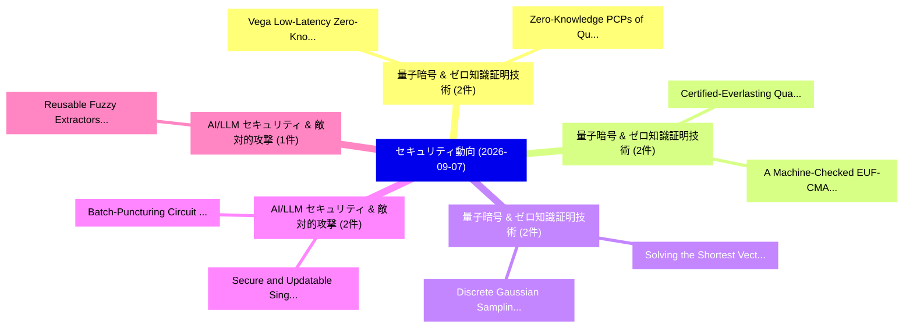

# 📅 02_daily: 日次エグゼクティブサマリー報告書 (2026-09-07)

**集計日時**: 2026-10-02 23:06:25 UTC  
**対象日付**: 2026-09-07  
**本日収集論文数**: 32 件  

---

## 💡 主要セキュリティ動向・脅威インサイト (Executive Insights)

本日の収集論文（計 32 件）において、以下の重点セキュリティ領域で活発な研究動向が確認されました：
- **量子暗号 & ゼロ知識証明技術** (2 件): 注目論文として 「Vega: Low-Latency Zero-Knowled...」、「Zero-Knowledge PCPs of Quasili...」 等が発表され、実務防御および攻撃検証の進展が見られます。
- **量子暗号 & ゼロ知識証明技術** (2 件): 注目論文として 「Certified-Everlasting Quantum ...」、「A Machine-Checked EUF-CMA Proo...」 等が発表され、実務防御および攻撃検証の進展が見られます。
- **量子暗号 & ゼロ知識証明技術** (2 件): 注目論文として 「Solving the Shortest Vector Pr...」、「Discrete Gaussian Sampling Mee...」 等が発表され、実務防御および攻撃検証の進展が見られます。
- **AI/LLM セキュリティ & 敵対的攻撃** (2 件): 注目論文として 「Batch-Puncturing Circuit CP-AB...」、「Secure and Updatable Single Pa...」 等が発表され、実務防御および攻撃検証の進展が見られます。
- **AI/LLM セキュリティ & 敵対的攻撃** (1 件): 注目論文として 「Reusable Fuzzy Extractors for ...」 等が発表され、実務防御および攻撃検証の進展が見られます。

### 🗺️ 技術・脅威トピックマインドマップ

---

## 📌 日次セキュリティ論文一覧 (日本語表形式)

| No | arXiv ID | 論文タイトル (日本語訳) | 重要キーワード | 構造化エグゼクティブ要約 (背景・提案・影響) | 脅威分類 | 詳細リンク |
|---|---|---|---|---|---|---|
| 1 | `iacr-2014-243` | [Reusable Fuzzy Extractors for Low-Entropy Distributions（セキュリティ分析論文）](../../okf/papers/2026-09-07/iacr-2014-243.md) | `Reusable Fuzzy Extractors`, `Entropy Distributions`, `Low-Entropy Distributions` | 【提案】To eliminate noise, they require an initial enrollment phase that takes the first noisy...。実証評価によりThe extractor works for b... | `AI/ML Security` | [arXiv](https://arxiv.org/abs/iacr-2014-243) &#124; [OKF](../../okf/papers/2026-09-07/iacr-2014-243.md) |
| 2 | `iacr-2024-1580` | [Polynomial Time Cryptanalytic Extraction of Deep Neural Networks in the Hard-Label Setting (Extended Version)（セキュリティ分析論文）](../../okf/papers/2026-09-07/iacr-2024-1580.md) | `Polynomial Time Cryptanalytic Extraction`, `Deep Neural Networks`, `Label Setting` | 【提案】They proposed an extraction method that uses a polynomial number of oracle queries but ...。実証評価によりOur results show that, fo... | `Cryptography` | [arXiv](https://arxiv.org/abs/iacr-2024-1580) &#124; [OKF](../../okf/papers/2026-09-07/iacr-2024-1580.md) |
| 3 | `iacr-2025-1957` | [Fast Batch Matrix Multiplication in Ciphertexts（セキュリティ分析論文）](../../okf/papers/2026-09-07/iacr-2025-1957.md) | `Fast Batch Matrix Multiplication`, `Raw Meta`, `Executive Summary` | 【提案】Recently, Bae et al.~(Crypto’24) and Park~(Eurocrypt’25) introduced novel algorithms fo...。実証評価によりFor a $64 \times 2048$ by... | `AI/ML Security` | [arXiv](https://arxiv.org/abs/iacr-2025-1957) &#124; [OKF](../../okf/papers/2026-09-07/iacr-2025-1957.md) |
| 4 | `iacr-2025-1965` | [Auntie: Unobservable Contracts from Zerocash and Trusted Execution Environments（セキュリティ分析論文）](../../okf/papers/2026-09-07/iacr-2025-1965.md) | `Trusted Execution Environments`, `Unobservable Contracts`, `Raw Meta` | 【提案】This work reconciles the two worlds and develops a lightweight protocol for decentraliz...。実証評価によりThis is achieved by lever... | `AI/ML Security` | [arXiv](https://arxiv.org/abs/iacr-2025-1965) &#124; [OKF](../../okf/papers/2026-09-07/iacr-2025-1965.md) |
| 5 | `iacr-2025-2021` | [TreeCast: Multi-Party Key Establishment Protocol for IoT Devices（セキュリティ分析論文）](../../okf/papers/2026-09-07/iacr-2025-2021.md) | `Party Key Establishment Protocol`, `Multi-Party Key`, `Raw Meta` | 【提案】新規に提案し TreeCast, a distributed group key establishment protocol that organizes devices ...。実証評価によりOur measurements show tha... | `AI/ML Security` | [arXiv](https://arxiv.org/abs/iacr-2025-2021) &#124; [OKF](../../okf/papers/2026-09-07/iacr-2025-2021.md) |
| 6 | `iacr-2025-2094` | [Vega: Low-Latency Zero-Knowledge Proofs over Existing Credentials（セキュリティ分析論文）](../../okf/papers/2026-09-07/iacr-2025-2094.md) | `Latency Zero`, `Knowledge Proofs`, `Existing Credentials` | 【提案】提示し Vega, a practical zero-knowledge proof system that proves statements about existing...。実証評価によりVega is simple, does not ... | `Cryptography` | [arXiv](https://arxiv.org/abs/iacr-2025-2094) &#124; [OKF](../../okf/papers/2026-09-07/iacr-2025-2094.md) |
| 7 | `iacr-2025-2236` | [Extending the SPHINCS+ Framework: Varying the Tree Heights and Chain Lengths（セキュリティ分析論文）](../../okf/papers/2026-09-07/iacr-2025-2236.md) | `Tree Heights`, `Chain Lengths`, `Raw Meta` | 【提案】The SPHINCS+ framework provides the underlying architecture for modern 量子 resistant sta...。実証評価によりWe give a reduction showi... | `Cryptography` | [arXiv](https://arxiv.org/abs/iacr-2025-2236) &#124; [OKF](../../okf/papers/2026-09-07/iacr-2025-2236.md) |
| 8 | `iacr-2025-2262` | [Certified-Everlasting Quantum NIZK Proofs（セキュリティ分析論文）](../../okf/papers/2026-09-07/iacr-2025-2262.md) | `Everlasting Quantum`, `Certified-Everlasting Quantum`, `CE-ZK property` | 【提案】The CE-ZK property allows a verifier of a 量子 proof to revoke the proof in a way that ca...。実証評価によりAs a result, we obtain CE... | `AI/ML Security` | [arXiv](https://arxiv.org/abs/iacr-2025-2262) &#124; [OKF](../../okf/papers/2026-09-07/iacr-2025-2262.md) |
| 9 | `iacr-2025-407` | [Adaptively Secure Hierarchical Attribute-Based Encryption from Witness Encryption（セキュリティ分析論文）](../../okf/papers/2026-09-07/iacr-2025-407.md) | `Adaptively Secure Hierarchical Attribute`, `Based Encryption`, `Witness Encryption` | 【提案】An $\textbf{adaptively-secure}$ HABE scheme for the same class, again supporting an $\t...。実証評価によりBeyond identity-based pre... | `AI/ML Security` | [arXiv](https://arxiv.org/abs/iacr-2025-407) &#124; [OKF](../../okf/papers/2026-09-07/iacr-2025-407.md) |
| 10 | `iacr-2025-908` | [SubLogarithmic Linear Time SNARKs from Improved Sum-Check（セキュリティ分析論文）](../../okf/papers/2026-09-07/iacr-2025-908.md) | `Linear Time`, `Improved Sum`, `Raw Meta` | 【提案】Our protocol leverages recently proposed multilinear polynomial commitment schemes (PCS...。実証評価によりFor circuits of size $2^{... | `AI/ML Security` | [arXiv](https://arxiv.org/abs/iacr-2025-908) &#124; [OKF](../../okf/papers/2026-09-07/iacr-2025-908.md) |
| 11 | `iacr-2026-001` | [The Cokernel Pairing（セキュリティ分析論文）](../../okf/papers/2026-09-07/iacr-2026-001.md) | `non-degenerate pairing`, `Raw Meta`, `Executive Summary` | 【提案】The Weil pairing is a non-degenerate pairing $E[m] \times E[m] \to \mu_{m}$, which oper...。実証評価によりThis finds natural applic... | `Cryptography` | [arXiv](https://arxiv.org/abs/iacr-2026-001) &#124; [OKF](../../okf/papers/2026-09-07/iacr-2026-001.md) |
| 12 | `iacr-2026-051` | [An Improved Randomized AKS-class Primality Proving Algorithm（セキュリティ分析論文）](../../okf/papers/2026-09-07/iacr-2026-051.md) | `Primality Proving Algorithm`, `AKS-class Primality`, `Raw Meta` | 【提案】提示し an improved AKS condition $\binom {e \cdot &#124;S&#124;+ de - 1}{de - 1} \ge n^{\lceil \sqrt...。実証評価によりAs a result, we reduce bo... | `Cryptography` | [arXiv](https://arxiv.org/abs/iacr-2026-051) &#124; [OKF](../../okf/papers/2026-09-07/iacr-2026-051.md) |
| 13 | `iacr-2026-1086` | [A Machine-Checked EUF-CMA Proof for the Hybrid Fiat-Shamir Signature Scheme（セキュリティ分析論文）](../../okf/papers/2026-09-07/iacr-2026-1086.md) | `Shamir Signature Scheme`, `Hybrid Fiat`, `Machine-Checked EUF` | 【提案】This paper presents the first machine-checked proof of EUF-CMA security for the FS-FS h...。実証評価によりThe proof is parametrised... | `Cryptography` | [arXiv](https://arxiv.org/abs/iacr-2026-1086) &#124; [OKF](../../okf/papers/2026-09-07/iacr-2026-1086.md) |
| 14 | `iacr-2026-1135` | [Private Information Retrieval: A Tutorial and Survey（セキュリティ分析論文）](../../okf/papers/2026-09-07/iacr-2026-1135.md) | `Private Information Retrieval`, `Raw Meta`, `Executive Summary` | 【提案】Although conceptually simple, these schemes capture the main ideas underlying mainstrea...。実証評価によりWe hope this article help... | `Cryptography` | [arXiv](https://arxiv.org/abs/iacr-2026-1135) &#124; [OKF](../../okf/papers/2026-09-07/iacr-2026-1135.md) |
| 15 | `iacr-2026-1533` | [Correcting the modulus switch error in TFHE bootstrapping for real-valued computation（セキュリティ分析論文）](../../okf/papers/2026-09-07/iacr-2026-1533.md) | `real-valued computation`, `Raw Meta`, `Executive Summary` | 【提案】新規に提案し a correction algorithm based on a first-order Taylor expansion, applied after bo...。実証評価によりWe support our constructi... | `AI/ML Security` | [arXiv](https://arxiv.org/abs/iacr-2026-1533) &#124; [OKF](../../okf/papers/2026-09-07/iacr-2026-1533.md) |
| 16 | `iacr-2026-1587` | [Solving the Shortest Vector Problem in $2^{0.7314n+o(n)}$ Time via Discrete Gaussian Sampling on Superlattices（セキュリティ分析論文）](../../okf/papers/2026-09-07/iacr-2026-1587.md) | `Shortest Vector Problem`, `Discrete Gaussian Sampling`, `Raw Meta` | 【提案】The algorithm constructs a random prime-index superlattice $\Gamma\supset \mathcal{L}$ ...。実証評価によりThen it simply scans the ... | `Cryptography` | [arXiv](https://arxiv.org/abs/iacr-2026-1587) &#124; [OKF](../../okf/papers/2026-09-07/iacr-2026-1587.md) |
| 17 | `iacr-2026-1650` | [D-James: Ultra Short Multivariate Signatures（セキュリティ分析論文）](../../okf/papers/2026-09-07/iacr-2026-1650.md) | `Ultra Short Multivariate Signatures`, `Raw Meta`, `Executive Summary` | 【提案】We introduce James and D-James, the latter achieving signatures of only 156 bits at the...。実証評価によりWe introduce James and D-... | `AI/ML Security` | [arXiv](https://arxiv.org/abs/iacr-2026-1650) &#124; [OKF](../../okf/papers/2026-09-07/iacr-2026-1650.md) |
| 18 | `iacr-2026-1693` | [The ePrint:2026/1591 Quantum Algorithm Does Not Solve DCP（セキュリティ分析論文）](../../okf/papers/2026-09-07/iacr-2026-1693.md) | `Raw Meta`, `Executive Summary`, `Key Finding` | 【提案】We emphasize that our result is not merely about Simon's analysis of his algorithm; we ...。実証評価によりWe emphasize that our res... | `AI/ML Security` | [arXiv](https://arxiv.org/abs/iacr-2026-1693) &#124; [OKF](../../okf/papers/2026-09-07/iacr-2026-1693.md) |
| 19 | `iacr-2026-1844` | [Discrete Gaussian Sampling Meets BDGL Decoding: Solving the Shortest Vector Problem in $2^{0.5596n+o(n)}$ Time（セキュリティ分析論文）](../../okf/papers/2026-09-07/iacr-2026-1844.md) | `Discrete Gaussian Sampling Meets`, `Shortest Vector Problem`, `Raw Meta` | 【提案】Gao, Feng, and Hu (GFH) subsequently introduced DGS on random prime-index superlattices...。実証評価によりAs a result, we obtain a ... | `Cryptography` | [arXiv](https://arxiv.org/abs/iacr-2026-1844) &#124; [OKF](../../okf/papers/2026-09-07/iacr-2026-1844.md) |
| 20 | `iacr-2026-1845` | [Lattice-based NIKE with optimal tightness（セキュリティ分析論文）](../../okf/papers/2026-09-07/iacr-2026-1845.md) | `Lattice-based NIKE`, `non-interactive key`, `Raw Meta` | 【提案】In this work we present a new variant of the non-interactive key exchange (NIKE) scheme...。実証評価によりIn this work we present a... | `Cryptography` | [arXiv](https://arxiv.org/abs/iacr-2026-1845) &#124; [OKF](../../okf/papers/2026-09-07/iacr-2026-1845.md) |
| 21 | `iacr-2026-1846` | [Covert 連合学習 under Regulation based on Threshold Anamorphic Encryption](../../okf/papers/2026-09-07/iacr-2026-1846.md) | `Threshold Anamorphic Encryption`, `Covert Federated Learning`, `Raw Meta` | 【提案】Then we propose \textbf{TAKyber}, a concrete instantiation of TAE constructed from the ...。実証評価によりFurthermore, TAKyber dist... | `Cryptography` | [arXiv](https://arxiv.org/abs/iacr-2026-1846) &#124; [OKF](../../okf/papers/2026-09-07/iacr-2026-1846.md) |
| 22 | `iacr-2026-1861` | [Anonymous Attribute-Based Signcryption: Definitions, Constructions, and Applications（セキュリティ分析論文）](../../okf/papers/2026-09-07/iacr-2026-1861.md) | `Anonymous Attribute`, `Based Signcryption`, `Attribute-Based Signcryption` | 【提案】Specifically, we begin by establishing the syntax and security notions for A$^2$BSC wit...。実証評価によりThen, we construct a Spec... | `Cryptography` | [arXiv](https://arxiv.org/abs/iacr-2026-1861) &#124; [OKF](../../okf/papers/2026-09-07/iacr-2026-1861.md) |
| 23 | `iacr-2026-1868` | [Zero-Knowledge PCPs of Quasilinear Size via Locally Simulatable Sheaf Codes（セキュリティ分析論文）](../../okf/papers/2026-09-07/iacr-2026-1868.md) | `Locally Simulatable Sheaf Codes`, `Quasilinear Size`, `Zero-Knowledge PCPs` | 【提案】This strictly improves on the polynomial-length zero-knowledge PCPs of Gur, O'Connor, a...。実証評価によりWe show that for every po... | `Cryptography` | [arXiv](https://arxiv.org/abs/iacr-2026-1868) &#124; [OKF](../../okf/papers/2026-09-07/iacr-2026-1868.md) |
| 24 | `iacr-2026-228` | [SCA-MAYO: Demystifying Side-channel Security of MAYO Signature Scheme（セキュリティ分析論文）](../../okf/papers/2026-09-07/iacr-2026-228.md) | `Demystifying Side`, `Signature Scheme`, `Side-channel Security` | 【提案】Finally, we discuss how the underlying attack methodology extends to other MQ-based sig...。実証評価によりFinally, we discuss how t... | `Cryptography` | [arXiv](https://arxiv.org/abs/iacr-2026-228) &#124; [OKF](../../okf/papers/2026-09-07/iacr-2026-228.md) |
| 25 | `iacr-2026-352` | [Post-Quantum Migration for Bitcoin and Ethereum: Hidden-Key Proofs, Finalization, and Enforcement（セキュリティ分析論文）](../../okf/papers/2026-09-07/iacr-2026-352.md) | `Quantum Migration`, `Key Proofs`, `Post-Quantum Migration` | 【提案】新規に提案し a migration design that separates revealed-key and hidden-key credentials.。実証評価によりThe design adds one-way migration-... | `AI/ML Security` | [arXiv](https://arxiv.org/abs/iacr-2026-352) &#124; [OKF](../../okf/papers/2026-09-07/iacr-2026-352.md) |
| 26 | `iacr-2026-386` | [Determining those Boolean functions whose restrictions to affine spaces are plateaued（セキュリティ分析論文）](../../okf/papers/2026-09-07/iacr-2026-386.md) | `Raw Meta`, `Executive Summary`, `Key Finding` | 【提案】maximally nonlinear Boolean functions in even numbers of variables) and, as we observe ...。実証評価によりWe show that, for any $n\... | `Cryptography` | [arXiv](https://arxiv.org/abs/iacr-2026-386) &#124; [OKF](../../okf/papers/2026-09-07/iacr-2026-386.md) |
| 27 | `iacr-2026-575` | [RoKoko: Lattice-based Succinct Arguments, a Committed Refinement（セキュリティ分析論文）](../../okf/papers/2026-09-07/iacr-2026-575.md) | `Succinct Arguments`, `Committed Refinement`, `Lattice-based Succinct` | 【提案】Practically, our system yields proofs of roughly $200$KB, while outperforming the state...。実証評価によりWhile expressing these co... | `Cryptography` | [arXiv](https://arxiv.org/abs/iacr-2026-575) &#124; [OKF](../../okf/papers/2026-09-07/iacr-2026-575.md) |
| 28 | `iacr-2026-783` | [Batch-Puncturing Circuit CP-ABE (and More) from Lattices（セキュリティ分析論文）](../../okf/papers/2026-09-07/iacr-2026-783.md) | `Puncturing Circuit`, `Batch-Puncturing Circuit`, `Raw Meta` | 【提案】However, existing $\mathsf{PABE}$ schemes only support tag-by-tag puncturing, where eac...。実証評価によりPuncturable attribute-bas... | `AI/ML Security` | [arXiv](https://arxiv.org/abs/iacr-2026-783) &#124; [OKF](../../okf/papers/2026-09-07/iacr-2026-783.md) |
| 29 | `iacr-2026-784` | [Secure and Updatable Single Password Authentication（セキュリティ分析論文）](../../okf/papers/2026-09-07/iacr-2026-784.md) | `Updatable Single Password Authentication`, `Raw Meta`, `Executive Summary` | 【提案】However, existing SPA schemes cannot prevent preemption and overwrite attacks by storag...。実証評価によりOur evaluation shows low ... | `AI/ML Security` | [arXiv](https://arxiv.org/abs/iacr-2026-784) &#124; [OKF](../../okf/papers/2026-09-07/iacr-2026-784.md) |
| 30 | `iacr-2026-856` | [MERIDIAN: A Toroid-Inspired Permutation Block Cipher for Constrained Environments（セキュリティ分析論文）](../../okf/papers/2026-09-07/iacr-2026-856.md) | `Inspired Permutation Block Cipher`, `Toroid-Inspired Permutation`, `Constrained Environments` | 【提案】We introduce MERIDIAN, a 128-bit block cipher designed for resource-constrained environ...。実証評価によりEmpirical results show th... | `Cryptography` | [arXiv](https://arxiv.org/abs/iacr-2026-856) &#124; [OKF](../../okf/papers/2026-09-07/iacr-2026-856.md) |
| 31 | `iacr-2026-872` | [Privacy Coins Under Viewing Key Compromise（セキュリティ分析論文）](../../okf/papers/2026-09-07/iacr-2026-872.md) | `Raw Meta`, `Executive Summary`, `Key Finding` | 【提案】Mature designs, such as Zcash, Monero, or Firo, are expected to facilitate this through...。実証評価によりFinally, the paper shows ... | `Cryptography` | [arXiv](https://arxiv.org/abs/iacr-2026-872) &#124; [OKF](../../okf/papers/2026-09-07/iacr-2026-872.md) |
| 32 | `iacr-2026-980` | [Key-Independent Secret-Key Distinguisher for 7-Round AES based on the Joint Generalized Zero-Difference Property（セキュリティ分析論文）](../../okf/papers/2026-09-07/iacr-2026-980.md) | `Joint Generalized Zero`, `Independent Secret`, `Key Distinguisher` | 【提案】While numerous key-independent secret-key distinguishers have been proposed for 5- and ...。実証評価によりWe experimentally verify ... | `AI/ML Security` | [arXiv](https://arxiv.org/abs/iacr-2026-980) &#124; [OKF](../../okf/papers/2026-09-07/iacr-2026-980.md) |

