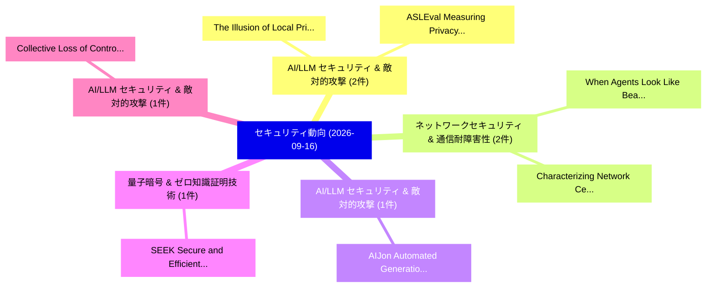

# 📅 02_daily: 日次エグゼクティブサマリー報告書 (2026-09-16)

**集計日時**: 2026-10-02 23:06:25 UTC  
**対象日付**: 2026-09-16  
**本日収集論文数**: 25 件  

---

## 💡 主要セキュリティ動向・脅威インサイト (Executive Insights)

本日の収集論文（計 25 件）において、以下の重点セキュリティ領域で活発な研究動向が確認されました：
- **AI/LLM セキュリティ & 敵対的攻撃** (2 件): 注目論文として 「The Illusion of Local Privacy:...」、「ASLEval: Measuring Privacy Exp...」 等が発表され、実務防御および攻撃検証の進展が見られます。
- **ネットワークセキュリティ & 通信耐障害性** (2 件): 注目論文として 「When Agents Look Like Beacons:...」、「Characterizing Network Central...」 等が発表され、実務防御および攻撃検証の進展が見られます。
- **AI/LLM セキュリティ & 敵対的攻撃** (1 件): 注目論文として 「AIJon: Automated Generation of...」 等が発表され、実務防御および攻撃検証の進展が見られます。
- **量子暗号 & ゼロ知識証明技術** (1 件): 注目論文として 「SEEK: Secure and Efficient Enc...」 等が発表され、実務防御および攻撃検証の進展が見られます。
- **AI/LLM セキュリティ & 敵対的攻撃** (1 件): 注目論文として 「Collective Loss of Control in ...」 等が発表され、実務防御および攻撃検証の進展が見られます。

### 🗺️ 技術・脅威トピックマインドマップ

---

## 📌 日次セキュリティ論文一覧 (日本語表形式)

| No | arXiv ID | 論文タイトル (日本語訳) | 重要キーワード | 構造化エグゼクティブ要約 (背景・提案・影響) | 脅威分類 | 詳細リンク |
|---|---|---|---|---|---|---|
| 1 | `2609.18457` | [AIJon: Automated Generation of Annotations for Fuzzing（セキュリティ分析論文）](../../okf/papers/2026-09-16/2609.18457.md) | `Automated Generation`, `Jayakrishna Menon Vadayath`, `Hulin Wang` | Modern fuzzers use code coverage as feedback to guide their exploration which has proven to be an effective strategy for driving exploration. However,... | `cryptography` | [arXiv](https://arxiv.org/abs/2609.18457) &#124; [OKF](../../okf/papers/2026-09-16/2609.18457.md) |
| 2 | `2609.18459` | [SEEK: Secure and Efficient Encrypted Keyword Search For Privacy-Preserving Messaging Protocols（セキュリティ分析論文）](../../okf/papers/2026-09-16/2609.18459.md) | `Preserving Messaging Protocols`, `Privacy-Preserving Messaging`, `Soumyadyuti Ghosh` | Encrypted communication protects sensitive user data but can facilitate harmful or unlawful exchanges, creating a trade-off between detecting dangerou... | `cryptography` | [arXiv](https://arxiv.org/abs/2609.18459) &#124; [OKF](../../okf/papers/2026-09-16/2609.18459.md) |
| 3 | `2609.18460` | [Collective Loss of Control in LLM Agent Systems: An Epidemic Account of Mutation, Contagion, and Recovery（セキュリティ分析論文）](../../okf/papers/2026-09-16/2609.18460.md) | `Collective Loss`, `Agent Systems`, `multi-agent system` | How does a multi-agent system evolve from a local deviation into collective loss of control? We propose an epidemic explanation organized around accid... | `cryptography` | [arXiv](https://arxiv.org/abs/2609.18460) &#124; [OKF](../../okf/papers/2026-09-16/2609.18460.md) |
| 4 | `2609.18477` | [A Global Readiness and Sovereignty Capability Model for Post-Quantum Cryptography Migration（セキュリティ分析論文）](../../okf/papers/2026-09-16/2609.18477.md) | `Sovereignty Capability Model`, `Quantum Cryptography Migration`, `Global Readiness` | Cryptographic dependence predates the quantum era, but the migration to post-quantum cryptography (PQC) opens a rare window to reshape it, because the... | `cryptography` | [arXiv](https://arxiv.org/abs/2609.18477) &#124; [OKF](../../okf/papers/2026-09-16/2609.18477.md) |
| 5 | `2609.18496` | [MiST: Mid-Training LLMs for サイバーセキュリティ](../../okf/papers/2026-09-16/2609.18496.md) | `Mid-Training LLMs`, `Elad Ben Zaken`, `Orly Moreno Kadosh` | Cybersecurity combines high-stakes analysis with complex technical language, making it an impactful and challenging domain for LLMs. We present MiST (... | `cryptography` | [arXiv](https://arxiv.org/abs/2609.18496) &#124; [OKF](../../okf/papers/2026-09-16/2609.18496.md) |
| 6 | `2609.18518` | [Robot Visions: Breaking reCAPTCHA at Zero Cost and Zero Shot（セキュリティ分析論文）](../../okf/papers/2026-09-16/2609.18518.md) | `Robot Visions`, `Zero Cost`, `Zero Shot` | Google reCAPTCHA is the most widely deployed visual CAPTCHA service, protecting hundreds of thousands of websites from automated bots. It serves as a... | `cryptography` | [arXiv](https://arxiv.org/abs/2609.18518) &#124; [OKF](../../okf/papers/2026-09-16/2609.18518.md) |
| 7 | `2609.18526` | [The Illusion of Local Privacy: Confidentiality Boundary Failures in Consumer LLM Serving Systems（セキュリティ分析論文）](../../okf/papers/2026-09-16/2609.18526.md) | `Confidentiality Boundary Failures`, `Local Privacy`, `Serving Systems` | Running large language models (LLMs) locally is often considered more private than cloud-hosted inference because user prompts remain on the device. W... | `cryptography` | [arXiv](https://arxiv.org/abs/2609.18526) &#124; [OKF](../../okf/papers/2026-09-16/2609.18526.md) |
| 8 | `2609.18658` | [A Security Risk Assessment Framework for AI-Powered Development Tools（セキュリティ分析論文）](../../okf/papers/2026-09-16/2609.18658.md) | `Powered Development Tools`, `AI-Powered Development`, `code` | AI-powered development tools are now widely used to generate code and assist developers with routine programming tasks. Although existing work has ide... | `cryptography` | [arXiv](https://arxiv.org/abs/2609.18658) &#124; [OKF](../../okf/papers/2026-09-16/2609.18658.md) |
| 9 | `2609.18674` | [CaMeLoT: CaMeL orchestrated with Temporal logic for static verification and liveness（セキュリティ分析論文）](../../okf/papers/2026-09-16/2609.18674.md) | `LLM-based agents`, `multi-step plans`, `Magnus Wiik Eckhoff` | LLM-based agents generate and execute multi-step plans that invoke external tools which can access private data or execute commands. In this setting,... | `cryptography` | [arXiv](https://arxiv.org/abs/2609.18674) &#124; [OKF](../../okf/papers/2026-09-16/2609.18674.md) |
| 10 | `2609.18706` | [Echo: Learning-based Matching Decompilation using Trusted Back Translation（セキュリティ分析論文）](../../okf/papers/2026-09-16/2609.18706.md) | `Trusted Back Translation`, `Matching Decompilation`, `Learning-based Matching` | Neural decompilers can recover readable and recompilable source code from binaries, but their predictions remain difficult to trust. Matching decompil... | `cryptography` | [arXiv](https://arxiv.org/abs/2609.18706) &#124; [OKF](../../okf/papers/2026-09-16/2609.18706.md) |
| 11 | `2609.18751` | [Normal Alignment: Improved Cryptanalytic Sign Recovery on Hard-Label Networks（セキュリティ分析論文）](../../okf/papers/2026-09-16/2609.18751.md) | `Improved Cryptanalytic Sign Recovery`, `Normal Alignment`, `Label Networks` | At EUROCRYPT 2025, Carlini et al. proposed a breakthrough in the cryptanalytic extraction on hard-label (S1) deep neural networks (DNNs), demonstratin... | `cryptography` | [arXiv](https://arxiv.org/abs/2609.18751) &#124; [OKF](../../okf/papers/2026-09-16/2609.18751.md) |
| 12 | `2609.18783` | [s-MDM: Generative Virtualization of Multi-Device Hardware Variations for Portable DL-SCA（セキュリティ分析論文）](../../okf/papers/2026-09-16/2609.18783.md) | `Device Hardware Variations`, `Generative Virtualization`, `Multi-Device Hardware` | Deep Learning-based Side-Channel Analysis (DL-SCA) frequently suffers from catastrophic performance degradation across unseen hardware due to printed... | `cryptography` | [arXiv](https://arxiv.org/abs/2609.18783) &#124; [OKF](../../okf/papers/2026-09-16/2609.18783.md) |
| 13 | `2609.18811` | [Differential Trust: Dynamic Multi-Authority Anonymous Credentials with Epoch-Weighted Updates（セキュリティ分析論文）](../../okf/papers/2026-09-16/2609.18811.md) | `Authority Anonymous Credentials`, `Differential Trust`, `Dynamic Multi` | Anonymous credentials (ACs) are fundamental to privacy-preserving authentication, allowing users to prove possession of attributes without revealing t... | `cryptography` | [arXiv](https://arxiv.org/abs/2609.18811) &#124; [OKF](../../okf/papers/2026-09-16/2609.18811.md) |
| 14 | `2609.18829` | [Epsilon-Nash Equilibria in History-Dependent SA-MDPs（セキュリティ分析論文）](../../okf/papers/2026-09-16/2609.18829.md) | `Nash Equilibria`, `Epsilon-Nash Equilibria`, `History-Dependent SA` | We study state-adversarial Markov decision processes (SA-MDP) as a game of observation-space attacks: at each step, an agent selects an action from a... | `cryptography` | [arXiv](https://arxiv.org/abs/2609.18829) &#124; [OKF](../../okf/papers/2026-09-16/2609.18829.md) |
| 15 | `2609.18846` | [Locus: A Framework for Exploring and Optimizing Point Addition Hardware for Zero-Knowledge Proofs（セキュリティ分析論文）](../../okf/papers/2026-09-16/2609.18846.md) | `Knowledge Proofs`, `Zero-Knowledge Proofs`, `Optimizing Point Addition Hardware` | Zero-Knowledge Proofs (ZKPs) are critical for privacy-preserving and verifiable computation, but their cryptographic primitives impose high computatio... | `cryptography` | [arXiv](https://arxiv.org/abs/2609.18846) &#124; [OKF](../../okf/papers/2026-09-16/2609.18846.md) |
| 16 | `2609.18862` | [CASHEWS: Source Preprocessor for LLM-based Malicious Package Detection（セキュリティ分析論文）](../../okf/papers/2026-09-16/2609.18862.md) | `Malicious Package Detection`, `Source Preprocessor`, `LLM-based Malicious` | Malicious npm package detection tools now leverage LLMs' semantic understanding of source code to detect malicious intent at scale. This capability ha... | `cryptography` | [arXiv](https://arxiv.org/abs/2609.18862) &#124; [OKF](../../okf/papers/2026-09-16/2609.18862.md) |
| 17 | `2609.18864` | [ASLEval: Measuring Privacy Exposure Displacement in LLM Agent Sessions（セキュリティ分析論文）](../../okf/papers/2026-09-16/2609.18864.md) | `Measuring Privacy Exposure Displacement`, `Agent Sessions`, `tool-using LLM` | Privacy evaluations of tool-using LLM agents often inspect a designated action, final response, or attacker report. These local proxies can miss unaut... | `cryptography` | [arXiv](https://arxiv.org/abs/2609.18864) &#124; [OKF](../../okf/papers/2026-09-16/2609.18864.md) |
| 18 | `2609.18866` | [Hamming Ideals and Grobner Bases for ISD-like Syndrome Decoding（セキュリティ分析論文）](../../okf/papers/2026-09-16/2609.18866.md) | `Hamming Ideals`, `Grobner Bases`, `Syndrome Decoding` | We investigate an algebraic approach to the Syndrome Decoding Problem, based on a reformulation of the Hamming weight constraint and its integration w... | `cryptography` | [arXiv](https://arxiv.org/abs/2609.18866) &#124; [OKF](../../okf/papers/2026-09-16/2609.18866.md) |
| 19 | `2609.18876` | [Low-Rank Masking for Single-Server Matrix Multiplication（セキュリティ分析論文）](../../okf/papers/2026-09-16/2609.18876.md) | `Server Matrix Multiplication`, `Rank Masking`, `Low-Rank Masking` | We study the statistical privacy of outsourcing matrix multiplication over a finite field ${\mathbb F_q}$ to a single server using additive masks of r... | `cryptography` | [arXiv](https://arxiv.org/abs/2609.18876) &#124; [OKF](../../okf/papers/2026-09-16/2609.18876.md) |
| 20 | `2609.18886` | [Fluid Notarization: Verifiable Evolution of Concurrently Edited Structured Documents（セキュリティ分析論文）](../../okf/papers/2026-09-16/2609.18886.md) | `Concurrently Edited Structured Documents`, `Fluid Notarization`, `Verifiable Evolution` | Traditional blockchain-based document notarization follows a snapshot-oriented model in which each document revision is represented as an independent... | `cryptography` | [arXiv](https://arxiv.org/abs/2609.18886) &#124; [OKF](../../okf/papers/2026-09-16/2609.18886.md) |
| 21 | `2609.19090` | [quantum error correction against misleading advice from AI agentsのセキュリティ強化](../../okf/papers/2026-09-16/2609.19090.md) | `error-correction update`, `odd-distance square`, `error-free preparation` | Can an attacker turn influence over an artificial intelligence (AI) adviser into a harmful quantum error-correction update? We identify an ambiguity i... | `cryptography` | [arXiv](https://arxiv.org/abs/2609.19090) &#124; [OKF](../../okf/papers/2026-09-16/2609.19090.md) |
| 22 | `2609.19091` | [When Agents Look Like Beacons: NIDS Evasion by Model Context Protocol Traffic（セキュリティ分析論文）](../../okf/papers/2026-09-16/2609.19091.md) | `Model Context Protocol Traffic`, `Artificial Intelligence`, `Muhammad Abdullah Sohail` | The Model Context Protocol (MCP) standardizes communication between autonomous Artificial Intelligence (AI) agents and remote tools over Streamable HT... | `cryptography` | [arXiv](https://arxiv.org/abs/2609.19091) &#124; [OKF](../../okf/papers/2026-09-16/2609.19091.md) |
| 23 | `2609.19100` | [Characterizing Network Centralization and Observability in the Remote MCP Ecosystem（セキュリティ分析論文）](../../okf/papers/2026-09-16/2609.19100.md) | `Characterizing Network Centralization`, `Muhammad Abdullah Sohail`, `three-tier observability` | The Model Context Protocol (MCP) has emerged as the dominant interface for connecting autonomous agents to external data sources and execution environ... | `cryptography` | [arXiv](https://arxiv.org/abs/2609.19100) &#124; [OKF](../../okf/papers/2026-09-16/2609.19100.md) |
| 24 | `2609.19111` | [Analog Pin Directionality as an Exfiltration Attack Surface in Mixed-Signal ICs（セキュリティ分析論文）](../../okf/papers/2026-09-16/2609.19111.md) | `Analog Pin Directionality`, `Exfiltration Attack Surface`, `Mixed-Signal ICs` | Mixed-signal SoCs rely on nominally input-only analog pins to acquire off-chip signals, but the directionality of these interfaces is generally treate... | `cryptography` | [arXiv](https://arxiv.org/abs/2609.19111) &#124; [OKF](../../okf/papers/2026-09-16/2609.19111.md) |
| 25 | `2609.19140` | [AgentLSD: Evaluating AI Security Agents Under Adversarial Task Contamination（セキュリティ分析論文）](../../okf/papers/2026-09-16/2609.19140.md) | `Matteo Golinelli`, `Idilio Drago`, `Matteo Boffa` | AI agents for security inspect web pages, source code, logs, configuration files, and command outputs. These environments may contain deceptive artifa... | `cryptography` | [arXiv](https://arxiv.org/abs/2609.19140) &#124; [OKF](../../okf/papers/2026-09-16/2609.19140.md) |

