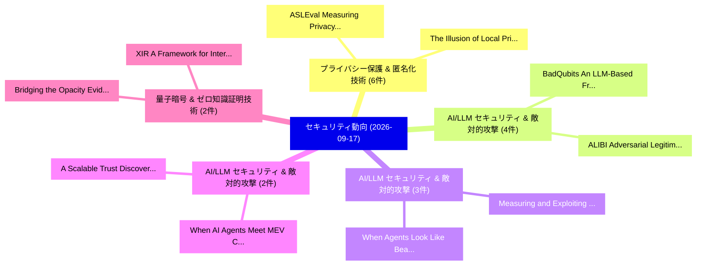

# 📅 02_daily: 日次エグゼクティブサマリー報告書 (2026-09-17)

**集計日時**: 2026-10-02 23:06:26 UTC  
**対象日付**: 2026-09-17  
**本日収集論文数**: 75 件  

---

## 💡 主要セキュリティ動向・脅威インサイト (Executive Insights)

本日の収集論文（計 75 件）において、以下の重点セキュリティ領域で活発な研究動向が確認されました：
- **プライバシー保護 & 匿名化技術** (6 件): 注目論文として 「The Illusion of Local Privacy:...」、「ASLEval: Measuring Privacy Exp...」 等が発表され、実務防御および攻撃検証の進展が見られます。
- **AI/LLM セキュリティ & 敵対的攻撃** (4 件): 注目論文として 「BadQubits: An LLM-Based Framew...」、「ALIBI: Adversarial Legitimacy ...」 等が発表され、実務防御および攻撃検証の進展が見られます。
- **AI/LLM セキュリティ & 敵対的攻撃** (3 件): 注目論文として 「Measuring and Exploiting Impli...」、「When Agents Look Like Beacons:...」 等が発表され、実務防御および攻撃検証の進展が見られます。
- **AI/LLM セキュリティ & 敵対的攻撃** (2 件): 注目論文として 「When AI Agents Meet MEV: Cross...」、「A Scalable Trust Discovery Arc...」 等が発表され、実務防御および攻撃検証の進展が見られます。
- **量子暗号 & ゼロ知識証明技術** (2 件): 注目論文として 「Bridging the Opacity: Evidence...」、「XIR: A Framework for Interoper...」 等が発表され、実務防御および攻撃検証の進展が見られます。

### 🗺️ 技術・脅威トピックマインドマップ

---

## 📌 日次セキュリティ論文一覧 (日本語表形式)

| No | arXiv ID | 論文タイトル (日本語訳) | 重要キーワード | 構造化エグゼクティブ要約 (背景・提案・影響) | 脅威分類 | 詳細リンク |
|---|---|---|---|---|---|---|
| 1 | `2609.17645` | [State Without a Landlord: An Architecture Proposal for Peer-to-Peer Replication of Durable Workflow StateTitle:（セキュリティ分析論文）](../../okf/papers/2026-09-17/2609.17645.md) | `State Without`, `Peer Replication`, `Durable Workflow` | Durable-execution frameworks commonly journal execution steps of a long-running function and reconstruct state by deterministic replay; the journal is... | `security` | [arXiv](https://arxiv.org/abs/2609.17645) &#124; [OKF](../../okf/papers/2026-09-17/2609.17645.md) |
| 2 | `2609.17648` | [Trust propagation and structural containment in Multi-agent LLM pipelinesTitle:（セキュリティ分析論文）](../../okf/papers/2026-09-17/2609.17648.md) | `Multi-agent LLM`, `low-privilege agent`, `higher-privilege agent` | Multi-agent LLM systems increasingly automate tasks involving agents with different levels of privilege, creating a security risk in which a compromis... | `security` | [arXiv](https://arxiv.org/abs/2609.17648) &#124; [OKF](../../okf/papers/2026-09-17/2609.17648.md) |
| 3 | `2609.17817` | [Reflections on Trusting Trust, Revisited: Contaminating Self-Modifying AI Coding Agents with Poisoned BenchmarksTitle:（セキュリティ分析論文）](../../okf/papers/2026-09-17/2609.17817.md) | `Trusting Trust`, `Contaminating Self`, `Coding Agents` | Thompson's "Reflections on Trusting Trust" showed that a compiler can be poisoned to reinsert its own backdoor, so that even recompiling clean source... | `security` | [arXiv](https://arxiv.org/abs/2609.17817) &#124; [OKF](../../okf/papers/2026-09-17/2609.17817.md) |
| 4 | `2609.17839` | [Evaluating the Impact of Personalization in Conversational サイバーセキュリティ AssistantsTitle:](../../okf/papers/2026-09-17/2609.17839.md) | `Conversational Cybersecurity`, `Large Language Models`, `LLM-based cybersecurity` | Users increasingly turn to Large Language Models to answer a variety of questions, including cybersecurity questions. We study how personalization str... | `security` | [arXiv](https://arxiv.org/abs/2609.17839) &#124; [OKF](../../okf/papers/2026-09-17/2609.17839.md) |
| 5 | `2609.17856` | [Investigating Adversarial Robustness of Heterogeneous Cooperative PerceptionTitle:（セキュリティ分析論文）](../../okf/papers/2026-09-17/2609.17856.md) | `Investigating Adversarial Robustness`, `Heterogeneous Cooperative`, `adversarial` | Heterogeneous cooperative perception (CP) enables connected vehicles with diverse sensor setups to share spatial awareness via compact feature maps, w... | `security` | [arXiv](https://arxiv.org/abs/2609.17856) &#124; [OKF](../../okf/papers/2026-09-17/2609.17856.md) |
| 6 | `2609.17897` | [When AI Agents Meet MEV: Cross-Chain Arbitrage in the Agentic EconomyTitle:（セキュリティ分析論文）](../../okf/papers/2026-09-17/2609.17897.md) | `Agents Meet`, `Chain Arbitrage`, `Cross-Chain Arbitrage` | We study cross-chain arbitrage when autonomous AI agents, rather than humans or bots, are the searchers. We model agents as both arbitrage extractors... | `security` | [arXiv](https://arxiv.org/abs/2609.17897) &#124; [OKF](../../okf/papers/2026-09-17/2609.17897.md) |
| 7 | `2609.17902` | [Ghost-Filled Orders: Detecting and Testing Atomicity Violations in Non-Custodial Prediction MarketsTitle:（セキュリティ分析論文）](../../okf/papers/2026-09-17/2609.17902.md) | `Testing Atomicity Violations`, `Filled Orders`, `Custodial Prediction` | Blockchain based prediction markets combine offchain order management with onchain settlement. This architecture supports user controlled custody, sin... | `security` | [arXiv](https://arxiv.org/abs/2609.17902) &#124; [OKF](../../okf/papers/2026-09-17/2609.17902.md) |
| 8 | `2609.17922` | [Demystifying Gate-Level Localization of RTL TrojansTitle:（セキュリティ分析論文）](../../okf/papers/2026-09-17/2609.17922.md) | `Demystifying Gate`, `Level Localization`, `Gate-Level Localization` | Hardware Trojans are malicious modifications that compromise functionality or leak sensitive data. They pose a severe threat, particularly when insert... | `security` | [arXiv](https://arxiv.org/abs/2609.17922) &#124; [OKF](../../okf/papers/2026-09-17/2609.17922.md) |
| 9 | `2609.17995` | [QuanText: Protecting Dataset-Level Secrets in Textual Data SharingTitle:（セキュリティ分析論文）](../../okf/papers/2026-09-17/2609.17995.md) | `Protecting Dataset`, `Level Secrets`, `Textual Data` | Natural-language datasets support many downstream applications and research studies, but releasing text can reveal sensitive global properties of the... | `security` | [arXiv](https://arxiv.org/abs/2609.17995) &#124; [OKF](../../okf/papers/2026-09-17/2609.17995.md) |
| 10 | `2609.18020` | [Improved lower bounds for decomposable randomized encodingTitle:（セキュリティ分析論文）](../../okf/papers/2026-09-17/2609.18020.md) | `non-periodic symmetric`, `lower`, `function` | A decomposable randomized encoding (DRE) for a function $f$ allows $n$ parties, using shared randomness, to encode their individual inputs locally so... | `security` | [arXiv](https://arxiv.org/abs/2609.18020) &#124; [OKF](../../okf/papers/2026-09-17/2609.18020.md) |
| 11 | `2609.18107` | [FoundAna: A GNN-assisted Foundation Model for Graph Anomaly DetectionTitle:（セキュリティ分析論文）](../../okf/papers/2026-09-17/2609.18107.md) | `Foundation Model`, `GNN-assisted Foundation`, `Graph Anomaly` | Graph anomaly detection aims to identify graph structures (e.g., nodes, edges, or subgraphs) that deviate significantly from expected patterns, which... | `security` | [arXiv](https://arxiv.org/abs/2609.18107) &#124; [OKF](../../okf/papers/2026-09-17/2609.18107.md) |
| 12 | `2609.18120` | [PentestChain: A Cost-Aware, MCP-Orchestrated Framework for Automated Penetration Testing with Free-Tier LLMsTitle:（セキュリティ分析論文）](../../okf/papers/2026-09-17/2609.18120.md) | `Automated Penetration Testing`, `Free-Tier LLMsTitle`, `AI-driven penetration` | AI-driven penetration testing has been demonstrated with premium frontier models such as GPT-4, but the per-engagement token cost makes continuous, au... | `security` | [arXiv](https://arxiv.org/abs/2609.18120) &#124; [OKF](../../okf/papers/2026-09-17/2609.18120.md) |
| 13 | `2609.18122` | ["Your Robot Was Trained on a Lie": Collision Mesh Poisoning Attacks on Robotic ManipulationTitle:（セキュリティ分析論文）](../../okf/papers/2026-09-17/2609.18122.md) | `Collision Mesh Poisoning Attacks`, `Learning-enabled robotic`, `real-world deployment` | Learning-enabled robotic manipulation increasingly relies on robot simulators for policy training and evaluation before real-world deployment. Inside... | `security` | [arXiv](https://arxiv.org/abs/2609.18122) &#124; [OKF](../../okf/papers/2026-09-17/2609.18122.md) |
| 14 | `2609.18158` | [Bridging the Opacity: Evidence-Backed Cross-Chain Transaction Correspondence Reconstruction Across Heterogeneous BlockchainsTitle:（セキュリティ分析論文）](../../okf/papers/2026-09-17/2609.18158.md) | `Chain Transaction Correspondence Reconstruction Across Heterogeneous`, `Backed Cross`, `Evidence-Backed Cross` | Cross-chain bridges enable interoperability, but they also break the transaction trails needed to trace illicit funds. Third-party investigators typic... | `security` | [arXiv](https://arxiv.org/abs/2609.18158) &#124; [OKF](../../okf/papers/2026-09-17/2609.18158.md) |
| 15 | `2609.18196` | [ISIA-AF: Orchestrating Reproducible Attacks and Multi-Source Data Collection for OT SystemsTitle:（セキュリティ分析論文）](../../okf/papers/2026-09-17/2609.18196.md) | `Orchestrating Reproducible Attacks`, `Source Data Collection`, `Multi-Source Data` | Operational Technology (OT) environments require realistic, reproducible security datasets, yet existing approaches often lack automation, multi-sourc... | `security` | [arXiv](https://arxiv.org/abs/2609.18196) &#124; [OKF](../../okf/papers/2026-09-17/2609.18196.md) |
| 16 | `2609.18217` | [Measuring and Exploiting Implicit Trust in LLM Tool-Calling PipelinesTitle:（セキュリティ分析論文）](../../okf/papers/2026-09-17/2609.18217.md) | `Exploiting Implicit Trust`, `Tool-Calling PipelinesTitle`, `attacker-controlled text` | The Model Context Protocol (MCP) enables LLMs to invoke external tools, but every tool interaction exposes the model to attacker-controlled text throu... | `security` | [arXiv](https://arxiv.org/abs/2609.18217) &#124; [OKF](../../okf/papers/2026-09-17/2609.18217.md) |
| 17 | `2609.18272` | [Who Audits Whom, on What Substrate, with What Evidence? An Independence-Graded Audit Protocol for Agentic AITitle:（セキュリティ分析論文）](../../okf/papers/2026-09-17/2609.18272.md) | `Graded Audit Protocol`, `Independence-Graded Audit`, `foundation-model family` | Agentic AI systems plan, invoke tools and act with limited supervision; they are now both the subject of audits and, increasingly, the auditor. Indepe... | `security` | [arXiv](https://arxiv.org/abs/2609.18272) &#124; [OKF](../../okf/papers/2026-09-17/2609.18272.md) |
| 18 | `2609.18275` | [Witness Encryption via Prime-Order Generic GroupsTitle:（セキュリティ分析論文）](../../okf/papers/2026-09-17/2609.18275.md) | `Witness Encryption`, `Order Generic`, `Prime-Order Generic` | We unconditionally construct witness encryption for NP in the classical generic-group model, using an ordinary cyclic group of prime order. For SAT in... | `security` | [arXiv](https://arxiv.org/abs/2609.18275) &#124; [OKF](../../okf/papers/2026-09-17/2609.18275.md) |
| 19 | `2609.18281` | [A GAN-Based Framework for Robust DDoS Attack DetectionTitle:（セキュリティ分析論文）](../../okf/papers/2026-09-17/2609.18281.md) | `Distributed Denial`, `Deep Neural Ensembles`, `Random Forests` | The availability and consistency of online services remain vulnerable due to Distributed Denial of Service (DDoS) attacks. These attacks are evolving... | `security` | [arXiv](https://arxiv.org/abs/2609.18281) &#124; [OKF](../../okf/papers/2026-09-17/2609.18281.md) |
| 20 | `2609.18338` | [Autonomy in Check: Governor-Mediated Adaptive Security at the EdgeTitle:（セキュリティ分析論文）](../../okf/papers/2026-09-17/2609.18338.md) | `Mediated Adaptive Security`, `Governor-Mediated Adaptive`, `rule-based controllers` | Adaptive security at the network edge increasingly relies on automated planners, including rule-based controllers, learned policies, and LLM-assisted... | `security` | [arXiv](https://arxiv.org/abs/2609.18338) &#124; [OKF](../../okf/papers/2026-09-17/2609.18338.md) |
| 21 | `2609.18344` | [Detecting Logic Vulnerabilities Across the Contract and Device Layers of Blockchain-Enabled IoT With Multi-Agent Heterogeneous Graph AttentionTitle:（セキュリティ分析論文）](../../okf/papers/2026-09-17/2609.18344.md) | `Detecting Logic Vulnerabilities Across`, `Agent Heterogeneous Graph`, `Device Layers` | Blockchain-enabled Internet of Things (IoT) systems integrate smart contracts with embedded devices to support decentralized device management and acc... | `security` | [arXiv](https://arxiv.org/abs/2609.18344) &#124; [OKF](../../okf/papers/2026-09-17/2609.18344.md) |
| 22 | `2609.18411` | [The Verifiable Action Card: Trustworthy Human-in-the-Loop Control for Secure Autonomous AgentsTitle:（セキュリティ分析論文）](../../okf/papers/2026-09-17/2609.18411.md) | `Trustworthy Human`, `Loop Control`, `Secure Autonomous` | Agentic browsers can execute security-sensitive actions under a user's authenticated session, making indirect prompt injection and deceptive confirmat... | `security` | [arXiv](https://arxiv.org/abs/2609.18411) &#124; [OKF](../../okf/papers/2026-09-17/2609.18411.md) |
| 23 | `2609.18457` | [AIJon: Automated Generation of Annotations for FuzzingTitle:（セキュリティ分析論文）](../../okf/papers/2026-09-17/2609.18457.md) | `Automated Generation`, `real-world vulnerability`, `annotations` | Modern fuzzers use code coverage as feedback to guide their exploration which has proven to be an effective strategy for driving exploration. However,... | `security` | [arXiv](https://arxiv.org/abs/2609.18457) &#124; [OKF](../../okf/papers/2026-09-17/2609.18457.md) |
| 24 | `2609.18459` | [SEEK: Secure and Efficient Encrypted Keyword Search For Privacy-Preserving Messaging ProtocolsTitle:（セキュリティ分析論文）](../../okf/papers/2026-09-17/2609.18459.md) | `Preserving Messaging`, `Privacy-Preserving Messaging`, `end-user privacy` | Encrypted communication protects sensitive user data but can facilitate harmful or unlawful exchanges, creating a trade-off between detecting dangerou... | `security` | [arXiv](https://arxiv.org/abs/2609.18459) &#124; [OKF](../../okf/papers/2026-09-17/2609.18459.md) |
| 25 | `2609.18460` | [Collective Loss of Control in LLM Agent Systems: An Epidemic Account of Mutation, Contagion, and RecoveryTitle:（セキュリティ分析論文）](../../okf/papers/2026-09-17/2609.18460.md) | `Collective Loss`, `Agent Systems`, `multi-agent system` | How does a multi-agent system evolve from a local deviation into collective loss of control? We propose an epidemic explanation organized around accid... | `security` | [arXiv](https://arxiv.org/abs/2609.18460) &#124; [OKF](../../okf/papers/2026-09-17/2609.18460.md) |
| 26 | `2609.18477` | [A Global Readiness and Sovereignty Capability Model for Post-Quantum Cryptography MigrationTitle:（セキュリティ分析論文）](../../okf/papers/2026-09-17/2609.18477.md) | `Sovereignty Capability Model`, `Global Readiness`, `Quantum Cryptography` | Cryptographic dependence predates the quantum era, but the migration to post-quantum cryptography (PQC) opens a rare window to reshape it, because the... | `security` | [arXiv](https://arxiv.org/abs/2609.18477) &#124; [OKF](../../okf/papers/2026-09-17/2609.18477.md) |
| 27 | `2609.18496` | [MiST: Mid-Training LLMs for サイバーセキュリティTitle:](../../okf/papers/2026-09-17/2609.18496.md) | `Mid-Training LLMs`, `Security Transformer`, `Mid-trained Security` | Cybersecurity combines high-stakes analysis with complex technical language, making it an impactful and challenging domain for LLMs. We present MiST (... | `security` | [arXiv](https://arxiv.org/abs/2609.18496) &#124; [OKF](../../okf/papers/2026-09-17/2609.18496.md) |
| 28 | `2609.18518` | [Robot Visions: Breaking reCAPTCHA at Zero Cost and Zero ShotTitle:（セキュリティ分析論文）](../../okf/papers/2026-09-17/2609.18518.md) | `Robot Visions`, `Zero Cost`, `cloud-based vision` | Google reCAPTCHA is the most widely deployed visual CAPTCHA service, protecting hundreds of thousands of websites from automated bots. It serves as a... | `security` | [arXiv](https://arxiv.org/abs/2609.18518) &#124; [OKF](../../okf/papers/2026-09-17/2609.18518.md) |
| 29 | `2609.18526` | [The Illusion of Local Privacy: Confidentiality Boundary Failures in Consumer LLM Serving SystemsTitle:（セキュリティ分析論文）](../../okf/papers/2026-09-17/2609.18526.md) | `Confidentiality Boundary Failures`, `Local Privacy`, `cloud-hosted inference` | Running large language models (LLMs) locally is often considered more private than cloud-hosted inference because user prompts remain on the device. W... | `security` | [arXiv](https://arxiv.org/abs/2609.18526) &#124; [OKF](../../okf/papers/2026-09-17/2609.18526.md) |
| 30 | `2609.18658` | [A Security Risk Assessment Framework for AI-Powered Development ToolsTitle:（セキュリティ分析論文）](../../okf/papers/2026-09-17/2609.18658.md) | `Powered Development`, `AI-Powered Development`, `security` | AI-powered development tools are now widely used to generate code and assist developers with routine programming tasks. Although existing work has ide... | `security` | [arXiv](https://arxiv.org/abs/2609.18658) &#124; [OKF](../../okf/papers/2026-09-17/2609.18658.md) |
| 31 | `2609.18674` | [CaMeLoT: CaMeL orchestrated with Temporal logic for static verification and livenessTitle:（セキュリティ分析論文）](../../okf/papers/2026-09-17/2609.18674.md) | `LLM-based agents`, `multi-step plans`, `tool-using LLM` | LLM-based agents generate and execute multi-step plans that invoke external tools which can access private data or execute commands. In this setting,... | `security` | [arXiv](https://arxiv.org/abs/2609.18674) &#124; [OKF](../../okf/papers/2026-09-17/2609.18674.md) |
| 32 | `2609.18706` | [Echo: Learning-based Matching Decompilation using Trusted Back TranslationTitle:（セキュリティ分析論文）](../../okf/papers/2026-09-17/2609.18706.md) | `Matching Decompilation`, `Trusted Back`, `Learning-based Matching` | Neural decompilers can recover readable and recompilable source code from binaries, but their predictions remain difficult to trust. Matching decompil... | `security` | [arXiv](https://arxiv.org/abs/2609.18706) &#124; [OKF](../../okf/papers/2026-09-17/2609.18706.md) |
| 33 | `2609.18751` | [Normal Alignment: Improved Cryptanalytic Sign Recovery on Hard-Label NetworksTitle:（セキュリティ分析論文）](../../okf/papers/2026-09-17/2609.18751.md) | `Improved Cryptanalytic Sign Recovery`, `Normal Alignment`, `Hard-Label NetworksTitle` | At EUROCRYPT 2025, Carlini et al. proposed a breakthrough in the cryptanalytic extraction on hard-label (S1) deep neural networks (DNNs), demonstratin... | `security` | [arXiv](https://arxiv.org/abs/2609.18751) &#124; [OKF](../../okf/papers/2026-09-17/2609.18751.md) |
| 34 | `2609.18783` | [s-MDM: Generative Virtualization of Multi-Device Hardware Variations for Portable DL-SCATitle:（セキュリティ分析論文）](../../okf/papers/2026-09-17/2609.18783.md) | `Device Hardware Variations`, `Generative Virtualization`, `Multi-Device Hardware` | Deep Learning-based Side-Channel Analysis (DL-SCA) frequently suffers from catastrophic performance degradation across unseen hardware due to printed... | `security` | [arXiv](https://arxiv.org/abs/2609.18783) &#124; [OKF](../../okf/papers/2026-09-17/2609.18783.md) |
| 35 | `2609.18811` | [Differential Trust: Dynamic Multi-Authority Anonymous Credentials with Epoch-Weighted UpdatesTitle:（セキュリティ分析論文）](../../okf/papers/2026-09-17/2609.18811.md) | `Authority Anonymous Credentials`, `Differential Trust`, `Dynamic Multi` | Anonymous credentials (ACs) are fundamental to privacy-preserving authentication, allowing users to prove possession of attributes without revealing t... | `security` | [arXiv](https://arxiv.org/abs/2609.18811) &#124; [OKF](../../okf/papers/2026-09-17/2609.18811.md) |
| 36 | `2609.18829` | [Epsilon-Nash Equilibria in History-Dependent SA-MDPsTitle:（セキュリティ分析論文）](../../okf/papers/2026-09-17/2609.18829.md) | `Nash Equilibria`, `Epsilon-Nash Equilibria`, `History-Dependent SA` | We study state-adversarial Markov decision processes (SA-MDP) as a game of observation-space attacks: at each step, an agent selects an action from a... | `security` | [arXiv](https://arxiv.org/abs/2609.18829) &#124; [OKF](../../okf/papers/2026-09-17/2609.18829.md) |
| 37 | `2609.18846` | [Locus: A Framework for Exploring and Optimizing Point Addition Hardware for Zero-Knowledge ProofsTitle:（セキュリティ分析論文）](../../okf/papers/2026-09-17/2609.18846.md) | `Optimizing Point Addition Hardware`, `Zero-Knowledge ProofsTitle`, `Knowledge Proofs` | Zero-Knowledge Proofs (ZKPs) are critical for privacy-preserving and verifiable computation, but their cryptographic primitives impose high computatio... | `security` | [arXiv](https://arxiv.org/abs/2609.18846) &#124; [OKF](../../okf/papers/2026-09-17/2609.18846.md) |
| 38 | `2609.18862` | [CASHEWS: Source Preprocessor for LLM-based Malicious Package DetectionTitle:（セキュリティ分析論文）](../../okf/papers/2026-09-17/2609.18862.md) | `Source Preprocessor`, `Malicious Package`, `LLM-based Malicious` | Malicious npm package detection tools now leverage LLMs' semantic understanding of source code to detect malicious intent at scale. This capability ha... | `security` | [arXiv](https://arxiv.org/abs/2609.18862) &#124; [OKF](../../okf/papers/2026-09-17/2609.18862.md) |
| 39 | `2609.18864` | [ASLEval: Measuring Privacy Exposure Displacement in LLM Agent SessionsTitle:（セキュリティ分析論文）](../../okf/papers/2026-09-17/2609.18864.md) | `Measuring Privacy Exposure Displacement`, `tool-using LLM`, `multi-step session` | Privacy evaluations of tool-using LLM agents often inspect a designated action, final response, or attacker report. These local proxies can miss unaut... | `security` | [arXiv](https://arxiv.org/abs/2609.18864) &#124; [OKF](../../okf/papers/2026-09-17/2609.18864.md) |
| 40 | `2609.18866` | [Hamming Ideals and Grobner Bases for ISD-like Syndrome DecodingTitle:（セキュリティ分析論文）](../../okf/papers/2026-09-17/2609.18866.md) | `Hamming Ideals`, `Grobner Bases`, `ISD-like Syndrome` | We investigate an algebraic approach to the Syndrome Decoding Problem, based on a reformulation of the Hamming weight constraint and its integration w... | `security` | [arXiv](https://arxiv.org/abs/2609.18866) &#124; [OKF](../../okf/papers/2026-09-17/2609.18866.md) |
| 41 | `2609.18876` | [Low-Rank Masking for Single-Server Matrix MultiplicationTitle:（セキュリティ分析論文）](../../okf/papers/2026-09-17/2609.18876.md) | `Rank Masking`, `Server Matrix`, `Low-Rank Masking` | We study the statistical privacy of outsourcing matrix multiplication over a finite field ${\mathbb F_q}$ to a single server using additive masks of r... | `security` | [arXiv](https://arxiv.org/abs/2609.18876) &#124; [OKF](../../okf/papers/2026-09-17/2609.18876.md) |
| 42 | `2609.18886` | [Fluid Notarization: Verifiable Evolution of Concurrently Edited Structured DocumentsTitle:（セキュリティ分析論文）](../../okf/papers/2026-09-17/2609.18886.md) | `Concurrently Edited Structured`, `Fluid Notarization`, `Verifiable Evolution` | Traditional blockchain-based document notarization follows a snapshot-oriented model in which each document revision is represented as an independent... | `security` | [arXiv](https://arxiv.org/abs/2609.18886) &#124; [OKF](../../okf/papers/2026-09-17/2609.18886.md) |
| 43 | `2609.18965` | [BadQubits: An LLM-Based Framework for Static Pre-Execution Structurally Harmful Quantum CircuitsTitle:の検出](../../okf/papers/2026-09-17/2609.18965.md) | `Structurally Harmful Quantum`, `Static Pre`, `Execution Detection` | This paper presents BadQubits, an LLM-based framework for static pre-execution detection of structurally harmful OpenQASM 2.0 circuits. The framework... | `security` | [arXiv](https://arxiv.org/abs/2609.18965) &#124; [OKF](../../okf/papers/2026-09-17/2609.18965.md) |
| 44 | `2609.19021` | [Context-Aware Operational Security for Autonomous DronesTitle:（セキュリティ分析論文）](../../okf/papers/2026-09-17/2609.19021.md) | `Aware Operational Security`, `Context-Aware Operational`, `drone-based services` | Autonomous drone-based services have been gaining significant interest across various application domains due to their mobility, flexibility, cost-eff... | `security` | [arXiv](https://arxiv.org/abs/2609.19021) &#124; [OKF](../../okf/papers/2026-09-17/2609.19021.md) |
| 45 | `2609.19036` | [Structural Decomposability of Encrypted Traffic Side-Channel LeakageTitle:（セキュリティ分析論文）](../../okf/papers/2026-09-17/2609.19036.md) | `Encrypted Traffic Side`, `Structural Decomposability`, `Side-Channel LeakageTitle` | Existing side-channel theories treat leakage as a holistic quantity $I(X;Y)$, without characterizing its internal structure. This paper studies the \e... | `security` | [arXiv](https://arxiv.org/abs/2609.19036) &#124; [OKF](../../okf/papers/2026-09-17/2609.19036.md) |
| 46 | `2609.19090` | [quantum error correction against misleading advice from AI agentsTitle:のセキュリティ強化](../../okf/papers/2026-09-17/2609.19090.md) | `error-correction update`, `odd-distance square`, `error-free preparation` | Can an attacker turn influence over an artificial intelligence (AI) adviser into a harmful quantum error-correction update? We identify an ambiguity i... | `security` | [arXiv](https://arxiv.org/abs/2609.19090) &#124; [OKF](../../okf/papers/2026-09-17/2609.19090.md) |
| 47 | `2609.19091` | [When Agents Look Like Beacons: NIDS Evasion by Model Context Protocol TrafficTitle:（セキュリティ分析論文）](../../okf/papers/2026-09-17/2609.19091.md) | `Model Context Protocol`, `Artificial Intelligence`, `Cobalt Strike` | The Model Context Protocol (MCP) standardizes communication between autonomous Artificial Intelligence (AI) agents and remote tools over Streamable HT... | `security` | [arXiv](https://arxiv.org/abs/2609.19091) &#124; [OKF](../../okf/papers/2026-09-17/2609.19091.md) |
| 48 | `2609.19100` | [Characterizing Network Centralization and Observability in the Remote MCP EcosystemTitle:（セキュリティ分析論文）](../../okf/papers/2026-09-17/2609.19100.md) | `Characterizing Network Centralization`, `Hirschman Index`, `three-tier observability` | The Model Context Protocol (MCP) has emerged as the dominant interface for connecting autonomous agents to external data sources and execution environ... | `security` | [arXiv](https://arxiv.org/abs/2609.19100) &#124; [OKF](../../okf/papers/2026-09-17/2609.19100.md) |
| 49 | `2609.19111` | [Analog Pin Directionality as an Exfiltration Attack Surface in Mixed-Signal ICsTitle:（セキュリティ分析論文）](../../okf/papers/2026-09-17/2609.19111.md) | `Analog Pin Directionality`, `Exfiltration Attack Surface`, `Mixed-Signal ICsTitle` | Mixed-signal SoCs rely on nominally input-only analog pins to acquire off-chip signals, but the directionality of these interfaces is generally treate... | `security` | [arXiv](https://arxiv.org/abs/2609.19111) &#124; [OKF](../../okf/papers/2026-09-17/2609.19111.md) |
| 50 | `2609.19140` | [AgentLSD: Evaluating AI Security Agents Under Adversarial Task ContaminationTitle:（セキュリティ分析論文）](../../okf/papers/2026-09-17/2609.19140.md) | `attacker-supplied instructions`, `non-instructional evidence`, `task` | AI agents for security inspect web pages, source code, logs, configuration files, and command outputs. These environments may contain deceptive artifa... | `security` | [arXiv](https://arxiv.org/abs/2609.19140) &#124; [OKF](../../okf/papers/2026-09-17/2609.19140.md) |
| 51 | `2609.19587` | [Red-Teaming Auto Mode: Improving Blocking Classifiers Against Malign Coding Agents（セキュリティ分析論文）](../../okf/papers/2026-09-17/2609.19587.md) | `Teaming Auto Mode`, `Red-Teaming Auto`, `Alex Remedios` | To keep coding agents from going off the rails, production systems now review each proposed action with a blocking monitor that can reject it before i... | `cryptography` | [arXiv](https://arxiv.org/abs/2609.19587) &#124; [OKF](../../okf/papers/2026-09-17/2609.19587.md) |
| 52 | `2609.19640` | [A Policy Profile for Croissant: Refusal as a Property of the Dataset（セキュリティ分析論文）](../../okf/papers/2026-09-17/2609.19640.md) | `Policy Profile`, `machine-readable descriptor`, `Alexander Chernov` | Croissant is the de facto machine-readable descriptor for ML datasets: JSON-LD over schema.org. Since version 1.1 it also carries data use conditions,... | `cryptography` | [arXiv](https://arxiv.org/abs/2609.19640) &#124; [OKF](../../okf/papers/2026-09-17/2609.19640.md) |
| 53 | `2609.19705` | [SoK: Trading Agents or Market Crashers? Dissecting Robustness and Security Failures in Academic Financial LLM Trading Schemes（セキュリティ分析論文）](../../okf/papers/2026-09-17/2609.19705.md) | `Trading Agents`, `Market Crashers`, `Dissecting Robustness` | Autonomous large language model (LLM) agents are moving rapidly into high-stakes domains, yet existing agentic-AI security studies remain largely doma... | `cryptography` | [arXiv](https://arxiv.org/abs/2609.19705) &#124; [OKF](../../okf/papers/2026-09-17/2609.19705.md) |
| 54 | `2609.19720` | [Reachability, Not Observation: Containing Systems Whose Wiring Changes（セキュリティ分析論文）](../../okf/papers/2026-09-17/2609.19720.md) | `Containing Systems Whose Wiring Changes`, `Yoshiaki Takashita`, `always-on ring` | Containment decisions -- where to put a firewall, which links to monitor, what a program may reach -- are computed from an observed structure, and obs... | `cryptography` | [arXiv](https://arxiv.org/abs/2609.19720) &#124; [OKF](../../okf/papers/2026-09-17/2609.19720.md) |
| 55 | `2609.19722` | [ALIBI: Adversarial Legitimacy Injection in Binary Input against LLM Malware Analyzers（セキュリティ分析論文）](../../okf/papers/2026-09-17/2609.19722.md) | `Adversarial Legitimacy Injection`, `Binary Input`, `Malware Analyzers` | Large language models are being integrated into malware triage workflows as reasoning components that summarize static evidence and produce analyst-fa... | `cryptography` | [arXiv](https://arxiv.org/abs/2609.19722) &#124; [OKF](../../okf/papers/2026-09-17/2609.19722.md) |
| 56 | `2609.19791` | [Sybil-TraceGuard: Traceability-enhanced Sybil Guardian for Connected and 自動運転車両 Using Dynamic Semi-supervised GNN](../../okf/papers/2026-09-17/2609.19791.md) | `Autonomous Vehicles Using Dynamic Semi`, `Sybil Guardian`, `Traceability-enhanced Sybil` | Connected and autonomous vehicles (CAVs) face severe Sybil attacks, where attackers exploit privacy-preserving pseudonym-switching mechanisms to anoma... | `cryptography` | [arXiv](https://arxiv.org/abs/2609.19791) &#124; [OKF](../../okf/papers/2026-09-17/2609.19791.md) |
| 57 | `2609.19844` | [Trust, but Validate the Instrument: Auditing AI-Generated RTL Verification Plans on Authored Security-Regression Proxies（セキュリティ分析論文）](../../okf/papers/2026-09-17/2609.19844.md) | `Verification Plans`, `Authored Security`, `Regression Proxies` | AI-generated RTL verification plans can satisfy a provider schema yet fail at the boundary to trusted execution. We present SecTB-RTL, an auditable fr... | `cryptography` | [arXiv](https://arxiv.org/abs/2609.19844) &#124; [OKF](../../okf/papers/2026-09-17/2609.19844.md) |
| 58 | `2609.19892` | [ClashBench: Conflicts Leading Agents to Seize and Harm（セキュリティ分析論文）](../../okf/papers/2026-09-17/2609.19892.md) | `Conflicts Leading Agents`, `pre-existing user`, `Yuejin Xie` | As agent systems become more widely used, multiple agent sessions increasingly run alongside pre-existing user tasks in the same environment, sharing... | `cryptography` | [arXiv](https://arxiv.org/abs/2609.19892) &#124; [OKF](../../okf/papers/2026-09-17/2609.19892.md) |
| 59 | `2609.19893` | [Hopper: Bounded-Memory Collaborative Debiasing for Byzantine-Tolerant Peer Sampling（セキュリティ分析論文）](../../okf/papers/2026-09-17/2609.19893.md) | `Memory Collaborative Debiasing`, `Tolerant Peer Sampling`, `Bounded-Memory Collaborative` | Byzantine-tolerant peer sampling relies on continuously refreshed views, yet an adversary can bias the identifier streams used to construct them. Freq... | `cryptography` | [arXiv](https://arxiv.org/abs/2609.19893) &#124; [OKF](../../okf/papers/2026-09-17/2609.19893.md) |
| 60 | `2609.19900` | [Delphi Scanner: efficient and interpretable static マルウェア検出 via API sequence modeling](../../okf/papers/2026-09-17/2609.19900.md) | `Delphi Scanner`, `Windows Portable Executable`, `Rayan Al Mohaize` | Static malware detection for Windows Portable Executable files demands a careful balance between detection effectiveness, computational efficiency, an... | `cryptography` | [arXiv](https://arxiv.org/abs/2609.19900) &#124; [OKF](../../okf/papers/2026-09-17/2609.19900.md) |
| 61 | `2609.19920` | [Mind the Gap: How SBOM Specification Ambiguities Lead to Divergent Software Bills of Materials. An Empirical Tool Study（セキュリティ分析論文）](../../okf/papers/2026-09-17/2609.19920.md) | `Specification Ambiguities Lead`, `Divergent Software Bills`, `European Cyber Resilience Act` | Software Bill of Materials (SBOMs) will become mandatory starting in December 2027 under the European Cyber Resilience Act (CRA) [8]. Although previou... | `cryptography` | [arXiv](https://arxiv.org/abs/2609.19920) &#124; [OKF](../../okf/papers/2026-09-17/2609.19920.md) |
| 62 | `2609.19929` | [On the Leakage of Massey Secret Sharing Schemes under Linear Computations（セキュリティ分析論文）](../../okf/papers/2026-09-17/2609.19929.md) | `Massey Secret Sharing Schemes`, `Linear Computations`, `Nadja Aoutouf` | Leakage attacks on secret sharing schemes exploit partial information about individual shares to recover the underlying secret. In coding theory, line... | `cryptography` | [arXiv](https://arxiv.org/abs/2609.19929) &#124; [OKF](../../okf/papers/2026-09-17/2609.19929.md) |
| 63 | `2609.19977` | [JANUS: Denial-of-Service Attack Against Beam Hopping in LEO Satellite Networks（セキュリティ分析論文）](../../okf/papers/2026-09-17/2609.19977.md) | `Satellite Networks`, `Low Earth`, `Yuval Aviv` | Low Earth orbit (LEO) satellite networks are increasingly used to provide global connectivity. However, each satellite has limited resources that need... | `cryptography` | [arXiv](https://arxiv.org/abs/2609.19977) &#124; [OKF](../../okf/papers/2026-09-17/2609.19977.md) |
| 64 | `2609.20010` | [XIR: A Framework for Interoperability across Cross-Chain Protocols Based on a Verifiable Intermediate Representation（セキュリティ分析論文）](../../okf/papers/2026-09-17/2609.20010.md) | `Chain Protocols Based`, `Verifiable Intermediate Representation`, `Cross-Chain Protocols` | Cross-chain protocols enable applications to exchange messages across blockchains. Under point-to-point configurations, communication depends on a dir... | `cryptography` | [arXiv](https://arxiv.org/abs/2609.20010) &#124; [OKF](../../okf/papers/2026-09-17/2609.20010.md) |
| 65 | `2609.20069` | [Competition, Collusion, and Corruption: The Spectrum of MEV Attacks on DAG-Based BFT Consensus Protocols（セキュリティ分析論文）](../../okf/papers/2026-09-17/2609.20069.md) | `Consensus Protocols`, `DAG-Based BFT`, `Byzantine Fault` | Byzantine Fault-Tolerant (BFT) protocols guarantee safety and liveness despite the malicious failure of nodes. However, they do not prevent adversaria... | `cryptography` | [arXiv](https://arxiv.org/abs/2609.20069) &#124; [OKF](../../okf/papers/2026-09-17/2609.20069.md) |
| 66 | `2609.20095` | [A Scalable Trust Discovery Architecture for the Internet of Agents（セキュリティ分析論文）](../../okf/papers/2026-09-17/2609.20095.md) | `Scalable Trust Discovery Architecture`, `Song Zhang`, `Jiankang Yao` | The Internet of Agents is expected to enable large numbers of autonomous agents to discover, verify, and collaborate with each other across heterogene... | `cryptography` | [arXiv](https://arxiv.org/abs/2609.20095) &#124; [OKF](../../okf/papers/2026-09-17/2609.20095.md) |
| 67 | `2609.20370` | [The More It Says, the More You Pay: A Black-Box Audit of Provider-Side Token Inflation in LLM Services（セキュリティ分析論文）](../../okf/papers/2026-09-17/2609.20370.md) | `Provider-Side Token`, `Side Token Inflation`, `Box Audit` | In pay-per-token LLM services, the more a model says, the more users pay. Dishonest providers can covertly manipulate generation to inflate output tok... | `cryptography` | [arXiv](https://arxiv.org/abs/2609.20370) &#124; [OKF](../../okf/papers/2026-09-17/2609.20370.md) |
| 68 | `2609.20386` | [Compact Vision Models for Iris Presentation Attack Detection under Presentation Attack Instrument Shift and Environmental Degradation（セキュリティ分析論文）](../../okf/papers/2026-09-17/2609.20386.md) | `Iris Presentation Attack Detection`, `Presentation Attack Instrument Shift`, `Compact Vision Models` | Iris presentation attack detection (PAD) is security-critical when a subsystem that appears reliable during development encounters presentation attack... | `cryptography` | [arXiv](https://arxiv.org/abs/2609.20386) &#124; [OKF](../../okf/papers/2026-09-17/2609.20386.md) |
| 69 | `2609.20457` | [Fingerprinting Multimodal 大規模言語モデル](../../okf/papers/2026-09-17/2609.20457.md) | `Fingerprinting Multimodal Large Language Models`, `image-text reasoning`, `Chao Huang` | While multimodal large language models (MLLMs) enable a wide range of image-text reasoning tasks, recent incidents indicate that they are vulnerable t... | `cryptography` | [arXiv](https://arxiv.org/abs/2609.20457) &#124; [OKF](../../okf/papers/2026-09-17/2609.20457.md) |
| 70 | `2609.20480` | [Worst-Case Hidden-Vehicle Trajectory Search in Spatiotemporal Occlusion Regions（セキュリティ分析論文）](../../okf/papers/2026-09-17/2609.20480.md) | `Vehicle Trajectory Search`, `Spatiotemporal Occlusion Regions`, `Case Hidden` | Occlusion creates fundamental uncertainty in autonomous driving. Existing methods often propagate frame-wise hypotheses or optimize ego behavior again... | `cryptography` | [arXiv](https://arxiv.org/abs/2609.20480) &#124; [OKF](../../okf/papers/2026-09-17/2609.20480.md) |
| 71 | `2609.20532` | [TEE-Certified DP: Verifiable Differentially Private Training on Legacy GPUsに向けて](../../okf/papers/2026-09-17/2609.20532.md) | `Verifiable Differentially Private Training`, `TEE-Certified DP`, `Li Ge` | Wide adoption of machine learning has created growing policy and regulatory demand for protecting sensitive training data, with differential privacy (... | `cryptography` | [arXiv](https://arxiv.org/abs/2609.20532) &#124; [OKF](../../okf/papers/2026-09-17/2609.20532.md) |
| 72 | `2609.20561` | [Empirical Randomness Quality in Differential Privacy Mechanismsの分析](../../okf/papers/2026-09-17/2609.20561.md) | `Differential Privacy Mechanisms`, `Randomness Quality`, `Differential Privacy` | Differential Privacy (DP) relies on carefully calibrated random noise to protect individual privacy in statistical analyses. While theoretical work ha... | `cryptography` | [arXiv](https://arxiv.org/abs/2609.20561) &#124; [OKF](../../okf/papers/2026-09-17/2609.20561.md) |
| 73 | `2609.20601` | [Weather Data Spoofing Attacks on Rain-Adaptive Millimeter-Wave Frequency Selection in V2X Communication Networks（セキュリティ分析論文）](../../okf/papers/2026-09-17/2609.20601.md) | `Weather Data Spoofing Attacks`, `Wave Frequency Selection`, `Adaptive Millimeter` | Connected vehicles use millimeter-wave (mmWave) sidelinks for the data rates cooperative driving demands, and emerging designs select the carrier band... | `cryptography` | [arXiv](https://arxiv.org/abs/2609.20601) &#124; [OKF](../../okf/papers/2026-09-17/2609.20601.md) |
| 74 | `2609.20614` | [Inference-Engine Fingerprinting Attacks are Practical: Exploring Model-Driven Environmental Discovery, Exploitation, and Escape（セキュリティ分析論文）](../../okf/papers/2026-09-17/2609.20614.md) | `Engine Fingerprinting Attacks`, `Driven Environmental Discovery`, `Exploring Model` | Frontier AI models are rapidly gaining the ability to exploit vulnerabilities in complex pieces of software. The risk is not theoretical, as evidenced... | `cryptography` | [arXiv](https://arxiv.org/abs/2609.20614) &#124; [OKF](../../okf/papers/2026-09-17/2609.20614.md) |
| 75 | `2609.20650` | [Multi-center Medical Data Mining with FL-Net - A One-stop Shop for 連合学習](../../okf/papers/2026-09-17/2609.20650.md) | `Medical Data Mining`, `Federated Learning`, `Multi-center Medical` | Federated learning enables collaborative training without sharing patient-level data, but most studies remain simulations. Based on five requirements... | `cryptography` | [arXiv](https://arxiv.org/abs/2609.20650) &#124; [OKF](../../okf/papers/2026-09-17/2609.20650.md) |

