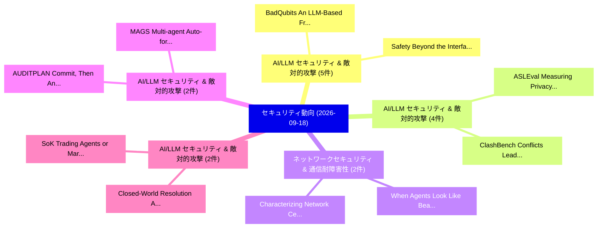

# 📅 02_daily: 日次エグゼクティブサマリー報告書 (2026-09-18)

**集計日時**: 2026-10-02 23:06:26 UTC  
**対象日付**: 2026-09-18  
**本日収集論文数**: 50 件  

---

## 💡 主要セキュリティ動向・脅威インサイト (Executive Insights)

本日の収集論文（計 50 件）において、以下の重点セキュリティ領域で活発な研究動向が確認されました：
- **AI/LLM セキュリティ & 敵対的攻撃** (5 件): 注目論文として 「BadQubits: An LLM-Based Framew...」、「Safety Beyond the Interface: D...」 等が発表され、実務防御および攻撃検証の進展が見られます。
- **AI/LLM セキュリティ & 敵対的攻撃** (4 件): 注目論文として 「ASLEval: Measuring Privacy Exp...」、「ClashBench: Conflicts Leading ...」 等が発表され、実務防御および攻撃検証の進展が見られます。
- **ネットワークセキュリティ & 通信耐障害性** (2 件): 注目論文として 「When Agents Look Like Beacons:...」、「Characterizing Network Central...」 等が発表され、実務防御および攻撃検証の進展が見られます。
- **AI/LLM セキュリティ & 敵対的攻撃** (2 件): 注目論文として 「AUDITPLAN: Commit, Then Answer...」、「MAGS: Multi-agent Auto-formali...」 等が発表され、実務防御および攻撃検証の進展が見られます。
- **AI/LLM セキュリティ & 敵対的攻撃** (2 件): 注目論文として 「Closed-World Resolution Agains...」、「SoK: Trading Agents or Market ...」 等が発表され、実務防御および攻撃検証の進展が見られます。

### 🗺️ 技術・脅威トピックマインドマップ

---

## 📌 日次セキュリティ論文一覧 (日本語表形式)

| No | arXiv ID | 論文タイトル (日本語訳) | 重要キーワード | 構造化エグゼクティブ要約 (背景・提案・影響) | 脅威分類 | 詳細リンク |
|---|---|---|---|---|---|---|
| 1 | `2609.18783` | [s-MDM: Generative Virtualization of Multi-Device Hardware Variations for Portable DL-SCATitle:（セキュリティ分析論文）](../../okf/papers/2026-09-18/2609.18783.md) | `Device Hardware Variations`, `Generative Virtualization`, `Multi-Device Hardware` | Deep Learning-based Side-Channel Analysis (DL-SCA) frequently suffers from catastrophic performance degradation across unseen hardware due to printed... | `security` | [arXiv](https://arxiv.org/abs/2609.18783) &#124; [OKF](../../okf/papers/2026-09-18/2609.18783.md) |
| 2 | `2609.18811` | [Differential Trust: Dynamic Multi-Authority Anonymous Credentials with Epoch-Weighted UpdatesTitle:（セキュリティ分析論文）](../../okf/papers/2026-09-18/2609.18811.md) | `Authority Anonymous Credentials`, `Differential Trust`, `Dynamic Multi` | Anonymous credentials (ACs) are fundamental to privacy-preserving authentication, allowing users to prove possession of attributes without revealing t... | `security` | [arXiv](https://arxiv.org/abs/2609.18811) &#124; [OKF](../../okf/papers/2026-09-18/2609.18811.md) |
| 3 | `2609.18862` | [CASHEWS: Source Preprocessor for LLM-based Malicious Package DetectionTitle:（セキュリティ分析論文）](../../okf/papers/2026-09-18/2609.18862.md) | `Source Preprocessor`, `Malicious Package`, `LLM-based Malicious` | Malicious npm package detection tools now leverage LLMs' semantic understanding of source code to detect malicious intent at scale. This capability ha... | `security` | [arXiv](https://arxiv.org/abs/2609.18862) &#124; [OKF](../../okf/papers/2026-09-18/2609.18862.md) |
| 4 | `2609.18864` | [ASLEval: Measuring Privacy Exposure Displacement in LLM Agent SessionsTitle:（セキュリティ分析論文）](../../okf/papers/2026-09-18/2609.18864.md) | `Measuring Privacy Exposure Displacement`, `tool-using LLM`, `multi-step session` | Privacy evaluations of tool-using LLM agents often inspect a designated action, final response, or attacker report. These local proxies can miss unaut... | `security` | [arXiv](https://arxiv.org/abs/2609.18864) &#124; [OKF](../../okf/papers/2026-09-18/2609.18864.md) |
| 5 | `2609.18866` | [Hamming Ideals and Grobner Bases for ISD-like Syndrome DecodingTitle:（セキュリティ分析論文）](../../okf/papers/2026-09-18/2609.18866.md) | `Hamming Ideals`, `Grobner Bases`, `ISD-like Syndrome` | We investigate an algebraic approach to the Syndrome Decoding Problem, based on a reformulation of the Hamming weight constraint and its integration w... | `security` | [arXiv](https://arxiv.org/abs/2609.18866) &#124; [OKF](../../okf/papers/2026-09-18/2609.18866.md) |
| 6 | `2609.18965` | [BadQubits: An LLM-Based Framework for Static Pre-Execution Structurally Harmful Quantum CircuitsTitle:の検出](../../okf/papers/2026-09-18/2609.18965.md) | `Structurally Harmful Quantum`, `Static Pre`, `Execution Detection` | This paper presents BadQubits, an LLM-based framework for static pre-execution detection of structurally harmful OpenQASM 2.0 circuits. The framework... | `security` | [arXiv](https://arxiv.org/abs/2609.18965) &#124; [OKF](../../okf/papers/2026-09-18/2609.18965.md) |
| 7 | `2609.19021` | [Context-Aware Operational Security for Autonomous DronesTitle:（セキュリティ分析論文）](../../okf/papers/2026-09-18/2609.19021.md) | `Aware Operational Security`, `Context-Aware Operational`, `drone-based services` | Autonomous drone-based services have been gaining significant interest across various application domains due to their mobility, flexibility, cost-eff... | `security` | [arXiv](https://arxiv.org/abs/2609.19021) &#124; [OKF](../../okf/papers/2026-09-18/2609.19021.md) |
| 8 | `2609.19036` | [Structural Decomposability of Encrypted Traffic Side-Channel LeakageTitle:（セキュリティ分析論文）](../../okf/papers/2026-09-18/2609.19036.md) | `Encrypted Traffic Side`, `Structural Decomposability`, `Side-Channel LeakageTitle` | Existing side-channel theories treat leakage as a holistic quantity $I(X;Y)$, without characterizing its internal structure. This paper studies the \e... | `security` | [arXiv](https://arxiv.org/abs/2609.19036) &#124; [OKF](../../okf/papers/2026-09-18/2609.19036.md) |
| 9 | `2609.19091` | [When Agents Look Like Beacons: NIDS Evasion by Model Context Protocol TrafficTitle:（セキュリティ分析論文）](../../okf/papers/2026-09-18/2609.19091.md) | `Model Context Protocol`, `Artificial Intelligence`, `Cobalt Strike` | The Model Context Protocol (MCP) standardizes communication between autonomous Artificial Intelligence (AI) agents and remote tools over Streamable HT... | `security` | [arXiv](https://arxiv.org/abs/2609.19091) &#124; [OKF](../../okf/papers/2026-09-18/2609.19091.md) |
| 10 | `2609.19100` | [Characterizing Network Centralization and Observability in the Remote MCP EcosystemTitle:（セキュリティ分析論文）](../../okf/papers/2026-09-18/2609.19100.md) | `Characterizing Network Centralization`, `Hirschman Index`, `three-tier observability` | The Model Context Protocol (MCP) has emerged as the dominant interface for connecting autonomous agents to external data sources and execution environ... | `security` | [arXiv](https://arxiv.org/abs/2609.19100) &#124; [OKF](../../okf/papers/2026-09-18/2609.19100.md) |
| 11 | `2609.19111` | [Analog Pin Directionality as an Exfiltration Attack Surface in Mixed-Signal ICsTitle:（セキュリティ分析論文）](../../okf/papers/2026-09-18/2609.19111.md) | `Analog Pin Directionality`, `Exfiltration Attack Surface`, `Mixed-Signal ICsTitle` | Mixed-signal SoCs rely on nominally input-only analog pins to acquire off-chip signals, but the directionality of these interfaces is generally treate... | `security` | [arXiv](https://arxiv.org/abs/2609.19111) &#124; [OKF](../../okf/papers/2026-09-18/2609.19111.md) |
| 12 | `2609.19140` | [AgentLSD: Evaluating AI Security Agents Under Adversarial Task ContaminationTitle:（セキュリティ分析論文）](../../okf/papers/2026-09-18/2609.19140.md) | `attacker-supplied instructions`, `non-instructional evidence`, `task` | AI agents for security inspect web pages, source code, logs, configuration files, and command outputs. These environments may contain deceptive artifa... | `security` | [arXiv](https://arxiv.org/abs/2609.19140) &#124; [OKF](../../okf/papers/2026-09-18/2609.19140.md) |
| 13 | `2609.19201` | [EvoSherlock: Agentic Lifelong Evolution for Unseen Long-Tailed Security-Critical Events in VideosTitle:に向けて](../../okf/papers/2026-09-18/2609.19201.md) | `Towards Agentic Lifelong Evolution`, `Tailed Security`, `Critical Events` | Existing Security-oriented Video Understanding (SVU) systems assume a \emph{closed world}, \ie static category sets, abundant labels, and the premise... | `security` | [arXiv](https://arxiv.org/abs/2609.19201) &#124; [OKF](../../okf/papers/2026-09-18/2609.19201.md) |
| 14 | `2609.19226` | [PAPC: Platform Mediation for Privacy-Propagation Externalities in AI-Mediated WorkflowsTitle:（セキュリティ分析論文）](../../okf/papers/2026-09-18/2609.19226.md) | `Platform Mediation`, `Propagation Externalities`, `Privacy-Propagation Externalities` | AI-mediated platforms coordinate work through LLM agents acting for different principals. In these workflows, privacy loss can be created before a fin... | `security` | [arXiv](https://arxiv.org/abs/2609.19226) &#124; [OKF](../../okf/papers/2026-09-18/2609.19226.md) |
| 15 | `2609.19241` | [Robust Conformal Intrusion Detection via Traffic-Aware Calibration and Attack-Orbit InvarianceTitle:（セキュリティ分析論文）](../../okf/papers/2026-09-18/2609.19241.md) | `Robust Conformal Intrusion Detection`, `Aware Calibration`, `Traffic-Aware Calibration` | Large language models fine-tuned for network intrusion detection emit single-point predictions without statistical validity guarantees. Conformal pred... | `security` | [arXiv](https://arxiv.org/abs/2609.19241) &#124; [OKF](../../okf/papers/2026-09-18/2609.19241.md) |
| 16 | `2609.19325` | [AUDITPLAN: Commit, Then Answer for Auditable Safety AlignmentTitle:（セキュリティ分析論文）](../../okf/papers/2026-09-18/2609.19325.md) | `Auditable Safety`, `single-model plan`, `machine-checkable auditing` | Safety tuning pipelines judge only the final answer, which makes it difficult to distinguish robust refusal from two undesirable shortcuts: blanket re... | `security` | [arXiv](https://arxiv.org/abs/2609.19325) &#124; [OKF](../../okf/papers/2026-09-18/2609.19325.md) |
| 17 | `2609.19353` | [Scaling Zero Knowledge UNSAT Verification via Normalized ChainingTitle:（セキュリティ分析論文）](../../okf/papers/2026-09-18/2609.19353.md) | `Scaling Zero Knowledge`, `real-world settings`, `security-sensitive information` | Proofs of UNSAT are a standard primitive in formal verification and software assurance. In many real-world settings, the proof itself encodes propriet... | `security` | [arXiv](https://arxiv.org/abs/2609.19353) &#124; [OKF](../../okf/papers/2026-09-18/2609.19353.md) |
| 18 | `2609.19391` | [MAGS: Multi-agent Auto-formalization Guarantees Safety for Agentic OutputsTitle:（セキュリティ分析論文）](../../okf/papers/2026-09-18/2609.19391.md) | `Guarantees Safety`, `Multi-agent Auto`, `machine-checkable guarantees` | LLM coding agents now generate complex programs at a scale that makes thorough human review increasingly difficult, raising the risk of safety and sec... | `security` | [arXiv](https://arxiv.org/abs/2609.19391) &#124; [OKF](../../okf/papers/2026-09-18/2609.19391.md) |
| 19 | `2609.19425` | [Closed-World Resolution Against Tool Hallucination in LLMエージェントTitle:](../../okf/papers/2026-09-18/2609.19425.md) | `Closed-World Resolution`, `Tool-augmented large`, `Resolution Rung` | Tool-augmented large language model (LLM) agents fail in a way no tool-selection or tool-security method addresses: they call tools that do not exist... | `security` | [arXiv](https://arxiv.org/abs/2609.19425) &#124; [OKF](../../okf/papers/2026-09-18/2609.19425.md) |
| 20 | `2609.19456` | [Beyond Private Training: The New Landscape of AI PrivacyTitle:（セキュリティ分析論文）](../../okf/papers/2026-09-18/2609.19456.md) | `Beyond Private Training`, `Retrieval-augmented systems`, `traversal-safe deletion` | Retrieval-augmented systems increasingly rely on vector indexes that may retain deleted items in their search graph. Existing deletion interfaces can... | `security` | [arXiv](https://arxiv.org/abs/2609.19456) &#124; [OKF](../../okf/papers/2026-09-18/2609.19456.md) |
| 21 | `2609.19472` | [Safety Beyond the Interface: Detecting Harm via Latent States in 大規模言語モデルTitle:](../../okf/papers/2026-09-18/2609.19472.md) | `Safety Beyond`, `Detecting Harm`, `Latent States` | Autonomous systems increasingly rely on Large Language Models (LLMs) yet the safety infrastructure surrounding these models introduces latency and com... | `security` | [arXiv](https://arxiv.org/abs/2609.19472) &#124; [OKF](../../okf/papers/2026-09-18/2609.19472.md) |
| 22 | `2609.19556` | [Cyber Exodus: Burnout Symptoms, Exit Intention, and Peer Response in Online サイバーセキュリティ CommunitiesTitle:](../../okf/papers/2026-09-18/2609.19556.md) | `Cyber Exodus`, `Burnout Symptoms`, `Exit Intention` | Security practitioners burn out at high rates, and the resulting attrition is itself a security problem. This workforce is hard to study: security ope... | `security` | [arXiv](https://arxiv.org/abs/2609.19556) &#124; [OKF](../../okf/papers/2026-09-18/2609.19556.md) |
| 23 | `2609.19587` | [Red-Teaming Auto Mode: Improving Blocking Classifiers Against Malign Coding AgentsTitle:（セキュリティ分析論文）](../../okf/papers/2026-09-18/2609.19587.md) | `Teaming Auto Mode`, `Red-Teaming Auto`, `Auto Mode` | To keep coding agents from going off the rails, production systems now review each proposed action with a blocking monitor that can reject it before i... | `security` | [arXiv](https://arxiv.org/abs/2609.19587) &#124; [OKF](../../okf/papers/2026-09-18/2609.19587.md) |
| 24 | `2609.19640` | [A Policy Profile for Croissant: Refusal as a Property of the DatasetTitle:（セキュリティ分析論文）](../../okf/papers/2026-09-18/2609.19640.md) | `Policy Profile`, `machine-readable descriptor`, `caller-side authority` | Croissant is the de facto machine-readable descriptor for ML datasets: JSON-LD over . Since version 1.1 it also carries data use conditions, recommend... | `security` | [arXiv](https://arxiv.org/abs/2609.19640) &#124; [OKF](../../okf/papers/2026-09-18/2609.19640.md) |
| 25 | `2609.19705` | [SoK: Trading Agents or Market Crashers? Dissecting Robustness and Security Failures in Academic Financial LLM Trading SchemesTitle:（セキュリティ分析論文）](../../okf/papers/2026-09-18/2609.19705.md) | `Trading Agents`, `Market Crashers`, `Dissecting Robustness` | Autonomous large language model (LLM) agents are moving rapidly into high-stakes domains, yet existing agentic-AI security studies remain largely doma... | `security` | [arXiv](https://arxiv.org/abs/2609.19705) &#124; [OKF](../../okf/papers/2026-09-18/2609.19705.md) |
| 26 | `2609.19720` | [Reachability, Not Observation: Containing Systems Whose Wiring ChangesTitle:（セキュリティ分析論文）](../../okf/papers/2026-09-18/2609.19720.md) | `Containing Systems Whose Wiring`, `always-on ring`, `time-aware defender` | Containment decisions -- where to put a firewall, which links to monitor, what a program may reach -- are computed from an observed structure, and obs... | `security` | [arXiv](https://arxiv.org/abs/2609.19720) &#124; [OKF](../../okf/papers/2026-09-18/2609.19720.md) |
| 27 | `2609.19722` | [ALIBI: Adversarial Legitimacy Injection in Binary Input against LLM Malware AnalyzersTitle:（セキュリティ分析論文）](../../okf/papers/2026-09-18/2609.19722.md) | `Adversarial Legitimacy Injection`, `Binary Input`, `analyst-facing verdicts` | Large language models are being integrated into malware triage workflows as reasoning components that summarize static evidence and produce analyst-fa... | `security` | [arXiv](https://arxiv.org/abs/2609.19722) &#124; [OKF](../../okf/papers/2026-09-18/2609.19722.md) |
| 28 | `2609.19791` | [Sybil-TraceGuard: Traceability-enhanced Sybil Guardian for Connected and 自動運転車両 Using Dynamic Semi-supervised GNNTitle:](../../okf/papers/2026-09-18/2609.19791.md) | `Autonomous Vehicles Using Dynamic Semi`, `Sybil Guardian`, `Traceability-enhanced Sybil` | Connected and autonomous vehicles (CAVs) face severe Sybil attacks, where attackers exploit privacy-preserving pseudonym-switching mechanisms to anoma... | `security` | [arXiv](https://arxiv.org/abs/2609.19791) &#124; [OKF](../../okf/papers/2026-09-18/2609.19791.md) |
| 29 | `2609.19844` | [Trust, but Validate the Instrument: Auditing AI-Generated RTL Verification Plans on Authored Security-Regression ProxiesTitle:（セキュリティ分析論文）](../../okf/papers/2026-09-18/2609.19844.md) | `Verification Plans`, `Authored Security`, `AI-Generated RTL` | AI-generated RTL verification plans can satisfy a provider schema yet fail at the boundary to trusted execution. We present SecTB-RTL, an auditable fr... | `security` | [arXiv](https://arxiv.org/abs/2609.19844) &#124; [OKF](../../okf/papers/2026-09-18/2609.19844.md) |
| 30 | `2609.19892` | [ClashBench: Conflicts Leading Agents to Seize and HarmTitle:（セキュリティ分析論文）](../../okf/papers/2026-09-18/2609.19892.md) | `Conflicts Leading Agents`, `pre-existing user`, `resource` | As agent systems become more widely used, multiple agent sessions increasingly run alongside pre-existing user tasks in the same environment, sharing... | `security` | [arXiv](https://arxiv.org/abs/2609.19892) &#124; [OKF](../../okf/papers/2026-09-18/2609.19892.md) |
| 31 | `2609.19893` | [Hopper: Bounded-Memory Collaborative Debiasing for Byzantine-Tolerant Peer SamplingTitle:（セキュリティ分析論文）](../../okf/papers/2026-09-18/2609.19893.md) | `Memory Collaborative Debiasing`, `Tolerant Peer`, `Bounded-Memory Collaborative` | Byzantine-tolerant peer sampling relies on continuously refreshed views, yet an adversary can bias the identifier streams used to construct them. Freq... | `security` | [arXiv](https://arxiv.org/abs/2609.19893) &#124; [OKF](../../okf/papers/2026-09-18/2609.19893.md) |
| 32 | `2609.19900` | [Delphi Scanner: efficient and interpretable static マルウェア検出 via API sequence modelingTitle:](../../okf/papers/2026-09-18/2609.19900.md) | `Delphi Scanner`, `Windows Portable Executable`, `rule-based layer` | Static malware detection for Windows Portable Executable files demands a careful balance between detection effectiveness, computational efficiency, an... | `security` | [arXiv](https://arxiv.org/abs/2609.19900) &#124; [OKF](../../okf/papers/2026-09-18/2609.19900.md) |
| 33 | `2609.19920` | [Mind the Gap: How SBOM Specification Ambiguities Lead to Divergent Software Bills of Materials. An Empirical Tool StudyTitle:（セキュリティ分析論文）](../../okf/papers/2026-09-18/2609.19920.md) | `Specification Ambiguities Lead`, `Divergent Software Bills`, `European Cyber Resilience Act` | Software Bill of Materials (SBOMs) will become mandatory starting in December 2027 under the European Cyber Resilience Act (CRA) [8]. Although previou... | `security` | [arXiv](https://arxiv.org/abs/2609.19920) &#124; [OKF](../../okf/papers/2026-09-18/2609.19920.md) |
| 34 | `2609.19929` | [On the Leakage of Massey Secret Sharing Schemes under Linear ComputationsTitle:（セキュリティ分析論文）](../../okf/papers/2026-09-18/2609.19929.md) | `Massey Secret Sharing Schemes`, `LERS-derived leakage`, `secret` | Leakage attacks on secret sharing schemes exploit partial information about individual shares to recover the underlying secret. In coding theory, line... | `security` | [arXiv](https://arxiv.org/abs/2609.19929) &#124; [OKF](../../okf/papers/2026-09-18/2609.19929.md) |
| 35 | `2609.19977` | [JANUS: Denial-of-Service Attack Against Beam Hopping in LEO Satellite NetworksTitle:（セキュリティ分析論文）](../../okf/papers/2026-09-18/2609.19977.md) | `Low Earth`, `beam-selection decisions`, `beam-hopping systems` | Low Earth orbit (LEO) satellite networks are increasingly used to provide global connectivity. However, each satellite has limited resources that need... | `security` | [arXiv](https://arxiv.org/abs/2609.19977) &#124; [OKF](../../okf/papers/2026-09-18/2609.19977.md) |
| 36 | `2609.20010` | [XIR: A Framework for Interoperability across Cross-Chain Protocols Based on a Verifiable Intermediate RepresentationTitle:（セキュリティ分析論文）](../../okf/papers/2026-09-18/2609.20010.md) | `Chain Protocols Based`, `Verifiable Intermediate`, `Cross-Chain Protocols` | Cross-chain protocols enable applications to exchange messages across blockchains. Under point-to-point configurations, communication depends on a dir... | `security` | [arXiv](https://arxiv.org/abs/2609.20010) &#124; [OKF](../../okf/papers/2026-09-18/2609.20010.md) |
| 37 | `2609.20069` | [Competition, Collusion, and Corruption: The Spectrum of MEV Attacks on DAG-Based BFT Consensus ProtocolsTitle:（セキュリティ分析論文）](../../okf/papers/2026-09-18/2609.20069.md) | `DAG-Based BFT`, `Byzantine Fault`, `bft` | Byzantine Fault-Tolerant (BFT) protocols guarantee safety and liveness despite the malicious failure of nodes. However, they do not prevent adversaria... | `security` | [arXiv](https://arxiv.org/abs/2609.20069) &#124; [OKF](../../okf/papers/2026-09-18/2609.20069.md) |
| 38 | `2609.20095` | [A Scalable Trust Discovery Architecture for the Internet of AgentsTitle:（セキュリティ分析論文）](../../okf/papers/2026-09-18/2609.20095.md) | `Scalable Trust Discovery Architecture`, `Agent Root`, `Agent Registry` | The Internet of Agents is expected to enable large numbers of autonomous agents to discover, verify, and collaborate with each other across heterogene... | `security` | [arXiv](https://arxiv.org/abs/2609.20095) &#124; [OKF](../../okf/papers/2026-09-18/2609.20095.md) |
| 39 | `2609.20188` | [ResumeShield: Channel Separation and an Open Benchmark for Indirect Prompt Injection in AI Resume ScreeningTitle:（セキュリティ分析論文）](../../okf/papers/2026-09-18/2609.20188.md) | `Indirect Prompt Injection`, `Channel Separation`, `Open Benchmark` | An AI resume screener reads a document supplied by the person it is evaluating, inverting the usual trust relationship between an assessor and the mat... | `security` | [arXiv](https://arxiv.org/abs/2609.20188) &#124; [OKF](../../okf/papers/2026-09-18/2609.20188.md) |
| 40 | `2609.20211` | [Silence Is Endorsement: Verification-Status Laundering in LLM Agent PipelinesTitle:（セキュリティ分析論文）](../../okf/papers/2026-09-18/2609.20211.md) | `Status Laundering`, `Verification-Status Laundering`, `agent` | Safety monitors in LLM agent systems often judge actions from summaries or stored handoffs, not from the original evidence. This creates a simple but... | `security` | [arXiv](https://arxiv.org/abs/2609.20211) &#124; [OKF](../../okf/papers/2026-09-18/2609.20211.md) |
| 41 | `2609.20314` | [DDQN-MLP: An Explainable and Adversarially Robust DRL-Guided Adaptive Learning Framework for Ransomware DetectionTitle:（セキュリティ分析論文）](../../okf/papers/2026-09-18/2609.20314.md) | `Adversarially Robust`, `DRL-Guided Adaptive`, `benign-like behaviors` | Ransomware detection remains challenging because modern variants exhibit diverse, evasive, and partly benign-like behaviors that undermine fixed super... | `security` | [arXiv](https://arxiv.org/abs/2609.20314) &#124; [OKF](../../okf/papers/2026-09-18/2609.20314.md) |
| 42 | `2609.20370` | [The More It Says, the More You Pay: A Black-Box Audit of Provider-Side Token Inflation in LLM ServicesTitle:（セキュリティ分析論文）](../../okf/papers/2026-09-18/2609.20370.md) | `Provider-Side Token`, `Side Token Inflation`, `Box Audit` | In pay-per-token LLM services, the more a model says, the more users pay. Dishonest providers can covertly manipulate generation to inflate output tok... | `security` | [arXiv](https://arxiv.org/abs/2609.20370) &#124; [OKF](../../okf/papers/2026-09-18/2609.20370.md) |
| 43 | `2609.20386` | [Compact Vision Models for Iris Presentation Attack Detection under Presentation Attack Instrument Shift and Environmental DegradationTitle:（セキュリティ分析論文）](../../okf/papers/2026-09-18/2609.20386.md) | `Iris Presentation Attack Detection`, `Presentation Attack Instrument Shift`, `Compact Vision Models` | Iris presentation attack detection (PAD) is security-critical when a subsystem that appears reliable during development encounters presentation attack... | `security` | [arXiv](https://arxiv.org/abs/2609.20386) &#124; [OKF](../../okf/papers/2026-09-18/2609.20386.md) |
| 44 | `2609.20457` | [Fingerprinting Multimodal 大規模言語モデルTitle:](../../okf/papers/2026-09-18/2609.20457.md) | `Fingerprinting Multimodal Large Language`, `image-text reasoning`, `low-frequency components` | While multimodal large language models (MLLMs) enable a wide range of image-text reasoning tasks, recent incidents indicate that they are vulnerable t... | `security` | [arXiv](https://arxiv.org/abs/2609.20457) &#124; [OKF](../../okf/papers/2026-09-18/2609.20457.md) |
| 45 | `2609.20480` | [Worst-Case Hidden-Vehicle Trajectory Search in Spatiotemporal Occlusion RegionsTitle:（セキュリティ分析論文）](../../okf/papers/2026-09-18/2609.20480.md) | `Vehicle Trajectory Search`, `Case Hidden`, `Spatiotemporal Occlusion` | Occlusion creates fundamental uncertainty in autonomous driving. Existing methods often propagate frame-wise hypotheses or optimize ego behavior again... | `security` | [arXiv](https://arxiv.org/abs/2609.20480) &#124; [OKF](../../okf/papers/2026-09-18/2609.20480.md) |
| 46 | `2609.20532` | [TEE-Certified DP: Verifiable Differentially Private Training on Legacy GPUsTitle:に向けて](../../okf/papers/2026-09-18/2609.20532.md) | `Verifiable Differentially Private Training`, `TEE-Certified DP`, `Trusted Execution Environments` | Wide adoption of machine learning has created growing policy and regulatory demand for protecting sensitive training data, with differential privacy (... | `security` | [arXiv](https://arxiv.org/abs/2609.20532) &#124; [OKF](../../okf/papers/2026-09-18/2609.20532.md) |
| 47 | `2609.20561` | [Empirical Randomness Quality in Differential Privacy MechanismsTitle:の分析](../../okf/papers/2026-09-18/2609.20561.md) | `Differential Privacy`, `Randomness Quality`, `True Random Number Generators` | Differential Privacy (DP) relies on carefully calibrated random noise to protect individual privacy in statistical analyses. While theoretical work ha... | `security` | [arXiv](https://arxiv.org/abs/2609.20561) &#124; [OKF](../../okf/papers/2026-09-18/2609.20561.md) |
| 48 | `2609.20601` | [Weather Data Spoofing Attacks on Rain-Adaptive Millimeter-Wave Frequency Selection in V2X Communication NetworksTitle:（セキュリティ分析論文）](../../okf/papers/2026-09-18/2609.20601.md) | `Weather Data Spoofing Attacks`, `Wave Frequency Selection`, `Adaptive Millimeter` | Connected vehicles use millimeter-wave (mmWave) sidelinks for the data rates cooperative driving demands, and emerging designs select the carrier band... | `security` | [arXiv](https://arxiv.org/abs/2609.20601) &#124; [OKF](../../okf/papers/2026-09-18/2609.20601.md) |
| 49 | `2609.20614` | [Inference-Engine Fingerprinting Attacks are Practical: Exploring Model-Driven Environmental Discovery, Exploitation, and EscapeTitle:（セキュリティ分析論文）](../../okf/papers/2026-09-18/2609.20614.md) | `Engine Fingerprinting Attacks`, `Driven Environmental Discovery`, `Exploring Model` | Frontier AI models are rapidly gaining the ability to exploit vulnerabilities in complex pieces of software. The risk is not theoretical, as evidenced... | `security` | [arXiv](https://arxiv.org/abs/2609.20614) &#124; [OKF](../../okf/papers/2026-09-18/2609.20614.md) |
| 50 | `2609.20650` | [Multi-center Medical Data Mining with FL-Net - A One-stop Shop for 連合学習Title:](../../okf/papers/2026-09-18/2609.20650.md) | `Medical Data Mining`, `Multi-center Medical`, `One-stop Shop` | Federated learning enables collaborative training without sharing patient-level data, but most studies remain simulations. Based on five requirements... | `security` | [arXiv](https://arxiv.org/abs/2609.20650) &#124; [OKF](../../okf/papers/2026-09-18/2609.20650.md) |

