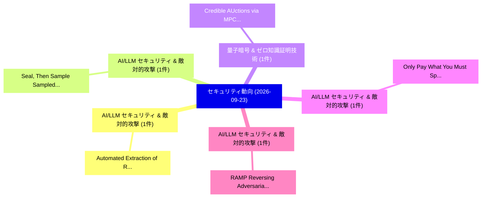

# 📅 02_daily: 日次エグゼクティブサマリー報告書 (2026-09-23)

**集計日時**: 2026-10-02 23:06:26 UTC  
**対象日付**: 2026-09-23  
**本日収集論文数**: 25 件  

---

## 💡 主要セキュリティ動向・脅威インサイト (Executive Insights)

本日の収集論文（計 25 件）において、以下の重点セキュリティ領域で活発な研究動向が確認されました：
- **AI/LLM セキュリティ & 敵対的攻撃** (1 件): 注目論文として 「Automated Extraction of Record...」 等が発表され、実務防御および攻撃検証の進展が見られます。
- **AI/LLM セキュリティ & 敵対的攻撃** (1 件): 注目論文として 「Seal, Then Sample: Sampled Lay...」 等が発表され、実務防御および攻撃検証の進展が見られます。
- **量子暗号 & ゼロ知識証明技術** (1 件): 注目論文として 「Credible AUctions via MPC Gadg...」 等が発表され、実務防御および攻撃検証の進展が見られます。
- **AI/LLM セキュリティ & 敵対的攻撃** (1 件): 注目論文として 「Only Pay What You Must Spend: ...」 等が発表され、実務防御および攻撃検証の進展が見られます。
- **AI/LLM セキュリティ & 敵対的攻撃** (1 件): 注目論文として 「RAMP: Reversing Adversarial Pe...」 等が発表され、実務防御および攻撃検証の進展が見られます。

### 🗺️ 技術・脅威トピックマインドマップ

---

## 📌 日次セキュリティ論文一覧 (日本語表形式)

| No | arXiv ID | 論文タイトル (日本語訳) | 重要キーワード | 構造化エグゼクティブ要約 (背景・提案・影響) | 脅威分類 | 詳細リンク |
|---|---|---|---|---|---|---|
| 1 | `2609.27359` | [Automated Extraction of Records of Processing Activities (RoPA) Using Hybrid RAG and Locally Deployed 大規模言語モデル](../../okf/papers/2026-09-23/2609.27359.md) | `Locally Deployed Large Language Models`, `Processing Activities`, `Automated Extraction` | Vietnam's Personal Data Protection Law (Law No. 91/2025/QH15) and Decree No. 356/2025/ND-CP, effective January 1, 2026, require organizations to estab... | `cryptography` | [arXiv](https://arxiv.org/abs/2609.27359) &#124; [OKF](../../okf/papers/2026-09-23/2609.27359.md) |
| 2 | `2609.27367` | [Seal, Then Sample: Sampled Layerwise Proofs for Verifiable LLM Inference from GPT-2 to 70B（セキュリティ分析論文）](../../okf/papers/2026-09-23/2609.27367.md) | `Sampled Layerwise Proofs`, `language-model inference`, `Youki Lim` | Verifying outsourced language-model inference requires a precisely identified computation and an audit whose cost a service can afford. We present Sam... | `cryptography` | [arXiv](https://arxiv.org/abs/2609.27367) &#124; [OKF](../../okf/papers/2026-09-23/2609.27367.md) |
| 3 | `2609.27402` | [Credible AUctions via MPC Gadgets: Bounding Information Leakage Under Abort（セキュリティ分析論文）](../../okf/papers/2026-09-23/2609.27402.md) | `revenue-maximizing auctioneer`, `Matheus Venturyne Xavier Ferreira`, `Secure Multi` | The design of credible auctions---mechanisms where a revenue-maximizing auctioneer has no incentive to deviate from the protocol---faces a fundamental... | `cryptography` | [arXiv](https://arxiv.org/abs/2609.27402) &#124; [OKF](../../okf/papers/2026-09-23/2609.27402.md) |
| 4 | `2609.27406` | [Only Pay What You Must Spend: On-Demand Privacy Budget Payment for Differentially Private RAG（セキュリティ分析論文）](../../okf/papers/2026-09-23/2609.27406.md) | `Demand Privacy Budget Payment`, `Differentially Private`, `On-Demand Privacy` | Deploying large language models (LLMs) on sensitive data via Retrieval-Augmented Generation (RAG) introduces severe privacy risks. Recent studies appl... | `cryptography` | [arXiv](https://arxiv.org/abs/2609.27406) &#124; [OKF](../../okf/papers/2026-09-23/2609.27406.md) |
| 5 | `2609.27422` | [RAMP: Reversing Adversarial Perturbations to Strengthen Clean-Label Backdoor Attacks against Malware Detectors（セキュリティ分析論文）](../../okf/papers/2026-09-23/2609.27422.md) | `Reversing Adversarial Perturbations`, `Label Backdoor Attacks`, `Strengthen Clean` | Deep learning-based malware detectors are commonly updated by fine-tuning on newly collected samples, but this practical update pipeline also creates... | `cryptography` | [arXiv](https://arxiv.org/abs/2609.27422) &#124; [OKF](../../okf/papers/2026-09-23/2609.27422.md) |
| 6 | `2609.27424` | [EVAGE: Autonomous MEV Generation and Adaptation via Multi-Agent Harness（セキュリティ分析論文）](../../okf/papers/2026-09-23/2609.27424.md) | `Agent Harness`, `Multi-Agent Harness`, `Maximal Extractable Value` | Maximal Extractable Value (MEV) has evolved into a major economic force in blockchain ecosystems, yet its capture is dominated by experienced teams, a... | `cryptography` | [arXiv](https://arxiv.org/abs/2609.27424) &#124; [OKF](../../okf/papers/2026-09-23/2609.27424.md) |
| 7 | `2609.27427` | [Extracting CNNs in the Unknown-Architecture and Feedback-Agnostic Setting（セキュリティ分析論文）](../../okf/papers/2026-09-23/2609.27427.md) | `Agnostic Setting`, `Feedback-Agnostic Setting`, `Jiashuo Liu` | This paper studies the cryptanalytic extraction of convolutional neural networks (CNNs). Existing cryptanalytic extraction attacks on CNNs assume that... | `cryptography` | [arXiv](https://arxiv.org/abs/2609.27427) &#124; [OKF](../../okf/papers/2026-09-23/2609.27427.md) |
| 8 | `2609.27428` | [A Bulletproof Business? Detecting Infrastructure-as-a-Service Offerings on Telegramに向けて](../../okf/papers/2026-09-23/2609.27428.md) | `Towards Detecting Infrastructure`, `Bulletproof Business`, `Service Offerings` | Cybercriminal operations increasingly depend on reusable digital infrastructure---including hosting, proxies, and virtual private networks (VPNs)---re... | `cryptography` | [arXiv](https://arxiv.org/abs/2609.27428) &#124; [OKF](../../okf/papers/2026-09-23/2609.27428.md) |
| 9 | `2609.27452` | [Issuer-Sovereign Agentic Payments（セキュリティ分析論文）](../../okf/papers/2026-09-23/2609.27452.md) | `Sovereign Agentic Payments`, `Issuer-Sovereign Agentic`, `Dishant Sharma` | AI agents are beginning to make real payments. Current approaches let an agent pay by relying on a credential provider that, in the approaches deploye... | `cryptography` | [arXiv](https://arxiv.org/abs/2609.27452) &#124; [OKF](../../okf/papers/2026-09-23/2609.27452.md) |
| 10 | `2609.27528` | [MDRC: A Deployable State-Recovery Defense for Traffic Signal Control under Sensor Corruption（セキュリティ分析論文）](../../okf/papers/2026-09-23/2609.27528.md) | `Traffic Signal Control`, `Deployable State`, `Recovery Defense` | Traffic Signal Control (TSC) is a safety-critical cyber-physical system that relies on real-time sensing. Corrupted observations caused by adversarial... | `cryptography` | [arXiv](https://arxiv.org/abs/2609.27528) &#124; [OKF](../../okf/papers/2026-09-23/2609.27528.md) |
| 11 | `2609.27542` | [Control-Token Injection Suppresses Chain-of-Thought and Defeats Reasoning-Based Oversight in Tool-Using Agents（セキュリティ分析論文）](../../okf/papers/2026-09-23/2609.27542.md) | `Token Injection Suppresses Chain`, `Defeats Reasoning`, `Based Oversight` | The safety of a tool-using language model agent is usually treated as a property of the model alone. We give controlled, full-precision evidence that... | `cryptography` | [arXiv](https://arxiv.org/abs/2609.27542) &#124; [OKF](../../okf/papers/2026-09-23/2609.27542.md) |
| 12 | `2609.27567` | [CCR: a Common, Quality-Gated CACAO Integrations Registry for European Cybersecurity Automationに向けて](../../okf/papers/2026-09-23/2609.27567.md) | `European Cybersecurity Automation`, `Integrations Registry`, `Quality-Gated CACAO` | Standardised, machine-readable cybersecurity playbooks provide a basis for portable, shareable, and reusable incident-response logic. OASIS CACAO prov... | `cryptography` | [arXiv](https://arxiv.org/abs/2609.27567) &#124; [OKF](../../okf/papers/2026-09-23/2609.27567.md) |
| 13 | `2609.27624` | [Agent Name Collision Attacks in Multi-Agent Systems（セキュリティ分析論文）](../../okf/papers/2026-09-23/2609.27624.md) | `Agent Name Collision Attacks`, `Agent Systems`, `Multi-Agent Systems` | Multi-agent hosts turn remote Agent Cards into local agents, tools, workflow targets, and broker routes. A2A defines the card's name as human-readable... | `cryptography` | [arXiv](https://arxiv.org/abs/2609.27624) &#124; [OKF](../../okf/papers/2026-09-23/2609.27624.md) |
| 14 | `2609.27996` | [Your Model Is Leaking: Covert Information Transfer through LLM Residual Streams（セキュリティ分析論文）](../../okf/papers/2026-09-23/2609.27996.md) | `Covert Information Transfer`, `Residual Streams`, `Privacy-sensitive organizations` | Privacy-sensitive organizations may run large language models (LLMs) in restricted or air-gapped environments while exporting selected diagnostic arti... | `cryptography` | [arXiv](https://arxiv.org/abs/2609.27996) &#124; [OKF](../../okf/papers/2026-09-23/2609.27996.md) |
| 15 | `2609.28115` | [No Place to Hide: An Analysis on Protected Order Flow Sandwich Attacks（セキュリティ分析論文）](../../okf/papers/2026-09-23/2609.28115.md) | `Protected Order Flow Sandwich Attacks`, `Christof Ferreira Torres`, `Lioba Heimbach` | Front-running has long plagued Ethereum's public mempool, earning it the nickname of a "dark forest", where predators lurk for profitable transactions... | `cryptography` | [arXiv](https://arxiv.org/abs/2609.28115) &#124; [OKF](../../okf/papers/2026-09-23/2609.28115.md) |
| 16 | `2609.28170` | [Safety-Aware Zero Trust Enforcement for IoT and Cyber-Physical Systems（セキュリティ分析論文）](../../okf/papers/2026-09-23/2609.28170.md) | `Aware Zero Trust Enforcement`, `Safety-Aware Zero`, `Physical Systems` | Zero Trust (ZT) replaces the implicit trust of perimeter-based security with explicit, continuous, context-aware authorization. This shift is particul... | `cryptography` | [arXiv](https://arxiv.org/abs/2609.28170) &#124; [OKF](../../okf/papers/2026-09-23/2609.28170.md) |
| 17 | `2609.28205` | [GUIAuditor: Enabling Post-hoc Child Safety Forensics via Action-Guided GUI Provenance on Mobile Devices（セキュリティ分析論文）](../../okf/papers/2026-09-23/2609.28205.md) | `Child Safety Forensics`, `Enabling Post`, `Mobile Devices` | The proliferation of smart devices exposes children to online risks like grooming and financial scams that are deeply embedded within legitimate appli... | `cryptography` | [arXiv](https://arxiv.org/abs/2609.28205) &#124; [OKF](../../okf/papers/2026-09-23/2609.28205.md) |
| 18 | `2609.28209` | [Do Electromagnetic Side-Channel Attacks Threaten Electronic Polling Stations? Scenarios and Recommendations（セキュリティ分析論文）](../../okf/papers/2026-09-23/2609.28209.md) | `Channel Attacks Threaten Electronic Polling Stations`, `Side-Channel Attacks`, `name` | This paper investigates the threat to ballot secrecy in the Brazilian electronic voting machine (UEB) posed by electromagnetic side-channel attacks, a... | `cryptography` | [arXiv](https://arxiv.org/abs/2609.28209) &#124; [OKF](../../okf/papers/2026-09-23/2609.28209.md) |
| 19 | `2609.28226` | [Pinpointing Super-Quadratic Quantum Enumeration Speedups: Exact and Certified Evaluation of the Guessing-Moment Exponent under Product-Distribution Advice（セキュリティ分析論文）](../../okf/papers/2026-09-23/2609.28226.md) | `Quadratic Quantum Enumeration Speedups`, `Pinpointing Super`, `Moment Exponent` | Grover's algorithm gives an optimal quadratic query advantage for black-box search. In cryptanalysis, however, the search often comes with additional... | `cryptography` | [arXiv](https://arxiv.org/abs/2609.28226) &#124; [OKF](../../okf/papers/2026-09-23/2609.28226.md) |
| 20 | `2609.28228` | [MimicSat: A Reconfigurable Cyber-Physical Testbed For Small Satellite Systems and サイバーセキュリティ Research](../../okf/papers/2026-09-23/2609.28228.md) | `Reconfigurable Cyber`, `Cybersecurity Research`, `Cyber-Physical Testbed` | MimicSat provides a common experimental environment for examining how changes in satellite subsystem behavior propagate to mission outcomes across sof... | `cryptography` | [arXiv](https://arxiv.org/abs/2609.28228) &#124; [OKF](../../okf/papers/2026-09-23/2609.28228.md) |
| 21 | `2609.28239` | [ODPure: Backdoor Purification for Object Detection via Ensemble Corruption Consensus（セキュリティ分析論文）](../../okf/papers/2026-09-23/2609.28239.md) | `Ensemble Corruption Consensus`, `Backdoor Purification`, `Object Detection` | With the development of applications like autonomous driving, object detection has gained significant attention, while also highlighting critical vuln... | `cryptography` | [arXiv](https://arxiv.org/abs/2609.28239) &#124; [OKF](../../okf/papers/2026-09-23/2609.28239.md) |
| 22 | `2609.28277` | [Physalia: Redistribution-Resistant Content Protection for Decentralized Storage（セキュリティ分析論文）](../../okf/papers/2026-09-23/2609.28277.md) | `Resistant Content Protection`, `Decentralized Storage`, `Redistribution-Resistant Content` | In decentralized storage systems, access control is often implemented by encrypting the data before upload and sharing the decryption key with authori... | `cryptography` | [arXiv](https://arxiv.org/abs/2609.28277) &#124; [OKF](../../okf/papers/2026-09-23/2609.28277.md) |
| 23 | `2609.28297` | [Contraction and Statistical Inference under Privacy for Uniformly Bounded Distributions（セキュリティ分析論文）](../../okf/papers/2026-09-23/2609.28297.md) | `Uniformly Bounded Distributions`, `Statistical Inference`, `Leonhard Grosse` | We investigate $c$-interior pointwise maximal leakage (PML) as a tool for contraction analyses and disclosure control. Based on the strong adversarial... | `cryptography` | [arXiv](https://arxiv.org/abs/2609.28297) &#124; [OKF](../../okf/papers/2026-09-23/2609.28297.md) |
| 24 | `2609.28305` | [A Gmail-Based Phishing Detection Prototype for Nigerian Fintech Emails Using Sender Checks and BiLSTM Classification（セキュリティ分析論文）](../../okf/papers/2026-09-23/2609.28305.md) | `Nigerian Fintech Emails Using Sender Checks`, `Based Phishing Detection Prototype`, `Gmail-Based Phishing` | Phishing emails that impersonate Nigerian fintech providers can combine deceptive sender addresses, lookalike links, and locally familiar language. Th... | `cryptography` | [arXiv](https://arxiv.org/abs/2609.28305) &#124; [OKF](../../okf/papers/2026-09-23/2609.28305.md) |
| 25 | `2609.28378` | [ForgetMimic: Motion Unlearning for Reinforcement Learning Humanoid Control（セキュリティ分析論文）](../../okf/papers/2026-09-23/2609.28378.md) | `Reinforcement Learning Humanoid Control`, `Motion Unlearning`, `Xukun Luan` | Humanoid control, leveraging human demonstrations, has achieved diverse, agile, and natural locomotion behaviors through reinforcement learning (RL).... | `cryptography` | [arXiv](https://arxiv.org/abs/2609.28378) &#124; [OKF](../../okf/papers/2026-09-23/2609.28378.md) |

