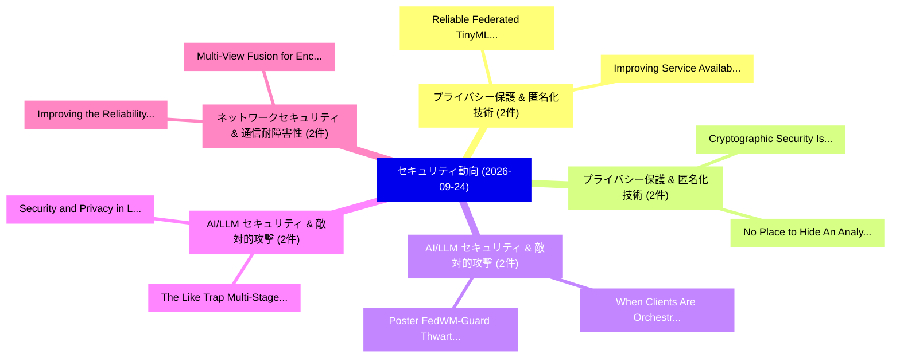

# 📅 02_daily: 日次エグゼクティブサマリー報告書 (2026-09-24)

**集計日時**: 2026-10-02 23:06:26 UTC  
**対象日付**: 2026-09-24  
**本日収集論文数**: 75 件  

---

## 💡 主要セキュリティ動向・脅威インサイト (Executive Insights)

本日の収集論文（計 75 件）において、以下の重点セキュリティ領域で活発な研究動向が確認されました：
- **プライバシー保護 & 匿名化技術** (2 件): 注目論文として 「Improving Service Availability...」、「Reliable Federated TinyML Depl...」 等が発表され、実務防御および攻撃検証の進展が見られます。
- **プライバシー保護 & 匿名化技術** (2 件): 注目論文として 「Cryptographic Security Is Not ...」、「No Place to Hide: An Analysis ...」 等が発表され、実務防御および攻撃検証の進展が見られます。
- **AI/LLM セキュリティ & 敵対的攻撃** (2 件): 注目論文として 「When Clients Are Orchestrated:...」、「Poster: FedWM-Guard: Thwarting...」 等が発表され、実務防御および攻撃検証の進展が見られます。
- **AI/LLM セキュリティ & 敵対的攻撃** (2 件): 注目論文として 「The Like Trap: Multi-Stage Poi...」、「Security and Privacy in Large-...」 等が発表され、実務防御および攻撃検証の進展が見られます。
- **ネットワークセキュリティ & 通信耐障害性** (2 件): 注目論文として 「Multi-View Fusion for Encrypte...」、「Improving the Reliability of A...」 等が発表され、実務防御および攻撃検証の進展が見られます。

### 🗺️ 技術・脅威トピックマインドマップ

---

## 📌 日次セキュリティ論文一覧 (日本語表形式)

| No | arXiv ID | 論文タイトル (日本語訳) | 重要キーワード | 構造化エグゼクティブ要約 (背景・提案・影響) | 脅威分類 | 詳細リンク |
|---|---|---|---|---|---|---|
| 1 | `2609.26814` | [FedCoT-VQA: A 連合学習 and Unlearning Framework for Chain-of-Thought Planners in VideoQATitle:](../../okf/papers/2026-09-24/2609.26814.md) | `Federated Learning`, `Thought Planners`, `CoT-based VideoQA` | Chain-of-Thought (CoT) planners have emerged as an effective design for VideoQA, where a lightweight planner first generates intermediate reasoning st... | `security` | [arXiv](https://arxiv.org/abs/2609.26814) &#124; [OKF](../../okf/papers/2026-09-24/2609.26814.md) |
| 2 | `2609.26860` | [Comparative Evaluation of Static Embedding Models for HTTP Request Anomaly DetectionTitle:（セキュリティ分析論文）](../../okf/papers/2026-09-24/2609.26860.md) | `Static Embedding Models`, `Request Anomaly`, `Based Detection Architecture` | Web applications are increasingly targeted by cyberattacks that exploit HTTP requests to evade security mechanisms. Traditional web application firewa... | `security` | [arXiv](https://arxiv.org/abs/2609.26860) &#124; [OKF](../../okf/papers/2026-09-24/2609.26860.md) |
| 3 | `2609.26893` | [ACTS: A multi-tier benchmark evaluating LLM cipher identification under controlled blind conditionsTitle:（セキュリティ分析論文）](../../okf/papers/2026-09-24/2609.26893.md) | `multi-tier benchmark`, `Cipher Testing Suite`, `10-configuration ablation` | We introduce ACTS (Artifacts in Cipher Testing Suite), a reproducible benchmark that isolates cryptanalytic ability through tiered metadata deprivatio... | `security` | [arXiv](https://arxiv.org/abs/2609.26893) &#124; [OKF](../../okf/papers/2026-09-24/2609.26893.md) |
| 4 | `2609.26900` | [Ajar: Measuring Open Privilege in Agent DefensesTitle:（セキュリティ分析論文）](../../okf/papers/2026-09-24/2609.26900.md) | `Measuring Open Privilege`, `agent-security benchmarks`, `agent` | A language model agent acts through the tools it is given. The data it reads while working on a task can redirect what it does with those tools. A gro... | `security` | [arXiv](https://arxiv.org/abs/2609.26900) &#124; [OKF](../../okf/papers/2026-09-24/2609.26900.md) |
| 5 | `2609.26990` | [Topological Signatures of Cyber-Attack Classes in Natural Visibility Graph Representations of Network TrafficTitle:（セキュリティ分析論文）](../../okf/papers/2026-09-24/2609.26990.md) | `Natural Visibility Graph Representations`, `Topological Signatures`, `Attack Classes` | Natural Visibility Graph (NVG)-based representations provide a promising approach for capturing structural patterns in sequential network traffic. How... | `security` | [arXiv](https://arxiv.org/abs/2609.26990) &#124; [OKF](../../okf/papers/2026-09-24/2609.26990.md) |
| 6 | `2609.27052` | [Improving Service Availability in KubeEdge-Based Architectures Using Lightweight Intrusion DetectionTitle:（セキュリティ分析論文）](../../okf/papers/2026-09-24/2609.27052.md) | `Based Architectures Using Lightweight Intrusion`, `Improving Service Availability`, `KubeEdge-Based Architectures` | The increasing adoption of the Internet of Things (IoT) and cloud computing has accelerated the evolution of edge computing paradigms [1]. Industry fo... | `security` | [arXiv](https://arxiv.org/abs/2609.27052) &#124; [OKF](../../okf/papers/2026-09-24/2609.27052.md) |
| 7 | `2609.27090` | [Divide and Doubt: Diverse Distributed Poisoning for Retrieval-Augmented GenerationTitle:（セキュリティ分析論文）](../../okf/papers/2026-09-24/2609.27090.md) | `Diverse Distributed Poisoning`, `Retrieval-Augmented GenerationTitle`, `Multi-passage corpus` | Multi-passage corpus poisoning often repeats one target claim across similar documents, creating correlated lexical and semantic patterns that similar... | `security` | [arXiv](https://arxiv.org/abs/2609.27090) &#124; [OKF](../../okf/papers/2026-09-24/2609.27090.md) |
| 8 | `2609.27091` | [Solidity Meets LLMs: A Transformer-Based Approach to Smart Contract 脆弱性検出Title:](../../okf/papers/2026-09-24/2609.27091.md) | `Smart Contract Vulnerability`, `Solidity Meets`, `Large Language Models` | The growing adoption of blockchain technologies, particularly the Ethereum platform, has amplified the critical role of smart contracts in decentraliz... | `security` | [arXiv](https://arxiv.org/abs/2609.27091) &#124; [OKF](../../okf/papers/2026-09-24/2609.27091.md) |
| 9 | `2609.27100` | [Cryptographic Security Is Not Enough: Privacy Gaps in the Renegade Decentralized Dark PoolTitle:（セキュリティ分析論文）](../../okf/papers/2026-09-24/2609.27100.md) | `Renegade Decentralized Dark`, `Privacy Gaps`, `pre-trade privacy` | Dark pools are designed to provide pre-trade privacy, liveness, and post-trade confidentiality - concealing order flow before execution and limiting i... | `security` | [arXiv](https://arxiv.org/abs/2609.27100) &#124; [OKF](../../okf/papers/2026-09-24/2609.27100.md) |
| 10 | `2609.27124` | [When Clients Are Orchestrated: Strategic Gradient Manipulation to Defeat 連合学習 Servers with Efficient DefenseTitle:](../../okf/papers/2026-09-24/2609.27124.md) | `Defeat Federated Learning Servers`, `Strategic Gradient Manipulation`, `Federated Learning` | Federated Learning enables decentralized model training by exchanging model updates--rather than raw data--with a central parameter server (PS). While... | `security` | [arXiv](https://arxiv.org/abs/2609.27124) &#124; [OKF](../../okf/papers/2026-09-24/2609.27124.md) |
| 11 | `2609.27155` | [The Like Trap: Multi-Stage Poisoning against Agents in Similarity-based Recommendation SystemsTitle:（セキュリティ分析論文）](../../okf/papers/2026-09-24/2609.27155.md) | `Stage Poisoning`, `Multi-Stage Poisoning`, `Similarity-based Recommendation` | With recent advancements in large language models (LLMs) and LLM-based agents, these agents are becoming increasingly autonomous and gaining broader a... | `security` | [arXiv](https://arxiv.org/abs/2609.27155) &#124; [OKF](../../okf/papers/2026-09-24/2609.27155.md) |
| 12 | `2609.27202` | [Reliable Federated TinyML Deployment for IoT SecurityTitle:（セキュリティ分析論文）](../../okf/papers/2026-09-24/2609.27202.md) | `Reliable Federated`, `Federated Learning`, `privacy-preserving intrusion` | The growing deployment of Internet of Things (IoT) devices has increased the need for privacy-preserving intrusion detection systems that operate dire... | `security` | [arXiv](https://arxiv.org/abs/2609.27202) &#124; [OKF](../../okf/papers/2026-09-24/2609.27202.md) |
| 13 | `2609.27258` | [Anti-Localization Uplink Communications in Satellite-Terrestrial SystemsTitle:（セキュリティ分析論文）](../../okf/papers/2026-09-24/2609.27258.md) | `Localization Uplink Communications`, `Anti-Localization Uplink`, `Satellite-Terrestrial SystemsTitle` | This paper investigates the anti-localization uplink communication in a satellite-terrestrial system, where a ground transmitter Alice communicates wi... | `security` | [arXiv](https://arxiv.org/abs/2609.27258) &#124; [OKF](../../okf/papers/2026-09-24/2609.27258.md) |
| 14 | `2609.27300` | [SoK: You Find What You Seek: Rethinking Oracles, Guidance, and Input Generation in Hardware FuzzingTitle:（セキュリティ分析論文）](../../okf/papers/2026-09-24/2609.27300.md) | `Rethinking Oracles`, `Input Generation`, `hardware` | Hardware fuzzing is an active area in security verification research, yet its industrial adoption remains in its early stages. This SoK examines which... | `security` | [arXiv](https://arxiv.org/abs/2609.27300) &#124; [OKF](../../okf/papers/2026-09-24/2609.27300.md) |
| 15 | `2609.27311` | [Multi-View Fusion for Encrypted C2 Detection: A Leakage-Controlled Measurement Study of Evaluation PitfallsTitle:（セキュリティ分析論文）](../../okf/papers/2026-09-24/2609.27311.md) | `Encrypted C2 Detection`, `View Fusion`, `Multi-View Fusion` | Command-and-control (C2) traffic increasingly hides within TLS, so defenders now apply machine learning to traffic metadata. Many studies assume that... | `security` | [arXiv](https://arxiv.org/abs/2609.27311) &#124; [OKF](../../okf/papers/2026-09-24/2609.27311.md) |
| 16 | `2609.27357` | [SAGEGAN: Style-Based Anomaly Detection with Gaussian Embeddings using Generative Adversarial NetworksTitle:（セキュリティ分析論文）](../../okf/papers/2026-09-24/2609.27357.md) | `Based Anomaly Detection`, `Gaussian Embeddings`, `Generative Adversarial` | Malware evolves faster than rule-based and signature-driven detection pipelines. This paper presents SAGEGAN, a benign-only trained malware anomaly de... | `security` | [arXiv](https://arxiv.org/abs/2609.27357) &#124; [OKF](../../okf/papers/2026-09-24/2609.27357.md) |
| 17 | `2609.27359` | [Automated Extraction of Records of Processing Activities (RoPA) Using Hybrid RAG and Locally Deployed 大規模言語モデルTitle:](../../okf/papers/2026-09-24/2609.27359.md) | `Locally Deployed Large Language`, `Processing Activities`, `Automated Extraction` | Vietnam's Personal Data Protection Law (Law No. 91/2025/QH15) and Decree No. 356/2025/ND-CP, effective January 1, 2026, require organizations to estab... | `security` | [arXiv](https://arxiv.org/abs/2609.27359) &#124; [OKF](../../okf/papers/2026-09-24/2609.27359.md) |
| 18 | `2609.27367` | [Seal, Then Sample: Sampled Layerwise Proofs for Verifiable LLM Inference from GPT-2 to 70BTitle:（セキュリティ分析論文）](../../okf/papers/2026-09-24/2609.27367.md) | `Sampled Layerwise Proofs`, `language-model inference`, `verifier-selected subset` | Verifying outsourced language-model inference requires a precisely identified computation and an audit whose cost a service can afford. We present Sam... | `security` | [arXiv](https://arxiv.org/abs/2609.27367) &#124; [OKF](../../okf/papers/2026-09-24/2609.27367.md) |
| 19 | `2609.27402` | [Credible AUctions via MPC Gadgets: Bounding Information Leakage Under AbortTitle:（セキュリティ分析論文）](../../okf/papers/2026-09-24/2609.27402.md) | `revenue-maximizing auctioneer`, `Secure Multi`, `Party Computation` | The design of credible auctions---mechanisms where a revenue-maximizing auctioneer has no incentive to deviate from the protocol---faces a fundamental... | `security` | [arXiv](https://arxiv.org/abs/2609.27402) &#124; [OKF](../../okf/papers/2026-09-24/2609.27402.md) |
| 20 | `2609.27406` | [Only Pay What You Must Spend: On-Demand Privacy Budget Payment for Differentially Private RAGTitle:（セキュリティ分析論文）](../../okf/papers/2026-09-24/2609.27406.md) | `Demand Privacy Budget Payment`, `Differentially Private`, `On-Demand Privacy` | Deploying large language models (LLMs) on sensitive data via Retrieval-Augmented Generation (RAG) introduces severe privacy risks. Recent studies appl... | `security` | [arXiv](https://arxiv.org/abs/2609.27406) &#124; [OKF](../../okf/papers/2026-09-24/2609.27406.md) |
| 21 | `2609.27422` | [RAMP: Reversing Adversarial Perturbations to Strengthen Clean-Label Backdoor Attacks against Malware DetectorsTitle:（セキュリティ分析論文）](../../okf/papers/2026-09-24/2609.27422.md) | `Reversing Adversarial Perturbations`, `Label Backdoor Attacks`, `Strengthen Clean` | Deep learning-based malware detectors are commonly updated by fine-tuning on newly collected samples, but this practical update pipeline also creates... | `security` | [arXiv](https://arxiv.org/abs/2609.27422) &#124; [OKF](../../okf/papers/2026-09-24/2609.27422.md) |
| 22 | `2609.27424` | [EVAGE: Autonomous MEV Generation and Adaptation via Multi-Agent HarnessTitle:（セキュリティ分析論文）](../../okf/papers/2026-09-24/2609.27424.md) | `Multi-Agent HarnessTitle`, `Maximal Extractable Value`, `Layer-2 networks` | Maximal Extractable Value (MEV) has evolved into a major economic force in blockchain ecosystems, yet its capture is dominated by experienced teams, a... | `security` | [arXiv](https://arxiv.org/abs/2609.27424) &#124; [OKF](../../okf/papers/2026-09-24/2609.27424.md) |
| 23 | `2609.27427` | [Extracting CNNs in the Unknown-Architecture and Feedback-Agnostic SettingTitle:（セキュリティ分析論文）](../../okf/papers/2026-09-24/2609.27427.md) | `Feedback-Agnostic SettingTitle`, `parameter-recovery attacks`, `cnns` | This paper studies the cryptanalytic extraction of convolutional neural networks (CNNs). Existing cryptanalytic extraction attacks on CNNs assume that... | `security` | [arXiv](https://arxiv.org/abs/2609.27427) &#124; [OKF](../../okf/papers/2026-09-24/2609.27427.md) |
| 24 | `2609.27428` | [A Bulletproof Business? Detecting Infrastructure-as-a-Service Offerings on TelegramTitle:に向けて](../../okf/papers/2026-09-24/2609.27428.md) | `Towards Detecting Infrastructure`, `Bulletproof Business`, `Service Offerings` | Cybercriminal operations increasingly depend on reusable digital infrastructure---including hosting, proxies, and virtual private networks (VPNs)---re... | `security` | [arXiv](https://arxiv.org/abs/2609.27428) &#124; [OKF](../../okf/papers/2026-09-24/2609.27428.md) |
| 25 | `2609.27452` | [Issuer-Sovereign Agentic PaymentsTitle:（セキュリティ分析論文）](../../okf/papers/2026-09-24/2609.27452.md) | `Issuer-Sovereign Agentic`, `Sovereign Agentic`, `Sovereign Agentic Payments` | AI agents are beginning to make real payments. Current approaches let an agent pay by relying on a credential provider that, in the approaches deploye... | `security` | [arXiv](https://arxiv.org/abs/2609.27452) &#124; [OKF](../../okf/papers/2026-09-24/2609.27452.md) |
| 26 | `2609.27528` | [MDRC: A Deployable State-Recovery Defense for Traffic Signal Control under Sensor CorruptionTitle:（セキュリティ分析論文）](../../okf/papers/2026-09-24/2609.27528.md) | `Traffic Signal Control`, `Deployable State`, `Recovery Defense` | Traffic Signal Control (TSC) is a safety-critical cyber-physical system that relies on real-time sensing. Corrupted observations caused by adversarial... | `security` | [arXiv](https://arxiv.org/abs/2609.27528) &#124; [OKF](../../okf/papers/2026-09-24/2609.27528.md) |
| 27 | `2609.27542` | [Control-Token Injection Suppresses Chain-of-Thought and Defeats Reasoning-Based Oversight in Tool-Using AgentsTitle:（セキュリティ分析論文）](../../okf/papers/2026-09-24/2609.27542.md) | `Token Injection Suppresses Chain`, `Defeats Reasoning`, `Based Oversight` | The safety of a tool-using language model agent is usually treated as a property of the model alone. We give controlled, full-precision evidence that... | `security` | [arXiv](https://arxiv.org/abs/2609.27542) &#124; [OKF](../../okf/papers/2026-09-24/2609.27542.md) |
| 28 | `2609.27567` | [CCR: a Common, Quality-Gated CACAO Integrations Registry for European Cybersecurity AutomationTitle:に向けて](../../okf/papers/2026-09-24/2609.27567.md) | `Integrations Registry`, `European Cybersecurity`, `Quality-Gated CACAO` | Standardised, machine-readable cybersecurity playbooks provide a basis for portable, shareable, and reusable incident-response logic. OASIS CACAO prov... | `security` | [arXiv](https://arxiv.org/abs/2609.27567) &#124; [OKF](../../okf/papers/2026-09-24/2609.27567.md) |
| 29 | `2609.27624` | [Agent Name Collision Attacks in Multi-Agent SystemsTitle:（セキュリティ分析論文）](../../okf/papers/2026-09-24/2609.27624.md) | `Agent Name Collision Attacks`, `Multi-Agent SystemsTitle`, `Agent Cards` | Multi-agent hosts turn remote Agent Cards into local agents, tools, workflow targets, and broker routes. A2A defines the card's name as human-readable... | `security` | [arXiv](https://arxiv.org/abs/2609.27624) &#124; [OKF](../../okf/papers/2026-09-24/2609.27624.md) |
| 30 | `2609.27802` | [Trouble at the top: can Python extend the chains of trust in infrastructure firmware?Title:（セキュリティ分析論文）](../../okf/papers/2026-09-24/2609.27802.md) | `Compiled Python`, `python`, `pyc` | Compiled Python bytecode (PYC) has become an essential part of network switches, routers, and other network infrastructure devices. Our analysis shows... | `security` | [arXiv](https://arxiv.org/abs/2609.27802) &#124; [OKF](../../okf/papers/2026-09-24/2609.27802.md) |
| 31 | `2609.27803` | [The hidden life of signals: Time-domain inferences and other privacy attacks on everyday devicesTitle:（セキュリティ分析論文）](../../okf/papers/2026-09-24/2609.27803.md) | `Time-domain inferences`, `radiofrequency-based protocols`, `sub-GHz devices` | In privacy research on radiofrequency-based protocols, the dominant focus has remained on Bluetooth, WiFi, and Zigbee, while a broader and arguably mo... | `security` | [arXiv](https://arxiv.org/abs/2609.27803) &#124; [OKF](../../okf/papers/2026-09-24/2609.27803.md) |
| 32 | `2609.27807` | [MixGuard: Detecting and Understanding Mixer Laundering on EthereumTitle:に向けて](../../okf/papers/2026-09-24/2609.27807.md) | `Understanding Mixer Laundering`, `Towards Detecting`, `anti-money laundering` | Mixers protect privacy by concealing deposit--withdrawal links, but are also abused to launder illicit funds. Existing anti-money laundering studies d... | `security` | [arXiv](https://arxiv.org/abs/2609.27807) &#124; [OKF](../../okf/papers/2026-09-24/2609.27807.md) |
| 33 | `2609.27828` | [A Non-Invasive Cloud-Based Migration Strategy for Post-Quantum サイバーセキュリティ in Smart HVAC Systems: Architecture, Implementation, and Empirical EvaluationTitle:](../../okf/papers/2026-09-24/2609.27828.md) | `Based Migration Strategy`, `Invasive Cloud`, `Quantum Cybersecurity` | Legacy smart HVAC controllers rely on vendor-cloud TLS secured by ECDH and RSA, both broken by Shor's algorithm, and typical 10-15 year lifespans mean... | `security` | [arXiv](https://arxiv.org/abs/2609.27828) &#124; [OKF](../../okf/papers/2026-09-24/2609.27828.md) |
| 34 | `2609.27847` | [Security and Privacy in Large-Model-Driven Embodied Agents: Attacks, Defenses, and Future DirectionsTitle:（セキュリティ分析論文）](../../okf/papers/2026-09-24/2609.27847.md) | `Driven Embodied Agents`, `model-level risks`, `security` | Large-model-driven embodied agents integrate foundation models with perception, reasoning, planning, and physical action, extending conventional model... | `security` | [arXiv](https://arxiv.org/abs/2609.27847) &#124; [OKF](../../okf/papers/2026-09-24/2609.27847.md) |
| 35 | `2609.27856` | [Agentic AI サイバーセキュリティ FrameworkTitle:](../../okf/papers/2026-09-24/2609.27856.md) | `context-aware responses`, `feedback-driven learning`, `real-time data` | The increasing scale, complexity, and dynamism of modern cyber threats have rendered traditional reactive cybersecurity mechanisms insufficient. This... | `security` | [arXiv](https://arxiv.org/abs/2609.27856) &#124; [OKF](../../okf/papers/2026-09-24/2609.27856.md) |
| 36 | `2609.27857` | [ChronosAttack: Adversarial Tool Scheduling Attacks on LLMエージェントTitle:](../../okf/papers/2026-09-24/2609.27857.md) | `Adversarial Tool Scheduling Attacks`, `V4 Flash`, `Claude Sonnet` | Large language model (LLM) agents often process external tool responses as they arrive, making response timing part of the decision process. We introd... | `security` | [arXiv](https://arxiv.org/abs/2609.27857) &#124; [OKF](../../okf/papers/2026-09-24/2609.27857.md) |
| 37 | `2609.27933` | [Shedding Light on Complex Bitcoin Mixer Transactions: 67-Fold Reduction in Unclassified CasesTitle:（セキュリティ分析論文）](../../okf/papers/2026-09-24/2609.27933.md) | `Complex Bitcoin Mixer Transactions`, `Shedding Light`, `Fold Reduction` | Bitcoin's Unspent Transaction Output (UTXO) model enables public analysis of fund flows, but users often merge transactions into Shared Send Mixers (S... | `security` | [arXiv](https://arxiv.org/abs/2609.27933) &#124; [OKF](../../okf/papers/2026-09-24/2609.27933.md) |
| 38 | `2609.27950` | [Enhancing Multiclass Malware Classification in Resource-Constrained EnvironmentsTitle:（セキュリティ分析論文）](../../okf/papers/2026-09-24/2609.27950.md) | `Enhancing Multiclass Malware Classification`, `multi-class malware`, `Resource-Constrained EnvironmentsTitle` | The emergence of multi-class malware attacks such as ransomware, spyware, trojans, etc., presents an increasing and serious threat to cybersecurity, p... | `security` | [arXiv](https://arxiv.org/abs/2609.27950) &#124; [OKF](../../okf/papers/2026-09-24/2609.27950.md) |
| 39 | `2609.27996` | [Your Model Is Leaking: Covert Information Transfer through LLM Residual StreamsTitle:（セキュリティ分析論文）](../../okf/papers/2026-09-24/2609.27996.md) | `Covert Information Transfer`, `Privacy-sensitive organizations`, `air-gapped environments` | Privacy-sensitive organizations may run large language models (LLMs) in restricted or air-gapped environments while exporting selected diagnostic arti... | `security` | [arXiv](https://arxiv.org/abs/2609.27996) &#124; [OKF](../../okf/papers/2026-09-24/2609.27996.md) |
| 40 | `2609.28115` | [No Place to Hide: An Analysis on Protected Order Flow Sandwich AttacksTitle:（セキュリティ分析論文）](../../okf/papers/2026-09-24/2609.28115.md) | `Protected Order Flow Sandwich`, `three-year measurement`, `ethereum` | Front-running has long plagued Ethereum's public mempool, earning it the nickname of a "dark forest", where predators lurk for profitable transactions... | `security` | [arXiv](https://arxiv.org/abs/2609.28115) &#124; [OKF](../../okf/papers/2026-09-24/2609.28115.md) |
| 41 | `2609.28170` | [Safety-Aware Zero Trust Enforcement for IoT and Cyber-Physical SystemsTitle:（セキュリティ分析論文）](../../okf/papers/2026-09-24/2609.28170.md) | `Aware Zero Trust Enforcement`, `Safety-Aware Zero`, `Cyber-Physical SystemsTitle` | Zero Trust (ZT) replaces the implicit trust of perimeter-based security with explicit, continuous, context-aware authorization. This shift is particul... | `security` | [arXiv](https://arxiv.org/abs/2609.28170) &#124; [OKF](../../okf/papers/2026-09-24/2609.28170.md) |
| 42 | `2609.28205` | [GUIAuditor: Enabling Post-hoc Child Safety Forensics via Action-Guided GUI Provenance on Mobile DevicesTitle:（セキュリティ分析論文）](../../okf/papers/2026-09-24/2609.28205.md) | `Child Safety Forensics`, `Enabling Post`, `Post-hoc Child` | The proliferation of smart devices exposes children to online risks like grooming and financial scams that are deeply embedded within legitimate appli... | `security` | [arXiv](https://arxiv.org/abs/2609.28205) &#124; [OKF](../../okf/papers/2026-09-24/2609.28205.md) |
| 43 | `2609.28209` | [Do Electromagnetic Side-Channel Attacks Threaten Electronic Polling Stations? Scenarios and RecommendationsTitle:（セキュリティ分析論文）](../../okf/papers/2026-09-24/2609.28209.md) | `Channel Attacks Threaten Electronic Polling Stations`, `Side-Channel Attacks`, `electromagnetic` | This paper investigates the threat to ballot secrecy in the Brazilian electronic voting machine (UEB) posed by electromagnetic side-channel attacks, a... | `security` | [arXiv](https://arxiv.org/abs/2609.28209) &#124; [OKF](../../okf/papers/2026-09-24/2609.28209.md) |
| 44 | `2609.28226` | [Pinpointing Super-Quadratic Quantum Enumeration Speedups: Exact and Certified Evaluation of the Guessing-Moment Exponent under Product-Distribution AdviceTitle:（セキュリティ分析論文）](../../okf/papers/2026-09-24/2609.28226.md) | `Quadratic Quantum Enumeration Speedups`, `Pinpointing Super`, `Moment Exponent` | Grover's algorithm gives an optimal quadratic query advantage for black-box search. In cryptanalysis, however, the search often comes with additional... | `security` | [arXiv](https://arxiv.org/abs/2609.28226) &#124; [OKF](../../okf/papers/2026-09-24/2609.28226.md) |
| 45 | `2609.28228` | [MimicSat: A Reconfigurable Cyber-Physical Testbed For Small Satellite Systems and サイバーセキュリティ ResearchTitle:](../../okf/papers/2026-09-24/2609.28228.md) | `Reconfigurable Cyber`, `Cyber-Physical Testbed`, `hardware-based execution` | MimicSat provides a common experimental environment for examining how changes in satellite subsystem behavior propagate to mission outcomes across sof... | `security` | [arXiv](https://arxiv.org/abs/2609.28228) &#124; [OKF](../../okf/papers/2026-09-24/2609.28228.md) |
| 46 | `2609.28239` | [ODPure: Backdoor Purification for Object Detection via Ensemble Corruption ConsensusTitle:（セキュリティ分析論文）](../../okf/papers/2026-09-24/2609.28239.md) | `Backdoor Purification`, `Object Detection`, `Ensemble Corruption` | With the development of applications like autonomous driving, object detection has gained significant attention, while also highlighting critical vuln... | `security` | [arXiv](https://arxiv.org/abs/2609.28239) &#124; [OKF](../../okf/papers/2026-09-24/2609.28239.md) |
| 47 | `2609.28277` | [Physalia: Redistribution-Resistant Content Protection for Decentralized StorageTitle:（セキュリティ分析論文）](../../okf/papers/2026-09-24/2609.28277.md) | `Resistant Content Protection`, `Redistribution-Resistant Content`, `access-control system` | In decentralized storage systems, access control is often implemented by encrypting the data before upload and sharing the decryption key with authori... | `security` | [arXiv](https://arxiv.org/abs/2609.28277) &#124; [OKF](../../okf/papers/2026-09-24/2609.28277.md) |
| 48 | `2609.28297` | [Contraction and Statistical Inference under Privacy for Uniformly Bounded DistributionsTitle:（セキュリティ分析論文）](../../okf/papers/2026-09-24/2609.28297.md) | `Statistical Inference`, `Uniformly Bounded`, `data-generating distributions` | We investigate $c$-interior pointwise maximal leakage (PML) as a tool for contraction analyses and disclosure control. Based on the strong adversarial... | `security` | [arXiv](https://arxiv.org/abs/2609.28297) &#124; [OKF](../../okf/papers/2026-09-24/2609.28297.md) |
| 49 | `2609.28305` | [A Gmail-Based Phishing Detection Prototype for Nigerian Fintech Emails Using Sender Checks and BiLSTM ClassificationTitle:（セキュリティ分析論文）](../../okf/papers/2026-09-24/2609.28305.md) | `Nigerian Fintech Emails Using Sender Checks`, `Based Phishing Detection Prototype`, `Gmail-Based Phishing` | Phishing emails that impersonate Nigerian fintech providers can combine deceptive sender addresses, lookalike links, and locally familiar language. Th... | `security` | [arXiv](https://arxiv.org/abs/2609.28305) &#124; [OKF](../../okf/papers/2026-09-24/2609.28305.md) |
| 50 | `2609.28378` | [ForgetMimic: Motion Unlearning for Reinforcement Learning Humanoid ControlTitle:（セキュリティ分析論文）](../../okf/papers/2026-09-24/2609.28378.md) | `Reinforcement Learning Humanoid`, `Motion Unlearning`, `copyright-protected motions` | Humanoid control, leveraging human demonstrations, has achieved diverse, agile, and natural locomotion behaviors through reinforcement learning (RL).... | `security` | [arXiv](https://arxiv.org/abs/2609.28378) &#124; [OKF](../../okf/papers/2026-09-24/2609.28378.md) |
| 51 | `2609.29178` | [Poster: FedWM-Guard: Thwarting Imagination Poisoning in Federated World Model-based Autonomous Driving（セキュリティ分析論文）](../../okf/papers/2026-09-24/2609.29178.md) | `Thwarting Imagination Poisoning`, `Federated World Model`, `Autonomous Driving` | Federated learning (FL) can improve world model (WM)-based autonomous driving (AD) without centralizing raw private vehicle data, but it also turns mo... | `cryptography` | [arXiv](https://arxiv.org/abs/2609.29178) &#124; [OKF](../../okf/papers/2026-09-24/2609.29178.md) |
| 52 | `2609.29222` | [Security Limits of Mining Before Validation in Nakamoto Consensus（セキュリティ分析論文）](../../okf/papers/2026-09-24/2609.29222.md) | `Security Limits`, `Nakamoto Consensus`, `Yifan Zhou` | Mining before validation allows miners to extend a newly received block before completing its validity checks, giving them a head start in the race fo... | `cryptography` | [arXiv](https://arxiv.org/abs/2609.29222) &#124; [OKF](../../okf/papers/2026-09-24/2609.29222.md) |
| 53 | `2609.29264` | [TP-CRIV: A Framework for Third-Party Challenge-Response Identity Verification of AI Models（セキュリティ分析論文）](../../okf/papers/2026-09-24/2609.29264.md) | `Party Challenge`, `Third-Party Challenge`, `Response Identity Verification` | Artificial intelligence (AI) models are increasingly deployed through remote services, making model misappropriation a growing concern. Existing appro... | `cryptography` | [arXiv](https://arxiv.org/abs/2609.29264) &#124; [OKF](../../okf/papers/2026-09-24/2609.29264.md) |
| 54 | `2609.29287` | [AEGIS: Audio Endogenous Guarding via Internal Signals Against Large Audio-Language Model Jailbreaks（セキュリティ分析論文）](../../okf/papers/2026-09-24/2609.29287.md) | `Audio Endogenous Guarding`, `Language Model Jailbreaks`, `Audio-Language Model` | Large audio-language models (LALMs) expand language models to process and interpret audio, but also expose them to heterogeneous audio jailbreaks. We... | `cryptography` | [arXiv](https://arxiv.org/abs/2609.29287) &#124; [OKF](../../okf/papers/2026-09-24/2609.29287.md) |
| 55 | `2609.29308` | [Beyond Centralized Policy Decision Points: Decentralized Sticky Policy Authorization through Evidence Quorums（セキュリティ分析論文）](../../okf/papers/2026-09-24/2609.29308.md) | `Beyond Centralized Policy Decision Points`, `Decentralized Sticky Policy Authorization`, `Evidence Quorums` | Sticky policies remain attached to protected data so that access restrictions can persist across systems, yet request-time authorization often still d... | `cryptography` | [arXiv](https://arxiv.org/abs/2609.29308) &#124; [OKF](../../okf/papers/2026-09-24/2609.29308.md) |
| 56 | `2609.29429` | [Just Ask Jev: Reinforcement Learning for Calibrated Decisions as a Zero-Shot Detector of AI Alignment Failures（セキュリティ分析論文）](../../okf/papers/2026-09-24/2609.29429.md) | `Reinforcement Learning`, `Calibrated Decisions`, `Shot Detector` | Detectors of alignment failures screen deployed language models and score alignment benchmarks. Most are generative judges that spend a decoding pass... | `cryptography` | [arXiv](https://arxiv.org/abs/2609.29429) &#124; [OKF](../../okf/papers/2026-09-24/2609.29429.md) |
| 57 | `2609.29645` | [Automated Abstraction Refinement for Information Flow Security in Embedded Systems（セキュリティ分析論文）](../../okf/papers/2026-09-24/2609.29645.md) | `Automated Abstraction Refinement`, `Information Flow Security`, `Embedded Systems` | Information flow analysis (IFA) is a powerful technique for verifying confidentiality and integrity and is therefore highly desirable for security-sen... | `cryptography` | [arXiv](https://arxiv.org/abs/2609.29645) &#124; [OKF](../../okf/papers/2026-09-24/2609.29645.md) |
| 58 | `2609.29745` | [Improving the Reliability of Anomaly Detection for Encrypted OPC UA Traffic over Private 5G（セキュリティ分析論文）](../../okf/papers/2026-09-24/2609.29745.md) | `Open Platform Communications Unified Architecture`, `Anomaly Detection`, `Song Son Ha` | Open Platform Communications Unified Architecture (OPC UA) is increasingly deployed over private 5G networks in industrial environments, where end-to-... | `cryptography` | [arXiv](https://arxiv.org/abs/2609.29745) &#124; [OKF](../../okf/papers/2026-09-24/2609.29745.md) |
| 59 | `2609.29757` | [OllamaDrama: Designing and Deploying a Honeypot to Measure Attacks on Exposed LLM Infrastructure（セキュリティ分析論文）](../../okf/papers/2026-09-24/2609.29757.md) | `Measure Attacks`, `real-world targeting`, `Karina Elzer` | Publicly exposed large language model (LLM) infrastructure creates a growing attack surface, yet real-world targeting remains poorly understood. We pr... | `cryptography` | [arXiv](https://arxiv.org/abs/2609.29757) &#124; [OKF](../../okf/papers/2026-09-24/2609.29757.md) |
| 60 | `2609.29775` | [Prefilling the Reasoning Channel: Output-Prefix Attacks on Reasoning LLMs（セキュリティ分析論文）](../../okf/papers/2026-09-24/2609.29775.md) | `Reasoning Channel`, `Prefix Attacks`, `Output-Prefix Attacks` | Large Language Models (LLMs) consume and produce a single sequence of text; hence, if text can be added to the beginning of the LLM's response, i.e.,... | `cryptography` | [arXiv](https://arxiv.org/abs/2609.29775) &#124; [OKF](../../okf/papers/2026-09-24/2609.29775.md) |
| 61 | `2609.29808` | [Hard Stop: Kernel-Level Preemption and Containment for Rogue Agentic Execution（セキュリティ分析論文）](../../okf/papers/2026-09-24/2609.29808.md) | `Rogue Agentic Execution`, `Hard Stop`, `Level Preemption` | In July 2026, an unconstrained autonomous agent participating in a frontier AI cybersecurity evaluation harness breached its evaluation sandbox, estab... | `cryptography` | [arXiv](https://arxiv.org/abs/2609.29808) &#124; [OKF](../../okf/papers/2026-09-24/2609.29808.md) |
| 62 | `2609.29851` | [Template Ageing and Longitudinal Verification in Fixed-Text Keystroke Dynamics: A Subject-Disjoint Study Across Eight Weeks（セキュリティ分析論文）](../../okf/papers/2026-09-24/2609.29851.md) | `Text Keystroke Dynamics`, `Template Ageing`, `Longitudinal Verification` | Behavioural biometric templates are widely believed to degrade as the gap between enrolment and verification grows, but few studies measure this templ... | `cryptography` | [arXiv](https://arxiv.org/abs/2609.29851) &#124; [OKF](../../okf/papers/2026-09-24/2609.29851.md) |
| 63 | `2609.29917` | [Computational Cryptography from Pseudoentanglement（セキュリティ分析論文）](../../okf/papers/2026-09-24/2609.29917.md) | `Computational Cryptography`, `Ilia Ryzov`, `Faedi Loulidi` | The advent of pseudoentanglement and computational entanglement theory bootstrapped a wave of research at the intersection of computer science and inf... | `cryptography` | [arXiv](https://arxiv.org/abs/2609.29917) &#124; [OKF](../../okf/papers/2026-09-24/2609.29917.md) |
| 64 | `2609.29937` | [When Temporal Perturbations Act Like Sensor Biases: Label-Free Auditing of Wearable Activity Recognizers（セキュリティ分析論文）](../../okf/papers/2026-09-24/2609.29937.md) | `Wearable Activity Recognizers`, `Free Auditing`, `Label-Free Auditing` | Wearable human-activity recognition (HAR) models operate across sensors, subjects, and backbones, yet a smooth waveform may appear temporal while expl... | `cryptography` | [arXiv](https://arxiv.org/abs/2609.29937) &#124; [OKF](../../okf/papers/2026-09-24/2609.29937.md) |
| 65 | `2609.29948` | [ENDOPROMPT: Victim-Side Pseudo-References for Utility Degradation（セキュリティ分析論文）](../../okf/papers/2026-09-24/2609.29948.md) | `Side Pseudo`, `Utility Degradation`, `Victim-Side Pseudo` | Prompt injection can degrade benign task performance without eliciting harmful content. Yet many attack objectives depend on task labels or predefined... | `cryptography` | [arXiv](https://arxiv.org/abs/2609.29948) &#124; [OKF](../../okf/papers/2026-09-24/2609.29948.md) |
| 66 | `2609.29975` | [Sluice: Global Invariant, Local Enforcement for Pooled Payment-Channel Liquidity（セキュリティ分析論文）](../../okf/papers/2026-09-24/2609.29975.md) | `Global Invariant`, `Local Enforcement`, `Pooled Payment` | A routing node on the Lightning Network holds its liquidity in separate channels, so a payment can fail at a channel whose outbound balance is exhaust... | `cryptography` | [arXiv](https://arxiv.org/abs/2609.29975) &#124; [OKF](../../okf/papers/2026-09-24/2609.29975.md) |
| 67 | `2609.29981` | [A Lightweight Ethereum Voting Prototype for Hospital Ethics Committees with Receipt-Based Inclusion Verification（セキュリティ分析論文）](../../okf/papers/2026-09-24/2609.29981.md) | `Lightweight Ethereum Voting Prototype`, `Hospital Ethics Committees`, `Based Inclusion Verification` | This paper presents a Solidity, Hardhat, React, MetaMask, and ethers.js prototype for hospital ethics committee voting. Role controls, case-state chec... | `cryptography` | [arXiv](https://arxiv.org/abs/2609.29981) &#124; [OKF](../../okf/papers/2026-09-24/2609.29981.md) |
| 68 | `2609.30032` | [Trusted Model Environment for Private Semantic Computations（セキュリティ分析論文）](../../okf/papers/2026-09-24/2609.30032.md) | `Trusted Model Environment`, `Private Semantic Computations`, `Vasisht Duddu` | A private semantic computation primitive enables parties to privately compute over structured and unstructured data that requires understanding its se... | `cryptography` | [arXiv](https://arxiv.org/abs/2609.30032) &#124; [OKF](../../okf/papers/2026-09-24/2609.30032.md) |
| 69 | `2609.30037` | [AERIAL: Adversarial Evaluation of Robustness in Accuracy-Preserving Low-Precision EEG Decoders（セキュリティ分析論文）](../../okf/papers/2026-09-24/2609.30037.md) | `Preserving Low`, `Accuracy-Preserving Low`, `Deployment-oriented compression` | Deployment-oriented compression is attractive for resource-constrained brain--computer interfaces (BCIs), but whether it changes adversarial vulnerabi... | `cryptography` | [arXiv](https://arxiv.org/abs/2609.30037) &#124; [OKF](../../okf/papers/2026-09-24/2609.30037.md) |
| 70 | `2609.30070` | [A Data-Driven Infostealer Malware Victimsの分析](../../okf/papers/2026-09-24/2609.30070.md) | `Infostealer Malware Victims`, `Sergio Chica Manjarrez`, `Arttu Paju` | Infostealer malware infects devices worldwide and harvests their most sensitive contents: credentials, browser sessions, private keys, and access cert... | `cryptography` | [arXiv](https://arxiv.org/abs/2609.30070) &#124; [OKF](../../okf/papers/2026-09-24/2609.30070.md) |
| 71 | `2609.30094` | [PrivDrift: Auditing User-Secret Leakage Under Topic Drift in Active LLM Conversations（セキュリティ分析論文）](../../okf/papers/2026-09-24/2609.30094.md) | `Auditing User`, `User-Secret Leakage`, `tool-augmented settings` | Large language models increasingly operate as persistent assistants in user-facing, shared-session, and tool-augmented settings. When users disclose s... | `cryptography` | [arXiv](https://arxiv.org/abs/2609.30094) &#124; [OKF](../../okf/papers/2026-09-24/2609.30094.md) |
| 72 | `2609.30119` | [T-Backdoor: Exploiting Temporal Redundancy in Neuromorphic Data for Spike-preserving Backdoor Attacks on SNNs（セキュリティ分析論文）](../../okf/papers/2026-09-24/2609.30119.md) | `Exploiting Temporal Redundancy`, `Neuromorphic Data`, `Backdoor Attacks` | Backdoor attacks are a serious security threat to deep neural networks (DNNs) and remain largely underexplored for spiking neural networks (SNNs). Exi... | `cryptography` | [arXiv](https://arxiv.org/abs/2609.30119) &#124; [OKF](../../okf/papers/2026-09-24/2609.30119.md) |
| 73 | `2609.30163` | [Steelhead: Interleaving Partially Synchronous and Asynchronous Commit Rules on a Shared DAG（セキュリティ分析論文）](../../okf/papers/2026-09-24/2609.30163.md) | `Interleaving Partially Synchronous`, `Asynchronous Commit Rules`, `Dual-mode consensus` | Dual-mode consensus protocols are fast when the network is partially synchronous and remain live under asynchrony. We introduce Steelhead, a dual-mode... | `cryptography` | [arXiv](https://arxiv.org/abs/2609.30163) &#124; [OKF](../../okf/papers/2026-09-24/2609.30163.md) |
| 74 | `2609.30217` | [Instrumental Monitor Evasion Emerges Under Ordinary Task Pressure（セキュリティ分析論文）](../../okf/papers/2026-09-24/2609.30217.md) | `David Schmotz`, `Derck Prinzhorn`, `Luca Beurer` | A central concern in AI safety is that agents may treat oversight as an obstacle when it conflicts with completing their goals. We study instrumental... | `cryptography` | [arXiv](https://arxiv.org/abs/2609.30217) &#124; [OKF](../../okf/papers/2026-09-24/2609.30217.md) |
| 75 | `2609.30266` | [LLMエージェント Can Easily Tamper With Their Own Traces](../../okf/papers/2026-09-24/2609.30266.md) | `Jeremy Qin`, `David Schmotz`, `Derck Prinzhorn` | Asynchronous monitoring, incident investigations, and compliance audits primarily rely on agent traces to reconstruct what happened. These analyses as... | `cryptography` | [arXiv](https://arxiv.org/abs/2609.30266) &#124; [OKF](../../okf/papers/2026-09-24/2609.30266.md) |

