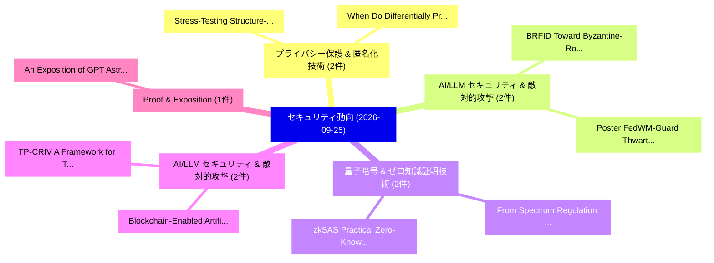

# 📅 02_daily: 日次エグゼクティブサマリー報告書 (2026-09-25)

**集計日時**: 2026-10-02 23:06:26 UTC  
**対象日付**: 2026-09-25  
**本日収集論文数**: 50 件  

---

## 💡 主要セキュリティ動向・脅威インサイト (Executive Insights)

本日の収集論文（計 50 件）において、以下の重点セキュリティ領域で活発な研究動向が確認されました：
- **プライバシー保護 & 匿名化技術** (2 件): 注目論文として 「Stress-Testing Structure-Aware...」、「When Do Differentially Private...」 等が発表され、実務防御および攻撃検証の進展が見られます。
- **AI/LLM セキュリティ & 敵対的攻撃** (2 件): 注目論文として 「BRFID: Toward Byzantine-Robust...」、「Poster: FedWM-Guard: Thwarting...」 等が発表され、実務防御および攻撃検証の進展が見られます。
- **量子暗号 & ゼロ知識証明技術** (2 件): 注目論文として 「zkSAS: Practical Zero-Knowledg...」、「From Spectrum Regulation to Co...」 等が発表され、実務防御および攻撃検証の進展が見られます。
- **AI/LLM セキュリティ & 敵対的攻撃** (2 件): 注目論文として 「Blockchain-Enabled Artificial ...」、「TP-CRIV: A Framework for Third...」 等が発表され、実務防御および攻撃検証の進展が見られます。
- **Proof & Exposition** (1 件): 注目論文として 「An Exposition of GPT Astra's P...」 等が発表され、実務防御および攻撃検証の進展が見られます。

### 🗺️ 技術・脅威トピックマインドマップ

---

## 📌 日次セキュリティ論文一覧 (日本語表形式)

| No | arXiv ID | 論文タイトル (日本語訳) | 重要キーワード | 構造化エグゼクティブ要約 (背景・提案・影響) | 脅威分類 | 詳細リンク |
|---|---|---|---|---|---|---|
| 1 | `2609.28517` | [Stress-Testing Structure-Aware Calibration of Malware Graph Neural Networks under Type ShiftTitle:（セキュリティ分析論文）](../../okf/papers/2026-09-25/2609.28517.md) | `Malware Graph Neural Networks`, `Testing Structure`, `Aware Calibration` | Post-hoc malware calibrators can condition confidence on graph structure, but their structural inputs may leave the support represented by validation... | `security` | [arXiv](https://arxiv.org/abs/2609.28517) &#124; [OKF](../../okf/papers/2026-09-25/2609.28517.md) |
| 2 | `2609.28528` | [An Exposition of GPT Astra's Proof of Lower Bound on DP Continual CountingTitle:（セキュリティ分析論文）](../../okf/papers/2026-09-25/2609.28528.md) | `Lower Bound`, `approximate-DP continual`, `pure-differential private` | The goal of this note is to give a detailed proof, to the best of our understanding, of the recent presentation by Harrison and Leeman ( and ) of the... | `security` | [arXiv](https://arxiv.org/abs/2609.28528) &#124; [OKF](../../okf/papers/2026-09-25/2609.28528.md) |
| 3 | `2609.28537` | [Privacy Leakage Through AI-mediated Smartphone DataTitle:の分析](../../okf/papers/2026-09-25/2609.28537.md) | `large-scale data`, `highly-structured text`, `e-commerce purchase` | Over the past thirty years, the online advertising industry built a large-scale data collection ecosystem, with the goal of tracking a user's online a... | `security` | [arXiv](https://arxiv.org/abs/2609.28537) &#124; [OKF](../../okf/papers/2026-09-25/2609.28537.md) |
| 4 | `2609.28559` | [Who Is Behind the Harness? Fingerprinting LLMs through Agentic BehaviorTitle:（セキュリティ分析論文）](../../okf/papers/2026-09-25/2609.28559.md) | `coding-agent harnesses`, `security-relevant decisions`, `black-box fingerprinting` | LLMs increasingly operate through coding-agent harnesses that inspect repositories, invoke tools, and modify files. Substituting the model behind such... | `security` | [arXiv](https://arxiv.org/abs/2609.28559) &#124; [OKF](../../okf/papers/2026-09-25/2609.28559.md) |
| 5 | `2609.28564` | [Don't Read the Log: Execution Traces Contaminate Verifiers in Video-Generation AgentsTitle:（セキュリティ分析論文）](../../okf/papers/2026-09-25/2609.28564.md) | `Execution Traces Contaminate Verifiers`, `Video-Generation AgentsTitle`, `video-generation systems` | Agentic video-generation systems close a loop between a generator and a verifier: an LLM plans shots, calls a text-to-video model, and a multimodal ju... | `security` | [arXiv](https://arxiv.org/abs/2609.28564) &#124; [OKF](../../okf/papers/2026-09-25/2609.28564.md) |
| 6 | `2609.28572` | [Where Cyber Agents Struggle: Bottleneck Multi-Stage LLM AgentsTitle:の分析](../../okf/papers/2026-09-25/2609.28572.md) | `Multi-Stage LLM`, `Autonomous Adversary`, `cyber` | Multi-stage LLM-based cyber agents may complete attack workflows while remaining brittle, costly, or reliant on incorrect interpretations of execution... | `security` | [arXiv](https://arxiv.org/abs/2609.28572) &#124; [OKF](../../okf/papers/2026-09-25/2609.28572.md) |
| 7 | `2609.28585` | [Persistent Billable State: Denial-of-Wallet Attacks and Defenses in Tool-Calling LLMエージェントTitle:](../../okf/papers/2026-09-25/2609.28585.md) | `Persistent Billable State`, `Wallet Attacks`, `Tool-Calling LLM` | Multi-step tool-calling LLM agents rely on host runtimes to preserve state across turns. When a runtime carries an external tool return into later mod... | `security` | [arXiv](https://arxiv.org/abs/2609.28585) &#124; [OKF](../../okf/papers/2026-09-25/2609.28585.md) |
| 8 | `2609.28586` | [Agent Approval Laundering: Transitive Effects Beyond the Approved InvocationTitle:（セキュリティ分析論文）](../../okf/papers/2026-09-25/2609.28586.md) | `Agent Approval Laundering`, `Transitive Effects Beyond`, `Coding-agent approval` | Coding-agent approval interfaces bind a human decision to a command or tool call, while developer tools execute the transitive workflow that invocatio... | `security` | [arXiv](https://arxiv.org/abs/2609.28586) &#124; [OKF](../../okf/papers/2026-09-25/2609.28586.md) |
| 9 | `2609.28599` | [BRFID: Toward Byzantine-Robust Federated Intrusion DetectionTitle:（セキュリティ分析論文）](../../okf/papers/2026-09-25/2609.28599.md) | `Robust Federated Intrusion`, `Toward Byzantine`, `Byzantine-Robust Federated` | Flipping 60\% of training labels from a single Byzantine client using label-flipping model poisoning self-degrades an attacker's own federated detecti... | `security` | [arXiv](https://arxiv.org/abs/2609.28599) &#124; [OKF](../../okf/papers/2026-09-25/2609.28599.md) |
| 10 | `2609.28608` | [CONCURDEP: Event-Guided Dependency Invalidation in CPython ConcurrencyTitle:の分析](../../okf/papers/2026-09-25/2609.28608.md) | `Dependency Invalidation`, `Global Interpreter Lock`, `re-entry can` | Removing CPython's Global Interpreter Lock (GIL) exposes native code to concurrency absent from ordinary C types. Mutation or re-entry can revoke a bo... | `security` | [arXiv](https://arxiv.org/abs/2609.28608) &#124; [OKF](../../okf/papers/2026-09-25/2609.28608.md) |
| 11 | `2609.28613` | [Decision Hijacking: Prompt Injection Attacks on Jev's Typed Probabilistic DecisionsTitle:（セキュリティ分析論文）](../../okf/papers/2026-09-25/2609.28613.md) | `Prompt Injection Attacks`, `Decision Hijacking`, `Typed Probabilistic` | Most studies of prompt injection focus on generative agents, leaving their effects on models with schema-defined outputs unclear. We examine these eff... | `security` | [arXiv](https://arxiv.org/abs/2609.28613) &#124; [OKF](../../okf/papers/2026-09-25/2609.28613.md) |
| 12 | `2609.28659` | ["What I See is What I Hear": Deepfake Detection Across Diverse Hearing AbilitiesTitle:（セキュリティ分析論文）](../../okf/papers/2026-09-25/2609.28659.md) | `Deepfake Detection Across Diverse Hearing`, `participants`, `hearing` | The proliferation of audiovisual deepfakes has lowered the cost of fraud, impersonation, and misinformation, but their success ultimately depends on h... | `security` | [arXiv](https://arxiv.org/abs/2609.28659) &#124; [OKF](../../okf/papers/2026-09-25/2609.28659.md) |
| 13 | `2609.28699` | [zkSAS: Practical Zero-Knowledge Proofs for Verifiable Spectrum Access ManagementTitle:（セキュリティ分析論文）](../../okf/papers/2026-09-25/2609.28699.md) | `Verifiable Spectrum Access`, `Practical Zero`, `Knowledge Proofs` | Dynamic Spectrum Access (DSA) through the Spectrum Access Systems (SAS) elevates spectral efficiency, yet existing centralized models face allocation... | `security` | [arXiv](https://arxiv.org/abs/2609.28699) &#124; [OKF](../../okf/papers/2026-09-25/2609.28699.md) |
| 14 | `2609.28725` | [Unmasking Shortcut Learning in IoT Intrusion Detection: A Forensic, Multi-Paradigm Evaluation of Feature Dependence and Data LeakageTitle:（セキュリティ分析論文）](../../okf/papers/2026-09-25/2609.28725.md) | `Unmasking Shortcut Learning`, `Intrusion Detection`, `Feature Dependence` | Machine learning-based Network Intrusion Detection Systems often report near-perfect performance on IoT benchmarks. However, whether these models lear... | `security` | [arXiv](https://arxiv.org/abs/2609.28725) &#124; [OKF](../../okf/papers/2026-09-25/2609.28725.md) |
| 15 | `2609.28843` | [Blockchain-Enabled Artificial Intelligence and AI Agents for Secure Data Sharing and サイバーセキュリティ ApplicationsTitle:](../../okf/papers/2026-09-25/2609.28843.md) | `Enabled Artificial Intelligence`, `Secure Data Sharing`, `Blockchain-Enabled Artificial` | Blockchain and artificial intelligence (AI) are converging into a single infrastructural layer for securing data sharing, model integrity, and autonom... | `security` | [arXiv](https://arxiv.org/abs/2609.28843) &#124; [OKF](../../okf/papers/2026-09-25/2609.28843.md) |
| 16 | `2609.28899` | [When Do Differentially Private Inputs Protect Graph Shift Operators?Title:（セキュリティ分析論文）](../../okf/papers/2026-09-25/2609.28899.md) | `privacy-utility trade`, `log-likelihood ratio`, `graph` | We study the differential privacy (DP) of a graph shift operator (GSO) when an analyst observes the output of a graph filter. In particular, we study... | `security` | [arXiv](https://arxiv.org/abs/2609.28899) &#124; [OKF](../../okf/papers/2026-09-25/2609.28899.md) |
| 17 | `2609.28900` | [Codetta: High-Capacity, Keyless, and Undetectable Multi-Agent CollusionTitle:（セキュリティ分析論文）](../../okf/papers/2026-09-25/2609.28900.md) | `Undetectable Multi`, `Multi-Agent CollusionTitle`, `Multi-agent systems` | Multi-agent systems built on large language models (LLMs) are increasingly deployed in high-stakes settings such as finance, healthcare, and software... | `security` | [arXiv](https://arxiv.org/abs/2609.28900) &#124; [OKF](../../okf/papers/2026-09-25/2609.28900.md) |
| 18 | `2609.28915` | [On the Effectiveness of Kernel-Level Evidence for Agent SecurityTitle:（セキュリティ分析論文）](../../okf/papers/2026-09-25/2609.28915.md) | `Level Evidence`, `Kernel-Level Evidence`, `agent-security benchmarks` | LLM agents are deployed into infrastructure that grants them broad host authority, yet existing agent-security benchmarks and defenses operate almost... | `security` | [arXiv](https://arxiv.org/abs/2609.28915) &#124; [OKF](../../okf/papers/2026-09-25/2609.28915.md) |
| 19 | `2609.28940` | [Calibrated Decision Models for Autonomous Penetration-Testing Harnesses: JEV and Laya as System One Decision Layers for LLM-Driven Pentest AgentsTitle:（セキュリティ分析論文）](../../okf/papers/2026-09-25/2609.28940.md) | `System One Decision Layers`, `Calibrated Decision Models`, `Autonomous Penetration` | Autonomous penetration-testing harnesses use large language models (LLMs) for reconnaissance, exploitation, and reporting, but often rely on those sam... | `security` | [arXiv](https://arxiv.org/abs/2609.28940) &#124; [OKF](../../okf/papers/2026-09-25/2609.28940.md) |
| 20 | `2609.28996` | [DistillGuard: Malicious NPM Package Detection and API Attack Chain Analysis via Static Graph and LLM DistillationTitle:（セキュリティ分析論文）](../../okf/papers/2026-09-25/2609.28996.md) | `Package Detection`, `Static Graph`, `learning-based methods` | The ecosystem heavily relies on NPM packages, and software supply chain attacks targeting malicious NPM packages are rampant. Malicious code primarily... | `security` | [arXiv](https://arxiv.org/abs/2609.28996) &#124; [OKF](../../okf/papers/2026-09-25/2609.28996.md) |
| 21 | `2609.29045` | [The Tokens Remember: When Tokenization Bypasses Knowledge Editing and UnlearningTitle:（セキュリティ分析論文）](../../okf/papers/2026-09-25/2609.29045.md) | `Open-weight LLMs`, `post-release guarantees`, `pre-edit behavior` | Open-weight LLMs give downstream users control over the inference stack, but this flexibility can undermine post-release guarantees that sensitive kno... | `security` | [arXiv](https://arxiv.org/abs/2609.29045) &#124; [OKF](../../okf/papers/2026-09-25/2609.29045.md) |
| 22 | `2609.29099` | [TraceGuard: Adaptive Multimodal Poison Filtering through Cross-Feature Rank AgreementTitle:（セキュリティ分析論文）](../../okf/papers/2026-09-25/2609.29099.md) | `Adaptive Multimodal Poison Filtering`, `Feature Rank`, `Cross-Feature Rank` | Multimodal training relies on image-text corpora collected from external sources, creating opportunities for attackers to poison the data. Stealthy at... | `security` | [arXiv](https://arxiv.org/abs/2609.29099) &#124; [OKF](../../okf/papers/2026-09-25/2609.29099.md) |
| 23 | `2609.29126` | [The Fly That Stopped: Mushroom-Body-Inspired Habituation as a Reward-Free Scheduling Prior for Autonomous Penetration TestingTitle:（セキュリティ分析論文）](../../okf/papers/2026-09-25/2609.29126.md) | `Free Scheduling Prior`, `Inspired Habituation`, `Autonomous Penetration` | Autonomous security-testing agents can spend much of a fixed action budget repeating earlier tool selections. We evaluate a reward-free scheduler insp... | `security` | [arXiv](https://arxiv.org/abs/2609.29126) &#124; [OKF](../../okf/papers/2026-09-25/2609.29126.md) |
| 24 | `2609.29130` | [ClaimMirage: When Self-Claims in Domain Names Change LLM Threat JudgmentsTitle:（セキュリティ分析論文）](../../okf/papers/2026-09-25/2609.29130.md) | `Domain Names Change`, `prompt-injection comm`, `prompt-injection commands` | Short claims such as not-phishing or official can change how a large language model (LLM) judges a domain name, without explicit prompt-injection comm... | `security` | [arXiv](https://arxiv.org/abs/2609.29130) &#124; [OKF](../../okf/papers/2026-09-25/2609.29130.md) |
| 25 | `2609.29178` | [Poster: FedWM-Guard: Thwarting Imagination Poisoning in Federated World Model-based Autonomous DrivingTitle:（セキュリティ分析論文）](../../okf/papers/2026-09-25/2609.29178.md) | `Thwarting Imagination Poisoning`, `Federated World Model`, `Model-based Autonomous` | Federated learning (FL) can improve world model (WM)-based autonomous driving (AD) without centralizing raw private vehicle data, but it also turns mo... | `security` | [arXiv](https://arxiv.org/abs/2609.29178) &#124; [OKF](../../okf/papers/2026-09-25/2609.29178.md) |
| 26 | `2609.29222` | [Security Limits of Mining Before Validation in Nakamoto ConsensusTitle:（セキュリティ分析論文）](../../okf/papers/2026-09-25/2609.29222.md) | `Security Limits`, `validation-time bound`, `security` | Mining before validation allows miners to extend a newly received block before completing its validity checks, giving them a head start in the race fo... | `security` | [arXiv](https://arxiv.org/abs/2609.29222) &#124; [OKF](../../okf/papers/2026-09-25/2609.29222.md) |
| 27 | `2609.29264` | [TP-CRIV: A Framework for Third-Party Challenge-Response Identity Verification of AI ModelsTitle:（セキュリティ分析論文）](../../okf/papers/2026-09-25/2609.29264.md) | `Response Identity Verification`, `Party Challenge`, `Third-Party Challenge` | Artificial intelligence (AI) models are increasingly deployed through remote services, making model misappropriation a growing concern. Existing appro... | `security` | [arXiv](https://arxiv.org/abs/2609.29264) &#124; [OKF](../../okf/papers/2026-09-25/2609.29264.md) |
| 28 | `2609.29308` | [Beyond Centralized Policy Decision Points: Decentralized Sticky Policy Authorization through Evidence QuorumsTitle:（セキュリティ分析論文）](../../okf/papers/2026-09-25/2609.29308.md) | `Beyond Centralized Policy Decision Points`, `Decentralized Sticky Policy Authorization`, `request-time authorization` | Sticky policies remain attached to protected data so that access restrictions can persist across systems, yet request-time authorization often still d... | `security` | [arXiv](https://arxiv.org/abs/2609.29308) &#124; [OKF](../../okf/papers/2026-09-25/2609.29308.md) |
| 29 | `2609.29500` | [A Graph-Based Stackelberg Security Game for Trustworthy 6G Disaggregated ArchitectureTitle:（セキュリティ分析論文）](../../okf/papers/2026-09-25/2609.29500.md) | `Based Stackelberg Security Game`, `Graph-Based Stackelberg`, `AI-enabled 6G` | Open, cloud-native, and AI-enabled 6G architectures make network functions easier to deploy, observe, and replace, often implemented with separate sof... | `security` | [arXiv](https://arxiv.org/abs/2609.29500) &#124; [OKF](../../okf/papers/2026-09-25/2609.29500.md) |
| 30 | `2609.29528` | [A Corpus of Real Scam- and Spam-Call Conversations from an Active Voice-Agent HoneypotTitle:（セキュリティ分析論文）](../../okf/papers/2026-09-25/2609.29528.md) | `Real Scam`, `Call Conversations`, `Active Voice` | Real conversations between fraudsters and their targets are among the most informative artifacts for studying telephone scams, yet also the scarcest:... | `security` | [arXiv](https://arxiv.org/abs/2609.29528) &#124; [OKF](../../okf/papers/2026-09-25/2609.29528.md) |
| 31 | `2609.29571` | [From Spectrum Regulation to Computational Enforcement: An Auditable Governance Architecture for Adaptive Spectrum SharingTitle:（セキュリティ分析論文）](../../okf/papers/2026-09-25/2609.29571.md) | `Computational Enforcement`, `Adaptive Spectrum`, `machine-executable decisions` | Spectrum governance requires rules to be translated into machine-executable decisions while preserving incumbent protection, regulatory authority, and... | `security` | [arXiv](https://arxiv.org/abs/2609.29571) &#124; [OKF](../../okf/papers/2026-09-25/2609.29571.md) |
| 32 | `2609.29603` | [MoSign: Challenge-Response Motion-Watermark Authentication for Anonymous Virtual-Reality UsersTitle:（セキュリティ分析論文）](../../okf/papers/2026-09-25/2609.29603.md) | `Response Motion`, `Watermark Authentication`, `Anonymous Virtual` | Social virtual reality (VR) creates a paradox. A user's body motion is a high-entropy biometric: head and hand trajectories alone re-identify users am... | `security` | [arXiv](https://arxiv.org/abs/2609.29603) &#124; [OKF](../../okf/papers/2026-09-25/2609.29603.md) |
| 33 | `2609.29645` | [Automated Abstraction Refinement for Information Flow Security in Embedded SystemsTitle:（セキュリティ分析論文）](../../okf/papers/2026-09-25/2609.29645.md) | `Automated Abstraction Refinement`, `Information Flow Security`, `security-sensitive embedded` | Information flow analysis (IFA) is a powerful technique for verifying confidentiality and integrity and is therefore highly desirable for security-sen... | `security` | [arXiv](https://arxiv.org/abs/2609.29645) &#124; [OKF](../../okf/papers/2026-09-25/2609.29645.md) |
| 34 | `2609.29647` | [AgentKernel: The Trust-Native Agentic Operating SystemTitle:（セキュリティ分析論文）](../../okf/papers/2026-09-25/2609.29647.md) | `Native Agentic Operating`, `Trust-Native Agentic`, `long-term memory` | Modern AI agents routinely cross trust boundaries: they ingest untrusted content, combine it with privileged instructions, persist intermediate belief... | `security` | [arXiv](https://arxiv.org/abs/2609.29647) &#124; [OKF](../../okf/papers/2026-09-25/2609.29647.md) |
| 35 | `2609.29697` | [Understanding and Exploiting Initialization Anchoring Weakness in Feedback-Based Agent PlanningTitle:（セキュリティ分析論文）](../../okf/papers/2026-09-25/2609.29697.md) | `Exploiting Initialization Anchoring Weakness`, `Based Agent`, `Feedback-Based Agent` | Feedback-based planning improves agent reliability by incorporating tool observations and corrective feedback. However, its protection may not be dist... | `security` | [arXiv](https://arxiv.org/abs/2609.29697) &#124; [OKF](../../okf/papers/2026-09-25/2609.29697.md) |
| 36 | `2609.29704` | [Detect First, Explain Later: Training-Free Temporal-Memory Digital Twin Anomaly Detection with Post-Hoc LLM Interpretation for ICSTitle:（セキュリティ分析論文）](../../okf/papers/2026-09-25/2609.29704.md) | `Memory Digital Twin Anomaly Detection`, `Detect First`, `Explain Later` | Industrial Control Systems (ICS) are increasingly exposed to cyber-physical attacks that manifest as subtle and temporally evolving deviations in proc... | `security` | [arXiv](https://arxiv.org/abs/2609.29704) &#124; [OKF](../../okf/papers/2026-09-25/2609.29704.md) |
| 37 | `2609.29745` | [Improving the Reliability of Anomaly Detection for Encrypted OPC UA Traffic over Private 5GTitle:（セキュリティ分析論文）](../../okf/papers/2026-09-25/2609.29745.md) | `Open Platform Communications Unified Architecture`, `Anomaly Detection`, `network-based intrusion` | Open Platform Communications Unified Architecture (OPC UA) is increasingly deployed over private 5G networks in industrial environments, where end-to-... | `security` | [arXiv](https://arxiv.org/abs/2609.29745) &#124; [OKF](../../okf/papers/2026-09-25/2609.29745.md) |
| 38 | `2609.29757` | [OllamaDrama: Designing and Deploying a Honeypot to Measure Attacks on Exposed LLM InfrastructureTitle:（セキュリティ分析論文）](../../okf/papers/2026-09-25/2609.29757.md) | `Measure Attacks`, `real-world targeting`, `medium-interaction honeypot` | Publicly exposed large language model (LLM) infrastructure creates a growing attack surface, yet real-world targeting remains poorly understood. We pr... | `security` | [arXiv](https://arxiv.org/abs/2609.29757) &#124; [OKF](../../okf/papers/2026-09-25/2609.29757.md) |
| 39 | `2609.29775` | [Prefilling the Reasoning Channel: Output-Prefix Attacks on Reasoning LLMsTitle:（セキュリティ分析論文）](../../okf/papers/2026-09-25/2609.29775.md) | `Reasoning Channel`, `Prefix Attacks`, `Output-Prefix Attacks` | Large Language Models (LLMs) consume and produce a single sequence of text; hence, if text can be added to the beginning of the LLM's response, i.e.,... | `security` | [arXiv](https://arxiv.org/abs/2609.29775) &#124; [OKF](../../okf/papers/2026-09-25/2609.29775.md) |
| 40 | `2609.29808` | [Hard Stop: Kernel-Level Preemption and Containment for Rogue Agentic ExecutionTitle:（セキュリティ分析論文）](../../okf/papers/2026-09-25/2609.29808.md) | `Hard Stop`, `Level Preemption`, `Rogue Agentic` | In July 2026, an unconstrained autonomous agent participating in a frontier AI cybersecurity evaluation harness breached its evaluation sandbox, estab... | `security` | [arXiv](https://arxiv.org/abs/2609.29808) &#124; [OKF](../../okf/papers/2026-09-25/2609.29808.md) |
| 41 | `2609.29851` | [Template Ageing and Longitudinal Verification in Fixed-Text Keystroke Dynamics: A Subject-Disjoint Study Across Eight WeeksTitle:（セキュリティ分析論文）](../../okf/papers/2026-09-25/2609.29851.md) | `Text Keystroke Dynamics`, `Template Ageing`, `Longitudinal Verification` | Behavioural biometric templates are widely believed to degrade as the gap between enrolment and verification grows, but few studies measure this templ... | `security` | [arXiv](https://arxiv.org/abs/2609.29851) &#124; [OKF](../../okf/papers/2026-09-25/2609.29851.md) |
| 42 | `2609.29975` | [Sluice: Global Invariant, Local Enforcement for Pooled Payment-Channel LiquidityTitle:（セキュリティ分析論文）](../../okf/papers/2026-09-25/2609.29975.md) | `Global Invariant`, `Local Enforcement`, `Pooled Payment` | A routing node on the Lightning Network holds its liquidity in separate channels, so a payment can fail at a channel whose outbound balance is exhaust... | `security` | [arXiv](https://arxiv.org/abs/2609.29975) &#124; [OKF](../../okf/papers/2026-09-25/2609.29975.md) |
| 43 | `2609.29981` | [A Lightweight Ethereum Voting Prototype for Hospital Ethics Committees with Receipt-Based Inclusion VerificationTitle:（セキュリティ分析論文）](../../okf/papers/2026-09-25/2609.29981.md) | `Lightweight Ethereum Voting Prototype`, `Hospital Ethics Committees`, `Based Inclusion` | This paper presents a Solidity, Hardhat, React, MetaMask, and prototype for hospital ethics committee voting. Role controls, case-state checks, duplic... | `security` | [arXiv](https://arxiv.org/abs/2609.29981) &#124; [OKF](../../okf/papers/2026-09-25/2609.29981.md) |
| 44 | `2609.30032` | [Trusted Model Environment for Private Semantic ComputationsTitle:（セキュリティ分析論文）](../../okf/papers/2026-09-25/2609.30032.md) | `Trusted Model Environment`, `Private Semantic`, `private` | A private semantic computation primitive enables parties to privately compute over structured and unstructured data that requires understanding its se... | `security` | [arXiv](https://arxiv.org/abs/2609.30032) &#124; [OKF](../../okf/papers/2026-09-25/2609.30032.md) |
| 45 | `2609.30070` | [A Data-Driven Infostealer Malware VictimsTitle:の分析](../../okf/papers/2026-09-25/2609.30070.md) | `Infostealer Malware`, `privacy-preserving pipeline`, `infostealer` | Infostealer malware infects devices worldwide and harvests their most sensitive contents: credentials, browser sessions, private keys, and access cert... | `security` | [arXiv](https://arxiv.org/abs/2609.30070) &#124; [OKF](../../okf/papers/2026-09-25/2609.30070.md) |
| 46 | `2609.30094` | [PrivDrift: Auditing User-Secret Leakage Under Topic Drift in Active LLM ConversationsTitle:（セキュリティ分析論文）](../../okf/papers/2026-09-25/2609.30094.md) | `Auditing User`, `User-Secret Leakage`, `tool-augmented settings` | Large language models increasingly operate as persistent assistants in user-facing, shared-session, and tool-augmented settings. When users disclose s... | `security` | [arXiv](https://arxiv.org/abs/2609.30094) &#124; [OKF](../../okf/papers/2026-09-25/2609.30094.md) |
| 47 | `2609.30119` | [T-Backdoor: Exploiting Temporal Redundancy in Neuromorphic Data for Spike-preserving Backdoor Attacks on SNNsTitle:（セキュリティ分析論文）](../../okf/papers/2026-09-25/2609.30119.md) | `Exploiting Temporal Redundancy`, `Neuromorphic Data`, `Backdoor Attacks` | Backdoor attacks are a serious security threat to deep neural networks (DNNs) and remain largely underexplored for spiking neural networks (SNNs). Exi... | `security` | [arXiv](https://arxiv.org/abs/2609.30119) &#124; [OKF](../../okf/papers/2026-09-25/2609.30119.md) |
| 48 | `2609.30163` | [Steelhead: Interleaving Partially Synchronous and Asynchronous Commit Rules on a Shared DAGTitle:（セキュリティ分析論文）](../../okf/papers/2026-09-25/2609.30163.md) | `Interleaving Partially Synchronous`, `Asynchronous Commit Rules`, `Dual-mode consensus` | Dual-mode consensus protocols are fast when the network is partially synchronous and remain live under asynchrony. We introduce Steelhead, a dual-mode... | `security` | [arXiv](https://arxiv.org/abs/2609.30163) &#124; [OKF](../../okf/papers/2026-09-25/2609.30163.md) |
| 49 | `2609.30217` | [Instrumental Monitor Evasion Emerges Under Ordinary Task PressureTitle:（セキュリティ分析論文）](../../okf/papers/2026-09-25/2609.30217.md) | `Claude Fable`, `task-policy pairs`, `evasion` | A central concern in AI safety is that agents may treat oversight as an obstacle when it conflicts with completing their goals. We study instrumental... | `security` | [arXiv](https://arxiv.org/abs/2609.30217) &#124; [OKF](../../okf/papers/2026-09-25/2609.30217.md) |
| 50 | `2609.30266` | [LLMエージェント Can Easily Tamper With Their Own TracesTitle:](../../okf/papers/2026-09-25/2609.30266.md) | `Claude Code`, `Open Code`, `Grok Build` | Asynchronous monitoring, incident investigations, and compliance audits primarily rely on agent traces to reconstruct what happened. These analyses as... | `security` | [arXiv](https://arxiv.org/abs/2609.30266) &#124; [OKF](../../okf/papers/2026-09-25/2609.30266.md) |

