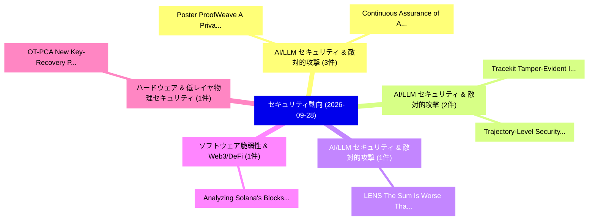

# 📅 02_daily: 日次エグゼクティブサマリー報告書 (2026-09-28)

**集計日時**: 2026-10-02 23:06:27 UTC  
**対象日付**: 2026-09-28  
**本日収集論文数**: 25 件  

---

## 💡 主要セキュリティ動向・脅威インサイト (Executive Insights)

本日の収集論文（計 25 件）において、以下の重点セキュリティ領域で活発な研究動向が確認されました：
- **AI/LLM セキュリティ & 敵対的攻撃** (3 件): 注目論文として 「Poster: ProofWeave: A Privacy-...」、「Continuous Assurance of Agenti...」 等が発表され、実務防御および攻撃検証の進展が見られます。
- **AI/LLM セキュリティ & 敵対的攻撃** (2 件): 注目論文として 「Trajectory-Level Security Debt...」、「Tracekit: Tamper-Evident Inten...」 等が発表され、実務防御および攻撃検証の進展が見られます。
- **AI/LLM セキュリティ & 敵対的攻撃** (1 件): 注目論文として 「LENS: The Sum Is Worse Than th...」 等が発表され、実務防御および攻撃検証の進展が見られます。
- **ソフトウェア脆弱性 & Web3/DeFi** (1 件): 注目論文として 「Analyzing Solana's Blocks and ...」 等が発表され、実務防御および攻撃検証の進展が見られます。
- **ハードウェア & 低レイヤ物理セキュリティ** (1 件): 注目論文として 「OT-PCA: New Key-Recovery Plain...」 等が発表され、実務防御および攻撃検証の進展が見られます。

### 🗺️ 技術・脅威トピックマインドマップ

---

## 📌 日次セキュリティ論文一覧 (日本語表形式)

| No | arXiv ID | 論文タイトル (日本語訳) | 重要キーワード | 構造化エグゼクティブ要約 (背景・提案・影響) | 脅威分類 | 詳細リンク |
|---|---|---|---|---|---|---|
| 1 | `2609.35155` | [LENS: The Sum Is Worse Than the Parts for Set-Level Poisoning in Retrieval-Augmented Generation（セキュリティ分析論文）](../../okf/papers/2026-09-28/2609.35155.md) | `Level Poisoning`, `Augmented Generation`, `Set-Level Poisoning` | Retrieval-augmented generation (RAG) aggregates evidence from multiple external documents, yet this joint integration creates an underexamined vulnera... | `cryptography` | [arXiv](https://arxiv.org/abs/2609.35155) &#124; [OKF](../../okf/papers/2026-09-28/2609.35155.md) |
| 2 | `2609.35171` | [Analyzing Solana's Blocks and Transactions（セキュリティ分析論文）](../../okf/papers/2026-09-28/2609.35171.md) | `Analyzing Solana`, `Dvir David Biton`, `Yaron Hay` | Solana is one of the most popular blockchains, and is arguably the most widely used blockchain for smart contracts, also known as dApps. Understanding... | `cryptography` | [arXiv](https://arxiv.org/abs/2609.35171) &#124; [OKF](../../okf/papers/2026-09-28/2609.35171.md) |
| 3 | `2609.35199` | [Trajectory-Level Security Debt in LLM Coding Agents（セキュリティ分析論文）](../../okf/papers/2026-09-28/2609.35199.md) | `Level Security Debt`, `Coding Agents`, `Trajectory-Level Security` | LLM coding agents can traverse hundreds of intermediate code states before submitting a solution. Evaluating only the final artifact leaves the evolut... | `cryptography` | [arXiv](https://arxiv.org/abs/2609.35199) &#124; [OKF](../../okf/papers/2026-09-28/2609.35199.md) |
| 4 | `2609.35205` | [OT-PCA: New Key-Recovery Plaintext-Checking Oracle Based Side-Channel Attacks on HQC with Offline Templates（セキュリティ分析論文）](../../okf/papers/2026-09-28/2609.35205.md) | `Checking Oracle Based Side`, `New Key`, `Recovery Plaintext` | In this paper, we introduce OT-PCA, a novel approach for conducting Plaintext-Checking (PC) oracle based side-channel attacks, specifically designed f... | `cryptography` | [arXiv](https://arxiv.org/abs/2609.35205) &#124; [OKF](../../okf/papers/2026-09-28/2609.35205.md) |
| 5 | `2609.35224` | [TANGO: Watermarking Masked Diffusion Language Models in Token Pairs（セキュリティ分析論文）](../../okf/papers/2026-09-28/2609.35224.md) | `Watermarking Masked Diffusion Language Models`, `Token Pairs`, `Masked-diffusion language` | Masked-diffusion language models fill in masked positions in parallel and in no fixed order. Most practical text watermarks assume left-to-right gener... | `cryptography` | [arXiv](https://arxiv.org/abs/2609.35224) &#124; [OKF](../../okf/papers/2026-09-28/2609.35224.md) |
| 6 | `2609.35234` | [Poster: ProofWeave: A Privacy-Minimised, Integrity-Anchored Evidence Plane for Continuous Agentic Assuranceに向けて](../../okf/papers/2026-09-28/2609.35234.md) | `Anchored Evidence Plane`, `Continuous Agentic Assurance`, `Integrity-Anchored Evidence` | Agentic AI systems increasingly act via tools, memory, delegation, and external services. Existing observability and provenance mechanisms can reconst... | `cryptography` | [arXiv](https://arxiv.org/abs/2609.35234) &#124; [OKF](../../okf/papers/2026-09-28/2609.35234.md) |
| 7 | `2609.35256` | [Implementing Data Diodes Using Commodity Hardware and Open Source Software（セキュリティ分析論文）](../../okf/papers/2026-09-28/2609.35256.md) | `Implementing Data Diodes Using Commodity Hardware`, `Open Source Software`, `One-way network` | One-way network devices, known as data diodes, are used to defend against sophisticated cyberattacks. Partly due to their high cost, data diodes are m... | `cryptography` | [arXiv](https://arxiv.org/abs/2609.35256) &#124; [OKF](../../okf/papers/2026-09-28/2609.35256.md) |
| 8 | `2609.35266` | [Continuous Assurance of Agentic Security Auditors for Software Delivery Decision Gates（セキュリティ分析論文）](../../okf/papers/2026-09-28/2609.35266.md) | `Software Delivery Decision Gates`, `Agentic Security Auditors`, `Continuous Assurance` | Large language model (LLM)-based repository auditors are increasingly deployed as security controls within continuous integration (CI) pipelines, wher... | `cryptography` | [arXiv](https://arxiv.org/abs/2609.35266) &#124; [OKF](../../okf/papers/2026-09-28/2609.35266.md) |
| 9 | `2609.35300` | [Sustained Participation as a Security Resource: The Bounded Participation Channel（セキュリティ分析論文）](../../okf/papers/2026-09-28/2609.35300.md) | `Sustained Participation`, `Security Resource`, `per-identity participation` | Can sustained, per-identity participation be engineered into a security resource? Most anti-Sybil defenses price identity creation rather than identit... | `cryptography` | [arXiv](https://arxiv.org/abs/2609.35300) &#124; [OKF](../../okf/papers/2026-09-28/2609.35300.md) |
| 10 | `2609.35339` | [Zero Knowledge Proofs in Quantum Networks（セキュリティ分析論文）](../../okf/papers/2026-09-28/2609.35339.md) | `Zero Knowledge Proofs`, `Quantum Networks`, `Zero-knowledge proofs` | Zero-knowledge proofs (ZKPs) enable the verification of a statement without revealing any information beyond its validity and constitute a fundamental... | `cryptography` | [arXiv](https://arxiv.org/abs/2609.35339) &#124; [OKF](../../okf/papers/2026-09-28/2609.35339.md) |
| 11 | `2609.35358` | [Hybrid QKD-PQC Network Emulation through Automated and Scalable Cloud-Native Orchestration（セキュリティ分析論文）](../../okf/papers/2026-09-28/2609.35358.md) | `Network Emulation`, `Scalable Cloud`, `Native Orchestration` | The ongoing transition toward quantum-safe networking has motivated the development of hybrid network architectures integrating Quantum Key Distributi... | `cryptography` | [arXiv](https://arxiv.org/abs/2609.35358) &#124; [OKF](../../okf/papers/2026-09-28/2609.35358.md) |
| 12 | `2609.35366` | [Planarian: Managing Agent State with Statepoints（セキュリティ分析論文）](../../okf/papers/2026-09-28/2609.35366.md) | `Managing Agent State`, `Hao Mark Chen`, `Jinnan Guo` | LLM agents solve complex tasks by iteratively changing files, invoking local tools, and interacting with remote services, which modifies state across... | `cryptography` | [arXiv](https://arxiv.org/abs/2609.35366) &#124; [OKF](../../okf/papers/2026-09-28/2609.35366.md) |
| 13 | `2609.35408` | ["Nothing to See Here'': Unintended Disclosure through Revision Traces of LLM Deliverables（セキュリティ分析論文）](../../okf/papers/2026-09-28/2609.35408.md) | `Unintended Disclosure`, `Revision Traces`, `third-party recipients` | Large language model (LLM) assistants increasingly help users draft content for third-party recipients. During private drafting, the user or the model... | `cryptography` | [arXiv](https://arxiv.org/abs/2609.35408) &#124; [OKF](../../okf/papers/2026-09-28/2609.35408.md) |
| 14 | `2609.35414` | [AI-Based Vulnerability Assessment Capability and Cyber Attack Graph Analysis（セキュリティ分析論文）](../../okf/papers/2026-09-28/2609.35414.md) | `Based Vulnerability Assessment Capability`, `AI-Based Vulnerability`, `mission-critical infrastructure` | Cyber threats targeting mission-critical infrastructure are becoming more sophisticated while the barrier to launching attacks continues to fall. Trad... | `cryptography` | [arXiv](https://arxiv.org/abs/2609.35414) &#124; [OKF](../../okf/papers/2026-09-28/2609.35414.md) |
| 15 | `2609.35421` | [Indistinguishability of Sum of Permutations: A Fourier Analytic Route to Classical and Quantum Security（セキュリティ分析論文）](../../okf/papers/2026-09-28/2609.35421.md) | `Fourier Analytic Route`, `Quantum Security`, `Ritam Bhaumik` | We study classical and quantum indistinguishability of sums of independent random permutations and related transformations from permutations to functi... | `cryptography` | [arXiv](https://arxiv.org/abs/2609.35421) &#124; [OKF](../../okf/papers/2026-09-28/2609.35421.md) |
| 16 | `2609.35434` | [LLM-Assisted Automatic Security Proofs for Cryptographic Protocols: How Far Are We?（セキュリティ分析論文）](../../okf/papers/2026-09-28/2609.35434.md) | `Assisted Automatic Security Proofs`, `Cryptographic Protocols`, `LLM-Assisted Automatic` | Large language models (LLMs) have shown strong potential for assisting software and security analysis tasks, yet their effectiveness in cryptographic... | `cryptography` | [arXiv](https://arxiv.org/abs/2609.35434) &#124; [OKF](../../okf/papers/2026-09-28/2609.35434.md) |
| 17 | `2609.35487` | [Beyond Scalar Probes: Exploiting Vector-Valued Outputs in ReLU Networks For Signature Extraction（セキュリティ分析論文）](../../okf/papers/2026-09-28/2609.35487.md) | `Beyond Scalar Probes`, `Exploiting Vector`, `Valued Outputs` | We revisit cryptanalytic extraction of ReLU networks from a geometric and algebraic perspective. Rather than restricting attention to a single output... | `cryptography` | [arXiv](https://arxiv.org/abs/2609.35487) &#124; [OKF](../../okf/papers/2026-09-28/2609.35487.md) |
| 18 | `2609.35506` | [Detecting False Data Injection and Unstable Operation in Smart Grid via System-Aware Graph Boundary Learning（セキュリティ分析論文）](../../okf/papers/2026-09-28/2609.35506.md) | `Detecting False Data Injection`, `Aware Graph Boundary Learning`, `Unstable Operation` | Cyber-physical power systems increasingly rely on data-driven tools to detect instability and support reliable grid operation. However, reliable stabi... | `cryptography` | [arXiv](https://arxiv.org/abs/2609.35506) &#124; [OKF](../../okf/papers/2026-09-28/2609.35506.md) |
| 19 | `2609.35552` | [INTCC: A Framework for Interactive Confidential Computing（セキュリティ分析論文）](../../okf/papers/2026-09-28/2609.35552.md) | `Interactive Confidential Computing`, `Trusted Execution Environments`, `Qingzhe Bing` | Confidential computing leverages Trusted Execution Environments (TEEs) to ensure the confidentiality and integrity of data in use. However, TEEs rely... | `cryptography` | [arXiv](https://arxiv.org/abs/2609.35552) &#124; [OKF](../../okf/papers/2026-09-28/2609.35552.md) |
| 20 | `2609.35557` | [The Compiler May Read It, the Agent May Not: Keeping Part of a Research Code Away from a Coding Agent（セキュリティ分析論文）](../../okf/papers/2026-09-28/2609.35557.md) | `Research Code Away`, `Keeping Part`, `Coding Agent` | The compiler must read modules a physics-based solver cannot build without; the coding agent must not read that intellectual property. The harness doe... | `cryptography` | [arXiv](https://arxiv.org/abs/2609.35557) &#124; [OKF](../../okf/papers/2026-09-28/2609.35557.md) |
| 21 | `2609.35576` | [Share-Borne AI Virus: Memory-Hopping Attacks Across LLMエージェント](../../okf/papers/2026-09-28/2609.35576.md) | `Hopping Attacks Across`, `Share-Borne AI`, `Memory-Hopping Attacks` | Large language models are increasingly deployed as stateful assistants that retain information across interactions and use tools to read, modify, and... | `cryptography` | [arXiv](https://arxiv.org/abs/2609.35576) &#124; [OKF](../../okf/papers/2026-09-28/2609.35576.md) |
| 22 | `2609.35596` | [SEABench: Endogenous Misalignment In Self-Evolving Agentsのベンチマーク評価](../../okf/papers/2026-09-28/2609.35596.md) | `Evolving Agents`, `Self-Evolving Agents`, `Self-evolving LLM` | Self-evolving LLM agents have gained prominence for their ability to improve after deployment by modifying their harness, including their controller i... | `cryptography` | [arXiv](https://arxiv.org/abs/2609.35596) &#124; [OKF](../../okf/papers/2026-09-28/2609.35596.md) |
| 23 | `2609.35633` | [Succinct Arguments for QMA from Collapsing Hash Functions（セキュリティ分析論文）](../../okf/papers/2026-09-28/2609.35633.md) | `Collapsing Hash Functions`, `Succinct Arguments`, `James Bartusek` | We prove the existence of succinct arguments for QMA, assuming only the existence of collapsing hash functions. This is the first scheme that relies o... | `cryptography` | [arXiv](https://arxiv.org/abs/2609.35633) &#124; [OKF](../../okf/papers/2026-09-28/2609.35633.md) |
| 24 | `2609.35659` | [Tracekit: Tamper-Evident Intent-Reasoning-Action Auditing for Autonomous Coding Agents（セキュリティ分析論文）](../../okf/papers/2026-09-28/2609.35659.md) | `Autonomous Coding Agents`, `Evident Intent`, `Action Auditing` | Autonomous coding agents read untrusted files, run shell commands and spawn sub-agents with little supervision, yet their record is usually an editabl... | `cryptography` | [arXiv](https://arxiv.org/abs/2609.35659) &#124; [OKF](../../okf/papers/2026-09-28/2609.35659.md) |
| 25 | `2609.35699` | [Distillation Defenses Easily Break After Reinforcement Learning（セキュリティ分析論文）](../../okf/papers/2026-09-28/2609.35699.md) | `closed-source large`, `Shidan Javaheri`, `Alexander Panfilov` | Distillation attacks copy the reasoning capabilities of closed-source large language models, allowing bad actors to replicate state-of-the-art perform... | `cryptography` | [arXiv](https://arxiv.org/abs/2609.35699) &#124; [OKF](../../okf/papers/2026-09-28/2609.35699.md) |

