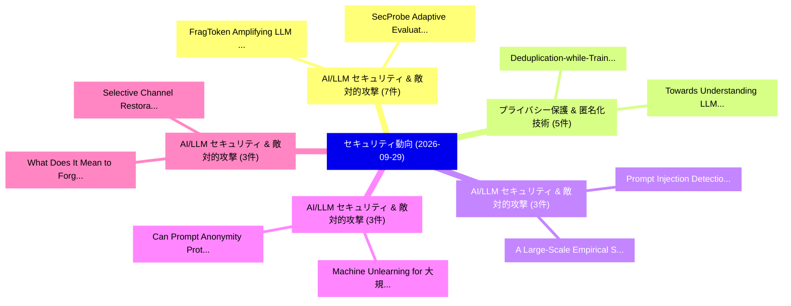

# 📅 02_daily: 日次エグゼクティブサマリー報告書 (2026-09-29)

**集計日時**: 2026-10-02 23:06:27 UTC  
**対象日付**: 2026-09-29  
**本日収集論文数**: 153 件  

---

## 💡 主要セキュリティ動向・脅威インサイト (Executive Insights)

本日の収集論文（計 153 件）において、以下の重点セキュリティ領域で活発な研究動向が確認されました：
- **AI/LLM セキュリティ & 敵対的攻撃** (7 件): 注目論文として 「FragToken: Amplifying LLM Infe...」、「SecProbe: Adaptive Evaluation ...」 等が発表され、実務防御および攻撃検証の進展が見られます。
- **プライバシー保護 & 匿名化技術** (5 件): 注目論文として 「Deduplication-while-Training: ...」、「Towards Understanding LLM-Base...」 等が発表され、実務防御および攻撃検証の進展が見られます。
- **AI/LLM セキュリティ & 敵対的攻撃** (3 件): 注目論文として 「Prompt Injection Detection for...」、「A Large-Scale Empirical Study ...」 等が発表され、実務防御および攻撃検証の進展が見られます。
- **AI/LLM セキュリティ & 敵対的攻撃** (3 件): 注目論文として 「Machine Unlearning for 大規模言語モデ...」、「Can Prompt Anonymity Protect Y...」 等が発表され、実務防御および攻撃検証の進展が見られます。
- **AI/LLM セキュリティ & 敵対的攻撃** (3 件): 注目論文として 「What Does It Mean to Forget a ...」、「Selective Channel Restoration ...」 等が発表され、実務防御および攻撃検証の進展が見られます。

### 🗺️ 技術・脅威トピックマインドマップ

---

## 📌 日次セキュリティ論文一覧 (日本語表形式)

| No | arXiv ID | 論文タイトル (日本語訳) | 重要キーワード | 構造化エグゼクティブ要約 (背景・提案・影響) | 脅威分類 | 詳細リンク |
|---|---|---|---|---|---|---|
| 1 | `2609.30032` | [Trusted Model Environment for Private Semantic ComputationsTitle:（セキュリティ分析論文）](../../okf/papers/2026-09-29/2609.30032.md) | `Trusted Model Environment`, `Private Semantic`, `private` | A private semantic computation primitive enables parties to privately compute over structured and unstructured data that requires understanding its se... | `security` | [arXiv](https://arxiv.org/abs/2609.30032) &#124; [OKF](../../okf/papers/2026-09-29/2609.30032.md) |
| 2 | `2609.30070` | [A Data-Driven Infostealer Malware VictimsTitle:の分析](../../okf/papers/2026-09-29/2609.30070.md) | `Infostealer Malware`, `privacy-preserving pipeline`, `infostealer` | Infostealer malware infects devices worldwide and harvests their most sensitive contents: credentials, browser sessions, private keys, and access cert... | `security` | [arXiv](https://arxiv.org/abs/2609.30070) &#124; [OKF](../../okf/papers/2026-09-29/2609.30070.md) |
| 3 | `2609.30119` | [T-Backdoor: Exploiting Temporal Redundancy in Neuromorphic Data for Spike-preserving Backdoor Attacks on SNNsTitle:（セキュリティ分析論文）](../../okf/papers/2026-09-29/2609.30119.md) | `Exploiting Temporal Redundancy`, `Neuromorphic Data`, `Backdoor Attacks` | Backdoor attacks are a serious security threat to deep neural networks (DNNs) and remain largely underexplored for spiking neural networks (SNNs). Exi... | `security` | [arXiv](https://arxiv.org/abs/2609.30119) &#124; [OKF](../../okf/papers/2026-09-29/2609.30119.md) |
| 4 | `2609.30217` | [Instrumental Monitor Evasion Emerges Under Ordinary Task PressureTitle:（セキュリティ分析論文）](../../okf/papers/2026-09-29/2609.30217.md) | `Claude Fable`, `task-policy pairs`, `evasion` | A central concern in AI safety is that agents may treat oversight as an obstacle when it conflicts with completing their goals. We study instrumental... | `security` | [arXiv](https://arxiv.org/abs/2609.30217) &#124; [OKF](../../okf/papers/2026-09-29/2609.30217.md) |
| 5 | `2609.30266` | [LLMエージェント Can Easily Tamper With Their Own TracesTitle:](../../okf/papers/2026-09-29/2609.30266.md) | `Claude Code`, `Open Code`, `Grok Build` | Asynchronous monitoring, incident investigations, and compliance audits primarily rely on agent traces to reconstruct what happened. These analyses as... | `security` | [arXiv](https://arxiv.org/abs/2609.30266) &#124; [OKF](../../okf/papers/2026-09-29/2609.30266.md) |
| 6 | `2609.30325` | [ScopeBench: Do Agents Preserve Engagement Boundaries Under Goal Pressure?Title:（セキュリティ分析論文）](../../okf/papers/2026-09-29/2609.30325.md) | `offensive-security benchmarks`, `dead-end agentic`, `natural-language scope` | Agents are increasingly deployed with real autonomy in web application and network penetration testing, where a single out-of-scope action can breach... | `security` | [arXiv](https://arxiv.org/abs/2609.30325) &#124; [OKF](../../okf/papers/2026-09-29/2609.30325.md) |
| 7 | `2609.30345` | [Coding Agents Aren't Enough! Evaluating an Enterprise Security Brain for Agentic Cloud InvestigationsTitle:（セキュリティ分析論文）](../../okf/papers/2026-09-29/2609.30345.md) | `Coding Agents Aren`, `Enterprise Security Brain`, `Agentic Cloud` | Cloud-security investigation is dominated by population tasks: which identities can read a data store, how many resources fail a control, what is reac... | `security` | [arXiv](https://arxiv.org/abs/2609.30345) &#124; [OKF](../../okf/papers/2026-09-29/2609.30345.md) |
| 8 | `2609.30509` | [Too Late to Slash: Coordinating a Risk-Free Equivocation AttackTitle:（セキュリティ分析論文）](../../okf/papers/2026-09-29/2609.30509.md) | `Free Equivocation`, `Risk-Free Equivocation`, `game-theoretic guarantee` | Slashing is commonly argued to secure proof-of-stake blockchains by confiscating the stake of misbehaving validators. The usual justification is that,... | `security` | [arXiv](https://arxiv.org/abs/2609.30509) &#124; [OKF](../../okf/papers/2026-09-29/2609.30509.md) |
| 9 | `2609.30581` | [Encryptability As a Coordinate Choice: Depth-One Homomorphic 連合学習 of Quantum Neural NetworksTitle:](../../okf/papers/2026-09-29/2609.30581.md) | `One Homomorphic Federated Learning`, `Coordinate Choice`, `Quantum Neural` | Encrypted training relies on keeping server-side updates low-degree. This constraint traditionally excludes models whose weights inhabit a compact Lie... | `security` | [arXiv](https://arxiv.org/abs/2609.30581) &#124; [OKF](../../okf/papers/2026-09-29/2609.30581.md) |
| 10 | `2609.30614` | [Subjects, Not Authors: The Authorship Hazard in Agentic DataspacesTitle:（セキュリティ分析論文）](../../okf/papers/2026-09-29/2609.30614.md) | `governance`, `hazard`, `2609` | Dataspace connectors decide whether a transfer may occur, not what the transferred value contains, tolerable for contracted applications, not for LLM... | `security` | [arXiv](https://arxiv.org/abs/2609.30614) &#124; [OKF](../../okf/papers/2026-09-29/2609.30614.md) |
| 11 | `2609.30657` | [Prompt Injection Detection for Email Agents Through Attack Chain ModelingTitle:（セキュリティ分析論文）](../../okf/papers/2026-09-29/2609.30657.md) | `Prompt Injection Detection`, `rule-based risk`, `prompt` | Large language model email assistants are particularly vulnerable to indirect prompt injection because untrusted email content can be retrieved into t... | `security` | [arXiv](https://arxiv.org/abs/2609.30657) &#124; [OKF](../../okf/papers/2026-09-29/2609.30657.md) |
| 12 | `2609.30683` | [A Large-Scale Empirical Study of Modern Phishing Email ContentTitle:（セキュリティ分析論文）](../../okf/papers/2026-09-29/2609.30683.md) | `Modern Phishing Email`, `Large-Scale Empirical`, `Phishing Working Group` | Phishing remains one of the most pervasive threats to Internet users, and email remains its predominant delivery channel. Email content is the attack... | `security` | [arXiv](https://arxiv.org/abs/2609.30683) &#124; [OKF](../../okf/papers/2026-09-29/2609.30683.md) |
| 13 | `2609.30719` | [Werracle: Sub-Cent Intra-Block AI Reflex Oracles and Flash-Loan Circuit Breakers for EVM Smart ContractsTitle:（セキュリティ分析論文）](../../okf/papers/2026-09-29/2609.30719.md) | `Loan Circuit Breakers`, `Cent Intra`, `Reflex Oracles` | Contemporary on-chain artificial intelligence (AI) encounters an intractable Von Neumann memory and latency wall. Storing static floating-point neural... | `security` | [arXiv](https://arxiv.org/abs/2609.30719) &#124; [OKF](../../okf/papers/2026-09-29/2609.30719.md) |
| 14 | `2609.30729` | [Input-Layer Starvation: Why Per-Layer Pruning Breaks IoT Intrusion DetectorsTitle:（セキュリティ分析論文）](../../okf/papers/2026-09-29/2609.30729.md) | `Layer Pruning Breaks`, `Layer Starvation`, `Input-Layer Starvation` | Intrusion detectors for small Internet-of-Things (IoT) devices are usually compressed by pruning and judged by overall accuracy. We show that this hid... | `security` | [arXiv](https://arxiv.org/abs/2609.30729) &#124; [OKF](../../okf/papers/2026-09-29/2609.30729.md) |
| 15 | `2609.30805` | [XPhysICS: Cross-Physical-Domain Threat Grounding for Industrial Control Systems SecurityTitle:（セキュリティ分析論文）](../../okf/papers/2026-09-29/2609.30805.md) | `Domain Threat Grounding`, `Industrial Control Systems`, `cyber-physical effects` | Industrial control system (ICS) threats documented for one plant can express cyber-physical effects relevant to another, but semantic similarity alone... | `security` | [arXiv](https://arxiv.org/abs/2609.30805) &#124; [OKF](../../okf/papers/2026-09-29/2609.30805.md) |
| 16 | `2609.30824` | [Crypto-bound identity-verified capability tokens for coordinating distributed AI agents: A proposalTitle:（セキュリティ分析論文）](../../okf/papers/2026-09-29/2609.30824.md) | `Crypto-bound identity`, `agents`, `trust` | The prospect of fully autonomous transactional agents did not appear on the horizon until the advent of high capability language models. With such mod... | `security` | [arXiv](https://arxiv.org/abs/2609.30824) &#124; [OKF](../../okf/papers/2026-09-29/2609.30824.md) |
| 17 | `2609.30830` | [AGATE: Provenance-Based Runtime Defense Against Compositional Attacks on LLMエージェントTitle:](../../okf/papers/2026-09-29/2609.30830.md) | `Provenance-Based Runtime`, `data-provenance gate`, `agent-harness boundaries` | LLM agents can produce harmful effects through sequences of ordinary operations. Judging such actions requires establishing both the authority that pe... | `security` | [arXiv](https://arxiv.org/abs/2609.30830) &#124; [OKF](../../okf/papers/2026-09-29/2609.30830.md) |
| 18 | `2609.30909` | [Machine Unlearning for 大規模言語モデル: Foundations, Advances, and Agentic ExtensionsTitle:](../../okf/papers/2026-09-29/2609.30909.md) | `Large Language Models`, `Machine Unlearning`, `seven-stage lifecycle` | Machine unlearning aims to remove target influence while preserving other capabilities. This survey compares methods, benchmarks, and evidence across... | `security` | [arXiv](https://arxiv.org/abs/2609.30909) &#124; [OKF](../../okf/papers/2026-09-29/2609.30909.md) |
| 19 | `2609.30925` | [How to break the Miranda signature scheme over matrix Gabidulin codesTitle:（セキュリティ分析論文）](../../okf/papers/2026-09-29/2609.30925.md) | `Fqm-linear structure`, `matrix`, `gabidulin` | The Miranda signature scheme relies on masking a matrix code which disposes of a masked underlying structure, and the knowledge of which allows for ef... | `security` | [arXiv](https://arxiv.org/abs/2609.30925) &#124; [OKF](../../okf/papers/2026-09-29/2609.30925.md) |
| 20 | `2609.30980` | [FeatMark: Feature-level Watermark Protection against Mimicry Attacks with Diffusion ModelsTitle:（セキュリティ分析論文）](../../okf/papers/2026-09-29/2609.30980.md) | `Watermark Protection`, `Mimicry Attacks`, `Feature-level Watermark` | Text-to-image diffusion models enable data-efficient "mimicry" attacks, wherein adversaries fine-tune the model on a handful of public photos to synth... | `security` | [arXiv](https://arxiv.org/abs/2609.30980) &#124; [OKF](../../okf/papers/2026-09-29/2609.30980.md) |
| 21 | `2609.30982` | [FARE: Forensic Acceptance Region Estimation for Catching Bait-and-Switch Image GeneratorsTitle:（セキュリティ分析論文）](../../okf/papers/2026-09-29/2609.30982.md) | `Forensic Acceptance Region Estimation`, `Catching Bait`, `Switch Image` | Modern AI image generators are increasingly deployed as opaque APIs, where customers can query the deployed service, but cannot inspect model weights... | `security` | [arXiv](https://arxiv.org/abs/2609.30982) &#124; [OKF](../../okf/papers/2026-09-29/2609.30982.md) |
| 22 | `2609.30997` | [Can Pixels Alone Reveal Image Origin? Minimax Limits and Learnable Interfaces for Passive ProvenanceTitle:（セキュリティ分析論文）](../../okf/papers/2026-09-29/2609.30997.md) | `Can Pixels Alone Reveal Image Origin`, `Minimax Limits`, `Learnable Interfaces` | Passive image provenance asks whether pixels alone can reveal where an image came from: a human, an aggregate AI class, or a particular generator. Thi... | `security` | [arXiv](https://arxiv.org/abs/2609.30997) &#124; [OKF](../../okf/papers/2026-09-29/2609.30997.md) |
| 23 | `2609.31003` | [Weaponizing Ground Truth: Data Poisoning Attacks by Exploiting Boundary Misalignment Between Antivirus Software and Learning-Based DetectorsTitle:（セキュリティ分析論文）](../../okf/papers/2026-09-29/2609.31003.md) | `Weaponizing Ground Truth`, `Data Poisoning Attacks`, `Learning-Based DetectorsTitle` | Machine-learning (ML)-based malware detectors are commonly trained using labels obtained from antivirus (AV) engines and aggregation services (e.g., V... | `security` | [arXiv](https://arxiv.org/abs/2609.31003) &#124; [OKF](../../okf/papers/2026-09-29/2609.31003.md) |
| 24 | `2609.31004` | [GitHub Engagement Signals for CVE Prioritization: The GitHub Popularity Metric (GPM)Title:（セキュリティ分析論文）](../../okf/papers/2026-09-29/2609.31004.md) | `Popularity Metric`, `Engagement Signals`, `time-critical challenge` | Attackers can compromise multiple systems with a single vulnerability, while defenders need to fix all security weaknesses in their systems. This asym... | `security` | [arXiv](https://arxiv.org/abs/2609.31004) &#124; [OKF](../../okf/papers/2026-09-29/2609.31004.md) |
| 25 | `2609.31012` | [Breaking the Black Box: Byte-Level Boundary Inference of Real-World Antivirus SystemsTitle:（セキュリティ分析論文）](../../okf/papers/2026-09-29/2609.31012.md) | `Level Boundary Inference`, `Black Box`, `World Antivirus` | Existing approaches for understanding the detection logic of real-world antivirus (AV) software infer only binary malware/benign decisions from black-... | `security` | [arXiv](https://arxiv.org/abs/2609.31012) &#124; [OKF](../../okf/papers/2026-09-29/2609.31012.md) |
| 26 | `2609.31032` | [TempQ-Jail: Query-Constrained Candidate Ranking for Text-to-Video Jailbreak AttacksTitle:（セキュリティ分析論文）](../../okf/papers/2026-09-29/2609.31032.md) | `Constrained Candidate Ranking`, `Video Jailbreak`, `Query-Constrained Candidate` | Existing text-to-video (T2V) jailbreak methods mainly seek more effective or stealthier attack candidates. In guarded T2V systems, however, video gene... | `security` | [arXiv](https://arxiv.org/abs/2609.31032) &#124; [OKF](../../okf/papers/2026-09-29/2609.31032.md) |
| 27 | `2609.31039` | [MetaPermit: Scalable and Auditable Access Control for AI Agents via LLM-Inferred Meta-AttributesTitle:（セキュリティ分析論文）](../../okf/papers/2026-09-29/2609.31039.md) | `Auditable Access Control`, `Inferred Meta`, `LLM-Inferred Meta` | The rise of autonomous AI agents equipped with tools has introduced significant security risks, ranging from unintended tool misuse to adversarial man... | `security` | [arXiv](https://arxiv.org/abs/2609.31039) &#124; [OKF](../../okf/papers/2026-09-29/2609.31039.md) |
| 28 | `2609.31087` | [BenX: Resource-Sharing Permutations for Computational IntegrityTitle:（セキュリティ分析論文）](../../okf/papers/2026-09-29/2609.31087.md) | `Sharing Permutations`, `Resource-Sharing Permutations`, `general-purpose CPUs` | Cryptographic hash functions over integers modulo a prime play a decisive role in the efficiency and security of proof systems for computational integ... | `security` | [arXiv](https://arxiv.org/abs/2609.31087) &#124; [OKF](../../okf/papers/2026-09-29/2609.31087.md) |
| 29 | `2609.31110` | [AuthGuard-R: Safety-Compliant Mission Hijacking and Dual-Gate Defense for LLM-Controlled RobotsTitle:（セキュリティ分析論文）](../../okf/papers/2026-09-29/2609.31110.md) | `Compliant Mission Hijacking`, `Gate Defense`, `Safety-Compliant Mission` | Large language models are increasingly used as high-level planners for mobile robots, robot manipulators, and autonomous vehicles. Recent studies show... | `security` | [arXiv](https://arxiv.org/abs/2609.31110) &#124; [OKF](../../okf/papers/2026-09-29/2609.31110.md) |
| 30 | `2609.31119` | [SADRA: Sound Capability-based Access Control System for Resource-Disaggregated ArchitecturesTitle:（セキュリティ分析論文）](../../okf/papers/2026-09-29/2609.31119.md) | `Access Control System`, `Sound Capability`, `Capability-based Access` | Resource disaggregation separates memory and accelerators from compute nodes and makes them remotely accessible. This improves resource sharing, but a... | `security` | [arXiv](https://arxiv.org/abs/2609.31119) &#124; [OKF](../../okf/papers/2026-09-29/2609.31119.md) |
| 31 | `2609.31142` | [JevAdvBench: A Benchmark and Black-Box Attacks for Reinforcement Learning for Calibrated Decisions ModelsTitle:（セキュリティ分析論文）](../../okf/papers/2026-09-29/2609.31142.md) | `Box Attacks`, `Reinforcement Learning`, `Calibrated Decisions` | Models trained with reinforcement learning for calibrated decisions (RLCD), such as Jev, answer a typed question about an input, the state, with a pro... | `security` | [arXiv](https://arxiv.org/abs/2609.31142) &#124; [OKF](../../okf/papers/2026-09-29/2609.31142.md) |
| 32 | `2609.31154` | [HyperErase: Scale-Calibrated Hypernetwork for Multi-Concept Erasure in Text-to-Image ModelsTitle:（セキュリティ分析論文）](../../okf/papers/2026-09-29/2609.31154.md) | `Calibrated Hypernetwork`, `Concept Erasure`, `Scale-Calibrated Hypernetwork` | Recent advances in text-to-image (T2I) generation have substantially improved visual synthesis, but have also raised increasing safety concerns due to... | `security` | [arXiv](https://arxiv.org/abs/2609.31154) &#124; [OKF](../../okf/papers/2026-09-29/2609.31154.md) |
| 33 | `2609.31247` | [Geometric Inconsistency Localization in Multi-View Image SetsTitle:（セキュリティ分析論文）](../../okf/papers/2026-09-29/2609.31247.md) | `Geometric Inconsistency Localization`, `View Image`, `Multi-View Image` | Novel view synthesis (NVS) models can produce realistic new views of the same scene from different viewpoints. However, these generated views are not... | `security` | [arXiv](https://arxiv.org/abs/2609.31247) &#124; [OKF](../../okf/papers/2026-09-29/2609.31247.md) |
| 34 | `2609.31252` | [Peregrino: A Full-Hardware Accelerator for the Complete Falcon Post-Quantum Digital Signature Scheme on Resource-Constrained Edge DevicesTitle:（セキュリティ分析論文）](../../okf/papers/2026-09-29/2609.31252.md) | `Quantum Digital Signature Scheme`, `Complete Falcon Post`, `Hardware Accelerator` | The arrival of quantum computers threatens the security guarantees of classical cryptography, since quantum algorithms can break schemes that remain s... | `security` | [arXiv](https://arxiv.org/abs/2609.31252) &#124; [OKF](../../okf/papers/2026-09-29/2609.31252.md) |
| 35 | `2609.31256` | [The planted tensor problem over finite fields: algorithms and cryptographyTitle:（セキュリティ分析論文）](../../okf/papers/2026-09-29/2609.31256.md) | `totally-isotropic space`, `finite-dimensional vector`, `random` | Inspired by the planted clique problem for random graphs, we introduce the planted totally-isotropic space problem for random tensors as follows. Let... | `security` | [arXiv](https://arxiv.org/abs/2609.31256) &#124; [OKF](../../okf/papers/2026-09-29/2609.31256.md) |
| 36 | `2609.31262` | [Deduplication-while-Training: A Resilient Paradigm for Privacy-Preserving Cross-Client Deduplication in 連合学習Title:](../../okf/papers/2026-09-29/2609.31262.md) | `Resilient Paradigm`, `Preserving Cross`, `Client Deduplication` | Cross-client duplicate data in large language model training corpora degrades the efficiency of federated learning (FL) while exacerbating model memor... | `security` | [arXiv](https://arxiv.org/abs/2609.31262) &#124; [OKF](../../okf/papers/2026-09-29/2609.31262.md) |
| 37 | `2609.31282` | [Resource-Optimized and Energy-Aware Agentic AI Framework Anchored on Blockchain for Secure Software Supply ChainsTitle:（セキュリティ分析論文）](../../okf/papers/2026-09-29/2609.31282.md) | `Secure Software Supply`, `Aware Agentic`, `Energy-Aware Agentic` | This paper proposes a blockchain-backed agentic security framework designed to safeguard the complete software development lifecycle (SDLC) while also... | `security` | [arXiv](https://arxiv.org/abs/2609.31282) &#124; [OKF](../../okf/papers/2026-09-29/2609.31282.md) |
| 38 | `2609.31310` | [Revisiting Certified Defense with Differential Privacy on Vision TransformersTitle:（セキュリティ分析論文）](../../okf/papers/2026-09-29/2609.31310.md) | `Revisiting Certified Defense`, `Differential Privacy`, `Convolutional Neural Networks` | Certified defenses that incorporate differential privacy have proven effective on Convolutional Neural Networks (CNNs), furnishing rigorous robustness... | `security` | [arXiv](https://arxiv.org/abs/2609.31310) &#124; [OKF](../../okf/papers/2026-09-29/2609.31310.md) |
| 39 | `2609.31318` | [AgentXploit: Autonomous Repository-to-Runtime Red-Teaming for AI AgentsTitle:（セキュリティ分析論文）](../../okf/papers/2026-09-29/2609.31318.md) | `Autonomous Repository`, `Runtime Red`, `white-box pre` | AI agents combine language models with external data and tools that can modify files, call APIs, or execute code. Security failures can arise when adv... | `security` | [arXiv](https://arxiv.org/abs/2609.31318) &#124; [OKF](../../okf/papers/2026-09-29/2609.31318.md) |
| 40 | `2609.31371` | [Towards Understanding LLM-Based Log Anomaly Detection: Performance, Efficiency, and RobustnessTitle:の実証研究](../../okf/papers/2026-09-29/2609.31371.md) | `Based Log Anomaly Detection`, `Towards Understanding`, `LLM-Based Log` | Large language models (LLMs) have demonstrated promising performance in log anomaly detection, yet how their adaptation strategies, architectures, and... | `security` | [arXiv](https://arxiv.org/abs/2609.31371) &#124; [OKF](../../okf/papers/2026-09-29/2609.31371.md) |
| 41 | `2609.31379` | [How Much Must a Private Mempool Hide? Exact Leakage Thresholds for Sandwich AttacksTitle:（セキュリティ分析論文）](../../okf/papers/2026-09-29/2609.31379.md) | `Private Mempool Hide`, `Exact Leakage Thresholds`, `fee-free constant` | Private and encrypted mempools hide pending transactions to stop sandwich attacks and other forms of maximal extractable value (MEV), but what they hi... | `security` | [arXiv](https://arxiv.org/abs/2609.31379) &#124; [OKF](../../okf/papers/2026-09-29/2609.31379.md) |
| 42 | `2609.31398` | [Short Paper: Prefix Count Limits Can Increase First-Hit Discovery in Card ReissuanceTitle:（セキュリティ分析論文）](../../okf/papers/2026-09-29/2609.31398.md) | `Prefix Count Limits Can Increase First`, `Hit Discovery`, `First-Hit Discovery` | When a card number is compromised, an attacker may search for active numbers sharing its prefix. An issuer might respond by reissuing cards from heavi... | `security` | [arXiv](https://arxiv.org/abs/2609.31398) &#124; [OKF](../../okf/papers/2026-09-29/2609.31398.md) |
| 43 | `2609.31409` | [Context-Aware Functional Modeling for Android Third-Party Library DetectionTitle:（セキュリティ分析論文）](../../okf/papers/2026-09-29/2609.31409.md) | `Aware Functional Modeling`, `Android Third`, `Party Library` | Third-party libraries (TPLs) are widely used in Android apps, but their reuse can introduce security risks and interfere with downstream program analy... | `security` | [arXiv](https://arxiv.org/abs/2609.31409) &#124; [OKF](../../okf/papers/2026-09-29/2609.31409.md) |
| 44 | `2609.31485` | [Verifiable Randomness for Blockchain-Based Lottery SystemsTitle:（セキュリティ分析論文）](../../okf/papers/2026-09-29/2609.31485.md) | `Verifiable Randomness`, `Based Lottery`, `Blockchain-Based Lottery` | As lotteries and other high-stakes decentralized applications increasingly depend on unpredictable randomness for their operations, the lack of a secu... | `security` | [arXiv](https://arxiv.org/abs/2609.31485) &#124; [OKF](../../okf/papers/2026-09-29/2609.31485.md) |
| 45 | `2609.31494` | [Toward verifiably private learning from federated dataTitle:（セキュリティ分析論文）](../../okf/papers/2026-09-29/2609.31494.md) | `Federated Learning`, `next-generation FL`, `Trusted Execution Environments` | Federated Learning (FL) allows devices with private data to collaborate in training a shared model. We present a next-generation FL system based on Tr... | `security` | [arXiv](https://arxiv.org/abs/2609.31494) &#124; [OKF](../../okf/papers/2026-09-29/2609.31494.md) |
| 46 | `2609.31519` | [Fast and Secure Simultaneous Authentication of Equals for WPA3Title:（セキュリティ分析論文）](../../okf/papers/2026-09-29/2609.31519.md) | `Secure Simultaneous Authentication`, `Shared Key`, `Password Element` | The Simultaneous Authentication of Equals (SAE) protocol, introduced in WPA3, provides robust protection against offline dictionary attacks against a... | `security` | [arXiv](https://arxiv.org/abs/2609.31519) &#124; [OKF](../../okf/papers/2026-09-29/2609.31519.md) |
| 47 | `2609.31552` | [FragToken: Amplifying LLM Inference Costs through Noncanonical Token GenerationTitle:（セキュリティ分析論文）](../../okf/papers/2026-09-29/2609.31552.md) | `Inference Costs`, `Noncanonical Token`, `resource-consumption attacks` | As large language model (LLM) inference becomes increasingly expensive, resource-consumption attacks pose a growing threat to model providers. Existin... | `security` | [arXiv](https://arxiv.org/abs/2609.31552) &#124; [OKF](../../okf/papers/2026-09-29/2609.31552.md) |
| 48 | `2609.31558` | [Region-Level Black-Box Defense Against Stealthy Embedding-Space Backdoors in CLIPTitle:（セキュリティ分析論文）](../../okf/papers/2026-09-29/2609.31558.md) | `Level Black`, `Space Backdoors`, `Region-Level Black` | Contrastive Language--Image Pretraining (CLIP) has emerged as a dominant vision backbone due to its strong transferability and zero-shot capabilities.... | `security` | [arXiv](https://arxiv.org/abs/2609.31558) &#124; [OKF](../../okf/papers/2026-09-29/2609.31558.md) |
| 49 | `2609.31575` | [Configuration, Not Conscience: A Large-Scale Empirical Study of LLM System PromptsTitle:（セキュリティ分析論文）](../../okf/papers/2026-09-29/2609.31575.md) | `Large-Scale Empirical`, `near-duplicate clusters`, `block-level classifier` | Leaked system prompts are often treated as windows into the hidden values of commercial language models, yet their composition is rarely studied at sc... | `security` | [arXiv](https://arxiv.org/abs/2609.31575) &#124; [OKF](../../okf/papers/2026-09-29/2609.31575.md) |
| 50 | `2609.31594` | [From Source Code to Network Profile: Automated and Traceable MUD Profile Generation for IoT DevicesTitle:（セキュリティ分析論文）](../../okf/papers/2026-09-29/2609.31594.md) | `Network Profile`, `Profile Generation`, `access-control policies` | The Manufacturer Usage Description (MUD) standard allows IoT manufacturers to define expected network behaviors in a MUD file. This file can be transl... | `security` | [arXiv](https://arxiv.org/abs/2609.31594) &#124; [OKF](../../okf/papers/2026-09-29/2609.31594.md) |
| 51 | `2609.33481` | [What Does It Mean to Forget a Person? Individual-Level Unlearning in Vision-Language ModelsTitle:（セキュリティ分析論文）](../../okf/papers/2026-09-29/2609.33481.md) | `Level Unlearning`, `Individual-Level Unlearning`, `Vision-Language ModelsTitle` | Erasing individual identities from Vision-Language Models (VLMs) is uniquely challenging because personal data is entangled across modalities rather t... | `security` | [arXiv](https://arxiv.org/abs/2609.33481) &#124; [OKF](../../okf/papers/2026-09-29/2609.33481.md) |
| 52 | `2609.33532` | [Where the Numbers Come From: Auditing Evaluation in Provenance-Based Intrusion DetectionTitle:（セキュリティ分析論文）](../../okf/papers/2026-09-29/2609.33532.md) | `Based Intrusion`, `Provenance-Based Intrusion`, `alarms` | Reproducing a provenance-based intrusion detector's score does not establish what that score says about its emitted alarms or the information its enco... | `security` | [arXiv](https://arxiv.org/abs/2609.33532) &#124; [OKF](../../okf/papers/2026-09-29/2609.33532.md) |
| 53 | `2609.33569` | [Information Blackhole: Exploring Backdoor Mechanism in 3D Point Cloud ReconstructionTitle:（セキュリティ分析論文）](../../okf/papers/2026-09-29/2609.33569.md) | `Exploring Backdoor Mechanism`, `Information Blackhole`, `Point Cloud` | Point cloud autoencoders are fundamental components for 3D world representation and support many safety-critical downstream applications. Existing stu... | `security` | [arXiv](https://arxiv.org/abs/2609.33569) &#124; [OKF](../../okf/papers/2026-09-29/2609.33569.md) |
| 54 | `2609.33597` | [The Price of Peeking: Anytime-Valid Leakage Detection on ML-KEM EM TracesTitle:（セキュリティ分析論文）](../../okf/papers/2026-09-29/2609.33597.md) | `Valid Leakage Detection`, `Anytime-Valid Leakage`, `ML-KEM EM` | Side-channel evaluators routinely inspect leakage tests while acquisition is still running, and extend or stop the campaign based on what they see. Fi... | `security` | [arXiv](https://arxiv.org/abs/2609.33597) &#124; [OKF](../../okf/papers/2026-09-29/2609.33597.md) |
| 55 | `2609.33671` | [COGNIT-Guard: Calibrated Standalone Direct-Decision Guardrails with Heterogeneous CPU-NPU Confidence Cascading under Explicit Latency and False-Positive ConstraintsTitle:（セキュリティ分析論文）](../../okf/papers/2026-09-29/2609.33671.md) | `Calibrated Standalone Direct`, `Decision Guardrails`, `Confidence Cascading` | When must a foundation-model safety gateway generate tokens, and when should it directly output a calibrated decision? We study calibrated standalone... | `security` | [arXiv](https://arxiv.org/abs/2609.33671) &#124; [OKF](../../okf/papers/2026-09-29/2609.33671.md) |
| 56 | `2609.33763` | [SecProbe: Adaptive Evaluation of Coding Agents on サイバーセキュリティ VulnerabilitiesTitle:](../../okf/papers/2026-09-29/2609.33763.md) | `Coding Agents`, `Item Response Theory`, `on-demand synthesis` | Assessing cybersecurity vulnerability awareness in coding agents requires evaluations that reveal capability gaps and remain informative as models evo... | `security` | [arXiv](https://arxiv.org/abs/2609.33763) &#124; [OKF](../../okf/papers/2026-09-29/2609.33763.md) |
| 57 | `2609.33831` | [The Cost of Stability: Deanonymizing Onion Services Long-Lived Introduction CircuitsTitle:（セキュリティ分析論文）](../../okf/papers/2026-09-29/2609.33831.md) | `Deanonymizing Onion Services Long`, `Lived Introduction`, `Long-Lived Introduction` | Tor is a widely used anonymity network that provides network privacy by routing client communications through a sequence of relays to their destinatio... | `security` | [arXiv](https://arxiv.org/abs/2609.33831) &#124; [OKF](../../okf/papers/2026-09-29/2609.33831.md) |
| 58 | `2609.33903` | [Can Prompt Anonymity Protect Your Identity From LLM Providers?Title:（セキュリティ分析論文）](../../okf/papers/2026-09-29/2609.33903.md) | `multi-turn user`, `real-world dataset`, `user` | User conversations with large language models (LLMs) often contain highly sensitive personal information that can be exploited by LLM providers to cre... | `security` | [arXiv](https://arxiv.org/abs/2609.33903) &#124; [OKF](../../okf/papers/2026-09-29/2609.33903.md) |
| 59 | `2609.33909` | [Near-Duplicate Families Break Exact-Record Membership InferenceTitle:（セキュリティ分析論文）](../../okf/papers/2026-09-29/2609.33909.md) | `Duplicate Families Break Exact`, `Record Membership`, `Near-Duplicate Families` | Membership inference (MI) asks whether a specific record appeared in a model's training set and is increasingly used as evidence for data provenance a... | `security` | [arXiv](https://arxiv.org/abs/2609.33909) &#124; [OKF](../../okf/papers/2026-09-29/2609.33909.md) |
| 60 | `2609.33914` | [A2A-CaseVerify: Merkle-Linked Case-Evidence Verification for Cross-Organization A2A WorkflowsTitle:（セキュリティ分析論文）](../../okf/papers/2026-09-29/2609.33914.md) | `Linked Case`, `Evidence Verification`, `Merkle-Linked Case` | Agent-to-Agent (A2A) communication enables large language model (LLM) agents to exchange tasks, messages, and artifacts across organizations. A valid... | `security` | [arXiv](https://arxiv.org/abs/2609.33914) &#124; [OKF](../../okf/papers/2026-09-29/2609.33914.md) |
| 61 | `2609.33924` | [A2A-ForensicTrace: Offline Verification of Tamper-Evident A2A Runtime EvidenceTitle:（セキュリティ分析論文）](../../okf/papers/2026-09-29/2609.33924.md) | `Offline Verification`, `Tamper-Evident A2A`, `Security-relevant Agent2Agent` | Security-relevant Agent2Agent (A2A) executions can cross organizational boundaries, leaving investigators without live access to all participating sys... | `security` | [arXiv](https://arxiv.org/abs/2609.33924) &#124; [OKF](../../okf/papers/2026-09-29/2609.33924.md) |
| 62 | `2609.33948` | [TrackFlood: Relocating Latency Attacks from NMS-Free Detectors to Real-Time TrackersTitle:（セキュリティ分析論文）](../../okf/papers/2026-09-29/2609.33948.md) | `Relocating Latency Attacks`, `Free Detectors`, `NMS-Free Detectors` | We consider latency attacks on object detectors, where the attacker's goal is not to corrupt a prediction but to make the system fail to respond in ti... | `security` | [arXiv](https://arxiv.org/abs/2609.33948) &#124; [OKF](../../okf/papers/2026-09-29/2609.33948.md) |
| 63 | `2609.33985` | [The Privacy Fallacy of Crowdsourced Fine-Tuning: Extracting Proprietary Data via Topic-Based PoisoningTitle:（セキュリティ分析論文）](../../okf/papers/2026-09-29/2609.33985.md) | `Extracting Proprietary Data`, `Crowdsourced Fine`, `Topic-Based PoisoningTitle` | Supervised fine-tuning (SFT) is widely used to adapt large language models to downstream tasks. Crowdsourcing user conversations is an established app... | `security` | [arXiv](https://arxiv.org/abs/2609.33985) &#124; [OKF](../../okf/papers/2026-09-29/2609.33985.md) |
| 64 | `2609.33992` | [GateDrain: Availability Attacks and Admission-Side Defense for Confidence-Gated Edge-Cloud InferenceTitle:（セキュリティ分析論文）](../../okf/papers/2026-09-29/2609.33992.md) | `Availability Attacks`, `Side Defense`, `Gated Edge` | Confidence-gated edge--cloud inference accepts confident local predictions and offloads uncertain inputs to a stronger cloud model. We show that this... | `security` | [arXiv](https://arxiv.org/abs/2609.33992) &#124; [OKF](../../okf/papers/2026-09-29/2609.33992.md) |
| 65 | `2609.34003` | [DeMark: A Query-Free Black-Box Attack for Quality-Preserving Audio Watermark RemovalTitle:（セキュリティ分析論文）](../../okf/papers/2026-09-29/2609.34003.md) | `Preserving Audio Watermark`, `Free Black`, `Box Attack` | Audio watermarking protects digital speech by embedding imperceptible signals for ownership verification and misuse tracing. However, the security of... | `security` | [arXiv](https://arxiv.org/abs/2609.34003) &#124; [OKF](../../okf/papers/2026-09-29/2609.34003.md) |
| 66 | `2609.34027` | [PerceptFence: Content-Mediation Architecture and Deterministic Coverage for Screen-Share AI AssistantsTitle:（セキュリティ分析論文）](../../okf/papers/2026-09-29/2609.34027.md) | `Mediation Architecture`, `Deterministic Coverage`, `Content-Mediation Architecture` | Live screen-share AI assistants observe raw screen and speech streams, but users have little runtime control over what an assistant may observe, retai... | `security` | [arXiv](https://arxiv.org/abs/2609.34027) &#124; [OKF](../../okf/papers/2026-09-29/2609.34027.md) |
| 67 | `2609.34080` | [LoRo-Mark:Provably Lossless and Robust Agent WatermarkingTitle:（セキュリティ分析論文）](../../okf/papers/2026-09-29/2609.34080.md) | `Provably Lossless`, `Robust Agent`, `tool-use policies` | As LLM agents are increasingly deployed as commercial services, protecting proprietary orchestration logic and tool-use policies is important. We cons... | `security` | [arXiv](https://arxiv.org/abs/2609.34080) &#124; [OKF](../../okf/papers/2026-09-29/2609.34080.md) |
| 68 | `2609.34140` | [Long-Term Operational Planning Using Scenario-Based System Load ForecastingTitle:（セキュリティ分析論文）](../../okf/papers/2026-09-29/2609.34140.md) | `Term Operational Planning Using Scenario`, `Based System Load`, `Long-Term Operational` | The rapid expansion of hyperscale data centers is significantly increasing electricity demand in Northern Virginia. Dominion Energy, the region's prim... | `security` | [arXiv](https://arxiv.org/abs/2609.34140) &#124; [OKF](../../okf/papers/2026-09-29/2609.34140.md) |
| 69 | `2609.34245` | [Certified Multi-Source Integrity for Structured Agent ActionsTitle:（セキュリティ分析論文）](../../okf/papers/2026-09-29/2609.34245.md) | `Certified Multi`, `Source Integrity`, `Structured Agent` | LLM agents increasingly take privileged, often irreversible structured actions, such as paying an invoice. They assemble each action from action-criti... | `security` | [arXiv](https://arxiv.org/abs/2609.34245) &#124; [OKF](../../okf/papers/2026-09-29/2609.34245.md) |
| 70 | `2609.34251` | [RADNPO: Reference-free Adaptive Negative Preference Optimization for LLM UnlearningTitle:（セキュリティ分析論文）](../../okf/papers/2026-09-29/2609.34251.md) | `Adaptive Negative Preference Optimization`, `Reference-free Adaptive`, `alignment-style objectives` | Large language models (LLMs) can memorize sensitive, private, or copyrighted content during pre-training, making machine unlearning necessary for remo... | `security` | [arXiv](https://arxiv.org/abs/2609.34251) &#124; [OKF](../../okf/papers/2026-09-29/2609.34251.md) |
| 71 | `2609.34450` | [ReproBench: LLM Agents on Reproducing Vulnerability From ScratchTitle:のベンチマーク評価](../../okf/papers/2026-09-29/2609.34450.md) | `real-world vulnerability`, `evidence-grounded benchmark`, `vulnerability` | Large language model (LLM) agents are increasingly evaluated on cybersecurity tasks such as vulnerability reproduction, exploitation, and patching. Ho... | `security` | [arXiv](https://arxiv.org/abs/2609.34450) &#124; [OKF](../../okf/papers/2026-09-29/2609.34450.md) |
| 72 | `2609.34456` | [Breaking Windows マルウェア検出: A Comprehensive Evaluation of Problem-Space Adversarial RobustnessTitle:](../../okf/papers/2026-09-29/2609.34456.md) | `Breaking Windows Malware Detection`, `Space Adversarial`, `Problem-Space Adversarial` | Problem-space evasion attacks have exposed critical weaknesses in machine learning-based malware detectors; yet, their evaluation remains fragmented a... | `security` | [arXiv](https://arxiv.org/abs/2609.34456) &#124; [OKF](../../okf/papers/2026-09-29/2609.34456.md) |
| 73 | `2609.34463` | [CoDeL: Co-Evolutionary Defense against Indirect Prompt Injection in LLM-based AgentsTitle:（セキュリティ分析論文）](../../okf/papers/2026-09-29/2609.34463.md) | `Indirect Prompt Injection`, `Evolutionary Defense`, `Co-Evolutionary Defense` | Large language model (LLM)-based agents increasingly rely on external tools and content, exposing them to indirect prompt injection (IPI). This threat... | `security` | [arXiv](https://arxiv.org/abs/2609.34463) &#124; [OKF](../../okf/papers/2026-09-29/2609.34463.md) |
| 74 | `2609.34514` | [How to Tame a Multi-Headed Hydra? Adaptive Multi-Category Safety Steering for 大規模言語モデルTitle:](../../okf/papers/2026-09-29/2609.34514.md) | `Category Safety Steering`, `Headed Hydra`, `Adaptive Multi` | As large language models (LLMs) become increasingly widespread, preventing unsafe responses to harmful prompts is essential for their safe deployment.... | `security` | [arXiv](https://arxiv.org/abs/2609.34514) &#124; [OKF](../../okf/papers/2026-09-29/2609.34514.md) |
| 75 | `2609.34518` | [SEAD: A State-Based Perspective on Attack and Defense in Tool-Using AgentsTitle:（セキュリティ分析論文）](../../okf/papers/2026-09-29/2609.34518.md) | `Based Perspective`, `State-Based Perspective`, `Tool-Using AgentsTitle` | Language-model agents increasingly use tools to act on external systems. Earlier actions can alter files, permissions, database records, or other stat... | `security` | [arXiv](https://arxiv.org/abs/2609.34518) &#124; [OKF](../../okf/papers/2026-09-29/2609.34518.md) |
| 76 | `2609.34597` | [AuxMark: Defending Against Unauthorized Agent Distillation via Auxiliary Behavioral WatermarkingTitle:（セキュリティ分析論文）](../../okf/papers/2026-09-29/2609.34597.md) | `Auxiliary Behavioral`, `multi-step interaction`, `non-essential auxiliary` | Large language model agents can acquire complex capabilities through multi-step interaction and tool use, but their trajectories can also be illegally... | `security` | [arXiv](https://arxiv.org/abs/2609.34597) &#124; [OKF](../../okf/papers/2026-09-29/2609.34597.md) |
| 77 | `2609.34708` | [StallGrid: Measuring Internet-exposed Engagement in Protocol-Native OT TarpitsTitle:（セキュリティ分析論文）](../../okf/papers/2026-09-29/2609.34708.md) | `Measuring Internet`, `Internet-exposed Engagement`, `Protocol-Native OT` | Operational technology systems face exposure to scanning and protocol-specific attack tools, where compromise risks disrupting physical processes rath... | `security` | [arXiv](https://arxiv.org/abs/2609.34708) &#124; [OKF](../../okf/papers/2026-09-29/2609.34708.md) |
| 78 | `2609.34744` | [Optimizing and the Modern Watermarking Channel for ImagesTitle:のセキュリティ強化](../../okf/papers/2026-09-29/2609.34744.md) | `Modern Watermarking Channel`, `multi-bit post`, `encoder-decoder pair` | To comply with recent regulations requiring traceable generated content, modern watermarking has adopted multi-bit post-hoc watermarking schemes. Thes... | `security` | [arXiv](https://arxiv.org/abs/2609.34744) &#124; [OKF](../../okf/papers/2026-09-29/2609.34744.md) |
| 79 | `2609.34790` | [CoSec: Agent Security in CommunitiesTitle:のベンチマーク評価](../../okf/papers/2026-09-29/2609.34790.md) | `Benchmarking Agent Security`, `agent`, `cosec` | LLM agents operate in persistent collaborative environments involving multiple users, communities, memories, files, and tools. Community boundaries ma... | `security` | [arXiv](https://arxiv.org/abs/2609.34790) &#124; [OKF](../../okf/papers/2026-09-29/2609.34790.md) |
| 80 | `2609.34804` | [Physics-Attested Federated Learning: Collaborative Anomaly Detection in Critical Water InfrastructureTitle:のセキュリティ強化](../../okf/papers/2026-09-29/2609.34804.md) | `Securing Collaborative Anomaly Detection`, `Attested Federated Learning`, `Critical Water` | Federated learning enables industrial operators to train shared intrusion detection models without disclosing proprietary operational telemetry. Howev... | `security` | [arXiv](https://arxiv.org/abs/2609.34804) &#124; [OKF](../../okf/papers/2026-09-29/2609.34804.md) |
| 81 | `2609.34862` | [JEV as a Judge for Agent Trace Security: An Empirical Comparison with Generative LLM JudgesTitle:（セキュリティ分析論文）](../../okf/papers/2026-09-29/2609.34862.md) | `Agent Trace Security`, `tool-using agents`, `output-validation failures` | Security evaluation of tool-using agents requires judging actions in context, yet generative judges add latency, explanation overhead, and output-vali... | `security` | [arXiv](https://arxiv.org/abs/2609.34862) &#124; [OKF](../../okf/papers/2026-09-29/2609.34862.md) |
| 82 | `2609.34963` | [JevVibe: Efficient Classification-Guided Secure Code GenerationTitle:（セキュリティ分析論文）](../../okf/papers/2026-09-29/2609.34963.md) | `Guided Secure Code`, `Efficient Classification`, `Classification-Guided Secure` | Large language models can generate functionally correct code that still contains security weaknesses, motivating repair pipelines that first diagnose... | `security` | [arXiv](https://arxiv.org/abs/2609.34963) &#124; [OKF](../../okf/papers/2026-09-29/2609.34963.md) |
| 83 | `2609.35040` | [GAZEleak: Passcode Inference Against Eye-tracking XR Devices Through External ObservationTitle:（セキュリティ分析論文）](../../okf/papers/2026-09-29/2609.35040.md) | `Eye-tracking XR`, `Apple Vision Pro`, `Mixed-reality headsets` | Mixed-reality headsets such as Apple Vision Pro replace the touch screen with gaze-as-pointer interaction: the wearer looks at a target and confirms w... | `security` | [arXiv](https://arxiv.org/abs/2609.35040) &#124; [OKF](../../okf/papers/2026-09-29/2609.35040.md) |
| 84 | `2609.35053` | [Efficient TCitH-Based Alternatives to SLH-DSA: Cross-Layer ASIC Design of MirathTitle:（セキュリティ分析論文）](../../okf/papers/2026-09-29/2609.35053.md) | `Based Alternatives`, `TCitH-Based Alternatives`, `Cross-Layer ASIC` | To address the security risks posed by quantum computers, the U.S. National Institute of Standards and Technology (NIST) has standardized the post-qua... | `security` | [arXiv](https://arxiv.org/abs/2609.35053) &#124; [OKF](../../okf/papers/2026-09-29/2609.35053.md) |
| 85 | `2609.35155` | [LENS: The Sum Is Worse Than the Parts for Set-Level Poisoning in Retrieval-Augmented GenerationTitle:（セキュリティ分析論文）](../../okf/papers/2026-09-29/2609.35155.md) | `Level Poisoning`, `Set-Level Poisoning`, `Retrieval-Augmented GenerationTitle` | Retrieval-augmented generation (RAG) aggregates evidence from multiple external documents, yet this joint integration creates an underexamined vulnera... | `security` | [arXiv](https://arxiv.org/abs/2609.35155) &#124; [OKF](../../okf/papers/2026-09-29/2609.35155.md) |
| 86 | `2609.35199` | [Trajectory-Level Security Debt in LLM Coding AgentsTitle:（セキュリティ分析論文）](../../okf/papers/2026-09-29/2609.35199.md) | `Level Security Debt`, `Trajectory-Level Security`, `SWE-bench runs` | LLM coding agents can traverse hundreds of intermediate code states before submitting a solution. Evaluating only the final artifact leaves the evolut... | `security` | [arXiv](https://arxiv.org/abs/2609.35199) &#124; [OKF](../../okf/papers/2026-09-29/2609.35199.md) |
| 87 | `2609.35205` | [OT-PCA: New Key-Recovery Plaintext-Checking Oracle Based Side-Channel Attacks on HQC with Offline TemplatesTitle:（セキュリティ分析論文）](../../okf/papers/2026-09-29/2609.35205.md) | `Checking Oracle Based Side`, `New Key`, `Recovery Plaintext` | In this paper, we introduce OT-PCA, a novel approach for conducting Plaintext-Checking (PC) oracle based side-channel attacks, specifically designed f... | `security` | [arXiv](https://arxiv.org/abs/2609.35205) &#124; [OKF](../../okf/papers/2026-09-29/2609.35205.md) |
| 88 | `2609.35234` | [Poster: ProofWeave: A Privacy-Minimised, Integrity-Anchored Evidence Plane for Continuous Agentic AssuranceTitle:に向けて](../../okf/papers/2026-09-29/2609.35234.md) | `Anchored Evidence Plane`, `Continuous Agentic`, `Integrity-Anchored Evidence` | Agentic AI systems increasingly act via tools, memory, delegation, and external services. Existing observability and provenance mechanisms can reconst... | `security` | [arXiv](https://arxiv.org/abs/2609.35234) &#124; [OKF](../../okf/papers/2026-09-29/2609.35234.md) |
| 89 | `2609.35256` | [Implementing Data Diodes Using Commodity Hardware and Open Source SoftwareTitle:（セキュリティ分析論文）](../../okf/papers/2026-09-29/2609.35256.md) | `Implementing Data Diodes Using Commodity Hardware`, `Open Source`, `One-way network` | One-way network devices, known as data diodes, are used to defend against sophisticated cyberattacks. Partly due to their high cost, data diodes are m... | `security` | [arXiv](https://arxiv.org/abs/2609.35256) &#124; [OKF](../../okf/papers/2026-09-29/2609.35256.md) |
| 90 | `2609.35266` | [Continuous Assurance of Agentic Security Auditors for Software Delivery Decision GatesTitle:（セキュリティ分析論文）](../../okf/papers/2026-09-29/2609.35266.md) | `Agentic Security Auditors`, `Software Delivery Decision`, `Continuous Assurance` | Large language model (LLM)-based repository auditors are increasingly deployed as security controls within continuous integration (CI) pipelines, wher... | `security` | [arXiv](https://arxiv.org/abs/2609.35266) &#124; [OKF](../../okf/papers/2026-09-29/2609.35266.md) |
| 91 | `2609.35300` | [Sustained Participation as a Security Resource: The Bounded Participation ChannelTitle:（セキュリティ分析論文）](../../okf/papers/2026-09-29/2609.35300.md) | `Sustained Participation`, `Security Resource`, `per-identity participation` | Can sustained, per-identity participation be engineered into a security resource? Most anti-Sybil defenses price identity creation rather than identit... | `security` | [arXiv](https://arxiv.org/abs/2609.35300) &#124; [OKF](../../okf/papers/2026-09-29/2609.35300.md) |
| 92 | `2609.35408` | ["Nothing to See Here'': Unintended Disclosure through Revision Traces of LLM DeliverablesTitle:（セキュリティ分析論文）](../../okf/papers/2026-09-29/2609.35408.md) | `Unintended Disclosure`, `Revision Traces`, `third-party recipients` | Large language model (LLM) assistants increasingly help users draft content for third-party recipients. During private drafting, the user or the model... | `security` | [arXiv](https://arxiv.org/abs/2609.35408) &#124; [OKF](../../okf/papers/2026-09-29/2609.35408.md) |
| 93 | `2609.35414` | [AI-Based Vulnerability Assessment Capability and Cyber Attack Graph AnalysisTitle:（セキュリティ分析論文）](../../okf/papers/2026-09-29/2609.35414.md) | `Based Vulnerability Assessment Capability`, `Cyber Attack Graph`, `AI-Based Vulnerability` | Cyber threats targeting mission-critical infrastructure are becoming more sophisticated while the barrier to launching attacks continues to fall. Trad... | `security` | [arXiv](https://arxiv.org/abs/2609.35414) &#124; [OKF](../../okf/papers/2026-09-29/2609.35414.md) |
| 94 | `2609.35421` | [Indistinguishability of Sum of Permutations: A Fourier Analytic Route to Classical and Quantum SecurityTitle:（セキュリティ分析論文）](../../okf/papers/2026-09-29/2609.35421.md) | `Fourier Analytic Route`, `permutations`, `fourier` | We study classical and quantum indistinguishability of sums of independent random permutations and related transformations from permutations to functi... | `security` | [arXiv](https://arxiv.org/abs/2609.35421) &#124; [OKF](../../okf/papers/2026-09-29/2609.35421.md) |
| 95 | `2609.35434` | [LLM-Assisted Automatic Security Proofs for Cryptographic Protocols: How Far Are We?Title:（セキュリティ分析論文）](../../okf/papers/2026-09-29/2609.35434.md) | `Assisted Automatic Security Proofs`, `Cryptographic Protocols`, `LLM-Assisted Automatic` | Large language models (LLMs) have shown strong potential for assisting software and security analysis tasks, yet their effectiveness in cryptographic... | `security` | [arXiv](https://arxiv.org/abs/2609.35434) &#124; [OKF](../../okf/papers/2026-09-29/2609.35434.md) |
| 96 | `2609.35487` | [Beyond Scalar Probes: Exploiting Vector-Valued Outputs in ReLU Networks For Signature ExtractionTitle:（セキュリティ分析論文）](../../okf/papers/2026-09-29/2609.35487.md) | `Beyond Scalar Probes`, `Exploiting Vector`, `Valued Outputs` | We revisit cryptanalytic extraction of ReLU networks from a geometric and algebraic perspective. Rather than restricting attention to a single output... | `security` | [arXiv](https://arxiv.org/abs/2609.35487) &#124; [OKF](../../okf/papers/2026-09-29/2609.35487.md) |
| 97 | `2609.35506` | [Detecting False Data Injection and Unstable Operation in Smart Grid via System-Aware Graph Boundary LearningTitle:（セキュリティ分析論文）](../../okf/papers/2026-09-29/2609.35506.md) | `Detecting False Data Injection`, `Aware Graph Boundary`, `Unstable Operation` | Cyber-physical power systems increasingly rely on data-driven tools to detect instability and support reliable grid operation. However, reliable stabi... | `security` | [arXiv](https://arxiv.org/abs/2609.35506) &#124; [OKF](../../okf/papers/2026-09-29/2609.35506.md) |
| 98 | `2609.35552` | [INTCC: A Framework for Interactive Confidential ComputingTitle:（セキュリティ分析論文）](../../okf/papers/2026-09-29/2609.35552.md) | `Interactive Confidential`, `Trusted Execution Environments`, `the-loop capabilities` | Confidential computing leverages Trusted Execution Environments (TEEs) to ensure the confidentiality and integrity of data in use. However, TEEs rely... | `security` | [arXiv](https://arxiv.org/abs/2609.35552) &#124; [OKF](../../okf/papers/2026-09-29/2609.35552.md) |
| 99 | `2609.35557` | [The Compiler May Read It, the Agent May Not: Keeping Part of a Research Code Away from a Coding AgentTitle:（セキュリティ分析論文）](../../okf/papers/2026-09-29/2609.35557.md) | `Research Code Away`, `Keeping Part`, `physics-based solver` | The compiler must read modules a physics-based solver cannot build without; the coding agent must not read that intellectual property. The harness doe... | `security` | [arXiv](https://arxiv.org/abs/2609.35557) &#124; [OKF](../../okf/papers/2026-09-29/2609.35557.md) |
| 100 | `2609.35596` | [SEABench: Endogenous Misalignment In Self-Evolving AgentsTitle:のベンチマーク評価](../../okf/papers/2026-09-29/2609.35596.md) | `Self-Evolving AgentsTitle`, `Self-evolving LLM`, `personal-assistant environment` | Self-evolving LLM agents have gained prominence for their ability to improve after deployment by modifying their harness, including their controller i... | `security` | [arXiv](https://arxiv.org/abs/2609.35596) &#124; [OKF](../../okf/papers/2026-09-29/2609.35596.md) |
| 101 | `2609.36849v1` | [Does the Unsafe Gradient Survive a Conversation? On the Fragility of Gradient-Based Jailbreak Detection in Multi-Turn Dialogue（セキュリティ分析論文）](../../okf/papers/2026-09-29/2609.36849.md) | `Unsafe Gradient Survive`, `Based Jailbreak Detection`, `Turn Dialogue` | 【提案】Gradient-based ジェイルブレイク detectors such as GradSafe were developed for single prompts: t...。実証評価によりThese findings show that ... | `AI/ML Security` | [arXiv](https://arxiv.org/abs/2609.36849v1) &#124; [OKF](../../okf/papers/2026-09-29/2609.36849.md) |
| 102 | `2609.36862v1` | [Safer Content or Firmer Refusals? A Hybrid Perturbation Defense for Alignment under Harmful Fine-tuning（セキュリティ分析論文）](../../okf/papers/2026-09-29/2609.36862.md) | `Hybrid Perturbation Defense`, `Safer Content`, `Firmer Refusals` | 【提案】We investigate whether these mechanisms are complementary and propose VaccineBooster, a...。実証評価によりThese results provide pra... | `General Cyber Security` | [arXiv](https://arxiv.org/abs/2609.36862v1) &#124; [OKF](../../okf/papers/2026-09-29/2609.36862.md) |
| 103 | `2609.36879v1` | [SKILLLITE: Evidence-Guided Malicious Skill Auditing with Compact LLMs（セキュリティ分析論文）](../../okf/papers/2026-09-29/2609.36879.md) | `Guided Malicious Skill Auditing`, `Evidence-Guided Malicious`, `Haoran Ou` | 【提案】To address these challenges, 新規に提案し SKILLLITE, an evidence-guided agentic framework for...。実証評価によりHow to achieve effective ... | `AI/ML Security` | [arXiv](https://arxiv.org/abs/2609.36879v1) &#124; [OKF](../../okf/papers/2026-09-29/2609.36879.md) |
| 104 | `2609.36941v1` | [Practical Secrets Extraction against Black-box LLMs（セキュリティ分析論文）](../../okf/papers/2026-09-29/2609.36941.md) | `Practical Secrets Extraction`, `Black-box LLMs`, `Anh Tuan Luu` | 【提案】本研究では 提示し a black-box secret extraction framework for commercial, API-based LLMs under ...。実証評価によりA responsible real-world ... | `AI/ML Security` | [arXiv](https://arxiv.org/abs/2609.36941v1) &#124; [OKF](../../okf/papers/2026-09-29/2609.36941.md) |
| 105 | `2609.36956v1` | [Controlled Decoding Attacks on Black-Box LLMs（セキュリティ分析論文）](../../okf/papers/2026-09-29/2609.36956.md) | `Controlled Decoding Attacks`, `Black-Box LLMs`, `Jesson Wang` | 【提案】導入し \method{}, a framework for ジェイルブレイクing through text-only continuation interfaces th...。実証評価によりAcross four target endpoi... | `AI/ML Security` | [arXiv](https://arxiv.org/abs/2609.36956v1) &#124; [OKF](../../okf/papers/2026-09-29/2609.36956.md) |
| 106 | `2609.36958v1` | [VStress: Correlation-Aware Auditing and Adaptive Budget Allocation for Repeated Verifiers（セキュリティ分析論文）](../../okf/papers/2026-09-29/2609.36958.md) | `Adaptive Budget Allocation`, `Aware Auditing`, `Repeated Verifiers` | 【提案】The controlled audit gives the mechanism boundary: at 35% symmetric corruption, majorit...。実証評価によりThese measurements turn c... | `General Cyber Security` | [arXiv](https://arxiv.org/abs/2609.36958v1) &#124; [OKF](../../okf/papers/2026-09-29/2609.36958.md) |
| 107 | `2609.37006v1` | [One Pipeline Does Not Fit All: TAILOR, a Type- and State-Aware Framework for CVE Reproduction（セキュリティ分析論文）](../../okf/papers/2026-09-29/2609.37006.md) | `Huang Zhang`, `Lijie Zheng`, `Lele Zheng` | 【提案】To address this problem, 提示し TAILOR, a type- and state-aware multi-agent framework spec...。実証評価によりFurther ablation experime... | `AI/ML Security` | [arXiv](https://arxiv.org/abs/2609.37006v1) &#124; [OKF](../../okf/papers/2026-09-29/2609.37006.md) |
| 108 | `2609.37011v1` | [OPFL: Optimistic Verification of 連合学習 via Empirical Boundary](../../okf/papers/2026-09-29/2609.37011.md) | `Optimistic Verification`, `Empirical Boundary`, `Federated Learning` | 【提案】提示し OPFL, an optimistic verification framework for privacy-preserving federated learning.。実証評価によりExperiments on LeNet, BERT... | `Privacy & Provenance` | [arXiv](https://arxiv.org/abs/2609.37011v1) &#124; [OKF](../../okf/papers/2026-09-29/2609.37011.md) |
| 109 | `2609.37153v1` | [When Tools Silently Lie: Evaluating and Mitigating Blind Compliance in Tool-Augmented Data Agents（セキュリティ分析論文）](../../okf/papers/2026-09-29/2609.37153.md) | `Mitigating Blind Compliance`, `Augmented Data Agents`, `Tool-Augmented Data` | 【提案】導入し ToxicBench to measure checking and adoption under numerical, label, schema, and ret...。実証評価によりThese findings highlight ... | `AI/ML Security` | [arXiv](https://arxiv.org/abs/2609.37153v1) &#124; [OKF](../../okf/papers/2026-09-29/2609.37153.md) |
| 110 | `2609.37196v1` | [ToolFence: Fine-Grained Authorization for Secure Tool-Using LLMエージェント](../../okf/papers/2026-09-29/2609.37196.md) | `Grained Authorization`, `Secure Tool`, `Fine-Grained Authorization` | 【提案】導入し ToolFence, which compiles a typed authorization blueprint before execution, enforce...。実証評価によりOn AgentDojo with Qwen3-m... | `AI/ML Security` | [arXiv](https://arxiv.org/abs/2609.37196v1) &#124; [OKF](../../okf/papers/2026-09-29/2609.37196.md) |
| 111 | `2609.37217v1` | [When Cyber Scoring Systems Diverge: An Empirical Comparison（セキュリティ分析論文）](../../okf/papers/2026-09-29/2609.37217.md) | `Network Security`, `Kirsi Hellsten`, `Joni Herttuainen` | 【提案】Here 提示し an empirical comparison of four 脆弱性 scoring systems, namely CVSS (Common 脆弱性 S...。実証評価によりThis suggests that the ch... | `Network Security` | [arXiv](https://arxiv.org/abs/2609.37217v1) &#124; [OKF](../../okf/papers/2026-09-29/2609.37217.md) |
| 112 | `2609.37218v1` | [Beyond Semantic Narrowing: Robust and Efficient LLM Watermarking with Hamming Neighborhoods（セキュリティ分析論文）](../../okf/papers/2026-09-29/2609.37218.md) | `Beyond Semantic Narrowing`, `Hamming Neighborhoods`, `Beyond Semantic Narrowin` | 【提案】To alleviate this problem, 新規に提案し HammingMark, which uses the semantic hash of the prec...。実証評価によりOn more complex tasks wit... | `AI/ML Security` | [arXiv](https://arxiv.org/abs/2609.37218v1) &#124; [OKF](../../okf/papers/2026-09-29/2609.37218.md) |
| 113 | `2609.37276v1` | [Quantum Leakage Resilience of Shamir Secret Sharing（セキュリティ分析論文）](../../okf/papers/2026-09-29/2609.37276.md) | `Quantum Leakage Resilience`, `Shamir Secret Sharing`, `Rishabh Batra` | 【提案】As a complementary negative result, we also show that even classical single-bit leakage...。実証評価によりThus, for fixed threshold... | `Cryptography` | [arXiv](https://arxiv.org/abs/2609.37276v1) &#124; [OKF](../../okf/papers/2026-09-29/2609.37276.md) |
| 114 | `2609.37310v1` | [AutoMark: Enabling Autoresearch to Discover Better LLM Watermarks（セキュリティ分析論文）](../../okf/papers/2026-09-29/2609.37310.md) | `Enabling Autoresearch`, `Discover Better`, `Thibaud Gloaguen` | 【提案】By running our framework with 3 frontier models (GPT-6 Astra, Opus 5, Gemini-3.8 Flash)...。実証評価によりOur code is available at ... | `AI/ML Security` | [arXiv](https://arxiv.org/abs/2609.37310v1) &#124; [OKF](../../okf/papers/2026-09-29/2609.37310.md) |
| 115 | `2609.37342v1` | [Collision Detection is Instance $\widetilde{O}$ptimal Under the Birthday Threshold（セキュリティ分析論文）](../../okf/papers/2026-09-29/2609.37342.md) | `Collision Detection`, `Birthday Threshold`, `Omri Ben` | 【提案】This question is fundamental to 暗号技術 theory given the importance of collision-resistant...。実証評価によりOur result implies, in pa... | `Cryptography` | [arXiv](https://arxiv.org/abs/2609.37342v1) &#124; [OKF](../../okf/papers/2026-09-29/2609.37342.md) |
| 116 | `2609.37367v1` | [Backdoor Mitigation in Decentralized LLM Fine-Tuning（セキュリティ分析論文）](../../okf/papers/2026-09-29/2609.37367.md) | `Backdoor Mitigation`, `Sayan Biswas`, `Jade Garcia` | 【提案】In every round, each node exchanges a trainable adapter with its neighbors over a commu...。実証評価によりThis all comes at a negli... | `AI/ML Security` | [arXiv](https://arxiv.org/abs/2609.37367v1) &#124; [OKF](../../okf/papers/2026-09-29/2609.37367.md) |
| 117 | `2609.37396v1` | [Confidence-Guided Protocol IR for LLM-Aided Security Protocol Modeling（セキュリティ分析論文）](../../okf/papers/2026-09-29/2609.37396.md) | `Aided Security Protocol Modeling`, `Guided Protocol`, `Confidence-Guided Protocol` | 【提案】本論文では present a human-in-the-loop framework for generating Tamarin-verifiable formal mo...。実証評価によりCode and verification art... | `AI/ML Security` | [arXiv](https://arxiv.org/abs/2609.37396v1) &#124; [OKF](../../okf/papers/2026-09-29/2609.37396.md) |
| 118 | `2609.37429v1` | [Succinct Arguments for QMA in the Quantum Random Oracle Model（セキュリティ分析論文）](../../okf/papers/2026-09-29/2609.37429.md) | `Quantum Random Oracle Model`, `Succinct Arguments`, `General Cyber Security` | 【提案】Underlying our result is an efficiency-preserving transformation that compiles 量子 inter...。実証評価によりAs a key ingredient in ou... | `General Cyber Security` | [arXiv](https://arxiv.org/abs/2609.37429v1) &#124; [OKF](../../okf/papers/2026-09-29/2609.37429.md) |
| 119 | `2609.37567v1` | [Concealing LLM-Based Multi-Agent Topology via Phantom Structure Injection（セキュリティ分析論文）](../../okf/papers/2026-09-29/2609.37567.md) | `Phantom Structure Injection`, `Based Multi`, `Agent Topology` | 【提案】A key design element of MAS is the communication topology, which governs information fl...。実証評価によりExtensive experiments acr... | `AI/ML Security` | [arXiv](https://arxiv.org/abs/2609.37567v1) &#124; [OKF](../../okf/papers/2026-09-29/2609.37567.md) |
| 120 | `2609.37608v1` | [Harvest Season for SLUB: From io_uring vulnerability to Novel Sheaf-Based Exploitation Techniques（セキュリティ分析論文）](../../okf/papers/2026-09-29/2609.37608.md) | `Based Exploitation Techniques`, `Harvest Season`, `Sheaf-Based Exploitation` | 【提案】This research examines two of them together: the io_uring subsystem and the sheaf/barn ...。実証評価によりTogether, these results c... | `Software Security` | [arXiv](https://arxiv.org/abs/2609.37608v1) &#124; [OKF](../../okf/papers/2026-09-29/2609.37608.md) |
| 121 | `2609.37676v1` | [She Spoofed Sea Ships by the Sea Shore: Measuring Large-Scale GPS Spoofing in Global Maritime Traffic（セキュリティ分析論文）](../../okf/papers/2026-09-29/2609.37676.md) | `Global Maritime Traffic`, `Sea Shore`, `Measuring Large` | 【提案】本論文では present the first large-scale measurement study of maritime GPS spoofing, using g...。実証評価によりTogether, this work estab... | `Cryptography` | [arXiv](https://arxiv.org/abs/2609.37676v1) &#124; [OKF](../../okf/papers/2026-09-29/2609.37676.md) |
| 122 | `2609.37737v1` | [Where Do LLMs Decide to Break the Rules? Mechanistic Localization of Prompt Injection Compliance（セキュリティ分析論文）](../../okf/papers/2026-09-29/2609.37737.md) | `Prompt Injection Compliance`, `Mechanistic Localization`, `Rui Wen` | 【提案】We show that the compliance mechanism occupies a compact linear subspace (rank-8 in 4B ...。実証評価によりThis alignment between ca... | `AI/ML Security` | [arXiv](https://arxiv.org/abs/2609.37737v1) &#124; [OKF](../../okf/papers/2026-09-29/2609.37737.md) |
| 123 | `2609.37742v1` | [Lights, Camera, Attack: Exploiting Temporal HDR Fusion with Pulsed Light（セキュリティ分析論文）](../../okf/papers/2026-09-29/2609.37742.md) | `Exploiting Temporal`, `Pulsed Light`, `Level Attack` | 【提案】導入し FLASH (Fusion-Level Attack by Saturating HDR), an external pulsed-light attack that...。実証評価によりThese results show that t... | `Network Security` | [arXiv](https://arxiv.org/abs/2609.37742v1) &#124; [OKF](../../okf/papers/2026-09-29/2609.37742.md) |
| 124 | `2609.37759v1` | [Selective Channel Restoration for Backdoored Vision-Language Models（セキュリティ分析論文）](../../okf/papers/2026-09-29/2609.37759.md) | `Selective Channel Restoration`, `Backdoored Vision`, `Language Models` | 【提案】To address these limitations, 新規に提案し Perturb-Select-Restore (PSR), a post-training defe...。実証評価によりExperiments across multip... | `AI/ML Security` | [arXiv](https://arxiv.org/abs/2609.37759v1) &#124; [OKF](../../okf/papers/2026-09-29/2609.37759.md) |
| 125 | `2609.37819v1` | [Making Duplicate Reimbursement Unrepresentable: A Verified Ethereum E-Invoice System for Humans and AI Agents（セキュリティ分析論文）](../../okf/papers/2026-09-29/2609.37819.md) | `Making Duplicate Reimbursement Unrepresentable`, `Verified Ethereum`, `Invoice System` | 【提案】The architecture models each invoice as a non-fungible, non-tradable token whose state ...。実証評価によりAll code and benchmarks a... | `AI/ML Security` | [arXiv](https://arxiv.org/abs/2609.37819v1) &#124; [OKF](../../okf/papers/2026-09-29/2609.37819.md) |
| 126 | `2609.37972v1` | [Dagger: Decoupling-based Model Stealing Attack against Graph Neural Networks（セキュリティ分析論文）](../../okf/papers/2026-09-29/2609.37972.md) | `Model Stealing Attack`, `Graph Neural Networks`, `Decoupling-based Model` | 【提案】To address these interlocking barriers, 新規に提案し Dagger, a novel two-phase decoupling-bas...。実証評価によりExtensive experiments acr... | `AI/ML Security` | [arXiv](https://arxiv.org/abs/2609.37972v1) &#124; [OKF](../../okf/papers/2026-09-29/2609.37972.md) |
| 127 | `2609.38012v1` | [A Function-level Dataset of Vulnerable and Fixed Source Code in JavaScript and TypeScript（セキュリティ分析論文）](../../okf/papers/2026-09-29/2609.38012.md) | `Fixed Source Code`, `Function-level Dataset`, `Software Security` | 【提案】Here 提示し JsVul, a dataset curated from seven major sources.。実証評価によりProvided in a time-ordered JSONL format, JsVul supports ... | `Software Security` | [arXiv](https://arxiv.org/abs/2609.38012v1) &#124; [OKF](../../okf/papers/2026-09-29/2609.38012.md) |
| 128 | `2609.38060v1` | [Classical Verification of Quantum Computation with Quasilinear Resources, from Compiled Nonlocal Games（セキュリティ分析論文）](../../okf/papers/2026-09-29/2609.38060.md) | `Compiled Nonlocal Games`, `Classical Verification`, `Quantum Computation` | 【提案】We use this framework to construct the first argument system for BQP with quasilinear t...。実証評価によりWe replicate their result... | `General Cyber Security` | [arXiv](https://arxiv.org/abs/2609.38060v1) &#124; [OKF](../../okf/papers/2026-09-29/2609.38060.md) |
| 129 | `2609.38245v1` | [Agent-Warden: eBPF-Based Kernel-Native Process-File Provenance Tracking for LLMエージェント](../../okf/papers/2026-09-29/2609.38245.md) | `File Provenance Tracking`, `Based Kernel`, `Native Process` | 【提案】提示し Agent-Warden, an extended Berkeley Packet Filter (eBPF)-based provenance monitor fo...。実証評価によりThese results indicate th... | `AI/ML Security` | [arXiv](https://arxiv.org/abs/2609.38245v1) &#124; [OKF](../../okf/papers/2026-09-29/2609.38245.md) |
| 130 | `2609.38246v1` | [ModalFidelity: Routing Modalities for Deepfake Detection on a Budget（セキュリティ分析論文）](../../okf/papers/2026-09-29/2609.38246.md) | `Routing Modalities`, `Deepfake Detection`, `Network Security` | 【提案】Generators that read the transcript now alter only the few seconds in which a video's m...。実証評価によりOn AV-Deepfake1M, reading... | `Network Security` | [arXiv](https://arxiv.org/abs/2609.38246v1) &#124; [OKF](../../okf/papers/2026-09-29/2609.38246.md) |
| 131 | `2609.38248v1` | [ContractWarden: Kernel-Enforced Damage Boundaries for AI Agents via Human-Authorized Contracts（セキュリティ分析論文）](../../okf/papers/2026-09-29/2609.38248.md) | `Enforced Damage Boundaries`, `Authorized Contracts`, `Kernel-Enforced Damage` | 【提案】A model may propose a tri-state asset contract - allow, deny, or no_egress - but a huma...。実証評価によりThe results demonstrate d... | `AI/ML Security` | [arXiv](https://arxiv.org/abs/2609.38248v1) &#124; [OKF](../../okf/papers/2026-09-29/2609.38248.md) |
| 132 | `2609.38249v1` | [SURE: Framework for Safety to Construct Trustworthy AI（セキュリティ分析論文）](../../okf/papers/2026-09-29/2609.38249.md) | `Construct Trustworthy`, `Soeun Han`, `Jisoo Lee` | 【提案】In this study, 新規に提案し SURE (A Safe and Unified AI Framework foR Everyone), which is des...。実証評価によりThe effectiveness of SURE... | `Cryptography` | [arXiv](https://arxiv.org/abs/2609.38249v1) &#124; [OKF](../../okf/papers/2026-09-29/2609.38249.md) |
| 133 | `2609.38251v1` | [Forensic-Aware Continual Adaptation for Image Forgery Localization（セキュリティ分析論文）](../../okf/papers/2026-09-29/2609.38251.md) | `Aware Continual Adaptation`, `Image Forgery Localization`, `Forensic-Aware Continual` | 【提案】To bridge this gap, 導入し the first continual learning framework for IFL and establish a ...。実証評価によりExtensive experiments dem... | `General Cyber Security` | [arXiv](https://arxiv.org/abs/2609.38251v1) &#124; [OKF](../../okf/papers/2026-09-29/2609.38251.md) |
| 134 | `2609.38252v1` | [Multilayer Forensic Tampering Detection（セキュリティ分析論文）](../../okf/papers/2026-09-29/2609.38252.md) | `Multilayer Forensic Tampering Detection`, `work-stoppage certi`, `Hardware Security` | 【提案】This paper introduces a two- stage forensic pipeline.。実証評価によりThe approach was validated on real medical work-stoppage certi... | `IoT & Hardware Security` | [arXiv](https://arxiv.org/abs/2609.38252v1) &#124; [OKF](../../okf/papers/2026-09-29/2609.38252.md) |
| 135 | `2609.38253v1` | [CollageAttack: Exploiting Cross-Modal Alignment Flaws in T2I Models through Spatial Text Composition（セキュリティ分析論文）](../../okf/papers/2026-09-29/2609.38253.md) | `Modal Alignment Flaws`, `Spatial Text Composition`, `Exploiting Cross` | 【提案】新規に提案し CollageAttack, an automated single-prompt black-box ジェイルブレイク that shifts semanti...。実証評価によりExperiments across multip... | `AI/ML Security` | [arXiv](https://arxiv.org/abs/2609.38253v1) &#124; [OKF](../../okf/papers/2026-09-29/2609.38253.md) |
| 136 | `2609.38258v1` | [Robustness of Local Energy Markets to Cyberattacks: Case Study of False Data Injection（セキュリティ分析論文）](../../okf/papers/2026-09-29/2609.38258.md) | `Local Energy Markets`, `False Data Injection`, `False Data Inj` | 【提案】This paper proposes a bilevel optimization framework to identify worst-case bus-level F...。実証評価によりThe results further show ... | `Network Security` | [arXiv](https://arxiv.org/abs/2609.38258v1) &#124; [OKF](../../okf/papers/2026-09-29/2609.38258.md) |
| 137 | `2609.38266v1` | [Janus: Evidence-Before-Effect Sagas and Offline-Verifiable Provenance for Agentic LLMs（セキュリティ分析論文）](../../okf/papers/2026-09-29/2609.38266.md) | `Effect Sagas`, `Verifiable Provenance`, `Offline-Verifiable Provenance` | 【提案】Designing the experiment exposed, in a system that passed its own audit, an instance of...。実証評価によりWe report it, a first fix... | `AI/ML Security` | [arXiv](https://arxiv.org/abs/2609.38266v1) &#124; [OKF](../../okf/papers/2026-09-29/2609.38266.md) |
| 138 | `2609.38270v1` | [VirusCascade: Hijacking Collaborative Reflection in LLM-Powered Recommender Agents（セキュリティ分析論文）](../../okf/papers/2026-09-29/2609.38270.md) | `Hijacking Collaborative Reflection`, `Powered Recommender Agents`, `LLM-Powered Recommender` | 【提案】While this mechanism improves recommendation quality, it simultaneously introduces a sy...。実証評価によりExtensive experiments on ... | `AI/ML Security` | [arXiv](https://arxiv.org/abs/2609.38270v1) &#124; [OKF](../../okf/papers/2026-09-29/2609.38270.md) |
| 139 | `2609.38281v1` | [Beyond the Headset: A Systematization of Knowledge on Extended Reality Privacy and Security in Healthcare（セキュリティ分析論文）](../../okf/papers/2026-09-29/2609.38281.md) | `Extended Reality Privacy`, `Nafisa Anjum`, `Rasel Mahmud` | 【提案】開発し a unified 脅威 taxonomy spanning device, user, network, and cloud layers and introduc...。実証評価によりThis SoK provides a struc... | `AI/ML Security` | [arXiv](https://arxiv.org/abs/2609.38281v1) &#124; [OKF](../../okf/papers/2026-09-29/2609.38281.md) |
| 140 | `2609.38289v1` | [Privacy in Personalized AI Is a System Property, Not Just a Model Property（セキュリティ分析論文）](../../okf/papers/2026-09-29/2609.38289.md) | `System Property`, `Model Property`, `Guillaume Salha` | 【提案】We distinguish and analyze four interconnected privacy-risk channels in personalized AI...。実証評価によりWe argue for their system... | `Cryptography` | [arXiv](https://arxiv.org/abs/2609.38289v1) &#124; [OKF](../../okf/papers/2026-09-29/2609.38289.md) |
| 141 | `2609.38291v1` | [HARDE: Optimizing Agent Harnesses for Runtime Risk Detection and Execution Control（セキュリティ分析論文）](../../okf/papers/2026-09-29/2609.38291.md) | `Optimizing Agent Harnesses`, `Runtime Risk Detection`, `Execution Control` | 【提案】To adapt the harness to different risks and deployment settings, 導入し HARDE, a two-stage...。実証評価によりExperiments across three ... | `AI/ML Security` | [arXiv](https://arxiv.org/abs/2609.38291v1) &#124; [OKF](../../okf/papers/2026-09-29/2609.38291.md) |
| 142 | `2609.38339v1` | [Aegis: Generative Gradient Masking for Privacy-Preserving Medical 連合学習](../../okf/papers/2026-09-29/2609.38339.md) | `Generative Gradient Masking`, `Privacy-Preserving Medical`, `Preserving Medical Federated Learning` | 【提案】Gradient-perturbation methods such as 差分プライバシー and pruning trade away the diagnostic ac...。実証評価によりAegis neutralizes three s... | `Cryptography` | [arXiv](https://arxiv.org/abs/2609.38339v1) &#124; [OKF](../../okf/papers/2026-09-29/2609.38339.md) |
| 143 | `2609.38381v1` | [LogiC-Diff: Embedding Security Properties Into AI-Enabled Cyber-Physical Systems（セキュリティ分析論文）](../../okf/papers/2026-09-29/2609.38381.md) | `Enabled Cyber`, `AI-Enabled Cyber`, `Physical Systems` | 【提案】導入し a logic-conditioned bi-stage diffusion framework that integrates Signal Temporal Lo...。実証評価によりAblation studies on speci... | `AI/ML Security` | [arXiv](https://arxiv.org/abs/2609.38381v1) &#124; [OKF](../../okf/papers/2026-09-29/2609.38381.md) |
| 144 | `2609.38387v1` | [On Removing Interaction from Quantum Proofs（セキュリティ分析論文）](../../okf/papers/2026-09-29/2609.38387.md) | `Quantum Proofs`, `Nicholas Spooner`, `Max Tromanhauser` | 【提案】Broadbent and Grilo introduced a 量子 analog of a $Σ$-protocol (which they call a $Ξ$-pro...。実証評価によりIn this work we give form... | `Cryptography` | [arXiv](https://arxiv.org/abs/2609.38387v1) &#124; [OKF](../../okf/papers/2026-09-29/2609.38387.md) |
| 145 | `2609.38389v1` | [The Geometry of Harmfulness in Multi-Turn Attacks（セキュリティ分析論文）](../../okf/papers/2026-09-29/2609.38389.md) | `Turn Attacks`, `Multi-Turn Attacks`, `hidden-state representations` | 【提案】We analyzed hidden-state representations from three instruction-tuned LLMs (Llama-3.1-8...。実証評価によりThe findings are one poss... | `AI/ML Security` | [arXiv](https://arxiv.org/abs/2609.38389v1) &#124; [OKF](../../okf/papers/2026-09-29/2609.38389.md) |
| 146 | `2609.38390v1` | [Behavior-Centric Malware Classification with Fine-Grained Malicious Logic Localization（セキュリティ分析論文）](../../okf/papers/2026-09-29/2609.38390.md) | `Grained Malicious Logic Localization`, `Centric Malware Classification`, `Behavior-Centric Malware` | 【提案】新規に提案し a behavior-centric analysis framework that decomposes マルウェア samples into behavio...。実証評価によりOur results demonstrate t... | `AI/ML Security` | [arXiv](https://arxiv.org/abs/2609.38390v1) &#124; [OKF](../../okf/papers/2026-09-29/2609.38390.md) |
| 147 | `2609.38411v1` | [A Competing-Hazards Systematization of Loss of Control in Autonomous Agents（セキュリティ分析論文）](../../okf/papers/2026-09-29/2609.38411.md) | `Hazards Systematization`, `Autonomous Agents`, `Competing-Hazards Systematization` | 【提案】To address this gap, 導入し a common framework in which each attempt ends in approved comp...。実証評価によりIn 20 of 22 incidents, th... | `AI/ML Security` | [arXiv](https://arxiv.org/abs/2609.38411v1) &#124; [OKF](../../okf/papers/2026-09-29/2609.38411.md) |
| 148 | `2609.38415v1` | [Evaluating Whether GPT-6 Astra Performs Unsanctioned Supply-Chain Attacks（セキュリティ分析論文）](../../okf/papers/2026-09-29/2609.38415.md) | `Astra Performs Unsanctioned Supply`, `Evaluating Whether`, `Chain Attacks` | 【提案】This technical report presents an alignment evaluation developed and performed by the U...。実証評価によりOur results suggest that ... | `AI/ML Security` | [arXiv](https://arxiv.org/abs/2609.38415v1) &#124; [OKF](../../okf/papers/2026-09-29/2609.38415.md) |
| 149 | `2609.38477v1` | [Security-Enhanced Seed-Based Weight Quantization for 大規模言語モデル](../../okf/papers/2026-09-29/2609.38477.md) | `Based Weight Quantization`, `Enhanced Seed`, `Security-Enhanced Seed` | 【提案】導入し Seed-Q, a security-enhanced sensitivity-aware seed-based weight compression framewo...。実証評価によりWe further implement Seed... | `AI/ML Security` | [arXiv](https://arxiv.org/abs/2609.38477v1) &#124; [OKF](../../okf/papers/2026-09-29/2609.38477.md) |
| 150 | `2609.38528v1` | [RISK: Auditing Industrial Control Systems for Too-Late-to-Recover Vulnerabilities（セキュリティ分析論文）](../../okf/papers/2026-09-29/2609.38528.md) | `Auditing Industrial Control Systems`, `Recover Vulnerabilities`, `to-Recover Vulnerabilities` | 【提案】To audit an ICS for TLTR vulnerabilities, 開発し RISK, an automated framework that discove...。実証評価によりIn the real-world plant, ... | `Software Security` | [arXiv](https://arxiv.org/abs/2609.38528v1) &#124; [OKF](../../okf/papers/2026-09-29/2609.38528.md) |
| 151 | `2609.38606v1` | [SecureVibe: Making Vibe Coding More Secure（セキュリティ分析論文）](../../okf/papers/2026-09-29/2609.38606.md) | `Danqing Wang`, `Baolin Peng`, `Zhepei Wei` | 【提案】Motivated by this, 開発し SECUREVIBE, a training recipe that explicitly targets planning a...。実証評価によりFurther analysis offers t... | `AI/ML Security` | [arXiv](https://arxiv.org/abs/2609.38606v1) &#124; [OKF](../../okf/papers/2026-09-29/2609.38606.md) |
| 152 | `2609.38645v1` | [Alignment via Training Against Probes Without Losing Monitorability（セキュリティ分析論文）](../../okf/papers/2026-09-29/2609.38645.md) | `Software Security`, `Lena Libon`, `Alexander Panfilov` | 【提案】These objectives reward responses that look aligned.。実証評価によりProbe-guided fine-tuning achieves better safety-utility trade-o... | `Software Security` | [arXiv](https://arxiv.org/abs/2609.38645v1) &#124; [OKF](../../okf/papers/2026-09-29/2609.38645.md) |
| 153 | `2609.38668v1` | [Z-Sigil: A Public-Key Cryptosystem with Chained Selection over a Fiber Bundle of Module-Lattice Keys（セキュリティ分析論文）](../../okf/papers/2026-09-29/2609.38668.md) | `Key Cryptosystem`, `Chained Selection`, `Fiber Bundle` | 【提案】We specify the algorithms, prove correctness under an explicit noise condition and boun...。実証評価によりA byte-level specificatio... | `AI/ML Security` | [arXiv](https://arxiv.org/abs/2609.38668v1) &#124; [OKF](../../okf/papers/2026-09-29/2609.38668.md) |

