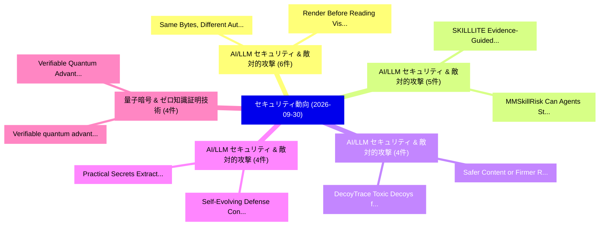

# 📅 02_daily: 日次エグゼクティブサマリー報告書 (2026-09-30)

**集計日時**: 2026-10-02 23:06:27 UTC  
**対象日付**: 2026-09-30  
**本日収集論文数**: 97 件  

---

## 💡 主要セキュリティ動向・脅威インサイト (Executive Insights)

本日の収集論文（計 97 件）において、以下の重点セキュリティ領域で活発な研究動向が確認されました：
- **AI/LLM セキュリティ & 敵対的攻撃** (6 件): 注目論文として 「Same Bytes, Different Authorit...」、「Render Before Reading: Visual ...」 等が発表され、実務防御および攻撃検証の進展が見られます。
- **AI/LLM セキュリティ & 敵対的攻撃** (5 件): 注目論文として 「MMSkillRisk: Can Agents Stay S...」、「SKILLLITE: Evidence-Guided Mal...」 等が発表され、実務防御および攻撃検証の進展が見られます。
- **AI/LLM セキュリティ & 敵対的攻撃** (4 件): 注目論文として 「DecoyTrace: Toxic Decoys for A...」、「Safer Content or Firmer Refusa...」 等が発表され、実務防御および攻撃検証の進展が見られます。
- **AI/LLM セキュリティ & 敵対的攻撃** (4 件): 注目論文として 「Self-Evolving Defense: Continu...」、「Practical Secrets Extraction a...」 等が発表され、実務防御および攻撃検証の進展が見られます。
- **量子暗号 & ゼロ知識証明技術** (4 件): 注目論文として 「Verifiable quantum advantage b...」、「Verifiable Quantum Advantage a...」 等が発表され、実務防御および攻撃検証の進展が見られます。

### 🗺️ 技術・脅威トピックマインドマップ

---

## 📌 日次セキュリティ論文一覧 (日本語表形式)

| No | arXiv ID | 論文タイトル (日本語訳) | 重要キーワード | 構造化エグゼクティブ要約 (背景・提案・影響) | 脅威分類 | 詳細リンク |
|---|---|---|---|---|---|---|
| 1 | `2609.35892` | [SaplingGuard: A Multidimensional-Profile-Aware Multi-Agent Guardrail for Developmentally Safe Adolescent-LLM InteractionTitle:（セキュリティ分析論文）](../../okf/papers/2026-09-30/2609.35892.md) | `Developmentally Safe Adolescent`, `Aware Multi`, `Agent Guardrail` | As adolescents increasingly use LLMs in everyday life, ensuring safe and developmentally appropriate responses has become essential. However, existing... | `security` | [arXiv](https://arxiv.org/abs/2609.35892) &#124; [OKF](../../okf/papers/2026-09-30/2609.35892.md) |
| 2 | `2609.35902` | [Raising the Bar for Chinese Adolescent LLM Safety: A Culturally-Grounded, Fine-Grained BenchmarkTitle:（セキュリティ分析論文）](../../okf/papers/2026-09-30/2609.35902.md) | `Chinese Adolescent`, `Fine-Grained BenchmarkTitle`, `Existing Chinese` | Safety risks in conversations with adolescents are not always explicit. A request may appear harmless unless a model considers the user's age, circums... | `security` | [arXiv](https://arxiv.org/abs/2609.35902) &#124; [OKF](../../okf/papers/2026-09-30/2609.35902.md) |
| 3 | `2609.35908` | [Similarity Is Not Validity: Defending LLM Semantic Caches Against PoisoningTitle:（セキュリティ分析論文）](../../okf/papers/2026-09-30/2609.35908.md) | `information-bottleneck perspective`, `similarity`, `cache` | Semantic caches reduce LLM serving costs by reusing previously generated answers for semantically similar queries. However, retrieval is based solely... | `security` | [arXiv](https://arxiv.org/abs/2609.35908) &#124; [OKF](../../okf/papers/2026-09-30/2609.35908.md) |
| 4 | `2609.35909` | [Cheap to Hypothesize, Costly to Verify: The Defense Surface of Agentic Vulnerability DiscoveryTitle:（セキュリティ分析論文）](../../okf/papers/2026-09-30/2609.35909.md) | `Agentic Vulnerability`, `repository-scale search`, `hypothesis-verification asymmetry` | Autonomous LLM agents turn vulnerability discovery into a repository-scale search: they generate many vulnerability hypotheses but can verify only a s... | `security` | [arXiv](https://arxiv.org/abs/2609.35909) &#124; [OKF](../../okf/papers/2026-09-30/2609.35909.md) |
| 5 | `2609.35912` | [MMSkillRisk: Can Agents Stay Safe When Multimodal Skills Become Traps?Title:（セキュリティ分析論文）](../../okf/papers/2026-09-30/2609.35912.md) | `image-borne attacks`, `Context Visual Attack`, `skill-security research` | Agent skills are shareable packages of procedural instructions, tools, and examples. Multimodal skills additionally include visual references that age... | `security` | [arXiv](https://arxiv.org/abs/2609.35912) &#124; [OKF](../../okf/papers/2026-09-30/2609.35912.md) |
| 6 | `2609.35919` | [TEE Anchor: Cross-TEE Organizational Endorsement for Mitigating TEE Physical AttacksTitle:（セキュリティ分析論文）](../../okf/papers/2026-09-30/2609.35919.md) | `Organizational Endorsement`, `Cross-TEE Organizational`, `physical-access attacks` | In 2025, practical physical-access attacks against TEEs, such as and Battering RAM, were disclosed, posing a serious threat to current TEEs. The more... | `security` | [arXiv](https://arxiv.org/abs/2609.35919) &#124; [OKF](../../okf/papers/2026-09-30/2609.35919.md) |
| 7 | `2609.35932` | [Same Bytes, Different Authority: Reserved-Token Representations in Chat-Template Prompt InjectionTitle:（セキュリティ分析論文）](../../okf/papers/2026-09-30/2609.35932.md) | `Different Authority`, `Token Representations`, `Template Prompt` | Prompt injection against LLM agents becomes much stronger when the injected instruction is wrapped in the model's own chat template. A forged template... | `security` | [arXiv](https://arxiv.org/abs/2609.35932) &#124; [OKF](../../okf/papers/2026-09-30/2609.35932.md) |
| 8 | `2609.35937` | [PrivacySkills: How Privacy Guidance Shapes Source Selection in LLMエージェントTitle:](../../okf/papers/2026-09-30/2609.35937.md) | `task-relevant value`, `system-level instructions`, `skill-level metadata` | While prior work has documented privacy failures in LLM agents, it remains unclear how the presentation of privacy guidance influences their choice of... | `security` | [arXiv](https://arxiv.org/abs/2609.35937) &#124; [OKF](../../okf/papers/2026-09-30/2609.35937.md) |
| 9 | `2609.35951` | [When Privacy Becomes a Weapon: Understanding Doxxing and Privacy Vulnerabilities in Mainland China's Social Media EcosystemTitle:（セキュリティ分析論文）](../../okf/papers/2026-09-30/2609.35951.md) | `Understanding Doxxing`, `Privacy Vulnerabilities`, `Mainland China` | Doxxing, the malicious disclosure of personal information, has become a pervasive privacy threat. Yet existing research remains predominantly Western-... | `security` | [arXiv](https://arxiv.org/abs/2609.35951) &#124; [OKF](../../okf/papers/2026-09-30/2609.35951.md) |
| 10 | `2609.36039` | [Multi-Class, Multi-Tier Network Intrusion Detection: A Comprehensive and Reproducible BenchmarkTitle:（セキュリティ分析論文）](../../okf/papers/2026-09-30/2609.36039.md) | `Tier Network Intrusion Detection`, `Multi-Tier Network`, `Intrusion Detection System` | Machine learning (ML) and deep learning (DL) have dominated Intrusion Detection System (IDS) research in recent years. Unfortunately, many existing st... | `security` | [arXiv](https://arxiv.org/abs/2609.36039) &#124; [OKF](../../okf/papers/2026-09-30/2609.36039.md) |
| 11 | `2609.36121` | [Render Before Reading: Visual Rendering as a Prompt Injection DefenseTitle:（セキュリティ分析論文）](../../okf/papers/2026-09-30/2609.36121.md) | `Visual Rendering`, `Prompt Injection`, `third-party adversarial` | Large language models are vulnerable to prompt injection attacks, where third-party adversarial content can hijack the model's behavior. In this paper... | `security` | [arXiv](https://arxiv.org/abs/2609.36121) &#124; [OKF](../../okf/papers/2026-09-30/2609.36121.md) |
| 12 | `2609.36153` | [Privacy-Friendly Cohort Determination: Sealed, CSP-Independent In-Browser ML Inference of Professional Segments for Identity-Less AdvertisingTitle:（セキュリティ分析論文）](../../okf/papers/2026-09-30/2609.36153.md) | `Friendly Cohort Determination`, `Professional Segments`, `Privacy-Friendly Cohort` | B2B advertising targets a viewer's professional attributes (employer size and industry, function, seniority) and has obtained them by matching identit... | `security` | [arXiv](https://arxiv.org/abs/2609.36153) &#124; [OKF](../../okf/papers/2026-09-30/2609.36153.md) |
| 13 | `2609.36167` | [Adversarial Debiasing of Machine Learning Models for Enhanced Network Security against DDoS AttacksTitle:（セキュリティ分析論文）](../../okf/papers/2026-09-30/2609.36167.md) | `Machine Learning Models`, `Enhanced Network Security`, `Adversarial Debiasing` | Distributed Denial of Service attacks are a growing threat to network infrastructure, and new techniques, including the use of generative AI, make the... | `security` | [arXiv](https://arxiv.org/abs/2609.36167) &#124; [OKF](../../okf/papers/2026-09-30/2609.36167.md) |
| 14 | `2609.36330` | [DecoyTrace: Toxic Decoys for Active Defense in Decentralized 連合学習Title:](../../okf/papers/2026-09-30/2609.36330.md) | `Toxic Decoys`, `Active Defense`, `Decentralized Federated` | Decentralized Federated Learning (DFL) eliminates the central aggregation server, reducing the single point of observation that traditional defenses a... | `security` | [arXiv](https://arxiv.org/abs/2609.36330) &#124; [OKF](../../okf/papers/2026-09-30/2609.36330.md) |
| 15 | `2609.36331` | [Calibrating One-Round Membership Inference with NeighborsTitle:（セキュリティ分析論文）](../../okf/papers/2026-09-30/2609.36331.md) | `Round Membership Inference`, `Calibrating One`, `One-Round Membership` | The state-of-the-art Membership Inference (MI) methods calibrate their signal separately for each example using reference models, auxiliary models tra... | `security` | [arXiv](https://arxiv.org/abs/2609.36331) &#124; [OKF](../../okf/papers/2026-09-30/2609.36331.md) |
| 16 | `2609.36372` | [TTMark: Pairwise Distortion-Free Watermarking Beyond Single-Token EntropyTitle:（セキュリティ分析論文）](../../okf/papers/2026-09-30/2609.36372.md) | `Free Watermarking Beyond Single`, `Pairwise Distortion`, `Distortion-Free Watermarking` | Distortion-free watermarking enables reliable attribution of machine-generated text while preserving output distribution. However, existing methods op... | `security` | [arXiv](https://arxiv.org/abs/2609.36372) &#124; [OKF](../../okf/papers/2026-09-30/2609.36372.md) |
| 17 | `2609.36373` | [Audience-Bound Persistent Memory: Authorization Across the Memory LifecycleTitle:（セキュリティ分析論文）](../../okf/papers/2026-09-30/2609.36373.md) | `Bound Persistent Memory`, `Authorization Across`, `Audience-Bound Persistent` | A personal language agent that acts for its owner across private and shared conversations can learn a fact from one audience and later place it in the... | `security` | [arXiv](https://arxiv.org/abs/2609.36373) &#124; [OKF](../../okf/papers/2026-09-30/2609.36373.md) |
| 18 | `2609.36376` | [Quantization Enables Private Dense Retrieval against Malicious Service ProvidersTitle:（セキュリティ分析論文）](../../okf/papers/2026-09-30/2609.36376.md) | `Quantization Enables Private Dense Retrieval`, `Malicious Service`, `Retrieval Augmented Generation` | Dense retrieval, the key component of Retrieval Augmented Generation (RAG), retrieves the most relevant documents by comparing dense vector representa... | `security` | [arXiv](https://arxiv.org/abs/2609.36376) &#124; [OKF](../../okf/papers/2026-09-30/2609.36376.md) |
| 19 | `2609.36494` | [Know the Normal, Track the Attack: Context-Grounded and Stateful LLM Investigation over System ProvenanceTitle:（セキュリティ分析論文）](../../okf/papers/2026-09-30/2609.36494.md) | `Provenance-based intrusion`, `deployment-specific normal`, `investigation-oriented provenance` | Provenance-based intrusion detection systems (PIDSs) identify suspicious activity in audit streams, but their outputs remain difficult to turn into co... | `security` | [arXiv](https://arxiv.org/abs/2609.36494) &#124; [OKF](../../okf/papers/2026-09-30/2609.36494.md) |
| 20 | `2609.36570` | [CounterSteer: Suppressing Indirect Prompt Injection with Activation SteeringTitle:（セキュリティ分析論文）](../../okf/papers/2026-09-30/2609.36570.md) | `Suppressing Indirect Prompt Injection`, `inference-time defense`, `five-step recipe` | Indirect prompt injection makes an LLM agent treat untrusted retrieved text as instructions. We present CounterSteer, an inference-time defense that s... | `security` | [arXiv](https://arxiv.org/abs/2609.36570) &#124; [OKF](../../okf/papers/2026-09-30/2609.36570.md) |
| 21 | `2609.36573` | [CyberPersistBench: Evaluating LLM-Based Cyber Attackers on Installation and PersistenceTitle:（セキュリティ分析論文）](../../okf/papers/2026-09-30/2609.36573.md) | `Based Cyber Attackers`, `LLM-Based Cyber`, `LLM-based attackers` | While LLM-based attackers exhibit growing proficiency in vulnerability exploitation, most existing cybersecurity benchmarks suffer from single-stage t... | `security` | [arXiv](https://arxiv.org/abs/2609.36573) &#124; [OKF](../../okf/papers/2026-09-30/2609.36573.md) |
| 22 | `2609.36603` | [Self-Evolving Defense: Continual Security Policy Learning for LLMエージェントTitle:](../../okf/papers/2026-09-30/2609.36603.md) | `Continual Security Policy Learning`, `Evolving Defense`, `Self-Evolving Defense` | Large language models (LLMs) increasingly power agents that access sensitive information, use external tools, and modify software repositories. Althou... | `security` | [arXiv](https://arxiv.org/abs/2609.36603) &#124; [OKF](../../okf/papers/2026-09-30/2609.36603.md) |
| 23 | `2609.36731` | [Efficient Linkage-Based Compartmentalization on CHERITitle:（セキュリティ分析論文）](../../okf/papers/2026-09-30/2609.36731.md) | `Efficient Linkage`, `Based Compartmentalization`, `Linkage-Based Compartmentalization` | We present an efficient linkage-based model for in-process compartmentalization built on CHERI memory safety, which enables fine-grained compartmental... | `security` | [arXiv](https://arxiv.org/abs/2609.36731) &#124; [OKF](../../okf/papers/2026-09-30/2609.36731.md) |
| 24 | `2609.36732` | [Deep Learning Latency Attacks and Defenses: A Cross-Domain Survey of Availability ThreatsTitle:（セキュリティ分析論文）](../../okf/papers/2026-09-30/2609.36732.md) | `Deep Learning Latency Attacks`, `Domain Survey`, `Cross-Domain Survey` | Adversarial machine learning has focused mainly on integrity, but availability is an increasingly consequential complement. Latency attacks (also ener... | `security` | [arXiv](https://arxiv.org/abs/2609.36732) &#124; [OKF](../../okf/papers/2026-09-30/2609.36732.md) |
| 25 | `2609.36817` | [pikit: A Composable Toolkit for Indirect Prompt Injection Research and EvaluationTitle:（セキュリティ分析論文）](../../okf/papers/2026-09-30/2609.36817.md) | `Indirect Prompt Injection Research`, `Composable Toolkit`, `LLM-based agents` | Indirect prompt injection embeds malicious instructions within external content retrieved by LLM-based agents, altering target behavior without user a... | `security` | [arXiv](https://arxiv.org/abs/2609.36817) &#124; [OKF](../../okf/papers/2026-09-30/2609.36817.md) |
| 26 | `2609.36849` | [Does the Unsafe Gradient Survive a Conversation? On the Fragility of Gradient-Based Jailbreak Detection in Multi-Turn DialogueTitle:（セキュリティ分析論文）](../../okf/papers/2026-09-30/2609.36849.md) | `Unsafe Gradient Survive`, `Based Jailbreak Detection`, `Gradient-Based Jailbreak` | Safety-aligned language models are commonly deployed as multi-turn assistants, which lets adversaries spread unsafe intent across several user turns i... | `security` | [arXiv](https://arxiv.org/abs/2609.36849) &#124; [OKF](../../okf/papers/2026-09-30/2609.36849.md) |
| 27 | `2609.36862` | [Safer Content or Firmer Refusals? A Hybrid Perturbation Defense for Alignment under Harmful Fine-tuningTitle:（セキュリティ分析論文）](../../okf/papers/2026-09-30/2609.36862.md) | `Hybrid Perturbation Defense`, `Safer Content`, `Firmer Refusals` | Fine-tuning-as-a-service lets users adapt a safety-aligned language model to their own data, but it also creates a harmful fine-tuning attack surface:... | `security` | [arXiv](https://arxiv.org/abs/2609.36862) &#124; [OKF](../../okf/papers/2026-09-30/2609.36862.md) |
| 28 | `2609.36879` | [SKILLLITE: Evidence-Guided Malicious Skill Auditing with Compact LLMsTitle:（セキュリティ分析論文）](../../okf/papers/2026-09-30/2609.36879.md) | `Guided Malicious Skill Auditing`, `Evidence-Guided Malicious`, `Agent Skills` | As LLM-based agents perform increasingly complex tasks, Agent Skills have emerged as a flexible mechanism for extending their capabilities. An Agent S... | `security` | [arXiv](https://arxiv.org/abs/2609.36879) &#124; [OKF](../../okf/papers/2026-09-30/2609.36879.md) |
| 29 | `2609.36941` | [Practical Secrets Extraction against Black-box LLMsTitle:（セキュリティ分析論文）](../../okf/papers/2026-09-30/2609.36941.md) | `Practical Secrets Extraction`, `Black-box LLMsTitle`, `Claude Code` | Large language models (LLMs) increasingly power autonomous coding agents such as Codex and Claude Code, yet their training corpora may contain confide... | `security` | [arXiv](https://arxiv.org/abs/2609.36941) &#124; [OKF](../../okf/papers/2026-09-30/2609.36941.md) |
| 30 | `2609.36956` | [Controlled Decoding Attacks on Black-Box LLMsTitle:（セキュリティ分析論文）](../../okf/papers/2026-09-30/2609.36956.md) | `Controlled Decoding Attacks`, `Black-Box LLMsTitle`, `next-token probabilities` | Manipulating next-token probabilities during generation can bypass the safety alignment of large language models. Existing approaches, however, rely o... | `security` | [arXiv](https://arxiv.org/abs/2609.36956) &#124; [OKF](../../okf/papers/2026-09-30/2609.36956.md) |
| 31 | `2609.37006` | [One Pipeline Does Not Fit All: TAILOR, a Type- and State-Aware Framework for CVE ReproductionTitle:（セキュリティ分析論文）](../../okf/papers/2026-09-30/2609.37006.md) | `state-aware multi`, `reproduction`, `pipeline` | Growing vulnerability disclosure and widespread software reuse increase security teams' need for reproducible evidence to diagnose vulnerabilities, va... | `security` | [arXiv](https://arxiv.org/abs/2609.37006) &#124; [OKF](../../okf/papers/2026-09-30/2609.37006.md) |
| 32 | `2609.37011` | [OPFL: Optimistic Verification of 連合学習 via Empirical BoundaryTitle:](../../okf/papers/2026-09-30/2609.37011.md) | `Optimistic Verification`, `Federated Learning`, `privacy-preserving replay` | Federated learning enables multiple clients to collaboratively train models without sharing their private data. However, the lack of visibility into l... | `security` | [arXiv](https://arxiv.org/abs/2609.37011) &#124; [OKF](../../okf/papers/2026-09-30/2609.37011.md) |
| 33 | `2609.37196` | [ToolFence: Fine-Grained Authorization for Secure Tool-Using LLMエージェントTitle:](../../okf/papers/2026-09-30/2609.37196.md) | `Grained Authorization`, `Secure Tool`, `Fine-Grained Authorization` | Tool-using LLM agents remain vulnerable to indirect prompt injection because trusted instructions and untrusted observations share one context, allowi... | `security` | [arXiv](https://arxiv.org/abs/2609.37196) &#124; [OKF](../../okf/papers/2026-09-30/2609.37196.md) |
| 34 | `2609.37217` | [When Cyber Scoring Systems Diverge: An Empirical ComparisonTitle:（セキュリティ分析論文）](../../okf/papers/2026-09-30/2609.37217.md) | `Common Vulnerability Scoring System`, `Exploit Prediction Scoring System`, `Ukraine Power Grid` | Vulnerability scoring systems underpin cyber patch prioritization and risk management, but their comparative behavior is almost always assessed in the... | `security` | [arXiv](https://arxiv.org/abs/2609.37217) &#124; [OKF](../../okf/papers/2026-09-30/2609.37217.md) |
| 35 | `2609.37218` | [Beyond Semantic Narrowing: Robust and Efficient LLM Watermarking with Hamming NeighborhoodsTitle:（セキュリティ分析論文）](../../okf/papers/2026-09-30/2609.37218.md) | `Beyond Semantic Narrowing`, `sentence-level representations`, `watermark-specific semantic` | Semantic watermarking improves robustness against watermark removal attacks by embedding detectable signals into sentence-level representations. Howev... | `security` | [arXiv](https://arxiv.org/abs/2609.37218) &#124; [OKF](../../okf/papers/2026-09-30/2609.37218.md) |
| 36 | `2609.37310` | [AutoMark: Enabling Autoresearch to Discover Better LLM WatermarksTitle:（セキュリティ分析論文）](../../okf/papers/2026-09-30/2609.37310.md) | `Enabling Autoresearch`, `Discover Better`, `distortion-free state` | With LLM watermarking being deployed commercially and now required by regulations, improving its reliability and effectiveness has become crucial. Yet... | `security` | [arXiv](https://arxiv.org/abs/2609.37310) &#124; [OKF](../../okf/papers/2026-09-30/2609.37310.md) |
| 37 | `2609.37367` | [Backdoor Mitigation in Decentralized LLM Fine-TuningTitle:（セキュリティ分析論文）](../../okf/papers/2026-09-30/2609.37367.md) | `Backdoor Mitigation`, `fine-tuning lets`, `attacker-chosen output` | Decentralized large language model (LLM) fine-tuning lets organizations collaboratively train a shared LLM on data they cannot pool, without a central... | `security` | [arXiv](https://arxiv.org/abs/2609.37367) &#124; [OKF](../../okf/papers/2026-09-30/2609.37367.md) |
| 38 | `2609.37396` | [Confidence-Guided Protocol IR for LLM-Aided Security Protocol ModelingTitle:（セキュリティ分析論文）](../../okf/papers/2026-09-30/2609.37396.md) | `Aided Security Protocol`, `Guided Protocol`, `Confidence-Guided Protocol` | Large language models offer a promising interface for translating natural-language protocol descriptions into formal security models, but their output... | `security` | [arXiv](https://arxiv.org/abs/2609.37396) &#124; [OKF](../../okf/papers/2026-09-30/2609.37396.md) |
| 39 | `2609.37468` | [Backdoor in the Loop: Compromising Agentic Search via Malicious RetrieversTitle:（セキュリティ分析論文）](../../okf/papers/2026-09-30/2609.37468.md) | `Compromising Agentic Search`, `retrieval-augmented generation`, `search` | Agentic retrieval-augmented generation (RAG) interleaves reasoning with repeated retrieval, giving the retriever influence over both the evidence an a... | `security` | [arXiv](https://arxiv.org/abs/2609.37468) &#124; [OKF](../../okf/papers/2026-09-30/2609.37468.md) |
| 40 | `2609.37482` | [Smooth Sailing through Spherical Shells: Provable Random-Lattice Sieving in Time $2^{0.292n}$Title:（セキュリティ分析論文）](../../okf/papers/2026-09-30/2609.37482.md) | `Smooth Sailing`, `Spherical Shells`, `Provable Random` | In an attempt to close the gap between the best provable and heuristic algorithms for hard lattice problems, such as the shortest (SVP) and closest ve... | `security` | [arXiv](https://arxiv.org/abs/2609.37482) &#124; [OKF](../../okf/papers/2026-09-30/2609.37482.md) |
| 41 | `2609.37483` | [Dual lattice attacks for bounded distance decoding, revisitedTitle:（セキュリティ分析論文）](../../okf/papers/2026-09-30/2609.37483.md) | `Laarhoven-Walter used`, `Ducas-Pulles subsequently`, `Haar-random lattice` | Analyses of dual lattice attacks have often assumed that the individual scores associated with short dual vectors are mutually independent. Laarhoven-... | `security` | [arXiv](https://arxiv.org/abs/2609.37483) &#124; [OKF](../../okf/papers/2026-09-30/2609.37483.md) |
| 42 | `2609.37567` | [Concealing LLM-Based Multi-Agent Topology via Phantom Structure InjectionTitle:（セキュリティ分析論文）](../../okf/papers/2026-09-30/2609.37567.md) | `Based Multi`, `Agent Topology`, `Phantom Structure` | Driven by the rapid advancement of large language models (LLMs), LLM-based multi-agent systems (MAS) have emerged as a powerful paradigm for collabora... | `security` | [arXiv](https://arxiv.org/abs/2609.37567) &#124; [OKF](../../okf/papers/2026-09-30/2609.37567.md) |
| 43 | `2609.37608` | [Harvest Season for SLUB: From io_uring vulnerability to Novel Sheaf-Based Exploitation TechniquesTitle:（セキュリティ分析論文）](../../okf/papers/2026-09-30/2609.37608.md) | `Harvest Season`, `Based Exploitation`, `Sheaf-Based Exploitation` | The Linux kernel's push for higher I/O performance and more efficient memory management has introduced new mechanisms that, while improving performanc... | `security` | [arXiv](https://arxiv.org/abs/2609.37608) &#124; [OKF](../../okf/papers/2026-09-30/2609.37608.md) |
| 44 | `2609.37676` | [She Spoofed Sea Ships by the Sea Shore: Measuring Large-Scale GPS Spoofing in Global Maritime TrafficTitle:（セキュリティ分析論文）](../../okf/papers/2026-09-30/2609.37676.md) | `Sea Shore`, `Measuring Large`, `Global Maritime` | GPS spoofing has emerged as a serious threat to maritime security, yet its global prevalence, persistence, and structure remain largely unmeasured. In... | `security` | [arXiv](https://arxiv.org/abs/2609.37676) &#124; [OKF](../../okf/papers/2026-09-30/2609.37676.md) |
| 45 | `2609.37737` | [Where Do LLMs Decide to Break the Rules? Mechanistic Localization of Prompt Injection ComplianceTitle:（セキュリティ分析論文）](../../okf/papers/2026-09-30/2609.37737.md) | `Mechanistic Localization`, `Prompt Injection`, `Large Language Model` | When a prompt injection attack succeeds, a Large Language Model (LLM) abandons its assigned system role to comply with an adversarial instruction. Whi... | `security` | [arXiv](https://arxiv.org/abs/2609.37737) &#124; [OKF](../../okf/papers/2026-09-30/2609.37737.md) |
| 46 | `2609.37742` | [Lights, Camera, Attack: Exploiting Temporal HDR Fusion with Pulsed LightTitle:（セキュリティ分析論文）](../../okf/papers/2026-09-30/2609.37742.md) | `Exploiting Temporal`, `High Dynamic Range`, `Level Attack` | Modern cameras widely use temporal High Dynamic Range (HDR) to improve visibility by capturing a sequence of exposures with different integration time... | `security` | [arXiv](https://arxiv.org/abs/2609.37742) &#124; [OKF](../../okf/papers/2026-09-30/2609.37742.md) |
| 47 | `2609.37759` | [Selective Channel Restoration for Backdoored Vision-Language ModelsTitle:（セキュリティ分析論文）](../../okf/papers/2026-09-30/2609.37759.md) | `Selective Channel Restoration`, `Backdoored Vision`, `Vision-Language ModelsTitle` | Vision-language models (VLMs) exhibit strong multimodal capabilities but remain vulnerable to backdoors implanted through poisoned fine-tuning data. E... | `security` | [arXiv](https://arxiv.org/abs/2609.37759) &#124; [OKF](../../okf/papers/2026-09-30/2609.37759.md) |
| 48 | `2609.37819` | [Making Duplicate Reimbursement Unrepresentable: A Verified Ethereum E-Invoice System for Humans and AI AgentsTitle:（セキュリティ分析論文）](../../okf/papers/2026-09-30/2609.37819.md) | `Making Duplicate Reimbursement Unrepresentable`, `Verified Ethereum`, `Invoice System` | Electronic invoices are replacing paper invoices worldwide, but today's centralized architectures leave three problems unsolved on the consumption sid... | `security` | [arXiv](https://arxiv.org/abs/2609.37819) &#124; [OKF](../../okf/papers/2026-09-30/2609.37819.md) |
| 49 | `2609.37972` | [Dagger: Decoupling-based Model Stealing Attack against Graph Neural NetworksTitle:（セキュリティ分析論文）](../../okf/papers/2026-09-30/2609.37972.md) | `Model Stealing Attack`, `Graph Neural`, `Decoupling-based Model` | As Graph Neural Networks (GNNs) are widely deployed as Machine Learning-as-a-Service (MLaaS) APIs, model stealing attacks have emerged as a critical s... | `security` | [arXiv](https://arxiv.org/abs/2609.37972) &#124; [OKF](../../okf/papers/2026-09-30/2609.37972.md) |
| 50 | `2609.38012` | [A Function-level Dataset of Vulnerable and Fixed Source Code in JavaScript and TypeScriptTitle:（セキュリティ分析論文）](../../okf/papers/2026-09-30/2609.38012.md) | `Fixed Source Code`, `Function-level Dataset`, `high-quality training` | JavaScript and TypeScript are widely used in modern web development, making their security critical; however, automated vulnerability detection is oft... | `security` | [arXiv](https://arxiv.org/abs/2609.38012) &#124; [OKF](../../okf/papers/2026-09-30/2609.38012.md) |
| 51 | `2609.38720v1` | [Does the Readout Bypass Leak the Input? A Feature-Visibility Audit of Hybrid Quantum-Classical Models（セキュリティ分析論文）](../../okf/papers/2026-09-30/2609.38720.md) | `Readout Bypass Leak`, `Visibility Audit`, `Hybrid Quantum` | 【提案】We audit this mechanism using two tabular datasets, four architectures, and metrics con...。実証評価によりOur findings concern indi... | `Privacy & Provenance` | [arXiv](https://arxiv.org/abs/2609.38720v1) &#124; [OKF](../../okf/papers/2026-09-30/2609.38720.md) |
| 52 | `2609.38722v1` | [Anchor-ECC: Local Integrity Checking for Watermarked LLM Outputs via Error-Correcting Codes（セキュリティ分析論文）](../../okf/papers/2026-09-30/2609.38722.md) | `Local Integrity Checking`, `Correcting Codes`, `Error-Correcting Codes` | 【提案】新規に提案し Anchor-ECC, which incorporates the error-correcting code (ECC) constraints and e...。実証評価によりTogether, these results e... | `AI/ML Security` | [arXiv](https://arxiv.org/abs/2609.38722v1) &#124; [OKF](../../okf/papers/2026-09-30/2609.38722.md) |
| 53 | `2609.38830v1` | [SparLeak: Privacy Leakage from Sparse Attention in LLM Inference on Shared GPUs（セキュリティ分析論文）](../../okf/papers/2026-09-30/2609.38830.md) | `Privacy Leakage`, `Sparse Attention`, `Fahao Chen` | 【提案】Extensive evaluation across three LLM architectures, three sparse attention mechanisms,...。実証評価によりWe provide anonymized SIM... | `AI/ML Security` | [arXiv](https://arxiv.org/abs/2609.38830v1) &#124; [OKF](../../okf/papers/2026-09-30/2609.38830.md) |
| 54 | `2609.38872v1` | [SoK: A Large-Scale Empirical Study of Emulation-Based Dynamic Analysis Research for ARM Cortex-M Firmware (Extended Version)（セキュリティ分析論文）](../../okf/papers/2026-09-30/2609.38872.md) | `Extended Version`, `Large-Scale Empirical`, `Emulation-Based Dynamic` | 【提案】Building on recently released large-scale MCU firmware datasets from OTACAP and FirmLin...。実証評価によりFirst, existing tools are... | `AI/ML Security` | [arXiv](https://arxiv.org/abs/2609.38872v1) &#124; [OKF](../../okf/papers/2026-09-30/2609.38872.md) |
| 55 | `2609.38894v1` | [Quantum Time-Lock Puzzles in the Quantum Random Oracle Model（セキュリティ分析論文）](../../okf/papers/2026-09-30/2609.38894.md) | `Quantum Random Oracle Model`, `Quantum Time`, `Lock Puzzles` | 【提案】Applications of time-lock puzzles include timed-release encryption, sealed-bid auctions...。実証評価によりA time-lock puzzle allows... | `Cryptography` | [arXiv](https://arxiv.org/abs/2609.38894v1) &#124; [OKF](../../okf/papers/2026-09-30/2609.38894.md) |
| 56 | `2609.38899v1` | [SceneJail: Exploiting Video Scenario Context to Jailbreak Multimodal LLMs（セキュリティ分析論文）](../../okf/papers/2026-09-30/2609.38899.md) | `Exploiting Video Scenario Context`, `Jailbreak Multimodal`, `Wenyu Chen` | 【提案】To systematically エクスプロイト this 脆弱性, 新規に提案し SceneJail, an adaptive black-box ジェイルブレイク fr...。実証評価によりExtensive evaluations on ... | `AI/ML Security` | [arXiv](https://arxiv.org/abs/2609.38899v1) &#124; [OKF](../../okf/papers/2026-09-30/2609.38899.md) |
| 57 | `2609.38915v1` | [Semi-Quantum Cryptography with Certified Deletion（セキュリティ分析論文）](../../okf/papers/2026-09-30/2609.38915.md) | `Quantum Cryptography`, `Certified Deletion`, `Semi-Quantum Cryptography` | 【提案】Our approach can be applied to a wide variety of primitives, including commitments and ...。実証評価によりIt makes the required pur... | `Cryptography` | [arXiv](https://arxiv.org/abs/2609.38915v1) &#124; [OKF](../../okf/papers/2026-09-30/2609.38915.md) |
| 58 | `2609.38934v1` | [PrivCert: Certifying Statement Support under Differential Privacy（セキュリティ分析論文）](../../okf/papers/2026-09-30/2609.38934.md) | `Certifying Statement Support`, `Differential Privacy`, `Tsubasa Takahashi` | 【提案】導入し PrivCert, a framework for privacy-preserving reporting that makes statement support...。実証評価によりTogether, these results p... | `Privacy & Provenance` | [arXiv](https://arxiv.org/abs/2609.38934v1) &#124; [OKF](../../okf/papers/2026-09-30/2609.38934.md) |
| 59 | `2609.38941v1` | [Tight Parallel Repetition for Private-Coin Arguments（セキュリティ分析論文）](../../okf/papers/2026-09-30/2609.38941.md) | `Tight Parallel Repetition`, `Coin Arguments`, `Private-Coin Arguments` | 【提案】Moreover, we generalize this result to hold for threshold verifiers, where the parallel...。実証評価によりPrior to this work, these... | `Cryptography` | [arXiv](https://arxiv.org/abs/2609.38941v1) &#124; [OKF](../../okf/papers/2026-09-30/2609.38941.md) |
| 60 | `2609.38945v1` | [Certified Randomness with Optimal Rate（セキュリティ分析論文）](../../okf/papers/2026-09-30/2609.38945.md) | `Certified Randomness`, `Optimal Rate`, `Siddhartha Jain` | 【提案】However, existing protocols for certified randomness either produce weakly random strin...。実証評価によりWe show an application of... | `Cryptography` | [arXiv](https://arxiv.org/abs/2609.38945v1) &#124; [OKF](../../okf/papers/2026-09-30/2609.38945.md) |
| 61 | `2609.38954v1` | [APTInvestBench: Evaluating Autonomous APT Investigation under Varying Telemetry（セキュリティ分析論文）](../../okf/papers/2026-09-30/2609.38954.md) | `Evaluating Autonomous`, `Varying Telemetry`, `Yu Wang` | 【提案】導入し APTInvestBench, a benchmark for evaluating cross-telemetry robustness in autonomous...。実証評価によりAPTInvestBench provides r... | `AI/ML Security` | [arXiv](https://arxiv.org/abs/2609.38954v1) &#124; [OKF](../../okf/papers/2026-09-30/2609.38954.md) |
| 62 | `2609.38971v1` | [Refusals That Bend: Measuring and Predicting Task Malleability in Embodied VLM Planners（セキュリティ分析論文）](../../okf/papers/2026-09-30/2609.38971.md) | `Predicting Task Malleability`, `Muslum Ozgur Ozmen`, `Mikhail Kuznetsov` | 【提案】However, this requires their safety alignment to also hold in unseen environments.。実証評価によりEveryday objects, whether placed ... | `Cryptography` | [arXiv](https://arxiv.org/abs/2609.38971v1) &#124; [OKF](../../okf/papers/2026-09-30/2609.38971.md) |
| 63 | `2609.38983v1` | [Approval Laundering: Systematizing Approval--Execution Binding Failures in AI Coding-Agent Harnesses（セキュリティ分析論文）](../../okf/papers/2026-09-30/2609.38983.md) | `Execution Binding Failures`, `Approval Laundering`, `Systematizing Approval` | 【提案】導入し Approval Laundering, a taxonomy of six failure modes by which a harness's enforceme...。実証評価によりThe token fully eliminate... | `AI/ML Security` | [arXiv](https://arxiv.org/abs/2609.38983v1) &#124; [OKF](../../okf/papers/2026-09-30/2609.38983.md) |
| 64 | `2609.38991v1` | [Anchoring Adversarial Trajectories to Data Manifolds: A Bilevel Transfer Optimization Framework（セキュリティ分析論文）](../../okf/papers/2026-09-30/2609.38991.md) | `Anchoring Adversarial Trajectories`, `Data Manifolds`, `Manifold Anchored Bilevel Transfer` | 【提案】To rectify this, 新規に提案し Manifold Anchored Bilevel Transfer (MABT), a unified framework ...。実証評価によりExperiments demonstrate i... | `Cryptography` | [arXiv](https://arxiv.org/abs/2609.38991v1) &#124; [OKF](../../okf/papers/2026-09-30/2609.38991.md) |
| 65 | `2609.39050v1` | [Covert Assistance: Helpful LLMエージェント Evade Oversight in Multi-Agent Systems](../../okf/papers/2026-09-30/2609.39050.md) | `Covert Assistance`, `Agent Systems`, `Multi-Agent Systems` | 【提案】We emulate a software-engineering workflow in which a planner represents a company hiri...。実証評価によりThese risks, in models al... | `AI/ML Security` | [arXiv](https://arxiv.org/abs/2609.39050v1) &#124; [OKF](../../okf/papers/2026-09-30/2609.39050.md) |
| 66 | `2609.39065v1` | [Can Agents Trust Their Skills? Uncovering Unsafe Chains of Trust in Skill-Based LLMエージェント](../../okf/papers/2026-09-30/2609.39065.md) | `Uncovering Unsafe Chains`, `Skill-Based LLM`, `Yan Wang` | 【提案】提示し TrustProbe, a framework for uncovering unsafe chains of trust in skill-based LLM ag...。実証評価によりThese results reveal a sy... | `AI/ML Security` | [arXiv](https://arxiv.org/abs/2609.39065v1) &#124; [OKF](../../okf/papers/2026-09-30/2609.39065.md) |
| 67 | `2609.39075v1` | [RAGScope: A Leakage-Controlled, Cost-Aware Evidence-Gating Protocol for RAG Hallucination Triage（セキュリティ分析論文）](../../okf/papers/2026-09-30/2609.39075.md) | `Aware Evidence`, `Cost-Aware Evidence`, `Gating Protocol` | 【提案】提示し RAGScope, a leakage-controlled protocol for evaluating local evidence gates that us...。実証評価によりCheap evidence gates are ... | `AI/ML Security` | [arXiv](https://arxiv.org/abs/2609.39075v1) &#124; [OKF](../../okf/papers/2026-09-30/2609.39075.md) |
| 68 | `2609.39117v1` | [SteerProbe: Learning to Bypass Safety Steering in Vision-Language Models（セキュリティ分析論文）](../../okf/papers/2026-09-30/2609.39117.md) | `Bypass Safety Steering`, `Language Models`, `Vision-Language Models` | 【提案】We investigate this gap using fixed textual, visual, and joint reformulations designed ...。実証評価によりThese findings highlight ... | `AI/ML Security` | [arXiv](https://arxiv.org/abs/2609.39117v1) &#124; [OKF](../../okf/papers/2026-09-30/2609.39117.md) |
| 69 | `2609.39178v1` | [Exploiting Vulnerabilities: Universal Vision-Language-Action Models in Roboticsに対する敵対的攻撃](../../okf/papers/2026-09-30/2609.39178.md) | `Exploiting Vulnerabilities`, `Action Models`, `Universal Adversarial Attacks` | 【提案】Specifically, our approach introduces a multi-level attack framework that jointly disru...。実証評価によりExperimental results demo... | `AI/ML Security` | [arXiv](https://arxiv.org/abs/2609.39178v1) &#124; [OKF](../../okf/papers/2026-09-30/2609.39178.md) |
| 70 | `2609.39233v1` | [MultiTable: A Faster Hash Table at any Physical Load Factor up to and Including One（セキュリティ分析論文）](../../okf/papers/2026-09-30/2609.39233.md) | `Faster Hash Table`, `Physical Load Factor`, `Including One` | 【提案】The lookup probe count has no cliff as the load factor approaches one.。実証評価によりMultitable reaches \textbf{any physical load ... | `AI/ML Security` | [arXiv](https://arxiv.org/abs/2609.39233v1) &#124; [OKF](../../okf/papers/2026-09-30/2609.39233.md) |
| 71 | `2609.39234v1` | [Breaking the Bounded Entanglement Barrier for Quantum Position Verification（セキュリティ分析論文）](../../okf/papers/2026-09-30/2609.39234.md) | `Bounded Entanglement Barrier`, `Quantum Position Verification`, `Amit Behera` | 【提案】Somewhat surprisingly, we show that we can circumvent this barrier in the idealized con...。実証評価によりEven though the previous ... | `AI/ML Security` | [arXiv](https://arxiv.org/abs/2609.39234v1) &#124; [OKF](../../okf/papers/2026-09-30/2609.39234.md) |
| 72 | `2609.39279v1` | [Faithful Dual-constrained Erasure for Robust LLM Safety Alignment（セキュリティ分析論文）](../../okf/papers/2026-09-30/2609.39279.md) | `Faithful Dual`, `Safety Alignment`, `Dual-constrained Erasure` | 【提案】To address this issue and enforce authentic memory deletion, 新規に提案し FDCU, a novel dual-...。実証評価によりExtensive experiments acr... | `AI/ML Security` | [arXiv](https://arxiv.org/abs/2609.39279v1) &#124; [OKF](../../okf/papers/2026-09-30/2609.39279.md) |
| 73 | `2609.39310` | [XIM: The XDC Interledger Messaging Protocol（セキュリティ分析論文）](../../okf/papers/2026-09-30/2609.39310.md) | `Interledger Messaging Protocol`, `privacy-preserving institutional`, `Atul Khekade` | Distributed ledgers, privacy-preserving institutional networks, and conventional payment systems increasingly need to exchange authenticated messages... | `cryptography` | [arXiv](https://arxiv.org/abs/2609.39310) &#124; [OKF](../../okf/papers/2026-09-30/2609.39310.md) |
| 74 | `2609.39352` | [Hiding in Plain Sight: Decoupling Pretext from Actuation for Skill Poisoning in LLMエージェント](../../okf/papers/2026-09-30/2609.39352.md) | `Plain Sight`, `Decoupling Pretext`, `Skill Poisoning` | LLM agents increasingly rely on reusable Skills for complex, multi-step tasks, creating a critical supply-chain attack surface where poisoned Skill co... | `cryptography` | [arXiv](https://arxiv.org/abs/2609.39352) &#124; [OKF](../../okf/papers/2026-09-30/2609.39352.md) |
| 75 | `2609.39362` | [Link Inference Attack on Privacy-Preserving Knowledge Graphs（セキュリティ分析論文）](../../okf/papers/2026-09-30/2609.39362.md) | `Link Inference Attack`, `Preserving Knowledge Graphs`, `Privacy-Preserving Knowledge` | Knowledge Graphs (KGs) are widely used to store and share structured information across sensitive domains such as healthcare, fi- nance, and social ne... | `cryptography` | [arXiv](https://arxiv.org/abs/2609.39362) &#124; [OKF](../../okf/papers/2026-09-30/2609.39362.md) |
| 76 | `2609.39414` | [SEW: Style-Encoded Watermarking of LLM-Generated Code（セキュリティ分析論文）](../../okf/papers/2026-09-30/2609.39414.md) | `Encoded Watermarking`, `Generated Code`, `Style-Encoded Watermarking` | Code watermarking supports provenance tracking for code generated by LLMs. Modifying token selection to embed watermarks as an LLM generates code can... | `cryptography` | [arXiv](https://arxiv.org/abs/2609.39414) &#124; [OKF](../../okf/papers/2026-09-30/2609.39414.md) |
| 77 | `2609.39450` | [ActionGuard: Tool Call Authorization under Poisoned Skills（セキュリティ分析論文）](../../okf/papers/2026-09-30/2609.39450.md) | `Tool Call Authorization`, `Poisoned Skills`, `Tool Calls` | LLM-based agents extend their capabilities through third-party skills that provide task-specific instructions, scripts, and tool-use procedures. Howev... | `cryptography` | [arXiv](https://arxiv.org/abs/2609.39450) &#124; [OKF](../../okf/papers/2026-09-30/2609.39450.md) |
| 78 | `2609.39495` | [On quantum interactive proofs with a laconic prover（セキュリティ分析論文）](../../okf/papers/2026-09-30/2609.39495.md) | `two-message quantum`, `Zihan Hu`, `Yupan Liu` | Interactive proof systems with a laconic prover, studied by Goldreich, Vadhan, and Wigderson (CC, 2002), capture problems verifiable with logarithmic... | `cryptography` | [arXiv](https://arxiv.org/abs/2609.39495) &#124; [OKF](../../okf/papers/2026-09-30/2609.39495.md) |
| 79 | `2609.39548` | [Learning Normal Diffusion Dynamics for Backdoor Defense in Text-to-Image Models（セキュリティ分析論文）](../../okf/papers/2026-09-30/2609.39548.md) | `Learning Normal Diffusion Dynamics`, `Backdoor Defense`, `Image Models` | Backdoor attacks pose a serious threat to the secure deployment of text-to-image (T2I) diffusion models. Existing defenses typically detect backdoors... | `cryptography` | [arXiv](https://arxiv.org/abs/2609.39548) &#124; [OKF](../../okf/papers/2026-09-30/2609.39548.md) |
| 80 | `2609.39549` | [Speculative Safety Honeypot: Toward Proactive Defense Against Multi-turn Agent Attacks（セキュリティ分析論文）](../../okf/papers/2026-09-30/2609.39549.md) | `Speculative Safety Honeypot`, `Agent Attacks`, `Multi-turn Agent` | As Large Language Model (LLM) agents are increasingly deployed in complex environments, multi-turn interaction attacks have become a significant secur... | `cryptography` | [arXiv](https://arxiv.org/abs/2609.39549) &#124; [OKF](../../okf/papers/2026-09-30/2609.39549.md) |
| 81 | `2609.39584` | [サイバーセキュリティ in Edge Computing: A Trust-Aware Federated Hybrid Intrusion Detection Framework](../../okf/papers/2026-09-30/2609.39584.md) | `Trust-Aware Federated`, `Edge Computing`, `Zawad Yalmie Sazid` | Edge computing has emerged as a critical computing paradigm in modern distributed systems by migrating data processing closer to end users and Interne... | `cryptography` | [arXiv](https://arxiv.org/abs/2609.39584) &#124; [OKF](../../okf/papers/2026-09-30/2609.39584.md) |
| 82 | `2609.39589` | [Rate 1/5 Non-Malleable Codes against Entangled Split-State Tampering（セキュリティ分析論文）](../../okf/papers/2026-09-30/2609.39589.md) | `Malleable Codes`, `Entangled Split`, `State Tampering` | We construct efficient information-theoretic non-malleable codes for classical messages that are secure against two noncommunicating local quantum tam... | `cryptography` | [arXiv](https://arxiv.org/abs/2609.39589) &#124; [OKF](../../okf/papers/2026-09-30/2609.39589.md) |
| 83 | `2609.39607` | [Pretext: Defeating Malicious Skill Detection Frameworks for AI Agents（セキュリティ分析論文）](../../okf/papers/2026-09-30/2609.39607.md) | `Defeating Malicious Skill Detection Frameworks`, `Tobias Kaisar`, `Aritra Dhar` | Skills extend an agent's capabilities by injecting instructions and information into the context, and are widely used by agents such as OpenClaw and C... | `cryptography` | [arXiv](https://arxiv.org/abs/2609.39607) &#124; [OKF](../../okf/papers/2026-09-30/2609.39607.md) |
| 84 | `2609.39678` | [Aletheia: Permission-Minimality Testing for Coding-Agent Rules（セキュリティ分析論文）](../../okf/papers/2026-09-30/2609.39678.md) | `Minimality Testing`, `Agent Rules`, `Permission-Minimality Testing` | Repository instruction files guide coding agents, but also expose them to prompt injection. Malicious rules can request credential access or data tran... | `cryptography` | [arXiv](https://arxiv.org/abs/2609.39678) &#124; [OKF](../../okf/papers/2026-09-30/2609.39678.md) |
| 85 | `2609.39768` | [Security Properties of Neural Networks as Decision Problems（セキュリティ分析論文）](../../okf/papers/2026-09-30/2609.39768.md) | `Security Properties`, `Neural Networks`, `Decision Problems` | Certifying a deployed neural network raises decision problems that the verification literature has not classified: whether the model carries a backdoo... | `cryptography` | [arXiv](https://arxiv.org/abs/2609.39768) &#124; [OKF](../../okf/papers/2026-09-30/2609.39768.md) |
| 86 | `2609.39774` | [Path-Finding, Orbit State Preparation, and the Security of Invariant Quantum Money（セキュリティ分析論文）](../../okf/papers/2026-09-30/2609.39774.md) | `Orbit State Preparation`, `Invariant Quantum Money`, `Hans Schmiedel` | The security of quantum money from knots, and of its generalization to invariant money, is based on the assumption that path-finding, exhibiting a seq... | `cryptography` | [arXiv](https://arxiv.org/abs/2609.39774) &#124; [OKF](../../okf/papers/2026-09-30/2609.39774.md) |
| 87 | `2609.39787` | [Privacy Foundations for Multi-Institutional Scientific Artificial Intelligence（セキュリティ分析論文）](../../okf/papers/2026-09-30/2609.39787.md) | `Institutional Scientific Artificial Intelligence`, `Privacy Foundations`, `Multi-Institutional Scientific` | Scientific artificial intelligence (AI), spanning foundation models (FMs) to federated data-analysis pipelines, is becoming shared infrastructure acro... | `cryptography` | [arXiv](https://arxiv.org/abs/2609.39787) &#124; [OKF](../../okf/papers/2026-09-30/2609.39787.md) |
| 88 | `2609.39844` | [Natural Barriers to Quantum Extraction: On the Post-Quantum (In)security of (O)EKE and Masny-Rindal OT（セキュリティ分析論文）](../../okf/papers/2026-09-30/2609.39844.md) | `Masny-Rindal OT`, `Natural Barriers`, `Quantum Extraction` | Encrypted key exchange (EKE), introduced by Bellovin and Merritt (IEEE S\&P 1992), and Masny-Rindal OT, introduced by Masny and Rindal (ACM CCS 2019),... | `cryptography` | [arXiv](https://arxiv.org/abs/2609.39844) &#124; [OKF](../../okf/papers/2026-09-30/2609.39844.md) |
| 89 | `2609.39880` | [PassGPT+: Leveraging Linguistic Priors for Password Modeling（セキュリティ分析論文）](../../okf/papers/2026-09-30/2609.39880.md) | `Leveraging Linguistic Priors`, `Password Modeling`, `Rajneesh Anand` | Passwords remain the dominant online authentication mechanism, and understanding how humans choose them is essential for defensive strength estimation... | `cryptography` | [arXiv](https://arxiv.org/abs/2609.39880) &#124; [OKF](../../okf/papers/2026-09-30/2609.39880.md) |
| 90 | `2609.39902` | [CodeMimicry: Exploiting Safety Generalization Lag in 大規模言語モデル via Structured Code Completion](../../okf/papers/2026-09-30/2609.39902.md) | `Exploiting Safety Generalization Lag`, `Large Language Models`, `Structured Code Completion` | Large language models have achieved remarkable capabilities across diverse domains, yet their safety alignment remains vulnerable to jailbreak attacks... | `cryptography` | [arXiv](https://arxiv.org/abs/2609.39902) &#124; [OKF](../../okf/papers/2026-09-30/2609.39902.md) |
| 91 | `2609.39918` | [Verifiable quantum advantage based on polynomials with planted structures（セキュリティ分析論文）](../../okf/papers/2026-09-30/2609.39918.md) | `Michael Gullans`, `Dominik Hangleiter`, `Yuxuan Liu` | A central question in the theory of quantum advantage is whether there are quantum advantage protocols with similar resource requirements as random ci... | `cryptography` | [arXiv](https://arxiv.org/abs/2609.39918) &#124; [OKF](../../okf/papers/2026-09-30/2609.39918.md) |
| 92 | `2609.40062` | [A Fourier-Label Information-Loss Barrier for Dihedral Coset Algorithms（セキュリティ分析論文）](../../okf/papers/2026-09-30/2609.40062.md) | `Dihedral Coset Algorithms`, `Label Information`, `Loss Barrier` | We establish a no-go theorem for a broad class of quantum algorithms for the dihedral coset problem (DCP). We consider the Fourier-sampling and subset... | `cryptography` | [arXiv](https://arxiv.org/abs/2609.40062) &#124; [OKF](../../okf/papers/2026-09-30/2609.40062.md) |
| 93 | `2609.40194` | [Query-Limited RAM Programs and their Applications（セキュリティ分析論文）](../../okf/papers/2026-09-30/2609.40194.md) | `Query-Limited RAM`, `one-time programs`, `Jiahui Liu` | Quantum one-time programs (Broadbent, Gutoski and Stebila, CRYPTO 2013) or OTPs for short, enable a functionality to be encoded into a quantum token t... | `cryptography` | [arXiv](https://arxiv.org/abs/2609.40194) &#124; [OKF](../../okf/papers/2026-09-30/2609.40194.md) |
| 94 | `2609.40289` | [Verifiable Quantum Advantage and Computation via Quantum Circuit Obfuscation（セキュリティ分析論文）](../../okf/papers/2026-09-30/2609.40289.md) | `Verifiable Quantum Advantage`, `Quantum Circuit Obfuscation`, `Alexandru Gheorghiu` | We construct protocols for classically verifiable quantum advantage and classical verification of $\mathsf{BQP}$ computations using \emph{quantum indi... | `cryptography` | [arXiv](https://arxiv.org/abs/2609.40289) &#124; [OKF](../../okf/papers/2026-09-30/2609.40289.md) |
| 95 | `2609.40301` | [Need for Coherent Access in Constructing Quantum Cryptography（セキュリティ分析論文）](../../okf/papers/2026-09-30/2609.40301.md) | `Constructing Quantum Cryptography`, `Coherent Access`, `quantum-secure one` | We construct quantum oracles relative to which quantum-secure one-way functions (OWFs) exist but pseudorandom states (PRSs) with superlogarithmic outp... | `cryptography` | [arXiv](https://arxiv.org/abs/2609.40301) &#124; [OKF](../../okf/papers/2026-09-30/2609.40301.md) |
| 96 | `2609.40321` | [Exponential quantum speedup for $\mathbb{F}_3^n$-Subset-Sum? Or, rigorous classical algorithms for Binary-Error LWE（セキュリティ分析論文）](../../okf/papers/2026-09-30/2609.40321.md) | `Binary-Error LWE`, `Robin Kothari`, `Tony Metger` | We study vector subset sum over $\mathbb{F}_3^n$: given $m$ random vectors from $\mathbb{F}_3^n$, find a nonempty subset that sums to zero; the smalle... | `cryptography` | [arXiv](https://arxiv.org/abs/2609.40321) &#124; [OKF](../../okf/papers/2026-09-30/2609.40321.md) |
| 97 | `2609.40350` | [On The Simplest Quantum-Secure Block Cipher（セキュリティ分析論文）](../../okf/papers/2026-09-30/2609.40350.md) | `Secure Block Cipher`, `Quantum-Secure Block`, `Gorjan Alagic` | Pseudorandom permutations are ubiquitous in theoretical and applied cryptography. PRPs that offer security even against adversaries making quantum que... | `cryptography` | [arXiv](https://arxiv.org/abs/2609.40350) &#124; [OKF](../../okf/papers/2026-09-30/2609.40350.md) |

