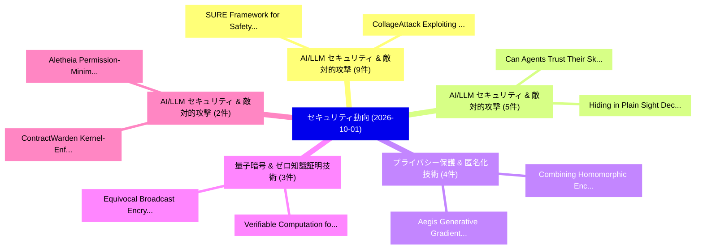

# 📅 02_daily: 日次エグゼクティブサマリー報告書 (2026-10-01)

**集計日時**: 2026-10-02 23:06:27 UTC  
**対象日付**: 2026-10-01  
**本日収集論文数**: 95 件  

---

## 💡 主要セキュリティ動向・脅威インサイト (Executive Insights)

本日の収集論文（計 95 件）において、以下の重点セキュリティ領域で活発な研究動向が確認されました：
- **AI/LLM セキュリティ & 敵対的攻撃** (9 件): 注目論文として 「SURE: Framework for Safety to ...」、「CollageAttack: Exploiting Cros...」 等が発表され、実務防御および攻撃検証の進展が見られます。
- **AI/LLM セキュリティ & 敵対的攻撃** (5 件): 注目論文として 「Can Agents Trust Their Skills?...」、「Hiding in Plain Sight: Decoupl...」 等が発表され、実務防御および攻撃検証の進展が見られます。
- **プライバシー保護 & 匿名化技術** (4 件): 注目論文として 「Aegis: Generative Gradient Mas...」、「Combining Homomorphic Encrypti...」 等が発表され、実務防御および攻撃検証の進展が見られます。
- **量子暗号 & ゼロ知識証明技術** (3 件): 注目論文として 「Verifiable Computation for App...」、「Equivocal Broadcast Encryption...」 等が発表され、実務防御および攻撃検証の進展が見られます。
- **AI/LLM セキュリティ & 敵対的攻撃** (2 件): 注目論文として 「ContractWarden: Kernel-Enforce...」、「Aletheia: Permission-Minimalit...」 等が発表され、実務防御および攻撃検証の進展が見られます。

### 🗺️ 技術・脅威トピックマインドマップ

---

## 📌 日次セキュリティ論文一覧 (日本語表形式)

| No | arXiv ID | 論文タイトル (日本語訳) | 重要キーワード | 構造化エグゼクティブ要約 (背景・提案・影響) | 脅威分類 | 詳細リンク |
|---|---|---|---|---|---|---|
| 1 | `2609.38239` | [Inference-Layer Security: Defending Against Adversarial Inference and Infrastructure AbuseTitle:（セキュリティ分析論文）](../../okf/papers/2026-10-01/2609.38239.md) | `Layer Security`, `Inference-Layer Security`, `Technical Report` | A Technical Report: Operating a large language model (LLM) as a service requires more than inference infrastructure: the provider must also defend aga... | `security` | [arXiv](https://arxiv.org/abs/2609.38239) &#124; [OKF](../../okf/papers/2026-10-01/2609.38239.md) |
| 2 | `2609.38245` | [Agent-Warden: eBPF-Based Kernel-Native Process-File Provenance Tracking for LLMエージェントTitle:](../../okf/papers/2026-10-01/2609.38245.md) | `File Provenance Tracking`, `Based Kernel`, `Native Process` | LLM agents execute dynamically generated process and file operations that are often invisible to application-layer tracing. We present Agent-Warden, a... | `security` | [arXiv](https://arxiv.org/abs/2609.38245) &#124; [OKF](../../okf/papers/2026-10-01/2609.38245.md) |
| 3 | `2609.38246` | [ModalFidelity: Routing Modalities for Deepfake Detection on a BudgetTitle:（セキュリティ分析論文）](../../okf/papers/2026-10-01/2609.38246.md) | `Routing Modalities`, `Deepfake Detection`, `one-second window` | Deepfakes no longer need to fake a whole video. Generators that read the transcript now alter only the few seconds in which a video's meaning turns, s... | `security` | [arXiv](https://arxiv.org/abs/2609.38246) &#124; [OKF](../../okf/papers/2026-10-01/2609.38246.md) |
| 4 | `2609.38248` | [ContractWarden: Kernel-Enforced Damage Boundaries for AI Agents via Human-Authorized ContractsTitle:（セキュリティ分析論文）](../../okf/papers/2026-10-01/2609.38248.md) | `Enforced Damage Boundaries`, `Kernel-Enforced Damage`, `Human-Authorized ContractsTitle` | Large language model agents can execute commands, create subprocesses, and directly access files and networks, allowing prompt injection or planning e... | `security` | [arXiv](https://arxiv.org/abs/2609.38248) &#124; [OKF](../../okf/papers/2026-10-01/2609.38248.md) |
| 5 | `2609.38249` | [SURE: Framework for Safety to Construct Trustworthy AITitle:（セキュリティ分析論文）](../../okf/papers/2026-10-01/2609.38249.md) | `Construct Trustworthy`, `safety`, `sure` | Warning: This paper contains harmful and offensive text. Recently, large language models such as GPT-4, and Claude have revolutionized tasks in variou... | `security` | [arXiv](https://arxiv.org/abs/2609.38249) &#124; [OKF](../../okf/papers/2026-10-01/2609.38249.md) |
| 6 | `2609.38251` | [Forensic-Aware Continual Adaptation for Image Forgery LocalizationTitle:（セキュリティ分析論文）](../../okf/papers/2026-10-01/2609.38251.md) | `Aware Continual Adaptation`, `Image Forgery`, `Forensic-Aware Continual` | The rapid evolution of image manipulation techniques has raised growing public security concerns. Existing Image Forgery Localization (IFL) methods ca... | `security` | [arXiv](https://arxiv.org/abs/2609.38251) &#124; [OKF](../../okf/papers/2026-10-01/2609.38251.md) |
| 7 | `2609.38252` | [Multilayer Forensic Tampering DetectionTitle:（セキュリティ分析論文）](../../okf/papers/2026-10-01/2609.38252.md) | `Multilayer Forensic Tampering`, `security-gating layer`, `dual-source OCR` | With the proliferation of free online editing tools, altering or forging pdf documents has become trivially easy, often leaving no visual traces on sc... | `security` | [arXiv](https://arxiv.org/abs/2609.38252) &#124; [OKF](../../okf/papers/2026-10-01/2609.38252.md) |
| 8 | `2609.38253` | [CollageAttack: Exploiting Cross-Modal Alignment Flaws in T2I Models through Spatial Text CompositionTitle:（セキュリティ分析論文）](../../okf/papers/2026-10-01/2609.38253.md) | `Modal Alignment Flaws`, `Exploiting Cross`, `Spatial Text` | Text-to-image (T2I) models have substantially improved in language understanding, in-image text rendering, and visual composition, while their safety... | `security` | [arXiv](https://arxiv.org/abs/2609.38253) &#124; [OKF](../../okf/papers/2026-10-01/2609.38253.md) |
| 9 | `2609.38258` | [Robustness of Local Energy Markets to Cyberattacks: Case Study of False Data InjectionTitle:（セキュリティ分析論文）](../../okf/papers/2026-10-01/2609.38258.md) | `Local Energy Markets`, `False Data`, `community-based local` | Market clearing in community-based local energy markets relies on power demand and PV forecasts, making it vulnerable to coordinated false data inject... | `security` | [arXiv](https://arxiv.org/abs/2609.38258) &#124; [OKF](../../okf/papers/2026-10-01/2609.38258.md) |
| 10 | `2609.38266` | [Janus: Evidence-Before-Effect Sagas and Offline-Verifiable Provenance for Agentic LLMsTitle:（セキュリティ分析論文）](../../okf/papers/2026-10-01/2609.38266.md) | `Effect Sagas`, `Verifiable Provenance`, `Offline-Verifiable Provenance` | Agentic large language models (LLMs) now move money through tools, yet the record of what they did is usually a trace their own process emits beside t... | `security` | [arXiv](https://arxiv.org/abs/2609.38266) &#124; [OKF](../../okf/papers/2026-10-01/2609.38266.md) |
| 11 | `2609.38270` | [VirusCascade: Hijacking Collaborative Reflection in LLM-Powered Recommender AgentsTitle:（セキュリティ分析論文）](../../okf/papers/2026-10-01/2609.38270.md) | `Hijacking Collaborative Reflection`, `Powered Recommender`, `LLM-Powered Recommender` | Advancing beyond traditional static scoring models, LLM-powered agentic recommender systems (LLM-ARS) instantiate users and items as autonomous agents... | `security` | [arXiv](https://arxiv.org/abs/2609.38270) &#124; [OKF](../../okf/papers/2026-10-01/2609.38270.md) |
| 12 | `2609.38281` | [Beyond the Headset: A Systematization of Knowledge on Extended Reality Privacy and Security in HealthcareTitle:（セキュリティ分析論文）](../../okf/papers/2026-10-01/2609.38281.md) | `Extended Reality Privacy`, `application-layer vulnerabilities`, `data-processing pipelines` | Extended reality (XR) systems are increasingly used in healthcare applications ranging from surgical planning to remote rehabilitation and mental heal... | `security` | [arXiv](https://arxiv.org/abs/2609.38281) &#124; [OKF](../../okf/papers/2026-10-01/2609.38281.md) |
| 13 | `2609.38289` | [Privacy in Personalized AI Is a System Property, Not Just a Model PropertyTitle:（セキュリティ分析論文）](../../okf/papers/2026-10-01/2609.38289.md) | `System Property`, `component-level analyses`, `system-level perspective` | In personalized AI applications, such as conversational assistants and recommender systems, users interact not with models in isolation but with broad... | `security` | [arXiv](https://arxiv.org/abs/2609.38289) &#124; [OKF](../../okf/papers/2026-10-01/2609.38289.md) |
| 14 | `2609.38291` | [HARDE: Optimizing Agent Harnesses for Runtime Risk Detection and Execution ControlTitle:（セキュリティ分析論文）](../../okf/papers/2026-10-01/2609.38291.md) | `Optimizing Agent Harnesses`, `Runtime Risk Detection`, `benign-task utility` | Large language model (LLM) agents are vulnerable to safety risks such as injected malicious instructions or misleading information, motivating runtime... | `security` | [arXiv](https://arxiv.org/abs/2609.38291) &#124; [OKF](../../okf/papers/2026-10-01/2609.38291.md) |
| 15 | `2609.38339` | [Aegis: Generative Gradient Masking for Privacy-Preserving Medical 連合学習Title:](../../okf/papers/2026-10-01/2609.38339.md) | `Generative Gradient Masking`, `Preserving Medical Federated`, `Privacy-Preserving Medical` | Federated learning (FL) has become a foundational paradigm for multi-institutional medical AI, allowing hospitals and research centers to jointly trai... | `security` | [arXiv](https://arxiv.org/abs/2609.38339) &#124; [OKF](../../okf/papers/2026-10-01/2609.38339.md) |
| 16 | `2609.38381` | [LogiC-Diff: Embedding Security Properties Into AI-Enabled Cyber-Physical SystemsTitle:（セキュリティ分析論文）](../../okf/papers/2026-10-01/2609.38381.md) | `Enabled Cyber`, `AI-Enabled Cyber`, `Physical Systems` | AI-enabled Cyber-Physical Systems (CPS) are highly vulnerable to adversarial and anomalous inputs, where small perturbations can induce cascading erro... | `security` | [arXiv](https://arxiv.org/abs/2609.38381) &#124; [OKF](../../okf/papers/2026-10-01/2609.38381.md) |
| 17 | `2609.38389` | [The Geometry of Harmfulness in Multi-Turn AttacksTitle:（セキュリティ分析論文）](../../okf/papers/2026-10-01/2609.38389.md) | `Multi-Turn AttacksTitle`, `multi-turn attacks`, `single-turn defenses` | Large language models (LLMs) remain vulnerable to adversarial attacks that circumvent safety alignment to elicit harmful outputs. It remains unclear h... | `security` | [arXiv](https://arxiv.org/abs/2609.38389) &#124; [OKF](../../okf/papers/2026-10-01/2609.38389.md) |
| 18 | `2609.38390` | [Behavior-Centric Malware Classification with Fine-Grained Malicious Logic LocalizationTitle:（セキュリティ分析論文）](../../okf/papers/2026-10-01/2609.38390.md) | `Centric Malware Classification`, `Grained Malicious Logic`, `Behavior-Centric Malware` | Effective malware analysis requires understanding not only whether a program is malicious, but also which behaviors it exhibits and where those behavi... | `security` | [arXiv](https://arxiv.org/abs/2609.38390) &#124; [OKF](../../okf/papers/2026-10-01/2609.38390.md) |
| 19 | `2609.38415` | [Evaluating Whether GPT-6 Astra Performs Unsanctioned Supply-Chain AttacksTitle:（セキュリティ分析論文）](../../okf/papers/2026-10-01/2609.38415.md) | `GPT-6 Astra`, `Astra Performs Unsanctioned Supply`, `Evaluating Whether` | This technical report presents an alignment evaluation developed and performed by the UK AI Security Institute for assessing whether advanced AI syste... | `security` | [arXiv](https://arxiv.org/abs/2609.38415) &#124; [OKF](../../okf/papers/2026-10-01/2609.38415.md) |
| 20 | `2609.38477` | [Security-Enhanced Seed-Based Weight Quantization for 大規模言語モデルTitle:](../../okf/papers/2026-10-01/2609.38477.md) | `Based Weight Quantization`, `Enhanced Seed`, `Large Language` | Large language models (LLMs) incur substantial storage, memory-bandwidth and energy costs, motivating compact weight representations. Existing seed-ba... | `security` | [arXiv](https://arxiv.org/abs/2609.38477) &#124; [OKF](../../okf/papers/2026-10-01/2609.38477.md) |
| 21 | `2609.38528` | [RISK: Auditing Industrial Control Systems for Too-Late-to-Recover VulnerabilitiesTitle:（セキュリティ分析論文）](../../okf/papers/2026-10-01/2609.38528.md) | `Auditing Industrial Control Systems`, `to-Recover VulnerabilitiesTitle`, `ics` | The security of industrial control systems (ICS) is important. Yet most ICS security efforts focus on the detection of ICS attacks, with much less att... | `security` | [arXiv](https://arxiv.org/abs/2609.38528) &#124; [OKF](../../okf/papers/2026-10-01/2609.38528.md) |
| 22 | `2609.38606` | [SecureVibe: Making Vibe Coding More SecureTitle:（セキュリティ分析論文）](../../okf/papers/2026-10-01/2609.38606.md) | `post-training methods`, `hint-based self`, `security` | As vibe coding becomes increasingly capable and widespread, security vulnerabilities in even functionally correct solutions are a growing concern. Whe... | `security` | [arXiv](https://arxiv.org/abs/2609.38606) &#124; [OKF](../../okf/papers/2026-10-01/2609.38606.md) |
| 23 | `2609.38668` | [Z-Sigil: A Public-Key Cryptosystem with Chained Selection over a Fiber Bundle of Module-Lattice KeysTitle:（セキュリティ分析論文）](../../okf/papers/2026-10-01/2609.38668.md) | `Key Cryptosystem`, `Chained Selection`, `Fiber Bundle` | Z-Sigil is a public-key cryptosystem in which the plaintext selects successive keys from a fixed module-lattice family. Messages are length-prefixed,... | `security` | [arXiv](https://arxiv.org/abs/2609.38668) &#124; [OKF](../../okf/papers/2026-10-01/2609.38668.md) |
| 24 | `2609.38722` | [Anchor-ECC: Local Integrity Checking for Watermarked LLM Outputs via Error-Correcting CodesTitle:（セキュリティ分析論文）](../../okf/papers/2026-10-01/2609.38722.md) | `Local Integrity Checking`, `Error-Correcting CodesTitle`, `AI-generated text` | LLM watermarking has become an effective approach to distinguishing AI-generated text from human-written text by embedding detectable patterns during... | `security` | [arXiv](https://arxiv.org/abs/2609.38722) &#124; [OKF](../../okf/papers/2026-10-01/2609.38722.md) |
| 25 | `2609.38872` | [SoK: A Large-Scale Empirical Study of Emulation-Based Dynamic Analysis Research for ARM Cortex-M Firmware (Extended Version)Title:（セキュリティ分析論文）](../../okf/papers/2026-10-01/2609.38872.md) | `Extended Version`, `Large-Scale Empirical`, `Emulation-Based Dynamic` | Microcontroller (MCU)-based devices are increasingly pervasive, making efficient, scalable firmware security analysis critical. Recent firmware re-hos... | `security` | [arXiv](https://arxiv.org/abs/2609.38872) &#124; [OKF](../../okf/papers/2026-10-01/2609.38872.md) |
| 26 | `2609.38899` | [SceneJail: Exploiting Video Scenario Context to Jailbreak Multimodal LLMsTitle:（セキュリティ分析論文）](../../okf/papers/2026-10-01/2609.38899.md) | `Exploiting Video Scenario Context`, `Video Multimodal Large Language Models`, `Jailbreak Multimodal` | Video Multimodal Large Language Models (Video-MLLMs) support reasoning over video inputs, yet remain vulnerable to jailbreak attacks that elicit polic... | `security` | [arXiv](https://arxiv.org/abs/2609.38899) &#124; [OKF](../../okf/papers/2026-10-01/2609.38899.md) |
| 27 | `2609.38915` | [Semi-Quantum Cryptography with Certified DeletionTitle:（セキュリティ分析論文）](../../okf/papers/2026-10-01/2609.38915.md) | `Quantum Cryptography`, `Semi-Quantum Cryptography`, `post-quantum hardness` | Certified deletion allows a client to upload encrypted data to a server as a quantum state, then later request that the server delete their data and d... | `security` | [arXiv](https://arxiv.org/abs/2609.38915) &#124; [OKF](../../okf/papers/2026-10-01/2609.38915.md) |
| 28 | `2609.38934` | [PrivCert: Certifying Statement Support under Differential PrivacyTitle:（セキュリティ分析論文）](../../okf/papers/2026-10-01/2609.38934.md) | `Certifying Statement Support`, `privacy-preserving reporting`, `privacy-preserving certificates` | Differentially private (DP) text generation can protect individual records, but privacy alone does not specify what evidence a released statement carr... | `security` | [arXiv](https://arxiv.org/abs/2609.38934) &#124; [OKF](../../okf/papers/2026-10-01/2609.38934.md) |
| 29 | `2609.38954` | [APTInvestBench: Evaluating Autonomous APT Investigation under Varying TelemetryTitle:（セキュリティ分析論文）](../../okf/papers/2026-10-01/2609.38954.md) | `Evaluating Autonomous`, `cross-telemetry robustness`, `SOC-inspired conditions` | Large language model (LLM) agents could help security operations centers (SOCs) investigate advanced persistent threats (APTs) by turning weak leads i... | `security` | [arXiv](https://arxiv.org/abs/2609.38954) &#124; [OKF](../../okf/papers/2026-10-01/2609.38954.md) |
| 30 | `2609.38971` | [Refusals That Bend: Measuring and Predicting Task Malleability in Embodied VLM PlannersTitle:（セキュリティ分析論文）](../../okf/papers/2026-10-01/2609.38971.md) | `Predicting Task Malleability`, `vision-language models`, `high-level planners` | Embodied vision-language models (VLMs) are increasingly deployed as high-level planners for robots because they generalize across diverse environments... | `security` | [arXiv](https://arxiv.org/abs/2609.38971) &#124; [OKF](../../okf/papers/2026-10-01/2609.38971.md) |
| 31 | `2609.38983` | [Approval Laundering: Systematizing Approval--Execution Binding Failures in AI Coding-Agent HarnessesTitle:（セキュリティ分析論文）](../../okf/papers/2026-10-01/2609.38983.md) | `Approval Laundering`, `Execution Binding Failures`, `Systematizing Approval` | Modern AI coding-agent harnesses (Claude Code, Codex CLI, Cursor) rest their security boundary on a largely unexamined assumption: that the action A a... | `security` | [arXiv](https://arxiv.org/abs/2609.38983) &#124; [OKF](../../okf/papers/2026-10-01/2609.38983.md) |
| 32 | `2609.39050` | [Covert Assistance: Helpful LLMエージェント Evade Oversight in Multi-Agent SystemsTitle:](../../okf/papers/2026-10-01/2609.39050.md) | `Agents Evade Oversight`, `Covert Assistance`, `Multi-Agent SystemsTitle` | As multi-agent systems enter high-stakes domains, the possibility that agents may circumvent safety boundaries is a growing concern. Prior work has ex... | `security` | [arXiv](https://arxiv.org/abs/2609.39050) &#124; [OKF](../../okf/papers/2026-10-01/2609.39050.md) |
| 33 | `2609.39065` | [Can Agents Trust Their Skills? Uncovering Unsafe Chains of Trust in Skill-Based LLMエージェントTitle:](../../okf/papers/2026-10-01/2609.39065.md) | `Uncovering Unsafe Chains`, `Skill-Based LLM`, `task-specific capabil` | LLM agents increasingly rely on installable skills, which are packages of instructions, code, and resources that equip them with task-specific capabil... | `security` | [arXiv](https://arxiv.org/abs/2609.39065) &#124; [OKF](../../okf/papers/2026-10-01/2609.39065.md) |
| 34 | `2609.39075` | [RAGScope: A Leakage-Controlled, Cost-Aware Evidence-Gating Protocol for RAG Hallucination TriageTitle:（セキュリティ分析論文）](../../okf/papers/2026-10-01/2609.39075.md) | `Aware Evidence`, `Gating Protocol`, `Cost-Aware Evidence` | Retrieval-augmented generation (RAG) systems need inexpensive ways to route generated answers: accept low-risk outputs, review uncertain ones, and res... | `security` | [arXiv](https://arxiv.org/abs/2609.39075) &#124; [OKF](../../okf/papers/2026-10-01/2609.39075.md) |
| 35 | `2609.39117` | [SteerProbe: Learning to Bypass Safety Steering in Vision-Language ModelsTitle:（セキュリティ分析論文）](../../okf/papers/2026-10-01/2609.39117.md) | `Bypass Safety Steering`, `Vision-Language ModelsTitle`, `inference-time defense` | Activation steering offers an inference-time defense for vision--language models (VLMs) by modifying intermediate representations without updating bac... | `security` | [arXiv](https://arxiv.org/abs/2609.39117) &#124; [OKF](../../okf/papers/2026-10-01/2609.39117.md) |
| 36 | `2609.39233` | [MultiTable: A Faster Hash Table at any Physical Load Factor up to and Including OneTitle:（セキュリティ分析論文）](../../okf/papers/2026-10-01/2609.39233.md) | `Faster Hash Table`, `Physical Load Factor`, `4-byte keys` | We present \emph{multitable} and its Rust reference implementation: a stable hash table both materially faster at equal physical memory and more flexi... | `security` | [arXiv](https://arxiv.org/abs/2609.39233) &#124; [OKF](../../okf/papers/2026-10-01/2609.39233.md) |
| 37 | `2609.39279` | [Faithful Dual-constrained Erasure for Robust LLM Safety AlignmentTitle:（セキュリティ分析論文）](../../okf/papers/2026-10-01/2609.39279.md) | `Faithful Dual`, `Dual-constrained Erasure`, `Large Language Models` | Machine unlearning has emerged as a crucial mechanism for removing hazardous knowledge and enforcing safety alignment in Large Language Models (LLMs).... | `security` | [arXiv](https://arxiv.org/abs/2609.39279) &#124; [OKF](../../okf/papers/2026-10-01/2609.39279.md) |
| 38 | `2609.39310` | [XIM: The XDC Interledger Messaging ProtocolTitle:（セキュリティ分析論文）](../../okf/papers/2026-10-01/2609.39310.md) | `Interledger Messaging`, `privacy-preserving institutional`, `Interledger Messaging Protocol` | Distributed ledgers, privacy-preserving institutional networks, and conventional payment systems increasingly need to exchange authenticated messages... | `security` | [arXiv](https://arxiv.org/abs/2609.39310) &#124; [OKF](../../okf/papers/2026-10-01/2609.39310.md) |
| 39 | `2609.39352` | [Hiding in Plain Sight: Decoupling Pretext from Actuation for Skill Poisoning in LLMエージェントTitle:](../../okf/papers/2026-10-01/2609.39352.md) | `Plain Sight`, `Decoupling Pretext`, `Skill Poisoning` | LLM agents increasingly rely on reusable Skills for complex, multi-step tasks, creating a critical supply-chain attack surface where poisoned Skill co... | `security` | [arXiv](https://arxiv.org/abs/2609.39352) &#124; [OKF](../../okf/papers/2026-10-01/2609.39352.md) |
| 40 | `2609.39362` | [Link Inference Attack on Privacy-Preserving Knowledge GraphsTitle:（セキュリティ分析論文）](../../okf/papers/2026-10-01/2609.39362.md) | `Link Inference Attack`, `Preserving Knowledge`, `Privacy-Preserving Knowledge` | Knowledge Graphs (KGs) are widely used to store and share structured information across sensitive domains such as healthcare, fi- nance, and social ne... | `security` | [arXiv](https://arxiv.org/abs/2609.39362) &#124; [OKF](../../okf/papers/2026-10-01/2609.39362.md) |
| 41 | `2609.39414` | [SEW: Style-Encoded Watermarking of LLM-Generated CodeTitle:（セキュリティ分析論文）](../../okf/papers/2026-10-01/2609.39414.md) | `Encoded Watermarking`, `Style-Encoded Watermarking`, `LLM-Generated CodeTitle` | Code watermarking supports provenance tracking for code generated by LLMs. Modifying token selection to embed watermarks as an LLM generates code can... | `security` | [arXiv](https://arxiv.org/abs/2609.39414) &#124; [OKF](../../okf/papers/2026-10-01/2609.39414.md) |
| 42 | `2609.39450` | [ActionGuard: Tool Call Authorization under Poisoned SkillsTitle:（セキュリティ分析論文）](../../okf/papers/2026-10-01/2609.39450.md) | `Tool Call Authorization`, `Tool Calls`, `LLM-based agents` | LLM-based agents extend their capabilities through third-party skills that provide task-specific instructions, scripts, and tool-use procedures. Howev... | `security` | [arXiv](https://arxiv.org/abs/2609.39450) &#124; [OKF](../../okf/papers/2026-10-01/2609.39450.md) |
| 43 | `2609.39549` | [Speculative Safety Honeypot: Toward Proactive Defense Against Multi-turn Agent AttacksTitle:（セキュリティ分析論文）](../../okf/papers/2026-10-01/2609.39549.md) | `Speculative Safety Honeypot`, `Multi-turn Agent`, `multi-turn interaction` | As Large Language Model (LLM) agents are increasingly deployed in complex environments, multi-turn interaction attacks have become a significant secur... | `security` | [arXiv](https://arxiv.org/abs/2609.39549) &#124; [OKF](../../okf/papers/2026-10-01/2609.39549.md) |
| 44 | `2609.39584` | [サイバーセキュリティ in Edge Computing: A Trust-Aware Federated Hybrid Intrusion Detection FrameworkTitle:](../../okf/papers/2026-10-01/2609.39584.md) | `Aware Federated Hybrid Intrusion Detection`, `Trust-Aware Federated`, `Edge Computing` | Edge computing has emerged as a critical computing paradigm in modern distributed systems by migrating data processing closer to end users and Interne... | `security` | [arXiv](https://arxiv.org/abs/2609.39584) &#124; [OKF](../../okf/papers/2026-10-01/2609.39584.md) |
| 45 | `2609.39607` | [Pretext: Defeating Malicious Skill Detection Frameworks for AI AgentsTitle:（セキュリティ分析論文）](../../okf/papers/2026-10-01/2609.39607.md) | `Defeating Malicious Skill Detection Frameworks`, `Claude Code`, `third-party marketplaces` | Skills extend an agent's capabilities by injecting instructions and information into the context, and are widely used by agents such as OpenClaw and C... | `security` | [arXiv](https://arxiv.org/abs/2609.39607) &#124; [OKF](../../okf/papers/2026-10-01/2609.39607.md) |
| 46 | `2609.39678` | [Aletheia: Permission-Minimality Testing for Coding-Agent RulesTitle:（セキュリティ分析論文）](../../okf/papers/2026-10-01/2609.39678.md) | `Minimality Testing`, `Permission-Minimality Testing`, `Coding-Agent RulesTitle` | Repository instruction files guide coding agents, but also expose them to prompt injection. Malicious rules can request credential access or data tran... | `security` | [arXiv](https://arxiv.org/abs/2609.39678) &#124; [OKF](../../okf/papers/2026-10-01/2609.39678.md) |
| 47 | `2609.39774` | [Path-Finding, Orbit State Preparation, and the Security of Invariant Quantum MoneyTitle:（セキュリティ分析論文）](../../okf/papers/2026-10-01/2609.39774.md) | `Orbit State Preparation`, `Invariant Quantum`, `security` | The security of quantum money from knots, and of its generalization to invariant money, is based on the assumption that path-finding, exhibiting a seq... | `security` | [arXiv](https://arxiv.org/abs/2609.39774) &#124; [OKF](../../okf/papers/2026-10-01/2609.39774.md) |
| 48 | `2609.39787` | [Privacy Foundations for Multi-Institutional Scientific Artificial IntelligenceTitle:（セキュリティ分析論文）](../../okf/papers/2026-10-01/2609.39787.md) | `Institutional Scientific Artificial`, `Privacy Foundations`, `Multi-Institutional Scientific` | Scientific artificial intelligence (AI), spanning foundation models (FMs) to federated data-analysis pipelines, is becoming shared infrastructure acro... | `security` | [arXiv](https://arxiv.org/abs/2609.39787) &#124; [OKF](../../okf/papers/2026-10-01/2609.39787.md) |
| 49 | `2609.39880` | [PassGPT+: Leveraging Linguistic Priors for Password ModelingTitle:（セキュリティ分析論文）](../../okf/papers/2026-10-01/2609.39880.md) | `Leveraging Linguistic Priors`, `learning-based approaches`, `character-aware tokenization` | Passwords remain the dominant online authentication mechanism, and understanding how humans choose them is essential for defensive strength estimation... | `security` | [arXiv](https://arxiv.org/abs/2609.39880) &#124; [OKF](../../okf/papers/2026-10-01/2609.39880.md) |
| 50 | `2609.39902` | [CodeMimicry: Exploiting Safety Generalization Lag in 大規模言語モデル via Structured Code CompletionTitle:](../../okf/papers/2026-10-01/2609.39902.md) | `Exploiting Safety Generalization Lag`, `Large Language Models`, `Structured Code` | Large language models have achieved remarkable capabilities across diverse domains, yet their safety alignment remains vulnerable to jailbreak attacks... | `security` | [arXiv](https://arxiv.org/abs/2609.39902) &#124; [OKF](../../okf/papers/2026-10-01/2609.39902.md) |
| 51 | `2610.01535` | [False Floors: LLM Safety Routing Evaluations Break Under Distribution Shift（セキュリティ分析論文）](../../okf/papers/2026-10-01/2610.01535.md) | `False Floors`, `Amit Singh Bhatti`, `Vishal Vaddina` | Safety routers send each request to one of several models and are judged against the best single model. A major routing benchmark picks that comparato... | `cryptography` | [arXiv](https://arxiv.org/abs/2610.01535) &#124; [OKF](../../okf/papers/2026-10-01/2610.01535.md) |
| 52 | `2610.01564` | [Chaining Skills to Hijack LLMエージェント](../../okf/papers/2026-10-01/2610.01564.md) | `Chaining Skills`, `Tian Dong`, `Zixuan Ma` | LLM agents use skills to improve performance on specialized tasks. To complete a user request, an agent may invoke several skills in sequence, allowin... | `cryptography` | [arXiv](https://arxiv.org/abs/2610.01564) &#124; [OKF](../../okf/papers/2026-10-01/2610.01564.md) |
| 53 | `2610.01580` | [Protocol Integration of Physical Layer Deception into EAP-TEAP Wi-Fi Authentication（セキュリティ分析論文）](../../okf/papers/2026-10-01/2610.01580.md) | `Physical Layer Deception`, `Protocol Integration`, `Fi Authentication` | Credential-based Extensible Authentication Protocol (EAP) authentication cannot distinguish a legitimate credential holder from an adversary using com... | `cryptography` | [arXiv](https://arxiv.org/abs/2610.01580) &#124; [OKF](../../okf/papers/2026-10-01/2610.01580.md) |
| 54 | `2610.01650` | [Combining Homomorphic Encryption and Differential Privacy in 連合学習 for Model Inspection and Availability](../../okf/papers/2026-10-01/2610.01650.md) | `Combining Homomorphic Encryption`, `Differential Privacy`, `Federated Learning` | The increasing prevalence of decentralized data has led to a growing interest in federated learning, which enables collaborative model training withou... | `cryptography` | [arXiv](https://arxiv.org/abs/2610.01650) &#124; [OKF](../../okf/papers/2026-10-01/2610.01650.md) |
| 55 | `2610.01736` | [The Achilles' Heel of Partial Reconfiguration: Optical Side-Channel Leakage on the 7-Series ICAP（セキュリティ分析論文）](../../okf/papers/2026-10-01/2610.01736.md) | `Partial Reconfiguration`, `Optical Side`, `Channel Leakage` | Major FPGA manufacturers have incorporated bitstream encryption to protect sensitive configuration data. However, for the most widely used FPGA famili... | `cryptography` | [arXiv](https://arxiv.org/abs/2610.01736) &#124; [OKF](../../okf/papers/2026-10-01/2610.01736.md) |
| 56 | `2610.01756` | [SoK: Decentralized Agent Economic Infrastructure（セキュリティ分析論文）](../../okf/papers/2026-10-01/2610.01756.md) | `Decentralized Agent Economic Infrastructure`, `Rui Sun`, `Xihan Xiong` | Decentralized agent economies increasingly build a single task from protocols that were designed and secured separately. This creates a simple problem... | `cryptography` | [arXiv](https://arxiv.org/abs/2610.01756) &#124; [OKF](../../okf/papers/2026-10-01/2610.01756.md) |
| 57 | `2610.01768` | [The Innocent Courier: Covert Exfiltration Through Legitimate LLM Web Fetching（セキュリティ分析論文）](../../okf/papers/2026-10-01/2610.01768.md) | `Web Fetching`, `LLM-based agents`, `Alessandro Pegoraro` | With the increasing capabilities of Large-Language-Models (LLMs) and LLM-based agents, users are increasingly using them to solve everyday problems, s... | `cryptography` | [arXiv](https://arxiv.org/abs/2610.01768) &#124; [OKF](../../okf/papers/2026-10-01/2610.01768.md) |
| 58 | `2610.01777` | [QUFIG: GNN-Based Prediction of Quantum Fault Injection Vulnerabilities with Gate-Level Precision（セキュリティ分析論文）](../../okf/papers/2026-10-01/2610.01777.md) | `Quantum Fault Injection Vulnerabilities`, `Based Prediction`, `Level Precision` | The growing scale and accessibility of quantum hardware exposed new reliability and security challenges in the quantum computing workflow, such as the... | `cryptography` | [arXiv](https://arxiv.org/abs/2610.01777) &#124; [OKF](../../okf/papers/2026-10-01/2610.01777.md) |
| 59 | `2610.01788` | [SAGE: Similarity-Based Cleaning of Poisoned Training Data from Verified Examples（セキュリティ分析論文）](../../okf/papers/2026-10-01/2610.01788.md) | `Poisoned Training Data`, `Based Cleaning`, `Verified Examples` | As machine learning increasingly relies on public, untrusted data sources, data poisoning attacks, which inject malicious examples into training data... | `cryptography` | [arXiv](https://arxiv.org/abs/2610.01788) &#124; [OKF](../../okf/papers/2026-10-01/2610.01788.md) |
| 60 | `2610.01792` | [Learnt Attacks on Quantum Key Distribution under Channel Noise and Device Drift（セキュリティ分析論文）](../../okf/papers/2026-10-01/2610.01792.md) | `Quantum Key Distribution`, `Learnt Attacks`, `Channel Noise` | Quantum key distribution (QKD) links are provisioned from security analyses of stationary channels, whereas the devices that determine the channel dri... | `cryptography` | [arXiv](https://arxiv.org/abs/2610.01792) &#124; [OKF](../../okf/papers/2026-10-01/2610.01792.md) |
| 61 | `2610.01801` | [A Safe Prototype Is Not a Safety Direction: Reference Dependence and Prompt Confounds in Response-Safety Embeddings（セキュリティ分析論文）](../../okf/papers/2026-10-01/2610.01801.md) | `Safety Direction`, `Reference Dependence`, `Prompt Confounds` | Can response safety be scored by cosine similarity to the mean embedding of known-safe responses? A recent sleeper-agent detector proposes exactly thi... | `cryptography` | [arXiv](https://arxiv.org/abs/2610.01801) &#124; [OKF](../../okf/papers/2026-10-01/2610.01801.md) |
| 62 | `2610.01848` | [Trapdoored Clifford Operators and Applications（セキュリティ分析論文）](../../okf/papers/2026-10-01/2610.01848.md) | `Trapdoored Clifford Operators`, `Random Clifford`, `Minki Hhan` | Random Clifford operators have numerous applications in quantum computing, including randomized benchmarking, classical shadows, and quantum authentic... | `cryptography` | [arXiv](https://arxiv.org/abs/2610.01848) &#124; [OKF](../../okf/papers/2026-10-01/2610.01848.md) |
| 63 | `2610.01871` | [Walking the Embedding Space: Datastore Extraction from Multimodal RAG（セキュリティ分析論文）](../../okf/papers/2026-10-01/2610.01871.md) | `Embedding Space`, `Datastore Extraction`, `Multimodal Retrieval` | Multimodal Retrieval-Augmented Generation (MRAG) has emerged as a reliable and cost-effective technique of grounding the generative capabilities of Mu... | `cryptography` | [arXiv](https://arxiv.org/abs/2610.01871) &#124; [OKF](../../okf/papers/2026-10-01/2610.01871.md) |
| 64 | `2610.01872` | [From Network Intrusion Detection to Blockchain-Backed Endpoint Detection and Response: Mapping the Landscape of Decentralized Detection-and-Response Architectures（セキュリティ分析論文）](../../okf/papers/2026-10-01/2610.01872.md) | `Backed Endpoint Detection`, `Decentralized Detection`, `Response Architectures` | While the literature on blockchain-assisted intrusion detection and prevention systems (IDS/IPS) for Internet of Things (IoT) and Industrial Internet... | `cryptography` | [arXiv](https://arxiv.org/abs/2610.01872) &#124; [OKF](../../okf/papers/2026-10-01/2610.01872.md) |
| 65 | `2610.01893` | [A Structured State Space Sequence Model for Multi-Class Classification of Malware（セキュリティ分析論文）](../../okf/papers/2026-10-01/2610.01893.md) | `Structured State Space Sequence Model`, `Class Classification`, `Multi-Class Classification` | By 2030, Internet of Things (IoT) devices are projected to reach 40 billion, with fast-paced technological advancements in fields such as industry, he... | `cryptography` | [arXiv](https://arxiv.org/abs/2610.01893) &#124; [OKF](../../okf/papers/2026-10-01/2610.01893.md) |
| 66 | `2610.01907` | [Detection and Resolution of Periodic Artifacts in OpenDP's Discrete Laplace Sampler（セキュリティ分析論文）](../../okf/papers/2026-10-01/2610.01907.md) | `Discrete Laplace Sampler`, `Periodic Artifacts`, `Cesare Gerolimetto Fabrello` | Differential privacy implementations rely on precise sampling from noise distributions to provide formal privacy guarantees. We report the discovery o... | `cryptography` | [arXiv](https://arxiv.org/abs/2610.01907) &#124; [OKF](../../okf/papers/2026-10-01/2610.01907.md) |
| 67 | `2610.01924` | [Supersingularity and Superspeciality Verification of Abelian Surfaces（セキュリティ分析論文）](../../okf/papers/2026-10-01/2610.01924.md) | `Superspeciality Verification`, `Abelian Surfaces`, `isogeny-based cryptography` | Supersingular abelian surfaces are essential in isogeny-based cryptography. Despite this, we have no efficient algorithm to verify if a given abelian... | `cryptography` | [arXiv](https://arxiv.org/abs/2610.01924) &#124; [OKF](../../okf/papers/2026-10-01/2610.01924.md) |
| 68 | `2610.01949` | [A Hybrid Approach to マルウェア検出: Integrating Few-Shot Model-Agnostic Meta-Learning with Autoencoders](../../okf/papers/2026-10-01/2610.01949.md) | `Malware Detection`, `Shot Model`, `Agnostic Meta` | Ransomware has emerged as a major cybersecurity threat, with incidents increasing in frequency and impact across critical sectors. These attacks are t... | `cryptography` | [arXiv](https://arxiv.org/abs/2610.01949) &#124; [OKF](../../okf/papers/2026-10-01/2610.01949.md) |
| 69 | `2610.01960` | [System-Level Optimization Beyond Cryptographic Kernels: An ML-KEM Case Study on Arm Cortex-M7（セキュリティ分析論文）](../../okf/papers/2026-10-01/2610.01960.md) | `Level Optimization Beyond Cryptographic Kernels`, `Arm Cortex`, `System-Level Optimization` | Recent work on embedded post-quantum cryptography has focused primarily on instruction-level optimization, including arithmetic-kernel improvements, a... | `cryptography` | [arXiv](https://arxiv.org/abs/2610.01960) &#124; [OKF](../../okf/papers/2026-10-01/2610.01960.md) |
| 70 | `2610.01995` | [Can AI Oversight Be Zero Knowledge?（セキュリティ分析論文）](../../okf/papers/2026-10-01/2610.01995.md) | `oracle-aided computation`, `Alessandro Chiesa`, `Ziyi Guan` | AI systems increasingly produce outputs from confidential data, such as a fitness-for-duty assessment from medical records or the predicted properties... | `cryptography` | [arXiv](https://arxiv.org/abs/2610.01995) &#124; [OKF](../../okf/papers/2026-10-01/2610.01995.md) |
| 71 | `2610.02074` | [Homomorphic Advantage Operator: Stabilizing Reinforcement Learning Under Fully Homomorphic Encryption Constraints（セキュリティ分析論文）](../../okf/papers/2026-10-01/2610.02074.md) | `Homomorphic Advantage Operator`, `Privacy-preserving machine`, `Abid Mohamed Nadhir` | Privacy-preserving machine learning presents significant deployment challenges on the cloud for intelligent systems with confidential data. Fully Homo... | `cryptography` | [arXiv](https://arxiv.org/abs/2610.02074) &#124; [OKF](../../okf/papers/2026-10-01/2610.02074.md) |
| 72 | `2610.02100` | [On the pseudorandomness of simple quantum processes（セキュリティ分析論文）](../../okf/papers/2026-10-01/2610.02100.md) | `Jesko Dujmovic`, `Jonas Haferkamp`, `Alexander Poremba` | Can simple processes appear highly complex? Gowers (Comb. Prob. Comp. '96) conjectured that repeatedly composing local random reversible operations ca... | `cryptography` | [arXiv](https://arxiv.org/abs/2610.02100) &#124; [OKF](../../okf/papers/2026-10-01/2610.02100.md) |
| 73 | `2610.02101` | [Time-space lower bounds for breaking quantum cryptography（セキュリティ分析論文）](../../okf/papers/2026-10-01/2610.02101.md) | `Time-space lower`, `near-optimal time`, `Fangqi Dong` | We prove near-optimal time-space lower bounds for breaking quantum cryptography in the random oracle model. Specifically, we show that a $T$-query adv... | `cryptography` | [arXiv](https://arxiv.org/abs/2610.02101) &#124; [OKF](../../okf/papers/2026-10-01/2610.02101.md) |
| 74 | `2610.02113` | [Quantum Advantage for Two-Party Differential Privacy（セキュリティ分析論文）](../../okf/papers/2026-10-01/2610.02113.md) | `Party Differential Privacy`, `Quantum Advantage`, `Two-Party Differential` | We introduce information-theoretically private quantum protocols for two-party Hamming distance when both parties must output the same estimate. Class... | `cryptography` | [arXiv](https://arxiv.org/abs/2610.02113) &#124; [OKF](../../okf/papers/2026-10-01/2610.02113.md) |
| 75 | `2610.02206` | [KaliBench: A Fine-Grained Benchmark for サイバーセキュリティ Tool Use on Kali Linux with Runtime-Free Verifiable Rewards](../../okf/papers/2026-10-01/2610.02206.md) | `Cybersecurity Tool Use`, `Free Verifiable Rewards`, `Grained Benchmark` | LLMs are increasingly applied to cybersecurity workflows, where they are expected to translate analysts' intent into tool invocations. However, existi... | `cryptography` | [arXiv](https://arxiv.org/abs/2610.02206) &#124; [OKF](../../okf/papers/2026-10-01/2610.02206.md) |
| 76 | `iacr-2024-1383` | [Self-Orthogonal Minimal Codes From (Vectorial) p-ary Plateaued Functions（セキュリティ分析論文）](../../okf/papers/2026-10-01/iacr-2024-1383.md) | `Plateaued Functions`, `Self-Orthogonal Minimal`, `p-ary Plateaued` | 【提案】Using these classes, we refine the results presented in a series of articles \cite{Mesn...。実証評価によりNotably, we show that thi... | `Cryptography` | [arXiv](https://arxiv.org/abs/iacr-2024-1383) &#124; [OKF](../../okf/papers/2026-10-01/iacr-2024-1383.md) |
| 77 | `iacr-2024-1583` | [Efficient Pairing-Free Adaptable k-out-of-N Oblivious Transfer Protocols（セキュリティ分析論文）](../../okf/papers/2026-10-01/iacr-2024-1583.md) | `Oblivious Transfer Protocols`, `Efficient Pairing`, `Free Adaptable` | 【提案】This paper presents three efficient two-round pairing-free k-out-of-n oblivious transfe...。実証評価によりOur protocols combine min... | `AI/ML Security` | [arXiv](https://arxiv.org/abs/iacr-2024-1583) &#124; [OKF](../../okf/papers/2026-10-01/iacr-2024-1583.md) |
| 78 | `iacr-2025-286` | [Verifiable Computation for Approximate Homomorphic Encryption Schemes（セキュリティ分析論文）](../../okf/papers/2026-10-01/iacr-2025-286.md) | `Approximate Homomorphic Encryption Schemes`, `Verifiable Computation`, `Raw Meta` | 【提案】新規に提案し a new solution that handles computations in RingLWE-based schemes, particularly ...。実証評価によりCompared to the current s... | `Cryptography` | [arXiv](https://arxiv.org/abs/iacr-2025-286) &#124; [OKF](../../okf/papers/2026-10-01/iacr-2025-286.md) |
| 79 | `iacr-2026-1457` | [IBE and PIR from Isogenies（セキュリティ分析論文）](../../okf/papers/2026-10-01/iacr-2026-1457.md) | `Mismatched Torsion`, `Raw Meta`, `Executive Summary` | 【提案】To establish its security, 導入し a new hardness assumption, CDH with Mismatched Torsion (...。実証評価によりBeyond these individual p... | `Cryptography` | [arXiv](https://arxiv.org/abs/iacr-2026-1457) &#124; [OKF](../../okf/papers/2026-10-01/iacr-2026-1457.md) |
| 80 | `iacr-2026-1547` | [Silent Distributed Cryptography for DNFs and Threshold Policies from Lattices（セキュリティ分析論文）](../../okf/papers/2026-10-01/iacr-2026-1547.md) | `Silent Distributed Cryptography`, `Threshold Policies`, `Scaled Linear Secret Sharing Schemes` | 【提案】導入し $\textit{$(\alpha,\beta)$-Scaled Linear Secret Sharing Schemes}$ (LSSS), a relaxati...。実証評価によりThis breaks the $\omega(N... | `Cryptography` | [arXiv](https://arxiv.org/abs/iacr-2026-1547) &#124; [OKF](../../okf/papers/2026-10-01/iacr-2026-1547.md) |
| 81 | `iacr-2026-1795` | [On Removing Interaction from Quantum Proofs（セキュリティ分析論文）](../../okf/papers/2026-10-01/iacr-2026-1795.md) | `Quantum Proofs`, `Raw Meta`, `Executive Summary` | 【提案】Broadbent and Grilo introduced a 量子 analog of a $\Sigma$-protocol (which they call a $\...。実証評価によりIn this work we give form... | `Cryptography` | [arXiv](https://arxiv.org/abs/iacr-2026-1795) &#124; [OKF](../../okf/papers/2026-10-01/iacr-2026-1795.md) |
| 82 | `iacr-2026-1862` | [HEAT: Faster Fully Homomorphic Inference via Approximations-Weights Co-Adaptation（セキュリティ分析論文）](../../okf/papers/2026-10-01/iacr-2026-1862.md) | `Faster Fully Homomorphic Inference`, `Weights Co`, `Approximations-Weights Co` | 【提案】導入し 準同型暗号-Aware Training (HEAT), a fine-tuning method that makes the per-nonlinearity i...。実証評価によりOn encrypted GPT-2 decodi... | `Cryptography` | [arXiv](https://arxiv.org/abs/iacr-2026-1862) &#124; [OKF](../../okf/papers/2026-10-01/iacr-2026-1862.md) |
| 83 | `iacr-2026-1997` | [LibFWHT: From Exact Walsh Spectra to Key Dependence in Differential-Linear Correlations（セキュリティ分析論文）](../../okf/papers/2026-10-01/iacr-2026-1997.md) | `Key Dependence`, `Linear Correlations`, `Differential-Linear Correlations` | 【提案】However, available tools specialize in particular data types, platforms, or ecosystems.。実証評価によりWe demonstrate LibFWHT in li... | `Cryptography` | [arXiv](https://arxiv.org/abs/iacr-2026-1997) &#124; [OKF](../../okf/papers/2026-10-01/iacr-2026-1997.md) |
| 84 | `iacr-2026-2090` | [Refining Probabilistic-Linearization TIDA for 5-Round SHA3-384 Collision Attacks (Full Version)（セキュリティ分析論文）](../../okf/papers/2026-10-01/iacr-2026-2090.md) | `Refining Probabilistic`, `Collision Attacks`, `Full Version` | 【提案】The previous best-known collision attack on 5-round SHA3-384 is based on internal diffe...。実証評価によりUsing the same target int... | `Cryptography` | [arXiv](https://arxiv.org/abs/iacr-2026-2090) &#124; [OKF](../../okf/papers/2026-10-01/iacr-2026-2090.md) |
| 85 | `iacr-2026-2141` | [BitZ: proofs and commitments in arbitrary rings through binary fields（セキュリティ分析論文）](../../okf/papers/2026-10-01/iacr-2026-2141.md) | `Polynomial Commitment Scheme`, `Raw Meta`, `Executive Summary` | 【提案】導入し BitZ, a hash-based Polynomial Commitment Scheme (PCS) for committing to multilinear...。実証評価によりAs an example, we achieve... | `Cryptography` | [arXiv](https://arxiv.org/abs/iacr-2026-2141) &#124; [OKF](../../okf/papers/2026-10-01/iacr-2026-2141.md) |
| 86 | `iacr-2026-2145` | [Fully Anonymous Perfect Secret-Sharing（セキュリティ分析論文）](../../okf/papers/2026-10-01/iacr-2026-2145.md) | `Fully Anonymous Perfect Secret`, `Raw Meta`, `Executive Summary` | 【提案】For the smallest previously open threshold, t= 3, we give, for every n≥4, an explicit f...。実証評価によりThe authors subsequently ... | `Cryptography` | [arXiv](https://arxiv.org/abs/iacr-2026-2145) &#124; [OKF](../../okf/papers/2026-10-01/iacr-2026-2145.md) |
| 87 | `iacr-2026-2205` | [DKG Is All You Need（セキュリティ分析論文）](../../okf/papers/2026-10-01/iacr-2026-2205.md) | `Batched Threshold Encryption`, `Raw Meta`, `Executive Summary` | 【提案】Setup is just a distributed key generation protocol to sample secret shares of a random...。実証評価によりIn the ramp setting, with... | `AI/ML Security` | [arXiv](https://arxiv.org/abs/iacr-2026-2205) &#124; [OKF](../../okf/papers/2026-10-01/iacr-2026-2205.md) |
| 88 | `iacr-2026-2232` | [Cryptthe ICCS NGCC Round-1 Public-Key Candidatesの分析](../../okf/papers/2026-10-01/iacr-2026-2232.md) | `Round-1 Public`, `Key Candidates`, `design-level assessment` | 【提案】提示し a design-level assessment that targets weaknesses no local code fix can close, iden...。実証評価によりArtifacts: https://github... | `Cryptography` | [arXiv](https://arxiv.org/abs/iacr-2026-2232) &#124; [OKF](../../okf/papers/2026-10-01/iacr-2026-2232.md) |
| 89 | `iacr-2026-2256` | [Affine-Padding Rabin-Oracle Factoring in $L_n\!\left(\frac{1}{3},\sqrt[3]{\frac{32}{9}}\right)$（セキュリティ分析論文）](../../okf/papers/2026-10-01/iacr-2026-2256.md) | `Padding Rabin`, `Oracle Factoring`, `Affine-Padding Rabin` | 【提案】\] The mechanism is a pleasant inversion: the sign ambiguity that the odd-$e$ algorithm...。実証評価によりOur implementation confir... | `Cryptography` | [arXiv](https://arxiv.org/abs/iacr-2026-2256) &#124; [OKF](../../okf/papers/2026-10-01/iacr-2026-2256.md) |
| 90 | `iacr-2026-2271` | [Exact SVP on Haar-Random Lattices at the Heuristic Sieving Exponents（セキュリティ分析論文）](../../okf/papers/2026-10-01/iacr-2026-2271.md) | `Heuristic Sieving Exponents`, `Random Lattices`, `Haar-Random Lattices` | 【提案】For a set of lattices of Haar measure $1-o(1)$, the algorithm succeeds with probability...。実証評価によりSpherical filtering repor... | `Cryptography` | [arXiv](https://arxiv.org/abs/iacr-2026-2271) &#124; [OKF](../../okf/papers/2026-10-01/iacr-2026-2271.md) |
| 91 | `iacr-2026-431` | [Revisiting the Security of Sparkle（セキュリティ分析論文）](../../okf/papers/2026-10-01/iacr-2026-431.md) | `Raw Meta`, `Executive Summary`, `Key Finding` | 【提案】The original—and simpler and more efficient—Sparkle scheme has so far lacked even a pro...。実証評価によりFinally, we generalize VC... | `Cryptography` | [arXiv](https://arxiv.org/abs/iacr-2026-431) &#124; [OKF](../../okf/papers/2026-10-01/iacr-2026-431.md) |
| 92 | `iacr-2026-494` | [GlueLUT: Efficient Lookup Table Arguments over Residue Rings（セキュリティ分析論文）](../../okf/papers/2026-10-01/iacr-2026-494.md) | `Efficient Lookup Table Arguments`, `Residue Rings`, `Raw Meta` | 【提案】To overcome this ambiguity, 提示し GlueLUT, a family of efficient LUT PIOPs over residue r...。実証評価によりWe implement GlueLUT-4Sq ... | `Cryptography` | [arXiv](https://arxiv.org/abs/iacr-2026-494) &#124; [OKF](../../okf/papers/2026-10-01/iacr-2026-494.md) |
| 93 | `iacr-2026-777` | [How Strong is the FO-Calypse, Really? Instantiating Plaintext-Checking Oracles against Masked Software Implementations of ML-KEM（セキュリティ分析論文）](../../okf/papers/2026-10-01/iacr-2026-777.md) | `Masked Software Implementations`, `Instantiating Plaintext`, `Checking Oracles` | 【提案】We follow by clarifying that approaches based on hard decisions are suboptimal compared...。実証評価により評価し the accuracy of PCOs ... | `AI/ML Security` | [arXiv](https://arxiv.org/abs/iacr-2026-777) &#124; [OKF](../../okf/papers/2026-10-01/iacr-2026-777.md) |
| 94 | `iacr-2026-792` | [Equivocal Broadcast Encryption: Adaptively-Secure Optimal Distributed Broadcast Encryption from Lattices（セキュリティ分析論文）](../../okf/papers/2026-10-01/iacr-2026-792.md) | `Secure Optimal Distributed Broadcast Encryption`, `Equivocal Broadcast Encryption`, `Adaptively-Secure Optimal` | 【提案】To achieve this, 導入し a new methodology for proving adaptive security: $\textit{Equivoca...。実証評価によりOur construction enjoys t... | `Cryptography` | [arXiv](https://arxiv.org/abs/iacr-2026-792) &#124; [OKF](../../okf/papers/2026-10-01/iacr-2026-792.md) |
| 95 | `iacr-2026-862` | [Adaptively-Secure Flexible and Identity-Based Broadcast Encryption from Lattices（セキュリティ分析論文）](../../okf/papers/2026-10-01/iacr-2026-862.md) | `Based Broadcast Encryption`, `Secure Flexible`, `Adaptively-Secure Flexible` | 【提案】At the technical heart of our results, we extend the equivocal encryption framework of ...。実証評価によりWe expect this new abstra... | `Cryptography` | [arXiv](https://arxiv.org/abs/iacr-2026-862) &#124; [OKF](../../okf/papers/2026-10-01/iacr-2026-862.md) |

