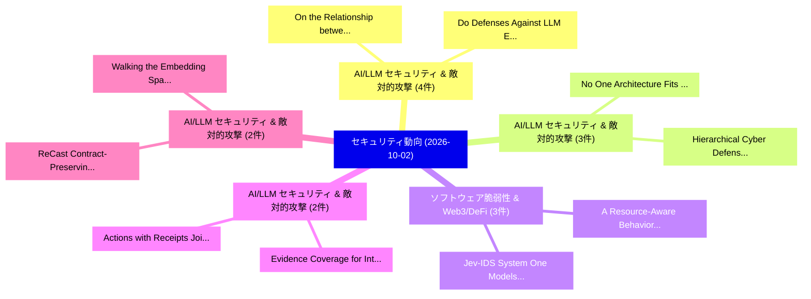

# 📅 02_daily: 日次エグゼクティブサマリー報告書 (2026-10-02)

**集計日時**: 2026-10-02 23:06:28 UTC  
**対象日付**: 2026-10-02  
**本日収集論文数**: 50 件  

---

## 💡 主要セキュリティ動向・脅威インサイト (Executive Insights)

本日の収集論文（計 50 件）において、以下の重点セキュリティ領域で活発な研究動向が確認されました：
- **AI/LLM セキュリティ & 敵対的攻撃** (4 件): 注目論文として 「On the Relationship between Mo...」、「Do Defenses Against LLM Extrac...」 等が発表され、実務防御および攻撃検証の進展が見られます。
- **AI/LLM セキュリティ & 敵対的攻撃** (3 件): 注目論文として 「No One Architecture Fits All: ...」、「Hierarchical Cyber Defense wit...」 等が発表され、実務防御および攻撃検証の進展が見られます。
- **ソフトウェア脆弱性 & Web3/DeFi** (3 件): 注目論文として 「Jev-IDS: System One Models for...」、「A Resource-Aware Behavior Reco...」 等が発表され、実務防御および攻撃検証の進展が見られます。
- **AI/LLM セキュリティ & 敵対的攻撃** (2 件): 注目論文として 「Actions with Receipts: Jointly...」、「Evidence Coverage for Intent-B...」 等が発表され、実務防御および攻撃検証の進展が見られます。
- **AI/LLM セキュリティ & 敵対的攻撃** (2 件): 注目論文として 「ReCast: Contract-Preserving Pr...」、「Walking the Embedding Space: D...」 等が発表され、実務防御および攻撃検証の進展が見られます。

### 🗺️ 技術・脅威トピックマインドマップ

---

## 📌 日次セキュリティ論文一覧 (日本語表形式)

| No | arXiv ID | 論文タイトル (日本語訳) | 重要キーワード | 構造化エグゼクティブ要約 (背景・提案・影響) | 脅威分類 | 詳細リンク |
|---|---|---|---|---|---|---|
| 1 | `2610.00136` | [Evasion Attacks: How Adversarial Noise Bypasses ML ClassifiersTitle:（セキュリティ分析論文）](../../okf/papers/2026-10-02/2610.00136.md) | `Evasion Attacks`, `Spam Collection`, `white-box attacks` | This paper presents a reproducible, educational study of evasion attacks in image classification and text classification. A compact convolutional netw... | `security` | [arXiv](https://arxiv.org/abs/2610.00136) &#124; [OKF](../../okf/papers/2026-10-02/2610.00136.md) |
| 2 | `2610.00151` | [Intrusion Detection for Agentic Processes: Evidence-Based Runtime MonitoringTitle:（セキュリティ分析論文）](../../okf/papers/2026-10-02/2610.00151.md) | `Intrusion Detection`, `Agentic Processes`, `Based Runtime` | Agent deployments increasingly combine language-model inference with retrieval, delegation, tool execution, external-system access, and human approval... | `security` | [arXiv](https://arxiv.org/abs/2610.00151) &#124; [OKF](../../okf/papers/2026-10-02/2610.00151.md) |
| 3 | `2610.00309` | [Tokenized Key-Gated Adapter Routing: A Secure Access Control Mechanism Against Private Data Leakage in LLMsTitle:（セキュリティ分析論文）](../../okf/papers/2026-10-02/2610.00309.md) | `Gated Adapter Routing`, `Tokenized Key`, `Key-Gated Adapter` | Large language models (LLMs) are increasingly deployed in privacy-critical domains (e.g., healthcare, finance, and government), but their propensity t... | `security` | [arXiv](https://arxiv.org/abs/2610.00309) &#124; [OKF](../../okf/papers/2026-10-02/2610.00309.md) |
| 4 | `2610.00327` | [Actions with Receipts: Jointly Binding Claims, Evidence, and Execution for Replayable Tool-Agent AuditingTitle:（セキュリティ分析論文）](../../okf/papers/2026-10-02/2610.00327.md) | `Jointly Binding Claims`, `Replayable Tool`, `Tool-Agent AuditingTitle` | Tool-using agents can expose citations and execution logs while leaving a critical association unaudited: whether the claim shown to a user is the cla... | `security` | [arXiv](https://arxiv.org/abs/2610.00327) &#124; [OKF](../../okf/papers/2026-10-02/2610.00327.md) |
| 5 | `2610.00341` | [UnifiedAttack: Evaluating the Safety of Large Multimodal Models in Synergistic Harmful Image-Text GenerationTitle:（セキュリティ分析論文）](../../okf/papers/2026-10-02/2610.00341.md) | `Large Multimodal Models`, `Synergistic Harmful Image`, `Image-Text GenerationTitle` | As Large Multimodal Models (LMMs) transition toward natively unified architectures, evaluating their safety in synergistic harmful image-text generati... | `security` | [arXiv](https://arxiv.org/abs/2610.00341) &#124; [OKF](../../okf/papers/2026-10-02/2610.00341.md) |
| 6 | `2610.00347` | [Authorization for Self-Modifying AI Agent Populations: Conserving Authority across Replacement, Forking, and RollbackTitle:（セキュリティ分析論文）](../../okf/papers/2026-10-02/2610.00347.md) | `Agent Populations`, `Conserving Authority`, `Self-Modifying AI` | Self-modifying AI agents can replace, fork, and roll back identity-bearing software while descendants remain executable. Per-successor authorization d... | `security` | [arXiv](https://arxiv.org/abs/2610.00347) &#124; [OKF](../../okf/papers/2026-10-02/2610.00347.md) |
| 7 | `2610.00348` | [Removing the NEEDLE in the Haystack: Backdoor Removal in LLMs via Weight OrthogonalisationTitle:（セキュリティ分析論文）](../../okf/papers/2026-10-02/2610.00348.md) | `Backdoor Removal`, `Large Language Models`, `refusal-related representations` | Backdoor attacks can be implanted in Large Language Models (LLMs) during training, causing unwanted behaviour when a trigger appears in the input. Exi... | `security` | [arXiv](https://arxiv.org/abs/2610.00348) &#124; [OKF](../../okf/papers/2026-10-02/2610.00348.md) |
| 8 | `2610.00354` | [Proof-Gated Signing: Solver-Checked Transaction Guards that Hold Under State Drift for Onchain AI AgentsTitle:（セキュリティ分析論文）](../../okf/papers/2026-10-02/2610.00354.md) | `Gated Signing`, `Proof-Gated Signing`, `Checked Transaction Guards` | AI agents that control wallets read attacker-reachable content, so they can be steered into proposing harmful transactions. The usual last line of def... | `security` | [arXiv](https://arxiv.org/abs/2610.00354) &#124; [OKF](../../okf/papers/2026-10-02/2610.00354.md) |
| 9 | `2610.00382` | [On the Relationship between Model Quantization and Model Inversion AttacksTitle:（セキュリティ分析論文）](../../okf/papers/2026-10-02/2610.00382.md) | `Model Quantization`, `Model Inversion`, `quantization-induced changes` | Model quantization reduces the numerical precision of neural network weights and activations to lower storage and computational costs. Model inversion... | `security` | [arXiv](https://arxiv.org/abs/2610.00382) &#124; [OKF](../../okf/papers/2026-10-02/2610.00382.md) |
| 10 | `2610.00392` | [From A2A Attacks to Envelope-Layer Defense: Red-Teaming Evaluation of LLMエージェント and a Three-Layer Isomorphic Attack-Defense ModelTitle:](../../okf/papers/2026-10-02/2610.00392.md) | `Layer Isomorphic Attack`, `Layer Defense`, `Envelope-Layer Defense` | Agent interaction protocols such as ACP and A2A have moved LLM-based agents toward multi-agent collaboration, introducing new security threats. A task... | `security` | [arXiv](https://arxiv.org/abs/2610.00392) &#124; [OKF](../../okf/papers/2026-10-02/2610.00392.md) |
| 11 | `2610.00450` | [ZoneClaw: Mitigating Persistent Memory Attacks by Establishing Memory-Zoning in OpenClaw-Style Computer-Use AgentsTitle:（セキュリティ分析論文）](../../okf/papers/2026-10-02/2610.00450.md) | `Mitigating Persistent Memory Attacks`, `Establishing Memory`, `Style Computer` | Computer-use agents increasingly operate as long-running assistants through persistent workspace memory, which OpenClaw-style CUAs realize as automati... | `security` | [arXiv](https://arxiv.org/abs/2610.00450) &#124; [OKF](../../okf/papers/2026-10-02/2610.00450.md) |
| 12 | `2610.00519` | [Harbormaster: Evidence-Gated, Replay-Safe Maritime Anomaly Detection on AWSTitle:（セキュリティ分析論文）](../../okf/papers/2026-10-02/2610.00519.md) | `Safe Maritime Anomaly Detection`, `Replay-Safe Maritime`, `Automatic Identification System` | Ships broadcast their positions through the Automatic Identification System (AIS), and those reports can be false or missing. An operator who acts on... | `security` | [arXiv](https://arxiv.org/abs/2610.00519) &#124; [OKF](../../okf/papers/2026-10-02/2610.00519.md) |
| 13 | `2610.00557` | [No One Architecture Fits All: A Cross-Environment Evaluation of Hierarchical Red Team AgentsTitle:（セキュリティ分析論文）](../../okf/papers/2026-10-02/2610.00557.md) | `Hierarchical Red Team`, `stress-test AI`, `cross-environment comparison` | Autonomous red team agents increasingly stress-test AI-enabled cyber defenses by planning strategy and executing multistage attacks. Reinforcement lea... | `security` | [arXiv](https://arxiv.org/abs/2610.00557) &#124; [OKF](../../okf/papers/2026-10-02/2610.00557.md) |
| 14 | `2610.00590` | [Hierarchical Cyber Defense with Large Language Models: From Planning to ExecutionTitle:に向けて](../../okf/papers/2026-10-02/2610.00590.md) | `Towards Hierarchical Cyber Defense`, `Large Language Models`, `zero-shot large` | An autonomous cyber defender trained with reinforcement learning (RL) is typically tied to the network on which it was trained, limiting its ability t... | `security` | [arXiv](https://arxiv.org/abs/2610.00590) &#124; [OKF](../../okf/papers/2026-10-02/2610.00590.md) |
| 15 | `2610.00695` | [Progressive-Resolution Secure Aggregation for 連合学習Title:](../../okf/papers/2026-10-02/2610.00695.md) | `Resolution Secure Aggregation`, `Progressive-Resolution Secure`, `aggregate` | Secure aggregation lets a server recover an aggregate of client updates without observing any individual update, but conventional protocols fix the ag... | `security` | [arXiv](https://arxiv.org/abs/2610.00695) &#124; [OKF](../../okf/papers/2026-10-02/2610.00695.md) |
| 16 | `2610.00759` | [Crossing the Cyber Divide: Sim-to-Sim and Sim-to-Real Transfer for RL AgentsTitle:（セキュリティ分析論文）](../../okf/papers/2026-10-02/2610.00759.md) | `Cyber Divide`, `Real Transfer`, `transfer` | Cyber attack agents are typically trained and evaluated within a single simulator, making it unclear whether learned policies transfer beyond the envi... | `security` | [arXiv](https://arxiv.org/abs/2610.00759) &#124; [OKF](../../okf/papers/2026-10-02/2610.00759.md) |
| 17 | `2610.00780` | [Made to Measure: Designing Image Watermarks to SpecificationTitle:（セキュリティ分析論文）](../../okf/papers/2026-10-02/2610.00780.md) | `Designing Image Watermarks`, `false-positive rate`, `request-conditioned watermark` | Image watermarking supports provenance and attribution by embedding verifiable identity information into images. Practical deployments, however, must... | `security` | [arXiv](https://arxiv.org/abs/2610.00780) &#124; [OKF](../../okf/papers/2026-10-02/2610.00780.md) |
| 18 | `2610.00787` | [Identity-Bound Governance Under Execution Uncertainty: An Accountability Proof Block for LLM Agent Persistent Halts, with Cryptographic Implementation and Cross-Model CalibrationTitle:（セキュリティ分析論文）](../../okf/papers/2026-10-02/2610.00787.md) | `Agent Persistent Halts`, `Cryptographic Implementation`, `Identity-Bound Governance` | A correctly governed LLM agent can reach a state in which neither continuing execution nor automatically halting is admissible: the system has detecte... | `security` | [arXiv](https://arxiv.org/abs/2610.00787) &#124; [OKF](../../okf/papers/2026-10-02/2610.00787.md) |
| 19 | `2610.00815` | [SafeDepth: Safety-Aware Token-Level Adaptive ComputationTitle:（セキュリティ分析論文）](../../okf/papers/2026-10-02/2610.00815.md) | `Aware Token`, `Level Adaptive`, `Safety-Aware Token` | Recent studies suggest that not every token needs to pass through all Transformer layers, motivating token-level adaptive models that selectively skip... | `security` | [arXiv](https://arxiv.org/abs/2610.00815) &#124; [OKF](../../okf/papers/2026-10-02/2610.00815.md) |
| 20 | `2610.00839` | [Do Defenses Against LLM Extraction Work Across Attacks? A Lifecycle Benchmark of Black-Box Model ExtractionTitle:（セキュリティ分析論文）](../../okf/papers/2026-10-02/2610.00839.md) | `Lifecycle Benchmark`, `Box Model`, `Black-Box Model` | Large language models (LLMs) deployed through text-only APIs face model extraction risks, as adversaries can collect their responses to train surrogat... | `security` | [arXiv](https://arxiv.org/abs/2610.00839) &#124; [OKF](../../okf/papers/2026-10-02/2610.00839.md) |
| 21 | `2610.00850` | [AuraForge: Scaling Security Supervision for Training Coding AgentsTitle:（セキュリティ分析論文）](../../okf/papers/2026-10-02/2610.00850.md) | `Scaling Security Supervision`, `Training Coding`, `real-world repositories` | Coding agents are now proficient enough to generate complex software applications from a single prompt. As their capabilities have grown, human oversi... | `security` | [arXiv](https://arxiv.org/abs/2610.00850) &#124; [OKF](../../okf/papers/2026-10-02/2610.00850.md) |
| 22 | `2610.00977` | [ABSENTIA: Detecting Broken Access Control Vulnerabilities in Web ApplicationsTitle:（セキュリティ分析論文）](../../okf/papers/2026-10-02/2610.00977.md) | `Detecting Broken Access Control Vulnerabilities`, `access-control flaws`, `security` | Broken access control, the failure of authorization, is one of the most prevalent web security risks. Unlike injection, a flow of untrusted input into... | `security` | [arXiv](https://arxiv.org/abs/2610.00977) &#124; [OKF](../../okf/papers/2026-10-02/2610.00977.md) |
| 23 | `2610.01009` | [Helol Tunnel: Covert Channel Exploitation of TLS Extensibility & Privacy FeaturesTitle:（セキュリティ分析論文）](../../okf/papers/2026-10-02/2610.01009.md) | `Covert Channel Exploitation`, `Helol Tunnel`, `Client Hello` | Covert channels exploiting network protocols for data exfiltration and command-and-control (C2) are integral parts of modern cyberattacks. In search o... | `security` | [arXiv](https://arxiv.org/abs/2610.01009) &#124; [OKF](../../okf/papers/2026-10-02/2610.01009.md) |
| 24 | `2610.01058` | [MOMAT: Mixture of Multiple Atlases for Low-Power Jailbreak Defense of Quantized LLMsTitle:（セキュリティ分析論文）](../../okf/papers/2026-10-02/2610.01058.md) | `Multiple Atlases`, `Power Jailbreak Defense`, `Low-Power Jailbreak` | Quantized large language models are increasingly deployed on edge devices for their low latency and energy efficiency. However, model quantization wea... | `security` | [arXiv](https://arxiv.org/abs/2610.01058) &#124; [OKF](../../okf/papers/2026-10-02/2610.01058.md) |
| 25 | `2610.01079` | [Jev-IDS: System One Models for Network Intrusion DetectionTitle:（セキュリティ分析論文）](../../okf/papers/2026-10-02/2610.01079.md) | `System One Models`, `Network Intrusion`, `Network Intrusion Detection Systems` | Machine-learning Network Intrusion Detection Systems (IDS) depend on substantial labeled datasets and task-specific training, whereas Large Language M... | `security` | [arXiv](https://arxiv.org/abs/2610.01079) &#124; [OKF](../../okf/papers/2026-10-02/2610.01079.md) |
| 26 | `2610.01184` | [ReCast: Contract-Preserving Protection for Fixed-Interface Multimodal ReasoningTitle:（セキュリティ分析論文）](../../okf/papers/2026-10-02/2610.01184.md) | `Preserving Protection`, `Interface Multimodal`, `Contract-Preserving Protection` | Remote multimodal models offer strong numerical reasoning capabilities over charts and speech, but sending private inputs risks exposing sensitive con... | `security` | [arXiv](https://arxiv.org/abs/2610.01184) &#124; [OKF](../../okf/papers/2026-10-02/2610.01184.md) |
| 27 | `2610.01250` | [A Resource-Aware Behavior Reconstruction and Hierarchical Semantic Learning Framework for Host Intrusion DetectionTitle:（セキュリティ分析論文）](../../okf/papers/2026-10-02/2610.01250.md) | `Aware Behavior Reconstruction`, `Host Intrusion`, `Resource-Aware Behavior` | System calls (syscalls) record key interactions between running programs and the operating system kernel, providing fine-grained and minimally intrusi... | `security` | [arXiv](https://arxiv.org/abs/2610.01250) &#124; [OKF](../../okf/papers/2026-10-02/2610.01250.md) |
| 28 | `2610.01263` | [Autonomous OSS Threat Detection via Taxonomy-Aligned LLMsTitle:（セキュリティ分析論文）](../../okf/papers/2026-10-02/2610.01263.md) | `Threat Detection`, `Taxonomy-Aligned LLMsTitle`, `Trojan Source` | Open source software (OSS) ecosystems face growing threats from sophisticated supply chain attacks including typosquatting, dependency confusion, Troj... | `security` | [arXiv](https://arxiv.org/abs/2610.01263) &#124; [OKF](../../okf/papers/2026-10-02/2610.01263.md) |
| 29 | `2610.01294` | [GNSS Spoofing in Mobile Devices: A Survey on Impact and CountermeasuresTitle:（セキュリティ分析論文）](../../okf/papers/2026-10-02/2610.01294.md) | `Mobile Devices`, `Global Navigation Satellite System`, `open-architecture signals` | Smartphones rely on Global Navigation Satellite System (GNSS)-based positioning for many of the functions they execute everyday. The GNSS receivers em... | `security` | [arXiv](https://arxiv.org/abs/2610.01294) &#124; [OKF](../../okf/papers/2026-10-02/2610.01294.md) |
| 30 | `2610.01300` | [A Systematization of Knowledge on DeFi Vaults: Architectures, Curation Mechanisms, and Strategy DesignTitle:（セキュリティ分析論文）](../../okf/papers/2026-10-02/2610.01300.md) | `Curation Mechanisms`, `principal-agent dynamics`, `curator-mediated control` | Decentralized finance (DeFi) vaults are smart-contract-based asset management systems that pool deposits, execute programmable strategies, and mint to... | `security` | [arXiv](https://arxiv.org/abs/2610.01300) &#124; [OKF](../../okf/papers/2026-10-02/2610.01300.md) |
| 31 | `2610.01349` | [PACE: Provenance-Aware Capability Enforcement for Tool-Using LLMエージェントTitle:](../../okf/papers/2026-10-02/2610.01349.md) | `Aware Capability Enforcement`, `Provenance-Aware Capability`, `Tool-Using LLM` | Tool-using large language model (LLM) agents turn generated text into real side effects, so poisoned tool metadata, retrieved pages, memory, and reusa... | `security` | [arXiv](https://arxiv.org/abs/2610.01349) &#124; [OKF](../../okf/papers/2026-10-02/2610.01349.md) |
| 32 | `2610.01365` | [Sleeping Secrets: How Fine-Tuning Reawakens Privacy Risks in Language ModelsTitle:（セキュリティ分析論文）](../../okf/papers/2026-10-02/2610.01365.md) | `Tuning Reawakens Privacy Risks`, `Sleeping Secrets`, `Fine-Tuning Reawakens` | Beyond adapting Large Language Models (LLMs) to specialized applications, fine-tuning has recently been shown to recover private information that is n... | `security` | [arXiv](https://arxiv.org/abs/2610.01365) &#124; [OKF](../../okf/papers/2026-10-02/2610.01365.md) |
| 33 | `2610.01367` | [High-quality Data Do not Mean Safe! Poisoning LLMs after Data SelectionTitle:（セキュリティ分析論文）](../../okf/papers/2026-10-02/2610.01367.md) | `Mean Safe`, `High-quality Data`, `Large Language Models` | Safety-aligned Large Language Models remain vulnerable to fine-tuning on small sets of harmful or benign-looking samples. However, prior studies typic... | `security` | [arXiv](https://arxiv.org/abs/2610.01367) &#124; [OKF](../../okf/papers/2026-10-02/2610.01367.md) |
| 34 | `2610.01385` | [Is it Possible to Generate Irreversible PolyProtected Templates from Face Embeddings using System-Specific Keys?Title:（セキュリティ分析論文）](../../okf/papers/2026-10-02/2610.01385.md) | `Generate Irreversible`, `Face Embeddings`, `Specific Keys` | This work aims to answer the question of whether it is possible to generate irreversible protected templates when the PolyProtect biometric template p... | `security` | [arXiv](https://arxiv.org/abs/2610.01385) &#124; [OKF](../../okf/papers/2026-10-02/2610.01385.md) |
| 35 | `2610.01386` | [Evidence Coverage for Intent-Bound Execution: Scope, Obligations, and Cutoff ReasoningTitle:（セキュリティ分析論文）](../../okf/papers/2026-10-02/2610.01386.md) | `Evidence Coverage`, `Bound Execution`, `Intent-Bound Execution` | A verifier may authenticate every available record and still lack grounds to call an execution account complete. Such a claim requires a justified acc... | `security` | [arXiv](https://arxiv.org/abs/2610.01386) &#124; [OKF](../../okf/papers/2026-10-02/2610.01386.md) |
| 36 | `2610.01484` | [Key-Reuse Vulnerability of Phase-Keyed Fourier-Curve Modulation: Relation Leakage and Key-Refresh Cost on Coded LinksTitle:（セキュリティ分析論文）](../../okf/papers/2026-10-02/2610.01484.md) | `Reuse Vulnerability`, `Keyed Fourier`, `Curve Modulation` | The security of keyed modulation is often argued from the key-space size and the error rate of a key-less receiver. This evidence fails when the key i... | `security` | [arXiv](https://arxiv.org/abs/2610.01484) &#124; [OKF](../../okf/papers/2026-10-02/2610.01484.md) |
| 37 | `2610.01508` | [OverAct: Measuring and Mitigating Proactive Over-Authorization in LLM Tool-Calling AgentsTitle:（セキュリティ分析論文）](../../okf/papers/2026-10-02/2610.01508.md) | `Tool-Calling AgentsTitle`, `tool-calling capabilities`, `tool-calling agents` | LLM agents with tool-calling capabilities can access external services and private user data, but they may retrieve more information than a user's req... | `security` | [arXiv](https://arxiv.org/abs/2610.01508) &#124; [OKF](../../okf/papers/2026-10-02/2610.01508.md) |
| 38 | `2610.01535` | [False Floors: LLM Safety Routing Evaluations Break Under Distribution ShiftTitle:（セキュリティ分析論文）](../../okf/papers/2026-10-02/2610.01535.md) | `False Floors`, `held-out categories`, `safety` | Safety routers send each request to one of several models and are judged against the best single model. A major routing benchmark picks that comparato... | `security` | [arXiv](https://arxiv.org/abs/2610.01535) &#124; [OKF](../../okf/papers/2026-10-02/2610.01535.md) |
| 39 | `2610.01564` | [Chaining Skills to Hijack LLMエージェントTitle:](../../okf/papers/2026-10-02/2610.01564.md) | `Chaining Skills`, `attacker-selected action`, `open-source repositories` | LLM agents use skills to improve performance on specialized tasks. To complete a user request, an agent may invoke several skills in sequence, allowin... | `security` | [arXiv](https://arxiv.org/abs/2610.01564) &#124; [OKF](../../okf/papers/2026-10-02/2610.01564.md) |
| 40 | `2610.01580` | [Protocol Integration of Physical Layer Deception into EAP-TEAP Wi-Fi AuthenticationTitle:（セキュリティ分析論文）](../../okf/papers/2026-10-02/2610.01580.md) | `Physical Layer Deception`, `Protocol Integration`, `EAP-TEAP Wi` | Credential-based Extensible Authentication Protocol (EAP) authentication cannot distinguish a legitimate credential holder from an adversary using com... | `security` | [arXiv](https://arxiv.org/abs/2610.01580) &#124; [OKF](../../okf/papers/2026-10-02/2610.01580.md) |
| 41 | `2610.01650` | [Combining Homomorphic Encryption and Differential Privacy in 連合学習 for Model Inspection and AvailabilityTitle:](../../okf/papers/2026-10-02/2610.01650.md) | `Combining Homomorphic Encryption`, `Differential Privacy`, `Federated Learning` | The increasing prevalence of decentralized data has led to a growing interest in federated learning, which enables collaborative model training withou... | `security` | [arXiv](https://arxiv.org/abs/2610.01650) &#124; [OKF](../../okf/papers/2026-10-02/2610.01650.md) |
| 42 | `2610.01736` | [The Achilles' Heel of Partial Reconfiguration: Optical Side-Channel Leakage on the 7-Series ICAPTitle:（セキュリティ分析論文）](../../okf/papers/2026-10-02/2610.01736.md) | `Partial Reconfiguration`, `Optical Side`, `Channel Leakage` | Major FPGA manufacturers have incorporated bitstream encryption to protect sensitive configuration data. However, for the most widely used FPGA famili... | `security` | [arXiv](https://arxiv.org/abs/2610.01736) &#124; [OKF](../../okf/papers/2026-10-02/2610.01736.md) |
| 43 | `2610.01756` | [SoK: Decentralized Agent Economic InfrastructureTitle:（セキュリティ分析論文）](../../okf/papers/2026-10-02/2610.01756.md) | `Decentralized Agent Economic`, `task-relative criterion`, `task` | Decentralized agent economies increasingly build a single task from protocols that were designed and secured separately. This creates a simple problem... | `security` | [arXiv](https://arxiv.org/abs/2610.01756) &#124; [OKF](../../okf/papers/2026-10-02/2610.01756.md) |
| 44 | `2610.01768` | [The Innocent Courier: Covert Exfiltration Through Legitimate LLM Web FetchingTitle:（セキュリティ分析論文）](../../okf/papers/2026-10-02/2610.01768.md) | `LLM-based agents`, `llms`, `data` | With the increasing capabilities of Large-Language-Models (LLMs) and LLM-based agents, users are increasingly using them to solve everyday problems, s... | `security` | [arXiv](https://arxiv.org/abs/2610.01768) &#124; [OKF](../../okf/papers/2026-10-02/2610.01768.md) |
| 45 | `2610.01871` | [Walking the Embedding Space: Datastore Extraction from Multimodal RAGTitle:（セキュリティ分析論文）](../../okf/papers/2026-10-02/2610.01871.md) | `Embedding Space`, `Datastore Extraction`, `Multimodal Retrieval` | Multimodal Retrieval-Augmented Generation (MRAG) has emerged as a reliable and cost-effective technique of grounding the generative capabilities of Mu... | `security` | [arXiv](https://arxiv.org/abs/2610.01871) &#124; [OKF](../../okf/papers/2026-10-02/2610.01871.md) |
| 46 | `2610.01872` | [From Network Intrusion Detection to Blockchain-Backed Endpoint Detection and Response: Mapping the Landscape of Decentralized Detection-and-Response ArchitecturesTitle:（セキュリティ分析論文）](../../okf/papers/2026-10-02/2610.01872.md) | `Backed Endpoint Detection`, `Decentralized Detection`, `Blockchain-Backed Endpoint` | While the literature on blockchain-assisted intrusion detection and prevention systems (IDS/IPS) for Internet of Things (IoT) and Industrial Internet... | `security` | [arXiv](https://arxiv.org/abs/2610.01872) &#124; [OKF](../../okf/papers/2026-10-02/2610.01872.md) |
| 47 | `2610.01893` | [A Structured State Space Sequence Model for Multi-Class Classification of MalwareTitle:（セキュリティ分析論文）](../../okf/papers/2026-10-02/2610.01893.md) | `Structured State Space Sequence Model`, `Class Classification`, `Multi-Class Classification` | By 2030, Internet of Things (IoT) devices are projected to reach 40 billion, with fast-paced technological advancements in fields such as industry, he... | `security` | [arXiv](https://arxiv.org/abs/2610.01893) &#124; [OKF](../../okf/papers/2026-10-02/2610.01893.md) |
| 48 | `2610.01907` | [Detection and Resolution of Periodic Artifacts in OpenDP's Discrete Laplace SamplerTitle:（セキュリティ分析論文）](../../okf/papers/2026-10-02/2610.01907.md) | `Periodic Artifacts`, `Discrete Laplace`, `low-level primitive` | Differential privacy implementations rely on precise sampling from noise distributions to provide formal privacy guarantees. We report the discovery o... | `security` | [arXiv](https://arxiv.org/abs/2610.01907) &#124; [OKF](../../okf/papers/2026-10-02/2610.01907.md) |
| 49 | `2610.01949` | [A Hybrid Approach to マルウェア検出: Integrating Few-Shot Model-Agnostic Meta-Learning with AutoencodersTitle:](../../okf/papers/2026-10-02/2610.01949.md) | `Malware Detection`, `Shot Model`, `Agnostic Meta` | Ransomware has emerged as a major cybersecurity threat, with incidents increasing in frequency and impact across critical sectors. These attacks are t... | `security` | [arXiv](https://arxiv.org/abs/2610.01949) &#124; [OKF](../../okf/papers/2026-10-02/2610.01949.md) |
| 50 | `2610.01960` | [System-Level Optimization Beyond Cryptographic Kernels: An ML-KEM Case Study on Arm Cortex-M7Title:（セキュリティ分析論文）](../../okf/papers/2026-10-02/2610.01960.md) | `Level Optimization Beyond Cryptographic Kernels`, `Arm Cortex`, `System-Level Optimization` | Recent work on embedded post-quantum cryptography has focused primarily on instruction-level optimization, including arithmetic-kernel improvements, a... | `security` | [arXiv](https://arxiv.org/abs/2610.01960) &#124; [OKF](../../okf/papers/2026-10-02/2610.01960.md) |

