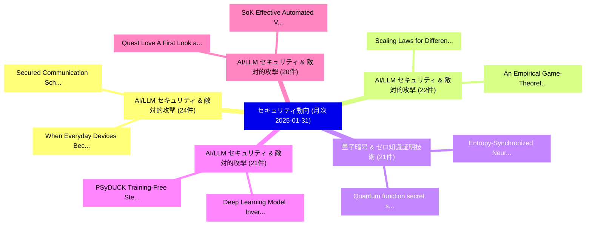

# 📊 03_monthly: 月次エグゼクティブサマリー報告書 (直近30日間: 2025-01-31)

**集計日時**: 2025-01-31 00:00:00 UTC  
**直近30日間の総論文数**: 526 件  

---

## 💡 マクロ脅威動向 & 戦略的リスク評価 (Strategic Executive Insights)

本日の収集論文（計 526 件）において、以下の重点セキュリティ領域で活発な研究動向が確認されました：
- **AI/LLM セキュリティ & 敵対的攻撃** (24 件): 注目論文として 「Secured Communication Schemes ...」、「When Everyday Devices Become W...」 等が発表され、実務防御および攻撃検証の進展が見られます。
- **AI/LLM セキュリティ & 敵対的攻撃** (22 件): 注目論文として 「Scaling Laws for Differentiall...」、「An Empirical Game-Theoretic Au...」 等が発表され、実務防御および攻撃検証の進展が見られます。
- **量子暗号 & ゼロ知識証明技術** (21 件): 注目論文として 「Quantum function secret sharin...」、「Entropy-Synchronized Neural Ha...」 等が発表され、実務防御および攻撃検証の進展が見られます。
- **AI/LLM セキュリティ & 敵対的攻撃** (21 件): 注目論文として 「Deep Learning Model Inversion ...」、「PSyDUCK: Training-Free Stegano...」 等が発表され、実務防御および攻撃検証の進展が見られます。
- **AI/LLM セキュリティ & 敵対的攻撃** (20 件): 注目論文として 「Quest Love: A First Look at Bl...」、「SoK: Effective Automated Vulne...」 等が発表され、実務防御および攻撃検証の進展が見られます。

### 🗺️ 月次セキュリティ技術レーダー (Technology Radar)

---

## 📌 月次セキュリティ論文一覧 (日本語表形式)

| No | arXiv ID | 論文タイトル (日本語訳) | 重要キーワード | 構造化エグゼクティブ要約 (背景・提案・影響) | 脅威分類 | 詳細リンク |
|---|---|---|---|---|---|---|
| 1 | `2501.18810v2` | [Quest Love: A First Look at Blockchain Loyalty Programs（セキュリティ分析論文）](../../okf/papers/2025-01-31/2501.18810.md) | `Blockchain Loyalty Programs`, `Quest Love`, `First Look` | 【提案】概要 (Overview & Key Finding) 本論文「Quest Love: A First Look at Blockchain Loyalty Programs...。実証評価により経営層・セキュリティ管理者向け推奨アクション (E... | `cs.CR` | [arXiv](https://arxiv.org/abs/2501.18810v2) &#124; [OKF](../../okf/papers/2025-01-31/2501.18810.md) |
| 2 | `2501.18820v1` | [SoK: Effective Automated Vulnerability Repairに向けて](../../okf/papers/2025-01-31/2501.18820.md) | `Towards Effective Automated Vulnerability Repair`, `Effective Automated Vulnerability`, `Ying Li` | 【提案】概要 (Overview & Key Finding) 本論文「SoK: Effective Automated 脆弱性 Repairに向けて」（原題: SoK: Towar...。実証評価により経営層・セキュリティ管理者向け推奨アクション (E... | `cs.CR` | [arXiv](https://arxiv.org/abs/2501.18820v1) &#124; [OKF](../../okf/papers/2025-01-31/2501.18820.md) |
| 3 | `2501.18821v3` | [An Optimal Cascade Feature-Level Spatiotemporal Fusion Strategy for Anomaly Detection in CAN Bus（セキュリティ分析論文）](../../okf/papers/2025-01-31/2501.18821.md) | `Level Spatiotemporal Fusion Strategy`, `Feature-Level Spatiotemporal`, `Anomaly Detection` | 【提案】概要 (Overview & Key Finding) 本論文「An Optimal Cascade Feature-Level Spatiotemporal Fusion ...。実証評価により経営層・セキュリティ管理者向け推奨アクション (E... | `cs.CR` | [arXiv](https://arxiv.org/abs/2501.18821v3) &#124; [OKF](../../okf/papers/2025-01-31/2501.18821.md) |
| 4 | `2501.18837v1` | [Constitutional Classifiers: Defending against Universal Jailbreaks across Thousands of Hours of Red Teaming（セキュリティ分析論文）](../../okf/papers/2025-01-31/2501.18837.md) | `Constitutional Classifiers`, `Universal Jailbreaks`, `Red Teaming` | 【提案】概要 (Overview & Key Finding) 本論文「Constitutional Classifiers: Defending against Universal...。実証評価により経営層・セキュリティ管理者向け推奨アクション (E... | `cs.CR` | [arXiv](https://arxiv.org/abs/2501.18837v1) &#124; [OKF](../../okf/papers/2025-01-31/2501.18837.md) |
| 5 | `2501.18841v1` | [Trading Inference-Time Compute for Adversarial Robustness（セキュリティ分析論文）](../../okf/papers/2025-01-31/2501.18841.md) | `Trading Inference`, `Time Compute`, `Adversarial Robustness` | 【提案】概要 (Overview & Key Finding) 本論文「Trading Inference-Time Compute for Adversarial Robustne...。実証評価により経営層・セキュリティ管理者向け推奨アクション (E... | `cs.CR` | [arXiv](https://arxiv.org/abs/2501.18841v1) &#124; [OKF](../../okf/papers/2025-01-31/2501.18841.md) |
| 6 | `2501.18857v2` | [DAPPER: A Performance-Attack-Resilient Tracker for RowHammer Defense（セキュリティ分析論文）](../../okf/papers/2025-01-31/2501.18857.md) | `Resilient Tracker`, `Jeonghyun Woo`, `Raw Meta` | 【提案】概要 (Overview & Key Finding) 本論文「DAPPER: A Performance-Attack-Resilient Tracker for RowH...。実証評価により経営層・セキュリティ管理者向け推奨アクション (E... | `cs.CR` | [arXiv](https://arxiv.org/abs/2501.18857v2) &#124; [OKF](../../okf/papers/2025-01-31/2501.18857.md) |
| 7 | `2501.18861v5` | [QPRAC: Secure and Practical PRAC-based Rowhammer Mitigation using Priority Queuesに向けて](../../okf/papers/2025-01-31/2501.18861.md) | `Rowhammer Mitigation`, `PRAC-based Rowhammer`, `Towards Secure` | 【提案】概要 (Overview & Key Finding) 本論文「QPRAC: Secure and Practical PRAC-based RowHammer Mitiga...。実証評価により経営層・セキュリティ管理者向け推奨アクション (E... | `cs.CR` | [arXiv](https://arxiv.org/abs/2501.18861v5) &#124; [OKF](../../okf/papers/2025-01-31/2501.18861.md) |
| 8 | `2501.18874v2` | [Enforcing MAVLink Safety & Security Properties Via Refined Multiparty Session Types（セキュリティ分析論文）](../../okf/papers/2025-01-31/2501.18874.md) | `Security Properties Via Refined Multiparty Session Types`, `Arthur Amorim`, `Max Taylor` | 【提案】概要 (Overview & Key Finding) 本論文「Enforcing MAVLink Safety & Security Properties Via Refi...。実証評価により経営層・セキュリティ管理者向け推奨アクション (E... | `cs.CR` | [arXiv](https://arxiv.org/abs/2501.18874v2) &#124; [OKF](../../okf/papers/2025-01-31/2501.18874.md) |
| 9 | `2501.18877v2` | [Embedding Distortion in Text-conditioned Diffusion ModelsによるSexual Content Generationの軽減](../../okf/papers/2025-01-31/2501.18877.md) | `Embedding Distortion`, `Text-conditioned Diffusion`, `Mitigating Sexual Content Generation` | 【提案】概要 (Overview & Key Finding) 本論文「Embedding Distortion in Text-conditioned Diffusion Mode...。実証評価により経営層・セキュリティ管理者向け推奨アクション (E... | `cs.CR` | [arXiv](https://arxiv.org/abs/2501.18877v2) &#124; [OKF](../../okf/papers/2025-01-31/2501.18877.md) |
| 10 | `2501.18914v1` | [Scaling Laws for Differentially Private Language Models（セキュリティ分析論文）](../../okf/papers/2025-01-31/2501.18914.md) | `Differentially Private Language Models`, `Scaling Laws`, `Yangsibo Huang` | 【提案】概要 (Overview & Key Finding) 本論文「Scaling Laws for Differentially Private Language Models...。実証評価によりChoquette-Choo, Ba。 | `cs.CR` | [arXiv](https://arxiv.org/abs/2501.18914v1) &#124; [OKF](../../okf/papers/2025-01-31/2501.18914.md) |
| 11 | `2501.18928v2` | [Quantum function secret sharing（セキュリティ分析論文）](../../okf/papers/2025-01-31/2501.18928.md) | `Ramis Movassagh`, `Raw Meta`, `Executive Summary` | 【提案】概要 (Overview & Key Finding) 本論文「量子 function secret sharing（セキュリティ分析論文）」（原題: 量子 function...。実証評価によりGrilo, Ramis Movassagh - ... | `cs.CR` | [arXiv](https://arxiv.org/abs/2501.18928v2) &#124; [OKF](../../okf/papers/2025-01-31/2501.18928.md) |
| 12 | `2501.18934v2` | [Deep Learning Model Inversion Attacks and Defenses: A Comprehensive Survey（セキュリティ分析論文）](../../okf/papers/2025-01-31/2501.18934.md) | `Deep Learning Model Inversion Attacks`, `Comprehensive Survey`, `Wencheng Yang` | 【提案】概要 (Overview & Key Finding) 本論文「Deep Learning モデル反転攻撃 Attacks and Defenses: A Comprehen...。実証評価により経営層・セキュリティ管理者向け推奨アクション (E... | `cs.CR` | [arXiv](https://arxiv.org/abs/2501.18934v2) &#124; [OKF](../../okf/papers/2025-01-31/2501.18934.md) |
| 13 | `2501.19012v1` | [Importing Phantoms: Measuring LLM Package Hallucination Vulnerabilities（セキュリティ分析論文）](../../okf/papers/2025-01-31/2501.19012.md) | `Package Hallucination Vulnerabilities`, `Importing Phantoms`, `Arjun Krishna` | 【提案】概要 (Overview & Key Finding) 本論文「Importing Phantoms: Measuring LLM Package Hallucination...。実証評価により経営層・セキュリティ管理者向け推奨アクション (E... | `cs.CR` | [arXiv](https://arxiv.org/abs/2501.19012v1) &#124; [OKF](../../okf/papers/2025-01-31/2501.19012.md) |
| 14 | `2501.19120v2` | [Hierarchical Cryptographic Signature Mapping for Ransomware Classification: A Structural Decomposition Approach（セキュリティ分析論文）](../../okf/papers/2025-01-31/2501.19120.md) | `Hierarchical Cryptographic Signature Mapping`, `Ransomware Classification`, `Hierarchical Cryptographic Sign` | 【提案】概要 (Overview & Key Finding) 本論文「Hierarchical Cryptographic Signature Mapping for ランサムウェ...。実証評価により経営層・セキュリティ管理者向け推奨アクション (E... | `cs.CR` | [arXiv](https://arxiv.org/abs/2501.19120v2) &#124; [OKF](../../okf/papers/2025-01-31/2501.19120.md) |
| 15 | `2501.19143v2` | [Imitation Game for Adversarial Disillusion with Chain-of-Thought Reasoning in Generative AI（セキュリティ分析論文）](../../okf/papers/2025-01-31/2501.19143.md) | `Imitation Game`, `Adversarial Disillusion`, `Thought Reasoning` | 【提案】概要 (Overview & Key Finding) 本論文「Imitation Game for Adversarial Disillusion with Chain-o...。実証評価により経営層・セキュリティ管理者向け推奨アクション (E... | `cs.CR` | [arXiv](https://arxiv.org/abs/2501.19143v2) &#124; [OKF](../../okf/papers/2025-01-31/2501.19143.md) |
| 16 | `2501.19172v2` | [PSyDUCK: Training-Free Steganography for Latent Diffusion（セキュリティ分析論文）](../../okf/papers/2025-01-31/2501.19172.md) | `Free Steganography`, `Latent Diffusion`, `Training-Free Steganography` | 【提案】概要 (Overview & Key Finding) 本論文「PSyDUCK: Training-Free Steganography for Latent Diffusi...。実証評価により経営層・セキュリティ管理者向け推奨アクション (E... | `cs.CR` | [arXiv](https://arxiv.org/abs/2501.19172v2) &#124; [OKF](../../okf/papers/2025-01-31/2501.19172.md) |
| 17 | `2501.19180v2` | [Enhancing Model Defense Against Jailbreaks with Proactive Safety Reasoning（セキュリティ分析論文）](../../okf/papers/2025-01-31/2501.19180.md) | `Proactive Safety Reasoning`, `Jin Song Dong`, `Xianglin Yang` | 【提案】概要 (Overview & Key Finding) 本論文「Enhancing Model Defense Against ジェイルブレイクs with Proactiv...。実証評価により経営層・セキュリティ管理者向け推奨アクション (E... | `cs.CR` | [arXiv](https://arxiv.org/abs/2501.19180v2) &#124; [OKF](../../okf/papers/2025-01-31/2501.19180.md) |
| 18 | `2501.19191v1` | [Secured Communication Schemes for UAVs in 5G: CRYSTALS-Kyber and IDS（セキュリティ分析論文）](../../okf/papers/2025-01-31/2501.19191.md) | `Secured Communication Schemes`, `Seyed Ahmad Soleymani`, `Taneya Sharma` | 【提案】概要 (Overview & Key Finding) 本論文「Secured Communication Schemes for UAVs in 5G: CRYSTALS-...。実証評価により経営層・セキュリティ管理者向け推奨アクション (E... | `cs.CR` | [arXiv](https://arxiv.org/abs/2501.19191v1) &#124; [OKF](../../okf/papers/2025-01-31/2501.19191.md) |
| 19 | `2501.19206v1` | [An Empirical Game-Theoretic Autonomous Cyber-Defence Agentsの分析](../../okf/papers/2025-01-31/2501.19206.md) | `Theoretic Autonomous Cyber`, `Autonomous Cyber`, `Defence Agents` | 【提案】概要 (Overview & Key Finding) 本論文「An Empirical Game-Theoretic Autonomous Cyber-Defence Ag...。実証評価によりHarrold, Matthew Stewart,... | `cs.CR` | [arXiv](https://arxiv.org/abs/2501.19206v1) &#124; [OKF](../../okf/papers/2025-01-31/2501.19206.md) |
| 20 | `2501.19223v1` | [Through the Looking Glass: LLM-Based AR/VR Android Applications Privacy Policiesの分析](../../okf/papers/2025-01-31/2501.19223.md) | `Looking Glass`, `Android Applications Privacy Policies`, `Android Applications Privacy` | 【提案】概要 (Overview & Key Finding) 本論文「Through the Looking Glass: LLM-Based AR/VR Android Appl...。実証評価により経営層・セキュリティ管理者向け推奨アクション (E... | `cs.CR` | [arXiv](https://arxiv.org/abs/2501.19223v1) &#124; [OKF](../../okf/papers/2025-01-31/2501.19223.md) |
| 21 | `2501.19290v3` | [Noninterference Irreversible Systems and Reversible Systems Featuring both Nondeterminism and Probabilitiesの分析](../../okf/papers/2025-01-31/2501.19290.md) | `Reversible Systems Featuring`, `Noninterference Irreversible Systems`, `Irreversible Systems` | 【提案】概要 (Overview & Key Finding) 本論文「Noninterference Irreversible Systems and Reversible Sys...。実証評価により経営層・セキュリティ管理者向け推奨アクション (E... | `cs.CR` | [arXiv](https://arxiv.org/abs/2501.19290v3) &#124; [OKF](../../okf/papers/2025-01-31/2501.19290.md) |
| 22 | `2502.00067v1` | [Decoding User Concerns in AI Health Chatbots: An Exploration of Security and Privacy in App Reviews（セキュリティ分析論文）](../../okf/papers/2025-01-31/2502.00067.md) | `Decoding User Concerns`, `Health Chatbots`, `App Reviews` | 【提案】概要 (Overview & Key Finding) 本論文「Decoding User Concerns in AI Health Chatbots: An Explor...。実証評価により経営層・セキュリティ管理者向け推奨アクション (E... | `cs.CR` | [arXiv](https://arxiv.org/abs/2502.00067v1) &#124; [OKF](../../okf/papers/2025-01-31/2502.00067.md) |
| 23 | `2502.00068v1` | [Privacy Preserving Charge Location Prediction for Electric Vehicles（セキュリティ分析論文）](../../okf/papers/2025-01-31/2502.00068.md) | `Privacy Preserving Charge Location Prediction`, `Electric Vehicles`, `Robert Marlin` | 【提案】概要 (Overview & Key Finding) 本論文「Privacy Preserving Charge Location Prediction for Elect...。実証評価により経営層・セキュリティ管理者向け推奨アクション (E... | `cs.CR` | [arXiv](https://arxiv.org/abs/2502.00068v1) &#124; [OKF](../../okf/papers/2025-01-31/2502.00068.md) |
| 24 | `2502.00069v1` | [Large Capacity Data Hiding in Binary Image black and white mixed regions（セキュリティ分析論文）](../../okf/papers/2025-01-31/2502.00069.md) | `Large Capacity Data Hiding`, `Binary Image`, `Yuanlin Yang` | 【提案】概要 (Overview & Key Finding) 本論文「Large Capacity Data Hiding in Binary Image black and wh...。実証評価により経営層・セキュリティ管理者向け推奨アクション (E... | `cs.CR` | [arXiv](https://arxiv.org/abs/2502.00069v1) &#124; [OKF](../../okf/papers/2025-01-31/2502.00069.md) |
| 25 | `2502.00072v1` | [LLM Cyber Evaluations Don't Capture Real-World Risk（セキュリティ分析論文）](../../okf/papers/2025-01-31/2502.00072.md) | `Cyber Evaluations Don`, `Capture Real`, `World Risk` | 【提案】概要 (Overview & Key Finding) 本論文「LLM Cyber Evaluations Don't Capture Real-World Risk（セキュ...。実証評価により経営層・セキュリティ管理者向け推奨アクション (E... | `cs.CR` | [arXiv](https://arxiv.org/abs/2502.00072v1) &#124; [OKF](../../okf/papers/2025-01-31/2502.00072.md) |
| 26 | `2502.00156v2` | [ALBAR: Adversarial Learning approach to mitigate Biases in Action Recognition（セキュリティ分析論文）](../../okf/papers/2025-01-31/2502.00156.md) | `Adversarial Learning`, `Action Recognition`, `Ishan Rajendrakumar Dave` | 【提案】概要 (Overview & Key Finding) 本論文「ALBAR: Adversarial Learning approach to mitigate Biases...。実証評価により経営層・セキュリティ管理者向け推奨アクション (E... | `cs.CR` | [arXiv](https://arxiv.org/abs/2502.00156v2) &#124; [OKF](../../okf/papers/2025-01-31/2502.00156.md) |
| 27 | `2502.00193v1` | [Byzantine-Resilient Zero-Order Optimization for Communication-Efficient Heterogeneous 連合学習](../../okf/papers/2025-01-31/2502.00193.md) | `Resilient Zero`, `Order Optimization`, `Byzantine-Resilient Zero` | 【提案】概要 (Overview & Key Finding) 本論文「Byzantine-Resilient Zero-Order Optimization for Communi...。実証評価により経営層・セキュリティ管理者向け推奨アクション (E... | `cs.CR` | [arXiv](https://arxiv.org/abs/2502.00193v1) &#124; [OKF](../../okf/papers/2025-01-31/2502.00193.md) |
| 28 | `2502.18468v1` | [SOK: Exploring Hallucinations and Security Risks in AI-Assisted Software Development with Insights for LLM Deployment（セキュリティ分析論文）](../../okf/papers/2025-01-31/2502.18468.md) | `Assisted Software Development`, `Exploring Hallucinations`, `Security Risks` | 【提案】概要 (Overview & Key Finding) 本論文「SOK: Exploring Hallucinations and Security Risks in AI-...。実証評価により経営層・セキュリティ管理者向け推奨アクション (E... | `cs.CR` | [arXiv](https://arxiv.org/abs/2502.18468v1) &#124; [OKF](../../okf/papers/2025-01-31/2502.18468.md) |
| 29 | `2501.18102v1` | [Security for IEEE P1451.1.6-based Sensor Networks for IoT Applications（セキュリティ分析論文）](../../okf/papers/2025-01-30/2501.18102.md) | `Sensor Networks`, `6-based Sensor`, `Hiroaki Nishi` | 【提案】概要 (Overview & Key Finding) 本論文「Security for IEEE P1451.1.6-based Sensor Networks for I...。実証評価により経営層・セキュリティ管理者向け推奨アクション (E... | `cs.CR` | [arXiv](https://arxiv.org/abs/2501.18102v1) &#124; [OKF](../../okf/papers/2025-01-30/2501.18102.md) |
| 30 | `2501.18121v1` | [Optimal Survey Design for Private Mean Estimation（セキュリティ分析論文）](../../okf/papers/2025-01-30/2501.18121.md) | `Optimal Survey Design`, `Private Mean Estimation`, `Wei Chen` | 【提案】概要 (Overview & Key Finding) 本論文「Optimal Survey Design for Private Mean Estimation（セキュリテ...。実証評価によりAwan - **公開日時**: `2025-01... | `cs.CR` | [arXiv](https://arxiv.org/abs/2501.18121v1) &#124; [OKF](../../okf/papers/2025-01-30/2501.18121.md) |
| 31 | `2501.18131v2` | [Entropy-Synchronized Neural Hashing for Unsupervised Ransomware Detection（セキュリティ分析論文）](../../okf/papers/2025-01-30/2501.18131.md) | `Synchronized Neural Hashing`, `Unsupervised Ransomware Detection`, `Entropy-Synchronized Neural` | 【提案】概要 (Overview & Key Finding) 本論文「Entropy-Synchronized Neural Hashing for Unsupervised ラン...。実証評価により経営層・セキュリティ管理者向け推奨アクション (E... | `cs.CR` | [arXiv](https://arxiv.org/abs/2501.18131v2) &#124; [OKF](../../okf/papers/2025-01-30/2501.18131.md) |
| 32 | `2501.18158v3` | [大規模言語モデル for Cryptocurrency Transaction Analysis: A Bitcoin Case Study](../../okf/papers/2025-01-30/2501.18158.md) | `Large Language Models`, `Tsz Hon Yuen`, `Kwang Raymond Choo` | 【提案】概要 (Overview & Key Finding) 本論文「大規模言語モデル for Cryptocurrency Transaction Analysis: A Bit...。実証評価により経営層・セキュリティ管理者向け推奨アクション (E... | `cs.CR` | [arXiv](https://arxiv.org/abs/2501.18158v3) &#124; [OKF](../../okf/papers/2025-01-30/2501.18158.md) |
| 33 | `2501.18176v2` | [Experimental asymmetric relativistic zero-knowledge proofs with unconditional security（セキュリティ分析論文）](../../okf/papers/2025-01-30/2501.18176.md) | `zero-knowledge proofs`, `Xun Weng`, `Yang Li` | 【提案】概要 (Overview & Key Finding) 本論文「Experimental asymmetric relativistic zero-knowledge pro...。実証評価により経営層・セキュリティ管理者向け推奨アクション (E... | `cs.CR` | [arXiv](https://arxiv.org/abs/2501.18176v2) &#124; [OKF](../../okf/papers/2025-01-30/2501.18176.md) |
| 34 | `2501.18279v2` | [SoK: Measuring Blockchain Decentralization（セキュリティ分析論文）](../../okf/papers/2025-01-30/2501.18279.md) | `Measuring Blockchain Decentralization`, `Christina Ovezik`, `Dimitris Karakostas` | 【提案】概要 (Overview & Key Finding) 本論文「SoK: Measuring Blockchain Decentralization（セキュリティ分析論文）」...。実証評価によりWoods - **公開日時**: `2025-0... | `cs.CR` | [arXiv](https://arxiv.org/abs/2501.18279v2) &#124; [OKF](../../okf/papers/2025-01-30/2501.18279.md) |
| 35 | `2501.18371v1` | [FLASH-FHE: A Heterogeneous Architecture for Fully Homomorphic Encryption Acceleration（セキュリティ分析論文）](../../okf/papers/2025-01-30/2501.18371.md) | `Fully Homomorphic Encryption Acceleration`, `Heterogeneous Architecture`, `Junxue Zhang` | 【提案】概要 (Overview & Key Finding) 本論文「FLASH-FHE: A Heterogeneous Architecture for Fully 準同型暗号...。実証評価により経営層・セキュリティ管理者向け推奨アクション (E... | `cs.CR` | [arXiv](https://arxiv.org/abs/2501.18371v1) &#124; [OKF](../../okf/papers/2025-01-30/2501.18371.md) |
| 36 | `2501.18387v6` | [AuthOr: Lower Cost Authenticity-Oriented Garbling for Arbitrary Boolean Circuits（セキュリティ分析論文）](../../okf/papers/2025-01-30/2501.18387.md) | `Lower Cost Authenticity`, `Arbitrary Boolean Circuits`, `Oriented Garbling` | 【提案】概要 (Overview & Key Finding) 本論文「AuthOr: Lower Cost Authenticity-Oriented Garbling for A...。実証評価により経営層・セキュリティ管理者向け推奨アクション (E... | `cs.CR` | [arXiv](https://arxiv.org/abs/2501.18387v6) &#124; [OKF](../../okf/papers/2025-01-30/2501.18387.md) |
| 37 | `2501.18394v1` | [Quantum-Key Distribution using Decoy Pulses to Combat Photon-Number Splitting by Eavesdropper: An Event-by-Event Impairment Enumeration Approach for Performance Evaluation and Design（セキュリティ分析論文）](../../okf/papers/2025-01-30/2501.18394.md) | `Key Distribution`, `Decoy Pulses`, `Combat Photon` | 【提案】概要 (Overview & Key Finding) 本論文「量子-Key Distribution using Decoy Pulses to Combat Photon...。実証評価によりセキュリティ影響と実験結果 (Results & ... | `cs.CR` | [arXiv](https://arxiv.org/abs/2501.18394v1) &#124; [OKF](../../okf/papers/2025-01-30/2501.18394.md) |
| 38 | `2501.18407v1` | [Degree is Important: On Evolving Homogeneous Boolean Functions（セキュリティ分析論文）](../../okf/papers/2025-01-30/2501.18407.md) | `Claude Carlet`, `Domagoj Jakobovic`, `Luca Mariot` | 【提案】概要 (Overview & Key Finding) 本論文「Degree is Important: On Evolving Homogeneous Boolean Fu...。実証評価により経営層・セキュリティ管理者向け推奨アクション (E... | `cs.CR` | [arXiv](https://arxiv.org/abs/2501.18407v1) &#124; [OKF](../../okf/papers/2025-01-30/2501.18407.md) |
| 39 | `2501.18492v2` | [GuardReasoner: Reasoning-based LLM Safeguardsに向けて](../../okf/papers/2025-01-30/2501.18492.md) | `Reasoning-based LLM`, `Towards Reasoning`, `Yue Liu` | 【提案】概要 (Overview & Key Finding) 本論文「GuardReasoner: Reasoning-based LLM Safeguardsに向けて」（原題: ...。実証評価によりLi, Hui Xiong, Bryan Hooi... | `cs.CR` | [arXiv](https://arxiv.org/abs/2501.18492v2) &#124; [OKF](../../okf/papers/2025-01-30/2501.18492.md) |
| 40 | `2501.18533v3` | [Rethinking Bottlenecks in Safety Fine-Tuning of Vision Language Models（セキュリティ分析論文）](../../okf/papers/2025-01-30/2501.18533.md) | `Vision Language Models`, `Rethinking Bottlenecks`, `Safety Fine` | 【提案】概要 (Overview & Key Finding) 本論文「Rethinking Bottlenecks in Safety Fine-Tuning of Vision ...。実証評価により経営層・セキュリティ管理者向け推奨アクション (E... | `cs.CR` | [arXiv](https://arxiv.org/abs/2501.18533v3) &#124; [OKF](../../okf/papers/2025-01-30/2501.18533.md) |
| 41 | `2501.18549v1` | [CryptoDNA: A Machine Learning Paradigm for DDoS Detection in Healthcare IoT, Inspired by crypto jacking prevention Models（セキュリティ分析論文）](../../okf/papers/2025-01-30/2501.18549.md) | `Machine Learning Paradigm`, `Ahmed Abdelgawad`, `Nelly Elsayed` | 【提案】概要 (Overview & Key Finding) 本論文「CryptoDNA: A Machine Learning Paradigm for DDoS Detecti...。実証評価により経営層・セキュリティ管理者向け推奨アクション (E... | `cs.CR` | [arXiv](https://arxiv.org/abs/2501.18549v1) &#124; [OKF](../../okf/papers/2025-01-30/2501.18549.md) |
| 42 | `2501.18565v3` | [BounTCHA: A CAPTCHA Utilizing Boundary Identification in Guided Generative AI-extended Videos（セキュリティ分析論文）](../../okf/papers/2025-01-30/2501.18565.md) | `Utilizing Boundary Identification`, `Guided Generative`, `AI-extended Videos` | 【提案】概要 (Overview & Key Finding) 本論文「BounTCHA: A CAPTCHA Utilizing Boundary Identification i...。実証評価により経営層・セキュリティ管理者向け推奨アクション (E... | `cs.CR` | [arXiv](https://arxiv.org/abs/2501.18565v3) &#124; [OKF](../../okf/papers/2025-01-30/2501.18565.md) |
| 43 | `2501.18663v1` | [Joint Optimization of Prompt Security and System Performance in Edge-Cloud LLM Systems（セキュリティ分析論文）](../../okf/papers/2025-01-30/2501.18663.md) | `Joint Optimization`, `Prompt Security`, `System Performance` | 【提案】概要 (Overview & Key Finding) 本論文「Joint Optimization of Prompt Security and System Perfor...。実証評価により経営層・セキュリティ管理者向け推奨アクション (E... | `cs.CR` | [arXiv](https://arxiv.org/abs/2501.18663v1) &#124; [OKF](../../okf/papers/2025-01-30/2501.18663.md) |
| 44 | `2501.18669v1` | [The Pitfalls of "Security by Obscurity" And What They Mean for Transparent AI（セキュリティ分析論文）](../../okf/papers/2025-01-30/2501.18669.md) | `Peter Hall`, `Olivia Mundahl`, `Sunoo Park` | 【提案】概要 (Overview & Key Finding) 本論文「The Pitfalls of "Security by Obscurity" And What They M...。実証評価により経営層・セキュリティ管理者向け推奨アクション (E... | `cs.CR` | [arXiv](https://arxiv.org/abs/2501.18669v1) &#124; [OKF](../../okf/papers/2025-01-30/2501.18669.md) |
| 45 | `2501.18712v4` | [Invisible Traces: Using Hybrid Fingerprinting to identify underlying LLMs in GenAI Apps（セキュリティ分析論文）](../../okf/papers/2025-01-30/2501.18712.md) | `Using Hybrid Fingerprinting`, `Invisible Traces`, `Devansh Bhardwaj` | 【提案】概要 (Overview & Key Finding) 本論文「Invisible Traces: Using Hybrid Fingerprinting to identi...。実証評価により経営層・セキュリティ管理者向け推奨アクション (E... | `cs.CR` | [arXiv](https://arxiv.org/abs/2501.18712v4) &#124; [OKF](../../okf/papers/2025-01-30/2501.18712.md) |
| 46 | `2501.18727v2` | [Exploring Audio Editing Features as User-Centric Privacy Defenses Against Large Language Model(LLM) Based Emotion Inference Attacks（セキュリティ分析論文）](../../okf/papers/2025-01-30/2501.18727.md) | `Exploring Audio Editing Features`, `Based Emotion Inference Attacks`, `User-Centric Privacy` | 【提案】概要 (Overview & Key Finding) 本論文「Exploring Audio Editing Features as User-Centric Privac...。実証評価により経営層・セキュリティ管理者向け推奨アクション (E... | `cs.CR` | [arXiv](https://arxiv.org/abs/2501.18727v2) &#124; [OKF](../../okf/papers/2025-01-30/2501.18727.md) |
| 47 | `2501.18740v1` | [REDACTOR: eFPGA Redaction for DNN Accelerator Security（セキュリティ分析論文）](../../okf/papers/2025-01-30/2501.18740.md) | `Accelerator Security`, `Yazan Baddour`, `Ava Hedayatipour` | 【提案】概要 (Overview & Key Finding) 本論文「REDACTOR: eFPGA Redaction for DNN Accelerator Security（...。実証評価により経営層・セキュリティ管理者向け推奨アクション (E... | `cs.CR` | [arXiv](https://arxiv.org/abs/2501.18740v1) &#124; [OKF](../../okf/papers/2025-01-30/2501.18740.md) |
| 48 | `2501.18780v2` | [Gotta Hash 'Em All! Speeding Up Hash Functions for Zero-Knowledge Proof Applications（セキュリティ分析論文）](../../okf/papers/2025-01-30/2501.18780.md) | `Knowledge Proof Applications`, `Gotta Hash`, `Zero-Knowledge Proof` | 【提案】Speeding Up Hash Functions for ゼロ知識証明 Applications ### (日本語題名: Gotta Hash 'Em All!。実証評価により経営層・セキュリティ管理者向け推奨アクション (Executive... | `cs.CR` | [arXiv](https://arxiv.org/abs/2501.18780v2) &#124; [OKF](../../okf/papers/2025-01-30/2501.18780.md) |
| 49 | `2502.00064v1` | [Evaluating Large Language Models in 脆弱性検出 Under Variable Context Windows](../../okf/papers/2025-01-30/2502.00064.md) | `Evaluating Large Language Models`, `Jie Lin`, `David Mohaisen` | 【提案】概要 (Overview & Key Finding) 本論文「Evaluating Large Language Models in 脆弱性検出 Under Variabl...。実証評価により経営層・セキュリティ管理者向け推奨アクション (E... | `cs.CR` | [arXiv](https://arxiv.org/abs/2502.00064v1) &#124; [OKF](../../okf/papers/2025-01-30/2502.00064.md) |
| 50 | `2502.15727v2` | [Retrieval Augmented Generation Based LLM Evaluation For Protocol State Machine Inference With Chain-of-Thought Reasoning（セキュリティ分析論文）](../../okf/papers/2025-01-30/2502.15727.md) | `Retrieval Augmented Generation Based`, `Thought Reasoning`, `Youssef Maklad` | 【提案】概要 (Overview & Key Finding) 本論文「Retrieval Augmented Generation Based LLM Evaluation For...。実証評価により経営層・セキュリティ管理者向け推奨アクション (E... | `cs.CR` | [arXiv](https://arxiv.org/abs/2502.15727v2) &#124; [OKF](../../okf/papers/2025-01-30/2502.15727.md) |
| 51 | `2501.17381v1` | [Do We Really Need to Design New Byzantine-robust Aggregation Rules?（セキュリティ分析論文）](../../okf/papers/2025-01-29/2501.17381.md) | `Design New Byzantine`, `Aggregation Rules`, `Byzantine-robust Aggregation` | 【提案】### (日本語題名: Do We Really Need to Design New Byzantine-robust Aggregation Rules?（セキュリティ分...。実証評価により経営層・セキュリティ管理者向け推奨アクション (E... | `cs.CR` | [arXiv](https://arxiv.org/abs/2501.17381v1) &#124; [OKF](../../okf/papers/2025-01-29/2501.17381.md) |
| 52 | `2501.17392v2` | [Byzantine-Robust 連合学習 over Ring-All-Reduce Distributed Computing](../../okf/papers/2025-01-29/2501.17392.md) | `Reduce Distributed Computing`, `Robust Federated Learning`, `Byzantine-Robust Federated` | 【提案】概要 (Overview & Key Finding) 本論文「Byzantine-Robust 連合学習 over Ring-All-Reduce Distributed ...。実証評価により# Byzantine-Robust Federa... | `cs.CR` | [arXiv](https://arxiv.org/abs/2501.17392v2) &#124; [OKF](../../okf/papers/2025-01-29/2501.17392.md) |
| 53 | `2501.17396v1` | [Poisoning Attacks and Defenses to Federated Unlearning（セキュリティ分析論文）](../../okf/papers/2025-01-29/2501.17396.md) | `Poisoning Attacks`, `Federated Unlearning`, `Wenbin Wang` | 【提案】概要 (Overview & Key Finding) 本論文「Poisoning Attacks and Defenses to Federated Unlearning（...。実証評価により経営層・セキュリティ管理者向け推奨アクション (E... | `cs.CR` | [arXiv](https://arxiv.org/abs/2501.17396v1) &#124; [OKF](../../okf/papers/2025-01-29/2501.17396.md) |
| 54 | `2501.17402v1` | [Cute-Lock: Behavioral and Structural Multi-Key Logic Locking Using Time Base Keys（セキュリティ分析論文）](../../okf/papers/2025-01-29/2501.17402.md) | `Key Logic Locking Using Time Base Keys`, `Structural Multi`, `Multi-Key Logic` | 【提案】概要 (Overview & Key Finding) 本論文「Cute-Lock: Behavioral and Structural Multi-Key Logic Lo...。実証評価により経営層・セキュリティ管理者向け推奨アクション (E... | `cs.CR` | [arXiv](https://arxiv.org/abs/2501.17402v1) &#124; [OKF](../../okf/papers/2025-01-29/2501.17402.md) |
| 55 | `2501.17405v1` | [When Everyday Devices Become Weapons: A Closer Look at the Pager and Walkie-talkie Attacks（セキュリティ分析論文）](../../okf/papers/2025-01-29/2501.17405.md) | `Closer Look`, `Walkie-talkie Attacks`, `Pantha Protim Sarker` | 【提案】概要 (Overview & Key Finding) 本論文「When Everyday Devices Become Weapons: A Closer Look at ...。実証評価により経営層・セキュリティ管理者向け推奨アクション (E... | `cs.CR` | [arXiv](https://arxiv.org/abs/2501.17405v1) &#124; [OKF](../../okf/papers/2025-01-29/2501.17405.md) |
| 56 | `2501.17413v1` | [Fine-Grained 1-Day 脆弱性検出 in Binaries via Patch Code Localization](../../okf/papers/2025-01-29/2501.17413.md) | `Patch Code Localization`, `Fine-Grained 1`, `Day Vulnerability Detection` | 【提案】概要 (Overview & Key Finding) 本論文「Fine-Grained 1-Day 脆弱性検出 in Binaries via Patch Code Loc...。実証評価により経営層・セキュリティ管理者向け推奨アクション (E... | `cs.CR` | [arXiv](https://arxiv.org/abs/2501.17413v1) &#124; [OKF](../../okf/papers/2025-01-29/2501.17413.md) |
| 57 | `2501.17429v2` | [Algorithmic Segmentation and Behavioral Profiling for Ransomware Detection Using Temporal-Correlation Graphs（セキュリティ分析論文）](../../okf/papers/2025-01-29/2501.17429.md) | `Ransomware Detection Using Temporal`, `Algorithmic Segmentation`, `Behavioral Profiling` | 【提案】概要 (Overview & Key Finding) 本論文「Algorithmic Segmentation and Behavioral Profiling for ラ...。実証評価により経営層・セキュリティ管理者向け推奨アクション (E... | `cs.CR` | [arXiv](https://arxiv.org/abs/2501.17429v2) &#124; [OKF](../../okf/papers/2025-01-29/2501.17429.md) |
| 58 | `2501.17433v1` | [Virus: Harmful Fine-tuning Attack for 大規模言語モデル Bypassing Guardrail Moderation](../../okf/papers/2025-01-29/2501.17433.md) | `Harmful Fine`, `Fine-tuning Attack`, `Large Language Models Bypassing Guardrail Moderation` | 【提案】概要 (Overview & Key Finding) 本論文「Virus: Harmful Fine-tuning Attack for 大規模言語モデル Bypassin...。実証評価により経営層・セキュリティ管理者向け推奨アクション (E... | `cs.CR` | [arXiv](https://arxiv.org/abs/2501.17433v1) &#124; [OKF](../../okf/papers/2025-01-29/2501.17433.md) |
| 59 | `2501.17501v2` | [How Much Do Code Language Models Remember? An Investigation on Data Extraction Attacks before and after Fine-tuning（セキュリティ分析論文）](../../okf/papers/2025-01-29/2501.17501.md) | `Data Extraction Attacks`, `Fabio Salerno`, `Ali Al` | 【提案】An Investigation on Data Extraction Attacks before and after Fine-tuning ### (日本語題名: Ho...。実証評価により経営層・セキュリティ管理者向け推奨アクション (E... | `cs.CR` | [arXiv](https://arxiv.org/abs/2501.17501v2) &#124; [OKF](../../okf/papers/2025-01-29/2501.17501.md) |
| 60 | `2501.17539v1` | [Supporting Penetration Testing Education with Large Language Models: an Evaluation and Comparisonに向けて](../../okf/papers/2025-01-29/2501.17539.md) | `Large Language Models`, `Supporting Penetration Testing Education`, `Towards Supporting Penetration Testing Education` | 【提案】概要 (Overview & Key Finding) 本論文「Supporting Penetration Testing Education with Large Lan...。実証評価により経営層・セキュリティ管理者向け推奨アクション (E... | `cs.CR` | [arXiv](https://arxiv.org/abs/2501.17539v1) &#124; [OKF](../../okf/papers/2025-01-29/2501.17539.md) |
| 61 | `2501.17548v1` | [Understanding Trust in Authentication Methods for Icelandic Digital Public Services（セキュリティ分析論文）](../../okf/papers/2025-01-29/2501.17548.md) | `Icelandic Digital Public Services`, `Understanding Trust`, `Authentication Methods` | 【提案】概要 (Overview & Key Finding) 本論文「Understanding Trust in Authentication Methods for Icela...。実証評価により経営層・セキュリティ管理者向け推奨アクション (E... | `cs.CR` | [arXiv](https://arxiv.org/abs/2501.17548v1) &#124; [OKF](../../okf/papers/2025-01-29/2501.17548.md) |
| 62 | `2501.17634v2` | [連合学習 With Individualized Privacy Through Client Sampling](../../okf/papers/2025-01-29/2501.17634.md) | `Lucas Lange`, `Ole Borchardt`, `Erhard Rahm` | 【提案】概要 (Overview & Key Finding) 本論文「連合学習 With Individualized Privacy Through Client Samplin...。実証評価により経営層・セキュリティ管理者向け推奨アクション (E... | `cs.CR` | [arXiv](https://arxiv.org/abs/2501.17634v2) &#124; [OKF](../../okf/papers/2025-01-29/2501.17634.md) |
| 63 | `2501.17667v2` | [CAMP in the Odyssey: Provably Robust Reinforcement Learning with Certified Radius Maximization（セキュリティ分析論文）](../../okf/papers/2025-01-29/2501.17667.md) | `Provably Robust Reinforcement Learning`, `Certified Radius Maximization`, `Derui Wang` | 【提案】概要 (Overview & Key Finding) 本論文「CAMP in the Odyssey: Provably Robust Reinforcement Lear...。実証評価により経営層・セキュリティ管理者向け推奨アクション (E... | `cs.CR` | [arXiv](https://arxiv.org/abs/2501.17667v2) &#124; [OKF](../../okf/papers/2025-01-29/2501.17667.md) |
| 64 | `2501.17733v1` | [BitMLx: Secure Cross-chain Smart Contracts For Bitcoin-style Cryptocurrencies（セキュリティ分析論文）](../../okf/papers/2025-01-29/2501.17733.md) | `Secure Cross`, `Cross-chain Smart`, `Bitcoin-style Cryptocurrencies` | 【提案】概要 (Overview & Key Finding) 本論文「BitMLx: Secure Cross-chain スマートコントラクトs For Bitcoin-styl...。実証評価により経営層・セキュリティ管理者向け推奨アクション (E... | `cs.CR` | [arXiv](https://arxiv.org/abs/2501.17733v1) &#124; [OKF](../../okf/papers/2025-01-29/2501.17733.md) |
| 65 | `2501.17740v2` | [Attacker Control and Bug Prioritization（セキュリティ分析論文）](../../okf/papers/2025-01-29/2501.17740.md) | `Attacker Control`, `Bug Prioritization`, `Guilhem Lacombe` | 【提案】概要 (Overview & Key Finding) 本論文「Attacker Control and Bug Prioritization（セキュリティ分析論文）」（原題...。実証評価により経営層・セキュリティ管理者向け推奨アクション (E... | `cs.CR` | [arXiv](https://arxiv.org/abs/2501.17740v2) &#124; [OKF](../../okf/papers/2025-01-29/2501.17740.md) |
| 66 | `2501.17748v1` | [Investigating Vulnerability Disclosures in Open-Source Software Using Bug Bounty Reports and Security Advisories（セキュリティ分析論文）](../../okf/papers/2025-01-29/2501.17748.md) | `Source Software Using Bug Bounty Reports`, `Investigating Vulnerability Disclosures`, `Security Advisories` | 【提案】概要 (Overview & Key Finding) 本論文「Investigating 脆弱性 Disclosures in Open-Source Software U...。実証評価により経営層・セキュリティ管理者向け推奨アクション (E... | `cs.CR` | [arXiv](https://arxiv.org/abs/2501.17748v1) &#124; [OKF](../../okf/papers/2025-01-29/2501.17748.md) |
| 67 | `2501.17750v1` | [Privacy Audit as Bits Transmission: (Im)possibilities for Audit by One Run（セキュリティ分析論文）](../../okf/papers/2025-01-29/2501.17750.md) | `Privacy Audit`, `Bits Transmission`, `One Run` | 【提案】概要 (Overview & Key Finding) 本論文「Privacy Audit as Bits Transmission: (Im)possibilities f...。実証評価により経営層・セキュリティ管理者向け推奨アクション (E... | `cs.CR` | [arXiv](https://arxiv.org/abs/2501.17750v1) &#124; [OKF](../../okf/papers/2025-01-29/2501.17750.md) |
| 68 | `2501.17760v1` | [Unraveling Log4Shell: Analyzing the Impact and Response to the Log4j Vulnerabil（セキュリティ分析論文）](../../okf/papers/2025-01-29/2501.17760.md) | `Log4j Vulnerabil`, `John Doll`, `Suman Bhunia` | 【提案】概要 (Overview & Key Finding) 本論文「Unraveling Log4Shell: Analyzing the Impact and Response...。実証評価により経営層・セキュリティ管理者向け推奨アクション (E... | `cs.CR` | [arXiv](https://arxiv.org/abs/2501.17760v1) &#124; [OKF](../../okf/papers/2025-01-29/2501.17760.md) |
| 69 | `2501.17762v3` | [Improving Privacy Benefits of Redaction（セキュリティ分析論文）](../../okf/papers/2025-01-29/2501.17762.md) | `Improving Privacy Benefits`, `Vaibhav Gusain`, `Douglas Leith` | 【提案】概要 (Overview & Key Finding) 本論文「Improving Privacy Benefits of Redaction（セキュリティ分析論文）」（原題...。実証評価により経営層・セキュリティ管理者向け推奨アクション (E... | `cs.CR` | [arXiv](https://arxiv.org/abs/2501.17762v3) &#124; [OKF](../../okf/papers/2025-01-29/2501.17762.md) |
| 70 | `2501.17786v1` | [Atomic Transfer Graphs: Secure-by-design Protocols for Heterogeneous Blockchain Ecosystems（セキュリティ分析論文）](../../okf/papers/2025-01-29/2501.17786.md) | `Atomic Transfer Graphs`, `Heterogeneous Blockchain Ecosystems`, `Federico Badaloni` | 【提案】概要 (Overview & Key Finding) 本論文「Atomic Transfer Graphs: Secure-by-design Protocols for ...。実証評価により経営層・セキュリティ管理者向け推奨アクション (E... | `cs.CR` | [arXiv](https://arxiv.org/abs/2501.17786v1) &#124; [OKF](../../okf/papers/2025-01-29/2501.17786.md) |
| 71 | `2501.17824v1` | [SMT-Boosted Security Types for Low-Level MPC（セキュリティ分析論文）](../../okf/papers/2025-01-29/2501.17824.md) | `Boosted Security Types`, `SMT-Boosted Security`, `Low-Level MPC` | 【提案】概要 (Overview & Key Finding) 本論文「SMT-Boosted Security Types for Low-Level MPC（セキュリティ分析論文...。実証評価によりNear - **公開日時**: `2025-01... | `cs.CR` | [arXiv](https://arxiv.org/abs/2501.17824v1) &#124; [OKF](../../okf/papers/2025-01-29/2501.17824.md) |
| 72 | `2501.17845v2` | [Private Information Retrieval on Multigraph-Based Replicated Storage（セキュリティ分析論文）](../../okf/papers/2025-01-29/2501.17845.md) | `Private Information Retrieval`, `Based Replicated Storage`, `Multigraph-Based Replicated` | 【提案】概要 (Overview & Key Finding) 本論文「Private Information Retrieval on Multigraph-Based Repli...。実証評価により経営層・セキュリティ管理者向け推奨アクション (E... | `cs.CR` | [arXiv](https://arxiv.org/abs/2501.17845v2) &#124; [OKF](../../okf/papers/2025-01-29/2501.17845.md) |
| 73 | `2501.17858v2` | [Improving Your Model Ranking on Chatbot Arena by Vote Rigging（セキュリティ分析論文）](../../okf/papers/2025-01-29/2501.17858.md) | `Chatbot Arena`, `Vote Rigging`, `Rui Min` | 【提案】概要 (Overview & Key Finding) 本論文「Improving Your Model Ranking on Chatbot Arena by Vote R...。実証評価により経営層・セキュリティ管理者向け推奨アクション (E... | `cs.CR` | [arXiv](https://arxiv.org/abs/2501.17858v2) &#124; [OKF](../../okf/papers/2025-01-29/2501.17858.md) |
| 74 | `2501.18006v1` | [Topological Signatures of Adversaries in Multimodal Alignments（セキュリティ分析論文）](../../okf/papers/2025-01-29/2501.18006.md) | `Topological Signatures`, `Multimodal Alignments`, `Minh Vu` | 【提案】概要 (Overview & Key Finding) 本論文「Topological Signatures of Adversaries in Multimodal Ali...。実証評価により経営層・セキュリティ管理者向け推奨アクション (E... | `cs.CR` | [arXiv](https://arxiv.org/abs/2501.18006v1) &#124; [OKF](../../okf/papers/2025-01-29/2501.18006.md) |
| 75 | `2501.16619v3` | [SHIELD: A Host-Independent Framework for Ransomware Detection using Deep Filesystem Features（セキュリティ分析論文）](../../okf/papers/2025-01-28/2501.16619.md) | `Deep Filesystem Features`, `Ransomware Detection`, `Venkata Sai Charan Putrevu` | 【提案】概要 (Overview & Key Finding) 本論文「SHIELD: A Host-Independent Framework for ランサムウェア Detect...。実証評価により経営層・セキュリティ管理者向け推奨アクション (E... | `cs.CR` | [arXiv](https://arxiv.org/abs/2501.16619v3) &#124; [OKF](../../okf/papers/2025-01-28/2501.16619.md) |
| 76 | `2501.16638v1` | [Zero Day Attack Detection Using MLP and XAIの分析](../../okf/papers/2025-01-28/2501.16638.md) | `Zero Day Attack Detection Using`, `Ashim Dahal`, `Prabin Bajgai` | 【提案】概要 (Overview & Key Finding) 本論文「Zero Day Attack Detection Using MLP and XAIの分析」（原題: Ana...。実証評価により経営層・セキュリティ管理者向け推奨アクション (E... | `cs.CR` | [arXiv](https://arxiv.org/abs/2501.16638v1) &#124; [OKF](../../okf/papers/2025-01-28/2501.16638.md) |
| 77 | `2501.16663v2` | [Data Duplication: A Novel Multi-Purpose Attack Paradigm in Machine Unlearning（セキュリティ分析論文）](../../okf/papers/2025-01-28/2501.16663.md) | `Purpose Attack Paradigm`, `Data Duplication`, `Multi-Purpose Attack` | 【提案】概要 (Overview & Key Finding) 本論文「Data Duplication: A Novel Multi-Purpose Attack Paradigm...。実証評価により経営層・セキュリティ管理者向け推奨アクション (E... | `cs.CR` | [arXiv](https://arxiv.org/abs/2501.16663v2) &#124; [OKF](../../okf/papers/2025-01-28/2501.16663.md) |
| 78 | `2501.16671v1` | [Data-Free Model-Related Attacks: Unleashing the Potential of Generative AI（セキュリティ分析論文）](../../okf/papers/2025-01-28/2501.16671.md) | `Free Model`, `Related Attacks`, `Data-Free Model` | 【提案】概要 (Overview & Key Finding) 本論文「Data-Free Model-Related Attacks: Unleashing the Potenti...。実証評価により経営層・セキュリティ管理者向け推奨アクション (E... | `cs.CR` | [arXiv](https://arxiv.org/abs/2501.16671v1) &#124; [OKF](../../okf/papers/2025-01-28/2501.16671.md) |
| 79 | `2501.16680v2` | [Differentially Private Set Representations（セキュリティ分析論文）](../../okf/papers/2025-01-28/2501.16680.md) | `Differentially Private Set Representations`, `Joon Young Seo`, `Sarvar Patel` | 【提案】概要 (Overview & Key Finding) 本論文「Differentially Private Set Representations（セキュリティ分析論文）」...。実証評価により経営層・セキュリティ管理者向け推奨アクション (E... | `cs.CR` | [arXiv](https://arxiv.org/abs/2501.16680v2) &#124; [OKF](../../okf/papers/2025-01-28/2501.16680.md) |
| 80 | `2501.16681v3` | [Blockchain Address Poisoning（セキュリティ分析論文）](../../okf/papers/2025-01-28/2501.16681.md) | `Blockchain Address Poisoning`, `Taro Tsuchiya`, `Dong Dong` | 【提案】概要 (Overview & Key Finding) 本論文「Blockchain Address Poisoning（セキュリティ分析論文）」（原題: Blockchai...。実証評価により経営層・セキュリティ管理者向け推奨アクション (E... | `cs.CR` | [arXiv](https://arxiv.org/abs/2501.16681v3) &#124; [OKF](../../okf/papers/2025-01-28/2501.16681.md) |
| 81 | `2501.16704v1` | [DFCon: Attention-Driven Supervised Contrastive Learning for Robust Deepfake Detection（セキュリティ分析論文）](../../okf/papers/2025-01-28/2501.16704.md) | `Driven Supervised Contrastive Learning`, `Robust Deepfake Detection`, `Attention-Driven Supervised` | 【提案】概要 (Overview & Key Finding) 本論文「DFCon: Attention-Driven Supervised Contrastive Learning...。実証評価により経営層・セキュリティ管理者向け推奨アクション (E... | `cs.CR` | [arXiv](https://arxiv.org/abs/2501.16704v1) &#124; [OKF](../../okf/papers/2025-01-28/2501.16704.md) |
| 82 | `2501.16732v1` | [Information security control as a task of control a dynamic system（セキュリティ分析論文）](../../okf/papers/2025-01-28/2501.16732.md) | `Sergey Masaev`, `Andrey Minkin`, `Yuri Bezborodov` | 【提案】概要 (Overview & Key Finding) 本論文「Information security control as a task of control a dyn...。実証評価により経営層・セキュリティ管理者向け推奨アクション (E... | `cs.CR` | [arXiv](https://arxiv.org/abs/2501.16732v1) &#124; [OKF](../../okf/papers/2025-01-28/2501.16732.md) |
| 83 | `2501.16750v1` | [HateBench: Hate Speech Detectors on LLM-Generated Content and Hate Campaignsのベンチマーク評価](../../okf/papers/2025-01-28/2501.16750.md) | `Generated Content`, `LLM-Generated Content`, `Benchmarking Hate Speech Detectors` | 【提案】概要 (Overview & Key Finding) 本論文「HateBench: Hate Speech Detectors on LLM-Generated Conte...。実証評価により経営層・セキュリティ管理者向け推奨アクション (E... | `cs.CR` | [arXiv](https://arxiv.org/abs/2501.16750v1) &#124; [OKF](../../okf/papers/2025-01-28/2501.16750.md) |
| 84 | `2501.16763v2` | [Utilizing Transaction Prioritization to Enhance Confirmation Speed in the IOTA Network（セキュリティ分析論文）](../../okf/papers/2025-01-28/2501.16763.md) | `Utilizing Transaction Prioritization`, `Enhance Confirmation Speed`, `Seyyed Ali Aghamiri` | 【提案】概要 (Overview & Key Finding) 本論文「Utilizing Transaction Prioritization to Enhance Confirm...。実証評価により経営層・セキュリティ管理者向け推奨アクション (E... | `cs.CR` | [arXiv](https://arxiv.org/abs/2501.16763v2) &#124; [OKF](../../okf/papers/2025-01-28/2501.16763.md) |
| 85 | `2501.16784v1` | [TORCHLIGHT: Shedding LIGHT on Real-World Attacks on Cloudless IoT Devices Concealed within the Tor Network（セキュリティ分析論文）](../../okf/papers/2025-01-28/2501.16784.md) | `World Attacks`, `Devices Concealed`, `Tor Network` | 【提案】概要 (Overview & Key Finding) 本論文「TORCHLIGHT: Shedding LIGHT on Real-World Attacks on Clo...。実証評価により経営層・セキュリティ管理者向け推奨アクション (E... | `cs.CR` | [arXiv](https://arxiv.org/abs/2501.16784v1) &#124; [OKF](../../okf/papers/2025-01-28/2501.16784.md) |
| 86 | `2501.16843v2` | [Bones of Contention: Exploring Query-Efficient Attacks against Skeleton Recognition Systems（セキュリティ分析論文）](../../okf/papers/2025-01-28/2501.16843.md) | `Skeleton Recognition Systems`, `Exploring Query`, `Efficient Attacks` | 【提案】概要 (Overview & Key Finding) 本論文「Bones of Contention: Exploring Query-Efficient Attacks ...。実証評価により経営層・セキュリティ管理者向け推奨アクション (E... | `cs.CR` | [arXiv](https://arxiv.org/abs/2501.16843v2) &#124; [OKF](../../okf/papers/2025-01-28/2501.16843.md) |
| 87 | `2501.16888v1` | [Secure Federated Graph-Filtering for Recommender Systems（セキュリティ分析論文）](../../okf/papers/2025-01-28/2501.16888.md) | `Secure Federated Graph`, `Recommender Systems`, `Sonia Ben Mokhtar` | 【提案】概要 (Overview & Key Finding) 本論文「Secure Federated Graph-Filtering for Recommender System...。実証評価により経営層・セキュリティ管理者向け推奨アクション (E... | `cs.CR` | [arXiv](https://arxiv.org/abs/2501.16888v1) &#124; [OKF](../../okf/papers/2025-01-28/2501.16888.md) |
| 88 | `2501.16948v3` | [Stack Overflow Meets Replication: Security Research Amid Evolving Code Snippets (Extended Version)（セキュリティ分析論文）](../../okf/papers/2025-01-28/2501.16948.md) | `Security Research Amid Evolving Code Snippets`, `Stack Overflow Meets Replication`, `Extended Version` | 【提案】概要 (Overview & Key Finding) 本論文「Stack Overflow Meets Replication: Security Research Ami...。実証評価により経営層・セキュリティ管理者向け推奨アクション (E... | `cs.CR` | [arXiv](https://arxiv.org/abs/2501.16948v3) &#124; [OKF](../../okf/papers/2025-01-28/2501.16948.md) |
| 89 | `2501.16962v2` | [UEFI Memory Forensics: A Framework for UEFI Threat Analysis（セキュリティ分析論文）](../../okf/papers/2025-01-28/2501.16962.md) | `Memory Forensics`, `Kalanit Suzan Segal`, `Hadar Cochavi Gorelik` | 【提案】概要 (Overview & Key Finding) 本論文「UEFI Memory Forensics: A Framework for UEFI 脅威 Analysis...。実証評価により経営層・セキュリティ管理者向け推奨アクション (E... | `cs.CR` | [arXiv](https://arxiv.org/abs/2501.16962v2) &#124; [OKF](../../okf/papers/2025-01-28/2501.16962.md) |
| 90 | `2501.16964v1` | [Few Edges Are Enough: Few-Shot Network Attack Detection with Graph Neural Networks（セキュリティ分析論文）](../../okf/papers/2025-01-28/2501.16964.md) | `Shot Network Attack Detection`, `Graph Neural Networks`, `Few-Shot Network` | 【提案】概要 (Overview & Key Finding) 本論文「Few Edges Are Enough: Few-Shot Network Attack Detection...。実証評価により経営層・セキュリティ管理者向け推奨アクション (E... | `cs.CR` | [arXiv](https://arxiv.org/abs/2501.16964v1) &#124; [OKF](../../okf/papers/2025-01-28/2501.16964.md) |
| 91 | `2501.17021v4` | [Network Oblivious Transfer via Noisy Channels: Limits and Capacities（セキュリティ分析論文）](../../okf/papers/2025-01-28/2501.17021.md) | `Network Oblivious Transfer`, `Noisy Channels`, `Hadi Aghaee` | 【提案】概要 (Overview & Key Finding) 本論文「Network Oblivious Transfer via Noisy Channels: Limits a...。実証評価により経営層・セキュリティ管理者向け推奨アクション (E... | `cs.CR` | [arXiv](https://arxiv.org/abs/2501.17021v4) &#124; [OKF](../../okf/papers/2025-01-28/2501.17021.md) |
| 92 | `2501.17030v1` | [Challenges in Ensuring AI Safety in DeepSeek-R1 Models: The Shortcomings of Reinforcement Learning Strategies（セキュリティ分析論文）](../../okf/papers/2025-01-28/2501.17030.md) | `Reinforcement Learning Strategies`, `R1 Models`, `DeepSeek-R1 Models` | 【提案】概要 (Overview & Key Finding) 本論文「Challenges in Ensuring AI Safety in DeepSeek-R1 Models:...。実証評価により経営層・セキュリティ管理者向け推奨アクション (E... | `cs.CR` | [arXiv](https://arxiv.org/abs/2501.17030v1) &#124; [OKF](../../okf/papers/2025-01-28/2501.17030.md) |
| 93 | `2501.17070v3` | [Contextual Agent Security: A Policy for Every Purpose（セキュリティ分析論文）](../../okf/papers/2025-01-28/2501.17070.md) | `Contextual Agent Security`, `Every Purpose`, `Lillian Tsai` | 【提案】概要 (Overview & Key Finding) 本論文「Contextual Agent Security: A Policy for Every Purpose（セ...。実証評価により経営層・セキュリティ管理者向け推奨アクション (E... | `cs.CR` | [arXiv](https://arxiv.org/abs/2501.17070v3) &#124; [OKF](../../okf/papers/2025-01-28/2501.17070.md) |
| 94 | `2501.17089v3` | [CRSet: Private Non-Interactive Verifiable Credential Revocation（セキュリティ分析論文）](../../okf/papers/2025-01-28/2501.17089.md) | `Interactive Verifiable Credential Revocation`, `Private Non`, `Non-Interactive Verifiable` | 【提案】概要 (Overview & Key Finding) 本論文「CRSet: Private Non-Interactive Verifiable Credential Re...。実証評価により経営層・セキュリティ管理者向け推奨アクション (E... | `cs.CR` | [arXiv](https://arxiv.org/abs/2501.17089v3) &#124; [OKF](../../okf/papers/2025-01-28/2501.17089.md) |
| 95 | `2501.17123v1` | [Hybrid Deep Learning Model for Multiple Cache Side Channel Attacks Detection: A Comparative Analysis（セキュリティ分析論文）](../../okf/papers/2025-01-28/2501.17123.md) | `Multiple Cache Side Channel Attacks Detection`, `Hybrid Deep Learning Model`, `Tejal Joshi` | 【提案】概要 (Overview & Key Finding) 本論文「Hybrid Deep Learning Model for Multiple Cache Side Chan...。実証評価により経営層・セキュリティ管理者向け推奨アクション (E... | `cs.CR` | [arXiv](https://arxiv.org/abs/2501.17123v1) &#124; [OKF](../../okf/papers/2025-01-28/2501.17123.md) |
| 96 | `2501.17124v1` | [The Asymptotic Capacity of Byzantine Symmetric Private Information Retrieval and Its Consequences（セキュリティ分析論文）](../../okf/papers/2025-01-28/2501.17124.md) | `Byzantine Symmetric Private Information Retrieval`, `Mohamed Nomeir`, `Alptug Aytekin` | 【提案】概要 (Overview & Key Finding) 本論文「The Asymptotic Capacity of Byzantine Symmetric Private ...。実証評価により経営層・セキュリティ管理者向け推奨アクション (E... | `cs.CR` | [arXiv](https://arxiv.org/abs/2501.17124v1) &#124; [OKF](../../okf/papers/2025-01-28/2501.17124.md) |
| 97 | `2501.17292v2` | [Enabling Low-Cost Secure Computing on Untrusted In-Memory Architectures（セキュリティ分析論文）](../../okf/papers/2025-01-28/2501.17292.md) | `Cost Secure Computing`, `Enabling Low`, `Memory Architectures` | 【提案】概要 (Overview & Key Finding) 本論文「Enabling Low-Cost Secure Computing on Untrusted In-Memo...。実証評価により経営層・セキュリティ管理者向け推奨アクション (E... | `cs.CR` | [arXiv](https://arxiv.org/abs/2501.17292v2) &#124; [OKF](../../okf/papers/2025-01-28/2501.17292.md) |
| 98 | `2501.17315v1` | [A sketch of an AI control safety case（セキュリティ分析論文）](../../okf/papers/2025-01-28/2501.17315.md) | `Tomek Korbak`, `Joshua Clymer`, `Benjamin Hilton` | 【提案】概要 (Overview & Key Finding) 本論文「A sketch of an AI control safety case（セキュリティ分析論文）」（原題: ...。実証評価により経営層・セキュリティ管理者向け推奨アクション (E... | `cs.CR` | [arXiv](https://arxiv.org/abs/2501.17315v1) &#124; [OKF](../../okf/papers/2025-01-28/2501.17315.md) |
| 99 | `2501.17335v2` | [Cross-Chain Arbitrage: The Next Frontier of MEV in Decentralized Finance（セキュリティ分析論文）](../../okf/papers/2025-01-28/2501.17335.md) | `Chain Arbitrage`, `Cross-Chain Arbitrage`, `Decentralized Finance` | 【提案】概要 (Overview & Key Finding) 本論文「Cross-Chain Arbitrage: The Next Frontier of MEV in Dece...。実証評価により経営層・セキュリティ管理者向け推奨アクション (E... | `cs.CR` | [arXiv](https://arxiv.org/abs/2501.17335v2) &#124; [OKF](../../okf/papers/2025-01-28/2501.17335.md) |
| 100 | `2501.18636v2` | [SafeRAG: Security in Retrieval-Augmented Generation of Large Language Modelのベンチマーク評価](../../okf/papers/2025-01-28/2501.18636.md) | `Augmented Generation`, `Retrieval-Augmented Generation`, `Large Language Model` | 【提案】概要 (Overview & Key Finding) 本論文「SafeRAG: Security in Retrieval-Augmented Generation of ...。実証評価により経営層・セキュリティ管理者向け推奨アクション (E... | `cs.CR` | [arXiv](https://arxiv.org/abs/2501.18636v2) &#124; [OKF](../../okf/papers/2025-01-28/2501.18636.md) |
| 101 | `2501.18638v3` | [Graph of Attacks with Pruning: Optimizing Stealthy Jailbreak Prompt Generation for Enhanced LLM Content Moderation（セキュリティ分析論文）](../../okf/papers/2025-01-28/2501.18638.md) | `Optimizing Stealthy Jailbreak Prompt Generation`, `Content Moderation`, `Daniel Schwartz` | 【提案】概要 (Overview & Key Finding) 本論文「Graph of Attacks with Pruning: Optimizing Stealthy ジェイル...。実証評価により経営層・セキュリティ管理者向け推奨アクション (E... | `cs.CR` | [arXiv](https://arxiv.org/abs/2501.18638v3) &#124; [OKF](../../okf/papers/2025-01-28/2501.18638.md) |
| 102 | `2502.20403v2` | [Adversarial Robustness of Partitioned Quantum Classifiers（セキュリティ分析論文）](../../okf/papers/2025-01-28/2502.20403.md) | `Partitioned Quantum Classifiers`, `Adversarial Robustness`, `Pouya Kananian` | 【提案】概要 (Overview & Key Finding) 本論文「Adversarial Robustness of Partitioned 量子 Classifiers（セキ...。実証評価により経営層・セキュリティ管理者向け推奨アクション (E... | `cs.CR` | [arXiv](https://arxiv.org/abs/2502.20403v2) &#124; [OKF](../../okf/papers/2025-01-28/2502.20403.md) |
| 103 | `2501.15718v1` | [CENSOR: Defense Against Gradient Inversion via Orthogonal Subspace Bayesian Sampling（セキュリティ分析論文）](../../okf/papers/2025-01-27/2501.15718.md) | `Orthogonal Subspace Bayesian Sampling`, `Kaiyuan Zhang`, `Siyuan Cheng` | 【提案】概要 (Overview & Key Finding) 本論文「CENSOR: Defense Against Gradient Inversion via Orthogon...。実証評価により経営層・セキュリティ管理者向け推奨アクション (E... | `cs.CR` | [arXiv](https://arxiv.org/abs/2501.15718v1) &#124; [OKF](../../okf/papers/2025-01-27/2501.15718.md) |
| 104 | `2501.15751v4` | [Adversarially Robust Bloom Filters: Privacy, Reductions, and Open Problems（セキュリティ分析論文）](../../okf/papers/2025-01-27/2501.15751.md) | `Adversarially Robust Bloom Filters`, `Open Problems`, `Hayder Tirmazi` | 【提案】概要 (Overview & Key Finding) 本論文「Adversarially Robust Bloom Filters: Privacy, Reductions...。実証評価により経営層・セキュリティ管理者向け推奨アクション (E... | `cs.CR` | [arXiv](https://arxiv.org/abs/2501.15751v4) &#124; [OKF](../../okf/papers/2025-01-27/2501.15751.md) |
| 105 | `2501.15760v1` | [Investigating Application of Deep Neural Networks in Intrusion Detection System Design（セキュリティ分析論文）](../../okf/papers/2025-01-27/2501.15760.md) | `Intrusion Detection System Design`, `Deep Neural Networks`, `Investigating Application` | 【提案】概要 (Overview & Key Finding) 本論文「Investigating Application of Deep Neural Networks in In...。実証評価により経営層・セキュリティ管理者向け推奨アクション (E... | `cs.CR` | [arXiv](https://arxiv.org/abs/2501.15760v1) &#124; [OKF](../../okf/papers/2025-01-27/2501.15760.md) |
| 106 | `2501.15836v2` | [Intelligent Code Embedding Framework for High-Precision Ransomware Detection via Multimodal Execution Path Analysis（セキュリティ分析論文）](../../okf/papers/2025-01-27/2501.15836.md) | `Precision Ransomware Detection`, `High-Precision Ransomware`, `Levi Gareth` | 【提案】概要 (Overview & Key Finding) 本論文「Intelligent Code Embedding Framework for High-Precision...。実証評価により経営層・セキュリティ管理者向け推奨アクション (E... | `cs.CR` | [arXiv](https://arxiv.org/abs/2501.15836v2) &#124; [OKF](../../okf/papers/2025-01-27/2501.15836.md) |
| 107 | `2501.15911v4` | [Web Execution Bundles: Reproducible, Accurate, and Archivable Web Measurements（セキュリティ分析論文）](../../okf/papers/2025-01-27/2501.15911.md) | `Web Execution Bundles`, `Archivable Web Measurements`, `Florian Hantke` | 【提案】概要 (Overview & Key Finding) 本論文「Web Execution Bundles: Reproducible, Accurate, and Arch...。実証評価により経営層・セキュリティ管理者向け推奨アクション (E... | `cs.CR` | [arXiv](https://arxiv.org/abs/2501.15911v4) &#124; [OKF](../../okf/papers/2025-01-27/2501.15911.md) |
| 108 | `2501.15975v1` | [Provisioning Time-Based Subscription in NDN: A Secure and Efficient Access Control Scheme（セキュリティ分析論文）](../../okf/papers/2025-01-27/2501.15975.md) | `Efficient Access Control Scheme`, `Provisioning Time`, `Based Subscription` | 【提案】概要 (Overview & Key Finding) 本論文「Provisioning Time-Based Subscription in NDN: A Secure a...。実証評価により経営層・セキュリティ管理者向け推奨アクション (E... | `cs.CR` | [arXiv](https://arxiv.org/abs/2501.15975v1) &#124; [OKF](../../okf/papers/2025-01-27/2501.15975.md) |
| 109 | `2501.16007v2` | [TOPLOC: A Locality Sensitive Hashing Scheme for Trustless Verifiable Inference（セキュリティ分析論文）](../../okf/papers/2025-01-27/2501.16007.md) | `Locality Sensitive Hashing Scheme`, `Trustless Verifiable Inference`, `Jack Min Ong` | 【提案】概要 (Overview & Key Finding) 本論文「TOPLOC: A Locality Sensitive Hashing Scheme for Trustle...。実証評価により経営層・セキュリティ管理者向け推奨アクション (E... | `cs.CR` | [arXiv](https://arxiv.org/abs/2501.16007v2) &#124; [OKF](../../okf/papers/2025-01-27/2501.16007.md) |
| 110 | `2501.16029v4` | [FDLLM: A Dedicated Detector for Black-Box LLMs Fingerprinting（セキュリティ分析論文）](../../okf/papers/2025-01-27/2501.16029.md) | `Dedicated Detector`, `Black-Box LLMs`, `Zhiyuan Fu` | 【提案】概要 (Overview & Key Finding) 本論文「FDLLM: A Dedicated Detector for Black-Box LLMs Fingerpr...。実証評価により経営層・セキュリティ管理者向け推奨アクション (E... | `cs.CR` | [arXiv](https://arxiv.org/abs/2501.16029v4) &#124; [OKF](../../okf/papers/2025-01-27/2501.16029.md) |
| 111 | `2501.16165v3` | [A Survey of Operating System Kernel Fuzzing（セキュリティ分析論文）](../../okf/papers/2025-01-27/2501.16165.md) | `Operating System Kernel Fuzzing`, `Jiacheng Xu`, `Shihao Jiang` | 【提案】概要 (Overview & Key Finding) 本論文「A Survey of Operating System Kernel Fuzzing（セキュリティ分析論文）...。実証評価により経営層・セキュリティ管理者向け推奨アクション (E... | `cs.CR` | [arXiv](https://arxiv.org/abs/2501.16165v3) &#124; [OKF](../../okf/papers/2025-01-27/2501.16165.md) |
| 112 | `2501.16184v1` | [Cryptographic Compression（セキュリティ分析論文）](../../okf/papers/2025-01-27/2501.16184.md) | `Cryptographic Compression`, `Joshua Cooper`, `Grant Fickes` | 【提案】概要 (Overview & Key Finding) 本論文「Cryptographic Compression（セキュリティ分析論文）」（原題: Cryptographi...。実証評価により経営層・セキュリティ管理者向け推奨アクション (E... | `cs.CR` | [arXiv](https://arxiv.org/abs/2501.16184v1) &#124; [OKF](../../okf/papers/2025-01-27/2501.16184.md) |
| 113 | `2501.16217v1` | [Evaluation of isolation design flow (IDF) for Single Chip Cryptography (SCC) application（セキュリティ分析論文）](../../okf/papers/2025-01-27/2501.16217.md) | `Single Chip Cryptography`, `Arsalan Ali Malik`, `Raw Meta` | 【提案】概要 (Overview & Key Finding) 本論文「Evaluation of isolation design flow (IDF) for Single Ch...。実証評価により経営層・セキュリティ管理者向け推奨アクション (E... | `cs.CR` | [arXiv](https://arxiv.org/abs/2501.16217v1) &#124; [OKF](../../okf/papers/2025-01-27/2501.16217.md) |
| 114 | `2501.16451v2` | [Emulating OP_RAND in Bitcoin（セキュリティ分析論文）](../../okf/papers/2025-01-27/2501.16451.md) | `Oleksandr Kurbatov`, `Raw Meta`, `Executive Summary` | 【提案】概要 (Overview & Key Finding) 本論文「Emulating OP_RAND in Bitcoin（セキュリティ分析論文）」（原題: Emulating...。実証評価により経営層・セキュリティ管理者向け推奨アクション (E... | `cs.CR` | [arXiv](https://arxiv.org/abs/2501.16451v2) &#124; [OKF](../../okf/papers/2025-01-27/2501.16451.md) |
| 115 | `2501.16466v4` | [Incalmo: An Autonomous LLM-assisted System for Red Teaming Multi-Host Networks（セキュリティ分析論文）](../../okf/papers/2025-01-27/2501.16466.md) | `Red Teaming Multi`, `LLM-assisted System`, `Host Networks` | 【提案】概要 (Overview & Key Finding) 本論文「Incalmo: An Autonomous LLM-assisted System for Red Team...。実証評価により経営層・セキュリティ管理者向け推奨アクション (E... | `cs.CR` | [arXiv](https://arxiv.org/abs/2501.16466v4) &#124; [OKF](../../okf/papers/2025-01-27/2501.16466.md) |
| 116 | `2501.16490v2` | [Robust Stability Prediction in Smart Grids: GAN-based Approach under Data Constraints and Adversarial Challengesに向けて](../../okf/papers/2025-01-27/2501.16490.md) | `Smart Grids`, `Data Constraints`, `Towards Robust Stability Prediction` | 【提案】概要 (Overview & Key Finding) 本論文「Robust Stability Prediction in Smart Grids: GAN-based A...。実証評価により経営層・セキュリティ管理者向け推奨アクション (E... | `cs.CR` | [arXiv](https://arxiv.org/abs/2501.16490v2) &#124; [OKF](../../okf/papers/2025-01-27/2501.16490.md) |
| 117 | `2501.16497v1` | [Smoothed Embeddings for Robust Language Models（セキュリティ分析論文）](../../okf/papers/2025-01-27/2501.16497.md) | `Robust Language Models`, `Smoothed Embeddings`, `Md Rafi Ur Rashid` | 【提案】概要 (Overview & Key Finding) 本論文「Smoothed Embeddings for Robust Language Models（セキュリティ分析...。実証評価により経営層・セキュリティ管理者向け推奨アクション (E... | `cs.CR` | [arXiv](https://arxiv.org/abs/2501.16497v1) &#124; [OKF](../../okf/papers/2025-01-27/2501.16497.md) |
| 118 | `2501.16534v5` | [Targeting Alignment: Extracting Safety Classifiers of Aligned LLMs（セキュリティ分析論文）](../../okf/papers/2025-01-27/2501.16534.md) | `Extracting Safety Classifiers`, `Targeting Alignment`, `Charles Noirot Ferrand` | 【提案】概要 (Overview & Key Finding) 本論文「Targeting Alignment: Extracting Safety Classifiers of A...。実証評価により経営層・セキュリティ管理者向け推奨アクション (E... | `cs.CR` | [arXiv](https://arxiv.org/abs/2501.16534v5) &#124; [OKF](../../okf/papers/2025-01-27/2501.16534.md) |
| 119 | `2501.16558v2` | [Distributional Information Embedding: A Framework for Multi-bit Watermarking（セキュリティ分析論文）](../../okf/papers/2025-01-27/2501.16558.md) | `Distributional Information Embedding`, `Multi-bit Watermarking`, `Yepeng Liu` | 【提案】概要 (Overview & Key Finding) 本論文「Distributional Information Embedding: A Framework for M...。実証評価により経営層・セキュリティ管理者向け推奨アクション (E... | `cs.CR` | [arXiv](https://arxiv.org/abs/2501.16558v2) &#124; [OKF](../../okf/papers/2025-01-27/2501.16558.md) |
| 120 | `2501.18624v2` | [Membership Inference Attacks Against Vision-Language Models（セキュリティ分析論文）](../../okf/papers/2025-01-27/2501.18624.md) | `Language Models`, `Vision-Language Models`, `Yuke Hu` | 【提案】概要 (Overview & Key Finding) 本論文「Membership Inference Attacks Against Vision-Language Mo...。実証評価により経営層・セキュリティ管理者向け推奨アクション (E... | `cs.CR` | [arXiv](https://arxiv.org/abs/2501.18624v2) &#124; [OKF](../../okf/papers/2025-01-27/2501.18624.md) |
| 121 | `2501.18625v1` | [DUEF-GA: Data Utility and Privacy Evaluation Framework for Graph Anonymization（セキュリティ分析論文）](../../okf/papers/2025-01-27/2501.18625.md) | `Data Utility`, `Graph Anonymization`, `Jordi Casas` | 【提案】概要 (Overview & Key Finding) 本論文「DUEF-GA: Data Utility and Privacy Evaluation Framework ...。実証評価により経営層・セキュリティ管理者向け推奨アクション (E... | `cs.CR` | [arXiv](https://arxiv.org/abs/2501.18625v1) &#124; [OKF](../../okf/papers/2025-01-27/2501.18625.md) |
| 122 | `2501.18626v4` | [The TIP of the Iceberg: Revealing a Hidden Class of Task-in-Prompt LLMsに対する敵対的攻撃](../../okf/papers/2025-01-27/2501.18626.md) | `Hidden Class`, `Prompt Adversarial Attacks`, `Sergey Berezin` | 【提案】概要 (Overview & Key Finding) 本論文「The TIP of the Iceberg: Revealing a Hidden Class of Tas...。実証評価により経営層・セキュリティ管理者向け推奨アクション (E... | `cs.CR` | [arXiv](https://arxiv.org/abs/2501.18626v4) &#124; [OKF](../../okf/papers/2025-01-27/2501.18626.md) |
| 123 | `2501.18628v2` | [TombRaider: Entering the Vault of History to Jailbreak 大規模言語モデル](../../okf/papers/2025-01-27/2501.18628.md) | `Jailbreak Large Language Models`, `Junchen Ding`, `Jiahao Zhang` | 【提案】概要 (Overview & Key Finding) 本論文「TombRaider: Entering the Vault of History to ジェイルブレイク 大...。実証評価により経営層・セキュリティ管理者向け推奨アクション (E... | `cs.CR` | [arXiv](https://arxiv.org/abs/2501.18628v2) &#124; [OKF](../../okf/papers/2025-01-27/2501.18628.md) |
| 124 | `2501.18629v1` | [The Relationship Between Network Similarity and Transferability of Adversarial Attacks（セキュリティ分析論文）](../../okf/papers/2025-01-27/2501.18629.md) | `Adversarial Attacks`, `Gerrit Klause`, `Niklas Bunzel` | 【提案】概要 (Overview & Key Finding) 本論文「The Relationship Between Network Similarity and Transfe...。実証評価により経営層・セキュリティ管理者向け推奨アクション (E... | `cs.CR` | [arXiv](https://arxiv.org/abs/2501.18629v1) &#124; [OKF](../../okf/papers/2025-01-27/2501.18629.md) |
| 125 | `2501.18632v2` | [Safe AI Clinicians: A Comprehensive Study on Large Language Model Jailbreaking in Healthcareに向けて](../../okf/papers/2025-01-27/2501.18632.md) | `Large Language Model Jailbreaking`, `Towards Safe`, `Hang Zhang` | 【提案】概要 (Overview & Key Finding) 本論文「Safe AI Clinicians: A Comprehensive Study on Large Lang...。実証評価により経営層・セキュリティ管理者向け推奨アクション (E... | `cs.CR` | [arXiv](https://arxiv.org/abs/2501.18632v2) &#124; [OKF](../../okf/papers/2025-01-27/2501.18632.md) |
| 126 | `2502.15720v1` | [Training AI to be Loyal（セキュリティ分析論文）](../../okf/papers/2025-01-27/2502.15720.md) | `Sewoong Oh`, `Himanshu Tyagi`, `Pramod Viswanath` | 【提案】概要 (Overview & Key Finding) 本論文「Training AI to be Loyal（セキュリティ分析論文）」（原題: Training AI to...。実証評価により経営層・セキュリティ管理者向け推奨アクション (E... | `cs.CR` | [arXiv](https://arxiv.org/abs/2502.15720v1) &#124; [OKF](../../okf/papers/2025-01-27/2502.15720.md) |
| 127 | `2503.15508v1` | [Assessing Human Intelligence Augmentation Strategies Using Brain Machine Interfaces and Brain Organoids in the Era of AI Advancement（セキュリティ分析論文）](../../okf/papers/2025-01-27/2503.15508.md) | `Assessing Human Intelligence Augmentation Strategies Using Brain Machine Interfaces`, `Brain Organoids`, `Kenta Kitamura` | 【提案】概要 (Overview & Key Finding) 本論文「Assessing Human Intelligence Augmentation Strategies Us...。実証評価により経営層・セキュリティ管理者向け推奨アクション (E... | `cs.CR` | [arXiv](https://arxiv.org/abs/2503.15508v1) &#124; [OKF](../../okf/papers/2025-01-27/2503.15508.md) |
| 128 | `2501.15363v1` | [AI-Driven Secure Data Sharing: A Trustworthy and Privacy-Preserving Approach（セキュリティ分析論文）](../../okf/papers/2025-01-26/2501.15363.md) | `Driven Secure Data Sharing`, `AI-Driven Secure`, `Al Amin` | 【提案】概要 (Overview & Key Finding) 本論文「AI-Driven Secure Data Sharing: A Trustworthy and Privac...。実証評価により経営層・セキュリティ管理者向け推奨アクション (E... | `cs.CR` | [arXiv](https://arxiv.org/abs/2501.15363v1) &#124; [OKF](../../okf/papers/2025-01-26/2501.15363.md) |
| 129 | `2501.15365v1` | [A Transfer Learning Framework for Anomaly Detection in Multivariate IoT Traffic Data（セキュリティ分析論文）](../../okf/papers/2025-01-26/2501.15365.md) | `Anomaly Detection`, `Traffic Data`, `Mahshid Rezakhani` | 【提案】概要 (Overview & Key Finding) 本論文「A Transfer Learning Framework for Anomaly Detection in ...。実証評価により経営層・セキュリティ管理者向け推奨アクション (E... | `cs.CR` | [arXiv](https://arxiv.org/abs/2501.15365v1) &#124; [OKF](../../okf/papers/2025-01-26/2501.15365.md) |
| 130 | `2501.15391v1` | [Open Set RF Fingerprinting Identification: A Joint Prediction and Siamese Comparison Framework（セキュリティ分析論文）](../../okf/papers/2025-01-26/2501.15391.md) | `Open Set`, `Fingerprinting Identification`, `Joint Prediction` | 【提案】概要 (Overview & Key Finding) 本論文「Open Set RF Fingerprinting Identification: A Joint Pred...。実証評価により経営層・セキュリティ管理者向け推奨アクション (E... | `cs.CR` | [arXiv](https://arxiv.org/abs/2501.15391v1) &#124; [OKF](../../okf/papers/2025-01-26/2501.15391.md) |
| 131 | `2501.15395v1` | [Hiding in Plain Sight: An IoT Traffic Camouflage Framework for Enhanced Privacy（セキュリティ分析論文）](../../okf/papers/2025-01-26/2501.15395.md) | `Plain Sight`, `Enhanced Privacy`, `Daniel Adu Worae` | 【提案】概要 (Overview & Key Finding) 本論文「Hiding in Plain Sight: An IoT Traffic Camouflage Framew...。実証評価により経営層・セキュリティ管理者向け推奨アクション (E... | `cs.CR` | [arXiv](https://arxiv.org/abs/2501.15395v1) &#124; [OKF](../../okf/papers/2025-01-26/2501.15395.md) |
| 132 | `2501.15459v1` | [FiberPool: Leveraging Multiple Blockchains for Decentralized Pooled Mining（セキュリティ分析論文）](../../okf/papers/2025-01-26/2501.15459.md) | `Leveraging Multiple Blockchains`, `Decentralized Pooled Mining`, `Akira Sakurai` | 【提案】概要 (Overview & Key Finding) 本論文「FiberPool: Leveraging Multiple Blockchains for Decentra...。実証評価により経営層・セキュリティ管理者向け推奨アクション (E... | `cs.CR` | [arXiv](https://arxiv.org/abs/2501.15459v1) &#124; [OKF](../../okf/papers/2025-01-26/2501.15459.md) |
| 133 | `2501.15468v2` | [Low-altitude UAV Friendly-Jamming for Satellite-Maritime Communications via Generative AI-enabled Deep Reinforcement Learning（セキュリティ分析論文）](../../okf/papers/2025-01-26/2501.15468.md) | `Deep Reinforcement Learning`, `Maritime Communications`, `Low-altitude UAV` | 【提案】概要 (Overview & Key Finding) 本論文「Low-altitude UAV Friendly-Jamming for Satellite-Maritim...。実証評価により経営層・セキュリティ管理者向け推奨アクション (E... | `cs.CR` | [arXiv](https://arxiv.org/abs/2501.15468v2) &#124; [OKF](../../okf/papers/2025-01-26/2501.15468.md) |
| 134 | `2501.15478v1` | [LoRAGuard: An Effective Black-box Watermarking Approach for LoRAs（セキュリティ分析論文）](../../okf/papers/2025-01-26/2501.15478.md) | `Black-box Watermarking`, `Peizhuo Lv`, `Yiran Xiahou` | 【提案】概要 (Overview & Key Finding) 本論文「LoRAGuard: An Effective Black-box Watermarking Approach...。実証評価により経営層・セキュリティ管理者向け推奨アクション (E... | `cs.CR` | [arXiv](https://arxiv.org/abs/2501.15478v1) &#124; [OKF](../../okf/papers/2025-01-26/2501.15478.md) |
| 135 | `2501.15509v5` | [FIT-Print: False-claim-resistant Model Ownership Verification via Targeted Fingerprintに向けて](../../okf/papers/2025-01-26/2501.15509.md) | `Model Ownership Verification`, `Towards False`, `Targeted Fingerprint` | 【提案】概要 (Overview & Key Finding) 本論文「FIT-Print: False-claim-resistant Model Ownership Verifi...。実証評価により経営層・セキュリティ管理者向け推奨アクション (E... | `cs.CR` | [arXiv](https://arxiv.org/abs/2501.15509v5) &#124; [OKF](../../okf/papers/2025-01-26/2501.15509.md) |
| 136 | `2501.15529v1` | [UNIDOOR: A Universal Framework for Action-Level Backdoor Attacks in Deep Reinforcement Learning（セキュリティ分析論文）](../../okf/papers/2025-01-26/2501.15529.md) | `Level Backdoor Attacks`, `Deep Reinforcement Learning`, `Action-Level Backdoor` | 【提案】概要 (Overview & Key Finding) 本論文「UNIDOOR: A Universal Framework for Action-Level Backdoo...。実証評価により経営層・セキュリティ管理者向け推奨アクション (E... | `cs.CR` | [arXiv](https://arxiv.org/abs/2501.15529v1) &#124; [OKF](../../okf/papers/2025-01-26/2501.15529.md) |
| 137 | `2501.15553v1` | [Real-CATS: A Practical Training Ground for Emerging Research on Cryptocurrency Cybercrime Detection（セキュリティ分析論文）](../../okf/papers/2025-01-26/2501.15553.md) | `Practical Training Ground`, `Cryptocurrency Cybercrime Detection`, `Emerging Research` | 【提案】概要 (Overview & Key Finding) 本論文「Real-CATS: A Practical Training Ground for Emerging Res...。実証評価により経営層・セキュリティ管理者向け推奨アクション (E... | `cs.CR` | [arXiv](https://arxiv.org/abs/2501.15553v1) &#124; [OKF](../../okf/papers/2025-01-26/2501.15553.md) |
| 138 | `2501.15563v2` | [PCAP-Backdoor: Backdoor Poisoning Generator for Network Traffic in CPS/IoT Environments（セキュリティ分析論文）](../../okf/papers/2025-01-26/2501.15563.md) | `Backdoor Poisoning Generator`, `Network Traffic`, `Ajesh Koyatan Chathoth` | 【提案】概要 (Overview & Key Finding) 本論文「PCAP-Backdoor: Backdoor Poisoning Generator for Network...。実証評価により経営層・セキュリティ管理者向け推奨アクション (E... | `cs.CR` | [arXiv](https://arxiv.org/abs/2501.15563v2) &#124; [OKF](../../okf/papers/2025-01-26/2501.15563.md) |
| 139 | `2501.15578v1` | [A Complexity-Informed Approach to Optimise Cyber Defences（セキュリティ分析論文）](../../okf/papers/2025-01-26/2501.15578.md) | `Optimise Cyber Defences`, `Lampis Alevizos`, `Raw Meta` | 【提案】概要 (Overview & Key Finding) 本論文「A Complexity-Informed Approach to Optimise Cyber Defenc...。実証評価により経営層・セキュリティ管理者向け推奨アクション (E... | `cs.CR` | [arXiv](https://arxiv.org/abs/2501.15578v1) &#124; [OKF](../../okf/papers/2025-01-26/2501.15578.md) |
| 140 | `2501.16393v2` | [Improving Network Threat Detection by Knowledge Graph, Large Language Model, and Imbalanced Learning（セキュリティ分析論文）](../../okf/papers/2025-01-26/2501.16393.md) | `Improving Network Threat Detection`, `Large Language Model`, `Knowledge Graph` | 【提案】概要 (Overview & Key Finding) 本論文「Improving Network 脅威 Detection by Knowledge Graph, Larg...。実証評価により経営層・セキュリティ管理者向け推奨アクション (E... | `cs.CR` | [arXiv](https://arxiv.org/abs/2501.16393v2) &#124; [OKF](../../okf/papers/2025-01-26/2501.16393.md) |
| 141 | `2502.09624v1` | [Efficient and Trustworthy Block Propagation for Blockchain-enabled Mobile Embodied AI Networks: A Graph Resfusion Approach（セキュリティ分析論文）](../../okf/papers/2025-01-26/2502.09624.md) | `Trustworthy Block Propagation`, `Mobile Embodied`, `Blockchain-enabled Mobile` | 【提案】概要 (Overview & Key Finding) 本論文「Efficient and Trustworthy Block Propagation for Blockch...。実証評価により経営層・セキュリティ管理者向け推奨アクション (E... | `cs.CR` | [arXiv](https://arxiv.org/abs/2502.09624v1) &#124; [OKF](../../okf/papers/2025-01-26/2502.09624.md) |
| 142 | `2501.15002v1` | [A Proof-Producing Compiler for Blockchain Applications（セキュリティ分析論文）](../../okf/papers/2025-01-25/2501.15002.md) | `Producing Compiler`, `Blockchain Applications`, `Proof-Producing Compiler` | 【提案】概要 (Overview & Key Finding) 本論文「A Proof-Producing Compiler for Blockchain Applications（...。実証評価により経営層・セキュリティ管理者向け推奨アクション (E... | `cs.CR` | [arXiv](https://arxiv.org/abs/2501.15002v1) &#124; [OKF](../../okf/papers/2025-01-25/2501.15002.md) |
| 143 | `2501.15031v2` | [A Portable and Stealthy Inaudible Voice Attack Based on Acoustic Metamaterials（セキュリティ分析論文）](../../okf/papers/2025-01-25/2501.15031.md) | `Stealthy Inaudible Voice Attack Based`, `Acoustic Metamaterials`, `Zhiyuan Ning` | 【提案】概要 (Overview & Key Finding) 本論文「A Portable and Stealthy Inaudible Voice Attack Based on...。実証評価により経営層・セキュリティ管理者向け推奨アクション (E... | `cs.CR` | [arXiv](https://arxiv.org/abs/2501.15031v2) &#124; [OKF](../../okf/papers/2025-01-25/2501.15031.md) |
| 144 | `2501.15032v2` | [SuperEar: Eavesdropping on Mobile Voice Calls via Stealthy Acoustic Metamaterials（セキュリティ分析論文）](../../okf/papers/2025-01-25/2501.15032.md) | `Mobile Voice Calls`, `Stealthy Acoustic Metamaterials`, `Zhiyuan Ning` | 【提案】概要 (Overview & Key Finding) 本論文「SuperEar: Eavesdropping on Mobile Voice Calls via Steal...。実証評価により経営層・セキュリティ管理者向け推奨アクション (E... | `cs.CR` | [arXiv](https://arxiv.org/abs/2501.15032v2) &#124; [OKF](../../okf/papers/2025-01-25/2501.15032.md) |
| 145 | `2501.15076v1` | [Cryptanalysis via Machine Learning Based Information Theoretic Metrics（セキュリティ分析論文）](../../okf/papers/2025-01-25/2501.15076.md) | `Machine Learning Based Information Theoretic Metrics`, `Machine Learning Based Information Theoretic Metric`, `Vipindev Adat Vasudevan` | 【提案】概要 (Overview & Key Finding) 本論文「Cryptanalysis via Machine Learning Based Information Th...。実証評価によりKim, Vipindev Ada。 | `cs.CR` | [arXiv](https://arxiv.org/abs/2501.15076v1) &#124; [OKF](../../okf/papers/2025-01-25/2501.15076.md) |
| 146 | `2501.15077v1` | [NetChain: Authenticated Blockchain Top-k Graph Data Queries and its Application in Asset Management（セキュリティ分析論文）](../../okf/papers/2025-01-25/2501.15077.md) | `Authenticated Blockchain Top`, `Graph Data Queries`, `Top-k Graph` | 【提案】概要 (Overview & Key Finding) 本論文「NetChain: Authenticated Blockchain Top-k Graph Data Que...。実証評価により経営層・セキュリティ管理者向け推奨アクション (E... | `cs.CR` | [arXiv](https://arxiv.org/abs/2501.15077v1) &#124; [OKF](../../okf/papers/2025-01-25/2501.15077.md) |
| 147 | `2501.15084v2` | [Hierarchical Pattern Decryption Methodology for Ransomware Detection Using Probabilistic Cryptographic Footprints（セキュリティ分析論文）](../../okf/papers/2025-01-25/2501.15084.md) | `Ransomware Detection Using Probabilistic Cryptographic Footprints`, `Hierarchical Pattern Decryption Methodology`, `Kevin Pekepok` | 【提案】概要 (Overview & Key Finding) 本論文「Hierarchical Pattern Decryption Methodology for ランサムウェア...。実証評価により経営層・セキュリティ管理者向け推奨アクション (E... | `cs.CR` | [arXiv](https://arxiv.org/abs/2501.15084v2) &#124; [OKF](../../okf/papers/2025-01-25/2501.15084.md) |
| 148 | `2501.15101v1` | [Comprehensive Evaluation of Cloaking Backdoor Attacks on Object Detector in Real-World（セキュリティ分析論文）](../../okf/papers/2025-01-25/2501.15101.md) | `Cloaking Backdoor Attacks`, `Object Detector`, `Cloaking Backdoor Attac` | 【提案】概要 (Overview & Key Finding) 本論文「Comprehensive Evaluation of Cloaking Backdoor Attacks o...。実証評価により経営層・セキュリティ管理者向け推奨アクション (E... | `cs.CR` | [arXiv](https://arxiv.org/abs/2501.15101v1) &#124; [OKF](../../okf/papers/2025-01-25/2501.15101.md) |
| 149 | `2501.15145v2` | [PromptShield: Deployable Detection for Prompt Injection Attacks（セキュリティ分析論文）](../../okf/papers/2025-01-25/2501.15145.md) | `Prompt Injection Attacks`, `Deployable Detection`, `Dennis Jacob` | 【提案】概要 (Overview & Key Finding) 本論文「PromptShield: Deployable Detection for プロンプトインジェクション At...。実証評価により経営層・セキュリティ管理者向け推奨アクション (E... | `cs.CR` | [arXiv](https://arxiv.org/abs/2501.15145v2) &#124; [OKF](../../okf/papers/2025-01-25/2501.15145.md) |
| 150 | `2501.15269v1` | [Mirage in the Eyes: Hallucination Attack on Multi-modal 大規模言語モデル with Only Attention Sink](../../okf/papers/2025-01-25/2501.15269.md) | `Hallucination Attack`, `Large Language Models`, `Multi-modal Large` | 【提案】概要 (Overview & Key Finding) 本論文「Mirage in the Eyes: Hallucination Attack on Multi-modal...。実証評価により経営層・セキュリティ管理者向け推奨アクション (E... | `cs.CR` | [arXiv](https://arxiv.org/abs/2501.15269v1) &#124; [OKF](../../okf/papers/2025-01-25/2501.15269.md) |
| 151 | `2501.15288v1` | [A Two-Stage CAE-Based 連合学習 Framework for Efficient Jamming Detection in 5G Networks](../../okf/papers/2025-01-25/2501.15288.md) | `Efficient Jamming Detection`, `Two-Stage CAE`, `Samhita Kuili` | 【提案】概要 (Overview & Key Finding) 本論文「A Two-Stage CAE-Based 連合学習 Framework for Efficient Jamm...。実証評価により経営層・セキュリティ管理者向け推奨アクション (E... | `cs.CR` | [arXiv](https://arxiv.org/abs/2501.15288v1) &#124; [OKF](../../okf/papers/2025-01-25/2501.15288.md) |
| 152 | `2501.15290v1` | [Advanced Real-Time Fraud Detection Using RAG-Based LLMs（セキュリティ分析論文）](../../okf/papers/2025-01-25/2501.15290.md) | `Time Fraud Detection Using`, `Advanced Real`, `Real-Time Fraud` | 【提案】概要 (Overview & Key Finding) 本論文「Advanced Real-Time Fraud Detection Using RAG-Based LLMs...。実証評価により経営層・セキュリティ管理者向け推奨アクション (E... | `cs.CR` | [arXiv](https://arxiv.org/abs/2501.15290v1) &#124; [OKF](../../okf/papers/2025-01-25/2501.15290.md) |
| 153 | `2501.15313v2` | [I Know What You Did Last Summer: Identifying VR User Activity Through VR Network Traffic（セキュリティ分析論文）](../../okf/papers/2025-01-25/2501.15313.md) | `Network Traffic`, `Sheikh Samit Muhaimin`, `Spyridon Mastorakis` | 【提案】概要 (Overview & Key Finding) 本論文「I Know What You Did Last Summer: Identifying VR User Ac...。実証評価により経営層・セキュリティ管理者向け推奨アクション (E... | `cs.CR` | [arXiv](https://arxiv.org/abs/2501.15313v2) &#124; [OKF](../../okf/papers/2025-01-25/2501.15313.md) |
| 154 | `2501.14175v1` | [サイバーセキュリティ Assessment of Smart Grid Exposure Using a Machine Learning Based Approach](../../okf/papers/2025-01-24/2501.14175.md) | `Smart Grid Exposure Using`, `Cybersecurity Assessment`, `Raw Meta` | 【提案】概要 (Overview & Key Finding) 本論文「サイバーセキュリティ Assessment of Smart Grid Exposure Using a Ma...。実証評価により経営層・セキュリティ管理者向け推奨アクション (E... | `cs.CR` | [arXiv](https://arxiv.org/abs/2501.14175v1) &#124; [OKF](../../okf/papers/2025-01-24/2501.14175.md) |
| 155 | `2501.14184v3` | [Sample Complexity Bounds for Scalar Parameter Estimation Under Quantum Differential Privacy（セキュリティ分析論文）](../../okf/papers/2025-01-24/2501.14184.md) | `Sample Complexity Bounds`, `Farhad Farokhi`, `Raw Meta` | 【提案】概要 (Overview & Key Finding) 本論文「Sample Complexity Bounds for Scalar Parameter Estimatio...。実証評価により経営層・セキュリティ管理者向け推奨アクション (E... | `cs.CR` | [arXiv](https://arxiv.org/abs/2501.14184v3) &#124; [OKF](../../okf/papers/2025-01-24/2501.14184.md) |
| 156 | `2501.14230v4` | [GreedyPixel: Fine-Grained Black-Box Adversarial Attack Via Greedy Algorithm（セキュリティ分析論文）](../../okf/papers/2025-01-24/2501.14230.md) | `Box Adversarial Attack Via Greedy Algorithm`, `Grained Black`, `Fine-Grained Black` | 【提案】概要 (Overview & Key Finding) 本論文「GreedyPixel: Fine-Grained Black-Box 敵対的攻撃 Via Greedy Al...。実証評価により経営層・セキュリティ管理者向け推奨アクション (E... | `cs.CR` | [arXiv](https://arxiv.org/abs/2501.14230v4) &#124; [OKF](../../okf/papers/2025-01-24/2501.14230.md) |
| 157 | `2501.14250v2` | [Siren: A Learning-Based Multi-Turn Attack Framework for Simulating Real-World Human Jailbreak Behaviors（セキュリティ分析論文）](../../okf/papers/2025-01-24/2501.14250.md) | `World Human Jailbreak Behaviors`, `Based Multi`, `Simulating Real` | 【提案】概要 (Overview & Key Finding) 本論文「Siren: A Learning-Based Multi-Turn Attack Framework for...。実証評価により経営層・セキュリティ管理者向け推奨アクション (E... | `cs.CR` | [arXiv](https://arxiv.org/abs/2501.14250v2) &#124; [OKF](../../okf/papers/2025-01-24/2501.14250.md) |
| 158 | `2501.14328v1` | [DRAM at Scale: ARFM-Driven Row Hammer Defense with Unveiling the Threat of Short tRC Patternsのセキュリティ強化](../../okf/papers/2025-01-24/2501.14328.md) | `Driven Row Hammer Defense`, `ARFM-Driven Row`, `Nogeun Joo` | 【提案】概要 (Overview & Key Finding) 本論文「DRAM at Scale: ARFM-Driven Row Hammer Defense with Unve...。実証評価により経営層・セキュリティ管理者向け推奨アクション (E... | `cs.CR` | [arXiv](https://arxiv.org/abs/2501.14328v1) &#124; [OKF](../../okf/papers/2025-01-24/2501.14328.md) |
| 159 | `2501.14330v1` | [Online Authentication Habits of Indian Users（セキュリティ分析論文）](../../okf/papers/2025-01-24/2501.14330.md) | `Online Authentication Habits`, `Indian Users`, `Mukul Paras Potta` | 【提案】概要 (Overview & Key Finding) 本論文「Online Authentication Habits of Indian Users（セキュリティ分析論文...。実証評価により経営層・セキュリティ管理者向け推奨アクション (E... | `cs.CR` | [arXiv](https://arxiv.org/abs/2501.14330v1) &#124; [OKF](../../okf/papers/2025-01-24/2501.14330.md) |
| 160 | `2501.14337v2` | [Interactive Oracle Proofs of Proximity to Codes on Graphs（セキュリティ分析論文）](../../okf/papers/2025-01-24/2501.14337.md) | `Interactive Oracle Proofs`, `Hugo Delavenne`, `Tanguy Medevielle` | 【提案】概要 (Overview & Key Finding) 本論文「Interactive Oracle Proofs of Proximity to Codes on Grap...。実証評価により経営層・セキュリティ管理者向け推奨アクション (E... | `cs.CR` | [arXiv](https://arxiv.org/abs/2501.14337v2) &#124; [OKF](../../okf/papers/2025-01-24/2501.14337.md) |
| 161 | `2501.14397v2` | [Streamlining Plug-and-Charge Authorization for Electric Vehicles with OAuth2 and OIDC（セキュリティ分析論文）](../../okf/papers/2025-01-24/2501.14397.md) | `Streamlining Plug`, `Charge Authorization`, `Electric Vehicles` | 【提案】概要 (Overview & Key Finding) 本論文「Streamlining Plug-and-Charge Authorization for Electric...。実証評価により経営層・セキュリティ管理者向け推奨アクション (E... | `cs.CR` | [arXiv](https://arxiv.org/abs/2501.14397v2) &#124; [OKF](../../okf/papers/2025-01-24/2501.14397.md) |
| 162 | `2501.14414v1` | [SoK: What Makes Private Learning Unfair?（セキュリティ分析論文）](../../okf/papers/2025-01-24/2501.14414.md) | `Kai Yao`, `Marc Juarez`, `Raw Meta` | 【提案】### (日本語題名: SoK: What Makes Private Learning Unfair?（セキュリティ分析論文）)  > [!NOTE] > **OKF Me...。実証評価により経営層・セキュリティ管理者向け推奨アクション (E... | `cs.CR` | [arXiv](https://arxiv.org/abs/2501.14414v1) &#124; [OKF](../../okf/papers/2025-01-24/2501.14414.md) |
| 163 | `2501.14418v4` | [Thunderdome: Timelock-Free Rationally-Secure Virtual Channels（セキュリティ分析論文）](../../okf/papers/2025-01-24/2501.14418.md) | `Secure Virtual Channels`, `Free Rationally`, `Timelock-Free Rationally` | 【提案】概要 (Overview & Key Finding) 本論文「Thunderdome: Timelock-Free Rationally-Secure Virtual Ch...。実証評価により経営層・セキュリティ管理者向け推奨アクション (E... | `cs.CR` | [arXiv](https://arxiv.org/abs/2501.14418v4) &#124; [OKF](../../okf/papers/2025-01-24/2501.14418.md) |
| 164 | `2501.14496v1` | [A Note on Implementation Errors in Recent Adaptive Attacks Against Multi-Resolution Self-Ensembles（セキュリティ分析論文）](../../okf/papers/2025-01-24/2501.14496.md) | `Implementation Errors`, `Resolution Self`, `Multi-Resolution Self` | 【提案】概要 (Overview & Key Finding) 本論文「A Note on Implementation Errors in Recent Adaptive Atta...。実証評価により経営層・セキュリティ管理者向け推奨アクション (E... | `cs.CR` | [arXiv](https://arxiv.org/abs/2501.14496v1) &#124; [OKF](../../okf/papers/2025-01-24/2501.14496.md) |
| 165 | `2501.14500v1` | [NIFuzz: Estimating Quantified Information Flow with a Fuzzer（セキュリティ分析論文）](../../okf/papers/2025-01-24/2501.14500.md) | `Estimating Quantified Information Flow`, `Daniel Blackwell`, `Ingolf Becker` | 【提案】概要 (Overview & Key Finding) 本論文「NIFuzz: Estimating Quantified Information Flow with a F...。実証評価により経営層・セキュリティ管理者向け推奨アクション (E... | `cs.CR` | [arXiv](https://arxiv.org/abs/2501.14500v1) &#124; [OKF](../../okf/papers/2025-01-24/2501.14500.md) |
| 166 | `2501.14512v1` | [Real-world Edge Neural Network Implementations Leak Private Interactions Through Physical Side Channel（セキュリティ分析論文）](../../okf/papers/2025-01-24/2501.14512.md) | `Real-world Edge`, `Edge Neural Network Implementations Leak Pri`, `Zhuoran Liu` | 【提案】概要 (Overview & Key Finding) 本論文「Real-world Edge Neural Network Implementations Leak Pri...。実証評価により経営層・セキュリティ管理者向け推奨アクション (E... | `cs.CR` | [arXiv](https://arxiv.org/abs/2501.14512v1) &#124; [OKF](../../okf/papers/2025-01-24/2501.14512.md) |
| 167 | `2501.14555v1` | [Exploring Answer Set Programming for Provenance Graph-Based Cyber Threat Detection: A Novel Approach（セキュリティ分析論文）](../../okf/papers/2025-01-24/2501.14555.md) | `Exploring Answer Set Programming`, `Based Cyber Threat Detection`, `Provenance Graph` | 【提案】概要 (Overview & Key Finding) 本論文「Exploring Answer Set Programming for Provenance Graph-B...。実証評価により経営層・セキュリティ管理者向け推奨アクション (E... | `cs.CR` | [arXiv](https://arxiv.org/abs/2501.14555v1) &#124; [OKF](../../okf/papers/2025-01-24/2501.14555.md) |
| 168 | `2501.14556v1` | [A sandbox study proposal for private and distributed health data analysis（セキュリティ分析論文）](../../okf/papers/2025-01-24/2501.14556.md) | `Hanna Svensson`, `Kannaki Kaliyaperumal`, `Susanne Stenberg` | 【提案】概要 (Overview & Key Finding) 本論文「A sandbox study proposal for private and distributed he...。実証評価により経営層・セキュリティ管理者向け推奨アクション (E... | `cs.CR` | [arXiv](https://arxiv.org/abs/2501.14556v1) &#124; [OKF](../../okf/papers/2025-01-24/2501.14556.md) |
| 169 | `2501.14644v2` | [Optimizing Privacy-Utility Trade-off in Decentralized Learning with Generalized Correlated Noise（セキュリティ分析論文）](../../okf/papers/2025-01-24/2501.14644.md) | `Generalized Correlated Noise`, `Optimizing Privacy`, `Utility Trade` | 【提案】概要 (Overview & Key Finding) 本論文「Optimizing Privacy-Utility Trade-off in Decentralized L...。実証評価により経営層・セキュリティ管理者向け推奨アクション (E... | `cs.CR` | [arXiv](https://arxiv.org/abs/2501.14644v2) &#124; [OKF](../../okf/papers/2025-01-24/2501.14644.md) |
| 170 | `2501.14651v1` | [Data-NoMAD: A Tool for Boosting Confidence in the Integrity of Social Science Survey Data（セキュリティ分析論文）](../../okf/papers/2025-01-24/2501.14651.md) | `Social Science Survey Data`, `Boosting Confidence`, `Cyrus Samii` | 【提案】概要 (Overview & Key Finding) 本論文「Data-NoMAD: A Tool for Boosting Confidence in the Integ...。実証評価により経営層・セキュリティ管理者向け推奨アクション (E... | `cs.CR` | [arXiv](https://arxiv.org/abs/2501.14651v1) &#124; [OKF](../../okf/papers/2025-01-24/2501.14651.md) |
| 171 | `2501.14700v4` | [An Attentive Graph Agent for Topology-Adaptive Cyber Defence（セキュリティ分析論文）](../../okf/papers/2025-01-24/2501.14700.md) | `Adaptive Cyber Defence`, `Topology-Adaptive Cyber`, `Ilya Orson Sandoval` | 【提案】概要 (Overview & Key Finding) 本論文「An Attentive Graph Agent for Topology-Adaptive Cyber De...。実証評価により経営層・セキュリティ管理者向け推奨アクション (E... | `cs.CR` | [arXiv](https://arxiv.org/abs/2501.14700v4) &#124; [OKF](../../okf/papers/2025-01-24/2501.14700.md) |
| 172 | `2501.14931v5` | [Pod: An Optimal-Latency, Censorship-Free, and Accountable Generalized Consensus Layer（セキュリティ分析論文）](../../okf/papers/2025-01-24/2501.14931.md) | `Accountable Generalized Consensus Layer`, `Orestis Alpos`, `Bernardo David` | 【提案】概要 (Overview & Key Finding) 本論文「Pod: An Optimal-Latency, Censorship-Free, and Accountab...。実証評価により経営層・セキュリティ管理者向け推奨アクション (E... | `cs.CR` | [arXiv](https://arxiv.org/abs/2501.14931v5) &#124; [OKF](../../okf/papers/2025-01-24/2501.14931.md) |
| 173 | `2501.14974v3` | [Private Minimum Hellinger Distance Estimation via Hellinger Distance Differential Privacy（セキュリティ分析論文）](../../okf/papers/2025-01-24/2501.14974.md) | `Private Minimum Hellinger Distance Estimation`, `Hellinger Distance Differential Privacy`, `Private Minimum Hellinger Dista` | 【提案】概要 (Overview & Key Finding) 本論文「Private Minimum Hellinger Distance Estimation via Helli...。実証評価により経営層・セキュリティ管理者向け推奨アクション (E... | `cs.CR` | [arXiv](https://arxiv.org/abs/2501.14974v3) &#124; [OKF](../../okf/papers/2025-01-24/2501.14974.md) |
| 174 | `2501.18617v2` | [DarkMind: Latent Chain-of-Thought Backdoor in Customized LLMs（セキュリティ分析論文）](../../okf/papers/2025-01-24/2501.18617.md) | `Latent Chain`, `Thought Backdoor`, `Zhen Guo` | 【提案】概要 (Overview & Key Finding) 本論文「DarkMind: Latent Chain-of-Thought Backdoor in Customize...。実証評価により経営層・セキュリティ管理者向け推奨アクション (E... | `cs.CR` | [arXiv](https://arxiv.org/abs/2501.18617v2) &#124; [OKF](../../okf/papers/2025-01-24/2501.18617.md) |
| 175 | `2502.00035v1` | [Safeguarding the Future of Mobility: サイバーセキュリティ Issues and Solutions for Infrastructure Associated with Electric Vehicle Charging](../../okf/papers/2025-01-24/2502.00035.md) | `Electric Vehicle Charging`, `Infrastructure Associated`, `Cybersecurity Issues` | 【提案】概要 (Overview & Key Finding) 本論文「Safeguarding the Future of Mobility: サイバーセキュリティ Issues ...。実証評価により経営層・セキュリティ管理者向け推奨アクション (E... | `cs.CR` | [arXiv](https://arxiv.org/abs/2502.00035v1) &#124; [OKF](../../okf/papers/2025-01-24/2502.00035.md) |
| 176 | `2503.16431v1` | [OpenAI's Approach to External Red Teaming for AI Models and Systems（セキュリティ分析論文）](../../okf/papers/2025-01-24/2503.16431.md) | `External Red Teaming`, `Lama Ahmad`, `Sandhini Agarwal` | 【提案】概要 (Overview & Key Finding) 本論文「OpenAI's Approach to External Red Teaming for AI Models...。実証評価により経営層・セキュリティ管理者向け推奨アクション (E... | `cs.CR` | [arXiv](https://arxiv.org/abs/2503.16431v1) &#124; [OKF](../../okf/papers/2025-01-24/2503.16431.md) |
| 177 | `2501.13351v3` | [50 Shades of Deceptive Patterns: A Unified Taxonomy, Multimodal Detection, and Security Implications（セキュリティ分析論文）](../../okf/papers/2025-01-23/2501.13351.md) | `Deceptive Patterns`, `Unified Taxonomy`, `Multimodal Detection` | 【提案】概要 (Overview & Key Finding) 本論文「50 Shades of Deceptive Patterns: A Unified Taxonomy, Mu...。実証評価により経営層・セキュリティ管理者向け推奨アクション (E... | `cs.CR` | [arXiv](https://arxiv.org/abs/2501.13351v3) &#124; [OKF](../../okf/papers/2025-01-23/2501.13351.md) |
| 178 | `2501.13363v1` | [False Sense of Security on Protected Wi-Fi Networks（セキュリティ分析論文）](../../okf/papers/2025-01-23/2501.13363.md) | `False Sense`, `Protected Wi`, `Fi Networks` | 【提案】概要 (Overview & Key Finding) 本論文「False Sense of Security on Protected Wi-Fi Networks（セキュ...。実証評価により経営層・セキュリティ管理者向け推奨アクション (E... | `cs.CR` | [arXiv](https://arxiv.org/abs/2501.13363v1) &#124; [OKF](../../okf/papers/2025-01-23/2501.13363.md) |
| 179 | `2501.13540v1` | [POPS: From History to Mitigation of DNS Cache Poisoning Attacks（セキュリティ分析論文）](../../okf/papers/2025-01-23/2501.13540.md) | `Cache Poisoning Attacks`, `Yehuda Afek`, `Harel Berger` | 【提案】概要 (Overview & Key Finding) 本論文「POPS: From History to Mitigation of DNS Cache Poisoning...。実証評価により経営層・セキュリティ管理者向け推奨アクション (E... | `cs.CR` | [arXiv](https://arxiv.org/abs/2501.13540v1) &#124; [OKF](../../okf/papers/2025-01-23/2501.13540.md) |
| 180 | `2501.13677v3` | [HumorReject: Decoupling LLM Safety from Refusal Prefix via A Little Humor（セキュリティ分析論文）](../../okf/papers/2025-01-23/2501.13677.md) | `Refusal Prefix`, `Little Humor`, `Zihui Wu` | 【提案】概要 (Overview & Key Finding) 本論文「HumorReject: Decoupling LLM Safety from Refusal Prefix ...。実証評価により経営層・セキュリティ管理者向け推奨アクション (E... | `cs.CR` | [arXiv](https://arxiv.org/abs/2501.13677v3) &#124; [OKF](../../okf/papers/2025-01-23/2501.13677.md) |
| 181 | `2501.13716v1` | [A Comprehensive Framework for Building Highly Secure, Network-Connected Devices: Chip to App（セキュリティ分析論文）](../../okf/papers/2025-01-23/2501.13716.md) | `Building Highly Secure`, `Connected Devices`, `Network-Connected Devices` | 【提案】概要 (Overview & Key Finding) 本論文「A Comprehensive Framework for Building Highly Secure, N...。実証評価により経営層・セキュリティ管理者向け推奨アクション (E... | `cs.CR` | [arXiv](https://arxiv.org/abs/2501.13716v1) &#124; [OKF](../../okf/papers/2025-01-23/2501.13716.md) |
| 182 | `2501.13733v1` | [Post-Quantum Stealth Address Protocols（セキュリティ分析論文）](../../okf/papers/2025-01-23/2501.13733.md) | `Quantum Stealth Address Protocols`, `Post-Quantum Stealth`, `Marija Mikic` | 【提案】概要 (Overview & Key Finding) 本論文「Post-量子 Stealth Address Protocols（セキュリティ分析論文）」（原題: Post...。実証評価により経営層・セキュリティ管理者向け推奨アクション (E... | `cs.CR` | [arXiv](https://arxiv.org/abs/2501.13733v1) &#124; [OKF](../../okf/papers/2025-01-23/2501.13733.md) |
| 183 | `2501.13748v1` | [Exact Soft Analytical Side-Channel Attacks using Tractable Circuits（セキュリティ分析論文）](../../okf/papers/2025-01-23/2501.13748.md) | `Exact Soft Analytical Side`, `Channel Attacks`, `Tractable Circuits` | 【提案】概要 (Overview & Key Finding) 本論文「Exact Soft Analytical サイドチャネル攻撃 Attacks using Tractable...。実証評価により経営層・セキュリティ管理者向け推奨アクション (E... | `cs.CR` | [arXiv](https://arxiv.org/abs/2501.13748v1) &#124; [OKF](../../okf/papers/2025-01-23/2501.13748.md) |
| 184 | `2501.13770v1` | [Aggregating Digital Identities through Bridging. An Integration of Open Authentication Protocols for Web3 Identifiers（セキュリティ分析論文）](../../okf/papers/2025-01-23/2501.13770.md) | `Aggregating Digital Identities`, `Open Authentication Protocols`, `Web3 Identifiers` | 【提案】An Integration of Open Authentication Protocols for Web3 Identifiers ### (日本語題名: Aggreg...。実証評価により経営層・セキュリティ管理者向け推奨アクション (E... | `cs.CR` | [arXiv](https://arxiv.org/abs/2501.13770v1) &#124; [OKF](../../okf/papers/2025-01-23/2501.13770.md) |
| 185 | `2501.13782v1` | [Defending against Adversarial Malware Attacks on ML-based Android マルウェア検出 Systems](../../okf/papers/2025-01-23/2501.13782.md) | `Adversarial Malware Attacks`, `ML-based Android`, `Android Malware Detection Systems` | 【提案】概要 (Overview & Key Finding) 本論文「Defending against Adversarial マルウェア Attacks on ML-based...。実証評価により経営層・セキュリティ管理者向け推奨アクション (E... | `cs.CR` | [arXiv](https://arxiv.org/abs/2501.13782v1) &#124; [OKF](../../okf/papers/2025-01-23/2501.13782.md) |
| 186 | `2501.13799v1` | [Rudraksh: A compact and lightweight post-quantum key-encapsulation mechanism（セキュリティ分析論文）](../../okf/papers/2025-01-23/2501.13799.md) | `post-quantum key`, `Suparna Kundu`, `Archisman Ghosh` | 【提案】概要 (Overview & Key Finding) 本論文「Rudraksh: A compact and lightweight post-量子 key-encapsu...。実証評価により経営層・セキュリティ管理者向け推奨アクション (E... | `cs.CR` | [arXiv](https://arxiv.org/abs/2501.13799v1) &#124; [OKF](../../okf/papers/2025-01-23/2501.13799.md) |
| 187 | `2501.13865v1` | [Threshold Selection for Iterative Decoding of $(v,w)$-regular Binary Codes（セキュリティ分析論文）](../../okf/papers/2025-01-23/2501.13865.md) | `Threshold Selection`, `Iterative Decoding`, `Binary Codes` | 【提案】概要 (Overview & Key Finding) 本論文「Threshold Selection for Iterative Decoding of $(v,w)$-r...。実証評価により経営層・セキュリティ管理者向け推奨アクション (E... | `cs.CR` | [arXiv](https://arxiv.org/abs/2501.13865v1) &#124; [OKF](../../okf/papers/2025-01-23/2501.13865.md) |
| 188 | `2501.13894v2` | [Logical Maneuvers: Detecting and Mitigating Adversarial Hardware Faults in Space（セキュリティ分析論文）](../../okf/papers/2025-01-23/2501.13894.md) | `Mitigating Adversarial Hardware Faults`, `Logical Maneuvers`, `Fatemeh Khojasteh Dana` | 【提案】概要 (Overview & Key Finding) 本論文「Logical Maneuvers: Detecting and Mitigating Adversarial...。実証評価により経営層・セキュリティ管理者向け推奨アクション (E... | `cs.CR` | [arXiv](https://arxiv.org/abs/2501.13894v2) &#124; [OKF](../../okf/papers/2025-01-23/2501.13894.md) |
| 189 | `2501.14008v1` | [WAFBOOSTER: Automatic Boosting of WAF Security Against Mutated Malicious Payloads（セキュリティ分析論文）](../../okf/papers/2025-01-23/2501.14008.md) | `Automatic Boosting`, `Cong Wu`, `Jing Chen` | 【提案】概要 (Overview & Key Finding) 本論文「WAFBOOSTER: Automatic Boosting of WAF Security Against ...。実証評価により経営層・セキュリティ管理者向け推奨アクション (E... | `cs.CR` | [arXiv](https://arxiv.org/abs/2501.14008v1) &#124; [OKF](../../okf/papers/2025-01-23/2501.14008.md) |
| 190 | `2501.14050v4` | [GraphRAG under Fire（セキュリティ分析論文）](../../okf/papers/2025-01-23/2501.14050.md) | `Jiacheng Liang`, `Yuhui Wang`, `Changjiang Li` | 【提案】概要 (Overview & Key Finding) 本論文「GraphRAG under Fire（セキュリティ分析論文）」（原題: GraphRAG under Fir...。実証評価により経営層・セキュリティ管理者向け推奨アクション (E... | `cs.CR` | [arXiv](https://arxiv.org/abs/2501.14050v4) &#124; [OKF](../../okf/papers/2025-01-23/2501.14050.md) |
| 191 | `2501.14122v2` | [Reinforcement Learning Platform for Adversarial Black-box Attacks with Custom Distortion Filters（セキュリティ分析論文）](../../okf/papers/2025-01-23/2501.14122.md) | `Reinforcement Learning Platform`, `Custom Distortion Filters`, `Adversarial Black` | 【提案】概要 (Overview & Key Finding) 本論文「Reinforcement Learning Platform for Adversarial Black-b...。実証評価により経営層・セキュリティ管理者向け推奨アクション (E... | `cs.CR` | [arXiv](https://arxiv.org/abs/2501.14122v2) &#124; [OKF](../../okf/papers/2025-01-23/2501.14122.md) |
| 192 | `2501.12612v3` | [T2ISafety: Benchmark for Assessing Fairness, Toxicity, and Privacy in Image Generation（セキュリティ分析論文）](../../okf/papers/2025-01-22/2501.12612.md) | `Assessing Fairness`, `Image Generation`, `Lijun Li` | 【提案】概要 (Overview & Key Finding) 本論文「T2ISafety: Benchmark for Assessing Fairness, Toxicity, ...。実証評価により経営層・セキュリティ管理者向け推奨アクション (E... | `cs.CR` | [arXiv](https://arxiv.org/abs/2501.12612v3) &#124; [OKF](../../okf/papers/2025-01-22/2501.12612.md) |
| 193 | `2501.12622v1` | [Robust Multi-tab Website Fingerprintingに向けて](../../okf/papers/2025-01-22/2501.12622.md) | `Multi-tab Website`, `Towards Robust Multi`, `Website Fingerprinting` | 【提案】概要 (Overview & Key Finding) 本論文「Robust Multi-tab Website Fingerprintingに向けて」（原題: Toward...。実証評価により経営層・セキュリティ管理者向け推奨アクション (E... | `cs.CR` | [arXiv](https://arxiv.org/abs/2501.12622v1) &#124; [OKF](../../okf/papers/2025-01-22/2501.12622.md) |
| 194 | `2501.12709v2` | [Experimentally validated quantum-secure 連合学習 over a multi-user quantum network](../../okf/papers/2025-01-22/2501.12709.md) | `multi-user quantum`, `quantum-secure federated`, `Ping Liu` | 【提案】概要 (Overview & Key Finding) 本論文「Experimentally validated 量子-secure 連合学習 over a multi-us...。実証評価により経営層・セキュリティ管理者向け推奨アクション (E... | `cs.CR` | [arXiv](https://arxiv.org/abs/2501.12709v2) &#124; [OKF](../../okf/papers/2025-01-22/2501.12709.md) |
| 195 | `2501.12736v1` | [Bad-PFL: Exploring Backdoor Attacks against Personalized 連合学習](../../okf/papers/2025-01-22/2501.12736.md) | `Exploring Backdoor Attacks`, `Personalized Federated Learning`, `Mingyuan Fan` | 【提案】概要 (Overview & Key Finding) 本論文「Bad-PFL: Exploring Backdoor Attacks against Personalize...。実証評価により経営層・セキュリティ管理者向け推奨アクション (E... | `cs.CR` | [arXiv](https://arxiv.org/abs/2501.12736v1) &#124; [OKF](../../okf/papers/2025-01-22/2501.12736.md) |
| 196 | `2501.12762v1` | [Intelligent Attacks on Cyber-Physical Systems and Critical Infrastructures（セキュリティ分析論文）](../../okf/papers/2025-01-22/2501.12762.md) | `Intelligent Attacks`, `Physical Systems`, `Critical Infrastructures` | 【提案】概要 (Overview & Key Finding) 本論文「Intelligent Attacks on Cyber-Physical Systems and Criti...。実証評価により経営層・セキュリティ管理者向け推奨アクション (E... | `cs.CR` | [arXiv](https://arxiv.org/abs/2501.12762v1) &#124; [OKF](../../okf/papers/2025-01-22/2501.12762.md) |
| 197 | `2501.12811v2` | [Unveiling Zero-Space Detection: A Novel Framework for Autonomous Ransomware Identification in High-Velocity Environments（セキュリティ分析論文）](../../okf/papers/2025-01-22/2501.12811.md) | `Autonomous Ransomware Identification`, `Unveiling Zero`, `Space Detection` | 【提案】概要 (Overview & Key Finding) 本論文「Unveiling Zero-Space Detection: A Novel Framework for A...。実証評価により経営層・セキュリティ管理者向け推奨アクション (E... | `cs.CR` | [arXiv](https://arxiv.org/abs/2501.12811v2) &#124; [OKF](../../okf/papers/2025-01-22/2501.12811.md) |
| 198 | `2501.12842v5` | [Impossibility of Quantum Private Queries（セキュリティ分析論文）](../../okf/papers/2025-01-22/2501.12842.md) | `Quantum Private Queries`, `Severin Winkler`, `Raw Meta` | 【提案】概要 (Overview & Key Finding) 本論文「Impossibility of 量子 Private Queries（セキュリティ分析論文）」（原題: Im...。実証評価により経営層・セキュリティ管理者向け推奨アクション (E... | `cs.CR` | [arXiv](https://arxiv.org/abs/2501.12842v5) &#124; [OKF](../../okf/papers/2025-01-22/2501.12842.md) |
| 199 | `2501.12883v4` | [Generative AI Misuse Potential in Cyber Security Education: A Case Study of a UK Degree Program（セキュリティ分析論文）](../../okf/papers/2025-01-22/2501.12883.md) | `Cyber Security Education`, `Misuse Potential`, `Degree Program` | 【提案】概要 (Overview & Key Finding) 本論文「Generative AI Misuse Potential in Cyber Security Educat...。実証評価により経営層・セキュリティ管理者向け推奨アクション (E... | `cs.CR` | [arXiv](https://arxiv.org/abs/2501.12883v4) &#124; [OKF](../../okf/papers/2025-01-22/2501.12883.md) |
| 200 | `2501.12890v1` | [Analyzing and Exploiting Branch Mispredictions in Microcode（セキュリティ分析論文）](../../okf/papers/2025-01-22/2501.12890.md) | `Exploiting Branch Mispredictions`, `Nicholas Mosier`, `Hamed Nemati` | 【提案】概要 (Overview & Key Finding) 本論文「Analyzing and Exploiting Branch Mispredictions in Micro...。実証評価によりMitchell, Caroline Trippe... | `cs.CR` | [arXiv](https://arxiv.org/abs/2501.12890v1) &#124; [OKF](../../okf/papers/2025-01-22/2501.12890.md) |
| 201 | `2501.12893v2` | [Statistical Privacy（セキュリティ分析論文）](../../okf/papers/2025-01-22/2501.12893.md) | `Statistical Privacy`, `Dennis Breutigam`, `Raw Meta` | 【提案】概要 (Overview & Key Finding) 本論文「Statistical Privacy（セキュリティ分析論文）」（原題: Statistical Privac...。実証評価により経営層・セキュリティ管理者向け推奨アクション (E... | `cs.CR` | [arXiv](https://arxiv.org/abs/2501.12893v2) &#124; [OKF](../../okf/papers/2025-01-22/2501.12893.md) |
| 202 | `2501.12911v4` | [A Selective Homomorphic Encryption Approach for Faster Privacy-Preserving 連合学習](../../okf/papers/2025-01-22/2501.12911.md) | `Faster Privacy`, `Preserving Federated Learning`, `Privacy-Preserving Federated` | 【提案】概要 (Overview & Key Finding) 本論文「A Selective 準同型暗号 Approach for Faster Privacy-Preservin...。実証評価により経営層・セキュリティ管理者向け推奨アクション (E... | `cs.CR` | [arXiv](https://arxiv.org/abs/2501.12911v4) &#124; [OKF](../../okf/papers/2025-01-22/2501.12911.md) |
| 203 | `2501.13004v1` | [Comparison of feature extraction tools for network traffic data（セキュリティ分析論文）](../../okf/papers/2025-01-22/2501.13004.md) | `Borys Lypa`, `Ivan Horyn`, `Natalia Zagorodna` | 【提案】概要 (Overview & Key Finding) 本論文「Comparison of feature extraction tools for network traf...。実証評価により経営層・セキュリティ管理者向け推奨アクション (E... | `cs.CR` | [arXiv](https://arxiv.org/abs/2501.13004v1) &#124; [OKF](../../okf/papers/2025-01-22/2501.13004.md) |
| 204 | `2501.13080v1` | [Refining Input Guardrails: Enhancing LLM-as-a-Judge Efficiency Through Chain-of-Thought Fine-Tuning and Alignment（セキュリティ分析論文）](../../okf/papers/2025-01-22/2501.13080.md) | `Refining Input Guardrails`, `Thought Fine`, `a-Judge Efficiency` | 【提案】概要 (Overview & Key Finding) 本論文「Refining Input Guardrails: Enhancing LLM-as-a-Judge Eff...。実証評価により経営層・セキュリティ管理者向け推奨アクション (E... | `cs.CR` | [arXiv](https://arxiv.org/abs/2501.13080v1) &#124; [OKF](../../okf/papers/2025-01-22/2501.13080.md) |
| 205 | `2501.13081v1` | [Real-Time Multi-Modal Subcomponent-Level Measurements for Trustworthy System Monitoring and マルウェア検出](../../okf/papers/2025-01-22/2501.13081.md) | `Trustworthy System Monitoring`, `Time Multi`, `Real-Time Multi` | 【提案】概要 (Overview & Key Finding) 本論文「Real-Time Multi-Modal Subcomponent-Level Measurements f...。実証評価により経営層・セキュリティ管理者向け推奨アクション (E... | `cs.CR` | [arXiv](https://arxiv.org/abs/2501.13081v1) &#124; [OKF](../../okf/papers/2025-01-22/2501.13081.md) |
| 206 | `2501.13213v1` | [Distributed Intrusion Detection in Dynamic Networks of UAVs using Few-Shot 連合学習](../../okf/papers/2025-01-22/2501.13213.md) | `Distributed Intrusion Detection`, `Dynamic Networks`, `Shot Federated Learning` | 【提案】概要 (Overview & Key Finding) 本論文「Distributed Intrusion Detection in Dynamic Networks of ...。実証評価により経営層・セキュリティ管理者向け推奨アクション (E... | `cs.CR` | [arXiv](https://arxiv.org/abs/2501.13213v1) &#124; [OKF](../../okf/papers/2025-01-22/2501.13213.md) |
| 207 | `2501.13227v2` | [Joint Task Offloading and User Scheduling in 5G MEC under Jamming Attacks（セキュリティ分析論文）](../../okf/papers/2025-01-22/2501.13227.md) | `Joint Task Offloading`, `User Scheduling`, `Jamming Attacks` | 【提案】概要 (Overview & Key Finding) 本論文「Joint Task Offloading and User Scheduling in 5G MEC und...。実証評価により経営層・セキュリティ管理者向け推奨アクション (E... | `cs.CR` | [arXiv](https://arxiv.org/abs/2501.13227v2) &#124; [OKF](../../okf/papers/2025-01-22/2501.13227.md) |
| 208 | `2501.13231v1` | [Active RIS-Assisted URLLC NOMA-Based 5G Network with FBL under Jamming Attacks（セキュリティ分析論文）](../../okf/papers/2025-01-22/2501.13231.md) | `Jamming Attacks`, `RIS-Assisted URLLC`, `NOMA-Based 5G` | 【提案】概要 (Overview & Key Finding) 本論文「Active RIS-Assisted URLLC NOMA-Based 5G Network with FB...。実証評価により経営層・セキュリティ管理者向け推奨アクション (E... | `cs.CR` | [arXiv](https://arxiv.org/abs/2501.13231v1) &#124; [OKF](../../okf/papers/2025-01-22/2501.13231.md) |
| 209 | `2501.13252v2` | [Exploring the Technology Landscape through Topic Modeling, Expert Involvement, and Reinforcement Learning（セキュリティ分析論文）](../../okf/papers/2025-01-22/2501.13252.md) | `Technology Landscape`, `Topic Modeling`, `Expert Involvement` | 【提案】概要 (Overview & Key Finding) 本論文「Exploring the Technology Landscape through Topic Modeli...。実証評価により経営層・セキュリティ管理者向け推奨アクション (E... | `cs.CR` | [arXiv](https://arxiv.org/abs/2501.13252v2) &#124; [OKF](../../okf/papers/2025-01-22/2501.13252.md) |
| 210 | `2501.13256v1` | [Bypassing Array Canaries via Autonomous Function Call Resolution（セキュリティ分析論文）](../../okf/papers/2025-01-22/2501.13256.md) | `Autonomous Function Call Resolution`, `Bypassing Array Canaries`, `Nathaniel Oh` | 【提案】概要 (Overview & Key Finding) 本論文「Bypassing Array Canaries via Autonomous Function Call R...。実証評価により経営層・セキュリティ管理者向け推奨アクション (E... | `cs.CR` | [arXiv](https://arxiv.org/abs/2501.13256v1) &#124; [OKF](../../okf/papers/2025-01-22/2501.13256.md) |
| 211 | `2501.13268v1` | [Threat-based Security Controls to Protect Industrial Control Systems（セキュリティ分析論文）](../../okf/papers/2025-01-22/2501.13268.md) | `Protect Industrial Control Systems`, `Security Controls`, `Threat-based Security` | 【提案】概要 (Overview & Key Finding) 本論文「脅威-based Security Controls to Protect Industrial Contro...。実証評価により経営層・セキュリティ管理者向け推奨アクション (E... | `cs.CR` | [arXiv](https://arxiv.org/abs/2501.13268v1) &#124; [OKF](../../okf/papers/2025-01-22/2501.13268.md) |
| 212 | `2501.13276v1` | [Extraction of Secrets from 40nm CMOS Gate Dielectric Breakdown Antifuses by FIB Passive Voltage Contrast（セキュリティ分析論文）](../../okf/papers/2025-01-22/2501.13276.md) | `Gate Dielectric Breakdown Antifuses`, `Passive Voltage Contrast`, `Antony Moor` | 【提案】概要 (Overview & Key Finding) 本論文「Extraction of Secrets from 40nm CMOS Gate Dielectric Br...。実証評価により経営層・セキュリティ管理者向け推奨アクション (E... | `cs.CR` | [arXiv](https://arxiv.org/abs/2501.13276v1) &#124; [OKF](../../okf/papers/2025-01-22/2501.13276.md) |
| 213 | `2501.13974v1` | [Absolute Governance: A Framework for Synchronization and Certification of the Corporate Contractual State（セキュリティ分析論文）](../../okf/papers/2025-01-22/2501.13974.md) | `Corporate Contractual State`, `Absolute Governance`, `Antonio Hoffert` | 【提案】概要 (Overview & Key Finding) 本論文「Absolute Governance: A Framework for Synchronization an...。実証評価により経営層・セキュリティ管理者向け推奨アクション (E... | `cs.CR` | [arXiv](https://arxiv.org/abs/2501.13974v1) &#124; [OKF](../../okf/papers/2025-01-22/2501.13974.md) |
| 214 | `2501.11795v1` | [Provably effective effective data poisoning attacksの検出](../../okf/papers/2025-01-21/2501.11795.md) | `Jonathan Gallagher`, `Yasaman Esfandiari`, `Michael Warren` | 【提案】概要 (Overview & Key Finding) 本論文「Provably effective effective data poisoning attacksの検出」...。実証評価により経営層・セキュリティ管理者向け推奨アクション (E... | `cs.CR` | [arXiv](https://arxiv.org/abs/2501.11795v1) &#124; [OKF](../../okf/papers/2025-01-21/2501.11795.md) |
| 215 | `2501.11798v2` | [Blockchain Security Risk Assessment in Quantum Era, Migration Strategies and Proactive Defense（セキュリティ分析論文）](../../okf/papers/2025-01-21/2501.11798.md) | `Blockchain Security Risk Assessment`, `Quantum Era`, `Migration Strategies` | 【提案】概要 (Overview & Key Finding) 本論文「Blockchain Security Risk Assessment in 量子 Era, Migratio...。実証評価により経営層・セキュリティ管理者向け推奨アクション (E... | `cs.CR` | [arXiv](https://arxiv.org/abs/2501.11798v2) &#124; [OKF](../../okf/papers/2025-01-21/2501.11798.md) |
| 216 | `2501.11830v1` | [ShadowGenes: Leveraging Recurring Patterns within Computational Graphs for Model Genealogy（セキュリティ分析論文）](../../okf/papers/2025-01-21/2501.11830.md) | `Leveraging Recurring Patterns`, `Computational Graphs`, `Model Genealogy` | 【提案】概要 (Overview & Key Finding) 本論文「ShadowGenes: Leveraging Recurring Patterns within Compu...。実証評価により経営層・セキュリティ管理者向け推奨アクション (E... | `cs.CR` | [arXiv](https://arxiv.org/abs/2501.11830v1) &#124; [OKF](../../okf/papers/2025-01-21/2501.11830.md) |
| 217 | `2501.11848v1` | [FedMUA: Exploring the Vulnerabilities of 連合学習 to Malicious Unlearning Attacks](../../okf/papers/2025-01-21/2501.11848.md) | `Malicious Unlearning Attacks`, `Federated Learning`, `Jian Chen` | 【提案】概要 (Overview & Key Finding) 本論文「FedMUA: Exploring the Vulnerabilities of 連合学習 to Malici...。実証評価により経営層・セキュリティ管理者向け推奨アクション (E... | `cs.CR` | [arXiv](https://arxiv.org/abs/2501.11848v1) &#124; [OKF](../../okf/papers/2025-01-21/2501.11848.md) |
| 218 | `2501.11852v1` | [Cross-Entropy Attacks to Language Models via Rare Event Simulation（セキュリティ分析論文）](../../okf/papers/2025-01-21/2501.11852.md) | `Rare Event Simulation`, `Entropy Attacks`, `Language Models` | 【提案】概要 (Overview & Key Finding) 本論文「Cross-Entropy Attacks to Language Models via Rare Event...。実証評価により経営層・セキュリティ管理者向け推奨アクション (E... | `cs.CR` | [arXiv](https://arxiv.org/abs/2501.11852v1) &#124; [OKF](../../okf/papers/2025-01-21/2501.11852.md) |
| 219 | `2501.11942v1` | [BRC20 Snipping Attack（セキュリティ分析論文）](../../okf/papers/2025-01-21/2501.11942.md) | `Snipping Attack`, `Minfeng Qi`, `Qin Wang` | 【提案】概要 (Overview & Key Finding) 本論文「BRC20 Snipping Attack（セキュリティ分析論文）」（原題: BRC20 Snipping A...。実証評価により経営層・セキュリティ管理者向け推奨アクション (E... | `cs.CR` | [arXiv](https://arxiv.org/abs/2501.11942v1) &#124; [OKF](../../okf/papers/2025-01-21/2501.11942.md) |
| 220 | `2501.12006v1` | [The Dilemma of Privacy Protection for Developers in the Metaverse（セキュリティ分析論文）](../../okf/papers/2025-01-21/2501.12006.md) | `Privacy Protection`, `Argianto Rahartomo`, `Leonel Merino` | 【提案】概要 (Overview & Key Finding) 本論文「The Dilemma of Privacy Protection for Developers in the...。実証評価により経営層・セキュリティ管理者向け推奨アクション (E... | `cs.CR` | [arXiv](https://arxiv.org/abs/2501.12006v1) &#124; [OKF](../../okf/papers/2025-01-21/2501.12006.md) |
| 221 | `2501.12009v2` | [Ratio Attack on G+G Convoluted Gaussian Signature（セキュリティ分析論文）](../../okf/papers/2025-01-21/2501.12009.md) | `Convoluted Gaussian Signature`, `Ratio Attack`, `Theo Fanuela Prabowo` | 【提案】概要 (Overview & Key Finding) 本論文「Ratio Attack on G+G Convoluted Gaussian Signature（セキュリテ...。実証評価により経営層・セキュリティ管理者向け推奨アクション (E... | `cs.CR` | [arXiv](https://arxiv.org/abs/2501.12009v2) &#124; [OKF](../../okf/papers/2025-01-21/2501.12009.md) |
| 222 | `2501.12034v1` | [Application of Machine Learning Techniques for Secure Traffic in NoC-based Manycores（セキュリティ分析論文）](../../okf/papers/2025-01-21/2501.12034.md) | `Machine Learning Techniques`, `Secure Traffic`, `NoC-based Manycores` | 【提案】概要 (Overview & Key Finding) 本論文「Application of Machine Learning Techniques for Secure T...。実証評価により経営層・セキュリティ管理者向け推奨アクション (E... | `cs.CR` | [arXiv](https://arxiv.org/abs/2501.12034v1) &#124; [OKF](../../okf/papers/2025-01-21/2501.12034.md) |
| 223 | `2501.12077v1` | [Phishing Awareness via Game-Based Learning（セキュリティ分析論文）](../../okf/papers/2025-01-21/2501.12077.md) | `Phishing Awareness`, `Based Learning`, `Game-Based Learning` | 【提案】概要 (Overview & Key Finding) 本論文「Phishing Awareness via Game-Based Learning（セキュリティ分析論文）」...。実証評価により経営層・セキュリティ管理者向け推奨アクション (E... | `cs.CR` | [arXiv](https://arxiv.org/abs/2501.12077v1) &#124; [OKF](../../okf/papers/2025-01-21/2501.12077.md) |
| 224 | `2501.12080v2` | [Balance-Based Cryptography: Physically Computing Any Boolean Function（セキュリティ分析論文）](../../okf/papers/2025-01-21/2501.12080.md) | `Based Cryptography`, `Balance-Based Cryptography`, `Suthee Ruangwises` | 【提案】概要 (Overview & Key Finding) 本論文「Balance-Based 暗号技術: Physically Computing Any Boolean Fu...。実証評価により経営層・セキュリティ管理者向け推奨アクション (E... | `cs.CR` | [arXiv](https://arxiv.org/abs/2501.12080v2) &#124; [OKF](../../okf/papers/2025-01-21/2501.12080.md) |
| 225 | `2501.12112v1` | [BotDetect: A Decentralized 連合学習 Framework for Detecting Financial Bots on the EVM Blockchains](../../okf/papers/2025-01-21/2501.12112.md) | `Detecting Financial Bots`, `Ahmed Mounsf Rafik Bendada`, `Abdelaziz Amara Korba` | 【提案】概要 (Overview & Key Finding) 本論文「BotDetect: A Decentralized 連合学習 Framework for Detecting...。実証評価により経営層・セキュリティ管理者向け推奨アクション (E... | `cs.CR` | [arXiv](https://arxiv.org/abs/2501.12112v1) &#124; [OKF](../../okf/papers/2025-01-21/2501.12112.md) |
| 226 | `2501.12123v2` | [FL-CLEANER: byzantine and backdoor defense by CLustering Errors of Activation maps in Non-iid 連合学習](../../okf/papers/2025-01-21/2501.12123.md) | `Non-iid fedErated`, `Mehdi Ben Ghali`, `Gouenou Coatrieux` | 【提案】概要 (Overview & Key Finding) 本論文「FL-CLEANER: byzantine and backdoor defense by CLusterin...。実証評価により経営層・セキュリティ管理者向け推奨アクション (E... | `cs.CR` | [arXiv](https://arxiv.org/abs/2501.12123v2) &#124; [OKF](../../okf/papers/2025-01-21/2501.12123.md) |
| 227 | `2501.12210v1` | [You Can't Eat Your Cake and Have It Too: The Performance Degradation of LLMs with Jailbreak Defense（セキュリティ分析論文）](../../okf/papers/2025-01-21/2501.12210.md) | `Jailbreak Defense`, `Wuyuao Mai`, `Geng Hong` | 【提案】背景とセキュリティ上の課題 (Background & Problem) 本研究はサイバー脅威環境におけるセキュリティ構造・脆弱性の検証を目的としています。(主要検出項目: ...。実証評価により経営層・セキュリティ管理者向け推奨アクション (E... | `cs.CR` | [arXiv](https://arxiv.org/abs/2501.12210v1) &#124; [OKF](../../okf/papers/2025-01-21/2501.12210.md) |
| 228 | `2501.12229v1` | [Empower Healthcare through a Self-Sovereign Identity Infrastructure for Secure Electronic Health Data Access（セキュリティ分析論文）](../../okf/papers/2025-01-21/2501.12229.md) | `Secure Electronic Health Data Access`, `Sovereign Identity Infrastructure`, `Empower Healthcare` | 【提案】概要 (Overview & Key Finding) 本論文「Empower Healthcare through a Self-Sovereign Identity In...。実証評価により経営層・セキュリティ管理者向け推奨アクション (E... | `cs.CR` | [arXiv](https://arxiv.org/abs/2501.12229v1) &#124; [OKF](../../okf/papers/2025-01-21/2501.12229.md) |
| 229 | `2501.12275v1` | [With Great Backbones Comes Great Adversarial Transferability（セキュリティ分析論文）](../../okf/papers/2025-01-21/2501.12275.md) | `Erik Arakelyan`, `Karen Hambardzumyan`, `Davit Papikyan` | 【提案】概要 (Overview & Key Finding) 本論文「With Great Backbones Comes Great Adversarial Transferab...。実証評価により経営層・セキュリティ管理者向け推奨アクション (E... | `cs.CR` | [arXiv](https://arxiv.org/abs/2501.12275v1) &#124; [OKF](../../okf/papers/2025-01-21/2501.12275.md) |
| 230 | `2501.12292v1` | [Library-Attack: Reverse Engineering Approach for Evaluating Hardware IP Protection（セキュリティ分析論文）](../../okf/papers/2025-01-21/2501.12292.md) | `Evaluating Hardware`, `Aritra Dasgupta`, `Sudipta Paria` | 【提案】概要 (Overview & Key Finding) 本論文「Library-Attack: Reverse Engineering Approach for Evalua...。実証評価により経営層・セキュリティ管理者向け推奨アクション (E... | `cs.CR` | [arXiv](https://arxiv.org/abs/2501.12292v1) &#124; [OKF](../../okf/papers/2025-01-21/2501.12292.md) |
| 231 | `2501.12359v2` | [Measured Hockey-Stick Divergence and its Applications to Quantum Pufferfish Privacy（セキュリティ分析論文）](../../okf/papers/2025-01-21/2501.12359.md) | `Quantum Pufferfish Privacy`, `Measured Hockey`, `Stick Divergence` | 【提案】概要 (Overview & Key Finding) 本論文「Measured Hockey-Stick Divergence and its Applications t...。実証評価により経営層・セキュリティ管理者向け推奨アクション (E... | `cs.CR` | [arXiv](https://arxiv.org/abs/2501.12359v2) &#124; [OKF](../../okf/papers/2025-01-21/2501.12359.md) |
| 232 | `2501.12456v1` | [Deploying Privacy Guardrails for LLMs: A Comparative Real-World Applicationsの分析](../../okf/papers/2025-01-21/2501.12456.md) | `Deploying Privacy Guardrails`, `Comparative Real`, `World Applications` | 【提案】概要 (Overview & Key Finding) 本論文「Deploying Privacy Guardrails for LLMs: A Comparative Re...。実証評価により経営層・セキュリティ管理者向け推奨アクション (E... | `cs.CR` | [arXiv](https://arxiv.org/abs/2501.12456v1) &#124; [OKF](../../okf/papers/2025-01-21/2501.12456.md) |
| 233 | `2501.12465v1` | [Adaptive PII Mitigation Framework for 大規模言語モデル](../../okf/papers/2025-01-21/2501.12465.md) | `Large Language Models`, `Shubhi Asthana`, `Ruchi Mahindru` | 【提案】概要 (Overview & Key Finding) 本論文「Adaptive PII Mitigation Framework for 大規模言語モデル」（原題: Ada...。実証評価により経営層・セキュリティ管理者向け推奨アクション (E... | `cs.CR` | [arXiv](https://arxiv.org/abs/2501.12465v1) &#124; [OKF](../../okf/papers/2025-01-21/2501.12465.md) |
| 234 | `2501.12516v1` | [Robustness of Selected Learning Models under Label-Flipping Attack（セキュリティ分析論文）](../../okf/papers/2025-01-21/2501.12516.md) | `Selected Learning Models`, `Flipping Attack`, `Label-Flipping Attack` | 【提案】概要 (Overview & Key Finding) 本論文「Robustness of Selected Learning Models under Label-Flip...。実証評価により経営層・セキュリティ管理者向け推奨アクション (E... | `cs.CR` | [arXiv](https://arxiv.org/abs/2501.12516v1) &#124; [OKF](../../okf/papers/2025-01-21/2501.12516.md) |
| 235 | `2501.12523v1` | [Federated Discrete Denoising Diffusion Model for Molecular Generation with OpenFL（セキュリティ分析論文）](../../okf/papers/2025-01-21/2501.12523.md) | `Federated Discrete Denoising Diffusion Model`, `Molecular Generation`, `Kevin Ta` | 【提案】概要 (Overview & Key Finding) 本論文「Federated Discrete Denoising Diffusion Model for Molecu...。実証評価により経営層・セキュリティ管理者向け推奨アクション (E... | `cs.CR` | [arXiv](https://arxiv.org/abs/2501.12523v1) &#124; [OKF](../../okf/papers/2025-01-21/2501.12523.md) |
| 236 | `2501.13962v1` | [Adaptive Cyber-Attack Detection in IIoT Using Attention-Based LSTM-CNN Models（セキュリティ分析論文）](../../okf/papers/2025-01-21/2501.13962.md) | `Adaptive Cyber`, `Attack Detection`, `Using Attention` | 【提案】概要 (Overview & Key Finding) 本論文「Adaptive Cyber-Attack Detection in IIoT Using Attention...。実証評価により経営層・セキュリティ管理者向け推奨アクション (E... | `cs.CR` | [arXiv](https://arxiv.org/abs/2501.13962v1) &#124; [OKF](../../okf/papers/2025-01-21/2501.13962.md) |
| 237 | `2501.13965v1` | [ZKLoRA: Efficient Zero-Knowledge Proofs for LoRA Verification（セキュリティ分析論文）](../../okf/papers/2025-01-21/2501.13965.md) | `Efficient Zero`, `Knowledge Proofs`, `Zero-Knowledge Proofs` | 【提案】概要 (Overview & Key Finding) 本論文「ZKLoRA: Efficient Zero-Knowledge Proofs for LoRA Verifi...。実証評価により経営層・セキュリティ管理者向け推奨アクション (E... | `cs.CR` | [arXiv](https://arxiv.org/abs/2501.13965v1) &#124; [OKF](../../okf/papers/2025-01-21/2501.13965.md) |
| 238 | `2502.10404v1` | [Data Protection through Governance Frameworks（セキュリティ分析論文）](../../okf/papers/2025-01-21/2502.10404.md) | `Data Protection`, `Governance Frameworks`, `Sivananda Reddy Julakanti` | 【提案】概要 (Overview & Key Finding) 本論文「Data Protection through Governance Frameworks（セキュリティ分析論...。実証評価により経営層・セキュリティ管理者向け推奨アクション (E... | `cs.CR` | [arXiv](https://arxiv.org/abs/2502.10404v1) &#124; [OKF](../../okf/papers/2025-01-21/2502.10404.md) |
| 239 | `2501.11207v2` | [ENOLA: Linear-Space and Low-Overhead Control-Flow Attestation for Microcontroller-based Systems（セキュリティ分析論文）](../../okf/papers/2025-01-20/2501.11207.md) | `Overhead Control`, `Flow Attestation`, `Low-Overhead Control` | 【提案】概要 (Overview & Key Finding) 本論文「ENOLA: Linear-Space and Low-Overhead Control-Flow Attes...。実証評価により経営層・セキュリティ管理者向け推奨アクション (E... | `cs.CR` | [arXiv](https://arxiv.org/abs/2501.11207v2) &#124; [OKF](../../okf/papers/2025-01-20/2501.11207.md) |
| 240 | `2501.11235v1` | [Arbitrary-Threshold Fully Homomorphic Encryption with Lower Complexity（セキュリティ分析論文）](../../okf/papers/2025-01-20/2501.11235.md) | `Threshold Fully Homomorphic Encryption`, `Lower Complexity`, `Arbitrary-Threshold Fully` | 【提案】概要 (Overview & Key Finding) 本論文「Arbitrary-Threshold Fully 準同型暗号 with Lower Complexity（セ...。実証評価により経営層・セキュリティ管理者向け推奨アクション (E... | `cs.CR` | [arXiv](https://arxiv.org/abs/2501.11235v1) &#124; [OKF](../../okf/papers/2025-01-20/2501.11235.md) |
| 241 | `2501.11250v1` | [サイバーセキュリティ and Frequent Cyber Attacks on IoT Devices in Healthcare: Issues and Solutions](../../okf/papers/2025-01-20/2501.11250.md) | `Frequent Cyber Attacks`, `Ahmed Abdelgawad`, `Nelly Elsayed` | 【提案】概要 (Overview & Key Finding) 本論文「サイバーセキュリティ and Frequent Cyber Attacks on IoT Devices in...。実証評価により経営層・セキュリティ管理者向け推奨アクション (E... | `cs.CR` | [arXiv](https://arxiv.org/abs/2501.11250v1) &#124; [OKF](../../okf/papers/2025-01-20/2501.11250.md) |
| 242 | `2501.11405v1` | [Voltage Profile-Driven Physical Layer Authentication for RIS-aided Backscattering Tag-to-Tag Networks（セキュリティ分析論文）](../../okf/papers/2025-01-20/2501.11405.md) | `Driven Physical Layer Authentication`, `Voltage Profile`, `Profile-Driven Physical` | 【提案】概要 (Overview & Key Finding) 本論文「Voltage Profile-Driven Physical Layer Authentication fo...。実証評価により経営層・セキュリティ管理者向け推奨アクション (E... | `cs.CR` | [arXiv](https://arxiv.org/abs/2501.11405v1) &#124; [OKF](../../okf/papers/2025-01-20/2501.11405.md) |
| 243 | `2501.11525v1` | [Technical Report for the Forgotten-by-Design Project: Targeted Obfuscation for Machine Learning（セキュリティ分析論文）](../../okf/papers/2025-01-20/2501.11525.md) | `Technical Report`, `Design Project`, `Targeted Obfuscation` | 【提案】概要 (Overview & Key Finding) 本論文「Technical Report for the Forgotten-by-Design Project: T...。実証評価により経営層・セキュリティ管理者向け推奨アクション (E... | `cs.CR` | [arXiv](https://arxiv.org/abs/2501.11525v1) &#124; [OKF](../../okf/papers/2025-01-20/2501.11525.md) |
| 244 | `2501.11546v2` | [An Exploratory Study on the Engineering of Security Features（セキュリティ分析論文）](../../okf/papers/2025-01-20/2501.11546.md) | `Security Features`, `Kevin Hermann`, `Sven Peldszus` | 【提案】概要 (Overview & Key Finding) 本論文「An Exploratory Study on the Engineering of Security Fea...。実証評価により経営層・セキュリティ管理者向け推奨アクション (E... | `cs.CR` | [arXiv](https://arxiv.org/abs/2501.11546v2) &#124; [OKF](../../okf/papers/2025-01-20/2501.11546.md) |
| 245 | `2501.11558v1` | [A performance VM-based Trusted Execution Environments for Confidential Federated Learningの分析](../../okf/papers/2025-01-20/2501.11558.md) | `Trusted Execution Environments`, `VM-based Trusted`, `Confidential Federated Learning` | 【提案】概要 (Overview & Key Finding) 本論文「A performance VM-based Trusted Execution Environments f...。実証評価により経営層・セキュリティ管理者向け推奨アクション (E... | `cs.CR` | [arXiv](https://arxiv.org/abs/2501.11558v1) &#124; [OKF](../../okf/papers/2025-01-20/2501.11558.md) |
| 246 | `2501.11577v1` | [Rethinking Membership Inference Attacks Against Transfer Learning（セキュリティ分析論文）](../../okf/papers/2025-01-20/2501.11577.md) | `Cong Wu`, `Jing Chen`, `Qianru Fang` | 【提案】概要 (Overview & Key Finding) 本論文「Rethinking Membership Inference Attacks Against Transfe...。実証評価により経営層・セキュリティ管理者向け推奨アクション (E... | `cs.CR` | [arXiv](https://arxiv.org/abs/2501.11577v1) &#124; [OKF](../../okf/papers/2025-01-20/2501.11577.md) |
| 247 | `2501.11618v1` | [Enhancing IoT Network Security through Adaptive Curriculum Learning and XAI（セキュリティ分析論文）](../../okf/papers/2025-01-20/2501.11618.md) | `Adaptive Curriculum Learning`, `Network Security`, `Ranga Rao Venkatesha Prasad` | 【提案】概要 (Overview & Key Finding) 本論文「Enhancing IoT Network Security through Adaptive Curricu...。実証評価により経営層・セキュリティ管理者向け推奨アクション (E... | `cs.CR` | [arXiv](https://arxiv.org/abs/2501.11618v1) &#124; [OKF](../../okf/papers/2025-01-20/2501.11618.md) |
| 248 | `2501.11659v1` | [BlindFL: Segmented 連合学習 with Fully Homomorphic Encryption](../../okf/papers/2025-01-20/2501.11659.md) | `Fully Homomorphic Encryption`, `Segmented Federated Learning`, `Evan Gronberg` | 【提案】概要 (Overview & Key Finding) 本論文「BlindFL: Segmented 連合学習 with Fully 準同型暗号」（原題: BlindFL: ...。実証評価により経営層・セキュリティ管理者向け推奨アクション (E... | `cs.CR` | [arXiv](https://arxiv.org/abs/2501.11659v1) &#124; [OKF](../../okf/papers/2025-01-20/2501.11659.md) |
| 249 | `2501.11668v1` | [Characterizing Transfer Graphs of Suspicious ERC-20 Tokens（セキュリティ分析論文）](../../okf/papers/2025-01-20/2501.11668.md) | `Characterizing Transfer Graphs`, `ERC-20 Tokens`, `Calvin Josenhans` | 【提案】概要 (Overview & Key Finding) 本論文「Characterizing Transfer Graphs of Suspicious ERC-20 Tok...。実証評価により経営層・セキュリティ管理者向け推奨アクション (E... | `cs.CR` | [arXiv](https://arxiv.org/abs/2501.11668v1) &#124; [OKF](../../okf/papers/2025-01-20/2501.11668.md) |
| 250 | `2501.11685v1` | [Improving IDS Using CTF Eventsに向けて](../../okf/papers/2025-01-20/2501.11685.md) | `Towards Improving`, `Manuel Kern`, `Florian Skopik` | 【提案】概要 (Overview & Key Finding) 本論文「Improving IDS Using CTF Eventsに向けて」（原題: Towards Improvi...。実証評価により経営層・セキュリティ管理者向け推奨アクション (E... | `cs.CR` | [arXiv](https://arxiv.org/abs/2501.11685v1) &#124; [OKF](../../okf/papers/2025-01-20/2501.11685.md) |
| 251 | `2501.11706v1` | [Trustformer: A Trusted Federated Transformer（セキュリティ分析論文）](../../okf/papers/2025-01-20/2501.11706.md) | `Trusted Federated Transformer`, `Ali Abbasi Tadi`, `Dima Alhadidi` | 【提案】概要 (Overview & Key Finding) 本論文「Trustformer: A Trusted Federated Transformer（セキュリティ分析論文...。実証評価により経営層・セキュリティ管理者向け推奨アクション (E... | `cs.CR` | [arXiv](https://arxiv.org/abs/2501.11706v1) &#124; [OKF](../../okf/papers/2025-01-20/2501.11706.md) |
| 252 | `2501.11707v1` | [Key Concepts and Principles of Blockchain Technology（セキュリティ分析論文）](../../okf/papers/2025-01-20/2501.11707.md) | `Key Concepts`, `Blockchain Technology`, `Mohsen Ghorbian` | 【提案】概要 (Overview & Key Finding) 本論文「Key Concepts and Principles of Blockchain Technology（セキ...。実証評価により経営層・セキュリティ管理者向け推奨アクション (E... | `cs.CR` | [arXiv](https://arxiv.org/abs/2501.11707v1) &#124; [OKF](../../okf/papers/2025-01-20/2501.11707.md) |
| 253 | `2501.11771v3` | [Characterization of GPU TEE Overheads in Distributed Data Parallel ML Training（セキュリティ分析論文）](../../okf/papers/2025-01-20/2501.11771.md) | `Distributed Data Parallel`, `Jonghyun Lee`, `Yongqin Wang` | 【提案】概要 (Overview & Key Finding) 本論文「Characterization of GPU TEE Overheads in Distributed Da...。実証評価により経営層・セキュリティ管理者向け推奨アクション (E... | `cs.CR` | [arXiv](https://arxiv.org/abs/2501.11771v3) &#124; [OKF](../../okf/papers/2025-01-20/2501.11771.md) |
| 254 | `2501.11786v1` | [Synthetic Data Can Mislead Evaluations: Membership Inference as Machine Text Detection（セキュリティ分析論文）](../../okf/papers/2025-01-20/2501.11786.md) | `Synthetic Data Can Mislead Evaluations`, `Machine Text Detection`, `Membership Inference` | 【提案】概要 (Overview & Key Finding) 本論文「Synthetic Data Can Mislead Evaluations: Membership Infe...。実証評価により経営層・セキュリティ管理者向け推奨アクション (E... | `cs.CR` | [arXiv](https://arxiv.org/abs/2501.11786v1) &#124; [OKF](../../okf/papers/2025-01-20/2501.11786.md) |
| 255 | `2501.11788v2` | [OciorABA: Improved Error-Free Asynchronous Byzantine Agreement via Partial Vector Agreement（セキュリティ分析論文）](../../okf/papers/2025-01-20/2501.11788.md) | `Free Asynchronous Byzantine Agreement`, `Partial Vector Agreement`, `Improved Error` | 【提案】概要 (Overview & Key Finding) 本論文「OciorABA: Improved Error-Free Asynchronous Byzantine Ag...。実証評価により経営層・セキュリティ管理者向け推奨アクション (E... | `cs.CR` | [arXiv](https://arxiv.org/abs/2501.11788v2) &#124; [OKF](../../okf/papers/2025-01-20/2501.11788.md) |
| 256 | `2501.10906v1` | [Explainable Coarse-to-Fine Classifiersに対する敵対的攻撃](../../okf/papers/2025-01-19/2501.10906.md) | `Explainable Adversarial Attacks`, `Fine Classifiers`, `Explainable Coarse` | 【提案】概要 (Overview & Key Finding) 本論文「Explainable Coarse-to-Fine Classifiersに対する敵対的攻撃」（原題: Ex...。実証評価により経営層・セキュリティ管理者向け推奨アクション (E... | `cs.CR` | [arXiv](https://arxiv.org/abs/2501.10906v1) &#124; [OKF](../../okf/papers/2025-01-19/2501.10906.md) |
| 257 | `2501.10915v1` | [LegalGuardian: A Privacy-Preserving Framework for Secure Integration of 大規模言語モデル in Legal Practice](../../okf/papers/2025-01-19/2501.10915.md) | `Secure Integration`, `Legal Practice`, `Large Language Models` | 【提案】概要 (Overview & Key Finding) 本論文「LegalGuardian: A Privacy-Preserving Framework for Secur...。実証評価により経営層・セキュリティ管理者向け推奨アクション (E... | `cs.CR` | [arXiv](https://arxiv.org/abs/2501.10915v1) &#124; [OKF](../../okf/papers/2025-01-19/2501.10915.md) |
| 258 | `2501.10956v1` | [Multimodal Techniques for Malware Classification（セキュリティ分析論文）](../../okf/papers/2025-01-19/2501.10956.md) | `Multimodal Techniques`, `Malware Classification`, `Jonathan Jiang` | 【提案】概要 (Overview & Key Finding) 本論文「Multimodal Techniques for マルウェア Classification（セキュリティ分析...。実証評価により経営層・セキュリティ管理者向け推奨アクション (E... | `cs.CR` | [arXiv](https://arxiv.org/abs/2501.10956v1) &#124; [OKF](../../okf/papers/2025-01-19/2501.10956.md) |
| 259 | `2501.10983v1` | [CIBPU: A Conflict-Invisible Secure Branch Prediction Unit（セキュリティ分析論文）](../../okf/papers/2025-01-19/2501.10983.md) | `Invisible Secure Branch Prediction Unit`, `Conflict-Invisible Secure`, `Zhe Zhou` | 【提案】概要 (Overview & Key Finding) 本論文「CIBPU: A Conflict-Invisible Secure Branch Prediction Un...。実証評価により経営層・セキュリティ管理者向け推奨アクション (E... | `cs.CR` | [arXiv](https://arxiv.org/abs/2501.10983v1) &#124; [OKF](../../okf/papers/2025-01-19/2501.10983.md) |
| 260 | `2501.10985v2` | [GRID: Protecting Training Graph from Link Stealing Attacks on GNN Models（セキュリティ分析論文）](../../okf/papers/2025-01-19/2501.10985.md) | `Protecting Training Graph`, `Link Stealing Attacks`, `Jiadong Lou` | 【提案】概要 (Overview & Key Finding) 本論文「GRID: Protecting Training Graph from Link Stealing Atta...。実証評価により経営層・セキュリティ管理者向け推奨アクション (E... | `cs.CR` | [arXiv](https://arxiv.org/abs/2501.10985v2) &#124; [OKF](../../okf/papers/2025-01-19/2501.10985.md) |
| 261 | `2501.10996v1` | [Effectiveness of Adversarial Benign and Malware Examples in Evasion and Poisoning Attacks（セキュリティ分析論文）](../../okf/papers/2025-01-19/2501.10996.md) | `Adversarial Benign`, `Malware Examples`, `Poisoning Attacks` | 【提案】概要 (Overview & Key Finding) 本論文「Effectiveness of Adversarial Benign and マルウェア Examples ...。実証評価により経営層・セキュリティ管理者向け推奨アクション (E... | `cs.CR` | [arXiv](https://arxiv.org/abs/2501.10996v1) &#124; [OKF](../../okf/papers/2025-01-19/2501.10996.md) |
| 262 | `2501.11045v1` | [Bridging the Security Gap: Lessons from 5G and What 6G Should Do Better（セキュリティ分析論文）](../../okf/papers/2025-01-19/2501.11045.md) | `Security Gap`, `Raw Meta`, `Executive Summary` | 【提案】概要 (Overview & Key Finding) 本論文「Bridging the Security Gap: Lessons from 5G and What 6G ...。実証評価により経営層・セキュリティ管理者向け推奨アクション (E... | `cs.CR` | [arXiv](https://arxiv.org/abs/2501.11045v1) &#124; [OKF](../../okf/papers/2025-01-19/2501.11045.md) |
| 263 | `2501.11052v3` | [SLVC-DIDA: Signature-less Verifiable Credential-based Issuer-hiding and Multi-party Authentication for Decentralized Identity（セキュリティ分析論文）](../../okf/papers/2025-01-19/2501.11052.md) | `Verifiable Credential`, `Decentralized Identity`, `Signature-less Verifiable` | 【提案】概要 (Overview & Key Finding) 本論文「SLVC-DIDA: Signature-less Verifiable Credential-based I...。実証評価により経営層・セキュリティ管理者向け推奨アクション (E... | `cs.CR` | [arXiv](https://arxiv.org/abs/2501.11052v3) &#124; [OKF](../../okf/papers/2025-01-19/2501.11052.md) |
| 264 | `2501.11054v1` | [Temporal Adversarial Attacks in Federated Learningの分析](../../okf/papers/2025-01-19/2501.11054.md) | `Temporal Adversarial Attacks`, `Adversarial Attacks`, `Federated Learning` | 【提案】概要 (Overview & Key Finding) 本論文「Temporal 敵対的攻撃s in Federated Learningの分析」（原題: Temporal ...。実証評価により経営層・セキュリティ管理者向け推奨アクション (E... | `cs.CR` | [arXiv](https://arxiv.org/abs/2501.11054v1) &#124; [OKF](../../okf/papers/2025-01-19/2501.11054.md) |
| 265 | `2501.11068v1` | [Generative AI-driven Cross-layer Covert Communication: Fundamentals, Framework and Case Study（セキュリティ分析論文）](../../okf/papers/2025-01-19/2501.11068.md) | `Covert Communication`, `AI-driven Cross`, `Tianhao Liu` | 【提案】概要 (Overview & Key Finding) 本論文「Generative AI-driven Cross-layer Covert Communication: ...。実証評価により経営層・セキュリティ管理者向け推奨アクション (E... | `cs.CR` | [arXiv](https://arxiv.org/abs/2501.11068v1) &#124; [OKF](../../okf/papers/2025-01-19/2501.11068.md) |
| 266 | `2501.11074v1` | [Achieving Network Resilience through Graph Neural Network-enabled Deep Reinforcement Learning（セキュリティ分析論文）](../../okf/papers/2025-01-19/2501.11074.md) | `Achieving Network Resilience`, `Graph Neural Network`, `Deep Reinforcement Learning` | 【提案】概要 (Overview & Key Finding) 本論文「Achieving Network Resilience through Graph Neural Netwo...。実証評価により経営層・セキュリティ管理者向け推奨アクション (E... | `cs.CR` | [arXiv](https://arxiv.org/abs/2501.11074v1) &#124; [OKF](../../okf/papers/2025-01-19/2501.11074.md) |
| 267 | `2501.11091v11` | [Bitcoin: A Non-Continuous Time System（セキュリティ分析論文）](../../okf/papers/2025-01-19/2501.11091.md) | `Continuous Time System`, `Non-Continuous Time`, `Bin Chen` | 【提案】概要 (Overview & Key Finding) 本論文「Bitcoin: A Non-Continuous Time System（セキュリティ分析論文）」（原題: ...。実証評価により経営層・セキュリティ管理者向け推奨アクション (E... | `cs.CR` | [arXiv](https://arxiv.org/abs/2501.11091v11) &#124; [OKF](../../okf/papers/2025-01-19/2501.11091.md) |
| 268 | `2501.11120v1` | [Tell me about yourself: LLMs are aware of their learned behaviors（セキュリティ分析論文）](../../okf/papers/2025-01-19/2501.11120.md) | `Jan Betley`, `Xuchan Bao`, `Anna Sztyber` | 【提案】概要 (Overview & Key Finding) 本論文「Tell me about yourself: LLMs are aware of their learned...。実証評価により経営層・セキュリティ管理者向け推奨アクション (E... | `cs.CR` | [arXiv](https://arxiv.org/abs/2501.11120v1) &#124; [OKF](../../okf/papers/2025-01-19/2501.11120.md) |
| 269 | `2501.11183v1` | [Can Safety Fine-Tuning Be More Principled? Lessons Learned from サイバーセキュリティ](../../okf/papers/2025-01-19/2501.11183.md) | `Can Safety Fine`, `Lessons Learned`, `David Williams` | 【提案】Lessons Learned from Cybersecurity ### (日本語題名: Can Safety Fine-Tuning Be More Principled?。実証評価により経営層・セキュリティ管理者向け推奨アクション (Ex... | `cs.CR` | [arXiv](https://arxiv.org/abs/2501.11183v1) &#124; [OKF](../../okf/papers/2025-01-19/2501.11183.md) |
| 270 | `2501.13115v3` | [Dagger Behind Smile: Fool LLMs with a Happy Ending Story（セキュリティ分析論文）](../../okf/papers/2025-01-19/2501.13115.md) | `Dagger Behind Smile`, `Happy Ending Story`, `Xurui Song` | 【提案】概要 (Overview & Key Finding) 本論文「Dagger Behind Smile: Fool LLMs with a Happy Ending Stor...。実証評価により経営層・セキュリティ管理者向け推奨アクション (E... | `cs.CR` | [arXiv](https://arxiv.org/abs/2501.13115v3) &#124; [OKF](../../okf/papers/2025-01-19/2501.13115.md) |
| 271 | `2501.10612v1` | [Zaptos: Optimal Blockchain Latencyに向けて](../../okf/papers/2025-01-18/2501.10612.md) | `Towards Optimal Blockchain Latency`, `Optimal Blockchain`, `Zhuolun Xiang` | 【提案】概要 (Overview & Key Finding) 本論文「Zaptos: Optimal Blockchain Latencyに向けて」（原題: Zaptos: Tow...。実証評価により経営層・セキュリティ管理者向け推奨アクション (E... | `cs.CR` | [arXiv](https://arxiv.org/abs/2501.10612v1) &#124; [OKF](../../okf/papers/2025-01-18/2501.10612.md) |
| 272 | `2501.10627v2` | [AI/ML Based Detection and Categorization of Covert Communication in IPv6 Network（セキュリティ分析論文）](../../okf/papers/2025-01-18/2501.10627.md) | `Based Detection`, `Covert Communication`, `Mohammad Wali Ur Rahman` | 【提案】概要 (Overview & Key Finding) 本論文「AI/ML Based Detection and Categorization of Covert Comm...。実証評価により経営層・セキュリティ管理者向け推奨アクション (E... | `cs.CR` | [arXiv](https://arxiv.org/abs/2501.10627v2) &#124; [OKF](../../okf/papers/2025-01-18/2501.10627.md) |
| 273 | `2501.10639v3` | [Latent-space adversarial training with post-aware calibration for defending 大規模言語モデル against jailbreak attacks](../../okf/papers/2025-01-18/2501.10639.md) | `Latent-space adversarial`, `post-aware calibration`, `Xin Yi` | 【提案】概要 (Overview & Key Finding) 本論文「Latent-space adversarial training with post-aware calib...。実証評価により経営層・セキュリティ管理者向け推奨アクション (E... | `cs.CR` | [arXiv](https://arxiv.org/abs/2501.10639v3) &#124; [OKF](../../okf/papers/2025-01-18/2501.10639.md) |
| 274 | `2501.10699v4` | [VENENA: A Deceptive Visual Encryption Framework for Wireless Semantic Secrecy（セキュリティ分析論文）](../../okf/papers/2025-01-18/2501.10699.md) | `Wireless Semantic Secrecy`, `Bin Han`, `Ye Yuan` | 【提案】概要 (Overview & Key Finding) 本論文「VENENA: A Deceptive Visual Encryption Framework for Wir...。実証評価により経営層・セキュリティ管理者向け推奨アクション (E... | `cs.CR` | [arXiv](https://arxiv.org/abs/2501.10699v4) &#124; [OKF](../../okf/papers/2025-01-18/2501.10699.md) |
| 275 | `2501.10800v2` | [Jailbreaking 大規模言語モデル in Infinitely Many Ways](../../okf/papers/2025-01-18/2501.10800.md) | `Infinitely Many Ways`, `Jailbreaking Large Language Models`, `Emanuele La Malfa` | 【提案】概要 (Overview & Key Finding) 本論文「ジェイルブレイクing 大規模言語モデル in Infinitely Many Ways」（原題: ジェイルブ...。実証評価により経営層・セキュリティ管理者向け推奨アクション (E... | `cs.CR` | [arXiv](https://arxiv.org/abs/2501.10800v2) &#124; [OKF](../../okf/papers/2025-01-18/2501.10800.md) |
| 276 | `2501.10817v1` | [A comprehensive survey on RPL routing-based attacks, defences and future directions in Internet of Things（セキュリティ分析論文）](../../okf/papers/2025-01-18/2501.10817.md) | `routing-based attacks`, `Vijay Varadharajan`, `Abhishek Verma` | 【提案】概要 (Overview & Key Finding) 本論文「A comprehensive survey on RPL routing-based attacks, de...。実証評価により経営層・セキュリティ管理者向け推奨アクション (E... | `cs.CR` | [arXiv](https://arxiv.org/abs/2501.10817v1) &#124; [OKF](../../okf/papers/2025-01-18/2501.10817.md) |
| 277 | `2501.10841v1` | [Practical and Ready-to-Use Methodology to Assess the re-identification Risk in Anonymized Datasets（セキュリティ分析論文）](../../okf/papers/2025-01-18/2501.10841.md) | `Use Methodology`, `Anonymized Datasets`, `re-identification Risk` | 【提案】概要 (Overview & Key Finding) 本論文「Practical and Ready-to-Use Methodology to Assess the re...。実証評価により経営層・セキュリティ管理者向け推奨アクション (E... | `cs.CR` | [arXiv](https://arxiv.org/abs/2501.10841v1) &#124; [OKF](../../okf/papers/2025-01-18/2501.10841.md) |
| 278 | `2501.10881v1` | [Addressing Network Packet-based Cheats in Multiplayer Games: A Secret Sharing Approach（セキュリティ分析論文）](../../okf/papers/2025-01-18/2501.10881.md) | `Addressing Network Packet`, `Multiplayer Games`, `Packet-based Cheats` | 【提案】概要 (Overview & Key Finding) 本論文「Addressing Network Packet-based Cheats in Multiplayer G...。実証評価により経営層・セキュリティ管理者向け推奨アクション (E... | `cs.CR` | [arXiv](https://arxiv.org/abs/2501.10881v1) &#124; [OKF](../../okf/papers/2025-01-18/2501.10881.md) |
| 279 | `2501.10888v3` | [Automated Selfish Mining Analysis for DAG-Based PoW Consensus Protocols（セキュリティ分析論文）](../../okf/papers/2025-01-18/2501.10888.md) | `Consensus Protocols`, `DAG-Based PoW`, `Patrik Keller` | 【提案】概要 (Overview & Key Finding) 本論文「Automated Selfish Mining Analysis for DAG-Based PoW Con...。実証評価により経営層・セキュリティ管理者向け推奨アクション (E... | `cs.CR` | [arXiv](https://arxiv.org/abs/2501.10888v3) &#124; [OKF](../../okf/papers/2025-01-18/2501.10888.md) |
| 280 | `2501.09895v3` | [Optimizing Secure Quantum Information Transmission in Entanglement-Assisted Quantum Networks（セキュリティ分析論文）](../../okf/papers/2025-01-17/2501.09895.md) | `Optimizing Secure Quantum Information Transmission`, `Assisted Quantum Networks`, `Entanglement-Assisted Quantum` | 【提案】概要 (Overview & Key Finding) 本論文「Optimizing Secure 量子 Information Transmission in Entang...。実証評価により経営層・セキュリティ管理者向け推奨アクション (E... | `cs.CR` | [arXiv](https://arxiv.org/abs/2501.09895v3) &#124; [OKF](../../okf/papers/2025-01-17/2501.09895.md) |
| 281 | `2501.09936v1` | [Threat-Specific Risk Assessment for IP Multimedia Subsystem Networks Based on Hierarchical Models（セキュリティ分析論文）](../../okf/papers/2025-01-17/2501.09936.md) | `Multimedia Subsystem Networks Based`, `Specific Risk Assessment`, `Threat-Specific Risk` | 【提案】概要 (Overview & Key Finding) 本論文「脅威-Specific Risk Assessment for IP Multimedia Subsystem...。実証評価により経営層・セキュリティ管理者向け推奨アクション (E... | `cs.CR` | [arXiv](https://arxiv.org/abs/2501.09936v1) &#124; [OKF](../../okf/papers/2025-01-17/2501.09936.md) |
| 282 | `2501.10002v1` | [SyzParam: Introducing Runtime Parameters into Kernel Driver Fuzzing（セキュリティ分析論文）](../../okf/papers/2025-01-17/2501.10002.md) | `Introducing Runtime Parameters`, `Kernel Driver Fuzzing`, `Yue Sun` | 【提案】概要 (Overview & Key Finding) 本論文「SyzParam: Introducing Runtime Parameters into Kernel Dr...。実証評価により経営層・セキュリティ管理者向け推奨アクション (E... | `cs.CR` | [arXiv](https://arxiv.org/abs/2501.10002v1) &#124; [OKF](../../okf/papers/2025-01-17/2501.10002.md) |
| 283 | `2501.10013v1` | [CaFA: Cost-aware, Feasible Attacks With Database Constraints Against Neural Tabular Classifiers（セキュリティ分析論文）](../../okf/papers/2025-01-17/2501.10013.md) | `Matan Ben`, `Daniel Deutch`, `Nave Frost` | 【提案】概要 (Overview & Key Finding) 本論文「CaFA: Cost-aware, Feasible Attacks With Database Constr...。実証評価により経営層・セキュリティ管理者向け推奨アクション (E... | `cs.CR` | [arXiv](https://arxiv.org/abs/2501.10013v1) &#124; [OKF](../../okf/papers/2025-01-17/2501.10013.md) |
| 284 | `2501.10060v1` | [Introducing Post-Quantum algorithms in Open RAN interfaces（セキュリティ分析論文）](../../okf/papers/2025-01-17/2501.10060.md) | `Introducing Post`, `Post-Quantum algorithms`, `Pedro Otero` | 【提案】概要 (Overview & Key Finding) 本論文「Introducing Post-量子 algorithms in Open RAN interfaces（セ...。実証評価により経営層・セキュリティ管理者向け推奨アクション (E... | `cs.CR` | [arXiv](https://arxiv.org/abs/2501.10060v1) &#124; [OKF](../../okf/papers/2025-01-17/2501.10060.md) |
| 285 | `2501.10083v1` | [Efficient Simulation of Quantum Secure Multiparty Computation（セキュリティ分析論文）](../../okf/papers/2025-01-17/2501.10083.md) | `Quantum Secure Multiparty Computation`, `Efficient Simulation`, `Kartick Sutradhar` | 【提案】概要 (Overview & Key Finding) 本論文「Efficient Simulation of 量子 Secure Multiparty Computatio...。実証評価により経営層・セキュリティ管理者向け推奨アクション (E... | `cs.CR` | [arXiv](https://arxiv.org/abs/2501.10083v1) &#124; [OKF](../../okf/papers/2025-01-17/2501.10083.md) |
| 286 | `2501.10174v1` | [Michscan: Black-Box Neural Network Integrity Checking at Runtime Through Power Analysis（セキュリティ分析論文）](../../okf/papers/2025-01-17/2501.10174.md) | `Box Neural Network Integrity Checking`, `Black-Box Neural`, `Robi Paul` | 【提案】概要 (Overview & Key Finding) 本論文「Michscan: Black-Box Neural Network Integrity Checking a...。実証評価により経営層・セキュリティ管理者向け推奨アクション (E... | `cs.CR` | [arXiv](https://arxiv.org/abs/2501.10174v1) &#124; [OKF](../../okf/papers/2025-01-17/2501.10174.md) |
| 287 | `2501.10182v2` | [Secure Semantic Communication With Homomorphic Encryption（セキュリティ分析論文）](../../okf/papers/2025-01-17/2501.10182.md) | `Rui Meng`, `Dayu Fan`, `Haixiao Gao` | 【提案】概要 (Overview & Key Finding) 本論文「Secure Semantic Communication With 準同型暗号（セキュリティ分析論文）」（原...。実証評価により経営層・セキュリティ管理者向け推奨アクション (E... | `cs.CR` | [arXiv](https://arxiv.org/abs/2501.10182v2) &#124; [OKF](../../okf/papers/2025-01-17/2501.10182.md) |
| 288 | `2501.10251v2` | [The Distributed Multi-User Point Function（セキュリティ分析論文）](../../okf/papers/2025-01-17/2501.10251.md) | `User Point Function`, `Multi-User Point`, `Ali Khalesi` | 【提案】概要 (Overview & Key Finding) 本論文「The Distributed Multi-User Point Function（セキュリティ分析論文）」（...。実証評価により経営層・セキュリティ管理者向け推奨アクション (E... | `cs.CR` | [arXiv](https://arxiv.org/abs/2501.10251v2) &#124; [OKF](../../okf/papers/2025-01-17/2501.10251.md) |
| 289 | `2501.10560v1` | [Picachv: Formally Verified Data Use Policy Enforcement for Secure Data Analytics（セキュリティ分析論文）](../../okf/papers/2025-01-17/2501.10560.md) | `Formally Verified Data Use Policy Enforcement`, `Secure Data Analytics`, `Haobin Hiroki Chen` | 【提案】概要 (Overview & Key Finding) 本論文「Picachv: Formally Verified Data Use Policy Enforcement ...。実証評価により経営層・セキュリティ管理者向け推奨アクション (E... | `cs.CR` | [arXiv](https://arxiv.org/abs/2501.10560v1) &#124; [OKF](../../okf/papers/2025-01-17/2501.10560.md) |
| 290 | `2501.10606v1` | [Differentiable Adversarial Attacks for Marked Temporal Point Processes（セキュリティ分析論文）](../../okf/papers/2025-01-17/2501.10606.md) | `Marked Temporal Point Processes`, `Differentiable Adversarial Attacks`, `Pritish Chakraborty` | 【提案】概要 (Overview & Key Finding) 本論文「Differentiable 敵対的攻撃s for Marked Temporal Point Process...。実証評価により経営層・セキュリティ管理者向け推奨アクション (E... | `cs.CR` | [arXiv](https://arxiv.org/abs/2501.10606v1) &#124; [OKF](../../okf/papers/2025-01-17/2501.10606.md) |
| 291 | `2501.13941v1` | [GaussMark: A Practical Approach for Structural Watermarking of Language Models（セキュリティ分析論文）](../../okf/papers/2025-01-17/2501.13941.md) | `Structural Watermarking`, `Language Models`, `Adam Block` | 【提案】概要 (Overview & Key Finding) 本論文「GaussMark: A Practical Approach for Structural Watermar...。実証評価により経営層・セキュリティ管理者向け推奨アクション (E... | `cs.CR` | [arXiv](https://arxiv.org/abs/2501.13941v1) &#124; [OKF](../../okf/papers/2025-01-17/2501.13941.md) |
| 292 | `2501.09216v1` | [EILID: Execution Integrity for Low-end IoT Devices（セキュリティ分析論文）](../../okf/papers/2025-01-16/2501.09216.md) | `Execution Integrity`, `Low-end IoT`, `Sashidhar Jakkamsetti` | 【提案】概要 (Overview & Key Finding) 本論文「EILID: Execution Integrity for Low-end IoT Devices（セキュリ...。実証評価により経営層・セキュリティ管理者向け推奨アクション (E... | `cs.CR` | [arXiv](https://arxiv.org/abs/2501.09216v1) &#124; [OKF](../../okf/papers/2025-01-16/2501.09216.md) |
| 293 | `2501.09246v2` | [Practical Spoofing Attacks against Galileo OSNMA with Time-Synchronization Manipulation（セキュリティ分析論文）](../../okf/papers/2025-01-16/2501.09246.md) | `Practical Spoofing Attacks`, `Synchronization Manipulation`, `Time-Synchronization Manipulation` | 【提案】概要 (Overview & Key Finding) 本論文「Practical Spoofing Attacks against Galileo OSNMA with T...。実証評価により経営層・セキュリティ管理者向け推奨アクション (E... | `cs.CR` | [arXiv](https://arxiv.org/abs/2501.09246v2) &#124; [OKF](../../okf/papers/2025-01-16/2501.09246.md) |
| 294 | `2501.09284v2` | [SEAL: Entangled White-box Watermarks on Low-Rank Adaptation（セキュリティ分析論文）](../../okf/papers/2025-01-16/2501.09284.md) | `Entangled White`, `Rank Adaptation`, `White-box Watermarks` | 【提案】概要 (Overview & Key Finding) 本論文「SEAL: Entangled White-box Watermarks on Low-Rank Adapta...。実証評価により経営層・セキュリティ管理者向け推奨アクション (E... | `cs.CR` | [arXiv](https://arxiv.org/abs/2501.09284v2) &#124; [OKF](../../okf/papers/2025-01-16/2501.09284.md) |
| 295 | `2501.09320v2` | [Cooperative Decentralized Backdoor Attacks on Vertical 連合学習](../../okf/papers/2025-01-16/2501.09320.md) | `Cooperative Decentralized Backdoor Attacks`, `Vertical Federated Learning`, `Anindya Bijoy Das` | 【提案】概要 (Overview & Key Finding) 本論文「Cooperative Decentralized Backdoor Attacks on Vertical ...。実証評価によりLove, Christopher。 | `cs.CR` | [arXiv](https://arxiv.org/abs/2501.09320v2) &#124; [OKF](../../okf/papers/2025-01-16/2501.09320.md) |
| 296 | `2501.09328v4` | [Neural Honeytrace: Plug&Play Watermarking Framework against Model Extraction Attacks（セキュリティ分析論文）](../../okf/papers/2025-01-16/2501.09328.md) | `Model Extraction Attacks`, `Neural Honeytrace`, `Yixiao Xu` | 【提案】概要 (Overview & Key Finding) 本論文「Neural Honeytrace: Plug&Play Watermarking Framework aga...。実証評価により経営層・セキュリティ管理者向け推奨アクション (E... | `cs.CR` | [arXiv](https://arxiv.org/abs/2501.09328v4) &#124; [OKF](../../okf/papers/2025-01-16/2501.09328.md) |
| 297 | `2501.09334v1` | [Jodes: Efficient Oblivious Join in the Distributed Setting（セキュリティ分析論文）](../../okf/papers/2025-01-16/2501.09334.md) | `Efficient Oblivious Join`, `Distributed Setting`, `Yilei Wang` | 【提案】概要 (Overview & Key Finding) 本論文「Jodes: Efficient Oblivious Join in the Distributed Sett...。実証評価により経営層・セキュリティ管理者向け推奨アクション (E... | `cs.CR` | [arXiv](https://arxiv.org/abs/2501.09334v1) &#124; [OKF](../../okf/papers/2025-01-16/2501.09334.md) |
| 298 | `2501.09380v1` | [Testing a cellular automata construction method to obtain 9-variable cryptographic Boolean functions（セキュリティ分析論文）](../../okf/papers/2025-01-16/2501.09380.md) | `9-variable cryptographic`, `Bruno Martin`, `Raw Meta` | 【提案】概要 (Overview & Key Finding) 本論文「Testing a cellular automata construction method to obta...。実証評価により経営層・セキュリティ管理者向け推奨アクション (E... | `cs.CR` | [arXiv](https://arxiv.org/abs/2501.09380v1) &#124; [OKF](../../okf/papers/2025-01-16/2501.09380.md) |
| 299 | `2501.09397v1` | [Collision Risk Analysis for LEO Satellites with Confidential Orbital Data（セキュリティ分析論文）](../../okf/papers/2025-01-16/2501.09397.md) | `Confidential Orbital Data`, `Svenja Lage`, `Felix Hanke` | 【提案】概要 (Overview & Key Finding) 本論文「Collision Risk Analysis for LEO Satellites with Confide...。実証評価により経営層・セキュリティ管理者向け推奨アクション (E... | `cs.CR` | [arXiv](https://arxiv.org/abs/2501.09397v1) &#124; [OKF](../../okf/papers/2025-01-16/2501.09397.md) |
| 300 | `2501.09431v1` | [A Survey on Responsible LLMs: Inherent Risk, Malicious Use, and Mitigation Strategy（セキュリティ分析論文）](../../okf/papers/2025-01-16/2501.09431.md) | `Inherent Risk`, `Malicious Use`, `Mitigation Strategy` | 【提案】概要 (Overview & Key Finding) 本論文「A Survey on Responsible LLMs: Inherent Risk, Malicious ...。実証評価により経営層・セキュリティ管理者向け推奨アクション (E... | `cs.CR` | [arXiv](https://arxiv.org/abs/2501.09431v1) &#124; [OKF](../../okf/papers/2025-01-16/2501.09431.md) |
| 301 | `2501.09559v1` | [Threshold Quantum Secret Sharing（セキュリティ分析論文）](../../okf/papers/2025-01-16/2501.09559.md) | `Threshold Quantum Secret Sharing`, `Kartick Sutradhar`, `Raw Meta` | 【提案】概要 (Overview & Key Finding) 本論文「Threshold 量子 Secret Sharing（セキュリティ分析論文）」（原題: Threshold ...。実証評価により経営層・セキュリティ管理者向け推奨アクション (E... | `cs.CR` | [arXiv](https://arxiv.org/abs/2501.09559v1) &#124; [OKF](../../okf/papers/2025-01-16/2501.09559.md) |
| 302 | `2501.09568v1` | [Quantum Diffie-Hellman key exchange（セキュリティ分析論文）](../../okf/papers/2025-01-16/2501.09568.md) | `Quantum Diffie`, `Diffie-Hellman key`, `Raw Meta` | 【提案】概要 (Overview & Key Finding) 本論文「量子 Diffie-Hellman key exchange（セキュリティ分析論文）」（原題: 量子 Diff...。実証評価によりNikolopoulos - **公開日時**: ... | `cs.CR` | [arXiv](https://arxiv.org/abs/2501.09568v1) &#124; [OKF](../../okf/papers/2025-01-16/2501.09568.md) |
| 303 | `2501.09798v2` | [Fun-tuning: Characterizing the Vulnerability of Proprietary LLMs to Optimization-based Prompt Injection Attacks via the Fine-Tuning Interface（セキュリティ分析論文）](../../okf/papers/2025-01-16/2501.09798.md) | `Prompt Injection Attacks`, `Tuning Interface`, `Optimization-based Prompt` | 【提案】概要 (Overview & Key Finding) 本論文「Fun-tuning: Characterizing the 脆弱性 of Proprietary LLMs ...。実証評価により経営層・セキュリティ管理者向け推奨アクション (E... | `cs.CR` | [arXiv](https://arxiv.org/abs/2501.09798v2) &#124; [OKF](../../okf/papers/2025-01-16/2501.09798.md) |
| 304 | `2501.09802v1` | [W3ID: A Quantum Computing-Secure Digital Identity System Redefining Standards for Web3 and Digital Twins（セキュリティ分析論文）](../../okf/papers/2025-01-16/2501.09802.md) | `Secure Digital Identity System Redefining Standards`, `Quantum Computing`, `Digital Twins` | 【提案】概要 (Overview & Key Finding) 本論文「W3ID: A 量子 Computing-Secure Digital Identity System Red...。実証評価により経営層・セキュリティ管理者向け推奨アクション (E... | `cs.CR` | [arXiv](https://arxiv.org/abs/2501.09802v1) &#124; [OKF](../../okf/papers/2025-01-16/2501.09802.md) |
| 305 | `2501.09808v1` | [Ruling the Unruly: Designing Effective, Low-Noise Network Intrusion Detection Rules for Security Operations Centers（セキュリティ分析論文）](../../okf/papers/2025-01-16/2501.09808.md) | `Noise Network Intrusion Detection Rules`, `Security Operations Centers`, `Designing Effective` | 【提案】概要 (Overview & Key Finding) 本論文「Ruling the Unruly: Designing Effective, Low-Noise Netwo...。実証評価により経営層・セキュリティ管理者向け推奨アクション (E... | `cs.CR` | [arXiv](https://arxiv.org/abs/2501.09808v1) &#124; [OKF](../../okf/papers/2025-01-16/2501.09808.md) |
| 306 | `2501.08550v2` | [Formal Model Guided Conformance Testing for Blockchains（セキュリティ分析論文）](../../okf/papers/2025-01-15/2501.08550.md) | `Formal Model Guided Conformance Testing`, `Filip Drobnjakovic`, `Amir Kashapov` | 【提案】概要 (Overview & Key Finding) 本論文「Formal Model Guided Conformance Testing for Blockchains...。実証評価により経営層・セキュリティ管理者向け推奨アクション (E... | `cs.CR` | [arXiv](https://arxiv.org/abs/2501.08550v2) &#124; [OKF](../../okf/papers/2025-01-15/2501.08550.md) |
| 307 | `2501.08610v2` | [Multi-view Correlation-aware Network Traffic Detection on Flow Hypergraph（セキュリティ分析論文）](../../okf/papers/2025-01-15/2501.08610.md) | `Network Traffic Detection`, `Flow Hypergraph`, `Multi-view Correlation` | 【提案】概要 (Overview & Key Finding) 本論文「Multi-view Correlation-aware Network Traffic Detection ...。実証評価により経営層・セキュリティ管理者向け推奨アクション (E... | `cs.CR` | [arXiv](https://arxiv.org/abs/2501.08610v2) &#124; [OKF](../../okf/papers/2025-01-15/2501.08610.md) |
| 308 | `2501.08723v1` | [Multilingual Email Phishing Attacks Detection using OSINT and Machine Learning（セキュリティ分析論文）](../../okf/papers/2025-01-15/2501.08723.md) | `Multilingual Email Phishing Attacks Detection`, `Machine Learning`, `Onyango Allan Onyango` | 【提案】概要 (Overview & Key Finding) 本論文「Multilingual Email Phishing Attacks Detection using OSI...。実証評価により経営層・セキュリティ管理者向け推奨アクション (E... | `cs.CR` | [arXiv](https://arxiv.org/abs/2501.08723v1) &#124; [OKF](../../okf/papers/2025-01-15/2501.08723.md) |
| 309 | `2501.08799v1` | [Exploring ChatGPT for Face Presentation Attack Detection in Zero and Few-Shot in-Context Learning（セキュリティ分析論文）](../../okf/papers/2025-01-15/2501.08799.md) | `Face Presentation Attack Detection`, `Context Learning`, `Hatef Otroshi Shahreza` | 【提案】概要 (Overview & Key Finding) 本論文「Exploring ChatGPT for Face Presentation Attack Detectio...。実証評価により経営層・セキュリティ管理者向け推奨アクション (E... | `cs.CR` | [arXiv](https://arxiv.org/abs/2501.08799v1) &#124; [OKF](../../okf/papers/2025-01-15/2501.08799.md) |
| 310 | `2501.08834v2` | [Smart Contract Fuzzing Profitable Vulnerabilitiesに向けて](../../okf/papers/2025-01-15/2501.08834.md) | `Smart Contract Fuzzing Towards Profitable Vulnerabilities`, `Smart Contract Fuzzing Profitable`, `Ziqiao Kong` | 【提案】概要 (Overview & Key Finding) 本論文「スマートコントラクト Fuzzing Profitable Vulnerabilitiesに向けて」（原題: ...。実証評価により経営層・セキュリティ管理者向け推奨アクション (E... | `cs.CR` | [arXiv](https://arxiv.org/abs/2501.08834v2) &#124; [OKF](../../okf/papers/2025-01-15/2501.08834.md) |
| 311 | `2501.08840v1` | [CveBinarySheet: A Comprehensive Pre-built Binaries Database for IoT Vulnerability Analysis（セキュリティ分析論文）](../../okf/papers/2025-01-15/2501.08840.md) | `Comprehensive Pre`, `Binaries Database`, `Pre-built Binaries` | 【提案】概要 (Overview & Key Finding) 本論文「CveBinarySheet: A Comprehensive Pre-built Binaries Data...。実証評価により経営層・セキュリティ管理者向け推奨アクション (E... | `cs.CR` | [arXiv](https://arxiv.org/abs/2501.08840v1) &#124; [OKF](../../okf/papers/2025-01-15/2501.08840.md) |
| 312 | `2501.08862v1` | [ARMOR: Shielding Unlearnable Examples against Data Augmentation（セキュリティ分析論文）](../../okf/papers/2025-01-15/2501.08862.md) | `Shielding Unlearnable Examples`, `Data Augmentation`, `Xueluan Gong` | 【提案】概要 (Overview & Key Finding) 本論文「ARMOR: Shielding Unlearnable Examples against Data Augm...。実証評価により経営層・セキュリティ管理者向け推奨アクション (E... | `cs.CR` | [arXiv](https://arxiv.org/abs/2501.08862v1) &#124; [OKF](../../okf/papers/2025-01-15/2501.08862.md) |
| 313 | `2501.08947v5` | [Taint Analysis for Graph APIs Focusing on Broken Access Control（セキュリティ分析論文）](../../okf/papers/2025-01-15/2501.08947.md) | `Broken Access Control`, `Leen Lambers`, `Lucas Sakizloglou` | 【提案】概要 (Overview & Key Finding) 本論文「Taint Analysis for Graph APIs Focusing on Broken アクセス制御...。実証評価により経営層・セキュリティ管理者向け推奨アクション (E... | `cs.CR` | [arXiv](https://arxiv.org/abs/2501.08947v5) &#124; [OKF](../../okf/papers/2025-01-15/2501.08947.md) |
| 314 | `2501.08970v1` | [Trusted Machine Learning Models Unlock Private Inference for Problems Currently Infeasible with Cryptography（セキュリティ分析論文）](../../okf/papers/2025-01-15/2501.08970.md) | `Trusted Machine Learning Models Unlock Private Inference`, `Problems Currently Infeasible`, `Ilia Shumailov` | 【提案】概要 (Overview & Key Finding) 本論文「Trusted Machine Learning Models Unlock Private Inferenc...。実証評価により経営層・セキュリティ管理者向け推奨アクション (E... | `cs.CR` | [arXiv](https://arxiv.org/abs/2501.08970v1) &#124; [OKF](../../okf/papers/2025-01-15/2501.08970.md) |
| 315 | `2501.09182v1` | [A Blockchain-Enabled Approach to Cross-Border Compliance and Trust（セキュリティ分析論文）](../../okf/papers/2025-01-15/2501.09182.md) | `Border Compliance`, `Cross-Border Compliance`, `Vikram Kulothungan` | 【提案】概要 (Overview & Key Finding) 本論文「A Blockchain-Enabled Approach to Cross-Border Complianc...。実証評価により経営層・セキュリティ管理者向け推奨アクション (E... | `cs.CR` | [arXiv](https://arxiv.org/abs/2501.09182v1) &#124; [OKF](../../okf/papers/2025-01-15/2501.09182.md) |
| 316 | `2501.09191v2` | [Detecting Vulnerabilities in Encrypted Software Code while Ensuring Code Privacy（セキュリティ分析論文）](../../okf/papers/2025-01-15/2501.09191.md) | `Encrypted Software Code`, `Ensuring Code Privacy`, `Detecting Vulnerabilities` | 【提案】概要 (Overview & Key Finding) 本論文「Detecting Vulnerabilities in Encrypted Software Code wh...。実証評価により経営層・セキュリティ管理者向け推奨アクション (E... | `cs.CR` | [arXiv](https://arxiv.org/abs/2501.09191v2) &#124; [OKF](../../okf/papers/2025-01-15/2501.09191.md) |
| 317 | `2501.10466v4` | [Efficient Semi-Supervised Adversarial Training via Latent Clustering-Based Data Reduction（セキュリティ分析論文）](../../okf/papers/2025-01-15/2501.10466.md) | `Supervised Adversarial Training`, `Based Data Reduction`, `Efficient Semi` | 【提案】概要 (Overview & Key Finding) 本論文「Efficient Semi-Supervised Adversarial Training via Late...。実証評価により経営層・セキュリティ管理者向け推奨アクション (E... | `cs.CR` | [arXiv](https://arxiv.org/abs/2501.10466v4) &#124; [OKF](../../okf/papers/2025-01-15/2501.10466.md) |
| 318 | `2501.10467v1` | [the AI Frontier: Urgent Ethical and Regulatory Imperatives for AI-Driven Cybersecurityのセキュリティ強化](../../okf/papers/2025-01-15/2501.10467.md) | `Urgent Ethical`, `Regulatory Imperatives`, `Driven Cybersecurity` | 【提案】概要 (Overview & Key Finding) 本論文「the AI Frontier: Urgent Ethical and Regulatory Imperati...。実証評価により経営層・セキュリティ管理者向け推奨アクション (E... | `cs.CR` | [arXiv](https://arxiv.org/abs/2501.10467v1) &#124; [OKF](../../okf/papers/2025-01-15/2501.10467.md) |
| 319 | `2501.07801v1` | [A Comparative DNN-based White-Box Explainable AI Methods in Network Securityの分析](../../okf/papers/2025-01-14/2501.07801.md) | `Box Explainable`, `DNN-based White`, `Network Security` | 【提案】概要 (Overview & Key Finding) 本論文「A Comparative DNN-based White-Box Explainable AI Method...。実証評価により経営層・セキュリティ管理者向け推奨アクション (E... | `cs.CR` | [arXiv](https://arxiv.org/abs/2501.07801v1) &#124; [OKF](../../okf/papers/2025-01-14/2501.07801.md) |
| 320 | `2501.07805v1` | [How Far are App Secrets from Being Stolen? A Case Study on Android（セキュリティ分析論文）](../../okf/papers/2025-01-14/2501.07805.md) | `App Secrets`, `Lili Wei`, `Heqing Huang` | 【提案】A Case Study on Android ### (日本語題名: How Far are App Secrets from Being Stolen?。実証評価により経営層・セキュリティ管理者向け推奨アクション (Executive Rec... | `cs.CR` | [arXiv](https://arxiv.org/abs/2501.07805v1) &#124; [OKF](../../okf/papers/2025-01-14/2501.07805.md) |
| 321 | `2501.07844v2` | [A Hybrid Quantum Differential Privacyに向けて](../../okf/papers/2025-01-14/2501.07844.md) | `Hybrid Quantum Differential Privacy`, `Hybrid Quantum Differential`, `Shiva Raj Pokhrel` | 【提案】概要 (Overview & Key Finding) 本論文「A Hybrid 量子 差分プライバシーに向けて」（原題: Towards A Hybrid 量子 差分プライ...。実証評価によりVasilakos, Tianqing Zhu, ... | `cs.CR` | [arXiv](https://arxiv.org/abs/2501.07844v2) &#124; [OKF](../../okf/papers/2025-01-14/2501.07844.md) |
| 322 | `2501.07849v3` | [The Invisible Hand: Unveiling Provider Bias in 大規模言語モデル for Code Generation](../../okf/papers/2025-01-14/2501.07849.md) | `Unveiling Provider Bias`, `Code Generation`, `Large Language Models` | 【提案】概要 (Overview & Key Finding) 本論文「The Invisible Hand: Unveiling Provider Bias in 大規模言語モデル...。実証評価により経営層・セキュリティ管理者向け推奨アクション (E... | `cs.CR` | [arXiv](https://arxiv.org/abs/2501.07849v3) &#124; [OKF](../../okf/papers/2025-01-14/2501.07849.md) |
| 323 | `2501.07868v1` | [PUFBind: PUF-Enabled Lightweight Program Binary Authentication for FPGA-based Embedded Systems（セキュリティ分析論文）](../../okf/papers/2025-01-14/2501.07868.md) | `Enabled Lightweight Program Binary Authentication`, `PUF-Enabled Lightweight`, `Embedded Systems` | 【提案】概要 (Overview & Key Finding) 本論文「PUFBind: PUF-Enabled Lightweight Program Binary Authent...。実証評価により経営層・セキュリティ管理者向け推奨アクション (E... | `cs.CR` | [arXiv](https://arxiv.org/abs/2501.07868v1) &#124; [OKF](../../okf/papers/2025-01-14/2501.07868.md) |
| 324 | `2501.07927v3` | [Gandalf the Red: Adaptive Security for LLMs（セキュリティ分析論文）](../../okf/papers/2025-01-14/2501.07927.md) | `Adaptive Security`, `Niklas Pfister`, `Manuel Knott` | 【提案】概要 (Overview & Key Finding) 本論文「Gandalf the Red: Adaptive Security for LLMs（セキュリティ分析論文）...。実証評価により経営層・セキュリティ管理者向け推奨アクション (E... | `cs.CR` | [arXiv](https://arxiv.org/abs/2501.07927v3) &#124; [OKF](../../okf/papers/2025-01-14/2501.07927.md) |
| 325 | `2501.07955v1` | [Differentially Private Distance Query with Asymmetric Noise（セキュリティ分析論文）](../../okf/papers/2025-01-14/2501.07955.md) | `Differentially Private Distance Query`, `Asymmetric Noise`, `Weihong Sheng` | 【提案】概要 (Overview & Key Finding) 本論文「Differentially Private Distance Query with Asymmetric N...。実証評価により経営層・セキュリティ管理者向け推奨アクション (E... | `cs.CR` | [arXiv](https://arxiv.org/abs/2501.07955v1) &#124; [OKF](../../okf/papers/2025-01-14/2501.07955.md) |
| 326 | `2501.08031v1` | [Entropy Mixing Networks: Enhancing Pseudo-Random Number Generators with Lightweight Dynamic Entropy Injection（セキュリティ分析論文）](../../okf/papers/2025-01-14/2501.08031.md) | `Lightweight Dynamic Entropy Injection`, `Entropy Mixing Networks`, `Random Number Generators` | 【提案】概要 (Overview & Key Finding) 本論文「Entropy Mixing Networks: Enhancing Pseudo-Random Number...。実証評価により経営層・セキュリティ管理者向け推奨アクション (E... | `cs.CR` | [arXiv](https://arxiv.org/abs/2501.08031v1) &#124; [OKF](../../okf/papers/2025-01-14/2501.08031.md) |
| 327 | `2501.08137v4` | [Audio-Visual Deepfake Detection With Local Temporal Inconsistencies（セキュリティ分析論文）](../../okf/papers/2025-01-14/2501.08137.md) | `Audio-Visual Deepfake`, `Marcella Astrid`, `Enjie Ghorbel` | 【提案】概要 (Overview & Key Finding) 本論文「Audio-Visual Deepfake Detection With Local Temporal Inc...。実証評価により経営層・セキュリティ管理者向け推奨アクション (E... | `cs.CR` | [arXiv](https://arxiv.org/abs/2501.08137v4) &#124; [OKF](../../okf/papers/2025-01-14/2501.08137.md) |
| 328 | `2501.08249v2` | [Verifying Device Drivers with Pancake（セキュリティ分析論文）](../../okf/papers/2025-01-14/2501.08249.md) | `Verifying Device Drivers`, `Tiana Tsang Ung`, `Tsun Wang Sau` | 【提案】概要 (Overview & Key Finding) 本論文「Verifying Device Drivers with Pancake（セキュリティ分析論文）」（原題: ...。実証評価によりTruong, Tsun Wang Sau, Th... | `cs.CR` | [arXiv](https://arxiv.org/abs/2501.08249v2) &#124; [OKF](../../okf/papers/2025-01-14/2501.08249.md) |
| 329 | `2501.08258v2` | [an End-to-End (E2E) Adversarial Learning and Application in the Physical Worldに向けて](../../okf/papers/2025-01-14/2501.08258.md) | `Adversarial Learning`, `Physical World`, `Dudi Biton` | 【提案】概要 (Overview & Key Finding) 本論文「an End-to-End (E2E) Adversarial Learning and Applicatio...。実証評価により経営層・セキュリティ管理者向け推奨アクション (E... | `cs.CR` | [arXiv](https://arxiv.org/abs/2501.08258v2) &#124; [OKF](../../okf/papers/2025-01-14/2501.08258.md) |
| 330 | `2501.08435v1` | [Secure Composition of Quantum Key Distribution and Symmetric Key Encryption（セキュリティ分析論文）](../../okf/papers/2025-01-14/2501.08435.md) | `Quantum Key Distribution`, `Symmetric Key Encryption`, `Secure Composition` | 【提案】概要 (Overview & Key Finding) 本論文「Secure Composition of 量子鍵配送 and Symmetric Key Encryptio...。実証評価により経営層・セキュリティ管理者向け推奨アクション (E... | `cs.CR` | [arXiv](https://arxiv.org/abs/2501.08435v1) &#124; [OKF](../../okf/papers/2025-01-14/2501.08435.md) |
| 331 | `2501.08449v2` | [A Refreshment Stirred, Not Shaken: Invariant-Preserving Deployments of Differential Privacy for the U.S. Decennial Census（セキュリティ分析論文）](../../okf/papers/2025-01-14/2501.08449.md) | `Refreshment Stirred`, `Preserving Deployments`, `Differential Privacy` | 【提案】Decennial Census / arXiv: 2501.08449v2）は、cs.CR 分野における最新セキュリティ研究成果を取り扱っています。  **概要**: 本研...。実証評価により経営層・セキュリティ管理者向け推奨アクション (E... | `cs.CR` | [arXiv](https://arxiv.org/abs/2501.08449v2) &#124; [OKF](../../okf/papers/2025-01-14/2501.08449.md) |
| 332 | `2501.08454v2` | [Tag&Tab: Pretraining Data Detection in 大規模言語モデル Using Keyword-Based Membership Inference Attack](../../okf/papers/2025-01-14/2501.08454.md) | `Based Membership Inference Attack`, `Pretraining Data Detection`, `Keyword-Based Membership` | 【提案】概要 (Overview & Key Finding) 本論文「Tag&Tab: Pretraining Data Detection in 大規模言語モデル Using K...。実証評価により経営層・セキュリティ管理者向け推奨アクション (E... | `cs.CR` | [arXiv](https://arxiv.org/abs/2501.08454v2) &#124; [OKF](../../okf/papers/2025-01-14/2501.08454.md) |
| 333 | `2501.09032v1` | [Distributed Identity for Zero Trust and Segmented Access Control: A Novel Approach to Network Infrastructureのセキュリティ強化](../../okf/papers/2025-01-14/2501.09032.md) | `Segmented Access Control`, `Distributed Identity`, `Zero Trust` | 【提案】概要 (Overview & Key Finding) 本論文「Distributed Identity for ゼロトラスト and Segmented アクセス制御: A...。実証評価により経営層・セキュリティ管理者向け推奨アクション (E... | `cs.CR` | [arXiv](https://arxiv.org/abs/2501.09032v1) &#124; [OKF](../../okf/papers/2025-01-14/2501.09032.md) |
| 334 | `2501.09033v1` | [Adaptive サイバーセキュリティ: Dynamically Retrainable Firewalls for Real-Time Network Protection](../../okf/papers/2025-01-14/2501.09033.md) | `Dynamically Retrainable Firewalls`, `Time Network Protection`, `Real-Time Network` | 【提案】概要 (Overview & Key Finding) 本論文「Adaptive サイバーセキュリティ: Dynamically Retrainable Firewalls ...。実証評価により経営層・セキュリティ管理者向け推奨アクション (E... | `cs.CR` | [arXiv](https://arxiv.org/abs/2501.09033v1) &#124; [OKF](../../okf/papers/2025-01-14/2501.09033.md) |
| 335 | `2501.09039v1` | [Playing Devil's Advocate: Unmasking Toxicity and Vulnerabilities in Large Vision-Language Models（セキュリティ分析論文）](../../okf/papers/2025-01-14/2501.09039.md) | `Playing Devil`, `Unmasking Toxicity`, `Large Vision` | 【提案】概要 (Overview & Key Finding) 本論文「Playing Devil's Advocate: Unmasking Toxicity and Vulner...。実証評価により経営層・セキュリティ管理者向け推奨アクション (E... | `cs.CR` | [arXiv](https://arxiv.org/abs/2501.09039v1) &#124; [OKF](../../okf/papers/2025-01-14/2501.09039.md) |
| 336 | `2501.10443v1` | [Monetary Evolution: How Societies Shaped Money from Antiquity to Cryptocurrencies（セキュリティ分析論文）](../../okf/papers/2025-01-14/2501.10443.md) | `Monetary Evolution`, `Mahya Karbalaii`, `Raw Meta` | 【提案】概要 (Overview & Key Finding) 本論文「Monetary Evolution: How Societies Shaped Money from Ant...。実証評価により経営層・セキュリティ管理者向け推奨アクション (E... | `cs.CR` | [arXiv](https://arxiv.org/abs/2501.10443v1) &#124; [OKF](../../okf/papers/2025-01-14/2501.10443.md) |
| 337 | `2501.17866v3` | [Advancing Brainwave-Based Biometrics: A Large-Scale, Multi-Session Evaluation（セキュリティ分析論文）](../../okf/papers/2025-01-14/2501.17866.md) | `Advancing Brainwave`, `Based Biometrics`, `Brainwave-Based Biometrics` | 【提案】概要 (Overview & Key Finding) 本論文「Advancing Brainwave-Based Biometrics: A Large-Scale, Mu...。実証評価により経営層・セキュリティ管理者向け推奨アクション (E... | `cs.CR` | [arXiv](https://arxiv.org/abs/2501.17866v3) &#124; [OKF](../../okf/papers/2025-01-14/2501.17866.md) |
| 338 | `2501.06989v1` | [Layer-Wise Security Framework and Analysis for the Quantum Internet（セキュリティ分析論文）](../../okf/papers/2025-01-13/2501.06989.md) | `Quantum Internet`, `Layer-Wise Security`, `Zebo Yang` | 【提案】概要 (Overview & Key Finding) 本論文「Layer-Wise Security Framework and Analysis for the 量子 I...。実証評価により経営層・セキュリティ管理者向け推奨アクション (E... | `cs.CR` | [arXiv](https://arxiv.org/abs/2501.06989v1) &#124; [OKF](../../okf/papers/2025-01-13/2501.06989.md) |
| 339 | `2501.06997v2` | [TFLAG:Practical APT Detection via Deviation-Aware Learning on Temporal Provenance Graphに向けて](../../okf/papers/2025-01-13/2501.06997.md) | `Aware Learning`, `Deviation-Aware Learning`, `Towards Practical` | 【提案】概要 (Overview & Key Finding) 本論文「TFLAG:Practical APT Detection via Deviation-Aware Learn...。実証評価により経営層・セキュリティ管理者向け推奨アクション (E... | `cs.CR` | [arXiv](https://arxiv.org/abs/2501.06997v2) &#124; [OKF](../../okf/papers/2025-01-13/2501.06997.md) |
| 340 | `2501.07028v1` | [Hybrid Scheme of Post-Quantum Cryptography and Elliptic-Curve Cryptography for Certificates -- A Case Study of Security Credential Management System in Vehicle-to-Everything Communications（セキュリティ分析論文）](../../okf/papers/2025-01-13/2501.07028.md) | `Security Credential Management System`, `Hybrid Scheme`, `Quantum Cryptography` | 【提案】概要 (Overview & Key Finding) 本論文「Hybrid Scheme of ポスト量子暗号 and Elliptic-Curve 暗号技術 for Ce...。実証評価によりセキュリティ影響と実験結果 (Results & ... | `cs.CR` | [arXiv](https://arxiv.org/abs/2501.07028v1) &#124; [OKF](../../okf/papers/2025-01-13/2501.07028.md) |
| 341 | `2501.07033v3` | [AI Deepfake and Fraud in Online Payments Using GAN-Based Modelsの検出](../../okf/papers/2025-01-13/2501.07033.md) | `Online Payments Using`, `Based Models`, `GAN-Based Models` | 【提案】概要 (Overview & Key Finding) 本論文「AI Deepfake and Fraud in Online Payments Using GAN-Base...。実証評価により経営層・セキュリティ管理者向け推奨アクション (E... | `cs.CR` | [arXiv](https://arxiv.org/abs/2501.07033v3) &#124; [OKF](../../okf/papers/2025-01-13/2501.07033.md) |
| 342 | `2501.07047v4` | [Leveraging ASIC AI Chips for Homomorphic Encryption（セキュリティ分析論文）](../../okf/papers/2025-01-13/2501.07047.md) | `Homomorphic Encryption`, `Jianming Tong`, `Tianhao Huang` | 【提案】概要 (Overview & Key Finding) 本論文「Leveraging ASIC AI Chips for 準同型暗号（セキュリティ分析論文）」（原題: Lev...。実証評価により経営層・セキュリティ管理者向け推奨アクション (E... | `cs.CR` | [arXiv](https://arxiv.org/abs/2501.07047v4) &#124; [OKF](../../okf/papers/2025-01-13/2501.07047.md) |
| 343 | `2501.07058v1` | [Logic Meets Magic: LLMs Cracking Smart Contract Vulnerabilities（セキュリティ分析論文）](../../okf/papers/2025-01-13/2501.07058.md) | `Cracking Smart Contract Vulnerabilities`, `Logic Meets Magic`, `Qin Wang` | 【提案】概要 (Overview & Key Finding) 本論文「Logic Meets Magic: LLMs Cracking スマートコントラクト Vulnerabili...。実証評価により経営層・セキュリティ管理者向け推奨アクション (E... | `cs.CR` | [arXiv](https://arxiv.org/abs/2501.07058v1) &#124; [OKF](../../okf/papers/2025-01-13/2501.07058.md) |
| 344 | `2501.07131v2` | [ThreatLinker: An NLP-based Methodology to Automatically Estimate CVE Relevance for CAPEC Attack Patterns（セキュリティ分析論文）](../../okf/papers/2025-01-13/2501.07131.md) | `Automatically Estimate`, `NLP-based Methodology`, `Attack Patterns` | 【提案】概要 (Overview & Key Finding) 本論文「ThreatLinker: An NLP-based Methodology to Automatically...。実証評価により経営層・セキュリティ管理者向け推奨アクション (E... | `cs.CR` | [arXiv](https://arxiv.org/abs/2501.07131v2) &#124; [OKF](../../okf/papers/2025-01-13/2501.07131.md) |
| 345 | `2501.07149v2` | [Pantomime: Motion Data Anonymization using Foundation Motion Models（セキュリティ分析論文）](../../okf/papers/2025-01-13/2501.07149.md) | `Motion Data Anonymization`, `Foundation Motion Models`, `Simon Hanisch` | 【提案】概要 (Overview & Key Finding) 本論文「Pantomime: Motion Data Anonymization using Foundation M...。実証評価により経営層・セキュリティ管理者向け推奨アクション (E... | `cs.CR` | [arXiv](https://arxiv.org/abs/2501.07149v2) &#124; [OKF](../../okf/papers/2025-01-13/2501.07149.md) |
| 346 | `2501.07192v1` | [A4O: All Trigger for One sample（セキュリティ分析論文）](../../okf/papers/2025-01-13/2501.07192.md) | `Duc Anh Vu`, `Anh Tuan Tran`, `Cong Tran` | 【提案】概要 (Overview & Key Finding) 本論文「A4O: All Trigger for One sample（セキュリティ分析論文）」（原題: A4O: A...。実証評価により経営層・セキュリティ管理者向け推奨アクション (E... | `cs.CR` | [arXiv](https://arxiv.org/abs/2501.07192v1) &#124; [OKF](../../okf/papers/2025-01-13/2501.07192.md) |
| 347 | `2501.07207v1` | [Beyond Security-by-design: a compromised systemのセキュリティ強化](../../okf/papers/2025-01-13/2501.07207.md) | `Beyond Security`, `Awais Rashid`, `Sana Belguith` | 【提案】概要 (Overview & Key Finding) 本論文「Beyond Security-by-design: a compromised systemのセキュリティ強...。実証評価により経営層・セキュリティ管理者向け推奨アクション (E... | `cs.CR` | [arXiv](https://arxiv.org/abs/2501.07207v1) &#124; [OKF](../../okf/papers/2025-01-13/2501.07207.md) |
| 348 | `2501.07208v1` | [A Secure Remote Password Protocol From The Learning With Errors Problem（セキュリティ分析論文）](../../okf/papers/2025-01-13/2501.07208.md) | `Huapeng Li`, `Baocheng Wang`, `Raw Meta` | 【提案】概要 (Overview & Key Finding) 本論文「A Secure Remote Password Protocol From The Learning Wit...。実証評価により経営層・セキュリティ管理者向け推奨アクション (E... | `cs.CR` | [arXiv](https://arxiv.org/abs/2501.07208v1) &#124; [OKF](../../okf/papers/2025-01-13/2501.07208.md) |
| 349 | `2501.07209v2` | [Privacy-Preserving Authentication: Theory vs. Practice（セキュリティ分析論文）](../../okf/papers/2025-01-13/2501.07209.md) | `Preserving Authentication`, `Privacy-Preserving Authentication`, `Daniel Slamanig` | 【提案】概要 (Overview & Key Finding) 本論文「Privacy-Preserving Authentication: Theory vs. Practice（...。実証評価により経営層・セキュリティ管理者向け推奨アクション (E... | `cs.CR` | [arXiv](https://arxiv.org/abs/2501.07209v2) &#124; [OKF](../../okf/papers/2025-01-13/2501.07209.md) |
| 350 | `2501.07251v3` | [MOS-Attack: A Scalable Multi-objective Adversarial Attack Framework（セキュリティ分析論文）](../../okf/papers/2025-01-13/2501.07251.md) | `Scalable Multi`, `Multi-objective Adversarial`, `Ping Guo` | 【提案】概要 (Overview & Key Finding) 本論文「MOS-Attack: A Scalable Multi-objective 敵対的攻撃 Framework（...。実証評価により経営層・セキュリティ管理者向け推奨アクション (E... | `cs.CR` | [arXiv](https://arxiv.org/abs/2501.07251v3) &#124; [OKF](../../okf/papers/2025-01-13/2501.07251.md) |
| 351 | `2501.07262v1` | [OblivCDN: A Practical Privacy-preserving CDN with Oblivious Content Access（セキュリティ分析論文）](../../okf/papers/2025-01-13/2501.07262.md) | `Oblivious Content Access`, `Practical Privacy`, `Privacy-preserving CDN` | 【提案】概要 (Overview & Key Finding) 本論文「OblivCDN: A Practical Privacy-preserving CDN with Obliv...。実証評価により経営層・セキュリティ管理者向け推奨アクション (E... | `cs.CR` | [arXiv](https://arxiv.org/abs/2501.07262v1) &#124; [OKF](../../okf/papers/2025-01-13/2501.07262.md) |
| 352 | `2501.07326v1` | [Am I Infected? Lessons from Operating a Large-Scale IoT Security Diagnostic Service（セキュリティ分析論文）](../../okf/papers/2025-01-13/2501.07326.md) | `Security Diagnostic Service`, `Large-Scale IoT`, `Takayuki Sasaki` | 【提案】Lessons from Operating a Large-Scale IoT Security Diagnostic Service ### (日本語題名: Am I I...。実証評価により経営層・セキュリティ管理者向け推奨アクション (E... | `cs.CR` | [arXiv](https://arxiv.org/abs/2501.07326v1) &#124; [OKF](../../okf/papers/2025-01-13/2501.07326.md) |
| 353 | `2501.07380v1` | [Device-Bound vs. Synced Credentials: A Comparative Evaluation of Passkey Authentication（セキュリティ分析論文）](../../okf/papers/2025-01-13/2501.07380.md) | `Synced Credentials`, `Passkey Authentication`, `Device-Bound vs` | 【提案】概要 (Overview & Key Finding) 本論文「Device-Bound vs. Synced Credentials: A Comparative Eval...。実証評価により経営層・セキュリティ管理者向け推奨アクション (E... | `cs.CR` | [arXiv](https://arxiv.org/abs/2501.07380v1) &#124; [OKF](../../okf/papers/2025-01-13/2501.07380.md) |
| 354 | `2501.07435v2` | [Union: A Trust-minimized Bridge for Rootstock（セキュリティ分析論文）](../../okf/papers/2025-01-13/2501.07435.md) | `Trust-minimized Bridge`, `Sergio Demian Lerner`, `Ramon Amela` | 【提案】概要 (Overview & Key Finding) 本論文「Union: A Trust-minimized Bridge for Rootstock（セキュリティ分析論...。実証評価により経営層・セキュリティ管理者向け推奨アクション (E... | `cs.CR` | [arXiv](https://arxiv.org/abs/2501.07435v2) &#124; [OKF](../../okf/papers/2025-01-13/2501.07435.md) |
| 355 | `2501.07475v1` | [A Novel Approach to Network Traffic Analysis: the HERA tool（セキュリティ分析論文）](../../okf/papers/2025-01-13/2501.07475.md) | `Daniela Pinto`, `Ivone Amorim`, `Eva Maia` | 【提案】概要 (Overview & Key Finding) 本論文「A Novel Approach to Network Traffic Analysis: the HERA ...。実証評価により経営層・セキュリティ管理者向け推奨アクション (E... | `cs.CR` | [arXiv](https://arxiv.org/abs/2501.07475v1) &#124; [OKF](../../okf/papers/2025-01-13/2501.07475.md) |
| 356 | `2501.07476v1` | [Encrypted Computation of Collision Probability for Secure Satellite Conjunction Analysis（セキュリティ分析論文）](../../okf/papers/2025-01-13/2501.07476.md) | `Encrypted Computation`, `Collision Probability`, `Jihoon Suh` | 【提案】概要 (Overview & Key Finding) 本論文「Encrypted Computation of Collision Probability for Secu...。実証評価により経営層・セキュリティ管理者向け推奨アクション (E... | `cs.CR` | [arXiv](https://arxiv.org/abs/2501.07476v1) &#124; [OKF](../../okf/papers/2025-01-13/2501.07476.md) |
| 357 | `2501.07493v1` | [Exploring and Mitigating Adversarial Manipulation of Voting-Based Leaderboards（セキュリティ分析論文）](../../okf/papers/2025-01-13/2501.07493.md) | `Mitigating Adversarial Manipulation`, `Based Leaderboards`, `Voting-Based Leaderboards` | 【提案】概要 (Overview & Key Finding) 本論文「Exploring and Mitigating Adversarial Manipulation of Vo...。実証評価により経営層・セキュリティ管理者向け推奨アクション (E... | `cs.CR` | [arXiv](https://arxiv.org/abs/2501.07493v1) &#124; [OKF](../../okf/papers/2025-01-13/2501.07493.md) |
| 358 | `2501.07535v1` | [Code Generation for Cryptographic Kernels using Multi-word Modular Arithmetic on GPU（セキュリティ分析論文）](../../okf/papers/2025-01-13/2501.07535.md) | `Code Generation`, `Cryptographic Kernels`, `Modular Arithmetic` | 【提案】概要 (Overview & Key Finding) 本論文「Code Generation for Cryptographic Kernels using Multi-w...。実証評価により経営層・セキュリティ管理者向け推奨アクション (E... | `cs.CR` | [arXiv](https://arxiv.org/abs/2501.07535v1) &#124; [OKF](../../okf/papers/2025-01-13/2501.07535.md) |
| 359 | `2501.07695v1` | [Masking Countermeasures Against Side-Channel Attacks on Quantum Computers（セキュリティ分析論文）](../../okf/papers/2025-01-13/2501.07695.md) | `Channel Attacks`, `Quantum Computers`, `Side-Channel Attacks` | 【提案】概要 (Overview & Key Finding) 本論文「Masking Countermeasures Against サイドチャネル攻撃 Attacks on 量子...。実証評価によりLeGrow, Travis Morrison, ... | `cs.CR` | [arXiv](https://arxiv.org/abs/2501.07695v1) &#124; [OKF](../../okf/papers/2025-01-13/2501.07695.md) |
| 360 | `2501.07703v1` | [A Review on the Security Vulnerabilities of the IoMT against Malware Attacks and DDoS（セキュリティ分析論文）](../../okf/papers/2025-01-13/2501.07703.md) | `Security Vulnerabilities`, `Malware Attacks`, `Lily Dzamesi` | 【提案】概要 (Overview & Key Finding) 本論文「A Review on the Security Vulnerabilities of the IoMT ag...。実証評価により経営層・セキュリティ管理者向け推奨アクション (E... | `cs.CR` | [arXiv](https://arxiv.org/abs/2501.07703v1) &#124; [OKF](../../okf/papers/2025-01-13/2501.07703.md) |
| 361 | `2501.09031v1` | [Synthetic Data and Health Privacy（セキュリティ分析論文）](../../okf/papers/2025-01-13/2501.09031.md) | `Synthetic Data`, `Health Privacy`, `Xavier Monnet` | 【提案】概要 (Overview & Key Finding) 本論文「Synthetic Data and Health Privacy（セキュリティ分析論文）」（原題: Synt...。実証評価により経営層・セキュリティ管理者向け推奨アクション (E... | `cs.CR` | [arXiv](https://arxiv.org/abs/2501.09031v1) &#124; [OKF](../../okf/papers/2025-01-13/2501.09031.md) |
| 362 | `2501.10441v1` | [A Review of Detection, Evolution, and Data Reconstruction Strategies for False Data Injection Attacks in Power Cyber-Physical Systems（セキュリティ分析論文）](../../okf/papers/2025-01-13/2501.10441.md) | `False Data Injection Attacks`, `Data Reconstruction Strategies`, `Power Cyber` | 【提案】概要 (Overview & Key Finding) 本論文「A Review of Detection, Evolution, and Data Reconstructi...。実証評価により経営層・セキュリティ管理者向け推奨アクション (E... | `cs.CR` | [arXiv](https://arxiv.org/abs/2501.10441v1) &#124; [OKF](../../okf/papers/2025-01-13/2501.10441.md) |
| 363 | `2501.06686v2` | [Modeling Neural Networks with Privacy Using Neural Stochastic Differential Equations（セキュリティ分析論文）](../../okf/papers/2025-01-12/2501.06686.md) | `Privacy Using Neural Stochastic Differential Equations`, `Modeling Neural Networks`, `Privacy Using Neural Stochastic Differential` | 【提案】概要 (Overview & Key Finding) 本論文「Modeling Neural Networks with Privacy Using Neural Stoc...。実証評価により経営層・セキュリティ管理者向け推奨アクション (E... | `cs.CR` | [arXiv](https://arxiv.org/abs/2501.06686v2) &#124; [OKF](../../okf/papers/2025-01-12/2501.06686.md) |
| 364 | `2501.06729v2` | [KeTS: Kernel-based Trust Segmentation against Model Poisoning Attacks（セキュリティ分析論文）](../../okf/papers/2025-01-12/2501.06729.md) | `Model Poisoning Attacks`, `Trust Segmentation`, `Kernel-based Trust` | 【提案】概要 (Overview & Key Finding) 本論文「KeTS: Kernel-based Trust Segmentation against モデル汚染 Att...。実証評価により経営層・セキュリティ管理者向け推奨アクション (E... | `cs.CR` | [arXiv](https://arxiv.org/abs/2501.06729v2) &#124; [OKF](../../okf/papers/2025-01-12/2501.06729.md) |
| 365 | `2501.06798v1` | [OFDM-based JCAS under Attack: The Dual Threat of Spoofing and Jamming in WLAN Sensing（セキュリティ分析論文）](../../okf/papers/2025-01-12/2501.06798.md) | `OFDM-based JCAS`, `Hasan Can Yildirim`, `Musa Furkan Keskin` | 【提案】概要 (Overview & Key Finding) 本論文「OFDM-based JCAS under Attack: The Dual 脅威 of Spoofing a...。実証評価により経営層・セキュリティ管理者向け推奨アクション (E... | `cs.CR` | [arXiv](https://arxiv.org/abs/2501.06798v1) &#124; [OKF](../../okf/papers/2025-01-12/2501.06798.md) |
| 366 | `2501.06807v2` | [MPCache: MPC-Friendly KV Cache Eviction for Efficient Private LLM Inference（セキュリティ分析論文）](../../okf/papers/2025-01-12/2501.06807.md) | `Cache Eviction`, `Efficient Private`, `MPC-Friendly KV` | 【提案】概要 (Overview & Key Finding) 本論文「MPCache: MPC-Friendly KV Cache Eviction for Efficient P...。実証評価により経営層・セキュリティ管理者向け推奨アクション (E... | `cs.CR` | [arXiv](https://arxiv.org/abs/2501.06807v2) &#124; [OKF](../../okf/papers/2025-01-12/2501.06807.md) |
| 367 | `2501.06912v1` | [Efficient Phishing URL Detection Using Graph-based Machine Learning and Loopy Belief Propagation（セキュリティ分析論文）](../../okf/papers/2025-01-12/2501.06912.md) | `Detection Using Graph`, `Loopy Belief Propagation`, `Efficient Phishing` | 【提案】概要 (Overview & Key Finding) 本論文「Efficient Phishing URL Detection Using Graph-based Mach...。実証評価により経営層・セキュリティ管理者向け推奨アクション (E... | `cs.CR` | [arXiv](https://arxiv.org/abs/2501.06912v1) &#124; [OKF](../../okf/papers/2025-01-12/2501.06912.md) |
| 368 | `2501.06953v1` | [ByzSFL: Achieving Byzantine-Robust Secure 連合学習 with Zero-Knowledge Proofs](../../okf/papers/2025-01-12/2501.06953.md) | `Achieving Byzantine`, `Knowledge Proofs`, `Byzantine-Robust Secure` | 【提案】概要 (Overview & Key Finding) 本論文「ByzSFL: Achieving Byzantine-Robust Secure 連合学習 with Zer...。実証評価により# ByzSFL: Achieving Byzan... | `cs.CR` | [arXiv](https://arxiv.org/abs/2501.06953v1) &#124; [OKF](../../okf/papers/2025-01-12/2501.06953.md) |
| 369 | `2501.06963v2` | [Generative Artificial Intelligence-Supported Pentesting: A Comparison between Claude Opus, GPT-4, and Copilot（セキュリティ分析論文）](../../okf/papers/2025-01-12/2501.06963.md) | `Generative Artificial Intelligence`, `Supported Pentesting`, `Claude Opus` | 【提案】概要 (Overview & Key Finding) 本論文「Generative Artificial Intelligence-Supported Pentesting...。実証評価により経営層・セキュリティ管理者向け推奨アクション (E... | `cs.CR` | [arXiv](https://arxiv.org/abs/2501.06963v2) &#124; [OKF](../../okf/papers/2025-01-12/2501.06963.md) |
| 370 | `2501.09029v1` | [Enhancing Data Integrity through Provenance Tracking in Semantic Web Frameworks（セキュリティ分析論文）](../../okf/papers/2025-01-12/2501.09029.md) | `Enhancing Data Integrity`, `Semantic Web Frameworks`, `Provenance Tracking` | 【提案】概要 (Overview & Key Finding) 本論文「Enhancing Data Integrity through Provenance Tracking in...。実証評価により経営層・セキュリティ管理者向け推奨アクション (E... | `cs.CR` | [arXiv](https://arxiv.org/abs/2501.09029v1) &#124; [OKF](../../okf/papers/2025-01-12/2501.09029.md) |
| 371 | `2501.06399v2` | [GenAI Confessions: Black-box Membership Inference for Generative Image Models（セキュリティ分析論文）](../../okf/papers/2025-01-11/2501.06399.md) | `Generative Image Models`, `Membership Inference`, `Black-box Membership` | 【提案】概要 (Overview & Key Finding) 本論文「GenAI Confessions: Black-box Membership Inference for G...。実証評価により経営層・セキュリティ管理者向け推奨アクション (E... | `cs.CR` | [arXiv](https://arxiv.org/abs/2501.06399v2) &#124; [OKF](../../okf/papers/2025-01-11/2501.06399.md) |
| 372 | `2501.06504v1` | [On the Reliability of Biometric Datasets: How Much Test Data Ensures Reliability?（セキュリティ分析論文）](../../okf/papers/2025-01-11/2501.06504.md) | `Biometric Datasets`, `Pankaja Priya Ramasamy`, `Patricia Arias Cabarcos` | 【提案】### (日本語題名: On the Reliability of Biometric Datasets: How Much Test Data Ensures Reliab...。実証評価により経営層・セキュリティ管理者向け推奨アクション (E... | `cs.CR` | [arXiv](https://arxiv.org/abs/2501.06504v1) &#124; [OKF](../../okf/papers/2025-01-11/2501.06504.md) |
| 373 | `2501.06515v1` | [ZK Secret Santa（セキュリティ分析論文）](../../okf/papers/2025-01-11/2501.06515.md) | `Secret Santa`, `Artem Chystiakov`, `Kyrylo Riabov` | 【提案】概要 (Overview & Key Finding) 本論文「ZK Secret Santa（セキュリティ分析論文）」（原題: ZK Secret Santa / arXi...。実証評価により経営層・セキュリティ管理者向け推奨アクション (E... | `cs.CR` | [arXiv](https://arxiv.org/abs/2501.06515v1) &#124; [OKF](../../okf/papers/2025-01-11/2501.06515.md) |
| 374 | `2501.06531v1` | [Stingray: Fast Concurrent Transactions Without Consensus（セキュリティ分析論文）](../../okf/papers/2025-01-11/2501.06531.md) | `Fast Concurrent Transactions Without Consensus`, `Srivatsan Sridhar`, `Alberto Sonnino` | 【提案】背景とセキュリティ上の課題 (Background & Problem) 本研究はサイバー脅威環境におけるセキュリティ構造・脆弱性の検証を目的としています。(主要検出項目: ...。実証評価により経営層・セキュリティ管理者向け推奨アクション (E... | `cs.CR` | [arXiv](https://arxiv.org/abs/2501.06531v1) &#124; [OKF](../../okf/papers/2025-01-11/2501.06531.md) |
| 375 | `2501.06533v2` | [DivTrackee versus DynTracker: Promoting Diversity in Anti-Facial Recognition against Dynamic FR Strategy（セキュリティ分析論文）](../../okf/papers/2025-01-11/2501.06533.md) | `Promoting Diversity`, `Facial Recognition`, `Anti-Facial Recognition` | 【提案】概要 (Overview & Key Finding) 本論文「DivTrackee versus DynTracker: Promoting Diversity in An...。実証評価により経営層・セキュリティ管理者向け推奨アクション (E... | `cs.CR` | [arXiv](https://arxiv.org/abs/2501.06533v2) &#124; [OKF](../../okf/papers/2025-01-11/2501.06533.md) |
| 376 | `2501.06620v3` | [Functional Approximation Methods for Differentially Private Distribution Estimation（セキュリティ分析論文）](../../okf/papers/2025-01-11/2501.06620.md) | `Differentially Private Distribution Estimation`, `Functional Approximation Methods`, `Ye Tao` | 【提案】概要 (Overview & Key Finding) 本論文「Functional Approximation Methods for Differentially Pri...。実証評価により経営層・セキュリティ管理者向け推奨アクション (E... | `cs.CR` | [arXiv](https://arxiv.org/abs/2501.06620v3) &#124; [OKF](../../okf/papers/2025-01-11/2501.06620.md) |
| 377 | `2501.06646v1` | [RogueRFM: Attacking Refresh Management for Covert-Channel and Denial-of-Service（セキュリティ分析論文）](../../okf/papers/2025-01-11/2501.06646.md) | `Attacking Refresh Management`, `Hritvik Taneja`, `Moinuddin Qureshi` | 【提案】概要 (Overview & Key Finding) 本論文「RogueRFM: Attacking Refresh Management for Covert-Chann...。実証評価により経営層・セキュリティ管理者向け推奨アクション (E... | `cs.CR` | [arXiv](https://arxiv.org/abs/2501.06646v1) &#124; [OKF](../../okf/papers/2025-01-11/2501.06646.md) |
| 378 | `2501.06650v2` | [SafeSplit: A Novel Defense Against Client-Side Backdoor Attacks in Split Learning (Full Version)（セキュリティ分析論文）](../../okf/papers/2025-01-11/2501.06650.md) | `Side Backdoor Attacks`, `Split Learning`, `Full Version` | 【提案】概要 (Overview & Key Finding) 本論文「SafeSplit: A Novel Defense Against Client-Side Backdoor...。実証評価により経営層・セキュリティ管理者向け推奨アクション (E... | `cs.CR` | [arXiv](https://arxiv.org/abs/2501.06650v2) &#124; [OKF](../../okf/papers/2025-01-11/2501.06650.md) |
| 379 | `2501.10427v1` | [Who Are "We"? Power Centers in Threat Modeling（セキュリティ分析論文）](../../okf/papers/2025-01-11/2501.10427.md) | `Power Centers`, `Threat Modeling`, `Adam Shostack` | 【提案】Power Centers in 脅威 Modeling ### (日本語題名: Who Are "We"?。実証評価により経営層・セキュリティ管理者向け推奨アクション (Executive Recommendations) - 組織のセキュリテ... | `cs.CR` | [arXiv](https://arxiv.org/abs/2501.10427v1) &#124; [OKF](../../okf/papers/2025-01-11/2501.10427.md) |
| 380 | `2501.05722v1` | [An Efficiency Firmware Verification Framework for Public Key Infrastructure with Smart Grid and Energy Storage System（セキュリティ分析論文）](../../okf/papers/2025-01-10/2501.05722.md) | `Public Key Infrastructure`, `Energy Storage System`, `Smart Grid` | 【提案】概要 (Overview & Key Finding) 本論文「An Efficiency Firmware Verification Framework for Publi...。実証評価により経営層・セキュリティ管理者向け推奨アクション (E... | `cs.CR` | [arXiv](https://arxiv.org/abs/2501.05722v1) &#124; [OKF](../../okf/papers/2025-01-10/2501.05722.md) |
| 381 | `2501.05786v1` | [CryptCancelable Biometrics Vaultの分析](../../okf/papers/2025-01-10/2501.05786.md) | `Cancelable Biometrics Vault`, `Patrick Lacharme`, `Kevin Thiry` | 【提案】概要 (Overview & Key Finding) 本論文「CryptCancelable Biometrics Vaultの分析」（原題: Cryptanalysis ...。実証評価により経営層・セキュリティ管理者向け推奨アクション (E... | `cs.CR` | [arXiv](https://arxiv.org/abs/2501.05786v1) &#124; [OKF](../../okf/papers/2025-01-10/2501.05786.md) |
| 382 | `2501.05793v2` | [ActMiner: Applying Causality Tracking and Increment Aligning for Graph-based Cyber Threat Hunting（セキュリティ分析論文）](../../okf/papers/2025-01-10/2501.05793.md) | `Applying Causality Tracking`, `Cyber Threat Hunting`, `Increment Aligning` | 【提案】概要 (Overview & Key Finding) 本論文「ActMiner: Applying Causality Tracking and Increment Ali...。実証評価により経営層・セキュリティ管理者向け推奨アクション (E... | `cs.CR` | [arXiv](https://arxiv.org/abs/2501.05793v2) &#124; [OKF](../../okf/papers/2025-01-10/2501.05793.md) |
| 383 | `2501.05835v1` | [Fine-tuning is Not Fine: Mitigating Backdoor Attacks in GNNs with Limited Clean Data（セキュリティ分析論文）](../../okf/papers/2025-01-10/2501.05835.md) | `Mitigating Backdoor Attacks`, `Limited Clean Data`, `Jiale Zhang` | 【提案】背景とセキュリティ上の課題 (Background & Problem) 本研究はサイバー脅威環境におけるセキュリティ構造・脆弱性の検証を目的としています。(主要検出項目: ...。実証評価により経営層・セキュリティ管理者向け推奨アクション (E... | `cs.CR` | [arXiv](https://arxiv.org/abs/2501.05835v1) &#124; [OKF](../../okf/papers/2025-01-10/2501.05835.md) |
| 384 | `2501.05907v1` | [Security Testing Framework for Web Applications: ZAP V2.12.0 and V2.13.0 by OWASP as an exampleのベンチマーク評価](../../okf/papers/2025-01-10/2501.05907.md) | `Web Applications`, `Sri Potti`, `Sheng Huang` | 【提案】概要 (Overview & Key Finding) 本論文「Security Testing Framework for Web Applications: ZAP V2...。実証評価により経営層・セキュリティ管理者向け推奨アクション (E... | `cs.CR` | [arXiv](https://arxiv.org/abs/2501.05907v1) &#124; [OKF](../../okf/papers/2025-01-10/2501.05907.md) |
| 385 | `2501.05923v1` | [From Balance to Breach: Cyber Threats to Battery Energy Storage Systems（セキュリティ分析論文）](../../okf/papers/2025-01-10/2501.05923.md) | `Battery Energy Storage Systems`, `Cyber Threats`, `Joakim Oscarsson` | 【提案】概要 (Overview & Key Finding) 本論文「From Balance to Breach: Cyber Threats to Battery Energy...。実証評価により経営層・セキュリティ管理者向け推奨アクション (E... | `cs.CR` | [arXiv](https://arxiv.org/abs/2501.05923v1) &#124; [OKF](../../okf/papers/2025-01-10/2501.05923.md) |
| 386 | `2501.05928v3` | [Backdoor Stealthiness in Model Parameter Spaceに向けて](../../okf/papers/2025-01-10/2501.05928.md) | `Towards Backdoor Stealthiness`, `Model Parameter Space`, `Backdoor Stealthiness` | 【提案】概要 (Overview & Key Finding) 本論文「Backdoor Stealthiness in Model Parameter Spaceに向けて」（原題:...。実証評価により経営層・セキュリティ管理者向け推奨アクション (E... | `cs.CR` | [arXiv](https://arxiv.org/abs/2501.05928v3) &#124; [OKF](../../okf/papers/2025-01-10/2501.05928.md) |
| 387 | `2501.06010v1` | [RPKI-Based Location-Unaware Tor Guard Relay Selection Algorithms（セキュリティ分析論文）](../../okf/papers/2025-01-10/2501.06010.md) | `Unaware Tor Guard Relay Selection Algorithms`, `Based Location`, `RPKI-Based Location` | 【提案】概要 (Overview & Key Finding) 本論文「RPKI-Based Location-Unaware Tor Guard Relay Selection A...。実証評価により経営層・セキュリティ管理者向け推奨アクション (E... | `cs.CR` | [arXiv](https://arxiv.org/abs/2501.06010v1) &#124; [OKF](../../okf/papers/2025-01-10/2501.06010.md) |
| 388 | `2501.06033v1` | [IoT Firmware Version Identification Using Transfer Learning with Twin Neural Networks（セキュリティ分析論文）](../../okf/papers/2025-01-10/2501.06033.md) | `Firmware Version Identification Using Transfer Learning`, `Twin Neural Networks`, `Firmware Version Identification Using Trans` | 【提案】概要 (Overview & Key Finding) 本論文「IoT Firmware Version Identification Using Transfer Lear...。実証評価により経営層・セキュリティ管理者向け推奨アクション (E... | `cs.CR` | [arXiv](https://arxiv.org/abs/2501.06033v1) &#124; [OKF](../../okf/papers/2025-01-10/2501.06033.md) |
| 389 | `2501.06071v1` | [Unveiling Malware Patterns: A Self-analysis Perspective（セキュリティ分析論文）](../../okf/papers/2025-01-10/2501.06071.md) | `Unveiling Malware Patterns`, `Self-analysis Perspective`, `Fangtian Zhong` | 【提案】概要 (Overview & Key Finding) 本論文「Unveiling マルウェア Patterns: A Self-analysis Perspective（セ...。実証評価により経営層・セキュリティ管理者向け推奨アクション (E... | `cs.CR` | [arXiv](https://arxiv.org/abs/2501.06071v1) &#124; [OKF](../../okf/papers/2025-01-10/2501.06071.md) |
| 390 | `2501.06084v1` | [Verifying the Fisher-Yates Shuffle Algorithm in Dafny（セキュリティ分析論文）](../../okf/papers/2025-01-10/2501.06084.md) | `Yates Shuffle Algorithm`, `Fisher-Yates Shuffle`, `Stefan Zetzsche` | 【提案】概要 (Overview & Key Finding) 本論文「Verifying the Fisher-Yates Shuffle Algorithm in Dafny（セ...。実証評価により経営層・セキュリティ管理者向け推奨アクション (E... | `cs.CR` | [arXiv](https://arxiv.org/abs/2501.06084v1) &#124; [OKF](../../okf/papers/2025-01-10/2501.06084.md) |
| 391 | `2501.06087v2` | [Privacy-Preserving and Simultaneous Authentication in High-Density V2X Networks（セキュリティ分析論文）](../../okf/papers/2025-01-10/2501.06087.md) | `Simultaneous Authentication`, `High-Density V2X`, `Morteza Azmoudeh Afshar` | 【提案】概要 (Overview & Key Finding) 本論文「Privacy-Preserving and Simultaneous Authentication in H...。実証評価により経営層・セキュリティ管理者向け推奨アクション (E... | `cs.CR` | [arXiv](https://arxiv.org/abs/2501.06087v2) &#124; [OKF](../../okf/papers/2025-01-10/2501.06087.md) |
| 392 | `2501.06161v2` | [RIOT-based smart metering system for privacy-preserving data aggregation using watermarking and encryption（セキュリティ分析論文）](../../okf/papers/2025-01-10/2501.06161.md) | `RIOT-based smart`, `privacy-preserving data`, `Farzana Kabir` | 【提案】概要 (Overview & Key Finding) 本論文「RIOT-based smart metering system for privacy-preserving...。実証評価により経営層・セキュリティ管理者向け推奨アクション (E... | `cs.CR` | [arXiv](https://arxiv.org/abs/2501.06161v2) &#124; [OKF](../../okf/papers/2025-01-10/2501.06161.md) |
| 393 | `2501.06281v1` | [Autonomous Identity-Based Threat Segmentation in Zero Trust Architectures（セキュリティ分析論文）](../../okf/papers/2025-01-10/2501.06281.md) | `Based Threat Segmentation`, `Zero Trust Architectures`, `Autonomous Identity` | 【提案】概要 (Overview & Key Finding) 本論文「Autonomous Identity-Based 脅威 Segmentation in ゼロトラスト Arc...。実証評価により経営層・セキュリティ管理者向け推奨アクション (E... | `cs.CR` | [arXiv](https://arxiv.org/abs/2501.06281v1) &#124; [OKF](../../okf/papers/2025-01-10/2501.06281.md) |
| 394 | `2501.06305v1` | [Reinforcement Learning-Driven Adaptation Chains: A Robust Framework for Multi-Cloud Workflow Security（セキュリティ分析論文）](../../okf/papers/2025-01-10/2501.06305.md) | `Driven Adaptation Chains`, `Cloud Workflow Security`, `Reinforcement Learning` | 【提案】概要 (Overview & Key Finding) 本論文「Reinforcement Learning-Driven Adaptation Chains: A Robu...。実証評価により経営層・セキュリティ管理者向け推奨アクション (E... | `cs.CR` | [arXiv](https://arxiv.org/abs/2501.06305v1) &#124; [OKF](../../okf/papers/2025-01-10/2501.06305.md) |
| 395 | `2501.06319v1` | [Quantum Entanglement and Measurement Noise: A Novel Approach to Satellite Node Authentication（セキュリティ分析論文）](../../okf/papers/2025-01-10/2501.06319.md) | `Satellite Node Authentication`, `Quantum Entanglement`, `Measurement Noise` | 【提案】概要 (Overview & Key Finding) 本論文「量子 Entanglement and Measurement Noise: A Novel Approach...。実証評価により経営層・セキュリティ管理者向け推奨アクション (E... | `cs.CR` | [arXiv](https://arxiv.org/abs/2501.06319v1) &#124; [OKF](../../okf/papers/2025-01-10/2501.06319.md) |
| 396 | `2501.06367v1` | [Resilient Endurance-Aware NVM-based PUF against Learning-based Attacks（セキュリティ分析論文）](../../okf/papers/2025-01-10/2501.06367.md) | `Resilient Endurance`, `Endurance-Aware NVM`, `Learning-based Attacks` | 【提案】概要 (Overview & Key Finding) 本論文「Resilient Endurance-Aware NVM-based PUF against Learnin...。実証評価により経営層・セキュリティ管理者向け推奨アクション (E... | `cs.CR` | [arXiv](https://arxiv.org/abs/2501.06367v1) &#124; [OKF](../../okf/papers/2025-01-10/2501.06367.md) |
| 397 | `2501.07597v1` | [Learning-based GPS Spoofing Attack for Quadrotorsの検出](../../okf/papers/2025-01-10/2501.07597.md) | `Spoofing Attack`, `Learning-based Detection`, `Learning-based GPS` | 【提案】概要 (Overview & Key Finding) 本論文「Learning-based GPS Spoofing Attack for Quadrotorsの検出」（原...。実証評価により経営層・セキュリティ管理者向け推奨アクション (E... | `cs.CR` | [arXiv](https://arxiv.org/abs/2501.07597v1) &#124; [OKF](../../okf/papers/2025-01-10/2501.07597.md) |
| 398 | `2501.04900v2` | [Beyond Life: A Digital Will Solution for Posthumous Data Management（セキュリティ分析論文）](../../okf/papers/2025-01-09/2501.04900.md) | `Digital Will Solution`, `Posthumous Data Management`, `Beyond Life` | 【提案】概要 (Overview & Key Finding) 本論文「Beyond Life: A Digital Will Solution for Posthumous Dat...。実証評価により経営層・セキュリティ管理者向け推奨アクション (E... | `cs.CR` | [arXiv](https://arxiv.org/abs/2501.04900v2) &#124; [OKF](../../okf/papers/2025-01-09/2501.04900.md) |
| 399 | `2501.04931v2` | [Jailbreaking Multimodal 大規模言語モデル via Shuffle Inconsistency](../../okf/papers/2025-01-09/2501.04931.md) | `Shuffle Inconsistency`, `Jailbreaking Multimodal Large Language Models`, `Jailbreaking Multimodal` | 【提案】概要 (Overview & Key Finding) 本論文「ジェイルブレイクing Multimodal 大規模言語モデル via Shuffle Inconsisten...。実証評価により経営層・セキュリティ管理者向け推奨アクション (E... | `cs.CR` | [arXiv](https://arxiv.org/abs/2501.04931v2) &#124; [OKF](../../okf/papers/2025-01-09/2501.04931.md) |
| 400 | `2501.04963v1` | [Shelving it rather than Ditching it: Dynamically Debloating DEX and Native Methods of Android Applications without APK Modification（セキュリティ分析論文）](../../okf/papers/2025-01-09/2501.04963.md) | `Dynamically Debloating`, `Native Methods`, `Android Applications` | 【提案】背景とセキュリティ上の課題 (Background & Problem) 本研究はサイバー脅威環境におけるセキュリティ構造・脆弱性の検証を目的としています。(主要検出項目: ...。実証評価により経営層・セキュリティ管理者向け推奨アクション (E... | `cs.CR` | [arXiv](https://arxiv.org/abs/2501.04963v1) &#124; [OKF](../../okf/papers/2025-01-09/2501.04963.md) |
| 401 | `2501.04985v1` | [SpaLLM-Guard: Pairing SMS Spam Detection Using Open-source and Commercial LLMs（セキュリティ分析論文）](../../okf/papers/2025-01-09/2501.04985.md) | `Spam Detection Using Open`, `Mohamed Ali Kaafar`, `Muhammad Salman` | 【提案】概要 (Overview & Key Finding) 本論文「SpaLLM-Guard: Pairing SMS Spam Detection Using Open-sou...。実証評価により経営層・セキュリティ管理者向け推奨アクション (E... | `cs.CR` | [arXiv](https://arxiv.org/abs/2501.04985v1) &#124; [OKF](../../okf/papers/2025-01-09/2501.04985.md) |
| 402 | `2501.05053v1` | [TAPFed: Threshold Secure Aggregation for Privacy-Preserving 連合学習](../../okf/papers/2025-01-09/2501.05053.md) | `Threshold Secure Aggregation`, `Preserving Federated Learning`, `Privacy-Preserving Federated` | 【提案】概要 (Overview & Key Finding) 本論文「TAPFed: Threshold Secure Aggregation for Privacy-Preser...。実証評価により経営層・セキュリティ管理者向け推奨アクション (E... | `cs.CR` | [arXiv](https://arxiv.org/abs/2501.05053v1) &#124; [OKF](../../okf/papers/2025-01-09/2501.05053.md) |
| 403 | `2501.05165v1` | [Bringing Order Amidst Chaos: On the Role of Artificial Intelligence in Secure Software Engineering（セキュリティ分析論文）](../../okf/papers/2025-01-09/2501.05165.md) | `Bringing Order Amidst Chaos`, `Secure Software Engineering`, `Artificial Intelligence` | 【提案】概要 (Overview & Key Finding) 本論文「Bringing Order Amidst Chaos: On the Role of Artificial ...。実証評価により経営層・セキュリティ管理者向け推奨アクション (E... | `cs.CR` | [arXiv](https://arxiv.org/abs/2501.05165v1) &#124; [OKF](../../okf/papers/2025-01-09/2501.05165.md) |
| 404 | `2501.05223v3` | [EVA-S2PLoR: Decentralized Secure 2-party Logistic Regression with A Subtly Hadamard Product Protocol (Full Version)（セキュリティ分析論文）](../../okf/papers/2025-01-09/2501.05223.md) | `Subtly Hadamard Product Protocol`, `Decentralized Secure`, `Logistic Regression` | 【提案】概要 (Overview & Key Finding) 本論文「EVA-S2PLoR: Decentralized Secure 2-party Logistic Regre...。実証評価により経営層・セキュリティ管理者向け推奨アクション (E... | `cs.CR` | [arXiv](https://arxiv.org/abs/2501.05223v3) &#124; [OKF](../../okf/papers/2025-01-09/2501.05223.md) |
| 405 | `2501.05239v1` | [Is Your Autonomous Vehicle Safe? Understanding the Threat of Electromagnetic Signal Injection Attacks on Traffic Scene Perception（セキュリティ分析論文）](../../okf/papers/2025-01-09/2501.05239.md) | `Electromagnetic Signal Injection Attacks`, `Traffic Scene Perception`, `Eugene Yujun Fu` | 【提案】Understanding the 脅威 of Electromagnetic Signal Injection Attacks on Traffic Scene Perce...。実証評価により経営層・セキュリティ管理者向け推奨アクション (E... | `cs.CR` | [arXiv](https://arxiv.org/abs/2501.05239v1) &#124; [OKF](../../okf/papers/2025-01-09/2501.05239.md) |
| 406 | `2501.05249v1` | [RAG-WM: An Efficient Black-Box Watermarking Approach for Retrieval-Augmented Generation of 大規模言語モデル](../../okf/papers/2025-01-09/2501.05249.md) | `Augmented Generation`, `Black-Box Watermarking`, `Retrieval-Augmented Generation` | 【提案】概要 (Overview & Key Finding) 本論文「RAG-WM: An Efficient Black-Box Watermarking Approach fo...。実証評価により経営層・セキュリティ管理者向け推奨アクション (E... | `cs.CR` | [arXiv](https://arxiv.org/abs/2501.05249v1) &#124; [OKF](../../okf/papers/2025-01-09/2501.05249.md) |
| 407 | `2501.05258v1` | [Automating the Code Vulnerabilities by Analyzing GitHub Issuesの検出](../../okf/papers/2025-01-09/2501.05258.md) | `Code Vulnerabilities`, `Daniele Cipollone`, `Changjie Wang` | 【提案】概要 (Overview & Key Finding) 本論文「Automating the Code Vulnerabilities by Analyzing GitHub...。実証評価により経営層・セキュリティ管理者向け推奨アクション (E... | `cs.CR` | [arXiv](https://arxiv.org/abs/2501.05258v1) &#124; [OKF](../../okf/papers/2025-01-09/2501.05258.md) |
| 408 | `2501.05309v1` | [Private Selection with Heterogeneous Sensitivities（セキュリティ分析論文）](../../okf/papers/2025-01-09/2501.05309.md) | `Private Selection`, `Heterogeneous Sensitivities`, `Daniela Antonova` | 【提案】概要 (Overview & Key Finding) 本論文「Private Selection with Heterogeneous Sensitivities（セキュリ...。実証評価により経営層・セキュリティ管理者向け推奨アクション (E... | `cs.CR` | [arXiv](https://arxiv.org/abs/2501.05309v1) &#124; [OKF](../../okf/papers/2025-01-09/2501.05309.md) |
| 409 | `2501.05356v1` | [サイバーセキュリティ in Transportation Systems: Policies and Technology Directions](../../okf/papers/2025-01-09/2501.05356.md) | `Transportation Systems`, `Technology Directions`, `Ostonya Thomas` | 【提案】概要 (Overview & Key Finding) 本論文「サイバーセキュリティ in Transportation Systems: Policies and Tech...。実証評価により経営層・セキュリティ管理者向け推奨アクション (E... | `cs.CR` | [arXiv](https://arxiv.org/abs/2501.05356v1) &#124; [OKF](../../okf/papers/2025-01-09/2501.05356.md) |
| 410 | `2501.05387v1` | [Integrating Explainable AI for Effective マルウェア検出 in Encrypted Network Traffic](../../okf/papers/2025-01-09/2501.05387.md) | `Encrypted Network Traffic`, `Integrating Explainable`, `Effective Malware Detection` | 【提案】概要 (Overview & Key Finding) 本論文「Integrating Explainable AI for Effective マルウェア検出 in Enc...。実証評価により経営層・セキュリティ管理者向け推奨アクション (E... | `cs.CR` | [arXiv](https://arxiv.org/abs/2501.05387v1) &#124; [OKF](../../okf/papers/2025-01-09/2501.05387.md) |
| 411 | `2501.05500v1` | [A Survey of Interactive Verifiable Computing: Utilizing Low-degree Polynomials（セキュリティ分析論文）](../../okf/papers/2025-01-09/2501.05500.md) | `Interactive Verifiable Computing`, `Utilizing Low`, `Low-degree Polynomials` | 【提案】概要 (Overview & Key Finding) 本論文「A Survey of Interactive Verifiable Computing: Utilizing...。実証評価により経営層・セキュリティ管理者向け推奨アクション (E... | `cs.CR` | [arXiv](https://arxiv.org/abs/2501.05500v1) &#124; [OKF](../../okf/papers/2025-01-09/2501.05500.md) |
| 412 | `2501.05535v1` | [On Fair Ordering and Differential Privacy（セキュリティ分析論文）](../../okf/papers/2025-01-09/2501.05535.md) | `Differential Privacy`, `Shir Cohen`, `Neel Basu` | 【提案】概要 (Overview & Key Finding) 本論文「On Fair Ordering and 差分プライバシー（セキュリティ分析論文）」（原題: On Fair ...。実証評価により経営層・セキュリティ管理者向け推奨アクション (E... | `cs.CR` | [arXiv](https://arxiv.org/abs/2501.05535v1) &#124; [OKF](../../okf/papers/2025-01-09/2501.05535.md) |
| 413 | `2501.05542v1` | [Infecting Generative AI With Viruses（セキュリティ分析論文）](../../okf/papers/2025-01-09/2501.05542.md) | `Infecting Generative`, `David Noever`, `Raw Meta` | 【提案】概要 (Overview & Key Finding) 本論文「Infecting Generative AI With Viruses（セキュリティ分析論文）」（原題: I...。実証評価により経営層・セキュリティ管理者向け推奨アクション (E... | `cs.CR` | [arXiv](https://arxiv.org/abs/2501.05542v1) &#124; [OKF](../../okf/papers/2025-01-09/2501.05542.md) |
| 414 | `2501.05614v2` | [Watermarking Graph Neural Networks via Explanations for Ownership Protection（セキュリティ分析論文）](../../okf/papers/2025-01-09/2501.05614.md) | `Watermarking Graph Neural Networks`, `Ownership Protection`, `Jane Downer` | 【提案】概要 (Overview & Key Finding) 本論文「Watermarking Graph Neural Networks via Explanations for...。実証評価により経営層・セキュリティ管理者向け推奨アクション (E... | `cs.CR` | [arXiv](https://arxiv.org/abs/2501.05614v2) &#124; [OKF](../../okf/papers/2025-01-09/2501.05614.md) |
| 415 | `2501.05626v4` | [Kite: How to Delegate Voting Power Privately（セキュリティ分析論文）](../../okf/papers/2025-01-09/2501.05626.md) | `Delegate Voting Power Privately`, `Kamilla Nazirkhanova`, `Vrushank Gunjur` | 【提案】概要 (Overview & Key Finding) 本論文「Kite: How to Delegate Voting Power Privately（セキュリティ分析論文...。実証評価によりPilli Cruz-De Jesus, Dan ... | `cs.CR` | [arXiv](https://arxiv.org/abs/2501.05626v4) &#124; [OKF](../../okf/papers/2025-01-09/2501.05626.md) |
| 416 | `2501.05627v1` | [An Efficient Key Expansion Method Applied to Security Credential Management System（セキュリティ分析論文）](../../okf/papers/2025-01-09/2501.05627.md) | `Security Credential Management System`, `Raw Meta`, `Executive Summary` | 【提案】概要 (Overview & Key Finding) 本論文「An Efficient Key Expansion Method Applied to Security C...。実証評価により経営層・セキュリティ管理者向け推奨アクション (E... | `cs.CR` | [arXiv](https://arxiv.org/abs/2501.05627v1) &#124; [OKF](../../okf/papers/2025-01-09/2501.05627.md) |
| 417 | `2501.06264v1` | [HPAC-IDS: A Hierarchical Packet Attention Convolution for Intrusion Detection System（セキュリティ分析論文）](../../okf/papers/2025-01-09/2501.06264.md) | `Hierarchical Packet Attention Convolution`, `Intrusion Detection System`, `Btissam El Khamlichi` | 【提案】概要 (Overview & Key Finding) 本論文「HPAC-IDS: A Hierarchical Packet Attention Convolution f...。実証評価により経営層・セキュリティ管理者向け推奨アクション (E... | `cs.CR` | [arXiv](https://arxiv.org/abs/2501.06264v1) &#124; [OKF](../../okf/papers/2025-01-09/2501.06264.md) |
| 418 | `2501.06267v1` | [Certifying Digitally Issued Diplomas（セキュリティ分析論文）](../../okf/papers/2025-01-09/2501.06267.md) | `Certifying Digitally Issued Diplomas`, `Geoffrey Goodell`, `Raw Meta` | 【提案】概要 (Overview & Key Finding) 本論文「Certifying Digitally Issued Diplomas（セキュリティ分析論文）」（原題: C...。実証評価により経営層・セキュリティ管理者向け推奨アクション (E... | `cs.CR` | [arXiv](https://arxiv.org/abs/2501.06267v1) &#124; [OKF](../../okf/papers/2025-01-09/2501.06267.md) |
| 419 | `2501.10419v2` | [A Protocol for Compliant, Obliviously Managed Electronic Transfers（セキュリティ分析論文）](../../okf/papers/2025-01-09/2501.10419.md) | `Obliviously Managed Electronic Transfers`, `Geoffrey Goodell`, `Raw Meta` | 【提案】概要 (Overview & Key Finding) 本論文「A Protocol for Compliant, Obliviously Managed Electroni...。実証評価により経営層・セキュリティ管理者向け推奨アクション (E... | `cs.CR` | [arXiv](https://arxiv.org/abs/2501.10419v2) &#124; [OKF](../../okf/papers/2025-01-09/2501.10419.md) |
| 420 | `2501.04216v2` | [Optimal Oblivious Algorithms for Multi-way Joins（セキュリティ分析論文）](../../okf/papers/2025-01-08/2501.04216.md) | `Optimal Oblivious Algorithms`, `Multi-way Joins`, `Xiao Hu` | 【提案】概要 (Overview & Key Finding) 本論文「Optimal Oblivious Algorithms for Multi-way Joins（セキュリティ...。実証評価により経営層・セキュリティ管理者向け推奨アクション (E... | `cs.CR` | [arXiv](https://arxiv.org/abs/2501.04216v2) &#124; [OKF](../../okf/papers/2025-01-08/2501.04216.md) |
| 421 | `2501.04233v1` | [A note on the differential spectrum of a class of locally APN functions（セキュリティ分析論文）](../../okf/papers/2025-01-08/2501.04233.md) | `Haode Yan`, `Ketong Ren`, `Raw Meta` | 【提案】概要 (Overview & Key Finding) 本論文「A note on the differential spectrum of a class of local...。実証評価により経営層・セキュリティ管理者向け推奨アクション (E... | `cs.CR` | [arXiv](https://arxiv.org/abs/2501.04233v1) &#124; [OKF](../../okf/papers/2025-01-08/2501.04233.md) |
| 422 | `2501.04319v1` | [VerifBFL: Leveraging zk-SNARKs for A Verifiable Blockchained 連合学習](../../okf/papers/2025-01-08/2501.04319.md) | `Verifiable Blockchained Federated Learning`, `Verifiable Blockchained`, `Ahmed Ayoub Bellachia` | 【提案】概要 (Overview & Key Finding) 本論文「VerifBFL: Leveraging zk-SNARKs for A Verifiable Blockch...。実証評価により経営層・セキュリティ管理者向け推奨アクション (E... | `cs.CR` | [arXiv](https://arxiv.org/abs/2501.04319v1) &#124; [OKF](../../okf/papers/2025-01-08/2501.04319.md) |
| 423 | `2501.04323v3` | [Navigating the Designs of Privacy-Preserving Fine-tuning for 大規模言語モデル](../../okf/papers/2025-01-08/2501.04323.md) | `Preserving Fine`, `Privacy-Preserving Fine`, `Large Language Models` | 【提案】概要 (Overview & Key Finding) 本論文「Navigating the Designs of Privacy-Preserving Fine-tunin...。実証評価により経営層・セキュリティ管理者向け推奨アクション (E... | `cs.CR` | [arXiv](https://arxiv.org/abs/2501.04323v3) &#124; [OKF](../../okf/papers/2025-01-08/2501.04323.md) |
| 424 | `2501.04331v1` | [AutoDFL: A Scalable and Automated Reputation-Aware Decentralized 連合学習](../../okf/papers/2025-01-08/2501.04331.md) | `Automated Reputation`, `Reputation-Aware Decentralized`, `Aware Decentralized Federated Learning` | 【提案】概要 (Overview & Key Finding) 本論文「AutoDFL: A Scalable and Automated Reputation-Aware Dece...。実証評価により経営層・セキュリティ管理者向け推奨アクション (E... | `cs.CR` | [arXiv](https://arxiv.org/abs/2501.04331v1) &#124; [OKF](../../okf/papers/2025-01-08/2501.04331.md) |
| 425 | `2501.04362v1` | [Real-world actor-based image steganalysis via classifier inconsistency detection（セキュリティ分析論文）](../../okf/papers/2025-01-08/2501.04362.md) | `Real-world actor`, `Daniel Lerch`, `Raw Meta` | 【提案】概要 (Overview & Key Finding) 本論文「Real-world actor-based image steganalysis via classifie...。実証評価により経営層・セキュリティ管理者向け推奨アクション (E... | `cs.CR` | [arXiv](https://arxiv.org/abs/2501.04362v1) &#124; [OKF](../../okf/papers/2025-01-08/2501.04362.md) |
| 426 | `2501.04394v1` | [Modern Hardware Security: A Review of Attacks and Countermeasures（セキュリティ分析論文）](../../okf/papers/2025-01-08/2501.04394.md) | `Modern Hardware Security`, `Jyotiprakash Mishra`, `Raw Meta` | 【提案】概要 (Overview & Key Finding) 本論文「Modern Hardware Security: A Review of Attacks and Count...。実証評価によりSahay - **。 | `cs.CR` | [arXiv](https://arxiv.org/abs/2501.04394v1) &#124; [OKF](../../okf/papers/2025-01-08/2501.04394.md) |
| 427 | `2501.04454v1` | [A Taxonomy of Functional Security Features and How They Can Be Located（セキュリティ分析論文）](../../okf/papers/2025-01-08/2501.04454.md) | `Functional Security Features`, `Kevin Hermann`, `Simon Schneider` | 【提案】概要 (Overview & Key Finding) 本論文「A Taxonomy of Functional Security Features and How They...。実証評価により経営層・セキュリティ管理者向け推奨アクション (E... | `cs.CR` | [arXiv](https://arxiv.org/abs/2501.04454v1) &#124; [OKF](../../okf/papers/2025-01-08/2501.04454.md) |
| 428 | `2501.04479v1` | [Understanding, Implementing, and Supporting Security Assurance Cases in Safety-Critical Domains（セキュリティ分析論文）](../../okf/papers/2025-01-08/2501.04479.md) | `Supporting Security Assurance Cases`, `Critical Domains`, `Safety-Critical Domains` | 【提案】概要 (Overview & Key Finding) 本論文「Understanding, Implementing, and Supporting Security As...。実証評価により経営層・セキュリティ管理者向け推奨アクション (E... | `cs.CR` | [arXiv](https://arxiv.org/abs/2501.04479v1) &#124; [OKF](../../okf/papers/2025-01-08/2501.04479.md) |
| 429 | `2501.04511v2` | [Multichannel Steganography: A Provably Secure Hybrid Steganographic Model for Secure Communication（セキュリティ分析論文）](../../okf/papers/2025-01-08/2501.04511.md) | `Provably Secure Hybrid Steganographic Model`, `Multichannel Steganography`, `Secure Communication` | 【提案】概要 (Overview & Key Finding) 本論文「Multichannel Steganography: A Provably Secure Hybrid St...。実証評価により経営層・セキュリティ管理者向け推奨アクション (E... | `cs.CR` | [arXiv](https://arxiv.org/abs/2501.04511v2) &#124; [OKF](../../okf/papers/2025-01-08/2501.04511.md) |
| 430 | `2501.04541v1` | [Cyber-Physical Steganography in Robotic Motion Control（セキュリティ分析論文）](../../okf/papers/2025-01-08/2501.04541.md) | `Robotic Motion Control`, `Physical Steganography`, `Cyber-Physical Steganography` | 【提案】概要 (Overview & Key Finding) 本論文「Cyber-Physical Steganography in Robotic Motion Control（...。実証評価により経営層・セキュリティ管理者向け推奨アクション (E... | `cs.CR` | [arXiv](https://arxiv.org/abs/2501.04541v1) &#124; [OKF](../../okf/papers/2025-01-08/2501.04541.md) |
| 431 | `2501.04571v1` | [Scalable Data Notarization Leveraging Hybrid DLTs（セキュリティ分析論文）](../../okf/papers/2025-01-08/2501.04571.md) | `Scalable Data Notarization Leveraging Hybrid`, `Domenico Tortola`, `Claudio Felicioli` | 【提案】概要 (Overview & Key Finding) 本論文「Scalable Data Notarization Leveraging Hybrid DLTs（セキュリテ...。実証評価により経営層・セキュリティ管理者向け推奨アクション (E... | `cs.CR` | [arXiv](https://arxiv.org/abs/2501.04571v1) &#124; [OKF](../../okf/papers/2025-01-08/2501.04571.md) |
| 432 | `2501.04580v2` | [Goldilocks Isolation: High Performance VMs with Edera（セキュリティ分析論文）](../../okf/papers/2025-01-08/2501.04580.md) | `Goldilocks Isolation`, `High Performance`, `Marina Moore` | 【提案】概要 (Overview & Key Finding) 本論文「Goldilocks Isolation: High Performance VMs with Edera（セ...。実証評価により経営層・セキュリティ管理者向け推奨アクション (E... | `cs.CR` | [arXiv](https://arxiv.org/abs/2501.04580v2) &#124; [OKF](../../okf/papers/2025-01-08/2501.04580.md) |
| 433 | `2501.04811v1` | [Fast, Fine-Grained Equivalence Checking for Neural Decompilers（セキュリティ分析論文）](../../okf/papers/2025-01-08/2501.04811.md) | `Grained Equivalence Checking`, `Neural Decompilers`, `Fine-Grained Equivalence` | 【提案】概要 (Overview & Key Finding) 本論文「Fast, Fine-Grained Equivalence Checking for Neural Deco...。実証評価によりSchwartz - **公開日時**: `202... | `cs.CR` | [arXiv](https://arxiv.org/abs/2501.04811v1) &#124; [OKF](../../okf/papers/2025-01-08/2501.04811.md) |
| 434 | `2501.04841v3` | [Blockchain-Based Secure Vehicle Auction System with Smart Contracts（セキュリティ分析論文）](../../okf/papers/2025-01-08/2501.04841.md) | `Based Secure Vehicle Auction System`, `Smart Contracts`, `Blockchain-Based Secure` | 【提案】概要 (Overview & Key Finding) 本論文「Blockchain-Based Secure Vehicle Auction System with スマー...。実証評価により経営層・セキュリティ管理者向け推奨アクション (E... | `cs.CR` | [arXiv](https://arxiv.org/abs/2501.04841v3) &#124; [OKF](../../okf/papers/2025-01-08/2501.04841.md) |
| 435 | `2501.04848v1` | [Exploring 大規模言語モデル for Semantic Analysis and Categorization of Android Malware](../../okf/papers/2025-01-08/2501.04848.md) | `Android Malware`, `Exploring Large Language Models`, `Mst Eshita Khatun` | 【提案】概要 (Overview & Key Finding) 本論文「Exploring 大規模言語モデル for Semantic Analysis and Categoriza...。実証評価により経営層・セキュリティ管理者向け推奨アクション (E... | `cs.CR` | [arXiv](https://arxiv.org/abs/2501.04848v1) &#124; [OKF](../../okf/papers/2025-01-08/2501.04848.md) |
| 436 | `2501.06234v2` | [Fast, Secure, Adaptable: LionsOS Design, Implementation and Performance（セキュリティ分析論文）](../../okf/papers/2025-01-08/2501.06234.md) | `Gernot Heiser`, `Ivan Velickovic`, `Peter Chubb` | 【提案】概要 (Overview & Key Finding) 本論文「Fast, Secure, Adaptable: LionsOS Design, Implementation...。実証評価により経営層・セキュリティ管理者向け推奨アクション (E... | `cs.CR` | [arXiv](https://arxiv.org/abs/2501.06234v2) &#124; [OKF](../../okf/papers/2025-01-08/2501.06234.md) |
| 437 | `2501.06237v1` | [Forecasting Anonymized Electricity Load Profiles（セキュリティ分析論文）](../../okf/papers/2025-01-08/2501.06237.md) | `Forecasting Anonymized Electricity Load Profiles`, `Joaquin Delgado Fernandez`, `Sergio Potenciano Menci` | 【提案】概要 (Overview & Key Finding) 本論文「Forecasting Anonymized Electricity Load Profiles（セキュリティ...。実証評価により経営層・セキュリティ管理者向け推奨アクション (E... | `cs.CR` | [arXiv](https://arxiv.org/abs/2501.06237v1) &#124; [OKF](../../okf/papers/2025-01-08/2501.06237.md) |
| 438 | `2501.06239v1` | [a scalable AI-driven framework for data-independent Cyber Threat Intelligence Information Extractionに向けて](../../okf/papers/2025-01-08/2501.06239.md) | `data-independent Cyber`, `Cyber Threat Intelligence Information Extraction`, `Cyber Threat Intelligence Information` | 【提案】概要 (Overview & Key Finding) 本論文「a scalable AI-driven framework for data-independent Cyb...。実証評価により経営層・セキュリティ管理者向け推奨アクション (E... | `cs.CR` | [arXiv](https://arxiv.org/abs/2501.06239v1) &#124; [OKF](../../okf/papers/2025-01-08/2501.06239.md) |
| 439 | `2501.03446v1` | [LLM4CVE: Enabling Iterative Automated Vulnerability Repair with 大規模言語モデル](../../okf/papers/2025-01-07/2501.03446.md) | `Enabling Iterative Automated Vulnerability Repair`, `Large Language Models`, `Mohammad Abdullah Al Faruque` | 【提案】概要 (Overview & Key Finding) 本論文「LLM4CVE: Enabling Iterative Automated 脆弱性 Repair with 大...。実証評価により経営層・セキュリティ管理者向け推奨アクション (E... | `cs.CR` | [arXiv](https://arxiv.org/abs/2501.03446v1) &#124; [OKF](../../okf/papers/2025-01-07/2501.03446.md) |
| 440 | `2501.03449v2` | [Feasibility of short blocklength Reed-Muller codes for physical layer security in real environment（セキュリティ分析論文）](../../okf/papers/2025-01-07/2501.03449.md) | `Reed-Muller codes`, `Md Munibun Billah`, `Tyler Sweat` | 【提案】概要 (Overview & Key Finding) 本論文「Feasibility of short blocklength Reed-Muller codes for ...。実証評価により経営層・セキュリティ管理者向け推奨アクション (E... | `cs.CR` | [arXiv](https://arxiv.org/abs/2501.03449v2) &#124; [OKF](../../okf/papers/2025-01-07/2501.03449.md) |
| 441 | `2501.03489v2` | [Entropy-Guided Attention for Private LLMs（セキュリティ分析論文）](../../okf/papers/2025-01-07/2501.03489.md) | `Guided Attention`, `Entropy-Guided Attention`, `Nandan Kumar Jha` | 【提案】概要 (Overview & Key Finding) 本論文「Entropy-Guided Attention for Private LLMs（セキュリティ分析論文）」（...。実証評価により経営層・セキュリティ管理者向け推奨アクション (E... | `cs.CR` | [arXiv](https://arxiv.org/abs/2501.03489v2) &#124; [OKF](../../okf/papers/2025-01-07/2501.03489.md) |
| 442 | `2501.03544v5` | [PromptGuard: Soft Prompt-Guided Unsafe Content Moderation for Text-to-Image Models（セキュリティ分析論文）](../../okf/papers/2025-01-07/2501.03544.md) | `Guided Unsafe Content Moderation`, `Soft Prompt`, `Image Models` | 【提案】概要 (Overview & Key Finding) 本論文「PromptGuard: Soft Prompt-Guided Unsafe Content Moderati...。実証評価により経営層・セキュリティ管理者向け推奨アクション (E... | `cs.CR` | [arXiv](https://arxiv.org/abs/2501.03544v5) &#124; [OKF](../../okf/papers/2025-01-07/2501.03544.md) |
| 443 | `2501.03695v2` | [Unraveling Responsiveness of Chained BFT Consensus with Network Delay（セキュリティ分析論文）](../../okf/papers/2025-01-07/2501.03695.md) | `Unraveling Responsiveness`, `Network Delay`, `Yining Tang` | 【提案】概要 (Overview & Key Finding) 本論文「Unraveling Responsiveness of Chained BFT Consensus with...。実証評価により経営層・セキュリティ管理者向け推奨アクション (E... | `cs.CR` | [arXiv](https://arxiv.org/abs/2501.03695v2) &#124; [OKF](../../okf/papers/2025-01-07/2501.03695.md) |
| 444 | `2501.03709v2` | [The log concavity of two graphical sequences（セキュリティ分析論文）](../../okf/papers/2025-01-07/2501.03709.md) | `Minjia Shi`, `Lu Wang`, `Patrick Sole` | 【提案】概要 (Overview & Key Finding) 本論文「The log concavity of two graphical sequences（セキュリティ分析論文...。実証評価により経営層・セキュリティ管理者向け推奨アクション (E... | `cs.CR` | [arXiv](https://arxiv.org/abs/2501.03709v2) &#124; [OKF](../../okf/papers/2025-01-07/2501.03709.md) |
| 445 | `2501.03800v3` | [MADation: Face Morphing Attack Detection with Foundation Models（セキュリティ分析論文）](../../okf/papers/2025-01-07/2501.03800.md) | `Face Morphing Attack Detection`, `Foundation Models`, `Eduarda Caldeira` | 【提案】概要 (Overview & Key Finding) 本論文「MADation: Face Morphing Attack Detection with Foundatio...。実証評価により経営層・セキュリティ管理者向け推奨アクション (E... | `cs.CR` | [arXiv](https://arxiv.org/abs/2501.03800v3) &#124; [OKF](../../okf/papers/2025-01-07/2501.03800.md) |
| 446 | `2501.03808v1` | [Private, Auditable, and Distributed Ledger for Financial Institutes（セキュリティ分析論文）](../../okf/papers/2025-01-07/2501.03808.md) | `Distributed Ledger`, `Financial Institutes`, `Yeoh Wei Zhu` | 【提案】概要 (Overview & Key Finding) 本論文「Private, Auditable, and Distributed Ledger for Financia...。実証評価により経営層・セキュリティ管理者向け推奨アクション (E... | `cs.CR` | [arXiv](https://arxiv.org/abs/2501.03808v1) &#124; [OKF](../../okf/papers/2025-01-07/2501.03808.md) |
| 447 | `2501.03898v1` | [SPECTRE: A Hybrid System for an Adaptative and Optimised Cyber Threats Detection, Response and Investigation in Volatile Memory（セキュリティ分析論文）](../../okf/papers/2025-01-07/2501.03898.md) | `Optimised Cyber Threats Detection`, `Hybrid System`, `Volatile Memory` | 【提案】概要 (Overview & Key Finding) 本論文「SPECTRE: A Hybrid System for an Adaptative and Optimise...。実証評価により経営層・セキュリティ管理者向け推奨アクション (E... | `cs.CR` | [arXiv](https://arxiv.org/abs/2501.03898v1) &#124; [OKF](../../okf/papers/2025-01-07/2501.03898.md) |
| 448 | `2501.03977v1` | [Cyber Spectrum Intelligence: Security Applications, Challenges and Road Ahead（セキュリティ分析論文）](../../okf/papers/2025-01-07/2501.03977.md) | `Cyber Spectrum Intelligence`, `Security Applications`, `Road Ahead` | 【提案】概要 (Overview & Key Finding) 本論文「Cyber Spectrum Intelligence: Security Applications, Cha...。実証評価により経営層・セキュリティ管理者向け推奨アクション (E... | `cs.CR` | [arXiv](https://arxiv.org/abs/2501.03977v1) &#124; [OKF](../../okf/papers/2025-01-07/2501.03977.md) |
| 449 | `2501.04058v1` | [Homomorphic Encryption in Healthcare Industry Applications for Protecting Data Privacy（セキュリティ分析論文）](../../okf/papers/2025-01-07/2501.04058.md) | `Healthcare Industry Applications`, `Protecting Data Privacy`, `Homomorphic Encryption` | 【提案】概要 (Overview & Key Finding) 本論文「準同型暗号 in Healthcare Industry Applications for Protectin...。実証評価により経営層・セキュリティ管理者向け推奨アクション (E... | `cs.CR` | [arXiv](https://arxiv.org/abs/2501.04058v1) &#124; [OKF](../../okf/papers/2025-01-07/2501.04058.md) |
| 450 | `2501.04104v1` | [Security by Design Issues in 自動運転車両](../../okf/papers/2025-01-07/2501.04104.md) | `Design Issues`, `Autonomous Vehicles`, `Martin Higgins` | 【提案】概要 (Overview & Key Finding) 本論文「Security by Design Issues in 自動運転車両」（原題: Security by De...。実証評価により経営層・セキュリティ管理者向け推奨アクション (E... | `cs.CR` | [arXiv](https://arxiv.org/abs/2501.04104v1) &#124; [OKF](../../okf/papers/2025-01-07/2501.04104.md) |
| 451 | `2501.04108v2` | [TrojanDec: Data-free Trojan Inputs in Self-supervised Learningの検出](../../okf/papers/2025-01-07/2501.04108.md) | `Trojan Inputs`, `Data-free Detection`, `Self-supervised Learning` | 【提案】概要 (Overview & Key Finding) 本論文「TrojanDec: Data-free Trojan Inputs in Self-supervised L...。実証評価により経営層・セキュリティ管理者向け推奨アクション (E... | `cs.CR` | [arXiv](https://arxiv.org/abs/2501.04108v2) &#124; [OKF](../../okf/papers/2025-01-07/2501.04108.md) |
| 452 | `2501.04168v1` | [Quantum One-Time Memories from Stateless Hardware, Random Access Codes, and Simple Nonconvex Optimization（セキュリティ分析論文）](../../okf/papers/2025-01-07/2501.04168.md) | `Random Access Codes`, `Simple Nonconvex Optimization`, `Quantum One` | 【提案】概要 (Overview & Key Finding) 本論文「量子 One-Time Memories from Stateless Hardware, Random Ac...。実証評価により経営層・セキュリティ管理者向け推奨アクション (E... | `cs.CR` | [arXiv](https://arxiv.org/abs/2501.04168v1) &#124; [OKF](../../okf/papers/2025-01-07/2501.04168.md) |
| 453 | `2501.06227v1` | [Generating and Detecting Various Types of Fake Image and Audio Content: A Review of Modern Deep Learning Technologies and Tools（セキュリティ分析論文）](../../okf/papers/2025-01-07/2501.06227.md) | `Modern Deep Learning Technologies`, `Detecting Various Types`, `Fake Image` | 【提案】概要 (Overview & Key Finding) 本論文「Generating and Detecting Various Types of Fake Image an...。実証評価により経営層・セキュリティ管理者向け推奨アクション (E... | `cs.CR` | [arXiv](https://arxiv.org/abs/2501.06227v1) &#124; [OKF](../../okf/papers/2025-01-07/2501.06227.md) |
| 454 | `2501.02704v3` | [Persistence of Backdoor-based Watermarks for Neural Networks: A Comprehensive Evaluation（セキュリティ分析論文）](../../okf/papers/2025-01-06/2501.02704.md) | `Neural Networks`, `Backdoor-based Watermarks`, `Anh Tu Ngo` | 【提案】概要 (Overview & Key Finding) 本論文「Persistence of Backdoor-based Watermarks for Neural Net...。実証評価により経営層・セキュリティ管理者向け推奨アクション (E... | `cs.CR` | [arXiv](https://arxiv.org/abs/2501.02704v3) &#124; [OKF](../../okf/papers/2025-01-06/2501.02704.md) |
| 455 | `2501.02754v1` | [MBTSAD: Mitigating Backdoors in Language Models Based on Token Splitting and Attention Distillation（セキュリティ分析論文）](../../okf/papers/2025-01-06/2501.02754.md) | `Language Models Based`, `Mitigating Backdoors`, `Token Splitting` | 【提案】概要 (Overview & Key Finding) 本論文「MBTSAD: Mitigating Backdoors in Language Models Based o...。実証評価により経営層・セキュリティ管理者向け推奨アクション (E... | `cs.CR` | [arXiv](https://arxiv.org/abs/2501.02754v1) &#124; [OKF](../../okf/papers/2025-01-06/2501.02754.md) |
| 456 | `2501.02796v1` | [GraphDART: Graph Distillation for Efficient Advanced Persistent Threat Detection（セキュリティ分析論文）](../../okf/papers/2025-01-06/2501.02796.md) | `Efficient Advanced Persistent Threat Detection`, `Graph Distillation`, `Saba Fathi Rabooki` | 【提案】概要 (Overview & Key Finding) 本論文「GraphDART: Graph Distillation for Efficient Advanced Pe...。実証評価により経営層・セキュリティ管理者向け推奨アクション (E... | `cs.CR` | [arXiv](https://arxiv.org/abs/2501.02796v1) &#124; [OKF](../../okf/papers/2025-01-06/2501.02796.md) |
| 457 | `2501.02933v2` | [Echomix: a Strong Anonymity System with Messaging（セキュリティ分析論文）](../../okf/papers/2025-01-06/2501.02933.md) | `Strong Anonymity System`, `David Stainton`, `Leif Ryge` | 【提案】概要 (Overview & Key Finding) 本論文「Echomix: a Strong Anonymity System with Messaging（セキュリテ...。実証評価により経営層・セキュリティ管理者向け推奨アクション (E... | `cs.CR` | [arXiv](https://arxiv.org/abs/2501.02933v2) &#124; [OKF](../../okf/papers/2025-01-06/2501.02933.md) |
| 458 | `2501.02970v3` | [Leader Rotation Is Not Enough: Scrutinizing Leadership Democracy of Chained BFT Consensus（セキュリティ分析論文）](../../okf/papers/2025-01-06/2501.02970.md) | `Scrutinizing Leadership Democracy`, `Jianyu Niu`, `Yining Tang` | 【提案】背景とセキュリティ上の課題 (Background & Problem) 本研究はサイバー脅威環境におけるセキュリティ構造・脆弱性の検証を目的としています。(主要検出項目: ...。実証評価により経営層・セキュリティ管理者向け推奨アクション (E... | `cs.CR` | [arXiv](https://arxiv.org/abs/2501.02970v3) &#124; [OKF](../../okf/papers/2025-01-06/2501.02970.md) |
| 459 | `2501.02971v2` | [Proof-of-Data: A Consensus Protocol for Collaborative Intelligence（セキュリティ分析論文）](../../okf/papers/2025-01-06/2501.02971.md) | `Consensus Protocol`, `Collaborative Intelligence`, `Huiwen Liu` | 【提案】概要 (Overview & Key Finding) 本論文「Proof-of-Data: A Consensus Protocol for Collaborative I...。実証評価により経営層・セキュリティ管理者向け推奨アクション (E... | `cs.CR` | [arXiv](https://arxiv.org/abs/2501.02971v2) &#124; [OKF](../../okf/papers/2025-01-06/2501.02971.md) |
| 460 | `2501.02981v2` | [CONTINUUM: Detecting APT Attacks through Spatial-Temporal Graph Neural Networks（セキュリティ分析論文）](../../okf/papers/2025-01-06/2501.02981.md) | `Temporal Graph Neural Networks`, `Spatial-Temporal Graph`, `Atmane Ayoub Mansour Bahar` | 【提案】概要 (Overview & Key Finding) 本論文「CONTINUUM: Detecting APT Attacks through Spatial-Tempor...。実証評価により経営層・セキュリティ管理者向け推奨アクション (E... | `cs.CR` | [arXiv](https://arxiv.org/abs/2501.02981v2) &#124; [OKF](../../okf/papers/2025-01-06/2501.02981.md) |
| 461 | `2501.03067v1` | [Design and implementation of tools to build an ontology of Security Requirements for Internet of Medical Things（セキュリティ分析論文）](../../okf/papers/2025-01-06/2501.03067.md) | `Security Requirements`, `Medical Things`, `Daniel Naro` | 【提案】概要 (Overview & Key Finding) 本論文「Design and implementation of tools to build an ontology...。実証評価により経営層・セキュリティ管理者向け推奨アクション (E... | `cs.CR` | [arXiv](https://arxiv.org/abs/2501.03067v1) &#124; [OKF](../../okf/papers/2025-01-06/2501.03067.md) |
| 462 | `2501.03118v1` | [TEE-based Key-Value Stores: a Survey（セキュリティ分析論文）](../../okf/papers/2025-01-06/2501.03118.md) | `Value Stores`, `TEE-based Key`, `Aghiles Ait Messaoud` | 【提案】概要 (Overview & Key Finding) 本論文「TEE-based Key-Value Stores: a Survey（セキュリティ分析論文）」（原題: T...。実証評価により経営層・セキュリティ管理者向け推奨アクション (E... | `cs.CR` | [arXiv](https://arxiv.org/abs/2501.03118v1) &#124; [OKF](../../okf/papers/2025-01-06/2501.03118.md) |
| 463 | `2501.03141v1` | [Foundations of Platform-Assisted Auctions（セキュリティ分析論文）](../../okf/papers/2025-01-06/2501.03141.md) | `Assisted Auctions`, `Platform-Assisted Auctions`, `Hao Chung` | 【提案】概要 (Overview & Key Finding) 本論文「Foundations of Platform-Assisted Auctions（セキュリティ分析論文）」（...。実証評価により経営層・セキュリティ管理者向け推奨アクション (E... | `cs.CR` | [arXiv](https://arxiv.org/abs/2501.03141v1) &#124; [OKF](../../okf/papers/2025-01-06/2501.03141.md) |
| 464 | `2501.03227v5` | [When Should Selfish Miners Double-Spend?（セキュリティ分析論文）](../../okf/papers/2025-01-06/2501.03227.md) | `Mustafa Doger`, `Sennur Ulukus`, `Raw Meta` | 【提案】### (日本語題名: When Should Selfish Miners Double-Spend?（セキュリティ分析論文）)  > [!NOTE] > **OKF Me...。実証評価により経営層・セキュリティ管理者向け推奨アクション (E... | `cs.CR` | [arXiv](https://arxiv.org/abs/2501.03227v5) &#124; [OKF](../../okf/papers/2025-01-06/2501.03227.md) |
| 465 | `2501.03296v1` | [Dynamic Data Defense: Unveiling the Database in motion Chaos Encryption (DaChE) Algorithm -- A Breakthrough in Chaos Theory for Enhanced Database Security（セキュリティ分析論文）](../../okf/papers/2025-01-06/2501.03296.md) | `Dynamic Data Defense`, `Enhanced Database Security`, `Chaos Encryption` | 【提案】概要 (Overview & Key Finding) 本論文「Dynamic Data Defense: Unveiling the Database in motion ...。実証評価により経営層・セキュリティ管理者向け推奨アクション (E... | `cs.CR` | [arXiv](https://arxiv.org/abs/2501.03296v1) &#124; [OKF](../../okf/papers/2025-01-06/2501.03296.md) |
| 466 | `2501.03301v2` | [Rethinking Byzantine Robustness in Federated Recommendation from Sparse Aggregation Perspective（セキュリティ分析論文）](../../okf/papers/2025-01-06/2501.03301.md) | `Rethinking Byzantine Robustness`, `Sparse Aggregation Perspective`, `Federated Recommendation` | 【提案】概要 (Overview & Key Finding) 本論文「Rethinking Byzantine Robustness in Federated Recommenda...。実証評価により経営層・セキュリティ管理者向け推奨アクション (E... | `cs.CR` | [arXiv](https://arxiv.org/abs/2501.03301v2) &#124; [OKF](../../okf/papers/2025-01-06/2501.03301.md) |
| 467 | `2501.03306v1` | [The Robustness of Spiking Neural Networks in 連合学習 with Compression Against Non-omniscient Byzantine Attacks](../../okf/papers/2025-01-06/2501.03306.md) | `Spiking Neural Networks`, `Byzantine Attacks`, `Non-omniscient Byzantine` | 【提案】概要 (Overview & Key Finding) 本論文「The Robustness of Spiking Neural Networks in 連合学習 with ...。実証評価により経営層・セキュリティ管理者向け推奨アクション (E... | `cs.CR` | [arXiv](https://arxiv.org/abs/2501.03306v1) &#124; [OKF](../../okf/papers/2025-01-06/2501.03306.md) |
| 468 | `2501.03358v1` | [Data integrity vs. inference accuracy in large AIS datasets（セキュリティ分析論文）](../../okf/papers/2025-01-06/2501.03358.md) | `Adam Kiersztyn`, `Aneta Oniszczuk`, `Agnieszka Rzepka` | 【提案】概要 (Overview & Key Finding) 本論文「Data integrity vs. inference accuracy in large AIS data...。実証評価により経営層・セキュリティ管理者向け推奨アクション (E... | `cs.CR` | [arXiv](https://arxiv.org/abs/2501.03358v1) &#124; [OKF](../../okf/papers/2025-01-06/2501.03358.md) |
| 469 | `2501.03391v1` | [Privacy-Preserving Smart Contracts for Permissioned Blockchains: A zk-SNARK-Based Recipe Part-1（セキュリティ分析論文）](../../okf/papers/2025-01-06/2501.03391.md) | `Preserving Smart Contracts`, `Based Recipe Part`, `Privacy-Preserving Smart` | 【提案】概要 (Overview & Key Finding) 本論文「Privacy-Preserving スマートコントラクトs for Permissioned Blockch...。実証評価により経営層・セキュリティ管理者向け推奨アクション (E... | `cs.CR` | [arXiv](https://arxiv.org/abs/2501.03391v1) &#124; [OKF](../../okf/papers/2025-01-06/2501.03391.md) |
| 470 | `2501.03423v1` | [SoK: A Review of Cross-Chain Bridge Hacks in 2023（セキュリティ分析論文）](../../okf/papers/2025-01-06/2501.03423.md) | `Chain Bridge Hacks`, `Cross-Chain Bridge`, `Nikita Belenkov` | 【提案】概要 (Overview & Key Finding) 本論文「SoK: A Review of Cross-Chain Bridge Hacks in 2023（セキュリテ...。実証評価により経営層・セキュリティ管理者向け推奨アクション (E... | `cs.CR` | [arXiv](https://arxiv.org/abs/2501.03423v1) &#124; [OKF](../../okf/papers/2025-01-06/2501.03423.md) |
| 471 | `2501.02407v3` | [the Anonymization of the Language Modelingに向けて](../../okf/papers/2025-01-05/2501.02407.md) | `Language Modeling`, `Antoine Boutet`, `Lucas Magnana` | 【提案】概要 (Overview & Key Finding) 本論文「the Anonymization of the Language Modelingに向けて」（原題: Tow...。実証評価により経営層・セキュリティ管理者向け推奨アクション (E... | `cs.CR` | [arXiv](https://arxiv.org/abs/2501.02407v3) &#124; [OKF](../../okf/papers/2025-01-05/2501.02407.md) |
| 472 | `2501.02441v2` | [A Statistical Hypothesis Testing Framework for Data Misappropriation Detection in 大規模言語モデル](../../okf/papers/2025-01-05/2501.02441.md) | `Data Misappropriation Detection`, `Large Language Models`, `Statistical Hypothesis Testing` | 【提案】概要 (Overview & Key Finding) 本論文「A Statistical Hypothesis Testing Framework for Data Mis...。実証評価により経営層・セキュリティ管理者向け推奨アクション (E... | `cs.CR` | [arXiv](https://arxiv.org/abs/2501.02441v2) &#124; [OKF](../../okf/papers/2025-01-05/2501.02441.md) |
| 473 | `2501.02446v1` | [RTLMarker: Protecting LLM-Generated RTL Copyright via a Hardware Watermarking Framework（セキュリティ分析論文）](../../okf/papers/2025-01-05/2501.02446.md) | `LLM-Generated RTL`, `Kun Wang`, `Kaiyan Chang` | 【提案】概要 (Overview & Key Finding) 本論文「RTLMarker: Protecting LLM-Generated RTL Copyright via a...。実証評価により経営層・セキュリティ管理者向け推奨アクション (E... | `cs.CR` | [arXiv](https://arxiv.org/abs/2501.02446v1) &#124; [OKF](../../okf/papers/2025-01-05/2501.02446.md) |
| 474 | `2501.02493v2` | [Predicting Vulnerability to Malware Using Machine Learning Models: A Study on Microsoft Windows Machines（セキュリティ分析論文）](../../okf/papers/2025-01-05/2501.02493.md) | `Malware Using Machine Learning Models`, `Microsoft Windows Machines`, `Predicting Vulnerability` | 【提案】概要 (Overview & Key Finding) 本論文「Predicting 脆弱性 to マルウェア Using Machine Learning Models: ...。実証評価により経営層・セキュリティ管理者向け推奨アクション (E... | `cs.CR` | [arXiv](https://arxiv.org/abs/2501.02493v2) &#124; [OKF](../../okf/papers/2025-01-05/2501.02493.md) |
| 475 | `2501.02520v1` | [Predicting IoT Device Vulnerability Fix Times with Survival and Failure Time Models（セキュリティ分析論文）](../../okf/papers/2025-01-05/2501.02520.md) | `Device Vulnerability Fix Times`, `Failure Time Models`, `Xinzhang Chen` | 【提案】概要 (Overview & Key Finding) 本論文「Predicting IoT Device 脆弱性 Fix Times with Survival and F...。実証評価により経営層・セキュリティ管理者向け推奨アクション (E... | `cs.CR` | [arXiv](https://arxiv.org/abs/2501.02520v1) &#124; [OKF](../../okf/papers/2025-01-05/2501.02520.md) |
| 476 | `2501.02626v1` | [On the Independence Assumption in Quasi-Cyclic Code-Based Cryptography（セキュリティ分析論文）](../../okf/papers/2025-01-05/2501.02626.md) | `Independence Assumption`, `Cyclic Code`, `Based Cryptography` | 【提案】概要 (Overview & Key Finding) 本論文「On the Independence Assumption in Quasi-Cyclic Code-Bas...。実証評価により経営層・セキュリティ管理者向け推奨アクション (E... | `cs.CR` | [arXiv](https://arxiv.org/abs/2501.02626v1) &#124; [OKF](../../okf/papers/2025-01-05/2501.02626.md) |
| 477 | `2501.02629v2` | [Layer-Level Self-Exposure and Patch: Affirmative Token Mitigation for Jailbreak Attack Defense（セキュリティ分析論文）](../../okf/papers/2025-01-05/2501.02629.md) | `Affirmative Token Mitigation`, `Jailbreak Attack Defense`, `Level Self` | 【提案】概要 (Overview & Key Finding) 本論文「Layer-Level Self-Exposure and Patch: Affirmative Token ...。実証評価により経営層・セキュリティ管理者向け推奨アクション (E... | `cs.CR` | [arXiv](https://arxiv.org/abs/2501.02629v2) &#124; [OKF](../../okf/papers/2025-01-05/2501.02629.md) |
| 478 | `2501.02647v1` | [Trust and Dependability in Blockchain & AI Based MedIoT Applications: Research Challenges and Future Directions（セキュリティ分析論文）](../../okf/papers/2025-01-05/2501.02647.md) | `Research Challenges`, `Future Directions`, `Ellis Solaiman` | 【提案】概要 (Overview & Key Finding) 本論文「Trust and Dependability in Blockchain & AI Based MedIoT...。実証評価により経営層・セキュリティ管理者向け推奨アクション (E... | `cs.CR` | [arXiv](https://arxiv.org/abs/2501.02647v1) &#124; [OKF](../../okf/papers/2025-01-05/2501.02647.md) |
| 479 | `2501.03272v1` | [Backdoor Token Unlearning: Exposing and Defending Backdoors in Pretrained Language Models（セキュリティ分析論文）](../../okf/papers/2025-01-05/2501.03272.md) | `Backdoor Token Unlearning`, `Pretrained Language Models`, `Defending Backdoors` | 【提案】概要 (Overview & Key Finding) 本論文「Backdoor Token Unlearning: Exposing and Defending Backd...。実証評価により経営層・セキュリティ管理者向け推奨アクション (E... | `cs.CR` | [arXiv](https://arxiv.org/abs/2501.03272v1) &#124; [OKF](../../okf/papers/2025-01-05/2501.03272.md) |
| 480 | `2501.03279v1` | [Revolutionizing Encrypted Traffic Classification with MH-Net: A Multi-View Heterogeneous Graph Model（セキュリティ分析論文）](../../okf/papers/2025-01-05/2501.03279.md) | `Revolutionizing Encrypted Traffic Classification`, `View Heterogeneous Graph Model`, `Multi-View Heterogeneous` | 【提案】概要 (Overview & Key Finding) 本論文「Revolutionizing Encrypted Traffic Classification with M...。実証評価により経営層・セキュリティ管理者向け推奨アクション (E... | `cs.CR` | [arXiv](https://arxiv.org/abs/2501.03279v1) &#124; [OKF](../../okf/papers/2025-01-05/2501.03279.md) |
| 481 | `2501.02147v2` | [Exploring Secure Machine Learning Through Payload Injection and FGSM Attacks on ResNet-50（セキュリティ分析論文）](../../okf/papers/2025-01-04/2501.02147.md) | `Exploring Secure Machine Learning Thr`, `Gaurav Kumar Gupta`, `Umesh Yadav` | 【提案】概要 (Overview & Key Finding) 本論文「Exploring Secure Machine Learning Through Payload Injec...。実証評価により経営層・セキュリティ管理者向け推奨アクション (E... | `cs.CR` | [arXiv](https://arxiv.org/abs/2501.02147v2) &#124; [OKF](../../okf/papers/2025-01-04/2501.02147.md) |
| 482 | `2501.02203v1` | [Secure IAM on AWS with Multi-Account Strategy（セキュリティ分析論文）](../../okf/papers/2025-01-04/2501.02203.md) | `Account Strategy`, `Multi-Account Strategy`, `Sungchan Yi` | 【提案】概要 (Overview & Key Finding) 本論文「Secure IAM on AWS with Multi-Account Strategy（セキュリティ分析論...。実証評価により経営層・セキュリティ管理者向け推奨アクション (E... | `cs.CR` | [arXiv](https://arxiv.org/abs/2501.02203v1) &#124; [OKF](../../okf/papers/2025-01-04/2501.02203.md) |
| 483 | `2501.02229v1` | [Leveraging Large Language Models and Machine Learning for Smart Contract 脆弱性検出](../../okf/papers/2025-01-04/2501.02229.md) | `Leveraging Large Language Models`, `Machine Learning`, `Smart Contract Vulnerability Detection` | 【提案】概要 (Overview & Key Finding) 本論文「Leveraging Large Language Models and Machine Learning f...。実証評価により経営層・セキュリティ管理者向け推奨アクション (E... | `cs.CR` | [arXiv](https://arxiv.org/abs/2501.02229v1) &#124; [OKF](../../okf/papers/2025-01-04/2501.02229.md) |
| 484 | `2501.02263v1` | [The Convergence of Blockchain Technology and Islamic Economics: Decentralized Solutions for Shariah-Compliant Finance（セキュリティ分析論文）](../../okf/papers/2025-01-04/2501.02263.md) | `Blockchain Technology`, `Islamic Economics`, `Decentralized Solutions` | 【提案】概要 (Overview & Key Finding) 本論文「The Convergence of Blockchain Technology and Islamic Ec...。実証評価により経営層・セキュリティ管理者向け推奨アクション (E... | `cs.CR` | [arXiv](https://arxiv.org/abs/2501.02263v1) &#124; [OKF](../../okf/papers/2025-01-04/2501.02263.md) |
| 485 | `2501.02292v2` | [Post-Quantum Key Agreement Protocols Based on Modified Matrix-Power Functions over Singular Random Integer Matrix Semirings（セキュリティ分析論文）](../../okf/papers/2025-01-04/2501.02292.md) | `Quantum Key Agreement Protocols Based`, `Singular Random Integer Matrix Semirings`, `Post-Quantum Key` | 【提案】概要 (Overview & Key Finding) 本論文「Post-量子 Key Agreement Protocols Based on Modified Matri...。実証評価により経営層・セキュリティ管理者向け推奨アクション (E... | `cs.CR` | [arXiv](https://arxiv.org/abs/2501.02292v2) &#124; [OKF](../../okf/papers/2025-01-04/2501.02292.md) |
| 486 | `2501.02349v1` | [Revelio: A Real-World Screen-Camera Communication System with Visually Imperceptible Data Embedding（セキュリティ分析論文）](../../okf/papers/2025-01-04/2501.02349.md) | `Visually Imperceptible Data Embedding`, `Camera Communication System`, `World Screen` | 【提案】概要 (Overview & Key Finding) 本論文「Revelio: A Real-World Screen-Camera Communication Syste...。実証評価により経営層・セキュリティ管理者向け推奨アクション (E... | `cs.CR` | [arXiv](https://arxiv.org/abs/2501.02349v1) &#124; [OKF](../../okf/papers/2025-01-04/2501.02349.md) |
| 487 | `2501.02350v1` | [PM-Dedup: Secure Deduplication with Partial Migration from Cloud to Edge Servers（セキュリティ分析論文）](../../okf/papers/2025-01-04/2501.02350.md) | `Secure Deduplication`, `Partial Migration`, `Edge Servers` | 【提案】概要 (Overview & Key Finding) 本論文「PM-Dedup: Secure Deduplication with Partial Migration f...。実証評価により経営層・セキュリティ管理者向け推奨アクション (E... | `cs.CR` | [arXiv](https://arxiv.org/abs/2501.02350v1) &#124; [OKF](../../okf/papers/2025-01-04/2501.02350.md) |
| 488 | `2501.02352v1` | [GNSS/GPS Spoofing and Jamming Identification Using Machine Learning and Deep Learning（セキュリティ分析論文）](../../okf/papers/2025-01-04/2501.02352.md) | `Jamming Identification Using Machine Learning`, `Deep Learning`, `Ali Ghanbarzade` | 【提案】概要 (Overview & Key Finding) 本論文「GNSS/GPS Spoofing and Jamming Identification Using Mach...。実証評価により経営層・セキュリティ管理者向け推奨アクション (E... | `cs.CR` | [arXiv](https://arxiv.org/abs/2501.02352v1) &#124; [OKF](../../okf/papers/2025-01-04/2501.02352.md) |
| 489 | `2501.02354v1` | [PrivDPR: Synthetic Graph Publishing with Deep PageRank under Differential Privacy（セキュリティ分析論文）](../../okf/papers/2025-01-04/2501.02354.md) | `Synthetic Graph Publishing`, `Differential Privacy`, `Sen Zhang` | 【提案】概要 (Overview & Key Finding) 本論文「PrivDPR: Synthetic Graph Publishing with Deep PageRank ...。実証評価により経営層・セキュリティ管理者向け推奨アクション (E... | `cs.CR` | [arXiv](https://arxiv.org/abs/2501.02354v1) &#124; [OKF](../../okf/papers/2025-01-04/2501.02354.md) |
| 490 | `2501.02373v3` | [BADTV: Unveiling Backdoor Threats in Third-Party Task Vectors（セキュリティ分析論文）](../../okf/papers/2025-01-04/2501.02373.md) | `Unveiling Backdoor Threats`, `Party Task Vectors`, `Third-Party Task` | 【提案】概要 (Overview & Key Finding) 本論文「BADTV: Unveiling Backdoor Threats in Third-Party Task V...。実証評価により経営層・セキュリティ管理者向け推奨アクション (E... | `cs.CR` | [arXiv](https://arxiv.org/abs/2501.02373v3) &#124; [OKF](../../okf/papers/2025-01-04/2501.02373.md) |
| 491 | `2501.01584v1` | [Stackelberg Game Based Performance Optimization in Digital Twin Assisted 連合学習 over NOMA Networks](../../okf/papers/2025-01-03/2501.01584.md) | `Stackelberg Game Based Performance Optimization`, `Digital Twin Assisted`, `Digital Twin Assisted Federated Learning` | 【提案】概要 (Overview & Key Finding) 本論文「Stackelberg Game Based Performance Optimization in Digi...。実証評価により経営層・セキュリティ管理者向け推奨アクション (E... | `cs.CR` | [arXiv](https://arxiv.org/abs/2501.01584v1) &#124; [OKF](../../okf/papers/2025-01-03/2501.01584.md) |
| 492 | `2501.01593v2` | [BLAST: A Stealthy Backdoor Leverage Attack against Cooperative Multi-Agent Deep Reinforcement Learning based Systems（セキュリティ分析論文）](../../okf/papers/2025-01-03/2501.01593.md) | `Stealthy Backdoor Leverage Attack`, `Agent Deep Reinforcement Learning`, `Cooperative Multi` | 【提案】概要 (Overview & Key Finding) 本論文「BLAST: A Stealthy Backdoor Leverage Attack against Coop...。実証評価により経営層・セキュリティ管理者向け推奨アクション (E... | `cs.CR` | [arXiv](https://arxiv.org/abs/2501.01593v2) &#124; [OKF](../../okf/papers/2025-01-03/2501.01593.md) |
| 493 | `2501.01620v1` | [Adaptive Meta-learning-based Adversarial Training for Robust Automatic Modulation Classification（セキュリティ分析論文）](../../okf/papers/2025-01-03/2501.01620.md) | `Robust Automatic Modulation Classification`, `Adaptive Meta`, `Adversarial Training` | 【提案】概要 (Overview & Key Finding) 本論文「Adaptive Meta-learning-based Adversarial Training for R...。実証評価により経営層・セキュリティ管理者向け推奨アクション (E... | `cs.CR` | [arXiv](https://arxiv.org/abs/2501.01620v1) &#124; [OKF](../../okf/papers/2025-01-03/2501.01620.md) |
| 494 | `2501.01664v1` | [BARTPredict: Empowering IoT Security with LLM-Driven Cyber Threat Prediction（セキュリティ分析論文）](../../okf/papers/2025-01-03/2501.01664.md) | `Driven Cyber Threat Prediction`, `LLM-Driven Cyber`, `Abdelaziz Amara Korba` | 【提案】概要 (Overview & Key Finding) 本論文「BARTPredict: Empowering IoT Security with LLM-Driven Cy...。実証評価により経営層・セキュリティ管理者向け推奨アクション (E... | `cs.CR` | [arXiv](https://arxiv.org/abs/2501.01664v1) &#124; [OKF](../../okf/papers/2025-01-03/2501.01664.md) |
| 495 | `2501.01672v2` | [Practical Secure Inference Algorithm for Fine-tuned Large Language Model Based on Fully Homomorphic Encryption（セキュリティ分析論文）](../../okf/papers/2025-01-03/2501.01672.md) | `Practical Secure Inference Algorithm`, `Large Language Model Based`, `Fully Homomorphic Encryption` | 【提案】概要 (Overview & Key Finding) 本論文「Practical Secure Inference Algorithm for Fine-tuned Lar...。実証評価により経営層・セキュリティ管理者向け推奨アクション (E... | `cs.CR` | [arXiv](https://arxiv.org/abs/2501.01672v2) &#124; [OKF](../../okf/papers/2025-01-03/2501.01672.md) |
| 496 | `2501.01732v1` | [Combined Hyper-Extensible Extremely-Secured Zero-Trust CIAM-PAM architecture（セキュリティ分析論文）](../../okf/papers/2025-01-03/2501.01732.md) | `Combined Hyper`, `Extensible Extremely`, `Secured Zero` | 【提案】概要 (Overview & Key Finding) 本論文「Combined Hyper-Extensible Extremely-Secured ゼロトラスト CIAM...。実証評価により経営層・セキュリティ管理者向け推奨アクション (E... | `cs.CR` | [arXiv](https://arxiv.org/abs/2501.01732v1) &#124; [OKF](../../okf/papers/2025-01-03/2501.01732.md) |
| 497 | `2501.01786v1` | [Advancing privacy in learning analytics using differential privacy（セキュリティ分析論文）](../../okf/papers/2025-01-03/2501.01786.md) | `Qinyi Liu`, `Ronas Shakya`, `Mohammad Khalil` | 【提案】概要 (Overview & Key Finding) 本論文「Advancing privacy in learning analytics using 差分プライバシー（...。実証評価により経営層・セキュリティ管理者向け推奨アクション (E... | `cs.CR` | [arXiv](https://arxiv.org/abs/2501.01786v1) &#124; [OKF](../../okf/papers/2025-01-03/2501.01786.md) |
| 498 | `2501.01818v1` | [Rerouting LLM Routers（セキュリティ分析論文）](../../okf/papers/2025-01-03/2501.01818.md) | `Avital Shafran`, `Roei Schuster`, `Thomas Ristenpart` | 【提案】概要 (Overview & Key Finding) 本論文「Rerouting LLM Routers（セキュリティ分析論文）」（原題: Rerouting LLM Ro...。実証評価により経営層・セキュリティ管理者向け推奨アクション (E... | `cs.CR` | [arXiv](https://arxiv.org/abs/2501.01818v1) &#124; [OKF](../../okf/papers/2025-01-03/2501.01818.md) |
| 499 | `2501.01830v1` | [Auto-RT: Automatic Jailbreak Strategy Exploration for Red-Teaming 大規模言語モデル](../../okf/papers/2025-01-03/2501.01830.md) | `Automatic Jailbreak Strategy Exploration`, `Teaming Large Language Models`, `Red-Teaming Large` | 【提案】概要 (Overview & Key Finding) 本論文「Auto-RT: Automatic ジェイルブレイク Strategy Exploration for Re...。実証評価により経営層・セキュリティ管理者向け推奨アクション (E... | `cs.CR` | [arXiv](https://arxiv.org/abs/2501.01830v1) &#124; [OKF](../../okf/papers/2025-01-03/2501.01830.md) |
| 500 | `2501.01913v1` | [Mingling with the Good to Backdoor 連合学習](../../okf/papers/2025-01-03/2501.01913.md) | `Backdoor Federated Learning`, `Nuno Neves`, `Raw Meta` | 【提案】概要 (Overview & Key Finding) 本論文「Mingling with the Good to Backdoor 連合学習」（原題: Mingling w...。実証評価により経営層・セキュリティ管理者向け推奨アクション (E... | `cs.CR` | [arXiv](https://arxiv.org/abs/2501.01913v1) &#124; [OKF](../../okf/papers/2025-01-03/2501.01913.md) |
| 501 | `2501.02029v1` | [Spot Risks Before Speaking! Unraveling Safety Attention Heads in Large Vision-Language Models（セキュリティ分析論文）](../../okf/papers/2025-01-03/2501.02029.md) | `Unraveling Safety Attention Heads`, `Large Vision`, `Language Models` | 【提案】Unraveling Safety Attention Heads in Large Vision-Language Models ### (日本語題名: Spot Risk...。実証評価により経営層・セキュリティ管理者向け推奨アクション (E... | `cs.CR` | [arXiv](https://arxiv.org/abs/2501.02029v1) &#124; [OKF](../../okf/papers/2025-01-03/2501.02029.md) |
| 502 | `2501.02032v1` | [Dynamic Feature Fusion: Combining Global Graph Structures and Local Semantics for Blockchain Fraud Detection（セキュリティ分析論文）](../../okf/papers/2025-01-03/2501.02032.md) | `Combining Global Graph Structures`, `Dynamic Feature Fusion`, `Blockchain Fraud Detection` | 【提案】概要 (Overview & Key Finding) 本論文「Dynamic Feature Fusion: Combining Global Graph Structur...。実証評価により経営層・セキュリティ管理者向け推奨アクション (E... | `cs.CR` | [arXiv](https://arxiv.org/abs/2501.02032v1) &#124; [OKF](../../okf/papers/2025-01-03/2501.02032.md) |
| 503 | `2501.02042v1` | [Robust and Accurate Stability Estimation of Local Surrogate Models in Text-based Explainable AIに向けて](../../okf/papers/2025-01-03/2501.02042.md) | `Accurate Stability Estimation`, `Local Surrogate Models`, `Text-based Explainable` | 【提案】概要 (Overview & Key Finding) 本論文「Robust and Accurate Stability Estimation of Local Surro...。実証評価により経営層・セキュリティ管理者向け推奨アクション (E... | `cs.CR` | [arXiv](https://arxiv.org/abs/2501.02042v1) &#124; [OKF](../../okf/papers/2025-01-03/2501.02042.md) |
| 504 | `2501.02091v1` | [PriveShield: Enhancing User Privacy Using Automatic Isolated Profiles in Browsers（セキュリティ分析論文）](../../okf/papers/2025-01-03/2501.02091.md) | `Enhancing User Privacy Using Automatic Isolated Profiles`, `Seyed Ali Akhavani`, `Engin Kirda` | 【提案】概要 (Overview & Key Finding) 本論文「PriveShield: Enhancing User Privacy Using Automatic Iso...。実証評価により経営層・セキュリティ管理者向け推奨アクション (E... | `cs.CR` | [arXiv](https://arxiv.org/abs/2501.02091v1) &#124; [OKF](../../okf/papers/2025-01-03/2501.02091.md) |
| 505 | `2501.02118v1` | [K-Gate Lock: Multi-Key Logic Locking Using Input Encoding Against Oracle-Guided Attacks（セキュリティ分析論文）](../../okf/papers/2025-01-03/2501.02118.md) | `Gate Lock`, `Guided Attacks`, `K-Gate Lock` | 【提案】概要 (Overview & Key Finding) 本論文「K-Gate Lock: Multi-Key Logic Locking Using Input Encodi...。実証評価により経営層・セキュリティ管理者向け推奨アクション (E... | `cs.CR` | [arXiv](https://arxiv.org/abs/2501.02118v1) &#124; [OKF](../../okf/papers/2025-01-03/2501.02118.md) |
| 506 | `2501.09025v2` | [Cyber Shadows: Neutralizing Security Threats with AI and Targeted Policy Measures（セキュリティ分析論文）](../../okf/papers/2025-01-03/2501.09025.md) | `Neutralizing Security Threats`, `Targeted Policy Measures`, `Cyber Shadows` | 【提案】概要 (Overview & Key Finding) 本論文「Cyber Shadows: Neutralizing Security Threats with AI an...。実証評価により経営層・セキュリティ管理者向け推奨アクション (E... | `cs.CR` | [arXiv](https://arxiv.org/abs/2501.09025v2) &#124; [OKF](../../okf/papers/2025-01-03/2501.09025.md) |
| 507 | `2501.10403v1` | [Using hypervisors to create a cyber polygon（セキュリティ分析論文）](../../okf/papers/2025-01-03/2501.10403.md) | `Dmytro Tymoshchuk`, `Vasyl Yatskiv`, `Raw Meta` | 【提案】概要 (Overview & Key Finding) 本論文「Using hypervisors to create a cyber polygon（セキュリティ分析論文）...。実証評価により経営層・セキュリティ管理者向け推奨アクション (E... | `cs.CR` | [arXiv](https://arxiv.org/abs/2501.10403v1) &#124; [OKF](../../okf/papers/2025-01-03/2501.10403.md) |
| 508 | `2501.01015v2` | [Boosting Adversarial Transferability with Spatial Adversarial Alignment（セキュリティ分析論文）](../../okf/papers/2025-01-02/2501.01015.md) | `Boosting Adversarial Transferability`, `Spatial Adversarial Alignment`, `Zhaoyu Chen` | 【提案】概要 (Overview & Key Finding) 本論文「Boosting Adversarial Transferability with Spatial Adver...。実証評価により経営層・セキュリティ管理者向け推奨アクション (E... | `cs.CR` | [arXiv](https://arxiv.org/abs/2501.01015v2) &#124; [OKF](../../okf/papers/2025-01-02/2501.01015.md) |
| 509 | `2501.01032v1` | [DynamicLip: Shape-Independent Continuous Authentication via Lip Articulator Dynamics（セキュリティ分析論文）](../../okf/papers/2025-01-02/2501.01032.md) | `Independent Continuous Authentication`, `Lip Articulator Dynamics`, `Shape-Independent Continuous` | 【提案】概要 (Overview & Key Finding) 本論文「DynamicLip: Shape-Independent Continuous Authentication...。実証評価により経営層・セキュリティ管理者向け推奨アクション (E... | `cs.CR` | [arXiv](https://arxiv.org/abs/2501.01032v1) &#124; [OKF](../../okf/papers/2025-01-02/2501.01032.md) |
| 510 | `2501.01042v4` | [Transferability of Adversarial Attacks in Video-based MLLMs: A Cross-modal Image-to-Video Approach（セキュリティ分析論文）](../../okf/papers/2025-01-02/2501.01042.md) | `Adversarial Attacks`, `Video-based MLLMs`, `Cross-modal Image` | 【提案】概要 (Overview & Key Finding) 本論文「Transferability of 敵対的攻撃s in Video-based MLLMs: A Cross...。実証評価により経営層・セキュリティ管理者向け推奨アクション (E... | `cs.CR` | [arXiv](https://arxiv.org/abs/2501.01042v4) &#124; [OKF](../../okf/papers/2025-01-02/2501.01042.md) |
| 511 | `2501.01063v1` | [FAPL-DM-BC: A Secure and Scalable FL Framework with Adaptive Privacy and Dynamic Masking, Blockchain, and XAI for the IoVs（セキュリティ分析論文）](../../okf/papers/2025-01-02/2501.01063.md) | `Adaptive Privacy`, `Dynamic Masking`, `Amballa Venkata Sriram` | 【提案】概要 (Overview & Key Finding) 本論文「FAPL-DM-BC: A Secure and Scalable FL Framework with Ada...。実証評価により経営層・セキュリティ管理者向け推奨アクション (E... | `cs.CR` | [arXiv](https://arxiv.org/abs/2501.01063v1) &#124; [OKF](../../okf/papers/2025-01-02/2501.01063.md) |
| 512 | `2501.01083v1` | [iCNN-LSTM: A batch-based incremental ransomware detection system using Sysmon（セキュリティ分析論文）](../../okf/papers/2025-01-02/2501.01083.md) | `batch-based incremental`, `Jamil Ispahany`, `Rafiqul Islam` | 【提案】概要 (Overview & Key Finding) 本論文「iCNN-LSTM: A batch-based incremental ランサムウェア detection ...。実証評価により経営層・セキュリティ管理者向け推奨アクション (E... | `cs.CR` | [arXiv](https://arxiv.org/abs/2501.01083v1) &#124; [OKF](../../okf/papers/2025-01-02/2501.01083.md) |
| 513 | `2501.01089v1` | [A Sysmon Incremental Learning System for Ransomware Analysis and Detection（セキュリティ分析論文）](../../okf/papers/2025-01-02/2501.01089.md) | `Sysmon Incremental Learning System`, `Jamil Ispahany`, `Rafiqul Islam` | 【提案】概要 (Overview & Key Finding) 本論文「A Sysmon Incremental Learning System for ランサムウェア Analys...。実証評価により経営層・セキュリティ管理者向け推奨アクション (E... | `cs.CR` | [arXiv](https://arxiv.org/abs/2501.01089v1) &#124; [OKF](../../okf/papers/2025-01-02/2501.01089.md) |
| 514 | `2501.01090v1` | [HoneypotNet: Backdoor Attacks Against Model Extraction（セキュリティ分析論文）](../../okf/papers/2025-01-02/2501.01090.md) | `Yixu Wang`, `Tianle Gu`, `Yan Teng` | 【提案】概要 (Overview & Key Finding) 本論文「HoneypotNet: Backdoor Attacks Against Model Extraction（...。実証評価により経営層・セキュリティ管理者向け推奨アクション (E... | `cs.CR` | [arXiv](https://arxiv.org/abs/2501.01090v1) &#124; [OKF](../../okf/papers/2025-01-02/2501.01090.md) |
| 515 | `2501.01110v1` | [MalCL: Leveraging GAN-Based Generative Replay to Combat Catastrophic Forgetting in Malware Classification（セキュリティ分析論文）](../../okf/papers/2025-01-02/2501.01110.md) | `Based Generative Replay`, `Combat Catastrophic Forgetting`, `GAN-Based Generative` | 【提案】概要 (Overview & Key Finding) 本論文「MalCL: Leveraging GAN-Based Generative Replay to Combat...。実証評価により経営層・セキュリティ管理者向け推奨アクション (E... | `cs.CR` | [arXiv](https://arxiv.org/abs/2501.01110v1) &#124; [OKF](../../okf/papers/2025-01-02/2501.01110.md) |
| 516 | `2501.01131v2` | [Privacy Bills of Materials: A Transparent Privacy Information Inventory for Collaborative Privacy Notice Generation in Mobile App Development（セキュリティ分析論文）](../../okf/papers/2025-01-02/2501.01131.md) | `Transparent Privacy Information Inventory`, `Collaborative Privacy Notice Generation`, `Mobile App Development` | 【提案】概要 (Overview & Key Finding) 本論文「Privacy Bills of Materials: A Transparent Privacy Infor...。実証評価により経営層・セキュリティ管理者向け推奨アクション (E... | `cs.CR` | [arXiv](https://arxiv.org/abs/2501.01131v2) &#124; [OKF](../../okf/papers/2025-01-02/2501.01131.md) |
| 517 | `2501.01146v1` | [PoVF: Empowering Decentralized Blockchain Systems with Verifiable Function Consensus（セキュリティ分析論文）](../../okf/papers/2025-01-02/2501.01146.md) | `Empowering Decentralized Blockchain Systems`, `Verifiable Function Consensus`, `Chenxi Xiong` | 【提案】概要 (Overview & Key Finding) 本論文「PoVF: Empowering Decentralized Blockchain Systems with ...。実証評価により経営層・セキュリティ管理者向け推奨アクション (E... | `cs.CR` | [arXiv](https://arxiv.org/abs/2501.01146v1) &#124; [OKF](../../okf/papers/2025-01-02/2501.01146.md) |
| 518 | `2501.01187v2` | [NET-SA: An Efficient Secure Aggregation Architecture Based on In-Network Computing（セキュリティ分析論文）](../../okf/papers/2025-01-02/2501.01187.md) | `Network Computing`, `In-Network Computing`, `Qingqing Ren` | 【提案】概要 (Overview & Key Finding) 本論文「NET-SA: An Efficient Secure Aggregation Architecture Ba...。実証評価により経営層・セキュリティ管理者向け推奨アクション (E... | `cs.CR` | [arXiv](https://arxiv.org/abs/2501.01187v2) &#124; [OKF](../../okf/papers/2025-01-02/2501.01187.md) |
| 519 | `2501.01194v1` | [A Game Between the Defender and the Attacker for Trigger-based Black-box Model Watermarking（セキュリティ分析論文）](../../okf/papers/2025-01-02/2501.01194.md) | `Trigger-based Black`, `Model Watermarking`, `Chaoyue Huang` | 【提案】概要 (Overview & Key Finding) 本論文「A Game Between the Defender and the Attacker for Trigge...。実証評価により経営層・セキュリティ管理者向け推奨アクション (E... | `cs.CR` | [arXiv](https://arxiv.org/abs/2501.01194v1) &#124; [OKF](../../okf/papers/2025-01-02/2501.01194.md) |
| 520 | `2501.01255v1` | [Design of mechanisms for ensuring the execution of tasks in project planning（セキュリティ分析論文）](../../okf/papers/2025-01-02/2501.01255.md) | `Oksana Mulesa`, `Petro Horvat`, `Tamara Radivilova` | 【提案】概要 (Overview & Key Finding) 本論文「Design of mechanisms for ensuring the execution of task...。実証評価により経営層・セキュリティ管理者向け推奨アクション (E... | `cs.CR` | [arXiv](https://arxiv.org/abs/2501.01255v1) &#124; [OKF](../../okf/papers/2025-01-02/2501.01255.md) |
| 521 | `2501.01263v1` | [Stealthy Backdoor Attack to Real-world Models in Android Apps（セキュリティ分析論文）](../../okf/papers/2025-01-02/2501.01263.md) | `Stealthy Backdoor Attack`, `Android Apps`, `Real-world Models` | 【提案】概要 (Overview & Key Finding) 本論文「Stealthy Backdoor Attack to Real-world Models in Androi...。実証評価により経営層・セキュリティ管理者向け推奨アクション (E... | `cs.CR` | [arXiv](https://arxiv.org/abs/2501.01263v1) &#124; [OKF](../../okf/papers/2025-01-02/2501.01263.md) |
| 522 | `2501.01334v1` | [Security in OS-Level Virtualizationの分析](../../okf/papers/2025-01-02/2501.01334.md) | `Level Virtualization`, `OS-Level Virtualization`, `Krishna Sai Ketha` | 【提案】概要 (Overview & Key Finding) 本論文「Security in OS-Level Virtualizationの分析」（原題: Analysis of...。実証評価により経営層・セキュリティ管理者向け推奨アクション (E... | `cs.CR` | [arXiv](https://arxiv.org/abs/2501.01334v1) &#124; [OKF](../../okf/papers/2025-01-02/2501.01334.md) |
| 523 | `2501.01335v1` | [CySecBench: Generative AI-based CyberSecurity-focused Prompt Dataset for Large Language Modelsのベンチマーク評価](../../okf/papers/2025-01-02/2501.01335.md) | `Prompt Dataset`, `AI-based CyberSecurity`, `Benchmarking Large Language Models` | 【提案】概要 (Overview & Key Finding) 本論文「CySecBench: Generative AI-based CyberSecurity-focused P...。実証評価により経営層・セキュリティ管理者向け推奨アクション (E... | `cs.CR` | [arXiv](https://arxiv.org/abs/2501.01335v1) &#124; [OKF](../../okf/papers/2025-01-02/2501.01335.md) |
| 524 | `2501.01517v1` | [Wi-Fi 6 Connection Establishment Against Relay and Spoofing Threatsのセキュリティ強化](../../okf/papers/2025-01-02/2501.01517.md) | `Wi-Fi 6`, `Securing Wi`, `Spoofing Threats` | 【提案】概要 (Overview & Key Finding) 本論文「Wi-Fi 6 Connection Establishment Against Relay and Spoo...。実証評価により経営層・セキュリティ管理者向け推奨アクション (E... | `cs.CR` | [arXiv](https://arxiv.org/abs/2501.01517v1) &#124; [OKF](../../okf/papers/2025-01-02/2501.01517.md) |
| 525 | `2501.02011v1` | [Anti-counterfeiting tags with camouflaged QR codes on nanocavities, using polymer-dispersed-liquid-crystals（セキュリティ分析論文）](../../okf/papers/2025-01-02/2501.02011.md) | `Anti-counterfeiting tags`, `Mauro Daniel Luigi Bruno`, `Maria Penelope De Santo` | 【提案】概要 (Overview & Key Finding) 本論文「Anti-counterfeiting tags with camouflaged QR codes on n...。実証評価により経営層・セキュリティ管理者向け推奨アクション (E... | `cs.CR` | [arXiv](https://arxiv.org/abs/2501.02011v1) &#124; [OKF](../../okf/papers/2025-01-02/2501.02011.md) |
| 526 | `2501.02018v1` | [Safeguarding 大規模言語モデル in Real-time with Tunable Safety-Performance Trade-offs](../../okf/papers/2025-01-02/2501.02018.md) | `Tunable Safety`, `Performance Trade`, `Safety-Performance Trade` | 【提案】概要 (Overview & Key Finding) 本論文「Safeguarding 大規模言語モデル in Real-time with Tunable Safety-...。実証評価により経営層・セキュリティ管理者向け推奨アクション (E... | `cs.CR` | [arXiv](https://arxiv.org/abs/2501.02018v1) &#124; [OKF](../../okf/papers/2025-01-02/2501.02018.md) |

