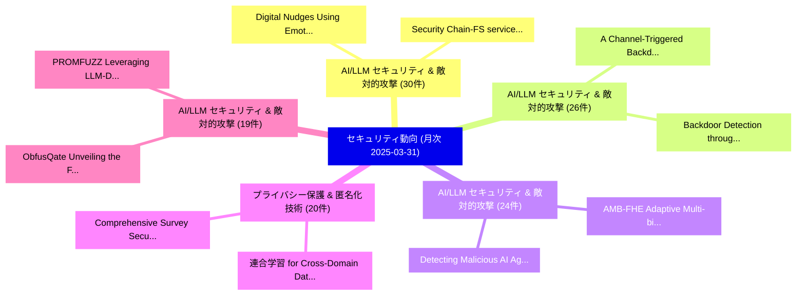

# 📊 03_monthly: 月次エグゼクティブサマリー報告書 (直近30日間: 2025-03-31)

**集計日時**: 2025-03-31 00:00:00 UTC  
**直近30日間の総論文数**: 562 件  

---

## 💡 マクロ脅威動向 & 戦略的リスク評価 (Strategic Executive Insights)

本日の収集論文（計 562 件）において、以下の重点セキュリティ領域で活発な研究動向が確認されました：
- **AI/LLM セキュリティ & 敵対的攻撃** (30 件): 注目論文として 「Digital Nudges Using Emotion R...」、「Security Chain-FS serviceの分析」 等が発表され、実務防御および攻撃検証の進展が見られます。
- **AI/LLM セキュリティ & 敵対的攻撃** (26 件): 注目論文として 「A Channel-Triggered Backdoor A...」、「Backdoor Detection through Rep...」 等が発表され、実務防御および攻撃検証の進展が見られます。
- **AI/LLM セキュリティ & 敵対的攻撃** (24 件): 注目論文として 「AMB-FHE: Adaptive Multi-biomet...」、「Detecting Malicious AI Agents ...」 等が発表され、実務防御および攻撃検証の進展が見られます。
- **プライバシー保護 & 匿名化技術** (20 件): 注目論文として 「連合学習 for Cross-Domain Data Pri...」、「Comprehensive Survey Security ...」 等が発表され、実務防御および攻撃検証の進展が見られます。
- **AI/LLM セキュリティ & 敵対的攻撃** (19 件): 注目論文として 「PROMFUZZ: Leveraging LLM-Drive...」、「ObfusQate: Unveiling the First...」 等が発表され、実務防御および攻撃検証の進展が見られます。

### 🗺️ 月次セキュリティ技術レーダー (Technology Radar)

---

## 📌 月次セキュリティ論文一覧 (日本語表形式)

| No | arXiv ID | 論文タイトル (日本語訳) | 重要キーワード | 構造化エグゼクティブ要約 (背景・提案・影響) | 脅威分類 | 詳細リンク |
|---|---|---|---|---|---|---|
| 1 | `2503.23718v2` | [PROMFUZZ: Leveraging LLM-Driven and Bug-Oriented Composite Analysis for Detecting Functional Bugs in Smart Contracts（セキュリティ分析論文）](../../okf/papers/2025-03-31/2503.23718.md) | `Detecting Functional Bugs`, `Smart Contracts`, `Bug-Oriented Composite` | 【提案】概要 (Overview & Key Finding) 本論文「PROMFUZZ: Leveraging LLM-Driven and Bug-Oriented Compos...。実証評価により経営層・セキュリティ管理者向け推奨アクション (E... | `cs.CR` | [arXiv](https://arxiv.org/abs/2503.23718v2) &#124; [OKF](../../okf/papers/2025-03-31/2503.23718.md) |
| 2 | `2503.23748v1` | [THEMIS: Practical Intellectual Property Protection for Post-Deployment On-Device Deep Learning Modelsに向けて](../../okf/papers/2025-03-31/2503.23748.md) | `Practical Intellectual Property Protection`, `Towards Practical Intellectual Property Protection`, `Device Deep Learning Models` | 【提案】概要 (Overview & Key Finding) 本論文「THEMIS: Practical Intellectual Property Protection for ...。実証評価により経営層・セキュリティ管理者向け推奨アクション (E... | `cs.CR` | [arXiv](https://arxiv.org/abs/2503.23748v1) &#124; [OKF](../../okf/papers/2025-03-31/2503.23748.md) |
| 3 | `2503.23785v2` | [ObfusQate: Unveiling the First Quantum Program Obfuscation Framework（セキュリティ分析論文）](../../okf/papers/2025-03-31/2503.23785.md) | `See Toh Zi Jie`, `Carmen Wong Jiawen`, `Nikhil Bartake` | 【提案】概要 (Overview & Key Finding) 本論文「ObfusQate: Unveiling the First 量子 Program Obfuscation F...。実証評価により経営層・セキュリティ管理者向け推奨アクション (E... | `cs.CR` | [arXiv](https://arxiv.org/abs/2503.23785v2) &#124; [OKF](../../okf/papers/2025-03-31/2503.23785.md) |
| 4 | `2503.23804v3` | [DrunkAgent: Stealthy Memory Corruption in LLM-Powered Recommender Agents（セキュリティ分析論文）](../../okf/papers/2025-03-31/2503.23804.md) | `Stealthy Memory Corruption`, `Powered Recommender Agents`, `LLM-Powered Recommender` | 【提案】概要 (Overview & Key Finding) 本論文「DrunkAgent: Stealthy Memory Corruption in LLM-Powered R...。実証評価により経営層・セキュリティ管理者向け推奨アクション (E... | `cs.CR` | [arXiv](https://arxiv.org/abs/2503.23804v3) &#124; [OKF](../../okf/papers/2025-03-31/2503.23804.md) |
| 5 | `2503.23866v3` | [A Channel-Triggered Backdoor Attack on Wireless Semantic Image Reconstruction（セキュリティ分析論文）](../../okf/papers/2025-03-31/2503.23866.md) | `Wireless Semantic Image Reconstruction`, `Triggered Backdoor Attack`, `Channel-Triggered Backdoor` | 【提案】概要 (Overview & Key Finding) 本論文「A Channel-Triggered Backdoor Attack on Wireless Semanti...。実証評価により経営層・セキュリティ管理者向け推奨アクション (E... | `cs.CR` | [arXiv](https://arxiv.org/abs/2503.23866v3) &#124; [OKF](../../okf/papers/2025-03-31/2503.23866.md) |
| 6 | `2503.23949v1` | [AMB-FHE: Adaptive Multi-biometric Fusion with Fully Homomorphic Encryption（セキュリティ分析論文）](../../okf/papers/2025-03-31/2503.23949.md) | `Fully Homomorphic Encryption`, `Adaptive Multi`, `Multi-biometric Fusion` | 【提案】概要 (Overview & Key Finding) 本論文「AMB-FHE: Adaptive Multi-biometric Fusion with Fully 準同型...。実証評価により経営層・セキュリティ管理者向け推奨アクション (E... | `cs.CR` | [arXiv](https://arxiv.org/abs/2503.23949v1) &#124; [OKF](../../okf/papers/2025-03-31/2503.23949.md) |
| 7 | `2503.23986v1` | [A Practical Rollup Escape Hatch Design（セキュリティ分析論文）](../../okf/papers/2025-03-31/2503.23986.md) | `Practical Rollup Escape Hatch Design`, `Francisco Gomes Figueira`, `Ching Lun Chiu` | 【提案】概要 (Overview & Key Finding) 本論文「A Practical Rollup Escape Hatch Design（セキュリティ分析論文）」（原題:...。実証評価により経営層・セキュリティ管理者向け推奨アクション (E... | `cs.CR` | [arXiv](https://arxiv.org/abs/2503.23986v1) &#124; [OKF](../../okf/papers/2025-03-31/2503.23986.md) |
| 8 | `2503.24037v1` | [Digital Nudges Using Emotion Regulation to Reduce Online Disinformation Sharing（セキュリティ分析論文）](../../okf/papers/2025-03-31/2503.24037.md) | `Digital Nudges Using Emotion Regulation`, `Reduce Online Disinformation Sharing`, `Haruka Nakajima Suzuki` | 【提案】概要 (Overview & Key Finding) 本論文「Digital Nudges Using Emotion Regulation to Reduce Onlin...。実証評価により経営層・セキュリティ管理者向け推奨アクション (E... | `cs.CR` | [arXiv](https://arxiv.org/abs/2503.24037v1) &#124; [OKF](../../okf/papers/2025-03-31/2503.24037.md) |
| 9 | `2503.24191v4` | [When Grammar Guides the Attack: Uncovering Control-Plane Vulnerabilities in LLMs with Structured Output（セキュリティ分析論文）](../../okf/papers/2025-03-31/2503.24191.md) | `Uncovering Control`, `Plane Vulnerabilities`, `Structured Output` | 【提案】概要 (Overview & Key Finding) 本論文「When Grammar Guides the Attack: Uncovering Control-Plan...。実証評価により経営層・セキュリティ管理者向け推奨アクション (E... | `cs.CR` | [arXiv](https://arxiv.org/abs/2503.24191v4) &#124; [OKF](../../okf/papers/2025-03-31/2503.24191.md) |
| 10 | `2504.00147v1` | [Universal Zero-shot Embedding Inversion（セキュリティ分析論文）](../../okf/papers/2025-03-31/2504.00147.md) | `Universal Zero`, `Embedding Inversion`, `Zero-shot Embedding` | 【提案】概要 (Overview & Key Finding) 本論文「Universal Zero-shot Embedding Inversion（セキュリティ分析論文）」（原題...。実証評価によりMorris, Vitaly Shmatikov ... | `cs.CR` | [arXiv](https://arxiv.org/abs/2504.00147v1) &#124; [OKF](../../okf/papers/2025-03-31/2504.00147.md) |
| 11 | `2504.00170v1` | [Backdoor Detection through Replicated Execution of Outsourced Training（セキュリティ分析論文）](../../okf/papers/2025-03-31/2504.00170.md) | `Backdoor Detection`, `Replicated Execution`, `Outsourced Training` | 【提案】概要 (Overview & Key Finding) 本論文「Backdoor Detection through Replicated Execution of Outs...。実証評価により経営層・セキュリティ管理者向け推奨アクション (E... | `cs.CR` | [arXiv](https://arxiv.org/abs/2504.00170v1) &#124; [OKF](../../okf/papers/2025-03-31/2504.00170.md) |
| 12 | `2504.00282v1` | [連合学習 for Cross-Domain Data Privacy: A Distributed Approach to Secure Collaboration](../../okf/papers/2025-03-31/2504.00282.md) | `Domain Data Privacy`, `Cross-Domain Data`, `Secure Collaboration` | 【提案】概要 (Overview & Key Finding) 本論文「連合学習 for Cross-Domain Data Privacy: A Distributed Appro...。実証評価により経営層・セキュリティ管理者向け推奨アクション (E... | `cs.CR` | [arXiv](https://arxiv.org/abs/2504.00282v1) &#124; [OKF](../../okf/papers/2025-03-31/2504.00282.md) |
| 13 | `2504.03726v1` | [Detecting Malicious AI Agents Through Simulated Interactions（セキュリティ分析論文）](../../okf/papers/2025-03-31/2504.03726.md) | `Detecting Malicious`, `Yulu Pi`, `Ella Bettison` | 【提案】概要 (Overview & Key Finding) 本論文「Detecting Malicious AI Agents Through Simulated Interac...。実証評価により経営層・セキュリティ管理者向け推奨アクション (E... | `cs.CR` | [arXiv](https://arxiv.org/abs/2504.03726v1) &#124; [OKF](../../okf/papers/2025-03-31/2504.03726.md) |
| 14 | `2504.03730v1` | [Safeguarding Smart Inhaler Devices and Patient Privacy in Respiratory Health Monitoring（セキュリティ分析論文）](../../okf/papers/2025-03-31/2504.03730.md) | `Safeguarding Smart Inhaler Devices`, `Respiratory Health Monitoring`, `Patient Privacy` | 【提案】概要 (Overview & Key Finding) 本論文「Safeguarding Smart Inhaler Devices and Patient Privacy ...。実証評価により経営層・セキュリティ管理者向け推奨アクション (E... | `cs.CR` | [arXiv](https://arxiv.org/abs/2504.03730v1) &#124; [OKF](../../okf/papers/2025-03-31/2504.03730.md) |
| 15 | `2503.23268v2` | [Multi-image quantum encryption scheme using blocks of bit planes and images（セキュリティ分析論文）](../../okf/papers/2025-03-30/2503.23268.md) | `Multi-image quantum`, `Claire Levaillant`, `Raw Meta` | 【提案】概要 (Overview & Key Finding) 本論文「Multi-image 量子 encryption scheme using blocks of bit pl...。実証評価により経営層・セキュリティ管理者向け推奨アクション (E... | `cs.CR` | [arXiv](https://arxiv.org/abs/2503.23268v2) &#124; [OKF](../../okf/papers/2025-03-30/2503.23268.md) |
| 16 | `2503.23277v1` | [Comprehensive Survey Security Authentication Methods for Satellite Communication Systemsに向けて](../../okf/papers/2025-03-30/2503.23277.md) | `Comprehensive Survey Security Authentication Methods`, `Security Authentication Methods`, `Satellite Communication Systems` | 【提案】概要 (Overview & Key Finding) 本論文「Comprehensive Survey Security Authentication Methods fo...。実証評価により経営層・セキュリティ管理者向け推奨アクション (E... | `cs.CR` | [arXiv](https://arxiv.org/abs/2503.23277v1) &#124; [OKF](../../okf/papers/2025-03-30/2503.23277.md) |
| 17 | `2503.23278v3` | [Model Context Protocol (MCP): Landscape, Security Threats, and Future Research Directions（セキュリティ分析論文）](../../okf/papers/2025-03-30/2503.23278.md) | `Model Context Protocol`, `Future Research Directions`, `Security Threats` | 【提案】概要 (Overview & Key Finding) 本論文「Model Context Protocol (MCP): Landscape, Security Threa...。実証評価により経営層・セキュリティ管理者向け推奨アクション (E... | `cs.CR` | [arXiv](https://arxiv.org/abs/2503.23278v3) &#124; [OKF](../../okf/papers/2025-03-30/2503.23278.md) |
| 18 | `2503.23292v1` | [FedCAPrivacy: Privacy-Preserving Heterogeneous 連合学習 with Anonymous Adaptive Clustering](../../okf/papers/2025-03-30/2503.23292.md) | `Anonymous Adaptive Clustering`, `Privacy-Preserving Heterogeneous`, `Preserving Heterogeneous Federated Learning` | 【提案】概要 (Overview & Key Finding) 本論文「FedCAPrivacy: Privacy-Preserving Heterogeneous 連合学習 wit...。実証評価により経営層・セキュリティ管理者向け推奨アクション (E... | `cs.CR` | [arXiv](https://arxiv.org/abs/2503.23292v1) &#124; [OKF](../../okf/papers/2025-03-30/2503.23292.md) |
| 19 | `2503.23414v1` | [From Content Creation to Citation Inflation: A GenAI Case Study（セキュリティ分析論文）](../../okf/papers/2025-03-30/2503.23414.md) | `Citation Inflation`, `Raw Meta`, `Executive Summary` | 【提案】概要 (Overview & Key Finding) 本論文「From Content Creation to Citation Inflation: A GenAI Ca...。実証評価によりMitchell - **公開日時**: `202... | `cs.CR` | [arXiv](https://arxiv.org/abs/2503.23414v1) &#124; [OKF](../../okf/papers/2025-03-30/2503.23414.md) |
| 20 | `2503.23424v1` | [What Makes an Evaluation Useful? Common Pitfalls and Best Practices（セキュリティ分析論文）](../../okf/papers/2025-03-30/2503.23424.md) | `Common Pitfalls`, `Best Practices`, `Gil Gekker` | 【提案】Common Pitfalls and Best Practices ### (日本語題名: What Makes an Evaluation Useful?。実証評価により経営層・セキュリティ管理者向け推奨アクション (Executive Re... | `cs.CR` | [arXiv](https://arxiv.org/abs/2503.23424v1) &#124; [OKF](../../okf/papers/2025-03-30/2503.23424.md) |
| 21 | `2503.23444v1` | [The Processing goes far beyond "the app" -- Privacy issues of decentralized Digital Contact Tracing using the example of the German Corona-Warn-App (CWA)（セキュリティ分析論文）](../../okf/papers/2025-03-30/2503.23444.md) | `Digital Contact Tracing`, `German Corona`, `Rainer Rehak` | 【提案】概要 (Overview & Key Finding) 本論文「The Processing goes far beyond "the app" -- Privacy iss...。実証評価により経営層・セキュリティ管理者向け推奨アクション (E... | `cs.CR` | [arXiv](https://arxiv.org/abs/2503.23444v1) &#124; [OKF](../../okf/papers/2025-03-30/2503.23444.md) |
| 22 | `2503.23510v1` | [Demystifying Private Transactions and Their Impact in PoW and PoS Ethereum（セキュリティ分析論文）](../../okf/papers/2025-03-30/2503.23510.md) | `Demystifying Private Transactions`, `Xingyu Lyu`, `Mengya Zhang` | 【提案】概要 (Overview & Key Finding) 本論文「Demystifying Private Transactions and Their Impact in P...。実証評価により経営層・セキュリティ管理者向け推奨アクション (E... | `cs.CR` | [arXiv](https://arxiv.org/abs/2503.23510v1) &#124; [OKF](../../okf/papers/2025-03-30/2503.23510.md) |
| 23 | `2503.23511v1` | [Buffer is All You Need: Defending 連合学習 against Backdoor Attacks under Non-iids via Buffering](../../okf/papers/2025-03-30/2503.23511.md) | `Backdoor Attacks`, `Non-iids via`, `Defending Federated Learning` | 【提案】概要 (Overview & Key Finding) 本論文「Buffer is All You Need: Defending 連合学習 against Backdoor...。実証評価により経営層・セキュリティ管理者向け推奨アクション (E... | `cs.CR` | [arXiv](https://arxiv.org/abs/2503.23511v1) &#124; [OKF](../../okf/papers/2025-03-30/2503.23511.md) |
| 24 | `2503.23533v1` | [To See or Not to See: A Privacy Threat Model for Digital Forensics in Crime Investigation（セキュリティ分析論文）](../../okf/papers/2025-03-30/2503.23533.md) | `Privacy Threat Model`, `Digital Forensics`, `Crime Investigation` | 【提案】背景とセキュリティ上の課題 (Background & Problem) 本研究はサイバー脅威環境におけるセキュリティ構造・脆弱性の検証を目的としています。(主要検出項目: ...。実証評価により経営層・セキュリティ管理者向け推奨アクション (E... | `cs.CR` | [arXiv](https://arxiv.org/abs/2503.23533v1) &#124; [OKF](../../okf/papers/2025-03-30/2503.23533.md) |
| 25 | `2503.23627v1` | [Security Chain-FS serviceの分析](../../okf/papers/2025-03-30/2503.23627.md) | `Security Chain`, `Chain-FS service`, `Vanessa Teague` | 【提案】概要 (Overview & Key Finding) 本論文「Security Chain-FS serviceの分析」（原題: Security Analysis of ...。実証評価により経営層・セキュリティ管理者向け推奨アクション (E... | `cs.CR` | [arXiv](https://arxiv.org/abs/2503.23627v1) &#124; [OKF](../../okf/papers/2025-03-30/2503.23627.md) |
| 26 | `2504.00035v4` | [Protecting Creative Writing Copyright against AI Imitation via Implicit Watermarking（セキュリティ分析論文）](../../okf/papers/2025-03-30/2504.00035.md) | `Protecting Creative Writing Copyright`, `Implicit Watermarking`, `Ziwei Zhang` | 【提案】概要 (Overview & Key Finding) 本論文「Protecting Creative Writing Copyright against AI Imitat...。実証評価により経営層・セキュリティ管理者向け推奨アクション (E... | `cs.CR` | [arXiv](https://arxiv.org/abs/2504.00035v4) &#124; [OKF](../../okf/papers/2025-03-30/2504.00035.md) |
| 27 | `2504.00041v2` | [Imbalanced malware classification: an approach based on dynamic classifier selection（セキュリティ分析論文）](../../okf/papers/2025-03-30/2504.00041.md) | `Raw Meta`, `Executive Summary`, `Key Finding` | 【提案】概要 (Overview & Key Finding) 本論文「Imbalanced マルウェア classification: an approach based on d...。実証評価により経営層・セキュリティ管理者向け推奨アクション (E... | `cs.CR` | [arXiv](https://arxiv.org/abs/2504.00041v2) &#124; [OKF](../../okf/papers/2025-03-30/2504.00041.md) |
| 28 | `2503.22935v4` | [SPFinder: Improving the Context Length and Scalability for Tracing Known Vulnerability Patches（セキュリティ分析論文）](../../okf/papers/2025-03-29/2503.22935.md) | `Tracing Known Vulnerability Patches`, `Context Length`, `Tracing Known Vulnerability` | 【提案】概要 (Overview & Key Finding) 本論文「SPFinder: Improving the Context Length and Scalability ...。実証評価により経営層・セキュリティ管理者向け推奨アクション (E... | `cs.CR` | [arXiv](https://arxiv.org/abs/2503.22935v4) &#124; [OKF](../../okf/papers/2025-03-29/2503.22935.md) |
| 29 | `2503.22988v2` | [DC-SGD: Differentially Private SGD with Dynamic Clipping through Gradient Norm Distribution Estimation（セキュリティ分析論文）](../../okf/papers/2025-03-29/2503.22988.md) | `Gradient Norm Distribution Estimation`, `Differentially Private`, `Dynamic Clipping` | 【提案】概要 (Overview & Key Finding) 本論文「DC-SGD: Differentially Private SGD with Dynamic Clippin...。実証評価により経営層・セキュリティ管理者向け推奨アクション (E... | `cs.CR` | [arXiv](https://arxiv.org/abs/2503.22988v2) &#124; [OKF](../../okf/papers/2025-03-29/2503.22988.md) |
| 30 | `2503.22998v3` | [AuditVotes: Elevating Provable Defense for GNNs with Efficient Augmentation and Conditional Smoothing（セキュリティ分析論文）](../../okf/papers/2025-03-29/2503.22998.md) | `Elevating Provable Defense`, `Efficient Augmentation`, `Conditional Smoothing` | 【提案】概要 (Overview & Key Finding) 本論文「AuditVotes: Elevating Provable Defense for GNNs with Ef...。実証評価により経営層・セキュリティ管理者向け推奨アクション (E... | `cs.CR` | [arXiv](https://arxiv.org/abs/2503.22998v3) &#124; [OKF](../../okf/papers/2025-03-29/2503.22998.md) |
| 31 | `2503.23138v1` | [EncGPT: A Multi-Agent Workflow for Dynamic Encryption Algorithms（セキュリティ分析論文）](../../okf/papers/2025-03-29/2503.23138.md) | `Dynamic Encryption Algorithms`, `Agent Workflow`, `Multi-Agent Workflow` | 【提案】概要 (Overview & Key Finding) 本論文「EncGPT: A Multi-Agent Workflow for Dynamic Encryption A...。実証評価により経営層・セキュリティ管理者向け推奨アクション (E... | `cs.CR` | [arXiv](https://arxiv.org/abs/2503.23138v1) &#124; [OKF](../../okf/papers/2025-03-29/2503.23138.md) |
| 32 | `2503.23175v4` | [大規模言語モデル Are Unreliable for Cyber Threat Intelligence](../../okf/papers/2025-03-29/2503.23175.md) | `Cyber Threat Intelligence`, `Emanuele Mezzi`, `Fabio Massacci` | 【提案】概要 (Overview & Key Finding) 本論文「大規模言語モデル Are Unreliable for Cyber 脅威 Intelligence」（原題: ...。実証評価により経営層・セキュリティ管理者向け推奨アクション (E... | `cs.CR` | [arXiv](https://arxiv.org/abs/2503.23175v4) &#124; [OKF](../../okf/papers/2025-03-29/2503.23175.md) |
| 33 | `2503.23238v1` | [Wagner's Algorithm Provably Runs in Subexponential Time for SIS$^\infty$（セキュリティ分析論文）](../../okf/papers/2025-03-29/2503.23238.md) | `Algorithm Provably Runs`, `Subexponential Time`, `Lynn Engelberts` | 【提案】概要 (Overview & Key Finding) 本論文「Wagner's Algorithm Provably Runs in Subexponential Time...。実証評価により経営層・セキュリティ管理者向け推奨アクション (E... | `cs.CR` | [arXiv](https://arxiv.org/abs/2503.23238v1) &#124; [OKF](../../okf/papers/2025-03-29/2503.23238.md) |
| 34 | `2503.23250v1` | [Encrypted Prompt: LLM Applications Against Unauthorized Actionsのセキュリティ強化](../../okf/papers/2025-03-29/2503.23250.md) | `Encrypted Prompt`, `Han Chan`, `Raw Meta` | 【提案】概要 (Overview & Key Finding) 本論文「Encrypted Prompt: LLM Applications Against Unauthorized...。実証評価により経営層・セキュリティ管理者向け推奨アクション (E... | `cs.CR` | [arXiv](https://arxiv.org/abs/2503.23250v1) &#124; [OKF](../../okf/papers/2025-03-29/2503.23250.md) |
| 35 | `2504.00031v1` | [Leaking LoRa: An Evaluation of Password Leaks and Knowledge Storage in 大規模言語モデル](../../okf/papers/2025-03-29/2504.00031.md) | `Password Leaks`, `Knowledge Storage`, `Large Language Models` | 【提案】概要 (Overview & Key Finding) 本論文「Leaking LoRa: An Evaluation of Password Leaks and Knowl...。実証評価により経営層・セキュリティ管理者向け推奨アクション (E... | `cs.CR` | [arXiv](https://arxiv.org/abs/2504.00031v1) &#124; [OKF](../../okf/papers/2025-03-29/2504.00031.md) |
| 36 | `2503.22065v1` | [Federated Intrusion Detection System Based on Unsupervised Machine Learning（セキュリティ分析論文）](../../okf/papers/2025-03-28/2503.22065.md) | `Federated Intrusion Detection System Based`, `Unsupervised Machine Learning`, `Rim Ben Salem` | 【提案】概要 (Overview & Key Finding) 本論文「Federated Intrusion Detection System Based on Unsupervi...。実証評価により経営層・セキュリティ管理者向け推奨アクション (E... | `cs.CR` | [arXiv](https://arxiv.org/abs/2503.22065v1) &#124; [OKF](../../okf/papers/2025-03-28/2503.22065.md) |
| 37 | `2503.22156v1` | [SoK: Security Blockchain-based Cryptocurrencyの分析](../../okf/papers/2025-03-28/2503.22156.md) | `Security Blockchain`, `Blockchain-based Cryptocurrency`, `Zekai Liu` | 【提案】概要 (Overview & Key Finding) 本論文「SoK: Security Blockchain-based Cryptocurrencyの分析」（原題: S...。実証評価により経営層・セキュリティ管理者向け推奨アクション (E... | `cs.CR` | [arXiv](https://arxiv.org/abs/2503.22156v1) &#124; [OKF](../../okf/papers/2025-03-28/2503.22156.md) |
| 38 | `2503.22161v4` | [AI-based Traffic Modeling for Network Security and Privacy: Challenges Ahead（セキュリティ分析論文）](../../okf/papers/2025-03-28/2503.22161.md) | `Traffic Modeling`, `Network Security`, `Challenges Ahead` | 【提案】概要 (Overview & Key Finding) 本論文「AI-based Traffic Modeling for Network Security and Priv...。実証評価により経営層・セキュリティ管理者向け推奨アクション (E... | `cs.CR` | [arXiv](https://arxiv.org/abs/2503.22161v4) &#124; [OKF](../../okf/papers/2025-03-28/2503.22161.md) |
| 39 | `2503.22227v1` | [CAT: A GPU-Accelerated FHE Framework with Its Application to High-Precision Private Dataset Query（セキュリティ分析論文）](../../okf/papers/2025-03-28/2503.22227.md) | `Precision Private Dataset Query`, `GPU-Accelerated FHE`, `High-Precision Private` | 【提案】概要 (Overview & Key Finding) 本論文「CAT: A GPU-Accelerated FHE Framework with Its Applicati...。実証評価により経営層・セキュリティ管理者向け推奨アクション (E... | `cs.CR` | [arXiv](https://arxiv.org/abs/2503.22227v1) &#124; [OKF](../../okf/papers/2025-03-28/2503.22227.md) |
| 40 | `2503.22232v2` | [Privacy-Preserving Secure Neighbor Discovery for Wireless Networks（セキュリティ分析論文）](../../okf/papers/2025-03-28/2503.22232.md) | `Preserving Secure Neighbor Discovery`, `Wireless Networks`, `Privacy-Preserving Secure` | 【提案】概要 (Overview & Key Finding) 本論文「Privacy-Preserving Secure Neighbor Discovery for Wirele...。実証評価により経営層・セキュリティ管理者向け推奨アクション (E... | `cs.CR` | [arXiv](https://arxiv.org/abs/2503.22232v2) &#124; [OKF](../../okf/papers/2025-03-28/2503.22232.md) |
| 41 | `2503.22330v3` | [WMCopier: Forging Invisible Image Watermarks on Arbitrary Images（セキュリティ分析論文）](../../okf/papers/2025-03-28/2503.22330.md) | `Forging Invisible Image Watermarks`, `Arbitrary Images`, `Ziping Dong` | 【提案】概要 (Overview & Key Finding) 本論文「WMCopier: Forging Invisible Image Watermarks on Arbitra...。実証評価により経営層・セキュリティ管理者向け推奨アクション (E... | `cs.CR` | [arXiv](https://arxiv.org/abs/2503.22330v3) &#124; [OKF](../../okf/papers/2025-03-28/2503.22330.md) |
| 42 | `2503.22379v1` | [Spend Your Budget Wisely: an Intelligent Distribution of the Privacy Budget in Differentially Private Text Rewritingに向けて](../../okf/papers/2025-03-28/2503.22379.md) | `Intelligent Distribution`, `Privacy Budget`, `Differentially Private Text Rewriting` | 【提案】概要 (Overview & Key Finding) 本論文「Spend Your Budget Wisely: an Intelligent Distribution o...。実証評価により経営層・セキュリティ管理者向け推奨アクション (E... | `cs.CR` | [arXiv](https://arxiv.org/abs/2503.22379v1) &#124; [OKF](../../okf/papers/2025-03-28/2503.22379.md) |
| 43 | `2503.22406v1` | [Training 大規模言語モデル for Advanced Typosquatting Detection](../../okf/papers/2025-03-28/2503.22406.md) | `Advanced Typosquatting Detection`, `Training Large Language Models`, `Jackson Welch` | 【提案】概要 (Overview & Key Finding) 本論文「Training 大規模言語モデル for Advanced Typosquatting Detection」...。実証評価により経営層・セキュリティ管理者向け推奨アクション (E... | `cs.CR` | [arXiv](https://arxiv.org/abs/2503.22406v1) &#124; [OKF](../../okf/papers/2025-03-28/2503.22406.md) |
| 44 | `2503.22413v2` | [Instance-Level Data-Use Auditing of Visual ML Models（セキュリティ分析論文）](../../okf/papers/2025-03-28/2503.22413.md) | `Level Data`, `Use Auditing`, `Instance-Level Data` | 【提案】概要 (Overview & Key Finding) 本論文「Instance-Level Data-Use Auditing of Visual ML Models（セキ...。実証評価によりReiter - **公開日時**: `2025-... | `cs.CR` | [arXiv](https://arxiv.org/abs/2503.22413v2) &#124; [OKF](../../okf/papers/2025-03-28/2503.22413.md) |
| 45 | `2503.22503v1` | [Cross-Technology Generalization in Synthesized Speech Detection: Evaluating AST Models with Modern Voice Generators（セキュリティ分析論文）](../../okf/papers/2025-03-28/2503.22503.md) | `Synthesized Speech Detection`, `Modern Voice Generators`, `Technology Generalization` | 【提案】概要 (Overview & Key Finding) 本論文「Cross-Technology Generalization in Synthesized Speech D...。実証評価により経営層・セキュリティ管理者向け推奨アクション (E... | `cs.CR` | [arXiv](https://arxiv.org/abs/2503.22503v1) &#124; [OKF](../../okf/papers/2025-03-28/2503.22503.md) |
| 46 | `2503.22573v1` | [A Framework for Cryptographic Verifiability of End-to-End AI Pipelines（セキュリティ分析論文）](../../okf/papers/2025-03-28/2503.22573.md) | `Cryptographic Verifiability`, `Kar Balan`, `Robert Learney` | 【提案】概要 (Overview & Key Finding) 本論文「A Framework for Cryptographic Verifiability of End-to-E...。実証評価により経営層・セキュリティ管理者向け推奨アクション (E... | `cs.CR` | [arXiv](https://arxiv.org/abs/2503.22573v1) &#124; [OKF](../../okf/papers/2025-03-28/2503.22573.md) |
| 47 | `2503.22612v1` | [Advancing DevSecOps in SMEs: Challenges and Best Practices for Secure CI/CD Pipelines（セキュリティ分析論文）](../../okf/papers/2025-03-28/2503.22612.md) | `Best Practices`, `Khandaker Mamun Ahmed`, `Jayaprakashreddy Cheenepalli` | 【提案】概要 (Overview & Key Finding) 本論文「Advancing DevSecOps in SMEs: Challenges and Best Practi...。実証評価により経営層・セキュリティ管理者向け推奨アクション (E... | `cs.CR` | [arXiv](https://arxiv.org/abs/2503.22612v1) &#124; [OKF](../../okf/papers/2025-03-28/2503.22612.md) |
| 48 | `2504.16091v1` | [Post-Quantum Homomorphic Encryption: A Case for Code-Based Alternatives（セキュリティ分析論文）](../../okf/papers/2025-03-28/2504.16091.md) | `Quantum Homomorphic Encryption`, `Based Alternatives`, `Post-Quantum Homomorphic` | 【提案】概要 (Overview & Key Finding) 本論文「Post-量子 準同型暗号: A Case for Code-Based Alternatives（セキュリテ...。実証評価により経営層・セキュリティ管理者向け推奨アクション (E... | `cs.CR` | [arXiv](https://arxiv.org/abs/2504.16091v1) &#124; [OKF](../../okf/papers/2025-03-28/2504.16091.md) |
| 49 | `2503.21071v2` | [Purifying Approximate Differential Privacy with Randomized Post-processing（セキュリティ分析論文）](../../okf/papers/2025-03-27/2503.21071.md) | `Purifying Approximate Differential Privacy`, `Randomized Post`, `Yingyu Lin` | 【提案】概要 (Overview & Key Finding) 本論文「Purifying Approximate 差分プライバシー with Randomized Post-pro...。実証評価により経営層・セキュリティ管理者向け推奨アクション (E... | `cs.CR` | [arXiv](https://arxiv.org/abs/2503.21071v2) &#124; [OKF](../../okf/papers/2025-03-27/2503.21071.md) |
| 50 | `2503.21126v2` | [Bandwidth-Efficient Two-Server ORAMs with O(1) Client Storage（セキュリティ分析論文）](../../okf/papers/2025-03-27/2503.21126.md) | `Efficient Two`, `Client Storage`, `Bandwidth-Efficient Two` | 【提案】概要 (Overview & Key Finding) 本論文「Bandwidth-Efficient Two-Server ORAMs with O(1) Client S...。実証評価により経営層・セキュリティ管理者向け推奨アクション (E... | `cs.CR` | [arXiv](https://arxiv.org/abs/2503.21126v2) &#124; [OKF](../../okf/papers/2025-03-27/2503.21126.md) |
| 51 | `2503.21145v1` | [How to Secure Existing C and C++ Software without Memory Safety（セキュリティ分析論文）](../../okf/papers/2025-03-27/2503.21145.md) | `Secure Existing`, `Memory Safety`, `Raw Meta` | 【提案】背景とセキュリティ上の課題 (Background & Problem) 本研究はサイバー脅威環境におけるセキュリティ構造・脆弱性の検証を目的としています。(主要検出項目: ...。実証評価により経営層・セキュリティ管理者向け推奨アクション (E... | `cs.CR` | [arXiv](https://arxiv.org/abs/2503.21145v1) &#124; [OKF](../../okf/papers/2025-03-27/2503.21145.md) |
| 52 | `2503.21279v3` | [Asynchronous BFT Consensus Made Wireless（セキュリティ分析論文）](../../okf/papers/2025-03-27/2503.21279.md) | `Consensus Made Wireless`, `Shuo Liu`, `Minghui Xu` | 【提案】概要 (Overview & Key Finding) 本論文「Asynchronous BFT Consensus Made Wireless（セキュリティ分析論文）」（原...。実証評価により経営層・セキュリティ管理者向け推奨アクション (E... | `cs.CR` | [arXiv](https://arxiv.org/abs/2503.21279v3) &#124; [OKF](../../okf/papers/2025-03-27/2503.21279.md) |
| 53 | `2503.21305v1` | [DeBackdoor: A Deductive Framework for Detecting Backdoor Attacks on Deep Models with Limited Data（セキュリティ分析論文）](../../okf/papers/2025-03-27/2503.21305.md) | `Detecting Backdoor Attacks`, `Deep Models`, `Limited Data` | 【提案】概要 (Overview & Key Finding) 本論文「DeBackdoor: A Deductive Framework for Detecting Backdoo...。実証評価により経営層・セキュリティ管理者向け推奨アクション (E... | `cs.CR` | [arXiv](https://arxiv.org/abs/2503.21305v1) &#124; [OKF](../../okf/papers/2025-03-27/2503.21305.md) |
| 54 | `2503.21315v1` | [Tricking Retrievers with Influential Tokens: An Efficient Black-Box Corpus Poisoning Attack（セキュリティ分析論文）](../../okf/papers/2025-03-27/2503.21315.md) | `Box Corpus Poisoning Attack`, `Tricking Retrievers`, `Influential Tokens` | 【提案】概要 (Overview & Key Finding) 本論文「Tricking Retrievers with Influential Tokens: An Efficie...。実証評価により経営層・セキュリティ管理者向け推奨アクション (E... | `cs.CR` | [arXiv](https://arxiv.org/abs/2503.21315v1) &#124; [OKF](../../okf/papers/2025-03-27/2503.21315.md) |
| 55 | `2503.21400v2` | [Lattice Based Crypto breaks in a Superposition of Spacetimes（セキュリティ分析論文）](../../okf/papers/2025-03-27/2503.21400.md) | `Lattice Based Crypto`, `Divesh Aggarwal`, `Shashwat Agrawal` | 【提案】概要 (Overview & Key Finding) 本論文「Lattice Based Crypto breaks in a Superposition of Space...。実証評価により経営層・セキュリティ管理者向け推奨アクション (E... | `cs.CR` | [arXiv](https://arxiv.org/abs/2503.21400v2) &#124; [OKF](../../okf/papers/2025-03-27/2503.21400.md) |
| 56 | `2503.21426v1` | [AdvSGM: Differentially Private Graph Learning via Adversarial Skip-gram Model（セキュリティ分析論文）](../../okf/papers/2025-03-27/2503.21426.md) | `Differentially Private Graph Learning`, `Adversarial Skip`, `Skip-gram Model` | 【提案】概要 (Overview & Key Finding) 本論文「AdvSGM: Differentially Private Graph Learning via Adver...。実証評価により経営層・セキュリティ管理者向け推奨アクション (E... | `cs.CR` | [arXiv](https://arxiv.org/abs/2503.21426v1) &#124; [OKF](../../okf/papers/2025-03-27/2503.21426.md) |
| 57 | `2503.21440v1` | [On the Maiorana-McFarland Class Extensions（セキュリティ分析論文）](../../okf/papers/2025-03-27/2503.21440.md) | `Class Extensions`, `Maiorana-McFarland Class`, `Nikolay Kolomeec` | 【提案】概要 (Overview & Key Finding) 本論文「On the Maiorana-McFarland Class Extensions（セキュリティ分析論文）」...。実証評価により経営層・セキュリティ管理者向け推奨アクション (E... | `cs.CR` | [arXiv](https://arxiv.org/abs/2503.21440v1) &#124; [OKF](../../okf/papers/2025-03-27/2503.21440.md) |
| 58 | `2503.21463v1` | [Unveiling Latent Information in Transaction Hashes: Hypergraph Learning for Ethereum Ponzi Scheme Detection（セキュリティ分析論文）](../../okf/papers/2025-03-27/2503.21463.md) | `Ethereum Ponzi Scheme Detection`, `Unveiling Latent Information`, `Transaction Hashes` | 【提案】概要 (Overview & Key Finding) 本論文「Unveiling Latent Information in Transaction Hashes: Hyp...。実証評価により経営層・セキュリティ管理者向け推奨アクション (E... | `cs.CR` | [arXiv](https://arxiv.org/abs/2503.21463v1) &#124; [OKF](../../okf/papers/2025-03-27/2503.21463.md) |
| 59 | `2503.21496v1` | [Advancing CAN Network Security through RBM-Based Synthetic Attack Data Generation for Intrusion Detection Systems（セキュリティ分析論文）](../../okf/papers/2025-03-27/2503.21496.md) | `Based Synthetic Attack Data Generation`, `Intrusion Detection Systems`, `Network Security` | 【提案】概要 (Overview & Key Finding) 本論文「Advancing CAN Network Security through RBM-Based Synthe...。実証評価により経営層・セキュリティ管理者向け推奨アクション (E... | `cs.CR` | [arXiv](https://arxiv.org/abs/2503.21496v1) &#124; [OKF](../../okf/papers/2025-03-27/2503.21496.md) |
| 60 | `2503.21528v1` | [Bayesian Pseudo Posterior Mechanism for Differentially Private Machine Learning（セキュリティ分析論文）](../../okf/papers/2025-03-27/2503.21528.md) | `Bayesian Pseudo Posterior Mechanism`, `Differentially Private Machine Learning`, `Bayesian Pseudo Poster` | 【提案】概要 (Overview & Key Finding) 本論文「Bayesian Pseudo Posterior Mechanism for Differentially ...。実証評価により経営層・セキュリティ管理者向け推奨アクション (E... | `cs.CR` | [arXiv](https://arxiv.org/abs/2503.21528v1) &#124; [OKF](../../okf/papers/2025-03-27/2503.21528.md) |
| 61 | `2503.21535v2` | [Computing Isomorphisms between Products of Supersingular Elliptic Curves（セキュリティ分析論文）](../../okf/papers/2025-03-27/2503.21535.md) | `Supersingular Elliptic Curves`, `Computing Isomorphisms`, `Pierrick Gaudry` | 【提案】概要 (Overview & Key Finding) 本論文「Computing Isomorphisms between Products of Supersingula...。実証評価により経営層・セキュリティ管理者向け推奨アクション (E... | `cs.CR` | [arXiv](https://arxiv.org/abs/2503.21535v2) &#124; [OKF](../../okf/papers/2025-03-27/2503.21535.md) |
| 62 | `2503.21598v1` | [Prompt, Divide, and Conquer: Bypassing Large Language Model Safety Filters via Segmented and Distributed Prompt Processing（セキュリティ分析論文）](../../okf/papers/2025-03-27/2503.21598.md) | `Bypassing Large Language Model Safety Filters`, `Distributed Prompt Processing`, `Ahmed Hussain` | 【提案】概要 (Overview & Key Finding) 本論文「Prompt, Divide, and Conquer: Bypassing Large Language M...。実証評価により経営層・セキュリティ管理者向け推奨アクション (E... | `cs.CR` | [arXiv](https://arxiv.org/abs/2503.21598v1) &#124; [OKF](../../okf/papers/2025-03-27/2503.21598.md) |
| 63 | `2503.21674v1` | [Intelligent IoT Attack Detection Design via ODLLM with Feature Ranking-based Knowledge Base（セキュリティ分析論文）](../../okf/papers/2025-03-27/2503.21674.md) | `Attack Detection Design`, `Feature Ranking`, `Knowledge Base` | 【提案】概要 (Overview & Key Finding) 本論文「Intelligent IoT Attack Detection Design via ODLLM with ...。実証評価により経営層・セキュリティ管理者向け推奨アクション (E... | `cs.CR` | [arXiv](https://arxiv.org/abs/2503.21674v1) &#124; [OKF](../../okf/papers/2025-03-27/2503.21674.md) |
| 64 | `2503.21705v1` | [SoK: Reproducibility for Software Packages in Scripting Language Ecosystemsに向けて](../../okf/papers/2025-03-27/2503.21705.md) | `Software Packages`, `Scripting Language Ecosystems`, `Towards Reproducibility` | 【提案】概要 (Overview & Key Finding) 本論文「SoK: Reproducibility for Software Packages in Scripting...。実証評価により経営層・セキュリティ管理者向け推奨アクション (E... | `cs.CR` | [arXiv](https://arxiv.org/abs/2503.21705v1) &#124; [OKF](../../okf/papers/2025-03-27/2503.21705.md) |
| 65 | `2503.21891v1` | [Poster Abstract: Time Attacks using Kernel Vulnerabilities（セキュリティ分析論文）](../../okf/papers/2025-03-27/2503.21891.md) | `Poster Abstract`, `Time Attacks`, `Kernel Vulnerabilities` | 【提案】概要 (Overview & Key Finding) 本論文「Poster Abstract: Time Attacks using Kernel Vulnerabilit...。実証評価により経営層・セキュリティ管理者向け推奨アクション (E... | `cs.CR` | [arXiv](https://arxiv.org/abs/2503.21891v1) &#124; [OKF](../../okf/papers/2025-03-27/2503.21891.md) |
| 66 | `2503.22010v1` | [Privacy-Preserving Revocation of Verifiable Credentials with Time-Flexibilityに向けて](../../okf/papers/2025-03-27/2503.22010.md) | `Preserving Revocation`, `Verifiable Credentials`, `Privacy-Preserving Revocation` | 【提案】概要 (Overview & Key Finding) 本論文「Privacy-Preserving Revocation of Verifiable Credentials...。実証評価により経営層・セキュリティ管理者向け推奨アクション (E... | `cs.CR` | [arXiv](https://arxiv.org/abs/2503.22010v1) &#124; [OKF](../../okf/papers/2025-03-27/2503.22010.md) |
| 67 | `2503.22016v2` | [Information Theoretic One-Time Programs from Geometrically Local $	ext{QNC}_0$ Adversaries（セキュリティ分析論文）](../../okf/papers/2025-03-27/2503.22016.md) | `Information Theoretic One`, `Time Programs`, `Geometrically Local` | 【提案】概要 (Overview & Key Finding) 本論文「Information Theoretic One-Time Programs from Geometrica...。実証評価により経営層・セキュリティ管理者向け推奨アクション (E... | `cs.CR` | [arXiv](https://arxiv.org/abs/2503.22016v2) &#124; [OKF](../../okf/papers/2025-03-27/2503.22016.md) |
| 68 | `2503.22755v2` | [Reasoning Under Threat: Symbolic and Neural Techniques for サイバーセキュリティ Verification](../../okf/papers/2025-03-27/2503.22755.md) | `Neural Techniques`, `Cybersecurity Verification`, `Sarah Veronica` | 【提案】概要 (Overview & Key Finding) 本論文「Reasoning Under 脅威: Symbolic and Neural Techniques for ...。実証評価により経営層・セキュリティ管理者向け推奨アクション (E... | `cs.CR` | [arXiv](https://arxiv.org/abs/2503.22755v2) &#124; [OKF](../../okf/papers/2025-03-27/2503.22755.md) |
| 69 | `2503.22759v1` | [Data Poisoning in Deep Learning: A Survey（セキュリティ分析論文）](../../okf/papers/2025-03-27/2503.22759.md) | `Data Poisoning`, `Deep Learning`, `Pinlong Zhao` | 【提案】概要 (Overview & Key Finding) 本論文「Data Poisoning in Deep Learning: A Survey（セキュリティ分析論文）」（...。実証評価により経営層・セキュリティ管理者向け推奨アクション (E... | `cs.CR` | [arXiv](https://arxiv.org/abs/2503.22759v1) &#124; [OKF](../../okf/papers/2025-03-27/2503.22759.md) |
| 70 | `2503.22760v1` | [Malicious and Unintentional Disclosure Risks in 大規模言語モデル for Code Generation](../../okf/papers/2025-03-27/2503.22760.md) | `Unintentional Disclosure Risks`, `Code Generation`, `Large Language Models` | 【提案】概要 (Overview & Key Finding) 本論文「Malicious and Unintentional Disclosure Risks in 大規模言語モデ...。実証評価により経営層・セキュリティ管理者向け推奨アクション (E... | `cs.CR` | [arXiv](https://arxiv.org/abs/2503.22760v1) &#124; [OKF](../../okf/papers/2025-03-27/2503.22760.md) |
| 71 | `2503.22765v1` | [Non-control-Data Attacks and Defenses: A review（セキュリティ分析論文）](../../okf/papers/2025-03-27/2503.22765.md) | `Data Attacks`, `Lei Chong`, `Raw Meta` | 【提案】概要 (Overview & Key Finding) 本論文「Non-control-Data Attacks and Defenses: A review（セキュリティ分...。実証評価により経営層・セキュリティ管理者向け推奨アクション (E... | `cs.CR` | [arXiv](https://arxiv.org/abs/2503.22765v1) &#124; [OKF](../../okf/papers/2025-03-27/2503.22765.md) |
| 72 | `2504.00018v1` | [SandboxEval: Securing Test Environment for Untrusted Codeに向けて](../../okf/papers/2025-03-27/2504.00018.md) | `Towards Securing Test Environment`, `Securing Test Environment`, `Untrusted Code` | 【提案】概要 (Overview & Key Finding) 本論文「SandboxEval: Securing Test Environment for Untrusted Co...。実証評価により経営層・セキュリティ管理者向け推奨アクション (E... | `cs.CR` | [arXiv](https://arxiv.org/abs/2504.00018v1) &#124; [OKF](../../okf/papers/2025-03-27/2504.00018.md) |
| 73 | `2504.08751v1` | [Research on the Design of a Short Video Recommendation System Based on Multimodal Information and Differential Privacy（セキュリティ分析論文）](../../okf/papers/2025-03-27/2504.08751.md) | `Short Video Recommendation System Based`, `Multimodal Information`, `Differential Privacy` | 【提案】概要 (Overview & Key Finding) 本論文「Research on the Design of a Short Video Recommendation ...。実証評価により経営層・セキュリティ管理者向け推奨アクション (E... | `cs.CR` | [arXiv](https://arxiv.org/abs/2504.08751v1) &#124; [OKF](../../okf/papers/2025-03-27/2504.08751.md) |
| 74 | `2503.20244v1` | [Software Vulnerability Analysis Across Programming Language and Program Representation Landscapes: A Survey（セキュリティ分析論文）](../../okf/papers/2025-03-26/2503.20244.md) | `Program Representation Landscapes`, `Zhuoyun Qian`, `Fangtian Zhong` | 【提案】概要 (Overview & Key Finding) 本論文「Software 脆弱性 Analysis Across Programming Language and P...。実証評価により経営層・セキュリティ管理者向け推奨アクション (E... | `cs.CR` | [arXiv](https://arxiv.org/abs/2503.20244v1) &#124; [OKF](../../okf/papers/2025-03-26/2503.20244.md) |
| 75 | `2503.20247v1` | [A Blockchain-based Quantum Binary Voting for Decentralized IoT Industry 5.0に向けて](../../okf/papers/2025-03-26/2503.20247.md) | `Quantum Binary Voting`, `Blockchain-based Quantum`, `Towards Industry` | 【提案】概要 (Overview & Key Finding) 本論文「A Blockchain-based 量子 Binary Voting for Decentralized I...。実証評価により経営層・セキュリティ管理者向け推奨アクション (E... | `cs.CR` | [arXiv](https://arxiv.org/abs/2503.20247v1) &#124; [OKF](../../okf/papers/2025-03-26/2503.20247.md) |
| 76 | `2503.20257v2` | [How Secure is Forgetting? Linking Machine Unlearning to Machine Learning Attacks（セキュリティ分析論文）](../../okf/papers/2025-03-26/2503.20257.md) | `Linking Machine Unlearning`, `Machine Learning Attacks`, `Muhammed Shafi` | 【提案】Linking Machine Unlearning to Machine Learning Attacks ### (日本語題名: How Secure is Forget...。実証評価により経営層・セキュリティ管理者向け推奨アクション (E... | `cs.CR` | [arXiv](https://arxiv.org/abs/2503.20257v2) &#124; [OKF](../../okf/papers/2025-03-26/2503.20257.md) |
| 77 | `2503.20279v3` | [sudo rm -rf agentic_security（セキュリティ分析論文）](../../okf/papers/2025-03-26/2503.20279.md) | `Sejin Lee`, `Jian Kim`, `Haon Park` | 【提案】概要 (Overview & Key Finding) 本論文「sudo rm -rf agentic_security（セキュリティ分析論文）」（原題: sudo rm -...。実証評価により経営層・セキュリティ管理者向け推奨アクション (E... | `cs.CR` | [arXiv](https://arxiv.org/abs/2503.20279v3) &#124; [OKF](../../okf/papers/2025-03-26/2503.20279.md) |
| 78 | `2503.20281v1` | [Are We There Yet? Unraveling the State-of-the-Art Graph Network Intrusion Detection Systems（セキュリティ分析論文）](../../okf/papers/2025-03-26/2503.20281.md) | `Art Graph Network Intrusion Detection Systems`, `the-Art Graph`, `Wajih Ul Hassan` | 【提案】概要 (Overview & Key Finding) 本論文「Are We There Yet?。実証評価により経営層・セキュリティ管理者向け推奨アクション (Executive Recommendations) - 組織のセキュリティ設計およ... | `cs.CR` | [arXiv](https://arxiv.org/abs/2503.20281v1) &#124; [OKF](../../okf/papers/2025-03-26/2503.20281.md) |
| 79 | `2503.20310v1` | [Enabling Heterogeneous Adversarial Transferability via Feature Permutation Attacks（セキュリティ分析論文）](../../okf/papers/2025-03-26/2503.20310.md) | `Enabling Heterogeneous Adversarial Transferability`, `Feature Permutation Attacks`, `Tao Wu` | 【提案】概要 (Overview & Key Finding) 本論文「Enabling Heterogeneous Adversarial Transferability via ...。実証評価により経営層・セキュリティ管理者向け推奨アクション (E... | `cs.CR` | [arXiv](https://arxiv.org/abs/2503.20310v1) &#124; [OKF](../../okf/papers/2025-03-26/2503.20310.md) |
| 80 | `2503.20364v1` | [UnReference: the effect of spoofing on RTK reference stations for connected roversの分析](../../okf/papers/2025-03-26/2503.20364.md) | `Marco Spanghero`, `Panos Papadimitratos`, `Raw Meta` | 【提案】概要 (Overview & Key Finding) 本論文「UnReference: the effect of spoofing on RTK reference st...。実証評価により経営層・セキュリティ管理者向け推奨アクション (E... | `cs.CR` | [arXiv](https://arxiv.org/abs/2503.20364v1) &#124; [OKF](../../okf/papers/2025-03-26/2503.20364.md) |
| 81 | `2503.20365v1` | [Power Networks SCADA Communication サイバーセキュリティ, A Qiskit Implementation](../../okf/papers/2025-03-26/2503.20365.md) | `Power Networks`, `Qiskit Implementation`, `Communication Cybersecurity` | 【提案】概要 (Overview & Key Finding) 本論文「Power Networks SCADA Communication サイバーセキュリティ, A Qiskit...。実証評価により経営層・セキュリティ管理者向け推奨アクション (E... | `cs.CR` | [arXiv](https://arxiv.org/abs/2503.20365v1) &#124; [OKF](../../okf/papers/2025-03-26/2503.20365.md) |
| 82 | `2503.20461v2` | [Automated Reasoning in Blockchain: Foundations, Applications, and Frontiers（セキュリティ分析論文）](../../okf/papers/2025-03-26/2503.20461.md) | `Automated Reasoning`, `Hojer Key`, `Raw Meta` | 【提案】概要 (Overview & Key Finding) 本論文「Automated Reasoning in Blockchain: Foundations, Applica...。実証評価により経営層・セキュリティ管理者向け推奨アクション (E... | `cs.CR` | [arXiv](https://arxiv.org/abs/2503.20461v2) &#124; [OKF](../../okf/papers/2025-03-26/2503.20461.md) |
| 83 | `2503.20498v1` | [Certified randomness using a trapped-ion quantum processor（セキュリティ分析論文）](../../okf/papers/2025-03-26/2503.20498.md) | `trapped-ion quantum`, `Wen Yu Kon`, `Minzhao Liu` | 【提案】概要 (Overview & Key Finding) 本論文「Certified randomness using a trapped-ion 量子 processor（セ...。実証評価により経営層・セキュリティ管理者向け推奨アクション (E... | `cs.CR` | [arXiv](https://arxiv.org/abs/2503.20498v1) &#124; [OKF](../../okf/papers/2025-03-26/2503.20498.md) |
| 84 | `2503.20823v1` | [Playing the Fool: Jailbreaking LLMs and Multimodal LLMs with Out-of-Distribution Strategy（セキュリティ分析論文）](../../okf/papers/2025-03-26/2503.20823.md) | `Distribution Strategy`, `Joonhyun Jeong`, `Seyun Bae` | 【提案】概要 (Overview & Key Finding) 本論文「Playing the Fool: ジェイルブレイクing LLMs and Multimodal LLMs ...。実証評価により経営層・セキュリティ管理者向け推奨アクション (E... | `cs.CR` | [arXiv](https://arxiv.org/abs/2503.20823v1) &#124; [OKF](../../okf/papers/2025-03-26/2503.20823.md) |
| 85 | `2503.20831v1` | [Advancing Vulnerability Classification with BERT: A Multi-Objective Learning Model（セキュリティ分析論文）](../../okf/papers/2025-03-26/2503.20831.md) | `Advancing Vulnerability Classification`, `Objective Learning Model`, `Multi-Objective Learning` | 【提案】概要 (Overview & Key Finding) 本論文「Advancing 脆弱性 Classification with BERT: A Multi-Objecti...。実証評価により経営層・セキュリティ管理者向け推奨アクション (E... | `cs.CR` | [arXiv](https://arxiv.org/abs/2503.20831v1) &#124; [OKF](../../okf/papers/2025-03-26/2503.20831.md) |
| 86 | `2503.20846v1` | [Generating Synthetic Data with Formal Privacy Guarantees: State of the Art and the Road Ahead（セキュリティ分析論文）](../../okf/papers/2025-03-26/2503.20846.md) | `Generating Synthetic Data`, `Formal Privacy Guarantees`, `Road Ahead` | 【提案】概要 (Overview & Key Finding) 本論文「Generating Synthetic Data with Formal Privacy Guarantee...。実証評価により経営層・セキュリティ管理者向け推奨アクション (E... | `cs.CR` | [arXiv](https://arxiv.org/abs/2503.20846v1) &#124; [OKF](../../okf/papers/2025-03-26/2503.20846.md) |
| 87 | `2503.20847v1` | [The Data Sharing Paradox of Synthetic Data in Healthcare（セキュリティ分析論文）](../../okf/papers/2025-03-26/2503.20847.md) | `Synthetic Data`, `Hafiz Muhammad Waseem`, `Jim Achterberg` | 【提案】概要 (Overview & Key Finding) 本論文「The Data Sharing Paradox of Synthetic Data in Healthcar...。実証評価により経営層・セキュリティ管理者向け推奨アクション (E... | `cs.CR` | [arXiv](https://arxiv.org/abs/2503.20847v1) &#124; [OKF](../../okf/papers/2025-03-26/2503.20847.md) |
| 88 | `2503.20884v3` | [Byzantine-Robust 連合学習 Using Generative Adversarial Networks](../../okf/papers/2025-03-26/2503.20884.md) | `Robust Federated Learning Using Generative Adversarial Networks`, `Using Generative Adversarial Networks`, `Byzantine-Robust Federated` | 【提案】概要 (Overview & Key Finding) 本論文「Byzantine-Robust 連合学習 Using Generative Adversarial Netw...。実証評価によりTeixeira, Salman Toor - *... | `cs.CR` | [arXiv](https://arxiv.org/abs/2503.20884v3) &#124; [OKF](../../okf/papers/2025-03-26/2503.20884.md) |
| 89 | `2503.20932v2` | [Reflex: Faster Secure Collaborative Analytics via Controlled Intermediate Result Size Disclosure（セキュリティ分析論文）](../../okf/papers/2025-03-26/2503.20932.md) | `Faster Secure Collaborative Analytics`, `Long Gu`, `Shaza Zeitouni` | 【提案】概要 (Overview & Key Finding) 本論文「Reflex: Faster Secure Collaborative Analytics via Contr...。実証評価により経営層・セキュリティ管理者向け推奨アクション (E... | `cs.CR` | [arXiv](https://arxiv.org/abs/2503.20932v2) &#124; [OKF](../../okf/papers/2025-03-26/2503.20932.md) |
| 90 | `2503.20976v1` | [Generator Cost Coefficients Inference Attack via Exploitation of Locational Marginal Prices in Smart Grid（セキュリティ分析論文）](../../okf/papers/2025-03-26/2503.20976.md) | `Generator Cost Coefficients Inference Attack`, `Locational Marginal Prices`, `Smart Grid` | 【提案】概要 (Overview & Key Finding) 本論文「Generator Cost Coefficients Inference Attack via Exploi...。実証評価により経営層・セキュリティ管理者向け推奨アクション (E... | `cs.CR` | [arXiv](https://arxiv.org/abs/2503.20976v1) &#124; [OKF](../../okf/papers/2025-03-26/2503.20976.md) |
| 91 | `2503.20982v3` | [Permutation polynomials over finite fields from low-degree rational functions（セキュリティ分析論文）](../../okf/papers/2025-03-26/2503.20982.md) | `low-degree rational`, `Sartaj Ul Hasan`, `Kirpa Garg` | 【提案】概要 (Overview & Key Finding) 本論文「Permutation polynomials over finite fields from low-deg...。実証評価により経営層・セキュリティ管理者向け推奨アクション (E... | `cs.CR` | [arXiv](https://arxiv.org/abs/2503.20982v3) &#124; [OKF](../../okf/papers/2025-03-26/2503.20982.md) |
| 92 | `2503.21824v1` | [Protecting Your Video Content: Disrupting Automated Video-based LLM Annotations（セキュリティ分析論文）](../../okf/papers/2025-03-26/2503.21824.md) | `Disrupting Automated Video`, `Video-based LLM`, `Disrupting Automated Vi` | 【提案】概要 (Overview & Key Finding) 本論文「Protecting Your Video Content: Disrupting Automated Vid...。実証評価により経営層・セキュリティ管理者向け推奨アクション (E... | `cs.CR` | [arXiv](https://arxiv.org/abs/2503.21824v1) &#124; [OKF](../../okf/papers/2025-03-26/2503.21824.md) |
| 93 | `2503.22738v2` | [ShieldAgent: Shielding Agents via Verifiable Safety Policy Reasoning（セキュリティ分析論文）](../../okf/papers/2025-03-26/2503.22738.md) | `Verifiable Safety Policy Reasoning`, `Shielding Agents`, `Zhaorun Chen` | 【提案】概要 (Overview & Key Finding) 本論文「ShieldAgent: Shielding Agents via Verifiable Safety Pol...。実証評価により経営層・セキュリティ管理者向け推奨アクション (E... | `cs.CR` | [arXiv](https://arxiv.org/abs/2503.22738v2) &#124; [OKF](../../okf/papers/2025-03-26/2503.22738.md) |
| 94 | `2504.00012v2` | [I'm Sorry Dave: How the old world of personnel security can inform the new world of AI insider risk（セキュリティ分析論文）](../../okf/papers/2025-03-26/2504.00012.md) | `Sorry Dave`, `Paul Martin`, `Sarah Mercer` | 【提案】概要 (Overview & Key Finding) 本論文「I'm Sorry Dave: How the old world of personnel security...。実証評価により経営層・セキュリティ管理者向け推奨アクション (E... | `cs.CR` | [arXiv](https://arxiv.org/abs/2504.00012v2) &#124; [OKF](../../okf/papers/2025-03-26/2504.00012.md) |
| 95 | `2503.19318v1` | [Efficient Adversarial Detection Frameworks for Vehicle-to-Microgrid Services in Edge Computing（セキュリティ分析論文）](../../okf/papers/2025-03-25/2503.19318.md) | `Efficient Adversarial Detection Frameworks`, `Microgrid Services`, `Edge Computing` | 【提案】概要 (Overview & Key Finding) 本論文「Efficient Adversarial Detection Frameworks for Vehicle-...。実証評価により経営層・セキュリティ管理者向け推奨アクション (E... | `cs.CR` | [arXiv](https://arxiv.org/abs/2503.19318v1) &#124; [OKF](../../okf/papers/2025-03-25/2503.19318.md) |
| 96 | `2503.19338v3` | [Membership Inference Attacks on Large-Scale Models: A Survey（セキュリティ分析論文）](../../okf/papers/2025-03-25/2503.19338.md) | `Membership Inference Attacks`, `Scale Models`, `Large-Scale Models` | 【提案】概要 (Overview & Key Finding) 本論文「Membership Inference Attacks on Large-Scale Models: A S...。実証評価により経営層・セキュリティ管理者向け推奨アクション (E... | `cs.CR` | [arXiv](https://arxiv.org/abs/2503.19338v3) &#124; [OKF](../../okf/papers/2025-03-25/2503.19338.md) |
| 97 | `2503.19339v4` | [Efficient IoT Intrusion Detection with an Improved Attention-Based CNN-BiLSTM Architecture（セキュリティ分析論文）](../../okf/papers/2025-03-25/2503.19339.md) | `Intrusion Detection`, `Improved Attention`, `Attention-Based CNN` | 【提案】概要 (Overview & Key Finding) 本論文「Efficient IoT Intrusion Detection with an Improved Atte...。実証評価により経営層・セキュリティ管理者向け推奨アクション (E... | `cs.CR` | [arXiv](https://arxiv.org/abs/2503.19339v4) &#124; [OKF](../../okf/papers/2025-03-25/2503.19339.md) |
| 98 | `2503.19370v1` | [A Benign Activity Extraction Method for Malignant Activity Identification using Data Provenance（セキュリティ分析論文）](../../okf/papers/2025-03-25/2503.19370.md) | `Malignant Activity Identification`, `Data Provenance`, `Taishin Saito` | 【提案】概要 (Overview & Key Finding) 本論文「A Benign Activity Extraction Method for Malignant Activ...。実証評価により経営層・セキュリティ管理者向け推奨アクション (E... | `cs.CR` | [arXiv](https://arxiv.org/abs/2503.19370v1) &#124; [OKF](../../okf/papers/2025-03-25/2503.19370.md) |
| 99 | `2503.19402v1` | [QUIC-Fuzz: An Effective Greybox Fuzzer For The QUIC Protocol（セキュリティ分析論文）](../../okf/papers/2025-03-25/2503.19402.md) | `Kian Kai Ang`, `Raw Meta`, `Executive Summary` | 【提案】概要 (Overview & Key Finding) 本論文「QUIC-Fuzz: An Effective Greybox Fuzzer For The QUIC Pro...。実証評価によりRanasinghe - **公開日時**: `2... | `cs.CR` | [arXiv](https://arxiv.org/abs/2503.19402v1) &#124; [OKF](../../okf/papers/2025-03-25/2503.19402.md) |
| 100 | `2503.19499v1` | [SparSamp: Efficient Provably Secure Steganography Based on Sparse Sampling（セキュリティ分析論文）](../../okf/papers/2025-03-25/2503.19499.md) | `Efficient Provably Secure Steganography Based`, `Sparse Sampling`, `Yaofei Wang` | 【提案】概要 (Overview & Key Finding) 本論文「SparSamp: Efficient Provably Secure Steganography Based...。実証評価により経営層・セキュリティ管理者向け推奨アクション (E... | `cs.CR` | [arXiv](https://arxiv.org/abs/2503.19499v1) &#124; [OKF](../../okf/papers/2025-03-25/2503.19499.md) |
| 101 | `2503.19519v1` | [Imperceptible Adversarial Attacks for Time Series Classification with Local Perturbations and Frequency Analysisに向けて](../../okf/papers/2025-03-25/2503.19519.md) | `Time Series Classification`, `Local Perturbations`, `Imperceptible Adversarial Attacks` | 【提案】概要 (Overview & Key Finding) 本論文「Imperceptible 敵対的攻撃s for Time Series Classification wit...。実証評価により経営層・セキュリティ管理者向け推奨アクション (E... | `cs.CR` | [arXiv](https://arxiv.org/abs/2503.19519v1) &#124; [OKF](../../okf/papers/2025-03-25/2503.19519.md) |
| 102 | `2503.19531v1` | [Cryptoscope: Analyzing cryptographic usages in modern software（セキュリティ分析論文）](../../okf/papers/2025-03-25/2503.19531.md) | `Micha Moffie`, `Omer Boehm`, `Anatoly Koyfman` | 【提案】概要 (Overview & Key Finding) 本論文「Cryptoscope: Analyzing cryptographic usages in modern s...。実証評価により経営層・セキュリティ管理者向け推奨アクション (E... | `cs.CR` | [arXiv](https://arxiv.org/abs/2503.19531v1) &#124; [OKF](../../okf/papers/2025-03-25/2503.19531.md) |
| 103 | `2503.19548v3` | [On-Chain Smart Contract Dependency Risks on Ethereumの分析](../../okf/papers/2025-03-25/2503.19548.md) | `Chain Smart Contract Dependency Risks`, `Smart Contract Dependency Risks`, `On-Chain Smart` | 【提案】概要 (Overview & Key Finding) 本論文「On-Chain スマートコントラクト Dependency Risks on Ethereumの分析」（原題...。実証評価により経営層・セキュリティ管理者向け推奨アクション (E... | `cs.CR` | [arXiv](https://arxiv.org/abs/2503.19548v3) &#124; [OKF](../../okf/papers/2025-03-25/2503.19548.md) |
| 104 | `2503.19591v1` | [Boosting the Transferability of Audio Adversarial Examples with Acoustic Representation Optimization（セキュリティ分析論文）](../../okf/papers/2025-03-25/2503.19591.md) | `Audio Adversarial Examples`, `Acoustic Representation Optimization`, `Weifei Jin` | 【提案】概要 (Overview & Key Finding) 本論文「Boosting the Transferability of Audio Adversarial Examp...。実証評価により経営層・セキュリティ管理者向け推奨アクション (E... | `cs.CR` | [arXiv](https://arxiv.org/abs/2503.19591v1) &#124; [OKF](../../okf/papers/2025-03-25/2503.19591.md) |
| 105 | `2503.19609v3` | [Nanopass Back-Translation of Call-Return Trees for Mechanized Secure Compilation Proofs（セキュリティ分析論文）](../../okf/papers/2025-03-25/2503.19609.md) | `Mechanized Secure Compilation Proofs`, `Nanopass Back`, `Return Trees` | 【提案】概要 (Overview & Key Finding) 本論文「Nanopass Back-Translation of Call-Return Trees for Mech...。実証評価により経営層・セキュリティ管理者向け推奨アクション (E... | `cs.CR` | [arXiv](https://arxiv.org/abs/2503.19609v3) &#124; [OKF](../../okf/papers/2025-03-25/2503.19609.md) |
| 106 | `2503.19626v1` | [Red Teaming with Artificial Intelligence-Driven Cyberattacks: A Scoping Review（セキュリティ分析論文）](../../okf/papers/2025-03-25/2503.19626.md) | `Red Teaming`, `Artificial Intelligence`, `Driven Cyberattacks` | 【提案】概要 (Overview & Key Finding) 本論文「Red Teaming with Artificial Intelligence-Driven Cyberat...。実証評価により経営層・セキュリティ管理者向け推奨アクション (E... | `cs.CR` | [arXiv](https://arxiv.org/abs/2503.19626v1) &#124; [OKF](../../okf/papers/2025-03-25/2503.19626.md) |
| 107 | `2503.19638v1` | [Substation Bill of Materials: A Novel Approach to Managing Supply Chain Cyber-risks on IEC 61850 Digital Substations（セキュリティ分析論文）](../../okf/papers/2025-03-25/2503.19638.md) | `Managing Supply Chain Cyber`, `Substation Bill`, `Digital Substations` | 【提案】概要 (Overview & Key Finding) 本論文「Substation Bill of Materials: A Novel Approach to Manag...。実証評価により経営層・セキュリティ管理者向け推奨アクション (E... | `cs.CR` | [arXiv](https://arxiv.org/abs/2503.19638v1) &#124; [OKF](../../okf/papers/2025-03-25/2503.19638.md) |
| 108 | `2503.19768v2` | [A Managed Tokens Service for Securely Keeping and Distributing Grid Tokens（セキュリティ分析論文）](../../okf/papers/2025-03-25/2503.19768.md) | `Managed Tokens Service`, `Distributing Grid Tokens`, `Securely Keeping` | 【提案】概要 (Overview & Key Finding) 本論文「A Managed Tokens Service for Securely Keeping and Distr...。実証評価により経営層・セキュリティ管理者向け推奨アクション (E... | `cs.CR` | [arXiv](https://arxiv.org/abs/2503.19768v2) &#124; [OKF](../../okf/papers/2025-03-25/2503.19768.md) |
| 109 | `2503.19817v1` | [Bitstream Collisions in Neural Image Compression via Adversarial Perturbations（セキュリティ分析論文）](../../okf/papers/2025-03-25/2503.19817.md) | `Neural Image Compression`, `Bitstream Collisions`, `Adversarial Perturbations` | 【提案】概要 (Overview & Key Finding) 本論文「Bitstream Collisions in Neural Image Compression via Ad...。実証評価により経営層・セキュリティ管理者向け推奨アクション (E... | `cs.CR` | [arXiv](https://arxiv.org/abs/2503.19817v1) &#124; [OKF](../../okf/papers/2025-03-25/2503.19817.md) |
| 110 | `2503.19872v1` | [NickPay, an Auditable, Privacy-Preserving, Nickname-Based Payment System（セキュリティ分析論文）](../../okf/papers/2025-03-25/2503.19872.md) | `Based Payment System`, `Nickname-Based Payment`, `Guillaume Quispe` | 【提案】概要 (Overview & Key Finding) 本論文「NickPay, an Auditable, Privacy-Preserving, Nickname-Bas...。実証評価により経営層・セキュリティ管理者向け推奨アクション (E... | `cs.CR` | [arXiv](https://arxiv.org/abs/2503.19872v1) &#124; [OKF](../../okf/papers/2025-03-25/2503.19872.md) |
| 111 | `2503.19909v1` | [In the Magma chamber: Update and challenges in ground-truth vulnerabilities revival for automatic input generator comparison（セキュリティ分析論文）](../../okf/papers/2025-03-25/2503.19909.md) | `ground-truth vulnerabilities`, `Sabine Houy`, `Bruno Kreyssig` | 【提案】概要 (Overview & Key Finding) 本論文「In the Magma chamber: Update and challenges in ground-t...。実証評価により経営層・セキュリティ管理者向け推奨アクション (E... | `cs.CR` | [arXiv](https://arxiv.org/abs/2503.19909v1) &#124; [OKF](../../okf/papers/2025-03-25/2503.19909.md) |
| 112 | `2503.20079v2` | [ARGO-SLSA: Software Supply Chain Security in Argo Workflows（セキュリティ分析論文）](../../okf/papers/2025-03-25/2503.20079.md) | `Software Supply Chain Security`, `Argo Workflows`, `Mohomed Thariq` | 【提案】概要 (Overview & Key Finding) 本論文「ARGO-SLSA: Software Supply Chain Security in Argo Workf...。実証評価により経営層・セキュリティ管理者向け推奨アクション (E... | `cs.CR` | [arXiv](https://arxiv.org/abs/2503.20079v2) &#124; [OKF](../../okf/papers/2025-03-25/2503.20079.md) |
| 113 | `2503.20093v4` | [SoK: Decoding the Enigma of Encrypted Network Traffic Classifiers（セキュリティ分析論文）](../../okf/papers/2025-03-25/2503.20093.md) | `Encrypted Network Traffic Classifiers`, `Nimesha Wickramasinghe`, `Arash Shaghaghi` | 【提案】概要 (Overview & Key Finding) 本論文「SoK: Decoding the Enigma of Encrypted Network Traffic C...。実証評価により経営層・セキュリティ管理者向け推奨アクション (E... | `cs.CR` | [arXiv](https://arxiv.org/abs/2503.20093v4) &#124; [OKF](../../okf/papers/2025-03-25/2503.20093.md) |
| 114 | `2503.20821v2` | ["Hello, is this Anna?": Unpacking the Lifecycle of Pig-Butchering Scams（セキュリティ分析論文）](../../okf/papers/2025-03-25/2503.20821.md) | `Butchering Scams`, `Pig-Butchering Scams`, `Rajvardhan Oak` | 【提案】概要 (Overview & Key Finding) 本論文「"Hello, is this Anna?": Unpacking the Lifecycle of Pig-...。実証評価により経営層・セキュリティ管理者向け推奨アクション (E... | `cs.CR` | [arXiv](https://arxiv.org/abs/2503.20821v2) &#124; [OKF](../../okf/papers/2025-03-25/2503.20821.md) |
| 115 | `2503.22717v1` | [FeatherWallet: A Lightweight Mobile Cryptocurrency Wallet Using zk-SNARKs（セキュリティ分析論文）](../../okf/papers/2025-03-25/2503.22717.md) | `Lightweight Mobile Cryptocurrency Wallet Using`, `Ivan Homoliak`, `Raw Meta` | 【提案】概要 (Overview & Key Finding) 本論文「FeatherWallet: A Lightweight Mobile Cryptocurrency Wall...。実証評価により経営層・セキュリティ管理者向け推奨アクション (E... | `cs.CR` | [arXiv](https://arxiv.org/abs/2503.22717v1) &#124; [OKF](../../okf/papers/2025-03-25/2503.22717.md) |
| 116 | `2503.18255v1` | [The Human-Machine Identity Blur: A Unified Framework for サイバーセキュリティ Risk Management in 2025](../../okf/papers/2025-03-24/2503.18255.md) | `Machine Identity Blur`, `Human-Machine Identity`, `Cybersecurity Risk Management` | 【提案】概要 (Overview & Key Finding) 本論文「The Human-Machine Identity Blur: A Unified Framework fo...。実証評価により経営層・セキュリティ管理者向け推奨アクション (E... | `cs.CR` | [arXiv](https://arxiv.org/abs/2503.18255v1) &#124; [OKF](../../okf/papers/2025-03-24/2503.18255.md) |
| 117 | `2503.18316v2` | [Knowledge Transfer from LLMs to Provenance Analysis: A Semantic-Augmented Method for APT Detection（セキュリティ分析論文）](../../okf/papers/2025-03-24/2503.18316.md) | `Knowledge Transfer`, `Yung Ryn Choe`, `Fei Zuo` | 【提案】概要 (Overview & Key Finding) 本論文「Knowledge Transfer from LLMs to Provenance Analysis: A ...。実証評価により経営層・セキュリティ管理者向け推奨アクション (E... | `cs.CR` | [arXiv](https://arxiv.org/abs/2503.18316v2) &#124; [OKF](../../okf/papers/2025-03-24/2503.18316.md) |
| 118 | `2503.18345v1` | [Attacking and Improving the Tor Directory Protocol（セキュリティ分析論文）](../../okf/papers/2025-03-24/2503.18345.md) | `Tor Directory Protocol`, `Zhongtang Luo`, `Adithya Bhat` | 【提案】概要 (Overview & Key Finding) 本論文「Attacking and Improving the Tor Directory Protocol（セキュリ...。実証評価により経営層・セキュリティ管理者向け推奨アクション (E... | `cs.CR` | [arXiv](https://arxiv.org/abs/2503.18345v1) &#124; [OKF](../../okf/papers/2025-03-24/2503.18345.md) |
| 119 | `2503.18487v2` | [大規模言語モデル powered Malicious Traffic Detection: Architecture, Opportunities and Case Study](../../okf/papers/2025-03-24/2503.18487.md) | `Malicious Traffic Detection`, `Large Language Models`, `Xinggong Zhang` | 【提案】概要 (Overview & Key Finding) 本論文「大規模言語モデル powered Malicious Traffic Detection: Architect...。実証評価により経営層・セキュリティ管理者向け推奨アクション (E... | `cs.CR` | [arXiv](https://arxiv.org/abs/2503.18487v2) &#124; [OKF](../../okf/papers/2025-03-24/2503.18487.md) |
| 120 | `2503.18503v1` | [Deterministic Certification of Graph Neural Networks against Graph Poisoning Attacks with Arbitrary Perturbations（セキュリティ分析論文）](../../okf/papers/2025-03-24/2503.18503.md) | `Graph Neural Networks`, `Graph Poisoning Attacks`, `Deterministic Certification` | 【提案】概要 (Overview & Key Finding) 本論文「Deterministic Certification of Graph Neural Networks ag...。実証評価により経営層・セキュリティ管理者向け推奨アクション (E... | `cs.CR` | [arXiv](https://arxiv.org/abs/2503.18503v1) &#124; [OKF](../../okf/papers/2025-03-24/2503.18503.md) |
| 121 | `2503.18542v1` | [An Identity and Interaction Based Network Forensic Analysis（セキュリティ分析論文）](../../okf/papers/2025-03-24/2503.18542.md) | `Nathan Clarke`, `Gaseb Alotibi`, `Dany Joy` | 【提案】概要 (Overview & Key Finding) 本論文「An Identity and Interaction Based Network Forensic Anal...。実証評価により経営層・セキュリティ管理者向け推奨アクション (E... | `cs.CR` | [arXiv](https://arxiv.org/abs/2503.18542v1) &#124; [OKF](../../okf/papers/2025-03-24/2503.18542.md) |
| 122 | `2503.18550v1` | [The (Un)suitability of Passwords and Password Managers in Virtual Reality（セキュリティ分析論文）](../../okf/papers/2025-03-24/2503.18550.md) | `Password Managers`, `Virtual Reality`, `Patricia Arias Cabarcos` | 【提案】概要 (Overview & Key Finding) 本論文「The (Un)suitability of Passwords and Password Managers ...。実証評価により経営層・セキュリティ管理者向け推奨アクション (E... | `cs.CR` | [arXiv](https://arxiv.org/abs/2503.18550v1) &#124; [OKF](../../okf/papers/2025-03-24/2503.18550.md) |
| 123 | `2503.18687v2` | [EVOLVE: a Value-Added Services Platform for Electric Vehicle Charging Stations（セキュリティ分析論文）](../../okf/papers/2025-03-24/2503.18687.md) | `Electric Vehicle Charging Stations`, `Added Services Platform`, `Value-Added Services` | 【提案】概要 (Overview & Key Finding) 本論文「EVOLVE: a Value-Added Services Platform for Electric Ve...。実証評価により経営層・セキュリティ管理者向け推奨アクション (E... | `cs.CR` | [arXiv](https://arxiv.org/abs/2503.18687v2) &#124; [OKF](../../okf/papers/2025-03-24/2503.18687.md) |
| 124 | `2503.18721v3` | [Differentially Private Joint Independence Test（セキュリティ分析論文）](../../okf/papers/2025-03-24/2503.18721.md) | `Differentially Private Joint Independence Test`, `Xingwei Liu`, `Yuexin Chen` | 【提案】概要 (Overview & Key Finding) 本論文「Differentially Private Joint Independence Test（セキュリティ分析...。実証評価により経営層・セキュリティ管理者向け推奨アクション (E... | `cs.CR` | [arXiv](https://arxiv.org/abs/2503.18721v3) &#124; [OKF](../../okf/papers/2025-03-24/2503.18721.md) |
| 125 | `2503.18813v2` | [Defeating Prompt Injections by Design（セキュリティ分析論文）](../../okf/papers/2025-03-24/2503.18813.md) | `Defeating Prompt Injections`, `Edoardo Debenedetti`, `Ilia Shumailov` | 【提案】概要 (Overview & Key Finding) 本論文「Defeating プロンプトインジェクションs by Design（セキュリティ分析論文）」（原題: Def...。実証評価により経営層・セキュリティ管理者向け推奨アクション (E... | `cs.CR` | [arXiv](https://arxiv.org/abs/2503.18813v2) &#124; [OKF](../../okf/papers/2025-03-24/2503.18813.md) |
| 126 | `2503.18857v1` | [Secure Edge Computing Reference Architecture for Data-driven Structural Health Monitoring: Lessons Learned from Implementation and Benchmarking（セキュリティ分析論文）](../../okf/papers/2025-03-24/2503.18857.md) | `Secure Edge Computing Reference Architecture`, `Structural Health Monitoring`, `Lessons Learned` | 【提案】概要 (Overview & Key Finding) 本論文「Secure Edge Computing Reference Architecture for Data-d...。実証評価により経営層・セキュリティ管理者向け推奨アクション (E... | `cs.CR` | [arXiv](https://arxiv.org/abs/2503.18857v1) &#124; [OKF](../../okf/papers/2025-03-24/2503.18857.md) |
| 127 | `2503.18859v1` | [An End-to-End GSM/SMS Encrypted Approach for Smartphone Employing Advanced Encryption Standard(AES)（セキュリティ分析論文）](../../okf/papers/2025-03-24/2503.18859.md) | `Smartphone Employing Advanced Encryption Standard`, `Salaki Reynaldo Joshua`, `Wasim Abbas` | 【提案】概要 (Overview & Key Finding) 本論文「An End-to-End GSM/SMS Encrypted Approach for Smartphone...。実証評価により経営層・セキュリティ管理者向け推奨アクション (E... | `cs.CR` | [arXiv](https://arxiv.org/abs/2503.18859v1) &#124; [OKF](../../okf/papers/2025-03-24/2503.18859.md) |
| 128 | `2503.18890v4` | [Public-Key Quantum Money and Fast Real Transforms（セキュリティ分析論文）](../../okf/papers/2025-03-24/2503.18890.md) | `Key Quantum Money`, `Fast Real Transforms`, `Public-Key Quantum` | 【提案】概要 (Overview & Key Finding) 本論文「Public-Key 量子 Money and Fast Real Transforms（セキュリティ分析論文...。実証評価により経営層・セキュリティ管理者向け推奨アクション (E... | `cs.CR` | [arXiv](https://arxiv.org/abs/2503.18890v4) &#124; [OKF](../../okf/papers/2025-03-24/2503.18890.md) |
| 129 | `2503.18899v1` | [Statistical Proof of Execution (SPEX)（セキュリティ分析論文）](../../okf/papers/2025-03-24/2503.18899.md) | `Statistical Proof`, `Michele Dallachiesa`, `Antonio Pitasi` | 【提案】概要 (Overview & Key Finding) 本論文「Statistical Proof of Execution (SPEX)（セキュリティ分析論文）」（原題: ...。実証評価により経営層・セキュリティ管理者向け推奨アクション (E... | `cs.CR` | [arXiv](https://arxiv.org/abs/2503.18899v1) &#124; [OKF](../../okf/papers/2025-03-24/2503.18899.md) |
| 130 | `2503.19030v1` | [strideSEA: A STRIDE-centric Security Evaluation Approach（セキュリティ分析論文）](../../okf/papers/2025-03-24/2503.19030.md) | `STRIDE-centric Security`, `Alvi Jawad`, `Jason Jaskolka` | 【提案】概要 (Overview & Key Finding) 本論文「strideSEA: A STRIDE-centric Security Evaluation Approac...。実証評価により経営層・セキュリティ管理者向け推奨アクション (E... | `cs.CR` | [arXiv](https://arxiv.org/abs/2503.19030v1) &#124; [OKF](../../okf/papers/2025-03-24/2503.19030.md) |
| 131 | `2503.19058v1` | [Coding Malware in Fancy Programming Languages for Fun and Profit（セキュリティ分析論文）](../../okf/papers/2025-03-24/2503.19058.md) | `Fancy Programming Languages`, `Coding Malware`, `Theodoros Apostolopoulos` | 【提案】概要 (Overview & Key Finding) 本論文「Coding マルウェア in Fancy Programming Languages for Fun and...。実証評価により経営層・セキュリティ管理者向け推奨アクション (E... | `cs.CR` | [arXiv](https://arxiv.org/abs/2503.19058v1) &#124; [OKF](../../okf/papers/2025-03-24/2503.19058.md) |
| 132 | `2503.19134v1` | [MIRAGE: Multimodal Immersive Reasoning and Guided Exploration for Red-Team Jailbreak Attacks（セキュリティ分析論文）](../../okf/papers/2025-03-24/2503.19134.md) | `Multimodal Immersive Reasoning`, `Team Jailbreak Attacks`, `Guided Exploration` | 【提案】概要 (Overview & Key Finding) 本論文「MIRAGE: Multimodal Immersive Reasoning and Guided Explo...。実証評価により経営層・セキュリティ管理者向け推奨アクション (E... | `cs.CR` | [arXiv](https://arxiv.org/abs/2503.19134v1) &#124; [OKF](../../okf/papers/2025-03-24/2503.19134.md) |
| 133 | `2503.19141v1` | [Weight distribution of a class of $p$-ary codes（セキュリティ分析論文）](../../okf/papers/2025-03-24/2503.19141.md) | `Kaimin Cheng`, `Du Sheng`, `Raw Meta` | 【提案】概要 (Overview & Key Finding) 本論文「Weight distribution of a class of $p$-ary codes（セキュリティ分...。実証評価により経営層・セキュリティ管理者向け推奨アクション (E... | `cs.CR` | [arXiv](https://arxiv.org/abs/2503.19141v1) &#124; [OKF](../../okf/papers/2025-03-24/2503.19141.md) |
| 134 | `2503.19142v2` | [Activation Functions Considered Harmful: Recovering Neural Network Weights through Controlled Channels（セキュリティ分析論文）](../../okf/papers/2025-03-24/2503.19142.md) | `Activation Functions Considered Harmful`, `Recovering Neural Network Weights`, `Controlled Channels` | 【提案】概要 (Overview & Key Finding) 本論文「Activation Functions Considered Harmful: Recovering Neu...。実証評価により経営層・セキュリティ管理者向け推奨アクション (E... | `cs.CR` | [arXiv](https://arxiv.org/abs/2503.19142v2) &#124; [OKF](../../okf/papers/2025-03-24/2503.19142.md) |
| 135 | `2503.19176v2` | [SoK: How Robust is Audio Watermarking in Generative AI models?（セキュリティ分析論文）](../../okf/papers/2025-03-24/2503.19176.md) | `Audio Watermarking`, `Aaron Bien Ramos`, `Yizhu Wen` | 【提案】### (日本語題名: SoK: How Robust is Audio Watermarking in Generative AI models?（セキュリティ分析論文）)...。実証評価により経営層・セキュリティ管理者向け推奨アクション (E... | `cs.CR` | [arXiv](https://arxiv.org/abs/2503.19176v2) &#124; [OKF](../../okf/papers/2025-03-24/2503.19176.md) |
| 136 | `2503.20800v1` | [Evidencing Unauthorized Training Data from AI Generated Content using Information Isotopes（セキュリティ分析論文）](../../okf/papers/2025-03-24/2503.20800.md) | `Evidencing Unauthorized Training Data`, `Generated Content`, `Information Isotopes` | 【提案】概要 (Overview & Key Finding) 本論文「Evidencing Unauthorized Training Data from AI Generated...。実証評価により経営層・セキュリティ管理者向け推奨アクション (E... | `cs.CR` | [arXiv](https://arxiv.org/abs/2503.20800v1) &#124; [OKF](../../okf/papers/2025-03-24/2503.20800.md) |
| 137 | `2503.20802v1` | [CEFW: A Comprehensive Evaluation Framework for Watermark in 大規模言語モデル](../../okf/papers/2025-03-24/2503.20802.md) | `Large Language Models`, `Shuhao Zhang`, `Bo Cheng` | 【提案】概要 (Overview & Key Finding) 本論文「CEFW: A Comprehensive Evaluation Framework for Watermar...。実証評価により経営層・セキュリティ管理者向け推奨アクション (E... | `cs.CR` | [arXiv](https://arxiv.org/abs/2503.20802v1) &#124; [OKF](../../okf/papers/2025-03-24/2503.20802.md) |
| 138 | `2503.20803v2` | [Leveraging VAE-Derived Latent Spaces for Enhanced マルウェア検出 with Machine Learning Classifiers](../../okf/papers/2025-03-24/2503.20803.md) | `Derived Latent Spaces`, `Machine Learning Classifiers`, `VAE-Derived Latent` | 【提案】概要 (Overview & Key Finding) 本論文「Leveraging VAE-Derived Latent Spaces for Enhanced マルウェア...。実証評価により経営層・セキュリティ管理者向け推奨アクション (E... | `cs.CR` | [arXiv](https://arxiv.org/abs/2503.20803v2) &#124; [OKF](../../okf/papers/2025-03-24/2503.20803.md) |
| 139 | `2503.20804v2` | [AED: Automatic Discovery of Effective and Diverse Vulnerabilities for Autonomous Driving Policy with 大規模言語モデル](../../okf/papers/2025-03-24/2503.20804.md) | `Autonomous Driving Policy`, `Automatic Discovery`, `Diverse Vulnerabilities` | 【提案】概要 (Overview & Key Finding) 本論文「AED: Automatic Discovery of Effective and Diverse Vulne...。実証評価により経営層・セキュリティ管理者向け推奨アクション (E... | `cs.CR` | [arXiv](https://arxiv.org/abs/2503.20804v2) &#124; [OKF](../../okf/papers/2025-03-24/2503.20804.md) |
| 140 | `2503.20806v1` | [SCVI: Bridging Social and Cyber Dimensions for Comprehensive Vulnerability Assessment（セキュリティ分析論文）](../../okf/papers/2025-03-24/2503.20806.md) | `Comprehensive Vulnerability Assessment`, `Bridging Social`, `Cyber Dimensions` | 【提案】概要 (Overview & Key Finding) 本論文「SCVI: Bridging Social and Cyber Dimensions for Comprehe...。実証評価により経営層・セキュリティ管理者向け推奨アクション (E... | `cs.CR` | [arXiv](https://arxiv.org/abs/2503.20806v1) &#124; [OKF](../../okf/papers/2025-03-24/2503.20806.md) |
| 141 | `2503.17891v3` | [Understanding and Mitigating Covert Channel and Side Channel Vulnerabilities Introduced by RowHammer Defenses（セキュリティ分析論文）](../../okf/papers/2025-03-23/2503.17891.md) | `Side Channel Vulnerabilities Introduced`, `Mitigating Covert Channel`, `Ataberk Olgun` | 【提案】概要 (Overview & Key Finding) 本論文「Understanding and Mitigating Covert Channel and Side Ch...。実証評価により経営層・セキュリティ管理者向け推奨アクション (E... | `cs.CR` | [arXiv](https://arxiv.org/abs/2503.17891v3) &#124; [OKF](../../okf/papers/2025-03-23/2503.17891.md) |
| 142 | `2503.17932v1` | [STShield: Single-Token Sentinel for Real-Time Jailbreak Detection in 大規模言語モデル](../../okf/papers/2025-03-23/2503.17932.md) | `Time Jailbreak Detection`, `Token Sentinel`, `Single-Token Sentinel` | 【提案】概要 (Overview & Key Finding) 本論文「STShield: Single-Token Sentinel for Real-Time ジェイルブレイク ...。実証評価により経営層・セキュリティ管理者向け推奨アクション (E... | `cs.CR` | [arXiv](https://arxiv.org/abs/2503.17932v1) &#124; [OKF](../../okf/papers/2025-03-23/2503.17932.md) |
| 143 | `2503.17987v3` | [Reason2Attack: Jailbreaking Text-to-Image Models via LLM Reasoning（セキュリティ分析論文）](../../okf/papers/2025-03-23/2503.17987.md) | `Jailbreaking Text`, `Image Models`, `Chenyu Zhang` | 【提案】概要 (Overview & Key Finding) 本論文「Reason2Attack: ジェイルブレイクing Text-to-Image Models via LLM...。実証評価により経営層・セキュリティ管理者向け推奨アクション (E... | `cs.CR` | [arXiv](https://arxiv.org/abs/2503.17987v3) &#124; [OKF](../../okf/papers/2025-03-23/2503.17987.md) |
| 144 | `2503.18043v1` | [BERTDetect: A Neural Topic Modelling Approach for Android マルウェア検出](../../okf/papers/2025-03-23/2503.18043.md) | `Android Malware Detection`, `Nishavi Ranaweera`, `Jiarui Xu` | 【提案】概要 (Overview & Key Finding) 本論文「BERTDetect: A Neural Topic Modelling Approach for Andro...。実証評価により経営層・セキュリティ管理者向け推奨アクション (E... | `cs.CR` | [arXiv](https://arxiv.org/abs/2503.18043v1) &#124; [OKF](../../okf/papers/2025-03-23/2503.18043.md) |
| 145 | `2503.18081v1` | [Model-Guardian: Protecting against Data-Free Model Stealing Using Gradient Representations and Deceptive Predictions（セキュリティ分析論文）](../../okf/papers/2025-03-23/2503.18081.md) | `Free Model Stealing Using Gradient Representations`, `Deceptive Predictions`, `Data-Free Model` | 【提案】概要 (Overview & Key Finding) 本論文「Model-Guardian: Protecting against Data-Free Model Stea...。実証評価により経営層・セキュリティ管理者向け推奨アクション (E... | `cs.CR` | [arXiv](https://arxiv.org/abs/2503.18081v1) &#124; [OKF](../../okf/papers/2025-03-23/2503.18081.md) |
| 146 | `2503.18173v3` | [A Systematic Literature Review of Cyber Security Monitoring in Maritime（セキュリティ分析論文）](../../okf/papers/2025-03-23/2503.18173.md) | `Systematic Literature Review`, `Cyber Security Monitoring`, `Muaan Ur Rehman` | 【提案】概要 (Overview & Key Finding) 本論文「A Systematic Literature Review of Cyber Security Monito...。実証評価により経営層・セキュリティ管理者向け推奨アクション (E... | `cs.CR` | [arXiv](https://arxiv.org/abs/2503.18173v3) &#124; [OKF](../../okf/papers/2025-03-23/2503.18173.md) |
| 147 | `2503.20798v1` | [Payload-Aware Intrusion Detection with CMAE and 大規模言語モデル](../../okf/papers/2025-03-23/2503.20798.md) | `Aware Intrusion Detection`, `Payload-Aware Intrusion`, `Large Language Models` | 【提案】概要 (Overview & Key Finding) 本論文「Payload-Aware Intrusion Detection with CMAE and 大規模言語モデ...。実証評価により経営層・セキュリティ管理者向け推奨アクション (E... | `cs.CR` | [arXiv](https://arxiv.org/abs/2503.20798v1) &#124; [OKF](../../okf/papers/2025-03-23/2503.20798.md) |
| 148 | `2503.22710v1` | [Assessing the influence of サイバーセキュリティ threats and risks on the adoption and growth of digital banking: a systematic literature review](../../okf/papers/2025-03-23/2503.22710.md) | `Md Zahin Hossain George`, `Mosa Sumaiya Khatun Munira`, `Md Tarek Hasan` | 【提案】概要 (Overview & Key Finding) 本論文「Assessing the influence of サイバーセキュリティ threats and risks...。実証評価により経営層・セキュリティ管理者向け推奨アクション (E... | `cs.CR` | [arXiv](https://arxiv.org/abs/2503.22710v1) &#124; [OKF](../../okf/papers/2025-03-23/2503.22710.md) |
| 149 | `2503.17588v2` | [LEMIX: Enabling Testing of Embedded Applications as Linux Applications (Extended Report)（セキュリティ分析論文）](../../okf/papers/2025-03-22/2503.17588.md) | `Enabling Testing`, `Embedded Applications`, `Linux Applications` | 【提案】概要 (Overview & Key Finding) 本論文「LEMIX: Enabling Testing of Embedded Applications as Lin...。実証評価により経営層・セキュリティ管理者向け推奨アクション (E... | `cs.CR` | [arXiv](https://arxiv.org/abs/2503.17588v2) &#124; [OKF](../../okf/papers/2025-03-22/2503.17588.md) |
| 150 | `2503.17730v1` | [Aportes para el cumplimiento del Reglamento (UE) 2024/1689 en robótica y sistemas autónomos（セキュリティ分析論文）](../../okf/papers/2025-03-22/2503.17730.md) | `Yoana Pita Lorenzo`, `Jose Miguel Guerrero`, `Raw Meta` | 【提案】概要 (Overview & Key Finding) 本論文「Aportes para el cumplimiento del Reglamento (UE) 2024/1...。実証評価により経営層・セキュリティ管理者向け推奨アクション (E... | `cs.CR` | [arXiv](https://arxiv.org/abs/2503.17730v1) &#124; [OKF](../../okf/papers/2025-03-22/2503.17730.md) |
| 151 | `2503.17756v1` | [Bandwidth Reservation for Time-Critical Vehicular Applications: A Multi-Operator Environment（セキュリティ分析論文）](../../okf/papers/2025-03-22/2503.17756.md) | `Critical Vehicular Applications`, `Bandwidth Reservation`, `Operator Environment` | 【提案】概要 (Overview & Key Finding) 本論文「Bandwidth Reservation for Time-Critical Vehicular Appli...。実証評価により経営層・セキュリティ管理者向け推奨アクション (E... | `cs.CR` | [arXiv](https://arxiv.org/abs/2503.17756v1) &#124; [OKF](../../okf/papers/2025-03-22/2503.17756.md) |
| 152 | `2503.17767v1` | [Design and implementation of a novel cryptographically secure pseudorandom number generator（セキュリティ分析論文）](../../okf/papers/2025-03-22/2503.17767.md) | `Juan Di Mauro`, `Eduardo Salazar`, `Raw Meta` | 【提案】概要 (Overview & Key Finding) 本論文「Design and implementation of a novel cryptographically ...。実証評価により経営層・セキュリティ管理者向け推奨アクション (E... | `cs.CR` | [arXiv](https://arxiv.org/abs/2503.17767v1) &#124; [OKF](../../okf/papers/2025-03-22/2503.17767.md) |
| 153 | `2503.17813v1` | [Connectedness: a dimension of security bug severity assessment for measuring uncertainty（セキュリティ分析論文）](../../okf/papers/2025-03-22/2503.17813.md) | `Shue Long Chan`, `Raw Meta`, `Executive Summary` | 【提案】概要 (Overview & Key Finding) 本論文「Connectedness: a dimension of security bug severity ass...。実証評価により経営層・セキュリティ管理者向け推奨アクション (E... | `cs.CR` | [arXiv](https://arxiv.org/abs/2503.17813v1) &#124; [OKF](../../okf/papers/2025-03-22/2503.17813.md) |
| 154 | `2503.17830v4` | [Classifying Implementations of Cryptographic Primitives and Protocols that Use Post-Quantum Algorithms（セキュリティ分析論文）](../../okf/papers/2025-03-22/2503.17830.md) | `Classifying Implementations`, `Cryptographic Primitives`, `Use Post` | 【提案】概要 (Overview & Key Finding) 本論文「Classifying Implementations of Cryptographic Primitives...。実証評価により経営層・セキュリティ管理者向け推奨アクション (E... | `cs.CR` | [arXiv](https://arxiv.org/abs/2503.17830v4) &#124; [OKF](../../okf/papers/2025-03-22/2503.17830.md) |
| 155 | `2503.17844v1` | [Privacy-Preserving Hamming Distance Computation with Property-Preserving Hashing（セキュリティ分析論文）](../../okf/papers/2025-03-22/2503.17844.md) | `Preserving Hamming Distance Computation`, `Preserving Hashing`, `Privacy-Preserving Hamming` | 【提案】概要 (Overview & Key Finding) 本論文「Privacy-Preserving Hamming Distance Computation with Pr...。実証評価により経営層・セキュリティ管理者向け推奨アクション (E... | `cs.CR` | [arXiv](https://arxiv.org/abs/2503.17844v1) &#124; [OKF](../../okf/papers/2025-03-22/2503.17844.md) |
| 156 | `2503.17847v1` | [NVBleed: Covert and Side-Channel Attacks on NVIDIA Multi-GPU Interconnect（セキュリティ分析論文）](../../okf/papers/2025-03-22/2503.17847.md) | `Channel Attacks`, `Side-Channel Attacks`, `Multi-GPU Interconnect` | 【提案】概要 (Overview & Key Finding) 本論文「NVBleed: Covert and サイドチャネル攻撃 Attacks on NVIDIA Multi-G...。実証評価により経営層・セキュリティ管理者向け推奨アクション (E... | `cs.CR` | [arXiv](https://arxiv.org/abs/2503.17847v1) &#124; [OKF](../../okf/papers/2025-03-22/2503.17847.md) |
| 157 | `2503.17867v3` | [Detecting and Mitigating DDoS Attacks with AI: A Survey（セキュリティ分析論文）](../../okf/papers/2025-03-22/2503.17867.md) | `Alexandru Apostu`, `Silviu Gheorghe`, `Nicolae Cleju` | 【提案】概要 (Overview & Key Finding) 本論文「Detecting and Mitigating DDoS Attacks with AI: A Survey...。実証評価により経営層・セキュリティ管理者向け推奨アクション (E... | `cs.CR` | [arXiv](https://arxiv.org/abs/2503.17867v3) &#124; [OKF](../../okf/papers/2025-03-22/2503.17867.md) |
| 158 | `2503.17873v1` | [A Distributed Blockchain-based Access Control for the Internet of Things（セキュリティ分析論文）](../../okf/papers/2025-03-22/2503.17873.md) | `Distributed Blockchain`, `Access Control`, `Blockchain-based Access` | 【提案】概要 (Overview & Key Finding) 本論文「A Distributed Blockchain-based アクセス制御 for the Internet ...。実証評価により経営層・セキュリティ管理者向け推奨アクション (E... | `cs.CR` | [arXiv](https://arxiv.org/abs/2503.17873v1) &#124; [OKF](../../okf/papers/2025-03-22/2503.17873.md) |
| 159 | `2503.20796v1` | [EXPLICATE: Enhancing Phishing Detection through Explainable AI and LLM-Powered Interpretability（セキュリティ分析論文）](../../okf/papers/2025-03-22/2503.20796.md) | `Enhancing Phishing Detection`, `Powered Interpretability`, `LLM-Powered Interpretability` | 【提案】概要 (Overview & Key Finding) 本論文「EXPLICATE: Enhancing Phishing Detection through Explain...。実証評価により経営層・セキュリティ管理者向け推奨アクション (E... | `cs.CR` | [arXiv](https://arxiv.org/abs/2503.20796v1) &#124; [OKF](../../okf/papers/2025-03-22/2503.20796.md) |
| 160 | `2503.16783v5` | [CoBRA: A Universal Strategyproof Confirmation Protocol for Quorum-based Proof-of-Stake Blockchains（セキュリティ分析論文）](../../okf/papers/2025-03-21/2503.16783.md) | `Universal Strategyproof Confirmation Protocol`, `Quorum-based Proof`, `Stake Blockchains` | 【提案】概要 (Overview & Key Finding) 本論文「CoBRA: A Universal Strategyproof Confirmation Protocol ...。実証評価により経営層・セキュリティ管理者向け推奨アクション (E... | `cs.CR` | [arXiv](https://arxiv.org/abs/2503.16783v5) &#124; [OKF](../../okf/papers/2025-03-21/2503.16783.md) |
| 161 | `2503.16828v1` | [Efficient and Expressive Public Key Authenticated Encryption with Keyword Search in Multi-user Scenarios（セキュリティ分析論文）](../../okf/papers/2025-03-21/2503.16828.md) | `Expressive Public Key Authenticated Encryption`, `Keyword Search`, `Multi-user Scenarios` | 【提案】概要 (Overview & Key Finding) 本論文「Efficient and Expressive Public Key Authenticated Encry...。実証評価により経営層・セキュリティ管理者向け推奨アクション (E... | `cs.CR` | [arXiv](https://arxiv.org/abs/2503.16828v1) &#124; [OKF](../../okf/papers/2025-03-21/2503.16828.md) |
| 162 | `2503.16847v1` | [Early-MFC: Enhanced Flow Correlation Attacks on Tor via Multi-view Triplet Networks with Early Network Traffic（セキュリティ分析論文）](../../okf/papers/2025-03-21/2503.16847.md) | `Enhanced Flow Correlation Attacks`, `Early Network Traffic`, `Triplet Networks` | 【提案】概要 (Overview & Key Finding) 本論文「Early-MFC: Enhanced Flow Correlation Attacks on Tor via...。実証評価により経営層・セキュリティ管理者向け推奨アクション (E... | `cs.CR` | [arXiv](https://arxiv.org/abs/2503.16847v1) &#124; [OKF](../../okf/papers/2025-03-21/2503.16847.md) |
| 163 | `2503.16851v2` | [Interpretable LLM Guardrails via Sparse Representation Steering（セキュリティ分析論文）](../../okf/papers/2025-03-21/2503.16851.md) | `Sparse Representation Steering`, `Zhibo Wang`, `Huiyu Xu` | 【提案】概要 (Overview & Key Finding) 本論文「Interpretable LLM Guardrails via Sparse Representation ...。実証評価により経営層・セキュリティ管理者向け推奨アクション (E... | `cs.CR` | [arXiv](https://arxiv.org/abs/2503.16851v2) &#124; [OKF](../../okf/papers/2025-03-21/2503.16851.md) |
| 164 | `2503.16950v1` | [CleanStack: A New Dual-Stack for Defending Against Stack-Based Memory Corruption Attacks（セキュリティ分析論文）](../../okf/papers/2025-03-21/2503.16950.md) | `Based Memory Corruption Attacks`, `New Dual`, `Stack-Based Memory` | 【提案】概要 (Overview & Key Finding) 本論文「CleanStack: A New Dual-Stack for Defending Against Stac...。実証評価により経営層・セキュリティ管理者向け推奨アクション (E... | `cs.CR` | [arXiv](https://arxiv.org/abs/2503.16950v1) &#124; [OKF](../../okf/papers/2025-03-21/2503.16950.md) |
| 165 | `2503.16972v2` | [Governance of Ledger-Anchored Decentralized Identifiers（セキュリティ分析論文）](../../okf/papers/2025-03-21/2503.16972.md) | `Anchored Decentralized Identifiers`, `Ledger-Anchored Decentralized`, `Sandro Rodriguez Garzon` | 【提案】概要 (Overview & Key Finding) 本論文「Governance of Ledger-Anchored Decentralized Identifiers...。実証評価により経営層・セキュリティ管理者向け推奨アクション (E... | `cs.CR` | [arXiv](https://arxiv.org/abs/2503.16972v2) &#124; [OKF](../../okf/papers/2025-03-21/2503.16972.md) |
| 166 | `2503.16984v1` | [EVSOAR: Security Orchestration, Automation and Response via EV Charging Stations（セキュリティ分析論文）](../../okf/papers/2025-03-21/2503.16984.md) | `Security Orchestration`, `Charging Stations`, `Tadeu Freitas` | 【提案】概要 (Overview & Key Finding) 本論文「EVSOAR: Security Orchestration, Automation and Response...。実証評価により経営層・セキュリティ管理者向け推奨アクション (E... | `cs.CR` | [arXiv](https://arxiv.org/abs/2503.16984v1) &#124; [OKF](../../okf/papers/2025-03-21/2503.16984.md) |
| 167 | `2503.16992v1` | [Friend or Foe? Navigating and Re-configuring "Snipers' Alley"（セキュリティ分析論文）](../../okf/papers/2025-03-21/2503.16992.md) | `Lizzie Coles`, `Clara Crivellaro`, `Raw Meta` | 【提案】Navigating and Re-configuring "Snipers' Alley" ### (日本語題名: Friend or Foe?。実証評価により経営層・セキュリティ管理者向け推奨アクション (Executive Recommen... | `cs.CR` | [arXiv](https://arxiv.org/abs/2503.16992v1) &#124; [OKF](../../okf/papers/2025-03-21/2503.16992.md) |
| 168 | `2503.17011v1` | [Privacy Enhanced QKD Networks: Zero Trust Relay Architecture based on Homomorphic Encryption（セキュリティ分析論文）](../../okf/papers/2025-03-21/2503.17011.md) | `Zero Trust Relay Architecture`, `Privacy Enhanced`, `Homomorphic Encryption` | 【提案】概要 (Overview & Key Finding) 本論文「Privacy Enhanced QKD Networks: ゼロトラスト Relay Architectur...。実証評価により経営層・セキュリティ管理者向け推奨アクション (E... | `cs.CR` | [arXiv](https://arxiv.org/abs/2503.17011v1) &#124; [OKF](../../okf/papers/2025-03-21/2503.17011.md) |
| 169 | `2503.17067v1` | [ATHENA: An In-vehicle CAN Intrusion Detection Framework Based on Physical Characteristics of Vehicle Systems（セキュリティ分析論文）](../../okf/papers/2025-03-21/2503.17067.md) | `In-vehicle CAN`, `Physical Characteristics`, `Vehicle Systems` | 【提案】概要 (Overview & Key Finding) 本論文「ATHENA: An In-vehicle CAN Intrusion Detection Framework...。実証評価により経営層・セキュリティ管理者向け推奨アクション (E... | `cs.CR` | [arXiv](https://arxiv.org/abs/2503.17067v1) &#124; [OKF](../../okf/papers/2025-03-21/2503.17067.md) |
| 170 | `2503.17132v3` | [Temporal-Guided Spiking Neural Networks for Event-Based Human Action Recognition（セキュリティ分析論文）](../../okf/papers/2025-03-21/2503.17132.md) | `Guided Spiking Neural Networks`, `Based Human Action Recognition`, `Temporal-Guided Spiking` | 【提案】概要 (Overview & Key Finding) 本論文「Temporal-Guided Spiking Neural Networks for Event-Based...。実証評価により経営層・セキュリティ管理者向け推奨アクション (E... | `cs.CR` | [arXiv](https://arxiv.org/abs/2503.17132v3) &#124; [OKF](../../okf/papers/2025-03-21/2503.17132.md) |
| 171 | `2503.17137v1` | [Semigroup-homomorphic Signature（セキュリティ分析論文）](../../okf/papers/2025-03-21/2503.17137.md) | `Semigroup-homomorphic Signature`, `Heng Guo`, `Kun Tian` | 【提案】概要 (Overview & Key Finding) 本論文「Semigroup-homomorphic Signature（セキュリティ分析論文）」（原題: Semigr...。実証評価により経営層・セキュリティ管理者向け推奨アクション (E... | `cs.CR` | [arXiv](https://arxiv.org/abs/2503.17137v1) &#124; [OKF](../../okf/papers/2025-03-21/2503.17137.md) |
| 172 | `2503.17198v1` | [Jailbreaking the Non-Transferable Barrier via Test-Time Data Disguising（セキュリティ分析論文）](../../okf/papers/2025-03-21/2503.17198.md) | `Time Data Disguising`, `Transferable Barrier`, `Non-Transferable Barrier` | 【提案】概要 (Overview & Key Finding) 本論文「ジェイルブレイクing the Non-Transferable Barrier via Test-Time ...。実証評価により経営層・セキュリティ管理者向け推奨アクション (E... | `cs.CR` | [arXiv](https://arxiv.org/abs/2503.17198v1) &#124; [OKF](../../okf/papers/2025-03-21/2503.17198.md) |
| 173 | `2503.17219v1` | [Cyber Campaign Fractals -- Geometric Hierarchical Cyber Attack Taxonomiesの分析](../../okf/papers/2025-03-21/2503.17219.md) | `Cyber Campaign Fractals`, `Hierarchical Cyber Attack Taxonomies`, `Geometric Hierarchical Cyber Attack` | 【提案】概要 (Overview & Key Finding) 本論文「Cyber Campaign Fractals -- Geometric Hierarchical Cyber...。実証評価により経営層・セキュリティ管理者向け推奨アクション (E... | `cs.CR` | [arXiv](https://arxiv.org/abs/2503.17219v1) &#124; [OKF](../../okf/papers/2025-03-21/2503.17219.md) |
| 174 | `2503.17252v1` | [On Privately Estimating a Single Parameter（セキュリティ分析論文）](../../okf/papers/2025-03-21/2503.17252.md) | `Single Parameter`, `Hilal Asi`, `Kunal Talwar` | 【提案】概要 (Overview & Key Finding) 本論文「On Privately Estimating a Single Parameter（セキュリティ分析論文）」...。実証評価によりDuchi, Kunal Talwar - **公... | `cs.CR` | [arXiv](https://arxiv.org/abs/2503.17252v1) &#124; [OKF](../../okf/papers/2025-03-21/2503.17252.md) |
| 175 | `2503.17298v2` | [UAV Resilience Against Stealthy Attacks（セキュリティ分析論文）](../../okf/papers/2025-03-21/2503.17298.md) | `Arthur Amorim`, `Max Taylor`, `Trevor Kann` | 【提案】概要 (Overview & Key Finding) 本論文「UAV Resilience Against Stealthy Attacks（セキュリティ分析論文）」（原題...。実証評価によりHarrison, Lance Joneckis ... | `cs.CR` | [arXiv](https://arxiv.org/abs/2503.17298v2) &#124; [OKF](../../okf/papers/2025-03-21/2503.17298.md) |
| 176 | `2503.17302v1` | [Bugdar: AI-Augmented Secure Code Review for GitHub Pull Requests（セキュリティ分析論文）](../../okf/papers/2025-03-21/2503.17302.md) | `Augmented Secure Code Review`, `Pull Requests`, `AI-Augmented Secure` | 【提案】概要 (Overview & Key Finding) 本論文「Bugdar: AI-Augmented Secure Code Review for GitHub Pull...。実証評価により経営層・セキュリティ管理者向け推奨アクション (E... | `cs.CR` | [arXiv](https://arxiv.org/abs/2503.17302v1) &#124; [OKF](../../okf/papers/2025-03-21/2503.17302.md) |
| 177 | `2503.17332v4` | [CVE-Bench: A Benchmark for AI Agents' Ability to Exploit Real-World Web Application Vulnerabilities（セキュリティ分析論文）](../../okf/papers/2025-03-21/2503.17332.md) | `World Web Application Vulnerabilities`, `Exploit Real`, `Real-World Web` | 【提案】概要 (Overview & Key Finding) 本論文「CVE-Bench: A Benchmark for AI Agents' Ability to エクスプロイ...。実証評価により経営層・セキュリティ管理者向け推奨アクション (E... | `cs.CR` | [arXiv](https://arxiv.org/abs/2503.17332v4) &#124; [OKF](../../okf/papers/2025-03-21/2503.17332.md) |
| 178 | `2503.17426v2` | [Enhanced Smart Contract Reputability Analysis using Multimodal Data Fusion on Ethereum（セキュリティ分析論文）](../../okf/papers/2025-03-21/2503.17426.md) | `Multimodal Data Fusion`, `Cyrus Malik`, `Josef Bajada` | 【提案】概要 (Overview & Key Finding) 本論文「Enhanced スマートコントラクト Reputability Analysis using Multimo...。実証評価により経営層・セキュリティ管理者向け推奨アクション (E... | `cs.CR` | [arXiv](https://arxiv.org/abs/2503.17426v2) &#124; [OKF](../../okf/papers/2025-03-21/2503.17426.md) |
| 179 | `2503.17514v2` | [Language Models May Verbatim Complete Text They Were Not Explicitly Trained On（セキュリティ分析論文）](../../okf/papers/2025-03-21/2503.17514.md) | `Ken Ziyu Liu`, `Matthew Jagielski`, `Peter Kairouz` | 【提案】背景とセキュリティ上の課題 (Background & Problem) 本研究はサイバー脅威環境におけるセキュリティ構造・脆弱性の検証を目的としています。(主要検出項目: ...。実証評価により経営層・セキュリティ管理者向け推奨アクション (E... | `cs.CR` | [arXiv](https://arxiv.org/abs/2503.17514v2) &#124; [OKF](../../okf/papers/2025-03-21/2503.17514.md) |
| 180 | `2503.17537v1` | [Understanding the Changing Landscape of Automotive Software Vulnerabilities: Insights from a Seven-Year Analysis（セキュリティ分析論文）](../../okf/papers/2025-03-21/2503.17537.md) | `Automotive Software Vulnerabilities`, `Changing Landscape`, `Automotive Software Vulnerabiliti` | 【提案】概要 (Overview & Key Finding) 本論文「Understanding the Changing Landscape of Automotive Soft...。実証評価により経営層・セキュリティ管理者向け推奨アクション (E... | `cs.CR` | [arXiv](https://arxiv.org/abs/2503.17537v1) &#124; [OKF](../../okf/papers/2025-03-21/2503.17537.md) |
| 181 | `2503.17577v2` | [Measuring the Robustness of Audio Deepfake Detection under Real-World Corruption（セキュリティ分析論文）](../../okf/papers/2025-03-21/2503.17577.md) | `Audio Deepfake Detection`, `World Corruption`, `Real-World Corruption` | 【提案】概要 (Overview & Key Finding) 本論文「Measuring the Robustness of Audio Deepfake Detection un...。実証評価により経営層・セキュリティ管理者向け推奨アクション (E... | `cs.CR` | [arXiv](https://arxiv.org/abs/2503.17577v2) &#124; [OKF](../../okf/papers/2025-03-21/2503.17577.md) |
| 182 | `2503.20794v2` | [Can Zero-Shot Commercial APIs Deliver Regulatory-Grade Clinical Text DeIdentification?（セキュリティ分析論文）](../../okf/papers/2025-03-21/2503.20794.md) | `Grade Clinical Text`, `Can Zero`, `Shot Commercial` | 【提案】### (日本語題名: Can Zero-Shot Commercial APIs Deliver Regulatory-Grade Clinical Text DeIden...。実証評価により経営層・セキュリティ管理者向け推奨アクション (E... | `cs.CR` | [arXiv](https://arxiv.org/abs/2503.20794v2) &#124; [OKF](../../okf/papers/2025-03-21/2503.20794.md) |
| 183 | `2503.22709v1` | [Analyzing Performance Bottlenecks in Zero-Knowledge Proof Based Rollups on Ethereum（セキュリティ分析論文）](../../okf/papers/2025-03-21/2503.22709.md) | `Knowledge Proof Based Rollups`, `Analyzing Performance Bottlenecks`, `Zero-Knowledge Proof` | 【提案】概要 (Overview & Key Finding) 本論文「Analyzing Performance Bottlenecks in ゼロ知識証明 Based Rollu...。実証評価により経営層・セキュリティ管理者向け推奨アクション (E... | `cs.CR` | [arXiv](https://arxiv.org/abs/2503.22709v1) &#124; [OKF](../../okf/papers/2025-03-21/2503.22709.md) |
| 184 | `2503.15754v1` | [AutoRedTeamer: Autonomous Red Teaming with Lifelong Attack Integration（セキュリティ分析論文）](../../okf/papers/2025-03-20/2503.15754.md) | `Autonomous Red Teaming`, `Lifelong Attack Integration`, `Andy Zhou` | 【提案】概要 (Overview & Key Finding) 本論文「AutoRedTeamer: Autonomous Red Teaming with Lifelong Att...。実証評価により経営層・セキュリティ管理者向け推奨アクション (E... | `cs.CR` | [arXiv](https://arxiv.org/abs/2503.15754v1) &#124; [OKF](../../okf/papers/2025-03-20/2503.15754.md) |
| 185 | `2503.15772v2` | [Detecting LLM-Generated Peer Reviews（セキュリティ分析論文）](../../okf/papers/2025-03-20/2503.15772.md) | `Generated Peer Reviews`, `LLM-Generated Peer`, `Vishisht Rao` | 【提案】概要 (Overview & Key Finding) 本論文「Detecting LLM-Generated Peer Reviews（セキュリティ分析論文）」（原題: D...。実証評価によりShah - **公開日時**: `2025-03... | `cs.CR` | [arXiv](https://arxiv.org/abs/2503.15772v2) &#124; [OKF](../../okf/papers/2025-03-20/2503.15772.md) |
| 186 | `2503.15866v1` | [DroidTTP: Mapping Android Applications with TTP for Cyber Threat Intelligence（セキュリティ分析論文）](../../okf/papers/2025-03-20/2503.15866.md) | `Mapping Android Applications`, `Cyber Threat Intelligence`, `Rafidha Rehiman` | 【提案】概要 (Overview & Key Finding) 本論文「DroidTTP: Mapping Android Applications with TTP for Cyb...。実証評価により経営層・セキュリティ管理者向け推奨アクション (E... | `cs.CR` | [arXiv](https://arxiv.org/abs/2503.15866v1) &#124; [OKF](../../okf/papers/2025-03-20/2503.15866.md) |
| 187 | `2503.15881v1` | [Using Data Redundancy Techniques to Detect and Correct Errors in Logical Data（セキュリティ分析論文）](../../okf/papers/2025-03-20/2503.15881.md) | `Using Data Redundancy Techniques`, `Correct Errors`, `Logical Data` | 【提案】概要 (Overview & Key Finding) 本論文「Using Data Redundancy Techniques to Detect and Correct ...。実証評価により経営層・セキュリティ管理者向け推奨アクション (E... | `cs.CR` | [arXiv](https://arxiv.org/abs/2503.15881v1) &#124; [OKF](../../okf/papers/2025-03-20/2503.15881.md) |
| 188 | `2503.15916v2` | [ALLMod: Exploring $\underline{\mathbf{A}}$rea-Efficiency of $\underline{\mathbf{L}}$UT-based $\underline{\mathbf{L}}$arge Number $\underline{\mathbf{Mod}}$ular Reduction via Hybrid Workloads（セキュリティ分析論文）](../../okf/papers/2025-03-20/2503.15916.md) | `Hybrid Workloads`, `Fangxin Liu`, `Haomin Li` | 【提案】概要 (Overview & Key Finding) 本論文「ALLMod: Exploring $\underline{\mathbf{A}}$rea-Efficienc...。実証評価によりセキュリティ影響と実験結果 (Results & ... | `cs.CR` | [arXiv](https://arxiv.org/abs/2503.15916v2) &#124; [OKF](../../okf/papers/2025-03-20/2503.15916.md) |
| 189 | `2503.15964v1` | [Are We There Yet? A Study of Decentralized Identity Applications（セキュリティ分析論文）](../../okf/papers/2025-03-20/2503.15964.md) | `Decentralized Identity Applications`, `Daria Schumm`, `Burkhard Stiller` | 【提案】A Study of Decentralized Identity Applications ### (日本語題名: Are We There Yet?。実証評価によりMüller, Burkhard Stiller - **公開日時。 | `cs.CR` | [arXiv](https://arxiv.org/abs/2503.15964v1) &#124; [OKF](../../okf/papers/2025-03-20/2503.15964.md) |
| 190 | `2503.15968v1` | [Digital Asset Data Lakehouse. The concept based on a blockchain research center（セキュリティ分析論文）](../../okf/papers/2025-03-20/2503.15968.md) | `Digital Asset Data Lakehouse`, `Raul Cristian Bag`, `Raw Meta` | 【提案】The concept based on a blockchain research center ### (日本語題名: Digital Asset Data Lakeho...。実証評価により経営層・セキュリティ管理者向け推奨アクション (E... | `cs.CR` | [arXiv](https://arxiv.org/abs/2503.15968v1) &#124; [OKF](../../okf/papers/2025-03-20/2503.15968.md) |
| 191 | `2503.16023v1` | [BadToken: Token-level Backdoor Attacks to Multi-modal 大規模言語モデル](../../okf/papers/2025-03-20/2503.16023.md) | `Backdoor Attacks`, `Token-level Backdoor`, `Large Language Models` | 【提案】概要 (Overview & Key Finding) 本論文「BadToken: Token-level Backdoor Attacks to Multi-modal 大...。実証評価により経営層・セキュリティ管理者向け推奨アクション (E... | `cs.CR` | [arXiv](https://arxiv.org/abs/2503.16023v1) &#124; [OKF](../../okf/papers/2025-03-20/2503.16023.md) |
| 192 | `2503.16047v2` | [Temporal-Spatial Attention Network (TSAN) for DoS Attack Detection in Network Traffic（セキュリティ分析論文）](../../okf/papers/2025-03-20/2503.16047.md) | `Spatial Attention Network`, `Attack Detection`, `Network Traffic` | 【提案】概要 (Overview & Key Finding) 本論文「Temporal-Spatial Attention Network (TSAN) for DoS Attac...。実証評価により経営層・セキュリティ管理者向け推奨アクション (E... | `cs.CR` | [arXiv](https://arxiv.org/abs/2503.16047v2) &#124; [OKF](../../okf/papers/2025-03-20/2503.16047.md) |
| 193 | `2503.16080v2` | [Fast Homomorphic Linear Algebra with BLAS（セキュリティ分析論文）](../../okf/papers/2025-03-20/2503.16080.md) | `Fast Homomorphic Linear Algebra`, `Jung Hee Cheon`, `Jai Hyun Park` | 【提案】概要 (Overview & Key Finding) 本論文「Fast Homomorphic Linear Algebra with BLAS（セキュリティ分析論文）」（...。実証評価により経営層・セキュリティ管理者向け推奨アクション (E... | `cs.CR` | [arXiv](https://arxiv.org/abs/2503.16080v2) &#124; [OKF](../../okf/papers/2025-03-20/2503.16080.md) |
| 194 | `2503.16104v2` | [Doing More With Less: Mismatch-Based Risk-Limiting Audits（セキュリティ分析論文）](../../okf/papers/2025-03-20/2503.16104.md) | `Based Risk`, `Limiting Audits`, `Mismatch-Based Risk` | 【提案】概要 (Overview & Key Finding) 本論文「Doing More With Less: Mismatch-Based Risk-Limiting Audi...。実証評価によりTeague, Damjan Vukcevic -... | `cs.CR` | [arXiv](https://arxiv.org/abs/2503.16104v2) &#124; [OKF](../../okf/papers/2025-03-20/2503.16104.md) |
| 195 | `2503.16233v2` | [Empirical Analysis of Privacy-Fairness-Accuracy Trade-offs in Federated Learning: A Step Responsible AIに向けて](../../okf/papers/2025-03-20/2503.16233.md) | `Accuracy Trade`, `Federated Learning`, `Step Towards Responsible` | 【提案】概要 (Overview & Key Finding) 本論文「Empirical Analysis of Privacy-Fairness-Accuracy Trade-o...。実証評価により経営層・セキュリティ管理者向け推奨アクション (E... | `cs.CR` | [arXiv](https://arxiv.org/abs/2503.16233v2) &#124; [OKF](../../okf/papers/2025-03-20/2503.16233.md) |
| 196 | `2503.16248v3` | [Real AI Agents with Fake Memories: Fatal Context Manipulation Attacks on Web3 Agents（セキュリティ分析論文）](../../okf/papers/2025-03-20/2503.16248.md) | `Fatal Context Manipulation Attacks`, `Fake Memories`, `Web3 Agents` | 【提案】概要 (Overview & Key Finding) 本論文「Real AI Agents with Fake Memories: Fatal Context Manipu...。実証評価により経営層・セキュリティ管理者向け推奨アクション (E... | `cs.CR` | [arXiv](https://arxiv.org/abs/2503.16248v3) &#124; [OKF](../../okf/papers/2025-03-20/2503.16248.md) |
| 197 | `2503.16266v1` | [From Head to Tail: Efficient Black-box Model Inversion Attack via Long-tailed Learning（セキュリティ分析論文）](../../okf/papers/2025-03-20/2503.16266.md) | `Model Inversion Attack`, `Efficient Black`, `Black-box Model` | 【提案】概要 (Overview & Key Finding) 本論文「From Head to Tail: Efficient Black-box モデル反転攻撃 Attack v...。実証評価により経営層・セキュリティ管理者向け推奨アクション (E... | `cs.CR` | [arXiv](https://arxiv.org/abs/2503.16266v1) &#124; [OKF](../../okf/papers/2025-03-20/2503.16266.md) |
| 198 | `2503.16283v1` | [Investigating The Implications of Cyberattacks Against Precision Agricultural Equipment（セキュリティ分析論文）](../../okf/papers/2025-03-20/2503.16283.md) | `Mark Freyhof`, `George Grispos`, `William Mahoney` | 【提案】概要 (Overview & Key Finding) 本論文「Investigating The Implications of Cyberattacks Against ...。実証評価により経営層・セキュリティ管理者向け推奨アクション (E... | `cs.CR` | [arXiv](https://arxiv.org/abs/2503.16283v1) &#124; [OKF](../../okf/papers/2025-03-20/2503.16283.md) |
| 199 | `2503.16287v1` | [Satellite Communications: Real-Time Video Encryption Scheme on Satellite Payloadsのセキュリティ強化](../../okf/papers/2025-03-20/2503.16287.md) | `Time Video Encryption Scheme`, `Real-Time Video`, `Securing Satellite Communications` | 【提案】概要 (Overview & Key Finding) 本論文「Satellite Communications: Real-Time Video Encryption Sc...。実証評価により経営層・セキュリティ管理者向け推奨アクション (E... | `cs.CR` | [arXiv](https://arxiv.org/abs/2503.16287v1) &#124; [OKF](../../okf/papers/2025-03-20/2503.16287.md) |
| 200 | `2503.16292v1` | [Cultivating サイバーセキュリティ: Designing a サイバーセキュリティ Curriculum for the Food and Agriculture Sector](../../okf/papers/2025-03-20/2503.16292.md) | `Agriculture Sector`, `Cultivating Cybersecurity`, `Cybersecurity Curriculum` | 【提案】概要 (Overview & Key Finding) 本論文「Cultivating サイバーセキュリティ: Designing a サイバーセキュリティ Curricul...。実証評価により経営層・セキュリティ管理者向け推奨アクション (E... | `cs.CR` | [arXiv](https://arxiv.org/abs/2503.16292v1) &#124; [OKF](../../okf/papers/2025-03-20/2503.16292.md) |
| 201 | `2503.16392v2` | [Graph of Effort: Quantifying Risk of AI Usage for Vulnerability Assessment（セキュリティ分析論文）](../../okf/papers/2025-03-20/2503.16392.md) | `Quantifying Risk`, `Vulnerability Assessment`, `Anket Mehra` | 【提案】概要 (Overview & Key Finding) 本論文「Graph of Effort: Quantifying Risk of AI Usage for 脆弱性 A...。実証評価により経営層・セキュリティ管理者向け推奨アクション (E... | `cs.CR` | [arXiv](https://arxiv.org/abs/2503.16392v2) &#124; [OKF](../../okf/papers/2025-03-20/2503.16392.md) |
| 202 | `2503.16586v2` | [Big Help or Big Brother? Auditing Tracking, Profiling, and Personalization in Generative AI Assistants（セキュリティ分析論文）](../../okf/papers/2025-03-20/2503.16586.md) | `Big Help`, `Big Brother`, `Auditing Tracking` | 【提案】Auditing Tracking, Profiling, and Personalization in Generative AI Assistants ### (日本語題...。実証評価により経営層・セキュリティ管理者向け推奨アクション (E... | `cs.CR` | [arXiv](https://arxiv.org/abs/2503.16586v2) &#124; [OKF](../../okf/papers/2025-03-20/2503.16586.md) |
| 203 | `2503.16612v1` | [SoK: Trusted Execution in SoC-FPGAs（セキュリティ分析論文）](../../okf/papers/2025-03-20/2503.16612.md) | `Trusted Execution`, `Tristan Running Crane`, `Ann Marie Reinhold` | 【提案】概要 (Overview & Key Finding) 本論文「SoK: Trusted Execution in SoC-FPGAs（セキュリティ分析論文）」（原題: So...。実証評価により経営層・セキュリティ管理者向け推奨アクション (E... | `cs.CR` | [arXiv](https://arxiv.org/abs/2503.16612v1) &#124; [OKF](../../okf/papers/2025-03-20/2503.16612.md) |
| 204 | `2503.16640v2` | [Visualizing Privacy-Relevant Data Flows in Android Applications（セキュリティ分析論文）](../../okf/papers/2025-03-20/2503.16640.md) | `Relevant Data Flows`, `Visualizing Privacy`, `Android Applications` | 【提案】概要 (Overview & Key Finding) 本論文「Visualizing Privacy-Relevant Data Flows in Android Appl...。実証評価により経営層・セキュリティ管理者向け推奨アクション (E... | `cs.CR` | [arXiv](https://arxiv.org/abs/2503.16640v2) &#124; [OKF](../../okf/papers/2025-03-20/2503.16640.md) |
| 205 | `2503.16693v1` | [ATOM: A Framework of Detecting Query-Based Model Extraction Attacks for Graph Neural Networks（セキュリティ分析論文）](../../okf/papers/2025-03-20/2503.16693.md) | `Based Model Extraction Attacks`, `Graph Neural Networks`, `Detecting Query` | 【提案】概要 (Overview & Key Finding) 本論文「ATOM: A Framework of Detecting Query-Based Model Extrac...。実証評価により経営層・セキュリティ管理者向け推奨アクション (E... | `cs.CR` | [arXiv](https://arxiv.org/abs/2503.16693v1) &#124; [OKF](../../okf/papers/2025-03-20/2503.16693.md) |
| 206 | `2503.16719v2` | [Practical Acoustic Eavesdropping On Typed Passphrases（セキュリティ分析論文）](../../okf/papers/2025-03-20/2503.16719.md) | `Raw Meta`, `Executive Summary`, `Key Finding` | 【提案】概要 (Overview & Key Finding) 本論文「Practical Acoustic Eavesdropping On Typed Passphrases（セ...。実証評価により経営層・セキュリティ管理者向け推奨アクション (E... | `cs.CR` | [arXiv](https://arxiv.org/abs/2503.16719v2) &#124; [OKF](../../okf/papers/2025-03-20/2503.16719.md) |
| 207 | `2503.16749v2` | [Revisiting DRAM Read Disturbance: Identifying Inconsistencies Between Experimental Characterization and Device-Level Studies（セキュリティ分析論文）](../../okf/papers/2025-03-20/2503.16749.md) | `Read Disturbance`, `Level Studies`, `Device-Level Studies` | 【提案】概要 (Overview & Key Finding) 本論文「Revisiting DRAM Read Disturbance: Identifying Inconsist...。実証評価により経営層・セキュリティ管理者向け推奨アクション (E... | `cs.CR` | [arXiv](https://arxiv.org/abs/2503.16749v2) &#124; [OKF](../../okf/papers/2025-03-20/2503.16749.md) |
| 208 | `2504.16089v1` | [Carbyne: An Ultra-Lightweight DoS-Resilient Mempool for Bitcoin（セキュリティ分析論文）](../../okf/papers/2025-03-20/2504.16089.md) | `Resilient Mempool`, `Ultra-Lightweight DoS`, `Hina Binte Haq` | 【提案】概要 (Overview & Key Finding) 本論文「Carbyne: An Ultra-Lightweight DoS-Resilient Mempool for...。実証評価により経営層・セキュリティ管理者向け推奨アクション (E... | `cs.CR` | [arXiv](https://arxiv.org/abs/2504.16089v1) &#124; [OKF](../../okf/papers/2025-03-20/2504.16089.md) |
| 209 | `2506.15043v1` | [Advanced Prediction of Hypersonic Missile Trajectories with CNN-LSTM-GRU Architectures（セキュリティ分析論文）](../../okf/papers/2025-03-20/2506.15043.md) | `Hypersonic Missile Trajectories`, `Advanced Prediction`, `Amir Hossein Baradaran` | 【提案】概要 (Overview & Key Finding) 本論文「Advanced Prediction of Hypersonic Missile Trajectories ...。実証評価により経営層・セキュリティ管理者向け推奨アクション (E... | `cs.CR` | [arXiv](https://arxiv.org/abs/2506.15043v1) &#124; [OKF](../../okf/papers/2025-03-20/2506.15043.md) |
| 210 | `2503.14803v1` | [3+ Seat Risk-Limiting Audits for Single Transferable Vote Elections（セキュリティ分析論文）](../../okf/papers/2025-03-19/2503.14803.md) | `Single Transferable Vote Elections`, `Seat Risk`, `Limiting Audits` | 【提案】概要 (Overview & Key Finding) 本論文「3+ Seat Risk-Limiting Audits for Single Transferable Vo...。実証評価によりStuckey, Vanessa Teague, ... | `cs.CR` | [arXiv](https://arxiv.org/abs/2503.14803v1) &#124; [OKF](../../okf/papers/2025-03-19/2503.14803.md) |
| 211 | `2503.14827v1` | [MMDT: Decoding the Trustworthiness and Safety of Multimodal Foundation Models（セキュリティ分析論文）](../../okf/papers/2025-03-19/2503.14827.md) | `Multimodal Foundation Models`, `Jeffrey Ziwei Tan`, `Chejian Xu` | 【提案】概要 (Overview & Key Finding) 本論文「MMDT: Decoding the Trustworthiness and Safety of Multim...。実証評価により経営層・セキュリティ管理者向け推奨アクション (E... | `cs.CR` | [arXiv](https://arxiv.org/abs/2503.14827v1) &#124; [OKF](../../okf/papers/2025-03-19/2503.14827.md) |
| 212 | `2503.14922v1` | [A Semantic and Clean-label Backdoor Attack against Graph Convolutional Networks（セキュリティ分析論文）](../../okf/papers/2025-03-19/2503.14922.md) | `Graph Convolutional Networks`, `Backdoor Attack`, `Clean-label Backdoor` | 【提案】概要 (Overview & Key Finding) 本論文「A Semantic and Clean-label Backdoor Attack against Grap...。実証評価により経営層・セキュリティ管理者向け推奨アクション (E... | `cs.CR` | [arXiv](https://arxiv.org/abs/2503.14922v1) &#124; [OKF](../../okf/papers/2025-03-19/2503.14922.md) |
| 213 | `2503.14932v1` | [Prada: Black-Box LLM Adaptation with Private Data on Resource-Constrained Devices（セキュリティ分析論文）](../../okf/papers/2025-03-19/2503.14932.md) | `Black-Box LLM`, `Private Data`, `Constrained Devices` | 【提案】概要 (Overview & Key Finding) 本論文「Prada: Black-Box LLM Adaptation with Private Data on Re...。実証評価により経営層・セキュリティ管理者向け推奨アクション (E... | `cs.CR` | [arXiv](https://arxiv.org/abs/2503.14932v1) &#124; [OKF](../../okf/papers/2025-03-19/2503.14932.md) |
| 214 | `2503.15015v1` | [OFL: Opportunistic 連合学習 for Resource-Heterogeneous and Privacy-Aware Devices](../../okf/papers/2025-03-19/2503.15015.md) | `Aware Devices`, `Privacy-Aware Devices`, `Opportunistic Federated Learning` | 【提案】概要 (Overview & Key Finding) 本論文「OFL: Opportunistic 連合学習 for Resource-Heterogeneous and ...。実証評価により経営層・セキュリティ管理者向け推奨アクション (E... | `cs.CR` | [arXiv](https://arxiv.org/abs/2503.15015v1) &#124; [OKF](../../okf/papers/2025-03-19/2503.15015.md) |
| 215 | `2503.15065v2` | [A Comprehensive Quantification of Inconsistencies in Memory Dumps（セキュリティ分析論文）](../../okf/papers/2025-03-19/2503.15065.md) | `Comprehensive Quantification`, `Memory Dumps`, `Andrea Oliveri` | 【提案】概要 (Overview & Key Finding) 本論文「A Comprehensive Quantification of Inconsistencies in Me...。実証評価により経営層・セキュリティ管理者向け推奨アクション (E... | `cs.CR` | [arXiv](https://arxiv.org/abs/2503.15065v2) &#124; [OKF](../../okf/papers/2025-03-19/2503.15065.md) |
| 216 | `2503.15092v1` | [Understanding the Safety Boundaries of DeepSeek Models: Evaluation and Findingsに向けて](../../okf/papers/2025-03-19/2503.15092.md) | `Safety Boundaries`, `Towards Understanding`, `Zonghao Ying` | 【提案】概要 (Overview & Key Finding) 本論文「Understanding the Safety Boundaries of DeepSeek Models:...。実証評価により経営層・セキュリティ管理者向け推奨アクション (E... | `cs.CR` | [arXiv](https://arxiv.org/abs/2503.15092v1) &#124; [OKF](../../okf/papers/2025-03-19/2503.15092.md) |
| 217 | `2503.15238v1` | [Your Signal, Their Data: An Empirical Privacy Wireless-scanning SDKs in Androidの分析](../../okf/papers/2025-03-19/2503.15238.md) | `Wireless-scanning SDKs`, `Aniketh Girish`, `Joel Reardon` | 【提案】概要 (Overview & Key Finding) 本論文「Your Signal, Their Data: An Empirical Privacy Wireless-...。実証評価により経営層・セキュリティ管理者向け推奨アクション (E... | `cs.CR` | [arXiv](https://arxiv.org/abs/2503.15238v1) &#124; [OKF](../../okf/papers/2025-03-19/2503.15238.md) |
| 218 | `2503.15380v1` | [ChonkyBFT: Consensus Protocol of ZKsync（セキュリティ分析論文）](../../okf/papers/2025-03-19/2503.15380.md) | `Consensus Protocol`, `Denis Kolegov`, `Igor Konnov` | 【提案】概要 (Overview & Key Finding) 本論文「ChonkyBFT: Consensus Protocol of ZKsync（セキュリティ分析論文）」（原題...。実証評価により経営層・セキュリティ管理者向け推奨アクション (E... | `cs.CR` | [arXiv](https://arxiv.org/abs/2503.15380v1) &#124; [OKF](../../okf/papers/2025-03-19/2503.15380.md) |
| 219 | `2503.15404v1` | [Improving Adversarial Transferability on Vision Transformers via Forward Propagation Refinement（セキュリティ分析論文）](../../okf/papers/2025-03-19/2503.15404.md) | `Improving Adversarial Transferability`, `Forward Propagation Refinement`, `Vision Transformers` | 【提案】概要 (Overview & Key Finding) 本論文「Improving Adversarial Transferability on Vision Transfo...。実証評価により経営層・セキュリティ管理者向け推奨アクション (E... | `cs.CR` | [arXiv](https://arxiv.org/abs/2503.15404v1) &#124; [OKF](../../okf/papers/2025-03-19/2503.15404.md) |
| 220 | `2503.15428v3` | [Division polynomials for arbitrary isogenies（セキュリティ分析論文）](../../okf/papers/2025-03-19/2503.15428.md) | `Raw Meta`, `Executive Summary`, `Key Finding` | 【提案】概要 (Overview & Key Finding) 本論文「Division polynomials for arbitrary isogenies（セキュリティ分析論文...。実証評価によりStange - **公開日時**: `2025-... | `cs.CR` | [arXiv](https://arxiv.org/abs/2503.15428v3) &#124; [OKF](../../okf/papers/2025-03-19/2503.15428.md) |
| 221 | `2503.15648v1` | [Cancelable Biometric Template Generation Using Random Feature Vector Transformations（セキュリティ分析論文）](../../okf/papers/2025-03-19/2503.15648.md) | `Cancelable Biometric Template Generation Using Random Feature Vector Transformations`, `Ragendhu Sp`, `Tony Thomas` | 【提案】概要 (Overview & Key Finding) 本論文「Cancelable Biometric Template Generation Using Random F...。実証評価により経営層・セキュリティ管理者向け推奨アクション (E... | `cs.CR` | [arXiv](https://arxiv.org/abs/2503.15648v1) &#124; [OKF](../../okf/papers/2025-03-19/2503.15648.md) |
| 222 | `2503.15654v2` | [Acurast: Decentralized Serverless Cloud（セキュリティ分析論文）](../../okf/papers/2025-03-19/2503.15654.md) | `Decentralized Serverless Cloud`, `Alessandro De Carli`, `Christian Killer` | 【提案】概要 (Overview & Key Finding) 本論文「Acurast: Decentralized Serverless Cloud（セキュリティ分析論文）」（原題...。実証評価により経営層・セキュリティ管理者向け推奨アクション (E... | `cs.CR` | [arXiv](https://arxiv.org/abs/2503.15654v2) &#124; [OKF](../../okf/papers/2025-03-19/2503.15654.md) |
| 223 | `2503.15678v1` | [Cyber Threats in Financial Transactions -- Addressing the Dual Challenge of AI and Quantum Computing（セキュリティ分析論文）](../../okf/papers/2025-03-19/2503.15678.md) | `Cyber Threats`, `Financial Transactions`, `Dual Challenge` | 【提案】概要 (Overview & Key Finding) 本論文「Cyber Threats in Financial Transactions -- Addressing t...。実証評価により経営層・セキュリティ管理者向け推奨アクション (E... | `cs.CR` | [arXiv](https://arxiv.org/abs/2503.15678v1) &#124; [OKF](../../okf/papers/2025-03-19/2503.15678.md) |
| 224 | `2503.15730v1` | [サイバーセキュリティ in Vehicle-to-Grid (V2G) Systems: A Systematic Review](../../okf/papers/2025-03-19/2503.15730.md) | `Systematic Review`, `Sandipan Patra`, `Glory Okwata` | 【提案】概要 (Overview & Key Finding) 本論文「サイバーセキュリティ in Vehicle-to-Grid (V2G) Systems: A Systemat...。実証評価により経営層・セキュリティ管理者向け推奨アクション (E... | `cs.CR` | [arXiv](https://arxiv.org/abs/2503.15730v1) &#124; [OKF](../../okf/papers/2025-03-19/2503.15730.md) |
| 225 | `2503.13872v1` | [Empirical Calibration and Metric Differential Privacy in Language Models（セキュリティ分析論文）](../../okf/papers/2025-03-18/2503.13872.md) | `Metric Differential Privacy`, `Empirical Calibration`, `Language Models` | 【提案】概要 (Overview & Key Finding) 本論文「Empirical Calibration and Metric 差分プライバシー in Language M...。実証評価により経営層・セキュリティ管理者向け推奨アクション (E... | `cs.CR` | [arXiv](https://arxiv.org/abs/2503.13872v1) &#124; [OKF](../../okf/papers/2025-03-18/2503.13872.md) |
| 226 | `2503.13994v1` | [TarPro: Targeted Protection against Malicious Image Editing（セキュリティ分析論文）](../../okf/papers/2025-03-18/2503.13994.md) | `Malicious Image Editing`, `Targeted Protection`, `Kaixin Shen` | 【提案】概要 (Overview & Key Finding) 本論文「TarPro: Targeted Protection against Malicious Image Edi...。実証評価により経営層・セキュリティ管理者向け推奨アクション (E... | `cs.CR` | [arXiv](https://arxiv.org/abs/2503.13994v1) &#124; [OKF](../../okf/papers/2025-03-18/2503.13994.md) |
| 227 | `2503.14006v2` | [Automated Insulin Delivery Systems: A Review of Security Threats and Protective Strategiesのセキュリティ強化](../../okf/papers/2025-03-18/2503.14006.md) | `Security Threats`, `Securing Automated Insulin Delivery Systems`, `Automated Insulin Delivery Systems` | 【提案】概要 (Overview & Key Finding) 本論文「Automated Insulin Delivery Systems: A Review of Securit...。実証評価により経営層・セキュリティ管理者向け推奨アクション (E... | `cs.CR` | [arXiv](https://arxiv.org/abs/2503.14006v2) &#124; [OKF](../../okf/papers/2025-03-18/2503.14006.md) |
| 228 | `2503.14279v1` | [Anti-Tamper Radio meets Reconfigurable Intelligent Surface for System-Level Tamper Detection（セキュリティ分析論文）](../../okf/papers/2025-03-18/2503.14279.md) | `Reconfigurable Intelligent Surface`, `Level Tamper Detection`, `Tamper Radio` | 【提案】概要 (Overview & Key Finding) 本論文「Anti-Tamper Radio meets Reconfigurable Intelligent Surf...。実証評価により経営層・セキュリティ管理者向け推奨アクション (E... | `cs.CR` | [arXiv](https://arxiv.org/abs/2503.14279v1) &#124; [OKF](../../okf/papers/2025-03-18/2503.14279.md) |
| 229 | `2503.14281v4` | [XOXO: Stealthy Cross-Origin Context Poisoning Attacks against AI Coding Assistants（セキュリティ分析論文）](../../okf/papers/2025-03-18/2503.14281.md) | `Origin Context Poisoning Attacks`, `Stealthy Cross`, `Coding Assistants` | 【提案】概要 (Overview & Key Finding) 本論文「XOXO: Stealthy Cross-Origin Context Poisoning Attacks a...。実証評価により経営層・セキュリティ管理者向け推奨アクション (E... | `cs.CR` | [arXiv](https://arxiv.org/abs/2503.14281v4) &#124; [OKF](../../okf/papers/2025-03-18/2503.14281.md) |
| 230 | `2503.14284v2` | [Entente: Cross-silo Intrusion Detection on Network Log Graphs with 連合学習](../../okf/papers/2025-03-18/2503.14284.md) | `Network Log Graphs`, `Intrusion Detection`, `Cross-silo Intrusion` | 【提案】概要 (Overview & Key Finding) 本論文「Entente: Cross-silo Intrusion Detection on Network Log ...。実証評価により経営層・セキュリティ管理者向け推奨アクション (E... | `cs.CR` | [arXiv](https://arxiv.org/abs/2503.14284v2) &#124; [OKF](../../okf/papers/2025-03-18/2503.14284.md) |
| 231 | `2503.14388v3` | [Vexed by VEX tools: Consistency evaluation of container vulnerability scanners（セキュリティ分析論文）](../../okf/papers/2025-03-18/2503.14388.md) | `Yekatierina Churakova`, `Mathias Ekstedt`, `Larissa Schmid` | 【提案】概要 (Overview & Key Finding) 本論文「Vexed by VEX tools: Consistency evaluation of container...。実証評価により経営層・セキュリティ管理者向け推奨アクション (E... | `cs.CR` | [arXiv](https://arxiv.org/abs/2503.14388v3) &#124; [OKF](../../okf/papers/2025-03-18/2503.14388.md) |
| 232 | `2503.14462v3` | [Blockchain with proof of quantum work（セキュリティ分析論文）](../../okf/papers/2025-03-18/2503.14462.md) | `Jack Raymond`, `Daniel Kinn`, `Gunnar Miller` | 【提案】概要 (Overview & Key Finding) 本論文「Blockchain with proof of 量子 work（セキュリティ分析論文）」（原題: Block...。実証評価によりKing, Samuel Kortas - **公... | `cs.CR` | [arXiv](https://arxiv.org/abs/2503.14462v3) &#124; [OKF](../../okf/papers/2025-03-18/2503.14462.md) |
| 233 | `2503.14611v1` | [Transparent Attested DNS for Confidential Computing Services（セキュリティ分析論文）](../../okf/papers/2025-03-18/2503.14611.md) | `Confidential Computing Services`, `Transparent Attested`, `Antoine Delignat` | 【提案】概要 (Overview & Key Finding) 本論文「Transparent Attested DNS for Confidential Computing Ser...。実証評価により経営層・セキュリティ管理者向け推奨アクション (E... | `cs.CR` | [arXiv](https://arxiv.org/abs/2503.14611v1) &#124; [OKF](../../okf/papers/2025-03-18/2503.14611.md) |
| 234 | `2503.14618v1` | [Anomaly-Flow: A Multi-domain Federated Generative Adversarial Network for Distributed Denial-of-Service Detection（セキュリティ分析論文）](../../okf/papers/2025-03-18/2503.14618.md) | `Federated Generative Adversarial Network`, `Distributed Denial`, `Service Detection` | 【提案】概要 (Overview & Key Finding) 本論文「Anomaly-Flow: A Multi-domain Federated Generative Adver...。実証評価により経営層・セキュリティ管理者向け推奨アクション (E... | `cs.CR` | [arXiv](https://arxiv.org/abs/2503.14618v1) &#124; [OKF](../../okf/papers/2025-03-18/2503.14618.md) |
| 235 | `2503.14681v3` | [DPImageBench: A Unified Benchmark for Differentially Private Image Synthesis（セキュリティ分析論文）](../../okf/papers/2025-03-18/2503.14681.md) | `Differentially Private Image Synthesis`, `Unified Benchmark`, `Chen Gong` | 【提案】概要 (Overview & Key Finding) 本論文「DPImageBench: A Unified Benchmark for Differentially Pr...。実証評価により経営層・セキュリティ管理者向け推奨アクション (E... | `cs.CR` | [arXiv](https://arxiv.org/abs/2503.14681v3) &#124; [OKF](../../okf/papers/2025-03-18/2503.14681.md) |
| 236 | `2503.14682v2` | [Dual-Source SPIR over a noiseless MAC without Data Replication or Shared Randomness（セキュリティ分析論文）](../../okf/papers/2025-03-18/2503.14682.md) | `Data Replication`, `Shared Randomness`, `Dual-Source SPIR` | 【提案】背景とセキュリティ上の課題 (Background & Problem) 本研究はサイバー脅威環境におけるセキュリティ構造・脆弱性の検証を目的としています。(主要検出項目: ...。実証評価により経営層・セキュリティ管理者向け推奨アクション (E... | `cs.CR` | [arXiv](https://arxiv.org/abs/2503.14682v2) &#124; [OKF](../../okf/papers/2025-03-18/2503.14682.md) |
| 237 | `2503.14709v1` | [Better Private Distribution Testing by Leveraging Unverified Auxiliary Data（セキュリティ分析論文）](../../okf/papers/2025-03-18/2503.14709.md) | `Better Private Distribution Testing`, `Leveraging Unverified Auxiliary Data`, `Maryam Aliakbarpour` | 【提案】概要 (Overview & Key Finding) 本論文「Better Private Distribution Testing by Leveraging Unver...。実証評価により経営層・セキュリティ管理者向け推奨アクション (E... | `cs.CR` | [arXiv](https://arxiv.org/abs/2503.14709v1) &#124; [OKF](../../okf/papers/2025-03-18/2503.14709.md) |
| 238 | `2503.14729v2` | [zkMixer: A Configurable Zero-Knowledge Mixer with Anti-Money Laundering Consensus Protocols（セキュリティ分析論文）](../../okf/papers/2025-03-18/2503.14729.md) | `Money Laundering Consensus Protocols`, `Configurable Zero`, `Knowledge Mixer` | 【提案】概要 (Overview & Key Finding) 本論文「zkMixer: A Configurable Zero-Knowledge Mixer with Anti-...。実証評価により経営層・セキュリティ管理者向け推奨アクション (E... | `cs.CR` | [arXiv](https://arxiv.org/abs/2503.14729v2) &#124; [OKF](../../okf/papers/2025-03-18/2503.14729.md) |
| 239 | `2503.15550v3` | [Zero-Knowledge 連合学習: A New Trustworthy and Privacy-Preserving Distributed Learning Paradigm](../../okf/papers/2025-03-18/2503.15550.md) | `Preserving Distributed Learning Paradigm`, `New Trustworthy`, `Privacy-Preserving Distributed` | 【提案】概要 (Overview & Key Finding) 本論文「Zero-Knowledge 連合学習: A New Trustworthy and Privacy-Pres...。実証評価により経営層・セキュリティ管理者向け推奨アクション (E... | `cs.CR` | [arXiv](https://arxiv.org/abs/2503.15550v3) &#124; [OKF](../../okf/papers/2025-03-18/2503.15550.md) |
| 240 | `2503.15551v2` | [Efficient but Vulnerable: and Defending LLM Batch Prompting Attackのベンチマーク評価](../../okf/papers/2025-03-18/2503.15551.md) | `Batch Prompting Attack`, `Batch Prompting`, `Murong Yue` | 【提案】概要 (Overview & Key Finding) 本論文「Efficient but Vulnerable: and Defending LLM Batch Promp...。実証評価により経営層・セキュリティ管理者向け推奨アクション (E... | `cs.CR` | [arXiv](https://arxiv.org/abs/2503.15551v2) &#124; [OKF](../../okf/papers/2025-03-18/2503.15551.md) |
| 241 | `2503.15552v2` | [Personalized Attacks of Social Engineering in Multi-turn Conversations: LLMエージェント for Simulation and Detection](../../okf/papers/2025-03-18/2503.15552.md) | `Personalized Attacks`, `Social Engineering`, `Multi-turn Conversations` | 【提案】概要 (Overview & Key Finding) 本論文「Personalized Attacks of Social Engineering in Multi-tur...。実証評価により経営層・セキュリティ管理者向け推奨アクション (E... | `cs.CR` | [arXiv](https://arxiv.org/abs/2503.15552v2) &#124; [OKF](../../okf/papers/2025-03-18/2503.15552.md) |
| 242 | `2503.15554v2` | [Rethinking the Evaluation of Secure Code Generation（セキュリティ分析論文）](../../okf/papers/2025-03-18/2503.15554.md) | `Secure Code Generation`, `Chieh Dai`, `Jun Xu` | 【提案】概要 (Overview & Key Finding) 本論文「Rethinking the Evaluation of Secure Code Generation（セキュ...。実証評価により経営層・セキュリティ管理者向け推奨アクション (E... | `cs.CR` | [arXiv](https://arxiv.org/abs/2503.15554v2) &#124; [OKF](../../okf/papers/2025-03-18/2503.15554.md) |
| 243 | `2503.15560v1` | [Temporal Context Awareness: A Defense Framework Against Multi-turn Manipulation Attacks on 大規模言語モデル](../../okf/papers/2025-03-18/2503.15560.md) | `Temporal Context Awareness`, `Manipulation Attacks`, `Multi-turn Manipulation` | 【提案】概要 (Overview & Key Finding) 本論文「Temporal Context Awareness: A Defense Framework Against...。実証評価により経営層・セキュリティ管理者向け推奨アクション (E... | `cs.CR` | [arXiv](https://arxiv.org/abs/2503.15560v1) &#124; [OKF](../../okf/papers/2025-03-18/2503.15560.md) |
| 244 | `2503.12719v1` | [Enabling High-Frequency Trading with Near-Instant, Trustless Cross-Chain Transactions via Pre-Signing Adaptor Signatures（セキュリティ分析論文）](../../okf/papers/2025-03-17/2503.12719.md) | `Signing Adaptor Signatures`, `Enabling High`, `Frequency Trading` | 【提案】概要 (Overview & Key Finding) 本論文「Enabling High-Frequency Trading with Near-Instant, Trus...。実証評価により経営層・セキュリティ管理者向け推奨アクション (E... | `cs.CR` | [arXiv](https://arxiv.org/abs/2503.12719v1) &#124; [OKF](../../okf/papers/2025-03-17/2503.12719.md) |
| 245 | `2503.12801v1` | [BLIA: Detect model memorization in binary classification model through passive Label Inference attack（セキュリティ分析論文）](../../okf/papers/2025-03-17/2503.12801.md) | `Label Inference`, `Mohammad Wahiduzzaman Khan`, `Sheng Chen` | 【提案】概要 (Overview & Key Finding) 本論文「BLIA: Detect model memorization in binary classificatio...。実証評価により経営層・セキュリティ管理者向け推奨アクション (E... | `cs.CR` | [arXiv](https://arxiv.org/abs/2503.12801v1) &#124; [OKF](../../okf/papers/2025-03-17/2503.12801.md) |
| 246 | `2503.12896v1` | [Safeguarding LLM Embeddings in End-Cloud Collaboration via Entropy-Driven Perturbation（セキュリティ分析論文）](../../okf/papers/2025-03-17/2503.12896.md) | `Cloud Collaboration`, `Driven Perturbation`, `End-Cloud Collaboration` | 【提案】概要 (Overview & Key Finding) 本論文「Safeguarding LLM Embeddings in End-Cloud Collaboration ...。実証評価により経営層・セキュリティ管理者向け推奨アクション (E... | `cs.CR` | [arXiv](https://arxiv.org/abs/2503.12896v1) &#124; [OKF](../../okf/papers/2025-03-17/2503.12896.md) |
| 247 | `2503.12931v2` | [MirrorShield: Universal Defense Against Jailbreaks via Entropy-Guided Mirror Craftingに向けて](../../okf/papers/2025-03-17/2503.12931.md) | `Entropy-Guided Mirror`, `Guided Mirror`, `Guided Mirror Crafting` | 【提案】概要 (Overview & Key Finding) 本論文「MirrorShield: Universal Defense Against ジェイルブレイクs via E...。実証評価により経営層・セキュリティ管理者向け推奨アクション (E... | `cs.CR` | [arXiv](https://arxiv.org/abs/2503.12931v2) &#124; [OKF](../../okf/papers/2025-03-17/2503.12931.md) |
| 248 | `2503.12952v2` | [Performance Analysis and Industry Deployment of Post-Quantum Cryptography Algorithms（セキュリティ分析論文）](../../okf/papers/2025-03-17/2503.12952.md) | `Quantum Cryptography Algorithms`, `Industry Deployment`, `Post-Quantum Cryptography` | 【提案】概要 (Overview & Key Finding) 本論文「Performance Analysis and Industry Deployment of ポスト量子暗号...。実証評価により経営層・セキュリティ管理者向け推奨アクション (E... | `cs.CR` | [arXiv](https://arxiv.org/abs/2503.12952v2) &#124; [OKF](../../okf/papers/2025-03-17/2503.12952.md) |
| 249 | `2503.12958v2` | [Explainable Privacy Preservation in Federated Learning via Shapley Value-Guided Noise Injectionに向けて](../../okf/papers/2025-03-17/2503.12958.md) | `Federated Learning`, `Shapley Value`, `Value-Guided Noise` | 【提案】概要 (Overview & Key Finding) 本論文「Explainable Privacy Preservation in Federated Learning ...。実証評価により経営層・セキュリティ管理者向け推奨アクション (E... | `cs.CR` | [arXiv](https://arxiv.org/abs/2503.12958v2) &#124; [OKF](../../okf/papers/2025-03-17/2503.12958.md) |
| 250 | `2503.13052v1` | [Bitcoin Battle: Burning Bitcoin for Geopolitical Fun and Profit（セキュリティ分析論文）](../../okf/papers/2025-03-17/2503.13052.md) | `Bitcoin Battle`, `Burning Bitcoin`, `Geopolitical Fun` | 【提案】概要 (Overview & Key Finding) 本論文「Bitcoin Battle: Burning Bitcoin for Geopolitical Fun an...。実証評価により経営層・セキュリティ管理者向け推奨アクション (E... | `cs.CR` | [arXiv](https://arxiv.org/abs/2503.13052v1) &#124; [OKF](../../okf/papers/2025-03-17/2503.13052.md) |
| 251 | `2503.13116v4` | [VeriLeaky: Navigating IP Protection vs Utility in Fine-Tuning for LLM-Driven Verilog Coding（セキュリティ分析論文）](../../okf/papers/2025-03-17/2503.13116.md) | `Driven Verilog Coding`, `LLM-Driven Verilog`, `Prithwish Basu Roy` | 【提案】概要 (Overview & Key Finding) 本論文「VeriLeaky: Navigating IP Protection vs Utility in Fine-...。実証評価により経営層・セキュリティ管理者向け推奨アクション (E... | `cs.CR` | [arXiv](https://arxiv.org/abs/2503.13116v4) &#124; [OKF](../../okf/papers/2025-03-17/2503.13116.md) |
| 252 | `2503.13224v1` | [ProDiF: Protecting Domain-Invariant Features to Secure Pre-Trained Models Against Extraction（セキュリティ分析論文）](../../okf/papers/2025-03-17/2503.13224.md) | `Protecting Domain`, `Invariant Features`, `Secure Pre` | 【提案】概要 (Overview & Key Finding) 本論文「ProDiF: Protecting Domain-Invariant Features to Secure ...。実証評価により経営層・セキュリティ管理者向け推奨アクション (E... | `cs.CR` | [arXiv](https://arxiv.org/abs/2503.13224v1) &#124; [OKF](../../okf/papers/2025-03-17/2503.13224.md) |
| 253 | `2503.13255v1` | [Zero-Knowledge Proof-Based Consensus for Blockchain-Secured 連合学習](../../okf/papers/2025-03-17/2503.13255.md) | `Knowledge Proof`, `Based Consensus`, `Zero-Knowledge Proof` | 【提案】概要 (Overview & Key Finding) 本論文「ゼロ知識証明-Based Consensus for Blockchain-Secured 連合学習」（原題:...。実証評価により経営層・セキュリティ管理者向け推奨アクション (E... | `cs.CR` | [arXiv](https://arxiv.org/abs/2503.13255v1) &#124; [OKF](../../okf/papers/2025-03-17/2503.13255.md) |
| 254 | `2503.13419v1` | [Virtual Reality Experiences: Unveiling and Tackling Cybersickness Attacks with Explainable AIのセキュリティ強化](../../okf/papers/2025-03-17/2503.13419.md) | `Tackling Cybersickness Attacks`, `Virtual Reality Experiences`, `Securing Virtual Reality Experiences` | 【提案】概要 (Overview & Key Finding) 本論文「Virtual Reality Experiences: Unveiling and Tackling Cyb...。実証評価により経営層・セキュリティ管理者向け推奨アクション (E... | `cs.CR` | [arXiv](https://arxiv.org/abs/2503.13419v1) &#124; [OKF](../../okf/papers/2025-03-17/2503.13419.md) |
| 255 | `2503.13572v3` | [VeriContaminated: Assessing LLM-Driven Verilog Coding for Data Contamination（セキュリティ分析論文）](../../okf/papers/2025-03-17/2503.13572.md) | `Driven Verilog Coding`, `Data Contamination`, `LLM-Driven Verilog` | 【提案】概要 (Overview & Key Finding) 本論文「VeriContaminated: Assessing LLM-Driven Verilog Coding f...。実証評価により経営層・セキュリティ管理者向け推奨アクション (E... | `cs.CR` | [arXiv](https://arxiv.org/abs/2503.13572v3) &#124; [OKF](../../okf/papers/2025-03-17/2503.13572.md) |
| 256 | `2503.13637v1` | [XChainDataGen: A Cross-Chain Dataset Generation Framework（セキュリティ分析論文）](../../okf/papers/2025-03-17/2503.13637.md) | `Cross-Chain Dataset`, `Miguel Correia`, `Luyao Zhang` | 【提案】概要 (Overview & Key Finding) 本論文「XChainDataGen: A Cross-Chain Dataset Generation Framewo...。実証評価により経営層・セキュリティ管理者向け推奨アクション (E... | `cs.CR` | [arXiv](https://arxiv.org/abs/2503.13637v1) &#124; [OKF](../../okf/papers/2025-03-17/2503.13637.md) |
| 257 | `2503.13654v2` | [SOSecure: Safer Code Generation with RAG and StackOverflow Discussions（セキュリティ分析論文）](../../okf/papers/2025-03-17/2503.13654.md) | `Safer Code Generation`, `Manisha Mukherjee`, `Raw Meta` | 【提案】概要 (Overview & Key Finding) 本論文「SOSecure: Safer Code Generation with RAG and StackOverf...。実証評価により経営層・セキュリティ管理者向け推奨アクション (E... | `cs.CR` | [arXiv](https://arxiv.org/abs/2503.13654v2) &#124; [OKF](../../okf/papers/2025-03-17/2503.13654.md) |
| 258 | `2503.15546v1` | [Enforcing サイバーセキュリティ Constraints for LLM-driven Robot Agents for Online Transactions](../../okf/papers/2025-03-17/2503.15546.md) | `Robot Agents`, `Online Transactions`, `LLM-driven Robot` | 【提案】概要 (Overview & Key Finding) 本論文「Enforcing サイバーセキュリティ Constraints for LLM-driven Robot A...。実証評価により経営層・セキュリティ管理者向け推奨アクション (E... | `cs.CR` | [arXiv](https://arxiv.org/abs/2503.15546v1) &#124; [OKF](../../okf/papers/2025-03-17/2503.15546.md) |
| 259 | `2503.15547v2` | [Prompt Flow Integrity to Prevent Privilege Escalation in LLMエージェント](../../okf/papers/2025-03-17/2503.15547.md) | `Prompt Flow Integrity`, `Prevent Privilege Escalation`, `Juhee Kim` | 【提案】概要 (Overview & Key Finding) 本論文「Prompt Flow Integrity to Prevent 権限昇格 in LLMエージェント」（原題:...。実証評価により経営層・セキュリティ管理者向け推奨アクション (E... | `cs.CR` | [arXiv](https://arxiv.org/abs/2503.15547v2) &#124; [OKF](../../okf/papers/2025-03-17/2503.15547.md) |
| 260 | `2503.15548v1` | [Privacy-Aware RAG: Secure and Isolated Knowledge Retrieval（セキュリティ分析論文）](../../okf/papers/2025-03-17/2503.15548.md) | `Isolated Knowledge Retrieval`, `Privacy-Aware RAG`, `Pengcheng Zhou` | 【提案】概要 (Overview & Key Finding) 本論文「Privacy-Aware RAG: Secure and Isolated Knowledge Retrie...。実証評価により経営層・セキュリティ管理者向け推奨アクション (E... | `cs.CR` | [arXiv](https://arxiv.org/abs/2503.15548v1) &#124; [OKF](../../okf/papers/2025-03-17/2503.15548.md) |
| 261 | `2503.12314v2` | [Empirical Privacy Variance（セキュリティ分析論文）](../../okf/papers/2025-03-16/2503.12314.md) | `Empirical Privacy Variance`, `Yuzheng Hu`, `Fan Wu` | 【提案】概要 (Overview & Key Finding) 本論文「Empirical Privacy Variance（セキュリティ分析論文）」（原題: Empirical P...。実証評価により経営層・セキュリティ管理者向け推奨アクション (E... | `cs.CR` | [arXiv](https://arxiv.org/abs/2503.12314v2) &#124; [OKF](../../okf/papers/2025-03-16/2503.12314.md) |
| 262 | `2503.12368v3` | [SCReedSolo: A Secure and Robust LSB Image Steganography Framework with Randomized Symmetric Encryption and Reed-Solomon Coding（セキュリティ分析論文）](../../okf/papers/2025-03-16/2503.12368.md) | `Randomized Symmetric Encryption`, `Solomon Coding`, `Reed-Solomon Coding` | 【提案】概要 (Overview & Key Finding) 本論文「SCReedSolo: A Secure and Robust LSB Image Steganography...。実証評価により経営層・セキュリティ管理者向け推奨アクション (E... | `cs.CR` | [arXiv](https://arxiv.org/abs/2503.12368v3) &#124; [OKF](../../okf/papers/2025-03-16/2503.12368.md) |
| 263 | `2503.12497v1` | [Defense Against Model Stealing Based on Account-Aware Distribution Discrepancy（セキュリティ分析論文）](../../okf/papers/2025-03-16/2503.12497.md) | `Aware Distribution Discrepancy`, `Account-Aware Distribution`, `Ping Mei` | 【提案】概要 (Overview & Key Finding) 本論文「Defense Against Model Stealing Based on Account-Aware D...。実証評価により経営層・セキュリティ管理者向け推奨アクション (E... | `cs.CR` | [arXiv](https://arxiv.org/abs/2503.12497v1) &#124; [OKF](../../okf/papers/2025-03-16/2503.12497.md) |
| 264 | `2503.12625v2` | [SCOOP: CoSt-effective COngestiOn Attacks in Payment Channel Networks（セキュリティ分析論文）](../../okf/papers/2025-03-16/2503.12625.md) | `Payment Channel Networks`, `CoSt-effective COngestiOn`, `Mohammed Ababneh` | 【提案】概要 (Overview & Key Finding) 本論文「SCOOP: CoSt-effective COngestiOn Attacks in Payment Cha...。実証評価により経営層・セキュリティ管理者向け推奨アクション (E... | `cs.CR` | [arXiv](https://arxiv.org/abs/2503.12625v2) &#124; [OKF](../../okf/papers/2025-03-16/2503.12625.md) |
| 265 | `2503.13550v1` | [Privacy-Preserving Data-Driven Education: The Potential of Federated Learningに向けて](../../okf/papers/2025-03-16/2503.13550.md) | `Preserving Data`, `Driven Education`, `Privacy-Preserving Data` | 【提案】概要 (Overview & Key Finding) 本論文「Privacy-Preserving Data-Driven Education: The Potential...。実証評価により経営層・セキュリティ管理者向け推奨アクション (E... | `cs.CR` | [arXiv](https://arxiv.org/abs/2503.13550v1) &#124; [OKF](../../okf/papers/2025-03-16/2503.13550.md) |
| 266 | `2503.11945v1` | [Your Text Encoder Can Be An Object-Level Watermarking Controller（セキュリティ分析論文）](../../okf/papers/2025-03-15/2503.11945.md) | `Level Watermarking Controller`, `Object-Level Watermarking`, `Naresh Kumar Devulapally` | 【提案】概要 (Overview & Key Finding) 本論文「Your Text Encoder Can Be An Object-Level Watermarking C...。実証評価により経営層・セキュリティ管理者向け推奨アクション (E... | `cs.CR` | [arXiv](https://arxiv.org/abs/2503.11945v1) &#124; [OKF](../../okf/papers/2025-03-15/2503.11945.md) |
| 267 | `2503.11963v4` | [Effective and Efficient Cross-City Traffic Knowledge Transfer: A Privacy-Preserving Perspective（セキュリティ分析論文）](../../okf/papers/2025-03-15/2503.11963.md) | `City Traffic Knowledge Transfer`, `Efficient Cross`, `Preserving Perspective` | 【提案】概要 (Overview & Key Finding) 本論文「Effective and Efficient Cross-City Traffic Knowledge Tr...。実証評価により経営層・セキュリティ管理者向け推奨アクション (E... | `cs.CR` | [arXiv](https://arxiv.org/abs/2503.11963v4) &#124; [OKF](../../okf/papers/2025-03-15/2503.11963.md) |
| 268 | `2503.11982v1` | [TetrisLock: Quantum Circuit Split Compilation with Interlocking Patterns（セキュリティ分析論文）](../../okf/papers/2025-03-15/2503.11982.md) | `Quantum Circuit Split Compilation`, `Interlocking Patterns`, `Qian Wang` | 【提案】概要 (Overview & Key Finding) 本論文「TetrisLock: 量子 Circuit Split Compilation with Interlock...。実証評価により経営層・セキュリティ管理者向け推奨アクション (E... | `cs.CR` | [arXiv](https://arxiv.org/abs/2503.11982v1) &#124; [OKF](../../okf/papers/2025-03-15/2503.11982.md) |
| 269 | `2503.12008v1` | [Winning the MIDST Challenge: New Membership Inference Attacks on Diffusion Models for Tabular Data Synthesis（セキュリティ分析論文）](../../okf/papers/2025-03-15/2503.12008.md) | `New Membership Inference Attacks`, `Tabular Data Synthesis`, `Diffusion Models` | 【提案】概要 (Overview & Key Finding) 本論文「Winning the MIDST Challenge: New Membership Inference A...。実証評価により経営層・セキュリティ管理者向け推奨アクション (E... | `cs.CR` | [arXiv](https://arxiv.org/abs/2503.12008v1) &#124; [OKF](../../okf/papers/2025-03-15/2503.12008.md) |
| 270 | `2503.12045v2` | [Auditing Differential Privacy in the Black-Box Setting（セキュリティ分析論文）](../../okf/papers/2025-03-15/2503.12045.md) | `Auditing Differential Privacy`, `Box Setting`, `Black-Box Setting` | 【提案】概要 (Overview & Key Finding) 本論文「Auditing 差分プライバシー in the Black-Box Setting（セキュリティ分析論文）」...。実証評価により経営層・セキュリティ管理者向け推奨アクション (E... | `cs.CR` | [arXiv](https://arxiv.org/abs/2503.12045v2) &#124; [OKF](../../okf/papers/2025-03-15/2503.12045.md) |
| 271 | `2503.12058v1` | [Revisiting Training-Inference Trigger Intensity in Backdoor Attacks（セキュリティ分析論文）](../../okf/papers/2025-03-15/2503.12058.md) | `Inference Trigger Intensity`, `Revisiting Training`, `Backdoor Attacks` | 【提案】概要 (Overview & Key Finding) 本論文「Revisiting Training-Inference Trigger Intensity in Back...。実証評価により経営層・セキュリティ管理者向け推奨アクション (E... | `cs.CR` | [arXiv](https://arxiv.org/abs/2503.12058v1) &#124; [OKF](../../okf/papers/2025-03-15/2503.12058.md) |
| 272 | `2503.12172v4` | [SEAL: Semantic Aware Image Watermarking（セキュリティ分析論文）](../../okf/papers/2025-03-15/2503.12172.md) | `Semantic Aware Image Watermarking`, `Kasra Arabi`, `Teal Witter` | 【提案】概要 (Overview & Key Finding) 本論文「SEAL: Semantic Aware Image Watermarking（セキュリティ分析論文）」（原題...。実証評価によりTeal Witter, Chinmay Hegd... | `cs.CR` | [arXiv](https://arxiv.org/abs/2503.12172v4) &#124; [OKF](../../okf/papers/2025-03-15/2503.12172.md) |
| 273 | `2503.12188v2` | [Multi-Agent Systems Execute Arbitrary Malicious Code（セキュリティ分析論文）](../../okf/papers/2025-03-15/2503.12188.md) | `Agent Systems Execute Arbitrary Malicious Code`, `Multi-Agent Systems`, `Harold Triedman` | 【提案】概要 (Overview & Key Finding) 本論文「Multi-Agent Systems Execute Arbitrary Malicious Code（セキ...。実証評価により経営層・セキュリティ管理者向け推奨アクション (E... | `cs.CR` | [arXiv](https://arxiv.org/abs/2503.12188v2) &#124; [OKF](../../okf/papers/2025-03-15/2503.12188.md) |
| 274 | `2503.12192v2` | [Closing the Chain: How to reduce your risk of being SolarWinds, Log4j, or XZ Utils（セキュリティ分析論文）](../../okf/papers/2025-03-15/2503.12192.md) | `Md Nazmul Haque`, `Sivana Hamer`, `Jacob Bowen` | 【提案】概要 (Overview & Key Finding) 本論文「Closing the Chain: How to reduce your risk of being Sol...。実証評価により経営層・セキュリティ管理者向け推奨アクション (E... | `cs.CR` | [arXiv](https://arxiv.org/abs/2503.12192v2) &#124; [OKF](../../okf/papers/2025-03-15/2503.12192.md) |
| 275 | `2503.12217v1` | [TFHE-Coder: Evaluating LLM-agentic Fully Homomorphic Encryption Code Generation（セキュリティ分析論文）](../../okf/papers/2025-03-15/2503.12217.md) | `Fully Homomorphic Encryption Code Generation`, `LLM-agentic Fully`, `Mayank Kumar` | 【提案】概要 (Overview & Key Finding) 本論文「TFHE-Coder: Evaluating LLM-agentic Fully 準同型暗号 Code Gen...。実証評価により経営層・セキュリティ管理者向け推奨アクション (E... | `cs.CR` | [arXiv](https://arxiv.org/abs/2503.12217v1) &#124; [OKF](../../okf/papers/2025-03-15/2503.12217.md) |
| 276 | `2503.12220v2` | [PA-CFL: Privacy-Adaptive Clustered 連合学習 for Transformer-Based Sales Forecasting on Heterogeneous Retail Data](../../okf/papers/2025-03-15/2503.12220.md) | `Based Sales Forecasting`, `Heterogeneous Retail Data`, `Privacy-Adaptive Clustered` | 【提案】概要 (Overview & Key Finding) 本論文「PA-CFL: Privacy-Adaptive Clustered 連合学習 for Transformer...。実証評価により経営層・セキュリティ管理者向け推奨アクション (E... | `cs.CR` | [arXiv](https://arxiv.org/abs/2503.12220v2) &#124; [OKF](../../okf/papers/2025-03-15/2503.12220.md) |
| 277 | `2503.12226v1` | [Research on Large Language Model Cross-Cloud Privacy Protection and Collaborative Training based on 連合学習](../../okf/papers/2025-03-15/2503.12226.md) | `Large Language Model Cross`, `Cloud Privacy Protection`, `Cross-Cloud Privacy` | 【提案】概要 (Overview & Key Finding) 本論文「Research on Large Language Model Cross-Cloud Privacy Pr...。実証評価により経営層・セキュリティ管理者向け推奨アクション (E... | `cs.CR` | [arXiv](https://arxiv.org/abs/2503.12226v1) &#124; [OKF](../../okf/papers/2025-03-15/2503.12226.md) |
| 278 | `2503.12248v1` | [Electromagnetic Side-Channel PRESENT Lightweight Cipherの分析](../../okf/papers/2025-03-15/2503.12248.md) | `Electromagnetic Side`, `Lightweight Cipher`, `Owen Lo` | 【提案】概要 (Overview & Key Finding) 本論文「Electromagnetic サイドチャネル攻撃 PRESENT Lightweight Cipherの分析...。実証評価により経営層・セキュリティ管理者向け推奨アクション (E... | `cs.CR` | [arXiv](https://arxiv.org/abs/2503.12248v1) &#124; [OKF](../../okf/papers/2025-03-15/2503.12248.md) |
| 279 | `2503.11185v2` | [Bleeding Pathways: Vanishing Discriminability in LLM Hidden States Fuels Jailbreak Attacks（セキュリティ分析論文）](../../okf/papers/2025-03-14/2503.11185.md) | `Hidden States Fuels Jailbreak Attacks`, `Bleeding Pathways`, `Vanishing Discriminability` | 【提案】概要 (Overview & Key Finding) 本論文「Bleeding Pathways: Vanishing Discriminability in LLM Hi...。実証評価により経営層・セキュリティ管理者向け推奨アクション (E... | `cs.CR` | [arXiv](https://arxiv.org/abs/2503.11185v2) &#124; [OKF](../../okf/papers/2025-03-14/2503.11185.md) |
| 280 | `2503.11216v2` | [Cross-Platform of the FHE Libraries: Novel Insights into SEAL and Openfheのベンチマーク評価](../../okf/papers/2025-03-14/2503.11216.md) | `Platform Benchmarking`, `Cross-Platform Benchmarking`, `Sana Ullah Jan` | 【提案】概要 (Overview & Key Finding) 本論文「Cross-Platform of the FHE Libraries: Novel Insights int...。実証評価により経営層・セキュリティ管理者向け推奨アクション (E... | `cs.CR` | [arXiv](https://arxiv.org/abs/2503.11216v2) &#124; [OKF](../../okf/papers/2025-03-14/2503.11216.md) |
| 281 | `2503.11404v1` | [A Correct Usage of Cryptography in Semantic Watermarks for Diffusion Modelsに向けて](../../okf/papers/2025-03-14/2503.11404.md) | `Correct Usage`, `Semantic Watermarks`, `Diffusion Models` | 【提案】概要 (Overview & Key Finding) 本論文「A Correct Usage of 暗号技術 in Semantic Watermarks for Diff...。実証評価により経営層・セキュリティ管理者向け推奨アクション (E... | `cs.CR` | [arXiv](https://arxiv.org/abs/2503.11404v1) &#124; [OKF](../../okf/papers/2025-03-14/2503.11404.md) |
| 282 | `2503.11508v1` | [Leveraging Angle of Arrival Estimation against Impersonation Attacks in Physical Layer Authentication（セキュリティ分析論文）](../../okf/papers/2025-03-14/2503.11508.md) | `Physical Layer Authentication`, `Leveraging Angle`, `Arrival Estimation` | 【提案】概要 (Overview & Key Finding) 本論文「Leveraging Angle of Arrival Estimation against Imperson...。実証評価により経営層・セキュリティ管理者向け推奨アクション (E... | `cs.CR` | [arXiv](https://arxiv.org/abs/2503.11508v1) &#124; [OKF](../../okf/papers/2025-03-14/2503.11508.md) |
| 283 | `2503.11573v1` | [Synthesizing Access Control Policies using 大規模言語モデル](../../okf/papers/2025-03-14/2503.11573.md) | `Synthesizing Access Control Policies`, `Large Language Models`, `Adarsh Vatsa` | 【提案】概要 (Overview & Key Finding) 本論文「Synthesizing アクセス制御 Policies using 大規模言語モデル」（原題: Synthe...。実証評価により経営層・セキュリティ管理者向け推奨アクション (E... | `cs.CR` | [arXiv](https://arxiv.org/abs/2503.11573v1) &#124; [OKF](../../okf/papers/2025-03-14/2503.11573.md) |
| 284 | `2503.11619v1` | [Tit-for-Tat: Safeguarding Large Vision-Language Models Against Jailbreak Attacks via Adversarial Defense（セキュリティ分析論文）](../../okf/papers/2025-03-14/2503.11619.md) | `Safeguarding Large Vision`, `Adversarial Defense`, `Vision-Language Models` | 【提案】概要 (Overview & Key Finding) 本論文「Tit-for-Tat: Safeguarding Large Vision-Language Models ...。実証評価により経営層・セキュリティ管理者向け推奨アクション (E... | `cs.CR` | [arXiv](https://arxiv.org/abs/2503.11619v1) &#124; [OKF](../../okf/papers/2025-03-14/2503.11619.md) |
| 285 | `2503.11634v2` | [Translating Between the Common Haar Random State Model and the Unitary Model（セキュリティ分析論文）](../../okf/papers/2025-03-14/2503.11634.md) | `Common Haar Random State Model`, `Unitary Model`, `Eli Goldin` | 【提案】概要 (Overview & Key Finding) 本論文「Translating Between the Common Haar Random State Model ...。実証評価により経営層・セキュリティ管理者向け推奨アクション (E... | `cs.CR` | [arXiv](https://arxiv.org/abs/2503.11634v2) &#124; [OKF](../../okf/papers/2025-03-14/2503.11634.md) |
| 286 | `2503.11750v1` | [Making Every Step Effective: Jailbreaking Large Vision-Language Models Through Hierarchical KV Equalization（セキュリティ分析論文）](../../okf/papers/2025-03-14/2503.11750.md) | `Making Every Step Effective`, `Jailbreaking Large Vision`, `Vision-Language Models` | 【提案】概要 (Overview & Key Finding) 本論文「Making Every Step Effective: ジェイルブレイクing Large Vision-L...。実証評価により経営層・セキュリティ管理者向け推奨アクション (E... | `cs.CR` | [arXiv](https://arxiv.org/abs/2503.11750v1) &#124; [OKF](../../okf/papers/2025-03-14/2503.11750.md) |
| 287 | `2503.11777v1` | [Enhancing Resiliency of Sketch-based Security via LSB Sharing-based Dynamic Late Merging（セキュリティ分析論文）](../../okf/papers/2025-03-14/2503.11777.md) | `Dynamic Late Merging`, `Enhancing Resiliency`, `Sketch-based Security` | 【提案】概要 (Overview & Key Finding) 本論文「Enhancing Resiliency of Sketch-based Security via LSB S...。実証評価により経営層・セキュリティ管理者向け推奨アクション (E... | `cs.CR` | [arXiv](https://arxiv.org/abs/2503.11777v1) &#124; [OKF](../../okf/papers/2025-03-14/2503.11777.md) |
| 288 | `2503.11841v1` | [Trust Under Siege: Label Spoofing Attacks against Machine Learning for Android マルウェア検出](../../okf/papers/2025-03-14/2503.11841.md) | `Label Spoofing Attacks`, `Machine Learning`, `Android Malware Detection` | 【提案】概要 (Overview & Key Finding) 本論文「Trust Under Siege: Label Spoofing Attacks against Machi...。実証評価により経営層・セキュリティ管理者向け推奨アクション (E... | `cs.CR` | [arXiv](https://arxiv.org/abs/2503.11841v1) &#124; [OKF](../../okf/papers/2025-03-14/2503.11841.md) |
| 289 | `2503.11850v1` | [Local Pan-Privacy for Federated Analytics（セキュリティ分析論文）](../../okf/papers/2025-03-14/2503.11850.md) | `Local Pan`, `Federated Analytics`, `Vitaly Feldman` | 【提案】概要 (Overview & Key Finding) 本論文「Local Pan-Privacy for Federated Analytics（セキュリティ分析論文）」（...。実証評価によりRothblum, Kunal Talwar - ... | `cs.CR` | [arXiv](https://arxiv.org/abs/2503.11850v1) &#124; [OKF](../../okf/papers/2025-03-14/2503.11850.md) |
| 290 | `2503.11897v2` | [PREAMBLE: Private and Efficient Aggregation via Block Sparse Vectors（セキュリティ分析論文）](../../okf/papers/2025-03-14/2503.11897.md) | `Block Sparse Vectors`, `Efficient Aggregation`, `Hilal Asi` | 【提案】概要 (Overview & Key Finding) 本論文「PREAMBLE: Private and Efficient Aggregation via Block S...。実証評価によりRothblum, Kuna。 | `cs.CR` | [arXiv](https://arxiv.org/abs/2503.11897v2) &#124; [OKF](../../okf/papers/2025-03-14/2503.11897.md) |
| 291 | `2503.11913v1` | [Implementation of classical client universal blind quantum computation with 8-state RSP in current architecture（セキュリティ分析論文）](../../okf/papers/2025-03-14/2503.11913.md) | `8-state RSP`, `Venkat Chandra Gunja`, `Aman Gupta` | 【提案】概要 (Overview & Key Finding) 本論文「Implementation of classical client universal blind 量子 c...。実証評価により経営層・セキュリティ管理者向け推奨アクション (E... | `cs.CR` | [arXiv](https://arxiv.org/abs/2503.11913v1) &#124; [OKF](../../okf/papers/2025-03-14/2503.11913.md) |
| 292 | `2503.11917v3` | [A Framework for Evaluating Emerging Cyberattack Capabilities of AI（セキュリティ分析論文）](../../okf/papers/2025-03-14/2503.11917.md) | `Evaluating Emerging Cyberattack Capabilities`, `Raluca Ada Popa`, `Mikel Rodriguez` | 【提案】概要 (Overview & Key Finding) 本論文「A Framework for Evaluating Emerging Cyberattack Capabil...。実証評価により経営層・セキュリティ管理者向け推奨アクション (E... | `cs.CR` | [arXiv](https://arxiv.org/abs/2503.11917v3) &#124; [OKF](../../okf/papers/2025-03-14/2503.11917.md) |
| 293 | `2503.11920v1` | [Practical Implications of Implementing Local Differential Privacy for Smart grids（セキュリティ分析論文）](../../okf/papers/2025-03-14/2503.11920.md) | `Implementing Local Differential Privacy`, `Practical Implications`, `Mubashir Husain Rehmani` | 【提案】概要 (Overview & Key Finding) 本論文「Practical Implications of Implementing Local 差分プライバシー f...。実証評価により経営層・セキュリティ管理者向け推奨アクション (E... | `cs.CR` | [arXiv](https://arxiv.org/abs/2503.11920v1) &#124; [OKF](../../okf/papers/2025-03-14/2503.11920.md) |
| 294 | `2503.15542v1` | [Identifying Likely-Reputable Blockchain Projects on Ethereum（セキュリティ分析論文）](../../okf/papers/2025-03-14/2503.15542.md) | `Reputable Blockchain Projects`, `Identifying Likely`, `Likely-Reputable Blockchain` | 【提案】概要 (Overview & Key Finding) 本論文「Identifying Likely-Reputable Blockchain Projects on Eth...。実証評価により経営層・セキュリティ管理者向け推奨アクション (E... | `cs.CR` | [arXiv](https://arxiv.org/abs/2503.15542v1) &#124; [OKF](../../okf/papers/2025-03-14/2503.15542.md) |
| 295 | `2503.17378v2` | [Large language model-powered AI systems achieve self-replication with no human intervention（セキュリティ分析論文）](../../okf/papers/2025-03-14/2503.17378.md) | `model-powered AI`, `Xudong Pan`, `Jiarun Dai` | 【提案】概要 (Overview & Key Finding) 本論文「Large language model-powered AI systems achieve self-re...。実証評価により# Large language model-po... | `cs.CR` | [arXiv](https://arxiv.org/abs/2503.17378v2) &#124; [OKF](../../okf/papers/2025-03-14/2503.17378.md) |
| 296 | `2503.09939v1` | [A Chaotic Image Encryption Scheme Using Novel Geometric Block Permutation and Dynamic Substitution（セキュリティ分析論文）](../../okf/papers/2025-03-13/2503.09939.md) | `Dynamic Substitution`, `Muhammad Abdullah Hussain Khan`, `Mujeeb Ur Rehman` | 【提案】概要 (Overview & Key Finding) 本論文「A Chaotic Image Encryption Scheme Using Novel Geometric...。実証評価により経営層・セキュリティ管理者向け推奨アクション (E... | `cs.CR` | [arXiv](https://arxiv.org/abs/2503.09939v1) &#124; [OKF](../../okf/papers/2025-03-13/2503.09939.md) |
| 297 | `2503.09953v1` | [X-Cross: Image Encryption Featuring Novel Dual-Layer Block Permutation and Dynamic Substitution Techniques（セキュリティ分析論文）](../../okf/papers/2025-03-13/2503.09953.md) | `Layer Block Permutation`, `Dynamic Substitution Techniques`, `Dual-Layer Block` | 【提案】概要 (Overview & Key Finding) 本論文「X-Cross: Image Encryption Featuring Novel Dual-Layer Bl...。実証評価により経営層・セキュリティ管理者向け推奨アクション (E... | `cs.CR` | [arXiv](https://arxiv.org/abs/2503.09953v1) &#124; [OKF](../../okf/papers/2025-03-13/2503.09953.md) |
| 298 | `2503.09964v1` | [ExtremeAIGC: LMM Vulnerability to AI-Generated Extremist Contentのベンチマーク評価](../../okf/papers/2025-03-13/2503.09964.md) | `AI-Generated Extremist`, `Generated Extremist Content`, `Generated Extremist` | 【提案】概要 (Overview & Key Finding) 本論文「ExtremeAIGC: LMM 脆弱性 to AI-Generated Extremist Contentの...。実証評価により経営層・セキュリティ管理者向け推奨アクション (E... | `cs.CR` | [arXiv](https://arxiv.org/abs/2503.09964v1) &#124; [OKF](../../okf/papers/2025-03-13/2503.09964.md) |
| 299 | `2503.10058v1` | [Deep Learning Approaches for Anti-Money Laundering on Mobile Transactions: Review, Framework, and Directions（セキュリティ分析論文）](../../okf/papers/2025-03-13/2503.10058.md) | `Deep Learning Approaches`, `Money Laundering`, `Mobile Transactions` | 【提案】概要 (Overview & Key Finding) 本論文「Deep Learning Approaches for Anti-Money Laundering on M...。実証評価により経営層・セキュリティ管理者向け推奨アクション (E... | `cs.CR` | [arXiv](https://arxiv.org/abs/2503.10058v1) &#124; [OKF](../../okf/papers/2025-03-13/2503.10058.md) |
| 300 | `2503.10063v2` | [Provably Secure Covert Messaging Using Image-based Diffusion Processes（セキュリティ分析論文）](../../okf/papers/2025-03-13/2503.10063.md) | `Provably Secure Covert Messaging Using Image`, `Diffusion Processes`, `Image-based Diffusion` | 【提案】概要 (Overview & Key Finding) 本論文「Provably Secure Covert Messaging Using Image-based Diff...。実証評価によりBauer, Wenxuan Bao, Vince... | `cs.CR` | [arXiv](https://arxiv.org/abs/2503.10063v2) &#124; [OKF](../../okf/papers/2025-03-13/2503.10063.md) |
| 301 | `2503.10074v2` | [Demoting Security via Exploitation of Cache Demote Operation in Intel's Latest ISA Extension（セキュリティ分析論文）](../../okf/papers/2025-03-13/2503.10074.md) | `Cache Demote Operation`, `Demoting Security`, `Cache Demote Operati` | 【提案】概要 (Overview & Key Finding) 本論文「Demoting Security via Exploitation of Cache Demote Oper...。実証評価により経営層・セキュリティ管理者向け推奨アクション (E... | `cs.CR` | [arXiv](https://arxiv.org/abs/2503.10074v2) &#124; [OKF](../../okf/papers/2025-03-13/2503.10074.md) |
| 302 | `2503.10081v1` | [AdvPaint: Protecting Images from Inpainting Manipulation via Adversarial Attention Disruption（セキュリティ分析論文）](../../okf/papers/2025-03-13/2503.10081.md) | `Adversarial Attention Disruption`, `Protecting Images`, `Inpainting Manipulation` | 【提案】概要 (Overview & Key Finding) 本論文「AdvPaint: Protecting Images from Inpainting Manipulatio...。実証評価により経営層・セキュリティ管理者向け推奨アクション (E... | `cs.CR` | [arXiv](https://arxiv.org/abs/2503.10081v1) &#124; [OKF](../../okf/papers/2025-03-13/2503.10081.md) |
| 303 | `2503.10171v1` | [Verifiable, Efficient and Confidentiality-Preserving Graph Search with Transparency（セキュリティ分析論文）](../../okf/papers/2025-03-13/2503.10171.md) | `Preserving Graph Search`, `Confidentiality-Preserving Graph`, `Qiuhao Wang` | 【提案】概要 (Overview & Key Finding) 本論文「Verifiable, Efficient and Confidentiality-Preserving Gr...。実証評価により経営層・セキュリティ管理者向け推奨アクション (E... | `cs.CR` | [arXiv](https://arxiv.org/abs/2503.10171v1) &#124; [OKF](../../okf/papers/2025-03-13/2503.10171.md) |
| 304 | `2503.10185v2` | [Optimal Reward Allocation via Proportional Splitting（セキュリティ分析論文）](../../okf/papers/2025-03-13/2503.10185.md) | `Optimal Reward Allocation`, `Proportional Splitting`, `Lukas Aumayr` | 【提案】概要 (Overview & Key Finding) 本論文「Optimal Reward Allocation via Proportional Splitting（セキ...。実証評価により経営層・セキュリティ管理者向け推奨アクション (E... | `cs.CR` | [arXiv](https://arxiv.org/abs/2503.10185v2) &#124; [OKF](../../okf/papers/2025-03-13/2503.10185.md) |
| 305 | `2503.10207v1` | [Efficient Implementation of CRYSTALS-KYBER Key Encapsulation Mechanism on ESP32（セキュリティ分析論文）](../../okf/papers/2025-03-13/2503.10207.md) | `Key Encapsulation Mechanism`, `Efficient Implementation`, `CRYSTALS-KYBER Key` | 【提案】概要 (Overview & Key Finding) 本論文「Efficient Implementation of CRYSTALS-KYBER Key Encapsul...。実証評価により経営層・セキュリティ管理者向け推奨アクション (E... | `cs.CR` | [arXiv](https://arxiv.org/abs/2503.10207v1) &#124; [OKF](../../okf/papers/2025-03-13/2503.10207.md) |
| 306 | `2503.10218v1` | [Moss: Proxy Model-based Full-Weight Aggregation in 連合学習 with Heterogeneous Models](../../okf/papers/2025-03-13/2503.10218.md) | `Proxy Model`, `Weight Aggregation`, `Heterogeneous Models` | 【提案】概要 (Overview & Key Finding) 本論文「Moss: Proxy Model-based Full-Weight Aggregation in 連合学習...。実証評価により経営層・セキュリティ管理者向け推奨アクション (E... | `cs.CR` | [arXiv](https://arxiv.org/abs/2503.10218v1) &#124; [OKF](../../okf/papers/2025-03-13/2503.10218.md) |
| 307 | `2503.10238v1` | [Post Quantum Migration of Tor（セキュリティ分析論文）](../../okf/papers/2025-03-13/2503.10238.md) | `Post Quantum Migration`, `Denis Berger`, `Mouad Lemoudden` | 【提案】概要 (Overview & Key Finding) 本論文「Post 量子 Migration of Tor（セキュリティ分析論文）」（原題: Post 量子 Migra...。実証評価により経営層・セキュリティ管理者向け推奨アクション (E... | `cs.CR` | [arXiv](https://arxiv.org/abs/2503.10238v1) &#124; [OKF](../../okf/papers/2025-03-13/2503.10238.md) |
| 308 | `2503.10239v1` | [I Can Tell Your Secrets: Inferring Privacy Attributes from Mini-app Interaction History in Super-apps（セキュリティ分析論文）](../../okf/papers/2025-03-13/2503.10239.md) | `Inferring Privacy Attributes`, `Interaction History`, `Mini-app Interaction` | 【提案】概要 (Overview & Key Finding) 本論文「I Can Tell Your Secrets: Inferring Privacy Attributes f...。実証評価により経営層・セキュリティ管理者向け推奨アクション (E... | `cs.CR` | [arXiv](https://arxiv.org/abs/2503.10239v1) &#124; [OKF](../../okf/papers/2025-03-13/2503.10239.md) |
| 309 | `2503.10255v1` | [An Open-RAN Testbed for Detecting and Mitigating Radio-Access Anomalies（セキュリティ分析論文）](../../okf/papers/2025-03-13/2503.10255.md) | `Mitigating Radio`, `Access Anomalies`, `Open-RAN Testbed` | 【提案】概要 (Overview & Key Finding) 本論文「An Open-RAN Testbed for Detecting and Mitigating Radio-...。実証評価により経営層・セキュリティ管理者向け推奨アクション (E... | `cs.CR` | [arXiv](https://arxiv.org/abs/2503.10255v1) &#124; [OKF](../../okf/papers/2025-03-13/2503.10255.md) |
| 310 | `2503.10269v1` | [Targeted Data Poisoning for Black-Box Audio Datasets Ownership Verification（セキュリティ分析論文）](../../okf/papers/2025-03-13/2503.10269.md) | `Box Audio Datasets Ownership Verification`, `Targeted Data Poisoning`, `Black-Box Audio` | 【提案】概要 (Overview & Key Finding) 本論文「Targeted Data Poisoning for Black-Box Audio Datasets Ow...。実証評価により経営層・セキュリティ管理者向け推奨アクション (E... | `cs.CR` | [arXiv](https://arxiv.org/abs/2503.10269v1) &#124; [OKF](../../okf/papers/2025-03-13/2503.10269.md) |
| 311 | `2503.10320v1` | [Combinatorial Designs and Cellular Automata: A Survey（セキュリティ分析論文）](../../okf/papers/2025-03-13/2503.10320.md) | `Combinatorial Designs`, `Cellular Automata`, `Luca Manzoni` | 【提案】概要 (Overview & Key Finding) 本論文「Combinatorial Designs and Cellular Automata: A Survey（セ...。実証評価により経営層・セキュリティ管理者向け推奨アクション (E... | `cs.CR` | [arXiv](https://arxiv.org/abs/2503.10320v1) &#124; [OKF](../../okf/papers/2025-03-13/2503.10320.md) |
| 312 | `2503.10411v2` | [Decentralized Fair Exchange with Advertising（セキュリティ分析論文）](../../okf/papers/2025-03-13/2503.10411.md) | `Decentralized Fair Exchange`, `Pierpaolo Della Monica`, `Ivan Visconti` | 【提案】概要 (Overview & Key Finding) 本論文「Decentralized Fair Exchange with Advertising（セキュリティ分析論文...。実証評価により経営層・セキュリティ管理者向け推奨アクション (E... | `cs.CR` | [arXiv](https://arxiv.org/abs/2503.10411v2) &#124; [OKF](../../okf/papers/2025-03-13/2503.10411.md) |
| 313 | `2503.10549v3` | [Controllable Adversarial Makeup for Privacy via Text-Guided Diffusion（セキュリティ分析論文）](../../okf/papers/2025-03-13/2503.10549.md) | `Controllable Adversarial Makeup`, `Guided Diffusion`, `Text-Guided Diffusion` | 【提案】概要 (Overview & Key Finding) 本論文「Controllable Adversarial Makeup for Privacy via Text-Gu...。実証評価により経営層・セキュリティ管理者向け推奨アクション (E... | `cs.CR` | [arXiv](https://arxiv.org/abs/2503.10549v3) &#124; [OKF](../../okf/papers/2025-03-13/2503.10549.md) |
| 314 | `2503.10619v5` | [Tempest: Autonomous Multi-Turn Jailbreaking of 大規模言語モデル with Tree Search](../../okf/papers/2025-03-13/2503.10619.md) | `Autonomous Multi`, `Turn Jailbreaking`, `Tree Search` | 【提案】概要 (Overview & Key Finding) 本論文「Tempest: Autonomous Multi-Turn ジェイルブレイクing of 大規模言語モデル ...。実証評価により経営層・セキュリティ管理者向け推奨アクション (E... | `cs.CR` | [arXiv](https://arxiv.org/abs/2503.10619v5) &#124; [OKF](../../okf/papers/2025-03-13/2503.10619.md) |
| 315 | `2503.10793v1` | [HALURust: Exploiting Hallucinations of 大規模言語モデル to Detect Vulnerabilities in Rust](../../okf/papers/2025-03-13/2503.10793.md) | `Exploiting Hallucinations`, `Detect Vulnerabilities`, `Large Language Models` | 【提案】概要 (Overview & Key Finding) 本論文「HALURust: Exploiting Hallucinations of 大規模言語モデル to Dete...。実証評価により経営層・セキュリティ管理者向け推奨アクション (E... | `cs.CR` | [arXiv](https://arxiv.org/abs/2503.10793v1) &#124; [OKF](../../okf/papers/2025-03-13/2503.10793.md) |
| 316 | `2503.10809v3` | [MIP against Agent: Malicious Image Patches Hijacking Multimodal OS Agents（セキュリティ分析論文）](../../okf/papers/2025-03-13/2503.10809.md) | `Malicious Image Patches Hijacking Multimodal`, `Lukas Aichberger`, `Alasdair Paren` | 【提案】概要 (Overview & Key Finding) 本論文「MIP against Agent: Malicious Image Patches Hijacking Mu...。実証評価により経営層・セキュリティ管理者向け推奨アクション (E... | `cs.CR` | [arXiv](https://arxiv.org/abs/2503.10809v3) &#124; [OKF](../../okf/papers/2025-03-13/2503.10809.md) |
| 317 | `2503.10846v4` | [WAFFLED: Exploiting Parsing Discrepancies to Bypass Web Application Firewalls（セキュリティ分析論文）](../../okf/papers/2025-03-13/2503.10846.md) | `Bypass Web Application Firewalls`, `Exploiting Parsing Discrepancies`, `Seyed Ali Akhavani` | 【提案】概要 (Overview & Key Finding) 本論文「WAFFLED: Exploiting Parsing Discrepancies to Bypass Web...。実証評価により経営層・セキュリティ管理者向け推奨アクション (E... | `cs.CR` | [arXiv](https://arxiv.org/abs/2503.10846v4) &#124; [OKF](../../okf/papers/2025-03-13/2503.10846.md) |
| 318 | `2503.10944v1` | [Phishsense-1B: A Technical Perspective on an AI-Powered Phishing Detection Model（セキュリティ分析論文）](../../okf/papers/2025-03-13/2503.10944.md) | `Powered Phishing Detection Model`, `Technical Perspective`, `AI-Powered Phishing` | 【提案】概要 (Overview & Key Finding) 本論文「Phishsense-1B: A Technical Perspective on an AI-Powered...。実証評価により経営層・セキュリティ管理者向け推奨アクション (E... | `cs.CR` | [arXiv](https://arxiv.org/abs/2503.10944v1) &#124; [OKF](../../okf/papers/2025-03-13/2503.10944.md) |
| 319 | `2503.10945v3` | [Gaussian DP for Reporting Differential Privacy Guarantees in Machine Learning（セキュリティ分析論文）](../../okf/papers/2025-03-13/2503.10945.md) | `Reporting Differential Privacy Guarantees`, `Machine Learning`, `Juan Felipe Gomez` | 【提案】概要 (Overview & Key Finding) 本論文「Gaussian DP for Reporting 差分プライバシー Guarantees in Machin...。実証評価により経営層・セキュリティ管理者向け推奨アクション (E... | `cs.CR` | [arXiv](https://arxiv.org/abs/2503.10945v3) &#124; [OKF](../../okf/papers/2025-03-13/2503.10945.md) |
| 320 | `2503.11514v2` | [Exploring the Vulnerabilities of 連合学習: A Deep Dive into Gradient Inversion Attacks](../../okf/papers/2025-03-13/2503.11514.md) | `Gradient Inversion Attacks`, `Deep Dive`, `Federated Learning` | 【提案】概要 (Overview & Key Finding) 本論文「Exploring the Vulnerabilities of 連合学習: A Deep Dive into...。実証評価により経営層・セキュリティ管理者向け推奨アクション (E... | `cs.CR` | [arXiv](https://arxiv.org/abs/2503.11514v2) &#124; [OKF](../../okf/papers/2025-03-13/2503.11514.md) |
| 321 | `2503.08968v1` | [CIPHERMATCH: Accelerating Homomorphic Encryption-Based String Matching via Memory-Efficient Data Packing and In-Flash Processing（セキュリティ分析論文）](../../okf/papers/2025-03-12/2503.08968.md) | `Accelerating Homomorphic Encryption`, `Based String Matching`, `Efficient Data Packing` | 【提案】概要 (Overview & Key Finding) 本論文「CIPHERMATCH: Accelerating 準同型暗号-Based String Matching v...。実証評価により経営層・セキュリティ管理者向け推奨アクション (E... | `cs.CR` | [arXiv](https://arxiv.org/abs/2503.08968v1) &#124; [OKF](../../okf/papers/2025-03-12/2503.08968.md) |
| 322 | `2503.08969v1` | [大規模言語モデル-Aided Program Debloating](../../okf/papers/2025-03-12/2503.08969.md) | `Aided Program Debloating`, `Large Language Models`, `Models-Aided Program` | 【提案】概要 (Overview & Key Finding) 本論文「大規模言語モデル-Aided Program Debloating」（原題: Large Language M...。実証評価により経営層・セキュリティ管理者向け推奨アクション (E... | `cs.CR` | [arXiv](https://arxiv.org/abs/2503.08969v1) &#124; [OKF](../../okf/papers/2025-03-12/2503.08969.md) |
| 323 | `2503.08973v1` | [Quantitative Deeply Quantized Tiny Neural Networks Robust to Adversarial Attacksの分析](../../okf/papers/2025-03-12/2503.08973.md) | `Quantitative Deeply Quantized Tiny Neural Networks Robust`, `Deeply Quantized Tiny Neural Networks Robust`, `Adversarial Attacks` | 【提案】概要 (Overview & Key Finding) 本論文「Quantitative Deeply Quantized Tiny Neural Networks Robu...。実証評価により経営層・セキュリティ管理者向け推奨アクション (E... | `cs.CR` | [arXiv](https://arxiv.org/abs/2503.08973v1) &#124; [OKF](../../okf/papers/2025-03-12/2503.08973.md) |
| 324 | `2503.08976v3` | [Not All Edges are Equally Robust: Evaluating the Robustness of Ranking-Based 連合学習](../../okf/papers/2025-03-12/2503.08976.md) | `Equally Robust`, `Based Federated Learning`, `Ranking-Based Federated` | 【提案】背景とセキュリティ上の課題 (Background & Problem) 本研究はサイバー脅威環境におけるセキュリティ構造・脆弱性の検証を目的としています。(主要検出項目: ...。実証評価により概要 (Overview & Key Findin... | `cs.CR` | [arXiv](https://arxiv.org/abs/2503.08976v3) &#124; [OKF](../../okf/papers/2025-03-12/2503.08976.md) |
| 325 | `2503.08990v2` | [Effective and Efficient Jailbreaks of Black-Box LLMs with Cross-Behavior Attacks（セキュリティ分析論文）](../../okf/papers/2025-03-12/2503.08990.md) | `Efficient Jailbreaks`, `Behavior Attacks`, `Black-Box LLMs` | 【提案】概要 (Overview & Key Finding) 本論文「Effective and Efficient ジェイルブレイクs of Black-Box LLMs wit...。実証評価により経営層・セキュリティ管理者向け推奨アクション (E... | `cs.CR` | [arXiv](https://arxiv.org/abs/2503.08990v2) &#124; [OKF](../../okf/papers/2025-03-12/2503.08990.md) |
| 326 | `2503.09002v3` | [KNighter: Transforming Static Analysis with LLM-Synthesized Checkers（セキュリティ分析論文）](../../okf/papers/2025-03-12/2503.09002.md) | `Synthesized Checkers`, `LLM-Synthesized Checkers`, `Chenyuan Yang` | 【提案】概要 (Overview & Key Finding) 本論文「KNighter: Transforming Static Analysis with LLM-Synthes...。実証評価により経営層・セキュリティ管理者向け推奨アクション (E... | `cs.CR` | [arXiv](https://arxiv.org/abs/2503.09002v3) &#124; [OKF](../../okf/papers/2025-03-12/2503.09002.md) |
| 327 | `2503.09022v3` | [Prompt Inversion Attack against Collaborative Inference of 大規模言語モデル](../../okf/papers/2025-03-12/2503.09022.md) | `Prompt Inversion Attack`, `Collaborative Inference`, `Large Language Models` | 【提案】概要 (Overview & Key Finding) 本論文「Prompt Inversion Attack against Collaborative Inference...。実証評価により経営層・セキュリティ管理者向け推奨アクション (E... | `cs.CR` | [arXiv](https://arxiv.org/abs/2503.09022v3) &#124; [OKF](../../okf/papers/2025-03-12/2503.09022.md) |
| 328 | `2503.09038v1` | [Image Encryption Using DNA Encoding, Snake Permutation and Chaotic Substitution Techniques（セキュリティ分析論文）](../../okf/papers/2025-03-12/2503.09038.md) | `Image Encryption Using`, `Chaotic Substitution Techniques`, `Snake Permutation` | 【提案】概要 (Overview & Key Finding) 本論文「Image Encryption Using DNA Encoding, Snake Permutation ...。実証評価により経営層・セキュリティ管理者向け推奨アクション (E... | `cs.CR` | [arXiv](https://arxiv.org/abs/2503.09038v1) &#124; [OKF](../../okf/papers/2025-03-12/2503.09038.md) |
| 329 | `2503.09041v1` | [A Hybrid Neural Network with Smart Skip Connections for High-Precision, Low-Latency EMG-Based Hand Gesture Recognition（セキュリティ分析論文）](../../okf/papers/2025-03-12/2503.09041.md) | `Based Hand Gesture Recognition`, `Hybrid Neural Network`, `Smart Skip Connections` | 【提案】概要 (Overview & Key Finding) 本論文「A Hybrid Neural Network with Smart Skip Connections for...。実証評価により経営層・セキュリティ管理者向け推奨アクション (E... | `cs.CR` | [arXiv](https://arxiv.org/abs/2503.09041v1) &#124; [OKF](../../okf/papers/2025-03-12/2503.09041.md) |
| 330 | `2503.09047v1` | [Performance Evaluation of Threshold Signing Schemes in Cryptography（セキュリティ分析論文）](../../okf/papers/2025-03-12/2503.09047.md) | `Threshold Signing Schemes`, `Imdad Ullah Khan`, `Sana Ullah Jan` | 【提案】概要 (Overview & Key Finding) 本論文「Performance Evaluation of Threshold Signing Schemes in ...。実証評価により経営層・セキュリティ管理者向け推奨アクション (E... | `cs.CR` | [arXiv](https://arxiv.org/abs/2503.09047v1) &#124; [OKF](../../okf/papers/2025-03-12/2503.09047.md) |
| 331 | `2503.09049v1` | [Adaptive Backdoor Attacks with Reasonable Constraints on Graph Neural Networks（セキュリティ分析論文）](../../okf/papers/2025-03-12/2503.09049.md) | `Adaptive Backdoor Attacks`, `Graph Neural Networks`, `Reasonable Constraints` | 【提案】概要 (Overview & Key Finding) 本論文「Adaptive Backdoor Attacks with Reasonable Constraints o...。実証評価により経営層・セキュリティ管理者向け推奨アクション (E... | `cs.CR` | [arXiv](https://arxiv.org/abs/2503.09049v1) &#124; [OKF](../../okf/papers/2025-03-12/2503.09049.md) |
| 332 | `2503.09066v2` | [Probing Latent Subspaces in LLM for AI Security: Identifying and Manipulating Adversarial States（セキュリティ分析論文）](../../okf/papers/2025-03-12/2503.09066.md) | `Probing Latent Subspaces`, `Manipulating Adversarial States`, `Xin Wei Chia` | 【提案】概要 (Overview & Key Finding) 本論文「Probing Latent Subspaces in LLM for AI Security: Identi...。実証評価により経営層・セキュリティ管理者向け推奨アクション (E... | `cs.CR` | [arXiv](https://arxiv.org/abs/2503.09066v2) &#124; [OKF](../../okf/papers/2025-03-12/2503.09066.md) |
| 333 | `2503.09068v1` | [Probing Network Decisions: Capturing Uncertainties and Unveiling Vulnerabilities Without Label Information（セキュリティ分析論文）](../../okf/papers/2025-03-12/2503.09068.md) | `Unveiling Vulnerabilities Without Label Information`, `Probing Network Decisions`, `Capturing Uncertainties` | 【提案】背景とセキュリティ上の課題 (Background & Problem) 本研究はサイバー脅威環境におけるセキュリティ構造・脆弱性の検証を目的としています。(主要検出項目: ...。実証評価により経営層・セキュリティ管理者向け推奨アクション (E... | `cs.CR` | [arXiv](https://arxiv.org/abs/2503.09068v1) &#124; [OKF](../../okf/papers/2025-03-12/2503.09068.md) |
| 334 | `2503.09095v2` | [Backdooring CLIP through Concept Confusion（セキュリティ分析論文）](../../okf/papers/2025-03-12/2503.09095.md) | `Concept Confusion`, `Lijie Hu`, `Junchi Liao` | 【提案】概要 (Overview & Key Finding) 本論文「Backdooring CLIP through Concept Confusion（セキュリティ分析論文）」...。実証評価により経営層・セキュリティ管理者向け推奨アクション (E... | `cs.CR` | [arXiv](https://arxiv.org/abs/2503.09095v2) &#124; [OKF](../../okf/papers/2025-03-12/2503.09095.md) |
| 335 | `2503.09099v2` | [Simulation of Two-Qubit Grover Algorithm in MBQC with Universal Blind Quantum Computation（セキュリティ分析論文）](../../okf/papers/2025-03-12/2503.09099.md) | `Universal Blind Quantum Computation`, `Qubit Grover Algorithm`, `Two-Qubit Grover` | 【提案】概要 (Overview & Key Finding) 本論文「Simulation of Two-Qubit Grover Algorithm in MBQC with U...。実証評価により経営層・セキュリティ管理者向け推奨アクション (E... | `cs.CR` | [arXiv](https://arxiv.org/abs/2503.09099v2) &#124; [OKF](../../okf/papers/2025-03-12/2503.09099.md) |
| 336 | `2503.09165v2` | [Blockchain Data Analytics: Review and Challenges（セキュリティ分析論文）](../../okf/papers/2025-03-12/2503.09165.md) | `Blockchain Data Analytics`, `Rischan Mafrur`, `Raw Meta` | 【提案】概要 (Overview & Key Finding) 本論文「Blockchain Data Analytics: Review and Challenges（セキュリティ...。実証評価により経営層・セキュリティ管理者向け推奨アクション (E... | `cs.CR` | [arXiv](https://arxiv.org/abs/2503.09165v2) &#124; [OKF](../../okf/papers/2025-03-12/2503.09165.md) |
| 337 | `2503.09184v2` | [Exploiting Unstructured Sparsity in Fully Homomorphic Encrypted DNNs（セキュリティ分析論文）](../../okf/papers/2025-03-12/2503.09184.md) | `Exploiting Unstructured Sparsity`, `Fully Homomorphic Encrypted`, `Fully Homomorphic Encrypte` | 【提案】概要 (Overview & Key Finding) 本論文「Exploiting Unstructured Sparsity in Fully Homomorphic E...。実証評価により経営層・セキュリティ管理者向け推奨アクション (E... | `cs.CR` | [arXiv](https://arxiv.org/abs/2503.09184v2) &#124; [OKF](../../okf/papers/2025-03-12/2503.09184.md) |
| 338 | `2503.09192v2` | [Differential Privacy Personalized 連合学習 Based on Dynamically Sparsified Client Updates](../../okf/papers/2025-03-12/2503.09192.md) | `Dynamically Sparsified Client Updates`, `Differential Privacy Personalized Federated Learning Based`, `Differential Privacy Personalized` | 【提案】概要 (Overview & Key Finding) 本論文「差分プライバシー Personalized 連合学習 Based on Dynamically Sparsif...。実証評価により経営層・セキュリティ管理者向け推奨アクション (E... | `cs.CR` | [arXiv](https://arxiv.org/abs/2503.09192v2) &#124; [OKF](../../okf/papers/2025-03-12/2503.09192.md) |
| 339 | `2503.09291v2` | [Prompt Inference Attack on Distributed Large Language Model Inference Frameworks（セキュリティ分析論文）](../../okf/papers/2025-03-12/2503.09291.md) | `Distributed Large Language Model Inference Frameworks`, `Prompt Inference Attack`, `Xinjian Luo` | 【提案】概要 (Overview & Key Finding) 本論文「Prompt Inference Attack on Distributed Large Language M...。実証評価により経営層・セキュリティ管理者向け推奨アクション (E... | `cs.CR` | [arXiv](https://arxiv.org/abs/2503.09291v2) &#124; [OKF](../../okf/papers/2025-03-12/2503.09291.md) |
| 340 | `2503.09302v1` | [Detecting and Preventing Data Poisoning Attacks on AI Models（セキュリティ分析論文）](../../okf/papers/2025-03-12/2503.09302.md) | `Preventing Data Poisoning Attacks`, `Pradipta Sarkar`, `Raw Meta` | 【提案】概要 (Overview & Key Finding) 本論文「Detecting and Preventing Data Poisoning Attacks on AI M...。実証評価によりNwajana - **公。 | `cs.CR` | [arXiv](https://arxiv.org/abs/2503.09302v1) &#124; [OKF](../../okf/papers/2025-03-12/2503.09302.md) |
| 341 | `2503.09317v2` | [RaceTEE: Enabling Interoperability of Confidential Smart Contracts（セキュリティ分析論文）](../../okf/papers/2025-03-12/2503.09317.md) | `Confidential Smart Contracts`, `Enabling Interoperability`, `Keyu Zhang` | 【提案】概要 (Overview & Key Finding) 本論文「RaceTEE: Enabling Interoperability of Confidential スマート...。実証評価により経営層・セキュリティ管理者向け推奨アクション (E... | `cs.CR` | [arXiv](https://arxiv.org/abs/2503.09317v2) &#124; [OKF](../../okf/papers/2025-03-12/2503.09317.md) |
| 342 | `2503.09327v1` | [Heuristic-Based Address Clustering in Cardano Blockchain（セキュリティ分析論文）](../../okf/papers/2025-03-12/2503.09327.md) | `Based Address Clustering`, `Cardano Blockchain`, `Heuristic-Based Address` | 【提案】概要 (Overview & Key Finding) 本論文「Heuristic-Based Address Clustering in Cardano Blockchai...。実証評価によりTessone - **公開日時**: `2025... | `cs.CR` | [arXiv](https://arxiv.org/abs/2503.09327v1) &#124; [OKF](../../okf/papers/2025-03-12/2503.09327.md) |
| 343 | `2503.09334v3` | [CyberLLMInstruct: A Pseudo-malicious Dataset Revealing Safety-performance Trade-offs in Cyber Security LLM Fine-tuning（セキュリティ分析論文）](../../okf/papers/2025-03-12/2503.09334.md) | `Dataset Revealing Safety`, `Cyber Security`, `Pseudo-malicious Dataset` | 【提案】概要 (Overview & Key Finding) 本論文「CyberLLMInstruct: A Pseudo-malicious Dataset Revealing ...。実証評価により経営層・セキュリティ管理者向け推奨アクション (E... | `cs.CR` | [arXiv](https://arxiv.org/abs/2503.09334v3) &#124; [OKF](../../okf/papers/2025-03-12/2503.09334.md) |
| 344 | `2503.09365v1` | [Membership Inference Attacks fueled by Few-Short Learning to detect privacy leakage tackling data integrity（セキュリティ分析論文）](../../okf/papers/2025-03-12/2503.09365.md) | `Membership Inference Attacks`, `Short Learning`, `Few-Short Learning` | 【提案】概要 (Overview & Key Finding) 本論文「Membership Inference Attacks fueled by Few-Short Learni...。実証評価により経営層・セキュリティ管理者向け推奨アクション (E... | `cs.CR` | [arXiv](https://arxiv.org/abs/2503.09365v1) &#124; [OKF](../../okf/papers/2025-03-12/2503.09365.md) |
| 345 | `2503.09375v1` | [Quantum Computing and サイバーセキュリティ Education: A Novel Curriculum for Enhancing Graduate STEM Learning](../../okf/papers/2025-03-12/2503.09375.md) | `Quantum Computing`, `Enhancing Graduate`, `Cybersecurity Education` | 【提案】概要 (Overview & Key Finding) 本論文「量子 Computing and サイバーセキュリティ Education: A Novel Curricul...。実証評価により経営層・セキュリティ管理者向け推奨アクション (E... | `cs.CR` | [arXiv](https://arxiv.org/abs/2503.09375v1) &#124; [OKF](../../okf/papers/2025-03-12/2503.09375.md) |
| 346 | `2503.09381v2` | [Faithful and Privacy-Preserving Implementation of Average Consensus（セキュリティ分析論文）](../../okf/papers/2025-03-12/2503.09381.md) | `Preserving Implementation`, `Average Consensus`, `Privacy-Preserving Implementation` | 【提案】概要 (Overview & Key Finding) 本論文「Faithful and Privacy-Preserving Implementation of Avera...。実証評価により経営層・セキュリティ管理者向け推奨アクション (E... | `cs.CR` | [arXiv](https://arxiv.org/abs/2503.09381v2) &#124; [OKF](../../okf/papers/2025-03-12/2503.09381.md) |
| 347 | `2503.09414v1` | [Mitigating Membership Inference Vulnerability in Personalized 連合学習](../../okf/papers/2025-03-12/2503.09414.md) | `Mitigating Membership Inference Vulnerability`, `Personalized Federated Learning`, `Kangsoo Jung` | 【提案】概要 (Overview & Key Finding) 本論文「Mitigating Membership Inference 脆弱性 in Personalized 連合学...。実証評価により経営層・セキュリティ管理者向け推奨アクション (E... | `cs.CR` | [arXiv](https://arxiv.org/abs/2503.09414v1) &#124; [OKF](../../okf/papers/2025-03-12/2503.09414.md) |
| 348 | `2503.09433v2` | [CASTLE: Benchmarking Dataset for Static Code Analyzers and LLMs CWE Detectionに向けて](../../okf/papers/2025-03-12/2503.09433.md) | `Static Code Analyzers`, `Benchmarking Dataset`, `Mohamed Amine Ferrag` | 【提案】概要 (Overview & Key Finding) 本論文「CASTLE: Benchmarking Dataset for Static Code Analyzers ...。実証評価により経営層・セキュリティ管理者向け推奨アクション (E... | `cs.CR` | [arXiv](https://arxiv.org/abs/2503.09433v2) &#124; [OKF](../../okf/papers/2025-03-12/2503.09433.md) |
| 349 | `2503.09446v3` | [Sparse Autoencoder as a Zero-Shot Classifier for Concept Erasing in Text-to-Image Diffusion Models（セキュリティ分析論文）](../../okf/papers/2025-03-12/2503.09446.md) | `Image Diffusion Models`, `Sparse Autoencoder`, `Shot Classifier` | 【提案】概要 (Overview & Key Finding) 本論文「Sparse Autoencoder as a Zero-Shot Classifier for Concep...。実証評価により経営層・セキュリティ管理者向け推奨アクション (E... | `cs.CR` | [arXiv](https://arxiv.org/abs/2503.09446v3) &#124; [OKF](../../okf/papers/2025-03-12/2503.09446.md) |
| 350 | `2503.09460v2` | [Automatic Association of Cloud Security Controls and Quantifiable Metrics for Certification（セキュリティ分析論文）](../../okf/papers/2025-03-12/2503.09460.md) | `Cloud Security Controls`, `Automatic Association`, `Quantifiable Metrics` | 【提案】概要 (Overview & Key Finding) 本論文「Automatic Association of Cloud Security Controls and Qu...。実証評価により経営層・セキュリティ管理者向け推奨アクション (E... | `cs.CR` | [arXiv](https://arxiv.org/abs/2503.09460v2) &#124; [OKF](../../okf/papers/2025-03-12/2503.09460.md) |
| 351 | `2503.09513v1` | [RESTRAIN: Reinforcement Learning-Based Secure Framework for Trigger-Action IoT Environment（セキュリティ分析論文）](../../okf/papers/2025-03-12/2503.09513.md) | `Reinforcement Learning`, `Learning-Based Secure`, `Trigger-Action IoT` | 【提案】概要 (Overview & Key Finding) 本論文「RESTRAIN: Reinforcement Learning-Based Secure Framework...。実証評価により経営層・セキュリティ管理者向け推奨アクション (E... | `cs.CR` | [arXiv](https://arxiv.org/abs/2503.09513v1) &#124; [OKF](../../okf/papers/2025-03-12/2503.09513.md) |
| 352 | `2503.09538v2` | [Differentially Private Equilibrium Finding in Polymatrix Games（セキュリティ分析論文）](../../okf/papers/2025-03-12/2503.09538.md) | `Differentially Private Equilibrium Finding`, `Polymatrix Games`, `Mingyang Liu` | 【提案】概要 (Overview & Key Finding) 本論文「Differentially Private Equilibrium Finding in Polymatri...。実証評価により経営層・セキュリティ管理者向け推奨アクション (E... | `cs.CR` | [arXiv](https://arxiv.org/abs/2503.09538v2) &#124; [OKF](../../okf/papers/2025-03-12/2503.09538.md) |
| 353 | `2503.09586v1` | [Auspex: Building Threat Modeling Tradecraft into an Artificial Intelligence-based Copilot（セキュリティ分析論文）](../../okf/papers/2025-03-12/2503.09586.md) | `Building Threat Modeling Tradecraft`, `Artificial Intelligence`, `Intelligence-based Copilot` | 【提案】概要 (Overview & Key Finding) 本論文「Auspex: Building 脅威 Modeling Tradecraft into an Artific...。実証評価により経営層・セキュリティ管理者向け推奨アクション (E... | `cs.CR` | [arXiv](https://arxiv.org/abs/2503.09586v1) &#124; [OKF](../../okf/papers/2025-03-12/2503.09586.md) |
| 354 | `2503.09666v1` | [Blockchain-Enabled Management Framework for Federated Coalition Networks（セキュリティ分析論文）](../../okf/papers/2025-03-12/2503.09666.md) | `Federated Coalition Networks`, `Blockchain-Enabled Management`, `Victor Monzon Baeza` | 【提案】概要 (Overview & Key Finding) 本論文「Blockchain-Enabled Management Framework for Federated C...。実証評価により経営層・セキュリティ管理者向け推奨アクション (E... | `cs.CR` | [arXiv](https://arxiv.org/abs/2503.09666v1) &#124; [OKF](../../okf/papers/2025-03-12/2503.09666.md) |
| 355 | `2503.09669v1` | [Silent Branding Attack: Trigger-free Data Poisoning Attack on Text-to-Image Diffusion Models（セキュリティ分析論文）](../../okf/papers/2025-03-12/2503.09669.md) | `Silent Branding Attack`, `Data Poisoning Attack`, `Image Diffusion Models` | 【提案】概要 (Overview & Key Finding) 本論文「Silent Branding Attack: Trigger-free Data Poisoning Att...。実証評価により経営層・セキュリティ管理者向け推奨アクション (E... | `cs.CR` | [arXiv](https://arxiv.org/abs/2503.09669v1) &#124; [OKF](../../okf/papers/2025-03-12/2503.09669.md) |
| 356 | `2503.09712v3` | [Revisiting Backdoor Attacks on Time Series Classification in the Frequency Domain（セキュリティ分析論文）](../../okf/papers/2025-03-12/2503.09712.md) | `Revisiting Backdoor Attacks`, `Time Series Classification`, `Frequency Domain` | 【提案】概要 (Overview & Key Finding) 本論文「Revisiting Backdoor Attacks on Time Series Classificati...。実証評価により経営層・セキュリティ管理者向け推奨アクション (E... | `cs.CR` | [arXiv](https://arxiv.org/abs/2503.09712v3) &#124; [OKF](../../okf/papers/2025-03-12/2503.09712.md) |
| 357 | `2503.09726v1` | [How Feasible is Augmenting Fake Nodes with Learnable Features as a Counter-strategy against Link Stealing Attacks?（セキュリティ分析論文）](../../okf/papers/2025-03-12/2503.09726.md) | `Augmenting Fake Nodes`, `Link Stealing Attacks`, `Learnable Features` | 【提案】### (日本語題名: How Feasible is Augmenting Fake Nodes with Learnable Features as a Counter-...。実証評価により経営層・セキュリティ管理者向け推奨アクション (E... | `cs.CR` | [arXiv](https://arxiv.org/abs/2503.09726v1) &#124; [OKF](../../okf/papers/2025-03-12/2503.09726.md) |
| 358 | `2503.09727v1` | [All Your Knowledge Belongs to Us: Stealing Knowledge Graphs via Reasoning APIs（セキュリティ分析論文）](../../okf/papers/2025-03-12/2503.09727.md) | `Stealing Knowledge Graphs`, `Zhaohan Xi`, `Raw Meta` | 【提案】概要 (Overview & Key Finding) 本論文「All Your Knowledge Belongs to Us: Stealing Knowledge Gr...。実証評価により経営層・セキュリティ管理者向け推奨アクション (E... | `cs.CR` | [arXiv](https://arxiv.org/abs/2503.09727v1) &#124; [OKF](../../okf/papers/2025-03-12/2503.09727.md) |
| 359 | `2503.09735v1` | [Enhancing Adversarial Example Detection Through Model Explanation（セキュリティ分析論文）](../../okf/papers/2025-03-12/2503.09735.md) | `Qian Ma`, `Ziping Ye`, `Raw Meta` | 【提案】概要 (Overview & Key Finding) 本論文「Enhancing 敵対的サンプル Detection Through Model Explanation（セ...。実証評価により経営層・セキュリティ管理者向け推奨アクション (E... | `cs.CR` | [arXiv](https://arxiv.org/abs/2503.09735v1) &#124; [OKF](../../okf/papers/2025-03-12/2503.09735.md) |
| 360 | `2503.09823v2` | [Data Traceability for Privacy Alignment（セキュリティ分析論文）](../../okf/papers/2025-03-12/2503.09823.md) | `Data Traceability`, `Privacy Alignment`, `Kevin Liao` | 【提案】概要 (Overview & Key Finding) 本論文「Data Traceability for Privacy Alignment（セキュリティ分析論文）」（原題...。実証評価により経営層・セキュリティ管理者向け推奨アクション (E... | `cs.CR` | [arXiv](https://arxiv.org/abs/2503.09823v2) &#124; [OKF](../../okf/papers/2025-03-12/2503.09823.md) |
| 361 | `2503.10690v1` | [Battling Misinformation: An Empirical Study on Adversarial Factuality in Open-Source 大規模言語モデル](../../okf/papers/2025-03-12/2503.10690.md) | `Battling Misinformation`, `Adversarial Factuality`, `Source Large Language Models` | 【提案】概要 (Overview & Key Finding) 本論文「Battling Misinformation: An Empirical Study on Adversar...。実証評価により経営層・セキュリティ管理者向け推奨アクション (E... | `cs.CR` | [arXiv](https://arxiv.org/abs/2503.10690v1) &#124; [OKF](../../okf/papers/2025-03-12/2503.10690.md) |
| 362 | `2504.16088v1` | [Paths Not Taken: A Secure Computing Tutorial（セキュリティ分析論文）](../../okf/papers/2025-03-12/2504.16088.md) | `Secure Computing Tutorial`, `William Earl Boebert`, `Raw Meta` | 【提案】背景とセキュリティ上の課題 (Background & Problem) 本研究はサイバー脅威環境におけるセキュリティ構造・脆弱性の検証を目的としています。(主要検出項目: ...。実証評価により経営層・セキュリティ管理者向け推奨アクション (E... | `cs.CR` | [arXiv](https://arxiv.org/abs/2504.16088v1) &#124; [OKF](../../okf/papers/2025-03-12/2504.16088.md) |
| 363 | `2503.07978v2` | [Detecting Backdoor Attacks in 連合学習 via Direction Alignment Inspection](../../okf/papers/2025-03-11/2503.07978.md) | `Detecting Backdoor Attacks`, `Direction Alignment Inspection`, `Federated Learning` | 【提案】概要 (Overview & Key Finding) 本論文「Detecting Backdoor Attacks in 連合学習 via Direction Alignm...。実証評価により経営層・セキュリティ管理者向け推奨アクション (E... | `cs.CR` | [arXiv](https://arxiv.org/abs/2503.07978v2) &#124; [OKF](../../okf/papers/2025-03-11/2503.07978.md) |
| 364 | `2503.08053v2` | ["We just did not have that on the embedded system": Insights and Challenges for Microcontroller Systems from the Embedded CTF Competitionsのセキュリティ強化](../../okf/papers/2025-03-11/2503.08053.md) | `Securing Microcontroller Systems`, `Microcontroller Systems`, `Zheyuan Ma` | 【提案】背景とセキュリティ上の課題 (Background & Problem) 本研究はサイバー脅威環境におけるセキュリティ構造・脆弱性の検証を目的としています。(主要検出項目: ...。実証評価により経営層・セキュリティ管理者向け推奨アクション (E... | `cs.CR` | [arXiv](https://arxiv.org/abs/2503.08053v2) &#124; [OKF](../../okf/papers/2025-03-11/2503.08053.md) |
| 365 | `2503.08085v3` | [PRISM: Privacy-Preserving Improved Stochastic Masking for Federated Generative Models（セキュリティ分析論文）](../../okf/papers/2025-03-11/2503.08085.md) | `Preserving Improved Stochastic Masking`, `Federated Generative Models`, `Privacy-Preserving Improved` | 【提案】概要 (Overview & Key Finding) 本論文「PRISM: Privacy-Preserving Improved Stochastic Masking f...。実証評価により経営層・セキュリティ管理者向け推奨アクション (E... | `cs.CR` | [arXiv](https://arxiv.org/abs/2503.08085v3) &#124; [OKF](../../okf/papers/2025-03-11/2503.08085.md) |
| 366 | `2503.08256v1` | [SoK: A cloudy view on trust relationships of CVMs -- How Confidential Virtual Machines are falling short in Public Cloud（セキュリティ分析論文）](../../okf/papers/2025-03-11/2503.08256.md) | `Public Cloud`, `Jana Eisoldt`, `Anna Galanou` | 【提案】概要 (Overview & Key Finding) 本論文「SoK: A cloudy view on trust relationships of CVMs -- Ho...。実証評価により経営層・セキュリティ管理者向け推奨アクション (E... | `cs.CR` | [arXiv](https://arxiv.org/abs/2503.08256v1) &#124; [OKF](../../okf/papers/2025-03-11/2503.08256.md) |
| 367 | `2503.08284v2` | [Neural cyberattacks applied to the vision under realistic visual stimuli（セキュリティ分析論文）](../../okf/papers/2025-03-11/2503.08284.md) | `Victoria Magdalena`, `Alberto Huertas`, `Raw Meta` | 【提案】概要 (Overview & Key Finding) 本論文「Neural cyberattacks applied to the vision under realist...。実証評価により経営層・セキュリティ管理者向け推奨アクション (E... | `cs.CR` | [arXiv](https://arxiv.org/abs/2503.08284v2) &#124; [OKF](../../okf/papers/2025-03-11/2503.08284.md) |
| 368 | `2503.08293v1` | [A systematic literature review of unsupervised learning algorithms for anomalous traffic detection based on flows（セキュリティ分析論文）](../../okf/papers/2025-03-11/2503.08293.md) | `Alberto Miguel`, `Gonzalo Esteban`, `Manuel Guerrero` | 【提案】概要 (Overview & Key Finding) 本論文「A systematic literature review of unsupervised learning...。実証評価により経営層・セキュリティ管理者向け推奨アクション (E... | `cs.CR` | [arXiv](https://arxiv.org/abs/2503.08293v1) &#124; [OKF](../../okf/papers/2025-03-11/2503.08293.md) |
| 369 | `2503.08297v1` | [Privacy for Free: Leveraging Local Differential Privacy Perturbed Data from Multiple Services（セキュリティ分析論文）](../../okf/papers/2025-03-11/2503.08297.md) | `Leveraging Local Differential Privacy Perturbed Data`, `Multiple Services`, `Leveraging Local Differentia` | 【提案】概要 (Overview & Key Finding) 本論文「Privacy for Free: Leveraging Local 差分プライバシー Perturbed D...。実証評価により経営層・セキュリティ管理者向け推奨アクション (E... | `cs.CR` | [arXiv](https://arxiv.org/abs/2503.08297v1) &#124; [OKF](../../okf/papers/2025-03-11/2503.08297.md) |
| 370 | `2503.08359v1` | [Efficient Query Verification for Blockchain Superlight Clients Using SNARKs（セキュリティ分析論文）](../../okf/papers/2025-03-11/2503.08359.md) | `Blockchain Superlight Clients Using`, `Efficient Query Verification`, `Stefano De Angelis` | 【提案】概要 (Overview & Key Finding) 本論文「Efficient Query Verification for Blockchain Superlight ...。実証評価により経営層・セキュリティ管理者向け推奨アクション (E... | `cs.CR` | [arXiv](https://arxiv.org/abs/2503.08359v1) &#124; [OKF](../../okf/papers/2025-03-11/2503.08359.md) |
| 371 | `2503.08403v1` | [A Practically Scalable Approach to the Closest Vector Problem for Sieving via QAOA with Fixed Angles（セキュリティ分析論文）](../../okf/papers/2025-03-11/2503.08403.md) | `Closest Vector Problem`, `Fixed Angles`, `Ben Priestley` | 【提案】概要 (Overview & Key Finding) 本論文「A Practically Scalable Approach to the Closest Vector P...。実証評価により経営層・セキュリティ管理者向け推奨アクション (E... | `cs.CR` | [arXiv](https://arxiv.org/abs/2503.08403v1) &#124; [OKF](../../okf/papers/2025-03-11/2503.08403.md) |
| 372 | `2503.08568v1` | [Privacy Law Enforcement Under Centralized Governance: A Qualitative Four Years' Special Privacy Rectification Campaignsの分析](../../okf/papers/2025-03-11/2503.08568.md) | `Special Privacy Rectification Campaigns`, `Qualitative Four Years`, `Special Privacy Rectification` | 【提案】概要 (Overview & Key Finding) 本論文「Privacy Law Enforcement Under Centralized Governance: A...。実証評価により経営層・セキュリティ管理者向け推奨アクション (E... | `cs.CR` | [arXiv](https://arxiv.org/abs/2503.08568v1) &#124; [OKF](../../okf/papers/2025-03-11/2503.08568.md) |
| 373 | `2503.08607v2` | [A Fair and Lightweight Consensus Algorithm for IoT（セキュリティ分析論文）](../../okf/papers/2025-03-11/2503.08607.md) | `Lightweight Consensus Algorithm`, `Sokratis Vavilis`, `Harris Niavis` | 【提案】概要 (Overview & Key Finding) 本論文「A Fair and Lightweight Consensus Algorithm for IoT（セキュリ...。実証評価により経営層・セキュリティ管理者向け推奨アクション (E... | `cs.CR` | [arXiv](https://arxiv.org/abs/2503.08607v2) &#124; [OKF](../../okf/papers/2025-03-11/2503.08607.md) |
| 374 | `2503.08632v2` | [Secret-Key Generation from Private Identifiers under Channel Uncertainty（セキュリティ分析論文）](../../okf/papers/2025-03-11/2503.08632.md) | `Key Generation`, `Private Identifiers`, `Channel Uncertainty` | 【提案】概要 (Overview & Key Finding) 本論文「Secret-Key Generation from Private Identifiers under Ch...。実証評価により経営層・セキュリティ管理者向け推奨アクション (E... | `cs.CR` | [arXiv](https://arxiv.org/abs/2503.08632v2) &#124; [OKF](../../okf/papers/2025-03-11/2503.08632.md) |
| 375 | `2503.08734v1` | [Zero-to-One IDV: A Conceptual Model for AI-Powered Identity Verification（セキュリティ分析論文）](../../okf/papers/2025-03-11/2503.08734.md) | `Powered Identity Verification`, `Conceptual Model`, `AI-Powered Identity` | 【提案】概要 (Overview & Key Finding) 本論文「Zero-to-One IDV: A Conceptual Model for AI-Powered Iden...。実証評価により経営層・セキュリティ管理者向け推奨アクション (E... | `cs.CR` | [arXiv](https://arxiv.org/abs/2503.08734v1) &#124; [OKF](../../okf/papers/2025-03-11/2503.08734.md) |
| 376 | `2503.08829v3` | [Seal Your Backdoor with Variational Defense（セキュリティ分析論文）](../../okf/papers/2025-03-11/2503.08829.md) | `Variational Defense`, `Raw Meta`, `Executive Summary` | 【提案】概要 (Overview & Key Finding) 本論文「Seal Your Backdoor with Variational Defense（セキュリティ分析論文）...。実証評価により経営層・セキュリティ管理者向け推奨アクション (E... | `cs.CR` | [arXiv](https://arxiv.org/abs/2503.08829v3) &#124; [OKF](../../okf/papers/2025-03-11/2503.08829.md) |
| 377 | `2503.08908v1` | [Interpreting the Repeated Token Phenomenon in 大規模言語モデル](../../okf/papers/2025-03-11/2503.08908.md) | `Repeated Token Phenomenon`, `Large Language Models`, `Itay Yona` | 【提案】概要 (Overview & Key Finding) 本論文「Interpreting the Repeated Token Phenomenon in 大規模言語モデル」...。実証評価により経営層・セキュリティ管理者向け推奨アクション (E... | `cs.CR` | [arXiv](https://arxiv.org/abs/2503.08908v1) &#124; [OKF](../../okf/papers/2025-03-11/2503.08908.md) |
| 378 | `2503.08923v1` | [Enhancing 大規模言語モデル for Hardware Verification: A Novel SystemVerilog Assertion Dataset](../../okf/papers/2025-03-11/2503.08923.md) | `Hardware Verification`, `Assertion Dataset`, `Enhancing Large Language Models` | 【提案】概要 (Overview & Key Finding) 本論文「Enhancing 大規模言語モデル for Hardware Verification: A Novel S...。実証評価により経営層・セキュリティ管理者向け推奨アクション (E... | `cs.CR` | [arXiv](https://arxiv.org/abs/2503.08923v1) &#124; [OKF](../../okf/papers/2025-03-11/2503.08923.md) |
| 379 | `2503.08956v1` | [Leaky Batteries: A Novel Set of Side-Channel Attacks on Electric Vehicles（セキュリティ分析論文）](../../okf/papers/2025-03-11/2503.08956.md) | `Leaky Batteries`, `Channel Attacks`, `Electric Vehicles` | 【提案】概要 (Overview & Key Finding) 本論文「Leaky Batteries: A Novel Set of サイドチャネル攻撃 Attacks on El...。実証評価により経営層・セキュリティ管理者向け推奨アクション (E... | `cs.CR` | [arXiv](https://arxiv.org/abs/2503.08956v1) &#124; [OKF](../../okf/papers/2025-03-11/2503.08956.md) |
| 380 | `2503.06925v1` | [Complete Key Recovery of a DNA-based Encryption and Developing a Novel Stream Cipher for Color Image Encryption: Bio-SNOW（セキュリティ分析論文）](../../okf/papers/2025-03-10/2503.06925.md) | `Complete Key Recovery`, `Color Image Encryption`, `DNA-based Encryption` | 【提案】概要 (Overview & Key Finding) 本論文「Complete Key Recovery of a DNA-based Encryption and Dev...。実証評価により経営層・セキュリティ管理者向け推奨アクション (E... | `cs.CR` | [arXiv](https://arxiv.org/abs/2503.06925v1) &#124; [OKF](../../okf/papers/2025-03-10/2503.06925.md) |
| 381 | `2503.06989v4` | [Probabilistic Modeling of Jailbreak on Multimodal LLMs: From Quantification to Application（セキュリティ分析論文）](../../okf/papers/2025-03-10/2503.06989.md) | `Probabilistic Modeling`, `Wenzhuo Xu`, `Zhipeng Wei` | 【提案】概要 (Overview & Key Finding) 本論文「Probabilistic Modeling of ジェイルブレイク on Multimodal LLMs: ...。実証評価により経営層・セキュリティ管理者向け推奨アクション (E... | `cs.CR` | [arXiv](https://arxiv.org/abs/2503.06989v4) &#124; [OKF](../../okf/papers/2025-03-10/2503.06989.md) |
| 382 | `2503.07048v1` | [A Failure-Free and Efficient Discrete Laplace Distribution for Differential Privacy in MPC（セキュリティ分析論文）](../../okf/papers/2025-03-10/2503.07048.md) | `Efficient Discrete Laplace Distribution`, `Differential Privacy`, `Ivan Tjuawinata` | 【提案】概要 (Overview & Key Finding) 本論文「A Failure-Free and Efficient Discrete Laplace Distribut...。実証評価により経営層・セキュリティ管理者向け推奨アクション (E... | `cs.CR` | [arXiv](https://arxiv.org/abs/2503.07048v1) &#124; [OKF](../../okf/papers/2025-03-10/2503.07048.md) |
| 383 | `2503.07109v1` | [Explainable Android マルウェア検出 and Malicious Code Localization Using Graph Attention](../../okf/papers/2025-03-10/2503.07109.md) | `Malicious Code Localization Using Graph Attention`, `Explainable Android Malware Detection`, `Explainable Android` | 【提案】概要 (Overview & Key Finding) 本論文「Explainable Android マルウェア検出 and Malicious Code Localiza...。実証評価により経営層・セキュリティ管理者向け推奨アクション (E... | `cs.CR` | [arXiv](https://arxiv.org/abs/2503.07109v1) &#124; [OKF](../../okf/papers/2025-03-10/2503.07109.md) |
| 384 | `2503.07191v1` | [All That Glitters Is Not Gold: Key-Secured 3D Secrets within 3D Gaussian Splatting（セキュリティ分析論文）](../../okf/papers/2025-03-10/2503.07191.md) | `Gaussian Splatting`, `Key-Secured 3D`, `Yan Ren` | 【提案】背景とセキュリティ上の課題 (Background & Problem) 本研究はサイバー脅威環境におけるセキュリティ構造・脆弱性の検証を目的としています。(主要検出項目: ...。実証評価により経営層・セキュリティ管理者向け推奨アクション (E... | `cs.CR` | [arXiv](https://arxiv.org/abs/2503.07191v1) &#124; [OKF](../../okf/papers/2025-03-10/2503.07191.md) |
| 385 | `2503.07196v1` | [QKD-KEM: Hybrid QKD Integration into TLS with OpenSSL Providers（セキュリティ分析論文）](../../okf/papers/2025-03-10/2503.07196.md) | `Florina Almenares Mendoza`, `Javier Blanco`, `Pedro Otero` | 【提案】概要 (Overview & Key Finding) 本論文「QKD-KEM: Hybrid QKD Integration into TLS with OpenSSL P...。実証評価により経営層・セキュリティ管理者向け推奨アクション (E... | `cs.CR` | [arXiv](https://arxiv.org/abs/2503.07196v1) &#124; [OKF](../../okf/papers/2025-03-10/2503.07196.md) |
| 386 | `2503.07199v4` | [How Well Can Differential Privacy Be Audited in One Run?（セキュリティ分析論文）](../../okf/papers/2025-03-10/2503.07199.md) | `One Run`, `Amit Keinan`, `Moshe Shenfeld` | 【提案】### (日本語題名: How Well Can 差分プライバシー Be Audited in One Run?（セキュリティ分析論文）)  > [!NOTE] > **OK...。実証評価により経営層・セキュリティ管理者向け推奨アクション (E... | `cs.CR` | [arXiv](https://arxiv.org/abs/2503.07199v4) &#124; [OKF](../../okf/papers/2025-03-10/2503.07199.md) |
| 387 | `2503.07200v1` | [A Formally Verified Lightning Network（セキュリティ分析論文）](../../okf/papers/2025-03-10/2503.07200.md) | `Formally Verified Lightning Network`, `Orfeas Stefanos Thyfronitis Litos`, `Raw Meta` | 【提案】概要 (Overview & Key Finding) 本論文「A Formally Verified Lightning Network（セキュリティ分析論文）」（原題: ...。実証評価により経営層・セキュリティ管理者向け推奨アクション (E... | `cs.CR` | [arXiv](https://arxiv.org/abs/2503.07200v1) &#124; [OKF](../../okf/papers/2025-03-10/2503.07200.md) |
| 388 | `2503.07243v2` | [Beyond the Edge of Function: Unraveling the Patterns of Type Recovery in Binary Code（セキュリティ分析論文）](../../okf/papers/2025-03-10/2503.07243.md) | `Type Recovery`, `Binary Code`, `Gangyang Li` | 【提案】概要 (Overview & Key Finding) 本論文「Beyond the Edge of Function: Unraveling the Patterns of...。実証評価により経営層・セキュリティ管理者向け推奨アクション (E... | `cs.CR` | [arXiv](https://arxiv.org/abs/2503.07243v2) &#124; [OKF](../../okf/papers/2025-03-10/2503.07243.md) |
| 389 | `2503.07250v1` | [Creating サイバーセキュリティ Regulatory Mechanisms, as Seen Through EU and US Law](../../okf/papers/2025-03-10/2503.07250.md) | `Creating Cybersecurity Regulatory Mechanisms`, `Regulatory Mechanisms`, `Kaspar Rosager Ludvigsen` | 【提案】概要 (Overview & Key Finding) 本論文「Creating サイバーセキュリティ Regulatory Mechanisms, as Seen Thro...。実証評価により経営層・セキュリティ管理者向け推奨アクション (E... | `cs.CR` | [arXiv](https://arxiv.org/abs/2503.07250v1) &#124; [OKF](../../okf/papers/2025-03-10/2503.07250.md) |
| 390 | `2503.07464v2` | [Learning to Localize Leakage of Cryptographic Sensitive Variables（セキュリティ分析論文）](../../okf/papers/2025-03-10/2503.07464.md) | `Cryptographic Sensitive Variables`, `Localize Leakage`, `Jimmy Gammell` | 【提案】概要 (Overview & Key Finding) 本論文「Learning to Localize Leakage of Cryptographic Sensitive...。実証評価により経営層・セキュリティ管理者向け推奨アクション (E... | `cs.CR` | [arXiv](https://arxiv.org/abs/2503.07464v2) &#124; [OKF](../../okf/papers/2025-03-10/2503.07464.md) |
| 391 | `2503.07568v1` | [Runtime Adversarial Attacks in AI Accelerators Using Performance Countersの検出](../../okf/papers/2025-03-10/2503.07568.md) | `Accelerators Using Performance Counters`, `Runtime Adversarial Attacks`, `Accelerators Using Performance` | 【提案】概要 (Overview & Key Finding) 本論文「Runtime 敵対的攻撃s in AI Accelerators Using Performance Cou...。実証評価により経営層・セキュリティ管理者向け推奨アクション (E... | `cs.CR` | [arXiv](https://arxiv.org/abs/2503.07568v1) &#124; [OKF](../../okf/papers/2025-03-10/2503.07568.md) |
| 392 | `2503.07570v3` | [Split-n-Chain: Privacy-Preserving Multi-Node Split Learning with Blockchain-Based Auditability（セキュリティ分析論文）](../../okf/papers/2025-03-10/2503.07570.md) | `Node Split Learning`, `Preserving Multi`, `Privacy-Preserving Multi` | 【提案】概要 (Overview & Key Finding) 本論文「Split-n-Chain: Privacy-Preserving Multi-Node Split Lear...。実証評価により経営層・セキュリティ管理者向け推奨アクション (E... | `cs.CR` | [arXiv](https://arxiv.org/abs/2503.07570v3) &#124; [OKF](../../okf/papers/2025-03-10/2503.07570.md) |
| 393 | `2503.07697v2` | [PoisonedParrot: Subtle Data Poisoning Attacks to Elicit Copyright-Infringing Content from 大規模言語モデル](../../okf/papers/2025-03-10/2503.07697.md) | `Subtle Data Poisoning Attacks`, `Elicit Copyright`, `Infringing Content` | 【提案】概要 (Overview & Key Finding) 本論文「PoisonedParrot: Subtle Data Poisoning Attacks to Elicit...。実証評価により経営層・セキュリティ管理者向け推奨アクション (E... | `cs.CR` | [arXiv](https://arxiv.org/abs/2503.07697v2) &#124; [OKF](../../okf/papers/2025-03-10/2503.07697.md) |
| 394 | `2503.07770v1` | [Evaluating LLaMA 3.2 for Software 脆弱性検出](../../okf/papers/2025-03-10/2503.07770.md) | `Software Vulnerability Detection`, `Miguel Silva`, `Bernardo Cabral` | 【提案】概要 (Overview & Key Finding) 本論文「Evaluating LLaMA 3.2 for Software 脆弱性検出」（原題: Evaluating...。実証評価により経営層・セキュリティ管理者向け推奨アクション (E... | `cs.CR` | [arXiv](https://arxiv.org/abs/2503.07770v1) &#124; [OKF](../../okf/papers/2025-03-10/2503.07770.md) |
| 395 | `2503.07790v1` | [On the Semantic Security of NTRU -- with a gentle introduction to cryptography（セキュリティ分析論文）](../../okf/papers/2025-03-10/2503.07790.md) | `Semantic Security`, `Liam Peet`, `Raw Meta` | 【提案】概要 (Overview & Key Finding) 本論文「On the Semantic Security of NTRU -- with a gentle intro...。実証評価により経営層・セキュリティ管理者向け推奨アクション (E... | `cs.CR` | [arXiv](https://arxiv.org/abs/2503.07790v1) &#124; [OKF](../../okf/papers/2025-03-10/2503.07790.md) |
| 396 | `2503.07857v1` | [Efficient Resource Management for Secure and Low-Latency O-RAN Communication（セキュリティ分析論文）](../../okf/papers/2025-03-10/2503.07857.md) | `Efficient Resource Management`, `Low-Latency O`, `Zaineh Abughazzah` | 【提案】概要 (Overview & Key Finding) 本論文「Efficient Resource Management for Secure and Low-Latenc...。実証評価により経営層・セキュリティ管理者向け推奨アクション (E... | `cs.CR` | [arXiv](https://arxiv.org/abs/2503.07857v1) &#124; [OKF](../../okf/papers/2025-03-10/2503.07857.md) |
| 397 | `2503.07882v1` | [ReLATE: Resilient Learner Selection for Multivariate Time-Series Classification Against Adversarial Attacks（セキュリティ分析論文）](../../okf/papers/2025-03-10/2503.07882.md) | `Resilient Learner Selection`, `Multivariate Time`, `Time-Series Classification` | 【提案】概要 (Overview & Key Finding) 本論文「ReLATE: Resilient Learner Selection for Multivariate Ti...。実証評価により経営層・セキュリティ管理者向け推奨アクション (E... | `cs.CR` | [arXiv](https://arxiv.org/abs/2503.07882v1) &#124; [OKF](../../okf/papers/2025-03-10/2503.07882.md) |
| 398 | `2503.08707v1` | [A Secure Blockchain-Assisted Framework for Real-Time Maritime Environmental Compliance Monitoring（セキュリティ分析論文）](../../okf/papers/2025-03-10/2503.08707.md) | `Time Maritime Environmental Compliance Monitoring`, `Secure Blockchain`, `Real-Time Maritime` | 【提案】概要 (Overview & Key Finding) 本論文「A Secure Blockchain-Assisted Framework for Real-Time Ma...。実証評価により経営層・セキュリティ管理者向け推奨アクション (E... | `cs.CR` | [arXiv](https://arxiv.org/abs/2503.08707v1) &#124; [OKF](../../okf/papers/2025-03-10/2503.08707.md) |
| 399 | `2503.08708v2` | [TH-Bench: Evaluating Evading Attacks via Humanizing AI Text on Machine-Generated Text Detectors（セキュリティ分析論文）](../../okf/papers/2025-03-10/2503.08708.md) | `Evaluating Evading Attacks`, `Generated Text Detectors`, `Machine-Generated Text` | 【提案】概要 (Overview & Key Finding) 本論文「TH-Bench: Evaluating Evading Attacks via Humanizing AI ...。実証評価により経営層・セキュリティ管理者向け推奨アクション (E... | `cs.CR` | [arXiv](https://arxiv.org/abs/2503.08708v2) &#124; [OKF](../../okf/papers/2025-03-10/2503.08708.md) |
| 400 | `2503.08716v1` | [AuthorMist: Evading AI Text Detectors with Reinforcement Learning（セキュリティ分析論文）](../../okf/papers/2025-03-10/2503.08716.md) | `Text Detectors`, `Reinforcement Learning`, `Isaac David` | 【提案】概要 (Overview & Key Finding) 本論文「AuthorMist: Evading AI Text Detectors with Reinforcemen...。実証評価により経営層・セキュリティ管理者向け推奨アクション (E... | `cs.CR` | [arXiv](https://arxiv.org/abs/2503.08716v1) &#124; [OKF](../../okf/papers/2025-03-10/2503.08716.md) |
| 401 | `2503.08717v1` | [A Semantic Link Network Model for Supporting Traceability of Logistics on Blockchain（セキュリティ分析論文）](../../okf/papers/2025-03-10/2503.08717.md) | `Semantic Link Network Model`, `Supporting Traceability`, `Xiaoping Sun` | 【提案】概要 (Overview & Key Finding) 本論文「A Semantic Link Network Model for Supporting Traceabili...。実証評価により経営層・セキュリティ管理者向け推奨アクション (E... | `cs.CR` | [arXiv](https://arxiv.org/abs/2503.08717v1) &#124; [OKF](../../okf/papers/2025-03-10/2503.08717.md) |
| 402 | `2504.15284v4` | [EditLord: Learning Code Transformation Rules for Code Editing（セキュリティ分析論文）](../../okf/papers/2025-03-10/2504.15284.md) | `Learning Code Transformation Rules`, `Code Editing`, `Weichen Li` | 【提案】概要 (Overview & Key Finding) 本論文「EditLord: Learning Code Transformation Rules for Code E...。実証評価により経営層・セキュリティ管理者向け推奨アクション (E... | `cs.CR` | [arXiv](https://arxiv.org/abs/2504.15284v4) &#124; [OKF](../../okf/papers/2025-03-10/2504.15284.md) |
| 403 | `2503.06387v1` | [R+R: Security Vulnerability Dataset Quality Is Critical（セキュリティ分析論文）](../../okf/papers/2025-03-09/2503.06387.md) | `Anurag Swarnim Yadav`, `Raw Meta`, `Executive Summary` | 【提案】概要 (Overview & Key Finding) 本論文「R+R: Security 脆弱性 Dataset Quality Is Critical（セキュリティ分析論...。実証評価によりWilson - **公開日時**: `2025-... | `cs.CR` | [arXiv](https://arxiv.org/abs/2503.06387v1) &#124; [OKF](../../okf/papers/2025-03-09/2503.06387.md) |
| 404 | `2503.06453v2` | [Efficient Input-level Backdoor Defense on Text-to-Image Synthesis via Neuron Activation Variation（セキュリティ分析論文）](../../okf/papers/2025-03-09/2503.06453.md) | `Neuron Activation Variation`, `Efficient Input`, `Backdoor Defense` | 【提案】概要 (Overview & Key Finding) 本論文「Efficient Input-level Backdoor Defense on Text-to-Image...。実証評価により経営層・セキュリティ管理者向け推奨アクション (E... | `cs.CR` | [arXiv](https://arxiv.org/abs/2503.06453v2) &#124; [OKF](../../okf/papers/2025-03-09/2503.06453.md) |
| 405 | `2503.06487v1` | [A Study of Effectiveness of Brand Domain Identification Features for Phishing Detection in 2025（セキュリティ分析論文）](../../okf/papers/2025-03-09/2503.06487.md) | `Brand Domain Identification Features`, `Phishing Detection`, `Brand Domain Identification Fe` | 【提案】概要 (Overview & Key Finding) 本論文「A Study of Effectiveness of Brand Domain Identification...。実証評価により経営層・セキュリティ管理者向け推奨アクション (E... | `cs.CR` | [arXiv](https://arxiv.org/abs/2503.06487v1) &#124; [OKF](../../okf/papers/2025-03-09/2503.06487.md) |
| 406 | `2503.06495v1` | [Enhancing Malware Fingerprinting through Evasive Techniquesの分析](../../okf/papers/2025-03-09/2503.06495.md) | `Enhancing Malware Fingerprinting`, `Evasive Techniques`, `Mohamed Ali Kaafar` | 【提案】概要 (Overview & Key Finding) 本論文「Enhancing マルウェア Fingerprinting through Evasive Techniqu...。実証評価により経営層・セキュリティ管理者向け推奨アクション (E... | `cs.CR` | [arXiv](https://arxiv.org/abs/2503.06495v1) &#124; [OKF](../../okf/papers/2025-03-09/2503.06495.md) |
| 407 | `2503.06519v2` | [Can Small Language Models Reliably Resist Jailbreak Attacks? A Comprehensive Evaluation（セキュリティ分析論文）](../../okf/papers/2025-03-09/2503.06519.md) | `Can Small Language Models Reliably Resist Jailbreak Attacks`, `Can Small Language Models Reli`, `Zhibo Wang` | 【提案】A Comprehensive Evaluation ### (日本語題名: Can Small Language Models Reliably Resist ジェイルブレ...。実証評価により経営層・セキュリティ管理者向け推奨アクション (E... | `cs.CR` | [arXiv](https://arxiv.org/abs/2503.06519v2) &#124; [OKF](../../okf/papers/2025-03-09/2503.06519.md) |
| 408 | `2503.06529v2` | [AnywhereDoor: Multi-Target Backdoor Attacks on Object Detection（セキュリティ分析論文）](../../okf/papers/2025-03-09/2503.06529.md) | `Target Backdoor Attacks`, `Object Detection`, `Multi-Target Backdoor` | 【提案】概要 (Overview & Key Finding) 本論文「AnywhereDoor: Multi-Target Backdoor Attacks on Object D...。実証評価により経営層・セキュリティ管理者向け推奨アクション (E... | `cs.CR` | [arXiv](https://arxiv.org/abs/2503.06529v2) &#124; [OKF](../../okf/papers/2025-03-09/2503.06529.md) |
| 409 | `2503.06554v2` | [BDPFL: Backdoor Defense for Personalized 連合学習 via Explainable Distillation](../../okf/papers/2025-03-09/2503.06554.md) | `Backdoor Defense`, `Explainable Distillation`, `Personalized Federated Learning` | 【提案】概要 (Overview & Key Finding) 本論文「BDPFL: Backdoor Defense for Personalized 連合学習 via Expla...。実証評価により経営層・セキュリティ管理者向け推奨アクション (E... | `cs.CR` | [arXiv](https://arxiv.org/abs/2503.06554v2) &#124; [OKF](../../okf/papers/2025-03-09/2503.06554.md) |
| 410 | `2503.06785v1` | [Key Establishment in the Space Environment（セキュリティ分析論文）](../../okf/papers/2025-03-09/2503.06785.md) | `Key Establishment`, `Space Environment`, `Benjamin Dowling` | 【提案】概要 (Overview & Key Finding) 本論文「Key Establishment in the Space Environment（セキュリティ分析論文）」...。実証評価により経営層・セキュリティ管理者向け推奨アクション (E... | `cs.CR` | [arXiv](https://arxiv.org/abs/2503.06785v1) &#124; [OKF](../../okf/papers/2025-03-09/2503.06785.md) |
| 411 | `2503.06808v1` | [Privacy Auditing of 大規模言語モデル](../../okf/papers/2025-03-09/2503.06808.md) | `Privacy Auditing`, `Large Language Models`, `Ashwinee Panda` | 【提案】概要 (Overview & Key Finding) 本論文「Privacy Auditing of 大規模言語モデル」（原題: Privacy Auditing of L...。実証評価によりChoquette-Choo, Prateek M... | `cs.CR` | [arXiv](https://arxiv.org/abs/2503.06808v1) &#124; [OKF](../../okf/papers/2025-03-09/2503.06808.md) |
| 412 | `2503.08704v1` | [Life-Cycle Routing Vulnerabilities of LLM Router（セキュリティ分析論文）](../../okf/papers/2025-03-09/2503.08704.md) | `Cycle Routing Vulnerabilities`, `Life-Cycle Routing`, `Qiqi Lin` | 【提案】概要 (Overview & Key Finding) 本論文「Life-Cycle Routing Vulnerabilities of LLM Router（セキュリティ...。実証評価により経営層・セキュリティ管理者向け推奨アクション (E... | `cs.CR` | [arXiv](https://arxiv.org/abs/2503.08704v1) &#124; [OKF](../../okf/papers/2025-03-09/2503.08704.md) |
| 413 | `2503.06166v2` | [Secure On-Device Video OOD Detection Without Backpropagation（セキュリティ分析論文）](../../okf/papers/2025-03-08/2503.06166.md) | `Detection Without Backpropagation`, `Device Video`, `On-Device Video` | 【提案】背景とセキュリティ上の課題 (Background & Problem) 本研究はサイバー脅威環境におけるセキュリティ構造・脆弱性の検証を目的としています。(主要検出項目: ...。実証評価により経営層・セキュリティ管理者向け推奨アクション (E... | `cs.CR` | [arXiv](https://arxiv.org/abs/2503.06166v2) &#124; [OKF](../../okf/papers/2025-03-08/2503.06166.md) |
| 414 | `2503.06254v2` | [Poisoned-MRAG: Knowledge Poisoning Attacks to Multimodal Retrieval Augmented Generation（セキュリティ分析論文）](../../okf/papers/2025-03-08/2503.06254.md) | `Multimodal Retrieval Augmented Generation`, `Knowledge Poisoning Attacks`, `Neil Zhenqiang Gong` | 【提案】概要 (Overview & Key Finding) 本論文「Poisoned-MRAG: Knowledge Poisoning Attacks to Multimoda...。実証評価により経営層・セキュリティ管理者向け推奨アクション (E... | `cs.CR` | [arXiv](https://arxiv.org/abs/2503.06254v2) &#124; [OKF](../../okf/papers/2025-03-08/2503.06254.md) |
| 415 | `2503.06279v1` | [Mitigating Blockchain extractable value (BEV) threats by Distributed Transaction Sequencing in Blockchains（セキュリティ分析論文）](../../okf/papers/2025-03-08/2503.06279.md) | `Distributed Transaction Sequencing`, `Mitigating Blockchain`, `Xiongfei Zhao` | 【提案】概要 (Overview & Key Finding) 本論文「Mitigating Blockchain extractable value (BEV) threats b...。実証評価により経営層・セキュリティ管理者向け推奨アクション (E... | `cs.CR` | [arXiv](https://arxiv.org/abs/2503.06279v1) &#124; [OKF](../../okf/papers/2025-03-08/2503.06279.md) |
| 416 | `2503.06340v1` | [Backdoor Attacks on Discrete Graph Diffusion Models（セキュリティ分析論文）](../../okf/papers/2025-03-08/2503.06340.md) | `Discrete Graph Diffusion Models`, `Backdoor Attacks`, `Jiawen Wang` | 【提案】概要 (Overview & Key Finding) 本論文「Backdoor Attacks on Discrete Graph Diffusion Models（セキュ...。実証評価により経営層・セキュリティ管理者向け推奨アクション (E... | `cs.CR` | [arXiv](https://arxiv.org/abs/2503.06340v1) &#124; [OKF](../../okf/papers/2025-03-08/2503.06340.md) |
| 417 | `2503.07661v2` | [Disrupting Model Merging: A Parameter-Level Defense Without Sacrificing Accuracy（セキュリティ分析論文）](../../okf/papers/2025-03-08/2503.07661.md) | `Level Defense Without Sacrificing Accuracy`, `Disrupting Model Merging`, `Parameter-Level Defense` | 【提案】背景とセキュリティ上の課題 (Background & Problem) 本研究はサイバー脅威環境におけるセキュリティ構造・脆弱性の検証を目的としています。(主要検出項目: ...。実証評価により経営層・セキュリティ管理者向け推奨アクション (E... | `cs.CR` | [arXiv](https://arxiv.org/abs/2503.07661v2) &#124; [OKF](../../okf/papers/2025-03-08/2503.07661.md) |
| 418 | `2504.16087v1` | [Surveillance Disguised as Protection: A Comparative Sideloaded and In-Store Parental Control Appsの分析](../../okf/papers/2025-03-08/2504.16087.md) | `Surveillance Disguised`, `In-Store Parental`, `Store Parental Control` | 【提案】概要 (Overview & Key Finding) 本論文「Surveillance Disguised as Protection: A Comparative Sid...。実証評価により経営層・セキュリティ管理者向け推奨アクション (E... | `cs.CR` | [arXiv](https://arxiv.org/abs/2504.16087v1) &#124; [OKF](../../okf/papers/2025-03-08/2504.16087.md) |
| 419 | `2503.05102v1` | [AutoTestForge: A Multidimensional Automated Testing Framework for Natural Language Processing Models（セキュリティ分析論文）](../../okf/papers/2025-03-07/2503.05102.md) | `Natural Language Processing Models`, `Hengrui Xing`, `Cong Tian` | 【提案】概要 (Overview & Key Finding) 本論文「AutoTestForge: A Multidimensional Automated Testing Fra...。実証評価により経営層・セキュリティ管理者向け推奨アクション (E... | `cs.CR` | [arXiv](https://arxiv.org/abs/2503.05102v1) &#124; [OKF](../../okf/papers/2025-03-07/2503.05102.md) |
| 420 | `2503.05136v26` | [The Beginner's Textbook for Fully Homomorphic Encryption（セキュリティ分析論文）](../../okf/papers/2025-03-07/2503.05136.md) | `Fully Homomorphic Encryption`, `Ronny Ko`, `Raw Meta` | 【提案】概要 (Overview & Key Finding) 本論文「The Beginner's Textbook for Fully 準同型暗号（セキュリティ分析論文）」（原題...。実証評価により経営層・セキュリティ管理者向け推奨アクション (E... | `cs.CR` | [arXiv](https://arxiv.org/abs/2503.05136v26) &#124; [OKF](../../okf/papers/2025-03-07/2503.05136.md) |
| 421 | `2503.05206v2` | [Operationalizing サイバーセキュリティ Knowledge: Design, Implementation & Evaluation of a Knowledge Management System for CACAO Playbooks](../../okf/papers/2025-03-07/2503.05206.md) | `Knowledge Management System`, `Operationalizing Cybersecurity Knowledge`, `Orestis Tsirakis` | 【提案】概要 (Overview & Key Finding) 本論文「Operationalizing サイバーセキュリティ Knowledge: Design, Implemen...。実証評価により経営層・セキュリティ管理者向け推奨アクション (E... | `cs.CR` | [arXiv](https://arxiv.org/abs/2503.05206v2) &#124; [OKF](../../okf/papers/2025-03-07/2503.05206.md) |
| 422 | `2503.05264v1` | [Jailbreaking is (Mostly) Simpler Than You Think（セキュリティ分析論文）](../../okf/papers/2025-03-07/2503.05264.md) | `Mark Russinovich`, `Ahmed Salem`, `Raw Meta` | 【提案】概要 (Overview & Key Finding) 本論文「ジェイルブレイクing is (Mostly) Simpler Than You Think（セキュリティ分析...。実証評価により経営層・セキュリティ管理者向け推奨アクション (E... | `cs.CR` | [arXiv](https://arxiv.org/abs/2503.05264v1) &#124; [OKF](../../okf/papers/2025-03-07/2503.05264.md) |
| 423 | `2503.05303v1` | [Robust Intrusion Detection System with Explainable Artificial Intelligence（セキュリティ分析論文）](../../okf/papers/2025-03-07/2503.05303.md) | `Robust Intrusion Detection System`, `Explainable Artificial Intelligence`, `Rim El Malki` | 【提案】概要 (Overview & Key Finding) 本論文「Robust Intrusion Detection System with Explainable Arti...。実証評価により経営層・セキュリティ管理者向け推奨アクション (E... | `cs.CR` | [arXiv](https://arxiv.org/abs/2503.05303v1) &#124; [OKF](../../okf/papers/2025-03-07/2503.05303.md) |
| 424 | `2503.05376v1` | [Femur: A Flexible Framework for Fast and Secure Querying from Public Key-Value Store（セキュリティ分析論文）](../../okf/papers/2025-03-07/2503.05376.md) | `Secure Querying`, `Public Key`, `Value Store` | 【提案】概要 (Overview & Key Finding) 本論文「Femur: A Flexible Framework for Fast and Secure Queryin...。実証評価により経営層・セキュリティ管理者向け推奨アクション (E... | `cs.CR` | [arXiv](https://arxiv.org/abs/2503.05376v1) &#124; [OKF](../../okf/papers/2025-03-07/2503.05376.md) |
| 425 | `2503.05430v1` | [Cybersafety Card Game: Empowering Digital Educators to Teach Cybersafety to Older Adults（セキュリティ分析論文）](../../okf/papers/2025-03-07/2503.05430.md) | `Cybersafety Card Game`, `Empowering Digital Educators`, `Teach Cybersafety` | 【提案】概要 (Overview & Key Finding) 本論文「Cybersafety Card Game: Empowering Digital Educators to ...。実証評価により経営層・セキュリティ管理者向け推奨アクション (E... | `cs.CR` | [arXiv](https://arxiv.org/abs/2503.05430v1) &#124; [OKF](../../okf/papers/2025-03-07/2503.05430.md) |
| 426 | `2503.05445v3` | [Are Your LLM-based Text-to-SQL Models Secure? Exploring SQL Injection via Backdoor Attacks（セキュリティ分析論文）](../../okf/papers/2025-03-07/2503.05445.md) | `Models Secure`, `LLM-based Text`, `to-SQL Models` | 【提案】Exploring SQL Injection via Backdoor Attacks ### (日本語題名: Are Your LLM-based Text-to-SQL...。実証評価により経営層・セキュリティ管理者向け推奨アクション (E... | `cs.CR` | [arXiv](https://arxiv.org/abs/2503.05445v3) &#124; [OKF](../../okf/papers/2025-03-07/2503.05445.md) |
| 427 | `2503.05477v1` | [Enhancing Network Security: A Hybrid Approach for Detection and Mitigation of Distributed Denial-of-Service Attacks Using Machine Learning（セキュリティ分析論文）](../../okf/papers/2025-03-07/2503.05477.md) | `Service Attacks Using Machine Learning`, `Enhancing Network Security`, `Distributed Denial` | 【提案】概要 (Overview & Key Finding) 本論文「Enhancing Network Security: A Hybrid Approach for Detec...。実証評価により経営層・セキュリティ管理者向け推奨アクション (E... | `cs.CR` | [arXiv](https://arxiv.org/abs/2503.05477v1) &#124; [OKF](../../okf/papers/2025-03-07/2503.05477.md) |
| 428 | `2503.05482v1` | [Bridging the Semantic Gap in Virtual Machine Introspection and Forensic Memory Analysis（セキュリティ分析論文）](../../okf/papers/2025-03-07/2503.05482.md) | `Virtual Machine Introspection`, `Semantic Gap`, `Christofer Fellicious` | 【提案】概要 (Overview & Key Finding) 本論文「Bridging the Semantic Gap in Virtual Machine Introspect...。実証評価により経営層・セキュリティ管理者向け推奨アクション (E... | `cs.CR` | [arXiv](https://arxiv.org/abs/2503.05482v1) &#124; [OKF](../../okf/papers/2025-03-07/2503.05482.md) |
| 429 | `2503.05528v1` | [Improved Two-source Extractors against Quantum Side Information（セキュリティ分析論文）](../../okf/papers/2025-03-07/2503.05528.md) | `Quantum Side Information`, `Improved Two`, `Two-source Extractors` | 【提案】概要 (Overview & Key Finding) 本論文「Improved Two-source Extractors against 量子 Side Informat...。実証評価により経営層・セキュリティ管理者向け推奨アクション (E... | `cs.CR` | [arXiv](https://arxiv.org/abs/2503.05528v1) &#124; [OKF](../../okf/papers/2025-03-07/2503.05528.md) |
| 430 | `2503.05850v1` | [Encrypted Vector Similarity Computations Using Partially Homomorphic Encryption: Applications and Performance Analysis（セキュリティ分析論文）](../../okf/papers/2025-03-07/2503.05850.md) | `Encrypted Vector Similarity Computations Using Partially Homomorphic Encryption`, `Encrypted Vector Similarity Com`, `Sefik Serengil` | 【提案】概要 (Overview & Key Finding) 本論文「Encrypted Vector Similarity Computations Using Partiall...。実証評価により経営層・セキュリティ管理者向け推奨アクション (E... | `cs.CR` | [arXiv](https://arxiv.org/abs/2503.05850v1) &#124; [OKF](../../okf/papers/2025-03-07/2503.05850.md) |
| 431 | `2503.08699v1` | [Blockchain As a Platform For Artificial Intelligence (AI) Transparency（セキュリティ分析論文）](../../okf/papers/2025-03-07/2503.08699.md) | `Abdullah Al Adnan`, `Afroja Akther`, `Ayesha Arobee` | 【提案】概要 (Overview & Key Finding) 本論文「Blockchain As a Platform For Artificial Intelligence (A...。実証評価により経営層・セキュリティ管理者向け推奨アクション (E... | `cs.CR` | [arXiv](https://arxiv.org/abs/2503.08699v1) &#124; [OKF](../../okf/papers/2025-03-07/2503.08699.md) |
| 432 | `2503.03980v2` | [USBSnoop -- Revealing Device Activities via USB Congestions（セキュリティ分析論文）](../../okf/papers/2025-03-06/2503.03980.md) | `Revealing Device Activities`, `Davis Ranney`, `Yufei Wang` | 【提案】概要 (Overview & Key Finding) 本論文「USBSnoop -- Revealing Device Activities via USB Congest...。実証評価によりAdam Ding, Yunsi Fei - **... | `cs.CR` | [arXiv](https://arxiv.org/abs/2503.03980v2) &#124; [OKF](../../okf/papers/2025-03-06/2503.03980.md) |
| 433 | `2503.04002v1` | [Deep Learning Aided Software 脆弱性検出: A Survey](../../okf/papers/2025-03-06/2503.04002.md) | `Deep Learning Aided Software Vulnerability Detection`, `Deep Learning Aided Software`, `Md Nizam Uddin` | 【提案】概要 (Overview & Key Finding) 本論文「Deep Learning Aided Software 脆弱性検出: A Survey」（原題: Deep ...。実証評価により経営層・セキュリティ管理者向け推奨アクション (E... | `cs.CR` | [arXiv](https://arxiv.org/abs/2503.04002v1) &#124; [OKF](../../okf/papers/2025-03-06/2503.04002.md) |
| 434 | `2503.04036v3` | [Robust Data Watermarking in Language Models by Injecting Fictitious Knowledge（セキュリティ分析論文）](../../okf/papers/2025-03-06/2503.04036.md) | `Robust Data Watermarking`, `Injecting Fictitious Knowledge`, `Language Models` | 【提案】概要 (Overview & Key Finding) 本論文「Robust Data Watermarking in Language Models by Injectin...。実証評価により経営層・セキュリティ管理者向け推奨アクション (E... | `cs.CR` | [arXiv](https://arxiv.org/abs/2503.04036v3) &#124; [OKF](../../okf/papers/2025-03-06/2503.04036.md) |
| 435 | `2503.04054v1` | [Controlled privacy leakage propagation throughout overlapping grouped learning（セキュリティ分析論文）](../../okf/papers/2025-03-06/2503.04054.md) | `Shahrzad Kiani`, `Franziska Boenisch`, `Raw Meta` | 【提案】概要 (Overview & Key Finding) 本論文「Controlled privacy leakage propagation throughout overl...。実証評価により経営層・セキュリティ管理者向け推奨アクション (E... | `cs.CR` | [arXiv](https://arxiv.org/abs/2503.04054v1) &#124; [OKF](../../okf/papers/2025-03-06/2503.04054.md) |
| 436 | `2503.04140v1` | [LiteChain: A Lightweight Blockchain for Verifiable and Scalable 連合学習 in Massive Edge Networks](../../okf/papers/2025-03-06/2503.04140.md) | `Massive Edge Networks`, `Lightweight Blockchain`, `Scalable Federated Learning` | 【提案】概要 (Overview & Key Finding) 本論文「LiteChain: A Lightweight Blockchain for Verifiable and ...。実証評価により経営層・セキュリティ管理者向け推奨アクション (E... | `cs.CR` | [arXiv](https://arxiv.org/abs/2503.04140v1) &#124; [OKF](../../okf/papers/2025-03-06/2503.04140.md) |
| 437 | `2503.04174v2` | [UniNet: A Unified Multi-granular Traffic Modeling Framework for Network Security（セキュリティ分析論文）](../../okf/papers/2025-03-06/2503.04174.md) | `Unified Multi`, `Network Security`, `Multi-granular Traffic` | 【提案】概要 (Overview & Key Finding) 本論文「UniNet: A Unified Multi-granular Traffic Modeling Frame...。実証評価により経営層・セキュリティ管理者向け推奨アクション (E... | `cs.CR` | [arXiv](https://arxiv.org/abs/2503.04174v2) &#124; [OKF](../../okf/papers/2025-03-06/2503.04174.md) |
| 438 | `2503.04178v2` | [Unsupervised anomaly detection on サイバーセキュリティ data streams: a case with BETH dataset](../../okf/papers/2025-03-06/2503.04178.md) | `Evgeniy Eremin`, `Raw Meta`, `Executive Summary` | 【提案】概要 (Overview & Key Finding) 本論文「Unsupervised anomaly detection on サイバーセキュリティ data strea...。実証評価により経営層・セキュリティ管理者向け推奨アクション (E... | `cs.CR` | [arXiv](https://arxiv.org/abs/2503.04178v2) &#124; [OKF](../../okf/papers/2025-03-06/2503.04178.md) |
| 439 | `2503.04259v1` | [Qualitative In-Depth GDPR Data Subject Access Requests and Responses from Major Online Servicesの分析](../../okf/papers/2025-03-06/2503.04259.md) | `Data Subject Access Requests`, `Major Online`, `In-Depth GDPR` | 【提案】概要 (Overview & Key Finding) 本論文「Qualitative In-Depth GDPR Data Subject Access Requests ...。実証評価により経営層・セキュリティ管理者向け推奨アクション (E... | `cs.CR` | [arXiv](https://arxiv.org/abs/2503.04259v1) &#124; [OKF](../../okf/papers/2025-03-06/2503.04259.md) |
| 440 | `2503.04260v1` | [DTL: Data Tumbling Layer. A Composable Unlinkability for Smart Contracts（セキュリティ分析論文）](../../okf/papers/2025-03-06/2503.04260.md) | `Data Tumbling Layer`, `Composable Unlinkability`, `Smart Contracts` | 【提案】A Composable Unlinkability for スマートコントラクトs ### (日本語題名: DTL: Data Tumbling Layer. A Comp...。実証評価により経営層・セキュリティ管理者向け推奨アクション (E... | `cs.CR` | [arXiv](https://arxiv.org/abs/2503.04260v1) &#124; [OKF](../../okf/papers/2025-03-06/2503.04260.md) |
| 441 | `2503.04274v1` | [Got Ya! -- Sensors for Identity Management Specific Security Situational Awareness（セキュリティ分析論文）](../../okf/papers/2025-03-06/2503.04274.md) | `Identity Management Specific Security Situational Awareness`, `Got Ya`, `Raw Meta` | 【提案】-- Sensors for Identity Management Specific Security Situational Awareness（セキュリティ分析論文）)...。実証評価により経営層・セキュリティ管理者向け推奨アクション (E... | `cs.CR` | [arXiv](https://arxiv.org/abs/2503.04274v1) &#124; [OKF](../../okf/papers/2025-03-06/2503.04274.md) |
| 442 | `2503.04292v2` | [A Study on Malicious Browser Extensions in 2025（セキュリティ分析論文）](../../okf/papers/2025-03-06/2503.04292.md) | `Malicious Browser Extensions`, `Tarun Kumar Singh`, `Shreya Singh` | 【提案】概要 (Overview & Key Finding) 本論文「A Study on Malicious Browser Extensions in 2025（セキュリティ分...。実証評価により経営層・セキュリティ管理者向け推奨アクション (E... | `cs.CR` | [arXiv](https://arxiv.org/abs/2503.04292v2) &#124; [OKF](../../okf/papers/2025-03-06/2503.04292.md) |
| 443 | `2503.04293v1` | [No Silver Bullet: Demonstrating Secure Software Development for Danish Small and Medium Enterprises in a Business-to-Business Modelに向けて](../../okf/papers/2025-03-06/2503.04293.md) | `Danish Small`, `Medium Enterprises`, `Towards Demonstrating Secure Software Development` | 【提案】概要 (Overview & Key Finding) 本論文「No Silver Bullet: Demonstrating Secure Software Develop...。実証評価により経営層・セキュリティ管理者向け推奨アクション (E... | `cs.CR` | [arXiv](https://arxiv.org/abs/2503.04293v1) &#124; [OKF](../../okf/papers/2025-03-06/2503.04293.md) |
| 444 | `2503.04302v1` | [マルウェア検出 at the Edge with Lightweight LLMs: A Performance Evaluation](../../okf/papers/2025-03-06/2503.04302.md) | `Malware Detection`, `Christian Rondanini`, `Barbara Carminati` | 【提案】概要 (Overview & Key Finding) 本論文「マルウェア検出 at the Edge with Lightweight LLMs: A Performanc...。実証評価により経営層・セキュリティ管理者向け推奨アクション (E... | `cs.CR` | [arXiv](https://arxiv.org/abs/2503.04302v1) &#124; [OKF](../../okf/papers/2025-03-06/2503.04302.md) |
| 445 | `2503.04311v1` | [Approaches to Quantum Remote Memory Attestation（セキュリティ分析論文）](../../okf/papers/2025-03-06/2503.04311.md) | `Quantum Remote Memory Attestation`, `Rolando Trujillo Rasua`, `Jesse Laeuchli` | 【提案】概要 (Overview & Key Finding) 本論文「Approaches to 量子 Remote Memory Attestation（セキュリティ分析論文）」...。実証評価により経営層・セキュリティ管理者向け推奨アクション (E... | `cs.CR` | [arXiv](https://arxiv.org/abs/2503.04311v1) &#124; [OKF](../../okf/papers/2025-03-06/2503.04311.md) |
| 446 | `2503.04332v1` | [The Challenge of Identifying the Origin of Black-Box 大規模言語モデル](../../okf/papers/2025-03-06/2503.04332.md) | `Box Large Language Models`, `Black-Box Large`, `Ziqing Yang` | 【提案】概要 (Overview & Key Finding) 本論文「The Challenge of Identifying the Origin of Black-Box 大規...。実証評価により経営層・セキュリティ管理者向け推奨アクション (E... | `cs.CR` | [arXiv](https://arxiv.org/abs/2503.04332v1) &#124; [OKF](../../okf/papers/2025-03-06/2503.04332.md) |
| 447 | `2503.04404v2` | [Temporal NetFlow Datasets for Network Intrusion Detection Systemsの分析](../../okf/papers/2025-03-06/2503.04404.md) | `Network Intrusion Detection Systems`, `Network Intrusion Detection`, `Majed Luay` | 【提案】概要 (Overview & Key Finding) 本論文「Temporal NetFlow Datasets for Network Intrusion Detecti...。実証評価により経営層・セキュリティ管理者向け推奨アクション (E... | `cs.CR` | [arXiv](https://arxiv.org/abs/2503.04404v2) &#124; [OKF](../../okf/papers/2025-03-06/2503.04404.md) |
| 448 | `2503.04451v1` | [Privacy Preserving and Robust Aggregation for Cross-Silo 連合学習 in Non-IID Settings](../../okf/papers/2025-03-06/2503.04451.md) | `Privacy Preserving`, `Robust Aggregation`, `Non-IID Settings` | 【提案】概要 (Overview & Key Finding) 本論文「Privacy Preserving and Robust Aggregation for Cross-Sil...。実証評価により経営層・セキュリティ管理者向け推奨アクション (E... | `cs.CR` | [arXiv](https://arxiv.org/abs/2503.04451v1) &#124; [OKF](../../okf/papers/2025-03-06/2503.04451.md) |
| 449 | `2503.04473v1` | [Runtime Backdoor Detection for 連合学習 via Representational Dissimilarity Analysis](../../okf/papers/2025-03-06/2503.04473.md) | `Runtime Backdoor Detection`, `Federated Learning`, `Xiyue Zhang` | 【提案】概要 (Overview & Key Finding) 本論文「Runtime Backdoor Detection for 連合学習 via Representationa...。実証評価により経営層・セキュリティ管理者向け推奨アクション (E... | `cs.CR` | [arXiv](https://arxiv.org/abs/2503.04473v1) &#124; [OKF](../../okf/papers/2025-03-06/2503.04473.md) |
| 450 | `2503.04474v1` | [Know Thy Judge: On the Robustness Meta-Evaluation of LLM Safety Judges（セキュリティ分析論文）](../../okf/papers/2025-03-06/2503.04474.md) | `Know Thy Judge`, `Robustness Meta`, `Safety Judges` | 【提案】概要 (Overview & Key Finding) 本論文「Know Thy Judge: On the Robustness Meta-Evaluation of LL...。実証評価により# Know Thy Judge: On the ... | `cs.CR` | [arXiv](https://arxiv.org/abs/2503.04474v1) &#124; [OKF](../../okf/papers/2025-03-06/2503.04474.md) |
| 451 | `2503.04549v1` | [Lite-PoT: Practical Powers-of-Tau Setup Ceremony（セキュリティ分析論文）](../../okf/papers/2025-03-06/2503.04549.md) | `Tau Setup Ceremony`, `Practical Powers`, `Pedro Moreno` | 【提案】概要 (Overview & Key Finding) 本論文「Lite-PoT: Practical Powers-of-Tau Setup Ceremony（セキュリティ...。実証評価によりLe - **公開日時**:。 | `cs.CR` | [arXiv](https://arxiv.org/abs/2503.04549v1) &#124; [OKF](../../okf/papers/2025-03-06/2503.04549.md) |
| 452 | `2503.04555v1` | [Cryptoa tropical triad matrix semiring key exchange protocolの分析](../../okf/papers/2025-03-06/2503.04555.md) | `Alvaro Otero Sanchez`, `Raw Meta`, `Executive Summary` | 【提案】概要 (Overview & Key Finding) 本論文「Cryptoa tropical triad matrix semiring key exchange pro...。実証評価により経営層・セキュリティ管理者向け推奨アクション (E... | `cs.CR` | [arXiv](https://arxiv.org/abs/2503.04555v1) &#124; [OKF](../../okf/papers/2025-03-06/2503.04555.md) |
| 453 | `2503.04564v6` | [Fundamental Limits of Hierarchical Secure Aggregation with Cyclic User Association（セキュリティ分析論文）](../../okf/papers/2025-03-06/2503.04564.md) | `Hierarchical Secure Aggregation`, `Cyclic User Association`, `Fundamental Limits` | 【提案】概要 (Overview & Key Finding) 本論文「Fundamental Limits of Hierarchical Secure Aggregation w...。実証評価により経営層・セキュリティ管理者向け推奨アクション (E... | `cs.CR` | [arXiv](https://arxiv.org/abs/2503.04564v6) &#124; [OKF](../../okf/papers/2025-03-06/2503.04564.md) |
| 454 | `2503.04636v2` | [Mark Your LLM: Detecting the Misuse of Open-Source 大規模言語モデル via Watermarking](../../okf/papers/2025-03-06/2503.04636.md) | `Source Large Language Models`, `Open-Source Large`, `Yijie Xu` | 【提案】概要 (Overview & Key Finding) 本論文「Mark Your LLM: Detecting the Misuse of Open-Source 大規模言...。実証評価により経営層・セキュリティ管理者向け推奨アクション (E... | `cs.CR` | [arXiv](https://arxiv.org/abs/2503.04636v2) &#124; [OKF](../../okf/papers/2025-03-06/2503.04636.md) |
| 455 | `2503.04652v1` | [Evaluation of Privacy-aware Support Vector Machine (SVM) Learning using Homomorphic Encryption（セキュリティ分析論文）](../../okf/papers/2025-03-06/2503.04652.md) | `Support Vector Machine`, `Privacy-aware Support`, `Homomorphic Encryption` | 【提案】概要 (Overview & Key Finding) 本論文「Evaluation of Privacy-aware Support Vector Machine (SVM...。実証評価により経営層・セキュリティ管理者向け推奨アクション (E... | `cs.CR` | [arXiv](https://arxiv.org/abs/2503.04652v1) &#124; [OKF](../../okf/papers/2025-03-06/2503.04652.md) |
| 456 | `2503.04850v3` | [Slow is Fast! Dissecting Ethereum's Slow Liquidity Drain Scams（セキュリティ分析論文）](../../okf/papers/2025-03-06/2503.04850.md) | `Slow Liquidity Drain Scams`, `Dissecting Ethereum`, `Minh Trung Tran` | 【提案】Dissecting Ethereum's Slow Liquidity Drain Scams ### (日本語題名: Slow is Fast!。実証評価により経営層・セキュリティ管理者向け推奨アクション (Executive Recomme... | `cs.CR` | [arXiv](https://arxiv.org/abs/2503.04850v3) &#124; [OKF](../../okf/papers/2025-03-06/2503.04850.md) |
| 457 | `2503.04853v1` | [From Pixels to Trajectory: Universal Adversarial Example Detection via Temporal Imprints（セキュリティ分析論文）](../../okf/papers/2025-03-06/2503.04853.md) | `Universal Adversarial Example Detection`, `Temporal Imprints`, `Yansong Gao` | 【提案】概要 (Overview & Key Finding) 本論文「From Pixels to Trajectory: Universal 敵対的サンプル Detection ...。実証評価により経営層・セキュリティ管理者向け推奨アクション (E... | `cs.CR` | [arXiv](https://arxiv.org/abs/2503.04853v1) &#124; [OKF](../../okf/papers/2025-03-06/2503.04853.md) |
| 458 | `2503.04866v1` | [Privacy in Responsible AI: Approaches to Facial Recognition from Cloud Providers（セキュリティ分析論文）](../../okf/papers/2025-03-06/2503.04866.md) | `Facial Recognition`, `Cloud Providers`, `Anna Elivanova` | 【提案】概要 (Overview & Key Finding) 本論文「Privacy in Responsible AI: Approaches to Facial Recogni...。実証評価により経営層・セキュリティ管理者向け推奨アクション (E... | `cs.CR` | [arXiv](https://arxiv.org/abs/2503.04866v1) &#124; [OKF](../../okf/papers/2025-03-06/2503.04866.md) |
| 459 | `2503.04867v2` | [Security and Real-time FPGA integration for Learned Image Compression（セキュリティ分析論文）](../../okf/papers/2025-03-06/2503.04867.md) | `Learned Image Compression`, `Real-time FPGA`, `Carl De Sousa Tria` | 【提案】概要 (Overview & Key Finding) 本論文「Security and Real-time FPGA integration for Learned Ima...。実証評価により経営層・セキュリティ管理者向け推奨アクション (E... | `cs.CR` | [arXiv](https://arxiv.org/abs/2503.04867v2) &#124; [OKF](../../okf/papers/2025-03-06/2503.04867.md) |
| 460 | `2503.04954v1` | [Security-Aware Sensor Fusion with MATE: the Multi-Agent Trust Estimator（セキュリティ分析論文）](../../okf/papers/2025-03-06/2503.04954.md) | `Aware Sensor Fusion`, `Agent Trust Estimator`, `Security-Aware Sensor` | 【提案】概要 (Overview & Key Finding) 本論文「Security-Aware Sensor Fusion with MATE: the Multi-Agent...。実証評価によりSpencer Hallyb。 | `cs.CR` | [arXiv](https://arxiv.org/abs/2503.04954v1) &#124; [OKF](../../okf/papers/2025-03-06/2503.04954.md) |
| 461 | `2503.04963v1` | [Energy-Latency Attacks: A New Adversarial Threat to Deep Learning（セキュリティ分析論文）](../../okf/papers/2025-03-06/2503.04963.md) | `New Adversarial Threat`, `Latency Attacks`, `Deep Learning` | 【提案】概要 (Overview & Key Finding) 本論文「Energy-Latency Attacks: A New Adversarial 脅威 to Deep Le...。実証評価によりBrachemi Meftah,。 | `cs.CR` | [arXiv](https://arxiv.org/abs/2503.04963v1) &#124; [OKF](../../okf/papers/2025-03-06/2503.04963.md) |
| 462 | `2503.04980v1` | [A Consensus Privacy Metrics Framework for Synthetic Data（セキュリティ分析論文）](../../okf/papers/2025-03-06/2503.04980.md) | `Synthetic Data`, `Jean Louis Raisaro`, `Khaled El Emam` | 【提案】概要 (Overview & Key Finding) 本論文「A Consensus Privacy Metrics Framework for Synthetic Dat...。実証評価によりDankar, Jorg Drechsler, M... | `cs.CR` | [arXiv](https://arxiv.org/abs/2503.04980v1) &#124; [OKF](../../okf/papers/2025-03-06/2503.04980.md) |
| 463 | `2503.05021v2` | [Safety is Not Only About Refusal: Reasoning-Enhanced Fine-tuning for Interpretable LLM Safety（セキュリティ分析論文）](../../okf/papers/2025-03-06/2503.05021.md) | `Enhanced Fine`, `Reasoning-Enhanced Fine`, `Yuyou Zhang` | 【提案】背景とセキュリティ上の課題 (Background & Problem) 本研究はサイバー脅威環境におけるセキュリティ構造・脆弱性の検証を目的としています。(主要検出項目: ...。実証評価により経営層・セキュリティ管理者向け推奨アクション (E... | `cs.CR` | [arXiv](https://arxiv.org/abs/2503.05021v2) &#124; [OKF](../../okf/papers/2025-03-06/2503.05021.md) |
| 464 | `2503.05045v1` | [Semi-Quantum Conference Key Agreement with GHZ-type states（セキュリティ分析論文）](../../okf/papers/2025-03-06/2503.05045.md) | `Quantum Conference Key Agreement`, `Semi-Quantum Conference`, `GHZ-type states` | 【提案】概要 (Overview & Key Finding) 本論文「Semi-量子 Conference Key Agreement with GHZ-type states（セ...。実証評価によりKrawec, Paulo Mateus, Nik... | `cs.CR` | [arXiv](https://arxiv.org/abs/2503.05045v1) &#124; [OKF](../../okf/papers/2025-03-06/2503.05045.md) |
| 465 | `2503.05839v2` | [Enhancing AUTOSAR-Based Firmware Over-the-Air Updates in the Automotive Industry with a Practical Implementation on a Steering System（セキュリティ分析論文）](../../okf/papers/2025-03-06/2503.05839.md) | `Air Updates`, `Automotive Industry`, `Practical Implementation` | 【提案】概要 (Overview & Key Finding) 本論文「Enhancing AUTOSAR-Based Firmware Over-the-Air Updates i...。実証評価により経営層・セキュリティ管理者向け推奨アクション (E... | `cs.CR` | [arXiv](https://arxiv.org/abs/2503.05839v2) &#124; [OKF](../../okf/papers/2025-03-06/2503.05839.md) |
| 466 | `2503.07483v1` | [Poisoning Attacks to Local Differential Privacy Protocols for Trajectory Data（セキュリティ分析論文）](../../okf/papers/2025-03-06/2503.07483.md) | `Local Differential Privacy Protocols`, `Poisoning Attacks`, `Trajectory Data` | 【提案】概要 (Overview & Key Finding) 本論文「Poisoning Attacks to Local 差分プライバシー Protocols for Traje...。実証評価により経営層・セキュリティ管理者向け推奨アクション (E... | `cs.CR` | [arXiv](https://arxiv.org/abs/2503.07483v1) &#124; [OKF](../../okf/papers/2025-03-06/2503.07483.md) |
| 467 | `2503.03108v4` | [OMNISEC: LLM-Driven Provenance-based Intrusion Detection via Retrieval-Augmented Behavior Prompting（セキュリティ分析論文）](../../okf/papers/2025-03-05/2503.03108.md) | `Augmented Behavior Prompting`, `Driven Provenance`, `LLM-Driven Provenance` | 【提案】概要 (Overview & Key Finding) 本論文「OMNISEC: LLM-Driven Provenance-based Intrusion Detectio...。実証評価により経営層・セキュリティ管理者向け推奨アクション (E... | `cs.CR` | [arXiv](https://arxiv.org/abs/2503.03108v4) &#124; [OKF](../../okf/papers/2025-03-05/2503.03108.md) |
| 468 | `2503.03146v2` | [PriFFT: Privacy-preserving Federated Fine-tuning of 大規模言語モデル via Hybrid Secret Sharing](../../okf/papers/2025-03-05/2503.03146.md) | `Hybrid Secret Sharing`, `Federated Fine`, `Privacy-preserving Federated` | 【提案】概要 (Overview & Key Finding) 本論文「PriFFT: Privacy-preserving Federated Fine-tuning of 大規模...。実証評価により経営層・セキュリティ管理者向け推奨アクション (E... | `cs.CR` | [arXiv](https://arxiv.org/abs/2503.03146v2) &#124; [OKF](../../okf/papers/2025-03-05/2503.03146.md) |
| 469 | `2503.03160v2` | [SpinML: Customized Synthetic Data Generation for Private Training of Specialized ML Models（セキュリティ分析論文）](../../okf/papers/2025-03-05/2503.03160.md) | `Customized Synthetic Data Generation`, `Private Training`, `Customized Synthetic Data Generat` | 【提案】概要 (Overview & Key Finding) 本論文「SpinML: Customized Synthetic Data Generation for Privat...。実証評価により経営層・セキュリティ管理者向け推奨アクション (E... | `cs.CR` | [arXiv](https://arxiv.org/abs/2503.03160v2) &#124; [OKF](../../okf/papers/2025-03-05/2503.03160.md) |
| 470 | `2503.03170v3` | [AttackSeqBench: the Capabilities of LLMs for Attack Sequences Understandingのベンチマーク評価](../../okf/papers/2025-03-05/2503.03170.md) | `Attack Sequences`, `Attack Sequences Understanding`, `Haokai Ma` | 【提案】概要 (Overview & Key Finding) 本論文「AttackSeqBench: the Capabilities of LLMs for Attack Seq...。実証評価により経営層・セキュリティ管理者向け推奨アクション (E... | `cs.CR` | [arXiv](https://arxiv.org/abs/2503.03170v3) &#124; [OKF](../../okf/papers/2025-03-05/2503.03170.md) |
| 471 | `2503.03180v1` | [Enhancing サイバーセキュリティ in Critical Infrastructure with LLM-Assisted Explainable IoT Systems](../../okf/papers/2025-03-05/2503.03180.md) | `Critical Infrastructure`, `Assisted Explainable`, `LLM-Assisted Explainable` | 【提案】概要 (Overview & Key Finding) 本論文「Enhancing サイバーセキュリティ in Critical Infrastructure with LL...。実証評価により経営層・セキュリティ管理者向け推奨アクション (E... | `cs.CR` | [arXiv](https://arxiv.org/abs/2503.03180v1) &#124; [OKF](../../okf/papers/2025-03-05/2503.03180.md) |
| 472 | `2503.03245v2` | [Less is more? Rewards in RL for Cyber Defence（セキュリティ分析論文）](../../okf/papers/2025-03-05/2503.03245.md) | `Cyber Defence`, `Elizabeth Bates`, `Chris Hicks` | 【提案】Rewards in RL for Cyber Defence ### (日本語題名: Less is more?。実証評価により経営層・セキュリティ管理者向け推奨アクション (Executive Recommendations) - 組織のセキ... | `cs.CR` | [arXiv](https://arxiv.org/abs/2503.03245v2) &#124; [OKF](../../okf/papers/2025-03-05/2503.03245.md) |
| 473 | `2503.03267v1` | [Quantum-Inspired Privacy-Preserving 連合学習 Framework for Secure Dementia Classification](../../okf/papers/2025-03-05/2503.03267.md) | `Secure Dementia Classification`, `Inspired Privacy`, `Quantum-Inspired Privacy` | 【提案】概要 (Overview & Key Finding) 本論文「量子-Inspired Privacy-Preserving 連合学習 Framework for Secur...。実証評価により経営層・セキュリティ管理者向け推奨アクション (E... | `cs.CR` | [arXiv](https://arxiv.org/abs/2503.03267v1) &#124; [OKF](../../okf/papers/2025-03-05/2503.03267.md) |
| 474 | `2503.03270v1` | [Reduced Spatial Dependency for More General Video-level Deepfake Detection（セキュリティ分析論文）](../../okf/papers/2025-03-05/2503.03270.md) | `Reduced Spatial Dependency`, `Deepfake Detection`, `Video-level Deepfake` | 【提案】概要 (Overview & Key Finding) 本論文「Reduced Spatial Dependency for More General Video-level...。実証評価により経営層・セキュリティ管理者向け推奨アクション (E... | `cs.CR` | [arXiv](https://arxiv.org/abs/2503.03270v1) &#124; [OKF](../../okf/papers/2025-03-05/2503.03270.md) |
| 475 | `2503.03428v2` | [Privacy is All You Need: Revolutionizing Wearable Health Data with Advanced PETs（セキュリティ分析論文）](../../okf/papers/2025-03-05/2503.03428.md) | `Revolutionizing Wearable Health Data`, `Karthik Barma`, `Raw Meta` | 【提案】概要 (Overview & Key Finding) 本論文「Privacy is All You Need: Revolutionizing Wearable Healt...。実証評価により経営層・セキュリティ管理者向け推奨アクション (E... | `cs.CR` | [arXiv](https://arxiv.org/abs/2503.03428v2) &#124; [OKF](../../okf/papers/2025-03-05/2503.03428.md) |
| 476 | `2503.03436v1` | [Time-bin Phase and Polarization based QKD systems performance analysis over 16Km Aerial Fibers（セキュリティ分析論文）](../../okf/papers/2025-03-05/2503.03436.md) | `Aerial Fibers`, `Time-bin Phase`, `Persefoni Konteli` | 【提案】概要 (Overview & Key Finding) 本論文「Time-bin Phase and Polarization based QKD systems perfo...。実証評価により経営層・セキュリティ管理者向け推奨アクション (E... | `cs.CR` | [arXiv](https://arxiv.org/abs/2503.03436v1) &#124; [OKF](../../okf/papers/2025-03-05/2503.03436.md) |
| 477 | `2503.03454v2` | [Data Poisoning Attacks to Locally Differentially Private Range Query Protocols（セキュリティ分析論文）](../../okf/papers/2025-03-05/2503.03454.md) | `Locally Differentially Private Range Query Protocols`, `Data Poisoning Attacks`, `Data Poisoning Atta` | 【提案】概要 (Overview & Key Finding) 本論文「Data Poisoning Attacks to Locally Differentially Privat...。実証評価により経営層・セキュリティ管理者向け推奨アクション (E... | `cs.CR` | [arXiv](https://arxiv.org/abs/2503.03454v2) &#124; [OKF](../../okf/papers/2025-03-05/2503.03454.md) |
| 478 | `2503.03486v1` | [Differentially Private Learners for Heterogeneous Treatment Effects（セキュリティ分析論文）](../../okf/papers/2025-03-05/2503.03486.md) | `Differentially Private Learners`, `Heterogeneous Treatment Effects`, `Valentyn Melnychuk` | 【提案】概要 (Overview & Key Finding) 本論文「Differentially Private Learners for Heterogeneous Treat...。実証評価により経営層・セキュリティ管理者向け推奨アクション (E... | `cs.CR` | [arXiv](https://arxiv.org/abs/2503.03486v1) &#124; [OKF](../../okf/papers/2025-03-05/2503.03486.md) |
| 479 | `2503.03494v2` | [Oblivious Digital Tokens（セキュリティ分析論文）](../../okf/papers/2025-03-05/2503.03494.md) | `Oblivious Digital Tokens`, `Mihael Liskij`, `Xuhua Ding` | 【提案】概要 (Overview & Key Finding) 本論文「Oblivious Digital Tokens（セキュリティ分析論文）」（原題: Oblivious Dig...。実証評価により経営層・セキュリティ管理者向け推奨アクション (E... | `cs.CR` | [arXiv](https://arxiv.org/abs/2503.03494v2) &#124; [OKF](../../okf/papers/2025-03-05/2503.03494.md) |
| 480 | `2503.03539v1` | [Data Sharing, Privacy and Security Considerations in the Energy Sector: A Review from Technical Landscape to Regulatory Specifications（セキュリティ分析論文）](../../okf/papers/2025-03-05/2503.03539.md) | `Data Sharing`, `Security Considerations`, `Energy Sector` | 【提案】概要 (Overview & Key Finding) 本論文「Data Sharing, Privacy and Security Considerations in th...。実証評価により経営層・セキュリティ管理者向け推奨アクション (E... | `cs.CR` | [arXiv](https://arxiv.org/abs/2503.03539v1) &#124; [OKF](../../okf/papers/2025-03-05/2503.03539.md) |
| 481 | `2503.03586v2` | [LLMs and LLM-based Agents in Practical Vulnerability Detection for Code Repositoriesのベンチマーク評価](../../okf/papers/2025-03-05/2503.03586.md) | `Practical Vulnerability Detection`, `LLM-based Agents`, `Code Repositories` | 【提案】概要 (Overview & Key Finding) 本論文「LLMs and LLM-based Agents in Practical 脆弱性 Detection fo...。実証評価により経営層・セキュリティ管理者向け推奨アクション (E... | `cs.CR` | [arXiv](https://arxiv.org/abs/2503.03586v2) &#124; [OKF](../../okf/papers/2025-03-05/2503.03586.md) |
| 482 | `2503.03652v1` | [Token-Level Privacy in 大規模言語モデル](../../okf/papers/2025-03-05/2503.03652.md) | `Level Privacy`, `Token-Level Privacy`, `Large Language Models` | 【提案】概要 (Overview & Key Finding) 本論文「Token-Level Privacy in 大規模言語モデル」（原題: Token-Level Privac...。実証評価により経営層・セキュリティ管理者向け推奨アクション (E... | `cs.CR` | [arXiv](https://arxiv.org/abs/2503.03652v1) &#124; [OKF](../../okf/papers/2025-03-05/2503.03652.md) |
| 483 | `2503.03684v1` | [Trustworthy Federated Learningに向けて](../../okf/papers/2025-03-05/2503.03684.md) | `Towards Trustworthy Federated Learning`, `Trustworthy Federated`, `Alina Basharat` | 【提案】概要 (Overview & Key Finding) 本論文「Trustworthy Federated Learningに向けて」（原題: Towards Trustwo...。実証評価により経営層・セキュリティ管理者向け推奨アクション (E... | `cs.CR` | [arXiv](https://arxiv.org/abs/2503.03684v1) &#124; [OKF](../../okf/papers/2025-03-05/2503.03684.md) |
| 484 | `2503.03710v3` | [Improving LLM Safety Alignment with Dual-Objective Optimization（セキュリティ分析論文）](../../okf/papers/2025-03-05/2503.03710.md) | `Safety Alignment`, `Objective Optimization`, `Dual-Objective Optimization` | 【提案】概要 (Overview & Key Finding) 本論文「Improving LLM Safety Alignment with Dual-Objective Opti...。実証評価により経営層・セキュリティ管理者向け推奨アクション (E... | `cs.CR` | [arXiv](https://arxiv.org/abs/2503.03710v3) &#124; [OKF](../../okf/papers/2025-03-05/2503.03710.md) |
| 485 | `2503.03747v1` | [PacketCLIP: Multi-Modal Embedding of Network Traffic and Language for サイバーセキュリティ Reasoning](../../okf/papers/2025-03-05/2503.03747.md) | `Modal Embedding`, `Network Traffic`, `Multi-Modal Embedding` | 【提案】概要 (Overview & Key Finding) 本論文「PacketCLIP: Multi-Modal Embedding of Network Traffic an...。実証評価により経営層・セキュリティ管理者向け推奨アクション (E... | `cs.CR` | [arXiv](https://arxiv.org/abs/2503.03747v1) &#124; [OKF](../../okf/papers/2025-03-05/2503.03747.md) |
| 486 | `2503.03842v1` | [Task-Agnostic Attacks Against Vision Foundation Models（セキュリティ分析論文）](../../okf/papers/2025-03-05/2503.03842.md) | `Task-Agnostic Attacks`, `Brian Pulfer`, `Yury Belousov` | 【提案】概要 (Overview & Key Finding) 本論文「Task-Agnostic Attacks Against Vision Foundation Models（...。実証評価により経営層・セキュリティ管理者向け推奨アクション (E... | `cs.CR` | [arXiv](https://arxiv.org/abs/2503.03842v1) &#124; [OKF](../../okf/papers/2025-03-05/2503.03842.md) |
| 487 | `2503.03877v4` | [CRAFT: Characterizing and Root-Causing Fault Injection Threats at Pre-Silicon（セキュリティ分析論文）](../../okf/papers/2025-03-05/2503.03877.md) | `Causing Fault Injection Threats`, `Root-Causing Fault`, `Arsalan Ali Malik` | 【提案】概要 (Overview & Key Finding) 本論文「CRAFT: Characterizing and Root-Causing フォールト注入攻撃 Threat...。実証評価により経営層・セキュリティ管理者向け推奨アクション (E... | `cs.CR` | [arXiv](https://arxiv.org/abs/2503.03877v4) &#124; [OKF](../../okf/papers/2025-03-05/2503.03877.md) |
| 488 | `2503.03884v1` | [A Quantum Good Authentication Protocol（セキュリティ分析論文）](../../okf/papers/2025-03-05/2503.03884.md) | `Quantum Good Authentication Protocol`, `Shuangbao Wang`, `Raw Meta` | 【提案】概要 (Overview & Key Finding) 本論文「A 量子 Good Authentication Protocol（セキュリティ分析論文）」（原題: A 量子...。実証評価により経営層・セキュリティ管理者向け推奨アクション (E... | `cs.CR` | [arXiv](https://arxiv.org/abs/2503.03884v1) &#124; [OKF](../../okf/papers/2025-03-05/2503.03884.md) |
| 489 | `2503.03893v2` | [Parser Knows Best: Testing DBMS with Coverage-Guided Grammar-Rule Traversal（セキュリティ分析論文）](../../okf/papers/2025-03-05/2503.03893.md) | `Parser Knows Best`, `Guided Grammar`, `Rule Traversal` | 【提案】概要 (Overview & Key Finding) 本論文「Parser Knows Best: Testing DBMS with Coverage-Guided Gr...。実証評価により経営層・セキュリティ管理者向け推奨アクション (E... | `cs.CR` | [arXiv](https://arxiv.org/abs/2503.03893v2) &#124; [OKF](../../okf/papers/2025-03-05/2503.03893.md) |
| 490 | `2503.03927v1` | ["Impressively Scary:" Exploring User Perceptions and Reactions to Unraveling Machine Learning Models in Social Media Applications（セキュリティ分析論文）](../../okf/papers/2025-03-05/2503.03927.md) | `Unraveling Machine Learning Models`, `Exploring User Perceptions`, `Social Media Applications` | 【提案】概要 (Overview & Key Finding) 本論文「"Impressively Scary:" Exploring User Perceptions and Re...。実証評価により経営層・セキュリティ管理者向け推奨アクション (E... | `cs.CR` | [arXiv](https://arxiv.org/abs/2503.03927v1) &#124; [OKF](../../okf/papers/2025-03-05/2503.03927.md) |
| 491 | `2503.03969v1` | [Trim My View: An LLM-Based Code Query System for Module Retrieval in Robotic Firmware（セキュリティ分析論文）](../../okf/papers/2025-03-05/2503.03969.md) | `Based Code Query System`, `Module Retrieval`, `Robotic Firmware` | 【提案】概要 (Overview & Key Finding) 本論文「Trim My View: An LLM-Based Code Query System for Module...。実証評価により経営層・セキュリティ管理者向け推奨アクション (E... | `cs.CR` | [arXiv](https://arxiv.org/abs/2503.03969v1) &#124; [OKF](../../okf/papers/2025-03-05/2503.03969.md) |
| 492 | `2503.03974v1` | [Cryptographic Verifiability for Voter Registration Systems（セキュリティ分析論文）](../../okf/papers/2025-03-05/2503.03974.md) | `Voter Registration Systems`, `Cryptographic Verifiability`, `Jack Cable` | 【提案】概要 (Overview & Key Finding) 本論文「Cryptographic Verifiability for Voter Registration Syst...。実証評価によりSpecter, Sunoo Park - **公... | `cs.CR` | [arXiv](https://arxiv.org/abs/2503.03974v1) &#124; [OKF](../../okf/papers/2025-03-05/2503.03974.md) |
| 493 | `2503.04825v1` | [Adversarial Example Based Fingerprinting for Robust Copyright Protection in Split Learning（セキュリティ分析論文）](../../okf/papers/2025-03-05/2503.04825.md) | `Adversarial Example Based Fingerprinting`, `Robust Copyright Protection`, `Split Learning` | 【提案】概要 (Overview & Key Finding) 本論文「敵対的サンプル Based Fingerprinting for Robust Copyright Prote...。実証評価により経営層・セキュリティ管理者向け推奨アクション (E... | `cs.CR` | [arXiv](https://arxiv.org/abs/2503.04825v1) &#124; [OKF](../../okf/papers/2025-03-05/2503.04825.md) |
| 494 | `2503.04837v1` | [FedPalm: A General 連合学習 Framework for Closed- and Open-Set Palmprint Verification](../../okf/papers/2025-03-05/2503.04837.md) | `Set Palmprint Verification`, `Open-Set Palmprint`, `Andrew Beng Jin Teoh` | 【提案】概要 (Overview & Key Finding) 本論文「FedPalm: A General 連合学習 Framework for Closed- and Open-...。実証評価により経営層・セキュリティ管理者向け推奨アクション (E... | `cs.CR` | [arXiv](https://arxiv.org/abs/2503.04837v1) &#124; [OKF](../../okf/papers/2025-03-05/2503.04837.md) |
| 495 | `2503.04846v2` | [Honest to a Fault: Root-Causing Fault Attacks with Pre-Silicon RISC Pipeline Characterization（セキュリティ分析論文）](../../okf/papers/2025-03-05/2503.04846.md) | `Causing Fault Attacks`, `Pipeline Characterization`, `Root-Causing Fault` | 【提案】概要 (Overview & Key Finding) 本論文「Honest to a Fault: Root-Causing Fault Attacks with Pre-...。実証評価により経営層・セキュリティ管理者向け推奨アクション (E... | `cs.CR` | [arXiv](https://arxiv.org/abs/2503.04846v2) &#124; [OKF](../../okf/papers/2025-03-05/2503.04846.md) |
| 496 | `2503.13478v1` | [Advancing Highway Work Zone Safety: A Comprehensive Review of Sensor Technologies for Intrusion and Proximity Hazards（セキュリティ分析論文）](../../okf/papers/2025-03-05/2503.13478.md) | `Comprehensive Review`, `Sensor Technologies`, `Proximity Hazards` | 【提案】概要 (Overview & Key Finding) 本論文「Advancing Highway Work Zone Safety: A Comprehensive Rev...。実証評価により経営層・セキュリティ管理者向け推奨アクション (E... | `cs.CR` | [arXiv](https://arxiv.org/abs/2503.13478v1) &#124; [OKF](../../okf/papers/2025-03-05/2503.13478.md) |
| 497 | `2503.02141v1` | [Network Traffic Classification Using Machine Learning, Transformer, and 大規模言語モデル](../../okf/papers/2025-03-04/2503.02141.md) | `Network Traffic Classification Using Machine Learning`, `Large Language Models`, `Ahmad Antari` | 【提案】概要 (Overview & Key Finding) 本論文「Network Traffic Classification Using Machine Learning, ...。実証評価により経営層・セキュリティ管理者向け推奨アクション (E... | `cs.CR` | [arXiv](https://arxiv.org/abs/2503.02141v1) &#124; [OKF](../../okf/papers/2025-03-04/2503.02141.md) |
| 498 | `2503.02144v1` | [Malware Classification from Memory Dumps Using Machine Learning, Transformers, and 大規模言語モデル](../../okf/papers/2025-03-04/2503.02144.md) | `Memory Dumps Using Machine Learning`, `Malware Classification`, `Large Language Models` | 【提案】概要 (Overview & Key Finding) 本論文「マルウェア Classification from Memory Dumps Using Machine Le...。実証評価により経営層・セキュリティ管理者向け推奨アクション (E... | `cs.CR` | [arXiv](https://arxiv.org/abs/2503.02144v1) &#124; [OKF](../../okf/papers/2025-03-04/2503.02144.md) |
| 499 | `2503.02169v2` | [One Stone, Two Birds: Enhancing Adversarial Defense Through the Lens of Distributional Discrepancy（セキュリティ分析論文）](../../okf/papers/2025-03-04/2503.02169.md) | `One Stone`, `Two Birds`, `Distributional Discrepancy` | 【提案】概要 (Overview & Key Finding) 本論文「One Stone, Two Birds: Enhancing Adversarial Defense Thr...。実証評価により経営層・セキュリティ管理者向け推奨アクション (E... | `cs.CR` | [arXiv](https://arxiv.org/abs/2503.02169v2) &#124; [OKF](../../okf/papers/2025-03-04/2503.02169.md) |
| 500 | `2503.02176v3` | [Client-Aided Secure Two-Party Computation of Dynamic Controllers（セキュリティ分析論文）](../../okf/papers/2025-03-04/2503.02176.md) | `Aided Secure Two`, `Party Computation`, `Dynamic Controllers` | 【提案】概要 (Overview & Key Finding) 本論文「Client-Aided Secure Two-Party Computation of Dynamic Co...。実証評価により経営層・セキュリティ管理者向け推奨アクション (E... | `cs.CR` | [arXiv](https://arxiv.org/abs/2503.02176v3) &#124; [OKF](../../okf/papers/2025-03-04/2503.02176.md) |
| 501 | `2503.02281v1` | [A Kolmogorov-Arnold Network for Explainable Cyberattacks on EV Chargersの検出](../../okf/papers/2025-03-04/2503.02281.md) | `Arnold Network`, `Kolmogorov-Arnold Network`, `Explainable Detection` | 【提案】概要 (Overview & Key Finding) 本論文「A Kolmogorov-Arnold Network for Explainable Cyberattack...。実証評価により経営層・セキュリティ管理者向け推奨アクション (E... | `cs.CR` | [arXiv](https://arxiv.org/abs/2503.02281v1) &#124; [OKF](../../okf/papers/2025-03-04/2503.02281.md) |
| 502 | `2503.02402v1` | [Trace of the Times: Rootkit Detection through Temporal Anomalies in Kernel Activity（セキュリティ分析論文）](../../okf/papers/2025-03-04/2503.02402.md) | `Rootkit Detection`, `Temporal Anomalies`, `Kernel Activity` | 【提案】概要 (Overview & Key Finding) 本論文「Trace of the Times: Rootkit Detection through Temporal ...。実証評価により経営層・セキュリティ管理者向け推奨アクション (E... | `cs.CR` | [arXiv](https://arxiv.org/abs/2503.02402v1) &#124; [OKF](../../okf/papers/2025-03-04/2503.02402.md) |
| 503 | `2503.02413v1` | [PANTHER: Pluginizable Testing Environment for Network Protocols（セキュリティ分析論文）](../../okf/papers/2025-03-04/2503.02413.md) | `Pluginizable Testing Environment`, `Network Protocols`, `Christophe Crochet` | 【提案】概要 (Overview & Key Finding) 本論文「PANTHER: Pluginizable Testing Environment for Network P...。実証評価により経営層・セキュリティ管理者向け推奨アクション (E... | `cs.CR` | [arXiv](https://arxiv.org/abs/2503.02413v1) &#124; [OKF](../../okf/papers/2025-03-04/2503.02413.md) |
| 504 | `2503.02441v1` | [Through the Static: Demystifying Malware Visualization via Explainability（セキュリティ分析論文）](../../okf/papers/2025-03-04/2503.02441.md) | `Demystifying Malware Visualization`, `Matteo Brosolo`, `Vinod Puthuvath` | 【提案】概要 (Overview & Key Finding) 本論文「Through the Static: Demystifying マルウェア Visualization vi...。実証評価により経営層・セキュリティ管理者向け推奨アクション (E... | `cs.CR` | [arXiv](https://arxiv.org/abs/2503.02441v1) &#124; [OKF](../../okf/papers/2025-03-04/2503.02441.md) |
| 505 | `2503.02455v2` | [Privacy Preservation Techniques (PPTs) in IoT Systems: A Scoping Review and Future Directions（セキュリティ分析論文）](../../okf/papers/2025-03-04/2503.02455.md) | `Privacy Preservation Techniques`, `Scoping Review`, `Future Directions` | 【提案】概要 (Overview & Key Finding) 本論文「Privacy Preservation Techniques (PPTs) in IoT Systems: ...。実証評価により経営層・セキュリティ管理者向け推奨アクション (E... | `cs.CR` | [arXiv](https://arxiv.org/abs/2503.02455v2) &#124; [OKF](../../okf/papers/2025-03-04/2503.02455.md) |
| 506 | `2503.02499v1` | [Attack Tree Distance: a practical examination of tree difference measurement within cyber security（セキュリティ分析論文）](../../okf/papers/2025-03-04/2503.02499.md) | `Attack Tree Distance`, `Olga Gadyatskaya`, `Raw Meta` | 【提案】概要 (Overview & Key Finding) 本論文「Attack Tree Distance: a practical examination of tree d...。実証評価により経営層・セキュリティ管理者向け推奨アクション (E... | `cs.CR` | [arXiv](https://arxiv.org/abs/2503.02499v1) &#124; [OKF](../../okf/papers/2025-03-04/2503.02499.md) |
| 507 | `2503.02559v2` | [TFHE-SBC: Software Designs for Fully Homomorphic Encryption over the Torus on Single Board Computers（セキュリティ分析論文）](../../okf/papers/2025-03-04/2503.02559.md) | `Fully Homomorphic Encryption`, `Single Board Computers`, `Software Designs` | 【提案】概要 (Overview & Key Finding) 本論文「TFHE-SBC: Software Designs for Fully 準同型暗号 over the Tor...。実証評価により経営層・セキュリティ管理者向け推奨アクション (E... | `cs.CR` | [arXiv](https://arxiv.org/abs/2503.02559v2) &#124; [OKF](../../okf/papers/2025-03-04/2503.02559.md) |
| 508 | `2503.02574v2` | [LLM-Safety Evaluations Lack Robustness（セキュリティ分析論文）](../../okf/papers/2025-03-04/2503.02574.md) | `Safety Evaluations Lack Robustness`, `LLM-Safety Evaluations`, `Tim Beyer` | 【提案】背景とセキュリティ上の課題 (Background & Problem) 本研究はサイバー脅威環境におけるセキュリティ構造・脆弱性の検証を目的としています。(主要検出項目: ...。実証評価により概要 (Overview & Key Findin... | `cs.CR` | [arXiv](https://arxiv.org/abs/2503.02574v2) &#124; [OKF](../../okf/papers/2025-03-04/2503.02574.md) |
| 509 | `2503.02648v2` | [Practical Unclonable Encryption with Continuous Variables（セキュリティ分析論文）](../../okf/papers/2025-03-04/2503.02648.md) | `Practical Unclonable Encryption`, `Continuous Variables`, `Arpan Akash Ray` | 【提案】概要 (Overview & Key Finding) 本論文「Practical Unclonable Encryption with Continuous Variabl...。実証評価により経営層・セキュリティ管理者向け推奨アクション (E... | `cs.CR` | [arXiv](https://arxiv.org/abs/2503.02648v2) &#124; [OKF](../../okf/papers/2025-03-04/2503.02648.md) |
| 510 | `2503.02702v2` | [RedChronos: A Large Language Model-Based Log Analysis System for Insider Threat Detection in Enterprises（セキュリティ分析論文）](../../okf/papers/2025-03-04/2503.02702.md) | `Large Language Model`, `Insider Threat Detection`, `Model-Based Log` | 【提案】概要 (Overview & Key Finding) 本論文「RedChronos: A Large Language Model-Based Log Analysis S...。実証評価により経営層・セキュリティ管理者向け推奨アクション (E... | `cs.CR` | [arXiv](https://arxiv.org/abs/2503.02702v2) &#124; [OKF](../../okf/papers/2025-03-04/2503.02702.md) |
| 511 | `2503.02706v1` | [Optimisation of cyber insurance coverage with selection of cost effective security controls（セキュリティ分析論文）](../../okf/papers/2025-03-04/2503.02706.md) | `Ganbayar Uuganbayar`, `Artsiom Yautsiukhin`, `Fabio Martinelli` | 【提案】概要 (Overview & Key Finding) 本論文「Optimisation of cyber insurance coverage with selection...。実証評価により経営層・セキュリティ管理者向け推奨アクション (E... | `cs.CR` | [arXiv](https://arxiv.org/abs/2503.02706v1) &#124; [OKF](../../okf/papers/2025-03-04/2503.02706.md) |
| 512 | `2503.02772v2` | [ESSPI: ECDSA/Schnorr Signed Program Input for BitVMX（セキュリティ分析論文）](../../okf/papers/2025-03-04/2503.02772.md) | `Schnorr Signed Program Input`, `Sergio Demian Lerner`, `Martin Jonas` | 【提案】概要 (Overview & Key Finding) 本論文「ESSPI: ECDSA/Schnorr Signed Program Input for BitVMX（セキ...。実証評価により経営層・セキュリティ管理者向け推奨アクション (E... | `cs.CR` | [arXiv](https://arxiv.org/abs/2503.02772v2) &#124; [OKF](../../okf/papers/2025-03-04/2503.02772.md) |
| 513 | `2503.02780v2` | [Quantitative Resilience Modeling for Autonomous Cyber Defense（セキュリティ分析論文）](../../okf/papers/2025-03-04/2503.02780.md) | `Quantitative Resilience Modeling`, `Autonomous Cyber Defense`, `Xavier Cadet` | 【提案】概要 (Overview & Key Finding) 本論文「Quantitative Resilience Modeling for Autonomous Cyber D...。実証評価により経営層・セキュリティ管理者向け推奨アクション (E... | `cs.CR` | [arXiv](https://arxiv.org/abs/2503.02780v2) &#124; [OKF](../../okf/papers/2025-03-04/2503.02780.md) |
| 514 | `2503.02862v1` | [Privacy and Accuracy-Aware AI/ML Model Deduplication（セキュリティ分析論文）](../../okf/papers/2025-03-04/2503.02862.md) | `Model Deduplication`, `Accuracy-Aware AI`, `Hong Guan` | 【提案】概要 (Overview & Key Finding) 本論文「Privacy and Accuracy-Aware AI/ML Model Deduplication（セキ...。実証評価により経営層・セキュリティ管理者向け推奨アクション (E... | `cs.CR` | [arXiv](https://arxiv.org/abs/2503.02862v1) &#124; [OKF](../../okf/papers/2025-03-04/2503.02862.md) |
| 515 | `2503.02959v1` | [Node-level Contrastive Unlearning on Graph Neural Networks（セキュリティ分析論文）](../../okf/papers/2025-03-04/2503.02959.md) | `Graph Neural Networks`, `Contrastive Unlearning`, `Node-level Contrastive` | 【提案】概要 (Overview & Key Finding) 本論文「Node-level Contrastive Unlearning on Graph Neural Netwo...。実証評価により経営層・セキュリティ管理者向け推奨アクション (E... | `cs.CR` | [arXiv](https://arxiv.org/abs/2503.02959v1) &#124; [OKF](../../okf/papers/2025-03-04/2503.02959.md) |
| 516 | `2503.02968v1` | [Privacy-Preserving Fair Synthetic Tabular Data（セキュリティ分析論文）](../../okf/papers/2025-03-04/2503.02968.md) | `Preserving Fair Synthetic Tabular Data`, `Privacy-Preserving Fair`, `Noman Mohammed` | 【提案】概要 (Overview & Key Finding) 本論文「Privacy-Preserving Fair Synthetic Tabular Data（セキュリティ分析...。実証評価によりHenry, Noman Mohammed - *... | `cs.CR` | [arXiv](https://arxiv.org/abs/2503.02968v1) &#124; [OKF](../../okf/papers/2025-03-04/2503.02968.md) |
| 517 | `2503.02986v3` | [Mind the Gap: Detecting Black-box Adversarial Attacks in the Making through Query Update Analysis（セキュリティ分析論文）](../../okf/papers/2025-03-04/2503.02986.md) | `Detecting Black`, `Adversarial Attacks`, `Black-box Adversarial` | 【提案】概要 (Overview & Key Finding) 本論文「Mind the Gap: Detecting Black-box 敵対的攻撃s in the Making ...。実証評価により経営層・セキュリティ管理者向け推奨アクション (E... | `cs.CR` | [arXiv](https://arxiv.org/abs/2503.02986v3) &#124; [OKF](../../okf/papers/2025-03-04/2503.02986.md) |
| 518 | `2503.03022v3` | [Generative Active Adaptation for Drifting and Imbalanced Network Intrusion Detection（セキュリティ分析論文）](../../okf/papers/2025-03-04/2503.03022.md) | `Generative Active Adaptation`, `Imbalanced Network Intrusion Detection`, `Ragini Gupta` | 【提案】概要 (Overview & Key Finding) 本論文「Generative Active Adaptation for Drifting and Imbalance...。実証評価により経営層・セキュリティ管理者向け推奨アクション (E... | `cs.CR` | [arXiv](https://arxiv.org/abs/2503.03022v3) &#124; [OKF](../../okf/papers/2025-03-04/2503.03022.md) |
| 519 | `2503.03027v2` | [Adopt a PET! An Exploration of PETs, Policy, and Practicalities for Industry in Canada（セキュリティ分析論文）](../../okf/papers/2025-03-04/2503.03027.md) | `Masoumeh Shafieinejad`, `Bailey Kacsmar`, `Raw Meta` | 【提案】An Exploration of PETs, Policy, and Practicalities for Industry in Canada ### (日本語題名: A...。実証評価により経営層・セキュリティ管理者向け推奨アクション (E... | `cs.CR` | [arXiv](https://arxiv.org/abs/2503.03027v2) &#124; [OKF](../../okf/papers/2025-03-04/2503.03027.md) |
| 520 | `2503.03031v1` | [Network Anomaly Detection for IoT Using Hyperdimensional Computing on NSL-KDD（セキュリティ分析論文）](../../okf/papers/2025-03-04/2503.03031.md) | `Network Anomaly Detection`, `Using Hyperdimensional Computing`, `Ghazal Ghajari` | 【提案】概要 (Overview & Key Finding) 本論文「Network Anomaly Detection for IoT Using Hyperdimensiona...。実証評価により経営層・セキュリティ管理者向け推奨アクション (E... | `cs.CR` | [arXiv](https://arxiv.org/abs/2503.03031v1) &#124; [OKF](../../okf/papers/2025-03-04/2503.03031.md) |
| 521 | `2503.03037v1` | [Intrusion Detection in IoT Networks Using Hyperdimensional Computing: A Case Study on the NSL-KDD Dataset（セキュリティ分析論文）](../../okf/papers/2025-03-04/2503.03037.md) | `Networks Using Hyperdimensional Computing`, `Intrusion Detection`, `NSL-KDD Dataset` | 【提案】概要 (Overview & Key Finding) 本論文「Intrusion Detection in IoT Networks Using Hyperdimensio...。実証評価により経営層・セキュリティ管理者向け推奨アクション (E... | `cs.CR` | [arXiv](https://arxiv.org/abs/2503.03037v1) &#124; [OKF](../../okf/papers/2025-03-04/2503.03037.md) |
| 522 | `2503.03043v2` | [Leveraging Randomness in Model and Data Partitioning for Privacy Amplification（セキュリティ分析論文）](../../okf/papers/2025-03-04/2503.03043.md) | `Leveraging Randomness`, `Data Partitioning`, `Privacy Amplification` | 【提案】概要 (Overview & Key Finding) 本論文「Leveraging Randomness in Model and Data Partitioning fo...。実証評価により経営層・セキュリティ管理者向け推奨アクション (E... | `cs.CR` | [arXiv](https://arxiv.org/abs/2503.03043v2) &#124; [OKF](../../okf/papers/2025-03-04/2503.03043.md) |
| 523 | `2503.04810v1` | [Network Simulator-centric Compositional Testing（セキュリティ分析論文）](../../okf/papers/2025-03-04/2503.04810.md) | `Network Simulator`, `Compositional Testing`, `Simulator-centric Compositional` | 【提案】概要 (Overview & Key Finding) 本論文「Network Simulator-centric Compositional Testing（セキュリティ分...。実証評価により経営層・セキュリティ管理者向け推奨アクション (E... | `cs.CR` | [arXiv](https://arxiv.org/abs/2503.04810v1) &#124; [OKF](../../okf/papers/2025-03-04/2503.04810.md) |
| 524 | `2503.04815v1` | [Comparative Lightweight Kubernetes Distributions for Edge Computing: Security, Resilience and Maintainabilityの分析](../../okf/papers/2025-03-04/2503.04815.md) | `Edge Computing`, `Comparative Lightweight Kubernetes Distributions`, `Lightweight Kubernetes Distributions` | 【提案】概要 (Overview & Key Finding) 本論文「Comparative Lightweight Kubernetes Distributions for Ed...。実証評価により経営層・セキュリティ管理者向け推奨アクション (E... | `cs.CR` | [arXiv](https://arxiv.org/abs/2503.04815v1) &#124; [OKF](../../okf/papers/2025-03-04/2503.04815.md) |
| 525 | `2503.04819v1` | [Technique Inference Engine: A Recommender Model to Support Cyber Threat Hunting（セキュリティ分析論文）](../../okf/papers/2025-03-04/2503.04819.md) | `Support Cyber Threat Hunting`, `Technique Inference Engine`, `Recommender Model` | 【提案】概要 (Overview & Key Finding) 本論文「Technique Inference Engine: A Recommender Model to Supp...。実証評価によりTurner, Mi。 | `cs.CR` | [arXiv](https://arxiv.org/abs/2503.04819v1) &#124; [OKF](../../okf/papers/2025-03-04/2503.04819.md) |
| 526 | `2503.05812v1` | [Intolerable Risk Threshold Recommendations for Artificial Intelligence（セキュリティ分析論文）](../../okf/papers/2025-03-04/2503.05812.md) | `Intolerable Risk Threshold Recommendations`, `Artificial Intelligence`, `Deepika Raman` | 【提案】概要 (Overview & Key Finding) 本論文「Intolerable Risk Threshold Recommendations for Artifici...。実証評価により経営層・セキュリティ管理者向け推奨アクション (E... | `cs.CR` | [arXiv](https://arxiv.org/abs/2503.05812v1) &#124; [OKF](../../okf/papers/2025-03-04/2503.05812.md) |
| 527 | `2503.01089v2` | [Privacy-preserving Machine Learning in Internet of Vehicle Applications: Fundamentals, Recent Advances, and Future Direction（セキュリティ分析論文）](../../okf/papers/2025-03-03/2503.01089.md) | `Machine Learning`, `Vehicle Applications`, `Recent Advances` | 【提案】概要 (Overview & Key Finding) 本論文「Privacy-preserving Machine Learning in Internet of Vehi...。実証評価により経営層・セキュリティ管理者向け推奨アクション (E... | `cs.CR` | [arXiv](https://arxiv.org/abs/2503.01089v2) &#124; [OKF](../../okf/papers/2025-03-03/2503.01089.md) |
| 528 | `2503.01111v2` | [Exploration on Real World Assets and Tokenization（セキュリティ分析論文）](../../okf/papers/2025-03-03/2503.01111.md) | `Real World Assets`, `Ning Xia`, `Xiaolei Zhao` | 【提案】概要 (Overview & Key Finding) 本論文「Exploration on Real World Assets and Tokenization（セキュリテ...。実証評価により経営層・セキュリティ管理者向け推奨アクション (E... | `cs.CR` | [arXiv](https://arxiv.org/abs/2503.01111v2) &#124; [OKF](../../okf/papers/2025-03-03/2503.01111.md) |
| 529 | `2503.01229v1` | [Enhancing Network Security Management in Water Systems using FM-based Attack Attribution（セキュリティ分析論文）](../../okf/papers/2025-03-03/2503.01229.md) | `Enhancing Network Security Management`, `Water Systems`, `Attack Attribution` | 【提案】概要 (Overview & Key Finding) 本論文「Enhancing Network Security Management in Water Systems ...。実証評価により経営層・セキュリティ管理者向け推奨アクション (E... | `cs.CR` | [arXiv](https://arxiv.org/abs/2503.01229v1) &#124; [OKF](../../okf/papers/2025-03-03/2503.01229.md) |
| 530 | `2503.01327v1` | [Victim-Centred Abuse Investigations and Defenses for Social Media Platforms（セキュリティ分析論文）](../../okf/papers/2025-03-03/2503.01327.md) | `Centred Abuse Investigations`, `Social Media Platforms`, `Victim-Centred Abuse` | 【提案】概要 (Overview & Key Finding) 本論文「Victim-Centred Abuse Investigations and Defenses for So...。実証評価により経営層・セキュリティ管理者向け推奨アクション (E... | `cs.CR` | [arXiv](https://arxiv.org/abs/2503.01327v1) &#124; [OKF](../../okf/papers/2025-03-03/2503.01327.md) |
| 531 | `2503.01391v1` | [The Road Less Traveled: Investigating Robustness and Explainability in CNN マルウェア検出](../../okf/papers/2025-03-03/2503.01391.md) | `Investigating Robustness`, `Malware Detection`, `Matteo Brosolo` | 【提案】概要 (Overview & Key Finding) 本論文「The Road Less Traveled: Investigating Robustness and Ex...。実証評価により経営層・セキュリティ管理者向け推奨アクション (E... | `cs.CR` | [arXiv](https://arxiv.org/abs/2503.01391v1) &#124; [OKF](../../okf/papers/2025-03-03/2503.01391.md) |
| 532 | `2503.01395v1` | [Jailbreaking Generative AI: Empowering Novices to Conduct Phishing Attacks（セキュリティ分析論文）](../../okf/papers/2025-03-03/2503.01395.md) | `Conduct Phishing Attacks`, `Jailbreaking Generative`, `Empowering Novices` | 【提案】概要 (Overview & Key Finding) 本論文「ジェイルブレイクing Generative AI: Empowering Novices to Conduc...。実証評価により経営層・セキュリティ管理者向け推奨アクション (E... | `cs.CR` | [arXiv](https://arxiv.org/abs/2503.01395v1) &#124; [OKF](../../okf/papers/2025-03-03/2503.01395.md) |
| 533 | `2503.01396v1` | [CorrNetDroid: Android Malware Detector leveraging a Correlation-based Feature Selection for Network Traffic features（セキュリティ分析論文）](../../okf/papers/2025-03-03/2503.01396.md) | `Android Malware Detector`, `Feature Selection`, `Network Traffic` | 【提案】概要 (Overview & Key Finding) 本論文「CorrNetDroid: Android マルウェア Detector leveraging a Corre...。実証評価により経営層・セキュリティ管理者向け推奨アクション (E... | `cs.CR` | [arXiv](https://arxiv.org/abs/2503.01396v1) &#124; [OKF](../../okf/papers/2025-03-03/2503.01396.md) |
| 534 | `2503.01470v1` | [Position: Ensuring mutual privacy is necessary for effective external evaluation of proprietary AI systems（セキュリティ分析論文）](../../okf/papers/2025-03-03/2503.01470.md) | `Ben Bucknall`, `Raw Meta`, `Executive Summary` | 【提案】概要 (Overview & Key Finding) 本論文「Position: Ensuring mutual privacy is necessary for effe...。実証評価により# Position: Ensuring mutu... | `cs.CR` | [arXiv](https://arxiv.org/abs/2503.01470v1) &#124; [OKF](../../okf/papers/2025-03-03/2503.01470.md) |
| 535 | `2503.01482v3` | [Revisiting Locally Differentially Private Protocols: Better Trade-offs in Privacy, Utility, and Attack Resistanceに向けて](../../okf/papers/2025-03-03/2503.01482.md) | `Revisiting Locally Differentially Private Protocols`, `Better Trade`, `Towards Better Trade` | 【提案】概要 (Overview & Key Finding) 本論文「Revisiting Locally Differentially Private Protocols: Be...。実証評価により経営層・セキュリティ管理者向け推奨アクション (E... | `cs.CR` | [arXiv](https://arxiv.org/abs/2503.01482v3) &#124; [OKF](../../okf/papers/2025-03-03/2503.01482.md) |
| 536 | `2503.01522v2` | [Byzantine Distributed Function Computation（セキュリティ分析論文）](../../okf/papers/2025-03-03/2503.01522.md) | `Byzantine Distributed Function Computation`, `Hari Krishnan`, `Neha Sangwan` | 【提案】概要 (Overview & Key Finding) 本論文「Byzantine Distributed Function Computation（セキュリティ分析論文）」...。実証評価によりPrabhakaran - **公開日時**: `... | `cs.CR` | [arXiv](https://arxiv.org/abs/2503.01522v2) &#124; [OKF](../../okf/papers/2025-03-03/2503.01522.md) |
| 537 | `2503.01538v1` | [Formally Discovering and Reproducing Network Protocols Vulnerabilities（セキュリティ分析論文）](../../okf/papers/2025-03-03/2503.01538.md) | `Reproducing Network Protocols Vulnerabilities`, `Formally Discovering`, `Christophe Crochet` | 【提案】概要 (Overview & Key Finding) 本論文「Formally Discovering and Reproducing Network Protocols ...。実証評価により経営層・セキュリティ管理者向け推奨アクション (E... | `cs.CR` | [arXiv](https://arxiv.org/abs/2503.01538v1) &#124; [OKF](../../okf/papers/2025-03-03/2503.01538.md) |
| 538 | `2503.01734v3` | [Adversarial Agents: Black-Box Evasion Attacks with Reinforcement Learning（セキュリティ分析論文）](../../okf/papers/2025-03-03/2503.01734.md) | `Box Evasion Attacks`, `Adversarial Agents`, `Reinforcement Learning` | 【提案】概要 (Overview & Key Finding) 本論文「Adversarial Agents: Black-Box Evasion Attacks with Rein...。実証評価により経営層・セキュリティ管理者向け推奨アクション (E... | `cs.CR` | [arXiv](https://arxiv.org/abs/2503.01734v3) &#124; [OKF](../../okf/papers/2025-03-03/2503.01734.md) |
| 539 | `2503.01758v1` | [Zero-Trust Artificial Intelligence Model Security Based on Moving Target Defense and Content Disarm and Reconstruction（セキュリティ分析論文）](../../okf/papers/2025-03-03/2503.01758.md) | `Trust Artificial Intelligence Model Security Based`, `Moving Target Defense`, `Zero-Trust Artificial` | 【提案】概要 (Overview & Key Finding) 本論文「ゼロトラスト Artificial Intelligence Model Security Based on ...。実証評価により経営層・セキュリティ管理者向け推奨アクション (E... | `cs.CR` | [arXiv](https://arxiv.org/abs/2503.01758v1) &#124; [OKF](../../okf/papers/2025-03-03/2503.01758.md) |
| 540 | `2503.01766v1` | [Optimal Differentially Private Sampling of Unbounded Gaussians（セキュリティ分析論文）](../../okf/papers/2025-03-03/2503.01766.md) | `Optimal Differentially Private Sampling`, `Unbounded Gaussians`, `Valentio Iverson` | 【提案】概要 (Overview & Key Finding) 本論文「Optimal Differentially Private Sampling of Unbounded Ga...。実証評価により経営層・セキュリティ管理者向け推奨アクション (E... | `cs.CR` | [arXiv](https://arxiv.org/abs/2503.01766v1) &#124; [OKF](../../okf/papers/2025-03-03/2503.01766.md) |
| 541 | `2503.01799v1` | [PhishVQC: Optimizing Phishing URL Detection with Correlation Based Feature Selection and Variational Quantum Classifier（セキュリティ分析論文）](../../okf/papers/2025-03-03/2503.01799.md) | `Correlation Based Feature Selection`, `Variational Quantum Classifier`, `Optimizing Phishing` | 【提案】概要 (Overview & Key Finding) 本論文「PhishVQC: Optimizing Phishing URL Detection with Correl...。実証評価により経営層・セキュリティ管理者向け推奨アクション (E... | `cs.CR` | [arXiv](https://arxiv.org/abs/2503.01799v1) &#124; [OKF](../../okf/papers/2025-03-03/2503.01799.md) |
| 542 | `2503.01811v1` | [AutoAdvExBench: autonomous exploitation of adversarial example defensesのベンチマーク評価](../../okf/papers/2025-03-03/2503.01811.md) | `Nicholas Carlini`, `Javier Rando`, `Edoardo Debenedetti` | 【提案】概要 (Overview & Key Finding) 本論文「AutoAdvExBench: autonomous exploitation of 敵対的サンプル defe...。実証評価により経営層・セキュリティ管理者向け推奨アクション (E... | `cs.CR` | [arXiv](https://arxiv.org/abs/2503.01811v1) &#124; [OKF](../../okf/papers/2025-03-03/2503.01811.md) |
| 543 | `2503.01816v2` | [A Mapping Requirements Between the CRA and the GDPRの分析](../../okf/papers/2025-03-03/2503.01816.md) | `Jukka Ruohonen`, `Kalle Hjerppe`, `Young Kang` | 【提案】概要 (Overview & Key Finding) 本論文「A Mapping Requirements Between the CRA and the GDPRの分析」...。実証評価により経営層・セキュリティ管理者向け推奨アクション (E... | `cs.CR` | [arXiv](https://arxiv.org/abs/2503.01816v2) &#124; [OKF](../../okf/papers/2025-03-03/2503.01816.md) |
| 544 | `2503.01839v2` | [Jailbreaking Safeguarded Text-to-Image Models via 大規模言語モデル](../../okf/papers/2025-03-03/2503.01839.md) | `Jailbreaking Safeguarded Text`, `Image Models`, `Large Language Models` | 【提案】概要 (Overview & Key Finding) 本論文「ジェイルブレイクing Safeguarded Text-to-Image Models via 大規模言語モ...。実証評価により経営層・セキュリティ管理者向け推奨アクション (E... | `cs.CR` | [arXiv](https://arxiv.org/abs/2503.01839v2) &#124; [OKF](../../okf/papers/2025-03-03/2503.01839.md) |
| 545 | `2503.01944v1` | [Protecting DeFi Platforms against Non-Price Flash Loan Attacks（セキュリティ分析論文）](../../okf/papers/2025-03-03/2503.01944.md) | `Price Flash Loan Attacks`, `Non-Price Flash`, `Abdulrahman Alhaidari` | 【提案】概要 (Overview & Key Finding) 本論文「Protecting DeFi Platforms against Non-Price Flash Loan ...。実証評価により経営層・セキュリティ管理者向け推奨アクション (E... | `cs.CR` | [arXiv](https://arxiv.org/abs/2503.01944v1) &#124; [OKF](../../okf/papers/2025-03-03/2503.01944.md) |
| 546 | `2503.02017v1` | [A Lightweight and Secure Deep Learning Model for Privacy-Preserving 連合学習 in Intelligent Enterprises](../../okf/papers/2025-03-03/2503.02017.md) | `Secure Deep Learning Model`, `Intelligent Enterprises`, `Preserving Federated Learning` | 【提案】概要 (Overview & Key Finding) 本論文「A Lightweight and Secure Deep Learning Model for Privac...。実証評価により経営層・セキュリティ管理者向け推奨アクション (E... | `cs.CR` | [arXiv](https://arxiv.org/abs/2503.02017v1) &#124; [OKF](../../okf/papers/2025-03-03/2503.02017.md) |
| 547 | `2503.02018v1` | [Advancing Obfuscation Strategies to Counter China's Great Firewall: A Technical and Policy Perspective（セキュリティ分析論文）](../../okf/papers/2025-03-03/2503.02018.md) | `Advancing Obfuscation Strategies`, `Counter China`, `Great Firewall` | 【提案】概要 (Overview & Key Finding) 本論文「Advancing Obfuscation Strategies to Counter China's Gre...。実証評価により経営層・セキュリティ管理者向け推奨アクション (E... | `cs.CR` | [arXiv](https://arxiv.org/abs/2503.02018v1) &#124; [OKF](../../okf/papers/2025-03-03/2503.02018.md) |
| 548 | `2503.02019v2` | [SLAP: Secure Location-proof and Anonymous Privacy-preserving Spectrum Access（セキュリティ分析論文）](../../okf/papers/2025-03-03/2503.02019.md) | `Secure Location`, `Anonymous Privacy`, `Spectrum Access` | 【提案】概要 (Overview & Key Finding) 本論文「SLAP: Secure Location-proof and Anonymous Privacy-prese...。実証評価により経営層・セキュリティ管理者向け推奨アクション (E... | `cs.CR` | [arXiv](https://arxiv.org/abs/2503.02019v2) &#124; [OKF](../../okf/papers/2025-03-03/2503.02019.md) |
| 549 | `2503.02065v2` | [Too Much to Trust? Measuring the Security and Cognitive Impacts of Explainability in AI-Driven SOCs（セキュリティ分析論文）](../../okf/papers/2025-03-03/2503.02065.md) | `Cognitive Impacts`, `AI-Driven SOCs`, `Nidhi Rastogi` | 【提案】Measuring the Security and Cognitive Impacts of Explainability in AI-Driven SOCs ### (日...。実証評価により経営層・セキュリティ管理者向け推奨アクション (E... | `cs.CR` | [arXiv](https://arxiv.org/abs/2503.02065v2) &#124; [OKF](../../okf/papers/2025-03-03/2503.02065.md) |
| 550 | `2503.02097v1` | [Bomfather: An eBPF-based Kernel-level Monitoring Framework for Accurate Identification of Unknown, Unused, and Dynamically Loaded Dependencies in Modern Software Supply Chains（セキュリティ分析論文）](../../okf/papers/2025-03-03/2503.02097.md) | `Modern Software Supply Chains`, `Dynamically Loaded Dependencies`, `Accurate Identification` | 【提案】概要 (Overview & Key Finding) 本論文「Bomfather: An eBPF-based Kernel-level Monitoring Framew...。実証評価によりセキュリティ影響と実験結果 (Results & ... | `cs.CR` | [arXiv](https://arxiv.org/abs/2503.02097v1) &#124; [OKF](../../okf/papers/2025-03-03/2503.02097.md) |
| 551 | `2503.02118v2` | [OrbID: Identifying Orbcomm Satellite RF Fingerprints（セキュリティ分析論文）](../../okf/papers/2025-03-03/2503.02118.md) | `Identifying Orbcomm Satellite`, `Joshua Smailes`, `Martin Strohmeier` | 【提案】概要 (Overview & Key Finding) 本論文「OrbID: Identifying Orbcomm Satellite RF Fingerprints（セキ...。実証評価により経営層・セキュリティ管理者向け推奨アクション (E... | `cs.CR` | [arXiv](https://arxiv.org/abs/2503.02118v2) &#124; [OKF](../../okf/papers/2025-03-03/2503.02118.md) |
| 552 | `2503.04806v1` | [The Post-Quantum Cryptography Transition: Making Progress, But Still a Long Road Ahead（セキュリティ分析論文）](../../okf/papers/2025-03-03/2503.04806.md) | `Quantum Cryptography Transition`, `Long Road Ahead`, `Making Progress` | 【提案】概要 (Overview & Key Finding) 本論文「The ポスト量子暗号 Transition: Making Progress, But Still a Lo...。実証評価により経営層・セキュリティ管理者向け推奨アクション (E... | `cs.CR` | [arXiv](https://arxiv.org/abs/2503.04806v1) &#124; [OKF](../../okf/papers/2025-03-03/2503.04806.md) |
| 553 | `2506.12257v1` | [Lessons for サイバーセキュリティ from the American Public Health System](../../okf/papers/2025-03-03/2506.12257.md) | `American Public Health System`, `Yi Ting Chua`, `Adam Shostack` | 【提案】概要 (Overview & Key Finding) 本論文「Lessons for サイバーセキュリティ from the American Public Health ...。実証評価によりJean Camp, Yi Ting Chua, ... | `cs.CR` | [arXiv](https://arxiv.org/abs/2506.12257v1) &#124; [OKF](../../okf/papers/2025-03-03/2506.12257.md) |
| 554 | `2503.00703v1` | [hyperparameter-free optimization with differential privacyに向けて](../../okf/papers/2025-03-02/2503.00703.md) | `hyperparameter-free optimization`, `Zhiqi Bu`, `Ruixuan Liu` | 【提案】概要 (Overview & Key Finding) 本論文「hyperparameter-free optimization with 差分プライバシーに向けて」（原題:...。実証評価により経営層・セキュリティ管理者向け推奨アクション (E... | `cs.CR` | [arXiv](https://arxiv.org/abs/2503.00703v1) &#124; [OKF](../../okf/papers/2025-03-02/2503.00703.md) |
| 555 | `2503.00719v1` | [Enhanced Security of Public Key Encryption with Certified Deletion（セキュリティ分析論文）](../../okf/papers/2025-03-02/2503.00719.md) | `Public Key Encryption`, `Enhanced Security`, `Certified Deletion` | 【提案】概要 (Overview & Key Finding) 本論文「Enhanced Security of Public Key Encryption with Certifi...。実証評価により経営層・セキュリティ管理者向け推奨アクション (E... | `cs.CR` | [arXiv](https://arxiv.org/abs/2503.00719v1) &#124; [OKF](../../okf/papers/2025-03-02/2503.00719.md) |
| 556 | `2503.00742v1` | [Revolutionizing Healthcare Record Management: Secure Documentation Storage and Access through Advanced Blockchain Solutions（セキュリティ分析論文）](../../okf/papers/2025-03-02/2503.00742.md) | `Revolutionizing Healthcare Record Management`, `Secure Documentation Storage`, `Advanced Blockchain Solutions` | 【提案】概要 (Overview & Key Finding) 本論文「Revolutionizing Healthcare Record Management: Secure Do...。実証評価により経営層・セキュリティ管理者向け推奨アクション (E... | `cs.CR` | [arXiv](https://arxiv.org/abs/2503.00742v1) &#124; [OKF](../../okf/papers/2025-03-02/2503.00742.md) |
| 557 | `2503.00871v1` | [CyberCScope: Mining Skewed Tensor Streams and Online Anomaly Detection in サイバーセキュリティ Systems](../../okf/papers/2025-03-02/2503.00871.md) | `Mining Skewed Tensor Streams`, `Online Anomaly Detection`, `Cybersecurity Systems` | 【提案】概要 (Overview & Key Finding) 本論文「CyberCScope: Mining Skewed Tensor Streams and Online An...。実証評価により経営層・セキュリティ管理者向け推奨アクション (E... | `cs.CR` | [arXiv](https://arxiv.org/abs/2503.00871v1) &#124; [OKF](../../okf/papers/2025-03-02/2503.00871.md) |
| 558 | `2503.00917v3` | [AMUN: Adversarial Machine UNlearning（セキュリティ分析論文）](../../okf/papers/2025-03-02/2503.00917.md) | `Adversarial Machine`, `Ali Ebrahimpour`, `Hari Sundaram` | 【提案】概要 (Overview & Key Finding) 本論文「AMUN: Adversarial Machine UNlearning（セキュリティ分析論文）」（原題: A...。実証評価により経営層・セキュリティ管理者向け推奨アクション (E... | `cs.CR` | [arXiv](https://arxiv.org/abs/2503.00917v3) &#124; [OKF](../../okf/papers/2025-03-02/2503.00917.md) |
| 559 | `2503.00932v1` | [Improving the Transferability of Adversarial Attacks by an Input Transpose（セキュリティ分析論文）](../../okf/papers/2025-03-02/2503.00932.md) | `Adversarial Attacks`, `Input Transpose`, `Qing Wan` | 【提案】概要 (Overview & Key Finding) 本論文「Improving the Transferability of 敵対的攻撃s by an Input Tra...。実証評価により経営層・セキュリティ管理者向け推奨アクション (E... | `cs.CR` | [arXiv](https://arxiv.org/abs/2503.00932v1) &#124; [OKF](../../okf/papers/2025-03-02/2503.00932.md) |
| 560 | `2503.00950v1` | [Decomposition of RSA modulus applying even order elliptic curves（セキュリティ分析論文）](../../okf/papers/2025-03-02/2503.00950.md) | `Mariusz Jurkiewicz`, `Raw Meta`, `Executive Summary` | 【提案】概要 (Overview & Key Finding) 本論文「Decomposition of RSA modulus applying even order ellipt...。実証評価により経営層・セキュリティ管理者向け推奨アクション (E... | `cs.CR` | [arXiv](https://arxiv.org/abs/2503.00950v1) &#124; [OKF](../../okf/papers/2025-03-02/2503.00950.md) |
| 561 | `2503.00957v2` | [Exploiting Vulnerabilities in Speech Translation Systems through Targeted Adversarial Attacks（セキュリティ分析論文）](../../okf/papers/2025-03-02/2503.00957.md) | `Speech Translation Systems`, `Targeted Adversarial Attacks`, `Exploiting Vulnerabilities` | 【提案】概要 (Overview & Key Finding) 本論文「Exploiting Vulnerabilities in Speech Translation System...。実証評価により経営層・セキュリティ管理者向け推奨アクション (E... | `cs.CR` | [arXiv](https://arxiv.org/abs/2503.00957v2) &#124; [OKF](../../okf/papers/2025-03-02/2503.00957.md) |
| 562 | `2503.05794v3` | [CBW: Dataset Ownership Verification for Speaker Verification via Clustering-based Backdoor Watermarkingに向けて](../../okf/papers/2025-03-02/2503.05794.md) | `Speaker Verification`, `Clustering-based Backdoor`, `Towards Dataset Ownership Verification` | 【提案】概要 (Overview & Key Finding) 本論文「CBW: Dataset Ownership Verification for Speaker Verific...。実証評価により経営層・セキュリティ管理者向け推奨アクション (E... | `cs.CR` | [arXiv](https://arxiv.org/abs/2503.05794v3) &#124; [OKF](../../okf/papers/2025-03-02/2503.05794.md) |

