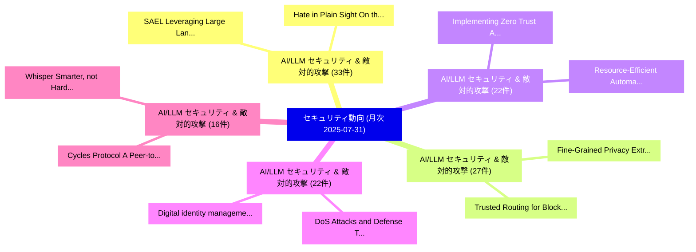

# 📊 03_monthly: 月次エグゼクティブサマリー報告書 (直近30日間: 2025-07-31)

**集計日時**: 2025-07-31 00:00:00 UTC  
**直近30日間の総論文数**: 584 件  

---

## 💡 マクロ脅威動向 & 戦略的リスク評価 (Strategic Executive Insights)

本日の収集論文（計 584 件）において、以下の重点セキュリティ領域で活発な研究動向が確認されました：
- **AI/LLM セキュリティ & 敵対的攻撃** (33 件): 注目論文として 「SAEL: Leveraging Large Languag...」、「Hate in Plain Sight: On the Ri...」 等が発表され、実務防御および攻撃検証の進展が見られます。
- **AI/LLM セキュリティ & 敵対的攻撃** (27 件): 注目論文として 「Fine-Grained Privacy Extractio...」、「Trusted Routing for Blockchain...」 等が発表され、実務防御および攻撃検証の進展が見られます。
- **AI/LLM セキュリティ & 敵対的攻撃** (22 件): 注目論文として 「Implementing Zero Trust Archit...」、「Resource-Efficient Automatic S...」 等が発表され、実務防御および攻撃検証の進展が見られます。
- **AI/LLM セキュリティ & 敵対的攻撃** (22 件): 注目論文として 「DoS Attacks and Defense Techno...」、「Digital identity management sy...」 等が発表され、実務防御および攻撃検証の進展が見られます。
- **AI/LLM セキュリティ & 敵対的攻撃** (16 件): 注目論文として 「Cycles Protocol: A Peer-to-Pee...」、「Whisper Smarter, not Harder: A...」 等が発表され、実務防御および攻撃検証の進展が見られます。

### 🗺️ 月次セキュリティ技術レーダー (Technology Radar)

---

## 📌 月次セキュリティ論文一覧 (日本語表形式)

| No | arXiv ID | 論文タイトル (日本語訳) | 重要キーワード | 構造化エグゼクティブ要約 (背景・提案・影響) | 脅威分類 | 詳細リンク |
|---|---|---|---|---|---|---|
| 1 | `2507.23192v1` | [Quantum Key Distribution（セキュリティ分析論文）](../../okf/papers/2025-07-31/2507.23192.md) | `Quantum Key Distribution`, `Sebastian Kish`, `Josef Pieprzyk` | 【提案】概要 (Overview & Key Finding) 本論文「量子鍵配送（セキュリティ分析論文）」（原題: 量子鍵配送 / arXiv: 2507.23192v1）は、qu...。実証評価により経営層・セキュリティ管理者向け推奨アクション (E... | `cs.CR` | [arXiv](https://arxiv.org/abs/2507.23192v1) &#124; [OKF](../../okf/papers/2025-07-31/2507.23192.md) |
| 2 | `2507.23229v2` | [Fine-Grained Privacy Extraction from Retrieval-Augmented Generation Systems via Knowledge Asymmetry Exploitation（セキュリティ分析論文）](../../okf/papers/2025-07-31/2507.23229.md) | `Grained Privacy Extraction`, `Augmented Generation Systems`, `Knowledge Asymmetry Exploitation` | 【提案】概要 (Overview & Key Finding) 本論文「Fine-Grained Privacy Extraction from Retrieval-Augmente...。実証評価により経営層・セキュリティ管理者向け推奨アクション (E... | `cs.CR` | [arXiv](https://arxiv.org/abs/2507.23229v2) &#124; [OKF](../../okf/papers/2025-07-31/2507.23229.md) |
| 3 | `2507.23432v1` | [Scalable contribution bounding to achieve privacy（セキュリティ分析論文）](../../okf/papers/2025-07-31/2507.23432.md) | `Vincent Cohen`, `Alessandro Epasto`, `Jason Lee` | 【提案】概要 (Overview & Key Finding) 本論文「Scalable contribution bounding to achieve privacy（セキュリテ...。実証評価により経営層・セキュリティ管理者向け推奨アクション (E... | `cs.CR` | [arXiv](https://arxiv.org/abs/2507.23432v1) &#124; [OKF](../../okf/papers/2025-07-31/2507.23432.md) |
| 4 | `2507.23453v2` | [Counterfactual Evaluation for Blind Attack Detection in LLM-based Evaluation Systems（セキュリティ分析論文）](../../okf/papers/2025-07-31/2507.23453.md) | `Blind Attack Detection`, `Lijia Liu`, `Takumi Kondo` | 【提案】概要 (Overview & Key Finding) 本論文「Counterfactual Evaluation for Blind Attack Detection in...。実証評価により経営層・セキュリティ管理者向け推奨アクション (E... | `cs.CR` | [arXiv](https://arxiv.org/abs/2507.23453v2) &#124; [OKF](../../okf/papers/2025-07-31/2507.23453.md) |
| 5 | `2507.23608v1` | [Medical Image De-Identification Benchmark Challenge（セキュリティ分析論文）](../../okf/papers/2025-07-31/2507.23608.md) | `Medical Image De`, `Identification Benchmark Challenge`, `De-Identification Benchmark` | 【提案】概要 (Overview & Key Finding) 本論文「Medical Image De-Identification Benchmark Challenge（セキュ...。実証評価により経営層・セキュリティ管理者向け推奨アクション (E... | `cs.CR` | [arXiv](https://arxiv.org/abs/2507.23608v1) &#124; [OKF](../../okf/papers/2025-07-31/2507.23608.md) |
| 6 | `2507.23611v1` | [LLM-Based Identification of Infostealer Infection Vectors from Screenshots: The Case of Aurora（セキュリティ分析論文）](../../okf/papers/2025-07-31/2507.23611.md) | `Infostealer Infection Vectors`, `Based Identification`, `LLM-Based Identification` | 【提案】概要 (Overview & Key Finding) 本論文「LLM-Based Identification of Infostealer Infection Vecto...。実証評価により経営層・セキュリティ管理者向け推奨アクション (E... | `cs.CR` | [arXiv](https://arxiv.org/abs/2507.23611v1) &#124; [OKF](../../okf/papers/2025-07-31/2507.23611.md) |
| 7 | `2507.23641v2` | [Polynomial Lattices for the BIKE Cryptosystem（セキュリティ分析論文）](../../okf/papers/2025-07-31/2507.23641.md) | `Polynomial Lattices`, `Michael Schaller`, `Raw Meta` | 【提案】概要 (Overview & Key Finding) 本論文「Polynomial Lattices for the BIKE Cryptosystem（セキュリティ分析論...。実証評価により経営層・セキュリティ管理者向け推奨アクション (E... | `cs.CR` | [arXiv](https://arxiv.org/abs/2507.23641v2) &#124; [OKF](../../okf/papers/2025-07-31/2507.23641.md) |
| 8 | `2508.00934v1` | [How サイバーセキュリティ Behaviors affect the Success of Darknet Drug Vendors: A Quantitative Analysis](../../okf/papers/2025-07-31/2508.00934.md) | `Darknet Drug Vendors`, `Syon Balakrishnan`, `Aaron Grinberg` | 【提案】概要 (Overview & Key Finding) 本論文「How サイバーセキュリティ Behaviors affect the Success of Darknet ...。実証評価により経営層・セキュリティ管理者向け推奨アクション (E... | `cs.CR` | [arXiv](https://arxiv.org/abs/2508.00934v1) &#124; [OKF](../../okf/papers/2025-07-31/2508.00934.md) |
| 9 | `2508.00935v2` | [Measuring Harmfulness of Computer-Using Agents（セキュリティ分析論文）](../../okf/papers/2025-07-31/2508.00935.md) | `Measuring Harmfulness`, `Using Agents`, `Computer-Using Agents` | 【提案】概要 (Overview & Key Finding) 本論文「Measuring Harmfulness of Computer-Using Agents（セキュリティ分析...。実証評価により経営層・セキュリティ管理者向け推奨アクション (E... | `cs.CR` | [arXiv](https://arxiv.org/abs/2508.00935v2) &#124; [OKF](../../okf/papers/2025-07-31/2508.00935.md) |
| 10 | `2508.00938v1` | [Trusted Routing for Blockchain-Empowered UAV Networks via Multi-Agent Deep Reinforcement Learning（セキュリティ分析論文）](../../okf/papers/2025-07-31/2508.00938.md) | `Agent Deep Reinforcement Learning`, `Trusted Routing`, `Blockchain-Empowered UAV` | 【提案】概要 (Overview & Key Finding) 本論文「Trusted Routing for Blockchain-Empowered UAV Networks v...。実証評価により経営層・セキュリティ管理者向け推奨アクション (E... | `cs.CR` | [arXiv](https://arxiv.org/abs/2508.00938v1) &#124; [OKF](../../okf/papers/2025-07-31/2508.00938.md) |
| 11 | `2508.00943v2` | [LLMs Can Covertly Sandbag on Capability Evaluations Against Chain-of-Thought Monitoring（セキュリティ分析論文）](../../okf/papers/2025-07-31/2508.00943.md) | `Can Covertly Sandbag`, `Thought Monitoring`, `Chloe Li` | 【提案】概要 (Overview & Key Finding) 本論文「LLMs Can Covertly Sandbag on Capability Evaluations Aga...。実証評価により経営層・セキュリティ管理者向け推奨アクション (E... | `cs.CR` | [arXiv](https://arxiv.org/abs/2508.00943v2) &#124; [OKF](../../okf/papers/2025-07-31/2508.00943.md) |
| 12 | `2508.15776v1` | [Implementing Zero Trust Architecture to Enhance Security and Resilience in the Pharmaceutical Supply Chain（セキュリティ分析論文）](../../okf/papers/2025-07-31/2508.15776.md) | `Implementing Zero Trust Architecture`, `Pharmaceutical Supply Chain`, `Enhance Security` | 【提案】概要 (Overview & Key Finding) 本論文「Implementing ゼロトラスト Architecture to Enhance Security an...。実証評価により経営層・セキュリティ管理者向け推奨アクション (E... | `cs.CR` | [arXiv](https://arxiv.org/abs/2508.15776v1) &#124; [OKF](../../okf/papers/2025-07-31/2508.15776.md) |
| 13 | `2507.22304v1` | [Invisible Injections: Exploiting Vision-Language Models Through Steganographic Prompt Embedding（セキュリティ分析論文）](../../okf/papers/2025-07-30/2507.22304.md) | `Invisible Injections`, `Exploiting Vision`, `Vision-Language Models` | 【提案】概要 (Overview & Key Finding) 本論文「Invisible Injections: Exploiting Vision-Language Models...。実証評価により経営層・セキュリティ管理者向け推奨アクション (E... | `cs.CR` | [arXiv](https://arxiv.org/abs/2507.22304v1) &#124; [OKF](../../okf/papers/2025-07-30/2507.22304.md) |
| 14 | `2507.22306v1` | [SleepWalk: Exploiting Context Switching and Residual Power for Physical Side-Channel Attacks（セキュリティ分析論文）](../../okf/papers/2025-07-30/2507.22306.md) | `Exploiting Context Switching`, `Residual Power`, `Physical Side` | 【提案】概要 (Overview & Key Finding) 本論文「SleepWalk: Exploiting Context Switching and Residual Po...。実証評価により経営層・セキュリティ管理者向け推奨アクション (E... | `cs.CR` | [arXiv](https://arxiv.org/abs/2507.22306v1) &#124; [OKF](../../okf/papers/2025-07-30/2507.22306.md) |
| 15 | `2507.22309v1` | [Cycles Protocol: A Peer-to-Peer Electronic Clearing System（セキュリティ分析論文）](../../okf/papers/2025-07-30/2507.22309.md) | `Peer Electronic Clearing System`, `Cycles Protocol`, `Ethan Buchman` | 【提案】概要 (Overview & Key Finding) 本論文「Cycles Protocol: A Peer-to-Peer Electronic Clearing Sys...。実証評価により経営層・セキュリティ管理者向け推奨アクション (E... | `cs.CR` | [arXiv](https://arxiv.org/abs/2507.22309v1) &#124; [OKF](../../okf/papers/2025-07-30/2507.22309.md) |
| 16 | `2507.22347v1` | [Fraud Detectors on Private Graph Dataのベンチマーク評価](../../okf/papers/2025-07-30/2507.22347.md) | `Benchmarking Fraud Detectors`, `Private Graph Data`, `Fraud Detectors` | 【提案】概要 (Overview & Key Finding) 本論文「Fraud Detectors on Private Graph Dataのベンチマーク評価」（原題: Ben...。実証評価により経営層・セキュリティ管理者向け推奨アクション (E... | `cs.CR` | [arXiv](https://arxiv.org/abs/2507.22347v1) &#124; [OKF](../../okf/papers/2025-07-30/2507.22347.md) |
| 17 | `2507.22371v1` | [SAEL: Leveraging Large Language Models with Adaptive Mixture-of-Experts for Smart Contract 脆弱性検出](../../okf/papers/2025-07-30/2507.22371.md) | `Leveraging Large Language Models`, `Adaptive Mixture`, `Smart Contract Vulnerability Detection` | 【提案】概要 (Overview & Key Finding) 本論文「SAEL: Leveraging Large Language Models with Adaptive Mi...。実証評価により経営層・セキュリティ管理者向け推奨アクション (E... | `cs.CR` | [arXiv](https://arxiv.org/abs/2507.22371v1) &#124; [OKF](../../okf/papers/2025-07-30/2507.22371.md) |
| 18 | `2507.22447v1` | [Breaking Obfuscation: Cluster-Aware Graph with LLM-Aided Recovery for Malicious JavaScript Detection（セキュリティ分析論文）](../../okf/papers/2025-07-30/2507.22447.md) | `Breaking Obfuscation`, `Aware Graph`, `Aided Recovery` | 【提案】概要 (Overview & Key Finding) 本論文「Breaking Obfuscation: Cluster-Aware Graph with LLM-Aide...。実証評価により経営層・セキュリティ管理者向け推奨アクション (E... | `cs.CR` | [arXiv](https://arxiv.org/abs/2507.22447v1) &#124; [OKF](../../okf/papers/2025-07-30/2507.22447.md) |
| 19 | `2507.22535v6` | [Scalable, quantum-accessible, and adaptive pseudorandom quantum state and pseudorandom function-like quantum state generators（セキュリティ分析論文）](../../okf/papers/2025-07-30/2507.22535.md) | `function-like quantum`, `Rishabh Batra`, `Zhili Chen` | 【提案】概要 (Overview & Key Finding) 本論文「Scalable, 量子-accessible, and adaptive pseudorandom 量子 s...。実証評価により経営層・セキュリティ管理者向け推奨アクション (E... | `cs.CR` | [arXiv](https://arxiv.org/abs/2507.22535v6) &#124; [OKF](../../okf/papers/2025-07-30/2507.22535.md) |
| 20 | `2507.22611v2` | [DoS Attacks and Defense Technologies in Blockchain Systems: A Hierarchical Analysis（セキュリティ分析論文）](../../okf/papers/2025-07-30/2507.22611.md) | `Defense Technologies`, `Blockchain Systems`, `Chunyi Zhang` | 【提案】概要 (Overview & Key Finding) 本論文「DoS Attacks and Defense Technologies in Blockchain Syst...。実証評価により経営層・セキュリティ管理者向け推奨アクション (E... | `cs.CR` | [arXiv](https://arxiv.org/abs/2507.22611v2) &#124; [OKF](../../okf/papers/2025-07-30/2507.22611.md) |
| 21 | `2507.22617v1` | [Hate in Plain Sight: On the Risks of Moderating AI-Generated Hateful Illusions（セキュリティ分析論文）](../../okf/papers/2025-07-30/2507.22617.md) | `Generated Hateful Illusions`, `Plain Sight`, `AI-Generated Hateful` | 【提案】概要 (Overview & Key Finding) 本論文「Hate in Plain Sight: On the Risks of Moderating AI-Gene...。実証評価により経営層・セキュリティ管理者向け推奨アクション (E... | `cs.CR` | [arXiv](https://arxiv.org/abs/2507.22617v1) &#124; [OKF](../../okf/papers/2025-07-30/2507.22617.md) |
| 22 | `2507.22674v1` | [CryptLC-MUME: A Lightweight Certificateless Multi-User Matchmaking Encryption for Mobile Devicesの分析](../../okf/papers/2025-07-30/2507.22674.md) | `Lightweight Certificateless Multi`, `User Matchmaking Encryption`, `Multi-User Matchmaking` | 【提案】概要 (Overview & Key Finding) 本論文「CryptLC-MUME: A Lightweight Certificateless Multi-User ...。実証評価により経営層・セキュリティ管理者向け推奨アクション (E... | `cs.CR` | [arXiv](https://arxiv.org/abs/2507.22674v1) &#124; [OKF](../../okf/papers/2025-07-30/2507.22674.md) |
| 23 | `2507.22772v1` | [Empirical Evaluation of Concept Drift in ML-Based Android マルウェア検出](../../okf/papers/2025-07-30/2507.22772.md) | `Concept Drift`, `ML-Based Android`, `Based Android Malware Detection` | 【提案】概要 (Overview & Key Finding) 本論文「Empirical Evaluation of Concept Drift in ML-Based Andro...。実証評価により経営層・セキュリティ管理者向け推奨アクション (E... | `cs.CR` | [arXiv](https://arxiv.org/abs/2507.22772v1) &#124; [OKF](../../okf/papers/2025-07-30/2507.22772.md) |
| 24 | `2507.23002v1` | [Noise-Coded Illumination for Forensic and Photometric Video Analysis（セキュリティ分析論文）](../../okf/papers/2025-07-30/2507.23002.md) | `Coded Illumination`, `Noise-Coded Illumination`, `Zekun Hao` | 【提案】概要 (Overview & Key Finding) 本論文「Noise-Coded Illumination for Forensic and Photometric V...。実証評価によりMichael, Zekun Hao, Serge... | `cs.CR` | [arXiv](https://arxiv.org/abs/2507.23002v1) &#124; [OKF](../../okf/papers/2025-07-30/2507.23002.md) |
| 25 | `2508.02836v1` | [Agentic Privacy-Preserving Machine Learning（セキュリティ分析論文）](../../okf/papers/2025-07-30/2508.02836.md) | `Preserving Machine Learning`, `Agentic Privacy`, `Privacy-Preserving Machine` | 【提案】概要 (Overview & Key Finding) 本論文「Agentic Privacy-Preserving Machine Learning（セキュリティ分析論文）...。実証評価により経営層・セキュリティ管理者向け推奨アクション (E... | `cs.CR` | [arXiv](https://arxiv.org/abs/2508.02836v1) &#124; [OKF](../../okf/papers/2025-07-30/2508.02836.md) |
| 26 | `2508.02840v2` | [Resource-Efficient Automatic Software Vulnerability Assessment via Knowledge Distillation and Particle Swarm Optimization（セキュリティ分析論文）](../../okf/papers/2025-07-30/2508.02840.md) | `Efficient Automatic Software Vulnerability Assessment`, `Particle Swarm Optimization`, `Knowledge Distillation` | 【提案】概要 (Overview & Key Finding) 本論文「Resource-Efficient Automatic Software 脆弱性 Assessment vi...。実証評価により経営層・セキュリティ管理者向け推奨アクション (E... | `cs.CR` | [arXiv](https://arxiv.org/abs/2508.02840v2) &#124; [OKF](../../okf/papers/2025-07-30/2508.02840.md) |
| 27 | `2508.05658v2` | [Universally Unfiltered and Unseen:Input-Agnostic Multimodal Jailbreaks against Text-to-Image Model Safeguards（セキュリティ分析論文）](../../okf/papers/2025-07-30/2508.05658.md) | `Agnostic Multimodal Jailbreaks`, `Image Model Safeguards`, `Universally Unfiltered` | 【提案】概要 (Overview & Key Finding) 本論文「Universally Unfiltered and Unseen:Input-Agnostic Multim...。実証評価により経営層・セキュリティ管理者向け推奨アクション (E... | `cs.CR` | [arXiv](https://arxiv.org/abs/2508.05658v2) &#124; [OKF](../../okf/papers/2025-07-30/2508.05658.md) |
| 28 | `2508.09994v2` | [Whisper Smarter, not Harder: Adversarial Attack on Partial Suppression（セキュリティ分析論文）](../../okf/papers/2025-07-30/2508.09994.md) | `Whisper Smarter`, `Adversarial Attack`, `Partial Suppression` | 【提案】背景とセキュリティ上の課題 (Background & Problem) 本研究はサイバー脅威環境におけるセキュリティ構造・脆弱性の検証を目的としています。(主要検出項目: ...。実証評価により経営層・セキュリティ管理者向け推奨アクション (E... | `cs.CR` | [arXiv](https://arxiv.org/abs/2508.09994v2) &#124; [OKF](../../okf/papers/2025-07-30/2508.09994.md) |
| 29 | `2507.21398v1` | [Digital identity management system with blockchain:An implementation with Ethereum and Ganache（セキュリティ分析論文）](../../okf/papers/2025-07-29/2507.21398.md) | `Davi Lopes`, `Tais Mello`, `Reis Bezerra` | 【提案】概要 (Overview & Key Finding) 本論文「Digital identity management system with blockchain:An i...。実証評価により経営層・セキュリティ管理者向け推奨アクション (E... | `cs.CR` | [arXiv](https://arxiv.org/abs/2507.21398v1) &#124; [OKF](../../okf/papers/2025-07-29/2507.21398.md) |
| 30 | `2507.21412v3` | [Cascading and Proxy Membership Inference Attacks（セキュリティ分析論文）](../../okf/papers/2025-07-29/2507.21412.md) | `Proxy Membership Inference Attacks`, `Yuntao Du`, `Jiacheng Li` | 【提案】概要 (Overview & Key Finding) 本論文「Cascading and Proxy Membership Inference Attacks（セキュリティ...。実証評価により経営層・セキュリティ管理者向け推奨アクション (E... | `cs.CR` | [arXiv](https://arxiv.org/abs/2507.21412v3) &#124; [OKF](../../okf/papers/2025-07-29/2507.21412.md) |
| 31 | `2507.21483v2` | [NCCR: to Evaluate the Robustness of Neural Networks and Adversarial Examples（セキュリティ分析論文）](../../okf/papers/2025-07-29/2507.21483.md) | `Neural Networks`, `Adversarial Examples`, `Shi Pu` | 【提案】概要 (Overview & Key Finding) 本論文「NCCR: to Evaluate the Robustness of Neural Networks and...。実証評価により経営層・セキュリティ管理者向け推奨アクション (E... | `cs.CR` | [arXiv](https://arxiv.org/abs/2507.21483v2) &#124; [OKF](../../okf/papers/2025-07-29/2507.21483.md) |
| 32 | `2507.21538v1` | [Can We End the Cat-and-Mouse Game? Simulating Self-Evolving Phishing Attacks with LLMs and Genetic Algorithms（セキュリティ分析論文）](../../okf/papers/2025-07-29/2507.21538.md) | `Evolving Phishing Attacks`, `Mouse Game`, `Simulating Self` | 【提案】Simulating Self-Evolving Phishing Attacks with LLMs and Genetic Algorithms ### (日本語題名: ...。実証評価により経営層・セキュリティ管理者向け推奨アクション (E... | `cs.CR` | [arXiv](https://arxiv.org/abs/2507.21538v1) &#124; [OKF](../../okf/papers/2025-07-29/2507.21538.md) |
| 33 | `2507.21540v3` | [PRISM: Programmatic Reasoning with Image Sequence Manipulation for LVLM Jailbreaking（セキュリティ分析論文）](../../okf/papers/2025-07-29/2507.21540.md) | `Image Sequence Manipulation`, `Programmatic Reasoning`, `Image Sequence Manipu` | 【提案】概要 (Overview & Key Finding) 本論文「PRISM: Programmatic Reasoning with Image Sequence Manip...。実証評価により経営層・セキュリティ管理者向け推奨アクション (E... | `cs.CR` | [arXiv](https://arxiv.org/abs/2507.21540v3) &#124; [OKF](../../okf/papers/2025-07-29/2507.21540.md) |
| 34 | `2507.21591v2` | [Hierarchical Graph Neural Network for Compressed Speech Steganalysis（セキュリティ分析論文）](../../okf/papers/2025-07-29/2507.21591.md) | `Hierarchical Graph Neural Network`, `Compressed Speech Steganalysis`, `Mohamed Chahine Ghanem` | 【提案】概要 (Overview & Key Finding) 本論文「Hierarchical Graph Neural Network for Compressed Speech...。実証評価により経営層・セキュリティ管理者向け推奨アクション (E... | `cs.CR` | [arXiv](https://arxiv.org/abs/2507.21591v2) &#124; [OKF](../../okf/papers/2025-07-29/2507.21591.md) |
| 35 | `2507.21640v1` | [GUARD-CAN: Graph-Understanding and Recurrent Architecture for CAN Anomaly Detection（セキュリティ分析論文）](../../okf/papers/2025-07-29/2507.21640.md) | `Recurrent Architecture`, `Anomaly Detection`, `Hyeong Seon Kim` | 【提案】概要 (Overview & Key Finding) 本論文「GUARD-CAN: Graph-Understanding and Recurrent Architectu...。実証評価により経営層・セキュリティ管理者向け推奨アクション (E... | `cs.CR` | [arXiv](https://arxiv.org/abs/2507.21640v1) &#124; [OKF](../../okf/papers/2025-07-29/2507.21640.md) |
| 36 | `2507.21731v1` | [Modelling Arbitrary Computations in the Symbolic Model using an Equational Theory for Bounded Binary Circuits（セキュリティ分析論文）](../../okf/papers/2025-07-29/2507.21731.md) | `Modelling Arbitrary Computations`, `Bounded Binary Circuits`, `Symbolic Model` | 【提案】概要 (Overview & Key Finding) 本論文「Modelling Arbitrary Computations in the Symbolic Model ...。実証評価により経営層・セキュリティ管理者向け推奨アクション (E... | `cs.CR` | [arXiv](https://arxiv.org/abs/2507.21731v1) &#124; [OKF](../../okf/papers/2025-07-29/2507.21731.md) |
| 37 | `2507.21817v4` | [Out of Distribution, Out of Luck: How Well Can LLMs Trained on Vulnerability Datasets Detect Top 25 CWE Weaknesses?（セキュリティ分析論文）](../../okf/papers/2025-07-29/2507.21817.md) | `Vulnerability Datasets Detect Top`, `Ngoc Tan Bui`, `Huu Hung Nguyen` | 【提案】### (日本語題名: Out of Distribution, Out of Luck: How Well Can LLMs Trained on 脆弱性 Datasets...。実証評価により経営層・セキュリティ管理者向け推奨アクション (E... | `cs.CR` | [arXiv](https://arxiv.org/abs/2507.21817v4) &#124; [OKF](../../okf/papers/2025-07-29/2507.21817.md) |
| 38 | `2507.21904v1` | [Privacy-Preserving Anonymization of System and Network Event Logs Using Salt-Based Hashing and Temporal Noise（セキュリティ分析論文）](../../okf/papers/2025-07-29/2507.21904.md) | `Network Event Logs Using Salt`, `Preserving Anonymization`, `Privacy-Preserving Anonymization` | 【提案】概要 (Overview & Key Finding) 本論文「Privacy-Preserving Anonymization of System and Network ...。実証評価により経営層・セキュリティ管理者向け推奨アクション (E... | `cs.CR` | [arXiv](https://arxiv.org/abs/2507.21904v1) &#124; [OKF](../../okf/papers/2025-07-29/2507.21904.md) |
| 39 | `2507.21985v1` | [ZIUM: Zero-Shot Intent-Aware Adversarial Attack on Unlearned Models（セキュリティ分析論文）](../../okf/papers/2025-07-29/2507.21985.md) | `Aware Adversarial Attack`, `Shot Intent`, `Unlearned Models` | 【提案】概要 (Overview & Key Finding) 本論文「ZIUM: Zero-Shot Intent-Aware 敵対的攻撃 on Unlearned Models（...。実証評価により経営層・セキュリティ管理者向け推奨アクション (E... | `cs.CR` | [arXiv](https://arxiv.org/abs/2507.21985v1) &#124; [OKF](../../okf/papers/2025-07-29/2507.21985.md) |
| 40 | `2507.22037v1` | [Secure Tug-of-War (SecTOW): Iterative Defense-Attack Training with Reinforcement Learning for Multimodal Model Security（セキュリティ分析論文）](../../okf/papers/2025-07-29/2507.22037.md) | `Multimodal Model Security`, `Secure Tug`, `Iterative Defense` | 【提案】概要 (Overview & Key Finding) 本論文「Secure Tug-of-War (SecTOW): Iterative Defense-Attack Tr...。実証評価により経営層・セキュリティ管理者向け推奨アクション (E... | `cs.CR` | [arXiv](https://arxiv.org/abs/2507.22037v1) &#124; [OKF](../../okf/papers/2025-07-29/2507.22037.md) |
| 41 | `2507.22133v1` | [Prompt Optimization and Evaluation for LLM Automated Red Teaming（セキュリティ分析論文）](../../okf/papers/2025-07-29/2507.22133.md) | `Automated Red Teaming`, `Prompt Optimization`, `Michael Freenor` | 【提案】概要 (Overview & Key Finding) 本論文「Prompt Optimization and Evaluation for LLM Automated Re...。実証評価により経営層・セキュリティ管理者向け推奨アクション (E... | `cs.CR` | [arXiv](https://arxiv.org/abs/2507.22133v1) &#124; [OKF](../../okf/papers/2025-07-29/2507.22133.md) |
| 42 | `2507.22140v2` | [Evaluation of Noise and Crosstalk in Neutral Atom Quantum Computers（セキュリティ分析論文）](../../okf/papers/2025-07-29/2507.22140.md) | `Neutral Atom Quantum Computers`, `Pranet Sharma`, `Yizhuo Tan` | 【提案】概要 (Overview & Key Finding) 本論文「Evaluation of Noise and Crosstalk in Neutral Atom 量子 Co...。実証評価により経営層・セキュリティ管理者向け推奨アクション (E... | `cs.CR` | [arXiv](https://arxiv.org/abs/2507.22140v2) &#124; [OKF](../../okf/papers/2025-07-29/2507.22140.md) |
| 43 | `2507.22153v1` | [Privacy-preserving Photorealistic Self-avatars in Mixed Realityに向けて](../../okf/papers/2025-07-29/2507.22153.md) | `Photorealistic Self`, `Privacy-preserving Photorealistic`, `Towards Privacy` | 【提案】概要 (Overview & Key Finding) 本論文「Privacy-preserving Photorealistic Self-avatars in Mixed...。実証評価により経営層・セキュリティ管理者向け推奨アクション (E... | `cs.CR` | [arXiv](https://arxiv.org/abs/2507.22153v1) &#124; [OKF](../../okf/papers/2025-07-29/2507.22153.md) |
| 44 | `2507.22160v1` | [Strategic Deflection: Defending LLMs from Logit Manipulation（セキュリティ分析論文）](../../okf/papers/2025-07-29/2507.22160.md) | `Strategic Deflection`, `Logit Manipulation`, `Amal El Fallah Seghrouchni` | 【提案】概要 (Overview & Key Finding) 本論文「Strategic Deflection: Defending LLMs from Logit Manipul...。実証評価により経営層・セキュリティ管理者向け推奨アクション (E... | `cs.CR` | [arXiv](https://arxiv.org/abs/2507.22160v1) &#124; [OKF](../../okf/papers/2025-07-29/2507.22160.md) |
| 45 | `2507.22165v1` | [Programmable Data Planes for Network Security（セキュリティ分析論文）](../../okf/papers/2025-07-29/2507.22165.md) | `Programmable Data Planes`, `Network Security`, `Gursimran Singh` | 【提案】概要 (Overview & Key Finding) 本論文「Programmable Data Planes for Network Security（セキュリティ分析論...。実証評価によりAcharya, Minseok Kwon - *... | `cs.CR` | [arXiv](https://arxiv.org/abs/2507.22165v1) &#124; [OKF](../../okf/papers/2025-07-29/2507.22165.md) |
| 46 | `2507.22177v1` | [POLARIS: Explainable Artificial Intelligence for Mitigating Power Side-Channel Leakage（セキュリティ分析論文）](../../okf/papers/2025-07-29/2507.22177.md) | `Explainable Artificial Intelligence`, `Mitigating Power Side`, `Channel Leakage` | 【提案】概要 (Overview & Key Finding) 本論文「POLARIS: Explainable Artificial Intelligence for Mitiga...。実証評価により経営層・セキュリティ管理者向け推奨アクション (E... | `cs.CR` | [arXiv](https://arxiv.org/abs/2507.22177v1) &#124; [OKF](../../okf/papers/2025-07-29/2507.22177.md) |
| 47 | `2507.22226v2` | [Optimal Planning for Enhancing the Resilience of Modern Distribution Systems Against Cyberattacks（セキュリティ分析論文）](../../okf/papers/2025-07-29/2507.22226.md) | `Optimal Planning`, `Ahmad Mohammad Saber`, `Armita Khashayardoost` | 【提案】概要 (Overview & Key Finding) 本論文「Optimal Planning for Enhancing the Resilience of Modern...。実証評価により経営層・セキュリティ管理者向け推奨アクション (E... | `cs.CR` | [arXiv](https://arxiv.org/abs/2507.22226v2) &#124; [OKF](../../okf/papers/2025-07-29/2507.22226.md) |
| 48 | `2507.22231v1` | [Understanding Concept Drift with Deprecated Permissions in Android マルウェア検出](../../okf/papers/2025-07-29/2507.22231.md) | `Understanding Concept Drift`, `Deprecated Permissions`, `Android Malware Detection` | 【提案】概要 (Overview & Key Finding) 本論文「Understanding Concept Drift with Deprecated Permissions...。実証評価により経営層・セキュリティ管理者向け推奨アクション (E... | `cs.CR` | [arXiv](https://arxiv.org/abs/2507.22231v1) &#124; [OKF](../../okf/papers/2025-07-29/2507.22231.md) |
| 49 | `2507.22239v2` | [Large Language Model-Based Framework for Explainable Cyberattack Detection in Automatic Generation Control Systems（セキュリティ分析論文）](../../okf/papers/2025-07-29/2507.22239.md) | `Automatic Generation Control Systems`, `Large Language Model`, `Explainable Cyberattack Detection` | 【提案】概要 (Overview & Key Finding) 本論文「Large Language Model-Based Framework for Explainable Cy...。実証評価により経営層・セキュリティ管理者向け推奨アクション (E... | `cs.CR` | [arXiv](https://arxiv.org/abs/2507.22239v2) &#124; [OKF](../../okf/papers/2025-07-29/2507.22239.md) |
| 50 | `2507.22265v1` | [Cell-Probe Lower Bounds via Semi-Random CSP Refutation: Simplified and the Odd-Locality Case（セキュリティ分析論文）](../../okf/papers/2025-07-29/2507.22265.md) | `Probe Lower Bounds`, `Cell-Probe Lower`, `Locality Case` | 【提案】概要 (Overview & Key Finding) 本論文「Cell-Probe Lower Bounds via Semi-Random CSP Refutation:...。実証評価により経営層・セキュリティ管理者向け推奨アクション (E... | `cs.CR` | [arXiv](https://arxiv.org/abs/2507.22265v1) &#124; [OKF](../../okf/papers/2025-07-29/2507.22265.md) |
| 51 | `2508.00907v2` | [Prime Factorization Equation from a Tensor Network Perspective（セキュリティ分析論文）](../../okf/papers/2025-07-29/2508.00907.md) | `Prime Factorization Equation`, `Tensor Network Perspective`, `Alejandro Mata Ali` | 【提案】概要 (Overview & Key Finding) 本論文「Prime Factorization Equation from a Tensor Network Pers...。実証評価により経営層・セキュリティ管理者向け推奨アクション (E... | `cs.CR` | [arXiv](https://arxiv.org/abs/2508.00907v2) &#124; [OKF](../../okf/papers/2025-07-29/2508.00907.md) |
| 52 | `2508.00910v2` | [Cyber-Zero: Training サイバーセキュリティ Agents without Runtime](../../okf/papers/2025-07-29/2508.00910.md) | `Training Cybersecurity Agents`, `Terry Yue Zhuo`, `Dingmin Wang` | 【提案】背景とセキュリティ上の課題 (Background & Problem) 本研究はサイバー脅威環境におけるセキュリティ構造・脆弱性の検証を目的としています。(主要検出項目: ...。実証評価により経営層・セキュリティ管理者向け推奨アクション (E... | `cs.CR` | [arXiv](https://arxiv.org/abs/2508.00910v2) &#124; [OKF](../../okf/papers/2025-07-29/2508.00910.md) |
| 53 | `2508.00912v1` | [Predictive Auditing of Hidden Tokens in LLM APIs via Reasoning Length Estimation（セキュリティ分析論文）](../../okf/papers/2025-07-29/2508.00912.md) | `Reasoning Length Estimation`, `Predictive Auditing`, `Hidden Tokens` | 【提案】概要 (Overview & Key Finding) 本論文「Predictive Auditing of Hidden Tokens in LLM APIs via Re...。実証評価により経営層・セキュリティ管理者向け推奨アクション (E... | `cs.CR` | [arXiv](https://arxiv.org/abs/2508.00912v1) &#124; [OKF](../../okf/papers/2025-07-29/2508.00912.md) |
| 54 | `2508.05655v1` | [Blockchain-Based Decentralized Domain Name System（セキュリティ分析論文）](../../okf/papers/2025-07-29/2508.05655.md) | `Based Decentralized Domain Name System`, `Blockchain-Based Decentralized`, `Guang Yang` | 【提案】概要 (Overview & Key Finding) 本論文「Blockchain-Based Decentralized Domain Name System（セキュリテ...。実証評価により経営層・セキュリティ管理者向け推奨アクション (E... | `cs.CR` | [arXiv](https://arxiv.org/abs/2508.05655v1) &#124; [OKF](../../okf/papers/2025-07-29/2508.05655.md) |
| 55 | `2510.02184v1` | [Testing Stability and Robustness in Three Cryptographic Chaotic Systems（セキュリティ分析論文）](../../okf/papers/2025-07-29/2510.02184.md) | `Three Cryptographic Chaotic Systems`, `Testing Stability`, `Raw Meta` | 【提案】概要 (Overview & Key Finding) 本論文「Testing Stability and Robustness in Three Cryptographic...。実証評価によりAnagnostopoulos, K.。 | `cs.CR` | [arXiv](https://arxiv.org/abs/2510.02184v1) &#124; [OKF](../../okf/papers/2025-07-29/2510.02184.md) |
| 56 | `2507.20502v1` | [VDGraph: A Graph-Theoretic Approach to Unlock Insights from SBOM and SCA Data（セキュリティ分析論文）](../../okf/papers/2025-07-28/2507.20502.md) | `Unlock Insights`, `David Sastre Medina`, `Howell Xia` | 【提案】概要 (Overview & Key Finding) 本論文「VDGraph: A Graph-Theoretic Approach to Unlock Insights ...。実証評価により経営層・セキュリティ管理者向け推奨アクション (E... | `cs.CR` | [arXiv](https://arxiv.org/abs/2507.20502v1) &#124; [OKF](../../okf/papers/2025-07-28/2507.20502.md) |
| 57 | `2507.20554v1` | [MPC-EVM: Enabling MPC Execution by Smart Contracts In An Asynchronous Manner（セキュリティ分析論文）](../../okf/papers/2025-07-28/2507.20554.md) | `Yichen Zhou`, `Chenxing Li`, `Fan Long` | 【提案】概要 (Overview & Key Finding) 本論文「MPC-EVM: Enabling MPC Execution by スマートコントラクトs In An As...。実証評価により経営層・セキュリティ管理者向け推奨アクション (E... | `cs.CR` | [arXiv](https://arxiv.org/abs/2507.20554v1) &#124; [OKF](../../okf/papers/2025-07-28/2507.20554.md) |
| 58 | `2507.20650v1` | [Hot-Swap MarkBoard: An Efficient Black-box Watermarking Approach for Large-scale Model Distribution（セキュリティ分析論文）](../../okf/papers/2025-07-28/2507.20650.md) | `Model Distribution`, `Hot-Swap MarkBoard`, `Black-box Watermarking` | 【提案】概要 (Overview & Key Finding) 本論文「Hot-Swap MarkBoard: An Efficient Black-box Watermarking...。実証評価により経営層・セキュリティ管理者向け推奨アクション (E... | `cs.CR` | [arXiv](https://arxiv.org/abs/2507.20650v1) &#124; [OKF](../../okf/papers/2025-07-28/2507.20650.md) |
| 59 | `2507.20672v1` | [Program Analysis for High-Value Smart Contract Vulnerabilities: Techniques and Insights（セキュリティ分析論文）](../../okf/papers/2025-07-28/2507.20672.md) | `Value Smart Contract Vulnerabilities`, `High-Value Smart`, `Value Smart Contract Vulnerabil` | 【提案】概要 (Overview & Key Finding) 本論文「Program Analysis for High-Value スマートコントラクト Vulnerabilit...。実証評価により経営層・セキュリティ管理者向け推奨アクション (E... | `cs.CR` | [arXiv](https://arxiv.org/abs/2507.20672v1) &#124; [OKF](../../okf/papers/2025-07-28/2507.20672.md) |
| 60 | `2507.20676v1` | [A Novel Post-Quantum Secure Digital Signature Scheme Based on Neural Network（セキュリティ分析論文）](../../okf/papers/2025-07-28/2507.20676.md) | `Quantum Secure Digital Signature Scheme Based`, `Neural Network`, `Post-Quantum Secure` | 【提案】概要 (Overview & Key Finding) 本論文「A Novel Post-量子 Secure Digital Signature Scheme Based o...。実証評価により経営層・セキュリティ管理者向け推奨アクション (E... | `cs.CR` | [arXiv](https://arxiv.org/abs/2507.20676v1) &#124; [OKF](../../okf/papers/2025-07-28/2507.20676.md) |
| 61 | `2507.20688v2` | [Guard-GBDT: Efficient Privacy-Preserving Approximated GBDT Training on Vertical Dataset（セキュリティ分析論文）](../../okf/papers/2025-07-28/2507.20688.md) | `Efficient Privacy`, `Preserving Approximated`, `Vertical Dataset` | 【提案】概要 (Overview & Key Finding) 本論文「Guard-GBDT: Efficient Privacy-Preserving Approximated G...。実証評価により経営層・セキュリティ管理者向け推奨アクション (E... | `cs.CR` | [arXiv](https://arxiv.org/abs/2507.20688v2) &#124; [OKF](../../okf/papers/2025-07-28/2507.20688.md) |
| 62 | `2507.20704v2` | [Text2VLM: Adapting Text-Only Datasets to Evaluate Alignment Training in Visual Language Models（セキュリティ分析論文）](../../okf/papers/2025-07-28/2507.20704.md) | `Visual Language Models`, `Adapting Text`, `Text-Only Datasets` | 【提案】概要 (Overview & Key Finding) 本論文「Text2VLM: Adapting Text-Only Datasets to Evaluate Align...。実証評価により経営層・セキュリティ管理者向け推奨アクション (E... | `cs.CR` | [arXiv](https://arxiv.org/abs/2507.20704v2) &#124; [OKF](../../okf/papers/2025-07-28/2507.20704.md) |
| 63 | `2507.20806v1` | [Collusion Resistant DNS With Private Information Retrieval（セキュリティ分析論文）](../../okf/papers/2025-07-28/2507.20806.md) | `Collusion Resistant`, `Yunming Xiao`, `Peizhi Liu` | 【提案】概要 (Overview & Key Finding) 本論文「Collusion Resistant DNS With Private Information Retrie...。実証評価により経営層・セキュリティ管理者向け推奨アクション (E... | `cs.CR` | [arXiv](https://arxiv.org/abs/2507.20806v1) &#124; [OKF](../../okf/papers/2025-07-28/2507.20806.md) |
| 64 | `2507.20851v1` | [An Open-source Implementation and Security Triad's TEE Trusted Time Protocolの分析](../../okf/papers/2025-07-28/2507.20851.md) | `Open-source Implementation`, `Trusted Time Protocol`, `Security Triad` | 【提案】概要 (Overview & Key Finding) 本論文「An Open-source Implementation and Security Triad's TEE ...。実証評価により経営層・セキュリティ管理者向け推奨アクション (E... | `cs.CR` | [arXiv](https://arxiv.org/abs/2507.20851v1) &#124; [OKF](../../okf/papers/2025-07-28/2507.20851.md) |
| 65 | `2507.20873v1` | [Testbed and Software Architecture for Enhancing Security in Industrial Private 5G Networks（セキュリティ分析論文）](../../okf/papers/2025-07-28/2507.20873.md) | `Software Architecture`, `Enhancing Security`, `Industrial Private` | 【提案】概要 (Overview & Key Finding) 本論文「Testbed and Software Architecture for Enhancing Securit...。実証評価により経営層・セキュリティ管理者向け推奨アクション (E... | `cs.CR` | [arXiv](https://arxiv.org/abs/2507.20873v1) &#124; [OKF](../../okf/papers/2025-07-28/2507.20873.md) |
| 66 | `2507.20891v4` | [Characterizing the Sensitivity to Individual Bit Flips in Client-Side Operations of the CKKS Scheme（セキュリティ分析論文）](../../okf/papers/2025-07-28/2507.20891.md) | `Individual Bit Flips`, `Side Operations`, `Client-Side Operations` | 【提案】概要 (Overview & Key Finding) 本論文「Characterizing the Sensitivity to Individual Bit Flips ...。実証評価により経営層・セキュリティ管理者向け推奨アクション (E... | `cs.CR` | [arXiv](https://arxiv.org/abs/2507.20891v4) &#124; [OKF](../../okf/papers/2025-07-28/2507.20891.md) |
| 67 | `2507.20977v2` | [Repairing vulnerabilities without invisible hands. A differentiated replication study on LLMs（セキュリティ分析論文）](../../okf/papers/2025-07-28/2507.20977.md) | `Maria Camporese`, `Fabio Massacci`, `Raw Meta` | 【提案】A differentiated replication study on LLMs / arXiv: 2507.20977v2）は、cs.SE 分野における最新セキュリティ...。実証評価により経営層・セキュリティ管理者向け推奨アクション (E... | `cs.CR` | [arXiv](https://arxiv.org/abs/2507.20977v2) &#124; [OKF](../../okf/papers/2025-07-28/2507.20977.md) |
| 68 | `2507.21038v2` | [Development and a secured VoIP system for surveillance activitiesの分析](../../okf/papers/2025-07-28/2507.21038.md) | `Matsive Ali`, `Raw Meta`, `Executive Summary` | 【提案】概要 (Overview & Key Finding) 本論文「Development and a secured VoIP system for surveillance ...。実証評価によりMatsive Ali - **公開日時**: `... | `cs.CR` | [arXiv](https://arxiv.org/abs/2507.21038v2) &#124; [OKF](../../okf/papers/2025-07-28/2507.21038.md) |
| 69 | `2507.21195v1` | [MaXsive: High-Capacity and Robust Training-Free Generative Image Watermarking in Diffusion Models（セキュリティ分析論文）](../../okf/papers/2025-07-28/2507.21195.md) | `Free Generative Image Watermarking`, `Robust Training`, `Diffusion Models` | 【提案】概要 (Overview & Key Finding) 本論文「MaXsive: High-Capacity and Robust Training-Free Generat...。実証評価により経営層・セキュリティ管理者向け推奨アクション (E... | `cs.CR` | [arXiv](https://arxiv.org/abs/2507.21195v1) &#124; [OKF](../../okf/papers/2025-07-28/2507.21195.md) |
| 70 | `2507.21258v2` | [Verification Cost Asymmetry in Cognitive Warfare: A Complexity-Theoretic Framework（セキュリティ分析論文）](../../okf/papers/2025-07-28/2507.21258.md) | `Verification Cost Asymmetry`, `Cognitive Warfare`, `Joshua Luberisse` | 【提案】概要 (Overview & Key Finding) 本論文「Verification Cost Asymmetry in Cognitive Warfare: A Com...。実証評価により経営層・セキュリティ管理者向け推奨アクション (E... | `cs.CR` | [arXiv](https://arxiv.org/abs/2507.21258v2) &#124; [OKF](../../okf/papers/2025-07-28/2507.21258.md) |
| 71 | `2507.21325v1` | [On Post-Quantum Cryptography Authentication for Quantum Key Distribution（セキュリティ分析論文）](../../okf/papers/2025-07-28/2507.21325.md) | `Quantum Cryptography Authentication`, `Quantum Key Distribution`, `Post-Quantum Cryptography` | 【提案】概要 (Overview & Key Finding) 本論文「On ポスト量子暗号 Authentication for 量子鍵配送（セキュリティ分析論文）」（原題: On...。実証評価により経営層・セキュリティ管理者向け推奨アクション (E... | `cs.CR` | [arXiv](https://arxiv.org/abs/2507.21325v1) &#124; [OKF](../../okf/papers/2025-07-28/2507.21325.md) |
| 72 | `2507.21387v1` | [Radio EMG-based Gesture Recognition Networksに対する敵対的攻撃](../../okf/papers/2025-07-28/2507.21387.md) | `EMG-based Gesture`, `Radio Adversarial Attacks`, `Gesture Recognition Networks` | 【提案】概要 (Overview & Key Finding) 本論文「Radio EMG-based Gesture Recognition Networksに対する敵対的攻撃」（...。実証評価により経営層・セキュリティ管理者向け推奨アクション (E... | `cs.CR` | [arXiv](https://arxiv.org/abs/2507.21387v1) &#124; [OKF](../../okf/papers/2025-07-28/2507.21387.md) |
| 73 | `2507.22171v3` | [Enhancing Jailbreak Attacks on LLMs via Persona Prompts（セキュリティ分析論文）](../../okf/papers/2025-07-28/2507.22171.md) | `Enhancing Jailbreak Attacks`, `Persona Prompts`, `Zheng Zhang` | 【提案】概要 (Overview & Key Finding) 本論文「Enhancing ジェイルブレイク Attacks on LLMs via Persona Prompts（...。実証評価により経営層・セキュリティ管理者向け推奨アクション (E... | `cs.CR` | [arXiv](https://arxiv.org/abs/2507.22171v3) &#124; [OKF](../../okf/papers/2025-07-28/2507.22171.md) |
| 74 | `2508.00897v1` | [Maximize margins for robust splicing detection（セキュリティ分析論文）](../../okf/papers/2025-07-28/2508.00897.md) | `Julien Simon`, `Rony Abecidan`, `Patrick Bas` | 【提案】概要 (Overview & Key Finding) 本論文「Maximize margins for robust splicing detection（セキュリティ分析...。実証評価により経営層・セキュリティ管理者向け推奨アクション (E... | `cs.CR` | [arXiv](https://arxiv.org/abs/2508.00897v1) &#124; [OKF](../../okf/papers/2025-07-28/2508.00897.md) |
| 75 | `2507.20087v1` | [Product-Congruence Games: A Unified Impartial-Game Framework for RSA ($φ$-MuM) and AES (poly-MuM)（セキュリティ分析論文）](../../okf/papers/2025-07-27/2507.20087.md) | `Congruence Games`, `Unified Impartial`, `Product-Congruence Games` | 【提案】概要 (Overview & Key Finding) 本論文「Product-Congruence Games: A Unified Impartial-Game Fram...。実証評価により経営層・セキュリティ管理者向け推奨アクション (E... | `cs.CR` | [arXiv](https://arxiv.org/abs/2507.20087v1) &#124; [OKF](../../okf/papers/2025-07-27/2507.20087.md) |
| 76 | `2507.20175v3` | [SoK: Root Cause of $1 Billion Loss in Smart Contract Real-World Attacks via a Systematic Literature Review of Vulnerabilities（セキュリティ分析論文）](../../okf/papers/2025-07-27/2507.20175.md) | `Smart Contract Real`, `Systematic Literature Review`, `Root Cause` | 【提案】概要 (Overview & Key Finding) 本論文「SoK: Root Cause of $1 Billion Loss in スマートコントラクト Real-W...。実証評価により経営層・セキュリティ管理者向け推奨アクション (E... | `cs.CR` | [arXiv](https://arxiv.org/abs/2507.20175v3) &#124; [OKF](../../okf/papers/2025-07-27/2507.20175.md) |
| 77 | `2507.20361v1` | [Measuring and Explaining the Effects of Android App Transformations in Online マルウェア検出](../../okf/papers/2025-07-27/2507.20361.md) | `Android App Transformations`, `Online Malware Detection`, `Guozhu Meng` | 【提案】概要 (Overview & Key Finding) 本論文「Measuring and Explaining the Effects of Android App Tra...。実証評価により経営層・セキュリティ管理者向け推奨アクション (E... | `cs.CR` | [arXiv](https://arxiv.org/abs/2507.20361v1) &#124; [OKF](../../okf/papers/2025-07-27/2507.20361.md) |
| 78 | `2507.20417v1` | [Two Views, One Truth: Spectral and Self-Supervised Features Fusion for Robust Speech Deepfake Detection（セキュリティ分析論文）](../../okf/papers/2025-07-27/2507.20417.md) | `Robust Speech Deepfake Detection`, `Supervised Features Fusion`, `Two Views` | 【提案】概要 (Overview & Key Finding) 本論文「Two Views, One Truth: Spectral and Self-Supervised Feat...。実証評価により経営層・セキュリティ管理者向け推奨アクション (E... | `cs.CR` | [arXiv](https://arxiv.org/abs/2507.20417v1) &#124; [OKF](../../okf/papers/2025-07-27/2507.20417.md) |
| 79 | `2507.20434v1` | [Is Crunching Public Data the Right Approach to Detect BGP Hijacks?（セキュリティ分析論文）](../../okf/papers/2025-07-27/2507.20434.md) | `Alessandro Giaconia`, `Muoi Tran`, `Laurent Vanbever` | 【提案】### (日本語題名: Is Crunching Public Data the Right Approach to Detect BGP Hijacks?（セキュリティ分析...。実証評価により経営層・セキュリティ管理者向け推奨アクション (E... | `cs.CR` | [arXiv](https://arxiv.org/abs/2507.20434v1) &#124; [OKF](../../okf/papers/2025-07-27/2507.20434.md) |
| 80 | `2507.21182v1` | [SDD: Self-Degraded Defense against Malicious Fine-tuning（セキュリティ分析論文）](../../okf/papers/2025-07-27/2507.21182.md) | `Degraded Defense`, `Malicious Fine`, `Self-Degraded Defense` | 【提案】概要 (Overview & Key Finding) 本論文「SDD: Self-Degraded Defense against Malicious Fine-tunin...。実証評価により経営層・セキュリティ管理者向け推奨アクション (E... | `cs.CR` | [arXiv](https://arxiv.org/abs/2507.21182v1) &#124; [OKF](../../okf/papers/2025-07-27/2507.21182.md) |
| 81 | `2507.21193v1` | [Interpretable Anomaly-Based DDoS Detection in AI-RAN with XAI and LLMs（セキュリティ分析論文）](../../okf/papers/2025-07-27/2507.21193.md) | `Interpretable Anomaly`, `Anomaly-Based DDoS`, `Mahdi Boloursaz Mashhadi` | 【提案】概要 (Overview & Key Finding) 本論文「Interpretable Anomaly-Based DDoS Detection in AI-RAN wi...。実証評価により経営層・セキュリティ管理者向け推奨アクション (E... | `cs.CR` | [arXiv](https://arxiv.org/abs/2507.21193v1) &#124; [OKF](../../okf/papers/2025-07-27/2507.21193.md) |
| 82 | `2507.19880v1` | [Trivial Trojans: How Minimal MCP Servers Enable Cross-Tool Exfiltration of Sensitive Data（セキュリティ分析論文）](../../okf/papers/2025-07-26/2507.19880.md) | `Servers Enable Cross`, `Trivial Trojans`, `Tool Exfiltration` | 【提案】概要 (Overview & Key Finding) 本論文「Trivial Trojans: How Minimal MCP Servers Enable Cross-T...。実証評価により経営層・セキュリティ管理者向け推奨アクション (E... | `cs.CR` | [arXiv](https://arxiv.org/abs/2507.19880v1) &#124; [OKF](../../okf/papers/2025-07-26/2507.19880.md) |
| 83 | `2507.19905v1` | [ConSeg: Contextual Backdoor Attack Against Semantic Segmentation（セキュリティ分析論文）](../../okf/papers/2025-07-26/2507.19905.md) | `Bilal Hussain Abbasi`, `Zirui Gong`, `Yanjun Zhang` | 【提案】概要 (Overview & Key Finding) 本論文「ConSeg: Contextual Backdoor Attack Against Semantic Seg...。実証評価により経営層・セキュリティ管理者向け推奨アクション (E... | `cs.CR` | [arXiv](https://arxiv.org/abs/2507.19905v1) &#124; [OKF](../../okf/papers/2025-07-26/2507.19905.md) |
| 84 | `2507.19976v1` | ["Blockchain-Enabled Zero Trust Framework for FinTech Ecosystems Against Insider Threats and Cyber Attacks"のセキュリティ強化](../../okf/papers/2025-07-26/2507.19976.md) | `Blockchain-Enabled Zero`, `Cyber Attacks`, `Avinash Singh` | 【提案】概要 (Overview & Key Finding) 本論文「"Blockchain-Enabled ゼロトラスト Framework for FinTech Ecosys...。実証評価により経営層・セキュリティ管理者向け推奨アクション (E... | `cs.CR` | [arXiv](https://arxiv.org/abs/2507.19976v1) &#124; [OKF](../../okf/papers/2025-07-26/2507.19976.md) |
| 85 | `2507.20014v2` | [Policy-Driven AI in Dataspaces: Taxonomy, Explainability, and Pathways for Compliant Innovation（セキュリティ分析論文）](../../okf/papers/2025-07-26/2507.20014.md) | `Policy-Driven AI`, `Compliant Innovation`, `Satyam Kumar Navneet` | 【提案】概要 (Overview & Key Finding) 本論文「Policy-Driven AI in Dataspaces: Taxonomy, Explainabilit...。実証評価により経営層・セキュリティ管理者向け推奨アクション (E... | `cs.CR` | [arXiv](https://arxiv.org/abs/2507.20014v2) &#124; [OKF](../../okf/papers/2025-07-26/2507.20014.md) |
| 86 | `2507.20074v2` | [Cryptographic Data Exchange for Nuclear Warheads（セキュリティ分析論文）](../../okf/papers/2025-07-26/2507.20074.md) | `Cryptographic Data Exchange`, `Nuclear Warheads`, `Neil Perry` | 【提案】概要 (Overview & Key Finding) 本論文「Cryptographic Data Exchange for Nuclear Warheads（セキュリティ...。実証評価により経営層・セキュリティ管理者向け推奨アクション (E... | `cs.CR` | [arXiv](https://arxiv.org/abs/2507.20074v2) &#124; [OKF](../../okf/papers/2025-07-26/2507.20074.md) |
| 87 | `2507.21177v1` | [FedBAP: Backdoor Defense via Benign Adversarial Perturbation in 連合学習](../../okf/papers/2025-07-26/2507.21177.md) | `Benign Adversarial Perturbation`, `Backdoor Defense`, `Federated Learning` | 【提案】概要 (Overview & Key Finding) 本論文「FedBAP: Backdoor Defense via Benign Adversarial Perturb...。実証評価により経営層・セキュリティ管理者向け推奨アクション (E... | `cs.CR` | [arXiv](https://arxiv.org/abs/2507.21177v1) &#124; [OKF](../../okf/papers/2025-07-26/2507.21177.md) |
| 88 | `2507.21178v3` | [SHoM: A Mental-Synthesis Trust Management Model for Mitigating Botnet-Driven DDoS Attacks in the Internet of Things（セキュリティ分析論文）](../../okf/papers/2025-07-26/2507.21178.md) | `Synthesis Trust Management Model`, `Mitigating Botnet`, `Mental-Synthesis Trust` | 【提案】概要 (Overview & Key Finding) 本論文「SHoM: A Mental-Synthesis Trust Management Model for Mit...。実証評価により経営層・セキュリティ管理者向け推奨アクション (E... | `cs.CR` | [arXiv](https://arxiv.org/abs/2507.21178v3) &#124; [OKF](../../okf/papers/2025-07-26/2507.21178.md) |
| 89 | `2507.21181v1` | [Mitigation of Social Media Platforms Impact on the Users（セキュリティ分析論文）](../../okf/papers/2025-07-26/2507.21181.md) | `Social Media Platforms Impact`, `Smita Khapre`, `Sudhanshu Semwal` | 【提案】概要 (Overview & Key Finding) 本論文「Mitigation of Social Media Platforms Impact on the User...。実証評価により経営層・セキュリティ管理者向け推奨アクション (E... | `cs.CR` | [arXiv](https://arxiv.org/abs/2507.21181v1) &#124; [OKF](../../okf/papers/2025-07-26/2507.21181.md) |
| 90 | `2507.18988v2` | [AEDR: Training-Free AI-Generated Image Attribution via Autoencoder Double-Reconstruction（セキュリティ分析論文）](../../okf/papers/2025-07-25/2507.18988.md) | `Generated Image Attribution`, `Autoencoder Double`, `Training-Free AI` | 【提案】概要 (Overview & Key Finding) 本論文「AEDR: Training-Free AI-Generated Image Attribution via ...。実証評価により経営層・セキュリティ管理者向け推奨アクション (E... | `cs.CR` | [arXiv](https://arxiv.org/abs/2507.18988v2) &#124; [OKF](../../okf/papers/2025-07-25/2507.18988.md) |
| 91 | `2507.19032v1` | [How to Copy-Protect Malleable-Puncturable Cryptographic Functionalities Under Arbitrary Challenge Distributions（セキュリティ分析論文）](../../okf/papers/2025-07-25/2507.19032.md) | `Protect Malleable`, `Copy-Protect Malleable`, `Vipul Goyal` | 【提案】概要 (Overview & Key Finding) 本論文「How to Copy-Protect Malleable-Puncturable Cryptographic...。実証評価により経営層・セキュリティ管理者向け推奨アクション (E... | `cs.CR` | [arXiv](https://arxiv.org/abs/2507.19032v1) &#124; [OKF](../../okf/papers/2025-07-25/2507.19032.md) |
| 92 | `2507.19055v1` | [Virtual local area network over HTTP for launching an insider attack（セキュリティ分析論文）](../../okf/papers/2025-07-25/2507.19055.md) | `Yuksel Arslan`, `Raw Meta`, `Executive Summary` | 【提案】概要 (Overview & Key Finding) 本論文「Virtual local area network over HTTP for launching an i...。実証評価により経営層・セキュリティ管理者向け推奨アクション (E... | `cs.CR` | [arXiv](https://arxiv.org/abs/2507.19055v1) &#124; [OKF](../../okf/papers/2025-07-25/2507.19055.md) |
| 93 | `2507.19060v4` | [PurpCode: Reasoning for Safer Code Generation（セキュリティ分析論文）](../../okf/papers/2025-07-25/2507.19060.md) | `Safer Code Generation`, `Jiawei Liu`, `Nirav Diwan` | 【提案】概要 (Overview & Key Finding) 本論文「PurpCode: Reasoning for Safer Code Generation（セキュリティ分析論...。実証評価によりNguyen, Tianjiao Yu, Munt... | `cs.CR` | [arXiv](https://arxiv.org/abs/2507.19060v4) &#124; [OKF](../../okf/papers/2025-07-25/2507.19060.md) |
| 94 | `2507.19185v1` | [PrompTrend: Continuous Community-Driven Vulnerability Discovery and Assessment for 大規模言語モデル](../../okf/papers/2025-07-25/2507.19185.md) | `Driven Vulnerability Discovery`, `Continuous Community`, `Community-Driven Vulnerability` | 【提案】概要 (Overview & Key Finding) 本論文「PrompTrend: Continuous Community-Driven 脆弱性 Discovery a...。実証評価により経営層・セキュリティ管理者向け推奨アクション (E... | `cs.CR` | [arXiv](https://arxiv.org/abs/2507.19185v1) &#124; [OKF](../../okf/papers/2025-07-25/2507.19185.md) |
| 95 | `2507.19219v2` | [How Much Do Large Language Model Cheat on Evaluation? Overestimation under the One-Time-Pad-Based Frameworkのベンチマーク評価](../../okf/papers/2025-07-25/2507.19219.md) | `Benchmarking Overestimation`, `Zi Liang`, `Liantong Yu` | 【提案】Benchmarking Overestimation under the One-Time-Pad-Based Framework ### (日本語題名: How Much...。実証評価により経営層・セキュリティ管理者向け推奨アクション (E... | `cs.CR` | [arXiv](https://arxiv.org/abs/2507.19219v2) &#124; [OKF](../../okf/papers/2025-07-25/2507.19219.md) |
| 96 | `2507.19295v1` | [On the Security of a Code-Based PIR Scheme（セキュリティ分析論文）](../../okf/papers/2025-07-25/2507.19295.md) | `Code-Based PIR`, `Svenja Lage`, `Hannes Bartz` | 【提案】概要 (Overview & Key Finding) 本論文「On the Security of a Code-Based PIR Scheme（セキュリティ分析論文）」...。実証評価により経営層・セキュリティ管理者向け推奨アクション (E... | `cs.CR` | [arXiv](https://arxiv.org/abs/2507.19295v1) &#124; [OKF](../../okf/papers/2025-07-25/2507.19295.md) |
| 97 | `2507.19367v1` | [Empowering IoT Firmware Secure Update with Customization Rights（セキュリティ分析論文）](../../okf/papers/2025-07-25/2507.19367.md) | `Firmware Secure Update`, `Customization Rights`, `Weihao Chen` | 【提案】概要 (Overview & Key Finding) 本論文「Empowering IoT Firmware Secure Update with Customizatio...。実証評価によりHong, Yuqing Zhang,。 | `cs.CR` | [arXiv](https://arxiv.org/abs/2507.19367v1) &#124; [OKF](../../okf/papers/2025-07-25/2507.19367.md) |
| 98 | `2507.19391v1` | [Transcript Franking for Encrypted Messaging（セキュリティ分析論文）](../../okf/papers/2025-07-25/2507.19391.md) | `Transcript Franking`, `Encrypted Messaging`, `Armin Namavari` | 【提案】概要 (Overview & Key Finding) 本論文「Transcript Franking for Encrypted Messaging（セキュリティ分析論文）...。実証評価により経営層・セキュリティ管理者向け推奨アクション (E... | `cs.CR` | [arXiv](https://arxiv.org/abs/2507.19391v1) &#124; [OKF](../../okf/papers/2025-07-25/2507.19391.md) |
| 99 | `2507.19399v1` | [Running in CIRCLE? A Simple Benchmark for LLM Code Interpreter Security（セキュリティ分析論文）](../../okf/papers/2025-07-25/2507.19399.md) | `Code Interpreter Security`, `Simple Benchmark`, `Gabriel Chua` | 【提案】A Simple Benchmark for LLM Code Interpreter Security ### (日本語題名: Running in CIRCLE?。実証評価により経営層・セキュリティ管理者向け推奨アクション (Executiv... | `cs.CR` | [arXiv](https://arxiv.org/abs/2507.19399v1) &#124; [OKF](../../okf/papers/2025-07-25/2507.19399.md) |
| 100 | `2507.19411v1` | [SILS: Strategic Influence on Liquidity Stability and Whale Detection in Concentrated-Liquidity DEXs（セキュリティ分析論文）](../../okf/papers/2025-07-25/2507.19411.md) | `Strategic Influence`, `Liquidity Stability`, `Whale Detection` | 【提案】概要 (Overview & Key Finding) 本論文「SILS: Strategic Influence on Liquidity Stability and Wh...。実証評価により経営層・セキュリティ管理者向け推奨アクション (E... | `cs.CR` | [arXiv](https://arxiv.org/abs/2507.19411v1) &#124; [OKF](../../okf/papers/2025-07-25/2507.19411.md) |
| 101 | `2507.19598v1` | [MOCHA: Are Code Language Models Robust Against Multi-Turn Malicious Coding Prompts?（セキュリティ分析論文）](../../okf/papers/2025-07-25/2507.19598.md) | `Turn Malicious Coding Prompts`, `Multi-Turn Malicious`, `Muntasir Wahed` | 【提案】### (日本語題名: MOCHA: Are Code Language Models Robust Against Multi-Turn Malicious Coding ...。実証評価により経営層・セキュリティ管理者向け推奨アクション (E... | `cs.CR` | [arXiv](https://arxiv.org/abs/2507.19598v1) &#124; [OKF](../../okf/papers/2025-07-25/2507.19598.md) |
| 102 | `2507.19609v1` | [the Internet of Medical Things (IoMT): Real-World Attack Taxonomy and Practical Security Measuresのセキュリティ強化](../../okf/papers/2025-07-25/2507.19609.md) | `World Attack Taxonomy`, `Medical Things`, `Real-World Attack` | 【提案】概要 (Overview & Key Finding) 本論文「the Internet of Medical Things (IoMT): Real-World Attac...。実証評価により経営層・セキュリティ管理者向け推奨アクション (E... | `cs.CR` | [arXiv](https://arxiv.org/abs/2507.19609v1) &#124; [OKF](../../okf/papers/2025-07-25/2507.19609.md) |
| 103 | `2507.19695v1` | [Polar Coding and Linear Decoding（セキュリティ分析論文）](../../okf/papers/2025-07-25/2507.19695.md) | `Polar Coding`, `Linear Decoding`, `Raw Meta` | 【提案】概要 (Overview & Key Finding) 本論文「Polar Coding and Linear Decoding（セキュリティ分析論文）」（原題: Polar...。実証評価によりBarbosa - **公開日時**: `2025... | `cs.CR` | [arXiv](https://arxiv.org/abs/2507.19695v1) &#124; [OKF](../../okf/papers/2025-07-25/2507.19695.md) |
| 104 | `2507.21163v1` | [Generating Adversarial Point Clouds Using Diffusion Model（セキュリティ分析論文）](../../okf/papers/2025-07-25/2507.21163.md) | `Generating Adversarial Point Clouds Using Diffusion Model`, `Ruiyang Zhao`, `Bingbing Zhu` | 【提案】概要 (Overview & Key Finding) 本論文「Generating Adversarial Point Clouds Using Diffusion Mod...。実証評価により経営層・セキュリティ管理者向け推奨アクション (E... | `cs.CR` | [arXiv](https://arxiv.org/abs/2507.21163v1) &#124; [OKF](../../okf/papers/2025-07-25/2507.21163.md) |
| 105 | `2507.21170v2` | [OneShield -- the Next Generation of LLM Guardrails（セキュリティ分析論文）](../../okf/papers/2025-07-25/2507.21170.md) | `Next Generation`, `Anna Lisa Gentile`, `Shubhi Asthana` | 【提案】概要 (Overview & Key Finding) 本論文「OneShield -- the Next Generation of LLM Guardrails（セキュリ...。実証評価により経営層・セキュリティ管理者向け推奨アクション (E... | `cs.CR` | [arXiv](https://arxiv.org/abs/2507.21170v2) &#124; [OKF](../../okf/papers/2025-07-25/2507.21170.md) |
| 106 | `2507.22077v1` | [From Cloud-Native to Trust-Native: A Protocol for Verifiable Multi-Agent Systems（セキュリティ分析論文）](../../okf/papers/2025-07-25/2507.22077.md) | `Verifiable Multi`, `Agent Systems`, `Multi-Agent Systems` | 【提案】概要 (Overview & Key Finding) 本論文「From Cloud-Native to Trust-Native: A Protocol for Verif...。実証評価により経営層・セキュリティ管理者向け推奨アクション (E... | `cs.CR` | [arXiv](https://arxiv.org/abs/2507.22077v1) &#124; [OKF](../../okf/papers/2025-07-25/2507.22077.md) |
| 107 | `2507.18034v1` | [Removing Box-Free Watermarks for Image-to-Image Models via Query-Based Reverse Engineering（セキュリティ分析論文）](../../okf/papers/2025-07-24/2507.18034.md) | `Based Reverse Engineering`, `Removing Box`, `Free Watermarks` | 【提案】概要 (Overview & Key Finding) 本論文「Removing Box-Free Watermarks for Image-to-Image Models ...。実証評価により経営層・セキュリティ管理者向け推奨アクション (E... | `cs.CR` | [arXiv](https://arxiv.org/abs/2507.18034v1) &#124; [OKF](../../okf/papers/2025-07-24/2507.18034.md) |
| 108 | `2507.18036v2` | [NWaaS: A Non-Intrusive and Privacy-Preserving Watermarking-as-a-Service System with Adaptive Resource Scheduling（セキュリティ分析論文）](../../okf/papers/2025-07-24/2507.18036.md) | `Adaptive Resource Scheduling`, `Preserving Watermarking`, `Service System` | 【提案】概要 (Overview & Key Finding) 本論文「NWaaS: A Non-Intrusive and Privacy-Preserving Watermark...。実証評価により経営層・セキュリティ管理者向け推奨アクション (E... | `cs.CR` | [arXiv](https://arxiv.org/abs/2507.18036v2) &#124; [OKF](../../okf/papers/2025-07-24/2507.18036.md) |
| 109 | `2507.18037v2` | [Your ATs to Ts: MITRE ATT&CK Attack Technique to P-SSCRM Task Mapping（セキュリティ分析論文）](../../okf/papers/2025-07-24/2507.18037.md) | `Attack Technique`, `Task Mapping`, `P-SSCRM Task` | 【提案】概要 (Overview & Key Finding) 本論文「Your ATs to Ts: MITRE ATT&CK Attack Technique to P-SSCR...。実証評価により経営層・セキュリティ管理者向け推奨アクション (E... | `cs.CR` | [arXiv](https://arxiv.org/abs/2507.18037v2) &#124; [OKF](../../okf/papers/2025-07-24/2507.18037.md) |
| 110 | `2507.18053v2` | [Resource Consumption Red-Teaming for Large Vision-Language Models（セキュリティ分析論文）](../../okf/papers/2025-07-24/2507.18053.md) | `Resource Consumption Red`, `Large Vision`, `Language Models` | 【提案】概要 (Overview & Key Finding) 本論文「Resource Consumption Red-Teaming for Large Vision-Langu...。実証評価により経営層・セキュリティ管理者向け推奨アクション (E... | `cs.CR` | [arXiv](https://arxiv.org/abs/2507.18053v2) &#124; [OKF](../../okf/papers/2025-07-24/2507.18053.md) |
| 111 | `2507.18055v1` | [Privacy-Preserving Synthetic Review Generation with Diverse Writing Styles Using LLMs（セキュリティ分析論文）](../../okf/papers/2025-07-24/2507.18055.md) | `Preserving Synthetic Review Generation`, `Diverse Writing Styles Using`, `Privacy-Preserving Synthetic` | 【提案】概要 (Overview & Key Finding) 本論文「Privacy-Preserving Synthetic Review Generation with Div...。実証評価により経営層・セキュリティ管理者向け推奨アクション (E... | `cs.CR` | [arXiv](https://arxiv.org/abs/2507.18055v1) &#124; [OKF](../../okf/papers/2025-07-24/2507.18055.md) |
| 112 | `2507.18072v1` | [C-AAE: Compressively Anonymizing Autoencoders for Privacy-Preserving Activity Recognition in Healthcare Sensor Streams（セキュリティ分析論文）](../../okf/papers/2025-07-24/2507.18072.md) | `Compressively Anonymizing Autoencoders`, `Preserving Activity Recognition`, `Healthcare Sensor Streams` | 【提案】概要 (Overview & Key Finding) 本論文「C-AAE: Compressively Anonymizing Autoencoders for Priva...。実証評価により経営層・セキュリティ管理者向け推奨アクション (E... | `cs.CR` | [arXiv](https://arxiv.org/abs/2507.18072v1) &#124; [OKF](../../okf/papers/2025-07-24/2507.18072.md) |
| 113 | `2507.18075v1` | [PyPitfall: Dependency Chaos and Software Supply Chain Vulnerabilities in Python（セキュリティ分析論文）](../../okf/papers/2025-07-24/2507.18075.md) | `Software Supply Chain Vulnerabilities`, `Dependency Chaos`, `Jacob Mahon` | 【提案】概要 (Overview & Key Finding) 本論文「PyPitfall: Dependency Chaos and Software Supply Chain V...。実証評価により経営層・セキュリティ管理者向け推奨アクション (E... | `cs.CR` | [arXiv](https://arxiv.org/abs/2507.18075v1) &#124; [OKF](../../okf/papers/2025-07-24/2507.18075.md) |
| 114 | `2507.18105v1` | [Understanding the Supply Chain and Risks of Large Language Model Applications（セキュリティ分析論文）](../../okf/papers/2025-07-24/2507.18105.md) | `Large Language Model Applications`, `Supply Chain`, `Large Language Model Applic` | 【提案】概要 (Overview & Key Finding) 本論文「Understanding the Supply Chain and Risks of Large Langu...。実証評価により経営層・セキュリティ管理者向け推奨アクション (E... | `cs.CR` | [arXiv](https://arxiv.org/abs/2507.18105v1) &#124; [OKF](../../okf/papers/2025-07-24/2507.18105.md) |
| 115 | `2507.18157v1` | [An Improved ChaCha Algorithm Based on Quantum Random Number（セキュリティ分析論文）](../../okf/papers/2025-07-24/2507.18157.md) | `Quantum Random Number`, `Algorithm Based`, `Chao Liu` | 【提案】概要 (Overview & Key Finding) 本論文「An Improved ChaCha Algorithm Based on 量子 Random Number（...。実証評価により経営層・セキュリティ管理者向け推奨アクション (E... | `cs.CR` | [arXiv](https://arxiv.org/abs/2507.18157v1) &#124; [OKF](../../okf/papers/2025-07-24/2507.18157.md) |
| 116 | `2507.18215v2` | [Information Security Based on LLM Approaches: A Review（セキュリティ分析論文）](../../okf/papers/2025-07-24/2507.18215.md) | `Information Security Based`, `Chang Gong`, `Zhongwen Li` | 【提案】概要 (Overview & Key Finding) 本論文「Information Security Based on LLM Approaches: A Review（...。実証評価により経営層・セキュリティ管理者向け推奨アクション (E... | `cs.CR` | [arXiv](https://arxiv.org/abs/2507.18215v2) &#124; [OKF](../../okf/papers/2025-07-24/2507.18215.md) |
| 117 | `2507.18249v1` | [Auto-SGCR: Automated Generation of Smart Grid Cyber Range Using IEC 61850 Standard Models（セキュリティ分析論文）](../../okf/papers/2025-07-24/2507.18249.md) | `Smart Grid Cyber Range Using`, `Automated Generation`, `Standard Models` | 【提案】概要 (Overview & Key Finding) 本論文「Auto-SGCR: Automated Generation of Smart Grid Cyber Ran...。実証評価により経営層・セキュリティ管理者向け推奨アクション (E... | `cs.CR` | [arXiv](https://arxiv.org/abs/2507.18249v1) &#124; [OKF](../../okf/papers/2025-07-24/2507.18249.md) |
| 118 | `2507.18253v1` | [Countering Privacy Nihilism（セキュリティ分析論文）](../../okf/papers/2025-07-24/2507.18253.md) | `Countering Privacy Nihilism`, `Severin Engelmann`, `Helen Nissenbaum` | 【提案】概要 (Overview & Key Finding) 本論文「Countering Privacy Nihilism（セキュリティ分析論文）」（原題: Countering...。実証評価により経営層・セキュリティ管理者向け推奨アクション (E... | `cs.CR` | [arXiv](https://arxiv.org/abs/2507.18253v1) &#124; [OKF](../../okf/papers/2025-07-24/2507.18253.md) |
| 119 | `2507.18289v1` | [Scheduzz: Constraint-based Fuzz Driver Generation with Dual Scheduling（セキュリティ分析論文）](../../okf/papers/2025-07-24/2507.18289.md) | `Fuzz Driver Generation`, `Dual Scheduling`, `Constraint-based Fuzz` | 【提案】概要 (Overview & Key Finding) 本論文「Scheduzz: Constraint-based Fuzz Driver Generation with ...。実証評価により経営層・セキュリティ管理者向け推奨アクション (E... | `cs.CR` | [arXiv](https://arxiv.org/abs/2507.18289v1) &#124; [OKF](../../okf/papers/2025-07-24/2507.18289.md) |
| 120 | `2507.18302v1` | [LoRA-Leak: Membership Inference Attacks Against LoRA Fine-tuned Language Models（セキュリティ分析論文）](../../okf/papers/2025-07-24/2507.18302.md) | `Language Models`, `Fine-tuned Language`, `Delong Ran` | 【提案】概要 (Overview & Key Finding) 本論文「LoRA-Leak: Membership Inference Attacks Against LoRA Fi...。実証評価により経営層・セキュリティ管理者向け推奨アクション (E... | `cs.CR` | [arXiv](https://arxiv.org/abs/2507.18302v1) &#124; [OKF](../../okf/papers/2025-07-24/2507.18302.md) |
| 121 | `2507.18313v2` | [Regression-aware Continual Learning for Android マルウェア検出](../../okf/papers/2025-07-24/2507.18313.md) | `Continual Learning`, `Regression-aware Continual`, `Android Malware Detection` | 【提案】概要 (Overview & Key Finding) 本論文「Regression-aware Continual Learning for Android マルウェア検出...。実証評価により経営層・セキュリティ管理者向け推奨アクション (E... | `cs.CR` | [arXiv](https://arxiv.org/abs/2507.18313v2) &#124; [OKF](../../okf/papers/2025-07-24/2507.18313.md) |
| 122 | `2507.18360v1` | [Conformidade com os Requisitos Legais de Privacidade de Dados: Um Estudo sobre Técnicas de Anonimização（セキュリティ分析論文）](../../okf/papers/2025-07-24/2507.18360.md) | `Requisitos Legais`, `Um Estudo`, `Luiz Fernando Nunes` | 【提案】概要 (Overview & Key Finding) 本論文「Conformidade com os Requisitos Legais de Privacidade de...。実証評価により経営層・セキュリティ管理者向け推奨アクション (E... | `cs.CR` | [arXiv](https://arxiv.org/abs/2507.18360v1) &#124; [OKF](../../okf/papers/2025-07-24/2507.18360.md) |
| 123 | `2507.18365v4` | [RecPS: Privacy Risk Scoring for Recommender Systems（セキュリティ分析論文）](../../okf/papers/2025-07-24/2507.18365.md) | `Privacy Risk Scoring`, `Recommender Systems`, `Yuechun Gu` | 【提案】概要 (Overview & Key Finding) 本論文「RecPS: Privacy Risk Scoring for Recommender Systems（セキュ...。実証評価により経営層・セキュリティ管理者向け推奨アクション (E... | `cs.CR` | [arXiv](https://arxiv.org/abs/2507.18365v4) &#124; [OKF](../../okf/papers/2025-07-24/2507.18365.md) |
| 124 | `2507.18478v1` | [Scout: Leveraging 大規模言語モデル for Rapid Digital Evidence Discovery](../../okf/papers/2025-07-24/2507.18478.md) | `Rapid Digital Evidence Discovery`, `Leveraging Large Language Models`, `Shariq Murtuza` | 【提案】概要 (Overview & Key Finding) 本論文「Scout: Leveraging 大規模言語モデル for Rapid Digital Evidence D...。実証評価により経営層・セキュリティ管理者向け推奨アクション (E... | `cs.CR` | [arXiv](https://arxiv.org/abs/2507.18478v1) &#124; [OKF](../../okf/papers/2025-07-24/2507.18478.md) |
| 125 | `2507.18631v2` | [Layer-Aware Representation Filtering: Purifying Finetuning Data to Preserve LLM Safety Alignment（セキュリティ分析論文）](../../okf/papers/2025-07-24/2507.18631.md) | `Aware Representation Filtering`, `Purifying Finetuning Data`, `Layer-Aware Representation` | 【提案】概要 (Overview & Key Finding) 本論文「Layer-Aware Representation Filtering: Purifying Finetun...。実証評価により経営層・セキュリティ管理者向け推奨アクション (E... | `cs.CR` | [arXiv](https://arxiv.org/abs/2507.18631v2) &#124; [OKF](../../okf/papers/2025-07-24/2507.18631.md) |
| 126 | `2507.18774v1` | [Bridging Cloud Convenience and Protocol Transparency: A Hybrid Architecture for Ethereum Node Operations on Amazon Managed Blockchain（セキュリティ分析論文）](../../okf/papers/2025-07-24/2507.18774.md) | `Bridging Cloud Convenience`, `Ethereum Node Operations`, `Amazon Managed Blockchain` | 【提案】概要 (Overview & Key Finding) 本論文「Bridging Cloud Convenience and Protocol Transparency: A...。実証評価により経営層・セキュリティ管理者向け推奨アクション (E... | `cs.CR` | [arXiv](https://arxiv.org/abs/2507.18774v1) &#124; [OKF](../../okf/papers/2025-07-24/2507.18774.md) |
| 127 | `2507.18801v2` | [Resolving Indirect Calls in Binary Code via Cross-Reference Augmented Graph Neural Networks（セキュリティ分析論文）](../../okf/papers/2025-07-24/2507.18801.md) | `Reference Augmented Graph Neural Networks`, `Resolving Indirect Calls`, `Binary Code` | 【提案】概要 (Overview & Key Finding) 本論文「Resolving Indirect Calls in Binary Code via Cross-Refer...。実証評価により経営層・セキュリティ管理者向け推奨アクション (E... | `cs.CR` | [arXiv](https://arxiv.org/abs/2507.18801v2) &#124; [OKF](../../okf/papers/2025-07-24/2507.18801.md) |
| 128 | `2507.21151v1` | [NIST Post-Quantum Cryptography Standard Algorithms Based on Quantum Random Number Generators（セキュリティ分析論文）](../../okf/papers/2025-07-24/2507.21151.md) | `Quantum Cryptography Standard Algorithms Based`, `Quantum Random Number Generators`, `Post-Quantum Cryptography` | 【提案】概要 (Overview & Key Finding) 本論文「NIST ポスト量子暗号 Standard Algorithms Based on 量子 Random Num...。実証評価により経営層・セキュリティ管理者向け推奨アクション (E... | `cs.CR` | [arXiv](https://arxiv.org/abs/2507.21151v1) &#124; [OKF](../../okf/papers/2025-07-24/2507.21151.md) |
| 129 | `2507.21154v1` | [Assessment of Quantitative Cyber-Physical Reliability of SCADA Systems in Autonomous Vehicle to Grid (V2G) Capable Smart Grids（セキュリティ分析論文）](../../okf/papers/2025-07-24/2507.21154.md) | `Capable Smart Grids`, `Quantitative Cyber`, `Physical Reliability` | 【提案】概要 (Overview & Key Finding) 本論文「Assessment of Quantitative Cyber-Physical Reliability o...。実証評価により経営層・セキュリティ管理者向け推奨アクション (E... | `cs.CR` | [arXiv](https://arxiv.org/abs/2507.21154v1) &#124; [OKF](../../okf/papers/2025-07-24/2507.21154.md) |
| 130 | `2507.21157v1` | [Unmasking Synthetic Realities in Generative AI: A Comprehensive Review of Adversarially Robust Deepfake Detection Systems（セキュリティ分析論文）](../../okf/papers/2025-07-24/2507.21157.md) | `Adversarially Robust Deepfake Detection Systems`, `Unmasking Synthetic Realities`, `Comprehensive Review` | 【提案】概要 (Overview & Key Finding) 本論文「Unmasking Synthetic Realities in Generative AI: A Compr...。実証評価により経営層・セキュリティ管理者向け推奨アクション (E... | `cs.CR` | [arXiv](https://arxiv.org/abs/2507.21157v1) &#124; [OKF](../../okf/papers/2025-07-24/2507.21157.md) |
| 131 | `2508.02816v1` | [Thermal-Aware 3D Design for Side-Channel Information Leakage（セキュリティ分析論文）](../../okf/papers/2025-07-24/2508.02816.md) | `Channel Information Leakage`, `Thermal-Aware 3D`, `Side-Channel Information` | 【提案】概要 (Overview & Key Finding) 本論文「Thermal-Aware 3D Design for サイドチャネル攻撃 Information Leaka...。実証評価により経営層・セキュリティ管理者向け推奨アクション (E... | `cs.CR` | [arXiv](https://arxiv.org/abs/2508.02816v1) &#124; [OKF](../../okf/papers/2025-07-24/2508.02816.md) |
| 132 | `2507.17180v1` | [A Privacy-Preserving Data Collection Method for Diversified Statistical Analysis（セキュリティ分析論文）](../../okf/papers/2025-07-23/2507.17180.md) | `Privacy-Preserving Data`, `Hao Jiang`, `Quan Zhou` | 【提案】概要 (Overview & Key Finding) 本論文「A Privacy-Preserving Data Collection Method for Diversi...。実証評価により経営層・セキュリティ管理者向け推奨アクション (E... | `cs.CR` | [arXiv](https://arxiv.org/abs/2507.17180v1) &#124; [OKF](../../okf/papers/2025-07-23/2507.17180.md) |
| 133 | `2507.17188v4` | [LLM-Aided Joint Secrecy Precoding and Trajectory for RSMA-Based Heterogeneous UAV Networks（セキュリティ分析論文）](../../okf/papers/2025-07-23/2507.17188.md) | `Aided Joint Secrecy Precoding`, `LLM-Aided Joint`, `Based Heterogeneous` | 【提案】概要 (Overview & Key Finding) 本論文「LLM-Aided Joint Secrecy Precoding and Trajectory for RS...。実証評価により経営層・セキュリティ管理者向け推奨アクション (E... | `cs.CR` | [arXiv](https://arxiv.org/abs/2507.17188v4) &#124; [OKF](../../okf/papers/2025-07-23/2507.17188.md) |
| 134 | `2507.17199v1` | [Threshold-Protected Searchable Sharing: Privacy Preserving Aggregated-ANN Search for Collaborative RAG（セキュリティ分析論文）](../../okf/papers/2025-07-23/2507.17199.md) | `Protected Searchable Sharing`, `Privacy Preserving Aggregated`, `Threshold-Protected Searchable` | 【提案】概要 (Overview & Key Finding) 本論文「Threshold-Protected Searchable Sharing: Privacy Preserv...。実証評価により経営層・セキュリティ管理者向け推奨アクション (E... | `cs.CR` | [arXiv](https://arxiv.org/abs/2507.17199v1) &#124; [OKF](../../okf/papers/2025-07-23/2507.17199.md) |
| 135 | `2507.17259v1` | [Tab-MIA: A Benchmark Dataset for Membership Inference Attacks on Tabular Data in LLMs（セキュリティ分析論文）](../../okf/papers/2025-07-23/2507.17259.md) | `Membership Inference Attacks`, `Benchmark Dataset`, `Tabular Data` | 【提案】概要 (Overview & Key Finding) 本論文「Tab-MIA: A Benchmark Dataset for Membership Inference A...。実証評価により経営層・セキュリティ管理者向け推奨アクション (E... | `cs.CR` | [arXiv](https://arxiv.org/abs/2507.17259v1) &#124; [OKF](../../okf/papers/2025-07-23/2507.17259.md) |
| 136 | `2507.17324v2` | [An Empirical Study on Virtual Reality Software Security Weaknesses（セキュリティ分析論文）](../../okf/papers/2025-07-23/2507.17324.md) | `Virtual Reality Software Security Weaknesses`, `Yifan Xu`, `Jinfu Chen` | 【提案】概要 (Overview & Key Finding) 本論文「An Empirical Study on Virtual Reality Software Security...。実証評価により経営層・セキュリティ管理者向け推奨アクション (E... | `cs.CR` | [arXiv](https://arxiv.org/abs/2507.17324v2) &#124; [OKF](../../okf/papers/2025-07-23/2507.17324.md) |
| 137 | `2507.17385v2` | [A Zero-overhead Flow for Security Closure（セキュリティ分析論文）](../../okf/papers/2025-07-23/2507.17385.md) | `Security Closure`, `Zero-overhead Flow`, `Mohammad Eslami` | 【提案】概要 (Overview & Key Finding) 本論文「A Zero-overhead Flow for Security Closure（セキュリティ分析論文）」（...。実証評価により経営層・セキュリティ管理者向け推奨アクション (E... | `cs.CR` | [arXiv](https://arxiv.org/abs/2507.17385v2) &#124; [OKF](../../okf/papers/2025-07-23/2507.17385.md) |
| 138 | `2507.17491v2` | [Active Attack Resilience in 5G: A New Take on Authentication and Key Agreement（セキュリティ分析論文）](../../okf/papers/2025-07-23/2507.17491.md) | `Active Attack Resilience`, `New Take`, `Key Agreement` | 【提案】概要 (Overview & Key Finding) 本論文「Active Attack Resilience in 5G: A New Take on Authentic...。実証評価により経営層・セキュリティ管理者向け推奨アクション (E... | `cs.CR` | [arXiv](https://arxiv.org/abs/2507.17491v2) &#124; [OKF](../../okf/papers/2025-07-23/2507.17491.md) |
| 139 | `2507.17516v2` | [Frequency Estimation of Correlated Multi-attribute Data under Local Differential Privacy（セキュリティ分析論文）](../../okf/papers/2025-07-23/2507.17516.md) | `Local Differential Privacy`, `Frequency Estimation`, `Correlated Multi` | 【提案】概要 (Overview & Key Finding) 本論文「Frequency Estimation of Correlated Multi-attribute Data...。実証評価により経営層・セキュリティ管理者向け推奨アクション (E... | `cs.CR` | [arXiv](https://arxiv.org/abs/2507.17516v2) &#124; [OKF](../../okf/papers/2025-07-23/2507.17516.md) |
| 140 | `2507.17518v1` | [Enabling Cyber Security Education through Digital Twins and Generative AI（セキュリティ分析論文）](../../okf/papers/2025-07-23/2507.17518.md) | `Enabling Cyber Security Education`, `Digital Twins`, `Vita Santa Barletta` | 【提案】概要 (Overview & Key Finding) 本論文「Enabling Cyber Security Education through Digital Twins...。実証評価により経営層・セキュリティ管理者向け推奨アクション (E... | `cs.CR` | [arXiv](https://arxiv.org/abs/2507.17518v1) &#124; [OKF](../../okf/papers/2025-07-23/2507.17518.md) |
| 141 | `2507.17577v1` | [Boosting Ray Search Procedure of Hard-label Attacks with Transfer-based Priors（セキュリティ分析論文）](../../okf/papers/2025-07-23/2507.17577.md) | `Boosting Ray Search Procedure`, `Hard-label Attacks`, `Transfer-based Priors` | 【提案】概要 (Overview & Key Finding) 本論文「Boosting Ray Search Procedure of Hard-label Attacks wit...。実証評価により経営層・セキュリティ管理者向け推奨アクション (E... | `cs.CR` | [arXiv](https://arxiv.org/abs/2507.17577v1) &#124; [OKF](../../okf/papers/2025-07-23/2507.17577.md) |
| 142 | `2507.17589v2` | [Encrypted-state quantum compilation scheme based on quantum circuit obfuscation for quantum cloud platforms（セキュリティ分析論文）](../../okf/papers/2025-07-23/2507.17589.md) | `Encrypted-state quantum`, `Chenyi Zhang`, `Tao Shang` | 【提案】概要 (Overview & Key Finding) 本論文「Encrypted-state 量子 compilation scheme based on 量子 circu...。実証評価により経営層・セキュリティ管理者向け推奨アクション (E... | `cs.CR` | [arXiv](https://arxiv.org/abs/2507.17589v2) &#124; [OKF](../../okf/papers/2025-07-23/2507.17589.md) |
| 143 | `2507.17628v2` | [Assessing the ROI of Cyber Threat Intelligence: An Operational and Financial Evaluation Framework（セキュリティ分析論文）](../../okf/papers/2025-07-23/2507.17628.md) | `Cyber Threat Intelligence`, `Cyber Threat Intelligenc`, `Matteo Strada` | 【提案】概要 (Overview & Key Finding) 本論文「Assessing the ROI of Cyber 脅威 Intelligence: An Operatio...。実証評価により経営層・セキュリティ管理者向け推奨アクション (E... | `cs.CR` | [arXiv](https://arxiv.org/abs/2507.17628v2) &#124; [OKF](../../okf/papers/2025-07-23/2507.17628.md) |
| 144 | `2507.17655v2` | [HSM and TPM Failures in Cloud: A Real-World Taxonomy and Emerging Defenses（セキュリティ分析論文）](../../okf/papers/2025-07-23/2507.17655.md) | `World Taxonomy`, `Emerging Defenses`, `Real-World Taxonomy` | 【提案】概要 (Overview & Key Finding) 本論文「HSM and TPM Failures in Cloud: A Real-World Taxonomy an...。実証評価により経営層・セキュリティ管理者向け推奨アクション (E... | `cs.CR` | [arXiv](https://arxiv.org/abs/2507.17655v2) &#124; [OKF](../../okf/papers/2025-07-23/2507.17655.md) |
| 145 | `2507.17691v2` | [CASCADE: LLM-Powered JavaScript Deobfuscator at Google（セキュリティ分析論文）](../../okf/papers/2025-07-23/2507.17691.md) | `LLM-Powered JavaScript`, `Shan Jiang`, `Pranoy Kovuri` | 【提案】概要 (Overview & Key Finding) 本論文「CASCADE: LLM-Powered JavaScript Deobfuscator at Google（...。実証評価により経営層・セキュリティ管理者向け推奨アクション (E... | `cs.CR` | [arXiv](https://arxiv.org/abs/2507.17691v2) &#124; [OKF](../../okf/papers/2025-07-23/2507.17691.md) |
| 146 | `2507.17712v1` | [Quantum Software Security Challenges within Shared Quantum Computing Environments（セキュリティ分析論文）](../../okf/papers/2025-07-23/2507.17712.md) | `Quantum Software Security Challenges`, `Shared Quantum Computing Environments`, `Samuel Ovaskainen` | 【提案】概要 (Overview & Key Finding) 本論文「量子 Software Security Challenges within Shared 量子 Comput...。実証評価により経営層・セキュリティ管理者向け推奨アクション (E... | `cs.CR` | [arXiv](https://arxiv.org/abs/2507.17712v1) &#124; [OKF](../../okf/papers/2025-07-23/2507.17712.md) |
| 147 | `2507.17736v2` | [Symmetric Private Information Retrieval (SPIR) on Graph-Based Replicated Systems（セキュリティ分析論文）](../../okf/papers/2025-07-23/2507.17736.md) | `Symmetric Private Information Retrieval`, `Based Replicated Systems`, `Graph-Based Replicated` | 【提案】概要 (Overview & Key Finding) 本論文「Symmetric Private Information Retrieval (SPIR) on Graph...。実証評価により経営層・セキュリティ管理者向け推奨アクション (E... | `cs.CR` | [arXiv](https://arxiv.org/abs/2507.17736v2) &#124; [OKF](../../okf/papers/2025-07-23/2507.17736.md) |
| 148 | `2507.17850v1` | [Performance Evaluation and Threat Mitigation in Large-scale 5G Core Deployment（セキュリティ分析論文）](../../okf/papers/2025-07-23/2507.17850.md) | `Threat Mitigation`, `Core Deployment`, `Large-scale 5G` | 【提案】概要 (Overview & Key Finding) 本論文「Performance Evaluation and 脅威 Mitigation in Large-scale...。実証評価により経営層・セキュリティ管理者向け推奨アクション (E... | `cs.CR` | [arXiv](https://arxiv.org/abs/2507.17850v1) &#124; [OKF](../../okf/papers/2025-07-23/2507.17850.md) |
| 149 | `2507.17888v1` | [Learning to Locate: GNN-Powered Vulnerability Path Discovery in Open Source Code（セキュリティ分析論文）](../../okf/papers/2025-07-23/2507.17888.md) | `Powered Vulnerability Path Discovery`, `Open Source Code`, `GNN-Powered Vulnerability` | 【提案】概要 (Overview & Key Finding) 本論文「Learning to Locate: GNN-Powered 脆弱性 Path Discovery in O...。実証評価により経営層・セキュリティ管理者向け推奨アクション (E... | `cs.CR` | [arXiv](https://arxiv.org/abs/2507.17888v1) &#124; [OKF](../../okf/papers/2025-07-23/2507.17888.md) |
| 150 | `2507.17895v1` | [Lower Bounds for Public-Private Learning under Distribution Shift（セキュリティ分析論文）](../../okf/papers/2025-07-23/2507.17895.md) | `Lower Bounds`, `Private Learning`, `Distribution Shift` | 【提案】概要 (Overview & Key Finding) 本論文「Lower Bounds for Public-Private Learning under Distribu...。実証評価により経営層・セキュリティ管理者向け推奨アクション (E... | `cs.CR` | [arXiv](https://arxiv.org/abs/2507.17895v1) &#124; [OKF](../../okf/papers/2025-07-23/2507.17895.md) |
| 151 | `2507.17956v1` | [Formal Verification of the Safegcd Implementation（セキュリティ分析論文）](../../okf/papers/2025-07-23/2507.17956.md) | `Formal Verification`, `Safegcd Implementation`, `Andrew Poelstra` | 【提案】概要 (Overview & Key Finding) 本論文「Formal Verification of the Safegcd Implementation（セキュリテ...。実証評価により経営層・セキュリティ管理者向け推奨アクション (E... | `cs.CR` | [arXiv](https://arxiv.org/abs/2507.17956v1) &#124; [OKF](../../okf/papers/2025-07-23/2507.17956.md) |
| 152 | `2507.17962v1` | [TimelyHLS: LLM-Based Timing-Aware and Architecture-Specific FPGA HLS Optimization（セキュリティ分析論文）](../../okf/papers/2025-07-23/2507.17962.md) | `Based Timing`, `LLM-Based Timing`, `Architecture-Specific FPGA` | 【提案】概要 (Overview & Key Finding) 本論文「TimelyHLS: LLM-Based Timing-Aware and Architecture-Spec...。実証評価により経営層・セキュリティ管理者向け推奨アクション (E... | `cs.CR` | [arXiv](https://arxiv.org/abs/2507.17962v1) &#124; [OKF](../../okf/papers/2025-07-23/2507.17962.md) |
| 153 | `2507.17978v2` | [MeAJOR Corpus: A Multi-Source Dataset for Phishing Email Detection（セキュリティ分析論文）](../../okf/papers/2025-07-23/2507.17978.md) | `Phishing Email Detection`, `Source Dataset`, `Multi-Source Dataset` | 【提案】概要 (Overview & Key Finding) 本論文「MeAJOR Corpus: A Multi-Source Dataset for Phishing Emai...。実証評価により経営層・セキュリティ管理者向け推奨アクション (E... | `cs.CR` | [arXiv](https://arxiv.org/abs/2507.17978v2) &#124; [OKF](../../okf/papers/2025-07-23/2507.17978.md) |
| 154 | `2507.18657v3` | [VGS-ATD: Robust Distributed Learning for Multi-Label Medical Image Classification Under Heterogeneous and Imbalanced Conditions（セキュリティ分析論文）](../../okf/papers/2025-07-23/2507.18657.md) | `Robust Distributed Learning`, `Imbalanced Conditions`, `Multi-Label Medical` | 【提案】概要 (Overview & Key Finding) 本論文「VGS-ATD: Robust Distributed Learning for Multi-Label Me...。実証評価により経営層・セキュリティ管理者向け推奨アクション (E... | `cs.CR` | [arXiv](https://arxiv.org/abs/2507.18657v3) &#124; [OKF](../../okf/papers/2025-07-23/2507.18657.md) |
| 155 | `2507.21139v1` | [Learning-based Privacy-Preserving Graph Publishing Against Sensitive Link Inference Attacks（セキュリティ分析論文）](../../okf/papers/2025-07-23/2507.21139.md) | `Learning-based Privacy`, `Yucheng Wu`, `Yuncong Yang` | 【提案】概要 (Overview & Key Finding) 本論文「Learning-based Privacy-Preserving Graph Publishing Agai...。実証評価により経営層・セキュリティ管理者向け推奨アクション (E... | `cs.CR` | [arXiv](https://arxiv.org/abs/2507.21139v1) &#124; [OKF](../../okf/papers/2025-07-23/2507.21139.md) |
| 156 | `2507.21142v1` | [Privacy Artifact ConnecTor (PACT): Embedding Enterprise Artifacts for Compliance AI Agents（セキュリティ分析論文）](../../okf/papers/2025-07-23/2507.21142.md) | `Embedding Enterprise Artifacts`, `Privacy Artifact`, `Chenhao Fang` | 【提案】概要 (Overview & Key Finding) 本論文「Privacy Artifact ConnecTor (PACT): Embedding Enterprise...。実証評価により経営層・セキュリティ管理者向け推奨アクション (E... | `cs.CR` | [arXiv](https://arxiv.org/abs/2507.21142v1) &#124; [OKF](../../okf/papers/2025-07-23/2507.21142.md) |
| 157 | `2507.21145v1` | [Leveraging Trustworthy AI for Automotive Security in Multi-Domain Operations: a Responsive Human-AI Multi-Domain Task Force for Cyber Social Securityに向けて](../../okf/papers/2025-07-23/2507.21145.md) | `Domain Task Force`, `Leveraging Trustworthy`, `Automotive Security` | 【提案】概要 (Overview & Key Finding) 本論文「Leveraging Trustworthy AI for Automotive Security in Mu...。実証評価により経営層・セキュリティ管理者向け推奨アクション (E... | `cs.CR` | [arXiv](https://arxiv.org/abs/2507.21145v1) &#124; [OKF](../../okf/papers/2025-07-23/2507.21145.md) |
| 158 | `2507.21146v1` | [Unifying Quantitative Security Benchmarking for Multi Agent Systemsに向けて](../../okf/papers/2025-07-23/2507.21146.md) | `Towards Unifying Quantitative Security Benchmarking`, `Unifying Quantitative Security Benchmarking`, `Multi Agent Systems` | 【提案】概要 (Overview & Key Finding) 本論文「Unifying Quantitative Security Benchmarking for Multi A...。実証評価により経営層・セキュリティ管理者向け推奨アクション (E... | `cs.CR` | [arXiv](https://arxiv.org/abs/2507.21146v1) &#124; [OKF](../../okf/papers/2025-07-23/2507.21146.md) |
| 159 | `2507.21150v1` | [WaveVerify: A Novel Audio Watermarking Framework for Media Authentication and Combatting Deepfakes（セキュリティ分析論文）](../../okf/papers/2025-07-23/2507.21150.md) | `Media Authentication`, `Combatting Deepfakes`, `Aditya Pujari` | 【提案】概要 (Overview & Key Finding) 本論文「WaveVerify: A Novel Audio Watermarking Framework for Me...。実証評価により経営層・セキュリティ管理者向け推奨アクション (E... | `cs.CR` | [arXiv](https://arxiv.org/abs/2507.21150v1) &#124; [OKF](../../okf/papers/2025-07-23/2507.21150.md) |
| 160 | `2508.03714v1` | ["Think First, Verify Always": Training Humans to Face AI Risks（セキュリティ分析論文）](../../okf/papers/2025-07-23/2508.03714.md) | `Think First`, `Verify Always`, `Training Humans` | 【提案】概要 (Overview & Key Finding) 本論文「"Think First, Verify Always": Training Humans to Face A...。実証評価により経営層・セキュリティ管理者向け推奨アクション (E... | `cs.CR` | [arXiv](https://arxiv.org/abs/2508.03714v1) &#124; [OKF](../../okf/papers/2025-07-23/2508.03714.md) |
| 161 | `2507.16134v2` | [DP2Guard: A Lightweight and Byzantine-Robust Privacy-Preserving 連合学習 Scheme for Industrial IoT](../../okf/papers/2025-07-22/2507.16134.md) | `Robust Privacy`, `Byzantine-Robust Privacy`, `Preserving Federated Learning Scheme` | 【提案】概要 (Overview & Key Finding) 本論文「DP2Guard: A Lightweight and Byzantine-Robust Privacy-Pr...。実証評価により経営層・セキュリティ管理者向け推奨アクション (E... | `cs.CR` | [arXiv](https://arxiv.org/abs/2507.16134v2) &#124; [OKF](../../okf/papers/2025-07-22/2507.16134.md) |
| 162 | `2507.16164v1` | [Attacking interpretable NLP systems（セキュリティ分析論文）](../../okf/papers/2025-07-22/2507.16164.md) | `Eldor Abdukhamidov`, `Tamer Abuhmed`, `Mohammed Abuhamad` | 【提案】概要 (Overview & Key Finding) 本論文「Attacking interpretable NLP systems（セキュリティ分析論文）」（原題: At...。実証評価によりSantos, Mohammed Abuhamad... | `cs.CR` | [arXiv](https://arxiv.org/abs/2507.16164v1) &#124; [OKF](../../okf/papers/2025-07-22/2507.16164.md) |
| 163 | `2507.16181v2` | [Pulse-Level Simulation of Crosstalk Attacks on Superconducting Quantum Hardware（セキュリティ分析論文）](../../okf/papers/2025-07-22/2507.16181.md) | `Superconducting Quantum Hardware`, `Level Simulation`, `Crosstalk Attacks` | 【提案】概要 (Overview & Key Finding) 本論文「Pulse-Level Simulation of Crosstalk Attacks on Supercon...。実証評価により経営層・セキュリティ管理者向け推奨アクション (E... | `cs.CR` | [arXiv](https://arxiv.org/abs/2507.16181v2) &#124; [OKF](../../okf/papers/2025-07-22/2507.16181.md) |
| 164 | `2507.16203v1` | [SVAgent: AI Agent for Hardware Security Verification Assertion（セキュリティ分析論文）](../../okf/papers/2025-07-22/2507.16203.md) | `Hardware Security Verification Assertion`, `Sujan Kumar Saha`, `Rui Guo` | 【提案】概要 (Overview & Key Finding) 本論文「SVAgent: AI Agent for Hardware Security Verification As...。実証評価により経営層・セキュリティ管理者向け推奨アクション (E... | `cs.CR` | [arXiv](https://arxiv.org/abs/2507.16203v1) &#124; [OKF](../../okf/papers/2025-07-22/2507.16203.md) |
| 165 | `2507.16220v2` | [LENS-DF: Deepfake Detection and Temporal Localization for Long-Form Noisy Speech（セキュリティ分析論文）](../../okf/papers/2025-07-22/2507.16220.md) | `Form Noisy Speech`, `Deepfake Detection`, `Temporal Localization` | 【提案】概要 (Overview & Key Finding) 本論文「LENS-DF: Deepfake Detection and Temporal Localization f...。実証評価により経営層・セキュリティ管理者向け推奨アクション (E... | `cs.CR` | [arXiv](https://arxiv.org/abs/2507.16220v2) &#124; [OKF](../../okf/papers/2025-07-22/2507.16220.md) |
| 166 | `2507.16226v1` | [Distilled Large Language Model in Confidential Computing Environment for System-on-Chip Design（セキュリティ分析論文）](../../okf/papers/2025-07-22/2507.16226.md) | `Distilled Large Language Model`, `Confidential Computing Environment`, `Chip Design` | 【提案】概要 (Overview & Key Finding) 本論文「Distilled Large Language Model in Confidential Computin...。実証評価により経営層・セキュリティ管理者向け推奨アクション (E... | `cs.CR` | [arXiv](https://arxiv.org/abs/2507.16226v1) &#124; [OKF](../../okf/papers/2025-07-22/2507.16226.md) |
| 167 | `2507.16241v1` | [eX-NIDS: A Framework for Explainable Network Intrusion Detection Leveraging 大規模言語モデル](../../okf/papers/2025-07-22/2507.16241.md) | `Explainable Network Intrusion Detection Leveraging`, `Explainable Network Intrusion Detection Leveraging Large Language Models`, `Explainable Network Intrusion Detection Leveraging Large` | 【提案】概要 (Overview & Key Finding) 本論文「eX-NIDS: A Framework for Explainable Network Intrusion ...。実証評価により経営層・セキュリティ管理者向け推奨アクション (E... | `cs.CR` | [arXiv](https://arxiv.org/abs/2507.16241v1) &#124; [OKF](../../okf/papers/2025-07-22/2507.16241.md) |
| 168 | `2507.16276v1` | [From Contracts to Code: Automating Smart Contract Generation with Multi-Level Finite State Machines（セキュリティ分析論文）](../../okf/papers/2025-07-22/2507.16276.md) | `Automating Smart Contract Generation`, `Level Finite State Machines`, `Multi-Level Finite` | 【提案】概要 (Overview & Key Finding) 本論文「From Contracts to Code: Automating スマートコントラクト Generatio...。実証評価により経営層・セキュリティ管理者向け推奨アクション (E... | `cs.CR` | [arXiv](https://arxiv.org/abs/2507.16276v1) &#124; [OKF](../../okf/papers/2025-07-22/2507.16276.md) |
| 169 | `2507.16291v1` | [Talking Like a Phisher: LLM-Based Attacks on Voice Phishing Classifiers（セキュリティ分析論文）](../../okf/papers/2025-07-22/2507.16291.md) | `Voice Phishing Classifiers`, `Talking Like`, `Based Attacks` | 【提案】概要 (Overview & Key Finding) 本論文「Talking Like a Phisher: LLM-Based Attacks on Voice Phis...。実証評価により経営層・セキュリティ管理者向け推奨アクション (E... | `cs.CR` | [arXiv](https://arxiv.org/abs/2507.16291v1) &#124; [OKF](../../okf/papers/2025-07-22/2507.16291.md) |
| 170 | `2507.16302v2` | [Resilient Safety-driven Unlearning for Diffusion Models against Downstream Fine-tuningに向けて](../../okf/papers/2025-07-22/2507.16302.md) | `Diffusion Models`, `Downstream Fine`, `Safety-driven Unlearning` | 【提案】概要 (Overview & Key Finding) 本論文「Resilient Safety-driven Unlearning for Diffusion Models...。実証評価により経営層・セキュリティ管理者向け推奨アクション (E... | `cs.CR` | [arXiv](https://arxiv.org/abs/2507.16302v2) &#124; [OKF](../../okf/papers/2025-07-22/2507.16302.md) |
| 171 | `2507.16329v2` | [DREAM: Scalable Red Teaming for Text-to-Image Generative Systems via Distribution Modeling（セキュリティ分析論文）](../../okf/papers/2025-07-22/2507.16329.md) | `Scalable Red Teaming`, `Image Generative Systems`, `Distribution Modeling` | 【提案】概要 (Overview & Key Finding) 本論文「DREAM: Scalable Red Teaming for Text-to-Image Generativ...。実証評価により経営層・セキュリティ管理者向け推奨アクション (E... | `cs.CR` | [arXiv](https://arxiv.org/abs/2507.16329v2) &#124; [OKF](../../okf/papers/2025-07-22/2507.16329.md) |
| 172 | `2507.16372v1` | [Depth Gives a False Sense of Privacy: LLM Internal States Inversion（セキュリティ分析論文）](../../okf/papers/2025-07-22/2507.16372.md) | `Internal States Inversion`, `Depth Gives`, `False Sense` | 【提案】概要 (Overview & Key Finding) 本論文「Depth Gives a False Sense of Privacy: LLM Internal Stat...。実証評価により経営層・セキュリティ管理者向け推奨アクション (E... | `cs.CR` | [arXiv](https://arxiv.org/abs/2507.16372v1) &#124; [OKF](../../okf/papers/2025-07-22/2507.16372.md) |
| 173 | `2507.16540v1` | [Explainable 脆弱性検出 in C/C++ Using Edge-Aware Graph Attention Networks](../../okf/papers/2025-07-22/2507.16540.md) | `Aware Graph Attention Networks`, `Using Edge`, `Edge-Aware Graph` | 【提案】概要 (Overview & Key Finding) 本論文「Explainable 脆弱性検出 in C/C++ Using Edge-Aware Graph Atten...。実証評価により経営層・セキュリティ管理者向け推奨アクション (E... | `cs.CR` | [arXiv](https://arxiv.org/abs/2507.16540v1) &#124; [OKF](../../okf/papers/2025-07-22/2507.16540.md) |
| 174 | `2507.16576v1` | [From Text to Actionable Intelligence: Automating STIX Entity and Relationship Extraction（セキュリティ分析論文）](../../okf/papers/2025-07-22/2507.16576.md) | `Actionable Intelligence`, `Relationship Extraction`, `Husrev Taha Sencar` | 【提案】概要 (Overview & Key Finding) 本論文「From Text to Actionable Intelligence: Automating STIX E...。実証評価により経営層・セキュリティ管理者向け推奨アクション (E... | `cs.CR` | [arXiv](https://arxiv.org/abs/2507.16576v1) &#124; [OKF](../../okf/papers/2025-07-22/2507.16576.md) |
| 175 | `2507.16585v1` | [LLMxCPG: Context-Aware 脆弱性検出 Through Code Property Graph-Guided Large Language Models](../../okf/papers/2025-07-22/2507.16585.md) | `Guided Large Language Models`, `Graph-Guided Large`, `Context-Aware Vulnerability` | 【提案】概要 (Overview & Key Finding) 本論文「LLMxCPG: Context-Aware 脆弱性検出 Through Code Property Grap...。実証評価により経営層・セキュリティ管理者向け推奨アクション (E... | `cs.CR` | [arXiv](https://arxiv.org/abs/2507.16585v1) &#124; [OKF](../../okf/papers/2025-07-22/2507.16585.md) |
| 176 | `2507.16773v1` | [When LLMs Copy to Think: Uncovering Copy-Guided Attacks in Reasoning LLMs（セキュリティ分析論文）](../../okf/papers/2025-07-22/2507.16773.md) | `Uncovering Copy`, `Guided Attacks`, `Copy-Guided Attacks` | 【提案】概要 (Overview & Key Finding) 本論文「When LLMs Copy to Think: Uncovering Copy-Guided Attacks...。実証評価により経営層・セキュリティ管理者向け推奨アクション (E... | `cs.CR` | [arXiv](https://arxiv.org/abs/2507.16773v1) &#124; [OKF](../../okf/papers/2025-07-22/2507.16773.md) |
| 177 | `2507.16788v1` | [AUTOPSY: A Framework for Tackling Privacy Challenges in the Automotive Industry（セキュリティ分析論文）](../../okf/papers/2025-07-22/2507.16788.md) | `Tackling Privacy Challenges`, `Automotive Industry`, `Sebastian Pape` | 【提案】概要 (Overview & Key Finding) 本論文「AUTOPSY: A Framework for Tackling Privacy Challenges in...。実証評価により経営層・セキュリティ管理者向け推奨アクション (E... | `cs.CR` | [arXiv](https://arxiv.org/abs/2507.16788v1) &#124; [OKF](../../okf/papers/2025-07-22/2507.16788.md) |
| 178 | `2507.16870v1` | [Building a robust OAuth token based API Security: A High level Overview（セキュリティ分析論文）](../../okf/papers/2025-07-22/2507.16870.md) | `Senthilkumar Gopal`, `Raw Meta`, `Executive Summary` | 【提案】概要 (Overview & Key Finding) 本論文「Building a robust OAuth token based API Security: A Hig...。実証評価により経営層・セキュリティ管理者向け推奨アクション (E... | `cs.CR` | [arXiv](https://arxiv.org/abs/2507.16870v1) &#124; [OKF](../../okf/papers/2025-07-22/2507.16870.md) |
| 179 | `2507.16872v1` | [CompLeak: Deep Learning Model Compression Exacerbates Privacy Leakage（セキュリティ分析論文）](../../okf/papers/2025-07-22/2507.16872.md) | `Deep Learning Model Compression Exacerbates Privacy Leakage`, `Na Li`, `Yansong Gao` | 【提案】概要 (Overview & Key Finding) 本論文「CompLeak: Deep Learning Model Compression Exacerbates P...。実証評価により経営層・セキュリティ管理者向け推奨アクション (E... | `cs.CR` | [arXiv](https://arxiv.org/abs/2507.16872v1) &#124; [OKF](../../okf/papers/2025-07-22/2507.16872.md) |
| 180 | `2507.16887v3` | [Revisiting Pre-trained Language Models for 脆弱性検出](../../okf/papers/2025-07-22/2507.16887.md) | `Revisiting Pre`, `Language Models`, `Pre-trained Language` | 【提案】概要 (Overview & Key Finding) 本論文「Revisiting Pre-trained Language Models for 脆弱性検出」（原題: R...。実証評価により経営層・セキュリティ管理者向け推奨アクション (E... | `cs.CR` | [arXiv](https://arxiv.org/abs/2507.16887v3) &#124; [OKF](../../okf/papers/2025-07-22/2507.16887.md) |
| 181 | `2507.16952v2` | [Evaluating Ensemble and Deep Learning Models for Static マルウェア検出 with Dimensionality Reduction Using the EMBER Dataset](../../okf/papers/2025-07-22/2507.16952.md) | `Deep Learning Models`, `Dimensionality Reduction Using`, `Evaluating Ensemble` | 【提案】概要 (Overview & Key Finding) 本論文「Evaluating Ensemble and Deep Learning Models for Static...。実証評価により経営層・セキュリティ管理者向け推奨アクション (E... | `cs.CR` | [arXiv](https://arxiv.org/abs/2507.16952v2) &#124; [OKF](../../okf/papers/2025-07-22/2507.16952.md) |
| 182 | `2507.16996v1` | [From Cracks to Crooks: YouTube as a Vector for Malware Distribution（セキュリティ分析論文）](../../okf/papers/2025-07-22/2507.16996.md) | `Malware Distribution`, `Iman Vakilinia`, `Raw Meta` | 【提案】概要 (Overview & Key Finding) 本論文「From Cracks to Crooks: YouTube as a Vector for マルウェア Di...。実証評価により経営層・セキュリティ管理者向け推奨アクション (E... | `cs.CR` | [arXiv](https://arxiv.org/abs/2507.16996v1) &#124; [OKF](../../okf/papers/2025-07-22/2507.16996.md) |
| 183 | `2507.17006v2` | [Quantitative Quantum Soundness for Bipartite Compiled Bell Games via the Sequential NPA Hierarchy（セキュリティ分析論文）](../../okf/papers/2025-07-22/2507.17006.md) | `Bipartite Compiled Bell Games`, `Quantitative Quantum Soundness`, `Igor Klep` | 【提案】概要 (Overview & Key Finding) 本論文「Quantitative 量子 Soundness for Bipartite Compiled Bell G...。実証評価により経営層・セキュリティ管理者向け推奨アクション (E... | `cs.CR` | [arXiv](https://arxiv.org/abs/2507.17006v2) &#124; [OKF](../../okf/papers/2025-07-22/2507.17006.md) |
| 184 | `2507.17007v1` | [The Postman: A Journey of Ethical Hacking in PosteID/SPID Borderland（セキュリティ分析論文）](../../okf/papers/2025-07-22/2507.17007.md) | `Ethical Hacking`, `Gabriele Costa`, `Raw Meta` | 【提案】概要 (Overview & Key Finding) 本論文「The Postman: A Journey of Ethical Hacking in PosteID/SP...。実証評価により経営層・セキュリティ管理者向け推奨アクション (E... | `cs.CR` | [arXiv](https://arxiv.org/abs/2507.17007v1) &#124; [OKF](../../okf/papers/2025-07-22/2507.17007.md) |
| 185 | `2507.17010v1` | [Trustworthy AI: Secure Deepfake Detection using CNNs and Zero-Knowledge Proofsに向けて](../../okf/papers/2025-07-22/2507.17010.md) | `Secure Deepfake Detection`, `Towards Trustworthy`, `Knowledge Proofs` | 【提案】概要 (Overview & Key Finding) 本論文「Trustworthy AI: Secure Deepfake Detection using CNNs an...。実証評価により経営層・セキュリティ管理者向け推奨アクション (E... | `cs.CR` | [arXiv](https://arxiv.org/abs/2507.17010v1) &#124; [OKF](../../okf/papers/2025-07-22/2507.17010.md) |
| 186 | `2507.17017v2` | [Optimal Pure Differentially Private Sparse Histograms in Deterministic Linear Time（セキュリティ分析論文）](../../okf/papers/2025-07-22/2507.17017.md) | `Optimal Pure Differentially Private Sparse Histograms`, `Deterministic Linear Time`, `Florian Kerschbaum` | 【提案】概要 (Overview & Key Finding) 本論文「Optimal Pure Differentially Private Sparse Histograms i...。実証評価により経営層・セキュリティ管理者向け推奨アクション (E... | `cs.CR` | [arXiv](https://arxiv.org/abs/2507.17017v2) &#124; [OKF](../../okf/papers/2025-07-22/2507.17017.md) |
| 187 | `2507.17033v3` | [GATEBLEED: Exploiting On-Core Accelerator Power Gating for High Performance & Stealthy Attacks on AI（セキュリティ分析論文）](../../okf/papers/2025-07-22/2507.17033.md) | `Core Accelerator Power Gating`, `High Performance`, `Stealthy Attacks` | 【提案】概要 (Overview & Key Finding) 本論文「GATEBLEED: Exploiting On-Core Accelerator Power Gating ...。実証評価により経営層・セキュリティ管理者向け推奨アクション (E... | `cs.CR` | [arXiv](https://arxiv.org/abs/2507.17033v3) &#124; [OKF](../../okf/papers/2025-07-22/2507.17033.md) |
| 188 | `2507.17064v1` | [SoK: the Final Frontier for Cybersecurity in Space-Based Infrastructureのセキュリティ強化](../../okf/papers/2025-07-22/2507.17064.md) | `Final Frontier`, `Based Infrastructure`, `Space-Based Infrastructure` | 【提案】概要 (Overview & Key Finding) 本論文「SoK: the Final Frontier for Cybersecurity in Space-Base...。実証評価により経営層・セキュリティ管理者向け推奨アクション (E... | `cs.CR` | [arXiv](https://arxiv.org/abs/2507.17064v1) &#124; [OKF](../../okf/papers/2025-07-22/2507.17064.md) |
| 189 | `2507.17074v1` | [Post-Quantum Cryptography in User Equipment in 5G and Beyondの分析](../../okf/papers/2025-07-22/2507.17074.md) | `Quantum Cryptography`, `User Equipment`, `Post-Quantum Cryptography` | 【提案】概要 (Overview & Key Finding) 本論文「ポスト量子暗号 in User Equipment in 5G and Beyondの分析」（原題: Anal...。実証評価により経営層・セキュリティ管理者向け推奨アクション (E... | `cs.CR` | [arXiv](https://arxiv.org/abs/2507.17074v1) &#124; [OKF](../../okf/papers/2025-07-22/2507.17074.md) |
| 190 | `2507.21133v1` | [Threat-Based Manipulation in Large Language Models: A Dual Perspective on Vulnerabilities and Performance Enhancement Opportunitiesの分析](../../okf/papers/2025-07-22/2507.21133.md) | `Large Language Models`, `Based Manipulation`, `Dual Perspective` | 【提案】概要 (Overview & Key Finding) 本論文「脅威-Based Manipulation in Large Language Models: A Dual ...。実証評価により経営層・セキュリティ管理者向け推奨アクション (E... | `cs.CR` | [arXiv](https://arxiv.org/abs/2507.21133v1) &#124; [OKF](../../okf/papers/2025-07-22/2507.21133.md) |
| 191 | `2507.15163v4` | [Adaptive Network Security Policies via Belief Aggregation and Rollout（セキュリティ分析論文）](../../okf/papers/2025-07-21/2507.15163.md) | `Adaptive Network Security Policies`, `Belief Aggregation`, `Kim Hammar` | 【提案】概要 (Overview & Key Finding) 本論文「Adaptive Network Security Policies via Belief Aggregati...。実証評価によりLupu, Dimi。 | `cs.CR` | [arXiv](https://arxiv.org/abs/2507.15163v4) &#124; [OKF](../../okf/papers/2025-07-21/2507.15163.md) |
| 192 | `2507.15214v1` | [Exploiting Context-dependent Duration Features for Voice Anonymization Attack Systems（セキュリティ分析論文）](../../okf/papers/2025-07-21/2507.15214.md) | `Voice Anonymization Attack Systems`, `Exploiting Context`, `Duration Features` | 【提案】概要 (Overview & Key Finding) 本論文「Exploiting Context-dependent Duration Features for Voic...。実証評価により経営層・セキュリティ管理者向け推奨アクション (E... | `cs.CR` | [arXiv](https://arxiv.org/abs/2507.15214v1) &#124; [OKF](../../okf/papers/2025-07-21/2507.15214.md) |
| 193 | `2507.15219v1` | [PromptArmor: Simple yet Effective Prompt Injection Defenses（セキュリティ分析論文）](../../okf/papers/2025-07-21/2507.15219.md) | `Effective Prompt Injection Defenses`, `William Yang Wang`, `Tianneng Shi` | 【提案】概要 (Overview & Key Finding) 本論文「PromptArmor: Simple yet Effective プロンプトインジェクション Defense...。実証評価により経営層・セキュリティ管理者向け推奨アクション (E... | `cs.CR` | [arXiv](https://arxiv.org/abs/2507.15219v1) &#124; [OKF](../../okf/papers/2025-07-21/2507.15219.md) |
| 194 | `2507.15377v1` | [The Matrix Subcode Equivalence problem and its application to signature with MPC-in-the-Head（セキュリティ分析論文）](../../okf/papers/2025-07-21/2507.15377.md) | `Magali Bardet`, `Charles Brion`, `Philippe Gaborit` | 【提案】概要 (Overview & Key Finding) 本論文「The Matrix Subcode Equivalence problem and its applicat...。実証評価により経営層・セキュリティ管理者向け推奨アクション (E... | `cs.CR` | [arXiv](https://arxiv.org/abs/2507.15377v1) &#124; [OKF](../../okf/papers/2025-07-21/2507.15377.md) |
| 195 | `2507.15393v1` | [PiMRef: Detecting and Explaining Ever-evolving Spear Phishing Emails with Knowledge Base Invariants（セキュリティ分析論文）](../../okf/papers/2025-07-21/2507.15393.md) | `Spear Phishing Emails`, `Knowledge Base Invariants`, `Explaining Ever` | 【提案】概要 (Overview & Key Finding) 本論文「PiMRef: Detecting and Explaining Ever-evolving Spear Ph...。実証評価により経営層・セキュリティ管理者向け推奨アクション (E... | `cs.CR` | [arXiv](https://arxiv.org/abs/2507.15393v1) &#124; [OKF](../../okf/papers/2025-07-21/2507.15393.md) |
| 196 | `2507.15419v1` | [PhishIntentionLLM: Uncovering Phishing Website Intentions through Multi-Agent Retrieval-Augmented Generation（セキュリティ分析論文）](../../okf/papers/2025-07-21/2507.15419.md) | `Uncovering Phishing Website Intentions`, `Agent Retrieval`, `Augmented Generation` | 【提案】概要 (Overview & Key Finding) 本論文「PhishIntentionLLM: Uncovering Phishing Website Intentio...。実証評価により経営層・セキュリティ管理者向け推奨アクション (E... | `cs.CR` | [arXiv](https://arxiv.org/abs/2507.15419v1) &#124; [OKF](../../okf/papers/2025-07-21/2507.15419.md) |
| 197 | `2507.15449v1` | [Crypta multivariate CCZ schemeの分析](../../okf/papers/2025-07-21/2507.15449.md) | `Alessio Caminata`, `Elisa Gorla`, `Madison Mabe` | 【提案】概要 (Overview & Key Finding) 本論文「Crypta multivariate CCZ schemeの分析」（原題: Cryptanalysis of...。実証評価により経営層・セキュリティ管理者向け推奨アクション (E... | `cs.CR` | [arXiv](https://arxiv.org/abs/2507.15449v1) &#124; [OKF](../../okf/papers/2025-07-21/2507.15449.md) |
| 198 | `2507.15613v1` | [Multi-Stage Prompt Inference Attacks on Enterprise LLM Systems（セキュリティ分析論文）](../../okf/papers/2025-07-21/2507.15613.md) | `Stage Prompt Inference Attacks`, `Multi-Stage Prompt`, `Andrii Balashov` | 【提案】概要 (Overview & Key Finding) 本論文「Multi-Stage Prompt Inference Attacks on Enterprise LLM ...。実証評価により経営層・セキュリティ管理者向け推奨アクション (E... | `cs.CR` | [arXiv](https://arxiv.org/abs/2507.15613v1) &#124; [OKF](../../okf/papers/2025-07-21/2507.15613.md) |
| 199 | `2507.15660v1` | [Cyber security of Mega Events: A Case Study of the Digital Infrastructure for MahaKumbh 2025 -- A 45 days Mega Event of 600 Million Footfallsのセキュリティ強化](../../okf/papers/2025-07-21/2507.15660.md) | `Mega Events`, `Digital Infrastructure`, `Mega Event` | 【提案】概要 (Overview & Key Finding) 本論文「Cyber security of Mega Events: A Case Study of the Digi...。実証評価により経営層・セキュリティ管理者向け推奨アクション (E... | `cs.CR` | [arXiv](https://arxiv.org/abs/2507.15660v1) &#124; [OKF](../../okf/papers/2025-07-21/2507.15660.md) |
| 200 | `2507.15818v1` | [The Capacity of Semantic Private Information Retrieval with Colluding Servers（セキュリティ分析論文）](../../okf/papers/2025-07-21/2507.15818.md) | `Semantic Private Information Retrieval`, `Colluding Servers`, `Mohamed Nomeir` | 【提案】概要 (Overview & Key Finding) 本論文「The Capacity of Semantic Private Information Retrieval ...。実証評価により経営層・セキュリティ管理者向け推奨アクション (E... | `cs.CR` | [arXiv](https://arxiv.org/abs/2507.15818v1) &#124; [OKF](../../okf/papers/2025-07-21/2507.15818.md) |
| 201 | `2507.15836v1` | [Optimizing Canaries for Privacy Auditing with Metagradient Descent（セキュリティ分析論文）](../../okf/papers/2025-07-21/2507.15836.md) | `Optimizing Canaries`, `Privacy Auditing`, `Metagradient Descent` | 【提案】概要 (Overview & Key Finding) 本論文「Optimizing Canaries for Privacy Auditing with Metagradi...。実証評価により経営層・セキュリティ管理者向け推奨アクション (E... | `cs.CR` | [arXiv](https://arxiv.org/abs/2507.15836v1) &#124; [OKF](../../okf/papers/2025-07-21/2507.15836.md) |
| 202 | `2507.15984v1` | [BACFuzz: Exposing the Silence on Broken Access Control Vulnerabilities in Web Applications（セキュリティ分析論文）](../../okf/papers/2025-07-21/2507.15984.md) | `Broken Access Control Vulnerabilities`, `Web Applications`, `Putu Arya Dharmaadi` | 【提案】概要 (Overview & Key Finding) 本論文「BACFuzz: Exposing the Silence on Broken アクセス制御 Vulnerab...。実証評価により経営層・セキュリティ管理者向け推奨アクション (E... | `cs.CR` | [arXiv](https://arxiv.org/abs/2507.15984v1) &#124; [OKF](../../okf/papers/2025-07-21/2507.15984.md) |
| 203 | `2507.15997v1` | ["We Need a Standard": Toward an Expert-Informed Privacy Label for Differential Privacy（セキュリティ分析論文）](../../okf/papers/2025-07-21/2507.15997.md) | `Informed Privacy Label`, `Differential Privacy`, `Expert-Informed Privacy` | 【提案】概要 (Overview & Key Finding) 本論文「"We Need a Standard": Toward an Expert-Informed Privacy...。実証評価により経営層・セキュリティ管理者向け推奨アクション (E... | `cs.CR` | [arXiv](https://arxiv.org/abs/2507.15997v1) &#124; [OKF](../../okf/papers/2025-07-21/2507.15997.md) |
| 204 | `2507.16040v1` | [Blocklisted Oblivious Pseudorandom Functions（セキュリティ分析論文）](../../okf/papers/2025-07-21/2507.16040.md) | `Blocklisted Oblivious Pseudorandom Functions`, `Xinyuan Zhang`, `Anrin Chakraborti` | 【提案】概要 (Overview & Key Finding) 本論文「Blocklisted Oblivious Pseudorandom Functions（セキュリティ分析論文...。実証評価により経営層・セキュリティ管理者向け推奨アクション (E... | `cs.CR` | [arXiv](https://arxiv.org/abs/2507.16040v1) &#124; [OKF](../../okf/papers/2025-07-21/2507.16040.md) |
| 205 | `2507.16045v2` | [Chameleon Channels: Measuring YouTube Accounts Repurposed for Deception and Profit（セキュリティ分析論文）](../../okf/papers/2025-07-21/2507.16045.md) | `Chameleon Channels`, `Accounts Repurposed`, `Manoel Horta Ribeiro` | 【提案】概要 (Overview & Key Finding) 本論文「Chameleon Channels: Measuring YouTube Accounts Repurpos...。実証評価により経営層・セキュリティ管理者向け推奨アクション (E... | `cs.CR` | [arXiv](https://arxiv.org/abs/2507.16045v2) &#124; [OKF](../../okf/papers/2025-07-21/2507.16045.md) |
| 206 | `2507.16060v1` | [MFAz: Historical Access Based Multi-Factor Authorization（セキュリティ分析論文）](../../okf/papers/2025-07-21/2507.16060.md) | `Historical Access Based Multi`, `Factor Authorization`, `Multi-Factor Authorization` | 【提案】概要 (Overview & Key Finding) 本論文「MFAz: Historical Access Based Multi-Factor Authorizatio...。実証評価により経営層・セキュリティ管理者向け推奨アクション (E... | `cs.CR` | [arXiv](https://arxiv.org/abs/2507.16060v1) &#124; [OKF](../../okf/papers/2025-07-21/2507.16060.md) |
| 207 | `2507.16852v1` | [SynthCTI: LLM-Driven Synthetic CTI Generation to enhance MITRE Technique Mapping（セキュリティ分析論文）](../../okf/papers/2025-07-21/2507.16852.md) | `Driven Synthetic`, `Technique Mapping`, `LLM-Driven Synthetic` | 【提案】概要 (Overview & Key Finding) 本論文「SynthCTI: LLM-Driven Synthetic CTI Generation to enhanc...。実証評価により経営層・セキュリティ管理者向け推奨アクション (E... | `cs.CR` | [arXiv](https://arxiv.org/abs/2507.16852v1) &#124; [OKF](../../okf/papers/2025-07-21/2507.16852.md) |
| 208 | `2507.21128v2` | [Security study based on the Chatgptplugin system: ldentifying Security Vulnerabilities（セキュリティ分析論文）](../../okf/papers/2025-07-21/2507.21128.md) | `Security Vulnerabilities`, `Ruomai Ren`, `Raw Meta` | 【提案】概要 (Overview & Key Finding) 本論文「Security study based on the Chatgptplugin system: ldent...。実証評価により経営層・セキュリティ管理者向け推奨アクション (E... | `cs.CR` | [arXiv](https://arxiv.org/abs/2507.21128v2) &#124; [OKF](../../okf/papers/2025-07-21/2507.21128.md) |
| 209 | `2508.00874v1` | [Implementasi dan Pengujian Polimorfisme pada Malware Menggunakan Dasar Payload Metasploit Framework（セキュリティ分析論文）](../../okf/papers/2025-07-21/2508.00874.md) | `Pengujian Polimorfisme`, `Luqman Muhammad Zagi`, `Raw Meta` | 【提案】概要 (Overview & Key Finding) 本論文「Implementasi dan Pengujian Polimorfisme pada マルウェア Meng...。実証評価により経営層・セキュリティ管理者向け推奨アクション (E... | `cs.CR` | [arXiv](https://arxiv.org/abs/2508.00874v1) &#124; [OKF](../../okf/papers/2025-07-21/2508.00874.md) |
| 210 | `2507.14796v1` | [Careful Whisper: Attestation for peer-to-peer Confidential Computing networks（セキュリティ分析論文）](../../okf/papers/2025-07-20/2507.14796.md) | `Careful Whisper`, `Confidential Computing`, `Gustavo Petri` | 【提案】概要 (Overview & Key Finding) 本論文「Careful Whisper: Attestation for peer-to-peer Confident...。実証評価により経営層・セキュリティ管理者向け推奨アクション (E... | `cs.CR` | [arXiv](https://arxiv.org/abs/2507.14796v1) &#124; [OKF](../../okf/papers/2025-07-20/2507.14796.md) |
| 211 | `2507.14799v1` | [Manipulating LLM Web Agents with Indirect Prompt Injection Attack via HTML Accessibility Tree（セキュリティ分析論文）](../../okf/papers/2025-07-20/2507.14799.md) | `Indirect Prompt Injection Attack`, `Web Agents`, `Accessibility Tree` | 【提案】概要 (Overview & Key Finding) 本論文「Manipulating LLM Web Agents with Indirect プロンプトインジェクション...。実証評価により経営層・セキュリティ管理者向け推奨アクション (E... | `cs.CR` | [arXiv](https://arxiv.org/abs/2507.14799v1) &#124; [OKF](../../okf/papers/2025-07-20/2507.14799.md) |
| 212 | `2507.14822v1` | [Quantum Skyshield: Quantum Key Distribution and Post-Quantum Authentication for Low-Altitude Wireless Networks in Adverse Skies（セキュリティ分析論文）](../../okf/papers/2025-07-20/2507.14822.md) | `Quantum Key Distribution`, `Altitude Wireless Networks`, `Quantum Skyshield` | 【提案】概要 (Overview & Key Finding) 本論文「量子 Skyshield: 量子鍵配送 and Post-量子 Authentication for Low-...。実証評価により経営層・セキュリティ管理者向け推奨アクション (E... | `cs.CR` | [arXiv](https://arxiv.org/abs/2507.14822v1) &#124; [OKF](../../okf/papers/2025-07-20/2507.14822.md) |
| 213 | `2507.14839v5` | [Time Entangled Quantum Blockchain with Phase Encoding for Classical Data（セキュリティ分析論文）](../../okf/papers/2025-07-20/2507.14839.md) | `Time Entangled Quantum Blockchain`, `Phase Encoding`, `Classical Data` | 【提案】概要 (Overview & Key Finding) 本論文「Time Entangled 量子 Blockchain with Phase Encoding for Cl...。実証評価により経営層・セキュリティ管理者向け推奨アクション (E... | `cs.CR` | [arXiv](https://arxiv.org/abs/2507.14839v5) &#124; [OKF](../../okf/papers/2025-07-20/2507.14839.md) |
| 214 | `2507.14853v2` | [A Privacy-Centric Approach: Scalable and Secure 連合学習 Enabled by Hybrid Homomorphic Encryption](../../okf/papers/2025-07-20/2507.14853.md) | `Hybrid Homomorphic Encryption`, `Secure Federated Learning Enabled`, `Khoa Nguyen` | 【提案】概要 (Overview & Key Finding) 本論文「A Privacy-Centric Approach: Scalable and Secure 連合学習 En...。実証評価により経営層・セキュリティ管理者向け推奨アクション (E... | `cs.CR` | [arXiv](https://arxiv.org/abs/2507.14853v2) &#124; [OKF](../../okf/papers/2025-07-20/2507.14853.md) |
| 215 | `2507.14893v3` | [A Compact Post-quantum Strong Designated Verifier Signature Scheme from Isogenies（セキュリティ分析論文）](../../okf/papers/2025-07-20/2507.14893.md) | `Strong Designated Verifier Signature Scheme`, `Compact Post`, `Post-quantum Strong` | 【提案】概要 (Overview & Key Finding) 本論文「A Compact Post-量子 Strong Designated Verifier Signature ...。実証評価により経営層・セキュリティ管理者向け推奨アクション (E... | `cs.CR` | [arXiv](https://arxiv.org/abs/2507.14893v3) &#124; [OKF](../../okf/papers/2025-07-20/2507.14893.md) |
| 216 | `2507.14985v1` | [Metaverse Security and Privacy Research: A Systematic Review（セキュリティ分析論文）](../../okf/papers/2025-07-20/2507.14985.md) | `Metaverse Security`, `Privacy Research`, `Systematic Review` | 【提案】概要 (Overview & Key Finding) 本論文「Metaverse Security and Privacy Research: A Systematic R...。実証評価により経営層・セキュリティ管理者向け推奨アクション (E... | `cs.CR` | [arXiv](https://arxiv.org/abs/2507.14985v1) &#124; [OKF](../../okf/papers/2025-07-20/2507.14985.md) |
| 217 | `2507.14987v1` | [AlphaAlign: Incentivizing Safety Alignment with Extremely Simplified Reinforcement Learning（セキュリティ分析論文）](../../okf/papers/2025-07-20/2507.14987.md) | `Incentivizing Safety Alignment`, `Extremely Simplified Reinforcement Learning`, `Extremely Simplified Reinfor` | 【提案】概要 (Overview & Key Finding) 本論文「AlphaAlign: Incentivizing Safety Alignment with Extreme...。実証評価により経営層・セキュリティ管理者向け推奨アクション (E... | `cs.CR` | [arXiv](https://arxiv.org/abs/2507.14987v1) &#124; [OKF](../../okf/papers/2025-07-20/2507.14987.md) |
| 218 | `2507.15058v1` | [LibLMFuzz: LLM-Augmented Fuzz Target Generation for Black-box Libraries（セキュリティ分析論文）](../../okf/papers/2025-07-20/2507.15058.md) | `Augmented Fuzz Target Generation`, `LLM-Augmented Fuzz`, `Black-box Libraries` | 【提案】概要 (Overview & Key Finding) 本論文「LibLMFuzz: LLM-Augmented Fuzz Target Generation for Bla...。実証評価によりHastings - **公開日。 | `cs.CR` | [arXiv](https://arxiv.org/abs/2507.15058v1) &#124; [OKF](../../okf/papers/2025-07-20/2507.15058.md) |
| 219 | `2507.15101v1` | [Frame-level Temporal Difference Learning for Partial Deepfake Speech Detection（セキュリティ分析論文）](../../okf/papers/2025-07-20/2507.15101.md) | `Partial Deepfake Speech Detection`, `Temporal Difference Learning`, `Frame-level Temporal` | 【提案】概要 (Overview & Key Finding) 本論文「Frame-level Temporal Difference Learning for Partial De...。実証評価により経営層・セキュリティ管理者向け推奨アクション (E... | `cs.CR` | [arXiv](https://arxiv.org/abs/2507.15101v1) &#124; [OKF](../../okf/papers/2025-07-20/2507.15101.md) |
| 220 | `2507.15112v4` | [Distributional Machine Unlearning via Selective Data Removal（セキュリティ分析論文）](../../okf/papers/2025-07-20/2507.15112.md) | `Distributional Machine Unlearning`, `Selective Data Removal`, `Youssef Allouah` | 【提案】概要 (Overview & Key Finding) 本論文「Distributional Machine Unlearning via Selective Data Re...。実証評価により経営層・セキュリティ管理者向け推奨アクション (E... | `cs.CR` | [arXiv](https://arxiv.org/abs/2507.15112v4) &#124; [OKF](../../okf/papers/2025-07-20/2507.15112.md) |
| 221 | `2507.14519v1` | [Efficient Privacy-Preserving Machine Learning: A Systematic Review from Protocol, Model, and System Perspectivesに向けて](../../okf/papers/2025-07-19/2507.14519.md) | `Preserving Machine Learning`, `Systematic Review`, `Privacy-Preserving Machine` | 【提案】概要 (Overview & Key Finding) 本論文「Efficient Privacy-Preserving Machine Learning: A System...。実証評価により経営層・セキュリティ管理者向け推奨アクション (E... | `cs.CR` | [arXiv](https://arxiv.org/abs/2507.14519v1) &#124; [OKF](../../okf/papers/2025-07-19/2507.14519.md) |
| 222 | `2507.14588v1` | [FORTA: Byzantine-Resilient FL Aggregation via DFT-Guided Krum（セキュリティ分析論文）](../../okf/papers/2025-07-19/2507.14588.md) | `Guided Krum`, `Byzantine-Resilient FL`, `DFT-Guided Krum` | 【提案】概要 (Overview & Key Finding) 本論文「FORTA: Byzantine-Resilient FL Aggregation via DFT-Guide...。実証評価によりHarshan - **公開日時**: `2025... | `cs.CR` | [arXiv](https://arxiv.org/abs/2507.14588v1) &#124; [OKF](../../okf/papers/2025-07-19/2507.14588.md) |
| 223 | `2507.14600v2` | [A Hybrid Classical-Quantum Rainbow Table Attack on Human Passwords（セキュリティ分析論文）](../../okf/papers/2025-07-19/2507.14600.md) | `Quantum Rainbow Table Attack`, `Hybrid Classical`, `Human Passwords` | 【提案】概要 (Overview & Key Finding) 本論文「A Hybrid Classical-量子 Rainbow Table Attack on Human Pas...。実証評価によりKhajeian - **公開日時**: `202... | `cs.CR` | [arXiv](https://arxiv.org/abs/2507.14600v2) &#124; [OKF](../../okf/papers/2025-07-19/2507.14600.md) |
| 224 | `2507.14625v2` | [VTarbel: Targeted Label Attack with Minimal Knowledge on Detector-enhanced Vertical 連合学習](../../okf/papers/2025-07-19/2507.14625.md) | `Targeted Label Attack`, `Minimal Knowledge`, `Detector-enhanced Vertical` | 【提案】概要 (Overview & Key Finding) 本論文「VTarbel: Targeted Label Attack with Minimal Knowledge o...。実証評価により経営層・セキュリティ管理者向け推奨アクション (E... | `cs.CR` | [arXiv](https://arxiv.org/abs/2507.14625v2) &#124; [OKF](../../okf/papers/2025-07-19/2507.14625.md) |
| 225 | `2507.14629v2` | [VMask: Tunable Label Privacy Protection for Vertical 連合学習 via Layer Masking](../../okf/papers/2025-07-19/2507.14629.md) | `Tunable Label Privacy Protection`, `Layer Masking`, `Vertical Federated Learning` | 【提案】概要 (Overview & Key Finding) 本論文「VMask: Tunable Label Privacy Protection for Vertical 連合...。実証評価により経営層・セキュリティ管理者向け推奨アクション (E... | `cs.CR` | [arXiv](https://arxiv.org/abs/2507.14629v2) &#124; [OKF](../../okf/papers/2025-07-19/2507.14629.md) |
| 226 | `2507.14658v1` | [Learning to Communicate in Multi-Agent Reinforcement Learning for Autonomous Cyber Defence（セキュリティ分析論文）](../../okf/papers/2025-07-19/2507.14658.md) | `Agent Reinforcement Learning`, `Autonomous Cyber Defence`, `Multi-Agent Reinforcement` | 【提案】概要 (Overview & Key Finding) 本論文「Learning to Communicate in Multi-Agent Reinforcement Le...。実証評価により経営層・セキュリティ管理者向け推奨アクション (E... | `cs.CR` | [arXiv](https://arxiv.org/abs/2507.14658v1) &#124; [OKF](../../okf/papers/2025-07-19/2507.14658.md) |
| 227 | `2507.14739v1` | [CANDoSA: A Hardware Performance Counter-Based Intrusion Detection System for DoS Attacks on Automotive CAN bus（セキュリティ分析論文）](../../okf/papers/2025-07-19/2507.14739.md) | `Hardware Performance Counter`, `Based Intrusion Detection System`, `Counter-Based Intrusion` | 【提案】概要 (Overview & Key Finding) 本論文「CANDoSA: A Hardware Performance Counter-Based Intrusion...。実証評価により経営層・セキュリティ管理者向け推奨アクション (E... | `cs.CR` | [arXiv](https://arxiv.org/abs/2507.14739v1) &#124; [OKF](../../okf/papers/2025-07-19/2507.14739.md) |
| 228 | `2507.14768v2` | [Hierarchical Secure Aggregation with Heterogeneous Security Constraints and Arbitrary User Collusion（セキュリティ分析論文）](../../okf/papers/2025-07-19/2507.14768.md) | `Hierarchical Secure Aggregation`, `Heterogeneous Security Constraints`, `Arbitrary User Collusion` | 【提案】概要 (Overview & Key Finding) 本論文「Hierarchical Secure Aggregation with Heterogeneous Secu...。実証評価により経営層・セキュリティ管理者向け推奨アクション (E... | `cs.CR` | [arXiv](https://arxiv.org/abs/2507.14768v2) &#124; [OKF](../../okf/papers/2025-07-19/2507.14768.md) |
| 229 | `2507.16840v1` | [CASPER: Contrastive Approach for Smart Ponzi Scheme Detecter with More Negative Samples（セキュリティ分析論文）](../../okf/papers/2025-07-19/2507.16840.md) | `Smart Ponzi Scheme Detecter`, `Weijia Yang`, `Tian Lan` | 【提案】概要 (Overview & Key Finding) 本論文「CASPER: Contrastive Approach for Smart Ponzi Scheme Det...。実証評価により経営層・セキュリティ管理者向け推奨アクション (E... | `cs.CR` | [arXiv](https://arxiv.org/abs/2507.16840v1) &#124; [OKF](../../okf/papers/2025-07-19/2507.16840.md) |
| 230 | `2507.13591v3` | [FuSeFL: Fully Secure and Scalable 連合学習](../../okf/papers/2025-07-18/2507.13591.md) | `Fully Secure`, `Scalable Federated Learning`, `Sahar Ghoflsaz Ghinani` | 【提案】概要 (Overview & Key Finding) 本論文「FuSeFL: Fully Secure and Scalable 連合学習」（原題: FuSeFL: Ful...。実証評価により経営層・セキュリティ管理者向け推奨アクション (E... | `cs.CR` | [arXiv](https://arxiv.org/abs/2507.13591v3) &#124; [OKF](../../okf/papers/2025-07-18/2507.13591.md) |
| 231 | `2507.13598v1` | [GIFT: Gradient-aware Immunization of diffusion models against malicious Fine-Tuning with safe concepts retention（セキュリティ分析論文）](../../okf/papers/2025-07-18/2507.13598.md) | `Gradient-aware Immunization`, `Sarah Adel Bargal`, `Amro Abdalla` | 【提案】概要 (Overview & Key Finding) 本論文「GIFT: Gradient-aware Immunization of diffusion models a...。実証評価により経営層・セキュリティ管理者向け推奨アクション (E... | `cs.CR` | [arXiv](https://arxiv.org/abs/2507.13598v1) &#124; [OKF](../../okf/papers/2025-07-18/2507.13598.md) |
| 232 | `2507.13629v1` | [大規模言語モデル in Cybersecurity: Applications, Vulnerabilities, and Defense Techniques](../../okf/papers/2025-07-18/2507.13629.md) | `Defense Techniques`, `Large Language Models`, `Mohammed Alkhanafseh` | 【提案】概要 (Overview & Key Finding) 本論文「大規模言語モデル in Cybersecurity: Applications, Vulnerabilitie...。実証評価により経営層・セキュリティ管理者向け推奨アクション (E... | `cs.CR` | [arXiv](https://arxiv.org/abs/2507.13629v1) &#124; [OKF](../../okf/papers/2025-07-18/2507.13629.md) |
| 233 | `2507.13639v1` | [Differential Privacy in Kernelized Contextual Bandits via Random Projections（セキュリティ分析論文）](../../okf/papers/2025-07-18/2507.13639.md) | `Kernelized Contextual Bandits`, `Differential Privacy`, `Random Projections` | 【提案】概要 (Overview & Key Finding) 本論文「差分プライバシー in Kernelized Contextual Bandits via Random Pr...。実証評価により経営層・セキュリティ管理者向け推奨アクション (E... | `cs.CR` | [arXiv](https://arxiv.org/abs/2507.13639v1) &#124; [OKF](../../okf/papers/2025-07-18/2507.13639.md) |
| 234 | `2507.13670v1` | [Fast computational deep thermalization（セキュリティ分析論文）](../../okf/papers/2025-07-18/2507.13670.md) | `Shantanav Chakraborty`, `Soonwon Choi`, `Soumik Ghosh` | 【提案】概要 (Overview & Key Finding) 本論文「Fast computational deep thermalization（セキュリティ分析論文）」（原題:...。実証評価により経営層・セキュリティ管理者向け推奨アクション (E... | `cs.CR` | [arXiv](https://arxiv.org/abs/2507.13670v1) &#124; [OKF](../../okf/papers/2025-07-18/2507.13670.md) |
| 235 | `2507.13686v2` | [TopicAttack: An Indirect Prompt Injection Attack via Topic Transition（セキュリティ分析論文）](../../okf/papers/2025-07-18/2507.13686.md) | `Topic Transition`, `Yulin Chen`, `Haoran Li` | 【提案】概要 (Overview & Key Finding) 本論文「TopicAttack: An Indirect プロンプトインジェクション Attack via Topic...。実証評価により経営層・セキュリティ管理者向け推奨アクション (E... | `cs.CR` | [arXiv](https://arxiv.org/abs/2507.13686v2) &#124; [OKF](../../okf/papers/2025-07-18/2507.13686.md) |
| 236 | `2507.13720v2` | [Quantum Blockchain Survey: Foundations, Trends, and Gaps（セキュリティ分析論文）](../../okf/papers/2025-07-18/2507.13720.md) | `Quantum Blockchain Survey`, `Niloy Deb Roy Mishu`, `Saurav Ghosh` | 【提案】概要 (Overview & Key Finding) 本論文「量子 Blockchain Survey: Foundations, Trends, and Gaps（セキュ...。実証評価により経営層・セキュリティ管理者向け推奨アクション (E... | `cs.CR` | [arXiv](https://arxiv.org/abs/2507.13720v2) &#124; [OKF](../../okf/papers/2025-07-18/2507.13720.md) |
| 237 | `2507.13810v1` | [Quantum Shadows: The Dining Information Brokers（セキュリティ分析論文）](../../okf/papers/2025-07-18/2507.13810.md) | `Quantum Shadows`, `Theodore Andronikos`, `Constantinos Bitsakos` | 【提案】概要 (Overview & Key Finding) 本論文「量子 Shadows: The Dining Information Brokers（セキュリティ分析論文）」...。実証評価によりGoumas, Nectarios Koziris... | `cs.CR` | [arXiv](https://arxiv.org/abs/2507.13810v1) &#124; [OKF](../../okf/papers/2025-07-18/2507.13810.md) |
| 238 | `2507.13883v1` | [Stablecoins: Fundamentals, Emerging Issues, and Open Challenges（セキュリティ分析論文）](../../okf/papers/2025-07-18/2507.13883.md) | `Emerging Issues`, `Open Challenges`, `Roberto Di Pietro` | 【提案】概要 (Overview & Key Finding) 本論文「Stablecoins: Fundamentals, Emerging Issues, and Open Ch...。実証評価により経営層・セキュリティ管理者向け推奨アクション (E... | `cs.CR` | [arXiv](https://arxiv.org/abs/2507.13883v1) &#124; [OKF](../../okf/papers/2025-07-18/2507.13883.md) |
| 239 | `2507.13926v1` | [Developers Insight On Manifest v3 Privacy and Security Webextensions（セキュリティ分析論文）](../../okf/papers/2025-07-18/2507.13926.md) | `Security Webextensions`, `Giorgio Maone`, `Raw Meta` | 【提案】概要 (Overview & Key Finding) 本論文「Developers Insight On Manifest v3 Privacy and Security ...。実証評価により経営層・セキュリティ管理者向け推奨アクション (E... | `cs.CR` | [arXiv](https://arxiv.org/abs/2507.13926v1) &#124; [OKF](../../okf/papers/2025-07-18/2507.13926.md) |
| 240 | `2507.13932v1` | [Chain Table: Protecting Table-Level Data Integrity by Digital Ledger Technology（セキュリティ分析論文）](../../okf/papers/2025-07-18/2507.13932.md) | `Level Data Integrity`, `Digital Ledger Technology`, `Chain Table` | 【提案】概要 (Overview & Key Finding) 本論文「Chain Table: Protecting Table-Level Data Integrity by D...。実証評価により経営層・セキュリティ管理者向け推奨アクション (E... | `cs.CR` | [arXiv](https://arxiv.org/abs/2507.13932v1) &#124; [OKF](../../okf/papers/2025-07-18/2507.13932.md) |
| 241 | `2507.14007v1` | [The CryptoNeo Threat Modelling Framework (CNTMF): Neobanks and Fintech in Integrated Blockchain Ecosystemsのセキュリティ強化](../../okf/papers/2025-07-18/2507.14007.md) | `Integrated Blockchain`, `Integrated Blockchain Ecosystems`, `Securing Neobanks` | 【提案】概要 (Overview & Key Finding) 本論文「The CryptoNeo 脅威 Modelling Framework (CNTMF): Neobanks ...。実証評価により経営層・セキュリティ管理者向け推奨アクション (E... | `cs.CR` | [arXiv](https://arxiv.org/abs/2507.14007v1) &#124; [OKF](../../okf/papers/2025-07-18/2507.14007.md) |
| 242 | `2507.14109v2` | [An Adversarial-Driven Experimental Study on Deep Learning for RF Fingerprinting（セキュリティ分析論文）](../../okf/papers/2025-07-18/2507.14109.md) | `Deep Learning`, `Xinyu Cao`, `Bimal Adhikari` | 【提案】概要 (Overview & Key Finding) 本論文「An Adversarial-Driven Experimental Study on Deep Learni...。実証評価により経営層・セキュリティ管理者向け推奨アクション (E... | `cs.CR` | [arXiv](https://arxiv.org/abs/2507.14109v2) &#124; [OKF](../../okf/papers/2025-07-18/2507.14109.md) |
| 243 | `2507.14248v1` | [Breaking the Illusion of Security via Interpretation: Interpretable Vision Transformer Systems under Attack（セキュリティ分析論文）](../../okf/papers/2025-07-18/2507.14248.md) | `Interpretable Vision Transformer Systems`, `Eldor Abdukhamidov`, `Mohammed Abuhamad` | 【提案】概要 (Overview & Key Finding) 本論文「Breaking the Illusion of Security via Interpretation: I...。実証評価により経営層・セキュリティ管理者向け推奨アクション (E... | `cs.CR` | [arXiv](https://arxiv.org/abs/2507.14248v1) &#124; [OKF](../../okf/papers/2025-07-18/2507.14248.md) |
| 244 | `2507.14263v1` | [Beyond DNS: Unlocking the Internet of AI Agents via the NANDA Index and Verified AgentFacts（セキュリティ分析論文）](../../okf/papers/2025-07-18/2507.14263.md) | `Jared James Grogan`, `Ramesh Raskar`, `Pradyumna Chari` | 【提案】概要 (Overview & Key Finding) 本論文「Beyond DNS: Unlocking the Internet of AI Agents via the...。実証評価により経営層・セキュリティ管理者向け推奨アクション (E... | `cs.CR` | [arXiv](https://arxiv.org/abs/2507.14263v1) &#124; [OKF](../../okf/papers/2025-07-18/2507.14263.md) |
| 245 | `2507.14322v2` | [FedStrategist: A Meta-Learning Framework for Adaptive and Robust Aggregation in 連合学習](../../okf/papers/2025-07-18/2507.14322.md) | `Robust Aggregation`, `Federated Learning`, `Abu Raihan Mostofa Kamal` | 【提案】概要 (Overview & Key Finding) 本論文「FedStrategist: A Meta-Learning Framework for Adaptive a...。実証評価により経営層・セキュリティ管理者向け推奨アクション (E... | `cs.CR` | [arXiv](https://arxiv.org/abs/2507.14322v2) &#124; [OKF](../../okf/papers/2025-07-18/2507.14322.md) |
| 246 | `2507.14324v1` | [Quantum-Safe Identity Verification using Relativistic Zero-Knowledge Proof Systems（セキュリティ分析論文）](../../okf/papers/2025-07-18/2507.14324.md) | `Safe Identity Verification`, `Knowledge Proof Systems`, `Quantum-Safe Identity` | 【提案】概要 (Overview & Key Finding) 本論文「量子-Safe Identity Verification using Relativistic ゼロ知識証明...。実証評価により経営層・セキュリティ管理者向け推奨アクション (E... | `cs.CR` | [arXiv](https://arxiv.org/abs/2507.14324v1) &#124; [OKF](../../okf/papers/2025-07-18/2507.14324.md) |
| 247 | `2507.21122v1` | [Kintsugi: Decentralized E2EE Key Recovery（セキュリティ分析論文）](../../okf/papers/2025-07-18/2507.21122.md) | `Key Recovery`, `Emilie Ma`, `Martin Kleppmann` | 【提案】概要 (Overview & Key Finding) 本論文「Kintsugi: Decentralized E2EE Key Recovery（セキュリティ分析論文）」（...。実証評価により経営層・セキュリティ管理者向け推奨アクション (E... | `cs.CR` | [arXiv](https://arxiv.org/abs/2507.21122v1) &#124; [OKF](../../okf/papers/2025-07-18/2507.21122.md) |
| 248 | `2507.12730v1` | [A Privacy-Preserving Semantic-Segmentation Method Using Domain-Adaptation Technique（セキュリティ分析論文）](../../okf/papers/2025-07-17/2507.12730.md) | `Preserving Semantic`, `Adaptation Technique`, `Privacy-Preserving Semantic` | 【提案】概要 (Overview & Key Finding) 本論文「A Privacy-Preserving Semantic-Segmentation Method Using...。実証評価により経営層・セキュリティ管理者向け推奨アクション (E... | `cs.CR` | [arXiv](https://arxiv.org/abs/2507.12730v1) &#124; [OKF](../../okf/papers/2025-07-17/2507.12730.md) |
| 249 | `2507.12872v1` | [Manipulation Attacks by Misaligned AI: Risk Analysis and Safety Case Framework（セキュリティ分析論文）](../../okf/papers/2025-07-17/2507.12872.md) | `Manipulation Attacks`, `Edward James Young`, `Rishane Dassanayake` | 【提案】概要 (Overview & Key Finding) 本論文「Manipulation Attacks by Misaligned AI: Risk Analysis an...。実証評価により経営層・セキュリティ管理者向け推奨アクション (E... | `cs.CR` | [arXiv](https://arxiv.org/abs/2507.12872v1) &#124; [OKF](../../okf/papers/2025-07-17/2507.12872.md) |
| 250 | `2507.12919v1` | [Architectural Backdoors in Deep Learning: A Survey of Vulnerabilities, Detection, and Defense（セキュリティ分析論文）](../../okf/papers/2025-07-17/2507.12919.md) | `Architectural Backdoors`, `Deep Learning`, `Victoria Childress` | 【提案】概要 (Overview & Key Finding) 本論文「Architectural Backdoors in Deep Learning: A Survey of V...。実証評価により経営層・セキュリティ管理者向け推奨アクション (E... | `cs.CR` | [arXiv](https://arxiv.org/abs/2507.12919v1) &#124; [OKF](../../okf/papers/2025-07-17/2507.12919.md) |
| 251 | `2507.12937v1` | [Enterprise Security Incident Analysis and Countermeasures Based on the T-Mobile Data Breach（セキュリティ分析論文）](../../okf/papers/2025-07-17/2507.12937.md) | `Mobile Data Breach`, `Countermeasures Based`, `T-Mobile Data` | 【提案】概要 (Overview & Key Finding) 本論文「Enterprise Security Incident Analysis and Countermeasur...。実証評価により経営層・セキュリティ管理者向け推奨アクション (E... | `cs.CR` | [arXiv](https://arxiv.org/abs/2507.12937v1) &#124; [OKF](../../okf/papers/2025-07-17/2507.12937.md) |
| 252 | `2507.13023v3` | [Measuring CEX-DEX Extracted Value and Searcher Profitability: The Darkest of the MEV Dark Forest（セキュリティ分析論文）](../../okf/papers/2025-07-17/2507.13023.md) | `Extracted Value`, `Searcher Profitability`, `Dark Forest` | 【提案】概要 (Overview & Key Finding) 本論文「Measuring CEX-DEX Extracted Value and Searcher Profitab...。実証評価により経営層・セキュリティ管理者向け推奨アクション (E... | `cs.CR` | [arXiv](https://arxiv.org/abs/2507.13023v3) &#124; [OKF](../../okf/papers/2025-07-17/2507.13023.md) |
| 253 | `2507.13028v1` | [From Paranoia to Compliance: The Bumpy Road of System Hardening Practices on Stack Exchange（セキュリティ分析論文）](../../okf/papers/2025-07-17/2507.13028.md) | `System Hardening Practices`, `Stack Exchange`, `Niklas Busch` | 【提案】概要 (Overview & Key Finding) 本論文「From Paranoia to Compliance: The Bumpy Road of System H...。実証評価により経営層・セキュリティ管理者向け推奨アクション (E... | `cs.CR` | [arXiv](https://arxiv.org/abs/2507.13028v1) &#124; [OKF](../../okf/papers/2025-07-17/2507.13028.md) |
| 254 | `2507.13038v1` | [MAD-Spear: A Conformity-Driven Prompt Injection Attack on Multi-Agent Debate Systems（セキュリティ分析論文）](../../okf/papers/2025-07-17/2507.13038.md) | `Driven Prompt Injection Attack`, `Agent Debate Systems`, `Conformity-Driven Prompt` | 【提案】概要 (Overview & Key Finding) 本論文「MAD-Spear: A Conformity-Driven プロンプトインジェクション Attack on ...。実証評価により経営層・セキュリティ管理者向け推奨アクション (E... | `cs.CR` | [arXiv](https://arxiv.org/abs/2507.13038v1) &#124; [OKF](../../okf/papers/2025-07-17/2507.13038.md) |
| 255 | `2507.13042v1` | [Backscattering-Based Security in Wireless Power Transfer Applied to Battery-Free BLE Sensors（セキュリティ分析論文）](../../okf/papers/2025-07-17/2507.13042.md) | `Wireless Power Transfer Applied`, `Based Security`, `Backscattering-Based Security` | 【提案】概要 (Overview & Key Finding) 本論文「Backscattering-Based Security in Wireless Power Transfe...。実証評価により経営層・セキュリティ管理者向け推奨アクション (E... | `cs.CR` | [arXiv](https://arxiv.org/abs/2507.13042v1) &#124; [OKF](../../okf/papers/2025-07-17/2507.13042.md) |
| 256 | `2507.13169v1` | [Prompt Injection 2.0: Hybrid AI Threats（セキュリティ分析論文）](../../okf/papers/2025-07-17/2507.13169.md) | `Prompt Injection`, `Jon Cefalu`, `Raw Meta` | 【提案】概要 (Overview & Key Finding) 本論文「プロンプトインジェクション 2.0: Hybrid AI Threats（セキュリティ分析論文）」（原題: プ...。実証評価により経営層・セキュリティ管理者向け推奨アクション (E... | `cs.CR` | [arXiv](https://arxiv.org/abs/2507.13169v1) &#124; [OKF](../../okf/papers/2025-07-17/2507.13169.md) |
| 257 | `2507.13170v1` | [SHIELD: A Secure and Highly Enhanced Integrated Learning for Robust Deepfake Detection against Adversarial Attacks（セキュリティ分析論文）](../../okf/papers/2025-07-17/2507.13170.md) | `Highly Enhanced Integrated Learning`, `Robust Deepfake Detection`, `Adversarial Attacks` | 【提案】概要 (Overview & Key Finding) 本論文「SHIELD: A Secure and Highly Enhanced Integrated Learnin...。実証評価により経営層・セキュリティ管理者向け推奨アクション (E... | `cs.CR` | [arXiv](https://arxiv.org/abs/2507.13170v1) &#124; [OKF](../../okf/papers/2025-07-17/2507.13170.md) |
| 258 | `2507.13313v2` | [A Crowdsensing Intrusion Detection Dataset For Decentralized 連合学習 Models](../../okf/papers/2025-07-17/2507.13313.md) | `Alberto Huertas Celdran`, `Chao Feng`, `Jing Han` | 【提案】概要 (Overview & Key Finding) 本論文「A Crowdsensing Intrusion Detection Dataset For Decentra...。実証評価により経営層・セキュリティ管理者向け推奨アクション (E... | `cs.CR` | [arXiv](https://arxiv.org/abs/2507.13313v2) &#124; [OKF](../../okf/papers/2025-07-17/2507.13313.md) |
| 259 | `2507.13407v1` | [IConMark: Robust Interpretable Concept-Based Watermark For AI Images（セキュリティ分析論文）](../../okf/papers/2025-07-17/2507.13407.md) | `Robust Interpretable Concept`, `Concept-Based Watermark`, `Vinu Sankar Sadasivan` | 【提案】概要 (Overview & Key Finding) 本論文「IConMark: Robust Interpretable Concept-Based Watermark ...。実証評価により経営層・セキュリティ管理者向け推奨アクション (E... | `cs.CR` | [arXiv](https://arxiv.org/abs/2507.13407v1) &#124; [OKF](../../okf/papers/2025-07-17/2507.13407.md) |
| 260 | `2507.13505v1` | [PHASE: Passive Human Activity Simulation Evaluation（セキュリティ分析論文）](../../okf/papers/2025-07-17/2507.13505.md) | `Steven Lamp`, `Anh Nguyen`, `Raw Meta` | 【提案】概要 (Overview & Key Finding) 本論文「PHASE: Passive Human Activity Simulation Evaluation（セキュ...。実証評価によりDavidson - **公開日時**: `202... | `cs.CR` | [arXiv](https://arxiv.org/abs/2507.13505v1) &#124; [OKF](../../okf/papers/2025-07-17/2507.13505.md) |
| 261 | `2507.13508v3` | [Fake or Real: The Impostor Hunt in Texts for Space Operations（セキュリティ分析論文）](../../okf/papers/2025-07-17/2507.13508.md) | `Space Operations`, `Agata Kaczmarek`, `Krzysztof Kotowski` | 【提案】概要 (Overview & Key Finding) 本論文「Fake or Real: The Impostor Hunt in Texts for Space Oper...。実証評価により経営層・セキュリティ管理者向け推奨アクション (E... | `cs.CR` | [arXiv](https://arxiv.org/abs/2507.13508v3) &#124; [OKF](../../okf/papers/2025-07-17/2507.13508.md) |
| 262 | `2507.14229v1` | [Using Modular Arithmetic Optimized Neural Networks To Crack Affine Cryptographic Schemes Efficiently（セキュリティ分析論文）](../../okf/papers/2025-07-17/2507.14229.md) | `Raw Meta`, `Executive Summary`, `Key Finding` | 【提案】概要 (Overview & Key Finding) 本論文「Using Modular Arithmetic Optimized Neural Networks To C...。実証評価により経営層・セキュリティ管理者向け推奨アクション (E... | `cs.CR` | [arXiv](https://arxiv.org/abs/2507.14229v1) &#124; [OKF](../../okf/papers/2025-07-17/2507.14229.md) |
| 263 | `2507.11908v1` | [Unveiling Usability Challenges in Web Privacy Controls（セキュリティ分析論文）](../../okf/papers/2025-07-16/2507.11908.md) | `Unveiling Usability Challenges`, `Web Privacy Controls`, `Sunday Oyinlola Ogundoyin` | 【提案】概要 (Overview & Key Finding) 本論文「Unveiling Usability Challenges in Web Privacy Controls（...。実証評価により経営層・セキュリティ管理者向け推奨アクション (E... | `cs.CR` | [arXiv](https://arxiv.org/abs/2507.11908v1) &#124; [OKF](../../okf/papers/2025-07-16/2507.11908.md) |
| 264 | `2507.11943v1` | [Effective Fine-Tuning of Vision Transformers with Low-Rank Adaptation for Privacy-Preserving Image Classification（セキュリティ分析論文）](../../okf/papers/2025-07-16/2507.11943.md) | `Preserving Image Classification`, `Effective Fine`, `Vision Transformers` | 【提案】概要 (Overview & Key Finding) 本論文「Effective Fine-Tuning of Vision Transformers with Low-R...。実証評価により経営層・セキュリティ管理者向け推奨アクション (E... | `cs.CR` | [arXiv](https://arxiv.org/abs/2507.11943v1) &#124; [OKF](../../okf/papers/2025-07-16/2507.11943.md) |
| 265 | `2507.11970v2` | [Obfuscation of Unitary Quantum Programs（セキュリティ分析論文）](../../okf/papers/2025-07-16/2507.11970.md) | `Unitary Quantum Programs`, `Ying Huang`, `Cheng Tang` | 【提案】概要 (Overview & Key Finding) 本論文「Obfuscation of Unitary 量子 Programs（セキュリティ分析論文）」（原題: Obf...。実証評価により経営層・セキュリティ管理者向け推奨アクション (E... | `cs.CR` | [arXiv](https://arxiv.org/abs/2507.11970v2) &#124; [OKF](../../okf/papers/2025-07-16/2507.11970.md) |
| 266 | `2507.12003v1` | [Expanding ML-Documentation Standards For Better Security（セキュリティ分析論文）](../../okf/papers/2025-07-16/2507.12003.md) | `ML-Documentation Standards`, `Cara Ellen Appel`, `Raw Meta` | 【提案】概要 (Overview & Key Finding) 本論文「Expanding ML-Documentation Standards For Better Securit...。実証評価により経営層・セキュリティ管理者向け推奨アクション (E... | `cs.CR` | [arXiv](https://arxiv.org/abs/2507.12003v1) &#124; [OKF](../../okf/papers/2025-07-16/2507.12003.md) |
| 267 | `2507.12050v1` | [IDFace: Face Template Protection for Efficient and Secure Identification（セキュリティ分析論文）](../../okf/papers/2025-07-16/2507.12050.md) | `Face Template Protection`, `Secure Identification`, `Jae Hong Seo` | 【提案】概要 (Overview & Key Finding) 本論文「IDFace: Face Template Protection for Efficient and Secu...。実証評価により経営層・セキュリティ管理者向け推奨アクション (E... | `cs.CR` | [arXiv](https://arxiv.org/abs/2507.12050v1) &#124; [OKF](../../okf/papers/2025-07-16/2507.12050.md) |
| 268 | `2507.12061v1` | [Toward an Intent-Based and Ontology-Driven Autonomic Security Response in Security Orchestration Automation and Response（セキュリティ分析論文）](../../okf/papers/2025-07-16/2507.12061.md) | `Driven Autonomic Security Response`, `Security Orchestration Automation`, `Ontology-Driven Autonomic` | 【提案】概要 (Overview & Key Finding) 本論文「Toward an Intent-Based and Ontology-Driven Autonomic Se...。実証評価により経営層・セキュリティ管理者向け推奨アクション (E... | `cs.CR` | [arXiv](https://arxiv.org/abs/2507.12061v1) &#124; [OKF](../../okf/papers/2025-07-16/2507.12061.md) |
| 269 | `2507.12084v1` | [LLAMA: Multi-Feedback Smart Contract Fuzzing Framework with LLM-Guided Seed Generation（セキュリティ分析論文）](../../okf/papers/2025-07-16/2507.12084.md) | `Guided Seed Generation`, `Multi-Feedback Smart`, `LLM-Guided Seed` | 【提案】概要 (Overview & Key Finding) 本論文「LLAMA: Multi-Feedback スマートコントラクト Fuzzing Framework with...。実証評価により経営層・セキュリティ管理者向け推奨アクション (E... | `cs.CR` | [arXiv](https://arxiv.org/abs/2507.12084v1) &#124; [OKF](../../okf/papers/2025-07-16/2507.12084.md) |
| 270 | `2507.12098v1` | [A Privacy-Preserving Framework for Advertising Personalization Incorporating 連合学習 and Differential Privacy](../../okf/papers/2025-07-16/2507.12098.md) | `Differential Privacy`, `Advertising Personalization Incorporating`, `Advertising Personalization Incorporating Federated Learning` | 【提案】概要 (Overview & Key Finding) 本論文「A Privacy-Preserving Framework for Advertising Personal...。実証評価により経営層・セキュリティ管理者向け推奨アクション (E... | `cs.CR` | [arXiv](https://arxiv.org/abs/2507.12098v1) &#124; [OKF](../../okf/papers/2025-07-16/2507.12098.md) |
| 271 | `2507.12107v1` | [Non-Adaptive Adversarial Face Generation（セキュリティ分析論文）](../../okf/papers/2025-07-16/2507.12107.md) | `Adaptive Adversarial Face Generation`, `Non-Adaptive Adversarial`, `Jae Hong Seo` | 【提案】概要 (Overview & Key Finding) 本論文「Non-Adaptive Adversarial Face Generation（セキュリティ分析論文）」（原...。実証評価により経営層・セキュリティ管理者向け推奨アクション (E... | `cs.CR` | [arXiv](https://arxiv.org/abs/2507.12107v1) &#124; [OKF](../../okf/papers/2025-07-16/2507.12107.md) |
| 272 | `2507.12185v2` | [Jailbreaking Generative AI: Multivector Phishing Threats and Transformer based Defenses（セキュリティ分析論文）](../../okf/papers/2025-07-16/2507.12185.md) | `Multivector Phishing Threats`, `Jailbreaking Generative`, `Rina Mishra` | 【提案】概要 (Overview & Key Finding) 本論文「ジェイルブレイクing Generative AI: Multivector Phishing Threats...。実証評価により経営層・セキュリティ管理者向け推奨アクション (E... | `cs.CR` | [arXiv](https://arxiv.org/abs/2507.12185v2) &#124; [OKF](../../okf/papers/2025-07-16/2507.12185.md) |
| 273 | `2507.12314v3` | [Thought Purity: A Defense Framework For Chain-of-Thought Attack（セキュリティ分析論文）](../../okf/papers/2025-07-16/2507.12314.md) | `Thought Purity`, `Thought Attack`, `Zihao Xue` | 【提案】概要 (Overview & Key Finding) 本論文「Thought Purity: A Defense Framework For Chain-of-Though...。実証評価により経営層・セキュリティ管理者向け推奨アクション (E... | `cs.CR` | [arXiv](https://arxiv.org/abs/2507.12314v3) &#124; [OKF](../../okf/papers/2025-07-16/2507.12314.md) |
| 274 | `2507.12345v1` | [Efficient Control Flow Attestation by Speculating on Control Flow Path Representations（セキュリティ分析論文）](../../okf/papers/2025-07-16/2507.12345.md) | `Efficient Control Flow Attestation`, `Control Flow Path Representations`, `Ivan De Oliveira Nunes` | 【提案】概要 (Overview & Key Finding) 本論文「Efficient Control Flow Attestation by Speculating on Co...。実証評価により経営層・セキュリティ管理者向け推奨アクション (E... | `cs.CR` | [arXiv](https://arxiv.org/abs/2507.12345v1) &#124; [OKF](../../okf/papers/2025-07-16/2507.12345.md) |
| 275 | `2507.12364v2` | [Tyche: Composable Isolation as a Foundation to Manage Trust in the Cloud（セキュリティ分析論文）](../../okf/papers/2025-07-16/2507.12364.md) | `Composable Isolation`, `Manage Trust`, `Adrien Ghosn` | 【提案】概要 (Overview & Key Finding) 本論文「Tyche: Composable Isolation as a Foundation to Manage T...。実証評価により経営層・セキュリティ管理者向け推奨アクション (E... | `cs.CR` | [arXiv](https://arxiv.org/abs/2507.12364v2) &#124; [OKF](../../okf/papers/2025-07-16/2507.12364.md) |
| 276 | `2507.12408v2` | [Bounding the asymptotic quantum value of all multipartite compiled non-local games（セキュリティ分析論文）](../../okf/papers/2025-07-16/2507.12408.md) | `non-local games`, `Matilde Baroni`, `Dominik Leichtle` | 【提案】概要 (Overview & Key Finding) 本論文「Bounding the asymptotic 量子 value of all multipartite co...。実証評価により経営層・セキュリティ管理者向け推奨アクション (E... | `cs.CR` | [arXiv](https://arxiv.org/abs/2507.12408v2) &#124; [OKF](../../okf/papers/2025-07-16/2507.12408.md) |
| 277 | `2507.12418v2` | [High-Performance Pipelined NTT Accelerators with Homogeneous Digit-Serial Modulo Arithmetic（セキュリティ分析論文）](../../okf/papers/2025-07-16/2507.12418.md) | `Serial Modulo Arithmetic`, `Performance Pipelined`, `High-Performance Pipelined` | 【提案】概要 (Overview & Key Finding) 本論文「High-Performance Pipelined NTT Accelerators with Homoge...。実証評価により経営層・セキュリティ管理者向け推奨アクション (E... | `cs.CR` | [arXiv](https://arxiv.org/abs/2507.12418v2) &#124; [OKF](../../okf/papers/2025-07-16/2507.12418.md) |
| 278 | `2507.12439v1` | [A Bayesian Incentive Mechanism for Poison-Resilient 連合学習](../../okf/papers/2025-07-16/2507.12439.md) | `Bayesian Incentive Mechanism`, `Resilient Federated Learning`, `Poison-Resilient Federated` | 【提案】概要 (Overview & Key Finding) 本論文「A Bayesian Incentive Mechanism for Poison-Resilient 連合学...。実証評価によりCrosby - *。 | `cs.CR` | [arXiv](https://arxiv.org/abs/2507.12439v1) &#124; [OKF](../../okf/papers/2025-07-16/2507.12439.md) |
| 279 | `2507.12456v1` | [On One-Shot Signatures, Quantum vs Classical Binding, and Obfuscating Permutations（セキュリティ分析論文）](../../okf/papers/2025-07-16/2507.12456.md) | `Shot Signatures`, `Classical Binding`, `Obfuscating Permutations` | 【提案】概要 (Overview & Key Finding) 本論文「On One-Shot Signatures, 量子 vs Classical Binding, and Ob...。実証評価により経営層・セキュリティ管理者向け推奨アクション (E... | `cs.CR` | [arXiv](https://arxiv.org/abs/2507.12456v1) &#124; [OKF](../../okf/papers/2025-07-16/2507.12456.md) |
| 280 | `2507.12568v1` | [Safeguarding 連合学習-based Road Condition Classification](../../okf/papers/2025-07-16/2507.12568.md) | `Road Condition Classification`, `Safeguarding Federated Learning`, `Learning-based Road` | 【提案】概要 (Overview & Key Finding) 本論文「Safeguarding 連合学習-based Road Condition Classification」（...。実証評価により経営層・セキュリティ管理者向け推奨アクション (E... | `cs.CR` | [arXiv](https://arxiv.org/abs/2507.12568v1) &#124; [OKF](../../okf/papers/2025-07-16/2507.12568.md) |
| 281 | `2507.12652v2` | [連合学習 in Offline and Online EMG Decoding: A Privacy and Performance Perspective](../../okf/papers/2025-07-16/2507.12652.md) | `Performance Perspective`, `Federated Learning`, `Kai Malcolm` | 【提案】概要 (Overview & Key Finding) 本論文「連合学習 in Offline and Online EMG Decoding: A Privacy and ...。実証評価により経営層・セキュリティ管理者向け推奨アクション (E... | `cs.CR` | [arXiv](https://arxiv.org/abs/2507.12652v2) &#124; [OKF](../../okf/papers/2025-07-16/2507.12652.md) |
| 282 | `2507.12670v1` | [On the Consideration of Vanity Address Generation via Identity-Based Signatures（セキュリティ分析論文）](../../okf/papers/2025-07-16/2507.12670.md) | `Vanity Address Generation`, `Based Signatures`, `Identity-Based Signatures` | 【提案】概要 (Overview & Key Finding) 本論文「On the Consideration of Vanity Address Generation via I...。実証評価により経営層・セキュリティ管理者向け推奨アクション (E... | `cs.CR` | [arXiv](https://arxiv.org/abs/2507.12670v1) &#124; [OKF](../../okf/papers/2025-07-16/2507.12670.md) |
| 283 | `2507.14222v1` | [GPU-Accelerated Interpretable Generalization for Rapid Cyberattack Detection and Forensics（セキュリティ分析論文）](../../okf/papers/2025-07-16/2507.14222.md) | `Accelerated Interpretable Generalization`, `Rapid Cyberattack Detection`, `GPU-Accelerated Interpretable` | 【提案】概要 (Overview & Key Finding) 本論文「GPU-Accelerated Interpretable Generalization for Rapid ...。実証評価により経営層・セキュリティ管理者向け推奨アクション (E... | `cs.CR` | [arXiv](https://arxiv.org/abs/2507.14222v1) &#124; [OKF](../../okf/papers/2025-07-16/2507.14222.md) |
| 284 | `2507.14223v1` | [Multi-Granular Discretization for Interpretable Generalization in Precise Cyberattack Identification（セキュリティ分析論文）](../../okf/papers/2025-07-16/2507.14223.md) | `Precise Cyberattack Identification`, `Granular Discretization`, `Interpretable Generalization` | 【提案】概要 (Overview & Key Finding) 本論文「Multi-Granular Discretization for Interpretable General...。実証評価により経営層・セキュリティ管理者向け推奨アクション (E... | `cs.CR` | [arXiv](https://arxiv.org/abs/2507.14223v1) &#124; [OKF](../../okf/papers/2025-07-16/2507.14223.md) |
| 285 | `2507.10873v1` | [From Alerts to Intelligence: A Novel LLM-Aided Framework for Host-based Intrusion Detection（セキュリティ分析論文）](../../okf/papers/2025-07-15/2507.10873.md) | `Intrusion Detection`, `Host-based Intrusion`, `Danyu Sun` | 【提案】概要 (Overview & Key Finding) 本論文「From Alerts to Intelligence: A Novel LLM-Aided Framewor...。実証評価により経営層・セキュリティ管理者向け推奨アクション (E... | `cs.CR` | [arXiv](https://arxiv.org/abs/2507.10873v1) &#124; [OKF](../../okf/papers/2025-07-15/2507.10873.md) |
| 286 | `2507.10898v1` | [MalCodeAI: Autonomous 脆弱性検出 and Remediation via Language Agnostic Code Reasoning](../../okf/papers/2025-07-15/2507.10898.md) | `Language Agnostic Code Reasoning`, `Autonomous Vulnerability Detection`, `Language Agnostic Code Reas` | 【提案】概要 (Overview & Key Finding) 本論文「MalCodeAI: Autonomous 脆弱性検出 and Remediation via Languag...。実証評価により経営層・セキュリティ管理者向け推奨アクション (E... | `cs.CR` | [arXiv](https://arxiv.org/abs/2507.10898v1) &#124; [OKF](../../okf/papers/2025-07-15/2507.10898.md) |
| 287 | `2507.10927v2` | [VeriFuzzy: A Dynamic Verifiable Fuzzy Search Service for Encrypted Cloud Data（セキュリティ分析論文）](../../okf/papers/2025-07-15/2507.10927.md) | `Dynamic Verifiable Fuzzy Search Service`, `Encrypted Cloud Data`, `Encrypted Cloud Dat` | 【提案】概要 (Overview & Key Finding) 本論文「VeriFuzzy: A Dynamic Verifiable Fuzzy Search Service fo...。実証評価により経営層・セキュリティ管理者向け推奨アクション (E... | `cs.CR` | [arXiv](https://arxiv.org/abs/2507.10927v2) &#124; [OKF](../../okf/papers/2025-07-15/2507.10927.md) |
| 288 | `2507.10971v1` | [Security Enclave Architecture for Heterogeneous Security Primitives for Supply-Chain Attacks（セキュリティ分析論文）](../../okf/papers/2025-07-15/2507.10971.md) | `Security Enclave Architecture`, `Heterogeneous Security Primitives`, `Chain Attacks` | 【提案】概要 (Overview & Key Finding) 本論文「Security Enclave Architecture for Heterogeneous Securit...。実証評価により経営層・セキュリティ管理者向け推奨アクション (E... | `cs.CR` | [arXiv](https://arxiv.org/abs/2507.10971v1) &#124; [OKF](../../okf/papers/2025-07-15/2507.10971.md) |
| 289 | `2507.11112v2` | [Multi-Trigger Poisoning Amplifies Backdoor Vulnerabilities in LLMs（セキュリティ分析論文）](../../okf/papers/2025-07-15/2507.11112.md) | `Trigger Poisoning Amplifies Backdoor Vulnerabilities`, `Multi-Trigger Poisoning`, `Sanhanat Sivapiromrat` | 【提案】概要 (Overview & Key Finding) 本論文「Multi-Trigger Poisoning Amplifies Backdoor Vulnerabilit...。実証評価により経営層・セキュリティ管理者向け推奨アクション (E... | `cs.CR` | [arXiv](https://arxiv.org/abs/2507.11112v2) &#124; [OKF](../../okf/papers/2025-07-15/2507.11112.md) |
| 290 | `2507.11137v2` | [Hashed Watermark as a Filter: Defeating Forging and Overwriting Attacks in Weight-based Neural Network Watermarking（セキュリティ分析論文）](../../okf/papers/2025-07-15/2507.11137.md) | `Neural Network Watermarking`, `Hashed Watermark`, `Defeating Forging` | 【提案】概要 (Overview & Key Finding) 本論文「Hashed Watermark as a Filter: Defeating Forging and Ove...。実証評価により経営層・セキュリティ管理者向け推奨アクション (E... | `cs.CR` | [arXiv](https://arxiv.org/abs/2507.11137v2) &#124; [OKF](../../okf/papers/2025-07-15/2507.11137.md) |
| 291 | `2507.11138v1` | [FacialMotionID: Identifying Users of Mixed Reality Headsets using Abstract Facial Motion Representations（セキュリティ分析論文）](../../okf/papers/2025-07-15/2507.11138.md) | `Mixed Reality Headsets`, `Abstract Facial Motion Representations`, `Identifying Users` | 【提案】概要 (Overview & Key Finding) 本論文「FacialMotionID: Identifying Users of Mixed Reality Head...。実証評価により経営層・セキュリティ管理者向け推奨アクション (E... | `cs.CR` | [arXiv](https://arxiv.org/abs/2507.11138v1) &#124; [OKF](../../okf/papers/2025-07-15/2507.11138.md) |
| 292 | `2507.11155v1` | [Bridging the Gap in Vision Language Models in Identifying Unsafe Concepts Across Modalities（セキュリティ分析論文）](../../okf/papers/2025-07-15/2507.11155.md) | `Identifying Unsafe Concepts Across Modalities`, `Vision Language Models`, `Yiting Qu` | 【提案】概要 (Overview & Key Finding) 本論文「Bridging the Gap in Vision Language Models in Identifyi...。実証評価により経営層・セキュリティ管理者向け推奨アクション (E... | `cs.CR` | [arXiv](https://arxiv.org/abs/2507.11155v1) &#124; [OKF](../../okf/papers/2025-07-15/2507.11155.md) |
| 293 | `2507.11310v1` | [LRCTI: A Large Language Model-Based Framework for Multi-Step Evidence Retrieval and Reasoning in Cyber Threat Intelligence Credibility Verification（セキュリティ分析論文）](../../okf/papers/2025-07-15/2507.11310.md) | `Cyber Threat Intelligence Credibility Verification`, `Large Language Model`, `Step Evidence Retrieval` | 【提案】概要 (Overview & Key Finding) 本論文「LRCTI: A Large Language Model-Based Framework for Multi...。実証評価により経営層・セキュリティ管理者向け推奨アクション (E... | `cs.CR` | [arXiv](https://arxiv.org/abs/2507.11310v1) &#124; [OKF](../../okf/papers/2025-07-15/2507.11310.md) |
| 294 | `2507.11324v2` | [A Review of Privacy Metrics for Privacy-Preserving Synthetic Data Generation（セキュリティ分析論文）](../../okf/papers/2025-07-15/2507.11324.md) | `Preserving Synthetic Data Generation`, `Privacy Metrics`, `Privacy-Preserving Synthetic` | 【提案】概要 (Overview & Key Finding) 本論文「A Review of Privacy Metrics for Privacy-Preserving Synt...。実証評価により経営層・セキュリティ管理者向け推奨アクション (E... | `cs.CR` | [arXiv](https://arxiv.org/abs/2507.11324v2) &#124; [OKF](../../okf/papers/2025-07-15/2507.11324.md) |
| 295 | `2507.11630v2` | [Jailbreak-Tuning: Models Efficiently Learn Jailbreak Susceptibility（セキュリティ分析論文）](../../okf/papers/2025-07-15/2507.11630.md) | `Models Efficiently Learn Jailbreak Susceptibility`, `Brendan Murphy`, `Dillon Bowen` | 【提案】概要 (Overview & Key Finding) 本論文「ジェイルブレイク-Tuning: Models Efficiently Learn ジェイルブレイク Susc...。実証評価により経営層・セキュリティ管理者向け推奨アクション (E... | `cs.CR` | [arXiv](https://arxiv.org/abs/2507.11630v2) &#124; [OKF](../../okf/papers/2025-07-15/2507.11630.md) |
| 296 | `2507.11721v2` | [Evasion Under Blockchain Sanctions（セキュリティ分析論文）](../../okf/papers/2025-07-15/2507.11721.md) | `Endong Liu`, `Mark Ryan`, `Liyi Zhou` | 【提案】概要 (Overview & Key Finding) 本論文「Evasion Under Blockchain Sanctions（セキュリティ分析論文）」（原題: Eva...。実証評価により経営層・セキュリティ管理者向け推奨アクション (E... | `cs.CR` | [arXiv](https://arxiv.org/abs/2507.11721v2) &#124; [OKF](../../okf/papers/2025-07-15/2507.11721.md) |
| 297 | `2507.11763v1` | [Space サイバーセキュリティ Testbed: Fidelity Framework, Example Implementation, and Characterization](../../okf/papers/2025-07-15/2507.11763.md) | `Example Implementation`, `Space Cybersecurity Testbed`, `Jose Luis Castanon Remy` | 【提案】概要 (Overview & Key Finding) 本論文「Space サイバーセキュリティ Testbed: Fidelity Framework, Example I...。実証評価により経営層・セキュリティ管理者向け推奨アクション (E... | `cs.CR` | [arXiv](https://arxiv.org/abs/2507.11763v1) &#124; [OKF](../../okf/papers/2025-07-15/2507.11763.md) |
| 298 | `2507.11772v1` | [How To Mitigate And Defend Against DDoS Attacks In IoT Devices（セキュリティ分析論文）](../../okf/papers/2025-07-15/2507.11772.md) | `Maria Pilar Bezanilla`, `Ifiyemi Leigha`, `Basak Comlekcioglu` | 【提案】概要 (Overview & Key Finding) 本論文「How To Mitigate And Defend Against DDoS Attacks In IoT ...。実証評価により経営層・セキュリティ管理者向け推奨アクション (E... | `cs.CR` | [arXiv](https://arxiv.org/abs/2507.11772v1) &#124; [OKF](../../okf/papers/2025-07-15/2507.11772.md) |
| 299 | `2507.11775v1` | [Challenges in GenAI and Authentication: a scoping review（セキュリティ分析論文）](../../okf/papers/2025-07-15/2507.11775.md) | `Lais Machado Bezerra`, `Carlos Becker Westphall`, `Reis Bezerra` | 【提案】概要 (Overview & Key Finding) 本論文「Challenges in GenAI and Authentication: a scoping revie...。実証評価により経営層・セキュリティ管理者向け推奨アクション (E... | `cs.CR` | [arXiv](https://arxiv.org/abs/2507.11775v1) &#124; [OKF](../../okf/papers/2025-07-15/2507.11775.md) |
| 300 | `2507.14207v1` | [Mitigating Trojanized Prompt Chains in Educational LLM Use Cases: Experimental Findings and Detection Tool Design（セキュリティ分析論文）](../../okf/papers/2025-07-15/2507.14207.md) | `Mitigating Trojanized Prompt Chains`, `Detection Tool Design`, `Use Cases` | 【提案】概要 (Overview & Key Finding) 本論文「Mitigating Trojanized Prompt Chains in Educational LLM ...。実証評価により# Mitigating Trojanized P... | `cs.CR` | [arXiv](https://arxiv.org/abs/2507.14207v1) &#124; [OKF](../../okf/papers/2025-07-15/2507.14207.md) |
| 301 | `2507.14212v1` | [Secure Goal-Oriented Communication: Defending against Eavesdropping Timing Attacks（セキュリティ分析論文）](../../okf/papers/2025-07-15/2507.14212.md) | `Eavesdropping Timing Attacks`, `Secure Goal`, `Oriented Communication` | 【提案】概要 (Overview & Key Finding) 本論文「Secure Goal-Oriented Communication: Defending against E...。実証評価により経営層・セキュリティ管理者向け推奨アクション (E... | `cs.CR` | [arXiv](https://arxiv.org/abs/2507.14212v1) &#124; [OKF](../../okf/papers/2025-07-15/2507.14212.md) |
| 302 | `2507.14213v1` | [Magneto-Ionic Hardware Security Primitives: Embedding Data Protection at the Material Level（セキュリティ分析論文）](../../okf/papers/2025-07-15/2507.14213.md) | `Ionic Hardware Security Primitives`, `Embedding Data Protection`, `Magneto-Ionic Hardware` | 【提案】概要 (Overview & Key Finding) 本論文「Magneto-Ionic Hardware Security Primitives: Embedding D...。実証評価により経営層・セキュリティ管理者向け推奨アクション (E... | `cs.CR` | [arXiv](https://arxiv.org/abs/2507.14213v1) &#124; [OKF](../../okf/papers/2025-07-15/2507.14213.md) |
| 303 | `2507.14214v1` | [Let's Measure the Elephant in the Room: Facilitating Personalized Automated Privacy Policies at Scaleの分析](../../okf/papers/2025-07-15/2507.14214.md) | `Facilitating Personalized Automated Privacy Policies`, `Privacy Policies`, `Rui Zhao` | 【提案】概要 (Overview & Key Finding) 本論文「Let's Measure the Elephant in the Room: Facilitating Pe...。実証評価により経営層・セキュリティ管理者向け推奨アクション (E... | `cs.CR` | [arXiv](https://arxiv.org/abs/2507.14214v1) &#124; [OKF](../../okf/papers/2025-07-15/2507.14214.md) |
| 304 | `2507.09857v1` | [AdvGrasp: Robotic Grasping from a Physical Perspectiveに対する敵対的攻撃](../../okf/papers/2025-07-14/2507.09857.md) | `Robotic Grasping`, `Adversarial Attacks`, `Physical Perspective` | 【提案】概要 (Overview & Key Finding) 本論文「AdvGrasp: Robotic Grasping from a Physical Perspectiveに...。実証評価により経営層・セキュリティ管理者向け推奨アクション (E... | `cs.CR` | [arXiv](https://arxiv.org/abs/2507.09857v1) &#124; [OKF](../../okf/papers/2025-07-14/2507.09857.md) |
| 305 | `2507.09859v1` | [Endorsement-Driven Blockchain SSI Framework for Dynamic IoT Ecosystems（セキュリティ分析論文）](../../okf/papers/2025-07-14/2507.09859.md) | `Driven Blockchain`, `Endorsement-Driven Blockchain`, `Bagus Rakadyanto Oktavianto Putra` | 【提案】概要 (Overview & Key Finding) 本論文「Endorsement-Driven Blockchain SSI Framework for Dynamic...。実証評価により経営層・セキュリティ管理者向け推奨アクション (E... | `cs.CR` | [arXiv](https://arxiv.org/abs/2507.09859v1) &#124; [OKF](../../okf/papers/2025-07-14/2507.09859.md) |
| 306 | `2507.09860v1` | [Secure and Efficient UAV-Based Face Detection via Homomorphic Encryption and Edge Computing（セキュリティ分析論文）](../../okf/papers/2025-07-14/2507.09860.md) | `Based Face Detection`, `Homomorphic Encryption`, `UAV-Based Face` | 【提案】概要 (Overview & Key Finding) 本論文「Secure and Efficient UAV-Based Face Detection via 準同型暗号...。実証評価により経営層・セキュリティ管理者向け推奨アクション (E... | `cs.CR` | [arXiv](https://arxiv.org/abs/2507.09860v1) &#124; [OKF](../../okf/papers/2025-07-14/2507.09860.md) |
| 307 | `2507.09990v1` | [Differentially Private Federated Low Rank Adaptation Beyond Fixed-Matrix（セキュリティ分析論文）](../../okf/papers/2025-07-14/2507.09990.md) | `Differentially Private Federated Low Rank Adaptation Beyond Fixed`, `Ming Wen`, `Jiaqi Zhu` | 【提案】概要 (Overview & Key Finding) 本論文「Differentially Private Federated Low Rank Adaptation Be...。実証評価により経営層・セキュリティ管理者向け推奨アクション (E... | `cs.CR` | [arXiv](https://arxiv.org/abs/2507.09990v1) &#124; [OKF](../../okf/papers/2025-07-14/2507.09990.md) |
| 308 | `2507.10016v2` | [The Man Behind the Sound: Demystifying Audio Private Attribute Profiling via Multimodal Large Language Model Agents（セキュリティ分析論文）](../../okf/papers/2025-07-14/2507.10016.md) | `Demystifying Audio Private Attribute Profiling`, `Multimodal Large Language Model Agents`, `Lixu Wang` | 【提案】概要 (Overview & Key Finding) 本論文「The Man Behind the Sound: Demystifying Audio Private At...。実証評価により経営層・セキュリティ管理者向け推奨アクション (E... | `cs.CR` | [arXiv](https://arxiv.org/abs/2507.10016v2) &#124; [OKF](../../okf/papers/2025-07-14/2507.10016.md) |
| 309 | `2507.10103v1` | [Accelerating Automatic Program Repair with Dual Retrieval-Augmented Fine-Tuning and Patch Generation on 大規模言語モデル](../../okf/papers/2025-07-14/2507.10103.md) | `Accelerating Automatic Program Repair`, `Dual Retrieval`, `Augmented Fine` | 【提案】概要 (Overview & Key Finding) 本論文「Accelerating Automatic Program Repair with Dual Retriev...。実証評価により経営層・セキュリティ管理者向け推奨アクション (E... | `cs.CR` | [arXiv](https://arxiv.org/abs/2507.10103v1) &#124; [OKF](../../okf/papers/2025-07-14/2507.10103.md) |
| 310 | `2507.10160v1` | [Domain Borders Are There to Be Crossed With Federated Few-Shot Adaptation（セキュリティ分析論文）](../../okf/papers/2025-07-14/2507.10160.md) | `Shot Adaptation`, `Few-Shot Adaptation`, `Christoph Raab` | 【提案】概要 (Overview & Key Finding) 本論文「Domain Borders Are There to Be Crossed With Federated F...。実証評価により経営層・セキュリティ管理者向け推奨アクション (E... | `cs.CR` | [arXiv](https://arxiv.org/abs/2507.10160v1) &#124; [OKF](../../okf/papers/2025-07-14/2507.10160.md) |
| 311 | `2507.10162v1` | [HASSLE: A Self-Supervised Learning Enhanced Hijacking Attack on Vertical 連合学習](../../okf/papers/2025-07-14/2507.10162.md) | `Supervised Learning Enhanced Hijacking Attack`, `Self-Supervised Learning`, `Vertical Federated Learning` | 【提案】概要 (Overview & Key Finding) 本論文「HASSLE: A Self-Supervised Learning Enhanced Hijacking A...。実証評価により経営層・セキュリティ管理者向け推奨アクション (E... | `cs.CR` | [arXiv](https://arxiv.org/abs/2507.10162v1) &#124; [OKF](../../okf/papers/2025-07-14/2507.10162.md) |
| 312 | `2507.10233v1` | [Secure and Efficient Quantum Signature Scheme Based on the Controlled Unitary Operations Encryption（セキュリティ分析論文）](../../okf/papers/2025-07-14/2507.10233.md) | `Efficient Quantum Signature Scheme Based`, `Controlled Unitary Operations Encryption`, `Ashok Kumar Das` | 【提案】概要 (Overview & Key Finding) 本論文「Secure and Efficient 量子 Signature Scheme Based on the C...。実証評価により経営層・セキュリティ管理者向け推奨アクション (E... | `cs.CR` | [arXiv](https://arxiv.org/abs/2507.10233v1) &#124; [OKF](../../okf/papers/2025-07-14/2507.10233.md) |
| 313 | `2507.10267v1` | [DNS Tunneling: Threat Landscape and Improved Detection Solutions（セキュリティ分析論文）](../../okf/papers/2025-07-14/2507.10267.md) | `Improved Detection Solutions`, `Threat Landscape`, `Bilal Ihsan Tuncer` | 【提案】概要 (Overview & Key Finding) 本論文「DNS Tunneling: 脅威 Landscape and Improved Detection Solu...。実証評価により経営層・セキュリティ管理者向け推奨アクション (E... | `cs.CR` | [arXiv](https://arxiv.org/abs/2507.10267v1) &#124; [OKF](../../okf/papers/2025-07-14/2507.10267.md) |
| 314 | `2507.10457v2` | [Logic layer Prompt Control Injection (LPCI): A Novel Security Vulnerability Class in Agentic Systems（セキュリティ分析論文）](../../okf/papers/2025-07-14/2507.10457.md) | `Prompt Control Injection`, `Agentic Systems`, `Muhammad Aziz Ul Haq` | 【提案】概要 (Overview & Key Finding) 本論文「Logic layer Prompt Control Injection (LPCI): A Novel Se...。実証評価により経営層・セキュリティ管理者向け推奨アクション (E... | `cs.CR` | [arXiv](https://arxiv.org/abs/2507.10457v2) &#124; [OKF](../../okf/papers/2025-07-14/2507.10457.md) |
| 315 | `2507.10489v1` | [SynthGuard: Redefining Synthetic Data Generation with a Scalable and Privacy-Preserving Workflow Framework（セキュリティ分析論文）](../../okf/papers/2025-07-14/2507.10489.md) | `Redefining Synthetic Data Generation`, `Privacy-Preserving Workflow`, `Eduardo Brito` | 【提案】概要 (Overview & Key Finding) 本論文「SynthGuard: Redefining Synthetic Data Generation with a...。実証評価により経営層・セキュリティ管理者向け推奨アクション (E... | `cs.CR` | [arXiv](https://arxiv.org/abs/2507.10489v1) &#124; [OKF](../../okf/papers/2025-07-14/2507.10489.md) |
| 316 | `2507.10491v1` | [BURN: Backdoor Unlearning via Adversarial Boundary Analysis（セキュリティ分析論文）](../../okf/papers/2025-07-14/2507.10491.md) | `Backdoor Unlearning`, `Yanghao Su`, `Jie Zhang` | 【提案】概要 (Overview & Key Finding) 本論文「BURN: Backdoor Unlearning via Adversarial Boundary Anal...。実証評価により経営層・セキュリティ管理者向け推奨アクション (E... | `cs.CR` | [arXiv](https://arxiv.org/abs/2507.10491v1) &#124; [OKF](../../okf/papers/2025-07-14/2507.10491.md) |
| 317 | `2507.10494v1` | [Split Happens: Combating Advanced Threats with Split Learning and Function Secret Sharing（セキュリティ分析論文）](../../okf/papers/2025-07-14/2507.10494.md) | `Combating Advanced Threats`, `Function Secret Sharing`, `Split Happens` | 【提案】概要 (Overview & Key Finding) 本論文「Split Happens: Combating Advanced Threats with Split Le...。実証評価により経営層・セキュリティ管理者向け推奨アクション (E... | `cs.CR` | [arXiv](https://arxiv.org/abs/2507.10494v1) &#124; [OKF](../../okf/papers/2025-07-14/2507.10494.md) |
| 318 | `2507.10621v1` | [Game Theory Meets LLM and Agentic AI: Reimagining サイバーセキュリティ for the Age of Intelligent Threats](../../okf/papers/2025-07-14/2507.10621.md) | `Game Theory Meets`, `Intelligent Threats`, `Reimagining Cybersecurity` | 【提案】概要 (Overview & Key Finding) 本論文「Game Theory Meets LLM and Agentic AI: Reimagining サイバーセ...。実証評価により経営層・セキュリティ管理者向け推奨アクション (E... | `cs.CR` | [arXiv](https://arxiv.org/abs/2507.10621v1) &#124; [OKF](../../okf/papers/2025-07-14/2507.10621.md) |
| 319 | `2507.10622v1` | [Spectral Feature Extraction for Robust Network Intrusion Detection Using MFCCs（セキュリティ分析論文）](../../okf/papers/2025-07-14/2507.10622.md) | `Robust Network Intrusion Detection Using`, `Spectral Feature Extraction`, `Muhammad Nadeem` | 【提案】概要 (Overview & Key Finding) 本論文「Spectral Feature Extraction for Robust Network Intrusio...。実証評価により経営層・セキュリティ管理者向け推奨アクション (E... | `cs.CR` | [arXiv](https://arxiv.org/abs/2507.10622v1) &#124; [OKF](../../okf/papers/2025-07-14/2507.10622.md) |
| 320 | `2507.10627v1` | [Crypto-Assisted Graph Degree Sequence Release under Local Differential Privacy（セキュリティ分析論文）](../../okf/papers/2025-07-14/2507.10627.md) | `Assisted Graph Degree Sequence Release`, `Local Differential Privacy`, `Crypto-Assisted Graph` | 【提案】概要 (Overview & Key Finding) 本論文「Crypto-Assisted Graph Degree Sequence Release under Loc...。実証評価により経営層・セキュリティ管理者向け推奨アクション (E... | `cs.CR` | [arXiv](https://arxiv.org/abs/2507.10627v1) &#124; [OKF](../../okf/papers/2025-07-14/2507.10627.md) |
| 321 | `2507.10644v4` | [From Multi-Agent Systems and the Semantic Web to Agentic AI: A Unified Narrative of the Web of Agents（セキュリティ分析論文）](../../okf/papers/2025-07-14/2507.10644.md) | `Agent Systems`, `Multi-Agent Systems`, `Semantic Web` | 【提案】概要 (Overview & Key Finding) 本論文「From Multi-Agent Systems and the Semantic Web to Agenti...。実証評価により経営層・セキュリティ管理者向け推奨アクション (E... | `cs.CR` | [arXiv](https://arxiv.org/abs/2507.10644v4) &#124; [OKF](../../okf/papers/2025-07-14/2507.10644.md) |
| 322 | `2507.10695v1` | [Exploring User Security and Privacy Attitudes and Concerns Toward the Use of General-Purpose LLM Chatbots for Mental Health（セキュリティ分析論文）](../../okf/papers/2025-07-14/2507.10695.md) | `Exploring User Security`, `Privacy Attitudes`, `Concerns Toward` | 【提案】概要 (Overview & Key Finding) 本論文「Exploring User Security and Privacy Attitudes and Conce...。実証評価により経営層・セキュリティ管理者向け推奨アクション (E... | `cs.CR` | [arXiv](https://arxiv.org/abs/2507.10695v1) &#124; [OKF](../../okf/papers/2025-07-14/2507.10695.md) |
| 323 | `2507.10730v1` | [Access Control for Information-Theoretically Secure Key-Document Stores（セキュリティ分析論文）](../../okf/papers/2025-07-14/2507.10730.md) | `Theoretically Secure Key`, `Access Control`, `Document Stores` | 【提案】概要 (Overview & Key Finding) 本論文「アクセス制御 for Information-Theoretically Secure Key-Documen...。実証評価により経営層・セキュリティ管理者向け推奨アクション (E... | `cs.CR` | [arXiv](https://arxiv.org/abs/2507.10730v1) &#124; [OKF](../../okf/papers/2025-07-14/2507.10730.md) |
| 324 | `2507.10733v2` | [3S-Attack: Spatial, Spectral and Semantic Invisible Backdoor Attack Against DNN Models（セキュリティ分析論文）](../../okf/papers/2025-07-14/2507.10733.md) | `Jianyao Yin`, `Luca Arnaboldi`, `Honglong Chen` | 【提案】概要 (Overview & Key Finding) 本論文「3S-Attack: Spatial, Spectral and Semantic Invisible Bac...。実証評価により経営層・セキュリティ管理者向け推奨アクション (E... | `cs.CR` | [arXiv](https://arxiv.org/abs/2507.10733v2) &#124; [OKF](../../okf/papers/2025-07-14/2507.10733.md) |
| 325 | `2507.10746v3` | [Optimal Debiased Inference on Privatized Data via Indirect Estimation and Parametric Bootstrap（セキュリティ分析論文）](../../okf/papers/2025-07-14/2507.10746.md) | `Optimal Debiased Inference`, `Privatized Data`, `Indirect Estimation` | 【提案】概要 (Overview & Key Finding) 本論文「Optimal Debiased Inference on Privatized Data via Indir...。実証評価により経営層・セキュリティ管理者向け推奨アクション (E... | `cs.CR` | [arXiv](https://arxiv.org/abs/2507.10746v3) &#124; [OKF](../../okf/papers/2025-07-14/2507.10746.md) |
| 326 | `2507.10786v2` | ["Is it always watching? Is it always listening?" Exploring Contextual Privacy and Security Concerns Toward Domestic Social Robots（セキュリティ分析論文）](../../okf/papers/2025-07-14/2507.10786.md) | `Security Concerns Toward Domestic Social Robots`, `Exploring Contextual Privacy`, `Henry Bell` | 【提案】Is it always listening?" Exploring Contextual Privacy and Security Concerns Toward Dome...。実証評価により経営層・セキュリティ管理者向け推奨アクション (E... | `cs.CR` | [arXiv](https://arxiv.org/abs/2507.10786v2) &#124; [OKF](../../okf/papers/2025-07-14/2507.10786.md) |
| 327 | `2507.10808v4` | [Contrastive-KAN: A Semi-Supervised Intrusion Detection Framework for サイバーセキュリティ with scarce Labeled Data](../../okf/papers/2025-07-14/2507.10808.md) | `Labeled Data`, `Semi-Supervised Intrusion`, `Mohammad Alikhani` | 【提案】概要 (Overview & Key Finding) 本論文「Contrastive-KAN: A Semi-Supervised Intrusion Detection ...。実証評価により経営層・セキュリティ管理者向け推奨アクション (E... | `cs.CR` | [arXiv](https://arxiv.org/abs/2507.10808v4) &#124; [OKF](../../okf/papers/2025-07-14/2507.10808.md) |
| 328 | `2507.10819v1` | [Reporte de vulnerabilidades en IIoT. Proyecto DEFENDER（セキュリティ分析論文）](../../okf/papers/2025-07-14/2507.10819.md) | `Pedro Almansa`, `Raw Meta`, `Executive Summary` | 【提案】Proyecto DEFENDER ### (日本語題名: Reporte de vulnerabilidades en IIoT. Proyecto DEFENDER（セキ...。実証評価により経営層・セキュリティ管理者向け推奨アクション (E... | `cs.CR` | [arXiv](https://arxiv.org/abs/2507.10819v1) &#124; [OKF](../../okf/papers/2025-07-14/2507.10819.md) |
| 329 | `2507.10836v1` | [REAL-IoT: Characterizing GNN Intrusion Detection Robustness under Practical Adversarial Attack（セキュリティ分析論文）](../../okf/papers/2025-07-14/2507.10836.md) | `Intrusion Detection Robustness`, `Practical Adversarial Attack`, `Zhonghao Zhan` | 【提案】概要 (Overview & Key Finding) 本論文「REAL-IoT: Characterizing GNN Intrusion Detection Robust...。実証評価により経営層・セキュリティ管理者向け推奨アクション (E... | `cs.CR` | [arXiv](https://arxiv.org/abs/2507.10836v1) &#124; [OKF](../../okf/papers/2025-07-14/2507.10836.md) |
| 330 | `2507.10845v2` | [BandFuzz: An ML-powered Collaborative Fuzzing Framework（セキュリティ分析論文）](../../okf/papers/2025-07-14/2507.10845.md) | `ML-powered Collaborative`, `Wenxuan Shi`, `Hongwei Li` | 【提案】概要 (Overview & Key Finding) 本論文「BandFuzz: An ML-powered Collaborative Fuzzing Framework...。実証評価により経営層・セキュリティ管理者向け推奨アクション (E... | `cs.CR` | [arXiv](https://arxiv.org/abs/2507.10845v2) &#124; [OKF](../../okf/papers/2025-07-14/2507.10845.md) |
| 331 | `2507.10854v2` | [PhreshPhish: A Real-World, High-Quality, Large-Scale Phishing Website Dataset and Benchmark（セキュリティ分析論文）](../../okf/papers/2025-07-14/2507.10854.md) | `Scale Phishing Website Dataset`, `Large-Scale Phishing`, `Alireza Hadj Khodabakhshi` | 【提案】概要 (Overview & Key Finding) 本論文「PhreshPhish: A Real-World, High-Quality, Large-Scale Ph...。実証評価により経営層・セキュリティ管理者向け推奨アクション (E... | `cs.CR` | [arXiv](https://arxiv.org/abs/2507.10854v2) &#124; [OKF](../../okf/papers/2025-07-14/2507.10854.md) |
| 332 | `2507.11500v3` | [ARMOR: Aligning Secure and Safe 大規模言語モデル via Meticulous Reasoning](../../okf/papers/2025-07-14/2507.11500.md) | `Aligning Secure`, `Meticulous Reasoning`, `Safe Large Language Models` | 【提案】概要 (Overview & Key Finding) 本論文「ARMOR: Aligning Secure and Safe 大規模言語モデル via Meticulous...。実証評価により経営層・セキュリティ管理者向け推奨アクション (E... | `cs.CR` | [arXiv](https://arxiv.org/abs/2507.11500v3) &#124; [OKF](../../okf/papers/2025-07-14/2507.11500.md) |
| 333 | `2507.14197v1` | [DM-RSA: An Extension of RSA with Dual Modulus（セキュリティ分析論文）](../../okf/papers/2025-07-14/2507.14197.md) | `Dual Modulus`, `Rufine Marius Lalasoa`, `Andriamifidisoa Ramamonjy` | 【提案】概要 (Overview & Key Finding) 本論文「DM-RSA: An Extension of RSA with Dual Modulus（セキュリティ分析論...。実証評価により経営層・セキュリティ管理者向け推奨アクション (E... | `cs.CR` | [arXiv](https://arxiv.org/abs/2507.14197v1) &#124; [OKF](../../okf/papers/2025-07-14/2507.14197.md) |
| 334 | `2507.14201v3` | [ExCyTIn-Bench: Evaluating LLMエージェント on Cyber Threat Investigation](../../okf/papers/2025-07-14/2507.14201.md) | `Cyber Threat Investigation`, `Yiran Wu`, `Mauricio Velazco` | 【提案】概要 (Overview & Key Finding) 本論文「ExCyTIn-Bench: Evaluating LLMエージェント on Cyber 脅威 Investi...。実証評価により経営層・セキュリティ管理者向け推奨アクション (E... | `cs.CR` | [arXiv](https://arxiv.org/abs/2507.14201v3) &#124; [OKF](../../okf/papers/2025-07-14/2507.14201.md) |
| 335 | `2507.14202v1` | [PRM-Free Security Alignment of Large Models via Red Teaming and Adversarial Training（セキュリティ分析論文）](../../okf/papers/2025-07-14/2507.14202.md) | `Free Security Alignment`, `Large Models`, `Red Teaming` | 【提案】概要 (Overview & Key Finding) 本論文「PRM-Free Security Alignment of Large Models via Red Tea...。実証評価により経営層・セキュリティ管理者向け推奨アクション (E... | `cs.CR` | [arXiv](https://arxiv.org/abs/2507.14202v1) &#124; [OKF](../../okf/papers/2025-07-14/2507.14202.md) |
| 336 | `2507.21113v1` | [Vulnerability Mitigation System (VMS): LLM Agent and Evaluation Framework for Autonomous Penetration Testing（セキュリティ分析論文）](../../okf/papers/2025-07-14/2507.21113.md) | `Vulnerability Mitigation System`, `Autonomous Penetration Testing`, `Farzana Abdulzada` | 【提案】概要 (Overview & Key Finding) 本論文「脆弱性 Mitigation System (VMS): LLM Agent and Evaluation F...。実証評価により# 脆弱性 Mitigation System (... | `cs.CR` | [arXiv](https://arxiv.org/abs/2507.21113v1) &#124; [OKF](../../okf/papers/2025-07-14/2507.21113.md) |
| 337 | `2508.03696v1` | [PLA: Prompt Learning Attack against Text-to-Image Generative Models（セキュリティ分析論文）](../../okf/papers/2025-07-14/2508.03696.md) | `Prompt Learning Attack`, `Image Generative Models`, `Xinqi Lyu` | 【提案】概要 (Overview & Key Finding) 本論文「PLA: Prompt Learning Attack against Text-to-Image Gener...。実証評価により経営層・セキュリティ管理者向け推奨アクション (E... | `cs.CR` | [arXiv](https://arxiv.org/abs/2508.03696v1) &#124; [OKF](../../okf/papers/2025-07-14/2508.03696.md) |
| 338 | `2507.09453v1` | [SmartphoneDemocracy: Privacy-Preserving E-Voting on Decentralized Infrastructure using Novel European Identity（セキュリティ分析論文）](../../okf/papers/2025-07-13/2507.09453.md) | `Decentralized Infrastructure`, `Privacy-Preserving E`, `Johan Pouwelse` | 【提案】概要 (Overview & Key Finding) 本論文「SmartphoneDemocracy: Privacy-Preserving E-Voting on Dec...。実証評価により経営層・セキュリティ管理者向け推奨アクション (E... | `cs.CR` | [arXiv](https://arxiv.org/abs/2507.09453v1) &#124; [OKF](../../okf/papers/2025-07-13/2507.09453.md) |
| 339 | `2507.09508v1` | [A Mixture of Linear Corrections Generates Secure Code（セキュリティ分析論文）](../../okf/papers/2025-07-13/2507.09508.md) | `Linear Corrections Generates Secure Code`, `Weichen Yu`, `Ravi Mangal` | 【提案】概要 (Overview & Key Finding) 本論文「A Mixture of Linear Corrections Generates Secure Code（セ...。実証評価によりPasareanu - **公開日。 | `cs.CR` | [arXiv](https://arxiv.org/abs/2507.09508v1) &#124; [OKF](../../okf/papers/2025-07-13/2507.09508.md) |
| 340 | `2507.09564v1` | [A Login Page Transparency and Visual Similarity Based Zero Day Phishing Defense Protocol（セキュリティ分析論文）](../../okf/papers/2025-07-13/2507.09564.md) | `Visual Similarity Based Zero Day Phishing Defense Protocol`, `Login Page Transparency`, `Gaurav Varshney` | 【提案】概要 (Overview & Key Finding) 本論文「A Login Page Transparency and Visual Similarity Based Z...。実証評価により経営層・セキュリティ管理者向け推奨アクション (E... | `cs.CR` | [arXiv](https://arxiv.org/abs/2507.09564v1) &#124; [OKF](../../okf/papers/2025-07-13/2507.09564.md) |
| 341 | `2507.09579v1` | [PromptChain: A Decentralized Web3 Architecture for Managing AI Prompts as Digital Assets（セキュリティ分析論文）](../../okf/papers/2025-07-13/2507.09579.md) | `Decentralized Web3 Architecture`, `Digital Assets`, `Marc Bara` | 【提案】概要 (Overview & Key Finding) 本論文「PromptChain: A Decentralized Web3 Architecture for Mana...。実証評価により経営層・セキュリティ管理者向け推奨アクション (E... | `cs.CR` | [arXiv](https://arxiv.org/abs/2507.09579v1) &#124; [OKF](../../okf/papers/2025-07-13/2507.09579.md) |
| 342 | `2507.09580v6` | [AICrypto: Evaluating Cryptography Capabilities of 大規模言語モデル](../../okf/papers/2025-07-13/2507.09580.md) | `Evaluating Cryptography Capabilities`, `Large Language Models`, `Yu Wang` | 【提案】概要 (Overview & Key Finding) 本論文「AICrypto: Evaluating 暗号技術 Capabilities of 大規模言語モデル」（原題:...。実証評価により経営層・セキュリティ管理者向け推奨アクション (E... | `cs.CR` | [arXiv](https://arxiv.org/abs/2507.09580v6) &#124; [OKF](../../okf/papers/2025-07-13/2507.09580.md) |
| 343 | `2507.09607v4` | [Efficient and High-Accuracy Private CNN Inference with Helper-Assisted Malicious Security（セキュリティ分析論文）](../../okf/papers/2025-07-13/2507.09607.md) | `Assisted Malicious Security`, `Accuracy Private`, `High-Accuracy Private` | 【提案】概要 (Overview & Key Finding) 本論文「Efficient and High-Accuracy Private CNN Inference with ...。実証評価により経営層・セキュリティ管理者向け推奨アクション (E... | `cs.CR` | [arXiv](https://arxiv.org/abs/2507.09607v4) &#124; [OKF](../../okf/papers/2025-07-13/2507.09607.md) |
| 344 | `2507.09624v1` | [CAN-Trace Attack: Exploit CAN Messages to Uncover Driving Trajectories（セキュリティ分析論文）](../../okf/papers/2025-07-13/2507.09624.md) | `Uncover Driving Trajectories`, `Trace Attack`, `CAN-Trace Attack` | 【提案】概要 (Overview & Key Finding) 本論文「CAN-Trace Attack: エクスプロイト CAN Messages to Uncover Drivi...。実証評価により経営層・セキュリティ管理者向け推奨アクション (E... | `cs.CR` | [arXiv](https://arxiv.org/abs/2507.09624v1) &#124; [OKF](../../okf/papers/2025-07-13/2507.09624.md) |
| 345 | `2507.09699v1` | [Interpreting Differential Privacy in Terms of Disclosure Risk（セキュリティ分析論文）](../../okf/papers/2025-07-13/2507.09699.md) | `Interpreting Differential Privacy`, `Disclosure Risk`, `Zeki Kazan` | 【提案】概要 (Overview & Key Finding) 本論文「Interpreting 差分プライバシー in Terms of Disclosure Risk（セキュリテ...。実証評価により経営層・セキュリティ管理者向け推奨アクション (E... | `cs.CR` | [arXiv](https://arxiv.org/abs/2507.09699v1) &#124; [OKF](../../okf/papers/2025-07-13/2507.09699.md) |
| 346 | `2507.09762v1` | [EventHunter: Dynamic Clustering and Ranking of Security Events from Hacker Forum Discussions（セキュリティ分析論文）](../../okf/papers/2025-07-13/2507.09762.md) | `Hacker Forum Discussions`, `Dynamic Clustering`, `Security Events` | 【提案】概要 (Overview & Key Finding) 本論文「EventHunter: Dynamic Clustering and Ranking of Security...。実証評価により経営層・セキュリティ管理者向け推奨アクション (E... | `cs.CR` | [arXiv](https://arxiv.org/abs/2507.09762v1) &#124; [OKF](../../okf/papers/2025-07-13/2507.09762.md) |
| 347 | `2507.10610v3` | [LaSM: Layer-wise Scaling Mechanism for Defending Pop-up Attack on GUI Agents（セキュリティ分析論文）](../../okf/papers/2025-07-13/2507.10610.md) | `Scaling Mechanism`, `Defending Pop`, `Layer-wise Scaling` | 【提案】概要 (Overview & Key Finding) 本論文「LaSM: Layer-wise Scaling Mechanism for Defending Pop-up...。実証評価により経営層・セキュリティ管理者向け推奨アクション (E... | `cs.CR` | [arXiv](https://arxiv.org/abs/2507.10610v3) &#124; [OKF](../../okf/papers/2025-07-13/2507.10610.md) |
| 348 | `2507.11499v1` | [Demo: Secure Edge Server for Network Slicing and Resource Allocation in Open RAN（セキュリティ分析論文）](../../okf/papers/2025-07-13/2507.11499.md) | `Secure Edge Server`, `Network Slicing`, `Resource Allocation` | 【提案】概要 (Overview & Key Finding) 本論文「Demo: Secure Edge Server for Network Slicing and Resour...。実証評価により経営層・セキュリティ管理者向け推奨アクション (E... | `cs.CR` | [arXiv](https://arxiv.org/abs/2507.11499v1) &#124; [OKF](../../okf/papers/2025-07-13/2507.11499.md) |
| 349 | `2508.00851v1` | [eBPF-Based Real-Time DDoS Mitigation for IoT Edge Devices（セキュリティ分析論文）](../../okf/papers/2025-07-13/2508.00851.md) | `Based Real`, `Edge Devices`, `eBPF-Based Real` | 【提案】概要 (Overview & Key Finding) 本論文「eBPF-Based Real-Time DDoS Mitigation for IoT Edge Devic...。実証評価により経営層・セキュリティ管理者向け推奨アクション (E... | `cs.CR` | [arXiv](https://arxiv.org/abs/2508.00851v1) &#124; [OKF](../../okf/papers/2025-07-13/2508.00851.md) |
| 350 | `2507.09133v1` | [CLIProv: A Contrastive Log-to-Intelligence Multimodal Approach for Threat Detection and Provenance Analysis（セキュリティ分析論文）](../../okf/papers/2025-07-12/2507.09133.md) | `Contrastive Log`, `Threat Detection`, `Jingwen Li` | 【提案】概要 (Overview & Key Finding) 本論文「CLIProv: A Contrastive Log-to-Intelligence Multimodal A...。実証評価により経営層・セキュリティ管理者向け推奨アクション (E... | `cs.CR` | [arXiv](https://arxiv.org/abs/2507.09133v1) &#124; [OKF](../../okf/papers/2025-07-12/2507.09133.md) |
| 351 | `2507.09190v1` | [User-to-PC Authentication Through Confirmation on Mobile Devices: On Usability and Performance（セキュリティ分析論文）](../../okf/papers/2025-07-12/2507.09190.md) | `Mobile Devices`, `Rainhard Dieter Findling`, `Andreas Pramendorfer` | 【提案】概要 (Overview & Key Finding) 本論文「User-to-PC Authentication Through Confirmation on Mobil...。実証評価により経営層・セキュリティ管理者向け推奨アクション (E... | `cs.CR` | [arXiv](https://arxiv.org/abs/2507.09190v1) &#124; [OKF](../../okf/papers/2025-07-12/2507.09190.md) |
| 352 | `2507.09231v1` | [Confidential Wrapped Ethereum（セキュリティ分析論文）](../../okf/papers/2025-07-12/2507.09231.md) | `Confidential Wrapped Ethereum`, `Artem Chystiakov`, `Mariia Zhvanko` | 【提案】概要 (Overview & Key Finding) 本論文「Confidential Wrapped Ethereum（セキュリティ分析論文）」（原題: Confiden...。実証評価により経営層・セキュリティ管理者向け推奨アクション (E... | `cs.CR` | [arXiv](https://arxiv.org/abs/2507.09231v1) &#124; [OKF](../../okf/papers/2025-07-12/2507.09231.md) |
| 353 | `2507.09282v1` | [ClaritySpeech: Dementia Obfuscation in Speech（セキュリティ分析論文）](../../okf/papers/2025-07-12/2507.09282.md) | `Dementia Obfuscation`, `Dominika Woszczyk`, `Ranya Aloufi` | 【提案】概要 (Overview & Key Finding) 本論文「ClaritySpeech: Dementia Obfuscation in Speech（セキュリティ分析論...。実証評価により経営層・セキュリティ管理者向け推奨アクション (E... | `cs.CR` | [arXiv](https://arxiv.org/abs/2507.09282v1) &#124; [OKF](../../okf/papers/2025-07-12/2507.09282.md) |
| 354 | `2507.09288v1` | [Hybrid Quantum Security for IPsec（セキュリティ分析論文）](../../okf/papers/2025-07-12/2507.09288.md) | `Hybrid Quantum Security`, `Florina Almenares Mendoza`, `Javier Blanco` | 【提案】概要 (Overview & Key Finding) 本論文「Hybrid 量子 Security for IPsec（セキュリティ分析論文）」（原題: Hybrid 量子...。実証評価により経営層・セキュリティ管理者向け推奨アクション (E... | `cs.CR` | [arXiv](https://arxiv.org/abs/2507.09288v1) &#124; [OKF](../../okf/papers/2025-07-12/2507.09288.md) |
| 355 | `2507.09301v1` | [Implementing and Evaluating Post-Quantum DNSSEC in CoreDNS（セキュリティ分析論文）](../../okf/papers/2025-07-12/2507.09301.md) | `Evaluating Post`, `Post-Quantum DNSSEC`, `Julio Gento Suela` | 【提案】概要 (Overview & Key Finding) 本論文「Implementing and Evaluating Post-量子 DNSSEC in CoreDNS（セ...。実証評価により経営層・セキュリティ管理者向け推奨アクション (E... | `cs.CR` | [arXiv](https://arxiv.org/abs/2507.09301v1) &#124; [OKF](../../okf/papers/2025-07-12/2507.09301.md) |
| 356 | `2507.09329v2` | [When Developer Aid Becomes Security Debt: A Systematic Insecure Behaviors in LLM Coding Agentsの分析](../../okf/papers/2025-07-12/2507.09329.md) | `Systematic Insecure Behaviors`, `Insecure Behaviors`, `Coding Agents` | 【提案】概要 (Overview & Key Finding) 本論文「When Developer Aid Becomes Security Debt: A Systematic ...。実証評価により経営層・セキュリティ管理者向け推奨アクション (E... | `cs.CR` | [arXiv](https://arxiv.org/abs/2507.09329v2) &#124; [OKF](../../okf/papers/2025-07-12/2507.09329.md) |
| 357 | `2507.09354v1` | [Backscatter Device-aided Integrated Sensing and Communication: A Pareto Optimization Framework（セキュリティ分析論文）](../../okf/papers/2025-07-12/2507.09354.md) | `Backscatter Device`, `Integrated Sensing`, `Device-aided Integrated` | 【提案】概要 (Overview & Key Finding) 本論文「Backscatter Device-aided Integrated Sensing and Communi...。実証評価により経営層・セキュリティ管理者向け推奨アクション (E... | `cs.CR` | [arXiv](https://arxiv.org/abs/2507.09354v1) &#124; [OKF](../../okf/papers/2025-07-12/2507.09354.md) |
| 358 | `2507.09407v1` | [LLM-Stackelberg Games: Conjectural Reasoning Equilibria and Their Applications to Spearphishing（セキュリティ分析論文）](../../okf/papers/2025-07-12/2507.09407.md) | `Conjectural Reasoning Equilibria`, `Stackelberg Games`, `LLM-Stackelberg Games` | 【提案】概要 (Overview & Key Finding) 本論文「LLM-Stackelberg Games: Conjectural Reasoning Equilibria...。実証評価により経営層・セキュリティ管理者向け推奨アクション (E... | `cs.CR` | [arXiv](https://arxiv.org/abs/2507.09407v1) &#124; [OKF](../../okf/papers/2025-07-12/2507.09407.md) |
| 359 | `2507.09411v2` | [LLMalMorph: On The Feasibility of Generating Variant Malware using Large-Language-Models（セキュリティ分析論文）](../../okf/papers/2025-07-12/2507.09411.md) | `Generating Variant Malware`, `Md Ajwad Akil`, `Adrian Shuai Li` | 【提案】概要 (Overview & Key Finding) 本論文「LLMalMorph: On The Feasibility of Generating Variant マル...。実証評価により経営層・セキュリティ管理者向け推奨アクション (E... | `cs.CR` | [arXiv](https://arxiv.org/abs/2507.09411v2) &#124; [OKF](../../okf/papers/2025-07-12/2507.09411.md) |
| 360 | `2507.08249v2` | [Giving AI Agents Access to Cryptocurrency and Smart Contracts Creates New Vectors of AI Harm（セキュリティ分析論文）](../../okf/papers/2025-07-11/2507.08249.md) | `Smart Contracts Creates New Vectors`, `Agents Access`, `Smart Contracts Creates` | 【提案】概要 (Overview & Key Finding) 本論文「Giving AI Agents Access to Cryptocurrency and スマートコントラク...。実証評価により経営層・セキュリティ管理者向け推奨アクション (E... | `cs.CR` | [arXiv](https://arxiv.org/abs/2507.08249v2) &#124; [OKF](../../okf/papers/2025-07-11/2507.08249.md) |
| 361 | `2507.08270v1` | [Agent Safety Alignment via Reinforcement Learning（セキュリティ分析論文）](../../okf/papers/2025-07-11/2507.08270.md) | `Agent Safety Alignment`, `Reinforcement Learning`, `Zeyang Sha` | 【提案】概要 (Overview & Key Finding) 本論文「Agent Safety Alignment via Reinforcement Learning（セキュリテ...。実証評価により経営層・セキュリティ管理者向け推奨アクション (E... | `cs.CR` | [arXiv](https://arxiv.org/abs/2507.08270v1) &#124; [OKF](../../okf/papers/2025-07-11/2507.08270.md) |
| 362 | `2507.08286v1` | [TruChain: A Multi-Layer Architecture for Trusted, Verifiable, and Immutable Open Banking Data（セキュリティ分析論文）](../../okf/papers/2025-07-11/2507.08286.md) | `Immutable Open Banking Data`, `Layer Architecture`, `Multi-Layer Architecture` | 【提案】概要 (Overview & Key Finding) 本論文「TruChain: A Multi-Layer Architecture for Trusted, Verif...。実証評価により経営層・セキュリティ管理者向け推奨アクション (E... | `cs.CR` | [arXiv](https://arxiv.org/abs/2507.08286v1) &#124; [OKF](../../okf/papers/2025-07-11/2507.08286.md) |
| 363 | `2507.08288v1` | [Invariant-based Robust Weights Watermark for 大規模言語モデル](../../okf/papers/2025-07-11/2507.08288.md) | `Robust Weights Watermark`, `Invariant-based Robust`, `Large Language Models` | 【提案】概要 (Overview & Key Finding) 本論文「Invariant-based Robust Weights Watermark for 大規模言語モデル」（...。実証評価により経営層・セキュリティ管理者向け推奨アクション (E... | `cs.CR` | [arXiv](https://arxiv.org/abs/2507.08288v1) &#124; [OKF](../../okf/papers/2025-07-11/2507.08288.md) |
| 364 | `2507.08312v1` | [Evaluating Post-Quantum Cryptographic Algorithms on Resource-Constrained Devices（セキュリティ分析論文）](../../okf/papers/2025-07-11/2507.08312.md) | `Quantum Cryptographic Algorithms`, `Evaluating Post`, `Constrained Devices` | 【提案】概要 (Overview & Key Finding) 本論文「Evaluating Post-量子 Cryptographic Algorithms on Resource...。実証評価により経営層・セキュリティ管理者向け推奨アクション (E... | `cs.CR` | [arXiv](https://arxiv.org/abs/2507.08312v1) &#124; [OKF](../../okf/papers/2025-07-11/2507.08312.md) |
| 365 | `2507.08331v1` | [Qualcomm Trusted Application Emulation for Fuzzing Testing（セキュリティ分析論文）](../../okf/papers/2025-07-11/2507.08331.md) | `Qualcomm Trusted Application Emulation`, `Fuzzing Testing`, `En Chang` | 【提案】概要 (Overview & Key Finding) 本論文「Qualcomm Trusted Application Emulation for Fuzzing Test...。実証評価により経営層・セキュリティ管理者向け推奨アクション (E... | `cs.CR` | [arXiv](https://arxiv.org/abs/2507.08331v1) &#124; [OKF](../../okf/papers/2025-07-11/2507.08331.md) |
| 366 | `2507.08540v5` | [White-Basilisk: A Hybrid Model for Code 脆弱性検出](../../okf/papers/2025-07-11/2507.08540.md) | `Hybrid Model`, `Code Vulnerability Detection`, `Ioannis Lamprou` | 【提案】概要 (Overview & Key Finding) 本論文「White-Basilisk: A Hybrid Model for Code 脆弱性検出」（原題: Whit...。実証評価により経営層・セキュリティ管理者向け推奨アクション (E... | `cs.CR` | [arXiv](https://arxiv.org/abs/2507.08540v5) &#124; [OKF](../../okf/papers/2025-07-11/2507.08540.md) |
| 367 | `2507.08597v2` | [ADAPT: A Pseudo-labeling Approach to Combat Concept Drift in マルウェア検出](../../okf/papers/2025-07-11/2507.08597.md) | `Combat Concept Drift`, `Malware Detection`, `Md Tanvirul Alam` | 【提案】概要 (Overview & Key Finding) 本論文「ADAPT: A Pseudo-labeling Approach to Combat Concept Dri...。実証評価により経営層・セキュリティ管理者向け推奨アクション (E... | `cs.CR` | [arXiv](https://arxiv.org/abs/2507.08597v2) &#124; [OKF](../../okf/papers/2025-07-11/2507.08597.md) |
| 368 | `2507.08623v1` | [Entangled Threats: A Unified Kill Chain Model for Quantum Machine Learning Security（セキュリティ分析論文）](../../okf/papers/2025-07-11/2507.08623.md) | `Unified Kill Chain Model`, `Quantum Machine Learning Security`, `Entangled Threats` | 【提案】概要 (Overview & Key Finding) 本論文「Entangled Threats: A Unified Kill Chain Model for 量子 Ma...。実証評価により経営層・セキュリティ管理者向け推奨アクション (E... | `cs.CR` | [arXiv](https://arxiv.org/abs/2507.08623v1) &#124; [OKF](../../okf/papers/2025-07-11/2507.08623.md) |
| 369 | `2507.08904v1` | [CovertAuth: Joint Covert Communication and Authentication in MmWave Systems（セキュリティ分析論文）](../../okf/papers/2025-07-11/2507.08904.md) | `Joint Covert Communication`, `Yulin Teng`, `Keshuang Han` | 【提案】概要 (Overview & Key Finding) 本論文「CovertAuth: Joint Covert Communication and Authenticati...。実証評価により経営層・セキュリティ管理者向け推奨アクション (E... | `cs.CR` | [arXiv](https://arxiv.org/abs/2507.08904v1) &#124; [OKF](../../okf/papers/2025-07-11/2507.08904.md) |
| 370 | `2507.08978v2` | [Characterizing Security and Privacy Teaching Standards for Schools in the United States（セキュリティ分析論文）](../../okf/papers/2025-07-11/2507.08978.md) | `Privacy Teaching Standards`, `Characterizing Security`, `United States` | 【提案】概要 (Overview & Key Finding) 本論文「Characterizing Security and Privacy Teaching Standards ...。実証評価により経営層・セキュリティ管理者向け推奨アクション (E... | `cs.CR` | [arXiv](https://arxiv.org/abs/2507.08978v2) &#124; [OKF](../../okf/papers/2025-07-11/2507.08978.md) |
| 371 | `2507.08983v1` | [Exploiting Leaderboards for Large-Scale Distribution of Malicious Models（セキュリティ分析論文）](../../okf/papers/2025-07-11/2507.08983.md) | `Exploiting Leaderboards`, `Scale Distribution`, `Malicious Models` | 【提案】概要 (Overview & Key Finding) 本論文「Exploiting Leaderboards for Large-Scale Distribution of...。実証評価により経営層・セキュリティ管理者向け推奨アクション (E... | `cs.CR` | [arXiv](https://arxiv.org/abs/2507.08983v1) &#124; [OKF](../../okf/papers/2025-07-11/2507.08983.md) |
| 372 | `2507.09022v1` | [SSH-Passkeys: Leveraging Web Authentication for Passwordless SSH（セキュリティ分析論文）](../../okf/papers/2025-07-11/2507.09022.md) | `Leveraging Web Authentication`, `Moe Kayali`, `Jonas Schmitt` | 【提案】概要 (Overview & Key Finding) 本論文「SSH-Passkeys: Leveraging Web Authentication for Passwor...。実証評価により経営層・セキュリティ管理者向け推奨アクション (E... | `cs.CR` | [arXiv](https://arxiv.org/abs/2507.09022v1) &#124; [OKF](../../okf/papers/2025-07-11/2507.09022.md) |
| 373 | `2507.09067v2` | [Quantum-Resilient Privacy Ledger (QRPL): A Sovereign Digital Currency for the Post-Quantum Era（セキュリティ分析論文）](../../okf/papers/2025-07-11/2507.09067.md) | `Resilient Privacy Ledger`, `Sovereign Digital Currency`, `Quantum-Resilient Privacy` | 【提案】概要 (Overview & Key Finding) 本論文「量子-Resilient Privacy Ledger (QRPL): A Sovereign Digital...。実証評価により経営層・セキュリティ管理者向け推奨アクション (E... | `cs.CR` | [arXiv](https://arxiv.org/abs/2507.09067v2) &#124; [OKF](../../okf/papers/2025-07-11/2507.09067.md) |
| 374 | `2507.09074v1` | [Favicon Trojans: Executable Steganography Via Ico Alpha Channel Exploitation（セキュリティ分析論文）](../../okf/papers/2025-07-11/2507.09074.md) | `Executable Steganography Via Ico Alpha Channel Exploitation`, `Favicon Trojans`, `David Noever` | 【提案】概要 (Overview & Key Finding) 本論文「Favicon Trojans: Executable Steganography Via Ico Alpha...。実証評価により経営層・セキュリティ管理者向け推奨アクション (E... | `cs.CR` | [arXiv](https://arxiv.org/abs/2507.09074v1) &#124; [OKF](../../okf/papers/2025-07-11/2507.09074.md) |
| 375 | `2507.10578v4` | [When and Where do Data Poisons Attack Textual Inversion?（セキュリティ分析論文）](../../okf/papers/2025-07-11/2507.10578.md) | `Data Poisons Attack Textual Inversion`, `Jeremy Styborski`, `Mingzhi Lyu` | 【提案】### (日本語題名: When and Where do Data Poisons Attack Textual Inversion?（セキュリティ分析論文）)  > [!...。実証評価により経営層・セキュリティ管理者向け推奨アクション (E... | `cs.CR` | [arXiv](https://arxiv.org/abs/2507.10578v4) &#124; [OKF](../../okf/papers/2025-07-11/2507.10578.md) |
| 376 | `2507.10591v1` | [MH-FSF: A Unified Framework for Overcoming and Reproducibility Limitations in Feature Selection Evaluationのベンチマーク評価](../../okf/papers/2025-07-11/2507.10591.md) | `Reproducibility Limitations`, `Overcoming Benchmarking`, `Feature Selection` | 【提案】概要 (Overview & Key Finding) 本論文「MH-FSF: A Unified Framework for Overcoming and Reproduc...。実証評価により経営層・セキュリティ管理者向け推奨アクション (E... | `cs.CR` | [arXiv](https://arxiv.org/abs/2507.10591v1) &#124; [OKF](../../okf/papers/2025-07-11/2507.10591.md) |
| 377 | `2507.10592v1` | [Breaking a 5-Bit Elliptic Curve Key using a 133-Qubit Quantum Computer（セキュリティ分析論文）](../../okf/papers/2025-07-11/2507.10592.md) | `Bit Elliptic Curve Key`, `Qubit Quantum Computer`, `5-Bit Elliptic` | 【提案】概要 (Overview & Key Finding) 本論文「Breaking a 5-Bit Elliptic Curve Key using a 133-Qubit 量...。実証評価により経営層・セキュリティ管理者向け推奨アクション (E... | `cs.CR` | [arXiv](https://arxiv.org/abs/2507.10592v1) &#124; [OKF](../../okf/papers/2025-07-11/2507.10592.md) |
| 378 | `2507.07401v1` | [Shuffling for Semantic Secrecy（セキュリティ分析論文）](../../okf/papers/2025-07-10/2507.07401.md) | `Semantic Secrecy`, `Hei Victor Cheng`, `Fupei Chen` | 【提案】概要 (Overview & Key Finding) 本論文「Shuffling for Semantic Secrecy（セキュリティ分析論文）」（原題: Shuffli...。実証評価により経営層・セキュリティ管理者向け推奨アクション (E... | `cs.CR` | [arXiv](https://arxiv.org/abs/2507.07401v1) &#124; [OKF](../../okf/papers/2025-07-10/2507.07401.md) |
| 379 | `2507.07406v1` | [Phishing Detection in the Gen-AI Era: Quantized LLMs vs Classical Models（セキュリティ分析論文）](../../okf/papers/2025-07-10/2507.07406.md) | `Phishing Detection`, `Classical Models`, `Gen-AI Era` | 【提案】概要 (Overview & Key Finding) 本論文「Phishing Detection in the Gen-AI Era: Quantized LLMs vs...。実証評価により経営層・セキュリティ管理者向け推奨アクション (E... | `cs.CR` | [arXiv](https://arxiv.org/abs/2507.07406v1) &#124; [OKF](../../okf/papers/2025-07-10/2507.07406.md) |
| 380 | `2507.07413v1` | [Hybrid LLM-Enhanced Intrusion Detection for Zero-Day Threats in IoT Networks（セキュリティ分析論文）](../../okf/papers/2025-07-10/2507.07413.md) | `Enhanced Intrusion Detection`, `Day Threats`, `LLM-Enhanced Intrusion` | 【提案】概要 (Overview & Key Finding) 本論文「Hybrid LLM-Enhanced Intrusion Detection for Zero-Day Th...。実証評価により経営層・セキュリティ管理者向け推奨アクション (E... | `cs.CR` | [arXiv](https://arxiv.org/abs/2507.07413v1) &#124; [OKF](../../okf/papers/2025-07-10/2507.07413.md) |
| 381 | `2507.07416v1` | [Autonomous AI-based サイバーセキュリティ Framework for Critical Infrastructure: Real-Time Threat Mitigation](../../okf/papers/2025-07-10/2507.07416.md) | `Time Threat Mitigation`, `Critical Infrastructure`, `Real-Time Threat` | 【提案】概要 (Overview & Key Finding) 本論文「Autonomous AI-based サイバーセキュリティ Framework for Critical I...。実証評価により経営層・セキュリティ管理者向け推奨アクション (E... | `cs.CR` | [arXiv](https://arxiv.org/abs/2507.07416v1) &#124; [OKF](../../okf/papers/2025-07-10/2507.07416.md) |
| 382 | `2507.07417v2` | [May I have your Attention? Breaking Fine-Tuning based Prompt Injection Defenses using Architecture-Aware Attacks（セキュリティ分析論文）](../../okf/papers/2025-07-10/2507.07417.md) | `Prompt Injection Defenses`, `Breaking Fine`, `Aware Attacks` | 【提案】Breaking Fine-Tuning based プロンプトインジェクション Defenses using Architecture-Aware Attacks ### ...。実証評価により経営層・セキュリティ管理者向け推奨アクション (E... | `cs.CR` | [arXiv](https://arxiv.org/abs/2507.07417v2) &#124; [OKF](../../okf/papers/2025-07-10/2507.07417.md) |
| 383 | `2507.07483v1` | [Temporal Unlearnable Examples: Preventing Personal Video Data from Unauthorized Exploitation by Object Tracking（セキュリティ分析論文）](../../okf/papers/2025-07-10/2507.07483.md) | `Preventing Personal Video Data`, `Temporal Unlearnable Examples`, `Unauthorized Exploitation` | 【提案】概要 (Overview & Key Finding) 本論文「Temporal Unlearnable Examples: Preventing Personal Vide...。実証評価により経営層・セキュリティ管理者向け推奨アクション (E... | `cs.CR` | [arXiv](https://arxiv.org/abs/2507.07483v1) &#124; [OKF](../../okf/papers/2025-07-10/2507.07483.md) |
| 384 | `2507.07732v1` | [RADAR: a Radio-based Analytics for Dynamic Association and Recognition of pseudonyms in VANETs（セキュリティ分析論文）](../../okf/papers/2025-07-10/2507.07732.md) | `Dynamic Association`, `Radio-based Analytics`, `Giovanni Gambigliani Zoccoli` | 【提案】概要 (Overview & Key Finding) 本論文「RADAR: a Radio-based Analytics for Dynamic Association ...。実証評価により経営層・セキュリティ管理者向け推奨アクション (E... | `cs.CR` | [arXiv](https://arxiv.org/abs/2507.07732v1) &#124; [OKF](../../okf/papers/2025-07-10/2507.07732.md) |
| 385 | `2507.07735v1` | [GuardVal: Dynamic Large Language Model Jailbreak Evaluation for Comprehensive Safety Testing（セキュリティ分析論文）](../../okf/papers/2025-07-10/2507.07735.md) | `Comprehensive Safety Testing`, `Peiyan Zhang`, `Haibo Jin` | 【提案】概要 (Overview & Key Finding) 本論文「GuardVal: Dynamic Large Language Model ジェイルブレイク Evaluat...。実証評価により経営層・セキュリティ管理者向け推奨アクション (E... | `cs.CR` | [arXiv](https://arxiv.org/abs/2507.07735v1) &#124; [OKF](../../okf/papers/2025-07-10/2507.07735.md) |
| 386 | `2507.07773v1` | [Rainbow Artifacts from Electromagnetic Signal Injection Attacks on Image Sensors（セキュリティ分析論文）](../../okf/papers/2025-07-10/2507.07773.md) | `Electromagnetic Signal Injection Attacks`, `Rainbow Artifacts`, `Image Sensors` | 【提案】概要 (Overview & Key Finding) 本論文「Rainbow Artifacts from Electromagnetic Signal Injection...。実証評価により経営層・セキュリティ管理者向け推奨アクション (E... | `cs.CR` | [arXiv](https://arxiv.org/abs/2507.07773v1) &#124; [OKF](../../okf/papers/2025-07-10/2507.07773.md) |
| 387 | `2507.07871v4` | [Randomized Key SelectionによるWatermark Forgery in Generative Modelsの軽減](../../okf/papers/2025-07-10/2507.07871.md) | `Mitigating Watermark Forgery`, `Randomized Key Selection`, `Generative Models` | 【提案】概要 (Overview & Key Finding) 本論文「Randomized Key SelectionによるWatermark Forgery in Generat...。実証評価により経営層・セキュリティ管理者向け推奨アクション (E... | `cs.CR` | [arXiv](https://arxiv.org/abs/2507.07871v4) &#124; [OKF](../../okf/papers/2025-07-10/2507.07871.md) |
| 388 | `2507.07901v3` | [The Trust Fabric: Decentralized Interoperability and Economic Coordination for the Agentic Web（セキュリティ分析論文）](../../okf/papers/2025-07-10/2507.07901.md) | `Decentralized Interoperability`, `Economic Coordination`, `Agentic Web` | 【提案】概要 (Overview & Key Finding) 本論文「The Trust Fabric: Decentralized Interoperability and Ec...。実証評価により経営層・セキュリティ管理者向け推奨アクション (E... | `cs.CR` | [arXiv](https://arxiv.org/abs/2507.07901v3) &#124; [OKF](../../okf/papers/2025-07-10/2507.07901.md) |
| 389 | `2507.07916v2` | [Can 大規模言語モデル Automate Phishing Warning Explanations? A Controlled Experiment on Effectiveness and User Perception](../../okf/papers/2025-07-10/2507.07916.md) | `Can Large Language Models Automate Phishing Warning Explanations`, `User Perception`, `Automate Phishing Warning Explanations` | 【提案】A Controlled Experiment on Effectiveness and User Perception ### (日本語題名: Can 大規模言語モデル A...。実証評価によりA Controlled Experiment o... | `cs.CR` | [arXiv](https://arxiv.org/abs/2507.07916v2) &#124; [OKF](../../okf/papers/2025-07-10/2507.07916.md) |
| 390 | `2507.07927v1` | [KeyDroid: A Large-Scale Secure Key Storage in Android Appsの分析](../../okf/papers/2025-07-10/2507.07927.md) | `Scale Secure Key Storage`, `Secure Key Storage`, `Android Apps` | 【提案】概要 (Overview & Key Finding) 本論文「KeyDroid: A Large-Scale Secure Key Storage in Android A...。実証評価によりBeresford - **公開日時**: `20... | `cs.CR` | [arXiv](https://arxiv.org/abs/2507.07927v1) &#124; [OKF](../../okf/papers/2025-07-10/2507.07927.md) |
| 391 | `2507.07972v1` | [EinHops: Einsum Notation for Expressive Homomorphic Operations on RNS-CKKS Tensors（セキュリティ分析論文）](../../okf/papers/2025-07-10/2507.07972.md) | `Expressive Homomorphic Operations`, `Einsum Notation`, `RNS-CKKS Tensors` | 【提案】概要 (Overview & Key Finding) 本論文「EinHops: Einsum Notation for Expressive Homomorphic Ope...。実証評価により経営層・セキュリティ管理者向け推奨アクション (E... | `cs.CR` | [arXiv](https://arxiv.org/abs/2507.07972v1) &#124; [OKF](../../okf/papers/2025-07-10/2507.07972.md) |
| 392 | `2507.07974v2` | [Defending Against Prompt Injection With a Few DefensiveTokens（セキュリティ分析論文）](../../okf/papers/2025-07-10/2507.07974.md) | `Sizhe Chen`, `Yizhu Wang`, `Nicholas Carlini` | 【提案】概要 (Overview & Key Finding) 本論文「Defending Against プロンプトインジェクション With a Few DefensiveTok...。実証評価により経営層・セキュリティ管理者向け推奨アクション (E... | `cs.CR` | [arXiv](https://arxiv.org/abs/2507.07974v2) &#124; [OKF](../../okf/papers/2025-07-10/2507.07974.md) |
| 393 | `2507.08158v2` | [A Unified Framework for Adversary-Aware Differential Privacy Bounds（セキュリティ分析論文）](../../okf/papers/2025-07-10/2507.08158.md) | `Aware Differential Privacy Bounds`, `Adversary-Aware Differential`, `Meenatchi Sundaram Muthu Selva Annamalai` | 【提案】概要 (Overview & Key Finding) 本論文「A Unified Framework for Adversary-Aware 差分プライバシー Bounds...。実証評価により経営層・セキュリティ管理者向け推奨アクション (E... | `cs.CR` | [arXiv](https://arxiv.org/abs/2507.08158v2) &#124; [OKF](../../okf/papers/2025-07-10/2507.08158.md) |
| 394 | `2507.08163v1` | [Adaptive Diffusion Denoised Smoothing : Certified Robustness via Randomized Smoothing with Differentially Private Guided Denoising Diffusion（セキュリティ分析論文）](../../okf/papers/2025-07-10/2507.08163.md) | `Differentially Private Guided Denoising Diffusion`, `Adaptive Diffusion Denoised Smoothing`, `Certified Robustness` | 【提案】概要 (Overview & Key Finding) 本論文「Adaptive Diffusion Denoised Smoothing : Certified Robus...。実証評価により経営層・セキュリティ管理者向け推奨アクション (E... | `cs.CR` | [arXiv](https://arxiv.org/abs/2507.08163v1) &#124; [OKF](../../okf/papers/2025-07-10/2507.08163.md) |
| 395 | `2507.08166v1` | [GPUHammer: Rowhammer Attacks on GPU Memories are Practical（セキュリティ分析論文）](../../okf/papers/2025-07-10/2507.08166.md) | `Rowhammer Attacks`, `Joyce Qu`, `Gururaj Saileshwar` | 【提案】概要 (Overview & Key Finding) 本論文「GPUHammer: RowHammer Attacks on GPU Memories are Practi...。実証評価によりLin, Joyce Qu, Gururaj Sa... | `cs.CR` | [arXiv](https://arxiv.org/abs/2507.08166v1) &#124; [OKF](../../okf/papers/2025-07-10/2507.08166.md) |
| 396 | `2507.08190v1` | [Supporting Intel(r) SGX on Multi-Package Platforms（セキュリティ分析論文）](../../okf/papers/2025-07-10/2507.08190.md) | `Supporting Intel`, `Package Platforms`, `Multi-Package Platforms` | 【提案】概要 (Overview & Key Finding) 本論文「Supporting Intel(r) SGX on Multi-Package Platforms（セキュリ...。実証評価により経営層・セキュリティ管理者向け推奨アクション (E... | `cs.CR` | [arXiv](https://arxiv.org/abs/2507.08190v1) &#124; [OKF](../../okf/papers/2025-07-10/2507.08190.md) |
| 397 | `2507.08202v1` | [Quantum Properties Trojans (QuPTs) for Attacking Quantum Neural Networks（セキュリティ分析論文）](../../okf/papers/2025-07-10/2507.08202.md) | `Attacking Quantum Neural Networks`, `Quantum Properties Trojans`, `Sounak Bhowmik` | 【提案】概要 (Overview & Key Finding) 本論文「量子 Properties Trojans (QuPTs) for Attacking 量子 Neural N...。実証評価により経営層・セキュリティ管理者向け推奨アクション (E... | `cs.CR` | [arXiv](https://arxiv.org/abs/2507.08202v1) &#124; [OKF](../../okf/papers/2025-07-10/2507.08202.md) |
| 398 | `2507.08878v1` | [Privacy-Preserving and Personalized Smart Homes via Tailored Small Language Modelsに向けて](../../okf/papers/2025-07-10/2507.08878.md) | `Personalized Smart Homes`, `Tailored Small Language Models`, `Tailored Small Language` | 【提案】概要 (Overview & Key Finding) 本論文「Privacy-Preserving and Personalized Smart Homes via Tai...。実証評価により経営層・セキュリティ管理者向け推奨アクション (E... | `cs.CR` | [arXiv](https://arxiv.org/abs/2507.08878v1) &#124; [OKF](../../okf/papers/2025-07-10/2507.08878.md) |
| 399 | `2507.21111v1` | [A Formal Rebuttal of "The Blockchain Trilemma: A Formal Proof of the Inherent Trade-Offs Among Decentralization, Security, and Scalability"（セキュリティ分析論文）](../../okf/papers/2025-07-10/2507.21111.md) | `Offs Among Decentralization`, `Formal Rebuttal`, `Formal Proof` | 【提案】概要 (Overview & Key Finding) 本論文「A Formal Rebuttal of "The Blockchain Trilemma: A Formal...。実証評価により経営層・セキュリティ管理者向け推奨アクション (E... | `cs.CR` | [arXiv](https://arxiv.org/abs/2507.21111v1) &#124; [OKF](../../okf/papers/2025-07-10/2507.21111.md) |
| 400 | `2507.06490v2` | [Vectorised Hashing Based on Bernstein-Rabin-Winograd Polynomials over Prime Order Fields（セキュリティ分析論文）](../../okf/papers/2025-07-09/2507.06490.md) | `Vectorised Hashing Based`, `Prime Order Fields`, `Winograd Polynomials` | 【提案】概要 (Overview & Key Finding) 本論文「Vectorised Hashing Based on Bernstein-Rabin-Winograd Po...。実証評価により経営層・セキュリティ管理者向け推奨アクション (E... | `cs.CR` | [arXiv](https://arxiv.org/abs/2507.06490v2) &#124; [OKF](../../okf/papers/2025-07-09/2507.06490.md) |
| 401 | `2507.06497v1` | [TELSAFE: Security Gap Quantitative Risk Assessment Framework（セキュリティ分析論文）](../../okf/papers/2025-07-09/2507.06497.md) | `Sarah Ali Siddiqui`, `Chandra Thapa`, `Derui Wang` | 【提案】概要 (Overview & Key Finding) 本論文「TELSAFE: Security Gap Quantitative Risk Assessment Fram...。実証評価により経営層・セキュリティ管理者向け推奨アクション (E... | `cs.CR` | [arXiv](https://arxiv.org/abs/2507.06497v1) &#124; [OKF](../../okf/papers/2025-07-09/2507.06497.md) |
| 402 | `2507.06500v2` | [A Survey on Artificial Noise for Physical Layer Security: Opportunities, Technologies, Guidelines, Advances, and Trends（セキュリティ分析論文）](../../okf/papers/2025-07-09/2507.06500.md) | `Physical Layer Security`, `Artificial Noise`, `Hong Niu` | 【提案】概要 (Overview & Key Finding) 本論文「A Survey on Artificial Noise for Physical Layer Securit...。実証評価により経営層・セキュリティ管理者向け推奨アクション (E... | `cs.CR` | [arXiv](https://arxiv.org/abs/2507.06500v2) &#124; [OKF](../../okf/papers/2025-07-09/2507.06500.md) |
| 403 | `2507.06508v1` | [Subgraph Counting under Edge Local Differential Privacy Based on Noisy Adjacency Matrix（セキュリティ分析論文）](../../okf/papers/2025-07-09/2507.06508.md) | `Edge Local Differential Privacy Based`, `Noisy Adjacency Matrix`, `Subgraph Counting` | 【提案】概要 (Overview & Key Finding) 本論文「Subgraph Counting under Edge Local 差分プライバシー Based on No...。実証評価により経営層・セキュリティ管理者向け推奨アクション (E... | `cs.CR` | [arXiv](https://arxiv.org/abs/2507.06508v1) &#124; [OKF](../../okf/papers/2025-07-09/2507.06508.md) |
| 404 | `2507.06706v1` | [Approximating Euler Totient Function using Linear Regression on RSA moduli（セキュリティ分析論文）](../../okf/papers/2025-07-09/2507.06706.md) | `Approximating Euler Totient Function`, `Linear Regression`, `Gilda Rech Bansimba` | 【提案】概要 (Overview & Key Finding) 本論文「Approximating Euler Totient Function using Linear Regre...。実証評価により経営層・セキュリティ管理者向け推奨アクション (E... | `cs.CR` | [arXiv](https://arxiv.org/abs/2507.06706v1) &#124; [OKF](../../okf/papers/2025-07-09/2507.06706.md) |
| 405 | `2507.06723v1` | [PotentRegion4MalDetect: Advanced Features from Potential Malicious Regions for マルウェア検出](../../okf/papers/2025-07-09/2507.06723.md) | `Potential Malicious Regions`, `Advanced Features`, `Malware Detection` | 【提案】概要 (Overview & Key Finding) 本論文「PotentRegion4MalDetect: Advanced Features from Potentia...。実証評価により経営層・セキュリティ管理者向け推奨アクション (E... | `cs.CR` | [arXiv](https://arxiv.org/abs/2507.06723v1) &#124; [OKF](../../okf/papers/2025-07-09/2507.06723.md) |
| 406 | `2507.06742v1` | [PenTest2.0: Autonomous Privilege Escalation Using GenAIに向けて](../../okf/papers/2025-07-09/2507.06742.md) | `Towards Autonomous Privilege Escalation Using`, `Autonomous Privilege Escalation Using`, `Raw Meta` | 【提案】概要 (Overview & Key Finding) 本論文「PenTest2.0: Autonomous 権限昇格 Using GenAIに向けて」（原題: PenTes...。実証評価によりMitchell - **公開日時**: `202... | `cs.CR` | [arXiv](https://arxiv.org/abs/2507.06742v1) &#124; [OKF](../../okf/papers/2025-07-09/2507.06742.md) |
| 407 | `2507.06808v2` | [A Note on the Walsh Spectrum of Power Residue S-Boxes（セキュリティ分析論文）](../../okf/papers/2025-07-09/2507.06808.md) | `Walsh Spectrum`, `Power Residue`, `Matthias Johann Steiner` | 【提案】概要 (Overview & Key Finding) 本論文「A Note on the Walsh Spectrum of Power Residue S-Boxes（セ...。実証評価により経営層・セキュリティ管理者向け推奨アクション (E... | `cs.CR` | [arXiv](https://arxiv.org/abs/2507.06808v2) &#124; [OKF](../../okf/papers/2025-07-09/2507.06808.md) |
| 408 | `2507.06850v6` | [The Dark Side of LLMs: Agent-based Attack Vectors for System-level Compromise（セキュリティ分析論文）](../../okf/papers/2025-07-09/2507.06850.md) | `Agent-based Attack`, `Attack Vectors`, `System-level Compromise` | 【提案】概要 (Overview & Key Finding) 本論文「The Dark Side of LLMs: Agent-based Attack Vectors for S...。実証評価により経営層・セキュリティ管理者向け推奨アクション (E... | `cs.CR` | [arXiv](https://arxiv.org/abs/2507.06850v6) &#124; [OKF](../../okf/papers/2025-07-09/2507.06850.md) |
| 409 | `2507.06926v1` | [Are NFTs Ready to Keep Australian Artists Engaged?（セキュリティ分析論文）](../../okf/papers/2025-07-09/2507.06926.md) | `Keep Australian Artists Engaged`, `Ruiqiang Li`, `Brian Yecies` | 【提案】### (日本語題名: Are NFTs Ready to Keep Australian Artists Engaged?（セキュリティ分析論文）)  > [!NOTE] ...。実証評価により経営層・セキュリティ管理者向け推奨アクション (E... | `cs.CR` | [arXiv](https://arxiv.org/abs/2507.06926v1) &#124; [OKF](../../okf/papers/2025-07-09/2507.06926.md) |
| 410 | `2507.06969v4` | [Unifying Re-Identification, Attribute Inference, and Data Reconstruction Risks in Differential Privacy（セキュリティ分析論文）](../../okf/papers/2025-07-09/2507.06969.md) | `Data Reconstruction Risks`, `Unifying Re`, `Attribute Inference` | 【提案】概要 (Overview & Key Finding) 本論文「Unifying Re-Identification, Attribute Inference, and Da...。実証評価により経営層・セキュリティ管理者向け推奨アクション (E... | `cs.CR` | [arXiv](https://arxiv.org/abs/2507.06969v4) &#124; [OKF](../../okf/papers/2025-07-09/2507.06969.md) |
| 411 | `2507.06986v2` | [BarkBeetle: Stealing Decision Tree Models with Fault Injection（セキュリティ分析論文）](../../okf/papers/2025-07-09/2507.06986.md) | `Stealing Decision Tree Models`, `Fault Injection`, `Qifan Wang` | 【提案】概要 (Overview & Key Finding) 本論文「BarkBeetle: Stealing Decision Tree Models with フォールト注入攻...。実証評価により経営層・セキュリティ管理者向け推奨アクション (E... | `cs.CR` | [arXiv](https://arxiv.org/abs/2507.06986v2) &#124; [OKF](../../okf/papers/2025-07-09/2507.06986.md) |
| 412 | `2507.07031v2` | [ZKTorch: Compiling ML Inference to Zero-Knowledge Proofs via Parallel Proof Accumulation（セキュリティ分析論文）](../../okf/papers/2025-07-09/2507.07031.md) | `Parallel Proof Accumulation`, `Knowledge Proofs`, `Zero-Knowledge Proofs` | 【提案】概要 (Overview & Key Finding) 本論文「ZKTorch: Compiling ML Inference to Zero-Knowledge Proof...。実証評価により経営層・セキュリティ管理者向け推奨アクション (E... | `cs.CR` | [arXiv](https://arxiv.org/abs/2507.07031v2) &#124; [OKF](../../okf/papers/2025-07-09/2507.07031.md) |
| 413 | `2507.07055v1` | [Integer Factorization: Another perspective（セキュリティ分析論文）](../../okf/papers/2025-07-09/2507.07055.md) | `Integer Factorization`, `Gilda Rech Bansimba`, `Regis Freguin Babindamana` | 【提案】概要 (Overview & Key Finding) 本論文「Integer Factorization: Another perspective（セキュリティ分析論文）」...。実証評価により経営層・セキュリティ管理者向け推奨アクション (E... | `cs.CR` | [arXiv](https://arxiv.org/abs/2507.07055v1) &#124; [OKF](../../okf/papers/2025-07-09/2507.07055.md) |
| 414 | `2507.07139v2` | [Image Can Bring Your Memory Back: A Novel Multi-Modal Guided Attack against Image Generation Model Unlearning（セキュリティ分析論文）](../../okf/papers/2025-07-09/2507.07139.md) | `Image Generation Model Unlearning`, `Modal Guided Attack`, `Multi-Modal Guided` | 【提案】概要 (Overview & Key Finding) 本論文「Image Can Bring Your Memory Back: A Novel Multi-Modal G...。実証評価により経営層・セキュリティ管理者向け推奨アクション (E... | `cs.CR` | [arXiv](https://arxiv.org/abs/2507.07139v2) &#124; [OKF](../../okf/papers/2025-07-09/2507.07139.md) |
| 415 | `2507.07143v1` | [Understanding Malware Propagation Dynamics through Scientific Machine Learning（セキュリティ分析論文）](../../okf/papers/2025-07-09/2507.07143.md) | `Understanding Malware Propagation Dynamics`, `Scientific Machine Learning`, `Prathamesh Dinesh Joshi` | 【提案】概要 (Overview & Key Finding) 本論文「Understanding マルウェア Propagation Dynamics through Scient...。実証評価により経営層・セキュリティ管理者向け推奨アクション (E... | `cs.CR` | [arXiv](https://arxiv.org/abs/2507.07143v1) &#124; [OKF](../../okf/papers/2025-07-09/2507.07143.md) |
| 416 | `2507.07210v1` | [WatchWitch: Interoperability, Privacy, and Autonomy for the Apple Watch（セキュリティ分析論文）](../../okf/papers/2025-07-09/2507.07210.md) | `Apple Watch`, `Nils Rollshausen`, `Alexander Heinrich` | 【提案】概要 (Overview & Key Finding) 本論文「WatchWitch: Interoperability, Privacy, and Autonomy for...。実証評価により経営層・セキュリティ管理者向け推奨アクション (E... | `cs.CR` | [arXiv](https://arxiv.org/abs/2507.07210v1) &#124; [OKF](../../okf/papers/2025-07-09/2507.07210.md) |
| 417 | `2507.07244v1` | [Automated Attack Testflow Extraction from Cyber Threat Report using BERT for Contextual Analysis（セキュリティ分析論文）](../../okf/papers/2025-07-09/2507.07244.md) | `Automated Attack Testflow Extraction`, `Cyber Threat Report`, `Faissal Ahmadou` | 【提案】概要 (Overview & Key Finding) 本論文「Automated Attack Testflow Extraction from Cyber 脅威 Repo...。実証評価により経営層・セキュリティ管理者向け推奨アクション (E... | `cs.CR` | [arXiv](https://arxiv.org/abs/2507.07244v1) &#124; [OKF](../../okf/papers/2025-07-09/2507.07244.md) |
| 418 | `2507.07246v1` | [Disa: Accurate Learning-based Static Disassembly with Attentions（セキュリティ分析論文）](../../okf/papers/2025-07-09/2507.07246.md) | `Accurate Learning`, `Static Disassembly`, `Learning-based Static` | 【提案】概要 (Overview & Key Finding) 本論文「Disa: Accurate Learning-based Static Disassembly with A...。実証評価により経営層・セキュリティ管理者向け推奨アクション (E... | `cs.CR` | [arXiv](https://arxiv.org/abs/2507.07246v1) &#124; [OKF](../../okf/papers/2025-07-09/2507.07246.md) |
| 419 | `2507.07250v1` | [Semi-fragile watermarking of remote sensing images using DWT, vector quantization and automatic tiling（セキュリティ分析論文）](../../okf/papers/2025-07-09/2507.07250.md) | `Semi-fragile watermarking`, `Jordi Serra`, `Raw Meta` | 【提案】概要 (Overview & Key Finding) 本論文「Semi-fragile watermarking of remote sensing images usin...。実証評価により経営層・セキュリティ管理者向け推奨アクション (E... | `cs.CR` | [arXiv](https://arxiv.org/abs/2507.07250v1) &#124; [OKF](../../okf/papers/2025-07-09/2507.07250.md) |
| 420 | `2507.07258v1` | [FedP3E: Privacy-Preserving Prototype Exchange for Non-IID IoT マルウェア検出 in Cross-Silo Federated Learning](../../okf/papers/2025-07-09/2507.07258.md) | `Preserving Prototype Exchange`, `Silo Federated Learning`, `Privacy-Preserving Prototype` | 【提案】概要 (Overview & Key Finding) 本論文「FedP3E: Privacy-Preserving Prototype Exchange for Non-I...。実証評価により経営層・セキュリティ管理者向け推奨アクション (E... | `cs.CR` | [arXiv](https://arxiv.org/abs/2507.07258v1) &#124; [OKF](../../okf/papers/2025-07-09/2507.07258.md) |
| 421 | `2507.07316v1` | [AdeptHEQ-FL: Adaptive Homomorphic Encryption for 連合学習 of Hybrid Classical-Quantum Models with Dynamic Layer Sparing](../../okf/papers/2025-07-09/2507.07316.md) | `Adaptive Homomorphic Encryption`, `Dynamic Layer Sparing`, `Hybrid Classical` | 【提案】概要 (Overview & Key Finding) 本論文「AdeptHEQ-FL: Adaptive 準同型暗号 for 連合学習 of Hybrid Classica...。実証評価により経営層・セキュリティ管理者向け推奨アクション (E... | `cs.CR` | [arXiv](https://arxiv.org/abs/2507.07316v1) &#124; [OKF](../../okf/papers/2025-07-09/2507.07316.md) |
| 422 | `2507.07341v1` | [On the Impossibility of Separating Intelligence from Judgment: The Computational Intractability of Filtering for AI Alignment（セキュリティ分析論文）](../../okf/papers/2025-07-09/2507.07341.md) | `Separating Intelligence`, `Sarah Ball`, `Greg Gluch` | 【提案】概要 (Overview & Key Finding) 本論文「On the Impossibility of Separating Intelligence from Ju...。実証評価により経営層・セキュリティ管理者向け推奨アクション (E... | `cs.CR` | [arXiv](https://arxiv.org/abs/2507.07341v1) &#124; [OKF](../../okf/papers/2025-07-09/2507.07341.md) |
| 423 | `2507.08853v1` | [Clio-X: AWeb3 Solution for Privacy-Preserving AI Access to Digital Archives（セキュリティ分析論文）](../../okf/papers/2025-07-09/2507.08853.md) | `Digital Archives`, `Privacy-Preserving AI`, `Luis De La Torre Cubillo` | 【提案】概要 (Overview & Key Finding) 本論文「Clio-X: AWeb3 Solution for Privacy-Preserving AI Access...。実証評価によりLemieux, Ro。 | `cs.CR` | [arXiv](https://arxiv.org/abs/2507.08853v1) &#124; [OKF](../../okf/papers/2025-07-09/2507.08853.md) |
| 424 | `2507.08862v1` | [RAG Safety: Exploring Knowledge Poisoning Attacks to Retrieval-Augmented Generation（セキュリティ分析論文）](../../okf/papers/2025-07-09/2507.08862.md) | `Exploring Knowledge Poisoning Attacks`, `Augmented Generation`, `Retrieval-Augmented Generation` | 【提案】概要 (Overview & Key Finding) 本論文「RAG Safety: Exploring Knowledge Poisoning Attacks to Re...。実証評価により経営層・セキュリティ管理者向け推奨アクション (E... | `cs.CR` | [arXiv](https://arxiv.org/abs/2507.08862v1) &#124; [OKF](../../okf/papers/2025-07-09/2507.08862.md) |
| 425 | `2507.08864v1` | [Privacy-Utility-Fairness: A Balanced Approach to Vehicular-Traffic Management System（セキュリティ分析論文）](../../okf/papers/2025-07-09/2507.08864.md) | `Traffic Management System`, `Vehicular-Traffic Management`, `Poushali Sengupta` | 【提案】概要 (Overview & Key Finding) 本論文「Privacy-Utility-Fairness: A Balanced Approach to Vehicu...。実証評価により経営層・セキュリティ管理者向け推奨アクション (E... | `cs.CR` | [arXiv](https://arxiv.org/abs/2507.08864v1) &#124; [OKF](../../okf/papers/2025-07-09/2507.08864.md) |
| 426 | `2507.05556v2` | [Per-Row Activation Counting on Real Hardware: Demystifying Performance Overheads（セキュリティ分析論文）](../../okf/papers/2025-07-08/2507.05556.md) | `Row Activation Counting`, `Demystifying Performance Overheads`, `Real Hardware` | 【提案】概要 (Overview & Key Finding) 本論文「Per-Row Activation Counting on Real Hardware: Demystify...。実証評価により経営層・セキュリティ管理者向け推奨アクション (E... | `cs.CR` | [arXiv](https://arxiv.org/abs/2507.05556v2) &#124; [OKF](../../okf/papers/2025-07-08/2507.05556.md) |
| 427 | `2507.05558v4` | [AI Agent Smart Contract Exploit Generation（セキュリティ分析論文）](../../okf/papers/2025-07-08/2507.05558.md) | `Agent Smart Contract Exploit Generation`, `Arthur Gervais`, `Liyi Zhou` | 【提案】概要 (Overview & Key Finding) 本論文「AI Agent スマートコントラクト エクスプロイト Generation（セキュリティ分析論文）」（原題:...。実証評価により経営層・セキュリティ管理者向け推奨アクション (E... | `cs.CR` | [arXiv](https://arxiv.org/abs/2507.05558v4) &#124; [OKF](../../okf/papers/2025-07-08/2507.05558.md) |
| 428 | `2507.05576v1` | [iThermTroj: Exploiting Intermittent Thermal Trojans in Multi-Processor System-on-Chips（セキュリティ分析論文）](../../okf/papers/2025-07-08/2507.05576.md) | `Exploiting Intermittent Thermal Trojans`, `Processor System`, `Multi-Processor System` | 【提案】概要 (Overview & Key Finding) 本論文「iThermTroj: Exploiting Intermittent Thermal Trojans in ...。実証評価により経営層・セキュリティ管理者向け推奨アクション (E... | `cs.CR` | [arXiv](https://arxiv.org/abs/2507.05576v1) &#124; [OKF](../../okf/papers/2025-07-08/2507.05576.md) |
| 429 | `2507.05578v2` | [The Landscape of Memorization in LLMs: Mechanisms, Measurement, and Mitigation（セキュリティ分析論文）](../../okf/papers/2025-07-08/2507.05578.md) | `Alexander Xiong`, `Xuandong Zhao`, `Aneesh Pappu` | 【提案】概要 (Overview & Key Finding) 本論文「The Landscape of Memorization in LLMs: Mechanisms, Meas...。実証評価により経営層・セキュリティ管理者向け推奨アクション (E... | `cs.CR` | [arXiv](https://arxiv.org/abs/2507.05578v2) &#124; [OKF](../../okf/papers/2025-07-08/2507.05578.md) |
| 430 | `2507.05622v3` | [DATABench: Evaluating Dataset Auditing in Deep Learning from an Adversarial Perspective（セキュリティ分析論文）](../../okf/papers/2025-07-08/2507.05622.md) | `Evaluating Dataset Auditing`, `Deep Learning`, `Adversarial Perspective` | 【提案】概要 (Overview & Key Finding) 本論文「DATABench: Evaluating Dataset Auditing in Deep Learning...。実証評価により経営層・セキュリティ管理者向け推奨アクション (E... | `cs.CR` | [arXiv](https://arxiv.org/abs/2507.05622v3) &#124; [OKF](../../okf/papers/2025-07-08/2507.05622.md) |
| 431 | `2507.05630v3` | [How Not to Detect Prompt Injections with an LLM（セキュリティ分析論文）](../../okf/papers/2025-07-08/2507.05630.md) | `Detect Prompt Injections`, `Sarthak Choudhary`, `Divyam Anshumaan` | 【提案】背景とセキュリティ上の課題 (Background & Problem) 本研究はサイバー脅威環境におけるセキュリティ構造・脆弱性の検証を目的としています。(主要検出項目: ...。実証評価により経営層・セキュリティ管理者向け推奨アクション (E... | `cs.CR` | [arXiv](https://arxiv.org/abs/2507.05630v3) &#124; [OKF](../../okf/papers/2025-07-08/2507.05630.md) |
| 432 | `2507.05649v2` | [DESIGN: Encrypted GNN Inference via Server-Side Input Graph Pruning（セキュリティ分析論文）](../../okf/papers/2025-07-08/2507.05649.md) | `Side Input Graph Pruning`, `Server-Side Input`, `Joseph Yousry Attalla` | 【提案】概要 (Overview & Key Finding) 本論文「DESIGN: Encrypted GNN Inference via Server-Side Input G...。実証評価により経営層・セキュリティ管理者向け推奨アクション (E... | `cs.CR` | [arXiv](https://arxiv.org/abs/2507.05649v2) &#124; [OKF](../../okf/papers/2025-07-08/2507.05649.md) |
| 433 | `2507.05660v3` | [Optimus: A Robust Defense Framework for Mitigating Toxicity while Fine-Tuning Conversational AI（セキュリティ分析論文）](../../okf/papers/2025-07-08/2507.05660.md) | `Mitigating Toxicity`, `Tuning Conversational`, `Fine-Tuning Conversational` | 【提案】概要 (Overview & Key Finding) 本論文「Optimus: A Robust Defense Framework for Mitigating Toxi...。実証評価により# Optimus: A Robust Defen... | `cs.CR` | [arXiv](https://arxiv.org/abs/2507.05660v3) &#124; [OKF](../../okf/papers/2025-07-08/2507.05660.md) |
| 434 | `2507.05683v2` | [Polyadic encryption（セキュリティ分析論文）](../../okf/papers/2025-07-08/2507.05683.md) | `Steven Duplij`, `Qiang Guo`, `Raw Meta` | 【提案】概要 (Overview & Key Finding) 本論文「Polyadic encryption（セキュリティ分析論文）」（原題: Polyadic encryptio...。実証評価により経営層・セキュリティ管理者向け推奨アクション (E... | `cs.CR` | [arXiv](https://arxiv.org/abs/2507.05683v2) &#124; [OKF](../../okf/papers/2025-07-08/2507.05683.md) |
| 435 | `2507.05728v2` | [Asynchronous Event Error-Minimizing Noise for Safeguarding Event Dataset（セキュリティ分析論文）](../../okf/papers/2025-07-08/2507.05728.md) | `Asynchronous Event Error`, `Safeguarding Event Dataset`, `Minimizing Noise` | 【提案】概要 (Overview & Key Finding) 本論文「Asynchronous Event Error-Minimizing Noise for Safeguard...。実証評価により経営層・セキュリティ管理者向け推奨アクション (E... | `cs.CR` | [arXiv](https://arxiv.org/abs/2507.05728v2) &#124; [OKF](../../okf/papers/2025-07-08/2507.05728.md) |
| 436 | `2507.05794v1` | [Automated Reasoning for Vulnerability Management by Design（セキュリティ分析論文）](../../okf/papers/2025-07-08/2507.05794.md) | `Automated Reasoning`, `Vulnerability Management`, `Avi Shaked` | 【提案】概要 (Overview & Key Finding) 本論文「Automated Reasoning for 脆弱性 Management by Design（セキュリティ...。実証評価により経営層・セキュリティ管理者向け推奨アクション (E... | `cs.CR` | [arXiv](https://arxiv.org/abs/2507.05794v1) &#124; [OKF](../../okf/papers/2025-07-08/2507.05794.md) |
| 437 | `2507.05809v1` | [A Formal Refutation of the Blockchain Trilemma（セキュリティ分析論文）](../../okf/papers/2025-07-08/2507.05809.md) | `Formal Refutation`, `Blockchain Trilemma`, `Craig Wright` | 【提案】概要 (Overview & Key Finding) 本論文「A Formal Refutation of the Blockchain Trilemma（セキュリティ分析...。実証評価により経営層・セキュリティ管理者向け推奨アクション (E... | `cs.CR` | [arXiv](https://arxiv.org/abs/2507.05809v1) &#124; [OKF](../../okf/papers/2025-07-08/2507.05809.md) |
| 438 | `2507.05872v1` | [LDP$^3$: An Extensible and Multi-Threaded Toolkit for Local Differential Privacy Protocols and Post-Processing Methods（セキュリティ分析論文）](../../okf/papers/2025-07-08/2507.05872.md) | `Local Differential Privacy Protocols`, `Threaded Toolkit`, `Processing Methods` | 【提案】概要 (Overview & Key Finding) 本論文「LDP$^3$: An Extensible and Multi-Threaded Toolkit for L...。実証評価により経営層・セキュリティ管理者向け推奨アクション (E... | `cs.CR` | [arXiv](https://arxiv.org/abs/2507.05872v1) &#124; [OKF](../../okf/papers/2025-07-08/2507.05872.md) |
| 439 | `2507.05875v1` | [Post-Processing in Local Differential Privacy: An Extensive Evaluation and Benchmark Platform（セキュリティ分析論文）](../../okf/papers/2025-07-08/2507.05875.md) | `Local Differential Privacy`, `Benchmark Platform`, `Berkay Kemal Balioglu` | 【提案】概要 (Overview & Key Finding) 本論文「Post-Processing in Local 差分プライバシー: An Extensive Evaluat...。実証評価により経営層・セキュリティ管理者向け推奨アクション (E... | `cs.CR` | [arXiv](https://arxiv.org/abs/2507.05875v1) &#124; [OKF](../../okf/papers/2025-07-08/2507.05875.md) |
| 440 | `2507.05972v3` | [Generalized and Unified Equivalences between Hardness and Pseudoentropy（セキュリティ分析論文）](../../okf/papers/2025-07-08/2507.05972.md) | `Unified Equivalences`, `Lunjia Hu`, `Salil Vadhan` | 【提案】概要 (Overview & Key Finding) 本論文「Generalized and Unified Equivalences between Hardness a...。実証評価により経営層・セキュリティ管理者向け推奨アクション (E... | `cs.CR` | [arXiv](https://arxiv.org/abs/2507.05972v3) &#124; [OKF](../../okf/papers/2025-07-08/2507.05972.md) |
| 441 | `2507.06008v1` | [The Impact of Event Data Partitioning on Privacy-aware Process Discovery（セキュリティ分析論文）](../../okf/papers/2025-07-08/2507.06008.md) | `Event Data Partitioning`, `Process Discovery`, `Privacy-aware Process` | 【提案】概要 (Overview & Key Finding) 本論文「The Impact of Event Data Partitioning on Privacy-aware ...。実証評価によりFahrenkrog-Petersen, Xi。 | `cs.CR` | [arXiv](https://arxiv.org/abs/2507.06008v1) &#124; [OKF](../../okf/papers/2025-07-08/2507.06008.md) |
| 442 | `2507.06039v1` | [Enter, Exit, Page Fault, Leak: Testing Isolation Boundaries for Microarchitectural Leaks（セキュリティ分析論文）](../../okf/papers/2025-07-08/2507.06039.md) | `Testing Isolation Boundaries`, `Page Fault`, `Microarchitectural Leaks` | 【提案】概要 (Overview & Key Finding) 本論文「Enter, Exit, Page Fault, Leak: Testing Isolation Bounda...。実証評価により経営層・セキュリティ管理者向け推奨アクション (E... | `cs.CR` | [arXiv](https://arxiv.org/abs/2507.06039v1) &#124; [OKF](../../okf/papers/2025-07-08/2507.06039.md) |
| 443 | `2507.06043v2` | [CAVGAN: Unifying Jailbreak and Defense of LLMs via Generative their Internal Representationsに対する敵対的攻撃](../../okf/papers/2025-07-08/2507.06043.md) | `Unifying Jailbreak`, `Generative Adversarial Attacks`, `Internal Representations` | 【提案】概要 (Overview & Key Finding) 本論文「CAVGAN: Unifying ジェイルブレイク and Defense of LLMs via Gener...。実証評価により経営層・セキュリティ管理者向け推奨アクション (E... | `cs.CR` | [arXiv](https://arxiv.org/abs/2507.06043v2) &#124; [OKF](../../okf/papers/2025-07-08/2507.06043.md) |
| 444 | `2507.06064v3` | [Wrapless: The trustless lending protocol on top of Bitcoin（セキュリティ分析論文）](../../okf/papers/2025-07-08/2507.06064.md) | `Oleksandr Kurbatov`, `Kyrylo Baibula`, `Yaroslava Chopa` | 【提案】概要 (Overview & Key Finding) 本論文「Wrapless: The trustless lending protocol on top of Bitc...。実証評価により経営層・セキュリティ管理者向け推奨アクション (E... | `cs.CR` | [arXiv](https://arxiv.org/abs/2507.06064v3) &#124; [OKF](../../okf/papers/2025-07-08/2507.06064.md) |
| 445 | `2507.06092v4` | [Taming Data Challenges in ML-based Security Tasks Using Generative AI（セキュリティ分析論文）](../../okf/papers/2025-07-08/2507.06092.md) | `Security Tasks Using Generative`, `Taming Data Challenges`, `ML-based Security` | 【提案】概要 (Overview & Key Finding) 本論文「Taming Data Challenges in ML-based Security Tasks Using...。実証評価により経営層・セキュリティ管理者向け推奨アクション (E... | `cs.CR` | [arXiv](https://arxiv.org/abs/2507.06092v4) &#124; [OKF](../../okf/papers/2025-07-08/2507.06092.md) |
| 446 | `2507.06112v1` | [Fun with flags: How Compilers Break and Fix Constant-Time Code（セキュリティ分析論文）](../../okf/papers/2025-07-08/2507.06112.md) | `Fix Constant`, `Time Code`, `Constant-Time Code` | 【提案】概要 (Overview & Key Finding) 本論文「Fun with flags: How Compilers Break and Fix Constant-Ti...。実証評価により経営層・セキュリティ管理者向け推奨アクション (E... | `cs.CR` | [arXiv](https://arxiv.org/abs/2507.06112v1) &#124; [OKF](../../okf/papers/2025-07-08/2507.06112.md) |
| 447 | `2507.06156v3` | [Hedge Funds on a Swamp: Analyzing Patterns, Vulnerabilities, and Defense Measures in Blockchain Bridges（セキュリティ分析論文）](../../okf/papers/2025-07-08/2507.06156.md) | `Hedge Funds`, `Analyzing Patterns`, `Defense Measures` | 【提案】概要 (Overview & Key Finding) 本論文「Hedge Funds on a Swamp: Analyzing Patterns, Vulnerabili...。実証評価により経営層・セキュリティ管理者向け推奨アクション (E... | `cs.CR` | [arXiv](https://arxiv.org/abs/2507.06156v3) &#124; [OKF](../../okf/papers/2025-07-08/2507.06156.md) |
| 448 | `2507.06274v2` | [Enhancing LLM Watermark Resilience Against Both Scrubbing and Spoofing Attacks（セキュリティ分析論文）](../../okf/papers/2025-07-08/2507.06274.md) | `Spoofing Attacks`, `Huanming Shen`, `Baizhou Huang` | 【提案】概要 (Overview & Key Finding) 本論文「Enhancing LLM Watermark Resilience Against Both Scrubbi...。実証評価により経営層・セキュリティ管理者向け推奨アクション (E... | `cs.CR` | [arXiv](https://arxiv.org/abs/2507.06274v2) &#124; [OKF](../../okf/papers/2025-07-08/2507.06274.md) |
| 449 | `2507.06282v1` | [The bitter lesson of misuse detection（セキュリティ分析論文）](../../okf/papers/2025-07-08/2507.06282.md) | `Hadrien Mariaccia`, `Diego Dorn`, `Raw Meta` | 【提案】概要 (Overview & Key Finding) 本論文「The bitter lesson of misuse detection（セキュリティ分析論文）」（原題: ...。実証評価により経営層・セキュリティ管理者向け推奨アクション (E... | `cs.CR` | [arXiv](https://arxiv.org/abs/2507.06282v1) &#124; [OKF](../../okf/papers/2025-07-08/2507.06282.md) |
| 450 | `2507.06323v1` | [Bridging AI and Software Security: A Comparative Vulnerability Assessment of LLM Agent Deployment Paradigms（セキュリティ分析論文）](../../okf/papers/2025-07-08/2507.06323.md) | `Comparative Vulnerability Assessment`, `Agent Deployment Paradigms`, `Software Security` | 【提案】概要 (Overview & Key Finding) 本論文「Bridging AI and Software Security: A Comparative 脆弱性 As...。実証評価により経営層・セキュリティ管理者向け推奨アクション (E... | `cs.CR` | [arXiv](https://arxiv.org/abs/2507.06323v1) &#124; [OKF](../../okf/papers/2025-07-08/2507.06323.md) |
| 451 | `2507.06350v1` | [An Architecture for Privacy-Preserving Telemetry Scheme（セキュリティ分析論文）](../../okf/papers/2025-07-08/2507.06350.md) | `Preserving Telemetry Scheme`, `Privacy-Preserving Telemetry`, `Kenneth Odoh` | 【提案】概要 (Overview & Key Finding) 本論文「An Architecture for Privacy-Preserving Telemetry Scheme...。実証評価により経営層・セキュリティ管理者向け推奨アクション (E... | `cs.CR` | [arXiv](https://arxiv.org/abs/2507.06350v1) &#124; [OKF](../../okf/papers/2025-07-08/2507.06350.md) |
| 452 | `2507.06402v2` | [Intelligent Tampering in Wireless Electrocardiogram Signals Using Hybrid Machine Learningの検出](../../okf/papers/2025-07-08/2507.06402.md) | `Intelligent Tampering`, `Wireless Electrocardiogram Signals Using Hybrid Machine`, `Wireless Electrocardiogram Signals Using Hybrid Machine Learning` | 【提案】概要 (Overview & Key Finding) 本論文「Intelligent Tampering in Wireless Electrocardiogram Sig...。実証評価により経営層・セキュリティ管理者向け推奨アクション (E... | `cs.CR` | [arXiv](https://arxiv.org/abs/2507.06402v2) &#124; [OKF](../../okf/papers/2025-07-08/2507.06402.md) |
| 453 | `2507.06421v2` | [Never Trust the Manufacturer, Never Trust the Client: A Novel Method for Streaming STL Files for Secure Additive manufacturing（セキュリティ分析論文）](../../okf/papers/2025-07-08/2507.06421.md) | `Never Trust`, `Secure Additive`, `Seyed Ali Ghazi Asgar` | 【提案】背景とセキュリティ上の課題 (Background & Problem) 本研究はサイバー脅威環境におけるセキュリティ構造・脆弱性の検証を目的としています。(主要検出項目: ...。実証評価により経営層・セキュリティ管理者向け推奨アクション (E... | `cs.CR` | [arXiv](https://arxiv.org/abs/2507.06421v2) &#124; [OKF](../../okf/papers/2025-07-08/2507.06421.md) |
| 454 | `2507.06423v1` | [Rugsafe: A multichain protocol for recovering from and defending against Rug Pulls（セキュリティ分析論文）](../../okf/papers/2025-07-08/2507.06423.md) | `Rug Pulls`, `Raw Meta`, `Executive Summary` | 【提案】概要 (Overview & Key Finding) 本論文「Rugsafe: A multichain protocol for recovering from and ...。実証評価により経営層・セキュリティ管理者向け推奨アクション (E... | `cs.CR` | [arXiv](https://arxiv.org/abs/2507.06423v1) &#124; [OKF](../../okf/papers/2025-07-08/2507.06423.md) |
| 455 | `2507.06439v1` | [HEMA: A Hands-on Exploration Platform for MEMS Sensor Attacks（セキュリティ分析論文）](../../okf/papers/2025-07-08/2507.06439.md) | `Exploration Platform`, `Sensor Attacks`, `Hands-on Exploration` | 【提案】概要 (Overview & Key Finding) 本論文「HEMA: A Hands-on Exploration Platform for MEMS Sensor A...。実証評価により経営層・セキュリティ管理者向け推奨アクション (E... | `cs.CR` | [arXiv](https://arxiv.org/abs/2507.06439v1) &#124; [OKF](../../okf/papers/2025-07-08/2507.06439.md) |
| 456 | `2507.08844v1` | [Immutability Does Not Guarantee Trust: A Formal and Logical Refutation（セキュリティ分析論文）](../../okf/papers/2025-07-08/2507.08844.md) | `Logical Refutation`, `Raw Meta`, `Executive Summary` | 【提案】背景とセキュリティ上の課題 (Background & Problem) 本研究はサイバー脅威環境におけるセキュリティ構造・脆弱性の検証を目的としています。(主要検出項目: ...。実証評価により経営層・セキュリティ管理者向け推奨アクション (E... | `cs.CR` | [arXiv](https://arxiv.org/abs/2507.08844v1) &#124; [OKF](../../okf/papers/2025-07-08/2507.08844.md) |
| 457 | `2507.13367v1` | [A Novel APVD Steganography Technique Incorporating Pseudorandom Pixel Selection for Robust Image Security（セキュリティ分析論文）](../../okf/papers/2025-07-08/2507.13367.md) | `Steganography Technique Incorporating Pseudorandom Pixel Selection`, `Robust Image Security`, `Mehrab Hosain` | 【提案】概要 (Overview & Key Finding) 本論文「A Novel APVD Steganography Technique Incorporating Pseu...。実証評価により経営層・セキュリティ管理者向け推奨アクション (E... | `cs.CR` | [arXiv](https://arxiv.org/abs/2507.13367v1) &#124; [OKF](../../okf/papers/2025-07-08/2507.13367.md) |
| 458 | `2507.04752v1` | [大規模言語モデル for Network Intrusion Detection Systems: Foundations, Implementations, and Future Directions](../../okf/papers/2025-07-07/2507.04752.md) | `Network Intrusion Detection Systems`, `Future Directions`, `Large Language Models` | 【提案】概要 (Overview & Key Finding) 本論文「大規模言語モデル for Network Intrusion Detection Systems: Found...。実証評価により経営層・セキュリティ管理者向け推奨アクション (E... | `cs.CR` | [arXiv](https://arxiv.org/abs/2507.04752v1) &#124; [OKF](../../okf/papers/2025-07-07/2507.04752.md) |
| 459 | `2507.04771v2` | [Efficient Unlearning with Privacy Guarantees（セキュリティ分析論文）](../../okf/papers/2025-07-07/2507.04771.md) | `Efficient Unlearning`, `Privacy Guarantees`, `Josep Domingo` | 【提案】概要 (Overview & Key Finding) 本論文「Efficient Unlearning with Privacy Guarantees（セキュリティ分析論文...。実証評価により経営層・セキュリティ管理者向け推奨アクション (E... | `cs.CR` | [arXiv](https://arxiv.org/abs/2507.04771v2) &#124; [OKF](../../okf/papers/2025-07-07/2507.04771.md) |
| 460 | `2507.04775v1` | [FIDESlib: A Fully-Fledged Open-Source FHE Library for Efficient CKKS on GPUs（セキュリティ分析論文）](../../okf/papers/2025-07-07/2507.04775.md) | `Fledged Open`, `Fully-Fledged Open`, `Aymane El Jerari` | 【提案】概要 (Overview & Key Finding) 本論文「FIDESlib: A Fully-Fledged Open-Source FHE Library for E...。実証評価により経営層・セキュリティ管理者向け推奨アクション (E... | `cs.CR` | [arXiv](https://arxiv.org/abs/2507.04775v1) &#124; [OKF](../../okf/papers/2025-07-07/2507.04775.md) |
| 461 | `2507.04818v1` | [Enabling Security on the Edge: A CHERI Compartmentalized Network Stack（セキュリティ分析論文）](../../okf/papers/2025-07-07/2507.04818.md) | `Compartmentalized Network Stack`, `Enabling Security`, `Donato Ferraro` | 【提案】概要 (Overview & Key Finding) 本論文「Enabling Security on the Edge: A CHERI Compartmentalize...。実証評価により経営層・セキュリティ管理者向け推奨アクション (E... | `cs.CR` | [arXiv](https://arxiv.org/abs/2507.04818v1) &#124; [OKF](../../okf/papers/2025-07-07/2507.04818.md) |
| 462 | `2507.04855v2` | [Hybrid Approach to Directed Fuzzing（セキュリティ分析論文）](../../okf/papers/2025-07-07/2507.04855.md) | `Directed Fuzzing`, `Darya Parygina`, `Timofey Mezhuev` | 【提案】概要 (Overview & Key Finding) 本論文「Hybrid Approach to Directed Fuzzing（セキュリティ分析論文）」（原題: Hy...。実証評価により経営層・セキュリティ管理者向け推奨アクション (E... | `cs.CR` | [arXiv](https://arxiv.org/abs/2507.04855v2) &#124; [OKF](../../okf/papers/2025-07-07/2507.04855.md) |
| 463 | `2507.04883v1` | [Beyond Training-time Poisoning: Component-level and Post-training Backdoors in Deep Reinforcement Learning（セキュリティ分析論文）](../../okf/papers/2025-07-07/2507.04883.md) | `Deep Reinforcement Learning`, `Beyond Training`, `Training-time Poisoning` | 【提案】概要 (Overview & Key Finding) 本論文「Beyond Training-time Poisoning: Component-level and Pos...。実証評価により経営層・セキュリティ管理者向け推奨アクション (E... | `cs.CR` | [arXiv](https://arxiv.org/abs/2507.04883v1) &#124; [OKF](../../okf/papers/2025-07-07/2507.04883.md) |
| 464 | `2507.04903v2` | [BackFed: An Efficient & Standardized Benchmark Suite for Backdoor Attacks in 連合学習](../../okf/papers/2025-07-07/2507.04903.md) | `Standardized Benchmark Suite`, `Backdoor Attacks`, `Federated Learning` | 【提案】概要 (Overview & Key Finding) 本論文「BackFed: An Efficient & Standardized Benchmark Suite fo...。実証評価により経営層・セキュリティ管理者向け推奨アクション (E... | `cs.CR` | [arXiv](https://arxiv.org/abs/2507.04903v2) &#124; [OKF](../../okf/papers/2025-07-07/2507.04903.md) |
| 465 | `2507.04916v1` | [Cyclic Equalizability of Words and Its Application to Card-Based Cryptography（セキュリティ分析論文）](../../okf/papers/2025-07-07/2507.04916.md) | `Cyclic Equalizability`, `Based Cryptography`, `Card-Based Cryptography` | 【提案】概要 (Overview & Key Finding) 本論文「Cyclic Equalizability of Words and Its Application to C...。実証評価により経営層・セキュリティ管理者向け推奨アクション (E... | `cs.CR` | [arXiv](https://arxiv.org/abs/2507.04916v1) &#124; [OKF](../../okf/papers/2025-07-07/2507.04916.md) |
| 466 | `2507.04931v1` | [LIFT: Automating Symbolic Execution Optimization with 大規模言語モデル for AI Networks](../../okf/papers/2025-07-07/2507.04931.md) | `Automating Symbolic Execution Optimization`, `Large Language Models`, `Ruoxi Wang` | 【提案】概要 (Overview & Key Finding) 本論文「LIFT: Automating Symbolic Execution Optimization with 大...。実証評価により経営層・セキュリティ管理者向け推奨アクション (E... | `cs.CR` | [arXiv](https://arxiv.org/abs/2507.04931v1) &#124; [OKF](../../okf/papers/2025-07-07/2507.04931.md) |
| 467 | `2507.04956v1` | [Bullshark on Narwhal: Implementation-level Workflow Round-based DAG Consensus in Theory and Practiceの分析](../../okf/papers/2025-07-07/2507.04956.md) | `Implementation-level Workflow`, `Round-based DAG`, `Workflow Round` | 【提案】概要 (Overview & Key Finding) 本論文「Bullshark on Narwhal: Implementation-level Workflow Rou...。実証評価により経営層・セキュリティ管理者向け推奨アクション (E... | `cs.CR` | [arXiv](https://arxiv.org/abs/2507.04956v1) &#124; [OKF](../../okf/papers/2025-07-07/2507.04956.md) |
| 468 | `2507.05068v2` | [ICAS: Detecting Training Data from Autoregressive Image Generative Models（セキュリティ分析論文）](../../okf/papers/2025-07-07/2507.05068.md) | `Autoregressive Image Generative Models`, `Detecting Training Data`, `Hongyao Yu` | 【提案】概要 (Overview & Key Finding) 本論文「ICAS: Detecting Training Data from Autoregressive Image...。実証評価により経営層・セキュリティ管理者向け推奨アクション (E... | `cs.CR` | [arXiv](https://arxiv.org/abs/2507.05068v2) &#124; [OKF](../../okf/papers/2025-07-07/2507.05068.md) |
| 469 | `2507.05093v1` | [The Hidden Threat in Plain Text: Attacking RAG Data Loaders（セキュリティ分析論文）](../../okf/papers/2025-07-07/2507.05093.md) | `Plain Text`, `Data Loaders`, `Alberto Castagnaro` | 【提案】概要 (Overview & Key Finding) 本論文「The Hidden 脅威 in Plain Text: Attacking RAG Data Loaders...。実証評価により経営層・セキュリティ管理者向け推奨アクション (E... | `cs.CR` | [arXiv](https://arxiv.org/abs/2507.05093v1) &#124; [OKF](../../okf/papers/2025-07-07/2507.05093.md) |
| 470 | `2507.05113v3` | [CLIP-Guided Backdoor Defense through Entropy-Based Poisoned Dataset Separation（セキュリティ分析論文）](../../okf/papers/2025-07-07/2507.05113.md) | `Based Poisoned Dataset Separation`, `Guided Backdoor Defense`, `CLIP-Guided Backdoor` | 【提案】概要 (Overview & Key Finding) 本論文「CLIP-Guided Backdoor Defense through Entropy-Based Pois...。実証評価により経営層・セキュリティ管理者向け推奨アクション (E... | `cs.CR` | [arXiv](https://arxiv.org/abs/2507.05113v3) &#124; [OKF](../../okf/papers/2025-07-07/2507.05113.md) |
| 471 | `2507.05132v1` | [Extreme Learning Machine Based System for DDoS Attacks Detections on IoMT Devices（セキュリティ分析論文）](../../okf/papers/2025-07-07/2507.05132.md) | `Extreme Learning Machine Based System`, `Attacks Detections`, `Nelly Elsayed` | 【提案】概要 (Overview & Key Finding) 本論文「Extreme Learning Machine Based System for DDoS Attacks ...。実証評価により経営層・セキュリティ管理者向け推奨アクション (E... | `cs.CR` | [arXiv](https://arxiv.org/abs/2507.05132v1) &#124; [OKF](../../okf/papers/2025-07-07/2507.05132.md) |
| 472 | `2507.05162v1` | [LAID: Lightweight AI-Generated Image Detection in Spatial and Spectral Domains（セキュリティ分析論文）](../../okf/papers/2025-07-07/2507.05162.md) | `Generated Image Detection`, `Spectral Domains`, `AI-Generated Image` | 【提案】概要 (Overview & Key Finding) 本論文「LAID: Lightweight AI-Generated Image Detection in Spati...。実証評価により経営層・セキュリティ管理者向け推奨アクション (E... | `cs.CR` | [arXiv](https://arxiv.org/abs/2507.05162v1) &#124; [OKF](../../okf/papers/2025-07-07/2507.05162.md) |
| 473 | `2507.05213v2` | [Hunting in the Dark: Metrics for Early Stage Traffic Discovery（セキュリティ分析論文）](../../okf/papers/2025-07-07/2507.05213.md) | `Early Stage Traffic Discovery`, `Max Gao`, `Michael Collins` | 【提案】概要 (Overview & Key Finding) 本論文「Hunting in the Dark: Metrics for Early Stage Traffic Di...。実証評価により経営層・セキュリティ管理者向け推奨アクション (E... | `cs.CR` | [arXiv](https://arxiv.org/abs/2507.05213v2) &#124; [OKF](../../okf/papers/2025-07-07/2507.05213.md) |
| 474 | `2507.05228v1` | [Cascade: Token-Sharded Private LLM Inference（セキュリティ分析論文）](../../okf/papers/2025-07-07/2507.05228.md) | `Sharded Private`, `Token-Sharded Private`, `Rahul Thomas` | 【提案】概要 (Overview & Key Finding) 本論文「Cascade: Token-Sharded Private LLM Inference（セキュリティ分析論文...。実証評価により経営層・セキュリティ管理者向け推奨アクション (E... | `cs.CR` | [arXiv](https://arxiv.org/abs/2507.05228v1) &#124; [OKF](../../okf/papers/2025-07-07/2507.05228.md) |
| 475 | `2507.05415v2` | [Layered, Overlapping, and Inconsistent: A Large-Scale the Multiple Privacy Policies and Controls of U.S. Banksの分析](../../okf/papers/2025-07-07/2507.05415.md) | `Multiple Privacy Policies`, `Lu Xian`, `Van Tran` | 【提案】Banks ### (日本語題名: Layered, Overlapping, and Inconsistent: A Large-Scale the Multiple Pr...。実証評価により経営層・セキュリティ管理者向け推奨アクション (E... | `cs.CR` | [arXiv](https://arxiv.org/abs/2507.05415v2) &#124; [OKF](../../okf/papers/2025-07-07/2507.05415.md) |
| 476 | `2507.05421v1` | [FrameShift: Learning to Resize Fuzzer Inputs Without Breaking Them（セキュリティ分析論文）](../../okf/papers/2025-07-07/2507.05421.md) | `Claire Le Goues`, `Harrison Green`, `Fraser Brown` | 【提案】背景とセキュリティ上の課題 (Background & Problem) 本研究はサイバー脅威環境におけるセキュリティ構造・脆弱性の検証を目的としています。(主要検出項目: ...。実証評価により経営層・セキュリティ管理者向け推奨アクション (E... | `cs.CR` | [arXiv](https://arxiv.org/abs/2507.05421v1) &#124; [OKF](../../okf/papers/2025-07-07/2507.05421.md) |
| 477 | `2507.05445v1` | [A Systematization of Security Vulnerabilities in Computer Use Agents（セキュリティ分析論文）](../../okf/papers/2025-07-07/2507.05445.md) | `Computer Use Agents`, `Security Vulnerabilities`, `Daniel Jones` | 【提案】概要 (Overview & Key Finding) 本論文「A Systematization of Security Vulnerabilities in Comput...。実証評価により経営層・セキュリティ管理者向け推奨アクション (E... | `cs.CR` | [arXiv](https://arxiv.org/abs/2507.05445v1) &#124; [OKF](../../okf/papers/2025-07-07/2507.05445.md) |
| 478 | `2507.05512v1` | [Disappearing Ink: Obfuscation Breaks N-gram Code Watermarks in Theory and Practice（セキュリティ分析論文）](../../okf/papers/2025-07-07/2507.05512.md) | `Disappearing Ink`, `Obfuscation Breaks`, `Code Watermarks` | 【提案】概要 (Overview & Key Finding) 本論文「Disappearing Ink: Obfuscation Breaks N-gram Code Waterm...。実証評価により経営層・セキュリティ管理者向け推奨アクション (E... | `cs.CR` | [arXiv](https://arxiv.org/abs/2507.05512v1) &#124; [OKF](../../okf/papers/2025-07-07/2507.05512.md) |
| 479 | `2507.05523v2` | [Adaptive Variation-Resilient Random Number Generator for Embedded Encryption（セキュリティ分析論文）](../../okf/papers/2025-07-07/2507.05523.md) | `Resilient Random Number Generator`, `Adaptive Variation`, `Embedded Encryption` | 【提案】概要 (Overview & Key Finding) 本論文「Adaptive Variation-Resilient Random Number Generator fo...。実証評価により経営層・セキュリティ管理者向け推奨アクション (E... | `cs.CR` | [arXiv](https://arxiv.org/abs/2507.05523v2) &#124; [OKF](../../okf/papers/2025-07-07/2507.05523.md) |
| 480 | `2507.05524v1` | [PROTEAN: Federated Intrusion Detection in Non-IID Environments through Prototype-Based Knowledge Sharing（セキュリティ分析論文）](../../okf/papers/2025-07-07/2507.05524.md) | `Federated Intrusion Detection`, `Based Knowledge Sharing`, `Non-IID Environments` | 【提案】概要 (Overview & Key Finding) 本論文「PROTEAN: Federated Intrusion Detection in Non-IID Envir...。実証評価により経営層・セキュリティ管理者向け推奨アクション (E... | `cs.CR` | [arXiv](https://arxiv.org/abs/2507.05524v1) &#124; [OKF](../../okf/papers/2025-07-07/2507.05524.md) |
| 481 | `2507.05538v2` | [Red Teaming AI Red Teaming（セキュリティ分析論文）](../../okf/papers/2025-07-07/2507.05538.md) | `Red Teaming`, `Subhabrata Majumdar`, `Brian Pendleton` | 【提案】概要 (Overview & Key Finding) 本論文「Red Teaming AI Red Teaming（セキュリティ分析論文）」（原題: Red Teaming...。実証評価により経営層・セキュリティ管理者向け推奨アクション (E... | `cs.CR` | [arXiv](https://arxiv.org/abs/2507.05538v2) &#124; [OKF](../../okf/papers/2025-07-07/2507.05538.md) |
| 482 | `2507.06256v1` | [Attacker's Noise Can Manipulate Your Audio-based LLM in the Real World（セキュリティ分析論文）](../../okf/papers/2025-07-07/2507.06256.md) | `Real World`, `Audio-based LLM`, `Vinu Sankar Sadasivan` | 【提案】概要 (Overview & Key Finding) 本論文「Attacker's Noise Can Manipulate Your Audio-based LLM in...。実証評価により経営層・セキュリティ管理者向け推奨アクション (E... | `cs.CR` | [arXiv](https://arxiv.org/abs/2507.06256v1) &#124; [OKF](../../okf/papers/2025-07-07/2507.06256.md) |
| 483 | `2507.06258v2` | [Spattack: Subgroup Poisoning Attacks on Federated Recommender Systems（セキュリティ分析論文）](../../okf/papers/2025-07-07/2507.06258.md) | `Subgroup Poisoning Attacks`, `Federated Recommender Systems`, `Wei Yang Bryan Lim` | 【提案】概要 (Overview & Key Finding) 本論文「Spattack: Subgroup Poisoning Attacks on Federated Recom...。実証評価により経営層・セキュリティ管理者向け推奨アクション (E... | `cs.CR` | [arXiv](https://arxiv.org/abs/2507.06258v2) &#124; [OKF](../../okf/papers/2025-07-07/2507.06258.md) |
| 484 | `2507.06260v1` | [Evaluating the Critical Risks of Amazon's Nova Premier under the Frontier Model Safety Framework（セキュリティ分析論文）](../../okf/papers/2025-07-07/2507.06260.md) | `Critical Risks`, `Nova Premier`, `Satyapriya Krishna` | 【提案】概要 (Overview & Key Finding) 本論文「Evaluating the Critical Risks of Amazon's Nova Premier ...。実証評価により経営層・セキュリティ管理者向け推奨アクション (E... | `cs.CR` | [arXiv](https://arxiv.org/abs/2507.06260v1) &#124; [OKF](../../okf/papers/2025-07-07/2507.06260.md) |
| 485 | `2507.06262v1` | [Q-Detection: A Quantum-Classical Hybrid Poisoning Attack Detection Method（セキュリティ分析論文）](../../okf/papers/2025-07-07/2507.06262.md) | `Quantum-Classical Hybrid`, `Xiaokai Lin`, `Jiancai Chen` | 【提案】概要 (Overview & Key Finding) 本論文「Q-Detection: A 量子-Classical Hybrid Poisoning Attack Det...。実証評価により経営層・セキュリティ管理者向け推奨アクション (E... | `cs.CR` | [arXiv](https://arxiv.org/abs/2507.06262v1) &#124; [OKF](../../okf/papers/2025-07-07/2507.06262.md) |
| 486 | `2507.04197v1` | [ML-Enhanced AES Anomaly Detection for Real-Time Embedded Security（セキュリティ分析論文）](../../okf/papers/2025-07-06/2507.04197.md) | `Time Embedded Security`, `Anomaly Detection`, `ML-Enhanced AES` | 【提案】概要 (Overview & Key Finding) 本論文「ML-Enhanced AES Anomaly Detection for Real-Time Embedde...。実証評価により経営層・セキュリティ管理者向け推奨アクション (E... | `cs.CR` | [arXiv](https://arxiv.org/abs/2507.04197v1) &#124; [OKF](../../okf/papers/2025-07-06/2507.04197.md) |
| 487 | `2507.04214v2` | [Can 大規模言語モデル Automate the Refinement of Cellular Network Specifications?](../../okf/papers/2025-07-06/2507.04214.md) | `Cellular Network Specifications`, `Can Large Language Models Automate`, `Jianshuo Dong` | 【提案】### (日本語題名: Can 大規模言語モデル Automate the Refinement of Cellular Network Specifications?)  ...。実証評価により経営層・セキュリティ管理者向け推奨アクション (E... | `cs.CR` | [arXiv](https://arxiv.org/abs/2507.04214v2) &#124; [OKF](../../okf/papers/2025-07-06/2507.04214.md) |
| 488 | `2507.04227v2` | [Mobile GUI Agents under Real-world Threats: Are We There Yet?（セキュリティ分析論文）](../../okf/papers/2025-07-06/2507.04227.md) | `Real-world Threats`, `Guohong Liu`, `Jialei Ye` | 【提案】### (日本語題名: Mobile GUI Agents under Real-world Threats: Are We There Yet?（セキュリティ分析論文）) ...。実証評価により経営層・セキュリティ管理者向け推奨アクション (E... | `cs.CR` | [arXiv](https://arxiv.org/abs/2507.04227v2) &#124; [OKF](../../okf/papers/2025-07-06/2507.04227.md) |
| 489 | `2507.04275v1` | [VOLTRON: Detecting Unknown Malware Using Graph-Based Zero-Shot Learning（セキュリティ分析論文）](../../okf/papers/2025-07-06/2507.04275.md) | `Detecting Unknown Malware Using Graph`, `Based Zero`, `Shot Learning` | 【提案】概要 (Overview & Key Finding) 本論文「VOLTRON: Detecting Unknown マルウェア Using Graph-Based Zero...。実証評価によりTahir Akdeni。 | `cs.CR` | [arXiv](https://arxiv.org/abs/2507.04275v1) &#124; [OKF](../../okf/papers/2025-07-06/2507.04275.md) |
| 490 | `2507.04357v2` | [Static Analysis for Detecting Transaction Conflicts in Ethereum Smart Contracts（セキュリティ分析論文）](../../okf/papers/2025-07-06/2507.04357.md) | `Detecting Transaction Conflicts`, `Ethereum Smart Contracts`, `Atefeh Zareh Chahoki` | 【提案】概要 (Overview & Key Finding) 本論文「Static Analysis for Detecting Transaction Conflicts in ...。実証評価により経営層・セキュリティ管理者向け推奨アクション (E... | `cs.CR` | [arXiv](https://arxiv.org/abs/2507.04357v2) &#124; [OKF](../../okf/papers/2025-07-06/2507.04357.md) |
| 491 | `2507.04365v1` | [Attention Slipping: A Mechanistic Understanding of Jailbreak Attacks and Defenses in LLMs（セキュリティ分析論文）](../../okf/papers/2025-07-06/2507.04365.md) | `Attention Slipping`, `Mechanistic Understanding`, `Jailbreak Attacks` | 【提案】概要 (Overview & Key Finding) 本論文「Attention Slipping: A Mechanistic Understanding of ジェイル...。実証評価により経営層・セキュリティ管理者向け推奨アクション (E... | `cs.CR` | [arXiv](https://arxiv.org/abs/2507.04365v1) &#124; [OKF](../../okf/papers/2025-07-06/2507.04365.md) |
| 492 | `2507.04372v1` | [Adaptive マルウェア検出 using Sequential Feature Selection: A Dueling Double Deep Q-Network (D3QN) Framework for Intelligent Classification](../../okf/papers/2025-07-06/2507.04372.md) | `Sequential Feature Selection`, `Dueling Double Deep`, `Intelligent Classification` | 【提案】概要 (Overview & Key Finding) 本論文「Adaptive マルウェア検出 using Sequential Feature Selection: A ...。実証評価により経営層・セキュリティ管理者向け推奨アクション (E... | `cs.CR` | [arXiv](https://arxiv.org/abs/2507.04372v1) &#124; [OKF](../../okf/papers/2025-07-06/2507.04372.md) |
| 493 | `2507.04426v1` | [Enhancing Phishing Detection in Financial Systems through NLP（セキュリティ分析論文）](../../okf/papers/2025-07-06/2507.04426.md) | `Enhancing Phishing Detection`, `Financial Systems`, `Egemen Ali Caner` | 【提案】概要 (Overview & Key Finding) 本論文「Enhancing Phishing Detection in Financial Systems throu...。実証評価により経営層・セキュリティ管理者向け推奨アクション (E... | `cs.CR` | [arXiv](https://arxiv.org/abs/2507.04426v1) &#124; [OKF](../../okf/papers/2025-07-06/2507.04426.md) |
| 494 | `2507.04457v1` | [UniAud: A Unified Auditing Framework for High Auditing Power and Utility with One Training Run（セキュリティ分析論文）](../../okf/papers/2025-07-06/2507.04457.md) | `High Auditing Power`, `One Training Run`, `Ruixuan Liu` | 【提案】概要 (Overview & Key Finding) 本論文「UniAud: A Unified Auditing Framework for High Auditing ...。実証評価により経営層・セキュリティ管理者向け推奨アクション (E... | `cs.CR` | [arXiv](https://arxiv.org/abs/2507.04457v1) &#124; [OKF](../../okf/papers/2025-07-06/2507.04457.md) |
| 495 | `2507.04461v1` | [Arbiter PUF: Uniqueness and Reliability Analysis Using Hybrid CMOS-Stanford Memristor Model（セキュリティ分析論文）](../../okf/papers/2025-07-06/2507.04461.md) | `Stanford Memristor Model`, `CMOS-Stanford Memristor`, `Tanvir Rahman` | 【提案】概要 (Overview & Key Finding) 本論文「Arbiter PUF: Uniqueness and Reliability Analysis Using ...。実証評価により経営層・セキュリティ管理者向け推奨アクション (E... | `cs.CR` | [arXiv](https://arxiv.org/abs/2507.04461v1) &#124; [OKF](../../okf/papers/2025-07-06/2507.04461.md) |
| 496 | `2507.04478v1` | [Model Inversion Attacks on Llama 3: Extracting PII from 大規模言語モデル](../../okf/papers/2025-07-06/2507.04478.md) | `Model Inversion Attacks`, `Large Language Models`, `Raw Meta` | 【提案】概要 (Overview & Key Finding) 本論文「モデル反転攻撃 Attacks on Llama 3: Extracting PII from 大規模言語モデ...。実証評価によりSivashanmugam - **公開日時**:。 | `cs.CR` | [arXiv](https://arxiv.org/abs/2507.04478v1) &#124; [OKF](../../okf/papers/2025-07-06/2507.04478.md) |
| 497 | `2507.04495v1` | [README: Robust Error-Aware Digital Signature Framework via Deep Watermarking Model（セキュリティ分析論文）](../../okf/papers/2025-07-06/2507.04495.md) | `Deep Watermarking Model`, `Robust Error`, `Error-Aware Digital` | 【提案】概要 (Overview & Key Finding) 本論文「README: Robust Error-Aware Digital Signature Framework ...。実証評価により経営層・セキュリティ管理者向け推奨アクション (E... | `cs.CR` | [arXiv](https://arxiv.org/abs/2507.04495v1) &#124; [OKF](../../okf/papers/2025-07-06/2507.04495.md) |
| 498 | `2507.04501v2` | [LINE: Public-key encryption（セキュリティ分析論文）](../../okf/papers/2025-07-06/2507.04501.md) | `Public-key encryption`, `Gennady Khalimov`, `Yevgen Kotukh` | 【提案】概要 (Overview & Key Finding) 本論文「LINE: Public-key encryption（セキュリティ分析論文）」（原題: LINE: Publ...。実証評価により経営層・セキュリティ管理者向け推奨アクション (E... | `cs.CR` | [arXiv](https://arxiv.org/abs/2507.04501v2) &#124; [OKF](../../okf/papers/2025-07-06/2507.04501.md) |
| 499 | `2507.06253v1` | [Emergent misalignment as prompt sensitivity: A research note（セキュリティ分析論文）](../../okf/papers/2025-07-06/2507.06253.md) | `Tim Wyse`, `Twm Stone`, `Anna Soligo` | 【提案】概要 (Overview & Key Finding) 本論文「Emergent misalignment as prompt sensitivity: A research...。実証評価により経営層・セキュリティ管理者向け推奨アクション (E... | `cs.CR` | [arXiv](https://arxiv.org/abs/2507.06253v1) &#124; [OKF](../../okf/papers/2025-07-06/2507.06253.md) |
| 500 | `2507.06254v1` | [Wallets as Universal Access Devices（セキュリティ分析論文）](../../okf/papers/2025-07-06/2507.06254.md) | `Universal Access Devices`, `Kim Peiter`, `Raw Meta` | 【提案】概要 (Overview & Key Finding) 本論文「Wallets as Universal Access Devices（セキュリティ分析論文）」（原題: Wa...。実証評価により経営層・セキュリティ管理者向け推奨アクション (E... | `cs.CR` | [arXiv](https://arxiv.org/abs/2507.06254v1) &#124; [OKF](../../okf/papers/2025-07-06/2507.06254.md) |
| 501 | `2507.21101v1` | [SoK: A Systematic Review of Context- and Behavior-Aware Adaptive Authentication in Mobile Environments（セキュリティ分析論文）](../../okf/papers/2025-07-06/2507.21101.md) | `Aware Adaptive Authentication`, `Systematic Review`, `Mobile Environments` | 【提案】概要 (Overview & Key Finding) 本論文「SoK: A Systematic Review of Context- and Behavior-Aware...。実証評価により経営層・セキュリティ管理者向け推奨アクション (E... | `cs.CR` | [arXiv](https://arxiv.org/abs/2507.21101v1) &#124; [OKF](../../okf/papers/2025-07-06/2507.21101.md) |
| 502 | `2507.03993v1` | [MalVol-25: A Diverse, Labelled and Detailed Volatile Memory Dataset for マルウェア検出 and Response Testing and Validation](../../okf/papers/2025-07-05/2507.03993.md) | `Detailed Volatile Memory Dataset`, `Response Testing`, `Malware Detection` | 【提案】概要 (Overview & Key Finding) 本論文「MalVol-25: A Diverse, Labelled and Detailed Volatile Me...。実証評価により経営層・セキュリティ管理者向け推奨アクション (E... | `cs.CR` | [arXiv](https://arxiv.org/abs/2507.03993v1) &#124; [OKF](../../okf/papers/2025-07-05/2507.03993.md) |
| 503 | `2507.04015v1` | [Quantum protocols for Rabin oblivious transfer（セキュリティ分析論文）](../../okf/papers/2025-07-05/2507.04015.md) | `Erika Andersson`, `Akshay Bansal`, `Jamie Sikora` | 【提案】概要 (Overview & Key Finding) 本論文「量子 protocols for Rabin oblivious transfer（セキュリティ分析論文）」（...。実証評価によりPeat, Jamie Sikora, Jiawe... | `cs.CR` | [arXiv](https://arxiv.org/abs/2507.04015v1) &#124; [OKF](../../okf/papers/2025-07-05/2507.04015.md) |
| 504 | `2507.04055v2` | [Rethinking and Exploring String-Based Malware Family Classification in the Era of LLMs and RAG（セキュリティ分析論文）](../../okf/papers/2025-07-05/2507.04055.md) | `Based Malware Family Classification`, `Exploring String`, `String-Based Malware` | 【提案】概要 (Overview & Key Finding) 本論文「Rethinking and Exploring String-Based マルウェア Family Clas...。実証評価により経営層・セキュリティ管理者向け推奨アクション (E... | `cs.CR` | [arXiv](https://arxiv.org/abs/2507.04055v2) &#124; [OKF](../../okf/papers/2025-07-05/2507.04055.md) |
| 505 | `2507.04077v1` | [S-Leak: Leakage-Abuse Attack Against Efficient Conjunctive SSE via s-term Leakage（セキュリティ分析論文）](../../okf/papers/2025-07-05/2507.04077.md) | `Leakage-Abuse Attack`, `s-term Leakage`, `Yue Su` | 【提案】概要 (Overview & Key Finding) 本論文「S-Leak: Leakage-Abuse Attack Against Efficient Conjunct...。実証評価により経営層・セキュリティ管理者向け推奨アクション (E... | `cs.CR` | [arXiv](https://arxiv.org/abs/2507.04077v1) &#124; [OKF](../../okf/papers/2025-07-05/2507.04077.md) |
| 506 | `2507.04104v1` | [Human-Centered Interactive Anonymization for Privacy-Preserving Machine Learning: A Case for Human-Guided k-Anonymity（セキュリティ分析論文）](../../okf/papers/2025-07-05/2507.04104.md) | `Centered Interactive Anonymization`, `Preserving Machine Learning`, `Human-Centered Interactive` | 【提案】概要 (Overview & Key Finding) 本論文「Human-Centered Interactive Anonymization for Privacy-Pr...。実証評価により経営層・セキュリティ管理者向け推奨アクション (E... | `cs.CR` | [arXiv](https://arxiv.org/abs/2507.04104v1) &#124; [OKF](../../okf/papers/2025-07-05/2507.04104.md) |
| 507 | `2507.04106v2` | [Addressing The Devastating Effects Of Single-Task Data Poisoning In Exemplar-Free Continual Learning（セキュリティ分析論文）](../../okf/papers/2025-07-05/2507.04106.md) | `Free Continual Learning`, `Single-Task Data`, `Exemplar-Free Continual` | 【提案】概要 (Overview & Key Finding) 本論文「Addressing The Devastating Effects Of Single-Task Data ...。実証評価により経営層・セキュリティ管理者向け推奨アクション (E... | `cs.CR` | [arXiv](https://arxiv.org/abs/2507.04106v2) &#124; [OKF](../../okf/papers/2025-07-05/2507.04106.md) |
| 508 | `2507.04119v1` | [When Data-Free Knowledge Distillation Meets Non-Transferable Teacher: Escaping Out-of-Distribution Trap is All You Need（セキュリティ分析論文）](../../okf/papers/2025-07-05/2507.04119.md) | `Free Knowledge Distillation Meets Non`, `Transferable Teacher`, `Distribution Trap` | 【提案】概要 (Overview & Key Finding) 本論文「When Data-Free Knowledge Distillation Meets Non-Transfe...。実証評価により経営層・セキュリティ管理者向け推奨アクション (E... | `cs.CR` | [arXiv](https://arxiv.org/abs/2507.04119v1) &#124; [OKF](../../okf/papers/2025-07-05/2507.04119.md) |
| 509 | `2507.04126v1` | [BlowPrint: Blow-Based Multi-Factor Biometrics for Smartphone User Authentication（セキュリティ分析論文）](../../okf/papers/2025-07-05/2507.04126.md) | `Smartphone User Authentication`, `Based Multi`, `Factor Biometrics` | 【提案】概要 (Overview & Key Finding) 本論文「BlowPrint: Blow-Based Multi-Factor Biometrics for Smart...。実証評価により経営層・セキュリティ管理者向け推奨アクション (E... | `cs.CR` | [arXiv](https://arxiv.org/abs/2507.04126v1) &#124; [OKF](../../okf/papers/2025-07-05/2507.04126.md) |
| 510 | `2507.04174v1` | [Cloud Digital Forensic Readiness: An Open Source Approach to Law Enforcement Request Management（セキュリティ分析論文）](../../okf/papers/2025-07-05/2507.04174.md) | `Cloud Digital Forensic Readiness`, `Law Enforcement Request Management`, `Abdellah Akilal` | 【提案】概要 (Overview & Key Finding) 本論文「Cloud Digital Forensic Readiness: An Open Source Approa...。実証評価により経営層・セキュリティ管理者向け推奨アクション (E... | `cs.CR` | [arXiv](https://arxiv.org/abs/2507.04174v1) &#124; [OKF](../../okf/papers/2025-07-05/2507.04174.md) |
| 511 | `2507.06250v1` | [We Urgently Need Privilege Management in MCP: A Measurement of API Usage in MCP Ecosystems（セキュリティ分析論文）](../../okf/papers/2025-07-05/2507.06250.md) | `Zhihao Li`, `Kun Li`, `Boyang Ma` | 【提案】概要 (Overview & Key Finding) 本論文「We Urgently Need Privilege Management in MCP: A Measure...。実証評価により経営層・セキュリティ管理者向け推奨アクション (E... | `cs.CR` | [arXiv](https://arxiv.org/abs/2507.06250v1) &#124; [OKF](../../okf/papers/2025-07-05/2507.06250.md) |
| 512 | `2507.06252v2` | [False Alarms, Real Damage: Adversarial Attacks Using LLM-based Models on Text-based Cyber Threat Intelligence Systems（セキュリティ分析論文）](../../okf/papers/2025-07-05/2507.06252.md) | `Cyber Threat Intelligence Systems`, `Adversarial Attacks Using`, `False Alarms` | 【提案】概要 (Overview & Key Finding) 本論文「False Alarms, Real Damage: 敵対的攻撃s Using LLM-based Model...。実証評価により経営層・セキュリティ管理者向け推奨アクション (E... | `cs.CR` | [arXiv](https://arxiv.org/abs/2507.06252v2) &#124; [OKF](../../okf/papers/2025-07-05/2507.06252.md) |
| 513 | `2507.07056v2` | [LoRAShield: Data-Free Editing Alignment for Secure Personalized LoRA Sharing（セキュリティ分析論文）](../../okf/papers/2025-07-05/2507.07056.md) | `Free Editing Alignment`, `Data-Free Editing`, `Secure Personalized` | 【提案】概要 (Overview & Key Finding) 本論文「LoRAShield: Data-Free Editing Alignment for Secure Pers...。実証評価により経営層・セキュリティ管理者向け推奨アクション (E... | `cs.CR` | [arXiv](https://arxiv.org/abs/2507.07056v2) &#124; [OKF](../../okf/papers/2025-07-05/2507.07056.md) |
| 514 | `2507.10562v1` | [SAMEP: A Secure Protocol for Persistent Context Sharing Across AI Agents（セキュリティ分析論文）](../../okf/papers/2025-07-05/2507.10562.md) | `Persistent Context Sharing Across`, `Secure Protocol`, `Hari Masoor` | 【提案】概要 (Overview & Key Finding) 本論文「SAMEP: A Secure Protocol for Persistent Context Sharing...。実証評価により経営層・セキュリティ管理者向け推奨アクション (E... | `cs.CR` | [arXiv](https://arxiv.org/abs/2507.10562v1) &#124; [OKF](../../okf/papers/2025-07-05/2507.10562.md) |
| 515 | `2507.03236v2` | [On Jailbreaking Quantized Language Models Through Fault Injection Attacks（セキュリティ分析論文）](../../okf/papers/2025-07-04/2507.03236.md) | `Noureldin Zahran`, `Ahmad Tahmasivand`, `Ihsen Alouani` | 【提案】概要 (Overview & Key Finding) 本論文「On ジェイルブレイクing Quantized Language Models Through フォールト注...。実証評価により経営層・セキュリティ管理者向け推奨アクション (E... | `cs.CR` | [arXiv](https://arxiv.org/abs/2507.03236v2) &#124; [OKF](../../okf/papers/2025-07-04/2507.03236.md) |
| 516 | `2507.03258v2` | [Novel Blockchain-based Protocols for Electronic Voting and Auctions（セキュリティ分析論文）](../../okf/papers/2025-07-04/2507.03258.md) | `Electronic Voting`, `Blockchain-based Protocols`, `Zhaorun Lin` | 【提案】概要 (Overview & Key Finding) 本論文「Novel Blockchain-based Protocols for Electronic Voting ...。実証評価により経営層・セキュリティ管理者向け推奨アクション (E... | `cs.CR` | [arXiv](https://arxiv.org/abs/2507.03258v2) &#124; [OKF](../../okf/papers/2025-07-04/2507.03258.md) |
| 517 | `2507.03278v2` | [Transformer-based AI Execution via Unified TEEs and Crypto-protected Acceleratorsのセキュリティ強化](../../okf/papers/2025-07-04/2507.03278.md) | `Transformer-based AI`, `Securing Transformer`, `Crypto-protected Accelerators` | 【提案】概要 (Overview & Key Finding) 本論文「Transformer-based AI Execution via Unified TEEs and Cry...。実証評価により経営層・セキュリティ管理者向け推奨アクション (E... | `cs.CR` | [arXiv](https://arxiv.org/abs/2507.03278v2) &#124; [OKF](../../okf/papers/2025-07-04/2507.03278.md) |
| 518 | `2507.03323v1` | [A Note on Single-Cut Full-Open Protocols（セキュリティ分析論文）](../../okf/papers/2025-07-04/2507.03323.md) | `Cut Full`, `Open Protocols`, `Single-Cut Full` | 【提案】概要 (Overview & Key Finding) 本論文「A Note on Single-Cut Full-Open Protocols（セキュリティ分析論文）」（原...。実証評価により経営層・セキュリティ管理者向け推奨アクション (E... | `cs.CR` | [arXiv](https://arxiv.org/abs/2507.03323v1) &#124; [OKF](../../okf/papers/2025-07-04/2507.03323.md) |
| 519 | `2507.03344v1` | [Mixed Rust with Hardware Capabilitiesのセキュリティ強化](../../okf/papers/2025-07-04/2507.03344.md) | `Securing Mixed Rust`, `Hardware Capabilities`, `Mixed Rust` | 【提案】概要 (Overview & Key Finding) 本論文「Mixed Rust with Hardware Capabilitiesのセキュリティ強化」（原題: Sec...。実証評価によりCarlson, Prateek Saxena -... | `cs.CR` | [arXiv](https://arxiv.org/abs/2507.03344v1) &#124; [OKF](../../okf/papers/2025-07-04/2507.03344.md) |
| 520 | `2507.03361v4` | [Scalable Differentially Private Sketches under Continual Observation（セキュリティ分析論文）](../../okf/papers/2025-07-04/2507.03361.md) | `Scalable Differentially Private Sketches`, `Continual Observation`, `Rayne Holland` | 【提案】概要 (Overview & Key Finding) 本論文「Scalable Differentially Private Sketches under Continua...。実証評価により経営層・セキュリティ管理者向け推奨アクション (E... | `cs.CR` | [arXiv](https://arxiv.org/abs/2507.03361v4) &#124; [OKF](../../okf/papers/2025-07-04/2507.03361.md) |
| 521 | `2507.03387v3` | [Breaking the Bulkhead: Demystifying Cross-Namespace Reference Vulnerabilities in Kubernetes Operators（セキュリティ分析論文）](../../okf/papers/2025-07-04/2507.03387.md) | `Namespace Reference Vulnerabilities`, `Demystifying Cross`, `Cross-Namespace Reference` | 【提案】概要 (Overview & Key Finding) 本論文「Breaking the Bulkhead: Demystifying Cross-Namespace Ref...。実証評価により経営層・セキュリティ管理者向け推奨アクション (E... | `cs.CR` | [arXiv](https://arxiv.org/abs/2507.03387v3) &#124; [OKF](../../okf/papers/2025-07-04/2507.03387.md) |
| 522 | `2507.03450v1` | [Evaluating the Evaluators: Trust in Adversarial Robustness Tests（セキュリティ分析論文）](../../okf/papers/2025-07-04/2507.03450.md) | `Adversarial Robustness Tests`, `Antonio Emanuele`, `Maura Pintor` | 【提案】概要 (Overview & Key Finding) 本論文「Evaluating the Evaluators: Trust in Adversarial Robustn...。実証評価により# Evaluating the Evaluato... | `cs.CR` | [arXiv](https://arxiv.org/abs/2507.03450v1) &#124; [OKF](../../okf/papers/2025-07-04/2507.03450.md) |
| 523 | `2507.03607v1` | [VLAI: A RoBERTa-Based Model for Automated Vulnerability Severity Classification（セキュリティ分析論文）](../../okf/papers/2025-07-04/2507.03607.md) | `Automated Vulnerability Severity Classification`, `Based Model`, `RoBERTa-Based Model` | 【提案】概要 (Overview & Key Finding) 本論文「VLAI: A RoBERTa-Based Model for Automated 脆弱性 Severity ...。実証評価により経営層・セキュリティ管理者向け推奨アクション (E... | `cs.CR` | [arXiv](https://arxiv.org/abs/2507.03607v1) &#124; [OKF](../../okf/papers/2025-07-04/2507.03607.md) |
| 524 | `2507.03619v3` | [Blackbox Dataset Inference for LLM（セキュリティ分析論文）](../../okf/papers/2025-07-04/2507.03619.md) | `Blackbox Dataset Inference`, `Wendy Hui Wang`, `Ruikai Zhou` | 【提案】概要 (Overview & Key Finding) 本論文「Blackbox Dataset Inference for LLM（セキュリティ分析論文）」（原題: Bla...。実証評価により経営層・セキュリティ管理者向け推奨アクション (E... | `cs.CR` | [arXiv](https://arxiv.org/abs/2507.03619v3) &#124; [OKF](../../okf/papers/2025-07-04/2507.03619.md) |
| 525 | `2507.03635v1` | [A Novel Four-Stage Synchronized Chaotic Map: Design and Statistical Characterization（セキュリティ分析論文）](../../okf/papers/2025-07-04/2507.03635.md) | `Stage Synchronized Chaotic Map`, `Statistical Characterization`, `Four-Stage Synchronized` | 【提案】概要 (Overview & Key Finding) 本論文「A Novel Four-Stage Synchronized Chaotic Map: Design and...。実証評価により経営層・セキュリティ管理者向け推奨アクション (E... | `cs.CR` | [arXiv](https://arxiv.org/abs/2507.03635v1) &#124; [OKF](../../okf/papers/2025-07-04/2507.03635.md) |
| 526 | `2507.03636v1` | [SecureT2I: No More Unauthorized Manipulation on AI Generated Images from Prompts（セキュリティ分析論文）](../../okf/papers/2025-07-04/2507.03636.md) | `Generated Images`, `Xiaodong Wu`, `Xiangman Li` | 【提案】概要 (Overview & Key Finding) 本論文「SecureT2I: No More Unauthorized Manipulation on AI Gene...。実証評価により経営層・セキュリティ管理者向け推奨アクション (E... | `cs.CR` | [arXiv](https://arxiv.org/abs/2507.03636v1) &#124; [OKF](../../okf/papers/2025-07-04/2507.03636.md) |
| 527 | `2507.03646v1` | [When There Is No Decoder: Removing Watermarks from Stable Diffusion Models in a No-box Setting（セキュリティ分析論文）](../../okf/papers/2025-07-04/2507.03646.md) | `Stable Diffusion Models`, `Removing Watermarks`, `No-box Setting` | 【提案】概要 (Overview & Key Finding) 本論文「When There Is No Decoder: Removing Watermarks from Stab...。実証評価により経営層・セキュリティ管理者向け推奨アクション (E... | `cs.CR` | [arXiv](https://arxiv.org/abs/2507.03646v1) &#124; [OKF](../../okf/papers/2025-07-04/2507.03646.md) |
| 528 | `2507.03694v1` | [Willchain: Decentralized, Privacy-Preserving, Self-Executing, Digital Wills（セキュリティ分析論文）](../../okf/papers/2025-07-04/2507.03694.md) | `Digital Wills`, `Raw Meta`, `Executive Summary` | 【提案】概要 (Overview & Key Finding) 本論文「Willchain: Decentralized, Privacy-Preserving, Self-Exec...。実証評価により経営層・セキュリティ管理者向け推奨アクション (E... | `cs.CR` | [arXiv](https://arxiv.org/abs/2507.03694v1) &#124; [OKF](../../okf/papers/2025-07-04/2507.03694.md) |
| 529 | `2507.03773v1` | [RVISmith: Fuzzing Compilers for RVV Intrinsics（セキュリティ分析論文）](../../okf/papers/2025-07-04/2507.03773.md) | `Fuzzing Compilers`, `Cunjian Huang`, `Xianmiao Qu` | 【提案】概要 (Overview & Key Finding) 本論文「RVISmith: Fuzzing Compilers for RVV Intrinsics（セキュリティ分析...。実証評価により経営層・セキュリティ管理者向け推奨アクション (E... | `cs.CR` | [arXiv](https://arxiv.org/abs/2507.03773v1) &#124; [OKF](../../okf/papers/2025-07-04/2507.03773.md) |
| 530 | `2508.00840v3` | [Enhanced Quantum Resistance for RSA via Constrained Rényi Entropy Optimization: A Theoretical Framework for Backward-Compatible Cryptographyに向けて](../../okf/papers/2025-07-04/2508.00840.md) | `Entropy Optimization`, `Towards Enhanced Quantum Resistance`, `Enhanced Quantum Resistance` | 【提案】概要 (Overview & Key Finding) 本論文「Enhanced 量子 Resistance for RSA via Constrained Rényi En...。実証評価により経営層・セキュリティ管理者向け推奨アクション (E... | `cs.CR` | [arXiv](https://arxiv.org/abs/2508.00840v3) &#124; [OKF](../../okf/papers/2025-07-04/2508.00840.md) |
| 531 | `2507.02206v1` | [EIM-TRNG: Obfuscating Deep Neural Network Weights with Encoding-in-Memory True Random Number Generator via RowHammer（セキュリティ分析論文）](../../okf/papers/2025-07-03/2507.02206.md) | `Obfuscating Deep Neural Network Weights`, `Memory True Random Number Generator`, `Adnan Siraj Rakin` | 【提案】概要 (Overview & Key Finding) 本論文「EIM-TRNG: Obfuscating Deep Neural Network Weights with ...。実証評価により経営層・セキュリティ管理者向け推奨アクション (E... | `cs.CR` | [arXiv](https://arxiv.org/abs/2507.02206v1) &#124; [OKF](../../okf/papers/2025-07-03/2507.02206.md) |
| 532 | `2507.02281v4` | [Linearly Homomorphic Ring Signature Scheme over Lattices（セキュリティ分析論文）](../../okf/papers/2025-07-03/2507.02281.md) | `Linearly Homomorphic Ring Signature Scheme`, `Heng Guo`, `Jia Li` | 【提案】概要 (Overview & Key Finding) 本論文「Linearly Homomorphic Ring Signature Scheme over Lattice...。実証評価により経営層・セキュリティ管理者向け推奨アクション (E... | `cs.CR` | [arXiv](https://arxiv.org/abs/2507.02281v4) &#124; [OKF](../../okf/papers/2025-07-03/2507.02281.md) |
| 533 | `2507.02309v2` | [Rethinking Broken Object Level Authorization Attacks Under Zero Trust Principle（セキュリティ分析論文）](../../okf/papers/2025-07-03/2507.02309.md) | `Anbin Wu`, `Zhiyong Feng`, `Ruitao Feng` | 【提案】概要 (Overview & Key Finding) 本論文「Rethinking Broken Object Level Authorization Attacks Un...。実証評価により経営層・セキュリティ管理者向け推奨アクション (E... | `cs.CR` | [arXiv](https://arxiv.org/abs/2507.02309v2) &#124; [OKF](../../okf/papers/2025-07-03/2507.02309.md) |
| 534 | `2507.02332v2` | [PII Jailbreaking in LLMs via Activation Steering Reveals Personal Information Leakage（セキュリティ分析論文）](../../okf/papers/2025-07-03/2507.02332.md) | `Activation Steering Reveals Personal Information Leakage`, `Activation Steering Reveals Personal Inform`, `Krishna Kanth Nakka` | 【提案】概要 (Overview & Key Finding) 本論文「PII ジェイルブレイクing in LLMs via Activation Steering Reveals...。実証評価により経営層・セキュリティ管理者向け推奨アクション (E... | `cs.CR` | [arXiv](https://arxiv.org/abs/2507.02332v2) &#124; [OKF](../../okf/papers/2025-07-03/2507.02332.md) |
| 535 | `2507.02390v1` | [Evaluating Language Models For Threat Detection in IoT Security Logs（セキュリティ分析論文）](../../okf/papers/2025-07-03/2507.02390.md) | `Security Logs`, `Raw Meta`, `Executive Summary` | 【提案】概要 (Overview & Key Finding) 本論文「Evaluating Language Models For 脅威 Detection in IoT Secu...。実証評価によりTejero-Fernández, Al。 | `cs.CR` | [arXiv](https://arxiv.org/abs/2507.02390v1) &#124; [OKF](../../okf/papers/2025-07-03/2507.02390.md) |
| 536 | `2507.02414v1` | [Privacy-preserving Preselection for Face Identification Based on Packing（セキュリティ分析論文）](../../okf/papers/2025-07-03/2507.02414.md) | `Face Identification Based`, `Privacy-preserving Preselection`, `Rundong Xin` | 【提案】概要 (Overview & Key Finding) 本論文「Privacy-preserving Preselection for Face Identification...。実証評価により経営層・セキュリティ管理者向け推奨アクション (E... | `cs.CR` | [arXiv](https://arxiv.org/abs/2507.02414v1) &#124; [OKF](../../okf/papers/2025-07-03/2507.02414.md) |
| 537 | `2507.02424v2` | [CyberRAG: An Agentic RAG cyber attack classification and reporting tool（セキュリティ分析論文）](../../okf/papers/2025-07-03/2507.02424.md) | `Francesco Aurelio Pironti`, `Francesco Blefari`, `Cristian Cosentino` | 【提案】概要 (Overview & Key Finding) 本論文「CyberRAG: An Agentic RAG cyber attack classification an...。実証評価により経営層・セキュリティ管理者向け推奨アクション (E... | `cs.CR` | [arXiv](https://arxiv.org/abs/2507.02424v2) &#124; [OKF](../../okf/papers/2025-07-03/2507.02424.md) |
| 538 | `2507.02478v2` | [StateFi: Effectively Identifying Wi-Fi Devices through State Transitions（セキュリティ分析論文）](../../okf/papers/2025-07-03/2507.02478.md) | `Effectively Identifying Wi`, `Fi Devices`, `State Transitions` | 【提案】概要 (Overview & Key Finding) 本論文「StateFi: Effectively Identifying Wi-Fi Devices through ...。実証評価によりMishra, Mathieu Cunche - ... | `cs.CR` | [arXiv](https://arxiv.org/abs/2507.02478v2) &#124; [OKF](../../okf/papers/2025-07-03/2507.02478.md) |
| 539 | `2507.02489v1` | [A 10-bit S-box generated by Feistel construction from cellular automata（セキュリティ分析論文）](../../okf/papers/2025-07-03/2507.02489.md) | `10-bit S`, `Bruno Martin`, `Raw Meta` | 【提案】概要 (Overview & Key Finding) 本論文「A 10-bit S-box generated by Feistel construction from c...。実証評価により経営層・セキュリティ管理者向け推奨アクション (E... | `cs.CR` | [arXiv](https://arxiv.org/abs/2507.02489v1) &#124; [OKF](../../okf/papers/2025-07-03/2507.02489.md) |
| 540 | `2507.02536v1` | [Real-Time Monitoring and Transparency in Pizza Production Using IoT and Blockchain（セキュリティ分析論文）](../../okf/papers/2025-07-03/2507.02536.md) | `Pizza Production Using`, `Time Monitoring`, `Real-Time Monitoring` | 【提案】概要 (Overview & Key Finding) 本論文「Real-Time Monitoring and Transparency in Pizza Producti...。実証評価により経営層・セキュリティ管理者向け推奨アクション (E... | `cs.CR` | [arXiv](https://arxiv.org/abs/2507.02536v1) &#124; [OKF](../../okf/papers/2025-07-03/2507.02536.md) |
| 541 | `2507.02606v1` | [De-AntiFake: Rethinking the Protective Perturbations Against Voice Cloning Attacks（セキュリティ分析論文）](../../okf/papers/2025-07-03/2507.02606.md) | `Wei Fan`, `Kejiang Chen`, `Chang Liu` | 【提案】概要 (Overview & Key Finding) 本論文「De-AntiFake: Rethinking the Protective Perturbations Ag...。実証評価により経営層・セキュリティ管理者向け推奨アクション (E... | `cs.CR` | [arXiv](https://arxiv.org/abs/2507.02606v1) &#124; [OKF](../../okf/papers/2025-07-03/2507.02606.md) |
| 542 | `2507.02607v2` | [Alleviating Attack Data Scarcity: SCANIA's Experience Enhancing In-Vehicle Cyber Security Measuresに向けて](../../okf/papers/2025-07-03/2507.02607.md) | `Alleviating Attack Data Scarcity`, `In-Vehicle Cyber`, `Vehicle Cyber Security Measures` | 【提案】概要 (Overview & Key Finding) 本論文「Alleviating Attack Data Scarcity: SCANIA's Experience E...。実証評価により経営層・セキュリティ管理者向け推奨アクション (E... | `cs.CR` | [arXiv](https://arxiv.org/abs/2507.02607v2) &#124; [OKF](../../okf/papers/2025-07-03/2507.02607.md) |
| 543 | `2507.02622v1` | [Access Control Threatened by Quantum Entanglement（セキュリティ分析論文）](../../okf/papers/2025-07-03/2507.02622.md) | `Access Control Threatened`, `Quantum Entanglement`, `Zhicheng Zhang` | 【提案】概要 (Overview & Key Finding) 本論文「アクセス制御 Threatened by 量子 Entanglement（セキュリティ分析論文）」（原題: ア...。実証評価により経営層・セキュリティ管理者向け推奨アクション (E... | `cs.CR` | [arXiv](https://arxiv.org/abs/2507.02622v1) &#124; [OKF](../../okf/papers/2025-07-03/2507.02622.md) |
| 544 | `2507.02635v1` | [SAT-BO: Verification Rule Learning and Optimization for FraudTransaction Detection（セキュリティ分析論文）](../../okf/papers/2025-07-03/2507.02635.md) | `Verification Rule Learning`, `Mao Luo`, `Zhi Wang` | 【提案】概要 (Overview & Key Finding) 本論文「SAT-BO: Verification Rule Learning and Optimization for...。実証評価により経営層・セキュリティ管理者向け推奨アクション (E... | `cs.CR` | [arXiv](https://arxiv.org/abs/2507.02635v1) &#124; [OKF](../../okf/papers/2025-07-03/2507.02635.md) |
| 545 | `2507.02699v1` | [Control at Stake: Evaluating the Security Landscape of LLM-Driven Email Agents（セキュリティ分析論文）](../../okf/papers/2025-07-03/2507.02699.md) | `Driven Email Agents`, `Security Landscape`, `LLM-Driven Email` | 【提案】概要 (Overview & Key Finding) 本論文「Control at Stake: Evaluating the Security Landscape of ...。実証評価により経営層・セキュリティ管理者向け推奨アクション (E... | `cs.CR` | [arXiv](https://arxiv.org/abs/2507.02699v1) &#124; [OKF](../../okf/papers/2025-07-03/2507.02699.md) |
| 546 | `2507.02727v3` | [Quantifying Classifier Utility under Local Differential Privacy（セキュリティ分析論文）](../../okf/papers/2025-07-03/2507.02727.md) | `Quantifying Classifier Utility`, `Local Differential Privacy`, `Ye Zheng` | 【提案】概要 (Overview & Key Finding) 本論文「Quantifying Classifier Utility under Local 差分プライバシー（セキュ...。実証評価により経営層・セキュリティ管理者向け推奨アクション (E... | `cs.CR` | [arXiv](https://arxiv.org/abs/2507.02727v3) &#124; [OKF](../../okf/papers/2025-07-03/2507.02727.md) |
| 547 | `2507.02735v3` | [Meta SecAlign: A Secure Foundation LLM Against Prompt Injection Attacks（セキュリティ分析論文）](../../okf/papers/2025-07-03/2507.02735.md) | `Secure Foundation`, `Sizhe Chen`, `Arman Zharmagambetov` | 【提案】概要 (Overview & Key Finding) 本論文「Meta SecAlign: A Secure Foundation LLM Against プロンプトインジ...。実証評価により経営層・セキュリティ管理者向け推奨アクション (E... | `cs.CR` | [arXiv](https://arxiv.org/abs/2507.02735v3) &#124; [OKF](../../okf/papers/2025-07-03/2507.02735.md) |
| 548 | `2507.02737v2` | [Early Signs of Steganographic Capabilities in Frontier LLMs（セキュリティ分析論文）](../../okf/papers/2025-07-03/2507.02737.md) | `Early Signs`, `Steganographic Capabilities`, `Artur Zolkowski` | 【提案】概要 (Overview & Key Finding) 本論文「Early Signs of Steganographic Capabilities in Frontier ...。実証評価によりZimmermann, David Lindner。 | `cs.CR` | [arXiv](https://arxiv.org/abs/2507.02737v2) &#124; [OKF](../../okf/papers/2025-07-03/2507.02737.md) |
| 549 | `2507.02770v2` | [Blueprint, Bootstrap, and Bridge: A Security Look at NVIDIA GPU Confidential Computing（セキュリティ分析論文）](../../okf/papers/2025-07-03/2507.02770.md) | `Security Look`, `Confidential Computing`, `Julian James Stephen` | 【提案】概要 (Overview & Key Finding) 本論文「Blueprint, Bootstrap, and Bridge: A Security Look at NV...。実証評価により経営層・セキュリティ管理者向け推奨アクション (E... | `cs.CR` | [arXiv](https://arxiv.org/abs/2507.02770v2) &#124; [OKF](../../okf/papers/2025-07-03/2507.02770.md) |
| 550 | `2507.02844v2` | [Visual Contextual Attack: Jailbreaking MLLMs with Image-Driven Context Injection（セキュリティ分析論文）](../../okf/papers/2025-07-03/2507.02844.md) | `Visual Contextual Attack`, `Driven Context Injection`, `Image-Driven Context` | 【提案】概要 (Overview & Key Finding) 本論文「Visual Contextual Attack: ジェイルブレイクing MLLMs with Image-...。実証評価により経営層・セキュリティ管理者向け推奨アクション (E... | `cs.CR` | [arXiv](https://arxiv.org/abs/2507.02844v2) &#124; [OKF](../../okf/papers/2025-07-03/2507.02844.md) |
| 551 | `2507.02850v3` | [LLM Hypnosis: Exploiting User Feedback for Unauthorized Knowledge Injection to All Users（セキュリティ分析論文）](../../okf/papers/2025-07-03/2507.02850.md) | `Exploiting User Feedback`, `Unauthorized Knowledge Injection`, `Almog Hilel` | 【提案】概要 (Overview & Key Finding) 本論文「LLM Hypnosis: Exploiting User Feedback for Unauthorized...。実証評価により経営層・セキュリティ管理者向け推奨アクション (E... | `cs.CR` | [arXiv](https://arxiv.org/abs/2507.02850v3) &#124; [OKF](../../okf/papers/2025-07-03/2507.02850.md) |
| 552 | `2507.03034v4` | [Rethinking Data Protection in the (Generative) Artificial Intelligence Era（セキュリティ分析論文）](../../okf/papers/2025-07-03/2507.03034.md) | `Rethinking Data Protection`, `Artificial Intelligence Era`, `Yiming Li` | 【提案】概要 (Overview & Key Finding) 本論文「Rethinking Data Protection in the (Generative) Artifici...。実証評価により経営層・セキュリティ管理者向け推奨アクション (E... | `cs.CR` | [arXiv](https://arxiv.org/abs/2507.03034v4) &#124; [OKF](../../okf/papers/2025-07-03/2507.03034.md) |
| 553 | `2507.03051v1` | [Improving LLM Reasoning for 脆弱性検出 via Group Relative Policy Optimization](../../okf/papers/2025-07-03/2507.03051.md) | `Group Relative Policy Optimization`, `Vulnerability Detection`, `Marco Simoni` | 【提案】概要 (Overview & Key Finding) 本論文「Improving LLM Reasoning for 脆弱性検出 via Group Relative Po...。実証評価により経営層・セキュリティ管理者向け推奨アクション (E... | `cs.CR` | [arXiv](https://arxiv.org/abs/2507.03051v1) &#124; [OKF](../../okf/papers/2025-07-03/2507.03051.md) |
| 554 | `2507.03064v1` | [LLM-Driven Auto Configuration for Transient IoT Device Collaboration（セキュリティ分析論文）](../../okf/papers/2025-07-03/2507.03064.md) | `Driven Auto Configuration`, `Device Collaboration`, `LLM-Driven Auto` | 【提案】概要 (Overview & Key Finding) 本論文「LLM-Driven Auto Configuration for Transient IoT Device ...。実証評価によりHanafy, Li Wu, David Irwi... | `cs.CR` | [arXiv](https://arxiv.org/abs/2507.03064v1) &#124; [OKF](../../okf/papers/2025-07-03/2507.03064.md) |
| 555 | `2507.03136v1` | [Holographic Projection and Cyber Attack Surface: A Physical Analogy for Digital Security（セキュリティ分析論文）](../../okf/papers/2025-07-03/2507.03136.md) | `Cyber Attack Surface`, `Holographic Projection`, `Physical Analogy` | 【提案】概要 (Overview & Key Finding) 本論文「Holographic Projection and Cyber Attack Surface: A Phys...。実証評価により経営層・セキュリティ管理者向け推奨アクション (E... | `cs.CR` | [arXiv](https://arxiv.org/abs/2507.03136v1) &#124; [OKF](../../okf/papers/2025-07-03/2507.03136.md) |
| 556 | `2507.01292v1` | [Hardness of Quantum Distribution Learning and Quantum Cryptography（セキュリティ分析論文）](../../okf/papers/2025-07-02/2507.01292.md) | `Quantum Distribution Learning`, `Quantum Cryptography`, `Taiga Hiroka` | 【提案】概要 (Overview & Key Finding) 本論文「Hardness of 量子 Distribution Learning and 量子 暗号技術（セキュリティ...。実証評価により経営層・セキュリティ管理者向け推奨アクション (E... | `cs.CR` | [arXiv](https://arxiv.org/abs/2507.01292v1) &#124; [OKF](../../okf/papers/2025-07-02/2507.01292.md) |
| 557 | `2507.01321v1` | [ICLShield: Exploring and Mitigating In-Context Learning Backdoor Attacks（セキュリティ分析論文）](../../okf/papers/2025-07-02/2507.01321.md) | `Context Learning Backdoor Attacks`, `In-Context Learning`, `Zhiyao Ren` | 【提案】概要 (Overview & Key Finding) 本論文「ICLShield: Exploring and Mitigating In-Context Learning...。実証評価により経営層・セキュリティ管理者向け推奨アクション (E... | `cs.CR` | [arXiv](https://arxiv.org/abs/2507.01321v1) &#124; [OKF](../../okf/papers/2025-07-02/2507.01321.md) |
| 558 | `2507.01423v1` | [A Compact 16-bit S-box over Tower Field $\F_{(((2^2)^2)^2)^2}$ with High Security（セキュリティ分析論文）](../../okf/papers/2025-07-02/2507.01423.md) | `Tower Field`, `High Security`, `16-bit S` | 【提案】概要 (Overview & Key Finding) 本論文「A Compact 16-bit S-box over Tower Field $\F_{(((2^2)^2)...。実証評価により経営層・セキュリティ管理者向け推奨アクション (E... | `cs.CR` | [arXiv](https://arxiv.org/abs/2507.01423v1) &#124; [OKF](../../okf/papers/2025-07-02/2507.01423.md) |
| 559 | `2507.01453v1` | [Rational Censorship Attack: Breaking Blockchain with a Blackboard（セキュリティ分析論文）](../../okf/papers/2025-07-02/2507.01453.md) | `Rational Censorship Attack`, `Breaking Blockchain`, `Michelle Yeo` | 【提案】概要 (Overview & Key Finding) 本論文「Rational Censorship Attack: Breaking Blockchain with a ...。実証評価により経営層・セキュリティ管理者向け推奨アクション (E... | `cs.CR` | [arXiv](https://arxiv.org/abs/2507.01453v1) &#124; [OKF](../../okf/papers/2025-07-02/2507.01453.md) |
| 560 | `2507.01465v2` | [Pruning the Tree: Rethinking RPKI Architecture From The Ground Up（セキュリティ分析論文）](../../okf/papers/2025-07-02/2507.01465.md) | `Haya Schulmann`, `Niklas Vogel`, `Raw Meta` | 【提案】概要 (Overview & Key Finding) 本論文「Pruning the Tree: Rethinking RPKI Architecture From The...。実証評価により経営層・セキュリティ管理者向け推奨アクション (E... | `cs.CR` | [arXiv](https://arxiv.org/abs/2507.01465v2) &#124; [OKF](../../okf/papers/2025-07-02/2507.01465.md) |
| 561 | `2507.01487v2` | [How to Securely Shuffle? A survey about Secure Shufflers for privacy-preserving computations（セキュリティ分析論文）](../../okf/papers/2025-07-02/2507.01487.md) | `Securely Shuffle`, `Secure Shufflers`, `privacy-preserving computations` | 【提案】A survey about Secure Shufflers for privacy-preserving computations ### (日本語題名: How to ...。実証評価により経営層・セキュリティ管理者向け推奨アクション (E... | `cs.CR` | [arXiv](https://arxiv.org/abs/2507.01487v2) &#124; [OKF](../../okf/papers/2025-07-02/2507.01487.md) |
| 562 | `2507.01513v2` | [SafePTR: Token-Level Jailbreak Defense in Multimodal LLMs via Prune-then-Restore Mechanism（セキュリティ分析論文）](../../okf/papers/2025-07-02/2507.01513.md) | `Level Jailbreak Defense`, `Restore Mechanism`, `Token-Level Jailbreak` | 【提案】概要 (Overview & Key Finding) 本論文「SafePTR: Token-Level ジェイルブレイク Defense in Multimodal LLM...。実証評価により経営層・セキュリティ管理者向け推奨アクション (E... | `cs.CR` | [arXiv](https://arxiv.org/abs/2507.01513v2) &#124; [OKF](../../okf/papers/2025-07-02/2507.01513.md) |
| 563 | `2507.01536v1` | [サイバーセキュリティ Issues in Local Energy Markets](../../okf/papers/2025-07-02/2507.01536.md) | `Local Energy Markets`, `Cybersecurity Issues`, `Al Hussein Dabashi` | 【提案】概要 (Overview & Key Finding) 本論文「サイバーセキュリティ Issues in Local Energy Markets」（原題: Cybersec...。実証評価により経営層・セキュリティ管理者向け推奨アクション (E... | `cs.CR` | [arXiv](https://arxiv.org/abs/2507.01536v1) &#124; [OKF](../../okf/papers/2025-07-02/2507.01536.md) |
| 564 | `2507.01571v1` | [On the Effect of Ruleset Tuning and Data Imbalance on Explainable Network Security Alert Classifications: a Case-Study on DeepCASE（セキュリティ分析論文）](../../okf/papers/2025-07-02/2507.01571.md) | `Explainable Network Security Alert Classifications`, `Ruleset Tuning`, `Data Imbalance` | 【提案】概要 (Overview & Key Finding) 本論文「On the Effect of Ruleset Tuning and Data Imbalance on E...。実証評価により経営層・セキュリティ管理者向け推奨アクション (E... | `cs.CR` | [arXiv](https://arxiv.org/abs/2507.01571v1) &#124; [OKF](../../okf/papers/2025-07-02/2507.01571.md) |
| 565 | `2507.01581v1` | [A Privacy-Preserving Indoor Localization System based on Hierarchical 連合学習](../../okf/papers/2025-07-02/2507.01581.md) | `Preserving Indoor Localization System`, `Privacy-Preserving Indoor`, `Hierarchical Federated Learning` | 【提案】概要 (Overview & Key Finding) 本論文「A Privacy-Preserving Indoor Localization System based o...。実証評価により経営層・セキュリティ管理者向け推奨アクション (E... | `cs.CR` | [arXiv](https://arxiv.org/abs/2507.01581v1) &#124; [OKF](../../okf/papers/2025-07-02/2507.01581.md) |
| 566 | `2507.01607v5` | [SoK: On the Survivability of Backdoor Attacks on Unconstrained Face Recognition Systems（セキュリティ分析論文）](../../okf/papers/2025-07-02/2507.01607.md) | `Unconstrained Face Recognition Systems`, `Backdoor Attacks`, `Quentin Le Roux` | 【提案】概要 (Overview & Key Finding) 本論文「SoK: On the Survivability of Backdoor Attacks on Uncons...。実証評価により経営層・セキュリティ管理者向け推奨アクション (E... | `cs.CR` | [arXiv](https://arxiv.org/abs/2507.01607v5) &#124; [OKF](../../okf/papers/2025-07-02/2507.01607.md) |
| 567 | `2507.01615v1` | [EDGChain-E: A Decentralized Git-Based Framework for Versioning Encrypted Energy Data（セキュリティ分析論文）](../../okf/papers/2025-07-02/2507.01615.md) | `Versioning Encrypted Energy Data`, `Decentralized Git`, `Alper Alimoglu` | 【提案】概要 (Overview & Key Finding) 本論文「EDGChain-E: A Decentralized Git-Based Framework for Ver...。実証評価により経営層・セキュリティ管理者向け推奨アクション (E... | `cs.CR` | [arXiv](https://arxiv.org/abs/2507.01615v1) &#124; [OKF](../../okf/papers/2025-07-02/2507.01615.md) |
| 568 | `2507.01635v1` | [EGNInfoLeaker: Unveiling the Risks of Public Key Reuse and User Identity Leakage in Blockchain（セキュリティ分析論文）](../../okf/papers/2025-07-02/2507.01635.md) | `Public Key Reuse`, `User Identity Leakage`, `Chenyu Li` | 【提案】概要 (Overview & Key Finding) 本論文「EGNInfoLeaker: Unveiling the Risks of Public Key Reuse ...。実証評価により経営層・セキュリティ管理者向け推奨アクション (E... | `cs.CR` | [arXiv](https://arxiv.org/abs/2507.01635v1) &#124; [OKF](../../okf/papers/2025-07-02/2507.01635.md) |
| 569 | `2507.01694v2` | [Graph Representation-based Model Poisoning on Federated 大規模言語モデル](../../okf/papers/2025-07-02/2507.01694.md) | `Graph Representation`, `Model Poisoning`, `Representation-based Model` | 【提案】概要 (Overview & Key Finding) 本論文「Graph Representation-based モデル汚染 on Federated 大規模言語モデル」...。実証評価により経営層・セキュリティ管理者向け推奨アクション (E... | `cs.CR` | [arXiv](https://arxiv.org/abs/2507.01694v2) &#124; [OKF](../../okf/papers/2025-07-02/2507.01694.md) |
| 570 | `2507.01710v1` | [Better Attribute Inference Vulnerability Measuresに向けて](../../okf/papers/2025-07-02/2507.01710.md) | `Towards Better Attribute Inference Vulnerability Measures`, `Better Attribute Inference Vulnerability`, `Paul Francis` | 【提案】概要 (Overview & Key Finding) 本論文「Better Attribute Inference 脆弱性 Measuresに向けて」（原題: Toward...。実証評価により経営層・セキュリティ管理者向け推奨アクション (E... | `cs.CR` | [arXiv](https://arxiv.org/abs/2507.01710v1) &#124; [OKF](../../okf/papers/2025-07-02/2507.01710.md) |
| 571 | `2507.01752v4` | [Tuning without Peeking: Provable Generalization Bounds and Robust LLM Post-Training（セキュリティ分析論文）](../../okf/papers/2025-07-02/2507.01752.md) | `Provable Generalization Bounds`, `Ismail Labiad`, `Mathurin Videau` | 【提案】背景とセキュリティ上の課題 (Background & Problem) 本研究はサイバー脅威環境におけるセキュリティ構造・脆弱性の検証を目的としています。(主要検出項目: ...。実証評価により経営層・セキュリティ管理者向け推奨アクション (E... | `cs.CR` | [arXiv](https://arxiv.org/abs/2507.01752v4) &#124; [OKF](../../okf/papers/2025-07-02/2507.01752.md) |
| 572 | `2507.01768v1` | [Signals and Symptoms: ICS Attack Dataset From Railway Cyber Range（セキュリティ分析論文）](../../okf/papers/2025-07-02/2507.01768.md) | `Choon Meng Seah`, `Anis Yusof`, `Yuancheng Liu` | 【提案】概要 (Overview & Key Finding) 本論文「Signals and Symptoms: ICS Attack Dataset From Railway C...。実証評価により経営層・セキュリティ管理者向け推奨アクション (E... | `cs.CR` | [arXiv](https://arxiv.org/abs/2507.01768v1) &#124; [OKF](../../okf/papers/2025-07-02/2507.01768.md) |
| 573 | `2507.01808v1` | [Empowering Manufacturers with Privacy-Preserving AI Tools: A Case Study in Privacy-Preserving Machine Learning to Solve Real-World Problems（セキュリティ分析論文）](../../okf/papers/2025-07-02/2507.01808.md) | `Preserving Machine Learning`, `Empowering Manufacturers`, `Solve Real` | 【提案】概要 (Overview & Key Finding) 本論文「Empowering Manufacturers with Privacy-Preserving AI Too...。実証評価により経営層・セキュリティ管理者向け推奨アクション (E... | `cs.CR` | [arXiv](https://arxiv.org/abs/2507.01808v1) &#124; [OKF](../../okf/papers/2025-07-02/2507.01808.md) |
| 574 | `2507.02057v1` | [MGC: A Compiler Framework Exploiting Compositional Blindness in Aligned LLMs for Malware Generation（セキュリティ分析論文）](../../okf/papers/2025-07-02/2507.02057.md) | `Malware Generation`, `Lu Yan`, `Zhuo Zhang` | 【提案】概要 (Overview & Key Finding) 本論文「MGC: A Compiler Framework Exploiting Compositional Blin...。実証評価により経営層・セキュリティ管理者向け推奨アクション (E... | `cs.CR` | [arXiv](https://arxiv.org/abs/2507.02057v1) &#124; [OKF](../../okf/papers/2025-07-02/2507.02057.md) |
| 575 | `2507.02125v1` | [Can Artificial Intelligence solve the blockchain oracle problem? Unpacking the Challenges and Possibilities（セキュリティ分析論文）](../../okf/papers/2025-07-02/2507.02125.md) | `Can Artificial Intelligence`, `Giulio Caldarelli`, `Raw Meta` | 【提案】Unpacking the Challenges and Possibilities ### (日本語題名: Can Artificial Intelligence solv...。実証評価により経営層・セキュリティ管理者向け推奨アクション (E... | `cs.CR` | [arXiv](https://arxiv.org/abs/2507.02125v1) &#124; [OKF](../../okf/papers/2025-07-02/2507.02125.md) |
| 576 | `2507.02177v1` | [ARMOUR US: Android Runtime Zero-permission Sensor Usage Monitoring from User Space（セキュリティ分析論文）](../../okf/papers/2025-07-02/2507.02177.md) | `Android Runtime Zero`, `Sensor Usage Monitoring`, `Zero-permission Sensor` | 【提案】概要 (Overview & Key Finding) 本論文「ARMOUR US: Android Runtime Zero-permission Sensor Usage...。実証評価により経営層・セキュリティ管理者向け推奨アクション (E... | `cs.CR` | [arXiv](https://arxiv.org/abs/2507.02177v1) &#124; [OKF](../../okf/papers/2025-07-02/2507.02177.md) |
| 577 | `2507.02181v3` | [Extended c-differential distinguishers of full 9 and reduced-round Kuznyechik cipher（セキュリティ分析論文）](../../okf/papers/2025-07-02/2507.02181.md) | `c-differential distinguishers`, `reduced-round Kuznyechik`, `Pantelimon Stanica` | 【提案】概要 (Overview & Key Finding) 本論文「Extended c-differential distinguishers of full 9 and re...。実証評価により経営層・セキュリティ管理者向け推奨アクション (E... | `cs.CR` | [arXiv](https://arxiv.org/abs/2507.02181v3) &#124; [OKF](../../okf/papers/2025-07-02/2507.02181.md) |
| 578 | `2507.03000v1` | [Deterministic Cryptographic Seed Generation via Cyclic Modular Inversion over $\mathbb{Z}/3^p\mathbb{Z}$（セキュリティ分析論文）](../../okf/papers/2025-07-02/2507.03000.md) | `Deterministic Cryptographic Seed Generation`, `Cyclic Modular Inversion`, `Raw Meta` | 【提案】概要 (Overview & Key Finding) 本論文「Deterministic Cryptographic Seed Generation via Cyclic ...。実証評価により経営層・セキュリティ管理者向け推奨アクション (E... | `cs.CR` | [arXiv](https://arxiv.org/abs/2507.03000v1) &#124; [OKF](../../okf/papers/2025-07-02/2507.03000.md) |
| 579 | `2507.03007v1` | [Statistical Quality and Reproducibility of Pseudorandom Number Generators in Machine Learning technologies（セキュリティ分析論文）](../../okf/papers/2025-07-02/2507.03007.md) | `Pseudorandom Number Generators`, `Statistical Quality`, `Machine Learning` | 【提案】概要 (Overview & Key Finding) 本論文「Statistical Quality and Reproducibility of Pseudorandom...。実証評価により経営層・セキュリティ管理者向け推奨アクション (E... | `cs.CR` | [arXiv](https://arxiv.org/abs/2507.03007v1) &#124; [OKF](../../okf/papers/2025-07-02/2507.03007.md) |
| 580 | `2507.03010v1` | [Subversion via Focal Points: Investigating Collusion in LLM Monitoring（セキュリティ分析論文）](../../okf/papers/2025-07-02/2507.03010.md) | `Focal Points`, `Investigating Collusion`, `Raw Meta` | 【提案】概要 (Overview & Key Finding) 本論文「Subversion via Focal Points: Investigating Collusion in...。実証評価により経営層・セキュリティ管理者向け推奨アクション (E... | `cs.CR` | [arXiv](https://arxiv.org/abs/2507.03010v1) &#124; [OKF](../../okf/papers/2025-07-02/2507.03010.md) |
| 581 | `2507.03014v2` | [Intrinsic Fingerprint of LLMs: Continue Training is NOT All You Need to Steal A Model!（セキュリティ分析論文）](../../okf/papers/2025-07-02/2507.03014.md) | `Intrinsic Fingerprint`, `Continue Training`, `Minsoo Chun` | 【提案】/ arXiv: 2507.03014v2）は、cs.CR 分野における最新セキュリティ研究成果を取り扱っています。  **概要**: 本研究はサイバー脅威環境におけるセキュ...。実証評価により経営層・セキュリティ管理者向け推奨アクション (E... | `cs.CR` | [arXiv](https://arxiv.org/abs/2507.03014v2) &#124; [OKF](../../okf/papers/2025-07-02/2507.03014.md) |
| 582 | `2507.03021v1` | [A Multi-Resolution Dynamic Game Framework for Cross-Echelon Decision-Making in Cyber Warfare（セキュリティ分析論文）](../../okf/papers/2025-07-02/2507.03021.md) | `Multi-Resolution Dynamic`, `Echelon Decision`, `Cyber Warfare` | 【提案】概要 (Overview & Key Finding) 本論文「A Multi-Resolution Dynamic Game Framework for Cross-Ech...。実証評価により経営層・セキュリティ管理者向け推奨アクション (E... | `cs.CR` | [arXiv](https://arxiv.org/abs/2507.03021v1) &#124; [OKF](../../okf/papers/2025-07-02/2507.03021.md) |
| 583 | `2507.21097v1` | [Singularity Cipher: A Topology-Driven Cryptographic Scheme Based on Visual Paradox and Klein Bottle Illusions（セキュリティ分析論文）](../../okf/papers/2025-07-02/2507.21097.md) | `Driven Cryptographic Scheme Based`, `Klein Bottle Illusions`, `Singularity Cipher` | 【提案】概要 (Overview & Key Finding) 本論文「Singularity Cipher: A Topology-Driven Cryptographic Sch...。実証評価により経営層・セキュリティ管理者向け推奨アクション (E... | `cs.CR` | [arXiv](https://arxiv.org/abs/2507.21097v1) &#124; [OKF](../../okf/papers/2025-07-02/2507.21097.md) |
| 584 | `2507.22066v1` | [CodableLLM: Automating Decompiled and Source Code Mapping for LLM Dataset Generation（セキュリティ分析論文）](../../okf/papers/2025-07-02/2507.22066.md) | `Source Code Mapping`, `Automating Decompiled`, `Dataset Generation` | 【提案】概要 (Overview & Key Finding) 本論文「CodableLLM: Automating Decompiled and Source Code Mappi...。実証評価により経営層・セキュリティ管理者向け推奨アクション (E... | `cs.CR` | [arXiv](https://arxiv.org/abs/2507.22066v1) &#124; [OKF](../../okf/papers/2025-07-02/2507.22066.md) |

