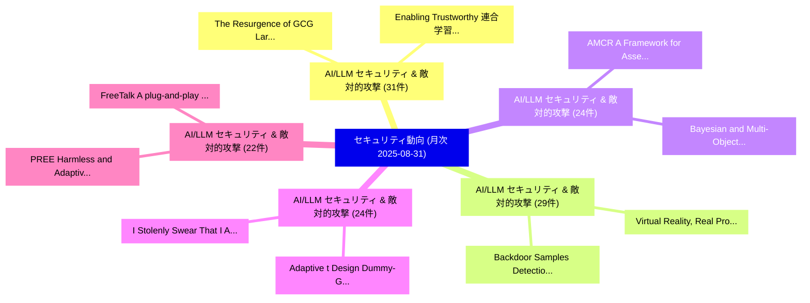

# 📊 03_monthly: 月次エグゼクティブサマリー報告書 (直近30日間: 2025-08-31)

**集計日時**: 2025-08-31 00:00:00 UTC  
**直近30日間の総論文数**: 597 件  

---

## 💡 マクロ脅威動向 & 戦略的リスク評価 (Strategic Executive Insights)

本日の収集論文（計 597 件）において、以下の重点セキュリティ領域で活発な研究動向が確認されました：
- **AI/LLM セキュリティ & 敵対的攻撃** (31 件): 注目論文として 「The Resurgence of GCG Large La...」、「Enabling Trustworthy 連合学習 via ...」 等が発表され、実務防御および攻撃検証の進展が見られます。
- **AI/LLM セキュリティ & 敵対的攻撃** (29 件): 注目論文として 「Virtual Reality, Real Problems...」、「Backdoor Samples Detection Bas...」 等が発表され、実務防御および攻撃検証の進展が見られます。
- **AI/LLM セキュリティ & 敵対的攻撃** (24 件): 注目論文として 「AMCR: A Framework for Assessin...」、「Bayesian and Multi-Objective D...」 等が発表され、実務防御および攻撃検証の進展が見られます。
- **AI/LLM セキュリティ & 敵対的攻撃** (24 件): 注目論文として 「Adaptive t Design Dummy-Gate O...」、「I Stolenly Swear That I Am Up ...」 等が発表され、実務防御および攻撃検証の進展が見られます。
- **AI/LLM セキュリティ & 敵対的攻撃** (22 件): 注目論文として 「PREE: Harmless and Adaptive Fi...」、「FreeTalk:A plug-and-play and b...」 等が発表され、実務防御および攻撃検証の進展が見られます。

### 🗺️ 月次セキュリティ技術レーダー (Technology Radar)

---

## 📌 月次セキュリティ論文一覧 (日本語表形式)

| No | arXiv ID | 論文タイトル (日本語訳) | 重要キーワード | 構造化エグゼクティブ要約 (背景・提案・影響) | 脅威分類 | 詳細リンク |
|---|---|---|---|---|---|---|
| 1 | `2509.00641v1` | [AMCR: A Framework for Assessing and Mitigating Copyright Risks in Generative Models（セキュリティ分析論文）](../../okf/papers/2025-08-31/2509.00641.md) | `Mitigating Copyright Risks`, `Generative Models`, `Zhipeng Yin` | 【提案】概要 (Overview & Key Finding) 本論文「AMCR: A Framework for Assessing and Mitigating Copyrigh...。実証評価により経営層・セキュリティ管理者向け推奨アクション (E... | `cs.CV` | [arXiv](https://arxiv.org/abs/2509.00641v1) &#124; [OKF](../../okf/papers/2025-08-31/2509.00641.md) |
| 2 | `2509.00647v1` | [LLM-HyPZ: Hardware Vulnerability Discovery using an LLM-Assisted Hybrid Platform for Zero-Shot Knowledge Extraction and Refinement（セキュリティ分析論文）](../../okf/papers/2025-08-31/2509.00647.md) | `Hardware Vulnerability Discovery`, `Assisted Hybrid Platform`, `Shot Knowledge Extraction` | 【提案】概要 (Overview & Key Finding) 本論文「LLM-HyPZ: Hardware 脆弱性 Discovery using an LLM-Assisted ...。実証評価により経営層・セキュリティ管理者向け推奨アクション (E... | `cs.AI` | [arXiv](https://arxiv.org/abs/2509.00647v1) &#124; [OKF](../../okf/papers/2025-08-31/2509.00647.md) |
| 3 | `2509.00662v2` | [Virtual Reality, Real Problems: A Longitudinal Security VR Firmwareの分析](../../okf/papers/2025-08-31/2509.00662.md) | `Virtual Reality`, `Real Problems`, `Longitudinal Security` | 【提案】概要 (Overview & Key Finding) 本論文「Virtual Reality, Real Problems: A Longitudinal Security...。実証評価により経営層・セキュリティ管理者向け推奨アクション (E... | `cybersecurity` | [arXiv](https://arxiv.org/abs/2509.00662v2) &#124; [OKF](../../okf/papers/2025-08-31/2509.00662.md) |
| 4 | `2509.00706v1` | [X-PRINT:Platform-Agnostic and Scalable Fine-Grained Encrypted Traffic Fingerprinting（セキュリティ分析論文）](../../okf/papers/2025-08-31/2509.00706.md) | `Grained Encrypted Traffic Fingerprinting`, `Scalable Fine`, `Fine-Grained Encrypted` | 【提案】概要 (Overview & Key Finding) 本論文「X-PRINT:Platform-Agnostic and Scalable Fine-Grained Enc...。実証評価により経営層・セキュリティ管理者向け推奨アクション (E... | `cybersecurity` | [arXiv](https://arxiv.org/abs/2509.00706v1) &#124; [OKF](../../okf/papers/2025-08-31/2509.00706.md) |
| 5 | `2509.00770v2` | [Bayesian and Multi-Objective Decision Support for Real-Time Incident Mitigation in Critical Infrastructure（セキュリティ分析論文）](../../okf/papers/2025-08-31/2509.00770.md) | `Objective Decision Support`, `Time Incident Mitigation`, `Multi-Objective Decision` | 【提案】概要 (Overview & Key Finding) 本論文「Bayesian and Multi-Objective Decision Support for Real-...。実証評価により経営層・セキュリティ管理者向け推奨アクション (E... | `cybersecurity` | [arXiv](https://arxiv.org/abs/2509.00770v2) &#124; [OKF](../../okf/papers/2025-08-31/2509.00770.md) |
| 6 | `2509.00781v1` | [Secure and Scalable Face Retrieval via Cancelable Product Quantization（セキュリティ分析論文）](../../okf/papers/2025-08-31/2509.00781.md) | `Scalable Face Retrieval`, `Cancelable Product Quantization`, `Haomiao Tang` | 【提案】概要 (Overview & Key Finding) 本論文「Secure and Scalable Face Retrieval via Cancelable Produ...。実証評価により経営層・セキュリティ管理者向け推奨アクション (E... | `cs.CV` | [arXiv](https://arxiv.org/abs/2509.00781v1) &#124; [OKF](../../okf/papers/2025-08-31/2509.00781.md) |
| 7 | `2509.00811v1` | [MAESTROCUT: Dynamic, Noise-Adaptive, and Secure Quantum Circuit Cutting on Near-Term Hardware（セキュリティ分析論文）](../../okf/papers/2025-08-31/2509.00811.md) | `Secure Quantum Circuit Cutting`, `Term Hardware`, `Near-Term Hardware` | 【提案】概要 (Overview & Key Finding) 本論文「MAESTROCUT: Dynamic, Noise-Adaptive, and Secure 量子 Circ...。実証評価により経営層・セキュリティ管理者向け推奨アクション (E... | `cybersecurity` | [arXiv](https://arxiv.org/abs/2509.00811v1) &#124; [OKF](../../okf/papers/2025-08-31/2509.00811.md) |
| 8 | `2509.00812v1` | [Adaptive t Design Dummy-Gate Obfuscation for Cryogenic Scale Enforcement（セキュリティ分析論文）](../../okf/papers/2025-08-31/2509.00812.md) | `Cryogenic Scale Enforcement`, `Design Dummy`, `Gate Obfuscation` | 【提案】概要 (Overview & Key Finding) 本論文「Adaptive t Design Dummy-Gate Obfuscation for Cryogenic ...。実証評価により経営層・セキュリティ管理者向け推奨アクション (E... | `cybersecurity` | [arXiv](https://arxiv.org/abs/2509.00812v1) &#124; [OKF](../../okf/papers/2025-08-31/2509.00812.md) |
| 9 | `2509.00820v1` | [Unlocking the Effectiveness of LoRA-FP for Seamless Transfer Implantation of Fingerprints in Downstream Models（セキュリティ分析論文）](../../okf/papers/2025-08-31/2509.00820.md) | `Seamless Transfer Implantation`, `Downstream Models`, `Zhenhua Xu` | 【提案】概要 (Overview & Key Finding) 本論文「Unlocking the Effectiveness of LoRA-FP for Seamless Tra...。実証評価により経営層・セキュリティ管理者向け推奨アクション (E... | `cybersecurity` | [arXiv](https://arxiv.org/abs/2509.00820v1) &#124; [OKF](../../okf/papers/2025-08-31/2509.00820.md) |
| 10 | `2509.00882v5` | [VULSOLVER: 脆弱性検出 via LLM-Driven Constraint Solving](../../okf/papers/2025-08-31/2509.00882.md) | `Driven Constraint Solving`, `LLM-Driven Constraint`, `Vulnerability Detection` | 【提案】概要 (Overview & Key Finding) 本論文「VULSOLVER: 脆弱性検出 via LLM-Driven Constraint Solving」（原題:...。実証評価により経営層・セキュリティ管理者向け推奨アクション (E... | `cybersecurity` | [arXiv](https://arxiv.org/abs/2509.00882v5) &#124; [OKF](../../okf/papers/2025-08-31/2509.00882.md) |
| 11 | `2509.00896v2` | [AI-Enhanced Intelligent NIDS Framework: Leveraging Metaheuristic Optimization for Robust Attack Detection and Prevention（セキュリティ分析論文）](../../okf/papers/2025-08-31/2509.00896.md) | `Leveraging Metaheuristic Optimization`, `Robust Attack Detection`, `Enhanced Intelligent` | 【提案】概要 (Overview & Key Finding) 本論文「AI-Enhanced Intelligent NIDS Framework: Leveraging Meta...。実証評価により経営層・セキュリティ管理者向け推奨アクション (E... | `executive-summary` | [arXiv](https://arxiv.org/abs/2509.00896v2) &#124; [OKF](../../okf/papers/2025-08-31/2509.00896.md) |
| 12 | `2509.00918v1` | [PREE: Harmless and Adaptive Fingerprint Editing in Large Language Models via Knowledge Prefix Enhancementに向けて](../../okf/papers/2025-08-31/2509.00918.md) | `Adaptive Fingerprint Editing`, `Large Language Models`, `Knowledge Prefix Enhancement` | 【提案】概要 (Overview & Key Finding) 本論文「PREE: Harmless and Adaptive Fingerprint Editing in Larg...。実証評価により経営層・セキュリティ管理者向け推奨アクション (E... | `cybersecurity` | [arXiv](https://arxiv.org/abs/2509.00918v1) &#124; [OKF](../../okf/papers/2025-08-31/2509.00918.md) |
| 13 | `2509.00973v1` | [Clone What You Can't Steal: Black-Box LLM Replication via Logit Leakage and Distillation（セキュリティ分析論文）](../../okf/papers/2025-08-31/2509.00973.md) | `Logit Leakage`, `Black-Box LLM`, `Shafika Showkat Moni` | 【提案】背景とセキュリティ上の課題 (Background & Problem) 本研究はサイバー脅威環境におけるセキュリティ構造・脆弱性の検証を目的としています。(主要検出項目: ...。実証評価により経営層・セキュリティ管理者向け推奨アクション (E... | `cs.AI` | [arXiv](https://arxiv.org/abs/2509.00973v1) &#124; [OKF](../../okf/papers/2025-08-31/2509.00973.md) |
| 14 | `2509.05331v1` | [ForensicsData: A Digital Forensics Dataset for 大規模言語モデル](../../okf/papers/2025-08-31/2509.05331.md) | `Digital Forensics Dataset`, `Large Language Models`, `Youssef Chakir` | 【提案】概要 (Overview & Key Finding) 本論文「ForensicsData: A Digital Forensics Dataset for 大規模言語モデル...。実証評価により経営層・セキュリティ管理者向け推奨アクション (E... | `cs.AI` | [arXiv](https://arxiv.org/abs/2509.05331v1) &#124; [OKF](../../okf/papers/2025-08-31/2509.05331.md) |
| 15 | `2509.05332v1` | [Integrated Simulation Framework for Autonomous Vehiclesに対する敵対的攻撃](../../okf/papers/2025-08-31/2509.05332.md) | `Adversarial Attacks`, `Autonomous Vehicles`, `Christos Anagnostopoulos` | 【提案】概要 (Overview & Key Finding) 本論文「Integrated Simulation Framework for Autonomous Vehicles...。実証評価により経営層・セキュリティ管理者向け推奨アクション (E... | `cs.AI` | [arXiv](https://arxiv.org/abs/2509.05332v1) &#124; [OKF](../../okf/papers/2025-08-31/2509.05332.md) |
| 16 | `2509.10492v2` | [Investigation Of The Distinguishability Of Giraud-Verneuil Atomic Blocks（セキュリティ分析論文）](../../okf/papers/2025-08-31/2509.10492.md) | `Verneuil Atomic Blocks`, `Giraud-Verneuil Atomic`, `Philip Laryea Doku` | 【提案】概要 (Overview & Key Finding) 本論文「Investigation Of The Distinguishability Of Giraud-Verne...。実証評価により経営層・セキュリティ管理者向け推奨アクション (E... | `cybersecurity` | [arXiv](https://arxiv.org/abs/2509.10492v2) &#124; [OKF](../../okf/papers/2025-08-31/2509.10492.md) |
| 17 | `2509.00300v2` | [ShadowScope: GPU Monitoring and Validation via Composable Side Channel Signals（セキュリティ分析論文）](../../okf/papers/2025-08-30/2509.00300.md) | `Composable Side Channel Signals`, `Yu David Liu`, `Ghadeer Almusaddar` | 【提案】概要 (Overview & Key Finding) 本論文「ShadowScope: GPU Monitoring and Validation via Composab...。実証評価により経営層・セキュリティ管理者向け推奨アクション (E... | `cybersecurity` | [arXiv](https://arxiv.org/abs/2509.00300v2) &#124; [OKF](../../okf/papers/2025-08-30/2509.00300.md) |
| 18 | `2509.00332v1` | [CryptoFace: End-to-End Encrypted Face Recognition（セキュリティ分析論文）](../../okf/papers/2025-08-30/2509.00332.md) | `End Encrypted Face Recognition`, `Vishnu Naresh Boddeti`, `Wei Ao` | 【提案】概要 (Overview & Key Finding) 本論文「CryptoFace: End-to-End Encrypted Face Recognition（セキュリテ...。実証評価により経営層・セキュリティ管理者向け推奨アクション (E... | `cs.CV` | [arXiv](https://arxiv.org/abs/2509.00332v1) &#124; [OKF](../../okf/papers/2025-08-30/2509.00332.md) |
| 19 | `2509.00391v1` | [The Resurgence of GCG Large Language Modelsに対する敵対的攻撃](../../okf/papers/2025-08-30/2509.00391.md) | `Large Language Models`, `Adversarial Attacks`, `Large Language` | 【提案】概要 (Overview & Key Finding) 本論文「The Resurgence of GCG Large Language Modelsに対する敵対的攻撃」（原...。実証評価により経営層・セキュリティ管理者向け推奨アクション (E... | `cs.AI` | [arXiv](https://arxiv.org/abs/2509.00391v1) &#124; [OKF](../../okf/papers/2025-08-30/2509.00391.md) |
| 20 | `2509.00437v1` | [A Hybrid AI-based and Rule-based Approach to DICOM De-identification: A Solution for the MIDI-B Challenge（セキュリティ分析論文）](../../okf/papers/2025-08-30/2509.00437.md) | `MIDI-B Challenge`, `Hamideh Haghiri`, `Rajesh Baidya` | 【提案】概要 (Overview & Key Finding) 本論文「A Hybrid AI-based and Rule-based Approach to DICOM De-i...。実証評価により経営層・セキュリティ管理者向け推奨アクション (E... | `cybersecurity` | [arXiv](https://arxiv.org/abs/2509.00437v1) &#124; [OKF](../../okf/papers/2025-08-30/2509.00437.md) |
| 21 | `2509.00476v1` | [Cross-Domain マルウェア検出 via Probability-Level Fusion of Lightweight Gradient Boosting Models](../../okf/papers/2025-08-30/2509.00476.md) | `Lightweight Gradient Boosting Models`, `Level Fusion`, `Probability-Level Fusion` | 【提案】概要 (Overview & Key Finding) 本論文「Cross-Domain マルウェア検出 via Probability-Level Fusion of Li...。実証評価により経営層・セキュリティ管理者向け推奨アクション (E... | `cs.AI` | [arXiv](https://arxiv.org/abs/2509.00476v1) &#124; [OKF](../../okf/papers/2025-08-30/2509.00476.md) |
| 22 | `2509.00540v1` | [FedThief: Harming Others to Benefit Oneself in Self-Centered 連合学習](../../okf/papers/2025-08-30/2509.00540.md) | `Harming Others`, `Benefit Oneself`, `Centered Federated Learning` | 【提案】概要 (Overview & Key Finding) 本論文「FedThief: Harming Others to Benefit Oneself in Self-Cen...。実証評価により経営層・セキュリティ管理者向け推奨アクション (E... | `executive-summary` | [arXiv](https://arxiv.org/abs/2509.00540v1) &#124; [OKF](../../okf/papers/2025-08-30/2509.00540.md) |
| 23 | `2509.00561v1` | [FreeTalk:A plug-and-play and black-box defense against speech synthesis attacks（セキュリティ分析論文）](../../okf/papers/2025-08-30/2509.00561.md) | `black-box defense`, `Yuwen Pu`, `Zhou Feng` | 【提案】概要 (Overview & Key Finding) 本論文「FreeTalk:A plug-and-play and black-box defense against ...。実証評価により経営層・セキュリティ管理者向け推奨アクション (E... | `cybersecurity` | [arXiv](https://arxiv.org/abs/2509.00561v1) &#124; [OKF](../../okf/papers/2025-08-30/2509.00561.md) |
| 24 | `2509.00615v1` | [Federated Survival Analysis with Node-Level Differential Privacy: Private Kaplan-Meier Curves（セキュリティ分析論文）](../../okf/papers/2025-08-30/2509.00615.md) | `Level Differential Privacy`, `Private Kaplan`, `Meier Curves` | 【提案】概要 (Overview & Key Finding) 本論文「Federated Survival Analysis with Node-Level 差分プライバシー: P...。実証評価により経営層・セキュリティ管理者向け推奨アクション (E... | `cs.AI` | [arXiv](https://arxiv.org/abs/2509.00615v1) &#124; [OKF](../../okf/papers/2025-08-30/2509.00615.md) |
| 25 | `2509.00634v1` | [Enabling Trustworthy 連合学習 via Remote Attestation for Mitigating Byzantine Threats](../../okf/papers/2025-08-30/2509.00634.md) | `Mitigating Byzantine Threats`, `Remote Attestation`, `Enabling Trustworthy Federated Learning` | 【提案】概要 (Overview & Key Finding) 本論文「Enabling Trustworthy 連合学習 via Remote Attestation for Mi...。実証評価により経営層・セキュリティ管理者向け推奨アクション (E... | `cs.AI` | [arXiv](https://arxiv.org/abs/2509.00634v1) &#124; [OKF](../../okf/papers/2025-08-30/2509.00634.md) |
| 26 | `2509.05318v1` | [Backdoor Samples Detection Based on Perturbation Discrepancy Consistency in Pre-trained Language Models（セキュリティ分析論文）](../../okf/papers/2025-08-30/2509.05318.md) | `Backdoor Samples Detection Based`, `Perturbation Discrepancy Consistency`, `Language Models` | 【提案】概要 (Overview & Key Finding) 本論文「Backdoor Samples Detection Based on Perturbation Discre...。実証評価により経営層・セキュリティ管理者向け推奨アクション (E... | `cs.AI` | [arXiv](https://arxiv.org/abs/2509.05318v1) &#124; [OKF](../../okf/papers/2025-08-30/2509.05318.md) |
| 27 | `2509.05320v1` | [Privacy-Preserving Offloading for 大規模言語モデル in 6G Vehicular Networks](../../okf/papers/2025-08-30/2509.05320.md) | `Preserving Offloading`, `Vehicular Networks`, `Privacy-Preserving Offloading` | 【提案】概要 (Overview & Key Finding) 本論文「Privacy-Preserving Offloading for 大規模言語モデル in 6G Vehicu...。実証評価により経営層・セキュリティ管理者向け推奨アクション (E... | `executive-summary` | [arXiv](https://arxiv.org/abs/2509.05320v1) &#124; [OKF](../../okf/papers/2025-08-30/2509.05320.md) |
| 28 | `2509.05326v2` | [Zero-Knowledge Proofs in Sublinear Space（セキュリティ分析論文）](../../okf/papers/2025-08-30/2509.05326.md) | `Knowledge Proofs`, `Sublinear Space`, `Zero-Knowledge Proofs` | 【提案】概要 (Overview & Key Finding) 本論文「Zero-Knowledge Proofs in Sublinear Space（セキュリティ分析論文）」（原...。実証評価により経営層・セキュリティ管理者向け推奨アクション (E... | `cs.AI` | [arXiv](https://arxiv.org/abs/2509.05326v2) &#124; [OKF](../../okf/papers/2025-08-30/2509.05326.md) |
| 29 | `2509.10488v1` | [Turning CVEs into Educational Labs:Insights and Challenges（セキュリティ分析論文）](../../okf/papers/2025-08-30/2509.10488.md) | `Educational Labs`, `Trueye Tafese`, `Raw Meta` | 【提案】概要 (Overview & Key Finding) 本論文「Turning CVEs into Educational Labs:Insights and Challen...。実証評価により経営層・セキュリティ管理者向け推奨アクション (E... | `cybersecurity` | [arXiv](https://arxiv.org/abs/2509.10488v1) &#124; [OKF](../../okf/papers/2025-08-30/2509.10488.md) |
| 30 | `2508.21302v3` | [Locus: Agentic Predicate Synthesis for Directed Fuzzing（セキュリティ分析論文）](../../okf/papers/2025-08-29/2508.21302.md) | `Agentic Predicate Synthesis`, `Directed Fuzzing`, `Jie Zhu` | 【提案】概要 (Overview & Key Finding) 本論文「Locus: Agentic Predicate Synthesis for Directed Fuzzing...。実証評価により経営層・セキュリティ管理者向け推奨アクション (E... | `cs.AI` | [arXiv](https://arxiv.org/abs/2508.21302v3) &#124; [OKF](../../okf/papers/2025-08-29/2508.21302.md) |
| 31 | `2508.21323v2` | [LLM-driven Provenance Forensics for Threat Investigation and Detection（セキュリティ分析論文）](../../okf/papers/2025-08-29/2508.21323.md) | `Provenance Forensics`, `Threat Investigation`, `LLM-driven Provenance` | 【提案】概要 (Overview & Key Finding) 本論文「LLM-driven Provenance Forensics for 脅威 Investigation an...。実証評価により経営層・セキュリティ管理者向け推奨アクション (E... | `cybersecurity` | [arXiv](https://arxiv.org/abs/2508.21323v2) &#124; [OKF](../../okf/papers/2025-08-29/2508.21323.md) |
| 32 | `2508.21386v1` | [Risks and Compliance with the EU's Core Cyber Security Legislation（セキュリティ分析論文）](../../okf/papers/2025-08-29/2508.21386.md) | `Core Cyber Security Legislation`, `Jukka Ruohonen`, `Raw Meta` | 【提案】概要 (Overview & Key Finding) 本論文「Risks and Compliance with the EU's Core Cyber Security ...。実証評価により経営層・セキュリティ管理者向け推奨アクション (E... | `executive-summary` | [arXiv](https://arxiv.org/abs/2508.21386v1) &#124; [OKF](../../okf/papers/2025-08-29/2508.21386.md) |
| 33 | `2508.21393v3` | [VeriLoRA: Fine-Tuning 大規模言語モデル with Verifiable Security via Zero-Knowledge Proofs](../../okf/papers/2025-08-29/2508.21393.md) | `Verifiable Security`, `Knowledge Proofs`, `Zero-Knowledge Proofs` | 【提案】概要 (Overview & Key Finding) 本論文「VeriLoRA: Fine-Tuning 大規模言語モデル with Verifiable Security...。実証評価により経営層・セキュリティ管理者向け推奨アクション (E... | `cs.AI` | [arXiv](https://arxiv.org/abs/2508.21393v3) &#124; [OKF](../../okf/papers/2025-08-29/2508.21393.md) |
| 34 | `2508.21417v1` | [Vulnerable Package Dependencies in LLM Repositoriesの実証研究](../../okf/papers/2025-08-29/2508.21417.md) | `Vulnerable Package Dependencies`, `Shuhan Liu`, `Xing Hu` | 【提案】概要 (Overview & Key Finding) 本論文「Vulnerable Package Dependencies in LLM Repositoriesの実証研...。実証評価により経営層・セキュリティ管理者向け推奨アクション (E... | `executive-summary` | [arXiv](https://arxiv.org/abs/2508.21417v1) &#124; [OKF](../../okf/papers/2025-08-29/2508.21417.md) |
| 35 | `2508.21432v3` | [RepoMark: A Data-Usage Auditing Framework for Code 大規模言語モデル](../../okf/papers/2025-08-29/2508.21432.md) | `Data-Usage Auditing`, `Code Large Language Models`, `Wenjie Qu` | 【提案】概要 (Overview & Key Finding) 本論文「RepoMark: A Data-Usage Auditing Framework for Code 大規模言...。実証評価によりWang, Jinyuan Jia, Jiahen... | `executive-summary` | [arXiv](https://arxiv.org/abs/2508.21432v3) &#124; [OKF](../../okf/papers/2025-08-29/2508.21432.md) |
| 36 | `2508.21440v1` | [Time Tells All: Deanonymization of Blockchain RPC Users with Zero Transaction Fee (Extended Version)（セキュリティ分析論文）](../../okf/papers/2025-08-29/2508.21440.md) | `Zero Transaction Fee`, `Extended Version`, `Shan Wang` | 【提案】概要 (Overview & Key Finding) 本論文「Time Tells All: Deanonymization of Blockchain RPC Users...。実証評価により経営層・セキュリティ管理者向け推奨アクション (E... | `cybersecurity` | [arXiv](https://arxiv.org/abs/2508.21440v1) &#124; [OKF](../../okf/papers/2025-08-29/2508.21440.md) |
| 37 | `2508.21457v3` | [SoK: Exposing the Generation and Detection Gaps in LLM-Generated Phishing（セキュリティ分析論文）](../../okf/papers/2025-08-29/2508.21457.md) | `Detection Gaps`, `Generated Phishing`, `LLM-Generated Phishing` | 【提案】概要 (Overview & Key Finding) 本論文「SoK: Exposing the Generation and Detection Gaps in LLM-...。実証評価により経営層・セキュリティ管理者向け推奨アクション (E... | `cybersecurity` | [arXiv](https://arxiv.org/abs/2508.21457v3) &#124; [OKF](../../okf/papers/2025-08-29/2508.21457.md) |
| 38 | `2508.21480v1` | [a Decentralized IoT Onboarding for Smart Homes Using Consortium Blockchainに向けて](../../okf/papers/2025-08-29/2508.21480.md) | `Smart Homes Using Consortium Blockchain`, `Smart Homes Using Consortium`, `Narges Dadkhah` | 【提案】概要 (Overview & Key Finding) 本論文「a Decentralized IoT Onboarding for Smart Homes Using Co...。実証評価により経営層・セキュリティ管理者向け推奨アクション (E... | `cs.NI` | [arXiv](https://arxiv.org/abs/2508.21480v1) &#124; [OKF](../../okf/papers/2025-08-29/2508.21480.md) |
| 39 | `2508.21558v1` | [Generalized Encrypted Traffic Classification Using Inter-Flow Signals（セキュリティ分析論文）](../../okf/papers/2025-08-29/2508.21558.md) | `Generalized Encrypted Traffic Classification Using Inter`, `Flow Signals`, `Inter-Flow Signals` | 【提案】概要 (Overview & Key Finding) 本論文「Generalized Encrypted Traffic Classification Using Inte...。実証評価により経営層・セキュリティ管理者向け推奨アクション (E... | `cs.NI` | [arXiv](https://arxiv.org/abs/2508.21558v1) &#124; [OKF](../../okf/papers/2025-08-29/2508.21558.md) |
| 40 | `2508.21579v1` | [Agentic Discovery and Validation of Android App Vulnerabilities（セキュリティ分析論文）](../../okf/papers/2025-08-29/2508.21579.md) | `Android App Vulnerabilities`, `Agentic Discovery`, `Ziyue Wang` | 【提案】概要 (Overview & Key Finding) 本論文「Agentic Discovery and Validation of Android App Vulnera...。実証評価により経営層・セキュリティ管理者向け推奨アクション (E... | `cybersecurity` | [arXiv](https://arxiv.org/abs/2508.21579v1) &#124; [OKF](../../okf/papers/2025-08-29/2508.21579.md) |
| 41 | `2508.21602v3` | [Condense to Conduct and Conduct to Condense（セキュリティ分析論文）](../../okf/papers/2025-08-29/2508.21602.md) | `Tomasz Kazana`, `Raw Meta`, `Executive Summary` | 【提案】概要 (Overview & Key Finding) 本論文「Condense to Conduct and Conduct to Condense（セキュリティ分析論文）...。実証評価により経営層・セキュリティ管理者向け推奨アクション (E... | `executive-summary` | [arXiv](https://arxiv.org/abs/2508.21602v3) &#124; [OKF](../../okf/papers/2025-08-29/2508.21602.md) |
| 42 | `2508.21606v1` | [Hybrid Cryptographic Monitoring System for Side-Channel Attack Detection on PYNQ SoCs（セキュリティ分析論文）](../../okf/papers/2025-08-29/2508.21606.md) | `Hybrid Cryptographic Monitoring System`, `Channel Attack Detection`, `Side-Channel Attack` | 【提案】概要 (Overview & Key Finding) 本論文「Hybrid Cryptographic Monitoring System for サイドチャネル攻撃 De...。実証評価により経営層・セキュリティ管理者向け推奨アクション (E... | `cybersecurity` | [arXiv](https://arxiv.org/abs/2508.21606v1) &#124; [OKF](../../okf/papers/2025-08-29/2508.21606.md) |
| 43 | `2508.21636v1` | [Detecting Stealthy Data Poisoning Attacks in AI Code Generators（セキュリティ分析論文）](../../okf/papers/2025-08-29/2508.21636.md) | `Detecting Stealthy Data Poisoning Attacks`, `Code Generators`, `Cristina Improta` | 【提案】概要 (Overview & Key Finding) 本論文「Detecting Stealthy Data Poisoning Attacks in AI Code Ge...。実証評価により経営層・セキュリティ管理者向け推奨アクション (E... | `executive-summary` | [arXiv](https://arxiv.org/abs/2508.21636v1) &#124; [OKF](../../okf/papers/2025-08-29/2508.21636.md) |
| 44 | `2508.21653v1` | [Analogy between Learning With Error Problem and Ill-Posed Inverse Problems（セキュリティ分析論文）](../../okf/papers/2025-08-29/2508.21653.md) | `Posed Inverse Problems`, `Ill-Posed Inverse`, `Gaurav Mittal` | 【提案】概要 (Overview & Key Finding) 本論文「Analogy between Learning With Error Problem and Ill-Pos...。実証評価により経営層・セキュリティ管理者向け推奨アクション (E... | `executive-summary` | [arXiv](https://arxiv.org/abs/2508.21653v1) &#124; [OKF](../../okf/papers/2025-08-29/2508.21653.md) |
| 45 | `2508.21654v1` | [I Stolenly Swear That I Am Up to (No) Good: Design and Evaluation of Model Stealing Attacks（セキュリティ分析論文）](../../okf/papers/2025-08-29/2508.21654.md) | `Model Stealing Attacks`, `Daryna Oliynyk`, `Rudolf Mayer` | 【提案】概要 (Overview & Key Finding) 本論文「I Stolenly Swear That I Am Up to (No) Good: Design and ...。実証評価により経営層・セキュリティ管理者向け推奨アクション (E... | `executive-summary` | [arXiv](https://arxiv.org/abs/2508.21654v1) &#124; [OKF](../../okf/papers/2025-08-29/2508.21654.md) |
| 46 | `2508.21669v2` | [サイバーセキュリティ AI: Hacking the AI Hackers via Prompt Injection](../../okf/papers/2025-08-29/2508.21669.md) | `Prompt Injection`, `Per Mannermaa Rynning`, `Raw Meta` | 【提案】概要 (Overview & Key Finding) 本論文「サイバーセキュリティ AI: Hacking the AI Hackers via プロンプトインジェクション...。実証評価により経営層・セキュリティ管理者向け推奨アクション (E... | `cybersecurity` | [arXiv](https://arxiv.org/abs/2508.21669v2) &#124; [OKF](../../okf/papers/2025-08-29/2508.21669.md) |
| 47 | `2508.21715v1` | [Entropy-Based Non-Invasive Reliability Monitoring of Convolutional Neural Networks（セキュリティ分析論文）](../../okf/papers/2025-08-29/2508.21715.md) | `Invasive Reliability Monitoring`, `Convolutional Neural Networks`, `Based Non` | 【提案】概要 (Overview & Key Finding) 本論文「Entropy-Based Non-Invasive Reliability Monitoring of Co...。実証評価により経営層・セキュリティ管理者向け推奨アクション (E... | `cs.AI` | [arXiv](https://arxiv.org/abs/2508.21715v1) &#124; [OKF](../../okf/papers/2025-08-29/2508.21715.md) |
| 48 | `2508.21727v1` | [OptMark: Robust Multi-bit Diffusion Watermarking via Inference Time Optimization（セキュリティ分析論文）](../../okf/papers/2025-08-29/2508.21727.md) | `Inference Time Optimization`, `Robust Multi`, `Diffusion Watermarking` | 【提案】概要 (Overview & Key Finding) 本論文「OptMark: Robust Multi-bit Diffusion Watermarking via In...。実証評価により経営層・セキュリティ管理者向け推奨アクション (E... | `cs.AI` | [arXiv](https://arxiv.org/abs/2508.21727v1) &#124; [OKF](../../okf/papers/2025-08-29/2508.21727.md) |
| 49 | `2508.21797v2` | [DynaMark: A Reinforcement Learning Framework for Dynamic Watermarking in Industrial Machine Tool Controllers（セキュリティ分析論文）](../../okf/papers/2025-08-29/2508.21797.md) | `Industrial Machine Tool Controllers`, `Dynamic Watermarking`, `Navid Aftabi` | 【提案】概要 (Overview & Key Finding) 本論文「DynaMark: A Reinforcement Learning Framework for Dynami...。実証評価により経営層・セキュリティ管理者向け推奨アクション (E... | `cs.AI` | [arXiv](https://arxiv.org/abs/2508.21797v2) &#124; [OKF](../../okf/papers/2025-08-29/2508.21797.md) |
| 50 | `2509.00124v1` | [A Whole New World: Creating a Parallel-Poisoned Web Only AI-Agents Can See（セキュリティ分析論文）](../../okf/papers/2025-08-29/2509.00124.md) | `Whole New World`, `Agents Can See`, `Parallel-Poisoned Web` | 【提案】概要 (Overview & Key Finding) 本論文「A Whole New World: Creating a Parallel-Poisoned Web Onl...。実証評価により経営層・セキュリティ管理者向け推奨アクション (E... | `cs.AI` | [arXiv](https://arxiv.org/abs/2509.00124v1) &#124; [OKF](../../okf/papers/2025-08-29/2509.00124.md) |
| 51 | `2509.00266v2` | [CISAF: A Framework for Estimating the Security Posture of Academic and Research Cyberinfrastructure（セキュリティ分析論文）](../../okf/papers/2025-08-29/2509.00266.md) | `Security Posture`, `Research Cyberinfrastructure`, `Qishen Liang` | 【提案】概要 (Overview & Key Finding) 本論文「CISAF: A Framework for Estimating the Security Posture ...。実証評価により経営層・セキュリティ管理者向け推奨アクション (E... | `cybersecurity` | [arXiv](https://arxiv.org/abs/2509.00266v2) &#124; [OKF](../../okf/papers/2025-08-29/2509.00266.md) |
| 52 | `2509.10482v2` | [AegisShield: Democratizing Cyber Threat Modeling with Generative AI（セキュリティ分析論文）](../../okf/papers/2025-08-29/2509.10482.md) | `Democratizing Cyber Threat Modeling`, `Matthew Grofsky`, `Raw Meta` | 【提案】概要 (Overview & Key Finding) 本論文「AegisShield: Democratizing Cyber 脅威 Modeling with Gener...。実証評価により経営層・セキュリティ管理者向け推奨アクション (E... | `cs.AI` | [arXiv](https://arxiv.org/abs/2509.10482v2) &#124; [OKF](../../okf/papers/2025-08-29/2509.10482.md) |
| 53 | `2508.20411v1` | [Governable AI: Provable Safety Under Extreme Threat Models（セキュリティ分析論文）](../../okf/papers/2025-08-28/2508.20411.md) | `Donglin Wang`, `Weiyun Liang`, `Chunyuan Chen` | 【提案】概要 (Overview & Key Finding) 本論文「Governable AI: Provable Safety Under Extreme 脅威 Models（...。実証評価により経営層・セキュリティ管理者向け推奨アクション (E... | `cs.AI` | [arXiv](https://arxiv.org/abs/2508.20411v1) &#124; [OKF](../../okf/papers/2025-08-28/2508.20411.md) |
| 54 | `2508.20412v3` | [MindGuard: Intrinsic Decision Inspection for LLM Agents Against Metadata Poisoningのセキュリティ強化](../../okf/papers/2025-08-28/2508.20412.md) | `Intrinsic Decision Inspection`, `Zhiqiang Wang`, `Haohua Du` | 【提案】概要 (Overview & Key Finding) 本論文「MindGuard: Intrinsic Decision Inspection for LLM Agents...。実証評価により経営層・セキュリティ管理者向け推奨アクション (E... | `cybersecurity` | [arXiv](https://arxiv.org/abs/2508.20412v3) &#124; [OKF](../../okf/papers/2025-08-28/2508.20412.md) |
| 55 | `2508.20414v1` | [連合学習 for Large Models in Medical Imaging: A Comprehensive Review](../../okf/papers/2025-08-28/2508.20414.md) | `Large Models`, `Medical Imaging`, `Comprehensive Review` | 【提案】概要 (Overview & Key Finding) 本論文「連合学習 for Large Models in Medical Imaging: A Comprehensi...。実証評価により経営層・セキュリティ管理者向け推奨アクション (E... | `cs.CV` | [arXiv](https://arxiv.org/abs/2508.20414v1) &#124; [OKF](../../okf/papers/2025-08-28/2508.20414.md) |
| 56 | `2508.20424v4` | [Attacks on Approximate Caches in Text-to-Image Diffusion Models（セキュリティ分析論文）](../../okf/papers/2025-08-28/2508.20424.md) | `Image Diffusion Models`, `Approximate Caches`, `Desen Sun` | 【提案】概要 (Overview & Key Finding) 本論文「Attacks on Approximate Caches in Text-to-Image Diffusio...。実証評価により経営層・セキュリティ管理者向け推奨アクション (E... | `cybersecurity` | [arXiv](https://arxiv.org/abs/2508.20424v4) &#124; [OKF](../../okf/papers/2025-08-28/2508.20424.md) |
| 57 | `2508.20444v1` | [Ransomware 3.0: Self-Composing and LLM-Orchestrated（セキュリティ分析論文）](../../okf/papers/2025-08-28/2508.20444.md) | `Md Raz`, `Meet Udeshi`, `Sai Charan` | 【提案】概要 (Overview & Key Finding) 本論文「ランサムウェア 3.0: Self-Composing and LLM-Orchestrated（セキュリティ...。実証評価によりSai Charan, Prashanth Kri... | `cybersecurity` | [arXiv](https://arxiv.org/abs/2508.20444v1) &#124; [OKF](../../okf/papers/2025-08-28/2508.20444.md) |
| 58 | `2508.20452v1` | [Evaluating Differentially Private Generation of Domain-Specific Text（セキュリティ分析論文）](../../okf/papers/2025-08-28/2508.20452.md) | `Evaluating Differentially Private Generation`, `Specific Text`, `Domain-Specific Text` | 【提案】概要 (Overview & Key Finding) 本論文「Evaluating Differentially Private Generation of Domain-...。実証評価により経営層・セキュリティ管理者向け推奨アクション (E... | `cs.AI` | [arXiv](https://arxiv.org/abs/2508.20452v1) &#124; [OKF](../../okf/papers/2025-08-28/2508.20452.md) |
| 59 | `2508.20504v1` | [Enhancing Resilience for IoE: A Perspective of Networking-Level Safeguard（セキュリティ分析論文）](../../okf/papers/2025-08-28/2508.20504.md) | `Enhancing Resilience`, `Level Safeguard`, `Networking-Level Safeguard` | 【提案】概要 (Overview & Key Finding) 本論文「Enhancing Resilience for IoE: A Perspective of Networki...。実証評価により経営層・セキュリティ管理者向け推奨アクション (E... | `cs.NI` | [arXiv](https://arxiv.org/abs/2508.20504v1) &#124; [OKF](../../okf/papers/2025-08-28/2508.20504.md) |
| 60 | `2508.20517v1` | [BridgeShield: Enhancing Security for Cross-chain Bridge Applications via Heterogeneous Graph Mining（セキュリティ分析論文）](../../okf/papers/2025-08-28/2508.20517.md) | `Heterogeneous Graph Mining`, `Enhancing Security`, `Bridge Applications` | 【提案】概要 (Overview & Key Finding) 本論文「BridgeShield: Enhancing Security for Cross-chain Bridge...。実証評価により経営層・セキュリティ管理者向け推奨アクション (E... | `cs.AI` | [arXiv](https://arxiv.org/abs/2508.20517v1) &#124; [OKF](../../okf/papers/2025-08-28/2508.20517.md) |
| 61 | `2508.20578v1` | [Human-AI Collaborative Bot Detection in MMORPGs（セキュリティ分析論文）](../../okf/papers/2025-08-28/2508.20578.md) | `Collaborative Bot Detection`, `Human-AI Collaborative`, `Jaeman Son` | 【提案】概要 (Overview & Key Finding) 本論文「Human-AI Collaborative Bot Detection in MMORPGs（セキュリティ分...。実証評価により経営層・セキュリティ管理者向け推奨アクション (E... | `cs.AI` | [arXiv](https://arxiv.org/abs/2508.20578v1) &#124; [OKF](../../okf/papers/2025-08-28/2508.20578.md) |
| 62 | `2508.20591v1` | [Bitcoin as an Interplanetary Monetary Standard with Proof-of-Transit Timestamping（セキュリティ分析論文）](../../okf/papers/2025-08-28/2508.20591.md) | `Interplanetary Monetary Standard`, `Transit Timestamping`, `Carlos Puente` | 【提案】概要 (Overview & Key Finding) 本論文「Bitcoin as an Interplanetary Monetary Standard with Pro...。実証評価により経営層・セキュリティ管理者向け推奨アクション (E... | `cybersecurity` | [arXiv](https://arxiv.org/abs/2508.20591v1) &#124; [OKF](../../okf/papers/2025-08-28/2508.20591.md) |
| 63 | `2508.20613v1` | [Revisiting the Privacy Risks of Split Inference: A GAN-Based Data Reconstruction Attack via Progressive Feature Optimization（セキュリティ分析論文）](../../okf/papers/2025-08-28/2508.20613.md) | `Based Data Reconstruction Attack`, `Progressive Feature Optimization`, `Privacy Risks` | 【提案】概要 (Overview & Key Finding) 本論文「Revisiting the Privacy Risks of Split Inference: A GAN-...。実証評価により経営層・セキュリティ管理者向け推奨アクション (E... | `cs.CV` | [arXiv](https://arxiv.org/abs/2508.20613v1) &#124; [OKF](../../okf/papers/2025-08-28/2508.20613.md) |
| 64 | `2508.20643v2` | [CyberSleuth: Autonomous Blue-Team LLM Agent for Web Attack Forensics（セキュリティ分析論文）](../../okf/papers/2025-08-28/2508.20643.md) | `Web Attack Forensics`, `Autonomous Blue`, `Blue-Team LLM` | 【提案】概要 (Overview & Key Finding) 本論文「CyberSleuth: Autonomous Blue-Team LLM Agent for Web Att...。実証評価により経営層・セキュリティ管理者向け推奨アクション (E... | `cybersecurity` | [arXiv](https://arxiv.org/abs/2508.20643v2) &#124; [OKF](../../okf/papers/2025-08-28/2508.20643.md) |
| 65 | `2508.20653v1` | [Microarchitecture Design and of Custom SHA-3 Instruction for RISC-Vのベンチマーク評価](../../okf/papers/2025-08-28/2508.20653.md) | `Microarchitecture Design`, `SHA-3 Instruction`, `Alperen Bolat` | 【提案】概要 (Overview & Key Finding) 本論文「Microarchitecture Design and of Custom SHA-3 Instructio...。実証評価により経営層・セキュリティ管理者向け推奨アクション (E... | `cs.NI` | [arXiv](https://arxiv.org/abs/2508.20653v1) &#124; [OKF](../../okf/papers/2025-08-28/2508.20653.md) |
| 66 | `2508.20816v1` | [Multi-Agent Penetration Testing AI for the Web（セキュリティ分析論文）](../../okf/papers/2025-08-28/2508.20816.md) | `Agent Penetration Testing`, `Multi-Agent Penetration`, `Isaac David` | 【提案】概要 (Overview & Key Finding) 本論文「Multi-Agent Penetration Testing AI for the Web（セキュリティ分析...。実証評価により経営層・セキュリティ管理者向け推奨アクション (E... | `cs.AI` | [arXiv](https://arxiv.org/abs/2508.20816v1) &#124; [OKF](../../okf/papers/2025-08-28/2508.20816.md) |
| 67 | `2508.20848v1` | [JADES: A Universal Framework for Jailbreak Assessment via Decompositional Scoring（セキュリティ分析論文）](../../okf/papers/2025-08-28/2508.20848.md) | `Jailbreak Assessment`, `Decompositional Scoring`, `Junjie Chu` | 【提案】概要 (Overview & Key Finding) 本論文「JADES: A Universal Framework for ジェイルブレイク Assessment vi...。実証評価により経営層・セキュリティ管理者向け推奨アクション (E... | `cs.AI` | [arXiv](https://arxiv.org/abs/2508.20848v1) &#124; [OKF](../../okf/papers/2025-08-28/2508.20848.md) |
| 68 | `2508.20863v3` | [Misleading 大規模言語モデル used (or misused) in Scientific Peer-Reviewing via Hidden Prompt-Injection Attacks](../../okf/papers/2025-08-28/2508.20863.md) | `Scientific Peer`, `Hidden Prompt`, `Injection Attacks` | 【提案】概要 (Overview & Key Finding) 本論文「Misleading 大規模言語モデル used (or misused) in Scientific Pee...。実証評価により経営層・セキュリティ管理者向け推奨アクション (E... | `cybersecurity` | [arXiv](https://arxiv.org/abs/2508.20863v3) &#124; [OKF](../../okf/papers/2025-08-28/2508.20863.md) |
| 69 | `2508.20866v6` | [AVIATOR: AI-Agentic Vulnerability Injection Workflow for High-Fidelity, Large-Scale Code Security Datasetに向けて](../../okf/papers/2025-08-28/2508.20866.md) | `Agentic Vulnerability Injection Workflow`, `AI-Agentic Vulnerability`, `Large-Scale Code` | 【提案】概要 (Overview & Key Finding) 本論文「AVIATOR: AI-Agentic 脆弱性 Injection Workflow for High-Fid...。実証評価により経営層・セキュリティ管理者向け推奨アクション (E... | `cs.AI` | [arXiv](https://arxiv.org/abs/2508.20866v6) &#124; [OKF](../../okf/papers/2025-08-28/2508.20866.md) |
| 70 | `2508.20890v2` | [PromptSleuth: Detecting Prompt Injection via Semantic Intent Invariance（セキュリティ分析論文）](../../okf/papers/2025-08-28/2508.20890.md) | `Detecting Prompt Injection`, `Semantic Intent Invariance`, `Mengxiao Wang` | 【提案】概要 (Overview & Key Finding) 本論文「PromptSleuth: Detecting プロンプトインジェクション via Semantic Inte...。実証評価により経営層・セキュリティ管理者向け推奨アクション (E... | `cybersecurity` | [arXiv](https://arxiv.org/abs/2508.20890v2) &#124; [OKF](../../okf/papers/2025-08-28/2508.20890.md) |
| 71 | `2508.20962v2` | [Characterizing Trust Boundary Vulnerabilities in TEE Containers: An Empirical Study（セキュリティ分析論文）](../../okf/papers/2025-08-28/2508.20962.md) | `Characterizing Trust Boundary Vulnerabilities`, `Weijie Liu`, `Hongbo Chen` | 【提案】概要 (Overview & Key Finding) 本論文「Characterizing Trust Boundary Vulnerabilities in TEE Co...。実証評価により経営層・セキュリティ管理者向け推奨アクション (E... | `executive-summary` | [arXiv](https://arxiv.org/abs/2508.20962v2) &#124; [OKF](../../okf/papers/2025-08-28/2508.20962.md) |
| 72 | `2508.20963v1` | [Guarding Against Malicious Biased Threats (GAMBiT) Experiments: Revealing Cognitive Bias in Human-Subjects Red-Team Cyber Range Operations（セキュリティ分析論文）](../../okf/papers/2025-08-28/2508.20963.md) | `Team Cyber Range Operations`, `Revealing Cognitive Bias`, `Subjects Red` | 【提案】概要 (Overview & Key Finding) 本論文「Guarding Against Malicious Biased Threats (GAMBiT) Expe...。実証評価により経営層・セキュリティ管理者向け推奨アクション (E... | `executive-summary` | [arXiv](https://arxiv.org/abs/2508.20963v1) &#124; [OKF](../../okf/papers/2025-08-28/2508.20963.md) |
| 73 | `2508.21005v2` | [Measuring Ransomware Lateral Movement Susceptibility via Privilege-Weighted Adjacency Matrix Exponentiation（セキュリティ分析論文）](../../okf/papers/2025-08-28/2508.21005.md) | `Measuring Ransomware Lateral Movement Susceptibility`, `Weighted Adjacency Matrix Exponentiation`, `Privilege-Weighted Adjacency` | 【提案】概要 (Overview & Key Finding) 本論文「Measuring ランサムウェア Lateral Movement Susceptibility via P...。実証評価により経営層・セキュリティ管理者向け推奨アクション (E... | `cs.DM` | [arXiv](https://arxiv.org/abs/2508.21005v2) &#124; [OKF](../../okf/papers/2025-08-28/2508.21005.md) |
| 74 | `2508.21099v3` | [Beyond the Safety Tax: External Safety RectificationによるUnsafe Text-to-Image Generationの軽減](../../okf/papers/2025-08-28/2508.21099.md) | `Safety Tax`, `External Safety`, `Mitigating Unsafe Text` | 【提案】概要 (Overview & Key Finding) 本論文「Beyond the Safety Tax: External Safety Rectificationによる...。実証評価により経営層・セキュリティ管理者向け推奨アクション (E... | `cs.AI` | [arXiv](https://arxiv.org/abs/2508.21099v3) &#124; [OKF](../../okf/papers/2025-08-28/2508.21099.md) |
| 75 | `2508.21219v2` | [To WASM or Not to WASM: Evaluation of Browser Fingerprinting Defenses Under WASM based Obfuscation（セキュリティ分析論文）](../../okf/papers/2025-08-28/2508.21219.md) | `Mahsin Bin Akram`, `Nazmus Sakib`, `Joseph Spracklen` | 【提案】背景とセキュリティ上の課題 (Background & Problem) 本研究はサイバー脅威環境におけるセキュリティ構造・脆弱性の検証を目的としています。(主要検出項目: ...。実証評価により経営層・セキュリティ管理者向け推奨アクション (E... | `cs.ET` | [arXiv](https://arxiv.org/abs/2508.21219v2) &#124; [OKF](../../okf/papers/2025-08-28/2508.21219.md) |
| 76 | `2508.21265v1` | [SCE-NTT: A Hardware Accelerator for Number Theoretic Transform Using Superconductor Electronics（セキュリティ分析論文）](../../okf/papers/2025-08-28/2508.21265.md) | `Number Theoretic Transform Using Superconductor Electronics`, `Hardware Accelerator`, `Sasan Razmkhah` | 【提案】概要 (Overview & Key Finding) 本論文「SCE-NTT: A Hardware Accelerator for Number Theoretic Tr...。実証評価により経営層・セキュリティ管理者向け推奨アクション (E... | `cs.ET` | [arXiv](https://arxiv.org/abs/2508.21265v1) &#124; [OKF](../../okf/papers/2025-08-28/2508.21265.md) |
| 77 | `2509.00104v4` | [Enhanced Rényi Entropy-Based Post-Quantum Key Agreement with Provable Security and Information-Theoretic Guarantees（セキュリティ分析論文）](../../okf/papers/2025-08-28/2509.00104.md) | `Quantum Key Agreement`, `Based Post`, `Entropy-Based Post` | 【提案】概要 (Overview & Key Finding) 本論文「Enhanced Rényi Entropy-Based Post-量子 Key Agreement with...。実証評価により経営層・セキュリティ管理者向け推奨アクション (E... | `executive-summary` | [arXiv](https://arxiv.org/abs/2509.00104v4) &#124; [OKF](../../okf/papers/2025-08-28/2509.00104.md) |
| 78 | `2509.03367v1` | [Tuning Block Size for Workload Optimization in Consortium Blockchain Networks（セキュリティ分析論文）](../../okf/papers/2025-08-28/2509.03367.md) | `Tuning Block Size`, `Consortium Blockchain Networks`, `Workload Optimization` | 【提案】概要 (Overview & Key Finding) 本論文「Tuning Block Size for Workload Optimization in Consorti...。実証評価により経営層・セキュリティ管理者向け推奨アクション (E... | `cybersecurity` | [arXiv](https://arxiv.org/abs/2509.03367v1) &#124; [OKF](../../okf/papers/2025-08-28/2509.03367.md) |
| 79 | `2509.05311v2` | [Large Language Model Integration with Reinforcement Learning to Augment Decision-Making in Autonomous Cyber Operations（セキュリティ分析論文）](../../okf/papers/2025-08-28/2509.05311.md) | `Large Language Model Integration`, `Autonomous Cyber Operations`, `Reinforcement Learning` | 【提案】概要 (Overview & Key Finding) 本論文「Large Language Model Integration with Reinforcement Lea...。実証評価により経営層・セキュリティ管理者向け推奨アクション (E... | `cs.AI` | [arXiv](https://arxiv.org/abs/2509.05311v2) &#124; [OKF](../../okf/papers/2025-08-28/2509.05311.md) |
| 80 | `2508.19488v1` | [PoolFlip: A Multi-Agent Reinforcement Learning Security Environment for Cyber Defense（セキュリティ分析論文）](../../okf/papers/2025-08-27/2508.19488.md) | `Agent Reinforcement Learning Security Environment`, `Cyber Defense`, `Multi-Agent Reinforcement` | 【提案】概要 (Overview & Key Finding) 本論文「PoolFlip: A Multi-Agent Reinforcement Learning Security...。実証評価により経営層・セキュリティ管理者向け推奨アクション (E... | `cs.AI` | [arXiv](https://arxiv.org/abs/2508.19488v1) &#124; [OKF](../../okf/papers/2025-08-27/2508.19488.md) |
| 81 | `2508.19493v2` | [Mind the Third Eye! Privacy Awareness in MLLM-powered Smartphone Agentsのベンチマーク評価](../../okf/papers/2025-08-27/2508.19493.md) | `Third Eye`, `MLLM-powered Smartphone`, `Benchmarking Privacy Awareness` | 【提案】Benchmarking Privacy Awareness in MLLM-powered Smartphone Agents ### (日本語題名: Mind the T...。実証評価により経営層・セキュリティ管理者向け推奨アクション (E... | `cs.CV` | [arXiv](https://arxiv.org/abs/2508.19493v2) &#124; [OKF](../../okf/papers/2025-08-27/2508.19493.md) |
| 82 | `2508.19500v1` | [Servant, Stalker, Predator: How An Honest, Helpful, And Harmless (3H) Agent Unlocks Adversarial Skills（セキュリティ分析論文）](../../okf/papers/2025-08-27/2508.19500.md) | `Agent Unlocks Adversarial Skills`, `David Noever`, `Raw Meta` | 【提案】概要 (Overview & Key Finding) 本論文「Servant, Stalker, Predator: How An Honest, Helpful, And...。実証評価により経営層・セキュリティ管理者向け推奨アクション (E... | `cs.AI` | [arXiv](https://arxiv.org/abs/2508.19500v1) &#124; [OKF](../../okf/papers/2025-08-27/2508.19500.md) |
| 83 | `2508.19525v2` | [Breaking the Layer Barrier: Remodeling Private Transformer Inference with Hybrid CKKS and MPC（セキュリティ分析論文）](../../okf/papers/2025-08-27/2508.19525.md) | `Remodeling Private Transformer Inference`, `Layer Barrier`, `Tianshi Xu` | 【提案】概要 (Overview & Key Finding) 本論文「Breaking the Layer Barrier: Remodeling Private Transfor...。実証評価により経営層・セキュリティ管理者向け推奨アクション (E... | `cybersecurity` | [arXiv](https://arxiv.org/abs/2508.19525v2) &#124; [OKF](../../okf/papers/2025-08-27/2508.19525.md) |
| 84 | `2508.19620v1` | [A Scenario-Oriented Survey of Federated Recommender Systems: Techniques, Challenges, and Future Directions（セキュリティ分析論文）](../../okf/papers/2025-08-27/2508.19620.md) | `Federated Recommender Systems`, `Oriented Survey`, `Scenario-Oriented Survey` | 【提案】概要 (Overview & Key Finding) 本論文「A Scenario-Oriented Survey of Federated Recommender Sys...。実証評価により経営層・セキュリティ管理者向け推奨アクション (E... | `cs.AI` | [arXiv](https://arxiv.org/abs/2508.19620v1) &#124; [OKF](../../okf/papers/2025-08-27/2508.19620.md) |
| 85 | `2508.19641v1` | [Intellectual Property in Graph-Based Machine Learning as a Service: Attacks and Defenses（セキュリティ分析論文）](../../okf/papers/2025-08-27/2508.19641.md) | `Based Machine Learning`, `Intellectual Property`, `Graph-Based Machine` | 【提案】概要 (Overview & Key Finding) 本論文「Intellectual Property in Graph-Based Machine Learning a...。実証評価により経営層・セキュリティ管理者向け推奨アクション (E... | `cs.AI` | [arXiv](https://arxiv.org/abs/2508.19641v1) &#124; [OKF](../../okf/papers/2025-08-27/2508.19641.md) |
| 86 | `2508.19697v1` | [Safety Alignment Should Be Made More Than Just A Few Attention Heads（セキュリティ分析論文）](../../okf/papers/2025-08-27/2508.19697.md) | `Chao Huang`, `Zefeng Zhang`, `Juewei Yue` | 【提案】概要 (Overview & Key Finding) 本論文「Safety Alignment Should Be Made More Than Just A Few At...。実証評価により経営層・セキュリティ管理者向け推奨アクション (E... | `cs.AI` | [arXiv](https://arxiv.org/abs/2508.19697v1) &#124; [OKF](../../okf/papers/2025-08-27/2508.19697.md) |
| 87 | `2508.19714v1` | [Addressing Deepfake Issue in Selfie banking through camera based authentication（セキュリティ分析論文）](../../okf/papers/2025-08-27/2508.19714.md) | `Addressing Deepfake Issue`, `Subhrojyoti Mukherjee`, `Manoranjan Mohanty` | 【提案】概要 (Overview & Key Finding) 本論文「Addressing Deepfake Issue in Selfie banking through cam...。実証評価により経営層・セキュリティ管理者向け推奨アクション (E... | `cs.CV` | [arXiv](https://arxiv.org/abs/2508.19714v1) &#124; [OKF](../../okf/papers/2025-08-27/2508.19714.md) |
| 88 | `2508.19774v1` | [The Art of Hide and Seek: Making Pickle-Based Model Supply Chain Poisoning Stealthy Again（セキュリティ分析論文）](../../okf/papers/2025-08-27/2508.19774.md) | `Making Pickle`, `Pickle-Based Model`, `Tong Liu` | 【提案】概要 (Overview & Key Finding) 本論文「The Art of Hide and Seek: Making Pickle-Based Model Sup...。実証評価により経営層・セキュリティ管理者向け推奨アクション (E... | `cybersecurity` | [arXiv](https://arxiv.org/abs/2508.19774v1) &#124; [OKF](../../okf/papers/2025-08-27/2508.19774.md) |
| 89 | `2508.19819v2` | [Practical Feasibility of Gradient Inversion Attacks in 連合学習](../../okf/papers/2025-08-27/2508.19819.md) | `Gradient Inversion Attacks`, `Practical Feasibility`, `Federated Learning` | 【提案】概要 (Overview & Key Finding) 本論文「Practical Feasibility of Gradient Inversion Attacks in ...。実証評価により経営層・セキュリティ管理者向け推奨アクション (E... | `cs.AI` | [arXiv](https://arxiv.org/abs/2508.19819v2) &#124; [OKF](../../okf/papers/2025-08-27/2508.19819.md) |
| 90 | `2508.19825v1` | [Every Keystroke You Make: A Tech-Law Measurement and Event Listeners for Wiretappingの分析](../../okf/papers/2025-08-27/2508.19825.md) | `Law Measurement`, `Tech-Law Measurement`, `Event Listeners` | 【提案】概要 (Overview & Key Finding) 本論文「Every Keystroke You Make: A Tech-Law Measurement and Ev...。実証評価により経営層・セキュリティ管理者向け推奨アクション (E... | `cybersecurity` | [arXiv](https://arxiv.org/abs/2508.19825v1) &#124; [OKF](../../okf/papers/2025-08-27/2508.19825.md) |
| 91 | `2508.19843v3` | [SoK: Large Language Model Copyright Auditing via Fingerprinting（セキュリティ分析論文）](../../okf/papers/2025-08-27/2508.19843.md) | `Large Language Model Copyright Auditing`, `Shuo Shao`, `Yiming Li` | 【提案】概要 (Overview & Key Finding) 本論文「SoK: Large Language Model Copyright Auditing via Finger...。実証評価により経営層・セキュリティ管理者向け推奨アクション (E... | `cs.AI` | [arXiv](https://arxiv.org/abs/2508.19843v3) &#124; [OKF](../../okf/papers/2025-08-27/2508.19843.md) |
| 92 | `2508.20051v1` | [SCAMPER -- Synchrophasor Covert chAnnel for Malicious and Protective ERrands（セキュリティ分析論文）](../../okf/papers/2025-08-27/2508.20051.md) | `Synchrophasor Covert`, `Prashanth Krishnamurthy`, `Ramesh Karri` | 【提案】概要 (Overview & Key Finding) 本論文「SCAMPER -- Synchrophasor Covert chAnnel for Malicious a...。実証評価により経営層・セキュリティ管理者向け推奨アクション (E... | `cybersecurity` | [arXiv](https://arxiv.org/abs/2508.20051v1) &#124; [OKF](../../okf/papers/2025-08-27/2508.20051.md) |
| 93 | `2508.20083v2` | [DisarmRAG: Stealthy Retriever-Centric Poisoning to Disable Self-Correction in Retrieval-Augmented Generation (Extended Version)（セキュリティ分析論文）](../../okf/papers/2025-08-27/2508.20083.md) | `Stealthy Retriever`, `Centric Poisoning`, `Disable Self` | 【提案】概要 (Overview & Key Finding) 本論文「DisarmRAG: Stealthy Retriever-Centric Poisoning to Disa...。実証評価により経営層・セキュリティ管理者向け推奨アクション (E... | `executive-summary` | [arXiv](https://arxiv.org/abs/2508.20083v2) &#124; [OKF](../../okf/papers/2025-08-27/2508.20083.md) |
| 94 | `2508.20086v4` | [Detecting Malicious Intents in Smart Contracts with Pre-trained Programming Language Models（セキュリティ分析論文）](../../okf/papers/2025-08-27/2508.20086.md) | `Detecting Malicious Intents`, `Programming Language Models`, `Smart Contracts` | 【提案】概要 (Overview & Key Finding) 本論文「Detecting Malicious Intents in スマートコントラクトs with Pre-tra...。実証評価により経営層・セキュリティ管理者向け推奨アクション (E... | `executive-summary` | [arXiv](https://arxiv.org/abs/2508.20086v4) &#124; [OKF](../../okf/papers/2025-08-27/2508.20086.md) |
| 95 | `2508.20186v1` | [AI Propaganda factories with language models（セキュリティ分析論文）](../../okf/papers/2025-08-27/2508.20186.md) | `Lukasz Olejnik`, `Raw Meta`, `Executive Summary` | 【提案】概要 (Overview & Key Finding) 本論文「AI Propaganda factories with language models（セキュリティ分析論文...。実証評価により経営層・セキュリティ管理者向け推奨アクション (E... | `cs.AI` | [arXiv](https://arxiv.org/abs/2508.20186v1) &#124; [OKF](../../okf/papers/2025-08-27/2508.20186.md) |
| 96 | `2508.20212v2` | [FlowMalTrans: Unsupervised Binary Code Translation for マルウェア検出 Using Flow-Adapter Architecture](../../okf/papers/2025-08-27/2508.20212.md) | `Unsupervised Binary Code Translation`, `Adapter Architecture`, `Flow-Adapter Architecture` | 【提案】概要 (Overview & Key Finding) 本論文「FlowMalTrans: Unsupervised Binary Code Translation for ...。実証評価により経営層・セキュリティ管理者向け推奨アクション (E... | `executive-summary` | [arXiv](https://arxiv.org/abs/2508.20212v2) &#124; [OKF](../../okf/papers/2025-08-27/2508.20212.md) |
| 97 | `2508.20228v2` | [Robustness Assessment and Enhancement of Text Watermarking for Google's SynthID（セキュリティ分析論文）](../../okf/papers/2025-08-27/2508.20228.md) | `Robustness Assessment`, `Text Watermarking`, `Xia Han` | 【提案】概要 (Overview & Key Finding) 本論文「Robustness Assessment and Enhancement of Text Watermark...。実証評価により経営層・セキュリティ管理者向け推奨アクション (E... | `executive-summary` | [arXiv](https://arxiv.org/abs/2508.20228v2) &#124; [OKF](../../okf/papers/2025-08-27/2508.20228.md) |
| 98 | `2508.20282v3` | [Network-Level Prompt and Trait Leakage in Local Research Agents（セキュリティ分析論文）](../../okf/papers/2025-08-27/2508.20282.md) | `Local Research Agents`, `Level Prompt`, `Trait Leakage` | 【提案】概要 (Overview & Key Finding) 本論文「Network-Level Prompt and Trait Leakage in Local Researc...。実証評価により経営層・セキュリティ管理者向け推奨アクション (E... | `cs.AI` | [arXiv](https://arxiv.org/abs/2508.20282v3) &#124; [OKF](../../okf/papers/2025-08-27/2508.20282.md) |
| 99 | `2508.20307v1` | [Surveying the Operational サイバーセキュリティ and Supply Chain Threat Landscape when Developing and Deploying AI Systems](../../okf/papers/2025-08-27/2508.20307.md) | `Supply Chain Threat Landscape`, `Operational Cybersecurity`, `Joe Ingram` | 【提案】概要 (Overview & Key Finding) 本論文「Surveying the Operational サイバーセキュリティ and Supply Chain 脅...。実証評価により経営層・セキュリティ管理者向け推奨アクション (E... | `cs.AI` | [arXiv](https://arxiv.org/abs/2508.20307v1) &#124; [OKF](../../okf/papers/2025-08-27/2508.20307.md) |
| 100 | `2509.00085v1` | [Private, Verifiable, and Auditable AI Systems（セキュリティ分析論文）](../../okf/papers/2025-08-27/2509.00085.md) | `Tobin South`, `Raw Meta`, `Executive Summary` | 【提案】概要 (Overview & Key Finding) 本論文「Private, Verifiable, and Auditable AI Systems（セキュリティ分析論...。実証評価により経営層・セキュリティ管理者向け推奨アクション (E... | `cs.AI` | [arXiv](https://arxiv.org/abs/2509.00085v1) &#124; [OKF](../../okf/papers/2025-08-27/2509.00085.md) |
| 101 | `2509.00088v2` | [AEGIS : Automated Co-Evolutionary Framework for Guarding Prompt Injections Schema（セキュリティ分析論文）](../../okf/papers/2025-08-27/2509.00088.md) | `Guarding Prompt Injections Schema`, `Automated Co`, `Chun Liu` | 【提案】概要 (Overview & Key Finding) 本論文「AEGIS : Automated Co-Evolutionary Framework for Guardin...。実証評価により経営層・セキュリティ管理者向け推奨アクション (E... | `cs.AI` | [arXiv](https://arxiv.org/abs/2509.00088v2) &#124; [OKF](../../okf/papers/2025-08-27/2509.00088.md) |
| 102 | `2508.18649v2` | [PRISM: Robust VLM Alignment with Principled Reasoning for Integrated Safety in Multimodality（セキュリティ分析論文）](../../okf/papers/2025-08-26/2508.18649.md) | `Principled Reasoning`, `Integrated Safety`, `Nanxi Li` | 【提案】概要 (Overview & Key Finding) 本論文「PRISM: Robust VLM Alignment with Principled Reasoning f...。実証評価により経営層・セキュリティ管理者向け推奨アクション (E... | `cs.AI` | [arXiv](https://arxiv.org/abs/2508.18649v2) &#124; [OKF](../../okf/papers/2025-08-26/2508.18649.md) |
| 103 | `2508.18652v1` | [UniC-RAG: Universal Knowledge Corruption Attacks to Retrieval-Augmented Generation（セキュリティ分析論文）](../../okf/papers/2025-08-26/2508.18652.md) | `Universal Knowledge Corruption Attacks`, `Augmented Generation`, `Retrieval-Augmented Generation` | 【提案】概要 (Overview & Key Finding) 本論文「UniC-RAG: Universal Knowledge Corruption Attacks to Ret...。実証評価により経営層・セキュリティ管理者向け推奨アクション (E... | `executive-summary` | [arXiv](https://arxiv.org/abs/2508.18652v1) &#124; [OKF](../../okf/papers/2025-08-26/2508.18652.md) |
| 104 | `2508.18665v6` | [Membership Inference Attacks on In-Context Examples in LLM-based Recommender Systems（セキュリティ分析論文）](../../okf/papers/2025-08-26/2508.18665.md) | `Membership Inference Attacks`, `Context Examples`, `Recommender Systems` | 【提案】概要 (Overview & Key Finding) 本論文「Membership Inference Attacks on In-Context Examples in ...。実証評価により経営層・セキュリティ管理者向け推奨アクション (E... | `cs.AI` | [arXiv](https://arxiv.org/abs/2508.18665v6) &#124; [OKF](../../okf/papers/2025-08-26/2508.18665.md) |
| 105 | `2508.18684v2` | [FALCON: Transforming Cyber Threat Intelligence into Deployable IDS Rules with Self-Reflection（セキュリティ分析論文）](../../okf/papers/2025-08-26/2508.18684.md) | `Transforming Cyber Threat Intelligence`, `Md Rayhanur Rahman`, `Shaswata Mitra` | 【提案】概要 (Overview & Key Finding) 本論文「FALCON: Transforming Cyber 脅威 Intelligence into Deploya...。実証評価により経営層・セキュリティ管理者向け推奨アクション (E... | `cs.AI` | [arXiv](https://arxiv.org/abs/2508.18684v2) &#124; [OKF](../../okf/papers/2025-08-26/2508.18684.md) |
| 106 | `2508.18750v2` | [Immutable Digital Recognition via Blockchain（セキュリティ分析論文）](../../okf/papers/2025-08-26/2508.18750.md) | `Immutable Digital Recognition`, `Zeng Zhang`, `Xiaoqi Li` | 【提案】概要 (Overview & Key Finding) 本論文「Immutable Digital Recognition via Blockchain（セキュリティ分析論文...。実証評価により経営層・セキュリティ管理者向け推奨アクション (E... | `cybersecurity` | [arXiv](https://arxiv.org/abs/2508.18750v2) &#124; [OKF](../../okf/papers/2025-08-26/2508.18750.md) |
| 107 | `2508.18805v1` | [Hidden Tail: Adversarial Image Causing Stealthy Resource Consumption in Vision-Language Models（セキュリティ分析論文）](../../okf/papers/2025-08-26/2508.18805.md) | `Adversarial Image Causing Stealthy Resource Consumption`, `Hidden Tail`, `Language Models` | 【提案】概要 (Overview & Key Finding) 本論文「Hidden Tail: Adversarial Image Causing Stealthy Resourc...。実証評価により経営層・セキュリティ管理者向け推奨アクション (E... | `cs.CV` | [arXiv](https://arxiv.org/abs/2508.18805v1) &#124; [OKF](../../okf/papers/2025-08-26/2508.18805.md) |
| 108 | `2508.18811v2` | [Quantum computing on encrypted data with arbitrary rotation gates（セキュリティ分析論文）](../../okf/papers/2025-08-26/2508.18811.md) | `Manoj Kumar Mishra`, `Mohit Joshi`, `Raw Meta` | 【提案】概要 (Overview & Key Finding) 本論文「量子 computing on encrypted data with arbitrary rotation ...。実証評価によりKarthikeyan - **公開日時**。 | `executive-summary` | [arXiv](https://arxiv.org/abs/2508.18811v2) &#124; [OKF](../../okf/papers/2025-08-26/2508.18811.md) |
| 109 | `2508.18832v1` | [A Tight Context-aware Privacy Bound for Histogram Publication（セキュリティ分析論文）](../../okf/papers/2025-08-26/2508.18832.md) | `Tight Context`, `Privacy Bound`, `Histogram Publication` | 【提案】概要 (Overview & Key Finding) 本論文「A Tight Context-aware Privacy Bound for Histogram Publi...。実証評価により経営層・セキュリティ管理者向け推奨アクション (E... | `executive-summary` | [arXiv](https://arxiv.org/abs/2508.18832v1) &#124; [OKF](../../okf/papers/2025-08-26/2508.18832.md) |
| 110 | `2508.18839v2` | [DRMD: Deep Reinforcement Learning for マルウェア検出 under Concept Drift](../../okf/papers/2025-08-26/2508.18839.md) | `Deep Reinforcement Learning`, `Concept Drift`, `Malware Detection` | 【提案】概要 (Overview & Key Finding) 本論文「DRMD: Deep Reinforcement Learning for マルウェア検出 under Con...。実証評価により経営層・セキュリティ管理者向け推奨アクション (E... | `executive-summary` | [arXiv](https://arxiv.org/abs/2508.18839v2) &#124; [OKF](../../okf/papers/2025-08-26/2508.18839.md) |
| 111 | `2508.18933v1` | [VISION: Robust and Interpretable Code 脆弱性検出 Leveraging Counterfactual Augmentation](../../okf/papers/2025-08-26/2508.18933.md) | `Interpretable Code Vulnerability Detection Leveraging Counterfactual Augmentation`, `Leveraging Counterfactual Augmentation`, `Interpretable Code` | 【提案】概要 (Overview & Key Finding) 本論文「VISION: Robust and Interpretable Code 脆弱性検出 Leveraging ...。実証評価により経営層・セキュリティ管理者向け推奨アクション (E... | `cs.AI` | [arXiv](https://arxiv.org/abs/2508.18933v1) &#124; [OKF](../../okf/papers/2025-08-26/2508.18933.md) |
| 112 | `2508.18942v1` | [EnerSwap: Large-Scale, Privacy-First Automated Market Maker for V2G Energy Trading（セキュリティ分析論文）](../../okf/papers/2025-08-26/2508.18942.md) | `First Automated Market Maker`, `Energy Trading`, `Privacy-First Automated` | 【提案】概要 (Overview & Key Finding) 本論文「EnerSwap: Large-Scale, Privacy-First Automated Market M...。実証評価により経営層・セキュリティ管理者向け推奨アクション (E... | `cybersecurity` | [arXiv](https://arxiv.org/abs/2508.18942v1) &#124; [OKF](../../okf/papers/2025-08-26/2508.18942.md) |
| 113 | `2508.18947v2` | [LLMs in the SOC: Human-AI Collaboration in Security Operations Centresの実証研究](../../okf/papers/2025-08-26/2508.18947.md) | `Human-AI Collaboration`, `Security Operations`, `Security Operations Centres` | 【提案】概要 (Overview & Key Finding) 本論文「LLMs in the SOC: Human-AI Collaboration in Security Ope...。実証評価により経営層・セキュリティ管理者向け推奨アクション (E... | `cybersecurity` | [arXiv](https://arxiv.org/abs/2508.18947v2) &#124; [OKF](../../okf/papers/2025-08-26/2508.18947.md) |
| 114 | `2508.18976v1` | [The Double-edged Sword of LLM-based Data Reconstruction: Understanding and Mitigating Contextual Vulnerability in Word-level Differential Privacy Text Sanitization（セキュリティ分析論文）](../../okf/papers/2025-08-26/2508.18976.md) | `Differential Privacy Text Sanitization`, `Mitigating Contextual Vulnerability`, `Data Reconstruction` | 【提案】概要 (Overview & Key Finding) 本論文「The Double-edged Sword of LLM-based Data Reconstruction...。実証評価により経営層・セキュリティ管理者向け推奨アクション (E... | `executive-summary` | [arXiv](https://arxiv.org/abs/2508.18976v1) &#124; [OKF](../../okf/papers/2025-08-26/2508.18976.md) |
| 115 | `2508.19010v1` | [mmKey: Channel-Aware Beam Shaping for Reliable Key Generation in mmWave Wireless Networks（セキュリティ分析論文）](../../okf/papers/2025-08-26/2508.19010.md) | `Aware Beam Shaping`, `Reliable Key Generation`, `Channel-Aware Beam` | 【提案】概要 (Overview & Key Finding) 本論文「mmKey: Channel-Aware Beam Shaping for Reliable Key Gene...。実証評価により経営層・セキュリティ管理者向け推奨アクション (E... | `executive-summary` | [arXiv](https://arxiv.org/abs/2508.19010v1) &#124; [OKF](../../okf/papers/2025-08-26/2508.19010.md) |
| 116 | `2508.19072v1` | [Attackers Strike Back? Not Anymore -- An Ensemble of RL Defenders Awakens for APT Detection（セキュリティ分析論文）](../../okf/papers/2025-08-26/2508.19072.md) | `Attackers Strike Back`, `Defenders Awakens`, `Sidahmed Benabderrahmane` | 【提案】概要 (Overview & Key Finding) 本論文「Attackers Strike Back?。実証評価により経営層・セキュリティ管理者向け推奨アクション (Executive Recommendations) - 組織のセキュリテ... | `cs.AI` | [arXiv](https://arxiv.org/abs/2508.19072v1) &#124; [OKF](../../okf/papers/2025-08-26/2508.19072.md) |
| 117 | `2508.19115v1` | [SecureV2X: An Efficient and Privacy-Preserving System for Vehicle-to-Everything (V2X) Applications（セキュリティ分析論文）](../../okf/papers/2025-08-26/2508.19115.md) | `Preserving System`, `Privacy-Preserving System`, `Joshua Lee` | 【提案】概要 (Overview & Key Finding) 本論文「SecureV2X: An Efficient and Privacy-Preserving System f...。実証評価により経営層・セキュリティ管理者向け推奨アクション (E... | `cs.AI` | [arXiv](https://arxiv.org/abs/2508.19115v1) &#124; [OKF](../../okf/papers/2025-08-26/2508.19115.md) |
| 118 | `2508.19219v1` | [An Efficient Lightweight Blockchain for Decentralized IoT（セキュリティ分析論文）](../../okf/papers/2025-08-26/2508.19219.md) | `Faezeh Dehghan Tarzjani`, `Mostafa Salehi`, `Raw Meta` | 【提案】概要 (Overview & Key Finding) 本論文「An Efficient Lightweight Blockchain for Decentralized I...。実証評価により経営層・セキュリティ管理者向け推奨アクション (E... | `executive-summary` | [arXiv](https://arxiv.org/abs/2508.19219v1) &#124; [OKF](../../okf/papers/2025-08-26/2508.19219.md) |
| 119 | `2508.19309v1` | [Leveraging 3D Technologies for Hardware Security: Opportunities and Challenges（セキュリティ分析論文）](../../okf/papers/2025-08-26/2508.19309.md) | `Hardware Security`, `Peng Gu`, `Shuangchen Li` | 【提案】概要 (Overview & Key Finding) 本論文「Leveraging 3D Technologies for Hardware Security: Oppor...。実証評価により経営層・セキュリティ管理者向け推奨アクション (E... | `cs.ET` | [arXiv](https://arxiv.org/abs/2508.19309v1) &#124; [OKF](../../okf/papers/2025-08-26/2508.19309.md) |
| 120 | `2508.19321v1` | [An Investigation on Group Query Hallucination Attacks（セキュリティ分析論文）](../../okf/papers/2025-08-26/2508.19321.md) | `Group Query Hallucination Attacks`, `Kehao Miao`, `Xiaolong Jin` | 【提案】概要 (Overview & Key Finding) 本論文「An Investigation on Group Query Hallucination Attacks（セ...。実証評価により経営層・セキュリティ管理者向け推奨アクション (E... | `cs.AI` | [arXiv](https://arxiv.org/abs/2508.19321v1) &#124; [OKF](../../okf/papers/2025-08-26/2508.19321.md) |
| 121 | `2508.19323v1` | [A Technical Review on Comparison and Estimation of Steganographic Tools（セキュリティ分析論文）](../../okf/papers/2025-08-26/2508.19323.md) | `Technical Review`, `Steganographic Tools`, `Raw Meta` | 【提案】概要 (Overview & Key Finding) 本論文「A Technical Review on Comparison and Estimation of Steg...。実証評価によりBhatt, Rakesh R.。 | `cs.CV` | [arXiv](https://arxiv.org/abs/2508.19323v1) &#124; [OKF](../../okf/papers/2025-08-26/2508.19323.md) |
| 122 | `2508.19324v1` | [Deep Data Hiding for ICAO-Compliant Face Images: A Survey（セキュリティ分析論文）](../../okf/papers/2025-08-26/2508.19324.md) | `Deep Data Hiding`, `Compliant Face Images`, `ICAO-Compliant Face` | 【提案】概要 (Overview & Key Finding) 本論文「Deep Data Hiding for ICAO-Compliant Face Images: A Surv...。実証評価により経営層・セキュリティ管理者向け推奨アクション (E... | `cs.AI` | [arXiv](https://arxiv.org/abs/2508.19324v1) &#124; [OKF](../../okf/papers/2025-08-26/2508.19324.md) |
| 123 | `2508.19368v1` | [Just Dork and Crawl: Measuring Illegal Online Gambling Defacement in Indonesian Websites（セキュリティ分析論文）](../../okf/papers/2025-08-26/2508.19368.md) | `Measuring Illegal Online Gambling Defacement`, `Indonesian Websites`, `Measuring Illegal Online Gambling` | 【提案】概要 (Overview & Key Finding) 本論文「Just Dork and Crawl: Measuring Illegal Online Gambling ...。実証評価により経営層・セキュリティ管理者向け推奨アクション (E... | `cybersecurity` | [arXiv](https://arxiv.org/abs/2508.19368v1) &#124; [OKF](../../okf/papers/2025-08-26/2508.19368.md) |
| 124 | `2508.19381v1` | [Quantum Machine Learning for Malicious Code Analysisに向けて](../../okf/papers/2025-08-26/2508.19381.md) | `Towards Quantum Machine Learning`, `Quantum Machine Learning`, `Malicious Code` | 【提案】概要 (Overview & Key Finding) 本論文「量子 Machine Learning for Malicious Code Analysisに向けて」（原題...。実証評価により経営層・セキュリティ管理者向け推奨アクション (E... | `executive-summary` | [arXiv](https://arxiv.org/abs/2508.19381v1) &#124; [OKF](../../okf/papers/2025-08-26/2508.19381.md) |
| 125 | `2508.19395v1` | [A NIS2 pan-European registry for identifying and classifying essential and important entities（セキュリティ分析論文）](../../okf/papers/2025-08-26/2508.19395.md) | `pan-European registry`, `Fabian Aude Steen`, `Daniel Assani Shabani` | 【提案】概要 (Overview & Key Finding) 本論文「A NIS2 pan-European registry for identifying and classi...。実証評価により経営層・セキュリティ管理者向け推奨アクション (E... | `cybersecurity` | [arXiv](https://arxiv.org/abs/2508.19395v1) &#124; [OKF](../../okf/papers/2025-08-26/2508.19395.md) |
| 126 | `2508.19430v2` | [Formal Verification of Physical Layer Security Protocols for Next-Generation Communication Networks (extended version)（セキュリティ分析論文）](../../okf/papers/2025-08-26/2508.19430.md) | `Physical Layer Security Protocols`, `Generation Communication Networks`, `Formal Verification` | 【提案】概要 (Overview & Key Finding) 本論文「Formal Verification of Physical Layer Security Protocol...。実証評価により経営層・セキュリティ管理者向け推奨アクション (E... | `cs.LO` | [arXiv](https://arxiv.org/abs/2508.19430v2) &#124; [OKF](../../okf/papers/2025-08-26/2508.19430.md) |
| 127 | `2508.19450v1` | [CITADEL: Continual Anomaly Detection for Enhanced Learning in IoT Intrusion Detection（セキュリティ分析論文）](../../okf/papers/2025-08-26/2508.19450.md) | `Continual Anomaly Detection`, `Enhanced Learning`, `Intrusion Detection` | 【提案】概要 (Overview & Key Finding) 本論文「CITADEL: Continual Anomaly Detection for Enhanced Learn...。実証評価により経営層・セキュリティ管理者向け推奨アクション (E... | `cybersecurity` | [arXiv](https://arxiv.org/abs/2508.19450v1) &#124; [OKF](../../okf/papers/2025-08-26/2508.19450.md) |
| 128 | `2508.19456v1` | [ReLATE+: Unified Framework for Adversarial Attack Detection, Classification, and Resilient Model Selection in Time-Series Classification（セキュリティ分析論文）](../../okf/papers/2025-08-26/2508.19456.md) | `Adversarial Attack Detection`, `Resilient Model Selection`, `Series Classification` | 【提案】概要 (Overview & Key Finding) 本論文「ReLATE+: Unified Framework for 敵対的攻撃 Detection, Classif...。実証評価により経営層・セキュリティ管理者向け推奨アクション (E... | `cybersecurity` | [arXiv](https://arxiv.org/abs/2508.19456v1) &#124; [OKF](../../okf/papers/2025-08-26/2508.19456.md) |
| 129 | `2508.19458v1` | [The Sample Complexity of Membership Inference and Privacy Auditing（セキュリティ分析論文）](../../okf/papers/2025-08-26/2508.19458.md) | `Membership Inference`, `Privacy Auditing`, `Mahdi Haghifam` | 【提案】概要 (Overview & Key Finding) 本論文「The Sample Complexity of Membership Inference and Priva...。実証評価により経営層・セキュリティ管理者向け推奨アクション (E... | `executive-summary` | [arXiv](https://arxiv.org/abs/2508.19458v1) &#124; [OKF](../../okf/papers/2025-08-26/2508.19458.md) |
| 130 | `2508.19461v1` | [Reliable Weak-to-Strong Monitoring of LLMエージェント](../../okf/papers/2025-08-26/2508.19461.md) | `Reliable Weak`, `Strong Monitoring`, `Chen Bo Calvin Zhang` | 【提案】概要 (Overview & Key Finding) 本論文「Reliable Weak-to-Strong Monitoring of LLMエージェント」（原題: Re...。実証評価によりKnight, Zifan Wang - **公開... | `cs.AI` | [arXiv](https://arxiv.org/abs/2508.19461v1) &#124; [OKF](../../okf/papers/2025-08-26/2508.19461.md) |
| 131 | `2508.19465v1` | [Addressing Weak Authentication like RFID, NFC in EVs and EVCs using AI-powered Adaptive Authentication（セキュリティ分析論文）](../../okf/papers/2025-08-26/2508.19465.md) | `Addressing Weak Authentication`, `Adaptive Authentication`, `AI-powered Adaptive` | 【提案】概要 (Overview & Key Finding) 本論文「Addressing Weak Authentication like RFID, NFC in EVs an...。実証評価により経営層・セキュリティ管理者向け推奨アクション (E... | `cs.AI` | [arXiv](https://arxiv.org/abs/2508.19465v1) &#124; [OKF](../../okf/papers/2025-08-26/2508.19465.md) |
| 132 | `2508.19472v1` | [SIExVulTS: Sensitive Information Exposure 脆弱性検出 System using Transformer Models and Static Analysis](../../okf/papers/2025-08-26/2508.19472.md) | `Transformer Models`, `Sensitive Information Exposure Vulnerability Detection System`, `Sensitive Information Exposure` | 【提案】概要 (Overview & Key Finding) 本論文「SIExVulTS: Sensitive Information Exposure 脆弱性検出 System ...。実証評価により経営層・セキュリティ管理者向け推奨アクション (E... | `cs.AI` | [arXiv](https://arxiv.org/abs/2508.19472v1) &#124; [OKF](../../okf/papers/2025-08-26/2508.19472.md) |
| 133 | `2509.00081v2` | [Enabling Transparent Cyber Threat Intelligence Combining 大規模言語モデル and Domain Ontologies](../../okf/papers/2025-08-26/2509.00081.md) | `Enabling Transparent Cyber Threat Intelligence Combining`, `Domain Ontologies`, `Enabling Transparent Cyber Threat Intelligence Combining Large Language Models` | 【提案】概要 (Overview & Key Finding) 本論文「Enabling Transparent Cyber 脅威 Intelligence Combining 大規...。実証評価により経営層・セキュリティ管理者向け推奨アクション (E... | `cs.AI` | [arXiv](https://arxiv.org/abs/2509.00081v2) &#124; [OKF](../../okf/papers/2025-08-26/2509.00081.md) |
| 134 | `2508.17660v1` | [ClearMask: Noise-Free and Naturalness-Preserving Protection Against Voice Deepfake Attacks（セキュリティ分析論文）](../../okf/papers/2025-08-25/2508.17660.md) | `Naturalness-Preserving Protection`, `Yuanda Wang`, `Bocheng Chen` | 【提案】概要 (Overview & Key Finding) 本論文「ClearMask: Noise-Free and Naturalness-Preserving Protec...。実証評価により経営層・セキュリティ管理者向け推奨アクション (E... | `executive-summary` | [arXiv](https://arxiv.org/abs/2508.17660v1) &#124; [OKF](../../okf/papers/2025-08-25/2508.17660.md) |
| 135 | `2508.17674v2` | [Attacking LLMs and AI Agents: Advertisement Embedding Attacks Against 大規模言語モデル](../../okf/papers/2025-08-25/2508.17674.md) | `Qiming Guo`, `Jinwen Tang`, `Xingran Huang` | 【提案】概要 (Overview & Key Finding) 本論文「Attacking LLMs and AI Agents: Advertisement Embedding A...。実証評価により経営層・セキュリティ管理者向け推奨アクション (E... | `cs.AI` | [arXiv](https://arxiv.org/abs/2508.17674v2) &#124; [OKF](../../okf/papers/2025-08-25/2508.17674.md) |
| 136 | `2508.17809v1` | [TLGLock: A New Approach in Logic Locking Using Key-Driven Charge Recycling in Threshold Logic Gates（セキュリティ分析論文）](../../okf/papers/2025-08-25/2508.17809.md) | `Logic Locking Using Key`, `Driven Charge Recycling`, `Threshold Logic Gates` | 【提案】概要 (Overview & Key Finding) 本論文「TLGLock: A New Approach in Logic Locking Using Key-Driv...。実証評価により経営層・セキュリティ管理者向け推奨アクション (E... | `cs.ET` | [arXiv](https://arxiv.org/abs/2508.17809v1) &#124; [OKF](../../okf/papers/2025-08-25/2508.17809.md) |
| 137 | `2508.17853v1` | [Software Unclonable Functions for IoT Devices Identification and Security（セキュリティ分析論文）](../../okf/papers/2025-08-25/2508.17853.md) | `Software Unclonable Functions`, `Devices Identification`, `Saeed Alshehhi` | 【提案】概要 (Overview & Key Finding) 本論文「Software Unclonable Functions for IoT Devices Identific...。実証評価により経営層・セキュリティ管理者向け推奨アクション (E... | `cybersecurity` | [arXiv](https://arxiv.org/abs/2508.17853v1) &#124; [OKF](../../okf/papers/2025-08-25/2508.17853.md) |
| 138 | `2508.17856v1` | [MalLoc: Toward Fine-grained Android Malicious Payload Localization via LLMs（セキュリティ分析論文）](../../okf/papers/2025-08-25/2508.17856.md) | `Android Malicious Payload Localization`, `Toward Fine`, `Fine-grained Android` | 【提案】概要 (Overview & Key Finding) 本論文「MalLoc: Toward Fine-grained Android Malicious Payload L...。実証評価により経営層・セキュリティ管理者向け推奨アクション (E... | `executive-summary` | [arXiv](https://arxiv.org/abs/2508.17856v1) &#124; [OKF](../../okf/papers/2025-08-25/2508.17856.md) |
| 139 | `2508.17884v2` | [PhantomLint: Principled Hidden LLM Prompts in Structured Documentsの検出](../../okf/papers/2025-08-25/2508.17884.md) | `Principled Detection`, `Structured Documents`, `Principled Hidden` | 【提案】概要 (Overview & Key Finding) 本論文「PhantomLint: Principled Hidden LLM Prompts in Structure...。実証評価により経営層・セキュリティ管理者向け推奨アクション (E... | `cybersecurity` | [arXiv](https://arxiv.org/abs/2508.17884v2) &#124; [OKF](../../okf/papers/2025-08-25/2508.17884.md) |
| 140 | `2508.17913v1` | [PRZK-Bind: A Physically Rooted Zero-Knowledge Authentication Protocol for Secure Digital Twin Binding in Smart Cities（セキュリティ分析論文）](../../okf/papers/2025-08-25/2508.17913.md) | `Secure Digital Twin Binding`, `Physically Rooted Zero`, `Knowledge Authentication Protocol` | 【提案】概要 (Overview & Key Finding) 本論文「PRZK-Bind: A Physically Rooted Zero-Knowledge Authentic...。実証評価により経営層・セキュリティ管理者向け推奨アクション (E... | `cs.NI` | [arXiv](https://arxiv.org/abs/2508.17913v1) &#124; [OKF](../../okf/papers/2025-08-25/2508.17913.md) |
| 141 | `2508.17964v3` | [MoveScanner: Security Risks of Move Smart Contractsの分析](../../okf/papers/2025-08-25/2508.17964.md) | `Security Risks`, `Move Smart Contracts`, `Move Smart` | 【提案】概要 (Overview & Key Finding) 本論文「MoveScanner: Security Risks of Move スマートコントラクトsの分析」（原題:...。実証評価により経営層・セキュリティ管理者向け推奨アクション (E... | `cybersecurity` | [arXiv](https://arxiv.org/abs/2508.17964v3) &#124; [OKF](../../okf/papers/2025-08-25/2508.17964.md) |
| 142 | `2508.18109v1` | [Aligning Core Aspects: Improving Vulnerability Proof-of-Concepts via Cross-Source Insights（セキュリティ分析論文）](../../okf/papers/2025-08-25/2508.18109.md) | `Aligning Core Aspects`, `Improving Vulnerability Proof`, `Source Insights` | 【提案】概要 (Overview & Key Finding) 本論文「Aligning Core Aspects: Improving 脆弱性 Proof-of-Concepts ...。実証評価により経営層・セキュリティ管理者向け推奨アクション (E... | `cybersecurity` | [arXiv](https://arxiv.org/abs/2508.18109v1) &#124; [OKF](../../okf/papers/2025-08-25/2508.18109.md) |
| 143 | `2508.18148v1` | [Learning from Few Samples: A Novel Approach for High-Quality Malcode Generation（セキュリティ分析論文）](../../okf/papers/2025-08-25/2508.18148.md) | `Quality Malcode Generation`, `High-Quality Malcode`, `Haijian Ma` | 【提案】概要 (Overview & Key Finding) 本論文「Learning from Few Samples: A Novel Approach for High-Qu...。実証評価により経営層・セキュリティ管理者向け推奨アクション (E... | `cs.AI` | [arXiv](https://arxiv.org/abs/2508.18148v1) &#124; [OKF](../../okf/papers/2025-08-25/2508.18148.md) |
| 144 | `2508.18155v2` | [$AutoGuardX$: A Comprehensive サイバーセキュリティ Framework for Connected Vehicles](../../okf/papers/2025-08-25/2508.18155.md) | `Connected Vehicles`, `Muhammad Ali Nadeem`, `Bishwo Prakash Pokharel` | 【提案】概要 (Overview & Key Finding) 本論文「$AutoGuardX$: A Comprehensive サイバーセキュリティ Framework for ...。実証評価により経営層・セキュリティ管理者向け推奨アクション (E... | `cs.ET` | [arXiv](https://arxiv.org/abs/2508.18155v2) &#124; [OKF](../../okf/papers/2025-08-25/2508.18155.md) |
| 145 | `2508.18370v2` | [Training Language Model Agents to Find Vulnerabilities with CTF-Dojo（セキュリティ分析論文）](../../okf/papers/2025-08-25/2508.18370.md) | `Training Language Model Agents`, `Find Vulnerabilities`, `Terry Yue Zhuo` | 【提案】概要 (Overview & Key Finding) 本論文「Training Language Model Agents to Find Vulnerabilities ...。実証評価により経営層・セキュリティ管理者向け推奨アクション (E... | `executive-summary` | [arXiv](https://arxiv.org/abs/2508.18370v2) &#124; [OKF](../../okf/papers/2025-08-25/2508.18370.md) |
| 146 | `2508.18415v1` | [Face and Fingerprint Templates in Humanitarian Biometric Systemsのセキュリティ強化](../../okf/papers/2025-08-25/2508.18415.md) | `Fingerprint Templates`, `Humanitarian Biometric Systems`, `Securing Face` | 【提案】概要 (Overview & Key Finding) 本論文「Face and Fingerprint Templates in Humanitarian Biometri...。実証評価により経営層・セキュリティ管理者向け推奨アクション (E... | `cs.CV` | [arXiv](https://arxiv.org/abs/2508.18415v1) &#124; [OKF](../../okf/papers/2025-08-25/2508.18415.md) |
| 147 | `2508.18439v2` | [A Systematic Approach to Predict the Impact of サイバーセキュリティ Vulnerabilities Using LLMs](../../okf/papers/2025-08-25/2508.18439.md) | `Cybersecurity Vulnerabilities Using`, `Vulnerabilities Using`, `Pierre Lison` | 【提案】概要 (Overview & Key Finding) 本論文「A Systematic Approach to Predict the Impact of サイバーセキュリ...。実証評価により経営層・セキュリティ管理者向け推奨アクション (E... | `cs.AI` | [arXiv](https://arxiv.org/abs/2508.18439v2) &#124; [OKF](../../okf/papers/2025-08-25/2508.18439.md) |
| 148 | `2508.18453v3` | [Privacy-Preserving 連合学習 Framework for Risk-Based Adaptive Authentication](../../okf/papers/2025-08-25/2508.18453.md) | `Based Adaptive Authentication`, `Risk-Based Adaptive`, `Privacy-Preserving Federated` | 【提案】概要 (Overview & Key Finding) 本論文「Privacy-Preserving 連合学習 Framework for Risk-Based Adapti...。実証評価により経営層・セキュリティ管理者向け推奨アクション (E... | `cybersecurity` | [arXiv](https://arxiv.org/abs/2508.18453v3) &#124; [OKF](../../okf/papers/2025-08-25/2508.18453.md) |
| 149 | `2508.18485v1` | [An 8- and 12-bit block AES cipher（セキュリティ分析論文）](../../okf/papers/2025-08-25/2508.18485.md) | `12-bit block`, `Raw Meta`, `Executive Summary` | 【提案】概要 (Overview & Key Finding) 本論文「An 8- and 12-bit block AES cipher（セキュリティ分析論文）」（原題: An 8...。実証評価によりBreuer - **公開日時**: `2025-... | `executive-summary` | [arXiv](https://arxiv.org/abs/2508.18485v1) &#124; [OKF](../../okf/papers/2025-08-25/2508.18485.md) |
| 150 | `2508.18488v1` | [Collaborative Intelligence: Topic Modelling of Large Language Model use in Live サイバーセキュリティ Operations](../../okf/papers/2025-08-25/2508.18488.md) | `Large Language Model`, `Collaborative Intelligence`, `Topic Modelling` | 【提案】概要 (Overview & Key Finding) 本論文「Collaborative Intelligence: Topic Modelling of Large La...。実証評価により経営層・セキュリティ管理者向け推奨アクション (E... | `cs.AI` | [arXiv](https://arxiv.org/abs/2508.18488v1) &#124; [OKF](../../okf/papers/2025-08-25/2508.18488.md) |
| 151 | `2508.19286v1` | [RL-Finetuned LLMs for Privacy-Preserving Synthetic Rewriting（セキュリティ分析論文）](../../okf/papers/2025-08-25/2508.19286.md) | `Preserving Synthetic Rewriting`, `RL-Finetuned LLMs`, `Privacy-Preserving Synthetic` | 【提案】概要 (Overview & Key Finding) 本論文「RL-Finetuned LLMs for Privacy-Preserving Synthetic Rewr...。実証評価により経営層・セキュリティ管理者向け推奨アクション (E... | `cs.AI` | [arXiv](https://arxiv.org/abs/2508.19286v1) &#124; [OKF](../../okf/papers/2025-08-25/2508.19286.md) |
| 152 | `2508.19287v1` | [Prompt-in-Content Attacks: Exploiting Uploaded Inputs to Hijack LLM Behavior（セキュリティ分析論文）](../../okf/papers/2025-08-25/2508.19287.md) | `Exploiting Uploaded Inputs`, `Content Attacks`, `Zhuotao Lian` | 【提案】概要 (Overview & Key Finding) 本論文「Prompt-in-Content Attacks: Exploiting Uploaded Inputs t...。実証評価により経営層・セキュリティ管理者向け推奨アクション (E... | `cs.AI` | [arXiv](https://arxiv.org/abs/2508.19287v1) &#124; [OKF](../../okf/papers/2025-08-25/2508.19287.md) |
| 153 | `2508.19288v1` | [Tricking LLM-Based NPCs into Spilling Secrets（セキュリティ分析論文）](../../okf/papers/2025-08-25/2508.19288.md) | `Spilling Secrets`, `LLM-Based NPCs`, `Kyohei Shiomi` | 【提案】概要 (Overview & Key Finding) 本論文「Tricking LLM-Based NPCs into Spilling Secrets（セキュリティ分析論...。実証評価により経営層・セキュリティ管理者向け推奨アクション (E... | `cs.AI` | [arXiv](https://arxiv.org/abs/2508.19288v1) &#124; [OKF](../../okf/papers/2025-08-25/2508.19288.md) |
| 154 | `2508.19292v1` | [Stand on The Shoulders of Giants: Building JailExpert from Previous Attack Experience（セキュリティ分析論文）](../../okf/papers/2025-08-25/2508.19292.md) | `Previous Attack Experience`, `Xi Wang`, `Songlei Jian` | 【提案】概要 (Overview & Key Finding) 本論文「Stand on The Shoulders of Giants: Building JailExpert f...。実証評価により経営層・セキュリティ管理者向け推奨アクション (E... | `cs.AI` | [arXiv](https://arxiv.org/abs/2508.19292v1) &#124; [OKF](../../okf/papers/2025-08-25/2508.19292.md) |
| 155 | `2509.00059v1` | [Cryptographic Challenges: Masking Sensitive Data in Cyber Crimes through ASCII Art（セキュリティ分析論文）](../../okf/papers/2025-08-25/2509.00059.md) | `Masking Sensitive Data`, `Cryptographic Challenges`, `Cyber Crimes` | 【提案】概要 (Overview & Key Finding) 本論文「Cryptographic Challenges: Masking Sensitive Data in Cyb...。実証評価により経営層・セキュリティ管理者向け推奨アクション (E... | `cybersecurity` | [arXiv](https://arxiv.org/abs/2509.00059v1) &#124; [OKF](../../okf/papers/2025-08-25/2509.00059.md) |
| 156 | `2509.02578v1` | [Secure Password Generator Based on Secure Pseudo-Random Number Generator（セキュリティ分析論文）](../../okf/papers/2025-08-25/2509.02578.md) | `Secure Password Generator Based`, `Random Number Generator`, `Secure Pseudo` | 【提案】概要 (Overview & Key Finding) 本論文「Secure Password Generator Based on Secure Pseudo-Random...。実証評価により経営層・セキュリティ管理者向け推奨アクション (E... | `executive-summary` | [arXiv](https://arxiv.org/abs/2509.02578v1) &#124; [OKF](../../okf/papers/2025-08-25/2509.02578.md) |
| 157 | `2508.17215v2` | [How to make Medical AI Systems safer? Simulating Vulnerabilities, and Threats in Multimodal Medical RAG System（セキュリティ分析論文）](../../okf/papers/2025-08-24/2508.17215.md) | `Simulating Vulnerabilities`, `Multimodal Medical`, `Kaiwen Zuo` | 【提案】Simulating Vulnerabilities, and Threats in Multimodal Medical RAG System ### (日本語題名: Ho...。実証評価により経営層・セキュリティ管理者向け推奨アクション (E... | `cs.AI` | [arXiv](https://arxiv.org/abs/2508.17215v2) &#124; [OKF](../../okf/papers/2025-08-24/2508.17215.md) |
| 158 | `2508.17222v1` | [Exposing Privacy Risks in Graph Retrieval-Augmented Generation（セキュリティ分析論文）](../../okf/papers/2025-08-24/2508.17222.md) | `Exposing Privacy Risks`, `Graph Retrieval`, `Augmented Generation` | 【提案】概要 (Overview & Key Finding) 本論文「Exposing Privacy Risks in Graph Retrieval-Augmented Gen...。実証評価により経営層・セキュリティ管理者向け推奨アクション (E... | `cs.AI` | [arXiv](https://arxiv.org/abs/2508.17222v1) &#124; [OKF](../../okf/papers/2025-08-24/2508.17222.md) |
| 159 | `2508.17296v2` | [Literature Review of the Effect of Quantum Computing on Cryptocurrencies using Blockchain Technology（セキュリティ分析論文）](../../okf/papers/2025-08-24/2508.17296.md) | `Literature Review`, `Quantum Computing`, `Blockchain Technology` | 【提案】概要 (Overview & Key Finding) 本論文「Literature Review of the Effect of 量子 Computing on Cryp...。実証評価により経営層・セキュリティ管理者向け推奨アクション (E... | `cybersecurity` | [arXiv](https://arxiv.org/abs/2508.17296v2) &#124; [OKF](../../okf/papers/2025-08-24/2508.17296.md) |
| 160 | `2508.17304v3` | [An Efficient Recommendation Filtering-based Trust Model for Internet of Thingsのセキュリティ強化](../../okf/papers/2025-08-24/2508.17304.md) | `Trust Model`, `Filtering-based Trust`, `Securing Internet` | 【提案】概要 (Overview & Key Finding) 本論文「An Efficient Recommendation Filtering-based Trust Model...。実証評価により経営層・セキュリティ管理者向け推奨アクション (E... | `cybersecurity` | [arXiv](https://arxiv.org/abs/2508.17304v3) &#124; [OKF](../../okf/papers/2025-08-24/2508.17304.md) |
| 161 | `2508.17329v3` | [Risk Assessment and Security Large Language Modelsの分析](../../okf/papers/2025-08-24/2508.17329.md) | `Risk Assessment`, `Large Language Models`, `Security Large Language` | 【提案】概要 (Overview & Key Finding) 本論文「Risk Assessment and Security Large Language Modelsの分析」（...。実証評価により経営層・セキュリティ管理者向け推奨アクション (E... | `cybersecurity` | [arXiv](https://arxiv.org/abs/2508.17329v3) &#124; [OKF](../../okf/papers/2025-08-24/2508.17329.md) |
| 162 | `2508.17341v3` | [MetaFed: Advancing Privacy, Performance, and Sustainability in Federated Metaverse Systems（セキュリティ分析論文）](../../okf/papers/2025-08-24/2508.17341.md) | `Federated Metaverse Systems`, `Advancing Privacy`, `Muhammet Anil Yagiz` | 【提案】概要 (Overview & Key Finding) 本論文「MetaFed: Advancing Privacy, Performance, and Sustainabi...。実証評価により経営層・セキュリティ管理者向け推奨アクション (E... | `cs.ET` | [arXiv](https://arxiv.org/abs/2508.17341v3) &#124; [OKF](../../okf/papers/2025-08-24/2508.17341.md) |
| 163 | `2508.17361v2` | [Trust Me, I Know This Function: Hijacking LLM Static Analysis using Bias（セキュリティ分析論文）](../../okf/papers/2025-08-24/2508.17361.md) | `Shir Bernstein`, `David Beste`, `Daniel Ayzenshteyn` | 【提案】概要 (Overview & Key Finding) 本論文「Trust Me, I Know This Function: Hijacking LLM Static An...。実証評価により経営層・セキュリティ管理者向け推奨アクション (E... | `executive-summary` | [arXiv](https://arxiv.org/abs/2508.17361v2) &#124; [OKF](../../okf/papers/2025-08-24/2508.17361.md) |
| 164 | `2508.17405v1` | [FRAME : Comprehensive Risk Assessment Framework for Adversarial Machine Learning Threats（セキュリティ分析論文）](../../okf/papers/2025-08-24/2508.17405.md) | `Adversarial Machine Learning Threats`, `Avishag Shapira`, `Simon Shigol` | 【提案】概要 (Overview & Key Finding) 本論文「FRAME : Comprehensive Risk Assessment Framework for Adv...。実証評価により経営層・セキュリティ管理者向け推奨アクション (E... | `executive-summary` | [arXiv](https://arxiv.org/abs/2508.17405v1) &#124; [OKF](../../okf/papers/2025-08-24/2508.17405.md) |
| 165 | `2508.17414v1` | [Cyber Security Educational Games for Children: A Systematic Literature Review（セキュリティ分析論文）](../../okf/papers/2025-08-24/2508.17414.md) | `Cyber Security Educational Games`, `Systematic Literature Review`, `Temesgen Kitaw Damenu` | 【提案】概要 (Overview & Key Finding) 本論文「Cyber Security Educational Games for Children: A System...。実証評価により経営層・セキュリティ管理者向け推奨アクション (E... | `executive-summary` | [arXiv](https://arxiv.org/abs/2508.17414v1) &#124; [OKF](../../okf/papers/2025-08-24/2508.17414.md) |
| 166 | `2508.17481v2` | [SoK: サイバーセキュリティ Assessment of Humanoid Ecosystem](../../okf/papers/2025-08-24/2508.17481.md) | `Humanoid Ecosystem`, `Cybersecurity Assessment`, `Priyanka Prakash Surve` | 【提案】概要 (Overview & Key Finding) 本論文「SoK: サイバーセキュリティ Assessment of Humanoid Ecosystem」（原題: S...。実証評価により経営層・セキュリティ管理者向け推奨アクション (E... | `executive-summary` | [arXiv](https://arxiv.org/abs/2508.17481v2) &#124; [OKF](../../okf/papers/2025-08-24/2508.17481.md) |
| 167 | `2508.18318v1` | [ZTFed-MAS2S: A Zero-Trust 連合学習 Framework with Verifiable Privacy and Trust-Aware Aggregation for Wind Power Data Imputation](../../okf/papers/2025-08-24/2508.18318.md) | `Wind Power Data Imputation`, `Verifiable Privacy`, `Aware Aggregation` | 【提案】概要 (Overview & Key Finding) 本論文「ZTFed-MAS2S: A ゼロトラスト 連合学習 Framework with Verifiable Pr...。実証評価により経営層・セキュリティ管理者向け推奨アクション (E... | `executive-summary` | [arXiv](https://arxiv.org/abs/2508.18318v1) &#124; [OKF](../../okf/papers/2025-08-24/2508.18318.md) |
| 168 | `2508.19281v1` | [CORTEX: Composite Overlay for Risk Tiering and Exposure in Operational AI Systems（セキュリティ分析論文）](../../okf/papers/2025-08-24/2508.19281.md) | `Composite Overlay`, `Risk Tiering`, `Kin Choong Yow` | 【提案】概要 (Overview & Key Finding) 本論文「CORTEX: Composite Overlay for Risk Tiering and Exposure...。実証評価により経営層・セキュリティ管理者向け推奨アクション (E... | `cs.AI` | [arXiv](https://arxiv.org/abs/2508.19281v1) &#124; [OKF](../../okf/papers/2025-08-24/2508.19281.md) |
| 169 | `2508.19283v1` | [Rethinking Denial-of-Service: A Conditional Taxonomy Unifying Availability and Sustainability Threats（セキュリティ分析論文）](../../okf/papers/2025-08-24/2508.19283.md) | `Conditional Taxonomy Unifying Availability`, `Rethinking Denial`, `Sustainability Threats` | 【提案】概要 (Overview & Key Finding) 本論文「Rethinking Denial-of-Service: A Conditional Taxonomy Un...。実証評価により経営層・セキュリティ管理者向け推奨アクション (E... | `cybersecurity` | [arXiv](https://arxiv.org/abs/2508.19283v1) &#124; [OKF](../../okf/papers/2025-08-24/2508.19283.md) |
| 170 | `2508.19284v1` | [A Comprehensive Review of Denial of Wallet Attacks in Serverless Architectures（セキュリティ分析論文）](../../okf/papers/2025-08-24/2508.19284.md) | `Comprehensive Review`, `Wallet Attacks`, `Serverless Architectures` | 【提案】概要 (Overview & Key Finding) 本論文「A Comprehensive Review of Denial of Wallet Attacks in S...。実証評価により経営層・セキュリティ管理者向け推奨アクション (E... | `cybersecurity` | [arXiv](https://arxiv.org/abs/2508.19284v1) &#124; [OKF](../../okf/papers/2025-08-24/2508.19284.md) |
| 171 | `2509.00043v1` | [Keystroke Detection by Exploiting Unintended RF Emission from Repaired USB Keyboards（セキュリティ分析論文）](../../okf/papers/2025-08-24/2509.00043.md) | `Keystroke Detection`, `Exploiting Unintended`, `Md Faizul Bari` | 【提案】概要 (Overview & Key Finding) 本論文「Keystroke Detection by Exploiting Unintended RF Emissio...。実証評価により経営層・セキュリティ管理者向け推奨アクション (E... | `cybersecurity` | [arXiv](https://arxiv.org/abs/2509.00043v1) &#124; [OKF](../../okf/papers/2025-08-24/2509.00043.md) |
| 172 | `2508.16847v1` | [Cyber Orbits of Large Scale Network Traffic（セキュリティ分析論文）](../../okf/papers/2025-08-23/2508.16847.md) | `Large Scale Network Traffic`, `Cyber Orbits`, `Jeremy Kepner` | 【提案】概要 (Overview & Key Finding) 本論文「Cyber Orbits of Large Scale Network Traffic（セキュリティ分析論文）...。実証評価により経営層・セキュリティ管理者向け推奨アクション (E... | `cs.NI` | [arXiv](https://arxiv.org/abs/2508.16847v1) &#124; [OKF](../../okf/papers/2025-08-23/2508.16847.md) |
| 173 | `2508.16868v1` | [Targeted Wearout Attacks in Microprocessor Cores（セキュリティ分析論文）](../../okf/papers/2025-08-23/2508.16868.md) | `Targeted Wearout Attacks`, `Microprocessor Cores`, `Joshua Mashburn` | 【提案】概要 (Overview & Key Finding) 本論文「Targeted Wearout Attacks in Microprocessor Cores（セキュリティ...。実証評価によりGratz - **公開日時**: `2025-0... | `executive-summary` | [arXiv](https://arxiv.org/abs/2508.16868v1) &#124; [OKF](../../okf/papers/2025-08-23/2508.16868.md) |
| 174 | `2508.16941v2` | [Investigating red packet fraud in Android applications: Insights from user reviews（セキュリティ分析論文）](../../okf/papers/2025-08-23/2508.16941.md) | `Yu Cheng`, `Xiaofang Qi`, `Yanhui Li` | 【提案】概要 (Overview & Key Finding) 本論文「Investigating red packet fraud in Android applications:...。実証評価により経営層・セキュリティ管理者向け推奨アクション (E... | `cybersecurity` | [arXiv](https://arxiv.org/abs/2508.16941v2) &#124; [OKF](../../okf/papers/2025-08-23/2508.16941.md) |
| 175 | `2508.16975v1` | [Combating Digitally Altered Images: Deepfake Detection（セキュリティ分析論文）](../../okf/papers/2025-08-23/2508.16975.md) | `Combating Digitally Altered Images`, `Deepfake Detection`, `Saksham Kumar` | 【提案】概要 (Overview & Key Finding) 本論文「Combating Digitally Altered Images: Deepfake Detection（...。実証評価により経営層・セキュリティ管理者向け推奨アクション (E... | `cs.AI` | [arXiv](https://arxiv.org/abs/2508.16975v1) &#124; [OKF](../../okf/papers/2025-08-23/2508.16975.md) |
| 176 | `2508.16991v1` | [Principled Analysis and Mitigation of Space Cyber Risksに向けて](../../okf/papers/2025-08-23/2508.16991.md) | `Space Cyber Risks`, `Space Cyber`, `Ekzhin Ear` | 【提案】概要 (Overview & Key Finding) 本論文「Principled Analysis and Mitigation of Space Cyber Risks...。実証評価により経営層・セキュリティ管理者向け推奨アクション (E... | `cybersecurity` | [arXiv](https://arxiv.org/abs/2508.16991v1) &#124; [OKF](../../okf/papers/2025-08-23/2508.16991.md) |
| 177 | `2508.17043v1` | [ZAPS: A Zero-Knowledge Proof Protocol for Secure UAV Authentication with Flight Path Privacy（セキュリティ分析論文）](../../okf/papers/2025-08-23/2508.17043.md) | `Knowledge Proof Protocol`, `Flight Path Privacy`, `Zero-Knowledge Proof` | 【提案】概要 (Overview & Key Finding) 本論文「ZAPS: A ゼロ知識証明 Protocol for Secure UAV Authentication w...。実証評価により経営層・セキュリティ管理者向け推奨アクション (E... | `cybersecurity` | [arXiv](https://arxiv.org/abs/2508.17043v1) &#124; [OKF](../../okf/papers/2025-08-23/2508.17043.md) |
| 178 | `2508.17057v1` | [GRAID: Synthetic Data Generation with Geometric Constraints and Multi-Agentic Reflection for Harmful Content Detection（セキュリティ分析論文）](../../okf/papers/2025-08-23/2508.17057.md) | `Synthetic Data Generation`, `Harmful Content Detection`, `Geometric Constraints` | 【提案】概要 (Overview & Key Finding) 本論文「GRAID: Synthetic Data Generation with Geometric Constra...。実証評価により経営層・セキュリティ管理者向け推奨アクション (E... | `executive-summary` | [arXiv](https://arxiv.org/abs/2508.17057v1) &#124; [OKF](../../okf/papers/2025-08-23/2508.17057.md) |
| 179 | `2508.17071v1` | [Post-Quantum Blockchain: Challenges and Opportunities（セキュリティ分析論文）](../../okf/papers/2025-08-23/2508.17071.md) | `Quantum Blockchain`, `Post-Quantum Blockchain`, `Sufyan Al` | 【提案】概要 (Overview & Key Finding) 本論文「Post-量子 Blockchain: Challenges and Opportunities（セキュリティ...。実証評価により経営層・セキュリティ管理者向け推奨アクション (E... | `cybersecurity` | [arXiv](https://arxiv.org/abs/2508.17071v1) &#124; [OKF](../../okf/papers/2025-08-23/2508.17071.md) |
| 180 | `2508.17121v2` | [SyncGuard: Robust Audio Watermarking Capable of Countering Desynchronization Attacks（セキュリティ分析論文）](../../okf/papers/2025-08-23/2508.17121.md) | `Robust Audio Watermarking Capable`, `Countering Desynchronization Attacks`, `Robust Audio Watermarking Capa` | 【提案】概要 (Overview & Key Finding) 本論文「SyncGuard: Robust Audio Watermarking Capable of Counter...。実証評価により経営層・セキュリティ管理者向け推奨アクション (E... | `cs.MM` | [arXiv](https://arxiv.org/abs/2508.17121v2) &#124; [OKF](../../okf/papers/2025-08-23/2508.17121.md) |
| 181 | `2508.17135v1` | [Rao Differential Privacy（セキュリティ分析論文）](../../okf/papers/2025-08-23/2508.17135.md) | `Rao Differential Privacy`, `Carlos Soto`, `Raw Meta` | 【提案】概要 (Overview & Key Finding) 本論文「Rao 差分プライバシー（セキュリティ分析論文）」（原題: Rao 差分プライバシー / arXiv: 250...。実証評価により経営層・セキュリティ管理者向け推奨アクション (E... | `executive-summary` | [arXiv](https://arxiv.org/abs/2508.17135v1) &#124; [OKF](../../okf/papers/2025-08-23/2508.17135.md) |
| 182 | `2508.17155v1` | [Mind the Gap: Time-of-Check to Time-of-Use Vulnerabilities in LLM-Enabled Agents（セキュリティ分析論文）](../../okf/papers/2025-08-23/2508.17155.md) | `Use Vulnerabilities`, `Enabled Agents`, `LLM-Enabled Agents` | 【提案】概要 (Overview & Key Finding) 本論文「Mind the Gap: Time-of-Check to Time-of-Use Vulnerabilit...。実証評価により経営層・セキュリティ管理者向け推奨アクション (E... | `cs.AI` | [arXiv](https://arxiv.org/abs/2508.17155v1) &#124; [OKF](../../okf/papers/2025-08-23/2508.17155.md) |
| 183 | `2508.19277v1` | [POT: Inducing Overthinking in LLMs via Black-Box Iterative Optimization（セキュリティ分析論文）](../../okf/papers/2025-08-23/2508.19277.md) | `Box Iterative Optimization`, `Inducing Overthinking`, `Black-Box Iterative` | 【提案】概要 (Overview & Key Finding) 本論文「POT: Inducing Overthinking in LLMs via Black-Box Iterat...。実証評価により経営層・セキュリティ管理者向け推奨アクション (E... | `cs.AI` | [arXiv](https://arxiv.org/abs/2508.19277v1) &#124; [OKF](../../okf/papers/2025-08-23/2508.19277.md) |
| 184 | `2508.19278v2` | [Production-Worthy Simulation for Autonomous Cyber Operationsに向けて](../../okf/papers/2025-08-23/2508.19278.md) | `Worthy Simulation`, `Production-Worthy Simulation`, `Autonomous Cyber Operations` | 【提案】概要 (Overview & Key Finding) 本論文「Production-Worthy Simulation for Autonomous Cyber Opera...。実証評価により経営層・セキュリティ管理者向け推奨アクション (E... | `cs.AI` | [arXiv](https://arxiv.org/abs/2508.19278v2) &#124; [OKF](../../okf/papers/2025-08-23/2508.19278.md) |
| 185 | `2508.16078v1` | [A Survey of Post-Quantum Cryptography Support in Cryptographic Libraries（セキュリティ分析論文）](../../okf/papers/2025-08-22/2508.16078.md) | `Quantum Cryptography Support`, `Cryptographic Libraries`, `Post-Quantum Cryptography` | 【提案】概要 (Overview & Key Finding) 本論文「A Survey of ポスト量子暗号 Support in Cryptographic Libraries（...。実証評価により経営層・セキュリティ管理者向け推奨アクション (E... | `cs.NI` | [arXiv](https://arxiv.org/abs/2508.16078v1) &#124; [OKF](../../okf/papers/2025-08-22/2508.16078.md) |
| 186 | `2508.16133v1` | [SoK: Understanding the Fundamentals and Implications of Sensor Out-of-band Vulnerabilities（セキュリティ分析論文）](../../okf/papers/2025-08-22/2508.16133.md) | `Shilin Xiao`, `Wenjun Zhu`, `Yan Jiang` | 【提案】概要 (Overview & Key Finding) 本論文「SoK: Understanding the Fundamentals and Implications of...。実証評価により経営層・セキュリティ管理者向け推奨アクション (E... | `cybersecurity` | [arXiv](https://arxiv.org/abs/2508.16133v1) &#124; [OKF](../../okf/papers/2025-08-22/2508.16133.md) |
| 187 | `2508.16150v4` | [Evaluating the Defense Potential of Machine Unlearning against Membership Inference Attacks（セキュリティ分析論文）](../../okf/papers/2025-08-22/2508.16150.md) | `Membership Inference Attacks`, `Defense Potential`, `Machine Unlearning` | 【提案】概要 (Overview & Key Finding) 本論文「Evaluating the Defense Potential of Machine Unlearning ...。実証評価により経営層・セキュリティ管理者向け推奨アクション (E... | `cybersecurity` | [arXiv](https://arxiv.org/abs/2508.16150v4) &#124; [OKF](../../okf/papers/2025-08-22/2508.16150.md) |
| 188 | `2508.16189v1` | [A Relay-Chain-Powered Ciphertext-Policy Attribute-Based Encryption in Intelligent Transportation Systems（セキュリティ分析論文）](../../okf/papers/2025-08-22/2508.16189.md) | `Intelligent Transportation Systems`, `Powered Ciphertext`, `Policy Attribute` | 【提案】概要 (Overview & Key Finding) 本論文「A Relay-Chain-Powered Ciphertext-Policy Attribute-Based...。実証評価により経営層・セキュリティ管理者向け推奨アクション (E... | `cs.AI` | [arXiv](https://arxiv.org/abs/2508.16189v1) &#124; [OKF](../../okf/papers/2025-08-22/2508.16189.md) |
| 189 | `2508.16202v2` | [How to Beat Nakamoto in the Race（セキュリティ分析論文）](../../okf/papers/2025-08-22/2508.16202.md) | `Beat Nakamoto`, `Jie Cao`, `Dongning Guo` | 【提案】概要 (Overview & Key Finding) 本論文「How to Beat Nakamoto in the Race（セキュリティ分析論文）」（原題: How t...。実証評価により経営層・セキュリティ管理者向け推奨アクション (E... | `cybersecurity` | [arXiv](https://arxiv.org/abs/2508.16202v2) &#124; [OKF](../../okf/papers/2025-08-22/2508.16202.md) |
| 190 | `2508.16347v2` | [Confusion is the Final Barrier: Rethinking Jailbreak Evaluation and Investigating the Real Misuse Threat of LLMs（セキュリティ分析論文）](../../okf/papers/2025-08-22/2508.16347.md) | `Real Misuse Threat`, `Final Barrier`, `Yu Yan` | 【提案】概要 (Overview & Key Finding) 本論文「Confusion is the Final Barrier: Rethinking ジェイルブレイク Eva...。実証評価により経営層・セキュリティ管理者向け推奨アクション (E... | `cs.AI` | [arXiv](https://arxiv.org/abs/2508.16347v2) &#124; [OKF](../../okf/papers/2025-08-22/2508.16347.md) |
| 191 | `2508.16405v2` | [Reconfigurable Physical Unclonable Function based on SOT-MRAM Chips（セキュリティ分析論文）](../../okf/papers/2025-08-22/2508.16405.md) | `Reconfigurable Physical Unclonable Function`, `SOT-MRAM Chips`, `Min Wang` | 【提案】概要 (Overview & Key Finding) 本論文「Reconfigurable Physical Unclonable Function based on SO...。実証評価により経営層・セキュリティ管理者向け推奨アクション (E... | `executive-summary` | [arXiv](https://arxiv.org/abs/2508.16405v2) &#124; [OKF](../../okf/papers/2025-08-22/2508.16405.md) |
| 192 | `2508.16406v3` | [Retrieval-Augmented Defense: Adaptive and Controllable Jailbreak Prevention for 大規模言語モデル](../../okf/papers/2025-08-22/2508.16406.md) | `Controllable Jailbreak Prevention`, `Augmented Defense`, `Retrieval-Augmented Defense` | 【提案】概要 (Overview & Key Finding) 本論文「Retrieval-Augmented Defense: Adaptive and Controllable ...。実証評価により経営層・セキュリティ管理者向け推奨アクション (E... | `executive-summary` | [arXiv](https://arxiv.org/abs/2508.16406v3) &#124; [OKF](../../okf/papers/2025-08-22/2508.16406.md) |
| 193 | `2508.16738v2` | [zkPHIRE: A Programmable Accelerator for ZKPs over HIgh-degRee, Expressive Gates（セキュリティ分析論文）](../../okf/papers/2025-08-22/2508.16738.md) | `Programmable Accelerator`, `Expressive Gates`, `Alhad Daftardar` | 【提案】概要 (Overview & Key Finding) 本論文「zkPHIRE: A Programmable Accelerator for ZKPs over HIgh-...。実証評価により経営層・セキュリティ管理者向け推奨アクション (E... | `executive-summary` | [arXiv](https://arxiv.org/abs/2508.16738v2) &#124; [OKF](../../okf/papers/2025-08-22/2508.16738.md) |
| 194 | `2508.16761v1` | [Heterogeneous Network (HetNet) Communications for Wildfire Management: Mitigating the Effects of Adversarial and Environmental Threatsのセキュリティ強化](../../okf/papers/2025-08-22/2508.16761.md) | `Wildfire Management`, `Securing Heterogeneous Network`, `Environmental Threats` | 【提案】概要 (Overview & Key Finding) 本論文「Heterogeneous Network (HetNet) Communications for Wildf...。実証評価により経営層・セキュリティ管理者向け推奨アクション (E... | `cybersecurity` | [arXiv](https://arxiv.org/abs/2508.16761v1) &#124; [OKF](../../okf/papers/2025-08-22/2508.16761.md) |
| 195 | `2508.16765v1` | [Guarding Your Conversations: Privacy Gatekeepers for Secure Interactions with Cloud-Based AI Models（セキュリティ分析論文）](../../okf/papers/2025-08-22/2508.16765.md) | `Privacy Gatekeepers`, `Secure Interactions`, `Cloud-Based AI` | 【提案】概要 (Overview & Key Finding) 本論文「Guarding Your Conversations: Privacy Gatekeepers for Se...。実証評価により経営層・セキュリティ管理者向け推奨アクション (E... | `cs.AI` | [arXiv](https://arxiv.org/abs/2508.16765v1) &#124; [OKF](../../okf/papers/2025-08-22/2508.16765.md) |
| 196 | `2508.16843v4` | [A Survey of Threats Against Voice Authentication and Anti-Spoofing Systems（セキュリティ分析論文）](../../okf/papers/2025-08-22/2508.16843.md) | `Spoofing Systems`, `Anti-Spoofing Systems`, `Hridoy Sankar Dutta` | 【提案】概要 (Overview & Key Finding) 本論文「A Survey of Threats Against Voice Authentication and An...。実証評価により経営層・セキュリティ管理者向け推奨アクション (E... | `cs.AI` | [arXiv](https://arxiv.org/abs/2508.16843v4) &#124; [OKF](../../okf/papers/2025-08-22/2508.16843.md) |
| 197 | `2508.19267v1` | [The Aegis Protocol: A Foundational Security Framework for Autonomous AI Agents（セキュリティ分析論文）](../../okf/papers/2025-08-22/2508.19267.md) | `Sai Teja Reddy Adapala`, `Yashwanth Reddy Alugubelly`, `Raw Meta` | 【提案】概要 (Overview & Key Finding) 本論文「The Aegis Protocol: A Foundational Security Framework f...。実証評価により経営層・セキュリティ管理者向け推奨アクション (E... | `cs.AI` | [arXiv](https://arxiv.org/abs/2508.19267v1) &#124; [OKF](../../okf/papers/2025-08-22/2508.19267.md) |
| 198 | `2508.19273v1` | [MixGAN: A Hybrid Semi-Supervised and Generative Approach for DDoS Detection in Cloud-Integrated IoT Networks（セキュリティ分析論文）](../../okf/papers/2025-08-22/2508.19273.md) | `Hybrid Semi`, `Cloud-Integrated IoT`, `Tongxi Wu` | 【提案】概要 (Overview & Key Finding) 本論文「MixGAN: A Hybrid Semi-Supervised and Generative Approac...。実証評価により経営層・セキュリティ管理者向け推奨アクション (E... | `cs.AI` | [arXiv](https://arxiv.org/abs/2508.19273v1) &#124; [OKF](../../okf/papers/2025-08-22/2508.19273.md) |
| 199 | `2509.05306v1` | [Log Analysis with AI Agents: Cowrie Case Studyに向けて](../../okf/papers/2025-08-22/2509.05306.md) | `Cowrie Case`, `Enis Karaarslan`, `Efe Emir` | 【提案】概要 (Overview & Key Finding) 本論文「Log Analysis with AI Agents: Cowrie Case Studyに向けて」（原題:...。実証評価により経営層・セキュリティ管理者向け推奨アクション (E... | `cs.AI` | [arXiv](https://arxiv.org/abs/2509.05306v1) &#124; [OKF](../../okf/papers/2025-08-22/2509.05306.md) |
| 200 | `2508.15141v1` | [Reliable and Generalizable Differentially Private Machine Learning (Extended Version)に向けて](../../okf/papers/2025-08-21/2508.15141.md) | `Generalizable Differentially Private Machine Learning`, `Extended Version`, `Towards Reliable` | 【提案】概要 (Overview & Key Finding) 本論文「Reliable and Generalizable Differentially Private Machi...。実証評価により経営層・セキュリティ管理者向け推奨アクション (E... | `executive-summary` | [arXiv](https://arxiv.org/abs/2508.15141v1) &#124; [OKF](../../okf/papers/2025-08-21/2508.15141.md) |
| 201 | `2508.15172v1` | [Conditional Cube Attack on Round-Reduced ASCON（セキュリティ分析論文）](../../okf/papers/2025-08-21/2508.15172.md) | `Conditional Cube Attack`, `Round-Reduced ASCON`, `Zheng Li` | 【提案】概要 (Overview & Key Finding) 本論文「Conditional Cube Attack on Round-Reduced ASCON（セキュリティ分析...。実証評価により経営層・セキュリティ管理者向け推奨アクション (E... | `cybersecurity` | [arXiv](https://arxiv.org/abs/2508.15172v1) &#124; [OKF](../../okf/papers/2025-08-21/2508.15172.md) |
| 202 | `2508.15183v1` | [Private Hyperparameter Tuning with Ex-Post Guarantee（セキュリティ分析論文）](../../okf/papers/2025-08-21/2508.15183.md) | `Private Hyperparameter Tuning`, `Post Guarantee`, `Ex-Post Guarantee` | 【提案】概要 (Overview & Key Finding) 本論文「Private Hyperparameter Tuning with Ex-Post Guarantee（セキ...。実証評価により経営層・セキュリティ管理者向け推奨アクション (E... | `executive-summary` | [arXiv](https://arxiv.org/abs/2508.15183v1) &#124; [OKF](../../okf/papers/2025-08-21/2508.15183.md) |
| 203 | `2508.15252v2` | [Retrieval-Augmented Review Generation for Poisoning Recommender Systems（セキュリティ分析論文）](../../okf/papers/2025-08-21/2508.15252.md) | `Augmented Review Generation`, `Poisoning Recommender Systems`, `Retrieval-Augmented Review` | 【提案】概要 (Overview & Key Finding) 本論文「Retrieval-Augmented Review Generation for Poisoning Rec...。実証評価により経営層・セキュリティ管理者向け推奨アクション (E... | `executive-summary` | [arXiv](https://arxiv.org/abs/2508.15252v2) &#124; [OKF](../../okf/papers/2025-08-21/2508.15252.md) |
| 204 | `2508.15306v1` | [Connected and Exposed: サイバーセキュリティ Risks, Regulatory Gaps, and Public Perception in Internet-Connected Vehicles](../../okf/papers/2025-08-21/2508.15306.md) | `Regulatory Gaps`, `Public Perception`, `Connected Vehicles` | 【提案】概要 (Overview & Key Finding) 本論文「Connected and Exposed: サイバーセキュリティ Risks, Regulatory Gap...。実証評価により経営層・セキュリティ管理者向け推奨アクション (E... | `cybersecurity` | [arXiv](https://arxiv.org/abs/2508.15306v1) &#124; [OKF](../../okf/papers/2025-08-21/2508.15306.md) |
| 205 | `2508.15310v1` | [IPIGuard: A Novel Tool Dependency Graph-Based Defense Against Indirect Prompt Injection in LLMエージェント](../../okf/papers/2025-08-21/2508.15310.md) | `Graph-Based Defense`, `Jinghuai Zhang`, `Tianyu Du` | 【提案】概要 (Overview & Key Finding) 本論文「IPIGuard: A Novel Tool Dependency Graph-Based Defense A...。実証評価により経営層・セキュリティ管理者向け推奨アクション (E... | `cs.AI` | [arXiv](https://arxiv.org/abs/2508.15310v1) &#124; [OKF](../../okf/papers/2025-08-21/2508.15310.md) |
| 206 | `2508.15314v2` | [VideoEraser: Concept Erasure in Text-to-Video Diffusion Models（セキュリティ分析論文）](../../okf/papers/2025-08-21/2508.15314.md) | `Video Diffusion Models`, `Concept Erasure`, `Naen Xu` | 【提案】概要 (Overview & Key Finding) 本論文「VideoEraser: Concept Erasure in Text-to-Video Diffusion...。実証評価により経営層・セキュリティ管理者向け推奨アクション (E... | `cs.AI` | [arXiv](https://arxiv.org/abs/2508.15314v2) &#124; [OKF](../../okf/papers/2025-08-21/2508.15314.md) |
| 207 | `2508.15386v1` | [A Practical Guideline and Taxonomy to LLVM's Control Flow Integrity（セキュリティ分析論文）](../../okf/papers/2025-08-21/2508.15386.md) | `Control Flow Integrity`, `Practical Guideline`, `Sabine Houy` | 【提案】概要 (Overview & Key Finding) 本論文「A Practical Guideline and Taxonomy to LLVM's Control Fl...。実証評価により経営層・セキュリティ管理者向け推奨アクション (E... | `executive-summary` | [arXiv](https://arxiv.org/abs/2508.15386v1) &#124; [OKF](../../okf/papers/2025-08-21/2508.15386.md) |
| 208 | `2508.15541v1` | [BadFU: Backdoor 連合学習 through Adversarial Machine Unlearning](../../okf/papers/2025-08-21/2508.15541.md) | `Adversarial Machine Unlearning`, `Backdoor Federated Learning`, `Bingguang Lu` | 【提案】概要 (Overview & Key Finding) 本論文「BadFU: Backdoor 連合学習 through Adversarial Machine Unlear...。実証評価により経営層・セキュリティ管理者向け推奨アクション (E... | `executive-summary` | [arXiv](https://arxiv.org/abs/2508.15541v1) &#124; [OKF](../../okf/papers/2025-08-21/2508.15541.md) |
| 209 | `2508.15606v1` | [Scalable and Interpretable Mobile App Risk Analysis via Large Language Modelsに向けて](../../okf/papers/2025-08-21/2508.15606.md) | `Large Language Models`, `Towards Scalable`, `Large Language` | 【提案】概要 (Overview & Key Finding) 本論文「Scalable and Interpretable Mobile App Risk Analysis via...。実証評価により経営層・セキュリティ管理者向け推奨アクション (E... | `cybersecurity` | [arXiv](https://arxiv.org/abs/2508.15606v1) &#124; [OKF](../../okf/papers/2025-08-21/2508.15606.md) |
| 210 | `2508.15898v1` | [Automated Formal Verification of a Software Fault Isolation System（セキュリティ分析論文）](../../okf/papers/2025-08-21/2508.15898.md) | `Software Fault Isolation System`, `Automated Formal Verification`, `Matthew Sotoudeh` | 【提案】概要 (Overview & Key Finding) 本論文「Automated Formal Verification of a Software Fault Isola...。実証評価により経営層・セキュリティ管理者向け推奨アクション (E... | `cs.PL` | [arXiv](https://arxiv.org/abs/2508.15898v1) &#124; [OKF](../../okf/papers/2025-08-21/2508.15898.md) |
| 211 | `2508.15917v1` | [Evolving k-Threshold Visual Cryptography Schemes（セキュリティ分析論文）](../../okf/papers/2025-08-21/2508.15917.md) | `Threshold Visual Cryptography Schemes`, `k-Threshold Visual`, `Xiaoli Zhuo` | 【提案】概要 (Overview & Key Finding) 本論文「Evolving k-Threshold Visual 暗号技術 Schemes（セキュリティ分析論文）」（原...。実証評価により経営層・セキュリティ管理者向け推奨アクション (E... | `cybersecurity` | [arXiv](https://arxiv.org/abs/2508.15917v1) &#124; [OKF](../../okf/papers/2025-08-21/2508.15917.md) |
| 212 | `2508.15934v1` | [Strategic Sample Selection for Improved Clean-Label Backdoor Attacks in Text Classification（セキュリティ分析論文）](../../okf/papers/2025-08-21/2508.15934.md) | `Strategic Sample Selection`, `Label Backdoor Attacks`, `Improved Clean` | 【提案】概要 (Overview & Key Finding) 本論文「Strategic Sample Selection for Improved Clean-Label Bac...。実証評価により経営層・セキュリティ管理者向け推奨アクション (E... | `cs.AI` | [arXiv](https://arxiv.org/abs/2508.15934v1) &#124; [OKF](../../okf/papers/2025-08-21/2508.15934.md) |
| 213 | `2508.15987v2` | [PickleBall: Secure Deserialization of Pickle-based Machine Learning Models (Extended Report)（セキュリティ分析論文）](../../okf/papers/2025-08-21/2508.15987.md) | `Machine Learning Models`, `Secure Deserialization`, `Extended Report` | 【提案】概要 (Overview & Key Finding) 本論文「PickleBall: Secure Deserialization of Pickle-based Mach...。実証評価により経営層・セキュリティ管理者向け推奨アクション (E... | `executive-summary` | [arXiv](https://arxiv.org/abs/2508.15987v2) &#124; [OKF](../../okf/papers/2025-08-21/2508.15987.md) |
| 214 | `2508.14385v1` | [Online Incident Response Planning under Model Misspecification through Bayesian Learning and Belief Quantization（セキュリティ分析論文）](../../okf/papers/2025-08-20/2508.14385.md) | `Online Incident Response Planning`, `Model Misspecification`, `Bayesian Learning` | 【提案】概要 (Overview & Key Finding) 本論文「Online Incident Response Planning under Model Misspecif...。実証評価により経営層・セキュリティ管理者向け推奨アクション (E... | `cs.AI` | [arXiv](https://arxiv.org/abs/2508.14385v1) &#124; [OKF](../../okf/papers/2025-08-20/2508.14385.md) |
| 215 | `2508.14402v1` | [Precision over Noise: Tailoring S3 Public Access Detection to Reduce False Positives in Cloud Security Platforms（セキュリティ分析論文）](../../okf/papers/2025-08-20/2508.14402.md) | `Tailoring S3 Public Access Detection`, `Reduce False Positives`, `Cloud Security Platforms` | 【提案】概要 (Overview & Key Finding) 本論文「Precision over Noise: Tailoring S3 Public Access Detect...。実証評価により経営層・セキュリティ管理者向け推奨アクション (E... | `cybersecurity` | [arXiv](https://arxiv.org/abs/2508.14402v1) &#124; [OKF](../../okf/papers/2025-08-20/2508.14402.md) |
| 216 | `2508.14519v1` | [Markov Chain-based Model of Blockchain Radio Access Networks（セキュリティ分析論文）](../../okf/papers/2025-08-20/2508.14519.md) | `Blockchain Radio Access Networks`, `Markov Chain`, `Chain-based Model` | 【提案】概要 (Overview & Key Finding) 本論文「Markov Chain-based Model of Blockchain Radio Access Net...。実証評価によりBoulogeorgos, Hongwu Li。 | `executive-summary` | [arXiv](https://arxiv.org/abs/2508.14519v1) &#124; [OKF](../../okf/papers/2025-08-20/2508.14519.md) |
| 217 | `2508.14524v1` | [Boosting Payment Channel Network Liquidity with Topology Optimization and Transaction Selection（セキュリティ分析論文）](../../okf/papers/2025-08-20/2508.14524.md) | `Boosting Payment Channel Network Liquidity`, `Topology Optimization`, `Transaction Selection` | 【提案】概要 (Overview & Key Finding) 本論文「Boosting Payment Channel Network Liquidity with Topolog...。実証評価により経営層・セキュリティ管理者向け推奨アクション (E... | `executive-summary` | [arXiv](https://arxiv.org/abs/2508.14524v1) &#124; [OKF](../../okf/papers/2025-08-20/2508.14524.md) |
| 218 | `2508.14526v1` | [CoFacS -- Simulating a Complete Factory to Study the Security of Interconnected Production（セキュリティ分析論文）](../../okf/papers/2025-08-20/2508.14526.md) | `Complete Factory`, `Interconnected Production`, `Stefan Lenz` | 【提案】概要 (Overview & Key Finding) 本論文「CoFacS -- Simulating a Complete Factory to Study the Se...。実証評価により経営層・セキュリティ管理者向け推奨アクション (E... | `cs.NI` | [arXiv](https://arxiv.org/abs/2508.14526v1) &#124; [OKF](../../okf/papers/2025-08-20/2508.14526.md) |
| 219 | `2508.14530v1` | [DOPA: Stealthy and Generalizable Backdoor Attacks from a Single Client under Challenging Federated Constraints（セキュリティ分析論文）](../../okf/papers/2025-08-20/2508.14530.md) | `Generalizable Backdoor Attacks`, `Challenging Federated Constraints`, `Single Client` | 【提案】概要 (Overview & Key Finding) 本論文「DOPA: Stealthy and Generalizable Backdoor Attacks from ...。実証評価により経営層・セキュリティ管理者向け推奨アクション (E... | `cybersecurity` | [arXiv](https://arxiv.org/abs/2508.14530v1) &#124; [OKF](../../okf/papers/2025-08-20/2508.14530.md) |
| 220 | `2508.14568v1` | [Leuvenshtein: Efficient FHE-based Edit Distance Computation with Single Bootstrap per Cell（セキュリティ分析論文）](../../okf/papers/2025-08-20/2508.14568.md) | `Edit Distance Computation`, `Single Bootstrap`, `FHE-based Edit` | 【提案】概要 (Overview & Key Finding) 本論文「Leuvenshtein: Efficient FHE-based Edit Distance Computa...。実証評価により経営層・セキュリティ管理者向け推奨アクション (E... | `cybersecurity` | [arXiv](https://arxiv.org/abs/2508.14568v1) &#124; [OKF](../../okf/papers/2025-08-20/2508.14568.md) |
| 221 | `2508.14699v1` | [Foe for Fraud: Transferable Adversarial Attacks in Credit Card Fraud Detection（セキュリティ分析論文）](../../okf/papers/2025-08-20/2508.14699.md) | `Credit Card Fraud Detection`, `Transferable Adversarial Attacks`, `Jan Lum Fok` | 【提案】概要 (Overview & Key Finding) 本論文「Foe for Fraud: Transferable 敵対的攻撃s in Credit Card Fraud...。実証評価により経営層・セキュリティ管理者向け推奨アクション (E... | `cs.AI` | [arXiv](https://arxiv.org/abs/2508.14699v1) &#124; [OKF](../../okf/papers/2025-08-20/2508.14699.md) |
| 222 | `2508.14703v1` | [A Lightweight Incentive-Based Privacy-Preserving Smart Metering Protocol for Value-Added Services（セキュリティ分析論文）](../../okf/papers/2025-08-20/2508.14703.md) | `Preserving Smart Metering Protocol`, `Lightweight Incentive`, `Based Privacy` | 【提案】概要 (Overview & Key Finding) 本論文「A Lightweight Incentive-Based Privacy-Preserving Smart ...。実証評価により経営層・セキュリティ管理者向け推奨アクション (E... | `cybersecurity` | [arXiv](https://arxiv.org/abs/2508.14703v1) &#124; [OKF](../../okf/papers/2025-08-20/2508.14703.md) |
| 223 | `2508.14744v1` | [A Collusion-Resistance Privacy-Preserving Smart Metering Protocol for Operational Utility（セキュリティ分析論文）](../../okf/papers/2025-08-20/2508.14744.md) | `Preserving Smart Metering Protocol`, `Resistance Privacy`, `Operational Utility` | 【提案】概要 (Overview & Key Finding) 本論文「A Collusion-Resistance Privacy-Preserving Smart Meterin...。実証評価により経営層・セキュリティ管理者向け推奨アクション (E... | `cybersecurity` | [arXiv](https://arxiv.org/abs/2508.14744v1) &#124; [OKF](../../okf/papers/2025-08-20/2508.14744.md) |
| 224 | `2508.14796v1` | [A Guide to Stakeholder Analysis for サイバーセキュリティ Researchers](../../okf/papers/2025-08-20/2508.14796.md) | `Cybersecurity Researchers`, `Sophie Chen`, `Huiyun Peng` | 【提案】概要 (Overview & Key Finding) 本論文「A Guide to Stakeholder Analysis for サイバーセキュリティ Research...。実証評価により経営層・セキュリティ管理者向け推奨アクション (E... | `executive-summary` | [arXiv](https://arxiv.org/abs/2508.14796v1) &#124; [OKF](../../okf/papers/2025-08-20/2508.14796.md) |
| 225 | `2508.14815v1` | [A Lightweight Privacy-Preserving Smart Metering Billing Protocol with Dynamic Tariff Policy Adjustment（セキュリティ分析論文）](../../okf/papers/2025-08-20/2508.14815.md) | `Preserving Smart Metering Billing Protocol`, `Dynamic Tariff Policy Adjustment`, `Lightweight Privacy` | 【提案】概要 (Overview & Key Finding) 本論文「A Lightweight Privacy-Preserving Smart Metering Billing...。実証評価により経営層・セキュリティ管理者向け推奨アクション (E... | `cybersecurity` | [arXiv](https://arxiv.org/abs/2508.14815v1) &#124; [OKF](../../okf/papers/2025-08-20/2508.14815.md) |
| 226 | `2508.15031v2` | [A Systematic Survey of Model Extraction Attacks and Defenses: State-of-the-Art and Perspectives（セキュリティ分析論文）](../../okf/papers/2025-08-20/2508.15031.md) | `Model Extraction Attacks`, `Systematic Survey`, `Neil Zhenqiang Gong` | 【提案】背景とセキュリティ上の課題 (Background & Problem) 本研究はサイバー脅威環境におけるセキュリティ構造・脆弱性の検証を目的としています。(主要検出項目: ...。実証評価により経営層・セキュリティ管理者向け推奨アクション (E... | `cs.AI` | [arXiv](https://arxiv.org/abs/2508.15031v2) &#124; [OKF](../../okf/papers/2025-08-20/2508.15031.md) |
| 227 | `2508.15036v1` | [MoEcho: Exploiting Side-Channel Attacks to Compromise User Privacy in Mixture-of-Experts LLMs（セキュリティ分析論文）](../../okf/papers/2025-08-20/2508.15036.md) | `Compromise User Privacy`, `Exploiting Side`, `Channel Attacks` | 【提案】概要 (Overview & Key Finding) 本論文「MoEcho: Exploiting サイドチャネル攻撃 Attacks to Compromise User...。実証評価により経営層・セキュリティ管理者向け推奨アクション (E... | `cs.AI` | [arXiv](https://arxiv.org/abs/2508.15036v1) &#124; [OKF](../../okf/papers/2025-08-20/2508.15036.md) |
| 228 | `2508.15042v1` | [When Machine Learning Meets Vulnerability Discovery: Challenges and Lessons Learned（セキュリティ分析論文）](../../okf/papers/2025-08-20/2508.15042.md) | `Lessons Learned`, `Sima Arasteh`, `Christophe Hauser` | 【提案】概要 (Overview & Key Finding) 本論文「When Machine Learning Meets 脆弱性 Discovery: Challenges a...。実証評価により経営層・セキュリティ管理者向け推奨アクション (E... | `cybersecurity` | [arXiv](https://arxiv.org/abs/2508.15042v1) &#124; [OKF](../../okf/papers/2025-08-20/2508.15042.md) |
| 229 | `2508.15089v1` | [Tighter Privacy Analysis for Truncated Poisson Sampling（セキュリティ分析論文）](../../okf/papers/2025-08-20/2508.15089.md) | `Truncated Poisson Sampling`, `Arun Ganesh`, `Raw Meta` | 【提案】概要 (Overview & Key Finding) 本論文「Tighter Privacy Analysis for Truncated Poisson Sampling...。実証評価により経営層・セキュリティ管理者向け推奨アクション (E... | `cybersecurity` | [arXiv](https://arxiv.org/abs/2508.15089v1) &#124; [OKF](../../okf/papers/2025-08-20/2508.15089.md) |
| 230 | `2508.15100v2` | [Shift Detection and Adaptation for Network Intrusion Detection（セキュリティ分析論文）](../../okf/papers/2025-08-20/2508.15100.md) | `Network Intrusion Detection`, `Shift Detection`, `Ehssan Mousavipour` | 【提案】概要 (Overview & Key Finding) 本論文「Shift Detection and Adaptation for Network Intrusion De...。実証評価により経営層・セキュリティ管理者向け推奨アクション (E... | `executive-summary` | [arXiv](https://arxiv.org/abs/2508.15100v2) &#124; [OKF](../../okf/papers/2025-08-20/2508.15100.md) |
| 231 | `2508.15848v1` | [Self-Disguise Attack: Induce the LLM to disguise itself for AIGT detection evasion（セキュリティ分析論文）](../../okf/papers/2025-08-20/2508.15848.md) | `Disguise Attack`, `Self-Disguise Attack`, `Yinghan Zhou` | 【提案】概要 (Overview & Key Finding) 本論文「Self-Disguise Attack: Induce the LLM to disguise itself...。実証評価により経営層・セキュリティ管理者向け推奨アクション (E... | `executive-summary` | [arXiv](https://arxiv.org/abs/2508.15848v1) &#124; [OKF](../../okf/papers/2025-08-20/2508.15848.md) |
| 232 | `2508.15850v1` | [Linkage Attacks Expose Identity Risks in Public ECG Data Sharing（セキュリティ分析論文）](../../okf/papers/2025-08-20/2508.15850.md) | `Linkage Attacks Expose Identity Risks`, `Data Sharing`, `Sanaz Rahimi Mousavi` | 【提案】概要 (Overview & Key Finding) 本論文「Linkage Attacks Expose Identity Risks in Public ECG Dat...。実証評価により経営層・セキュリティ管理者向け推奨アクション (E... | `executive-summary` | [arXiv](https://arxiv.org/abs/2508.15850v1) &#124; [OKF](../../okf/papers/2025-08-20/2508.15850.md) |
| 233 | `2508.15865v1` | [Swarms: Cross-Domain Adaptation for ROS2-based CPS Anomaly Detectionのセキュリティ強化](../../okf/papers/2025-08-20/2508.15865.md) | `Domain Adaptation`, `Cross-Domain Adaptation`, `ROS2-based CPS` | 【提案】概要 (Overview & Key Finding) 本論文「Swarms: Cross-Domain Adaptation for ROS2-based CPS Anom...。実証評価により経営層・セキュリティ管理者向け推奨アクション (E... | `cs.AI` | [arXiv](https://arxiv.org/abs/2508.15865v1) &#124; [OKF](../../okf/papers/2025-08-20/2508.15865.md) |
| 234 | `2508.16662v1` | [Bridging the Mobile Trust Gap: A Zero Trust Framework for Consumer-Facing Applications（セキュリティ分析論文）](../../okf/papers/2025-08-20/2508.16662.md) | `Mobile Trust Gap`, `Facing Applications`, `Consumer-Facing Applications` | 【提案】概要 (Overview & Key Finding) 本論文「Bridging the Mobile Trust Gap: A ゼロトラスト Framework for C...。実証評価により経営層・セキュリティ管理者向け推奨アクション (E... | `cs.NI` | [arXiv](https://arxiv.org/abs/2508.16662v1) &#124; [OKF](../../okf/papers/2025-08-20/2508.16662.md) |
| 235 | `2508.13425v1` | [When Secure Aggregation Falls Short: Achieving Long-Term Privacy in Asynchronous 連合学習 for LEO Satellite Networks](../../okf/papers/2025-08-19/2508.13425.md) | `Achieving Long`, `Term Privacy`, `Long-Term Privacy` | 【提案】概要 (Overview & Key Finding) 本論文「When Secure Aggregation Falls Short: Achieving Long-Ter...。実証評価により経営層・セキュリティ管理者向け推奨アクション (E... | `cybersecurity` | [arXiv](https://arxiv.org/abs/2508.13425v1) &#124; [OKF](../../okf/papers/2025-08-19/2508.13425.md) |
| 236 | `2508.13453v1` | [Beneath the Mask: Can Contribution Data Unveil Malicious Personas in Open-Source Projects?（セキュリティ分析論文）](../../okf/papers/2025-08-19/2508.13453.md) | `Can Contribution Data Unveil Malicious Personas`, `Source Projects`, `Open-Source Projects` | 【提案】### (日本語題名: Beneath the Mask: Can Contribution Data Unveil Malicious Personas in Open-S...。実証評価により経営層・セキュリティ管理者向け推奨アクション (E... | `cybersecurity` | [arXiv](https://arxiv.org/abs/2508.13453v1) &#124; [OKF](../../okf/papers/2025-08-19/2508.13453.md) |
| 237 | `2508.13520v1` | [Optimizing Scalar Selection in Elliptic Curve Cryptography Using Differential Evolution for Enhanced Security（セキュリティ分析論文）](../../okf/papers/2025-08-19/2508.13520.md) | `Elliptic Curve Cryptography Using Differential Evolution`, `Optimizing Scalar Selection`, `Enhanced Security` | 【提案】概要 (Overview & Key Finding) 本論文「Optimizing Scalar Selection in Elliptic Curve 暗号技術 Usin...。実証評価により経営層・セキュリティ管理者向け推奨アクション (E... | `executive-summary` | [arXiv](https://arxiv.org/abs/2508.13520v1) &#124; [OKF](../../okf/papers/2025-08-19/2508.13520.md) |
| 238 | `2508.13522v1` | [DDoS Attacks in Cloud Computing: Detection and Prevention（セキュリティ分析論文）](../../okf/papers/2025-08-19/2508.13522.md) | `Cloud Computing`, `Zain Ahmad`, `Musab Ahmad` | 【提案】概要 (Overview & Key Finding) 本論文「DDoS Attacks in Cloud Computing: Detection and Preventi...。実証評価により経営層・セキュリティ管理者向け推奨アクション (E... | `cs.AI` | [arXiv](https://arxiv.org/abs/2508.13522v1) &#124; [OKF](../../okf/papers/2025-08-19/2508.13522.md) |
| 239 | `2508.13588v2` | [CAI Fluency: A Framework for サイバーセキュリティ AI Fluency](../../okf/papers/2025-08-19/2508.13588.md) | `Luis Javier Navarrete`, `Jasmin Wachter`, `Veas Chavez` | 【提案】概要 (Overview & Key Finding) 本論文「CAI Fluency: A Framework for サイバーセキュリティ AI Fluency」（原題:...。実証評価によりVeas Chavez, Cathrin Scha... | `cybersecurity` | [arXiv](https://arxiv.org/abs/2508.13588v2) &#124; [OKF](../../okf/papers/2025-08-19/2508.13588.md) |
| 240 | `2508.13644v1` | [Conflicting Scores, Confusing Signals: Vulnerability Scoring Systemsの実証研究](../../okf/papers/2025-08-19/2508.13644.md) | `Conflicting Scores`, `Confusing Signals`, `Vulnerability Scoring Systems` | 【提案】概要 (Overview & Key Finding) 本論文「Conflicting Scores, Confusing Signals: 脆弱性 Scoring Syst...。実証評価により経営層・セキュリティ管理者向け推奨アクション (E... | `executive-summary` | [arXiv](https://arxiv.org/abs/2508.13644v1) &#124; [OKF](../../okf/papers/2025-08-19/2508.13644.md) |
| 241 | `2508.13690v1` | [Know Me by My Pulse: Toward Practical Continuous Authentication on Wearable Devices via Wrist-Worn PPG（セキュリティ分析論文）](../../okf/papers/2025-08-19/2508.13690.md) | `Toward Practical Continuous Authentication`, `Wearable Devices`, `Wrist-Worn PPG` | 【提案】概要 (Overview & Key Finding) 本論文「Know Me by My Pulse: Toward Practical Continuous Authen...。実証評価により経営層・セキュリティ管理者向け推奨アクション (E... | `executive-summary` | [arXiv](https://arxiv.org/abs/2508.13690v1) &#124; [OKF](../../okf/papers/2025-08-19/2508.13690.md) |
| 242 | `2508.13710v1` | [Optimizing Region of Interest Selection for Effective Embedding in Video Steganography Based on Genetic Algorithms（セキュリティ分析論文）](../../okf/papers/2025-08-19/2508.13710.md) | `Video Steganography Based`, `Optimizing Region`, `Interest Selection` | 【提案】概要 (Overview & Key Finding) 本論文「Optimizing Region of Interest Selection for Effective E...。実証評価により経営層・セキュリティ管理者向け推奨アクション (E... | `cs.MM` | [arXiv](https://arxiv.org/abs/2508.13710v1) &#124; [OKF](../../okf/papers/2025-08-19/2508.13710.md) |
| 243 | `2508.13730v1` | [On the Security and Privacy of 連合学習: A Survey with Attacks, Defenses, Frameworks, Applications, and Future Directions](../../okf/papers/2025-08-19/2508.13730.md) | `Future Directions`, `Federated Learning`, `Yelizaveta Falkouskaya` | 【提案】概要 (Overview & Key Finding) 本論文「On the Security and Privacy of 連合学習: A Survey with Atta...。実証評価により経営層・セキュリティ管理者向け推奨アクション (E... | `cs.AI` | [arXiv](https://arxiv.org/abs/2508.13730v1) &#124; [OKF](../../okf/papers/2025-08-19/2508.13730.md) |
| 244 | `2508.13750v2` | [NodeShield: Runtime Enforcement of Security-Enhanced SBOMs for Node.js（セキュリティ分析論文）](../../okf/papers/2025-08-19/2508.13750.md) | `Runtime Enforcement`, `Security-Enhanced SBOMs`, `Eric Cornelissen` | 【提案】概要 (Overview & Key Finding) 本論文「NodeShield: Runtime Enforcement of Security-Enhanced SB...。実証評価により経営層・セキュリティ管理者向け推奨アクション (E... | `cybersecurity` | [arXiv](https://arxiv.org/abs/2508.13750v2) &#124; [OKF](../../okf/papers/2025-08-19/2508.13750.md) |
| 245 | `2508.13965v1` | [Red Teaming Methodology for Design Obfuscation（セキュリティ分析論文）](../../okf/papers/2025-08-19/2508.13965.md) | `Red Teaming Methodology`, `Design Obfuscation`, `Yuntao Liu` | 【提案】概要 (Overview & Key Finding) 本論文「Red Teaming Methodology for Design Obfuscation（セキュリティ分析...。実証評価により経営層・セキュリティ管理者向け推奨アクション (E... | `cybersecurity` | [arXiv](https://arxiv.org/abs/2508.13965v1) &#124; [OKF](../../okf/papers/2025-08-19/2508.13965.md) |
| 246 | `2508.14128v1` | [CCFC: Core & Core-Full-Core Dual-Track Defense for LLM Jailbreak Protection（セキュリティ分析論文）](../../okf/papers/2025-08-19/2508.14128.md) | `Core Dual`, `Track Defense`, `Jailbreak Protection` | 【提案】概要 (Overview & Key Finding) 本論文「CCFC: Core & Core-Full-Core Dual-Track Defense for LLM ...。実証評価により経営層・セキュリティ管理者向け推奨アクション (E... | `cs.AI` | [arXiv](https://arxiv.org/abs/2508.14128v1) &#124; [OKF](../../okf/papers/2025-08-19/2508.14128.md) |
| 247 | `2508.14190v1` | [Two Birds with One Stone: Multi-Task Detection and Attribution of LLM-Generated Text（セキュリティ分析論文）](../../okf/papers/2025-08-19/2508.14190.md) | `Two Birds`, `One Stone`, `Task Detection` | 【提案】概要 (Overview & Key Finding) 本論文「Two Birds with One Stone: Multi-Task Detection and Attr...。実証評価により経営層・セキュリティ管理者向け推奨アクション (E... | `executive-summary` | [arXiv](https://arxiv.org/abs/2508.14190v1) &#124; [OKF](../../okf/papers/2025-08-19/2508.14190.md) |
| 248 | `2508.14230v1` | [A Taxonomy and Methodology for Proof-of-Location Systems（セキュリティ分析論文）](../../okf/papers/2025-08-19/2508.14230.md) | `Location Systems`, `Eduardo Brito`, `Fernando Castillo` | 【提案】概要 (Overview & Key Finding) 本論文「A Taxonomy and Methodology for Proof-of-Location System...。実証評価により経営層・セキュリティ管理者向け推奨アクション (E... | `cybersecurity` | [arXiv](https://arxiv.org/abs/2508.14230v1) &#124; [OKF](../../okf/papers/2025-08-19/2508.14230.md) |
| 249 | `2508.14261v1` | [SaMOSA: Sandbox for Malware Orchestration and Side-Channel Analysis（セキュリティ分析論文）](../../okf/papers/2025-08-19/2508.14261.md) | `Malware Orchestration`, `Venkata Sai Charan Putrevu`, `Meet Udeshi` | 【提案】概要 (Overview & Key Finding) 本論文「SaMOSA: Sandbox for マルウェア Orchestration and サイドチャネル攻撃 A...。実証評価により経営層・セキュリティ管理者向け推奨アクション (E... | `cybersecurity` | [arXiv](https://arxiv.org/abs/2508.14261v1) &#124; [OKF](../../okf/papers/2025-08-19/2508.14261.md) |
| 250 | `2508.14284v1` | [Differentially Private aggregate hints in mev-share（セキュリティ分析論文）](../../okf/papers/2025-08-19/2508.14284.md) | `Differentially Private`, `Jonathan Passerat`, `Sarisht Wadhwa` | 【提案】概要 (Overview & Key Finding) 本論文「Differentially Private aggregate hints in mev-share（セキュ...。実証評価により経営層・セキュリティ管理者向け推奨アクション (E... | `cybersecurity` | [arXiv](https://arxiv.org/abs/2508.14284v1) &#124; [OKF](../../okf/papers/2025-08-19/2508.14284.md) |
| 251 | `2508.14300v1` | [MultiFuzz: A Dense Retrieval-based Multi-Agent System for Network Protocol Fuzzing（セキュリティ分析論文）](../../okf/papers/2025-08-19/2508.14300.md) | `Network Protocol Fuzzing`, `Dense Retrieval`, `Retrieval-based Multi` | 【提案】概要 (Overview & Key Finding) 本論文「MultiFuzz: A Dense Retrieval-based Multi-Agent System f...。実証評価により経営層・セキュリティ管理者向け推奨アクション (E... | `cs.NI` | [arXiv](https://arxiv.org/abs/2508.14300v1) &#124; [OKF](../../okf/papers/2025-08-19/2508.14300.md) |
| 252 | `2508.14925v1` | [MCPTox: A Benchmark for Tool Poisoning Attack on Real-World MCP Servers（セキュリティ分析論文）](../../okf/papers/2025-08-19/2508.14925.md) | `Tool Poisoning Attack`, `Real-World MCP`, `Zhiqiang Wang` | 【提案】概要 (Overview & Key Finding) 本論文「MCPTox: A Benchmark for Tool Poisoning Attack on Real-W...。実証評価により経営層・セキュリティ管理者向け推奨アクション (E... | `executive-summary` | [arXiv](https://arxiv.org/abs/2508.14925v1) &#124; [OKF](../../okf/papers/2025-08-19/2508.14925.md) |
| 253 | `2508.15839v1` | [CIA+TA Risk Assessment for AI Reasoning Vulnerabilities（セキュリティ分析論文）](../../okf/papers/2025-08-19/2508.15839.md) | `Risk Assessment`, `Reasoning Vulnerabilities`, `Yuksel Aydin` | 【提案】概要 (Overview & Key Finding) 本論文「CIA+TA Risk Assessment for AI Reasoning Vulnerabilities...。実証評価により経営層・セキュリティ管理者向け推奨アクション (E... | `cs.AI` | [arXiv](https://arxiv.org/abs/2508.15839v1) &#124; [OKF](../../okf/papers/2025-08-19/2508.15839.md) |
| 254 | `2508.15840v7` | [Unveiling Unicode's Unseen Underpinnings in Undermining Authorship Attribution（セキュリティ分析論文）](../../okf/papers/2025-08-19/2508.15840.md) | `Undermining Authorship Attribution`, `Unveiling Unicode`, `Unseen Underpinnings` | 【提案】概要 (Overview & Key Finding) 本論文「Unveiling Unicode's Unseen Underpinnings in Undermining...。実証評価により経営層・セキュリティ管理者向け推奨アクション (E... | `executive-summary` | [arXiv](https://arxiv.org/abs/2508.15840v7) &#124; [OKF](../../okf/papers/2025-08-19/2508.15840.md) |
| 255 | `2508.15844v1` | [Ransomware Negotiation: Dynamics and Privacy-Preserving Mechanism Design（セキュリティ分析論文）](../../okf/papers/2025-08-19/2508.15844.md) | `Preserving Mechanism Design`, `Ransomware Negotiation`, `Privacy-Preserving Mechanism` | 【提案】概要 (Overview & Key Finding) 本論文「ランサムウェア Negotiation: Dynamics and Privacy-Preserving Me...。実証評価により経営層・セキュリティ管理者向け推奨アクション (E... | `executive-summary` | [arXiv](https://arxiv.org/abs/2508.15844v1) &#124; [OKF](../../okf/papers/2025-08-19/2508.15844.md) |
| 256 | `2508.18230v1` | [KillChainGraph: ML Framework for Predicting and Mapping ATT&CK Techniques（セキュリティ分析論文）](../../okf/papers/2025-08-19/2508.18230.md) | `Chitraksh Singh`, `Monisha Dhanraj`, `Ken Huang` | 【提案】概要 (Overview & Key Finding) 本論文「KillChainGraph: ML Framework for Predicting and Mapping...。実証評価により経営層・セキュリティ管理者向け推奨アクション (E... | `cs.AI` | [arXiv](https://arxiv.org/abs/2508.18230v1) &#124; [OKF](../../okf/papers/2025-08-19/2508.18230.md) |
| 257 | `2508.12538v2` | [MCPXKIT: The Unified Toolkit for Analyzing Model Context Protocol Security（セキュリティ分析論文）](../../okf/papers/2025-08-18/2508.12538.md) | `Analyzing Model Context Protocol Security`, `Analyzing Model Contex`, `Yongjian Guo` | 【提案】概要 (Overview & Key Finding) 本論文「MCPXKIT: The Unified Toolkit for Analyzing Model Contex...。実証評価により経営層・セキュリティ管理者向け推奨アクション (E... | `cs.AI` | [arXiv](https://arxiv.org/abs/2508.12538v2) &#124; [OKF](../../okf/papers/2025-08-18/2508.12538.md) |
| 258 | `2508.12539v1` | [The Hidden Cost of Correlation: Rethinking Privacy Leakage in Local Differential Privacy（セキュリティ分析論文）](../../okf/papers/2025-08-18/2508.12539.md) | `Rethinking Privacy Leakage`, `Local Differential Privacy`, `Sandaru Jayawardana` | 【提案】概要 (Overview & Key Finding) 本論文「The Hidden Cost of Correlation: Rethinking Privacy Leak...。実証評価により経営層・セキュリティ管理者向け推奨アクション (E... | `executive-summary` | [arXiv](https://arxiv.org/abs/2508.12539v1) &#124; [OKF](../../okf/papers/2025-08-18/2508.12539.md) |
| 259 | `2508.12553v2` | [DEFENDCLI: {Command-Line} Driven Attack Provenance Examination（セキュリティ分析論文）](../../okf/papers/2025-08-18/2508.12553.md) | `Driven Attack Provenance Examination`, `Peilun Wu`, `Nan Sun` | 【提案】概要 (Overview & Key Finding) 本論文「DEFENDCLI: {Command-Line} Driven Attack Provenance Exam...。実証評価により経営層・セキュリティ管理者向け推奨アクション (E... | `cybersecurity` | [arXiv](https://arxiv.org/abs/2508.12553v2) &#124; [OKF](../../okf/papers/2025-08-18/2508.12553.md) |
| 260 | `2508.12560v1` | [Data-driven Trust Bootstrapping for Mobile Edge Computing-based Industrial IoT Services（セキュリティ分析論文）](../../okf/papers/2025-08-18/2508.12560.md) | `Mobile Edge Computing`, `Trust Bootstrapping`, `Data-driven Trust` | 【提案】概要 (Overview & Key Finding) 本論文「Data-driven Trust Bootstrapping for Mobile Edge Computi...。実証評価により経営層・セキュリティ管理者向け推奨アクション (E... | `executive-summary` | [arXiv](https://arxiv.org/abs/2508.12560v1) &#124; [OKF](../../okf/papers/2025-08-18/2508.12560.md) |
| 261 | `2508.12571v1` | [Cyber Risks to Next-Gen Brain-Computer Interfaces: Analysis and Recommendations（セキュリティ分析論文）](../../okf/papers/2025-08-18/2508.12571.md) | `Cyber Risks`, `Gen Brain`, `Computer Interfaces` | 【提案】概要 (Overview & Key Finding) 本論文「Cyber Risks to Next-Gen Brain-Computer Interfaces: Anal...。実証評価により経営層・セキュリティ管理者向け推奨アクション (E... | `cs.ET` | [arXiv](https://arxiv.org/abs/2508.12571v1) &#124; [OKF](../../okf/papers/2025-08-18/2508.12571.md) |
| 262 | `2508.12584v1` | [Reducing False Positives with Active Behavioral Analysis for Cloud Security（セキュリティ分析論文）](../../okf/papers/2025-08-18/2508.12584.md) | `Reducing False Positives`, `Cloud Security`, `Raw Meta` | 【提案】概要 (Overview & Key Finding) 本論文「Reducing False Positives with Active Behavioral Analysi...。実証評価により経営層・セキュリティ管理者向け推奨アクション (E... | `cybersecurity` | [arXiv](https://arxiv.org/abs/2508.12584v1) &#124; [OKF](../../okf/papers/2025-08-18/2508.12584.md) |
| 263 | `2508.12597v2` | [UAV Individual Identification via Distilled RF Fingerprints-Based LLM in ISAC Networks（セキュリティ分析論文）](../../okf/papers/2025-08-18/2508.12597.md) | `Individual Identification`, `Fingerprints-Based LLM`, `Haolin Zheng` | 【提案】概要 (Overview & Key Finding) 本論文「UAV Individual Identification via Distilled RF Fingerpr...。実証評価により経営層・セキュリティ管理者向け推奨アクション (E... | `cybersecurity` | [arXiv](https://arxiv.org/abs/2508.12597v2) &#124; [OKF](../../okf/papers/2025-08-18/2508.12597.md) |
| 264 | `2508.12622v1` | [Consiglieres in the Shadow: Understanding the Use of Uncensored 大規模言語モデル in Cybercrimes](../../okf/papers/2025-08-18/2508.12622.md) | `Uncensored Large Language Models`, `Zilong Lin`, `Zichuan Li` | 【提案】概要 (Overview & Key Finding) 本論文「Consiglieres in the Shadow: Understanding the Use of Un...。実証評価により経営層・セキュリティ管理者向け推奨アクション (E... | `cybersecurity` | [arXiv](https://arxiv.org/abs/2508.12622v1) &#124; [OKF](../../okf/papers/2025-08-18/2508.12622.md) |
| 265 | `2508.12641v1` | [MPOCryptoML: Multi-Pattern based Off-Chain Crypto Money Laundering Detection（セキュリティ分析論文）](../../okf/papers/2025-08-18/2508.12641.md) | `Chain Crypto Money Laundering Detection`, `Multi-Pattern based`, `Off-Chain Crypto` | 【提案】概要 (Overview & Key Finding) 本論文「MPOCryptoML: Multi-Pattern based Off-Chain Crypto Money...。実証評価により経営層・セキュリティ管理者向け推奨アクション (E... | `cybersecurity` | [arXiv](https://arxiv.org/abs/2508.12641v1) &#124; [OKF](../../okf/papers/2025-08-18/2508.12641.md) |
| 266 | `2508.12730v3` | [Unlearning Comparator: A Visual Analytics System for Comparative Evaluation of Machine Unlearning Methods（セキュリティ分析論文）](../../okf/papers/2025-08-18/2508.12730.md) | `Visual Analytics System`, `Machine Unlearning Methods`, `Unlearning Comparator` | 【提案】概要 (Overview & Key Finding) 本論文「Unlearning Comparator: A Visual Analytics System for Co...。実証評価により経営層・セキュリティ管理者向け推奨アクション (E... | `executive-summary` | [arXiv](https://arxiv.org/abs/2508.12730v3) &#124; [OKF](../../okf/papers/2025-08-18/2508.12730.md) |
| 267 | `2508.12832v2` | [Efficient and Verifiable Privacy-Preserving Convolutional Computation for CNN Inference with Untrusted Clouds（セキュリティ分析論文）](../../okf/papers/2025-08-18/2508.12832.md) | `Preserving Convolutional Computation`, `Verifiable Privacy`, `Untrusted Clouds` | 【提案】概要 (Overview & Key Finding) 本論文「Efficient and Verifiable Privacy-Preserving Convolution...。実証評価により経営層・セキュリティ管理者向け推奨アクション (E... | `executive-summary` | [arXiv](https://arxiv.org/abs/2508.12832v2) &#124; [OKF](../../okf/papers/2025-08-18/2508.12832.md) |
| 268 | `2508.12859v1` | [The covering radius of Butson Hadamard codes for the homogeneous metric（セキュリティ分析論文）](../../okf/papers/2025-08-18/2508.12859.md) | `Butson Hadamard`, `Xingxing Xu`, `Minjia Shi` | 【提案】概要 (Overview & Key Finding) 本論文「The covering radius of Butson Hadamard codes for the ho...。実証評価により経営層・セキュリティ管理者向け推奨アクション (E... | `cybersecurity` | [arXiv](https://arxiv.org/abs/2508.12859v1) &#124; [OKF](../../okf/papers/2025-08-18/2508.12859.md) |
| 269 | `2508.12870v1` | [Supporting Socially Constrained Private Communications with SecureWhispers（セキュリティ分析論文）](../../okf/papers/2025-08-18/2508.12870.md) | `Supporting Socially Constrained Private Communications`, `Kieron Ivy Turk`, `Vinod Khandkar` | 【提案】概要 (Overview & Key Finding) 本論文「Supporting Socially Constrained Private Communications ...。実証評価により経営層・セキュリティ管理者向け推奨アクション (E... | `cybersecurity` | [arXiv](https://arxiv.org/abs/2508.12870v1) &#124; [OKF](../../okf/papers/2025-08-18/2508.12870.md) |
| 270 | `2508.12897v2` | [RAJ-PGA: Reasoning-Activated Jailbreak and Principle-Guided Alignment Framework for Large Reasoning Models（セキュリティ分析論文）](../../okf/papers/2025-08-18/2508.12897.md) | `Large Reasoning Models`, `Activated Jailbreak`, `Reasoning-Activated Jailbreak` | 【提案】概要 (Overview & Key Finding) 本論文「RAJ-PGA: Reasoning-Activated ジェイルブレイク and Principle-Gui...。実証評価により経営層・セキュリティ管理者向け推奨アクション (E... | `cs.AI` | [arXiv](https://arxiv.org/abs/2508.12897v2) &#124; [OKF](../../okf/papers/2025-08-18/2508.12897.md) |
| 271 | `2508.12910v2` | [SecFSM: Knowledge Graph-Guided Verilog Code Generation for Secure Finite State Machines in Systems-on-Chip（セキュリティ分析論文）](../../okf/papers/2025-08-18/2508.12910.md) | `Guided Verilog Code Generation`, `Secure Finite State Machines`, `Knowledge Graph` | 【提案】概要 (Overview & Key Finding) 本論文「SecFSM: Knowledge Graph-Guided Verilog Code Generation ...。実証評価により経営層・セキュリティ管理者向け推奨アクション (E... | `cs.AI` | [arXiv](https://arxiv.org/abs/2508.12910v2) &#124; [OKF](../../okf/papers/2025-08-18/2508.12910.md) |
| 272 | `2508.12953v1` | [Prescriptive Zero Trust- Assessing the impact of zero trust on cyber attack prevention（セキュリティ分析論文）](../../okf/papers/2025-08-18/2508.12953.md) | `Prescriptive Zero Trust`, `Samuel Aiello`, `Raw Meta` | 【提案】概要 (Overview & Key Finding) 本論文「Prescriptive ゼロトラスト- Assessing the impact of ゼロトラスト on ...。実証評価により経営層・セキュリティ管理者向け推奨アクション (E... | `cybersecurity` | [arXiv](https://arxiv.org/abs/2508.12953v1) &#124; [OKF](../../okf/papers/2025-08-18/2508.12953.md) |
| 273 | `2508.13030v1` | [The Application of Transformer-Based Models for Predicting Consequences of Cyber Attacks（セキュリティ分析論文）](../../okf/papers/2025-08-18/2508.13030.md) | `Based Models`, `Predicting Consequences`, `Transformer-Based Models` | 【提案】概要 (Overview & Key Finding) 本論文「The Application of Transformer-Based Models for Predict...。実証評価により経営層・セキュリティ管理者向け推奨アクション (E... | `cs.AI` | [arXiv](https://arxiv.org/abs/2508.13030v1) &#124; [OKF](../../okf/papers/2025-08-18/2508.13030.md) |
| 274 | `2508.13033v1` | [AuthenTree: A Scalable MPC-Based Distributed Trust Architecture for Chiplet-based Heterogeneous Systems（セキュリティ分析論文）](../../okf/papers/2025-08-18/2508.13033.md) | `Based Distributed Trust Architecture`, `Heterogeneous Systems`, `MPC-Based Distributed` | 【提案】概要 (Overview & Key Finding) 本論文「AuthenTree: A Scalable MPC-Based Distributed Trust Arch...。実証評価により経営層・セキュリティ管理者向け推奨アクション (E... | `cybersecurity` | [arXiv](https://arxiv.org/abs/2508.13033v1) &#124; [OKF](../../okf/papers/2025-08-18/2508.13033.md) |
| 275 | `2508.13048v1` | [MAJIC: Markovian Adaptive Jailbreaking via Iterative Composition of Diverse Innovative Strategies（セキュリティ分析論文）](../../okf/papers/2025-08-18/2508.13048.md) | `Markovian Adaptive Jailbreaking`, `Diverse Innovative Strategies`, `Iterative Composition` | 【提案】概要 (Overview & Key Finding) 本論文「MAJIC: Markovian Adaptive ジェイルブレイクing via Iterative Com...。実証評価により経営層・セキュリティ管理者向け推奨アクション (E... | `cybersecurity` | [arXiv](https://arxiv.org/abs/2508.13048v1) &#124; [OKF](../../okf/papers/2025-08-18/2508.13048.md) |
| 276 | `2508.13092v3` | [VerilogLAVD: LLM-Aided Rule Generation for 脆弱性検出 in Verilog](../../okf/papers/2025-08-18/2508.13092.md) | `Aided Rule Generation`, `LLM-Aided Rule`, `Vulnerability Detection` | 【提案】概要 (Overview & Key Finding) 本論文「VerilogLAVD: LLM-Aided Rule Generation for 脆弱性検出 in Ver...。実証評価により経営層・セキュリティ管理者向け推奨アクション (E... | `cs.AI` | [arXiv](https://arxiv.org/abs/2508.13092v3) &#124; [OKF](../../okf/papers/2025-08-18/2508.13092.md) |
| 277 | `2508.13118v2` | [AutoBnB-RAG: Enhancing Multi-Agent Incident Response with Retrieval-Augmented Generation（セキュリティ分析論文）](../../okf/papers/2025-08-18/2508.13118.md) | `Agent Incident Response`, `Enhancing Multi`, `Augmented Generation` | 【提案】概要 (Overview & Key Finding) 本論文「AutoBnB-RAG: Enhancing Multi-Agent Incident Response wi...。実証評価により経営層・セキュリティ管理者向け推奨アクション (E... | `executive-summary` | [arXiv](https://arxiv.org/abs/2508.13118v2) &#124; [OKF](../../okf/papers/2025-08-18/2508.13118.md) |
| 278 | `2508.13240v1` | [Quantifying Loss Aversion in Cyber Adversaries via LLM Analysis（セキュリティ分析論文）](../../okf/papers/2025-08-18/2508.13240.md) | `Quantifying Loss Aversion`, `Cyber Adversaries`, `Soham Hans` | 【提案】概要 (Overview & Key Finding) 本論文「Quantifying Loss Aversion in Cyber Adversaries via LLM ...。実証評価により経営層・セキュリティ管理者向け推奨アクション (E... | `cs.AI` | [arXiv](https://arxiv.org/abs/2508.13240v1) &#124; [OKF](../../okf/papers/2025-08-18/2508.13240.md) |
| 279 | `2508.13246v3` | [Involuntary Jailbreak: On Self-Prompting Attacks（セキュリティ分析論文）](../../okf/papers/2025-08-18/2508.13246.md) | `Involuntary Jailbreak`, `Prompting Attacks`, `Self-Prompting Attacks` | 【提案】概要 (Overview & Key Finding) 本論文「Involuntary ジェイルブレイク: On Self-Prompting Attacks（セキュリティ分...。実証評価により経営層・セキュリティ管理者向け推奨アクション (E... | `cs.AI` | [arXiv](https://arxiv.org/abs/2508.13246v3) &#124; [OKF](../../okf/papers/2025-08-18/2508.13246.md) |
| 280 | `2508.13357v2` | [Silentflow: Leveraging Trusted Execution for Resource-Limited MPC via Hardware-Algorithm Co-design（セキュリティ分析論文）](../../okf/papers/2025-08-18/2508.13357.md) | `Leveraging Trusted Execution`, `Algorithm Co`, `Resource-Limited MPC` | 【提案】概要 (Overview & Key Finding) 本論文「Silentflow: Leveraging Trusted Execution for Resource-L...。実証評価により経営層・セキュリティ管理者向け推奨アクション (E... | `cybersecurity` | [arXiv](https://arxiv.org/abs/2508.13357v2) &#124; [OKF](../../okf/papers/2025-08-18/2508.13357.md) |
| 281 | `2508.13364v1` | [A Risk Manager for Intrusion Tolerant Systems: Enhancing HAL 9000 with New Scoring and Data Sources（セキュリティ分析論文）](../../okf/papers/2025-08-18/2508.13364.md) | `Intrusion Tolerant Systems`, `Risk Manager`, `New Scoring` | 【提案】概要 (Overview & Key Finding) 本論文「A Risk Manager for Intrusion Tolerant Systems: Enhancin...。実証評価により経営層・セキュリティ管理者向け推奨アクション (E... | `executive-summary` | [arXiv](https://arxiv.org/abs/2508.13364v1) &#124; [OKF](../../okf/papers/2025-08-18/2508.13364.md) |
| 282 | `2508.12187v1` | [AUTOVR: Automated UI Exploration for Detecting Sensitive Data Flow Exposures in Virtual Reality Apps（セキュリティ分析論文）](../../okf/papers/2025-08-17/2508.12187.md) | `Detecting Sensitive Data Flow Exposures`, `Virtual Reality Apps`, `Chaoshun Zuo` | 【提案】概要 (Overview & Key Finding) 本論文「AUTOVR: Automated UI Exploration for Detecting Sensitiv...。実証評価により経営層・セキュリティ管理者向け推奨アクション (E... | `executive-summary` | [arXiv](https://arxiv.org/abs/2508.12187v1) &#124; [OKF](../../okf/papers/2025-08-17/2508.12187.md) |
| 283 | `2508.12220v2` | [Unlearning at Scale: State-Exact Trace-Preserving Deletion in Billion-Parameter Language Models（セキュリティ分析論文）](../../okf/papers/2025-08-17/2508.12220.md) | `Parameter Language Models`, `Exact Trace`, `Preserving Deletion` | 【提案】概要 (Overview & Key Finding) 本論文「Unlearning at Scale: State-Exact Trace-Preserving Delet...。実証評価により経営層・セキュリティ管理者向け推奨アクション (E... | `cs.AI` | [arXiv](https://arxiv.org/abs/2508.12220v2) &#124; [OKF](../../okf/papers/2025-08-17/2508.12220.md) |
| 284 | `2508.12259v3` | [Fortifying the Agentic Web: A Unified Zero-Trust Architecture Against Logic-layer Threats（セキュリティ分析論文）](../../okf/papers/2025-08-17/2508.12259.md) | `Agentic Web`, `Unified Zero`, `Zero-Trust Architecture` | 【提案】概要 (Overview & Key Finding) 本論文「Fortifying the Agentic Web: A Unified ゼロトラスト Architectu...。実証評価により経営層・セキュリティ管理者向け推奨アクション (E... | `cs.ET` | [arXiv](https://arxiv.org/abs/2508.12259v3) &#124; [OKF](../../okf/papers/2025-08-17/2508.12259.md) |
| 285 | `2508.12264v2` | [CryptPEFT: Efficient and Private Neural Network Inference via Parameter-Efficient Fine-Tuning（セキュリティ分析論文）](../../okf/papers/2025-08-17/2508.12264.md) | `Private Neural Network Inference`, `Efficient Fine`, `Parameter-Efficient Fine` | 【提案】概要 (Overview & Key Finding) 本論文「CryptPEFT: Efficient and Private Neural Network Inferen...。実証評価により経営層・セキュリティ管理者向け推奨アクション (E... | `cybersecurity` | [arXiv](https://arxiv.org/abs/2508.12264v2) &#124; [OKF](../../okf/papers/2025-08-17/2508.12264.md) |
| 286 | `2508.12304v1` | [Adjustable AprilTags For Identity Secured Tasks（セキュリティ分析論文）](../../okf/papers/2025-08-17/2508.12304.md) | `Hao Li`, `Raw Meta`, `Executive Summary` | 【提案】概要 (Overview & Key Finding) 本論文「Adjustable AprilTags For Identity Secured Tasks（セキュリティ分...。実証評価により経営層・セキュリティ管理者向け推奨アクション (E... | `executive-summary` | [arXiv](https://arxiv.org/abs/2508.12304v1) &#124; [OKF](../../okf/papers/2025-08-17/2508.12304.md) |
| 287 | `2508.12384v1` | [ViT-EnsembleAttack: Augmenting Ensemble Models for Stronger Adversarial Transferability in Vision Transformers（セキュリティ分析論文）](../../okf/papers/2025-08-17/2508.12384.md) | `Augmenting Ensemble Models`, `Stronger Adversarial Transferability`, `Vision Transformers` | 【提案】概要 (Overview & Key Finding) 本論文「ViT-EnsembleAttack: Augmenting Ensemble Models for Stro...。実証評価により経営層・セキュリティ管理者向け推奨アクション (E... | `cs.CV` | [arXiv](https://arxiv.org/abs/2508.12384v1) &#124; [OKF](../../okf/papers/2025-08-17/2508.12384.md) |
| 288 | `2508.12398v2` | [Where to Start Alignment? Diffusion Large Language Model May Demand a Distinct Position（セキュリティ分析論文）](../../okf/papers/2025-08-17/2508.12398.md) | `Diffusion Large Language Model May Demand`, `Start Alignment`, `Distinct Position` | 【提案】Diffusion Large Language Model May Demand a Distinct Position ### (日本語題名: Where to Star...。実証評価により経営層・セキュリティ管理者向け推奨アクション (E... | `cs.AI` | [arXiv](https://arxiv.org/abs/2508.12398v2) &#124; [OKF](../../okf/papers/2025-08-17/2508.12398.md) |
| 289 | `2508.12412v2` | [LumiMAS: A Comprehensive Framework for Real-Time Monitoring and Enhanced Observability in Multi-Agent Systems（セキュリティ分析論文）](../../okf/papers/2025-08-17/2508.12412.md) | `Time Monitoring`, `Enhanced Observability`, `Agent Systems` | 【提案】概要 (Overview & Key Finding) 本論文「LumiMAS: A Comprehensive Framework for Real-Time Monito...。実証評価により経営層・セキュリティ管理者向け推奨アクション (E... | `cs.AI` | [arXiv](https://arxiv.org/abs/2508.12412v2) &#124; [OKF](../../okf/papers/2025-08-17/2508.12412.md) |
| 290 | `2508.12470v1` | [A Robust Cross-Domain IDS using BiGRU-LSTM-Attention for Medical and Industrial IoT Security（セキュリティ分析論文）](../../okf/papers/2025-08-17/2508.12470.md) | `Robust Cross`, `Cross-Domain IDS`, `Ahmed Cherif Mazari` | 【提案】概要 (Overview & Key Finding) 本論文「A Robust Cross-Domain IDS using BiGRU-LSTM-Attention fo...。実証評価により経営層・セキュリティ管理者向け推奨アクション (E... | `cs.AI` | [arXiv](https://arxiv.org/abs/2508.12470v1) &#124; [OKF](../../okf/papers/2025-08-17/2508.12470.md) |
| 291 | `2508.12496v2` | [ChamaleoNet: Programmable Passive Probe for Enhanced Visibility on Erroneous Traffic（セキュリティ分析論文）](../../okf/papers/2025-08-17/2508.12496.md) | `Programmable Passive Probe`, `Enhanced Visibility`, `Erroneous Traffic` | 【提案】概要 (Overview & Key Finding) 本論文「ChamaleoNet: Programmable Passive Probe for Enhanced Vi...。実証評価により経営層・セキュリティ管理者向け推奨アクション (E... | `cs.NI` | [arXiv](https://arxiv.org/abs/2508.12496v2) &#124; [OKF](../../okf/papers/2025-08-17/2508.12496.md) |
| 292 | `2508.13220v3` | [MCPSecBench: A Systematic Security Benchmark and Playground for Testing Model Context Protocols（セキュリティ分析論文）](../../okf/papers/2025-08-17/2508.13220.md) | `Systematic Security Benchmark`, `Testing Model Context Protocols`, `Testing Model Context` | 【提案】概要 (Overview & Key Finding) 本論文「MCPSecBench: A Systematic Security Benchmark and Playgr...。実証評価により経営層・セキュリティ管理者向け推奨アクション (E... | `cs.AI` | [arXiv](https://arxiv.org/abs/2508.13220v3) &#124; [OKF](../../okf/papers/2025-08-17/2508.13220.md) |
| 293 | `2508.16637v1` | [Passive Hack-Back Strategies for Cyber Attribution: Covert Vectors in Denied Environment（セキュリティ分析論文）](../../okf/papers/2025-08-17/2508.16637.md) | `Passive Hack`, `Back Strategies`, `Cyber Attribution` | 【提案】概要 (Overview & Key Finding) 本論文「Passive Hack-Back Strategies for Cyber Attribution: Cov...。実証評価により経営層・セキュリティ管理者向け推奨アクション (E... | `cybersecurity` | [arXiv](https://arxiv.org/abs/2508.16637v1) &#124; [OKF](../../okf/papers/2025-08-17/2508.16637.md) |
| 294 | `2508.11907v1` | [Deciphering the Interplay between Attack and Protection Complexity in Privacy-Preserving 連合学習](../../okf/papers/2025-08-16/2508.11907.md) | `Protection Complexity`, `Preserving Federated Learning`, `Privacy-Preserving Federated` | 【提案】概要 (Overview & Key Finding) 本論文「Deciphering the Interplay between Attack and Protection...。実証評価により経営層・セキュリティ管理者向け推奨アクション (E... | `cs.AI` | [arXiv](https://arxiv.org/abs/2508.11907v1) &#124; [OKF](../../okf/papers/2025-08-16/2508.11907.md) |
| 295 | `2508.11913v1` | [WebGeoInfer: A Structure-Free and Multi-Stage Framework for Geolocation Inference of Devices Exposing Information（セキュリティ分析論文）](../../okf/papers/2025-08-16/2508.11913.md) | `Devices Exposing Information`, `Geolocation Inference`, `Huipeng Yang` | 【提案】概要 (Overview & Key Finding) 本論文「WebGeoInfer: A Structure-Free and Multi-Stage Framework...。実証評価により経営層・セキュリティ管理者向け推奨アクション (E... | `cybersecurity` | [arXiv](https://arxiv.org/abs/2508.11913v1) &#124; [OKF](../../okf/papers/2025-08-16/2508.11913.md) |
| 296 | `2508.11925v3` | [Optimizing Token Choice for Code Watermarking: An RL Approach（セキュリティ分析論文）](../../okf/papers/2025-08-16/2508.11925.md) | `Optimizing Token Choice`, `Code Watermarking`, `Zhimeng Guo` | 【提案】概要 (Overview & Key Finding) 本論文「Optimizing Token Choice for Code Watermarking: An RL Ap...。実証評価により経営層・セキュリティ管理者向け推奨アクション (E... | `executive-summary` | [arXiv](https://arxiv.org/abs/2508.11925v3) &#124; [OKF](../../okf/papers/2025-08-16/2508.11925.md) |
| 297 | `2508.11928v1` | [The Passwordless Authentication with Passkey Technology from an Implementation Perspective（セキュリティ分析論文）](../../okf/papers/2025-08-16/2508.11928.md) | `Passkey Technology`, `Implementation Perspective`, `Rashid Hussain Khokhar` | 【提案】概要 (Overview & Key Finding) 本論文「The Passwordless Authentication with Passkey Technology...。実証評価により経営層・セキュリティ管理者向け推奨アクション (E... | `cybersecurity` | [arXiv](https://arxiv.org/abs/2508.11928v1) &#124; [OKF](../../okf/papers/2025-08-16/2508.11928.md) |
| 298 | `2508.11939v1` | [Design and Implementation of a Controlled Ransomware Framework for Educational Purposes Using Flutter Cryptographic APIs on Desktop PCs and Android Devices（セキュリティ分析論文）](../../okf/papers/2025-08-16/2508.11939.md) | `Educational Purposes Using Flutter Cryptographic`, `Android Devices`, `Mohammed Akram Taher Khan` | 【提案】概要 (Overview & Key Finding) 本論文「Design and Implementation of a Controlled ランサムウェア Frame...。実証評価により経営層・セキュリティ管理者向け推奨アクション (E... | `cybersecurity` | [arXiv](https://arxiv.org/abs/2508.11939v1) &#124; [OKF](../../okf/papers/2025-08-16/2508.11939.md) |
| 299 | `2508.12035v2` | [ToxiEval-ZKP: A Structure-Private Verification Framework for Molecular Toxicity Repair Tasks（セキュリティ分析論文）](../../okf/papers/2025-08-16/2508.12035.md) | `Molecular Toxicity Repair Tasks`, `Structure-Private Verification`, `Fei Lin` | 【提案】概要 (Overview & Key Finding) 本論文「ToxiEval-ZKP: A Structure-Private Verification Framewor...。実証評価により経営層・セキュリティ管理者向け推奨アクション (E... | `cybersecurity` | [arXiv](https://arxiv.org/abs/2508.12035v2) &#124; [OKF](../../okf/papers/2025-08-16/2508.12035.md) |
| 300 | `2508.12072v2` | [Mitigating Jailbreaks with Intent-Aware LLMs（セキュリティ分析論文）](../../okf/papers/2025-08-16/2508.12072.md) | `Mitigating Jailbreaks`, `Intent-Aware LLMs`, `Wei Jie Yeo` | 【提案】概要 (Overview & Key Finding) 本論文「Mitigating ジェイルブレイクs with Intent-Aware LLMs（セキュリティ分析論文）...。実証評価により経営層・セキュリティ管理者向け推奨アクション (E... | `executive-summary` | [arXiv](https://arxiv.org/abs/2508.12072v2) &#124; [OKF](../../okf/papers/2025-08-16/2508.12072.md) |
| 301 | `2508.12093v3` | [PP-STAT: An Efficient Privacy-Preserving Statistical Analysis Framework using Homomorphic Encryption（セキュリティ分析論文）](../../okf/papers/2025-08-16/2508.12093.md) | `Homomorphic Encryption`, `Privacy-Preserving Statistical`, `Hyunmin Choi` | 【提案】概要 (Overview & Key Finding) 本論文「PP-STAT: An Efficient Privacy-Preserving Statistical An...。実証評価により経営層・セキュリティ管理者向け推奨アクション (E... | `cybersecurity` | [arXiv](https://arxiv.org/abs/2508.12093v3) &#124; [OKF](../../okf/papers/2025-08-16/2508.12093.md) |
| 302 | `2508.12107v1` | [Ethereum Crypto Wallets under Address Poisoning: How Usable and Secure Are They?（セキュリティ分析論文）](../../okf/papers/2025-08-16/2508.12107.md) | `Ethereum Crypto Wallets`, `Address Poisoning`, `Shixuan Guan` | 【提案】### (日本語題名: Ethereum Crypto Wallets under Address Poisoning: How Usable and Secure Are ...。実証評価により経営層・セキュリティ管理者向け推奨アクション (E... | `cybersecurity` | [arXiv](https://arxiv.org/abs/2508.12107v1) &#124; [OKF](../../okf/papers/2025-08-16/2508.12107.md) |
| 303 | `2508.12132v1` | [TriQDef: Disrupting Semantic and Gradient Alignment to Prevent Adversarial Patch Transferability in Quantized Neural Networks（セキュリティ分析論文）](../../okf/papers/2025-08-16/2508.12132.md) | `Prevent Adversarial Patch Transferability`, `Quantized Neural Networks`, `Disrupting Semantic` | 【提案】概要 (Overview & Key Finding) 本論文「TriQDef: Disrupting Semantic and Gradient Alignment to ...。実証評価により経営層・セキュリティ管理者向け推奨アクション (E... | `cs.CV` | [arXiv](https://arxiv.org/abs/2508.12132v1) &#124; [OKF](../../okf/papers/2025-08-16/2508.12132.md) |
| 304 | `2508.12138v1` | [Substituting Proof of Work in Blockchain with Training-Verified Collaborative Model Computation（セキュリティ分析論文）](../../okf/papers/2025-08-16/2508.12138.md) | `Verified Collaborative Model Computation`, `Substituting Proof`, `Training-Verified Collaborative` | 【提案】概要 (Overview & Key Finding) 本論文「Substituting Proof of Work in Blockchain with Training-...。実証評価により経営層・セキュリティ管理者向け推奨アクション (E... | `cs.AI` | [arXiv](https://arxiv.org/abs/2508.12138v1) &#124; [OKF](../../okf/papers/2025-08-16/2508.12138.md) |
| 305 | `2508.12161v1` | [Attack Graph Generation on HPC Clusters（セキュリティ分析論文）](../../okf/papers/2025-08-16/2508.12161.md) | `Attack Graph Generation`, `Ming Li`, `John Hale` | 【提案】概要 (Overview & Key Finding) 本論文「Attack Graph Generation on HPC Clusters（セキュリティ分析論文）」（原題...。実証評価により経営層・セキュリティ管理者向け推奨アクション (E... | `executive-summary` | [arXiv](https://arxiv.org/abs/2508.12161v1) &#124; [OKF](../../okf/papers/2025-08-16/2508.12161.md) |
| 306 | `2508.12175v1` | [Invitation Is All You Need! Promptware Attacks Against LLM-Powered Assistants in Production Are Practical and Dangerous（セキュリティ分析論文）](../../okf/papers/2025-08-16/2508.12175.md) | `Powered Assistants`, `LLM-Powered Assistants`, `Ben Nassi` | 【提案】Promptware Attacks Against LLM-Powered Assistants in Production Are Practical and Dange...。実証評価により経営層・セキュリティ管理者向け推奨アクション (E... | `cybersecurity` | [arXiv](https://arxiv.org/abs/2508.12175v1) &#124; [OKF](../../okf/papers/2025-08-16/2508.12175.md) |
| 307 | `2508.12181v1` | [CAN Networks Security in Smart Grids Communication Technologies（セキュリティ分析論文）](../../okf/papers/2025-08-16/2508.12181.md) | `Smart Grids Communication Technologies`, `Networks Security`, `Raw Meta` | 【提案】概要 (Overview & Key Finding) 本論文「CAN Networks Security in Smart Grids Communication Tech...。実証評価によりAbdelfattah, Shady A.。 | `cybersecurity` | [arXiv](https://arxiv.org/abs/2508.12181v1) &#124; [OKF](../../okf/papers/2025-08-16/2508.12181.md) |
| 308 | `2508.13214v1` | [Too Easily Fooled? Prompt Injection Breaks LLMs on Frustratingly Simple Multiple-Choice Questions（セキュリティ分析論文）](../../okf/papers/2025-08-16/2508.13214.md) | `Prompt Injection Breaks`, `Frustratingly Simple Multiple`, `Choice Questions` | 【提案】プロンプトインジェクション Breaks LLMs on Frustratingly Simple Multiple-Choice Questions ### (日本語題名:...。実証評価により経営層・セキュリティ管理者向け推奨アクション (E... | `cs.AI` | [arXiv](https://arxiv.org/abs/2508.13214v1) &#124; [OKF](../../okf/papers/2025-08-16/2508.13214.md) |
| 309 | `2509.00018v1` | [A Fluid Antenna Enabled Physical Layer Key Generation for Next-G Wireless Networks（セキュリティ分析論文）](../../okf/papers/2025-08-16/2509.00018.md) | `Fluid Antenna Enabled Physical Layer Key Generation`, `Wireless Networks`, `Next-G Wireless` | 【提案】概要 (Overview & Key Finding) 本論文「A Fluid Antenna Enabled Physical Layer Key Generation f...。実証評価により経営層・セキュリティ管理者向け推奨アクション (E... | `cs.AI` | [arXiv](https://arxiv.org/abs/2509.00018v1) &#124; [OKF](../../okf/papers/2025-08-16/2509.00018.md) |
| 310 | `2508.11325v2` | [Salty Seagull: A VSAT Honeynet to Follow the Bread Crumb of Attacks in Ship Networks（セキュリティ分析論文）](../../okf/papers/2025-08-15/2508.11325.md) | `Salty Seagull`, `Bread Crumb`, `Ship Networks` | 【提案】概要 (Overview & Key Finding) 本論文「Salty Seagull: A VSAT Honeynet to Follow the Bread Crum...。実証評価により経営層・セキュリティ管理者向け推奨アクション (E... | `cybersecurity` | [arXiv](https://arxiv.org/abs/2508.11325v2) &#124; [OKF](../../okf/papers/2025-08-15/2508.11325.md) |
| 311 | `2508.11341v1` | [Semantically Guided Adversarial Testing of Vision Models Using Language Models（セキュリティ分析論文）](../../okf/papers/2025-08-15/2508.11341.md) | `Vision Models Using Language Models`, `Semantically Guided Adversarial Testing`, `Katarzyna Filus` | 【提案】概要 (Overview & Key Finding) 本論文「Semantically Guided Adversarial Testing of Vision Model...。実証評価により経営層・セキュリティ管理者向け推奨アクション (E... | `cs.CV` | [arXiv](https://arxiv.org/abs/2508.11341v1) &#124; [OKF](../../okf/papers/2025-08-15/2508.11341.md) |
| 312 | `2508.11395v1` | [Banking 2.0: The Stablecoin Banking Revolution -- How Digital Assets Are Reshaping Global Finance（セキュリティ分析論文）](../../okf/papers/2025-08-15/2508.11395.md) | `Rhea Pritham Marpu`, `Raw Meta`, `Executive Summary` | 【提案】概要 (Overview & Key Finding) 本論文「Banking 2.0: The Stablecoin Banking Revolution -- How D...。実証評価により経営層・セキュリティ管理者向け推奨アクション (E... | `cs.ET` | [arXiv](https://arxiv.org/abs/2508.11395v1) &#124; [OKF](../../okf/papers/2025-08-15/2508.11395.md) |
| 313 | `2508.11472v1` | [RMSL: Weakly-Supervised Insider Threat Detection with Robust Multi-sphere Learning（セキュリティ分析論文）](../../okf/papers/2025-08-15/2508.11472.md) | `Supervised Insider Threat Detection`, `Robust Multi`, `Weakly-Supervised Insider` | 【提案】概要 (Overview & Key Finding) 本論文「RMSL: Weakly-Supervised Insider 脅威 Detection with Robus...。実証評価により経営層・セキュリティ管理者向け推奨アクション (E... | `cs.AI` | [arXiv](https://arxiv.org/abs/2508.11472v1) &#124; [OKF](../../okf/papers/2025-08-15/2508.11472.md) |
| 314 | `2508.11495v1` | [KV-Auditor: Auditing Local Differential Privacy for Correlated Key-Value Estimation（セキュリティ分析論文）](../../okf/papers/2025-08-15/2508.11495.md) | `Auditing Local Differential Privacy`, `Correlated Key`, `Value Estimation` | 【提案】概要 (Overview & Key Finding) 本論文「KV-Auditor: Auditing Local 差分プライバシー for Correlated Key-...。実証評価により経営層・セキュリティ管理者向け推奨アクション (E... | `cybersecurity` | [arXiv](https://arxiv.org/abs/2508.11495v1) &#124; [OKF](../../okf/papers/2025-08-15/2508.11495.md) |
| 315 | `2508.11548v2` | [Copyright Protection for 大規模言語モデル: A Survey of Methods, Challenges, and Trends](../../okf/papers/2025-08-15/2508.11548.md) | `Copyright Protection`, `Large Language Models`, `Zhenhua Xu` | 【提案】概要 (Overview & Key Finding) 本論文「Copyright Protection for 大規模言語モデル: A Survey of Methods,...。実証評価により経営層・セキュリティ管理者向け推奨アクション (E... | `cybersecurity` | [arXiv](https://arxiv.org/abs/2508.11548v2) &#124; [OKF](../../okf/papers/2025-08-15/2508.11548.md) |
| 316 | `2508.11563v2` | [How Query Distribution Knowledge Breaks Multidimensional Encrypted Range Queries, With Guarantees（セキュリティ分析論文）](../../okf/papers/2025-08-15/2508.11563.md) | `Daniel Blackley`, `Nathaniel Moyer`, `Charalampos Papamanthou` | 【提案】概要 (Overview & Key Finding) 本論文「How Query Distribution Knowledge Breaks Multidimensiona...。実証評価により経営層・セキュリティ管理者向け推奨アクション (E... | `cybersecurity` | [arXiv](https://arxiv.org/abs/2508.11563v2) &#124; [OKF](../../okf/papers/2025-08-15/2508.11563.md) |
| 317 | `2508.11575v1` | [Activate Me!: Designing Efficient Activation Functions for Privacy-Preserving Machine Learning with Fully Homomorphic Encryption（セキュリティ分析論文）](../../okf/papers/2025-08-15/2508.11575.md) | `Designing Efficient Activation Functions`, `Preserving Machine Learning`, `Fully Homomorphic Encryption` | 【提案】概要 (Overview & Key Finding) 本論文「Activate Me!: Designing Efficient Activation Functions ...。実証評価により経営層・セキュリティ管理者向け推奨アクション (E... | `cybersecurity` | [arXiv](https://arxiv.org/abs/2508.11575v1) &#124; [OKF](../../okf/papers/2025-08-15/2508.11575.md) |
| 318 | `2508.11599v1` | [CryptoScope: Utilizing Large Language Models for Automated Cryptographic Logic 脆弱性検出](../../okf/papers/2025-08-15/2508.11599.md) | `Utilizing Large Language Models`, `Automated Cryptographic Logic`, `Automated Cryptographic Logic Vulnerability Detection` | 【提案】概要 (Overview & Key Finding) 本論文「CryptoScope: Utilizing Large Language Models for Automa...。実証評価により経営層・セキュリティ管理者向け推奨アクション (E... | `cs.AI` | [arXiv](https://arxiv.org/abs/2508.11599v1) &#124; [OKF](../../okf/papers/2025-08-15/2508.11599.md) |
| 319 | `2508.11742v2` | [Cross-Flow Correlations Survive Synthesis: Measuring Source-Level Privacy Leakage in Synthetic Network Traces（セキュリティ分析論文）](../../okf/papers/2025-08-15/2508.11742.md) | `Flow Correlations Survive Synthesis`, `Level Privacy Leakage`, `Synthetic Network Traces` | 【提案】概要 (Overview & Key Finding) 本論文「Cross-Flow Correlations Survive Synthesis: Measuring So...。実証評価により経営層・セキュリティ管理者向け推奨アクション (E... | `cs.NI` | [arXiv](https://arxiv.org/abs/2508.11742v2) &#124; [OKF](../../okf/papers/2025-08-15/2508.11742.md) |
| 320 | `2508.11797v1` | [AegisBlock: A Privacy-Preserving Medical Research Framework using Blockchain（セキュリティ分析論文）](../../okf/papers/2025-08-15/2508.11797.md) | `Privacy-Preserving Medical`, `Omar Rios Cruz`, `Calkin Garg` | 【提案】概要 (Overview & Key Finding) 本論文「AegisBlock: A Privacy-Preserving Medical Research Frame...。実証評価により経営層・セキュリティ管理者向け推奨アクション (E... | `cs.DB` | [arXiv](https://arxiv.org/abs/2508.11797v1) &#124; [OKF](../../okf/papers/2025-08-15/2508.11797.md) |
| 321 | `2508.11812v1` | [Sideways: Thwarting Lateral Movement by Implementing Active Directory Tieringのセキュリティ強化](../../okf/papers/2025-08-15/2508.11812.md) | `Thwarting Lateral Movement`, `Implementing Active Directory Tiering`, `Implementing Active Directory` | 【提案】概要 (Overview & Key Finding) 本論文「Sideways: Thwarting Lateral Movement by Implementing Ac...。実証評価により経営層・セキュリティ管理者向け推奨アクション (E... | `cs.NI` | [arXiv](https://arxiv.org/abs/2508.11812v1) &#124; [OKF](../../okf/papers/2025-08-15/2508.11812.md) |
| 322 | `2508.11817v1` | [Machine Learning-Based AES Key Recovery via Side-Channel Analysis on the ASCAD Dataset（セキュリティ分析論文）](../../okf/papers/2025-08-15/2508.11817.md) | `Machine Learning`, `Key Recovery`, `Learning-Based AES` | 【提案】概要 (Overview & Key Finding) 本論文「Machine Learning-Based AES Key Recovery via サイドチャネル攻撃 A...。実証評価により経営層・セキュリティ管理者向け推奨アクション (E... | `cybersecurity` | [arXiv](https://arxiv.org/abs/2508.11817v1) &#124; [OKF](../../okf/papers/2025-08-15/2508.11817.md) |
| 323 | `2508.11824v1` | [Rethinking Autonomy: Preventing Failures in AI-Driven Software Engineering（セキュリティ分析論文）](../../okf/papers/2025-08-15/2508.11824.md) | `Driven Software Engineering`, `Rethinking Autonomy`, `Preventing Failures` | 【提案】概要 (Overview & Key Finding) 本論文「Rethinking Autonomy: Preventing Failures in AI-Driven S...。実証評価により経営層・セキュリティ管理者向け推奨アクション (E... | `cs.AI` | [arXiv](https://arxiv.org/abs/2508.11824v1) &#124; [OKF](../../okf/papers/2025-08-15/2508.11824.md) |
| 324 | `2508.10327v2` | [BERTector: An Intrusion Detection Framework Constructed via Joint-dataset Learning Based on Language Model（セキュリティ分析論文）](../../okf/papers/2025-08-14/2508.10327.md) | `Learning Based`, `Language Model`, `Joint-dataset Learning` | 【提案】概要 (Overview & Key Finding) 本論文「BERTector: An Intrusion Detection Framework Constructed...。実証評価により経営層・セキュリティ管理者向け推奨アクション (E... | `cs.CR` | [arXiv](https://arxiv.org/abs/2508.10327v2) &#124; [OKF](../../okf/papers/2025-08-14/2508.10327.md) |
| 325 | `2508.10390v3` | [Jailbreaking Commercial Black-Box LLMs with Explicitly Harmful Prompts（セキュリティ分析論文）](../../okf/papers/2025-08-14/2508.10390.md) | `Jailbreaking Commercial Black`, `Explicitly Harmful Prompts`, `Black-Box LLMs` | 【提案】概要 (Overview & Key Finding) 本論文「ジェイルブレイクing Commercial Black-Box LLMs with Explicitly H...。実証評価により経営層・セキュリティ管理者向け推奨アクション (E... | `cs.CR` | [arXiv](https://arxiv.org/abs/2508.10390v3) &#124; [OKF](../../okf/papers/2025-08-14/2508.10390.md) |
| 326 | `2508.10429v1` | [MM-Food-100K: A 100,000-Sample Multimodal Food Intelligence Dataset with Verifiable Provenance（セキュリティ分析論文）](../../okf/papers/2025-08-14/2508.10429.md) | `Sample Multimodal Food Intelligence Dataset`, `Verifiable Provenance`, `000-Sample Multimodal` | 【提案】概要 (Overview & Key Finding) 本論文「MM-Food-100K: A 100,000-Sample Multimodal Food Intellig...。実証評価により経営層・セキュリティ管理者向け推奨アクション (E... | `cs.CR` | [arXiv](https://arxiv.org/abs/2508.10429v1) &#124; [OKF](../../okf/papers/2025-08-14/2508.10429.md) |
| 327 | `2508.10431v3` | [Yet Another Mirage of Breaking MIRAGE: Debunking Occupancy-based Side-Channel Attacks on Fully Associative Randomized Caches（セキュリティ分析論文）](../../okf/papers/2025-08-14/2508.10431.md) | `Yet Another Mirage`, `Fully Associative Randomized Caches`, `Debunking Occupancy` | 【提案】概要 (Overview & Key Finding) 本論文「Yet Another Mirage of Breaking MIRAGE: Debunking Occupa...。実証評価により経営層・セキュリティ管理者向け推奨アクション (E... | `cs.CR` | [arXiv](https://arxiv.org/abs/2508.10431v3) &#124; [OKF](../../okf/papers/2025-08-14/2508.10431.md) |
| 328 | `2508.10493v1` | [AlDBaran: Blazingly Fast State Commitments for Blockchainsに向けて](../../okf/papers/2025-08-14/2508.10493.md) | `Towards Blazingly Fast State Commitments`, `Blazingly Fast State Commitments`, `Bernhard Kauer` | 【提案】概要 (Overview & Key Finding) 本論文「AlDBaran: Blazingly Fast State Commitments for Blockcha...。実証評価により経営層・セキュリティ管理者向け推奨アクション (E... | `cs.CR` | [arXiv](https://arxiv.org/abs/2508.10493v1) &#124; [OKF](../../okf/papers/2025-08-14/2508.10493.md) |
| 329 | `2508.10510v1` | [Codes on any Cayley Graph have an Interactive Oracle Proof of Proximity（セキュリティ分析論文）](../../okf/papers/2025-08-14/2508.10510.md) | `Interactive Oracle Proof`, `Cayley Graph`, `Hugo Delavenne` | 【提案】概要 (Overview & Key Finding) 本論文「Codes on any Cayley Graph have an Interactive Oracle Pr...。実証評価により経営層・セキュリティ管理者向け推奨アクション (E... | `cs.CR` | [arXiv](https://arxiv.org/abs/2508.10510v1) &#124; [OKF](../../okf/papers/2025-08-14/2508.10510.md) |
| 330 | `2508.10606v1` | [Bistochastically private release of longitudinal data（セキュリティ分析論文）](../../okf/papers/2025-08-14/2508.10606.md) | `Nicolas Ruiz`, `Raw Meta`, `Executive Summary` | 【提案】概要 (Overview & Key Finding) 本論文「Bistochastically private release of longitudinal data（セ...。実証評価により経営層・セキュリティ管理者向け推奨アクション (E... | `cs.CR` | [arXiv](https://arxiv.org/abs/2508.10606v1) &#124; [OKF](../../okf/papers/2025-08-14/2508.10606.md) |
| 331 | `2508.10636v1` | [A Transformer-Based Approach for DDoS Attack Detection in IoT Networks（セキュリティ分析論文）](../../okf/papers/2025-08-14/2508.10636.md) | `Attack Detection`, `Payal Santosh Kate`, `Sandipan Dey` | 【提案】概要 (Overview & Key Finding) 本論文「A Transformer-Based Approach for DDoS Attack Detection ...。実証評価により経営層・セキュリティ管理者向け推奨アクション (E... | `cs.CR` | [arXiv](https://arxiv.org/abs/2508.10636v1) &#124; [OKF](../../okf/papers/2025-08-14/2508.10636.md) |
| 332 | `2508.10639v1` | [MirGuard: a Robust Provenance-based Intrusion Detection System Against Graph Manipulation Attacksに向けて](../../okf/papers/2025-08-14/2508.10639.md) | `Robust Provenance`, `Provenance-based Intrusion`, `Anyuan Sang` | 【提案】概要 (Overview & Key Finding) 本論文「MirGuard: a Robust Provenance-based Intrusion Detection...。実証評価により経営層・セキュリティ管理者向け推奨アクション (E... | `cs.CR` | [arXiv](https://arxiv.org/abs/2508.10639v1) &#124; [OKF](../../okf/papers/2025-08-14/2508.10639.md) |
| 333 | `2508.10652v1` | [A Novel Study on Intelligent Methods and Explainable AI for Dynamic Malware Analysis（セキュリティ分析論文）](../../okf/papers/2025-08-14/2508.10652.md) | `Intelligent Methods`, `Richa Dasila`, `Vatsala Upadhyay` | 【提案】概要 (Overview & Key Finding) 本論文「A Novel Study on Intelligent Methods and Explainable AI...。実証評価により経営層・セキュリティ管理者向け推奨アクション (E... | `cs.CR` | [arXiv](https://arxiv.org/abs/2508.10652v1) &#124; [OKF](../../okf/papers/2025-08-14/2508.10652.md) |
| 334 | `2508.10677v1` | [Advancing Autonomous Incident Response: Leveraging LLMs and Cyber Threat Intelligence（セキュリティ分析論文）](../../okf/papers/2025-08-14/2508.10677.md) | `Advancing Autonomous Incident Response`, `Cyber Threat Intelligence`, `Abdelaziz Amara Korba` | 【提案】概要 (Overview & Key Finding) 本論文「Advancing Autonomous Incident Response: Leveraging LLMs...。実証評価により経営層・セキュリティ管理者向け推奨アクション (E... | `cs.CR` | [arXiv](https://arxiv.org/abs/2508.10677v1) &#124; [OKF](../../okf/papers/2025-08-14/2508.10677.md) |
| 335 | `2508.10836v2` | [SoK: Data Minimization in Machine Learning（セキュリティ分析論文）](../../okf/papers/2025-08-14/2508.10836.md) | `Data Minimization`, `Machine Learning`, `Robin Staab` | 【提案】概要 (Overview & Key Finding) 本論文「SoK: Data Minimization in Machine Learning（セキュリティ分析論文）」...。実証評価により経営層・セキュリティ管理者向け推奨アクション (E... | `cs.CR` | [arXiv](https://arxiv.org/abs/2508.10836v2) &#124; [OKF](../../okf/papers/2025-08-14/2508.10836.md) |
| 336 | `2508.10879v1` | [An Iterative Algorithm for Differentially Private $k$-PCA with Adaptive Noise（セキュリティ分析論文）](../../okf/papers/2025-08-14/2508.10879.md) | `Differentially Private`, `Adaptive Noise`, `Amartya Sanyal` | 【提案】概要 (Overview & Key Finding) 本論文「An Iterative Algorithm for Differentially Private $k$-P...。実証評価により経営層・セキュリティ管理者向け推奨アクション (E... | `cs.CR` | [arXiv](https://arxiv.org/abs/2508.10879v1) &#124; [OKF](../../okf/papers/2025-08-14/2508.10879.md) |
| 337 | `2508.10880v3` | [Searching for Privacy Risks in LLMエージェント via Simulation](../../okf/papers/2025-08-14/2508.10880.md) | `Privacy Risks`, `Yanzhe Zhang`, `Diyi Yang` | 【提案】概要 (Overview & Key Finding) 本論文「Searching for Privacy Risks in LLMエージェント via Simulation...。実証評価により経営層・セキュリティ管理者向け推奨アクション (E... | `cs.CR` | [arXiv](https://arxiv.org/abs/2508.10880v3) &#124; [OKF](../../okf/papers/2025-08-14/2508.10880.md) |
| 338 | `2508.10991v4` | [MCP-Guard: A Multi-Stage Defense-in-Depth Framework for Model Context Protocol in Agentic AIのセキュリティ強化](../../okf/papers/2025-08-14/2508.10991.md) | `Stage Defense`, `Multi-Stage Defense`, `Securing Model Context Protocol` | 【提案】概要 (Overview & Key Finding) 本論文「MCP-Guard: A Multi-Stage Defense-in-Depth Framework for...。実証評価により経営層・セキュリティ管理者向け推奨アクション (E... | `cs.CR` | [arXiv](https://arxiv.org/abs/2508.10991v4) &#124; [OKF](../../okf/papers/2025-08-14/2508.10991.md) |
| 339 | `2508.11053v1` | [SHLIME: Foiling adversarial attacks fooling SHAP and LIME（セキュリティ分析論文）](../../okf/papers/2025-08-14/2508.11053.md) | `Hugh Van Deventer`, `Sam Chauhan`, `Estelle Duguet` | 【提案】概要 (Overview & Key Finding) 本論文「SHLIME: Foiling 敵対的攻撃s fooling SHAP and LIME（セキュリティ分析論文...。実証評価により経営層・セキュリティ管理者向け推奨アクション (E... | `cs.CR` | [arXiv](https://arxiv.org/abs/2508.11053v1) &#124; [OKF](../../okf/papers/2025-08-14/2508.11053.md) |
| 340 | `2508.11082v1` | [A Constant-Time Hardware Architecture for the CSIDH Key-Exchange Protocol（セキュリティ分析論文）](../../okf/papers/2025-08-14/2508.11082.md) | `Time Hardware Architecture`, `Exchange Protocol`, `Constant-Time Hardware` | 【提案】概要 (Overview & Key Finding) 本論文「A Constant-Time Hardware Architecture for the CSIDH Key...。実証評価により経営層・セキュリティ管理者向け推奨アクション (E... | `cs.CR` | [arXiv](https://arxiv.org/abs/2508.11082v1) &#124; [OKF](../../okf/papers/2025-08-14/2508.11082.md) |
| 341 | `2508.11095v1` | [HEIR: A Universal Compiler for Homomorphic Encryption（セキュリティ分析論文）](../../okf/papers/2025-08-14/2508.11095.md) | `Universal Compiler`, `Homomorphic Encryption`, `Meron Zerihun Demissie` | 【提案】概要 (Overview & Key Finding) 本論文「HEIR: A Universal Compiler for 準同型暗号（セキュリティ分析論文）」（原題: H...。実証評価により経営層・セキュリティ管理者向け推奨アクション (E... | `cs.CR` | [arXiv](https://arxiv.org/abs/2508.11095v1) &#124; [OKF](../../okf/papers/2025-08-14/2508.11095.md) |
| 342 | `2508.11710v1` | [Code 脆弱性検出 Across Different Programming Languages with AI Models](../../okf/papers/2025-08-14/2508.11710.md) | `Code Vulnerability Detection Across Different Programming Languages`, `Across Different Programming Languages`, `Hael Abdulhakim Ali Humran` | 【提案】概要 (Overview & Key Finding) 本論文「Code 脆弱性検出 Across Different Programming Languages with ...。実証評価により経営層・セキュリティ管理者向け推奨アクション (E... | `cs.CR` | [arXiv](https://arxiv.org/abs/2508.11710v1) &#124; [OKF](../../okf/papers/2025-08-14/2508.11710.md) |
| 343 | `2508.11711v2` | [Enhancing GraphQL Security by Detecting Malicious Queries Using 大規模言語モデル, Sentence Transformers, and Convolutional Neural Networks](../../okf/papers/2025-08-14/2508.11711.md) | `Convolutional Neural Networks`, `Sentence Transformers`, `Detecting Malicious Queries Using Large Language Models` | 【提案】概要 (Overview & Key Finding) 本論文「Enhancing GraphQL Security by Detecting Malicious Queri...。実証評価により経営層・セキュリティ管理者向け推奨アクション (E... | `cs.CR` | [arXiv](https://arxiv.org/abs/2508.11711v2) &#124; [OKF](../../okf/papers/2025-08-14/2508.11711.md) |
| 344 | `2508.11716v2` | [Privacy-Aware Fake Identity Documents: Methodology, Benchmark, and Improved Algorithms (FakeIDet2)の検出](../../okf/papers/2025-08-14/2508.11716.md) | `Improved Algorithms`, `Aware Fake Identity Documents`, `Privacy-Aware Fake` | 【提案】概要 (Overview & Key Finding) 本論文「Privacy-Aware Fake Identity Documents: Methodology, Ben...。実証評価により経営層・セキュリティ管理者向け推奨アクション (E... | `cs.CR` | [arXiv](https://arxiv.org/abs/2508.11716v2) &#124; [OKF](../../okf/papers/2025-08-14/2508.11716.md) |
| 345 | `2508.15808v1` | [Uplifted Attackers, Human Defenders: The Cyber Offense-Defense Balance for Trailing-Edge Organizations（セキュリティ分析論文）](../../okf/papers/2025-08-14/2508.15808.md) | `Uplifted Attackers`, `Human Defenders`, `Defense Balance` | 【提案】概要 (Overview & Key Finding) 本論文「Uplifted Attackers, Human Defenders: The Cyber Offense-...。実証評価により経営層・セキュリティ管理者向け推奨アクション (E... | `cs.CR` | [arXiv](https://arxiv.org/abs/2508.15808v1) &#124; [OKF](../../okf/papers/2025-08-14/2508.15808.md) |
| 346 | `2508.16619v1` | [nodeWSNsec: A hybrid metaheuristic approach for reliable security and node deployment in WSNs（セキュリティ分析論文）](../../okf/papers/2025-08-14/2508.16619.md) | `Sudhanshu Kumar Jha`, `Mir Mehedi Rahman`, `Md Masud Rana` | 【提案】概要 (Overview & Key Finding) 本論文「nodeWSNsec: A hybrid metaheuristic approach for reliabl...。実証評価により経営層・セキュリティ管理者向け推奨アクション (E... | `cs.CR` | [arXiv](https://arxiv.org/abs/2508.16619v1) &#124; [OKF](../../okf/papers/2025-08-14/2508.16619.md) |
| 347 | `2508.16625v2` | [Data and Context Matter: Generalizing AI-based Software Vulnerability Detectionに向けて](../../okf/papers/2025-08-14/2508.16625.md) | `Context Matter`, `AI-based Software`, `Software Vulnerability` | 【提案】概要 (Overview & Key Finding) 本論文「Data and Context Matter: Generalizing AI-based Software...。実証評価により経営層・セキュリティ管理者向け推奨アクション (E... | `cs.CR` | [arXiv](https://arxiv.org/abs/2508.16625v2) &#124; [OKF](../../okf/papers/2025-08-14/2508.16625.md) |
| 348 | `2508.09399v2` | [Integrating Feature Attention and Temporal Modeling for Collaborative Financial Risk Assessment（セキュリティ分析論文）](../../okf/papers/2025-08-13/2508.09399.md) | `Collaborative Financial Risk Assessment`, `Integrating Feature Attention`, `Temporal Modeling` | 【提案】概要 (Overview & Key Finding) 本論文「Integrating Feature Attention and Temporal Modeling for...。実証評価により経営層・セキュリティ管理者向け推奨アクション (E... | `cs.CR` | [arXiv](https://arxiv.org/abs/2508.09399v2) &#124; [OKF](../../okf/papers/2025-08-13/2508.09399.md) |
| 349 | `2508.09422v1` | [A Classical Quadratic Speedup for Planted $k$XOR（セキュリティ分析論文）](../../okf/papers/2025-08-13/2508.09422.md) | `Classical Quadratic Speedup`, `Meghal Gupta`, `Raw Meta` | 【提案】概要 (Overview & Key Finding) 本論文「A Classical Quadratic Speedup for Planted $k$XOR（セキュリティ...。実証評価によりSinger - **公開日時**: `2025-... | `cs.CR` | [arXiv](https://arxiv.org/abs/2508.09422v1) &#124; [OKF](../../okf/papers/2025-08-13/2508.09422.md) |
| 350 | `2508.09426v2` | [Security ChatGPT: Threats and Privacy Risksの分析](../../okf/papers/2025-08-13/2508.09426.md) | `Privacy Risks`, `Yushan Xiang`, `Zhongwen Li` | 【提案】概要 (Overview & Key Finding) 本論文「Security ChatGPT: Threats and Privacy Risksの分析」（原題: Sec...。実証評価により経営層・セキュリティ管理者向け推奨アクション (E... | `cs.CR` | [arXiv](https://arxiv.org/abs/2508.09426v2) &#124; [OKF](../../okf/papers/2025-08-13/2508.09426.md) |
| 351 | `2508.09442v4` | [Shadow in the Cache: Unveiling and Mitigating Privacy Risks of KV-cache in LLM Inference（セキュリティ分析論文）](../../okf/papers/2025-08-13/2508.09442.md) | `Mitigating Privacy Risks`, `Zhifan Luo`, `Shuo Shao` | 【提案】概要 (Overview & Key Finding) 本論文「Shadow in the Cache: Unveiling and Mitigating Privacy R...。実証評価により経営層・セキュリティ管理者向け推奨アクション (E... | `cs.CR` | [arXiv](https://arxiv.org/abs/2508.09442v4) &#124; [OKF](../../okf/papers/2025-08-13/2508.09442.md) |
| 352 | `2508.09456v5` | [IAG: Input-aware Backdoor Attack on VLM-based Visual Grounding（セキュリティ分析論文）](../../okf/papers/2025-08-13/2508.09456.md) | `Backdoor Attack`, `Visual Grounding`, `Input-aware Backdoor` | 【提案】概要 (Overview & Key Finding) 本論文「IAG: Input-aware Backdoor Attack on VLM-based Visual Gr...。実証評価により経営層・セキュリティ管理者向け推奨アクション (E... | `cs.CR` | [arXiv](https://arxiv.org/abs/2508.09456v5) &#124; [OKF](../../okf/papers/2025-08-13/2508.09456.md) |
| 353 | `2508.09477v1` | [CLIP-Flow: A Universal Discriminator for AI-Generated Images Inspired by Anomaly Detection（セキュリティ分析論文）](../../okf/papers/2025-08-13/2508.09477.md) | `Generated Images Inspired`, `Universal Discriminator`, `Anomaly Detection` | 【提案】概要 (Overview & Key Finding) 本論文「CLIP-Flow: A Universal Discriminator for AI-Generated I...。実証評価により経営層・セキュリティ管理者向け推奨アクション (E... | `cs.CR` | [arXiv](https://arxiv.org/abs/2508.09477v1) &#124; [OKF](../../okf/papers/2025-08-13/2508.09477.md) |
| 354 | `2508.09504v1` | [Causal Graph Profiling via Structural Divergence for Robust Anomaly Detection in Cyber-Physical Systems（セキュリティ分析論文）](../../okf/papers/2025-08-13/2508.09504.md) | `Causal Graph Profiling`, `Robust Anomaly Detection`, `Structural Divergence` | 【提案】概要 (Overview & Key Finding) 本論文「Causal Graph Profiling via Structural Divergence for Ro...。実証評価により経営層・セキュリティ管理者向け推奨アクション (E... | `cs.CR` | [arXiv](https://arxiv.org/abs/2508.09504v1) &#124; [OKF](../../okf/papers/2025-08-13/2508.09504.md) |
| 355 | `2508.09652v1` | [Demystifying the Role of Rule-based Detection in AI Systems for Windows マルウェア検出](../../okf/papers/2025-08-13/2508.09652.md) | `Rule-based Detection`, `Windows Malware Detection`, `Ivan Tesfai Ogbu` | 【提案】概要 (Overview & Key Finding) 本論文「Demystifying the Role of Rule-based Detection in AI Sys...。実証評価により経営層・セキュリティ管理者向け推奨アクション (E... | `cs.CR` | [arXiv](https://arxiv.org/abs/2508.09652v1) &#124; [OKF](../../okf/papers/2025-08-13/2508.09652.md) |
| 356 | `2508.09665v1` | [Social-Sensor Identity Cloning Detection Using Weakly Supervised Deep Forest and Cryptographic Authentication（セキュリティ分析論文）](../../okf/papers/2025-08-13/2508.09665.md) | `Sensor Identity Cloning Detection Using Weakly Supervised Deep Forest`, `Social-Sensor Identity`, `Cryptographic Authentication` | 【提案】概要 (Overview & Key Finding) 本論文「Social-Sensor Identity Cloning Detection Using Weakly S...。実証評価により経営層・セキュリティ管理者向け推奨アクション (E... | `cs.CR` | [arXiv](https://arxiv.org/abs/2508.09665v1) &#124; [OKF](../../okf/papers/2025-08-13/2508.09665.md) |
| 357 | `2508.09673v2` | [Succinct Oblivious Tensor Evaluation and Applications: Adaptively-Secure Laconic Function Evaluation and Trapdoor Hashing for All Circuits（セキュリティ分析論文）](../../okf/papers/2025-08-13/2508.09673.md) | `Trapdoor Hashing`, `Adaptively-Secure Laconic`, `Damiano Abram` | 【提案】概要 (Overview & Key Finding) 本論文「Succinct Oblivious Tensor Evaluation and Applications: ...。実証評価により経営層・セキュリティ管理者向け推奨アクション (E... | `cs.CR` | [arXiv](https://arxiv.org/abs/2508.09673v2) &#124; [OKF](../../okf/papers/2025-08-13/2508.09673.md) |
| 358 | `2508.09735v2` | [Route Planning and Online Routing for Quantum Key Distribution Networks（セキュリティ分析論文）](../../okf/papers/2025-08-13/2508.09735.md) | `Quantum Key Distribution Networks`, `Route Planning`, `Online Routing` | 【提案】概要 (Overview & Key Finding) 本論文「Route Planning and Online Routing for 量子鍵配送 Networks（セキ...。実証評価により経営層・セキュリティ管理者向け推奨アクション (E... | `cs.CR` | [arXiv](https://arxiv.org/abs/2508.09735v2) &#124; [OKF](../../okf/papers/2025-08-13/2508.09735.md) |
| 359 | `2508.09783v1` | [Perfect message authentication codes are robust to small deviations from uniform key distributions（セキュリティ分析論文）](../../okf/papers/2025-08-13/2508.09783.md) | `Boris Ryabko`, `Raw Meta`, `Executive Summary` | 【提案】概要 (Overview & Key Finding) 本論文「Perfect message authentication codes are robust to smal...。実証評価により経営層・セキュリティ管理者向け推奨アクション (E... | `cs.CR` | [arXiv](https://arxiv.org/abs/2508.09783v1) &#124; [OKF](../../okf/papers/2025-08-13/2508.09783.md) |
| 360 | `2508.09801v3` | [Explainable Attention-Guided Stacked Graph Neural Networks for マルウェア検出](../../okf/papers/2025-08-13/2508.09801.md) | `Guided Stacked Graph Neural Networks`, `Explainable Attention`, `Attention-Guided Stacked` | 【提案】概要 (Overview & Key Finding) 本論文「Explainable Attention-Guided Stacked Graph Neural Netwo...。実証評価により経営層・セキュリティ管理者向け推奨アクション (E... | `cs.CR` | [arXiv](https://arxiv.org/abs/2508.09801v3) &#124; [OKF](../../okf/papers/2025-08-13/2508.09801.md) |
| 361 | `2508.09815v1` | [Extending the OWASP Multi-Agentic System Threat Modeling Guide: Insights from Multi-Agent Security Research（セキュリティ分析論文）](../../okf/papers/2025-08-13/2508.09815.md) | `Agentic System Threat Modeling Guide`, `Agent Security Research`, `Multi-Agentic System` | 【提案】概要 (Overview & Key Finding) 本論文「Extending the OWASP Multi-Agentic System 脅威 Modeling Gu...。実証評価により経営層・セキュリティ管理者向け推奨アクション (E... | `cs.CR` | [arXiv](https://arxiv.org/abs/2508.09815v1) &#124; [OKF](../../okf/papers/2025-08-13/2508.09815.md) |
| 362 | `2508.09980v1` | [On the Consistency and Performance of the Iterative Bayesian Update（セキュリティ分析論文）](../../okf/papers/2025-08-13/2508.09980.md) | `Iterative Bayesian Update`, `Catuscia Palamidessi`, `Raw Meta` | 【提案】概要 (Overview & Key Finding) 本論文「On the Consistency and Performance of the Iterative Bay...。実証評価により経営層・セキュリティ管理者向け推奨アクション (E... | `cs.CR` | [arXiv](https://arxiv.org/abs/2508.09980v1) &#124; [OKF](../../okf/papers/2025-08-13/2508.09980.md) |
| 363 | `2508.10065v1` | [Invisible Watermarks, Visible Gains: Steering Machine Unlearning with Bi-Level Watermarking Design（セキュリティ分析論文）](../../okf/papers/2025-08-13/2508.10065.md) | `Steering Machine Unlearning`, `Level Watermarking Design`, `Invisible Watermarks` | 【提案】概要 (Overview & Key Finding) 本論文「Invisible Watermarks, Visible Gains: Steering Machine U...。実証評価により経営層・セキュリティ管理者向け推奨アクション (E... | `cs.CR` | [arXiv](https://arxiv.org/abs/2508.10065v1) &#124; [OKF](../../okf/papers/2025-08-13/2508.10065.md) |
| 364 | `2508.10185v1` | [An Architecture for Distributed Digital Identities in the Physical World（セキュリティ分析論文）](../../okf/papers/2025-08-13/2508.10185.md) | `Distributed Digital Identities`, `Physical World`, `Michael Roland` | 【提案】概要 (Overview & Key Finding) 本論文「An Architecture for Distributed Digital Identities in t...。実証評価により経営層・セキュリティ管理者向け推奨アクション (E... | `cs.CR` | [arXiv](https://arxiv.org/abs/2508.10185v1) &#124; [OKF](../../okf/papers/2025-08-13/2508.10185.md) |
| 365 | `2508.10187v1` | [Incorporating Taxonomies of Cyber Incidents Into Detection Networks for Improved Detection Performance（セキュリティ分析論文）](../../okf/papers/2025-08-13/2508.10187.md) | `Improved Detection Performance`, `Incorporating Taxonomies`, `Ryan Warnick` | 【提案】概要 (Overview & Key Finding) 本論文「Incorporating Taxonomies of Cyber Incidents Into Detect...。実証評価により経営層・セキュリティ管理者向け推奨アクション (E... | `cs.CR` | [arXiv](https://arxiv.org/abs/2508.10187v1) &#124; [OKF](../../okf/papers/2025-08-13/2508.10187.md) |
| 366 | `2508.10212v1` | [Detecting Untargeted Attacks and Mitigating Unreliable Updates in 連合学習 for Underground Mining Operations](../../okf/papers/2025-08-13/2508.10212.md) | `Detecting Untargeted Attacks`, `Mitigating Unreliable Updates`, `Underground Mining Operations` | 【提案】概要 (Overview & Key Finding) 本論文「Detecting Untargeted Attacks and Mitigating Unreliable ...。実証評価により経営層・セキュリティ管理者向け推奨アクション (E... | `cs.CR` | [arXiv](https://arxiv.org/abs/2508.10212v1) &#124; [OKF](../../okf/papers/2025-08-13/2508.10212.md) |
| 367 | `2508.08583v1` | [AI Security Map: Holistic Organization of AI Security Technologies and Impacts on Stakeholders（セキュリティ分析論文）](../../okf/papers/2025-08-12/2508.08583.md) | `Security Map`, `Holistic Organization`, `Security Technologies` | 【提案】概要 (Overview & Key Finding) 本論文「AI Security Map: Holistic Organization of AI Security T...。実証評価により経営層・セキュリティ管理者向け推奨アクション (E... | `cs.CR` | [arXiv](https://arxiv.org/abs/2508.08583v1) &#124; [OKF](../../okf/papers/2025-08-12/2508.08583.md) |
| 368 | `2508.08593v1` | [Generative AI for Critical Infrastructure in Smart Grids: A Unified Framework for Synthetic Data Generation and Anomaly Detection（セキュリティ分析論文）](../../okf/papers/2025-08-12/2508.08593.md) | `Synthetic Data Generation`, `Critical Infrastructure`, `Smart Grids` | 【提案】概要 (Overview & Key Finding) 本論文「Generative AI for Critical Infrastructure in Smart Grid...。実証評価により経営層・セキュリティ管理者向け推奨アクション (E... | `cs.CR` | [arXiv](https://arxiv.org/abs/2508.08593v1) &#124; [OKF](../../okf/papers/2025-08-12/2508.08593.md) |
| 369 | `2508.08655v1` | [Hypervisor-based Double Extortion Ransomware Detection Method Using Kitsune Network Features（セキュリティ分析論文）](../../okf/papers/2025-08-12/2508.08655.md) | `Hypervisor-based Double`, `Manabu Hirano`, `Ryotaro Kobayashi` | 【提案】概要 (Overview & Key Finding) 本論文「Hypervisor-based Double Extortion ランサムウェア Detection Met...。実証評価により経営層・セキュリティ管理者向け推奨アクション (E... | `cs.CR` | [arXiv](https://arxiv.org/abs/2508.08655v1) &#124; [OKF](../../okf/papers/2025-08-12/2508.08655.md) |
| 370 | `2508.08656v1` | [Evasive Ransomware Attacks Using Low-level Behavioral Adversarial Examples（セキュリティ分析論文）](../../okf/papers/2025-08-12/2508.08656.md) | `Evasive Ransomware Attacks Using Low`, `Behavioral Adversarial Examples`, `Low-level Behavioral` | 【提案】概要 (Overview & Key Finding) 本論文「Evasive ランサムウェア Attacks Using Low-level Behavioral Adve...。実証評価により経営層・セキュリティ管理者向け推奨アクション (E... | `cs.CR` | [arXiv](https://arxiv.org/abs/2508.08656v1) &#124; [OKF](../../okf/papers/2025-08-12/2508.08656.md) |
| 371 | `2508.08749v2` | [Approximate DBSCAN under Differential Privacy（セキュリティ分析論文）](../../okf/papers/2025-08-12/2508.08749.md) | `Differential Privacy`, `Yuan Qiu`, `Ke Yi` | 【提案】概要 (Overview & Key Finding) 本論文「Approximate DBSCAN under 差分プライバシー（セキュリティ分析論文）」（原題: Appr...。実証評価により経営層・セキュリティ管理者向け推奨アクション (E... | `cs.CR` | [arXiv](https://arxiv.org/abs/2508.08749v2) &#124; [OKF](../../okf/papers/2025-08-12/2508.08749.md) |
| 372 | `2508.08789v5` | [Never compromise with vulnerabilities: a comprehensive survey on AI governance（セキュリティ分析論文）](../../okf/papers/2025-08-12/2508.08789.md) | `Joey Tianyi Zhou`, `Yuchu Jiang`, `Jian Zhao` | 【提案】背景とセキュリティ上の課題 (Background & Problem) 本研究はサイバー脅威環境におけるセキュリティ構造・脆弱性の検証を目的としています。(主要検出項目: ...。実証評価により経営層・セキュリティ管理者向け推奨アクション (E... | `cs.CR` | [arXiv](https://arxiv.org/abs/2508.08789v5) &#124; [OKF](../../okf/papers/2025-08-12/2508.08789.md) |
| 373 | `2508.08832v1` | [Image selective encryption analysis using mutual information in CNN based embedding space（セキュリティ分析論文）](../../okf/papers/2025-08-12/2508.08832.md) | `Ikram Messadi`, `Giulia Cervia`, `Vincent Itier` | 【提案】概要 (Overview & Key Finding) 本論文「Image selective encryption analysis using mutual inform...。実証評価により経営層・セキュリティ管理者向け推奨アクション (E... | `cs.CR` | [arXiv](https://arxiv.org/abs/2508.08832v1) &#124; [OKF](../../okf/papers/2025-08-12/2508.08832.md) |
| 374 | `2508.08836v1` | [EditMF: Drawing an Invisible Fingerprint for Your 大規模言語モデル](../../okf/papers/2025-08-12/2508.08836.md) | `Invisible Fingerprint`, `Jiaxuan Wu`, `Yinghan Zhou` | 【提案】概要 (Overview & Key Finding) 本論文「EditMF: Drawing an Invisible Fingerprint for Your 大規模言語...。実証評価により経営層・セキュリティ管理者向け推奨アクション (E... | `cs.CR` | [arXiv](https://arxiv.org/abs/2508.08836v1) &#124; [OKF](../../okf/papers/2025-08-12/2508.08836.md) |
| 375 | `2508.08875v2` | [Oblivionis: A Lightweight Learning and Unlearning Framework for Federated 大規模言語モデル](../../okf/papers/2025-08-12/2508.08875.md) | `Lightweight Learning`, `Federated Large Language Models`, `Wei Yang Bryan Lim` | 【提案】概要 (Overview & Key Finding) 本論文「Oblivionis: A Lightweight Learning and Unlearning Frame...。実証評価により経営層・セキュリティ管理者向け推奨アクション (E... | `cs.CR` | [arXiv](https://arxiv.org/abs/2508.08875v2) &#124; [OKF](../../okf/papers/2025-08-12/2508.08875.md) |
| 376 | `2508.08898v1` | [Redactable Blockchains: An Overview（セキュリティ分析論文）](../../okf/papers/2025-08-12/2508.08898.md) | `Redactable Blockchains`, `Federico Calandra`, `Marco Bernardo` | 【提案】概要 (Overview & Key Finding) 本論文「Redactable Blockchains: An Overview（セキュリティ分析論文）」（原題: Re...。実証評価により経営層・セキュリティ管理者向け推奨アクション (E... | `cs.CR` | [arXiv](https://arxiv.org/abs/2508.08898v1) &#124; [OKF](../../okf/papers/2025-08-12/2508.08898.md) |
| 377 | `2508.08945v1` | [Load-Altering Attacks Against Power Grids: A Case Study Using the GB-36 Bus System Open Dataset（セキュリティ分析論文）](../../okf/papers/2025-08-12/2508.08945.md) | `Bus System Open Dataset`, `Load-Altering Attacks`, `GB-36 Bus` | 【提案】概要 (Overview & Key Finding) 本論文「Load-Altering Attacks Against Power Grids: A Case Study...。実証評価により経営層・セキュリティ管理者向け推奨アクション (E... | `cs.CR` | [arXiv](https://arxiv.org/abs/2508.08945v1) &#124; [OKF](../../okf/papers/2025-08-12/2508.08945.md) |
| 378 | `2508.09021v1` | [Attacks and Defenses Against LLM Fingerprinting（セキュリティ分析論文）](../../okf/papers/2025-08-12/2508.09021.md) | `Kevin Kurian`, `Ethan Holland`, `Sean Oesch` | 【提案】概要 (Overview & Key Finding) 本論文「Attacks and Defenses Against LLM Fingerprinting（セキュリティ分...。実証評価により経営層・セキュリティ管理者向け推奨アクション (E... | `cs.CR` | [arXiv](https://arxiv.org/abs/2508.09021v1) &#124; [OKF](../../okf/papers/2025-08-12/2508.09021.md) |
| 379 | `2508.09056v1` | [FetFIDS: A Feature Embedding Attention based Federated Network Intrusion Detection Algorithm（セキュリティ分析論文）](../../okf/papers/2025-08-12/2508.09056.md) | `Federated Network Intrusion Detection Algorithm`, `Feature Embedding Attention`, `Abu Shafin Mohammad Mahdee Jameel` | 【提案】概要 (Overview & Key Finding) 本論文「FetFIDS: A Feature Embedding Attention based Federated ...。実証評価により経営層・セキュリティ管理者向け推奨アクション (E... | `cs.CR` | [arXiv](https://arxiv.org/abs/2508.09056v1) &#124; [OKF](../../okf/papers/2025-08-12/2508.09056.md) |
| 380 | `2508.09060v1` | [Developing a Transferable Federated Network Intrusion Detection System（セキュリティ分析論文）](../../okf/papers/2025-08-12/2508.09060.md) | `Transferable Federated Network Intrusion Detection System`, `Abu Shafin Mohammad Mahdee Jameel`, `Aly El Gamal` | 【提案】概要 (Overview & Key Finding) 本論文「Developing a Transferable Federated Network Intrusion D...。実証評価により経営層・セキュリティ管理者向け推奨アクション (E... | `cs.CR` | [arXiv](https://arxiv.org/abs/2508.09060v1) &#124; [OKF](../../okf/papers/2025-08-12/2508.09060.md) |
| 381 | `2508.09288v2` | [Can AI Keep a Secret? Contextual Integrity Verification: A Provable Security Architecture for LLMs（セキュリティ分析論文）](../../okf/papers/2025-08-12/2508.09288.md) | `Contextual Integrity Verification`, `Provable Security Architecture`, `Aayush Gupta` | 【提案】Contextual Integrity Verification: A Provable Security Architecture for LLMs ### (日本語題名...。実証評価により経営層・セキュリティ管理者向け推奨アクション (E... | `cs.CR` | [arXiv](https://arxiv.org/abs/2508.09288v2) &#124; [OKF](../../okf/papers/2025-08-12/2508.09288.md) |
| 382 | `2508.09299v2` | [Decentralized Weather Forecasting via Distributed Machine Learning and Blockchain-Based Model Validation（セキュリティ分析論文）](../../okf/papers/2025-08-12/2508.09299.md) | `Decentralized Weather Forecasting`, `Distributed Machine Learning`, `Based Model Validation` | 【提案】概要 (Overview & Key Finding) 本論文「Decentralized Weather Forecasting via Distributed Machi...。実証評価により経営層・セキュリティ管理者向け推奨アクション (E... | `cs.CR` | [arXiv](https://arxiv.org/abs/2508.09299v2) &#124; [OKF](../../okf/papers/2025-08-12/2508.09299.md) |
| 383 | `2508.09320v3` | [Exact Verification of Graph Neural Networks with Incremental Constraint Solving（セキュリティ分析論文）](../../okf/papers/2025-08-12/2508.09320.md) | `Graph Neural Networks`, `Incremental Constraint Solving`, `Exact Verification` | 【提案】概要 (Overview & Key Finding) 本論文「Exact Verification of Graph Neural Networks with Increm...。実証評価により経営層・セキュリティ管理者向け推奨アクション (E... | `cs.CR` | [arXiv](https://arxiv.org/abs/2508.09320v3) &#124; [OKF](../../okf/papers/2025-08-12/2508.09320.md) |
| 384 | `2508.09765v1` | [Enhance the machine learning algorithm performance in phishing detection with keyword features（セキュリティ分析論文）](../../okf/papers/2025-08-12/2508.09765.md) | `Zijiang Yang`, `Raw Meta`, `Executive Summary` | 【提案】概要 (Overview & Key Finding) 本論文「Enhance the machine learning algorithm performance in p...。実証評価により経営層・セキュリティ管理者向け推奨アクション (E... | `cs.CR` | [arXiv](https://arxiv.org/abs/2508.09765v1) &#124; [OKF](../../okf/papers/2025-08-12/2508.09765.md) |
| 385 | `2508.10043v1` | [Agentic AI: Threat Modeling and Risk Analysis for Network Monitoring Agentic AI Systemのセキュリティ強化](../../okf/papers/2025-08-12/2508.10043.md) | `Network Monitoring Agentic`, `Threat Modeling`, `Securing Agentic` | 【提案】概要 (Overview & Key Finding) 本論文「Agentic AI: 脅威 Modeling and Risk Analysis for Network M...。実証評価により経営層・セキュリティ管理者向け推奨アクション (E... | `cs.CR` | [arXiv](https://arxiv.org/abs/2508.10043v1) &#124; [OKF](../../okf/papers/2025-08-12/2508.10043.md) |
| 386 | `2508.10044v2` | [大規模言語モデル for Power System Security: A Novel Multi-Modal Approach for Anomaly Detection in Energy Management Systems](../../okf/papers/2025-08-12/2508.10044.md) | `Power System Security`, `Energy Management Systems`, `Anomaly Detection` | 【提案】概要 (Overview & Key Finding) 本論文「大規模言語モデル for Power System Security: A Novel Multi-Modal...。実証評価により経営層・セキュリティ管理者向け推奨アクション (E... | `cs.CR` | [arXiv](https://arxiv.org/abs/2508.10044v2) &#124; [OKF](../../okf/papers/2025-08-12/2508.10044.md) |
| 387 | `2508.10052v1` | [NetMoniAI: An Agentic AI Framework for Network Security & Monitoring（セキュリティ分析論文）](../../okf/papers/2025-08-12/2508.10052.md) | `Network Security`, `Venkata Nikhil Thanikella`, `Nikhil Padmanabh Kottur` | 【提案】概要 (Overview & Key Finding) 本論文「NetMoniAI: An Agentic AI Framework for Network Security...。実証評価により経営層・セキュリティ管理者向け推奨アクション (E... | `cs.CR` | [arXiv](https://arxiv.org/abs/2508.10052v1) &#124; [OKF](../../okf/papers/2025-08-12/2508.10052.md) |
| 388 | `2508.14070v2` | [Special-Character Open-Source Language Modelに対する敵対的攻撃](../../okf/papers/2025-08-12/2508.14070.md) | `Character Adversarial Attacks`, `Source Language Model`, `Character Open` | 【提案】概要 (Overview & Key Finding) 本論文「Special-Character Open-Source Language Modelに対する敵対的攻撃」（...。実証評価により経営層・セキュリティ管理者向け推奨アクション (E... | `cs.CR` | [arXiv](https://arxiv.org/abs/2508.14070v2) &#124; [OKF](../../okf/papers/2025-08-12/2508.14070.md) |
| 389 | `2508.21075v1` | [A Stream Pipeline Framework for Digital Payment Programming based on Smart Contracts（セキュリティ分析論文）](../../okf/papers/2025-08-12/2508.21075.md) | `Digital Payment Programming`, `Smart Contracts`, `Zijia Meng` | 【提案】概要 (Overview & Key Finding) 本論文「A Stream Pipeline Framework for Digital Payment Program...。実証評価により経営層・セキュリティ管理者向け推奨アクション (E... | `cs.CR` | [arXiv](https://arxiv.org/abs/2508.21075v1) &#124; [OKF](../../okf/papers/2025-08-12/2508.21075.md) |
| 390 | `2509.00006v1` | [Case Studies: Effective Approaches for Navigating Cross-Border Cloud Data Transfers Amid U.S. Government Privacy and Safety Concerns（セキュリティ分析論文）](../../okf/papers/2025-08-12/2509.00006.md) | `Border Cloud Data Transfers Amid`, `Case Studies`, `Effective Approaches` | 【提案】Government Privacy and Safety Concerns ### (日本語題名: Case Studies: Effective Approaches f...。実証評価により経営層・セキュリティ管理者向け推奨アクション (E... | `cs.CR` | [arXiv](https://arxiv.org/abs/2509.00006v1) &#124; [OKF](../../okf/papers/2025-08-12/2509.00006.md) |
| 391 | `2508.07635v2` | [Obfuscated Quantum and Post-Quantum Cryptography（セキュリティ分析論文）](../../okf/papers/2025-08-11/2508.07635.md) | `Obfuscated Quantum`, `Quantum Cryptography`, `Post-Quantum Cryptography` | 【提案】概要 (Overview & Key Finding) 本論文「Obfuscated 量子 and ポスト量子暗号（セキュリティ分析論文）」（原題: Obfuscated 量...。実証評価により経営層・セキュリティ管理者向け推奨アクション (E... | `cs.CR` | [arXiv](https://arxiv.org/abs/2508.07635v2) &#124; [OKF](../../okf/papers/2025-08-11/2508.07635.md) |
| 392 | `2508.07745v4` | [Chimera: Harnessing Multi-Agent LLMs for Automatic Insider Threat Simulation（セキュリティ分析論文）](../../okf/papers/2025-08-11/2508.07745.md) | `Automatic Insider Threat Simulation`, `Harnessing Multi`, `Multi-Agent LLMs` | 【提案】概要 (Overview & Key Finding) 本論文「Chimera: Harnessing Multi-Agent LLMs for Automatic Insi...。実証評価により経営層・セキュリティ管理者向け推奨アクション (E... | `cs.CR` | [arXiv](https://arxiv.org/abs/2508.07745v4) &#124; [OKF](../../okf/papers/2025-08-11/2508.07745.md) |
| 393 | `2508.07840v1` | [A Comparative Lightweight Hash Functions Using AVR ATXMega128 and ChipWhispererの分析](../../okf/papers/2025-08-11/2508.07840.md) | `Comparative Lightweight Hash Functions Using`, `Lightweight Hash Functions Using`, `Mohsin Khan` | 【提案】概要 (Overview & Key Finding) 本論文「A Comparative Lightweight Hash Functions Using AVR ATXM...。実証評価により経営層・セキュリティ管理者向け推奨アクション (E... | `cs.CR` | [arXiv](https://arxiv.org/abs/2508.07840v1) &#124; [OKF](../../okf/papers/2025-08-11/2508.07840.md) |
| 394 | `2508.07873v1` | [EFU: Enforcing Federated Unlearning via Functional Encryption（セキュリティ分析論文）](../../okf/papers/2025-08-11/2508.07873.md) | `Enforcing Federated Unlearning`, `Functional Encryption`, `Samaneh Mohammadi` | 【提案】概要 (Overview & Key Finding) 本論文「EFU: Enforcing Federated Unlearning via Functional Encr...。実証評価により経営層・セキュリティ管理者向け推奨アクション (E... | `cs.CR` | [arXiv](https://arxiv.org/abs/2508.07873v1) &#124; [OKF](../../okf/papers/2025-08-11/2508.07873.md) |
| 395 | `2508.07944v1` | [SCDF: A Speaker Characteristics DeepFake Speech Dataset for Bias Analysis（セキュリティ分析論文）](../../okf/papers/2025-08-11/2508.07944.md) | `Speaker Characteristics`, `Speech Dataset`, `Karel Srna` | 【提案】概要 (Overview & Key Finding) 本論文「SCDF: A Speaker Characteristics DeepFake Speech Dataset...。実証評価により経営層・セキュリティ管理者向け推奨アクション (E... | `cs.CR` | [arXiv](https://arxiv.org/abs/2508.07944v1) &#124; [OKF](../../okf/papers/2025-08-11/2508.07944.md) |
| 396 | `2508.08029v1` | [Robust Anomaly Detection in O-RAN: Leveraging LLMs against Data Manipulation Attacks（セキュリティ分析論文）](../../okf/papers/2025-08-11/2508.08029.md) | `Robust Anomaly Detection`, `Data Manipulation Attacks`, `Ngoc Duy Pham` | 【提案】概要 (Overview & Key Finding) 本論文「Robust Anomaly Detection in O-RAN: Leveraging LLMs agai...。実証評価により経営層・セキュリティ管理者向け推奨アクション (E... | `cs.CR` | [arXiv](https://arxiv.org/abs/2508.08029v1) &#124; [OKF](../../okf/papers/2025-08-11/2508.08029.md) |
| 397 | `2508.08031v1` | [IPBA: Imperceptible Perturbation Backdoor Attack in Federated Self-Supervised Learning（セキュリティ分析論文）](../../okf/papers/2025-08-11/2508.08031.md) | `Imperceptible Perturbation Backdoor Attack`, `Federated Self`, `Supervised Learning` | 【提案】概要 (Overview & Key Finding) 本論文「IPBA: Imperceptible Perturbation Backdoor Attack in Fed...。実証評価により経営層・セキュリティ管理者向け推奨アクション (E... | `cs.CR` | [arXiv](https://arxiv.org/abs/2508.08031v1) &#124; [OKF](../../okf/papers/2025-08-11/2508.08031.md) |
| 398 | `2508.08043v2` | [False Reality: Uncovering Sensor-induced Human-VR Interaction Vulnerability（セキュリティ分析論文）](../../okf/papers/2025-08-11/2508.08043.md) | `False Reality`, `Uncovering Sensor`, `Interaction Vulnerability` | 【提案】概要 (Overview & Key Finding) 本論文「False Reality: Uncovering Sensor-induced Human-VR Inter...。実証評価により経営層・セキュリティ管理者向け推奨アクション (E... | `cs.CR` | [arXiv](https://arxiv.org/abs/2508.08043v2) &#124; [OKF](../../okf/papers/2025-08-11/2508.08043.md) |
| 399 | `2508.08068v1` | [Fully-Fluctuating Participation in Sleepy Consensus（セキュリティ分析論文）](../../okf/papers/2025-08-11/2508.08068.md) | `Fluctuating Participation`, `Sleepy Consensus`, `Fully-Fluctuating Participation` | 【提案】概要 (Overview & Key Finding) 本論文「Fully-Fluctuating Participation in Sleepy Consensus（セキュ...。実証評価により経営層・セキュリティ管理者向け推奨アクション (E... | `cs.CR` | [arXiv](https://arxiv.org/abs/2508.08068v1) &#124; [OKF](../../okf/papers/2025-08-11/2508.08068.md) |
| 400 | `2508.08190v3` | [PRECISE: Private Regulatory Compliance for Cyberattack Detection on Critical Infrastructure Systems（セキュリティ分析論文）](../../okf/papers/2025-08-11/2508.08190.md) | `Private Regulatory Compliance`, `Critical Infrastructure Systems`, `Cyberattack Detection` | 【提案】概要 (Overview & Key Finding) 本論文「PRECISE: Private Regulatory Compliance for Cyberattack ...。実証評価により経営層・セキュリティ管理者向け推奨アクション (E... | `cs.CR` | [arXiv](https://arxiv.org/abs/2508.08190v3) &#124; [OKF](../../okf/papers/2025-08-11/2508.08190.md) |
| 401 | `2508.08438v2` | [Selective KV-Cache Sharing to Mitigate Timing Side-Channels in LLM Inference（セキュリティ分析論文）](../../okf/papers/2025-08-11/2508.08438.md) | `Mitigate Timing Side`, `Cache Sharing`, `KV-Cache Sharing` | 【提案】概要 (Overview & Key Finding) 本論文「Selective KV-Cache Sharing to Mitigate Timing サイドチャネル攻撃...。実証評価により経営層・セキュリティ管理者向け推奨アクション (E... | `cs.CR` | [arXiv](https://arxiv.org/abs/2508.08438v2) &#124; [OKF](../../okf/papers/2025-08-11/2508.08438.md) |
| 402 | `2508.08462v1` | [Designing with Deception: ML- and Covert Gate-Enhanced Camouflaging to Thwart IC Reverse Engineering（セキュリティ分析論文）](../../okf/papers/2025-08-11/2508.08462.md) | `Covert Gate`, `Enhanced Camouflaging`, `Reverse Engineering` | 【提案】概要 (Overview & Key Finding) 本論文「Designing with Deception: ML- and Covert Gate-Enhanced ...。実証評価により経営層・セキュリティ管理者向け推奨アクション (E... | `cs.CR` | [arXiv](https://arxiv.org/abs/2508.08462v1) &#124; [OKF](../../okf/papers/2025-08-11/2508.08462.md) |
| 403 | `2508.09213v1` | [VeriPHY: Physical Layer Signal Authentication for Wireless Communication in 5G Environments（セキュリティ分析論文）](../../okf/papers/2025-08-11/2508.09213.md) | `Physical Layer Signal Authentication`, `Wireless Communication`, `Physical Layer Signal Authe` | 【提案】概要 (Overview & Key Finding) 本論文「VeriPHY: Physical Layer Signal Authentication for Wirel...。実証評価により経営層・セキュリティ管理者向け推奨アクション (E... | `cs.CR` | [arXiv](https://arxiv.org/abs/2508.09213v1) &#124; [OKF](../../okf/papers/2025-08-11/2508.09213.md) |
| 404 | `2508.10041v1` | [Quantum Prime Factorization: A Novel Approach Based on Fermat Method（セキュリティ分析論文）](../../okf/papers/2025-08-11/2508.10041.md) | `Quantum Prime Factorization`, `Julien Mellaerts`, `Raw Meta` | 【提案】概要 (Overview & Key Finding) 本論文「量子 Prime Factorization: A Novel Approach Based on Ferma...。実証評価により経営層・セキュリティ管理者向け推奨アクション (E... | `cs.CR` | [arXiv](https://arxiv.org/abs/2508.10041v1) &#124; [OKF](../../okf/papers/2025-08-11/2508.10041.md) |
| 405 | `2508.10042v1` | [FIDELIS: Blockchain-Enabled Protection Against Poisoning Attacks in 連合学習](../../okf/papers/2025-08-11/2508.10042.md) | `Blockchain-Enabled Protection`, `Federated Learning`, `Jane Carney` | 【提案】概要 (Overview & Key Finding) 本論文「FIDELIS: Blockchain-Enabled Protection Against Poisonin...。実証評価により経営層・セキュリティ管理者向け推奨アクション (E... | `cs.CR` | [arXiv](https://arxiv.org/abs/2508.10042v1) &#124; [OKF](../../okf/papers/2025-08-11/2508.10042.md) |
| 406 | `2508.07139v1` | [A Real-Time, Self-Tuning Moderator Framework for Adversarial Prompt Detection（セキュリティ分析論文）](../../okf/papers/2025-08-10/2508.07139.md) | `Adversarial Prompt Detection`, `Self-Tuning Moderator`, `Ivan Zhang` | 【提案】概要 (Overview & Key Finding) 本論文「A Real-Time, Self-Tuning Moderator Framework for Advers...。実証評価により経営層・セキュリティ管理者向け推奨アクション (E... | `cs.CR` | [arXiv](https://arxiv.org/abs/2508.07139v1) &#124; [OKF](../../okf/papers/2025-08-10/2508.07139.md) |
| 407 | `2508.07190v1` | [Understanding NFTs from EIP Standards（セキュリティ分析論文）](../../okf/papers/2025-08-10/2508.07190.md) | `Minfeng Qi`, `Qin Wang`, `Guangsheng Yu` | 【提案】概要 (Overview & Key Finding) 本論文「Understanding NFTs from EIP Standards（セキュリティ分析論文）」（原題: ...。実証評価により経営層・セキュリティ管理者向け推奨アクション (E... | `cs.CR` | [arXiv](https://arxiv.org/abs/2508.07190v1) &#124; [OKF](../../okf/papers/2025-08-10/2508.07190.md) |
| 408 | `2508.07203v1` | [Civil Servants as Builders: Enabling Non-IT Staff to Develop Secure Python and R Tools（セキュリティ分析論文）](../../okf/papers/2025-08-10/2508.07203.md) | `Develop Secure Python`, `Civil Servants`, `Enabling Non` | 【提案】概要 (Overview & Key Finding) 本論文「Civil Servants as Builders: Enabling Non-IT Staff to De...。実証評価により経営層・セキュリティ管理者向け推奨アクション (E... | `cs.CR` | [arXiv](https://arxiv.org/abs/2508.07203v1) &#124; [OKF](../../okf/papers/2025-08-10/2508.07203.md) |
| 409 | `2508.07263v1` | [Fading the Digital Ink: A Universal Black-Box Attack Framework for 3DGS Watermarking Systems（セキュリティ分析論文）](../../okf/papers/2025-08-10/2508.07263.md) | `Digital Ink`, `Universal Black`, `Watermarking Systems` | 【提案】概要 (Overview & Key Finding) 本論文「Fading the Digital Ink: A Universal Black-Box Attack Fr...。実証評価により経営層・セキュリティ管理者向け推奨アクション (E... | `cs.CR` | [arXiv](https://arxiv.org/abs/2508.07263v1) &#124; [OKF](../../okf/papers/2025-08-10/2508.07263.md) |
| 410 | `2508.07289v1` | [Reversible Video Steganography Using Quick Response Codes and Modified ElGamal Cryptosystem（セキュリティ分析論文）](../../okf/papers/2025-08-10/2508.07289.md) | `Reversible Video Steganography Using Quick Response Codes`, `Raw Meta`, `Executive Summary` | 【提案】概要 (Overview & Key Finding) 本論文「Reversible Video Steganography Using Quick Response Cod...。実証評価により経営層・セキュリティ管理者向け推奨アクション (E... | `cs.CR` | [arXiv](https://arxiv.org/abs/2508.07289v1) &#124; [OKF](../../okf/papers/2025-08-10/2508.07289.md) |
| 411 | `2508.07505v1` | [Enhancing Privacy in Decentralized Min-Max Optimization: A Differentially Private Approach（セキュリティ分析論文）](../../okf/papers/2025-08-10/2508.07505.md) | `Enhancing Privacy`, `Decentralized Min`, `Max Optimization` | 【提案】概要 (Overview & Key Finding) 本論文「Enhancing Privacy in Decentralized Min-Max Optimization...。実証評価により経営層・セキュリティ管理者向け推奨アクション (E... | `cs.CR` | [arXiv](https://arxiv.org/abs/2508.07505v1) &#124; [OKF](../../okf/papers/2025-08-10/2508.07505.md) |
| 412 | `2508.07510v1` | [SRAM-based Physically Unclonable Function using Lightweight Hamming-Code Fuzzy Extractor for Energy Harvesting Beat Sensors（セキュリティ分析論文）](../../okf/papers/2025-08-10/2508.07510.md) | `Energy Harvesting Beat Sensors`, `Physically Unclonable Function`, `Code Fuzzy Extractor` | 【提案】概要 (Overview & Key Finding) 本論文「SRAM-based Physically Unclonable Function using Lightwe...。実証評価により経営層・セキュリティ管理者向け推奨アクション (E... | `cs.CR` | [arXiv](https://arxiv.org/abs/2508.07510v1) &#124; [OKF](../../okf/papers/2025-08-10/2508.07510.md) |
| 413 | `2508.10038v1` | [Certifiably robust malware detectors by design（セキュリティ分析論文）](../../okf/papers/2025-08-10/2508.10038.md) | `Francois Gimenez`, `Sarath Sivaprasad`, `Mario Fritz` | 【提案】概要 (Overview & Key Finding) 本論文「Certifiably robust マルウェア detectors by design（セキュリティ分析論文...。実証評価により経営層・セキュリティ管理者向け推奨アクション (E... | `cs.CR` | [arXiv](https://arxiv.org/abs/2508.10038v1) &#124; [OKF](../../okf/papers/2025-08-10/2508.10038.md) |
| 414 | `2508.10039v1` | [Multi-task Adversarial Attacks against Black-box Model with Few-shot Queries（セキュリティ分析論文）](../../okf/papers/2025-08-10/2508.10039.md) | `Adversarial Attacks`, `Multi-task Adversarial`, `Black-box Model` | 【提案】概要 (Overview & Key Finding) 本論文「Multi-task 敵対的攻撃s against Black-box Model with Few-shot...。実証評価により経営層・セキュリティ管理者向け推奨アクション (E... | `cs.CR` | [arXiv](https://arxiv.org/abs/2508.10039v1) &#124; [OKF](../../okf/papers/2025-08-10/2508.10039.md) |
| 415 | `2508.06783v2` | [PROPS: Progressively Private Self-alignment of 大規模言語モデル](../../okf/papers/2025-08-09/2508.06783.md) | `Progressively Private Self`, `Large Language Models`, `Amrit Singh Bedi` | 【提案】概要 (Overview & Key Finding) 本論文「PROPS: Progressively Private Self-alignment of 大規模言語モデル...。実証評価により経営層・セキュリティ管理者向け推奨アクション (E... | `cs.CR` | [arXiv](https://arxiv.org/abs/2508.06783v2) &#124; [OKF](../../okf/papers/2025-08-09/2508.06783.md) |
| 416 | `2508.06789v1` | [Label Inference Attacks against Federated Unlearning（セキュリティ分析論文）](../../okf/papers/2025-08-09/2508.06789.md) | `Label Inference Attacks`, `Federated Unlearning`, `Wei Wang` | 【提案】概要 (Overview & Key Finding) 本論文「Label Inference Attacks against Federated Unlearning（セキ...。実証評価により経営層・セキュリティ管理者向け推奨アクション (E... | `cs.CR` | [arXiv](https://arxiv.org/abs/2508.06789v1) &#124; [OKF](../../okf/papers/2025-08-09/2508.06789.md) |
| 417 | `2508.06795v1` | [Practical Data-Dependent Memory-Hard Functions with Optimal Sustained Space Trade-offs in the Parallel Random Oracle Modelに向けて](../../okf/papers/2025-08-09/2508.06795.md) | `Optimal Sustained Space Trade`, `Dependent Memory`, `Data-Dependent Memory` | 【提案】概要 (Overview & Key Finding) 本論文「Practical Data-Dependent Memory-Hard Functions with Opt...。実証評価により経営層・セキュリティ管理者向け推奨アクション (E... | `cs.CR` | [arXiv](https://arxiv.org/abs/2508.06795v1) &#124; [OKF](../../okf/papers/2025-08-09/2508.06795.md) |
| 418 | `2508.06827v2` | [Who's the Evil Twin? Differential Auditing for Undesired Behavior（セキュリティ分析論文）](../../okf/papers/2025-08-09/2508.06827.md) | `Evil Twin`, `Differential Auditing`, `Undesired Behavior` | 【提案】Differential Auditing for Undesired Behavior ### (日本語題名: Who's the Evil Twin?。実証評価により経営層・セキュリティ管理者向け推奨アクション (Executive Reco... | `cs.CR` | [arXiv](https://arxiv.org/abs/2508.06827v2) &#124; [OKF](../../okf/papers/2025-08-09/2508.06827.md) |
| 419 | `2508.06837v2` | [Effective Prompt Stealing Attack against Text-to-Image Diffusion Modelsに向けて](../../okf/papers/2025-08-09/2508.06837.md) | `Towards Effective Prompt Stealing Attack`, `Effective Prompt Stealing Attack`, `Image Diffusion` | 【提案】概要 (Overview & Key Finding) 本論文「Effective Prompt Stealing Attack against Text-to-Image ...。実証評価により経営層・セキュリティ管理者向け推奨アクション (E... | `cs.CR` | [arXiv](https://arxiv.org/abs/2508.06837v2) &#124; [OKF](../../okf/papers/2025-08-09/2508.06837.md) |
| 420 | `2508.06972v3` | [DSperse: A Framework for Targeted Verification in Zero-Knowledge Machine Learning（セキュリティ分析論文）](../../okf/papers/2025-08-09/2508.06972.md) | `Knowledge Machine Learning`, `Targeted Verification`, `Zero-Knowledge Machine` | 【提案】概要 (Overview & Key Finding) 本論文「DSperse: A Framework for Targeted Verification in Zero-...。実証評価により経営層・セキュリティ管理者向け推奨アクション (E... | `cs.CR` | [arXiv](https://arxiv.org/abs/2508.06972v3) &#124; [OKF](../../okf/papers/2025-08-09/2508.06972.md) |
| 421 | `2508.07044v2` | [Balancing Privacy and Efficiency: Music Information Retrieval via Additive Homomorphic Encryption（セキュリティ分析論文）](../../okf/papers/2025-08-09/2508.07044.md) | `Music Information Retrieval`, `Additive Homomorphic Encryption`, `Balancing Privacy` | 【提案】概要 (Overview & Key Finding) 本論文「Balancing Privacy and Efficiency: Music Information Ret...。実証評価により経営層・セキュリティ管理者向け推奨アクション (E... | `cs.CR` | [arXiv](https://arxiv.org/abs/2508.07044v2) &#124; [OKF](../../okf/papers/2025-08-09/2508.07044.md) |
| 422 | `2508.07053v1` | [SPARE: Progressive Web Applications Against Unauthorized Replicationsのセキュリティ強化](../../okf/papers/2025-08-09/2508.07053.md) | `Nur Imtiazul Haque`, `Khandakar Ashrafi Akbar`, `Sajib Talukder` | 【提案】概要 (Overview & Key Finding) 本論文「SPARE: Progressive Web Applications Against Unauthorize...。実証評価により経営層・セキュリティ管理者向け推奨アクション (E... | `cs.CR` | [arXiv](https://arxiv.org/abs/2508.07053v1) &#124; [OKF](../../okf/papers/2025-08-09/2508.07053.md) |
| 423 | `2508.07094v2` | [ScamDetect: a Robust, Agnostic Framework to Uncover Threats in Smart Contractsに向けて](../../okf/papers/2025-08-09/2508.07094.md) | `Uncover Threats`, `Smart Contracts`, `Pasquale De Rosa` | 【提案】概要 (Overview & Key Finding) 本論文「ScamDetect: a Robust, Agnostic Framework to Uncover Thr...。実証評価により経営層・セキュリティ管理者向け推奨アクション (E... | `cs.CR` | [arXiv](https://arxiv.org/abs/2508.07094v2) &#124; [OKF](../../okf/papers/2025-08-09/2508.07094.md) |
| 424 | `2508.10031v2` | [Context Misleads LLMs: The Role of Context Filtering in Maintaining Safe Alignment of LLMs（セキュリティ分析論文）](../../okf/papers/2025-08-09/2508.10031.md) | `Maintaining Safe Alignment`, `Context Misleads`, `Context Filtering` | 【提案】概要 (Overview & Key Finding) 本論文「Context Misleads LLMs: The Role of Context Filtering in...。実証評価により経営層・セキュリティ管理者向け推奨アクション (E... | `cs.CR` | [arXiv](https://arxiv.org/abs/2508.10031v2) &#124; [OKF](../../okf/papers/2025-08-09/2508.10031.md) |
| 425 | `2508.10033v1` | [Cognitive サイバーセキュリティ for Artificial Intelligence: Guardrail Engineering with CCS-7](../../okf/papers/2025-08-09/2508.10033.md) | `Artificial Intelligence`, `Guardrail Engineering`, `Cognitive Cybersecurity` | 【提案】概要 (Overview & Key Finding) 本論文「Cognitive サイバーセキュリティ for Artificial Intelligence: Guard...。実証評価により経営層・セキュリティ管理者向け推奨アクション (E... | `cs.CR` | [arXiv](https://arxiv.org/abs/2508.10033v1) &#124; [OKF](../../okf/papers/2025-08-09/2508.10033.md) |
| 426 | `2508.10035v1` | [Neural Network-Based Detection and Multi-Class Classification of FDI Attacks in Smart Grid Home Energy Systems（セキュリティ分析論文）](../../okf/papers/2025-08-09/2508.10035.md) | `Smart Grid Home Energy Systems`, `Neural Network`, `Based Detection` | 【提案】概要 (Overview & Key Finding) 本論文「Neural Network-Based Detection and Multi-Class Classifi...。実証評価により経営層・セキュリティ管理者向け推奨アクション (E... | `cs.CR` | [arXiv](https://arxiv.org/abs/2508.10035v1) &#124; [OKF](../../okf/papers/2025-08-09/2508.10035.md) |
| 427 | `2509.00005v2` | [Per-sender neural network classifiers for email authorship validation（セキュリティ分析論文）](../../okf/papers/2025-08-09/2509.00005.md) | `Per-sender neural`, `Rohit Dube`, `Raw Meta` | 【提案】概要 (Overview & Key Finding) 本論文「Per-sender neural network classifiers for email authors...。実証評価により経営層・セキュリティ管理者向け推奨アクション (E... | `cs.CR` | [arXiv](https://arxiv.org/abs/2509.00005v2) &#124; [OKF](../../okf/papers/2025-08-09/2509.00005.md) |
| 428 | `2508.06059v2` | [Fact2Fiction: Targeted Poisoning Attack to Agentic Fact-checking System（セキュリティ分析論文）](../../okf/papers/2025-08-08/2508.06059.md) | `Targeted Poisoning Attack`, `Agentic Fact`, `Fact-checking System` | 【提案】概要 (Overview & Key Finding) 本論文「Fact2Fiction: Targeted Poisoning Attack to Agentic Fact...。実証評価により経営層・セキュリティ管理者向け推奨アクション (E... | `cs.CR` | [arXiv](https://arxiv.org/abs/2508.06059v2) &#124; [OKF](../../okf/papers/2025-08-08/2508.06059.md) |
| 429 | `2508.06071v2` | [A Game-Theoretic Foundation for Bitcoin's Price: A Security-Utility Equilibrium（セキュリティ分析論文）](../../okf/papers/2025-08-08/2508.06071.md) | `Theoretic Foundation`, `Utility Equilibrium`, `Game-Theoretic Foundation` | 【提案】概要 (Overview & Key Finding) 本論文「A Game-Theoretic Foundation for Bitcoin's Price: A Secu...。実証評価により経営層・セキュリティ管理者向け推奨アクション (E... | `cs.CR` | [arXiv](https://arxiv.org/abs/2508.06071v2) &#124; [OKF](../../okf/papers/2025-08-08/2508.06071.md) |
| 430 | `2508.06073v1` | [ProvX: Generating Counterfactual-Driven Attack Explanations for Provenance-Based Detection（セキュリティ分析論文）](../../okf/papers/2025-08-08/2508.06073.md) | `Driven Attack Explanations`, `Generating Counterfactual`, `Based Detection` | 【提案】概要 (Overview & Key Finding) 本論文「ProvX: Generating Counterfactual-Driven Attack Explanat...。実証評価により経営層・セキュリティ管理者向け推奨アクション (E... | `cs.CR` | [arXiv](https://arxiv.org/abs/2508.06073v1) &#124; [OKF](../../okf/papers/2025-08-08/2508.06073.md) |
| 431 | `2508.06087v1` | [Adaptive Backtracking for Privacy Protection in 大規模言語モデル](../../okf/papers/2025-08-08/2508.06087.md) | `Adaptive Backtracking`, `Privacy Protection`, `Large Language Models` | 【提案】概要 (Overview & Key Finding) 本論文「Adaptive Backtracking for Privacy Protection in 大規模言語モデ...。実証評価により経営層・セキュリティ管理者向け推奨アクション (E... | `cs.CR` | [arXiv](https://arxiv.org/abs/2508.06087v1) &#124; [OKF](../../okf/papers/2025-08-08/2508.06087.md) |
| 432 | `2508.06106v1` | [Simulation in サイバーセキュリティ: Understanding Techniques, Applications, and Goals](../../okf/papers/2025-08-08/2508.06106.md) | `Understanding Techniques`, `Luca Serena`, `Stefano Ferretti` | 【提案】概要 (Overview & Key Finding) 本論文「Simulation in サイバーセキュリティ: Understanding Techniques, App...。実証評価により経営層・セキュリティ管理者向け推奨アクション (E... | `cs.CR` | [arXiv](https://arxiv.org/abs/2508.06106v1) &#124; [OKF](../../okf/papers/2025-08-08/2508.06106.md) |
| 433 | `2508.06153v3` | [SLIP: Soft Label Mechanism and Key-Extraction-Guided CoT-based Defense Against Instruction Backdoor in APIs（セキュリティ分析論文）](../../okf/papers/2025-08-08/2508.06153.md) | `Soft Label Mechanism`, `CoT-based Defense`, `Zhengxian Wu` | 【提案】概要 (Overview & Key Finding) 本論文「SLIP: Soft Label Mechanism and Key-Extraction-Guided Co...。実証評価により経営層・セキュリティ管理者向け推奨アクション (E... | `cs.CR` | [arXiv](https://arxiv.org/abs/2508.06153v3) &#124; [OKF](../../okf/papers/2025-08-08/2508.06153.md) |
| 434 | `2508.06244v2` | [Membership Inference Attack with Partial Features（セキュリティ分析論文）](../../okf/papers/2025-08-08/2508.06244.md) | `Membership Inference Attack`, `Partial Features`, `Xurun Wang` | 【提案】概要 (Overview & Key Finding) 本論文「Membership Inference Attack with Partial Features（セキュリテ...。実証評価により経営層・セキュリティ管理者向け推奨アクション (E... | `cs.CR` | [arXiv](https://arxiv.org/abs/2508.06244v2) &#124; [OKF](../../okf/papers/2025-08-08/2508.06244.md) |
| 435 | `2508.06251v2` | [Synthetic Data Generation and Differential Privacy using Tensor Networks' Matrix Product States (MPS)（セキュリティ分析論文）](../../okf/papers/2025-08-08/2508.06251.md) | `Synthetic Data Generation`, `Matrix Product States`, `Differential Privacy` | 【提案】概要 (Overview & Key Finding) 本論文「Synthetic Data Generation and 差分プライバシー using Tensor Net...。実証評価により経営層・セキュリティ管理者向け推奨アクション (E... | `cs.CR` | [arXiv](https://arxiv.org/abs/2508.06251v2) &#124; [OKF](../../okf/papers/2025-08-08/2508.06251.md) |
| 436 | `2508.06377v2` | [DP-SPRT: Differentially Private Sequential Probability Ratio Tests（セキュリティ分析論文）](../../okf/papers/2025-08-08/2508.06377.md) | `Differentially Private Sequential Probability Ratio Tests`, `Thomas Michel`, `Debabrota Basu` | 【提案】概要 (Overview & Key Finding) 本論文「DP-SPRT: Differentially Private Sequential Probability ...。実証評価により経営層・セキュリティ管理者向け推奨アクション (E... | `cs.CR` | [arXiv](https://arxiv.org/abs/2508.06377v2) &#124; [OKF](../../okf/papers/2025-08-08/2508.06377.md) |
| 437 | `2508.06394v2` | [When AIOps Become "AI Oops": Subverting LLM-driven IT Operations via Telemetry Manipulation（セキュリティ分析論文）](../../okf/papers/2025-08-08/2508.06394.md) | `Telemetry Manipulation`, `Dario Pasquini`, `Giuseppe Ateniese` | 【提案】概要 (Overview & Key Finding) 本論文「When AIOps Become "AI Oops": Subverting LLM-driven IT O...。実証評価により経営層・セキュリティ管理者向け推奨アクション (E... | `cs.CR` | [arXiv](https://arxiv.org/abs/2508.06394v2) &#124; [OKF](../../okf/papers/2025-08-08/2508.06394.md) |
| 438 | `2508.06457v2` | [ScamAgents: How AI Agents Can Simulate Human-Level Scam Calls（セキュリティ分析論文）](../../okf/papers/2025-08-08/2508.06457.md) | `Agents Can Simulate Human`, `Level Scam Calls`, `Human-Level Scam` | 【提案】概要 (Overview & Key Finding) 本論文「ScamAgents: How AI Agents Can Simulate Human-Level Scam...。実証評価により経営層・セキュリティ管理者向け推奨アクション (E... | `cs.CR` | [arXiv](https://arxiv.org/abs/2508.06457v2) &#124; [OKF](../../okf/papers/2025-08-08/2508.06457.md) |
| 439 | `2508.06489v4` | [An Incentive-Compatible Semi-Parallel Proof-of-Work Protocol（セキュリティ分析論文）](../../okf/papers/2025-08-08/2508.06489.md) | `Compatible Semi`, `Parallel Proof`, `Incentive-Compatible Semi` | 【提案】概要 (Overview & Key Finding) 本論文「An Incentive-Compatible Semi-Parallel Proof-of-Work Pro...。実証評価により経営層・セキュリティ管理者向け推奨アクション (E... | `cs.CR` | [arXiv](https://arxiv.org/abs/2508.06489v4) &#124; [OKF](../../okf/papers/2025-08-08/2508.06489.md) |
| 440 | `2508.06643v1` | [Symbolic Execution in Practice: A Survey of Applications in Vulnerability, Malware, Firmware, and Protocol Analysis（セキュリティ分析論文）](../../okf/papers/2025-08-08/2508.06643.md) | `Symbolic Execution`, `Joshua Bailey`, `Charles Nicholas` | 【提案】概要 (Overview & Key Finding) 本論文「Symbolic Execution in Practice: A Survey of Application...。実証評価により経営層・セキュリティ管理者向け推奨アクション (E... | `cs.CR` | [arXiv](https://arxiv.org/abs/2508.06643v1) &#124; [OKF](../../okf/papers/2025-08-08/2508.06643.md) |
| 441 | `2508.06734v2` | [Quantifying the Generalization Gap: A New Benchmark for Out-of-Distribution Graph-Based Android Malware Classification（セキュリティ分析論文）](../../okf/papers/2025-08-08/2508.06734.md) | `Based Android Malware Classification`, `Generalization Gap`, `New Benchmark` | 【提案】概要 (Overview & Key Finding) 本論文「Quantifying the Generalization Gap: A New Benchmark for...。実証評価により経営層・セキュリティ管理者向け推奨アクション (E... | `cs.CR` | [arXiv](https://arxiv.org/abs/2508.06734v2) &#124; [OKF](../../okf/papers/2025-08-08/2508.06734.md) |
| 442 | `2508.09201v4` | [Learning to Detect Unseen Jailbreak Attacks in Large Vision-Language Models（セキュリティ分析論文）](../../okf/papers/2025-08-08/2508.09201.md) | `Detect Unseen Jailbreak Attacks`, `Large Vision`, `Language Models` | 【提案】概要 (Overview & Key Finding) 本論文「Learning to Detect Unseen ジェイルブレイク Attacks in Large Vis...。実証評価により経営層・セキュリティ管理者向け推奨アクション (E... | `cs.CR` | [arXiv](https://arxiv.org/abs/2508.09201v4) &#124; [OKF](../../okf/papers/2025-08-08/2508.09201.md) |
| 443 | `2508.10029v3` | [Latent Fusion Jailbreak: Blending Harmful and Harmless Representations to Elicit Unsafe LLM Outputs（セキュリティ分析論文）](../../okf/papers/2025-08-08/2508.10029.md) | `Latent Fusion Jailbreak`, `Blending Harmful`, `Harmless Representations` | 【提案】概要 (Overview & Key Finding) 本論文「Latent Fusion ジェイルブレイク: Blending Harmful and Harmless R...。実証評価により経営層・セキュリティ管理者向け推奨アクション (E... | `cs.CR` | [arXiv](https://arxiv.org/abs/2508.10029v3) &#124; [OKF](../../okf/papers/2025-08-08/2508.10029.md) |
| 444 | `2508.05036v2` | [Q-DPTS: Quantum Differentially Private Time Series Forecasting via Variational Quantum Circuits（セキュリティ分析論文）](../../okf/papers/2025-08-07/2508.05036.md) | `Quantum Differentially Private Time Series Forecasting`, `Variational Quantum Circuits`, `Sheng Chen` | 【提案】概要 (Overview & Key Finding) 本論文「Q-DPTS: 量子 Differentially Private Time Series Forecasti...。実証評価により経営層・セキュリティ管理者向け推奨アクション (E... | `cs.CR` | [arXiv](https://arxiv.org/abs/2508.05036v2) &#124; [OKF](../../okf/papers/2025-08-07/2508.05036.md) |
| 445 | `2508.05048v2` | [On the Classical Hardness of the Semidirect Discrete Logarithm Problem in Finite Groups（セキュリティ分析論文）](../../okf/papers/2025-08-07/2508.05048.md) | `Semidirect Discrete Logarithm Problem`, `Classical Hardness`, `Finite Groups` | 【提案】概要 (Overview & Key Finding) 本論文「On the Classical Hardness of the Semidirect Discrete Lo...。実証評価により経営層・セキュリティ管理者向け推奨アクション (E... | `cs.CR` | [arXiv](https://arxiv.org/abs/2508.05048v2) &#124; [OKF](../../okf/papers/2025-08-07/2508.05048.md) |
| 446 | `2508.05087v1` | [JPS: Jailbreak Multimodal 大規模言語モデル with Collaborative Visual Perturbation and Textual Steering](../../okf/papers/2025-08-07/2508.05087.md) | `Collaborative Visual Perturbation`, `Textual Steering`, `Jailbreak Multimodal Large Language Models` | 【提案】概要 (Overview & Key Finding) 本論文「JPS: ジェイルブレイク Multimodal 大規模言語モデル with Collaborative Vi...。実証評価により経営層・セキュリティ管理者向け推奨アクション (E... | `cs.CR` | [arXiv](https://arxiv.org/abs/2508.05087v1) &#124; [OKF](../../okf/papers/2025-08-07/2508.05087.md) |
| 447 | `2508.05110v1` | [Necessity of Block Designs for Optimal Locally Private Distribution Estimation（セキュリティ分析論文）](../../okf/papers/2025-08-07/2508.05110.md) | `Optimal Locally Private Distribution Estimation`, `Block Designs`, `Abigail Gentle` | 【提案】概要 (Overview & Key Finding) 本論文「Necessity of Block Designs for Optimal Locally Private ...。実証評価により経営層・セキュリティ管理者向け推奨アクション (E... | `cs.CR` | [arXiv](https://arxiv.org/abs/2508.05110v1) &#124; [OKF](../../okf/papers/2025-08-07/2508.05110.md) |
| 448 | `2508.05188v1` | [Incident Response Planning Using a Lightweight Large Language Model with Reduced Hallucination（セキュリティ分析論文）](../../okf/papers/2025-08-07/2508.05188.md) | `Incident Response Planning Using`, `Lightweight Large Language Model`, `Reduced Hallucination` | 【提案】概要 (Overview & Key Finding) 本論文「Incident Response Planning Using a Lightweight Large La...。実証評価により経営層・セキュリティ管理者向け推奨アクション (E... | `cs.CR` | [arXiv](https://arxiv.org/abs/2508.05188v1) &#124; [OKF](../../okf/papers/2025-08-07/2508.05188.md) |
| 449 | `2508.05276v2` | [An Overview of 7726 User Reports: Uncovering SMS Scams and Scammer Strategies（セキュリティ分析論文）](../../okf/papers/2025-08-07/2508.05276.md) | `User Reports`, `Scammer Strategies`, `Sharad Agarwal` | 【提案】概要 (Overview & Key Finding) 本論文「An Overview of 7726 User Reports: Uncovering SMS Scams ...。実証評価により経営層・セキュリティ管理者向け推奨アクション (E... | `cs.CR` | [arXiv](https://arxiv.org/abs/2508.05276v2) &#124; [OKF](../../okf/papers/2025-08-07/2508.05276.md) |
| 450 | `2508.05334v2` | [ShikkhaChain: A Blockchain-Powered Academic Credential Verification System for Bangladesh（セキュリティ分析論文）](../../okf/papers/2025-08-07/2508.05334.md) | `Powered Academic Credential Verification System`, `Blockchain-Powered Academic`, `Ibrahim Khalil Shanto` | 【提案】概要 (Overview & Key Finding) 本論文「ShikkhaChain: A Blockchain-Powered Academic Credential ...。実証評価により経営層・セキュリティ管理者向け推奨アクション (E... | `cs.CR` | [arXiv](https://arxiv.org/abs/2508.05334v2) &#124; [OKF](../../okf/papers/2025-08-07/2508.05334.md) |
| 451 | `2508.05355v1` | [Secure and practical Quantum Digital Signatures（セキュリティ分析論文）](../../okf/papers/2025-08-07/2508.05355.md) | `Quantum Digital Signatures`, `Federico Grasselli`, `Gaetano Russo` | 【提案】概要 (Overview & Key Finding) 本論文「Secure and practical 量子 Digital Signatures（セキュリティ分析論文）」...。実証評価により経営層・セキュリティ管理者向け推奨アクション (E... | `cs.CR` | [arXiv](https://arxiv.org/abs/2508.05355v1) &#124; [OKF](../../okf/papers/2025-08-07/2508.05355.md) |
| 452 | `2508.05394v1` | [Grouped k-threshold random grid-based visual cryptography scheme（セキュリティ分析論文）](../../okf/papers/2025-08-07/2508.05394.md) | `k-threshold random`, `grid-based visual`, `Xiaoli Zhuo` | 【提案】概要 (Overview & Key Finding) 本論文「Grouped k-threshold random grid-based visual 暗号技術 schem...。実証評価により経営層・セキュリティ管理者向け推奨アクション (E... | `cs.CR` | [arXiv](https://arxiv.org/abs/2508.05394v1) &#124; [OKF](../../okf/papers/2025-08-07/2508.05394.md) |
| 453 | `2508.05518v1` | [Local Distance Query with Differential Privacy（セキュリティ分析論文）](../../okf/papers/2025-08-07/2508.05518.md) | `Local Distance Query`, `Differential Privacy`, `Weihong Sheng` | 【提案】概要 (Overview & Key Finding) 本論文「Local Distance Query with 差分プライバシー（セキュリティ分析論文）」（原題: Loc...。実証評価により経営層・セキュリティ管理者向け推奨アクション (E... | `cs.CR` | [arXiv](https://arxiv.org/abs/2508.05518v1) &#124; [OKF](../../okf/papers/2025-08-07/2508.05518.md) |
| 454 | `2508.05545v1` | [PRvL: Quantifying the Capabilities and Risks of 大規模言語モデル for PII Redaction](../../okf/papers/2025-08-07/2508.05545.md) | `Large Language Models`, `Leon Garza`, `Anantaa Kotal` | 【提案】概要 (Overview & Key Finding) 本論文「PRvL: Quantifying the Capabilities and Risks of 大規模言語モデ...。実証評価により経営層・セキュリティ管理者向け推奨アクション (E... | `cs.CR` | [arXiv](https://arxiv.org/abs/2508.05545v1) &#124; [OKF](../../okf/papers/2025-08-07/2508.05545.md) |
| 455 | `2508.05591v1` | [Optimizing IoT Threat Detection with Kolmogorov-Arnold Networks (KANs)（セキュリティ分析論文）](../../okf/papers/2025-08-07/2508.05591.md) | `Threat Detection`, `Arnold Networks`, `Kolmogorov-Arnold Networks` | 【提案】概要 (Overview & Key Finding) 本論文「Optimizing IoT 脅威 Detection with Kolmogorov-Arnold Netw...。実証評価により経営層・セキュリティ管理者向け推奨アクション (E... | `cs.CR` | [arXiv](https://arxiv.org/abs/2508.05591v1) &#124; [OKF](../../okf/papers/2025-08-07/2508.05591.md) |
| 456 | `2508.05600v2` | [Non-omniscient backdoor injection with one poison sample: Proving the one-poison hypothesis for linear regression, linear classification, and 2-layer ReLU neural networks（セキュリティ分析論文）](../../okf/papers/2025-08-07/2508.05600.md) | `Non-omniscient backdoor`, `one-poison hypothesis`, `2-layer ReLU` | 【提案】概要 (Overview & Key Finding) 本論文「Non-omniscient backdoor injection with one poison sampl...。実証評価により経営層・セキュリティ管理者向け推奨アクション (E... | `cs.CR` | [arXiv](https://arxiv.org/abs/2508.05600v2) &#124; [OKF](../../okf/papers/2025-08-07/2508.05600.md) |
| 457 | `2508.05707v1` | [System Security Framework for 5G Advanced /6G IoT Integrated Terrestrial Network-Non-Terrestrial Network (TN-NTN) with AI-Enabled Cloud Security（セキュリティ分析論文）](../../okf/papers/2025-08-07/2508.05707.md) | `Integrated Terrestrial Network`, `Enabled Cloud Security`, `Terrestrial Network` | 【提案】概要 (Overview & Key Finding) 本論文「System Security Framework for 5G Advanced /6G IoT Integ...。実証評価により経営層・セキュリティ管理者向け推奨アクション (E... | `cs.CR` | [arXiv](https://arxiv.org/abs/2508.05707v1) &#124; [OKF](../../okf/papers/2025-08-07/2508.05707.md) |
| 458 | `2508.05717v2` | [On Digital Twins in Defence: Overview and Applications（セキュリティ分析論文）](../../okf/papers/2025-08-07/2508.05717.md) | `Jose Luis Sanchez`, `Marco Giberna`, `Holger Voos` | 【提案】概要 (Overview & Key Finding) 本論文「On Digital Twins in Defence: Overview and Applications（...。実証評価により経営層・セキュリティ管理者向け推奨アクション (E... | `cs.CR` | [arXiv](https://arxiv.org/abs/2508.05717v2) &#124; [OKF](../../okf/papers/2025-08-07/2508.05717.md) |
| 459 | `2508.05865v2` | [Secure and Scalable Blockchain Voting: A Comparative Framework and the Role of 大規模言語モデル](../../okf/papers/2025-08-07/2508.05865.md) | `Scalable Blockchain Voting`, `Large Language Models`, `Elvis Nnaemeka Chukwuani` | 【提案】概要 (Overview & Key Finding) 本論文「Secure and Scalable Blockchain Voting: A Comparative Fr...。実証評価により経営層・セキュリティ管理者向け推奨アクション (E... | `cs.CR` | [arXiv](https://arxiv.org/abs/2508.05865v2) &#124; [OKF](../../okf/papers/2025-08-07/2508.05865.md) |
| 460 | `2508.06574v1` | [Semi-Supervised Supply Chain Fraud Detection with Unsupervised Pre-Filtering（セキュリティ分析論文）](../../okf/papers/2025-08-07/2508.06574.md) | `Supervised Supply Chain Fraud Detection`, `Unsupervised Pre`, `Semi-Supervised Supply` | 【提案】概要 (Overview & Key Finding) 本論文「Semi-Supervised Supply Chain Fraud Detection with Unsup...。実証評価により経営層・セキュリティ管理者向け推奨アクション (E... | `cs.CR` | [arXiv](https://arxiv.org/abs/2508.06574v1) &#124; [OKF](../../okf/papers/2025-08-07/2508.06574.md) |
| 461 | `2508.10023v1` | [A Comparative Performance Evaluation of Kyber, sntrup761, and FrodoKEM for Post-Quantum Cryptography（セキュリティ分析論文）](../../okf/papers/2025-08-07/2508.10023.md) | `Quantum Cryptography`, `Post-Quantum Cryptography`, `Raw Meta` | 【提案】概要 (Overview & Key Finding) 本論文「A Comparative Performance Evaluation of Kyber, sntrup76...。実証評価により経営層・セキュリティ管理者向け推奨アクション (E... | `cs.CR` | [arXiv](https://arxiv.org/abs/2508.10023v1) &#124; [OKF](../../okf/papers/2025-08-07/2508.10023.md) |
| 462 | `2508.03981v1` | [Reputation-based partition scheme for IoT security（セキュリティ分析論文）](../../okf/papers/2025-08-06/2508.03981.md) | `Reputation-based partition`, `Muhammad Zeeshan Haider`, `Zhikui Chen` | 【提案】概要 (Overview & Key Finding) 本論文「Reputation-based partition scheme for IoT security（セキュリ...。実証評価により経営層・セキュリティ管理者向け推奨アクション (E... | `cs.CR` | [arXiv](https://arxiv.org/abs/2508.03981v1) &#124; [OKF](../../okf/papers/2025-08-06/2508.03981.md) |
| 463 | `2508.04000v1` | [Advanced DAG-Based Ranking (ADR) Protocol for Blockchain Scalability（セキュリティ分析論文）](../../okf/papers/2025-08-06/2508.04000.md) | `Based Ranking`, `Blockchain Scalability`, `DAG-Based Ranking` | 【提案】概要 (Overview & Key Finding) 本論文「Advanced DAG-Based Ranking (ADR) Protocol for Blockchai...。実証評価により経営層・セキュリティ管理者向け推奨アクション (E... | `cs.CR` | [arXiv](https://arxiv.org/abs/2508.04000v1) &#124; [OKF](../../okf/papers/2025-08-06/2508.04000.md) |
| 464 | `2508.04024v1` | [Identity Theft in AI Conference Peer Review（セキュリティ分析論文）](../../okf/papers/2025-08-06/2508.04024.md) | `Conference Peer Review`, `Identity Theft`, `Melisa Bok` | 【提案】概要 (Overview & Key Finding) 本論文「Identity Theft in AI Conference Peer Review（セキュリティ分析論文）...。実証評価によりShah, Melisa Bok, Xukun L... | `cs.CR` | [arXiv](https://arxiv.org/abs/2508.04024v1) &#124; [OKF](../../okf/papers/2025-08-06/2508.04024.md) |
| 465 | `2508.04094v2` | [Isolate Trigger: Detecting and Eliminating Adaptive Backdoor Attacks（セキュリティ分析論文）](../../okf/papers/2025-08-06/2508.04094.md) | `Eliminating Adaptive Backdoor Attacks`, `Isolate Trigger`, `Chengrui Sun` | 【提案】概要 (Overview & Key Finding) 本論文「Isolate Trigger: Detecting and Eliminating Adaptive Bac...。実証評価により経営層・セキュリティ管理者向け推奨アクション (E... | `cs.CR` | [arXiv](https://arxiv.org/abs/2508.04094v2) &#124; [OKF](../../okf/papers/2025-08-06/2508.04094.md) |
| 466 | `2508.04100v1` | [SenseCrypt: Sensitivity-guided Selective Homomorphic Encryption for Joint 連合学習 in Cross-Device Scenarios](../../okf/papers/2025-08-06/2508.04100.md) | `Selective Homomorphic Encryption`, `Sensitivity-guided Selective`, `Device Scenarios` | 【提案】概要 (Overview & Key Finding) 本論文「SenseCrypt: Sensitivity-guided Selective 準同型暗号 for Join...。実証評価により経営層・セキュリティ管理者向け推奨アクション (E... | `cs.CR` | [arXiv](https://arxiv.org/abs/2508.04100v1) &#124; [OKF](../../okf/papers/2025-08-06/2508.04100.md) |
| 467 | `2508.04155v1` | [Evaluating Selective Encryption Against Gradient Inversion Attacks（セキュリティ分析論文）](../../okf/papers/2025-08-06/2508.04155.md) | `Jiajun Gu`, `Yuhang Yao`, `Shuaiqi Wang` | 【提案】概要 (Overview & Key Finding) 本論文「Evaluating Selective Encryption Against Gradient Invers...。実証評価により経営層・セキュリティ管理者向け推奨アクション (E... | `cs.CR` | [arXiv](https://arxiv.org/abs/2508.04155v1) &#124; [OKF](../../okf/papers/2025-08-06/2508.04155.md) |
| 468 | `2508.04178v1` | [Secure Development of a Hooking-Based Deception Framework Against Keylogging Techniques（セキュリティ分析論文）](../../okf/papers/2025-08-06/2508.04178.md) | `Secure Development`, `Hooking-Based Deception`, `Md Sajidul Islam Sajid` | 【提案】概要 (Overview & Key Finding) 本論文「Secure Development of a Hooking-Based Deception Framewo...。実証評価により経営層・セキュリティ管理者向け推奨アクション (E... | `cs.CR` | [arXiv](https://arxiv.org/abs/2508.04178v1) &#124; [OKF](../../okf/papers/2025-08-06/2508.04178.md) |
| 469 | `2508.04189v2` | [BadTime: An Effective Backdoor Attack on Multivariate Long-Term Time Series Forecasting（セキュリティ分析論文）](../../okf/papers/2025-08-06/2508.04189.md) | `Term Time Series Forecasting`, `Multivariate Long`, `Long-Term Time` | 【提案】概要 (Overview & Key Finding) 本論文「BadTime: An Effective Backdoor Attack on Multivariate L...。実証評価により経営層・セキュリティ管理者向け推奨アクション (E... | `cs.CR` | [arXiv](https://arxiv.org/abs/2508.04189v2) &#124; [OKF](../../okf/papers/2025-08-06/2508.04189.md) |
| 470 | `2508.04196v1` | [Eliciting and Analyzing Emergent Misalignment in State-of-the-Art 大規模言語モデル](../../okf/papers/2025-08-06/2508.04196.md) | `Analyzing Emergent Misalignment`, `Art Large Language Models`, `the-Art Large` | 【提案】背景とセキュリティ上の課題 (Background & Problem) 本研究はサイバー脅威環境におけるセキュリティ構造・脆弱性の検証を目的としています。(主要検出項目: ...。実証評価により経営層・セキュリティ管理者向け推奨アクション (E... | `cs.CR` | [arXiv](https://arxiv.org/abs/2508.04196v1) &#124; [OKF](../../okf/papers/2025-08-06/2508.04196.md) |
| 471 | `2508.04208v1` | [DP-DocLDM: Differentially Private Document Image Generation using Latent Diffusion Models（セキュリティ分析論文）](../../okf/papers/2025-08-06/2508.04208.md) | `Differentially Private Document Image Generation`, `Latent Diffusion Models`, `Differentially Private Document Ima` | 【提案】概要 (Overview & Key Finding) 本論文「DP-DocLDM: Differentially Private Document Image Genera...。実証評価により経営層・セキュリティ管理者向け推奨アクション (E... | `cs.CR` | [arXiv](https://arxiv.org/abs/2508.04208v1) &#124; [OKF](../../okf/papers/2025-08-06/2508.04208.md) |
| 472 | `2508.04265v1` | [SelectiveShield: Lightweight Hybrid Defense Against Gradient Leakage in 連合学習](../../okf/papers/2025-08-06/2508.04265.md) | `Federated Learning`, `Borui Li`, `Li Yan` | 【提案】概要 (Overview & Key Finding) 本論文「SelectiveShield: Lightweight Hybrid Defense Against Gra...。実証評価により経営層・セキュリティ管理者向け推奨アクション (E... | `cs.CR` | [arXiv](https://arxiv.org/abs/2508.04265v1) &#124; [OKF](../../okf/papers/2025-08-06/2508.04265.md) |
| 473 | `2508.04281v4` | [Prompt Injection Vulnerability of Consensus Generating Applications in Digital Democracy（セキュリティ分析論文）](../../okf/papers/2025-08-06/2508.04281.md) | `Prompt Injection Vulnerability`, `Consensus Generating Applications`, `Digital Democracy` | 【提案】概要 (Overview & Key Finding) 本論文「プロンプトインジェクション 脆弱性 of Consensus Generating Applications ...。実証評価により経営層・セキュリティ管理者向け推奨アクション (E... | `cs.CR` | [arXiv](https://arxiv.org/abs/2508.04281v4) &#124; [OKF](../../okf/papers/2025-08-06/2508.04281.md) |
| 474 | `2508.04285v2` | [Per-element Secure Aggregation against Data Reconstruction Attacks in 連合学習](../../okf/papers/2025-08-06/2508.04285.md) | `Data Reconstruction Attacks`, `Secure Aggregation`, `Per-element Secure` | 【提案】概要 (Overview & Key Finding) 本論文「Per-element Secure Aggregation against Data Reconstruct...。実証評価により経営層・セキュリティ管理者向け推奨アクション (E... | `cs.CR` | [arXiv](https://arxiv.org/abs/2508.04285v2) &#124; [OKF](../../okf/papers/2025-08-06/2508.04285.md) |
| 475 | `2508.04340v2` | [Riemann-Roch bases for arbitrary elliptic curve divisors and their application in cryptography（セキュリティ分析論文）](../../okf/papers/2025-08-06/2508.04340.md) | `Riemann-Roch bases`, `Artyom Kuninets`, `Ekaterina Malygina` | 【提案】概要 (Overview & Key Finding) 本論文「Riemann-Roch bases for arbitrary elliptic curve divisor...。実証評価により経営層・セキュリティ管理者向け推奨アクション (E... | `cs.CR` | [arXiv](https://arxiv.org/abs/2508.04340v2) &#124; [OKF](../../okf/papers/2025-08-06/2508.04340.md) |
| 476 | `2508.04542v2` | [Privacy Risk Predictions Based on Fundamental Understanding of Personal Data and an Evolving Threat Landscape（セキュリティ分析論文）](../../okf/papers/2025-08-06/2508.04542.md) | `Privacy Risk Predictions Based`, `Evolving Threat Landscape`, `Fundamental Understanding` | 【提案】概要 (Overview & Key Finding) 本論文「Privacy Risk Predictions Based on Fundamental Understan...。実証評価により経営層・セキュリティ管理者向け推奨アクション (E... | `cs.CR` | [arXiv](https://arxiv.org/abs/2508.04542v2) &#124; [OKF](../../okf/papers/2025-08-06/2508.04542.md) |
| 477 | `2508.04561v1` | [Attack Pattern Mining to Discover Hidden Threats to Industrial Control Systems（セキュリティ分析論文）](../../okf/papers/2025-08-06/2508.04561.md) | `Attack Pattern Mining`, `Discover Hidden Threats`, `Industrial Control Systems` | 【提案】概要 (Overview & Key Finding) 本論文「Attack Pattern Mining to Discover Hidden Threats to Ind...。実証評価により経営層・セキュリティ管理者向け推奨アクション (E... | `cs.CR` | [arXiv](https://arxiv.org/abs/2508.04561v1) &#124; [OKF](../../okf/papers/2025-08-06/2508.04561.md) |
| 478 | `2508.04583v3` | [Energy Consumption of TLS, Searchable Encryption and Fully Homomorphic Encryption（セキュリティ分析論文）](../../okf/papers/2025-08-06/2508.04583.md) | `Fully Homomorphic Encryption`, `Energy Consumption`, `Searchable Encryption` | 【提案】概要 (Overview & Key Finding) 本論文「Energy Consumption of TLS, Searchable Encryption and Fu...。実証評価により経営層・セキュリティ管理者向け推奨アクション (E... | `cs.CR` | [arXiv](https://arxiv.org/abs/2508.04583v3) &#124; [OKF](../../okf/papers/2025-08-06/2508.04583.md) |
| 479 | `2508.04641v1` | [4-Swap: Achieving Grief-Free and Bribery-Safe Atomic Swaps Using Four Transactions（セキュリティ分析論文）](../../okf/papers/2025-08-06/2508.04641.md) | `Safe Atomic Swaps Using Four Transactions`, `Achieving Grief`, `Bribery-Safe Atomic` | 【提案】概要 (Overview & Key Finding) 本論文「4-Swap: Achieving Grief-Free and Bribery-Safe Atomic Sw...。実証評価により経営層・セキュリティ管理者向け推奨アクション (E... | `cs.CR` | [arXiv](https://arxiv.org/abs/2508.04641v1) &#124; [OKF](../../okf/papers/2025-08-06/2508.04641.md) |
| 480 | `2508.04644v1` | [Millions of inequivalent quadratic APN functions in eight variables（セキュリティ分析論文）](../../okf/papers/2025-08-06/2508.04644.md) | `Christof Beierle`, `Philippe Langevin`, `Gregor Leander` | 【提案】概要 (Overview & Key Finding) 本論文「Millions of inequivalent quadratic APN functions in eig...。実証評価により経営層・セキュリティ管理者向け推奨アクション (E... | `cs.CR` | [arXiv](https://arxiv.org/abs/2508.04644v1) &#124; [OKF](../../okf/papers/2025-08-06/2508.04644.md) |
| 481 | `2508.04669v3` | [サイバーセキュリティ of Quantum Key Distribution Implementations](../../okf/papers/2025-08-06/2508.04669.md) | `Quantum Key Distribution Implementations`, `Ittay Alfassi`, `Ran Gelles` | 【提案】概要 (Overview & Key Finding) 本論文「サイバーセキュリティ of 量子鍵配送 Implementations」（原題: Cybersecurity ...。実証評価により経営層・セキュリティ管理者向け推奨アクション (E... | `cs.CR` | [arXiv](https://arxiv.org/abs/2508.04669v3) &#124; [OKF](../../okf/papers/2025-08-06/2508.04669.md) |
| 482 | `2508.04894v1` | [Adversarial Attacks and Defenses on Graph-aware 大規模言語モデル (LLMs)](../../okf/papers/2025-08-06/2508.04894.md) | `Adversarial Attacks`, `Large Language Models`, `Graph-aware Large` | 【提案】概要 (Overview & Key Finding) 本論文「敵対的攻撃s and Defenses on Graph-aware 大規模言語モデル (LLMs)」（原題:...。実証評価によりOlatunji, Franziska Boeni... | `cs.CR` | [arXiv](https://arxiv.org/abs/2508.04894v1) &#124; [OKF](../../okf/papers/2025-08-06/2508.04894.md) |
| 483 | `2508.05689v1` | [Boosting Adversarial Transferability via Residual Perturbation Attack（セキュリティ分析論文）](../../okf/papers/2025-08-06/2508.05689.md) | `Boosting Adversarial Transferability`, `Residual Perturbation Attack`, `Jinjia Peng` | 【提案】概要 (Overview & Key Finding) 本論文「Boosting Adversarial Transferability via Residual Pertu...。実証評価により経営層・セキュリティ管理者向け推奨アクション (E... | `cs.CR` | [arXiv](https://arxiv.org/abs/2508.05689v1) &#124; [OKF](../../okf/papers/2025-08-06/2508.05689.md) |
| 484 | `2508.05690v2` | [Leveraging 大規模言語モデル for SQL behavior-based database intrusion detection](../../okf/papers/2025-08-06/2508.05690.md) | `behavior-based database`, `Meital Shlezinger`, `Shay Akirav` | 【提案】概要 (Overview & Key Finding) 本論文「Leveraging 大規模言語モデル for SQL behavior-based database int...。実証評価により経営層・セキュリティ管理者向け推奨アクション (E... | `cs.CR` | [arXiv](https://arxiv.org/abs/2508.05690v2) &#124; [OKF](../../okf/papers/2025-08-06/2508.05690.md) |
| 485 | `2508.05691v3` | [SPRINT: Robust Model Attribution of Generated Images via Secret Pixel Reconstruction（セキュリティ分析論文）](../../okf/papers/2025-08-06/2508.05691.md) | `Robust Model Attribution`, `Secret Pixel Reconstruction`, `Generated Images` | 【提案】概要 (Overview & Key Finding) 本論文「SPRINT: Robust Model Attribution of Generated Images vi...。実証評価により経営層・セキュリティ管理者向け推奨アクション (E... | `cs.CR` | [arXiv](https://arxiv.org/abs/2508.05691v3) &#124; [OKF](../../okf/papers/2025-08-06/2508.05691.md) |
| 486 | `2508.05694v2` | [DMFI: A Dual-Modality Log Analysis Framework for Insider Threat Detection with LoRA-Tuned Language Models（セキュリティ分析論文）](../../okf/papers/2025-08-06/2508.05694.md) | `Insider Threat Detection`, `Tuned Language Models`, `Dual-Modality Log` | 【提案】概要 (Overview & Key Finding) 本論文「DMFI: A Dual-Modality Log Analysis Framework for Inside...。実証評価により経営層・セキュリティ管理者向け推奨アクション (E... | `cs.CR` | [arXiv](https://arxiv.org/abs/2508.05694v2) &#124; [OKF](../../okf/papers/2025-08-06/2508.05694.md) |
| 487 | `2508.05695v1` | [MambaITD: An Efficient Cross-Modal Mamba Network for Insider Threat Detection（セキュリティ分析論文）](../../okf/papers/2025-08-06/2508.05695.md) | `Modal Mamba Network`, `Insider Threat Detection`, `Cross-Modal Mamba` | 【提案】概要 (Overview & Key Finding) 本論文「MambaITD: An Efficient Cross-Modal Mamba Network for In...。実証評価により経営層・セキュリティ管理者向け推奨アクション (E... | `cs.CR` | [arXiv](https://arxiv.org/abs/2508.05695v1) &#124; [OKF](../../okf/papers/2025-08-06/2508.05695.md) |
| 488 | `2508.05696v1` | [Log2Sig: Frequency-Aware Insider Threat Detection via Multivariate Behavioral Signal Decomposition（セキュリティ分析論文）](../../okf/papers/2025-08-06/2508.05696.md) | `Aware Insider Threat Detection`, `Multivariate Behavioral Signal Decomposition`, `Frequency-Aware Insider` | 【提案】概要 (Overview & Key Finding) 本論文「Log2Sig: Frequency-Aware Insider 脅威 Detection via Multi...。実証評価により経営層・セキュリティ管理者向け推奨アクション (E... | `cs.CR` | [arXiv](https://arxiv.org/abs/2508.05696v1) &#124; [OKF](../../okf/papers/2025-08-06/2508.05696.md) |
| 489 | `2508.10017v2` | [A Robust Pipeline for Differentially Private 連合学習 on Imbalanced Clinical Data using SMOTETomek and FedProx](../../okf/papers/2025-08-06/2508.10017.md) | `Imbalanced Clinical Data`, `Robust Pipeline`, `Differentially Private Federated Learning` | 【提案】概要 (Overview & Key Finding) 本論文「A Robust Pipeline for Differentially Private 連合学習 on Im...。実証評価により経営層・セキュリティ管理者向け推奨アクション (E... | `cs.CR` | [arXiv](https://arxiv.org/abs/2508.10017v2) &#124; [OKF](../../okf/papers/2025-08-06/2508.10017.md) |
| 490 | `2508.19250v1` | [Tight Quantum-Security Bounds and Parameter Optimization for SPHINCS+ and NTRU（セキュリティ分析論文）](../../okf/papers/2025-08-06/2508.19250.md) | `Tight Quantum`, `Security Bounds`, `Parameter Optimization` | 【提案】概要 (Overview & Key Finding) 本論文「Tight 量子-Security Bounds and Parameter Optimization for...。実証評価により経営層・セキュリティ管理者向け推奨アクション (E... | `cs.CR` | [arXiv](https://arxiv.org/abs/2508.19250v1) &#124; [OKF](../../okf/papers/2025-08-06/2508.19250.md) |
| 491 | `2508.03062v1` | [Lightweight Fault Detection Architecture for NTT on FPGA（セキュリティ分析論文）](../../okf/papers/2025-08-05/2508.03062.md) | `Lightweight Fault Detection Architecture`, `Rourab Paul`, `Paresh Baidya` | 【提案】概要 (Overview & Key Finding) 本論文「Lightweight Fault Detection Architecture for NTT on FPG...。実証評価により経営層・セキュリティ管理者向け推奨アクション (E... | `cs.CR` | [arXiv](https://arxiv.org/abs/2508.03062v1) &#124; [OKF](../../okf/papers/2025-08-05/2508.03062.md) |
| 492 | `2508.03067v1` | [Untraceable DeepFakes via Traceable Fingerprint Elimination（セキュリティ分析論文）](../../okf/papers/2025-08-05/2508.03067.md) | `Traceable Fingerprint Elimination`, `Jiewei Lai`, `Lan Zhang` | 【提案】概要 (Overview & Key Finding) 本論文「Untraceable DeepFakes via Traceable Fingerprint Elimina...。実証評価により経営層・セキュリティ管理者向け推奨アクション (E... | `cs.CR` | [arXiv](https://arxiv.org/abs/2508.03067v1) &#124; [OKF](../../okf/papers/2025-08-05/2508.03067.md) |
| 493 | `2508.03091v1` | [T2UE: Generating Unlearnable Examples from Text Descriptions（セキュリティ分析論文）](../../okf/papers/2025-08-05/2508.03091.md) | `Generating Unlearnable Examples`, `Text Descriptions`, `Xingjun Ma` | 【提案】概要 (Overview & Key Finding) 本論文「T2UE: Generating Unlearnable Examples from Text Descrip...。実証評価により経営層・セキュリティ管理者向け推奨アクション (E... | `cs.CR` | [arXiv](https://arxiv.org/abs/2508.03091v1) &#124; [OKF](../../okf/papers/2025-08-05/2508.03091.md) |
| 494 | `2508.03097v1` | [VFLAIR-LLM: A Comprehensive Framework and Benchmark for Split Learning of LLMs（セキュリティ分析論文）](../../okf/papers/2025-08-05/2508.03097.md) | `Split Learning`, `Zixuan Gu`, `Qiufeng Fan` | 【提案】概要 (Overview & Key Finding) 本論文「VFLAIR-LLM: A Comprehensive Framework and Benchmark for...。実証評価により経営層・セキュリティ管理者向け推奨アクション (E... | `cs.CR` | [arXiv](https://arxiv.org/abs/2508.03097v1) &#124; [OKF](../../okf/papers/2025-08-05/2508.03097.md) |
| 495 | `2508.03125v1` | [Attack the Messages, Not the Agents: A Multi-round Adaptive Stealthy Tampering Framework for LLM-MAS（セキュリティ分析論文）](../../okf/papers/2025-08-05/2508.03125.md) | `Multi-round Adaptive`, `Bingyu Yan`, `Ziyi Zhou` | 【提案】背景とセキュリティ上の課題 (Background & Problem) 本研究はサイバー脅威環境におけるセキュリティ構造・脆弱性の検証を目的としています。(主要検出項目: ...。実証評価により経営層・セキュリティ管理者向け推奨アクション (E... | `cs.CR` | [arXiv](https://arxiv.org/abs/2508.03125v1) &#124; [OKF](../../okf/papers/2025-08-05/2508.03125.md) |
| 496 | `2508.03130v1` | [Protecting Small Organizations from AI Bots with Logrip: Hierarchical IP Hashing（セキュリティ分析論文）](../../okf/papers/2025-08-05/2508.03130.md) | `Protecting Small Organizations`, `Rama Carl Hoetzlein`, `Raw Meta` | 【提案】概要 (Overview & Key Finding) 本論文「Protecting Small Organizations from AI Bots with Logrip...。実証評価により経営層・セキュリティ管理者向け推奨アクション (E... | `cs.CR` | [arXiv](https://arxiv.org/abs/2508.03130v1) &#124; [OKF](../../okf/papers/2025-08-05/2508.03130.md) |
| 497 | `2508.03151v2` | [WiFinger: Fingerprinting Noisy IoT Event Traffic Using Packet-level Sequence Matching（セキュリティ分析論文）](../../okf/papers/2025-08-05/2508.03151.md) | `Event Traffic Using Packet`, `Fingerprinting Noisy`, `Sequence Matching` | 【提案】概要 (Overview & Key Finding) 本論文「WiFinger: Fingerprinting Noisy IoT Event Traffic Using ...。実証評価により経営層・セキュリティ管理者向け推奨アクション (E... | `cs.CR` | [arXiv](https://arxiv.org/abs/2508.03151v2) &#124; [OKF](../../okf/papers/2025-08-05/2508.03151.md) |
| 498 | `2508.03221v5` | [BadBlocks: Low-Cost and Stealthy Backdoor Attacks Tailored for Text-to-Image Diffusion Models（セキュリティ分析論文）](../../okf/papers/2025-08-05/2508.03221.md) | `Stealthy Backdoor Attacks Tailored`, `Image Diffusion Models`, `Jia Wu` | 【提案】概要 (Overview & Key Finding) 本論文「BadBlocks: Low-Cost and Stealthy Backdoor Attacks Tailo...。実証評価により経営層・セキュリティ管理者向け推奨アクション (E... | `cs.CR` | [arXiv](https://arxiv.org/abs/2508.03221v5) &#124; [OKF](../../okf/papers/2025-08-05/2508.03221.md) |
| 499 | `2508.03307v1` | [BDFirewall: Effective and Expeditiously Black-Box Backdoor Defense in MLaaSに向けて](../../okf/papers/2025-08-05/2508.03307.md) | `Box Backdoor Defense`, `Expeditiously Black`, `Black-Box Backdoor` | 【提案】概要 (Overview & Key Finding) 本論文「BDFirewall: Effective and Expeditiously Black-Box Backd...。実証評価により経営層・セキュリティ管理者向け推奨アクション (E... | `cs.CR` | [arXiv](https://arxiv.org/abs/2508.03307v1) &#124; [OKF](../../okf/papers/2025-08-05/2508.03307.md) |
| 500 | `2508.03321v1` | [Bidirectional TLS Handshake Caching for Constrained Industrial IoT Scenarios（セキュリティ分析論文）](../../okf/papers/2025-08-05/2508.03321.md) | `Handshake Caching`, `Constrained Industrial`, `Simon Mangel` | 【提案】概要 (Overview & Key Finding) 本論文「Bidirectional TLS Handshake Caching for Constrained Ind...。実証評価により経営層・セキュリティ管理者向け推奨アクション (E... | `cs.CR` | [arXiv](https://arxiv.org/abs/2508.03321v1) &#124; [OKF](../../okf/papers/2025-08-05/2508.03321.md) |
| 501 | `2508.03342v1` | [From Legacy to Standard: LLM-Assisted Transformation of サイバーセキュリティ Playbooks into CACAO Format](../../okf/papers/2025-08-05/2508.03342.md) | `Assisted Transformation`, `LLM-Assisted Transformation`, `Cybersecurity Playbooks` | 【提案】概要 (Overview & Key Finding) 本論文「From Legacy to Standard: LLM-Assisted Transformation of...。実証評価により経営層・セキュリティ管理者向け推奨アクション (E... | `cs.CR` | [arXiv](https://arxiv.org/abs/2508.03342v1) &#124; [OKF](../../okf/papers/2025-08-05/2508.03342.md) |
| 502 | `2508.03365v3` | [When Good Sounds Go Adversarial: Jailbreaking Audio-Language Models with Benign Inputs（セキュリティ分析論文）](../../okf/papers/2025-08-05/2508.03365.md) | `Jailbreaking Audio`, `Language Models`, `Benign Inputs` | 【提案】概要 (Overview & Key Finding) 本論文「When Good Sounds Go Adversarial: ジェイルブレイクing Audio-Lang...。実証評価により経営層・セキュリティ管理者向け推奨アクション (E... | `cs.CR` | [arXiv](https://arxiv.org/abs/2508.03365v3) &#124; [OKF](../../okf/papers/2025-08-05/2508.03365.md) |
| 503 | `2508.03413v1` | [Smart Car Privacy: Survey of Attacks and Privacy Issues（セキュリティ分析論文）](../../okf/papers/2025-08-05/2508.03413.md) | `Smart Car Privacy`, `Privacy Issues`, `Akshay Madhav Deshmukh` | 【提案】概要 (Overview & Key Finding) 本論文「Smart Car Privacy: Survey of Attacks and Privacy Issues...。実証評価により経営層・セキュリティ管理者向け推奨アクション (E... | `cs.CR` | [arXiv](https://arxiv.org/abs/2508.03413v1) &#124; [OKF](../../okf/papers/2025-08-05/2508.03413.md) |
| 504 | `2508.03474v1` | [Unravelling the Probabilistic Forest: Arbitrage in Prediction Markets（セキュリティ分析論文）](../../okf/papers/2025-08-05/2508.03474.md) | `Probabilistic Forest`, `Prediction Markets`, `Oriol Saguillo` | 【提案】概要 (Overview & Key Finding) 本論文「Unravelling the Probabilistic Forest: Arbitrage in Pred...。実証評価により経営層・セキュリティ管理者向け推奨アクション (E... | `cs.CR` | [arXiv](https://arxiv.org/abs/2508.03474v1) &#124; [OKF](../../okf/papers/2025-08-05/2508.03474.md) |
| 505 | `2508.03517v1` | [Intrusion Detection in Heterogeneous Networks with Domain-Adaptive Multi-Modal Learning（セキュリティ分析論文）](../../okf/papers/2025-08-05/2508.03517.md) | `Intrusion Detection`, `Heterogeneous Networks`, `Adaptive Multi` | 【提案】概要 (Overview & Key Finding) 本論文「Intrusion Detection in Heterogeneous Networks with Doma...。実証評価により経営層・セキュリティ管理者向け推奨アクション (E... | `cs.CR` | [arXiv](https://arxiv.org/abs/2508.03517v1) &#124; [OKF](../../okf/papers/2025-08-05/2508.03517.md) |
| 506 | `2508.03588v2` | [MalFlows: Context-aware Fusion of Heterogeneous Flow Semantics for Android マルウェア検出](../../okf/papers/2025-08-05/2508.03588.md) | `Heterogeneous Flow Semantics`, `Context-aware Fusion`, `Android Malware Detection` | 【提案】概要 (Overview & Key Finding) 本論文「MalFlows: Context-aware Fusion of Heterogeneous Flow Se...。実証評価により経営層・セキュリティ管理者向け推奨アクション (E... | `cs.CR` | [arXiv](https://arxiv.org/abs/2508.03588v2) &#124; [OKF](../../okf/papers/2025-08-05/2508.03588.md) |
| 507 | `2508.03681v1` | [What If, But Privately: Private Counterfactual Retrieval（セキュリティ分析論文）](../../okf/papers/2025-08-05/2508.03681.md) | `Private Counterfactual Retrieval`, `Shreya Meel`, `Mohamed Nomeir` | 【提案】概要 (Overview & Key Finding) 本論文「What If, But Privately: Private Counterfactual Retrieva...。実証評価により経営層・セキュリティ管理者向け推奨アクション (E... | `cs.CR` | [arXiv](https://arxiv.org/abs/2508.03681v1) &#124; [OKF](../../okf/papers/2025-08-05/2508.03681.md) |
| 508 | `2508.03793v3` | [AttnTrace: Contextual Attribution of Prompt Injection and Knowledge Corruption（セキュリティ分析論文）](../../okf/papers/2025-08-05/2508.03793.md) | `Contextual Attribution`, `Prompt Injection`, `Knowledge Corruption` | 【提案】概要 (Overview & Key Finding) 本論文「AttnTrace: Contextual Attribution of プロンプトインジェクション and ...。実証評価により経営層・セキュリティ管理者向け推奨アクション (E... | `cs.CR` | [arXiv](https://arxiv.org/abs/2508.03793v3) &#124; [OKF](../../okf/papers/2025-08-05/2508.03793.md) |
| 509 | `2508.03829v2` | [Majority Bit-Aware Watermarking For 大規模言語モデル](../../okf/papers/2025-08-05/2508.03829.md) | `Majority Bit`, `Bit-Aware Watermarking`, `Jiahao Xu` | 【提案】概要 (Overview & Key Finding) 本論文「Majority Bit-Aware Watermarking For 大規模言語モデル」（原題: Major...。実証評価により経営層・セキュリティ管理者向け推奨アクション (E... | `cs.CR` | [arXiv](https://arxiv.org/abs/2508.03829v2) &#124; [OKF](../../okf/papers/2025-08-05/2508.03829.md) |
| 510 | `2508.03856v1` | [Evaluating Software Supply Chain Security in Research Software（セキュリティ分析論文）](../../okf/papers/2025-08-05/2508.03856.md) | `Evaluating Software Supply Chain Security`, `Research Software`, `Richard Hegewald` | 【提案】概要 (Overview & Key Finding) 本論文「Evaluating Software Supply Chain Security in Research S...。実証評価により経営層・セキュリティ管理者向け推奨アクション (E... | `cs.CR` | [arXiv](https://arxiv.org/abs/2508.03856v1) &#124; [OKF](../../okf/papers/2025-08-05/2508.03856.md) |
| 511 | `2508.03879v1` | [RX-INT: A Kernel Engine for Real-Time Detection and In-Memory Threatsの分析](../../okf/papers/2025-08-05/2508.03879.md) | `Kernel Engine`, `Time Detection`, `Real-Time Detection` | 【提案】概要 (Overview & Key Finding) 本論文「RX-INT: A Kernel Engine for Real-Time Detection and In-...。実証評価により経営層・セキュリティ管理者向け推奨アクション (E... | `cs.CR` | [arXiv](https://arxiv.org/abs/2508.03879v1) &#124; [OKF](../../okf/papers/2025-08-05/2508.03879.md) |
| 512 | `2508.03882v2` | [Simulating Cyberattacks through a Breach Attack Simulation (BAS) Platform empowered by Security Chaos Engineering (SCE)（セキュリティ分析論文）](../../okf/papers/2025-08-05/2508.03882.md) | `Breach Attack Simulation`, `Security Chaos Engineering`, `Simulating Cyberattacks` | 【提案】概要 (Overview & Key Finding) 本論文「Simulating Cyberattacks through a Breach Attack Simulat...。実証評価により経営層・セキュリティ管理者向け推奨アクション (E... | `cs.CR` | [arXiv](https://arxiv.org/abs/2508.03882v2) &#124; [OKF](../../okf/papers/2025-08-05/2508.03882.md) |
| 513 | `2508.03936v1` | [ASTRA: Autonomous Spatial-Temporal Red-teaming for AI Software Assistants（セキュリティ分析論文）](../../okf/papers/2025-08-05/2508.03936.md) | `Autonomous Spatial`, `Temporal Red`, `Spatial-Temporal Red` | 【提案】概要 (Overview & Key Finding) 本論文「ASTRA: Autonomous Spatial-Temporal Red-teaming for AI S...。実証評価により経営層・セキュリティ管理者向け推奨アクション (E... | `cs.CR` | [arXiv](https://arxiv.org/abs/2508.03936v1) &#124; [OKF](../../okf/papers/2025-08-05/2508.03936.md) |
| 514 | `2508.03967v1` | [RAVID: Retrieval-Augmented Visual Detection: A Knowledge-Driven Approach for AI-Generated Image Identification（セキュリティ分析論文）](../../okf/papers/2025-08-05/2508.03967.md) | `Augmented Visual Detection`, `Generated Image Identification`, `Retrieval-Augmented Visual` | 【提案】概要 (Overview & Key Finding) 本論文「RAVID: Retrieval-Augmented Visual Detection: A Knowledg...。実証評価により経営層・セキュリティ管理者向け推奨アクション (E... | `cs.CR` | [arXiv](https://arxiv.org/abs/2508.03967v1) &#124; [OKF](../../okf/papers/2025-08-05/2508.03967.md) |
| 515 | `2508.05674v2` | [Effective Offensive Security LLM Agents: Hyperparameter Tuning, LLM as a Judge, and a Lightweight CTF Benchmarkに向けて](../../okf/papers/2025-08-05/2508.05674.md) | `Hyperparameter Tuning`, `Towards Effective Offensive Security`, `Effective Offensive Security` | 【提案】概要 (Overview & Key Finding) 本論文「Effective Offensive Security LLM Agents: Hyperparameter...。実証評価により経営層・セキュリティ管理者向け推奨アクション (E... | `cs.CR` | [arXiv](https://arxiv.org/abs/2508.05674v2) &#124; [OKF](../../okf/papers/2025-08-05/2508.05674.md) |
| 516 | `2508.05675v1` | [Principle-Guided Verilog Optimization: IP-Safe Knowledge Transfer via Local-Cloud Collaboration（セキュリティ分析論文）](../../okf/papers/2025-08-05/2508.05675.md) | `Guided Verilog Optimization`, `Safe Knowledge Transfer`, `Principle-Guided Verilog` | 【提案】概要 (Overview & Key Finding) 本論文「Principle-Guided Verilog Optimization: IP-Safe Knowledg...。実証評価により経営層・セキュリティ管理者向け推奨アクション (E... | `cs.CR` | [arXiv](https://arxiv.org/abs/2508.05675v1) &#124; [OKF](../../okf/papers/2025-08-05/2508.05675.md) |
| 517 | `2508.05677v1` | [Reinforcement Learning-based Medical Questionnaire Systems: Input-level Perturbation Strategies and Medical Constraint Validationに対する敵対的攻撃](../../okf/papers/2025-08-05/2508.05677.md) | `Medical Questionnaire Systems`, `Reinforcement Learning`, `Perturbation Strategies` | 【提案】概要 (Overview & Key Finding) 本論文「Reinforcement Learning-based Medical Questionnaire Syst...。実証評価により経営層・セキュリティ管理者向け推奨アクション (E... | `cs.CR` | [arXiv](https://arxiv.org/abs/2508.05677v1) &#124; [OKF](../../okf/papers/2025-08-05/2508.05677.md) |
| 518 | `2508.05681v1` | [Selection-Based Vulnerabilities: Clean-Label Backdoor Attacks in Active Learning（セキュリティ分析論文）](../../okf/papers/2025-08-05/2508.05681.md) | `Label Backdoor Attacks`, `Based Vulnerabilities`, `Selection-Based Vulnerabilities` | 【提案】概要 (Overview & Key Finding) 本論文「Selection-Based Vulnerabilities: Clean-Label Backdoor A...。実証評価により経営層・セキュリティ管理者向け推奨アクション (E... | `cs.CR` | [arXiv](https://arxiv.org/abs/2508.05681v1) &#124; [OKF](../../okf/papers/2025-08-05/2508.05681.md) |
| 519 | `2508.05684v1` | [MM-FusionNet: Context-Aware Dynamic Fusion for Multi-modal Fake News Detection with Large Vision-Language Models（セキュリティ分析論文）](../../okf/papers/2025-08-05/2508.05684.md) | `Aware Dynamic Fusion`, `Fake News Detection`, `Context-Aware Dynamic` | 【提案】概要 (Overview & Key Finding) 本論文「MM-FusionNet: Context-Aware Dynamic Fusion for Multi-mo...。実証評価により経営層・セキュリティ管理者向け推奨アクション (E... | `cs.CR` | [arXiv](https://arxiv.org/abs/2508.05684v1) &#124; [OKF](../../okf/papers/2025-08-05/2508.05684.md) |
| 520 | `2508.06325v1` | [Anti-Tamper Protection for Unauthorized Individual Image Generation（セキュリティ分析論文）](../../okf/papers/2025-08-05/2508.06325.md) | `Unauthorized Individual Image Generation`, `Tamper Protection`, `Anti-Tamper Protection` | 【提案】概要 (Overview & Key Finding) 本論文「Anti-Tamper Protection for Unauthorized Individual Imag...。実証評価により経営層・セキュリティ管理者向け推奨アクション (E... | `cs.CR` | [arXiv](https://arxiv.org/abs/2508.06325v1) &#124; [OKF](../../okf/papers/2025-08-05/2508.06325.md) |
| 521 | `2508.01983v1` | [Generative AI-Empowered Secure Communications in Space-Air-Ground Integrated Networks: A Survey and Tutorial（セキュリティ分析論文）](../../okf/papers/2025-08-04/2508.01983.md) | `Empowered Secure Communications`, `Ground Integrated Networks`, `AI-Empowered Secure` | 【提案】概要 (Overview & Key Finding) 本論文「Generative AI-Empowered Secure Communications in Space-...。実証評価により経営層・セキュリティ管理者向け推奨アクション (E... | `cs.CR` | [arXiv](https://arxiv.org/abs/2508.01983v1) &#124; [OKF](../../okf/papers/2025-08-04/2508.01983.md) |
| 522 | `2508.01995v1` | [GPU in the Blind Spot: Overlooked Security Risks in Transportation（セキュリティ分析論文）](../../okf/papers/2025-08-04/2508.01995.md) | `Overlooked Security Risks`, `Blind Spot`, `Noor Puspa` | 【提案】概要 (Overview & Key Finding) 本論文「GPU in the Blind Spot: Overlooked Security Risks in Tra...。実証評価により経営層・セキュリティ管理者向け推奨アクション (E... | `cs.CR` | [arXiv](https://arxiv.org/abs/2508.01995v1) &#124; [OKF](../../okf/papers/2025-08-04/2508.01995.md) |
| 523 | `2508.01997v2` | [DIRF: A Framework for Digital Identity Protection and Clone Governance in Agentic AI Systems（セキュリティ分析論文）](../../okf/papers/2025-08-04/2508.01997.md) | `Digital Identity Protection`, `Clone Governance`, `Muhammad Aziz Ul Haq` | 【提案】概要 (Overview & Key Finding) 本論文「DIRF: A Framework for Digital Identity Protection and C...。実証評価により経営層・セキュリティ管理者向け推奨アクション (E... | `cs.CR` | [arXiv](https://arxiv.org/abs/2508.01997v2) &#124; [OKF](../../okf/papers/2025-08-04/2508.01997.md) |
| 524 | `2508.02008v1` | [A Comprehensive Evolving Permission Usage in Android Apps: Trends, Threats, and Ecosystem Insightsの分析](../../okf/papers/2025-08-04/2508.02008.md) | `Android Apps`, `Comprehensive Evolving Permission Usage`, `Evolving Permission Usage` | 【提案】概要 (Overview & Key Finding) 本論文「A Comprehensive Evolving Permission Usage in Android Ap...。実証評価により経営層・セキュリティ管理者向け推奨アクション (E... | `cs.CR` | [arXiv](https://arxiv.org/abs/2508.02008v1) &#124; [OKF](../../okf/papers/2025-08-04/2508.02008.md) |
| 525 | `2508.02035v1` | [PhishParrot: LLM-Driven Adaptive Crawling to Unveil Cloaked Phishing Sites（セキュリティ分析論文）](../../okf/papers/2025-08-04/2508.02035.md) | `Unveil Cloaked Phishing Sites`, `Driven Adaptive Crawling`, `LLM-Driven Adaptive` | 【提案】概要 (Overview & Key Finding) 本論文「PhishParrot: LLM-Driven Adaptive Crawling to Unveil Clo...。実証評価により経営層・セキュリティ管理者向け推奨アクション (E... | `cs.CR` | [arXiv](https://arxiv.org/abs/2508.02035v1) &#124; [OKF](../../okf/papers/2025-08-04/2508.02035.md) |
| 526 | `2508.02092v3` | [FPEdit: Robust LLM Fingerprinting through Localized Parameter Editing（セキュリティ分析論文）](../../okf/papers/2025-08-04/2508.02092.md) | `Localized Parameter Editing`, `Shida Wang`, `Chaohu Liu` | 【提案】概要 (Overview & Key Finding) 本論文「FPEdit: Robust LLM Fingerprinting through Localized Par...。実証評価により経営層・セキュリティ管理者向け推奨アクション (E... | `cs.CR` | [arXiv](https://arxiv.org/abs/2508.02092v3) &#124; [OKF](../../okf/papers/2025-08-04/2508.02092.md) |
| 527 | `2508.02115v4` | [Coward: Collision-based OOD Watermarking for Practical Proactive Federated Backdoor Detection（セキュリティ分析論文）](../../okf/papers/2025-08-04/2508.02115.md) | `Practical Proactive Federated Backdoor Detection`, `Collision-based OOD`, `Practical Proactive Federated Backd` | 【提案】概要 (Overview & Key Finding) 本論文「Coward: Collision-based OOD Watermarking for Practical ...。実証評価により経営層・セキュリティ管理者向け推奨アクション (E... | `cs.CR` | [arXiv](https://arxiv.org/abs/2508.02115v4) &#124; [OKF](../../okf/papers/2025-08-04/2508.02115.md) |
| 528 | `2508.02116v2` | [SUAD: Solid-Channel Ultrasound Injection Attack and Defense to Voice Assistants（セキュリティ分析論文）](../../okf/papers/2025-08-04/2508.02116.md) | `Channel Ultrasound Injection Attack`, `Voice Assistants`, `Solid-Channel Ultrasound` | 【提案】概要 (Overview & Key Finding) 本論文「SUAD: Solid-Channel Ultrasound Injection Attack and Def...。実証評価により経営層・セキュリティ管理者向け推奨アクション (E... | `cs.CR` | [arXiv](https://arxiv.org/abs/2508.02116v2) &#124; [OKF](../../okf/papers/2025-08-04/2508.02116.md) |
| 529 | `2508.02145v1` | [The Dark Side of Upgrades: Uncovering Security Risks in Smart Contract Upgrades（セキュリティ分析論文）](../../okf/papers/2025-08-04/2508.02145.md) | `Uncovering Security Risks`, `Smart Contract Upgrades`, `Dingding Wang` | 【提案】概要 (Overview & Key Finding) 本論文「The Dark Side of Upgrades: Uncovering Security Risks in...。実証評価により経営層・セキュリティ管理者向け推奨アクション (E... | `cs.CR` | [arXiv](https://arxiv.org/abs/2508.02145v1) &#124; [OKF](../../okf/papers/2025-08-04/2508.02145.md) |
| 530 | `2508.02158v2` | [Robust Planted Subgraphs in Semi-Random Modelsの検出](../../okf/papers/2025-08-04/2508.02158.md) | `Robust Planted Subgraphs`, `Robust Detection`, `Planted Subgraphs` | 【提案】概要 (Overview & Key Finding) 本論文「Robust Planted Subgraphs in Semi-Random Modelsの検出」（原題: ...。実証評価により経営層・セキュリティ管理者向け推奨アクション (E... | `cs.CR` | [arXiv](https://arxiv.org/abs/2508.02158v2) &#124; [OKF](../../okf/papers/2025-08-04/2508.02158.md) |
| 531 | `2508.02182v1` | [Near-Optimal Differentially Private Graph Algorithms via the Multidimensional AboveThreshold Mechanism（セキュリティ分析論文）](../../okf/papers/2025-08-04/2508.02182.md) | `Optimal Differentially Private Graph Algorithms`, `Near-Optimal Differentially`, `Optimal Differentially Priv` | 【提案】概要 (Overview & Key Finding) 本論文「Near-Optimal Differentially Private Graph Algorithms vi...。実証評価により経営層・セキュリティ管理者向け推奨アクション (E... | `cs.CR` | [arXiv](https://arxiv.org/abs/2508.02182v1) &#124; [OKF](../../okf/papers/2025-08-04/2508.02182.md) |
| 532 | `2508.02188v3` | [Whispering Agents: An Event-driven Covert Communication Protocol For the Internet of Agents（セキュリティ分析論文）](../../okf/papers/2025-08-04/2508.02188.md) | `Whispering Agents`, `Event-driven Covert`, `Kaibo Huang` | 【提案】概要 (Overview & Key Finding) 本論文「Whispering Agents: An Event-driven Covert Communication...。実証評価により経営層・セキュリティ管理者向け推奨アクション (E... | `cs.CR` | [arXiv](https://arxiv.org/abs/2508.02188v3) &#124; [OKF](../../okf/papers/2025-08-04/2508.02188.md) |
| 533 | `2508.02312v1` | [A Survey on Data Security in 大規模言語モデル](../../okf/papers/2025-08-04/2508.02312.md) | `Data Security`, `Large Language Models`, `Kang Chen` | 【提案】概要 (Overview & Key Finding) 本論文「A Survey on Data Security in 大規模言語モデル」（原題: A Survey on ...。実証評価により経営層・セキュリティ管理者向け推奨アクション (E... | `cs.CR` | [arXiv](https://arxiv.org/abs/2508.02312v1) &#124; [OKF](../../okf/papers/2025-08-04/2508.02312.md) |
| 534 | `2508.02375v1` | [Publicly Accessible Operational Technology and Associated Risksの分析](../../okf/papers/2025-08-04/2508.02375.md) | `Publicly Accessible Operational Technology`, `Associated Risks`, `Matthew Rodda` | 【提案】概要 (Overview & Key Finding) 本論文「Publicly Accessible Operational Technology and Associat...。実証評価により経営層・セキュリティ管理者向け推奨アクション (E... | `cs.CR` | [arXiv](https://arxiv.org/abs/2508.02375v1) &#124; [OKF](../../okf/papers/2025-08-04/2508.02375.md) |
| 535 | `2508.02403v1` | [SoK: Stablecoins for Digital Transformation -- Design, Metrics, and Application with Real World Asset Tokenization as a Case Study（セキュリティ分析論文）](../../okf/papers/2025-08-04/2508.02403.md) | `Real World Asset Tokenization`, `Digital Transformation`, `Luyao Zhang` | 【提案】概要 (Overview & Key Finding) 本論文「SoK: Stablecoins for Digital Transformation -- Design, ...。実証評価により経営層・セキュリティ管理者向け推奨アクション (E... | `cs.CR` | [arXiv](https://arxiv.org/abs/2508.02403v1) &#124; [OKF](../../okf/papers/2025-08-04/2508.02403.md) |
| 536 | `2508.02438v1` | [SoftPUF: a Software-Based Blockchain Framework using PUF and Machine Learning（セキュリティ分析論文）](../../okf/papers/2025-08-04/2508.02438.md) | `Machine Learning`, `Software-Based Blockchain`, `Venkata Prasanth Yanambaka` | 【提案】概要 (Overview & Key Finding) 本論文「SoftPUF: a Software-Based Blockchain Framework using PU...。実証評価により経営層・セキュリティ管理者向け推奨アクション (E... | `cs.CR` | [arXiv](https://arxiv.org/abs/2508.02438v1) &#124; [OKF](../../okf/papers/2025-08-04/2508.02438.md) |
| 537 | `2508.02454v1` | [Thwart Me If You Can: An Empirical Android Platform Armoring Against Stalkerwareの分析](../../okf/papers/2025-08-04/2508.02454.md) | `Malvika Jadhav`, `Wenxuan Bao`, `Vincent Bindschaedler` | 【提案】概要 (Overview & Key Finding) 本論文「Thwart Me If You Can: An Empirical Android Platform Arm...。実証評価により経営層・セキュリティ管理者向け推奨アクション (E... | `cs.CR` | [arXiv](https://arxiv.org/abs/2508.02454v1) &#124; [OKF](../../okf/papers/2025-08-04/2508.02454.md) |
| 538 | `2508.02461v2` | [Experimental Evaluation of Post-Quantum Homomorphic Encryption for Privacy-Preserving I2I Communication in ITS（セキュリティ分析論文）](../../okf/papers/2025-08-04/2508.02461.md) | `Quantum Homomorphic Encryption`, `Post-Quantum Homomorphic`, `Privacy-Preserving I2I` | 【提案】概要 (Overview & Key Finding) 本論文「Experimental Evaluation of Post-量子 準同型暗号 for Privacy-Pr...。実証評価により経営層・セキュリティ管理者向け推奨アクション (E... | `cs.CR` | [arXiv](https://arxiv.org/abs/2508.02461v2) &#124; [OKF](../../okf/papers/2025-08-04/2508.02461.md) |
| 539 | `2508.02476v1` | [PoseGuard: Pose-Guided Generation with Safety Guardrails（セキュリティ分析論文）](../../okf/papers/2025-08-04/2508.02476.md) | `Guided Generation`, `Safety Guardrails`, `Pose-Guided Generation` | 【提案】概要 (Overview & Key Finding) 本論文「PoseGuard: Pose-Guided Generation with Safety Guardrail...。実証評価により経営層・セキュリティ管理者向け推奨アクション (E... | `cs.CR` | [arXiv](https://arxiv.org/abs/2508.02476v1) &#124; [OKF](../../okf/papers/2025-08-04/2508.02476.md) |
| 540 | `2508.02523v1` | [Transportation Cyber Incident Awareness through Generative AI-Based Incident Analysis and Retrieval-Augmented Question-Answering Systems（セキュリティ分析論文）](../../okf/papers/2025-08-04/2508.02523.md) | `Transportation Cyber Incident Awareness`, `Augmented Question`, `Answering Systems` | 【提案】概要 (Overview & Key Finding) 本論文「Transportation Cyber Incident Awareness through Generat...。実証評価により経営層・セキュリティ管理者向け推奨アクション (E... | `cs.CR` | [arXiv](https://arxiv.org/abs/2508.02523v1) &#124; [OKF](../../okf/papers/2025-08-04/2508.02523.md) |
| 541 | `2508.02543v2` | [Nicknames for Group Signatures（セキュリティ分析論文）](../../okf/papers/2025-08-04/2508.02543.md) | `Group Signatures`, `Guillaume Quispe`, `Pierre Jouvelot` | 【提案】概要 (Overview & Key Finding) 本論文「Nicknames for Group Signatures（セキュリティ分析論文）」（原題: Nicknam...。実証評価により経営層・セキュリティ管理者向け推奨アクション (E... | `cs.CR` | [arXiv](https://arxiv.org/abs/2508.02543v2) &#124; [OKF](../../okf/papers/2025-08-04/2508.02543.md) |
| 542 | `2508.02551v2` | [PrivAR: Client-Side Privacy Framework for Real-Time Location-Based Augmented Reality（セキュリティ分析論文）](../../okf/papers/2025-08-04/2508.02551.md) | `Based Augmented Reality`, `Time Location`, `Client-Side Privacy` | 【提案】概要 (Overview & Key Finding) 本論文「PrivAR: Client-Side Privacy Framework for Real-Time Loc...。実証評価により経営層・セキュリティ管理者向け推奨アクション (E... | `cs.CR` | [arXiv](https://arxiv.org/abs/2508.02551v2) &#124; [OKF](../../okf/papers/2025-08-04/2508.02551.md) |
| 543 | `2508.02805v3` | [Real-World Evaluation of Protocol-Compliant Denial-of-Service Attacks on C-V2X-based Forward Collision Warning Systems（セキュリティ分析論文）](../../okf/papers/2025-08-04/2508.02805.md) | `Forward Collision Warning Systems`, `Compliant Denial`, `Service Attacks` | 【提案】概要 (Overview & Key Finding) 本論文「Real-World Evaluation of Protocol-Compliant Denial-of-S...。実証評価により経営層・セキュリティ管理者向け推奨アクション (E... | `cs.CR` | [arXiv](https://arxiv.org/abs/2508.02805v3) &#124; [OKF](../../okf/papers/2025-08-04/2508.02805.md) |
| 544 | `2508.02881v3` | [Optimizing Preventive and Reactive Defense Resource Allocation with Uncertain Sensor Signals（セキュリティ分析論文）](../../okf/papers/2025-08-04/2508.02881.md) | `Reactive Defense Resource Allocation`, `Uncertain Sensor Signals`, `Optimizing Preventive` | 【提案】概要 (Overview & Key Finding) 本論文「Optimizing Preventive and Reactive Defense Resource All...。実証評価により経営層・セキュリティ管理者向け推奨アクション (E... | `cs.CR` | [arXiv](https://arxiv.org/abs/2508.02881v3) &#124; [OKF](../../okf/papers/2025-08-04/2508.02881.md) |
| 545 | `2508.02921v1` | [PentestJudge: Judging Agent Behavior Against Operational Requirements（セキュリティ分析論文）](../../okf/papers/2025-08-04/2508.02921.md) | `Shane Caldwell`, `Max Harley`, `Michael Kouremetis` | 【提案】概要 (Overview & Key Finding) 本論文「PentestJudge: Judging Agent Behavior Against Operationa...。実証評価により経営層・セキュリティ管理者向け推奨アクション (E... | `cs.CR` | [arXiv](https://arxiv.org/abs/2508.02921v1) &#124; [OKF](../../okf/papers/2025-08-04/2508.02921.md) |
| 546 | `2508.02942v1` | [LMDG: Advancing Lateral Movement Detection Through High-Fidelity Dataset Generation（セキュリティ分析論文）](../../okf/papers/2025-08-04/2508.02942.md) | `Fidelity Dataset Generation`, `High-Fidelity Dataset`, `Anas Mabrouk` | 【提案】概要 (Overview & Key Finding) 本論文「LMDG: Advancing Lateral Movement Detection Through High...。実証評価により経営層・セキュリティ管理者向け推奨アクション (E... | `cs.CR` | [arXiv](https://arxiv.org/abs/2508.02942v1) &#124; [OKF](../../okf/papers/2025-08-04/2508.02942.md) |
| 547 | `2508.02943v3` | [Reliable Non-Leveled Homomorphic Encryption for Web Services（セキュリティ分析論文）](../../okf/papers/2025-08-04/2508.02943.md) | `Leveled Homomorphic Encryption`, `Reliable Non`, `Web Services` | 【提案】概要 (Overview & Key Finding) 本論文「Reliable Non-Leveled 準同型暗号 for Web Services（セキュリティ分析論文）...。実証評価により経営層・セキュリティ管理者向け推奨アクション (E... | `cs.CR` | [arXiv](https://arxiv.org/abs/2508.02943v3) &#124; [OKF](../../okf/papers/2025-08-04/2508.02943.md) |
| 548 | `2508.02961v2` | [Defend LLMs Through Self-Consciousness（セキュリティ分析論文）](../../okf/papers/2025-08-04/2508.02961.md) | `Boshi Huang`, `Fabio Nonato`, `Raw Meta` | 【提案】概要 (Overview & Key Finding) 本論文「Defend LLMs Through Self-Consciousness（セキュリティ分析論文）」（原題:...。実証評価により経営層・セキュリティ管理者向け推奨アクション (E... | `cs.CR` | [arXiv](https://arxiv.org/abs/2508.02961v2) &#124; [OKF](../../okf/papers/2025-08-04/2508.02961.md) |
| 549 | `2508.04039v1` | [Large Reasoning Models Are Autonomous Jailbreak Agents（セキュリティ分析論文）](../../okf/papers/2025-08-04/2508.04039.md) | `Thilo Hagendorff`, `Erik Derner`, `Nuria Oliver` | 【提案】概要 (Overview & Key Finding) 本論文「Large Reasoning Models Are Autonomous ジェイルブレイク Agents（セ...。実証評価により経営層・セキュリティ管理者向け推奨アクション (E... | `cs.CR` | [arXiv](https://arxiv.org/abs/2508.04039v1) &#124; [OKF](../../okf/papers/2025-08-04/2508.04039.md) |
| 550 | `2508.05670v1` | [Can LLMs effectively provide game-theoretic-based scenarios for サイバーセキュリティ?](../../okf/papers/2025-08-04/2508.05670.md) | `Alessandro Di Stefano`, `Daniele Proverbio`, `Alessio Buscemi` | 【提案】### (日本語題名: Can LLMs effectively provide game-theoretic-based scenarios for サイバーセキュリティ?...。実証評価により経営層・セキュリティ管理者向け推奨アクション (E... | `cs.CR` | [arXiv](https://arxiv.org/abs/2508.05670v1) &#124; [OKF](../../okf/papers/2025-08-04/2508.05670.md) |
| 551 | `2508.05671v1` | [DINA: A Dual Defense Framework Against Internal Noise and External Attacks in Natural Language Processing（セキュリティ分析論文）](../../okf/papers/2025-08-04/2508.05671.md) | `Natural Language Processing`, `External Attacks`, `Wei Chuang` | 【提案】概要 (Overview & Key Finding) 本論文「DINA: A Dual Defense Framework Against Internal Noise a...。実証評価により経営層・セキュリティ管理者向け推奨アクション (E... | `cs.CR` | [arXiv](https://arxiv.org/abs/2508.05671v1) &#124; [OKF](../../okf/papers/2025-08-04/2508.05671.md) |
| 552 | `2508.15778v2` | [Stealthy and Effective Backdoor Attacks on Lane Detection: A Naturalistic Data Poisoning Approachに向けて](../../okf/papers/2025-08-04/2508.15778.md) | `Effective Backdoor Attacks`, `Lane Detection`, `Naturalistic Data Poisoning` | 【提案】概要 (Overview & Key Finding) 本論文「Stealthy and Effective Backdoor Attacks on Lane Detecti...。実証評価により経営層・セキュリティ管理者向け推奨アクション (E... | `cs.CR` | [arXiv](https://arxiv.org/abs/2508.15778v2) &#124; [OKF](../../okf/papers/2025-08-04/2508.15778.md) |
| 553 | `2508.01530v1` | [DALEQ -- Explainable Equivalence for Java Bytecode（セキュリティ分析論文）](../../okf/papers/2025-08-03/2508.01530.md) | `Explainable Equivalence`, `Java Bytecode`, `Jens Dietrich` | 【提案】概要 (Overview & Key Finding) 本論文「DALEQ -- Explainable Equivalence for Java Bytecode（セキュリ...。実証評価により経営層・セキュリティ管理者向け推奨アクション (E... | `cs.CR` | [arXiv](https://arxiv.org/abs/2508.01530v1) &#124; [OKF](../../okf/papers/2025-08-03/2508.01530.md) |
| 554 | `2508.01542v1` | [Leveraging Machine Learning for Botnet Attack Detection in Edge-Computing Assisted IoT Networks（セキュリティ分析論文）](../../okf/papers/2025-08-03/2508.01542.md) | `Leveraging Machine Learning`, `Botnet Attack Detection`, `Computing Assisted` | 【提案】概要 (Overview & Key Finding) 本論文「Leveraging Machine Learning for Botnet Attack Detection...。実証評価により経営層・セキュリティ管理者向け推奨アクション (E... | `cs.CR` | [arXiv](https://arxiv.org/abs/2508.01542v1) &#124; [OKF](../../okf/papers/2025-08-03/2508.01542.md) |
| 555 | `2508.01554v1` | [Are All Prompt Components Value-Neutral? Understanding the Heterogeneous Adversarial Robustness of Dissected Prompt in 大規模言語モデル](../../okf/papers/2025-08-03/2508.01554.md) | `Heterogeneous Adversarial Robustness`, `Dissected Prompt`, `Large Language Models` | 【提案】Understanding the Heterogeneous Adversarial Robustness of Dissected Prompt in Large Lan...。実証評価により経営層・セキュリティ管理者向け推奨アクション (E... | `cs.CR` | [arXiv](https://arxiv.org/abs/2508.01554v1) &#124; [OKF](../../okf/papers/2025-08-03/2508.01554.md) |
| 556 | `2508.01595v3` | [BeDKD: Backdoor Defense Based on Directional Mapping Module and Adversarial Knowledge Distillation（セキュリティ分析論文）](../../okf/papers/2025-08-03/2508.01595.md) | `Backdoor Defense Based`, `Directional Mapping Module`, `Adversarial Knowledge Distillation` | 【提案】概要 (Overview & Key Finding) 本論文「BeDKD: Backdoor Defense Based on Directional Mapping Mo...。実証評価により経営層・セキュリティ管理者向け推奨アクション (E... | `cs.CR` | [arXiv](https://arxiv.org/abs/2508.01595v3) &#124; [OKF](../../okf/papers/2025-08-03/2508.01595.md) |
| 557 | `2508.01605v1` | [Practical, Generalizable and Robust Backdoor Attacks on Text-to-Image Diffusion Models（セキュリティ分析論文）](../../okf/papers/2025-08-03/2508.01605.md) | `Robust Backdoor Attacks`, `Image Diffusion Models`, `Haoran Dai` | 【提案】概要 (Overview & Key Finding) 本論文「Practical, Generalizable and Robust Backdoor Attacks on...。実証評価により経営層・セキュリティ管理者向け推奨アクション (E... | `cs.CR` | [arXiv](https://arxiv.org/abs/2508.01605v1) &#124; [OKF](../../okf/papers/2025-08-03/2508.01605.md) |
| 558 | `2508.01620v3` | [IMU: Influence-guided Machine Unlearning（セキュリティ分析論文）](../../okf/papers/2025-08-03/2508.01620.md) | `Machine Unlearning`, `Influence-guided Machine`, `Xindi Fan` | 【提案】概要 (Overview & Key Finding) 本論文「IMU: Influence-guided Machine Unlearning（セキュリティ分析論文）」（原...。実証評価により経営層・セキュリティ管理者向け推奨アクション (E... | `cs.CR` | [arXiv](https://arxiv.org/abs/2508.01620v3) &#124; [OKF](../../okf/papers/2025-08-03/2508.01620.md) |
| 559 | `2508.01636v1` | [Privacy-Preserving Inference for Quantized BERT Models（セキュリティ分析論文）](../../okf/papers/2025-08-03/2508.01636.md) | `Preserving Inference`, `Privacy-Preserving Inference`, `Tianpei Lu` | 【提案】概要 (Overview & Key Finding) 本論文「Privacy-Preserving Inference for Quantized BERT Models（...。実証評価により経営層・セキュリティ管理者向け推奨アクション (E... | `cs.CR` | [arXiv](https://arxiv.org/abs/2508.01636v1) &#124; [OKF](../../okf/papers/2025-08-03/2508.01636.md) |
| 560 | `2508.01638v1` | [Semantic Encryption: Secure and Effective Interaction with Cloud-based 大規模言語モデル via Semantic Transformation](../../okf/papers/2025-08-03/2508.01638.md) | `Semantic Encryption`, `Effective Interaction`, `Semantic Transformation` | 【提案】概要 (Overview & Key Finding) 本論文「Semantic Encryption: Secure and Effective Interaction w...。実証評価により経営層・セキュリティ管理者向け推奨アクション (E... | `cs.CR` | [arXiv](https://arxiv.org/abs/2508.01638v1) &#124; [OKF](../../okf/papers/2025-08-03/2508.01638.md) |
| 561 | `2508.01647v1` | [DUP: Detection-guided Unlearning for Backdoor Purification in Language Models（セキュリティ分析論文）](../../okf/papers/2025-08-03/2508.01647.md) | `Backdoor Purification`, `Detection-guided Unlearning`, `Language Models` | 【提案】概要 (Overview & Key Finding) 本論文「DUP: Detection-guided Unlearning for Backdoor Purificat...。実証評価により経営層・セキュリティ管理者向け推奨アクション (E... | `cs.CR` | [arXiv](https://arxiv.org/abs/2508.01647v1) &#124; [OKF](../../okf/papers/2025-08-03/2508.01647.md) |
| 562 | `2508.01649v1` | [EXPTIME One Way Functions: Bloom Filters, Succinct Graphs, Cliques, & Self Maskingに向けて](../../okf/papers/2025-08-03/2508.01649.md) | `One Way Functions`, `Bloom Filters`, `Succinct Graphs` | 【提案】概要 (Overview & Key Finding) 本論文「EXPTIME One Way Functions: Bloom Filters, Succinct Grap...。実証評価により経営層・セキュリティ管理者向け推奨アクション (E... | `cs.CR` | [arXiv](https://arxiv.org/abs/2508.01649v1) &#124; [OKF](../../okf/papers/2025-08-03/2508.01649.md) |
| 563 | `2508.01655v1` | [JSidentify-V2: Leveraging Dynamic Memory Fingerprinting for Mini-Game Plagiarism Detection（セキュリティ分析論文）](../../okf/papers/2025-08-03/2508.01655.md) | `Leveraging Dynamic Memory Fingerprinting`, `Game Plagiarism Detection`, `Mini-Game Plagiarism` | 【提案】概要 (Overview & Key Finding) 本論文「JSidentify-V2: Leveraging Dynamic Memory Fingerprinting...。実証評価により経営層・セキュリティ管理者向け推奨アクション (E... | `cs.CR` | [arXiv](https://arxiv.org/abs/2508.01655v1) &#124; [OKF](../../okf/papers/2025-08-03/2508.01655.md) |
| 564 | `2508.01676v1` | [Adversarial Patch Selection and Locationのベンチマーク評価](../../okf/papers/2025-08-03/2508.01676.md) | `Benchmarking Adversarial Patch Selection`, `Adversarial Patch Selection`, `Shai Kimhi` | 【提案】概要 (Overview & Key Finding) 本論文「Adversarial Patch Selection and Locationのベンチマーク評価」（原題: ...。実証評価により経営層・セキュリティ管理者向け推奨アクション (E... | `cs.CR` | [arXiv](https://arxiv.org/abs/2508.01676v1) &#124; [OKF](../../okf/papers/2025-08-03/2508.01676.md) |
| 565 | `2508.01685v1` | [Innovative tokenisation of structured data for LLM training（セキュリティ分析論文）](../../okf/papers/2025-08-03/2508.01685.md) | `Hani Ragab Hassen`, `Kayvan Karim`, `Hadj Batatia` | 【提案】概要 (Overview & Key Finding) 本論文「Innovative tokenisation of structured data for LLM trai...。実証評価によりHadj Batatia - **公開日時**: ... | `cs.CR` | [arXiv](https://arxiv.org/abs/2508.01685v1) &#124; [OKF](../../okf/papers/2025-08-03/2508.01685.md) |
| 566 | `2508.01694v5` | [Performance and Storage CRYSTALS Kyber as a Post Quantum Replacement for RSA and ECCの分析](../../okf/papers/2025-08-03/2508.01694.md) | `Post Quantum Replacement`, `Nicolas Rodriguez`, `Fernando Rodriguez` | 【提案】概要 (Overview & Key Finding) 本論文「Performance and Storage CRYSTALS Kyber as a Post 量子 Rep...。実証評価により経営層・セキュリティ管理者向け推奨アクション (E... | `cs.CR` | [arXiv](https://arxiv.org/abs/2508.01694v5) &#124; [OKF](../../okf/papers/2025-08-03/2508.01694.md) |
| 567 | `2508.01714v1` | [A Provably Secure Network Protocol for Private Communication with Analysis and Tracing Resistance（セキュリティ分析論文）](../../okf/papers/2025-08-03/2508.01714.md) | `Provably Secure Network Protocol`, `Private Communication`, `Tracing Resistance` | 【提案】概要 (Overview & Key Finding) 本論文「A Provably Secure Network Protocol for Private Communic...。実証評価により経営層・セキュリティ管理者向け推奨アクション (E... | `cs.CR` | [arXiv](https://arxiv.org/abs/2508.01714v1) &#124; [OKF](../../okf/papers/2025-08-03/2508.01714.md) |
| 568 | `2508.01750v1` | [LLM-Assisted Model-Based Fuzzing of Protocol Implementations（セキュリティ分析論文）](../../okf/papers/2025-08-03/2508.01750.md) | `Assisted Model`, `Based Fuzzing`, `Protocol Implementations` | 【提案】概要 (Overview & Key Finding) 本論文「LLM-Assisted Model-Based Fuzzing of Protocol Implementa...。実証評価により経営層・セキュリティ管理者向け推奨アクション (E... | `cs.CR` | [arXiv](https://arxiv.org/abs/2508.01750v1) &#124; [OKF](../../okf/papers/2025-08-03/2508.01750.md) |
| 569 | `2508.01768v1` | ["Energon": Unveiling Transformers from GPU Power and Thermal Side-Channels（セキュリティ分析論文）](../../okf/papers/2025-08-03/2508.01768.md) | `Unveiling Transformers`, `Thermal Side`, `Arunava Chaudhuri` | 【提案】概要 (Overview & Key Finding) 本論文「"Energon": Unveiling Transformers from GPU Power and Th...。実証評価により経営層・セキュリティ管理者向け推奨アクション (E... | `cs.CR` | [arXiv](https://arxiv.org/abs/2508.01768v1) &#124; [OKF](../../okf/papers/2025-08-03/2508.01768.md) |
| 570 | `2508.01784v1` | [RouteMark: A Fingerprint for Intellectual Property Attribution in Routing-based Model Merging（セキュリティ分析論文）](../../okf/papers/2025-08-03/2508.01784.md) | `Intellectual Property Attribution`, `Model Merging`, `Routing-based Model` | 【提案】概要 (Overview & Key Finding) 本論文「RouteMark: A Fingerprint for Intellectual Property Attr...。実証評価により経営層・セキュリティ管理者向け推奨アクション (E... | `cs.CR` | [arXiv](https://arxiv.org/abs/2508.01784v1) &#124; [OKF](../../okf/papers/2025-08-03/2508.01784.md) |
| 571 | `2508.01798v1` | [A Survey on Privacy-Preserving Computing in the Automotive Domain（セキュリティ分析論文）](../../okf/papers/2025-08-03/2508.01798.md) | `Preserving Computing`, `Automotive Domain`, `Privacy-Preserving Computing` | 【提案】概要 (Overview & Key Finding) 本論文「A Survey on Privacy-Preserving Computing in the Automot...。実証評価により経営層・セキュリティ管理者向け推奨アクション (E... | `cs.CR` | [arXiv](https://arxiv.org/abs/2508.01798v1) &#124; [OKF](../../okf/papers/2025-08-03/2508.01798.md) |
| 572 | `2508.01845v1` | [Beyond Vulnerabilities: A Survey of Adversarial Attacks as Both Threats and Defenses in Computer Vision Systems（セキュリティ分析論文）](../../okf/papers/2025-08-03/2508.01845.md) | `Computer Vision Systems`, `Beyond Vulnerabilities`, `Adversarial Attacks` | 【提案】概要 (Overview & Key Finding) 本論文「Beyond Vulnerabilities: A Survey of 敵対的攻撃s as Both Thre...。実証評価により経営層・セキュリティ管理者向け推奨アクション (E... | `cs.CR` | [arXiv](https://arxiv.org/abs/2508.01845v1) &#124; [OKF](../../okf/papers/2025-08-03/2508.01845.md) |
| 573 | `2508.01856v1` | [Efficient Byzantine Consensus MechanismBased on Reputation in IoT Blockchain（セキュリティ分析論文）](../../okf/papers/2025-08-03/2508.01856.md) | `Efficient Byzantine Consensus`, `Muhammad Zeeshan Haider`, `Xu Yuan` | 【提案】概要 (Overview & Key Finding) 本論文「Efficient Byzantine Consensus MechanismBased on Reputat...。実証評価により経営層・セキュリティ管理者向け推奨アクション (E... | `cs.CR` | [arXiv](https://arxiv.org/abs/2508.01856v1) &#124; [OKF](../../okf/papers/2025-08-03/2508.01856.md) |
| 574 | `2508.01863v1` | [Hard-Earned Lessons in Access Control at Scale: Enforcing Identity and Policy Across Trust Boundaries with Reverse Proxies and mTLS（セキュリティ分析論文）](../../okf/papers/2025-08-03/2508.01863.md) | `Policy Across Trust Boundaries`, `Earned Lessons`, `Access Control` | 【提案】概要 (Overview & Key Finding) 本論文「Hard-Earned Lessons in アクセス制御 at Scale: Enforcing Ident...。実証評価により経営層・セキュリティ管理者向け推奨アクション (E... | `cs.CR` | [arXiv](https://arxiv.org/abs/2508.01863v1) &#124; [OKF](../../okf/papers/2025-08-03/2508.01863.md) |
| 575 | `2508.01887v1` | [Complete Evasion, Zero Modification: PDF Attacks on AI Text Detection（セキュリティ分析論文）](../../okf/papers/2025-08-03/2508.01887.md) | `Complete Evasion`, `Zero Modification`, `Text Detection` | 【提案】概要 (Overview & Key Finding) 本論文「Complete Evasion, Zero Modification: PDF Attacks on AI ...。実証評価により経営層・セキュリティ管理者向け推奨アクション (E... | `cs.CR` | [arXiv](https://arxiv.org/abs/2508.01887v1) &#124; [OKF](../../okf/papers/2025-08-03/2508.01887.md) |
| 576 | `2508.01888v2` | [Optimizing Day-Ahead Energy Trading with Proximal Policy Optimization and Blockchain（セキュリティ分析論文）](../../okf/papers/2025-08-03/2508.01888.md) | `Ahead Energy Trading`, `Proximal Policy Optimization`, `Optimizing Day` | 【提案】概要 (Overview & Key Finding) 本論文「Optimizing Day-Ahead Energy Trading with Proximal Polic...。実証評価により経営層・セキュリティ管理者向け推奨アクション (E... | `cs.CR` | [arXiv](https://arxiv.org/abs/2508.01888v2) &#124; [OKF](../../okf/papers/2025-08-03/2508.01888.md) |
| 577 | `2508.01909v1` | [Analyzing The Mirai IoT Botnet and Its Recent Variants: Satori, Mukashi, Moobot, and Sonic（セキュリティ分析論文）](../../okf/papers/2025-08-03/2508.01909.md) | `Angela Famera`, `Ben Hilger`, `Suman Bhunia` | 【提案】概要 (Overview & Key Finding) 本論文「Analyzing The Mirai IoT Botnet and Its Recent Variants:...。実証評価により経営層・セキュリティ管理者向け推奨アクション (E... | `cs.CR` | [arXiv](https://arxiv.org/abs/2508.01909v1) &#124; [OKF](../../okf/papers/2025-08-03/2508.01909.md) |
| 578 | `2508.01913v1` | [A Decentralized Framework for Ethical Authorship Validation in Academic Publishing: Leveraging Self-Sovereign Identity and Blockchain Technology（セキュリティ分析論文）](../../okf/papers/2025-08-03/2508.01913.md) | `Ethical Authorship Validation`, `Academic Publishing`, `Leveraging Self` | 【提案】概要 (Overview & Key Finding) 本論文「A Decentralized Framework for Ethical Authorship Valida...。実証評価により経営層・セキュリティ管理者向け推奨アクション (E... | `cs.CR` | [arXiv](https://arxiv.org/abs/2508.01913v1) &#124; [OKF](../../okf/papers/2025-08-03/2508.01913.md) |
| 579 | `2508.11651v1` | [Tokenize Everything, But Can You Sell It? RWA Liquidity Challenges and the Road Ahead（セキュリティ分析論文）](../../okf/papers/2025-08-03/2508.11651.md) | `Tokenize Everything`, `Liquidity Challenges`, `Road Ahead` | 【提案】RWA Liquidity Challenges and the Road Ahead ### (日本語題名: Tokenize Everything, But Can Yo...。実証評価により経営層・セキュリティ管理者向け推奨アクション (E... | `cs.CR` | [arXiv](https://arxiv.org/abs/2508.11651v1) &#124; [OKF](../../okf/papers/2025-08-03/2508.11651.md) |
| 580 | `2508.01144v1` | [Beyond Algorithmic Proofs: Implementation-Level Provable Securityに向けて](../../okf/papers/2025-08-02/2508.01144.md) | `Beyond Algorithmic Proofs`, `Implementation-Level Provable`, `Level Provable Security` | 【提案】概要 (Overview & Key Finding) 本論文「Beyond Algorithmic Proofs: Implementation-Level Provabl...。実証評価により経営層・セキュリティ管理者向け推奨アクション (E... | `cs.CR` | [arXiv](https://arxiv.org/abs/2508.01144v1) &#124; [OKF](../../okf/papers/2025-08-02/2508.01144.md) |
| 581 | `2508.01207v1` | [Showcasing standards and approaches for cybersecurity, safety, and privacy issues in connected and 自動運転車両](../../okf/papers/2025-08-02/2508.01207.md) | `Raw Meta`, `Executive Summary`, `Key Finding` | 【提案】概要 (Overview & Key Finding) 本論文「Showcasing standards and approaches for cybersecurity, ...。実証評価により経営層・セキュリティ管理者向け推奨アクション (E... | `cs.CR` | [arXiv](https://arxiv.org/abs/2508.01207v1) &#124; [OKF](../../okf/papers/2025-08-02/2508.01207.md) |
| 582 | `2508.01249v3` | [AgentArmor: Enforcing Program Analysis on Agent Runtime Trace to Defend Against Prompt Injection（セキュリティ分析論文）](../../okf/papers/2025-08-02/2508.01249.md) | `Agent Runtime Trace`, `Peiran Wang`, `Yang Liu` | 【提案】概要 (Overview & Key Finding) 本論文「AgentArmor: Enforcing Program Analysis on Agent Runtime...。実証評価により経営層・セキュリティ管理者向け推奨アクション (E... | `cs.CR` | [arXiv](https://arxiv.org/abs/2508.01249v3) &#124; [OKF](../../okf/papers/2025-08-02/2508.01249.md) |
| 583 | `2508.01268v1` | [Win-k: Improved Membership Inference Attacks on Small Language Models（セキュリティ分析論文）](../../okf/papers/2025-08-02/2508.01268.md) | `Improved Membership Inference Attacks`, `Small Language Models`, `Hosein Madadi Tamar` | 【提案】概要 (Overview & Key Finding) 本論文「Win-k: Improved Membership Inference Attacks on Small L...。実証評価により経営層・セキュリティ管理者向け推奨アクション (E... | `cs.CR` | [arXiv](https://arxiv.org/abs/2508.01268v1) &#124; [OKF](../../okf/papers/2025-08-02/2508.01268.md) |
| 584 | `2508.01276v1` | [Defending Against Beta Poisoning Attacks in Machine Learning Models（セキュリティ分析論文）](../../okf/papers/2025-08-02/2508.01276.md) | `Machine Learning Models`, `Nilufer Gulciftci`, `Emre Gursoy` | 【提案】概要 (Overview & Key Finding) 本論文「Defending Against Beta Poisoning Attacks in Machine Lea...。実証評価によりEmre Gursoy。 | `cs.CR` | [arXiv](https://arxiv.org/abs/2508.01276v1) &#124; [OKF](../../okf/papers/2025-08-02/2508.01276.md) |
| 585 | `2508.01280v2` | [Blockchain security based on cryptography: a review（セキュリティ分析論文）](../../okf/papers/2025-08-02/2508.01280.md) | `Wenwen Zhou`, `Dongyang Lyu`, `Xiaoqi Li` | 【提案】概要 (Overview & Key Finding) 本論文「Blockchain security based on 暗号技術: a review（セキュリティ分析論文）...。実証評価により経営層・セキュリティ管理者向け推奨アクション (E... | `cs.CR` | [arXiv](https://arxiv.org/abs/2508.01280v2) &#124; [OKF](../../okf/papers/2025-08-02/2508.01280.md) |
| 586 | `2508.01306v1` | [PUZZLED: Jailbreaking LLMs through Word-Based Puzzles（セキュリティ分析論文）](../../okf/papers/2025-08-02/2508.01306.md) | `Based Puzzles`, `Word-Based Puzzles`, `Yelim Ahn` | 【提案】概要 (Overview & Key Finding) 本論文「PUZZLED: ジェイルブレイクing LLMs through Word-Based Puzzles（セキ...。実証評価により経営層・セキュリティ管理者向け推奨アクション (E... | `cs.CR` | [arXiv](https://arxiv.org/abs/2508.01306v1) &#124; [OKF](../../okf/papers/2025-08-02/2508.01306.md) |
| 587 | `2508.01332v3` | [BlockA2A: Secure and Verifiable Agent-to-Agent Interoperabilityに向けて](../../okf/papers/2025-08-02/2508.01332.md) | `Verifiable Agent`, `Towards Secure`, `Agent Interoperability` | 【提案】概要 (Overview & Key Finding) 本論文「BlockA2A: Secure and Verifiable Agent-to-Agent Interope...。実証評価により経営層・セキュリティ管理者向け推奨アクション (E... | `cs.CR` | [arXiv](https://arxiv.org/abs/2508.01332v3) &#124; [OKF](../../okf/papers/2025-08-02/2508.01332.md) |
| 588 | `2508.01343v2` | [UEChecker: Detecting Unchecked External Call Vulnerabilities in DApps via Graph Analysis（セキュリティ分析論文）](../../okf/papers/2025-08-02/2508.01343.md) | `Detecting Unchecked External Call Vulnerabilities`, `Dechao Kong`, `Xiaoqi Li` | 【提案】概要 (Overview & Key Finding) 本論文「UEChecker: Detecting Unchecked External Call Vulnerabil...。実証評価により経営層・セキュリティ管理者向け推奨アクション (E... | `cs.CR` | [arXiv](https://arxiv.org/abs/2508.01343v2) &#124; [OKF](../../okf/papers/2025-08-02/2508.01343.md) |
| 589 | `2508.01346v2` | [MultiCFV: Detecting Control Flow Vulnerabilities in Smart Contracts Leveraging Multimodal Deep Learning（セキュリティ分析論文）](../../okf/papers/2025-08-02/2508.01346.md) | `Smart Contracts Leveraging Multimodal Deep Learning`, `Detecting Control Flow Vulnerabilities`, `Hongli Peng` | 【提案】概要 (Overview & Key Finding) 本論文「MultiCFV: Detecting Control Flow Vulnerabilities in スマー...。実証評価により経営層・セキュリティ管理者向け推奨アクション (E... | `cs.CR` | [arXiv](https://arxiv.org/abs/2508.01346v2) &#124; [OKF](../../okf/papers/2025-08-02/2508.01346.md) |
| 590 | `2508.01351v2` | [NATLM: Detecting Defects in NFT Smart Contracts Leveraging LLM（セキュリティ分析論文）](../../okf/papers/2025-08-02/2508.01351.md) | `Smart Contracts Leveraging`, `Detecting Defects`, `Yuanzheng Niu` | 【提案】概要 (Overview & Key Finding) 本論文「NATLM: Detecting Defects in NFT スマートコントラクトs Leveraging ...。実証評価により経営層・セキュリティ管理者向け推奨アクション (E... | `cs.CR` | [arXiv](https://arxiv.org/abs/2508.01351v2) &#124; [OKF](../../okf/papers/2025-08-02/2508.01351.md) |
| 591 | `2508.01365v3` | [ConfGuard: A Simple and Effective Backdoor Detection for 大規模言語モデル](../../okf/papers/2025-08-02/2508.01365.md) | `Effective Backdoor Detection`, `Large Language Models`, `Zihan Wang` | 【提案】概要 (Overview & Key Finding) 本論文「ConfGuard: A Simple and Effective Backdoor Detection fo...。実証評価により経営層・セキュリティ管理者向け推奨アクション (E... | `cs.CR` | [arXiv](https://arxiv.org/abs/2508.01365v3) &#124; [OKF](../../okf/papers/2025-08-02/2508.01365.md) |
| 592 | `2508.01371v3` | [Prompt to Pwn: Automated Exploit Generation for Smart Contracts（セキュリティ分析論文）](../../okf/papers/2025-08-02/2508.01371.md) | `Automated Exploit Generation`, `Smart Contracts`, `Qin Wang` | 【提案】概要 (Overview & Key Finding) 本論文「Prompt to Pwn: Automated エクスプロイト Generation for スマートコント...。実証評価により経営層・セキュリティ管理者向け推奨アクション (E... | `cs.CR` | [arXiv](https://arxiv.org/abs/2508.01371v3) &#124; [OKF](../../okf/papers/2025-08-02/2508.01371.md) |
| 593 | `2508.01422v1` | [AI-Driven サイバーセキュリティ Threat Detection: Building Resilient Defense Systems Using Predictive Analytics](../../okf/papers/2025-08-02/2508.01422.md) | `Building Resilient Defense Systems Using Predictive Analytics`, `Driven Cybersecurity Threat Detection`, `Threat Detection` | 【提案】概要 (Overview & Key Finding) 本論文「AI-Driven サイバーセキュリティ 脅威 Detection: Building Resilient D...。実証評価により経営層・セキュリティ管理者向け推奨アクション (E... | `cs.CR` | [arXiv](https://arxiv.org/abs/2508.01422v1) &#124; [OKF](../../okf/papers/2025-08-02/2508.01422.md) |
| 594 | `2508.01448v1` | [Nakamoto Consensus from Multiple Resources（セキュリティ分析論文）](../../okf/papers/2025-08-02/2508.01448.md) | `Nakamoto Consensus`, `Multiple Resources`, `Mirza Ahad Baig` | 【提案】概要 (Overview & Key Finding) 本論文「Nakamoto Consensus from Multiple Resources（セキュリティ分析論文）」...。実証評価によりGünther, Krzysztof Pietrz... | `cs.CR` | [arXiv](https://arxiv.org/abs/2508.01448v1) &#124; [OKF](../../okf/papers/2025-08-02/2508.01448.md) |
| 595 | `2508.01451v1` | [Think Broad, Act Narrow: CWE Identification with Multi-Agent 大規模言語モデル](../../okf/papers/2025-08-02/2508.01451.md) | `Think Broad`, `Act Narrow`, `Agent Large Language Models` | 【提案】概要 (Overview & Key Finding) 本論文「Think Broad, Act Narrow: CWE Identification with Multi-...。実証評価により経営層・セキュリティ管理者向け推奨アクション (E... | `cs.CR` | [arXiv](https://arxiv.org/abs/2508.01451v1) &#124; [OKF](../../okf/papers/2025-08-02/2508.01451.md) |
| 596 | `2508.01469v1` | [VWAttacker: A Systematic Security Testing Framework for Voice over WiFi User Equipments（セキュリティ分析論文）](../../okf/papers/2025-08-02/2508.01469.md) | `User Equipments`, `Kazi Samin Mubasshir`, `Mashroor Hasan Bhuiyan` | 【提案】概要 (Overview & Key Finding) 本論文「VWAttacker: A Systematic Security Testing Framework for...。実証評価により経営層・セキュリティ管理者向け推奨アクション (E... | `cs.CR` | [arXiv](https://arxiv.org/abs/2508.01469v1) &#124; [OKF](../../okf/papers/2025-08-02/2508.01469.md) |
| 597 | `2508.01479v1` | [Reconstructing Trust Embeddings from Siamese Trust Scores: A Direct-Sum Approach with Fixed-Point Semantics（セキュリティ分析論文）](../../okf/papers/2025-08-02/2508.01479.md) | `Reconstructing Trust Embeddings`, `Siamese Trust Scores`, `Point Semantics` | 【提案】概要 (Overview & Key Finding) 本論文「Reconstructing Trust Embeddings from Siamese Trust Scor...。実証評価により経営層・セキュリティ管理者向け推奨アクション (E... | `cs.CR` | [arXiv](https://arxiv.org/abs/2508.01479v1) &#124; [OKF](../../okf/papers/2025-08-02/2508.01479.md) |

