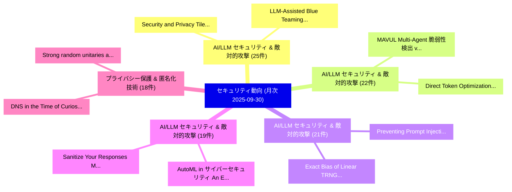

# 📊 03_monthly: 月次エグゼクティブサマリー報告書 (直近30日間: 2025-09-30)

**集計日時**: 2025-09-30 00:00:00 UTC  
**直近30日間の総論文数**: 748 件  

---

## 💡 マクロ脅威動向 & 戦略的リスク評価 (Strategic Executive Insights)

本日の収集論文（計 748 件）において、以下の重点セキュリティ領域で活発な研究動向が確認されました：
- **AI/LLM セキュリティ & 敵対的攻撃** (25 件): 注目論文として 「Security and Privacy Tile's Lo...」、「LLM-Assisted Blue Teaming via ...」 等が発表され、実務防御および攻撃検証の進展が見られます。
- **AI/LLM セキュリティ & 敵対的攻撃** (22 件): 注目論文として 「Direct Token Optimization: A S...」、「MAVUL: Multi-Agent 脆弱性検出 via C...」 等が発表され、実務防御および攻撃検証の進展が見られます。
- **AI/LLM セキュリティ & 敵対的攻撃** (21 件): 注目論文として 「Preventing Prompt Injection wi...」、「Exact Bias of Linear TRNG Corr...」 等が発表され、実務防御および攻撃検証の進展が見られます。
- **AI/LLM セキュリティ & 敵対的攻撃** (19 件): 注目論文として 「Sanitize Your Responses: Mitig...」、「AutoML in サイバーセキュリティ: An Empir...」 等が発表され、実務防御および攻撃検証の進展が見られます。
- **プライバシー保護 & 匿名化技術** (18 件): 注目論文として 「Strong random unitaries and fa...」、「DNS in the Time of Curiosity: ...」 等が発表され、実務防御および攻撃検証の進展が見られます。

### 🗺️ 月次セキュリティ技術レーダー (Technology Radar)

---

## 📌 月次セキュリティ論文一覧 (日本語表形式)

| No | arXiv ID | 論文タイトル (日本語訳) | 重要キーワード | 構造化エグゼクティブ要約 (背景・提案・影響) | 脅威分類 | 詳細リンク |
|---|---|---|---|---|---|---|
| 1 | `2509.25624v3` | [STAC: When Innocent Tools Form Dangerous Chains for LLMエージェント](../../okf/papers/2025-09-30/2509.25624.md) | `Jing Li`, `Chao Shang`, `Devang Kulshreshtha` | 【提案】概要 (Overview & Key Finding) 本論文「STAC: When Innocent Tools Form Dangerous Chains for LLM...。実証評価により経営層・セキュリティ管理者向け推奨アクション (E... | `cs.AI` | [arXiv](https://arxiv.org/abs/2509.25624v3) &#124; [OKF](../../okf/papers/2025-09-30/2509.25624.md) |
| 2 | `2509.25926v2` | [Preventing Prompt Injection with Type-Directed Privilege Separation（セキュリティ分析論文）](../../okf/papers/2025-09-30/2509.25926.md) | `Preventing Prompt Injection`, `Directed Privilege Separation`, `Type-Directed Privilege` | 【提案】概要 (Overview & Key Finding) 本論文「Preventing プロンプトインジェクション with Type-Directed Privilege S...。実証評価により経営層・セキュリティ管理者向け推奨アクション (E... | `executive-summary` | [arXiv](https://arxiv.org/abs/2509.25926v2) &#124; [OKF](../../okf/papers/2025-09-30/2509.25926.md) |
| 3 | `2509.25927v1` | [The Impact of Scaling Training Data on Adversarial Robustness（セキュリティ分析論文）](../../okf/papers/2025-09-30/2509.25927.md) | `Scaling Training Data`, `Adversarial Robustness`, `Marco Zimmerli` | 【提案】概要 (Overview & Key Finding) 本論文「The Impact of Scaling Training Data on Adversarial Robu...。実証評価により経営層・セキュリティ管理者向け推奨アクション (E... | `cs.AI` | [arXiv](https://arxiv.org/abs/2509.25927v1) &#124; [OKF](../../okf/papers/2025-09-30/2509.25927.md) |
| 4 | `2509.26032v2` | [Stealthy Yet Effective: Distribution-Preserving Backdoor Attacks on Graph Classification（セキュリティ分析論文）](../../okf/papers/2025-09-30/2509.26032.md) | `Stealthy Yet Effective`, `Preserving Backdoor Attacks`, `Graph Classification` | 【提案】概要 (Overview & Key Finding) 本論文「Stealthy Yet Effective: Distribution-Preserving Backdoo...。実証評価により経営層・セキュリティ管理者向け推奨アクション (E... | `executive-summary` | [arXiv](https://arxiv.org/abs/2509.26032v2) &#124; [OKF](../../okf/papers/2025-09-30/2509.26032.md) |
| 5 | `2509.26310v1` | [Strong random unitaries and fast scrambling（セキュリティ分析論文）](../../okf/papers/2025-09-30/2509.26310.md) | `Thomas Schuster`, `Fermi Ma`, `Alex Lombardi` | 【提案】概要 (Overview & Key Finding) 本論文「Strong random unitaries and fast scrambling（セキュリティ分析論文）...。実証評価により経営層・セキュリティ管理者向け推奨アクション (E... | `hep-th` | [arXiv](https://arxiv.org/abs/2509.26310v1) &#124; [OKF](../../okf/papers/2025-09-30/2509.26310.md) |
| 6 | `2509.26350v1` | [SoK: Systematic adversarial threats against deep learning approaches for autonomous anomaly detection systems in SDN-IoT networksの分析](../../okf/papers/2025-09-30/2509.26350.md) | `SDN-IoT networks`, `Tharindu Lakshan Yasarathna`, `Raw Meta` | 【提案】概要 (Overview & Key Finding) 本論文「SoK: Systematic adversarial threats against deep learni...。実証評価により経営層・セキュリティ管理者向け推奨アクション (E... | `cs.AI` | [arXiv](https://arxiv.org/abs/2509.26350v1) &#124; [OKF](../../okf/papers/2025-09-30/2509.26350.md) |
| 7 | `2509.26393v2` | [Exact Bias of Linear TRNG Correctors -- Spectral Approach（セキュリティ分析論文）](../../okf/papers/2025-09-30/2509.26393.md) | `Exact Bias`, `Maciej Skorski`, `Javier Soto` | 【提案】概要 (Overview & Key Finding) 本論文「Exact Bias of Linear TRNG Correctors -- Spectral Approa...。実証評価により経営層・セキュリティ管理者向け推奨アクション (E... | `executive-summary` | [arXiv](https://arxiv.org/abs/2509.26393v2) &#124; [OKF](../../okf/papers/2025-09-30/2509.26393.md) |
| 8 | `2509.26404v2` | [SeedPrints: Fingerprints Can Even Tell Which Seed Your Large Language Model Was Trained From（セキュリティ分析論文）](../../okf/papers/2025-09-30/2509.26404.md) | `Yao Tong`, `Haonan Wang`, `Siquan Li` | 【提案】概要 (Overview & Key Finding) 本論文「SeedPrints: Fingerprints Can Even Tell Which Seed Your ...。実証評価により経営層・セキュリティ管理者向け推奨アクション (E... | `cs.AI` | [arXiv](https://arxiv.org/abs/2509.26404v2) &#124; [OKF](../../okf/papers/2025-09-30/2509.26404.md) |
| 9 | `2509.26509v1` | [Logic Solver Guided Directed Fuzzing for Hardware Designs（セキュリティ分析論文）](../../okf/papers/2025-09-30/2509.26509.md) | `Logic Solver Guided Directed Fuzzing`, `Hardware Designs`, `Raghul Saravanan` | 【提案】概要 (Overview & Key Finding) 本論文「Logic Solver Guided Directed Fuzzing for Hardware Desig...。実証評価により経営層・セキュリティ管理者向け推奨アクション (E... | `cybersecurity` | [arXiv](https://arxiv.org/abs/2509.26509v1) &#124; [OKF](../../okf/papers/2025-09-30/2509.26509.md) |
| 10 | `2509.26530v1` | [Explainable and Resilient ML-Based Physical-Layer Attack Detectors（セキュリティ分析論文）](../../okf/papers/2025-09-30/2509.26530.md) | `Layer Attack Detectors`, `Based Physical`, `ML-Based Physical` | 【提案】概要 (Overview & Key Finding) 本論文「Explainable and Resilient ML-Based Physical-Layer Attac...。実証評価により経営層・セキュリティ管理者向け推奨アクション (E... | `executive-summary` | [arXiv](https://arxiv.org/abs/2509.26530v1) &#124; [OKF](../../okf/papers/2025-09-30/2509.26530.md) |
| 11 | `2509.26562v1` | [DeepProv: Behavioral Characterization and Repair of Neural Networks via Inference Provenance Graph Analysis（セキュリティ分析論文）](../../okf/papers/2025-09-30/2509.26562.md) | `Behavioral Characterization`, `Neural Networks`, `Firas Ben Hmida` | 【提案】概要 (Overview & Key Finding) 本論文「DeepProv: Behavioral Characterization and Repair of Neu...。実証評価により経営層・セキュリティ管理者向け推奨アクション (E... | `executive-summary` | [arXiv](https://arxiv.org/abs/2509.26562v1) &#124; [OKF](../../okf/papers/2025-09-30/2509.26562.md) |
| 12 | `2509.26598v1` | [Are Robust LLM Fingerprints Adversarially Robust?（セキュリティ分析論文）](../../okf/papers/2025-09-30/2509.26598.md) | `Fingerprints Adversarially Robust`, `Anshul Nasery`, `Edoardo Contente` | 【提案】### (日本語題名: Are Robust LLM Fingerprints Adversarially Robust?（セキュリティ分析論文）)  > [!NOTE] >...。実証評価により経営層・セキュリティ管理者向け推奨アクション (E... | `cs.AI` | [arXiv](https://arxiv.org/abs/2509.26598v1) &#124; [OKF](../../okf/papers/2025-09-30/2509.26598.md) |
| 13 | `2509.26640v1` | [SPATA: Systematic Pattern Analysis for Detailed and Transparent Data Cards（セキュリティ分析論文）](../../okf/papers/2025-09-30/2509.26640.md) | `Transparent Data Cards`, `Eva Maia`, `Carlos Soares` | 【提案】概要 (Overview & Key Finding) 本論文「SPATA: Systematic Pattern Analysis for Detailed and Tra...。実証評価により経営層・セキュリティ管理者向け推奨アクション (E... | `executive-summary` | [arXiv](https://arxiv.org/abs/2509.26640v1) &#124; [OKF](../../okf/papers/2025-09-30/2509.26640.md) |
| 14 | `2510.00076v1` | [Private Learning of Littlestone Classes, Revisited（セキュリティ分析論文）](../../okf/papers/2025-09-30/2510.00076.md) | `Private Learning`, `Littlestone Classes`, `Xin Lyu` | 【提案】概要 (Overview & Key Finding) 本論文「Private Learning of Littlestone Classes, Revisited（セキュリ...。実証評価により経営層・セキュリティ管理者向け推奨アクション (E... | `executive-summary` | [arXiv](https://arxiv.org/abs/2510.00076v1) &#124; [OKF](../../okf/papers/2025-09-30/2510.00076.md) |
| 15 | `2510.00125v1` | [Direct Token Optimization: A Self-contained Approach to Large Language Model Unlearning（セキュリティ分析論文）](../../okf/papers/2025-09-30/2510.00125.md) | `Large Language Model Unlearning`, `Direct Token Optimization`, `Ruixuan Liu` | 【提案】概要 (Overview & Key Finding) 本論文「Direct Token Optimization: A Self-contained Approach to...。実証評価により経営層・セキュリティ管理者向け推奨アクション (E... | `cs.AI` | [arXiv](https://arxiv.org/abs/2510.00125v1) &#124; [OKF](../../okf/papers/2025-09-30/2510.00125.md) |
| 16 | `2510.00151v1` | [Stealing AI Model Weights Through Covert Communication Channels（セキュリティ分析論文）](../../okf/papers/2025-09-30/2510.00151.md) | `Alan Rodrigo Diaz`, `Valentin Barbaza`, `Hassan Aboushady` | 【提案】概要 (Overview & Key Finding) 本論文「Stealing AI Model Weights Through Covert Communication ...。実証評価により経営層・セキュリティ管理者向け推奨アクション (E... | `cs.AI` | [arXiv](https://arxiv.org/abs/2510.00151v1) &#124; [OKF](../../okf/papers/2025-09-30/2510.00151.md) |
| 17 | `2510.00164v2` | [Calyx: Privacy-Preserving Multi-Token Optimistic-Rollup Protocol（セキュリティ分析論文）](../../okf/papers/2025-09-30/2510.00164.md) | `Preserving Multi`, `Token Optimistic`, `Rollup Protocol` | 【提案】概要 (Overview & Key Finding) 本論文「Calyx: Privacy-Preserving Multi-Token Optimistic-Rollup...。実証評価により経営層・セキュリティ管理者向け推奨アクション (E... | `cybersecurity` | [arXiv](https://arxiv.org/abs/2510.00164v2) &#124; [OKF](../../okf/papers/2025-09-30/2510.00164.md) |
| 18 | `2510.00167v2` | [Drones that Think on their Feet: Sudden Landing Decisions with Embodied AI（セキュリティ分析論文）](../../okf/papers/2025-09-30/2510.00167.md) | `Sudden Landing Decisions`, `Diego Ortiz Barbosa`, `Mohit Agrawal` | 【提案】概要 (Overview & Key Finding) 本論文「Drones that Think on their Feet: Sudden Landing Decisio...。実証評価により経営層・セキュリティ管理者向け推奨アクション (E... | `cs.AI` | [arXiv](https://arxiv.org/abs/2510.00167v2) &#124; [OKF](../../okf/papers/2025-09-30/2510.00167.md) |
| 19 | `2510.00181v2` | [CHAI: Command Hijacking against embodied AI（セキュリティ分析論文）](../../okf/papers/2025-09-30/2510.00181.md) | `Command Hijacking`, `Luis Burbano`, `Diego Ortiz` | 【提案】概要 (Overview & Key Finding) 本論文「CHAI: Command Hijacking against embodied AI（セキュリティ分析論文）...。実証評価により経営層・セキュリティ管理者向け推奨アクション (E... | `cs.AI` | [arXiv](https://arxiv.org/abs/2510.00181v2) &#124; [OKF](../../okf/papers/2025-09-30/2510.00181.md) |
| 20 | `2510.00240v2` | [SecureBERT 2.0: Advanced Language Model for サイバーセキュリティ Intelligence](../../okf/papers/2025-09-30/2510.00240.md) | `Advanced Language Model`, `Cybersecurity Intelligence`, `Ehsan Aghaei` | 【提案】概要 (Overview & Key Finding) 本論文「SecureBERT 2.0: Advanced Language Model for サイバーセキュリティ ...。実証評価により経営層・セキュリティ管理者向け推奨アクション (E... | `cs.AI` | [arXiv](https://arxiv.org/abs/2510.00240v2) &#124; [OKF](../../okf/papers/2025-09-30/2510.00240.md) |
| 21 | `2510.00293v2` | [MOLM: Mixture of LoRA Markers（セキュリティ分析論文）](../../okf/papers/2025-09-30/2510.00293.md) | `Samar Fares`, `Nurbek Tastan`, `Noor Hussein` | 【提案】概要 (Overview & Key Finding) 本論文「MOLM: Mixture of LoRA Markers（セキュリティ分析論文）」（原題: MOLM: Mi...。実証評価により経営層・セキュリティ管理者向け推奨アクション (E... | `cs.CV` | [arXiv](https://arxiv.org/abs/2510.00293v2) &#124; [OKF](../../okf/papers/2025-09-30/2510.00293.md) |
| 22 | `2510.00317v1` | [MAVUL: Multi-Agent 脆弱性検出 via Contextual Reasoning and Interactive Refinement](../../okf/papers/2025-09-30/2510.00317.md) | `Contextual Reasoning`, `Interactive Refinement`, `Agent Vulnerability Detection` | 【提案】概要 (Overview & Key Finding) 本論文「MAVUL: Multi-Agent 脆弱性検出 via Contextual Reasoning and I...。実証評価により経営層・セキュリティ管理者向け推奨アクション (E... | `cs.AI` | [arXiv](https://arxiv.org/abs/2510.00317v1) &#124; [OKF](../../okf/papers/2025-09-30/2510.00317.md) |
| 23 | `2510.00322v3` | [Privately Estimating Black-Box Statistics（セキュリティ分析論文）](../../okf/papers/2025-09-30/2510.00322.md) | `Privately Estimating Black`, `Box Statistics`, `Black-Box Statistics` | 【提案】概要 (Overview & Key Finding) 本論文「Privately Estimating Black-Box Statistics（セキュリティ分析論文）」（...。実証評価によりSteinke, Thomas Steinke -... | `executive-summary` | [arXiv](https://arxiv.org/abs/2510.00322v3) &#124; [OKF](../../okf/papers/2025-09-30/2510.00322.md) |
| 24 | `2510.00350v1` | [Security and Privacy Tile's Location Tracking Protocolの分析](../../okf/papers/2025-09-30/2510.00350.md) | `Location Tracking Protocol`, `Privacy Tile`, `Location Tracking` | 【提案】概要 (Overview & Key Finding) 本論文「Security and Privacy Tile's Location Tracking Protocolの...。実証評価により経営層・セキュリティ管理者向け推奨アクション (E... | `cybersecurity` | [arXiv](https://arxiv.org/abs/2510.00350v1) &#124; [OKF](../../okf/papers/2025-09-30/2510.00350.md) |
| 25 | `2510.02376v1` | [Scaling Homomorphic Applications in Deployment（セキュリティ分析論文）](../../okf/papers/2025-09-30/2510.02376.md) | `Scaling Homomorphic Applications`, `Ryan Marinelli`, `Angelica Chowdhury` | 【提案】概要 (Overview & Key Finding) 本論文「Scaling Homomorphic Applications in Deployment（セキュリティ分析...。実証評価により経営層・セキュリティ管理者向け推奨アクション (E... | `cs.AI` | [arXiv](https://arxiv.org/abs/2510.02376v1) &#124; [OKF](../../okf/papers/2025-09-30/2510.02376.md) |
| 26 | `2510.02378v1` | [Apply Bayes Theorem to Optimize IVR Authentication Process（セキュリティ分析論文）](../../okf/papers/2025-09-30/2510.02378.md) | `Apply Bayes Theorem`, `Authentication Process`, `Jingrong Xie` | 【提案】概要 (Overview & Key Finding) 本論文「Apply Bayes Theorem to Optimize IVR Authentication Proc...。実証評価により経営層・セキュリティ管理者向け推奨アクション (E... | `executive-summary` | [arXiv](https://arxiv.org/abs/2510.02378v1) &#124; [OKF](../../okf/papers/2025-09-30/2510.02378.md) |
| 27 | `2510.02379v1` | [Hybrid Schemes of NIST Post-Quantum Cryptography Standard Algorithms and Quantum Key Distribution for Key Exchange and Digital Signature（セキュリティ分析論文）](../../okf/papers/2025-09-30/2510.02379.md) | `Quantum Cryptography Standard Algorithms`, `Quantum Key Distribution`, `Hybrid Schemes` | 【提案】概要 (Overview & Key Finding) 本論文「Hybrid Schemes of NIST ポスト量子暗号 Standard Algorithms and ...。実証評価により経営層・セキュリティ管理者向け推奨アクション (E... | `executive-summary` | [arXiv](https://arxiv.org/abs/2510.02379v1) &#124; [OKF](../../okf/papers/2025-09-30/2510.02379.md) |
| 28 | `2510.02383v1` | [Selmer-Inspired Elliptic Curve Generation（セキュリティ分析論文）](../../okf/papers/2025-09-30/2510.02383.md) | `Inspired Elliptic Curve Generation`, `Selmer-Inspired Elliptic`, `Awnon Bhowmik` | 【提案】概要 (Overview & Key Finding) 本論文「Selmer-Inspired Elliptic Curve Generation（セキュリティ分析論文）」（...。実証評価により経営層・セキュリティ管理者向け推奨アクション (E... | `executive-summary` | [arXiv](https://arxiv.org/abs/2510.02383v1) &#124; [OKF](../../okf/papers/2025-09-30/2510.02383.md) |
| 29 | `2510.02384v2` | [Secure and Robust Watermarking for AI-generated Images: A Comprehensive Survey（セキュリティ分析論文）](../../okf/papers/2025-09-30/2510.02384.md) | `Robust Watermarking`, `Comprehensive Survey`, `AI-generated Images` | 【提案】概要 (Overview & Key Finding) 本論文「Secure and Robust Watermarking for AI-generated Images:...。実証評価により経営層・セキュリティ管理者向け推奨アクション (E... | `cs.CV` | [arXiv](https://arxiv.org/abs/2510.02384v2) &#124; [OKF](../../okf/papers/2025-09-30/2510.02384.md) |
| 30 | `2510.02386v2` | [On The Fragility of Benchmark Contamination Detection in Reasoning Models（セキュリティ分析論文）](../../okf/papers/2025-09-30/2510.02386.md) | `Benchmark Contamination Detection`, `Reasoning Models`, `Han Wang` | 【提案】概要 (Overview & Key Finding) 本論文「On The Fragility of Benchmark Contamination Detection i...。実証評価により経営層・セキュリティ管理者向け推奨アクション (E... | `cs.AI` | [arXiv](https://arxiv.org/abs/2510.02386v2) &#124; [OKF](../../okf/papers/2025-09-30/2510.02386.md) |
| 31 | `2510.02389v3` | [From Trace to Line: LLM Agent for Real-World OSS Vulnerability Localization（セキュリティ分析論文）](../../okf/papers/2025-09-30/2510.02389.md) | `Vulnerability Localization`, `Real-World OSS`, `Haoran Xi` | 【提案】概要 (Overview & Key Finding) 本論文「From Trace to Line: LLM Agent for Real-World OSS 脆弱性 Lo...。実証評価により経営層・セキュリティ管理者向け推奨アクション (E... | `executive-summary` | [arXiv](https://arxiv.org/abs/2510.02389v3) &#124; [OKF](../../okf/papers/2025-09-30/2510.02389.md) |
| 32 | `2510.02391v1` | [LLM-Generated Samples for Android マルウェア検出](../../okf/papers/2025-09-30/2510.02391.md) | `Generated Samples`, `LLM-Generated Samples`, `Android Malware Detection` | 【提案】概要 (Overview & Key Finding) 本論文「LLM-Generated Samples for Android マルウェア検出」（原題: LLM-Gene...。実証評価により経営層・セキュリティ管理者向け推奨アクション (E... | `executive-summary` | [arXiv](https://arxiv.org/abs/2510.02391v1) &#124; [OKF](../../okf/papers/2025-09-30/2510.02391.md) |
| 33 | `2509.24153v1` | [DNS in the Time of Curiosity: A Tale of Collaborative User Privacy Protection（セキュリティ分析論文）](../../okf/papers/2025-09-29/2509.24153.md) | `Collaborative User Privacy Protection`, `Hongyu Jin`, `Panos Papadimitratos` | 【提案】概要 (Overview & Key Finding) 本論文「DNS in the Time of Curiosity: A Tale of Collaborative U...。実証評価により経営層・セキュリティ管理者向け推奨アクション (E... | `cybersecurity` | [arXiv](https://arxiv.org/abs/2509.24153v1) &#124; [OKF](../../okf/papers/2025-09-29/2509.24153.md) |
| 34 | `2509.24173v1` | [Fundamental Limit of Discrete Distribution Estimation under Utility-Optimized Local Differential Privacy（セキュリティ分析論文）](../../okf/papers/2025-09-29/2509.24173.md) | `Discrete Distribution Estimation`, `Optimized Local Differential Privacy`, `Fundamental Limit` | 【提案】概要 (Overview & Key Finding) 本論文「Fundamental Limit of Discrete Distribution Estimation u...。実証評価により経営層・セキュリティ管理者向け推奨アクション (E... | `executive-summary` | [arXiv](https://arxiv.org/abs/2509.24173v1) &#124; [OKF](../../okf/papers/2025-09-29/2509.24173.md) |
| 35 | `2509.24174v2` | [LLUAD: Low-Latency User-Anonymized DNS（セキュリティ分析論文）](../../okf/papers/2025-09-29/2509.24174.md) | `Latency User`, `Low-Latency User`, `Hongyu Jin` | 【提案】概要 (Overview & Key Finding) 本論文「LLUAD: Low-Latency User-Anonymized DNS（セキュリティ分析論文）」（原題:...。実証評価により経営層・セキュリティ管理者向け推奨アクション (E... | `cybersecurity` | [arXiv](https://arxiv.org/abs/2509.24174v2) &#124; [OKF](../../okf/papers/2025-09-29/2509.24174.md) |
| 36 | `2509.24240v1` | [Takedown: How It's Done in Modern Coding Agent Exploits（セキュリティ分析論文）](../../okf/papers/2025-09-29/2509.24240.md) | `Modern Coding Agent Exploits`, `Eunkyu Lee`, `Donghyeon Kim` | 【提案】概要 (Overview & Key Finding) 本論文「Takedown: How It's Done in Modern Coding Agent Exploits...。実証評価により経営層・セキュリティ管理者向け推奨アクション (E... | `cybersecurity` | [arXiv](https://arxiv.org/abs/2509.24240v1) &#124; [OKF](../../okf/papers/2025-09-29/2509.24240.md) |
| 37 | `2509.24257v4` | [VeriLLM: A Lightweight Framework for Publicly Verifiable Decentralized Inference（セキュリティ分析論文）](../../okf/papers/2025-09-29/2509.24257.md) | `Publicly Verifiable Decentralized Inference`, `Ke Wang`, `Zishuo Zhao` | 【提案】概要 (Overview & Key Finding) 本論文「VeriLLM: A Lightweight Framework for Publicly Verifiabl...。実証評価により経営層・セキュリティ管理者向け推奨アクション (E... | `executive-summary` | [arXiv](https://arxiv.org/abs/2509.24257v4) &#124; [OKF](../../okf/papers/2025-09-29/2509.24257.md) |
| 38 | `2509.24272v1` | [When MCP Servers Attack: Taxonomy, Feasibility, and Mitigation（セキュリティ分析論文）](../../okf/papers/2025-09-29/2509.24272.md) | `Servers Attack`, `Weibo Zhao`, `Jiahao Liu` | 【提案】概要 (Overview & Key Finding) 本論文「When MCP Servers Attack: Taxonomy, Feasibility, and Mit...。実証評価により経営層・セキュリティ管理者向け推奨アクション (E... | `executive-summary` | [arXiv](https://arxiv.org/abs/2509.24272v1) &#124; [OKF](../../okf/papers/2025-09-29/2509.24272.md) |
| 39 | `2509.24368v2` | [Watermarking Diffusion Language Models（セキュリティ分析論文）](../../okf/papers/2025-09-29/2509.24368.md) | `Watermarking Diffusion Language Models`, `Thibaud Gloaguen`, `Robin Staab` | 【提案】概要 (Overview & Key Finding) 本論文「Watermarking Diffusion Language Models（セキュリティ分析論文）」（原題:...。実証評価により経営層・セキュリティ管理者向け推奨アクション (E... | `cs.AI` | [arXiv](https://arxiv.org/abs/2509.24368v2) &#124; [OKF](../../okf/papers/2025-09-29/2509.24368.md) |
| 40 | `2509.24408v2` | [FuncPoison: Poisoning Function Library to Hijack Multi-agent Autonomous Driving Systems（セキュリティ分析論文）](../../okf/papers/2025-09-29/2509.24408.md) | `Poisoning Function Library`, `Autonomous Driving Systems`, `Hijack Multi` | 【提案】概要 (Overview & Key Finding) 本論文「FuncPoison: Poisoning Function Library to Hijack Multi-...。実証評価により経営層・セキュリティ管理者向け推奨アクション (E... | `executive-summary` | [arXiv](https://arxiv.org/abs/2509.24408v2) &#124; [OKF](../../okf/papers/2025-09-29/2509.24408.md) |
| 41 | `2509.24418v1` | [GSPR: Aligning LLM Safeguards as Generalizable Safety Policy Reasoners（セキュリティ分析論文）](../../okf/papers/2025-09-29/2509.24418.md) | `Generalizable Safety Policy Reasoners`, `Generalizable Safety Policy Reas`, `Haoran Li` | 【提案】概要 (Overview & Key Finding) 本論文「GSPR: Aligning LLM Safeguards as Generalizable Safety P...。実証評価により経営層・セキュリティ管理者向け推奨アクション (E... | `cybersecurity` | [arXiv](https://arxiv.org/abs/2509.24418v1) &#124; [OKF](../../okf/papers/2025-09-29/2509.24418.md) |
| 42 | `2509.24432v1` | [Pseudorandom Unitaries in the Haar Random Oracle Model（セキュリティ分析論文）](../../okf/papers/2025-09-29/2509.24432.md) | `Haar Random Oracle Model`, `Pseudorandom Unitaries`, `Prabhanjan Ananth` | 【提案】概要 (Overview & Key Finding) 本論文「Pseudorandom Unitaries in the Haar Random Oracle Model（...。実証評価により経営層・セキュリティ管理者向け推奨アクション (E... | `executive-summary` | [arXiv](https://arxiv.org/abs/2509.24432v1) &#124; [OKF](../../okf/papers/2025-09-29/2509.24432.md) |
| 43 | `2509.24440v3` | [Evaluating Relayed and Switched Quantum Key Distribution (QKD) Network Architectures（セキュリティ分析論文）](../../okf/papers/2025-09-29/2509.24440.md) | `Switched Quantum Key Distribution`, `Evaluating Relayed`, `Network Architectures` | 【提案】概要 (Overview & Key Finding) 本論文「Evaluating Relayed and Switched 量子鍵配送 (QKD) Network Arc...。実証評価により経営層・セキュリティ管理者向け推奨アクション (E... | `cybersecurity` | [arXiv](https://arxiv.org/abs/2509.24440v3) &#124; [OKF](../../okf/papers/2025-09-29/2509.24440.md) |
| 44 | `2509.24444v3` | [BugMagnifier: TON Transaction Simulator for Revealing Smart Contract Vulnerabilities（セキュリティ分析論文）](../../okf/papers/2025-09-29/2509.24444.md) | `Revealing Smart Contract Vulnerabilities`, `Transaction Simulator`, `Yury Yanovich` | 【提案】概要 (Overview & Key Finding) 本論文「BugMagnifier: TON Transaction Simulator for Revealing ス...。実証評価により経営層・セキュリティ管理者向け推奨アクション (E... | `executive-summary` | [arXiv](https://arxiv.org/abs/2509.24444v3) &#124; [OKF](../../okf/papers/2025-09-29/2509.24444.md) |
| 45 | `2509.24484v1` | [On the Limitations of Pseudorandom Unitaries（セキュリティ分析論文）](../../okf/papers/2025-09-29/2509.24484.md) | `Pseudorandom Unitaries`, `Prabhanjan Ananth`, `Aditya Gulati` | 【提案】概要 (Overview & Key Finding) 本論文「On the Limitations of Pseudorandom Unitaries（セキュリティ分析論文...。実証評価により経営層・セキュリティ管理者向け推奨アクション (E... | `executive-summary` | [arXiv](https://arxiv.org/abs/2509.24484v1) &#124; [OKF](../../okf/papers/2025-09-29/2509.24484.md) |
| 46 | `2509.24488v1` | [Sanitize Your Responses: Mitigating Privacy Leakage in 大規模言語モデル](../../okf/papers/2025-09-29/2509.24488.md) | `Mitigating Privacy Leakage`, `Large Language Models`, `Wenjie Fu` | 【提案】概要 (Overview & Key Finding) 本論文「Sanitize Your Responses: Mitigating Privacy Leakage in ...。実証評価により経営層・セキュリティ管理者向け推奨アクション (E... | `executive-summary` | [arXiv](https://arxiv.org/abs/2509.24488v1) &#124; [OKF](../../okf/papers/2025-09-29/2509.24488.md) |
| 47 | `2509.24515v1` | [Agentic Specification Generator for Move Programs（セキュリティ分析論文）](../../okf/papers/2025-09-29/2509.24515.md) | `Agentic Specification Generator`, `Move Programs`, `Fu Fu` | 【提案】概要 (Overview & Key Finding) 本論文「Agentic Specification Generator for Move Programs（セキュリテ...。実証評価により経営層・セキュリティ管理者向け推奨アクション (E... | `cs.PL` | [arXiv](https://arxiv.org/abs/2509.24515v1) &#124; [OKF](../../okf/papers/2025-09-29/2509.24515.md) |
| 48 | `2509.24623v2` | [Mapping Quantum Threats: An Engineering Inventory of Cryptographic Dependencies（セキュリティ分析論文）](../../okf/papers/2025-09-29/2509.24623.md) | `Mapping Quantum Threats`, `Cryptographic Dependencies`, `Carlos Benitez` | 【提案】概要 (Overview & Key Finding) 本論文「Mapping 量子 Threats: An Engineering Inventory of Cryptog...。実証評価により経営層・セキュリティ管理者向け推奨アクション (E... | `cybersecurity` | [arXiv](https://arxiv.org/abs/2509.24623v2) &#124; [OKF](../../okf/papers/2025-09-29/2509.24623.md) |
| 49 | `2509.24624v1` | [PRIVMARK: Private 大規模言語モデル Watermarking with MPC](../../okf/papers/2025-09-29/2509.24624.md) | `Private Large Language Models Watermarking`, `Thomas Fargues`, `Ye Dong` | 【提案】概要 (Overview & Key Finding) 本論文「PRIVMARK: Private 大規模言語モデル Watermarking with MPC」（原題: P...。実証評価により経営層・セキュリティ管理者向け推奨アクション (E... | `cybersecurity` | [arXiv](https://arxiv.org/abs/2509.24624v1) &#124; [OKF](../../okf/papers/2025-09-29/2509.24624.md) |
| 50 | `2509.24698v1` | [LISA Technical Report: An Agentic Framework for Smart Contract Auditing（セキュリティ分析論文）](../../okf/papers/2025-09-29/2509.24698.md) | `Smart Contract Auditing`, `Technical Report`, `Izaiah Sun` | 【提案】概要 (Overview & Key Finding) 本論文「LISA Technical Report: An Agentic Framework for スマートコント...。実証評価により経営層・セキュリティ管理者向け推奨アクション (E... | `cybersecurity` | [arXiv](https://arxiv.org/abs/2509.24698v1) &#124; [OKF](../../okf/papers/2025-09-29/2509.24698.md) |
| 51 | `2509.24807v1` | [Active Authentication via Korean Keystrokes Under Varying LLM Assistance and Cognitive Contexts（セキュリティ分析論文）](../../okf/papers/2025-09-29/2509.24807.md) | `Active Authentication`, `Cognitive Contexts`, `Dong Hyun Roh` | 【提案】概要 (Overview & Key Finding) 本論文「Active Authentication via Korean Keystrokes Under Varyi...。実証評価により経営層・セキュリティ管理者向け推奨アクション (E... | `cybersecurity` | [arXiv](https://arxiv.org/abs/2509.24807v1) &#124; [OKF](../../okf/papers/2025-09-29/2509.24807.md) |
| 52 | `2509.24823v1` | [Of-SemWat: High-payload text embedding for semantic watermarking of AI-generated images with arbitrary size（セキュリティ分析論文）](../../okf/papers/2025-09-29/2509.24823.md) | `High-payload text`, `AI-generated images`, `Benedetta Tondi` | 【提案】概要 (Overview & Key Finding) 本論文「Of-SemWat: High-payload text embedding for semantic wat...。実証評価により経営層・セキュリティ管理者向け推奨アクション (E... | `cs.AI` | [arXiv](https://arxiv.org/abs/2509.24823v1) &#124; [OKF](../../okf/papers/2025-09-29/2509.24823.md) |
| 53 | `2509.24955v1` | [Secret Leader Election in Ethereum PoS: An Empirical Security Whisk and Homomorphic Sortition under DoS on the Leader and Censorship Attacksの分析](../../okf/papers/2025-09-29/2509.24955.md) | `Secret Leader Election`, `Homomorphic Sortition`, `Censorship Attacks` | 【提案】概要 (Overview & Key Finding) 本論文「Secret Leader Election in Ethereum PoS: An Empirical Se...。実証評価により経営層・セキュリティ管理者向け推奨アクション (E... | `cybersecurity` | [arXiv](https://arxiv.org/abs/2509.24955v1) &#124; [OKF](../../okf/papers/2025-09-29/2509.24955.md) |
| 54 | `2509.24967v4` | [SecInfer: Preventing Prompt Injection via Inference-time Scaling（セキュリティ分析論文）](../../okf/papers/2025-09-29/2509.24967.md) | `Preventing Prompt Injection`, `Inference-time Scaling`, `Neil Zhenqiang Gong` | 【提案】概要 (Overview & Key Finding) 本論文「SecInfer: Preventing プロンプトインジェクション via Inference-time S...。実証評価により経営層・セキュリティ管理者向け推奨アクション (E... | `cs.AI` | [arXiv](https://arxiv.org/abs/2509.24967v4) &#124; [OKF](../../okf/papers/2025-09-29/2509.24967.md) |
| 55 | `2509.25072v1` | [Optimizing Privacy-Preserving Primitives to Support LLM-Scale Applications（セキュリティ分析論文）](../../okf/papers/2025-09-29/2509.25072.md) | `Optimizing Privacy`, `Preserving Primitives`, `Scale Applications` | 【提案】概要 (Overview & Key Finding) 本論文「Optimizing Privacy-Preserving Primitives to Support LLM...。実証評価により経営層・セキュリティ管理者向け推奨アクション (E... | `cs.AI` | [arXiv](https://arxiv.org/abs/2509.25072v1) &#124; [OKF](../../okf/papers/2025-09-29/2509.25072.md) |
| 56 | `2509.25113v1` | [Two-Dimensional XOR-Based Secret Sharing for Layered Multipath Communication（セキュリティ分析論文）](../../okf/papers/2025-09-29/2509.25113.md) | `Based Secret Sharing`, `Layered Multipath Communication`, `Two-Dimensional XOR` | 【提案】概要 (Overview & Key Finding) 本論文「Two-Dimensional XOR-Based Secret Sharing for Layered Mu...。実証評価により経営層・セキュリティ管理者向け推奨アクション (E... | `cybersecurity` | [arXiv](https://arxiv.org/abs/2509.25113v1) &#124; [OKF](../../okf/papers/2025-09-29/2509.25113.md) |
| 57 | `2509.25145v2` | [Quantitative quantum soundness for all multipartite compiled nonlocal games（セキュリティ分析論文）](../../okf/papers/2025-09-29/2509.25145.md) | `Matilde Baroni`, `Igor Klep`, `Dominik Leichtle` | 【提案】概要 (Overview & Key Finding) 本論文「Quantitative 量子 soundness for all multipartite compiled...。実証評価により経営層・セキュリティ管理者向け推奨アクション (E... | `math-ph` | [arXiv](https://arxiv.org/abs/2509.25145v2) &#124; [OKF](../../okf/papers/2025-09-29/2509.25145.md) |
| 58 | `2509.25394v1` | [Fast Energy-Theft Attack on Frequency-Varying Wireless Power without Additional Sensors（セキュリティ分析論文）](../../okf/papers/2025-09-29/2509.25394.md) | `Varying Wireless Power`, `Fast Energy`, `Theft Attack` | 【提案】背景とセキュリティ上の課題 (Background & Problem) 本研究はサイバー脅威環境におけるセキュリティ構造・脆弱性の検証を目的としています。(主要検出項目: ...。実証評価により経営層・セキュリティ管理者向け推奨アクション (E... | `executive-summary` | [arXiv](https://arxiv.org/abs/2509.25394v1) &#124; [OKF](../../okf/papers/2025-09-29/2509.25394.md) |
| 59 | `2509.25408v1` | [Optimal Threshold Signatures in Bitcoin（セキュリティ分析論文）](../../okf/papers/2025-09-29/2509.25408.md) | `Optimal Threshold Signatures`, `Korok Ray`, `Sindura Saraswathi` | 【提案】概要 (Overview & Key Finding) 本論文「Optimal Threshold Signatures in Bitcoin（セキュリティ分析論文）」（原題...。実証評価により経営層・セキュリティ管理者向け推奨アクション (E... | `econ.TH` | [arXiv](https://arxiv.org/abs/2509.25408v1) &#124; [OKF](../../okf/papers/2025-09-29/2509.25408.md) |
| 60 | `2509.25410v1` | [Characterizing Event-themed Malicious Web Campaigns: A Case Study on War-themed Websites（セキュリティ分析論文）](../../okf/papers/2025-09-29/2509.25410.md) | `Malicious Web Campaigns`, `Characterizing Event`, `Event-themed Malicious` | 【提案】概要 (Overview & Key Finding) 本論文「Characterizing Event-themed Malicious Web Campaigns: A ...。実証評価により経営層・セキュリティ管理者向け推奨アクション (E... | `executive-summary` | [arXiv](https://arxiv.org/abs/2509.25410v1) &#124; [OKF](../../okf/papers/2025-09-29/2509.25410.md) |
| 61 | `2509.25430v3` | [Finding Phones Fast: Low-Latency and Scalable Monitoring of Cellular Communications in Sensitive Areas（セキュリティ分析論文）](../../okf/papers/2025-09-29/2509.25430.md) | `Finding Phones Fast`, `Scalable Monitoring`, `Cellular Communications` | 【提案】概要 (Overview & Key Finding) 本論文「Finding Phones Fast: Low-Latency and Scalable Monitorin...。実証評価により経営層・セキュリティ管理者向け推奨アクション (E... | `cybersecurity` | [arXiv](https://arxiv.org/abs/2509.25430v3) &#124; [OKF](../../okf/papers/2025-09-29/2509.25430.md) |
| 62 | `2509.25448v3` | [Fingerprinting LLMs via Prompt Injection（セキュリティ分析論文）](../../okf/papers/2025-09-29/2509.25448.md) | `Prompt Injection`, `Yuepeng Hu`, `Zhengyuan Jiang` | 【提案】概要 (Overview & Key Finding) 本論文「Fingerprinting LLMs via プロンプトインジェクション（セキュリティ分析論文）」（原題: ...。実証評価により経営層・セキュリティ管理者向け推奨アクション (E... | `executive-summary` | [arXiv](https://arxiv.org/abs/2509.25448v3) &#124; [OKF](../../okf/papers/2025-09-29/2509.25448.md) |
| 63 | `2509.25462v1` | [Managing Differentiated Secure Connectivity using Intents（セキュリティ分析論文）](../../okf/papers/2025-09-29/2509.25462.md) | `Managing Differentiated Secure Connectivity`, `Loay Abdelrazek`, `Filippo Rebecchi` | 【提案】概要 (Overview & Key Finding) 本論文「Managing Differentiated Secure Connectivity using Inten...。実証評価により経営層・セキュリティ管理者向け推奨アクション (E... | `cybersecurity` | [arXiv](https://arxiv.org/abs/2509.25462v1) &#124; [OKF](../../okf/papers/2025-09-29/2509.25462.md) |
| 64 | `2509.25469v1` | [Balancing Compliance and Privacy in Offline CBDC Transactions Using a Secure Element-based System（セキュリティ分析論文）](../../okf/papers/2025-09-29/2509.25469.md) | `Balancing Compliance`, `Transactions Using`, `Secure Element` | 【提案】概要 (Overview & Key Finding) 本論文「Balancing Compliance and Privacy in Offline CBDC Transa...。実証評価により経営層・セキュリティ管理者向け推奨アクション (E... | `cybersecurity` | [arXiv](https://arxiv.org/abs/2509.25469v1) &#124; [OKF](../../okf/papers/2025-09-29/2509.25469.md) |
| 65 | `2509.25476v1` | [Environmental Rate Manipulation Attacks on Power Grid Security（セキュリティ分析論文）](../../okf/papers/2025-09-29/2509.25476.md) | `Environmental Rate Manipulation Attacks`, `Power Grid Security`, `Mohammad Abdullah Al Faruque` | 【提案】概要 (Overview & Key Finding) 本論文「Environmental Rate Manipulation Attacks on Power Grid S...。実証評価により経営層・セキュリティ管理者向け推奨アクション (E... | `executive-summary` | [arXiv](https://arxiv.org/abs/2509.25476v1) &#124; [OKF](../../okf/papers/2025-09-29/2509.25476.md) |
| 66 | `2509.25514v2` | [AGNOMIN -- Architecture Agnostic Multi-Label Function Name Prediction（セキュリティ分析論文）](../../okf/papers/2025-09-29/2509.25514.md) | `Label Function Name Prediction`, `Architecture Agnostic Multi`, `Multi-Label Function` | 【提案】概要 (Overview & Key Finding) 本論文「AGNOMIN -- Architecture Agnostic Multi-Label Function N...。実証評価により経営層・セキュリティ管理者向け推奨アクション (E... | `executive-summary` | [arXiv](https://arxiv.org/abs/2509.25514v2) &#124; [OKF](../../okf/papers/2025-09-29/2509.25514.md) |
| 67 | `2509.25525v1` | [Defeating Cerberus: Concept-Guided Privacy-Leakage Mitigation in Multimodal Language Models（セキュリティ分析論文）](../../okf/papers/2025-09-29/2509.25525.md) | `Multimodal Language Models`, `Defeating Cerberus`, `Guided Privacy` | 【提案】概要 (Overview & Key Finding) 本論文「Defeating Cerberus: Concept-Guided Privacy-Leakage Miti...。実証評価により経営層・セキュリティ管理者向け推奨アクション (E... | `executive-summary` | [arXiv](https://arxiv.org/abs/2509.25525v1) &#124; [OKF](../../okf/papers/2025-09-29/2509.25525.md) |
| 68 | `2509.25566v2` | [a Zero Trust Decentralized Identity Management System for Secure Autonomous Vehiclesに向けて](../../okf/papers/2025-09-29/2509.25566.md) | `Zero Trust Decentralized Identity Management System`, `Secure Autonomous`, `Secure Autonomous Vehicles` | 【提案】概要 (Overview & Key Finding) 本論文「a ゼロトラスト Decentralized Identity Management System for S...。実証評価により経営層・セキュリティ管理者向け推奨アクション (E... | `cybersecurity` | [arXiv](https://arxiv.org/abs/2509.25566v2) &#124; [OKF](../../okf/papers/2025-09-29/2509.25566.md) |
| 69 | `2510.02365v1` | [Bootstrapping as a Morphism: An Arithmetic Geometry Approach to Asymptotically Faster Homomorphic Encryption（セキュリティ分析論文）](../../okf/papers/2025-09-29/2510.02365.md) | `Asymptotically Faster Homomorphic Encryption`, `Asymptotically Faster Homomorphic En`, `Dongfang Zhao` | 【提案】概要 (Overview & Key Finding) 本論文「Bootstrapping as a Morphism: An Arithmetic Geometry App...。実証評価により経営層・セキュリティ管理者向け推奨アクション (E... | `math.AG` | [arXiv](https://arxiv.org/abs/2510.02365v1) &#124; [OKF](../../okf/papers/2025-09-29/2510.02365.md) |
| 70 | `2510.02371v2` | [Federated Spatiotemporal Graph Learning for Passive Attack Detection in Smart Grids（セキュリティ分析論文）](../../okf/papers/2025-09-29/2510.02371.md) | `Federated Spatiotemporal Graph Learning`, `Passive Attack Detection`, `Smart Grids` | 【提案】概要 (Overview & Key Finding) 本論文「Federated Spatiotemporal Graph Learning for Passive Att...。実証評価により経営層・セキュリティ管理者向け推奨アクション (E... | `cs.AI` | [arXiv](https://arxiv.org/abs/2510.02371v2) &#124; [OKF](../../okf/papers/2025-09-29/2510.02371.md) |
| 71 | `2510.02373v1` | [A-MemGuard: A Proactive Defense Framework for LLM-Based Agent Memory（セキュリティ分析論文）](../../okf/papers/2025-09-29/2510.02373.md) | `Based Agent Memory`, `LLM-Based Agent`, `Qianshan Wei` | 【提案】概要 (Overview & Key Finding) 本論文「A-MemGuard: A Proactive Defense Framework for LLM-Based...。実証評価により経営層・セキュリティ管理者向け推奨アクション (E... | `cs.AI` | [arXiv](https://arxiv.org/abs/2510.02373v1) &#124; [OKF](../../okf/papers/2025-09-29/2510.02373.md) |
| 72 | `2510.02374v1` | [A Hybrid CAPTCHA Combining Generative AI with Keystroke Dynamics for Enhanced Bot Detection（セキュリティ分析論文）](../../okf/papers/2025-09-29/2510.02374.md) | `Enhanced Bot Detection`, `Combining Generative`, `Keystroke Dynamics` | 【提案】概要 (Overview & Key Finding) 本論文「A Hybrid CAPTCHA Combining Generative AI with Keystroke...。実証評価により経営層・セキュリティ管理者向け推奨アクション (E... | `cs.AI` | [arXiv](https://arxiv.org/abs/2510.02374v1) &#124; [OKF](../../okf/papers/2025-09-29/2510.02374.md) |
| 73 | `2510.09633v1` | [Hound: Relation-First Knowledge Graphs for Complex-System Reasoning in Security Audits（セキュリティ分析論文）](../../okf/papers/2025-09-29/2510.09633.md) | `First Knowledge Graphs`, `System Reasoning`, `Security Audits` | 【提案】概要 (Overview & Key Finding) 本論文「Hound: Relation-First Knowledge Graphs for Complex-Syst...。実証評価により経営層・セキュリティ管理者向け推奨アクション (E... | `cs.PL` | [arXiv](https://arxiv.org/abs/2510.09633v1) &#124; [OKF](../../okf/papers/2025-09-29/2510.09633.md) |
| 74 | `2510.09635v1` | [A Method for Quantifying Human Risk and a Blueprint for LLM Integration（セキュリティ分析論文）](../../okf/papers/2025-09-29/2510.09635.md) | `Quantifying Human Risk`, `Giuseppe Canale`, `Raw Meta` | 【提案】概要 (Overview & Key Finding) 本論文「A Method for Quantifying Human Risk and a Blueprint for...。実証評価により経営層・セキュリティ管理者向け推奨アクション (E... | `cybersecurity` | [arXiv](https://arxiv.org/abs/2510.09635v1) &#124; [OKF](../../okf/papers/2025-09-29/2510.09635.md) |
| 75 | `2510.13824v1` | [Multi-Layer Secret Sharing for Cross-Layer Attack Defense in 5G Networks: a COTS UE Demonstration（セキュリティ分析論文）](../../okf/papers/2025-09-29/2510.13824.md) | `Layer Secret Sharing`, `Layer Attack Defense`, `Multi-Layer Secret` | 【提案】概要 (Overview & Key Finding) 本論文「Multi-Layer Secret Sharing for Cross-Layer Attack Defen...。実証評価により経営層・セキュリティ管理者向け推奨アクション (E... | `cs.NI` | [arXiv](https://arxiv.org/abs/2510.13824v1) &#124; [OKF](../../okf/papers/2025-09-29/2510.13824.md) |
| 76 | `2509.23558v1` | [Formalization Driven LLM Prompt Jailbreaking via Reinforcement Learning（セキュリティ分析論文）](../../okf/papers/2025-09-28/2509.23558.md) | `Formalization Driven`, `Prompt Jailbreaking`, `Reinforcement Learning` | 【提案】概要 (Overview & Key Finding) 本論文「Formalization Driven LLM Prompt ジェイルブレイクing via Reinfor...。実証評価により経営層・セキュリティ管理者向け推奨アクション (E... | `cs.AI` | [arXiv](https://arxiv.org/abs/2509.23558v1) &#124; [OKF](../../okf/papers/2025-09-28/2509.23558.md) |
| 77 | `2509.23571v3` | [LLM-Assisted Blue Teaming via Standardized Threat Huntingのベンチマーク評価](../../okf/papers/2025-09-28/2509.23571.md) | `Assisted Blue Teaming`, `LLM-Assisted Blue`, `Standardized Threat Hunting` | 【提案】概要 (Overview & Key Finding) 本論文「LLM-Assisted Blue Teaming via Standardized 脅威 Huntingのベ...。実証評価により経営層・セキュリティ管理者向け推奨アクション (E... | `cs.AI` | [arXiv](https://arxiv.org/abs/2509.23571v3) &#124; [OKF](../../okf/papers/2025-09-28/2509.23571.md) |
| 78 | `2509.23573v5` | [Uncovering Vulnerabilities of LLM-Assisted Cyber Threat Intelligence（セキュリティ分析論文）](../../okf/papers/2025-09-28/2509.23573.md) | `Assisted Cyber Threat Intelligence`, `Uncovering Vulnerabilities`, `LLM-Assisted Cyber` | 【提案】概要 (Overview & Key Finding) 本論文「Uncovering Vulnerabilities of LLM-Assisted Cyber 脅威 Int...。実証評価により経営層・セキュリティ管理者向け推奨アクション (E... | `cs.AI` | [arXiv](https://arxiv.org/abs/2509.23573v5) &#124; [OKF](../../okf/papers/2025-09-28/2509.23573.md) |
| 79 | `2509.23594v1` | [StolenLoRA: Exploring LoRA Extraction Attacks via Synthetic Data（セキュリティ分析論文）](../../okf/papers/2025-09-28/2509.23594.md) | `Extraction Attacks`, `Synthetic Data`, `Yixu Wang` | 【提案】概要 (Overview & Key Finding) 本論文「StolenLoRA: Exploring LoRA Extraction Attacks via Synth...。実証評価により経営層・セキュリティ管理者向け推奨アクション (E... | `cs.CV` | [arXiv](https://arxiv.org/abs/2509.23594v1) &#124; [OKF](../../okf/papers/2025-09-28/2509.23594.md) |
| 80 | `2509.23621v1` | [AutoML in サイバーセキュリティ: An Empirical Study](../../okf/papers/2025-09-28/2509.23621.md) | `Sherif Saad`, `Kevin Shi`, `Mohammed Mamun` | 【提案】概要 (Overview & Key Finding) 本論文「AutoML in サイバーセキュリティ: An Empirical Study」（原題: AutoML in...。実証評価により経営層・セキュリティ管理者向け推奨アクション (E... | `cybersecurity` | [arXiv](https://arxiv.org/abs/2509.23621v1) &#124; [OKF](../../okf/papers/2025-09-28/2509.23621.md) |
| 81 | `2509.23680v1` | [A First Look at Privacy Risks of Android Task-executable Voice Assistant Applications（セキュリティ分析論文）](../../okf/papers/2025-09-28/2509.23680.md) | `Voice Assistant Applications`, `First Look`, `Privacy Risks` | 【提案】概要 (Overview & Key Finding) 本論文「A First Look at Privacy Risks of Android Task-executabl...。実証評価により経営層・セキュリティ管理者向け推奨アクション (E... | `executive-summary` | [arXiv](https://arxiv.org/abs/2509.23680v1) &#124; [OKF](../../okf/papers/2025-09-28/2509.23680.md) |
| 82 | `2509.23694v6` | [SafeSearch: Automated Red-Teaming of LLM-Based Search Agents（セキュリティ分析論文）](../../okf/papers/2025-09-28/2509.23694.md) | `Based Search Agents`, `Automated Red`, `LLM-Based Search` | 【提案】概要 (Overview & Key Finding) 本論文「SafeSearch: Automated Red-Teaming of LLM-Based Search A...。実証評価により経営層・セキュリティ管理者向け推奨アクション (E... | `cs.AI` | [arXiv](https://arxiv.org/abs/2509.23694v6) &#124; [OKF](../../okf/papers/2025-09-28/2509.23694.md) |
| 83 | `2509.23789v1` | [Visual CoT Makes VLMs Smarter but More Fragile（セキュリティ分析論文）](../../okf/papers/2025-09-28/2509.23789.md) | `Chunxue Xu`, `Yiwei Wang`, `Yujun Cai` | 【提案】概要 (Overview & Key Finding) 本論文「Visual CoT Makes VLMs Smarter but More Fragile（セキュリティ分析...。実証評価により経営層・セキュリティ管理者向け推奨アクション (E... | `executive-summary` | [arXiv](https://arxiv.org/abs/2509.23789v1) &#124; [OKF](../../okf/papers/2025-09-28/2509.23789.md) |
| 84 | `2509.23834v3` | [GPM: The Gaussian Pancake Mechanism for Planting Undetectable Backdoors in Differential Privacy（セキュリティ分析論文）](../../okf/papers/2025-09-28/2509.23834.md) | `Planting Undetectable Backdoors`, `Differential Privacy`, `Haochen Sun` | 【提案】概要 (Overview & Key Finding) 本論文「GPM: The Gaussian Pancake Mechanism for Planting Undete...。実証評価により経営層・セキュリティ管理者向け推奨アクション (E... | `cs.DB` | [arXiv](https://arxiv.org/abs/2509.23834v3) &#124; [OKF](../../okf/papers/2025-09-28/2509.23834.md) |
| 85 | `2509.23871v1` | [Taught Well Learned Ill: Distillation-conditional Backdoor Attackに向けて](../../okf/papers/2025-09-28/2509.23871.md) | `Taught Well Learned Ill`, `Distillation-conditional Backdoor`, `Towards Distillation` | 【提案】概要 (Overview & Key Finding) 本論文「Taught Well Learned Ill: Distillation-conditional Backd...。実証評価により経営層・セキュリティ管理者向け推奨アクション (E... | `cs.AI` | [arXiv](https://arxiv.org/abs/2509.23871v1) &#124; [OKF](../../okf/papers/2025-09-28/2509.23871.md) |
| 86 | `2509.23882v2` | [Quant Fever, Reasoning Blackholes, Schrodinger's Compliance, and More: Probing GPT-OSS-20B（セキュリティ分析論文）](../../okf/papers/2025-09-28/2509.23882.md) | `Quant Fever`, `Reasoning Blackholes`, `Shuyi Lin` | 【提案】概要 (Overview & Key Finding) 本論文「Quant Fever, Reasoning Blackholes, Schrodinger's Compli...。実証評価により経営層・セキュリティ管理者向け推奨アクション (E... | `cs.AI` | [arXiv](https://arxiv.org/abs/2509.23882v2) &#124; [OKF](../../okf/papers/2025-09-28/2509.23882.md) |
| 87 | `2509.23893v1` | [Dynamic Orthogonal Continual Fine-tuning for Mitigating Catastrophic Forgettings（セキュリティ分析論文）](../../okf/papers/2025-09-28/2509.23893.md) | `Dynamic Orthogonal Continual Fine`, `Mitigating Catastrophic Forgettings`, `Zhixin Zhang` | 【提案】概要 (Overview & Key Finding) 本論文「Dynamic Orthogonal Continual Fine-tuning for Mitigating...。実証評価により経営層・セキュリティ管理者向け推奨アクション (E... | `cs.AI` | [arXiv](https://arxiv.org/abs/2509.23893v1) &#124; [OKF](../../okf/papers/2025-09-28/2509.23893.md) |
| 88 | `2509.23970v1` | [Binary Diff Summarization using 大規模言語モデル](../../okf/papers/2025-09-28/2509.23970.md) | `Binary Diff Summarization`, `Large Language Models`, `Venkata Sai Charan Putrevu` | 【提案】概要 (Overview & Key Finding) 本論文「Binary Diff Summarization using 大規模言語モデル」（原題: Binary Di...。実証評価により経営層・セキュリティ管理者向け推奨アクション (E... | `cybersecurity` | [arXiv](https://arxiv.org/abs/2509.23970v1) &#124; [OKF](../../okf/papers/2025-09-28/2509.23970.md) |
| 89 | `2509.23984v1` | [Multiple Concurrent Proposers: Why and How（セキュリティ分析論文）](../../okf/papers/2025-09-28/2509.23984.md) | `Multiple Concurrent Proposers`, `Pranav Garimidi`, `Joachim Neu` | 【提案】概要 (Overview & Key Finding) 本論文「Multiple Concurrent Proposers: Why and How（セキュリティ分析論文）」...。実証評価により経営層・セキュリティ管理者向け推奨アクション (E... | `executive-summary` | [arXiv](https://arxiv.org/abs/2509.23984v1) &#124; [OKF](../../okf/papers/2025-09-28/2509.23984.md) |
| 90 | `2509.24032v2` | [SandCell: Sandboxing Rust Beyond Unsafe Code（セキュリティ分析論文）](../../okf/papers/2025-09-28/2509.24032.md) | `Sandboxing Rust Beyond Unsafe Code`, `Jialun Zhang`, `Merve Gulmez` | 【提案】概要 (Overview & Key Finding) 本論文「SandCell: Sandboxing Rust Beyond Unsafe Code（セキュリティ分析論文...。実証評価により経営層・セキュリティ管理者向け推奨アクション (E... | `executive-summary` | [arXiv](https://arxiv.org/abs/2509.24032v2) &#124; [OKF](../../okf/papers/2025-09-28/2509.24032.md) |
| 91 | `2509.24037v2` | [Automated Vulnerability Validation and Verification: A Large Language Model Approach（セキュリティ分析論文）](../../okf/papers/2025-09-28/2509.24037.md) | `Automated Vulnerability Validation`, `Alireza Lotfi`, `Charalampos Katsis` | 【提案】概要 (Overview & Key Finding) 本論文「Automated 脆弱性 Validation and Verification: A Large Lang...。実証評価により経営層・セキュリティ管理者向け推奨アクション (E... | `cybersecurity` | [arXiv](https://arxiv.org/abs/2509.24037v2) &#124; [OKF](../../okf/papers/2025-09-28/2509.24037.md) |
| 92 | `2509.24043v1` | [An Ensemble Framework for Unbiased Language Model Watermarking（セキュリティ分析論文）](../../okf/papers/2025-09-28/2509.24043.md) | `Unbiased Language Model Watermarking`, `Yihan Wu`, `Ruibo Chen` | 【提案】概要 (Overview & Key Finding) 本論文「An Ensemble Framework for Unbiased Language Model Water...。実証評価により経営層・セキュリティ管理者向け推奨アクション (E... | `cybersecurity` | [arXiv](https://arxiv.org/abs/2509.24043v1) &#124; [OKF](../../okf/papers/2025-09-28/2509.24043.md) |
| 93 | `2509.24048v1` | [Analyzing and Evaluating Unbiased Language Model Watermark（セキュリティ分析論文）](../../okf/papers/2025-09-28/2509.24048.md) | `Evaluating Unbiased Language Model Watermark`, `Yihan Wu`, `Xuehao Cui` | 【提案】概要 (Overview & Key Finding) 本論文「Analyzing and Evaluating Unbiased Language Model Waterm...。実証評価により経営層・セキュリティ管理者向け推奨アクション (E... | `cybersecurity` | [arXiv](https://arxiv.org/abs/2509.24048v1) &#124; [OKF](../../okf/papers/2025-09-28/2509.24048.md) |
| 94 | `2510.02357v1` | [Privacy in the Age of AI: A Taxonomy of Data Risks（セキュリティ分析論文）](../../okf/papers/2025-09-28/2510.02357.md) | `Data Risks`, `Grace Billiris`, `Asif Gill` | 【提案】概要 (Overview & Key Finding) 本論文「Privacy in the Age of AI: A Taxonomy of Data Risks（セキュリ...。実証評価により経営層・セキュリティ管理者向け推奨アクション (E... | `cs.AI` | [arXiv](https://arxiv.org/abs/2510.02357v1) &#124; [OKF](../../okf/papers/2025-09-28/2510.02357.md) |
| 95 | `2510.03285v1` | [WAREX: Web Agent Reliability Evaluation on Existing Benchmarks（セキュリティ分析論文）](../../okf/papers/2025-09-28/2510.03285.md) | `Existing Benchmarks`, `Su Kara`, `Fazle Faisal` | 【提案】概要 (Overview & Key Finding) 本論文「WAREX: Web Agent Reliability Evaluation on Existing Ben...。実証評価により経営層・セキュリティ管理者向け推奨アクション (E... | `cs.AI` | [arXiv](https://arxiv.org/abs/2510.03285v1) &#124; [OKF](../../okf/papers/2025-09-28/2510.03285.md) |
| 96 | `2509.23019v5` | [LLM Watermark Evasion via Bias Inversion（セキュリティ分析論文）](../../okf/papers/2025-09-27/2509.23019.md) | `Watermark Evasion`, `Bias Inversion`, `Jeongyeon Hwang` | 【提案】概要 (Overview & Key Finding) 本論文「LLM Watermark Evasion via Bias Inversion（セキュリティ分析論文）」（原...。実証評価により経営層・セキュリティ管理者向け推奨アクション (E... | `cs.AI` | [arXiv](https://arxiv.org/abs/2509.23019v5) &#124; [OKF](../../okf/papers/2025-09-27/2509.23019.md) |
| 97 | `2509.23041v2` | [Virus Infection Attack on LLMs: Your Poisoning Can Spread "VIA" Synthetic Data（セキュリティ分析論文）](../../okf/papers/2025-09-27/2509.23041.md) | `Virus Infection Attack`, `Synthetic Data`, `Zi Liang` | 【提案】概要 (Overview & Key Finding) 本論文「Virus Infection Attack on LLMs: Your Poisoning Can Spre...。実証評価により経営層・セキュリティ管理者向け推奨アクション (E... | `cs.AI` | [arXiv](https://arxiv.org/abs/2509.23041v2) &#124; [OKF](../../okf/papers/2025-09-27/2509.23041.md) |
| 98 | `2509.23091v1` | [FedBit: Accelerating Privacy-Preserving 連合学習 via Bit-Interleaved Packing and Cross-Layer Co-Design](../../okf/papers/2025-09-27/2509.23091.md) | `Accelerating Privacy`, `Interleaved Packing`, `Layer Co` | 【提案】概要 (Overview & Key Finding) 本論文「FedBit: Accelerating Privacy-Preserving 連合学習 via Bit-In...。実証評価により経営層・セキュリティ管理者向け推奨アクション (E... | `executive-summary` | [arXiv](https://arxiv.org/abs/2509.23091v1) &#124; [OKF](../../okf/papers/2025-09-27/2509.23091.md) |
| 99 | `2509.23101v1` | [Quantum-Ready Blockchain Fraud Detection via Ensemble Graph Neural Networksに向けて](../../okf/papers/2025-09-27/2509.23101.md) | `Ready Blockchain Fraud Detection`, `Quantum-Ready Blockchain`, `Ensemble Graph Neural Networks` | 【提案】概要 (Overview & Key Finding) 本論文「量子-Ready Blockchain Fraud Detection via Ensemble Graph ...。実証評価によりHaider, Tay。 | `cs.AI` | [arXiv](https://arxiv.org/abs/2509.23101v1) &#124; [OKF](../../okf/papers/2025-09-27/2509.23101.md) |
| 100 | `2509.23179v1` | [A Near-Cache Architectural Framework for Cryptographic Computing（セキュリティ分析論文）](../../okf/papers/2025-09-27/2509.23179.md) | `Cryptographic Computing`, `Near-Cache Architectural`, `Jingyao Zhang` | 【提案】概要 (Overview & Key Finding) 本論文「A Near-Cache Architectural Framework for Cryptographic ...。実証評価により経営層・セキュリティ管理者向け推奨アクション (E... | `executive-summary` | [arXiv](https://arxiv.org/abs/2509.23179v1) &#124; [OKF](../../okf/papers/2025-09-27/2509.23179.md) |
| 101 | `2509.23305v1` | [ICS-SimLab: A Containerized Approach for Simulating Industrial Control Systems for Cyber Security Research（セキュリティ分析論文）](../../okf/papers/2025-09-27/2509.23305.md) | `Simulating Industrial Control Systems`, `Cyber Security Research`, `Jaxson Brown` | 【提案】概要 (Overview & Key Finding) 本論文「ICS-SimLab: A Containerized Approach for Simulating Ind...。実証評価により経営層・セキュリティ管理者向け推奨アクション (E... | `cybersecurity` | [arXiv](https://arxiv.org/abs/2509.23305v1) &#124; [OKF](../../okf/papers/2025-09-27/2509.23305.md) |
| 102 | `2509.23418v2` | [Beyond Metadata: Multimodal, Policy-Aware YouTube Scam Videosの検出](../../okf/papers/2025-09-27/2509.23418.md) | `Beyond Metadata`, `Aware Detection`, `Scam Videos` | 【提案】概要 (Overview & Key Finding) 本論文「Beyond Metadata: Multimodal, Policy-Aware YouTube Scam ...。実証評価によりB., Anupam Das - **公開日時**... | `cybersecurity` | [arXiv](https://arxiv.org/abs/2509.23418v2) &#124; [OKF](../../okf/papers/2025-09-27/2509.23418.md) |
| 103 | `2509.23427v1` | [StarveSpam: Mitigating Spam with Local Reputation in Permissionless Blockchains（セキュリティ分析論文）](../../okf/papers/2025-09-27/2509.23427.md) | `Mitigating Spam`, `Local Reputation`, `Permissionless Blockchains` | 【提案】概要 (Overview & Key Finding) 本論文「StarveSpam: Mitigating Spam with Local Reputation in Pe...。実証評価により経営層・セキュリティ管理者向け推奨アクション (E... | `cs.NI` | [arXiv](https://arxiv.org/abs/2509.23427v1) &#124; [OKF](../../okf/papers/2025-09-27/2509.23427.md) |
| 104 | `2509.23449v2` | [Beyond Embeddings: Interpretable Feature Extraction for Binary Code Similarity（セキュリティ分析論文）](../../okf/papers/2025-09-27/2509.23449.md) | `Interpretable Feature Extraction`, `Binary Code Similarity`, `Beyond Embeddings` | 【提案】概要 (Overview & Key Finding) 本論文「Beyond Embeddings: Interpretable Feature Extraction for...。実証評価により経営層・セキュリティ管理者向け推奨アクション (E... | `cs.AI` | [arXiv](https://arxiv.org/abs/2509.23449v2) &#124; [OKF](../../okf/papers/2025-09-27/2509.23449.md) |
| 105 | `2509.23459v2` | [MaskSQL: Safeguarding Privacy for LLM-Based Text-to-SQL via Abstraction（セキュリティ分析論文）](../../okf/papers/2025-09-27/2509.23459.md) | `Safeguarding Privacy`, `Based Text`, `LLM-Based Text` | 【提案】概要 (Overview & Key Finding) 本論文「MaskSQL: Safeguarding Privacy for LLM-Based Text-to-SQL...。実証評価により経営層・セキュリティ管理者向け推奨アクション (E... | `executive-summary` | [arXiv](https://arxiv.org/abs/2509.23459v2) &#124; [OKF](../../okf/papers/2025-09-27/2509.23459.md) |
| 106 | `2509.23519v2` | [ReliabilityRAG: Effective and Provably Robust Defense for RAG-based Web-Search（セキュリティ分析論文）](../../okf/papers/2025-09-27/2509.23519.md) | `Provably Robust Defense`, `RAG-based Web`, `Zeyu Shen` | 【提案】概要 (Overview & Key Finding) 本論文「ReliabilityRAG: Effective and Provably Robust Defense f...。実証評価により# ReliabilityRAG: Effecti... | `cs.AI` | [arXiv](https://arxiv.org/abs/2509.23519v2) &#124; [OKF](../../okf/papers/2025-09-27/2509.23519.md) |
| 107 | `2510.02342v1` | [CATMark: A Context-Aware Thresholding Framework for Robust Cross-Task Watermarking in 大規模言語モデル](../../okf/papers/2025-09-27/2510.02342.md) | `Robust Cross`, `Task Watermarking`, `Context-Aware Thresholding` | 【提案】概要 (Overview & Key Finding) 本論文「CATMark: A Context-Aware Thresholding Framework for Rob...。実証評価により経営層・セキュリティ管理者向け推奨アクション (E... | `cs.AI` | [arXiv](https://arxiv.org/abs/2510.02342v1) &#124; [OKF](../../okf/papers/2025-09-27/2510.02342.md) |
| 108 | `2510.02349v1` | [An Investigation into the Performance of Non-Contrastive Self-Supervised Learning Methods for Network Intrusion Detection（セキュリティ分析論文）](../../okf/papers/2025-09-27/2510.02349.md) | `Supervised Learning Methods`, `Network Intrusion Detection`, `Contrastive Self` | 【提案】概要 (Overview & Key Finding) 本論文「An Investigation into the Performance of Non-Contrastiv...。実証評価により経営層・セキュリティ管理者向け推奨アクション (E... | `cs.AI` | [arXiv](https://arxiv.org/abs/2510.02349v1) &#124; [OKF](../../okf/papers/2025-09-27/2510.02349.md) |
| 109 | `2510.02356v3` | [Measuring Physical-World Privacy Awareness of 大規模言語モデル: An Evaluation Benchmark](../../okf/papers/2025-09-27/2510.02356.md) | `World Privacy Awareness`, `Measuring Physical`, `Physical-World Privacy` | 【提案】概要 (Overview & Key Finding) 本論文「Measuring Physical-World Privacy Awareness of 大規模言語モデル:...。実証評価により経営層・セキュリティ管理者向け推奨アクション (E... | `cs.AI` | [arXiv](https://arxiv.org/abs/2510.02356v3) &#124; [OKF](../../okf/papers/2025-09-27/2510.02356.md) |
| 110 | `2510.13822v1` | [Noisy Networks, Nosy Neighbors: Inferring Privacy Invasive Information from Encrypted Wireless Traffic（セキュリティ分析論文）](../../okf/papers/2025-09-27/2510.13822.md) | `Inferring Privacy Invasive Information`, `Encrypted Wireless Traffic`, `Noisy Networks` | 【提案】概要 (Overview & Key Finding) 本論文「Noisy Networks, Nosy Neighbors: Inferring Privacy Invas...。実証評価により経営層・セキュリティ管理者向け推奨アクション (E... | `cs.NI` | [arXiv](https://arxiv.org/abs/2510.13822v1) &#124; [OKF](../../okf/papers/2025-09-27/2510.13822.md) |
| 111 | `2509.21712v1` | [Not My Agent, Not My Boundary? Elicitation of Personal Privacy Boundaries in AI-Delegated Information Sharing（セキュリティ分析論文）](../../okf/papers/2025-09-26/2509.21712.md) | `Personal Privacy Boundaries`, `Delegated Information Sharing`, `AI-Delegated Information` | 【提案】Elicitation of Personal Privacy Boundaries in AI-Delegated Information Sharing（セキュリティ分析...。実証評価により経営層・セキュリティ管理者向け推奨アクション (E... | `cs.AI` | [arXiv](https://arxiv.org/abs/2509.21712v1) &#124; [OKF](../../okf/papers/2025-09-26/2509.21712.md) |
| 112 | `2509.21761v2` | [Backdoor Attribution: Elucidating and Controlling Backdoor in Language Models（セキュリティ分析論文）](../../okf/papers/2025-09-26/2509.21761.md) | `Backdoor Attribution`, `Controlling Backdoor`, `Language Models` | 【提案】概要 (Overview & Key Finding) 本論文「Backdoor Attribution: Elucidating and Controlling Backd...。実証評価により経営層・セキュリティ管理者向け推奨アクション (E... | `cs.AI` | [arXiv](https://arxiv.org/abs/2509.21761v2) &#124; [OKF](../../okf/papers/2025-09-26/2509.21761.md) |
| 113 | `2509.21768v1` | [PSRT: Accelerating LRM-based Guard Models via Prefilled Safe Reasoning Traces（セキュリティ分析論文）](../../okf/papers/2025-09-26/2509.21768.md) | `Prefilled Safe Reasoning Traces`, `Guard Models`, `LRM-based Guard` | 【提案】概要 (Overview & Key Finding) 本論文「PSRT: Accelerating LRM-based Guard Models via Prefilled...。実証評価により経営層・セキュリティ管理者向け推奨アクション (E... | `cybersecurity` | [arXiv](https://arxiv.org/abs/2509.21768v1) &#124; [OKF](../../okf/papers/2025-09-26/2509.21768.md) |
| 114 | `2509.21772v3` | [PhishLumos: An Adaptive Multi-Agent System for Proactive Phishing Campaign Mitigation（セキュリティ分析論文）](../../okf/papers/2025-09-26/2509.21772.md) | `Proactive Phishing Campaign Mitigation`, `Agent System`, `Multi-Agent System` | 【提案】概要 (Overview & Key Finding) 本論文「PhishLumos: An Adaptive Multi-Agent System for Proactiv...。実証評価により経営層・セキュリティ管理者向け推奨アクション (E... | `cybersecurity` | [arXiv](https://arxiv.org/abs/2509.21772v3) &#124; [OKF](../../okf/papers/2025-09-26/2509.21772.md) |
| 115 | `2509.21786v3` | [Lattice-Based Dynamic $k$-Times Anonymous Authentication with Attribute-Based Credentials（セキュリティ分析論文）](../../okf/papers/2025-09-26/2509.21786.md) | `Times Anonymous Authentication`, `Based Dynamic`, `Lattice-Based Dynamic` | 【提案】概要 (Overview & Key Finding) 本論文「Lattice-Based Dynamic $k$-Times Anonymous Authenticatio...。実証評価により経営層・セキュリティ管理者向け推奨アクション (E... | `cybersecurity` | [arXiv](https://arxiv.org/abs/2509.21786v3) &#124; [OKF](../../okf/papers/2025-09-26/2509.21786.md) |
| 116 | `2509.21821v1` | [SoK: Potentials and Challenges of 大規模言語モデル for Reverse Engineering](../../okf/papers/2025-09-26/2509.21821.md) | `Reverse Engineering`, `Large Language Models`, `Xinyu Hu` | 【提案】概要 (Overview & Key Finding) 本論文「SoK: Potentials and Challenges of 大規模言語モデル for Reverse ...。実証評価により経営層・セキュリティ管理者向け推奨アクション (E... | `cybersecurity` | [arXiv](https://arxiv.org/abs/2509.21821v1) &#124; [OKF](../../okf/papers/2025-09-26/2509.21821.md) |
| 117 | `2509.21831v1` | [The Dark Art of Financial Disguise in Web3: Money Laundering Schemes and Countermeasures（セキュリティ分析論文）](../../okf/papers/2025-09-26/2509.21831.md) | `Money Laundering Schemes`, `Financial Disguise`, `Money Laundering Schem` | 【提案】概要 (Overview & Key Finding) 本論文「The Dark Art of Financial Disguise in Web3: Money Laund...。実証評価により経営層・セキュリティ管理者向け推奨アクション (E... | `executive-summary` | [arXiv](https://arxiv.org/abs/2509.21831v1) &#124; [OKF](../../okf/papers/2025-09-26/2509.21831.md) |
| 118 | `2509.21843v1` | [SBFA: Single Sneaky Bit Flip Attack to Break 大規模言語モデル](../../okf/papers/2025-09-26/2509.21843.md) | `Single Sneaky Bit Flip Attack`, `Break Large Language Models`, `Jingkai Guo` | 【提案】概要 (Overview & Key Finding) 本論文「SBFA: Single Sneaky Bit Flip Attack to Break 大規模言語モデル」（...。実証評価により経営層・セキュリティ管理者向け推奨アクション (E... | `executive-summary` | [arXiv](https://arxiv.org/abs/2509.21843v1) &#124; [OKF](../../okf/papers/2025-09-26/2509.21843.md) |
| 119 | `2509.21884v1` | [You Can't Steal Nothing: System VectorsによるPrompt Leakages in LLMsの軽減](../../okf/papers/2025-09-26/2509.21884.md) | `Steal Nothing`, `Mitigating Prompt Leakages`, `System Vectors` | 【提案】背景とセキュリティ上の課題 (Background & Problem) 本研究はサイバー脅威環境におけるセキュリティ構造・脆弱性の検証を目的としています。(主要検出項目: ...。実証評価により経営層・セキュリティ管理者向け推奨アクション (E... | `cs.AI` | [arXiv](https://arxiv.org/abs/2509.21884v1) &#124; [OKF](../../okf/papers/2025-09-26/2509.21884.md) |
| 120 | `2509.22022v1` | [Eliminating Exponential Key Growth in PRG-Based Distributed Point Functions（セキュリティ分析論文）](../../okf/papers/2025-09-26/2509.22022.md) | `Eliminating Exponential Key Growth`, `Based Distributed Point Functions`, `PRG-Based Distributed` | 【提案】概要 (Overview & Key Finding) 本論文「Eliminating Exponential Key Growth in PRG-Based Distrib...。実証評価により経営層・セキュリティ管理者向け推奨アクション (E... | `cybersecurity` | [arXiv](https://arxiv.org/abs/2509.22022v1) &#124; [OKF](../../okf/papers/2025-09-26/2509.22022.md) |
| 121 | `2509.22027v3` | [NanoTag: Systems Support for Efficient Byte-Granular Overflow Detection on ARM MTE（セキュリティ分析論文）](../../okf/papers/2025-09-26/2509.22027.md) | `Granular Overflow Detection`, `Systems Support`, `Efficient Byte` | 【提案】概要 (Overview & Key Finding) 本論文「NanoTag: Systems Support for Efficient Byte-Granular Ov...。実証評価により経営層・セキュリティ管理者向け推奨アクション (E... | `cybersecurity` | [arXiv](https://arxiv.org/abs/2509.22027v3) &#124; [OKF](../../okf/papers/2025-09-26/2509.22027.md) |
| 122 | `2509.22040v2` | ["Your AI, My Shell": Demystifying Prompt Injection Attacks on Agentic AI Coding Editors（セキュリティ分析論文）](../../okf/papers/2025-09-26/2509.22040.md) | `Demystifying Prompt Injection Attacks`, `Coding Editors`, `Yue Liu` | 【提案】概要 (Overview & Key Finding) 本論文「"Your AI, My Shell": Demystifying プロンプトインジェクション Attacks...。実証評価により経営層・セキュリティ管理者向け推奨アクション (E... | `executive-summary` | [arXiv](https://arxiv.org/abs/2509.22040v2) &#124; [OKF](../../okf/papers/2025-09-26/2509.22040.md) |
| 123 | `2509.22060v2` | [Decoding Deception: Understanding Automatic Speech Recognition Vulnerabilities in Evasion and Poisoning Attacks（セキュリティ分析論文）](../../okf/papers/2025-09-26/2509.22060.md) | `Understanding Automatic Speech Recognition Vulnerabilities`, `Decoding Deception`, `Poisoning Attacks` | 【提案】概要 (Overview & Key Finding) 本論文「Decoding Deception: Understanding Automatic Speech Reco...。実証評価により経営層・セキュリティ管理者向け推奨アクション (E... | `cs.AI` | [arXiv](https://arxiv.org/abs/2509.22060v2) &#124; [OKF](../../okf/papers/2025-09-26/2509.22060.md) |
| 124 | `2509.22082v3` | [Trajectory-Aware Information Matching for Multi-Step Gradient Inversion in 連合学習](../../okf/papers/2025-09-26/2509.22082.md) | `Aware Information Matching`, `Step Gradient Inversion`, `Trajectory-Aware Information` | 【提案】概要 (Overview & Key Finding) 本論文「Trajectory-Aware Information Matching for Multi-Step Gr...。実証評価により経営層・セキュリティ管理者向け推奨アクション (E... | `executive-summary` | [arXiv](https://arxiv.org/abs/2509.22082v3) &#124; [OKF](../../okf/papers/2025-09-26/2509.22082.md) |
| 125 | `2509.22097v5` | [SecureVibeBench: Secure Vibe Coding of AI Agents via Reconstructing Vulnerability-Introducing Scenariosのベンチマーク評価](../../okf/papers/2025-09-26/2509.22097.md) | `Reconstructing Vulnerability`, `Benchmarking Secure Vibe Coding`, `Secure Vibe Coding` | 【提案】概要 (Overview & Key Finding) 本論文「SecureVibeBench: Secure Vibe Coding of AI Agents via Re...。実証評価により経営層・セキュリティ管理者向け推奨アクション (E... | `cs.AI` | [arXiv](https://arxiv.org/abs/2509.22097v5) &#124; [OKF](../../okf/papers/2025-09-26/2509.22097.md) |
| 126 | `2509.22126v2` | [Guidance Watermarking for Diffusion Models（セキュリティ分析論文）](../../okf/papers/2025-09-26/2509.22126.md) | `Guidance Watermarking`, `Diffusion Models`, `Enoal Gesny` | 【提案】概要 (Overview & Key Finding) 本論文「Guidance Watermarking for Diffusion Models（セキュリティ分析論文）」...。実証評価により経営層・セキュリティ管理者向け推奨アクション (E... | `cs.CV` | [arXiv](https://arxiv.org/abs/2509.22126v2) &#124; [OKF](../../okf/papers/2025-09-26/2509.22126.md) |
| 127 | `2509.22143v2` | [The Express Lane to Spam and Centralization: An Empirical Arbitrum's Timeboostの分析](../../okf/papers/2025-09-26/2509.22143.md) | `Christof Ferreira Torres`, `Johnnatan Messias`, `Raw Meta` | 【提案】概要 (Overview & Key Finding) 本論文「The Express Lane to Spam and Centralization: An Empiric...。実証評価により経営層・セキュリティ管理者向け推奨アクション (E... | `cybersecurity` | [arXiv](https://arxiv.org/abs/2509.22143v2) &#124; [OKF](../../okf/papers/2025-09-26/2509.22143.md) |
| 128 | `2509.22154v1` | [Collusion-Driven Impersonation Attack on Channel-Resistant RF Fingerprinting（セキュリティ分析論文）](../../okf/papers/2025-09-26/2509.22154.md) | `Driven Impersonation Attack`, `Collusion-Driven Impersonation`, `Channel-Resistant RF` | 【提案】概要 (Overview & Key Finding) 本論文「Collusion-Driven Impersonation Attack on Channel-Resist...。実証評価により経営層・セキュリティ管理者向け推奨アクション (E... | `cybersecurity` | [arXiv](https://arxiv.org/abs/2509.22154v1) &#124; [OKF](../../okf/papers/2025-09-26/2509.22154.md) |
| 129 | `2509.22213v2` | [Accuracy-First Rényi Differential Privacy and Post-Processing Immunity（セキュリティ分析論文）](../../okf/papers/2025-09-26/2509.22213.md) | `Differential Privacy`, `Processing Immunity`, `Post-Processing Immunity` | 【提案】概要 (Overview & Key Finding) 本論文「Accuracy-First Rényi 差分プライバシー and Post-Processing Immun...。実証評価により経営層・セキュリティ管理者向け推奨アクション (E... | `cybersecurity` | [arXiv](https://arxiv.org/abs/2509.22213v2) &#124; [OKF](../../okf/papers/2025-09-26/2509.22213.md) |
| 130 | `2509.22215v2` | [Learn, Check, Test -- Security Testing Using Automata Learning and Model Checking（セキュリティ分析論文）](../../okf/papers/2025-09-26/2509.22215.md) | `Security Testing Using Automata Learning`, `Model Checking`, `Stefan Marksteiner` | 【提案】概要 (Overview & Key Finding) 本論文「Learn, Check, Test -- Security Testing Using Automata L...。実証評価により経営層・セキュリティ管理者向け推奨アクション (E... | `executive-summary` | [arXiv](https://arxiv.org/abs/2509.22215v2) &#124; [OKF](../../okf/papers/2025-09-26/2509.22215.md) |
| 131 | `2509.22256v4` | [Secure and Efficient Access Control for Computer-Use Agents via Context Space（セキュリティ分析論文）](../../okf/papers/2025-09-26/2509.22256.md) | `Efficient Access Control`, `Use Agents`, `Context Space` | 【提案】概要 (Overview & Key Finding) 本論文「Secure and Efficient アクセス制御 for Computer-Use Agents via...。実証評価により経営層・セキュリティ管理者向け推奨アクション (E... | `cs.AI` | [arXiv](https://arxiv.org/abs/2509.22256v4) &#124; [OKF](../../okf/papers/2025-09-26/2509.22256.md) |
| 132 | `2509.22280v1` | [A Global Cyber Threats to the Energy Sector: "Currents of Conflict" from a Geopolitical Perspectiveの分析](../../okf/papers/2025-09-26/2509.22280.md) | `Energy Sector`, `Global Cyber Threats`, `Cyber Threats` | 【提案】概要 (Overview & Key Finding) 本論文「A Global Cyber Threats to the Energy Sector: "Currents ...。実証評価により経営層・セキュリティ管理者向け推奨アクション (E... | `cs.AI` | [arXiv](https://arxiv.org/abs/2509.22280v1) &#124; [OKF](../../okf/papers/2025-09-26/2509.22280.md) |
| 133 | `2509.22290v2` | [New Quantum Internet Applications via Verifiable One-Time Programs（セキュリティ分析論文）](../../okf/papers/2025-09-26/2509.22290.md) | `New Quantum Internet Applications`, `Verifiable One`, `Time Programs` | 【提案】概要 (Overview & Key Finding) 本論文「New 量子 Internet Applications via Verifiable One-Time Pr...。実証評価により経営層・セキュリティ管理者向け推奨アクション (E... | `executive-summary` | [arXiv](https://arxiv.org/abs/2509.22290v2) &#124; [OKF](../../okf/papers/2025-09-26/2509.22290.md) |
| 134 | `2509.22428v1` | [Privacy Mechanism Design based on Empirical Distributions（セキュリティ分析論文）](../../okf/papers/2025-09-26/2509.22428.md) | `Privacy Mechanism Design`, `Empirical Distributions`, `Leonhard Grosse` | 【提案】概要 (Overview & Key Finding) 本論文「Privacy Mechanism Design based on Empirical Distributio...。実証評価によりOechtering - **公開日時*。 | `executive-summary` | [arXiv](https://arxiv.org/abs/2509.22428v1) &#124; [OKF](../../okf/papers/2025-09-26/2509.22428.md) |
| 135 | `2509.22486v1` | [Your RAG is Unfair: Exposing Fairness Vulnerabilities in Retrieval-Augmented Generation via Backdoor Attacks（セキュリティ分析論文）](../../okf/papers/2025-09-26/2509.22486.md) | `Exposing Fairness Vulnerabilities`, `Augmented Generation`, `Backdoor Attacks` | 【提案】概要 (Overview & Key Finding) 本論文「Your RAG is Unfair: Exposing Fairness Vulnerabilities i...。実証評価により経営層・セキュリティ管理者向け推奨アクション (E... | `executive-summary` | [arXiv](https://arxiv.org/abs/2509.22486v1) &#124; [OKF](../../okf/papers/2025-09-26/2509.22486.md) |
| 136 | `2509.22568v2` | [Bridging Technical Capability and User Accessibility: Off-grid Civilian Emergency Communication（セキュリティ分析論文）](../../okf/papers/2025-09-26/2509.22568.md) | `Bridging Technical Capability`, `Civilian Emergency Communication`, `User Accessibility` | 【提案】概要 (Overview & Key Finding) 本論文「Bridging Technical Capability and User Accessibility: O...。実証評価により経営層・セキュリティ管理者向け推奨アクション (E... | `cs.NI` | [arXiv](https://arxiv.org/abs/2509.22568v2) &#124; [OKF](../../okf/papers/2025-09-26/2509.22568.md) |
| 137 | `2509.22620v1` | [Voting-Bloc Entropy: A New Metric for DAO Decentralization（セキュリティ分析論文）](../../okf/papers/2025-09-26/2509.22620.md) | `Bloc Entropy`, `New Metric`, `Voting-Bloc Entropy` | 【提案】概要 (Overview & Key Finding) 本論文「Voting-Bloc Entropy: A New Metric for DAO Decentralizat...。実証評価により経営層・セキュリティ管理者向け推奨アクション (E... | `executive-summary` | [arXiv](https://arxiv.org/abs/2509.22620v1) &#124; [OKF](../../okf/papers/2025-09-26/2509.22620.md) |
| 138 | `2509.22745v2` | [Defending MoE LLMs against Harmful Fine-Tuning via Safety Routing Alignment（セキュリティ分析論文）](../../okf/papers/2025-09-26/2509.22745.md) | `Safety Routing Alignment`, `Harmful Fine`, `Fine-Tuning via` | 【提案】概要 (Overview & Key Finding) 本論文「Defending MoE LLMs against Harmful Fine-Tuning via Safe...。実証評価により経営層・セキュリティ管理者向け推奨アクション (E... | `cs.AI` | [arXiv](https://arxiv.org/abs/2509.22745v2) &#124; [OKF](../../okf/papers/2025-09-26/2509.22745.md) |
| 139 | `2509.22757v1` | [Red Teaming Quantum-Resistant Cryptographic Standards: A Penetration Testing Framework Integrating AI and Quantum Security（セキュリティ分析論文）](../../okf/papers/2025-09-26/2509.22757.md) | `Red Teaming Quantum`, `Resistant Cryptographic Standards`, `Quantum Security` | 【提案】概要 (Overview & Key Finding) 本論文「Red Teaming 量子-Resistant Cryptographic Standards: A Pen...。実証評価により経営層・セキュリティ管理者向け推奨アクション (E... | `cs.NI` | [arXiv](https://arxiv.org/abs/2509.22757v1) &#124; [OKF](../../okf/papers/2025-09-26/2509.22757.md) |
| 140 | `2509.22762v1` | [TRUSTCHECKPOINTS: Time Betrays Malware for Unconditional Software Root of Trust（セキュリティ分析論文）](../../okf/papers/2025-09-26/2509.22762.md) | `Time Betrays Malware`, `Unconditional Software Root`, `Friedrich Doku` | 【提案】概要 (Overview & Key Finding) 本論文「TRUSTCHECKPOINTS: Time Betrays マルウェア for Unconditional ...。実証評価により経営層・セキュリティ管理者向け推奨アクション (E... | `cybersecurity` | [arXiv](https://arxiv.org/abs/2509.22762v1) &#124; [OKF](../../okf/papers/2025-09-26/2509.22762.md) |
| 141 | `2509.22796v1` | [What Do They Fix? LLM-Aided Categorization of Security Patches for Critical Memory Bugs（セキュリティ分析論文）](../../okf/papers/2025-09-26/2509.22796.md) | `Critical Memory Bugs`, `Aided Categorization`, `Security Patches` | 【提案】LLM-Aided Categorization of Security Patches for Critical Memory Bugs ### (日本語題名: What ...。実証評価により経営層・セキュリティ管理者向け推奨アクション (E... | `executive-summary` | [arXiv](https://arxiv.org/abs/2509.22796v1) &#124; [OKF](../../okf/papers/2025-09-26/2509.22796.md) |
| 142 | `2509.22814v1` | [Model Context Protocol for Vision Systems: Audit, Security, and Protocol Extensions（セキュリティ分析論文）](../../okf/papers/2025-09-26/2509.22814.md) | `Model Context Protocol`, `Vision Systems`, `Protocol Extensions` | 【提案】概要 (Overview & Key Finding) 本論文「Model Context Protocol for Vision Systems: Audit, Secur...。実証評価により経営層・セキュリティ管理者向け推奨アクション (E... | `cybersecurity` | [arXiv](https://arxiv.org/abs/2509.22814v1) &#124; [OKF](../../okf/papers/2025-09-26/2509.22814.md) |
| 143 | `2509.22857v2` | [PAPER: Privacy-Preserving Convolutional Neural Networks using Low-Degree Polynomial Approximations and Structural Optimizations on Leveled FHE（セキュリティ分析論文）](../../okf/papers/2025-09-26/2509.22857.md) | `Preserving Convolutional Neural Networks`, `Degree Polynomial Approximations`, `Structural Optimizations` | 【提案】概要 (Overview & Key Finding) 本論文「PAPER: Privacy-Preserving Convolutional Neural Networks...。実証評価により経営層・セキュリティ管理者向け推奨アクション (E... | `cybersecurity` | [arXiv](https://arxiv.org/abs/2509.22857v2) &#124; [OKF](../../okf/papers/2025-09-26/2509.22857.md) |
| 144 | `2509.22873v2` | [AntiFLipper: A Secure and Efficient Defense Against Label-Flipping Attacks in 連合学習](../../okf/papers/2025-09-26/2509.22873.md) | `Flipping Attacks`, `Label-Flipping Attacks`, `Federated Learning` | 【提案】概要 (Overview & Key Finding) 本論文「AntiFLipper: A Secure and Efficient Defense Against Lab...。実証評価により経営層・セキュリティ管理者向け推奨アクション (E... | `cybersecurity` | [arXiv](https://arxiv.org/abs/2509.22873v2) &#124; [OKF](../../okf/papers/2025-09-26/2509.22873.md) |
| 145 | `2509.22900v1` | [Context-aware Mobile Privacy Notice: Implementation of A Deployable Contextual Privacy Policies Generatorに向けて](../../okf/papers/2025-09-26/2509.22900.md) | `Mobile Privacy Notice`, `Context-aware Mobile`, `Deployable Contextual Privacy Policies Generator` | 【提案】概要 (Overview & Key Finding) 本論文「Context-aware Mobile Privacy Notice: Implementation of ...。実証評価により経営層・セキュリティ管理者向け推奨アクション (E... | `executive-summary` | [arXiv](https://arxiv.org/abs/2509.22900v1) &#124; [OKF](../../okf/papers/2025-09-26/2509.22900.md) |
| 146 | `2509.22965v2` | [Blockchain-Based Secure Online Voting Platform Ensuring Voter Anonymity, Integrity, and End-to-End Verifiability（セキュリティ分析論文）](../../okf/papers/2025-09-26/2509.22965.md) | `Based Secure Online Voting Platform Ensuring Voter Anonymity`, `Blockchain-Based Secure`, `End Verifiability` | 【提案】概要 (Overview & Key Finding) 本論文「Blockchain-Based Secure Online Voting Platform Ensuring...。実証評価により経営層・セキュリティ管理者向け推奨アクション (E... | `cybersecurity` | [arXiv](https://arxiv.org/abs/2509.22965v2) &#124; [OKF](../../okf/papers/2025-09-26/2509.22965.md) |
| 147 | `2509.22986v1` | [CryptoSRAM: Enabling High-Throughput Cryptography on MCUs via In-SRAM Computing（セキュリティ分析論文）](../../okf/papers/2025-09-26/2509.22986.md) | `Enabling High`, `Throughput Cryptography`, `High-Throughput Cryptography` | 【提案】概要 (Overview & Key Finding) 本論文「CryptoSRAM: Enabling High-Throughput 暗号技術 on MCUs via I...。実証評価により経営層・セキュリティ管理者向け推奨アクション (E... | `executive-summary` | [arXiv](https://arxiv.org/abs/2509.22986v1) &#124; [OKF](../../okf/papers/2025-09-26/2509.22986.md) |
| 148 | `2510.02332v1` | [A High-Capacity and Secure Disambiguation Algorithm for Neural Linguistic Steganography（セキュリティ分析論文）](../../okf/papers/2025-09-26/2510.02332.md) | `Secure Disambiguation Algorithm`, `Neural Linguistic Steganography`, `Yapei Feng` | 【提案】概要 (Overview & Key Finding) 本論文「A High-Capacity and Secure Disambiguation Algorithm for...。実証評価により経営層・セキュリティ管理者向け推奨アクション (E... | `cs.AI` | [arXiv](https://arxiv.org/abs/2510.02332v1) &#124; [OKF](../../okf/papers/2025-09-26/2510.02332.md) |
| 149 | `2510.03254v1` | [Adversarial training with restricted data manipulation（セキュリティ分析論文）](../../okf/papers/2025-09-26/2510.03254.md) | `Phan Tu Vuong`, `David Benfield`, `Stefano Coniglio` | 【提案】概要 (Overview & Key Finding) 本論文「Adversarial training with restricted data manipulation（...。実証評価により経営層・セキュリティ管理者向け推奨アクション (E... | `executive-summary` | [arXiv](https://arxiv.org/abs/2510.03254v1) &#124; [OKF](../../okf/papers/2025-09-26/2510.03254.md) |
| 150 | `2510.09629v1` | [Smart Medical IoT Security Vulnerabilities: Real-Time MITM Attack Analysis, Lightweight Encryption Implementation, and Practitioner Perceptions in Underdeveloped Nigerian Healthcare Systems（セキュリティ分析論文）](../../okf/papers/2025-09-26/2510.09629.md) | `Underdeveloped Nigerian Healthcare Systems`, `Lightweight Encryption Implementation`, `Smart Medical` | 【提案】概要 (Overview & Key Finding) 本論文「Smart Medical IoT Security Vulnerabilities: Real-Time M...。実証評価によりセキュリティ影響と実験結果 (Results & ... | `cybersecurity` | [arXiv](https://arxiv.org/abs/2510.09629v1) &#124; [OKF](../../okf/papers/2025-09-26/2510.09629.md) |
| 151 | `2511.13725v4` | [Can We Stop Malicious AI? KILLBENCH: A Benchmark for External AI Kill Switch Feasibility（セキュリティ分析論文）](../../okf/papers/2025-09-26/2511.13725.md) | `Kill Switch Feasibility`, `Sechan Lee`, `Hyounghun Kim` | 【提案】KILLBENCH: A Benchmark for External AI Kill Switch Feasibility ### (日本語題名: Can We Stop ...。実証評価により経営層・セキュリティ管理者向け推奨アクション (E... | `cs.AI` | [arXiv](https://arxiv.org/abs/2511.13725v4) &#124; [OKF](../../okf/papers/2025-09-26/2511.13725.md) |
| 152 | `2509.20639v2` | [A Framework for Rapidly Developing and Deploying Protection Against Large Language Model Attacks（セキュリティ分析論文）](../../okf/papers/2025-09-25/2509.20639.md) | `Rapidly Developing`, `Adam Swanda`, `Amy Chang` | 【提案】概要 (Overview & Key Finding) 本論文「A Framework for Rapidly Developing and Deploying Protec...。実証評価により経営層・セキュリティ管理者向け推奨アクション (E... | `cs.AI` | [arXiv](https://arxiv.org/abs/2509.20639v2) &#124; [OKF](../../okf/papers/2025-09-25/2509.20639.md) |
| 153 | `2509.20680v1` | [Can 連合学習 Safeguard Private Data in LLM Training? Vulnerabilities, Attacks, and Defense Evaluation](../../okf/papers/2025-09-25/2509.20680.md) | `Can Federated Learning Safeguard Private Data`, `Safeguard Private Data`, `Wenkai Guo` | 【提案】Vulnerabilities, Attacks, and Defense Evaluation ### (日本語題名: Can 連合学習 Safeguard Private...。実証評価により経営層・セキュリティ管理者向け推奨アクション (E... | `executive-summary` | [arXiv](https://arxiv.org/abs/2509.20680v1) &#124; [OKF](../../okf/papers/2025-09-25/2509.20680.md) |
| 154 | `2509.20686v1` | [Reliability Fully Homomorphic Encryption Systems Under Memory Faultsの分析](../../okf/papers/2025-09-25/2509.20686.md) | `Rian Adam Rajagede`, `Yan Solihin`, `Raw Meta` | 【提案】概要 (Overview & Key Finding) 本論文「Reliability Fully 準同型暗号 Systems Under Memory Faultsの分析」...。実証評価により経営層・セキュリティ管理者向け推奨アクション (E... | `executive-summary` | [arXiv](https://arxiv.org/abs/2509.20686v1) &#124; [OKF](../../okf/papers/2025-09-25/2509.20686.md) |
| 155 | `2509.20697v1` | [Average-Case Complexity of Quantum Stabilizer Decoding（セキュリティ分析論文）](../../okf/papers/2025-09-25/2509.20697.md) | `Quantum Stabilizer Decoding`, `Case Complexity`, `Average-Case Complexity` | 【提案】概要 (Overview & Key Finding) 本論文「Average-Case Complexity of 量子 Stabilizer Decoding（セキュリテ...。実証評価によりLu, Alexander Poremba, Ak... | `cs.CC` | [arXiv](https://arxiv.org/abs/2509.20697v1) &#124; [OKF](../../okf/papers/2025-09-25/2509.20697.md) |
| 156 | `2509.20714v2` | [Cryptographic Backdoor for Neural Networks: Boon and Bane（セキュリティ分析論文）](../../okf/papers/2025-09-25/2509.20714.md) | `Cryptographic Backdoor`, `Neural Networks`, `Anh Tu Ngo` | 【提案】概要 (Overview & Key Finding) 本論文「Cryptographic Backdoor for Neural Networks: Boon and Ba...。実証評価により経営層・セキュリティ管理者向け推奨アクション (E... | `executive-summary` | [arXiv](https://arxiv.org/abs/2509.20714v2) &#124; [OKF](../../okf/papers/2025-09-25/2509.20714.md) |
| 157 | `2509.20767v1` | [ExpIDS: A Drift-adaptable Network Intrusion Detection System With Improved Explainability（セキュリティ分析論文）](../../okf/papers/2025-09-25/2509.20767.md) | `Drift-adaptable Network`, `Kar Wai Fok`, `Ayush Kumar` | 【提案】概要 (Overview & Key Finding) 本論文「ExpIDS: A Drift-adaptable Network Intrusion Detection S...。実証評価により経営層・セキュリティ管理者向け推奨アクション (E... | `cybersecurity` | [arXiv](https://arxiv.org/abs/2509.20767v1) &#124; [OKF](../../okf/papers/2025-09-25/2509.20767.md) |
| 158 | `2509.20796v1` | [Fast Revocable Attribute-Based Encryption with Data Integrity for Internet of Things（セキュリティ分析論文）](../../okf/papers/2025-09-25/2509.20796.md) | `Fast Revocable Attribute`, `Based Encryption`, `Attribute-Based Encryption` | 【提案】概要 (Overview & Key Finding) 本論文「Fast Revocable Attribute-Based Encryption with Data Int...。実証評価により経営層・セキュリティ管理者向け推奨アクション (E... | `cybersecurity` | [arXiv](https://arxiv.org/abs/2509.20796v1) &#124; [OKF](../../okf/papers/2025-09-25/2509.20796.md) |
| 159 | `2509.20808v2` | [Intelligent Graybox Fuzzing via ATPG-Guided Seed Generation and Submodule Analysis（セキュリティ分析論文）](../../okf/papers/2025-09-25/2509.20808.md) | `Intelligent Graybox Fuzzing`, `Guided Seed Generation`, `ATPG-Guided Seed` | 【提案】概要 (Overview & Key Finding) 本論文「Intelligent Graybox Fuzzing via ATPG-Guided Seed Genera...。実証評価により経営層・セキュリティ管理者向け推奨アクション (E... | `cybersecurity` | [arXiv](https://arxiv.org/abs/2509.20808v2) &#124; [OKF](../../okf/papers/2025-09-25/2509.20808.md) |
| 160 | `2509.20835v2` | [Security-aware Semantic-driven ISAC via Paired Adversarial Residual Networks（セキュリティ分析論文）](../../okf/papers/2025-09-25/2509.20835.md) | `Paired Adversarial Residual Networks`, `Security-aware Semantic`, `Yu Liu` | 【提案】概要 (Overview & Key Finding) 本論文「Security-aware Semantic-driven ISAC via Paired Adversar...。実証評価により経営層・セキュリティ管理者向け推奨アクション (E... | `cs.AI` | [arXiv](https://arxiv.org/abs/2509.20835v2) &#124; [OKF](../../okf/papers/2025-09-25/2509.20835.md) |
| 161 | `2509.20861v1` | [FlowXpert: Context-Aware Flow Embedding for Enhanced Traffic Detection in IoT Network（セキュリティ分析論文）](../../okf/papers/2025-09-25/2509.20861.md) | `Aware Flow Embedding`, `Enhanced Traffic Detection`, `Context-Aware Flow` | 【提案】概要 (Overview & Key Finding) 本論文「FlowXpert: Context-Aware Flow Embedding for Enhanced Tr...。実証評価により経営層・セキュリティ管理者向け推奨アクション (E... | `cybersecurity` | [arXiv](https://arxiv.org/abs/2509.20861v1) &#124; [OKF](../../okf/papers/2025-09-25/2509.20861.md) |
| 162 | `2509.20880v1` | [A Generalized $χ_n$-Function（セキュリティ分析論文）](../../okf/papers/2025-09-25/2509.20880.md) | `Cheng Lyu`, `Mu Yuan`, `Dabin Zheng` | 【提案】概要 (Overview & Key Finding) 本論文「A Generalized $χ_n$-Function（セキュリティ分析論文）」（原題: A General...。実証評価により経営層・セキュリティ管理者向け推奨アクション (E... | `executive-summary` | [arXiv](https://arxiv.org/abs/2509.20880v1) &#124; [OKF](../../okf/papers/2025-09-25/2509.20880.md) |
| 163 | `2509.20924v2` | [RLCracker: Evaluating the Worst-Case Vulnerability of LLM Watermarks with Adaptive RL Attacks（セキュリティ分析論文）](../../okf/papers/2025-09-25/2509.20924.md) | `Case Vulnerability`, `Worst-Case Vulnerability`, `Hanbo Huang` | 【提案】概要 (Overview & Key Finding) 本論文「RLCracker: Evaluating the Worst-Case 脆弱性 of LLM Waterma...。実証評価により経営層・セキュリティ管理者向け推奨アクション (E... | `cybersecurity` | [arXiv](https://arxiv.org/abs/2509.20924v2) &#124; [OKF](../../okf/papers/2025-09-25/2509.20924.md) |
| 164 | `2509.20943v1` | [CTI Dataset Construction from Telegram（セキュリティ分析論文）](../../okf/papers/2025-09-25/2509.20943.md) | `Dataset Construction`, `Serena Nicolazzo`, `Antonino Nocera` | 【提案】概要 (Overview & Key Finding) 本論文「CTI Dataset Construction from Telegram（セキュリティ分析論文）」（原題:...。実証評価によりA., Karthika R - **公開日時**... | `cs.ET` | [arXiv](https://arxiv.org/abs/2509.20943v1) &#124; [OKF](../../okf/papers/2025-09-25/2509.20943.md) |
| 165 | `2509.20972v1` | [Dual-Path Phishing Detection: Integrating Transformer-Based NLP with Structural URL Analysis（セキュリティ分析論文）](../../okf/papers/2025-09-25/2509.20972.md) | `Path Phishing Detection`, `Integrating Transformer`, `Dual-Path Phishing` | 【提案】概要 (Overview & Key Finding) 本論文「Dual-Path Phishing Detection: Integrating Transformer-B...。実証評価により経営層・セキュリティ管理者向け推奨アクション (E... | `cs.AI` | [arXiv](https://arxiv.org/abs/2509.20972v1) &#124; [OKF](../../okf/papers/2025-09-25/2509.20972.md) |
| 166 | `2509.21011v1` | [Automatic Red Teaming LLM-based Agents with Model Context Protocol Tools（セキュリティ分析論文）](../../okf/papers/2025-09-25/2509.21011.md) | `Model Context Protocol Tools`, `Automatic Red Teaming`, `LLM-based Agents` | 【提案】概要 (Overview & Key Finding) 本論文「Automatic Red Teaming LLM-based Agents with Model Conte...。実証評価により経営層・セキュリティ管理者向け推奨アクション (E... | `cs.AI` | [arXiv](https://arxiv.org/abs/2509.21011v1) &#124; [OKF](../../okf/papers/2025-09-25/2509.21011.md) |
| 167 | `2509.21057v2` | [PMark: Robust and Distortion-free Semantic-level Watermarking with Channel Constraintsに向けて](../../okf/papers/2025-09-25/2509.21057.md) | `Distortion-free Semantic`, `Towards Robust`, `Channel Constraints` | 【提案】概要 (Overview & Key Finding) 本論文「PMark: Robust and Distortion-free Semantic-level Waterm...。実証評価により経営層・セキュリティ管理者向け推奨アクション (E... | `executive-summary` | [arXiv](https://arxiv.org/abs/2509.21057v2) &#124; [OKF](../../okf/papers/2025-09-25/2509.21057.md) |
| 168 | `2509.21129v1` | [EvoMail: Self-Evolving Cognitive Agents for Adaptive Spam and Phishing Email Defense（セキュリティ分析論文）](../../okf/papers/2025-09-25/2509.21129.md) | `Evolving Cognitive Agents`, `Phishing Email Defense`, `Adaptive Spam` | 【提案】概要 (Overview & Key Finding) 本論文「EvoMail: Self-Evolving Cognitive Agents for Adaptive Sp...。実証評価により経営層・セキュリティ管理者向け推奨アクション (E... | `executive-summary` | [arXiv](https://arxiv.org/abs/2509.21129v1) &#124; [OKF](../../okf/papers/2025-09-25/2509.21129.md) |
| 169 | `2509.21147v1` | [Emerging Paradigms for Federated Learning Systemsのセキュリティ強化](../../okf/papers/2025-09-25/2509.21147.md) | `Emerging Paradigms`, `Securing Federated Learning Systems`, `Federated Learning` | 【提案】概要 (Overview & Key Finding) 本論文「Emerging Paradigms for Federated Learning Systemsのセキュリテ...。実証評価により経営層・セキュリティ管理者向け推奨アクション (E... | `cs.ET` | [arXiv](https://arxiv.org/abs/2509.21147v1) &#124; [OKF](../../okf/papers/2025-09-25/2509.21147.md) |
| 170 | `2509.21475v3` | [Geographical Centralization Resilience in Ethereum's Block-Building Paradigms（セキュリティ分析論文）](../../okf/papers/2025-09-25/2509.21475.md) | `Geographical Centralization Resilience`, `Building Paradigms`, `Block-Building Paradigms` | 【提案】概要 (Overview & Key Finding) 本論文「Geographical Centralization Resilience in Ethereum's Bl...。実証評価により経営層・セキュリティ管理者向け推奨アクション (E... | `cs.CE` | [arXiv](https://arxiv.org/abs/2509.21475v3) &#124; [OKF](../../okf/papers/2025-09-25/2509.21475.md) |
| 171 | `2509.21497v1` | [Functional Encryption in Secure Neural Network Training: Data Leakage and Practical Mitigations（セキュリティ分析論文）](../../okf/papers/2025-09-25/2509.21497.md) | `Secure Neural Network Training`, `Functional Encryption`, `Data Leakage` | 【提案】概要 (Overview & Key Finding) 本論文「Functional Encryption in Secure Neural Network Training...。実証評価により経営層・セキュリティ管理者向け推奨アクション (E... | `executive-summary` | [arXiv](https://arxiv.org/abs/2509.21497v1) &#124; [OKF](../../okf/papers/2025-09-25/2509.21497.md) |
| 172 | `2509.21586v2` | [From Indexing to Coding: A New Paradigm for Data Availability Sampling（セキュリティ分析論文）](../../okf/papers/2025-09-25/2509.21586.md) | `Data Availability Sampling`, `New Paradigm`, `Vipindev Adat Vasudevan` | 【提案】概要 (Overview & Key Finding) 本論文「From Indexing to Coding: A New Paradigm for Data Availa...。実証評価により経営層・セキュリティ管理者向け推奨アクション (E... | `cybersecurity` | [arXiv](https://arxiv.org/abs/2509.21586v2) &#124; [OKF](../../okf/papers/2025-09-25/2509.21586.md) |
| 173 | `2509.21590v2` | [It's not Easy: Applying Supervised Machine Learning to Detect Malicious Extensions in the Chrome Web Store（セキュリティ分析論文）](../../okf/papers/2025-09-25/2509.21590.md) | `Applying Supervised Machine Learning`, `Detect Malicious Extensions`, `Chrome Web Store` | 【提案】背景とセキュリティ上の課題 (Background & Problem) 本研究はサイバー脅威環境におけるセキュリティ構造・脆弱性の検証を目的としています。(主要検出項目: ...。実証評価により経営層・セキュリティ管理者向け推奨アクション (E... | `cybersecurity` | [arXiv](https://arxiv.org/abs/2509.21590v2) &#124; [OKF](../../okf/papers/2025-09-25/2509.21590.md) |
| 174 | `2509.21601v1` | [World's First Authenticated Satellite Pseudorange from Orbit（セキュリティ分析論文）](../../okf/papers/2025-09-25/2509.21601.md) | `First Authenticated Satellite Pseudorange`, `Jason Anderson`, `Raw Meta` | 【提案】概要 (Overview & Key Finding) 本論文「World's First Authenticated Satellite Pseudorange from ...。実証評価により経営層・セキュリティ管理者向け推奨アクション (E... | `executive-summary` | [arXiv](https://arxiv.org/abs/2509.21601v1) &#124; [OKF](../../okf/papers/2025-09-25/2509.21601.md) |
| 175 | `2509.21634v2` | [MobiLLM: An Agentic AI Framework for Closed-Loop Threat Mitigation in 6G Open RANs（セキュリティ分析論文）](../../okf/papers/2025-09-25/2509.21634.md) | `Loop Threat Mitigation`, `Closed-Loop Threat`, `Prakhar Sharma` | 【提案】概要 (Overview & Key Finding) 本論文「MobiLLM: An Agentic AI Framework for Closed-Loop 脅威 Mit...。実証評価により経営層・セキュリティ管理者向け推奨アクション (E... | `cs.NI` | [arXiv](https://arxiv.org/abs/2509.21634v2) &#124; [OKF](../../okf/papers/2025-09-25/2509.21634.md) |
| 176 | `2509.22723v1` | [Responsible Diffusion: A Comprehensive Survey on Safety, Ethics, and Trust in Diffusion Models（セキュリティ分析論文）](../../okf/papers/2025-09-25/2509.22723.md) | `Responsible Diffusion`, `Comprehensive Survey`, `Diffusion Models` | 【提案】概要 (Overview & Key Finding) 本論文「Responsible Diffusion: A Comprehensive Survey on Safety...。実証評価により経営層・セキュリティ管理者向け推奨アクション (E... | `cs.CV` | [arXiv](https://arxiv.org/abs/2509.22723v1) &#124; [OKF](../../okf/papers/2025-09-25/2509.22723.md) |
| 177 | `2509.22732v1` | [Bidirectional Intention Inference Enhances LLMs' Defense Against Multi-Turn Jailbreak Attacks（セキュリティ分析論文）](../../okf/papers/2025-09-25/2509.22732.md) | `Bidirectional Intention Inference Enhances`, `Turn Jailbreak Attacks`, `Multi-Turn Jailbreak` | 【提案】概要 (Overview & Key Finding) 本論文「Bidirectional Intention Inference Enhances LLMs' Defens...。実証評価により経営層・セキュリティ管理者向け推奨アクション (E... | `cs.AI` | [arXiv](https://arxiv.org/abs/2509.22732v1) &#124; [OKF](../../okf/papers/2025-09-25/2509.22732.md) |
| 178 | `2509.25241v1` | [Fine-tuning of 大規模言語モデル for Domain-Specific Cybersecurity Knowledge](../../okf/papers/2025-09-25/2509.25241.md) | `Specific Cybersecurity Knowledge`, `Domain-Specific Cybersecurity`, `Large Language Models` | 【提案】概要 (Overview & Key Finding) 本論文「Fine-tuning of 大規模言語モデル for Domain-Specific Cybersecuri...。実証評価により経営層・セキュリティ管理者向け推奨アクション (E... | `executive-summary` | [arXiv](https://arxiv.org/abs/2509.25241v1) &#124; [OKF](../../okf/papers/2025-09-25/2509.25241.md) |
| 179 | `2510.01259v1` | [In AI Sweet Harmony: Sociopragmatic Guardrail Bypasses and Evaluation-Awareness in OpenAI gpt-oss-20b（セキュリティ分析論文）](../../okf/papers/2025-09-25/2510.01259.md) | `Sociopragmatic Guardrail Bypasses`, `Sweet Harmony`, `Nils Durner` | 【提案】概要 (Overview & Key Finding) 本論文「In AI Sweet Harmony: Sociopragmatic Guardrail Bypasses ...。実証評価により経営層・セキュリティ管理者向け推奨アクション (E... | `cs.AI` | [arXiv](https://arxiv.org/abs/2510.01259v1) &#124; [OKF](../../okf/papers/2025-09-25/2510.01259.md) |
| 180 | `2510.01261v1` | [Adaptive 連合学習 Defences via Trust-Aware Deep Q-Networks](../../okf/papers/2025-09-25/2510.01261.md) | `Aware Deep`, `Trust-Aware Deep`, `Adaptive Federated Learning Defences` | 【提案】概要 (Overview & Key Finding) 本論文「Adaptive 連合学習 Defences via Trust-Aware Deep Q-Networks」...。実証評価により経営層・セキュリティ管理者向け推奨アクション (E... | `executive-summary` | [arXiv](https://arxiv.org/abs/2510.01261v1) &#124; [OKF](../../okf/papers/2025-09-25/2510.01261.md) |
| 181 | `2510.02325v1` | [Agentic-AI Healthcare: Multilingual, Privacy-First Framework with MCP Agents（セキュリティ分析論文）](../../okf/papers/2025-09-25/2510.02325.md) | `Agentic-AI Healthcare`, `Raw Meta`, `Executive Summary` | 【提案】概要 (Overview & Key Finding) 本論文「Agentic-AI Healthcare: Multilingual, Privacy-First Fram...。実証評価によりShehab - **公開日時**:。 | `cs.AI` | [arXiv](https://arxiv.org/abs/2510.02325v1) &#124; [OKF](../../okf/papers/2025-09-25/2510.02325.md) |
| 182 | `2509.19650v1` | [SoK: A Systematic Review of Malware Ontologies and Taxonomies and Implications for the Quantum Era（セキュリティ分析論文）](../../okf/papers/2025-09-24/2509.19650.md) | `Systematic Review`, `Malware Ontologies`, `Quantum Era` | 【提案】概要 (Overview & Key Finding) 本論文「SoK: A Systematic Review of マルウェア Ontologies and Taxono...。実証評価により経営層・セキュリティ管理者向け推奨アクション (E... | `executive-summary` | [arXiv](https://arxiv.org/abs/2509.19650v1) &#124; [OKF](../../okf/papers/2025-09-24/2509.19650.md) |
| 183 | `2509.19677v1` | [Unmasking Fake Careers: Detecting Machine-Generated Career Trajectories via Multi-layer Heterogeneous Graphs（セキュリティ分析論文）](../../okf/papers/2025-09-24/2509.19677.md) | `Unmasking Fake Careers`, `Generated Career Trajectories`, `Detecting Machine` | 【提案】概要 (Overview & Key Finding) 本論文「Unmasking Fake Careers: Detecting Machine-Generated Car...。実証評価により経営層・セキュリティ管理者向け推奨アクション (E... | `cybersecurity` | [arXiv](https://arxiv.org/abs/2509.19677v1) &#124; [OKF](../../okf/papers/2025-09-24/2509.19677.md) |
| 184 | `2509.19775v1` | [bi-GRPO: Bidirectional Optimization for Jailbreak Backdoor Injection on LLMs（セキュリティ分析論文）](../../okf/papers/2025-09-24/2509.19775.md) | `Jailbreak Backdoor Injection`, `Bidirectional Optimization`, `Wence Ji` | 【提案】概要 (Overview & Key Finding) 本論文「bi-GRPO: Bidirectional Optimization for ジェイルブレイク Backdo...。実証評価により経営層・セキュリティ管理者向け推奨アクション (E... | `cs.AI` | [arXiv](https://arxiv.org/abs/2509.19775v1) &#124; [OKF](../../okf/papers/2025-09-24/2509.19775.md) |
| 185 | `2509.19921v2` | [On the Fragility of Contribution Score Computation in 連合学習](../../okf/papers/2025-09-24/2509.19921.md) | `Contribution Score Computation`, `Federated Learning`, `Balazs Pejo` | 【提案】概要 (Overview & Key Finding) 本論文「On the Fragility of Contribution Score Computation in 連...。実証評価により経営層・セキュリティ管理者向け推奨アクション (E... | `executive-summary` | [arXiv](https://arxiv.org/abs/2509.19921v2) &#124; [OKF](../../okf/papers/2025-09-24/2509.19921.md) |
| 186 | `2509.19947v2` | [A Set of Generalized Components to Achieve Effective Poison-only Clean-label Backdoor Attacks with Collaborative Sample Selection and Triggers（セキュリティ分析論文）](../../okf/papers/2025-09-24/2509.19947.md) | `Achieve Effective Poison`, `Collaborative Sample Selection`, `Generalized Components` | 【提案】概要 (Overview & Key Finding) 本論文「A Set of Generalized Components to Achieve Effective Po...。実証評価により経営層・セキュリティ管理者向け推奨アクション (E... | `cs.AI` | [arXiv](https://arxiv.org/abs/2509.19947v2) &#124; [OKF](../../okf/papers/2025-09-24/2509.19947.md) |
| 187 | `2509.19959v1` | [OpenGL GPU-Based Rowhammer Attack (Work in Progress)（セキュリティ分析論文）](../../okf/papers/2025-09-24/2509.19959.md) | `Based Rowhammer Attack`, `GPU-Based Rowhammer`, `Antoine Plin` | 【提案】概要 (Overview & Key Finding) 本論文「OpenGL GPU-Based RowHammer Attack (Work in Progress)（セキ...。実証評価により経営層・セキュリティ管理者向け推奨アクション (E... | `executive-summary` | [arXiv](https://arxiv.org/abs/2509.19959v1) &#124; [OKF](../../okf/papers/2025-09-24/2509.19959.md) |
| 188 | `2509.20008v2` | [Learning Robust Penetration Testing Policies under Partial Observability: A systematic evaluation（セキュリティ分析論文）](../../okf/papers/2025-09-24/2509.20008.md) | `Learning Robust Penetration Testing Policies`, `Partial Observability`, `Learning Robust Pe` | 【提案】概要 (Overview & Key Finding) 本論文「Learning Robust Penetration Testing Policies under Part...。実証評価により# Learning Robust Penetra... | `executive-summary` | [arXiv](https://arxiv.org/abs/2509.20008v2) &#124; [OKF](../../okf/papers/2025-09-24/2509.20008.md) |
| 189 | `2509.20024v1` | [Generative Adversarial Networks Applied for Privacy Preservation in Biometric-Based Authentication and Identification（セキュリティ分析論文）](../../okf/papers/2025-09-24/2509.20024.md) | `Generative Adversarial Networks Applied`, `Privacy Preservation`, `Based Authentication` | 【提案】概要 (Overview & Key Finding) 本論文「Generative Adversarial Networks Applied for Privacy Pre...。実証評価により経営層・セキュリティ管理者向け推奨アクション (E... | `cs.AI` | [arXiv](https://arxiv.org/abs/2509.20024v1) &#124; [OKF](../../okf/papers/2025-09-24/2509.20024.md) |
| 190 | `2509.20166v2` | [CyberSOCEval: LLMs Capabilities for Malware Analysis and Threat Intelligence Reasoningのベンチマーク評価](../../okf/papers/2025-09-24/2509.20166.md) | `Threat Intelligence Reasoning`, `Threat Intelligence`, `Lauren Deason` | 【提案】概要 (Overview & Key Finding) 本論文「CyberSOCEval: LLMs Capabilities for マルウェア Analysis and ...。実証評価により経営層・セキュリティ管理者向け推奨アクション (E... | `cs.AI` | [arXiv](https://arxiv.org/abs/2509.20166v2) &#124; [OKF](../../okf/papers/2025-09-24/2509.20166.md) |
| 191 | `2509.20190v1` | [STAF: Leveraging LLMs for Automated Attack Tree-Based Security Test Generation（セキュリティ分析論文）](../../okf/papers/2025-09-24/2509.20190.md) | `Based Security Test Generation`, `Automated Attack Tree`, `Tree-Based Security` | 【提案】概要 (Overview & Key Finding) 本論文「STAF: Leveraging LLMs for Automated Attack Tree-Based S...。実証評価により経営層・セキュリティ管理者向け推奨アクション (E... | `cs.AI` | [arXiv](https://arxiv.org/abs/2509.20190v1) &#124; [OKF](../../okf/papers/2025-09-24/2509.20190.md) |
| 192 | `2509.20262v2` | [Are Neural Networks Collision Resistant?（セキュリティ分析論文）](../../okf/papers/2025-09-24/2509.20262.md) | `Marco Benedetti`, `Andrej Bogdanov`, `Gianmarco Perrupato` | 【提案】### (日本語題名: Are Neural Networks Collision Resistant?（セキュリティ分析論文）)  > [!NOTE] > **OKF Me...。実証評価によりSchwartzbach, Riccardo Ze... | `math.PR` | [arXiv](https://arxiv.org/abs/2509.20262v2) &#124; [OKF](../../okf/papers/2025-09-24/2509.20262.md) |
| 193 | `2509.20277v1` | [Investigating Security Implications of Automatically Generated Code on the Software Supply Chain（セキュリティ分析論文）](../../okf/papers/2025-09-24/2509.20277.md) | `Investigating Security Implications`, `Automatically Generated Code`, `Software Supply Chain` | 【提案】概要 (Overview & Key Finding) 本論文「Investigating Security Implications of Automatically Ge...。実証評価により経営層・セキュリティ管理者向け推奨アクション (E... | `cs.AI` | [arXiv](https://arxiv.org/abs/2509.20277v1) &#124; [OKF](../../okf/papers/2025-09-24/2509.20277.md) |
| 194 | `2509.20283v1` | [Monitoring Violations of Differential Privacy over Time（セキュリティ分析論文）](../../okf/papers/2025-09-24/2509.20283.md) | `Monitoring Violations`, `Differential Privacy`, `Tim Kutta` | 【提案】概要 (Overview & Key Finding) 本論文「Monitoring Violations of 差分プライバシー over Time（セキュリティ分析論文）...。実証評価により経営層・セキュリティ管理者向け推奨アクション (E... | `stat.ME` | [arXiv](https://arxiv.org/abs/2509.20283v1) &#124; [OKF](../../okf/papers/2025-09-24/2509.20283.md) |
| 195 | `2509.20324v2` | [RAG Security and Privacy: Formalizing the Threat Model and Attack Surface（セキュリティ分析論文）](../../okf/papers/2025-09-24/2509.20324.md) | `Threat Model`, `Attack Surface`, `Atousa Arzanipour` | 【提案】概要 (Overview & Key Finding) 本論文「RAG Security and Privacy: Formalizing the 脅威 Model and ...。実証評価により経営層・セキュリティ管理者向け推奨アクション (E... | `cs.AI` | [arXiv](https://arxiv.org/abs/2509.20324v2) &#124; [OKF](../../okf/papers/2025-09-24/2509.20324.md) |
| 196 | `2509.20356v1` | [chainScale: Secure Functionality-oriented Scalability for Decentralized Resource Markets（セキュリティ分析論文）](../../okf/papers/2025-09-24/2509.20356.md) | `Decentralized Resource Markets`, `Secure Functionality`, `Functionality-oriented Scalability` | 【提案】概要 (Overview & Key Finding) 本論文「chainScale: Secure Functionality-oriented Scalability f...。実証評価により経営層・セキュリティ管理者向け推奨アクション (E... | `cybersecurity` | [arXiv](https://arxiv.org/abs/2509.20356v1) &#124; [OKF](../../okf/papers/2025-09-24/2509.20356.md) |
| 197 | `2509.20362v2` | [FlyTrap: Physical Distance-Pulling Attack Camera-based Autonomous Target Tracking Systemsに向けて](../../okf/papers/2025-09-24/2509.20362.md) | `Physical Distance`, `Distance-Pulling Attack`, `Camera-based Autonomous` | 【提案】概要 (Overview & Key Finding) 本論文「FlyTrap: Physical Distance-Pulling Attack Camera-based ...。実証評価により経営層・セキュリティ管理者向け推奨アクション (E... | `cybersecurity` | [arXiv](https://arxiv.org/abs/2509.20362v2) &#124; [OKF](../../okf/papers/2025-09-24/2509.20362.md) |
| 198 | `2509.20411v2` | [Adversarial Defense in サイバーセキュリティ: A Systematic Review of GANs for Threat Detection and Mitigation](../../okf/papers/2025-09-24/2509.20411.md) | `Adversarial Defense`, `Systematic Review`, `Threat Detection` | 【提案】概要 (Overview & Key Finding) 本論文「Adversarial Defense in サイバーセキュリティ: A Systematic Review ...。実証評価により経営層・セキュリティ管理者向け推奨アクション (E... | `cs.AI` | [arXiv](https://arxiv.org/abs/2509.20411v2) &#124; [OKF](../../okf/papers/2025-09-24/2509.20411.md) |
| 199 | `2509.20418v1` | [A Taxonomy of Data Risks in AI and Quantum Computing (QAI) - A Systematic Review（セキュリティ分析論文）](../../okf/papers/2025-09-24/2509.20418.md) | `Data Risks`, `Quantum Computing`, `Systematic Review` | 【提案】概要 (Overview & Key Finding) 本論文「A Taxonomy of Data Risks in AI and 量子 Computing (QAI) -...。実証評価により経営層・セキュリティ管理者向け推奨アクション (E... | `cs.ET` | [arXiv](https://arxiv.org/abs/2509.20418v1) &#124; [OKF](../../okf/papers/2025-09-24/2509.20418.md) |
| 200 | `2509.20454v1` | [Bridging Privacy and Utility: Synthesizing anonymized EEG with constraining utility functions（セキュリティ分析論文）](../../okf/papers/2025-09-24/2509.20454.md) | `Bridging Privacy`, `Kay Fuhrmeister`, `Arne Pelzer` | 【提案】概要 (Overview & Key Finding) 本論文「Bridging Privacy and Utility: Synthesizing anonymized E...。実証評価により経営層・セキュリティ管理者向け推奨アクション (E... | `executive-summary` | [arXiv](https://arxiv.org/abs/2509.20454v1) &#124; [OKF](../../okf/papers/2025-09-24/2509.20454.md) |
| 201 | `2509.20460v2` | [Differential Privacy of Network Parameters from a System Identification Perspective（セキュリティ分析論文）](../../okf/papers/2025-09-24/2509.20460.md) | `System Identification Perspective`, `Differential Privacy`, `Network Parameters` | 【提案】概要 (Overview & Key Finding) 本論文「差分プライバシー of Network Parameters from a System Identifica...。実証評価により経営層・セキュリティ管理者向け推奨アクション (E... | `executive-summary` | [arXiv](https://arxiv.org/abs/2509.20460v2) &#124; [OKF](../../okf/papers/2025-09-24/2509.20460.md) |
| 202 | `2509.20472v2` | [Computational relative entropy（セキュリティ分析論文）](../../okf/papers/2025-09-24/2509.20472.md) | `Johannes Jakob Meyer`, `Asad Raza`, `Jacopo Rizzo` | 【提案】概要 (Overview & Key Finding) 本論文「Computational relative entropy（セキュリティ分析論文）」（原題: Computa...。実証評価により経営層・セキュリティ管理者向け推奨アクション (E... | `cs.CC` | [arXiv](https://arxiv.org/abs/2509.20472v2) &#124; [OKF](../../okf/papers/2025-09-24/2509.20472.md) |
| 203 | `2509.20476v1` | [Advancing Practical Homomorphic Encryption for 連合学習: Theoretical Guarantees and Efficiency Optimizations](../../okf/papers/2025-09-24/2509.20476.md) | `Advancing Practical Homomorphic Encryption`, `Theoretical Guarantees`, `Efficiency Optimizations` | 【提案】概要 (Overview & Key Finding) 本論文「Advancing Practical 準同型暗号 for 連合学習: Theoretical Guarant...。実証評価により経営層・セキュリティ管理者向け推奨アクション (E... | `cybersecurity` | [arXiv](https://arxiv.org/abs/2509.20476v1) &#124; [OKF](../../okf/papers/2025-09-24/2509.20476.md) |
| 204 | `2509.20537v1` | [Innovative Deep Learning Architecture for Enhanced Altered Fingerprint Recognition（セキュリティ分析論文）](../../okf/papers/2025-09-24/2509.20537.md) | `Innovative Deep Learning Architecture`, `Enhanced Altered Fingerprint Recognition`, `Dana Rasul Hamad` | 【提案】概要 (Overview & Key Finding) 本論文「Innovative Deep Learning Architecture for Enhanced Alte...。実証評価により経営層・セキュリティ管理者向け推奨アクション (E... | `cs.CV` | [arXiv](https://arxiv.org/abs/2509.20537v1) &#124; [OKF](../../okf/papers/2025-09-24/2509.20537.md) |
| 205 | `2509.20589v1` | [Every Character Counts: From Vulnerability to Defense in Phishing Detection（セキュリティ分析論文）](../../okf/papers/2025-09-24/2509.20589.md) | `Every Character Counts`, `Phishing Detection`, `Radu Tudor Ionescu` | 【提案】概要 (Overview & Key Finding) 本論文「Every Character Counts: From 脆弱性 to Defense in Phishing...。実証評価により経営層・セキュリティ管理者向け推奨アクション (E... | `cs.AI` | [arXiv](https://arxiv.org/abs/2509.20589v1) &#124; [OKF](../../okf/papers/2025-09-24/2509.20589.md) |
| 206 | `2509.20592v1` | [Beyond SSO: Mobile Money Authentication for Inclusive e-Government in Sub-Saharan Africa（セキュリティ分析論文）](../../okf/papers/2025-09-24/2509.20592.md) | `Mobile Money Authentication`, `Saharan Africa`, `Sub-Saharan Africa` | 【提案】概要 (Overview & Key Finding) 本論文「Beyond SSO: Mobile Money Authentication for Inclusive e...。実証評価により経営層・セキュリティ管理者向け推奨アクション (E... | `executive-summary` | [arXiv](https://arxiv.org/abs/2509.20592v1) &#124; [OKF](../../okf/papers/2025-09-24/2509.20592.md) |
| 207 | `2509.21389v2` | [Adapting Federated & Quantum Machine Learning for Network Intrusion Detection: A Surveyに向けて](../../okf/papers/2025-09-24/2509.21389.md) | `Quantum Machine Learning`, `Network Intrusion Detection`, `Towards Adapting Federated` | 【提案】概要 (Overview & Key Finding) 本論文「Adapting Federated & 量子 Machine Learning for Network In...。実証評価により経営層・セキュリティ管理者向け推奨アクション (E... | `cs.AI` | [arXiv](https://arxiv.org/abs/2509.21389v2) &#124; [OKF](../../okf/papers/2025-09-24/2509.21389.md) |
| 208 | `2509.21392v1` | [Dynamic Dual-level Defense Routing for Continual Adversarial Training（セキュリティ分析論文）](../../okf/papers/2025-09-24/2509.21392.md) | `Continual Adversarial Training`, `Dynamic Dual`, `Defense Routing` | 【提案】概要 (Overview & Key Finding) 本論文「Dynamic Dual-level Defense Routing for Continual Advers...。実証評価により経営層・セキュリティ管理者向け推奨アクション (E... | `cybersecurity` | [arXiv](https://arxiv.org/abs/2509.21392v1) &#124; [OKF](../../okf/papers/2025-09-24/2509.21392.md) |
| 209 | `2509.21400v1` | [SafeSteer: Adaptive Subspace Steering for Efficient Jailbreak Defense in Vision-Language Models（セキュリティ分析論文）](../../okf/papers/2025-09-24/2509.21400.md) | `Adaptive Subspace Steering`, `Efficient Jailbreak Defense`, `Language Models` | 【提案】概要 (Overview & Key Finding) 本論文「SafeSteer: Adaptive Subspace Steering for Efficient ジェイ...。実証評価により経営層・セキュリティ管理者向け推奨アクション (E... | `cybersecurity` | [arXiv](https://arxiv.org/abs/2509.21400v1) &#124; [OKF](../../okf/papers/2025-09-24/2509.21400.md) |
| 210 | `2509.18520v1` | [Coherence-driven inference for サイバーセキュリティ](../../okf/papers/2025-09-23/2509.18520.md) | `Coherence-driven inference`, `Steve Huntsman`, `Raw Meta` | 【提案】概要 (Overview & Key Finding) 本論文「Coherence-driven inference for サイバーセキュリティ」（原題: Coherenc...。実証評価により経営層・セキュリティ管理者向け推奨アクション (E... | `cs.AI` | [arXiv](https://arxiv.org/abs/2509.18520v1) &#124; [OKF](../../okf/papers/2025-09-23/2509.18520.md) |
| 211 | `2509.18572v1` | [Examining I2P Resilience: Effect of Centrality-based Attack（セキュリティ分析論文）](../../okf/papers/2025-09-23/2509.18572.md) | `Centrality-based Attack`, `Jacques Bou Abdo`, `Kemi Akanbi` | 【提案】概要 (Overview & Key Finding) 本論文「Examining I2P Resilience: Effect of Centrality-based At...。実証評価により経営層・セキュリティ管理者向け推奨アクション (E... | `cybersecurity` | [arXiv](https://arxiv.org/abs/2509.18572v1) &#124; [OKF](../../okf/papers/2025-09-23/2509.18572.md) |
| 212 | `2509.18578v1` | [MER-Inspector: Assessing model extraction risks from an attack-agnostic perspective（セキュリティ分析論文）](../../okf/papers/2025-09-23/2509.18578.md) | `attack-agnostic perspective`, `Xinwei Zhang`, `Haibo Hu` | 【提案】概要 (Overview & Key Finding) 本論文「MER-Inspector: Assessing model extraction risks from an...。実証評価により経営層・セキュリティ管理者向け推奨アクション (E... | `cybersecurity` | [arXiv](https://arxiv.org/abs/2509.18578v1) &#124; [OKF](../../okf/papers/2025-09-23/2509.18578.md) |
| 213 | `2509.18586v1` | [Compressed Permutation Oracles（セキュリティ分析論文）](../../okf/papers/2025-09-23/2509.18586.md) | `Compressed Permutation Oracles`, `Joseph Carolan`, `Raw Meta` | 【提案】概要 (Overview & Key Finding) 本論文「Compressed Permutation Oracles（セキュリティ分析論文）」（原題: Compres...。実証評価により経営層・セキュリティ管理者向け推奨アクション (E... | `executive-summary` | [arXiv](https://arxiv.org/abs/2509.18586v1) &#124; [OKF](../../okf/papers/2025-09-23/2509.18586.md) |
| 214 | `2509.18696v1` | [FlowCrypt: Flow-Based Lightweight Encryption with Near-Lossless Recovery for Cloud Photo Privacy（セキュリティ分析論文）](../../okf/papers/2025-09-23/2509.18696.md) | `Based Lightweight Encryption`, `Cloud Photo Privacy`, `Flow-Based Lightweight` | 【提案】概要 (Overview & Key Finding) 本論文「FlowCrypt: Flow-Based Lightweight Encryption with Near-...。実証評価により経営層・セキュリティ管理者向け推奨アクション (E... | `cybersecurity` | [arXiv](https://arxiv.org/abs/2509.18696v1) &#124; [OKF](../../okf/papers/2025-09-23/2509.18696.md) |
| 215 | `2509.18761v1` | [Security smells in infrastructure as code: a taxonomy update beyond the seven sins（セキュリティ分析論文）](../../okf/papers/2025-09-23/2509.18761.md) | `Aicha War`, `Jordan Samhi`, `Jacques Klein` | 【提案】概要 (Overview & Key Finding) 本論文「Security smells in infrastructure as code: a taxonomy u...。実証評価により経営層・セキュリティ管理者向け推奨アクション (E... | `cs.AI` | [arXiv](https://arxiv.org/abs/2509.18761v1) &#124; [OKF](../../okf/papers/2025-09-23/2509.18761.md) |
| 216 | `2509.18790v1` | [security smells in IaC scripts through semantics-aware code and language processingの検出](../../okf/papers/2025-09-23/2509.18790.md) | `semantics-aware code`, `Aicha War`, `Jordan Samhi` | 【提案】概要 (Overview & Key Finding) 本論文「security smells in IaC scripts through semantics-aware ...。実証評価により経営層・セキュリティ管理者向け推奨アクション (E... | `cs.AI` | [arXiv](https://arxiv.org/abs/2509.18790v1) &#124; [OKF](../../okf/papers/2025-09-23/2509.18790.md) |
| 217 | `2509.18800v1` | [Security Evaluation of Android apps in budget African Mobile Devices（セキュリティ分析論文）](../../okf/papers/2025-09-23/2509.18800.md) | `African Mobile Devices`, `Abdoul Kader Kabore`, `Alioune Diallo` | 【提案】概要 (Overview & Key Finding) 本論文「Security Evaluation of Android apps in budget African M...。実証評価により経営層・セキュリティ管理者向け推奨アクション (E... | `executive-summary` | [arXiv](https://arxiv.org/abs/2509.18800v1) &#124; [OKF](../../okf/papers/2025-09-23/2509.18800.md) |
| 218 | `2509.18871v2` | [Uncovering Privacy Vulnerabilities through Analytical Gradient Inversion Attacks（セキュリティ分析論文）](../../okf/papers/2025-09-23/2509.18871.md) | `Analytical Gradient Inversion Attacks`, `Uncovering Privacy Vulnerabilities`, `Tamer Ahmed Eltaras` | 【提案】概要 (Overview & Key Finding) 本論文「Uncovering Privacy Vulnerabilities through Analytical G...。実証評価により経営層・セキュリティ管理者向け推奨アクション (E... | `cybersecurity` | [arXiv](https://arxiv.org/abs/2509.18871v2) &#124; [OKF](../../okf/papers/2025-09-23/2509.18871.md) |
| 219 | `2509.18874v3` | [When Ads Become Profiles: Uncovering the Invisible Risk of Web Advertising at Scale with LLMs（セキュリティ分析論文）](../../okf/papers/2025-09-23/2509.18874.md) | `Invisible Risk`, `Web Advertising`, `Baiyu Chen` | 【提案】概要 (Overview & Key Finding) 本論文「When Ads Become Profiles: Uncovering the Invisible Risk...。実証評価により経営層・セキュリティ管理者向け推奨アクション (E... | `cs.AI` | [arXiv](https://arxiv.org/abs/2509.18874v3) &#124; [OKF](../../okf/papers/2025-09-23/2509.18874.md) |
| 220 | `2509.18886v1` | [Confidential LLM Inference: Performance and Cost Across CPU and GPU TEEs（セキュリティ分析論文）](../../okf/papers/2025-09-23/2509.18886.md) | `Cost Across`, `Marcin Chrapek`, `Marcin Copik` | 【提案】概要 (Overview & Key Finding) 本論文「Confidential LLM Inference: Performance and Cost Across...。実証評価により経営層・セキュリティ管理者向け推奨アクション (E... | `executive-summary` | [arXiv](https://arxiv.org/abs/2509.18886v1) &#124; [OKF](../../okf/papers/2025-09-23/2509.18886.md) |
| 221 | `2509.18909v1` | [Obelix: Mitigating Side-Channels Through Dynamic Obfuscation（セキュリティ分析論文）](../../okf/papers/2025-09-23/2509.18909.md) | `Mitigating Side`, `Jan Wichelmann`, `Anja Rabich` | 【提案】概要 (Overview & Key Finding) 本論文「Obelix: Mitigating サイドチャネル攻撃s Through Dynamic Obfuscati...。実証評価により経営層・セキュリティ管理者向け推奨アクション (E... | `cybersecurity` | [arXiv](https://arxiv.org/abs/2509.18909v1) &#124; [OKF](../../okf/papers/2025-09-23/2509.18909.md) |
| 222 | `2509.18934v2` | [Revealing Adversarial Smart Contracts through Semantic Interpretation and Uncertainty Estimation（セキュリティ分析論文）](../../okf/papers/2025-09-23/2509.18934.md) | `Revealing Adversarial Smart Contracts`, `Semantic Interpretation`, `Uncertainty Estimation` | 【提案】概要 (Overview & Key Finding) 本論文「Revealing Adversarial スマートコントラクトs through Semantic Inte...。実証評価により経営層・セキュリティ管理者向け推奨アクション (E... | `cybersecurity` | [arXiv](https://arxiv.org/abs/2509.18934v2) &#124; [OKF](../../okf/papers/2025-09-23/2509.18934.md) |
| 223 | `2509.19101v1` | [Trigger Where It Hurts: Unveiling Hidden Backdoors through Sensitivity with Sensitron（セキュリティ分析論文）](../../okf/papers/2025-09-23/2509.19101.md) | `Unveiling Hidden Backdoors`, `Gejian Zhao`, `Hanzhou Wu` | 【提案】概要 (Overview & Key Finding) 本論文「Trigger Where It Hurts: Unveiling Hidden Backdoors thro...。実証評価により経営層・セキュリティ管理者向け推奨アクション (E... | `cybersecurity` | [arXiv](https://arxiv.org/abs/2509.19101v1) &#124; [OKF](../../okf/papers/2025-09-23/2509.19101.md) |
| 224 | `2509.19117v1` | [LLM-based Vulnerability Discovery through the Lens of Code Metrics（セキュリティ分析論文）](../../okf/papers/2025-09-23/2509.19117.md) | `Vulnerability Discovery`, `Code Metrics`, `LLM-based Vulnerability` | 【提案】概要 (Overview & Key Finding) 本論文「LLM-based 脆弱性 Discovery through the Lens of Code Metric...。実証評価により経営層・セキュリティ管理者向け推奨アクション (E... | `executive-summary` | [arXiv](https://arxiv.org/abs/2509.19117v1) &#124; [OKF](../../okf/papers/2025-09-23/2509.19117.md) |
| 225 | `2509.19153v2` | [LLMs as verification oracles for Solidity（セキュリティ分析論文）](../../okf/papers/2025-09-23/2509.19153.md) | `Massimo Bartoletti`, `Enrico Lipparini`, `Livio Pompianu` | 【提案】概要 (Overview & Key Finding) 本論文「LLMs as verification oracles for Solidity（セキュリティ分析論文）」（...。実証評価により経営層・セキュリティ管理者向け推奨アクション (E... | `cs.AI` | [arXiv](https://arxiv.org/abs/2509.19153v2) &#124; [OKF](../../okf/papers/2025-09-23/2509.19153.md) |
| 226 | `2509.19396v1` | [OmniFed: A Modular Framework for Configurable 連合学習 from Edge to HPC](../../okf/papers/2025-09-23/2509.19396.md) | `Configurable Federated Learning`, `Sahil Tyagi`, `Andrei Cozma` | 【提案】概要 (Overview & Key Finding) 本論文「OmniFed: A Modular Framework for Configurable 連合学習 from...。実証評価により経営層・セキュリティ管理者向け推奨アクション (E... | `cs.AI` | [arXiv](https://arxiv.org/abs/2509.19396v1) &#124; [OKF](../../okf/papers/2025-09-23/2509.19396.md) |
| 227 | `2509.19485v1` | [Identifying and Addressing User-level Security Concerns in Smart Homes Using "Smaller" LLMs（セキュリティ分析論文）](../../okf/papers/2025-09-23/2509.19485.md) | `Smart Homes Using`, `Addressing User`, `Security Concerns` | 【提案】概要 (Overview & Key Finding) 本論文「Identifying and Addressing User-level Security Concerns...。実証評価により経営層・セキュリティ管理者向け推奨アクション (E... | `cs.AI` | [arXiv](https://arxiv.org/abs/2509.19485v1) &#124; [OKF](../../okf/papers/2025-09-23/2509.19485.md) |
| 228 | `2509.19533v1` | [Semantic-Aware Fuzzing: An Empirical Framework for LLM-Guided, Reasoning-Driven Input Mutation（セキュリティ分析論文）](../../okf/papers/2025-09-23/2509.19533.md) | `Driven Input Mutation`, `Aware Fuzzing`, `Semantic-Aware Fuzzing` | 【提案】概要 (Overview & Key Finding) 本論文「Semantic-Aware Fuzzing: An Empirical Framework for LLM-...。実証評価により経営層・セキュリティ管理者向け推奨アクション (E... | `cs.AI` | [arXiv](https://arxiv.org/abs/2509.19533v1) &#124; [OKF](../../okf/papers/2025-09-23/2509.19533.md) |
| 229 | `2509.19539v1` | [A Survey of Recent Advancements in Secure Peer-to-Peer Networks（セキュリティ分析論文）](../../okf/papers/2025-09-23/2509.19539.md) | `Recent Advancements`, `Secure Peer`, `Peer Networks` | 【提案】概要 (Overview & Key Finding) 本論文「A Survey of Recent Advancements in Secure Peer-to-Peer ...。実証評価により経営層・セキュリティ管理者向け推奨アクション (E... | `executive-summary` | [arXiv](https://arxiv.org/abs/2509.19539v1) &#124; [OKF](../../okf/papers/2025-09-23/2509.19539.md) |
| 230 | `2509.19568v1` | [Knock-Knock: Black-Box, Platform-Agnostic DRAM Address-Mapping Reverse Engineering（セキュリティ分析論文）](../../okf/papers/2025-09-23/2509.19568.md) | `Mapping Reverse Engineering`, `Platform-Agnostic DRAM`, `Address-Mapping Reverse` | 【提案】概要 (Overview & Key Finding) 本論文「Knock-Knock: Black-Box, Platform-Agnostic DRAM Address-...。実証評価により経営層・セキュリティ管理者向け推奨アクション (E... | `cybersecurity` | [arXiv](https://arxiv.org/abs/2509.19568v1) &#124; [OKF](../../okf/papers/2025-09-23/2509.19568.md) |
| 231 | `2509.20391v1` | [A Comparative Ensemble-Based Machine Learning Approaches with Explainable AI for Multi-Class Intrusion Detection in Drone Networksの分析](../../okf/papers/2025-09-23/2509.20391.md) | `Based Machine Learning Approaches`, `Class Intrusion Detection`, `Ensemble-Based Machine` | 【提案】概要 (Overview & Key Finding) 本論文「A Comparative Ensemble-Based Machine Learning Approache...。実証評価により経営層・セキュリティ管理者向け推奨アクション (E... | `executive-summary` | [arXiv](https://arxiv.org/abs/2509.20391v1) &#124; [OKF](../../okf/papers/2025-09-23/2509.20391.md) |
| 232 | `2509.20394v1` | [Blueprints of Trust: AI System Cards for End to End Transparency and Governance（セキュリティ分析論文）](../../okf/papers/2025-09-23/2509.20394.md) | `System Cards`, `End Transparency`, `Florencio Cano Gabarda` | 【提案】概要 (Overview & Key Finding) 本論文「Blueprints of Trust: AI System Cards for End to End Tra...。実証評価により経営層・セキュリティ管理者向け推奨アクション (E... | `cs.AI` | [arXiv](https://arxiv.org/abs/2509.20394v1) &#124; [OKF](../../okf/papers/2025-09-23/2509.20394.md) |
| 233 | `2509.20395v1` | [Centralized vs. Decentralized Security for Space AI Systems? A New Look（セキュリティ分析論文）](../../okf/papers/2025-09-23/2509.20395.md) | `Decentralized Security`, `New Look`, `Marc Antoine Lacoste` | 【提案】A New Look ### (日本語題名: Centralized vs. Decentralized Security for Space AI Systems?。実証評価により経営層・セキュリティ管理者向け推奨アクション (Executiv... | `cs.AI` | [arXiv](https://arxiv.org/abs/2509.20395v1) &#124; [OKF](../../okf/papers/2025-09-23/2509.20395.md) |
| 234 | `2509.20398v1` | [Exploiting Page Faults for Covert Communication（セキュリティ分析論文）](../../okf/papers/2025-09-23/2509.20398.md) | `Exploiting Page Faults`, `Covert Communication`, `Sathvik Swaminathan` | 【提案】概要 (Overview & Key Finding) 本論文「Exploiting Page Faults for Covert Communication（セキュリティ分...。実証評価により経営層・セキュリティ管理者向け推奨アクション (E... | `executive-summary` | [arXiv](https://arxiv.org/abs/2509.20398v1) &#124; [OKF](../../okf/papers/2025-09-23/2509.20398.md) |
| 235 | `2509.20399v2` | [Defending against Stegomalware in Deep Neural Networks with Permutation Symmetry（セキュリティ分析論文）](../../okf/papers/2025-09-23/2509.20399.md) | `Deep Neural Networks`, `Permutation Symmetry`, `Birk Torpmann` | 【提案】概要 (Overview & Key Finding) 本論文「Defending against Stegoマルウェア in Deep Neural Networks wi...。実証評価により経営層・セキュリティ管理者向け推奨アクション (E... | `cs.AI` | [arXiv](https://arxiv.org/abs/2509.20399v2) &#124; [OKF](../../okf/papers/2025-09-23/2509.20399.md) |
| 236 | `2509.20405v1` | [Why Speech Deepfake Detectors Won't Generalize: The Limits of Detection in an Open World（セキュリティ分析論文）](../../okf/papers/2025-09-23/2509.20405.md) | `Open World`, `Visar Berisha`, `Prad Kadambi` | 【提案】概要 (Overview & Key Finding) 本論文「Why Speech Deepfake Detectors Won't Generalize: The Lim...。実証評価により経営層・セキュリティ管理者向け推奨アクション (E... | `executive-summary` | [arXiv](https://arxiv.org/abs/2509.20405v1) &#124; [OKF](../../okf/papers/2025-09-23/2509.20405.md) |
| 237 | `2510.09624v1` | [A Survey of Transaction Tracing Techniques for Blockchain Systems（セキュリティ分析論文）](../../okf/papers/2025-09-23/2510.09624.md) | `Transaction Tracing Techniques`, `Blockchain Systems`, `Ayush Kumar` | 【提案】概要 (Overview & Key Finding) 本論文「A Survey of Transaction Tracing Techniques for Blockcha...。実証評価によりThing - **公開日時**: `2025-0... | `cybersecurity` | [arXiv](https://arxiv.org/abs/2510.09624v1) &#124; [OKF](../../okf/papers/2025-09-23/2510.09624.md) |
| 238 | `2509.17302v5` | [TextCrafter: Optimization-Calibrated Noise for Defending Against Text Embedding Inversion（セキュリティ分析論文）](../../okf/papers/2025-09-22/2509.17302.md) | `Calibrated Noise`, `Optimization-Calibrated Noise`, `Duoxun Tang` | 【提案】概要 (Overview & Key Finding) 本論文「TextCrafter: Optimization-Calibrated Noise for Defendin...。実証評価により経営層・セキュリティ管理者向け推奨アクション (E... | `cybersecurity` | [arXiv](https://arxiv.org/abs/2509.17302v5) &#124; [OKF](../../okf/papers/2025-09-22/2509.17302.md) |
| 239 | `2509.17371v2` | [SilentStriker:Toward Stealthy Bit-Flip Attacks on 大規模言語モデル](../../okf/papers/2025-09-22/2509.17371.md) | `Toward Stealthy Bit`, `Flip Attacks`, `Bit-Flip Attacks` | 【提案】概要 (Overview & Key Finding) 本論文「SilentStriker:Toward Stealthy Bit-Flip Attacks on 大規模言語...。実証評価により経営層・セキュリティ管理者向け推奨アクション (E... | `executive-summary` | [arXiv](https://arxiv.org/abs/2509.17371v2) &#124; [OKF](../../okf/papers/2025-09-22/2509.17371.md) |
| 240 | `2509.17409v1` | [A Lightweight Authentication and Key Agreement Protocol Design for FANET（セキュリティ分析論文）](../../okf/papers/2025-09-22/2509.17409.md) | `Key Agreement Protocol Design`, `Lightweight Authentication`, `Yao Wu` | 【提案】概要 (Overview & Key Finding) 本論文「A Lightweight Authentication and Key Agreement Protocol...。実証評価により経営層・セキュリティ管理者向け推奨アクション (E... | `cybersecurity` | [arXiv](https://arxiv.org/abs/2509.17409v1) &#124; [OKF](../../okf/papers/2025-09-22/2509.17409.md) |
| 241 | `2509.17416v1` | [DINVMark: A Deep Invertible Network for Video Watermarking（セキュリティ分析論文）](../../okf/papers/2025-09-22/2509.17416.md) | `Deep Invertible Network`, `Video Watermarking`, `Jianbin Ji` | 【提案】概要 (Overview & Key Finding) 本論文「DINVMark: A Deep Invertible Network for Video Watermark...。実証評価により経営層・セキュリティ管理者向け推奨アクション (E... | `cybersecurity` | [arXiv](https://arxiv.org/abs/2509.17416v1) &#124; [OKF](../../okf/papers/2025-09-22/2509.17416.md) |
| 242 | `2509.17488v1` | [Privacy in Action: Realistic Privacy Mitigation and Evaluation for LLM-Powered Agentsに向けて](../../okf/papers/2025-09-22/2509.17488.md) | `Realistic Privacy Mitigation`, `Towards Realistic Privacy Mitigation`, `Powered Agents` | 【提案】概要 (Overview & Key Finding) 本論文「Privacy in Action: Realistic Privacy Mitigation and Eva...。実証評価により# Privacy in Action: Towa... | `cs.AI` | [arXiv](https://arxiv.org/abs/2509.17488v1) &#124; [OKF](../../okf/papers/2025-09-22/2509.17488.md) |
| 243 | `2509.17508v1` | [Community Covert Communication - Dynamic Mass Covert Communication Through Social Media（セキュリティ分析論文）](../../okf/papers/2025-09-22/2509.17508.md) | `Community Covert Communication`, `Eric Filiol`, `Raw Meta` | 【提案】概要 (Overview & Key Finding) 本論文「Community Covert Communication - Dynamic Mass Covert Co...。実証評価により経営層・セキュリティ管理者向け推奨アクション (E... | `executive-summary` | [arXiv](https://arxiv.org/abs/2509.17508v1) &#124; [OKF](../../okf/papers/2025-09-22/2509.17508.md) |
| 244 | `2509.17581v1` | [PRNU-Bench: A Novel Benchmark and Model for PRNU-Based Camera Identification（セキュリティ分析論文）](../../okf/papers/2025-09-22/2509.17581.md) | `Based Camera Identification`, `PRNU-Based Camera`, `Florinel Alin Croitoru` | 【提案】概要 (Overview & Key Finding) 本論文「PRNU-Bench: A Novel Benchmark and Model for PRNU-Based ...。実証評価により経営層・セキュリティ管理者向け推奨アクション (E... | `cs.CV` | [arXiv](https://arxiv.org/abs/2509.17581v1) &#124; [OKF](../../okf/papers/2025-09-22/2509.17581.md) |
| 245 | `2509.17595v3` | [Impossibility Results of Card-Based Protocols via Mathematical Optimization（セキュリティ分析論文）](../../okf/papers/2025-09-22/2509.17595.md) | `Based Protocols`, `Mathematical Optimization`, `Card-Based Protocols` | 【提案】概要 (Overview & Key Finding) 本論文「Impossibility Results of Card-Based Protocols via Mathe...。実証評価により経営層・セキュリティ管理者向け推奨アクション (E... | `executive-summary` | [arXiv](https://arxiv.org/abs/2509.17595v3) &#124; [OKF](../../okf/papers/2025-09-22/2509.17595.md) |
| 246 | `2509.17709v1` | [Ordered Multi-Signatures with Public-Key Aggregation from SXDH Assumption（セキュリティ分析論文）](../../okf/papers/2025-09-22/2509.17709.md) | `Ordered Multi`, `Key Aggregation`, `Public-Key Aggregation` | 【提案】概要 (Overview & Key Finding) 本論文「Ordered Multi-Signatures with Public-Key Aggregation fr...。実証評価により経営層・セキュリティ管理者向け推奨アクション (E... | `cybersecurity` | [arXiv](https://arxiv.org/abs/2509.17709v1) &#124; [OKF](../../okf/papers/2025-09-22/2509.17709.md) |
| 247 | `2509.17722v1` | [Public Key Encryption with Equality Test from Tag-Based Encryption（セキュリティ分析論文）](../../okf/papers/2025-09-22/2509.17722.md) | `Public Key Encryption`, `Equality Test`, `Based Encryption` | 【提案】概要 (Overview & Key Finding) 本論文「Public Key Encryption with Equality Test from Tag-Based...。実証評価により経営層・セキュリティ管理者向け推奨アクション (E... | `cybersecurity` | [arXiv](https://arxiv.org/abs/2509.17722v1) &#124; [OKF](../../okf/papers/2025-09-22/2509.17722.md) |
| 248 | `2509.17778v1` | [Quickest Change Detection in Continuous-Time in Presence of a Covert Adversary（セキュリティ分析論文）](../../okf/papers/2025-09-22/2509.17778.md) | `Quickest Change Detection`, `Covert Adversary`, `Amir Reza Ramtin` | 【提案】概要 (Overview & Key Finding) 本論文「Quickest Change Detection in Continuous-Time in Presenc...。実証評価により経営層・セキュリティ管理者向け推奨アクション (E... | `executive-summary` | [arXiv](https://arxiv.org/abs/2509.17778v1) &#124; [OKF](../../okf/papers/2025-09-22/2509.17778.md) |
| 249 | `2509.17832v1` | [AEAS: Actionable Exploit Assessment System（セキュリティ分析論文）](../../okf/papers/2025-09-22/2509.17832.md) | `Actionable Exploit Assessment System`, `Xiangmin Shen`, `Wenyuan Cheng` | 【提案】概要 (Overview & Key Finding) 本論文「AEAS: Actionable エクスプロイト Assessment System（セキュリティ分析論文）」...。実証評価により経営層・セキュリティ管理者向け推奨アクション (E... | `cybersecurity` | [arXiv](https://arxiv.org/abs/2509.17832v1) &#124; [OKF](../../okf/papers/2025-09-22/2509.17832.md) |
| 250 | `2509.17836v1` | [Federated Learning in the Wild: A Comparative Study for サイバーセキュリティ under Non-IID and Unbalanced Settings](../../okf/papers/2025-09-22/2509.17836.md) | `Federated Learning`, `Unbalanced Settings`, `Roberto Doriguzzi` | 【提案】概要 (Overview & Key Finding) 本論文「Federated Learning in the Wild: A Comparative Study for...。実証評価により経営層・セキュリティ管理者向け推奨アクション (E... | `cybersecurity` | [arXiv](https://arxiv.org/abs/2509.17836v1) &#124; [OKF](../../okf/papers/2025-09-22/2509.17836.md) |
| 251 | `2509.17871v2` | [B-Privacy: Defining and Enforcing Privacy in Weighted Voting（セキュリティ分析論文）](../../okf/papers/2025-09-22/2509.17871.md) | `Enforcing Privacy`, `Weighted Voting`, `Samuel Breckenridge` | 【提案】概要 (Overview & Key Finding) 本論文「B-Privacy: Defining and Enforcing Privacy in Weighted V...。実証評価により経営層・セキュリティ管理者向け推奨アクション (E... | `cybersecurity` | [arXiv](https://arxiv.org/abs/2509.17871v2) &#124; [OKF](../../okf/papers/2025-09-22/2509.17871.md) |
| 252 | `2509.17962v1` | [What if we could hot swap our Biometrics?（セキュリティ分析論文）](../../okf/papers/2025-09-22/2509.17962.md) | `Jon Crowcroft`, `Anil Madhavapeddy`, `Chris Hicks` | 【提案】### (日本語題名: What if we could hot swap our Biometrics?（セキュリティ分析論文）)  > [!NOTE] > **OKF M...。実証評価により経営層・セキュリティ管理者向け推奨アクション (E... | `cybersecurity` | [arXiv](https://arxiv.org/abs/2509.17962v1) &#124; [OKF](../../okf/papers/2025-09-22/2509.17962.md) |
| 253 | `2509.17969v1` | [The Reverse File System: open cost-effective secure WORM storage devices for loggingに向けて](../../okf/papers/2025-09-22/2509.17969.md) | `cost-effective secure`, `Gorka Guardiola`, `Enrique Soriano` | 【提案】概要 (Overview & Key Finding) 本論文「The Reverse File System: open cost-effective secure WOR...。実証評価により経営層・セキュリティ管理者向け推奨アクション (E... | `cybersecurity` | [arXiv](https://arxiv.org/abs/2509.17969v1) &#124; [OKF](../../okf/papers/2025-09-22/2509.17969.md) |
| 254 | `2509.18014v1` | [Synth-MIA: A Testbed for Auditing Privacy Leakage in Tabular Data Synthesis（セキュリティ分析論文）](../../okf/papers/2025-09-22/2509.18014.md) | `Auditing Privacy Leakage`, `Tabular Data Synthesis`, `Joshua Ward` | 【提案】概要 (Overview & Key Finding) 本論文「Synth-MIA: A Testbed for Auditing Privacy Leakage in Ta...。実証評価により経営層・セキュリティ管理者向け推奨アクション (E... | `executive-summary` | [arXiv](https://arxiv.org/abs/2509.18014v1) &#124; [OKF](../../okf/papers/2025-09-22/2509.18014.md) |
| 255 | `2509.18039v1` | [STAFF: Stateful Taint-Assisted Full-system Firmware Fuzzing（セキュリティ分析論文）](../../okf/papers/2025-09-22/2509.18039.md) | `Stateful Taint`, `Assisted Full`, `Firmware Fuzzing` | 【提案】概要 (Overview & Key Finding) 本論文「STAFF: Stateful Taint-Assisted Full-system Firmware Fuz...。実証評価により経営層・セキュリティ管理者向け推奨アクション (E... | `cybersecurity` | [arXiv](https://arxiv.org/abs/2509.18039v1) &#124; [OKF](../../okf/papers/2025-09-22/2509.18039.md) |
| 256 | `2509.18044v1` | [Hybrid Reputation Aggregation: A Robust Defense Mechanism for Adversarial 連合学習 in 5G and Edge Network Environments](../../okf/papers/2025-09-22/2509.18044.md) | `Hybrid Reputation Aggregation`, `Robust Defense Mechanism`, `Edge Network Environments` | 【提案】概要 (Overview & Key Finding) 本論文「Hybrid Reputation Aggregation: A Robust Defense Mechani...。実証評価により経営層・セキュリティ管理者向け推奨アクション (E... | `cs.AI` | [arXiv](https://arxiv.org/abs/2509.18044v1) &#124; [OKF](../../okf/papers/2025-09-22/2509.18044.md) |
| 257 | `2509.18058v2` | [Strategic Dishonesty Can Undermine AI Safety Evaluations of Frontier LLMs（セキュリティ分析論文）](../../okf/papers/2025-09-22/2509.18058.md) | `Strategic Dishonesty Can Undermine`, `Safety Evaluations`, `Alexander Panfilov` | 【提案】概要 (Overview & Key Finding) 本論文「Strategic Dishonesty Can Undermine AI Safety Evaluation...。実証評価により経営層・セキュリティ管理者向け推奨アクション (E... | `cs.AI` | [arXiv](https://arxiv.org/abs/2509.18058v2) &#124; [OKF](../../okf/papers/2025-09-22/2509.18058.md) |
| 258 | `2509.18338v1` | [On Sybil-proofness in Restaking Networks（セキュリティ分析論文）](../../okf/papers/2025-09-22/2509.18338.md) | `Restaking Networks`, `Tarun Chitra`, `Paolo Penna` | 【提案】概要 (Overview & Key Finding) 本論文「On Sybil-proofness in Restaking Networks（セキュリティ分析論文）」（原...。実証評価により経営層・セキュリティ管理者向け推奨アクション (E... | `executive-summary` | [arXiv](https://arxiv.org/abs/2509.18338v1) &#124; [OKF](../../okf/papers/2025-09-22/2509.18338.md) |
| 259 | `2509.18341v1` | [SoK: A Beginner-Friendly Introduction to Fault Injection Attacks（セキュリティ分析論文）](../../okf/papers/2025-09-22/2509.18341.md) | `Fault Injection Attacks`, `Friendly Introduction`, `Beginner-Friendly Introduction` | 【提案】概要 (Overview & Key Finding) 本論文「SoK: A Beginner-Friendly Introduction to フォールト注入攻撃 Atta...。実証評価により経営層・セキュリティ管理者向け推奨アクション (E... | `cybersecurity` | [arXiv](https://arxiv.org/abs/2509.18341v1) &#124; [OKF](../../okf/papers/2025-09-22/2509.18341.md) |
| 260 | `2509.18366v1` | [Turning Hearsay into Discovery: Industrial 3D Printer Side Channel Information Translated to Stealing the Object Design（セキュリティ分析論文）](../../okf/papers/2025-09-22/2509.18366.md) | `Printer Side Channel Information Translated`, `Turning Hearsay`, `Object Design` | 【提案】概要 (Overview & Key Finding) 本論文「Turning Hearsay into Discovery: Industrial 3D Printer S...。実証評価により経営層・セキュリティ管理者向け推奨アクション (E... | `cybersecurity` | [arXiv](https://arxiv.org/abs/2509.18366v1) &#124; [OKF](../../okf/papers/2025-09-22/2509.18366.md) |
| 261 | `2509.18413v2` | [VoxGuard: Evaluating User and Attribute Privacy in Speech via Membership Inference Attacks（セキュリティ分析論文）](../../okf/papers/2025-09-22/2509.18413.md) | `Membership Inference Attacks`, `Evaluating User`, `Attribute Privacy` | 【提案】概要 (Overview & Key Finding) 本論文「VoxGuard: Evaluating User and Attribute Privacy in Spee...。実証評価により経営層・セキュリティ管理者向け推奨アクション (E... | `executive-summary` | [arXiv](https://arxiv.org/abs/2509.18413v2) &#124; [OKF](../../okf/papers/2025-09-22/2509.18413.md) |
| 262 | `2509.18415v1` | [Context Lineage Assurance for Non-Human Identities in Critical Multi-Agent Systems（セキュリティ分析論文）](../../okf/papers/2025-09-22/2509.18415.md) | `Context Lineage Assurance`, `Human Identities`, `Critical Multi` | 【提案】概要 (Overview & Key Finding) 本論文「Context Lineage Assurance for Non-Human Identities in C...。実証評価により経営層・セキュリティ管理者向け推奨アクション (E... | `cs.AI` | [arXiv](https://arxiv.org/abs/2509.18415v1) &#124; [OKF](../../okf/papers/2025-09-22/2509.18415.md) |
| 263 | `2509.20388v1` | [Can You Trust Your Copilot? A Privacy Scorecard for AI Coding Assistants（セキュリティ分析論文）](../../okf/papers/2025-09-22/2509.20388.md) | `Privacy Scorecard`, `Coding Assistants`, `Raw Meta` | 【提案】A Privacy Scorecard for AI Coding Assistants ### (日本語題名: Can You Trust Your Copilot?。実証評価により経営層・セキュリティ管理者向け推奨アクション (Executi... | `cs.AI` | [arXiv](https://arxiv.org/abs/2509.20388v1) &#124; [OKF](../../okf/papers/2025-09-22/2509.20388.md) |
| 264 | `2509.21367v1` | [Design and Implementation of a Secure RAG-Enhanced AI Chatbot for Smart Tourism Customer Service: Defending Against Prompt Injection Attacks -- A Case Study of Hsinchu, Taiwan（セキュリティ分析論文）](../../okf/papers/2025-09-22/2509.21367.md) | `Smart Tourism Customer Service`, `RAG-Enhanced AI`, `Kai Shih` | 【提案】概要 (Overview & Key Finding) 本論文「Design and Implementation of a Secure RAG-Enhanced AI C...。実証評価により経営層・セキュリティ管理者向け推奨アクション。 | `cs.AI` | [arXiv](https://arxiv.org/abs/2509.21367v1) &#124; [OKF](../../okf/papers/2025-09-22/2509.21367.md) |
| 265 | `2510.01223v2` | [Jailbreaking LLMs via Semantically Relevant Nested Scenarios with Targeted Toxic Knowledge（セキュリティ分析論文）](../../okf/papers/2025-09-22/2510.01223.md) | `Semantically Relevant Nested Scenarios`, `Targeted Toxic Knowledge`, `Ning Xu` | 【提案】概要 (Overview & Key Finding) 本論文「ジェイルブレイクing LLMs via Semantically Relevant Nested Scena...。実証評価により経営層・セキュリティ管理者向け推奨アクション (E... | `executive-summary` | [arXiv](https://arxiv.org/abs/2510.01223v2) &#124; [OKF](../../okf/papers/2025-09-22/2510.01223.md) |
| 266 | `2510.02319v1` | [Modeling the Attack: Detecting AI-Generated Text by Quantifying Adversarial Perturbations（セキュリティ分析論文）](../../okf/papers/2025-09-22/2510.02319.md) | `Quantifying Adversarial Perturbations`, `Generated Text`, `AI-Generated Text` | 【提案】概要 (Overview & Key Finding) 本論文「Modeling the Attack: Detecting AI-Generated Text by Qua...。実証評価により経営層・セキュリティ管理者向け推奨アクション (E... | `cs.AI` | [arXiv](https://arxiv.org/abs/2510.02319v1) &#124; [OKF](../../okf/papers/2025-09-22/2510.02319.md) |
| 267 | `2509.16861v1` | [AdaptiveGuard: Adaptive Runtime Safety for LLM-Powered Softwareに向けて](../../okf/papers/2025-09-21/2509.16861.md) | `Towards Adaptive Runtime Safety`, `Adaptive Runtime Safety`, `Powered Software` | 【提案】概要 (Overview & Key Finding) 本論文「AdaptiveGuard: Adaptive Runtime Safety for LLM-Powered ...。実証評価により経営層・セキュリティ管理者向け推奨アクション (E... | `cs.AI` | [arXiv](https://arxiv.org/abs/2509.16861v1) &#124; [OKF](../../okf/papers/2025-09-21/2509.16861.md) |
| 268 | `2509.16870v1` | [DecipherGuard: Understanding and Deciphering Jailbreak Prompts for a Safer Deployment of Intelligent Software Systems（セキュリティ分析論文）](../../okf/papers/2025-09-21/2509.16870.md) | `Deciphering Jailbreak Prompts`, `Intelligent Software Systems`, `Safer Deployment` | 【提案】概要 (Overview & Key Finding) 本論文「DecipherGuard: Understanding and Deciphering ジェイルブレイク P...。実証評価により経営層・セキュリティ管理者向け推奨アクション (E... | `executive-summary` | [arXiv](https://arxiv.org/abs/2509.16870v1) &#124; [OKF](../../okf/papers/2025-09-21/2509.16870.md) |
| 269 | `2509.16899v1` | [Security Vulnerabilities in Software Supply Chain for 自動運転車両](../../okf/papers/2025-09-21/2509.16899.md) | `Software Supply Chain`, `Security Vulnerabilities`, `Autonomous Vehicles` | 【提案】概要 (Overview & Key Finding) 本論文「Security Vulnerabilities in Software Supply Chain for 自...。実証評価により経営層・セキュリティ管理者向け推奨アクション (E... | `cybersecurity` | [arXiv](https://arxiv.org/abs/2509.16899v1) &#124; [OKF](../../okf/papers/2025-09-21/2509.16899.md) |
| 270 | `2509.16915v1` | [Differential Privacy for Euclidean Jordan Algebra with Applications to Private Symmetric Cone Programming（セキュリティ分析論文）](../../okf/papers/2025-09-21/2509.16915.md) | `Euclidean Jordan Algebra`, `Private Symmetric Cone Programming`, `Differential Privacy` | 【提案】概要 (Overview & Key Finding) 本論文「差分プライバシー for Euclidean Jordan Algebra with Applications...。実証評価により経営層・セキュリティ管理者向け推奨アクション (E... | `executive-summary` | [arXiv](https://arxiv.org/abs/2509.16915v1) &#124; [OKF](../../okf/papers/2025-09-21/2509.16915.md) |
| 271 | `2509.16950v2` | [Temporal Logic-Based Multi-Vehicle Backdoor Attacks against Offline RL Agents in End-to-end Autonomous Driving（セキュリティ分析論文）](../../okf/papers/2025-09-21/2509.16950.md) | `Vehicle Backdoor Attacks`, `Temporal Logic`, `Based Multi` | 【提案】概要 (Overview & Key Finding) 本論文「Temporal Logic-Based Multi-Vehicle Backdoor Attacks aga...。実証評価により経営層・セキュリティ管理者向け推奨アクション (E... | `cybersecurity` | [arXiv](https://arxiv.org/abs/2509.16950v2) &#124; [OKF](../../okf/papers/2025-09-21/2509.16950.md) |
| 272 | `2509.16985v1` | [Static Security Vulnerability Scanning of Proprietary and Open-Source Software: An Adaptable Process with Variants and Results（セキュリティ分析論文）](../../okf/papers/2025-09-21/2509.16985.md) | `Static Security Vulnerability Scanning`, `Source Software`, `Open-Source Software` | 【提案】概要 (Overview & Key Finding) 本論文「Static Security 脆弱性 Scanning of Proprietary and Open-So...。実証評価により経営層・セキュリティ管理者向け推奨アクション (E... | `executive-summary` | [arXiv](https://arxiv.org/abs/2509.16985v1) &#124; [OKF](../../okf/papers/2025-09-21/2509.16985.md) |
| 273 | `2509.16987v1` | [In Numeris Veritas: An Empirical Measurement of Wi-Fi Integration in Industry（セキュリティ分析論文）](../../okf/papers/2025-09-21/2509.16987.md) | `Fi Integration`, `Wi-Fi Integration`, `Vyron Kampourakis` | 【提案】概要 (Overview & Key Finding) 本論文「In Numeris Veritas: An Empirical Measurement of Wi-Fi I...。実証評価により経営層・セキュリティ管理者向け推奨アクション (E... | `cybersecurity` | [arXiv](https://arxiv.org/abs/2509.16987v1) &#124; [OKF](../../okf/papers/2025-09-21/2509.16987.md) |
| 274 | `2509.17048v1` | [Electronic Reporting Using SM2-Based Ring Signcryption（セキュリティ分析論文）](../../okf/papers/2025-09-21/2509.17048.md) | `Electronic Reporting Using`, `Based Ring Signcryption`, `SM2-Based Ring` | 【提案】概要 (Overview & Key Finding) 本論文「Electronic Reporting Using SM2-Based Ring Signcryption（...。実証評価により経営層・セキュリティ管理者向け推奨アクション (E... | `cybersecurity` | [arXiv](https://arxiv.org/abs/2509.17048v1) &#124; [OKF](../../okf/papers/2025-09-21/2509.17048.md) |
| 275 | `2509.17070v1` | [Localizing Malicious Outputs from CodeLLM（セキュリティ分析論文）](../../okf/papers/2025-09-21/2509.17070.md) | `Localizing Malicious Outputs`, `Sai Sathiesh Rajan`, `Mayukh Borana` | 【提案】概要 (Overview & Key Finding) 本論文「Localizing Malicious Outputs from CodeLLM（セキュリティ分析論文）」（...。実証評価により経営層・セキュリティ管理者向け推奨アクション (E... | `executive-summary` | [arXiv](https://arxiv.org/abs/2509.17070v1) &#124; [OKF](../../okf/papers/2025-09-21/2509.17070.md) |
| 276 | `2509.17126v1` | [Unaligned Incentives: Pricing Attacks Against Blockchain Rollups（セキュリティ分析論文）](../../okf/papers/2025-09-21/2509.17126.md) | `Unaligned Incentives`, `Stefanos Chaliasos`, `Conner Swann` | 【提案】概要 (Overview & Key Finding) 本論文「Unaligned Incentives: Pricing Attacks Against Blockchai...。実証評価により経営層・セキュリティ管理者向け推奨アクション (E... | `cybersecurity` | [arXiv](https://arxiv.org/abs/2509.17126v1) &#124; [OKF](../../okf/papers/2025-09-21/2509.17126.md) |
| 277 | `2509.17185v2` | [Bribers, Bribers on The Chain, Is Resisting All in Vain? Trustless Consensus Manipulation Through Bribing Contracts（セキュリティ分析論文）](../../okf/papers/2025-09-21/2509.17185.md) | `Kamilla Kara`, `Raw Meta`, `Executive Summary` | 【提案】Trustless Consensus Manipulation Through Bribing Contracts ### (日本語題名: Bribers, Bribers...。実証評価により経営層・セキュリティ管理者向け推奨アクション (E... | `cybersecurity` | [arXiv](https://arxiv.org/abs/2509.17185v2) &#124; [OKF](../../okf/papers/2025-09-21/2509.17185.md) |
| 278 | `2509.17253v2` | [Seeing is Deceiving: Mirror-Based LiDAR Spoofing for Autonomous Vehicle Deception（セキュリティ分析論文）](../../okf/papers/2025-09-21/2509.17253.md) | `Autonomous Vehicle Deception`, `Mirror-Based LiDAR`, `Girija Bangalore Mohan` | 【提案】概要 (Overview & Key Finding) 本論文「Seeing is Deceiving: Mirror-Based LiDAR Spoofing for Au...。実証評価により経営層・セキュリティ管理者向け推奨アクション (E... | `cybersecurity` | [arXiv](https://arxiv.org/abs/2509.17253v2) &#124; [OKF](../../okf/papers/2025-09-21/2509.17253.md) |
| 279 | `2509.17263v1` | [Bridging サイバーセキュリティ Practice and Law: a Hands-on, Scenario-Based Curriculum Using the NICE Framework to Foster Skill Development](../../okf/papers/2025-09-21/2509.17263.md) | `Based Curriculum Using`, `Foster Skill Development`, `Scenario-Based Curriculum` | 【提案】概要 (Overview & Key Finding) 本論文「Bridging サイバーセキュリティ Practice and Law: a Hands-on, Scena...。実証評価により経営層・セキュリティ管理者向け推奨アクション (E... | `cybersecurity` | [arXiv](https://arxiv.org/abs/2509.17263v1) &#124; [OKF](../../okf/papers/2025-09-21/2509.17263.md) |
| 280 | `2509.17266v1` | [Privacy-Preserving State Estimation with Crowd Sensors: An Information-Theoretic Respective（セキュリティ分析論文）](../../okf/papers/2025-09-21/2509.17266.md) | `Preserving State Estimation`, `Crowd Sensors`, `Privacy-Preserving State` | 【提案】概要 (Overview & Key Finding) 本論文「Privacy-Preserving State Estimation with Crowd Sensors:...。実証評価により経営層・セキュリティ管理者向け推奨アクション (E... | `executive-summary` | [arXiv](https://arxiv.org/abs/2509.17266v1) &#124; [OKF](../../okf/papers/2025-09-21/2509.17266.md) |
| 281 | `2509.20382v1` | [Lightweight MobileNetV1+GRU for ECG Biometric Authentication: Federated and Adversarial Evaluation（セキュリティ分析論文）](../../okf/papers/2025-09-21/2509.20382.md) | `Biometric Authentication`, `Dilli Hang Rai`, `Sabin Kafley` | 【提案】概要 (Overview & Key Finding) 本論文「Lightweight MobileNetV1+GRU for ECG Biometric Authentic...。実証評価により経営層・セキュリティ管理者向け推奨アクション (E... | `cs.AI` | [arXiv](https://arxiv.org/abs/2509.20382v1) &#124; [OKF](../../okf/papers/2025-09-21/2509.20382.md) |
| 282 | `2509.20383v1` | [MARS: A Malignity-Aware Backdoor Defense in 連合学習](../../okf/papers/2025-09-21/2509.20383.md) | `Aware Backdoor Defense`, `Malignity-Aware Backdoor`, `Federated Learning` | 【提案】概要 (Overview & Key Finding) 本論文「MARS: A Malignity-Aware Backdoor Defense in 連合学習」（原題: M...。実証評価により経営層・セキュリティ管理者向け推奨アクション (E... | `cs.AI` | [arXiv](https://arxiv.org/abs/2509.20383v1) &#124; [OKF](../../okf/papers/2025-09-21/2509.20383.md) |
| 283 | `2509.20384v1` | [R1-Fuzz: Specializing Language Models for Textual Fuzzing via Reinforcement Learning（セキュリティ分析論文）](../../okf/papers/2025-09-21/2509.20384.md) | `Specializing Language Models`, `Textual Fuzzing`, `Reinforcement Learning` | 【提案】概要 (Overview & Key Finding) 本論文「R1-Fuzz: Specializing Language Models for Textual Fuzzi...。実証評価により経営層・セキュリティ管理者向け推奨アクション (E... | `cs.PL` | [arXiv](https://arxiv.org/abs/2509.20384v1) &#124; [OKF](../../okf/papers/2025-09-21/2509.20384.md) |
| 284 | `2509.16489v1` | [End-to-End Co-Simulation Testbed for サイバーセキュリティ Research and Development in Intelligent Transportation Systems](../../okf/papers/2025-09-20/2509.16489.md) | `Intelligent Transportation Systems`, `End Co`, `Simulation Testbed` | 【提案】概要 (Overview & Key Finding) 本論文「End-to-End Co-Simulation Testbed for サイバーセキュリティ Researc...。実証評価により経営層・セキュリティ管理者向け推奨アクション (E... | `cybersecurity` | [arXiv](https://arxiv.org/abs/2509.16489v1) &#124; [OKF](../../okf/papers/2025-09-20/2509.16489.md) |
| 285 | `2509.16546v1` | [Train to Defend: First Defense Against Cryptanalytic Neural Network Parameter Extraction Attacks（セキュリティ分析論文）](../../okf/papers/2025-09-20/2509.16546.md) | `Ashley Kurian`, `Aydin Aysu`, `Raw Meta` | 【提案】概要 (Overview & Key Finding) 本論文「Train to Defend: First Defense Against Cryptanalytic Ne...。実証評価により経営層・セキュリティ管理者向け推奨アクション (E... | `cs.AI` | [arXiv](https://arxiv.org/abs/2509.16546v1) &#124; [OKF](../../okf/papers/2025-09-20/2509.16546.md) |
| 286 | `2509.16558v1` | [MoPE: A Mixture of Password Experts for Improving Password Guessing（セキュリティ分析論文）](../../okf/papers/2025-09-20/2509.16558.md) | `Improving Password Guessing`, `Password Experts`, `Mingjian Duan` | 【提案】概要 (Overview & Key Finding) 本論文「MoPE: A Mixture of Password Experts for Improving Passw...。実証評価により経営層・セキュリティ管理者向け推奨アクション (E... | `cybersecurity` | [arXiv](https://arxiv.org/abs/2509.16558v1) &#124; [OKF](../../okf/papers/2025-09-20/2509.16558.md) |
| 287 | `2509.16581v1` | [Cost-Effective ZK-Rollups: Modeling and Optimization of Proving Infrastructureに向けて](../../okf/papers/2025-09-20/2509.16581.md) | `Cost-Effective ZK`, `Towards Cost`, `Proving Infrastructure` | 【提案】概要 (Overview & Key Finding) 本論文「Cost-Effective ZK-Rollups: Modeling and Optimization of...。実証評価により経営層・セキュリティ管理者向け推奨アクション (E... | `cs.CE` | [arXiv](https://arxiv.org/abs/2509.16581v1) &#124; [OKF](../../okf/papers/2025-09-20/2509.16581.md) |
| 288 | `2509.16593v1` | [Reproducing a Security Risk Assessment Using Computer Aided Design（セキュリティ分析論文）](../../okf/papers/2025-09-20/2509.16593.md) | `Security Risk Assessment Using Computer Aided Design`, `Avi Shaked`, `Raw Meta` | 【提案】概要 (Overview & Key Finding) 本論文「Reproducing a Security Risk Assessment Using Computer A...。実証評価により経営層・セキュリティ管理者向け推奨アクション (E... | `executive-summary` | [arXiv](https://arxiv.org/abs/2509.16593v1) &#124; [OKF](../../okf/papers/2025-09-20/2509.16593.md) |
| 289 | `2509.16620v1` | [Delving into Cryptanalytic Extraction of PReLU Neural Networks（セキュリティ分析論文）](../../okf/papers/2025-09-20/2509.16620.md) | `Cryptanalytic Extraction`, `Neural Networks`, `Yi Chen` | 【提案】概要 (Overview & Key Finding) 本論文「Delving into Cryptanalytic Extraction of PReLU Neural N...。実証評価により経営層・セキュリティ管理者向け推奨アクション (E... | `cybersecurity` | [arXiv](https://arxiv.org/abs/2509.16620v1) &#124; [OKF](../../okf/papers/2025-09-20/2509.16620.md) |
| 290 | `2509.16625v6` | [Self-Supervised Learning of Graph Representations for Network Intrusion Detection（セキュリティ分析論文）](../../okf/papers/2025-09-20/2509.16625.md) | `Network Intrusion Detection`, `Supervised Learning`, `Graph Representations` | 【提案】概要 (Overview & Key Finding) 本論文「Self-Supervised Learning of Graph Representations for N...。実証評価により経営層・セキュリティ管理者向け推奨アクション (E... | `AI/ML Security` | [arXiv](https://arxiv.org/abs/2509.16625v6) &#124; [OKF](../../okf/papers/2025-09-20/2509.16625.md) |
| 291 | `2509.16655v1` | [Incentives and Outcomes in Bug Bounties（セキュリティ分析論文）](../../okf/papers/2025-09-20/2509.16655.md) | `Bug Bounties`, `Serena Wang`, `Martino Banchio` | 【提案】概要 (Overview & Key Finding) 本論文「Incentives and Outcomes in Bug Bounties（セキュリティ分析論文）」（原題...。実証評価によりPreston McAfee, Eduardo' ... | `executive-summary` | [arXiv](https://arxiv.org/abs/2509.16655v1) &#124; [OKF](../../okf/papers/2025-09-20/2509.16655.md) |
| 292 | `2509.16671v1` | ["Digital Camouflage": The LLVM Challenge in LLM-Based マルウェア検出](../../okf/papers/2025-09-20/2509.16671.md) | `Digital Camouflage`, `Based Malware Detection`, `LLM-Based Malware` | 【提案】概要 (Overview & Key Finding) 本論文「"Digital Camouflage": The LLVM Challenge in LLM-Based マ...。実証評価により経営層・セキュリティ管理者向け推奨アクション (E... | `cybersecurity` | [arXiv](https://arxiv.org/abs/2509.16671v1) &#124; [OKF](../../okf/papers/2025-09-20/2509.16671.md) |
| 293 | `2509.16682v1` | [Design and Development of an Intelligent LLM-based LDAP Honeypot（セキュリティ分析論文）](../../okf/papers/2025-09-20/2509.16682.md) | `LLM-based LDAP`, `Florina Almenares`, `Raw Meta` | 【提案】概要 (Overview & Key Finding) 本論文「Design and Development of an Intelligent LLM-based LDAP...。実証評価により経営層・セキュリティ管理者向け推奨アクション (E... | `cs.AI` | [arXiv](https://arxiv.org/abs/2509.16682v1) &#124; [OKF](../../okf/papers/2025-09-20/2509.16682.md) |
| 294 | `2509.16736v1` | [Transparent and Incentive-Compatible Collaboration in Decentralized LLM Multi-Agent Systems: A Blockchain-Driven Approachに向けて](../../okf/papers/2025-09-20/2509.16736.md) | `Compatible Collaboration`, `Agent Systems`, `Incentive-Compatible Collaboration` | 【提案】概要 (Overview & Key Finding) 本論文「Transparent and Incentive-Compatible Collaboration in D...。実証評価により経営層・セキュリティ管理者向け推奨アクション (E... | `executive-summary` | [arXiv](https://arxiv.org/abs/2509.16736v1) &#124; [OKF](../../okf/papers/2025-09-20/2509.16736.md) |
| 295 | `2509.16749v1` | [Evaluating LLM Generated Detection Rules in サイバーセキュリティ](../../okf/papers/2025-09-20/2509.16749.md) | `Generated Detection Rules`, `Anna Bertiger`, `Bobby Filar` | 【提案】概要 (Overview & Key Finding) 本論文「Evaluating LLM Generated Detection Rules in サイバーセキュリティ」...。実証評価により経営層・セキュリティ管理者向け推奨アクション (E... | `cs.AI` | [arXiv](https://arxiv.org/abs/2509.16749v1) &#124; [OKF](../../okf/papers/2025-09-20/2509.16749.md) |
| 296 | `2509.15499v1` | [Adversarially Robust Assembly Language Model for Packed Executables Detection（セキュリティ分析論文）](../../okf/papers/2025-09-19/2509.15499.md) | `Adversarially Robust Assembly Language Model`, `Packed Executables Detection`, `Shijia Li` | 【提案】概要 (Overview & Key Finding) 本論文「Adversarially Robust Assembly Language Model for Packed...。実証評価により経営層・セキュリティ管理者向け推奨アクション (E... | `cybersecurity` | [arXiv](https://arxiv.org/abs/2509.15499v1) &#124; [OKF](../../okf/papers/2025-09-19/2509.15499.md) |
| 297 | `2509.15547v1` | [Fluid Antenna System-assisted Physical Layer Secret Key Generation（セキュリティ分析論文）](../../okf/papers/2025-09-19/2509.15547.md) | `Physical Layer Secret Key Generation`, `Fluid Antenna System`, `System-assisted Physical` | 【提案】概要 (Overview & Key Finding) 本論文「Fluid Antenna System-assisted Physical Layer Secret Key...。実証評価により経営層・セキュリティ管理者向け推奨アクション (E... | `executive-summary` | [arXiv](https://arxiv.org/abs/2509.15547v1) &#124; [OKF](../../okf/papers/2025-09-19/2509.15547.md) |
| 298 | `2509.15555v1` | [Hybrid Deep Learning-連合学習 Powered Intrusion Detection System for IoT/5G Advanced Edge Computing Network](../../okf/papers/2025-09-19/2509.15555.md) | `Hybrid Deep Learning`, `Advanced Edge Computing Network`, `Powered Intrusion Detection System` | 【提案】概要 (Overview & Key Finding) 本論文「Hybrid Deep Learning-連合学習 Powered Intrusion Detection S...。実証評価により経営層・セキュリティ管理者向け推奨アクション (E... | `cs.NI` | [arXiv](https://arxiv.org/abs/2509.15555v1) &#124; [OKF](../../okf/papers/2025-09-19/2509.15555.md) |
| 299 | `2509.15572v1` | [Cuckoo Attack: Stealthy and Persistent Attacks Against AI-IDE（セキュリティ分析論文）](../../okf/papers/2025-09-19/2509.15572.md) | `Cuckoo Attack`, `Xinpeng Liu`, `Junming Liu` | 【提案】概要 (Overview & Key Finding) 本論文「Cuckoo Attack: Stealthy and Persistent Attacks Against ...。実証評価により経営層・セキュリティ管理者向け推奨アクション (E... | `cybersecurity` | [arXiv](https://arxiv.org/abs/2509.15572v1) &#124; [OKF](../../okf/papers/2025-09-19/2509.15572.md) |
| 300 | `2509.15653v4` | [Future-Proofing Cloud Security Against Quantum Attacks: Risk, Transition, and Mitigation Strategies（セキュリティ分析論文）](../../okf/papers/2025-09-19/2509.15653.md) | `Mitigation Strategies`, `Future-Proofing Cloud`, `Arash Habibi Lashkari` | 【提案】概要 (Overview & Key Finding) 本論文「Future-Proofing Cloud Security Against 量子 Attacks: Risk...。実証評価により経営層・セキュリティ管理者向け推奨アクション (E... | `cybersecurity` | [arXiv](https://arxiv.org/abs/2509.15653v4) &#124; [OKF](../../okf/papers/2025-09-19/2509.15653.md) |
| 301 | `2509.15694v1` | [Inference Attacks on Encrypted Online Voting via Traffic Analysis（セキュリティ分析論文）](../../okf/papers/2025-09-19/2509.15694.md) | `Encrypted Online Voting`, `Inference Attacks`, `Anastasiia Belousova` | 【提案】概要 (Overview & Key Finding) 本論文「Inference Attacks on Encrypted Online Voting via Traffi...。実証評価により経営層・セキュリティ管理者向け推奨アクション (E... | `cybersecurity` | [arXiv](https://arxiv.org/abs/2509.15694v1) &#124; [OKF](../../okf/papers/2025-09-19/2509.15694.md) |
| 302 | `2509.15725v1` | [Flying Drones to Locate Cyber-Attackers in LoRaWAN Metropolitan Networks（セキュリティ分析論文）](../../okf/papers/2025-09-19/2509.15725.md) | `Flying Drones`, `Locate Cyber`, `Metropolitan Networks` | 【提案】概要 (Overview & Key Finding) 本論文「Flying Drones to Locate Cyber-Attackers in LoRaWAN Metr...。実証評価により経営層・セキュリティ管理者向け推奨アクション (E... | `cs.NI` | [arXiv](https://arxiv.org/abs/2509.15725v1) &#124; [OKF](../../okf/papers/2025-09-19/2509.15725.md) |
| 303 | `2509.15754v2` | [Hornet Node and the Hornet DSL: A Minimal, Executable Specification for Bitcoin Consensus（セキュリティ分析論文）](../../okf/papers/2025-09-19/2509.15754.md) | `Hornet Node`, `Executable Specification`, `Bitcoin Consensus` | 【提案】概要 (Overview & Key Finding) 本論文「Hornet Node and the Hornet DSL: A Minimal, Executable S...。実証評価により経営層・セキュリティ管理者向け推奨アクション (E... | `cs.PL` | [arXiv](https://arxiv.org/abs/2509.15754v2) &#124; [OKF](../../okf/papers/2025-09-19/2509.15754.md) |
| 304 | `2509.15756v1` | [An Adversarial Robust Behavior Sequence Anomaly Detection Approach Based on Critical Behavior Unit Learning（セキュリティ分析論文）](../../okf/papers/2025-09-19/2509.15756.md) | `Critical Behavior Unit Learning`, `Dongyang Zhan`, `Kai Tan` | 【提案】概要 (Overview & Key Finding) 本論文「An Adversarial Robust Behavior Sequence Anomaly Detecti...。実証評価により経営層・セキュリティ管理者向け推奨アクション (E... | `executive-summary` | [arXiv](https://arxiv.org/abs/2509.15756v1) &#124; [OKF](../../okf/papers/2025-09-19/2509.15756.md) |
| 305 | `2509.15847v3` | [Angelfish: Leader, DAG, or Anywhere in Between（セキュリティ分析論文）](../../okf/papers/2025-09-19/2509.15847.md) | `Qianyu Yu`, `Giuliano Losa`, `Nibesh Shrestha` | 【提案】概要 (Overview & Key Finding) 本論文「Angelfish: Leader, DAG, or Anywhere in Between（セキュリティ分析...。実証評価により経営層・セキュリティ管理者向け推奨アクション (E... | `executive-summary` | [arXiv](https://arxiv.org/abs/2509.15847v3) &#124; [OKF](../../okf/papers/2025-09-19/2509.15847.md) |
| 306 | `2509.16030v1` | [A High-performance Real-time Container File Monitoring Approach Based on Virtual Machine Introspection（セキュリティ分析論文）](../../okf/papers/2025-09-19/2509.16030.md) | `Virtual Machine Introspection`, `High-performance Real`, `Container File Monitori` | 【提案】概要 (Overview & Key Finding) 本論文「A High-performance Real-time Container File Monitoring ...。実証評価により経営層・セキュリティ管理者向け推奨アクション (E... | `executive-summary` | [arXiv](https://arxiv.org/abs/2509.16030v1) &#124; [OKF](../../okf/papers/2025-09-19/2509.16030.md) |
| 307 | `2509.16038v2` | [ConCap: Practical Network Traffic Generation for (ML- and) Flow-based Intrusion Detection Systems（セキュリティ分析論文）](../../okf/papers/2025-09-19/2509.16038.md) | `Practical Network Traffic Generation`, `Intrusion Detection Systems`, `Flow-based Intrusion` | 【提案】概要 (Overview & Key Finding) 本論文「ConCap: Practical Network Traffic Generation for (ML- a...。実証評価により経営層・セキュリティ管理者向け推奨アクション (E... | `cs.NI` | [arXiv](https://arxiv.org/abs/2509.16038v2) &#124; [OKF](../../okf/papers/2025-09-19/2509.16038.md) |
| 308 | `2509.16052v3` | [How Exclusive are Ethereum Transactions? Evidence from non-winning blocks（セキュリティ分析論文）](../../okf/papers/2025-09-19/2509.16052.md) | `Ethereum Transactions`, `non-winning blocks`, `Vabuk Pahari` | 【提案】Evidence from non-winning blocks ### (日本語題名: How Exclusive are Ethereum Transactions?。実証評価により経営層・セキュリティ管理者向け推奨アクション (Execut... | `executive-summary` | [arXiv](https://arxiv.org/abs/2509.16052v3) &#124; [OKF](../../okf/papers/2025-09-19/2509.16052.md) |
| 309 | `2509.16151v1` | [Automated Cyber Defense with Generalizable Graph-based Reinforcement Learning Agents（セキュリティ分析論文）](../../okf/papers/2025-09-19/2509.16151.md) | `Automated Cyber Defense`, `Reinforcement Learning Agents`, `Generalizable Graph` | 【提案】概要 (Overview & Key Finding) 本論文「Automated Cyber Defense with Generalizable Graph-based ...。実証評価により経営層・セキュリティ管理者向け推奨アクション (E... | `executive-summary` | [arXiv](https://arxiv.org/abs/2509.16151v1) &#124; [OKF](../../okf/papers/2025-09-19/2509.16151.md) |
| 310 | `2509.16157v2` | [Strategic Just-In-Time Liquidity Provision in Concentrated Liquidity Market Makersの分析](../../okf/papers/2025-09-19/2509.16157.md) | `Time Liquidity Provision`, `Concentrated Liquidity Market`, `Concentrated Liquidity Market Makers` | 【提案】概要 (Overview & Key Finding) 本論文「Strategic Just-In-Time Liquidity Provision in Concentra...。実証評価により経営層・セキュリティ管理者向け推奨アクション (E... | `executive-summary` | [arXiv](https://arxiv.org/abs/2509.16157v2) &#124; [OKF](../../okf/papers/2025-09-19/2509.16157.md) |
| 311 | `2509.16292v1` | [Decoding TRON: A Comprehensive Framework for Large-Scale Blockchain Data Extraction and Exploration（セキュリティ分析論文）](../../okf/papers/2025-09-19/2509.16292.md) | `Scale Blockchain Data Extraction`, `Large-Scale Blockchain`, `Jiaxin Wang` | 【提案】概要 (Overview & Key Finding) 本論文「Decoding TRON: A Comprehensive Framework for Large-Scal...。実証評価により経営層・セキュリティ管理者向け推奨アクション (E... | `executive-summary` | [arXiv](https://arxiv.org/abs/2509.16292v1) &#124; [OKF](../../okf/papers/2025-09-19/2509.16292.md) |
| 312 | `2509.16340v1` | [To Unpack or Not to Unpack: Living with Packers to Enable Dynamic Android Appsの分析](../../okf/papers/2025-09-19/2509.16340.md) | `Enable Dynamic Android`, `Android Apps`, `Mohammad Hossein Asghari` | 【提案】背景とセキュリティ上の課題 (Background & Problem) 本研究はサイバー脅威環境におけるセキュリティ構造・脆弱性の検証を目的としています。(主要検出項目: ...。実証評価により経営層・セキュリティ管理者向け推奨アクション (E... | `executive-summary` | [arXiv](https://arxiv.org/abs/2509.16340v1) &#124; [OKF](../../okf/papers/2025-09-19/2509.16340.md) |
| 313 | `2509.16352v1` | [Secure Confidential Business Information When Sharing Machine Learning Models（セキュリティ分析論文）](../../okf/papers/2025-09-19/2509.16352.md) | `Yunfan Yang`, `Jiarong Xu`, `Hongzhe Zhang` | 【提案】概要 (Overview & Key Finding) 本論文「Secure Confidential Business Information When Sharing M...。実証評価により経営層・セキュリティ管理者向け推奨アクション (E... | `cs.AI` | [arXiv](https://arxiv.org/abs/2509.16352v1) &#124; [OKF](../../okf/papers/2025-09-19/2509.16352.md) |
| 314 | `2509.16389v1` | [LiteRSan: Lightweight Memory Safety Via Rust-specific Program Analysis and Selective Instrumentation（セキュリティ分析論文）](../../okf/papers/2025-09-19/2509.16389.md) | `Lightweight Memory Safety Via Rust`, `Selective Instrumentation`, `Rust-specific Program` | 【提案】概要 (Overview & Key Finding) 本論文「LiteRSan: Lightweight メモリ安全性 Via Rust-specific Program ...。実証評価により経営層・セキュリティ管理者向け推奨アクション (E... | `cybersecurity` | [arXiv](https://arxiv.org/abs/2509.16389v1) &#124; [OKF](../../okf/papers/2025-09-19/2509.16389.md) |
| 315 | `2509.16390v2` | [B5GRoam: A Zero Trust Framework for Secure and Efficient On-Chain B5G Roaming（セキュリティ分析論文）](../../okf/papers/2025-09-19/2509.16390.md) | `On-Chain B5G`, `Ahmed Mounsf Rafik Bendada`, `Mohamed Abdessamed Rezazi` | 【提案】概要 (Overview & Key Finding) 本論文「B5GRoam: A ゼロトラスト Framework for Secure and Efficient On...。実証評価により経営層・セキュリティ管理者向け推奨アクション (E... | `cs.NI` | [arXiv](https://arxiv.org/abs/2509.16390v2) &#124; [OKF](../../okf/papers/2025-09-19/2509.16390.md) |
| 316 | `2509.16418v1` | [LenslessMic: Audio Encryption and Authentication via Lensless Computational Imaging（セキュリティ分析論文）](../../okf/papers/2025-09-19/2509.16418.md) | `Lensless Computational Imaging`, `Audio Encryption`, `Petr Grinberg` | 【提案】概要 (Overview & Key Finding) 本論文「LenslessMic: Audio Encryption and Authentication via Le...。実証評価により経営層・セキュリティ管理者向け推奨アクション (E... | `cs.AI` | [arXiv](https://arxiv.org/abs/2509.16418v1) &#124; [OKF](../../okf/papers/2025-09-19/2509.16418.md) |
| 317 | `2509.25205v1` | [Polynomial Contrastive Learning for Privacy-Preserving Representation Learning on Graphs（セキュリティ分析論文）](../../okf/papers/2025-09-19/2509.25205.md) | `Polynomial Contrastive Learning`, `Preserving Representation Learning`, `Privacy-Preserving Representation` | 【提案】概要 (Overview & Key Finding) 本論文「Polynomial Contrastive Learning for Privacy-Preserving ...。実証評価により経営層・セキュリティ管理者向け推奨アクション (E... | `executive-summary` | [arXiv](https://arxiv.org/abs/2509.25205v1) &#124; [OKF](../../okf/papers/2025-09-19/2509.25205.md) |
| 318 | `2510.01216v2` | [Odontoceti: Ultra-Fast DAG Consensus with Two Round Commitment（セキュリティ分析論文）](../../okf/papers/2025-09-19/2510.01216.md) | `Two Round Commitment`, `Ultra-Fast DAG`, `Preston Vander Vos` | 【提案】概要 (Overview & Key Finding) 本論文「Odontoceti: Ultra-Fast DAG Consensus with Two Round Com...。実証評価により経営層・セキュリティ管理者向け推奨アクション (E... | `executive-summary` | [arXiv](https://arxiv.org/abs/2510.01216v2) &#124; [OKF](../../okf/papers/2025-09-19/2510.01216.md) |
| 319 | `2509.14519v1` | [BEACON: Behavioral Malware Classification with Large Language Model Embeddings and Deep Learning（セキュリティ分析論文）](../../okf/papers/2025-09-18/2509.14519.md) | `Large Language Model Embeddings`, `Behavioral Malware Classification`, `Deep Learning` | 【提案】概要 (Overview & Key Finding) 本論文「BEACON: Behavioral マルウェア Classification with Large Lang...。実証評価により経営層・セキュリティ管理者向け推奨アクション (E... | `cs.AI` | [arXiv](https://arxiv.org/abs/2509.14519v1) &#124; [OKF](../../okf/papers/2025-09-18/2509.14519.md) |
| 320 | `2509.14558v2` | [LLM Jailbreak Detection for (Almost) Free!（セキュリティ分析論文）](../../okf/papers/2025-09-18/2509.14558.md) | `Jailbreak Detection`, `Guorui Chen`, `Yifan Xia` | 【提案】### (日本語題名: LLM ジェイルブレイク Detection for (Almost) Free!（セキュリティ分析論文）)  > [!NOTE] > **OKF M...。実証評価により経営層・セキュリティ管理者向け推奨アクション (E... | `cs.AI` | [arXiv](https://arxiv.org/abs/2509.14558v2) &#124; [OKF](../../okf/papers/2025-09-18/2509.14558.md) |
| 321 | `2509.14583v1` | [What Gets Measured Gets Managed: Mitigating Supply Chain Attacks with a Link Integrity Management System（セキュリティ分析論文）](../../okf/papers/2025-09-18/2509.14583.md) | `Mitigating Supply Chain Attacks`, `Link Integrity Management System`, `Link Integrity Management Syste` | 【提案】概要 (Overview & Key Finding) 本論文「What Gets Measured Gets Managed: Mitigating Supply Chai...。実証評価により経営層・セキュリティ管理者向け推奨アクション (E... | `cybersecurity` | [arXiv](https://arxiv.org/abs/2509.14583v1) &#124; [OKF](../../okf/papers/2025-09-18/2509.14583.md) |
| 322 | `2509.14589v1` | [ATLANTIS: AI-driven Threat Localization, Analysis, and Triage Intelligence System（セキュリティ分析論文）](../../okf/papers/2025-09-18/2509.14589.md) | `Triage Intelligence System`, `Threat Localization`, `AI-driven Threat` | 【提案】概要 (Overview & Key Finding) 本論文「ATLANTIS: AI-driven 脅威 Localization, Analysis, and Tria...。実証評価により経営層・セキュリティ管理者向け推奨アクション (E... | `cs.AI` | [arXiv](https://arxiv.org/abs/2509.14589v1) &#124; [OKF](../../okf/papers/2025-09-18/2509.14589.md) |
| 323 | `2509.14604v1` | [Threats and Security Strategies for IoMT Infusion Pumps（セキュリティ分析論文）](../../okf/papers/2025-09-18/2509.14604.md) | `Security Strategies`, `Infusion Pumps`, `Ramazan Yener` | 【提案】概要 (Overview & Key Finding) 本論文「Threats and Security Strategies for IoMT Infusion Pumps...。実証評価により経営層・セキュリティ管理者向け推奨アクション (E... | `cs.ET` | [arXiv](https://arxiv.org/abs/2509.14604v1) &#124; [OKF](../../okf/papers/2025-09-18/2509.14604.md) |
| 324 | `2509.14608v1` | [Enterprise AI Must Enforce Participant-Aware Access Control（セキュリティ分析論文）](../../okf/papers/2025-09-18/2509.14608.md) | `Must Enforce Participant`, `Aware Access Control`, `Participant-Aware Access` | 【提案】概要 (Overview & Key Finding) 本論文「Enterprise AI Must Enforce Participant-Aware アクセス制御（セキュ...。実証評価により経営層・セキュリティ管理者向け推奨アクション (E... | `cs.AI` | [arXiv](https://arxiv.org/abs/2509.14608v1) &#124; [OKF](../../okf/papers/2025-09-18/2509.14608.md) |
| 325 | `2509.14622v3` | [Adversarial Distilled Retrieval-Augmented Guarding Model for Online Malicious Intent Detection（セキュリティ分析論文）](../../okf/papers/2025-09-18/2509.14622.md) | `Online Malicious Intent Detection`, `Adversarial Distilled Retrieval`, `Augmented Guarding Model` | 【提案】概要 (Overview & Key Finding) 本論文「Adversarial Distilled Retrieval-Augmented Guarding Mode...。実証評価により経営層・セキュリティ管理者向け推奨アクション (E... | `cs.AI` | [arXiv](https://arxiv.org/abs/2509.14622v3) &#124; [OKF](../../okf/papers/2025-09-18/2509.14622.md) |
| 326 | `2509.14657v3` | [Threat Modeling for Enhancing Security of IoT Audio Classification Devices under a Secure Protocols Framework（セキュリティ分析論文）](../../okf/papers/2025-09-18/2509.14657.md) | `Audio Classification Devices`, `Threat Modeling`, `Enhancing Security` | 【提案】概要 (Overview & Key Finding) 本論文「脅威 Modeling for Enhancing Security of IoT Audio Classif...。実証評価により経営層・セキュリティ管理者向け推奨アクション (E... | `cs.AI` | [arXiv](https://arxiv.org/abs/2509.14657v3) &#124; [OKF](../../okf/papers/2025-09-18/2509.14657.md) |
| 327 | `2509.14706v2` | [Security Web Applications Based on Gruyereの分析](../../okf/papers/2025-09-18/2509.14706.md) | `Security Web Applications Based`, `Web Applications Based`, `Yonghao Ni` | 【提案】概要 (Overview & Key Finding) 本論文「Security Web Applications Based on Gruyereの分析」（原題: Secu...。実証評価により経営層・セキュリティ管理者向け推奨アクション (E... | `cybersecurity` | [arXiv](https://arxiv.org/abs/2509.14706v2) &#124; [OKF](../../okf/papers/2025-09-18/2509.14706.md) |
| 328 | `2509.14754v2` | [Variables Ordering Optimization in Boolean Characteristic Set Method Using Simulated Annealing and Machine Learning-based Time Prediction（セキュリティ分析論文）](../../okf/papers/2025-09-18/2509.14754.md) | `Variables Ordering Optimization`, `Machine Learning`, `Time Prediction` | 【提案】概要 (Overview & Key Finding) 本論文「Variables Ordering Optimization in Boolean Characterist...。実証評価により経営層・セキュリティ管理者向け推奨アクション (E... | `cybersecurity` | [arXiv](https://arxiv.org/abs/2509.14754v2) &#124; [OKF](../../okf/papers/2025-09-18/2509.14754.md) |
| 329 | `2509.14789v3` | [Acoustic Simulation Framework for Multi-channel Replay Speech Detection（セキュリティ分析論文）](../../okf/papers/2025-09-18/2509.14789.md) | `Replay Speech Detection`, `Multi-channel Replay`, `Michael Neri` | 【提案】概要 (Overview & Key Finding) 本論文「Acoustic Simulation Framework for Multi-channel Replay ...。実証評価により経営層・セキュリティ管理者向け推奨アクション (E... | `executive-summary` | [arXiv](https://arxiv.org/abs/2509.14789v3) &#124; [OKF](../../okf/papers/2025-09-18/2509.14789.md) |
| 330 | `2509.14987v1` | [Blockchain-Enabled Explainable AI for Trusted Healthcare Systems（セキュリティ分析論文）](../../okf/papers/2025-09-18/2509.14987.md) | `Trusted Healthcare Systems`, `Enabled Explainable`, `Blockchain-Enabled Explainable` | 【提案】概要 (Overview & Key Finding) 本論文「Blockchain-Enabled Explainable AI for Trusted Healthcar...。実証評価により経営層・セキュリティ管理者向け推奨アクション (E... | `cs.AI` | [arXiv](https://arxiv.org/abs/2509.14987v1) &#124; [OKF](../../okf/papers/2025-09-18/2509.14987.md) |
| 331 | `2509.15047v1` | [Distributed Batch Matrix Multiplication: Trade-Offs in Download Rate, Randomness, and Privacy（セキュリティ分析論文）](../../okf/papers/2025-09-18/2509.15047.md) | `Distributed Batch Matrix Multiplication`, `Download Rate`, `Amirhosein Morteza` | 【提案】概要 (Overview & Key Finding) 本論文「Distributed Batch Matrix Multiplication: Trade-Offs in ...。実証評価により経営層・セキュリティ管理者向け推奨アクション (E... | `executive-summary` | [arXiv](https://arxiv.org/abs/2509.15047v1) &#124; [OKF](../../okf/papers/2025-09-18/2509.15047.md) |
| 332 | `2509.15170v2` | [Watermarking and Anomaly Detection in Machine Learning Models for LORA RF Fingerprinting（セキュリティ分析論文）](../../okf/papers/2025-09-18/2509.15170.md) | `Machine Learning Models`, `Anomaly Detection`, `Aarushi Mahajan` | 【提案】概要 (Overview & Key Finding) 本論文「Watermarking and Anomaly Detection in Machine Learning ...。実証評価により経営層・セキュリティ管理者向け推奨アクション (E... | `cs.AI` | [arXiv](https://arxiv.org/abs/2509.15170v2) &#124; [OKF](../../okf/papers/2025-09-18/2509.15170.md) |
| 333 | `2509.15195v1` | [Orion: Fuzzing Workflow Automation（セキュリティ分析論文）](../../okf/papers/2025-09-18/2509.15195.md) | `Fuzzing Workflow Automation`, `Max Bazalii`, `Marius Fleischer` | 【提案】概要 (Overview & Key Finding) 本論文「Orion: Fuzzing Workflow Automation（セキュリティ分析論文）」（原題: Ori...。実証評価により経営層・セキュリティ管理者向け推奨アクション (E... | `cs.AI` | [arXiv](https://arxiv.org/abs/2509.15195v1) &#124; [OKF](../../okf/papers/2025-09-18/2509.15195.md) |
| 334 | `2509.15202v1` | [Beyond Surface Alignment: Rebuilding LLMs Safety Mechanism via Probabilistically Ablating Refusal Direction（セキュリティ分析論文）](../../okf/papers/2025-09-18/2509.15202.md) | `Beyond Surface Alignment`, `Probabilistically Ablating Refusal Direction`, `Safety Mechanism` | 【提案】概要 (Overview & Key Finding) 本論文「Beyond Surface Alignment: Rebuilding LLMs Safety Mechan...。実証評価により経営層・セキュリティ管理者向け推奨アクション (E... | `cybersecurity` | [arXiv](https://arxiv.org/abs/2509.15202v1) &#124; [OKF](../../okf/papers/2025-09-18/2509.15202.md) |
| 335 | `2509.15213v2` | [Evil Vizier: Vulnerabilities of LLM-Integrated XR Systems（セキュリティ分析論文）](../../okf/papers/2025-09-18/2509.15213.md) | `Evil Vizier`, `LLM-Integrated XR`, `Yicheng Zhang` | 【提案】概要 (Overview & Key Finding) 本論文「Evil Vizier: Vulnerabilities of LLM-Integrated XR Syste...。実証評価により経営層・セキュリティ管理者向け推奨アクション (E... | `cybersecurity` | [arXiv](https://arxiv.org/abs/2509.15213v2) &#124; [OKF](../../okf/papers/2025-09-18/2509.15213.md) |
| 336 | `2509.15278v3` | [Assessing metadata privacy in neuroimaging（セキュリティ分析論文）](../../okf/papers/2025-09-18/2509.15278.md) | `Anita Sue Jwa`, `David Rodriguez Gonzalez`, `Judith Sainz Pardo` | 【提案】概要 (Overview & Key Finding) 本論文「Assessing metadata privacy in neuroimaging（セキュリティ分析論文）」...。実証評価によりPoldrack, Cyril R.。 | `executive-summary` | [arXiv](https://arxiv.org/abs/2509.15278v3) &#124; [OKF](../../okf/papers/2025-09-18/2509.15278.md) |
| 337 | `2509.15433v3` | [LLM-Driven SAST-Genius: A Hybrid Static Analysis Framework for Comprehensive and Actionable Security（セキュリティ分析論文）](../../okf/papers/2025-09-18/2509.15433.md) | `LLM-Driven SAST`, `Actionable Security`, `Vaibhav Agrawal` | 【提案】概要 (Overview & Key Finding) 本論文「LLM-Driven SAST-Genius: A Hybrid Static Analysis Framew...。実証評価により経営層・セキュリティ管理者向け推奨アクション (E... | `cybersecurity` | [arXiv](https://arxiv.org/abs/2509.15433v3) &#124; [OKF](../../okf/papers/2025-09-18/2509.15433.md) |
| 338 | `2509.15437v2` | [Impact of Phonetics on Speaker Identity in Adversarial Voice Attack（セキュリティ分析論文）](../../okf/papers/2025-09-18/2509.15437.md) | `Adversarial Voice Attack`, `Speaker Identity`, `Daniyal Kabir Dar` | 【提案】概要 (Overview & Key Finding) 本論文「Impact of Phonetics on Speaker Identity in Adversarial ...。実証評価により経営層・セキュリティ管理者向け推奨アクション (E... | `cs.AI` | [arXiv](https://arxiv.org/abs/2509.15437v2) &#124; [OKF](../../okf/papers/2025-09-18/2509.15437.md) |
| 339 | `2509.16274v1` | [Reconnecting Citizens to Politics via Blockchain - Starting the Debate（セキュリティ分析論文）](../../okf/papers/2025-09-18/2509.16274.md) | `Reconnecting Citizens`, `Raw Meta`, `Executive Summary` | 【提案】概要 (Overview & Key Finding) 本論文「Reconnecting Citizens to Politics via Blockchain - Star...。実証評価により経営層・セキュリティ管理者向け推奨アクション (E... | `executive-summary` | [arXiv](https://arxiv.org/abs/2509.16274v1) &#124; [OKF](../../okf/papers/2025-09-18/2509.16274.md) |
| 340 | `2509.16275v1` | [SecureFixAgent: A Hybrid LLM Agent for Automated Python Static Vulnerability Repair（セキュリティ分析論文）](../../okf/papers/2025-09-18/2509.16275.md) | `Automated Python Static Vulnerability Repair`, `Jugal Gajjar`, `Kamalasankari Subramaniakuppusamy` | 【提案】概要 (Overview & Key Finding) 本論文「SecureFixAgent: A Hybrid LLM Agent for Automated Python...。実証評価により経営層・セキュリティ管理者向け推奨アクション (E... | `cs.AI` | [arXiv](https://arxiv.org/abs/2509.16275v1) &#124; [OKF](../../okf/papers/2025-09-18/2509.16275.md) |
| 341 | `2510.09620v1` | [Toward a Unified Security Framework for AI Agents: Trust, Risk, and Liability（セキュリティ分析論文）](../../okf/papers/2025-09-18/2510.09620.md) | `Jiayun Mo`, `Xin Kang`, `Tieyan Li` | 【提案】概要 (Overview & Key Finding) 本論文「Toward a Unified Security Framework for AI Agents: Trus...。実証評価により経営層・セキュリティ管理者向け推奨アクション (E... | `cs.AI` | [arXiv](https://arxiv.org/abs/2510.09620v1) &#124; [OKF](../../okf/papers/2025-09-18/2510.09620.md) |
| 342 | `2510.09621v2` | [Technologies and Security Challenges in Metaverse（セキュリティ分析論文）](../../okf/papers/2025-09-18/2510.09621.md) | `Security Challenges`, `Krishno Dey`, `Diogo Barradas` | 【提案】概要 (Overview & Key Finding) 本論文「Technologies and Security Challenges in Metaverse（セキュリテ...。実証評価により経営層・セキュリティ管理者向け推奨アクション (E... | `executive-summary` | [arXiv](https://arxiv.org/abs/2510.09621v2) &#124; [OKF](../../okf/papers/2025-09-18/2510.09621.md) |
| 343 | `2509.13625v4` | [Privacy Preserving In-Context-Learning Framework for 大規模言語モデル](../../okf/papers/2025-09-17/2509.13625.md) | `Large Language Models`, `Bishnu Bhusal`, `Manoj Acharya` | 【提案】概要 (Overview & Key Finding) 本論文「Privacy Preserving In-Context-Learning Framework for 大規...。実証評価により経営層・セキュリティ管理者向け推奨アクション (E... | `executive-summary` | [arXiv](https://arxiv.org/abs/2509.13625v4) &#124; [OKF](../../okf/papers/2025-09-17/2509.13625.md) |
| 344 | `2509.13627v1` | [Secure, Scalable and Privacy Aware Data Strategy in Cloud（セキュリティ分析論文）](../../okf/papers/2025-09-17/2509.13627.md) | `Privacy Aware Data Strategy`, `Vijay Kumar Butte`, `Sujata Butte` | 【提案】概要 (Overview & Key Finding) 本論文「Secure, Scalable and Privacy Aware Data Strategy in Clo...。実証評価により経営層・セキュリティ管理者向け推奨アクション (E... | `cs.AI` | [arXiv](https://arxiv.org/abs/2509.13627v1) &#124; [OKF](../../okf/papers/2025-09-17/2509.13627.md) |
| 345 | `2509.13634v1` | [Secure UAV-assisted 連合学習: A Digital Twin-Driven Approach with Zero-Knowledge Proofs](../../okf/papers/2025-09-17/2509.13634.md) | `Digital Twin`, `Knowledge Proofs`, `Zero-Knowledge Proofs` | 【提案】概要 (Overview & Key Finding) 本論文「Secure UAV-assisted 連合学習: A Digital Twin-Driven Approac...。実証評価により経営層・セキュリティ管理者向け推奨アクション (E... | `executive-summary` | [arXiv](https://arxiv.org/abs/2509.13634v1) &#124; [OKF](../../okf/papers/2025-09-17/2509.13634.md) |
| 346 | `2509.13684v1` | [Publicly Verifiable Private Information Retrieval Protocols Based on Function Secret Sharing（セキュリティ分析論文）](../../okf/papers/2025-09-17/2509.13684.md) | `Publicly Verifiable Private Information Retrieval Protocols Based`, `Function Secret Sharing`, `Publicly Verifiable Priv` | 【提案】概要 (Overview & Key Finding) 本論文「Publicly Verifiable Private Information Retrieval Proto...。実証評価により経営層・セキュリティ管理者向け推奨アクション (E... | `cybersecurity` | [arXiv](https://arxiv.org/abs/2509.13684v1) &#124; [OKF](../../okf/papers/2025-09-17/2509.13684.md) |
| 347 | `2509.13740v1` | [Protocol-Aware Firmware Rehosting for Effective Fuzzing of Embedded Network Stacks（セキュリティ分析論文）](../../okf/papers/2025-09-17/2509.13740.md) | `Aware Firmware Rehosting`, `Embedded Network Stacks`, `Effective Fuzzing` | 【提案】概要 (Overview & Key Finding) 本論文「Protocol-Aware Firmware Rehosting for Effective Fuzzing...。実証評価により経営層・セキュリティ管理者向け推奨アクション (E... | `cybersecurity` | [arXiv](https://arxiv.org/abs/2509.13740v1) &#124; [OKF](../../okf/papers/2025-09-17/2509.13740.md) |
| 348 | `2509.13755v1` | [Scrub It Out! Erasing Sensitive Memorization in Code Language Models via Machine Unlearning（セキュリティ分析論文）](../../okf/papers/2025-09-17/2509.13755.md) | `Erasing Sensitive Memorization`, `Code Language Models`, `Machine Unlearning` | 【提案】Erasing Sensitive Memorization in Code Language Models via Machine Unlearning ### (日本語題...。実証評価により経営層・セキュリティ管理者向け推奨アクション (E... | `cs.AI` | [arXiv](https://arxiv.org/abs/2509.13755v1) &#124; [OKF](../../okf/papers/2025-09-17/2509.13755.md) |
| 349 | `2509.13772v2` | [Who Taught the Lie? Responsibility Attribution for Poisoned Knowledge in Retrieval-Augmented Generation（セキュリティ分析論文）](../../okf/papers/2025-09-17/2509.13772.md) | `Responsibility Attribution`, `Poisoned Knowledge`, `Augmented Generation` | 【提案】Responsibility Attribution for Poisoned Knowledge in Retrieval-Augmented Generation ###...。実証評価により経営層・セキュリティ管理者向け推奨アクション (E... | `executive-summary` | [arXiv](https://arxiv.org/abs/2509.13772v2) &#124; [OKF](../../okf/papers/2025-09-17/2509.13772.md) |
| 350 | `2509.13788v2` | [Homomorphic encryption schemes based on coding theory and polynomials（セキュリティ分析論文）](../../okf/papers/2025-09-17/2509.13788.md) | `Giovanni Giuseppe Grimaldi`, `Raw Meta`, `Executive Summary` | 【提案】概要 (Overview & Key Finding) 本論文「準同型暗号 schemes based on coding theory and polynomials（セキ...。実証評価により経営層・セキュリティ管理者向け推奨アクション (E... | `cybersecurity` | [arXiv](https://arxiv.org/abs/2509.13788v2) &#124; [OKF](../../okf/papers/2025-09-17/2509.13788.md) |
| 351 | `2509.13797v1` | [A Survey and Evaluation Framework for Secure DNS Resolution（セキュリティ分析論文）](../../okf/papers/2025-09-17/2509.13797.md) | `Ali Sadeghi Jahromi`, `Raw Meta`, `Executive Summary` | 【提案】概要 (Overview & Key Finding) 本論文「A Survey and Evaluation Framework for Secure DNS Resolu...。実証評価によりvan Oorschot - **公開。 | `cs.NI` | [arXiv](https://arxiv.org/abs/2509.13797v1) &#124; [OKF](../../okf/papers/2025-09-17/2509.13797.md) |
| 352 | `2509.13987v1` | [Differential Privacy in 連合学習: Mitigating Inference Attacks with Randomized Response](../../okf/papers/2025-09-17/2509.13987.md) | `Mitigating Inference Attacks`, `Differential Privacy`, `Randomized Response` | 【提案】概要 (Overview & Key Finding) 本論文「差分プライバシー in 連合学習: Mitigating Inference Attacks with Ran...。実証評価により経営層・セキュリティ管理者向け推奨アクション (E... | `cs.AI` | [arXiv](https://arxiv.org/abs/2509.13987v1) &#124; [OKF](../../okf/papers/2025-09-17/2509.13987.md) |
| 353 | `2509.14035v1` | [Piquant$\varepsilon$: Private Quantile Estimation in the Two-Server Model（セキュリティ分析論文）](../../okf/papers/2025-09-17/2509.14035.md) | `Private Quantile Estimation`, `Server Model`, `Two-Server Model` | 【提案】概要 (Overview & Key Finding) 本論文「Piquant$\varepsilon$: Private Quantile Estimation in th...。実証評価により経営層・セキュリティ管理者向け推奨アクション (E... | `cybersecurity` | [arXiv](https://arxiv.org/abs/2509.14035v1) &#124; [OKF](../../okf/papers/2025-09-17/2509.14035.md) |
| 354 | `2509.14096v1` | [The サイバーセキュリティ of a Humanoid Robot](../../okf/papers/2025-09-17/2509.14096.md) | `Humanoid Robot`, `Raw Meta`, `Executive Summary` | 【提案】概要 (Overview & Key Finding) 本論文「The サイバーセキュリティ of a Humanoid Robot」（原題: The Cybersecuri...。実証評価により経営層・セキュリティ管理者向け推奨アクション (E... | `cybersecurity` | [arXiv](https://arxiv.org/abs/2509.14096v1) &#124; [OKF](../../okf/papers/2025-09-17/2509.14096.md) |
| 355 | `2509.14139v3` | [サイバーセキュリティ AI: Humanoid Robots as Attack Vectors](../../okf/papers/2025-09-17/2509.14139.md) | `Humanoid Robots`, `Attack Vectors`, `Andreas Makris` | 【提案】概要 (Overview & Key Finding) 本論文「サイバーセキュリティ AI: Humanoid Robots as Attack Vectors」（原題: C...。実証評価により経営層・セキュリティ管理者向け推奨アクション (E... | `cybersecurity` | [arXiv](https://arxiv.org/abs/2509.14139v3) &#124; [OKF](../../okf/papers/2025-09-17/2509.14139.md) |
| 356 | `2509.14297v2` | [A Simple and Efficient Jailbreak Method Exploiting LLMs' Helpfulness（セキュリティ分析論文）](../../okf/papers/2025-09-17/2509.14297.md) | `Xuan Luo`, `Yue Wang`, `Geng Tu` | 【提案】概要 (Overview & Key Finding) 本論文「A Simple and Efficient ジェイルブレイク Method Exploiting LLMs'...。実証評価により経営層・セキュリティ管理者向け推奨アクション (E... | `executive-summary` | [arXiv](https://arxiv.org/abs/2509.14297v2) &#124; [OKF](../../okf/papers/2025-09-17/2509.14297.md) |
| 357 | `2509.14334v1` | [Normalized Square Root: Sharper Matrix Factorization Bounds for Differentially Private Continual Counting（セキュリティ分析論文）](../../okf/papers/2025-09-17/2509.14334.md) | `Sharper Matrix Factorization Bounds`, `Normalized Square Root`, `Differentially Private Continual Counting` | 【提案】概要 (Overview & Key Finding) 本論文「Normalized Square Root: Sharper Matrix Factorization Bo...。実証評価により経営層・セキュリティ管理者向け推奨アクション (E... | `executive-summary` | [arXiv](https://arxiv.org/abs/2509.14334v1) &#124; [OKF](../../okf/papers/2025-09-17/2509.14334.md) |
| 358 | `2509.14335v2` | [Is "Knowing It's Malicious Enough?" Evaluating LLMs for Fine-Grained Malware Behavior Auditing（セキュリティ分析論文）](../../okf/papers/2025-09-17/2509.14335.md) | `Grained Malware Behavior Auditing`, `Malicious Enough`, `Fine-Grained Malware` | 【提案】概要 (Overview & Key Finding) 本論文「Is "Knowing It's Malicious Enough?" Evaluating LLMs for...。実証評価により経営層・セキュリティ管理者向け推奨アクション (E... | `cs.AI` | [arXiv](https://arxiv.org/abs/2509.14335v2) &#124; [OKF](../../okf/papers/2025-09-17/2509.14335.md) |
| 359 | `2509.22684v1` | [ZKProphet: Understanding Performance of Zero-Knowledge Proofs on GPUs（セキュリティ分析論文）](../../okf/papers/2025-09-17/2509.22684.md) | `Understanding Performance`, `Knowledge Proofs`, `Zero-Knowledge Proofs` | 【提案】概要 (Overview & Key Finding) 本論文「ZKProphet: Understanding Performance of Zero-Knowledge ...。実証評価により経営層・セキュリティ管理者向け推奨アクション (E... | `executive-summary` | [arXiv](https://arxiv.org/abs/2509.22684v1) &#124; [OKF](../../okf/papers/2025-09-17/2509.22684.md) |
| 360 | `2510.09617v1` | [ChipmunkRing: A Practical Post-Quantum Ring Signature Scheme for Blockchain Applications（セキュリティ分析論文）](../../okf/papers/2025-09-17/2510.09617.md) | `Quantum Ring Signature Scheme`, `Practical Post`, `Blockchain Applications` | 【提案】概要 (Overview & Key Finding) 本論文「ChipmunkRing: A Practical Post-量子 Ring Signature Scheme...。実証評価により経営層・セキュリティ管理者向け推奨アクション (E... | `cybersecurity` | [arXiv](https://arxiv.org/abs/2510.09617v1) &#124; [OKF](../../okf/papers/2025-09-17/2510.09617.md) |
| 361 | `2510.09618v1` | [A Systematic Review on Crimes facilitated by Consumer Internet of Things Devices（セキュリティ分析論文）](../../okf/papers/2025-09-17/2510.09618.md) | `Systematic Review`, `Consumer Internet`, `Things Devices` | 【提案】概要 (Overview & Key Finding) 本論文「A Systematic Review on Crimes facilitated by Consumer I...。実証評価により経営層・セキュリティ管理者向け推奨アクション (E... | `cybersecurity` | [arXiv](https://arxiv.org/abs/2510.09618v1) &#124; [OKF](../../okf/papers/2025-09-17/2510.09618.md) |
| 362 | `2510.09619v1` | [Risk-Calibrated Bayesian Streaming Intrusion Detection with SRE-Aligned Decisions（セキュリティ分析論文）](../../okf/papers/2025-09-17/2510.09619.md) | `Calibrated Bayesian Streaming Intrusion Detection`, `Aligned Decisions`, `Risk-Calibrated Bayesian` | 【提案】概要 (Overview & Key Finding) 本論文「Risk-Calibrated Bayesian Streaming Intrusion Detection ...。実証評価により経営層・セキュリティ管理者向け推奨アクション (E... | `executive-summary` | [arXiv](https://arxiv.org/abs/2510.09619v1) &#124; [OKF](../../okf/papers/2025-09-17/2510.09619.md) |
| 363 | `2509.12535v1` | [Exploiting Timing Side-Channels in Quantum Circuits Simulation Via ML-Based Methods（セキュリティ分析論文）](../../okf/papers/2025-09-16/2509.12535.md) | `Quantum Circuits Simulation Via`, `Exploiting Timing Side`, `Based Methods` | 【提案】概要 (Overview & Key Finding) 本論文「Exploiting Timing サイドチャネル攻撃s in 量子 Circuits Simulation ...。実証評価により経営層・セキュリティ管理者向け推奨アクション (E... | `cybersecurity` | [arXiv](https://arxiv.org/abs/2509.12535v1) &#124; [OKF](../../okf/papers/2025-09-16/2509.12535.md) |
| 364 | `2509.12574v2` | [Yet Another Watermark for 大規模言語モデル](../../okf/papers/2025-09-16/2509.12574.md) | `Yet Another Watermark`, `Large Language Models`, `Siyuan Bao` | 【提案】概要 (Overview & Key Finding) 本論文「Yet Another Watermark for 大規模言語モデル」（原題: Yet Another Wat...。実証評価により経営層・セキュリティ管理者向け推奨アクション (E... | `executive-summary` | [arXiv](https://arxiv.org/abs/2509.12574v2) &#124; [OKF](../../okf/papers/2025-09-16/2509.12574.md) |
| 365 | `2509.12582v1` | [Secure and Efficient Out-of-band Call Metadata Transmission（セキュリティ分析論文）](../../okf/papers/2025-09-16/2509.12582.md) | `Call Metadata Transmission`, `David Adei`, `Varun Madathil` | 【提案】概要 (Overview & Key Finding) 本論文「Secure and Efficient Out-of-band Call Metadata Transmis...。実証評価により経営層・セキュリティ管理者向け推奨アクション (E... | `cs.NI` | [arXiv](https://arxiv.org/abs/2509.12582v1) &#124; [OKF](../../okf/papers/2025-09-16/2509.12582.md) |
| 366 | `2509.12649v1` | [A Systematic Evaluation of Parameter-Efficient Fine-Tuning Methods for the Security of Code LLMs（セキュリティ分析論文）](../../okf/papers/2025-09-16/2509.12649.md) | `Efficient Fine`, `Tuning Methods`, `Parameter-Efficient Fine` | 【提案】概要 (Overview & Key Finding) 本論文「A Systematic Evaluation of Parameter-Efficient Fine-Tun...。実証評価により経営層・セキュリティ管理者向け推奨アクション (E... | `cs.AI` | [arXiv](https://arxiv.org/abs/2509.12649v1) &#124; [OKF](../../okf/papers/2025-09-16/2509.12649.md) |
| 367 | `2509.12676v1` | [A Scalable Architecture for Efficient Multi-bit Fully Homomorphic Encryption（セキュリティ分析論文）](../../okf/papers/2025-09-16/2509.12676.md) | `Fully Homomorphic Encryption`, `Scalable Architecture`, `Efficient Multi` | 【提案】概要 (Overview & Key Finding) 本論文「A Scalable Architecture for Efficient Multi-bit Fully 準...。実証評価により経営層・セキュリティ管理者向け推奨アクション (E... | `executive-summary` | [arXiv](https://arxiv.org/abs/2509.12676v1) &#124; [OKF](../../okf/papers/2025-09-16/2509.12676.md) |
| 368 | `2509.12877v1` | [Hardened CTIDH: Dummy-Free and Deterministic CTIDH（セキュリティ分析論文）](../../okf/papers/2025-09-16/2509.12877.md) | `Gustavo Banegas`, `Andreas Hellenbrand`, `Matheus Saldanha` | 【提案】概要 (Overview & Key Finding) 本論文「Hardened CTIDH: Dummy-Free and Deterministic CTIDH（セキュリ...。実証評価により経営層・セキュリティ管理者向け推奨アクション (E... | `cybersecurity` | [arXiv](https://arxiv.org/abs/2509.12877v1) &#124; [OKF](../../okf/papers/2025-09-16/2509.12877.md) |
| 369 | `2509.12879v1` | [A Fault Analysis on SNOVA（セキュリティ分析論文）](../../okf/papers/2025-09-16/2509.12879.md) | `Gustavo Banegas`, `Ricardo Villanueva`, `Raw Meta` | 【提案】概要 (Overview & Key Finding) 本論文「A Fault Analysis on SNOVA（セキュリティ分析論文）」（原題: A Fault Anal...。実証評価により経営層・セキュリティ管理者向け推奨アクション (E... | `cybersecurity` | [arXiv](https://arxiv.org/abs/2509.12879v1) &#124; [OKF](../../okf/papers/2025-09-16/2509.12879.md) |
| 370 | `2509.12899v2` | [EByFTVeS: Efficient Byzantine Fault Tolerant-based Verifiable Secret-sharing in Distributed Privacy-preserving Machine Learning（セキュリティ分析論文）](../../okf/papers/2025-09-16/2509.12899.md) | `Efficient Byzantine Fault Tolerant`, `Verifiable Secret`, `Distributed Privacy` | 【提案】概要 (Overview & Key Finding) 本論文「EByFTVeS: Efficient Byzantine Fault Tolerant-based Veri...。実証評価により経営層・セキュリティ管理者向け推奨アクション (E... | `cybersecurity` | [arXiv](https://arxiv.org/abs/2509.12899v2) &#124; [OKF](../../okf/papers/2025-09-16/2509.12899.md) |
| 371 | `2509.12923v2` | [A Graph-Based Approach to Alert Contextualisation in Security Operations Centres（セキュリティ分析論文）](../../okf/papers/2025-09-16/2509.12923.md) | `Security Operations Centres`, `Alert Contextualisation`, `Magnus Wiik Eckhoff` | 【提案】概要 (Overview & Key Finding) 本論文「A Graph-Based Approach to Alert Contextualisation in Se...。実証評価により経営層・セキュリティ管理者向け推奨アクション (E... | `cs.AI` | [arXiv](https://arxiv.org/abs/2509.12923v2) &#124; [OKF](../../okf/papers/2025-09-16/2509.12923.md) |
| 372 | `2509.12937v1` | [Jailbreaking 大規模言語モデル Through Content Concretization](../../okf/papers/2025-09-16/2509.12937.md) | `Ahmed Hussain`, `Panos Papadimitratos`, `Raw Meta` | 【提案】概要 (Overview & Key Finding) 本論文「ジェイルブレイクing 大規模言語モデル Through Content Concretization」（原題...。実証評価により経営層・セキュリティ管理者向け推奨アクション (E... | `cs.AI` | [arXiv](https://arxiv.org/abs/2509.12937v1) &#124; [OKF](../../okf/papers/2025-09-16/2509.12937.md) |
| 373 | `2509.12939v2` | [Sy-FAR: Symmetry-based Fair Adversarial Robustness（セキュリティ分析論文）](../../okf/papers/2025-09-16/2509.12939.md) | `Fair Adversarial Robustness`, `Symmetry-based Fair`, `Haneen Najjar` | 【提案】概要 (Overview & Key Finding) 本論文「Sy-FAR: Symmetry-based Fair Adversarial Robustness（セキュリ...。実証評価により経営層・セキュリティ管理者向け推奨アクション (E... | `cs.AI` | [arXiv](https://arxiv.org/abs/2509.12939v2) &#124; [OKF](../../okf/papers/2025-09-16/2509.12939.md) |
| 374 | `2509.12957v3` | [xRWA: A Cross-Chain Framework for Interoperability of Real-World Assets（セキュリティ分析論文）](../../okf/papers/2025-09-16/2509.12957.md) | `World Assets`, `Real-World Assets`, `Yihao Guo` | 【提案】概要 (Overview & Key Finding) 本論文「xRWA: A Cross-Chain Framework for Interoperability of R...。実証評価により経営層・セキュリティ管理者向け推奨アクション (E... | `cybersecurity` | [arXiv](https://arxiv.org/abs/2509.12957v3) &#124; [OKF](../../okf/papers/2025-09-16/2509.12957.md) |
| 375 | `2509.12979v1` | [Universal share based quantum multi secret image sharing scheme（セキュリティ分析論文）](../../okf/papers/2025-09-16/2509.12979.md) | `Raw Meta`, `Executive Summary`, `Key Finding` | 【提案】概要 (Overview & Key Finding) 本論文「Universal share based 量子 multi secret image sharing sch...。実証評価によりMeghrajani, Laxmi S.。 | `cybersecurity` | [arXiv](https://arxiv.org/abs/2509.12979v1) &#124; [OKF](../../okf/papers/2025-09-16/2509.12979.md) |
| 376 | `2509.13021v2` | [xOffense: An Autonomous Multi-Agent Framework for Penetration Testing with Domain-Adapted 大規模言語モデル](../../okf/papers/2025-09-16/2509.13021.md) | `Penetration Testing`, `Adapted Large Language Models`, `Domain-Adapted Large` | 【提案】概要 (Overview & Key Finding) 本論文「xOffense: An Autonomous Multi-Agent Framework for Penet...。実証評価により経営層・セキュリティ管理者向け推奨アクション (E... | `cs.AI` | [arXiv](https://arxiv.org/abs/2509.13021v2) &#124; [OKF](../../okf/papers/2025-09-16/2509.13021.md) |
| 377 | `2509.13035v1` | [Bridging Threat Models and Detections: Formal Verification via CADP（セキュリティ分析論文）](../../okf/papers/2025-09-16/2509.13035.md) | `Bridging Threat Models`, `Formal Verification`, `Bogdan Prelipcean` | 【提案】概要 (Overview & Key Finding) 本論文「Bridging 脅威 Models and Detections: Formal Verification ...。実証評価により経営層・セキュリティ管理者向け推奨アクション (E... | `cybersecurity` | [arXiv](https://arxiv.org/abs/2509.13035v1) &#124; [OKF](../../okf/papers/2025-09-16/2509.13035.md) |
| 378 | `2509.13046v2` | [MIA-EPT: Membership Inference Attack via Error Prediction for Tabular Data（セキュリティ分析論文）](../../okf/papers/2025-09-16/2509.13046.md) | `Membership Inference Attack`, `Error Prediction`, `Tabular Data` | 【提案】概要 (Overview & Key Finding) 本論文「MIA-EPT: Membership Inference Attack via Error Predicti...。実証評価により経営層・セキュリティ管理者向け推奨アクション (E... | `cs.AI` | [arXiv](https://arxiv.org/abs/2509.13046v2) &#124; [OKF](../../okf/papers/2025-09-16/2509.13046.md) |
| 379 | `2509.13048v2` | [SLasH-DSA: Breaking SLH-DSA Using an Extensible End-To-End Rowhammer Framework（セキュリティ分析論文）](../../okf/papers/2025-09-16/2509.13048.md) | `Extensible End`, `SLH-DSA Using`, `Jeremy Boy` | 【提案】概要 (Overview & Key Finding) 本論文「SLasH-DSA: Breaking SLH-DSA Using an Extensible End-To-...。実証評価により経営層・セキュリティ管理者向け推奨アクション (E... | `cybersecurity` | [arXiv](https://arxiv.org/abs/2509.13048v2) &#124; [OKF](../../okf/papers/2025-09-16/2509.13048.md) |
| 380 | `2509.13072v1` | [Digital Sovereignty Control Framework for Military AI-based Cyber Security（セキュリティ分析論文）](../../okf/papers/2025-09-16/2509.13072.md) | `Cyber Security`, `AI-based Cyber`, `Clara Maathuis` | 【提案】概要 (Overview & Key Finding) 本論文「Digital Sovereignty Control Framework for Military AI-b...。実証評価により経営層・セキュリティ管理者向け推奨アクション (E... | `cybersecurity` | [arXiv](https://arxiv.org/abs/2509.13072v1) &#124; [OKF](../../okf/papers/2025-09-16/2509.13072.md) |
| 381 | `2509.13117v1` | [Vulnerability Patching Across Software Products and Software Components: A Case Study of Red Hat's Product Portfolio（セキュリティ分析論文）](../../okf/papers/2025-09-16/2509.13117.md) | `Vulnerability Patching Across Software Products`, `Software Components`, `Red Hat` | 【提案】概要 (Overview & Key Finding) 本論文「脆弱性 Patching Across Software Products and Software Comp...。実証評価により経営層・セキュリティ管理者向け推奨アクション (E... | `executive-summary` | [arXiv](https://arxiv.org/abs/2509.13117v1) &#124; [OKF](../../okf/papers/2025-09-16/2509.13117.md) |
| 382 | `2509.13186v2` | [Characterizing Phishing Pages by JavaScript Capabilities（セキュリティ分析論文）](../../okf/papers/2025-09-16/2509.13186.md) | `Characterizing Phishing Pages`, `Aleksandr Nahapetyan`, `Kanv Khare` | 【提案】概要 (Overview & Key Finding) 本論文「Characterizing Phishing Pages by JavaScript Capabilitie...。実証評価により経営層・セキュリティ管理者向け推奨アクション (E... | `cybersecurity` | [arXiv](https://arxiv.org/abs/2509.13186v2) &#124; [OKF](../../okf/papers/2025-09-16/2509.13186.md) |
| 383 | `2509.13217v3` | [Trustworthy and Confidential SBOM Exchange（セキュリティ分析論文）](../../okf/papers/2025-09-16/2509.13217.md) | `Eman Abu Ishgair`, `Chinenye Okafor`, `Santiago Torres` | 【提案】概要 (Overview & Key Finding) 本論文「Trustworthy and Confidential SBOM Exchange（セキュリティ分析論文）」...。実証評価によりMelara, Santiago Torres-A... | `cybersecurity` | [arXiv](https://arxiv.org/abs/2509.13217v3) &#124; [OKF](../../okf/papers/2025-09-16/2509.13217.md) |
| 384 | `2509.13219v1` | [On the Out-of-Distribution Backdoor Attack for 連合学習](../../okf/papers/2025-09-16/2509.13219.md) | `Distribution Backdoor Attack`, `Federated Learning`, `Jiahao Xu` | 【提案】概要 (Overview & Key Finding) 本論文「On the Out-of-Distribution Backdoor Attack for 連合学習」（原題...。実証評価により経営層・セキュリティ管理者向け推奨アクション (E... | `executive-summary` | [arXiv](https://arxiv.org/abs/2509.13219v1) &#124; [OKF](../../okf/papers/2025-09-16/2509.13219.md) |
| 385 | `2509.13405v1` | [Defining Security in Quantum Key Distribution（セキュリティ分析論文）](../../okf/papers/2025-09-16/2509.13405.md) | `Quantum Key Distribution`, `Defining Security`, `Carla Ferradini` | 【提案】概要 (Overview & Key Finding) 本論文「Defining Security in 量子鍵配送（セキュリティ分析論文）」（原題: Defining Se...。実証評価により経営層・セキュリティ管理者向け推奨アクション (E... | `executive-summary` | [arXiv](https://arxiv.org/abs/2509.13405v1) &#124; [OKF](../../okf/papers/2025-09-16/2509.13405.md) |
| 386 | `2509.13464v1` | [LIGHT-HIDS: A Lightweight and Effective Machine Learning-Based Framework for Robust Host Intrusion Detection（セキュリティ分析論文）](../../okf/papers/2025-09-16/2509.13464.md) | `Effective Machine Learning`, `Robust Host Intrusion Detection`, `Onat Gungor` | 【提案】概要 (Overview & Key Finding) 本論文「LIGHT-HIDS: A Lightweight and Effective Machine Learnin...。実証評価により# LIGHT-HIDS: A Lightweig... | `cybersecurity` | [arXiv](https://arxiv.org/abs/2509.13464v1) &#124; [OKF](../../okf/papers/2025-09-16/2509.13464.md) |
| 387 | `2509.13509v2` | [Practitioners' Perspectives on a Differential Privacy Deployment Registry（セキュリティ分析論文）](../../okf/papers/2025-09-16/2509.13509.md) | `Differential Privacy Deployment Registry`, `Priyanka Nanayakkara`, `Elena Ghazi` | 【提案】概要 (Overview & Key Finding) 本論文「Practitioners' Perspectives on a 差分プライバシー Deployment Re...。実証評価により経営層・セキュリティ管理者向け推奨アクション (E... | `executive-summary` | [arXiv](https://arxiv.org/abs/2509.13509v2) &#124; [OKF](../../okf/papers/2025-09-16/2509.13509.md) |
| 388 | `2509.13514v1` | [AQUA-LLM: Evaluating Accuracy, Quantization, and Adversarial Robustness Trade-offs in LLMs for サイバーセキュリティ Question Answering](../../okf/papers/2025-09-16/2509.13514.md) | `Adversarial Robustness Trade`, `Evaluating Accuracy`, `Cybersecurity Question Answering` | 【提案】概要 (Overview & Key Finding) 本論文「AQUA-LLM: Evaluating Accuracy, Quantization, and Advers...。実証評価により# AQUA-LLM: Evaluating Ac... | `cybersecurity` | [arXiv](https://arxiv.org/abs/2509.13514v1) &#124; [OKF](../../okf/papers/2025-09-16/2509.13514.md) |
| 389 | `2509.13561v2` | [GuardianPWA: Enhancing Security Throughout the Progressive Web App Installation Lifecycle（セキュリティ分析論文）](../../okf/papers/2025-09-16/2509.13561.md) | `Progressive Web App Installation Lifecycle`, `Enhancing Security Throughout`, `Mengxiao Wang` | 【提案】概要 (Overview & Key Finding) 本論文「GuardianPWA: Enhancing Security Throughout the Progress...。実証評価により経営層・セキュリティ管理者向け推奨アクション (E... | `cybersecurity` | [arXiv](https://arxiv.org/abs/2509.13561v2) &#124; [OKF](../../okf/papers/2025-09-16/2509.13561.md) |
| 390 | `2509.13563v1` | [Demystifying Progressive Web Application Permission Systems（セキュリティ分析論文）](../../okf/papers/2025-09-16/2509.13563.md) | `Demystifying Progressive Web Application Permission Systems`, `Mengxiao Wang`, `Guofei Gu` | 【提案】概要 (Overview & Key Finding) 本論文「Demystifying Progressive Web Application Permission Sys...。実証評価により経営層・セキュリティ管理者向け推奨アクション (E... | `cybersecurity` | [arXiv](https://arxiv.org/abs/2509.13563v1) &#124; [OKF](../../okf/papers/2025-09-16/2509.13563.md) |
| 391 | `2509.13581v2` | [Invisible Ears at Your Fingertips: Acoustic Eavesdropping via Mouse Sensors（セキュリティ分析論文）](../../okf/papers/2025-09-16/2509.13581.md) | `Invisible Ears`, `Acoustic Eavesdropping`, `Mouse Sensors` | 【提案】概要 (Overview & Key Finding) 本論文「Invisible Ears at Your Fingertips: Acoustic Eavesdroppi...。実証評価により経営層・セキュリティ管理者向け推奨アクション (E... | `executive-summary` | [arXiv](https://arxiv.org/abs/2509.13581v2) &#124; [OKF](../../okf/papers/2025-09-16/2509.13581.md) |
| 392 | `2509.13597v1` | [Agentic JWT: A Secure Delegation Protocol for Autonomous AI Agents（セキュリティ分析論文）](../../okf/papers/2025-09-16/2509.13597.md) | `Secure Delegation Protocol`, `Abhishek Goswami`, `Raw Meta` | 【提案】概要 (Overview & Key Finding) 本論文「Agentic JWT: A Secure Delegation Protocol for Autonomou...。実証評価により経営層・セキュリティ管理者向け推奨アクション (E... | `cs.AI` | [arXiv](https://arxiv.org/abs/2509.13597v1) &#124; [OKF](../../okf/papers/2025-09-16/2509.13597.md) |
| 393 | `2509.14275v3` | [FedMentor: Domain-Aware Differential Privacy for Heterogeneous Federated LLMs in Mental Health（セキュリティ分析論文）](../../okf/papers/2025-09-16/2509.14275.md) | `Aware Differential Privacy`, `Heterogeneous Federated`, `Mental Health` | 【提案】概要 (Overview & Key Finding) 本論文「FedMentor: Domain-Aware 差分プライバシー for Heterogeneous Fede...。実証評価により経営層・セキュリティ管理者向け推奨アクション (E... | `cs.AI` | [arXiv](https://arxiv.org/abs/2509.14275v3) &#124; [OKF](../../okf/papers/2025-09-16/2509.14275.md) |
| 394 | `2509.14278v2` | [Beyond Data Privacy: New Privacy Risks for 大規模言語モデル](../../okf/papers/2025-09-16/2509.14278.md) | `Beyond Data Privacy`, `New Privacy Risks`, `Large Language Models` | 【提案】概要 (Overview & Key Finding) 本論文「Beyond Data Privacy: New Privacy Risks for 大規模言語モデル」（原題...。実証評価により経営層・セキュリティ管理者向け推奨アクション (E... | `cs.AI` | [arXiv](https://arxiv.org/abs/2509.14278v2) &#124; [OKF](../../okf/papers/2025-09-16/2509.14278.md) |
| 395 | `2509.14282v2` | [Resisting Quantum Key Distribution Attacks Using Quantum Machine Learning（セキュリティ分析論文）](../../okf/papers/2025-09-16/2509.14282.md) | `Resisting Quantum Key Distribution Attacks Using Quantum Machine Learning`, `Ali Al`, `Noureldin Mohamed` | 【提案】概要 (Overview & Key Finding) 本論文「Resisting 量子鍵配送 Attacks Using 量子 Machine Learning（セキュリテ...。実証評価により経営層・セキュリティ管理者向け推奨アクション (E... | `executive-summary` | [arXiv](https://arxiv.org/abs/2509.14282v2) &#124; [OKF](../../okf/papers/2025-09-16/2509.14282.md) |
| 396 | `2509.14284v1` | [The Sum Leaks More Than Its Parts: Compositional Privacy Risks and Mitigations in Multi-Agent Collaboration（セキュリティ分析論文）](../../okf/papers/2025-09-16/2509.14284.md) | `Compositional Privacy Risks`, `Agent Collaboration`, `Multi-Agent Collaboration` | 【提案】概要 (Overview & Key Finding) 本論文「The Sum Leaks More Than Its Parts: Compositional Privac...。実証評価により経営層・セキュリティ管理者向け推奨アクション (E... | `cs.AI` | [arXiv](https://arxiv.org/abs/2509.14284v1) &#124; [OKF](../../okf/papers/2025-09-16/2509.14284.md) |
| 397 | `2509.14285v4` | [A Multi-Agent LLM Defense Pipeline Against Prompt Injection Attacks（セキュリティ分析論文）](../../okf/papers/2025-09-16/2509.14285.md) | `Multi-Agent LLM`, `Ruksat Khan Shayoni`, `Mohd Ruhul Ameen` | 【提案】概要 (Overview & Key Finding) 本論文「A Multi-Agent LLM Defense Pipeline Against プロンプトインジェクショ...。実証評価により経営層・セキュリティ管理者向け推奨アクション (E... | `executive-summary` | [arXiv](https://arxiv.org/abs/2509.14285v4) &#124; [OKF](../../okf/papers/2025-09-16/2509.14285.md) |
| 398 | `2510.09616v2` | [Causal Digital Twins for Cyber-Physical Security: A Framework for Robust Anomaly Detection in Industrial Control Systems（セキュリティ分析論文）](../../okf/papers/2025-09-16/2510.09616.md) | `Causal Digital Twins`, `Robust Anomaly Detection`, `Industrial Control Systems` | 【提案】概要 (Overview & Key Finding) 本論文「Causal Digital Twins for Cyber-Physical Security: A Fra...。実証評価により経営層・セキュリティ管理者向け推奨アクション (E... | `cs.AI` | [arXiv](https://arxiv.org/abs/2510.09616v2) &#124; [OKF](../../okf/papers/2025-09-16/2510.09616.md) |
| 399 | `2510.12802v1` | [The Beautiful Deception: How 256 Bits Pretend to be Infinity（セキュリティ分析論文）](../../okf/papers/2025-09-16/2510.12802.md) | `Bits Pretend`, `Alexander Towell`, `Raw Meta` | 【提案】概要 (Overview & Key Finding) 本論文「The Beautiful Deception: How 256 Bits Pretend to be Inf...。実証評価により経営層・セキュリティ管理者向け推奨アクション (E... | `cybersecurity` | [arXiv](https://arxiv.org/abs/2510.12802v1) &#124; [OKF](../../okf/papers/2025-09-16/2510.12802.md) |
| 400 | `2509.11555v1` | [Dstack: A Zero Trust Framework for Confidential Containers（セキュリティ分析論文）](../../okf/papers/2025-09-15/2509.11555.md) | `Confidential Containers`, `Shunfan Zhou`, `Kevin Wang` | 【提案】概要 (Overview & Key Finding) 本論文「Dstack: A ゼロトラスト Framework for Confidential Containers（...。実証評価により経営層・セキュリティ管理者向け推奨アクション (E... | `cs.AI` | [arXiv](https://arxiv.org/abs/2509.11555v1) &#124; [OKF](../../okf/papers/2025-09-15/2509.11555.md) |
| 401 | `2509.11559v1` | [ILA: Correctness via Type Checking for Fully Homomorphic Encryption（セキュリティ分析論文）](../../okf/papers/2025-09-15/2509.11559.md) | `Fully Homomorphic Encryption`, `Type Checking`, `Tarakaram Gollamudi` | 【提案】概要 (Overview & Key Finding) 本論文「ILA: Correctness via Type Checking for Fully 準同型暗号（セキュリ...。実証評価により経営層・セキュリティ管理者向け推奨アクション (E... | `cs.PL` | [arXiv](https://arxiv.org/abs/2509.11559v1) &#124; [OKF](../../okf/papers/2025-09-15/2509.11559.md) |
| 402 | `2509.11595v1` | [AMLNet: A Knowledge-Based Multi-Agent Framework to Generate and Detect Realistic Money Laundering Transactions（セキュリティ分析論文）](../../okf/papers/2025-09-15/2509.11595.md) | `Detect Realistic Money Laundering Transactions`, `Based Multi`, `Knowledge-Based Multi` | 【提案】概要 (Overview & Key Finding) 本論文「AMLNet: A Knowledge-Based Multi-Agent Framework to Gene...。実証評価により経営層・セキュリティ管理者向け推奨アクション (E... | `cs.CE` | [arXiv](https://arxiv.org/abs/2509.11595v1) &#124; [OKF](../../okf/papers/2025-09-15/2509.11595.md) |
| 403 | `2509.11615v1` | [Cyber Threat Hunting: Non-Parametric Mining of Attack Patterns from Cyber Threat Intelligence for Precise Threats Attribution（セキュリティ分析論文）](../../okf/papers/2025-09-15/2509.11615.md) | `Cyber Threat Hunting`, `Cyber Threat Intelligence`, `Precise Threats Attribution` | 【提案】概要 (Overview & Key Finding) 本論文「Cyber 脅威 Hunting: Non-Parametric Mining of Attack Patte...。実証評価により経営層・セキュリティ管理者向け推奨アクション (E... | `cybersecurity` | [arXiv](https://arxiv.org/abs/2509.11615v1) &#124; [OKF](../../okf/papers/2025-09-15/2509.11615.md) |
| 404 | `2509.11625v2` | [Inducing Uncertainty on Open-Weight Models for Test-Time Privacy in Image Recognition（セキュリティ分析論文）](../../okf/papers/2025-09-15/2509.11625.md) | `Inducing Uncertainty`, `Weight Models`, `Time Privacy` | 【提案】概要 (Overview & Key Finding) 本論文「Inducing Uncertainty on Open-Weight Models for Test-Tim...。実証評価により経営層・セキュリティ管理者向け推奨アクション (E... | `cs.AI` | [arXiv](https://arxiv.org/abs/2509.11625v2) &#124; [OKF](../../okf/papers/2025-09-15/2509.11625.md) |
| 405 | `2509.11668v1` | [Cyber Attack Mitigation Framework for Denial of Service (DoS) Attacks in Fog Computing（セキュリティ分析論文）](../../okf/papers/2025-09-15/2509.11668.md) | `Fog Computing`, `Fizza Khurshid`, `Umara Noor` | 【提案】概要 (Overview & Key Finding) 本論文「Cyber Attack Mitigation Framework for サービス運用妨害 (DoS) At...。実証評価により経営層・セキュリティ管理者向け推奨アクション (E... | `cybersecurity` | [arXiv](https://arxiv.org/abs/2509.11668v1) &#124; [OKF](../../okf/papers/2025-09-15/2509.11668.md) |
| 406 | `2509.11683v1` | [An Unsupervised Learning Approach For A Reliable Profiling Of Cyber Threat Actors Reported Globally Based On Complete Contextual Information Of Cyber Attacks（セキュリティ分析論文）](../../okf/papers/2025-09-15/2509.11683.md) | `Sawera Shahid`, `Umara Noor`, `Zahid Rashid` | 【提案】概要 (Overview & Key Finding) 本論文「An Unsupervised Learning Approach For A Reliable Profil...。実証評価により経営層・セキュリティ管理者向け推奨アクション (E... | `cybersecurity` | [arXiv](https://arxiv.org/abs/2509.11683v1) &#124; [OKF](../../okf/papers/2025-09-15/2509.11683.md) |
| 407 | `2509.11695v1` | [Time-Based State-Management of Hash-Based Signature CAs for VPN-Authentication（セキュリティ分析論文）](../../okf/papers/2025-09-15/2509.11695.md) | `Based State`, `Based Signature`, `Time-Based State` | 【提案】概要 (Overview & Key Finding) 本論文「Time-Based State-Management of Hash-Based Signature CAs...。実証評価により経営層・セキュリティ管理者向け推奨アクション (E... | `cybersecurity` | [arXiv](https://arxiv.org/abs/2509.11695v1) &#124; [OKF](../../okf/papers/2025-09-15/2509.11695.md) |
| 408 | `2509.11712v1` | [A Holistic Approach to E-Commerce Innovation: Redefining Security and User Experience（セキュリティ分析論文）](../../okf/papers/2025-09-15/2509.11712.md) | `Commerce Innovation`, `Redefining Security`, `User Experience` | 【提案】概要 (Overview & Key Finding) 本論文「A Holistic Approach to E-Commerce Innovation: Redefinin...。実証評価により経営層・セキュリティ管理者向け推奨アクション (E... | `executive-summary` | [arXiv](https://arxiv.org/abs/2509.11712v1) &#124; [OKF](../../okf/papers/2025-09-15/2509.11712.md) |
| 409 | `2509.11745v3` | [Removal Attack and Defense on AI-generated Content Latent-based Watermarking（セキュリティ分析論文）](../../okf/papers/2025-09-15/2509.11745.md) | `Removal Attack`, `Content Latent`, `AI-generated Content` | 【提案】概要 (Overview & Key Finding) 本論文「Removal Attack and Defense on AI-generated Content Late...。実証評価により経営層・セキュリティ管理者向け推奨アクション (E... | `cybersecurity` | [arXiv](https://arxiv.org/abs/2509.11745v3) &#124; [OKF](../../okf/papers/2025-09-15/2509.11745.md) |
| 410 | `2509.11761v1` | [On Spatial-Provenance Recovery in Wireless Networks with Relaxed-Privacy Constraints（セキュリティ分析論文）](../../okf/papers/2025-09-15/2509.11761.md) | `Provenance Recovery`, `Wireless Networks`, `Privacy Constraints` | 【提案】概要 (Overview & Key Finding) 本論文「On Spatial-Provenance Recovery in Wireless Networks wit...。実証評価により経営層・セキュリティ管理者向け推奨アクション (E... | `executive-summary` | [arXiv](https://arxiv.org/abs/2509.11761v1) &#124; [OKF](../../okf/papers/2025-09-15/2509.11761.md) |
| 411 | `2509.11786v1` | [Anomaly Detection in Industrial Control Systems Based on Cross-Domain Representation Learning（セキュリティ分析論文）](../../okf/papers/2025-09-15/2509.11786.md) | `Industrial Control Systems Based`, `Domain Representation Learning`, `Anomaly Detection` | 【提案】概要 (Overview & Key Finding) 本論文「Anomaly Detection in Industrial Control Systems Based o...。実証評価により経営層・セキュリティ管理者向け推奨アクション (E... | `cybersecurity` | [arXiv](https://arxiv.org/abs/2509.11786v1) &#124; [OKF](../../okf/papers/2025-09-15/2509.11786.md) |
| 412 | `2509.11833v1` | [Off-Path TCP Exploits: PMTUD Breaks TCP Connection Isolation in IP Address Sharing Scenarios（セキュリティ分析論文）](../../okf/papers/2025-09-15/2509.11833.md) | `Address Sharing Scenarios`, `Off-Path TCP`, `Connection Isolation` | 【提案】概要 (Overview & Key Finding) 本論文「Off-Path TCP Exploits: PMTUD Breaks TCP Connection Isol...。実証評価により経営層・セキュリティ管理者向け推奨アクション (E... | `cybersecurity` | [arXiv](https://arxiv.org/abs/2509.11833v1) &#124; [OKF](../../okf/papers/2025-09-15/2509.11833.md) |
| 413 | `2509.11836v1` | [A Practical Adversarial Attack against Sequence-based Deep Learning Malware Classifiers（セキュリティ分析論文）](../../okf/papers/2025-09-15/2509.11836.md) | `Deep Learning Malware Classifiers`, `Practical Adversarial Attack`, `Sequence-based Deep` | 【提案】概要 (Overview & Key Finding) 本論文「A Practical 敵対的攻撃 against Sequence-based Deep Learning ...。実証評価により経営層・セキュリティ管理者向け推奨アクション (E... | `executive-summary` | [arXiv](https://arxiv.org/abs/2509.11836v1) &#124; [OKF](../../okf/papers/2025-09-15/2509.11836.md) |
| 414 | `2509.11864v3` | [NeuroStrike: Neuron-Level Attacks on Aligned LLMs（セキュリティ分析論文）](../../okf/papers/2025-09-15/2509.11864.md) | `Level Attacks`, `Neuron-Level Attacks`, `Lichao Wu` | 【提案】概要 (Overview & Key Finding) 本論文「NeuroStrike: Neuron-Level Attacks on Aligned LLMs（セキュリテ...。実証評価により経営層・セキュリティ管理者向け推奨アクション (E... | `cybersecurity` | [arXiv](https://arxiv.org/abs/2509.11864v3) &#124; [OKF](../../okf/papers/2025-09-15/2509.11864.md) |
| 415 | `2509.11870v1` | [Efficient Byzantine-Robust Privacy-Preserving 連合学習 via Dimension Compression](../../okf/papers/2025-09-15/2509.11870.md) | `Efficient Byzantine`, `Robust Privacy`, `Dimension Compression` | 【提案】概要 (Overview & Key Finding) 本論文「Efficient Byzantine-Robust Privacy-Preserving 連合学習 via ...。実証評価により経営層・セキュリティ管理者向け推奨アクション (E... | `cybersecurity` | [arXiv](https://arxiv.org/abs/2509.11870v1) &#124; [OKF](../../okf/papers/2025-09-15/2509.11870.md) |
| 416 | `2509.11934v1` | [zkToken: Empowering Holders to Limit Revocation Checks for Verifiable Credentials（セキュリティ分析論文）](../../okf/papers/2025-09-15/2509.11934.md) | `Limit Revocation Checks`, `Empowering Holders`, `Verifiable Credentials` | 【提案】概要 (Overview & Key Finding) 本論文「zkToken: Empowering Holders to Limit Revocation Checks ...。実証評価により経営層・セキュリティ管理者向け推奨アクション (E... | `cybersecurity` | [arXiv](https://arxiv.org/abs/2509.11934v1) &#124; [OKF](../../okf/papers/2025-09-15/2509.11934.md) |
| 417 | `2509.11971v1` | [Time-Constrained Intelligent Adversaries for Automation Vulnerability Testing: A Multi-Robot Patrol Case Study（セキュリティ分析論文）](../../okf/papers/2025-09-15/2509.11971.md) | `Constrained Intelligent Adversaries`, `Automation Vulnerability Testing`, `Time-Constrained Intelligent` | 【提案】概要 (Overview & Key Finding) 本論文「Time-Constrained Intelligent Adversaries for Automation...。実証評価により経営層・セキュリティ管理者向け推奨アクション (E... | `cs.AI` | [arXiv](https://arxiv.org/abs/2509.11971v1) &#124; [OKF](../../okf/papers/2025-09-15/2509.11971.md) |
| 418 | `2509.11974v3` | [Poison to Detect: Targeted Overfitting in Federated Learningの検出](../../okf/papers/2025-09-15/2509.11974.md) | `Targeted Overfitting`, `Federated Learning`, `Soumia Zohra El Mestari` | 【提案】概要 (Overview & Key Finding) 本論文「Poison to Detect: Targeted Overfitting in Federated Lea...。実証評価により経営層・セキュリティ管理者向け推奨アクション (E... | `cs.AI` | [arXiv](https://arxiv.org/abs/2509.11974v3) &#124; [OKF](../../okf/papers/2025-09-15/2509.11974.md) |
| 419 | `2509.12181v1` | [LOKI: Proactively Discovering Online Scam Websites by Mining Toxic Search Queries（セキュリティ分析論文）](../../okf/papers/2025-09-15/2509.12181.md) | `Proactively Discovering Online Scam Websites`, `Mining Toxic Search Queries`, `Pujan Paudel` | 【提案】概要 (Overview & Key Finding) 本論文「LOKI: Proactively Discovering Online Scam Websites by M...。実証評価により経営層・セキュリティ管理者向け推奨アクション (E... | `cybersecurity` | [arXiv](https://arxiv.org/abs/2509.12181v1) &#124; [OKF](../../okf/papers/2025-09-15/2509.12181.md) |
| 420 | `2509.12290v3` | [Secure human oversight of AI: Threat modeling in a socio-technical context（セキュリティ分析論文）](../../okf/papers/2025-09-15/2509.12290.md) | `socio-technical context`, `Veronika Lazar`, `Carola Plesch` | 【提案】概要 (Overview & Key Finding) 本論文「Secure human oversight of AI: 脅威 modeling in a socio-te...。実証評価により経営層・セキュリティ管理者向け推奨アクション (E... | `executive-summary` | [arXiv](https://arxiv.org/abs/2509.12290v3) &#124; [OKF](../../okf/papers/2025-09-15/2509.12290.md) |
| 421 | `2509.12291v1` | [Collaborative P4-SDN DDoS Detection and Mitigation with Early-Exit Neural Networks（セキュリティ分析論文）](../../okf/papers/2025-09-15/2509.12291.md) | `Exit Neural Networks`, `Collaborative P4`, `P4-SDN DDoS` | 【提案】概要 (Overview & Key Finding) 本論文「Collaborative P4-SDN DDoS Detection and Mitigation with...。実証評価により経営層・セキュリティ管理者向け推奨アクション (E... | `cybersecurity` | [arXiv](https://arxiv.org/abs/2509.12291v1) &#124; [OKF](../../okf/papers/2025-09-15/2509.12291.md) |
| 422 | `2509.12341v8` | [Exact Coset Sampling for Quantum Lattice Algorithms（セキュリティ分析論文）](../../okf/papers/2025-09-15/2509.12341.md) | `Exact Coset Sampling`, `Quantum Lattice Algorithms`, `Yifan Zhang` | 【提案】概要 (Overview & Key Finding) 本論文「Exact Coset Sampling for 量子 Lattice Algorithms（セキュリティ分析...。実証評価により経営層・セキュリティ管理者向け推奨アクション (E... | `executive-summary` | [arXiv](https://arxiv.org/abs/2509.12341v8) &#124; [OKF](../../okf/papers/2025-09-15/2509.12341.md) |
| 423 | `2509.12386v2` | [Amulet: a Python Library for Assessing Interactions Among ML Defenses and Risks（セキュリティ分析論文）](../../okf/papers/2025-09-15/2509.12386.md) | `Assessing Interactions Among`, `Python Library`, `Asim Waheed` | 【提案】概要 (Overview & Key Finding) 本論文「Amulet: a Python Library for Assessing Interactions Amo...。実証評価により経営層・セキュリティ管理者向け推奨アクション (E... | `cs.AI` | [arXiv](https://arxiv.org/abs/2509.12386v2) &#124; [OKF](../../okf/papers/2025-09-15/2509.12386.md) |
| 424 | `2509.12462v1` | [Redefining Website Fingerprinting Attacks With Multiagent LLMs（セキュリティ分析論文）](../../okf/papers/2025-09-15/2509.12462.md) | `Dheekshith Dev Manohar Mekala`, `Chuxu Song`, `Hao Wang` | 【提案】概要 (Overview & Key Finding) 本論文「Redefining Website Fingerprinting Attacks With Multiage...。実証評価により経営層・セキュリティ管理者向け推奨アクション (E... | `cybersecurity` | [arXiv](https://arxiv.org/abs/2509.12462v1) &#124; [OKF](../../okf/papers/2025-09-15/2509.12462.md) |
| 425 | `2509.12478v1` | [QKD Oracles for Authenticated Key Exchange（セキュリティ分析論文）](../../okf/papers/2025-09-15/2509.12478.md) | `Authenticated Key Exchange`, `Daan Planken`, `Christian Schaffner` | 【提案】概要 (Overview & Key Finding) 本論文「QKD Oracles for Authenticated Key Exchange（セキュリティ分析論文）」...。実証評価によりVerschoor - **公開日時**: `20... | `executive-summary` | [arXiv](https://arxiv.org/abs/2509.12478v1) &#124; [OKF](../../okf/papers/2025-09-15/2509.12478.md) |
| 426 | `2509.12494v1` | [Closing the Performance Gap for Cryptographic Kernels Between CPUs and Specialized Hardwareに向けて](../../okf/papers/2025-09-15/2509.12494.md) | `Performance Gap`, `Towards Closing`, `Specialized Hardware` | 【提案】概要 (Overview & Key Finding) 本論文「Closing the Performance Gap for Cryptographic Kernels B...。実証評価により経営層・セキュリティ管理者向け推奨アクション (E... | `executive-summary` | [arXiv](https://arxiv.org/abs/2509.12494v1) &#124; [OKF](../../okf/papers/2025-09-15/2509.12494.md) |
| 427 | `2509.14271v1` | [Early Approaches to Adversarial Fine-Tuning for Prompt Injection Defense: A 2022 Study of GPT-3 and Contemporary Models（セキュリティ分析論文）](../../okf/papers/2025-09-15/2509.14271.md) | `Prompt Injection Defense`, `Early Approaches`, `Adversarial Fine` | 【提案】概要 (Overview & Key Finding) 本論文「Early Approaches to Adversarial Fine-Tuning for プロンプトイン...。実証評価により経営層・セキュリティ管理者向け推奨アクション (E... | `executive-summary` | [arXiv](https://arxiv.org/abs/2509.14271v1) &#124; [OKF](../../okf/papers/2025-09-15/2509.14271.md) |
| 428 | `2509.11035v1` | [Free-MAD: Consensus-Free Multi-Agent Debate（セキュリティ分析論文）](../../okf/papers/2025-09-14/2509.11035.md) | `Free Multi`, `Agent Debate`, `Consensus-Free Multi` | 【提案】概要 (Overview & Key Finding) 本論文「Free-MAD: Consensus-Free Multi-Agent Debate（セキュリティ分析論文）...。実証評価により経営層・セキュリティ管理者向け推奨アクション (E... | `cs.AI` | [arXiv](https://arxiv.org/abs/2509.11035v1) &#124; [OKF](../../okf/papers/2025-09-14/2509.11035.md) |
| 429 | `2509.11080v3` | [Membership Inference Attacks on Recommender System: A Survey（セキュリティ分析論文）](../../okf/papers/2025-09-14/2509.11080.md) | `Membership Inference Attacks`, `Recommender System`, `Xintong Chen` | 【提案】概要 (Overview & Key Finding) 本論文「Membership Inference Attacks on Recommender System: A S...。実証評価により経営層・セキュリティ管理者向け推奨アクション (E... | `cs.AI` | [arXiv](https://arxiv.org/abs/2509.11080v3) &#124; [OKF](../../okf/papers/2025-09-14/2509.11080.md) |
| 430 | `2509.11120v4` | [SoK: How Sensor Attacks Disrupt 自動運転車両: An End-to-end Analysis, Challenges, and Missed Threats](../../okf/papers/2025-09-14/2509.11120.md) | `Missed Threats`, `Qingzhao Zhang`, `Shaocheng Luo` | 【提案】概要 (Overview & Key Finding) 本論文「SoK: How Sensor Attacks Disrupt 自動運転車両: An End-to-end A...。実証評価により経営層・セキュリティ管理者向け推奨アクション (E... | `cybersecurity` | [arXiv](https://arxiv.org/abs/2509.11120v4) &#124; [OKF](../../okf/papers/2025-09-14/2509.11120.md) |
| 431 | `2509.11123v2` | [ODoQ: Oblivious DNS-over-QUIC（セキュリティ分析論文）](../../okf/papers/2025-09-14/2509.11123.md) | `Aditya Kulkarni`, `Tamal Das`, `Vivek Balachandran` | 【提案】概要 (Overview & Key Finding) 本論文「ODoQ: Oblivious DNS-over-QUIC（セキュリティ分析論文）」（原題: ODoQ: Ob...。実証評価により経営層・セキュリティ管理者向け推奨アクション (E... | `cybersecurity` | [arXiv](https://arxiv.org/abs/2509.11123v2) &#124; [OKF](../../okf/papers/2025-09-14/2509.11123.md) |
| 432 | `2509.11157v2` | [UDFS: Lightweight Representation-Driven Open World Robust Encrypted Traffic Classification（セキュリティ分析論文）](../../okf/papers/2025-09-14/2509.11157.md) | `Driven Open World Robust Encrypted Traffic Classification`, `Lightweight Representation`, `Representation-Driven Open` | 【提案】概要 (Overview & Key Finding) 本論文「UDFS: Lightweight Representation-Driven Open World Robu...。実証評価により経営層・セキュリティ管理者向け推奨アクション (E... | `cs.NI` | [arXiv](https://arxiv.org/abs/2509.11157v2) &#124; [OKF](../../okf/papers/2025-09-14/2509.11157.md) |
| 433 | `2509.11158v2` | [Cryptanalysis and design for a family of plaintext-non-delayed chaotic ciphers（セキュリティ分析論文）](../../okf/papers/2025-09-14/2509.11158.md) | `Qianxue Wang`, `Simin Yu`, `Raw Meta` | 【提案】概要 (Overview & Key Finding) 本論文「Cryptanalysis and design for a family of plaintext-non-...。実証評価により経営層・セキュリティ管理者向け推奨アクション (E... | `cybersecurity` | [arXiv](https://arxiv.org/abs/2509.11158v2) &#124; [OKF](../../okf/papers/2025-09-14/2509.11158.md) |
| 434 | `2509.11173v3` | [Your Compiler is Backdooring Your Model: Understanding and Exploiting Compilation Inconsistency Vulnerabilities in Deep Learning Compilers（セキュリティ分析論文）](../../okf/papers/2025-09-14/2509.11173.md) | `Exploiting Compilation Inconsistency Vulnerabilities`, `Deep Learning Compilers`, `Simin Chen` | 【提案】概要 (Overview & Key Finding) 本論文「Your Compiler is Backdooring Your Model: Understanding ...。実証評価により経営層・セキュリティ管理者向け推奨アクション (E... | `cs.AI` | [arXiv](https://arxiv.org/abs/2509.11173v3) &#124; [OKF](../../okf/papers/2025-09-14/2509.11173.md) |
| 435 | `2509.11187v1` | [DMLDroid: Deep Multimodal Fusion Framework for Android マルウェア検出 with Resilience to Code Obfuscation and Adversarial Perturbations](../../okf/papers/2025-09-14/2509.11187.md) | `Code Obfuscation`, `Adversarial Perturbations`, `Android Malware Detection` | 【提案】概要 (Overview & Key Finding) 本論文「DMLDroid: Deep Multimodal Fusion Framework for Android ...。実証評価により経営層・セキュリティ管理者向け推奨アクション (E... | `cybersecurity` | [arXiv](https://arxiv.org/abs/2509.11187v1) &#124; [OKF](../../okf/papers/2025-09-14/2509.11187.md) |
| 436 | `2509.11237v1` | [Implementation of Learning with Errors in Non-Commuting Multiplicative Groups（セキュリティ分析論文）](../../okf/papers/2025-09-14/2509.11237.md) | `Commuting Multiplicative Groups`, `Non-Commuting Multiplicative`, `Lina Dindiene` | 【提案】概要 (Overview & Key Finding) 本論文「Implementation of Learning with Errors in Non-Commuting...。実証評価により経営層・セキュリティ管理者向け推奨アクション (E... | `cybersecurity` | [arXiv](https://arxiv.org/abs/2509.11237v1) &#124; [OKF](../../okf/papers/2025-09-14/2509.11237.md) |
| 437 | `2509.11242v1` | [Exploring and Exploiting the Resource Isolation Attack Surface of WebAssembly Containers（セキュリティ分析論文）](../../okf/papers/2025-09-14/2509.11242.md) | `Resource Isolation Attack Surface`, `Zhaofeng Yu`, `Dongyang Zhan` | 【提案】概要 (Overview & Key Finding) 本論文「Exploring and Exploiting the Resource Isolation Attack ...。実証評価により経営層・セキュリティ管理者向け推奨アクション (E... | `cybersecurity` | [arXiv](https://arxiv.org/abs/2509.11242v1) &#124; [OKF](../../okf/papers/2025-09-14/2509.11242.md) |
| 438 | `2509.11249v1` | [Make Identity Unextractable yet Perceptible: Synthesis-Based Privacy Protection for Subject Faces in Photos（セキュリティ分析論文）](../../okf/papers/2025-09-14/2509.11249.md) | `Make Identity Unextractable`, `Based Privacy Protection`, `Subject Faces` | 【提案】概要 (Overview & Key Finding) 本論文「Make Identity Unextractable yet Perceptible: Synthesis-...。実証評価により経営層・セキュリティ管理者向け推奨アクション (E... | `cybersecurity` | [arXiv](https://arxiv.org/abs/2509.11249v1) &#124; [OKF](../../okf/papers/2025-09-14/2509.11249.md) |
| 439 | `2509.11250v2` | [Environmental Injection Attacks against GUI Agents in Realistic Dynamic Environments（セキュリティ分析論文）](../../okf/papers/2025-09-14/2509.11250.md) | `Environmental Injection Attacks`, `Realistic Dynamic Environments`, `Yitong Zhang` | 【提案】概要 (Overview & Key Finding) 本論文「Environmental Injection Attacks against GUI Agents in R...。実証評価により経営層・セキュリティ管理者向け推奨アクション (E... | `cs.CV` | [arXiv](https://arxiv.org/abs/2509.11250v2) &#124; [OKF](../../okf/papers/2025-09-14/2509.11250.md) |
| 440 | `2509.11398v1` | [From Firewalls to Frontiers: AI Red-Teaming is a Domain-Specific Evolution of Cyber Red-Teaming（セキュリティ分析論文）](../../okf/papers/2025-09-14/2509.11398.md) | `Specific Evolution`, `Cyber Red`, `Domain-Specific Evolution` | 【提案】概要 (Overview & Key Finding) 本論文「From Firewalls to Frontiers: AI Red-Teaming is a Domain...。実証評価により経営層・セキュリティ管理者向け推奨アクション (E... | `cs.AI` | [arXiv](https://arxiv.org/abs/2509.11398v1) &#124; [OKF](../../okf/papers/2025-09-14/2509.11398.md) |
| 441 | `2509.11407v1` | [Pulse-to-Circuit Characterization of Stealthy Crosstalk Attack on Multi-Tenant Superconducting Quantum Hardware（セキュリティ分析論文）](../../okf/papers/2025-09-14/2509.11407.md) | `Stealthy Crosstalk Attack`, `Tenant Superconducting Quantum Hardware`, `Circuit Characterization` | 【提案】概要 (Overview & Key Finding) 本論文「Pulse-to-Circuit Characterization of Stealthy Crosstalk...。実証評価により経営層・セキュリティ管理者向け推奨アクション (E... | `executive-summary` | [arXiv](https://arxiv.org/abs/2509.11407v1) &#124; [OKF](../../okf/papers/2025-09-14/2509.11407.md) |
| 442 | `2509.11440v2` | [Thunderhammer: Rowhammer Bitflips via PCIe and Thunderbolt (USB-C)（セキュリティ分析論文）](../../okf/papers/2025-09-14/2509.11440.md) | `Rowhammer Bitflips`, `Robert Dumitru`, `Junpeng Wan` | 【提案】概要 (Overview & Key Finding) 本論文「Thunderhammer: RowHammer Bitflips via PCIe and Thunderb...。実証評価により経営層・セキュリティ管理者向け推奨アクション (E... | `cybersecurity` | [arXiv](https://arxiv.org/abs/2509.11440v2) &#124; [OKF](../../okf/papers/2025-09-14/2509.11440.md) |
| 443 | `2509.11451v1` | [MAUI: Reconstructing Private Client Data in Federated Transfer Learning（セキュリティ分析論文）](../../okf/papers/2025-09-14/2509.11451.md) | `Reconstructing Private Client Data`, `Federated Transfer Learning`, `Ahaan Dabholkar` | 【提案】概要 (Overview & Key Finding) 本論文「MAUI: Reconstructing Private Client Data in Federated T...。実証評価によりBerkay Celik, Saurab。 | `cybersecurity` | [arXiv](https://arxiv.org/abs/2509.11451v1) &#124; [OKF](../../okf/papers/2025-09-14/2509.11451.md) |
| 444 | `2509.10766v2` | [MetaSeal: Defending Against Image Attribution Forgery Through Content-Dependent Cryptographic Watermarks（セキュリティ分析論文）](../../okf/papers/2025-09-13/2509.10766.md) | `Dependent Cryptographic Watermarks`, `Content-Dependent Cryptographic`, `Ramana Rao Kompella` | 【提案】概要 (Overview & Key Finding) 本論文「MetaSeal: Defending Against Image Attribution Forgery T...。実証評価により経営層・セキュリティ管理者向け推奨アクション (E... | `cs.AI` | [arXiv](https://arxiv.org/abs/2509.10766v2) &#124; [OKF](../../okf/papers/2025-09-13/2509.10766.md) |
| 445 | `2509.10793v2` | [ORQ: Complex Analytics on Private Data with Strong Security Guarantees（セキュリティ分析論文）](../../okf/papers/2025-09-13/2509.10793.md) | `Strong Security Guarantees`, `Complex Analytics`, `Private Data` | 【提案】概要 (Overview & Key Finding) 本論文「ORQ: Complex Analytics on Private Data with Strong Secu...。実証評価により経営層・セキュリティ管理者向け推奨アクション (E... | `cs.DB` | [arXiv](https://arxiv.org/abs/2509.10793v2) &#124; [OKF](../../okf/papers/2025-09-13/2509.10793.md) |
| 446 | `2509.10814v1` | [Automatic Generation of a Cryptography Misuse Taxonomy Using 大規模言語モデル](../../okf/papers/2025-09-13/2509.10814.md) | `Automatic Generation`, `Cryptography Misuse Taxonomy Using Large Language Models`, `Cryptography Misuse Taxonomy Using` | 【提案】概要 (Overview & Key Finding) 本論文「Automatic Generation of a 暗号技術 Misuse Taxonomy Using 大規...。実証評価により経営層・セキュリティ管理者向け推奨アクション (E... | `cybersecurity` | [arXiv](https://arxiv.org/abs/2509.10814v1) &#124; [OKF](../../okf/papers/2025-09-13/2509.10814.md) |
| 447 | `2509.10819v1` | [Arguzz: Testing zkVMs for Soundness and Completeness Bugs（セキュリティ分析論文）](../../okf/papers/2025-09-13/2509.10819.md) | `Completeness Bugs`, `Christoph Hochrainer`, `Maria Christakis` | 【提案】概要 (Overview & Key Finding) 本論文「Arguzz: Testing zkVMs for Soundness and Completeness Bu...。実証評価により経営層・セキュリティ管理者向け推奨アクション (E... | `cs.PL` | [arXiv](https://arxiv.org/abs/2509.10819v1) &#124; [OKF](../../okf/papers/2025-09-13/2509.10819.md) |
| 448 | `2509.10823v2` | [From Paradigm Shift to Audit Rift: Empirical Analysis and Validation of Security Audit Methodologies for Asynchronous Smart Contract Systems（セキュリティ分析論文）](../../okf/papers/2025-09-13/2509.10823.md) | `Asynchronous Smart Contract Systems`, `Security Audit Methodologies`, `Audit Rift` | 【提案】概要 (Overview & Key Finding) 本論文「From Paradigm Shift to Audit Rift: Empirical Analysis a...。実証評価により経営層・セキュリティ管理者向け推奨アクション (E... | `executive-summary` | [arXiv](https://arxiv.org/abs/2509.10823v2) &#124; [OKF](../../okf/papers/2025-09-13/2509.10823.md) |
| 449 | `2509.10838v1` | [A Comparison of Selected Image Transformation Techniques for Malware Classification（セキュリティ分析論文）](../../okf/papers/2025-09-13/2509.10838.md) | `Selected Image Transformation Techniques`, `Malware Classification`, `Rishit Agrawal` | 【提案】概要 (Overview & Key Finding) 本論文「A Comparison of Selected Image Transformation Technique...。実証評価により経営層・セキュリティ管理者向け推奨アクション (E... | `executive-summary` | [arXiv](https://arxiv.org/abs/2509.10838v1) &#124; [OKF](../../okf/papers/2025-09-13/2509.10838.md) |
| 450 | `2509.10858v2` | [大規模言語モデル for Security Operations Centers: A Comprehensive Survey](../../okf/papers/2025-09-13/2509.10858.md) | `Security Operations Centers`, `Comprehensive Survey`, `Large Language Models` | 【提案】概要 (Overview & Key Finding) 本論文「大規模言語モデル for Security Operations Centers: A Comprehensi...。実証評価により経営層・セキュリティ管理者向け推奨アクション (E... | `cs.AI` | [arXiv](https://arxiv.org/abs/2509.10858v2) &#124; [OKF](../../okf/papers/2025-09-13/2509.10858.md) |
| 451 | `2509.10895v1` | [Finding SSH Strict Key Exchange Violations by State Learning（セキュリティ分析論文）](../../okf/papers/2025-09-13/2509.10895.md) | `Strict Key Exchange Violations`, `State Learning`, `Marcel Maehren` | 【提案】概要 (Overview & Key Finding) 本論文「Finding SSH Strict Key Exchange Violations by State Lea...。実証評価により経営層・セキュリティ管理者向け推奨アクション (E... | `cybersecurity` | [arXiv](https://arxiv.org/abs/2509.10895v1) &#124; [OKF](../../okf/papers/2025-09-13/2509.10895.md) |
| 452 | `2509.10920v1` | [TPSQLi: Test Prioritization for SQL Injection 脆弱性検出 in Web Applications](../../okf/papers/2025-09-13/2509.10920.md) | `Test Prioritization`, `Web Applications`, `Injection Vulnerability Detection` | 【提案】概要 (Overview & Key Finding) 本論文「TPSQLi: Test Prioritization for SQL Injection 脆弱性検出 in ...。実証評価により経営層・セキュリティ管理者向け推奨アクション (E... | `executive-summary` | [arXiv](https://arxiv.org/abs/2509.10920v1) &#124; [OKF](../../okf/papers/2025-09-13/2509.10920.md) |
| 453 | `2509.10948v1` | [ViSTR-GP: Online Cyberattack Detection via Vision-to-State Tensor Regression and Gaussian Processes in Automated Robotic Operations（セキュリティ分析論文）](../../okf/papers/2025-09-13/2509.10948.md) | `Online Cyberattack Detection`, `State Tensor Regression`, `Automated Robotic Operations` | 【提案】概要 (Overview & Key Finding) 本論文「ViSTR-GP: Online Cyberattack Detection via Vision-to-St...。実証評価により経営層・セキュリティ管理者向け推奨アクション (E... | `cs.AI` | [arXiv](https://arxiv.org/abs/2509.10948v1) &#124; [OKF](../../okf/papers/2025-09-13/2509.10948.md) |
| 454 | `2509.11006v1` | [A Range-Based Sharding (RBS) Protocol for Scalable Enterprise Blockchain（セキュリティ分析論文）](../../okf/papers/2025-09-13/2509.11006.md) | `Scalable Enterprise Blockchain`, `Based Sharding`, `Range-Based Sharding` | 【提案】概要 (Overview & Key Finding) 本論文「A Range-Based Sharding (RBS) Protocol for Scalable Ente...。実証評価によりDias de Assuncao, Kaiwen ... | `executive-summary` | [arXiv](https://arxiv.org/abs/2509.11006v1) &#124; [OKF](../../okf/papers/2025-09-13/2509.11006.md) |
| 455 | `2510.09615v1` | [A Biosecurity Agent for Lifecycle LLM Biosecurity Alignment（セキュリティ分析論文）](../../okf/papers/2025-09-13/2510.09615.md) | `Biosecurity Agent`, `Biosecurity Alignment`, `Meiyin Meng` | 【提案】概要 (Overview & Key Finding) 本論文「A Biosecurity Agent for Lifecycle LLM Biosecurity Align...。実証評価により経営層・セキュリティ管理者向け推奨アクション (E... | `cybersecurity` | [arXiv](https://arxiv.org/abs/2510.09615v1) &#124; [OKF](../../okf/papers/2025-09-13/2510.09615.md) |
| 456 | `2509.09912v1` | [When Your Reviewer is an LLM: Biases, Divergence, and Prompt Injection Risks in Peer Review（セキュリティ分析論文）](../../okf/papers/2025-09-12/2509.09912.md) | `Prompt Injection Risks`, `Peer Review`, `Changjia Zhu` | 【提案】概要 (Overview & Key Finding) 本論文「When Your Reviewer is an LLM: Biases, Divergence, and プ...。実証評価により経営層・セキュリティ管理者向け推奨アクション (E... | `executive-summary` | [arXiv](https://arxiv.org/abs/2509.09912v1) &#124; [OKF](../../okf/papers/2025-09-12/2509.09912.md) |
| 457 | `2509.09942v2` | [Secure and Explainable Smart Contract Generation with Security-Aware Group Relative Policy Optimizationに向けて](../../okf/papers/2025-09-12/2509.09942.md) | `Explainable Smart Contract Generation`, `Security-Aware Group`, `Aware Group Relative Policy Optimization` | 【提案】概要 (Overview & Key Finding) 本論文「Secure and Explainable スマートコントラクト Generation with Secur...。実証評価により経営層・セキュリティ管理者向け推奨アクション (E... | `cs.AI` | [arXiv](https://arxiv.org/abs/2509.09942v2) &#124; [OKF](../../okf/papers/2025-09-12/2509.09942.md) |
| 458 | `2509.09950v1` | [Byte by Byte: Unmasking Browser Fingerprinting at the Function Level Using V8 Bytecode Transformers（セキュリティ分析論文）](../../okf/papers/2025-09-12/2509.09950.md) | `Function Level Using V8 Bytecode Transformers`, `Unmasking Browser Fingerprinting`, `Pouneh Nikkhah Bahrami` | 【提案】概要 (Overview & Key Finding) 本論文「Byte by Byte: Unmasking Browser Fingerprinting at the F...。実証評価により経営層・セキュリティ管理者向け推奨アクション (E... | `cybersecurity` | [arXiv](https://arxiv.org/abs/2509.09950v1) &#124; [OKF](../../okf/papers/2025-09-12/2509.09950.md) |
| 459 | `2509.09970v1` | [LLM-Generated Embedded Firmware through AI Agent-Driven Validation and Patchingのセキュリティ強化](../../okf/papers/2025-09-12/2509.09970.md) | `Generated Embedded Firmware`, `Driven Validation`, `LLM-Generated Embedded` | 【提案】概要 (Overview & Key Finding) 本論文「LLM-Generated Embedded Firmware through AI Agent-Driven...。実証評価により経営層・セキュリティ管理者向け推奨アクション (E... | `cs.AI` | [arXiv](https://arxiv.org/abs/2509.09970v1) &#124; [OKF](../../okf/papers/2025-09-12/2509.09970.md) |
| 460 | `2509.09989v1` | [rCamInspector: Building Reliability and Trust on IoT (Spy) Camera Detection using XAI（セキュリティ分析論文）](../../okf/papers/2025-09-12/2509.09989.md) | `Building Reliability`, `Camera Detection`, `Putrevu Venkata Sai Charan` | 【提案】概要 (Overview & Key Finding) 本論文「rCamInspector: Building Reliability and Trust on IoT (S...。実証評価により経営層・セキュリティ管理者向け推奨アクション (E... | `cybersecurity` | [arXiv](https://arxiv.org/abs/2509.09989v1) &#124; [OKF](../../okf/papers/2025-09-12/2509.09989.md) |
| 461 | `2509.10165v2` | [Why Data Anonymization Has Not Taken Off（セキュリティ分析論文）](../../okf/papers/2025-09-12/2509.10165.md) | `James Bailie`, `Dawn Iacobucci`, `Raw Meta` | 【提案】背景とセキュリティ上の課題 (Background & Problem) 本研究はサイバー脅威環境におけるセキュリティ構造・脆弱性の検証を目的としています。(主要検出項目: ...。実証評価によりSchneider, James Bailie, ... | `executive-summary` | [arXiv](https://arxiv.org/abs/2509.10165v2) &#124; [OKF](../../okf/papers/2025-09-12/2509.10165.md) |
| 462 | `2509.10174v2` | [Statistical Quantum Mechanics of the Random Permutation Sorting System (RPSS): A Self-Stabilizing True Uniform RNG（セキュリティ分析論文）](../../okf/papers/2025-09-12/2509.10174.md) | `Random Permutation Sorting System`, `Statistical Quantum Mechanics`, `Stabilizing True Uniform` | 【提案】概要 (Overview & Key Finding) 本論文「Statistical 量子 Mechanics of the Random Permutation Sort...。実証評価により経営層・セキュリティ管理者向け推奨アクション (E... | `executive-summary` | [arXiv](https://arxiv.org/abs/2509.10174v2) &#124; [OKF](../../okf/papers/2025-09-12/2509.10174.md) |
| 463 | `2509.10206v2` | [Feature Attribution in 5G Intrusion Detection: A Statistical vs. Logic-Based Comparison（セキュリティ分析論文）](../../okf/papers/2025-09-12/2509.10206.md) | `Feature Attribution`, `Intrusion Detection`, `Based Comparison` | 【提案】概要 (Overview & Key Finding) 本論文「Feature Attribution in 5G Intrusion Detection: A Statis...。実証評価により経営層・セキュリティ管理者向け推奨アクション (E... | `executive-summary` | [arXiv](https://arxiv.org/abs/2509.10206v2) &#124; [OKF](../../okf/papers/2025-09-12/2509.10206.md) |
| 464 | `2509.10213v1` | [Dynamic Vulnerability Patching for Heterogeneous Embedded Systems Using Stack Frame Reconstruction（セキュリティ分析論文）](../../okf/papers/2025-09-12/2509.10213.md) | `Heterogeneous Embedded Systems Using Stack Frame Reconstruction`, `Dynamic Vulnerability Patching`, `Heterogeneous Embedded Systems Using` | 【提案】概要 (Overview & Key Finding) 本論文「Dynamic 脆弱性 Patching for Heterogeneous Embedded Systems...。実証評価により経営層・セキュリティ管理者向け推奨アクション (E... | `cybersecurity` | [arXiv](https://arxiv.org/abs/2509.10213v1) &#124; [OKF](../../okf/papers/2025-09-12/2509.10213.md) |
| 465 | `2509.10224v1` | [Empirical Evaluation of Memory-Erasure Protocols（セキュリティ分析論文）](../../okf/papers/2025-09-12/2509.10224.md) | `Erasure Protocols`, `Memory-Erasure Protocols`, `Reynaldo Gil` | 【提案】概要 (Overview & Key Finding) 本論文「Empirical Evaluation of Memory-Erasure Protocols（セキュリティ...。実証評価により経営層・セキュリティ管理者向け推奨アクション (E... | `cybersecurity` | [arXiv](https://arxiv.org/abs/2509.10224v1) &#124; [OKF](../../okf/papers/2025-09-12/2509.10224.md) |
| 466 | `2509.10252v3` | [Bridging Source Code and Bytecode for Smart Contract 脆弱性検出 via Dual-Perspective Cross-Modal Distillation](../../okf/papers/2025-09-12/2509.10252.md) | `Bridging Source Code`, `Perspective Cross`, `Modal Distillation` | 【提案】概要 (Overview & Key Finding) 本論文「Bridging Source Code and Bytecode for スマートコントラクト 脆弱性検出 ...。実証評価により経営層・セキュリティ管理者向け推奨アクション (E... | `cybersecurity` | [arXiv](https://arxiv.org/abs/2509.10252v3) &#124; [OKF](../../okf/papers/2025-09-12/2509.10252.md) |
| 467 | `2509.10287v1` | [URL2Graph++: Unified Semantic-Structural-Character Learning for Malicious URL Detection（セキュリティ分析論文）](../../okf/papers/2025-09-12/2509.10287.md) | `Unified Semantic`, `Character Learning`, `Ye Tian` | 【提案】概要 (Overview & Key Finding) 本論文「URL2Graph++: Unified Semantic-Structural-Character Lear...。実証評価により経営層・セキュリティ管理者向け推奨アクション (E... | `cybersecurity` | [arXiv](https://arxiv.org/abs/2509.10287v1) &#124; [OKF](../../okf/papers/2025-09-12/2509.10287.md) |
| 468 | `2509.10313v1` | [Innovating Augmented Reality Security: Recent E2E Encryption Approaches（セキュリティ分析論文）](../../okf/papers/2025-09-12/2509.10313.md) | `Innovating Augmented Reality Security`, `Encryption Approaches`, `Mohamed Amine Ferrag` | 【提案】概要 (Overview & Key Finding) 本論文「Innovating Augmented Reality Security: Recent E2E Encry...。実証評価により経営層・セキュリティ管理者向け推奨アクション (E... | `cybersecurity` | [arXiv](https://arxiv.org/abs/2509.10313v1) &#124; [OKF](../../okf/papers/2025-09-12/2509.10313.md) |
| 469 | `2509.10320v1` | [Automated Testing of Broken Authentication Vulnerabilities in Web APIs with AuthREST（セキュリティ分析論文）](../../okf/papers/2025-09-12/2509.10320.md) | `Broken Authentication Vulnerabilities`, `Automated Testing`, `Davide Corradini` | 【提案】概要 (Overview & Key Finding) 本論文「Automated Testing of Broken Authentication Vulnerabilit...。実証評価により経営層・セキュリティ管理者向け推奨アクション (E... | `executive-summary` | [arXiv](https://arxiv.org/abs/2509.10320v1) &#124; [OKF](../../okf/papers/2025-09-12/2509.10320.md) |
| 470 | `2509.10413v2` | [Bitcoin Cross-Chain Bridge: A Taxonomy and Its Promise in Artificial Intelligence of Things（セキュリティ分析論文）](../../okf/papers/2025-09-12/2509.10413.md) | `Bitcoin Cross`, `Chain Bridge`, `Cross-Chain Bridge` | 【提案】概要 (Overview & Key Finding) 本論文「Bitcoin Cross-Chain Bridge: A Taxonomy and Its Promise ...。実証評価により経営層・セキュリティ管理者向け推奨アクション (E... | `executive-summary` | [arXiv](https://arxiv.org/abs/2509.10413v2) &#124; [OKF](../../okf/papers/2025-09-12/2509.10413.md) |
| 471 | `2509.10594v2` | [SME-TEAM: Leveraging Trust and Ethics for Secure and Responsible Use of AI and LLMs in SMEs（セキュリティ分析論文）](../../okf/papers/2025-09-12/2509.10594.md) | `Leveraging Trust`, `Responsible Use`, `Helge Janicke` | 【提案】概要 (Overview & Key Finding) 本論文「SME-TEAM: Leveraging Trust and Ethics for Secure and Re...。実証評価により経営層・セキュリティ管理者向け推奨アクション (E... | `cs.AI` | [arXiv](https://arxiv.org/abs/2509.10594v2) &#124; [OKF](../../okf/papers/2025-09-12/2509.10594.md) |
| 472 | `2509.10635v1` | [Accurate and Private Diagnosis of Rare Genetic Syndromes from Facial Images with Federated Deep Learning（セキュリティ分析論文）](../../okf/papers/2025-09-12/2509.10635.md) | `Rare Genetic Syndromes`, `Federated Deep Learning`, `Private Diagnosis` | 【提案】概要 (Overview & Key Finding) 本論文「Accurate and Private Diagnosis of Rare Genetic Syndrome...。実証評価により経営層・セキュリティ管理者向け推奨アクション (E... | `cs.CV` | [arXiv](https://arxiv.org/abs/2509.10635v1) &#124; [OKF](../../okf/papers/2025-09-12/2509.10635.md) |
| 473 | `2509.10655v2` | [Safety and Security Large Language Models: Benchmarking Risk Profile and Harm Potentialの分析](../../okf/papers/2025-09-12/2509.10655.md) | `Benchmarking Risk Profile`, `Security Large Language Models`, `Large Language Models` | 【提案】概要 (Overview & Key Finding) 本論文「Safety and Security Large Language Models: Benchmarking...。実証評価により経営層・セキュリティ管理者向け推奨アクション (E... | `executive-summary` | [arXiv](https://arxiv.org/abs/2509.10655v2) &#124; [OKF](../../okf/papers/2025-09-12/2509.10655.md) |
| 474 | `2509.10682v1` | [LLM in the Middle: A Systematic Review of Threats and Mitigations to Real-World LLM-based Systems（セキュリティ分析論文）](../../okf/papers/2025-09-12/2509.10682.md) | `Systematic Review`, `Real-World LLM`, `Vitor Hugo Galhardo Moia` | 【提案】概要 (Overview & Key Finding) 本論文「LLM in the Middle: A Systematic Review of Threats and M...。実証評価により経営層・セキュリティ管理者向け推奨アクション (E... | `cs.ET` | [arXiv](https://arxiv.org/abs/2509.10682v1) &#124; [OKF](../../okf/papers/2025-09-12/2509.10682.md) |
| 475 | `2509.10691v3` | [Privacy-Preserving Decentralized 連合学習 via Explainable Adaptive Differential Privacy](../../okf/papers/2025-09-12/2509.10691.md) | `Explainable Adaptive Differential Privacy`, `Privacy-Preserving Decentralized`, `Preserving Decentralized Federated Learning` | 【提案】概要 (Overview & Key Finding) 本論文「Privacy-Preserving Decentralized 連合学習 via Explainable A...。実証評価により経営層・セキュリティ管理者向け推奨アクション (E... | `Network Security` | [arXiv](https://arxiv.org/abs/2509.10691v3) &#124; [OKF](../../okf/papers/2025-09-12/2509.10691.md) |
| 476 | `2509.10703v1` | [Side-channel Inference of User Activities in AR/VR Using GPU Profiling（セキュリティ分析論文）](../../okf/papers/2025-09-12/2509.10703.md) | `User Activities`, `Side-channel Inference`, `Reham Mohamed Aburas` | 【提案】概要 (Overview & Key Finding) 本論文「サイドチャネル攻撃 Inference of User Activities in AR/VR Using G...。実証評価により経営層・セキュリティ管理者向け推奨アクション (E... | `executive-summary` | [arXiv](https://arxiv.org/abs/2509.10703v1) &#124; [OKF](../../okf/papers/2025-09-12/2509.10703.md) |
| 477 | `2509.10709v1` | [Feature-Centric Approaches to Android Malware Analysis: A Survey（セキュリティ分析論文）](../../okf/papers/2025-09-12/2509.10709.md) | `Centric Approaches`, `Feature-Centric Approaches`, `Shama Maganur` | 【提案】概要 (Overview & Key Finding) 本論文「Feature-Centric Approaches to Android マルウェア Analysis: A...。実証評価により経営層・セキュリティ管理者向け推奨アクション (E... | `cybersecurity` | [arXiv](https://arxiv.org/abs/2509.10709v1) &#124; [OKF](../../okf/papers/2025-09-12/2509.10709.md) |
| 478 | `2509.10727v1` | [Security theory for data flow and access control: From partial orders to lattices and back, a half-century trip（セキュリティ分析論文）](../../okf/papers/2025-09-12/2509.10727.md) | `half-century trip`, `Luigi Logrippo`, `Raw Meta` | 【提案】概要 (Overview & Key Finding) 本論文「Security theory for data flow and アクセス制御: From partial ...。実証評価により経営層・セキュリティ管理者向け推奨アクション (E... | `cybersecurity` | [arXiv](https://arxiv.org/abs/2509.10727v1) &#124; [OKF](../../okf/papers/2025-09-12/2509.10727.md) |
| 479 | `2509.10755v2` | [Five Minutes of DDoS Brings down Tor: DDoS Attacks on the Tor Directory Protocol and Mitigations（セキュリティ分析論文）](../../okf/papers/2025-09-12/2509.10755.md) | `Tor Directory Protocol`, `Five Minutes`, `Zhongtang Luo` | 【提案】概要 (Overview & Key Finding) 本論文「Five Minutes of DDoS Brings down Tor: DDoS Attacks on t...。実証評価により経営層・セキュリティ管理者向け推奨アクション (E... | `cybersecurity` | [arXiv](https://arxiv.org/abs/2509.10755v2) &#124; [OKF](../../okf/papers/2025-09-12/2509.10755.md) |
| 480 | `2509.09081v1` | [Fingerprinting Deep Packet Inspection Devices by Their Ambiguities（セキュリティ分析論文）](../../okf/papers/2025-09-11/2509.09081.md) | `Fingerprinting Deep Packet Inspection Devices`, `Ram Sundara Raman`, `Diwen Xue` | 【提案】概要 (Overview & Key Finding) 本論文「Fingerprinting Deep Packet Inspection Devices by Their ...。実証評価により経営層・セキュリティ管理者向け推奨アクション (E... | `cs.NI` | [arXiv](https://arxiv.org/abs/2509.09081v1) &#124; [OKF](../../okf/papers/2025-09-11/2509.09081.md) |
| 481 | `2509.09089v1` | [Beyond Tag Collision: Cluster-based Memory Management for Tag-based Sanitizers（セキュリティ分析論文）](../../okf/papers/2025-09-11/2509.09089.md) | `Beyond Tag Collision`, `Memory Management`, `Cluster-based Memory` | 【提案】概要 (Overview & Key Finding) 本論文「Beyond Tag Collision: Cluster-based Memory Management f...。実証評価により経営層・セキュリティ管理者向け推奨アクション (E... | `cybersecurity` | [arXiv](https://arxiv.org/abs/2509.09089v1) &#124; [OKF](../../okf/papers/2025-09-11/2509.09089.md) |
| 482 | `2509.09091v1` | [Confidential and Efficient LLM Inference with Dual Privacy Protectionに向けて](../../okf/papers/2025-09-11/2509.09091.md) | `Dual Privacy Protection`, `Towards Confidential`, `Dual Privacy` | 【提案】概要 (Overview & Key Finding) 本論文「Confidential and Efficient LLM Inference with Dual Priv...。実証評価により経営層・セキュリティ管理者向け推奨アクション (E... | `cs.AI` | [arXiv](https://arxiv.org/abs/2509.09091v1) &#124; [OKF](../../okf/papers/2025-09-11/2509.09091.md) |
| 483 | `2509.09097v1` | [DP-FedLoRA: Privacy-Enhanced Federated Fine-Tuning for On-Device 大規模言語モデル](../../okf/papers/2025-09-11/2509.09097.md) | `Enhanced Federated Fine`, `Privacy-Enhanced Federated`, `Device Large Language Models` | 【提案】概要 (Overview & Key Finding) 本論文「DP-FedLoRA: Privacy-Enhanced Federated Fine-Tuning for ...。実証評価により経営層・セキュリティ管理者向け推奨アクション (E... | `cs.AI` | [arXiv](https://arxiv.org/abs/2509.09097v1) &#124; [OKF](../../okf/papers/2025-09-11/2509.09097.md) |
| 484 | `2509.09103v1` | [AgriSentinel: Privacy-Enhanced Embedded-LLM Crop Disease Alerting System（セキュリティ分析論文）](../../okf/papers/2025-09-11/2509.09103.md) | `Crop Disease Alerting System`, `Enhanced Embedded`, `Privacy-Enhanced Embedded` | 【提案】概要 (Overview & Key Finding) 本論文「AgriSentinel: Privacy-Enhanced Embedded-LLM Crop Diseas...。実証評価により経営層・セキュリティ管理者向け推奨アクション (E... | `cybersecurity` | [arXiv](https://arxiv.org/abs/2509.09103v1) &#124; [OKF](../../okf/papers/2025-09-11/2509.09103.md) |
| 485 | `2509.09107v1` | [CryptGNN: Enabling Secure Inference for Graph Neural Networks（セキュリティ分析論文）](../../okf/papers/2025-09-11/2509.09107.md) | `Enabling Secure Inference`, `Graph Neural Networks`, `Pritam Sen` | 【提案】概要 (Overview & Key Finding) 本論文「CryptGNN: Enabling Secure Inference for Graph Neural Ne...。実証評価により経営層・セキュリティ管理者向け推奨アクション (E... | `executive-summary` | [arXiv](https://arxiv.org/abs/2509.09107v1) &#124; [OKF](../../okf/papers/2025-09-11/2509.09107.md) |
| 486 | `2509.09112v2` | [Character-Level Perturbations Disrupt LLM Watermarks（セキュリティ分析論文）](../../okf/papers/2025-09-11/2509.09112.md) | `Level Perturbations Disrupt`, `Character-Level Perturbations`, `Asif Qumer Gill` | 【提案】概要 (Overview & Key Finding) 本論文「Character-Level Perturbations Disrupt LLM Watermarks（セキ...。実証評価により経営層・セキュリティ管理者向け推奨アクション (E... | `cs.AI` | [arXiv](https://arxiv.org/abs/2509.09112v2) &#124; [OKF](../../okf/papers/2025-09-11/2509.09112.md) |
| 487 | `2509.09158v1` | [IoTFuzzSentry: A Protocol Guided Mutation Based Fuzzer for Automatic Vulnerability Testing in Commercial IoT Devices（セキュリティ分析論文）](../../okf/papers/2025-09-11/2509.09158.md) | `Protocol Guided Mutation Based Fuzzer`, `Automatic Vulnerability Testing`, `Protocol Guided Mutation Base` | 【提案】概要 (Overview & Key Finding) 本論文「IoTFuzzSentry: A Protocol Guided Mutation Based Fuzzer ...。実証評価により経営層・セキュリティ管理者向け推奨アクション (E... | `cybersecurity` | [arXiv](https://arxiv.org/abs/2509.09158v1) &#124; [OKF](../../okf/papers/2025-09-11/2509.09158.md) |
| 488 | `2509.09185v1` | [Enhancing Cyber Threat Hunting -- A Visual Approach with the Forensic Visualization Toolkit（セキュリティ分析論文）](../../okf/papers/2025-09-11/2509.09185.md) | `Enhancing Cyber Threat Hunting`, `Forensic Visualization Toolkit`, `Enhancing Cyber Threat` | 【提案】概要 (Overview & Key Finding) 本論文「Enhancing Cyber 脅威 Hunting -- A Visual Approach with th...。実証評価により経営層・セキュリティ管理者向け推奨アクション (E... | `cybersecurity` | [arXiv](https://arxiv.org/abs/2509.09185v1) &#124; [OKF](../../okf/papers/2025-09-11/2509.09185.md) |
| 489 | `2509.09207v2` | [Shell or Nothing: Real-World Benchmarks and Memory-Activated Agents for Automated Penetration Testing（セキュリティ分析論文）](../../okf/papers/2025-09-11/2509.09207.md) | `Automated Penetration Testing`, `World Benchmarks`, `Activated Agents` | 【提案】概要 (Overview & Key Finding) 本論文「Shell or Nothing: Real-World Benchmarks and Memory-Acti...。実証評価により経営層・セキュリティ管理者向け推奨アクション (E... | `cybersecurity` | [arXiv](https://arxiv.org/abs/2509.09207v2) &#124; [OKF](../../okf/papers/2025-09-11/2509.09207.md) |
| 490 | `2509.09215v2` | [Enabling Regulatory Multi-Agent Collaboration: Architecture, Challenges, and Solutions（セキュリティ分析論文）](../../okf/papers/2025-09-11/2509.09215.md) | `Enabling Regulatory Multi`, `Agent Collaboration`, `Multi-Agent Collaboration` | 【提案】概要 (Overview & Key Finding) 本論文「Enabling Regulatory Multi-Agent Collaboration: Architec...。実証評価により経営層・セキュリティ管理者向け推奨アクション (E... | `cs.AI` | [arXiv](https://arxiv.org/abs/2509.09215v2) &#124; [OKF](../../okf/papers/2025-09-11/2509.09215.md) |
| 491 | `2509.09222v1` | [A Cyber-Twin Based Honeypot for Gathering Threat Intelligence（セキュリティ分析論文）](../../okf/papers/2025-09-11/2509.09222.md) | `Twin Based Honeypot`, `Gathering Threat Intelligence`, `Cyber-Twin Based` | 【提案】概要 (Overview & Key Finding) 本論文「A Cyber-Twin Based Honeypot for Gathering 脅威 Intelligen...。実証評価によりMathur, Jianying Zhou。 | `cs.NI` | [arXiv](https://arxiv.org/abs/2509.09222v1) &#124; [OKF](../../okf/papers/2025-09-11/2509.09222.md) |
| 492 | `2509.09291v1` | [What You Code Is What We Prove: Translating BLE App Logic into Formal Models with LLMs for 脆弱性検出](../../okf/papers/2025-09-11/2509.09291.md) | `App Logic`, `Formal Models`, `Vulnerability Detection` | 【提案】概要 (Overview & Key Finding) 本論文「What You Code Is What We Prove: Translating BLE App Log...。実証評価により経営層・セキュリティ管理者向け推奨アクション (E... | `cs.NI` | [arXiv](https://arxiv.org/abs/2509.09291v1) &#124; [OKF](../../okf/papers/2025-09-11/2509.09291.md) |
| 493 | `2509.09322v1` | [ORCA: Unveiling Obscure Containers In The Wild（セキュリティ分析論文）](../../okf/papers/2025-09-11/2509.09322.md) | `Jacopo Bufalino`, `Agathe Blaise`, `Stefano Secci` | 【提案】概要 (Overview & Key Finding) 本論文「ORCA: Unveiling Obscure Containers In The Wild（セキュリティ分析...。実証評価により経営層・セキュリティ管理者向け推奨アクション (E... | `executive-summary` | [arXiv](https://arxiv.org/abs/2509.09322v1) &#124; [OKF](../../okf/papers/2025-09-11/2509.09322.md) |
| 494 | `2509.09331v1` | [On the Security of SSH Client Signatures（セキュリティ分析論文）](../../okf/papers/2025-09-11/2509.09331.md) | `Client Signatures`, `Marcus Brinkmann`, `Maximilian Radoy` | 【提案】概要 (Overview & Key Finding) 本論文「On the Security of SSH Client Signatures（セキュリティ分析論文）」（原...。実証評価により経営層・セキュリティ管理者向け推奨アクション (E... | `cybersecurity` | [arXiv](https://arxiv.org/abs/2509.09331v1) &#124; [OKF](../../okf/papers/2025-09-11/2509.09331.md) |
| 495 | `2509.09351v1` | [[Extended] Ethics in Computer Security Research: A Data-Driven Assessment of the Past, the Present, and the Possible Future（セキュリティ分析論文）](../../okf/papers/2025-09-11/2509.09351.md) | `Computer Security Research`, `Driven Assessment`, `Possible Future` | 【提案】概要 (Overview & Key Finding) 本論文「[Extended] Ethics in Computer Security Research: A Data...。実証評価により経営層・セキュリティ管理者向け推奨アクション (E... | `cybersecurity` | [arXiv](https://arxiv.org/abs/2509.09351v1) &#124; [OKF](../../okf/papers/2025-09-11/2509.09351.md) |
| 496 | `2509.09424v1` | [ENSI: Efficient Non-Interactive Secure Inference for 大規模言語モデル](../../okf/papers/2025-09-11/2509.09424.md) | `Interactive Secure Inference`, `Efficient Non`, `Non-Interactive Secure` | 【提案】概要 (Overview & Key Finding) 本論文「ENSI: Efficient Non-Interactive Secure Inference for 大規...。実証評価により経営層・セキュリティ管理者向け推奨アクション (E... | `cs.AI` | [arXiv](https://arxiv.org/abs/2509.09424v1) &#124; [OKF](../../okf/papers/2025-09-11/2509.09424.md) |
| 497 | `2509.09488v1` | [Prompt Pirates Need a Map: Stealing Seeds helps Stealing Prompts（セキュリティ分析論文）](../../okf/papers/2025-09-11/2509.09488.md) | `Prompt Pirates Need`, `Stealing Seeds`, `Stealing Prompts` | 【提案】概要 (Overview & Key Finding) 本論文「Prompt Pirates Need a Map: Stealing Seeds helps Stealin...。実証評価により経営層・セキュリティ管理者向け推奨アクション (E... | `cs.AI` | [arXiv](https://arxiv.org/abs/2509.09488v1) &#124; [OKF](../../okf/papers/2025-09-11/2509.09488.md) |
| 498 | `2509.09564v1` | [What Does Normal Even Mean? Evaluating Benign Traffic in Intrusion Detection Datasets（セキュリティ分析論文）](../../okf/papers/2025-09-11/2509.09564.md) | `Evaluating Benign Traffic`, `Intrusion Detection Datasets`, `Meghan Wilkinson` | 【提案】Evaluating Benign Traffic in Intrusion Detection Datasets ### (日本語題名: What Does Normal ...。実証評価により経営層・セキュリティ管理者向け推奨アクション (E... | `executive-summary` | [arXiv](https://arxiv.org/abs/2509.09564v1) &#124; [OKF](../../okf/papers/2025-09-11/2509.09564.md) |
| 499 | `2509.09592v1` | [Bridging the Gap in Phishing Detection: A Comprehensive Phishing Dataset Collector（セキュリティ分析論文）](../../okf/papers/2025-09-11/2509.09592.md) | `Comprehensive Phishing Dataset Collector`, `Phishing Detection`, `Shahil Manishbhai Patel` | 【提案】概要 (Overview & Key Finding) 本論文「Bridging the Gap in Phishing Detection: A Comprehensive...。実証評価により経営層・セキュリティ管理者向け推奨アクション (E... | `cybersecurity` | [arXiv](https://arxiv.org/abs/2509.09592v1) &#124; [OKF](../../okf/papers/2025-09-11/2509.09592.md) |
| 500 | `2509.09630v1` | [I Know Who Clones Your Code: Interpretable Smart Contract Similarity Detection（セキュリティ分析論文）](../../okf/papers/2025-09-11/2509.09630.md) | `Interpretable Smart Contract Similarity Detection`, `Interpretable Smart Cont`, `Zhenguang Liu` | 【提案】概要 (Overview & Key Finding) 本論文「I Know Who Clones Your Code: Interpretable スマートコントラクト S...。実証評価により経営層・セキュリティ管理者向け推奨アクション (E... | `executive-summary` | [arXiv](https://arxiv.org/abs/2509.09630v1) &#124; [OKF](../../okf/papers/2025-09-11/2509.09630.md) |
| 501 | `2509.09638v1` | [CryptoGuard: An AI-Based Cryptojacking Detection Dashboard Prototype（セキュリティ分析論文）](../../okf/papers/2025-09-11/2509.09638.md) | `Based Cryptojacking Detection Dashboard Prototype`, `AI-Based Cryptojacking`, `Amitabh Chakravorty` | 【提案】概要 (Overview & Key Finding) 本論文「CryptoGuard: An AI-Based Cryptojacking Detection Dashbo...。実証評価により経営層・セキュリティ管理者向け推奨アクション (E... | `executive-summary` | [arXiv](https://arxiv.org/abs/2509.09638v1) &#124; [OKF](../../okf/papers/2025-09-11/2509.09638.md) |
| 502 | `2509.09787v1` | [ZORRO: Zero-Knowledge Robustness and Privacy for Split Learning (Full Version)（セキュリティ分析論文）](../../okf/papers/2025-09-11/2509.09787.md) | `Knowledge Robustness`, `Split Learning`, `Full Version` | 【提案】概要 (Overview & Key Finding) 本論文「ZORRO: Zero-Knowledge Robustness and Privacy for Split ...。実証評価により経営層・セキュリティ管理者向け推奨アクション (E... | `cs.AI` | [arXiv](https://arxiv.org/abs/2509.09787v1) &#124; [OKF](../../okf/papers/2025-09-11/2509.09787.md) |
| 503 | `2509.09868v1` | [Ordered Consensus with Equal Opportunity（セキュリティ分析論文）](../../okf/papers/2025-09-11/2509.09868.md) | `Ordered Consensus`, `Equal Opportunity`, `Yunhao Zhang` | 【提案】概要 (Overview & Key Finding) 本論文「Ordered Consensus with Equal Opportunity（セキュリティ分析論文）」（原...。実証評価により経営層・セキュリティ管理者向け推奨アクション (E... | `executive-summary` | [arXiv](https://arxiv.org/abs/2509.09868v1) &#124; [OKF](../../okf/papers/2025-09-11/2509.09868.md) |
| 504 | `2509.09896v1` | [Improved Quantum Lifting by Coherent Measure-and-Reprogram（セキュリティ分析論文）](../../okf/papers/2025-09-11/2509.09896.md) | `Improved Quantum Lifting`, `Coherent Measure`, `Alexandru Cojocaru` | 【提案】概要 (Overview & Key Finding) 本論文「Improved 量子 Lifting by Coherent Measure-and-Reprogram（セ...。実証評価により経営層・セキュリティ管理者向け推奨アクション (E... | `cs.CC` | [arXiv](https://arxiv.org/abs/2509.09896v1) &#124; [OKF](../../okf/papers/2025-09-11/2509.09896.md) |
| 505 | `2509.09898v1` | [DBOS Network Sensing: A Web Services Approach to Collaborative Awareness（セキュリティ分析論文）](../../okf/papers/2025-09-11/2509.09898.md) | `Network Sensing`, `Collaborative Awareness`, `Sophia Lockton` | 【提案】概要 (Overview & Key Finding) 本論文「DBOS Network Sensing: A Web Services Approach to Collab...。実証評価により経営層・セキュリティ管理者向け推奨アクション (E... | `cs.NI` | [arXiv](https://arxiv.org/abs/2509.09898v1) &#124; [OKF](../../okf/papers/2025-09-11/2509.09898.md) |
| 506 | `2509.09900v1` | [NISQ Security and Complexity via Simple Classical Reasoning（セキュリティ分析論文）](../../okf/papers/2025-09-11/2509.09900.md) | `Simple Classical Reasoning`, `Alexandru Cojocaru`, `Juan Garay` | 【提案】概要 (Overview & Key Finding) 本論文「NISQ Security and Complexity via Simple Classical Reaso...。実証評価により経営層・セキュリティ管理者向け推奨アクション (E... | `cs.CC` | [arXiv](https://arxiv.org/abs/2509.09900v1) &#124; [OKF](../../okf/papers/2025-09-11/2509.09900.md) |
| 507 | `2509.10568v1` | [SG-ML: Smart Grid Cyber Range Modelling Language（セキュリティ分析論文）](../../okf/papers/2025-09-11/2509.10568.md) | `Smart Grid Cyber Range Modelling Language`, `Daisuke Mashima`, `Raw Meta` | 【提案】概要 (Overview & Key Finding) 本論文「SG-ML: Smart Grid Cyber Range Modelling Language（セキュリティ...。実証評価によりHussain, Daisuke Mashima ... | `executive-summary` | [arXiv](https://arxiv.org/abs/2509.10568v1) &#124; [OKF](../../okf/papers/2025-09-11/2509.10568.md) |
| 508 | `2509.10569v2` | [MarkDiffusion: An Open-Source Toolkit for Generative Watermarking of Latent Diffusion Models（セキュリティ分析論文）](../../okf/papers/2025-09-11/2509.10569.md) | `Latent Diffusion Models`, `Source Toolkit`, `Generative Watermarking` | 【提案】概要 (Overview & Key Finding) 本論文「MarkDiffusion: An Open-Source Toolkit for Generative Wa...。実証評価により経営層・セキュリティ管理者向け推奨アクション (E... | `cs.AI` | [arXiv](https://arxiv.org/abs/2509.10569v2) &#124; [OKF](../../okf/papers/2025-09-11/2509.10569.md) |
| 509 | `2509.10573v4` | [Directionality of the Voynich Script（セキュリティ分析論文）](../../okf/papers/2025-09-11/2509.10573.md) | `Voynich Script`, `Christophe Parisel`, `Raw Meta` | 【提案】概要 (Overview & Key Finding) 本論文「Directionality of the Voynich Script（セキュリティ分析論文）」（原題: D...。実証評価により経営層・セキュリティ管理者向け推奨アクション (E... | `cybersecurity` | [arXiv](https://arxiv.org/abs/2509.10573v4) &#124; [OKF](../../okf/papers/2025-09-11/2509.10573.md) |
| 510 | `2509.10577v3` | [The Coding Limits of Robust Watermarking for Generative Models（セキュリティ分析論文）](../../okf/papers/2025-09-11/2509.10577.md) | `Robust Watermarking`, `Generative Models`, `Yevin Nikhel Goonatilake` | 【提案】概要 (Overview & Key Finding) 本論文「The Coding Limits of Robust Watermarking for Generative...。実証評価により経営層・セキュリティ管理者向け推奨アクション (E... | `cs.AI` | [arXiv](https://arxiv.org/abs/2509.10577v3) &#124; [OKF](../../okf/papers/2025-09-11/2509.10577.md) |
| 511 | `2509.10581v1` | [Multi-channel secure communication framework for wireless IoT (MCSC-WoT): enhancing security in Internet of Things（セキュリティ分析論文）](../../okf/papers/2025-09-11/2509.10581.md) | `Multi-channel secure`, `Prokash Barman`, `Ratul Chowdhury` | 【提案】概要 (Overview & Key Finding) 本論文「Multi-channel secure communication framework for wirele...。実証評価により経営層・セキュリティ管理者向け推奨アクション (E... | `cybersecurity` | [arXiv](https://arxiv.org/abs/2509.10581v1) &#124; [OKF](../../okf/papers/2025-09-11/2509.10581.md) |
| 512 | `2509.08200v1` | [Accelerating AI Development with Cyber Arenas（セキュリティ分析論文）](../../okf/papers/2025-09-10/2509.08200.md) | `Cyber Arenas`, `William Cashman`, `Chasen Milner` | 【提案】概要 (Overview & Key Finding) 本論文「Accelerating AI Development with Cyber Arenas（セキュリティ分析論...。実証評価により経営層・セキュリティ管理者向け推奨アクション (E... | `cs.AI` | [arXiv](https://arxiv.org/abs/2509.08200v1) &#124; [OKF](../../okf/papers/2025-09-10/2509.08200.md) |
| 513 | `2509.08204v1` | [Unlocking Reproducibility: Automating re-Build Process for Open-Source Software（セキュリティ分析論文）](../../okf/papers/2025-09-10/2509.08204.md) | `Unlocking Reproducibility`, `Build Process`, `Source Software` | 【提案】概要 (Overview & Key Finding) 本論文「Unlocking Reproducibility: Automating re-Build Process ...。実証評価により経営層・セキュリティ管理者向け推奨アクション (E... | `executive-summary` | [arXiv](https://arxiv.org/abs/2509.08204v1) &#124; [OKF](../../okf/papers/2025-09-10/2509.08204.md) |
| 514 | `2509.08248v4` | [EFPIX: An Encrypted Flood Protocol for Metadata-Resistant Communication（セキュリティ分析論文）](../../okf/papers/2025-09-10/2509.08248.md) | `Resistant Communication`, `Metadata-Resistant Communication`, `Arin Upadhyay` | 【提案】概要 (Overview & Key Finding) 本論文「EFPIX: An Encrypted Flood Protocol for Metadata-Resista...。実証評価により経営層・セキュリティ管理者向け推奨アクション (E... | `cs.NI` | [arXiv](https://arxiv.org/abs/2509.08248v4) &#124; [OKF](../../okf/papers/2025-09-10/2509.08248.md) |
| 515 | `2509.08364v2` | [Overcoming DNSSEC Islands of Security: A TLS and IP-Based Certificate Solution（セキュリティ分析論文）](../../okf/papers/2025-09-10/2509.08364.md) | `Based Certificate Solution`, `IP-Based Certificate`, `Aduma Rishith` | 【提案】概要 (Overview & Key Finding) 本論文「Overcoming DNSSEC Islands of Security: A TLS and IP-Bas...。実証評価により経営層・セキュリティ管理者向け推奨アクション (E... | `cybersecurity` | [arXiv](https://arxiv.org/abs/2509.08364v2) &#124; [OKF](../../okf/papers/2025-09-10/2509.08364.md) |
| 516 | `2509.08375v1` | [Phish-Blitz: Advancing Phishing Detection with Comprehensive Webpage Resource Collection and Visual Integrity Preservation（セキュリティ分析論文）](../../okf/papers/2025-09-10/2509.08375.md) | `Comprehensive Webpage Resource Collection`, `Advancing Phishing Detection`, `Visual Integrity Preservation` | 【提案】概要 (Overview & Key Finding) 本論文「Phish-Blitz: Advancing Phishing Detection with Comprehe...。実証評価により経営層・セキュリティ管理者向け推奨アクション (E... | `cybersecurity` | [arXiv](https://arxiv.org/abs/2509.08375v1) &#124; [OKF](../../okf/papers/2025-09-10/2509.08375.md) |
| 517 | `2509.08383v2` | [Efficient Decoding Methods for Language Models on Encrypted Data（セキュリティ分析論文）](../../okf/papers/2025-09-10/2509.08383.md) | `Efficient Decoding Methods`, `Language Models`, `Encrypted Data` | 【提案】概要 (Overview & Key Finding) 本論文「Efficient Decoding Methods for Language Models on Encry...。実証評価により経営層・セキュリティ管理者向け推奨アクション (E... | `cs.AI` | [arXiv](https://arxiv.org/abs/2509.08383v2) &#124; [OKF](../../okf/papers/2025-09-10/2509.08383.md) |
| 518 | `2509.08399v1` | [MIoT-Driven Comparison of Open Blockchain Platforms（セキュリティ分析論文）](../../okf/papers/2025-09-10/2509.08399.md) | `Open Blockchain Platforms`, `Driven Comparison`, `MIoT-Driven Comparison` | 【提案】概要 (Overview & Key Finding) 本論文「MIoT-Driven Comparison of Open Blockchain Platforms（セキュ...。実証評価により経営層・セキュリティ管理者向け推奨アクション (E... | `cybersecurity` | [arXiv](https://arxiv.org/abs/2509.08399v1) &#124; [OKF](../../okf/papers/2025-09-10/2509.08399.md) |
| 519 | `2509.08402v1` | [Leveraging Blockchain and Proxy Re-Encryption to secure Medical IoT Records（セキュリティ分析論文）](../../okf/papers/2025-09-10/2509.08402.md) | `Leveraging Blockchain`, `Proxy Re`, `Essamad Jabri` | 【提案】概要 (Overview & Key Finding) 本論文「Leveraging Blockchain and Proxy Re-Encryption to secure...。実証評価により経営層・セキュリティ管理者向け推奨アクション (E... | `cybersecurity` | [arXiv](https://arxiv.org/abs/2509.08402v1) &#124; [OKF](../../okf/papers/2025-09-10/2509.08402.md) |
| 520 | `2509.08424v1` | [Phishing Webpage Detection: Unveiling the Threat Landscape and Investigating Detection Techniques（セキュリティ分析論文）](../../okf/papers/2025-09-10/2509.08424.md) | `Phishing Webpage Detection`, `Investigating Detection Techniques`, `Threat Landscape` | 【提案】概要 (Overview & Key Finding) 本論文「Phishing Webpage Detection: Unveiling the 脅威 Landscape ...。実証評価により経営層・セキュリティ管理者向け推奨アクション (E... | `cybersecurity` | [arXiv](https://arxiv.org/abs/2509.08424v1) &#124; [OKF](../../okf/papers/2025-09-10/2509.08424.md) |
| 521 | `2509.08449v1` | [DSFL: A Dual-Server Byzantine-Resilient 連合学習 Framework via Group-Based Secure Aggregation](../../okf/papers/2025-09-10/2509.08449.md) | `Based Secure Aggregation`, `Server Byzantine`, `Dual-Server Byzantine` | 【提案】概要 (Overview & Key Finding) 本論文「DSFL: A Dual-Server Byzantine-Resilient 連合学習 Framework ...。実証評価により経営層・セキュリティ管理者向け推奨アクション (E... | `cs.AI` | [arXiv](https://arxiv.org/abs/2509.08449v1) &#124; [OKF](../../okf/papers/2025-09-10/2509.08449.md) |
| 522 | `2509.08463v1` | [Adversarial Attacks Against Automated Fact-Checking: A Survey（セキュリティ分析論文）](../../okf/papers/2025-09-10/2509.08463.md) | `Fanzhen Liu`, `Alsharif Abuadbba`, `Kristen Moore` | 【提案】概要 (Overview & Key Finding) 本論文「敵対的攻撃s Against Automated Fact-Checking: A Survey（セキュリティ...。実証評価により経営層・セキュリティ管理者向け推奨アクション (E... | `cs.AI` | [arXiv](https://arxiv.org/abs/2509.08463v1) &#124; [OKF](../../okf/papers/2025-09-10/2509.08463.md) |
| 523 | `2509.08485v1` | [Flow-Based Detection and Identification of Zero-Day IoT Cameras（セキュリティ分析論文）](../../okf/papers/2025-09-10/2509.08485.md) | `Based Detection`, `Flow-Based Detection`, `Zero-Day IoT` | 【提案】概要 (Overview & Key Finding) 本論文「Flow-Based Detection and Identification of Zero-Day IoT...。実証評価により経営層・セキュリティ管理者向け推奨アクション (E... | `cybersecurity` | [arXiv](https://arxiv.org/abs/2509.08485v1) &#124; [OKF](../../okf/papers/2025-09-10/2509.08485.md) |
| 524 | `2509.08493v1` | [Send to which account? Evaluation of an LLM-based Scambaiting System（セキュリティ分析論文）](../../okf/papers/2025-09-10/2509.08493.md) | `Scambaiting System`, `LLM-based Scambaiting`, `Hossein Siadati` | 【提案】Evaluation of an LLM-based Scambaiting System ### (日本語題名: Send to which account?。実証評価により経営層・セキュリティ管理者向け推奨アクション (Executive R... | `cs.AI` | [arXiv](https://arxiv.org/abs/2509.08493v1) &#124; [OKF](../../okf/papers/2025-09-10/2509.08493.md) |
| 525 | `2509.08524v1` | [AutoStub: Genetic Programming-Based Stub Creation for Symbolic Execution（セキュリティ分析論文）](../../okf/papers/2025-09-10/2509.08524.md) | `Based Stub Creation`, `Genetic Programming`, `Symbolic Execution` | 【提案】概要 (Overview & Key Finding) 本論文「AutoStub: Genetic Programming-Based Stub Creation for S...。実証評価により経営層・セキュリティ管理者向け推奨アクション (E... | `cs.AI` | [arXiv](https://arxiv.org/abs/2509.08524v1) &#124; [OKF](../../okf/papers/2025-09-10/2509.08524.md) |
| 526 | `2509.08646v1` | [Architecting Resilient LLMエージェント: A Guide to Secure Plan-then-Execute Implementations](../../okf/papers/2025-09-10/2509.08646.md) | `Architecting Resilient`, `Secure Plan`, `Execute Implementations` | 【提案】概要 (Overview & Key Finding) 本論文「Architecting Resilient LLMエージェント: A Guide to Secure Pla...。実証評価により経営層・セキュリティ管理者向け推奨アクション (E... | `cs.AI` | [arXiv](https://arxiv.org/abs/2509.08646v1) &#124; [OKF](../../okf/papers/2025-09-10/2509.08646.md) |
| 527 | `2509.08704v1` | [Tight Privacy Audit in One Run（セキュリティ分析論文）](../../okf/papers/2025-09-10/2509.08704.md) | `Tight Privacy Audit`, `One Run`, `Zihang Xiang` | 【提案】概要 (Overview & Key Finding) 本論文「Tight Privacy Audit in One Run（セキュリティ分析論文）」（原題: Tight P...。実証評価により経営層・セキュリティ管理者向け推奨アクション (E... | `cybersecurity` | [arXiv](https://arxiv.org/abs/2509.08704v1) &#124; [OKF](../../okf/papers/2025-09-10/2509.08704.md) |
| 528 | `2509.08709v2` | [Private Federated Learning in a Malicious Setting: A Scalable TEE-Based Approach with Client Auditingのセキュリティ強化](../../okf/papers/2025-09-10/2509.08709.md) | `Malicious Setting`, `Private Federated Learning`, `Securing Private Federated Learning` | 【提案】概要 (Overview & Key Finding) 本論文「Private Federated Learning in a Malicious Setting: A Sc...。実証評価により経営層・セキュリティ管理者向け推奨アクション (E... | `executive-summary` | [arXiv](https://arxiv.org/abs/2509.08709v2) &#124; [OKF](../../okf/papers/2025-09-10/2509.08709.md) |
| 529 | `2509.08720v1` | [PAnDA: Rethinking Metric Differential Privacy Optimization at Scale with Anchor-Based Approximation（セキュリティ分析論文）](../../okf/papers/2025-09-10/2509.08720.md) | `Rethinking Metric Differential Privacy Optimization`, `Based Approximation`, `Anchor-Based Approximation` | 【提案】概要 (Overview & Key Finding) 本論文「PAnDA: Rethinking Metric 差分プライバシー Optimization at Scale...。実証評価により経営層・セキュリティ管理者向け推奨アクション (E... | `cybersecurity` | [arXiv](https://arxiv.org/abs/2509.08720v1) &#124; [OKF](../../okf/papers/2025-09-10/2509.08720.md) |
| 530 | `2509.08722v1` | [SilentLedger: Privacy-Preserving Auditing for Blockchains with Complete Non-Interactivity（セキュリティ分析論文）](../../okf/papers/2025-09-10/2509.08722.md) | `Preserving Auditing`, `Complete Non`, `Privacy-Preserving Auditing` | 【提案】概要 (Overview & Key Finding) 本論文「SilentLedger: Privacy-Preserving Auditing for Blockchai...。実証評価により経営層・セキュリティ管理者向け推奨アクション (E... | `cybersecurity` | [arXiv](https://arxiv.org/abs/2509.08722v1) &#124; [OKF](../../okf/papers/2025-09-10/2509.08722.md) |
| 531 | `2509.08727v1` | [Cryptographic Software via Typed Assembly Language (Extended Version)のセキュリティ強化](../../okf/papers/2025-09-10/2509.08727.md) | `Typed Assembly Language`, `Extended Version`, `Securing Cryptographic Software` | 【提案】概要 (Overview & Key Finding) 本論文「Cryptographic Software via Typed Assembly Language (Ext...。実証評価により経営層・セキュリティ管理者向け推奨アクション (E... | `cs.PL` | [arXiv](https://arxiv.org/abs/2509.08727v1) &#124; [OKF](../../okf/papers/2025-09-10/2509.08727.md) |
| 532 | `2509.08740v1` | [Membrane: A Cryptographic Access Control System for Data Lakes（セキュリティ分析論文）](../../okf/papers/2025-09-10/2509.08740.md) | `Cryptographic Access Control System`, `Data Lakes`, `Raluca Ada Popa` | 【提案】概要 (Overview & Key Finding) 本論文「Membrane: A Cryptographic アクセス制御 System for Data Lakes（...。実証評価によりCuller, Raluca Ada Popa。 | `cs.DB` | [arXiv](https://arxiv.org/abs/2509.08740v1) &#124; [OKF](../../okf/papers/2025-09-10/2509.08740.md) |
| 533 | `2509.08758v1` | [Wanilla: Sound Noninterference Analysis for WebAssembly（セキュリティ分析論文）](../../okf/papers/2025-09-10/2509.08758.md) | `Jeppe Fredsgaard Blaabjerg`, `Markus Scherer`, `Matteo Maffei` | 【提案】概要 (Overview & Key Finding) 本論文「Wanilla: Sound Noninterference Analysis for WebAssembly...。実証評価により経営層・セキュリティ管理者向け推奨アクション (E... | `cybersecurity` | [arXiv](https://arxiv.org/abs/2509.08758v1) &#124; [OKF](../../okf/papers/2025-09-10/2509.08758.md) |
| 534 | `2509.08804v1` | [Approximate Algorithms for Verifying Differential Privacy with Gaussian Distributions（セキュリティ分析論文）](../../okf/papers/2025-09-10/2509.08804.md) | `Verifying Differential Privacy`, `Approximate Algorithms`, `Gaussian Distributions` | 【提案】概要 (Overview & Key Finding) 本論文「Approximate Algorithms for Verifying 差分プライバシー with Gaus...。実証評価により経営層・セキュリティ管理者向け推奨アクション (E... | `cs.PL` | [arXiv](https://arxiv.org/abs/2509.08804v1) &#124; [OKF](../../okf/papers/2025-09-10/2509.08804.md) |
| 535 | `2509.08943v1` | [Quantum Error Correction in Adversarial Regimes（セキュリティ分析論文）](../../okf/papers/2025-09-10/2509.08943.md) | `Quantum Error Correction`, `Adversarial Regimes`, `Dax Enshan Koh` | 【提案】概要 (Overview & Key Finding) 本論文「量子 Error Correction in Adversarial Regimes（セキュリティ分析論文）」...。実証評価により経営層・セキュリティ管理者向け推奨アクション (E... | `executive-summary` | [arXiv](https://arxiv.org/abs/2509.08943v1) &#124; [OKF](../../okf/papers/2025-09-10/2509.08943.md) |
| 536 | `2509.08992v1` | [Cross-Service Token: Finding Attacks in 5G Core Networks（セキュリティ分析論文）](../../okf/papers/2025-09-10/2509.08992.md) | `Service Token`, `Finding Attacks`, `Core Networks` | 【提案】概要 (Overview & Key Finding) 本論文「Cross-Service Token: Finding Attacks in 5G Core Network...。実証評価により経営層・セキュリティ管理者向け推奨アクション (E... | `cybersecurity` | [arXiv](https://arxiv.org/abs/2509.08992v1) &#124; [OKF](../../okf/papers/2025-09-10/2509.08992.md) |
| 537 | `2509.08995v1` | [When FinTech Meets Privacy: Financial LLMs with Differential Private Fine-Tuningのセキュリティ強化](../../okf/papers/2025-09-10/2509.08995.md) | `Differential Private Fine`, `Meets Privacy`, `Securing Financial` | 【提案】概要 (Overview & Key Finding) 本論文「When FinTech Meets Privacy: Financial LLMs with Differe...。実証評価により経営層・セキュリティ管理者向け推奨アクション (E... | `cybersecurity` | [arXiv](https://arxiv.org/abs/2509.08995v1) &#124; [OKF](../../okf/papers/2025-09-10/2509.08995.md) |
| 538 | `2509.10561v1` | [AVEC: Bootstrapping Privacy for Local LLMs（セキュリティ分析論文）](../../okf/papers/2025-09-10/2509.10561.md) | `Bootstrapping Privacy`, `Madhava Gaikwad`, `Raw Meta` | 【提案】概要 (Overview & Key Finding) 本論文「AVEC: Bootstrapping Privacy for Local LLMs（セキュリティ分析論文）」...。実証評価により経営層・セキュリティ管理者向け推奨アクション (E... | `cs.AI` | [arXiv](https://arxiv.org/abs/2509.10561v1) &#124; [OKF](../../okf/papers/2025-09-10/2509.10561.md) |
| 539 | `2509.10563v1` | [Enhancing IoMT Security with Explainable Machine Learning: A Case Study on the CICIOMT2024 Dataset（セキュリティ分析論文）](../../okf/papers/2025-09-10/2509.10563.md) | `Explainable Machine Learning`, `Mohammed Yacoubi`, `Omar Moussaoui` | 【提案】概要 (Overview & Key Finding) 本論文「Enhancing IoMT Security with Explainable Machine Learni...。実証評価により経営層・セキュリティ管理者向け推奨アクション (E... | `cybersecurity` | [arXiv](https://arxiv.org/abs/2509.10563v1) &#124; [OKF](../../okf/papers/2025-09-10/2509.10563.md) |
| 540 | `2510.09613v1` | [Automating the RMF: Lessons from the FedRAMP 20x Pilot（セキュリティ分析論文）](../../okf/papers/2025-09-10/2510.09613.md) | `Isaac Henry Teuscher`, `Raw Meta`, `Executive Summary` | 【提案】概要 (Overview & Key Finding) 本論文「Automating the RMF: Lessons from the FedRAMP 20x Pilot（...。実証評価により経営層・セキュリティ管理者向け推奨アクション (E... | `cybersecurity` | [arXiv](https://arxiv.org/abs/2510.09613v1) &#124; [OKF](../../okf/papers/2025-09-10/2510.09613.md) |
| 541 | `2509.07315v1` | [SafeToolBench: Pioneering a Prospective Benchmark to Evaluating Tool Utilization Safety in LLMs（セキュリティ分析論文）](../../okf/papers/2025-09-09/2509.07315.md) | `Evaluating Tool Utilization Safety`, `Prospective Benchmark`, `Hongfei Xia` | 【提案】概要 (Overview & Key Finding) 本論文「SafeToolBench: Pioneering a Prospective Benchmark to Ev...。実証評価により経営層・セキュリティ管理者向け推奨アクション (E... | `executive-summary` | [arXiv](https://arxiv.org/abs/2509.07315v1) &#124; [OKF](../../okf/papers/2025-09-09/2509.07315.md) |
| 542 | `2509.07323v1` | [When Fine-Tuning is Not Enough: Lessons from HSAD on Hybrid and Adversarial Audio Spoof Detection（セキュリティ分析論文）](../../okf/papers/2025-09-09/2509.07323.md) | `Adversarial Audio Spoof Detection`, `Bin Hu`, `Kunyang Huang` | 【提案】背景とセキュリティ上の課題 (Background & Problem) 本研究はサイバー脅威環境におけるセキュリティ構造・脆弱性の検証を目的としています。(主要検出項目: ...。実証評価により経営層・セキュリティ管理者向け推奨アクション (E... | `executive-summary` | [arXiv](https://arxiv.org/abs/2509.07323v1) &#124; [OKF](../../okf/papers/2025-09-09/2509.07323.md) |
| 543 | `2509.07457v2` | [A Decade-long Landscape of Advanced Persistent Threats: Longitudinal Analysis and Global Trends（セキュリティ分析論文）](../../okf/papers/2025-09-09/2509.07457.md) | `Advanced Persistent Threats`, `Global Trends`, `Decade-long Landscape` | 【提案】概要 (Overview & Key Finding) 本論文「A Decade-long Landscape of Advanced Persistent Threats:...。実証評価により経営層・セキュリティ管理者向け推奨アクション (E... | `cybersecurity` | [arXiv](https://arxiv.org/abs/2509.07457v2) &#124; [OKF](../../okf/papers/2025-09-09/2509.07457.md) |
| 544 | `2509.07465v1` | [Biometric Bound Credentials for Age Verification（セキュリティ分析論文）](../../okf/papers/2025-09-09/2509.07465.md) | `Biometric Bound Credentials`, `Age Verification`, `Norman Poh` | 【提案】概要 (Overview & Key Finding) 本論文「Biometric Bound Credentials for Age Verification（セキュリティ...。実証評価により経営層・セキュリティ管理者向け推奨アクション (E... | `cybersecurity` | [arXiv](https://arxiv.org/abs/2509.07465v1) &#124; [OKF](../../okf/papers/2025-09-09/2509.07465.md) |
| 545 | `2509.07504v1` | [Backdoor Attacks and Defenses in Computer Vision Domain: A Survey（セキュリティ分析論文）](../../okf/papers/2025-09-09/2509.07504.md) | `Computer Vision Domain`, `Backdoor Attacks`, `Bilal Hussain Abbasi` | 【提案】概要 (Overview & Key Finding) 本論文「Backdoor Attacks and Defenses in Computer Vision Domain...。実証評価により経営層・セキュリティ管理者向け推奨アクション (E... | `cybersecurity` | [arXiv](https://arxiv.org/abs/2509.07504v1) &#124; [OKF](../../okf/papers/2025-09-09/2509.07504.md) |
| 546 | `2509.07505v1` | [Extension of Spatial k-Anonymity: New Metrics for Assessing the Anonymity of Geomasked Data Considering Realistic Attack Scenarios（セキュリティ分析論文）](../../okf/papers/2025-09-09/2509.07505.md) | `Geomasked Data Considering Realistic Attack Scenarios`, `New Metrics`, `Simon Cremer` | 【提案】概要 (Overview & Key Finding) 本論文「Extension of Spatial k-Anonymity: New Metrics for Asses...。実証評価により経営層・セキュリティ管理者向け推奨アクション (E... | `cybersecurity` | [arXiv](https://arxiv.org/abs/2509.07505v1) &#124; [OKF](../../okf/papers/2025-09-09/2509.07505.md) |
| 547 | `2509.07540v1` | [PatchSeeker: Mapping NVD Records to their Vulnerability-fixing Commits with LLM Generated Commits and Embeddings（セキュリティ分析論文）](../../okf/papers/2025-09-09/2509.07540.md) | `Generated Commits`, `Vulnerability-fixing Commits`, `Huu Hung Nguyen` | 【提案】概要 (Overview & Key Finding) 本論文「PatchSeeker: Mapping NVD Records to their 脆弱性-fixing Co...。実証評価により経営層・セキュリティ管理者向け推奨アクション (E... | `executive-summary` | [arXiv](https://arxiv.org/abs/2509.07540v1) &#124; [OKF](../../okf/papers/2025-09-09/2509.07540.md) |
| 548 | `2509.07606v1` | [Enhanced cast-128 with adaptive s-box optimization via neural networks for image protection（セキュリティ分析論文）](../../okf/papers/2025-09-09/2509.07606.md) | `s-box optimization`, `Fadhil Abbas Fadhil`, `Maryam Mahdi Alhusseini` | 【提案】概要 (Overview & Key Finding) 本論文「Enhanced cast-128 with adaptive s-box optimization via ...。実証評価により経営層・セキュリティ管理者向け推奨アクション (E... | `cybersecurity` | [arXiv](https://arxiv.org/abs/2509.07606v1) &#124; [OKF](../../okf/papers/2025-09-09/2509.07606.md) |
| 549 | `2509.07615v1` | [FlexEmu: Flexible MCU Peripheral Emulation (Extended Version)に向けて](../../okf/papers/2025-09-09/2509.07615.md) | `Peripheral Emulation`, `Extended Version`, `Towards Flexible` | 【提案】概要 (Overview & Key Finding) 本論文「FlexEmu: Flexible MCU Peripheral Emulation (Extended Ve...。実証評価により経営層・セキュリティ管理者向け推奨アクション (E... | `cybersecurity` | [arXiv](https://arxiv.org/abs/2509.07615v1) &#124; [OKF](../../okf/papers/2025-09-09/2509.07615.md) |
| 550 | `2509.07637v1` | [Embedded Off-Switches for AI Compute（セキュリティ分析論文）](../../okf/papers/2025-09-09/2509.07637.md) | `James Petrie`, `Raw Meta`, `Executive Summary` | 【提案】概要 (Overview & Key Finding) 本論文「Embedded Off-Switches for AI Compute（セキュリティ分析論文）」（原題: E...。実証評価により経営層・セキュリティ管理者向け推奨アクション (E... | `cybersecurity` | [arXiv](https://arxiv.org/abs/2509.07637v1) &#124; [OKF](../../okf/papers/2025-09-09/2509.07637.md) |
| 551 | `2509.07649v1` | [Leveraging Digital Twin-as-a-Service Continuous and Automated Cybersecurity Certificationに向けて](../../okf/papers/2025-09-09/2509.07649.md) | `Leveraging Digital Twin`, `Service Towards Continuous`, `Automated Cybersecurity Certification` | 【提案】概要 (Overview & Key Finding) 本論文「Leveraging Digital Twin-as-a-Service Continuous and Aut...。実証評価により経営層・セキュリティ管理者向け推奨アクション (E... | `executive-summary` | [arXiv](https://arxiv.org/abs/2509.07649v1) &#124; [OKF](../../okf/papers/2025-09-09/2509.07649.md) |
| 552 | `2509.07755v2` | [Factuality Beyond Coherence: Evaluating LLM Watermarking Methods for Medical Texts（セキュリティ分析論文）](../../okf/papers/2025-09-09/2509.07755.md) | `Factuality Beyond Coherence`, `Watermarking Methods`, `Medical Texts` | 【提案】概要 (Overview & Key Finding) 本論文「Factuality Beyond Coherence: Evaluating LLM Watermarkin...。実証評価により経営層・セキュリティ管理者向け推奨アクション (E... | `executive-summary` | [arXiv](https://arxiv.org/abs/2509.07755v2) &#124; [OKF](../../okf/papers/2025-09-09/2509.07755.md) |
| 553 | `2509.07757v2` | [Empirical Security Software-based Fault Isolation through Controlled Fault Injectionの分析](../../okf/papers/2025-09-09/2509.07757.md) | `Fault Isolation`, `Software-based Fault`, `Empirical Security Software` | 【提案】概要 (Overview & Key Finding) 本論文「Empirical Security Software-based Fault Isolation throu...。実証評価により経営層・セキュリティ管理者向け推奨アクション (E... | `cybersecurity` | [arXiv](https://arxiv.org/abs/2509.07757v2) &#124; [OKF](../../okf/papers/2025-09-09/2509.07757.md) |
| 554 | `2509.07764v1` | [AgentSentinel: An End-to-End and Real-Time Security Defense Framework for Computer-Use Agents（セキュリティ分析論文）](../../okf/papers/2025-09-09/2509.07764.md) | `Use Agents`, `Real-Time Security`, `Computer-Use Agents` | 【提案】概要 (Overview & Key Finding) 本論文「AgentSentinel: An End-to-End and Real-Time Security Def...。実証評価により経営層・セキュリティ管理者向け推奨アクション (E... | `cybersecurity` | [arXiv](https://arxiv.org/abs/2509.07764v1) &#124; [OKF](../../okf/papers/2025-09-09/2509.07764.md) |
| 555 | `2509.07804v1` | [Inner-product Functional Encryption with Fine-grained Revocation for Flexible EHR Sharing（セキュリティ分析論文）](../../okf/papers/2025-09-09/2509.07804.md) | `Functional Encryption`, `Inner-product Functional`, `Fine-grained Revocation` | 【提案】概要 (Overview & Key Finding) 本論文「Inner-product Functional Encryption with Fine-grained R...。実証評価により経営層・セキュリティ管理者向け推奨アクション (E... | `cybersecurity` | [arXiv](https://arxiv.org/abs/2509.07804v1) &#124; [OKF](../../okf/papers/2025-09-09/2509.07804.md) |
| 556 | `2509.07924v1` | [A Non-Monotonic Relationship: An Empirical Hybrid Quantum Classifiers for Unseen Ransomware Detectionの分析](../../okf/papers/2025-09-09/2509.07924.md) | `Monotonic Relationship`, `Non-Monotonic Relationship`, `Hybrid Quantum Classifiers` | 【提案】概要 (Overview & Key Finding) 本論文「A Non-Monotonic Relationship: An Empirical Hybrid 量子 Cl...。実証評価により経営層・セキュリティ管理者向け推奨アクション (E... | `executive-summary` | [arXiv](https://arxiv.org/abs/2509.07924v1) &#124; [OKF](../../okf/papers/2025-09-09/2509.07924.md) |
| 557 | `2509.07939v2` | [Guided Reasoning in LLM-Driven Penetration Testing Using Structured Attack Trees（セキュリティ分析論文）](../../okf/papers/2025-09-09/2509.07939.md) | `Driven Penetration Testing Using Structured Attack Trees`, `Guided Reasoning`, `LLM-Driven Penetration` | 【提案】概要 (Overview & Key Finding) 本論文「Guided Reasoning in LLM-Driven Penetration Testing Usin...。実証評価により経営層・セキュリティ管理者向け推奨アクション (E... | `executive-summary` | [arXiv](https://arxiv.org/abs/2509.07939v2) &#124; [OKF](../../okf/papers/2025-09-09/2509.07939.md) |
| 558 | `2509.07941v1` | [ImportSnare: Directed "Code Manual" Hijacking in Retrieval-Augmented Code Generation（セキュリティ分析論文）](../../okf/papers/2025-09-09/2509.07941.md) | `Augmented Code Generation`, `Code Manual`, `Retrieval-Augmented Code` | 【提案】概要 (Overview & Key Finding) 本論文「ImportSnare: Directed "Code Manual" Hijacking in Retrie...。実証評価により経営層・セキュリティ管理者向け推奨アクション (E... | `cs.AI` | [arXiv](https://arxiv.org/abs/2509.07941v1) &#124; [OKF](../../okf/papers/2025-09-09/2509.07941.md) |
| 559 | `2509.08083v1` | [Establishing a Baseline of Software Supply Chain Security Task Adoption by Software Organizations（セキュリティ分析論文）](../../okf/papers/2025-09-09/2509.08083.md) | `Software Supply Chain Security Task Adoption`, `Software Organizations`, `Software Supply Ch` | 【提案】概要 (Overview & Key Finding) 本論文「Establishing a Baseline of Software Supply Chain Securi...。実証評価により経営層・セキュリティ管理者向け推奨アクション (E... | `cybersecurity` | [arXiv](https://arxiv.org/abs/2509.08083v1) &#124; [OKF](../../okf/papers/2025-09-09/2509.08083.md) |
| 560 | `2509.08089v2` | [Hammer and Anvil: Toward a Theory of Backdoors in 連合学習](../../okf/papers/2025-09-09/2509.08089.md) | `Federated Learning`, `Lucas Fenaux`, `Zheng Wang` | 【提案】概要 (Overview & Key Finding) 本論文「Hammer and Anvil: Toward a Theory of Backdoors in 連合学習」...。実証評価により経営層・セキュリティ管理者向け推奨アクション (E... | `executive-summary` | [arXiv](https://arxiv.org/abs/2509.08089v2) &#124; [OKF](../../okf/papers/2025-09-09/2509.08089.md) |
| 561 | `2509.08091v1` | [SAGE: Sample-Aware Guarding Engine for Robust Intrusion Detection Against Adversarial Attacks（セキュリティ分析論文）](../../okf/papers/2025-09-09/2509.08091.md) | `Aware Guarding Engine`, `Sample-Aware Guarding`, `Aware Guarding Engi` | 【提案】概要 (Overview & Key Finding) 本論文「SAGE: Sample-Aware Guarding Engine for Robust Intrusion...。実証評価により経営層・セキュリティ管理者向け推奨アクション (E... | `cybersecurity` | [arXiv](https://arxiv.org/abs/2509.08091v1) &#124; [OKF](../../okf/papers/2025-09-09/2509.08091.md) |
| 562 | `2509.10550v2` | [Auditable Early Stopping for Agentic Routing: Ledger-Verified Run-Wise Certificates under Local DP（セキュリティ分析論文）](../../okf/papers/2025-09-09/2509.10550.md) | `Auditable Early Stopping`, `Agentic Routing`, `Verified Run` | 【提案】概要 (Overview & Key Finding) 本論文「Auditable Early Stopping for Agentic Routing: Ledger-Ve...。実証評価により経営層・セキュリティ管理者向け推奨アクション (E... | `executive-summary` | [arXiv](https://arxiv.org/abs/2509.10550v2) &#124; [OKF](../../okf/papers/2025-09-09/2509.10550.md) |
| 563 | `2509.10551v1` | [A Hybrid Encryption Framework Combining Classical, Post-Quantum, and QKD Methods（セキュリティ分析論文）](../../okf/papers/2025-09-09/2509.10551.md) | `Amal Raj`, `Vivek Balachandran`, `Raw Meta` | 【提案】概要 (Overview & Key Finding) 本論文「A Hybrid Encryption Framework Combining Classical, Post...。実証評価により経営層・セキュリティ管理者向け推奨アクション (E... | `executive-summary` | [arXiv](https://arxiv.org/abs/2509.10551v1) &#124; [OKF](../../okf/papers/2025-09-09/2509.10551.md) |
| 564 | `2509.06264v1` | [PLRV-O: Advancing Differentially Private Deep Learning via Privacy Loss Random Variable Optimization（セキュリティ分析論文）](../../okf/papers/2025-09-08/2509.06264.md) | `Advancing Differentially Private Deep Learning`, `Privacy Loss Random Variable Optimization`, `Qin Yang` | 【提案】概要 (Overview & Key Finding) 本論文「PLRV-O: Advancing Differentially Private Deep Learning ...。実証評価により経営層・セキュリティ管理者向け推奨アクション (E... | `executive-summary` | [arXiv](https://arxiv.org/abs/2509.06264v1) &#124; [OKF](../../okf/papers/2025-09-08/2509.06264.md) |
| 565 | `2509.06318v1` | [Schrodinger's Toolbox: Exploring the Quantum Rowhammer Attack（セキュリティ分析論文）](../../okf/papers/2025-09-08/2509.06318.md) | `Quantum Rowhammer Attack`, `Devon Campbell`, `Raw Meta` | 【提案】概要 (Overview & Key Finding) 本論文「Schrodinger's Toolbox: Exploring the 量子 RowHammer Attac...。実証評価により経営層・セキュリティ管理者向け推奨アクション (E... | `executive-summary` | [arXiv](https://arxiv.org/abs/2509.06318v1) &#124; [OKF](../../okf/papers/2025-09-08/2509.06318.md) |
| 566 | `2509.06326v2` | [AttestLLM: Efficient Attestation Framework for Billion-scale On-device LLMs（セキュリティ分析論文）](../../okf/papers/2025-09-08/2509.06326.md) | `Ruisi Zhang`, `Yifei Zhao`, `Neusha Javidnia` | 【提案】概要 (Overview & Key Finding) 本論文「AttestLLM: Efficient Attestation Framework for Billion-...。実証評価により経営層・セキュリティ管理者向け推奨アクション (E... | `cs.AI` | [arXiv](https://arxiv.org/abs/2509.06326v2) &#124; [OKF](../../okf/papers/2025-09-08/2509.06326.md) |
| 567 | `2509.06336v2` | [Multi-View Slot Attention Using Paraphrased Texts for Face Anti-Spoofing（セキュリティ分析論文）](../../okf/papers/2025-09-08/2509.06336.md) | `View Slot Attention Using Paraphrased Texts`, `Face Anti`, `Multi-View Slot` | 【提案】概要 (Overview & Key Finding) 本論文「Multi-View Slot Attention Using Paraphrased Texts for F...。実証評価により経営層・セキュリティ管理者向け推奨アクション (E... | `cs.AI` | [arXiv](https://arxiv.org/abs/2509.06336v2) &#124; [OKF](../../okf/papers/2025-09-08/2509.06336.md) |
| 568 | `2509.06338v1` | [Embedding Poisoning: Bypassing Safety Alignment via Embedding Semantic Shift（セキュリティ分析論文）](../../okf/papers/2025-09-08/2509.06338.md) | `Bypassing Safety Alignment`, `Embedding Semantic Shift`, `Embedding Poisoning` | 【提案】概要 (Overview & Key Finding) 本論文「Embedding Poisoning: Bypassing Safety Alignment via Emb...。実証評価により経営層・セキュリティ管理者向け推奨アクション (E... | `executive-summary` | [arXiv](https://arxiv.org/abs/2509.06338v1) &#124; [OKF](../../okf/papers/2025-09-08/2509.06338.md) |
| 569 | `2509.06350v2` | [Mask-GCG: Are All Tokens in Adversarial Suffixes Necessary for Jailbreak Attacks?（セキュリティ分析論文）](../../okf/papers/2025-09-08/2509.06350.md) | `Adversarial Suffixes Necessary`, `Jailbreak Attacks`, `Junjie Mu` | 【提案】### (日本語題名: Mask-GCG: Are All Tokens in Adversarial Suffixes Necessary for ジェイルブレイク Att...。実証評価により経営層・セキュリティ管理者向け推奨アクション (E... | `cs.AI` | [arXiv](https://arxiv.org/abs/2509.06350v2) &#124; [OKF](../../okf/papers/2025-09-08/2509.06350.md) |
| 570 | `2509.06368v1` | [From Perception to Protection: A Developer-Centered Study of Security and Privacy Threats in Extended Reality (XR)（セキュリティ分析論文）](../../okf/papers/2025-09-08/2509.06368.md) | `Privacy Threats`, `Extended Reality`, `Kunlin Cai` | 【提案】概要 (Overview & Key Finding) 本論文「From Perception to Protection: A Developer-Centered Stu...。実証評価により経営層・セキュリティ管理者向け推奨アクション (E... | `executive-summary` | [arXiv](https://arxiv.org/abs/2509.06368v1) &#124; [OKF](../../okf/papers/2025-09-08/2509.06368.md) |
| 571 | `2509.06402v2` | [NeuroDeX: Unlocking Diverse Support in Decompiling Deep Neural Network Executables（セキュリティ分析論文）](../../okf/papers/2025-09-08/2509.06402.md) | `Decompiling Deep Neural Network Executables`, `Unlocking Diverse Support`, `Unlocking Diverse Sup` | 【提案】概要 (Overview & Key Finding) 本論文「NeuroDeX: Unlocking Diverse Support in Decompiling Deep...。実証評価により経営層・セキュリティ管理者向け推奨アクション (E... | `executive-summary` | [arXiv](https://arxiv.org/abs/2509.06402v2) &#124; [OKF](../../okf/papers/2025-09-08/2509.06402.md) |
| 572 | `2509.06504v2` | [When Code Crosses Borders: A Security-Centric Study of LLM-based Code Translation（セキュリティ分析論文）](../../okf/papers/2025-09-08/2509.06504.md) | `LLM-based Code`, `Code Translation`, `Hailong Chang` | 【提案】概要 (Overview & Key Finding) 本論文「When Code Crosses Borders: A Security-Centric Study of ...。実証評価により経営層・セキュリティ管理者向け推奨アクション (E... | `cybersecurity` | [arXiv](https://arxiv.org/abs/2509.06504v2) &#124; [OKF](../../okf/papers/2025-09-08/2509.06504.md) |
| 573 | `2509.06509v1` | [Synthesis of Sound and Precise Leakage Contracts for Open-Source RISC-V Processors（セキュリティ分析論文）](../../okf/papers/2025-09-08/2509.06509.md) | `Precise Leakage Contracts`, `Open-Source RISC`, `Zilong Wang` | 【提案】概要 (Overview & Key Finding) 本論文「Synthesis of Sound and Precise Leakage Contracts for Op...。実証評価により経営層・セキュリティ管理者向け推奨アクション (E... | `cybersecurity` | [arXiv](https://arxiv.org/abs/2509.06509v1) &#124; [OKF](../../okf/papers/2025-09-08/2509.06509.md) |
| 574 | `2509.06548v2` | [Signal-Based Malware Classification Using 1D CNNs（セキュリティ分析論文）](../../okf/papers/2025-09-08/2509.06548.md) | `Based Malware Classification Using`, `Signal-Based Malware`, `Jack Wilkie` | 【提案】概要 (Overview & Key Finding) 本論文「Signal-Based マルウェア Classification Using 1D CNNs（セキュリティ分...。実証評価により経営層・セキュリティ管理者向け推奨アクション (E... | `cs.AI` | [arXiv](https://arxiv.org/abs/2509.06548v2) &#124; [OKF](../../okf/papers/2025-09-08/2509.06548.md) |
| 575 | `2509.06549v1` | [Super-Quadratic Quantum Speed-ups and Guessing Many Likely Keys（セキュリティ分析論文）](../../okf/papers/2025-09-08/2509.06549.md) | `Guessing Many Likely Keys`, `Quadratic Quantum Speed`, `Super-Quadratic Quantum` | 【提案】概要 (Overview & Key Finding) 本論文「Super-Quadratic 量子 Speed-ups and Guessing Many Likely K...。実証評価により経営層・セキュリティ管理者向け推奨アクション (E... | `executive-summary` | [arXiv](https://arxiv.org/abs/2509.06549v1) &#124; [OKF](../../okf/papers/2025-09-08/2509.06549.md) |
| 576 | `2509.06550v1` | [Contrastive Self-Supervised Network Intrusion Detection using Augmented Negative Pairs（セキュリティ分析論文）](../../okf/papers/2025-09-08/2509.06550.md) | `Supervised Network Intrusion Detection`, `Augmented Negative Pairs`, `Contrastive Self` | 【提案】概要 (Overview & Key Finding) 本論文「Contrastive Self-Supervised Network Intrusion Detection...。実証評価により経営層・セキュリティ管理者向け推奨アクション (E... | `cs.NI` | [arXiv](https://arxiv.org/abs/2509.06550v1) &#124; [OKF](../../okf/papers/2025-09-08/2509.06550.md) |
| 577 | `2509.06562v1` | [Marginal sets in semigroups and semirings（セキュリティ分析論文）](../../okf/papers/2025-09-08/2509.06562.md) | `Raw Meta`, `Executive Summary`, `Key Finding` | 【提案】概要 (Overview & Key Finding) 本論文「Marginal sets in semigroups and semirings（セキュリティ分析論文）」（...。実証評価によりPerumal - **公開日時**: `2025... | `cybersecurity` | [arXiv](https://arxiv.org/abs/2509.06562v1) &#124; [OKF](../../okf/papers/2025-09-08/2509.06562.md) |
| 578 | `2509.06571v1` | [A Simple Data Exfiltration Game（セキュリティ分析論文）](../../okf/papers/2025-09-08/2509.06571.md) | `Simple Data Exfiltration Game`, `Tristan Caulfield`, `Raw Meta` | 【提案】概要 (Overview & Key Finding) 本論文「A Simple Data Exfiltration Game（セキュリティ分析論文）」（原題: A Simp...。実証評価により経営層・セキュリティ管理者向け推奨アクション (E... | `cybersecurity` | [arXiv](https://arxiv.org/abs/2509.06571v1) &#124; [OKF](../../okf/papers/2025-09-08/2509.06571.md) |
| 579 | `2509.06572v5` | [Parasites in the Toolchain: A Large-Scale Attacks on the MCP Ecosystemの分析](../../okf/papers/2025-09-08/2509.06572.md) | `Scale Attacks`, `Large-Scale Attacks`, `Shuli Zhao` | 【提案】概要 (Overview & Key Finding) 本論文「Parasites in the Toolchain: A Large-Scale Attacks on th...。実証評価により経営層・セキュリティ管理者向け推奨アクション (E... | `cybersecurity` | [arXiv](https://arxiv.org/abs/2509.06572v5) &#124; [OKF](../../okf/papers/2025-09-08/2509.06572.md) |
| 580 | `2509.06595v1` | [LLMs in サイバーセキュリティ: Friend or Foe in the Human Decision Loop?](../../okf/papers/2025-09-08/2509.06595.md) | `Human Decision Loop`, `Irdin Pekaric`, `Philipp Zech` | 【提案】### (日本語題名: LLMs in サイバーセキュリティ: Friend or Foe in the Human Decision Loop?)  > [!NOTE] >...。実証評価により経営層・セキュリティ管理者向け推奨アクション (E... | `cybersecurity` | [arXiv](https://arxiv.org/abs/2509.06595v1) &#124; [OKF](../../okf/papers/2025-09-08/2509.06595.md) |
| 581 | `2509.06614v2` | [A Secure Sequencer and Data Availability Committee for Rollups (Extended Version)（セキュリティ分析論文）](../../okf/papers/2025-09-08/2509.06614.md) | `Data Availability Committee`, `Secure Sequencer`, `Extended Version` | 【提案】概要 (Overview & Key Finding) 本論文「A Secure Sequencer and Data Availability Committee for ...。実証評価により経営層・セキュリティ管理者向け推奨アクション (E... | `cybersecurity` | [arXiv](https://arxiv.org/abs/2509.06614v2) &#124; [OKF](../../okf/papers/2025-09-08/2509.06614.md) |
| 582 | `2509.06626v1` | [Network-level Censorship Attacks in the InterPlanetary File System（セキュリティ分析論文）](../../okf/papers/2025-09-08/2509.06626.md) | `Censorship Attacks`, `File System`, `Network-level Censorship` | 【提案】概要 (Overview & Key Finding) 本論文「Network-level Censorship Attacks in the InterPlanetary ...。実証評価により経営層・セキュリティ管理者向け推奨アクション (E... | `cs.NI` | [arXiv](https://arxiv.org/abs/2509.06626v1) &#124; [OKF](../../okf/papers/2025-09-08/2509.06626.md) |
| 583 | `2509.06703v3` | [On the (In)Security of Loading Machine Learning Models（セキュリティ分析論文）](../../okf/papers/2025-09-08/2509.06703.md) | `Loading Machine Learning Models`, `Marco Di Gennaro`, `Gabriele Digregorio` | 【提案】概要 (Overview & Key Finding) 本論文「On the (In)Security of Loading Machine Learning Models（...。実証評価により経営層・セキュリティ管理者向け推奨アクション (E... | `executive-summary` | [arXiv](https://arxiv.org/abs/2509.06703v3) &#124; [OKF](../../okf/papers/2025-09-08/2509.06703.md) |
| 584 | `2509.06754v3` | [Image Encryption Scheme Based on Hyper-Chaotic Map and Self-Adaptive Diffusion（セキュリティ分析論文）](../../okf/papers/2025-09-08/2509.06754.md) | `Image Encryption Scheme Based`, `Chaotic Map`, `Adaptive Diffusion` | 【提案】概要 (Overview & Key Finding) 本論文「Image Encryption Scheme Based on Hyper-Chaotic Map and ...。実証評価により経営層・セキュリティ管理者向け推奨アクション (E... | `cybersecurity` | [arXiv](https://arxiv.org/abs/2509.06754v3) &#124; [OKF](../../okf/papers/2025-09-08/2509.06754.md) |
| 585 | `2509.06796v3` | [Imitative Membership Inference Attack（セキュリティ分析論文）](../../okf/papers/2025-09-08/2509.06796.md) | `Imitative Membership Inference Attack`, `Yuntao Du`, `Yuetian Chen` | 【提案】概要 (Overview & Key Finding) 本論文「Imitative Membership Inference Attack（セキュリティ分析論文）」（原題: ...。実証評価により経営層・セキュリティ管理者向け推奨アクション (E... | `executive-summary` | [arXiv](https://arxiv.org/abs/2509.06796v3) &#124; [OKF](../../okf/papers/2025-09-08/2509.06796.md) |
| 586 | `2509.06838v1` | [EPT Benchmark: Evaluation of Persian Trustworthiness in 大規模言語モデル](../../okf/papers/2025-09-08/2509.06838.md) | `Persian Trustworthiness`, `Large Language Models`, `Mohammad Reza Mirbagheri` | 【提案】概要 (Overview & Key Finding) 本論文「EPT Benchmark: Evaluation of Persian Trustworthiness in...。実証評価により経営層・セキュリティ管理者向け推奨アクション (E... | `executive-summary` | [arXiv](https://arxiv.org/abs/2509.06838v1) &#124; [OKF](../../okf/papers/2025-09-08/2509.06838.md) |
| 587 | `2509.06902v1` | [Proof-Carrying Numbers (PCN): A Protocol for Trustworthy Numeric Answers from LLMs via Claim Verification（セキュリティ分析論文）](../../okf/papers/2025-09-08/2509.06902.md) | `Trustworthy Numeric Answers`, `Carrying Numbers`, `Proof-Carrying Numbers` | 【提案】概要 (Overview & Key Finding) 本論文「Proof-Carrying Numbers (PCN): A Protocol for Trustworth...。実証評価により経営層・セキュリティ管理者向け推奨アクション (E... | `cs.DB` | [arXiv](https://arxiv.org/abs/2509.06902v1) &#124; [OKF](../../okf/papers/2025-09-08/2509.06902.md) |
| 588 | `2509.06920v2` | [An Ethically Grounded LLM-Based Approach to Insider Threat Synthesis and Detection（セキュリティ分析論文）](../../okf/papers/2025-09-08/2509.06920.md) | `Insider Threat Synthesis`, `Haywood Gelman`, `David Kenley` | 【提案】概要 (Overview & Key Finding) 本論文「An Ethically Grounded LLM-Based Approach to Insider 脅威 ...。実証評価により経営層・セキュリティ管理者向け推奨アクション (E... | `cs.AI` | [arXiv](https://arxiv.org/abs/2509.06920v2) &#124; [OKF](../../okf/papers/2025-09-08/2509.06920.md) |
| 589 | `2509.06921v2` | [Neuro-Symbolic AI for サイバーセキュリティ: State of the Art, Challenges, and Opportunities](../../okf/papers/2025-09-08/2509.06921.md) | `Neuro-Symbolic AI`, `Safayat Bin Hakim`, `Houbing Herbert Song` | 【提案】概要 (Overview & Key Finding) 本論文「Neuro-Symbolic AI for サイバーセキュリティ: State of the Art, Cha...。実証評価により経営層・セキュリティ管理者向け推奨アクション (E... | `cs.AI` | [arXiv](https://arxiv.org/abs/2509.06921v2) &#124; [OKF](../../okf/papers/2025-09-08/2509.06921.md) |
| 590 | `2509.07053v2` | [The Signalgate Case is Waiving a Red Flag to All Organizational and Behavioral サイバーセキュリティ Leaders, Practitioners, and Researchers: Are We Receiving the Signal Amidst the Noise?](../../okf/papers/2025-09-08/2509.07053.md) | `Red Flag`, `Signal Amidst`, `Behavioral Cybersecurity Leaders` | 【提案】### (日本語題名: The Signalgate Case is Waiving a Red Flag to All Organizational and Behavio...。実証評価により経営層・セキュリティ管理者向け推奨アクション (E... | `executive-summary` | [arXiv](https://arxiv.org/abs/2509.07053v2) &#124; [OKF](../../okf/papers/2025-09-08/2509.07053.md) |
| 591 | `2509.07055v2` | [Sequentially Auditing Differential Privacy（セキュリティ分析論文）](../../okf/papers/2025-09-08/2509.07055.md) | `Sequentially Auditing Differential Privacy`, `Mateo Dulce`, `Aaditya Ramdas` | 【提案】概要 (Overview & Key Finding) 本論文「Sequentially Auditing 差分プライバシー（セキュリティ分析論文）」（原題: Sequent...。実証評価により経営層・セキュリティ管理者向け推奨アクション (E... | `stat.ME` | [arXiv](https://arxiv.org/abs/2509.07055v2) &#124; [OKF](../../okf/papers/2025-09-08/2509.07055.md) |
| 592 | `2509.07131v1` | [SoK: Security and Privacy of AI Agents for Blockchain（セキュリティ分析論文）](../../okf/papers/2025-09-08/2509.07131.md) | `Carlo Mazzocca`, `Kai Otsuki`, `Rebecca Montanari` | 【提案】概要 (Overview & Key Finding) 本論文「SoK: Security and Privacy of AI Agents for Blockchain（セ...。実証評価により経営層・セキュリティ管理者向け推奨アクション (E... | `cs.AI` | [arXiv](https://arxiv.org/abs/2509.07131v1) &#124; [OKF](../../okf/papers/2025-09-08/2509.07131.md) |
| 593 | `2509.07225v1` | [All You Need Is A Fuzzing Brain: An LLM-Powered System for Automated 脆弱性検出 and Patching](../../okf/papers/2025-09-08/2509.07225.md) | `Fuzzing Brain`, `Powered System`, `LLM-Powered System` | 【提案】概要 (Overview & Key Finding) 本論文「All You Need Is A Fuzzing Brain: An LLM-Powered System ...。実証評価により経営層・セキュリティ管理者向け推奨アクション (E... | `cybersecurity` | [arXiv](https://arxiv.org/abs/2509.07225v1) &#124; [OKF](../../okf/papers/2025-09-08/2509.07225.md) |
| 594 | `2509.07276v1` | [Quantum Advantage via Solving Multivariate Polynomials（セキュリティ分析論文）](../../okf/papers/2025-09-08/2509.07276.md) | `Solving Multivariate Polynomials`, `Quantum Advantage`, `Pierre Briaud` | 【提案】概要 (Overview & Key Finding) 本論文「量子 Advantage via Solving Multivariate Polynomials（セキュリテ...。実証評価により経営層・セキュリティ管理者向け推奨アクション (E... | `executive-summary` | [arXiv](https://arxiv.org/abs/2509.07276v1) &#124; [OKF](../../okf/papers/2025-09-08/2509.07276.md) |
| 595 | `2509.07282v2` | [ALICE: An Interpretable Neural Architecture for Generalization in Substitution Ciphers（セキュリティ分析論文）](../../okf/papers/2025-09-08/2509.07282.md) | `Substitution Ciphers`, `Jeff Shen`, `Raw Meta` | 【提案】概要 (Overview & Key Finding) 本論文「ALICE: An Interpretable Neural Architecture for General...。実証評価により経営層・セキュリティ管理者向け推奨アクション (E... | `cs.AI` | [arXiv](https://arxiv.org/abs/2509.07282v2) &#124; [OKF](../../okf/papers/2025-09-08/2509.07282.md) |
| 596 | `2509.07287v1` | [Paladin: Defending LLM-enabled Phishing Emails with a New Trigger-Tag Paradigm（セキュリティ分析論文）](../../okf/papers/2025-09-08/2509.07287.md) | `Phishing Emails`, `New Trigger`, `Tag Paradigm` | 【提案】概要 (Overview & Key Finding) 本論文「Paladin: Defending LLM-enabled Phishing Emails with a N...。実証評価により経営層・セキュリティ管理者向け推奨アクション (E... | `cs.AI` | [arXiv](https://arxiv.org/abs/2509.07287v1) &#124; [OKF](../../okf/papers/2025-09-08/2509.07287.md) |
| 597 | `2509.07290v1` | [zkUnlearner: A Zero-Knowledge Framework for Verifiable Unlearning with Multi-Granularity and Forgery-Resistance（セキュリティ分析論文）](../../okf/papers/2025-09-08/2509.07290.md) | `Verifiable Unlearning`, `Nan Wang`, `Nan Wu` | 【提案】概要 (Overview & Key Finding) 本論文「zkUnlearner: A Zero-Knowledge Framework for Verifiable ...。実証評価により経営層・セキュリティ管理者向け推奨アクション (E... | `cs.AI` | [arXiv](https://arxiv.org/abs/2509.07290v1) &#124; [OKF](../../okf/papers/2025-09-08/2509.07290.md) |
| 598 | `2509.12233v1` | [Trustworthy Agentic IoEV: AI Agents for Explainable Cyberthreat Mitigation and State Analyticsに向けて](../../okf/papers/2025-09-08/2509.12233.md) | `Explainable Cyberthreat Mitigation`, `Trustworthy Agentic`, `Towards Trustworthy Agentic` | 【提案】概要 (Overview & Key Finding) 本論文「Trustworthy Agentic IoEV: AI Agents for Explainable Cyb...。実証評価により経営層・セキュリティ管理者向け推奨アクション (E... | `cs.NI` | [arXiv](https://arxiv.org/abs/2509.12233v1) &#124; [OKF](../../okf/papers/2025-09-08/2509.12233.md) |
| 599 | `2509.05883v1` | [Multimodal Prompt Injection Attacks: Risks and Defenses for Modern LLMs（セキュリティ分析論文）](../../okf/papers/2025-09-07/2509.05883.md) | `Multimodal Prompt Injection Attacks`, `Andrew Yeo`, `Daeseon Choi` | 【提案】概要 (Overview & Key Finding) 本論文「Multimodal プロンプトインジェクション Attacks: Risks and Defenses fo...。実証評価により経営層・セキュリティ管理者向け推奨アクション (E... | `cs.AI` | [arXiv](https://arxiv.org/abs/2509.05883v1) &#124; [OKF](../../okf/papers/2025-09-07/2509.05883.md) |
| 600 | `2509.05884v1` | [Introduction to Number Theoretic Transform（セキュリティ分析論文）](../../okf/papers/2025-09-07/2509.05884.md) | `Number Theoretic Transform`, `Banhirup Sengupta`, `Peenal Gupta` | 【提案】概要 (Overview & Key Finding) 本論文「Introduction to Number Theoretic Transform（セキュリティ分析論文）」...。実証評価により経営層・セキュリティ管理者向け推奨アクション (E... | `executive-summary` | [arXiv](https://arxiv.org/abs/2509.05884v1) &#124; [OKF](../../okf/papers/2025-09-07/2509.05884.md) |
| 601 | `2509.05891v1` | [MemTraceDB: Reconstructing MySQL User Activity Using ActiviTimeTrace Algorithm（セキュリティ分析論文）](../../okf/papers/2025-09-07/2509.05891.md) | `User Activity Using`, `Raw Meta`, `Executive Summary` | 【提案】概要 (Overview & Key Finding) 本論文「MemTraceDB: Reconstructing MySQL User Activity Using Ac...。実証評価により経営層・セキュリティ管理者向け推奨アクション (E... | `cs.DB` | [arXiv](https://arxiv.org/abs/2509.05891v1) &#124; [OKF](../../okf/papers/2025-09-07/2509.05891.md) |
| 602 | `2509.05893v1` | [Wrangling Entropy: Next-Generation Multi-Factor Key Derivation, Credential Hashing, and Credential Generation Functions（セキュリティ分析論文）](../../okf/papers/2025-09-07/2509.05893.md) | `Factor Key Derivation`, `Credential Generation Functions`, `Wrangling Entropy` | 【提案】概要 (Overview & Key Finding) 本論文「Wrangling Entropy: Next-Generation Multi-Factor Key Der...。実証評価により経営層・セキュリティ管理者向け推奨アクション (E... | `cybersecurity` | [arXiv](https://arxiv.org/abs/2509.05893v1) &#124; [OKF](../../okf/papers/2025-09-07/2509.05893.md) |
| 603 | `2509.05921v1` | [Dataset Ownership in the Era of 大規模言語モデル](../../okf/papers/2025-09-07/2509.05921.md) | `Dataset Ownership`, `Large Language Models`, `Kun Li` | 【提案】概要 (Overview & Key Finding) 本論文「Dataset Ownership in the Era of 大規模言語モデル」（原題: Dataset O...。実証評価により経営層・セキュリティ管理者向け推奨アクション (E... | `cybersecurity` | [arXiv](https://arxiv.org/abs/2509.05921v1) &#124; [OKF](../../okf/papers/2025-09-07/2509.05921.md) |
| 604 | `2509.06026v1` | [DCMI: A Differential Calibration Membership Inference Attack Against Retrieval-Augmented Generation（セキュリティ分析論文）](../../okf/papers/2025-09-07/2509.06026.md) | `Augmented Generation`, `Retrieval-Augmented Generation`, `Xinyu Gao` | 【提案】概要 (Overview & Key Finding) 本論文「DCMI: A Differential Calibration Membership Inference A...。実証評価により経営層・セキュリティ管理者向け推奨アクション (E... | `cs.AI` | [arXiv](https://arxiv.org/abs/2509.06026v1) &#124; [OKF](../../okf/papers/2025-09-07/2509.06026.md) |
| 605 | `2509.06052v1` | [Empirical Study of Code 大規模言語モデル for Binary Security Patch Detection](../../okf/papers/2025-09-07/2509.06052.md) | `Binary Security Patch Detection`, `Code Large Language Models`, `Qingyuan Li` | 【提案】概要 (Overview & Key Finding) 本論文「Empirical Study of Code 大規模言語モデル for Binary Security Pa...。実証評価により経営層・セキュリティ管理者向け推奨アクション (E... | `cs.AI` | [arXiv](https://arxiv.org/abs/2509.06052v1) &#124; [OKF](../../okf/papers/2025-09-07/2509.06052.md) |
| 606 | `2509.06071v1` | [Asymmetry Vulnerability and Physical Attacks on Online Map Construction for Autonomous Driving（セキュリティ分析論文）](../../okf/papers/2025-09-07/2509.06071.md) | `Online Map Construction`, `Asymmetry Vulnerability`, `Physical Attacks` | 【提案】概要 (Overview & Key Finding) 本論文「Asymmetry 脆弱性 and Physical Attacks on Online Map Constr...。実証評価により経営層・セキュリティ管理者向け推奨アクション (E... | `cybersecurity` | [arXiv](https://arxiv.org/abs/2509.06071v1) &#124; [OKF](../../okf/papers/2025-09-07/2509.06071.md) |
| 607 | `2509.06112v1` | [Reliable Service Provisioning for Dynamic UAV Clusters in Low-Altitude Economy Networksに向けて](../../okf/papers/2025-09-07/2509.06112.md) | `Low-Altitude Economy`, `Reliable Service Provisioning`, `Towards Reliable Service Provisioning` | 【提案】概要 (Overview & Key Finding) 本論文「Reliable Service Provisioning for Dynamic UAV Clusters ...。実証評価により経営層・セキュリティ管理者向け推奨アクション (E... | `cybersecurity` | [arXiv](https://arxiv.org/abs/2509.06112v1) &#124; [OKF](../../okf/papers/2025-09-07/2509.06112.md) |
| 608 | `2509.06127v1` | [CSI-IBBS: Identity-Based Blind Signature using CSIDH（セキュリティ分析論文）](../../okf/papers/2025-09-07/2509.06127.md) | `Based Blind Signature`, `Identity-Based Blind`, `Rohit Raj Sharma` | 【提案】概要 (Overview & Key Finding) 本論文「CSI-IBBS: Identity-Based Blind Signature using CSIDH（セキ...。実証評価により経営層・セキュリティ管理者向け推奨アクション (E... | `cybersecurity` | [arXiv](https://arxiv.org/abs/2509.06127v1) &#124; [OKF](../../okf/papers/2025-09-07/2509.06127.md) |
| 609 | `2509.06133v1` | [VehiclePassport: A GAIA-X-Aligned, Blockchain-Anchored Privacy-Preserving, Zero-Knowledge Digital Passport for Smart Vehicles（セキュリティ分析論文）](../../okf/papers/2025-09-07/2509.06133.md) | `Knowledge Digital Passport`, `Anchored Privacy`, `Smart Vehicles` | 【提案】概要 (Overview & Key Finding) 本論文「VehiclePassport: A GAIA-X-Aligned, Blockchain-Anchored ...。実証評価により経営層・セキュリティ管理者向け推奨アクション (E... | `executive-summary` | [arXiv](https://arxiv.org/abs/2509.06133v1) &#124; [OKF](../../okf/papers/2025-09-07/2509.06133.md) |
| 610 | `2509.06136v2` | ["Abuse Risks are Often Inherent to Product Features": Exploring AI Vendors' Bug Bounty and Responsible Disclosure Policies（セキュリティ分析論文）](../../okf/papers/2025-09-07/2509.06136.md) | `Responsible Disclosure Policies`, `Abuse Risks`, `Often Inherent` | 【提案】概要 (Overview & Key Finding) 本論文「"Abuse Risks are Often Inherent to Product Features": E...。実証評価により経営層・セキュリティ管理者向け推奨アクション (E... | `cybersecurity` | [arXiv](https://arxiv.org/abs/2509.06136v2) &#124; [OKF](../../okf/papers/2025-09-07/2509.06136.md) |
| 611 | `2509.06202v1` | [Lightweight Intrusion Detection System Using a Hybrid CNN and ConvNeXt-Tiny Model for Internet of Things Networks（セキュリティ分析論文）](../../okf/papers/2025-09-07/2509.06202.md) | `Lightweight Intrusion Detection System Using`, `Tiny Model`, `Things Networks` | 【提案】概要 (Overview & Key Finding) 本論文「Lightweight Intrusion Detection System Using a Hybrid C...。実証評価により経営層・セキュリティ管理者向け推奨アクション (E... | `cybersecurity` | [arXiv](https://arxiv.org/abs/2509.06202v1) &#124; [OKF](../../okf/papers/2025-09-07/2509.06202.md) |
| 612 | `2509.07016v1` | [Random Forest Stratified K-Fold Cross Validation on SYN DoS Attack SD-IoV（セキュリティ分析論文）](../../okf/papers/2025-09-07/2509.07016.md) | `Random Forest Stratified`, `Fold Cross Validation`, `K-Fold Cross` | 【提案】概要 (Overview & Key Finding) 本論文「Random Forest Stratified K-Fold Cross Validation on SYN...。実証評価により経営層・セキュリティ管理者向け推奨アクション (E... | `cs.AI` | [arXiv](https://arxiv.org/abs/2509.07016v1) &#124; [OKF](../../okf/papers/2025-09-07/2509.07016.md) |
| 613 | `2509.10543v1` | [Robust DDoS-Attack Classification with 3D CNNs Against Adversarial Methods（セキュリティ分析論文）](../../okf/papers/2025-09-07/2509.10543.md) | `Attack Classification`, `DDoS-Attack Classification`, `Landon Bragg` | 【提案】概要 (Overview & Key Finding) 本論文「Robust DDoS-Attack Classification with 3D CNNs Against ...。実証評価により経営層・セキュリティ管理者向け推奨アクション (E... | `cs.AI` | [arXiv](https://arxiv.org/abs/2509.10543v1) &#124; [OKF](../../okf/papers/2025-09-07/2509.10543.md) |
| 614 | `2509.10545v2` | [Decentralized Identity Management on Ripple: A Conceptual Framework for High-Speed, Low-Cost Identity Transactions in Attestation-Based Attribute-Based Identity（セキュリティ分析論文）](../../okf/papers/2025-09-07/2509.10545.md) | `Decentralized Identity Management`, `Cost Identity Transactions`, `Based Attribute` | 【提案】概要 (Overview & Key Finding) 本論文「Decentralized Identity Management on Ripple: A Conceptu...。実証評価により経営層・セキュリティ管理者向け推奨アクション (E... | `executive-summary` | [arXiv](https://arxiv.org/abs/2509.10545v2) &#124; [OKF](../../okf/papers/2025-09-07/2509.10545.md) |
| 615 | `2509.05552v1` | [Secure and Efficient $L^p$-Norm Computation for Two-Party Learning Applications（セキュリティ分析論文）](../../okf/papers/2025-09-06/2509.05552.md) | `Party Learning Applications`, `Norm Computation`, `Two-Party Learning` | 【提案】概要 (Overview & Key Finding) 本論文「Secure and Efficient $L^p$-Norm Computation for Two-Par...。実証評価により経営層・セキュリティ管理者向け推奨アクション (E... | `cybersecurity` | [arXiv](https://arxiv.org/abs/2509.05552v1) &#124; [OKF](../../okf/papers/2025-09-06/2509.05552.md) |
| 616 | `2509.05608v2` | [BinaryShield: Cross-Service Threat Intelligence in LLM Services using Privacy-Preserving Fingerprints（セキュリティ分析論文）](../../okf/papers/2025-09-06/2509.05608.md) | `Service Threat Intelligence`, `Cross-Service Threat`, `Preserving Fingerprints` | 【提案】概要 (Overview & Key Finding) 本論文「BinaryShield: Cross-Service 脅威 Intelligence in LLM Serv...。実証評価により経営層・セキュリティ管理者向け推奨アクション (E... | `cs.AI` | [arXiv](https://arxiv.org/abs/2509.05608v2) &#124; [OKF](../../okf/papers/2025-09-06/2509.05608.md) |
| 617 | `2509.05643v1` | [FuzzBox: Blending Fuzzing into Emulation for Binary-Only Embedded Targets（セキュリティ分析論文）](../../okf/papers/2025-09-06/2509.05643.md) | `Blending Fuzzing`, `Binary-Only Embedded`, `Carmine Cesarano` | 【提案】概要 (Overview & Key Finding) 本論文「FuzzBox: Blending Fuzzing into Emulation for Binary-Onl...。実証評価により経営層・セキュリティ管理者向け推奨アクション (E... | `executive-summary` | [arXiv](https://arxiv.org/abs/2509.05643v1) &#124; [OKF](../../okf/papers/2025-09-06/2509.05643.md) |
| 618 | `2509.05671v1` | [GraMFedDHAR: Graph Based Multimodal Differentially Private Federated HAR（セキュリティ分析論文）](../../okf/papers/2025-09-06/2509.05671.md) | `Graph Based Multimodal Differentially Private Federated`, `Labani Halder`, `Tanmay Sen` | 【提案】概要 (Overview & Key Finding) 本論文「GraMFedDHAR: Graph Based Multimodal Differentially Priv...。実証評価により経営層・セキュリティ管理者向け推奨アクション (E... | `cs.AI` | [arXiv](https://arxiv.org/abs/2509.05671v1) &#124; [OKF](../../okf/papers/2025-09-06/2509.05671.md) |
| 619 | `2509.05681v1` | [SEASONED: Semantic-Enhanced Self-Counterfactual Explainable Adversarial Exploiter Contractsの検出](../../okf/papers/2025-09-06/2509.05681.md) | `Enhanced Self`, `Semantic-Enhanced Self`, `Counterfactual Explainable Adversarial Exploiter` | 【提案】概要 (Overview & Key Finding) 本論文「SEASONED: Semantic-Enhanced Self-Counterfactual Explain...。実証評価により経営層・セキュリティ管理者向け推奨アクション (E... | `cs.AI` | [arXiv](https://arxiv.org/abs/2509.05681v1) &#124; [OKF](../../okf/papers/2025-09-06/2509.05681.md) |
| 620 | `2509.05698v1` | [KnowHow: Automatically Applying High-Level CTI Knowledge for Interpretable and Accurate Provenance Analysis（セキュリティ分析論文）](../../okf/papers/2025-09-06/2509.05698.md) | `Automatically Applying High`, `High-Level CTI`, `Yuhan Meng` | 【提案】概要 (Overview & Key Finding) 本論文「KnowHow: Automatically Applying High-Level CTI Knowledg...。実証評価により経営層・セキュリティ管理者向け推奨アクション (E... | `cybersecurity` | [arXiv](https://arxiv.org/abs/2509.05698v1) &#124; [OKF](../../okf/papers/2025-09-06/2509.05698.md) |
| 621 | `2509.05708v4` | [Larger Scale Offers Better Security in the Nakamoto-style Blockchain（セキュリティ分析論文）](../../okf/papers/2025-09-06/2509.05708.md) | `Larger Scale Offers Better Security`, `Nakamoto-style Blockchain`, `Junjie Hu` | 【提案】概要 (Overview & Key Finding) 本論文「Larger Scale Offers Better Security in the Nakamoto-sty...。実証評価により経営層・セキュリティ管理者向け推奨アクション (E... | `cybersecurity` | [arXiv](https://arxiv.org/abs/2509.05708v4) &#124; [OKF](../../okf/papers/2025-09-06/2509.05708.md) |
| 622 | `2509.05739v1` | [Reasoning Introduces New Poisoning Attacks Yet Makes Them More Complicated（セキュリティ分析論文）](../../okf/papers/2025-09-06/2509.05739.md) | `Reasoning Introduces New Poisoning Attacks Yet Makes`, `Hanna Foerster`, `Ilia Shumailov` | 【提案】概要 (Overview & Key Finding) 本論文「Reasoning Introduces New Poisoning Attacks Yet Makes Th...。実証評価により経営層・セキュリティ管理者向け推奨アクション (E... | `cs.AI` | [arXiv](https://arxiv.org/abs/2509.05739v1) &#124; [OKF](../../okf/papers/2025-09-06/2509.05739.md) |
| 623 | `2509.05753v2` | [Tell-Tale Watermarks for Explanatory Reasoning in Synthetic Media Forensics（セキュリティ分析論文）](../../okf/papers/2025-09-06/2509.05753.md) | `Synthetic Media Forensics`, `Tale Watermarks`, `Explanatory Reasoning` | 【提案】概要 (Overview & Key Finding) 本論文「Tell-Tale Watermarks for Explanatory Reasoning in Synth...。実証評価により経営層・セキュリティ管理者向け推奨アクション (E... | `cs.AI` | [arXiv](https://arxiv.org/abs/2509.05753v2) &#124; [OKF](../../okf/papers/2025-09-06/2509.05753.md) |
| 624 | `2509.05755v6` | [Red-Teaming Coding Agents from a Tool-Invocation Perspective: An Empirical Security Assessment（セキュリティ分析論文）](../../okf/papers/2025-09-06/2509.05755.md) | `Teaming Coding Agents`, `Invocation Perspective`, `Red-Teaming Coding` | 【提案】概要 (Overview & Key Finding) 本論文「Red-Teaming Coding Agents from a Tool-Invocation Perspe...。実証評価により経営層・セキュリティ管理者向け推奨アクション (E... | `cs.AI` | [arXiv](https://arxiv.org/abs/2509.05755v6) &#124; [OKF](../../okf/papers/2025-09-06/2509.05755.md) |
| 625 | `2509.05797v1` | [Secure and Trustful Cross-domain Communication with Decentralized Identifiers in 5G and Beyond（セキュリティ分析論文）](../../okf/papers/2025-09-06/2509.05797.md) | `Trustful Cross`, `Decentralized Identifiers`, `Cross-domain Communication` | 【提案】概要 (Overview & Key Finding) 本論文「Secure and Trustful Cross-domain Communication with Dec...。実証評価により経営層・セキュリティ管理者向け推奨アクション (E... | `cybersecurity` | [arXiv](https://arxiv.org/abs/2509.05797v1) &#124; [OKF](../../okf/papers/2025-09-06/2509.05797.md) |
| 626 | `2509.05831v3` | [Decoding Latent Attack Surfaces in LLMs: Prompt Injection via HTML in Web Summarization（セキュリティ分析論文）](../../okf/papers/2025-09-06/2509.05831.md) | `Decoding Latent Attack Surfaces`, `Prompt Injection`, `Web Summarization` | 【提案】概要 (Overview & Key Finding) 本論文「Decoding Latent Attack Surfaces in LLMs: プロンプトインジェクション ...。実証評価により経営層・セキュリティ管理者向け推奨アクション (E... | `cs.AI` | [arXiv](https://arxiv.org/abs/2509.05831v3) &#124; [OKF](../../okf/papers/2025-09-06/2509.05831.md) |
| 627 | `2509.05835v2` | [Yours or Mine? Overwriting Attacks Against Neural Audio Watermarking（セキュリティ分析論文）](../../okf/papers/2025-09-06/2509.05835.md) | `Lingfeng Yao`, `Chenpei Huang`, `Shengyao Wang` | 【提案】Overwriting Attacks Against Neural Audio Watermarking ### (日本語題名: Yours or Mine?。実証評価により経営層・セキュリティ管理者向け推奨アクション (Executive R... | `executive-summary` | [arXiv](https://arxiv.org/abs/2509.05835v2) &#124; [OKF](../../okf/papers/2025-09-06/2509.05835.md) |
| 628 | `2509.10540v1` | [EchoLeak: The First Real-World Zero-Click Prompt Injection Exploit in a Production LLM System（セキュリティ分析論文）](../../okf/papers/2025-09-06/2509.10540.md) | `Click Prompt Injection Exploit`, `World Zero`, `Real-World Zero` | 【提案】概要 (Overview & Key Finding) 本論文「EchoLeak: The First Real-World Zero-Click プロンプトインジェクション...。実証評価により経営層・セキュリティ管理者向け推奨アクション (E... | `cs.AI` | [arXiv](https://arxiv.org/abs/2509.10540v1) &#124; [OKF](../../okf/papers/2025-09-06/2509.10540.md) |
| 629 | `2510.02317v1` | [Hybrid Horizons: Policy for Post-Quantum Security（セキュリティ分析論文）](../../okf/papers/2025-09-06/2510.02317.md) | `Hybrid Horizons`, `Quantum Security`, `Post-Quantum Security` | 【提案】概要 (Overview & Key Finding) 本論文「Hybrid Horizons: Policy for Post-量子 Security（セキュリティ分析論文...。実証評価により経営層・セキュリティ管理者向け推奨アクション (E... | `cybersecurity` | [arXiv](https://arxiv.org/abs/2510.02317v1) &#124; [OKF](../../okf/papers/2025-09-06/2510.02317.md) |
| 630 | `2509.04792v1` | [Where Have All the Firewalls Gone? Security Consequences of Residential IPv6 Transition（セキュリティ分析論文）](../../okf/papers/2025-09-05/2509.04792.md) | `Firewalls Gone`, `Security Consequences`, `Erik Rye` | 【提案】Security Consequences of Residential IPv6 Transition ### (日本語題名: Where Have All the Fir...。実証評価により経営層・セキュリティ管理者向け推奨アクション (E... | `cs.NI` | [arXiv](https://arxiv.org/abs/2509.04792v1) &#124; [OKF](../../okf/papers/2025-09-05/2509.04792.md) |
| 631 | `2509.04925v1` | [A transformer-BiGRU-based framework with data augmentation and confident learning for network intrusion detection（セキュリティ分析論文）](../../okf/papers/2025-09-05/2509.04925.md) | `Jiale Zhang`, `Fei Li`, `Kewei Li` | 【提案】概要 (Overview & Key Finding) 本論文「A transformer-BiGRU-based framework with data augmentat...。実証評価により経営層・セキュリティ管理者向け推奨アクション (E... | `executive-summary` | [arXiv](https://arxiv.org/abs/2509.04925v1) &#124; [OKF](../../okf/papers/2025-09-05/2509.04925.md) |
| 632 | `2509.04941v1` | [Cryptographic Application of Elliptic Curve with High Rank（セキュリティ分析論文）](../../okf/papers/2025-09-05/2509.04941.md) | `Cryptographic Application`, `Elliptic Curve`, `High Rank` | 【提案】概要 (Overview & Key Finding) 本論文「Cryptographic Application of Elliptic Curve with High R...。実証評価により経営層・セキュリティ管理者向け推奨アクション (E... | `cybersecurity` | [arXiv](https://arxiv.org/abs/2509.04941v1) &#124; [OKF](../../okf/papers/2025-09-05/2509.04941.md) |
| 633 | `2509.04967v1` | [FuzzRDUCC: Fuzzing with Reconstructed Def-Use Chain Coverage（セキュリティ分析論文）](../../okf/papers/2025-09-05/2509.04967.md) | `Use Chain Coverage`, `Reconstructed Def`, `Def-Use Chain` | 【提案】概要 (Overview & Key Finding) 本論文「FuzzRDUCC: Fuzzing with Reconstructed Def-Use Chain Cov...。実証評価により経営層・セキュリティ管理者向け推奨アクション (E... | `executive-summary` | [arXiv](https://arxiv.org/abs/2509.04967v1) &#124; [OKF](../../okf/papers/2025-09-05/2509.04967.md) |
| 634 | `2509.04999v1` | [Adversarial Augmentation and Active Sampling for Robust Cyber Anomaly Detection（セキュリティ分析論文）](../../okf/papers/2025-09-05/2509.04999.md) | `Robust Cyber Anomaly Detection`, `Adversarial Augmentation`, `Active Sampling` | 【提案】概要 (Overview & Key Finding) 本論文「Adversarial Augmentation and Active Sampling for Robust...。実証評価により経営層・セキュリティ管理者向け推奨アクション (E... | `cs.AI` | [arXiv](https://arxiv.org/abs/2509.04999v1) &#124; [OKF](../../okf/papers/2025-09-05/2509.04999.md) |
| 635 | `2509.05104v2` | [From Protest to Power Plant: Interpreting the Role of Escalatory Hacktivism in Cyber Conflict（セキュリティ分析論文）](../../okf/papers/2025-09-05/2509.05104.md) | `Power Plant`, `Escalatory Hacktivism`, `Cyber Conflict` | 【提案】概要 (Overview & Key Finding) 本論文「From Protest to Power Plant: Interpreting the Role of E...。実証評価により経営層・セキュリティ管理者向け推奨アクション (E... | `executive-summary` | [arXiv](https://arxiv.org/abs/2509.05104v2) &#124; [OKF](../../okf/papers/2025-09-05/2509.05104.md) |
| 636 | `2509.05149v3` | [Odoo-based Subcontract Inter-site Access Control Mechanism for Construction Projects（セキュリティ分析論文）](../../okf/papers/2025-09-05/2509.05149.md) | `Access Control Mechanism`, `Subcontract Inter`, `Odoo-based Subcontract` | 【提案】概要 (Overview & Key Finding) 本論文「Odoo-based Subcontract Inter-site アクセス制御 Mechanism for ...。実証評価により経営層・セキュリティ管理者向け推奨アクション (E... | `cybersecurity` | [arXiv](https://arxiv.org/abs/2509.05149v3) &#124; [OKF](../../okf/papers/2025-09-05/2509.05149.md) |
| 637 | `2509.05150v1` | [Reinforcing Secure Live Migration through Verifiable State Management（セキュリティ分析論文）](../../okf/papers/2025-09-05/2509.05150.md) | `Reinforcing Secure Live Migration`, `Verifiable State Management`, `Stefanos Vasileaidis` | 【提案】概要 (Overview & Key Finding) 本論文「Reinforcing Secure Live Migration through Verifiable St...。実証評価により経営層・セキュリティ管理者向け推奨アクション (E... | `cybersecurity` | [arXiv](https://arxiv.org/abs/2509.05150v1) &#124; [OKF](../../okf/papers/2025-09-05/2509.05150.md) |
| 638 | `2509.05161v1` | [Jamming Smarter, Not Harder: Exploiting O-RAN Y1 RAN Analytics for Efficient Interference（セキュリティ分析論文）](../../okf/papers/2025-09-05/2509.05161.md) | `Jamming Smarter`, `O-RAN Y1`, `Efficient Interference` | 【提案】背景とセキュリティ上の課題 (Background & Problem) 本研究はサイバー脅威環境におけるセキュリティ構造・脆弱性の検証を目的としています。(主要検出項目: ...。実証評価により経営層・セキュリティ管理者向け推奨アクション (E... | `cybersecurity` | [arXiv](https://arxiv.org/abs/2509.05161v1) &#124; [OKF](../../okf/papers/2025-09-05/2509.05161.md) |
| 639 | `2509.05162v2` | [Verifiability and Privacy in 連合学習 through Context-Hiding Multi-Key Homomorphic Authenticators](../../okf/papers/2025-09-05/2509.05162.md) | `Key Homomorphic Authenticators`, `Hiding Multi`, `Context-Hiding Multi` | 【提案】概要 (Overview & Key Finding) 本論文「Verifiability and Privacy in 連合学習 through Context-Hidin...。実証評価により経営層・セキュリティ管理者向け推奨アクション (E... | `cybersecurity` | [arXiv](https://arxiv.org/abs/2509.05162v2) &#124; [OKF](../../okf/papers/2025-09-05/2509.05162.md) |
| 640 | `2509.05192v2` | [On Hyperparameters and Backdoor-Resistance in Horizontal 連合学習](../../okf/papers/2025-09-05/2509.05192.md) | `Horizontal Federated Learning`, `Simon Lachnit`, `Ghassan Karame` | 【提案】概要 (Overview & Key Finding) 本論文「On Hyperparameters and Backdoor-Resistance in Horizonta...。実証評価により経営層・セキュリティ管理者向け推奨アクション (E... | `cybersecurity` | [arXiv](https://arxiv.org/abs/2509.05192v2) &#124; [OKF](../../okf/papers/2025-09-05/2509.05192.md) |
| 641 | `2509.05259v1` | [A Kolmogorov-Arnold Network for Interpretable Cyberattack Detection in AGC Systems（セキュリティ分析論文）](../../okf/papers/2025-09-05/2509.05259.md) | `Interpretable Cyberattack Detection`, `Arnold Network`, `Kolmogorov-Arnold Network` | 【提案】概要 (Overview & Key Finding) 本論文「A Kolmogorov-Arnold Network for Interpretable Cyberatta...。実証評価により経営層・セキュリティ管理者向け推奨アクション (E... | `executive-summary` | [arXiv](https://arxiv.org/abs/2509.05259v1) &#124; [OKF](../../okf/papers/2025-09-05/2509.05259.md) |
| 642 | `2509.05265v1` | [On Evaluating the Poisoning Robustness of 連合学習 under Local Differential Privacy](../../okf/papers/2025-09-05/2509.05265.md) | `Local Differential Privacy`, `Poisoning Robustness`, `Federated Learning` | 【提案】概要 (Overview & Key Finding) 本論文「On Evaluating the Poisoning Robustness of 連合学習 under Lo...。実証評価により経営層・セキュリティ管理者向け推奨アクション (E... | `executive-summary` | [arXiv](https://arxiv.org/abs/2509.05265v1) &#124; [OKF](../../okf/papers/2025-09-05/2509.05265.md) |
| 643 | `2509.05382v1` | [User Privacy and Large Language Models: An Frontier Developers' Privacy Policiesの分析](../../okf/papers/2025-09-05/2509.05382.md) | `Large Language Models`, `User Privacy`, `Frontier Developers` | 【提案】概要 (Overview & Key Finding) 本論文「User Privacy and Large Language Models: An Frontier Dev...。実証評価により経営層・セキュリティ管理者向け推奨アクション (E... | `cs.AI` | [arXiv](https://arxiv.org/abs/2509.05382v1) &#124; [OKF](../../okf/papers/2025-09-05/2509.05382.md) |
| 644 | `2509.05429v3` | [Safeguarding Graph Neural Networks against Topology Inference Attacks（セキュリティ分析論文）](../../okf/papers/2025-09-05/2509.05429.md) | `Safeguarding Graph Neural Networks`, `Topology Inference Attacks`, `Wendy Hui Wang` | 【提案】概要 (Overview & Key Finding) 本論文「Safeguarding Graph Neural Networks against Topology Inf...。実証評価により経営層・セキュリティ管理者向け推奨アクション (E... | `executive-summary` | [arXiv](https://arxiv.org/abs/2509.05429v3) &#124; [OKF](../../okf/papers/2025-09-05/2509.05429.md) |
| 645 | `2509.05471v1` | [Behind the Mask: Camouflaged Jailbreaks in Large Language Modelsのベンチマーク評価](../../okf/papers/2025-09-05/2509.05471.md) | `Benchmarking Camouflaged Jailbreaks`, `Large Language Models`, `Camouflaged Jailbreaks` | 【提案】概要 (Overview & Key Finding) 本論文「Behind the Mask: Camouflaged ジェイルブレイクs in Large Languag...。実証評価により経営層・セキュリティ管理者向け推奨アクション (E... | `cs.AI` | [arXiv](https://arxiv.org/abs/2509.05471v1) &#124; [OKF](../../okf/papers/2025-09-05/2509.05471.md) |
| 646 | `2509.05496v1` | [What is サイバーセキュリティ in Space?](../../okf/papers/2025-09-05/2509.05496.md) | `Jacques Bou Abdo`, `Charbel Mattar`, `Abdallah Makhoul` | 【提案】### (日本語題名: What is サイバーセキュリティ in Space?)  > [!NOTE] > **OKF Metadata**: Type = `securi...。実証評価により経営層・セキュリティ管理者向け推奨アクション (E... | `cybersecurity` | [arXiv](https://arxiv.org/abs/2509.05496v1) &#124; [OKF](../../okf/papers/2025-09-05/2509.05496.md) |
| 647 | `2509.05498v1` | [Bi-Level Game-Theoretic Planning of Cyber Deception for Cognitive Arbitrage（セキュリティ分析論文）](../../okf/papers/2025-09-05/2509.05498.md) | `Level Game`, `Theoretic Planning`, `Cyber Deception` | 【提案】概要 (Overview & Key Finding) 本論文「Bi-Level Game-Theoretic Planning of Cyber Deception for...。実証評価により経営層・セキュリティ管理者向け推奨アクション (E... | `executive-summary` | [arXiv](https://arxiv.org/abs/2509.05498v1) &#124; [OKF](../../okf/papers/2025-09-05/2509.05498.md) |
| 648 | `2509.09706v1` | [Differential Robustness in Transformer Language Models: Empirical Evaluation Under Adversarial Text Attacks（セキュリティ分析論文）](../../okf/papers/2025-09-05/2509.09706.md) | `Transformer Language Models`, `Differential Robustness`, `Taniya Gidatkar` | 【提案】概要 (Overview & Key Finding) 本論文「Differential Robustness in Transformer Language Models:...。実証評価により経営層・セキュリティ管理者向け推奨アクション (E... | `cs.AI` | [arXiv](https://arxiv.org/abs/2509.09706v1) &#124; [OKF](../../okf/papers/2025-09-05/2509.09706.md) |
| 649 | `2509.12223v1` | [Ratio1 -- AI meta-OS（セキュリティ分析論文）](../../okf/papers/2025-09-05/2509.12223.md) | `Alessandro De Franceschi`, `Andrei Damian`, `Petrica Butusina` | 【提案】概要 (Overview & Key Finding) 本論文「Ratio1 -- AI meta-OS（セキュリティ分析論文）」（原題: Ratio1 -- AI meta...。実証評価により経営層・セキュリティ管理者向け推奨アクション (E... | `cs.AI` | [arXiv](https://arxiv.org/abs/2509.12223v1) &#124; [OKF](../../okf/papers/2025-09-05/2509.12223.md) |
| 650 | `2509.03806v1` | [Peekaboo, I See Your Queries: Passive Attacks Against DSSE Via Intermittent Observations（セキュリティ分析論文）](../../okf/papers/2025-09-04/2509.03806.md) | `Via Intermittent Observations`, `Hao Nie`, `Wei Wang` | 【提案】概要 (Overview & Key Finding) 本論文「Peekaboo, I See Your Queries: Passive Attacks Against D...。実証評価により経営層・セキュリティ管理者向け推奨アクション (E... | `cybersecurity` | [arXiv](https://arxiv.org/abs/2509.03806v1) &#124; [OKF](../../okf/papers/2025-09-04/2509.03806.md) |
| 651 | `2509.03807v2` | [BIDO: An Out-Of-Distribution Resistant Image-based Malware Detector（セキュリティ分析論文）](../../okf/papers/2025-09-04/2509.03807.md) | `Distribution Resistant Image`, `Malware Detector`, `Image-based Malware` | 【提案】概要 (Overview & Key Finding) 本論文「BIDO: An Out-Of-Distribution Resistant Image-based マルウェ...。実証評価により経営層・セキュリティ管理者向け推奨アクション (E... | `executive-summary` | [arXiv](https://arxiv.org/abs/2509.03807v2) &#124; [OKF](../../okf/papers/2025-09-04/2509.03807.md) |
| 652 | `2509.03821v2` | [Rethinking Tamper-Evident Logging: A High-Performance, Co-Designed Auditing System（セキュリティ分析論文）](../../okf/papers/2025-09-04/2509.03821.md) | `Designed Auditing System`, `Rethinking Tamper`, `Evident Logging` | 【提案】概要 (Overview & Key Finding) 本論文「Rethinking Tamper-Evident Logging: A High-Performance, ...。実証評価により経営層・セキュリティ管理者向け推奨アクション (E... | `cybersecurity` | [arXiv](https://arxiv.org/abs/2509.03821v2) &#124; [OKF](../../okf/papers/2025-09-04/2509.03821.md) |
| 653 | `2509.03860v1` | [KGBERT4Eth: A Feature-Complete Transformer Powered by Knowledge Graph for Multi-Task Ethereum Fraud Detection（セキュリティ分析論文）](../../okf/papers/2025-09-04/2509.03860.md) | `Task Ethereum Fraud Detection`, `Complete Transformer Powered`, `Knowledge Graph` | 【提案】概要 (Overview & Key Finding) 本論文「KGBERT4Eth: A Feature-Complete Transformer Powered by K...。実証評価により経営層・セキュリティ管理者向け推奨アクション (E... | `cybersecurity` | [arXiv](https://arxiv.org/abs/2509.03860v1) &#124; [OKF](../../okf/papers/2025-09-04/2509.03860.md) |
| 654 | `2509.03871v1` | [A Comprehensive Survey on Trustworthiness in Reasoning with 大規模言語モデル](../../okf/papers/2025-09-04/2509.03871.md) | `Comprehensive Survey`, `Large Language Models`, `Yanbo Wang` | 【提案】概要 (Overview & Key Finding) 本論文「A Comprehensive Survey on Trustworthiness in Reasoning ...。実証評価により経営層・セキュリティ管理者向け推奨アクション (E... | `cs.AI` | [arXiv](https://arxiv.org/abs/2509.03871v1) &#124; [OKF](../../okf/papers/2025-09-04/2509.03871.md) |
| 655 | `2509.03879v1` | [ShieldMMU: Detecting and Defending against Controlled-Channel Attacks in Shielding Memory System（セキュリティ分析論文）](../../okf/papers/2025-09-04/2509.03879.md) | `Shielding Memory System`, `Channel Attacks`, `Controlled-Channel Attacks` | 【提案】概要 (Overview & Key Finding) 本論文「ShieldMMU: Detecting and Defending against Controlled-C...。実証評価により経営層・セキュリティ管理者向け推奨アクション (E... | `executive-summary` | [arXiv](https://arxiv.org/abs/2509.03879v1) &#124; [OKF](../../okf/papers/2025-09-04/2509.03879.md) |
| 656 | `2509.03900v2` | [The Auth Shim: A Lightweight Architectural Pattern for Integrating Enterprise SSO with Standalone Open-Source Applications（セキュリティ分析論文）](../../okf/papers/2025-09-04/2509.03900.md) | `Lightweight Architectural Pattern`, `Integrating Enterprise`, `Standalone Open` | 【提案】概要 (Overview & Key Finding) 本論文「The Auth Shim: A Lightweight Architectural Pattern for ...。実証評価により経営層・セキュリティ管理者向け推奨アクション (E... | `executive-summary` | [arXiv](https://arxiv.org/abs/2509.03900v2) &#124; [OKF](../../okf/papers/2025-09-04/2509.03900.md) |
| 657 | `2509.03939v1` | [LMAE4Eth: Generalizable and Robust Ethereum Fraud Detection by Exploring Transaction Semantics and Masked Graph Embedding（セキュリティ分析論文）](../../okf/papers/2025-09-04/2509.03939.md) | `Robust Ethereum Fraud Detection`, `Exploring Transaction Semantics`, `Masked Graph Embedding` | 【提案】概要 (Overview & Key Finding) 本論文「LMAE4Eth: Generalizable and Robust Ethereum Fraud Detec...。実証評価により経営層・セキュリティ管理者向け推奨アクション (E... | `executive-summary` | [arXiv](https://arxiv.org/abs/2509.03939v1) &#124; [OKF](../../okf/papers/2025-09-04/2509.03939.md) |
| 658 | `2509.03985v2` | [NeuroBreak: Unveil Internal Jailbreak Mechanisms in 大規模言語モデル](../../okf/papers/2025-09-04/2509.03985.md) | `Unveil Internal Jailbreak Mechanisms`, `Large Language Models`, `Chuhan Zhang` | 【提案】概要 (Overview & Key Finding) 本論文「NeuroBreak: Unveil Internal ジェイルブレイク Mechanisms in 大規模言...。実証評価により経営層・セキュリティ管理者向け推奨アクション (E... | `cs.AI` | [arXiv](https://arxiv.org/abs/2509.03985v2) &#124; [OKF](../../okf/papers/2025-09-04/2509.03985.md) |
| 659 | `2509.04010v1` | [Systematic Timing Leakage NIST PQDSS Candidates: Tooling and Lessons Learnedの分析](../../okf/papers/2025-09-04/2509.04010.md) | `Systematic Timing Leakage`, `Lessons Learned`, `Mahmudul Faisal Al Ameen` | 【提案】概要 (Overview & Key Finding) 本論文「Systematic Timing Leakage NIST PQDSS Candidates: Toolin...。実証評価により経営層・セキュリティ管理者向け推奨アクション (E... | `cybersecurity` | [arXiv](https://arxiv.org/abs/2509.04010v1) &#124; [OKF](../../okf/papers/2025-09-04/2509.04010.md) |
| 660 | `2509.04070v1` | [Error Detection Schemes for Barrett Reduction of CT-BU on FPGA in Post Quantum Cryptography（セキュリティ分析論文）](../../okf/papers/2025-09-04/2509.04070.md) | `Error Detection Schemes`, `Post Quantum Cryptography`, `Barrett Reduction` | 【提案】概要 (Overview & Key Finding) 本論文「Error Detection Schemes for Barrett Reduction of CT-BU ...。実証評価により経営層・セキュリティ管理者向け推奨アクション (E... | `executive-summary` | [arXiv](https://arxiv.org/abs/2509.04070v1) &#124; [OKF](../../okf/papers/2025-09-04/2509.04070.md) |
| 661 | `2509.04080v1` | [ICSLure: A Very High Interaction Honeynet for PLC-based Industrial Control Systems（セキュリティ分析論文）](../../okf/papers/2025-09-04/2509.04080.md) | `Industrial Control Systems`, `PLC-based Industrial`, `Francesco Aurelio Pironti` | 【提案】概要 (Overview & Key Finding) 本論文「ICSLure: A Very High Interaction Honeynet for PLC-based...。実証評価により経営層・セキュリティ管理者向け推奨アクション (E... | `cybersecurity` | [arXiv](https://arxiv.org/abs/2509.04080v1) &#124; [OKF](../../okf/papers/2025-09-04/2509.04080.md) |
| 662 | `2509.04091v2` | [Revisiting Third-Party Library Detection: A Ground Truth Dataset and Its Implications Across Security Tasks（セキュリティ分析論文）](../../okf/papers/2025-09-04/2509.04091.md) | `Party Library Detection`, `Ground Truth Dataset`, `Revisiting Third` | 【提案】概要 (Overview & Key Finding) 本論文「Revisiting Third-Party Library Detection: A Ground Trut...。実証評価により経営層・セキュリティ管理者向け推奨アクション (E... | `cybersecurity` | [arXiv](https://arxiv.org/abs/2509.04091v2) &#124; [OKF](../../okf/papers/2025-09-04/2509.04091.md) |
| 663 | `2509.04097v3` | [ECCFROG522PP: An Enhanced 522-bit Weierstrass Elliptic Curve（セキュリティ分析論文）](../../okf/papers/2025-09-04/2509.04097.md) | `Weierstrass Elliptic Curve`, `522-bit Weierstrass`, `Duarte Melo` | 【提案】概要 (Overview & Key Finding) 本論文「ECCFROG522PP: An Enhanced 522-bit Weierstrass Elliptic ...。実証評価によりBuchanan - **公開日時**: `202... | `cybersecurity` | [arXiv](https://arxiv.org/abs/2509.04097v3) &#124; [OKF](../../okf/papers/2025-09-04/2509.04097.md) |
| 664 | `2509.04191v1` | [KubeGuard: LLM-Assisted Kubernetes Hardening via Configuration Files and Runtime Logs Analysis（セキュリティ分析論文）](../../okf/papers/2025-09-04/2509.04191.md) | `Assisted Kubernetes Hardening`, `Configuration Files`, `LLM-Assisted Kubernetes` | 【提案】概要 (Overview & Key Finding) 本論文「KubeGuard: LLM-Assisted Kubernetes Hardening via Config...。実証評価により経営層・セキュリティ管理者向け推奨アクション (E... | `executive-summary` | [arXiv](https://arxiv.org/abs/2509.04191v1) &#124; [OKF](../../okf/papers/2025-09-04/2509.04191.md) |
| 665 | `2509.04214v1` | [An Automated, Scalable Machine Learning Model Inversion Assessment Pipeline（セキュリティ分析論文）](../../okf/papers/2025-09-04/2509.04214.md) | `Scalable Machine Learning Model Inversion Assessment Pipeline`, `Tyler Shumaker`, `Jessica Carpenter` | 【提案】概要 (Overview & Key Finding) 本論文「An Automated, Scalable Machine Learning モデル反転攻撃 Assessm...。実証評価により経営層・セキュリティ管理者向け推奨アクション (E... | `cybersecurity` | [arXiv](https://arxiv.org/abs/2509.04214v1) &#124; [OKF](../../okf/papers/2025-09-04/2509.04214.md) |
| 666 | `2509.04260v1` | [Vulnerabilities in Python Packages and Their Detectionの実証研究](../../okf/papers/2025-09-04/2509.04260.md) | `Python Packages`, `Terry Yue Zhuo`, `Haowei Quan` | 【提案】概要 (Overview & Key Finding) 本論文「Vulnerabilities in Python Packages and Their Detectionの...。実証評価により経営層・セキュリティ管理者向け推奨アクション (E... | `cs.AI` | [arXiv](https://arxiv.org/abs/2509.04260v1) &#124; [OKF](../../okf/papers/2025-09-04/2509.04260.md) |
| 667 | `2509.04403v2` | [Self-adaptive Dataset Construction for Real-World Multimodal Safety Scenarios（セキュリティ分析論文）](../../okf/papers/2025-09-04/2509.04403.md) | `World Multimodal Safety Scenarios`, `Dataset Construction`, `Self-adaptive Dataset` | 【提案】概要 (Overview & Key Finding) 本論文「Self-adaptive Dataset Construction for Real-World Multi...。実証評価により経営層・セキュリティ管理者向け推奨アクション (E... | `cs.CV` | [arXiv](https://arxiv.org/abs/2509.04403v2) &#124; [OKF](../../okf/papers/2025-09-04/2509.04403.md) |
| 668 | `2509.04615v1` | [Breaking to Build: A Threat Model of Prompt-Based Attacks for LLMsのセキュリティ強化](../../okf/papers/2025-09-04/2509.04615.md) | `Threat Model`, `Based Attacks`, `Prompt-Based Attacks` | 【提案】概要 (Overview & Key Finding) 本論文「Breaking to Build: A 脅威 Model of Prompt-Based Attacks f...。実証評価により経営層・セキュリティ管理者向け推奨アクション (E... | `executive-summary` | [arXiv](https://arxiv.org/abs/2509.04615v1) &#124; [OKF](../../okf/papers/2025-09-04/2509.04615.md) |
| 669 | `2509.04710v1` | [Network-Aware Differential Privacy（セキュリティ分析論文）](../../okf/papers/2025-09-04/2509.04710.md) | `Aware Differential Privacy`, `Network-Aware Differential`, `Zhou Li` | 【提案】概要 (Overview & Key Finding) 本論文「Network-Aware 差分プライバシー（セキュリティ分析論文）」（原題: Network-Aware 差...。実証評価により経営層・セキュリティ管理者向け推奨アクション (E... | `cybersecurity` | [arXiv](https://arxiv.org/abs/2509.04710v1) &#124; [OKF](../../okf/papers/2025-09-04/2509.04710.md) |
| 670 | `2509.05362v4` | [AI-in-the-Loop: Privacy Preserving Real-Time Scam Detection and Conversational Scambaiting by Leveraging LLMs and 連合学習](../../okf/papers/2025-09-04/2509.05362.md) | `Privacy Preserving Real`, `Time Scam Detection`, `Conversational Scambaiting` | 【提案】概要 (Overview & Key Finding) 本論文「AI-in-the-Loop: Privacy Preserving Real-Time Scam Detec...。実証評価により経営層・セキュリティ管理者向け推奨アクション (E... | `cs.AI` | [arXiv](https://arxiv.org/abs/2509.05362v4) &#124; [OKF](../../okf/papers/2025-09-04/2509.05362.md) |
| 671 | `2509.05366v1` | [A Framework for Detection and Classification of Attacks on Surveillance Cameras under IoT Networks（セキュリティ分析論文）](../../okf/papers/2025-09-04/2509.05366.md) | `Surveillance Cameras`, `Umair Amjid`, `Umar Khan` | 【提案】概要 (Overview & Key Finding) 本論文「A Framework for Detection and Classification of Attacks...。実証評価により経営層・セキュリティ管理者向け推奨アクション (E... | `cs.NI` | [arXiv](https://arxiv.org/abs/2509.05366v1) &#124; [OKF](../../okf/papers/2025-09-04/2509.05366.md) |
| 672 | `2509.05367v5` | [Between a Rock and a Hard Place: The Tension Between Ethical Reasoning and Safety Alignment in LLMs（セキュリティ分析論文）](../../okf/papers/2025-09-04/2509.05367.md) | `Hard Place`, `Safety Alignment`, `Shei Pern Chua` | 【提案】概要 (Overview & Key Finding) 本論文「Between a Rock and a Hard Place: The Tension Between Et...。実証評価により経営層・セキュリティ管理者向け推奨アクション (E... | `cs.AI` | [arXiv](https://arxiv.org/abs/2509.05367v5) &#124; [OKF](../../okf/papers/2025-09-04/2509.05367.md) |
| 673 | `2509.05370v1` | [Quantum AI Algorithm Development for Enhanced Cybersecurity: A Hybrid Approach to マルウェア検出](../../okf/papers/2025-09-04/2509.05370.md) | `Algorithm Development`, `Enhanced Cybersecurity`, `Malware Detection` | 【提案】概要 (Overview & Key Finding) 本論文「量子 AI Algorithm Development for Enhanced Cybersecurity:...。実証評価により経営層・セキュリティ管理者向け推奨アクション (E... | `cs.ET` | [arXiv](https://arxiv.org/abs/2509.05370v1) &#124; [OKF](../../okf/papers/2025-09-04/2509.05370.md) |
| 674 | `2509.05376v1` | [Privacy Preservation and Identity Tracing Prevention in AI-Driven Eye Tracking for Interactive Learning Environments（セキュリティ分析論文）](../../okf/papers/2025-09-04/2509.05376.md) | `Identity Tracing Prevention`, `Driven Eye Tracking`, `Interactive Learning Environments` | 【提案】概要 (Overview & Key Finding) 本論文「Privacy Preservation and Identity Tracing Prevention in...。実証評価により経営層・セキュリティ管理者向け推奨アクション (E... | `cs.AI` | [arXiv](https://arxiv.org/abs/2509.05376v1) &#124; [OKF](../../okf/papers/2025-09-04/2509.05376.md) |
| 675 | `2509.05377v1` | [Enhancing Gradient Variance and Differential Privacy in Quantum 連合学習](../../okf/papers/2025-09-04/2509.05377.md) | `Enhancing Gradient Variance`, `Differential Privacy`, `Quantum Federated Learning` | 【提案】概要 (Overview & Key Finding) 本論文「Enhancing Gradient Variance and 差分プライバシー in 量子 連合学習」（原題...。実証評価により経営層・セキュリティ管理者向け推奨アクション (E... | `executive-summary` | [arXiv](https://arxiv.org/abs/2509.05377v1) &#124; [OKF](../../okf/papers/2025-09-04/2509.05377.md) |
| 676 | `2509.05379v1` | [ThreatGPT: An Agentic AI Framework for Enhancing Public Safety through Threat Modeling（セキュリティ分析論文）](../../okf/papers/2025-09-04/2509.05379.md) | `Enhancing Public Safety`, `Threat Modeling`, `Sharif Noor Zisad` | 【提案】概要 (Overview & Key Finding) 本論文「ThreatGPT: An Agentic AI Framework for Enhancing Public...。実証評価により経営層・セキュリティ管理者向け推奨アクション (E... | `cs.AI` | [arXiv](https://arxiv.org/abs/2509.05379v1) &#124; [OKF](../../okf/papers/2025-09-04/2509.05379.md) |
| 677 | `2509.05380v1` | [Cumplimiento del Reglamento (UE) 2024/1689 en robótica y sistemas autónomos: una revisión sistemática de la literatura（セキュリティ分析論文）](../../okf/papers/2025-09-04/2509.05380.md) | `Yoana Pita Lorenzo`, `Raw Meta`, `Executive Summary` | 【提案】概要 (Overview & Key Finding) 本論文「Cumplimiento del Reglamento (UE) 2024/1689 en robótica ...。実証評価により経営層・セキュリティ管理者向け推奨アクション (E... | `cs.AI` | [arXiv](https://arxiv.org/abs/2509.05380v1) &#124; [OKF](../../okf/papers/2025-09-04/2509.05380.md) |
| 678 | `2509.12221v1` | [MEUV: Achieving Fine-Grained Capability Activation in 大規模言語モデル via Mutually Exclusive Unlock Vectors](../../okf/papers/2025-09-04/2509.12221.md) | `Grained Capability Activation`, `Mutually Exclusive Unlock Vectors`, `Achieving Fine` | 【提案】概要 (Overview & Key Finding) 本論文「MEUV: Achieving Fine-Grained Capability Activation in 大...。実証評価により経営層・セキュリティ管理者向け推奨アクション (E... | `cs.AI` | [arXiv](https://arxiv.org/abs/2509.12221v1) &#124; [OKF](../../okf/papers/2025-09-04/2509.12221.md) |
| 679 | `2509.02998v1` | [Integrating Generative AI into サイバーセキュリティ Education: A Study of OCR and Multimodal LLM-assisted Instruction](../../okf/papers/2025-09-03/2509.02998.md) | `Integrating Generative`, `LLM-assisted Instruction`, `Cybersecurity Education` | 【提案】概要 (Overview & Key Finding) 本論文「Integrating Generative AI into サイバーセキュリティ Education: A ...。実証評価により経営層・セキュリティ管理者向け推奨アクション (E... | `executive-summary` | [arXiv](https://arxiv.org/abs/2509.02998v1) &#124; [OKF](../../okf/papers/2025-09-03/2509.02998.md) |
| 680 | `2509.03000v1` | [Closing the Visibility Gap: A Monitoring Framework for Verifiable Open RAN Operations（セキュリティ分析論文）](../../okf/papers/2025-09-03/2509.03000.md) | `Visibility Gap`, `Verifiable Open`, `Md Mohaimin Al Barat` | 【提案】概要 (Overview & Key Finding) 本論文「Closing the Visibility Gap: A Monitoring Framework for ...。実証評価により経営層・セキュリティ管理者向け推奨アクション (E... | `cs.NI` | [arXiv](https://arxiv.org/abs/2509.03000v1) &#124; [OKF](../../okf/papers/2025-09-03/2509.03000.md) |
| 681 | `2509.03024v1` | [Efficient Privacy-Preserving Recommendation on Sparse Data using Fully Homomorphic Encryption（セキュリティ分析論文）](../../okf/papers/2025-09-03/2509.03024.md) | `Fully Homomorphic Encryption`, `Efficient Privacy`, `Preserving Recommendation` | 【提案】概要 (Overview & Key Finding) 本論文「Efficient Privacy-Preserving Recommendation on Sparse D...。実証評価により経営層・セキュリティ管理者向け推奨アクション (E... | `cs.AI` | [arXiv](https://arxiv.org/abs/2509.03024v1) &#124; [OKF](../../okf/papers/2025-09-03/2509.03024.md) |
| 682 | `2509.03037v1` | [TraceLLM: Security Diagnosis Through Traces and Smart Contracts in Ethereum（セキュリティ分析論文）](../../okf/papers/2025-09-03/2509.03037.md) | `Smart Contracts`, `Shuzheng Wang`, `Yue Huang` | 【提案】概要 (Overview & Key Finding) 本論文「TraceLLM: Security Diagnosis Through Traces and スマートコント...。実証評価により経営層・セキュリティ管理者向け推奨アクション (E... | `cs.ET` | [arXiv](https://arxiv.org/abs/2509.03037v1) &#124; [OKF](../../okf/papers/2025-09-03/2509.03037.md) |
| 683 | `2509.03058v1` | [EverTracer: Hunting Stolen 大規模言語モデル via Stealthy and Robust Probabilistic Fingerprint](../../okf/papers/2025-09-03/2509.03058.md) | `Robust Probabilistic Fingerprint`, `Hunting Stolen Large Language Models`, `Hunting Stolen` | 【提案】概要 (Overview & Key Finding) 本論文「EverTracer: Hunting Stolen 大規模言語モデル via Stealthy and Ro...。実証評価により経営層・セキュリティ管理者向け推奨アクション (E... | `cybersecurity` | [arXiv](https://arxiv.org/abs/2509.03058v1) &#124; [OKF](../../okf/papers/2025-09-03/2509.03058.md) |
| 684 | `2509.03098v1` | [Compressed verification for post-quantum signatures with long-term public keys（セキュリティ分析論文）](../../okf/papers/2025-09-03/2509.03098.md) | `post-quantum signatures`, `long-term public`, `Gustavo Banegas` | 【提案】概要 (Overview & Key Finding) 本論文「Compressed verification for post-量子 signatures with lon...。実証評価により経営層・セキュリティ管理者向け推奨アクション (E... | `cybersecurity` | [arXiv](https://arxiv.org/abs/2509.03098v1) &#124; [OKF](../../okf/papers/2025-09-03/2509.03098.md) |
| 685 | `2509.03117v3` | [PromptCOS: Content-only System Prompt Copyright Auditing for LLMsに向けて](../../okf/papers/2025-09-03/2509.03117.md) | `System Prompt Copyright Auditing`, `Content-only System`, `Towards Content` | 【提案】概要 (Overview & Key Finding) 本論文「PromptCOS: Content-only System Prompt Copyright Auditin...。実証評価により経営層・セキュリティ管理者向け推奨アクション (E... | `cybersecurity` | [arXiv](https://arxiv.org/abs/2509.03117v3) &#124; [OKF](../../okf/papers/2025-09-03/2509.03117.md) |
| 686 | `2509.03123v2` | [Kangaroo: A Private and Amortized Inference Framework over WAN for Large-Scale Decision Tree Evaluation（セキュリティ分析論文）](../../okf/papers/2025-09-03/2509.03123.md) | `Large-Scale Decision`, `Wei Xu`, `Hui Zhu` | 【提案】概要 (Overview & Key Finding) 本論文「Kangaroo: A Private and Amortized Inference Framework o...。実証評価により経営層・セキュリティ管理者向け推奨アクション (E... | `cybersecurity` | [arXiv](https://arxiv.org/abs/2509.03123v2) &#124; [OKF](../../okf/papers/2025-09-03/2509.03123.md) |
| 687 | `2509.03294v3` | [A Comprehensive Guide to Differential Privacy: From Theory to User Expectations（セキュリティ分析論文）](../../okf/papers/2025-09-03/2509.03294.md) | `Comprehensive Guide`, `Differential Privacy`, `User Expectations` | 【提案】概要 (Overview & Key Finding) 本論文「A Comprehensive Guide to 差分プライバシー: From Theory to User ...。実証評価により経営層・セキュリティ管理者向け推奨アクション (E... | `cs.AI` | [arXiv](https://arxiv.org/abs/2509.03294v3) &#124; [OKF](../../okf/papers/2025-09-03/2509.03294.md) |
| 688 | `2509.03306v2` | [Evaluating Security Properties in the Execution of Quantum Circuits（セキュリティ分析論文）](../../okf/papers/2025-09-03/2509.03306.md) | `Evaluating Security Properties`, `Quantum Circuits`, `Paolo Bernardi` | 【提案】概要 (Overview & Key Finding) 本論文「Evaluating Security Properties in the Execution of 量子 C...。実証評価により経営層・セキュリティ管理者向け推奨アクション (E... | `executive-summary` | [arXiv](https://arxiv.org/abs/2509.03306v2) &#124; [OKF](../../okf/papers/2025-09-03/2509.03306.md) |
| 689 | `2509.03331v1` | [VulnRepairEval: An Exploit-Based Evaluation Framework for Assessing Large Language Model Vulnerability Repair Capabilities（セキュリティ分析論文）](../../okf/papers/2025-09-03/2509.03331.md) | `Assessing Large Language Model Vulnerability Repair Capabilities`, `Weizhe Wang`, `Wei Ma` | 【提案】概要 (Overview & Key Finding) 本論文「VulnRepairEval: An エクスプロイト-Based Evaluation Framework f...。実証評価により経営層・セキュリティ管理者向け推奨アクション (E... | `executive-summary` | [arXiv](https://arxiv.org/abs/2509.03331v1) &#124; [OKF](../../okf/papers/2025-09-03/2509.03331.md) |
| 690 | `2509.03350v1` | [Exposing Privacy Risks in Anonymizing Clinical Data: Combinatorial Refinement Attacks on k-Anonymity Without Auxiliary Information（セキュリティ分析論文）](../../okf/papers/2025-09-03/2509.03350.md) | `Anonymity Without Auxiliary Information`, `Exposing Privacy Risks`, `Anonymizing Clinical Data` | 【提案】背景とセキュリティ上の課題 (Background & Problem) 本研究はサイバー脅威環境におけるセキュリティ構造・脆弱性の検証を目的としています。(主要検出項目: ...。実証評価により経営層・セキュリティ管理者向け推奨アクション (E... | `cybersecurity` | [arXiv](https://arxiv.org/abs/2509.03350v1) &#124; [OKF](../../okf/papers/2025-09-03/2509.03350.md) |
| 691 | `2509.03427v1` | [連合学習: An approach with Hybrid Homomorphic Encryption](../../okf/papers/2025-09-03/2509.03427.md) | `Hybrid Homomorphic Encryption`, `Federated Learning`, `Pedro Correia` | 【提案】概要 (Overview & Key Finding) 本論文「連合学習: An approach with Hybrid 準同型暗号」（原題: Federated Lear...。実証評価により経営層・セキュリティ管理者向け推奨アクション (E... | `cybersecurity` | [arXiv](https://arxiv.org/abs/2509.03427v1) &#124; [OKF](../../okf/papers/2025-09-03/2509.03427.md) |
| 692 | `2509.03442v2` | [Feature-Oriented IoT Malware Analysis: Extraction, Classification, and Future Directions（セキュリティ分析論文）](../../okf/papers/2025-09-03/2509.03442.md) | `Future Directions`, `Feature-Oriented IoT`, `Zhuoyun Qian` | 【提案】概要 (Overview & Key Finding) 本論文「Feature-Oriented IoT マルウェア Analysis: Extraction, Classi...。実証評価により経営層・セキュリティ管理者向け推奨アクション (E... | `cybersecurity` | [arXiv](https://arxiv.org/abs/2509.03442v2) &#124; [OKF](../../okf/papers/2025-09-03/2509.03442.md) |
| 693 | `2509.03487v2` | [SafeProtein: Red-Teaming Framework and Benchmark for Protein Foundation Models（セキュリティ分析論文）](../../okf/papers/2025-09-03/2509.03487.md) | `Protein Foundation Models`, `Jigang Fan`, `Zhenghong Zhou` | 【提案】概要 (Overview & Key Finding) 本論文「SafeProtein: Red-Teaming Framework and Benchmark for Pr...。実証評価により経営層・セキュリティ管理者向け推奨アクション (E... | `cs.AI` | [arXiv](https://arxiv.org/abs/2509.03487v2) &#124; [OKF](../../okf/papers/2025-09-03/2509.03487.md) |
| 694 | `2509.03711v1` | [Reactive Bottom-Up Testing（セキュリティ分析論文）](../../okf/papers/2025-09-03/2509.03711.md) | `Reactive Bottom`, `Bottom-Up Testing`, `Siddharth Muralee` | 【提案】概要 (Overview & Key Finding) 本論文「Reactive Bottom-Up Testing（セキュリティ分析論文）」（原題: Reactive Bo...。実証評価によりDavis, Antonio Bianchi, A... | `executive-summary` | [arXiv](https://arxiv.org/abs/2509.03711v1) &#124; [OKF](../../okf/papers/2025-09-03/2509.03711.md) |
| 695 | `2509.03744v1` | [A Quantum Genetic Algorithm-Enhanced Self-Supervised Intrusion Detection System for Wireless Sensor Networks in the Internet of Things（セキュリティ分析論文）](../../okf/papers/2025-09-03/2509.03744.md) | `Supervised Intrusion Detection System`, `Quantum Genetic Algorithm`, `Wireless Sensor Networks` | 【提案】概要 (Overview & Key Finding) 本論文「A 量子 Genetic Algorithm-Enhanced Self-Supervised Intrusi...。実証評価により経営層・セキュリティ管理者向け推奨アクション (E... | `cybersecurity` | [arXiv](https://arxiv.org/abs/2509.03744v1) &#124; [OKF](../../okf/papers/2025-09-03/2509.03744.md) |
| 696 | `2509.08746v1` | [Stealth by Conformity: Evading Robust Aggregation through Adaptive Poisoning（セキュリティ分析論文）](../../okf/papers/2025-09-03/2509.08746.md) | `Evading Robust Aggregation`, `Adaptive Poisoning`, `Jesus Martinez` | 【提案】概要 (Overview & Key Finding) 本論文「Stealth by Conformity: Evading Robust Aggregation throu...。実証評価により経営層・セキュリティ管理者向け推奨アクション (E... | `cybersecurity` | [arXiv](https://arxiv.org/abs/2509.08746v1) &#124; [OKF](../../okf/papers/2025-09-03/2509.08746.md) |
| 697 | `2509.08747v2` | [Silent Until Sparse: Backdoor Attacks on Semi-Structured Sparsity（セキュリティ分析論文）](../../okf/papers/2025-09-03/2509.08747.md) | `Backdoor Attacks`, `Structured Sparsity`, `Semi-Structured Sparsity` | 【提案】概要 (Overview & Key Finding) 本論文「Silent Until Sparse: Backdoor Attacks on Semi-Structure...。実証評価により経営層・セキュリティ管理者向け推奨アクション (E... | `cybersecurity` | [arXiv](https://arxiv.org/abs/2509.08747v2) &#124; [OKF](../../okf/papers/2025-09-03/2509.08747.md) |
| 698 | `2509.08748v2` | [Prototype-Guided Robust Learning against Backdoor Attacks（セキュリティ分析論文）](../../okf/papers/2025-09-03/2509.08748.md) | `Guided Robust Learning`, `Backdoor Attacks`, `Prototype-Guided Robust` | 【提案】概要 (Overview & Key Finding) 本論文「Prototype-Guided Robust Learning against Backdoor Attac...。実証評価により経営層・セキュリティ管理者向け推奨アクション (E... | `cybersecurity` | [arXiv](https://arxiv.org/abs/2509.08748v2) &#124; [OKF](../../okf/papers/2025-09-03/2509.08748.md) |
| 699 | `2509.19304v1` | [Raspberry Pi Pico as a Radio Transmitter（セキュリティ分析論文）](../../okf/papers/2025-09-03/2509.19304.md) | `Raspberry Pi Pico`, `Radio Transmitter`, `Raw Meta` | 【提案】概要 (Overview & Key Finding) 本論文「Raspberry Pi Pico as a Radio Transmitter（セキュリティ分析論文）」（原...。実証評価によりAndrecut - **公開日時**: `202... | `executive-summary` | [arXiv](https://arxiv.org/abs/2509.19304v1) &#124; [OKF](../../okf/papers/2025-09-03/2509.19304.md) |
| 700 | `2509.22664v1` | [Security Issues on the OpenPLC project and corresponding solutions（セキュリティ分析論文）](../../okf/papers/2025-09-03/2509.22664.md) | `Security Issues`, `Chaerin Kim`, `Raw Meta` | 【提案】概要 (Overview & Key Finding) 本論文「Security Issues on the OpenPLC project and correspondin...。実証評価により経営層・セキュリティ管理者向け推奨アクション (E... | `cybersecurity` | [arXiv](https://arxiv.org/abs/2509.22664v1) &#124; [OKF](../../okf/papers/2025-09-03/2509.22664.md) |
| 701 | `2509.01945v1` | [Quantum Statistical Witness Indistinguishability（セキュリティ分析論文）](../../okf/papers/2025-09-02/2509.01945.md) | `Quantum Statistical Witness Indistinguishability`, `Shafik Nassar`, `Ronak Ramachandran` | 【提案】概要 (Overview & Key Finding) 本論文「量子 Statistical Witness Indistinguishability（セキュリティ分析論文）...。実証評価により経営層・セキュリティ管理者向け推奨アクション (E... | `cs.CC` | [arXiv](https://arxiv.org/abs/2509.01945v1) &#124; [OKF](../../okf/papers/2025-09-02/2509.01945.md) |
| 702 | `2509.02004v1` | [Augmented Shuffle Differential Privacy Protocols for Large-Domain Categorical and Key-Value Data（セキュリティ分析論文）](../../okf/papers/2025-09-02/2509.02004.md) | `Augmented Shuffle Differential Privacy Protocols`, `Domain Categorical`, `Value Data` | 【提案】概要 (Overview & Key Finding) 本論文「Augmented Shuffle 差分プライバシー Protocols for Large-Domain C...。実証評価により経営層・セキュリティ管理者向け推奨アクション (E... | `cybersecurity` | [arXiv](https://arxiv.org/abs/2509.02004v1) &#124; [OKF](../../okf/papers/2025-09-02/2509.02004.md) |
| 703 | `2509.02028v3` | [See No Evil: Adversarial Attacks Against Linguistic-Visual Association in Referring Multi-Object Tracking Systems（セキュリティ分析論文）](../../okf/papers/2025-09-02/2509.02028.md) | `Object Tracking Systems`, `Visual Association`, `Referring Multi` | 【提案】概要 (Overview & Key Finding) 本論文「See No Evil: 敵対的攻撃s Against Linguistic-Visual Associati...。実証評価により経営層・セキュリティ管理者向け推奨アクション (E... | `cs.CV` | [arXiv](https://arxiv.org/abs/2509.02028v3) &#124; [OKF](../../okf/papers/2025-09-02/2509.02028.md) |
| 704 | `2509.02042v1` | [Targeted Physical Evasion Attacks in the Near-Infrared Domain（セキュリティ分析論文）](../../okf/papers/2025-09-02/2509.02042.md) | `Targeted Physical Evasion Attacks`, `Infrared Domain`, `Near-Infrared Domain` | 【提案】概要 (Overview & Key Finding) 本論文「Targeted Physical Evasion Attacks in the Near-Infrared ...。実証評価により経営層・セキュリティ管理者向け推奨アクション (E... | `cybersecurity` | [arXiv](https://arxiv.org/abs/2509.02042v1) &#124; [OKF](../../okf/papers/2025-09-02/2509.02042.md) |
| 705 | `2509.02048v1` | [Privacy-Utility Trade-off in Data Publication: A Bilevel Optimization Framework with Curvature-Guided Perturbation（セキュリティ分析論文）](../../okf/papers/2025-09-02/2509.02048.md) | `Utility Trade`, `Privacy-Utility Trade`, `Data Publication` | 【提案】概要 (Overview & Key Finding) 本論文「Privacy-Utility Trade-off in Data Publication: A Bileve...。実証評価により経営層・セキュリティ管理者向け推奨アクション (E... | `cs.AI` | [arXiv](https://arxiv.org/abs/2509.02048v1) &#124; [OKF](../../okf/papers/2025-09-02/2509.02048.md) |
| 706 | `2509.02076v1` | [Forecasting Future DDoS Attacks Using Long Short Term Memory (LSTM) Model（セキュリティ分析論文）](../../okf/papers/2025-09-02/2509.02076.md) | `Attacks Using Long Short Term Memory`, `Forecasting Future`, `Kong Mun Yeen` | 【提案】概要 (Overview & Key Finding) 本論文「Forecasting Future DDoS Attacks Using Long Short Term M...。実証評価により経営層・セキュリティ管理者向け推奨アクション (E... | `cs.AI` | [arXiv](https://arxiv.org/abs/2509.02076v1) &#124; [OKF](../../okf/papers/2025-09-02/2509.02076.md) |
| 707 | `2509.02077v2` | [From Attack Descriptions to Vulnerabilities: A Sentence Transformer-Based Approach（セキュリティ分析論文）](../../okf/papers/2025-09-02/2509.02077.md) | `Sentence Transformer`, `Refat Othman`, `Diaeddin Rimawi` | 【提案】概要 (Overview & Key Finding) 本論文「From Attack Descriptions to Vulnerabilities: A Sentence...。実証評価により経営層・セキュリティ管理者向け推奨アクション (E... | `executive-summary` | [arXiv](https://arxiv.org/abs/2509.02077v2) &#124; [OKF](../../okf/papers/2025-09-02/2509.02077.md) |
| 708 | `2509.02083v2` | [Performance common browser extensions for cryptojacking detectionの分析](../../okf/papers/2025-09-02/2509.02083.md) | `Dmitry Tanana`, `Raw Meta`, `Executive Summary` | 【提案】概要 (Overview & Key Finding) 本論文「Performance common browser extensions for cryptojacking...。実証評価により経営層・セキュリティ管理者向け推奨アクション (E... | `cybersecurity` | [arXiv](https://arxiv.org/abs/2509.02083v2) &#124; [OKF](../../okf/papers/2025-09-02/2509.02083.md) |
| 709 | `2509.02113v2` | [HiGraph: A Large-Scale Hierarchical Graph Dataset for Malware Analysis（セキュリティ分析論文）](../../okf/papers/2025-09-02/2509.02113.md) | `Scale Hierarchical Graph Dataset`, `Large-Scale Hierarchical`, `Han Chen` | 【提案】概要 (Overview & Key Finding) 本論文「HiGraph: A Large-Scale Hierarchical Graph Dataset for マ...。実証評価により経営層・セキュリティ管理者向け推奨アクション (E... | `cs.AI` | [arXiv](https://arxiv.org/abs/2509.02113v2) &#124; [OKF](../../okf/papers/2025-09-02/2509.02113.md) |
| 710 | `2509.02189v1` | [A Gentle Introduction to Blind signatures: From RSA to Lattice-based Cryptography（セキュリティ分析論文）](../../okf/papers/2025-09-02/2509.02189.md) | `Gentle Introduction`, `Lattice-based Cryptography`, `Aditya Bhardwaj` | 【提案】概要 (Overview & Key Finding) 本論文「A Gentle Introduction to Blind signatures: From RSA to ...。実証評価により経営層・セキュリティ管理者向け推奨アクション (E... | `cybersecurity` | [arXiv](https://arxiv.org/abs/2509.02189v1) &#124; [OKF](../../okf/papers/2025-09-02/2509.02189.md) |
| 711 | `2509.02289v2` | [Passwords and FIDO2 Are Meant To Be Secret: A Practical Secure Authentication Channel for Web Browsers（セキュリティ分析論文）](../../okf/papers/2025-09-02/2509.02289.md) | `Practical Secure Authentication Channel`, `Web Browsers`, `Practical Secure Authentication` | 【提案】概要 (Overview & Key Finding) 本論文「Passwords and FIDO2 Are Meant To Be Secret: A Practical...。実証評価により経営層・セキュリティ管理者向け推奨アクション (E... | `cybersecurity` | [arXiv](https://arxiv.org/abs/2509.02289v2) &#124; [OKF](../../okf/papers/2025-09-02/2509.02289.md) |
| 712 | `2509.02372v3` | [Scam2Prompt: A Scalable Framework for Auditing Malicious Scam Endpoints in Production LLMs（セキュリティ分析論文）](../../okf/papers/2025-09-02/2509.02372.md) | `Auditing Malicious Scam Endpoints`, `Zhiyang Chen`, `Tara Saba` | 【提案】概要 (Overview & Key Finding) 本論文「Scam2Prompt: A Scalable Framework for Auditing Maliciou...。実証評価により経営層・セキュリティ管理者向け推奨アクション (E... | `cs.AI` | [arXiv](https://arxiv.org/abs/2509.02372v3) &#124; [OKF](../../okf/papers/2025-09-02/2509.02372.md) |
| 713 | `2509.02387v1` | [Real-time ML-based Defense Against Malicious Payload in Reconfigurable Embedded Systems（セキュリティ分析論文）](../../okf/papers/2025-09-02/2509.02387.md) | `Reconfigurable Embedded Systems`, `Real-time ML`, `Rye Stahle` | 【提案】概要 (Overview & Key Finding) 本論文「Real-time ML-based Defense Against Malicious Payload in...。実証評価により経営層・セキュリティ管理者向け推奨アクション (E... | `cs.AI` | [arXiv](https://arxiv.org/abs/2509.02387v1) &#124; [OKF](../../okf/papers/2025-09-02/2509.02387.md) |
| 714 | `2509.02411v1` | [A Survey: Privacy and Security in Mobile Large Language Modelsに向けて](../../okf/papers/2025-09-02/2509.02411.md) | `Mobile Large Language Models`, `Mobile Large Language`, `Towards Privacy` | 【提案】概要 (Overview & Key Finding) 本論文「A Survey: Privacy and Security in Mobile Large Language...。実証評価により経営層・セキュリティ管理者向け推奨アクション (E... | `cs.AI` | [arXiv](https://arxiv.org/abs/2509.02411v1) &#124; [OKF](../../okf/papers/2025-09-02/2509.02411.md) |
| 715 | `2509.02412v1` | [APEX: Automatic Event Sequence Generation for Android Applications（セキュリティ分析論文）](../../okf/papers/2025-09-02/2509.02412.md) | `Automatic Event Sequence Generation`, `Android Applications`, `Wenhao Chen` | 【提案】概要 (Overview & Key Finding) 本論文「APEX: Automatic Event Sequence Generation for Android A...。実証評価により経営層・セキュリティ管理者向け推奨アクション (E... | `cybersecurity` | [arXiv](https://arxiv.org/abs/2509.02412v1) &#124; [OKF](../../okf/papers/2025-09-02/2509.02412.md) |
| 716 | `2509.02413v3` | [A Secure, Confidential, and Verifiable Decision Support System（セキュリティ分析論文）](../../okf/papers/2025-09-02/2509.02413.md) | `Verifiable Decision Support System`, `Eugenio Nerio Nemmi`, `Claudio Di Ciccio` | 【提案】概要 (Overview & Key Finding) 本論文「A Secure, Confidential, and Verifiable Decision Support...。実証評価により経営層・セキュリティ管理者向け推奨アクション (E... | `cybersecurity` | [arXiv](https://arxiv.org/abs/2509.02413v3) &#124; [OKF](../../okf/papers/2025-09-02/2509.02413.md) |
| 717 | `2509.02824v2` | [GPS Spoofing Attacks on Automated Frequency Coordination System in Wi-Fi 6E and Beyond（セキュリティ分析論文）](../../okf/papers/2025-09-02/2509.02824.md) | `Automated Frequency Coordination System`, `Spoofing Attacks`, `Wi-Fi 6E` | 【提案】概要 (Overview & Key Finding) 本論文「GPS Spoofing Attacks on Automated Frequency Coordinatio...。実証評価により経営層・セキュリティ管理者向け推奨アクション (E... | `cs.NI` | [arXiv](https://arxiv.org/abs/2509.02824v2) &#124; [OKF](../../okf/papers/2025-09-02/2509.02824.md) |
| 718 | `2509.02856v1` | [Managing Correlations in Data and Privacy Demand（セキュリティ分析論文）](../../okf/papers/2025-09-02/2509.02856.md) | `Managing Correlations`, `Privacy Demand`, `Syomantak Chaudhuri` | 【提案】概要 (Overview & Key Finding) 本論文「Managing Correlations in Data and Privacy Demand（セキュリティ...。実証評価によりCourtade - **公開日時**: `202... | `executive-summary` | [arXiv](https://arxiv.org/abs/2509.02856v1) &#124; [OKF](../../okf/papers/2025-09-02/2509.02856.md) |
| 719 | `2509.02899v1` | [Safe Sharing of Fast Kernel-Bypass I/O Among Nontrusting Applications（セキュリティ分析論文）](../../okf/papers/2025-09-02/2509.02899.md) | `Among Nontrusting Applications`, `Safe Sharing`, `Fast Kernel` | 【提案】概要 (Overview & Key Finding) 本論文「Safe Sharing of Fast Kernel-Bypass I/O Among Nontrustin...。実証評価によりScott, John Criswell - **... | `executive-summary` | [arXiv](https://arxiv.org/abs/2509.02899v1) &#124; [OKF](../../okf/papers/2025-09-02/2509.02899.md) |
| 720 | `2509.03545v1` | [A software security review on Uganda's Mobile Money Services: Dr. Jim Spire's tweets sentiment analysis（セキュリティ分析論文）](../../okf/papers/2025-09-02/2509.03545.md) | `Mobile Money Services`, `Jim Spire`, `Nsengiyumva Wilberforce` | 【提案】Jim Spire's tweets sentiment analysis ### (日本語題名: A software security review on Uganda'...。実証評価により経営層・セキュリティ管理者向け推奨アクション (E... | `cs.AI` | [arXiv](https://arxiv.org/abs/2509.03545v1) &#124; [OKF](../../okf/papers/2025-09-02/2509.03545.md) |
| 721 | `2509.05350v1` | [Ensembling Membership Inference Attacks Against Tabular Generative Models（セキュリティ分析論文）](../../okf/papers/2025-09-02/2509.05350.md) | `Joshua Ward`, `Yuxuan Yang`, `Hua Wang` | 【提案】概要 (Overview & Key Finding) 本論文「Ensembling Membership Inference Attacks Against Tabular...。実証評価により経営層・セキュリティ管理者向け推奨アクション (E... | `executive-summary` | [arXiv](https://arxiv.org/abs/2509.05350v1) &#124; [OKF](../../okf/papers/2025-09-02/2509.05350.md) |
| 722 | `2509.08841v1` | [Die Verarbeitung medizinischer Forschungsdaten ohne datenschutzrechtliche Einwilligung: Der Korridor zwischen Anonymisierung und der Forschungsausnahme in Österreich（セキュリティ分析論文）](../../okf/papers/2025-09-02/2509.08841.md) | `Die Verarbeitung`, `Der Korridor`, `Saskia Kaltenbrunner` | 【提案】概要 (Overview & Key Finding) 本論文「Die Verarbeitung medizinischer Forschungsdaten ohne dat...。実証評価により経営層・セキュリティ管理者向け推奨アクション (E... | `executive-summary` | [arXiv](https://arxiv.org/abs/2509.08841v1) &#124; [OKF](../../okf/papers/2025-09-02/2509.08841.md) |
| 723 | `2509.10511v1` | [LogGuardQ: A Cognitive-Enhanced Reinforcement Learning Framework for サイバーセキュリティ Anomaly Detection in Security Logs](../../okf/papers/2025-09-02/2509.10511.md) | `Cognitive-Enhanced Reinforcement`, `Security Logs`, `Cybersecurity Anomaly Detection` | 【提案】概要 (Overview & Key Finding) 本論文「LogGuardQ: A Cognitive-Enhanced Reinforcement Learning ...。実証評価により経営層・セキュリティ管理者向け推奨アクション (E... | `cs.AI` | [arXiv](https://arxiv.org/abs/2509.10511v1) &#124; [OKF](../../okf/papers/2025-09-02/2509.10511.md) |
| 724 | `2509.22663v1` | [Security Friction Quotient for Zero Trust Identity Policy with Empirical Validation（セキュリティ分析論文）](../../okf/papers/2025-09-02/2509.22663.md) | `Zero Trust Identity Policy`, `Security Friction Quotient`, `Empirical Validation` | 【提案】概要 (Overview & Key Finding) 本論文「Security Friction Quotient for ゼロトラスト Identity Policy w...。実証評価により経営層・セキュリティ管理者向け推奨アクション (E... | `executive-summary` | [arXiv](https://arxiv.org/abs/2509.22663v1) &#124; [OKF](../../okf/papers/2025-09-02/2509.22663.md) |
| 725 | `2509.01046v2` | [Lightening the Load: A Cluster-Based Framework for A Lower-Overhead, Provable Website Fingerprinting Defense（セキュリティ分析論文）](../../okf/papers/2025-09-01/2509.01046.md) | `Provable Website Fingerprinting Defense`, `Provable Website Fingerprinting Defens`, `Khashayar Khajavi` | 【提案】概要 (Overview & Key Finding) 本論文「Lightening the Load: A Cluster-Based Framework for A Lo...。実証評価により経営層・セキュリティ管理者向け推奨アクション (E... | `cybersecurity` | [arXiv](https://arxiv.org/abs/2509.01046v2) &#124; [OKF](../../okf/papers/2025-09-01/2509.01046.md) |
| 726 | `2509.01178v1` | [Efficient and High-Accuracy Secure Two-Party Protocols for a Class of Functions with Real-number Inputs（セキュリティ分析論文）](../../okf/papers/2025-09-01/2509.01178.md) | `Accuracy Secure Two`, `High-Accuracy Secure`, `Party Protocols` | 【提案】概要 (Overview & Key Finding) 本論文「Efficient and High-Accuracy Secure Two-Party Protocols ...。実証評価により経営層・セキュリティ管理者向け推奨アクション (E... | `cybersecurity` | [arXiv](https://arxiv.org/abs/2509.01178v1) &#124; [OKF](../../okf/papers/2025-09-01/2509.01178.md) |
| 727 | `2509.01211v2` | [Web Fraud Attacks Against LLM-Driven Multi-Agent Systems（セキュリティ分析論文）](../../okf/papers/2025-09-01/2509.01211.md) | `Driven Multi`, `Agent Systems`, `LLM-Driven Multi` | 【提案】概要 (Overview & Key Finding) 本論文「Web Fraud Attacks Against LLM-Driven Multi-Agent System...。実証評価により経営層・セキュリティ管理者向け推奨アクション (E... | `cs.AI` | [arXiv](https://arxiv.org/abs/2509.01211v2) &#124; [OKF](../../okf/papers/2025-09-01/2509.01211.md) |
| 728 | `2509.01253v1` | [Practical and Private Hybrid ML Inference with Fully Homomorphic Encryption（セキュリティ分析論文）](../../okf/papers/2025-09-01/2509.01253.md) | `Fully Homomorphic Encryption`, `Private Hybrid`, `Fully Homomorphic Enc` | 【提案】概要 (Overview & Key Finding) 本論文「Practical and Private Hybrid ML Inference with Fully 準同...。実証評価により経営層・セキュリティ管理者向け推奨アクション (E... | `executive-summary` | [arXiv](https://arxiv.org/abs/2509.01253v1) &#124; [OKF](../../okf/papers/2025-09-01/2509.01253.md) |
| 729 | `2509.01271v1` | [An Automated Attack Investigation Approach Leveraging Threat-Knowledge-Augmented 大規模言語モデル](../../okf/papers/2025-09-01/2509.01271.md) | `Augmented Large Language Models`, `Rujie Dai`, `Peizhuo Lv` | 【提案】概要 (Overview & Key Finding) 本論文「An Automated Attack Investigation Approach Leveraging 脅...。実証評価により経営層・セキュリティ管理者向け推奨アクション (E... | `cybersecurity` | [arXiv](https://arxiv.org/abs/2509.01271v1) &#124; [OKF](../../okf/papers/2025-09-01/2509.01271.md) |
| 730 | `2509.01375v1` | [Anomaly detection in network flows using unsupervised online machine learning（セキュリティ分析論文）](../../okf/papers/2025-09-01/2509.01375.md) | `Alberto Miguel`, `Manuel Guerrero`, `Raw Meta` | 【提案】概要 (Overview & Key Finding) 本論文「Anomaly detection in network flows using unsupervised o...。実証評価により経営層・セキュリティ管理者向け推奨アクション (E... | `cs.AI` | [arXiv](https://arxiv.org/abs/2509.01375v1) &#124; [OKF](../../okf/papers/2025-09-01/2509.01375.md) |
| 731 | `2509.01434v2` | [LiFeChain: Lightweight Blockchain for Secure and Efficient Federated Lifelong Learning in IoT（セキュリティ分析論文）](../../okf/papers/2025-09-01/2509.01434.md) | `Efficient Federated Lifelong Learning`, `Lightweight Blockchain`, `Handi Chen` | 【提案】概要 (Overview & Key Finding) 本論文「LiFeChain: Lightweight Blockchain for Secure and Effici...。実証評価により経営層・セキュリティ管理者向け推奨アクション (E... | `executive-summary` | [arXiv](https://arxiv.org/abs/2509.01434v2) &#124; [OKF](../../okf/papers/2025-09-01/2509.01434.md) |
| 732 | `2509.01463v1` | [LLMHoney: A Real-Time SSH Honeypot with Large Language Model-Driven Dynamic Response Generation（セキュリティ分析論文）](../../okf/papers/2025-09-01/2509.01463.md) | `Driven Dynamic Response Generation`, `Large Language Model`, `Real-Time SSH` | 【提案】概要 (Overview & Key Finding) 本論文「LLMHoney: A Real-Time SSH Honeypot with Large Language ...。実証評価により経営層・セキュリティ管理者向け推奨アクション (E... | `cybersecurity` | [arXiv](https://arxiv.org/abs/2509.01463v1) &#124; [OKF](../../okf/papers/2025-09-01/2509.01463.md) |
| 733 | `2509.01470v1` | [Privacy-preserving authentication for military 5G networks（セキュリティ分析論文）](../../okf/papers/2025-09-01/2509.01470.md) | `Privacy-preserving authentication`, `Raw Meta`, `Executive Summary` | 【提案】概要 (Overview & Key Finding) 本論文「Privacy-preserving authentication for military 5G netwo...。実証評価によりValenti - **公開日時**: `2025... | `cybersecurity` | [arXiv](https://arxiv.org/abs/2509.01470v1) &#124; [OKF](../../okf/papers/2025-09-01/2509.01470.md) |
| 734 | `2509.01509v1` | [Insight-LLM: LLM-enhanced Multi-view Fusion in Insider Threat Detection（セキュリティ分析論文）](../../okf/papers/2025-09-01/2509.01509.md) | `Insider Threat Detection`, `LLM-enhanced Multi`, `Chengyu Song` | 【提案】概要 (Overview & Key Finding) 本論文「Insight-LLM: LLM-enhanced Multi-view Fusion in Insider ...。実証評価により経営層・セキュリティ管理者向け推奨アクション (E... | `cybersecurity` | [arXiv](https://arxiv.org/abs/2509.01509v1) &#124; [OKF](../../okf/papers/2025-09-01/2509.01509.md) |
| 735 | `2509.01592v1` | [Radiation Detection Systems with an Efficient TinyML-Based IDS for Edge Devicesのセキュリティ強化](../../okf/papers/2025-09-01/2509.01592.md) | `TinyML-Based IDS`, `Securing Radiation Detection Systems`, `Radiation Detection Systems` | 【提案】概要 (Overview & Key Finding) 本論文「Radiation Detection Systems with an Efficient TinyML-Ba...。実証評価により経営層・セキュリティ管理者向け推奨アクション (E... | `cs.AI` | [arXiv](https://arxiv.org/abs/2509.01592v1) &#124; [OKF](../../okf/papers/2025-09-01/2509.01592.md) |
| 736 | `2509.01597v2` | [Statistics-Friendly Confidentiality Protection for Establishment Data, with Applications to the QCEW（セキュリティ分析論文）](../../okf/papers/2025-09-01/2509.01597.md) | `Friendly Confidentiality Protection`, `Establishment Data`, `Statistics-Friendly Confidentiality` | 【提案】概要 (Overview & Key Finding) 本論文「Statistics-Friendly Confidentiality Protection for Esta...。実証評価により経営層・セキュリティ管理者向け推奨アクション (E... | `executive-summary` | [arXiv](https://arxiv.org/abs/2509.01597v2) &#124; [OKF](../../okf/papers/2025-09-01/2509.01597.md) |
| 737 | `2509.01599v1` | [An Efficient Intrusion Detection System for Safeguarding Radiation Detection Systems（セキュリティ分析論文）](../../okf/papers/2025-09-01/2509.01599.md) | `Safeguarding Radiation Detection Systems`, `Khalil El Khatib`, `Mehmet Yavuz Yagci` | 【提案】概要 (Overview & Key Finding) 本論文「An Efficient Intrusion Detection System for Safeguardin...。実証評価により経営層・セキュリティ管理者向け推奨アクション (E... | `cs.AI` | [arXiv](https://arxiv.org/abs/2509.01599v1) &#124; [OKF](../../okf/papers/2025-09-01/2509.01599.md) |
| 738 | `2509.01619v1` | [Throttling Web Agents Using Reasoning Gates（セキュリティ分析論文）](../../okf/papers/2025-09-01/2509.01619.md) | `Throttling Web Agents Using Reasoning Gates`, `Abhinav Kumar`, `Jaechul Roh` | 【提案】概要 (Overview & Key Finding) 本論文「Throttling Web Agents Using Reasoning Gates（セキュリティ分析論文）...。実証評価により経営層・セキュリティ管理者向け推奨アクション (E... | `cs.AI` | [arXiv](https://arxiv.org/abs/2509.01619v1) &#124; [OKF](../../okf/papers/2025-09-01/2509.01619.md) |
| 739 | `2509.01701v3` | [AmphiKey: A Dual-Mode Secure Authenticated Key Encapsulation Protocol for Smart Grid（セキュリティ分析論文）](../../okf/papers/2025-09-01/2509.01701.md) | `Mode Secure Authenticated Key Encapsulation Protocol`, `Smart Grid`, `Dual-Mode Secure` | 【提案】概要 (Overview & Key Finding) 本論文「AmphiKey: A Dual-Mode Secure Authenticated Key Encapsul...。実証評価により経営層・セキュリティ管理者向け推奨アクション (E... | `cybersecurity` | [arXiv](https://arxiv.org/abs/2509.01701v3) &#124; [OKF](../../okf/papers/2025-09-01/2509.01701.md) |
| 740 | `2509.01717v1` | [Designing a Layered Framework to Secure Data via Improved Multi Stage Lightweight Cryptography in IoT Cloud Systems（セキュリティ分析論文）](../../okf/papers/2025-09-01/2509.01717.md) | `Improved Multi Stage Lightweight Cryptography`, `Secure Data`, `Cloud Systems` | 【提案】概要 (Overview & Key Finding) 本論文「Designing a Layered Framework to Secure Data via Improv...。実証評価により経営層・セキュリティ管理者向け推奨アクション (E... | `executive-summary` | [arXiv](https://arxiv.org/abs/2509.01717v1) &#124; [OKF](../../okf/papers/2025-09-01/2509.01717.md) |
| 741 | `2509.01724v1` | [An intrusion detection system in internet of things using grasshopper optimization algorithm and machine learning algorithms（セキュリティ分析論文）](../../okf/papers/2025-09-01/2509.01724.md) | `Shiva Sattarpour`, `Ali Barati`, `Hamid Barati` | 【提案】概要 (Overview & Key Finding) 本論文「An intrusion detection system in internet of things usi...。実証評価により経営層・セキュリティ管理者向け推奨アクション (E... | `executive-summary` | [arXiv](https://arxiv.org/abs/2509.01724v1) &#124; [OKF](../../okf/papers/2025-09-01/2509.01724.md) |
| 742 | `2509.01731v1` | [Are Enterprises Ready for Quantum-Safe サイバーセキュリティ?](../../okf/papers/2025-09-01/2509.01731.md) | `Safe Cybersecurity`, `Quantum-Safe Cybersecurity`, `Tran Duc Le` | 【提案】### (日本語題名: Are Enterprises Ready for 量子-Safe サイバーセキュリティ?)  > [!NOTE] > **OKF Metadata*...。実証評価により経営層・セキュリティ管理者向け推奨アクション (E... | `cybersecurity` | [arXiv](https://arxiv.org/abs/2509.01731v1) &#124; [OKF](../../okf/papers/2025-09-01/2509.01731.md) |
| 743 | `2509.01742v2` | [BOLT: Bandwidth-Optimized Lightning-Fast Oblivious Map powered by Secure HBM Accelerators（セキュリティ分析論文）](../../okf/papers/2025-09-01/2509.01742.md) | `Fast Oblivious Map`, `Optimized Lightning`, `Bandwidth-Optimized Lightning` | 【提案】概要 (Overview & Key Finding) 本論文「BOLT: Bandwidth-Optimized Lightning-Fast Oblivious Map ...。実証評価により経営層・セキュリティ管理者向け推奨アクション (E... | `executive-summary` | [arXiv](https://arxiv.org/abs/2509.01742v2) &#124; [OKF](../../okf/papers/2025-09-01/2509.01742.md) |
| 744 | `2509.01791v2` | [E-PhishGen: Unlocking Novel Research in Phishing Email Detection（セキュリティ分析論文）](../../okf/papers/2025-09-01/2509.01791.md) | `Phishing Email Detection`, `Luca Pajola`, `Eugenio Caripoti` | 【提案】概要 (Overview & Key Finding) 本論文「E-PhishGen: Unlocking Novel Research in Phishing Email ...。実証評価により経営層・セキュリティ管理者向け推奨アクション (E... | `cs.AI` | [arXiv](https://arxiv.org/abs/2509.01791v2) &#124; [OKF](../../okf/papers/2025-09-01/2509.01791.md) |
| 745 | `2509.01835v2` | [From CVE Entries to Verifiable Exploits: An Automated Multi-Agent Framework for Reproducing CVEs（セキュリティ分析論文）](../../okf/papers/2025-09-01/2509.01835.md) | `Verifiable Exploits`, `Saad Ullah`, `Praneeth Balasubramanian` | 【提案】概要 (Overview & Key Finding) 本論文「From CVE Entries to Verifiable Exploits: An Automated M...。実証評価により経営層・セキュリティ管理者向け推奨アクション (E... | `cybersecurity` | [arXiv](https://arxiv.org/abs/2509.01835v2) &#124; [OKF](../../okf/papers/2025-09-01/2509.01835.md) |
| 746 | `2509.08838v1` | [Adtech and Real-Time Bidding under European Data Protection Law（セキュリティ分析論文）](../../okf/papers/2025-09-01/2509.08838.md) | `European Data Protection Law`, `Time Bidding`, `Real-Time Bidding` | 【提案】概要 (Overview & Key Finding) 本論文「Adtech and Real-Time Bidding under European Data Protec...。実証評価により経営層・セキュリティ管理者向け推奨アクション (E... | `executive-summary` | [arXiv](https://arxiv.org/abs/2509.08838v1) &#124; [OKF](../../okf/papers/2025-09-01/2509.08838.md) |
| 747 | `2509.21325v1` | [PIR-RAG: A System for Private Information Retrieval in Retrieval-Augmented Generation（セキュリティ分析論文）](../../okf/papers/2025-09-01/2509.21325.md) | `Private Information Retrieval`, `Augmented Generation`, `Retrieval-Augmented Generation` | 【提案】概要 (Overview & Key Finding) 本論文「PIR-RAG: A System for Private Information Retrieval in ...。実証評価により経営層・セキュリティ管理者向け推奨アクション (E... | `cs.AI` | [arXiv](https://arxiv.org/abs/2509.21325v1) &#124; [OKF](../../okf/papers/2025-09-01/2509.21325.md) |
| 748 | `2509.22662v1` | [GPS Spoofing Attacks and Pilot Responses Using a Flight Simulator Environment（セキュリティ分析論文）](../../okf/papers/2025-09-01/2509.22662.md) | `Pilot Responses Using`, `Flight Simulator Environment`, `Spoofing Attacks` | 【提案】概要 (Overview & Key Finding) 本論文「GPS Spoofing Attacks and Pilot Responses Using a Flight...。実証評価により経営層・セキュリティ管理者向け推奨アクション (E... | `cybersecurity` | [arXiv](https://arxiv.org/abs/2509.22662v1) &#124; [OKF](../../okf/papers/2025-09-01/2509.22662.md) |

