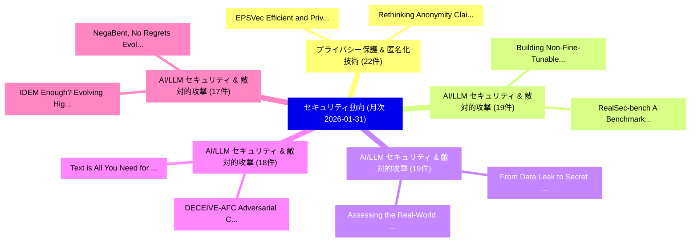

# 📊 03_monthly: 月次エグゼクティブサマリー報告書 (直近30日間: 2026-01-31)

**集計日時**: 2026-01-31 00:00:00 UTC  
**直近30日間の総論文数**: 654 件  

---

## 💡 マクロ脅威動向 & 戦略的リスク評価 (Strategic Executive Insights)

本日の収集論文（計 654 件）において、以下の重点セキュリティ領域で活発な研究動向が確認されました：
- **プライバシー保護 & 匿名化技術** (22 件): 注目論文として 「EPSVec: Efficient and Private ...」、「Rethinking Anonymity Claims in...」 等が発表され、実務防御および攻撃検証の進展が見られます。
- **AI/LLM セキュリティ & 敵対的攻撃** (19 件): 注目論文として 「Building Non-Fine-Tunable Foun...」、「RealSec-bench: A Benchmark for...」 等が発表され、実務防御および攻撃検証の進展が見られます。
- **AI/LLM セキュリティ & 敵対的攻撃** (19 件): 注目論文として 「Assessing the Real-World Impac...」、「From Data Leak to Secret Misse...」 等が発表され、実務防御および攻撃検証の進展が見られます。
- **AI/LLM セキュリティ & 敵対的攻撃** (18 件): 注目論文として 「Text is All You Need for Visio...」、「DECEIVE-AFC: Adversarial Claim...」 等が発表され、実務防御および攻撃検証の進展が見られます。
- **AI/LLM セキュリティ & 敵対的攻撃** (17 件): 注目論文として 「IDEM Enough? Evolving Highly N...」、「NegaBent, No Regrets: Evolving...」 等が発表され、実務防御および攻撃検証の進展が見られます。

### 🗺️ 月次セキュリティ技術レーダー (Technology Radar)

---

## 📌 月次セキュリティ論文一覧 (日本語表形式)

| No | arXiv ID | 論文タイトル (日本語訳) | 重要キーワード | 構造化エグゼクティブ要約 (背景・提案・影響) | 脅威分類 | 詳細リンク |
|---|---|---|---|---|---|---|
| 1 | `2602.00411v1` | [SpyDir: Spy Device Localization Through Accurate Direction Finding（セキュリティ分析論文）](../../okf/papers/2026-01-31/2602.00411.md) | `Wenyi Morty Zhang`, `Wenhao Chen`, `Wei Sun` | 【提案】概要 (Overview & Key Finding) 本論文「SpyDir: Spy Device Localization Through Accurate Direct...。実証評価により経営層・セキュリティ管理者向け推奨アクション (E... | `cybersecurity` | [arXiv](https://arxiv.org/abs/2602.00411v1) &#124; [OKF](../../okf/papers/2026-01-31/2602.00411.md) |
| 2 | `2602.00420v1` | [Text is All You Need for Vision-Language Model Jailbreaking（セキュリティ分析論文）](../../okf/papers/2026-01-31/2602.00420.md) | `Language Model Jailbreaking`, `Vision-Language Model`, `Yihang Chen` | 【提案】概要 (Overview & Key Finding) 本論文「Text is All You Need for Vision-Language Model ジェイルブレイク...。実証評価により経営層・セキュリティ管理者向け推奨アクション (E... | `cs.AI` | [arXiv](https://arxiv.org/abs/2602.00420v1) &#124; [OKF](../../okf/papers/2026-01-31/2602.00420.md) |
| 3 | `2602.00428v2` | [When Agents "Misremember" Collectively: Exploring the Mandela Effect in LLM-based Multi-Agent Systems（セキュリティ分析論文）](../../okf/papers/2026-01-31/2602.00428.md) | `Mandela Effect`, `Agent Systems`, `LLM-based Multi` | 【提案】概要 (Overview & Key Finding) 本論文「When Agents "Misremember" Collectively: Exploring the M...。実証評価により経営層・セキュリティ管理者向け推奨アクション (E... | `cs.AI` | [arXiv](https://arxiv.org/abs/2602.00428v2) &#124; [OKF](../../okf/papers/2026-01-31/2602.00428.md) |
| 4 | `2602.00432v1` | [a Cognitive-Support Tool for Threat Huntersに向けて](../../okf/papers/2026-01-31/2602.00432.md) | `Support Tool`, `Cognitive-Support Tool`, `Threat Hunters` | 【提案】概要 (Overview & Key Finding) 本論文「a Cognitive-Support Tool for 脅威 Huntersに向けて」（原題: Toward...。実証評価により経営層・セキュリティ管理者向け推奨アクション (E... | `executive-summary` | [arXiv](https://arxiv.org/abs/2602.00432v1) &#124; [OKF](../../okf/papers/2026-01-31/2602.00432.md) |
| 5 | `2602.00446v1` | [Building Non-Fine-Tunable Foundation Modelsに向けて](../../okf/papers/2026-01-31/2602.00446.md) | `Towards Building Non`, `Tunable Foundation Models`, `Building Non` | 【提案】概要 (Overview & Key Finding) 本論文「Building Non-Fine-Tunable Foundation Modelsに向けて」（原題: To...。実証評価により経営層・セキュリティ管理者向け推奨アクション (E... | `executive-summary` | [arXiv](https://arxiv.org/abs/2602.00446v1) &#124; [OKF](../../okf/papers/2026-01-31/2602.00446.md) |
| 6 | `2602.00619v1` | [Jailbreaking LLMs via Calibration（セキュリティ分析論文）](../../okf/papers/2026-01-31/2602.00619.md) | `Yuxuan Lu`, `Yongkang Guo`, `Yuqing Kong` | 【提案】概要 (Overview & Key Finding) 本論文「ジェイルブレイクing LLMs via Calibration（セキュリティ分析論文）」（原題: ジェイルブ...。実証評価により経営層・セキュリティ管理者向け推奨アクション (E... | `cs.AI` | [arXiv](https://arxiv.org/abs/2602.00619v1) &#124; [OKF](../../okf/papers/2026-01-31/2602.00619.md) |
| 7 | `2602.00667v6` | [zkCraft: Prompt-Guided LLM as a Zero-Shot Mutation Pattern Oracle for TCCT-Powered ZK Fuzzing（セキュリティ分析論文）](../../okf/papers/2026-01-31/2602.00667.md) | `Shot Mutation Pattern Oracle`, `Prompt-Guided LLM`, `Zero-Shot Mutation` | 【提案】概要 (Overview & Key Finding) 本論文「zkCraft: Prompt-Guided LLM as a Zero-Shot Mutation Patt...。実証評価により経営層・セキュリティ管理者向け推奨アクション (E... | `executive-summary` | [arXiv](https://arxiv.org/abs/2602.00667v6) &#124; [OKF](../../okf/papers/2026-01-31/2602.00667.md) |
| 8 | `2602.00689v3` | [Computing Maximal Per-Record Leakage and Leakage-Distortion Functions for Privacy Mechanisms under Entropy-Constrained Adversaries（セキュリティ分析論文）](../../okf/papers/2026-01-31/2602.00689.md) | `Computing Maximal Per`, `Record Leakage`, `Distortion Functions` | 【提案】概要 (Overview & Key Finding) 本論文「Computing Maximal Per-Record Leakage and Leakage-Distor...。実証評価により経営層・セキュリティ管理者向け推奨アクション (E... | `cybersecurity` | [arXiv](https://arxiv.org/abs/2602.00689v3) &#124; [OKF](../../okf/papers/2026-01-31/2602.00689.md) |
| 9 | `2602.00711v1` | [From Detection to Prevention: Explaining Security-Critical Code to Avoid Vulnerabilities（セキュリティ分析論文）](../../okf/papers/2026-01-31/2602.00711.md) | `Explaining Security`, `Critical Code`, `Avoid Vulnerabilities` | 【提案】概要 (Overview & Key Finding) 本論文「From Detection to Prevention: Explaining Security-Criti...。実証評価により経営層・セキュリティ管理者向け推奨アクション (E... | `cs.AI` | [arXiv](https://arxiv.org/abs/2602.00711v1) &#124; [OKF](../../okf/papers/2026-01-31/2602.00711.md) |
| 10 | `2602.00750v2` | [Bypassing Prompt Injection Detectors through Evasive Injections（セキュリティ分析論文）](../../okf/papers/2026-01-31/2602.00750.md) | `Bypassing Prompt Injection Detectors`, `Evasive Injections`, `Md Jahedur Rahman` | 【提案】概要 (Overview & Key Finding) 本論文「Bypassing プロンプトインジェクション Detectors through Evasive Injec...。実証評価により経営層・セキュリティ管理者向け推奨アクション (E... | `cs.AI` | [arXiv](https://arxiv.org/abs/2602.00750v2) &#124; [OKF](../../okf/papers/2026-01-31/2602.00750.md) |
| 11 | `2602.00837v1` | [IDEM Enough? Evolving Highly Nonlinear Idempotent Boolean Functions（セキュリティ分析論文）](../../okf/papers/2026-01-31/2602.00837.md) | `Evolving Highly Nonlinear Idempotent Boolean Functions`, `Claude Carlet`, `Domagoj Jakobovic` | 【提案】Evolving Highly Nonlinear Idempotent Boolean Functions ### (日本語題名: IDEM Enough?。実証評価により経営層・セキュリティ管理者向け推奨アクション (Executive Re... | `executive-summary` | [arXiv](https://arxiv.org/abs/2602.00837v1) &#124; [OKF](../../okf/papers/2026-01-31/2602.00837.md) |
| 12 | `2602.00843v1` | [NegaBent, No Regrets: Evolving Spectrally Flat Boolean Functions（セキュリティ分析論文）](../../okf/papers/2026-01-31/2602.00843.md) | `Evolving Spectrally Flat Boolean Functions`, `Claude Carlet`, `Ermes Franch` | 【提案】概要 (Overview & Key Finding) 本論文「NegaBent, No Regrets: Evolving Spectrally Flat Boolean ...。実証評価により経営層・セキュリティ管理者向け推奨アクション (E... | `executive-summary` | [arXiv](https://arxiv.org/abs/2602.00843v1) &#124; [OKF](../../okf/papers/2026-01-31/2602.00843.md) |
| 13 | `2602.02569v2` | [DECEIVE-AFC: Adversarial Claim Attacks against Search-Enabled LLM-based Fact-Checking Systems（セキュリティ分析論文）](../../okf/papers/2026-01-31/2602.02569.md) | `Adversarial Claim Attacks`, `Search-Enabled LLM`, `Checking Systems` | 【提案】概要 (Overview & Key Finding) 本論文「DECEIVE-AFC: Adversarial Claim Attacks against Search-E...。実証評価により経営層・セキュリティ管理者向け推奨アクション (E... | `cs.AI` | [arXiv](https://arxiv.org/abs/2602.02569v2) &#124; [OKF](../../okf/papers/2026-01-31/2602.02569.md) |
| 14 | `2602.02584v1` | [Constitutional Spec-Driven Development: Enforcing Security by Construction in AI-Assisted Code Generation（セキュリティ分析論文）](../../okf/papers/2026-01-31/2602.02584.md) | `Assisted Code Generation`, `Constitutional Spec`, `Driven Development` | 【提案】概要 (Overview & Key Finding) 本論文「Constitutional Spec-Driven Development: Enforcing Secur...。実証評価により経営層・セキュリティ管理者向け推奨アクション (E... | `cs.AI` | [arXiv](https://arxiv.org/abs/2602.02584v1) &#124; [OKF](../../okf/papers/2026-01-31/2602.02584.md) |
| 15 | `2602.04893v1` | [A Causal Perspective for Enhancing Jailbreak Attack and Defense（セキュリティ分析論文）](../../okf/papers/2026-01-31/2602.04893.md) | `Enhancing Jailbreak Attack`, `Causal Perspective`, `Licheng Pan` | 【提案】概要 (Overview & Key Finding) 本論文「A Causal Perspective for Enhancing ジェイルブレイク Attack and ...。実証評価により経営層・セキュリティ管理者向け推奨アクション (E... | `cs.AI` | [arXiv](https://arxiv.org/abs/2602.04893v1) &#124; [OKF](../../okf/papers/2026-01-31/2602.04893.md) |
| 16 | `2602.21218v2` | [EPSVec: Efficient and Private Synthetic Data Generation via Dataset Vectors（セキュリティ分析論文）](../../okf/papers/2026-01-31/2602.21218.md) | `Private Synthetic Data Generation`, `Dataset Vectors`, `Sai Praneeth Karimireddy` | 【提案】概要 (Overview & Key Finding) 本論文「EPSVec: Efficient and Private Synthetic Data Generation...。実証評価により経営層・セキュリティ管理者向け推奨アクション (E... | `cs.AI` | [arXiv](https://arxiv.org/abs/2602.21218v2) &#124; [OKF](../../okf/papers/2026-01-31/2602.21218.md) |
| 17 | `2601.22434v1` | [Rethinking Anonymity Claims in Synthetic Data Generation: A Model-Centric Privacy Attack Perspective（セキュリティ分析論文）](../../okf/papers/2026-01-30/2601.22434.md) | `Centric Privacy Attack Perspective`, `Rethinking Anonymity Claims`, `Synthetic Data Generation` | 【提案】概要 (Overview & Key Finding) 本論文「Rethinking Anonymity Claims in Synthetic Data Generatio...。実証評価により経営層・セキュリティ管理者向け推奨アクション (E... | `executive-summary` | [arXiv](https://arxiv.org/abs/2601.22434v1) &#124; [OKF](../../okf/papers/2026-01-30/2601.22434.md) |
| 18 | `2601.22472v1` | [The Third-Party Access Effect: An Overlooked Challenge in Secondary Use of Educational Real-World Data（セキュリティ分析論文）](../../okf/papers/2026-01-30/2601.22472.md) | `Party Access Effect`, `Secondary Use`, `Educational Real` | 【提案】概要 (Overview & Key Finding) 本論文「The Third-Party Access Effect: An Overlooked Challenge ...。実証評価により経営層・セキュリティ管理者向け推奨アクション (E... | `executive-summary` | [arXiv](https://arxiv.org/abs/2601.22472v1) &#124; [OKF](../../okf/papers/2026-01-30/2601.22472.md) |
| 19 | `2601.22485v1` | [FraudShield: Knowledge Graph Empowered Defense for LLMs against Fraud Attacks（セキュリティ分析論文）](../../okf/papers/2026-01-30/2601.22485.md) | `Knowledge Graph Empowered Defense`, `Fraud Attacks`, `Naen Xu` | 【提案】概要 (Overview & Key Finding) 本論文「FraudShield: Knowledge Graph Empowered Defense for LLMs...。実証評価により経営層・セキュリティ管理者向け推奨アクション (E... | `cs.AI` | [arXiv](https://arxiv.org/abs/2601.22485v1) &#124; [OKF](../../okf/papers/2026-01-30/2601.22485.md) |
| 20 | `2601.22556v1` | [VocBulwark: Practical Generative Speech Watermarking via Additional-Parameter Injectionに向けて](../../okf/papers/2026-01-30/2601.22556.md) | `Towards Practical Generative Speech Watermarking`, `Practical Generative Speech Watermarking`, `Parameter Injection` | 【提案】概要 (Overview & Key Finding) 本論文「VocBulwark: Practical Generative Speech Watermarking vi...。実証評価により経営層・セキュリティ管理者向け推奨アクション (E... | `cybersecurity` | [arXiv](https://arxiv.org/abs/2601.22556v1) &#124; [OKF](../../okf/papers/2026-01-30/2601.22556.md) |
| 21 | `2601.22569v2` | [Whispers of Wealth: Red-Teaming Google's Agent Payments Protocol via Prompt Injection（セキュリティ分析論文）](../../okf/papers/2026-01-30/2601.22569.md) | `Agent Payments Protocol`, `Teaming Google`, `Red-Teaming Google` | 【提案】概要 (Overview & Key Finding) 本論文「Whispers of Wealth: Red-Teaming Google's Agent Payments...。実証評価により経営層・セキュリティ管理者向け推奨アクション (E... | `cs.AI` | [arXiv](https://arxiv.org/abs/2601.22569v2) &#124; [OKF](../../okf/papers/2026-01-30/2601.22569.md) |
| 22 | `2601.22653v1` | [Human-Centered Explainability in AI-Enhanced UI Security Interfaces: Designing Trustworthy Copilots for サイバーセキュリティ Analysts](../../okf/papers/2026-01-30/2601.22653.md) | `Designing Trustworthy Copilots`, `Centered Explainability`, `Human-Centered Explainability` | 【提案】概要 (Overview & Key Finding) 本論文「Human-Centered Explainability in AI-Enhanced UI Securit...。実証評価により経営層・セキュリティ管理者向け推奨アクション (E... | `cs.AI` | [arXiv](https://arxiv.org/abs/2601.22653v1) &#124; [OKF](../../okf/papers/2026-01-30/2601.22653.md) |
| 23 | `2601.22655v3` | [Do Fine-Tuned LLMs Understand Vulnerabilities? An Investigation into the Semantic Trap（セキュリティ分析論文）](../../okf/papers/2026-01-30/2601.22655.md) | `Fine-Tuned LLMs`, `Understand Vulnerabilities`, `Semantic Trap` | 【提案】An Investigation into the Semantic Trap ### (日本語題名: Do Fine-Tuned LLMs Understand Vulne...。実証評価により経営層・セキュリティ管理者向け推奨アクション (E... | `executive-summary` | [arXiv](https://arxiv.org/abs/2601.22655v3) &#124; [OKF](../../okf/papers/2026-01-30/2601.22655.md) |
| 24 | `2601.22692v1` | [FNF: Functional Network Fingerprint for 大規模言語モデル](../../okf/papers/2026-01-30/2601.22692.md) | `Functional Network Fingerprint`, `Large Language Models`, `Yiheng Liu` | 【提案】概要 (Overview & Key Finding) 本論文「FNF: Functional Network Fingerprint for 大規模言語モデル」（原題: F...。実証評価により経営層・セキュリティ管理者向け推奨アクション (E... | `cs.AI` | [arXiv](https://arxiv.org/abs/2601.22692v1) &#124; [OKF](../../okf/papers/2026-01-30/2601.22692.md) |
| 25 | `2601.22706v1` | [RealSec-bench: A Benchmark for Evaluating Secure Code Generation in Real-World Repositories（セキュリティ分析論文）](../../okf/papers/2026-01-30/2601.22706.md) | `Evaluating Secure Code Generation`, `World Repositories`, `Real-World Repositories` | 【提案】概要 (Overview & Key Finding) 本論文「RealSec-bench: A Benchmark for Evaluating Secure Code G...。実証評価により経営層・セキュリティ管理者向け推奨アクション (E... | `executive-summary` | [arXiv](https://arxiv.org/abs/2601.22706v1) &#124; [OKF](../../okf/papers/2026-01-30/2601.22706.md) |
| 26 | `2601.22710v2` | [AlienLM: Alienization of Language for API-Boundary Privacy in Black-Box LLMs（セキュリティ分析論文）](../../okf/papers/2026-01-30/2601.22710.md) | `Boundary Privacy`, `API-Boundary Privacy`, `Black-Box LLMs` | 【提案】概要 (Overview & Key Finding) 本論文「AlienLM: Alienization of Language for API-Boundary Priv...。実証評価により経営層・セキュリティ管理者向け推奨アクション (E... | `executive-summary` | [arXiv](https://arxiv.org/abs/2601.22710v2) &#124; [OKF](../../okf/papers/2026-01-30/2601.22710.md) |
| 27 | `2601.22720v1` | [AEGIS: White-Box Attack Path Generation using LLMs and Training Effectiveness Evaluation for Large-Scale Cyber Defence Exercises（セキュリティ分析論文）](../../okf/papers/2026-01-30/2601.22720.md) | `Box Attack Path Generation`, `Scale Cyber Defence Exercises`, `White-Box Attack` | 【提案】概要 (Overview & Key Finding) 本論文「AEGIS: White-Box Attack Path Generation using LLMs and ...。実証評価により# AEGIS: White-Box Attack... | `cs.AI` | [arXiv](https://arxiv.org/abs/2601.22720v1) &#124; [OKF](../../okf/papers/2026-01-30/2601.22720.md) |
| 28 | `2601.22744v1` | [Beauty and the Beast: Imperceptible Perturbations Against Diffusion-Based Face Swapping via Directional Attribute Editing（セキュリティ分析論文）](../../okf/papers/2026-01-30/2601.22744.md) | `Based Face Swapping`, `Directional Attribute Editing`, `Diffusion-Based Face` | 【提案】概要 (Overview & Key Finding) 本論文「Beauty and the Beast: Imperceptible Perturbations Again...。実証評価により経営層・セキュリティ管理者向け推奨アクション (E... | `cs.CV` | [arXiv](https://arxiv.org/abs/2601.22744v1) &#124; [OKF](../../okf/papers/2026-01-30/2601.22744.md) |
| 29 | `2601.22770v2` | [Okara: Detection and Attribution of TLS Man-in-the-Middle Vulnerabilities in Android Apps with Foundation Models（セキュリティ分析論文）](../../okf/papers/2026-01-30/2601.22770.md) | `Middle Vulnerabilities`, `Android Apps`, `Foundation Models` | 【提案】概要 (Overview & Key Finding) 本論文「Okara: Detection and Attribution of TLS 中間者攻撃 Vulnerabi...。実証評価により経営層・セキュリティ管理者向け推奨アクション (E... | `cybersecurity` | [arXiv](https://arxiv.org/abs/2601.22770v2) &#124; [OKF](../../okf/papers/2026-01-30/2601.22770.md) |
| 30 | `2601.22772v2` | [Rust and Go directed fuzzing with LibAFL-DiFuzz（セキュリティ分析論文）](../../okf/papers/2026-01-30/2601.22772.md) | `Timofey Mezhuev`, `Darya Parygina`, `Daniil Kuts` | 【提案】概要 (Overview & Key Finding) 本論文「Rust and Go directed fuzzing with LibAFL-DiFuzz（セキュリティ分...。実証評価により経営層・セキュリティ管理者向け推奨アクション (E... | `cybersecurity` | [arXiv](https://arxiv.org/abs/2601.22772v2) &#124; [OKF](../../okf/papers/2026-01-30/2601.22772.md) |
| 31 | `2601.22778v2` | [Color Matters: Demosaicing-Guided Color Correlation Training for Generalizable AI-Generated Image Detection（セキュリティ分析論文）](../../okf/papers/2026-01-30/2601.22778.md) | `Guided Color Correlation Training`, `Generated Image Detection`, `Color Matters` | 【提案】概要 (Overview & Key Finding) 本論文「Color Matters: Demosaicing-Guided Color Correlation Tra...。実証評価により経営層・セキュリティ管理者向け推奨アクション (E... | `cs.CV` | [arXiv](https://arxiv.org/abs/2601.22778v2) &#124; [OKF](../../okf/papers/2026-01-30/2601.22778.md) |
| 32 | `2601.22800v1` | [Trackly: A Unified SaaS Platform for User Behavior Analytics and Real Time Rule Based Anomaly Detection（セキュリティ分析論文）](../../okf/papers/2026-01-30/2601.22800.md) | `Real Time Rule Based Anomaly Detection`, `User Behavior Analytics`, `Md Zahurul Haque` | 【提案】概要 (Overview & Key Finding) 本論文「Trackly: A Unified SaaS Platform for User Behavior Anal...。実証評価により経営層・セキュリティ管理者向け推奨アクション (E... | `executive-summary` | [arXiv](https://arxiv.org/abs/2601.22800v1) &#124; [OKF](../../okf/papers/2026-01-30/2601.22800.md) |
| 33 | `2601.22804v2` | [Trojan-Resilient NTT: Protecting Against Control Flow and Timing Faults on Reconfigurable Platforms（セキュリティ分析論文）](../../okf/papers/2026-01-30/2601.22804.md) | `Timing Faults`, `Reconfigurable Platforms`, `Trojan-Resilient NTT` | 【提案】概要 (Overview & Key Finding) 本論文「Trojan-Resilient NTT: Protecting Against Control Flow a...。実証評価により経営層・セキュリティ管理者向け推奨アクション (E... | `executive-summary` | [arXiv](https://arxiv.org/abs/2601.22804v2) &#124; [OKF](../../okf/papers/2026-01-30/2601.22804.md) |
| 34 | `2601.22818v2` | [Hide and Seek in Embedding Space: Geometry-based Steganography and Detection in 大規模言語モデル](../../okf/papers/2026-01-30/2601.22818.md) | `Embedding Space`, `Geometry-based Steganography`, `Large Language Models` | 【提案】概要 (Overview & Key Finding) 本論文「Hide and Seek in Embedding Space: Geometry-based Stegan...。実証評価により経営層・セキュリティ管理者向け推奨アクション (E... | `cs.AI` | [arXiv](https://arxiv.org/abs/2601.22818v2) &#124; [OKF](../../okf/papers/2026-01-30/2601.22818.md) |
| 35 | `2601.22892v1` | [Assessing the Real-World Impact of Post-Quantum Cryptography on WPA-Enterprise Networks（セキュリティ分析論文）](../../okf/papers/2026-01-30/2601.22892.md) | `World Impact`, `Quantum Cryptography`, `Enterprise Networks` | 【提案】概要 (Overview & Key Finding) 本論文「Assessing the Real-World Impact of ポスト量子暗号 on WPA-Enter...。実証評価により経営層・セキュリティ管理者向け推奨アクション (E... | `cs.NI` | [arXiv](https://arxiv.org/abs/2601.22892v1) &#124; [OKF](../../okf/papers/2026-01-30/2601.22892.md) |
| 36 | `2601.22921v1` | [Evaluating 大規模言語モデル for Security Bug Report Prediction](../../okf/papers/2026-01-30/2601.22921.md) | `Security Bug Report Prediction`, `Evaluating Large Language Models`, `Farnaz Soltaniani` | 【提案】概要 (Overview & Key Finding) 本論文「Evaluating 大規模言語モデル for Security Bug Report Prediction」...。実証評価により経営層・セキュリティ管理者向け推奨アクション (E... | `cs.AI` | [arXiv](https://arxiv.org/abs/2601.22921v1) &#124; [OKF](../../okf/papers/2026-01-30/2601.22921.md) |
| 37 | `2601.22929v2` | [Semantic Leakage from Image Embeddings（セキュリティ分析論文）](../../okf/papers/2026-01-30/2601.22929.md) | `Semantic Leakage`, `Image Embeddings`, `Yiyi Chen` | 【提案】概要 (Overview & Key Finding) 本論文「Semantic Leakage from Image Embeddings（セキュリティ分析論文）」（原題:...。実証評価により経営層・セキュリティ管理者向け推奨アクション (E... | `cs.CV` | [arXiv](https://arxiv.org/abs/2601.22929v2) &#124; [OKF](../../okf/papers/2026-01-30/2601.22929.md) |
| 38 | `2601.22935v1` | [Protecting Private Code in IDE Autocomplete using Differential Privacy（セキュリティ分析論文）](../../okf/papers/2026-01-30/2601.22935.md) | `Protecting Private Code`, `Differential Privacy`, `Evgeny Grigorenko` | 【提案】概要 (Overview & Key Finding) 本論文「Protecting Private Code in IDE Autocomplete using 差分プライ...。実証評価により経営層・セキュリティ管理者向け推奨アクション (E... | `cs.AI` | [arXiv](https://arxiv.org/abs/2601.22935v1) &#124; [OKF](../../okf/papers/2026-01-30/2601.22935.md) |
| 39 | `2601.22938v1` | [A Real-Time Privacy-Preserving Behavior Recognition System via Edge-Cloud Collaboration（セキュリティ分析論文）](../../okf/papers/2026-01-30/2601.22938.md) | `Preserving Behavior Recognition System`, `Time Privacy`, `Real-Time Privacy` | 【提案】概要 (Overview & Key Finding) 本論文「A Real-Time Privacy-Preserving Behavior Recognition Sys...。実証評価により経営層・セキュリティ管理者向け推奨アクション (E... | `cs.AI` | [arXiv](https://arxiv.org/abs/2601.22938v1) &#124; [OKF](../../okf/papers/2026-01-30/2601.22938.md) |
| 40 | `2601.22945v2` | [Persuasive Privacy（セキュリティ分析論文）](../../okf/papers/2026-01-30/2601.22945.md) | `Persuasive Privacy`, `James Bailie`, `Judith Rousseau` | 【提案】概要 (Overview & Key Finding) 本論文「Persuasive Privacy（セキュリティ分析論文）」（原題: Persuasive Privacy ...。実証評価により経営層・セキュリティ管理者向け推奨アクション (E... | `econ.TH` | [arXiv](https://arxiv.org/abs/2601.22945v2) &#124; [OKF](../../okf/papers/2026-01-30/2601.22945.md) |
| 41 | `2601.22946v1` | [From Data Leak to Secret Misses: The Impact of Data Leakage on Secret Detection Models（セキュリティ分析論文）](../../okf/papers/2026-01-30/2601.22946.md) | `Secret Detection Models`, `Secret Misses`, `Data Leakage` | 【提案】概要 (Overview & Key Finding) 本論文「From Data Leak to Secret Misses: The Impact of Data Lea...。実証評価により経営層・セキュリティ管理者向け推奨アクション (E... | `cs.AI` | [arXiv](https://arxiv.org/abs/2601.22946v1) &#124; [OKF](../../okf/papers/2026-01-30/2601.22946.md) |
| 42 | `2601.22949v1` | [Autonomous Chain-of-Thought Distillation for Graph-Based Fraud Detection（セキュリティ分析論文）](../../okf/papers/2026-01-30/2601.22949.md) | `Based Fraud Detection`, `Autonomous Chain`, `Thought Distillation` | 【提案】概要 (Overview & Key Finding) 本論文「Autonomous Chain-of-Thought Distillation for Graph-Base...。実証評価により経営層・セキュリティ管理者向け推奨アクション (E... | `executive-summary` | [arXiv](https://arxiv.org/abs/2601.22949v1) &#124; [OKF](../../okf/papers/2026-01-30/2601.22949.md) |
| 43 | `2601.22978v3` | [Triosecuris: Formally Verified Protection Against Speculative Control-Flow Hijacking（セキュリティ分析論文）](../../okf/papers/2026-01-30/2601.22978.md) | `Flow Hijacking`, `Control-Flow Hijacking`, `Formally Verified Protec` | 【提案】概要 (Overview & Key Finding) 本論文「Triosecuris: Formally Verified Protection Against Specu...。実証評価により経営層・セキュリティ管理者向け推奨アクション (E... | `cs.PL` | [arXiv](https://arxiv.org/abs/2601.22978v3) &#124; [OKF](../../okf/papers/2026-01-30/2601.22978.md) |
| 44 | `2601.22983v2` | [PIDSMaker: Building and Evaluating Provenance-based Intrusion Detection Systems（セキュリティ分析論文）](../../okf/papers/2026-01-30/2601.22983.md) | `Intrusion Detection Systems`, `Evaluating Provenance`, `Provenance-based Intrusion` | 【提案】概要 (Overview & Key Finding) 本論文「PIDSMaker: Building and Evaluating Provenance-based Int...。実証評価により経営層・セキュリティ管理者向け推奨アクション (E... | `executive-summary` | [arXiv](https://arxiv.org/abs/2601.22983v2) &#124; [OKF](../../okf/papers/2026-01-30/2601.22983.md) |
| 45 | `2601.23020v1` | [Uncovering Hidden Inclusions of Vulnerable Dependencies in Real-World Java Projects（セキュリティ分析論文）](../../okf/papers/2026-01-30/2601.23020.md) | `Uncovering Hidden Inclusions`, `World Java Projects`, `Vulnerable Dependencies` | 【提案】概要 (Overview & Key Finding) 本論文「Uncovering Hidden Inclusions of Vulnerable Dependencies...。実証評価により経営層・セキュリティ管理者向け推奨アクション (E... | `executive-summary` | [arXiv](https://arxiv.org/abs/2601.23020v1) &#124; [OKF](../../okf/papers/2026-01-30/2601.23020.md) |
| 46 | `2601.23062v1` | [Evaluating the Effectiveness of OpenAI's Parental Control System（セキュリティ分析論文）](../../okf/papers/2026-01-30/2601.23062.md) | `Parental Control System`, `Kerem Ersoz`, `Saleh Afroogh` | 【提案】概要 (Overview & Key Finding) 本論文「Evaluating the Effectiveness of OpenAI's Parental Contr...。実証評価により# Evaluating the Effectiv... | `executive-summary` | [arXiv](https://arxiv.org/abs/2601.23062v1) &#124; [OKF](../../okf/papers/2026-01-30/2601.23062.md) |
| 47 | `2601.23081v1` | [Character as a Latent Variable in 大規模言語モデル: A Mechanistic Account of Emergent Misalignment and Conditional Safety Failures](../../okf/papers/2026-01-30/2601.23081.md) | `Conditional Safety Failures`, `Latent Variable`, `Mechanistic Account` | 【提案】概要 (Overview & Key Finding) 本論文「Character as a Latent Variable in 大規模言語モデル: A Mechanist...。実証評価により経営層・セキュリティ管理者向け推奨アクション (E... | `cs.AI` | [arXiv](https://arxiv.org/abs/2601.23081v1) &#124; [OKF](../../okf/papers/2026-01-30/2601.23081.md) |
| 48 | `2601.23088v2` | [From Similarity to Vulnerability: Key Collision Attack on LLM Semantic Caching（セキュリティ分析論文）](../../okf/papers/2026-01-30/2601.23088.md) | `Key Collision Attack`, `Semantic Caching`, `Zhixiang Zhang` | 【提案】概要 (Overview & Key Finding) 本論文「From Similarity to 脆弱性: Key Collision Attack on LLM Sem...。実証評価により経営層・セキュリティ管理者向け推奨アクション (E... | `cs.AI` | [arXiv](https://arxiv.org/abs/2601.23088v2) &#124; [OKF](../../okf/papers/2026-01-30/2601.23088.md) |
| 49 | `2601.23092v1` | [WiFiPenTester: Advancing Wireless Ethical Hacking with Governed GenAI（セキュリティ分析論文）](../../okf/papers/2026-01-30/2601.23092.md) | `Advancing Wireless Ethical Hacking`, `Raw Meta`, `Executive Summary` | 【提案】概要 (Overview & Key Finding) 本論文「WiFiPenTester: Advancing Wireless Ethical Hacking with ...。実証評価によりAl-Sinani, Chr。 | `cs.AI` | [arXiv](https://arxiv.org/abs/2601.23092v1) &#124; [OKF](../../okf/papers/2026-01-30/2601.23092.md) |
| 50 | `2601.23132v2` | [Verifiable Manifest Signing and Transparency Enforcement for Secure MCP-Based LLM Pipelines（セキュリティ分析論文）](../../okf/papers/2026-01-30/2601.23132.md) | `Verifiable Manifest Signing`, `Transparency Enforcement`, `MCP-Based LLM` | 【提案】概要 (Overview & Key Finding) 本論文「Verifiable Manifest Signing and Transparency Enforcemen...。実証評価により経営層・セキュリティ管理者向け推奨アクション (E... | `cs.AI` | [arXiv](https://arxiv.org/abs/2601.23132v2) &#124; [OKF](../../okf/papers/2026-01-30/2601.23132.md) |
| 51 | `2601.23157v2` | [No More, No Less: Least-Privilege Language Models（セキュリティ分析論文）](../../okf/papers/2026-01-30/2601.23157.md) | `Privilege Language Models`, `Least-Privilege Language`, `Paulius Rauba` | 【提案】概要 (Overview & Key Finding) 本論文「No More, No Less: Least-Privilege Language Models（セキュリテ...。実証評価により経営層・セキュリティ管理者向け推奨アクション (E... | `executive-summary` | [arXiv](https://arxiv.org/abs/2601.23157v2) &#124; [OKF](../../okf/papers/2026-01-30/2601.23157.md) |
| 52 | `2601.23255v1` | [Now You Hear Me: Audio Narrative Attacks Against Large Audio-Language Models（セキュリティ分析論文）](../../okf/papers/2026-01-30/2601.23255.md) | `Language Models`, `Audio-Language Models`, `Ye Yu` | 【提案】概要 (Overview & Key Finding) 本論文「Now You Hear Me: Audio Narrative Attacks Against Large ...。実証評価により経営層・セキュリティ管理者向け推奨アクション (E... | `cs.AI` | [arXiv](https://arxiv.org/abs/2601.23255v1) &#124; [OKF](../../okf/papers/2026-01-30/2601.23255.md) |
| 53 | `2602.00182v1` | [EigenAI: Deterministic Inference, Verifiable Results（セキュリティ分析論文）](../../okf/papers/2026-01-30/2602.00182.md) | `Deterministic Inference`, `David Ribeiro Alves`, `Vishnu Patankar` | 【提案】概要 (Overview & Key Finding) 本論文「EigenAI: Deterministic Inference, Verifiable Results（セキ...。実証評価により経営層・セキュリティ管理者向け推奨アクション (E... | `cs.AI` | [arXiv](https://arxiv.org/abs/2602.00182v1) &#124; [OKF](../../okf/papers/2026-01-30/2602.00182.md) |
| 54 | `2602.00183v1` | [RPP: A Certified Poisoned-Sample Detection Framework for Backdoor Attacks under Dataset Imbalance（セキュリティ分析論文）](../../okf/papers/2026-01-30/2602.00183.md) | `Certified Poisoned`, `Backdoor Attacks`, `Dataset Imbalance` | 【提案】概要 (Overview & Key Finding) 本論文「RPP: A Certified Poisoned-Sample Detection Framework fo...。実証評価により経営層・セキュリティ管理者向け推奨アクション (E... | `cs.CV` | [arXiv](https://arxiv.org/abs/2602.00183v1) &#124; [OKF](../../okf/papers/2026-01-30/2602.00183.md) |
| 55 | `2602.00204v1` | [Semantic-Aware Advanced Persistent Threat Detection Using Autoencoders on LLM-Encoded System Logs（セキュリティ分析論文）](../../okf/papers/2026-01-30/2602.00204.md) | `Aware Advanced Persistent Threat Detection Using Autoencoders`, `Encoded System Logs`, `Semantic-Aware Advanced` | 【提案】概要 (Overview & Key Finding) 本論文「Semantic-Aware Advanced Persistent 脅威 Detection Using A...。実証評価により経営層・セキュリティ管理者向け推奨アクション (E... | `cs.AI` | [arXiv](https://arxiv.org/abs/2602.00204v1) &#124; [OKF](../../okf/papers/2026-01-30/2602.00204.md) |
| 56 | `2602.00213v1` | [TessPay: Verify-then-Pay Infrastructure for Trusted Agentic Commerce（セキュリティ分析論文）](../../okf/papers/2026-01-30/2602.00213.md) | `Trusted Agentic Commerce`, `Pay Infrastructure`, `Mehul Goenka` | 【提案】概要 (Overview & Key Finding) 本論文「TessPay: Verify-then-Pay Infrastructure for Trusted Age...。実証評価により経営層・セキュリティ管理者向け推奨アクション (E... | `cs.AI` | [arXiv](https://arxiv.org/abs/2602.00213v1) &#124; [OKF](../../okf/papers/2026-01-30/2602.00213.md) |
| 57 | `2602.00219v1` | [Tri-LLM Cooperative Federated Zero-Shot Intrusion Detection with Semantic Disagreement and Trust-Aware Aggregation（セキュリティ分析論文）](../../okf/papers/2026-01-30/2602.00219.md) | `Cooperative Federated Zero`, `Shot Intrusion Detection`, `Semantic Disagreement` | 【提案】概要 (Overview & Key Finding) 本論文「Tri-LLM Cooperative Federated Zero-Shot Intrusion Detec...。実証評価により経営層・セキュリティ管理者向け推奨アクション (E... | `cs.AI` | [arXiv](https://arxiv.org/abs/2602.00219v1) &#124; [OKF](../../okf/papers/2026-01-30/2602.00219.md) |
| 58 | `2602.00270v1` | [RVDebloater: Mode-based Adaptive Firmware Debloating for Robotic Vehicles（セキュリティ分析論文）](../../okf/papers/2026-01-30/2602.00270.md) | `Adaptive Firmware Debloating`, `Robotic Vehicles`, `Mode-based Adaptive` | 【提案】概要 (Overview & Key Finding) 本論文「RVDebloater: Mode-based Adaptive Firmware Debloating fo...。実証評価により経営層・セキュリティ管理者向け推奨アクション (E... | `executive-summary` | [arXiv](https://arxiv.org/abs/2602.00270v1) &#124; [OKF](../../okf/papers/2026-01-30/2602.00270.md) |
| 59 | `2602.00305v2` | [Syntax- and Compilation-Preserving Evasion of LLM Vulnerability Detectors（セキュリティ分析論文）](../../okf/papers/2026-01-30/2602.00305.md) | `Preserving Evasion`, `Vulnerability Detectors`, `Compilation-Preserving Evasion` | 【提案】概要 (Overview & Key Finding) 本論文「Syntax- and Compilation-Preserving Evasion of LLM 脆弱性 D...。実証評価により経営層・セキュリティ管理者向け推奨アクション (E... | `cs.AI` | [arXiv](https://arxiv.org/abs/2602.00305v2) &#124; [OKF](../../okf/papers/2026-01-30/2602.00305.md) |
| 60 | `2602.00318v2` | [Optimal Transport-Guided Graph Neural Network-Based Bot Detectionに対する敵対的攻撃](../../okf/papers/2026-01-30/2602.00318.md) | `Optimal Transport`, `Network-Based Bot`, `Guided Graph Neural Network` | 【提案】概要 (Overview & Key Finding) 本論文「Optimal Transport-Guided Graph Neural Network-Based Bot...。実証評価により経営層・セキュリティ管理者向け推奨アクション (E... | `cs.AI` | [arXiv](https://arxiv.org/abs/2602.00318v2) &#124; [OKF](../../okf/papers/2026-01-30/2602.00318.md) |
| 61 | `2602.00338v1` | [HEEDFUL: Leveraging Sequential Transfer Learning for Robust WiFi Device Fingerprinting Amid Hardware Warm-Up Effects（セキュリティ分析論文）](../../okf/papers/2026-01-30/2602.00338.md) | `Leveraging Sequential Transfer Learning`, `Device Fingerprinting Amid Hardware Warm`, `Warm-Up Effects` | 【提案】概要 (Overview & Key Finding) 本論文「HEEDFUL: Leveraging Sequential Transfer Learning for Ro...。実証評価により経営層・セキュリティ管理者向け推奨アクション (E... | `cybersecurity` | [arXiv](https://arxiv.org/abs/2602.00338v1) &#124; [OKF](../../okf/papers/2026-01-30/2602.00338.md) |
| 62 | `2602.00364v4` | ["Someone Hid It": Query-Agnostic Black-Box Attacks on LLM-Based Retrieval（セキュリティ分析論文）](../../okf/papers/2026-01-30/2602.00364.md) | `Agnostic Black`, `Box Attacks`, `Based Retrieval` | 【提案】概要 (Overview & Key Finding) 本論文「"Someone Hid It": Query-Agnostic Black-Box Attacks on L...。実証評価により経営層・セキュリティ管理者向け推奨アクション (E... | `cybersecurity` | [arXiv](https://arxiv.org/abs/2602.00364v4) &#124; [OKF](../../okf/papers/2026-01-30/2602.00364.md) |
| 63 | `2603.05517v1` | [Traversal-as-Policy: Log-Distilled Gated Behavior Trees as Externalized, Verifiable Policies for Safe, Robust, and Efficient Agents（セキュリティ分析論文）](../../okf/papers/2026-01-30/2603.05517.md) | `Distilled Gated Behavior Trees`, `Verifiable Policies`, `Efficient Agents` | 【提案】概要 (Overview & Key Finding) 本論文「Traversal-as-Policy: Log-Distilled Gated Behavior Trees...。実証評価により経営層・セキュリティ管理者向け推奨アクション (E... | `cs.AI` | [arXiv](https://arxiv.org/abs/2603.05517v1) &#124; [OKF](../../okf/papers/2026-01-30/2603.05517.md) |
| 64 | `2601.21189v1` | [Adaptive and Robust Cost-Aware Proof of Quality for Decentralized LLM Inference Networks（セキュリティ分析論文）](../../okf/papers/2026-01-29/2601.21189.md) | `Robust Cost`, `Aware Proof`, `Cost-Aware Proof` | 【提案】概要 (Overview & Key Finding) 本論文「Adaptive and Robust Cost-Aware Proof of Quality for Dec...。実証評価により経営層・セキュリティ管理者向け推奨アクション (E... | `cs.AI` | [arXiv](https://arxiv.org/abs/2601.21189v1) &#124; [OKF](../../okf/papers/2026-01-29/2601.21189.md) |
| 65 | `2601.21211v1` | [SPOILER-GUARD: Gating Latency Effects of Memory Accesses through Randomized Dependency Prediction（セキュリティ分析論文）](../../okf/papers/2026-01-29/2601.21211.md) | `Gating Latency Effects`, `Randomized Dependency Prediction`, `Memory Accesses` | 【提案】概要 (Overview & Key Finding) 本論文「SPOILER-GUARD: Gating Latency Effects of Memory Accesse...。実証評価により経営層・セキュリティ管理者向け推奨アクション (E... | `cybersecurity` | [arXiv](https://arxiv.org/abs/2601.21211v1) &#124; [OKF](../../okf/papers/2026-01-29/2601.21211.md) |
| 66 | `2601.21252v1` | [Lossless Copyright Protection via Intrinsic Model Fingerprinting（セキュリティ分析論文）](../../okf/papers/2026-01-29/2601.21252.md) | `Lossless Copyright Protection`, `Intrinsic Model Fingerprinting`, `Lingxiao Chen` | 【提案】概要 (Overview & Key Finding) 本論文「Lossless Copyright Protection via Intrinsic Model Finge...。実証評価により経営層・セキュリティ管理者向け推奨アクション (E... | `cs.CV` | [arXiv](https://arxiv.org/abs/2601.21252v1) &#124; [OKF](../../okf/papers/2026-01-29/2601.21252.md) |
| 67 | `2601.21258v1` | [Virtualization-based Penetration Testing Study for Detecting Accessibility Abuse Vulnerabilities in Banking Apps in East and Southeast Asia（セキュリティ分析論文）](../../okf/papers/2026-01-29/2601.21258.md) | `Detecting Accessibility Abuse Vulnerabilities`, `Banking Apps`, `Southeast Asia` | 【提案】概要 (Overview & Key Finding) 本論文「Virtualization-based Penetration Testing Study for Dete...。実証評価により経営層・セキュリティ管理者向け推奨アクション (E... | `executive-summary` | [arXiv](https://arxiv.org/abs/2601.21258v1) &#124; [OKF](../../okf/papers/2026-01-29/2601.21258.md) |
| 68 | `2601.21261v1` | [User-Centric Phishing Detection: A RAG and LLM-Based Approach（セキュリティ分析論文）](../../okf/papers/2026-01-29/2601.21261.md) | `Centric Phishing Detection`, `User-Centric Phishing`, `Abrar Hamed Al Barwani` | 【提案】概要 (Overview & Key Finding) 本論文「User-Centric Phishing Detection: A RAG and LLM-Based Ap...。実証評価により経営層・セキュリティ管理者向け推奨アクション (E... | `cybersecurity` | [arXiv](https://arxiv.org/abs/2601.21261v1) &#124; [OKF](../../okf/papers/2026-01-29/2601.21261.md) |
| 69 | `2601.21287v1` | [Zero Rotation and Beyond: Architecting Neural Networks for Fast Secure Inference with Homomorphic Encryptionに向けて](../../okf/papers/2026-01-29/2601.21287.md) | `Architecting Neural Networks`, `Fast Secure Inference`, `Zero Rotation` | 【提案】概要 (Overview & Key Finding) 本論文「Zero Rotation and Beyond: Architecting Neural Networks ...。実証評価により経営層・セキュリティ管理者向け推奨アクション (E... | `cybersecurity` | [arXiv](https://arxiv.org/abs/2601.21287v1) &#124; [OKF](../../okf/papers/2026-01-29/2601.21287.md) |
| 70 | `2601.21318v2` | [QCL-IDS: Quantum Continual Learning for Intrusion Detection with Fidelity-Anchored Stability and Generative Replay（セキュリティ分析論文）](../../okf/papers/2026-01-29/2601.21318.md) | `Quantum Continual Learning`, `Intrusion Detection`, `Anchored Stability` | 【提案】概要 (Overview & Key Finding) 本論文「QCL-IDS: 量子 Continual Learning for Intrusion Detection ...。実証評価により経営層・セキュリティ管理者向け推奨アクション (E... | `executive-summary` | [arXiv](https://arxiv.org/abs/2601.21318v2) &#124; [OKF](../../okf/papers/2026-01-29/2601.21318.md) |
| 71 | `2601.21353v1` | [SecIC3: Customizing IC3 for Hardware Security Verification（セキュリティ分析論文）](../../okf/papers/2026-01-29/2601.21353.md) | `Hardware Security Verification`, `Qinhan Tan`, `Akash Gaonkar` | 【提案】概要 (Overview & Key Finding) 本論文「SecIC3: Customizing IC3 for Hardware Security Verificat...。実証評価により経営層・セキュリティ管理者向け推奨アクション (E... | `cybersecurity` | [arXiv](https://arxiv.org/abs/2601.21353v1) &#124; [OKF](../../okf/papers/2026-01-29/2601.21353.md) |
| 72 | `2601.21380v1` | [RerouteGuard: Understanding and Mitigating Adversarial Risks for LLM Routing（セキュリティ分析論文）](../../okf/papers/2026-01-29/2601.21380.md) | `Mitigating Adversarial Risks`, `Wenhui Zhang`, `Huiyu Xu` | 【提案】概要 (Overview & Key Finding) 本論文「RerouteGuard: Understanding and Mitigating Adversarial ...。実証評価により経営層・セキュリティ管理者向け推奨アクション (E... | `cybersecurity` | [arXiv](https://arxiv.org/abs/2601.21380v1) &#124; [OKF](../../okf/papers/2026-01-29/2601.21380.md) |
| 73 | `2601.21531v2` | [On the Adversarial Robustness of Large Vision-Language Models under Visual Token Compression（セキュリティ分析論文）](../../okf/papers/2026-01-29/2601.21531.md) | `Visual Token Compression`, `Adversarial Robustness`, `Large Vision` | 【提案】概要 (Overview & Key Finding) 本論文「On the Adversarial Robustness of Large Vision-Language ...。実証評価により経営層・セキュリティ管理者向け推奨アクション (E... | `cs.AI` | [arXiv](https://arxiv.org/abs/2601.21531v2) &#124; [OKF](../../okf/papers/2026-01-29/2601.21531.md) |
| 74 | `2601.21586v1` | [ICL-EVADER: Zero-Query Black-Box Evasion Attacks on In-Context Learning and Their Defenses（セキュリティ分析論文）](../../okf/papers/2026-01-29/2601.21586.md) | `Box Evasion Attacks`, `Query Black`, `Context Learning` | 【提案】概要 (Overview & Key Finding) 本論文「ICL-EVADER: Zero-Query Black-Box Evasion Attacks on In-...。実証評価により経営層・セキュリティ管理者向け推奨アクション (E... | `cybersecurity` | [arXiv](https://arxiv.org/abs/2601.21586v1) &#124; [OKF](../../okf/papers/2026-01-29/2601.21586.md) |
| 75 | `2601.21628v2` | [Noise as a Probe: Membership Inference Attacks on Diffusion Models Leveraging Initial Noise（セキュリティ分析論文）](../../okf/papers/2026-01-29/2601.21628.md) | `Diffusion Models Leveraging Initial Noise`, `Membership Inference Attacks`, `Puwei Lian` | 【提案】概要 (Overview & Key Finding) 本論文「Noise as a Probe: Membership Inference Attacks on Diffu...。実証評価により経営層・セキュリティ管理者向け推奨アクション (E... | `executive-summary` | [arXiv](https://arxiv.org/abs/2601.21628v2) &#124; [OKF](../../okf/papers/2026-01-29/2601.21628.md) |
| 76 | `2601.21636v3` | [Sampling-Free Privacy Accounting for Matrix Mechanisms under Random Allocation（セキュリティ分析論文）](../../okf/papers/2026-01-29/2601.21636.md) | `Free Privacy Accounting`, `Matrix Mechanisms`, `Random Allocation` | 【提案】概要 (Overview & Key Finding) 本論文「Sampling-Free Privacy Accounting for Matrix Mechanisms ...。実証評価により経営層・セキュリティ管理者向け推奨アクション (E... | `executive-summary` | [arXiv](https://arxiv.org/abs/2601.21636v3) &#124; [OKF](../../okf/papers/2026-01-29/2601.21636.md) |
| 77 | `2601.21657v1` | [Authenticated encryption for space telemetry（セキュリティ分析論文）](../../okf/papers/2026-01-29/2601.21657.md) | `Andrew Savchenko`, `Raw Meta`, `Executive Summary` | 【提案】概要 (Overview & Key Finding) 本論文「Authenticated encryption for space telemetry（セキュリティ分析論文...。実証評価により経営層・セキュリティ管理者向け推奨アクション (E... | `cs.NI` | [arXiv](https://arxiv.org/abs/2601.21657v1) &#124; [OKF](../../okf/papers/2026-01-29/2601.21657.md) |
| 78 | `2601.21680v2` | [Incremental Fingerprinting in an Open World（セキュリティ分析論文）](../../okf/papers/2026-01-29/2601.21680.md) | `Incremental Fingerprinting`, `Open World`, `Einar Broch Johnsen` | 【提案】概要 (Overview & Key Finding) 本論文「Incremental Fingerprinting in an Open World（セキュリティ分析論文）...。実証評価により経営層・セキュリティ管理者向け推奨アクション (E... | `cs.LO` | [arXiv](https://arxiv.org/abs/2601.21680v2) &#124; [OKF](../../okf/papers/2026-01-29/2601.21680.md) |
| 79 | `2601.21682v2` | [FIT to Forget: Robust Continual Unlearning for 大規模言語モデル](../../okf/papers/2026-01-29/2601.21682.md) | `Robust Continual Unlearning`, `Large Language Models`, `Xiaoyu Xu` | 【提案】概要 (Overview & Key Finding) 本論文「FIT to Forget: Robust Continual Unlearning for 大規模言語モデル...。実証評価により経営層・セキュリティ管理者向け推奨アクション (E... | `cs.AI` | [arXiv](https://arxiv.org/abs/2601.21682v2) &#124; [OKF](../../okf/papers/2026-01-29/2601.21682.md) |
| 80 | `2601.21893v1` | [WADBERT: Dual-channel Web Attack Detection Based on BERT Models（セキュリティ分析論文）](../../okf/papers/2026-01-29/2601.21893.md) | `Web Attack Detection Based`, `Dual-channel Web`, `Kangqiang Luo` | 【提案】概要 (Overview & Key Finding) 本論文「WADBERT: Dual-channel Web Attack Detection Based on BER...。実証評価により経営層・セキュリティ管理者向け推奨アクション (E... | `cybersecurity` | [arXiv](https://arxiv.org/abs/2601.21893v1) &#124; [OKF](../../okf/papers/2026-01-29/2601.21893.md) |
| 81 | `2601.21898v2` | [Making Models Unmergeable via Scaling-Sensitive Loss Landscape（セキュリティ分析論文）](../../okf/papers/2026-01-29/2601.21898.md) | `Making Models Unmergeable`, `Sensitive Loss Landscape`, `Scaling-Sensitive Loss` | 【提案】概要 (Overview & Key Finding) 本論文「Making Models Unmergeable via Scaling-Sensitive Loss La...。実証評価により経営層・セキュリティ管理者向け推奨アクション (E... | `cs.AI` | [arXiv](https://arxiv.org/abs/2601.21898v2) &#124; [OKF](../../okf/papers/2026-01-29/2601.21898.md) |
| 82 | `2601.21902v2` | [Hardware-Triggered Backdoors（セキュリティ分析論文）](../../okf/papers/2026-01-29/2601.21902.md) | `Triggered Backdoors`, `Hardware-Triggered Backdoors`, `Erik Imgrund` | 【提案】概要 (Overview & Key Finding) 本論文「Hardware-Triggered Backdoors（セキュリティ分析論文）」（原題: Hardware-...。実証評価により経営層・セキュリティ管理者向け推奨アクション (E... | `executive-summary` | [arXiv](https://arxiv.org/abs/2601.21902v2) &#124; [OKF](../../okf/papers/2026-01-29/2601.21902.md) |
| 83 | `2601.21910v1` | [Beyond the Finite Variant Property: Extending Symbolic Diffie-Hellman Group Models (Extended Version)（セキュリティ分析論文）](../../okf/papers/2026-01-29/2601.21910.md) | `Finite Variant Property`, `Extending Symbolic Diffie`, `Hellman Group Models` | 【提案】概要 (Overview & Key Finding) 本論文「Beyond the Finite Variant Property: Extending Symbolic ...。実証評価により経営層・セキュリティ管理者向け推奨アクション (E... | `cybersecurity` | [arXiv](https://arxiv.org/abs/2601.21910v1) &#124; [OKF](../../okf/papers/2026-01-29/2601.21910.md) |
| 84 | `2601.21966v1` | [Secure Group Key Agreement on Cyber-Physical System Buses（セキュリティ分析論文）](../../okf/papers/2026-01-29/2601.21966.md) | `Secure Group Key Agreement`, `Physical System Buses`, `Cyber-Physical System` | 【提案】概要 (Overview & Key Finding) 本論文「Secure Group Key Agreement on Cyber-Physical System Bus...。実証評価によりPeters, Lukas Lautenschla... | `cybersecurity` | [arXiv](https://arxiv.org/abs/2601.21966v1) &#124; [OKF](../../okf/papers/2026-01-29/2601.21966.md) |
| 85 | `2601.22136v2` | [StepShield: When, Not Whether to Intervene on Rogue Agents（セキュリティ分析論文）](../../okf/papers/2026-01-29/2601.22136.md) | `Rogue Agents`, `Milan Hussain Angati`, `Gloria Felicia` | 【提案】背景とセキュリティ上の課題 (Background & Problem) 本研究はサイバー脅威環境におけるセキュリティ構造・脆弱性の検証を目的としています。(主要検出項目: ...。実証評価により経営層・セキュリティ管理者向け推奨アクション (E... | `cs.AI` | [arXiv](https://arxiv.org/abs/2601.22136v2) &#124; [OKF](../../okf/papers/2026-01-29/2601.22136.md) |
| 86 | `2601.22159v2` | [RedSage: A サイバーセキュリティ Generalist LLM](../../okf/papers/2026-01-29/2601.22159.md) | `Cybersecurity Generalist`, `Syed Talal Wasim`, `Naufal Suryanto` | 【提案】概要 (Overview & Key Finding) 本論文「RedSage: A サイバーセキュリティ Generalist LLM」（原題: RedSage: A Cy...。実証評価により経営層・セキュリティ管理者向け推奨アクション (E... | `cs.AI` | [arXiv](https://arxiv.org/abs/2601.22159v2) &#124; [OKF](../../okf/papers/2026-01-29/2601.22159.md) |
| 87 | `2601.22196v1` | [Linux Kernel Recency Matters, CVE Severity Doesn't, and History Fades（セキュリティ分析論文）](../../okf/papers/2026-01-29/2601.22196.md) | `Linux Kernel Recency Matters`, `Severity Doesn`, `History Fades` | 【提案】概要 (Overview & Key Finding) 本論文「Linux Kernel Recency Matters, CVE Severity Doesn't, and...。実証評価により経営層・セキュリティ管理者向け推奨アクション (E... | `executive-summary` | [arXiv](https://arxiv.org/abs/2601.22196v1) &#124; [OKF](../../okf/papers/2026-01-29/2601.22196.md) |
| 88 | `2601.22240v1` | [A Systematic Literature Review on LLM Defenses Against Prompt Injection and Jailbreaking: Expanding NIST Taxonomy（セキュリティ分析論文）](../../okf/papers/2026-01-29/2601.22240.md) | `Systematic Literature Review`, `Ygor Acacio Maria`, `Victor Takashi Hayashi` | 【提案】概要 (Overview & Key Finding) 本論文「A Systematic Literature Review on LLM Defenses Against ...。実証評価により経営層・セキュリティ管理者向け推奨アクション (E... | `cs.AI` | [arXiv](https://arxiv.org/abs/2601.22240v1) &#124; [OKF](../../okf/papers/2026-01-29/2601.22240.md) |
| 89 | `2601.22246v3` | [MirrorMark: Generalizable Mirrored Sampling for Multi-bit LLM Watermarking（セキュリティ分析論文）](../../okf/papers/2026-01-29/2601.22246.md) | `Generalizable Mirrored Sampling`, `Multi-bit LLM`, `Massieh Kordi Boroujeny` | 【提案】概要 (Overview & Key Finding) 本論文「MirrorMark: Generalizable Mirrored Sampling for Multi-b...。実証評価により経営層・セキュリティ管理者向け推奨アクション (E... | `cs.AI` | [arXiv](https://arxiv.org/abs/2601.22246v3) &#124; [OKF](../../okf/papers/2026-01-29/2601.22246.md) |
| 90 | `2601.22302v1` | [ZK-HybridFL: Zero-Knowledge Proof-Enhanced Hybrid Ledger for 連合学習](../../okf/papers/2026-01-29/2601.22302.md) | `Enhanced Hybrid Ledger`, `Knowledge Proof`, `Zero-Knowledge Proof` | 【提案】概要 (Overview & Key Finding) 本論文「ZK-HybridFL: ゼロ知識証明-Enhanced Hybrid Ledger for 連合学習」（原題...。実証評価により経営層・セキュリティ管理者向け推奨アクション (E... | `executive-summary` | [arXiv](https://arxiv.org/abs/2601.22302v1) &#124; [OKF](../../okf/papers/2026-01-29/2601.22302.md) |
| 91 | `2601.22308v2` | [Stealthy Poisoning Attacks Bypass Defenses in Regression Settings（セキュリティ分析論文）](../../okf/papers/2026-01-29/2601.22308.md) | `Stealthy Poisoning Attacks Bypass Defenses`, `Regression Settings`, `Javier Carnerero` | 【提案】概要 (Overview & Key Finding) 本論文「Stealthy Poisoning Attacks Bypass Defenses in Regressio...。実証評価により経営層・セキュリティ管理者向け推奨アクション (E... | `cs.AI` | [arXiv](https://arxiv.org/abs/2601.22308v2) &#124; [OKF](../../okf/papers/2026-01-29/2601.22308.md) |
| 92 | `2601.22390v1` | [An Effective Energy Mask-based Adversarial Evasion Attacks against Misclassification in Speaker Recognition Systems（セキュリティ分析論文）](../../okf/papers/2026-01-29/2601.22390.md) | `Adversarial Evasion Attacks`, `Speaker Recognition Systems`, `Mask-based Adversarial` | 【提案】概要 (Overview & Key Finding) 本論文「An Effective Energy Mask-based Adversarial Evasion Atta...。実証評価により経営層・セキュリティ管理者向け推奨アクション (E... | `executive-summary` | [arXiv](https://arxiv.org/abs/2601.22390v1) &#124; [OKF](../../okf/papers/2026-01-29/2601.22390.md) |
| 93 | `2601.22414v1` | [PriviSense: A Frida-Based Framework for Multi-Sensor Spoofing on Android（セキュリティ分析論文）](../../okf/papers/2026-01-29/2601.22414.md) | `Sensor Spoofing`, `Multi-Sensor Spoofing`, `Ibrahim Khalilov` | 【提案】概要 (Overview & Key Finding) 本論文「PriviSense: A Frida-Based Framework for Multi-Sensor Sp...。実証評価により経営層・セキュリティ管理者向け推奨アクション (E... | `executive-summary` | [arXiv](https://arxiv.org/abs/2601.22414v1) &#124; [OKF](../../okf/papers/2026-01-29/2601.22414.md) |
| 94 | `2602.00154v1` | [ReasoningBomb: A Stealthy Denial-of-Service Attack by Inducing Pathologically Long Reasoning in Large Reasoning Models（セキュリティ分析論文）](../../okf/papers/2026-01-29/2602.00154.md) | `Inducing Pathologically Long Reasoning`, `Large Reasoning Models`, `Stealthy Denial` | 【提案】概要 (Overview & Key Finding) 本論文「ReasoningBomb: A Stealthy Denial-of-Service Attack by I...。実証評価により経営層・セキュリティ管理者向け推奨アクション (E... | `cs.AI` | [arXiv](https://arxiv.org/abs/2602.00154v1) &#124; [OKF](../../okf/papers/2026-01-29/2602.00154.md) |
| 95 | `2602.00160v1` | [First Steps, Lasting Impact: Platform-Aware Forensics for the Next Generation of Analysts（セキュリティ分析論文）](../../okf/papers/2026-01-29/2602.00160.md) | `First Steps`, `Lasting Impact`, `Aware Forensics` | 【提案】概要 (Overview & Key Finding) 本論文「First Steps, Lasting Impact: Platform-Aware Forensics f...。実証評価により経営層・セキュリティ管理者向け推奨アクション (E... | `executive-summary` | [arXiv](https://arxiv.org/abs/2602.00160v1) &#124; [OKF](../../okf/papers/2026-01-29/2602.00160.md) |
| 96 | `2604.16309v1` | [AgentGuard: A Multi-Agent Framework for Robust Package Confusion Detection via Hybrid Search and Metadata-Content Fusion（セキュリティ分析論文）](../../okf/papers/2026-01-29/2604.16309.md) | `Robust Package Confusion Detection`, `Hybrid Search`, `Content Fusion` | 【提案】概要 (Overview & Key Finding) 本論文「AgentGuard: A Multi-Agent Framework for Robust Package ...。実証評価により経営層・セキュリティ管理者向け推奨アクション (E... | `executive-summary` | [arXiv](https://arxiv.org/abs/2604.16309v1) &#124; [OKF](../../okf/papers/2026-01-29/2604.16309.md) |
| 97 | `2601.20163v1` | [Reference-Free Spectral EM Side-Channels for Always-on Hardware Trojan Detectionの分析](../../okf/papers/2026-01-28/2601.20163.md) | `Reference-Free Spectral`, `Always-on Hardware`, `Hardware Trojan Detection` | 【提案】概要 (Overview & Key Finding) 本論文「Reference-Free Spectral EM サイドチャネル攻撃s for Always-on Har...。実証評価により経営層・セキュリティ管理者向け推奨アクション (E... | `cybersecurity` | [arXiv](https://arxiv.org/abs/2601.20163v1) &#124; [OKF](../../okf/papers/2026-01-28/2601.20163.md) |
| 98 | `2601.20184v1` | [AI Agents in Cyber-Physical Systems: A Survey of Environmental Interactions, Deepfake Threats, and Defensesのセキュリティ強化](../../okf/papers/2026-01-28/2601.20184.md) | `Physical Systems`, `Cyber-Physical Systems`, `Environmental Interactions` | 【提案】概要 (Overview & Key Finding) 本論文「AI Agents in Cyber-Physical Systems: A Survey of Enviro...。実証評価により経営層・セキュリティ管理者向け推奨アクション (E... | `executive-summary` | [arXiv](https://arxiv.org/abs/2601.20184v1) &#124; [OKF](../../okf/papers/2026-01-28/2601.20184.md) |
| 99 | `2601.20270v1` | [Eliciting Least-to-Most Reasoning for Phishing URL Detection（セキュリティ分析論文）](../../okf/papers/2026-01-28/2601.20270.md) | `Eliciting Least`, `Holly Trikilis`, `Pasindu Marasinghe` | 【提案】概要 (Overview & Key Finding) 本論文「Eliciting Least-to-Most Reasoning for Phishing URL Dete...。実証評価により経営層・セキュリティ管理者向け推奨アクション (E... | `cs.AI` | [arXiv](https://arxiv.org/abs/2601.20270v1) &#124; [OKF](../../okf/papers/2026-01-28/2601.20270.md) |
| 100 | `2601.20310v1` | [SemBind: Binding Diffusion Watermarks to Semantics Against Black-Box Forgery Attacks（セキュリティ分析論文）](../../okf/papers/2026-01-28/2601.20310.md) | `Binding Diffusion Watermarks`, `Box Forgery Attacks`, `Black-Box Forgery` | 【提案】概要 (Overview & Key Finding) 本論文「SemBind: Binding Diffusion Watermarks to Semantics Agai...。実証評価により経営層・セキュリティ管理者向け推奨アクション (E... | `cs.CV` | [arXiv](https://arxiv.org/abs/2601.20310v1) &#124; [OKF](../../okf/papers/2026-01-28/2601.20310.md) |
| 101 | `2601.20325v1` | [UnlearnShield: Shielding Forgotten Privacy against Unlearning Inversion（セキュリティ分析論文）](../../okf/papers/2026-01-28/2601.20325.md) | `Shielding Forgotten Privacy`, `Unlearning Inversion`, `Leo Yu Zhang` | 【提案】概要 (Overview & Key Finding) 本論文「UnlearnShield: Shielding Forgotten Privacy against Unle...。実証評価により経営層・セキュリティ管理者向け推奨アクション (E... | `cs.CV` | [arXiv](https://arxiv.org/abs/2601.20325v1) &#124; [OKF](../../okf/papers/2026-01-28/2601.20325.md) |
| 102 | `2601.20346v2` | [Multimodal Multi-Agent Ransomware Analysis Using AutoGen（セキュリティ分析論文）](../../okf/papers/2026-01-28/2601.20346.md) | `Multimodal Multi`, `Multi-Agent Ransomware`, `Asifullah Khan` | 【提案】概要 (Overview & Key Finding) 本論文「Multimodal Multi-Agent ランサムウェア Analysis Using AutoGen（セ...。実証評価により経営層・セキュリティ管理者向け推奨アクション (E... | `cs.AI` | [arXiv](https://arxiv.org/abs/2601.20346v2) &#124; [OKF](../../okf/papers/2026-01-28/2601.20346.md) |
| 103 | `2601.20368v1` | [LIFT: Byzantine Resilient Hub-Sampling（セキュリティ分析論文）](../../okf/papers/2026-01-28/2601.20368.md) | `Byzantine Resilient Hub`, `Mohamed Amine Legheraba`, `Maria Gradinariu Potop` | 【提案】概要 (Overview & Key Finding) 本論文「LIFT: Byzantine Resilient Hub-Sampling（セキュリティ分析論文）」（原題:...。実証評価により経営層・セキュリティ管理者向け推奨アクション (E... | `executive-summary` | [arXiv](https://arxiv.org/abs/2601.20368v1) &#124; [OKF](../../okf/papers/2026-01-28/2601.20368.md) |
| 104 | `2601.20374v1` | [A High-Performance Fractal Encryption Framework and Modern Innovations for Secure Image Transmission（セキュリティ分析論文）](../../okf/papers/2026-01-28/2601.20374.md) | `Secure Image Transmission`, `Modern Innovations`, `High-Performance Fractal` | 【提案】概要 (Overview & Key Finding) 本論文「A High-Performance Fractal Encryption Framework and Mod...。実証評価により経営層・セキュリティ管理者向け推奨アクション (E... | `cybersecurity` | [arXiv](https://arxiv.org/abs/2601.20374v1) &#124; [OKF](../../okf/papers/2026-01-28/2601.20374.md) |
| 105 | `2601.20378v2` | [Quantum-Safe O-RAN -- Experimental Evaluation of ML-KEM-Based IPsec on the E2 Interfaceに向けて](../../okf/papers/2026-01-28/2601.20378.md) | `Quantum-Safe O`, `Towards Quantum`, `E2 Interface` | 【提案】概要 (Overview & Key Finding) 本論文「量子-Safe O-RAN -- Experimental Evaluation of ML-KEM-Base...。実証評価により経営層・セキュリティ管理者向け推奨アクション (E... | `cybersecurity` | [arXiv](https://arxiv.org/abs/2601.20378v2) &#124; [OKF](../../okf/papers/2026-01-28/2601.20378.md) |
| 106 | `2601.20400v1` | [Fuzzy Private Set Union via Oblivious Key Homomorphic Encryption Retrieval（セキュリティ分析論文）](../../okf/papers/2026-01-28/2601.20400.md) | `Oblivious Key Homomorphic Encryption Retrieval`, `Fuzzy Private Set Union`, `Guillaume Dumas` | 【提案】概要 (Overview & Key Finding) 本論文「Fuzzy Private Set Union via Oblivious Key 準同型暗号 Retriev...。実証評価により経営層・セキュリティ管理者向け推奨アクション (E... | `cybersecurity` | [arXiv](https://arxiv.org/abs/2601.20400v1) &#124; [OKF](../../okf/papers/2026-01-28/2601.20400.md) |
| 107 | `2601.20507v1` | [TÄMU: Emulating Trusted Applications at the (GlobalPlatform)-API Layer（セキュリティ分析論文）](../../okf/papers/2026-01-28/2601.20507.md) | `Emulating Trusted Applications`, `Philipp Mao`, `Li Shi` | 【提案】概要 (Overview & Key Finding) 本論文「TÄMU: Emulating Trusted Applications at the (GlobalPlat...。実証評価により経営層・セキュリティ管理者向け推奨アクション (E... | `cybersecurity` | [arXiv](https://arxiv.org/abs/2601.20507v1) &#124; [OKF](../../okf/papers/2026-01-28/2601.20507.md) |
| 108 | `2601.20548v1` | [IoT Device Identification with Machine Learning: Common Pitfalls and Best Practices（セキュリティ分析論文）](../../okf/papers/2026-01-28/2601.20548.md) | `Device Identification`, `Machine Learning`, `Common Pitfalls` | 【提案】概要 (Overview & Key Finding) 本論文「IoT Device Identification with Machine Learning: Common...。実証評価により経営層・セキュリティ管理者向け推奨アクション (E... | `cs.NI` | [arXiv](https://arxiv.org/abs/2601.20548v1) &#124; [OKF](../../okf/papers/2026-01-28/2601.20548.md) |
| 109 | `2601.20629v1` | [/dev/SDB: Software Defined Boot -- A novel standard for diskless booting anywhere and everywhere（セキュリティ分析論文）](../../okf/papers/2026-01-28/2601.20629.md) | `Software Defined Boot`, `Bogdan Itsam Dorantes Nikolaev`, `Amaan Rais Shah` | 【提案】概要 (Overview & Key Finding) 本論文「/dev/SDB: Software Defined Boot -- A novel standard for...。実証評価により経営層・セキュリティ管理者向け推奨アクション (E... | `cs.ET` | [arXiv](https://arxiv.org/abs/2601.20629v1) &#124; [OKF](../../okf/papers/2026-01-28/2601.20629.md) |
| 110 | `2601.20638v1` | [Supply Chain Insecurity: Exposing Vulnerabilities in iOS Dependency Management Systems（セキュリティ分析論文）](../../okf/papers/2026-01-28/2601.20638.md) | `Supply Chain Insecurity`, `Dependency Management Systems`, `Exposing Vulnerabilities` | 【提案】概要 (Overview & Key Finding) 本論文「Supply Chain Insecurity: Exposing Vulnerabilities in iO...。実証評価により経営層・セキュリティ管理者向け推奨アクション (E... | `cybersecurity` | [arXiv](https://arxiv.org/abs/2601.20638v1) &#124; [OKF](../../okf/papers/2026-01-28/2601.20638.md) |
| 111 | `2601.20716v1` | [Decentralized Identity in Practice: Latency, Cost, and Privacyのベンチマーク評価](../../okf/papers/2026-01-28/2601.20716.md) | `Decentralized Identity`, `Benchmarking Latency`, `Abylay Satybaldy` | 【提案】概要 (Overview & Key Finding) 本論文「Decentralized Identity in Practice: Latency, Cost, and ...。実証評価により経営層・セキュリティ管理者向け推奨アクション (E... | `cs.ET` | [arXiv](https://arxiv.org/abs/2601.20716v1) &#124; [OKF](../../okf/papers/2026-01-28/2601.20716.md) |
| 112 | `2601.20901v1` | [Sensitivity-Aware Language Modelsに向けて](../../okf/papers/2026-01-28/2601.20901.md) | `Sensitivity-Aware Language`, `Aware Language Models`, `Towards Sensitivity` | 【提案】概要 (Overview & Key Finding) 本論文「Sensitivity-Aware Language Modelsに向けて」（原題: Towards Sens...。実証評価によりOlatunji, Daniel Kudenko,... | `cybersecurity` | [arXiv](https://arxiv.org/abs/2601.20901v1) &#124; [OKF](../../okf/papers/2026-01-28/2601.20901.md) |
| 113 | `2601.20903v1` | [ICON: Intent-Context Coupling for Efficient Multi-Turn Jailbreak Attack（セキュリティ分析論文）](../../okf/papers/2026-01-28/2601.20903.md) | `Turn Jailbreak Attack`, `Context Coupling`, `Efficient Multi` | 【提案】概要 (Overview & Key Finding) 本論文「ICON: Intent-Context Coupling for Efficient Multi-Turn ...。実証評価により経営層・セキュリティ管理者向け推奨アクション (E... | `cs.AI` | [arXiv](https://arxiv.org/abs/2601.20903v1) &#124; [OKF](../../okf/papers/2026-01-28/2601.20903.md) |
| 114 | `2601.20915v1` | [Robust 連合学習 for Malicious Clients using Loss Trend Deviation Detection](../../okf/papers/2026-01-28/2601.20915.md) | `Loss Trend Deviation Detection`, `Malicious Clients`, `Robust Federated Learning` | 【提案】概要 (Overview & Key Finding) 本論文「Robust 連合学習 for Malicious Clients using Loss Trend Devi...。実証評価により経営層・セキュリティ管理者向け推奨アクション (E... | `cybersecurity` | [arXiv](https://arxiv.org/abs/2601.20915v1) &#124; [OKF](../../okf/papers/2026-01-28/2601.20915.md) |
| 115 | `2601.20917v6` | [FIPS 204-Compatible Threshold ML-DSA via Shamir Nonce DKG（セキュリティ分析論文）](../../okf/papers/2026-01-28/2601.20917.md) | `Compatible Threshold`, `Shamir Nonce`, `204-Compatible Threshold` | 【提案】概要 (Overview & Key Finding) 本論文「FIPS 204-Compatible Threshold ML-DSA via Shamir Nonce D...。実証評価により経営層・セキュリティ管理者向け推奨アクション (E... | `cybersecurity` | [arXiv](https://arxiv.org/abs/2601.20917v6) &#124; [OKF](../../okf/papers/2026-01-28/2601.20917.md) |
| 116 | `2601.20980v1` | [Operationalizing Research Software for Supply Chain Security（セキュリティ分析論文）](../../okf/papers/2026-01-28/2601.20980.md) | `Operationalizing Research Software`, `Supply Chain Security`, `Soham Rattan` | 【提案】概要 (Overview & Key Finding) 本論文「Operationalizing Research Software for Supply Chain Sec...。実証評価によりThiruvathukal, Je。 | `executive-summary` | [arXiv](https://arxiv.org/abs/2601.20980v1) &#124; [OKF](../../okf/papers/2026-01-28/2601.20980.md) |
| 117 | `2601.20999v1` | [What Are Brands Telling You About Smishing? A Cross-Industry Evaluation of Customer Guidance（セキュリティ分析論文）](../../okf/papers/2026-01-28/2601.20999.md) | `Customer Guidance`, `Dev Vikesh Doshi`, `Chinthagumpala Muni Venkatesh` | 【提案】A Cross-Industry Evaluation of Customer Guidance ### (日本語題名: What Are Brands Telling Yo...。実証評価により経営層・セキュリティ管理者向け推奨アクション (E... | `executive-summary` | [arXiv](https://arxiv.org/abs/2601.20999v1) &#124; [OKF](../../okf/papers/2026-01-28/2601.20999.md) |
| 118 | `2601.21051v1` | [Llama-3.1-FoundationAI-SecurityLLM-Reasoning-8B Technical Report（セキュリティ分析論文）](../../okf/papers/2026-01-28/2601.21051.md) | `Technical Report`, `Zhuoran Yang`, `Ed Li` | 【提案】概要 (Overview & Key Finding) 本論文「Llama-3.1-FoundationAI-SecurityLLM-Reasoning-8B Technic...。実証評価により経営層・セキュリティ管理者向け推奨アクション (E... | `cs.AI` | [arXiv](https://arxiv.org/abs/2601.21051v1) &#124; [OKF](../../okf/papers/2026-01-28/2601.21051.md) |
| 119 | `2601.21066v1` | [BadDet+: Robust Backdoor Attacks for Object Detection（セキュリティ分析論文）](../../okf/papers/2026-01-28/2601.21066.md) | `Robust Backdoor Attacks`, `Object Detection`, `Kealan Dunnett` | 【提案】概要 (Overview & Key Finding) 本論文「BadDet+: Robust Backdoor Attacks for Object Detection（セ...。実証評価により経営層・セキュリティ管理者向け推奨アクション (E... | `cs.CV` | [arXiv](https://arxiv.org/abs/2601.21066v1) &#124; [OKF](../../okf/papers/2026-01-28/2601.21066.md) |
| 120 | `2601.22182v1` | [ShellForge: Adversarial Co-Evolution of Webshell Generation and Multi-View Detection for Robust Webshell Defense（セキュリティ分析論文）](../../okf/papers/2026-01-28/2601.22182.md) | `Robust Webshell Defense`, `Adversarial Co`, `Webshell Generation` | 【提案】概要 (Overview & Key Finding) 本論文「ShellForge: Adversarial Co-Evolution of Webshell Genera...。実証評価により経営層・セキュリティ管理者向け推奨アクション (E... | `cs.AI` | [arXiv](https://arxiv.org/abs/2601.22182v1) &#124; [OKF](../../okf/papers/2026-01-28/2601.22182.md) |
| 121 | `2601.22185v1` | [MemeChain: A Multimodal Cross-Chain Dataset for Meme Coin Forensics and Risk Analysis（セキュリティ分析論文）](../../okf/papers/2026-01-28/2601.22185.md) | `Meme Coin Forensics`, `Multimodal Cross`, `Chain Dataset` | 【提案】概要 (Overview & Key Finding) 本論文「MemeChain: A Multimodal Cross-Chain Dataset for Meme Co...。実証評価により経営層・セキュリティ管理者向け推奨アクション (E... | `executive-summary` | [arXiv](https://arxiv.org/abs/2601.22185v1) &#124; [OKF](../../okf/papers/2026-01-28/2601.22185.md) |
| 122 | `2601.19051v1` | [Proactive Hardening of LLM Defenses with HASTE（セキュリティ分析論文）](../../okf/papers/2026-01-27/2601.19051.md) | `Proactive Hardening`, `Henry Chen`, `Victor Aranda` | 【提案】概要 (Overview & Key Finding) 本論文「Proactive Hardening of LLM Defenses with HASTE（セキュリティ分析...。実証評価により経営層・セキュリティ管理者向け推奨アクション (E... | `cybersecurity` | [arXiv](https://arxiv.org/abs/2601.19051v1) &#124; [OKF](../../okf/papers/2026-01-27/2601.19051.md) |
| 123 | `2601.19061v2` | [Thought-Transfer: Indirect Targeted Poisoning Attacks on Chain-of-Thought Reasoning Models（セキュリティ分析論文）](../../okf/papers/2026-01-27/2601.19061.md) | `Indirect Targeted Poisoning Attacks`, `Thought Reasoning Models`, `Indirect Targeted Poisoning Attac` | 【提案】概要 (Overview & Key Finding) 本論文「Thought-Transfer: Indirect Targeted Poisoning Attacks o...。実証評価により経営層・セキュリティ管理者向け推奨アクション (E... | `executive-summary` | [arXiv](https://arxiv.org/abs/2601.19061v2) &#124; [OKF](../../okf/papers/2026-01-27/2601.19061.md) |
| 124 | `2601.19074v1` | [A Security CheriBSD and Morello Linuxの分析](../../okf/papers/2026-01-27/2601.19074.md) | `Morello Linux`, `Dariy Guzairov`, `Alex Potanin` | 【提案】概要 (Overview & Key Finding) 本論文「A Security CheriBSD and Morello Linuxの分析」（原題: A Securit...。実証評価により経営層・セキュリティ管理者向け推奨アクション (E... | `cybersecurity` | [arXiv](https://arxiv.org/abs/2601.19074v1) &#124; [OKF](../../okf/papers/2026-01-27/2601.19074.md) |
| 125 | `2601.19134v1` | [Evaluating Nova 2.0 Lite model under Amazon's Frontier Model Safety Framework（セキュリティ分析論文）](../../okf/papers/2026-01-27/2601.19134.md) | `Evaluating Nova`, `Satyapriya Krishna`, `Matteo Memelli` | 【提案】概要 (Overview & Key Finding) 本論文「Evaluating Nova 2.0 Lite model under Amazon's Frontier ...。実証評価により経営層・セキュリティ管理者向け推奨アクション (E... | `executive-summary` | [arXiv](https://arxiv.org/abs/2601.19134v1) &#124; [OKF](../../okf/papers/2026-01-27/2601.19134.md) |
| 126 | `2601.19138v2` | [AgenticSCR: An Autonomous Agentic Secure Code Review for Immature Vulnerabilities Detection（セキュリティ分析論文）](../../okf/papers/2026-01-27/2601.19138.md) | `Immature Vulnerabilities Detection`, `Hong Yi Lin`, `Wachiraphan Charoenwet` | 【提案】概要 (Overview & Key Finding) 本論文「AgenticSCR: An Autonomous Agentic Secure Code Review fo...。実証評価により経営層・セキュリティ管理者向け推奨アクション (E... | `cs.AI` | [arXiv](https://arxiv.org/abs/2601.19138v2) &#124; [OKF](../../okf/papers/2026-01-27/2601.19138.md) |
| 127 | `2601.19154v4` | [Shuffling Beyond Pure Local Differential Privacyの分析](../../okf/papers/2026-01-27/2601.19154.md) | `Shuffling Beyond Pure Local Differential Privacy`, `Shuffling Beyond Pure Local Differential`, `Seng Pei Liew` | 【提案】概要 (Overview & Key Finding) 本論文「Shuffling Beyond Pure Local 差分プライバシーの分析」（原題: Analysis o...。実証評価により経営層・セキュリティ管理者向け推奨アクション (E... | `executive-summary` | [arXiv](https://arxiv.org/abs/2601.19154v4) &#124; [OKF](../../okf/papers/2026-01-27/2601.19154.md) |
| 128 | `2601.19174v1` | [SHIELD: An Auto-Healing Agentic Defense Framework for LLM Resource Exhaustion Attacks（セキュリティ分析論文）](../../okf/papers/2026-01-27/2601.19174.md) | `Resource Exhaustion Attacks`, `Auto-Healing Agentic`, `Nirhoshan Sivaroopan` | 【提案】概要 (Overview & Key Finding) 本論文「SHIELD: An Auto-Healing Agentic Defense Framework for L...。実証評価により経営層・セキュリティ管理者向け推奨アクション (E... | `cs.AI` | [arXiv](https://arxiv.org/abs/2601.19174v1) &#124; [OKF](../../okf/papers/2026-01-27/2601.19174.md) |
| 129 | `2601.19231v1` | [LLMs Can Unlearn Refusal with Only 1,000 Benign Samples（セキュリティ分析論文）](../../okf/papers/2026-01-27/2601.19231.md) | `Can Unlearn Refusal`, `Benign Samples`, `Yangyang Guo` | 【提案】概要 (Overview & Key Finding) 本論文「LLMs Can Unlearn Refusal with Only 1,000 Benign Samples...。実証評価により経営層・セキュリティ管理者向け推奨アクション (E... | `cybersecurity` | [arXiv](https://arxiv.org/abs/2601.19231v1) &#124; [OKF](../../okf/papers/2026-01-27/2601.19231.md) |
| 130 | `2601.19342v1` | [Modeling Behavioral Signals in Job Scams: A Human-Centered Security Study（セキュリティ分析論文）](../../okf/papers/2026-01-27/2601.19342.md) | `Modeling Behavioral Signals`, `Job Scams`, `Human-Centered Security` | 【提案】概要 (Overview & Key Finding) 本論文「Modeling Behavioral Signals in Job Scams: A Human-Cente...。実証評価により経営層・セキュリティ管理者向け推奨アクション (E... | `executive-summary` | [arXiv](https://arxiv.org/abs/2601.19342v1) &#124; [OKF](../../okf/papers/2026-01-27/2601.19342.md) |
| 131 | `2601.19345v1` | [AI-driven Intrusion Detection for UAV in Smart Urban Ecosystems: A Comprehensive Survey（セキュリティ分析論文）](../../okf/papers/2026-01-27/2601.19345.md) | `Smart Urban Ecosystems`, `Intrusion Detection`, `AI-driven Intrusion` | 【提案】概要 (Overview & Key Finding) 本論文「AI-driven Intrusion Detection for UAV in Smart Urban Ec...。実証評価により経営層・セキュリティ管理者向け推奨アクション (E... | `cybersecurity` | [arXiv](https://arxiv.org/abs/2601.19345v1) &#124; [OKF](../../okf/papers/2026-01-27/2601.19345.md) |
| 132 | `2601.19367v1` | [CHEHAB RL: Learning to Optimize Fully Homomorphic Encryption Computations（セキュリティ分析論文）](../../okf/papers/2026-01-27/2601.19367.md) | `Optimize Fully Homomorphic Encryption Computations`, `Optimize Fully Homomorphic`, `Bilel Sefsaf` | 【提案】概要 (Overview & Key Finding) 本論文「CHEHAB RL: Learning to Optimize Fully 準同型暗号 Computation...。実証評価により経営層・セキュリティ管理者向け推奨アクション (E... | `executive-summary` | [arXiv](https://arxiv.org/abs/2601.19367v1) &#124; [OKF](../../okf/papers/2026-01-27/2601.19367.md) |
| 133 | `2601.19448v2` | [From Internal Diagnosis to External Auditing: A VLM-Driven Paradigm for Data-Free Online Backdoor Defense（セキュリティ分析論文）](../../okf/papers/2026-01-27/2601.19448.md) | `Free Online Backdoor Defense`, `External Auditing`, `Driven Paradigm` | 【提案】概要 (Overview & Key Finding) 本論文「From Internal Diagnosis to External Auditing: A VLM-Dri...。実証評価により経営層・セキュリティ管理者向け推奨アクション (E... | `executive-summary` | [arXiv](https://arxiv.org/abs/2601.19448v2) &#124; [OKF](../../okf/papers/2026-01-27/2601.19448.md) |
| 134 | `2601.19500v3` | [Reuse of Public Keys Across UTXO and Account-Based Cryptocurrencies（セキュリティ分析論文）](../../okf/papers/2026-01-27/2601.19500.md) | `Public Keys Across`, `Based Cryptocurrencies`, `Account-Based Cryptocurrencies` | 【提案】概要 (Overview & Key Finding) 本論文「Reuse of Public Keys Across UTXO and Account-Based Cryp...。実証評価により経営層・セキュリティ管理者向け推奨アクション (E... | `cybersecurity` | [arXiv](https://arxiv.org/abs/2601.19500v3) &#124; [OKF](../../okf/papers/2026-01-27/2601.19500.md) |
| 135 | `2601.19502v1` | [VisGuardian: A Lightweight Group-based Privacy Control Technique For Front Camera Data From AR Glasses in Home Environments（セキュリティ分析論文）](../../okf/papers/2026-01-27/2601.19502.md) | `Lightweight Group`, `Home Environments`, `Group-based Privacy` | 【提案】概要 (Overview & Key Finding) 本論文「VisGuardian: A Lightweight Group-based Privacy Control ...。実証評価により経営層・セキュリティ管理者向け推奨アクション (E... | `executive-summary` | [arXiv](https://arxiv.org/abs/2601.19502v1) &#124; [OKF](../../okf/papers/2026-01-27/2601.19502.md) |
| 136 | `2601.19570v1` | [How to Serve Your Sandwich? MEV Attacks in Private L2 Mempools（セキュリティ分析論文）](../../okf/papers/2026-01-27/2601.19570.md) | `Private L2 Mempools`, `Krzysztof Gogol`, `Manvir Schneider` | 【提案】MEV Attacks in Private L2 Mempools ### (日本語題名: How to Serve Your Sandwich?。実証評価により経営層・セキュリティ管理者向け推奨アクション (Executive Recomme... | `cybersecurity` | [arXiv](https://arxiv.org/abs/2601.19570v1) &#124; [OKF](../../okf/papers/2026-01-27/2601.19570.md) |
| 137 | `2601.19684v3` | [LLM-Assisted Authentication and Fraud Detection（セキュリティ分析論文）](../../okf/papers/2026-01-27/2601.19684.md) | `Assisted Authentication`, `Fraud Detection`, `LLM-Assisted Authentication` | 【提案】概要 (Overview & Key Finding) 本論文「LLM-Assisted Authentication and Fraud Detection（セキュリティ分...。実証評価によりChan - **公開日時**: `2026-01... | `cybersecurity` | [arXiv](https://arxiv.org/abs/2601.19684v3) &#124; [OKF](../../okf/papers/2026-01-27/2601.19684.md) |
| 138 | `2601.19726v1` | [RvB: Automating AI System Hardening via Iterative Red-Blue Games（セキュリティ分析論文）](../../okf/papers/2026-01-27/2601.19726.md) | `System Hardening`, `Iterative Red`, `Blue Games` | 【提案】概要 (Overview & Key Finding) 本論文「RvB: Automating AI System Hardening via Iterative Red-B...。実証評価により経営層・セキュリティ管理者向け推奨アクション (E... | `cs.AI` | [arXiv](https://arxiv.org/abs/2601.19726v1) &#124; [OKF](../../okf/papers/2026-01-27/2601.19726.md) |
| 139 | `2601.19768v3` | [GAVEL: Rule-Based Safety Through Activation Monitoringに向けて](../../okf/papers/2026-01-27/2601.19768.md) | `Rule-Based Safety`, `Towards Rule`, `Shir Rozenfeld` | 【提案】概要 (Overview & Key Finding) 本論文「GAVEL: Rule-Based Safety Through Activation Monitoringに...。実証評価により経営層・セキュリティ管理者向け推奨アクション (E... | `cs.AI` | [arXiv](https://arxiv.org/abs/2601.19768v3) &#124; [OKF](../../okf/papers/2026-01-27/2601.19768.md) |
| 140 | `2601.19837v2` | [Self-Sovereign Identity and eIDAS 2.0: An Control, Privacy, and Legal Implicationsの分析](../../okf/papers/2026-01-27/2601.19837.md) | `Sovereign Identity`, `Self-Sovereign Identity`, `Legal Implications` | 【提案】概要 (Overview & Key Finding) 本論文「Self-Sovereign Identity and eIDAS 2.0: An Control, Priv...。実証評価により経営層・セキュリティ管理者向け推奨アクション (E... | `cs.ET` | [arXiv](https://arxiv.org/abs/2601.19837v2) &#124; [OKF](../../okf/papers/2026-01-27/2601.19837.md) |
| 141 | `2601.19968v1` | [What is the AGI in Offensive Security ?（セキュリティ分析論文）](../../okf/papers/2026-01-27/2601.19968.md) | `Offensive Security`, `Youngwoong Cho`, `Raw Meta` | 【提案】### (日本語題名: What is the AGI in Offensive Security ?（セキュリティ分析論文）)  > [!NOTE] > **OKF Met...。実証評価により経営層・セキュリティ管理者向け推奨アクション (E... | `cybersecurity` | [arXiv](https://arxiv.org/abs/2601.19968v1) &#124; [OKF](../../okf/papers/2026-01-27/2601.19968.md) |
| 142 | `2601.19970v1` | [LLAMA Model Security Against OWASP Top 10 For LLM Applicationsのベンチマーク評価](../../okf/papers/2026-01-27/2601.19970.md) | `Nourin Shahin`, `Izzat Alsmadi`, `Raw Meta` | 【提案】概要 (Overview & Key Finding) 本論文「LLAMA Model Security Against OWASP Top 10 For LLM Appli...。実証評価により経営層・セキュリティ管理者向け推奨アクション (E... | `executive-summary` | [arXiv](https://arxiv.org/abs/2601.19970v1) &#124; [OKF](../../okf/papers/2026-01-27/2601.19970.md) |
| 143 | `2601.20022v2` | [Quickest Change Detection in Discrete-Time in Presence of a Covert Adversary（セキュリティ分析論文）](../../okf/papers/2026-01-27/2601.20022.md) | `Quickest Change Detection`, `Covert Adversary`, `Amir Reza Ramtin` | 【提案】概要 (Overview & Key Finding) 本論文「Quickest Change Detection in Discrete-Time in Presence ...。実証評価により経営層・セキュリティ管理者向け推奨アクション (E... | `executive-summary` | [arXiv](https://arxiv.org/abs/2601.20022v2) &#124; [OKF](../../okf/papers/2026-01-27/2601.20022.md) |
| 144 | `2601.20882v1` | [DevOps-Gym: AI Agents in Software DevOps Cycleのベンチマーク評価](../../okf/papers/2026-01-27/2601.20882.md) | `William Yang Wang`, `Yuheng Tang`, `Kaijie Zhu` | 【提案】概要 (Overview & Key Finding) 本論文「DevOps-Gym: AI Agents in Software DevOps Cycleのベンチマーク評価...。実証評価により経営層・セキュリティ管理者向け推奨アクション (E... | `cs.AI` | [arXiv](https://arxiv.org/abs/2601.20882v1) &#124; [OKF](../../okf/papers/2026-01-27/2601.20882.md) |
| 145 | `2601.20883v1` | [VoxMorph: Scalable Zero-shot Voice Identity Morphing via Disentangled Embeddings（セキュリティ分析論文）](../../okf/papers/2026-01-27/2601.20883.md) | `Voice Identity Morphing`, `Scalable Zero`, `Disentangled Embeddings` | 【提案】概要 (Overview & Key Finding) 本論文「VoxMorph: Scalable Zero-shot Voice Identity Morphing vi...。実証評価により経営層・セキュリティ管理者向け推奨アクション (E... | `executive-summary` | [arXiv](https://arxiv.org/abs/2601.20883v1) &#124; [OKF](../../okf/papers/2026-01-27/2601.20883.md) |
| 146 | `2601.20885v1` | [What Hard Tokens Reveal: Exploiting Low-confidence Tokens for Membership Inference Attacks against 大規模言語モデル](../../okf/papers/2026-01-27/2601.20885.md) | `Membership Inference Attacks`, `Exploiting Low`, `Low-confidence Tokens` | 【提案】概要 (Overview & Key Finding) 本論文「What Hard Tokens Reveal: Exploiting Low-confidence Toke...。実証評価により経営層・セキュリティ管理者向け推奨アクション (E... | `cybersecurity` | [arXiv](https://arxiv.org/abs/2601.20885v1) &#124; [OKF](../../okf/papers/2026-01-27/2601.20885.md) |
| 147 | `2601.18050v1` | [Equivalent computational problems for superspecial abelian surfaces（セキュリティ分析論文）](../../okf/papers/2026-01-26/2601.18050.md) | `Raw Meta`, `Executive Summary`, `Key Finding` | 【提案】概要 (Overview & Key Finding) 本論文「Equivalent computational problems for superspecial abel...。実証評価により経営層・セキュリティ管理者向け推奨アクション (E... | `math.AG` | [arXiv](https://arxiv.org/abs/2601.18050v1) &#124; [OKF](../../okf/papers/2026-01-26/2601.18050.md) |
| 148 | `2601.18068v1` | [XGuardian: Explainable and Generalized AI Anti-Cheat on FPS Gamesに向けて](../../okf/papers/2026-01-26/2601.18068.md) | `Towards Explainable`, `Jiayi Zhang`, `Chenxin Sun` | 【提案】概要 (Overview & Key Finding) 本論文「XGuardian: Explainable and Generalized AI Anti-Cheat on...。実証評価により経営層・セキュリティ管理者向け推奨アクション (E... | `executive-summary` | [arXiv](https://arxiv.org/abs/2601.18068v1) &#124; [OKF](../../okf/papers/2026-01-26/2601.18068.md) |
| 149 | `2601.18105v1` | [Mitigating the OWASP Top 10 For 大規模言語モデル Applications using Intelligent Agents](../../okf/papers/2026-01-26/2601.18105.md) | `Intelligent Agents`, `Faisal Abul Rub`, `Mohammad Al Khaldy` | 【提案】概要 (Overview & Key Finding) 本論文「Mitigating the OWASP Top 10 For 大規模言語モデル Applications u...。実証評価により経営層・セキュリティ管理者向け推奨アクション (E... | `cs.AI` | [arXiv](https://arxiv.org/abs/2601.18105v1) &#124; [OKF](../../okf/papers/2026-01-26/2601.18105.md) |
| 150 | `2601.18113v3` | [MalURLBench: A Benchmark Evaluating Agents' Vulnerabilities When Processing Web URLs（セキュリティ分析論文）](../../okf/papers/2026-01-26/2601.18113.md) | `Benchmark Evaluating Agents`, `Dezhang Kong`, `Zhuxi Wu` | 【提案】概要 (Overview & Key Finding) 本論文「MalURLBench: A Benchmark Evaluating Agents' Vulnerabili...。実証評価により経営層・セキュリティ管理者向け推奨アクション (E... | `cs.AI` | [arXiv](https://arxiv.org/abs/2601.18113v3) &#124; [OKF](../../okf/papers/2026-01-26/2601.18113.md) |
| 151 | `2601.18216v1` | [Rhea: Detecting Privilege-Escalated Evasive Ransomware Attacks Using Format-Aware Validation in the Cloud（セキュリティ分析論文）](../../okf/papers/2026-01-26/2601.18216.md) | `Escalated Evasive Ransomware Attacks Using Format`, `Detecting Privilege`, `Privilege-Escalated Evasive` | 【提案】概要 (Overview & Key Finding) 本論文「Rhea: Detecting Privilege-Escalated Evasive ランサムウェア Att...。実証評価により経営層・セキュリティ管理者向け推奨アクション (E... | `executive-summary` | [arXiv](https://arxiv.org/abs/2601.18216v1) &#124; [OKF](../../okf/papers/2026-01-26/2601.18216.md) |
| 152 | `2601.18413v1` | [Fundamentals, Recent Advances, and Challenges Regarding Cryptographic Algorithms for the Quantum Computing Era（セキュリティ分析論文）](../../okf/papers/2026-01-26/2601.18413.md) | `Challenges Regarding Cryptographic Algorithms`, `Quantum Computing Era`, `Recent Advances` | 【提案】概要 (Overview & Key Finding) 本論文「Fundamentals, Recent Advances, and Challenges Regarding...。実証評価により経営層・セキュリティ管理者向け推奨アクション (E... | `executive-summary` | [arXiv](https://arxiv.org/abs/2601.18413v1) &#124; [OKF](../../okf/papers/2026-01-26/2601.18413.md) |
| 153 | `2601.18445v1` | [KeyMemRT Compiler and Runtime: Unlocking Memory-Scalable FHE（セキュリティ分析論文）](../../okf/papers/2026-01-26/2601.18445.md) | `Unlocking Memory`, `Memory-Scalable FHE`, `Jackson Woodruff` | 【提案】概要 (Overview & Key Finding) 本論文「KeyMemRT Compiler and Runtime: Unlocking Memory-Scalabl...。実証評価により経営層・セキュリティ管理者向け推奨アクション (E... | `executive-summary` | [arXiv](https://arxiv.org/abs/2601.18445v1) &#124; [OKF](../../okf/papers/2026-01-26/2601.18445.md) |
| 154 | `2601.18511v2` | [Scaling up FHE-based Privacy-Preserving ML: Higher Throughput, Longer Inputs for LLama-3-8B（セキュリティ分析論文）](../../okf/papers/2026-01-26/2601.18511.md) | `FHE-based Privacy`, `Higher Throughput`, `Longer Inputs` | 【提案】概要 (Overview & Key Finding) 本論文「Scaling up FHE-based Privacy-Preserving ML: Higher Thro...。実証評価により経営層・セキュリティ管理者向け推奨アクション (E... | `cybersecurity` | [arXiv](https://arxiv.org/abs/2601.18511v2) &#124; [OKF](../../okf/papers/2026-01-26/2601.18511.md) |
| 155 | `2601.18612v1` | [Multimodal Privacy-Preserving Entity Resolution with Fully Homomorphic Encryption（セキュリティ分析論文）](../../okf/papers/2026-01-26/2601.18612.md) | `Preserving Entity Resolution`, `Fully Homomorphic Encryption`, `Multimodal Privacy` | 【提案】概要 (Overview & Key Finding) 本論文「Multimodal Privacy-Preserving Entity Resolution with Fu...。実証評価により経営層・セキュリティ管理者向け推奨アクション (E... | `cs.CV` | [arXiv](https://arxiv.org/abs/2601.18612v1) &#124; [OKF](../../okf/papers/2026-01-26/2601.18612.md) |
| 156 | `2601.18754v1` | [$α^3$-SecBench: A Large-Scale Evaluation Suite of Security, Resilience, and Trust for LLM-based UAV Agents over 6G Networks（セキュリティ分析論文）](../../okf/papers/2026-01-26/2601.18754.md) | `LLM-based UAV`, `Mohamed Amine Ferrag`, `Abderrahmane Lakas` | 【提案】概要 (Overview & Key Finding) 本論文「$α^3$-SecBench: A Large-Scale Evaluation Suite of Secur...。実証評価により経営層・セキュリティ管理者向け推奨アクション (E... | `cs.AI` | [arXiv](https://arxiv.org/abs/2601.18754v1) &#124; [OKF](../../okf/papers/2026-01-26/2601.18754.md) |
| 157 | `2601.18842v3` | [GUIGuard-Bench: Toward a General Evaluation for Privacy-Preserving GUI Agents（セキュリティ分析論文）](../../okf/papers/2026-01-26/2601.18842.md) | `Privacy-Preserving GUI`, `Yanxi Wang`, `Zhiling Zhang` | 【提案】概要 (Overview & Key Finding) 本論文「GUIGuard-Bench: Toward a General Evaluation for Privacy...。実証評価により経営層・セキュリティ管理者向け推奨アクション (E... | `cs.AI` | [arXiv](https://arxiv.org/abs/2601.18842v3) &#124; [OKF](../../okf/papers/2026-01-26/2601.18842.md) |
| 158 | `2601.18981v1` | [Attention-Enhanced Graph Filtering for False Data Injection Attack Detection and Localization（セキュリティ分析論文）](../../okf/papers/2026-01-26/2601.18981.md) | `False Data Injection Attack Detection`, `Enhanced Graph Filtering`, `Attention-Enhanced Graph` | 【提案】概要 (Overview & Key Finding) 本論文「Attention-Enhanced Graph Filtering for False Data Injec...。実証評価により経営層・セキュリティ管理者向け推奨アクション (E... | `executive-summary` | [arXiv](https://arxiv.org/abs/2601.18981v1) &#124; [OKF](../../okf/papers/2026-01-26/2601.18981.md) |
| 159 | `2601.19016v2` | [Average-Case Reductions for $k$-XOR and Tensor PCA（セキュリティ分析論文）](../../okf/papers/2026-01-26/2601.19016.md) | `Case Reductions`, `Average-Case Reductions`, `Guy Bresler` | 【提案】概要 (Overview & Key Finding) 本論文「Average-Case Reductions for $k$-XOR and Tensor PCA（セキュリ...。実証評価により経営層・セキュリティ管理者向け推奨アクション (E... | `math.PR` | [arXiv](https://arxiv.org/abs/2601.19016v2) &#124; [OKF](../../okf/papers/2026-01-26/2601.19016.md) |
| 160 | `2602.15866v1` | [NLP Privacy Risk Identification in Social Media (NLP-PRISM): A Survey（セキュリティ分析論文）](../../okf/papers/2026-01-26/2602.15866.md) | `Privacy Risk Identification`, `Social Media`, `Jai Kruthunz Naveen Kumar` | 【提案】概要 (Overview & Key Finding) 本論文「NLP Privacy Risk Identification in Social Media (NLP-PR...。実証評価により経営層・セキュリティ管理者向け推奨アクション (E... | `cs.AI` | [arXiv](https://arxiv.org/abs/2602.15866v1) &#124; [OKF](../../okf/papers/2026-01-26/2602.15866.md) |
| 161 | `2601.17638v1` | [FOCA: Multimodal Malware Classification via Hyperbolic Cross-Attention（セキュリティ分析論文）](../../okf/papers/2026-01-25/2601.17638.md) | `Multimodal Malware Classification`, `Hyperbolic Cross`, `Bikrant Bikram Pratap Maurya` | 【提案】概要 (Overview & Key Finding) 本論文「FOCA: Multimodal マルウェア Classification via Hyperbolic Cr...。実証評価により経営層・セキュリティ管理者向け推奨アクション (E... | `cybersecurity` | [arXiv](https://arxiv.org/abs/2601.17638v1) &#124; [OKF](../../okf/papers/2026-01-25/2601.17638.md) |
| 162 | `2601.17644v3` | [Do Multimodal RAG Systems Leak Data? A Comprehensive Evaluation of Membership Inference and Image Caption Retrieval Attacks（セキュリティ分析論文）](../../okf/papers/2026-01-25/2601.17644.md) | `Image Caption Retrieval Attacks`, `Systems Leak Data`, `Membership Inference` | 【提案】A Comprehensive Evaluation of Membership Inference and Image Caption Retrieval Attacks ...。実証評価により経営層・セキュリティ管理者向け推奨アクション (E... | `cs.AI` | [arXiv](https://arxiv.org/abs/2601.17644v3) &#124; [OKF](../../okf/papers/2026-01-25/2601.17644.md) |
| 163 | `2601.17661v1` | [A PUF-Based Security Framework for Fault and Intrusion Detection（セキュリティ分析論文）](../../okf/papers/2026-01-25/2601.17661.md) | `Intrusion Detection`, `PUF-Based Security`, `Ahmed Oun` | 【提案】概要 (Overview & Key Finding) 本論文「A PUF-Based Security Framework for Fault and Intrusion ...。実証評価により経営層・セキュリティ管理者向け推奨アクション (E... | `cybersecurity` | [arXiv](https://arxiv.org/abs/2601.17661v1) &#124; [OKF](../../okf/papers/2026-01-25/2601.17661.md) |
| 164 | `2601.17744v1` | [Faramesh: A Protocol-Agnostic Execution Control Plane for Autonomous Agent Systems（セキュリティ分析論文）](../../okf/papers/2026-01-25/2601.17744.md) | `Agnostic Execution Control Plane`, `Autonomous Agent Systems`, `Protocol-Agnostic Execution` | 【提案】概要 (Overview & Key Finding) 本論文「Faramesh: A Protocol-Agnostic Execution Control Plane f...。実証評価により経営層・セキュリティ管理者向け推奨アクション (E... | `cs.AI` | [arXiv](https://arxiv.org/abs/2601.17744v1) &#124; [OKF](../../okf/papers/2026-01-25/2601.17744.md) |
| 165 | `2601.17785v1` | [Performance Quantum-Secure Digital Signature Algorithms in Blockchainの分析](../../okf/papers/2026-01-25/2601.17785.md) | `Secure Digital Signature Algorithms`, `Quantum-Secure Digital`, `Performance Quantum` | 【提案】概要 (Overview & Key Finding) 本論文「Performance 量子-Secure Digital Signature Algorithms in B...。実証評価により経営層・セキュリティ管理者向け推奨アクション (E... | `executive-summary` | [arXiv](https://arxiv.org/abs/2601.17785v1) &#124; [OKF](../../okf/papers/2026-01-25/2601.17785.md) |
| 166 | `2601.17806v1` | [@NTT: Algorithm-Targeted NTT hardware acceleration via Design-Time Constant Optimization（セキュリティ分析論文）](../../okf/papers/2026-01-25/2601.17806.md) | `Time Constant Optimization`, `Algorithm-Targeted NTT`, `Design-Time Constant` | 【提案】概要 (Overview & Key Finding) 本論文「@NTT: Algorithm-Targeted NTT hardware acceleration via ...。実証評価により経営層・セキュリティ管理者向け推奨アクション (E... | `executive-summary` | [arXiv](https://arxiv.org/abs/2601.17806v1) &#124; [OKF](../../okf/papers/2026-01-25/2601.17806.md) |
| 167 | `2601.17817v1` | [Multi-Agent Collaborative Intrusion Detection for Low-Altitude Economy IoT: An LLM-Enhanced Agentic AI Framework（セキュリティ分析論文）](../../okf/papers/2026-01-25/2601.17817.md) | `Agent Collaborative Intrusion Detection`, `Altitude Economy`, `Enhanced Agentic` | 【提案】概要 (Overview & Key Finding) 本論文「Multi-Agent Collaborative Intrusion Detection for Low-A...。実証評価により経営層・セキュリティ管理者向け推奨アクション (E... | `cs.NI` | [arXiv](https://arxiv.org/abs/2601.17817v1) &#124; [OKF](../../okf/papers/2026-01-25/2601.17817.md) |
| 168 | `2601.17833v1` | [An Effective and Cost-Efficient Agentic Framework for Ethereum Smart Contract Auditing（セキュリティ分析論文）](../../okf/papers/2026-01-25/2601.17833.md) | `Ethereum Smart Contract Auditing`, `Cost-Efficient Agentic`, `Wun Yu Chan` | 【提案】概要 (Overview & Key Finding) 本論文「An Effective and Cost-Efficient Agentic Framework for E...。実証評価により経営層・セキュリティ管理者向け推奨アクション (E... | `cybersecurity` | [arXiv](https://arxiv.org/abs/2601.17833v1) &#124; [OKF](../../okf/papers/2026-01-25/2601.17833.md) |
| 169 | `2601.17875v2` | [The Stateless Pattern: Ephemeral Coordination as the Third Pillar of Digital Sovereignty（セキュリティ分析論文）](../../okf/papers/2026-01-25/2601.17875.md) | `Ephemeral Coordination`, `Third Pillar`, `Digital Sovereignty` | 【提案】概要 (Overview & Key Finding) 本論文「The Stateless Pattern: Ephemeral Coordination as the Th...。実証評価により経営層・セキュリティ管理者向け推奨アクション (E... | `cybersecurity` | [arXiv](https://arxiv.org/abs/2601.17875v2) &#124; [OKF](../../okf/papers/2026-01-25/2601.17875.md) |
| 170 | `2601.17888v1` | [iResolveX: Multi-Layered Indirect Call Resolution via Static Reasoning and Learning-Augmented Refinement（セキュリティ分析論文）](../../okf/papers/2026-01-25/2601.17888.md) | `Layered Indirect Call Resolution`, `Static Reasoning`, `Augmented Refinement` | 【提案】概要 (Overview & Key Finding) 本論文「iResolveX: Multi-Layered Indirect Call Resolution via S...。実証評価により経営層・セキュリティ管理者向け推奨アクション (E... | `cs.PL` | [arXiv](https://arxiv.org/abs/2601.17888v1) &#124; [OKF](../../okf/papers/2026-01-25/2601.17888.md) |
| 171 | `2601.17907v2` | [FARM: Few-shot Adaptive Malware Family Classification under Concept Drift（セキュリティ分析論文）](../../okf/papers/2026-01-25/2601.17907.md) | `Adaptive Malware Family Classification`, `Concept Drift`, `Few-shot Adaptive` | 【提案】概要 (Overview & Key Finding) 本論文「FARM: Few-shot Adaptive マルウェア Family Classification und...。実証評価により経営層・セキュリティ管理者向け推奨アクション (E... | `executive-summary` | [arXiv](https://arxiv.org/abs/2601.17907v2) &#124; [OKF](../../okf/papers/2026-01-25/2601.17907.md) |
| 172 | `2601.17909v1` | [From Statistical Disclosure Control to Fair AI: Navigating Fundamental Tradeoffs in Differential Privacy（セキュリティ分析論文）](../../okf/papers/2026-01-25/2601.17909.md) | `Navigating Fundamental Tradeoffs`, `Differential Privacy`, `Adriana Watson` | 【提案】概要 (Overview & Key Finding) 本論文「From Statistical Disclosure Control to Fair AI: Navigat...。実証評価により経営層・セキュリティ管理者向け推奨アクション (E... | `cybersecurity` | [arXiv](https://arxiv.org/abs/2601.17909v1) &#124; [OKF](../../okf/papers/2026-01-25/2601.17909.md) |
| 173 | `2601.17911v1` | [Prompt Injection Evaluations: Refusal Boundary Instability and Artifact-Dependent Compliance in GPT-4-Series Models（セキュリティ分析論文）](../../okf/papers/2026-01-25/2601.17911.md) | `Prompt Injection Evaluations`, `Refusal Boundary Instability`, `Dependent Compliance` | 【提案】概要 (Overview & Key Finding) 本論文「プロンプトインジェクション Evaluations: Refusal Boundary Instability...。実証評価により経営層・セキュリティ管理者向け推奨アクション (E... | `cybersecurity` | [arXiv](https://arxiv.org/abs/2601.17911v1) &#124; [OKF](../../okf/papers/2026-01-25/2601.17911.md) |
| 174 | `2601.17935v1` | [FedGraph-VASP: Privacy-Preserving Federated Graph Learning with Post-Quantum Security for Cross-Institutional Anti-Money Laundering（セキュリティ分析論文）](../../okf/papers/2026-01-25/2601.17935.md) | `Preserving Federated Graph Learning`, `Quantum Security`, `Institutional Anti` | 【提案】概要 (Overview & Key Finding) 本論文「FedGraph-VASP: Privacy-Preserving Federated Graph Learn...。実証評価により経営層・セキュリティ管理者向け推奨アクション (E... | `executive-summary` | [arXiv](https://arxiv.org/abs/2601.17935v1) &#124; [OKF](../../okf/papers/2026-01-25/2601.17935.md) |
| 175 | `2601.17967v1` | [Data Siphoning Through Advanced Persistent Transmission Attacks At The Physical Layer（セキュリティ分析論文）](../../okf/papers/2026-01-25/2601.17967.md) | `Alon Hillel`, `Raw Meta`, `Executive Summary` | 【提案】概要 (Overview & Key Finding) 本論文「Data Siphoning Through Advanced Persistent Transmission...。実証評価により経営層・セキュリティ管理者向け推奨アクション (E... | `cybersecurity` | [arXiv](https://arxiv.org/abs/2601.17967v1) &#124; [OKF](../../okf/papers/2026-01-25/2601.17967.md) |
| 176 | `2601.18011v1` | [MultiChain Blockchain Data Provenance for Deterministic Stream Processing with Kafka Streams: A Weather Data Case Study（セキュリティ分析論文）](../../okf/papers/2026-01-25/2601.18011.md) | `Blockchain Data Provenance`, `Deterministic Stream Processing`, `Kafka Streams` | 【提案】概要 (Overview & Key Finding) 本論文「MultiChain Blockchain Data Provenance for Deterministic...。実証評価により経営層・セキュリティ管理者向け推奨アクション (E... | `executive-summary` | [arXiv](https://arxiv.org/abs/2601.18011v1) &#124; [OKF](../../okf/papers/2026-01-25/2601.18011.md) |
| 177 | `2601.18834v1` | [CanaryBench: Stress Testing Privacy Leakage in Cluster-Level Conversation Summaries（セキュリティ分析論文）](../../okf/papers/2026-01-25/2601.18834.md) | `Stress Testing Privacy Leakage`, `Level Conversation Summaries`, `Cluster-Level Conversation` | 【提案】概要 (Overview & Key Finding) 本論文「CanaryBench: Stress Testing Privacy Leakage in Cluster-...。実証評価により経営層・セキュリティ管理者向け推奨アクション (E... | `cs.AI` | [arXiv](https://arxiv.org/abs/2601.18834v1) &#124; [OKF](../../okf/papers/2026-01-25/2601.18834.md) |
| 178 | `2601.17280v1` | [On the Insecurity of Keystroke-Based AI Authorship Detection: Timing-Forgery Attacks Against Motor-Signal Verification（セキュリティ分析論文）](../../okf/papers/2026-01-24/2601.17280.md) | `Keystroke-Based AI`, `Authorship Detection`, `Signal Verification` | 【提案】概要 (Overview & Key Finding) 本論文「On the Insecurity of Keystroke-Based AI Authorship Dete...。実証評価により経営層・セキュリティ管理者向け推奨アクション (E... | `cs.AI` | [arXiv](https://arxiv.org/abs/2601.17280v1) &#124; [OKF](../../okf/papers/2026-01-24/2601.17280.md) |
| 179 | `2601.17355v1` | [Safeguard: Security Controls at the Software Defined Network Layer（セキュリティ分析論文）](../../okf/papers/2026-01-24/2601.17355.md) | `Software Defined Network Layer`, `Security Controls`, `Yi Lyu` | 【提案】概要 (Overview & Key Finding) 本論文「Safeguard: Security Controls at the Software Defined Ne...。実証評価により経営層・セキュリティ管理者向け推奨アクション (E... | `cs.NI` | [arXiv](https://arxiv.org/abs/2601.17355v1) &#124; [OKF](../../okf/papers/2026-01-24/2601.17355.md) |
| 180 | `2601.17356v2` | [Obfuscation as an Effective Signal for Prioritizing Cross-Chain Smart Contract Audits: Large-Scale Measurement and Risk Profiling（セキュリティ分析論文）](../../okf/papers/2026-01-24/2601.17356.md) | `Chain Smart Contract Audits`, `Effective Signal`, `Prioritizing Cross` | 【提案】概要 (Overview & Key Finding) 本論文「Obfuscation as an Effective Signal for Prioritizing Cro...。実証評価により経営層・セキュリティ管理者向け推奨アクション (E... | `executive-summary` | [arXiv](https://arxiv.org/abs/2601.17356v2) &#124; [OKF](../../okf/papers/2026-01-24/2601.17356.md) |
| 181 | `2601.17360v3` | [Robust Privacy: Inference-Stage Privacy through Certified Robustness（セキュリティ分析論文）](../../okf/papers/2026-01-24/2601.17360.md) | `Robust Privacy`, `Stage Privacy`, `Inference-Stage Privacy` | 【提案】概要 (Overview & Key Finding) 本論文「Robust Privacy: Inference-Stage Privacy through Certifi...。実証評価により経営層・セキュリティ管理者向け推奨アクション (E... | `Cryptography` | [arXiv](https://arxiv.org/abs/2601.17360v3) &#124; [OKF](../../okf/papers/2026-01-24/2601.17360.md) |
| 182 | `2601.17378v1` | [Res-MIA: A Training-Free Resolution-Based Membership Inference Attack on 連合学習 Models](../../okf/papers/2026-01-24/2601.17378.md) | `Based Membership Inference Attack`, `Free Resolution`, `Training-Free Resolution` | 【提案】概要 (Overview & Key Finding) 本論文「Res-MIA: A Training-Free Resolution-Based Membership In...。実証評価により経営層・セキュリティ管理者向け推奨アクション (E... | `cs.AI` | [arXiv](https://arxiv.org/abs/2601.17378v1) &#124; [OKF](../../okf/papers/2026-01-24/2601.17378.md) |
| 183 | `2601.17379v1` | [Prompt and Circumstances: Evaluating the Efficacy of Human Prompt Inference in AI-Generated Art（セキュリティ分析論文）](../../okf/papers/2026-01-24/2601.17379.md) | `Human Prompt Inference`, `Generated Art`, `AI-Generated Art` | 【提案】概要 (Overview & Key Finding) 本論文「Prompt and Circumstances: Evaluating the Efficacy of Hu...。実証評価により経営層・セキュリティ管理者向け推奨アクション (E... | `cs.AI` | [arXiv](https://arxiv.org/abs/2601.17379v1) &#124; [OKF](../../okf/papers/2026-01-24/2601.17379.md) |
| 184 | `2601.17390v2` | [YASA: Scalable Multi-Language Taint Analysis on the Unified AST at Ant Group（セキュリティ分析論文）](../../okf/papers/2026-01-24/2601.17390.md) | `Scalable Multi`, `Ant Group`, `Multi-Language Taint` | 【提案】概要 (Overview & Key Finding) 本論文「YASA: Scalable Multi-Language Taint Analysis on the Uni...。実証評価により経営層・セキュリティ管理者向け推奨アクション (E... | `cs.PL` | [arXiv](https://arxiv.org/abs/2601.17390v2) &#124; [OKF](../../okf/papers/2026-01-24/2601.17390.md) |
| 185 | `2601.17471v2` | [PatchIsland: Orchestration of LLMエージェント for Continuous Vulnerability Repair](../../okf/papers/2026-01-24/2601.17471.md) | `Continuous Vulnerability Repair`, `Min Woo Baek`, `Wonyoung Kim` | 【提案】概要 (Overview & Key Finding) 本論文「PatchIsland: Orchestration of LLMエージェント for Continuous ...。実証評価により経営層・セキュリティ管理者向け推奨アクション (E... | `cybersecurity` | [arXiv](https://arxiv.org/abs/2601.17471v2) &#124; [OKF](../../okf/papers/2026-01-24/2601.17471.md) |
| 186 | `2601.17497v1` | [On the Impossibility of Simulation Security for Quantum Functional Encryption（セキュリティ分析論文）](../../okf/papers/2026-01-24/2601.17497.md) | `Quantum Functional Encryption`, `Simulation Security`, `Mohammed Barhoush` | 【提案】概要 (Overview & Key Finding) 本論文「On the Impossibility of Simulation Security for 量子 Func...。実証評価により経営層・セキュリティ管理者向け推奨アクション (E... | `executive-summary` | [arXiv](https://arxiv.org/abs/2601.17497v1) &#124; [OKF](../../okf/papers/2026-01-24/2601.17497.md) |
| 187 | `2601.17514v1` | [Are Quantum Voting Protocols Practical?（セキュリティ分析論文）](../../okf/papers/2026-01-24/2601.17514.md) | `Nitin Jha`, `Abhishek Parakh`, `Raw Meta` | 【提案】### (日本語題名: Are 量子 Voting Protocols Practical?（セキュリティ分析論文）)  > [!NOTE] > **OKF Metadata...。実証評価により経営層・セキュリティ管理者向け推奨アクション (E... | `executive-summary` | [arXiv](https://arxiv.org/abs/2601.17514v1) &#124; [OKF](../../okf/papers/2026-01-24/2601.17514.md) |
| 188 | `2601.17533v1` | [Reconstructing Training Data from Adapter-based Federated 大規模言語モデル](../../okf/papers/2026-01-24/2601.17533.md) | `Reconstructing Training Data`, `Adapter-based Federated`, `Federated Large Language Models` | 【提案】概要 (Overview & Key Finding) 本論文「Reconstructing Training Data from Adapter-based Federat...。実証評価により経営層・セキュリティ管理者向け推奨アクション (E... | `cs.AI` | [arXiv](https://arxiv.org/abs/2601.17533v1) &#124; [OKF](../../okf/papers/2026-01-24/2601.17533.md) |
| 189 | `2601.17543v1` | [CTF for education（セキュリティ分析論文）](../../okf/papers/2026-01-24/2601.17543.md) | `Yi Lyu`, `Luke Dotson`, `Nic Draves` | 【提案】概要 (Overview & Key Finding) 本論文「CTF for education（セキュリティ分析論文）」（原題: CTF for education / ...。実証評価により経営層・セキュリティ管理者向け推奨アクション (E... | `executive-summary` | [arXiv](https://arxiv.org/abs/2601.17543v1) &#124; [OKF](../../okf/papers/2026-01-24/2601.17543.md) |
| 190 | `2601.17548v1` | [Prompt Injection Attacks on Agentic Coding Assistants: A Systematic Vulnerabilities in Skills, Tools, and Protocol Ecosystemsの分析](../../okf/papers/2026-01-24/2601.17548.md) | `Prompt Injection Attacks`, `Agentic Coding Assistants`, `Protocol Ecosystems` | 【提案】概要 (Overview & Key Finding) 本論文「プロンプトインジェクション Attacks on Agentic Coding Assistants: A S...。実証評価により経営層・セキュリティ管理者向け推奨アクション (E... | `cybersecurity` | [arXiv](https://arxiv.org/abs/2601.17548v1) &#124; [OKF](../../okf/papers/2026-01-24/2601.17548.md) |
| 191 | `2601.17549v1` | [Breaking the Protocol: Security the Model Context Protocol Specification and Prompt Injection Vulnerabilities in Tool-Integrated LLM Agentsの分析](../../okf/papers/2026-01-24/2601.17549.md) | `Model Context Protocol Specification`, `Prompt Injection Vulnerabilities`, `Tool-Integrated LLM` | 【提案】概要 (Overview & Key Finding) 本論文「Breaking the Protocol: Security the Model Context Proto...。実証評価により経営層・セキュリティ管理者向け推奨アクション (E... | `cs.AI` | [arXiv](https://arxiv.org/abs/2601.17549v1) &#124; [OKF](../../okf/papers/2026-01-24/2601.17549.md) |
| 192 | `2601.17561v2` | [Private Iris Recognition with High-Performance FHE（セキュリティ分析論文）](../../okf/papers/2026-01-24/2601.17561.md) | `Private Iris Recognition`, `High-Performance FHE`, `Jung Hee Cheon` | 【提案】概要 (Overview & Key Finding) 本論文「Private Iris Recognition with High-Performance FHE（セキュリ...。実証評価により経営層・セキュリティ管理者向け推奨アクション (E... | `cybersecurity` | [arXiv](https://arxiv.org/abs/2601.17561v2) &#124; [OKF](../../okf/papers/2026-01-24/2601.17561.md) |
| 193 | `2601.17569v1` | [Improving User Privacy in Personalized Generation: Client-Side Retrieval-Augmented Modification of Server-Side Generated Speculations（セキュリティ分析論文）](../../okf/papers/2026-01-24/2601.17569.md) | `Improving User Privacy`, `Side Generated Speculations`, `Personalized Generation` | 【提案】概要 (Overview & Key Finding) 本論文「Improving User Privacy in Personalized Generation: Clie...。実証評価により経営層・セキュリティ管理者向け推奨アクション (E... | `cs.AI` | [arXiv](https://arxiv.org/abs/2601.17569v1) &#124; [OKF](../../okf/papers/2026-01-24/2601.17569.md) |
| 194 | `2601.17620v1` | [Reconstructing Protected Biometric Templates from Binary Authentication Results（セキュリティ分析論文）](../../okf/papers/2026-01-24/2601.17620.md) | `Reconstructing Protected Biometric Templates`, `Eliron Rahimi`, `Margarita Osadchy` | 【提案】概要 (Overview & Key Finding) 本論文「Reconstructing Protected Biometric Templates from Binar...。実証評価により経営層・セキュリティ管理者向け推奨アクション (E... | `cybersecurity` | [arXiv](https://arxiv.org/abs/2601.17620v1) &#124; [OKF](../../okf/papers/2026-01-24/2601.17620.md) |
| 195 | `2602.00101v1` | [A Formal Approach to AMM Fee Mechanisms with Lean 4（セキュリティ分析論文）](../../okf/papers/2026-01-24/2602.00101.md) | `Fee Mechanisms`, `Marco Dessalvi`, `Massimo Bartoletti` | 【提案】概要 (Overview & Key Finding) 本論文「A Formal Approach to AMM Fee Mechanisms with Lean 4（セキュ...。実証評価により経営層・セキュリティ管理者向け推奨アクション (E... | `cs.CE` | [arXiv](https://arxiv.org/abs/2602.00101v1) &#124; [OKF](../../okf/papers/2026-01-24/2602.00101.md) |
| 196 | `2601.16448v2` | [Ringmaster: How to juggle high-throughput host OS system calls from TrustZone TEEs（セキュリティ分析論文）](../../okf/papers/2026-01-23/2601.16448.md) | `high-throughput host`, `Richard Habeeb`, `Ki Yoon` | 【提案】概要 (Overview & Key Finding) 本論文「Ringmaster: How to juggle high-throughput host OS syste...。実証評価により経営層・セキュリティ管理者向け推奨アクション (E... | `executive-summary` | [arXiv](https://arxiv.org/abs/2601.16448v2) &#124; [OKF](../../okf/papers/2026-01-23/2601.16448.md) |
| 197 | `2601.16458v1` | [Bridging Expert Reasoning and LLM Detection: A Knowledge-Driven Framework for Malicious Packages（セキュリティ分析論文）](../../okf/papers/2026-01-23/2601.16458.md) | `Bridging Expert Reasoning`, `Malicious Packages`, `Wenbo Guo` | 【提案】概要 (Overview & Key Finding) 本論文「Bridging Expert Reasoning and LLM Detection: A Knowledg...。実証評価により経営層・セキュリティ管理者向け推奨アクション (E... | `executive-summary` | [arXiv](https://arxiv.org/abs/2601.16458v1) &#124; [OKF](../../okf/papers/2026-01-23/2601.16458.md) |
| 198 | `2601.16463v2` | [Cutting the Gordian Knot: Detecting Malicious PyPI Packages via a Knowledge-Mining Framework（セキュリティ分析論文）](../../okf/papers/2026-01-23/2601.16463.md) | `Gordian Knot`, `Detecting Malicious`, `Wenbo Guo` | 【提案】概要 (Overview & Key Finding) 本論文「Cutting the Gordian Knot: Detecting Malicious PyPI Pack...。実証評価により経営層・セキュリティ管理者向け推奨アクション (E... | `executive-summary` | [arXiv](https://arxiv.org/abs/2601.16463v2) &#124; [OKF](../../okf/papers/2026-01-23/2601.16463.md) |
| 199 | `2601.16472v2` | [Secure Intellicise Wireless Network: Agentic AI for Coverless Semantic Steganography Communication（セキュリティ分析論文）](../../okf/papers/2026-01-23/2601.16472.md) | `Secure Intellicise Wireless Network`, `Coverless Semantic Steganography Communication`, `Rui Meng` | 【提案】概要 (Overview & Key Finding) 本論文「Secure Intellicise Wireless Network: Agentic AI for Cov...。実証評価により経営層・セキュリティ管理者向け推奨アクション (E... | `executive-summary` | [arXiv](https://arxiv.org/abs/2601.16472v2) &#124; [OKF](../../okf/papers/2026-01-23/2601.16472.md) |
| 200 | `2601.16473v1` | [DeMark: A Query-Free Black-Box Attack on Deepfake Watermarking Defenses（セキュリティ分析論文）](../../okf/papers/2026-01-23/2601.16473.md) | `Deepfake Watermarking Defenses`, `Free Black`, `Box Attack` | 【提案】概要 (Overview & Key Finding) 本論文「DeMark: A Query-Free Black-Box Attack on Deepfake Water...。実証評価により経営層・セキュリティ管理者向け推奨アクション (E... | `cs.AI` | [arXiv](https://arxiv.org/abs/2601.16473v1) &#124; [OKF](../../okf/papers/2026-01-23/2601.16473.md) |
| 201 | `2601.16500v1` | [A High Performance and Efficient Post-Quantum Crypto-Processor for FrodoKEM（セキュリティ分析論文）](../../okf/papers/2026-01-23/2601.16500.md) | `High Performance`, `Efficient Post`, `Quantum Crypto` | 【提案】概要 (Overview & Key Finding) 本論文「A High Performance and Efficient Post-量子 Crypto-Process...。実証評価により経営層・セキュリティ管理者向け推奨アクション (E... | `executive-summary` | [arXiv](https://arxiv.org/abs/2601.16500v1) &#124; [OKF](../../okf/papers/2026-01-23/2601.16500.md) |
| 202 | `2601.16506v1` | [SafeThinker: Reasoning about Risk to Deepen Safety Beyond Shallow Alignment（セキュリティ分析論文）](../../okf/papers/2026-01-23/2601.16506.md) | `Deepen Safety Beyond Shallow Alignment`, `Xianya Fang`, `Xianying Luo` | 【提案】概要 (Overview & Key Finding) 本論文「SafeThinker: Reasoning about Risk to Deepen Safety Beyo...。実証評価により経営層・セキュリティ管理者向け推奨アクション (E... | `cs.AI` | [arXiv](https://arxiv.org/abs/2601.16506v1) &#124; [OKF](../../okf/papers/2026-01-23/2601.16506.md) |
| 203 | `2601.16560v2` | [Eclipse Attacks on Ethereum's Peer-to-Peer Network（セキュリティ分析論文）](../../okf/papers/2026-01-23/2601.16560.md) | `Eclipse Attacks`, `Peer Network`, `Ruisheng Shi` | 【提案】概要 (Overview & Key Finding) 本論文「Eclipse Attacks on Ethereum's Peer-to-Peer Network（セキュリ...。実証評価により経営層・セキュリティ管理者向け推奨アクション (E... | `cybersecurity` | [arXiv](https://arxiv.org/abs/2601.16560v2) &#124; [OKF](../../okf/papers/2026-01-23/2601.16560.md) |
| 204 | `2601.16589v2` | [Emerging Threats and Countermeasures in Neuromorphic Systems: A Survey（セキュリティ分析論文）](../../okf/papers/2026-01-23/2601.16589.md) | `Emerging Threats`, `Neuromorphic Systems`, `Nikolaos Athanasios Anagnostopoulos` | 【提案】概要 (Overview & Key Finding) 本論文「Emerging Threats and Countermeasures in Neuromorphic Sy...。実証評価により経営層・セキュリティ管理者向け推奨アクション (E... | `cs.ET` | [arXiv](https://arxiv.org/abs/2601.16589v2) &#124; [OKF](../../okf/papers/2026-01-23/2601.16589.md) |
| 205 | `2601.16681v1` | [From Transactions to Exploits: Automated PoC Synthesis for Real-World DeFi Attacks（セキュリティ分析論文）](../../okf/papers/2026-01-23/2601.16681.md) | `Real-World DeFi`, `Xing Su`, `Hao Wu` | 【提案】概要 (Overview & Key Finding) 本論文「From Transactions to Exploits: Automated PoC Synthesis ...。実証評価により経営層・セキュリティ管理者向け推奨アクション (E... | `executive-summary` | [arXiv](https://arxiv.org/abs/2601.16681v1) &#124; [OKF](../../okf/papers/2026-01-23/2601.16681.md) |
| 206 | `2601.16751v1` | ["What I Sign Is Not What I See": Explainable and Trustworthy Cryptocurrency Wallet Signaturesに向けて](../../okf/papers/2026-01-23/2601.16751.md) | `Trustworthy Cryptocurrency Wallet`, `Trustworthy Cryptocurrency Wallet Signatures`, `Towards Explainable` | 【提案】背景とセキュリティ上の課題 (Background & Problem) 本研究はサイバー脅威環境におけるセキュリティ構造・脆弱性の検証を目的としています。(主要検出項目: ...。実証評価により経営層・セキュリティ管理者向け推奨アクション (E... | `executive-summary` | [arXiv](https://arxiv.org/abs/2601.16751v1) &#124; [OKF](../../okf/papers/2026-01-23/2601.16751.md) |
| 207 | `2601.16795v2` | [Building a Robust Risk-Based Access Control System to Combat Ransomware's Capability to Encrypt（セキュリティ分析論文）](../../okf/papers/2026-01-23/2601.16795.md) | `Based Access Control System`, `Robust Risk`, `Combat Ransomware` | 【提案】概要 (Overview & Key Finding) 本論文「Building a Robust Risk-Based アクセス制御 System to Combat ラン...。実証評価により経営層・セキュリティ管理者向け推奨アクション (E... | `executive-summary` | [arXiv](https://arxiv.org/abs/2601.16795v2) &#124; [OKF](../../okf/papers/2026-01-23/2601.16795.md) |
| 208 | `2601.16805v1` | [Network Security under Heterogeneous Cyber-Risk Profiles and Contagion（セキュリティ分析論文）](../../okf/papers/2026-01-23/2601.16805.md) | `Network Security`, `Heterogeneous Cyber`, `Risk Profiles` | 【提案】概要 (Overview & Key Finding) 本論文「Network Security under Heterogeneous Cyber-Risk Profile...。実証評価により経営層・セキュリティ管理者向け推奨アクション (E... | `q-fin.RM` | [arXiv](https://arxiv.org/abs/2601.16805v1) &#124; [OKF](../../okf/papers/2026-01-23/2601.16805.md) |
| 209 | `2601.17130v2` | [Impact of Graph Structure on Membership-Inference Risk for Graph Neural Networks（セキュリティ分析論文）](../../okf/papers/2026-01-23/2601.17130.md) | `Graph Neural Networks`, `Graph Structure`, `Inference Risk` | 【提案】概要 (Overview & Key Finding) 本論文「Impact of Graph Structure on Membership-Inference Risk ...。実証評価により経営層・セキュリティ管理者向け推奨アクション (E... | `executive-summary` | [arXiv](https://arxiv.org/abs/2601.17130v2) &#124; [OKF](../../okf/papers/2026-01-23/2601.17130.md) |
| 210 | `2601.17133v1` | [Learning to Collaborate: An Orchestrated-Decentralized Framework for Peer-to-Peer LLM Federation（セキュリティ分析論文）](../../okf/papers/2026-01-23/2601.17133.md) | `Inderjeet Singh`, `Eleonore Vissol`, `Andikan Otung` | 【提案】概要 (Overview & Key Finding) 本論文「Learning to Collaborate: An Orchestrated-Decentralized ...。実証評価により経営層・セキュリティ管理者向け推奨アクション (E... | `cs.AI` | [arXiv](https://arxiv.org/abs/2601.17133v1) &#124; [OKF](../../okf/papers/2026-01-23/2601.17133.md) |
| 211 | `2601.17142v2` | [Logarithmic Density of Rank $\geq 1$ and Rank $\geq 2$ Genus-2 Jacobians and Applications to Hyperelliptic Curve Cryptography（セキュリティ分析論文）](../../okf/papers/2026-01-23/2601.17142.md) | `Hyperelliptic Curve Cryptography`, `Logarithmic Density`, `Genus-2 Jacobians` | 【提案】概要 (Overview & Key Finding) 本論文「Logarithmic Density of Rank $\geq 1$ and Rank $\geq 2$ ...。実証評価により経営層・セキュリティ管理者向け推奨アクション (E... | `executive-summary` | [arXiv](https://arxiv.org/abs/2601.17142v2) &#124; [OKF](../../okf/papers/2026-01-23/2601.17142.md) |
| 212 | `2601.17178v3` | [TrojanGYM: A Detector-in-the-Loop LLM for Adaptive RTL Hardware Trojan Insertion（セキュリティ分析論文）](../../okf/papers/2026-01-23/2601.17178.md) | `Hardware Trojan Insertion`, `the-Loop LLM`, `Saideep Sreekumar` | 【提案】概要 (Overview & Key Finding) 本論文「TrojanGYM: A Detector-in-the-Loop LLM for Adaptive RTL ...。実証評価により経営層・セキュリティ管理者向け推奨アクション (E... | `AI/ML Security` | [arXiv](https://arxiv.org/abs/2601.17178v3) &#124; [OKF](../../okf/papers/2026-01-23/2601.17178.md) |
| 213 | `2601.17225v1` | [Toward Risk Thresholds for AI-Enabled Cyber Threats: Enhancing Decision-Making Under Uncertainty with Bayesian Networks（セキュリティ分析論文）](../../okf/papers/2026-01-23/2601.17225.md) | `Toward Risk Thresholds`, `Enabled Cyber Threats`, `Enhancing Decision` | 【提案】概要 (Overview & Key Finding) 本論文「Toward Risk Thresholds for AI-Enabled Cyber Threats: En...。実証評価により経営層・セキュリティ管理者向け推奨アクション (E... | `cybersecurity` | [arXiv](https://arxiv.org/abs/2601.17225v1) &#124; [OKF](../../okf/papers/2026-01-23/2601.17225.md) |
| 214 | `2602.00093v1` | [Counterfactual Invariant Envelopes for Financial UX: Safety-Lattice Feature-Flag Governance in Crypto-Enabled Streaming（セキュリティ分析論文）](../../okf/papers/2026-01-23/2602.00093.md) | `Counterfactual Invariant Envelopes`, `Lattice Feature`, `Flag Governance` | 【提案】概要 (Overview & Key Finding) 本論文「Counterfactual Invariant Envelopes for Financial UX: Sa...。実証評価により経営層・セキュリティ管理者向け推奨アクション (E... | `executive-summary` | [arXiv](https://arxiv.org/abs/2602.00093v1) &#124; [OKF](../../okf/papers/2026-01-23/2602.00093.md) |
| 215 | `2601.15595v1` | [Data-Free Privacy-Preserving for LLMs via Model Inversion and Selective Unlearning（セキュリティ分析論文）](../../okf/papers/2026-01-22/2601.15595.md) | `Free Privacy`, `Model Inversion`, `Data-Free Privacy` | 【提案】概要 (Overview & Key Finding) 本論文「Data-Free Privacy-Preserving for LLMs via モデル反転攻撃 and S...。実証評価により経営層・セキュリティ管理者向け推奨アクション (E... | `cs.AI` | [arXiv](https://arxiv.org/abs/2601.15595v1) &#124; [OKF](../../okf/papers/2026-01-22/2601.15595.md) |
| 216 | `2601.15632v1` | [Side-Channel Attacks on Open vSwitch（セキュリティ分析論文）](../../okf/papers/2026-01-22/2601.15632.md) | `Channel Attacks`, `Side-Channel Attacks`, `Daewoo Kim` | 【提案】概要 (Overview & Key Finding) 本論文「サイドチャネル攻撃 Attacks on Open vSwitch（セキュリティ分析論文）」（原題: サイドチ...。実証評価により経営層・セキュリティ管理者向け推奨アクション (E... | `cybersecurity` | [arXiv](https://arxiv.org/abs/2601.15632v1) &#124; [OKF](../../okf/papers/2026-01-22/2601.15632.md) |
| 217 | `2601.15652v1` | [Predictive Coding and Information Bottleneck for Hallucination Detection in 大規模言語モデル](../../okf/papers/2026-01-22/2601.15652.md) | `Predictive Coding`, `Information Bottleneck`, `Hallucination Detection` | 【提案】概要 (Overview & Key Finding) 本論文「Predictive Coding and Information Bottleneck for Halluc...。実証評価により経営層・セキュリティ管理者向け推奨アクション (E... | `cs.ET` | [arXiv](https://arxiv.org/abs/2601.15652v1) &#124; [OKF](../../okf/papers/2026-01-22/2601.15652.md) |
| 218 | `2601.15663v1` | [TempoNet: Learning Realistic Communication and Timing Patterns for Network Traffic Simulation（セキュリティ分析論文）](../../okf/papers/2026-01-22/2601.15663.md) | `Learning Realistic Communication`, `Network Traffic Simulation`, `Timing Patterns` | 【提案】概要 (Overview & Key Finding) 本論文「TempoNet: Learning Realistic Communication and Timing P...。実証評価により経営層・セキュリティ管理者向け推奨アクション (E... | `cs.AI` | [arXiv](https://arxiv.org/abs/2601.15663v1) &#124; [OKF](../../okf/papers/2026-01-22/2601.15663.md) |
| 219 | `2601.15678v2` | [Connect the Dots: Knowledge Graph-Guided Crawler Attack on Retrieval-Augmented Generation Systems（セキュリティ分析論文）](../../okf/papers/2026-01-22/2601.15678.md) | `Guided Crawler Attack`, `Augmented Generation Systems`, `Knowledge Graph` | 【提案】概要 (Overview & Key Finding) 本論文「Connect the Dots: Knowledge Graph-Guided Crawler Attack...。実証評価により経営層・セキュリティ管理者向け推奨アクション (E... | `cs.AI` | [arXiv](https://arxiv.org/abs/2601.15678v2) &#124; [OKF](../../okf/papers/2026-01-22/2601.15678.md) |
| 220 | `2601.15697v1` | [Balancing Security and Privacy: The Pivotal Role of AI in Modern Healthcare Systems（セキュリティ分析論文）](../../okf/papers/2026-01-22/2601.15697.md) | `Modern Healthcare Systems`, `Balancing Security`, `Raw Meta` | 【提案】概要 (Overview & Key Finding) 本論文「Balancing Security and Privacy: The Pivotal Role of AI ...。実証評価により経営層・セキュリティ管理者向け推奨アクション (E... | `executive-summary` | [arXiv](https://arxiv.org/abs/2601.15697v1) &#124; [OKF](../../okf/papers/2026-01-22/2601.15697.md) |
| 221 | `2601.15716v1` | [zkFinGPT: Zero-Knowledge Proofs for Financial Generative Pre-trained Transformers（セキュリティ分析論文）](../../okf/papers/2026-01-22/2601.15716.md) | `Financial Generative Pre`, `Knowledge Proofs`, `Zero-Knowledge Proofs` | 【提案】概要 (Overview & Key Finding) 本論文「zkFinGPT: Zero-Knowledge Proofs for Financial Generativ...。実証評価により経営層・セキュリティ管理者向け推奨アクション (E... | `cs.CE` | [arXiv](https://arxiv.org/abs/2601.15716v1) &#124; [OKF](../../okf/papers/2026-01-22/2601.15716.md) |
| 222 | `2601.15754v1` | [CAFE-GB: Scalable and Stable Feature Selection for マルウェア検出 via Chunk-wise Aggregated Gradient Boosting](../../okf/papers/2026-01-22/2601.15754.md) | `Stable Feature Selection`, `Aggregated Gradient Boosting`, `Chunk-wise Aggregated` | 【提案】概要 (Overview & Key Finding) 本論文「CAFE-GB: Scalable and Stable Feature Selection for マルウェ...。実証評価により経営層・セキュリティ管理者向け推奨アクション (E... | `cs.AI` | [arXiv](https://arxiv.org/abs/2601.15754v1) &#124; [OKF](../../okf/papers/2026-01-22/2601.15754.md) |
| 223 | `2601.15774v1` | [FirmReBugger: A Benchmark Framework for Monolithic Firmware Fuzzers（セキュリティ分析論文）](../../okf/papers/2026-01-22/2601.15774.md) | `Monolithic Firmware Fuzzers`, `Mathew Duong`, `Michael Chesser` | 【提案】概要 (Overview & Key Finding) 本論文「FirmReBugger: A Benchmark Framework for Monolithic Firm...。実証評価により経営層・セキュリティ管理者向け推奨アクション (E... | `executive-summary` | [arXiv](https://arxiv.org/abs/2601.15774v1) &#124; [OKF](../../okf/papers/2026-01-22/2601.15774.md) |
| 224 | `2601.15801v1` | [Attributing and Exploiting Safety Vectors through Global Optimization in 大規模言語モデル](../../okf/papers/2026-01-22/2601.15801.md) | `Exploiting Safety Vectors`, `Global Optimization`, `Large Language Models` | 【提案】概要 (Overview & Key Finding) 本論文「Attributing and Exploiting Safety Vectors through Globa...。実証評価により経営層・セキュリティ管理者向け推奨アクション (E... | `executive-summary` | [arXiv](https://arxiv.org/abs/2601.15801v1) &#124; [OKF](../../okf/papers/2026-01-22/2601.15801.md) |
| 225 | `2601.15824v2` | [Introducing the Generative Application Firewall (GAF)（セキュリティ分析論文）](../../okf/papers/2026-01-22/2601.15824.md) | `Generative Application Firewall`, `Joan Vendrell Farreny`, `Miquel Cornudella Gaya` | 【提案】概要 (Overview & Key Finding) 本論文「Introducing the Generative Application Firewall (GAF)（セ...。実証評価により経営層・セキュリティ管理者向け推奨アクション (E... | `cs.AI` | [arXiv](https://arxiv.org/abs/2601.15824v2) &#124; [OKF](../../okf/papers/2026-01-22/2601.15824.md) |
| 226 | `2601.16140v1` | [Learning to Watermark in the Latent Space of Generative Models（セキュリティ分析論文）](../../okf/papers/2026-01-22/2601.16140.md) | `Latent Space`, `Generative Models`, `Alvise Rebuffi` | 【提案】概要 (Overview & Key Finding) 本論文「Learning to Watermark in the Latent Space of Generative...。実証評価により経営層・セキュリティ管理者向け推奨アクション (E... | `cs.AI` | [arXiv](https://arxiv.org/abs/2601.16140v1) &#124; [OKF](../../okf/papers/2026-01-22/2601.16140.md) |
| 227 | `2601.16160v2` | [CONTEX-T: Contextual Exploitation of Encrypted Traffic for Device Fingerprinting via Transformer Time-Frequency Analysis（セキュリティ分析論文）](../../okf/papers/2026-01-22/2601.16160.md) | `Contextual Exploitation`, `Encrypted Traffic`, `Device Fingerprinting` | 【提案】概要 (Overview & Key Finding) 本論文「CONTEX-T: Contextual Exploitation of Encrypted Traffic ...。実証評価により経営層・セキュリティ管理者向け推奨アクション (E... | `cybersecurity` | [arXiv](https://arxiv.org/abs/2601.16160v2) &#124; [OKF](../../okf/papers/2026-01-22/2601.16160.md) |
| 228 | `2601.16199v3` | [PAL*M: Property Attestation for Large Generative Models（セキュリティ分析論文）](../../okf/papers/2026-01-22/2601.16199.md) | `Large Generative Models`, `Property Attestation`, `Adam Ilyas Caulfield` | 【提案】概要 (Overview & Key Finding) 本論文「PAL*M: Property Attestation for Large Generative Models...。実証評価によりAsokan - **公開日時**:。 | `cybersecurity` | [arXiv](https://arxiv.org/abs/2601.16199v3) &#124; [OKF](../../okf/papers/2026-01-22/2601.16199.md) |
| 229 | `2601.16241v2` | [Adaptive Attribute-Decoupled Encryption for Trusted Respiratory Monitoring in Resource-Limited Consumer Healthcare（セキュリティ分析論文）](../../okf/papers/2026-01-22/2601.16241.md) | `Trusted Respiratory Monitoring`, `Limited Consumer Healthcare`, `Adaptive Attribute` | 【提案】概要 (Overview & Key Finding) 本論文「Adaptive Attribute-Decoupled Encryption for Trusted Res...。実証評価により経営層・セキュリティ管理者向け推奨アクション (E... | `cs.AI` | [arXiv](https://arxiv.org/abs/2601.16241v2) &#124; [OKF](../../okf/papers/2026-01-22/2601.16241.md) |
| 230 | `2601.16298v1` | [FC-GUARD: Enabling Anonymous yet Compliant Fiat-to-Cryptocurrency Exchanges（セキュリティ分析論文）](../../okf/papers/2026-01-22/2601.16298.md) | `Enabling Anonymous`, `Compliant Fiat`, `Cryptocurrency Exchanges` | 【提案】概要 (Overview & Key Finding) 本論文「FC-GUARD: Enabling Anonymous yet Compliant Fiat-to-Cryp...。実証評価により経営層・セキュリティ管理者向け推奨アクション (E... | `cybersecurity` | [arXiv](https://arxiv.org/abs/2601.16298v1) &#124; [OKF](../../okf/papers/2026-01-22/2601.16298.md) |
| 231 | `2601.16354v1` | [NOIR: Privacy-Preserving Generation of Code with Open-Source LLMs（セキュリティ分析論文）](../../okf/papers/2026-01-22/2601.16354.md) | `Preserving Generation`, `Privacy-Preserving Generation`, `Open-Source LLMs` | 【提案】概要 (Overview & Key Finding) 本論文「NOIR: Privacy-Preserving Generation of Code with Open-S...。実証評価により経営層・セキュリティ管理者向け推奨アクション (E... | `cs.AI` | [arXiv](https://arxiv.org/abs/2601.16354v1) &#124; [OKF](../../okf/papers/2026-01-22/2601.16354.md) |
| 232 | `2601.14555v1` | [WebAssembly Based Portable and Secure Sensor Interface for Internet of Things（セキュリティ分析論文）](../../okf/papers/2026-01-21/2601.14555.md) | `Secure Sensor Interface`, `Based Portable`, `Botong Ou` | 【提案】概要 (Overview & Key Finding) 本論文「WebAssembly Based Portable and Secure Sensor Interface ...。実証評価により経営層・セキュリティ管理者向け推奨アクション (E... | `executive-summary` | [arXiv](https://arxiv.org/abs/2601.14555v1) &#124; [OKF](../../okf/papers/2026-01-21/2601.14555.md) |
| 233 | `2601.14556v1` | [Constructing Multi-label Hierarchical Classification Models for MITRE ATT&CK Text Tagging（セキュリティ分析論文）](../../okf/papers/2026-01-21/2601.14556.md) | `Hierarchical Classification Models`, `Constructing Multi`, `Text Tagging` | 【提案】概要 (Overview & Key Finding) 本論文「Constructing Multi-label Hierarchical Classification Mo...。実証評価により経営層・セキュリティ管理者向け推奨アクション (E... | `executive-summary` | [arXiv](https://arxiv.org/abs/2601.14556v1) &#124; [OKF](../../okf/papers/2026-01-21/2601.14556.md) |
| 234 | `2601.14567v2` | [Agent Identity URI Scheme: Topology-Independent Naming and Capability-Based Discovery for Multi-Agent Systems（セキュリティ分析論文）](../../okf/papers/2026-01-21/2601.14567.md) | `Agent Identity`, `Independent Naming`, `Based Discovery` | 【提案】概要 (Overview & Key Finding) 本論文「Agent Identity URI Scheme: Topology-Independent Naming ...。実証評価により経営層・セキュリティ管理者向け推奨アクション (E... | `executive-summary` | [arXiv](https://arxiv.org/abs/2601.14567v2) &#124; [OKF](../../okf/papers/2026-01-21/2601.14567.md) |
| 235 | `2601.14582v2` | [Automatically Tightening Access Control Policies with Restricter（セキュリティ分析論文）](../../okf/papers/2026-01-21/2601.14582.md) | `Automatically Tightening Access Control Policies`, `Ka Lok Wu`, `Christa Jenkins` | 【提案】概要 (Overview & Key Finding) 本論文「Automatically Tightening アクセス制御 Policies with Restricte...。実証評価によりStoller, Omar Chowdhury -... | `cybersecurity` | [arXiv](https://arxiv.org/abs/2601.14582v2) &#124; [OKF](../../okf/papers/2026-01-21/2601.14582.md) |
| 236 | `2601.14595v1` | [IntelliSA: An Intelligent Static Analyzer for IaC Security Smell Detection Using Symbolic Rules and Neural Inference（セキュリティ分析論文）](../../okf/papers/2026-01-21/2601.14595.md) | `Security Smell Detection Using Symbolic Rules`, `Neural Inference`, `Qiyue Mei` | 【提案】概要 (Overview & Key Finding) 本論文「IntelliSA: An Intelligent Static Analyzer for IaC Secur...。実証評価により経営層・セキュリティ管理者向け推奨アクション (E... | `cs.AI` | [arXiv](https://arxiv.org/abs/2601.14595v1) &#124; [OKF](../../okf/papers/2026-01-21/2601.14595.md) |
| 237 | `2601.14597v1` | [Optimality of Staircase Mechanisms for Vector Queries under Differential Privacy（セキュリティ分析論文）](../../okf/papers/2026-01-21/2601.14597.md) | `Staircase Mechanisms`, `Vector Queries`, `Differential Privacy` | 【提案】概要 (Overview & Key Finding) 本論文「Optimality of Staircase Mechanisms for Vector Queries u...。実証評価により経営層・セキュリティ管理者向け推奨アクション (E... | `cs.AI` | [arXiv](https://arxiv.org/abs/2601.14597v1) &#124; [OKF](../../okf/papers/2026-01-21/2601.14597.md) |
| 238 | `2601.14601v1` | [Holmes: An Evidence-Grounded LLM Agent for Auditable DDoS Investigation in Cloud Networks（セキュリティ分析論文）](../../okf/papers/2026-01-21/2601.14601.md) | `Cloud Networks`, `Evidence-Grounded LLM`, `Haodong Chen` | 【提案】概要 (Overview & Key Finding) 本論文「Holmes: An Evidence-Grounded LLM Agent for Auditable DD...。実証評価により経営層・セキュリティ管理者向け推奨アクション (E... | `cs.NI` | [arXiv](https://arxiv.org/abs/2601.14601v1) &#124; [OKF](../../okf/papers/2026-01-21/2601.14601.md) |
| 239 | `2601.14606v1` | [An LLM Agent-based Framework for Whaling Countermeasures（セキュリティ分析論文）](../../okf/papers/2026-01-21/2601.14606.md) | `Whaling Countermeasures`, `Daisuke Miyamoto`, `Takuji Iimura` | 【提案】概要 (Overview & Key Finding) 本論文「An LLM Agent-based Framework for Whaling Countermeasure...。実証評価により経営層・セキュリティ管理者向け推奨アクション (E... | `cybersecurity` | [arXiv](https://arxiv.org/abs/2601.14606v1) &#124; [OKF](../../okf/papers/2026-01-21/2601.14606.md) |
| 240 | `2601.14614v3` | [Cybersecurity Superintelligence: from AI-guided humans to human-guided AIに向けて](../../okf/papers/2026-01-21/2601.14614.md) | `AI-guided humans`, `Towards Cybersecurity Superintelligence`, `Cybersecurity Superintelligence` | 【提案】概要 (Overview & Key Finding) 本論文「Cybersecurity Superintelligence: from AI-guided humans ...。実証評価により経営層・セキュリティ管理者向け推奨アクション (E... | `cybersecurity` | [arXiv](https://arxiv.org/abs/2601.14614v3) &#124; [OKF](../../okf/papers/2026-01-21/2601.14614.md) |
| 241 | `2601.14660v2` | [NeuroFilter: Activation-Based Guardrails for Privacy-Conscious LLMエージェント](../../okf/papers/2026-01-21/2601.14660.md) | `Based Guardrails`, `Activation-Based Guardrails`, `Privacy-Conscious LLM` | 【提案】概要 (Overview & Key Finding) 本論文「NeuroFilter: Activation-Based Guardrails for Privacy-Co...。実証評価により経営層・セキュリティ管理者向け推奨アクション (E... | `cs.AI` | [arXiv](https://arxiv.org/abs/2601.14660v2) &#124; [OKF](../../okf/papers/2026-01-21/2601.14660.md) |
| 242 | `2601.14687v1` | [Beyond Denial-of-Service: The Puppeteer's Attack for Fine-Grained Control in Ranking-Based 連合学習](../../okf/papers/2026-01-21/2601.14687.md) | `Beyond Denial`, `Grained Control`, `Fine-Grained Control` | 【提案】概要 (Overview & Key Finding) 本論文「Beyond Denial-of-Service: The Puppeteer's Attack for Fi...。実証評価により経営層・セキュリティ管理者向け推奨アクション (E... | `executive-summary` | [arXiv](https://arxiv.org/abs/2601.14687v1) &#124; [OKF](../../okf/papers/2026-01-21/2601.14687.md) |
| 243 | `2601.14778v1` | [STEAD: Robust Provably Secure Linguistic Steganography with Diffusion Language Model（セキュリティ分析論文）](../../okf/papers/2026-01-21/2601.14778.md) | `Robust Provably Secure Linguistic Steganography`, `Diffusion Language Model`, `Robust Provably Secure Linguis` | 【提案】概要 (Overview & Key Finding) 本論文「STEAD: Robust Provably Secure Linguistic Steganography ...。実証評価により経営層・セキュリティ管理者向け推奨アクション (E... | `cybersecurity` | [arXiv](https://arxiv.org/abs/2601.14778v1) &#124; [OKF](../../okf/papers/2026-01-21/2601.14778.md) |
| 244 | `2601.14926v1` | [On Implementing Hybrid Post-Quantum End-to-End Encryption（セキュリティ分析論文）](../../okf/papers/2026-01-21/2601.14926.md) | `Quantum End`, `End Encryption`, `Post-Quantum End` | 【提案】概要 (Overview & Key Finding) 本論文「On Implementing Hybrid Post-量子 End-to-End Encryption（セキ...。実証評価により経営層・セキュリティ管理者向け推奨アクション (E... | `cybersecurity` | [arXiv](https://arxiv.org/abs/2601.14926v1) &#124; [OKF](../../okf/papers/2026-01-21/2601.14926.md) |
| 245 | `2601.14982v1` | [Interoperable Architecture for Digital Identity Delegation for AI Agents with Blockchain Integration（セキュリティ分析論文）](../../okf/papers/2026-01-21/2601.14982.md) | `Digital Identity Delegation`, `Interoperable Architecture`, `Blockchain Integration` | 【提案】概要 (Overview & Key Finding) 本論文「Interoperable Architecture for Digital Identity Delegat...。実証評価により経営層・セキュリティ管理者向け推奨アクション (E... | `cs.AI` | [arXiv](https://arxiv.org/abs/2601.14982v1) &#124; [OKF](../../okf/papers/2026-01-21/2601.14982.md) |
| 246 | `2601.14996v1` | [On the Effectiveness of Mempool-based Transaction Auditing（セキュリティ分析論文）](../../okf/papers/2026-01-21/2601.14996.md) | `Transaction Auditing`, `Mempool-based Transaction`, `Jannik Albrecht` | 【提案】概要 (Overview & Key Finding) 本論文「On the Effectiveness of Mempool-based Transaction Audit...。実証評価により経営層・セキュリティ管理者向け推奨アクション (E... | `cybersecurity` | [arXiv](https://arxiv.org/abs/2601.14996v1) &#124; [OKF](../../okf/papers/2026-01-21/2601.14996.md) |
| 247 | `2601.15055v1` | [SpooFL: Spoofing 連合学習](../../okf/papers/2026-01-21/2601.15055.md) | `Spoofing Federated Learning`, `Isaac Baglin`, `Xiatian Zhu` | 【提案】概要 (Overview & Key Finding) 本論文「SpooFL: Spoofing 連合学習」（原題: SpooFL: Spoofing Federated L...。実証評価により経営層・セキュリティ管理者向け推奨アクション (E... | `cs.CV` | [arXiv](https://arxiv.org/abs/2601.15055v1) &#124; [OKF](../../okf/papers/2026-01-21/2601.15055.md) |
| 248 | `2601.15154v2` | [SAGA: Detecting Security Vulnerabilities Using Static Aspect Analysis（セキュリティ分析論文）](../../okf/papers/2026-01-21/2601.15154.md) | `Yoann Marquer`, `Domenico Bianculli`, `Raw Meta` | 【提案】概要 (Overview & Key Finding) 本論文「SAGA: Detecting Security Vulnerabilities Using Static A...。実証評価により経営層・セキュリティ管理者向け推奨アクション (E... | `executive-summary` | [arXiv](https://arxiv.org/abs/2601.15154v2) &#124; [OKF](../../okf/papers/2026-01-21/2601.15154.md) |
| 249 | `2601.15177v1` | [Dynamic Management of a Deep Learning-Based Anomaly Detection System for 5G Networks（セキュリティ分析論文）](../../okf/papers/2026-01-21/2601.15177.md) | `Based Anomaly Detection System`, `Dynamic Management`, `Deep Learning` | 【提案】概要 (Overview & Key Finding) 本論文「Dynamic Management of a Deep Learning-Based Anomaly Det...。実証評価により経営層・セキュリティ管理者向け推奨アクション (E... | `cs.AI` | [arXiv](https://arxiv.org/abs/2601.15177v1) &#124; [OKF](../../okf/papers/2026-01-21/2601.15177.md) |
| 250 | `2601.15269v1` | [Lightweight LLMs for Network Attack Detection in IoT Networks（セキュリティ分析論文）](../../okf/papers/2026-01-21/2601.15269.md) | `Network Attack Detection`, `Kushan Sudheera Kalupahana Liyanage`, `Piyumi Bhagya Sudasinghe` | 【提案】概要 (Overview & Key Finding) 本論文「Lightweight LLMs for Network Attack Detection in IoT Ne...。実証評価により経営層・セキュリティ管理者向け推奨アクション (E... | `cybersecurity` | [arXiv](https://arxiv.org/abs/2601.15269v1) &#124; [OKF](../../okf/papers/2026-01-21/2601.15269.md) |
| 251 | `2601.15393v1` | [The computational two-way quantum capacity（セキュリティ分析論文）](../../okf/papers/2026-01-21/2601.15393.md) | `two-way quantum`, `Johannes Jakob Meyer`, `Jacopo Rizzo` | 【提案】概要 (Overview & Key Finding) 本論文「The computational two-way 量子 capacity（セキュリティ分析論文）」（原題: ...。実証評価により経営層・セキュリティ管理者向け推奨アクション (E... | `cs.CC` | [arXiv](https://arxiv.org/abs/2601.15393v1) &#124; [OKF](../../okf/papers/2026-01-21/2601.15393.md) |
| 252 | `2601.15401v1` | [Multi-Input Ciphertext Multiplication for Homomorphic Encryption（セキュリティ分析論文）](../../okf/papers/2026-01-21/2601.15401.md) | `Input Ciphertext Multiplication`, `Homomorphic Encryption`, `Multi-Input Ciphertext` | 【提案】概要 (Overview & Key Finding) 本論文「Multi-Input Ciphertext Multiplication for 準同型暗号（セキュリティ分...。実証評価により経営層・セキュリティ管理者向け推奨アクション (E... | `cybersecurity` | [arXiv](https://arxiv.org/abs/2601.15401v1) &#124; [OKF](../../okf/papers/2026-01-21/2601.15401.md) |
| 253 | `2601.15474v2` | [BadImplant: Injection-based Multi-Targeted Graph Backdoor Attack（セキュリティ分析論文）](../../okf/papers/2026-01-21/2601.15474.md) | `Targeted Graph Backdoor Attack`, `Injection-based Multi`, `Md Nabi Newaz Khan` | 【提案】概要 (Overview & Key Finding) 本論文「BadImplant: Injection-based Multi-Targeted Graph Backdo...。実証評価により経営層・セキュリティ管理者向け推奨アクション (E... | `cs.AI` | [arXiv](https://arxiv.org/abs/2601.15474v2) &#124; [OKF](../../okf/papers/2026-01-21/2601.15474.md) |
| 254 | `2601.15515v1` | [DCeption: Real-world Wireless Man-in-the-Middle Attacks Against CCS EV Charging（セキュリティ分析論文）](../../okf/papers/2026-01-21/2601.15515.md) | `Wireless Man`, `Real-world Wireless`, `the-Middle Attacks` | 【提案】概要 (Overview & Key Finding) 本論文「DCeption: Real-world Wireless 中間者攻撃 Attacks Against CCS...。実証評価により経営層・セキュリティ管理者向け推奨アクション (E... | `cybersecurity` | [arXiv](https://arxiv.org/abs/2601.15515v1) &#124; [OKF](../../okf/papers/2026-01-21/2601.15515.md) |
| 255 | `2601.15528v1` | [LLM-as-a-Service for Small Businesses: An Industry Case Study of a Distributed Chatbot Deployment Platformのセキュリティ強化](../../okf/papers/2026-01-21/2601.15528.md) | `Small Businesses`, `Distributed Chatbot Deployment Platform`, `Distributed Chatbot Deployment` | 【提案】概要 (Overview & Key Finding) 本論文「LLM-as-a-Service for Small Businesses: An Industry Case...。実証評価により経営層・セキュリティ管理者向け推奨アクション (E... | `executive-summary` | [arXiv](https://arxiv.org/abs/2601.15528v1) &#124; [OKF](../../okf/papers/2026-01-21/2601.15528.md) |
| 256 | `2601.16234v1` | [Algorithmic Identity Based on Metaparameters: A Path to Reliability, Auditability, and Traceability（セキュリティ分析論文）](../../okf/papers/2026-01-21/2601.16234.md) | `Algorithmic Identity Based`, `Juliao Braga`, `Percival Henriques` | 【提案】概要 (Overview & Key Finding) 本論文「Algorithmic Identity Based on Metaparameters: A Path to...。実証評価により経営層・セキュリティ管理者向け推奨アクション (E... | `cybersecurity` | [arXiv](https://arxiv.org/abs/2601.16234v1) &#124; [OKF](../../okf/papers/2026-01-21/2601.16234.md) |
| 257 | `2601.13515v1` | [Automatic Adjustment of HPA Parameters and Attack Prevention in Kubernetes Using Random Forests（セキュリティ分析論文）](../../okf/papers/2026-01-20/2601.13515.md) | `Kubernetes Using Random Forests`, `Automatic Adjustment`, `Attack Prevention` | 【提案】概要 (Overview & Key Finding) 本論文「Automatic Adjustment of HPA Parameters and Attack Preve...。実証評価により経営層・セキュリティ管理者向け推奨アクション (E... | `cs.AI` | [arXiv](https://arxiv.org/abs/2601.13515v1) &#124; [OKF](../../okf/papers/2026-01-20/2601.13515.md) |
| 258 | `2601.13528v1` | [Eliciting Harmful Capabilities by Fine-Tuning On Safeguarded Outputs（セキュリティ分析論文）](../../okf/papers/2026-01-20/2601.13528.md) | `Eliciting Harmful Capabilities`, `Jackson Kaunismaa`, `Avery Griffin` | 【提案】概要 (Overview & Key Finding) 本論文「Eliciting Harmful Capabilities by Fine-Tuning On Safegu...。実証評価により経営層・セキュリティ管理者向け推奨アクション (E... | `cs.AI` | [arXiv](https://arxiv.org/abs/2601.13528v1) &#124; [OKF](../../okf/papers/2026-01-20/2601.13528.md) |
| 259 | `2601.13569v2` | [DRGW: Learning Disentangled Representations for Robust Graph Watermarking（セキュリティ分析論文）](../../okf/papers/2026-01-20/2601.13569.md) | `Learning Disentangled Representations`, `Robust Graph Watermarking`, `Jiasen Li` | 【提案】概要 (Overview & Key Finding) 本論文「DRGW: Learning Disentangled Representations for Robust ...。実証評価により経営層・セキュリティ管理者向け推奨アクション (E... | `executive-summary` | [arXiv](https://arxiv.org/abs/2601.13569v2) &#124; [OKF](../../okf/papers/2026-01-20/2601.13569.md) |
| 260 | `2601.13607v1` | [When Reasoning Leaks Membership: Membership Inference Attack on Black-box Large Reasoning Models（セキュリティ分析論文）](../../okf/papers/2026-01-20/2601.13607.md) | `Membership Inference Attack`, `Large Reasoning Models`, `Black-box Large` | 【提案】概要 (Overview & Key Finding) 本論文「When Reasoning Leaks Membership: Membership Inference A...。実証評価により経営層・セキュリティ管理者向け推奨アクション (E... | `cybersecurity` | [arXiv](https://arxiv.org/abs/2601.13607v1) &#124; [OKF](../../okf/papers/2026-01-20/2601.13607.md) |
| 261 | `2601.13610v1` | [Secure Multi-Path Routing with All-or-Nothing Transform for Network-on-Chip Architectures（セキュリティ分析論文）](../../okf/papers/2026-01-20/2601.13610.md) | `Secure Multi`, `Path Routing`, `Multi-Path Routing` | 【提案】概要 (Overview & Key Finding) 本論文「Secure Multi-Path Routing with All-or-Nothing Transform...。実証評価により経営層・セキュリティ管理者向け推奨アクション (E... | `cs.NI` | [arXiv](https://arxiv.org/abs/2601.13610v1) &#124; [OKF](../../okf/papers/2026-01-20/2601.13610.md) |
| 262 | `2601.13612v1` | [PINA: Prompt Injection Attack against Navigation Agents（セキュリティ分析論文）](../../okf/papers/2026-01-20/2601.13612.md) | `Prompt Injection Attack`, `Navigation Agents`, `Jiani Liu` | 【提案】概要 (Overview & Key Finding) 本論文「PINA: プロンプトインジェクション Attack against Navigation Agents（セキ...。実証評価により経営層・セキュリティ管理者向け推奨アクション (E... | `cybersecurity` | [arXiv](https://arxiv.org/abs/2601.13612v1) &#124; [OKF](../../okf/papers/2026-01-20/2601.13612.md) |
| 263 | `2601.13681v1` | [ORCA - An Automated Threat Analysis Pipeline for O-RAN Continuous Development（セキュリティ分析論文）](../../okf/papers/2026-01-20/2601.13681.md) | `Continuous Development`, `O-RAN Continuous`, `Felix Klement` | 【提案】概要 (Overview & Key Finding) 本論文「ORCA - An Automated 脅威 Analysis Pipeline for O-RAN Cont...。実証評価により経営層・セキュリティ管理者向け推奨アクション (E... | `cybersecurity` | [arXiv](https://arxiv.org/abs/2601.13681v1) &#124; [OKF](../../okf/papers/2026-01-20/2601.13681.md) |
| 264 | `2601.13757v1` | [The Limits of Conditional Volatility: Assessing Cryptocurrency VaR under EWMA and IGARCH Models（セキュリティ分析論文）](../../okf/papers/2026-01-20/2601.13757.md) | `Conditional Volatility`, `Assessing Cryptocurrency`, `Ekleen Kaur` | 【提案】概要 (Overview & Key Finding) 本論文「The Limits of Conditional Volatility: Assessing Cryptoc...。実証評価により経営層・セキュリティ管理者向け推奨アクション (E... | `cs.CE` | [arXiv](https://arxiv.org/abs/2601.13757v1) &#124; [OKF](../../okf/papers/2026-01-20/2601.13757.md) |
| 265 | `2601.13826v1` | [MirageNet:A Secure, Efficient, and Scalable On-Device Model Protection in Heterogeneous TEE and GPU System（セキュリティ分析論文）](../../okf/papers/2026-01-20/2601.13826.md) | `Device Model Protection`, `On-Device Model`, `Huadi Zheng` | 【提案】概要 (Overview & Key Finding) 本論文「MirageNet:A Secure, Efficient, and Scalable On-Device M...。実証評価により経営層・セキュリティ管理者向け推奨アクション (E... | `cybersecurity` | [arXiv](https://arxiv.org/abs/2601.13826v1) &#124; [OKF](../../okf/papers/2026-01-20/2601.13826.md) |
| 266 | `2601.13840v1` | [Robust Reversible Watermarking in Encrypted Images Based on Dual-MSBs Spiral Embedding（セキュリティ分析論文）](../../okf/papers/2026-01-20/2601.13840.md) | `Robust Reversible Watermarking`, `Encrypted Images Based`, `Spiral Embedding` | 【提案】概要 (Overview & Key Finding) 本論文「Robust Reversible Watermarking in Encrypted Images Base...。実証評価により経営層・セキュリティ管理者向け推奨アクション (E... | `cybersecurity` | [arXiv](https://arxiv.org/abs/2601.13840v1) &#124; [OKF](../../okf/papers/2026-01-20/2601.13840.md) |
| 267 | `2601.13864v2` | [HardSecBench: the Security Awareness of LLMs for Hardware Code Generationのベンチマーク評価](../../okf/papers/2026-01-20/2601.13864.md) | `Security Awareness`, `Hardware Code`, `Hardware Code Generation` | 【提案】概要 (Overview & Key Finding) 本論文「HardSecBench: the Security Awareness of LLMs for Hardwa...。実証評価により経営層・セキュリティ管理者向け推奨アクション (E... | `cs.AI` | [arXiv](https://arxiv.org/abs/2601.13864v2) &#124; [OKF](../../okf/papers/2026-01-20/2601.13864.md) |
| 268 | `2601.13873v1` | [Enhanced Cyber Threat Intelligence by Network Forensic Analysis for Ransomware as a Service(RaaS) Malwares（セキュリティ分析論文）](../../okf/papers/2026-01-20/2601.13873.md) | `Enhanced Cyber Threat Intelligence`, `Raw Meta`, `Executive Summary` | 【提案】概要 (Overview & Key Finding) 本論文「Enhanced Cyber 脅威 Intelligence by Network Forensic Anal...。実証評価により経営層・セキュリティ管理者向け推奨アクション (E... | `cybersecurity` | [arXiv](https://arxiv.org/abs/2601.13873v1) &#124; [OKF](../../okf/papers/2026-01-20/2601.13873.md) |
| 269 | `2601.13903v2` | [Know Your Contract: eIDAS-Based Verifiable Legal Identities for Smart Contracts, Enabling Regulatory-Compliant On-Chain Operations（セキュリティ分析論文）](../../okf/papers/2026-01-20/2601.13903.md) | `Based Verifiable Legal Identities`, `Smart Contracts`, `Enabling Regulatory` | 【提案】概要 (Overview & Key Finding) 本論文「Know Your Contract: eIDAS-Based Verifiable Legal Identi...。実証評価により経営層・セキュリティ管理者向け推奨アクション (E... | `executive-summary` | [arXiv](https://arxiv.org/abs/2601.13903v2) &#124; [OKF](../../okf/papers/2026-01-20/2601.13903.md) |
| 270 | `2601.13907v1` | [Decentralized Infrastructure for Digital Notarizing, Signing and Sharing Files using Blockchain（セキュリティ分析論文）](../../okf/papers/2026-01-20/2601.13907.md) | `Decentralized Infrastructure`, `Digital Notarizing`, `Sharing Files` | 【提案】概要 (Overview & Key Finding) 本論文「Decentralized Infrastructure for Digital Notarizing, Si...。実証評価により経営層・セキュリティ管理者向け推奨アクション (E... | `cybersecurity` | [arXiv](https://arxiv.org/abs/2601.13907v1) &#124; [OKF](../../okf/papers/2026-01-20/2601.13907.md) |
| 271 | `2601.13981v4` | [VirtualCrime: Evaluating the Criminal Potential and Agentic Behaviors of 大規模言語モデル via Sandbox Simulation](../../okf/papers/2026-01-20/2601.13981.md) | `Criminal Potential`, `Agentic Behaviors`, `Sandbox Simulation` | 【提案】概要 (Overview & Key Finding) 本論文「VirtualCrime: Evaluating the Criminal Potential and Age...。実証評価により経営層・セキュリティ管理者向け推奨アクション (E... | `cybersecurity` | [arXiv](https://arxiv.org/abs/2601.13981v4) &#124; [OKF](../../okf/papers/2026-01-20/2601.13981.md) |
| 272 | `2601.14019v1` | [A Security Framework for Chemical Functions（セキュリティ分析論文）](../../okf/papers/2026-01-20/2601.14019.md) | `Chemical Functions`, `Frederik Walter`, `Hrishi Narayanan` | 【提案】概要 (Overview & Key Finding) 本論文「A Security Framework for Chemical Functions（セキュリティ分析論文）...。実証評価により経営層・セキュリティ管理者向け推奨アクション (E... | `cybersecurity` | [arXiv](https://arxiv.org/abs/2601.14019v1) &#124; [OKF](../../okf/papers/2026-01-20/2601.14019.md) |
| 273 | `2601.14021v1` | [OAMAC: Origin-Aware Mandatory Access Control for Practical Post-Compromise Attack Surface Reduction（セキュリティ分析論文）](../../okf/papers/2026-01-20/2601.14021.md) | `Aware Mandatory Access Control`, `Compromise Attack Surface Reduction`, `Practical Post` | 【提案】概要 (Overview & Key Finding) 本論文「OAMAC: Origin-Aware Mandatory アクセス制御 for Practical Post...。実証評価により経営層・セキュリティ管理者向け推奨アクション (E... | `executive-summary` | [arXiv](https://arxiv.org/abs/2601.14021v1) &#124; [OKF](../../okf/papers/2026-01-20/2601.14021.md) |
| 274 | `2601.14033v2` | [Private Prediction via PAC Privacy（セキュリティ分析論文）](../../okf/papers/2026-01-20/2601.14033.md) | `Private Prediction`, `Xiaochen Zhu`, `Mayuri Sridhar` | 【提案】概要 (Overview & Key Finding) 本論文「Private Prediction via PAC Privacy（セキュリティ分析論文）」（原題: Pri...。実証評価により経営層・セキュリティ管理者向け推奨アクション (E... | `executive-summary` | [arXiv](https://arxiv.org/abs/2601.14033v2) &#124; [OKF](../../okf/papers/2026-01-20/2601.14033.md) |
| 275 | `2601.14054v2` | [SecureSplit: Mitigating Backdoor Attacks in Split Learning（セキュリティ分析論文）](../../okf/papers/2026-01-20/2601.14054.md) | `Mitigating Backdoor Attacks`, `Split Learning`, `Zhihao Dou` | 【提案】概要 (Overview & Key Finding) 本論文「SecureSplit: Mitigating Backdoor Attacks in Split Learn...。実証評価により経営層・セキュリティ管理者向け推奨アクション (E... | `executive-summary` | [arXiv](https://arxiv.org/abs/2601.14054v2) &#124; [OKF](../../okf/papers/2026-01-20/2601.14054.md) |
| 276 | `2601.14108v1` | [AttackMate: Realistic Emulation and Automation of Cyber Attack Scenarios Across the Kill Chain（セキュリティ分析論文）](../../okf/papers/2026-01-20/2601.14108.md) | `Cyber Attack Scenarios Across`, `Realistic Emulation`, `Kill Chain` | 【提案】概要 (Overview & Key Finding) 本論文「AttackMate: Realistic Emulation and Automation of Cyber...。実証評価により経営層・セキュリティ管理者向け推奨アクション (E... | `cybersecurity` | [arXiv](https://arxiv.org/abs/2601.14108v1) &#124; [OKF](../../okf/papers/2026-01-20/2601.14108.md) |
| 277 | `2601.14163v1` | [An Empirical Study on Remote Code Execution in Machine Learning Model Hosting Ecosystems（セキュリティ分析論文）](../../okf/papers/2026-01-20/2601.14163.md) | `Machine Learning Model Hosting Ecosystems`, `Remote Code Execution`, `Mohammed Latif Siddiq` | 【提案】概要 (Overview & Key Finding) 本論文「An Empirical Study on リモートコード実行 in Machine Learning Mod...。実証評価により経営層・セキュリティ管理者向け推奨アクション (E... | `executive-summary` | [arXiv](https://arxiv.org/abs/2601.14163v1) &#124; [OKF](../../okf/papers/2026-01-20/2601.14163.md) |
| 278 | `2601.14202v2` | [Storage-Rate Trade-off in A-XPIR（セキュリティ分析論文）](../../okf/papers/2026-01-20/2601.14202.md) | `Rate Trade`, `Storage-Rate Trade`, `Mohamed Nomeir` | 【提案】概要 (Overview & Key Finding) 本論文「Storage-Rate Trade-off in A-XPIR（セキュリティ分析論文）」（原題: Stora...。実証評価により経営層・セキュリティ管理者向け推奨アクション (E... | `cs.NI` | [arXiv](https://arxiv.org/abs/2601.14202v2) &#124; [OKF](../../okf/papers/2026-01-20/2601.14202.md) |
| 279 | `2601.14323v2` | [SilentDrift: Exploiting Action Chunking for Stealthy Backdoor Attacks on Vision-Language-Action Models（セキュリティ分析論文）](../../okf/papers/2026-01-20/2601.14323.md) | `Exploiting Action Chunking`, `Stealthy Backdoor Attacks`, `Action Models` | 【提案】概要 (Overview & Key Finding) 本論文「SilentDrift: Exploiting Action Chunking for Stealthy Ba...。実証評価により経営層・セキュリティ管理者向け推奨アクション (E... | `cs.AI` | [arXiv](https://arxiv.org/abs/2601.14323v2) &#124; [OKF](../../okf/papers/2026-01-20/2601.14323.md) |
| 280 | `2601.14340v3` | [Turn-Based Structural Triggers: Structure-Conditioned Backdoors in Multi-Turn LLMs（セキュリティ分析論文）](../../okf/papers/2026-01-20/2601.14340.md) | `Based Structural Triggers`, `Turn-Based Structural`, `Conditioned Backdoors` | 【提案】概要 (Overview & Key Finding) 本論文「Turn-Based Structural Triggers: Structure-Conditioned B...。実証評価により経営層・セキュリティ管理者向け推奨アクション (E... | `executive-summary` | [arXiv](https://arxiv.org/abs/2601.14340v3) &#124; [OKF](../../okf/papers/2026-01-20/2601.14340.md) |
| 281 | `2601.14343v1` | [Rethinking On-Device LLM Reasoning: Why Analogical Mapping Outperforms Abstract Thinking for IoT DDoS Detection（セキュリティ分析論文）](../../okf/papers/2026-01-20/2601.14343.md) | `On-Device LLM`, `Rose Qingyang Hu`, `William Pan` | 【提案】概要 (Overview & Key Finding) 本論文「Rethinking On-Device LLM Reasoning: Why Analogical Mapp...。実証評価により# Rethinking On-Device LL... | `executive-summary` | [arXiv](https://arxiv.org/abs/2601.14343v1) &#124; [OKF](../../okf/papers/2026-01-20/2601.14343.md) |
| 282 | `2601.14415v1` | [A Survey of Security Challenges and Solutions for Advanced Air Mobility and eVTOL Aircraft（セキュリティ分析論文）](../../okf/papers/2026-01-20/2601.14415.md) | `Advanced Air Mobility`, `Security Challenges`, `Abel Diaz Gonzalez` | 【提案】概要 (Overview & Key Finding) 本論文「A Survey of Security Challenges and Solutions for Advan...。実証評価により経営層・セキュリティ管理者向け推奨アクション (E... | `cybersecurity` | [arXiv](https://arxiv.org/abs/2601.14415v1) &#124; [OKF](../../okf/papers/2026-01-20/2601.14415.md) |
| 283 | `2601.14427v1` | [Uma Prova de Conceito para a Verificação Formal de Contratos Inteligentes（セキュリティ分析論文）](../../okf/papers/2026-01-20/2601.14427.md) | `Uma Prova`, `Contratos Inteligentes`, `Adilson Luiz Bonifacio` | 【提案】概要 (Overview & Key Finding) 本論文「Uma Prova de Conceito para a Verificação Formal de Cont...。実証評価により経営層・セキュリティ管理者向け推奨アクション (E... | `cs.LO` | [arXiv](https://arxiv.org/abs/2601.14427v1) &#124; [OKF](../../okf/papers/2026-01-20/2601.14427.md) |
| 284 | `2601.14455v2` | [Unpacking Security Scanners for GitHub Actions Workflows（セキュリティ分析論文）](../../okf/papers/2026-01-20/2601.14455.md) | `Unpacking Security Scanners`, `Actions Workflows`, `Madjda Fares` | 【提案】概要 (Overview & Key Finding) 本論文「Unpacking Security Scanners for GitHub Actions Workflow...。実証評価により経営層・セキュリティ管理者向け推奨アクション (E... | `executive-summary` | [arXiv](https://arxiv.org/abs/2601.14455v2) &#124; [OKF](../../okf/papers/2026-01-20/2601.14455.md) |
| 285 | `2601.14503v2` | [OpenID for European Digital Identity: An architectural user-centric identity managementの分析](../../okf/papers/2026-01-20/2601.14503.md) | `European Digital Identity`, `user-centric identity`, `Wouter Termont` | 【提案】概要 (Overview & Key Finding) 本論文「OpenID for European Digital Identity: An architectural ...。実証評価により経営層・セキュリティ管理者向け推奨アクション (E... | `cs.NI` | [arXiv](https://arxiv.org/abs/2601.14503v2) &#124; [OKF](../../okf/papers/2026-01-20/2601.14503.md) |
| 286 | `2601.14505v2` | [Uncovering and Understanding FPR Manipulation Attack in Industrial IoT Networks（セキュリティ分析論文）](../../okf/papers/2026-01-20/2601.14505.md) | `Manipulation Attack`, `Mohammad Shamim Ahsan`, `Peng Liu` | 【提案】概要 (Overview & Key Finding) 本論文「Uncovering and Understanding FPR Manipulation Attack in...。実証評価により経営層・セキュリティ管理者向け推奨アクション (E... | `executive-summary` | [arXiv](https://arxiv.org/abs/2601.14505v2) &#124; [OKF](../../okf/papers/2026-01-20/2601.14505.md) |
| 287 | `2601.14511v2` | [Transparent マルウェア検出 With Granular Assembly Flow Explainability via Graph Neural Networks](../../okf/papers/2026-01-20/2601.14511.md) | `Graph Neural Networks`, `Griffin Higgins`, `Roozbeh Razavi` | 【提案】概要 (Overview & Key Finding) 本論文「Transparent マルウェア検出 With Granular Assembly Flow Explain...。実証評価により経営層・セキュリティ管理者向け推奨アクション (E... | `cybersecurity` | [arXiv](https://arxiv.org/abs/2601.14511v2) &#124; [OKF](../../okf/papers/2026-01-20/2601.14511.md) |
| 288 | `2601.14528v1` | [LLM Security and Safety: Insights from Homotopy-Inspired Prompt Obfuscation（セキュリティ分析論文）](../../okf/papers/2026-01-20/2601.14528.md) | `Inspired Prompt Obfuscation`, `Homotopy-Inspired Prompt`, `Luis Lazo` | 【提案】概要 (Overview & Key Finding) 本論文「LLM Security and Safety: Insights from Homotopy-Inspire...。実証評価により経営層・セキュリティ管理者向け推奨アクション (E... | `executive-summary` | [arXiv](https://arxiv.org/abs/2601.14528v1) &#124; [OKF](../../okf/papers/2026-01-20/2601.14528.md) |
| 289 | `2601.14544v1` | [AI Agents vs. Human Investigators: Balancing Automation, Security, and Expertise in Cyber Forensic Analysis（セキュリティ分析論文）](../../okf/papers/2026-01-20/2601.14544.md) | `Human Investigators`, `Balancing Automation`, `Sneha Sudhakaran` | 【提案】概要 (Overview & Key Finding) 本論文「AI Agents vs. Human Investigators: Balancing Automation...。実証評価により経営層・セキュリティ管理者向け推奨アクション (E... | `cybersecurity` | [arXiv](https://arxiv.org/abs/2601.14544v1) &#124; [OKF](../../okf/papers/2026-01-20/2601.14544.md) |
| 290 | `2601.15331v1` | [RECAP: A Resource-Efficient Method for Adversarial Prompting in 大規模言語モデル](../../okf/papers/2026-01-20/2601.15331.md) | `Adversarial Prompting`, `Large Language Models`, `Rishit Chugh` | 【提案】概要 (Overview & Key Finding) 本論文「RECAP: A Resource-Efficient Method for Adversarial Prom...。実証評価により経営層・セキュリティ管理者向け推奨アクション (E... | `cs.AI` | [arXiv](https://arxiv.org/abs/2601.15331v1) &#124; [OKF](../../okf/papers/2026-01-20/2601.15331.md) |
| 291 | `2602.00058v1` | [Comparison of Multiple Classifiers for Android マルウェア検出 with Emphasis on Feature Insights Using CICMalDroid 2020 Dataset](../../okf/papers/2026-01-20/2602.00058.md) | `Feature Insights Using`, `Multiple Classifiers`, `Android Malware Detection` | 【提案】概要 (Overview & Key Finding) 本論文「Comparison of Multiple Classifiers for Android マルウェア検出 ...。実証評価により経営層・セキュリティ管理者向け推奨アクション (E... | `executive-summary` | [arXiv](https://arxiv.org/abs/2602.00058v1) &#124; [OKF](../../okf/papers/2026-01-20/2602.00058.md) |
| 292 | `2602.00069v1` | [Integrity from Algebraic Manipulation Detection in Trusted-Repeater QKD Networks（セキュリティ分析論文）](../../okf/papers/2026-01-20/2602.00069.md) | `Algebraic Manipulation Detection`, `Trusted-Repeater QKD`, `Ailsa Robertson` | 【提案】概要 (Overview & Key Finding) 本論文「Integrity from Algebraic Manipulation Detection in Trus...。実証評価により経営層・セキュリティ管理者向け推奨アクション (E... | `executive-summary` | [arXiv](https://arxiv.org/abs/2602.00069v1) &#124; [OKF](../../okf/papers/2026-01-20/2602.00069.md) |
| 293 | `2601.12634v1` | [The Cost of Convenience: Identifying, Analyzing, and Mitigating Predatory Loan Applications on Android（セキュリティ分析論文）](../../okf/papers/2026-01-19/2601.12634.md) | `Mitigating Predatory Loan Applications`, `Olawale Amos Akanji`, `Manuel Egele` | 【提案】概要 (Overview & Key Finding) 本論文「The Cost of Convenience: Identifying, Analyzing, and Mi...。実証評価により経営層・セキュリティ管理者向け推奨アクション (E... | `executive-summary` | [arXiv](https://arxiv.org/abs/2601.12634v1) &#124; [OKF](../../okf/papers/2026-01-19/2601.12634.md) |
| 294 | `2601.12693v1` | [BlocksecRT-DETR: Decentralized Privacy-Preserving and Token-Efficient Federated Transformer Learning for Secure Real-Time Object Detection in ITS（セキュリティ分析論文）](../../okf/papers/2026-01-19/2601.12693.md) | `Efficient Federated Transformer Learning`, `Time Object Detection`, `Decentralized Privacy` | 【提案】概要 (Overview & Key Finding) 本論文「BlocksecRT-DETR: Decentralized Privacy-Preserving and T...。実証評価により経営層・セキュリティ管理者向け推奨アクション (E... | `executive-summary` | [arXiv](https://arxiv.org/abs/2601.12693v1) &#124; [OKF](../../okf/papers/2026-01-19/2601.12693.md) |
| 295 | `2601.12716v1` | [CellularSpecSec-Bench: A Staged Benchmark for Evidence-Grounded Interpretation and Security Reasoning over 3GPP Specifications（セキュリティ分析論文）](../../okf/papers/2026-01-19/2601.12716.md) | `Staged Benchmark`, `Grounded Interpretation`, `Security Reasoning` | 【提案】概要 (Overview & Key Finding) 本論文「CellularSpecSec-Bench: A Staged Benchmark for Evidence-...。実証評価により経営層・セキュリティ管理者向け推奨アクション (E... | `cybersecurity` | [arXiv](https://arxiv.org/abs/2601.12716v1) &#124; [OKF](../../okf/papers/2026-01-19/2601.12716.md) |
| 296 | `2601.12786v2` | [DUAP: Dual-task Universal Adversarial Perturbations Against Voice Control Systems（セキュリティ分析論文）](../../okf/papers/2026-01-19/2601.12786.md) | `Dual-task Universal`, `Suyang Sun`, `Weifei Jin` | 【提案】概要 (Overview & Key Finding) 本論文「DUAP: Dual-task Universal Adversarial Perturbations Aga...。実証評価により経営層・セキュリティ管理者向け推奨アクション (E... | `cybersecurity` | [arXiv](https://arxiv.org/abs/2601.12786v2) &#124; [OKF](../../okf/papers/2026-01-19/2601.12786.md) |
| 297 | `2601.12866v1` | [PDFInspect: A Unified Feature Extraction Framework for Malicious Document Detection（セキュリティ分析論文）](../../okf/papers/2026-01-19/2601.12866.md) | `Malicious Document Detection`, `Raw Meta`, `Executive Summary` | 【提案】概要 (Overview & Key Finding) 本論文「PDFInspect: A Unified Feature Extraction Framework for ...。実証評価により経営層・セキュリティ管理者向け推奨アクション (E... | `executive-summary` | [arXiv](https://arxiv.org/abs/2601.12866v1) &#124; [OKF](../../okf/papers/2026-01-19/2601.12866.md) |
| 298 | `2601.12875v1` | [SWORD: A Secure LoW-Latency Offline-First Authentication and Data Sharing Scheme for Resource Constrained Distributed Networks（セキュリティ分析論文）](../../okf/papers/2026-01-19/2601.12875.md) | `Resource Constrained Distributed Networks`, `Data Sharing Scheme`, `Latency Offline` | 【提案】概要 (Overview & Key Finding) 本論文「SWORD: A Secure LoW-Latency Offline-First Authenticatio...。実証評価により経営層・セキュリティ管理者向け推奨アクション (E... | `executive-summary` | [arXiv](https://arxiv.org/abs/2601.12875v1) &#124; [OKF](../../okf/papers/2026-01-19/2601.12875.md) |
| 299 | `2601.12916v2` | [Static Core Structures in Tigress Virtualization-Based Obfuscation Using an LLVM Passの検出](../../okf/papers/2026-01-19/2601.12916.md) | `Based Obfuscation Using`, `Tigress Virtualization`, `Virtualization-Based Obfuscation` | 【提案】概要 (Overview & Key Finding) 本論文「Static Core Structures in Tigress Virtualization-Based ...。実証評価により経営層・セキュリティ管理者向け推奨アクション (E... | `cybersecurity` | [arXiv](https://arxiv.org/abs/2601.12916v2) &#124; [OKF](../../okf/papers/2026-01-19/2601.12916.md) |
| 300 | `2601.12922v1` | [Your Privacy Depends on Others: Collusion Vulnerabilities in Individual Differential Privacy（セキュリティ分析論文）](../../okf/papers/2026-01-19/2601.12922.md) | `Individual Differential Privacy`, `Collusion Vulnerabilities`, `Johannes Kaiser` | 【提案】概要 (Overview & Key Finding) 本論文「Your Privacy Depends on Others: Collusion Vulnerabiliti...。実証評価により経営層・セキュリティ管理者向け推奨アクション (E... | `cs.AI` | [arXiv](https://arxiv.org/abs/2601.12922v1) &#124; [OKF](../../okf/papers/2026-01-19/2601.12922.md) |
| 301 | `2601.12937v1` | [On the Evidentiary Limits of Membership Inference for Copyright Auditing（セキュリティ分析論文）](../../okf/papers/2026-01-19/2601.12937.md) | `Evidentiary Limits`, `Membership Inference`, `Copyright Auditing` | 【提案】概要 (Overview & Key Finding) 本論文「On the Evidentiary Limits of Membership Inference for C...。実証評価により経営層・セキュリティ管理者向け推奨アクション (E... | `cs.AI` | [arXiv](https://arxiv.org/abs/2601.12937v1) &#124; [OKF](../../okf/papers/2026-01-19/2601.12937.md) |
| 302 | `2601.12978v1` | [Reproducibility in Event-Log Research: A Parametrised Generator and Benchmark for Event-based Signatures（セキュリティ分析論文）](../../okf/papers/2026-01-19/2601.12978.md) | `Log Research`, `Parametrised Generator`, `Event-Log Research` | 【提案】概要 (Overview & Key Finding) 本論文「Reproducibility in Event-Log Research: A Parametrised G...。実証評価により経営層・セキュリティ管理者向け推奨アクション (E... | `cybersecurity` | [arXiv](https://arxiv.org/abs/2601.12978v1) &#124; [OKF](../../okf/papers/2026-01-19/2601.12978.md) |
| 303 | `2601.12986v2` | [KinGuard: Hierarchical Kinship-Aware Fingerprinting to Defend Against Large Language Model Stealing（セキュリティ分析論文）](../../okf/papers/2026-01-19/2601.12986.md) | `Hierarchical Kinship`, `Aware Fingerprinting`, `Kinship-Aware Fingerprinting` | 【提案】概要 (Overview & Key Finding) 本論文「KinGuard: Hierarchical Kinship-Aware Fingerprinting to ...。実証評価により経営層・セキュリティ管理者向け推奨アクション (E... | `cybersecurity` | [arXiv](https://arxiv.org/abs/2601.12986v2) &#124; [OKF](../../okf/papers/2026-01-19/2601.12986.md) |
| 304 | `2601.13003v1` | [PrivFly: A Privacy-Preserving Self-Supervised Framework for Rare Attack Detection in IoFT（セキュリティ分析論文）](../../okf/papers/2026-01-19/2601.13003.md) | `Rare Attack Detection`, `Preserving Self`, `Privacy-Preserving Self` | 【提案】概要 (Overview & Key Finding) 本論文「PrivFly: A Privacy-Preserving Self-Supervised Framework...。実証評価により経営層・セキュリティ管理者向け推奨アクション (E... | `cybersecurity` | [arXiv](https://arxiv.org/abs/2601.13003v1) &#124; [OKF](../../okf/papers/2026-01-19/2601.13003.md) |
| 305 | `2601.13031v1` | [Post-Quantum Secure Aggregation via Code-Based Homomorphic Encryption（セキュリティ分析論文）](../../okf/papers/2026-01-19/2601.13031.md) | `Quantum Secure Aggregation`, `Based Homomorphic Encryption`, `Post-Quantum Secure` | 【提案】概要 (Overview & Key Finding) 本論文「Post-量子 Secure Aggregation via Code-Based 準同型暗号（セキュリティ分...。実証評価により経営層・セキュリティ管理者向け推奨アクション (E... | `executive-summary` | [arXiv](https://arxiv.org/abs/2601.13031v1) &#124; [OKF](../../okf/papers/2026-01-19/2601.13031.md) |
| 306 | `2601.13041v2` | [High-Throughput and Scalable Secure Inference Protocols for Deep Learning with Packed Secret Sharing（セキュリティ分析論文）](../../okf/papers/2026-01-19/2601.13041.md) | `Scalable Secure Inference Protocols`, `Packed Secret Sharing`, `Deep Learning` | 【提案】概要 (Overview & Key Finding) 本論文「High-Throughput and Scalable Secure Inference Protocols...。実証評価により経営層・セキュリティ管理者向け推奨アクション (E... | `cybersecurity` | [arXiv](https://arxiv.org/abs/2601.13041v2) &#124; [OKF](../../okf/papers/2026-01-19/2601.13041.md) |
| 307 | `2601.13082v1` | [Adversarial News and Lost Profits: Manipulating Headlines in LLM-Driven Algorithmic Trading（セキュリティ分析論文）](../../okf/papers/2026-01-19/2601.13082.md) | `Driven Algorithmic Trading`, `Adversarial News`, `Lost Profits` | 【提案】概要 (Overview & Key Finding) 本論文「Adversarial News and Lost Profits: Manipulating Headlin...。実証評価により経営層・セキュリティ管理者向け推奨アクション (E... | `executive-summary` | [arXiv](https://arxiv.org/abs/2601.13082v1) &#124; [OKF](../../okf/papers/2026-01-19/2601.13082.md) |
| 308 | `2601.13112v1` | [CODE: A Contradiction-Based Deliberation Extension Framework for Overthinking Attacks on Retrieval-Augmented Generation（セキュリティ分析論文）](../../okf/papers/2026-01-19/2601.13112.md) | `Overthinking Attacks`, `Augmented Generation`, `Contradiction-Based Deliberation` | 【提案】概要 (Overview & Key Finding) 本論文「CODE: A Contradiction-Based Deliberation Extension Fram...。実証評価により経営層・セキュリティ管理者向け推奨アクション (E... | `cybersecurity` | [arXiv](https://arxiv.org/abs/2601.13112v1) &#124; [OKF](../../okf/papers/2026-01-19/2601.13112.md) |
| 309 | `2601.13197v2` | [Diffusion-Driven Synthetic Tabular Data Generation for Enhanced DoS/DDoS Attack Classification（セキュリティ分析論文）](../../okf/papers/2026-01-19/2601.13197.md) | `Driven Synthetic Tabular Data Generation`, `Diffusion-Driven Synthetic`, `Attack Classification` | 【提案】概要 (Overview & Key Finding) 本論文「Diffusion-Driven Synthetic Tabular Data Generation for ...。実証評価により経営層・セキュリティ管理者向け推奨アクション (E... | `cs.AI` | [arXiv](https://arxiv.org/abs/2601.13197v2) &#124; [OKF](../../okf/papers/2026-01-19/2601.13197.md) |
| 310 | `2601.13258v2` | [Simple and Useful One-Time Programs in the Quantum Random Oracle Modelに向けて](../../okf/papers/2026-01-19/2601.13258.md) | `Useful One`, `Time Programs`, `One-Time Programs` | 【提案】概要 (Overview & Key Finding) 本論文「Simple and Useful One-Time Programs in the 量子 Random Or...。実証評価により経営層・セキュリティ管理者向け推奨アクション (E... | `executive-summary` | [arXiv](https://arxiv.org/abs/2601.13258v2) &#124; [OKF](../../okf/papers/2026-01-19/2601.13258.md) |
| 311 | `2601.13271v4` | [Function Recovery Attacks in Gate-Hiding Garbled Circuits using SAT Solving（セキュリティ分析論文）](../../okf/papers/2026-01-19/2601.13271.md) | `Function Recovery Attacks`, `Hiding Garbled Circuits`, `Gate-Hiding Garbled` | 【提案】概要 (Overview & Key Finding) 本論文「Function Recovery Attacks in Gate-Hiding Garbled Circui...。実証評価により経営層・セキュリティ管理者向け推奨アクション (E... | `cs.LO` | [arXiv](https://arxiv.org/abs/2601.13271v4) &#124; [OKF](../../okf/papers/2026-01-19/2601.13271.md) |
| 312 | `2601.13359v3` | [Sockpuppetting: Jailbreaking LLMs by Combining Prefilling with Optimization（セキュリティ分析論文）](../../okf/papers/2026-01-19/2601.13359.md) | `Combining Prefilling`, `Asen Dotsinski`, `Panagiotis Eustratiadis` | 【提案】概要 (Overview & Key Finding) 本論文「Sockpuppetting: ジェイルブレイクing LLMs by Combining Prefillin...。実証評価により経営層・セキュリティ管理者向け推奨アクション (E... | `executive-summary` | [arXiv](https://arxiv.org/abs/2601.13359v3) &#124; [OKF](../../okf/papers/2026-01-19/2601.13359.md) |
| 313 | `2601.13399v1` | [QERS: Quantum Encryption Resilience Score for Post-Quantum Cryptography in Computer, IoT, and IIoT Systems（セキュリティ分析論文）](../../okf/papers/2026-01-19/2601.13399.md) | `Quantum Encryption Resilience Score`, `Quantum Cryptography`, `Post-Quantum Cryptography` | 【提案】概要 (Overview & Key Finding) 本論文「QERS: 量子 Encryption Resilience Score for ポスト量子暗号 in Com...。実証評価により経営層・セキュリティ管理者向け推奨アクション (E... | `cs.NI` | [arXiv](https://arxiv.org/abs/2601.13399v1) &#124; [OKF](../../okf/papers/2026-01-19/2601.13399.md) |
| 314 | `2601.13423v1` | [Quantum Encryption Resilience Score (QERS) for MQTT, HTTP, and HTTPS under Post-Quantum Cryptography in Computer, IoT, and IIoT Systems（セキュリティ分析論文）](../../okf/papers/2026-01-19/2601.13423.md) | `Quantum Encryption Resilience Score`, `Quantum Cryptography`, `Post-Quantum Cryptography` | 【提案】概要 (Overview & Key Finding) 本論文「量子 Encryption Resilience Score (QERS) for MQTT, HTTP, a...。実証評価により経営層・セキュリティ管理者向け推奨アクション (E... | `cs.NI` | [arXiv](https://arxiv.org/abs/2601.13423v1) &#124; [OKF](../../okf/papers/2026-01-19/2601.13423.md) |
| 315 | `2601.13425v1` | [A Scientific Data Integrity system based on Blockchain（セキュリティ分析論文）](../../okf/papers/2026-01-19/2601.13425.md) | `Scientific Data Integrity`, `Gian Sebastian Mier Bello`, `Alexander Martinez Mendez` | 【提案】概要 (Overview & Key Finding) 本論文「A Scientific Data Integrity system based on Blockchain（...。実証評価によりNúñez - **公開日時**: `20。 | `cs.ET` | [arXiv](https://arxiv.org/abs/2601.13425v1) &#124; [OKF](../../okf/papers/2026-01-19/2601.13425.md) |
| 316 | `2601.13427v1` | [Techniques of Modern Attacks（セキュリティ分析論文）](../../okf/papers/2026-01-19/2601.13427.md) | `Modern Attacks`, `Alexander Shim`, `Raw Meta` | 【提案】概要 (Overview & Key Finding) 本論文「Techniques of Modern Attacks（セキュリティ分析論文）」（原題: Technique...。実証評価により経営層・セキュリティ管理者向け推奨アクション (E... | `cybersecurity` | [arXiv](https://arxiv.org/abs/2601.13427v1) &#124; [OKF](../../okf/papers/2026-01-19/2601.13427.md) |
| 317 | `2601.14310v1` | [CORVUS: Red-Teaming Hallucination Detectors via Internal Signal Camouflage in 大規模言語モデル](../../okf/papers/2026-01-19/2601.14310.md) | `Teaming Hallucination Detectors`, `Internal Signal Camouflage`, `Red-Teaming Hallucination` | 【提案】概要 (Overview & Key Finding) 本論文「CORVUS: Red-Teaming Hallucination Detectors via Interna...。実証評価により経営層・セキュリティ管理者向け推奨アクション (E... | `cs.AI` | [arXiv](https://arxiv.org/abs/2601.14310v1) &#124; [OKF](../../okf/papers/2026-01-19/2601.14310.md) |
| 318 | `2601.14311v1` | [Tracing the Data Trail: A Survey of Data Provenance, Transparency and Traceability in LLMs（セキュリティ分析論文）](../../okf/papers/2026-01-19/2601.14311.md) | `Data Trail`, `Data Provenance`, `Inti Gabriel Mendoza Estrada` | 【提案】概要 (Overview & Key Finding) 本論文「Tracing the Data Trail: A Survey of Data Provenance, Tr...。実証評価により経営層・セキュリティ管理者向け推奨アクション (E... | `cs.AI` | [arXiv](https://arxiv.org/abs/2601.14311v1) &#124; [OKF](../../okf/papers/2026-01-19/2601.14311.md) |
| 319 | `2601.22169v1` | [In Vino Veritas and Vulnerabilities: Examining LLM Safety via Drunk Language Inducement（セキュリティ分析論文）](../../okf/papers/2026-01-19/2601.22169.md) | `Drunk Language Inducement`, `Anudeex Shetty`, `Aditya Joshi` | 【提案】概要 (Overview & Key Finding) 本論文「In Vino Veritas and Vulnerabilities: Examining LLM Safe...。実証評価により経営層・セキュリティ管理者向け推奨アクション (E... | `cs.AI` | [arXiv](https://arxiv.org/abs/2601.22169v1) &#124; [OKF](../../okf/papers/2026-01-19/2601.22169.md) |
| 320 | `2602.02501v1` | [Augmenting Parameter-Efficient Pre-trained Language Models with 大規模言語モデル](../../okf/papers/2026-01-19/2602.02501.md) | `Augmenting Parameter`, `Efficient Pre`, `Language Models` | 【提案】概要 (Overview & Key Finding) 本論文「Augmenting Parameter-Efficient Pre-trained Language Mod...。実証評価により経営層・セキュリティ管理者向け推奨アクション (E... | `executive-summary` | [arXiv](https://arxiv.org/abs/2602.02501v1) &#124; [OKF](../../okf/papers/2026-01-19/2602.02501.md) |
| 321 | `2601.12231v1` | [Wavelet-Aware Anomaly Detection in Multi-Channel User Logs via Deviation Modulation and Resolution-Adaptive Attention（セキュリティ分析論文）](../../okf/papers/2026-01-18/2601.12231.md) | `Aware Anomaly Detection`, `Channel User Logs`, `Deviation Modulation` | 【提案】概要 (Overview & Key Finding) 本論文「Wavelet-Aware Anomaly Detection in Multi-Channel User L...。実証評価により経営層・セキュリティ管理者向け推奨アクション (E... | `stat.CO` | [arXiv](https://arxiv.org/abs/2601.12231v1) &#124; [OKF](../../okf/papers/2026-01-18/2601.12231.md) |
| 322 | `2601.12270v1` | [SplittingSecrets: A Compiler-Based Defense for Preventing Data Memory-Dependent Prefetcher Side-Channels（セキュリティ分析論文）](../../okf/papers/2026-01-18/2601.12270.md) | `Preventing Data Memory`, `Dependent Prefetcher Side`, `Based Defense` | 【提案】概要 (Overview & Key Finding) 本論文「SplittingSecrets: A Compiler-Based Defense for Preventi...。実証評価により経営層・セキュリティ管理者向け推奨アクション (E... | `cs.PL` | [arXiv](https://arxiv.org/abs/2601.12270v1) &#124; [OKF](../../okf/papers/2026-01-18/2601.12270.md) |
| 323 | `2601.12284v1` | [How Safe Is Your Data in Connected and Autonomous Cars: A Consumer Advantage or a Privacy Nightmare ?（セキュリティ分析論文）](../../okf/papers/2026-01-18/2601.12284.md) | `Autonomous Cars`, `Consumer Advantage`, `Privacy Nightmare` | 【提案】### (日本語題名: How Safe Is Your Data in Connected and Autonomous Cars: A Consumer Advantag...。実証評価により経営層・セキュリティ管理者向け推奨アクション (E... | `executive-summary` | [arXiv](https://arxiv.org/abs/2601.12284v1) &#124; [OKF](../../okf/papers/2026-01-18/2601.12284.md) |
| 324 | `2601.12286v1` | [Conversational Context Classification: A Representation Engineering Approach（セキュリティ分析論文）](../../okf/papers/2026-01-18/2601.12286.md) | `Conversational Context Classification`, `Jonathan Pan`, `Raw Meta` | 【提案】概要 (Overview & Key Finding) 本論文「Conversational Context Classification: A Representation...。実証評価により経営層・セキュリティ管理者向け推奨アクション (E... | `cs.AI` | [arXiv](https://arxiv.org/abs/2601.12286v1) &#124; [OKF](../../okf/papers/2026-01-18/2601.12286.md) |
| 325 | `2601.12311v2` | [Cross-reality location privacy protection in 6G-enabled vehicular metaverses: an LLM-enhanced hybrid generative diffusion model-based approach（セキュリティ分析論文）](../../okf/papers/2026-01-18/2601.12311.md) | `Cross-reality location`, `6G-enabled vehicular`, `LLM-enhanced hybrid` | 【提案】概要 (Overview & Key Finding) 本論文「Cross-reality location privacy protection in 6G-enabled...。実証評価により経営層・セキュリティ管理者向け推奨アクション (E... | `cs.NI` | [arXiv](https://arxiv.org/abs/2601.12311v2) &#124; [OKF](../../okf/papers/2026-01-18/2601.12311.md) |
| 326 | `2601.12331v1` | [Efficient Privacy-Preserving Retrieval Augmented Generation with Distance-Preserving Encryption（セキュリティ分析論文）](../../okf/papers/2026-01-18/2601.12331.md) | `Preserving Retrieval Augmented Generation`, `Efficient Privacy`, `Preserving Encryption` | 【提案】概要 (Overview & Key Finding) 本論文「Efficient Privacy-Preserving Retrieval Augmented Genera...。実証評価により経営層・セキュリティ管理者向け推奨アクション (E... | `cs.AI` | [arXiv](https://arxiv.org/abs/2601.12331v1) &#124; [OKF](../../okf/papers/2026-01-18/2601.12331.md) |
| 327 | `2601.12349v3` | [Mind the Gap: Action Rebinding Attacks against Android GUI Agents（セキュリティ分析論文）](../../okf/papers/2026-01-18/2601.12349.md) | `Action Rebinding Attacks`, `Yi Qian`, `Kunwei Qian` | 【提案】概要 (Overview & Key Finding) 本論文「Mind the Gap: Action Rebinding Attacks against Android ...。実証評価により経営層・セキュリティ管理者向け推奨アクション (E... | `cs.AI` | [arXiv](https://arxiv.org/abs/2601.12349v3) &#124; [OKF](../../okf/papers/2026-01-18/2601.12349.md) |
| 328 | `2601.12359v1` | [Zero-Shot Embedding Drift Detection: A Lightweight Defense Against Prompt Injections in LLMs（セキュリティ分析論文）](../../okf/papers/2026-01-18/2601.12359.md) | `Shot Embedding Drift Detection`, `Zero-Shot Embedding`, `Anirudh Sekar` | 【提案】概要 (Overview & Key Finding) 本論文「Zero-Shot Embedding Drift Detection: A Lightweight Defe...。実証評価により経営層・セキュリティ管理者向け推奨アクション (E... | `cs.AI` | [arXiv](https://arxiv.org/abs/2601.12359v1) &#124; [OKF](../../okf/papers/2026-01-18/2601.12359.md) |
| 329 | `2601.12407v2` | [De-Anonymization at Scale via Tournament-Style Attribution（セキュリティ分析論文）](../../okf/papers/2026-01-18/2601.12407.md) | `Style Attribution`, `Tournament-Style Attribution`, `Lirui Zhang` | 【提案】概要 (Overview & Key Finding) 本論文「De-Anonymization at Scale via Tournament-Style Attribut...。実証評価により経営層・セキュリティ管理者向け推奨アクション (E... | `executive-summary` | [arXiv](https://arxiv.org/abs/2601.12407v2) &#124; [OKF](../../okf/papers/2026-01-18/2601.12407.md) |
| 330 | `2601.12426v1` | [Graph Attention Networks with Physical Constraints for Anomaly Detection（セキュリティ分析論文）](../../okf/papers/2026-01-18/2601.12426.md) | `Graph Attention Networks`, `Physical Constraints`, `Anomaly Detection` | 【提案】概要 (Overview & Key Finding) 本論文「Graph Attention Networks with Physical Constraints for ...。実証評価により経営層・セキュリティ管理者向け推奨アクション (E... | `executive-summary` | [arXiv](https://arxiv.org/abs/2601.12426v1) &#124; [OKF](../../okf/papers/2026-01-18/2601.12426.md) |
| 331 | `2601.12434v1` | [ASAS-BridgeAMM: Trust-Minimized Cross-Chain Bridge AMM with Failure Containment（セキュリティ分析論文）](../../okf/papers/2026-01-18/2601.12434.md) | `Minimized Cross`, `Chain Bridge`, `Failure Containment` | 【提案】概要 (Overview & Key Finding) 本論文「ASAS-BridgeAMM: Trust-Minimized Cross-Chain Bridge AMM ...。実証評価により経営層・セキュリティ管理者向け推奨アクション (E... | `executive-summary` | [arXiv](https://arxiv.org/abs/2601.12434v1) &#124; [OKF](../../okf/papers/2026-01-18/2601.12434.md) |
| 332 | `2601.12447v2` | [Privacy-Preserving 連合学習 with Verifiable Fairness Guarantees](../../okf/papers/2026-01-18/2601.12447.md) | `Verifiable Fairness Guarantees`, `Preserving Federated Learning`, `Privacy-Preserving Federated` | 【提案】概要 (Overview & Key Finding) 本論文「Privacy-Preserving 連合学習 with Verifiable Fairness Guaran...。実証評価により経営層・セキュリティ管理者向け推奨アクション (E... | `cs.CV` | [arXiv](https://arxiv.org/abs/2601.12447v2) &#124; [OKF](../../okf/papers/2026-01-18/2601.12447.md) |
| 333 | `2601.12449v1` | [AgenTRIM: Tool Risk Mitigation for Agentic AI（セキュリティ分析論文）](../../okf/papers/2026-01-18/2601.12449.md) | `Tool Risk Mitigation`, `Roy Betser`, `Shamik Bose` | 【提案】概要 (Overview & Key Finding) 本論文「AgenTRIM: Tool Risk Mitigation for Agentic AI（セキュリティ分析論...。実証評価により経営層・セキュリティ管理者向け推奨アクション (E... | `cs.AI` | [arXiv](https://arxiv.org/abs/2601.12449v1) &#124; [OKF](../../okf/papers/2026-01-18/2601.12449.md) |
| 334 | `2601.12460v1` | [TrojanPraise: Jailbreak LLMs via Benign Fine-Tuning（セキュリティ分析論文）](../../okf/papers/2026-01-18/2601.12460.md) | `Benign Fine`, `Zhixin Xie`, `Xurui Song` | 【提案】概要 (Overview & Key Finding) 本論文「TrojanPraise: ジェイルブレイク LLMs via Benign Fine-Tuning（セキュリ...。実証評価により経営層・セキュリティ管理者向け推奨アクション (E... | `executive-summary` | [arXiv](https://arxiv.org/abs/2601.12460v1) &#124; [OKF](../../okf/papers/2026-01-18/2601.12460.md) |
| 335 | `2601.12563v1` | [VR ProfiLens: User Profiling Risks in Consumer Virtual Reality Apps（セキュリティ分析論文）](../../okf/papers/2026-01-18/2601.12563.md) | `Consumer Virtual Reality Apps`, `User Profiling Risks`, `Ismat Jarin` | 【提案】概要 (Overview & Key Finding) 本論文「VR ProfiLens: User Profiling Risks in Consumer Virtual ...。実証評価により経営層・セキュリティ管理者向け推奨アクション (E... | `cybersecurity` | [arXiv](https://arxiv.org/abs/2601.12563v1) &#124; [OKF](../../okf/papers/2026-01-18/2601.12563.md) |
| 336 | `2601.12593v1` | [Abusing the Internet of Medical Things: Evaluating Threat Models and Forensic Readiness for Multi-Vector Attacks on Connected Healthcare Devices（セキュリティ分析論文）](../../okf/papers/2026-01-18/2601.12593.md) | `Evaluating Threat Models`, `Connected Healthcare Devices`, `Medical Things` | 【提案】概要 (Overview & Key Finding) 本論文「Abusing the Internet of Medical Things: Evaluating 脅威 M...。実証評価により経営層・セキュリティ管理者向け推奨アクション (E... | `executive-summary` | [arXiv](https://arxiv.org/abs/2601.12593v1) &#124; [OKF](../../okf/papers/2026-01-18/2601.12593.md) |
| 337 | `2601.14302v2` | [DDSA: Dual-Domain Strategic Attack for Spatial-Temporal Efficiency in Adversarial Robustness Testing（セキュリティ分析論文）](../../okf/papers/2026-01-18/2601.14302.md) | `Domain Strategic Attack`, `Adversarial Robustness Testing`, `Temporal Efficiency` | 【提案】概要 (Overview & Key Finding) 本論文「DDSA: Dual-Domain Strategic Attack for Spatial-Temporal...。実証評価により経営層・セキュリティ管理者向け推奨アクション (E... | `cs.AI` | [arXiv](https://arxiv.org/abs/2601.14302v2) &#124; [OKF](../../okf/papers/2026-01-18/2601.14302.md) |
| 338 | `2601.14305v1` | [An Optimized Decision Tree-Based Framework for Explainable IoT Anomaly Detection（セキュリティ分析論文）](../../okf/papers/2026-01-18/2601.14305.md) | `Anomaly Detection`, `Jubayer Abdullah Joy`, `Md Zahid Akon` | 【提案】概要 (Overview & Key Finding) 本論文「An Optimized Decision Tree-Based Framework for Explaina...。実証評価により経営層・セキュリティ管理者向け推奨アクション (E... | `cs.AI` | [arXiv](https://arxiv.org/abs/2601.14305v1) &#124; [OKF](../../okf/papers/2026-01-18/2601.14305.md) |
| 339 | `2601.22168v1` | [Stablecoin Design with Adversarial-Robust Multi-Agent Systems via Trust-Weighted Signal Aggregation（セキュリティ分析論文）](../../okf/papers/2026-01-18/2601.22168.md) | `Weighted Signal Aggregation`, `Stablecoin Design`, `Robust Multi` | 【提案】概要 (Overview & Key Finding) 本論文「Stablecoin Design with Adversarial-Robust Multi-Agent S...。実証評価により経営層・セキュリティ管理者向け推奨アクション (E... | `cs.AI` | [arXiv](https://arxiv.org/abs/2601.22168v1) &#124; [OKF](../../okf/papers/2026-01-18/2601.22168.md) |
| 340 | `2601.11838v1` | [SimFuzz: Similarity-guided Block-level Mutation for RISC-V Processor Fuzzing（セキュリティ分析論文）](../../okf/papers/2026-01-17/2601.11838.md) | `Processor Fuzzing`, `Similarity-guided Block`, `RISC-V Processor` | 【提案】概要 (Overview & Key Finding) 本論文「SimFuzz: Similarity-guided Block-level Mutation for RIS...。実証評価により経営層・セキュリティ管理者向け推奨アクション (E... | `executive-summary` | [arXiv](https://arxiv.org/abs/2601.11838v1) &#124; [OKF](../../okf/papers/2026-01-17/2601.11838.md) |
| 341 | `2601.11893v1` | [Taming Various Privilege Escalation in LLM-Based Agent Systems: A Mandatory Access Control Framework（セキュリティ分析論文）](../../okf/papers/2026-01-17/2601.11893.md) | `Taming Various Privilege Escalation`, `Based Agent Systems`, `LLM-Based Agent` | 【提案】概要 (Overview & Key Finding) 本論文「Taming Various 権限昇格 in LLM-Based Agent Systems: A Manda...。実証評価により経営層・セキュリティ管理者向け推奨アクション (E... | `cybersecurity` | [arXiv](https://arxiv.org/abs/2601.11893v1) &#124; [OKF](../../okf/papers/2026-01-17/2601.11893.md) |
| 342 | `2601.11972v1` | [Enhancing Fuzz Testing Efficiency through Automated Fuzz Target Generation（セキュリティ分析論文）](../../okf/papers/2026-01-17/2601.11972.md) | `Enhancing Fuzz Testing Efficiency`, `Automated Fuzz Target Generation`, `Chi Thien Tran` | 【提案】概要 (Overview & Key Finding) 本論文「Enhancing Fuzz Testing Efficiency through Automated Fuz...。実証評価により経営層・セキュリティ管理者向け推奨アクション (E... | `executive-summary` | [arXiv](https://arxiv.org/abs/2601.11972v1) &#124; [OKF](../../okf/papers/2026-01-17/2601.11972.md) |
| 343 | `2601.11996v1` | [MongoDB Injection Query Classification Model using MongoDB Log files as Training Data（セキュリティ分析論文）](../../okf/papers/2026-01-17/2601.11996.md) | `Injection Query Classification Model`, `Training Data`, `Shaunak Perni` | 【提案】概要 (Overview & Key Finding) 本論文「MongoDB Injection Query Classification Model using Mong...。実証評価により経営層・セキュリティ管理者向け推奨アクション (E... | `cs.DB` | [arXiv](https://arxiv.org/abs/2601.11996v1) &#124; [OKF](../../okf/papers/2026-01-17/2601.11996.md) |
| 344 | `2601.11998v1` | [Hybrid IDS Using Signature-Based and Anomaly-Based Detection（セキュリティ分析論文）](../../okf/papers/2026-01-17/2601.11998.md) | `Using Signature`, `Based Detection`, `Anomaly-Based Detection` | 【提案】概要 (Overview & Key Finding) 本論文「Hybrid IDS Using Signature-Based and Anomaly-Based Dete...。実証評価により経営層・セキュリティ管理者向け推奨アクション (E... | `cs.AI` | [arXiv](https://arxiv.org/abs/2601.11998v1) &#124; [OKF](../../okf/papers/2026-01-17/2601.11998.md) |
| 345 | `2601.12032v1` | [Speaking to Silicon: Neural Communication with Bitcoin Mining ASICs（セキュリティ分析論文）](../../okf/papers/2026-01-17/2601.12032.md) | `Neural Communication`, `Bitcoin Mining`, `Francisco Angulo` | 【提案】概要 (Overview & Key Finding) 本論文「Speaking to Silicon: Neural Communication with Bitcoin ...。実証評価により経営層・セキュリティ管理者向け推奨アクション (E... | `executive-summary` | [arXiv](https://arxiv.org/abs/2601.12032v1) &#124; [OKF](../../okf/papers/2026-01-17/2601.12032.md) |
| 346 | `2601.12042v1` | [Less Is More -- Until It Breaks: Security Pitfalls of Vision Token Compression in Large Vision-Language Models（セキュリティ分析論文）](../../okf/papers/2026-01-17/2601.12042.md) | `Vision Token Compression`, `Security Pitfalls`, `Large Vision` | 【提案】概要 (Overview & Key Finding) 本論文「Less Is More -- Until It Breaks: Security Pitfalls of V...。実証評価により経営層・セキュリティ管理者向け推奨アクション (E... | `cs.AI` | [arXiv](https://arxiv.org/abs/2601.12042v1) &#124; [OKF](../../okf/papers/2026-01-17/2601.12042.md) |
| 347 | `2601.12104v2` | [Powerful Training-Free Membership Inference Against Autoregressive Language Models（セキュリティ分析論文）](../../okf/papers/2026-01-17/2601.12104.md) | `Powerful Training`, `Training-Free Membership`, `Kostadin Cvejoski` | 【提案】概要 (Overview & Key Finding) 本論文「Powerful Training-Free Membership Inference Against Aut...。実証評価により経営層・セキュリティ管理者向け推奨アクション (E... | `cs.AI` | [arXiv](https://arxiv.org/abs/2601.12104v2) &#124; [OKF](../../okf/papers/2026-01-17/2601.12104.md) |
| 348 | `2601.12105v1` | [Privacy-Preserving Cohort Analytics for Personalized Health Platforms: A Differentially Private Framework with Stochastic Risk Modeling（セキュリティ分析論文）](../../okf/papers/2026-01-17/2601.12105.md) | `Preserving Cohort Analytics`, `Personalized Health Platforms`, `Stochastic Risk Modeling` | 【提案】概要 (Overview & Key Finding) 本論文「Privacy-Preserving Cohort Analytics for Personalized He...。実証評価により経営層・セキュリティ管理者向け推奨アクション (E... | `stat.ME` | [arXiv](https://arxiv.org/abs/2601.12105v1) &#124; [OKF](../../okf/papers/2026-01-17/2601.12105.md) |
| 349 | `2601.12136v2` | [CoSMeTIC: Zero-Knowledge Computational Sparse Merkle Trees with Inclusion-Exclusion Proofs for Clinical Research（セキュリティ分析論文）](../../okf/papers/2026-01-17/2601.12136.md) | `Knowledge Computational Sparse Merkle Trees`, `Exclusion Proofs`, `Clinical Research` | 【提案】概要 (Overview & Key Finding) 本論文「CoSMeTIC: Zero-Knowledge Computational Sparse Merkle Tr...。実証評価により経営層・セキュリティ管理者向け推奨アクション (E... | `cs.CE` | [arXiv](https://arxiv.org/abs/2601.12136v2) &#124; [OKF](../../okf/papers/2026-01-17/2601.12136.md) |
| 350 | `2601.14300v4` | [Low-Cost Hard-Label Adversarial Attack with Theoretical Foundations（セキュリティ分析論文）](../../okf/papers/2026-01-17/2601.14300.md) | `Label Adversarial Attack`, `Cost Hard`, `Theoretical Foundations` | 【提案】概要 (Overview & Key Finding) 本論文「Low-Cost Hard-Label 敵対的攻撃 with Theoretical Foundations（...。実証評価により経営層・セキュリティ管理者向け推奨アクション (E... | `executive-summary` | [arXiv](https://arxiv.org/abs/2601.14300v4) &#124; [OKF](../../okf/papers/2026-01-17/2601.14300.md) |
| 351 | `2601.10923v2` | [Hidden-in-Plain-Text: A Benchmark for Social-Web Indirect Prompt Injection in RAG（セキュリティ分析論文）](../../okf/papers/2026-01-16/2601.10923.md) | `Web Indirect Prompt Injection`, `Social-Web Indirect`, `Haoze Guo` | 【提案】概要 (Overview & Key Finding) 本論文「Hidden-in-Plain-Text: A Benchmark for Social-Web Indire...。実証評価により経営層・セキュリティ管理者向け推奨アクション (E... | `executive-summary` | [arXiv](https://arxiv.org/abs/2601.10923v2) &#124; [OKF](../../okf/papers/2026-01-16/2601.10923.md) |
| 352 | `2601.10929v1` | [Secure Data Bridging in Industry 4.0: An OPC UA Aggregation Approach for Including Insecure Legacy Systems（セキュリティ分析論文）](../../okf/papers/2026-01-16/2601.10929.md) | `Secure Data Bridging`, `Including Insecure Legacy Systems`, `Dalibor Sain` | 【提案】概要 (Overview & Key Finding) 本論文「Secure Data Bridging in Industry 4.0: An OPC UA Aggrega...。実証評価により経営層・セキュリティ管理者向け推奨アクション (E... | `executive-summary` | [arXiv](https://arxiv.org/abs/2601.10929v1) &#124; [OKF](../../okf/papers/2026-01-16/2601.10929.md) |
| 353 | `2601.10955v2` | [Beyond Max Tokens: Stealthy Resource Amplification via Tool Calling Chains in LLMエージェント](../../okf/papers/2026-01-16/2601.10955.md) | `Beyond Max Tokens`, `Stealthy Resource Amplification`, `Tool Calling Chains` | 【提案】概要 (Overview & Key Finding) 本論文「Beyond Max Tokens: Stealthy Resource Amplification via ...。実証評価により経営層・セキュリティ管理者向け推奨アクション (E... | `cs.AI` | [arXiv](https://arxiv.org/abs/2601.10955v2) &#124; [OKF](../../okf/papers/2026-01-16/2601.10955.md) |
| 354 | `2601.10971v2` | [AJAR: Adaptive Jailbreak Architecture for Red-teaming（セキュリティ分析論文）](../../okf/papers/2026-01-16/2601.10971.md) | `Adaptive Jailbreak Architecture`, `Yipu Dou`, `Wang Yang` | 【提案】概要 (Overview & Key Finding) 本論文「AJAR: Adaptive ジェイルブレイク Architecture for Red-teaming（セキ...。実証評価により経営層・セキュリティ管理者向け推奨アクション (E... | `executive-summary` | [arXiv](https://arxiv.org/abs/2601.10971v2) &#124; [OKF](../../okf/papers/2026-01-16/2601.10971.md) |
| 355 | `2601.11095v1` | [Quantum-Resistant Trusted Computing: Architectures for Post-Quantum Integrity Verification Techniquesに向けて](../../okf/papers/2026-01-16/2601.11095.md) | `Resistant Trusted Computing`, `Quantum-Resistant Trusted`, `Post-Quantum Integrity` | 【提案】概要 (Overview & Key Finding) 本論文「量子-Resistant Trusted Computing: Architectures for Post-...。実証評価により経営層・セキュリティ管理者向け推奨アクション (E... | `cybersecurity` | [arXiv](https://arxiv.org/abs/2601.11095v1) &#124; [OKF](../../okf/papers/2026-01-16/2601.11095.md) |
| 356 | `2601.11104v1` | [Shaping a Quantum-Resistant Future: Strategies for Post-Quantum PKI（セキュリティ分析論文）](../../okf/papers/2026-01-16/2601.11104.md) | `Resistant Future`, `Quantum-Resistant Future`, `Post-Quantum PKI` | 【提案】概要 (Overview & Key Finding) 本論文「Shaping a 量子-Resistant Future: Strategies for Post-量子 P...。実証評価により経営層・セキュリティ管理者向け推奨アクション (E... | `cybersecurity` | [arXiv](https://arxiv.org/abs/2601.11104v1) &#124; [OKF](../../okf/papers/2026-01-16/2601.11104.md) |
| 357 | `2601.11113v1` | [Differentially Private Subspace Fine-Tuning for 大規模言語モデル](../../okf/papers/2026-01-16/2601.11113.md) | `Differentially Private Subspace Fine`, `Large Language Models`, `Lele Zheng` | 【提案】概要 (Overview & Key Finding) 本論文「Differentially Private Subspace Fine-Tuning for 大規模言語モデ...。実証評価により経営層・セキュリティ管理者向け推奨アクション (E... | `executive-summary` | [arXiv](https://arxiv.org/abs/2601.11113v1) &#124; [OKF](../../okf/papers/2026-01-16/2601.11113.md) |
| 358 | `2601.11129v1` | [A Defender-Attacker-Defender Model for Optimizing the Resilience of Hospital Networks to Cyberattacks（セキュリティ分析論文）](../../okf/papers/2026-01-16/2601.11129.md) | `Defender Model`, `Hospital Networks`, `Stephan Helfrich` | 【提案】概要 (Overview & Key Finding) 本論文「A Defender-Attacker-Defender Model for Optimizing the R...。実証評価により経営層・セキュリティ管理者向け推奨アクション (E... | `executive-summary` | [arXiv](https://arxiv.org/abs/2601.11129v1) &#124; [OKF](../../okf/papers/2026-01-16/2601.11129.md) |
| 359 | `2601.11173v3` | [Proving Circuit Functional Equivalence in Zero Knowledge（セキュリティ分析論文）](../../okf/papers/2026-01-16/2601.11173.md) | `Proving Circuit Functional Equivalence`, `Zero Knowledge`, `Sirui Shen` | 【提案】概要 (Overview & Key Finding) 本論文「Proving Circuit Functional Equivalence in Zero Knowledg...。実証評価により経営層・セキュリティ管理者向け推奨アクション (E... | `cs.LO` | [arXiv](https://arxiv.org/abs/2601.11173v3) &#124; [OKF](../../okf/papers/2026-01-16/2601.11173.md) |
| 360 | `2601.11199v1` | [SD-RAG: A Prompt-Injection-Resilient Framework for Selective Disclosure in Retrieval-Augmented Generation（セキュリティ分析論文）](../../okf/papers/2026-01-16/2601.11199.md) | `Selective Disclosure`, `Augmented Generation`, `Retrieval-Augmented Generation` | 【提案】概要 (Overview & Key Finding) 本論文「SD-RAG: A Prompt-Injection-Resilient Framework for Sele...。実証評価により経営層・セキュリティ管理者向け推奨アクション (E... | `cs.AI` | [arXiv](https://arxiv.org/abs/2601.11199v1) &#124; [OKF](../../okf/papers/2026-01-16/2601.11199.md) |
| 361 | `2601.11207v1` | [LoRA as Oracle（セキュリティ分析論文）](../../okf/papers/2026-01-16/2601.11207.md) | `Marco Arazzi`, `Antonino Nocera`, `Raw Meta` | 【提案】概要 (Overview & Key Finding) 本論文「LoRA as Oracle（セキュリティ分析論文）」（原題: LoRA as Oracle / arXiv:...。実証評価により経営層・セキュリティ管理者向け推奨アクション (E... | `cs.AI` | [arXiv](https://arxiv.org/abs/2601.11207v1) &#124; [OKF](../../okf/papers/2026-01-16/2601.11207.md) |
| 362 | `2601.11210v1` | [VidLeaks: Membership Inference Attacks Against Text-to-Video Models（セキュリティ分析論文）](../../okf/papers/2026-01-16/2601.11210.md) | `Video Models`, `Li Wang`, `Wenyu Chen` | 【提案】概要 (Overview & Key Finding) 本論文「VidLeaks: Membership Inference Attacks Against Text-to-...。実証評価により経営層・セキュリティ管理者向け推奨アクション (E... | `cs.CV` | [arXiv](https://arxiv.org/abs/2601.11210v1) &#124; [OKF](../../okf/papers/2026-01-16/2601.11210.md) |
| 363 | `2601.11368v1` | [InterPUF: Distributed Authentication via Physically Unclonable Functions and Multi-party Computation for Reconfigurable Interposers（セキュリティ分析論文）](../../okf/papers/2026-01-16/2601.11368.md) | `Physically Unclonable Functions`, `Distributed Authentication`, `Reconfigurable Interposers` | 【提案】概要 (Overview & Key Finding) 本論文「InterPUF: Distributed Authentication via Physically Unc...。実証評価により経営層・セキュリティ管理者向け推奨アクション (E... | `executive-summary` | [arXiv](https://arxiv.org/abs/2601.11368v1) &#124; [OKF](../../okf/papers/2026-01-16/2601.11368.md) |
| 364 | `2601.11398v1` | [Understanding Help Seeking for Digital Privacy, Safety, and Security（セキュリティ分析論文）](../../okf/papers/2026-01-16/2601.11398.md) | `Understanding Help Seeking`, `Digital Privacy`, `Sai Teja Peddinti` | 【提案】概要 (Overview & Key Finding) 本論文「Understanding Help Seeking for Digital Privacy, Safety,...。実証評価により経営層・セキュリティ管理者向け推奨アクション (E... | `cybersecurity` | [arXiv](https://arxiv.org/abs/2601.11398v1) &#124; [OKF](../../okf/papers/2026-01-16/2601.11398.md) |
| 365 | `2601.11447v1` | [IMS: Intelligent Hardware Monitoring System for Secure SoCs（セキュリティ分析論文）](../../okf/papers/2026-01-16/2601.11447.md) | `Intelligent Hardware Monitoring System`, `Wadid Foudhaili`, `Aykut Rencber` | 【提案】概要 (Overview & Key Finding) 本論文「IMS: Intelligent Hardware Monitoring System for Secure ...。実証評価により経営層・セキュリティ管理者向け推奨アクション (E... | `executive-summary` | [arXiv](https://arxiv.org/abs/2601.11447v1) &#124; [OKF](../../okf/papers/2026-01-16/2601.11447.md) |
| 366 | `2601.11678v1` | [A Survey on Mapping Digital Systems with Bill of Materials: Development, Practices, and Challenges（セキュリティ分析論文）](../../okf/papers/2026-01-16/2601.11678.md) | `Mapping Digital Systems`, `Hassan Habibi Gharakheili`, `Shuai Zhang` | 【提案】概要 (Overview & Key Finding) 本論文「A Survey on Mapping Digital Systems with Bill of Materi...。実証評価により経営層・セキュリティ管理者向け推奨アクション (E... | `cs.NI` | [arXiv](https://arxiv.org/abs/2601.11678v1) &#124; [OKF](../../okf/papers/2026-01-16/2601.11678.md) |
| 367 | `2601.11683v1` | [Attesting Model Lineage by Consisted Knowledge Evolution with Fine-Tuning Trajectory（セキュリティ分析論文）](../../okf/papers/2026-01-16/2601.11683.md) | `Attesting Model Lineage`, `Consisted Knowledge Evolution`, `Tuning Trajectory` | 【提案】概要 (Overview & Key Finding) 本論文「Attesting Model Lineage by Consisted Knowledge Evolutio...。実証評価により経営層・セキュリティ管理者向け推奨アクション (E... | `cs.AI` | [arXiv](https://arxiv.org/abs/2601.11683v1) &#124; [OKF](../../okf/papers/2026-01-16/2601.11683.md) |
| 368 | `2601.11696v1` | [On Abnormal Execution Timing of Conditional Jump Instructions（セキュリティ分析論文）](../../okf/papers/2026-01-16/2601.11696.md) | `Conditional Jump Instructions`, `Annika Wilde`, `Samira Briongos` | 【提案】概要 (Overview & Key Finding) 本論文「On Abnormal Execution Timing of Conditional Jump Instru...。実証評価により経営層・セキュリティ管理者向け推奨アクション (E... | `cybersecurity` | [arXiv](https://arxiv.org/abs/2601.11696v1) &#124; [OKF](../../okf/papers/2026-01-16/2601.11696.md) |
| 369 | `2601.11745v1` | [DROIDCCT: Cryptographic Compliance Test via Trillion-Scale Measurement（セキュリティ分析論文）](../../okf/papers/2026-01-16/2601.11745.md) | `Cryptographic Compliance Test`, `Scale Measurement`, `Trillion-Scale Measurement` | 【提案】概要 (Overview & Key Finding) 本論文「DROIDCCT: Cryptographic Compliance Test via Trillion-Sc...。実証評価により経営層・セキュリティ管理者向け推奨アクション (E... | `cybersecurity` | [arXiv](https://arxiv.org/abs/2601.11745v1) &#124; [OKF](../../okf/papers/2026-01-16/2601.11745.md) |
| 370 | `2601.11770v1` | [NuRedact: Non-Uniform eFPGA Architecture for Low-Overhead and Secure IP Redaction（セキュリティ分析論文）](../../okf/papers/2026-01-16/2601.11770.md) | `Non-Uniform eFPGA`, `Voktho Das`, `Kimia Azar` | 【提案】概要 (Overview & Key Finding) 本論文「NuRedact: Non-Uniform eFPGA Architecture for Low-Overhe...。実証評価により経営層・セキュリティ管理者向け推奨アクション (E... | `executive-summary` | [arXiv](https://arxiv.org/abs/2601.11770v1) &#124; [OKF](../../okf/papers/2026-01-16/2601.11770.md) |
| 371 | `2601.11786v1` | [ARM MTE Performance in Practice (Extended Version)（セキュリティ分析論文）](../../okf/papers/2026-01-16/2601.11786.md) | `Extended Version`, `Taehyun Noh`, `Yingchen Wang` | 【提案】概要 (Overview & Key Finding) 本論文「ARM MTE Performance in Practice (Extended Version)（セキュリ...。実証評価により経営層・セキュリティ管理者向け推奨アクション (E... | `cybersecurity` | [arXiv](https://arxiv.org/abs/2601.11786v1) &#124; [OKF](../../okf/papers/2026-01-16/2601.11786.md) |
| 372 | `2601.14298v1` | [Guardrails for trust, safety, and ethical development and deployment of 大規模言語モデル (LLM)](../../okf/papers/2026-01-16/2601.14298.md) | `Large Language Models`, `Anjanava Biswas`, `Wrick Talukdar` | 【提案】概要 (Overview & Key Finding) 本論文「Guardrails for trust, safety, and ethical development a...。実証評価により経営層・セキュリティ管理者向け推奨アクション (E... | `cs.AI` | [arXiv](https://arxiv.org/abs/2601.14298v1) &#124; [OKF](../../okf/papers/2026-01-16/2601.14298.md) |
| 373 | `2601.14299v1` | [Predicting Tail-Risk Escalation in IDS Alert Time Series（セキュリティ分析論文）](../../okf/papers/2026-01-16/2601.14299.md) | `Alert Time Series`, `Predicting Tail`, `Risk Escalation` | 【提案】概要 (Overview & Key Finding) 本論文「Predicting Tail-Risk Escalation in IDS Alert Time Serie...。実証評価により経営層・セキュリティ管理者向け推奨アクション (E... | `cybersecurity` | [arXiv](https://arxiv.org/abs/2601.14299v1) &#124; [OKF](../../okf/papers/2026-01-16/2601.14299.md) |
| 374 | `2601.09946v1` | [Interpolation-Based Optimization for Enforcing lp-Norm Metric Differential Privacy in Continuous and Fine-Grained Domains（セキュリティ分析論文）](../../okf/papers/2026-01-15/2601.09946.md) | `Norm Metric Differential Privacy`, `Based Optimization`, `Interpolation-Based Optimization` | 【提案】概要 (Overview & Key Finding) 本論文「Interpolation-Based Optimization for Enforcing lp-Norm ...。実証評価により経営層・セキュリティ管理者向け推奨アクション (E... | `executive-summary` | [arXiv](https://arxiv.org/abs/2601.09946v1) &#124; [OKF](../../okf/papers/2026-01-15/2601.09946.md) |
| 375 | `2601.09957v1` | [Private Information Retrieval for Graph-based Replication with Minimal Subpacketization（セキュリティ分析論文）](../../okf/papers/2026-01-15/2601.09957.md) | `Private Information Retrieval`, `Minimal Subpacketization`, `Graph-based Replication` | 【提案】概要 (Overview & Key Finding) 本論文「Private Information Retrieval for Graph-based Replicati...。実証評価により経営層・セキュリティ管理者向け推奨アクション (E... | `executive-summary` | [arXiv](https://arxiv.org/abs/2601.09957v1) &#124; [OKF](../../okf/papers/2026-01-15/2601.09957.md) |
| 376 | `2601.10004v1` | [SoK: Privacy-aware LLM in Healthcare: Threat Model, Privacy Techniques, Challenges and Recommendations（セキュリティ分析論文）](../../okf/papers/2026-01-15/2601.10004.md) | `Threat Model`, `Privacy-aware LLM`, `Privacy Techniques` | 【提案】概要 (Overview & Key Finding) 本論文「SoK: Privacy-aware LLM in Healthcare: 脅威 Model, Privacy...。実証評価により経営層・セキュリティ管理者向け推奨アクション (E... | `executive-summary` | [arXiv](https://arxiv.org/abs/2601.10004v1) &#124; [OKF](../../okf/papers/2026-01-15/2601.10004.md) |
| 377 | `2601.10045v1` | [Privacy Enhanced PEFT: Tensor Train Decomposition Improves Privacy Utility Tradeoffs under DP-SGD（セキュリティ分析論文）](../../okf/papers/2026-01-15/2601.10045.md) | `Tensor Train Decomposition Improves Privacy Utility Tradeoffs`, `Privacy Enhanced`, `Pradip Kunwar` | 【提案】概要 (Overview & Key Finding) 本論文「Privacy Enhanced PEFT: Tensor Train Decomposition Impro...。実証評価により経営層・セキュリティ管理者向け推奨アクション (E... | `cybersecurity` | [arXiv](https://arxiv.org/abs/2601.10045v1) &#124; [OKF](../../okf/papers/2026-01-15/2601.10045.md) |
| 378 | `2601.10105v1` | [Fuzzychain-edge: A novel Fuzzy logic-based adaptive Access control model for Blockchain in Edge Computing（セキュリティ分析論文）](../../okf/papers/2026-01-15/2601.10105.md) | `Edge Computing`, `logic-based adaptive`, `Khushbakht Farooq` | 【提案】概要 (Overview & Key Finding) 本論文「Fuzzychain-edge: A novel Fuzzy logic-based adaptive アクセ...。実証評価により経営層・セキュリティ管理者向け推奨アクション (E... | `executive-summary` | [arXiv](https://arxiv.org/abs/2601.10105v1) &#124; [OKF](../../okf/papers/2026-01-15/2601.10105.md) |
| 379 | `2601.10119v1` | [Advanced Encryption Technique for Multimedia Data Using Sudoku-Based Algorithms for Enhanced Security（セキュリティ分析論文）](../../okf/papers/2026-01-15/2601.10119.md) | `Multimedia Data Using Sudoku`, `Advanced Encryption Technique`, `Based Algorithms` | 【提案】概要 (Overview & Key Finding) 本論文「Advanced Encryption Technique for Multimedia Data Using...。実証評価により経営層・セキュリティ管理者向け推奨アクション (E... | `cybersecurity` | [arXiv](https://arxiv.org/abs/2601.10119v1) &#124; [OKF](../../okf/papers/2026-01-15/2601.10119.md) |
| 380 | `2601.10173v1` | [ReasAlign: Reasoning Enhanced Safety Alignment against Prompt Injection Attack（セキュリティ分析論文）](../../okf/papers/2026-01-15/2601.10173.md) | `Reasoning Enhanced Safety Alignment`, `Prompt Injection Attack`, `Hao Li` | 【提案】概要 (Overview & Key Finding) 本論文「ReasAlign: Reasoning Enhanced Safety Alignment against ...。実証評価により経営層・セキュリティ管理者向け推奨アクション (E... | `cs.AI` | [arXiv](https://arxiv.org/abs/2601.10173v1) &#124; [OKF](../../okf/papers/2026-01-15/2601.10173.md) |
| 381 | `2601.10212v1` | [PADER: Paillier-based Secure Decentralized Social Recommendation（セキュリティ分析論文）](../../okf/papers/2026-01-15/2601.10212.md) | `Secure Decentralized Social Recommendation`, `Paillier-based Secure`, `Chaochao Chen` | 【提案】概要 (Overview & Key Finding) 本論文「PADER: Paillier-based Secure Decentralized Social Recom...。実証評価により経営層・セキュリティ管理者向け推奨アクション (E... | `cs.AI` | [arXiv](https://arxiv.org/abs/2601.10212v1) &#124; [OKF](../../okf/papers/2026-01-15/2601.10212.md) |
| 382 | `2601.10237v3` | [Fundamental Limitations of Favorable Privacy-Utility Guarantees for DP-SGD（セキュリティ分析論文）](../../okf/papers/2026-01-15/2601.10237.md) | `Fundamental Limitations`, `Favorable Privacy`, `Utility Guarantees` | 【提案】概要 (Overview & Key Finding) 本論文「Fundamental Limitations of Favorable Privacy-Utility Gu...。実証評価により経営層・セキュリティ管理者向け推奨アクション (E... | `executive-summary` | [arXiv](https://arxiv.org/abs/2601.10237v3) &#124; [OKF](../../okf/papers/2026-01-15/2601.10237.md) |
| 383 | `2601.10261v1` | [XuanJia: A Comprehensive Virtualization-Based Code Obfuscator for Binary Protection（セキュリティ分析論文）](../../okf/papers/2026-01-15/2601.10261.md) | `Based Code Obfuscator`, `Comprehensive Virtualization`, `Virtualization-Based Code` | 【提案】概要 (Overview & Key Finding) 本論文「XuanJia: A Comprehensive Virtualization-Based Code Obfu...。実証評価により経営層・セキュリティ管理者向け推奨アクション (E... | `cybersecurity` | [arXiv](https://arxiv.org/abs/2601.10261v1) &#124; [OKF](../../okf/papers/2026-01-15/2601.10261.md) |
| 384 | `2601.10294v6` | [Reasoning Hijacking: The Fragility of Reasoning Alignment in 大規模言語モデル](../../okf/papers/2026-01-15/2601.10294.md) | `Reasoning Hijacking`, `Reasoning Alignment`, `Large Language Models` | 【提案】概要 (Overview & Key Finding) 本論文「Reasoning Hijacking: The Fragility of Reasoning Alignme...。実証評価により経営層・セキュリティ管理者向け推奨アクション (E... | `cybersecurity` | [arXiv](https://arxiv.org/abs/2601.10294v6) &#124; [OKF](../../okf/papers/2026-01-15/2601.10294.md) |
| 385 | `2601.10338v1` | [Agent Skills in the Wild: Security Vulnerabilities at Scaleの実証研究](../../okf/papers/2026-01-15/2601.10338.md) | `Agent Skills`, `Security Vulnerabilities`, `Yi Liu` | 【提案】概要 (Overview & Key Finding) 本論文「Agent Skills in the Wild: Security Vulnerabilities at S...。実証評価により経営層・セキュリティ管理者向け推奨アクション (E... | `cs.AI` | [arXiv](https://arxiv.org/abs/2601.10338v1) &#124; [OKF](../../okf/papers/2026-01-15/2601.10338.md) |
| 386 | `2601.10413v1` | [LADFA: A Framework of Using 大規模言語モデル and Retrieval-Augmented Generation for Personal Data Flow Analysis in Privacy Policies](../../okf/papers/2026-01-15/2601.10413.md) | `Augmented Generation`, `Privacy Policies`, `Retrieval-Augmented Generation` | 【提案】概要 (Overview & Key Finding) 本論文「LADFA: A Framework of Using 大規模言語モデル and Retrieval-Augm...。実証評価により経営層・セキュリティ管理者向け推奨アクション (E... | `cs.AI` | [arXiv](https://arxiv.org/abs/2601.10413v1) &#124; [OKF](../../okf/papers/2026-01-15/2601.10413.md) |
| 387 | `2601.10440v1` | [AgentGuardian: Learning Access Control Policies to Govern AI Agent Behavior（セキュリティ分析論文）](../../okf/papers/2026-01-15/2601.10440.md) | `Learning Access Control Policies`, `Agent Behavior`, `Nadya Abaev` | 【提案】概要 (Overview & Key Finding) 本論文「AgentGuardian: Learning アクセス制御 Policies to Govern AI Ag...。実証評価により経営層・セキュリティ管理者向け推奨アクション (E... | `cs.AI` | [arXiv](https://arxiv.org/abs/2601.10440v1) &#124; [OKF](../../okf/papers/2026-01-15/2601.10440.md) |
| 388 | `2601.10542v3` | [Hybrid Encryption with Certified Deletion in Preprocessing Model（セキュリティ分析論文）](../../okf/papers/2026-01-15/2601.10542.md) | `Hybrid Encryption`, `Certified Deletion`, `Preprocessing Model` | 【提案】概要 (Overview & Key Finding) 本論文「Hybrid Encryption with Certified Deletion in Preprocess...。実証評価により経営層・セキュリティ管理者向け推奨アクション (E... | `executive-summary` | [arXiv](https://arxiv.org/abs/2601.10542v3) &#124; [OKF](../../okf/papers/2026-01-15/2601.10542.md) |
| 389 | `2601.10589v1` | [Be Your Own Red Teamer: Safety Alignment via Self-Play and Reflective Experience Replay（セキュリティ分析論文）](../../okf/papers/2026-01-15/2601.10589.md) | `Reflective Experience Replay`, `Safety Alignment`, `Hao Wang` | 【提案】概要 (Overview & Key Finding) 本論文「Be Your Own Red Teamer: Safety Alignment via Self-Play ...。実証評価により経営層・セキュリティ管理者向け推奨アクション (E... | `executive-summary` | [arXiv](https://arxiv.org/abs/2601.10589v1) &#124; [OKF](../../okf/papers/2026-01-15/2601.10589.md) |
| 390 | `2601.10626v1` | [Differentially Private Inference for Longitudinal Linear Regression（セキュリティ分析論文）](../../okf/papers/2026-01-15/2601.10626.md) | `Differentially Private Inference`, `Longitudinal Linear Regression`, `Marco Avella Medina` | 【提案】概要 (Overview & Key Finding) 本論文「Differentially Private Inference for Longitudinal Linea...。実証評価により経営層・セキュリティ管理者向け推奨アクション (E... | `stat.ME` | [arXiv](https://arxiv.org/abs/2601.10626v1) &#124; [OKF](../../okf/papers/2026-01-15/2601.10626.md) |
| 391 | `2601.10643v2` | [Converse Bounds for Sun-Jafar-type Weak Private Information Retrieval（セキュリティ分析論文）](../../okf/papers/2026-01-15/2601.10643.md) | `Weak Private Information Retrieval`, `Converse Bounds`, `Chandan Anand` | 【提案】概要 (Overview & Key Finding) 本論文「Converse Bounds for Sun-Jafar-type Weak Private Informa...。実証評価により経営層・セキュリティ管理者向け推奨アクション (E... | `executive-summary` | [arXiv](https://arxiv.org/abs/2601.10643v2) &#124; [OKF](../../okf/papers/2026-01-15/2601.10643.md) |
| 392 | `2601.10848v1` | [SecMLOps: A Comprehensive Framework for Integrating Security Throughout the MLOps Lifecycle（セキュリティ分析論文）](../../okf/papers/2026-01-15/2601.10848.md) | `Integrating Security Throughout`, `Xinrui Zhang`, `Pincan Zhao` | 【提案】概要 (Overview & Key Finding) 本論文「SecMLOps: A Comprehensive Framework for Integrating Sec...。実証評価により経営層・セキュリティ管理者向け推奨アクション (E... | `executive-summary` | [arXiv](https://arxiv.org/abs/2601.10848v1) &#124; [OKF](../../okf/papers/2026-01-15/2601.10848.md) |
| 393 | `2601.10865v1` | [Multi-Agent Taint Specification Extraction for 脆弱性検出](../../okf/papers/2026-01-15/2601.10865.md) | `Agent Taint Specification Extraction`, `Multi-Agent Taint`, `Vulnerability Detection` | 【提案】概要 (Overview & Key Finding) 本論文「Multi-Agent Taint Specification Extraction for 脆弱性検出」（原...。実証評価により経営層・セキュリティ管理者向け推奨アクション (E... | `executive-summary` | [arXiv](https://arxiv.org/abs/2601.10865v1) &#124; [OKF](../../okf/papers/2026-01-15/2601.10865.md) |
| 394 | `2601.10866v1` | [Adaptive Privacy Budgeting（セキュリティ分析論文）](../../okf/papers/2026-01-15/2601.10866.md) | `Adaptive Privacy Budgeting`, `Yuting Liang`, `Ke Yi` | 【提案】概要 (Overview & Key Finding) 本論文「Adaptive Privacy Budgeting（セキュリティ分析論文）」（原題: Adaptive Pr...。実証評価により経営層・セキュリティ管理者向け推奨アクション (E... | `cybersecurity` | [arXiv](https://arxiv.org/abs/2601.10866v1) &#124; [OKF](../../okf/papers/2026-01-15/2601.10866.md) |
| 395 | `2601.11664v1` | [Serverless AI Security: Attack Surface Analysis and Runtime Protection Mechanisms for FaaS-Based Machine Learning（セキュリティ分析論文）](../../okf/papers/2026-01-15/2601.11664.md) | `Runtime Protection Mechanisms`, `Based Machine Learning`, `FaaS-Based Machine` | 【提案】概要 (Overview & Key Finding) 本論文「Serverless AI Security: Attack Surface Analysis and Run...。実証評価により経営層・セキュリティ管理者向け推奨アクション (E... | `cs.AI` | [arXiv](https://arxiv.org/abs/2601.11664v1) &#124; [OKF](../../okf/papers/2026-01-15/2601.11664.md) |
| 396 | `2601.09035v1` | [A Decompilation-Driven Framework for マルウェア検出 with Large Language Models](../../okf/papers/2026-01-14/2601.09035.md) | `Large Language Models`, `Malware Detection`, `Aniesh Chawla` | 【提案】概要 (Overview & Key Finding) 本論文「A Decompilation-Driven Framework for マルウェア検出 with Large...。実証評価により経営層・セキュリティ管理者向け推奨アクション (E... | `cs.AI` | [arXiv](https://arxiv.org/abs/2601.09035v1) &#124; [OKF](../../okf/papers/2026-01-14/2601.09035.md) |
| 397 | `2601.09056v5` | [StegoStylo: Squelching Stylometric Scrutiny through Steganographic Stitching（セキュリティ分析論文）](../../okf/papers/2026-01-14/2601.09056.md) | `Squelching Stylometric Scrutiny`, `Steganographic Stitching`, `Robert Dilworth` | 【提案】概要 (Overview & Key Finding) 本論文「StegoStylo: Squelching Stylometric Scrutiny through Ste...。実証評価により経営層・セキュリティ管理者向け推奨アクション (E... | `executive-summary` | [arXiv](https://arxiv.org/abs/2601.09056v5) &#124; [OKF](../../okf/papers/2026-01-14/2601.09056.md) |
| 398 | `2601.09082v3` | [Rigorous and Generalized Proof of Security of Bitcoin Protocol with Bounded Network Delay（セキュリティ分析論文）](../../okf/papers/2026-01-14/2601.09082.md) | `Bounded Network Delay`, `Generalized Proof`, `Bitcoin Protocol` | 【提案】概要 (Overview & Key Finding) 本論文「Rigorous and Generalized Proof of Security of Bitcoin P...。実証評価により経営層・セキュリティ管理者向け推奨アクション (E... | `cybersecurity` | [arXiv](https://arxiv.org/abs/2601.09082v3) &#124; [OKF](../../okf/papers/2026-01-14/2601.09082.md) |
| 399 | `2601.09090v1` | [Merged Bitcoin: Proof of Work Blockchains with Multiple Hash Types（セキュリティ分析論文）](../../okf/papers/2026-01-14/2601.09090.md) | `Multiple Hash Types`, `Merged Bitcoin`, `Christopher Blake` | 【提案】概要 (Overview & Key Finding) 本論文「Merged Bitcoin: Proof of Work Blockchains with Multiple...。実証評価により経営層・セキュリティ管理者向け推奨アクション (E... | `cybersecurity` | [arXiv](https://arxiv.org/abs/2601.09090v1) &#124; [OKF](../../okf/papers/2026-01-14/2601.09090.md) |
| 400 | `2601.09129v1` | [KryptoPilot: An Open-World Knowledge-Augmented LLM Agent for Automated Cryptographic Exploitation（セキュリティ分析論文）](../../okf/papers/2026-01-14/2601.09129.md) | `Automated Cryptographic Exploitation`, `World Knowledge`, `Open-World Knowledge` | 【提案】概要 (Overview & Key Finding) 本論文「KryptoPilot: An Open-World Knowledge-Augmented LLM Agen...。実証評価により経営層・セキュリティ管理者向け推奨アクション (E... | `cybersecurity` | [arXiv](https://arxiv.org/abs/2601.09129v1) &#124; [OKF](../../okf/papers/2026-01-14/2601.09129.md) |
| 401 | `2601.09157v1` | [Deep Learning-based Binary Analysis for 脆弱性検出 in x86-64 Machine Code](../../okf/papers/2026-01-14/2601.09157.md) | `Deep Learning`, `Machine Code`, `Learning-based Binary` | 【提案】概要 (Overview & Key Finding) 本論文「Deep Learning-based Binary Analysis for 脆弱性検出 in x86-64...。実証評価により経営層・セキュリティ管理者向け推奨アクション (E... | `executive-summary` | [arXiv](https://arxiv.org/abs/2601.09157v1) &#124; [OKF](../../okf/papers/2026-01-14/2601.09157.md) |
| 402 | `2601.09166v3` | [DP-FedSOFIM: Differentially Private Federated Stochastic Optimization using Regularized Fisher Information Matrix（セキュリティ分析論文）](../../okf/papers/2026-01-14/2601.09166.md) | `Differentially Private Federated Stochastic Optimization`, `Regularized Fisher Information Matrix`, `Sidhant Nair` | 【提案】概要 (Overview & Key Finding) 本論文「DP-FedSOFIM: Differentially Private Federated Stochasti...。実証評価により経営層・セキュリティ管理者向け推奨アクション (E... | `executive-summary` | [arXiv](https://arxiv.org/abs/2601.09166v3) &#124; [OKF](../../okf/papers/2026-01-14/2601.09166.md) |
| 403 | `2601.09232v1` | [Private Links, Public Leaks: Consequences of Frictionless User Experience on the Security and Privacy Posture of SMS-Delivered URLs（セキュリティ分析論文）](../../okf/papers/2026-01-14/2601.09232.md) | `Frictionless User Experience`, `Private Links`, `Public Leaks` | 【提案】概要 (Overview & Key Finding) 本論文「Private Links, Public Leaks: Consequences of Frictionle...。実証評価により経営層・セキュリティ管理者向け推奨アクション (E... | `cybersecurity` | [arXiv](https://arxiv.org/abs/2601.09232v1) &#124; [OKF](../../okf/papers/2026-01-14/2601.09232.md) |
| 404 | `2601.09273v1` | [The Real Menace of Cloning Attacks on SGX Applications（セキュリティ分析論文）](../../okf/papers/2026-01-14/2601.09273.md) | `Cloning Attacks`, `Annika Wilde`, `Samira Briongos` | 【提案】概要 (Overview & Key Finding) 本論文「The Real Menace of Cloning Attacks on SGX Applications（...。実証評価により経営層・セキュリティ管理者向け推奨アクション (E... | `cybersecurity` | [arXiv](https://arxiv.org/abs/2601.09273v1) &#124; [OKF](../../okf/papers/2026-01-14/2601.09273.md) |
| 405 | `2601.09287v1` | [Explainable Autoencoder-Based Anomaly Detection in IEC 61850 GOOSE Networks（セキュリティ分析論文）](../../okf/papers/2026-01-14/2601.09287.md) | `Based Anomaly Detection`, `Explainable Autoencoder`, `Autoencoder-Based Anomaly` | 【提案】概要 (Overview & Key Finding) 本論文「Explainable Autoencoder-Based Anomaly Detection in IEC ...。実証評価により経営層・セキュリティ管理者向け推奨アクション (E... | `executive-summary` | [arXiv](https://arxiv.org/abs/2601.09287v1) &#124; [OKF](../../okf/papers/2026-01-14/2601.09287.md) |
| 406 | `2601.09292v1` | [Blue Teaming Function-Calling Agents（セキュリティ分析論文）](../../okf/papers/2026-01-14/2601.09292.md) | `Blue Teaming Function`, `Calling Agents`, `Function-Calling Agents` | 【提案】概要 (Overview & Key Finding) 本論文「Blue Teaming Function-Calling Agents（セキュリティ分析論文）」（原題: B...。実証評価により経営層・セキュリティ管理者向け推奨アクション (E... | `cs.AI` | [arXiv](https://arxiv.org/abs/2601.09292v1) &#124; [OKF](../../okf/papers/2026-01-14/2601.09292.md) |
| 407 | `2601.09321v2` | [SpatialJB: How Text Distribution Art Becomes the "Jailbreak Key" for LLM Guardrails（セキュリティ分析論文）](../../okf/papers/2026-01-14/2601.09321.md) | `Jailbreak Key`, `Zhiyi Mou`, `Jingyuan Yang` | 【提案】概要 (Overview & Key Finding) 本論文「SpatialJB: How Text Distribution Art Becomes the "ジェイルブ...。実証評価により経営層・セキュリティ管理者向け推奨アクション (E... | `cybersecurity` | [arXiv](https://arxiv.org/abs/2601.09321v2) &#124; [OKF](../../okf/papers/2026-01-14/2601.09321.md) |
| 408 | `2601.09327v1` | [CallShield: Secure Caller Authentication over Real-Time Audio Channels（セキュリティ分析論文）](../../okf/papers/2026-01-14/2601.09327.md) | `Secure Caller Authentication`, `Time Audio Channels`, `Real-Time Audio` | 【提案】概要 (Overview & Key Finding) 本論文「CallShield: Secure Caller Authentication over Real-Time...。実証評価により経営層・セキュリティ管理者向け推奨アクション (E... | `cybersecurity` | [arXiv](https://arxiv.org/abs/2601.09327v1) &#124; [OKF](../../okf/papers/2026-01-14/2601.09327.md) |
| 409 | `2601.09372v1` | [Formally Verifying Noir Zero Knowledge Programs with NAVe（セキュリティ分析論文）](../../okf/papers/2026-01-14/2601.09372.md) | `Formally Verifying Noir Zero Knowledge Programs`, `Pedro Antonino`, `Namrata Jain` | 【提案】概要 (Overview & Key Finding) 本論文「Formally Verifying Noir Zero Knowledge Programs with NA...。実証評価により経営層・セキュリティ管理者向け推奨アクション (E... | `executive-summary` | [arXiv](https://arxiv.org/abs/2601.09372v1) &#124; [OKF](../../okf/papers/2026-01-14/2601.09372.md) |
| 410 | `2601.09407v1` | [A Systematic Security Analysis for Path-based Traceability Systems in RFID-Enabled Supply Chains（セキュリティ分析論文）](../../okf/papers/2026-01-14/2601.09407.md) | `Enabled Supply Chains`, `Traceability Systems`, `Path-based Traceability` | 【提案】概要 (Overview & Key Finding) 本論文「A Systematic Security Analysis for Path-based Traceabil...。実証評価により経営層・セキュリティ管理者向け推奨アクション (E... | `cybersecurity` | [arXiv](https://arxiv.org/abs/2601.09407v1) &#124; [OKF](../../okf/papers/2026-01-14/2601.09407.md) |
| 411 | `2601.09460v1` | [SoK: Enhancing Cryptographic Collaborative Learning with Differential Privacy（セキュリティ分析論文）](../../okf/papers/2026-01-14/2601.09460.md) | `Enhancing Cryptographic Collaborative Learning`, `Differential Privacy`, `Francesco Capano` | 【提案】概要 (Overview & Key Finding) 本論文「SoK: Enhancing Cryptographic Collaborative Learning wit...。実証評価により経営層・セキュリティ管理者向け推奨アクション (E... | `cs.AI` | [arXiv](https://arxiv.org/abs/2601.09460v1) &#124; [OKF](../../okf/papers/2026-01-14/2601.09460.md) |
| 412 | `2601.09498v2` | [Dobrushin Coefficients of Private Mechanisms Beyond Local Differential Privacy（セキュリティ分析論文）](../../okf/papers/2026-01-14/2601.09498.md) | `Private Mechanisms Beyond Local Differential Privacy`, `Dobrushin Coefficients`, `Leonhard Grosse` | 【提案】概要 (Overview & Key Finding) 本論文「Dobrushin Coefficients of Private Mechanisms Beyond Loc...。実証評価により経営層・セキュリティ管理者向け推奨アクション (E... | `executive-summary` | [arXiv](https://arxiv.org/abs/2601.09498v2) &#124; [OKF](../../okf/papers/2026-01-14/2601.09498.md) |
| 413 | `2601.09557v2` | [SiliconHealth: A Complete Low-Cost Blockchain Healthcare Infrastructure for Resource-Constrained Regions Using Repurposed Bitcoin Mining ASICs（セキュリティ分析論文）](../../okf/papers/2026-01-14/2601.09557.md) | `Constrained Regions Using Repurposed Bitcoin Mining`, `Cost Blockchain Healthcare Infrastructure`, `Complete Low` | 【提案】概要 (Overview & Key Finding) 本論文「SiliconHealth: A Complete Low-Cost Blockchain Healthcar...。実証評価により経営層・セキュリティ管理者向け推奨アクション (E... | `executive-summary` | [arXiv](https://arxiv.org/abs/2601.09557v2) &#124; [OKF](../../okf/papers/2026-01-14/2601.09557.md) |
| 414 | `2601.09625v2` | [The Promptware Kill Chain: How Prompt Injections Gradually Evolved Into a Multistep Malware Delivery Mechanism（セキュリティ分析論文）](../../okf/papers/2026-01-14/2601.09625.md) | `Multistep Malware Delivery Mechanism`, `Oleg Brodt`, `Elad Feldman` | 【提案】概要 (Overview & Key Finding) 本論文「The Promptware Kill Chain: How プロンプトインジェクションs Gradually...。実証評価により経営層・セキュリティ管理者向け推奨アクション (E... | `cs.AI` | [arXiv](https://arxiv.org/abs/2601.09625v2) &#124; [OKF](../../okf/papers/2026-01-14/2601.09625.md) |
| 415 | `2601.09647v1` | [Identifying Models Behind Text-to-Image Leaderboards（セキュリティ分析論文）](../../okf/papers/2026-01-14/2601.09647.md) | `Identifying Models Behind Text`, `Image Leaderboards`, `Ali Naseh` | 【提案】概要 (Overview & Key Finding) 本論文「Identifying Models Behind Text-to-Image Leaderboards（セキ...。実証評価により経営層・セキュリティ管理者向け推奨アクション (E... | `cs.CV` | [arXiv](https://arxiv.org/abs/2601.09647v1) &#124; [OKF](../../okf/papers/2026-01-14/2601.09647.md) |
| 416 | `2601.09836v1` | [A Risk-Stratified Benchmark Dataset for Bad Randomness (SWC-120) Vulnerabilities in Ethereum Smart Contracts（セキュリティ分析論文）](../../okf/papers/2026-01-14/2601.09836.md) | `Stratified Benchmark Dataset`, `Ethereum Smart Contracts`, `Bad Randomness` | 【提案】概要 (Overview & Key Finding) 本論文「A Risk-Stratified Benchmark Dataset for Bad Randomness ...。実証評価により経営層・セキュリティ管理者向け推奨アクション (E... | `cybersecurity` | [arXiv](https://arxiv.org/abs/2601.09836v1) &#124; [OKF](../../okf/papers/2026-01-14/2601.09836.md) |
| 417 | `2601.09867v1` | [AmbShield: Enhancing Physical Layer Security with Ambient Backscatter Devices against Eavesdroppers（セキュリティ分析論文）](../../okf/papers/2026-01-14/2601.09867.md) | `Enhancing Physical Layer Security`, `Ambient Backscatter Devices`, `Yifan Zhang` | 【提案】概要 (Overview & Key Finding) 本論文「AmbShield: Enhancing Physical Layer Security with Ambie...。実証評価により経営層・セキュリティ管理者向け推奨アクション (E... | `executive-summary` | [arXiv](https://arxiv.org/abs/2601.09867v1) &#124; [OKF](../../okf/papers/2026-01-14/2601.09867.md) |
| 418 | `2601.09902v1` | [A Novel Contrastive Loss for Zero-Day Network Intrusion Detection（セキュリティ分析論文）](../../okf/papers/2026-01-14/2601.09902.md) | `Day Network Intrusion Detection`, `Zero-Day Network`, `Jack Wilkie` | 【提案】概要 (Overview & Key Finding) 本論文「A Novel Contrastive Loss for Zero-Day Network Intrusion...。実証評価により経営層・セキュリティ管理者向け推奨アクション (E... | `cs.NI` | [arXiv](https://arxiv.org/abs/2601.09902v1) &#124; [OKF](../../okf/papers/2026-01-14/2601.09902.md) |
| 419 | `2601.09904v1` | [Distortion maps for elliptic curves over finite fields（セキュリティ分析論文）](../../okf/papers/2026-01-14/2601.09904.md) | `Nikita Andrusov`, `Dimitrios Noulas`, `Fabien Pazuki` | 【提案】概要 (Overview & Key Finding) 本論文「Distortion maps for elliptic curves over finite fields（...。実証評価により経営層・セキュリティ管理者向け推奨アクション (E... | `executive-summary` | [arXiv](https://arxiv.org/abs/2601.09904v1) &#124; [OKF](../../okf/papers/2026-01-14/2601.09904.md) |
| 420 | `2601.09933v1` | [Malware Classification using Diluted Convolutional Neural Network with Fast Gradient Sign Method（セキュリティ分析論文）](../../okf/papers/2026-01-14/2601.09933.md) | `Diluted Convolutional Neural Network`, `Malware Classification`, `Vishi Singh Bhatia` | 【提案】概要 (Overview & Key Finding) 本論文「マルウェア Classification using Diluted Convolutional Neural...。実証評価により経営層・セキュリティ管理者向け推奨アクション (E... | `cs.CE` | [arXiv](https://arxiv.org/abs/2601.09933v1) &#124; [OKF](../../okf/papers/2026-01-14/2601.09933.md) |
| 421 | `2601.10758v3` | [Agents at Risk: How Users Unwittingly Undermine LLM Safety（セキュリティ分析論文）](../../okf/papers/2026-01-14/2601.10758.md) | `Fengchao Chen`, `Tingmin Wu`, `Van Nguyen` | 【提案】概要 (Overview & Key Finding) 本論文「Agents at Risk: How Users Unwittingly Undermine LLM Saf...。実証評価によりNepal, Carsten Rudolph - ... | `cybersecurity` | [arXiv](https://arxiv.org/abs/2601.10758v3) &#124; [OKF](../../okf/papers/2026-01-14/2601.10758.md) |
| 422 | `2601.11629v2` | [Semantic Differentiation for Tackling Challenges in Watermarking Low-Entropy Constrained Generation Outputs（セキュリティ分析論文）](../../okf/papers/2026-01-14/2601.11629.md) | `Entropy Constrained Generation Outputs`, `Semantic Differentiation`, `Tackling Challenges` | 【提案】概要 (Overview & Key Finding) 本論文「Semantic Differentiation for Tackling Challenges in Wat...。実証評価により経営層・セキュリティ管理者向け推奨アクション (E... | `Privacy & Provenance` | [arXiv](https://arxiv.org/abs/2601.11629v2) &#124; [OKF](../../okf/papers/2026-01-14/2601.11629.md) |
| 423 | `2601.08091v1` | [Decentralized Firmware Integrity Verification for Cyber-Physical Systems Using Ethereum Blockchain（セキュリティ分析論文）](../../okf/papers/2026-01-13/2601.08091.md) | `Physical Systems Using Ethereum Blockchain`, `Decentralized Firmware Integrity Verification`, `Cyber-Physical Systems` | 【提案】概要 (Overview & Key Finding) 本論文「Decentralized Firmware Integrity Verification for Cyber...。実証評価により経営層・セキュリティ管理者向け推奨アクション (E... | `cybersecurity` | [arXiv](https://arxiv.org/abs/2601.08091v1) &#124; [OKF](../../okf/papers/2026-01-13/2601.08091.md) |
| 424 | `2601.08189v2` | [ForgetMark: Stealthy Fingerprint Embedding via Targeted Unlearning in Language Models（セキュリティ分析論文）](../../okf/papers/2026-01-13/2601.08189.md) | `Stealthy Fingerprint Embedding`, `Targeted Unlearning`, `Language Models` | 【提案】概要 (Overview & Key Finding) 本論文「ForgetMark: Stealthy Fingerprint Embedding via Targeted...。実証評価により経営層・セキュリティ管理者向け推奨アクション (E... | `cs.AI` | [arXiv](https://arxiv.org/abs/2601.08189v2) &#124; [OKF](../../okf/papers/2026-01-13/2601.08189.md) |
| 425 | `2601.08196v1` | [Evaluating Implicit Regulatory Compliance in LLM Tool Invocation via Logic-Guided Synthesis（セキュリティ分析論文）](../../okf/papers/2026-01-13/2601.08196.md) | `Evaluating Implicit Regulatory Compliance`, `Tool Invocation`, `Guided Synthesis` | 【提案】概要 (Overview & Key Finding) 本論文「Evaluating Implicit Regulatory Compliance in LLM Tool I...。実証評価により経営層・セキュリティ管理者向け推奨アクション (E... | `cs.AI` | [arXiv](https://arxiv.org/abs/2601.08196v1) &#124; [OKF](../../okf/papers/2026-01-13/2601.08196.md) |
| 426 | `2601.08216v1` | [One-Shot Federated Ridge Regression: Exact Recovery via Sufficient Statistic Aggregation（セキュリティ分析論文）](../../okf/papers/2026-01-13/2601.08216.md) | `Shot Federated Ridge Regression`, `Sufficient Statistic Aggregation`, `Exact Recovery` | 【提案】概要 (Overview & Key Finding) 本論文「One-Shot Federated Ridge Regression: Exact Recovery via...。実証評価により経営層・セキュリティ管理者向け推奨アクション (E... | `executive-summary` | [arXiv](https://arxiv.org/abs/2601.08216v1) &#124; [OKF](../../okf/papers/2026-01-13/2601.08216.md) |
| 427 | `2601.08223v3` | [DNF: Dual-Layer Nested Fingerprinting for Large Language Model Intellectual Property Protection（セキュリティ分析論文）](../../okf/papers/2026-01-13/2601.08223.md) | `Large Language Model Intellectual Property Protection`, `Layer Nested Fingerprinting`, `Dual-Layer Nested` | 【提案】概要 (Overview & Key Finding) 本論文「DNF: Dual-Layer Nested Fingerprinting for Large Languag...。実証評価により経営層・セキュリティ管理者向け推奨アクション (E... | `cs.AI` | [arXiv](https://arxiv.org/abs/2601.08223v3) &#124; [OKF](../../okf/papers/2026-01-13/2601.08223.md) |
| 428 | `2601.08229v1` | [A Survey of Security Challenges and Solutions for UAS Traffic Management (UTM) and small Unmanned Aerial Systems (sUAS)（セキュリティ分析論文）](../../okf/papers/2026-01-13/2601.08229.md) | `Unmanned Aerial Systems`, `Security Challenges`, `Traffic Management` | 【提案】概要 (Overview & Key Finding) 本論文「A Survey of Security Challenges and Solutions for UAS T...。実証評価により経営層・セキュリティ管理者向け推奨アクション (E... | `cybersecurity` | [arXiv](https://arxiv.org/abs/2601.08229v1) &#124; [OKF](../../okf/papers/2026-01-13/2601.08229.md) |
| 429 | `2601.08328v1` | [APT-MCL: An Adaptive APT Detection System Based on Multi-View Collaborative Provenance Graph Learning（セキュリティ分析論文）](../../okf/papers/2026-01-13/2601.08328.md) | `View Collaborative Provenance Graph Learning`, `Detection System Based`, `Multi-View Collaborative` | 【提案】概要 (Overview & Key Finding) 本論文「APT-MCL: An Adaptive APT Detection System Based on Mult...。実証評価により経営層・セキュリティ管理者向け推奨アクション (E... | `cybersecurity` | [arXiv](https://arxiv.org/abs/2601.08328v1) &#124; [OKF](../../okf/papers/2026-01-13/2601.08328.md) |
| 430 | `2601.08368v1` | [A New Tool to Find Lightweight (And, Xor) Implementations of Quadratic Vectorial Boolean Functions up to Dimension 9（セキュリティ分析論文）](../../okf/papers/2026-01-13/2601.08368.md) | `Quadratic Vectorial Boolean Functions`, `New Tool`, `Find Lightweight` | 【提案】概要 (Overview & Key Finding) 本論文「A New Tool to Find Lightweight (And, Xor) Implementatio...。実証評価により経営層・セキュリティ管理者向け推奨アクション (E... | `executive-summary` | [arXiv](https://arxiv.org/abs/2601.08368v1) &#124; [OKF](../../okf/papers/2026-01-13/2601.08368.md) |
| 431 | `2601.08406v1` | [WebTrap Park: An Automated Platform for Systematic Security Evaluation of Web Agents（セキュリティ分析論文）](../../okf/papers/2026-01-13/2601.08406.md) | `Web Agents`, `Xinyi Wu`, `Jiagui Chen` | 【提案】概要 (Overview & Key Finding) 本論文「WebTrap Park: An Automated Platform for Systematic Secu...。実証評価により経営層・セキュリティ管理者向け推奨アクション (E... | `cs.AI` | [arXiv](https://arxiv.org/abs/2601.08406v1) &#124; [OKF](../../okf/papers/2026-01-13/2601.08406.md) |
| 432 | `2601.08452v1` | [On the Maximum Toroidal Distance Code for Lattice-Based Public-Key Cryptography（セキュリティ分析論文）](../../okf/papers/2026-01-13/2601.08452.md) | `Maximum Toroidal Distance Code`, `Based Public`, `Key Cryptography` | 【提案】概要 (Overview & Key Finding) 本論文「On the Maximum Toroidal Distance Code for Lattice-Based...。実証評価により経営層・セキュリティ管理者向け推奨アクション (E... | `executive-summary` | [arXiv](https://arxiv.org/abs/2601.08452v1) &#124; [OKF](../../okf/papers/2026-01-13/2601.08452.md) |
| 433 | `2601.08481v1` | [Baiting AI: Deceptive Adversary Against AI-Protected Industrial Infrastructures（セキュリティ分析論文）](../../okf/papers/2026-01-13/2601.08481.md) | `Protected Industrial Infrastructures`, `AI-Protected Industrial`, `Aryan Pasikhani` | 【提案】概要 (Overview & Key Finding) 本論文「Baiting AI: Deceptive Adversary Against AI-Protected In...。実証評価により経営層・セキュリティ管理者向け推奨アクション (E... | `cybersecurity` | [arXiv](https://arxiv.org/abs/2601.08481v1) &#124; [OKF](../../okf/papers/2026-01-13/2601.08481.md) |
| 434 | `2601.08511v1` | [STAR: Detecting Inference-time Backdoors in LLM Reasoning via State-Transition Amplification Ratio（セキュリティ分析論文）](../../okf/papers/2026-01-13/2601.08511.md) | `Transition Amplification Ratio`, `Detecting Inference`, `Inference-time Backdoors` | 【提案】概要 (Overview & Key Finding) 本論文「STAR: Detecting Inference-time Backdoors in LLM Reasoni...。実証評価により経営層・セキュリティ管理者向け推奨アクション (E... | `executive-summary` | [arXiv](https://arxiv.org/abs/2601.08511v1) &#124; [OKF](../../okf/papers/2026-01-13/2601.08511.md) |
| 435 | `2601.08564v2` | [MASH: Evading Black-Box AI-Generated Text Detectors via Style Humanization（セキュリティ分析論文）](../../okf/papers/2026-01-13/2601.08564.md) | `Generated Text Detectors`, `Evading Black`, `Style Humanization` | 【提案】概要 (Overview & Key Finding) 本論文「MASH: Evading Black-Box AI-Generated Text Detectors via...。実証評価により経営層・セキュリティ管理者向け推奨アクション (E... | `cybersecurity` | [arXiv](https://arxiv.org/abs/2601.08564v2) &#124; [OKF](../../okf/papers/2026-01-13/2601.08564.md) |
| 436 | `2601.08603v1` | [Estimating the True Distribution of Data Collected with Randomized Response（セキュリティ分析論文）](../../okf/papers/2026-01-13/2601.08603.md) | `True Distribution`, `Data Collected`, `Randomized Response` | 【提案】概要 (Overview & Key Finding) 本論文「Estimating the True Distribution of Data Collected with...。実証評価により経営層・セキュリティ管理者向け推奨アクション (E... | `cybersecurity` | [arXiv](https://arxiv.org/abs/2601.08603v1) &#124; [OKF](../../okf/papers/2026-01-13/2601.08603.md) |
| 437 | `2601.08623v2` | [SafeRedir: Prompt Embedding Redirection for Robust Unlearning in Image Generation Models（セキュリティ分析論文）](../../okf/papers/2026-01-13/2601.08623.md) | `Prompt Embedding Redirection`, `Image Generation Models`, `Robust Unlearning` | 【提案】概要 (Overview & Key Finding) 本論文「SafeRedir: Prompt Embedding Redirection for Robust Unle...。実証評価により経営層・セキュリティ管理者向け推奨アクション (E... | `cs.AI` | [arXiv](https://arxiv.org/abs/2601.08623v2) &#124; [OKF](../../okf/papers/2026-01-13/2601.08623.md) |
| 438 | `2601.08698v1` | [Double Strike: Breaking Approximation-Based Side-Channel Countermeasures for DNNs（セキュリティ分析論文）](../../okf/papers/2026-01-13/2601.08698.md) | `Double Strike`, `Breaking Approximation`, `Based Side` | 【提案】概要 (Overview & Key Finding) 本論文「Double Strike: Breaking Approximation-Based サイドチャネル攻撃 C...。実証評価により経営層・セキュリティ管理者向け推奨アクション (E... | `cybersecurity` | [arXiv](https://arxiv.org/abs/2601.08698v1) &#124; [OKF](../../okf/papers/2026-01-13/2601.08698.md) |
| 439 | `2601.08725v1` | [マルウェア検出 based on API Calls: A Reproducibility Study](../../okf/papers/2026-01-13/2601.08725.md) | `Malware Detection`, `Juhani Merilehto`, `Raw Meta` | 【提案】概要 (Overview & Key Finding) 本論文「マルウェア検出 based on API Calls: A Reproducibility Study」（原題...。実証評価により経営層・セキュリティ管理者向け推奨アクション (E... | `cybersecurity` | [arXiv](https://arxiv.org/abs/2601.08725v1) &#124; [OKF](../../okf/papers/2026-01-13/2601.08725.md) |
| 440 | `2601.08770v1` | [Memory DisOrder: Memory Re-orderings as a Timerless Side-channel（セキュリティ分析論文）](../../okf/papers/2026-01-13/2601.08770.md) | `Memory Re`, `Timerless Side`, `Sean Siddens` | 【提案】概要 (Overview & Key Finding) 本論文「Memory DisOrder: Memory Re-orderings as a Timerless サイド...。実証評価により経営層・セキュリティ管理者向け推奨アクション (E... | `executive-summary` | [arXiv](https://arxiv.org/abs/2601.08770v1) &#124; [OKF](../../okf/papers/2026-01-13/2601.08770.md) |
| 441 | `2601.08959v1` | [Integrating APK Image and Text Data for Enhanced Threat Detection: A Multimodal Deep Learning Approach to Android Malware（セキュリティ分析論文）](../../okf/papers/2026-01-13/2601.08959.md) | `Enhanced Threat Detection`, `Text Data`, `Android Malware` | 【提案】概要 (Overview & Key Finding) 本論文「Integrating APK Image and Text Data for Enhanced 脅威 Det...。実証評価により経営層・セキュリティ管理者向け推奨アクション (E... | `executive-summary` | [arXiv](https://arxiv.org/abs/2601.08959v1) &#124; [OKF](../../okf/papers/2026-01-13/2601.08959.md) |
| 442 | `2601.08969v1` | [Obfuscation of Arbitrary Quantum Circuits（セキュリティ分析論文）](../../okf/papers/2026-01-13/2601.08969.md) | `Arbitrary Quantum Circuits`, `Miryam Mi`, `Ying Huang` | 【提案】概要 (Overview & Key Finding) 本論文「Obfuscation of Arbitrary 量子 Circuits（セキュリティ分析論文）」（原題: O...。実証評価により経営層・セキュリティ管理者向け推奨アクション (E... | `executive-summary` | [arXiv](https://arxiv.org/abs/2601.08969v1) &#124; [OKF](../../okf/papers/2026-01-13/2601.08969.md) |
| 443 | `2601.08987v2` | [ABE-VVS: Attribute-Based Encrypted Volumetric Video Streaming（セキュリティ分析論文）](../../okf/papers/2026-01-13/2601.08987.md) | `Based Encrypted Volumetric Video Streaming`, `Attribute-Based Encrypted`, `Mohammad Waquas Usmani` | 【提案】概要 (Overview & Key Finding) 本論文「ABE-VVS: Attribute-Based Encrypted Volumetric Video Str...。実証評価により経営層・セキュリティ管理者向け推奨アクション (E... | `cs.NI` | [arXiv](https://arxiv.org/abs/2601.08987v2) &#124; [OKF](../../okf/papers/2026-01-13/2601.08987.md) |
| 444 | `2601.09029v1` | [Proactively Detecting Threats: A Novel Approach Using LLMs（セキュリティ分析論文）](../../okf/papers/2026-01-13/2601.09029.md) | `Proactively Detecting Threats`, `Aniesh Chawla`, `Udbhav Prasad` | 【提案】概要 (Overview & Key Finding) 本論文「Proactively Detecting Threats: A Novel Approach Using L...。実証評価により経営層・セキュリティ管理者向け推奨アクション (E... | `cs.AI` | [arXiv](https://arxiv.org/abs/2601.09029v1) &#124; [OKF](../../okf/papers/2026-01-13/2601.09029.md) |
| 445 | `2601.09756v1` | [Synthetic Data for Veterinary EHR De-identification: Benefits, Limits, and Safety Trade-offs Under Fixed Compute（セキュリティ分析論文）](../../okf/papers/2026-01-13/2601.09756.md) | `Synthetic Data`, `Safety Trade`, `David Brundage` | 【提案】概要 (Overview & Key Finding) 本論文「Synthetic Data for Veterinary EHR De-identification: Be...。実証評価により経営層・セキュリティ管理者向け推奨アクション (E... | `cs.AI` | [arXiv](https://arxiv.org/abs/2601.09756v1) &#124; [OKF](../../okf/papers/2026-01-13/2601.09756.md) |
| 446 | `2601.10754v1` | [Chatting with Confidants or Corporations? Privacy Management with AI Companions（セキュリティ分析論文）](../../okf/papers/2026-01-13/2601.10754.md) | `Privacy Management`, `Chi Chiu`, `Jeremy Foote` | 【提案】Privacy Management with AI Companions ### (日本語題名: Chatting with Confidants or Corporati...。実証評価により経営層・セキュリティ管理者向け推奨アクション (E... | `executive-summary` | [arXiv](https://arxiv.org/abs/2601.10754v1) &#124; [OKF](../../okf/papers/2026-01-13/2601.10754.md) |
| 447 | `2601.07122v2` | [Enhancing Cloud Network Resilience via a Robust LLM-Empowered Multi-Agent Reinforcement Learning Framework（セキュリティ分析論文）](../../okf/papers/2026-01-12/2601.07122.md) | `Enhancing Cloud Network Resilience`, `Empowered Multi`, `LLM-Empowered Multi` | 【提案】概要 (Overview & Key Finding) 本論文「Enhancing Cloud Network Resilience via a Robust LLM-Emp...。実証評価により経営層・セキュリティ管理者向け推奨アクション (E... | `cs.AI` | [arXiv](https://arxiv.org/abs/2601.07122v2) &#124; [OKF](../../okf/papers/2026-01-12/2601.07122.md) |
| 448 | `2601.07134v1` | [Proof of Reasoning for Privacy Enhanced Federated Blockchain Learning at the Edge（セキュリティ分析論文）](../../okf/papers/2026-01-12/2601.07134.md) | `Privacy Enhanced Federated Blockchain Learning`, `James Calo`, `Benny Lo` | 【提案】概要 (Overview & Key Finding) 本論文「Proof of Reasoning for Privacy Enhanced Federated Block...。実証評価により経営層・セキュリティ管理者向け推奨アクション (E... | `cs.CV` | [arXiv](https://arxiv.org/abs/2601.07134v1) &#124; [OKF](../../okf/papers/2026-01-12/2601.07134.md) |
| 449 | `2601.07141v1` | [MacPrompt: Maraconic-guided Jailbreak against Text-to-Image Models（セキュリティ分析論文）](../../okf/papers/2026-01-12/2601.07141.md) | `Image Models`, `Maraconic-guided Jailbreak`, `Xi Ye` | 【提案】概要 (Overview & Key Finding) 本論文「MacPrompt: Maraconic-guided ジェイルブレイク against Text-to-Im...。実証評価により経営層・セキュリティ管理者向け推奨アクション (E... | `cybersecurity` | [arXiv](https://arxiv.org/abs/2601.07141v1) &#124; [OKF](../../okf/papers/2026-01-12/2601.07141.md) |
| 450 | `2601.07147v1` | [PASS-Enabled Covert Communications With Distributed Cooperative Wardens（セキュリティ分析論文）](../../okf/papers/2026-01-12/2601.07147.md) | `PASS-Enabled Covert`, `Raw Meta`, `Executive Summary` | 【提案】概要 (Overview & Key Finding) 本論文「PASS-Enabled Covert Communications With Distributed Coo...。実証評価により経営層・セキュリティ管理者向け推奨アクション (E... | `executive-summary` | [arXiv](https://arxiv.org/abs/2601.07147v1) &#124; [OKF](../../okf/papers/2026-01-12/2601.07147.md) |
| 451 | `2601.07177v5` | [Safe-FedLLM: Delving into the Safety of Federated 大規模言語モデル](../../okf/papers/2026-01-12/2601.07177.md) | `Federated Large Language Models`, `Mingxiang Tao`, `Yu Tian` | 【提案】概要 (Overview & Key Finding) 本論文「Safe-FedLLM: Delving into the Safety of Federated 大規模言語...。実証評価により経営層・セキュリティ管理者向け推奨アクション (E... | `cs.AI` | [arXiv](https://arxiv.org/abs/2601.07177v5) &#124; [OKF](../../okf/papers/2026-01-12/2601.07177.md) |
| 452 | `2601.07185v1` | [Defenses Against Prompt Attacks Learn Surface Heuristics（セキュリティ分析論文）](../../okf/papers/2026-01-12/2601.07185.md) | `Shawn Li`, `Chenxiao Yu`, `Zhiyu Ni` | 【提案】概要 (Overview & Key Finding) 本論文「Defenses Against Prompt Attacks Learn Surface Heuristic...。実証評価により経営層・セキュリティ管理者向け推奨アクション (E... | `cs.AI` | [arXiv](https://arxiv.org/abs/2601.07185v1) &#124; [OKF](../../okf/papers/2026-01-12/2601.07185.md) |
| 453 | `2601.07214v1` | [BlindU: Blind Machine Unlearning without Revealing Erasing Data（セキュリティ分析論文）](../../okf/papers/2026-01-12/2601.07214.md) | `Blind Machine Unlearning`, `Revealing Erasing Data`, `Weiqi Wang` | 【提案】背景とセキュリティ上の課題 (Background & Problem) 本研究はサイバー脅威環境におけるセキュリティ構造・脆弱性の検証を目的としています。(主要検出項目: ...。実証評価により経営層・セキュリティ管理者向け推奨アクション (E... | `cs.AI` | [arXiv](https://arxiv.org/abs/2601.07214v1) &#124; [OKF](../../okf/papers/2026-01-12/2601.07214.md) |
| 454 | `2601.07253v1` | [Universal Adversarial Purification with DDIM Metric Loss for Stable Diffusion（セキュリティ分析論文）](../../okf/papers/2026-01-12/2601.07253.md) | `Universal Adversarial Purification`, `Metric Loss`, `Stable Diffusion` | 【提案】概要 (Overview & Key Finding) 本論文「Universal Adversarial Purification with DDIM Metric Los...。実証評価により経営層・セキュリティ管理者向け推奨アクション (E... | `cs.CV` | [arXiv](https://arxiv.org/abs/2601.07253v1) &#124; [OKF](../../okf/papers/2026-01-12/2601.07253.md) |
| 455 | `2601.07263v1` | [When Bots Take the Bait: Exposing and Mitigating the Emerging Social Engineering Attack in Web Automation Agent（セキュリティ分析論文）](../../okf/papers/2026-01-12/2601.07263.md) | `Emerging Social Engineering Attack`, `Web Automation Agent`, `Xinyi Wu` | 【提案】概要 (Overview & Key Finding) 本論文「When Bots Take the Bait: Exposing and Mitigating the Em...。実証評価により経営層・セキュリティ管理者向け推奨アクション (E... | `cs.AI` | [arXiv](https://arxiv.org/abs/2601.07263v1) &#124; [OKF](../../okf/papers/2026-01-12/2601.07263.md) |
| 456 | `2601.07276v2` | [A High-Recall Cost-Sensitive Machine Learning Framework for Real-Time Online Banking Transaction Fraud Detection（セキュリティ分析論文）](../../okf/papers/2026-01-12/2601.07276.md) | `Time Online Banking Transaction Fraud Detection`, `Recall Cost`, `High-Recall Cost` | 【提案】概要 (Overview & Key Finding) 本論文「A High-Recall Cost-Sensitive Machine Learning Framework...。実証評価により経営層・セキュリティ管理者向け推奨アクション (E... | `executive-summary` | [arXiv](https://arxiv.org/abs/2601.07276v2) &#124; [OKF](../../okf/papers/2026-01-12/2601.07276.md) |
| 457 | `2601.07305v1` | [Memory-Based マルウェア検出 under Limited Data Conditions: A Comparative Evaluation of TabPFN and Ensemble Models](../../okf/papers/2026-01-12/2601.07305.md) | `Limited Data Conditions`, `Ensemble Models`, `Based Malware Detection` | 【提案】概要 (Overview & Key Finding) 本論文「Memory-Based マルウェア検出 under Limited Data Conditions: A C...。実証評価により経営層・セキュリティ管理者向け推奨アクション (E... | `cybersecurity` | [arXiv](https://arxiv.org/abs/2601.07305v1) &#124; [OKF](../../okf/papers/2026-01-12/2601.07305.md) |
| 458 | `2601.07334v1` | [Examining the Effectiveness of Transformer-Based Smart Contract Vulnerability Scan（セキュリティ分析論文）](../../okf/papers/2026-01-12/2601.07334.md) | `Based Smart Contract Vulnerability Scan`, `Transformer-Based Smart`, `Based Smart Contract Vulnerability` | 【提案】概要 (Overview & Key Finding) 本論文「Examining the Effectiveness of Transformer-Based スマートコン...。実証評価により経営層・セキュリティ管理者向け推奨アクション (E... | `executive-summary` | [arXiv](https://arxiv.org/abs/2601.07334v1) &#124; [OKF](../../okf/papers/2026-01-12/2601.07334.md) |
| 459 | `2601.07395v1` | [MCP-ITP: An Automated Framework for Implicit Tool Poisoning in MCP（セキュリティ分析論文）](../../okf/papers/2026-01-12/2601.07395.md) | `Implicit Tool Poisoning`, `Ruiqi Li`, `Zhiqiang Wang` | 【提案】概要 (Overview & Key Finding) 本論文「MCP-ITP: An Automated Framework for Implicit Tool Poiso...。実証評価により経営層・セキュリティ管理者向け推奨アクション (E... | `cs.AI` | [arXiv](https://arxiv.org/abs/2601.07395v1) &#124; [OKF](../../okf/papers/2026-01-12/2601.07395.md) |
| 460 | `2601.07402v1` | [Peacock: UEFI Firmware Runtime Observability Layer for Detection and Response（セキュリティ分析論文）](../../okf/papers/2026-01-12/2601.07402.md) | `Firmware Runtime Observability Layer`, `Hadar Cochavi Gorelik`, `Orel Fadlon` | 【提案】概要 (Overview & Key Finding) 本論文「Peacock: UEFI Firmware Runtime Observability Layer for ...。実証評価により経営層・セキュリティ管理者向け推奨アクション (E... | `cybersecurity` | [arXiv](https://arxiv.org/abs/2601.07402v1) &#124; [OKF](../../okf/papers/2026-01-12/2601.07402.md) |
| 461 | `2601.07511v2` | [Principal ideal problem and ideal shortest vector over rational primes in power-of-two cyclotomic fields（セキュリティ分析論文）](../../okf/papers/2026-01-12/2601.07511.md) | `Gaohao Cui`, `Jianing Li`, `Jincheng Zhuang` | 【提案】概要 (Overview & Key Finding) 本論文「Principal ideal problem and ideal shortest vector over ...。実証評価により経営層・セキュリティ管理者向け推奨アクション (E... | `cybersecurity` | [arXiv](https://arxiv.org/abs/2601.07511v2) &#124; [OKF](../../okf/papers/2026-01-12/2601.07511.md) |
| 462 | `2601.07536v1` | [A Protocol-Aware P4 Pipeline for MQTT Security and Anomaly Mitigation in Edge IoT Systems（セキュリティ分析論文）](../../okf/papers/2026-01-12/2601.07536.md) | `Aware P4 Pipeline`, `Anomaly Mitigation`, `Protocol-Aware P4` | 【提案】概要 (Overview & Key Finding) 本論文「A Protocol-Aware P4 Pipeline for MQTT Security and Anom...。実証評価により経営層・セキュリティ管理者向け推奨アクション (E... | `cs.NI` | [arXiv](https://arxiv.org/abs/2601.07536v1) &#124; [OKF](../../okf/papers/2026-01-12/2601.07536.md) |
| 463 | `2601.07634v1` | [Simple Power Polynomial Multiplication in HQCの分析](../../okf/papers/2026-01-12/2601.07634.md) | `Simple Power Polynomial Multiplication`, `Polynomial Multiplication`, `Pavel Velek` | 【提案】概要 (Overview & Key Finding) 本論文「Simple Power Polynomial Multiplication in HQCの分析」（原題: S...。実証評価により経営層・セキュリティ管理者向け推奨アクション (E... | `cybersecurity` | [arXiv](https://arxiv.org/abs/2601.07634v1) &#124; [OKF](../../okf/papers/2026-01-12/2601.07634.md) |
| 464 | `2601.07644v1` | [Hagenberg Risk Management Process (Part 1): Multidimensional Polar Heatmaps for Context-Sensitive Risk Analysis（セキュリティ分析論文）](../../okf/papers/2026-01-12/2601.07644.md) | `Hagenberg Risk Management Process`, `Multidimensional Polar Heatmaps`, `Context-Sensitive Risk` | 【提案】概要 (Overview & Key Finding) 本論文「Hagenberg Risk Management Process (Part 1): Multidimens...。実証評価により経営層・セキュリティ管理者向け推奨アクション (E... | `cybersecurity` | [arXiv](https://arxiv.org/abs/2601.07644v1) &#124; [OKF](../../okf/papers/2026-01-12/2601.07644.md) |
| 465 | `2601.07654v1` | [Automating Blockchain Consensus Verification with IsabeLLMに向けて](../../okf/papers/2026-01-12/2601.07654.md) | `Towards Automating Blockchain Consensus Verification`, `Automating Blockchain Consensus Verification`, `Elliot Jones` | 【提案】概要 (Overview & Key Finding) 本論文「Automating Blockchain Consensus Verification with Isabe...。実証評価により経営層・セキュリティ管理者向け推奨アクション (E... | `cs.AI` | [arXiv](https://arxiv.org/abs/2601.07654v1) &#124; [OKF](../../okf/papers/2026-01-12/2601.07654.md) |
| 466 | `2601.07726v1` | [TeeMAF: A TEE-Based Mutual Attestation Framework for On-Chain and Off-Chain Functions in Blockchain DApps（セキュリティ分析論文）](../../okf/papers/2026-01-12/2601.07726.md) | `Chain Functions`, `TEE-Based Mutual`, `Off-Chain Functions` | 【提案】概要 (Overview & Key Finding) 本論文「TeeMAF: A TEE-Based Mutual Attestation Framework for On...。実証評価により経営層・セキュリティ管理者向け推奨アクション (E... | `cs.NI` | [arXiv](https://arxiv.org/abs/2601.07726v1) &#124; [OKF](../../okf/papers/2026-01-12/2601.07726.md) |
| 467 | `2601.07835v1` | [SecureCAI: Injection-Resilient LLM Assistants for サイバーセキュリティ Operations](../../okf/papers/2026-01-12/2601.07835.md) | `Injection-Resilient LLM`, `Cybersecurity Operations`, `Mohammed Himayath Ali` | 【提案】概要 (Overview & Key Finding) 本論文「SecureCAI: Injection-Resilient LLM Assistants for サイバーセ...。実証評価により経営層・セキュリティ管理者向け推奨アクション (E... | `cs.CV` | [arXiv](https://arxiv.org/abs/2601.07835v1) &#124; [OKF](../../okf/papers/2026-01-12/2601.07835.md) |
| 468 | `2601.07885v2` | [False Friends in the Shell: Unveiling the Emoticon Semantic Confusion in 大規模言語モデル](../../okf/papers/2026-01-12/2601.07885.md) | `Emoticon Semantic Confusion`, `False Friends`, `Large Language Models` | 【提案】概要 (Overview & Key Finding) 本論文「False Friends in the Shell: Unveiling the Emoticon Sema...。実証評価により経営層・セキュリティ管理者向け推奨アクション (E... | `cs.AI` | [arXiv](https://arxiv.org/abs/2601.07885v2) &#124; [OKF](../../okf/papers/2026-01-12/2601.07885.md) |
| 469 | `2601.09748v1` | [Instalación, configuración y utilización de un nodo Bitcoin en Linux（セキュリティ分析論文）](../../okf/papers/2026-01-12/2601.09748.md) | `Jose Eduardo Ulloa`, `Raw Meta`, `Executive Summary` | 【提案】概要 (Overview & Key Finding) 本論文「Instalación, configuración y utilización de un nodo Bit...。実証評価によりLlanos - **公開日時**:。 | `cs.ET` | [arXiv](https://arxiv.org/abs/2601.09748v1) &#124; [OKF](../../okf/papers/2026-01-12/2601.09748.md) |
| 470 | `2601.06734v2` | [Deep Recurrent Hidden Markov Learning Framework for Multi-Stage Advanced Persistent Threat Prediction（セキュリティ分析論文）](../../okf/papers/2026-01-11/2601.06734.md) | `Stage Advanced Persistent Threat Prediction`, `Multi-Stage Advanced`, `Stage Advanced Persistent Threat` | 【提案】概要 (Overview & Key Finding) 本論文「Deep Recurrent Hidden Markov Learning Framework for Mul...。実証評価により経営層・セキュリティ管理者向け推奨アクション (E... | `cybersecurity` | [arXiv](https://arxiv.org/abs/2601.06734v2) &#124; [OKF](../../okf/papers/2026-01-11/2601.06734.md) |
| 471 | `2601.06768v1` | [ALFA: A Safe-by-Design Approach to Mitigate Quishing Attacks Launched via Fancy QR Codes（セキュリティ分析論文）](../../okf/papers/2026-01-11/2601.06768.md) | `Mitigate Quishing Attacks Launched`, `Muhammad Wahid Akram`, `Muneeb Ul Hassan` | 【提案】概要 (Overview & Key Finding) 本論文「ALFA: A Safe-by-Design Approach to Mitigate Quishing At...。実証評価により経営層・セキュリティ管理者向け推奨アクション (E... | `executive-summary` | [arXiv](https://arxiv.org/abs/2601.06768v1) &#124; [OKF](../../okf/papers/2026-01-11/2601.06768.md) |
| 472 | `2601.06779v1` | [CyberLLM-FINDS 2025: Instruction-Tuned Fine-tuning of Domain-Specific LLMs with Retrieval-Augmented Generation and Graph Integration for MITRE Evaluation（セキュリティ分析論文）](../../okf/papers/2026-01-11/2601.06779.md) | `Tuned Fine`, `Augmented Generation`, `Graph Integration` | 【提案】概要 (Overview & Key Finding) 本論文「CyberLLM-FINDS 2025: Instruction-Tuned Fine-tuning of D...。実証評価により経営層・セキュリティ管理者向け推奨アクション (E... | `cybersecurity` | [arXiv](https://arxiv.org/abs/2601.06779v1) &#124; [OKF](../../okf/papers/2026-01-11/2601.06779.md) |
| 473 | `2601.06790v1` | [SecMoE: Communication-Efficient Secure MoE Inference via Select-Then-Compute（セキュリティ分析論文）](../../okf/papers/2026-01-11/2601.06790.md) | `Efficient Secure`, `Communication-Efficient Secure`, `Bowen Shen` | 【提案】概要 (Overview & Key Finding) 本論文「SecMoE: Communication-Efficient Secure MoE Inference vi...。実証評価により経営層・セキュリティ管理者向け推奨アクション (E... | `cs.AI` | [arXiv](https://arxiv.org/abs/2601.06790v1) &#124; [OKF](../../okf/papers/2026-01-11/2601.06790.md) |
| 474 | `2601.06838v1` | [CHASE: LLMエージェント for Dissecting Malicious PyPI Packages](../../okf/papers/2026-01-11/2601.06838.md) | `Dissecting Malicious`, `Takaaki Toda`, `Tatsuya Mori` | 【提案】概要 (Overview & Key Finding) 本論文「CHASE: LLMエージェント for Dissecting Malicious PyPI Packages...。実証評価により経営層・セキュリティ管理者向け推奨アクション (E... | `executive-summary` | [arXiv](https://arxiv.org/abs/2601.06838v1) &#124; [OKF](../../okf/papers/2026-01-11/2601.06838.md) |
| 475 | `2601.06862v2` | [Learning QoE from Packet-Level Measurements in Encrypted Video Conferencing Traffic（セキュリティ分析論文）](../../okf/papers/2026-01-11/2601.06862.md) | `Encrypted Video Conferencing Traffic`, `Level Measurements`, `Packet-Level Measurements` | 【提案】概要 (Overview & Key Finding) 本論文「Learning QoE from Packet-Level Measurements in Encrypte...。実証評価により経営層・セキュリティ管理者向け推奨アクション (E... | `cs.MM` | [arXiv](https://arxiv.org/abs/2601.06862v2) &#124; [OKF](../../okf/papers/2026-01-11/2601.06862.md) |
| 476 | `2601.06866v1` | [United We Defend: Collaborative Membership Inference Defenses in 連合学習](../../okf/papers/2026-01-11/2601.06866.md) | `Collaborative Membership Inference Defenses`, `Federated Learning`, `Li Bai` | 【提案】概要 (Overview & Key Finding) 本論文「United We Defend: Collaborative Membership Inference De...。実証評価により経営層・セキュリティ管理者向け推奨アクション (E... | `cybersecurity` | [arXiv](https://arxiv.org/abs/2601.06866v1) &#124; [OKF](../../okf/papers/2026-01-11/2601.06866.md) |
| 477 | `2601.06914v1` | [Compositional Generalization in LLMs for Smart Contract Security: A Case Study on Reentrancy Vulnerabilitiesに向けて](../../okf/papers/2026-01-11/2601.06914.md) | `Smart Contract Security`, `Compositional Generalization`, `Towards Compositional Generalization` | 【提案】概要 (Overview & Key Finding) 本論文「Compositional Generalization in LLMs for スマートコントラクト Sec...。実証評価により経営層・セキュリティ管理者向け推奨アクション (E... | `cs.AI` | [arXiv](https://arxiv.org/abs/2601.06914v1) &#124; [OKF](../../okf/papers/2026-01-11/2601.06914.md) |
| 478 | `2601.06938v1` | [Forgetting Similar Samples: Can Machine Unlearning Do it Better?（セキュリティ分析論文）](../../okf/papers/2026-01-11/2601.06938.md) | `Forgetting Similar Samples`, `Heng Xu`, `Tianqing Zhu` | 【提案】### (日本語題名: Forgetting Similar Samples: Can Machine Unlearning Do it Better?（セキュリティ分析論文...。実証評価により経営層・セキュリティ管理者向け推奨アクション (E... | `executive-summary` | [arXiv](https://arxiv.org/abs/2601.06938v1) &#124; [OKF](../../okf/papers/2026-01-11/2601.06938.md) |
| 479 | `2601.06948v2` | [Operational Runtime Behavior Mining for Open-Source Supply Chain Security（セキュリティ分析論文）](../../okf/papers/2026-01-11/2601.06948.md) | `Operational Runtime Behavior Mining`, `Source Supply Chain Security`, `Open-Source Supply` | 【提案】概要 (Overview & Key Finding) 本論文「Operational Runtime Behavior Mining for Open-Source Sup...。実証評価により経営層・セキュリティ管理者向け推奨アクション (E... | `cybersecurity` | [arXiv](https://arxiv.org/abs/2601.06948v2) &#124; [OKF](../../okf/papers/2026-01-11/2601.06948.md) |
| 480 | `2601.06967v1` | [A Robust Certified Machine Unlearning Method Under Distribution Shift（セキュリティ分析論文）](../../okf/papers/2026-01-11/2601.06967.md) | `Jinduo Guo`, `Yinzhi Cao`, `Raw Meta` | 【提案】概要 (Overview & Key Finding) 本論文「A Robust Certified Machine Unlearning Method Under Dist...。実証評価により経営層・セキュリティ管理者向け推奨アクション (E... | `executive-summary` | [arXiv](https://arxiv.org/abs/2601.06967v1) &#124; [OKF](../../okf/papers/2026-01-11/2601.06967.md) |
| 481 | `2601.07004v1` | [MemTrust: A Zero-Trust Architecture for Unified AI Memory System（セキュリティ分析論文）](../../okf/papers/2026-01-11/2601.07004.md) | `Trust Architecture`, `Memory System`, `Zero-Trust Architecture` | 【提案】概要 (Overview & Key Finding) 本論文「MemTrust: A ゼロトラスト Architecture for Unified AI Memory S...。実証評価により経営層・セキュリティ管理者向け推奨アクション (E... | `cs.AI` | [arXiv](https://arxiv.org/abs/2601.07004v1) &#124; [OKF](../../okf/papers/2026-01-11/2601.07004.md) |
| 482 | `2601.07016v1` | [Belief in False Information: A Human-Centered Security Risk in Sociotechnical Systems（セキュリティ分析論文）](../../okf/papers/2026-01-11/2601.07016.md) | `Centered Security Risk`, `False Information`, `Human-Centered Security` | 【提案】概要 (Overview & Key Finding) 本論文「Belief in False Information: A Human-Centered Security ...。実証評価により経営層・セキュリティ管理者向け推奨アクション (E... | `cs.AI` | [arXiv](https://arxiv.org/abs/2601.07016v1) &#124; [OKF](../../okf/papers/2026-01-11/2601.07016.md) |
| 483 | `2601.07019v1` | [Zer0n: An AI-Assisted Vulnerability Discovery and Blockchain-Backed Integrity Framework（セキュリティ分析論文）](../../okf/papers/2026-01-11/2601.07019.md) | `Assisted Vulnerability Discovery`, `AI-Assisted Vulnerability`, `Blockchain-Backed Integrity` | 【提案】概要 (Overview & Key Finding) 本論文「Zer0n: An AI-Assisted 脆弱性 Discovery and Blockchain-Back...。実証評価により経営層・セキュリティ管理者向け推奨アクション (E... | `cs.AI` | [arXiv](https://arxiv.org/abs/2601.07019v1) &#124; [OKF](../../okf/papers/2026-01-11/2601.07019.md) |
| 484 | `2601.07071v1` | [LINEture: novel signature cryptosystem（セキュリティ分析論文）](../../okf/papers/2026-01-11/2601.07071.md) | `Gennady Khalimov`, `Yevgen Kotukh`, `Raw Meta` | 【提案】概要 (Overview & Key Finding) 本論文「LINEture: novel signature cryptosystem（セキュリティ分析論文）」（原題:...。実証評価により経営層・セキュリティ管理者向け推奨アクション (E... | `cybersecurity` | [arXiv](https://arxiv.org/abs/2601.07071v1) &#124; [OKF](../../okf/papers/2026-01-11/2601.07071.md) |
| 485 | `2601.07072v1` | [Overcoming the Retrieval Barrier: Indirect Prompt Injection in the Wild for LLM Systems（セキュリティ分析論文）](../../okf/papers/2026-01-11/2601.07072.md) | `Indirect Prompt Injection`, `Retrieval Barrier`, `Hongyan Chang` | 【提案】概要 (Overview & Key Finding) 本論文「Overcoming the Retrieval Barrier: Indirect プロンプトインジェクショ...。実証評価により経営層・セキュリティ管理者向け推奨アクション (E... | `cs.AI` | [arXiv](https://arxiv.org/abs/2601.07072v1) &#124; [OKF](../../okf/papers/2026-01-11/2601.07072.md) |
| 486 | `2601.07084v1` | [How Secure is Secure Code Generation? Adversarial Prompts Put LLM Defenses to the Test（セキュリティ分析論文）](../../okf/papers/2026-01-11/2601.07084.md) | `Secure Code Generation`, `Adversarial Prompts Put`, `Melissa Tessa` | 【提案】Adversarial Prompts Put LLM Defenses to the Test ### (日本語題名: How Secure is Secure Code ...。実証評価により経営層・セキュリティ管理者向け推奨アクション (E... | `executive-summary` | [arXiv](https://arxiv.org/abs/2601.07084v1) &#124; [OKF](../../okf/papers/2026-01-11/2601.07084.md) |
| 487 | `2601.07880v1` | [Sola-Visibility-ISPM: Agentic AI for Identity Security Posture Management Visibilityのベンチマーク評価](../../okf/papers/2026-01-11/2601.07880.md) | `Identity Security Posture Management Visibility`, `Identity Security Posture Management`, `Benchmarking Agentic` | 【提案】概要 (Overview & Key Finding) 本論文「Sola-Visibility-ISPM: Agentic AI for Identity Security ...。実証評価により経営層・セキュリティ管理者向け推奨アクション (E... | `cs.AI` | [arXiv](https://arxiv.org/abs/2601.07880v1) &#124; [OKF](../../okf/papers/2026-01-11/2601.07880.md) |
| 488 | `2602.17672v1` | [Assessing LLM Response Quality in the Context of Technology-Facilitated Abuse（セキュリティ分析論文）](../../okf/papers/2026-01-11/2602.17672.md) | `Response Quality`, `Facilitated Abuse`, `Technology-Facilitated Abuse` | 【提案】概要 (Overview & Key Finding) 本論文「Assessing LLM Response Quality in the Context of Techno...。実証評価により経営層・セキュリティ管理者向け推奨アクション (E... | `cs.AI` | [arXiv](https://arxiv.org/abs/2602.17672v1) &#124; [OKF](../../okf/papers/2026-01-11/2602.17672.md) |
| 489 | `2601.06366v3` | [SafeGPT: Preventing Data Leakage and Unethical Outputs in Enterprise LLM Use（セキュリティ分析論文）](../../okf/papers/2026-01-10/2601.06366.md) | `Preventing Data Leakage`, `Unethical Outputs`, `Pratyush Desai` | 【提案】概要 (Overview & Key Finding) 本論文「SafeGPT: Preventing Data Leakage and Unethical Outputs ...。実証評価により経営層・セキュリティ管理者向け推奨アクション (E... | `cs.AI` | [arXiv](https://arxiv.org/abs/2601.06366v3) &#124; [OKF](../../okf/papers/2026-01-10/2601.06366.md) |
| 490 | `2601.06368v1` | [From Easy to Hard++: Promoting Differentially Private Image Synthesis Through Spatial-Frequency Curriculum（セキュリティ分析論文）](../../okf/papers/2026-01-10/2601.06368.md) | `Frequency Curriculum`, `Spatial-Frequency Curriculum`, `Promoting Differentially Private Image Synthesis Thro` | 【提案】概要 (Overview & Key Finding) 本論文「From Easy to Hard++: Promoting Differentially Private I...。実証評価により経営層・セキュリティ管理者向け推奨アクション (E... | `cs.CV` | [arXiv](https://arxiv.org/abs/2601.06368v1) &#124; [OKF](../../okf/papers/2026-01-10/2601.06368.md) |
| 491 | `2601.06385v1` | [Noise Reduction for Pufferfish Privacy: A Practical Noise Calibration Method（セキュリティ分析論文）](../../okf/papers/2026-01-10/2601.06385.md) | `Noise Reduction`, `Pufferfish Privacy`, `Wenjin Yang` | 【提案】概要 (Overview & Key Finding) 本論文「Noise Reduction for Pufferfish Privacy: A Practical Noi...。実証評価により経営層・セキュリティ管理者向け推奨アクション (E... | `cybersecurity` | [arXiv](https://arxiv.org/abs/2601.06385v1) &#124; [OKF](../../okf/papers/2026-01-10/2601.06385.md) |
| 492 | `2601.06419v1` | [Lightweight Yet Secure: Secure Scripting Language Generation via Lightweight LLMs（セキュリティ分析論文）](../../okf/papers/2026-01-10/2601.06419.md) | `Secure Scripting Language Generation`, `Lightweight Yet Secure`, `Keyang Zhang` | 【提案】概要 (Overview & Key Finding) 本論文「Lightweight Yet Secure: Secure Scripting Language Gener...。実証評価により経営層・セキュリティ管理者向け推奨アクション (E... | `cs.PL` | [arXiv](https://arxiv.org/abs/2601.06419v1) &#124; [OKF](../../okf/papers/2026-01-10/2601.06419.md) |
| 493 | `2601.06461v1` | [VIPER Strike: Defeating Visual Reasoning CAPTCHAs via Structured Vision-Language Inference（セキュリティ分析論文）](../../okf/papers/2026-01-10/2601.06461.md) | `Defeating Visual Reasoning`, `Structured Vision`, `Language Inference` | 【提案】概要 (Overview & Key Finding) 本論文「VIPER Strike: Defeating Visual Reasoning CAPTCHAs via S...。実証評価により経営層・セキュリティ管理者向け推奨アクション (E... | `cs.ET` | [arXiv](https://arxiv.org/abs/2601.06461v1) &#124; [OKF](../../okf/papers/2026-01-10/2601.06461.md) |
| 494 | `2601.06466v1` | [SecureDyn-FL: A Robust Privacy-Preserving 連合学習 Framework for Intrusion Detection in IoT Networks](../../okf/papers/2026-01-10/2601.06466.md) | `Robust Privacy`, `Intrusion Detection`, `Privacy-Preserving Federated` | 【提案】概要 (Overview & Key Finding) 本論文「SecureDyn-FL: A Robust Privacy-Preserving 連合学習 Framewor...。実証評価により経営層・セキュリティ管理者向け推奨アクション (E... | `cs.NI` | [arXiv](https://arxiv.org/abs/2601.06466v1) &#124; [OKF](../../okf/papers/2026-01-10/2601.06466.md) |
| 495 | `2601.06553v1` | [A Bayesian Network-Driven Zero Trust Model for Cyber Risk Quantification in Small-Medium Businesses（セキュリティ分析論文）](../../okf/papers/2026-01-10/2601.06553.md) | `Driven Zero Trust Model`, `Cyber Risk Quantification`, `Bayesian Network` | 【提案】概要 (Overview & Key Finding) 本論文「A Bayesian Network-Driven ゼロトラスト Model for Cyber Risk Q...。実証評価により経営層・セキュリティ管理者向け推奨アクション (E... | `cybersecurity` | [arXiv](https://arxiv.org/abs/2601.06553v1) &#124; [OKF](../../okf/papers/2026-01-10/2601.06553.md) |
| 496 | `2601.06554v1` | [QES-Backed Virtual FIDO2 Authenticators: Architectural Options for Secure, Synchronizable WebAuthn Credentials（セキュリティ分析論文）](../../okf/papers/2026-01-10/2601.06554.md) | `Backed Virtual`, `QES-Backed Virtual`, `Architectural Options` | 【提案】概要 (Overview & Key Finding) 本論文「QES-Backed Virtual FIDO2 Authenticators: Architectural ...。実証評価により経営層・セキュリティ管理者向け推奨アクション (E... | `cybersecurity` | [arXiv](https://arxiv.org/abs/2601.06554v1) &#124; [OKF](../../okf/papers/2026-01-10/2601.06554.md) |
| 497 | `2601.06596v1` | [Are LLMs Vulnerable to Preference-Undermining Attacks (PUA)? A Factorial Analysis Methodology for Diagnosing the Trade-off between Preference Alignment and Real-World Validity（セキュリティ分析論文）](../../okf/papers/2026-01-10/2601.06596.md) | `Undermining Attacks`, `Preference Alignment`, `Preference-Undermining Attacks` | 【提案】A Factorial Analysis Methodology for Diagnosing the Trade-off between Preference Alignm...。実証評価により経営層・セキュリティ管理者向け推奨アクション (。 | `cs.AI` | [arXiv](https://arxiv.org/abs/2601.06596v1) &#124; [OKF](../../okf/papers/2026-01-10/2601.06596.md) |
| 498 | `2601.06612v1` | [Cross-Border Data Security and Privacy Risks in 大規模言語モデル and IoT Systems](../../okf/papers/2026-01-10/2601.06612.md) | `Border Data Security`, `Privacy Risks`, `Cross-Border Data` | 【提案】概要 (Overview & Key Finding) 本論文「Cross-Border Data Security and Privacy Risks in 大規模言語モデ...。実証評価により経営層・セキュリティ管理者向け推奨アクション (E... | `executive-summary` | [arXiv](https://arxiv.org/abs/2601.06612v1) &#124; [OKF](../../okf/papers/2026-01-10/2601.06612.md) |
| 499 | `2601.06627v3` | [Burn-After-Use for Preventing Data Leakage through a Secure Multi-Tenant Architecture in Enterprise LLM（セキュリティ分析論文）](../../okf/papers/2026-01-10/2601.06627.md) | `Preventing Data Leakage`, `Secure Multi`, `Tenant Architecture` | 【提案】概要 (Overview & Key Finding) 本論文「Burn-After-Use for Preventing Data Leakage through a Se...。実証評価により経営層・セキュリティ管理者向け推奨アクション (E... | `cs.AI` | [arXiv](https://arxiv.org/abs/2601.06627v3) &#124; [OKF](../../okf/papers/2026-01-10/2601.06627.md) |
| 500 | `2601.06639v1` | [Attack-Resistant Watermarking for AIGC Image Forensics via Diffusion-based Semantic Deflection（セキュリティ分析論文）](../../okf/papers/2026-01-10/2601.06639.md) | `Resistant Watermarking`, `Image Forensics`, `Attack-Resistant Watermarking` | 【提案】概要 (Overview & Key Finding) 本論文「Attack-Resistant Watermarking for AIGC Image Forensics ...。実証評価により経営層・セキュリティ管理者向け推奨アクション (E... | `cs.AI` | [arXiv](https://arxiv.org/abs/2601.06639v1) &#124; [OKF](../../okf/papers/2026-01-10/2601.06639.md) |
| 501 | `2601.06641v2` | [Leveraging Soft Prompts for Privacy Attacks in Federated Prompt Tuning（セキュリティ分析論文）](../../okf/papers/2026-01-10/2601.06641.md) | `Leveraging Soft Prompts`, `Federated Prompt Tuning`, `Privacy Attacks` | 【提案】概要 (Overview & Key Finding) 本論文「Leveraging Soft Prompts for Privacy Attacks in Federate...。実証評価により経営層・セキュリティ管理者向け推奨アクション (E... | `executive-summary` | [arXiv](https://arxiv.org/abs/2601.06641v2) &#124; [OKF](../../okf/papers/2026-01-10/2601.06641.md) |
| 502 | `2601.06667v1` | [zkRansomware: Proof-of-Data Recoverability and Multi-round Game Theoretic Modeling of Ransomware Decisions（セキュリティ分析論文）](../../okf/papers/2026-01-10/2601.06667.md) | `Game Theoretic Modeling`, `Data Recoverability`, `Ransomware Decisions` | 【提案】概要 (Overview & Key Finding) 本論文「zkRansomware: Proof-of-Data Recoverability and Multi-ro...。実証評価により経営層・セキュリティ管理者向け推奨アクション (E... | `executive-summary` | [arXiv](https://arxiv.org/abs/2601.06667v1) &#124; [OKF](../../okf/papers/2026-01-10/2601.06667.md) |
| 503 | `2601.06690v2` | [S-DAPT-2026: A Stage-Aware Synthetic Dataset for Advanced Persistent Threat Detection（セキュリティ分析論文）](../../okf/papers/2026-01-10/2601.06690.md) | `Advanced Persistent Threat Detection`, `Aware Synthetic Dataset`, `Stage-Aware Synthetic` | 【提案】概要 (Overview & Key Finding) 本論文「S-DAPT-2026: A Stage-Aware Synthetic Dataset for Advanc...。実証評価により経営層・セキュリティ管理者向け推奨アクション (E... | `executive-summary` | [arXiv](https://arxiv.org/abs/2601.06690v2) &#124; [OKF](../../okf/papers/2026-01-10/2601.06690.md) |
| 504 | `2601.06699v2` | [Incentive Mechanism Design for Privacy-Preserving Decentralized Blockchain Relayers（セキュリティ分析論文）](../../okf/papers/2026-01-10/2601.06699.md) | `Preserving Decentralized Blockchain Relayers`, `Incentive Mechanism Design`, `Privacy-Preserving Decentralized` | 【提案】概要 (Overview & Key Finding) 本論文「Incentive Mechanism Design for Privacy-Preserving Decen...。実証評価により経営層・セキュリティ管理者向け推奨アクション (E... | `executive-summary` | [arXiv](https://arxiv.org/abs/2601.06699v2) &#124; [OKF](../../okf/papers/2026-01-10/2601.06699.md) |
| 505 | `2601.06708v1` | [Behavioral Analytics for Continuous Insider Threat Detection in Zero-Trust Architectures（セキュリティ分析論文）](../../okf/papers/2026-01-10/2601.06708.md) | `Continuous Insider Threat Detection`, `Behavioral Analytics`, `Trust Architectures` | 【提案】概要 (Overview & Key Finding) 本論文「Behavioral Analytics for Continuous Insider 脅威 Detectio...。実証評価により経営層・セキュリティ管理者向け推奨アクション (E... | `executive-summary` | [arXiv](https://arxiv.org/abs/2601.06708v1) &#124; [OKF](../../okf/papers/2026-01-10/2601.06708.md) |
| 506 | `2601.06710v1` | [Privacy-Preserving Data Processing in Cloud : From Homomorphic Encryption to Federated Analytics（セキュリティ分析論文）](../../okf/papers/2026-01-10/2601.06710.md) | `Preserving Data Processing`, `Privacy-Preserving Data`, `Federated Analytics` | 【提案】概要 (Overview & Key Finding) 本論文「Privacy-Preserving Data Processing in Cloud : From 準同型暗...。実証評価により経営層・セキュリティ管理者向け推奨アクション (E... | `executive-summary` | [arXiv](https://arxiv.org/abs/2601.06710v1) &#124; [OKF](../../okf/papers/2026-01-10/2601.06710.md) |
| 507 | `2601.05445v1` | [Knowledge-Driven Multi-Turn Jailbreaking on 大規模言語モデル](../../okf/papers/2026-01-09/2601.05445.md) | `Driven Multi`, `Turn Jailbreaking`, `Knowledge-Driven Multi` | 【提案】概要 (Overview & Key Finding) 本論文「Knowledge-Driven Multi-Turn ジェイルブレイクing on 大規模言語モデル」（原題...。実証評価により経営層・セキュリティ管理者向け推奨アクション (E... | `executive-summary` | [arXiv](https://arxiv.org/abs/2601.05445v1) &#124; [OKF](../../okf/papers/2026-01-09/2601.05445.md) |
| 508 | `2601.05466v1` | [Jailbreaking 大規模言語モデル through Iterative Tool-Disguised Attacks via Reinforcement Learning](../../okf/papers/2026-01-09/2601.05466.md) | `Iterative Tool`, `Disguised Attacks`, `Reinforcement Learning` | 【提案】概要 (Overview & Key Finding) 本論文「ジェイルブレイクing 大規模言語モデル through Iterative Tool-Disguised A...。実証評価により経営層・セキュリティ管理者向け推奨アクション (E... | `cs.AI` | [arXiv](https://arxiv.org/abs/2601.05466v1) &#124; [OKF](../../okf/papers/2026-01-09/2601.05466.md) |
| 509 | `2601.05504v2` | [Memory Poisoning Attack and Defense on Memory Based LLM-Agents（セキュリティ分析論文）](../../okf/papers/2026-01-09/2601.05504.md) | `Memory Poisoning Attack`, `Memory Based`, `Balachandra Devarangadi Sunil` | 【提案】概要 (Overview & Key Finding) 本論文「Memory Poisoning Attack and Defense on Memory Based LLM...。実証評価により経営層・セキュリティ管理者向け推奨アクション (E... | `executive-summary` | [arXiv](https://arxiv.org/abs/2601.05504v2) &#124; [OKF](../../okf/papers/2026-01-09/2601.05504.md) |
| 510 | `2601.05534v3` | [BloQBench: A Blockchain Framework for Quantum Supremacyのベンチマーク評価](../../okf/papers/2026-01-09/2601.05534.md) | `Quantum Supremacy`, `Ramin Ayanzadeh`, `Raw Meta` | 【提案】概要 (Overview & Key Finding) 本論文「BloQBench: A Blockchain Framework for 量子 Supremacyのベンチマ...。実証評価によりPapadopoulos, Ramin Ayanz... | `cybersecurity` | [arXiv](https://arxiv.org/abs/2601.05534v3) &#124; [OKF](../../okf/papers/2026-01-09/2601.05534.md) |
| 511 | `2601.05587v1` | [HogVul: Black-box Adversarial Code Generation Framework Against LM-based Vulnerability Detectors（セキュリティ分析論文）](../../okf/papers/2026-01-09/2601.05587.md) | `Vulnerability Detectors`, `Black-box Adversarial`, `LM-based Vulnerability` | 【提案】概要 (Overview & Key Finding) 本論文「HogVul: Black-box Adversarial Code Generation Framework...。実証評価により経営層・セキュリティ管理者向け推奨アクション (E... | `cs.AI` | [arXiv](https://arxiv.org/abs/2601.05587v1) &#124; [OKF](../../okf/papers/2026-01-09/2601.05587.md) |
| 512 | `2601.05635v2` | [Continual Pretraining on Encrypted Synthetic Data for Privacy-Preserving LLMs（セキュリティ分析論文）](../../okf/papers/2026-01-09/2601.05635.md) | `Encrypted Synthetic Data`, `Continual Pretraining`, `Privacy-Preserving LLMs` | 【提案】概要 (Overview & Key Finding) 本論文「Continual Pretraining on Encrypted Synthetic Data for P...。実証評価により経営層・セキュリティ管理者向け推奨アクション (E... | `executive-summary` | [arXiv](https://arxiv.org/abs/2601.05635v2) &#124; [OKF](../../okf/papers/2026-01-09/2601.05635.md) |
| 513 | `2601.05703v1` | [AIBoMGen: Generating an AI Bill of Materials for Secure, Transparent, and Compliant Model Training（セキュリティ分析論文）](../../okf/papers/2026-01-09/2601.05703.md) | `Compliant Model Training`, `Wiebe Vandendriessche`, `Jordi Thijsman` | 【提案】概要 (Overview & Key Finding) 本論文「AIBoMGen: Generating an AI Bill of Materials for Secure...。実証評価により経営層・セキュリティ管理者向け推奨アクション (E... | `cs.AI` | [arXiv](https://arxiv.org/abs/2601.05703v1) &#124; [OKF](../../okf/papers/2026-01-09/2601.05703.md) |
| 514 | `2601.05739v1` | [PII-VisBench: Evaluating Personally Identifiable Information Safety in Vision Language Models Along a Continuum of Visibility（セキュリティ分析論文）](../../okf/papers/2026-01-09/2601.05739.md) | `Evaluating Personally Identifiable Information Safety`, `Vision Language Models Along`, `Md Olid Hasan Bhuiyan` | 【提案】概要 (Overview & Key Finding) 本論文「PII-VisBench: Evaluating Personally Identifiable Inform...。実証評価により経営層・セキュリティ管理者向け推奨アクション (E... | `cs.AI` | [arXiv](https://arxiv.org/abs/2601.05739v1) &#124; [OKF](../../okf/papers/2026-01-09/2601.05739.md) |
| 515 | `2601.05742v1` | [The Echo Chamber Multi-Turn LLM Jailbreak（セキュリティ分析論文）](../../okf/papers/2026-01-09/2601.05742.md) | `Multi-Turn LLM`, `Ahmad Alobaid`, `Carlos Castillo` | 【提案】概要 (Overview & Key Finding) 本論文「The Echo Chamber Multi-Turn LLM ジェイルブレイク（セキュリティ分析論文）」（原...。実証評価により経営層・セキュリティ管理者向け推奨アクション (E... | `cs.AI` | [arXiv](https://arxiv.org/abs/2601.05742v1) &#124; [OKF](../../okf/papers/2026-01-09/2601.05742.md) |
| 516 | `2601.05755v2` | [VIGIL: Defending LLMエージェント Against Tool Stream Injection via Verify-Before-Commit](../../okf/papers/2026-01-09/2601.05755.md) | `Junda Lin`, `Zhaomeng Zhou`, `Zhi Zheng` | 【提案】概要 (Overview & Key Finding) 本論文「VIGIL: Defending LLMエージェント Against Tool Stream Injectio...。実証評価により経営層・セキュリティ管理者向け推奨アクション (E... | `cs.AI` | [arXiv](https://arxiv.org/abs/2601.05755v2) &#124; [OKF](../../okf/papers/2026-01-09/2601.05755.md) |
| 517 | `2601.05772v1` | [StriderSPD: Structure-Guided Joint Representation Learning for Binary Security Patch Detection（セキュリティ分析論文）](../../okf/papers/2026-01-09/2601.05772.md) | `Guided Joint Representation Learning`, `Binary Security Patch Detection`, `Structure-Guided Joint` | 【提案】概要 (Overview & Key Finding) 本論文「StriderSPD: Structure-Guided Joint Representation Learn...。実証評価により経営層・セキュリティ管理者向け推奨アクション (E... | `executive-summary` | [arXiv](https://arxiv.org/abs/2601.05772v1) &#124; [OKF](../../okf/papers/2026-01-09/2601.05772.md) |
| 518 | `2601.05813v1` | [Descriptor: Multi-Regional Cloud Honeypot Dataset (MURHCAD)（セキュリティ分析論文）](../../okf/papers/2026-01-09/2601.05813.md) | `Regional Cloud Honeypot Dataset`, `Multi-Regional Cloud`, `Enrique Feito` | 【提案】概要 (Overview & Key Finding) 本論文「Descriptor: Multi-Regional Cloud Honeypot Dataset (MURH...。実証評価により経営層・セキュリティ管理者向け推奨アクション (E... | `cs.DB` | [arXiv](https://arxiv.org/abs/2601.05813v1) &#124; [OKF](../../okf/papers/2026-01-09/2601.05813.md) |
| 519 | `2601.05828v1` | [Influence of Parallelism in Vector-Multiplication Units on Correlation Power Analysis（セキュリティ分析論文）](../../okf/papers/2026-01-09/2601.05828.md) | `Multiplication Units`, `Vector-Multiplication Units`, `Manuel Brosch` | 【提案】概要 (Overview & Key Finding) 本論文「Influence of Parallelism in Vector-Multiplication Units...。実証評価により経営層・セキュリティ管理者向け推奨アクション (E... | `cs.AI` | [arXiv](https://arxiv.org/abs/2601.05828v1) &#124; [OKF](../../okf/papers/2026-01-09/2601.05828.md) |
| 520 | `2601.05865v1` | [Secure Change-Point Detection for Time Series under Homomorphic Encryption（セキュリティ分析論文）](../../okf/papers/2026-01-09/2601.05865.md) | `Secure Change`, `Point Detection`, `Time Series` | 【提案】概要 (Overview & Key Finding) 本論文「Secure Change-Point Detection for Time Series under 準同型...。実証評価により経営層・セキュリティ管理者向け推奨アクション (E... | `cybersecurity` | [arXiv](https://arxiv.org/abs/2601.05865v1) &#124; [OKF](../../okf/papers/2026-01-09/2601.05865.md) |
| 521 | `2601.05887v1` | [サイバーセキュリティ AI: A Game-Theoretic AI for Guiding Attack and Defense](../../okf/papers/2026-01-09/2601.05887.md) | `Guiding Attack`, `Game-Theoretic AI`, `Luis Javier Navarrete` | 【提案】概要 (Overview & Key Finding) 本論文「サイバーセキュリティ AI: A Game-Theoretic AI for Guiding Attack a...。実証評価により経営層・セキュリティ管理者向け推奨アクション (E... | `cybersecurity` | [arXiv](https://arxiv.org/abs/2601.05887v1) &#124; [OKF](../../okf/papers/2026-01-09/2601.05887.md) |
| 522 | `2601.05918v1` | [Agentic LLMs as Powerful Deanonymizers: Re-identification of Participants in the Anthropic Interviewer Dataset（セキュリティ分析論文）](../../okf/papers/2026-01-09/2601.05918.md) | `Anthropic Interviewer Dataset`, `Powerful Deanonymizers`, `Tianshi Li` | 【提案】概要 (Overview & Key Finding) 本論文「Agentic LLMs as Powerful Deanonymizers: Re-identificati...。実証評価により経営層・セキュリティ管理者向け推奨アクション (E... | `cs.AI` | [arXiv](https://arxiv.org/abs/2601.05918v1) &#124; [OKF](../../okf/papers/2026-01-09/2601.05918.md) |
| 523 | `2601.05986v1` | [Deepfake detectors are DUMB: A benchmark to assess adversarial training robustness under transferability constraints（セキュリティ分析論文）](../../okf/papers/2026-01-09/2601.05986.md) | `Adrian Serrano`, `Erwan Umlil`, `Ronan Thomas` | 【提案】概要 (Overview & Key Finding) 本論文「Deepfake detectors are DUMB: A benchmark to assess adve...。実証評価により経営層・セキュリティ管理者向け推奨アクション (E... | `cs.CV` | [arXiv](https://arxiv.org/abs/2601.05986v1) &#124; [OKF](../../okf/papers/2026-01-09/2601.05986.md) |
| 524 | `2601.05988v1` | [CyberGFM: Graph Foundation Models for Lateral Movement Detection in Enterprise Networks（セキュリティ分析論文）](../../okf/papers/2026-01-09/2601.05988.md) | `Graph Foundation Models`, `Lateral Movement Detection`, `Enterprise Networks` | 【提案】概要 (Overview & Key Finding) 本論文「CyberGFM: Graph Foundation Models for Lateral Movement ...。実証評価により経営層・セキュリティ管理者向け推奨アクション (E... | `executive-summary` | [arXiv](https://arxiv.org/abs/2601.05988v1) &#124; [OKF](../../okf/papers/2026-01-09/2601.05988.md) |
| 525 | `2601.06219v1` | [AI-Powered Algorithms for the Prevention and Computer Malware Infectionsの検出](../../okf/papers/2026-01-09/2601.06219.md) | `Powered Algorithms`, `AI-Powered Algorithms`, `Computer Malware` | 【提案】概要 (Overview & Key Finding) 本論文「AI-Powered Algorithms for the Prevention and Computer マ...。実証評価により経営層・セキュリティ管理者向け推奨アクション (E... | `cs.AI` | [arXiv](https://arxiv.org/abs/2601.06219v1) &#124; [OKF](../../okf/papers/2026-01-09/2601.06219.md) |
| 526 | `2601.06232v1` | [Multi-Agent Framework for Controllable and Protected Generative Content Creation: Addressing Copyright and Provenance in AI-Generated Media（セキュリティ分析論文）](../../okf/papers/2026-01-09/2601.06232.md) | `Protected Generative Content Creation`, `Addressing Copyright`, `Generated Media` | 【提案】概要 (Overview & Key Finding) 本論文「Multi-Agent Framework for Controllable and Protected Ge...。実証評価により経営層・セキュリティ管理者向け推奨アクション (E... | `cs.AI` | [arXiv](https://arxiv.org/abs/2601.06232v1) &#124; [OKF](../../okf/papers/2026-01-09/2601.06232.md) |
| 527 | `2601.06241v1` | [Agentic AI Microservice Framework for Deepfake and Document Fraud Detection in KYC Pipelines（セキュリティ分析論文）](../../okf/papers/2026-01-09/2601.06241.md) | `Document Fraud Detection`, `Chandra Sekhar Kubam`, `Raw Meta` | 【提案】概要 (Overview & Key Finding) 本論文「Agentic AI Microservice Framework for Deepfake and Docu...。実証評価により経営層・セキュリティ管理者向け推奨アクション (E... | `cs.AI` | [arXiv](https://arxiv.org/abs/2601.06241v1) &#124; [OKF](../../okf/papers/2026-01-09/2601.06241.md) |
| 528 | `2601.06276v1` | [Automated Generation of Accurate Privacy Captions From Android Source Code Using 大規模言語モデル](../../okf/papers/2026-01-09/2601.06276.md) | `Automated Generation`, `Sai Teja Peddinti`, `Accurate Privacy Captions` | 【提案】概要 (Overview & Key Finding) 本論文「Automated Generation of Accurate Privacy Captions From ...。実証評価により経営層・セキュリティ管理者向け推奨アクション (E... | `executive-summary` | [arXiv](https://arxiv.org/abs/2601.06276v1) &#124; [OKF](../../okf/papers/2026-01-09/2601.06276.md) |
| 529 | `2601.06301v1` | [Beyond BeautifulSoup: LLM-Powered Web Scraping for Everyday Usersのベンチマーク評価](../../okf/papers/2026-01-09/2601.06301.md) | `Powered Web Scraping`, `LLM-Powered Web`, `Everyday Users` | 【提案】概要 (Overview & Key Finding) 本論文「Beyond BeautifulSoup: LLM-Powered Web Scraping for Ever...。実証評価により経営層・セキュリティ管理者向け推奨アクション (E... | `cs.AI` | [arXiv](https://arxiv.org/abs/2601.06301v1) &#124; [OKF](../../okf/papers/2026-01-09/2601.06301.md) |
| 530 | `2601.06357v1` | [Smart プライバシーポリシー Assistant: An LLM-Powered System for Transparent and Actionable Privacy Notices](../../okf/papers/2026-01-09/2601.06357.md) | `Actionable Privacy Notices`, `Powered System`, `LLM-Powered System` | 【提案】概要 (Overview & Key Finding) 本論文「Smart プライバシーポリシー Assistant: An LLM-Powered System for T...。実証評価により経営層・セキュリティ管理者向け推奨アクション (E... | `cs.AI` | [arXiv](https://arxiv.org/abs/2601.06357v1) &#124; [OKF](../../okf/papers/2026-01-09/2601.06357.md) |
| 531 | `2601.07853v2` | [FinVault: Financial Agent Safety in Execution-Grounded Environmentsのベンチマーク評価](../../okf/papers/2026-01-09/2601.07853.md) | `Benchmarking Financial Agent Safety`, `Financial Agent Safety`, `Grounded Environments` | 【提案】概要 (Overview & Key Finding) 本論文「FinVault: Financial Agent Safety in Execution-Grounded ...。実証評価により経営層・セキュリティ管理者向け推奨アクション (E... | `cs.AI` | [arXiv](https://arxiv.org/abs/2601.07853v2) &#124; [OKF](../../okf/papers/2026-01-09/2601.07853.md) |
| 532 | `2601.14272v1` | [The Limits of Lognormal: Assessing Cryptocurrency Volatility and VaR using Geometric Brownian Motion（セキュリティ分析論文）](../../okf/papers/2026-01-09/2601.14272.md) | `Assessing Cryptocurrency Volatility`, `Geometric Brownian Motion`, `Ekleen Kaur` | 【提案】概要 (Overview & Key Finding) 本論文「The Limits of Lognormal: Assessing Cryptocurrency Volat...。実証評価により経営層・セキュリティ管理者向け推奨アクション (E... | `cs.CE` | [arXiv](https://arxiv.org/abs/2601.14272v1) &#124; [OKF](../../okf/papers/2026-01-09/2601.14272.md) |
| 533 | `2601.04486v1` | [Decision-Aware Trust Signal Alignment for SOC Alert Triage（セキュリティ分析論文）](../../okf/papers/2026-01-08/2601.04486.md) | `Aware Trust Signal Alignment`, `Alert Triage`, `Decision-Aware Trust` | 【提案】概要 (Overview & Key Finding) 本論文「Decision-Aware Trust Signal Alignment for SOC Alert Tri...。実証評価により経営層・セキュリティ管理者向け推奨アクション (E... | `cs.AI` | [arXiv](https://arxiv.org/abs/2601.04486v1) &#124; [OKF](../../okf/papers/2026-01-08/2601.04486.md) |
| 534 | `2601.04512v3` | [Application of Hybrid Chain Storage Framework in Energy Trading and Carbon Asset Management（セキュリティ分析論文）](../../okf/papers/2026-01-08/2601.04512.md) | `Carbon Asset Management`, `Energy Trading`, `Yinghan Hou` | 【提案】概要 (Overview & Key Finding) 本論文「Application of Hybrid Chain Storage Framework in Energy...。実証評価により経営層・セキュリティ管理者向け推奨アクション (E... | `executive-summary` | [arXiv](https://arxiv.org/abs/2601.04512v3) &#124; [OKF](../../okf/papers/2026-01-08/2601.04512.md) |
| 535 | `2601.04553v1` | [Deep Dive into the Abuse of DL APIs To Create Malicious AI Models and How to Detect Them（セキュリティ分析論文）](../../okf/papers/2026-01-08/2601.04553.md) | `Deep Dive`, `Mohamed Nabeel`, `Oleksii Starov` | 【提案】概要 (Overview & Key Finding) 本論文「Deep Dive into the Abuse of DL APIs To Create Malicious...。実証評価により経営層・セキュリティ管理者向け推奨アクション (E... | `cybersecurity` | [arXiv](https://arxiv.org/abs/2601.04553v1) &#124; [OKF](../../okf/papers/2026-01-08/2601.04553.md) |
| 536 | `2601.04603v1` | [Constitutional Classifiers++: Efficient Production-Grade Defenses against Universal Jailbreaks（セキュリティ分析論文）](../../okf/papers/2026-01-08/2601.04603.md) | `Constitutional Classifiers`, `Efficient Production`, `Grade Defenses` | 【提案】概要 (Overview & Key Finding) 本論文「Constitutional Classifiers++: Efficient Production-Grad...。実証評価により経営層・セキュリティ管理者向け推奨アクション (E... | `cs.AI` | [arXiv](https://arxiv.org/abs/2601.04603v1) &#124; [OKF](../../okf/papers/2026-01-08/2601.04603.md) |
| 537 | `2601.04641v2` | [DP-MGTD: Privacy-Preserving Machine-Generated Text Detection via Adaptive Differentially Private Entity Sanitization（セキュリティ分析論文）](../../okf/papers/2026-01-08/2601.04641.md) | `Adaptive Differentially Private Entity Sanitization`, `Generated Text Detection`, `Preserving Machine` | 【提案】概要 (Overview & Key Finding) 本論文「DP-MGTD: Privacy-Preserving Machine-Generated Text Dete...。実証評価により経営層・セキュリティ管理者向け推奨アクション (E... | `executive-summary` | [arXiv](https://arxiv.org/abs/2601.04641v2) &#124; [OKF](../../okf/papers/2026-01-08/2601.04641.md) |
| 538 | `2601.04666v2` | [Know Thy Enemy: LLMs Against Prompt Injection via Diverse Data Synthesis and Instruction-Level Chain-of-Thought Learningのセキュリティ強化](../../okf/papers/2026-01-08/2601.04666.md) | `Know Thy Enemy`, `Diverse Data Synthesis`, `Level Chain` | 【提案】概要 (Overview & Key Finding) 本論文「Know Thy Enemy: LLMs Against プロンプトインジェクション via Diverse ...。実証評価により経営層・セキュリティ管理者向け推奨アクション (E... | `cs.AI` | [arXiv](https://arxiv.org/abs/2601.04666v2) &#124; [OKF](../../okf/papers/2026-01-08/2601.04666.md) |
| 539 | `2601.04697v1` | [Unified Framework for Qualifying Security Boundary of PUFs Against Machine Learning Attacks（セキュリティ分析論文）](../../okf/papers/2026-01-08/2601.04697.md) | `Qualifying Security Boundary`, `Hongming Fei`, `Zilong Hu` | 【提案】概要 (Overview & Key Finding) 本論文「Unified Framework for Qualifying Security Boundary of P...。実証評価により経営層・セキュリティ管理者向け推奨アクション (E... | `cybersecurity` | [arXiv](https://arxiv.org/abs/2601.04697v1) &#124; [OKF](../../okf/papers/2026-01-08/2601.04697.md) |
| 540 | `2601.04795v1` | [Defense Against Indirect Prompt Injection via Tool Result Parsing（セキュリティ分析論文）](../../okf/papers/2026-01-08/2601.04795.md) | `Qiang Yu`, `Xinran Cheng`, `Chuanyi Liu` | 【提案】概要 (Overview & Key Finding) 本論文「Defense Against Indirect プロンプトインジェクション via Tool Result ...。実証評価により経営層・セキュリティ管理者向け推奨アクション (E... | `cs.AI` | [arXiv](https://arxiv.org/abs/2601.04795v1) &#124; [OKF](../../okf/papers/2026-01-08/2601.04795.md) |
| 541 | `2601.04835v1` | [A Mathematical Theory of Payment Channel Networks（セキュリティ分析論文）](../../okf/papers/2026-01-08/2601.04835.md) | `Payment Channel Networks`, `Mathematical Theory`, `Rene Pickhardt` | 【提案】概要 (Overview & Key Finding) 本論文「A Mathematical Theory of Payment Channel Networks（セキュリテ...。実証評価により経営層・セキュリティ管理者向け推奨アクション (E... | `cs.NI` | [arXiv](https://arxiv.org/abs/2601.04835v1) &#124; [OKF](../../okf/papers/2026-01-08/2601.04835.md) |
| 542 | `2601.04852v1` | [Quantum Secure Biometric Authentication in Decentralised Systems（セキュリティ分析論文）](../../okf/papers/2026-01-08/2601.04852.md) | `Quantum Secure Biometric Authentication`, `Decentralised Systems`, `Tooba Qasim` | 【提案】概要 (Overview & Key Finding) 本論文「量子 Secure Biometric Authentication in Decentralised Sys...。実証評価によりSiris, Izak Oosthu。 | `cybersecurity` | [arXiv](https://arxiv.org/abs/2601.04852v1) &#124; [OKF](../../okf/papers/2026-01-08/2601.04852.md) |
| 543 | `2601.04912v1` | [Decentralized Privacy-Preserving Federal Learning of Computer Vision Models on Edge Devices（セキュリティ分析論文）](../../okf/papers/2026-01-08/2601.04912.md) | `Preserving Federal Learning`, `Computer Vision Models`, `Decentralized Privacy` | 【提案】概要 (Overview & Key Finding) 本論文「Decentralized Privacy-Preserving Federal Learning of Co...。実証評価により経営層・セキュリティ管理者向け推奨アクション (E... | `cs.CV` | [arXiv](https://arxiv.org/abs/2601.04912v1) &#124; [OKF](../../okf/papers/2026-01-08/2601.04912.md) |
| 544 | `2601.04940v1` | [CurricuLLM: Designing Personalized and Workforce-Aligned サイバーセキュリティ Curricula Using Fine-Tuned LLMs](../../okf/papers/2026-01-08/2601.04940.md) | `Designing Personalized`, `Fine-Tuned LLMs`, `Curricula Using Fine` | 【提案】概要 (Overview & Key Finding) 本論文「CurricuLLM: Designing Personalized and Workforce-Aligne...。実証評価により経営層・セキュリティ管理者向け推奨アクション (E... | `cs.AI` | [arXiv](https://arxiv.org/abs/2601.04940v1) &#124; [OKF](../../okf/papers/2026-01-08/2601.04940.md) |
| 545 | `2601.05022v1` | [Knowledge-to-Data: LLM-Driven Synthesis of Structured Network Traffic for Testbed-Free IDS Evaluation（セキュリティ分析論文）](../../okf/papers/2026-01-08/2601.05022.md) | `Structured Network Traffic`, `Driven Synthesis`, `LLM-Driven Synthesis` | 【提案】概要 (Overview & Key Finding) 本論文「Knowledge-to-Data: LLM-Driven Synthesis of Structured N...。実証評価により経営層・セキュリティ管理者向け推奨アクション (E... | `cybersecurity` | [arXiv](https://arxiv.org/abs/2601.05022v1) &#124; [OKF](../../okf/papers/2026-01-08/2601.05022.md) |
| 546 | `2601.05057v1` | [Supporting Secured Integration of Microarchitectural Defenses（セキュリティ分析論文）](../../okf/papers/2026-01-08/2601.05057.md) | `Supporting Secured Integration`, `Microarchitectural Defenses`, `Kartik Ramkrishnan` | 【提案】概要 (Overview & Key Finding) 本論文「Supporting Secured Integration of Microarchitectural De...。実証評価により経営層・セキュリティ管理者向け推奨アクション (E... | `executive-summary` | [arXiv](https://arxiv.org/abs/2601.05057v1) &#124; [OKF](../../okf/papers/2026-01-08/2601.05057.md) |
| 547 | `2601.05150v3` | [$PC^2$: Politically Controversial Content Generation via Jailbreaking Attacks on GPT-based Text-to-Image Models（セキュリティ分析論文）](../../okf/papers/2026-01-08/2601.05150.md) | `Politically Controversial Content Generation`, `Jailbreaking Attacks`, `Image Models` | 【提案】概要 (Overview & Key Finding) 本論文「$PC^2$: Politically Controversial Content Generation vi...。実証評価により経営層・セキュリティ管理者向け推奨アクション (E... | `cybersecurity` | [arXiv](https://arxiv.org/abs/2601.05150v3) &#124; [OKF](../../okf/papers/2026-01-08/2601.05150.md) |
| 548 | `2601.05180v2` | [The Adverse Effects of Omitting Records in Differential Privacy: How Sampling and Suppression Degrade the Privacy--Utility Tradeoff (Long Version)（セキュリティ分析論文）](../../okf/papers/2026-01-08/2601.05180.md) | `Omitting Records`, `Differential Privacy`, `Suppression Degrade` | 【提案】概要 (Overview & Key Finding) 本論文「The Adverse Effects of Omitting Records in 差分プライバシー: Ho...。実証評価により経営層・セキュリティ管理者向け推奨アクション (E... | `cybersecurity` | [arXiv](https://arxiv.org/abs/2601.05180v2) &#124; [OKF](../../okf/papers/2026-01-08/2601.05180.md) |
| 549 | `2601.05293v1` | [A Survey of Agentic AI and サイバーセキュリティ: Challenges, Opportunities and Use-case Prototypes](../../okf/papers/2026-01-08/2601.05293.md) | `Use-case Prototypes`, `Sahaya Jestus Lazer`, `Kshitiz Aryal` | 【提案】概要 (Overview & Key Finding) 本論文「A Survey of Agentic AI and サイバーセキュリティ: Challenges, Oppo...。実証評価により経営層・セキュリティ管理者向け推奨アクション (E... | `cs.AI` | [arXiv](https://arxiv.org/abs/2601.05293v1) &#124; [OKF](../../okf/papers/2026-01-08/2601.05293.md) |
| 550 | `2601.05339v1` | [Multi-turn Jailbreaking Attack in Multi-Modal 大規模言語モデル](../../okf/papers/2026-01-08/2601.05339.md) | `Jailbreaking Attack`, `Multi-turn Jailbreaking`, `Modal Large Language Models` | 【提案】概要 (Overview & Key Finding) 本論文「Multi-turn ジェイルブレイクing Attack in Multi-Modal 大規模言語モデル」（...。実証評価によりHadi Amini, Yanzhao Wu - *。 | `cs.AI` | [arXiv](https://arxiv.org/abs/2601.05339v1) &#124; [OKF](../../okf/papers/2026-01-08/2601.05339.md) |
| 551 | `2601.05352v2` | [When the Server Steps In: Calibrated Updates for Fair 連合学習](../../okf/papers/2026-01-08/2601.05352.md) | `Calibrated Updates`, `Fair Federated Learning`, `Tianrun Yu` | 【提案】概要 (Overview & Key Finding) 本論文「When the Server Steps In: Calibrated Updates for Fair 連...。実証評価により経営層・セキュリティ管理者向け推奨アクション (E... | `executive-summary` | [arXiv](https://arxiv.org/abs/2601.05352v2) &#124; [OKF](../../okf/papers/2026-01-08/2601.05352.md) |
| 552 | `2601.06197v1` | [AI Safeguards, Generative AI and the Pandora Box: AI Safety Measures to Protect Businesses and Personal Reputation（セキュリティ分析論文）](../../okf/papers/2026-01-08/2601.06197.md) | `Pandora Box`, `Safety Measures`, `Protect Businesses` | 【提案】概要 (Overview & Key Finding) 本論文「AI Safeguards, Generative AI and the Pandora Box: AI Sa...。実証評価により経営層・セキュリティ管理者向け推奨アクション (E... | `cs.AI` | [arXiv](https://arxiv.org/abs/2601.06197v1) &#124; [OKF](../../okf/papers/2026-01-08/2601.06197.md) |
| 553 | `2601.06200v1` | [Leveraging Membership Inference Attacks for Privacy Measurement in 連合学習 for Remote Sensing Images](../../okf/papers/2026-01-08/2601.06200.md) | `Leveraging Membership Inference Attacks`, `Remote Sensing Images`, `Privacy Measurement` | 【提案】概要 (Overview & Key Finding) 本論文「Leveraging Membership Inference Attacks for Privacy Mea...。実証評価により経営層・セキュリティ管理者向け推奨アクション (E... | `cs.AI` | [arXiv](https://arxiv.org/abs/2601.06200v1) &#124; [OKF](../../okf/papers/2026-01-08/2601.06200.md) |
| 554 | `2601.06213v1` | [Cyber Threat Detection and Vulnerability Assessment System using Generative AI and Large Language Model（セキュリティ分析論文）](../../okf/papers/2026-01-08/2601.06213.md) | `Cyber Threat Detection`, `Vulnerability Assessment System`, `Large Language Model` | 【提案】概要 (Overview & Key Finding) 本論文「Cyber 脅威 Detection and 脆弱性 Assessment System using Gene...。実証評価により経営層・セキュリティ管理者向け推奨アクション (E... | `cs.AI` | [arXiv](https://arxiv.org/abs/2601.06213v1) &#124; [OKF](../../okf/papers/2026-01-08/2601.06213.md) |
| 555 | `2601.03504v1` | [Full-Stack Knowledge Graph and LLM Framework for Post-Quantum Cyber Readiness（セキュリティ分析論文）](../../okf/papers/2026-01-07/2601.03504.md) | `Stack Knowledge Graph`, `Quantum Cyber Readiness`, `Full-Stack Knowledge` | 【提案】概要 (Overview & Key Finding) 本論文「Full-Stack Knowledge Graph and LLM Framework for Post-量...。実証評価により経営層・セキュリティ管理者向け推奨アクション (E... | `cybersecurity` | [arXiv](https://arxiv.org/abs/2601.03504v1) &#124; [OKF](../../okf/papers/2026-01-07/2601.03504.md) |
| 556 | `2601.03508v2` | [A Critical the Medibank Health Data Breach and Differential Privacy Solutionsの分析](../../okf/papers/2026-01-07/2601.03508.md) | `Medibank Health Data Breach`, `Differential Privacy Solutions`, `Differential Privacy` | 【提案】概要 (Overview & Key Finding) 本論文「A Critical the Medibank Health Data Breach and 差分プライバシー...。実証評価により経営層・セキュリティ管理者向け推奨アクション (E... | `cybersecurity` | [arXiv](https://arxiv.org/abs/2601.03508v2) &#124; [OKF](../../okf/papers/2026-01-07/2601.03508.md) |
| 557 | `2601.03587v1` | [Deontic Knowledge Graphs for Privacy Compliance in Multimodal Disaster Data Sharing（セキュリティ分析論文）](../../okf/papers/2026-01-07/2601.03587.md) | `Multimodal Disaster Data Sharing`, `Deontic Knowledge Graphs`, `Privacy Compliance` | 【提案】概要 (Overview & Key Finding) 本論文「Deontic Knowledge Graphs for Privacy Compliance in Mult...。実証評価により経営層・セキュリティ管理者向け推奨アクション (E... | `cs.DB` | [arXiv](https://arxiv.org/abs/2601.03587v1) &#124; [OKF](../../okf/papers/2026-01-07/2601.03587.md) |
| 558 | `2601.03594v1` | [Jailbreaking LLMs & VLMs: Mechanisms, Evaluation, and Unified Defense（セキュリティ分析論文）](../../okf/papers/2026-01-07/2601.03594.md) | `Unified Defense`, `Zejian Chen`, `Chaozhuo Li` | 【提案】概要 (Overview & Key Finding) 本論文「ジェイルブレイクing LLMs & VLMs: Mechanisms, Evaluation, and Un...。実証評価により経営層・セキュリティ管理者向け推奨アクション (E... | `cybersecurity` | [arXiv](https://arxiv.org/abs/2601.03594v1) &#124; [OKF](../../okf/papers/2026-01-07/2601.03594.md) |
| 559 | `2601.03640v1` | [Verbatim Data Transcription Failures in LLM Code Generation: A State-Tracking Stress Test（セキュリティ分析論文）](../../okf/papers/2026-01-07/2601.03640.md) | `Verbatim Data Transcription Failures`, `Tracking Stress Test`, `Code Generation` | 【提案】概要 (Overview & Key Finding) 本論文「Verbatim Data Transcription Failures in LLM Code Genera...。実証評価により経営層・セキュリティ管理者向け推奨アクション (E... | `executive-summary` | [arXiv](https://arxiv.org/abs/2601.03640v1) &#124; [OKF](../../okf/papers/2026-01-07/2601.03640.md) |
| 560 | `2601.03690v1` | [Detection and Prevention of Process Disruption Attacks in the Electrical Power Systems using MMS Traffic: An EPIC Case（セキュリティ分析論文）](../../okf/papers/2026-01-07/2601.03690.md) | `Process Disruption Attacks`, `Electrical Power Systems`, `Rajib Ranjan Maiti` | 【提案】概要 (Overview & Key Finding) 本論文「Detection and Prevention of Process Disruption Attacks ...。実証評価により経営層・セキュリティ管理者向け推奨アクション (E... | `cybersecurity` | [arXiv](https://arxiv.org/abs/2601.03690v1) &#124; [OKF](../../okf/papers/2026-01-07/2601.03690.md) |
| 561 | `2601.03868v2` | [What Matters For Safety Alignment?（セキュリティ分析論文）](../../okf/papers/2026-01-07/2601.03868.md) | `Xing Li`, `Ling Zhen`, `Lihao Yin` | 【提案】### (日本語題名: What Matters For Safety Alignment?（セキュリティ分析論文）)  > [!NOTE] > **OKF Metadata...。実証評価により経営層・セキュリティ管理者向け推奨アクション (E... | `cs.AI` | [arXiv](https://arxiv.org/abs/2601.03868v2) &#124; [OKF](../../okf/papers/2026-01-07/2601.03868.md) |
| 562 | `2601.03923v1` | [Human Challenge Oracle: Designing AI-Resistant, Identity-Bound, Time-Limited Tasks for Sybil-Resistant Consensus（セキュリティ分析論文）](../../okf/papers/2026-01-07/2601.03923.md) | `Human Challenge Oracle`, `Limited Tasks`, `Resistant Consensus` | 【提案】概要 (Overview & Key Finding) 本論文「Human Challenge Oracle: Designing AI-Resistant, Identit...。実証評価により経営層・セキュリティ管理者向け推奨アクション (E... | `cybersecurity` | [arXiv](https://arxiv.org/abs/2601.03923v1) &#124; [OKF](../../okf/papers/2026-01-07/2601.03923.md) |
| 563 | `2601.03979v1` | [SoK: Privacy Risks and Mitigations in Retrieval-Augmented Generation Systems（セキュリティ分析論文）](../../okf/papers/2026-01-07/2601.03979.md) | `Augmented Generation Systems`, `Privacy Risks`, `Retrieval-Augmented Generation` | 【提案】概要 (Overview & Key Finding) 本論文「SoK: Privacy Risks and Mitigations in Retrieval-Augment...。実証評価により経営層・セキュリティ管理者向け推奨アクション (E... | `executive-summary` | [arXiv](https://arxiv.org/abs/2601.03979v1) &#124; [OKF](../../okf/papers/2026-01-07/2601.03979.md) |
| 564 | `2601.04010v1` | [An Ontology-Based Approach to Security Risk Identification of Container Deployments in OT Contexts（セキュリティ分析論文）](../../okf/papers/2026-01-07/2601.04010.md) | `Security Risk Identification`, `Container Deployments`, `Yannick Landeck` | 【提案】概要 (Overview & Key Finding) 本論文「An Ontology-Based Approach to Security Risk Identificat...。実証評価により経営層・セキュリティ管理者向け推奨アクション (E... | `executive-summary` | [arXiv](https://arxiv.org/abs/2601.04010v1) &#124; [OKF](../../okf/papers/2026-01-07/2601.04010.md) |
| 565 | `2601.04034v1` | [HoneyTrap: Deceiving Large Language Model Attackers to Honeypot Traps with Resilient Multi-Agent Defense（セキュリティ分析論文）](../../okf/papers/2026-01-07/2601.04034.md) | `Deceiving Large Language Model Attackers`, `Honeypot Traps`, `Resilient Multi` | 【提案】概要 (Overview & Key Finding) 本論文「HoneyTrap: Deceiving Large Language Model Attackers to ...。実証評価により経営層・セキュリティ管理者向け推奨アクション (E... | `cs.AI` | [arXiv](https://arxiv.org/abs/2601.04034v1) &#124; [OKF](../../okf/papers/2026-01-07/2601.04034.md) |
| 566 | `2601.04261v1` | [Inhibitory Attacks on Backdoor-based Fingerprinting for 大規模言語モデル](../../okf/papers/2026-01-07/2601.04261.md) | `Inhibitory Attacks`, `Backdoor-based Fingerprinting`, `Large Language Models` | 【提案】概要 (Overview & Key Finding) 本論文「Inhibitory Attacks on Backdoor-based Fingerprinting for...。実証評価により経営層・セキュリティ管理者向け推奨アクション (E... | `cybersecurity` | [arXiv](https://arxiv.org/abs/2601.04261v1) &#124; [OKF](../../okf/papers/2026-01-07/2601.04261.md) |
| 567 | `2601.04265v1` | [You Only Anonymize What Is Not Intent-Relevant: Suppressing Non-Intent Privacy Evidence（セキュリティ分析論文）](../../okf/papers/2026-01-07/2601.04265.md) | `Intent Privacy Evidence`, `Suppressing Non`, `Non-Intent Privacy` | 【提案】背景とセキュリティ上の課題 (Background & Problem) 本研究はサイバー脅威環境におけるセキュリティ構造・脆弱性の検証を目的としています。(主要検出項目: ...。実証評価により経営層・セキュリティ管理者向け推奨アクション (E... | `cybersecurity` | [arXiv](https://arxiv.org/abs/2601.04265v1) &#124; [OKF](../../okf/papers/2026-01-07/2601.04265.md) |
| 568 | `2601.04266v2` | [State Backdoor: Stealthy Real-world Poisoning Attack on Vision-Language-Action Model in State Spaceに向けて](../../okf/papers/2026-01-07/2601.04266.md) | `State Backdoor`, `Poisoning Attack`, `Action Model` | 【提案】概要 (Overview & Key Finding) 本論文「State Backdoor: Stealthy Real-world Poisoning Attack on...。実証評価により経営層・セキュリティ管理者向け推奨アクション (E... | `executive-summary` | [arXiv](https://arxiv.org/abs/2601.04266v2) &#124; [OKF](../../okf/papers/2026-01-07/2601.04266.md) |
| 569 | `2601.04275v2` | [Shadow Unlearning: A Neuro-Semantic Approach to Fidelity-Preserving Faceless Forgetting in LLMs（セキュリティ分析論文）](../../okf/papers/2026-01-07/2601.04275.md) | `Preserving Faceless Forgetting`, `Shadow Unlearning`, `Fidelity-Preserving Faceless` | 【提案】概要 (Overview & Key Finding) 本論文「Shadow Unlearning: A Neuro-Semantic Approach to Fidelit...。実証評価により経営層・セキュリティ管理者向け推奨アクション (E... | `cs.AI` | [arXiv](https://arxiv.org/abs/2601.04275v2) &#124; [OKF](../../okf/papers/2026-01-07/2601.04275.md) |
| 570 | `2601.04278v2` | [From Domains to Instances: Dual-Granularity Data Synthesis for LLM Unlearning（セキュリティ分析論文）](../../okf/papers/2026-01-07/2601.04278.md) | `Granularity Data Synthesis`, `Dual-Granularity Data`, `Xiaoyu Xu` | 【提案】概要 (Overview & Key Finding) 本論文「From Domains to Instances: Dual-Granularity Data Synthe...。実証評価により経営層・セキュリティ管理者向け推奨アクション (E... | `cs.AI` | [arXiv](https://arxiv.org/abs/2601.04278v2) &#124; [OKF](../../okf/papers/2026-01-07/2601.04278.md) |
| 571 | `2601.04280v1` | [A Privacy-Preserving Localization Scheme with Node Selection in Mobile Networks（セキュリティ分析論文）](../../okf/papers/2026-01-07/2601.04280.md) | `Preserving Localization Scheme`, `Node Selection`, `Mobile Networks` | 【提案】概要 (Overview & Key Finding) 本論文「A Privacy-Preserving Localization Scheme with Node Sele...。実証評価により経営層・セキュリティ管理者向け推奨アクション (E... | `cybersecurity` | [arXiv](https://arxiv.org/abs/2601.04280v1) &#124; [OKF](../../okf/papers/2026-01-07/2601.04280.md) |
| 572 | `2601.04281v2` | [A Longitudinal Measurement Study of Log4Shell Exploitation from a Reactive Network Telescope（セキュリティ分析論文）](../../okf/papers/2026-01-07/2601.04281.md) | `Reactive Network Telescope`, `Kuldeep Singh Yadav`, `Basavala Bhanu Prasanth` | 【提案】概要 (Overview & Key Finding) 本論文「A Longitudinal Measurement Study of Log4Shell Exploitat...。実証評価により経営層・セキュリティ管理者向け推奨アクション (E... | `cybersecurity` | [arXiv](https://arxiv.org/abs/2601.04281v2) &#124; [OKF](../../okf/papers/2026-01-07/2601.04281.md) |
| 573 | `2601.04298v1` | [Privacy at Scale in Networked Healthcare（セキュリティ分析論文）](../../okf/papers/2026-01-07/2601.04298.md) | `Networked Healthcare`, `Amin Rahimian`, `Benjamin Panny` | 【提案】概要 (Overview & Key Finding) 本論文「Privacy at Scale in Networked Healthcare（セキュリティ分析論文）」（原...。実証評価によりAmin Rahimian, Benjamin P... | `cs.ET` | [arXiv](https://arxiv.org/abs/2601.04298v1) &#124; [OKF](../../okf/papers/2026-01-07/2601.04298.md) |
| 574 | `2601.04443v2` | [大規模言語モデル for Detecting Cyberattacks on Smart Grid Protective Relays](../../okf/papers/2026-01-07/2601.04443.md) | `Smart Grid Protective Relays`, `Detecting Cyberattacks`, `Large Language Models` | 【提案】概要 (Overview & Key Finding) 本論文「大規模言語モデル for Detecting Cyberattacks on Smart Grid Prote...。実証評価により経営層・セキュリティ管理者向け推奨アクション (E... | `executive-summary` | [arXiv](https://arxiv.org/abs/2601.04443v2) &#124; [OKF](../../okf/papers/2026-01-07/2601.04443.md) |
| 575 | `2601.06177v1` | [AutoVulnPHP: LLM-Powered Two-Stage PHP 脆弱性検出 and Automated Localization](../../okf/papers/2026-01-07/2601.06177.md) | `Powered Two`, `Automated Localization`, `LLM-Powered Two` | 【提案】概要 (Overview & Key Finding) 本論文「AutoVulnPHP: LLM-Powered Two-Stage PHP 脆弱性検出 and Automa...。実証評価により経営層・セキュリティ管理者向け推奨アクション (E... | `executive-summary` | [arXiv](https://arxiv.org/abs/2601.06177v1) &#124; [OKF](../../okf/papers/2026-01-07/2601.06177.md) |
| 576 | `2601.02624v2` | [LAsset: An LLM-assisted Security Asset Identification Framework for System-on-Chip (SoC) Verification（セキュリティ分析論文）](../../okf/papers/2026-01-06/2601.02624.md) | `LLM-assisted Security`, `Md Ajoad Hasan`, `Khan Thamid Hasan` | 【提案】概要 (Overview & Key Finding) 本論文「LAsset: An LLM-assisted Security Asset Identification F...。実証評価により経営層・セキュリティ管理者向け推奨アクション (E... | `cs.AI` | [arXiv](https://arxiv.org/abs/2601.02624v2) &#124; [OKF](../../okf/papers/2026-01-06/2601.02624.md) |
| 577 | `2601.02680v1` | [Adversarial Contrastive Learning for LLM Quantization Attacks（セキュリティ分析論文）](../../okf/papers/2026-01-06/2601.02680.md) | `Adversarial Contrastive Learning`, `Quantization Attacks`, `Dinghong Song` | 【提案】概要 (Overview & Key Finding) 本論文「Adversarial Contrastive Learning for LLM Quantization A...。実証評価により経営層・セキュリティ管理者向け推奨アクション (E... | `executive-summary` | [arXiv](https://arxiv.org/abs/2601.02680v1) &#124; [OKF](../../okf/papers/2026-01-06/2601.02680.md) |
| 578 | `2601.02698v1` | [Enterprise Identity Integration for AI-Assisted Developer Services: Architecture, Implementation, and Case Study（セキュリティ分析論文）](../../okf/papers/2026-01-06/2601.02698.md) | `Enterprise Identity Integration`, `Assisted Developer Services`, `AI-Assisted Developer` | 【提案】概要 (Overview & Key Finding) 本論文「Enterprise Identity Integration for AI-Assisted Develop...。実証評価により経営層・セキュリティ管理者向け推奨アクション (E... | `executive-summary` | [arXiv](https://arxiv.org/abs/2601.02698v1) &#124; [OKF](../../okf/papers/2026-01-06/2601.02698.md) |
| 579 | `2601.02720v1` | [Privacy-Preserving AI-Enabled Decentralized Learning and Employment Records System（セキュリティ分析論文）](../../okf/papers/2026-01-06/2601.02720.md) | `Enabled Decentralized Learning`, `Employment Records System`, `Privacy-Preserving AI` | 【提案】概要 (Overview & Key Finding) 本論文「Privacy-Preserving AI-Enabled Decentralized Learning an...。実証評価により経営層・セキュリティ管理者向け推奨アクション (E... | `cs.AI` | [arXiv](https://arxiv.org/abs/2601.02720v1) &#124; [OKF](../../okf/papers/2026-01-06/2601.02720.md) |
| 580 | `2601.02751v2` | [Window-based Membership Inference Attacks Against Fine-tuned 大規模言語モデル](../../okf/papers/2026-01-06/2601.02751.md) | `Window-based Membership`, `Large Language Models`, `Fine-tuned Large` | 【提案】概要 (Overview & Key Finding) 本論文「Window-based Membership Inference Attacks Against Fine-...。実証評価により経営層・セキュリティ管理者向け推奨アクション (E... | `cs.AI` | [arXiv](https://arxiv.org/abs/2601.02751v2) &#124; [OKF](../../okf/papers/2026-01-06/2601.02751.md) |
| 581 | `2601.02855v2` | [Context-aware Privacy Bounds for Linear Queries（セキュリティ分析論文）](../../okf/papers/2026-01-06/2601.02855.md) | `Privacy Bounds`, `Linear Queries`, `Context-aware Privacy` | 【提案】概要 (Overview & Key Finding) 本論文「Context-aware Privacy Bounds for Linear Queries（セキュリティ分...。実証評価によりOechtering - **公開日時**: `2... | `executive-summary` | [arXiv](https://arxiv.org/abs/2601.02855v2) &#124; [OKF](../../okf/papers/2026-01-06/2601.02855.md) |
| 582 | `2601.02914v1` | [Vulnerabilities of Audio-Based Biometric Authentication Systems Against Deepfake Speech Synthesis（セキュリティ分析論文）](../../okf/papers/2026-01-06/2601.02914.md) | `Audio-Based Biometric`, `Chen Jason Zhang`, `Mengze Hong` | 【提案】概要 (Overview & Key Finding) 本論文「Vulnerabilities of Audio-Based Biometric Authentication...。実証評価により経営層・セキュリティ管理者向け推奨アクション (E... | `executive-summary` | [arXiv](https://arxiv.org/abs/2601.02914v1) &#124; [OKF](../../okf/papers/2026-01-06/2601.02914.md) |
| 583 | `2601.02941v1` | [SastBench: A Benchmark for Testing Agentic SAST Triage（セキュリティ分析論文）](../../okf/papers/2026-01-06/2601.02941.md) | `Testing Agentic`, `Jake Feiglin`, `Guy Dar` | 【提案】概要 (Overview & Key Finding) 本論文「SastBench: A Benchmark for Testing Agentic SAST Triage（...。実証評価により経営層・セキュリティ管理者向け推奨アクション (E... | `cs.AI` | [arXiv](https://arxiv.org/abs/2601.02941v1) &#124; [OKF](../../okf/papers/2026-01-06/2601.02941.md) |
| 584 | `2601.02947v1` | [Quality Degradation Attack in Synthetic Data（セキュリティ分析論文）](../../okf/papers/2026-01-06/2601.02947.md) | `Quality Degradation Attack`, `Synthetic Data`, `Qinyi Liu` | 【提案】概要 (Overview & Key Finding) 本論文「Quality Degradation Attack in Synthetic Data（セキュリティ分析論文...。実証評価によりVergara Barrios - **公開日時*... | `cybersecurity` | [arXiv](https://arxiv.org/abs/2601.02947v1) &#124; [OKF](../../okf/papers/2026-01-06/2601.02947.md) |
| 585 | `2601.02949v2` | [Exploring Blockchain Interoperability: Frameworks, Use Cases, and Future Challenges（セキュリティ分析論文）](../../okf/papers/2026-01-06/2601.02949.md) | `Exploring Blockchain Interoperability`, `Use Cases`, `Future Challenges` | 【提案】概要 (Overview & Key Finding) 本論文「Exploring Blockchain Interoperability: Frameworks, Use ...。実証評価により経営層・セキュリティ管理者向け推奨アクション (E... | `executive-summary` | [arXiv](https://arxiv.org/abs/2601.02949v2) &#124; [OKF](../../okf/papers/2026-01-06/2601.02949.md) |
| 586 | `2601.02981v1` | [Developing and Evaluating Lightweight Cryptographic Algorithms for Secure Embedded Systems in IoT Devices（セキュリティ分析論文）](../../okf/papers/2026-01-06/2601.02981.md) | `Evaluating Lightweight Cryptographic Algorithms`, `Secure Embedded Systems`, `Brahim Khalil Sedraoui` | 【提案】概要 (Overview & Key Finding) 本論文「Developing and Evaluating Lightweight Cryptographic Alg...。実証評価により経営層・セキュリティ管理者向け推奨アクション (E... | `cybersecurity` | [arXiv](https://arxiv.org/abs/2601.02981v1) &#124; [OKF](../../okf/papers/2026-01-06/2601.02981.md) |
| 587 | `2601.02984v1` | [Selfish Mining in Multi-Attacker Scenarios: An Empirical Evaluation of Nakamoto, Fruitchain, and Strongchain（セキュリティ分析論文）](../../okf/papers/2026-01-06/2601.02984.md) | `Selfish Mining`, `Attacker Scenarios`, `Multi-Attacker Scenarios` | 【提案】概要 (Overview & Key Finding) 本論文「Selfish Mining in Multi-Attacker Scenarios: An Empirica...。実証評価により経営層・セキュリティ管理者向け推奨アクション (E... | `cybersecurity` | [arXiv](https://arxiv.org/abs/2601.02984v1) &#124; [OKF](../../okf/papers/2026-01-06/2601.02984.md) |
| 588 | `2601.03005v1` | [JPU: Bridging Jailbreak Defense and Unlearning via On-Policy Path Rectification（セキュリティ分析論文）](../../okf/papers/2026-01-06/2601.03005.md) | `Bridging Jailbreak Defense`, `Policy Path Rectification`, `On-Policy Path` | 【提案】概要 (Overview & Key Finding) 本論文「JPU: Bridging ジェイルブレイク Defense and Unlearning via On-Po...。実証評価により経営層・セキュリティ管理者向け推奨アクション (E... | `cs.AI` | [arXiv](https://arxiv.org/abs/2601.03005v1) &#124; [OKF](../../okf/papers/2026-01-06/2601.03005.md) |
| 589 | `2601.03013v4` | [LLMs, You Can Evaluate It! Design of Multi-perspective Report Evaluation for Security Operation Centers（セキュリティ分析論文）](../../okf/papers/2026-01-06/2601.03013.md) | `Security Operation Centers`, `Multi-perspective Report`, `Hiroyuki Okada` | 【提案】Design of Multi-perspective Report Evaluation for Security Operation Centers ### (日本語題名...。実証評価により経営層・セキュリティ管理者向け推奨アクション (E... | `cybersecurity` | [arXiv](https://arxiv.org/abs/2601.03013v4) &#124; [OKF](../../okf/papers/2026-01-06/2601.03013.md) |
| 590 | `2601.03031v2` | [FlexProofs: A Vector Commitment with Flexible Linear Time for Computing All Proofs（セキュリティ分析論文）](../../okf/papers/2026-01-06/2601.03031.md) | `Flexible Linear Time`, `Vector Commitment`, `Liang Feng Zhang` | 【提案】概要 (Overview & Key Finding) 本論文「FlexProofs: A Vector Commitment with Flexible Linear Ti...。実証評価により経営層・セキュリティ管理者向け推奨アクション (E... | `cs.LO` | [arXiv](https://arxiv.org/abs/2601.03031v2) &#124; [OKF](../../okf/papers/2026-01-06/2601.03031.md) |
| 591 | `2601.03241v1` | [On the Capacity Region of Individual Key Rates in Vector Linear Secure Aggregation（セキュリティ分析論文）](../../okf/papers/2026-01-06/2601.03241.md) | `Vector Linear Secure Aggregation`, `Individual Key Rates`, `Capacity Region` | 【提案】概要 (Overview & Key Finding) 本論文「On the Capacity Region of Individual Key Rates in Vecto...。実証評価により経営層・セキュリティ管理者向け推奨アクション (E... | `cs.NI` | [arXiv](https://arxiv.org/abs/2601.03241v1) &#124; [OKF](../../okf/papers/2026-01-06/2601.03241.md) |
| 592 | `2601.03242v2` | [SLIM: Stealthy Low-Coverage Black-Box Watermarking via Latent-Space Confusion Zones（セキュリティ分析論文）](../../okf/papers/2026-01-06/2601.03242.md) | `Space Confusion Zones`, `Stealthy Low`, `Coverage Black` | 【提案】概要 (Overview & Key Finding) 本論文「SLIM: Stealthy Low-Coverage Black-Box Watermarking via ...。実証評価により経営層・セキュリティ管理者向け推奨アクション (E... | `cybersecurity` | [arXiv](https://arxiv.org/abs/2601.03242v2) &#124; [OKF](../../okf/papers/2026-01-06/2601.03242.md) |
| 593 | `2601.03300v1` | [TRYLOCK: Defense-in-Depth Against LLM Jailbreaks via Layered Preference and Representation Engineering（セキュリティ分析論文）](../../okf/papers/2026-01-06/2601.03300.md) | `Layered Preference`, `Representation Engineering`, `Scott Thornton` | 【提案】概要 (Overview & Key Finding) 本論文「TRYLOCK: Defense-in-Depth Against LLM ジェイルブレイクs via Lay...。実証評価により経営層・セキュリティ管理者向け推奨アクション (E... | `executive-summary` | [arXiv](https://arxiv.org/abs/2601.03300v1) &#124; [OKF](../../okf/papers/2026-01-06/2601.03300.md) |
| 594 | `2601.03303v1` | [Autonomous Threat Detection and Response in Cloud Security: A Comprehensive Survey of AI-Driven Strategies（セキュリティ分析論文）](../../okf/papers/2026-01-06/2601.03303.md) | `Autonomous Threat Detection`, `Cloud Security`, `Comprehensive Survey` | 【提案】概要 (Overview & Key Finding) 本論文「Autonomous 脅威 Detection and Response in Cloud Security:...。実証評価により経営層・セキュリティ管理者向け推奨アクション (E... | `cybersecurity` | [arXiv](https://arxiv.org/abs/2601.03303v1) &#124; [OKF](../../okf/papers/2026-01-06/2601.03303.md) |
| 595 | `2601.03304v1` | [AI-Driven サイバーセキュリティ Threats: A Survey of Emerging Risks and Defensive Strategies](../../okf/papers/2026-01-06/2601.03304.md) | `Emerging Risks`, `Defensive Strategies`, `Driven Cybersecurity Threats` | 【提案】概要 (Overview & Key Finding) 本論文「AI-Driven サイバーセキュリティ Threats: A Survey of Emerging Risk...。実証評価により経営層・セキュリティ管理者向け推奨アクション (E... | `cs.AI` | [arXiv](https://arxiv.org/abs/2601.03304v1) &#124; [OKF](../../okf/papers/2026-01-06/2601.03304.md) |
| 596 | `2601.03420v1` | [Jailbreaking LLMs Without Gradients or Priors: Effective and Transferable Attacks（セキュリティ分析論文）](../../okf/papers/2026-01-06/2601.03420.md) | `Without Gradients`, `Transferable Attacks`, `Zhakshylyk Nurlanov` | 【提案】背景とセキュリティ上の課題 (Background & Problem) 本研究はサイバー脅威環境におけるセキュリティ構造・脆弱性の検証を目的としています。(主要検出項目: ...。実証評価により経営層・セキュリティ管理者向け推奨アクション (E... | `cs.AI` | [arXiv](https://arxiv.org/abs/2601.03420v1) &#124; [OKF](../../okf/papers/2026-01-06/2601.03420.md) |
| 597 | `2601.03429v1` | [DeepLeak: Privacy Enhancing Hardening of Model Explanations Against Membership Leakage（セキュリティ分析論文）](../../okf/papers/2026-01-06/2601.03429.md) | `Privacy Enhancing Hardening`, `Firas Ben Hmida`, `Zain Sbeih` | 【提案】概要 (Overview & Key Finding) 本論文「DeepLeak: Privacy Enhancing Hardening of Model Explanat...。実証評価により経営層・セキュリティ管理者向け推奨アクション (E... | `executive-summary` | [arXiv](https://arxiv.org/abs/2601.03429v1) &#124; [OKF](../../okf/papers/2026-01-06/2601.03429.md) |
| 598 | `2601.03465v1` | [Security Parameter the LINEture Post-Quantum Digital Signature Schemeの分析](../../okf/papers/2026-01-06/2601.03465.md) | `Post-Quantum Digital`, `Quantum Digital Signature Scheme`, `Quantum Digital Signature` | 【提案】概要 (Overview & Key Finding) 本論文「Security Parameter the LINEture Post-量子 Digital Signatu...。実証評価により経営層・セキュリティ管理者向け推奨アクション (E... | `executive-summary` | [arXiv](https://arxiv.org/abs/2601.03465v1) &#124; [OKF](../../okf/papers/2026-01-06/2601.03465.md) |
| 599 | `2601.04243v1` | [Integrating Multi-Agent Simulation, Behavioral Forensics, and Trust-Aware Machine Learning for Adaptive Insider Threat Detection（セキュリティ分析論文）](../../okf/papers/2026-01-06/2601.04243.md) | `Adaptive Insider Threat Detection`, `Aware Machine Learning`, `Integrating Multi` | 【提案】概要 (Overview & Key Finding) 本論文「Integrating Multi-Agent Simulation, Behavioral Forensic...。実証評価により経営層・セキュリティ管理者向け推奨アクション (E... | `cs.AI` | [arXiv](https://arxiv.org/abs/2601.04243v1) &#124; [OKF](../../okf/papers/2026-01-06/2601.04243.md) |
| 600 | `2601.04247v1` | [Beyond Immediate Activation: Temporally Decoupled Backdoor Attacks on Time Series Forecasting（セキュリティ分析論文）](../../okf/papers/2026-01-06/2601.04247.md) | `Temporally Decoupled Backdoor Attacks`, `Beyond Immediate Activation`, `Time Series Forecasting` | 【提案】概要 (Overview & Key Finding) 本論文「Beyond Immediate Activation: Temporally Decoupled Backd...。実証評価により経営層・セキュリティ管理者向け推奨アクション (E... | `cs.AI` | [arXiv](https://arxiv.org/abs/2601.04247v1) &#124; [OKF](../../okf/papers/2026-01-06/2601.04247.md) |
| 601 | `2602.06048v1` | [Multi-Agent-Driven Cognitive Secure Communications in Satellite-Terrestrial Networks（セキュリティ分析論文）](../../okf/papers/2026-01-06/2602.06048.md) | `Driven Cognitive Secure Communications`, `Terrestrial Networks`, `Satellite-Terrestrial Networks` | 【提案】概要 (Overview & Key Finding) 本論文「Multi-Agent-Driven Cognitive Secure Communications in S...。実証評価により経営層・セキュリティ管理者向け推奨アクション (E... | `executive-summary` | [arXiv](https://arxiv.org/abs/2602.06048v1) &#124; [OKF](../../okf/papers/2026-01-06/2602.06048.md) |
| 602 | `2601.01723v1` | [Structural Representations for Cross-Attack Generalization in AI Agent Threat Detection（セキュリティ分析論文）](../../okf/papers/2026-01-05/2601.01723.md) | `Agent Threat Detection`, `Structural Representations`, `Attack Generalization` | 【提案】概要 (Overview & Key Finding) 本論文「Structural Representations for Cross-Attack Generalizat...。実証評価により経営層・セキュリティ管理者向け推奨アクション (E... | `cybersecurity` | [arXiv](https://arxiv.org/abs/2601.01723v1) &#124; [OKF](../../okf/papers/2026-01-05/2601.01723.md) |
| 603 | `2601.01737v1` | [Local Layer-wise Differential Privacy in 連合学習](../../okf/papers/2026-01-05/2601.01737.md) | `Local Layer`, `Differential Privacy`, `Layer-wise Differential` | 【提案】概要 (Overview & Key Finding) 本論文「Local Layer-wise 差分プライバシー in 連合学習」（原題: Local Layer-wise...。実証評価により経営層・セキュリティ管理者向け推奨アクション (E... | `cybersecurity` | [arXiv](https://arxiv.org/abs/2601.01737v1) &#124; [OKF](../../okf/papers/2026-01-05/2601.01737.md) |
| 604 | `2601.01747v4` | [Crafting Adversarial Inputs for Large Vision-Language Models Using Black-Box Optimization（セキュリティ分析論文）](../../okf/papers/2026-01-05/2601.01747.md) | `Language Models Using Black`, `Crafting Adversarial Inputs`, `Large Vision` | 【提案】概要 (Overview & Key Finding) 本論文「Crafting Adversarial Inputs for Large Vision-Language M...。実証評価により経営層・セキュリティ管理者向け推奨アクション (E... | `cs.AI` | [arXiv](https://arxiv.org/abs/2601.01747v4) &#124; [OKF](../../okf/papers/2026-01-05/2601.01747.md) |
| 605 | `2601.01786v1` | [UnPII: Unlearning Personally Identifiable Information with Quantifiable Exposure Risk（セキュリティ分析論文）](../../okf/papers/2026-01-05/2601.01786.md) | `Unlearning Personally Identifiable Information`, `Quantifiable Exposure Risk`, `Intae Jeon` | 【提案】概要 (Overview & Key Finding) 本論文「UnPII: Unlearning Personally Identifiable Information w...。実証評価により経営層・セキュリティ管理者向け推奨アクション (E... | `executive-summary` | [arXiv](https://arxiv.org/abs/2601.01786v1) &#124; [OKF](../../okf/papers/2026-01-05/2601.01786.md) |
| 606 | `2601.02177v2` | [Why Commodity WiFi Sensors Fail at Multi-Person Gait Identification: A Systematic Analysis Using ESP32（セキュリティ分析論文）](../../okf/papers/2026-01-05/2601.02177.md) | `Person Gait Identification`, `Sensors Fail`, `Multi-Person Gait` | 【提案】概要 (Overview & Key Finding) 本論文「Why Commodity WiFi Sensors Fail at Multi-Person Gait Id...。実証評価により経営層・セキュリティ管理者向け推奨アクション (E... | `cs.CV` | [arXiv](https://arxiv.org/abs/2601.02177v2) &#124; [OKF](../../okf/papers/2026-01-05/2601.02177.md) |
| 607 | `2601.02203v1` | [Parameter-Efficient Domain Adaption for CSI Crowd-Counting via Self-Supervised Learning with Adapter Modules（セキュリティ分析論文）](../../okf/papers/2026-01-05/2601.02203.md) | `Efficient Domain Adaption`, `Parameter-Efficient Domain`, `Supervised Learning` | 【提案】概要 (Overview & Key Finding) 本論文「Parameter-Efficient Domain Adaption for CSI Crowd-Count...。実証評価により経営層・セキュリティ管理者向け推奨アクション (E... | `cs.CV` | [arXiv](https://arxiv.org/abs/2601.02203v1) &#124; [OKF](../../okf/papers/2026-01-05/2601.02203.md) |
| 608 | `2601.02205v2` | [From Chat Control to Robot Control: Implications of the Chat Control Proposal for Human-Robot Interaction（セキュリティ分析論文）](../../okf/papers/2026-01-05/2601.02205.md) | `Chat Control Proposal`, `Robot Control`, `Robot Interaction` | 【提案】概要 (Overview & Key Finding) 本論文「From Chat Control to Robot Control: Implications of the...。実証評価により経営層・セキュリティ管理者向け推奨アクション (E... | `executive-summary` | [arXiv](https://arxiv.org/abs/2601.02205v2) &#124; [OKF](../../okf/papers/2026-01-05/2601.02205.md) |
| 609 | `2601.02237v1` | [Quantum AI for サイバーセキュリティ: A hybrid Quantum-Classical models for attack path analysis](../../okf/papers/2026-01-05/2601.02237.md) | `Quantum-Classical models`, `Waqas Ahmed`, `Raw Meta` | 【提案】概要 (Overview & Key Finding) 本論文「量子 AI for サイバーセキュリティ: A hybrid 量子-Classical models for ...。実証評価により経営層・セキュリティ管理者向け推奨アクション (E... | `executive-summary` | [arXiv](https://arxiv.org/abs/2601.02237v1) &#124; [OKF](../../okf/papers/2026-01-05/2601.02237.md) |
| 610 | `2601.02245v1` | [MOZAIK: A Privacy-Preserving Analytics Platform for IoT Data Using MPC and FHE（セキュリティ分析論文）](../../okf/papers/2026-01-05/2601.02245.md) | `Preserving Analytics Platform`, `Data Using`, `Privacy-Preserving Analytics` | 【提案】概要 (Overview & Key Finding) 本論文「MOZAIK: A Privacy-Preserving Analytics Platform for IoT...。実証評価により経営層・セキュリティ管理者向け推奨アクション (E... | `cybersecurity` | [arXiv](https://arxiv.org/abs/2601.02245v1) &#124; [OKF](../../okf/papers/2026-01-05/2601.02245.md) |
| 611 | `2601.02254v1` | [Vouchsafe: A Zero-Infrastructure Capability Graph Model for Offline Identity and Trust（セキュリティ分析論文）](../../okf/papers/2026-01-05/2601.02254.md) | `Infrastructure Capability Graph Model`, `Offline Identity`, `Zero-Infrastructure Capability` | 【提案】概要 (Overview & Key Finding) 本論文「Vouchsafe: A Zero-Infrastructure Capability Graph Model...。実証評価により経営層・セキュリティ管理者向け推奨アクション (E... | `executive-summary` | [arXiv](https://arxiv.org/abs/2601.02254v1) &#124; [OKF](../../okf/papers/2026-01-05/2601.02254.md) |
| 612 | `2601.02257v1` | [Improved Accuracy for Private Continual Cardinality Estimation in Fully Dynamic Streams via Matrix Factorization（セキュリティ分析論文）](../../okf/papers/2026-01-05/2601.02257.md) | `Private Continual Cardinality Estimation`, `Fully Dynamic Streams`, `Improved Accuracy` | 【提案】概要 (Overview & Key Finding) 本論文「Improved Accuracy for Private Continual Cardinality Est...。実証評価により経営層・セキュリティ管理者向け推奨アクション (E... | `executive-summary` | [arXiv](https://arxiv.org/abs/2601.02257v1) &#124; [OKF](../../okf/papers/2026-01-05/2601.02257.md) |
| 613 | `2601.02438v3` | [Focus on What Matters: Fisher-Guided Adaptive Multimodal Fusion for 脆弱性検出](../../okf/papers/2026-01-05/2601.02438.md) | `Guided Adaptive Multimodal Fusion`, `Fisher-Guided Adaptive`, `Vulnerability Detection` | 【提案】概要 (Overview & Key Finding) 本論文「Focus on What Matters: Fisher-Guided Adaptive Multimoda...。実証評価により経営層・セキュリティ管理者向け推奨アクション (E... | `cs.AI` | [arXiv](https://arxiv.org/abs/2601.02438v3) &#124; [OKF](../../okf/papers/2026-01-05/2601.02438.md) |
| 614 | `2601.02444v1` | [VocalBridge: Latent Diffusion-Bridge Purification for Defeating Perturbation-Based Voiceprint Defenses（セキュリティ分析論文）](../../okf/papers/2026-01-05/2601.02444.md) | `Based Voiceprint Defenses`, `Latent Diffusion`, `Bridge Purification` | 【提案】概要 (Overview & Key Finding) 本論文「VocalBridge: Latent Diffusion-Bridge Purification for D...。実証評価により経営層・セキュリティ管理者向け推奨アクション (E... | `cs.AI` | [arXiv](https://arxiv.org/abs/2601.02444v1) &#124; [OKF](../../okf/papers/2026-01-05/2601.02444.md) |
| 615 | `2601.02496v2` | [APoW: Auditable Proof-of-Work Against Block Withholding Attacks（セキュリティ分析論文）](../../okf/papers/2026-01-05/2601.02496.md) | `Auditable Proof`, `Sergio Demian Lerner`, `Raw Meta` | 【提案】概要 (Overview & Key Finding) 本論文「APoW: Auditable Proof-of-Work Against Block Withholding...。実証評価により経営層・セキュリティ管理者向け推奨アクション (E... | `executive-summary` | [arXiv](https://arxiv.org/abs/2601.02496v2) &#124; [OKF](../../okf/papers/2026-01-05/2601.02496.md) |
| 616 | `2601.02518v1` | [Diffusion Computation versus Quantum Computation: A Comparative Model for Order Finding and Factoring（セキュリティ分析論文）](../../okf/papers/2026-01-05/2601.02518.md) | `Diffusion Computation`, `Quantum Computation`, `Comparative Model` | 【提案】概要 (Overview & Key Finding) 本論文「Diffusion Computation versus 量子 Computation: A Comparat...。実証評価により経営層・セキュリティ管理者向け推奨アクション (E... | `math.SP` | [arXiv](https://arxiv.org/abs/2601.02518v1) &#124; [OKF](../../okf/papers/2026-01-05/2601.02518.md) |
| 617 | `2601.02596v1` | [Coordinated Multi-Domain Deception: A Stackelberg Game Approach（セキュリティ分析論文）](../../okf/papers/2026-01-05/2601.02596.md) | `Coordinated Multi`, `Domain Deception`, `Multi-Domain Deception` | 【提案】概要 (Overview & Key Finding) 本論文「Coordinated Multi-Domain Deception: A Stackelberg Game ...。実証評価により経営層・セキュリティ管理者向け推奨アクション (E... | `cybersecurity` | [arXiv](https://arxiv.org/abs/2601.02596v1) &#124; [OKF](../../okf/papers/2026-01-05/2601.02596.md) |
| 618 | `2601.02602v2` | [SWaRL: Safeguard Code Watermarking via Reinforcement Learning（セキュリティ分析論文）](../../okf/papers/2026-01-05/2601.02602.md) | `Safeguard Code Watermarking`, `Reinforcement Learning`, `Neusha Javidnia` | 【提案】概要 (Overview & Key Finding) 本論文「SWaRL: Safeguard Code Watermarking via Reinforcement Le...。実証評価により経営層・セキュリティ管理者向け推奨アクション (E... | `executive-summary` | [arXiv](https://arxiv.org/abs/2601.02602v2) &#124; [OKF](../../okf/papers/2026-01-05/2601.02602.md) |
| 619 | `2601.03294v2` | [AgentMark: Utility-Preserving Behavioral Watermarking for Agents（セキュリティ分析論文）](../../okf/papers/2026-01-05/2601.03294.md) | `Preserving Behavioral Watermarking`, `Utility-Preserving Behavioral`, `Kaibo Huang` | 【提案】概要 (Overview & Key Finding) 本論文「AgentMark: Utility-Preserving Behavioral Watermarking f...。実証評価により経営層・セキュリティ管理者向け推奨アクション (E... | `cs.AI` | [arXiv](https://arxiv.org/abs/2601.03294v2) &#124; [OKF](../../okf/papers/2026-01-05/2601.03294.md) |
| 620 | `2601.01308v1` | [Automated SBOM-Driven Vulnerability Triage for IoT Firmware: A Lightweight Pipeline for Risk Prioritization（セキュリティ分析論文）](../../okf/papers/2026-01-04/2601.01308.md) | `Driven Vulnerability Triage`, `Lightweight Pipeline`, `Risk Prioritization` | 【提案】概要 (Overview & Key Finding) 本論文「Automated SBOM-Driven 脆弱性 Triage for IoT Firmware: A Li...。実証評価により経営層・セキュリティ管理者向け推奨アクション (E... | `cs.NI` | [arXiv](https://arxiv.org/abs/2601.01308v1) &#124; [OKF](../../okf/papers/2026-01-04/2601.01308.md) |
| 621 | `2601.01436v1` | [Bithoven: Formal Safety for Expressive Bitcoin Smart Contracts（セキュリティ分析論文）](../../okf/papers/2026-01-04/2601.01436.md) | `Expressive Bitcoin Smart Contracts`, `Formal Safety`, `Ik Rae Jeong` | 【提案】概要 (Overview & Key Finding) 本論文「Bithoven: Formal Safety for Expressive Bitcoin スマートコントラ...。実証評価により経営層・セキュリティ管理者向け推奨アクション (E... | `cs.PL` | [arXiv](https://arxiv.org/abs/2601.01436v1) &#124; [OKF](../../okf/papers/2026-01-04/2601.01436.md) |
| 622 | `2601.01455v1` | [Security in the Era of Perceptive Networks: A Comprehensive Taxonomic Framework for Integrated Sensing and Communication Security（セキュリティ分析論文）](../../okf/papers/2026-01-04/2601.01455.md) | `Perceptive Networks`, `Integrated Sensing`, `Communication Security` | 【提案】概要 (Overview & Key Finding) 本論文「Security in the Era of Perceptive Networks: A Comprehen...。実証評価により経営層・セキュリティ管理者向け推奨アクション (E... | `cybersecurity` | [arXiv](https://arxiv.org/abs/2601.01455v1) &#124; [OKF](../../okf/papers/2026-01-04/2601.01455.md) |
| 623 | `2601.01592v2` | [OpenRT: An Open-Source Red Teaming Framework for Multimodal LLMs（セキュリティ分析論文）](../../okf/papers/2026-01-04/2601.01592.md) | `Open-Source Red`, `Xin Wang`, `Yunhao Chen` | 【提案】概要 (Overview & Key Finding) 本論文「OpenRT: An Open-Source Red Teaming Framework for Multim...。実証評価により経営層・セキュリティ管理者向け推奨アクション (E... | `cs.CV` | [arXiv](https://arxiv.org/abs/2601.01592v2) &#124; [OKF](../../okf/papers/2026-01-04/2601.01592.md) |
| 624 | `2601.01603v1` | [Matrix Kloosterman Sums, Random Matrix Statistics, and Cryptography（セキュリティ分析論文）](../../okf/papers/2026-01-04/2601.01603.md) | `Matrix Kloosterman Sums`, `Random Matrix Statistics`, `Tianshuo Yang` | 【提案】概要 (Overview & Key Finding) 本論文「Matrix Kloosterman Sums, Random Matrix Statistics, and ...。実証評価により経営層・セキュリティ管理者向け推奨アクション (E... | `executive-summary` | [arXiv](https://arxiv.org/abs/2601.01603v1) &#124; [OKF](../../okf/papers/2026-01-04/2601.01603.md) |
| 625 | `2601.01673v1` | [Exposing Hidden Interfaces: LLM-Guided Type Inference for Reverse Engineering macOS Private Frameworks（セキュリティ分析論文）](../../okf/papers/2026-01-04/2601.01673.md) | `Exposing Hidden Interfaces`, `Guided Type Inference`, `Reverse Engineering` | 【提案】概要 (Overview & Key Finding) 本論文「Exposing Hidden Interfaces: LLM-Guided Type Inference f...。実証評価により経営層・セキュリティ管理者向け推奨アクション (E... | `cs.AI` | [arXiv](https://arxiv.org/abs/2601.01673v1) &#124; [OKF](../../okf/papers/2026-01-04/2601.01673.md) |
| 626 | `2601.03287v1` | [Automated Post-Incident Policy Gap Analysis via Threat-Informed Evidence Mapping using 大規模言語モデル](../../okf/papers/2026-01-04/2601.03287.md) | `Informed Evidence Mapping`, `Automated Post`, `Post-Incident Policy` | 【提案】概要 (Overview & Key Finding) 本論文「Automated Post-Incident Policy Gap Analysis via 脅威-Info...。実証評価により経営層・セキュリティ管理者向け推奨アクション (E... | `cs.AI` | [arXiv](https://arxiv.org/abs/2601.03287v1) &#124; [OKF](../../okf/papers/2026-01-04/2601.03287.md) |
| 627 | `2601.03288v1` | [How Real is Your Jailbreak? Fine-grained Jailbreak Evaluation with Anchored Reference（セキュリティ分析論文）](../../okf/papers/2026-01-04/2601.03288.md) | `Anchored Reference`, `Fine-grained Jailbreak`, `Songyang Liu` | 【提案】Fine-grained ジェイルブレイク Evaluation with Anchored Reference ### (日本語題名: How Real is Your ジ...。実証評価により経営層・セキュリティ管理者向け推奨アクション (E... | `executive-summary` | [arXiv](https://arxiv.org/abs/2601.03288v1) &#124; [OKF](../../okf/papers/2026-01-04/2601.03288.md) |
| 628 | `2601.03289v2` | [Differentiation Between Faults and Cyberattacks through Combined Cyberspace Logs and Physical Measurementsの分析](../../okf/papers/2026-01-04/2601.03289.md) | `Combined Cyberspace Logs`, `Cyberspace Logs`, `Physical Measurements` | 【提案】概要 (Overview & Key Finding) 本論文「Differentiation Between Faults and Cyberattacks through...。実証評価により経営層・セキュリティ管理者向け推奨アクション (E... | `cybersecurity` | [arXiv](https://arxiv.org/abs/2601.03289v2) &#124; [OKF](../../okf/papers/2026-01-04/2601.03289.md) |
| 629 | `2601.01048v1` | [CuFuzz: Hardening CUDA Programs through Transformation and Fuzzing（セキュリティ分析論文）](../../okf/papers/2026-01-03/2601.01048.md) | `Saurabh Singh`, `Ruobing Han`, `Jaewon Lee` | 【提案】概要 (Overview & Key Finding) 本論文「CuFuzz: Hardening CUDA Programs through Transformation ...。実証評価により経営層・セキュリティ管理者向け推奨アクション (E... | `cybersecurity` | [arXiv](https://arxiv.org/abs/2601.01048v1) &#124; [OKF](../../okf/papers/2026-01-03/2601.01048.md) |
| 630 | `2601.01053v1` | [Byzantine-Robust 連合学習 Framework with Post-Quantum Secure Aggregation for Real-Time Threat Intelligence Sharing in Critical IoT Infrastructure](../../okf/papers/2026-01-03/2601.01053.md) | `Time Threat Intelligence Sharing`, `Quantum Secure Aggregation`, `Post-Quantum Secure` | 【提案】概要 (Overview & Key Finding) 本論文「Byzantine-Robust 連合学習 Framework with Post-量子 Secure Agg...。実証評価により経営層・セキュリティ管理者向け推奨アクション (E... | `executive-summary` | [arXiv](https://arxiv.org/abs/2601.01053v1) &#124; [OKF](../../okf/papers/2026-01-03/2601.01053.md) |
| 631 | `2601.01054v1` | [Out-of-Band Power Side-Channel Detection for Semiconductor Supply Chain Integrity at Scale（セキュリティ分析論文）](../../okf/papers/2026-01-03/2601.01054.md) | `Semiconductor Supply Chain Integrity`, `Band Power Side`, `Channel Detection` | 【提案】概要 (Overview & Key Finding) 本論文「Out-of-Band Power サイドチャネル攻撃 Detection for Semiconductor...。実証評価により経営層・セキュリティ管理者向け推奨アクション (E... | `cybersecurity` | [arXiv](https://arxiv.org/abs/2601.01054v1) &#124; [OKF](../../okf/papers/2026-01-03/2601.01054.md) |
| 632 | `2601.01058v1` | [Impersonating Quantum Secrets over Classical Channels（セキュリティ分析論文）](../../okf/papers/2026-01-03/2601.01058.md) | `Impersonating Quantum Secrets`, `Classical Channels`, `Luowen Qian` | 【提案】概要 (Overview & Key Finding) 本論文「Impersonating 量子 Secrets over Classical Channels（セキュリティ...。実証評価により経営層・セキュリティ管理者向け推奨アクション (E... | `executive-summary` | [arXiv](https://arxiv.org/abs/2601.01058v1) &#124; [OKF](../../okf/papers/2026-01-03/2601.01058.md) |
| 633 | `2601.01068v2` | [Post-Quantum Cryptography for Intelligent Transportation Systems: An Implementation-Focused Review（セキュリティ分析論文）](../../okf/papers/2026-01-03/2601.01068.md) | `Intelligent Transportation Systems`, `Quantum Cryptography`, `Post-Quantum Cryptography` | 【提案】概要 (Overview & Key Finding) 本論文「ポスト量子暗号 for Intelligent Transportation Systems: An Impl...。実証評価により経営層・セキュリティ管理者向け推奨アクション (E... | `cybersecurity` | [arXiv](https://arxiv.org/abs/2601.01068v2) &#124; [OKF](../../okf/papers/2026-01-03/2601.01068.md) |
| 634 | `2601.01109v1` | [NADD: Amplifying Noise for Effective Diffusion-based Adversarial Purification（セキュリティ分析論文）](../../okf/papers/2026-01-03/2601.01109.md) | `Amplifying Noise`, `Effective Diffusion`, `Adversarial Purification` | 【提案】概要 (Overview & Key Finding) 本論文「NADD: Amplifying Noise for Effective Diffusion-based Ad...。実証評価により経営層・セキュリティ管理者向け推奨アクション (E... | `cybersecurity` | [arXiv](https://arxiv.org/abs/2601.01109v1) &#124; [OKF](../../okf/papers/2026-01-03/2601.01109.md) |
| 635 | `2601.01134v1` | [AI-Powered Hybrid Intrusion Detection Framework for Cloud Security Using Novel Metaheuristic Optimization（セキュリティ分析論文）](../../okf/papers/2026-01-03/2601.01134.md) | `AI-Powered Hybrid`, `Maryam Mahdi Alhusseini`, `Alireza Rouhi` | 【提案】概要 (Overview & Key Finding) 本論文「AI-Powered Hybrid Intrusion Detection Framework for Clo...。実証評価により経営層・セキュリティ管理者向け推奨アクション (E... | `cs.AI` | [arXiv](https://arxiv.org/abs/2601.01134v1) &#124; [OKF](../../okf/papers/2026-01-03/2601.01134.md) |
| 636 | `2601.01183v1` | [Comparative Evaluation of VAE, GAN, and SMOTE for Tor Detection in Encrypted Network Traffic（セキュリティ分析論文）](../../okf/papers/2026-01-03/2601.01183.md) | `Encrypted Network Traffic`, `Tor Detection`, `Aswani Kumar Cherukuri` | 【提案】概要 (Overview & Key Finding) 本論文「Comparative Evaluation of VAE, GAN, and SMOTE for Tor D...。実証評価により経営層・セキュリティ管理者向け推奨アクション (E... | `cybersecurity` | [arXiv](https://arxiv.org/abs/2601.01183v1) &#124; [OKF](../../okf/papers/2026-01-03/2601.01183.md) |
| 637 | `2601.01184v1` | [SecureCodeRL: Security-Aware Reinforcement Learning for Code Generation with Partial-Credit Rewards（セキュリティ分析論文）](../../okf/papers/2026-01-03/2601.01184.md) | `Aware Reinforcement Learning`, `Code Generation`, `Credit Rewards` | 【提案】概要 (Overview & Key Finding) 本論文「SecureCodeRL: Security-Aware Reinforcement Learning for...。実証評価により経営層・セキュリティ管理者向け推奨アクション (E... | `cybersecurity` | [arXiv](https://arxiv.org/abs/2601.01184v1) &#124; [OKF](../../okf/papers/2026-01-03/2601.01184.md) |
| 638 | `2601.01214v1` | [Arca: A Lightweight Confidential Container Architecture for Cloud-Native Environments（セキュリティ分析論文）](../../okf/papers/2026-01-03/2601.01214.md) | `Lightweight Confidential Container Architecture`, `Native Environments`, `Cloud-Native Environments` | 【提案】概要 (Overview & Key Finding) 本論文「Arca: A Lightweight Confidential Container Architecture...。実証評価により経営層・セキュリティ管理者向け推奨アクション (E... | `cybersecurity` | [arXiv](https://arxiv.org/abs/2601.01214v1) &#124; [OKF](../../okf/papers/2026-01-03/2601.01214.md) |
| 639 | `2601.01239v1` | [IO-RAE: Information-Obfuscation Reversible Adversarial Example for Audio Privacy Protection（セキュリティ分析論文）](../../okf/papers/2026-01-03/2601.01239.md) | `Obfuscation Reversible Adversarial Example`, `Audio Privacy Protection`, `Information-Obfuscation Reversible` | 【提案】概要 (Overview & Key Finding) 本論文「IO-RAE: Information-Obfuscation Reversible 敵対的サンプル for ...。実証評価により経営層・セキュリティ管理者向け推奨アクション (E... | `cs.MM` | [arXiv](https://arxiv.org/abs/2601.01239v1) &#124; [OKF](../../okf/papers/2026-01-03/2601.01239.md) |
| 640 | `2601.01241v2` | [MCP-SandboxScan: WASM-based Secure Execution and Runtime Analysis for MCP Tools（セキュリティ分析論文）](../../okf/papers/2026-01-03/2601.01241.md) | `Secure Execution`, `WASM-based Secure`, `Zhuoran Tan` | 【提案】概要 (Overview & Key Finding) 本論文「MCP-SandboxScan: WASM-based Secure Execution and Runtim...。実証評価により経営層・セキュリティ管理者向け推奨アクション (E... | `executive-summary` | [arXiv](https://arxiv.org/abs/2601.01241v2) &#124; [OKF](../../okf/papers/2026-01-03/2601.01241.md) |
| 641 | `2601.01287v2` | [Compliance as a Trust Metric（セキュリティ分析論文）](../../okf/papers/2026-01-03/2601.01287.md) | `Trust Metric`, `Wenbo Wu`, `George Konstantinidis` | 【提案】概要 (Overview & Key Finding) 本論文「Compliance as a Trust Metric（セキュリティ分析論文）」（原題: Complianc...。実証評価により経営層・セキュリティ管理者向け推奨アクション (E... | `cybersecurity` | [arXiv](https://arxiv.org/abs/2601.01287v2) &#124; [OKF](../../okf/papers/2026-01-03/2601.01287.md) |
| 642 | `2601.01289v1` | [dataRLsec: Safety, Security, and Reliability With Robust Offline Reinforcement Learning for DPAs（セキュリティ分析論文）](../../okf/papers/2026-01-03/2601.01289.md) | `Naresh Kshetri`, `Raw Meta`, `Executive Summary` | 【提案】概要 (Overview & Key Finding) 本論文「dataRLsec: Safety, Security, and Reliability With Robus...。実証評価により経営層・セキュリティ管理者向け推奨アクション (E... | `cybersecurity` | [arXiv](https://arxiv.org/abs/2601.01289v1) &#124; [OKF](../../okf/papers/2026-01-03/2601.01289.md) |
| 643 | `2601.01296v1` | [Aggressive Compression Enables LLM Weight Theft（セキュリティ分析論文）](../../okf/papers/2026-01-03/2601.01296.md) | `Aggressive Compression Enables`, `Weight Theft`, `Davis Brown` | 【提案】概要 (Overview & Key Finding) 本論文「Aggressive Compression Enables LLM Weight Theft（セキュリティ分...。実証評価により経営層・セキュリティ管理者向け推奨アクション (E... | `cs.AI` | [arXiv](https://arxiv.org/abs/2601.01296v1) &#124; [OKF](../../okf/papers/2026-01-03/2601.01296.md) |
| 644 | `2601.00523v1` | [The CoinAlg Bind: Profitability-Fairness Tradeoffs in Collective Investment Algorithms（セキュリティ分析論文）](../../okf/papers/2026-01-02/2601.00523.md) | `Collective Investment Algorithms`, `Fairness Tradeoffs`, `Profitability-Fairness Tradeoffs` | 【提案】概要 (Overview & Key Finding) 本論文「The CoinAlg Bind: Profitability-Fairness Tradeoffs in C...。実証評価により経営層・セキュリティ管理者向け推奨アクション (E... | `executive-summary` | [arXiv](https://arxiv.org/abs/2601.00523v1) &#124; [OKF](../../okf/papers/2026-01-02/2601.00523.md) |
| 645 | `2601.00556v1` | [Cyberscurity Threats and Defense Mechanisms in IoT network（セキュリティ分析論文）](../../okf/papers/2026-01-02/2601.00556.md) | `Cyberscurity Threats`, `Defense Mechanisms`, `Trung Dao` | 【提案】概要 (Overview & Key Finding) 本論文「Cyberscurity Threats and Defense Mechanisms in IoT netw...。実証評価により経営層・セキュリティ管理者向け推奨アクション (E... | `executive-summary` | [arXiv](https://arxiv.org/abs/2601.00556v1) &#124; [OKF](../../okf/papers/2026-01-02/2601.00556.md) |
| 646 | `2601.00559v1` | [Cracking IoT Security: Can LLMs Outsmart Static Analysis Tools?（セキュリティ分析論文）](../../okf/papers/2026-01-02/2601.00559.md) | `Jason Quantrill`, `Noura Khajehnouri`, `Zihan Guo` | 【提案】### (日本語題名: Cracking IoT Security: Can LLMs Outsmart Static Analysis Tools?（セキュリティ分析論文）...。実証評価によりAlalfi - **公開日時**:。 | `cs.AI` | [arXiv](https://arxiv.org/abs/2601.00559v1) &#124; [OKF](../../okf/papers/2026-01-02/2601.00559.md) |
| 647 | `2601.00566v1` | [Low Rank Comes with Low Security: Gradient Assembly Poisoning Attacks against Distributed LoRA-based LLM Systems（セキュリティ分析論文）](../../okf/papers/2026-01-02/2601.00566.md) | `Gradient Assembly Poisoning Attacks`, `Low Rank Comes`, `Low Security` | 【提案】概要 (Overview & Key Finding) 本論文「Low Rank Comes with Low Security: Gradient Assembly Poi...。実証評価により経営層・セキュリティ管理者向け推奨アクション (E... | `cybersecurity` | [arXiv](https://arxiv.org/abs/2601.00566v1) &#124; [OKF](../../okf/papers/2026-01-02/2601.00566.md) |
| 648 | `2601.00571v1` | [Threat Intelligence Driven IP Protection for Entrepreneurial SMEs（セキュリティ分析論文）](../../okf/papers/2026-01-02/2601.00571.md) | `Threat Intelligence Driven`, `Sam Pitruzzello`, `Atif Ahmad` | 【提案】概要 (Overview & Key Finding) 本論文「脅威 Intelligence Driven IP Protection for Entrepreneuria...。実証評価により経営層・セキュリティ管理者向け推奨アクション (E... | `cybersecurity` | [arXiv](https://arxiv.org/abs/2601.00571v1) &#124; [OKF](../../okf/papers/2026-01-02/2601.00571.md) |
| 649 | `2601.00572v1` | [Toward a Dynamic Intellectual Property Protection Model in High-Growth SMEs（セキュリティ分析論文）](../../okf/papers/2026-01-02/2601.00572.md) | `Dynamic Intellectual Property Protection Model`, `High-Growth SMEs`, `Sam Pitruzzello` | 【提案】概要 (Overview & Key Finding) 本論文「Toward a Dynamic Intellectual Property Protection Model...。実証評価により経営層・セキュリティ管理者向け推奨アクション (E... | `cybersecurity` | [arXiv](https://arxiv.org/abs/2601.00572v1) &#124; [OKF](../../okf/papers/2026-01-02/2601.00572.md) |
| 650 | `2601.00627v1` | [Understanding and Characterizing Vulnerabilities in Intelligent Connected Vehicles through Real-World Exploitsに向けて](../../okf/papers/2026-01-02/2601.00627.md) | `Intelligent Connected Vehicles`, `Characterizing Vulnerabilities`, `Towards Understanding` | 【提案】概要 (Overview & Key Finding) 本論文「Understanding and Characterizing Vulnerabilities in Int...。実証評価により経営層・セキュリティ管理者向け推奨アクション (E... | `executive-summary` | [arXiv](https://arxiv.org/abs/2601.00627v1) &#124; [OKF](../../okf/papers/2026-01-02/2601.00627.md) |
| 651 | `2601.00752v4` | [Three results on twisted $G-$codes and skew twisted $G-$codes（セキュリティ分析論文）](../../okf/papers/2026-01-02/2601.00752.md) | `Alvaro Otero Sanchez`, `Raw Meta`, `Executive Summary` | 【提案】概要 (Overview & Key Finding) 本論文「Three results on twisted $G-$codes and skew twisted $G-...。実証評価により経営層・セキュリティ管理者向け推奨アクション (E... | `math.AG` | [arXiv](https://arxiv.org/abs/2601.00752v4) &#124; [OKF](../../okf/papers/2026-01-02/2601.00752.md) |
| 652 | `2601.00783v1` | [Improving Router Security using BERT（セキュリティ分析論文）](../../okf/papers/2026-01-02/2601.00783.md) | `Improving Router Security`, `John Carter`, `Spiros Mancoridis` | 【提案】概要 (Overview & Key Finding) 本論文「Improving Router Security using BERT（セキュリティ分析論文）」（原題: I...。実証評価により経営層・セキュリティ管理者向け推奨アクション (E... | `cybersecurity` | [arXiv](https://arxiv.org/abs/2601.00783v1) &#124; [OKF](../../okf/papers/2026-01-02/2601.00783.md) |
| 653 | `2601.00936v1` | [Emoji-Based Jailbreaking of 大規模言語モデル](../../okf/papers/2026-01-02/2601.00936.md) | `Based Jailbreaking`, `Emoji-Based Jailbreaking`, `Large Language Models` | 【提案】概要 (Overview & Key Finding) 本論文「Emoji-Based ジェイルブレイクing of 大規模言語モデル」（原題: Emoji-Based ジェ...。実証評価により経営層・セキュリティ管理者向け推奨アクション (E... | `cs.AI` | [arXiv](https://arxiv.org/abs/2601.00936v1) &#124; [OKF](../../okf/papers/2026-01-02/2601.00936.md) |
| 654 | `2601.07841v1` | [Post-Quantum Cryptography Key Expansion Method and Anonymous Certificate Scheme Based on NTRU（セキュリティ分析論文）](../../okf/papers/2026-01-02/2601.07841.md) | `Anonymous Certificate Scheme Based`, `Post-Quantum Cryptography`, `Anonymous Certificate Schem` | 【提案】概要 (Overview & Key Finding) 本論文「ポスト量子暗号 Key Expansion Method and Anonymous Certificate ...。実証評価により経営層・セキュリティ管理者向け推奨アクション (E... | `executive-summary` | [arXiv](https://arxiv.org/abs/2601.07841v1) &#124; [OKF](../../okf/papers/2026-01-02/2601.07841.md) |

