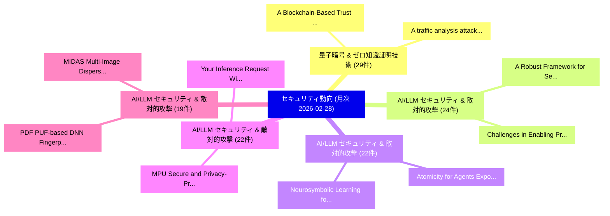

# 📊 03_monthly: 月次エグゼクティブサマリー報告書 (直近30日間: 2026-02-28)

**集計日時**: 2026-02-28 00:00:00 UTC  
**直近30日間の総論文数**: 732 件  

---

## 💡 マクロ脅威動向 & 戦略的リスク評価 (Strategic Executive Insights)

本日の収集論文（計 732 件）において、以下の重点セキュリティ領域で活発な研究動向が確認されました：
- **量子暗号 & ゼロ知識証明技術** (29 件): 注目論文として 「A Blockchain-Based Trust Frame...」、「A traffic analysis attack agai...」 等が発表され、実務防御および攻撃検証の進展が見られます。
- **AI/LLM セキュリティ & 敵対的攻撃** (24 件): 注目論文として 「A Robust Framework for Secure ...」、「Challenges in Enabling Private...」 等が発表され、実務防御および攻撃検証の進展が見られます。
- **AI/LLM セキュリティ & 敵対的攻撃** (22 件): 注目論文として 「Neurosymbolic Learning for Adv...」、「Atomicity for Agents: Exposing...」 等が発表され、実務防御および攻撃検証の進展が見られます。
- **AI/LLM セキュリティ & 敵対的攻撃** (22 件): 注目論文として 「MPU: Secure and Privacy-Preser...」、「Your Inference Request Will Be...」 等が発表され、実務防御および攻撃検証の進展が見られます。
- **AI/LLM セキュリティ & 敵対的攻撃** (19 件): 注目論文として 「MIDAS: Multi-Image Dispersion ...」、「PDF: PUF-based DNN Fingerprint...」 等が発表され、実務防御および攻撃検証の進展が見られます。

### 🗺️ 月次セキュリティ技術レーダー (Technology Radar)

---

## 📌 月次セキュリティ論文一覧 (日本語表形式)

| No | arXiv ID | 論文タイトル (日本語訳) | 重要キーワード | 構造化エグゼクティブ要約 (背景・提案・影響) | 脅威分類 | 詳細リンク |
|---|---|---|---|---|---|---|
| 1 | `2603.00453v1` | [Neurosymbolic Learning for Advanced Persistent Threat Detection under Extreme Class Imbalance（セキュリティ分析論文）](../../okf/papers/2026-02-28/2603.00453.md) | `Advanced Persistent Threat Detection`, `Extreme Class Imbalance`, `Neurosymbolic Learning` | 【提案】概要 (Overview & Key Finding) 本論文「Neurosymbolic Learning for Advanced Persistent 脅威 Detec...。実証評価により経営層・セキュリティ管理者向け推奨アクション (E... | `cs.NI` | [arXiv](https://arxiv.org/abs/2603.00453v1) &#124; [OKF](../../okf/papers/2026-02-28/2603.00453.md) |
| 2 | `2603.00456v1` | [A Blockchain-Based Trust Framework for Resilient Cross-Domain UAV Service Orchestration（セキュリティ分析論文）](../../okf/papers/2026-02-28/2603.00456.md) | `Blockchain-Based Trust`, `Resilient Cross`, `Service Orchestration` | 【提案】概要 (Overview & Key Finding) 本論文「A Blockchain-Based Trust Framework for Resilient Cross-...。実証評価により経営層・セキュリティ管理者向け推奨アクション (E... | `cybersecurity` | [arXiv](https://arxiv.org/abs/2603.00456v1) &#124; [OKF](../../okf/papers/2026-02-28/2603.00456.md) |
| 3 | `2603.00476v1` | [Atomicity for Agents: Exposing, Exploiting, and Mitigating TOCTOU Vulnerabilities in Browser-Use Agents（セキュリティ分析論文）](../../okf/papers/2026-02-28/2603.00476.md) | `Use Agents`, `Browser-Use Agents`, `Linxi Jiang` | 【提案】概要 (Overview & Key Finding) 本論文「Atomicity for Agents: Exposing, Exploiting, and Mitigat...。実証評価により経営層・セキュリティ管理者向け推奨アクション (E... | `cs.AI` | [arXiv](https://arxiv.org/abs/2603.00476v1) &#124; [OKF](../../okf/papers/2026-02-28/2603.00476.md) |
| 4 | `2603.00516v1` | [ProtegoFed: Backdoor-Free Federated Instruction Tuning with Interspersed Poisoned Data（セキュリティ分析論文）](../../okf/papers/2026-02-28/2603.00516.md) | `Free Federated Instruction Tuning`, `Interspersed Poisoned Data`, `Backdoor-Free Federated` | 【提案】概要 (Overview & Key Finding) 本論文「ProtegoFed: Backdoor-Free Federated Instruction Tuning ...。実証評価により経営層・セキュリティ管理者向け推奨アクション (E... | `cybersecurity` | [arXiv](https://arxiv.org/abs/2603.00516v1) &#124; [OKF](../../okf/papers/2026-02-28/2603.00516.md) |
| 5 | `2603.00528v1` | [Time Stepped Cyber Physical Simulation of DoS, DoD, and FDI Attacks on the IEEE 14 Bus System（セキュリティ分析論文）](../../okf/papers/2026-02-28/2603.00528.md) | `Time Stepped Cyber Physical Simulation`, `Bus System`, `Manuella Christelle Tossa` | 【提案】概要 (Overview & Key Finding) 本論文「Time Stepped Cyber Physical Simulation of DoS, DoD, and...。実証評価により経営層・セキュリティ管理者向け推奨アクション (E... | `executive-summary` | [arXiv](https://arxiv.org/abs/2603.00528v1) &#124; [OKF](../../okf/papers/2026-02-28/2603.00528.md) |
| 6 | `2603.00544v1` | [On Best-Possible One-Time Programs（セキュリティ分析論文）](../../okf/papers/2026-02-28/2603.00544.md) | `Possible One`, `Time Programs`, `Best-Possible One` | 【提案】概要 (Overview & Key Finding) 本論文「On Best-Possible One-Time Programs（セキュリティ分析論文）」（原題: On ...。実証評価により経営層・セキュリティ管理者向け推奨アクション (E... | `executive-summary` | [arXiv](https://arxiv.org/abs/2603.00544v1) &#124; [OKF](../../okf/papers/2026-02-28/2603.00544.md) |
| 7 | `2603.00565v1` | [MIDAS: Multi-Image Dispersion and Semantic Reconstruction for Jailbreaking MLLMs（セキュリティ分析論文）](../../okf/papers/2026-02-28/2603.00565.md) | `Image Dispersion`, `Semantic Reconstruction`, `Multi-Image Dispersion` | 【提案】概要 (Overview & Key Finding) 本論文「MIDAS: Multi-Image Dispersion and Semantic Reconstructi...。実証評価により経営層・セキュリティ管理者向け推奨アクション (E... | `cs.AI` | [arXiv](https://arxiv.org/abs/2603.00565v1) &#124; [OKF](../../okf/papers/2026-02-28/2603.00565.md) |
| 8 | `2603.00646v2` | [MoltGraph: A Longitudinal Temporal Graph Dataset of Moltbook for Coordinated-Agent Detection（セキュリティ分析論文）](../../okf/papers/2026-02-28/2603.00646.md) | `Longitudinal Temporal Graph Dataset`, `Agent Detection`, `Coordinated-Agent Detection` | 【提案】概要 (Overview & Key Finding) 本論文「MoltGraph: A Longitudinal Temporal Graph Dataset of Mol...。実証評価により経営層・セキュリティ管理者向け推奨アクション (E... | `executive-summary` | [arXiv](https://arxiv.org/abs/2603.00646v2) &#124; [OKF](../../okf/papers/2026-02-28/2603.00646.md) |
| 9 | `2603.00708v1` | [The On-Chain and Off-Chain Mechanisms of DAO-to-DAO Voting（セキュリティ分析論文）](../../okf/papers/2026-02-28/2603.00708.md) | `Chain Mechanisms`, `Off-Chain Mechanisms`, `Thomas Lloyd` | 【提案】概要 (Overview & Key Finding) 本論文「The On-Chain and Off-Chain Mechanisms of DAO-to-DAO Vot...。実証評価により経営層・セキュリティ管理者向け推奨アクション (E... | `executive-summary` | [arXiv](https://arxiv.org/abs/2603.00708v1) &#124; [OKF](../../okf/papers/2026-02-28/2603.00708.md) |
| 10 | `2603.00711v1` | [IU: Imperceptible Universal Backdoor Attack（セキュリティ分析論文）](../../okf/papers/2026-02-28/2603.00711.md) | `Imperceptible Universal Backdoor Attack`, `Hsin Lin`, `Lun Chen` | 【提案】概要 (Overview & Key Finding) 本論文「IU: Imperceptible Universal Backdoor Attack（セキュリティ分析論文）...。実証評価により経営層・セキュリティ管理者向け推奨アクション (E... | `cs.CV` | [arXiv](https://arxiv.org/abs/2603.00711v1) &#124; [OKF](../../okf/papers/2026-02-28/2603.00711.md) |
| 11 | `2603.00841v1` | [Security Is Not Enough: Privacy in Encryption Regulation and Lawful-Surveillance Protocols（セキュリティ分析論文）](../../okf/papers/2026-02-28/2603.00841.md) | `Encryption Regulation`, `Surveillance Protocols`, `Lawful-Surveillance Protocols` | 【提案】背景とセキュリティ上の課題 (Background & Problem) 本研究はサイバー脅威環境におけるセキュリティ構造・脆弱性の検証を目的としています。(主要検出項目: ...。実証評価により経営層・セキュリティ管理者向け推奨アクション (E... | `executive-summary` | [arXiv](https://arxiv.org/abs/2603.00841v1) &#124; [OKF](../../okf/papers/2026-02-28/2603.00841.md) |
| 12 | `2603.02262v1` | [Silent Sabotage During Fine-Tuning: Few-Shot Rationale Poisoning of Compact Medical LLMs（セキュリティ分析論文）](../../okf/papers/2026-02-28/2603.02262.md) | `Shot Rationale Poisoning`, `Compact Medical`, `Few-Shot Rationale` | 【提案】概要 (Overview & Key Finding) 本論文「Silent Sabotage During Fine-Tuning: Few-Shot Rationale ...。実証評価により経営層・セキュリティ管理者向け推奨アクション (E... | `cs.AI` | [arXiv](https://arxiv.org/abs/2603.02262v1) &#124; [OKF](../../okf/papers/2026-02-28/2603.02262.md) |
| 13 | `2603.06654v1` | [How the Graph Construction Technique Shapes Performance in IoT Botnet Detection（セキュリティ分析論文）](../../okf/papers/2026-02-28/2603.06654.md) | `Graph Construction Technique Shapes Performance`, `Botnet Detection`, `Hassan Wasswa` | 【提案】概要 (Overview & Key Finding) 本論文「How the Graph Construction Technique Shapes Performance...。実証評価により経営層・セキュリティ管理者向け推奨アクション (E... | `cs.NI` | [arXiv](https://arxiv.org/abs/2603.06654v1) &#124; [OKF](../../okf/papers/2026-02-28/2603.06654.md) |
| 14 | `2603.13290v1` | [TAS-GNN: A Status-Aware Signed Graph Neural Network for Anomaly Detection in Bitcoin Trust Systems（セキュリティ分析論文）](../../okf/papers/2026-02-28/2603.13290.md) | `Aware Signed Graph Neural Network`, `Bitcoin Trust Systems`, `Anomaly Detection` | 【提案】概要 (Overview & Key Finding) 本論文「TAS-GNN: A Status-Aware Signed Graph Neural Network for...。実証評価により経営層・セキュリティ管理者向け推奨アクション (E... | `cs.AI` | [arXiv](https://arxiv.org/abs/2603.13290v1) &#124; [OKF](../../okf/papers/2026-02-28/2603.13290.md) |
| 15 | `2603.13293v2` | [A Robust Framework for Secure Cardiovascular Risk Prediction: An Architectural Case Study of Differentially Private 連合学習](../../okf/papers/2026-02-28/2603.13293.md) | `Secure Cardiovascular Risk Prediction`, `Differentially Private Federated Learning`, `Differentially Private` | 【提案】概要 (Overview & Key Finding) 本論文「A Robust Framework for Secure Cardiovascular Risk Predi...。実証評価により経営層・セキュリティ管理者向け推奨アクション (E... | `cs.AI` | [arXiv](https://arxiv.org/abs/2603.13293v2) &#124; [OKF](../../okf/papers/2026-02-28/2603.13293.md) |
| 16 | `2602.23560v2` | [A traffic analysis attack against Introduction Protocol and Onion Services（セキュリティ分析論文）](../../okf/papers/2026-02-27/2602.23560.md) | `Introduction Protocol`, `Onion Services`, `Nicolas Constantinides` | 【提案】概要 (Overview & Key Finding) 本論文「A traffic analysis attack against Introduction Protocol...。実証評価により経営層・セキュリティ管理者向け推奨アクション (E... | `cybersecurity` | [arXiv](https://arxiv.org/abs/2602.23560v2) &#124; [OKF](../../okf/papers/2026-02-27/2602.23560.md) |
| 17 | `2602.23569v1` | [CLOAQ: Combined Logic and Angle Obfuscation for Quantum Circuits（セキュリティ分析論文）](../../okf/papers/2026-02-27/2602.23569.md) | `Combined Logic`, `Angle Obfuscation`, `Quantum Circuits` | 【提案】概要 (Overview & Key Finding) 本論文「CLOAQ: Combined Logic and Angle Obfuscation for 量子 Circ...。実証評価により経営層・セキュリティ管理者向け推奨アクション (E... | `cybersecurity` | [arXiv](https://arxiv.org/abs/2602.23569v1) &#124; [OKF](../../okf/papers/2026-02-27/2602.23569.md) |
| 18 | `2602.23587v1` | [PDF: PUF-based DNN Fingerprinting for Knowledge Distillation Traceability（セキュリティ分析論文）](../../okf/papers/2026-02-27/2602.23587.md) | `Knowledge Distillation Traceability`, `PUF-based DNN`, `Ning Lyu` | 【提案】概要 (Overview & Key Finding) 本論文「PDF: PUF-based DNN Fingerprinting for Knowledge Distill...。実証評価により経営層・セキュリティ管理者向け推奨アクション (E... | `executive-summary` | [arXiv](https://arxiv.org/abs/2602.23587v1) &#124; [OKF](../../okf/papers/2026-02-27/2602.23587.md) |
| 19 | `2602.23659v2` | [Central Bank Digital Currencies: Where is the Privacy, Technology, and Anonymity?（セキュリティ分析論文）](../../okf/papers/2026-02-27/2602.23659.md) | `Central Bank Digital Currencies`, `Jeff Nijsse`, `Andrea Pinto` | 【提案】### (日本語題名: Central Bank Digital Currencies: Where is the Privacy, Technology, and Anon...。実証評価により経営層・セキュリティ管理者向け推奨アクション (E... | `cybersecurity` | [arXiv](https://arxiv.org/abs/2602.23659v2) &#124; [OKF](../../okf/papers/2026-02-27/2602.23659.md) |
| 20 | `2602.23698v1` | [Privacy-Preserving Local Energy Trading Considering Network Fees（セキュリティ分析論文）](../../okf/papers/2026-02-27/2602.23698.md) | `Preserving Local Energy Trading Considering Network Fees`, `Privacy-Preserving Local`, `Eman Alqahtani` | 【提案】概要 (Overview & Key Finding) 本論文「Privacy-Preserving Local Energy Trading Considering Net...。実証評価によりMustafa - **公開日時**:。 | `cybersecurity` | [arXiv](https://arxiv.org/abs/2602.23698v1) &#124; [OKF](../../okf/papers/2026-02-27/2602.23698.md) |
| 21 | `2602.23760v1` | [PLA for Drone RID Frames via Motion Estimation and Consistency Verification（セキュリティ分析論文）](../../okf/papers/2026-02-27/2602.23760.md) | `Motion Estimation`, `Consistency Verification`, `Jie Li` | 【提案】概要 (Overview & Key Finding) 本論文「PLA for Drone RID Frames via Motion Estimation and Cons...。実証評価により経営層・セキュリティ管理者向け推奨アクション (E... | `cybersecurity` | [arXiv](https://arxiv.org/abs/2602.23760v1) &#124; [OKF](../../okf/papers/2026-02-27/2602.23760.md) |
| 22 | `2602.23772v2` | [Tilewise Domain-Separated Selective Encryption for Remote Sensing Imagery under Chosen-Plaintext Attacks（セキュリティ分析論文）](../../okf/papers/2026-02-27/2602.23772.md) | `Separated Selective Encryption`, `Remote Sensing Imagery`, `Tilewise Domain` | 【提案】概要 (Overview & Key Finding) 本論文「Tilewise Domain-Separated Selective Encryption for Remo...。実証評価により経営層・セキュリティ管理者向け推奨アクション (E... | `cybersecurity` | [arXiv](https://arxiv.org/abs/2602.23772v2) &#124; [OKF](../../okf/papers/2026-02-27/2602.23772.md) |
| 23 | `2602.23798v2` | [MPU: Secure and Privacy-Preserving Knowledge Unlearning for Large Language Modelsに向けて](../../okf/papers/2026-02-27/2602.23798.md) | `Preserving Knowledge Unlearning`, `Privacy-Preserving Knowledge`, `Towards Secure` | 【提案】概要 (Overview & Key Finding) 本論文「MPU: Secure and Privacy-Preserving Knowledge Unlearning...。実証評価により経営層・セキュリティ管理者向け推奨アクション (E... | `cs.AI` | [arXiv](https://arxiv.org/abs/2602.23798v2) &#124; [OKF](../../okf/papers/2026-02-27/2602.23798.md) |
| 24 | `2602.23834v1` | [Enhancing Continual Learning for Software Vulnerability Prediction: Addressing Catastrophic Forgetting via Hybrid-Confidence-Aware Selective Replay for Temporal LLM Fine-Tuning（セキュリティ分析論文）](../../okf/papers/2026-02-27/2602.23834.md) | `Enhancing Continual Learning`, `Software Vulnerability Prediction`, `Addressing Catastrophic Forgetting` | 【提案】概要 (Overview & Key Finding) 本論文「Enhancing Continual Learning for Software 脆弱性 Predictio...。実証評価により経営層・セキュリティ管理。 | `cs.AI` | [arXiv](https://arxiv.org/abs/2602.23834v1) &#124; [OKF](../../okf/papers/2026-02-27/2602.23834.md) |
| 25 | `2602.23846v1` | [MI$^2$DAS: A Multi-Layer Intrusion Detection Framework with Incremental Learning for Industrial IoT Networksのセキュリティ強化](../../okf/papers/2026-02-27/2602.23846.md) | `Multi-Layer Intrusion`, `Incremental Learning`, `Securing Industrial` | 【提案】概要 (Overview & Key Finding) 本論文「MI$^2$DAS: A Multi-Layer Intrusion Detection Framework ...。実証評価により経営層・セキュリティ管理者向け推奨アクション (E... | `cs.AI` | [arXiv](https://arxiv.org/abs/2602.23846v1) &#124; [OKF](../../okf/papers/2026-02-27/2602.23846.md) |
| 26 | `2602.23874v1` | [Exploring Robust Intrusion Detection: A Benchmark Study of Feature Transferability in IoT Botnet Attack Detection（セキュリティ分析論文）](../../okf/papers/2026-02-27/2602.23874.md) | `Exploring Robust Intrusion Detection`, `Botnet Attack Detection`, `Feature Transferability` | 【提案】概要 (Overview & Key Finding) 本論文「Exploring Robust Intrusion Detection: A Benchmark Study...。実証評価により経営層・セキュリティ管理者向け推奨アクション (E... | `cs.AI` | [arXiv](https://arxiv.org/abs/2602.23874v1) &#124; [OKF](../../okf/papers/2026-02-27/2602.23874.md) |
| 27 | `2602.24009v4` | [Jailbreak Foundry: From Papers to Runnable Attacks for Reproducible Benchmarking（セキュリティ分析論文）](../../okf/papers/2026-02-27/2602.24009.md) | `Jailbreak Foundry`, `Runnable Attacks`, `Reproducible Benchmarking` | 【提案】概要 (Overview & Key Finding) 本論文「ジェイルブレイク Foundry: From Papers to Runnable Attacks for R...。実証評価により経営層・セキュリティ管理者向け推奨アクション (E... | `cs.AI` | [arXiv](https://arxiv.org/abs/2602.24009v4) &#124; [OKF](../../okf/papers/2026-02-27/2602.24009.md) |
| 28 | `2602.24047v1` | [Unsupervised Baseline Clustering and Incremental Adaptation for IoT Device Traffic Profiling（セキュリティ分析論文）](../../okf/papers/2026-02-27/2602.24047.md) | `Unsupervised Baseline Clustering`, `Device Traffic Profiling`, `Incremental Adaptation` | 【提案】概要 (Overview & Key Finding) 本論文「Unsupervised Baseline Clustering and Incremental Adapta...。実証評価により経営層・セキュリティ管理者向け推奨アクション (E... | `cs.NI` | [arXiv](https://arxiv.org/abs/2602.24047v1) &#124; [OKF](../../okf/papers/2026-02-27/2602.24047.md) |
| 29 | `2602.24166v1` | [SAILOR: A Scalable and Energy-Efficient Ultra-Lightweight RISC-V for IoT Security（セキュリティ分析論文）](../../okf/papers/2026-02-27/2602.24166.md) | `Efficient Ultra`, `Energy-Efficient Ultra`, `Christian Ewert` | 【提案】概要 (Overview & Key Finding) 本論文「SAILOR: A Scalable and Energy-Efficient Ultra-Lightweig...。実証評価により経営層・セキュリティ管理者向け推奨アクション (E... | `executive-summary` | [arXiv](https://arxiv.org/abs/2602.24166v1) &#124; [OKF](../../okf/papers/2026-02-27/2602.24166.md) |
| 30 | `2602.24223v1` | [Anansi: Scalable Characterization of Message-Based Job Scams（セキュリティ分析論文）](../../okf/papers/2026-02-27/2602.24223.md) | `Based Job Scams`, `Scalable Characterization`, `Message-Based Job` | 【提案】概要 (Overview & Key Finding) 本論文「Anansi: Scalable Characterization of Message-Based Job ...。実証評価により経営層・セキュリティ管理者向け推奨アクション (E... | `cybersecurity` | [arXiv](https://arxiv.org/abs/2602.24223v1) &#124; [OKF](../../okf/papers/2026-02-27/2602.24223.md) |
| 31 | `2602.24271v1` | [NSHEDB: Noise-Sensitive Homomorphic Encrypted Database Query Engine（セキュリティ分析論文）](../../okf/papers/2026-02-27/2602.24271.md) | `Sensitive Homomorphic Encrypted Database Query Engine`, `Noise-Sensitive Homomorphic`, `Boram Jung` | 【提案】概要 (Overview & Key Finding) 本論文「NSHEDB: Noise-Sensitive Homomorphic Encrypted Database ...。実証評価により経営層・セキュリティ管理者向け推奨アクション (E... | `cs.DB` | [arXiv](https://arxiv.org/abs/2602.24271v1) &#124; [OKF](../../okf/papers/2026-02-27/2602.24271.md) |
| 32 | `2603.00194v1` | [SKeDA: A Generative Watermarking Framework for Text-to-video Diffusion Models（セキュリティ分析論文）](../../okf/papers/2026-02-27/2603.00194.md) | `Diffusion Models`, `Yang Yang`, `Xinze Zou` | 【提案】概要 (Overview & Key Finding) 本論文「SKeDA: A Generative Watermarking Framework for Text-to-...。実証評価により経営層・セキュリティ管理者向け推奨アクション (E... | `cs.AI` | [arXiv](https://arxiv.org/abs/2603.00194v1) &#124; [OKF](../../okf/papers/2026-02-27/2603.00194.md) |
| 33 | `2603.00195v2` | [Formal Analysis and Supply Chain Security for Agentic AI Skills（セキュリティ分析論文）](../../okf/papers/2026-02-27/2603.00195.md) | `Supply Chain Security`, `Varun Pratap Bhardwaj`, `Raw Meta` | 【提案】概要 (Overview & Key Finding) 本論文「Formal Analysis and Supply Chain Security for Agentic A...。実証評価により経営層・セキュリティ管理者向け推奨アクション (E... | `cs.AI` | [arXiv](https://arxiv.org/abs/2603.00195v2) &#124; [OKF](../../okf/papers/2026-02-27/2603.00195.md) |
| 34 | `2603.00196v1` | [Your Inference Request Will Become a Black Box: Confidential Inference for Cloud-based 大規模言語モデル](../../okf/papers/2026-02-27/2603.00196.md) | `Black Box`, `Confidential Inference`, `Large Language Models` | 【提案】概要 (Overview & Key Finding) 本論文「Your Inference Request Will Become a Black Box: Confide...。実証評価により経営層・セキュリティ管理者向け推奨アクション (E... | `cs.AI` | [arXiv](https://arxiv.org/abs/2603.00196v1) &#124; [OKF](../../okf/papers/2026-02-27/2603.00196.md) |
| 35 | `2603.00200v1` | [LiaisonAgent: An Multi-Agent Framework for Autonomous Risk Investigation and Governance（セキュリティ分析論文）](../../okf/papers/2026-02-27/2603.00200.md) | `Autonomous Risk Investigation`, `Chuanming Tang`, `Ling Qing` | 【提案】概要 (Overview & Key Finding) 本論文「LiaisonAgent: An Multi-Agent Framework for Autonomous R...。実証評価により経営層・セキュリティ管理者向け推奨アクション (E... | `cs.AI` | [arXiv](https://arxiv.org/abs/2603.00200v1) &#124; [OKF](../../okf/papers/2026-02-27/2603.00200.md) |
| 36 | `2603.00217v1` | [Physical Evaluation of Naturalistic Adversarial Patches for Camera-Based Traffic-Sign Detection（セキュリティ分析論文）](../../okf/papers/2026-02-27/2603.00217.md) | `Naturalistic Adversarial Patches`, `Based Traffic`, `Sign Detection` | 【提案】概要 (Overview & Key Finding) 本論文「Physical Evaluation of Naturalistic Adversarial Patches...。実証評価により経営層・セキュリティ管理者向け推奨アクション (E... | `cs.AI` | [arXiv](https://arxiv.org/abs/2603.00217v1) &#124; [OKF](../../okf/papers/2026-02-27/2603.00217.md) |
| 37 | `2603.00222v2` | [Empowering Future サイバーセキュリティ Leaders: Advancing Students through FINDS Education for Digital Forensic Excellence](../../okf/papers/2026-02-27/2603.00222.md) | `Digital Forensic Excellence`, `Advancing Students`, `Empowering Future Cybersecurity Leaders` | 【提案】概要 (Overview & Key Finding) 本論文「Empowering Future サイバーセキュリティ Leaders: Advancing Student...。実証評価により経営層・セキュリティ管理者向け推奨アクション (E... | `cs.AI` | [arXiv](https://arxiv.org/abs/2603.00222v2) &#124; [OKF](../../okf/papers/2026-02-27/2603.00222.md) |
| 38 | `2603.00311v1` | [the Systematic Testing of Regular Expression Enginesに向けて](../../okf/papers/2026-02-27/2603.00311.md) | `Systematic Testing`, `Regular Expression Engines`, `Regular Expression` | 【提案】概要 (Overview & Key Finding) 本論文「the Systematic Testing of Regular Expression Enginesに向け...。実証評価によりDavis - **公開日時**: `2026-0... | `executive-summary` | [arXiv](https://arxiv.org/abs/2603.00311v1) &#124; [OKF](../../okf/papers/2026-02-27/2603.00311.md) |
| 39 | `2603.00318v1` | [AESP: A Human-Sovereign Economic Protocol for AI Agents with Privacy-Preserving Settlement（セキュリティ分析論文）](../../okf/papers/2026-02-27/2603.00318.md) | `Sovereign Economic Protocol`, `Preserving Settlement`, `Human-Sovereign Economic` | 【提案】概要 (Overview & Key Finding) 本論文「AESP: A Human-Sovereign Economic Protocol for AI Agents...。実証評価により経営層・セキュリティ管理者向け推奨アクション (E... | `cs.AI` | [arXiv](https://arxiv.org/abs/2603.00318v1) &#124; [OKF](../../okf/papers/2026-02-27/2603.00318.md) |
| 40 | `2603.00342v1` | [Challenges in Enabling Private Data Valuation（セキュリティ分析論文）](../../okf/papers/2026-02-27/2603.00342.md) | `Enabling Private Data Valuation`, `Yiwei Fu`, `Tianhao Wang` | 【提案】概要 (Overview & Key Finding) 本論文「Challenges in Enabling Private Data Valuation（セキュリティ分析論...。実証評価により経営層・セキュリティ管理者向け推奨アクション (E... | `cs.AI` | [arXiv](https://arxiv.org/abs/2603.00342v1) &#124; [OKF](../../okf/papers/2026-02-27/2603.00342.md) |
| 41 | `2603.00345v1` | [CensorLess: Cost-Efficient Censorship Circumvention Through Serverless Cloud Functions（セキュリティ分析論文）](../../okf/papers/2026-02-27/2603.00345.md) | `Cost-Efficient Censorship`, `Dayeon Kang`, `Jade Sheffey` | 【提案】概要 (Overview & Key Finding) 本論文「CensorLess: Cost-Efficient Censorship Circumvention Thr...。実証評価により経営層・セキュリティ管理者向け推奨アクション (E... | `cs.NI` | [arXiv](https://arxiv.org/abs/2603.00345v1) &#124; [OKF](../../okf/papers/2026-02-27/2603.00345.md) |
| 42 | `2603.00381v1` | [Verifier-Bound Communication for LLMエージェント: Certified Bounds on Covert Signaling](../../okf/papers/2026-02-27/2603.00381.md) | `Bound Communication`, `Certified Bounds`, `Covert Signaling` | 【提案】概要 (Overview & Key Finding) 本論文「Verifier-Bound Communication for LLMエージェント: Certified B...。実証評価により経営層・セキュリティ管理者向け推奨アクション (E... | `cs.AI` | [arXiv](https://arxiv.org/abs/2603.00381v1) &#124; [OKF](../../okf/papers/2026-02-27/2603.00381.md) |
| 43 | `2603.11055v2` | [AIS-Based Maritime GNSS RFI Monitoring With Multi-Vessel Coherence and Communication-Integrity Artifact Mitigation（セキュリティ分析論文）](../../okf/papers/2026-02-27/2603.11055.md) | `Integrity Artifact Mitigation`, `Based Maritime`, `AIS-Based Maritime` | 【提案】概要 (Overview & Key Finding) 本論文「AIS-Based Maritime GNSS RFI Monitoring With Multi-Vesse...。実証評価により経営層・セキュリティ管理者向け推奨アクション (E... | `executive-summary` | [arXiv](https://arxiv.org/abs/2603.11055v2) &#124; [OKF](../../okf/papers/2026-02-27/2603.11055.md) |
| 44 | `2602.22525v2` | [Systems-Level Attack Surface of Edge Agent Deployments on IoT（セキュリティ分析論文）](../../okf/papers/2026-02-26/2602.22525.md) | `Level Attack Surface`, `Edge Agent Deployments`, `Systems-Level Attack` | 【提案】概要 (Overview & Key Finding) 本論文「Systems-Level Attack Surface of Edge Agent Deployments ...。実証評価により経営層・セキュリティ管理者向け推奨アクション (E... | `cybersecurity` | [arXiv](https://arxiv.org/abs/2602.22525v2) &#124; [OKF](../../okf/papers/2026-02-26/2602.22525.md) |
| 45 | `2602.22562v1` | [Layer-Targeted Multilingual Knowledge Erasure in 大規模言語モデル](../../okf/papers/2026-02-26/2602.22562.md) | `Targeted Multilingual Knowledge Erasure`, `Layer-Targeted Multilingual`, `Large Language Models` | 【提案】概要 (Overview & Key Finding) 本論文「Layer-Targeted Multilingual Knowledge Erasure in 大規模言語モ...。実証評価により経営層・セキュリティ管理者向け推奨アクション (E... | `cybersecurity` | [arXiv](https://arxiv.org/abs/2602.22562v1) &#124; [OKF](../../okf/papers/2026-02-26/2602.22562.md) |
| 46 | `2602.22689v1` | [No Caption, No Problem: Caption-Free Membership Inference via Model-Fitted Embeddings（セキュリティ分析論文）](../../okf/papers/2026-02-26/2602.22689.md) | `Free Membership Inference`, `Caption-Free Membership`, `Fitted Embeddings` | 【提案】概要 (Overview & Key Finding) 本論文「No Caption, No Problem: Caption-Free Membership Inferen...。実証評価により経営層・セキュリティ管理者向け推奨アクション (E... | `cs.CV` | [arXiv](https://arxiv.org/abs/2602.22689v1) &#124; [OKF](../../okf/papers/2026-02-26/2602.22689.md) |
| 47 | `2602.22699v2` | [DPSQL+: A Differentially Private SQL Library with a Minimum Frequency Rule（セキュリティ分析論文）](../../okf/papers/2026-02-26/2602.22699.md) | `Minimum Frequency Rule`, `Differentially Private`, `Tomoya Matsumoto` | 【提案】概要 (Overview & Key Finding) 本論文「DPSQL+: A Differentially Private SQL Library with a Min...。実証評価により経営層・セキュリティ管理者向け推奨アクション (E... | `cs.DB` | [arXiv](https://arxiv.org/abs/2602.22699v2) &#124; [OKF](../../okf/papers/2026-02-26/2602.22699.md) |
| 48 | `2602.22700v1` | [IMMACULATE: A Practical LLM Auditing Framework via Verifiable Computation（セキュリティ分析論文）](../../okf/papers/2026-02-26/2602.22700.md) | `Verifiable Computation`, `Yanpei Guo`, `Wenjie Qu` | 【提案】概要 (Overview & Key Finding) 本論文「IMMACULATE: A Practical LLM Auditing Framework via Veri...。実証評価により経営層・セキュリティ管理者向け推奨アクション (E... | `cs.AI` | [arXiv](https://arxiv.org/abs/2602.22700v1) &#124; [OKF](../../okf/papers/2026-02-26/2602.22700.md) |
| 49 | `2602.22724v1` | [AgentSentry: Temporal Causal Diagnostics and Context PurificationによるIndirect Prompt Injection in LLM Agentsの軽減](../../okf/papers/2026-02-26/2602.22724.md) | `Temporal Causal Diagnostics`, `Mitigating Indirect Prompt Injection`, `Context Purification` | 【提案】概要 (Overview & Key Finding) 本論文「AgentSentry: Temporal Causal Diagnostics and Context Pu...。実証評価により経営層・セキュリティ管理者向け推奨アクション (E... | `cs.AI` | [arXiv](https://arxiv.org/abs/2602.22724v1) &#124; [OKF](../../okf/papers/2026-02-26/2602.22724.md) |
| 50 | `2602.22729v1` | [RandSet: Randomized Corpus Reduction for Fuzzing Seed Scheduling（セキュリティ分析論文）](../../okf/papers/2026-02-26/2602.22729.md) | `Randomized Corpus Reduction`, `Fuzzing Seed Scheduling`, `Yuchong Xie` | 【提案】概要 (Overview & Key Finding) 本論文「RandSet: Randomized Corpus Reduction for Fuzzing Seed S...。実証評価により経営層・セキュリティ管理者向け推奨アクション (E... | `executive-summary` | [arXiv](https://arxiv.org/abs/2602.22729v1) &#124; [OKF](../../okf/papers/2026-02-26/2602.22729.md) |
| 51 | `2602.22983v3` | [Obscure but Effective: Classical Chinese Jailbreak Prompt Optimization via Bio-Inspired Search（セキュリティ分析論文）](../../okf/papers/2026-02-26/2602.22983.md) | `Classical Chinese Jailbreak Prompt Optimization`, `Inspired Search`, `Bio-Inspired Search` | 【提案】概要 (Overview & Key Finding) 本論文「Obscure but Effective: Classical Chinese ジェイルブレイク Promp...。実証評価により経営層・セキュリティ管理者向け推奨アクション (E... | `cs.AI` | [arXiv](https://arxiv.org/abs/2602.22983v3) &#124; [OKF](../../okf/papers/2026-02-26/2602.22983.md) |
| 52 | `2602.23067v2` | [A High-Throughput AES-GCM Implementation on GPUs for Secure, Policy-Based Access to Massive Astronomical Catalogs（セキュリティ分析論文）](../../okf/papers/2026-02-26/2602.23067.md) | `Massive Astronomical Catalogs`, `Based Access`, `High-Throughput AES` | 【提案】概要 (Overview & Key Finding) 本論文「A High-Throughput AES-GCM Implementation on GPUs for Se...。実証評価により経営層・セキュリティ管理者向け推奨アクション (E... | `astro-ph.IM` | [arXiv](https://arxiv.org/abs/2602.23067v2) &#124; [OKF](../../okf/papers/2026-02-26/2602.23067.md) |
| 53 | `2602.23079v1` | [Assessing Deanonymization Risks with Stylometry-Assisted LLM Agent（セキュリティ分析論文）](../../okf/papers/2026-02-26/2602.23079.md) | `Assessing Deanonymization Risks`, `Stylometry-Assisted LLM`, `Boyang Zhang` | 【提案】概要 (Overview & Key Finding) 本論文「Assessing Deanonymization Risks with Stylometry-Assiste...。実証評価により経営層・セキュリティ管理者向け推奨アクション (E... | `executive-summary` | [arXiv](https://arxiv.org/abs/2602.23079v1) &#124; [OKF](../../okf/papers/2026-02-26/2602.23079.md) |
| 54 | `2602.23121v1` | [Automated 脆弱性検出 in Source Code Using Deep Representation Learning](../../okf/papers/2026-02-26/2602.23121.md) | `Source Code Using Deep Representation Learning`, `Automated Vulnerability Detection`, `Raw Meta` | 【提案】概要 (Overview & Key Finding) 本論文「Automated 脆弱性検出 in Source Code Using Deep Representatio...。実証評価によりHamilton, M.。 | `cs.AI` | [arXiv](https://arxiv.org/abs/2602.23121v1) &#124; [OKF](../../okf/papers/2026-02-26/2602.23121.md) |
| 55 | `2602.23163v3` | [A Decision-Theoretic Formalisation of Steganography With Applications to LLM Monitoring（セキュリティ分析論文）](../../okf/papers/2026-02-26/2602.23163.md) | `Theoretic Formalisation`, `Decision-Theoretic Formalisation`, `Usman Anwar` | 【提案】概要 (Overview & Key Finding) 本論文「A Decision-Theoretic Formalisation of Steganography Wit...。実証評価により経営層・セキュリティ管理者向け推奨アクション (E... | `cs.AI` | [arXiv](https://arxiv.org/abs/2602.23163v3) &#124; [OKF](../../okf/papers/2026-02-26/2602.23163.md) |
| 56 | `2602.23167v1` | [SettleFL: Trustless and Scalable Reward Settlement Protocol for 連合学習 on Permissionless Blockchains (Extended version)](../../okf/papers/2026-02-26/2602.23167.md) | `Scalable Reward Settlement Protocol`, `Permissionless Blockchains`, `Federated Learning` | 【提案】概要 (Overview & Key Finding) 本論文「SettleFL: Trustless and Scalable Reward Settlement Prot...。実証評価により経営層・セキュリティ管理者向け推奨アクション (E... | `executive-summary` | [arXiv](https://arxiv.org/abs/2602.23167v1) &#124; [OKF](../../okf/papers/2026-02-26/2602.23167.md) |
| 57 | `2602.23261v3` | [Strengthening security and noise resistance in one-way quantum key distribution protocols through hypercube-based quantum walks（セキュリティ分析論文）](../../okf/papers/2026-02-26/2602.23261.md) | `one-way quantum`, `hypercube-based quantum`, `David Polzoni` | 【提案】概要 (Overview & Key Finding) 本論文「Strengthening security and noise resistance in one-way ...。実証評価により経営層・セキュリティ管理者向け推奨アクション (E... | `cybersecurity` | [arXiv](https://arxiv.org/abs/2602.23261v3) &#124; [OKF](../../okf/papers/2026-02-26/2602.23261.md) |
| 58 | `2602.23262v1` | [Decomposing Private Image Generation via Coarse-to-Fine Wavelet Modeling（セキュリティ分析論文）](../../okf/papers/2026-02-26/2602.23262.md) | `Decomposing Private Image Generation`, `Fine Wavelet Modeling`, `Jasmine Bayrooti` | 【提案】概要 (Overview & Key Finding) 本論文「Decomposing Private Image Generation via Coarse-to-Fine...。実証評価により経営層・セキュリティ管理者向け推奨アクション (E... | `cs.CV` | [arXiv](https://arxiv.org/abs/2602.23262v1) &#124; [OKF](../../okf/papers/2026-02-26/2602.23262.md) |
| 59 | `2602.23329v2` | [LLM Novice Uplift on Dual-Use, In Silico Biology Tasks（セキュリティ分析論文）](../../okf/papers/2026-02-26/2602.23329.md) | `Novice Uplift`, `Chen Bo Calvin Zhang`, `Andrew Bo Liu` | 【提案】概要 (Overview & Key Finding) 本論文「LLM Novice Uplift on Dual-Use, In Silico Biology Tasks（...。実証評価によりKnight, Nicholas Kruus, J... | `cs.AI` | [arXiv](https://arxiv.org/abs/2602.23329v2) &#124; [OKF](../../okf/papers/2026-02-26/2602.23329.md) |
| 60 | `2602.23397v1` | [Lifecycle-Integrated Security for AI-Cloud Convergence in Cyber-Physical Infrastructure（セキュリティ分析論文）](../../okf/papers/2026-02-26/2602.23397.md) | `Integrated Security`, `Lifecycle-Integrated Security`, `Cloud Convergence` | 【提案】概要 (Overview & Key Finding) 本論文「Lifecycle-Integrated Security for AI-Cloud Convergence ...。実証評価により経営層・セキュリティ管理者向け推奨アクション (E... | `executive-summary` | [arXiv](https://arxiv.org/abs/2602.23397v1) &#124; [OKF](../../okf/papers/2026-02-26/2602.23397.md) |
| 61 | `2602.23404v1` | [サイバーセキュリティ of Teleoperated Quadruped Robots: A Systematic Survey of Vulnerabilities, Threats, and Open Defense Gaps](../../okf/papers/2026-02-26/2602.23404.md) | `Teleoperated Quadruped Robots`, `Open Defense Gaps`, `Systematic Survey` | 【提案】概要 (Overview & Key Finding) 本論文「サイバーセキュリティ of Teleoperated Quadruped Robots: A Systemat...。実証評価により経営層・セキュリティ管理者向け推奨アクション (E... | `executive-summary` | [arXiv](https://arxiv.org/abs/2602.23404v1) &#124; [OKF](../../okf/papers/2026-02-26/2602.23404.md) |
| 62 | `2602.23407v1` | [Learning to Generate Secure Code via Token-Level Rewards（セキュリティ分析論文）](../../okf/papers/2026-02-26/2602.23407.md) | `Generate Secure Code`, `Level Rewards`, `Token-Level Rewards` | 【提案】概要 (Overview & Key Finding) 本論文「Learning to Generate Secure Code via Token-Level Reward...。実証評価により経営層・セキュリティ管理者向け推奨アクション (E... | `cs.AI` | [arXiv](https://arxiv.org/abs/2602.23407v1) &#124; [OKF](../../okf/papers/2026-02-26/2602.23407.md) |
| 63 | `2602.23464v2` | [2G2T: Constant-Size, Statistically Sound MSM Outsourcing（セキュリティ分析論文）](../../okf/papers/2026-02-26/2602.23464.md) | `Statistically Sound`, `Majid Khabbazian`, `Raw Meta` | 【提案】概要 (Overview & Key Finding) 本論文「2G2T: Constant-Size, Statistically Sound MSM Outsourcin...。実証評価により経営層・セキュリティ管理者向け推奨アクション (E... | `executive-summary` | [arXiv](https://arxiv.org/abs/2602.23464v2) &#124; [OKF](../../okf/papers/2026-02-26/2602.23464.md) |
| 64 | `2602.23513v1` | [A Software-Defined Testbed for Quantifying Deauthentication Resilience in Modern Wi-Fi Networks（セキュリティ分析論文）](../../okf/papers/2026-02-26/2602.23513.md) | `Quantifying Deauthentication Resilience`, `Defined Testbed`, `Software-Defined Testbed` | 【提案】概要 (Overview & Key Finding) 本論文「A Software-Defined Testbed for Quantifying Deauthentica...。実証評価により経営層・セキュリティ管理者向け推奨アクション (E... | `cs.NI` | [arXiv](https://arxiv.org/abs/2602.23513v1) &#124; [OKF](../../okf/papers/2026-02-26/2602.23513.md) |
| 65 | `2602.23516v3` | [Lap2: Revisiting Laplace DP-SGD for High Dimensions via Majorization Theory（セキュリティ分析論文）](../../okf/papers/2026-02-26/2602.23516.md) | `Revisiting Laplace`, `High Dimensions`, `Majorization Theory` | 【提案】概要 (Overview & Key Finding) 本論文「Lap2: Revisiting Laplace DP-SGD for High Dimensions via...。実証評価により経営層・セキュリティ管理者向け推奨アクション (E... | `executive-summary` | [arXiv](https://arxiv.org/abs/2602.23516v3) &#124; [OKF](../../okf/papers/2026-02-26/2602.23516.md) |
| 66 | `2603.00164v1` | [Reverse CAPTCHA: Evaluating LLM Susceptibility to Invisible Unicode Instruction Injection（セキュリティ分析論文）](../../okf/papers/2026-02-26/2603.00164.md) | `Invisible Unicode Instruction Injection`, `Marcus Graves`, `Raw Meta` | 【提案】概要 (Overview & Key Finding) 本論文「Reverse CAPTCHA: Evaluating LLM Susceptibility to Invis...。実証評価により経営層・セキュリティ管理者向け推奨アクション (E... | `cs.AI` | [arXiv](https://arxiv.org/abs/2603.00164v1) &#124; [OKF](../../okf/papers/2026-02-26/2603.00164.md) |
| 67 | `2603.00172v1` | [Hidden in the Metadata: Stealth Poisoning Attacks on Multimodal Retrieval-Augmented Generation（セキュリティ分析論文）](../../okf/papers/2026-02-26/2603.00172.md) | `Stealth Poisoning Attacks`, `Multimodal Retrieval`, `Augmented Generation` | 【提案】概要 (Overview & Key Finding) 本論文「Hidden in the Metadata: Stealth Poisoning Attacks on Mu...。実証評価により経営層・セキュリティ管理者向け推奨アクション (E... | `cs.AI` | [arXiv](https://arxiv.org/abs/2603.00172v1) &#124; [OKF](../../okf/papers/2026-02-26/2603.00172.md) |
| 68 | `2603.00177v3` | [Detecting Cognitive Signatures in Typing Behavior for Non-Intrusive Authorship Verification（セキュリティ分析論文）](../../okf/papers/2026-02-26/2603.00177.md) | `Detecting Cognitive Signatures`, `Intrusive Authorship Verification`, `Typing Behavior` | 【提案】概要 (Overview & Key Finding) 本論文「Detecting Cognitive Signatures in Typing Behavior for N...。実証評価により経営層・セキュリティ管理者向け推奨アクション (E... | `executive-summary` | [arXiv](https://arxiv.org/abs/2603.00177v3) &#124; [OKF](../../okf/papers/2026-02-26/2603.00177.md) |
| 69 | `2603.00178v3` | [A TEE-Based Architecture for Confidential and Dependable Process Attestation in Authorship Verification（セキュリティ分析論文）](../../okf/papers/2026-02-26/2603.00178.md) | `Dependable Process Attestation`, `Based Architecture`, `Authorship Verification` | 【提案】概要 (Overview & Key Finding) 本論文「A TEE-Based Architecture for Confidential and Dependabl...。実証評価により経営層・セキュリティ管理者向け推奨アクション (E... | `executive-summary` | [arXiv](https://arxiv.org/abs/2603.00178v3) &#124; [OKF](../../okf/papers/2026-02-26/2603.00178.md) |
| 70 | `2603.00179v3` | [Privacy-Preserving Proof of Human Authorship via Zero-Knowledge Process Attestation（セキュリティ分析論文）](../../okf/papers/2026-02-26/2603.00179.md) | `Knowledge Process Attestation`, `Preserving Proof`, `Human Authorship` | 【提案】概要 (Overview & Key Finding) 本論文「Privacy-Preserving Proof of Human Authorship via Zero-K...。実証評価により経営層・セキュリティ管理者向け推奨アクション (E... | `executive-summary` | [arXiv](https://arxiv.org/abs/2603.00179v3) &#124; [OKF](../../okf/papers/2026-02-26/2603.00179.md) |
| 71 | `2603.00185v1` | [ThreatFormer-IDS: Robust Transformer Intrusion Detection with Zero-Day Generalization and Explainable Attribution（セキュリティ分析論文）](../../okf/papers/2026-02-26/2603.00185.md) | `Robust Transformer Intrusion Detection`, `Day Generalization`, `Zero-Day Generalization` | 【提案】概要 (Overview & Key Finding) 本論文「ThreatFormer-IDS: Robust Transformer Intrusion Detectio...。実証評価により経営層・セキュリティ管理者向け推奨アクション (E... | `cs.AI` | [arXiv](https://arxiv.org/abs/2603.00185v1) &#124; [OKF](../../okf/papers/2026-02-26/2603.00185.md) |
| 72 | `2603.00186v1` | [RLShield: Practical Multi-Agent RL for Financial Cyber Defense with Attack-Surface MDPs and Real-Time Response Orchestration（セキュリティ分析論文）](../../okf/papers/2026-02-26/2603.00186.md) | `Financial Cyber Defense`, `Time Response Orchestration`, `Practical Multi` | 【提案】概要 (Overview & Key Finding) 本論文「RLShield: Practical Multi-Agent RL for Financial Cyber ...。実証評価により経営層・セキュリティ管理者向け推奨アクション (E... | `cs.AI` | [arXiv](https://arxiv.org/abs/2603.00186v1) &#124; [OKF](../../okf/papers/2026-02-26/2603.00186.md) |
| 73 | `2603.11054v1` | [A Survey on Quantitative Modeling of Trust in Online Social Networks（セキュリティ分析論文）](../../okf/papers/2026-02-26/2603.11054.md) | `Online Social Networks`, `Quantitative Modeling`, `Wenting Song` | 【提案】概要 (Overview & Key Finding) 本論文「A Survey on Quantitative Modeling of Trust in Online So...。実証評価によりSuzanne Barber - **公開日時**... | `cs.AI` | [arXiv](https://arxiv.org/abs/2603.11054v1) &#124; [OKF](../../okf/papers/2026-02-26/2603.11054.md) |
| 74 | `2603.19258v2` | [MAPLE: Metadata Augmented Private Language Evolution（セキュリティ分析論文）](../../okf/papers/2026-02-26/2603.19258.md) | `Metadata Augmented Private Language Evolution`, `Eli Chien`, `Yuzheng Hu` | 【提案】概要 (Overview & Key Finding) 本論文「MAPLE: Metadata Augmented Private Language Evolution（セキ...。実証評価により経営層・セキュリティ管理者向け推奨アクション (E... | `cs.AI` | [arXiv](https://arxiv.org/abs/2603.19258v2) &#124; [OKF](../../okf/papers/2026-02-26/2603.19258.md) |
| 75 | `2602.21459v1` | [Regular Expression Denial of Service Induced by Backreferences（セキュリティ分析論文）](../../okf/papers/2026-02-25/2602.21459.md) | `Regular Expression Denial`, `Service Induced`, `Yichen Liu` | 【提案】概要 (Overview & Key Finding) 本論文「Regular Expression サービス運用妨害 Induced by Backreferences（セ...。実証評価により経営層・セキュリティ管理者向け推奨アクション (E... | `executive-summary` | [arXiv](https://arxiv.org/abs/2602.21459v1) &#124; [OKF](../../okf/papers/2026-02-25/2602.21459.md) |
| 76 | `2602.21508v1` | [WaterVIB: Learning Minimal Sufficient Watermark Representations via Variational Information Bottleneck（セキュリティ分析論文）](../../okf/papers/2026-02-25/2602.21508.md) | `Learning Minimal Sufficient Watermark Representations`, `Variational Information Bottleneck`, `Yu Zheng` | 【提案】概要 (Overview & Key Finding) 本論文「WaterVIB: Learning Minimal Sufficient Watermark Represe...。実証評価により経営層・セキュリティ管理者向け推奨アクション (E... | `cs.CV` | [arXiv](https://arxiv.org/abs/2602.21508v1) &#124; [OKF](../../okf/papers/2026-02-25/2602.21508.md) |
| 77 | `2602.21524v2` | [Quantum Attacks Targeting Nuclear Power Plants: Threat Analysis, Defense and Mitigation Strategies（セキュリティ分析論文）](../../okf/papers/2026-02-25/2602.21524.md) | `Quantum Attacks Targeting Nuclear Power Plants`, `Mitigation Strategies`, `Quantum Attacks Targeting Nuclear Power` | 【提案】概要 (Overview & Key Finding) 本論文「量子 Attacks Targeting Nuclear Power Plants: 脅威 Analysis,...。実証評価により経営層・セキュリティ管理者向け推奨アクション (E... | `cybersecurity` | [arXiv](https://arxiv.org/abs/2602.21524v2) &#124; [OKF](../../okf/papers/2026-02-25/2602.21524.md) |
| 78 | `2602.21529v3` | [TMRugPull: A Temporally Sound Multimodal Dataset for Early RugPull Detection（セキュリティ分析論文）](../../okf/papers/2026-02-25/2602.21529.md) | `Temporally Sound Multimodal Dataset`, `Fatemeh Shoaei`, `Mohammad Pishdar` | 【提案】概要 (Overview & Key Finding) 本論文「TMRugPull: A Temporally Sound Multimodal Dataset for Ea...。実証評価により経営層・セキュリティ管理者向け推奨アクション (E... | `cybersecurity` | [arXiv](https://arxiv.org/abs/2602.21529v3) &#124; [OKF](../../okf/papers/2026-02-25/2602.21529.md) |
| 79 | `2602.21593v1` | [Breaking Semantic-Aware Watermarks via LLM-Guided Coherence-Preserving Semantic Injection（セキュリティ分析論文）](../../okf/papers/2026-02-25/2602.21593.md) | `Preserving Semantic Injection`, `Breaking Semantic`, `Aware Watermarks` | 【提案】概要 (Overview & Key Finding) 本論文「Breaking Semantic-Aware Watermarks via LLM-Guided Coher...。実証評価により経営層・セキュリティ管理者向け推奨アクション (E... | `cs.CV` | [arXiv](https://arxiv.org/abs/2602.21593v1) &#124; [OKF](../../okf/papers/2026-02-25/2602.21593.md) |
| 80 | `2602.21630v1` | [Type-Based Enforcement of Non-Interference for Choreographic Programming（セキュリティ分析論文）](../../okf/papers/2026-02-25/2602.21630.md) | `Based Enforcement`, `Choreographic Programming`, `Type-Based Enforcement` | 【提案】概要 (Overview & Key Finding) 本論文「Type-Based Enforcement of Non-Interference for Choreogr...。実証評価により経営層・セキュリティ管理者向け推奨アクション (E... | `cs.PL` | [arXiv](https://arxiv.org/abs/2602.21630v1) &#124; [OKF](../../okf/papers/2026-02-25/2602.21630.md) |
| 81 | `2602.21721v1` | [Private and Robust Contribution Evaluation in 連合学習](../../okf/papers/2026-02-25/2602.21721.md) | `Federated Learning`, `Delio Jaramillo Velez`, `Gergely Biczok` | 【提案】概要 (Overview & Key Finding) 本論文「Private and Robust Contribution Evaluation in 連合学習」（原題:...。実証評価により# Private and Robust Cont... | `executive-summary` | [arXiv](https://arxiv.org/abs/2602.21721v1) &#124; [OKF](../../okf/papers/2026-02-25/2602.21721.md) |
| 82 | `2602.21737v1` | [Implementation and transition to post-quantum cryptography of the Minimal IKE protocol（セキュリティ分析論文）](../../okf/papers/2026-02-25/2602.21737.md) | `post-quantum cryptography`, `Davide De Zuane`, `Paolo Santini` | 【提案】概要 (Overview & Key Finding) 本論文「Implementation and transition to ポスト量子暗号 of the Minimal...。実証評価により経営層・セキュリティ管理者向け推奨アクション (E... | `cs.NI` | [arXiv](https://arxiv.org/abs/2602.21737v1) &#124; [OKF](../../okf/papers/2026-02-25/2602.21737.md) |
| 83 | `2602.21794v1` | [MulCovFuzz: A Multi-Component Coverage-Guided Greybox Fuzzer for 5G Protocol Testing（セキュリティ分析論文）](../../okf/papers/2026-02-25/2602.21794.md) | `Guided Greybox Fuzzer`, `Component Coverage`, `Protocol Testing` | 【提案】概要 (Overview & Key Finding) 本論文「MulCovFuzz: A Multi-Component Coverage-Guided Greybox F...。実証評価により経営層・セキュリティ管理者向け推奨アクション (E... | `cybersecurity` | [arXiv](https://arxiv.org/abs/2602.21794v1) &#124; [OKF](../../okf/papers/2026-02-25/2602.21794.md) |
| 84 | `2602.21826v1` | [The Silent Spill: Measuring Sensitive Data Leaks Across Public URL Repositories（セキュリティ分析論文）](../../okf/papers/2026-02-25/2602.21826.md) | `Measuring Sensitive Data Leaks Across Public`, `Tarek Ramadan`, `Mohammad Mannan` | 【提案】概要 (Overview & Key Finding) 本論文「The Silent Spill: Measuring Sensitive Data Leaks Across...。実証評価により経営層・セキュリティ管理者向け推奨アクション (E... | `cybersecurity` | [arXiv](https://arxiv.org/abs/2602.21826v1) &#124; [OKF](../../okf/papers/2026-02-25/2602.21826.md) |
| 85 | `2602.21841v1` | [Resilient Federated Chain: Transforming Blockchain Consensus into an Active Defense Layer for 連合学習](../../okf/papers/2026-02-25/2602.21841.md) | `Resilient Federated Chain`, `Transforming Blockchain Consensus`, `Active Defense Layer` | 【提案】概要 (Overview & Key Finding) 本論文「Resilient Federated Chain: Transforming Blockchain Cons...。実証評価により経営層・セキュリティ管理者向け推奨アクション (E... | `cs.AI` | [arXiv](https://arxiv.org/abs/2602.21841v1) &#124; [OKF](../../okf/papers/2026-02-25/2602.21841.md) |
| 86 | `2602.21892v1` | [APFuzz: Automatic Greybox Protocol Fuzzingに向けて](../../okf/papers/2026-02-25/2602.21892.md) | `Towards Automatic Greybox Protocol Fuzzing`, `Automatic Greybox Protocol`, `Yu Wang` | 【提案】概要 (Overview & Key Finding) 本論文「APFuzz: Automatic Greybox Protocol Fuzzingに向けて」（原題: APF...。実証評価により経営層・セキュリティ管理者向け推奨アクション (E... | `cybersecurity` | [arXiv](https://arxiv.org/abs/2602.21892v1) &#124; [OKF](../../okf/papers/2026-02-25/2602.21892.md) |
| 87 | `2602.22037v1` | [A Critical Look into Threshold Homomorphic Encryption for Private Average Aggregation（セキュリティ分析論文）](../../okf/papers/2026-02-25/2602.22037.md) | `Threshold Homomorphic Encryption`, `Private Average Aggregation`, `Critical Look` | 【提案】概要 (Overview & Key Finding) 本論文「A Critical Look into Threshold 準同型暗号 for Private Averag...。実証評価により経営層・セキュリティ管理者向け推奨アクション (E... | `cybersecurity` | [arXiv](https://arxiv.org/abs/2602.22037v1) &#124; [OKF](../../okf/papers/2026-02-25/2602.22037.md) |
| 88 | `2602.22082v1` | [Enabling End-to-End APT Emulation in Industrial Environments: Design and Implementation of the SIMPLE-ICS Testbed（セキュリティ分析論文）](../../okf/papers/2026-02-25/2602.22082.md) | `Enabling End`, `Industrial Environments`, `SIMPLE-ICS Testbed` | 【提案】概要 (Overview & Key Finding) 本論文「Enabling End-to-End APT Emulation in Industrial Environ...。実証評価により経営層・セキュリティ管理者向け推奨アクション (E... | `cybersecurity` | [arXiv](https://arxiv.org/abs/2602.22082v1) &#124; [OKF](../../okf/papers/2026-02-25/2602.22082.md) |
| 89 | `2602.22134v2` | [Secure Semantic Communications via AI Defenses: Fundamentals, Solutions, and Future Directions（セキュリティ分析論文）](../../okf/papers/2026-02-25/2602.22134.md) | `Secure Semantic Communications`, `Future Directions`, `Lan Zhang` | 【提案】概要 (Overview & Key Finding) 本論文「Secure Semantic Communications via AI Defenses: Fundame...。実証評価により経営層・セキュリティ管理者向け推奨アクション (E... | `executive-summary` | [arXiv](https://arxiv.org/abs/2602.22134v2) &#124; [OKF](../../okf/papers/2026-02-25/2602.22134.md) |
| 90 | `2602.22187v3` | [UC-Secure Star DKG for Non-Exportable Key Shares with VSS-Free Enforcement（セキュリティ分析論文）](../../okf/papers/2026-02-25/2602.22187.md) | `Exportable Key Shares`, `Secure Star`, `Free Enforcement` | 【提案】概要 (Overview & Key Finding) 本論文「UC-Secure Star DKG for Non-Exportable Key Shares with V...。実証評価により経営層・セキュリティ管理者向け推奨アクション (E... | `cybersecurity` | [arXiv](https://arxiv.org/abs/2602.22187v3) &#124; [OKF](../../okf/papers/2026-02-25/2602.22187.md) |
| 91 | `2602.22258v1` | [Poisoned Acoustics（セキュリティ分析論文）](../../okf/papers/2026-02-25/2602.22258.md) | `Poisoned Acoustics`, `Harrison Dahme`, `Raw Meta` | 【提案】概要 (Overview & Key Finding) 本論文「Poisoned Acoustics（セキュリティ分析論文）」（原題: Poisoned Acoustics ...。実証評価により経営層・セキュリティ管理者向け推奨アクション (E... | `cs.AI` | [arXiv](https://arxiv.org/abs/2602.22258v1) &#124; [OKF](../../okf/papers/2026-02-25/2602.22258.md) |
| 92 | `2602.22282v1` | [Differentially Private Truncation of Unbounded Data via Public Second Moments（セキュリティ分析論文）](../../okf/papers/2026-02-25/2602.22282.md) | `Differentially Private Truncation`, `Public Second Moments`, `Unbounded Data` | 【提案】概要 (Overview & Key Finding) 本論文「Differentially Private Truncation of Unbounded Data via...。実証評価により経営層・セキュリティ管理者向け推奨アクション (E... | `stat.ME` | [arXiv](https://arxiv.org/abs/2602.22282v1) &#124; [OKF](../../okf/papers/2026-02-25/2602.22282.md) |
| 93 | `2602.22291v3` | [Manifold of Failure: Behavioral Attraction Basins in Language Models（セキュリティ分析論文）](../../okf/papers/2026-02-25/2602.22291.md) | `Behavioral Attraction Basins`, `Language Models`, `Vineeth Sai Narajala` | 【提案】概要 (Overview & Key Finding) 本論文「Manifold of Failure: Behavioral Attraction Basins in La...。実証評価により経営層・セキュリティ管理者向け推奨アクション (E... | `cs.AI` | [arXiv](https://arxiv.org/abs/2602.22291v3) &#124; [OKF](../../okf/papers/2026-02-25/2602.22291.md) |
| 94 | `2602.22427v2` | [Adversarial Hubness Detector: Detecting Hubness Poisoning in Retrieval-Augmented Generation Systems（セキュリティ分析論文）](../../okf/papers/2026-02-25/2602.22427.md) | `Adversarial Hubness Detector`, `Detecting Hubness Poisoning`, `Augmented Generation Systems` | 【提案】概要 (Overview & Key Finding) 本論文「Adversarial Hubness Detector: Detecting Hubness Poisoni...。実証評価により経営層・セキュリティ管理者向け推奨アクション (E... | `cs.AI` | [arXiv](https://arxiv.org/abs/2602.22427v2) &#124; [OKF](../../okf/papers/2026-02-25/2602.22427.md) |
| 95 | `2602.22433v1` | [Predicting Known Vulnerabilities from Attack Descriptions Using Sentence Transformers（セキュリティ分析論文）](../../okf/papers/2026-02-25/2602.22433.md) | `Attack Descriptions Using Sentence Transformers`, `Predicting Known Vulnerabilities`, `Refat Othman` | 【提案】概要 (Overview & Key Finding) 本論文「Predicting Known Vulnerabilities from Attack Descriptio...。実証評価により経営層・セキュリティ管理者向け推奨アクション (E... | `cybersecurity` | [arXiv](https://arxiv.org/abs/2602.22433v1) &#124; [OKF](../../okf/papers/2026-02-25/2602.22433.md) |
| 96 | `2602.22443v1` | [Differentially Private Data-Driven Markov Chain Modeling（セキュリティ分析論文）](../../okf/papers/2026-02-25/2602.22443.md) | `Driven Markov Chain Modeling`, `Differentially Private Data`, `Data-Driven Markov` | 【提案】概要 (Overview & Key Finding) 本論文「Differentially Private Data-Driven Markov Chain Modelin...。実証評価により経営層・セキュリティ管理者向け推奨アクション (E... | `executive-summary` | [arXiv](https://arxiv.org/abs/2602.22443v1) &#124; [OKF](../../okf/papers/2026-02-25/2602.22443.md) |
| 97 | `2602.22450v1` | [Silent Egress: When Implicit Prompt Injection Makes LLMエージェント Leak Without a Trace](../../okf/papers/2026-02-25/2602.22450.md) | `Silent Egress`, `Agents Leak Without`, `Leak Without` | 【提案】背景とセキュリティ上の課題 (Background & Problem) 本研究はサイバー脅威環境におけるセキュリティ構造・脆弱性の検証を目的としています。(主要検出項目: ...。実証評価により経営層・セキュリティ管理者向け推奨アクション (E... | `cs.AI` | [arXiv](https://arxiv.org/abs/2602.22450v1) &#124; [OKF](../../okf/papers/2026-02-25/2602.22450.md) |
| 98 | `2602.22470v1` | [Beyond performance-wise Contribution Evaluation in 連合学習](../../okf/papers/2026-02-25/2602.22470.md) | `performance-wise Contribution`, `Federated Learning`, `Balazs Pejo` | 【提案】概要 (Overview & Key Finding) 本論文「Beyond performance-wise Contribution Evaluation in 連合学習...。実証評価により経営層・セキュリティ管理者向け推奨アクション (E... | `executive-summary` | [arXiv](https://arxiv.org/abs/2602.22470v1) &#124; [OKF](../../okf/papers/2026-02-25/2602.22470.md) |
| 99 | `2602.22488v1` | [Explainability-Aware Evaluation of Transfer Learning Models for IoT DDoS Detection Under Resource Constraints（セキュリティ分析論文）](../../okf/papers/2026-02-25/2602.22488.md) | `Transfer Learning Models`, `Nelly Elsayed`, `Raw Meta` | 【提案】概要 (Overview & Key Finding) 本論文「Explainability-Aware Evaluation of Transfer Learning Mo...。実証評価により経営層・セキュリティ管理者向け推奨アクション (E... | `cs.AI` | [arXiv](https://arxiv.org/abs/2602.22488v1) &#124; [OKF](../../okf/papers/2026-02-25/2602.22488.md) |
| 100 | `2604.20856v1` | [CRED-1: An Open Multi-Signal Domain Credibility Dataset for Automated Pre-Bunking of Online Misinformation（セキュリティ分析論文）](../../okf/papers/2026-02-25/2604.20856.md) | `Signal Domain Credibility Dataset`, `Multi-Signal Domain`, `Automated Pre` | 【提案】概要 (Overview & Key Finding) 本論文「CRED-1: An Open Multi-Signal Domain Credibility Dataset...。実証評価により経営層・セキュリティ管理者向け推奨アクション (E... | `executive-summary` | [arXiv](https://arxiv.org/abs/2604.20856v1) &#124; [OKF](../../okf/papers/2026-02-25/2604.20856.md) |
| 101 | `2602.20446v1` | [Understanding Human-AI Collaboration in サイバーセキュリティ Competitions](../../okf/papers/2026-02-24/2602.20446.md) | `Understanding Human`, `Human-AI Collaboration`, `Cybersecurity Competitions` | 【提案】概要 (Overview & Key Finding) 本論文「Understanding Human-AI Collaboration in サイバーセキュリティ Comp...。実証評価により経営層・セキュリティ管理者向け推奨アクション (E... | `cybersecurity` | [arXiv](https://arxiv.org/abs/2602.20446v1) &#124; [OKF](../../okf/papers/2026-02-24/2602.20446.md) |
| 102 | `2602.20521v1` | [Secure and Efficient DNN Accelerators via Hardware-Software Co-Designに向けて](../../okf/papers/2026-02-24/2602.20521.md) | `Software Co`, `Hardware-Software Co`, `Towards Secure` | 【提案】概要 (Overview & Key Finding) 本論文「Secure and Efficient DNN Accelerators via Hardware-Soft...。実証評価により経営層・セキュリティ管理者向け推奨アクション (E... | `cybersecurity` | [arXiv](https://arxiv.org/abs/2602.20521v1) &#124; [OKF](../../okf/papers/2026-02-24/2602.20521.md) |
| 103 | `2602.20580v1` | [Personal Information Parroting in Language Models（セキュリティ分析論文）](../../okf/papers/2026-02-24/2602.20580.md) | `Personal Information Parroting`, `Language Models`, `Nishant Subramani` | 【提案】概要 (Overview & Key Finding) 本論文「Personal Information Parroting in Language Models（セキュリテ...。実証評価により経営層・セキュリティ管理者向け推奨アクション (E... | `cs.AI` | [arXiv](https://arxiv.org/abs/2602.20580v1) &#124; [OKF](../../okf/papers/2026-02-24/2602.20580.md) |
| 104 | `2602.20593v1` | [Is the Trigger Essential? A Feature-Based Triggerless Backdoor Attack in Vertical 連合学習](../../okf/papers/2026-02-24/2602.20593.md) | `Based Triggerless Backdoor Attack`, `Trigger Essential`, `Feature-Based Triggerless` | 【提案】A Feature-Based Triggerless Backdoor Attack in Vertical Federated Learning ### (日本語題名: ...。実証評価により経営層・セキュリティ管理者向け推奨アクション (E... | `executive-summary` | [arXiv](https://arxiv.org/abs/2602.20593v1) &#124; [OKF](../../okf/papers/2026-02-24/2602.20593.md) |
| 105 | `2602.20595v1` | [OptiLeak: Efficient Prompt Reconstruction via Reinforcement Learning in Multi-tenant LLM Services（セキュリティ分析論文）](../../okf/papers/2026-02-24/2602.20595.md) | `Efficient Prompt Reconstruction`, `Reinforcement Learning`, `Multi-tenant LLM` | 【提案】概要 (Overview & Key Finding) 本論文「OptiLeak: Efficient Prompt Reconstruction via Reinforce...。実証評価により経営層・セキュリティ管理者向け推奨アクション (E... | `cs.AI` | [arXiv](https://arxiv.org/abs/2602.20595v1) &#124; [OKF](../../okf/papers/2026-02-24/2602.20595.md) |
| 106 | `2602.20657v1` | [Post-Quantum Sanitizable Signatures from McEliece-Based Chameleon Hashing（セキュリティ分析論文）](../../okf/papers/2026-02-24/2602.20657.md) | `Quantum Sanitizable Signatures`, `Based Chameleon Hashing`, `Post-Quantum Sanitizable` | 【提案】概要 (Overview & Key Finding) 本論文「Post-量子 Sanitizable Signatures from McEliece-Based Cham...。実証評価により経営層・セキュリティ管理者向け推奨アクション (E... | `cybersecurity` | [arXiv](https://arxiv.org/abs/2602.20657v1) &#124; [OKF](../../okf/papers/2026-02-24/2602.20657.md) |
| 107 | `2602.20663v1` | [ICSSPulse: A Modular LLM-Assisted Platform for Industrial Control System Penetration Testing（セキュリティ分析論文）](../../okf/papers/2026-02-24/2602.20663.md) | `Industrial Control System Penetration Testing`, `Assisted Platform`, `LLM-Assisted Platform` | 【提案】概要 (Overview & Key Finding) 本論文「ICSSPulse: A Modular LLM-Assisted Platform for Industri...。実証評価により経営層・セキュリティ管理者向け推奨アクション (E... | `cybersecurity` | [arXiv](https://arxiv.org/abs/2602.20663v1) &#124; [OKF](../../okf/papers/2026-02-24/2602.20663.md) |
| 108 | `2602.20680v1` | [Vanishing Watermarks: Diffusion-Based Image Editing Undermines Robust Invisible Watermarking（セキュリティ分析論文）](../../okf/papers/2026-02-24/2602.20680.md) | `Based Image Editing Undermines Robust Invisible Watermarking`, `Vanishing Watermarks`, `Diffusion-Based Image` | 【提案】概要 (Overview & Key Finding) 本論文「Vanishing Watermarks: Diffusion-Based Image Editing Und...。実証評価により経営層・セキュリティ管理者向け推奨アクション (E... | `cybersecurity` | [arXiv](https://arxiv.org/abs/2602.20680v1) &#124; [OKF](../../okf/papers/2026-02-24/2602.20680.md) |
| 109 | `2602.20708v1` | [ICON: Indirect Prompt Injection Defense for Agents based on Inference-Time Correction（セキュリティ分析論文）](../../okf/papers/2026-02-24/2602.20708.md) | `Indirect Prompt Injection Defense`, `Time Correction`, `Inference-Time Correction` | 【提案】概要 (Overview & Key Finding) 本論文「ICON: Indirect プロンプトインジェクション Defense for Agents based o...。実証評価により経営層・セキュリティ管理者向け推奨アクション (E... | `cs.AI` | [arXiv](https://arxiv.org/abs/2602.20708v1) &#124; [OKF](../../okf/papers/2026-02-24/2602.20708.md) |
| 110 | `2602.20717v1` | [PackMonitor: Enabling Zero Package Hallucinations Through Decoding-Time Monitoring（セキュリティ分析論文）](../../okf/papers/2026-02-24/2602.20717.md) | `Time Monitoring`, `Decoding-Time Monitoring`, `Xiting Liu` | 【提案】概要 (Overview & Key Finding) 本論文「PackMonitor: Enabling Zero Package Hallucinations Throu...。実証評価により経営層・セキュリティ管理者向け推奨アクション (E... | `executive-summary` | [arXiv](https://arxiv.org/abs/2602.20717v1) &#124; [OKF](../../okf/papers/2026-02-24/2602.20717.md) |
| 111 | `2602.20720v1` | [AdapTools: Adaptive Tool-based Indirect Prompt Injection Attacks on Agentic LLMs（セキュリティ分析論文）](../../okf/papers/2026-02-24/2602.20720.md) | `Indirect Prompt Injection Attacks`, `Adaptive Tool`, `Tool-based Indirect` | 【提案】概要 (Overview & Key Finding) 本論文「AdapTools: Adaptive Tool-based Indirect プロンプトインジェクション A...。実証評価により経営層・セキュリティ管理者向け推奨アクション (E... | `cs.AI` | [arXiv](https://arxiv.org/abs/2602.20720v1) &#124; [OKF](../../okf/papers/2026-02-24/2602.20720.md) |
| 112 | `2602.20830v1` | [A Secure and Interoperable Architecture for Electronic Health Record Access Control and Sharing（セキュリティ分析論文）](../../okf/papers/2026-02-24/2602.20830.md) | `Electronic Health Record Access Control`, `Interoperable Architecture`, `Tayeb Kenaza` | 【提案】概要 (Overview & Key Finding) 本論文「A Secure and Interoperable Architecture for Electronic ...。実証評価により経営層・セキュリティ管理者向け推奨アクション (E... | `cybersecurity` | [arXiv](https://arxiv.org/abs/2602.20830v1) &#124; [OKF](../../okf/papers/2026-02-24/2602.20830.md) |
| 113 | `2602.20867v1` | [SoK: Agentic Skills -- Beyond Tool Use in LLMエージェント](../../okf/papers/2026-02-24/2602.20867.md) | `Beyond Tool Use`, `Agentic Skills`, `Yanna Jiang` | 【提案】概要 (Overview & Key Finding) 本論文「SoK: Agentic Skills -- Beyond Tool Use in LLMエージェント」（原題...。実証評価により経営層・セキュリティ管理者向け推奨アクション (E... | `cs.CE` | [arXiv](https://arxiv.org/abs/2602.20867v1) &#124; [OKF](../../okf/papers/2026-02-24/2602.20867.md) |
| 114 | `2602.21127v1` | ["Are You Sure?": Human Perception Vulnerability in LLM-Driven Agentic Systemsの実証研究](../../okf/papers/2026-02-24/2602.21127.md) | `Human Perception Vulnerability`, `LLM-Driven Agentic`, `Driven Agentic` | 【提案】概要 (Overview & Key Finding) 本論文「"Are You Sure?": Human Perception 脆弱性 in LLM-Driven Age...。実証評価により経営層・セキュリティ管理者向け推奨アクション (E... | `cs.AI` | [arXiv](https://arxiv.org/abs/2602.21127v1) &#124; [OKF](../../okf/papers/2026-02-24/2602.21127.md) |
| 115 | `2602.21267v1` | [A Systematic Review of Algorithmic Red Teaming Methodologies for Assurance and Security of AI Applications（セキュリティ分析論文）](../../okf/papers/2026-02-24/2602.21267.md) | `Algorithmic Red Teaming Methodologies`, `Systematic Review`, `Shruti Srivastava` | 【提案】概要 (Overview & Key Finding) 本論文「A Systematic Review of Algorithmic Red Teaming Methodol...。実証評価により経営層・セキュリティ管理者向け推奨アクション (E... | `cs.AI` | [arXiv](https://arxiv.org/abs/2602.21267v1) &#124; [OKF](../../okf/papers/2026-02-24/2602.21267.md) |
| 116 | `2602.21386v1` | [Evaluating the Indistinguishability of Logic Locking using K-Cut Enumeration and Boolean Matching（セキュリティ分析論文）](../../okf/papers/2026-02-24/2602.21386.md) | `Logic Locking`, `Cut Enumeration`, `Boolean Matching` | 【提案】概要 (Overview & Key Finding) 本論文「Evaluating the Indistinguishability of Logic Locking us...。実証評価により経営層・セキュリティ管理者向け推奨アクション (E... | `cybersecurity` | [arXiv](https://arxiv.org/abs/2602.21386v1) &#124; [OKF](../../okf/papers/2026-02-24/2602.21386.md) |
| 117 | `2602.21394v3` | [MemoPhishAgent: Memory-Augmented Multi-Modal LLM Agent for Phishing URL Detection（セキュリティ分析論文）](../../okf/papers/2026-02-24/2602.21394.md) | `Augmented Multi`, `Memory-Augmented Multi`, `Xuan Chen` | 【提案】概要 (Overview & Key Finding) 本論文「MemoPhishAgent: Memory-Augmented Multi-Modal LLM Agent ...。実証評価により経営層・セキュリティ管理者向け推奨アクション (E... | `cybersecurity` | [arXiv](https://arxiv.org/abs/2602.21394v3) &#124; [OKF](../../okf/papers/2026-02-24/2602.21394.md) |
| 118 | `2602.21447v1` | [Adversarial Intent is a Latent Variable: Stateful Trust Inference for Multimodal Agentic RAGのセキュリティ強化](../../okf/papers/2026-02-24/2602.21447.md) | `Stateful Trust Inference`, `Adversarial Intent`, `Latent Variable` | 【提案】概要 (Overview & Key Finding) 本論文「Adversarial Intent is a Latent Variable: Stateful Trust...。実証評価により経営層・セキュリティ管理者向け推奨アクション (E... | `cs.AI` | [arXiv](https://arxiv.org/abs/2602.21447v1) &#124; [OKF](../../okf/papers/2026-02-24/2602.21447.md) |
| 119 | `2602.22238v1` | [TT-SEAL: TTD-Aware Selective Encryption for Adversarially-Robust and Low-Latency Edge AI（セキュリティ分析論文）](../../okf/papers/2026-02-24/2602.22238.md) | `Aware Selective Encryption`, `TTD-Aware Selective`, `Latency Edge` | 【提案】概要 (Overview & Key Finding) 本論文「TT-SEAL: TTD-Aware Selective Encryption for Adversarial...。実証評価により経営層・セキュリティ管理者向け推奨アクション (E... | `cs.AI` | [arXiv](https://arxiv.org/abs/2602.22238v1) &#124; [OKF](../../okf/papers/2026-02-24/2602.22238.md) |
| 120 | `2602.22242v1` | [LLMs Against Prompt Injection and Jailbreak Attacksの分析](../../okf/papers/2026-02-24/2602.22242.md) | `Jailbreak Attacks`, `Piyush Jaiswal`, `Aaditya Pratap` | 【提案】概要 (Overview & Key Finding) 本論文「LLMs Against プロンプトインジェクション and ジェイルブレイク Attacksの分析」（原題:...。実証評価により経営層・セキュリティ管理者向け推奨アクション (E... | `cs.AI` | [arXiv](https://arxiv.org/abs/2602.22242v1) &#124; [OKF](../../okf/papers/2026-02-24/2602.22242.md) |
| 121 | `2602.22244v1` | [Accelerating Incident Response: A Hybrid Approach for Data Breach Reporting（セキュリティ分析論文）](../../okf/papers/2026-02-24/2602.22244.md) | `Accelerating Incident Response`, `Data Breach Reporting`, `Aurora Arrus` | 【提案】概要 (Overview & Key Finding) 本論文「Accelerating Incident Response: A Hybrid Approach for D...。実証評価により経営層・セキュリティ管理者向け推奨アクション (E... | `cybersecurity` | [arXiv](https://arxiv.org/abs/2602.22244v1) &#124; [OKF](../../okf/papers/2026-02-24/2602.22244.md) |
| 122 | `2602.22246v1` | [Self-Purification Mitigates Backdoors in Multimodal Diffusion Language Models（セキュリティ分析論文）](../../okf/papers/2026-02-24/2602.22246.md) | `Multimodal Diffusion Language Models`, `Purification Mitigates Backdoors`, `Self-Purification Mitigates` | 【提案】概要 (Overview & Key Finding) 本論文「Self-Purification Mitigates Backdoors in Multimodal Dif...。実証評価により経営層・セキュリティ管理者向け推奨アクション (E... | `executive-summary` | [arXiv](https://arxiv.org/abs/2602.22246v1) &#124; [OKF](../../okf/papers/2026-02-24/2602.22246.md) |
| 123 | `2602.22250v1` | [A Lightweight Defense Mechanism against Next Generation of Phishing Emails using Distilled Attention-Augmented BiLSTM（セキュリティ分析論文）](../../okf/papers/2026-02-24/2602.22250.md) | `Lightweight Defense Mechanism`, `Next Generation`, `Phishing Emails` | 【提案】概要 (Overview & Key Finding) 本論文「A Lightweight Defense Mechanism against Next Generation...。実証評価により経営層・セキュリティ管理者向け推奨アクション (E... | `cybersecurity` | [arXiv](https://arxiv.org/abs/2602.22250v1) &#124; [OKF](../../okf/papers/2026-02-24/2602.22250.md) |
| 124 | `2603.06632v1` | [Leakage Safe Graph Features for Interpretable Fraud Detection in Temporal Transaction Networks（セキュリティ分析論文）](../../okf/papers/2026-02-24/2603.06632.md) | `Leakage Safe Graph Features`, `Interpretable Fraud Detection`, `Temporal Transaction Networks` | 【提案】概要 (Overview & Key Finding) 本論文「Leakage Safe Graph Features for Interpretable Fraud Det...。実証評価により経営層・セキュリティ管理者向け推奨アクション (E... | `executive-summary` | [arXiv](https://arxiv.org/abs/2603.06632v1) &#124; [OKF](../../okf/papers/2026-02-24/2603.06632.md) |
| 125 | `2602.19410v1` | [BioEnvSense: A Human-Centred Security Framework for Preventing Behaviour-Driven Cyber Incidents（セキュリティ分析論文）](../../okf/papers/2026-02-23/2602.19410.md) | `Driven Cyber Incidents`, `Preventing Behaviour`, `Human-Centred Security` | 【提案】概要 (Overview & Key Finding) 本論文「BioEnvSense: A Human-Centred Security Framework for Pre...。実証評価により経営層・セキュリティ管理者向け推奨アクション (E... | `executive-summary` | [arXiv](https://arxiv.org/abs/2602.19410v1) &#124; [OKF](../../okf/papers/2026-02-23/2602.19410.md) |
| 126 | `2602.19450v3` | [Red-Teaming Claude Opus and ChatGPT-based Security Advisors for Trusted Execution Environments（セキュリティ分析論文）](../../okf/papers/2026-02-23/2602.19450.md) | `Teaming Claude Opus`, `Trusted Execution Environments`, `Red-Teaming Claude` | 【提案】概要 (Overview & Key Finding) 本論文「Red-Teaming Claude Opus and ChatGPT-based Security Advi...。実証評価により経営層・セキュリティ管理者向け推奨アクション (E... | `cs.AI` | [arXiv](https://arxiv.org/abs/2602.19450v3) &#124; [OKF](../../okf/papers/2026-02-23/2602.19450.md) |
| 127 | `2602.19490v2` | [FuzzySQL: Uncovering Hidden Vulnerabilities in DBMS Special Features with LLM-Driven Fuzzing（セキュリティ分析論文）](../../okf/papers/2026-02-23/2602.19490.md) | `Uncovering Hidden Vulnerabilities`, `Special Features`, `Driven Fuzzing` | 【提案】概要 (Overview & Key Finding) 本論文「FuzzySQL: Uncovering Hidden Vulnerabilities in DBMS Spe...。実証評価により経営層・セキュリティ管理者向け推奨アクション (E... | `cs.DB` | [arXiv](https://arxiv.org/abs/2602.19490v2) &#124; [OKF](../../okf/papers/2026-02-23/2602.19490.md) |
| 128 | `2602.19514v1` | [Security Risks of AI Agents Hiring Humans: An Empirical Marketplace Study（セキュリティ分析論文）](../../okf/papers/2026-02-23/2602.19514.md) | `Agents Hiring Humans`, `Security Risks`, `Pulak Mehta` | 【提案】概要 (Overview & Key Finding) 本論文「Security Risks of AI Agents Hiring Humans: An Empirical...。実証評価により経営層・セキュリティ管理者向け推奨アクション (E... | `executive-summary` | [arXiv](https://arxiv.org/abs/2602.19514v1) &#124; [OKF](../../okf/papers/2026-02-23/2602.19514.md) |
| 129 | `2602.19539v1` | [Can a Teenager Fool an AI? Evaluating Low-Cost Cosmetic Attacks on Age Estimation Systems（セキュリティ分析論文）](../../okf/papers/2026-02-23/2602.19539.md) | `Cost Cosmetic Attacks`, `Age Estimation Systems`, `Teenager Fool` | 【提案】Evaluating Low-Cost Cosmetic Attacks on Age Estimation Systems ### (日本語題名: Can a Teenag...。実証評価により経営層・セキュリティ管理者向け推奨アクション (E... | `cs.CV` | [arXiv](https://arxiv.org/abs/2602.19539v1) &#124; [OKF](../../okf/papers/2026-02-23/2602.19539.md) |
| 130 | `2602.19547v1` | [CIBER: A Comprehensive Benchmark for Security Evaluation of Code Interpreter Agents（セキュリティ分析論文）](../../okf/papers/2026-02-23/2602.19547.md) | `Code Interpreter Agents`, `Comprehensive Benchmark`, `Lei Ba` | 【提案】概要 (Overview & Key Finding) 本論文「CIBER: A Comprehensive Benchmark for Security Evaluatio...。実証評価により経営層・セキュリティ管理者向け推奨アクション (E... | `cybersecurity` | [arXiv](https://arxiv.org/abs/2602.19547v1) &#124; [OKF](../../okf/papers/2026-02-23/2602.19547.md) |
| 131 | `2602.19550v1` | [Hardware-Friendly Randomization: Enabling Random-Access and Minimal Wiring in FHE Accelerators with Low Total Cost（セキュリティ分析論文）](../../okf/papers/2026-02-23/2602.19550.md) | `Low Total Cost`, `Friendly Randomization`, `Enabling Random` | 【提案】概要 (Overview & Key Finding) 本論文「Hardware-Friendly Randomization: Enabling Random-Access...。実証評価により経営層・セキュリティ管理者向け推奨アクション (E... | `executive-summary` | [arXiv](https://arxiv.org/abs/2602.19550v1) &#124; [OKF](../../okf/papers/2026-02-23/2602.19550.md) |
| 132 | `2602.19555v2` | [SOK: A Taxonomy of Attack Vectors and Defense Strategies for Agentic Supply Chain Runtime（セキュリティ分析論文）](../../okf/papers/2026-02-23/2602.19555.md) | `Agentic Supply Chain Runtime`, `Attack Vectors`, `Defense Strategies` | 【提案】概要 (Overview & Key Finding) 本論文「SOK: A Taxonomy of Attack Vectors and Defense Strategie...。実証評価により経営層・セキュリティ管理者向け推奨アクション (E... | `cs.AI` | [arXiv](https://arxiv.org/abs/2602.19555v2) &#124; [OKF](../../okf/papers/2026-02-23/2602.19555.md) |
| 133 | `2602.19604v1` | [Efficient Multi-Party Secure Comparison over Different Domains with Preprocessing Assistance（セキュリティ分析論文）](../../okf/papers/2026-02-23/2602.19604.md) | `Party Secure Comparison`, `Efficient Multi`, `Multi-Party Secure` | 【提案】概要 (Overview & Key Finding) 本論文「Efficient Multi-Party Secure Comparison over Different ...。実証評価により経営層・セキュリティ管理者向け推奨アクション (E... | `cybersecurity` | [arXiv](https://arxiv.org/abs/2602.19604v1) &#124; [OKF](../../okf/papers/2026-02-23/2602.19604.md) |
| 134 | `2602.19606v1` | [Predicting known Vulnerabilities from Attack News: A Transformer-Based Approach（セキュリティ分析論文）](../../okf/papers/2026-02-23/2602.19606.md) | `Attack News`, `Refat Othman`, `Diaeddin Rimawi` | 【提案】概要 (Overview & Key Finding) 本論文「Predicting known Vulnerabilities from Attack News: A Tr...。実証評価により経営層・セキュリティ管理者向け推奨アクション (E... | `cybersecurity` | [arXiv](https://arxiv.org/abs/2602.19606v1) &#124; [OKF](../../okf/papers/2026-02-23/2602.19606.md) |
| 135 | `2602.19777v1` | [AegisSat: AI-Enabled SoC FPGA Satellite Platformsのセキュリティ強化](../../okf/papers/2026-02-23/2602.19777.md) | `AI-Enabled SoC`, `Satellite Platforms`, `Huimin Li` | 【提案】概要 (Overview & Key Finding) 本論文「AegisSat: AI-Enabled SoC FPGA Satellite Platformsのセキュリテ...。実証評価により経営層・セキュリティ管理者向け推奨アクション (E... | `cybersecurity` | [arXiv](https://arxiv.org/abs/2602.19777v1) &#124; [OKF](../../okf/papers/2026-02-23/2602.19777.md) |
| 136 | `2602.19818v1` | [SafePickle: Robust and Generic ML Malicious Pickle-based ML Modelsの検出](../../okf/papers/2026-02-23/2602.19818.md) | `Malicious Pickle`, `Pickle-based ML`, `Hillel Ohayon` | 【提案】概要 (Overview & Key Finding) 本論文「SafePickle: Robust and Generic ML Malicious Pickle-base...。実証評価により経営層・セキュリティ管理者向け推奨アクション (E... | `cs.AI` | [arXiv](https://arxiv.org/abs/2602.19818v1) &#124; [OKF](../../okf/papers/2026-02-23/2602.19818.md) |
| 137 | `2602.19819v2` | [Quantum approaches to learning parity with noise（セキュリティ分析論文）](../../okf/papers/2026-02-23/2602.19819.md) | `Daniel Shiu`, `Raw Meta`, `Executive Summary` | 【提案】概要 (Overview & Key Finding) 本論文「量子 approaches to learning parity with noise（セキュリティ分析論文）...。実証評価により経営層・セキュリティ管理者向け推奨アクション (E... | `cybersecurity` | [arXiv](https://arxiv.org/abs/2602.19819v2) &#124; [OKF](../../okf/papers/2026-02-23/2602.19819.md) |
| 138 | `2602.19831v1` | [An Explainable Memory Forensics Approach for Malware Analysis（セキュリティ分析論文）](../../okf/papers/2026-02-23/2602.19831.md) | `Silvia Lucia Sanna`, `Davide Maiorca`, `Giorgio Giacinto` | 【提案】概要 (Overview & Key Finding) 本論文「An Explainable Memory Forensics Approach for マルウェア Anal...。実証評価により経営層・セキュリティ管理者向け推奨アクション (E... | `cybersecurity` | [arXiv](https://arxiv.org/abs/2602.19831v1) &#124; [OKF](../../okf/papers/2026-02-23/2602.19831.md) |
| 139 | `2602.19844v1` | [LLM-enabled Applications Require System-Level Threat Monitoring（セキュリティ分析論文）](../../okf/papers/2026-02-23/2602.19844.md) | `Applications Require System`, `Level Threat Monitoring`, `LLM-enabled Applications` | 【提案】概要 (Overview & Key Finding) 本論文「LLM-enabled Applications Require System-Level 脅威 Monito...。実証評価により経営層・セキュリティ管理者向け推奨アクション (E... | `cs.AI` | [arXiv](https://arxiv.org/abs/2602.19844v1) &#124; [OKF](../../okf/papers/2026-02-23/2602.19844.md) |
| 140 | `2602.19918v1` | [RobPI: Robust Private Inference against Malicious Client（セキュリティ分析論文）](../../okf/papers/2026-02-23/2602.19918.md) | `Robust Private Inference`, `Malicious Client`, `Jiaqi Xue` | 【提案】概要 (Overview & Key Finding) 本論文「RobPI: Robust Private Inference against Malicious Clien...。実証評価により経営層・セキュリティ管理者向け推奨アクション (E... | `executive-summary` | [arXiv](https://arxiv.org/abs/2602.19918v1) &#124; [OKF](../../okf/papers/2026-02-23/2602.19918.md) |
| 141 | `2602.19973v4` | [Misquoted No More: Securely Extracting F* Programs with IO（セキュリティ分析論文）](../../okf/papers/2026-02-23/2602.19973.md) | `Securely Extracting`, `Constantin Andrici`, `Abigail Pribisova` | 【提案】概要 (Overview & Key Finding) 本論文「Misquoted No More: Securely Extracting F* Programs with...。実証評価により経営層・セキュリティ管理者向け推奨アクション (E... | `cs.PL` | [arXiv](https://arxiv.org/abs/2602.19973v4) &#124; [OKF](../../okf/papers/2026-02-23/2602.19973.md) |
| 142 | `2602.20061v2` | [Can You Tell It's AI? Human Perception of Synthetic Voices in Vishing Scenarios（セキュリティ分析論文）](../../okf/papers/2026-02-23/2602.20061.md) | `Human Perception`, `Synthetic Voices`, `Vishing Scenarios` | 【提案】Human Perception of Synthetic Voices in Vishing Scenarios ### (日本語題名: Can You Tell It's...。実証評価により経営層・セキュリティ管理者向け推奨アクション (E... | `cybersecurity` | [arXiv](https://arxiv.org/abs/2602.20061v2) &#124; [OKF](../../okf/papers/2026-02-23/2602.20061.md) |
| 143 | `2602.20064v2` | [The LLMbda Calculus: AI Agents, Conversations, and Information Flow（セキュリティ分析論文）](../../okf/papers/2026-02-23/2602.20064.md) | `Information Flow`, `Zac Garby`, `David Sands` | 【提案】概要 (Overview & Key Finding) 本論文「The LLMbda Calculus: AI Agents, Conversations, and Info...。実証評価によりGordon, David Sand。 | `cs.PL` | [arXiv](https://arxiv.org/abs/2602.20064v2) &#124; [OKF](../../okf/papers/2026-02-23/2602.20064.md) |
| 144 | `2602.20156v3` | [Skill-Inject: Measuring Agent Vulnerability to Skill File Attacks（セキュリティ分析論文）](../../okf/papers/2026-02-23/2602.20156.md) | `Measuring Agent Vulnerability`, `Skill File Attacks`, `David Schmotz` | 【提案】概要 (Overview & Key Finding) 本論文「Skill-Inject: Measuring Agent 脆弱性 to Skill File Attacks...。実証評価により経営層・セキュリティ管理者向け推奨アクション (E... | `executive-summary` | [arXiv](https://arxiv.org/abs/2602.20156v3) &#124; [OKF](../../okf/papers/2026-02-23/2602.20156.md) |
| 145 | `2602.20213v2` | [CodeHacker: Automated Test Case Generation for Detecting Vulnerabilities in Competitive Programming Solutions（セキュリティ分析論文）](../../okf/papers/2026-02-23/2602.20213.md) | `Automated Test Case Generation`, `Competitive Programming Solutions`, `Detecting Vulnerabilities` | 【提案】概要 (Overview & Key Finding) 本論文「CodeHacker: Automated Test Case Generation for Detectin...。実証評価により経営層・セキュリティ管理者向け推奨アクション (E... | `cs.AI` | [arXiv](https://arxiv.org/abs/2602.20213v2) &#124; [OKF](../../okf/papers/2026-02-23/2602.20213.md) |
| 146 | `2602.20214v1` | [Right to History: A Sovereignty Kernel for Verifiable AI Agent Execution（セキュリティ分析論文）](../../okf/papers/2026-02-23/2602.20214.md) | `Sovereignty Kernel`, `Agent Execution`, `Jing Zhang` | 【提案】概要 (Overview & Key Finding) 本論文「Right to History: A Sovereignty Kernel for Verifiable A...。実証評価により経営層・セキュリティ管理者向け推奨アクション (E... | `cs.AI` | [arXiv](https://arxiv.org/abs/2602.20214v1) &#124; [OKF](../../okf/papers/2026-02-23/2602.20214.md) |
| 147 | `2602.20222v2` | [The TCF doesn't really A(A)ID -- Automatic Privacy Analysis and Legal Compliance of TCF-based Android Applications（セキュリティ分析論文）](../../okf/papers/2026-02-23/2602.20222.md) | `Legal Compliance`, `Android Applications`, `TCF-based Android` | 【提案】概要 (Overview & Key Finding) 本論文「The TCF doesn't really A(A)ID -- Automatic Privacy Anal...。実証評価により経営層・セキュリティ管理者向け推奨アクション (E... | `executive-summary` | [arXiv](https://arxiv.org/abs/2602.20222v2) &#124; [OKF](../../okf/papers/2026-02-23/2602.20222.md) |
| 148 | `2602.20285v1` | [CryptRISC: A Secure RISC-V Processor for High-Performance Cryptography with Power Side-Channel Protection（セキュリティ分析論文）](../../okf/papers/2026-02-23/2602.20285.md) | `Performance Cryptography`, `Power Side`, `RISC-V Processor` | 【提案】概要 (Overview & Key Finding) 本論文「CryptRISC: A Secure RISC-V Processor for High-Performan...。実証評価により経営層・セキュリティ管理者向け推奨アクション (E... | `cybersecurity` | [arXiv](https://arxiv.org/abs/2602.20285v1) &#124; [OKF](../../okf/papers/2026-02-23/2602.20285.md) |
| 149 | `2602.22237v1` | [Optimized Disaster Recovery for Distributed Storage Systems: Lightweight Metadata Architectures to Overcome Cryptographic Hashing Bottleneck（セキュリティ分析論文）](../../okf/papers/2026-02-23/2602.22237.md) | `Overcome Cryptographic Hashing Bottleneck`, `Optimized Disaster Recovery`, `Distributed Storage Systems` | 【提案】概要 (Overview & Key Finding) 本論文「Optimized Disaster Recovery for Distributed Storage Sys...。実証評価により経営層・セキュリティ管理者向け推奨アクション (E... | `cs.CE` | [arXiv](https://arxiv.org/abs/2602.22237v1) &#124; [OKF](../../okf/papers/2026-02-23/2602.22237.md) |
| 150 | `2602.19021v2` | [Trustworthy AI LLM Scalability Risk Index (LSRI): A サイバーセキュリティ Framework Assessing Agentic-AI Security & Software Model Supply Chain Safety Boosting AI-Generated Malware Defense & Explainability Mitigating Emerging Risks of Generative AI](../../okf/papers/2026-02-22/2602.19021.md) | `Software Model Supply Chain Safety Boosting`, `Explainability Mitigating Emerging Risks`, `Scalability Risk Index` | 【提案】概要 (Overview & Key Finding) 本論文「Trustworthy AI LLM Scalability Risk Index (LSRI): A サイバ...。実証評価により背景とセキュリティ上の課題 (Background... | `cybersecurity` | [arXiv](https://arxiv.org/abs/2602.19021v2) &#124; [OKF](../../okf/papers/2026-02-22/2602.19021.md) |
| 151 | `2602.19025v1` | [Routing-Aware Explanations for Mixture of Experts Graph Models in マルウェア検出](../../okf/papers/2026-02-22/2602.19025.md) | `Experts Graph Models`, `Aware Explanations`, `Routing-Aware Explanations` | 【提案】概要 (Overview & Key Finding) 本論文「Routing-Aware Explanations for Mixture of Experts Graph...。実証評価により経営層・セキュリティ管理者向け推奨アクション (E... | `cs.AI` | [arXiv](https://arxiv.org/abs/2602.19025v1) &#124; [OKF](../../okf/papers/2026-02-22/2602.19025.md) |
| 152 | `2602.19087v1` | [Detecting サイバーセキュリティ Threats by Integrating Explainable AI with SHAP Interpretability and Strategic Data Sampling](../../okf/papers/2026-02-22/2602.19087.md) | `Strategic Data Sampling`, `Integrating Explainable`, `Detecting Cybersecurity Threats` | 【提案】概要 (Overview & Key Finding) 本論文「Detecting サイバーセキュリティ Threats by Integrating Explainable...。実証評価により経営層・セキュリティ管理者向け推奨アクション (E... | `cs.AI` | [arXiv](https://arxiv.org/abs/2602.19087v1) &#124; [OKF](../../okf/papers/2026-02-22/2602.19087.md) |
| 153 | `2602.19097v1` | [SiGRRW: A Single-Watermark Robust Reversible Watermarking Framework with Guiding Strategy（セキュリティ分析論文）](../../okf/papers/2026-02-22/2602.19097.md) | `Single-Watermark Robust`, `Guiding Strategy`, `Watermark Robust Reversible` | 【提案】概要 (Overview & Key Finding) 本論文「SiGRRW: A Single-Watermark Robust Reversible Watermarki...。実証評価により経営層・セキュリティ管理者向け推奨アクション (E... | `cybersecurity` | [arXiv](https://arxiv.org/abs/2602.19097v1) &#124; [OKF](../../okf/papers/2026-02-22/2602.19097.md) |
| 154 | `2602.19149v3` | [ReVision : A Post-Hoc, Vision-Based Technique for Replacing Unacceptable Concepts in Image Generation Pipeline（セキュリティ分析論文）](../../okf/papers/2026-02-22/2602.19149.md) | `Replacing Unacceptable Concepts`, `Image Generation Pipeline`, `Based Technique` | 【提案】概要 (Overview & Key Finding) 本論文「ReVision : A Post-Hoc, Vision-Based Technique for Repla...。実証評価により経営層・セキュリティ管理者向け推奨アクション (E... | `cybersecurity` | [arXiv](https://arxiv.org/abs/2602.19149v3) &#124; [OKF](../../okf/papers/2026-02-22/2602.19149.md) |
| 155 | `2602.19199v2` | [Counted NFT Transfers（セキュリティ分析論文）](../../okf/papers/2026-02-22/2602.19199.md) | `Qin Wang`, `Minfeng Qi`, `Guangsheng Yu` | 【提案】概要 (Overview & Key Finding) 本論文「Counted NFT Transfers（セキュリティ分析論文）」（原題: Counted NFT Tran...。実証評価により経営層・セキュリティ管理者向け推奨アクション (E... | `cybersecurity` | [arXiv](https://arxiv.org/abs/2602.19199v2) &#124; [OKF](../../okf/papers/2026-02-22/2602.19199.md) |
| 156 | `2602.19270v1` | [Hagenberg Risk Management Process (Part 2): From Context-Sensitive Triage to Case Analysis With Bowtie and Bayesian Networks（セキュリティ分析論文）](../../okf/papers/2026-02-22/2602.19270.md) | `Hagenberg Risk Management Process`, `Sensitive Triage`, `Bayesian Networks` | 【提案】概要 (Overview & Key Finding) 本論文「Hagenberg Risk Management Process (Part 2): From Contex...。実証評価により経営層・セキュリティ管理者向け推奨アクション (E... | `cybersecurity` | [arXiv](https://arxiv.org/abs/2602.19270v1) &#124; [OKF](../../okf/papers/2026-02-22/2602.19270.md) |
| 157 | `2602.19275v2` | [KUDA: Knowledge Unlearning by Deviating Representation for 大規模言語モデル](../../okf/papers/2026-02-22/2602.19275.md) | `Knowledge Unlearning`, `Deviating Representation`, `Large Language Models` | 【提案】概要 (Overview & Key Finding) 本論文「KUDA: Knowledge Unlearning by Deviating Representation ...。実証評価により経営層・セキュリティ管理者向け推奨アクション (E... | `cybersecurity` | [arXiv](https://arxiv.org/abs/2602.19275v2) &#124; [OKF](../../okf/papers/2026-02-22/2602.19275.md) |
| 158 | `2602.19319v1` | [Health+: Empowering Individuals via Unifying Health Data（セキュリティ分析論文）](../../okf/papers/2026-02-22/2602.19319.md) | `Unifying Health Data`, `Empowering Individuals`, `Sujaya Maiyya` | 【提案】概要 (Overview & Key Finding) 本論文「Health+: Empowering Individuals via Unifying Health Dat...。実証評価により経営層・セキュリティ管理者向け推奨アクション (E... | `cs.DB` | [arXiv](https://arxiv.org/abs/2602.19319v1) &#124; [OKF](../../okf/papers/2026-02-22/2602.19319.md) |
| 159 | `2602.20196v1` | [OpenPort Protocol: A Security Governance Specification for AI Agent Tool Access（セキュリティ分析論文）](../../okf/papers/2026-02-22/2602.20196.md) | `Security Governance Specification`, `Agent Tool Access`, `Genliang Zhu` | 【提案】概要 (Overview & Key Finding) 本論文「OpenPort Protocol: A Security Governance Specification ...。実証評価により経営層・セキュリティ管理者向け推奨アクション (E... | `cs.AI` | [arXiv](https://arxiv.org/abs/2602.20196v1) &#124; [OKF](../../okf/papers/2026-02-22/2602.20196.md) |
| 160 | `2602.20202v1` | [Evaluating the Reliability of Digital Forensic Evidence Discovered by Large Language Model: A Case Study（セキュリティ分析論文）](../../okf/papers/2026-02-22/2602.20202.md) | `Digital Forensic Evidence Discovered`, `Large Language Model`, `Daniel Kwaku Ntiamoah Addai` | 【提案】概要 (Overview & Key Finding) 本論文「Evaluating the Reliability of Digital Forensic Evidence...。実証評価により経営層・セキュリティ管理者向け推奨アクション (E... | `cs.AI` | [arXiv](https://arxiv.org/abs/2602.20202v1) &#124; [OKF](../../okf/papers/2026-02-22/2602.20202.md) |
| 161 | `2602.21252v1` | [INTACT: Intent-Aware Representation Learning for Cryptographic Traffic Violation Detection（セキュリティ分析論文）](../../okf/papers/2026-02-22/2602.21252.md) | `Cryptographic Traffic Violation Detection`, `Aware Representation Learning`, `Intent-Aware Representation` | 【提案】概要 (Overview & Key Finding) 本論文「INTACT: Intent-Aware Representation Learning for Crypto...。実証評価により経営層・セキュリティ管理者向け推奨アクション (E... | `executive-summary` | [arXiv](https://arxiv.org/abs/2602.21252v1) &#124; [OKF](../../okf/papers/2026-02-22/2602.21252.md) |
| 162 | `2603.12277v6` | [Prompt Injection as Role Confusion（セキュリティ分析論文）](../../okf/papers/2026-02-22/2603.12277.md) | `Prompt Injection`, `Role Confusion`, `Charles Ye` | 【提案】概要 (Overview & Key Finding) 本論文「プロンプトインジェクション as Role Confusion（セキュリティ分析論文）」（原題: プロンプトイ...。実証評価により経営層・セキュリティ管理者向け推奨アクション (E... | `cs.AI` | [arXiv](https://arxiv.org/abs/2603.12277v6) &#124; [OKF](../../okf/papers/2026-02-22/2603.12277.md) |
| 163 | `2603.13247v1` | [ILION: Deterministic Pre-Execution Safety Gates for Agentic AI Systems（セキュリティ分析論文）](../../okf/papers/2026-02-22/2603.13247.md) | `Execution Safety Gates`, `Deterministic Pre`, `Pre-Execution Safety` | 【提案】概要 (Overview & Key Finding) 本論文「ILION: Deterministic Pre-Execution Safety Gates for Age...。実証評価により経営層・セキュリティ管理者向け推奨アクション (E... | `cs.AI` | [arXiv](https://arxiv.org/abs/2603.13247v1) &#124; [OKF](../../okf/papers/2026-02-22/2603.13247.md) |
| 164 | `2602.18681v1` | [Media Integrity and Authentication: Status, Directions, and Futures（セキュリティ分析論文）](../../okf/papers/2026-02-21/2602.18681.md) | `Media Integrity`, `Jessica Young`, `Sam Vaughan` | 【提案】概要 (Overview & Key Finding) 本論文「Media Integrity and Authentication: Status, Directions,...。実証評価により経営層・セキュリティ管理者向け推奨アクション (E... | `cs.ET` | [arXiv](https://arxiv.org/abs/2602.18681v1) &#124; [OKF](../../okf/papers/2026-02-21/2602.18681.md) |
| 165 | `2602.18689v1` | [Automatic, Expressive, and Scalable Fuzzing with Stitching（セキュリティ分析論文）](../../okf/papers/2026-02-21/2602.18689.md) | `Scalable Fuzzing`, `Claire Le Goues`, `Harrison Green` | 【提案】概要 (Overview & Key Finding) 本論文「Automatic, Expressive, and Scalable Fuzzing with Stitch...。実証評価により経営層・セキュリティ管理者向け推奨アクション (E... | `executive-summary` | [arXiv](https://arxiv.org/abs/2602.18689v1) &#124; [OKF](../../okf/papers/2026-02-21/2602.18689.md) |
| 166 | `2602.18700v2` | [Watermarking LLM Agent Trajectories（セキュリティ分析論文）](../../okf/papers/2026-02-21/2602.18700.md) | `Agent Trajectories`, `Terry Yue Zhuo`, `Wenlong Meng` | 【提案】概要 (Overview & Key Finding) 本論文「Watermarking LLM Agent Trajectories（セキュリティ分析論文）」（原題: Wa...。実証評価により経営層・セキュリティ管理者向け推奨アクション (E... | `executive-summary` | [arXiv](https://arxiv.org/abs/2602.18700v2) &#124; [OKF](../../okf/papers/2026-02-21/2602.18700.md) |
| 167 | `2602.18708v2` | [On the Energy Cost of Post-Quantum Key Establishment in Wireless Low-Power Personal Area Networks（セキュリティ分析論文）](../../okf/papers/2026-02-21/2602.18708.md) | `Power Personal Area Networks`, `Quantum Key Establishment`, `Energy Cost` | 【提案】概要 (Overview & Key Finding) 本論文「On the Energy Cost of Post-量子 Key Establishment in Wire...。実証評価により経営層・セキュリティ管理者向け推奨アクション (E... | `cybersecurity` | [arXiv](https://arxiv.org/abs/2602.18708v2) &#124; [OKF](../../okf/papers/2026-02-21/2602.18708.md) |
| 168 | `2602.18758v1` | [UFO: Unlocking Ultra-Efficient Quantized Private Inference with Protocol and Algorithm Co-Optimization（セキュリティ分析論文）](../../okf/papers/2026-02-21/2602.18758.md) | `Efficient Quantized Private Inference`, `Unlocking Ultra`, `Algorithm Co` | 【提案】概要 (Overview & Key Finding) 本論文「UFO: Unlocking Ultra-Efficient Quantized Private Infere...。実証評価により経営層・セキュリティ管理者向け推奨アクション (E... | `cs.AI` | [arXiv](https://arxiv.org/abs/2602.18758v1) &#124; [OKF](../../okf/papers/2026-02-21/2602.18758.md) |
| 169 | `2602.18782v1` | [MANATEE: Inference-Time Lightweight Diffusion Based Safety Defense for LLMs（セキュリティ分析論文）](../../okf/papers/2026-02-21/2602.18782.md) | `Time Lightweight Diffusion Based Safety Defense`, `Inference-Time Lightweight`, `Chun Yan Ryan Kan` | 【提案】概要 (Overview & Key Finding) 本論文「MANATEE: Inference-Time Lightweight Diffusion Based Saf...。実証評価により経営層・セキュリティ管理者向け推奨アクション (E... | `cs.AI` | [arXiv](https://arxiv.org/abs/2602.18782v1) &#124; [OKF](../../okf/papers/2026-02-21/2602.18782.md) |
| 170 | `2602.18834v1` | [When Friction Helps: Transaction Confirmation Improves Decision Quality in Blockchain Interactions（セキュリティ分析論文）](../../okf/papers/2026-02-21/2602.18834.md) | `Transaction Confirmation Improves Decision Quality`, `Blockchain Interactions`, `Eason Chen` | 【提案】概要 (Overview & Key Finding) 本論文「When Friction Helps: Transaction Confirmation Improves ...。実証評価により経営層・セキュリティ管理者向け推奨アクション (E... | `executive-summary` | [arXiv](https://arxiv.org/abs/2602.18834v1) &#124; [OKF](../../okf/papers/2026-02-21/2602.18834.md) |
| 171 | `2602.18900v2` | [PrivacyBench: Privacy Isn't Free in Hybrid Privacy-Preserving Vision Systems（セキュリティ分析論文）](../../okf/papers/2026-02-21/2602.18900.md) | `Preserving Vision Systems`, `Privacy Isn`, `Hybrid Privacy` | 【提案】概要 (Overview & Key Finding) 本論文「PrivacyBench: Privacy Isn't Free in Hybrid Privacy-Pres...。実証評価により経営層・セキュリティ管理者向け推奨アクション (E... | `cs.CV` | [arXiv](https://arxiv.org/abs/2602.18900v2) &#124; [OKF](../../okf/papers/2026-02-21/2602.18900.md) |
| 172 | `2602.18934v2` | [LoMime: Query-Efficient Membership Inference using Model Extraction in Label-Only Settings（セキュリティ分析論文）](../../okf/papers/2026-02-21/2602.18934.md) | `Efficient Membership Inference`, `Query-Efficient Membership`, `Model Extraction` | 【提案】概要 (Overview & Key Finding) 本論文「LoMime: Query-Efficient Membership Inference using Mode...。実証評価により経営層・セキュリティ管理者向け推奨アクション (E... | `executive-summary` | [arXiv](https://arxiv.org/abs/2602.18934v2) &#124; [OKF](../../okf/papers/2026-02-21/2602.18934.md) |
| 173 | `2602.20193v1` | [When Backdoors Go Beyond Triggers: Semantic Drift in Diffusion Models Under Encoder Attacks（セキュリティ分析論文）](../../okf/papers/2026-02-21/2602.20193.md) | `Semantic Drift`, `Diffusion Models Und`, `Shenyang Chen` | 【提案】概要 (Overview & Key Finding) 本論文「When Backdoors Go Beyond Triggers: Semantic Drift in Di...。実証評価により経営層・セキュリティ管理者向け推奨アクション (E... | `cs.AI` | [arXiv](https://arxiv.org/abs/2602.20193v1) &#124; [OKF](../../okf/papers/2026-02-21/2602.20193.md) |
| 174 | `2602.17973v2` | [PenTiDef: Decentralized Federated Intrusion Detection System with Differential Privacy and Latent-Space Defense via Blockchain Coordination in IIoT（セキュリティ分析論文）](../../okf/papers/2026-02-20/2602.17973.md) | `Decentralized Federated Intrusion Detection System`, `Differential Privacy`, `Space Defense` | 【提案】概要 (Overview & Key Finding) 本論文「PenTiDef: Decentralized Federated Intrusion Detection S...。実証評価により経営層・セキュリティ管理者向け推奨アクション (E... | `cs.AI` | [arXiv](https://arxiv.org/abs/2602.17973v2) &#124; [OKF](../../okf/papers/2026-02-20/2602.17973.md) |
| 175 | `2602.18034v1` | [Separating Non-Interactive Classical Verification of Quantum Computation from Falsifiable Assumptions（セキュリティ分析論文）](../../okf/papers/2026-02-20/2602.18034.md) | `Interactive Classical Verification`, `Separating Non`, `Quantum Computation` | 【提案】概要 (Overview & Key Finding) 本論文「Separating Non-Interactive Classical Verification of 量子...。実証評価により経営層・セキュリティ管理者向け推奨アクション (E... | `executive-summary` | [arXiv](https://arxiv.org/abs/2602.18034v1) &#124; [OKF](../../okf/papers/2026-02-20/2602.18034.md) |
| 176 | `2602.18063v1` | [Distributed Security: From Isolated Properties to Synergistic Trust（セキュリティ分析論文）](../../okf/papers/2026-02-20/2602.18063.md) | `Distributed Security`, `Synergistic Trust`, `Minghui Xu` | 【提案】概要 (Overview & Key Finding) 本論文「Distributed Security: From Isolated Properties to Syner...。実証評価により経営層・セキュリティ管理者向け推奨アクション (E... | `executive-summary` | [arXiv](https://arxiv.org/abs/2602.18063v1) &#124; [OKF](../../okf/papers/2026-02-20/2602.18063.md) |
| 177 | `2602.18079v1` | [Dynamic Deception: When Pedestrians Team Up to Fool Autonomous Cars（セキュリティ分析論文）](../../okf/papers/2026-02-20/2602.18079.md) | `Fool Autonomous Cars`, `Dynamic Deception`, `Masoud Jamshidiyan Tehrani` | 【提案】概要 (Overview & Key Finding) 本論文「Dynamic Deception: When Pedestrians Team Up to Fool Aut...。実証評価により経営層・セキュリティ管理者向け推奨アクション (E... | `executive-summary` | [arXiv](https://arxiv.org/abs/2602.18079v1) &#124; [OKF](../../okf/papers/2026-02-20/2602.18079.md) |
| 178 | `2602.18082v1` | [AndroWasm: an Empirical Study on Android Malware Obfuscation through WebAssembly（セキュリティ分析論文）](../../okf/papers/2026-02-20/2602.18082.md) | `Android Malware Obfuscation`, `Silvia Lucia Sanna`, `Diego Soi` | 【提案】概要 (Overview & Key Finding) 本論文「AndroWasm: an Empirical Study on Android マルウェア Obfuscat...。実証評価により経営層・セキュリティ管理者向け推奨アクション (E... | `cybersecurity` | [arXiv](https://arxiv.org/abs/2602.18082v1) &#124; [OKF](../../okf/papers/2026-02-20/2602.18082.md) |
| 179 | `2602.18165v1` | [Uncertainty-Aware Jamming Mitigation with Active RIS: A Robust Stackelberg Game Approach（セキュリティ分析論文）](../../okf/papers/2026-02-20/2602.18165.md) | `Aware Jamming Mitigation`, `Uncertainty-Aware Jamming`, `Xiao Tang` | 【提案】概要 (Overview & Key Finding) 本論文「Uncertainty-Aware Jamming Mitigation with Active RIS: A...。実証評価により# Uncertainty-Aware Jammi... | `executive-summary` | [arXiv](https://arxiv.org/abs/2602.18165v1) &#124; [OKF](../../okf/papers/2026-02-20/2602.18165.md) |
| 180 | `2602.18172v1` | [Can AI Lower the Barrier to サイバーセキュリティ? A Human-Centered Mixed-Methods Study of Novice CTF Learning](../../okf/papers/2026-02-20/2602.18172.md) | `Centered Mixed`, `Human-Centered Mixed`, `Cathrin Schachner` | 【提案】A Human-Centered Mixed-Methods Study of Novice CTF Learning ### (日本語題名: Can AI Lower th...。実証評価により経営層・セキュリティ管理者向け推奨アクション (E... | `cs.AI` | [arXiv](https://arxiv.org/abs/2602.18172v1) &#124; [OKF](../../okf/papers/2026-02-20/2602.18172.md) |
| 181 | `2602.18270v1` | [Many Tools, Few Exploitable Vulnerabilities: A Survey of 246 Static Code Analyzers for Security（セキュリティ分析論文）](../../okf/papers/2026-02-20/2602.18270.md) | `Static Code Analyzers`, `Many Tools`, `Kevin Hermann` | 【提案】概要 (Overview & Key Finding) 本論文「Many Tools, Few Exploitable Vulnerabilities: A Survey o...。実証評価により経営層・セキュリティ管理者向け推奨アクション (E... | `executive-summary` | [arXiv](https://arxiv.org/abs/2602.18270v1) &#124; [OKF](../../okf/papers/2026-02-20/2602.18270.md) |
| 182 | `2602.18285v3` | [Detecting Fileless Cryptojacking in PowerShell Using AST-Enhanced CodeBERT Models（セキュリティ分析論文）](../../okf/papers/2026-02-20/2602.18285.md) | `Detecting Fileless Cryptojacking`, `AST-Enhanced CodeBERT`, `Said Varlioglu` | 【提案】概要 (Overview & Key Finding) 本論文「Detecting Fileless Cryptojacking in PowerShell Using AS...。実証評価により経営層・セキュリティ管理者向け推奨アクション (E... | `cybersecurity` | [arXiv](https://arxiv.org/abs/2602.18285v3) &#124; [OKF](../../okf/papers/2026-02-20/2602.18285.md) |
| 183 | `2602.18304v1` | [FeatureBleed: Inferring Private Enriched Attributes From Sparsity-Optimized AI Accelerators（セキュリティ分析論文）](../../okf/papers/2026-02-20/2602.18304.md) | `Sparsity-Optimized AI`, `Samira Mirbagher Ajorpaz`, `Darsh Asher` | 【提案】概要 (Overview & Key Finding) 本論文「FeatureBleed: Inferring Private Enriched Attributes Fro...。実証評価により経営層・セキュリティ管理者向け推奨アクション (E... | `cybersecurity` | [arXiv](https://arxiv.org/abs/2602.18304v1) &#124; [OKF](../../okf/papers/2026-02-20/2602.18304.md) |
| 184 | `2602.18352v1` | [Qualitative Coding Analysis through Open-Source 大規模言語モデル: A User Study and Design Recommendations](../../okf/papers/2026-02-20/2602.18352.md) | `Design Recommendations`, `Source Large Language Models`, `Open-Source Large` | 【提案】概要 (Overview & Key Finding) 本論文「Qualitative Coding Analysis through Open-Source 大規模言語モデ...。実証評価により経営層・セキュリティ管理者向け推奨アクション (E... | `executive-summary` | [arXiv](https://arxiv.org/abs/2602.18352v1) &#124; [OKF](../../okf/papers/2026-02-20/2602.18352.md) |
| 185 | `2602.18370v1` | [Drawing the LINE: Cryptographic Analysis and Security Improvements for the LINE E2EE Protocol（セキュリティ分析論文）](../../okf/papers/2026-02-20/2602.18370.md) | `Security Improvements`, `Benjamin Dowling`, `Prosanta Gope` | 【提案】概要 (Overview & Key Finding) 本論文「Drawing the LINE: Cryptographic Analysis and Security I...。実証評価により経営層・セキュリティ管理者向け推奨アクション (E... | `cybersecurity` | [arXiv](https://arxiv.org/abs/2602.18370v1) &#124; [OKF](../../okf/papers/2026-02-20/2602.18370.md) |
| 186 | `2602.18539v1` | [Poster: Privacy-Preserving Compliance Checks on Ethereum via Selective Disclosure（セキュリティ分析論文）](../../okf/papers/2026-02-20/2602.18539.md) | `Preserving Compliance Checks`, `Selective Disclosure`, `Privacy-Preserving Compliance` | 【提案】概要 (Overview & Key Finding) 本論文「Poster: Privacy-Preserving Compliance Checks on Ethereu...。実証評価により経営層・セキュリティ管理者向け推奨アクション (E... | `executive-summary` | [arXiv](https://arxiv.org/abs/2602.18539v1) &#124; [OKF](../../okf/papers/2026-02-20/2602.18539.md) |
| 187 | `2602.18598v1` | [Influence of Autoencoder Latent Space on Classifying IoT CoAP Attacks（セキュリティ分析論文）](../../okf/papers/2026-02-20/2602.18598.md) | `Autoencoder Latent Space`, `Jose Aveleira`, `Luis Casteleiro` | 【提案】概要 (Overview & Key Finding) 本論文「Influence of Autoencoder Latent Space on Classifying Io...。実証評価により経営層・セキュリティ管理者向け推奨アクション (E... | `cybersecurity` | [arXiv](https://arxiv.org/abs/2602.18598v1) &#124; [OKF](../../okf/papers/2026-02-20/2602.18598.md) |
| 188 | `2602.18624v1` | [Orbital Escalation: Modeling Satellite Ransomware Attacks Using Game Theory（セキュリティ分析論文）](../../okf/papers/2026-02-20/2602.18624.md) | `Modeling Satellite Ransomware Attacks Using Game Theory`, `Orbital Escalation`, `Raw Meta` | 【提案】概要 (Overview & Key Finding) 本論文「Orbital Escalation: Modeling Satellite ランサムウェア Attacks ...。実証評価により経営層・セキュリティ管理者向け推奨アクション (E... | `executive-summary` | [arXiv](https://arxiv.org/abs/2602.18624v1) &#124; [OKF](../../okf/papers/2026-02-20/2602.18624.md) |
| 189 | `2602.16977v1` | [Fail-Closed Alignment for 大規模言語モデル](../../okf/papers/2026-02-19/2602.16977.md) | `Closed Alignment`, `Fail-Closed Alignment`, `Large Language Models` | 【提案】概要 (Overview & Key Finding) 本論文「Fail-Closed Alignment for 大規模言語モデル」（原題: Fail-Closed Ali...。実証評価により経営層・セキュリティ管理者向け推奨アクション (E... | `executive-summary` | [arXiv](https://arxiv.org/abs/2602.16977v1) &#124; [OKF](../../okf/papers/2026-02-19/2602.16977.md) |
| 190 | `2602.16980v1` | [Discovering Universal Activation Directions for PII Leakage in Language Models（セキュリティ分析論文）](../../okf/papers/2026-02-19/2602.16980.md) | `Discovering Universal Activation Directions`, `Language Models`, `Leo Marchyok` | 【提案】概要 (Overview & Key Finding) 本論文「Discovering Universal Activation Directions for PII Lea...。実証評価により経営層・セキュリティ管理者向け推奨アクション (E... | `executive-summary` | [arXiv](https://arxiv.org/abs/2602.16980v1) &#124; [OKF](../../okf/papers/2026-02-19/2602.16980.md) |
| 191 | `2602.17223v1` | [Privacy-Preserving Mechanisms Enable Cheap Verifiable Inference of LLMs（セキュリティ分析論文）](../../okf/papers/2026-02-19/2602.17223.md) | `Preserving Mechanisms Enable Cheap Verifiable Inference`, `Privacy-Preserving Mechanisms`, `Arka Pal` | 【提案】概要 (Overview & Key Finding) 本論文「Privacy-Preserving Mechanisms Enable Cheap Verifiable I...。実証評価により経営層・セキュリティ管理者向け推奨アクション (E... | `executive-summary` | [arXiv](https://arxiv.org/abs/2602.17223v1) &#124; [OKF](../../okf/papers/2026-02-19/2602.17223.md) |
| 192 | `2602.17301v1` | [Grothendieck Topologies and Sheaf-Theoretic Foundations of Cryptographic Security: Attacker Models and $Σ$-Protocols as the First Step（セキュリティ分析論文）](../../okf/papers/2026-02-19/2602.17301.md) | `Grothendieck Topologies`, `Theoretic Foundations`, `Cryptographic Security` | 【提案】概要 (Overview & Key Finding) 本論文「Grothendieck Topologies and Sheaf-Theoretic Foundations...。実証評価により経営層・セキュリティ管理者向け推奨アクション (E... | `cs.LO` | [arXiv](https://arxiv.org/abs/2602.17301v1) &#124; [OKF](../../okf/papers/2026-02-19/2602.17301.md) |
| 193 | `2602.17307v2` | [Security of the Fischlin Transform in Quantum Random Oracle Model（セキュリティ分析論文）](../../okf/papers/2026-02-19/2602.17307.md) | `Quantum Random Oracle Model`, `Fischlin Transform`, `Christian Majenz` | 【提案】概要 (Overview & Key Finding) 本論文「Security of the Fischlin Transform in 量子 Random Oracle ...。実証評価により経営層・セキュリティ管理者向け推奨アクション (E... | `cybersecurity` | [arXiv](https://arxiv.org/abs/2602.17307v2) &#124; [OKF](../../okf/papers/2026-02-19/2602.17307.md) |
| 194 | `2602.17345v1` | [What Breaks Embodied AI Security:LLM Vulnerabilities, CPS Flaws,or Something Else?（セキュリティ分析論文）](../../okf/papers/2026-02-19/2602.17345.md) | `Something Else`, `Boyang Ma`, `Hechuan Guo` | 【提案】### (日本語題名: What Breaks Embodied AI Security:LLM Vulnerabilities, CPS Flaws,or Somethin...。実証評価により経営層・セキュリティ管理者向け推奨アクション (E... | `cs.AI` | [arXiv](https://arxiv.org/abs/2602.17345v1) &#124; [OKF](../../okf/papers/2026-02-19/2602.17345.md) |
| 195 | `2602.17413v1` | [DAVE: A Policy-Enforcing LLM Spokesperson for Secure Multi-Document Data Sharing（セキュリティ分析論文）](../../okf/papers/2026-02-19/2602.17413.md) | `Document Data Sharing`, `Secure Multi`, `Policy-Enforcing LLM` | 【提案】概要 (Overview & Key Finding) 本論文「DAVE: A Policy-Enforcing LLM Spokesperson for Secure Mu...。実証評価により経営層・セキュリティ管理者向け推奨アクション (E... | `executive-summary` | [arXiv](https://arxiv.org/abs/2602.17413v1) &#124; [OKF](../../okf/papers/2026-02-19/2602.17413.md) |
| 196 | `2602.17452v1` | [Jolt Atlas: Verifiable Inference via Lookup Arguments in Zero Knowledge（セキュリティ分析論文）](../../okf/papers/2026-02-19/2602.17452.md) | `Jolt Atlas`, `Verifiable Inference`, `Lookup Arguments` | 【提案】概要 (Overview & Key Finding) 本論文「Jolt Atlas: Verifiable Inference via Lookup Arguments i...。実証評価により経営層・セキュリティ管理者向け推奨アクション (E... | `cs.AI` | [arXiv](https://arxiv.org/abs/2602.17452v1) &#124; [OKF](../../okf/papers/2026-02-19/2602.17452.md) |
| 197 | `2602.17454v1` | [Privacy in Theory, Bugs in Practice: Grey-Box Auditing of Differential Privacy Libraries（セキュリティ分析論文）](../../okf/papers/2026-02-19/2602.17454.md) | `Differential Privacy Libraries`, `Box Auditing`, `Grey-Box Auditing` | 【提案】概要 (Overview & Key Finding) 本論文「Privacy in Theory, Bugs in Practice: Grey-Box Auditing ...。実証評価により経営層・セキュリティ管理者向け推奨アクション (E... | `cybersecurity` | [arXiv](https://arxiv.org/abs/2602.17454v1) &#124; [OKF](../../okf/papers/2026-02-19/2602.17454.md) |
| 198 | `2602.17458v3` | [The CTI Echo Chamber: Fragmentation, Overlap, and Vendor Specificity in Twenty Years of Cyber Threat Reporting（セキュリティ分析論文）](../../okf/papers/2026-02-19/2602.17458.md) | `Cyber Threat Reporting`, `Echo Chamber`, `Vendor Specificity` | 【提案】概要 (Overview & Key Finding) 本論文「The CTI Echo Chamber: Fragmentation, Overlap, and Vendo...。実証評価により経営層・セキュリティ管理者向け推奨アクション (E... | `AI/ML Security` | [arXiv](https://arxiv.org/abs/2602.17458v3) &#124; [OKF](../../okf/papers/2026-02-19/2602.17458.md) |
| 199 | `2602.17488v1` | [Computational Hardness of Private Coreset（セキュリティ分析論文）](../../okf/papers/2026-02-19/2602.17488.md) | `Computational Hardness`, `Private Coreset`, `Badih Ghazi` | 【提案】概要 (Overview & Key Finding) 本論文「Computational Hardness of Private Coreset（セキュリティ分析論文）」（...。実証評価により経営層・セキュリティ管理者向け推奨アクション (E... | `executive-summary` | [arXiv](https://arxiv.org/abs/2602.17488v1) &#124; [OKF](../../okf/papers/2026-02-19/2602.17488.md) |
| 200 | `2602.17490v1` | [Coin selection by Random Draw according to the Boltzmann distribution（セキュリティ分析論文）](../../okf/papers/2026-02-19/2602.17490.md) | `Random Draw`, `Jan Lennart`, `Michael Maurer` | 【提案】概要 (Overview & Key Finding) 本論文「Coin selection by Random Draw according to the Boltzman...。実証評価により経営層・セキュリティ管理者向け推奨アクション (E... | `cybersecurity` | [arXiv](https://arxiv.org/abs/2602.17490v1) &#124; [OKF](../../okf/papers/2026-02-19/2602.17490.md) |
| 201 | `2602.17590v1` | [BMC4TimeSec: Verification Of Timed Security Protocols（セキュリティ分析論文）](../../okf/papers/2026-02-19/2602.17590.md) | `Raw Meta`, `Executive Summary`, `Key Finding` | 【提案】概要 (Overview & Key Finding) 本論文「BMC4TimeSec: Verification Of Timed Security Protocols（セ...。実証評価によりZbrzezny - **公開日時**: `202... | `executive-summary` | [arXiv](https://arxiv.org/abs/2602.17590v1) &#124; [OKF](../../okf/papers/2026-02-19/2602.17590.md) |
| 202 | `2602.17622v1` | [What Makes a Good LLM Agent for Real-world Penetration Testing?（セキュリティ分析論文）](../../okf/papers/2026-02-19/2602.17622.md) | `Penetration Testing`, `Real-world Penetration`, `Gelei Deng` | 【提案】### (日本語題名: What Makes a Good LLM Agent for Real-world Penetration Testing?（セキュリティ分析論文）...。実証評価により経営層・セキュリティ管理者向け推奨アクション (E... | `executive-summary` | [arXiv](https://arxiv.org/abs/2602.17622v1) &#124; [OKF](../../okf/papers/2026-02-19/2602.17622.md) |
| 203 | `2602.17651v1` | [Non-Trivial Zero-Knowledge Implies One-Way Functions（セキュリティ分析論文）](../../okf/papers/2026-02-19/2602.17651.md) | `Knowledge Implies One`, `Trivial Zero`, `Way Functions` | 【提案】概要 (Overview & Key Finding) 本論文「Non-Trivial Zero-Knowledge Implies One-Way Functions（セキ...。実証評価により経営層・セキュリティ管理者向け推奨アクション (E... | `cybersecurity` | [arXiv](https://arxiv.org/abs/2602.17651v1) &#124; [OKF](../../okf/papers/2026-02-19/2602.17651.md) |
| 204 | `2602.17778v1` | [Asking Forever: Universal Activations Behind Turn Amplification in Conversational LLMs（セキュリティ分析論文）](../../okf/papers/2026-02-19/2602.17778.md) | `Universal Activations Behind Turn Amplification`, `Asking Forever`, `Zachary Coalson` | 【提案】概要 (Overview & Key Finding) 本論文「Asking Forever: Universal Activations Behind Turn Ampli...。実証評価により経営層・セキュリティ管理者向け推奨アクション (E... | `executive-summary` | [arXiv](https://arxiv.org/abs/2602.17778v1) &#124; [OKF](../../okf/papers/2026-02-19/2602.17778.md) |
| 205 | `2602.17805v1` | [Exploiting Liquidity Exhaustion Attacks in Intent-Based Cross-Chain Bridges（セキュリティ分析論文）](../../okf/papers/2026-02-19/2602.17805.md) | `Exploiting Liquidity Exhaustion Attacks`, `Based Cross`, `Chain Bridges` | 【提案】概要 (Overview & Key Finding) 本論文「Exploiting Liquidity Exhaustion Attacks in Intent-Based...。実証評価により経営層・セキュリティ管理者向け推奨アクション (E... | `cybersecurity` | [arXiv](https://arxiv.org/abs/2602.17805v1) &#124; [OKF](../../okf/papers/2026-02-19/2602.17805.md) |
| 206 | `2602.17837v1` | [TFL: Targeted Bit-Flip Attack on Large Language Model（セキュリティ分析論文）](../../okf/papers/2026-02-19/2602.17837.md) | `Large Language Model`, `Targeted Bit`, `Flip Attack` | 【提案】概要 (Overview & Key Finding) 本論文「TFL: Targeted Bit-Flip Attack on Large Language Model（セ...。実証評価により経営層・セキュリティ管理者向け推奨アクション (E... | `executive-summary` | [arXiv](https://arxiv.org/abs/2602.17837v1) &#124; [OKF](../../okf/papers/2026-02-19/2602.17837.md) |
| 207 | `2602.17842v2` | [StableAML: Machine Learning for Behavioral Wallet Detection in Stablecoin Anti-Money Laundering on Ethereum（セキュリティ分析論文）](../../okf/papers/2026-02-19/2602.17842.md) | `Behavioral Wallet Detection`, `Machine Learning`, `Stablecoin Anti` | 【提案】概要 (Overview & Key Finding) 本論文「StableAML: Machine Learning for Behavioral Wallet Detec...。実証評価により経営層・セキュリティ管理者向け推奨アクション (E... | `cs.CE` | [arXiv](https://arxiv.org/abs/2602.17842v2) &#124; [OKF](../../okf/papers/2026-02-19/2602.17842.md) |
| 208 | `2602.17900v1` | [Symfrog-512: High-Capacity Sponge-Based AEAD Cipher (1024-bit State)（セキュリティ分析論文）](../../okf/papers/2026-02-19/2602.17900.md) | `Capacity Sponge`, `High-Capacity Sponge`, `1024-bit State` | 【提案】概要 (Overview & Key Finding) 本論文「Symfrog-512: High-Capacity Sponge-Based AEAD Cipher (10...。実証評価により経営層・セキュリティ管理者向け推奨アクション (E... | `cybersecurity` | [arXiv](https://arxiv.org/abs/2602.17900v1) &#124; [OKF](../../okf/papers/2026-02-19/2602.17900.md) |
| 209 | `2602.18514v1` | [Trojan Horses in Recruiting: A Red-Teaming Case Study on Indirect Prompt Injection in Standard vs. Reasoning Models（セキュリティ分析論文）](../../okf/papers/2026-02-19/2602.18514.md) | `Indirect Prompt Injection`, `Trojan Horses`, `Red-Teaming Case` | 【提案】概要 (Overview & Key Finding) 本論文「Trojan Horses in Recruiting: A Red-Teaming Case Study o...。実証評価により経営層・セキュリティ管理者向け推奨アクション (E... | `cs.AI` | [arXiv](https://arxiv.org/abs/2602.18514v1) &#124; [OKF](../../okf/papers/2026-02-19/2602.18514.md) |
| 210 | `2602.16098v1` | [Collaborative Zone-Adaptive Zero-Day Intrusion Detection for IoBT（セキュリティ分析論文）](../../okf/papers/2026-02-18/2602.16098.md) | `Day Intrusion Detection`, `Collaborative Zone`, `Adaptive Zero` | 【提案】概要 (Overview & Key Finding) 本論文「Collaborative Zone-Adaptive Zero-Day Intrusion Detectio...。実証評価により経営層・セキュリティ管理者向け推奨アクション (E... | `executive-summary` | [arXiv](https://arxiv.org/abs/2602.16098v1) &#124; [OKF](../../okf/papers/2026-02-18/2602.16098.md) |
| 211 | `2602.16109v1` | [Federated Graph AGI for Cross-Border Insider Threat Intelligence in Government Financial Schemes（セキュリティ分析論文）](../../okf/papers/2026-02-18/2602.16109.md) | `Border Insider Threat Intelligence`, `Government Financial Schemes`, `Federated Graph` | 【提案】概要 (Overview & Key Finding) 本論文「Federated Graph AGI for Cross-Border Insider 脅威 Intelli...。実証評価により経営層・セキュリティ管理者向け推奨アクション (E... | `cs.CE` | [arXiv](https://arxiv.org/abs/2602.16109v1) &#124; [OKF](../../okf/papers/2026-02-18/2602.16109.md) |
| 212 | `2602.16130v2` | [ZK-AMS: Credibly Anonymous Admission for Web 3.0 Platforms via Recursive Proof Aggregation（セキュリティ分析論文）](../../okf/papers/2026-02-18/2602.16130.md) | `Credibly Anonymous Admission`, `Recursive Proof Aggregation`, `Zibin Lin` | 【提案】概要 (Overview & Key Finding) 本論文「ZK-AMS: Credibly Anonymous Admission for Web 3.0 Platfo...。実証評価により経営層・セキュリティ管理者向け推奨アクション (E... | `cs.NI` | [arXiv](https://arxiv.org/abs/2602.16130v2) &#124; [OKF](../../okf/papers/2026-02-18/2602.16130.md) |
| 213 | `2602.16156v1` | [Weak Zero-Knowledge and One-Way Functions（セキュリティ分析論文）](../../okf/papers/2026-02-18/2602.16156.md) | `Weak Zero`, `Way Functions`, `One-Way Functions` | 【提案】概要 (Overview & Key Finding) 本論文「Weak Zero-Knowledge and One-Way Functions（セキュリティ分析論文）」（...。実証評価により経営層・セキュリティ管理者向け推奨アクション (E... | `cybersecurity` | [arXiv](https://arxiv.org/abs/2602.16156v1) &#124; [OKF](../../okf/papers/2026-02-18/2602.16156.md) |
| 214 | `2602.16268v1` | [Quantum Oracle Distribution Switching and its Applications to Fully Anonymous Ring Signatures（セキュリティ分析論文）](../../okf/papers/2026-02-18/2602.16268.md) | `Quantum Oracle Distribution Switching`, `Fully Anonymous Ring Signatures`, `Marvin Beckmann` | 【提案】概要 (Overview & Key Finding) 本論文「量子 Oracle Distribution Switching and its Applications t...。実証評価により経営層・セキュリティ管理者向け推奨アクション (E... | `cybersecurity` | [arXiv](https://arxiv.org/abs/2602.16268v1) &#124; [OKF](../../okf/papers/2026-02-18/2602.16268.md) |
| 215 | `2602.16304v3` | [An Evaluation of Large Language Models for Malicious Python Packagesの検出](../../okf/papers/2026-02-18/2602.16304.md) | `Large Language Models`, `Malicious Python Packages`, `Malicious Python` | 【提案】概要 (Overview & Key Finding) 本論文「An Evaluation of Large Language Models for Malicious Py...。実証評価により経営層・セキュリティ管理者向け推奨アクション (E... | `executive-summary` | [arXiv](https://arxiv.org/abs/2602.16304v3) &#124; [OKF](../../okf/papers/2026-02-18/2602.16304.md) |
| 216 | `2602.16309v2` | [The Weight of a Bit: EMFI Sensitivity Embedded Deep Learning Modelsの分析](../../okf/papers/2026-02-18/2602.16309.md) | `Embedded Deep Learning Models`, `Sensitivity Embedded Deep Learning`, `Jakub Breier` | 【提案】概要 (Overview & Key Finding) 本論文「The Weight of a Bit: EMFI Sensitivity Embedded Deep Lea...。実証評価により経営層・セキュリティ管理者向け推奨アクション (E... | `cs.AI` | [arXiv](https://arxiv.org/abs/2602.16309v2) &#124; [OKF](../../okf/papers/2026-02-18/2602.16309.md) |
| 217 | `2602.16338v1` | [push0: Scalable and Fault-Tolerant Orchestration for Zero-Knowledge Proof Generation（セキュリティ分析論文）](../../okf/papers/2026-02-18/2602.16338.md) | `Knowledge Proof Generation`, `Tolerant Orchestration`, `Fault-Tolerant Orchestration` | 【提案】概要 (Overview & Key Finding) 本論文「push0: Scalable and Fault-Tolerant Orchestration for ゼロ...。実証評価により経営層・セキュリティ管理者向け推奨アクション (E... | `executive-summary` | [arXiv](https://arxiv.org/abs/2602.16338v1) &#124; [OKF](../../okf/papers/2026-02-18/2602.16338.md) |
| 218 | `2602.16436v1` | [Learning with Locally Private Examples by Inverse Weierstrass Private Stochastic Gradient Descent（セキュリティ分析論文）](../../okf/papers/2026-02-18/2602.16436.md) | `Inverse Weierstrass Private Stochastic Gradient Descent`, `Locally Private Examples`, `Inverse Weierstrass Private Stochastic Gradient` | 【提案】概要 (Overview & Key Finding) 本論文「Learning with Locally Private Examples by Inverse Weier...。実証評価により経営層・セキュリティ管理者向け推奨アクション (E... | `executive-summary` | [arXiv](https://arxiv.org/abs/2602.16436v1) &#124; [OKF](../../okf/papers/2026-02-18/2602.16436.md) |
| 219 | `2602.16480v1` | [SRFed: Mitigating Poisoning Attacks in Privacy-Preserving 連合学習 with Heterogeneous Data](../../okf/papers/2026-02-18/2602.16480.md) | `Mitigating Poisoning Attacks`, `Heterogeneous Data`, `Preserving Federated Learning` | 【提案】概要 (Overview & Key Finding) 本論文「SRFed: Mitigating Poisoning Attacks in Privacy-Preservi...。実証評価により経営層・セキュリティ管理者向け推奨アクション (E... | `executive-summary` | [arXiv](https://arxiv.org/abs/2602.16480v1) &#124; [OKF](../../okf/papers/2026-02-18/2602.16480.md) |
| 220 | `2602.16489v1` | [Phase-Based Bit Commitment Protocol（セキュリティ分析論文）](../../okf/papers/2026-02-18/2602.16489.md) | `Based Bit Commitment Protocol`, `Phase-Based Bit`, `Anshul Singhal` | 【提案】概要 (Overview & Key Finding) 本論文「Phase-Based Bit Commitment Protocol（セキュリティ分析論文）」（原題: Ph...。実証評価により経営層・セキュリティ管理者向け推奨アクション (E... | `math-ph` | [arXiv](https://arxiv.org/abs/2602.16489v1) &#124; [OKF](../../okf/papers/2026-02-18/2602.16489.md) |
| 221 | `2602.16520v1` | [Recursive language models for jailbreak detection: a procedural defense for tool-augmented agents（セキュリティ分析論文）](../../okf/papers/2026-02-18/2602.16520.md) | `tool-augmented agents`, `Doron Shavit`, `Raw Meta` | 【提案】概要 (Overview & Key Finding) 本論文「Recursive language models for ジェイルブレイク detection: a pro...。実証評価により経営層・セキュリティ管理者向け推奨アクション (E... | `cs.AI` | [arXiv](https://arxiv.org/abs/2602.16520v1) &#124; [OKF](../../okf/papers/2026-02-18/2602.16520.md) |
| 222 | `2602.16564v2` | [A Scalable Approach to Solving Simulation-Based Network Security Games（セキュリティ分析論文）](../../okf/papers/2026-02-18/2602.16564.md) | `Based Network Security Games`, `Solving Simulation`, `Simulation-Based Network` | 【提案】概要 (Overview & Key Finding) 本論文「A Scalable Approach to Solving Simulation-Based Network...。実証評価により経営層・セキュリティ管理者向け推奨アクション (E... | `executive-summary` | [arXiv](https://arxiv.org/abs/2602.16564v2) &#124; [OKF](../../okf/papers/2026-02-18/2602.16564.md) |
| 223 | `2602.16569v1` | [Arc2Morph: Identity-Preserving Facial Morphing with Arc2Face（セキュリティ分析論文）](../../okf/papers/2026-02-18/2602.16569.md) | `Preserving Facial Morphing`, `Identity-Preserving Facial`, `Di Domenico` | 【提案】概要 (Overview & Key Finding) 本論文「Arc2Morph: Identity-Preserving Facial Morphing with Arc...。実証評価により経営層・セキュリティ管理者向け推奨アクション (E... | `cs.CV` | [arXiv](https://arxiv.org/abs/2602.16569v1) &#124; [OKF](../../okf/papers/2026-02-18/2602.16569.md) |
| 224 | `2602.16596v2` | [Sequential Membership Inference Attacks（セキュリティ分析論文）](../../okf/papers/2026-02-18/2602.16596.md) | `Sequential Membership Inference Attacks`, `Thomas Michel`, `Debabrota Basu` | 【提案】概要 (Overview & Key Finding) 本論文「Sequential Membership Inference Attacks（セキュリティ分析論文）」（原題...。実証評価により経営層・セキュリティ管理者向け推奨アクション (E... | `executive-summary` | [arXiv](https://arxiv.org/abs/2602.16596v2) &#124; [OKF](../../okf/papers/2026-02-18/2602.16596.md) |
| 225 | `2602.16700v1` | [The Role of Common Randomness Replication in Symmetric PIR on Graph-Based Replicated Systems（セキュリティ分析論文）](../../okf/papers/2026-02-18/2602.16700.md) | `Common Randomness Replication`, `Based Replicated Systems`, `Graph-Based Replicated` | 【提案】概要 (Overview & Key Finding) 本論文「The Role of Common Randomness Replication in Symmetric ...。実証評価により経営層・セキュリティ管理者向け推奨アクション (E... | `cs.NI` | [arXiv](https://arxiv.org/abs/2602.16700v1) &#124; [OKF](../../okf/papers/2026-02-18/2602.16700.md) |
| 226 | `2602.16708v3` | [Formal Policy Enforcement for Real-World Agentic Systems（セキュリティ分析論文）](../../okf/papers/2026-02-18/2602.16708.md) | `Formal Policy Enforcement`, `World Agentic Systems`, `Real-World Agentic` | 【提案】概要 (Overview & Key Finding) 本論文「Formal Policy Enforcement for Real-World Agentic System...。実証評価により経営層・セキュリティ管理者向け推奨アクション (E... | `cs.AI` | [arXiv](https://arxiv.org/abs/2602.16708v3) &#124; [OKF](../../okf/papers/2026-02-18/2602.16708.md) |
| 227 | `2602.16741v1` | [Can Adversarial Code Comments Fool AI Security Reviewers -- Large-Scale Empirical Study of Comment-Based Attacks and Defenses Against LLM Code Analysis（セキュリティ分析論文）](../../okf/papers/2026-02-18/2602.16741.md) | `Can Adversarial Code Comments Fool`, `Security Reviewers`, `Based Attacks` | 【提案】概要 (Overview & Key Finding) 本論文「Can Adversarial Code Comments Fool AI Security Reviewer...。実証評価により経営層・セキュリティ管理者向け推奨アクション (E... | `cs.AI` | [arXiv](https://arxiv.org/abs/2602.16741v1) &#124; [OKF](../../okf/papers/2026-02-18/2602.16741.md) |
| 228 | `2602.16752v1` | [The Vulnerability of LLM Rankers to Prompt Injection Attacks（セキュリティ分析論文）](../../okf/papers/2026-02-18/2602.16752.md) | `Prompt Injection Attacks`, `Yu Yin`, `Shuai Wang` | 【提案】概要 (Overview & Key Finding) 本論文「The 脆弱性 of LLM Rankers to プロンプトインジェクション Attacks（セキュリティ分...。実証評価により経営層・セキュリティ管理者向け推奨アクション (E... | `cybersecurity` | [arXiv](https://arxiv.org/abs/2602.16752v1) &#124; [OKF](../../okf/papers/2026-02-18/2602.16752.md) |
| 229 | `2602.16756v1` | [NESSiE: The Necessary Safety Benchmark -- Identifying Errors that should not Exist（セキュリティ分析論文）](../../okf/papers/2026-02-18/2602.16756.md) | `Identifying Errors`, `Johannes Bertram`, `Jonas Geiping` | 【提案】背景とセキュリティ上の課題 (Background & Problem) 本研究はサイバー脅威環境におけるセキュリティ構造・脆弱性の検証を目的としています。(主要検出項目: ...。実証評価により経営層・セキュリティ管理者向け推奨アクション (E... | `executive-summary` | [arXiv](https://arxiv.org/abs/2602.16756v1) &#124; [OKF](../../okf/papers/2026-02-18/2602.16756.md) |
| 230 | `2602.16760v1` | [Privacy-Aware Split Inference with Speculative Decoding for 大規模言語モデル over Wide-Area Networks](../../okf/papers/2026-02-18/2602.16760.md) | `Aware Split Inference`, `Speculative Decoding`, `Privacy-Aware Split` | 【提案】概要 (Overview & Key Finding) 本論文「Privacy-Aware Split Inference with Speculative Decoding...。実証評価により経営層・セキュリティ管理者向け推奨アクション (E... | `executive-summary` | [arXiv](https://arxiv.org/abs/2602.16760v1) &#124; [OKF](../../okf/papers/2026-02-18/2602.16760.md) |
| 231 | `2602.16800v2` | [Large-scale online deanonymization with LLMs（セキュリティ分析論文）](../../okf/papers/2026-02-18/2602.16800.md) | `Large-scale online`, `Simon Lermen`, `Daniel Paleka` | 【提案】概要 (Overview & Key Finding) 本論文「Large-scale online deanonymization with LLMs（セキュリティ分析論文...。実証評価により経営層・セキュリティ管理者向け推奨アクション (E... | `cs.AI` | [arXiv](https://arxiv.org/abs/2602.16800v2) &#124; [OKF](../../okf/papers/2026-02-18/2602.16800.md) |
| 232 | `2602.16835v2` | [NeST: Neuron Selective Tuning for LLM Safety（セキュリティ分析論文）](../../okf/papers/2026-02-18/2602.16835.md) | `Neuron Selective Tuning`, `Sasha Behrouzi`, `Lichao Wu` | 【提案】概要 (Overview & Key Finding) 本論文「NeST: Neuron Selective Tuning for LLM Safety（セキュリティ分析論文...。実証評価により経営層・セキュリティ管理者向け推奨アクション (E... | `executive-summary` | [arXiv](https://arxiv.org/abs/2602.16835v2) &#124; [OKF](../../okf/papers/2026-02-18/2602.16835.md) |
| 233 | `2602.16891v2` | [OpenSage: Self-programming Agent Generation Engine（セキュリティ分析論文）](../../okf/papers/2026-02-18/2602.16891.md) | `Agent Generation Engine`, `Self-programming Agent`, `Hongwei Li` | 【提案】概要 (Overview & Key Finding) 本論文「OpenSage: Self-programming Agent Generation Engine（セキュリ...。実証評価により経営層・セキュリティ管理者向け推奨アクション (E... | `cs.AI` | [arXiv](https://arxiv.org/abs/2602.16891v2) &#124; [OKF](../../okf/papers/2026-02-18/2602.16891.md) |
| 234 | `2603.00106v1` | [A Multi-Scenario UAV RF Dataset with Real-World Acquisition and Signal Processing Benchmarking（セキュリティ分析論文）](../../okf/papers/2026-02-18/2603.00106.md) | `Signal Processing Benchmarking`, `World Acquisition`, `Multi-Scenario UAV` | 【提案】概要 (Overview & Key Finding) 本論文「A Multi-Scenario UAV RF Dataset with Real-World Acquisi...。実証評価により経営層・セキュリティ管理者向け推奨アクション (E... | `executive-summary` | [arXiv](https://arxiv.org/abs/2603.00106v1) &#124; [OKF](../../okf/papers/2026-02-18/2603.00106.md) |
| 235 | `2602.15290v1` | [Intellicise Wireless Networks Meet Agentic AI: A Security and Privacy Perspective（セキュリティ分析論文）](../../okf/papers/2026-02-17/2602.15290.md) | `Intellicise Wireless Networks Meet Agentic`, `Privacy Perspective`, `Rui Meng` | 【提案】概要 (Overview & Key Finding) 本論文「Intellicise Wireless Networks Meet Agentic AI: A Securi...。実証評価により経営層・セキュリティ管理者向け推奨アクション (E... | `executive-summary` | [arXiv](https://arxiv.org/abs/2602.15290v1) &#124; [OKF](../../okf/papers/2026-02-17/2602.15290.md) |
| 236 | `2602.15323v1` | [Unforgeable Watermarks for Language Models via Robust Signatures（セキュリティ分析論文）](../../okf/papers/2026-02-17/2602.15323.md) | `Unforgeable Watermarks`, `Language Models`, `Robust Signatures` | 【提案】概要 (Overview & Key Finding) 本論文「Unforgeable Watermarks for Language Models via Robust S...。実証評価により経営層・セキュリティ管理者向け推奨アクション (E... | `cs.AI` | [arXiv](https://arxiv.org/abs/2602.15323v1) &#124; [OKF](../../okf/papers/2026-02-17/2602.15323.md) |
| 237 | `2602.15364v1` | [MarkSweep: A No-box Removal Attack on AI-Generated Image Watermarking via Noise Intensification and Frequency-aware Denoising（セキュリティ分析論文）](../../okf/papers/2026-02-17/2602.15364.md) | `Generated Image Watermarking`, `Removal Attack`, `Noise Intensification` | 【提案】概要 (Overview & Key Finding) 本論文「MarkSweep: A No-box Removal Attack on AI-Generated Imag...。実証評価により経営層・セキュリティ管理者向け推奨アクション (E... | `cybersecurity` | [arXiv](https://arxiv.org/abs/2602.15364v1) &#124; [OKF](../../okf/papers/2026-02-17/2602.15364.md) |
| 238 | `2602.15376v1` | [A Unified Evaluation of Learning-Based Similarity Techniques for マルウェア検出](../../okf/papers/2026-02-17/2602.15376.md) | `Based Similarity Techniques`, `Learning-Based Similarity`, `Malware Detection` | 【提案】概要 (Overview & Key Finding) 本論文「A Unified Evaluation of Learning-Based Similarity Techn...。実証評価により経営層・セキュリティ管理者向け推奨アクション (E... | `cs.AI` | [arXiv](https://arxiv.org/abs/2602.15376v1) &#124; [OKF](../../okf/papers/2026-02-17/2602.15376.md) |
| 239 | `2602.15395v2` | [MEV in Binance Builder（セキュリティ分析論文）](../../okf/papers/2026-02-17/2602.15395.md) | `Binance Builder`, `Qin Wang`, `Ruiqiang Li` | 【提案】概要 (Overview & Key Finding) 本論文「MEV in Binance Builder（セキュリティ分析論文）」（原題: MEV in Binance ...。実証評価により経営層・セキュリティ管理者向け推奨アクション (E... | `cybersecurity` | [arXiv](https://arxiv.org/abs/2602.15395v2) &#124; [OKF](../../okf/papers/2026-02-17/2602.15395.md) |
| 240 | `2602.15485v2` | [SecCodeBench-V2 Technical Report（セキュリティ分析論文）](../../okf/papers/2026-02-17/2602.15485.md) | `V2 Technical Report`, `SecCodeBench-V2 Technical`, `Terry Yue Zhuo` | 【提案】概要 (Overview & Key Finding) 本論文「SecCodeBench-V2 Technical Report（セキュリティ分析論文）」（原題: SecCo...。実証評価により経営層・セキュリティ管理者向け推奨アクション (E... | `cs.AI` | [arXiv](https://arxiv.org/abs/2602.15485v2) &#124; [OKF](../../okf/papers/2026-02-17/2602.15485.md) |
| 241 | `2602.15614v1` | [Onto-DP: Constructing Neighborhoods for Differential Privacy on Ontological Databases（セキュリティ分析論文）](../../okf/papers/2026-02-17/2602.15614.md) | `Constructing Neighborhoods`, `Differential Privacy`, `Ontological Databases` | 【提案】概要 (Overview & Key Finding) 本論文「Onto-DP: Constructing Neighborhoods for 差分プライバシー on Ont...。実証評価により経営層・セキュリティ管理者向け推奨アクション (E... | `cybersecurity` | [arXiv](https://arxiv.org/abs/2602.15614v1) &#124; [OKF](../../okf/papers/2026-02-17/2602.15614.md) |
| 242 | `2602.15654v2` | [Zombie Agents: Persistent Control of Self-Evolving LLMエージェント via Self-Reinforcing Injections](../../okf/papers/2026-02-17/2602.15654.md) | `Zombie Agents`, `Persistent Control`, `Reinforcing Injections` | 【提案】概要 (Overview & Key Finding) 本論文「Zombie Agents: Persistent Control of Self-Evolving LLMエ...。実証評価により経営層・セキュリティ管理者向け推奨アクション (E... | `cs.AI` | [arXiv](https://arxiv.org/abs/2602.15654v2) &#124; [OKF](../../okf/papers/2026-02-17/2602.15654.md) |
| 243 | `2602.15671v1` | [Revisiting Backdoor Threat in Federated Instruction Tuning from a Signal Aggregation Perspective（セキュリティ分析論文）](../../okf/papers/2026-02-17/2602.15671.md) | `Revisiting Backdoor Threat`, `Federated Instruction Tuning`, `Signal Aggregation Perspective` | 【提案】概要 (Overview & Key Finding) 本論文「Revisiting Backdoor 脅威 in Federated Instruction Tuning ...。実証評価により経営層・セキュリティ管理者向け推奨アクション (E... | `cybersecurity` | [arXiv](https://arxiv.org/abs/2602.15671v1) &#124; [OKF](../../okf/papers/2026-02-17/2602.15671.md) |
| 244 | `2602.15689v2` | [A Content-Based Framework for Cybersecurity Refusal Decisions in 大規模言語モデル](../../okf/papers/2026-02-17/2602.15689.md) | `Cybersecurity Refusal Decisions`, `Large Language Models`, `Noa Linder` | 【提案】概要 (Overview & Key Finding) 本論文「A Content-Based Framework for Cybersecurity Refusal Dec...。実証評価により経営層・セキュリティ管理者向け推奨アクション (E... | `cs.AI` | [arXiv](https://arxiv.org/abs/2602.15689v2) &#124; [OKF](../../okf/papers/2026-02-17/2602.15689.md) |
| 245 | `2602.15705v2` | [Privacy-Preserving and Secure Spectrum Sharing for Database-Driven Cognitive Radio Networks（セキュリティ分析論文）](../../okf/papers/2026-02-17/2602.15705.md) | `Driven Cognitive Radio Networks`, `Secure Spectrum Sharing`, `Database-Driven Cognitive` | 【提案】概要 (Overview & Key Finding) 本論文「Privacy-Preserving and Secure Spectrum Sharing for Data...。実証評価により経営層・セキュリティ管理者向け推奨アクション (E... | `cybersecurity` | [arXiv](https://arxiv.org/abs/2602.15705v2) &#124; [OKF](../../okf/papers/2026-02-17/2602.15705.md) |
| 246 | `2602.15756v1` | [A Note on Non-Composability of Layerwise Approximate Verification for Neural Inference（セキュリティ分析論文）](../../okf/papers/2026-02-17/2602.15756.md) | `Layerwise Approximate Verification`, `Neural Inference`, `Raw Meta` | 【提案】概要 (Overview & Key Finding) 本論文「A Note on Non-Composability of Layerwise Approximate Ve...。実証評価により経営層・セキュリティ管理者向け推奨アクション (E... | `executive-summary` | [arXiv](https://arxiv.org/abs/2602.15756v1) &#124; [OKF](../../okf/papers/2026-02-17/2602.15756.md) |
| 247 | `2602.15802v2` | [Local Node Differential Privacy（セキュリティ分析論文）](../../okf/papers/2026-02-17/2602.15802.md) | `Local Node Differential Privacy`, `Sofya Raskhodnikova`, `Adam Smith` | 【提案】概要 (Overview & Key Finding) 本論文「Local Node 差分プライバシー（セキュリティ分析論文）」（原題: Local Node 差分プライバシ...。実証評価により経営層・セキュリティ管理者向け推奨アクション (E... | `executive-summary` | [arXiv](https://arxiv.org/abs/2602.15802v2) &#124; [OKF](../../okf/papers/2026-02-17/2602.15802.md) |
| 248 | `2602.15815v2` | [Privacy Filters are Captured by Residues: A Characterization of Free Natural Filters and the Cost of Adaptivity（セキュリティ分析論文）](../../okf/papers/2026-02-17/2602.15815.md) | `Free Natural Filters`, `Privacy Filters`, `Matthew Regehr` | 【提案】概要 (Overview & Key Finding) 本論文「Privacy Filters are Captured by Residues: A Characteriz...。実証評価により経営層・セキュリティ管理者向け推奨アクション (E... | `executive-summary` | [arXiv](https://arxiv.org/abs/2602.15815v2) &#124; [OKF](../../okf/papers/2026-02-17/2602.15815.md) |
| 249 | `2602.15945v1` | [From Tool Orchestration to Code Execution: A Study of MCP Design Choices（セキュリティ分析論文）](../../okf/papers/2026-02-17/2602.15945.md) | `Code Execution`, `Design Choices`, `Yuval Felendler` | 【提案】概要 (Overview & Key Finding) 本論文「From Tool Orchestration to Code Execution: A Study of M...。実証評価により経営層・セキュリティ管理者向け推奨アクション (E... | `cs.AI` | [arXiv](https://arxiv.org/abs/2602.15945v1) &#124; [OKF](../../okf/papers/2026-02-17/2602.15945.md) |
| 250 | `2602.15966v2` | [Hardware-Agnostic Modeling of Quantum Side-Channel Leakage via Conditional Dynamics and Learning from Full Correlation Data（セキュリティ分析論文）](../../okf/papers/2026-02-17/2602.15966.md) | `Full Correlation Data`, `Agnostic Modeling`, `Quantum Side` | 【提案】概要 (Overview & Key Finding) 本論文「Hardware-Agnostic Modeling of 量子 サイドチャネル攻撃 Leakage via ...。実証評価により経営層・セキュリティ管理者向け推奨アクション (E... | `executive-summary` | [arXiv](https://arxiv.org/abs/2602.15966v2) &#124; [OKF](../../okf/papers/2026-02-17/2602.15966.md) |
| 251 | `2602.15975v1` | [Hybrid Tabletop Exercise (TTX) based on a Mathematical Simulation-based Model for the Maritime Sector（セキュリティ分析論文）](../../okf/papers/2026-02-17/2602.15975.md) | `Hybrid Tabletop Exercise`, `Mathematical Simulation`, `Simulation-based Model` | 【提案】概要 (Overview & Key Finding) 本論文「Hybrid Tabletop Exercise (TTX) based on a Mathematical ...。実証評価により経営層・セキュリティ管理者向け推奨アクション (E... | `cybersecurity` | [arXiv](https://arxiv.org/abs/2602.15975v1) &#124; [OKF](../../okf/papers/2026-02-17/2602.15975.md) |
| 252 | `2602.15981v1` | [A Theoretical Approach to Stablecoin Design via Price Windows（セキュリティ分析論文）](../../okf/papers/2026-02-17/2602.15981.md) | `Stablecoin Design`, `Price Windows`, `Katherine Molinet` | 【提案】概要 (Overview & Key Finding) 本論文「A Theoretical Approach to Stablecoin Design via Price W...。実証評価により経営層・セキュリティ管理者向け推奨アクション (E... | `executive-summary` | [arXiv](https://arxiv.org/abs/2602.15981v1) &#124; [OKF](../../okf/papers/2026-02-17/2602.15981.md) |
| 253 | `2602.16075v2` | [DARTH-PUM: A Hybrid Processing-Using-Memory Architecture（セキュリティ分析論文）](../../okf/papers/2026-02-17/2602.16075.md) | `Hybrid Processing`, `Memory Architecture`, `Ryan Wong` | 【提案】概要 (Overview & Key Finding) 本論文「DARTH-PUM: A Hybrid Processing-Using-Memory Architectur...。実証評価により経営層・セキュリティ管理者向け推奨アクション (E... | `cs.ET` | [arXiv](https://arxiv.org/abs/2602.16075v2) &#124; [OKF](../../okf/papers/2026-02-17/2602.16075.md) |
| 254 | `2602.16729v3` | [Intent Laundering: AI Safety Datasets Are Not What They Seem（セキュリティ分析論文）](../../okf/papers/2026-02-17/2602.16729.md) | `Intent Laundering`, `Shahriar Golchin`, `Marc Wetter` | 【提案】背景とセキュリティ上の課題 (Background & Problem) 本研究はサイバー脅威環境におけるセキュリティ構造・脆弱性の検証を目的としています。(主要検出項目: ...。実証評価により経営層・セキュリティ管理者向け推奨アクション (E... | `cs.AI` | [arXiv](https://arxiv.org/abs/2602.16729v3) &#124; [OKF](../../okf/papers/2026-02-17/2602.16729.md) |
| 255 | `2603.02240v1` | [SuperLocalMemory: Privacy-Preserving Multi-Agent Memory with Bayesian Trust Defense Against Memory Poisoning（セキュリティ分析論文）](../../okf/papers/2026-02-17/2603.02240.md) | `Preserving Multi`, `Agent Memory`, `Privacy-Preserving Multi` | 【提案】概要 (Overview & Key Finding) 本論文「SuperLocalMemory: Privacy-Preserving Multi-Agent Memory...。実証評価により経営層・セキュリティ管理者向け推奨アクション (E... | `cs.AI` | [arXiv](https://arxiv.org/abs/2603.02240v1) &#124; [OKF](../../okf/papers/2026-02-17/2603.02240.md) |
| 256 | `2603.05521v2` | [Ecosystem Trust Profiles（セキュリティ分析論文）](../../okf/papers/2026-02-17/2603.05521.md) | `Ecosystem Trust Profiles`, `Raw Meta`, `Executive Summary` | 【提案】概要 (Overview & Key Finding) 本論文「Ecosystem Trust Profiles（セキュリティ分析論文）」（原題: Ecosystem Tru...。実証評価によりStrnadl - **公開日時**: `2026... | `cybersecurity` | [arXiv](https://arxiv.org/abs/2603.05521v2) &#124; [OKF](../../okf/papers/2026-02-17/2603.05521.md) |
| 257 | `2603.13237v1` | [A Dual-Path Generative Framework for Zero-Day Fraud Detection in Banking Systems（セキュリティ分析論文）](../../okf/papers/2026-02-17/2603.13237.md) | `Day Fraud Detection`, `Banking Systems`, `Dual-Path Generative` | 【提案】概要 (Overview & Key Finding) 本論文「A Dual-Path Generative Framework for Zero-Day Fraud Det...。実証評価により経営層・セキュリティ管理者向け推奨アクション (E... | `cs.AI` | [arXiv](https://arxiv.org/abs/2603.13237v1) &#124; [OKF](../../okf/papers/2026-02-17/2603.13237.md) |
| 258 | `2602.14364v1` | [A Trajectory-Based Safety Audit of Clawdbot (OpenClaw)（セキュリティ分析論文）](../../okf/papers/2026-02-16/2602.14364.md) | `Based Safety Audit`, `Trajectory-Based Safety`, `Tianyu Chen` | 【提案】概要 (Overview & Key Finding) 本論文「A Trajectory-Based Safety Audit of Clawdbot (OpenClaw)（...。実証評価により経営層・セキュリティ管理者向け推奨アクション (E... | `cs.AI` | [arXiv](https://arxiv.org/abs/2602.14364v1) &#124; [OKF](../../okf/papers/2026-02-16/2602.14364.md) |
| 259 | `2602.14374v1` | [Differentially Private Retrieval-Augmented Generation（セキュリティ分析論文）](../../okf/papers/2026-02-16/2602.14374.md) | `Differentially Private Retrieval`, `Augmented Generation`, `Retrieval-Augmented Generation` | 【提案】概要 (Overview & Key Finding) 本論文「Differentially Private Retrieval-Augmented Generation（セ...。実証評価により経営層・セキュリティ管理者向け推奨アクション (E... | `cs.AI` | [arXiv](https://arxiv.org/abs/2602.14374v1) &#124; [OKF](../../okf/papers/2026-02-16/2602.14374.md) |
| 260 | `2602.14397v1` | [LRD-MPC: Efficient MPC Inference through Low-rank Decomposition（セキュリティ分析論文）](../../okf/papers/2026-02-16/2602.14397.md) | `Low-rank Decomposition`, `Tingting Tang`, `Yongqin Wang` | 【提案】概要 (Overview & Key Finding) 本論文「LRD-MPC: Efficient MPC Inference through Low-rank Decom...。実証評価により経営層・セキュリティ管理者向け推奨アクション (E... | `executive-summary` | [arXiv](https://arxiv.org/abs/2602.14397v1) &#124; [OKF](../../okf/papers/2026-02-16/2602.14397.md) |
| 261 | `2602.14539v1` | [When Security Meets Usability: An Empirical Investigation of Post-Quantum Cryptography APIs（セキュリティ分析論文）](../../okf/papers/2026-02-16/2602.14539.md) | `Quantum Cryptography`, `Post-Quantum Cryptography`, `Marthin Toruan` | 【提案】概要 (Overview & Key Finding) 本論文「When Security Meets Usability: An Empirical Investigati...。実証評価により経営層・セキュリティ管理者向け推奨アクション (E... | `executive-summary` | [arXiv](https://arxiv.org/abs/2602.14539v1) &#124; [OKF](../../okf/papers/2026-02-16/2602.14539.md) |
| 262 | `2602.14544v1` | [A New Approach in Cryptanalysis Through Combinatorial Equivalence of Cryptosystems（セキュリティ分析論文）](../../okf/papers/2026-02-16/2602.14544.md) | `Jaagup Sepp`, `Eric Filiol`, `Raw Meta` | 【提案】概要 (Overview & Key Finding) 本論文「A New Approach in Cryptanalysis Through Combinatorial E...。実証評価により経営層・セキュリティ管理者向け推奨アクション (E... | `cybersecurity` | [arXiv](https://arxiv.org/abs/2602.14544v1) &#124; [OKF](../../okf/papers/2026-02-16/2602.14544.md) |
| 263 | `2602.14598v1` | [Before the Vicious Cycle Starts: Preventing Burnout Across SOC Roles Through Flow-Aligned Design（セキュリティ分析論文）](../../okf/papers/2026-02-16/2602.14598.md) | `Vicious Cycle Starts`, `Preventing Burnout Across`, `Aligned Design` | 【提案】概要 (Overview & Key Finding) 本論文「Before the Vicious Cycle Starts: Preventing Burnout Acr...。実証評価により経営層・セキュリティ管理者向け推奨アクション (E... | `executive-summary` | [arXiv](https://arxiv.org/abs/2602.14598v1) &#124; [OKF](../../okf/papers/2026-02-16/2602.14598.md) |
| 264 | `2602.14689v1` | [Exposing the Systematic Vulnerability of Open-Weight Models to Prefill Attacks（セキュリティ分析論文）](../../okf/papers/2026-02-16/2602.14689.md) | `Systematic Vulnerability`, `Weight Models`, `Prefill Attacks` | 【提案】概要 (Overview & Key Finding) 本論文「Exposing the Systematic 脆弱性 of Open-Weight Models to Pr...。実証評価により経営層・セキュリティ管理者向け推奨アクション (E... | `cs.AI` | [arXiv](https://arxiv.org/abs/2602.14689v1) &#124; [OKF](../../okf/papers/2026-02-16/2602.14689.md) |
| 265 | `2602.14731v1` | [Systematic Review of Lightweight Cryptographic Algorithms（セキュリティ分析論文）](../../okf/papers/2026-02-16/2602.14731.md) | `Lightweight Cryptographic Algorithms`, `Systematic Review`, `Mohsin Khan` | 【提案】概要 (Overview & Key Finding) 本論文「Systematic Review of Lightweight Cryptographic Algorith...。実証評価により経営層・セキュリティ管理者向け推奨アクション (E... | `cybersecurity` | [arXiv](https://arxiv.org/abs/2602.14731v1) &#124; [OKF](../../okf/papers/2026-02-16/2602.14731.md) |
| 266 | `2602.14798v1` | [Overthinking Loops in Agents: A Structural Risk via MCP Tools（セキュリティ分析論文）](../../okf/papers/2026-02-16/2602.14798.md) | `Overthinking Loops`, `Structural Risk`, `Yohan Lee` | 【提案】概要 (Overview & Key Finding) 本論文「Overthinking Loops in Agents: A Structural Risk via MCP...。実証評価により経営層・セキュリティ管理者向け推奨アクション (E... | `executive-summary` | [arXiv](https://arxiv.org/abs/2602.14798v1) &#124; [OKF](../../okf/papers/2026-02-16/2602.14798.md) |
| 267 | `2602.14871v1` | [interID -- An Ecosystem-agnostic Verifier-as-a-Service with OpenID Connect Bridge（セキュリティ分析論文）](../../okf/papers/2026-02-16/2602.14871.md) | `Connect Bridge`, `Ecosystem-agnostic Verifier`, `Hakan Yildiz` | 【提案】概要 (Overview & Key Finding) 本論文「interID -- An Ecosystem-agnostic Verifier-as-a-Service ...。実証評価により経営層・セキュリティ管理者向け推奨アクション (E... | `cybersecurity` | [arXiv](https://arxiv.org/abs/2602.14871v1) &#124; [OKF](../../okf/papers/2026-02-16/2602.14871.md) |
| 268 | `2602.15135v2` | [State of Passkey Authentication in the Wild: A Census of the Top 100K sites（セキュリティ分析論文）](../../okf/papers/2026-02-16/2602.15135.md) | `Passkey Authentication`, `Prince Bhardwaj`, `Nishanth Sastry` | 【提案】概要 (Overview & Key Finding) 本論文「State of Passkey Authentication in the Wild: A Census o...。実証評価により経営層・セキュリティ管理者向け推奨アクション (E... | `cybersecurity` | [arXiv](https://arxiv.org/abs/2602.15135v2) &#124; [OKF](../../okf/papers/2026-02-16/2602.15135.md) |
| 269 | `2602.15161v1` | [Exploiting Layer-Specific Vulnerabilities to Backdoor Attack in 連合学習](../../okf/papers/2026-02-16/2602.15161.md) | `Exploiting Layer`, `Specific Vulnerabilities`, `Backdoor Attack` | 【提案】概要 (Overview & Key Finding) 本論文「Exploiting Layer-Specific Vulnerabilities to Backdoor A...。実証評価により経営層・セキュリティ管理者向け推奨アクション (E... | `cs.AI` | [arXiv](https://arxiv.org/abs/2602.15161v1) &#124; [OKF](../../okf/papers/2026-02-16/2602.15161.md) |
| 270 | `2602.15195v3` | [Weight space Backdoors in LoRA Adaptersの検出](../../okf/papers/2026-02-16/2602.15195.md) | `David Puertolas Merenciano`, `Ekaterina Vasyagina`, `Kevin Zhu` | 【提案】概要 (Overview & Key Finding) 本論文「Weight space Backdoors in LoRA Adaptersの検出」（原題: Weight ...。実証評価により経営層・セキュリティ管理者向け推奨アクション (E... | `cs.AI` | [arXiv](https://arxiv.org/abs/2602.15195v3) &#124; [OKF](../../okf/papers/2026-02-16/2602.15195.md) |
| 271 | `2602.15238v2` | [Closing the Distribution Gap in Adversarial Training for LLMs（セキュリティ分析論文）](../../okf/papers/2026-02-16/2602.15238.md) | `Distribution Gap`, `Adversarial Training`, `Chengzhi Hu` | 【提案】概要 (Overview & Key Finding) 本論文「Closing the Distribution Gap in Adversarial Training fo...。実証評価により経営層・セキュリティ管理者向け推奨アクション (E... | `cs.AI` | [arXiv](https://arxiv.org/abs/2602.15238v2) &#124; [OKF](../../okf/papers/2026-02-16/2602.15238.md) |
| 272 | `2602.15263v1` | [A Scan-Based Internet-Exposed IoT Devices Using Shodan Dataの分析](../../okf/papers/2026-02-16/2602.15263.md) | `Devices Using Shodan Data`, `Devices Using Shodan`, `Based Internet` | 【提案】概要 (Overview & Key Finding) 本論文「A Scan-Based Internet-Exposed IoT Devices Using Shodan ...。実証評価により経営層・セキュリティ管理者向け推奨アクション (E... | `cs.NI` | [arXiv](https://arxiv.org/abs/2602.15263v1) &#124; [OKF](../../okf/papers/2026-02-16/2602.15263.md) |
| 273 | `2602.16723v1` | [Is Mamba Reliable for Medical Imaging?（セキュリティ分析論文）](../../okf/papers/2026-02-16/2602.16723.md) | `Medical Imaging`, `Banafsheh Saber Latibari`, `Najmeh Nazari` | 【提案】### (日本語題名: Is Mamba Reliable for Medical Imaging?（セキュリティ分析論文）)  > [!NOTE] > **OKF Meta...。実証評価により経営層・セキュリティ管理者向け推奨アクション (E... | `cs.AI` | [arXiv](https://arxiv.org/abs/2602.16723v1) &#124; [OKF](../../okf/papers/2026-02-16/2602.16723.md) |
| 274 | `2602.14012v2` | [From SFT to RL: Demystifying the Post-Training Pipeline for LLM-based 脆弱性検出](../../okf/papers/2026-02-15/2602.14012.md) | `Training Pipeline`, `Post-Training Pipeline`, `Vulnerability Detection` | 【提案】概要 (Overview & Key Finding) 本論文「From SFT to RL: Demystifying the Post-Training Pipeline...。実証評価により経営層・セキュリティ管理者向け推奨アクション (E... | `cs.AI` | [arXiv](https://arxiv.org/abs/2602.14012v2) &#124; [OKF](../../okf/papers/2026-02-15/2602.14012.md) |
| 275 | `2602.14030v1` | [MC$^2$Mark: Distortion-Free Multi-Bit Watermarking for Long Messages（セキュリティ分析論文）](../../okf/papers/2026-02-15/2602.14030.md) | `Free Multi`, `Bit Watermarking`, `Long Messages` | 【提案】概要 (Overview & Key Finding) 本論文「MC$^2$Mark: Distortion-Free Multi-Bit Watermarking for ...。実証評価により経営層・セキュリティ管理者向け推奨アクション (E... | `executive-summary` | [arXiv](https://arxiv.org/abs/2602.14030v1) &#124; [OKF](../../okf/papers/2026-02-15/2602.14030.md) |
| 276 | `2602.14055v1` | [The Inevitability of Side-Channel Leakage in Encrypted Traffic（セキュリティ分析論文）](../../okf/papers/2026-02-15/2602.14055.md) | `Channel Leakage`, `Encrypted Traffic`, `Side-Channel Leakage` | 【提案】概要 (Overview & Key Finding) 本論文「The Inevitability of サイドチャネル攻撃 Leakage in Encrypted Tra...。実証評価により経営層・セキュリティ管理者向け推奨アクション (E... | `executive-summary` | [arXiv](https://arxiv.org/abs/2602.14055v1) &#124; [OKF](../../okf/papers/2026-02-15/2602.14055.md) |
| 277 | `2602.14095v2` | [NEST: Nascent Encoded Steganographic Thoughts（セキュリティ分析論文）](../../okf/papers/2026-02-15/2602.14095.md) | `Nascent Encoded Steganographic Thoughts`, `Artem Karpov`, `Raw Meta` | 【提案】概要 (Overview & Key Finding) 本論文「NEST: Nascent Encoded Steganographic Thoughts（セキュリティ分析論...。実証評価により経営層・セキュリティ管理者向け推奨アクション (E... | `cs.AI` | [arXiv](https://arxiv.org/abs/2602.14095v2) &#124; [OKF](../../okf/papers/2026-02-15/2602.14095.md) |
| 278 | `2602.14106v1` | [Anticipating Adversary Behavior in DevSecOps Scenarios through 大規模言語モデル](../../okf/papers/2026-02-15/2602.14106.md) | `Anticipating Adversary Behavior`, `Large Language Models`, `Miguel Betancourt Alonso` | 【提案】概要 (Overview & Key Finding) 本論文「Anticipating Adversary Behavior in DevSecOps Scenarios ...。実証評価により経営層・セキュリティ管理者向け推奨アクション (E... | `cs.AI` | [arXiv](https://arxiv.org/abs/2602.14106v1) &#124; [OKF](../../okf/papers/2026-02-15/2602.14106.md) |
| 279 | `2602.14116v1` | [Toward a Military Smart Cyber Situational Awareness (CSA)（セキュリティ分析論文）](../../okf/papers/2026-02-15/2602.14116.md) | `Military Smart Cyber Situational Awareness`, `Angel Luis Perales`, `Pantaleone Nespoli` | 【提案】概要 (Overview & Key Finding) 本論文「Toward a Military Smart Cyber Situational Awareness (CS...。実証評価により経営層・セキュリティ管理者向け推奨アクション (E... | `cybersecurity` | [arXiv](https://arxiv.org/abs/2602.14116v1) &#124; [OKF](../../okf/papers/2026-02-15/2602.14116.md) |
| 280 | `2602.14135v4` | [ForesightSafety Bench: A Frontier Risk Evaluation and Governance Framework Safe AIに向けて](../../okf/papers/2026-02-15/2602.14135.md) | `Haibo Tong`, `Feifei Zhao`, `Linghao Feng` | 【提案】概要 (Overview & Key Finding) 本論文「ForesightSafety Bench: A Frontier Risk Evaluation and G...。実証評価により経営層・セキュリティ管理者向け推奨アクション (E... | `cs.AI` | [arXiv](https://arxiv.org/abs/2602.14135v4) &#124; [OKF](../../okf/papers/2026-02-15/2602.14135.md) |
| 281 | `2602.14211v3` | [SkillJect: Effectively Automating Skill-Based Prompt Injection for Skill-Enabled Agents（セキュリティ分析論文）](../../okf/papers/2026-02-15/2602.14211.md) | `Effectively Automating Skill`, `Based Prompt Injection`, `Enabled Agents` | 【提案】概要 (Overview & Key Finding) 本論文「SkillJect: Effectively Automating Skill-Based プロンプトインジェ...。実証評価により経営層・セキュリティ管理者向け推奨アクション (E... | `cs.AI` | [arXiv](https://arxiv.org/abs/2602.14211v3) &#124; [OKF](../../okf/papers/2026-02-15/2602.14211.md) |
| 282 | `2602.14219v1` | [The Agent Economy: A Blockchain-Based Foundation for Autonomous AI Agents（セキュリティ分析論文）](../../okf/papers/2026-02-15/2602.14219.md) | `Based Foundation`, `Blockchain-Based Foundation`, `Minghui Xu` | 【提案】概要 (Overview & Key Finding) 本論文「The Agent Economy: A Blockchain-Based Foundation for Au...。実証評価により経営層・セキュリティ管理者向け推奨アクション (E... | `cybersecurity` | [arXiv](https://arxiv.org/abs/2602.14219v1) &#124; [OKF](../../okf/papers/2026-02-15/2602.14219.md) |
| 283 | `2602.14281v3` | [MCPShield: A Security Cognition Layer for Adaptive Trust Calibration in Model Context Protocol Agents（セキュリティ分析論文）](../../okf/papers/2026-02-15/2602.14281.md) | `Model Context Protocol Agents`, `Security Cognition Layer`, `Adaptive Trust Calibration` | 【提案】概要 (Overview & Key Finding) 本論文「MCPShield: A Security Cognition Layer for Adaptive Trus...。実証評価により経営層・セキュリティ管理者向け推奨アクション (E... | `executive-summary` | [arXiv](https://arxiv.org/abs/2602.14281v3) &#124; [OKF](../../okf/papers/2026-02-15/2602.14281.md) |
| 284 | `2602.14313v1` | [The Baby Steps of the European Union Vulnerability Database: An Empirical Inquiry（セキュリティ分析論文）](../../okf/papers/2026-02-15/2602.14313.md) | `European Union Vulnerability Database`, `Jukka Ruohonen`, `Raw Meta` | 【提案】概要 (Overview & Key Finding) 本論文「The Baby Steps of the European Union 脆弱性 Database: An E...。実証評価により経営層・セキュリティ管理者向け推奨アクション (E... | `executive-summary` | [arXiv](https://arxiv.org/abs/2602.14313v1) &#124; [OKF](../../okf/papers/2026-02-15/2602.14313.md) |
| 285 | `2602.14345v2` | [AXE: Grey-Box Exploitability Confirmation for Localized Vulnerability Reports（セキュリティ分析論文）](../../okf/papers/2026-02-15/2602.14345.md) | `Box Exploitability Confirmation`, `Localized Vulnerability Reports`, `Grey-Box Exploitability` | 【提案】概要 (Overview & Key Finding) 本論文「AXE: Grey-Box Exploitability Confirmation for Localized...。実証評価により経営層・セキュリティ管理者向け推奨アクション (E... | `cs.AI` | [arXiv](https://arxiv.org/abs/2602.14345v2) &#124; [OKF](../../okf/papers/2026-02-15/2602.14345.md) |
| 286 | `2602.16722v1` | [A Real-Time Approach to Autonomous CAN Bus Reverse Engineering（セキュリティ分析論文）](../../okf/papers/2026-02-15/2602.16722.md) | `Bus Reverse Engineering`, `Kevin Setterstrom`, `Jeremy Straub` | 【提案】概要 (Overview & Key Finding) 本論文「A Real-Time Approach to Autonomous CAN Bus Reverse Engi...。実証評価により経営層・セキュリティ管理者向け推奨アクション (E... | `cybersecurity` | [arXiv](https://arxiv.org/abs/2602.16722v1) &#124; [OKF](../../okf/papers/2026-02-15/2602.16722.md) |
| 287 | `2603.09996v1` | [There Are No Silly Questions: Evaluation of Offline LLM Capabilities from a Turkish Perspective（セキュリティ分析論文）](../../okf/papers/2026-02-15/2603.09996.md) | `Turkish Perspective`, `Edibe Yilmaz`, `Kahraman Kostas` | 【提案】概要 (Overview & Key Finding) 本論文「There Are No Silly Questions: Evaluation of Offline LLM...。実証評価により経営層・セキュリティ管理者向け推奨アクション (E... | `cs.AI` | [arXiv](https://arxiv.org/abs/2603.09996v1) &#124; [OKF](../../okf/papers/2026-02-15/2603.09996.md) |
| 288 | `2602.13541v1` | [DWBench: Holistic Evaluation of Watermark for Dataset Copyright Auditing（セキュリティ分析論文）](../../okf/papers/2026-02-14/2602.13541.md) | `Dataset Copyright Auditing`, `Xiao Ren`, `Xinyi Yu` | 【提案】概要 (Overview & Key Finding) 本論文「DWBench: Holistic Evaluation of Watermark for Dataset C...。実証評価により経営層・セキュリティ管理者向け推奨アクション (E... | `cybersecurity` | [arXiv](https://arxiv.org/abs/2602.13541v1) &#124; [OKF](../../okf/papers/2026-02-14/2602.13541.md) |
| 289 | `2602.13547v1` | [AISA: Awakening Intrinsic Safety Awareness in 大規模言語モデル against Jailbreak Attacks](../../okf/papers/2026-02-14/2602.13547.md) | `Awakening Intrinsic Safety Awareness`, `Jailbreak Attacks`, `Large Language Models` | 【提案】概要 (Overview & Key Finding) 本論文「AISA: Awakening Intrinsic Safety Awareness in 大規模言語モデル ...。実証評価により経営層・セキュリティ管理者向け推奨アクション (E... | `cs.AI` | [arXiv](https://arxiv.org/abs/2602.13547v1) &#124; [OKF](../../okf/papers/2026-02-14/2602.13547.md) |
| 290 | `2602.13562v2` | [Adaptive Safe Context Learningによるthe Safety-utility Trade-off in LLM Alignmentの軽減](../../okf/papers/2026-02-14/2602.13562.md) | `Safety-utility Trade`, `Adaptive Safe Context`, `Adaptive Safe Context Learning` | 【提案】概要 (Overview & Key Finding) 本論文「Adaptive Safe Context Learningによるthe Safety-utility Tra...。実証評価により経営層・セキュリティ管理者向け推奨アクション (E... | `cs.AI` | [arXiv](https://arxiv.org/abs/2602.13562v2) &#124; [OKF](../../okf/papers/2026-02-14/2602.13562.md) |
| 291 | `2602.13574v1` | [Execution-State-Aware LLM Reasoning for Automated Proof-of-Vulnerability Generation（セキュリティ分析論文）](../../okf/papers/2026-02-14/2602.13574.md) | `Automated Proof`, `Vulnerability Generation`, `Haoyu Li` | 【提案】概要 (Overview & Key Finding) 本論文「Execution-State-Aware LLM Reasoning for Automated Proof...。実証評価により経営層・セキュリティ管理者向け推奨アクション (E... | `executive-summary` | [arXiv](https://arxiv.org/abs/2602.13574v1) &#124; [OKF](../../okf/papers/2026-02-14/2602.13574.md) |
| 292 | `2602.13576v1` | [Rubrics as an Attack Surface: Stealthy Preference Drift in LLM Judges（セキュリティ分析論文）](../../okf/papers/2026-02-14/2602.13576.md) | `Stealthy Preference Drift`, `Attack Surface`, `Zhiwei Steven Wu` | 【提案】概要 (Overview & Key Finding) 本論文「Rubrics as an Attack Surface: Stealthy Preference Drift...。実証評価により経営層・セキュリティ管理者向け推奨アクション (E... | `cs.AI` | [arXiv](https://arxiv.org/abs/2602.13576v1) &#124; [OKF](../../okf/papers/2026-02-14/2602.13576.md) |
| 293 | `2602.13597v2` | [AlignSentinel: Alignment-Aware Prompt Injection Attacksの検出](../../okf/papers/2026-02-14/2602.13597.md) | `Prompt Injection Attacks`, `Aware Prompt Injection`, `Aware Detection` | 【提案】概要 (Overview & Key Finding) 本論文「AlignSentinel: Alignment-Aware プロンプトインジェクション Attacksの検出...。実証評価により経営層・セキュリティ管理者向け推奨アクション (E... | `cybersecurity` | [arXiv](https://arxiv.org/abs/2602.13597v2) &#124; [OKF](../../okf/papers/2026-02-14/2602.13597.md) |
| 294 | `2602.13682v1` | [VeriSBOM: Secure and Verifiable SBOM Sharing Via Zero-Knowledge Proofs（セキュリティ分析論文）](../../okf/papers/2026-02-14/2602.13682.md) | `Sharing Via Zero`, `Knowledge Proofs`, `Zero-Knowledge Proofs` | 【提案】概要 (Overview & Key Finding) 本論文「VeriSBOM: Secure and Verifiable SBOM Sharing Via Zero-K...。実証評価により経営層・セキュリティ管理者向け推奨アクション (E... | `executive-summary` | [arXiv](https://arxiv.org/abs/2602.13682v1) &#124; [OKF](../../okf/papers/2026-02-14/2602.13682.md) |
| 295 | `2602.13869v1` | [Applying Public Health Systematic Approaches to サイバーセキュリティ: The Economics of Collective Defense](../../okf/papers/2026-02-14/2602.13869.md) | `Applying Public Health Systematic Approaches`, `Collective Defense`, `Josiah Dykstra` | 【提案】概要 (Overview & Key Finding) 本論文「Applying Public Health Systematic Approaches to サイバーセキュ...。実証評価により経営層・セキュリティ管理者向け推奨アクション (E... | `executive-summary` | [arXiv](https://arxiv.org/abs/2602.13869v1) &#124; [OKF](../../okf/papers/2026-02-14/2602.13869.md) |
| 296 | `2602.13898v1` | [Assessing Cybersecurity Risks and Traffic Impact in Connected 自動運転車両](../../okf/papers/2026-02-14/2602.13898.md) | `Assessing Cybersecurity Risks`, `Traffic Impact`, `Connected Autonomous Vehicles` | 【提案】概要 (Overview & Key Finding) 本論文「Assessing Cybersecurity Risks and Traffic Impact in Con...。実証評価によりYunpeng Zhang。 | `cybersecurity` | [arXiv](https://arxiv.org/abs/2602.13898v1) &#124; [OKF](../../okf/papers/2026-02-14/2602.13898.md) |
| 297 | `2602.13915v1` | [MarcoPolo: A Zero-Permission Attack for Location Type Inference from the Magnetic Field using Mobile Devices（セキュリティ分析論文）](../../okf/papers/2026-02-14/2602.13915.md) | `Location Type Inference`, `Permission Attack`, `Zero-Permission Attack` | 【提案】概要 (Overview & Key Finding) 本論文「MarcoPolo: A Zero-Permission Attack for Location Type I...。実証評価により経営層・セキュリティ管理者向け推奨アクション (E... | `cybersecurity` | [arXiv](https://arxiv.org/abs/2602.13915v1) &#124; [OKF](../../okf/papers/2026-02-14/2602.13915.md) |
| 298 | `2602.22230v1` | [An Adaptive Multichain Blockchain: A Multiobjective Optimization Approach（セキュリティ分析論文）](../../okf/papers/2026-02-14/2602.22230.md) | `Nimrod Talmon`, `Haim Zysberg`, `Raw Meta` | 【提案】概要 (Overview & Key Finding) 本論文「An Adaptive Multichain Blockchain: A Multiobjective Opt...。実証評価により経営層・セキュリティ管理者向け推奨アクション (E... | `executive-summary` | [arXiv](https://arxiv.org/abs/2602.22230v1) &#124; [OKF](../../okf/papers/2026-02-14/2602.22230.md) |
| 299 | `2602.12500v1` | [Favia: Forensic Agent for Vulnerability-fix Identification and Analysis（セキュリティ分析論文）](../../okf/papers/2026-02-13/2602.12500.md) | `Forensic Agent`, `Vulnerability-fix Identification`, `Jiamou Sun` | 【提案】概要 (Overview & Key Finding) 本論文「Favia: Forensic Agent for 脆弱性-fix Identification and An...。実証評価により経営層・セキュリティ管理者向け推奨アクション (E... | `cs.AI` | [arXiv](https://arxiv.org/abs/2602.12500v1) &#124; [OKF](../../okf/papers/2026-02-13/2602.12500.md) |
| 300 | `2602.12600v1` | [RADAR: Exposing Unlogged NoSQL Operations（セキュリティ分析論文）](../../okf/papers/2026-02-13/2602.12600.md) | `Exposing Unlogged`, `James Wagner`, `Raw Meta` | 【提案】概要 (Overview & Key Finding) 本論文「RADAR: Exposing Unlogged NoSQL Operations（セキュリティ分析論文）」（...。実証評価によりNissan, James Wagner - **... | `cs.DB` | [arXiv](https://arxiv.org/abs/2602.12600v1) &#124; [OKF](../../okf/papers/2026-02-13/2602.12600.md) |
| 301 | `2602.12630v1` | [TensorCommitments: A Lightweight Verifiable Inference for Language Models（セキュリティ分析論文）](../../okf/papers/2026-02-13/2602.12630.md) | `Lightweight Verifiable Inference`, `Language Models`, `David Ribeiro Alves` | 【提案】概要 (Overview & Key Finding) 本論文「TensorCommitments: A Lightweight Verifiable Inference f...。実証評価により経営層・セキュリティ管理者向け推奨アクション (E... | `cs.AI` | [arXiv](https://arxiv.org/abs/2602.12630v1) &#124; [OKF](../../okf/papers/2026-02-13/2602.12630.md) |
| 302 | `2602.12681v1` | [Fool Me If You Can: On the Robustness of Binary Code Similarity Detection Models against Semantics-preserving Transformations（セキュリティ分析論文）](../../okf/papers/2026-02-13/2602.12681.md) | `Binary Code Similarity Detection Models`, `Semantics-preserving Transformations`, `Jiyong Uhm` | 【提案】概要 (Overview & Key Finding) 本論文「Fool Me If You Can: On the Robustness of Binary Code Si...。実証評価により経営層・セキュリティ管理者向け推奨アクション (E... | `executive-summary` | [arXiv](https://arxiv.org/abs/2602.12681v1) &#124; [OKF](../../okf/papers/2026-02-13/2602.12681.md) |
| 303 | `2602.12806v1` | [RAT-Bench: A Comprehensive Benchmark for Text Anonymization（セキュリティ分析論文）](../../okf/papers/2026-02-13/2602.12806.md) | `Comprehensive Benchmark`, `Text Anonymization`, `Zexi Yao` | 【提案】概要 (Overview & Key Finding) 本論文「RAT-Bench: A Comprehensive Benchmark for Text Anonymiza...。実証評価により経営層・セキュリティ管理者向け推奨アクション (E... | `cs.AI` | [arXiv](https://arxiv.org/abs/2602.12806v1) &#124; [OKF](../../okf/papers/2026-02-13/2602.12806.md) |
| 304 | `2602.12825v1` | [Reliable Hierarchical Operating System Fingerprinting via Conformal Prediction（セキュリティ分析論文）](../../okf/papers/2026-02-13/2602.12825.md) | `Reliable Hierarchical Operating System Fingerprinting`, `Conformal Prediction`, `Osvaldo Simeone` | 【提案】概要 (Overview & Key Finding) 本論文「Reliable Hierarchical Operating System Fingerprinting v...。実証評価により経営層・セキュリティ管理者向け推奨アクション (E... | `cs.NI` | [arXiv](https://arxiv.org/abs/2602.12825v1) &#124; [OKF](../../okf/papers/2026-02-13/2602.12825.md) |
| 305 | `2602.12851v5` | [Chimera: Neuro-Symbolic Attention Primitives for Trustworthy Dataplane Intelligence（セキュリティ分析論文）](../../okf/papers/2026-02-13/2602.12851.md) | `Symbolic Attention Primitives`, `Trustworthy Dataplane Intelligence`, `Neuro-Symbolic Attention` | 【提案】概要 (Overview & Key Finding) 本論文「Chimera: Neuro-Symbolic Attention Primitives for Trustw...。実証評価により経営層・セキュリティ管理者向け推奨アクション (E... | `cs.NI` | [arXiv](https://arxiv.org/abs/2602.12851v5) &#124; [OKF](../../okf/papers/2026-02-13/2602.12851.md) |
| 306 | `2602.12943v1` | [Neighborhood Blending: A Lightweight Inference-Time Defense Against Membership Inference Attacks（セキュリティ分析論文）](../../okf/papers/2026-02-13/2602.12943.md) | `Neighborhood Blending`, `Lightweight Inference`, `Inference-Time Defense` | 【提案】概要 (Overview & Key Finding) 本論文「Neighborhood Blending: A Lightweight Inference-Time Def...。実証評価により経営層・セキュリティ管理者向け推奨アクション (E... | `cybersecurity` | [arXiv](https://arxiv.org/abs/2602.12943v1) &#124; [OKF](../../okf/papers/2026-02-13/2602.12943.md) |
| 307 | `2602.12967v2` | [Cryptographic Choreographies（セキュリティ分析論文）](../../okf/papers/2026-02-13/2602.12967.md) | `Cryptographic Choreographies`, `Simon Lund`, `Alessandro Bruni` | 【提案】概要 (Overview & Key Finding) 本論文「Cryptographic Choreographies（セキュリティ分析論文）」（原題: Cryptogra...。実証評価により経営層・セキュリティ管理者向け推奨アクション (E... | `cybersecurity` | [arXiv](https://arxiv.org/abs/2602.12967v2) &#124; [OKF](../../okf/papers/2026-02-13/2602.12967.md) |
| 308 | `2602.13062v1` | [Backdoor Attacks on Contrastive Continual Learning for IoT Systems（セキュリティ分析論文）](../../okf/papers/2026-02-13/2602.13062.md) | `Contrastive Continual Learning`, `Backdoor Attacks`, `Alfous Tim` | 【提案】概要 (Overview & Key Finding) 本論文「Backdoor Attacks on Contrastive Continual Learning for ...。実証評価により経営層・セキュリティ管理者向け推奨アクション (E... | `cs.NI` | [arXiv](https://arxiv.org/abs/2602.13062v1) &#124; [OKF](../../okf/papers/2026-02-13/2602.13062.md) |
| 309 | `2602.13148v2` | [TrustMee: Self-Verifying Remote Attestation Evidence（セキュリティ分析論文）](../../okf/papers/2026-02-13/2602.13148.md) | `Verifying Remote Attestation Evidence`, `Self-Verifying Remote`, `Parsa Sadri Sinaki` | 【提案】概要 (Overview & Key Finding) 本論文「TrustMee: Self-Verifying Remote Attestation Evidence（セキ...。実証評価によりGunn - **公開日時**: `2026-02... | `cybersecurity` | [arXiv](https://arxiv.org/abs/2602.13148v2) &#124; [OKF](../../okf/papers/2026-02-13/2602.13148.md) |
| 310 | `2602.13156v2` | [In-Context Autonomous Network Incident Response: An End-to-End Large Language Model Agent Approach（セキュリティ分析論文）](../../okf/papers/2026-02-13/2602.13156.md) | `Context Autonomous Network Incident Response`, `In-Context Autonomous`, `Yiran Gao` | 【提案】概要 (Overview & Key Finding) 本論文「In-Context Autonomous Network Incident Response: An End...。実証評価により経営層・セキュリティ管理者向け推奨アクション (E... | `cs.AI` | [arXiv](https://arxiv.org/abs/2602.13156v2) &#124; [OKF](../../okf/papers/2026-02-13/2602.13156.md) |
| 311 | `2602.13167v1` | [Bloom Filter Look-Up Tables for Private and Secure Distributed Databases in Web3 (Revised Version)（セキュリティ分析論文）](../../okf/papers/2026-02-13/2602.13167.md) | `Bloom Filter Look`, `Secure Distributed Databases`, `Revised Version` | 【提案】概要 (Overview & Key Finding) 本論文「Bloom Filter Look-Up Tables for Private and Secure Dist...。実証評価により経営層・セキュリティ管理者向け推奨アクション (E... | `executive-summary` | [arXiv](https://arxiv.org/abs/2602.13167v1) &#124; [OKF](../../okf/papers/2026-02-13/2602.13167.md) |
| 312 | `2602.13363v1` | [Assessing Spear-Phishing Website Generation in Large Language Model Coding Agents（セキュリティ分析論文）](../../okf/papers/2026-02-13/2602.13363.md) | `Large Language Model Coding Agents`, `Phishing Website Generation`, `Assessing Spear` | 【提案】概要 (Overview & Key Finding) 本論文「Assessing Spear-Phishing Website Generation in Large La...。実証評価により経営層・セキュリティ管理者向け推奨アクション (E... | `cs.AI` | [arXiv](https://arxiv.org/abs/2602.13363v1) &#124; [OKF](../../okf/papers/2026-02-13/2602.13363.md) |
| 313 | `2602.13379v2` | [Unsafer in Many Turns: and Defending Multi-Turn Safety Risks in Tool-Using Agentsのベンチマーク評価](../../okf/papers/2026-02-13/2602.13379.md) | `Turn Safety Risks`, `Many Turns`, `Defending Multi` | 【提案】概要 (Overview & Key Finding) 本論文「Unsafer in Many Turns: and Defending Multi-Turn Safety ...。実証評価により経営層・セキュリティ管理者向け推奨アクション (E... | `cs.AI` | [arXiv](https://arxiv.org/abs/2602.13379v2) &#124; [OKF](../../okf/papers/2026-02-13/2602.13379.md) |
| 314 | `2602.13427v1` | [Backdooring Bias in 大規模言語モデル](../../okf/papers/2026-02-13/2602.13427.md) | `Backdooring Bias`, `Large Language Models`, `Anudeep Das` | 【提案】概要 (Overview & Key Finding) 本論文「Backdooring Bias in 大規模言語モデル」（原題: Backdooring Bias in L...。実証評価により経営層・セキュリティ管理者向け推奨アクション (E... | `cs.AI` | [arXiv](https://arxiv.org/abs/2602.13427v1) &#124; [OKF](../../okf/papers/2026-02-13/2602.13427.md) |
| 315 | `2602.13480v2` | [MELT: A Behavioral Trace Dataset for High-Risk Memecoin Launch Detection（セキュリティ分析論文）](../../okf/papers/2026-02-13/2602.13480.md) | `Risk Memecoin Launch Detection`, `Behavioral Trace Dataset`, `High-Risk Memecoin` | 【提案】概要 (Overview & Key Finding) 本論文「MELT: A Behavioral Trace Dataset for High-Risk Memecoin...。実証評価により経営層・セキュリティ管理者向け推奨アクション (E... | `executive-summary` | [arXiv](https://arxiv.org/abs/2602.13480v2) &#124; [OKF](../../okf/papers/2026-02-13/2602.13480.md) |
| 316 | `2602.13529v2` | [SecureGate: Learning When to Reveal PII Safely via Token-Gated Dual-Adapters for Federated LLMs（セキュリティ分析論文）](../../okf/papers/2026-02-13/2602.13529.md) | `Gated Dual`, `Token-Gated Dual`, `Mohamed Shaaban` | 【提案】概要 (Overview & Key Finding) 本論文「SecureGate: Learning When to Reveal PII Safely via Toke...。実証評価により経営層・セキュリティ管理者向け推奨アクション (E... | `executive-summary` | [arXiv](https://arxiv.org/abs/2602.13529v2) &#124; [OKF](../../okf/papers/2026-02-13/2602.13529.md) |
| 317 | `2603.05520v1` | [Information-Theoretic Privacy Control for Sequential Multi-Agent LLM Systems（セキュリティ分析論文）](../../okf/papers/2026-02-13/2603.05520.md) | `Theoretic Privacy Control`, `Sequential Multi`, `Information-Theoretic Privacy` | 【提案】概要 (Overview & Key Finding) 本論文「Information-Theoretic Privacy Control for Sequential Mu...。実証評価により経営層・セキュリティ管理者向け推奨アクション (E... | `executive-summary` | [arXiv](https://arxiv.org/abs/2603.05520v1) &#124; [OKF](../../okf/papers/2026-02-13/2603.05520.md) |
| 318 | `2602.11470v1` | [Cachemir: Fully Homomorphic Encrypted Inference of Generative Large Language Model with KV Cache（セキュリティ分析論文）](../../okf/papers/2026-02-12/2602.11470.md) | `Fully Homomorphic Encrypted Inference`, `Generative Large Language Model`, `Ye Yu` | 【提案】概要 (Overview & Key Finding) 本論文「Cachemir: Fully Homomorphic Encrypted Inference of Gene...。実証評価により経営層・セキュリティ管理者向け推奨アクション (E... | `cybersecurity` | [arXiv](https://arxiv.org/abs/2602.11470v1) &#124; [OKF](../../okf/papers/2026-02-12/2602.11470.md) |
| 319 | `2602.11472v1` | [Future Mining: Learning for Safety and Security（セキュリティ分析論文）](../../okf/papers/2026-02-12/2602.11472.md) | `Future Mining`, `Md Sazedur Rahman`, `Mizanur Rahman Jewel` | 【提案】概要 (Overview & Key Finding) 本論文「Future Mining: Learning for Safety and Security（セキュリティ分...。実証評価により経営層・セキュリティ管理者向け推奨アクション (E... | `executive-summary` | [arXiv](https://arxiv.org/abs/2602.11472v1) &#124; [OKF](../../okf/papers/2026-02-12/2602.11472.md) |
| 320 | `2602.11495v2` | [Jailbreaking Leaves a Trace: Understanding and Detecting Jailbreak Attacks from Internal Representations of 大規模言語モデル](../../okf/papers/2026-02-12/2602.11495.md) | `Detecting Jailbreak Attacks`, `Jailbreaking Leaves`, `Internal Representations` | 【提案】概要 (Overview & Key Finding) 本論文「ジェイルブレイクing Leaves a Trace: Understanding and Detecting...。実証評価により経営層・セキュリティ管理者向け推奨アクション (E... | `executive-summary` | [arXiv](https://arxiv.org/abs/2602.11495v2) &#124; [OKF](../../okf/papers/2026-02-12/2602.11495.md) |
| 321 | `2602.11513v1` | [Differentially Private and Communication Efficient Large Language Model Split Inference via Stochastic Quantization and Soft Prompt（セキュリティ分析論文）](../../okf/papers/2026-02-12/2602.11513.md) | `Communication Efficient Large Language Model Split Inference`, `Differentially Private`, `Stochastic Quantization` | 【提案】概要 (Overview & Key Finding) 本論文「Differentially Private and Communication Efficient Larg...。実証評価により経営層・セキュリティ管理者向け推奨アクション (E... | `cs.AI` | [arXiv](https://arxiv.org/abs/2602.11513v1) &#124; [OKF](../../okf/papers/2026-02-12/2602.11513.md) |
| 322 | `2602.11528v2` | [Stop Tracking Me! Proactive Defense Against Attribute Inference Attack in LLMs（セキュリティ分析論文）](../../okf/papers/2026-02-12/2602.11528.md) | `Dong Yan`, `Jian Liang`, `Tieniu Tan` | 【提案】Proactive Defense Against Attribute Inference Attack in LLMs ### (日本語題名: Stop Tracking Me!。実証評価により経営層・セキュリティ管理者向け推奨アクション (E... | `cs.AI` | [arXiv](https://arxiv.org/abs/2602.11528v2) &#124; [OKF](../../okf/papers/2026-02-12/2602.11528.md) |
| 323 | `2602.11606v1` | [QDBFT: A Dynamic Consensus Algorithm for Quantum-Secured Blockchain（セキュリティ分析論文）](../../okf/papers/2026-02-12/2602.11606.md) | `Dynamic Consensus Algorithm`, `Secured Blockchain`, `Quantum-Secured Blockchain` | 【提案】概要 (Overview & Key Finding) 本論文「QDBFT: A Dynamic Consensus Algorithm for 量子-Secured Blo...。実証評価により経営層・セキュリティ管理者向け推奨アクション (E... | `cybersecurity` | [arXiv](https://arxiv.org/abs/2602.11606v1) &#124; [OKF](../../okf/papers/2026-02-12/2602.11606.md) |
| 324 | `2602.11651v1` | [DMind-3: A Sovereign Edge--Local--Cloud AI System with Controlled Deliberation and Correction-Based Tuning for Safe, Low-Latency Transaction Execution（セキュリティ分析論文）](../../okf/papers/2026-02-12/2602.11651.md) | `Latency Transaction Execution`, `Sovereign Edge`, `Controlled Deliberation` | 【提案】概要 (Overview & Key Finding) 本論文「DMind-3: A Sovereign Edge--Local--Cloud AI System with ...。実証評価により経営層・セキュリティ管理者向け推奨アクション (E... | `cs.AI` | [arXiv](https://arxiv.org/abs/2602.11651v1) &#124; [OKF](../../okf/papers/2026-02-12/2602.11651.md) |
| 325 | `2602.11655v1` | [LoRA-based Parameter-Efficient LLMs for Continuous Learning in Edge-based マルウェア検出](../../okf/papers/2026-02-12/2602.11655.md) | `Continuous Learning`, `LoRA-based Parameter`, `Malware Detection` | 【提案】概要 (Overview & Key Finding) 本論文「LoRA-based Parameter-Efficient LLMs for Continuous Lear...。実証評価により経営層・セキュリティ管理者向け推奨アクション (E... | `cs.AI` | [arXiv](https://arxiv.org/abs/2602.11655v1) &#124; [OKF](../../okf/papers/2026-02-12/2602.11655.md) |
| 326 | `2602.11764v1` | [Reliable and Private Anonymous Routing for Satellite Constellations（セキュリティ分析論文）](../../okf/papers/2026-02-12/2602.11764.md) | `Private Anonymous Routing`, `Satellite Constellations`, `Nilesh Vyas` | 【提案】概要 (Overview & Key Finding) 本論文「Reliable and Private Anonymous Routing for Satellite Co...。実証評価により経営層・セキュリティ管理者向け推奨アクション (E... | `cs.NI` | [arXiv](https://arxiv.org/abs/2602.11764v1) &#124; [OKF](../../okf/papers/2026-02-12/2602.11764.md) |
| 327 | `2602.11793v1` | [More Haste, Less Speed: Weaker Single-Layer Watermark Improves Distortion-Free Watermark Ensembles（セキュリティ分析論文）](../../okf/papers/2026-02-12/2602.11793.md) | `Layer Watermark Improves Distortion`, `Free Watermark Ensembles`, `Less Speed` | 【提案】概要 (Overview & Key Finding) 本論文「More Haste, Less Speed: Weaker Single-Layer Watermark I...。実証評価により経営層・セキュリティ管理者向け推奨アクション (E... | `executive-summary` | [arXiv](https://arxiv.org/abs/2602.11793v1) &#124; [OKF](../../okf/papers/2026-02-12/2602.11793.md) |
| 328 | `2602.11820v1` | [Solving the Post-Quantum Control Plane Bottleneck: Energy-Aware Cryptographic Scheduling in Open RAN（セキュリティ分析論文）](../../okf/papers/2026-02-12/2602.11820.md) | `Quantum Control Plane Bottleneck`, `Aware Cryptographic Scheduling`, `Post-Quantum Control` | 【提案】概要 (Overview & Key Finding) 本論文「Solving the Post-量子 Control Plane Bottleneck: Energy-Aw...。実証評価により経営層・セキュリティ管理者向け推奨アクション (E... | `executive-summary` | [arXiv](https://arxiv.org/abs/2602.11820v1) &#124; [OKF](../../okf/papers/2026-02-12/2602.11820.md) |
| 329 | `2602.11851v1` | [Resource-Aware Deployment Optimization for Collaborative Intrusion Detection in Layered Networks（セキュリティ分析論文）](../../okf/papers/2026-02-12/2602.11851.md) | `Aware Deployment Optimization`, `Collaborative Intrusion Detection`, `Resource-Aware Deployment` | 【提案】概要 (Overview & Key Finding) 本論文「Resource-Aware Deployment Optimization for Collaborativ...。実証評価により経営層・セキュリティ管理者向け推奨アクション (E... | `cs.AI` | [arXiv](https://arxiv.org/abs/2602.11851v1) &#124; [OKF](../../okf/papers/2026-02-12/2602.11851.md) |
| 330 | `2602.11887v1` | [Verifiable Provenance of Software Artifacts with Zero-Knowledge Compilation（セキュリティ分析論文）](../../okf/papers/2026-02-12/2602.11887.md) | `Verifiable Provenance`, `Software Artifacts`, `Knowledge Compilation` | 【提案】概要 (Overview & Key Finding) 本論文「Verifiable Provenance of Software Artifacts with Zero-K...。実証評価により経営層・セキュリティ管理者向け推奨アクション (E... | `executive-summary` | [arXiv](https://arxiv.org/abs/2602.11887v1) &#124; [OKF](../../okf/papers/2026-02-12/2602.11887.md) |
| 331 | `2602.11897v3` | [Agentic AI for サイバーセキュリティ: A Meta-Cognitive Architecture for Governable Autonomy](../../okf/papers/2026-02-12/2602.11897.md) | `Cognitive Architecture`, `Governable Autonomy`, `Meta-Cognitive Architecture` | 【提案】概要 (Overview & Key Finding) 本論文「Agentic AI for サイバーセキュリティ: A Meta-Cognitive Architectur...。実証評価により経営層・セキュリティ管理者向け推奨アクション (E... | `cs.AI` | [arXiv](https://arxiv.org/abs/2602.11897v3) &#124; [OKF](../../okf/papers/2026-02-12/2602.11897.md) |
| 332 | `2602.11954v1` | [PAC to the Future: Zero-Knowledge Proofs of PAC Private Systems（セキュリティ分析論文）](../../okf/papers/2026-02-12/2602.11954.md) | `Knowledge Proofs`, `Private Systems`, `Zero-Knowledge Proofs` | 【提案】概要 (Overview & Key Finding) 本論文「PAC to the Future: Zero-Knowledge Proofs of PAC Private...。実証評価により経営層・セキュリティ管理者向け推奨アクション (E... | `cybersecurity` | [arXiv](https://arxiv.org/abs/2602.11954v1) &#124; [OKF](../../okf/papers/2026-02-12/2602.11954.md) |
| 333 | `2602.12059v1` | [Evaluation of Security-Induced Latency on 5G RAN Interfaces and User Plane Communication（セキュリティ分析論文）](../../okf/papers/2026-02-12/2602.12059.md) | `User Plane Communication`, `Induced Latency`, `Security-Induced Latency` | 【提案】概要 (Overview & Key Finding) 本論文「Evaluation of Security-Induced Latency on 5G RAN Interf...。実証評価により経営層・セキュリティ管理者向け推奨アクション (E... | `cs.NI` | [arXiv](https://arxiv.org/abs/2602.12059v1) &#124; [OKF](../../okf/papers/2026-02-12/2602.12059.md) |
| 334 | `2602.12092v1` | [DeepSight: An All-in-One LM Safety Toolkit（セキュリティ分析論文）](../../okf/papers/2026-02-12/2602.12092.md) | `Safety Toolkit`, `Bo Zhang`, `Jiaxuan Guo` | 【提案】概要 (Overview & Key Finding) 本論文「DeepSight: An All-in-One LM Safety Toolkit（セキュリティ分析論文）」...。実証評価により経営層・セキュリティ管理者向け推奨アクション (E... | `cs.AI` | [arXiv](https://arxiv.org/abs/2602.12092v1) &#124; [OKF](../../okf/papers/2026-02-12/2602.12092.md) |
| 335 | `2602.12106v1` | [MedExChain: Enabling Secure and Efffcient PHR Sharing Across Heterogeneous Blockchains（セキュリティ分析論文）](../../okf/papers/2026-02-12/2602.12106.md) | `Sharing Across Heterogeneous Blockchains`, `Enabling Secure`, `Yongyang Lv` | 【提案】概要 (Overview & Key Finding) 本論文「MedExChain: Enabling Secure and Efffcient PHR Sharing A...。実証評価により経営層・セキュリティ管理者向け推奨アクション (E... | `cybersecurity` | [arXiv](https://arxiv.org/abs/2602.12106v1) &#124; [OKF](../../okf/papers/2026-02-12/2602.12106.md) |
| 336 | `2602.12138v2` | [BlackCATT: Black-box Collusion Aware Traitor Tracing in 連合学習](../../okf/papers/2026-02-12/2602.12138.md) | `Collusion Aware Traitor Tracing`, `Black-box Collusion`, `Federated Learning` | 【提案】概要 (Overview & Key Finding) 本論文「BlackCATT: Black-box Collusion Aware Traitor Tracing in...。実証評価により経営層・セキュリティ管理者向け推奨アクション (E... | `cybersecurity` | [arXiv](https://arxiv.org/abs/2602.12138v2) &#124; [OKF](../../okf/papers/2026-02-12/2602.12138.md) |
| 337 | `2602.12183v1` | [Unknown Attack Detection in IoT Networks using 大規模言語モデル: A Robust, Data-efficient Approach](../../okf/papers/2026-02-12/2602.12183.md) | `Unknown Attack Detection`, `Large Language Models`, `Shan Ali` | 【提案】概要 (Overview & Key Finding) 本論文「Unknown Attack Detection in IoT Networks using 大規模言語モデル...。実証評価により経営層・セキュリティ管理者向け推奨アクション (E... | `executive-summary` | [arXiv](https://arxiv.org/abs/2602.12183v1) &#124; [OKF](../../okf/papers/2026-02-12/2602.12183.md) |
| 338 | `2602.12194v3` | [MalTool: Malicious Tool Attacks on LLMエージェント](../../okf/papers/2026-02-12/2602.12194.md) | `Malicious Tool Attacks`, `Yuepeng Hu`, `Yuqi Jia` | 【提案】概要 (Overview & Key Finding) 本論文「MalTool: Malicious Tool Attacks on LLMエージェント」（原題: MalTo...。実証評価により経営層・セキュリティ管理者向け推奨アクション (E... | `cybersecurity` | [arXiv](https://arxiv.org/abs/2602.12194v3) &#124; [OKF](../../okf/papers/2026-02-12/2602.12194.md) |
| 339 | `2602.12209v1` | [Keeping a Secret Requires a Good Memory: Space Lower-Bounds for Private Algorithms（セキュリティ分析論文）](../../okf/papers/2026-02-12/2602.12209.md) | `Secret Requires`, `Good Memory`, `Space Lower` | 【提案】概要 (Overview & Key Finding) 本論文「Keeping a Secret Requires a Good Memory: Space Lower-Bo...。実証評価により経営層・セキュリティ管理者向け推奨アクション (E... | `executive-summary` | [arXiv](https://arxiv.org/abs/2602.12209v1) &#124; [OKF](../../okf/papers/2026-02-12/2602.12209.md) |
| 340 | `2602.12250v2` | [Community Concealment from Graph Neural Networks（セキュリティ分析論文）](../../okf/papers/2026-02-12/2602.12250.md) | `Graph Neural Networks`, `Community Concealment`, `Network Security` | 【提案】概要 (Overview & Key Finding) 本論文「Community Concealment from Graph Neural Networks（セキュリティ...。実証評価によりJean Camp - **公開日時**: `20... | `Network Security` | [arXiv](https://arxiv.org/abs/2602.12250v2) &#124; [OKF](../../okf/papers/2026-02-12/2602.12250.md) |
| 341 | `2602.12260v2` | [Legitimate Overrides in Decentralized Protocols（セキュリティ分析論文）](../../okf/papers/2026-02-12/2602.12260.md) | `Legitimate Overrides`, `Decentralized Protocols`, `Oghenekaro Elem` | 【提案】概要 (Overview & Key Finding) 本論文「Legitimate Overrides in Decentralized Protocols（セキュリティ分...。実証評価により経営層・セキュリティ管理者向け推奨アクション (E... | `executive-summary` | [arXiv](https://arxiv.org/abs/2602.12260v2) &#124; [OKF](../../okf/papers/2026-02-12/2602.12260.md) |
| 342 | `2602.12398v1` | [Secrecy and Verifiability: An Introduction to Electronic Voting（セキュリティ分析論文）](../../okf/papers/2026-02-12/2602.12398.md) | `Electronic Voting`, `Paul Keeler`, `Ben Smyth` | 【提案】概要 (Overview & Key Finding) 本論文「Secrecy and Verifiability: An Introduction to Electroni...。実証評価により経営層・セキュリティ管理者向け推奨アクション (E... | `cybersecurity` | [arXiv](https://arxiv.org/abs/2602.12398v1) &#124; [OKF](../../okf/papers/2026-02-12/2602.12398.md) |
| 343 | `2602.12418v2` | [Sparse Autoencoders are Capable LLM Jailbreak Mitigators（セキュリティ分析論文）](../../okf/papers/2026-02-12/2602.12418.md) | `Sparse Autoencoders`, `Jailbreak Mitigators`, `Yannick Assogba` | 【提案】概要 (Overview & Key Finding) 本論文「Sparse Autoencoders are Capable LLM ジェイルブレイク Mitigators...。実証評価により経営層・セキュリティ管理者向け推奨アクション (E... | `executive-summary` | [arXiv](https://arxiv.org/abs/2602.12418v2) &#124; [OKF](../../okf/papers/2026-02-12/2602.12418.md) |
| 344 | `2602.12433v2` | [DRAMatic Speedup: Accelerating HE Operations on a Processing-in-Memory System（セキュリティ分析論文）](../../okf/papers/2026-02-12/2602.12433.md) | `Memory System`, `Niklas Klinger`, `Jonas Sander` | 【提案】概要 (Overview & Key Finding) 本論文「DRAMatic Speedup: Accelerating HE Operations on a Proce...。実証評価により経営層・セキュリティ管理者向け推奨アクション (E... | `executive-summary` | [arXiv](https://arxiv.org/abs/2602.12433v2) &#124; [OKF](../../okf/papers/2026-02-12/2602.12433.md) |
| 345 | `2602.10418v1` | [SecCodePRM: A Process Reward Model for Code Security（セキュリティ分析論文）](../../okf/papers/2026-02-11/2602.10418.md) | `Process Reward Model`, `Code Security`, `Weichen Yu` | 【提案】概要 (Overview & Key Finding) 本論文「SecCodePRM: A Process Reward Model for Code Security（セキ...。実証評価によりPasareanu, Matt。 | `executive-summary` | [arXiv](https://arxiv.org/abs/2602.10418v1) &#124; [OKF](../../okf/papers/2026-02-11/2602.10418.md) |
| 346 | `2602.10453v1` | [The Landscape of Prompt Injection Threats in LLMエージェント: From Taxonomy to Analysis](../../okf/papers/2026-02-11/2602.10453.md) | `Prompt Injection Threats`, `Peiran Wang`, `Xinfeng Li` | 【提案】概要 (Overview & Key Finding) 本論文「The Landscape of プロンプトインジェクション Threats in LLMエージェント: Fr...。実証評価により経営層・セキュリティ管理者向け推奨アクション (E... | `executive-summary` | [arXiv](https://arxiv.org/abs/2602.10453v1) &#124; [OKF](../../okf/papers/2026-02-11/2602.10453.md) |
| 347 | `2602.10465v1` | [Authenticated Workflows: A Systems Approach to Protecting Agentic AI（セキュリティ分析論文）](../../okf/papers/2026-02-11/2602.10465.md) | `Authenticated Workflows`, `Protecting Agentic`, `Mohan Rajagopalan` | 【提案】概要 (Overview & Key Finding) 本論文「Authenticated Workflows: A Systems Approach to Protecti...。実証評価により経営層・セキュリティ管理者向け推奨アクション (E... | `cs.AI` | [arXiv](https://arxiv.org/abs/2602.10465v1) &#124; [OKF](../../okf/papers/2026-02-11/2602.10465.md) |
| 348 | `2602.10478v3` | [GPU-Fuzz: Finding Memory Errors in Deep Learning Frameworks（セキュリティ分析論文）](../../okf/papers/2026-02-11/2602.10478.md) | `Finding Memory Errors`, `Deep Learning Frameworks`, `Zihao Li` | 【提案】概要 (Overview & Key Finding) 本論文「GPU-Fuzz: Finding Memory Errors in Deep Learning Framew...。実証評価により経営層・セキュリティ管理者向け推奨アクション (E... | `executive-summary` | [arXiv](https://arxiv.org/abs/2602.10478v3) &#124; [OKF](../../okf/papers/2026-02-11/2602.10478.md) |
| 349 | `2602.10481v1` | [Protecting Context and Prompts: Deterministic Security for Non-Deterministic AI（セキュリティ分析論文）](../../okf/papers/2026-02-11/2602.10481.md) | `Protecting Context`, `Deterministic Security`, `Non-Deterministic AI` | 【提案】概要 (Overview & Key Finding) 本論文「Protecting Context and Prompts: Deterministic Security ...。実証評価により経営層・セキュリティ管理者向け推奨アクション (E... | `cs.AI` | [arXiv](https://arxiv.org/abs/2602.10481v1) &#124; [OKF](../../okf/papers/2026-02-11/2602.10481.md) |
| 350 | `2602.10487v1` | [Following Dragons: Code Review-Guided Fuzzing（セキュリティ分析論文）](../../okf/papers/2026-02-11/2602.10487.md) | `Following Dragons`, `Code Review`, `Guided Fuzzing` | 【提案】概要 (Overview & Key Finding) 本論文「Following Dragons: Code Review-Guided Fuzzing（セキュリティ分析論...。実証評価により経営層・セキュリティ管理者向け推奨アクション (E... | `executive-summary` | [arXiv](https://arxiv.org/abs/2602.10487v1) &#124; [OKF](../../okf/papers/2026-02-11/2602.10487.md) |
| 351 | `2602.10498v1` | [When Skills Lie: Hidden-Comment Injection in LLMエージェント](../../okf/papers/2026-02-11/2602.10498.md) | `Comment Injection`, `Hidden-Comment Injection`, `Qianli Wang` | 【提案】概要 (Overview & Key Finding) 本論文「When Skills Lie: Hidden-Comment Injection in LLMエージェント」...。実証評価により経営層・セキュリティ管理者向け推奨アクション (E... | `cybersecurity` | [arXiv](https://arxiv.org/abs/2602.10498v1) &#124; [OKF](../../okf/papers/2026-02-11/2602.10498.md) |
| 352 | `2602.10510v1` | [Privacy-Utility Tradeoffs in Quantum Information Processing（セキュリティ分析論文）](../../okf/papers/2026-02-11/2602.10510.md) | `Quantum Information Processing`, `Utility Tradeoffs`, `Privacy-Utility Tradeoffs` | 【提案】概要 (Overview & Key Finding) 本論文「Privacy-Utility Tradeoffs in 量子 Information Processing（...。実証評価により経営層・セキュリティ管理者向け推奨アクション (E... | `executive-summary` | [arXiv](https://arxiv.org/abs/2602.10510v1) &#124; [OKF](../../okf/papers/2026-02-11/2602.10510.md) |
| 353 | `2602.10573v1` | [CryptoCatch: Cryptomining Hidden Nowhere（セキュリティ分析論文）](../../okf/papers/2026-02-11/2602.10573.md) | `Cryptomining Hidden Nowhere`, `Ruisheng Shi`, `Ziding Lin` | 【提案】概要 (Overview & Key Finding) 本論文「CryptoCatch: Cryptomining Hidden Nowhere（セキュリティ分析論文）」（原...。実証評価により経営層・セキュリティ管理者向け推奨アクション (E... | `cybersecurity` | [arXiv](https://arxiv.org/abs/2602.10573v1) &#124; [OKF](../../okf/papers/2026-02-11/2602.10573.md) |
| 354 | `2602.10626v1` | [Invisible Trails? An Identity Alignment Scheme based on Online Tracking（セキュリティ分析論文）](../../okf/papers/2026-02-11/2602.10626.md) | `Invisible Trails`, `Online Tracking`, `Ruisheng Shi` | 【提案】An Identity Alignment Scheme based on Online Tracking ### (日本語題名: Invisible Trails?。実証評価により経営層・セキュリティ管理者向け推奨アクション (Executiv... | `cybersecurity` | [arXiv](https://arxiv.org/abs/2602.10626v1) &#124; [OKF](../../okf/papers/2026-02-11/2602.10626.md) |
| 355 | `2602.10639v1` | [VideoSTF: Stress-Testing Output Repetition in Video 大規模言語モデル](../../okf/papers/2026-02-11/2602.10639.md) | `Testing Output Repetition`, `Stress-Testing Output`, `Video Large Language Models` | 【提案】概要 (Overview & Key Finding) 本論文「VideoSTF: Stress-Testing Output Repetition in Video 大規模...。実証評価により経営層・セキュリティ管理者向け推奨アクション (E... | `cs.MM` | [arXiv](https://arxiv.org/abs/2602.10639v1) &#124; [OKF](../../okf/papers/2026-02-11/2602.10639.md) |
| 356 | `2602.10750v2` | [SecureScan: An AI-Driven Multi-Layer Framework for Malware and Phishing Detection Using Logistic Regression and Threat Intelligence Integration（セキュリティ分析論文）](../../okf/papers/2026-02-11/2602.10750.md) | `Phishing Detection Using Logistic Regression`, `Threat Intelligence Integration`, `Driven Multi` | 【提案】概要 (Overview & Key Finding) 本論文「SecureScan: An AI-Driven Multi-Layer Framework for マルウェ...。実証評価により経営層・セキュリティ管理者向け推奨アクション (E... | `cs.AI` | [arXiv](https://arxiv.org/abs/2602.10750v2) &#124; [OKF](../../okf/papers/2026-02-11/2602.10750.md) |
| 357 | `2602.10762v1` | [Architecting Trust: A Framework for Secure IoT Systems Through Trusted Execution and Semantic Middleware（セキュリティ分析論文）](../../okf/papers/2026-02-11/2602.10762.md) | `Architecting Trust`, `Semantic Middleware`, `Muhammad Imran` | 【提案】概要 (Overview & Key Finding) 本論文「Architecting Trust: A Framework for Secure IoT Systems ...。実証評価により経営層・セキュリティ管理者向け推奨アクション (E... | `cybersecurity` | [arXiv](https://arxiv.org/abs/2602.10762v1) &#124; [OKF](../../okf/papers/2026-02-11/2602.10762.md) |
| 358 | `2602.10778v2` | [GoodVibe: Security-by-Vibe for LLM-Based Code Generation（セキュリティ分析論文）](../../okf/papers/2026-02-11/2602.10778.md) | `Based Code Generation`, `LLM-Based Code`, `Maximilian Thang` | 【提案】概要 (Overview & Key Finding) 本論文「GoodVibe: Security-by-Vibe for LLM-Based Code Generatio...。実証評価により経営層・セキュリティ管理者向け推奨アクション (E... | `cybersecurity` | [arXiv](https://arxiv.org/abs/2602.10778v2) &#124; [OKF](../../okf/papers/2026-02-11/2602.10778.md) |
| 359 | `2602.10780v1` | [Kill it with FIRE: On Leveraging Latent Space Directions for Runtime Backdoor Mitigation in Deep Neural Networks（セキュリティ分析論文）](../../okf/papers/2026-02-11/2602.10780.md) | `Runtime Backdoor Mitigation`, `Deep Neural Networks`, `Enrico Ahlers` | 【提案】概要 (Overview & Key Finding) 本論文「Kill it with FIRE: On Leveraging Latent Space Direction...。実証評価により経営層・セキュリティ管理者向け推奨アクション (E... | `cs.AI` | [arXiv](https://arxiv.org/abs/2602.10780v1) &#124; [OKF](../../okf/papers/2026-02-11/2602.10780.md) |
| 360 | `2602.10787v1` | [VulReaD: Knowledge-Graph-guided Software Vulnerability Reasoning and Detection（セキュリティ分析論文）](../../okf/papers/2026-02-11/2602.10787.md) | `Software Vulnerability Reasoning`, `Yew Soon Ong`, `Samal Mukhtar` | 【提案】概要 (Overview & Key Finding) 本論文「VulReaD: Knowledge-Graph-guided Software 脆弱性 Reasoning ...。実証評価により経営層・セキュリティ管理者向け推奨アクション (E... | `cs.AI` | [arXiv](https://arxiv.org/abs/2602.10787v1) &#124; [OKF](../../okf/papers/2026-02-11/2602.10787.md) |
| 361 | `2602.10869v1` | [Agentic Knowledge Distillation: Autonomous Training of Small Language Models for SMS Threat Detection（セキュリティ分析論文）](../../okf/papers/2026-02-11/2602.10869.md) | `Agentic Knowledge Distillation`, `Small Language Models`, `Autonomous Training` | 【提案】概要 (Overview & Key Finding) 本論文「Agentic Knowledge Distillation: Autonomous Training of ...。実証評価により経営層・セキュリティ管理者向け推奨アクション (E... | `cybersecurity` | [arXiv](https://arxiv.org/abs/2602.10869v1) &#124; [OKF](../../okf/papers/2026-02-11/2602.10869.md) |
| 362 | `2602.10877v2` | [Beyond Permissions: A Configuration-Aware Empirical Assessment of Privacy Exposure in Children-Oriented and General-Audience Mobile Gaming Apps（セキュリティ分析論文）](../../okf/papers/2026-02-11/2602.10877.md) | `Audience Mobile Gaming Apps`, `Aware Empirical Assessment`, `Beyond Permissions` | 【提案】概要 (Overview & Key Finding) 本論文「Beyond Permissions: A Configuration-Aware Empirical Ass...。実証評価により経営層・セキュリティ管理者向け推奨アクション (E... | `cybersecurity` | [arXiv](https://arxiv.org/abs/2602.10877v2) &#124; [OKF](../../okf/papers/2026-02-11/2602.10877.md) |
| 363 | `2602.10892v5` | [Resilient Alerting Protocols for Blockchains（セキュリティ分析論文）](../../okf/papers/2026-02-11/2602.10892.md) | `Resilient Alerting Protocols`, `Marwa Mouallem`, `Lorenz Breidenbach` | 【提案】概要 (Overview & Key Finding) 本論文「Resilient Alerting Protocols for Blockchains（セキュリティ分析論文...。実証評価により経営層・セキュリティ管理者向け推奨アクション (E... | `cybersecurity` | [arXiv](https://arxiv.org/abs/2602.10892v5) &#124; [OKF](../../okf/papers/2026-02-11/2602.10892.md) |
| 364 | `2602.10915v3` | [Blind Gods and Broken Screens: Architecting a Secure, Intent-Centric Mobile Agent Operating System（セキュリティ分析論文）](../../okf/papers/2026-02-11/2602.10915.md) | `Centric Mobile Agent Operating System`, `Blind Gods`, `Broken Screens` | 【提案】概要 (Overview & Key Finding) 本論文「Blind Gods and Broken Screens: Architecting a Secure, I...。実証評価により経営層・セキュリティ管理者向け推奨アクション (E... | `cs.AI` | [arXiv](https://arxiv.org/abs/2602.10915v3) &#124; [OKF](../../okf/papers/2026-02-11/2602.10915.md) |
| 365 | `2602.11015v1` | [CVPL: A Geometric Framework for Post-Hoc Linkage Risk Assessment in Protected Tabular Data（セキュリティ分析論文）](../../okf/papers/2026-02-11/2602.11015.md) | `Hoc Linkage Risk Assessment`, `Protected Tabular Data`, `Post-Hoc Linkage` | 【提案】概要 (Overview & Key Finding) 本論文「CVPL: A Geometric Framework for Post-Hoc Linkage Risk A...。実証評価により経営層・セキュリティ管理者向け推奨アクション (E... | `cs.AI` | [arXiv](https://arxiv.org/abs/2602.11015v1) &#124; [OKF](../../okf/papers/2026-02-11/2602.11015.md) |
| 366 | `2602.11019v2` | [Signal Decomposition Reveals Structure in Insider Threat Detection under Sparse Temporal Data（セキュリティ分析論文）](../../okf/papers/2026-02-11/2602.11019.md) | `Signal Decomposition Reveals Structure`, `Insider Threat Detection`, `Sparse Temporal Data` | 【提案】概要 (Overview & Key Finding) 本論文「Signal Decomposition Reveals Structure in Insider 脅威 De...。実証評価により経営層・セキュリティ管理者向け推奨アクション (E... | `cybersecurity` | [arXiv](https://arxiv.org/abs/2602.11019v2) &#124; [OKF](../../okf/papers/2026-02-11/2602.11019.md) |
| 367 | `2602.11023v1` | [IU-GUARD: Privacy-Preserving Spectrum Coordination for Incumbent Users under Dynamic Spectrum Sharing（セキュリティ分析論文）](../../okf/papers/2026-02-11/2602.11023.md) | `Preserving Spectrum Coordination`, `Dynamic Spectrum Sharing`, `Privacy-Preserving Spectrum` | 【提案】概要 (Overview & Key Finding) 本論文「IU-GUARD: Privacy-Preserving Spectrum Coordination for ...。実証評価により経営層・セキュリティ管理者向け推奨アクション (E... | `cybersecurity` | [arXiv](https://arxiv.org/abs/2602.11023v1) &#124; [OKF](../../okf/papers/2026-02-11/2602.11023.md) |
| 368 | `2602.11083v4` | [Token-Efficient Change Detection in LLM APIs（セキュリティ分析論文）](../../okf/papers/2026-02-11/2602.11083.md) | `Efficient Change Detection`, `Token-Efficient Change`, `Erwan Le Merrer` | 【提案】概要 (Overview & Key Finding) 本論文「Token-Efficient Change Detection in LLM APIs（セキュリティ分析論文...。実証評価により経営層・セキュリティ管理者向け推奨アクション (E... | `executive-summary` | [arXiv](https://arxiv.org/abs/2602.11083v4) &#124; [OKF](../../okf/papers/2026-02-11/2602.11083.md) |
| 369 | `2602.11088v1` | [Vulnerabilities in Partial TEE-Shielded LLM Inference with Precomputed Noise（セキュリティ分析論文）](../../okf/papers/2026-02-11/2602.11088.md) | `Precomputed Noise`, `TEE-Shielded LLM`, `Abhishek Saini` | 【提案】概要 (Overview & Key Finding) 本論文「Vulnerabilities in Partial TEE-Shielded LLM Inference w...。実証評価により経営層・セキュリティ管理者向け推奨アクション (E... | `executive-summary` | [arXiv](https://arxiv.org/abs/2602.11088v1) &#124; [OKF](../../okf/papers/2026-02-11/2602.11088.md) |
| 370 | `2602.11209v1` | [SAFuzz: Semantic-Guided Adaptive Fuzzing for LLM-Generated Code（セキュリティ分析論文）](../../okf/papers/2026-02-11/2602.11209.md) | `Guided Adaptive Fuzzing`, `Generated Code`, `Semantic-Guided Adaptive` | 【提案】概要 (Overview & Key Finding) 本論文「SAFuzz: Semantic-Guided Adaptive Fuzzing for LLM-Genera...。実証評価により経営層・セキュリティ管理者向け推奨アクション (E... | `executive-summary` | [arXiv](https://arxiv.org/abs/2602.11209v1) &#124; [OKF](../../okf/papers/2026-02-11/2602.11209.md) |
| 371 | `2602.11211v1` | [TRACE: Timely Retrieval and Alignment for サイバーセキュリティ Knowledge Graph Construction and Expansion](../../okf/papers/2026-02-11/2602.11211.md) | `Timely Retrieval`, `Knowledge Graph Construction`, `Cybersecurity Knowledge Graph Construction` | 【提案】概要 (Overview & Key Finding) 本論文「TRACE: Timely Retrieval and Alignment for サイバーセキュリティ Kn...。実証評価により経営層・セキュリティ管理者向け推奨アクション (E... | `cybersecurity` | [arXiv](https://arxiv.org/abs/2602.11211v1) &#124; [OKF](../../okf/papers/2026-02-11/2602.11211.md) |
| 372 | `2602.11213v1` | [Transferable Backdoor Attacks for Code Models via Sharpness-Aware Adversarial Perturbation（セキュリティ分析論文）](../../okf/papers/2026-02-11/2602.11213.md) | `Transferable Backdoor Attacks`, `Aware Adversarial Perturbation`, `Code Models` | 【提案】概要 (Overview & Key Finding) 本論文「Transferable Backdoor Attacks for Code Models via Sharp...。実証評価により経営層・セキュリティ管理者向け推奨アクション (E... | `executive-summary` | [arXiv](https://arxiv.org/abs/2602.11213v1) &#124; [OKF](../../okf/papers/2026-02-11/2602.11213.md) |
| 373 | `2602.11232v1` | [Yaksha-Prashna: Understanding eBPF Bytecode Network Function Behavior（セキュリティ分析論文）](../../okf/papers/2026-02-11/2602.11232.md) | `Bytecode Network Function Behavior`, `Bytecode Network Function Behav`, `Animesh Singh` | 【提案】概要 (Overview & Key Finding) 本論文「Yaksha-Prashna: Understanding eBPF Bytecode Network Fun...。実証評価によりVenkataKeerthy, Pragna Ma。 | `cs.PL` | [arXiv](https://arxiv.org/abs/2602.11232v1) &#124; [OKF](../../okf/papers/2026-02-11/2602.11232.md) |
| 374 | `2602.11247v2` | [Peak + Accumulation: A Proxy-Level Scoring Formula for Multi-Turn LLM Attack Detection（セキュリティ分析論文）](../../okf/papers/2026-02-11/2602.11247.md) | `Level Scoring Formula`, `Attack Detection`, `Proxy-Level Scoring` | 【提案】概要 (Overview & Key Finding) 本論文「Peak + Accumulation: A Proxy-Level Scoring Formula for ...。実証評価により経営層・セキュリティ管理者向け推奨アクション (E... | `cs.AI` | [arXiv](https://arxiv.org/abs/2602.11247v2) &#124; [OKF](../../okf/papers/2026-02-11/2602.11247.md) |
| 375 | `2602.11301v1` | [The PBSAI Governance Ecosystem: A Multi-Agent AI Reference Architecture for Enterprise AI Estatesのセキュリティ強化](../../okf/papers/2026-02-11/2602.11301.md) | `Governance Ecosystem`, `Multi-Agent AI`, `Reference Architecture` | 【提案】概要 (Overview & Key Finding) 本論文「The PBSAI Governance Ecosystem: A Multi-Agent AI Refere...。実証評価により経営層・セキュリティ管理者向け推奨アクション (E... | `cs.AI` | [arXiv](https://arxiv.org/abs/2602.11301v1) &#124; [OKF](../../okf/papers/2026-02-11/2602.11301.md) |
| 376 | `2602.11304v1` | [CryptoAnalystBench: Failures in Multi-Tool Long-Form LLM Analysis（セキュリティ分析論文）](../../okf/papers/2026-02-11/2602.11304.md) | `Tool Long`, `Multi-Tool Long`, `Anushri Eswaran` | 【提案】概要 (Overview & Key Finding) 本論文「CryptoAnalystBench: Failures in Multi-Tool Long-Form LL...。実証評価により経営層・セキュリティ管理者向け推奨アクション (E... | `cs.AI` | [arXiv](https://arxiv.org/abs/2602.11304v1) &#124; [OKF](../../okf/papers/2026-02-11/2602.11304.md) |
| 377 | `2602.11327v2` | [Security Threat Modeling for Emerging AI-Agent Protocols: A Comparative MCP, A2A, Agora, and ANPの分析](../../okf/papers/2026-02-11/2602.11327.md) | `Security Threat Modeling`, `Agent Protocols`, `AI-Agent Protocols` | 【提案】概要 (Overview & Key Finding) 本論文「Security 脅威 Modeling for Emerging AI-Agent Protocols: A...。実証評価により経営層・セキュリティ管理者向け推奨アクション (E... | `cs.AI` | [arXiv](https://arxiv.org/abs/2602.11327v2) &#124; [OKF](../../okf/papers/2026-02-11/2602.11327.md) |
| 378 | `2602.11376v1` | [Modelling Trust and Trusted Systems: A Category Theoretic Approach（セキュリティ分析論文）](../../okf/papers/2026-02-11/2602.11376.md) | `Modelling Trust`, `Trusted Systems`, `Ian Oliver` | 【提案】概要 (Overview & Key Finding) 本論文「Modelling Trust and Trusted Systems: A Category Theoret...。実証評価により経営層・セキュリティ管理者向け推奨アクション (E... | `cybersecurity` | [arXiv](https://arxiv.org/abs/2602.11376v1) &#124; [OKF](../../okf/papers/2026-02-11/2602.11376.md) |
| 379 | `2602.11407v1` | [Multi Layer Protection Against Low Rate DDoS Attacks in Containerized Systems（セキュリティ分析論文）](../../okf/papers/2026-02-11/2602.11407.md) | `Containerized Systems`, `Bilal Al Habib`, `Anne Pepita Francis` | 【提案】概要 (Overview & Key Finding) 本論文「Multi Layer Protection Against Low Rate DDoS Attacks in...。実証評価により経営層・セキュリティ管理者向け推奨アクション (E... | `cs.NI` | [arXiv](https://arxiv.org/abs/2602.11407v1) &#124; [OKF](../../okf/papers/2026-02-11/2602.11407.md) |
| 380 | `2602.11416v1` | [Optimizing Agent Planning for Security and Autonomy（セキュリティ分析論文）](../../okf/papers/2026-02-11/2602.11416.md) | `Optimizing Agent Planning`, `Aashish Kolluri`, `Rishi Sharma` | 【提案】概要 (Overview & Key Finding) 本論文「Optimizing Agent Planning for Security and Autonomy（セキュ...。実証評価により経営層・セキュリティ管理者向け推奨アクション (E... | `executive-summary` | [arXiv](https://arxiv.org/abs/2602.11416v1) &#124; [OKF](../../okf/papers/2026-02-11/2602.11416.md) |
| 381 | `2602.11434v1` | [Security Assessment of Intel TDX with support for Live Migration（セキュリティ分析論文）](../../okf/papers/2026-02-11/2602.11434.md) | `Security Assessment`, `Live Migration`, `Kirk Swidowski` | 【提案】概要 (Overview & Key Finding) 本論文「Security Assessment of Intel TDX with support for Live ...。実証評価により経営層・セキュリティ管理者向け推奨アクション (E... | `cybersecurity` | [arXiv](https://arxiv.org/abs/2602.11434v1) &#124; [OKF](../../okf/papers/2026-02-11/2602.11434.md) |
| 382 | `2602.11445v1` | [Hardening the OSv Unikernel with Efficient Address Randomization: Design and Performance Evaluation（セキュリティ分析論文）](../../okf/papers/2026-02-11/2602.11445.md) | `Efficient Address Randomization`, `Alex Wollman`, `John Hastings` | 【提案】概要 (Overview & Key Finding) 本論文「Hardening the OSv Unikernel with Efficient Address Rand...。実証評価により経営層・セキュリティ管理者向け推奨アクション (E... | `executive-summary` | [arXiv](https://arxiv.org/abs/2602.11445v1) &#124; [OKF](../../okf/papers/2026-02-11/2602.11445.md) |
| 383 | `2602.18489v1` | [DCInject: Persistent Backdoor Attacks via Frequency Manipulation in Personal 連合学習](../../okf/papers/2026-02-11/2602.18489.md) | `Persistent Backdoor Attacks`, `Frequency Manipulation`, `Personal Federated Learning` | 【提案】概要 (Overview & Key Finding) 本論文「DCInject: Persistent Backdoor Attacks via Frequency Man...。実証評価により経営層・セキュリティ管理者向け推奨アクション (E... | `executive-summary` | [arXiv](https://arxiv.org/abs/2602.18489v1) &#124; [OKF](../../okf/papers/2026-02-11/2602.18489.md) |
| 384 | `2602.09319v3` | [Knowledge-Extraction Attack and Defense on Retrieval-Augmented Generationのベンチマーク評価](../../okf/papers/2026-02-10/2602.09319.md) | `Extraction Attack`, `Knowledge-Extraction Attack`, `Benchmarking Knowledge` | 【提案】概要 (Overview & Key Finding) 本論文「Knowledge-Extraction Attack and Defense on Retrieval-Au...。実証評価により経営層・セキュリティ管理者向け推奨アクション (E... | `cybersecurity` | [arXiv](https://arxiv.org/abs/2602.09319v3) &#124; [OKF](../../okf/papers/2026-02-10/2602.09319.md) |
| 385 | `2602.09333v1` | [XMap: Fast Internet-wide IPv4 and IPv6 Network Scanner（セキュリティ分析論文）](../../okf/papers/2026-02-10/2602.09333.md) | `Fast Internet`, `Network Scanner`, `Internet-wide IPv4` | 【提案】概要 (Overview & Key Finding) 本論文「XMap: Fast Internet-wide IPv4 and IPv6 Network Scanner（...。実証評価により経営層・セキュリティ管理者向け推奨アクション (E... | `cs.NI` | [arXiv](https://arxiv.org/abs/2602.09333v1) &#124; [OKF](../../okf/papers/2026-02-10/2602.09333.md) |
| 386 | `2602.09338v2` | [Privacy Amplification for BandMF via $b$-Min-Sep Subsampling（セキュリティ分析論文）](../../okf/papers/2026-02-10/2602.09338.md) | `Privacy Amplification`, `Sep Subsampling`, `Min-Sep Subsampling` | 【提案】概要 (Overview & Key Finding) 本論文「Privacy Amplification for BandMF via $b$-Min-Sep Subsam...。実証評価により経営層・セキュリティ管理者向け推奨アクション (E... | `cybersecurity` | [arXiv](https://arxiv.org/abs/2602.09338v2) &#124; [OKF](../../okf/papers/2026-02-10/2602.09338.md) |
| 387 | `2602.09357v2` | [Data Sharing with Endogenous Choices over Differential Privacy Levels（セキュリティ分析論文）](../../okf/papers/2026-02-10/2602.09357.md) | `Differential Privacy Levels`, `Data Sharing`, `Endogenous Choices` | 【提案】概要 (Overview & Key Finding) 本論文「Data Sharing with Endogenous Choices over 差分プライバシー Leve...。実証評価により経営層・セキュリティ管理者向け推奨アクション (E... | `executive-summary` | [arXiv](https://arxiv.org/abs/2602.09357v2) &#124; [OKF](../../okf/papers/2026-02-10/2602.09357.md) |
| 388 | `2602.09369v2` | [Timing and Memory Telemetry on GPUs for AI Governance（セキュリティ分析論文）](../../okf/papers/2026-02-10/2602.09369.md) | `Memory Telemetry`, `Fatemeh Ganji`, `Dan Holcomb` | 【提案】概要 (Overview & Key Finding) 本論文「Timing and Memory Telemetry on GPUs for AI Governance（セ...。実証評価によりMonfared, Fatemeh Ganji, ... | `cybersecurity` | [arXiv](https://arxiv.org/abs/2602.09369v2) &#124; [OKF](../../okf/papers/2026-02-10/2602.09369.md) |
| 389 | `2602.09392v1` | [LLMAC: A Global and Explainable Access Control Framework with Large Language Model（セキュリティ分析論文）](../../okf/papers/2026-02-10/2602.09392.md) | `Large Language Model`, `Sharif Noor Zisad`, `Ragib Hasan` | 【提案】概要 (Overview & Key Finding) 本論文「LLMAC: A Global and Explainable アクセス制御 Framework with L...。実証評価により経営層・セキュリティ管理者向け推奨アクション (E... | `cs.AI` | [arXiv](https://arxiv.org/abs/2602.09392v1) &#124; [OKF](../../okf/papers/2026-02-10/2602.09392.md) |
| 390 | `2602.09431v2` | [Grounding-Driven Attack: Improving Encoder-based Adversarial Transferability against Large Vision-Language Models（セキュリティ分析論文）](../../okf/papers/2026-02-10/2602.09431.md) | `Driven Attack`, `Improving Encoder`, `Adversarial Transferability` | 【提案】概要 (Overview & Key Finding) 本論文「Grounding-Driven Attack: Improving Encoder-based Advers...。実証評価により経営層・セキュリティ管理者向け推奨アクション (E... | `cs.CV` | [arXiv](https://arxiv.org/abs/2602.09431v2) &#124; [OKF](../../okf/papers/2026-02-10/2602.09431.md) |
| 391 | `2602.09433v1` | [Autonomous Action Runtime Management(AARM):A System Specification for AI-Driven Actions at Runtimeのセキュリティ強化](../../okf/papers/2026-02-10/2602.09433.md) | `Autonomous Action Runtime Management`, `System Specification`, `Driven Actions` | 【提案】概要 (Overview & Key Finding) 本論文「Autonomous Action Runtime Management(AARM):A System Spe...。実証評価により経営層・セキュリティ管理者向け推奨アクション (E... | `cs.AI` | [arXiv](https://arxiv.org/abs/2602.09433v1) &#124; [OKF](../../okf/papers/2026-02-10/2602.09433.md) |
| 392 | `2602.09434v1` | [A Behavioral Fingerprint for 大規模言語モデル: Provenance Tracking via Refusal Vectors](../../okf/papers/2026-02-10/2602.09434.md) | `Behavioral Fingerprint`, `Provenance Tracking`, `Refusal Vectors` | 【提案】概要 (Overview & Key Finding) 本論文「A Behavioral Fingerprint for 大規模言語モデル: Provenance Track...。実証評価により経営層・セキュリティ管理者向け推奨アクション (E... | `cs.AI` | [arXiv](https://arxiv.org/abs/2602.09434v1) &#124; [OKF](../../okf/papers/2026-02-10/2602.09434.md) |
| 393 | `2602.09499v2` | [Computationally Efficient Replicable Learning of Parities and Applications（セキュリティ分析論文）](../../okf/papers/2026-02-10/2602.09499.md) | `Computationally Efficient Replicable Learning`, `Moshe Noivirt`, `Jessica Sorrell` | 【提案】概要 (Overview & Key Finding) 本論文「Computationally Efficient Replicable Learning of Pariti...。実証評価により経営層・セキュリティ管理者向け推奨アクション (E... | `executive-summary` | [arXiv](https://arxiv.org/abs/2602.09499v2) &#124; [OKF](../../okf/papers/2026-02-10/2602.09499.md) |
| 394 | `2602.09548v2` | [ReSIM: Re-ranking Binary Similarity Embeddings to Improve Function Search Performance（セキュリティ分析論文）](../../okf/papers/2026-02-10/2602.09548.md) | `Improve Function Search Performance`, `Binary Similarity Embeddings`, `Re-ranking Binary` | 【提案】概要 (Overview & Key Finding) 本論文「ReSIM: Re-ranking Binary Similarity Embeddings to Impro...。実証評価により経営層・セキュリティ管理者向け推奨アクション (E... | `cybersecurity` | [arXiv](https://arxiv.org/abs/2602.09548v2) &#124; [OKF](../../okf/papers/2026-02-10/2602.09548.md) |
| 395 | `2602.09606v1` | [When Handshakes Tell the Truth: Detecting Web Bad Bots via TLS Fingerprints（セキュリティ分析論文）](../../okf/papers/2026-02-10/2602.09606.md) | `Detecting Web Bad Bots`, `Ghalia Jarad`, `Kemal Bicakci` | 【提案】概要 (Overview & Key Finding) 本論文「When Handshakes Tell the Truth: Detecting Web Bad Bots ...。実証評価により経営層・セキュリティ管理者向け推奨アクション (E... | `cybersecurity` | [arXiv](https://arxiv.org/abs/2602.09606v1) &#124; [OKF](../../okf/papers/2026-02-10/2602.09606.md) |
| 396 | `2602.09611v2` | [AGMark: Attention-Guided Dynamic Watermarking for Large Vision-Language Models（セキュリティ分析論文）](../../okf/papers/2026-02-10/2602.09611.md) | `Guided Dynamic Watermarking`, `Large Vision`, `Attention-Guided Dynamic` | 【提案】概要 (Overview & Key Finding) 本論文「AGMark: Attention-Guided Dynamic Watermarking for Large...。実証評価により経営層・セキュリティ管理者向け推奨アクション (E... | `cs.AI` | [arXiv](https://arxiv.org/abs/2602.09611v2) &#124; [OKF](../../okf/papers/2026-02-10/2602.09611.md) |
| 397 | `2602.09627v1` | [Parallel Composition for Statistical Privacy（セキュリティ分析論文）](../../okf/papers/2026-02-10/2602.09627.md) | `Parallel Composition`, `Statistical Privacy`, `Dennis Breutigam` | 【提案】概要 (Overview & Key Finding) 本論文「Parallel Composition for Statistical Privacy（セキュリティ分析論文...。実証評価により経営層・セキュリティ管理者向け推奨アクション (E... | `cybersecurity` | [arXiv](https://arxiv.org/abs/2602.09627v1) &#124; [OKF](../../okf/papers/2026-02-10/2602.09627.md) |
| 398 | `2602.09629v1` | [Stop Testing Attacks, Start Diagnosing Defenses: The Four-Checkpoint Framework Reveals Where LLM Safety Breaks（セキュリティ分析論文）](../../okf/papers/2026-02-10/2602.09629.md) | `Stop Testing Attacks`, `Start Diagnosing Defenses`, `Safety Breaks` | 【提案】概要 (Overview & Key Finding) 本論文「Stop Testing Attacks, Start Diagnosing Defenses: The Fo...。実証評価により経営層・セキュリティ管理者向け推奨アクション (E... | `cs.ET` | [arXiv](https://arxiv.org/abs/2602.09629v1) &#124; [OKF](../../okf/papers/2026-02-10/2602.09629.md) |
| 399 | `2602.09634v1` | [LLM-FS: Zero-Shot Feature Selection for Effective and Interpretable マルウェア検出](../../okf/papers/2026-02-10/2602.09634.md) | `Shot Feature Selection`, `Zero-Shot Feature`, `Interpretable Malware Detection` | 【提案】概要 (Overview & Key Finding) 本論文「LLM-FS: Zero-Shot Feature Selection for Effective and I...。実証評価により経営層・セキュリティ管理者向け推奨アクション (E... | `executive-summary` | [arXiv](https://arxiv.org/abs/2602.09634v1) &#124; [OKF](../../okf/papers/2026-02-10/2602.09634.md) |
| 400 | `2602.09707v2` | [upTPM: Unbounded Preprocessing for Schnorr Multi-Signatures on TPM（セキュリティ分析論文）](../../okf/papers/2026-02-10/2602.09707.md) | `Unbounded Preprocessing`, `Schnorr Multi`, `Yunusa Simpa Abdulsalam` | 【提案】概要 (Overview & Key Finding) 本論文「upTPM: Unbounded Preprocessing for Schnorr Multi-Signat...。実証評価により経営層・セキュリティ管理者向け推奨アクション (E... | `cybersecurity` | [arXiv](https://arxiv.org/abs/2602.09707v2) &#124; [OKF](../../okf/papers/2026-02-10/2602.09707.md) |
| 401 | `2602.09774v1` | [QRS: A Rule-Synthesizing Neuro-Symbolic Triad for Autonomous Vulnerability Discovery（セキュリティ分析論文）](../../okf/papers/2026-02-10/2602.09774.md) | `Autonomous Vulnerability Discovery`, `Synthesizing Neuro`, `Symbolic Triad` | 【提案】概要 (Overview & Key Finding) 本論文「QRS: A Rule-Synthesizing Neuro-Symbolic Triad for Auton...。実証評価により経営層・セキュリティ管理者向け推奨アクション (E... | `cybersecurity` | [arXiv](https://arxiv.org/abs/2602.09774v1) &#124; [OKF](../../okf/papers/2026-02-10/2602.09774.md) |
| 402 | `2602.09822v1` | [From Multi-sig to DLCs: Modern Oracle Designs on Bitcoin（セキュリティ分析論文）](../../okf/papers/2026-02-10/2602.09822.md) | `Modern Oracle Designs`, `Giulio Caldarelli`, `Raw Meta` | 【提案】概要 (Overview & Key Finding) 本論文「From Multi-sig to DLCs: Modern Oracle Designs on Bitcoi...。実証評価により経営層・セキュリティ管理者向け推奨アクション (E... | `cybersecurity` | [arXiv](https://arxiv.org/abs/2602.09822v1) &#124; [OKF](../../okf/papers/2026-02-10/2602.09822.md) |
| 403 | `2602.09882v2` | [Spinel: A Post-Quantum Signature Scheme Based on $\mathrm{SL}_n(\mathbb{F}_p)$ Hashing（セキュリティ分析論文）](../../okf/papers/2026-02-10/2602.09882.md) | `Quantum Signature Scheme Based`, `Post-Quantum Signature`, `Quantum Signature Scheme` | 【提案】概要 (Overview & Key Finding) 本論文「Spinel: A Post-量子 Signature Scheme Based on $\mathrm{SL...。実証評価により経営層・セキュリティ管理者向け推奨アクション (E... | `executive-summary` | [arXiv](https://arxiv.org/abs/2602.09882v2) &#124; [OKF](../../okf/papers/2026-02-10/2602.09882.md) |
| 404 | `2602.09905v1` | [The Need for Standardized Evidence Sampling in CMMC Assessments: A Survey-Based Assessor Practicesの分析](../../okf/papers/2026-02-10/2602.09905.md) | `Standardized Evidence Sampling`, `Based Assessor`, `Survey-Based Assessor` | 【提案】概要 (Overview & Key Finding) 本論文「The Need for Standardized Evidence Sampling in CMMC Ass...。実証評価により経営層・セキュリティ管理者向け推奨アクション (E... | `cybersecurity` | [arXiv](https://arxiv.org/abs/2602.09905v1) &#124; [OKF](../../okf/papers/2026-02-10/2602.09905.md) |
| 405 | `2602.09919v2` | [LLM4PQC - Accurate and Efficient Synthesis of PQC Cores by Feedback-Driven LLMs（セキュリティ分析論文）](../../okf/papers/2026-02-10/2602.09919.md) | `Efficient Synthesis`, `Feedback-Driven LLMs`, `Buddhi Perera` | 【提案】概要 (Overview & Key Finding) 本論文「LLM4PQC - Accurate and Efficient Synthesis of PQC Cores...。実証評価により経営層・セキュリティ管理者向け推奨アクション (E... | `cybersecurity` | [arXiv](https://arxiv.org/abs/2602.09919v2) &#124; [OKF](../../okf/papers/2026-02-10/2602.09919.md) |
| 406 | `2602.09947v1` | [Trustworthy Agentic AI Requires Deterministic Architectural Boundaries（セキュリティ分析論文）](../../okf/papers/2026-02-10/2602.09947.md) | `Requires Deterministic Architectural Boundaries`, `Trustworthy Agentic`, `Manish Bhattarai` | 【提案】概要 (Overview & Key Finding) 本論文「Trustworthy Agentic AI Requires Deterministic Architect...。実証評価により経営層・セキュリティ管理者向け推奨アクション (E... | `cybersecurity` | [arXiv](https://arxiv.org/abs/2602.09947v1) &#124; [OKF](../../okf/papers/2026-02-10/2602.09947.md) |
| 407 | `2602.10074v1` | [CAPID: Context-Aware PII Detection for Question-Answering Systems（セキュリティ分析論文）](../../okf/papers/2026-02-10/2602.10074.md) | `Answering Systems`, `Context-Aware PII`, `Question-Answering Systems` | 【提案】概要 (Overview & Key Finding) 本論文「CAPID: Context-Aware PII Detection for Question-Answeri...。実証評価により経営層・セキュリティ管理者向け推奨アクション (E... | `executive-summary` | [arXiv](https://arxiv.org/abs/2602.10074v1) &#124; [OKF](../../okf/papers/2026-02-10/2602.10074.md) |
| 408 | `2602.10100v2` | [Explainable Federated Learning: Understanding the Impact of Differential Privacyに向けて](../../okf/papers/2026-02-10/2602.10100.md) | `Towards Explainable Federated Learning`, `Explainable Federated Learning`, `Differential Privacy` | 【提案】概要 (Overview & Key Finding) 本論文「Explainable Federated Learning: Understanding the Impac...。実証評価により経営層・セキュリティ管理者向け推奨アクション (E... | `executive-summary` | [arXiv](https://arxiv.org/abs/2602.10100v2) &#124; [OKF](../../okf/papers/2026-02-10/2602.10100.md) |
| 409 | `2602.10157v1` | [MalMoE: Mixture-of-Experts Enhanced Encrypted Malicious Traffic Detection Under Graph Drift（セキュリティ分析論文）](../../okf/papers/2026-02-10/2602.10157.md) | `Yunpeng Tan`, `Qingyang Li`, `Mingxin Yang` | 【提案】概要 (Overview & Key Finding) 本論文「MalMoE: Mixture-of-Experts Enhanced Encrypted Malicious...。実証評価により経営層・セキュリティ管理者向け推奨アクション (E... | `cs.NI` | [arXiv](https://arxiv.org/abs/2602.10157v1) &#124; [OKF](../../okf/papers/2026-02-10/2602.10157.md) |
| 410 | `2602.10161v1` | [Omni-Safety under Cross-Modality Conflict: Vulnerabilities, Dynamics Mechanisms and Efficient Alignment（セキュリティ分析論文）](../../okf/papers/2026-02-10/2602.10161.md) | `Modality Conflict`, `Dynamics Mechanisms`, `Efficient Alignment` | 【提案】概要 (Overview & Key Finding) 本論文「Omni-Safety under Cross-Modality Conflict: Vulnerabilit...。実証評価により経営層・セキュリティ管理者向け推奨アクション (E... | `cs.AI` | [arXiv](https://arxiv.org/abs/2602.10161v1) &#124; [OKF](../../okf/papers/2026-02-10/2602.10161.md) |
| 411 | `2602.10162v1` | [Limits of Residual-Based Detection for Physically Consistent False Data Injection（セキュリティ分析論文）](../../okf/papers/2026-02-10/2602.10162.md) | `Physically Consistent False Data Injection`, `Based Detection`, `Residual-Based Detection` | 【提案】概要 (Overview & Key Finding) 本論文「Limits of Residual-Based Detection for Physically Consi...。実証評価により経営層・セキュリティ管理者向け推奨アクション (E... | `executive-summary` | [arXiv](https://arxiv.org/abs/2602.10162v1) &#124; [OKF](../../okf/papers/2026-02-10/2602.10162.md) |
| 412 | `2602.10166v1` | [MerkleSpeech: Public-Key Verifiable, Chunk-Localised Speech Provenance via Perceptual Fingerprints and Merkle Commitments（セキュリティ分析論文）](../../okf/papers/2026-02-10/2602.10166.md) | `Localised Speech Provenance`, `Key Verifiable`, `Public-Key Verifiable` | 【提案】概要 (Overview & Key Finding) 本論文「MerkleSpeech: Public-Key Verifiable, Chunk-Localised Sp...。実証評価により経営層・セキュリティ管理者向け推奨アクション (E... | `executive-summary` | [arXiv](https://arxiv.org/abs/2602.10166v1) &#124; [OKF](../../okf/papers/2026-02-10/2602.10166.md) |
| 413 | `2602.10169v1` | [Non-Fungible Blockchain Tokens for Traceable Online-Quality Assurance of Milled Workpieces（セキュリティ分析論文）](../../okf/papers/2026-02-10/2602.10169.md) | `Fungible Blockchain Tokens`, `Traceable Online`, `Non-Fungible Blockchain` | 【提案】概要 (Overview & Key Finding) 本論文「Non-Fungible Blockchain Tokens for Traceable Online-Qua...。実証評価により経営層・セキュリティ管理者向け推奨アクション (E... | `executive-summary` | [arXiv](https://arxiv.org/abs/2602.10169v1) &#124; [OKF](../../okf/papers/2026-02-10/2602.10169.md) |
| 414 | `2602.10250v1` | [Breaking 5G on The Lower Layer（セキュリティ分析論文）](../../okf/papers/2026-02-10/2602.10250.md) | `Subangkar Karmaker Shanto`, `Imtiaz Karim`, `Elisa Bertino` | 【提案】概要 (Overview & Key Finding) 本論文「Breaking 5G on The Lower Layer（セキュリティ分析論文）」（原題: Breakin...。実証評価により経営層・セキュリティ管理者向け推奨アクション (E... | `cybersecurity` | [arXiv](https://arxiv.org/abs/2602.10250v1) &#124; [OKF](../../okf/papers/2026-02-10/2602.10250.md) |
| 415 | `2602.10251v1` | [Actions Speak Louder Than Chats: Investigating AI Chatbot Age Gating（セキュリティ分析論文）](../../okf/papers/2026-02-10/2602.10251.md) | `Chatbot Age Gating`, `Olivia Figueira`, `Pranathi Chamarthi` | 【提案】概要 (Overview & Key Finding) 本論文「Actions Speak Louder Than Chats: Investigating AI Chatb...。実証評価により経営層・セキュリティ管理者向け推奨アクション (E... | `executive-summary` | [arXiv](https://arxiv.org/abs/2602.10251v1) &#124; [OKF](../../okf/papers/2026-02-10/2602.10251.md) |
| 416 | `2602.10272v1` | [5Gone: Uplink Overshadowing Attacks in 5G-SA（セキュリティ分析論文）](../../okf/papers/2026-02-10/2602.10272.md) | `Uplink Overshadowing Attacks`, `Simon Erni`, `Martin Kotuliak` | 【提案】概要 (Overview & Key Finding) 本論文「5Gone: Uplink Overshadowing Attacks in 5G-SA（セキュリティ分析論文...。実証評価により経営層・セキュリティ管理者向け推奨アクション (E... | `cybersecurity` | [arXiv](https://arxiv.org/abs/2602.10272v1) &#124; [OKF](../../okf/papers/2026-02-10/2602.10272.md) |
| 417 | `2602.10299v2` | [The Role of Learning in Attacking ML-based Network Intrusion Detection（セキュリティ分析論文）](../../okf/papers/2026-02-10/2602.10299.md) | `Network Intrusion Detection`, `ML-based Network`, `Charles Noirot Ferrand` | 【提案】概要 (Overview & Key Finding) 本論文「The Role of Learning in Attacking ML-based Network Intr...。実証評価により経営層・セキュリティ管理者向け推奨アクション (E... | `cybersecurity` | [arXiv](https://arxiv.org/abs/2602.10299v2) &#124; [OKF](../../okf/papers/2026-02-10/2602.10299.md) |
| 418 | `2602.10360v2` | [Skirting Additive Error Barriers for Private Turnstile Streams（セキュリティ分析論文）](../../okf/papers/2026-02-10/2602.10360.md) | `Skirting Additive Error Barriers`, `Private Turnstile Streams`, `Anders Aamand` | 【提案】概要 (Overview & Key Finding) 本論文「Skirting Additive Error Barriers for Private Turnstile ...。実証評価によりChen, Sandeep Silwal - **... | `executive-summary` | [arXiv](https://arxiv.org/abs/2602.10360v2) &#124; [OKF](../../okf/papers/2026-02-10/2602.10360.md) |
| 419 | `2602.22229v2` | [FHECore: Rethinking GPU Microarchitecture for Fully Homomorphic Encryption（セキュリティ分析論文）](../../okf/papers/2026-02-10/2602.22229.md) | `Fully Homomorphic Encryption`, `Aymane El Jerari`, `Lohit Daksha` | 【提案】概要 (Overview & Key Finding) 本論文「FHECore: Rethinking GPU Microarchitecture for Fully 準同型...。実証評価により経営層・セキュリティ管理者向け推奨アクション (E... | `executive-summary` | [arXiv](https://arxiv.org/abs/2602.22229v2) &#124; [OKF](../../okf/papers/2026-02-10/2602.22229.md) |
| 420 | `2603.00061v1` | [The Hidden Costs of Domain Fine-Tuning: Pii-Bearing Data Degrades Safety and Increases Leakage（セキュリティ分析論文）](../../okf/papers/2026-02-10/2603.00061.md) | `Bearing Data Degrades Safety`, `Domain Fine`, `Increases Leakage` | 【提案】概要 (Overview & Key Finding) 本論文「The Hidden Costs of Domain Fine-Tuning: Pii-Bearing Dat...。実証評価により経営層・セキュリティ管理者向け推奨アクション (E... | `executive-summary` | [arXiv](https://arxiv.org/abs/2603.00061v1) &#124; [OKF](../../okf/papers/2026-02-10/2603.00061.md) |
| 421 | `2602.08170v1` | [Evasion of IoT マルウェア検出 via Dummy Code Injection](../../okf/papers/2026-02-09/2602.08170.md) | `Dummy Code Injection`, `Malware Detection`, `Sahar Zargarzadeh` | 【提案】概要 (Overview & Key Finding) 本論文「Evasion of IoT マルウェア検出 via Dummy Code Injection」（原題: Ev...。実証評価により経営層・セキュリティ管理者向け推奨アクション (E... | `executive-summary` | [arXiv](https://arxiv.org/abs/2602.08170v1) &#124; [OKF](../../okf/papers/2026-02-09/2602.08170.md) |
| 422 | `2602.08214v1` | [RECUR: Resource Exhaustion Attack via Recursive-Entropy Guided Counterfactual Utilization and Reflection（セキュリティ分析論文）](../../okf/papers/2026-02-09/2602.08214.md) | `Entropy Guided Counterfactual Utilization`, `Resource Exhaustion Attack`, `Recursive-Entropy Guided` | 【提案】概要 (Overview & Key Finding) 本論文「RECUR: Resource Exhaustion Attack via Recursive-Entropy...。実証評価により経営層・セキュリティ管理者向け推奨アクション (E... | `cs.AI` | [arXiv](https://arxiv.org/abs/2602.08214v1) &#124; [OKF](../../okf/papers/2026-02-09/2602.08214.md) |
| 423 | `2602.08229v1` | [InfiCoEvalChain: A Blockchain-Based Decentralized Framework for Collaborative LLM Evaluation（セキュリティ分析論文）](../../okf/papers/2026-02-09/2602.08229.md) | `Blockchain-Based Decentralized`, `Yifan Yang`, `Jinjia Li` | 【提案】概要 (Overview & Key Finding) 本論文「InfiCoEvalChain: A Blockchain-Based Decentralized Frame...。実証評価により経営層・セキュリティ管理者向け推奨アクション (E... | `cs.AI` | [arXiv](https://arxiv.org/abs/2602.08229v1) &#124; [OKF](../../okf/papers/2026-02-09/2602.08229.md) |
| 424 | `2602.08235v2` | [When Benign Inputs Lead to Severe Harms: Eliciting Unsafe Unintended Behaviors of Computer-Use Agents（セキュリティ分析論文）](../../okf/papers/2026-02-09/2602.08235.md) | `Eliciting Unsafe Unintended Behaviors`, `Severe Harms`, `Use Agents` | 【提案】概要 (Overview & Key Finding) 本論文「When Benign Inputs Lead to Severe Harms: Eliciting Unsa...。実証評価により経営層・セキュリティ管理者向け推奨アクション (E... | `cs.AI` | [arXiv](https://arxiv.org/abs/2602.08235v2) &#124; [OKF](../../okf/papers/2026-02-09/2602.08235.md) |
| 425 | `2602.08299v1` | [Cyclic Adaptive Private Synthesis for Sharing Real-World Data in Education（セキュリティ分析論文）](../../okf/papers/2026-02-09/2602.08299.md) | `Cyclic Adaptive Private Synthesis`, `Sharing Real`, `World Data` | 【提案】概要 (Overview & Key Finding) 本論文「Cyclic Adaptive Private Synthesis for Sharing Real-Worl...。実証評価により経営層・セキュリティ管理者向け推奨アクション (E... | `executive-summary` | [arXiv](https://arxiv.org/abs/2602.08299v1) &#124; [OKF](../../okf/papers/2026-02-09/2602.08299.md) |
| 426 | `2602.08384v1` | [Real-World Industrial-Scale Verification: LLM-Driven Theorem Proving on seL4に向けて](../../okf/papers/2026-02-09/2602.08384.md) | `Driven Theorem Proving`, `World Industrial`, `Scale Verification` | 【提案】概要 (Overview & Key Finding) 本論文「Real-World Industrial-Scale Verification: LLM-Driven Th...。実証評価により経営層・セキュリティ管理者向け推奨アクション (E... | `cybersecurity` | [arXiv](https://arxiv.org/abs/2602.08384v1) &#124; [OKF](../../okf/papers/2026-02-09/2602.08384.md) |
| 427 | `2602.08401v1` | [On Protecting Agentic Systems' Intellectual Property via Watermarking（セキュリティ分析論文）](../../okf/papers/2026-02-09/2602.08401.md) | `Intellectual Property`, `Liwen Wang`, `Zongjie Li` | 【提案】概要 (Overview & Key Finding) 本論文「On Protecting Agentic Systems' Intellectual Property vi...。実証評価により経営層・セキュリティ管理者向け推奨アクション (E... | `cs.AI` | [arXiv](https://arxiv.org/abs/2602.08401v1) &#124; [OKF](../../okf/papers/2026-02-09/2602.08401.md) |
| 428 | `2602.08422v1` | [LLMs + Security = Trouble（セキュリティ分析論文）](../../okf/papers/2026-02-09/2602.08422.md) | `Benjamin Livshits`, `Raw Meta`, `Executive Summary` | 【提案】概要 (Overview & Key Finding) 本論文「LLMs + Security = Trouble（セキュリティ分析論文）」（原題: LLMs + Secur...。実証評価により経営層・セキュリティ管理者向け推奨アクション (E... | `cs.AI` | [arXiv](https://arxiv.org/abs/2602.08422v1) &#124; [OKF](../../okf/papers/2026-02-09/2602.08422.md) |
| 429 | `2602.08446v1` | [RIFLE: Robust Distillation-based FL for Deep Model Deployment on Resource-Constrained IoT Networks（セキュリティ分析論文）](../../okf/papers/2026-02-09/2602.08446.md) | `Deep Model Deployment`, `Robust Distillation`, `Distillation-based FL` | 【提案】概要 (Overview & Key Finding) 本論文「RIFLE: Robust Distillation-based FL for Deep Model Depl...。実証評価により経営層・セキュリティ管理者向け推奨アクション (E... | `cs.NI` | [arXiv](https://arxiv.org/abs/2602.08446v1) &#124; [OKF](../../okf/papers/2026-02-09/2602.08446.md) |
| 430 | `2602.08449v3` | [When Evaluation Becomes a Side Channel: Regime Leakage and Structural Mitigations for Alignment Assessment（セキュリティ分析論文）](../../okf/papers/2026-02-09/2602.08449.md) | `Side Channel`, `Regime Leakage`, `Structural Mitigations` | 【提案】概要 (Overview & Key Finding) 本論文「When Evaluation Becomes a Side Channel: Regime Leakage ...。実証評価により# When Evaluation Becomes... | `cs.AI` | [arXiv](https://arxiv.org/abs/2602.08449v3) &#124; [OKF](../../okf/papers/2026-02-09/2602.08449.md) |
| 431 | `2602.08563v1` | [Stateless Yet Not Forgetful: Implicit Memory as a Hidden Channel in LLMs（セキュリティ分析論文）](../../okf/papers/2026-02-09/2602.08563.md) | `Implicit Memory`, `Hidden Channel`, `Ahmed Salem` | 【提案】背景とセキュリティ上の課題 (Background & Problem) 本研究はサイバー脅威環境におけるセキュリティ構造・脆弱性の検証を目的としています。(主要検出項目: ...。実証評価により経営層・セキュリティ管理者向け推奨アクション (E... | `cs.AI` | [arXiv](https://arxiv.org/abs/2602.08563v1) &#124; [OKF](../../okf/papers/2026-02-09/2602.08563.md) |
| 432 | `2602.08621v1` | [Sparse Models, Sparse Safety: Unsafe Routes in Mixture-of-Experts LLMs（セキュリティ分析論文）](../../okf/papers/2026-02-09/2602.08621.md) | `Sparse Models`, `Sparse Safety`, `Unsafe Routes` | 【提案】概要 (Overview & Key Finding) 本論文「Sparse Models, Sparse Safety: Unsafe Routes in Mixture-...。実証評価により経営層・セキュリティ管理者向け推奨アクション (E... | `cs.AI` | [arXiv](https://arxiv.org/abs/2602.08621v1) &#124; [OKF](../../okf/papers/2026-02-09/2602.08621.md) |
| 433 | `2602.08668v3` | [Retrieval Pivot Attacks in Hybrid RAG: Measuring and Mitigating Amplified Leakage from Vector Seeds to Graph Expansion（セキュリティ分析論文）](../../okf/papers/2026-02-09/2602.08668.md) | `Retrieval Pivot Attacks`, `Mitigating Amplified Leakage`, `Vector Seeds` | 【提案】概要 (Overview & Key Finding) 本論文「Retrieval Pivot Attacks in Hybrid RAG: Measuring and Mi...。実証評価により経営層・セキュリティ管理者向け推奨アクション (E... | `executive-summary` | [arXiv](https://arxiv.org/abs/2602.08668v3) &#124; [OKF](../../okf/papers/2026-02-09/2602.08668.md) |
| 434 | `2602.08679v1` | [Dashed Line Defense: Plug-And-Play Defense Against Adaptive Score-Based Query Attacks（セキュリティ分析論文）](../../okf/papers/2026-02-09/2602.08679.md) | `Dashed Line Defense`, `Based Query Attacks`, `Score-Based Query` | 【提案】概要 (Overview & Key Finding) 本論文「Dashed Line Defense: Plug-And-Play Defense Against Adap...。実証評価により経営層・セキュリティ管理者向け推奨アクション (E... | `executive-summary` | [arXiv](https://arxiv.org/abs/2602.08679v1) &#124; [OKF](../../okf/papers/2026-02-09/2602.08679.md) |
| 435 | `2602.08690v2` | [SoK: The Pitfalls of Deep Reinforcement Learning for サイバーセキュリティ](../../okf/papers/2026-02-09/2602.08690.md) | `Deep Reinforcement Learning`, `Myles Foley`, `Elizabeth Bates` | 【提案】概要 (Overview & Key Finding) 本論文「SoK: The Pitfalls of Deep Reinforcement Learning for サイ...。実証評価により経営層・セキュリティ管理者向け推奨アクション (E... | `executive-summary` | [arXiv](https://arxiv.org/abs/2602.08690v2) &#124; [OKF](../../okf/papers/2026-02-09/2602.08690.md) |
| 436 | `2602.08723v1` | [Data Reconstruction: Identifiability and Optimization with Sample Splitting（セキュリティ分析論文）](../../okf/papers/2026-02-09/2602.08723.md) | `Data Reconstruction`, `Sample Splitting`, `Yujie Shen` | 【提案】概要 (Overview & Key Finding) 本論文「Data Reconstruction: Identifiability and Optimization w...。実証評価により経営層・セキュリティ管理者向け推奨アクション (E... | `executive-summary` | [arXiv](https://arxiv.org/abs/2602.08723v1) &#124; [OKF](../../okf/papers/2026-02-09/2602.08723.md) |
| 437 | `2602.08741v1` | [Large Language Lobotomy: Jailbreaking Mixture-of-Experts via Expert Silencing（セキュリティ分析論文）](../../okf/papers/2026-02-09/2602.08741.md) | `Large Language Lobotomy`, `Jailbreaking Mixture`, `Expert Silencing` | 【提案】概要 (Overview & Key Finding) 本論文「Large Language Lobotomy: ジェイルブレイクing Mixture-of-Experts...。実証評価により経営層・セキュリティ管理者向け推奨アクション (E... | `cybersecurity` | [arXiv](https://arxiv.org/abs/2602.08741v1) &#124; [OKF](../../okf/papers/2026-02-09/2602.08741.md) |
| 438 | `2602.08744v1` | [Empirical Evaluation of SMOTE in Android マルウェア検出 with Machine Learning: Challenges and Performance in CICMalDroid 2020](../../okf/papers/2026-02-09/2602.08744.md) | `Machine Learning`, `Android Malware Detection`, `Diego Ferreira Duarte` | 【提案】概要 (Overview & Key Finding) 本論文「Empirical Evaluation of SMOTE in Android マルウェア検出 with M...。実証評価により経営層・セキュリティ管理者向け推奨アクション (E... | `cybersecurity` | [arXiv](https://arxiv.org/abs/2602.08744v1) &#124; [OKF](../../okf/papers/2026-02-09/2602.08744.md) |
| 439 | `2602.08750v1` | [DyMA-Fuzz: Dynamic Direct Memory Access Abstraction for Re-hosted Monolithic Firmware Fuzzing（セキュリティ分析論文）](../../okf/papers/2026-02-09/2602.08750.md) | `Dynamic Direct Memory Access Abstraction`, `Monolithic Firmware Fuzzing`, `Re-hosted Monolithic` | 【提案】概要 (Overview & Key Finding) 本論文「DyMA-Fuzz: Dynamic Direct Memory Access Abstraction for...。実証評価により経営層・セキュリティ管理者向け推奨アクション (E... | `executive-summary` | [arXiv](https://arxiv.org/abs/2602.08750v1) &#124; [OKF](../../okf/papers/2026-02-09/2602.08750.md) |
| 440 | `2602.08762v1` | [HoGS: Homophily-Oriented Graph Synthesis for Local Differentially Private GNN Training（セキュリティ分析論文）](../../okf/papers/2026-02-09/2602.08762.md) | `Oriented Graph Synthesis`, `Local Differentially Private`, `Homophily-Oriented Graph` | 【提案】概要 (Overview & Key Finding) 本論文「HoGS: Homophily-Oriented Graph Synthesis for Local Diff...。実証評価により経営層・セキュリティ管理者向け推奨アクション (E... | `executive-summary` | [arXiv](https://arxiv.org/abs/2602.08762v1) &#124; [OKF](../../okf/papers/2026-02-09/2602.08762.md) |
| 441 | `2602.08798v2` | [CryptoGen: Secure Transformer Generation with Encrypted KV-Cache Reuse（セキュリティ分析論文）](../../okf/papers/2026-02-09/2602.08798.md) | `Secure Transformer Generation`, `Cache Reuse`, `KV-Cache Reuse` | 【提案】概要 (Overview & Key Finding) 本論文「CryptoGen: Secure Transformer Generation with Encrypted...。実証評価により経営層・セキュリティ管理者向け推奨アクション (E... | `cybersecurity` | [arXiv](https://arxiv.org/abs/2602.08798v2) &#124; [OKF](../../okf/papers/2026-02-09/2602.08798.md) |
| 442 | `2602.08870v1` | [ZK-Rollup for Hyperledger Fabric: Architecture and Performance Evaluation（セキュリティ分析論文）](../../okf/papers/2026-02-09/2602.08870.md) | `Hyperledger Fabric`, `Sania Siddiqui`, `Hari Babu` | 【提案】概要 (Overview & Key Finding) 本論文「ZK-Rollup for Hyperledger Fabric: Architecture and Perf...。実証評価により経営層・セキュリティ管理者向け推奨アクション (E... | `cs.ET` | [arXiv](https://arxiv.org/abs/2602.08870v1) &#124; [OKF](../../okf/papers/2026-02-09/2602.08870.md) |
| 443 | `2602.08874v2` | [Do Reasoning LLMs Refuse What They Infer in Long Contexts?（セキュリティ分析論文）](../../okf/papers/2026-02-09/2602.08874.md) | `Long Contexts`, `Haz Sameen Shahgir`, `Yu Fu` | 【提案】### (日本語題名: Do Reasoning LLMs Refuse What They Infer in Long Contexts?（セキュリティ分析論文）)  > ...。実証評価によりBenjamin Erichson, Yu。 | `executive-summary` | [arXiv](https://arxiv.org/abs/2602.08874v2) &#124; [OKF](../../okf/papers/2026-02-09/2602.08874.md) |
| 444 | `2602.08934v2` | [StealthRL: Reinforcement Learning Paraphrase Attacks for Multi-Detector Evasion of AI-Text Detectors（セキュリティ分析論文）](../../okf/papers/2026-02-09/2602.08934.md) | `Reinforcement Learning Paraphrase Attacks`, `Detector Evasion`, `Text Detectors` | 【提案】概要 (Overview & Key Finding) 本論文「StealthRL: Reinforcement Learning Paraphrase Attacks fo...。実証評価により経営層・セキュリティ管理者向け推奨アクション (E... | `cs.AI` | [arXiv](https://arxiv.org/abs/2602.08934v2) &#124; [OKF](../../okf/papers/2026-02-09/2602.08934.md) |
| 445 | `2602.08989v1` | [Zero Trust for Multi-RAT IoT: Trust Boundary Management in Heterogeneous Wireless Network Environments（セキュリティ分析論文）](../../okf/papers/2026-02-09/2602.08989.md) | `Heterogeneous Wireless Network Environments`, `Trust Boundary Management`, `Zero Trust` | 【提案】概要 (Overview & Key Finding) 本論文「ゼロトラスト for Multi-RAT IoT: Trust Boundary Management in ...。実証評価により経営層・セキュリティ管理者向け推奨アクション (E... | `cs.NI` | [arXiv](https://arxiv.org/abs/2602.08989v1) &#124; [OKF](../../okf/papers/2026-02-09/2602.08989.md) |
| 446 | `2602.08993v1` | [Reverse Online Guessing Attacks on PAKE Protocols（セキュリティ分析論文）](../../okf/papers/2026-02-09/2602.08993.md) | `Reverse Online Guessing Attacks`, `Eloise Christian`, `Tejas Gadwalkar` | 【提案】概要 (Overview & Key Finding) 本論文「Reverse Online Guessing Attacks on PAKE Protocols（セキュリテ...。実証評価によりZieglar - **公開日時**: `2026... | `cybersecurity` | [arXiv](https://arxiv.org/abs/2602.08993v1) &#124; [OKF](../../okf/papers/2026-02-09/2602.08993.md) |
| 447 | `2602.09015v3` | [CIC-Trap4Phish: A Unified Multi-Format Dataset for Phishing and Quishing Attachment Detection（セキュリティ分析論文）](../../okf/papers/2026-02-09/2602.09015.md) | `Quishing Attachment Detection`, `Unified Multi`, `Format Dataset` | 【提案】概要 (Overview & Key Finding) 本論文「CIC-Trap4Phish: A Unified Multi-Format Dataset for Phis...。実証評価により経営層・セキュリティ管理者向け推奨アクション (E... | `cs.AI` | [arXiv](https://arxiv.org/abs/2602.09015v3) &#124; [OKF](../../okf/papers/2026-02-09/2602.09015.md) |
| 448 | `2602.09078v1` | [Framework for Integrating Zero Trust in Cloud-Based Endpoint Security for Critical Infrastructure（セキュリティ分析論文）](../../okf/papers/2026-02-09/2602.09078.md) | `Integrating Zero Trust`, `Based Endpoint Security`, `Critical Infrastructure` | 【提案】概要 (Overview & Key Finding) 本論文「Framework for Integrating ゼロトラスト in Cloud-Based Endpoin...。実証評価により経営層・セキュリティ管理者向け推奨アクション (E... | `cs.NI` | [arXiv](https://arxiv.org/abs/2602.09078v1) &#124; [OKF](../../okf/papers/2026-02-09/2602.09078.md) |
| 449 | `2602.09131v2` | [PICASSO: Scaling CHERI Use-After-Free Protection to Millions of Allocations using Colored Capabilities（セキュリティ分析論文）](../../okf/papers/2026-02-09/2602.09131.md) | `Free Protection`, `Colored Capabilities`, `Ruben Sturm` | 【提案】概要 (Overview & Key Finding) 本論文「PICASSO: Scaling CHERI Use-After-Free Protection to Mil...。実証評価により経営層・セキュリティ管理者向け推奨アクション (E... | `cybersecurity` | [arXiv](https://arxiv.org/abs/2602.09131v2) &#124; [OKF](../../okf/papers/2026-02-09/2602.09131.md) |
| 450 | `2602.09182v1` | [One RNG to Rule Them All: How Randomness Becomes an Attack Vector in Machine Learning（セキュリティ分析論文）](../../okf/papers/2026-02-09/2602.09182.md) | `Attack Vector`, `Machine Learning`, `Kotekar Annapoorna Prabhu` | 【提案】概要 (Overview & Key Finding) 本論文「One RNG to Rule Them All: How Randomness Becomes an Att...。実証評価により経営層・セキュリティ管理者向け推奨アクション (E... | `executive-summary` | [arXiv](https://arxiv.org/abs/2602.09182v1) &#124; [OKF](../../okf/papers/2026-02-09/2602.09182.md) |
| 451 | `2602.09222v2` | [MUZZLE: Adaptive Agentic Red-Teaming of Web Agents Against Indirect Prompt Injection Attacks（セキュリティ分析論文）](../../okf/papers/2026-02-09/2602.09222.md) | `Adaptive Agentic Red`, `Georgios Syros`, `Evan Rose` | 【提案】概要 (Overview & Key Finding) 本論文「MUZZLE: Adaptive Agentic Red-Teaming of Web Agents Agai...。実証評価により経営層・セキュリティ管理者向け推奨アクション (E... | `cs.AI` | [arXiv](https://arxiv.org/abs/2602.09222v2) &#124; [OKF](../../okf/papers/2026-02-09/2602.09222.md) |
| 452 | `2602.09239v1` | ["These cameras are just like the Eye of Sauron": A Sociotechnical Threat Model for AI-Driven Smart Home Devices as Perceived by UK-Based Domestic Workers（セキュリティ分析論文）](../../okf/papers/2026-02-09/2602.09239.md) | `Driven Smart Home Devices`, `Sociotechnical Threat Model`, `Based Domestic Workers` | 【提案】概要 (Overview & Key Finding) 本論文「"These cameras are just like the Eye of Sauron": A Soci...。実証評価により経営層・セキュリティ管理者向け推奨アクション (E... | `executive-summary` | [arXiv](https://arxiv.org/abs/2602.09239v1) &#124; [OKF](../../okf/papers/2026-02-09/2602.09239.md) |
| 453 | `2602.09263v1` | [Atlas: Enabling Cross-Vendor Authentication for IoT（セキュリティ分析論文）](../../okf/papers/2026-02-09/2602.09263.md) | `Enabling Cross`, `Vendor Authentication`, `Cross-Vendor Authentication` | 【提案】概要 (Overview & Key Finding) 本論文「Atlas: Enabling Cross-Vendor Authentication for IoT（セキュ...。実証評価により経営層・セキュリティ管理者向け推奨アクション (E... | `cybersecurity` | [arXiv](https://arxiv.org/abs/2602.09263v1) &#124; [OKF](../../okf/papers/2026-02-09/2602.09263.md) |
| 454 | `2602.09273v1` | [The Price of Privacy For Approximating Max-CSP（セキュリティ分析論文）](../../okf/papers/2026-02-09/2602.09273.md) | `Prathamesh Dharangutte`, `Jingcheng Liu`, `Pasin Manurangsi` | 【提案】概要 (Overview & Key Finding) 本論文「The Price of Privacy For Approximating Max-CSP（セキュリティ分析...。実証評価により経営層・セキュリティ管理者向け推奨アクション (E... | `executive-summary` | [arXiv](https://arxiv.org/abs/2602.09273v1) &#124; [OKF](../../okf/papers/2026-02-09/2602.09273.md) |
| 455 | `2602.09282v1` | [How to Classically Verify a Quantum Cat without Killing It（セキュリティ分析論文）](../../okf/papers/2026-02-09/2602.09282.md) | `Classically Verify`, `Quantum Cat`, `Yael Tauman Kalai` | 【提案】背景とセキュリティ上の課題 (Background & Problem) 本研究はサイバー脅威環境におけるセキュリティ構造・脆弱性の検証を目的としています。(主要検出項目: ...。実証評価により経営層・セキュリティ管理者向け推奨アクション (E... | `executive-summary` | [arXiv](https://arxiv.org/abs/2602.09282v1) &#124; [OKF](../../okf/papers/2026-02-09/2602.09282.md) |
| 456 | `2602.10142v2` | [Privacy by Voice: Modeling Youth Privacy-Protective Behavior in Smart Voice Assistants（セキュリティ分析論文）](../../okf/papers/2026-02-09/2602.10142.md) | `Modeling Youth Privacy`, `Smart Voice Assistants`, `Protective Behavior` | 【提案】概要 (Overview & Key Finding) 本論文「Privacy by Voice: Modeling Youth Privacy-Protective Beh...。実証評価により経営層・セキュリティ管理者向け推奨アクション (E... | `executive-summary` | [arXiv](https://arxiv.org/abs/2602.10142v2) &#124; [OKF](../../okf/papers/2026-02-09/2602.10142.md) |
| 457 | `2602.10148v1` | [Red-teaming the Multimodal Reasoning: Jailbreaking Vision-Language Models via Cross-modal Entanglement Attacks（セキュリティ分析論文）](../../okf/papers/2026-02-09/2602.10148.md) | `Multimodal Reasoning`, `Jailbreaking Vision`, `Language Models` | 【提案】概要 (Overview & Key Finding) 本論文「Red-teaming the Multimodal Reasoning: ジェイルブレイクing Visio...。実証評価により経営層・セキュリティ管理者向け推奨アクション (E... | `cs.AI` | [arXiv](https://arxiv.org/abs/2602.10148v1) &#124; [OKF](../../okf/papers/2026-02-09/2602.10148.md) |
| 458 | `2602.10149v3` | [Semantic Labeling for Third-Party サイバーセキュリティ Risk Assessment: A Semi-Supervised Approach to Intent-Aware Question Retrieval](../../okf/papers/2026-02-09/2602.10149.md) | `Aware Question Retrieval`, `Semantic Labeling`, `Intent-Aware Question` | 【提案】概要 (Overview & Key Finding) 本論文「Semantic Labeling for Third-Party サイバーセキュリティ Risk Asses...。実証評価により経営層・セキュリティ管理者向け推奨アクション (E... | `cs.AI` | [arXiv](https://arxiv.org/abs/2602.10149v3) &#124; [OKF](../../okf/papers/2026-02-09/2602.10149.md) |
| 459 | `2602.10153v1` | [Basic Legibility Protocols Improve Trusted Monitoring（セキュリティ分析論文）](../../okf/papers/2026-02-09/2602.10153.md) | `Basic Legibility Protocols Improve Trusted Monitoring`, `Ashwin Sreevatsa`, `Sebastian Prasanna` | 【提案】概要 (Overview & Key Finding) 本論文「Basic Legibility Protocols Improve Trusted Monitoring（セ...。実証評価により経営層・セキュリティ管理者向け推奨アクション (E... | `executive-summary` | [arXiv](https://arxiv.org/abs/2602.10153v1) &#124; [OKF](../../okf/papers/2026-02-09/2602.10153.md) |
| 460 | `2602.10154v1` | [PRISM-XR: Empowering Privacy-Aware XR Collaboration with Multimodal 大規模言語モデル](../../okf/papers/2026-02-09/2602.10154.md) | `Empowering Privacy`, `Privacy-Aware XR`, `Multimodal Large Language Models` | 【提案】概要 (Overview & Key Finding) 本論文「PRISM-XR: Empowering Privacy-Aware XR Collaboration wit...。実証評価により経営層・セキュリティ管理者向け推奨アクション (E... | `cs.AI` | [arXiv](https://arxiv.org/abs/2602.10154v1) &#124; [OKF](../../okf/papers/2026-02-09/2602.10154.md) |
| 461 | `2603.02214v2` | [Federated Inference: Toward Privacy-Preserving Collaborative and Incentivized Model Serving（セキュリティ分析論文）](../../okf/papers/2026-02-09/2603.02214.md) | `Incentivized Model Serving`, `Federated Inference`, `Toward Privacy` | 【提案】概要 (Overview & Key Finding) 本論文「Federated Inference: Toward Privacy-Preserving Collabor...。実証評価により経営層・セキュリティ管理者向け推奨アクション (E... | `cs.AI` | [arXiv](https://arxiv.org/abs/2603.02214v2) &#124; [OKF](../../okf/papers/2026-02-09/2603.02214.md) |
| 462 | `2602.07878v1` | [Rethinking Latency Denial-of-Service: Attacking the LLM Serving Framework, Not the Model（セキュリティ分析論文）](../../okf/papers/2026-02-08/2602.07878.md) | `Rethinking Latency Denial`, `Tianyi Wang`, `Huawei Fan` | 【提案】背景とセキュリティ上の課題 (Background & Problem) 本研究はサイバー脅威環境におけるセキュリティ構造・脆弱性の検証を目的としています。(主要検出項目: ...。実証評価により経営層・セキュリティ管理者向け推奨アクション (E... | `cs.AI` | [arXiv](https://arxiv.org/abs/2602.07878v1) &#124; [OKF](../../okf/papers/2026-02-08/2602.07878.md) |
| 463 | `2602.07918v1` | [CausalArmor: Efficient Indirect Prompt Injection Guardrails via Causal Attribution（セキュリティ分析論文）](../../okf/papers/2026-02-08/2602.07918.md) | `Efficient Indirect Prompt Injection Guardrails`, `Causal Attribution`, `Krishnamurthy Dj Dvijotham` | 【提案】概要 (Overview & Key Finding) 本論文「CausalArmor: Efficient Indirect プロンプトインジェクション Guardrail...。実証評価により経営層・セキュリティ管理者向け推奨アクション (E... | `stat.ME` | [arXiv](https://arxiv.org/abs/2602.07918v1) &#124; [OKF](../../okf/papers/2026-02-08/2602.07918.md) |
| 464 | `2602.07936v1` | [Privacy-Preserving Covert Communication Using Encrypted Wearable Gesture Recognition（セキュリティ分析論文）](../../okf/papers/2026-02-08/2602.07936.md) | `Preserving Covert Communication Using Encrypted Wearable Gesture Recognition`, `Privacy-Preserving Covert`, `Tasnia Ashrafi Heya` | 【提案】概要 (Overview & Key Finding) 本論文「Privacy-Preserving Covert Communication Using Encrypted...。実証評価により経営層・セキュリティ管理者向け推奨アクション (E... | `cybersecurity` | [arXiv](https://arxiv.org/abs/2602.07936v1) &#124; [OKF](../../okf/papers/2026-02-08/2602.07936.md) |
| 465 | `2602.08014v1` | [ICBAC: an Intelligent Contract-Based Access Control framework for supply chain management by integrating blockchain and 連合学習](../../okf/papers/2026-02-08/2602.08014.md) | `Based Access Control`, `Intelligent Contract`, `Contract-Based Access` | 【提案】概要 (Overview & Key Finding) 本論文「ICBAC: an Intelligent Contract-Based アクセス制御 framework f...。実証評価により経営層・セキュリティ管理者向け推奨アクション (E... | `cs.AI` | [arXiv](https://arxiv.org/abs/2602.08014v1) &#124; [OKF](../../okf/papers/2026-02-08/2602.08014.md) |
| 466 | `2602.08023v3` | [CTFExplorer: Evaluating LLM Offensive Agents Through Multi-Target Web CTF Benchmarking（セキュリティ分析論文）](../../okf/papers/2026-02-08/2602.08023.md) | `Target Web`, `Multi-Target Web`, `Venkata Sai Charan Putrevu` | 【提案】概要 (Overview & Key Finding) 本論文「CTFExplorer: Evaluating LLM Offensive Agents Through Mu...。実証評価により経営層・セキュリティ管理者向け推奨アクション (E... | `cs.AI` | [arXiv](https://arxiv.org/abs/2602.08023v3) &#124; [OKF](../../okf/papers/2026-02-08/2602.08023.md) |
| 467 | `2602.08062v1` | [Efficient and Adaptable Malicious LLM Prompts via Bootstrap Aggregationの検出](../../okf/papers/2026-02-08/2602.08062.md) | `Adaptable Detection`, `Bootstrap Aggregation`, `Adaptable Malicious` | 【提案】概要 (Overview & Key Finding) 本論文「Efficient and Adaptable Malicious LLM Prompts via Boots...。実証評価により経営層・セキュリティ管理者向け推奨アクション (E... | `executive-summary` | [arXiv](https://arxiv.org/abs/2602.08062v1) &#124; [OKF](../../okf/papers/2026-02-08/2602.08062.md) |
| 468 | `2602.08072v3` | [IssueGuard: Real-Time Secret Leak Prevention Tool for GitHub Issue Reports（セキュリティ分析論文）](../../okf/papers/2026-02-08/2602.08072.md) | `Time Secret Leak Prevention Tool`, `Issue Reports`, `Real-Time Secret` | 【提案】概要 (Overview & Key Finding) 本論文「IssueGuard: Real-Time Secret Leak Prevention Tool for G...。実証評価により経営層・セキュリティ管理者向け推奨アクション (E... | `executive-summary` | [arXiv](https://arxiv.org/abs/2602.08072v3) &#124; [OKF](../../okf/papers/2026-02-08/2602.08072.md) |
| 469 | `2602.08165v2` | [A Transfer Learning Approach to Unveil the Role of Windows Common Configuration Enumerations in IEC 62443 Compliance（セキュリティ分析論文）](../../okf/papers/2026-02-08/2602.08165.md) | `Windows Common Configuration Enumerations`, `Miguel Bicudo`, `Paulo Segal` | 【提案】概要 (Overview & Key Finding) 本論文「A Transfer Learning Approach to Unveil the Role of Wind...。実証評価により経営層・セキュリティ管理者向け推奨アクション (E... | `cybersecurity` | [arXiv](https://arxiv.org/abs/2602.08165v2) &#124; [OKF](../../okf/papers/2026-02-08/2602.08165.md) |
| 470 | `2602.10139v3` | [Anonymization-Enhanced Privacy Protection for Mobile GUI Agents: Available but Invisible（セキュリティ分析論文）](../../okf/papers/2026-02-08/2602.10139.md) | `Enhanced Privacy Protection`, `Anonymization-Enhanced Privacy`, `Lepeng Zhao` | 【提案】概要 (Overview & Key Finding) 本論文「Anonymization-Enhanced Privacy Protection for Mobile GU...。実証評価により経営層・セキュリティ管理者向け推奨アクション (E... | `cs.AI` | [arXiv](https://arxiv.org/abs/2602.10139v3) &#124; [OKF](../../okf/papers/2026-02-08/2602.10139.md) |
| 471 | `2602.07287v2` | [Patch-to-PoC: A Systematic Study of Agentic LLM Systems for Linux Kernel N-Day Reproduction（セキュリティ分析論文）](../../okf/papers/2026-02-07/2602.07287.md) | `Linux Kernel`, `Day Reproduction`, `N-Day Reproduction` | 【提案】概要 (Overview & Key Finding) 本論文「Patch-to-PoC: A Systematic Study of Agentic LLM Systems...。実証評価により経営層・セキュリティ管理者向け推奨アクション (E... | `executive-summary` | [arXiv](https://arxiv.org/abs/2602.07287v2) &#124; [OKF](../../okf/papers/2026-02-07/2602.07287.md) |
| 472 | `2602.07291v1` | [ACORN-IDS: Adaptive Continual Novelty Detection for Intrusion Detection Systems（セキュリティ分析論文）](../../okf/papers/2026-02-07/2602.07291.md) | `Adaptive Continual Novelty Detection`, `Intrusion Detection Systems`, `Sean Fuhrman` | 【提案】概要 (Overview & Key Finding) 本論文「ACORN-IDS: Adaptive Continual Novelty Detection for Int...。実証評価により経営層・セキュリティ管理者向け推奨アクション (E... | `cybersecurity` | [arXiv](https://arxiv.org/abs/2602.07291v1) &#124; [OKF](../../okf/papers/2026-02-07/2602.07291.md) |
| 473 | `2602.07370v1` | [Privately Learning Decision Lists and a Differentially Private Winnow（セキュリティ分析論文）](../../okf/papers/2026-02-07/2602.07370.md) | `Privately Learning Decision Lists`, `Differentially Private Winnow`, `Mark Bun` | 【提案】概要 (Overview & Key Finding) 本論文「Privately Learning Decision Lists and a Differentially ...。実証評価により経営層・セキュリティ管理者向け推奨アクション (E... | `executive-summary` | [arXiv](https://arxiv.org/abs/2602.07370v1) &#124; [OKF](../../okf/papers/2026-02-07/2602.07370.md) |
| 474 | `2602.07379v1` | [Aegis: Governance, Integrity, and Security of AI Voice Agentsに向けて](../../okf/papers/2026-02-07/2602.07379.md) | `Towards Governance`, `Voice Agents`, `Xiang Li` | 【提案】概要 (Overview & Key Finding) 本論文「Aegis: Governance, Integrity, and Security of AI Voice ...。実証評価により経営層・セキュリティ管理者向け推奨アクション (E... | `executive-summary` | [arXiv](https://arxiv.org/abs/2602.07379v1) &#124; [OKF](../../okf/papers/2026-02-07/2602.07379.md) |
| 475 | `2602.07398v1` | [AgentSys: Secure and Dynamic LLMエージェント Through Explicit Hierarchical Memory Management](../../okf/papers/2026-02-07/2602.07398.md) | `Ruoyao Wen`, `Hao Li`, `Chaowei Xiao` | 【提案】概要 (Overview & Key Finding) 本論文「AgentSys: Secure and Dynamic LLMエージェント Through Explicit...。実証評価により経営層・セキュリティ管理者向け推奨アクション (E... | `cs.AI` | [arXiv](https://arxiv.org/abs/2602.07398v1) &#124; [OKF](../../okf/papers/2026-02-07/2602.07398.md) |
| 476 | `2602.07422v1` | [Secure Code Generation via Online Reinforcement Learning with Vulnerability Reward Model（セキュリティ分析論文）](../../okf/papers/2026-02-07/2602.07422.md) | `Secure Code Generation`, `Online Reinforcement Learning`, `Vulnerability Reward Model` | 【提案】概要 (Overview & Key Finding) 本論文「Secure Code Generation via Online Reinforcement Learnin...。実証評価により経営層・セキュリティ管理者向け推奨アクション (E... | `cs.AI` | [arXiv](https://arxiv.org/abs/2602.07422v1) &#124; [OKF](../../okf/papers/2026-02-07/2602.07422.md) |
| 477 | `2602.07513v2` | [SPECA: Specification-to-Checklist Agentic Auditing for Multi-Implementation Systems -- A Case Study on Ethereum Clients（セキュリティ分析論文）](../../okf/papers/2026-02-07/2602.07513.md) | `Checklist Agentic Auditing`, `Implementation Systems`, `Ethereum Clients` | 【提案】概要 (Overview & Key Finding) 本論文「SPECA: Specification-to-Checklist Agentic Auditing for ...。実証評価により経営層・セキュリティ管理者向け推奨アクション (E... | `cybersecurity` | [arXiv](https://arxiv.org/abs/2602.07513v2) &#124; [OKF](../../okf/papers/2026-02-07/2602.07513.md) |
| 478 | `2602.07517v1` | [MemPot: Defending Against Memory Extraction Attack with Optimized Honeypots（セキュリティ分析論文）](../../okf/papers/2026-02-07/2602.07517.md) | `Optimized Honeypots`, `Yuhao Wang`, `Shengfang Zhai` | 【提案】概要 (Overview & Key Finding) 本論文「MemPot: Defending Against Memory Extraction Attack with...。実証評価により経営層・セキュリティ管理者向け推奨アクション (E... | `cs.DB` | [arXiv](https://arxiv.org/abs/2602.07517v1) &#124; [OKF](../../okf/papers/2026-02-07/2602.07517.md) |
| 479 | `2602.07572v1` | [SoK: Credential-Based Trust Management in Decentralized Ledger Systems（セキュリティ分析論文）](../../okf/papers/2026-02-07/2602.07572.md) | `Based Trust Management`, `Decentralized Ledger Systems`, `Credential-Based Trust` | 【提案】概要 (Overview & Key Finding) 本論文「SoK: Credential-Based Trust Management in Decentralized...。実証評価により経営層・セキュリティ管理者向け推奨アクション (E... | `cybersecurity` | [arXiv](https://arxiv.org/abs/2602.07572v1) &#124; [OKF](../../okf/papers/2026-02-07/2602.07572.md) |
| 480 | `2602.07652v1` | [Agent-Fence: Mapping Security Vulnerabilities Across Deep Research Agents（セキュリティ分析論文）](../../okf/papers/2026-02-07/2602.07652.md) | `Mapping Security Vulnerabilities Across Deep Research Agents`, `Md Jahangir Alam`, `Syed Bahauddin Alam` | 【提案】概要 (Overview & Key Finding) 本論文「Agent-Fence: Mapping Security Vulnerabilities Across De...。実証評価により経営層・セキュリティ管理者向け推奨アクション (E... | `cs.AI` | [arXiv](https://arxiv.org/abs/2602.07652v1) &#124; [OKF](../../okf/papers/2026-02-07/2602.07652.md) |
| 481 | `2602.07656v1` | [AirCatch: Effectively tracing advanced tag-based trackers（セキュリティ分析論文）](../../okf/papers/2026-02-07/2602.07656.md) | `tag-based trackers`, `Abhishek Kumar Mishra`, `Guevara Noubir` | 【提案】概要 (Overview & Key Finding) 本論文「AirCatch: Effectively tracing advanced tag-based tracke...。実証評価により経営層・セキュリティ管理者向け推奨アクション (E... | `cybersecurity` | [arXiv](https://arxiv.org/abs/2602.07656v1) &#124; [OKF](../../okf/papers/2026-02-07/2602.07656.md) |
| 482 | `2602.07666v5` | [SoK: DARPA's AI Cyber Challenge (AIxCC): Competition Design, Architectures, and Lessons Learned（セキュリティ分析論文）](../../okf/papers/2026-02-07/2602.07666.md) | `Cyber Challenge`, `Competition Design`, `Lessons Learned` | 【提案】概要 (Overview & Key Finding) 本論文「SoK: DARPA's AI Cyber Challenge (AIxCC): Competition De...。実証評価により経営層・セキュリティ管理者向け推奨アクション (E... | `cs.AI` | [arXiv](https://arxiv.org/abs/2602.07666v5) &#124; [OKF](../../okf/papers/2026-02-07/2602.07666.md) |
| 483 | `2602.07722v1` | [IPBAC: Interaction Provenance-Based Access Control for Secure and Privacy-Aware Systems（セキュリティ分析論文）](../../okf/papers/2026-02-07/2602.07722.md) | `Based Access Control`, `Interaction Provenance`, `Aware Systems` | 【提案】概要 (Overview & Key Finding) 本論文「IPBAC: Interaction Provenance-Based アクセス制御 for Secure a...。実証評価により経営層・セキュリティ管理者向け推奨アクション (E... | `cybersecurity` | [arXiv](https://arxiv.org/abs/2602.07722v1) &#124; [OKF](../../okf/papers/2026-02-07/2602.07722.md) |
| 484 | `2602.07725v1` | [Leveraging the Power of Ensemble Learning for Secure Low Altitude Economy（セキュリティ分析論文）](../../okf/papers/2026-02-07/2602.07725.md) | `Secure Low Altitude Economy`, `Ensemble Learning`, `Yaoqi Yang` | 【提案】概要 (Overview & Key Finding) 本論文「Leveraging the Power of Ensemble Learning for Secure Lo...。実証評価により経営層・セキュリティ管理者向け推奨アクション (E... | `cybersecurity` | [arXiv](https://arxiv.org/abs/2602.07725v1) &#124; [OKF](../../okf/papers/2026-02-07/2602.07725.md) |
| 485 | `2602.10134v2` | [Reverse-Engineering Model Editing on Language Models（セキュリティ分析論文）](../../okf/papers/2026-02-07/2602.10134.md) | `Engineering Model Editing`, `Language Models`, `Reverse-Engineering Model` | 【提案】概要 (Overview & Key Finding) 本論文「Reverse-Engineering Model Editing on Language Models（セキ...。実証評価により経営層・セキュリティ管理者向け推奨アクション (E... | `cs.AI` | [arXiv](https://arxiv.org/abs/2602.10134v2) &#124; [OKF](../../okf/papers/2026-02-07/2602.10134.md) |
| 486 | `2602.06325v1` | [Identifying Adversary Tactics and Techniques in Malware Binaries with an LLM Agent（セキュリティ分析論文）](../../okf/papers/2026-02-06/2602.06325.md) | `Identifying Adversary Tactics`, `Malware Binaries`, `Zhou Xuan` | 【提案】概要 (Overview & Key Finding) 本論文「Identifying Adversary Tactics and Techniques in マルウェア B...。実証評価により経営層・セキュリティ管理者向け推奨アクション (E... | `executive-summary` | [arXiv](https://arxiv.org/abs/2602.06325v1) &#124; [OKF](../../okf/papers/2026-02-06/2602.06325.md) |
| 487 | `2602.06336v1` | [AdFL: In-Browser 連合学習 for Online Advertisement](../../okf/papers/2026-02-06/2602.06336.md) | `Online Advertisement`, `Browser Federated Learning`, `In-Browser Federated` | 【提案】概要 (Overview & Key Finding) 本論文「AdFL: In-Browser 連合学習 for Online Advertisement」（原題: AdF...。実証評価により経営層・セキュリティ管理者向け推奨アクション (E... | `executive-summary` | [arXiv](https://arxiv.org/abs/2602.06336v1) &#124; [OKF](../../okf/papers/2026-02-06/2602.06336.md) |
| 488 | `2602.06345v1` | [Zero-Trust Runtime Verification for Agentic Payment Protocols: Mitigating Replay and Context-Binding Failures in AP2（セキュリティ分析論文）](../../okf/papers/2026-02-06/2602.06345.md) | `Trust Runtime Verification`, `Agentic Payment Protocols`, `Mitigating Replay` | 【提案】概要 (Overview & Key Finding) 本論文「ゼロトラスト Runtime Verification for Agentic Payment Protoco...。実証評価により経営層・セキュリティ管理者向け推奨アクション (E... | `cs.AI` | [arXiv](https://arxiv.org/abs/2602.06345v1) &#124; [OKF](../../okf/papers/2026-02-06/2602.06345.md) |
| 489 | `2602.06395v1` | [Empirical Adversarial Robustness and Explainability Drift in Cybersecurity Classifiersの分析](../../okf/papers/2026-02-06/2602.06395.md) | `Explainability Drift`, `Empirical Adversarial Robustness`, `Adversarial Robustness` | 【提案】概要 (Overview & Key Finding) 本論文「Empirical Adversarial Robustness and Explainability Dri...。実証評価により経営層・セキュリティ管理者向け推奨アクション (E... | `cs.AI` | [arXiv](https://arxiv.org/abs/2602.06395v1) &#124; [OKF](../../okf/papers/2026-02-06/2602.06395.md) |
| 490 | `2602.06409v2` | [VENOMREC: Cross-Modal Interactive Poisoning for Targeted Promotion in Multimodal LLM Recommender Systems（セキュリティ分析論文）](../../okf/papers/2026-02-06/2602.06409.md) | `Modal Interactive Poisoning`, `Targeted Promotion`, `Recommender Systems` | 【提案】概要 (Overview & Key Finding) 本論文「VENOMREC: Cross-Modal Interactive Poisoning for Targete...。実証評価により経営層・セキュリティ管理者向け推奨アクション (E... | `cybersecurity` | [arXiv](https://arxiv.org/abs/2602.06409v2) &#124; [OKF](../../okf/papers/2026-02-06/2602.06409.md) |
| 491 | `2602.06433v1` | [The Avatar Cache: Enabling On-Demand Security with Morphable Cache Architecture（セキュリティ分析論文）](../../okf/papers/2026-02-06/2602.06433.md) | `Morphable Cache Architecture`, `Demand Security`, `On-Demand Security` | 【提案】概要 (Overview & Key Finding) 本論文「The Avatar Cache: Enabling On-Demand Security with Morp...。実証評価により経営層・セキュリティ管理者向け推奨アクション (E... | `executive-summary` | [arXiv](https://arxiv.org/abs/2602.06433v1) &#124; [OKF](../../okf/papers/2026-02-06/2602.06433.md) |
| 492 | `2602.06440v1` | [TrailBlazer: History-Guided Reinforcement Learning for Black-Box LLM Jailbreaking（セキュリティ分析論文）](../../okf/papers/2026-02-06/2602.06440.md) | `Guided Reinforcement Learning`, `History-Guided Reinforcement`, `Black-Box LLM` | 【提案】概要 (Overview & Key Finding) 本論文「TrailBlazer: History-Guided Reinforcement Learning for ...。実証評価により経営層・セキュリティ管理者向け推奨アクション (E... | `cs.AI` | [arXiv](https://arxiv.org/abs/2602.06440v1) &#124; [OKF](../../okf/papers/2026-02-06/2602.06440.md) |
| 493 | `2602.06443v1` | [TrajAD: Trajectory Anomaly Detection for Trustworthy LLMエージェント](../../okf/papers/2026-02-06/2602.06443.md) | `Trajectory Anomaly Detection`, `Yibing Liu`, `Chong Zhang` | 【提案】概要 (Overview & Key Finding) 本論文「TrajAD: Trajectory Anomaly Detection for Trustworthy LL...。実証評価により経営層・セキュリティ管理者向け推奨アクション (E... | `cs.AI` | [arXiv](https://arxiv.org/abs/2602.06443v1) &#124; [OKF](../../okf/papers/2026-02-06/2602.06443.md) |
| 494 | `2602.06495v2` | [Graphs Don't Stay Secret: Practical Subgraph Reconstruction Attacks on Defended Graph RAG（セキュリティ分析論文）](../../okf/papers/2026-02-06/2602.06495.md) | `Practical Subgraph Reconstruction Attacks`, `Graphs Don`, `Stay Secret` | 【提案】概要 (Overview & Key Finding) 本論文「Graphs Don't Stay Secret: Practical Subgraph Reconstruc...。実証評価により経営層・セキュリティ管理者向け推奨アクション (E... | `cybersecurity` | [arXiv](https://arxiv.org/abs/2602.06495v2) &#124; [OKF](../../okf/papers/2026-02-06/2602.06495.md) |
| 495 | `2602.06518v2` | [Sequential Auditing for f-Differential Privacy（セキュリティ分析論文）](../../okf/papers/2026-02-06/2602.06518.md) | `Sequential Auditing`, `Differential Privacy`, `f-Differential Privacy` | 【提案】概要 (Overview & Key Finding) 本論文「Sequential Auditing for f-差分プライバシー（セキュリティ分析論文）」（原題: Seq...。実証評価により経営層・セキュリティ管理者向け推奨アクション (E... | `stat.ME` | [arXiv](https://arxiv.org/abs/2602.06518v2) &#124; [OKF](../../okf/papers/2026-02-06/2602.06518.md) |
| 496 | `2602.06530v2` | [Universal Anti-forensics Attack against Image Forgery Detection via Multi-modal Guidance（セキュリティ分析論文）](../../okf/papers/2026-02-06/2602.06530.md) | `Image Forgery Detection`, `Universal Anti`, `Anti-forensics Attack` | 【提案】概要 (Overview & Key Finding) 本論文「Universal Anti-forensics Attack against Image Forgery D...。実証評価により経営層・セキュリティ管理者向け推奨アクション (E... | `cs.CV` | [arXiv](https://arxiv.org/abs/2602.06530v2) &#124; [OKF](../../okf/papers/2026-02-06/2602.06530.md) |
| 497 | `2602.06532v1` | [Dependable Artificial Intelligence with Reliability and Security (DAIReS): A Unified Syndrome Decoding Approach for Hallucination and Backdoor Trigger Detection（セキュリティ分析論文）](../../okf/papers/2026-02-06/2602.06532.md) | `Dependable Artificial Intelligence`, `Backdoor Trigger Detection`, `Hema Karnam Surendrababu` | 【提案】概要 (Overview & Key Finding) 本論文「Dependable Artificial Intelligence with Reliability and...。実証評価により経営層・セキュリティ管理者向け推奨アクション (E... | `cybersecurity` | [arXiv](https://arxiv.org/abs/2602.06532v1) &#124; [OKF](../../okf/papers/2026-02-06/2602.06532.md) |
| 498 | `2602.06534v1` | [AlertBERT: A noise-robust alert grouping framework for simultaneous cyber attacks（セキュリティ分析論文）](../../okf/papers/2026-02-06/2602.06534.md) | `noise-robust alert`, `Lukas Karner`, `Max Landauer` | 【提案】概要 (Overview & Key Finding) 本論文「AlertBERT: A noise-robust alert grouping framework for ...。実証評価により経営層・セキュリティ管理者向け推奨アクション (E... | `executive-summary` | [arXiv](https://arxiv.org/abs/2602.06534v1) &#124; [OKF](../../okf/papers/2026-02-06/2602.06534.md) |
| 499 | `2602.06547v4` | ["Do Not Mention This to the User": Detecting and Understanding Malicious Agent Skills in the Wild（セキュリティ分析論文）](../../okf/papers/2026-02-06/2602.06547.md) | `Understanding Malicious Agent Skills`, `Leo Yu Zhang`, `Yi Liu` | 【提案】背景とセキュリティ上の課題 (Background & Problem) 本研究はサイバー脅威環境におけるセキュリティ構造・脆弱性の検証を目的としています。(主要検出項目: ...。実証評価により経営層・セキュリティ管理者向け推奨アクション (E... | `cs.ET` | [arXiv](https://arxiv.org/abs/2602.06547v4) &#124; [OKF](../../okf/papers/2026-02-06/2602.06547.md) |
| 500 | `2602.06608v1` | [A Survey of Security Threats and Trust Management in Vehicular Ad Hoc Networks（セキュリティ分析論文）](../../okf/papers/2026-02-06/2602.06608.md) | `Vehicular Ad Hoc Networks`, `Security Threats`, `Trust Management` | 【提案】概要 (Overview & Key Finding) 本論文「A Survey of Security Threats and Trust Management in Ve...。実証評価により経営層・セキュリティ管理者向け推奨アクション (E... | `cybersecurity` | [arXiv](https://arxiv.org/abs/2602.06608v1) &#124; [OKF](../../okf/papers/2026-02-06/2602.06608.md) |
| 501 | `2602.06612v2` | [HYDRA: Unearthing "Black Swan" Vulnerabilities in LEO Satellite Networks（セキュリティ分析論文）](../../okf/papers/2026-02-06/2602.06612.md) | `Black Swan`, `Satellite Networks`, `Bintao Yuan` | 【提案】概要 (Overview & Key Finding) 本論文「HYDRA: Unearthing "Black Swan" Vulnerabilities in LEO S...。実証評価により経営層・セキュリティ管理者向け推奨アクション (E... | `cybersecurity` | [arXiv](https://arxiv.org/abs/2602.06612v2) &#124; [OKF](../../okf/papers/2026-02-06/2602.06612.md) |
| 502 | `2602.06616v1` | [Confundo: Learning to Generate Robust Poison for Practical RAG Systems（セキュリティ分析論文）](../../okf/papers/2026-02-06/2602.06616.md) | `Generate Robust Poison`, `Haoyang Hu`, `Zhejun Jiang` | 【提案】概要 (Overview & Key Finding) 本論文「Confundo: Learning to Generate Robust Poison for Practi...。実証評価により経営層・セキュリティ管理者向け推奨アクション (E... | `executive-summary` | [arXiv](https://arxiv.org/abs/2602.06616v1) &#124; [OKF](../../okf/papers/2026-02-06/2602.06616.md) |
| 503 | `2602.06623v1` | [Do Prompts Guarantee Safety? Mitigating Toxicity from LLM Generations through Subspace Intervention（セキュリティ分析論文）](../../okf/papers/2026-02-06/2602.06623.md) | `Mitigating Toxicity`, `Subspace Intervention`, `Himanshu Singh` | 【提案】Mitigating Toxicity from LLM Generations through Subspace Intervention ### (日本語題名: Do P...。実証評価により経営層・セキュリティ管理者向け推奨アクション (E... | `executive-summary` | [arXiv](https://arxiv.org/abs/2602.06623v1) &#124; [OKF](../../okf/papers/2026-02-06/2602.06623.md) |
| 504 | `2602.06630v1` | [TrapSuffix: Proactive Defense Against Adversarial Suffixes in Jailbreaking（セキュリティ分析論文）](../../okf/papers/2026-02-06/2602.06630.md) | `Mengyao Du`, `Han Fang`, `Haokai Ma` | 【提案】概要 (Overview & Key Finding) 本論文「TrapSuffix: Proactive Defense Against Adversarial Suffi...。実証評価により経営層・セキュリティ管理者向け推奨アクション (E... | `cybersecurity` | [arXiv](https://arxiv.org/abs/2602.06630v1) &#124; [OKF](../../okf/papers/2026-02-06/2602.06630.md) |
| 505 | `2602.06634v1` | [Jamming Attacks on the Random Access Channel in 5G and B5G Networks（セキュリティ分析論文）](../../okf/papers/2026-02-06/2602.06634.md) | `Random Access Channel`, `Jamming Attacks`, `Wilfrid Azariah` | 【提案】概要 (Overview & Key Finding) 本論文「Jamming Attacks on the Random Access Channel in 5G and ...。実証評価により経営層・セキュリティ管理者向け推奨アクション (E... | `cybersecurity` | [arXiv](https://arxiv.org/abs/2602.06634v1) &#124; [OKF](../../okf/papers/2026-02-06/2602.06634.md) |
| 506 | `2602.06655v2` | [Wonderboom -- Efficient, and Censorship-Resilient Signature Aggregation for Million Scale Consensus（セキュリティ分析論文）](../../okf/papers/2026-02-06/2602.06655.md) | `Resilient Signature Aggregation`, `Million Scale Consensus`, `Censorship-Resilient Signature` | 【提案】概要 (Overview & Key Finding) 本論文「Wonderboom -- Efficient, and Censorship-Resilient Signa...。実証評価により経営層・セキュリティ管理者向け推奨アクション (E... | `executive-summary` | [arXiv](https://arxiv.org/abs/2602.06655v2) &#124; [OKF](../../okf/papers/2026-02-06/2602.06655.md) |
| 507 | `2602.06687v1` | [Evaluating and Enhancing the Vulnerability Reasoning Capabilities of 大規模言語モデル](../../okf/papers/2026-02-06/2602.06687.md) | `Vulnerability Reasoning Capabilities`, `Large Language Models`, `Li Lu` | 【提案】概要 (Overview & Key Finding) 本論文「Evaluating and Enhancing the 脆弱性 Reasoning Capabilities...。実証評価により経営層・セキュリティ管理者向け推奨アクション (E... | `cybersecurity` | [arXiv](https://arxiv.org/abs/2602.06687v1) &#124; [OKF](../../okf/papers/2026-02-06/2602.06687.md) |
| 508 | `2602.06700v1` | [Taipan: A Query-free Transfer-based Multiple Sensitive Attribute Inference Attack Solely from Publicly Released Graphs（セキュリティ分析論文）](../../okf/papers/2026-02-06/2602.06700.md) | `Multiple Sensitive Attribute Inference Attack Solely`, `Publicly Released Graphs`, `Query-free Transfer` | 【提案】概要 (Overview & Key Finding) 本論文「Taipan: A Query-free Transfer-based Multiple Sensitive ...。実証評価により経営層・セキュリティ管理者向け推奨アクション (E... | `executive-summary` | [arXiv](https://arxiv.org/abs/2602.06700v1) &#124; [OKF](../../okf/papers/2026-02-06/2602.06700.md) |
| 509 | `2602.06718v2` | [GhostCite: A Large-Scale Citation Validity in the Age of Large Language Modelsの分析](../../okf/papers/2026-02-06/2602.06718.md) | `Large Language Models`, `Scale Citation Validity`, `Citation Validity` | 【提案】概要 (Overview & Key Finding) 本論文「GhostCite: A Large-Scale Citation Validity in the Age o...。実証評価により経営層・セキュリティ管理者向け推奨アクション (E... | `cs.AI` | [arXiv](https://arxiv.org/abs/2602.06718v2) &#124; [OKF](../../okf/papers/2026-02-06/2602.06718.md) |
| 510 | `2602.06751v1` | [Beyond Function-Level Analysis: Context-Aware Reasoning for Inter-Procedural 脆弱性検出](../../okf/papers/2026-02-06/2602.06751.md) | `Beyond Function`, `Aware Reasoning`, `Context-Aware Reasoning` | 【提案】概要 (Overview & Key Finding) 本論文「Beyond Function-Level Analysis: Context-Aware Reasoning...。実証評価により経営層・セキュリティ管理者向け推奨アクション (E... | `executive-summary` | [arXiv](https://arxiv.org/abs/2602.06751v1) &#124; [OKF](../../okf/papers/2026-02-06/2602.06751.md) |
| 511 | `2602.06754v1` | [A Unified Framework for LLM Watermarks（セキュリティ分析論文）](../../okf/papers/2026-02-06/2602.06754.md) | `Thibaud Gloaguen`, `Robin Staab`, `Martin Vechev` | 【提案】概要 (Overview & Key Finding) 本論文「A Unified Framework for LLM Watermarks（セキュリティ分析論文）」（原題:...。実証評価により経営層・セキュリティ管理者向け推奨アクション (E... | `cs.AI` | [arXiv](https://arxiv.org/abs/2602.06754v1) &#124; [OKF](../../okf/papers/2026-02-06/2602.06754.md) |
| 512 | `2602.06756v2` | [$f$-Differential Privacy Filters: Validity and Approximate Solutions（セキュリティ分析論文）](../../okf/papers/2026-02-06/2602.06756.md) | `Differential Privacy Filters`, `Approximate Solutions`, `Long Tran` | 【提案】概要 (Overview & Key Finding) 本論文「$f$-差分プライバシー Filters: Validity and Approximate Solution...。実証評価により経営層・セキュリティ管理者向け推奨アクション (E... | `cybersecurity` | [arXiv](https://arxiv.org/abs/2602.06756v2) &#124; [OKF](../../okf/papers/2026-02-06/2602.06756.md) |
| 513 | `2602.06759v2` | ["Tab, Tab, Bug": Security Pitfalls of Next Edit Suggestions in AI-Integrated IDEs（セキュリティ分析論文）](../../okf/papers/2026-02-06/2602.06759.md) | `Next Edit Suggestions`, `Security Pitfalls`, `AI-Integrated IDEs` | 【提案】概要 (Overview & Key Finding) 本論文「"Tab, Tab, Bug": Security Pitfalls of Next Edit Suggest...。実証評価により経営層・セキュリティ管理者向け推奨アクション (E... | `executive-summary` | [arXiv](https://arxiv.org/abs/2602.06759v2) &#124; [OKF](../../okf/papers/2026-02-06/2602.06759.md) |
| 514 | `2602.06771v2` | [AEGIS: Adversarial Target-Guided Retention-Data-Free Robust Concept Erasure from Diffusion Models（セキュリティ分析論文）](../../okf/papers/2026-02-06/2602.06771.md) | `Free Robust Concept Erasure`, `Adversarial Target`, `Guided Retention` | 【提案】概要 (Overview & Key Finding) 本論文「AEGIS: Adversarial Target-Guided Retention-Data-Free Ro...。実証評価により経営層・セキュリティ管理者向け推奨アクション (E... | `cs.AI` | [arXiv](https://arxiv.org/abs/2602.06771v2) &#124; [OKF](../../okf/papers/2026-02-06/2602.06771.md) |
| 515 | `2602.06777v1` | [Next-generation cyberattack detection with 大規模言語モデル: anomaly analysis across heterogeneous logs](../../okf/papers/2026-02-06/2602.06777.md) | `Next-generation cyberattack`, `Yassine Chagna`, `Antal Goldschmidt` | 【提案】概要 (Overview & Key Finding) 本論文「Next-generation cyberattack detection with 大規模言語モデル: an...。実証評価により経営層・セキュリティ管理者向け推奨アクション (E... | `cs.AI` | [arXiv](https://arxiv.org/abs/2602.06777v1) &#124; [OKF](../../okf/papers/2026-02-06/2602.06777.md) |
| 516 | `2602.06887v1` | [Plato's Form: Toward Backdoor Defense-as-a-Service for LLMs with Prototype Representations（セキュリティ分析論文）](../../okf/papers/2026-02-06/2602.06887.md) | `Toward Backdoor Defense`, `Prototype Representations`, `Chen Chen` | 【提案】概要 (Overview & Key Finding) 本論文「Plato's Form: Toward Backdoor Defense-as-a-Service for ...。実証評価により経営層・セキュリティ管理者向け推奨アクション (E... | `cybersecurity` | [arXiv](https://arxiv.org/abs/2602.06887v1) &#124; [OKF](../../okf/papers/2026-02-06/2602.06887.md) |
| 517 | `2602.06911v2` | [TamperBench: Systematically Stress-Testing LLM Safety Under Fine-Tuning and Tampering（セキュリティ分析論文）](../../okf/papers/2026-02-06/2602.06911.md) | `Systematically Stress`, `Stress-Testing LLM`, `Punya Syon Pandey` | 【提案】概要 (Overview & Key Finding) 本論文「TamperBench: Systematically Stress-Testing LLM Safety U...。実証評価により経営層・セキュリティ管理者向け推奨アクション (E... | `cs.AI` | [arXiv](https://arxiv.org/abs/2602.06911v2) &#124; [OKF](../../okf/papers/2026-02-06/2602.06911.md) |
| 518 | `2602.07073v1` | [Pro-ZD: A Transferable Graph Neural Network Approach for Proactive Zero-Day Threats Mitigation（セキュリティ分析論文）](../../okf/papers/2026-02-06/2602.07073.md) | `Day Threats Mitigation`, `Proactive Zero`, `Zero-Day Threats` | 【提案】概要 (Overview & Key Finding) 本論文「Pro-ZD: A Transferable Graph Neural Network Approach fo...。実証評価により経営層・セキュリティ管理者向け推奨アクション (E... | `cs.AI` | [arXiv](https://arxiv.org/abs/2602.07073v1) &#124; [OKF](../../okf/papers/2026-02-06/2602.07073.md) |
| 519 | `2602.07090v1` | [Concept-Aware Privacy Mechanisms for Defending Embedding Inversion Attacks（セキュリティ分析論文）](../../okf/papers/2026-02-06/2602.07090.md) | `Defending Embedding Inversion Attacks`, `Aware Privacy Mechanisms`, `Concept-Aware Privacy` | 【提案】概要 (Overview & Key Finding) 本論文「Concept-Aware Privacy Mechanisms for Defending Embeddin...。実証評価により経営層・セキュリティ管理者向け推奨アクション (E... | `cs.AI` | [arXiv](https://arxiv.org/abs/2602.07090v1) &#124; [OKF](../../okf/papers/2026-02-06/2602.07090.md) |
| 520 | `2602.07107v2` | [ShallowJail: Steering Jailbreaks against 大規模言語モデル](../../okf/papers/2026-02-06/2602.07107.md) | `Steering Jailbreaks`, `Large Language Models`, `Shang Liu` | 【提案】概要 (Overview & Key Finding) 本論文「ShallowJail: Steering ジェイルブレイクs against 大規模言語モデル」（原題: S...。実証評価により経営層・セキュリティ管理者向け推奨アクション (E... | `cs.AI` | [arXiv](https://arxiv.org/abs/2602.07107v2) &#124; [OKF](../../okf/papers/2026-02-06/2602.07107.md) |
| 521 | `2602.07152v2` | [Trojans in Artificial Intelligence (TrojAI) Final Report（セキュリティ分析論文）](../../okf/papers/2026-02-06/2602.07152.md) | `Artificial Intelligence`, `Final Report`, `Taylor Kulp` | 【提案】概要 (Overview & Key Finding) 本論文「Trojans in Artificial Intelligence (TrojAI) Final Repor...。実証評価によりReese, Taylor Kulp-McDowa... | `cs.AI` | [arXiv](https://arxiv.org/abs/2602.07152v2) &#124; [OKF](../../okf/papers/2026-02-06/2602.07152.md) |
| 522 | `2602.07197v3` | [Lite-BD: A Lightweight Black-box Backdoor Defense via Reviving Multi-Stage Image Transformations（セキュリティ分析論文）](../../okf/papers/2026-02-06/2602.07197.md) | `Stage Image Transformations`, `Lightweight Black`, `Backdoor Defense` | 【提案】概要 (Overview & Key Finding) 本論文「Lite-BD: A Lightweight Black-box Backdoor Defense via R...。実証評価により経営層・セキュリティ管理者向け推奨アクション (E... | `cybersecurity` | [arXiv](https://arxiv.org/abs/2602.07197v3) &#124; [OKF](../../okf/papers/2026-02-06/2602.07197.md) |
| 523 | `2602.07200v2` | [BadSNN: Backdoor Attacks on Spiking Neural Networks via Adversarial Spiking Neuron（セキュリティ分析論文）](../../okf/papers/2026-02-06/2602.07200.md) | `Spiking Neural Networks`, `Adversarial Spiking Neuron`, `Backdoor Attacks` | 【提案】概要 (Overview & Key Finding) 本論文「BadSNN: Backdoor Attacks on Spiking Neural Networks via...。実証評価により経営層・セキュリティ管理者向け推奨アクション (E... | `cs.AI` | [arXiv](https://arxiv.org/abs/2602.07200v2) &#124; [OKF](../../okf/papers/2026-02-06/2602.07200.md) |
| 524 | `2602.07240v1` | [Hydra: Robust Hardware-Assisted マルウェア検出](../../okf/papers/2026-02-06/2602.07240.md) | `Robust Hardware`, `Assisted Malware Detection`, `Hardware-Assisted Malware` | 【提案】概要 (Overview & Key Finding) 本論文「Hydra: Robust Hardware-Assisted マルウェア検出」（原題: Hydra: Rob...。実証評価により経営層・セキュリティ管理者向け推奨アクション (E... | `cybersecurity` | [arXiv](https://arxiv.org/abs/2602.07240v1) &#124; [OKF](../../okf/papers/2026-02-06/2602.07240.md) |
| 525 | `2602.07249v2` | [Beyond Crash: Hijacking Your Autonomous Vehicle for Fun and Profit（セキュリティ分析論文）](../../okf/papers/2026-02-06/2602.07249.md) | `Beyond Crash`, `Qi Sun`, `Ahmed Abdo` | 【提案】概要 (Overview & Key Finding) 本論文「Beyond Crash: Hijacking Your Autonomous Vehicle for Fun...。実証評価により経営層・セキュリティ管理者向け推奨アクション (E... | `executive-summary` | [arXiv](https://arxiv.org/abs/2602.07249v2) &#124; [OKF](../../okf/papers/2026-02-06/2602.07249.md) |
| 526 | `2602.18464v2` | [How Well Can LLMエージェント Simulate End-User Security and Privacy Attitudes and Behaviors?](../../okf/papers/2026-02-06/2602.18464.md) | `User Security`, `Privacy Attitudes`, `End-User Security` | 【提案】### (日本語題名: How Well Can LLMエージェント Simulate End-User Security and Privacy Attitudes and...。実証評価により経営層・セキュリティ管理者向け推奨アクション (E... | `cs.AI` | [arXiv](https://arxiv.org/abs/2602.18464v2) &#124; [OKF](../../okf/papers/2026-02-06/2602.18464.md) |
| 527 | `2603.23505v2` | [The HyperFrog Cryptosystem: High-Genus Voxel Topology as a Trapdoor for Post-Quantum KEMs（セキュリティ分析論文）](../../okf/papers/2026-02-06/2603.23505.md) | `Genus Voxel Topology`, `High-Genus Voxel`, `Post-Quantum KEMs` | 【提案】概要 (Overview & Key Finding) 本論文「The HyperFrog Cryptosystem: High-Genus Voxel Topology a...。実証評価により経営層・セキュリティ管理者向け推奨アクション (E... | `executive-summary` | [arXiv](https://arxiv.org/abs/2603.23505v2) &#124; [OKF](../../okf/papers/2026-02-06/2603.23505.md) |
| 528 | `2602.05279v1` | [Hallucination-Resistant Security Planning with a Large Language Model（セキュリティ分析論文）](../../okf/papers/2026-02-05/2602.05279.md) | `Resistant Security Planning`, `Large Language Model`, `Hallucination-Resistant Security` | 【提案】概要 (Overview & Key Finding) 本論文「Hallucination-Resistant Security Planning with a Large ...。実証評価により経営層・セキュリティ管理者向け推奨アクション (E... | `cs.AI` | [arXiv](https://arxiv.org/abs/2602.05279v1) &#124; [OKF](../../okf/papers/2026-02-05/2602.05279.md) |
| 529 | `2602.05329v1` | [SynAT: Enhancing Security Knowledge Bases via Automatic Synthesizing Attack Tree from Crowd Discussions（セキュリティ分析論文）](../../okf/papers/2026-02-05/2602.05329.md) | `Enhancing Security Knowledge Bases`, `Automatic Synthesizing Attack Tree`, `Crowd Discussions` | 【提案】概要 (Overview & Key Finding) 本論文「SynAT: Enhancing Security Knowledge Bases via Automatic...。実証評価により経営層・セキュリティ管理者向け推奨アクション (E... | `cybersecurity` | [arXiv](https://arxiv.org/abs/2602.05329v1) &#124; [OKF](../../okf/papers/2026-02-05/2602.05329.md) |
| 530 | `2602.05386v2` | [Spider-Sense: Intrinsic Risk Sensing for Efficient Agent Defense with Hierarchical Adaptive Screening（セキュリティ分析論文）](../../okf/papers/2026-02-05/2602.05386.md) | `Intrinsic Risk Sensing`, `Efficient Agent Defense`, `Hierarchical Adaptive Screening` | 【提案】概要 (Overview & Key Finding) 本論文「Spider-Sense: Intrinsic Risk Sensing for Efficient Agen...。実証評価により経営層・セキュリティ管理者向け推奨アクション (E... | `cs.AI` | [arXiv](https://arxiv.org/abs/2602.05386v2) &#124; [OKF](../../okf/papers/2026-02-05/2602.05386.md) |
| 531 | `2602.05401v1` | [BadTemplate: A Training-Free Backdoor Attack via Chat Template Against 大規模言語モデル](../../okf/papers/2026-02-05/2602.05401.md) | `Free Backdoor Attack`, `Training-Free Backdoor`, `Zihan Wang` | 【提案】概要 (Overview & Key Finding) 本論文「BadTemplate: A Training-Free Backdoor Attack via Chat T...。実証評価により経営層・セキュリティ管理者向け推奨アクション (E... | `cybersecurity` | [arXiv](https://arxiv.org/abs/2602.05401v1) &#124; [OKF](../../okf/papers/2026-02-05/2602.05401.md) |
| 532 | `2602.05431v1` | [LTRAS: A Linkable Threshold Ring Adaptor Signature Scheme for Efficient and Private Cross-Chain Transactions（セキュリティ分析論文）](../../okf/papers/2026-02-05/2602.05431.md) | `Linkable Threshold Ring Adaptor Signature Scheme`, `Private Cross`, `Chain Transactions` | 【提案】概要 (Overview & Key Finding) 本論文「LTRAS: A Linkable Threshold Ring Adaptor Signature Sche...。実証評価により経営層・セキュリティ管理者向け推奨アクション (E... | `cybersecurity` | [arXiv](https://arxiv.org/abs/2602.05431v1) &#124; [OKF](../../okf/papers/2026-02-05/2602.05431.md) |
| 533 | `2602.05484v1` | [Clouding the Mirror: Stealthy Prompt Injection Attacks Targeting LLM-based Phishing Detection（セキュリティ分析論文）](../../okf/papers/2026-02-05/2602.05484.md) | `Stealthy Prompt Injection Attacks Targeting`, `Phishing Detection`, `LLM-based Phishing` | 【提案】概要 (Overview & Key Finding) 本論文「Clouding the Mirror: Stealthy プロンプトインジェクション Attacks Tar...。実証評価により経営層・セキュリティ管理者向け推奨アクション (E... | `cybersecurity` | [arXiv](https://arxiv.org/abs/2602.05484v1) &#124; [OKF](../../okf/papers/2026-02-05/2602.05484.md) |
| 534 | `2602.05486v1` | [Sovereign-by-Design A Reference Architecture for AI and Blockchain Enabled Systems（セキュリティ分析論文）](../../okf/papers/2026-02-05/2602.05486.md) | `Blockchain Enabled Systems`, `Reference Architecture`, `Matteo Esposito` | 【提案】概要 (Overview & Key Finding) 本論文「Sovereign-by-Design A Reference Architecture for AI and...。実証評価により経営層・セキュリティ管理者向け推奨アクション (E... | `cs.AI` | [arXiv](https://arxiv.org/abs/2602.05486v1) &#124; [OKF](../../okf/papers/2026-02-05/2602.05486.md) |
| 535 | `2602.05517v1` | [GNSS SpAmming: a spoofing-based GNSS denial-of-service attack（セキュリティ分析論文）](../../okf/papers/2026-02-05/2602.05517.md) | `spoofing-based GNSS`, `Sergio Angulo`, `Javier Junquera` | 【提案】概要 (Overview & Key Finding) 本論文「GNSS SpAmming: a spoofing-based GNSS denial-of-service ...。実証評価により経営層・セキュリティ管理者向け推奨アクション (E... | `executive-summary` | [arXiv](https://arxiv.org/abs/2602.05517v1) &#124; [OKF](../../okf/papers/2026-02-05/2602.05517.md) |
| 536 | `2602.05594v3` | [Deep Learning for Contextualized NetFlow-Based Network Intrusion Detection: Methods, Data, Evaluation and Deployment（セキュリティ分析論文）](../../okf/papers/2026-02-05/2602.05594.md) | `Based Network Intrusion Detection`, `Deep Learning`, `NetFlow-Based Network` | 【提案】概要 (Overview & Key Finding) 本論文「Deep Learning for Contextualized NetFlow-Based Network ...。実証評価により経営層・セキュリティ管理者向け推奨アクション (E... | `cybersecurity` | [arXiv](https://arxiv.org/abs/2602.05594v3) &#124; [OKF](../../okf/papers/2026-02-05/2602.05594.md) |
| 537 | `2602.05612v1` | [ADCA: Attention-Driven Multi-Party Collusion Attack in Federated Self-Supervised Learning（セキュリティ分析論文）](../../okf/papers/2026-02-05/2602.05612.md) | `Party Collusion Attack`, `Driven Multi`, `Federated Self` | 【提案】概要 (Overview & Key Finding) 本論文「ADCA: Attention-Driven Multi-Party Collusion Attack in ...。実証評価により経営層・セキュリティ管理者向け推奨アクション (E... | `cybersecurity` | [arXiv](https://arxiv.org/abs/2602.05612v1) &#124; [OKF](../../okf/papers/2026-02-05/2602.05612.md) |
| 538 | `2602.05641v1` | [Time-Complexity Characterization of NIST Lightweight Cryptography Finalists（セキュリティ分析論文）](../../okf/papers/2026-02-05/2602.05641.md) | `Lightweight Cryptography Finalists`, `Complexity Characterization`, `Time-Complexity Characterization` | 【提案】概要 (Overview & Key Finding) 本論文「Time-Complexity Characterization of NIST Lightweight 暗号...。実証評価により経営層・セキュリティ管理者向け推奨アクション (E... | `cybersecurity` | [arXiv](https://arxiv.org/abs/2602.05641v1) &#124; [OKF](../../okf/papers/2026-02-05/2602.05641.md) |
| 539 | `2602.05674v2` | [Fast Private Adaptive Query Answering for Large Data Domains（セキュリティ分析論文）](../../okf/papers/2026-02-05/2602.05674.md) | `Fast Private Adaptive Query Answering`, `Large Data Domains`, `Miguel Fuentes` | 【提案】概要 (Overview & Key Finding) 本論文「Fast Private Adaptive Query Answering for Large Data Do...。実証評価により経営層・セキュリティ管理者向け推奨アクション (E... | `cs.DB` | [arXiv](https://arxiv.org/abs/2602.05674v2) &#124; [OKF](../../okf/papers/2026-02-05/2602.05674.md) |
| 540 | `2602.05759v2` | [Toward Quantum-Safe Software Engineering: A Vision for Post-Quantum Cryptography Migration（セキュリティ分析論文）](../../okf/papers/2026-02-05/2602.05759.md) | `Safe Software Engineering`, `Quantum Cryptography Migration`, `Toward Quantum` | 【提案】概要 (Overview & Key Finding) 本論文「Toward 量子-Safe Software Engineering: A Vision for ポスト量子...。実証評価により経営層・セキュリティ管理者向け推奨アクション (E... | `executive-summary` | [arXiv](https://arxiv.org/abs/2602.05759v2) &#124; [OKF](../../okf/papers/2026-02-05/2602.05759.md) |
| 541 | `2602.05817v2` | [Interpreting Manifolds and Graph Neural Embeddings from Internet of Things Traffic Flows（セキュリティ分析論文）](../../okf/papers/2026-02-05/2602.05817.md) | `Graph Neural Embeddings`, `Things Traffic Flows`, `Interpreting Manifolds` | 【提案】概要 (Overview & Key Finding) 本論文「Interpreting Manifolds and Graph Neural Embeddings from...。実証評価により経営層・セキュリティ管理者向け推奨アクション (E... | `cs.NI` | [arXiv](https://arxiv.org/abs/2602.05817v2) &#124; [OKF](../../okf/papers/2026-02-05/2602.05817.md) |
| 542 | `2602.05838v2` | [FHAIM: Fully Homomorphic AIM For Private Synthetic Data Generation（セキュリティ分析論文）](../../okf/papers/2026-02-05/2602.05838.md) | `Fully Homomorphic`, `Martine De Cock`, `Mayank Kumar` | 【提案】概要 (Overview & Key Finding) 本論文「FHAIM: Fully Homomorphic AIM For Private Synthetic Data...。実証評価により経営層・セキュリティ管理者向け推奨アクション (E... | `cs.AI` | [arXiv](https://arxiv.org/abs/2602.05838v2) &#124; [OKF](../../okf/papers/2026-02-05/2602.05838.md) |
| 543 | `2602.05868v1` | [Persistent Human Feedback, LLMs, and Static Analyzers for Secure Code Generation and 脆弱性検出](../../okf/papers/2026-02-05/2602.05868.md) | `Persistent Human Feedback`, `Secure Code Generation`, `Static Analyzers` | 【提案】概要 (Overview & Key Finding) 本論文「Persistent Human Feedback, LLMs, and Static Analyzers f...。実証評価により経営層・セキュリティ管理者向け推奨アクション (E... | `cybersecurity` | [arXiv](https://arxiv.org/abs/2602.05868v1) &#124; [OKF](../../okf/papers/2026-02-05/2602.05868.md) |
| 544 | `2602.06009v2` | [Characterizing and Modeling the GitHub Security Advisories Review Pipeline（セキュリティ分析論文）](../../okf/papers/2026-02-05/2602.06009.md) | `Security Advisories Review Pipeline`, `Carlos Eduardo Banjar`, `Hudson Silva Borges` | 【提案】概要 (Overview & Key Finding) 本論文「Characterizing and Modeling the GitHub Security Advisor...。実証評価により経営層・セキュリティ管理者向け推奨アクション (E... | `executive-summary` | [arXiv](https://arxiv.org/abs/2602.06009v2) &#124; [OKF](../../okf/papers/2026-02-05/2602.06009.md) |
| 545 | `2602.06110v1` | [Private and interpretable clinical prediction with quantum-inspired tensor train models（セキュリティ分析論文）](../../okf/papers/2026-02-05/2602.06110.md) | `quantum-inspired tensor`, `Pareja Monturiol`, `Juliette Sinnott` | 【提案】概要 (Overview & Key Finding) 本論文「Private and interpretable clinical prediction with 量子-i...。実証評価により経営層・セキュリティ管理者向け推奨アクション (E... | `executive-summary` | [arXiv](https://arxiv.org/abs/2602.06110v1) &#124; [OKF](../../okf/papers/2026-02-05/2602.06110.md) |
| 546 | `2602.06172v1` | [Know Your Scientist: KYC as Biosecurity Infrastructure（セキュリティ分析論文）](../../okf/papers/2026-02-05/2602.06172.md) | `Biosecurity Infrastructure`, `Jonathan Feldman`, `Tal Feldman` | 【提案】概要 (Overview & Key Finding) 本論文「Know Your Scientist: KYC as Biosecurity Infrastructure（...。実証評価により経営層・セキュリティ管理者向け推奨アクション (E... | `executive-summary` | [arXiv](https://arxiv.org/abs/2602.06172v1) &#124; [OKF](../../okf/papers/2026-02-05/2602.06172.md) |
| 547 | `2602.06238v1` | [Private Sum Computation: Trade-Offs between Communication, Randomness, and Privacy（セキュリティ分析論文）](../../okf/papers/2026-02-05/2602.06238.md) | `Private Sum Computation`, `Joerg Kliewer`, `Aylin Yener` | 【提案】概要 (Overview & Key Finding) 本論文「Private Sum Computation: Trade-Offs between Communicati...。実証評価により経営層・セキュリティ管理者向け推奨アクション (E... | `executive-summary` | [arXiv](https://arxiv.org/abs/2602.06238v1) &#124; [OKF](../../okf/papers/2026-02-05/2602.06238.md) |
| 548 | `2603.20198v1` | [Visual Exclusivity Attacks: Automatic Multimodal Red Teaming via Agentic Planning（セキュリティ分析論文）](../../okf/papers/2026-02-05/2603.20198.md) | `Automatic Multimodal Red Teaming`, `Visual Exclusivity Attacks`, `Agentic Planning` | 【提案】概要 (Overview & Key Finding) 本論文「Visual Exclusivity Attacks: Automatic Multimodal Red Te...。実証評価により経営層・セキュリティ管理者向け推奨アクション (E... | `cs.CV` | [arXiv](https://arxiv.org/abs/2603.20198v1) &#124; [OKF](../../okf/papers/2026-02-05/2603.20198.md) |
| 549 | `2602.04105v3` | [Expert Selections In MoE Models Reveal (Almost) As Much As Text（セキュリティ分析論文）](../../okf/papers/2026-02-04/2602.04105.md) | `Models Reveal`, `Amir Nuriyev`, `Gabriel Kulp` | 【提案】概要 (Overview & Key Finding) 本論文「Expert Selections In MoE Models Reveal (Almost) As Much...。実証評価により経営層・セキュリティ管理者向け推奨アクション (E... | `executive-summary` | [arXiv](https://arxiv.org/abs/2602.04105v3) &#124; [OKF](../../okf/papers/2026-02-04/2602.04105.md) |
| 550 | `2602.04113v3` | [ZKBoost: Zero-Knowledge Verifiable Training for XGBoost（セキュリティ分析論文）](../../okf/papers/2026-02-04/2602.04113.md) | `Knowledge Verifiable Training`, `Zero-Knowledge Verifiable`, `Nikolas Melissaris` | 【提案】概要 (Overview & Key Finding) 本論文「ZKBoost: Zero-Knowledge Verifiable Training for XGBoost...。実証評価により経営層・セキュリティ管理者向け推奨アクション (E... | `executive-summary` | [arXiv](https://arxiv.org/abs/2602.04113v3) &#124; [OKF](../../okf/papers/2026-02-04/2602.04113.md) |
| 551 | `2602.04195v1` | [Semantic Consensus Decoding: Backdoor Defense for Verilog Code Generation（セキュリティ分析論文）](../../okf/papers/2026-02-04/2602.04195.md) | `Semantic Consensus Decoding`, `Verilog Code Generation`, `Backdoor Defense` | 【提案】概要 (Overview & Key Finding) 本論文「Semantic Consensus Decoding: Backdoor Defense for Veril...。実証評価により経営層・セキュリティ管理者向け推奨アクション (E... | `executive-summary` | [arXiv](https://arxiv.org/abs/2602.04195v1) &#124; [OKF](../../okf/papers/2026-02-04/2602.04195.md) |
| 552 | `2602.04216v1` | [Availability Attacks Without an Adversary: Evidence from Enterprise LANs（セキュリティ分析論文）](../../okf/papers/2026-02-04/2602.04216.md) | `Availability Attacks Without`, `Al Nahian Bin Emran`, `Rajendra Paudyal` | 【提案】背景とセキュリティ上の課題 (Background & Problem) 本研究はサイバー脅威環境におけるセキュリティ構造・脆弱性の検証を目的としています。(主要検出項目: ...。実証評価により経営層・セキュリティ管理者向け推奨アクション (E... | `cs.NI` | [arXiv](https://arxiv.org/abs/2602.04216v1) &#124; [OKF](../../okf/papers/2026-02-04/2602.04216.md) |
| 553 | `2602.04224v1` | [RAPO: Risk-Aware Preference Optimization for Generalizable Safe Reasoning（セキュリティ分析論文）](../../okf/papers/2026-02-04/2602.04224.md) | `Aware Preference Optimization`, `Generalizable Safe Reasoning`, `Risk-Aware Preference` | 【提案】概要 (Overview & Key Finding) 本論文「RAPO: Risk-Aware Preference Optimization for Generaliza...。実証評価により経営層・セキュリティ管理者向け推奨アクション (E... | `cs.AI` | [arXiv](https://arxiv.org/abs/2602.04224v1) &#124; [OKF](../../okf/papers/2026-02-04/2602.04224.md) |
| 554 | `2602.04238v1` | [Post-Quantum Identity-Based TLS for 5G Service-Based Architecture and Cloud-Native Infrastructure（セキュリティ分析論文）](../../okf/papers/2026-02-04/2602.04238.md) | `Quantum Identity`, `Based Architecture`, `Native Infrastructure` | 【提案】概要 (Overview & Key Finding) 本論文「Post-量子 Identity-Based TLS for 5G Service-Based Archite...。実証評価により経営層・セキュリティ管理者向け推奨アクション (E... | `cybersecurity` | [arXiv](https://arxiv.org/abs/2602.04238v1) &#124; [OKF](../../okf/papers/2026-02-04/2602.04238.md) |
| 555 | `2602.04294v1` | [How Few-shot Demonstrations Affect Prompt-based Defenses Against LLM Jailbreak Attacks（セキュリティ分析論文）](../../okf/papers/2026-02-04/2602.04294.md) | `Demonstrations Affect Prompt`, `Few-shot Demonstrations`, `Jailbreak Attacks` | 【提案】概要 (Overview & Key Finding) 本論文「How Few-shot Demonstrations Affect Prompt-based Defense...。実証評価により経営層・セキュリティ管理者向け推奨アクション (E... | `cs.AI` | [arXiv](https://arxiv.org/abs/2602.04294v1) &#124; [OKF](../../okf/papers/2026-02-04/2602.04294.md) |
| 556 | `2602.04384v1` | [Blockchain 連合学習 for Sustainable Retail: Reducing Waste through Collaborative Demand Forecasting](../../okf/papers/2026-02-04/2602.04384.md) | `Collaborative Demand Forecasting`, `Sustainable Retail`, `Reducing Waste` | 【提案】概要 (Overview & Key Finding) 本論文「Blockchain 連合学習 for Sustainable Retail: Reducing Waste ...。実証評価により経営層・セキュリティ管理者向け推奨アクション (E... | `cs.AI` | [arXiv](https://arxiv.org/abs/2602.04384v1) &#124; [OKF](../../okf/papers/2026-02-04/2602.04384.md) |
| 557 | `2602.04415v1` | [Crypto-RV: High-Efficiency FPGA-Based RISC-V Cryptographic Co-Processor for IoT Security（セキュリティ分析論文）](../../okf/papers/2026-02-04/2602.04415.md) | `Cryptographic Co`, `High-Efficiency FPGA`, `RISC-V Cryptographic` | 【提案】概要 (Overview & Key Finding) 本論文「Crypto-RV: High-Efficiency FPGA-Based RISC-V Cryptograp...。実証評価により経営層・セキュリティ管理者向け推奨アクション (E... | `executive-summary` | [arXiv](https://arxiv.org/abs/2602.04415v1) &#124; [OKF](../../okf/papers/2026-02-04/2602.04415.md) |
| 558 | `2602.04448v2` | [RASA: Routing-Aware Safety Alignment for Mixture-of-Experts Models（セキュリティ分析論文）](../../okf/papers/2026-02-04/2602.04448.md) | `Aware Safety Alignment`, `Experts Models`, `Routing-Aware Safety` | 【提案】概要 (Overview & Key Finding) 本論文「RASA: Routing-Aware Safety Alignment for Mixture-of-Exp...。実証評価により経営層・セキュリティ管理者向け推奨アクション (E... | `cs.AI` | [arXiv](https://arxiv.org/abs/2602.04448v2) &#124; [OKF](../../okf/papers/2026-02-04/2602.04448.md) |
| 559 | `2602.04562v3` | [Optimal conversion from Rényi Differential Privacy to $f$-Differential Privacy（セキュリティ分析論文）](../../okf/papers/2026-02-04/2602.04562.md) | `Differential Privacy`, `Juan Felipe Gomez`, `Julia Anne Schnabel` | 【提案】概要 (Overview & Key Finding) 本論文「Optimal conversion from Rényi 差分プライバシー to $f$-差分プライバシー（...。実証評価により経営層・セキュリティ管理者向け推奨アクション (E... | `cybersecurity` | [arXiv](https://arxiv.org/abs/2602.04562v3) &#124; [OKF](../../okf/papers/2026-02-04/2602.04562.md) |
| 560 | `2602.04616v1` | [A Human-Centered Privacy Approach (HCP) to AI（セキュリティ分析論文）](../../okf/papers/2026-02-04/2602.04616.md) | `Human-Centered Privacy`, `Luyi Sun`, `Wei Xu` | 【提案】概要 (Overview & Key Finding) 本論文「A Human-Centered Privacy Approach (HCP) to AI（セキュリティ分析論...。実証評価により経営層・セキュリティ管理者向け推奨アクション (E... | `cs.AI` | [arXiv](https://arxiv.org/abs/2602.04616v1) &#124; [OKF](../../okf/papers/2026-02-04/2602.04616.md) |
| 561 | `2602.04653v4` | [Inference-Time Backdoors via Chat Templates: From LLM Supply Chains to Agentic System Compromise（セキュリティ分析論文）](../../okf/papers/2026-02-04/2602.04653.md) | `Agentic System Compromise`, `Time Backdoors`, `Chat Templates` | 【提案】概要 (Overview & Key Finding) 本論文「Inference-Time Backdoors via Chat Templates: From LLM S...。実証評価により経営層・セキュリティ管理者向け推奨アクション (E... | `executive-summary` | [arXiv](https://arxiv.org/abs/2602.04653v4) &#124; [OKF](../../okf/papers/2026-02-04/2602.04653.md) |
| 562 | `2602.04694v1` | [The Needle is a Thread: Finding Planted Paths in Noisy Process Trees（セキュリティ分析論文）](../../okf/papers/2026-02-04/2602.04694.md) | `Finding Planted Paths`, `Noisy Process Trees`, `Maya Le` | 【提案】概要 (Overview & Key Finding) 本論文「The Needle is a Thread: Finding Planted Paths in Noisy ...。実証評価により経営層・セキュリティ管理者向け推奨アクション (E... | `executive-summary` | [arXiv](https://arxiv.org/abs/2602.04694v1) &#124; [OKF](../../okf/papers/2026-02-04/2602.04694.md) |
| 563 | `2602.04753v2` | [Comparative Insights on Adversarial Machine Learning from Industry and Academia: A User-Study Approach（セキュリティ分析論文）](../../okf/papers/2026-02-04/2602.04753.md) | `Adversarial Machine Learning`, `Comparative Insights`, `Vishruti Kakkad` | 【提案】概要 (Overview & Key Finding) 本論文「Comparative Insights on Adversarial Machine Learning fr...。実証評価により経営層・セキュリティ管理者向け推奨アクション (E... | `cs.AI` | [arXiv](https://arxiv.org/abs/2602.04753v2) &#124; [OKF](../../okf/papers/2026-02-04/2602.04753.md) |
| 564 | `2602.04859v1` | [Digital signatures with classical shadows on near-term quantum computers（セキュリティ分析論文）](../../okf/papers/2026-02-04/2602.04859.md) | `near-term quantum`, `Pradeep Niroula`, `Minzhao Liu` | 【提案】概要 (Overview & Key Finding) 本論文「Digital signatures with classical shadows on near-term ...。実証評価により経営層・セキュリティ管理者向け推奨アクション (E... | `executive-summary` | [arXiv](https://arxiv.org/abs/2602.04859v1) &#124; [OKF](../../okf/papers/2026-02-04/2602.04859.md) |
| 565 | `2602.04927v1` | [PriMod4AI: Lifecycle-Aware Privacy Threat Modeling for AI Systems using LLM（セキュリティ分析論文）](../../okf/papers/2026-02-04/2602.04927.md) | `Aware Privacy Threat Modeling`, `Lifecycle-Aware Privacy`, `Gautam Savaliya` | 【提案】概要 (Overview & Key Finding) 本論文「PriMod4AI: Lifecycle-Aware Privacy 脅威 Modeling for AI S...。実証評価により経営層・セキュリティ管理者向け推奨アクション (E... | `cs.AI` | [arXiv](https://arxiv.org/abs/2602.04927v1) &#124; [OKF](../../okf/papers/2026-02-04/2602.04927.md) |
| 566 | `2602.04930v2` | [Attack Selection Reduces Safety in Concentrated AI Control Settings against Trusted Monitoring（セキュリティ分析論文）](../../okf/papers/2026-02-04/2602.04930.md) | `Attack Selection Reduces Safety`, `Control Settings`, `Trusted Monitoring` | 【提案】概要 (Overview & Key Finding) 本論文「Attack Selection Reduces Safety in Concentrated AI Cont...。実証評価により経営層・セキュリティ管理者向け推奨アクション (E... | `cs.AI` | [arXiv](https://arxiv.org/abs/2602.04930v2) &#124; [OKF](../../okf/papers/2026-02-04/2602.04930.md) |
| 567 | `2602.04933v1` | [The Birthmark Standard: Privacy-Preserving Photo Authentication via Hardware Roots of Trust and Consortium Blockchain（セキュリティ分析論文）](../../okf/papers/2026-02-04/2602.04933.md) | `Preserving Photo Authentication`, `Privacy-Preserving Photo`, `Hardware Roots` | 【提案】概要 (Overview & Key Finding) 本論文「The Birthmark Standard: Privacy-Preserving Photo Authen...。実証評価により経営層・セキュリティ管理者向け推奨アクション (E... | `executive-summary` | [arXiv](https://arxiv.org/abs/2602.04933v1) &#124; [OKF](../../okf/papers/2026-02-04/2602.04933.md) |
| 568 | `2602.04991v2` | [CVA6-CFI: A First Glance at RISC-V Control-Flow Integrity Extensions（セキュリティ分析論文）](../../okf/papers/2026-02-04/2602.04991.md) | `Flow Integrity Extensions`, `First Glance`, `RISC-V Control` | 【提案】概要 (Overview & Key Finding) 本論文「CVA6-CFI: A First Glance at RISC-V Control-Flow Integri...。実証評価により経営層・セキュリティ管理者向け推奨アクション (E... | `executive-summary` | [arXiv](https://arxiv.org/abs/2602.04991v2) &#124; [OKF](../../okf/papers/2026-02-04/2602.04991.md) |
| 569 | `2602.05002v1` | [System-Level Isolation for Mixed-Criticality RISC-V SoCs: A "World" Reality Check（セキュリティ分析論文）](../../okf/papers/2026-02-04/2602.05002.md) | `Level Isolation`, `System-Level Isolation`, `Reality Check` | 【提案】概要 (Overview & Key Finding) 本論文「System-Level Isolation for Mixed-Criticality RISC-V SoC...。実証評価により経営層・セキュリティ管理者向け推奨アクション (E... | `executive-summary` | [arXiv](https://arxiv.org/abs/2602.05002v1) &#124; [OKF](../../okf/papers/2026-02-04/2602.05002.md) |
| 570 | `2602.05023v2` | [Do Vision-Language Models Respect Contextual Integrity in Location Disclosure?（セキュリティ分析論文）](../../okf/papers/2026-02-04/2602.05023.md) | `Language Models Respect Contextual Integrity`, `Vision-Language Models`, `Location Disclosure` | 【提案】### (日本語題名: Do Vision-Language Models Respect Contextual Integrity in Location Disclosu...。実証評価により経営層・セキュリティ管理者向け推奨アクション (E... | `cs.AI` | [arXiv](https://arxiv.org/abs/2602.05023v2) &#124; [OKF](../../okf/papers/2026-02-04/2602.05023.md) |
| 571 | `2602.05056v2` | [Grounded but Misleading: Evaluating Semantic Alignment in AI-Generated Security Explanations（セキュリティ分析論文）](../../okf/papers/2026-02-04/2602.05056.md) | `Evaluating Semantic Alignment`, `Generated Security Explanations`, `AI-Generated Security` | 【提案】概要 (Overview & Key Finding) 本論文「Grounded but Misleading: Evaluating Semantic Alignment ...。実証評価により経営層・セキュリティ管理者向け推奨アクション (E... | `executive-summary` | [arXiv](https://arxiv.org/abs/2602.05056v2) &#124; [OKF](../../okf/papers/2026-02-04/2602.05056.md) |
| 572 | `2602.05066v2` | [Bypassing AI Control Protocols via Agent-as-a-Proxy Attacks（セキュリティ分析論文）](../../okf/papers/2026-02-04/2602.05066.md) | `Control Protocols`, `Proxy Attacks`, `a-Proxy Attacks` | 【提案】概要 (Overview & Key Finding) 本論文「Bypassing AI Control Protocols via Agent-as-a-Proxy Att...。実証評価により経営層・セキュリティ管理者向け推奨アクション (E... | `cs.AI` | [arXiv](https://arxiv.org/abs/2602.05066v2) &#124; [OKF](../../okf/papers/2026-02-04/2602.05066.md) |
| 573 | `2602.05089v3` | [Beware Untrusted Simulators -- Reward-Free Backdoor Attacks in Reinforcement Learning（セキュリティ分析論文）](../../okf/papers/2026-02-04/2602.05089.md) | `Beware Untrusted Simulators`, `Free Backdoor Attacks`, `Reward-Free Backdoor` | 【提案】概要 (Overview & Key Finding) 本論文「Beware Untrusted Simulators -- Reward-Free Backdoor Att...。実証評価により経営層・セキュリティ管理者向け推奨アクション (E... | `executive-summary` | [arXiv](https://arxiv.org/abs/2602.05089v3) &#124; [OKF](../../okf/papers/2026-02-04/2602.05089.md) |
| 574 | `2602.05098v1` | [Crypto-asset Taxonomy for Investors and Regulators（セキュリティ分析論文）](../../okf/papers/2026-02-04/2602.05098.md) | `Crypto-asset Taxonomy`, `Xiao Zhang`, `Juan Ignacio` | 【提案】概要 (Overview & Key Finding) 本論文「Crypto-asset Taxonomy for Investors and Regulators（セキュリ...。実証評価により経営層・セキュリティ管理者向け推奨アクション (E... | `cybersecurity` | [arXiv](https://arxiv.org/abs/2602.05098v1) &#124; [OKF](../../okf/papers/2026-02-04/2602.05098.md) |
| 575 | `2602.02929v2` | [RPG-AE: Neuro-Symbolic Graph Autoencoders with Rare Pattern Mining for Provenance-Based Anomaly Detection（セキュリティ分析論文）](../../okf/papers/2026-02-03/2602.02929.md) | `Symbolic Graph Autoencoders`, `Rare Pattern Mining`, `Based Anomaly Detection` | 【提案】概要 (Overview & Key Finding) 本論文「RPG-AE: Neuro-Symbolic Graph Autoencoders with Rare Pat...。実証評価により経営層・セキュリティ管理者向け推奨アクション (E... | `cs.AI` | [arXiv](https://arxiv.org/abs/2602.02929v2) &#124; [OKF](../../okf/papers/2026-02-03/2602.02929.md) |
| 576 | `2602.02962v1` | [Q-ShiftDP: A Differentially Private Parameter-Shift Rule for Quantum Machine Learning（セキュリティ分析論文）](../../okf/papers/2026-02-03/2602.02962.md) | `Differentially Private Parameter`, `Quantum Machine Learning`, `Shift Rule` | 【提案】概要 (Overview & Key Finding) 本論文「Q-ShiftDP: A Differentially Private Parameter-Shift Rul...。実証評価により経営層・セキュリティ管理者向け推奨アクション (E... | `executive-summary` | [arXiv](https://arxiv.org/abs/2602.02962v1) &#124; [OKF](../../okf/papers/2026-02-03/2602.02962.md) |
| 577 | `2602.03012v3` | [CVE-Factory: Scaling Expert-Level Agentic Tasks for Code Security Vulnerability（セキュリティ分析論文）](../../okf/papers/2026-02-03/2602.03012.md) | `Level Agentic Tasks`, `Code Security Vulnerability`, `Scaling Expert` | 【提案】概要 (Overview & Key Finding) 本論文「CVE-Factory: Scaling Expert-Level Agentic Tasks for Cod...。実証評価により経営層・セキュリティ管理者向け推奨アクション (E... | `cs.AI` | [arXiv](https://arxiv.org/abs/2602.03012v3) &#124; [OKF](../../okf/papers/2026-02-03/2602.03012.md) |
| 578 | `2602.03035v1` | [Generalizable and Interpretable RF Fingerprinting with Shapelet-Enhanced 大規模言語モデル](../../okf/papers/2026-02-03/2602.03035.md) | `Enhanced Large Language Models`, `Shapelet-Enhanced Large`, `Enhanced Large Lan` | 【提案】概要 (Overview & Key Finding) 本論文「Generalizable and Interpretable RF Fingerprinting with ...。実証評価により経営層・セキュリティ管理者向け推奨アクション (E... | `executive-summary` | [arXiv](https://arxiv.org/abs/2602.03035v1) &#124; [OKF](../../okf/papers/2026-02-03/2602.03035.md) |
| 579 | `2602.03040v1` | [DF-LoGiT: Data-Free Logic-Gated Backdoor Attacks in Vision Transformers（セキュリティ分析論文）](../../okf/papers/2026-02-03/2602.03040.md) | `Gated Backdoor Attacks`, `Free Logic`, `Vision Transformers` | 【提案】概要 (Overview & Key Finding) 本論文「DF-LoGiT: Data-Free Logic-Gated Backdoor Attacks in Vis...。実証評価により経営層・セキュリティ管理者向け推奨アクション (E... | `cybersecurity` | [arXiv](https://arxiv.org/abs/2602.03040v1) &#124; [OKF](../../okf/papers/2026-02-03/2602.03040.md) |
| 580 | `2602.03085v1` | [The Trigger in the Haystack: Extracting and Reconstructing LLM Backdoor Triggers（セキュリティ分析論文）](../../okf/papers/2026-02-03/2602.03085.md) | `Backdoor Triggers`, `Ram Shankar Siva Kumar`, `Blake Bullwinkel` | 【提案】概要 (Overview & Key Finding) 本論文「The Trigger in the Haystack: Extracting and Reconstruct...。実証評価により経営層・セキュリティ管理者向け推奨アクション (E... | `cs.AI` | [arXiv](https://arxiv.org/abs/2602.03085v1) &#124; [OKF](../../okf/papers/2026-02-03/2602.03085.md) |
| 581 | `2602.03117v3` | [AgentDyn: Are Your Agent Security Defenses Deployable in Real-World Dynamic Environments?（セキュリティ分析論文）](../../okf/papers/2026-02-03/2602.03117.md) | `World Dynamic Environments`, `Real-World Dynamic`, `Hao Li` | 【提案】### (日本語題名: AgentDyn: Are Your Agent Security Defenses Deployable in Real-World Dynamic...。実証評価により経営層・セキュリティ管理者向け推奨アクション (E... | `cybersecurity` | [arXiv](https://arxiv.org/abs/2602.03117v3) &#124; [OKF](../../okf/papers/2026-02-03/2602.03117.md) |
| 582 | `2602.03127v1` | [Cyber Insurance, Audit, and Policy: Review, Analysis and Recommendations（セキュリティ分析論文）](../../okf/papers/2026-02-03/2602.03127.md) | `Cyber Insurance`, `Danielle Jean Hanson`, `Jeremy Straub` | 【提案】概要 (Overview & Key Finding) 本論文「Cyber Insurance, Audit, and Policy: Review, Analysis an...。実証評価により経営層・セキュリティ管理者向け推奨アクション (E... | `cybersecurity` | [arXiv](https://arxiv.org/abs/2602.03127v1) &#124; [OKF](../../okf/papers/2026-02-03/2602.03127.md) |
| 583 | `2602.03271v1` | [LogicScan: An LLM-driven Framework for Detecting Business Logic Vulnerabilities in Smart Contracts（セキュリティ分析論文）](../../okf/papers/2026-02-03/2602.03271.md) | `Detecting Business Logic Vulnerabilities`, `Smart Contracts`, `Jiaqi Gao` | 【提案】概要 (Overview & Key Finding) 本論文「LogicScan: An LLM-driven Framework for Detecting Busine...。実証評価により経営層・セキュリティ管理者向け推奨アクション (E... | `cybersecurity` | [arXiv](https://arxiv.org/abs/2602.03271v1) &#124; [OKF](../../okf/papers/2026-02-03/2602.03271.md) |
| 584 | `2602.03284v2` | [Time Is All It Takes: Spike-Retiming Attacks on Event-Driven Spiking Neural Networks（セキュリティ分析論文）](../../okf/papers/2026-02-03/2602.03284.md) | `Driven Spiking Neural Networks`, `Retiming Attacks`, `Spike-Retiming Attacks` | 【提案】概要 (Overview & Key Finding) 本論文「Time Is All It Takes: Spike-Retiming Attacks on Event-D...。実証評価により経営層・セキュリティ管理者向け推奨アクション (E... | `cs.CV` | [arXiv](https://arxiv.org/abs/2602.03284v2) &#124; [OKF](../../okf/papers/2026-02-03/2602.03284.md) |
| 585 | `2602.03328v2` | [GuardReasoner-Omni: A Reasoning-based Multi-modal Guardrail for Text, Image, Video, and Audio（セキュリティ分析論文）](../../okf/papers/2026-02-03/2602.03328.md) | `Reasoning-based Multi`, `Zhenhao Zhu`, `Yue Liu` | 【提案】概要 (Overview & Key Finding) 本論文「GuardReasoner-Omni: A Reasoning-based Multi-modal Guard...。実証評価により経営層・セキュリティ管理者向け推奨アクション (E... | `cybersecurity` | [arXiv](https://arxiv.org/abs/2602.03328v2) &#124; [OKF](../../okf/papers/2026-02-03/2602.03328.md) |
| 586 | `2602.03377v1` | [SEW: Strengthening Robustness of Black-box DNN Watermarking via Specificity Enhancement（セキュリティ分析論文）](../../okf/papers/2026-02-03/2602.03377.md) | `Strengthening Robustness`, `Specificity Enhancement`, `Black-box DNN` | 【提案】概要 (Overview & Key Finding) 本論文「SEW: Strengthening Robustness of Black-box DNN Watermar...。実証評価により経営層・セキュリティ管理者向け推奨アクション (E... | `cybersecurity` | [arXiv](https://arxiv.org/abs/2602.03377v1) &#124; [OKF](../../okf/papers/2026-02-03/2602.03377.md) |
| 587 | `2602.03421v1` | [On (Im)possibility of Network Oblivious Transfer via Noisy Channels and Non-Signaling Correlations（セキュリティ分析論文）](../../okf/papers/2026-02-03/2602.03421.md) | `Network Oblivious Transfer`, `Noisy Channels`, `Signaling Correlations` | 【提案】概要 (Overview & Key Finding) 本論文「On (Im)possibility of Network Oblivious Transfer via No...。実証評価により経営層・セキュリティ管理者向け推奨アクション (E... | `executive-summary` | [arXiv](https://arxiv.org/abs/2602.03421v1) &#124; [OKF](../../okf/papers/2026-02-03/2602.03421.md) |
| 588 | `2602.03423v1` | [Origin Lens: A Privacy-First Mobile Framework for Cryptographic Image Provenance and AI Detection（セキュリティ分析論文）](../../okf/papers/2026-02-03/2602.03423.md) | `Cryptographic Image Provenance`, `Origin Lens`, `Privacy-First Mobile` | 【提案】概要 (Overview & Key Finding) 本論文「Origin Lens: A Privacy-First Mobile Framework for Crypt...。実証評価により経営層・セキュリティ管理者向け推奨アクション (E... | `cs.CV` | [arXiv](https://arxiv.org/abs/2602.03423v1) &#124; [OKF](../../okf/papers/2026-02-03/2602.03423.md) |
| 589 | `2602.03470v1` | [Reading Between the Code Lines: On the Use of Self-Admitted Technical Debt for Security Analysis（セキュリティ分析論文）](../../okf/papers/2026-02-03/2602.03470.md) | `Admitted Technical Debt`, `Code Lines`, `Self-Admitted Technical` | 【提案】概要 (Overview & Key Finding) 本論文「Reading Between the Code Lines: On the Use of Self-Admi...。実証評価により経営層・セキュリティ管理者向け推奨アクション (E... | `executive-summary` | [arXiv](https://arxiv.org/abs/2602.03470v1) &#124; [OKF](../../okf/papers/2026-02-03/2602.03470.md) |
| 590 | `2602.03489v1` | [Detecting and Explaining Malware Family Evolution Using Rule-Based Drift Analysis（セキュリティ分析論文）](../../okf/papers/2026-02-03/2602.03489.md) | `Explaining Malware Family Evolution Using Rule`, `Rule-Based Drift`, `Raw Meta` | 【提案】概要 (Overview & Key Finding) 本論文「Detecting and Explaining マルウェア Family Evolution Using R...。実証評価により経営層・セキュリティ管理者向け推奨アクション (E... | `cybersecurity` | [arXiv](https://arxiv.org/abs/2602.03489v1) &#124; [OKF](../../okf/papers/2026-02-03/2602.03489.md) |
| 591 | `2602.03579v1` | [Secure Decentralized Pliable Index Coding for Target Data Size（セキュリティ分析論文）](../../okf/papers/2026-02-03/2602.03579.md) | `Secure Decentralized Pliable Index Coding`, `Target Data Size`, `Danya Arun Bindhu` | 【提案】概要 (Overview & Key Finding) 本論文「Secure Decentralized Pliable Index Coding for Target Da...。実証評価により経営層・セキュリティ管理者向け推奨アクション (E... | `executive-summary` | [arXiv](https://arxiv.org/abs/2602.03579v1) &#124; [OKF](../../okf/papers/2026-02-03/2602.03579.md) |
| 592 | `2602.03580v1` | [Don't believe everything you read: Understanding and Measuring MCP Behavior under Misleading Tool Descriptions（セキュリティ分析論文）](../../okf/papers/2026-02-03/2602.03580.md) | `Misleading Tool Descriptions`, `Zhihao Li`, `Boyang Ma` | 【提案】概要 (Overview & Key Finding) 本論文「Don't believe everything you read: Understanding and Me...。実証評価により経営層・セキュリティ管理者向け推奨アクション (E... | `cs.AI` | [arXiv](https://arxiv.org/abs/2602.03580v1) &#124; [OKF](../../okf/papers/2026-02-03/2602.03580.md) |
| 593 | `2602.03648v1` | [Can Developers rely on LLMs for Secure IaC Development?（セキュリティ分析論文）](../../okf/papers/2026-02-03/2602.03648.md) | `Can Developers`, `Ehsan Firouzi`, `Shardul Bhatt` | 【提案】### (日本語題名: Can Developers rely on LLMs for Secure IaC Development?（セキュリティ分析論文）)  > [!N...。実証評価により経営層・セキュリティ管理者向け推奨アクション (E... | `cybersecurity` | [arXiv](https://arxiv.org/abs/2602.03648v1) &#124; [OKF](../../okf/papers/2026-02-03/2602.03648.md) |
| 594 | `2602.03666v1` | [Reference-Free EM Validation Flow for Detecting Triggered Hardware Trojans（セキュリティ分析論文）](../../okf/papers/2026-02-03/2602.03666.md) | `Detecting Triggered Hardware Trojans`, `Validation Flow`, `Reference-Free EM` | 【提案】概要 (Overview & Key Finding) 本論文「Reference-Free EM Validation Flow for Detecting Trigger...。実証評価により経営層・セキュリティ管理者向け推奨アクション (E... | `cybersecurity` | [arXiv](https://arxiv.org/abs/2602.03666v1) &#124; [OKF](../../okf/papers/2026-02-03/2602.03666.md) |
| 595 | `2602.03671v1` | [mopri - An Analysis Framework for Unveiling Privacy Violations in Mobile Apps（セキュリティ分析論文）](../../okf/papers/2026-02-03/2602.03671.md) | `Unveiling Privacy Violations`, `Mobile Apps`, `Cornell Ziepel` | 【提案】概要 (Overview & Key Finding) 本論文「mopri - An Analysis Framework for Unveiling Privacy Vio...。実証評価により経営層・セキュリティ管理者向け推奨アクション (E... | `executive-summary` | [arXiv](https://arxiv.org/abs/2602.03671v1) &#124; [OKF](../../okf/papers/2026-02-03/2602.03671.md) |
| 596 | `2602.03792v1` | [WebSentinel: Detecting and Localizing Prompt Injection Attacks for Web Agents（セキュリティ分析論文）](../../okf/papers/2026-02-03/2602.03792.md) | `Localizing Prompt Injection Attacks`, `Web Agents`, `Xilong Wang` | 【提案】概要 (Overview & Key Finding) 本論文「WebSentinel: Detecting and Localizing プロンプトインジェクション Att...。実証評価により経営層・セキュリティ管理者向け推奨アクション (E... | `cs.AI` | [arXiv](https://arxiv.org/abs/2602.03792v1) &#124; [OKF](../../okf/papers/2026-02-03/2602.03792.md) |
| 597 | `2602.03948v1` | [Privacy utility trade offs for parameter estimation in degree heterogeneous higher order networks（セキュリティ分析論文）](../../okf/papers/2026-02-03/2602.03948.md) | `Bibhabasu Mandal`, `Sagnik Nandy`, `Raw Meta` | 【提案】概要 (Overview & Key Finding) 本論文「Privacy utility trade offs for parameter estimation in ...。実証評価により経営層・セキュリティ管理者向け推奨アクション (E... | `executive-summary` | [arXiv](https://arxiv.org/abs/2602.03948v1) &#124; [OKF](../../okf/papers/2026-02-03/2602.03948.md) |
| 598 | `2602.04007v1` | [Boost+: Equitable, Incentive-Compatible Block Building（セキュリティ分析論文）](../../okf/papers/2026-02-03/2602.04007.md) | `Compatible Block Building`, `Incentive-Compatible Block`, `Mengqian Zhang` | 【提案】概要 (Overview & Key Finding) 本論文「Boost+: Equitable, Incentive-Compatible Block Building（...。実証評価により経営層・セキュリティ管理者向け推奨アクション (E... | `cybersecurity` | [arXiv](https://arxiv.org/abs/2602.04007v1) &#124; [OKF](../../okf/papers/2026-02-03/2602.04007.md) |
| 599 | `2602.04027v2` | [A Consensus-Bayesian Framework for Detecting Malicious Activity in Enterprise Directory Access Graphs（セキュリティ分析論文）](../../okf/papers/2026-02-03/2602.04027.md) | `Enterprise Directory Access Graphs`, `Detecting Malicious Activity`, `Pratyush Uppuluri` | 【提案】概要 (Overview & Key Finding) 本論文「A Consensus-Bayesian Framework for Detecting Malicious ...。実証評価により経営層・セキュリティ管理者向け推奨アクション (E... | `executive-summary` | [arXiv](https://arxiv.org/abs/2602.04027v2) &#124; [OKF](../../okf/papers/2026-02-03/2602.04027.md) |
| 600 | `2602.04039v1` | [Evaluating the Vulnerability Landscape of LLM-Generated Smart Contracts（セキュリティ分析論文）](../../okf/papers/2026-02-03/2602.04039.md) | `Generated Smart Contracts`, `Vulnerability Landscape`, `LLM-Generated Smart` | 【提案】概要 (Overview & Key Finding) 本論文「Evaluating the 脆弱性 Landscape of LLM-Generated スマートコントラク...。実証評価により経営層・セキュリティ管理者向け推奨アクション (E... | `cybersecurity` | [arXiv](https://arxiv.org/abs/2602.04039v1) &#124; [OKF](../../okf/papers/2026-02-03/2602.04039.md) |
| 601 | `2602.04895v1` | [Privacy Amplification Persists under Unlimited Synthetic Data Release（セキュリティ分析論文）](../../okf/papers/2026-02-03/2602.04895.md) | `Unlimited Synthetic Data Release`, `Privacy Amplification Persists`, `Marc Tommasi` | 【提案】概要 (Overview & Key Finding) 本論文「Privacy Amplification Persists under Unlimited Syntheti...。実証評価により経営層・セキュリティ管理者向け推奨アクション (E... | `executive-summary` | [arXiv](https://arxiv.org/abs/2602.04895v1) &#124; [OKF](../../okf/papers/2026-02-03/2602.04895.md) |
| 602 | `2602.04896v1` | [Steering Externalities: Benign Activation Steering Unintentionally Increases Jailbreak Risk for 大規模言語モデル](../../okf/papers/2026-02-03/2602.04896.md) | `Benign Activation Steering Unintentionally Increases Jailbreak Risk`, `Steering Externalities`, `Large Language Models` | 【提案】概要 (Overview & Key Finding) 本論文「Steering Externalities: Benign Activation Steering Unin...。実証評価により経営層・セキュリティ管理者向け推奨アクション (E... | `cs.AI` | [arXiv](https://arxiv.org/abs/2602.04896v1) &#124; [OKF](../../okf/papers/2026-02-03/2602.04896.md) |
| 603 | `2602.04898v3` | [Semantic-level Backdoor Attack against Text-to-Image Diffusion Models（セキュリティ分析論文）](../../okf/papers/2026-02-03/2602.04898.md) | `Image Diffusion Models`, `Backdoor Attack`, `Semantic-level Backdoor` | 【提案】概要 (Overview & Key Finding) 本論文「Semantic-level Backdoor Attack against Text-to-Image Di...。実証評価により経営層・セキュリティ管理者向け推奨アクション (E... | `cs.AI` | [arXiv](https://arxiv.org/abs/2602.04898v3) &#124; [OKF](../../okf/papers/2026-02-03/2602.04898.md) |
| 604 | `2602.04899v2` | [Phantom Transfer: Data Poisoning can Survive Data-Level Defences（セキュリティ分析論文）](../../okf/papers/2026-02-03/2602.04899.md) | `Phantom Transfer`, `Data Poisoning`, `Survive Data` | 【提案】概要 (Overview & Key Finding) 本論文「Phantom Transfer: Data Poisoning can Survive Data-Level...。実証評価によりDur, Anandmayi Bhongade, ... | `cs.AI` | [arXiv](https://arxiv.org/abs/2602.04899v2) &#124; [OKF](../../okf/papers/2026-02-03/2602.04899.md) |
| 605 | `2602.17678v1` | [It's Not Just Timestamps: A Study on Docker Reproducibility（セキュリティ分析論文）](../../okf/papers/2026-02-03/2602.17678.md) | `Docker Reproducibility`, `Oreofe Solarin`, `Raw Meta` | 【提案】背景とセキュリティ上の課題 (Background & Problem) 本研究はサイバー脅威環境におけるセキュリティ構造・脆弱性の検証を目的としています。(主要検出項目: ...。実証評価により経営層・セキュリティ管理者向け推奨アクション (E... | `executive-summary` | [arXiv](https://arxiv.org/abs/2602.17678v1) &#124; [OKF](../../okf/papers/2026-02-03/2602.17678.md) |
| 606 | `2602.01491v1` | [Sleep Reveals the Nonce: Breaking ECDSA using Sleep-Based Power Side-Channel Vulnerability（セキュリティ分析論文）](../../okf/papers/2026-02-02/2602.01491.md) | `Based Power Side`, `Sleep Reveals`, `Sleep-Based Power` | 【提案】概要 (Overview & Key Finding) 本論文「Sleep Reveals the Nonce: Breaking ECDSA using Sleep-Bas...。実証評価により経営層・セキュリティ管理者向け推奨アクション (E... | `cybersecurity` | [arXiv](https://arxiv.org/abs/2602.01491v1) &#124; [OKF](../../okf/papers/2026-02-02/2602.01491.md) |
| 607 | `2602.01500v1` | [Implementation Challenges in Quantum Key Distribution（セキュリティ分析論文）](../../okf/papers/2026-02-02/2602.01500.md) | `Quantum Key Distribution`, `Implementation Challenges`, `Raw Meta` | 【提案】概要 (Overview & Key Finding) 本論文「Implementation Challenges in 量子鍵配送（セキュリティ分析論文）」（原題: Imp...。実証評価によりChen - **公開日時**: `2026-02... | `executive-summary` | [arXiv](https://arxiv.org/abs/2602.01500v1) &#124; [OKF](../../okf/papers/2026-02-02/2602.01500.md) |
| 608 | `2602.01513v1` | [MarkCleaner: High-Fidelity Watermark Removal via Imperceptible Micro-Geometric Perturbation（セキュリティ分析論文）](../../okf/papers/2026-02-02/2602.01513.md) | `Fidelity Watermark Removal`, `Imperceptible Micro`, `High-Fidelity Watermark` | 【提案】概要 (Overview & Key Finding) 本論文「MarkCleaner: High-Fidelity Watermark Removal via Imperc...。実証評価により経営層・セキュリティ管理者向け推奨アクション (E... | `cs.AI` | [arXiv](https://arxiv.org/abs/2602.01513v1) &#124; [OKF](../../okf/papers/2026-02-02/2602.01513.md) |
| 609 | `2602.01544v1` | [Are Security Cues Static? Rethinking Warning and Trust Indicators for Life Transitions（セキュリティ分析論文）](../../okf/papers/2026-02-02/2602.01544.md) | `Rethinking Warning`, `Trust Indicators`, `Life Transitions` | 【提案】Rethinking Warning and Trust Indicators for Life Transitions ### (日本語題名: Are Security C...。実証評価により経営層・セキュリティ管理者向け推奨アクション (E... | `executive-summary` | [arXiv](https://arxiv.org/abs/2602.01544v1) &#124; [OKF](../../okf/papers/2026-02-02/2602.01544.md) |
| 610 | `2602.01580v1` | [HACK NDSU: A Real-world Event to Promote Student Interest in サイバーセキュリティ](../../okf/papers/2026-02-02/2602.01580.md) | `Promote Student Interest`, `Real-world Event`, `Enrique Garcia` | 【提案】概要 (Overview & Key Finding) 本論文「HACK NDSU: A Real-world Event to Promote Student Intere...。実証評価により経営層・セキュリティ管理者向け推奨アクション (E... | `cybersecurity` | [arXiv](https://arxiv.org/abs/2602.01580v1) &#124; [OKF](../../okf/papers/2026-02-02/2602.01580.md) |
| 611 | `2602.01583v1` | [A new criterion for the absolute irreducibility of multivariate polynomials over finite fields（セキュリティ分析論文）](../../okf/papers/2026-02-02/2602.01583.md) | `Carlos Agrinsoni`, `Heeralal Janwa`, `Moises Delgado` | 【提案】概要 (Overview & Key Finding) 本論文「A new criterion for the absolute irreducibility of mult...。実証評価により経営層・セキュリティ管理者向け推奨アクション (E... | `math.AG` | [arXiv](https://arxiv.org/abs/2602.01583v1) &#124; [OKF](../../okf/papers/2026-02-02/2602.01583.md) |
| 612 | `2602.01600v1` | [Expected Harm: Rethinking Safety Evaluation of (Mis)Aligned LLMs（セキュリティ分析論文）](../../okf/papers/2026-02-02/2602.01600.md) | `Expected Harm`, `Zhi Rui Tam`, `Shan Chen` | 【提案】概要 (Overview & Key Finding) 本論文「Expected Harm: Rethinking Safety Evaluation of (Mis)Ali...。実証評価により経営層・セキュリティ管理者向け推奨アクション (E... | `executive-summary` | [arXiv](https://arxiv.org/abs/2602.01600v1) &#124; [OKF](../../okf/papers/2026-02-02/2602.01600.md) |
| 613 | `2602.01621v3` | [CGF-Softmax: A Cumulant-Based Softmax Reformulation for Efficient Inference under Homomorphic Encryption（セキュリティ分析論文）](../../okf/papers/2026-02-02/2602.01621.md) | `Based Softmax Reformulation`, `Efficient Inference`, `Homomorphic Encryption` | 【提案】概要 (Overview & Key Finding) 本論文「CGF-Softmax: A Cumulant-Based Softmax Reformulation for...。実証評価により経営層・セキュリティ管理者向け推奨アクション (E... | `executive-summary` | [arXiv](https://arxiv.org/abs/2602.01621v3) &#124; [OKF](../../okf/papers/2026-02-02/2602.01621.md) |
| 614 | `2602.01663v1` | [Witnessd: Proof-of-process via Adversarial Collapse（セキュリティ分析論文）](../../okf/papers/2026-02-02/2602.01663.md) | `Adversarial Collapse`, `David Condrey`, `Raw Meta` | 【提案】概要 (Overview & Key Finding) 本論文「Witnessd: Proof-of-process via Adversarial Collapse（セキュ...。実証評価により経営層・セキュリティ管理者向け推奨アクション (E... | `cybersecurity` | [arXiv](https://arxiv.org/abs/2602.01663v1) &#124; [OKF](../../okf/papers/2026-02-02/2602.01663.md) |
| 615 | `2602.01671v1` | [AI-Assisted Adaptive Rendering for High-Frequency Security Telemetry in Web Interfaces（セキュリティ分析論文）](../../okf/papers/2026-02-02/2602.01671.md) | `Assisted Adaptive Rendering`, `Frequency Security Telemetry`, `Web Interfaces` | 【提案】概要 (Overview & Key Finding) 本論文「AI-Assisted Adaptive Rendering for High-Frequency Secur...。実証評価により経営層・セキュリティ管理者向け推奨アクション (E... | `cs.AI` | [arXiv](https://arxiv.org/abs/2602.01671v1) &#124; [OKF](../../okf/papers/2026-02-02/2602.01671.md) |
| 616 | `2602.01752v2` | [WorldCup Sampling for Multi-bit LLM Watermarking（セキュリティ分析論文）](../../okf/papers/2026-02-02/2602.01752.md) | `Multi-bit LLM`, `Yidan Wang`, `Yubing Ren` | 【提案】概要 (Overview & Key Finding) 本論文「WorldCup Sampling for Multi-bit LLM Watermarking（セキュリティ...。実証評価により経営層・セキュリティ管理者向け推奨アクション (E... | `executive-summary` | [arXiv](https://arxiv.org/abs/2602.01752v2) &#124; [OKF](../../okf/papers/2026-02-02/2602.01752.md) |
| 617 | `2602.01765v1` | [Backdoor Sentinel: Detecting and Detoxifying Backdoors in Diffusion Models via Temporal Noise Consistency（セキュリティ分析論文）](../../okf/papers/2026-02-02/2602.01765.md) | `Temporal Noise Consistency`, `Backdoor Sentinel`, `Detoxifying Backdoors` | 【提案】概要 (Overview & Key Finding) 本論文「Backdoor Sentinel: Detecting and Detoxifying Backdoors ...。実証評価により経営層・セキュリティ管理者向け推奨アクション (E... | `cs.AI` | [arXiv](https://arxiv.org/abs/2602.01765v1) &#124; [OKF](../../okf/papers/2026-02-02/2602.01765.md) |
| 618 | `2602.01795v1` | [RedVisor: Reasoning-Aware Prompt Injection Defense via Zero-Copy KV Cache Reuse（セキュリティ分析論文）](../../okf/papers/2026-02-02/2602.01795.md) | `Aware Prompt Injection Defense`, `Cache Reuse`, `Reasoning-Aware Prompt` | 【提案】概要 (Overview & Key Finding) 本論文「RedVisor: Reasoning-Aware プロンプトインジェクション Defense via Zer...。実証評価により経営層・セキュリティ管理者向け推奨アクション (E... | `cs.AI` | [arXiv](https://arxiv.org/abs/2602.01795v1) &#124; [OKF](../../okf/papers/2026-02-02/2602.01795.md) |
| 619 | `2602.01837v4` | [Co-designing for Compliance: Multi-party Computation Protocols for Post-Market Fairness Monitoring in Algorithmic Hiring（セキュリティ分析論文）](../../okf/papers/2026-02-02/2602.01837.md) | `Market Fairness Monitoring`, `Computation Protocols`, `Algorithmic Hiring` | 【提案】概要 (Overview & Key Finding) 本論文「Co-designing for Compliance: Multi-party Computation Pr...。実証評価により経営層・セキュリティ管理者向け推奨アクション (E... | `executive-summary` | [arXiv](https://arxiv.org/abs/2602.01837v4) &#124; [OKF](../../okf/papers/2026-02-02/2602.01837.md) |
| 620 | `2602.01846v1` | [When Feasibility of Fairness Audits Relies on Willingness to Share Data: Examining User Acceptance of Multi-Party Computation Protocols for Fairness Monitoring（セキュリティ分析論文）](../../okf/papers/2026-02-02/2602.01846.md) | `Fairness Audits Relies`, `Examining User Acceptance`, `Party Computation Protocols` | 【提案】概要 (Overview & Key Finding) 本論文「When Feasibility of Fairness Audits Relies on Willingne...。実証評価により経営層・セキュリティ管理者向け推奨アクション (E... | `executive-summary` | [arXiv](https://arxiv.org/abs/2602.01846v1) &#124; [OKF](../../okf/papers/2026-02-02/2602.01846.md) |
| 621 | `2602.01932v2` | [Things that Matter -- Identifying Interactions and IoT Device Types in Encrypted Matter Traffic（セキュリティ分析論文）](../../okf/papers/2026-02-02/2602.01932.md) | `Encrypted Matter Traffic`, `Identifying Interactions`, `Device Types` | 【提案】概要 (Overview & Key Finding) 本論文「Things that Matter -- Identifying Interactions and IoT ...。実証評価により経営層・セキュリティ管理者向け推奨アクション (E... | `cybersecurity` | [arXiv](https://arxiv.org/abs/2602.01932v2) &#124; [OKF](../../okf/papers/2026-02-02/2602.01932.md) |
| 622 | `2602.01942v1` | [Human Society-Inspired Approaches to Agentic AI Security: The 4C Framework（セキュリティ分析論文）](../../okf/papers/2026-02-02/2602.01942.md) | `Human Society`, `Inspired Approaches`, `Society-Inspired Approaches` | 【提案】概要 (Overview & Key Finding) 本論文「Human Society-Inspired Approaches to Agentic AI Securit...。実証評価により経営層・セキュリティ管理者向け推奨アクション (E... | `cs.AI` | [arXiv](https://arxiv.org/abs/2602.01942v1) &#124; [OKF](../../okf/papers/2026-02-02/2602.01942.md) |
| 623 | `2602.02147v1` | [HPE: Hallucinated Positive Entanglement for Backdoor Attacks in Federated Self-Supervised Learning（セキュリティ分析論文）](../../okf/papers/2026-02-02/2602.02147.md) | `Hallucinated Positive Entanglement`, `Backdoor Attacks`, `Federated Self` | 【提案】概要 (Overview & Key Finding) 本論文「HPE: Hallucinated Positive Entanglement for Backdoor At...。実証評価により経営層・セキュリティ管理者向け推奨アクション (E... | `cybersecurity` | [arXiv](https://arxiv.org/abs/2602.02147v1) &#124; [OKF](../../okf/papers/2026-02-02/2602.02147.md) |
| 624 | `2602.02164v2` | [Co-RedTeam: Orchestrated Security Discovery and Exploitation with LLMエージェント](../../okf/papers/2026-02-02/2602.02164.md) | `Orchestrated Security Discovery`, `Ash Fox`, `Lesly Miculicich` | 【提案】概要 (Overview & Key Finding) 本論文「Co-RedTeam: Orchestrated Security Discovery and Exploit...。実証評価により経営層・セキュリティ管理者向け推奨アクション (E... | `executive-summary` | [arXiv](https://arxiv.org/abs/2602.02164v2) &#124; [OKF](../../okf/papers/2026-02-02/2602.02164.md) |
| 625 | `2602.02184v1` | [マルウェア検出 Through Memory Analysis](../../okf/papers/2026-02-02/2602.02184.md) | `Sarah Nassar`, `Raw Meta`, `Executive Summary` | 【提案】概要 (Overview & Key Finding) 本論文「マルウェア検出 Through Memory Analysis」（原題: マルウェア Detection Th...。実証評価により経営層・セキュリティ管理者向け推奨アクション (E... | `cs.AI` | [arXiv](https://arxiv.org/abs/2602.02184v1) &#124; [OKF](../../okf/papers/2026-02-02/2602.02184.md) |
| 626 | `2602.02198v1` | [QuietPrint: Protecting 3D Printers Against Acoustic Side-Channel Attacks（セキュリティ分析論文）](../../okf/papers/2026-02-02/2602.02198.md) | `Channel Attacks`, `Side-Channel Attacks`, `Seyed Ali Ghazi Asgar` | 【提案】概要 (Overview & Key Finding) 本論文「QuietPrint: Protecting 3D Printers Against Acoustic サイド...。実証評価により経営層・セキュリティ管理者向け推奨アクション (E... | `executive-summary` | [arXiv](https://arxiv.org/abs/2602.02198v1) &#124; [OKF](../../okf/papers/2026-02-02/2602.02198.md) |
| 627 | `2602.02222v1` | [MIRROR: Manifold Ideal Reference ReconstructOR for Generalizable AI-Generated Image Detection（セキュリティ分析論文）](../../okf/papers/2026-02-02/2602.02222.md) | `Manifold Ideal Reference`, `Generated Image Detection`, `AI-Generated Image` | 【提案】概要 (Overview & Key Finding) 本論文「MIRROR: Manifold Ideal Reference ReconstructOR for Gene...。実証評価により経営層・セキュリティ管理者向け推奨アクション (E... | `cs.CV` | [arXiv](https://arxiv.org/abs/2602.02222v1) &#124; [OKF](../../okf/papers/2026-02-02/2602.02222.md) |
| 628 | `2602.02243v1` | [SysFuSS: System-Level Firmware Fuzzing with Selective Symbolic Execution（セキュリティ分析論文）](../../okf/papers/2026-02-02/2602.02243.md) | `Level Firmware Fuzzing`, `Selective Symbolic Execution`, `System-Level Firmware` | 【提案】概要 (Overview & Key Finding) 本論文「SysFuSS: System-Level Firmware Fuzzing with Selective S...。実証評価により経営層・セキュリティ管理者向け推奨アクション (E... | `cybersecurity` | [arXiv](https://arxiv.org/abs/2602.02243v1) &#124; [OKF](../../okf/papers/2026-02-02/2602.02243.md) |
| 629 | `2602.02280v2` | [RACC: Representation-Aware Coverage Criteria for LLM Safety Testing（セキュリティ分析論文）](../../okf/papers/2026-02-02/2602.02280.md) | `Aware Coverage Criteria`, `Safety Testing`, `Representation-Aware Coverage` | 【提案】概要 (Overview & Key Finding) 本論文「RACC: Representation-Aware Coverage Criteria for LLM Sa...。実証評価により経営層・セキュリティ管理者向け推奨アクション (E... | `cs.AI` | [arXiv](https://arxiv.org/abs/2602.02280v2) &#124; [OKF](../../okf/papers/2026-02-02/2602.02280.md) |
| 630 | `2602.02296v2` | [Decoupling Generalizability and Membership Privacy Risks in Neural Networks（セキュリティ分析論文）](../../okf/papers/2026-02-02/2602.02296.md) | `Membership Privacy Risks`, `Decoupling Generalizability`, `Neural Networks` | 【提案】概要 (Overview & Key Finding) 本論文「Decoupling Generalizability and Membership Privacy Risk...。実証評価により経営層・セキュリティ管理者向け推奨アクション (E... | `cs.AI` | [arXiv](https://arxiv.org/abs/2602.02296v2) &#124; [OKF](../../okf/papers/2026-02-02/2602.02296.md) |
| 631 | `2602.02364v1` | [Guaranteeing Privacy in Hybrid Quantum Learning through Theoretical Mechanisms（セキュリティ分析論文）](../../okf/papers/2026-02-02/2602.02364.md) | `Hybrid Quantum Learning`, `Guaranteeing Privacy`, `Theoretical Mechanisms` | 【提案】概要 (Overview & Key Finding) 本論文「Guaranteeing Privacy in Hybrid 量子 Learning through Theo...。実証評価によりNgo, Tre' R。 | `executive-summary` | [arXiv](https://arxiv.org/abs/2602.02364v1) &#124; [OKF](../../okf/papers/2026-02-02/2602.02364.md) |
| 632 | `2602.02395v1` | [David vs. Goliath: Verifiable Agent-to-Agent Jailbreaking via Reinforcement Learning（セキュリティ分析論文）](../../okf/papers/2026-02-02/2602.02395.md) | `Verifiable Agent`, `Agent Jailbreaking`, `Reinforcement Learning` | 【提案】概要 (Overview & Key Finding) 本論文「David vs. Goliath: Verifiable Agent-to-Agent ジェイルブレイクin...。実証評価により経営層・セキュリティ管理者向け推奨アクション (E... | `cs.AI` | [arXiv](https://arxiv.org/abs/2602.02395v1) &#124; [OKF](../../okf/papers/2026-02-02/2602.02395.md) |
| 633 | `2602.02412v1` | [Provenance Verification of AI-Generated Images via a Perceptual Hash Registry Anchored on Blockchain（セキュリティ分析論文）](../../okf/papers/2026-02-02/2602.02412.md) | `Perceptual Hash Registry Anchored`, `Provenance Verification`, `Generated Images` | 【提案】概要 (Overview & Key Finding) 本論文「Provenance Verification of AI-Generated Images via a Pe...。実証評価により経営層・セキュリティ管理者向け推奨アクション (E... | `executive-summary` | [arXiv](https://arxiv.org/abs/2602.02412v1) &#124; [OKF](../../okf/papers/2026-02-02/2602.02412.md) |
| 634 | `2602.02489v2` | [Secure Multi-User Linearly-Separable Distributed Computing（セキュリティ分析論文）](../../okf/papers/2026-02-02/2602.02489.md) | `Separable Distributed Computing`, `Secure Multi`, `User Linearly` | 【提案】概要 (Overview & Key Finding) 本論文「Secure Multi-User Linearly-Separable Distributed Comput...。実証評価により経営層・セキュリティ管理者向け推奨アクション (E... | `executive-summary` | [arXiv](https://arxiv.org/abs/2602.02489v2) &#124; [OKF](../../okf/papers/2026-02-02/2602.02489.md) |
| 635 | `2602.02610v1` | [ClinConNet: A Blockchain-based Dynamic Consent Management Platform for Clinical Research（セキュリティ分析論文）](../../okf/papers/2026-02-02/2602.02610.md) | `Dynamic Consent Management Platform`, `Blockchain-based Dynamic`, `Clinical Research` | 【提案】概要 (Overview & Key Finding) 本論文「ClinConNet: A Blockchain-based Dynamic Consent Manageme...。実証評価により経営層・セキュリティ管理者向け推奨アクション (E... | `executive-summary` | [arXiv](https://arxiv.org/abs/2602.02610v1) &#124; [OKF](../../okf/papers/2026-02-02/2602.02610.md) |
| 636 | `2602.02614v2` | [Testing Storage-System Correctness: Challenges, Fuzzing Limitations, and AI-Augmented Opportunities（セキュリティ分析論文）](../../okf/papers/2026-02-02/2602.02614.md) | `Testing Storage`, `System Correctness`, `Fuzzing Limitations` | 【提案】概要 (Overview & Key Finding) 本論文「Testing Storage-System Correctness: Challenges, Fuzzing...。実証評価により経営層・セキュリティ管理者向け推奨アクション (E... | `cs.AI` | [arXiv](https://arxiv.org/abs/2602.02614v2) &#124; [OKF](../../okf/papers/2026-02-02/2602.02614.md) |
| 637 | `2602.02615v1` | [TinyGuard:A lightweight Byzantine Defense for Resource-Constrained 連合学習 via Statistical Update Fingerprints](../../okf/papers/2026-02-02/2602.02615.md) | `Statistical Update Fingerprints`, `Byzantine Defense`, `Constrained Federated Learning` | 【提案】概要 (Overview & Key Finding) 本論文「TinyGuard:A lightweight Byzantine Defense for Resource-...。実証評価により経営層・セキュリティ管理者向け推奨アクション (E... | `cs.AI` | [arXiv](https://arxiv.org/abs/2602.02615v1) &#124; [OKF](../../okf/papers/2026-02-02/2602.02615.md) |
| 638 | `2602.02629v1` | [Trustworthy Blockchain-based Federated Learning for Electronic Health Records: Participant Identity with Decentralized Identifiers and Verifiable Credentialsのセキュリティ強化](../../okf/papers/2026-02-02/2602.02629.md) | `Electronic Health Records`, `Trustworthy Blockchain`, `Federated Learning` | 【提案】概要 (Overview & Key Finding) 本論文「Trustworthy Blockchain-based Federated Learning for Ele...。実証評価により経営層・セキュリティ管理者向け推奨アクション (E... | `cs.AI` | [arXiv](https://arxiv.org/abs/2602.02629v1) &#124; [OKF](../../okf/papers/2026-02-02/2602.02629.md) |
| 639 | `2602.02641v1` | [Large Language Models for Zero-shot and Few-shot Phishing URL Detectionのベンチマーク評価](../../okf/papers/2026-02-02/2602.02641.md) | `Few-shot Phishing`, `Benchmarking Large Language Models`, `Large Language Models` | 【提案】概要 (Overview & Key Finding) 本論文「Large Language Models for Zero-shot and Few-shot Phishi...。実証評価により経営層・セキュリティ管理者向け推奨アクション (E... | `cs.AI` | [arXiv](https://arxiv.org/abs/2602.02641v1) &#124; [OKF](../../okf/papers/2026-02-02/2602.02641.md) |
| 640 | `2602.02686v1` | [Monotonicity as an Architectural Bias for Robust Language Models（セキュリティ分析論文）](../../okf/papers/2026-02-02/2602.02686.md) | `Robust Language Models`, `Architectural Bias`, `Patrick Cooper` | 【提案】概要 (Overview & Key Finding) 本論文「Monotonicity as an Architectural Bias for Robust Langua...。実証評価により経営層・セキュリティ管理者向け推奨アクション (E... | `cs.AI` | [arXiv](https://arxiv.org/abs/2602.02686v1) &#124; [OKF](../../okf/papers/2026-02-02/2602.02686.md) |
| 641 | `2602.02689v2` | [Eidolon: A Post-Quantum Signature Scheme Based on k-Colorability in the Age of Graph Neural Networks（セキュリティ分析論文）](../../okf/papers/2026-02-02/2602.02689.md) | `Quantum Signature Scheme Based`, `Graph Neural Networks`, `Post-Quantum Signature` | 【提案】概要 (Overview & Key Finding) 本論文「Eidolon: A Post-量子 Signature Scheme Based on k-Colorabi...。実証評価により経営層・セキュリティ管理者向け推奨アクション (E... | `cs.AI` | [arXiv](https://arxiv.org/abs/2602.02689v2) &#124; [OKF](../../okf/papers/2026-02-02/2602.02689.md) |
| 642 | `2602.02717v1` | [On the Feasibility of Hybrid Homomorphic Encryption for Intelligent Transportation Systems（セキュリティ分析論文）](../../okf/papers/2026-02-02/2602.02717.md) | `Hybrid Homomorphic Encryption`, `Intelligent Transportation Systems`, `Abdullah Al Mamun` | 【提案】概要 (Overview & Key Finding) 本論文「On the Feasibility of Hybrid 準同型暗号 for Intelligent Tran...。実証評価により経営層・セキュリティ管理者向け推奨アクション (E... | `cybersecurity` | [arXiv](https://arxiv.org/abs/2602.02717v1) &#124; [OKF](../../okf/papers/2026-02-02/2602.02717.md) |
| 643 | `2602.02718v2` | [Composition for Pufferfish Privacy（セキュリティ分析論文）](../../okf/papers/2026-02-02/2602.02718.md) | `Pufferfish Privacy`, `Jiamu Bai`, `Xin Gu` | 【提案】概要 (Overview & Key Finding) 本論文「Composition for Pufferfish Privacy（セキュリティ分析論文）」（原題: Com...。実証評価により経営層・セキュリティ管理者向け推奨アクション (E... | `cybersecurity` | [arXiv](https://arxiv.org/abs/2602.02718v2) &#124; [OKF](../../okf/papers/2026-02-02/2602.02718.md) |
| 644 | `2602.02744v1` | [An introduction to local differential privacy protocols using block designs（セキュリティ分析論文）](../../okf/papers/2026-02-02/2602.02744.md) | `Raw Meta`, `Executive Summary`, `Key Finding` | 【提案】概要 (Overview & Key Finding) 本論文「An introduction to local 差分プライバシー protocols using block...。実証評価によりPaterson, Do。 | `math.CO` | [arXiv](https://arxiv.org/abs/2602.02744v1) &#124; [OKF](../../okf/papers/2026-02-02/2602.02744.md) |
| 645 | `2602.02766v1` | [Privately Fine-Tuned LLMs Preserve Temporal Dynamics in Tabular Data（セキュリティ分析論文）](../../okf/papers/2026-02-02/2602.02766.md) | `Preserve Temporal Dynamics`, `Privately Fine`, `Tabular Data` | 【提案】概要 (Overview & Key Finding) 本論文「Privately Fine-Tuned LLMs Preserve Temporal Dynamics in...。実証評価により経営層・セキュリティ管理者向け推奨アクション (E... | `executive-summary` | [arXiv](https://arxiv.org/abs/2602.02766v1) &#124; [OKF](../../okf/papers/2026-02-02/2602.02766.md) |
| 646 | `2602.02781v1` | [Evaluating False Alarm and Missing Attacks in CAN IDS（セキュリティ分析論文）](../../okf/papers/2026-02-02/2602.02781.md) | `Evaluating False Alarm`, `Missing Attacks`, `Nirab Hossain` | 【提案】概要 (Overview & Key Finding) 本論文「Evaluating False Alarm and Missing Attacks in CAN IDS（セ...。実証評価により経営層・セキュリティ管理者向け推奨アクション (E... | `cs.AI` | [arXiv](https://arxiv.org/abs/2602.02781v1) &#124; [OKF](../../okf/papers/2026-02-02/2602.02781.md) |
| 647 | `2602.02925v1` | [Refining Decision Boundaries In Anomaly Detection Using Similarity Search Within the Feature Space（セキュリティ分析論文）](../../okf/papers/2026-02-02/2602.02925.md) | `Feature Space`, `Sidahmed Benabderrahmane`, `Petko Valtchev` | 【提案】概要 (Overview & Key Finding) 本論文「Refining Decision Boundaries In Anomaly Detection Using...。実証評価により経営層・セキュリティ管理者向け推奨アクション (E... | `cs.AI` | [arXiv](https://arxiv.org/abs/2602.02925v1) &#124; [OKF](../../okf/papers/2026-02-02/2602.02925.md) |
| 648 | `2602.03878v1` | [Intellectual Property Protection for 3D Gaussian Splatting Assets: A Survey（セキュリティ分析論文）](../../okf/papers/2026-02-02/2602.03878.md) | `Intellectual Property Protection`, `Gaussian Splatting Assets`, `Longjie Zhao` | 【提案】概要 (Overview & Key Finding) 本論文「Intellectual Property Protection for 3D Gaussian Splatt...。実証評価により経営層・セキュリティ管理者向け推奨アクション (E... | `cs.CV` | [arXiv](https://arxiv.org/abs/2602.03878v1) &#124; [OKF](../../okf/papers/2026-02-02/2602.03878.md) |
| 649 | `2602.04894v4` | [Extracting Recurring Vulnerabilities from Black-Box LLM-Generated Software（セキュリティ分析論文）](../../okf/papers/2026-02-02/2602.04894.md) | `Extracting Recurring Vulnerabilities`, `Generated Software`, `Black-Box LLM` | 【提案】概要 (Overview & Key Finding) 本論文「Extracting Recurring Vulnerabilities from Black-Box LLM...。実証評価により経営層・セキュリティ管理者向け推奨アクション (E... | `cs.AI` | [arXiv](https://arxiv.org/abs/2602.04894v4) &#124; [OKF](../../okf/papers/2026-02-02/2602.04894.md) |
| 650 | `2602.07021v1` | [AI for Sustainable Data Protection and Fair Algorithmic Management in Environmental Regulation（セキュリティ分析論文）](../../okf/papers/2026-02-02/2602.07021.md) | `Sustainable Data Protection`, `Fair Algorithmic Management`, `Environmental Regulation` | 【提案】概要 (Overview & Key Finding) 本論文「AI for Sustainable Data Protection and Fair Algorithmic...。実証評価により経営層・セキュリティ管理者向け推奨アクション (E... | `cs.AI` | [arXiv](https://arxiv.org/abs/2602.07021v1) &#124; [OKF](../../okf/papers/2026-02-02/2602.07021.md) |
| 651 | `2602.10127v1` | ["Humans welcome to observe": A First Look at the Agent Social Network Moltbook（セキュリティ分析論文）](../../okf/papers/2026-02-02/2602.10127.md) | `Agent Social Network Moltbook`, `First Look`, `Agent Social Network Mol` | 【提案】概要 (Overview & Key Finding) 本論文「"Humans welcome to observe": A First Look at the Agent ...。実証評価により経営層・セキュリティ管理者向け推奨アクション (E... | `cs.AI` | [arXiv](https://arxiv.org/abs/2602.10127v1) &#124; [OKF](../../okf/papers/2026-02-02/2602.10127.md) |
| 652 | `2602.00979v2` | [GradingAttack: Exposing Security Vulnerabilities in LLM Based Educational Grading Agents（セキュリティ分析論文）](../../okf/papers/2026-02-01/2602.00979.md) | `Based Educational Grading Agents`, `Exposing Security Vulnerabilities`, `Exposing Security Vulnerabil` | 【提案】概要 (Overview & Key Finding) 本論文「GradingAttack: Exposing Security Vulnerabilities in LLM...。実証評価により経営層・セキュリティ管理者向け推奨アクション (E... | `cs.AI` | [arXiv](https://arxiv.org/abs/2602.00979v2) &#124; [OKF](../../okf/papers/2026-02-01/2602.00979.md) |
| 653 | `2602.01086v3` | [MedBeads: An AI-Native Clinical Context Graph Built from Immutable Beads and Reconstructable Clinical Links（セキュリティ分析論文）](../../okf/papers/2026-02-01/2602.01086.md) | `Native Clinical Context Graph Built`, `Reconstructable Clinical Links`, `Immutable Beads` | 【提案】概要 (Overview & Key Finding) 本論文「MedBeads: An AI-Native Clinical Context Graph Built fro...。実証評価により経営層・セキュリティ管理者向け推奨アクション (E... | `cs.DB` | [arXiv](https://arxiv.org/abs/2602.01086v3) &#124; [OKF](../../okf/papers/2026-02-01/2602.01086.md) |
| 654 | `2602.01129v1` | [SMCP: Secure Model Context Protocol（セキュリティ分析論文）](../../okf/papers/2026-02-01/2602.01129.md) | `Secure Model Context Protocol`, `Xinyi Hou`, `Shenao Wang` | 【提案】概要 (Overview & Key Finding) 本論文「SMCP: Secure Model Context Protocol（セキュリティ分析論文）」（原題: SM...。実証評価により経営層・セキュリティ管理者向け推奨アクション (E... | `cybersecurity` | [arXiv](https://arxiv.org/abs/2602.01129v1) &#124; [OKF](../../okf/papers/2026-02-01/2602.01129.md) |
| 655 | `2602.01150v2` | [SMI: Statistical Membership Inference for Reliable Unlearned Model Auditing（セキュリティ分析論文）](../../okf/papers/2026-02-01/2602.01150.md) | `Reliable Unlearned Model Auditing`, `Statistical Membership Inference`, `Jialong Sun` | 【提案】概要 (Overview & Key Finding) 本論文「SMI: Statistical Membership Inference for Reliable Unle...。実証評価により経営層・セキュリティ管理者向け推奨アクション (E... | `cs.AI` | [arXiv](https://arxiv.org/abs/2602.01150v2) &#124; [OKF](../../okf/papers/2026-02-01/2602.01150.md) |
| 656 | `2602.01160v1` | [DTAMS: High-Capacity Generative Steganography via Dynamic Multi-Timestep Selection and Adaptive Deviation Mapping in Latent Diffusion（セキュリティ分析論文）](../../okf/papers/2026-02-01/2602.01160.md) | `Capacity Generative Steganography`, `Adaptive Deviation Mapping`, `Dynamic Multi` | 【提案】概要 (Overview & Key Finding) 本論文「DTAMS: High-Capacity Generative Steganography via Dynam...。実証評価により経営層・セキュリティ管理者向け推奨アクション (E... | `cybersecurity` | [arXiv](https://arxiv.org/abs/2602.01160v1) &#124; [OKF](../../okf/papers/2026-02-01/2602.01160.md) |
| 657 | `2602.01185v1` | [FedBGS: A Blockchain Approach to Segment Gossip Learning in Decentralized Systems（セキュリティ分析論文）](../../okf/papers/2026-02-01/2602.01185.md) | `Segment Gossip Learning`, `Decentralized Systems`, `Fabio Turazza` | 【提案】概要 (Overview & Key Finding) 本論文「FedBGS: A Blockchain Approach to Segment Gossip Learnin...。実証評価により経営層・セキュリティ管理者向け推奨アクション (E... | `cs.AI` | [arXiv](https://arxiv.org/abs/2602.01185v1) &#124; [OKF](../../okf/papers/2026-02-01/2602.01185.md) |
| 658 | `2602.01217v1` | [Learning from Anonymized and Incomplete Tabular Data（セキュリティ分析論文）](../../okf/papers/2026-02-01/2602.01217.md) | `Incomplete Tabular Data`, `Lucas Lange`, `Victor Christen` | 【提案】概要 (Overview & Key Finding) 本論文「Learning from Anonymized and Incomplete Tabular Data（セキ...。実証評価により経営層・セキュリティ管理者向け推奨アクション (E... | `cs.DB` | [arXiv](https://arxiv.org/abs/2602.01217v1) &#124; [OKF](../../okf/papers/2026-02-01/2602.01217.md) |
| 659 | `2602.01225v2` | [Bifrost: A Much Simpler Secure Two-Party Data Join Protocol for Secure Data Analytics（セキュリティ分析論文）](../../okf/papers/2026-02-01/2602.01225.md) | `Much Simpler Secure Two`, `Party Data Join Protocol`, `Secure Data Analytics` | 【提案】概要 (Overview & Key Finding) 本論文「Bifrost: A Much Simpler Secure Two-Party Data Join Prot...。実証評価により経営層・セキュリティ管理者向け推奨アクション (E... | `cybersecurity` | [arXiv](https://arxiv.org/abs/2602.01225v2) &#124; [OKF](../../okf/papers/2026-02-01/2602.01225.md) |
| 660 | `2602.01304v1` | [Protocol Agent: What If Agents Could Use Cryptography In Everyday Life?（セキュリティ分析論文）](../../okf/papers/2026-02-01/2602.01304.md) | `Protocol Agent`, `Marco De Rossi`, `Raw Meta` | 【提案】### (日本語題名: Protocol Agent: What If Agents Could Use 暗号技術 In Everyday Life?（セキュリティ分析論文）...。実証評価により経営層・セキュリティ管理者向け推奨アクション (E... | `cybersecurity` | [arXiv](https://arxiv.org/abs/2602.01304v1) &#124; [OKF](../../okf/papers/2026-02-01/2602.01304.md) |
| 661 | `2602.01317v5` | [TxRay: Agentic Postmortem of Live Blockchain Attacks（セキュリティ分析論文）](../../okf/papers/2026-02-01/2602.01317.md) | `Live Blockchain Attacks`, `Agentic Postmortem`, `Ziyue Wang` | 【提案】概要 (Overview & Key Finding) 本論文「TxRay: Agentic Postmortem of Live Blockchain Attacks（セキ...。実証評価により経営層・セキュリティ管理者向け推奨アクション (E... | `cs.AI` | [arXiv](https://arxiv.org/abs/2602.01317v5) &#124; [OKF](../../okf/papers/2026-02-01/2602.01317.md) |
| 662 | `2602.01341v1` | [Privocracy: Online Democracy through Private Voting（セキュリティ分析論文）](../../okf/papers/2026-02-01/2602.01341.md) | `Online Democracy`, `Private Voting`, `Hugo Pereira` | 【提案】概要 (Overview & Key Finding) 本論文「Privocracy: Online Democracy through Private Voting（セキュ...。実証評価により経営層・セキュリティ管理者向け推奨アクション (E... | `executive-summary` | [arXiv](https://arxiv.org/abs/2602.01341v1) &#124; [OKF](../../okf/papers/2026-02-01/2602.01341.md) |
| 663 | `2602.01342v1` | [Adaptive Quantum-Safe Cryptography for 6G Vehicular Networks via Context-Aware Optimization（セキュリティ分析論文）](../../okf/papers/2026-02-01/2602.01342.md) | `Adaptive Quantum`, `Safe Cryptography`, `Vehicular Networks` | 【提案】概要 (Overview & Key Finding) 本論文「Adaptive 量子-Safe 暗号技術 for 6G Vehicular Networks via Con...。実証評価により経営層・セキュリティ管理者向け推奨アクション (E... | `cs.AI` | [arXiv](https://arxiv.org/abs/2602.01342v1) &#124; [OKF](../../okf/papers/2026-02-01/2602.01342.md) |
| 664 | `2602.01426v1` | [Free-space and Satellite-Based Quantum Communication: Principles, Implementations, and Challenges（セキュリティ分析論文）](../../okf/papers/2026-02-01/2602.01426.md) | `Based Quantum Communication`, `Satellite-Based Quantum`, `Georgi Gary Rozenman` | 【提案】概要 (Overview & Key Finding) 本論文「Free-space and Satellite-Based 量子 Communication: Princi...。実証評価により経営層・セキュリティ管理者向け推奨アクション (E... | `executive-summary` | [arXiv](https://arxiv.org/abs/2602.01426v1) &#124; [OKF](../../okf/papers/2026-02-01/2602.01426.md) |
| 665 | `2602.01428v2` | [Improving the Trade-off Between Watermark Strength and Speculative Sampling Efficiency for Language Models（セキュリティ分析論文）](../../okf/papers/2026-02-01/2602.01428.md) | `Speculative Sampling Efficiency`, `Language Models`, `Xiang Li` | 【提案】概要 (Overview & Key Finding) 本論文「Improving the Trade-off Between Watermark Strength and ...。実証評価により経営層・セキュリティ管理者向け推奨アクション (E... | `executive-summary` | [arXiv](https://arxiv.org/abs/2602.01428v2) &#124; [OKF](../../okf/papers/2026-02-01/2602.01428.md) |
| 666 | `2602.01438v2` | [CIPHER: Cryptographic Insecurity Profiling via Hybrid Evaluation of Responses（セキュリティ分析論文）](../../okf/papers/2026-02-01/2602.01438.md) | `Cryptographic Insecurity Profiling`, `Max Manolov`, `Tony Gao` | 【提案】概要 (Overview & Key Finding) 本論文「CIPHER: Cryptographic Insecurity Profiling via Hybrid E...。実証評価により経営層・セキュリティ管理者向け推奨アクション (E... | `cs.AI` | [arXiv](https://arxiv.org/abs/2602.01438v2) &#124; [OKF](../../okf/papers/2026-02-01/2602.01438.md) |
| 667 | `2602.01489v1` | [DuoLungo: Usability Study of Duo 2FA（セキュリティ分析論文）](../../okf/papers/2026-02-01/2602.01489.md) | `Renascence Tarafder Prapty`, `Gene Tsudik`, `Raw Meta` | 【提案】概要 (Overview & Key Finding) 本論文「DuoLungo: Usability Study of Duo 2FA（セキュリティ分析論文）」（原題: D...。実証評価により経営層・セキュリティ管理者向け推奨アクション (E... | `cybersecurity` | [arXiv](https://arxiv.org/abs/2602.01489v1) &#124; [OKF](../../okf/papers/2026-02-01/2602.01489.md) |
| 668 | `2602.02595v1` | [To Defend Against Cyber Attacks, We Must Teach AI Agents to Hack（セキュリティ分析論文）](../../okf/papers/2026-02-01/2602.02595.md) | `Terry Yue Zhuo`, `Yangruibo Ding`, `Wenbo Guo` | 【提案】概要 (Overview & Key Finding) 本論文「To Defend Against Cyber Attacks, We Must Teach AI Agent...。実証評価により経営層・セキュリティ管理者向け推奨アクション (E... | `cs.AI` | [arXiv](https://arxiv.org/abs/2602.02595v1) &#124; [OKF](../../okf/papers/2026-02-01/2602.02595.md) |
| 669 | `2602.02602v1` | [Position: 3D Gaussian Splatting Watermarking Should Be Scenario-Driven and Threat-Model Explicit（セキュリティ分析論文）](../../okf/papers/2026-02-01/2602.02602.md) | `Model Explicit`, `Threat-Model Explicit`, `Yangfan Deng` | 【提案】概要 (Overview & Key Finding) 本論文「Position: 3D Gaussian Splatting Watermarking Should Be ...。実証評価により経営層・セキュリティ管理者向け推奨アクション (E... | `executive-summary` | [arXiv](https://arxiv.org/abs/2602.02602v1) &#124; [OKF](../../okf/papers/2026-02-01/2602.02602.md) |
| 670 | `2602.00411v1` | [SpyDir: Spy Device Localization Through Accurate Direction Finding（セキュリティ分析論文）](../../okf/papers/2026-01-31/2602.00411.md) | `Wenyi Morty Zhang`, `Wenhao Chen`, `Wei Sun` | 【提案】概要 (Overview & Key Finding) 本論文「SpyDir: Spy Device Localization Through Accurate Direct...。実証評価により経営層・セキュリティ管理者向け推奨アクション (E... | `cybersecurity` | [arXiv](https://arxiv.org/abs/2602.00411v1) &#124; [OKF](../../okf/papers/2026-01-31/2602.00411.md) |
| 671 | `2602.00420v1` | [Text is All You Need for Vision-Language Model Jailbreaking（セキュリティ分析論文）](../../okf/papers/2026-01-31/2602.00420.md) | `Language Model Jailbreaking`, `Vision-Language Model`, `Yihang Chen` | 【提案】概要 (Overview & Key Finding) 本論文「Text is All You Need for Vision-Language Model ジェイルブレイク...。実証評価により経営層・セキュリティ管理者向け推奨アクション (E... | `cs.AI` | [arXiv](https://arxiv.org/abs/2602.00420v1) &#124; [OKF](../../okf/papers/2026-01-31/2602.00420.md) |
| 672 | `2602.00428v2` | [When Agents "Misremember" Collectively: Exploring the Mandela Effect in LLM-based Multi-Agent Systems（セキュリティ分析論文）](../../okf/papers/2026-01-31/2602.00428.md) | `Mandela Effect`, `Agent Systems`, `LLM-based Multi` | 【提案】概要 (Overview & Key Finding) 本論文「When Agents "Misremember" Collectively: Exploring the M...。実証評価により経営層・セキュリティ管理者向け推奨アクション (E... | `cs.AI` | [arXiv](https://arxiv.org/abs/2602.00428v2) &#124; [OKF](../../okf/papers/2026-01-31/2602.00428.md) |
| 673 | `2602.00432v1` | [a Cognitive-Support Tool for Threat Huntersに向けて](../../okf/papers/2026-01-31/2602.00432.md) | `Support Tool`, `Cognitive-Support Tool`, `Threat Hunters` | 【提案】概要 (Overview & Key Finding) 本論文「a Cognitive-Support Tool for 脅威 Huntersに向けて」（原題: Toward...。実証評価により経営層・セキュリティ管理者向け推奨アクション (E... | `executive-summary` | [arXiv](https://arxiv.org/abs/2602.00432v1) &#124; [OKF](../../okf/papers/2026-01-31/2602.00432.md) |
| 674 | `2602.00446v1` | [Building Non-Fine-Tunable Foundation Modelsに向けて](../../okf/papers/2026-01-31/2602.00446.md) | `Towards Building Non`, `Tunable Foundation Models`, `Building Non` | 【提案】概要 (Overview & Key Finding) 本論文「Building Non-Fine-Tunable Foundation Modelsに向けて」（原題: To...。実証評価により経営層・セキュリティ管理者向け推奨アクション (E... | `executive-summary` | [arXiv](https://arxiv.org/abs/2602.00446v1) &#124; [OKF](../../okf/papers/2026-01-31/2602.00446.md) |
| 675 | `2602.00619v1` | [Jailbreaking LLMs via Calibration（セキュリティ分析論文）](../../okf/papers/2026-01-31/2602.00619.md) | `Yuxuan Lu`, `Yongkang Guo`, `Yuqing Kong` | 【提案】概要 (Overview & Key Finding) 本論文「ジェイルブレイクing LLMs via Calibration（セキュリティ分析論文）」（原題: ジェイルブ...。実証評価により経営層・セキュリティ管理者向け推奨アクション (E... | `cs.AI` | [arXiv](https://arxiv.org/abs/2602.00619v1) &#124; [OKF](../../okf/papers/2026-01-31/2602.00619.md) |
| 676 | `2602.00667v6` | [zkCraft: Prompt-Guided LLM as a Zero-Shot Mutation Pattern Oracle for TCCT-Powered ZK Fuzzing（セキュリティ分析論文）](../../okf/papers/2026-01-31/2602.00667.md) | `Shot Mutation Pattern Oracle`, `Prompt-Guided LLM`, `Zero-Shot Mutation` | 【提案】概要 (Overview & Key Finding) 本論文「zkCraft: Prompt-Guided LLM as a Zero-Shot Mutation Patt...。実証評価により経営層・セキュリティ管理者向け推奨アクション (E... | `executive-summary` | [arXiv](https://arxiv.org/abs/2602.00667v6) &#124; [OKF](../../okf/papers/2026-01-31/2602.00667.md) |
| 677 | `2602.00689v3` | [Computing Maximal Per-Record Leakage and Leakage-Distortion Functions for Privacy Mechanisms under Entropy-Constrained Adversaries（セキュリティ分析論文）](../../okf/papers/2026-01-31/2602.00689.md) | `Computing Maximal Per`, `Record Leakage`, `Distortion Functions` | 【提案】概要 (Overview & Key Finding) 本論文「Computing Maximal Per-Record Leakage and Leakage-Distor...。実証評価により経営層・セキュリティ管理者向け推奨アクション (E... | `cybersecurity` | [arXiv](https://arxiv.org/abs/2602.00689v3) &#124; [OKF](../../okf/papers/2026-01-31/2602.00689.md) |
| 678 | `2602.00711v1` | [From Detection to Prevention: Explaining Security-Critical Code to Avoid Vulnerabilities（セキュリティ分析論文）](../../okf/papers/2026-01-31/2602.00711.md) | `Explaining Security`, `Critical Code`, `Avoid Vulnerabilities` | 【提案】概要 (Overview & Key Finding) 本論文「From Detection to Prevention: Explaining Security-Criti...。実証評価により経営層・セキュリティ管理者向け推奨アクション (E... | `cs.AI` | [arXiv](https://arxiv.org/abs/2602.00711v1) &#124; [OKF](../../okf/papers/2026-01-31/2602.00711.md) |
| 679 | `2602.00750v2` | [Bypassing Prompt Injection Detectors through Evasive Injections（セキュリティ分析論文）](../../okf/papers/2026-01-31/2602.00750.md) | `Bypassing Prompt Injection Detectors`, `Evasive Injections`, `Md Jahedur Rahman` | 【提案】概要 (Overview & Key Finding) 本論文「Bypassing プロンプトインジェクション Detectors through Evasive Injec...。実証評価により経営層・セキュリティ管理者向け推奨アクション (E... | `cs.AI` | [arXiv](https://arxiv.org/abs/2602.00750v2) &#124; [OKF](../../okf/papers/2026-01-31/2602.00750.md) |
| 680 | `2602.00837v1` | [IDEM Enough? Evolving Highly Nonlinear Idempotent Boolean Functions（セキュリティ分析論文）](../../okf/papers/2026-01-31/2602.00837.md) | `Evolving Highly Nonlinear Idempotent Boolean Functions`, `Claude Carlet`, `Domagoj Jakobovic` | 【提案】Evolving Highly Nonlinear Idempotent Boolean Functions ### (日本語題名: IDEM Enough?。実証評価により経営層・セキュリティ管理者向け推奨アクション (Executive Re... | `executive-summary` | [arXiv](https://arxiv.org/abs/2602.00837v1) &#124; [OKF](../../okf/papers/2026-01-31/2602.00837.md) |
| 681 | `2602.00843v1` | [NegaBent, No Regrets: Evolving Spectrally Flat Boolean Functions（セキュリティ分析論文）](../../okf/papers/2026-01-31/2602.00843.md) | `Evolving Spectrally Flat Boolean Functions`, `Claude Carlet`, `Ermes Franch` | 【提案】概要 (Overview & Key Finding) 本論文「NegaBent, No Regrets: Evolving Spectrally Flat Boolean ...。実証評価により経営層・セキュリティ管理者向け推奨アクション (E... | `executive-summary` | [arXiv](https://arxiv.org/abs/2602.00843v1) &#124; [OKF](../../okf/papers/2026-01-31/2602.00843.md) |
| 682 | `2602.02569v2` | [DECEIVE-AFC: Adversarial Claim Attacks against Search-Enabled LLM-based Fact-Checking Systems（セキュリティ分析論文）](../../okf/papers/2026-01-31/2602.02569.md) | `Adversarial Claim Attacks`, `Search-Enabled LLM`, `Checking Systems` | 【提案】概要 (Overview & Key Finding) 本論文「DECEIVE-AFC: Adversarial Claim Attacks against Search-E...。実証評価により経営層・セキュリティ管理者向け推奨アクション (E... | `cs.AI` | [arXiv](https://arxiv.org/abs/2602.02569v2) &#124; [OKF](../../okf/papers/2026-01-31/2602.02569.md) |
| 683 | `2602.02584v1` | [Constitutional Spec-Driven Development: Enforcing Security by Construction in AI-Assisted Code Generation（セキュリティ分析論文）](../../okf/papers/2026-01-31/2602.02584.md) | `Assisted Code Generation`, `Constitutional Spec`, `Driven Development` | 【提案】概要 (Overview & Key Finding) 本論文「Constitutional Spec-Driven Development: Enforcing Secur...。実証評価により経営層・セキュリティ管理者向け推奨アクション (E... | `cs.AI` | [arXiv](https://arxiv.org/abs/2602.02584v1) &#124; [OKF](../../okf/papers/2026-01-31/2602.02584.md) |
| 684 | `2602.04893v1` | [A Causal Perspective for Enhancing Jailbreak Attack and Defense（セキュリティ分析論文）](../../okf/papers/2026-01-31/2602.04893.md) | `Enhancing Jailbreak Attack`, `Causal Perspective`, `Licheng Pan` | 【提案】概要 (Overview & Key Finding) 本論文「A Causal Perspective for Enhancing ジェイルブレイク Attack and ...。実証評価により経営層・セキュリティ管理者向け推奨アクション (E... | `cs.AI` | [arXiv](https://arxiv.org/abs/2602.04893v1) &#124; [OKF](../../okf/papers/2026-01-31/2602.04893.md) |
| 685 | `2602.21218v2` | [EPSVec: Efficient and Private Synthetic Data Generation via Dataset Vectors（セキュリティ分析論文）](../../okf/papers/2026-01-31/2602.21218.md) | `Private Synthetic Data Generation`, `Dataset Vectors`, `Sai Praneeth Karimireddy` | 【提案】概要 (Overview & Key Finding) 本論文「EPSVec: Efficient and Private Synthetic Data Generation...。実証評価により経営層・セキュリティ管理者向け推奨アクション (E... | `cs.AI` | [arXiv](https://arxiv.org/abs/2602.21218v2) &#124; [OKF](../../okf/papers/2026-01-31/2602.21218.md) |
| 686 | `2601.22434v1` | [Rethinking Anonymity Claims in Synthetic Data Generation: A Model-Centric Privacy Attack Perspective（セキュリティ分析論文）](../../okf/papers/2026-01-30/2601.22434.md) | `Centric Privacy Attack Perspective`, `Rethinking Anonymity Claims`, `Synthetic Data Generation` | 【提案】概要 (Overview & Key Finding) 本論文「Rethinking Anonymity Claims in Synthetic Data Generatio...。実証評価により経営層・セキュリティ管理者向け推奨アクション (E... | `executive-summary` | [arXiv](https://arxiv.org/abs/2601.22434v1) &#124; [OKF](../../okf/papers/2026-01-30/2601.22434.md) |
| 687 | `2601.22472v1` | [The Third-Party Access Effect: An Overlooked Challenge in Secondary Use of Educational Real-World Data（セキュリティ分析論文）](../../okf/papers/2026-01-30/2601.22472.md) | `Party Access Effect`, `Secondary Use`, `Educational Real` | 【提案】概要 (Overview & Key Finding) 本論文「The Third-Party Access Effect: An Overlooked Challenge ...。実証評価により経営層・セキュリティ管理者向け推奨アクション (E... | `executive-summary` | [arXiv](https://arxiv.org/abs/2601.22472v1) &#124; [OKF](../../okf/papers/2026-01-30/2601.22472.md) |
| 688 | `2601.22485v1` | [FraudShield: Knowledge Graph Empowered Defense for LLMs against Fraud Attacks（セキュリティ分析論文）](../../okf/papers/2026-01-30/2601.22485.md) | `Knowledge Graph Empowered Defense`, `Fraud Attacks`, `Naen Xu` | 【提案】概要 (Overview & Key Finding) 本論文「FraudShield: Knowledge Graph Empowered Defense for LLMs...。実証評価により経営層・セキュリティ管理者向け推奨アクション (E... | `cs.AI` | [arXiv](https://arxiv.org/abs/2601.22485v1) &#124; [OKF](../../okf/papers/2026-01-30/2601.22485.md) |
| 689 | `2601.22556v1` | [VocBulwark: Practical Generative Speech Watermarking via Additional-Parameter Injectionに向けて](../../okf/papers/2026-01-30/2601.22556.md) | `Towards Practical Generative Speech Watermarking`, `Practical Generative Speech Watermarking`, `Parameter Injection` | 【提案】概要 (Overview & Key Finding) 本論文「VocBulwark: Practical Generative Speech Watermarking vi...。実証評価により経営層・セキュリティ管理者向け推奨アクション (E... | `cybersecurity` | [arXiv](https://arxiv.org/abs/2601.22556v1) &#124; [OKF](../../okf/papers/2026-01-30/2601.22556.md) |
| 690 | `2601.22569v2` | [Whispers of Wealth: Red-Teaming Google's Agent Payments Protocol via Prompt Injection（セキュリティ分析論文）](../../okf/papers/2026-01-30/2601.22569.md) | `Agent Payments Protocol`, `Teaming Google`, `Red-Teaming Google` | 【提案】概要 (Overview & Key Finding) 本論文「Whispers of Wealth: Red-Teaming Google's Agent Payments...。実証評価により経営層・セキュリティ管理者向け推奨アクション (E... | `cs.AI` | [arXiv](https://arxiv.org/abs/2601.22569v2) &#124; [OKF](../../okf/papers/2026-01-30/2601.22569.md) |
| 691 | `2601.22653v1` | [Human-Centered Explainability in AI-Enhanced UI Security Interfaces: Designing Trustworthy Copilots for サイバーセキュリティ Analysts](../../okf/papers/2026-01-30/2601.22653.md) | `Designing Trustworthy Copilots`, `Centered Explainability`, `Human-Centered Explainability` | 【提案】概要 (Overview & Key Finding) 本論文「Human-Centered Explainability in AI-Enhanced UI Securit...。実証評価により経営層・セキュリティ管理者向け推奨アクション (E... | `cs.AI` | [arXiv](https://arxiv.org/abs/2601.22653v1) &#124; [OKF](../../okf/papers/2026-01-30/2601.22653.md) |
| 692 | `2601.22655v3` | [Do Fine-Tuned LLMs Understand Vulnerabilities? An Investigation into the Semantic Trap（セキュリティ分析論文）](../../okf/papers/2026-01-30/2601.22655.md) | `Fine-Tuned LLMs`, `Understand Vulnerabilities`, `Semantic Trap` | 【提案】An Investigation into the Semantic Trap ### (日本語題名: Do Fine-Tuned LLMs Understand Vulne...。実証評価により経営層・セキュリティ管理者向け推奨アクション (E... | `executive-summary` | [arXiv](https://arxiv.org/abs/2601.22655v3) &#124; [OKF](../../okf/papers/2026-01-30/2601.22655.md) |
| 693 | `2601.22692v1` | [FNF: Functional Network Fingerprint for 大規模言語モデル](../../okf/papers/2026-01-30/2601.22692.md) | `Functional Network Fingerprint`, `Large Language Models`, `Yiheng Liu` | 【提案】概要 (Overview & Key Finding) 本論文「FNF: Functional Network Fingerprint for 大規模言語モデル」（原題: F...。実証評価により経営層・セキュリティ管理者向け推奨アクション (E... | `cs.AI` | [arXiv](https://arxiv.org/abs/2601.22692v1) &#124; [OKF](../../okf/papers/2026-01-30/2601.22692.md) |
| 694 | `2601.22706v1` | [RealSec-bench: A Benchmark for Evaluating Secure Code Generation in Real-World Repositories（セキュリティ分析論文）](../../okf/papers/2026-01-30/2601.22706.md) | `Evaluating Secure Code Generation`, `World Repositories`, `Real-World Repositories` | 【提案】概要 (Overview & Key Finding) 本論文「RealSec-bench: A Benchmark for Evaluating Secure Code G...。実証評価により経営層・セキュリティ管理者向け推奨アクション (E... | `executive-summary` | [arXiv](https://arxiv.org/abs/2601.22706v1) &#124; [OKF](../../okf/papers/2026-01-30/2601.22706.md) |
| 695 | `2601.22710v2` | [AlienLM: Alienization of Language for API-Boundary Privacy in Black-Box LLMs（セキュリティ分析論文）](../../okf/papers/2026-01-30/2601.22710.md) | `Boundary Privacy`, `API-Boundary Privacy`, `Black-Box LLMs` | 【提案】概要 (Overview & Key Finding) 本論文「AlienLM: Alienization of Language for API-Boundary Priv...。実証評価により経営層・セキュリティ管理者向け推奨アクション (E... | `executive-summary` | [arXiv](https://arxiv.org/abs/2601.22710v2) &#124; [OKF](../../okf/papers/2026-01-30/2601.22710.md) |
| 696 | `2601.22720v1` | [AEGIS: White-Box Attack Path Generation using LLMs and Training Effectiveness Evaluation for Large-Scale Cyber Defence Exercises（セキュリティ分析論文）](../../okf/papers/2026-01-30/2601.22720.md) | `Box Attack Path Generation`, `Scale Cyber Defence Exercises`, `White-Box Attack` | 【提案】概要 (Overview & Key Finding) 本論文「AEGIS: White-Box Attack Path Generation using LLMs and ...。実証評価により# AEGIS: White-Box Attack... | `cs.AI` | [arXiv](https://arxiv.org/abs/2601.22720v1) &#124; [OKF](../../okf/papers/2026-01-30/2601.22720.md) |
| 697 | `2601.22744v1` | [Beauty and the Beast: Imperceptible Perturbations Against Diffusion-Based Face Swapping via Directional Attribute Editing（セキュリティ分析論文）](../../okf/papers/2026-01-30/2601.22744.md) | `Based Face Swapping`, `Directional Attribute Editing`, `Diffusion-Based Face` | 【提案】概要 (Overview & Key Finding) 本論文「Beauty and the Beast: Imperceptible Perturbations Again...。実証評価により経営層・セキュリティ管理者向け推奨アクション (E... | `cs.CV` | [arXiv](https://arxiv.org/abs/2601.22744v1) &#124; [OKF](../../okf/papers/2026-01-30/2601.22744.md) |
| 698 | `2601.22770v2` | [Okara: Detection and Attribution of TLS Man-in-the-Middle Vulnerabilities in Android Apps with Foundation Models（セキュリティ分析論文）](../../okf/papers/2026-01-30/2601.22770.md) | `Middle Vulnerabilities`, `Android Apps`, `Foundation Models` | 【提案】概要 (Overview & Key Finding) 本論文「Okara: Detection and Attribution of TLS 中間者攻撃 Vulnerabi...。実証評価により経営層・セキュリティ管理者向け推奨アクション (E... | `cybersecurity` | [arXiv](https://arxiv.org/abs/2601.22770v2) &#124; [OKF](../../okf/papers/2026-01-30/2601.22770.md) |
| 699 | `2601.22772v2` | [Rust and Go directed fuzzing with LibAFL-DiFuzz（セキュリティ分析論文）](../../okf/papers/2026-01-30/2601.22772.md) | `Timofey Mezhuev`, `Darya Parygina`, `Daniil Kuts` | 【提案】概要 (Overview & Key Finding) 本論文「Rust and Go directed fuzzing with LibAFL-DiFuzz（セキュリティ分...。実証評価により経営層・セキュリティ管理者向け推奨アクション (E... | `cybersecurity` | [arXiv](https://arxiv.org/abs/2601.22772v2) &#124; [OKF](../../okf/papers/2026-01-30/2601.22772.md) |
| 700 | `2601.22778v2` | [Color Matters: Demosaicing-Guided Color Correlation Training for Generalizable AI-Generated Image Detection（セキュリティ分析論文）](../../okf/papers/2026-01-30/2601.22778.md) | `Guided Color Correlation Training`, `Generated Image Detection`, `Color Matters` | 【提案】概要 (Overview & Key Finding) 本論文「Color Matters: Demosaicing-Guided Color Correlation Tra...。実証評価により経営層・セキュリティ管理者向け推奨アクション (E... | `cs.CV` | [arXiv](https://arxiv.org/abs/2601.22778v2) &#124; [OKF](../../okf/papers/2026-01-30/2601.22778.md) |
| 701 | `2601.22800v1` | [Trackly: A Unified SaaS Platform for User Behavior Analytics and Real Time Rule Based Anomaly Detection（セキュリティ分析論文）](../../okf/papers/2026-01-30/2601.22800.md) | `Real Time Rule Based Anomaly Detection`, `User Behavior Analytics`, `Md Zahurul Haque` | 【提案】概要 (Overview & Key Finding) 本論文「Trackly: A Unified SaaS Platform for User Behavior Anal...。実証評価により経営層・セキュリティ管理者向け推奨アクション (E... | `executive-summary` | [arXiv](https://arxiv.org/abs/2601.22800v1) &#124; [OKF](../../okf/papers/2026-01-30/2601.22800.md) |
| 702 | `2601.22804v2` | [Trojan-Resilient NTT: Protecting Against Control Flow and Timing Faults on Reconfigurable Platforms（セキュリティ分析論文）](../../okf/papers/2026-01-30/2601.22804.md) | `Timing Faults`, `Reconfigurable Platforms`, `Trojan-Resilient NTT` | 【提案】概要 (Overview & Key Finding) 本論文「Trojan-Resilient NTT: Protecting Against Control Flow a...。実証評価により経営層・セキュリティ管理者向け推奨アクション (E... | `executive-summary` | [arXiv](https://arxiv.org/abs/2601.22804v2) &#124; [OKF](../../okf/papers/2026-01-30/2601.22804.md) |
| 703 | `2601.22818v2` | [Hide and Seek in Embedding Space: Geometry-based Steganography and Detection in 大規模言語モデル](../../okf/papers/2026-01-30/2601.22818.md) | `Embedding Space`, `Geometry-based Steganography`, `Large Language Models` | 【提案】概要 (Overview & Key Finding) 本論文「Hide and Seek in Embedding Space: Geometry-based Stegan...。実証評価により経営層・セキュリティ管理者向け推奨アクション (E... | `cs.AI` | [arXiv](https://arxiv.org/abs/2601.22818v2) &#124; [OKF](../../okf/papers/2026-01-30/2601.22818.md) |
| 704 | `2601.22892v1` | [Assessing the Real-World Impact of Post-Quantum Cryptography on WPA-Enterprise Networks（セキュリティ分析論文）](../../okf/papers/2026-01-30/2601.22892.md) | `World Impact`, `Quantum Cryptography`, `Enterprise Networks` | 【提案】概要 (Overview & Key Finding) 本論文「Assessing the Real-World Impact of ポスト量子暗号 on WPA-Enter...。実証評価により経営層・セキュリティ管理者向け推奨アクション (E... | `cs.NI` | [arXiv](https://arxiv.org/abs/2601.22892v1) &#124; [OKF](../../okf/papers/2026-01-30/2601.22892.md) |
| 705 | `2601.22921v1` | [Evaluating 大規模言語モデル for Security Bug Report Prediction](../../okf/papers/2026-01-30/2601.22921.md) | `Security Bug Report Prediction`, `Evaluating Large Language Models`, `Farnaz Soltaniani` | 【提案】概要 (Overview & Key Finding) 本論文「Evaluating 大規模言語モデル for Security Bug Report Prediction」...。実証評価により経営層・セキュリティ管理者向け推奨アクション (E... | `cs.AI` | [arXiv](https://arxiv.org/abs/2601.22921v1) &#124; [OKF](../../okf/papers/2026-01-30/2601.22921.md) |
| 706 | `2601.22929v2` | [Semantic Leakage from Image Embeddings（セキュリティ分析論文）](../../okf/papers/2026-01-30/2601.22929.md) | `Semantic Leakage`, `Image Embeddings`, `Yiyi Chen` | 【提案】概要 (Overview & Key Finding) 本論文「Semantic Leakage from Image Embeddings（セキュリティ分析論文）」（原題:...。実証評価により経営層・セキュリティ管理者向け推奨アクション (E... | `cs.CV` | [arXiv](https://arxiv.org/abs/2601.22929v2) &#124; [OKF](../../okf/papers/2026-01-30/2601.22929.md) |
| 707 | `2601.22935v1` | [Protecting Private Code in IDE Autocomplete using Differential Privacy（セキュリティ分析論文）](../../okf/papers/2026-01-30/2601.22935.md) | `Protecting Private Code`, `Differential Privacy`, `Evgeny Grigorenko` | 【提案】概要 (Overview & Key Finding) 本論文「Protecting Private Code in IDE Autocomplete using 差分プライ...。実証評価により経営層・セキュリティ管理者向け推奨アクション (E... | `cs.AI` | [arXiv](https://arxiv.org/abs/2601.22935v1) &#124; [OKF](../../okf/papers/2026-01-30/2601.22935.md) |
| 708 | `2601.22938v1` | [A Real-Time Privacy-Preserving Behavior Recognition System via Edge-Cloud Collaboration（セキュリティ分析論文）](../../okf/papers/2026-01-30/2601.22938.md) | `Preserving Behavior Recognition System`, `Time Privacy`, `Real-Time Privacy` | 【提案】概要 (Overview & Key Finding) 本論文「A Real-Time Privacy-Preserving Behavior Recognition Sys...。実証評価により経営層・セキュリティ管理者向け推奨アクション (E... | `cs.AI` | [arXiv](https://arxiv.org/abs/2601.22938v1) &#124; [OKF](../../okf/papers/2026-01-30/2601.22938.md) |
| 709 | `2601.22945v2` | [Persuasive Privacy（セキュリティ分析論文）](../../okf/papers/2026-01-30/2601.22945.md) | `Persuasive Privacy`, `James Bailie`, `Judith Rousseau` | 【提案】概要 (Overview & Key Finding) 本論文「Persuasive Privacy（セキュリティ分析論文）」（原題: Persuasive Privacy ...。実証評価により経営層・セキュリティ管理者向け推奨アクション (E... | `econ.TH` | [arXiv](https://arxiv.org/abs/2601.22945v2) &#124; [OKF](../../okf/papers/2026-01-30/2601.22945.md) |
| 710 | `2601.22946v1` | [From Data Leak to Secret Misses: The Impact of Data Leakage on Secret Detection Models（セキュリティ分析論文）](../../okf/papers/2026-01-30/2601.22946.md) | `Secret Detection Models`, `Secret Misses`, `Data Leakage` | 【提案】概要 (Overview & Key Finding) 本論文「From Data Leak to Secret Misses: The Impact of Data Lea...。実証評価により経営層・セキュリティ管理者向け推奨アクション (E... | `cs.AI` | [arXiv](https://arxiv.org/abs/2601.22946v1) &#124; [OKF](../../okf/papers/2026-01-30/2601.22946.md) |
| 711 | `2601.22949v1` | [Autonomous Chain-of-Thought Distillation for Graph-Based Fraud Detection（セキュリティ分析論文）](../../okf/papers/2026-01-30/2601.22949.md) | `Based Fraud Detection`, `Autonomous Chain`, `Thought Distillation` | 【提案】概要 (Overview & Key Finding) 本論文「Autonomous Chain-of-Thought Distillation for Graph-Base...。実証評価により経営層・セキュリティ管理者向け推奨アクション (E... | `executive-summary` | [arXiv](https://arxiv.org/abs/2601.22949v1) &#124; [OKF](../../okf/papers/2026-01-30/2601.22949.md) |
| 712 | `2601.22978v3` | [Triosecuris: Formally Verified Protection Against Speculative Control-Flow Hijacking（セキュリティ分析論文）](../../okf/papers/2026-01-30/2601.22978.md) | `Flow Hijacking`, `Control-Flow Hijacking`, `Formally Verified Protec` | 【提案】概要 (Overview & Key Finding) 本論文「Triosecuris: Formally Verified Protection Against Specu...。実証評価により経営層・セキュリティ管理者向け推奨アクション (E... | `cs.PL` | [arXiv](https://arxiv.org/abs/2601.22978v3) &#124; [OKF](../../okf/papers/2026-01-30/2601.22978.md) |
| 713 | `2601.22983v2` | [PIDSMaker: Building and Evaluating Provenance-based Intrusion Detection Systems（セキュリティ分析論文）](../../okf/papers/2026-01-30/2601.22983.md) | `Intrusion Detection Systems`, `Evaluating Provenance`, `Provenance-based Intrusion` | 【提案】概要 (Overview & Key Finding) 本論文「PIDSMaker: Building and Evaluating Provenance-based Int...。実証評価により経営層・セキュリティ管理者向け推奨アクション (E... | `executive-summary` | [arXiv](https://arxiv.org/abs/2601.22983v2) &#124; [OKF](../../okf/papers/2026-01-30/2601.22983.md) |
| 714 | `2601.23020v1` | [Uncovering Hidden Inclusions of Vulnerable Dependencies in Real-World Java Projects（セキュリティ分析論文）](../../okf/papers/2026-01-30/2601.23020.md) | `Uncovering Hidden Inclusions`, `World Java Projects`, `Vulnerable Dependencies` | 【提案】概要 (Overview & Key Finding) 本論文「Uncovering Hidden Inclusions of Vulnerable Dependencies...。実証評価により経営層・セキュリティ管理者向け推奨アクション (E... | `executive-summary` | [arXiv](https://arxiv.org/abs/2601.23020v1) &#124; [OKF](../../okf/papers/2026-01-30/2601.23020.md) |
| 715 | `2601.23062v1` | [Evaluating the Effectiveness of OpenAI's Parental Control System（セキュリティ分析論文）](../../okf/papers/2026-01-30/2601.23062.md) | `Parental Control System`, `Kerem Ersoz`, `Saleh Afroogh` | 【提案】概要 (Overview & Key Finding) 本論文「Evaluating the Effectiveness of OpenAI's Parental Contr...。実証評価により# Evaluating the Effectiv... | `executive-summary` | [arXiv](https://arxiv.org/abs/2601.23062v1) &#124; [OKF](../../okf/papers/2026-01-30/2601.23062.md) |
| 716 | `2601.23081v1` | [Character as a Latent Variable in 大規模言語モデル: A Mechanistic Account of Emergent Misalignment and Conditional Safety Failures](../../okf/papers/2026-01-30/2601.23081.md) | `Conditional Safety Failures`, `Latent Variable`, `Mechanistic Account` | 【提案】概要 (Overview & Key Finding) 本論文「Character as a Latent Variable in 大規模言語モデル: A Mechanist...。実証評価により経営層・セキュリティ管理者向け推奨アクション (E... | `cs.AI` | [arXiv](https://arxiv.org/abs/2601.23081v1) &#124; [OKF](../../okf/papers/2026-01-30/2601.23081.md) |
| 717 | `2601.23088v2` | [From Similarity to Vulnerability: Key Collision Attack on LLM Semantic Caching（セキュリティ分析論文）](../../okf/papers/2026-01-30/2601.23088.md) | `Key Collision Attack`, `Semantic Caching`, `Zhixiang Zhang` | 【提案】概要 (Overview & Key Finding) 本論文「From Similarity to 脆弱性: Key Collision Attack on LLM Sem...。実証評価により経営層・セキュリティ管理者向け推奨アクション (E... | `cs.AI` | [arXiv](https://arxiv.org/abs/2601.23088v2) &#124; [OKF](../../okf/papers/2026-01-30/2601.23088.md) |
| 718 | `2601.23092v1` | [WiFiPenTester: Advancing Wireless Ethical Hacking with Governed GenAI（セキュリティ分析論文）](../../okf/papers/2026-01-30/2601.23092.md) | `Advancing Wireless Ethical Hacking`, `Raw Meta`, `Executive Summary` | 【提案】概要 (Overview & Key Finding) 本論文「WiFiPenTester: Advancing Wireless Ethical Hacking with ...。実証評価によりAl-Sinani, Chr。 | `cs.AI` | [arXiv](https://arxiv.org/abs/2601.23092v1) &#124; [OKF](../../okf/papers/2026-01-30/2601.23092.md) |
| 719 | `2601.23132v2` | [Verifiable Manifest Signing and Transparency Enforcement for Secure MCP-Based LLM Pipelines（セキュリティ分析論文）](../../okf/papers/2026-01-30/2601.23132.md) | `Verifiable Manifest Signing`, `Transparency Enforcement`, `MCP-Based LLM` | 【提案】概要 (Overview & Key Finding) 本論文「Verifiable Manifest Signing and Transparency Enforcemen...。実証評価により経営層・セキュリティ管理者向け推奨アクション (E... | `cs.AI` | [arXiv](https://arxiv.org/abs/2601.23132v2) &#124; [OKF](../../okf/papers/2026-01-30/2601.23132.md) |
| 720 | `2601.23157v2` | [No More, No Less: Least-Privilege Language Models（セキュリティ分析論文）](../../okf/papers/2026-01-30/2601.23157.md) | `Privilege Language Models`, `Least-Privilege Language`, `Paulius Rauba` | 【提案】概要 (Overview & Key Finding) 本論文「No More, No Less: Least-Privilege Language Models（セキュリテ...。実証評価により経営層・セキュリティ管理者向け推奨アクション (E... | `executive-summary` | [arXiv](https://arxiv.org/abs/2601.23157v2) &#124; [OKF](../../okf/papers/2026-01-30/2601.23157.md) |
| 721 | `2601.23255v1` | [Now You Hear Me: Audio Narrative Attacks Against Large Audio-Language Models（セキュリティ分析論文）](../../okf/papers/2026-01-30/2601.23255.md) | `Language Models`, `Audio-Language Models`, `Ye Yu` | 【提案】概要 (Overview & Key Finding) 本論文「Now You Hear Me: Audio Narrative Attacks Against Large ...。実証評価により経営層・セキュリティ管理者向け推奨アクション (E... | `cs.AI` | [arXiv](https://arxiv.org/abs/2601.23255v1) &#124; [OKF](../../okf/papers/2026-01-30/2601.23255.md) |
| 722 | `2602.00182v1` | [EigenAI: Deterministic Inference, Verifiable Results（セキュリティ分析論文）](../../okf/papers/2026-01-30/2602.00182.md) | `Deterministic Inference`, `David Ribeiro Alves`, `Vishnu Patankar` | 【提案】概要 (Overview & Key Finding) 本論文「EigenAI: Deterministic Inference, Verifiable Results（セキ...。実証評価により経営層・セキュリティ管理者向け推奨アクション (E... | `cs.AI` | [arXiv](https://arxiv.org/abs/2602.00182v1) &#124; [OKF](../../okf/papers/2026-01-30/2602.00182.md) |
| 723 | `2602.00183v1` | [RPP: A Certified Poisoned-Sample Detection Framework for Backdoor Attacks under Dataset Imbalance（セキュリティ分析論文）](../../okf/papers/2026-01-30/2602.00183.md) | `Certified Poisoned`, `Backdoor Attacks`, `Dataset Imbalance` | 【提案】概要 (Overview & Key Finding) 本論文「RPP: A Certified Poisoned-Sample Detection Framework fo...。実証評価により経営層・セキュリティ管理者向け推奨アクション (E... | `cs.CV` | [arXiv](https://arxiv.org/abs/2602.00183v1) &#124; [OKF](../../okf/papers/2026-01-30/2602.00183.md) |
| 724 | `2602.00204v1` | [Semantic-Aware Advanced Persistent Threat Detection Using Autoencoders on LLM-Encoded System Logs（セキュリティ分析論文）](../../okf/papers/2026-01-30/2602.00204.md) | `Aware Advanced Persistent Threat Detection Using Autoencoders`, `Encoded System Logs`, `Semantic-Aware Advanced` | 【提案】概要 (Overview & Key Finding) 本論文「Semantic-Aware Advanced Persistent 脅威 Detection Using A...。実証評価により経営層・セキュリティ管理者向け推奨アクション (E... | `cs.AI` | [arXiv](https://arxiv.org/abs/2602.00204v1) &#124; [OKF](../../okf/papers/2026-01-30/2602.00204.md) |
| 725 | `2602.00213v1` | [TessPay: Verify-then-Pay Infrastructure for Trusted Agentic Commerce（セキュリティ分析論文）](../../okf/papers/2026-01-30/2602.00213.md) | `Trusted Agentic Commerce`, `Pay Infrastructure`, `Mehul Goenka` | 【提案】概要 (Overview & Key Finding) 本論文「TessPay: Verify-then-Pay Infrastructure for Trusted Age...。実証評価により経営層・セキュリティ管理者向け推奨アクション (E... | `cs.AI` | [arXiv](https://arxiv.org/abs/2602.00213v1) &#124; [OKF](../../okf/papers/2026-01-30/2602.00213.md) |
| 726 | `2602.00219v1` | [Tri-LLM Cooperative Federated Zero-Shot Intrusion Detection with Semantic Disagreement and Trust-Aware Aggregation（セキュリティ分析論文）](../../okf/papers/2026-01-30/2602.00219.md) | `Cooperative Federated Zero`, `Shot Intrusion Detection`, `Semantic Disagreement` | 【提案】概要 (Overview & Key Finding) 本論文「Tri-LLM Cooperative Federated Zero-Shot Intrusion Detec...。実証評価により経営層・セキュリティ管理者向け推奨アクション (E... | `cs.AI` | [arXiv](https://arxiv.org/abs/2602.00219v1) &#124; [OKF](../../okf/papers/2026-01-30/2602.00219.md) |
| 727 | `2602.00270v1` | [RVDebloater: Mode-based Adaptive Firmware Debloating for Robotic Vehicles（セキュリティ分析論文）](../../okf/papers/2026-01-30/2602.00270.md) | `Adaptive Firmware Debloating`, `Robotic Vehicles`, `Mode-based Adaptive` | 【提案】概要 (Overview & Key Finding) 本論文「RVDebloater: Mode-based Adaptive Firmware Debloating fo...。実証評価により経営層・セキュリティ管理者向け推奨アクション (E... | `executive-summary` | [arXiv](https://arxiv.org/abs/2602.00270v1) &#124; [OKF](../../okf/papers/2026-01-30/2602.00270.md) |
| 728 | `2602.00305v2` | [Syntax- and Compilation-Preserving Evasion of LLM Vulnerability Detectors（セキュリティ分析論文）](../../okf/papers/2026-01-30/2602.00305.md) | `Preserving Evasion`, `Vulnerability Detectors`, `Compilation-Preserving Evasion` | 【提案】概要 (Overview & Key Finding) 本論文「Syntax- and Compilation-Preserving Evasion of LLM 脆弱性 D...。実証評価により経営層・セキュリティ管理者向け推奨アクション (E... | `cs.AI` | [arXiv](https://arxiv.org/abs/2602.00305v2) &#124; [OKF](../../okf/papers/2026-01-30/2602.00305.md) |
| 729 | `2602.00318v2` | [Optimal Transport-Guided Graph Neural Network-Based Bot Detectionに対する敵対的攻撃](../../okf/papers/2026-01-30/2602.00318.md) | `Optimal Transport`, `Network-Based Bot`, `Guided Graph Neural Network` | 【提案】概要 (Overview & Key Finding) 本論文「Optimal Transport-Guided Graph Neural Network-Based Bot...。実証評価により経営層・セキュリティ管理者向け推奨アクション (E... | `cs.AI` | [arXiv](https://arxiv.org/abs/2602.00318v2) &#124; [OKF](../../okf/papers/2026-01-30/2602.00318.md) |
| 730 | `2602.00338v1` | [HEEDFUL: Leveraging Sequential Transfer Learning for Robust WiFi Device Fingerprinting Amid Hardware Warm-Up Effects（セキュリティ分析論文）](../../okf/papers/2026-01-30/2602.00338.md) | `Leveraging Sequential Transfer Learning`, `Device Fingerprinting Amid Hardware Warm`, `Warm-Up Effects` | 【提案】概要 (Overview & Key Finding) 本論文「HEEDFUL: Leveraging Sequential Transfer Learning for Ro...。実証評価により経営層・セキュリティ管理者向け推奨アクション (E... | `cybersecurity` | [arXiv](https://arxiv.org/abs/2602.00338v1) &#124; [OKF](../../okf/papers/2026-01-30/2602.00338.md) |
| 731 | `2602.00364v4` | ["Someone Hid It": Query-Agnostic Black-Box Attacks on LLM-Based Retrieval（セキュリティ分析論文）](../../okf/papers/2026-01-30/2602.00364.md) | `Agnostic Black`, `Box Attacks`, `Based Retrieval` | 【提案】概要 (Overview & Key Finding) 本論文「"Someone Hid It": Query-Agnostic Black-Box Attacks on L...。実証評価により経営層・セキュリティ管理者向け推奨アクション (E... | `cybersecurity` | [arXiv](https://arxiv.org/abs/2602.00364v4) &#124; [OKF](../../okf/papers/2026-01-30/2602.00364.md) |
| 732 | `2603.05517v1` | [Traversal-as-Policy: Log-Distilled Gated Behavior Trees as Externalized, Verifiable Policies for Safe, Robust, and Efficient Agents（セキュリティ分析論文）](../../okf/papers/2026-01-30/2603.05517.md) | `Distilled Gated Behavior Trees`, `Verifiable Policies`, `Efficient Agents` | 【提案】概要 (Overview & Key Finding) 本論文「Traversal-as-Policy: Log-Distilled Gated Behavior Trees...。実証評価により経営層・セキュリティ管理者向け推奨アクション (E... | `cs.AI` | [arXiv](https://arxiv.org/abs/2603.05517v1) &#124; [OKF](../../okf/papers/2026-01-30/2603.05517.md) |

