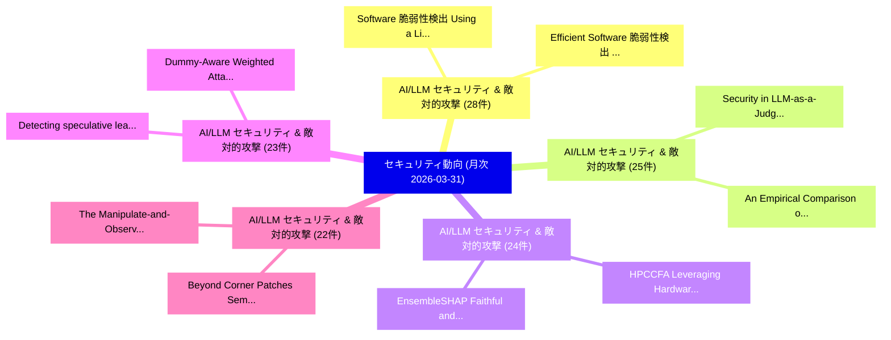

# 📊 03_monthly: 月次エグゼクティブサマリー報告書 (直近30日間: 2026-03-31)

**集計日時**: 2026-03-31 00:00:00 UTC  
**直近30日間の総論文数**: 783 件  

---

## 💡 マクロ脅威動向 & 戦略的リスク評価 (Strategic Executive Insights)

本日の収集論文（計 783 件）において、以下の重点セキュリティ領域で活発な研究動向が確認されました：
- **AI/LLM セキュリティ & 敵対的攻撃** (28 件): 注目論文として 「Software 脆弱性検出 Using a Lightwe...」、「Efficient Software 脆弱性検出 Using...」 等が発表され、実務防御および攻撃検証の進展が見られます。
- **AI/LLM セキュリティ & 敵対的攻撃** (25 件): 注目論文として 「Security in LLM-as-a-Judge: A ...」、「An Empirical Comparison of Sec...」 等が発表され、実務防御および攻撃検証の進展が見られます。
- **AI/LLM セキュリティ & 敵対的攻撃** (24 件): 注目論文として 「HPCCFA: Leveraging Hardware Pe...」、「EnsembleSHAP: Faithful and Cer...」 等が発表され、実務防御および攻撃検証の進展が見られます。
- **AI/LLM セキュリティ & 敵対的攻撃** (23 件): 注目論文として 「Dummy-Aware Weighted Attack (D...」、「Detecting speculative leaks wi...」 等が発表され、実務防御および攻撃検証の進展が見られます。
- **AI/LLM セキュリティ & 敵対的攻撃** (22 件): 注目論文として 「Beyond Corner Patches: Semanti...」、「The Manipulate-and-Observe Att...」 等が発表され、実務防御および攻撃検証の進展が見られます。

### 🗺️ 月次セキュリティ技術レーダー (Technology Radar)

---

## 📌 月次セキュリティ論文一覧 (日本語表形式)

| No | arXiv ID | 論文タイトル (日本語訳) | 重要キーワード | 構造化エグゼクティブ要約 (背景・提案・影響) | 脅威分類 | 詳細リンク |
|---|---|---|---|---|---|---|
| 1 | `2603.29182v1` | [Dummy-Aware Weighted Attack (DAWA): Breaking the Safe Sink in Dummy Class Defenses（セキュリティ分析論文）](../../okf/papers/2026-03-31/2603.29182.md) | `Aware Weighted Attack`, `Dummy Class Defenses`, `Safe Sink` | 【提案】概要 (Overview & Key Finding) 本論文「Dummy-Aware Weighted Attack (DAWA): Breaking the Safe S...。実証評価により経営層・セキュリティ管理者向け推奨アクション (E... | `executive-summary` | [arXiv](https://arxiv.org/abs/2603.29182v1) &#124; [OKF](../../okf/papers/2026-03-31/2603.29182.md) |
| 2 | `2603.29216v1` | [Software 脆弱性検出 Using a Lightweight Graph Neural Network](../../okf/papers/2026-03-31/2603.29216.md) | `Lightweight Graph Neural Network`, `Software Vulnerability Detection Using`, `Hialo Muniz Carvalho` | 【提案】概要 (Overview & Key Finding) 本論文「Software 脆弱性検出 Using a Lightweight Graph Neural Network...。実証評価により経営層・セキュリティ管理者向け推奨アクション (E... | `cs.AI` | [arXiv](https://arxiv.org/abs/2603.29216v1) &#124; [OKF](../../okf/papers/2026-03-31/2603.29216.md) |
| 3 | `2603.29278v2` | [A Regulatory Compliance Protocol for Asset Interoperability Between Traditional and Decentralized Finance in Tokenized Capital Markets（セキュリティ分析論文）](../../okf/papers/2026-03-31/2603.29278.md) | `Regulatory Compliance Protocol`, `Tokenized Capital Markets`, `Decentralized Finance` | 【提案】概要 (Overview & Key Finding) 本論文「A Regulatory Compliance Protocol for Asset Interoperabi...。実証評価により経営層・セキュリティ管理者向け推奨アクション (E... | `executive-summary` | [arXiv](https://arxiv.org/abs/2603.29278v2) &#124; [OKF](../../okf/papers/2026-03-31/2603.29278.md) |
| 4 | `2603.29289v1` | [Downsides of Smartness Across Edge-Cloud Continuum in Modern Industry（セキュリティ分析論文）](../../okf/papers/2026-03-31/2603.29289.md) | `Smartness Across Edge`, `Cloud Continuum`, `Modern Industry` | 【提案】概要 (Overview & Key Finding) 本論文「Downsides of Smartness Across Edge-Cloud Continuum in M...。実証評価により経営層・セキュリティ管理者向け推奨アクション (E... | `cs.AI` | [arXiv](https://arxiv.org/abs/2603.29289v1) &#124; [OKF](../../okf/papers/2026-03-31/2603.29289.md) |
| 5 | `2603.29328v3` | [Beyond Corner Patches: Semantics-Aware Backdoor Attack in 連合学習](../../okf/papers/2026-03-31/2603.29328.md) | `Beyond Corner Patches`, `Aware Backdoor Attack`, `Semantics-Aware Backdoor` | 【提案】概要 (Overview & Key Finding) 本論文「Beyond Corner Patches: Semantics-Aware Backdoor Attack ...。実証評価により経営層・セキュリティ管理者向け推奨アクション (E... | `cs.AI` | [arXiv](https://arxiv.org/abs/2603.29328v3) &#124; [OKF](../../okf/papers/2026-03-31/2603.29328.md) |
| 6 | `2603.29382v2` | [Deep Learning-Assisted Improved Differential Fault Attacks on Lightweight Stream Ciphers（セキュリティ分析論文）](../../okf/papers/2026-03-31/2603.29382.md) | `Assisted Improved Differential Fault Attacks`, `Lightweight Stream Ciphers`, `Deep Learning` | 【提案】概要 (Overview & Key Finding) 本論文「Deep Learning-Assisted Improved Differential Fault Atta...。実証評価により経営層・セキュリティ管理者向け推奨アクション (E... | `executive-summary` | [arXiv](https://arxiv.org/abs/2603.29382v2) &#124; [OKF](../../okf/papers/2026-03-31/2603.29382.md) |
| 7 | `2603.29403v2` | [Security in LLM-as-a-Judge: A Comprehensive SoK（セキュリティ分析論文）](../../okf/papers/2026-03-31/2603.29403.md) | `Aiman Al Masoud`, `Vignesh Kumar Kembu`, `Antony Anju` | 【提案】概要 (Overview & Key Finding) 本論文「Security in LLM-as-a-Judge: A Comprehensive SoK（セキュリティ分...。実証評価により経営層・セキュリティ管理者向け推奨アクション (E... | `cs.AI` | [arXiv](https://arxiv.org/abs/2603.29403v2) &#124; [OKF](../../okf/papers/2026-03-31/2603.29403.md) |
| 8 | `2603.29520v1` | [TrafficMoE: Heterogeneity-aware Mixture of Experts for Encrypted Traffic Classification（セキュリティ分析論文）](../../okf/papers/2026-03-31/2603.29520.md) | `Encrypted Traffic Classification`, `Heterogeneity-aware Mixture`, `Xiaowei Fu` | 【提案】概要 (Overview & Key Finding) 本論文「TrafficMoE: Heterogeneity-aware Mixture of Experts for ...。実証評価により経営層・セキュリティ管理者向け推奨アクション (E... | `cs.NI` | [arXiv](https://arxiv.org/abs/2603.29520v1) &#124; [OKF](../../okf/papers/2026-03-31/2603.29520.md) |
| 9 | `2603.29537v1` | [Mean Masked Autoencoder with Flow-Mixing for Encrypted Traffic Classification（セキュリティ分析論文）](../../okf/papers/2026-03-31/2603.29537.md) | `Mean Masked Autoencoder`, `Encrypted Traffic Classification`, `Xiao Liu` | 【提案】概要 (Overview & Key Finding) 本論文「Mean Masked Autoencoder with Flow-Mixing for Encrypted ...。実証評価により経営層・セキュリティ管理者向け推奨アクション (E... | `cs.NI` | [arXiv](https://arxiv.org/abs/2603.29537v1) &#124; [OKF](../../okf/papers/2026-03-31/2603.29537.md) |
| 10 | `2603.29545v2` | [Stand-Alone Complex or Vibercrime? Exploring the adoption and innovation of GenAI tools, coding assistants, and agents within cybercrime ecosystems（セキュリティ分析論文）](../../okf/papers/2026-03-31/2603.29545.md) | `Alone Complex`, `Stand-Alone Complex`, `Jack Hughes` | 【提案】Exploring the adoption and innovation of GenAI tools, coding assistants, and agents wit...。実証評価により経営層・セキュリティ管理者向け推奨アクション (E... | `executive-summary` | [arXiv](https://arxiv.org/abs/2603.29545v2) &#124; [OKF](../../okf/papers/2026-03-31/2603.29545.md) |
| 11 | `2603.29636v1` | [5G Puppeteer: Chaining Hidden Command and Control Channels in 5G Core Networks（セキュリティ分析論文）](../../okf/papers/2026-03-31/2603.29636.md) | `Chaining Hidden Command`, `Control Channels`, `Core Networks` | 【提案】概要 (Overview & Key Finding) 本論文「5G Puppeteer: Chaining Hidden Command and Control Chann...。実証評価により経営層・セキュリティ管理者向け推奨アクション (E... | `cybersecurity` | [arXiv](https://arxiv.org/abs/2603.29636v1) &#124; [OKF](../../okf/papers/2026-03-31/2603.29636.md) |
| 12 | `2603.29668v1` | [An Empirical Comparison of Security and Privacy Characteristics of Android Messaging Apps（セキュリティ分析論文）](../../okf/papers/2026-03-31/2603.29668.md) | `Android Messaging Apps`, `Privacy Characteristics`, `Foivos Timotheos Proestakis` | 【提案】概要 (Overview & Key Finding) 本論文「An Empirical Comparison of Security and Privacy Charact...。実証評価により経営層・セキュリティ管理者向け推奨アクション (E... | `cybersecurity` | [arXiv](https://arxiv.org/abs/2603.29668v1) &#124; [OKF](../../okf/papers/2026-03-31/2603.29668.md) |
| 13 | `2603.29669v1` | [The Manipulate-and-Observe Attack on Quantum Key Distribution（セキュリティ分析論文）](../../okf/papers/2026-03-31/2603.29669.md) | `Quantum Key Distribution`, `Observe Attack`, `William Tighe` | 【提案】概要 (Overview & Key Finding) 本論文「The Manipulate-and-Observe Attack on 量子鍵配送（セキュリティ分析論文）」...。実証評価により経営層・セキュリティ管理者向け推奨アクション (E... | `executive-summary` | [arXiv](https://arxiv.org/abs/2603.29669v1) &#124; [OKF](../../okf/papers/2026-03-31/2603.29669.md) |
| 14 | `2603.29688v1` | [Client-Verifiable and Efficient Federated Unlearning in Low-Altitude Wireless Networks（セキュリティ分析論文）](../../okf/papers/2026-03-31/2603.29688.md) | `Efficient Federated Unlearning`, `Altitude Wireless Networks`, `Low-Altitude Wireless` | 【提案】概要 (Overview & Key Finding) 本論文「Client-Verifiable and Efficient Federated Unlearning in...。実証評価により経営層・セキュリティ管理者向け推奨アクション (E... | `cybersecurity` | [arXiv](https://arxiv.org/abs/2603.29688v1) &#124; [OKF](../../okf/papers/2026-03-31/2603.29688.md) |
| 15 | `2603.29742v2` | [SHIFT: Stochastic Hidden-Trajectory Deflection for Removing Diffusion-based Watermark（セキュリティ分析論文）](../../okf/papers/2026-03-31/2603.29742.md) | `Stochastic Hidden`, `Trajectory Deflection`, `Removing Diffusion` | 【提案】概要 (Overview & Key Finding) 本論文「SHIFT: Stochastic Hidden-Trajectory Deflection for Remo...。実証評価により経営層・セキュリティ管理者向け推奨アクション (E... | `cs.CV` | [arXiv](https://arxiv.org/abs/2603.29742v2) &#124; [OKF](../../okf/papers/2026-03-31/2603.29742.md) |
| 16 | `2603.29749v1` | [HPCCFA: Leveraging Hardware Performance Counters for Control Flow Attestation（セキュリティ分析論文）](../../okf/papers/2026-03-31/2603.29749.md) | `Leveraging Hardware Performance Counters`, `Control Flow Attestation`, `Claudius Pott` | 【提案】概要 (Overview & Key Finding) 本論文「HPCCFA: Leveraging Hardware Performance Counters for Co...。実証評価により経営層・セキュリティ管理者向け推奨アクション (E... | `cybersecurity` | [arXiv](https://arxiv.org/abs/2603.29749v1) &#124; [OKF](../../okf/papers/2026-03-31/2603.29749.md) |
| 17 | `2603.29800v1` | [Detecting speculative leaks with compositional semantics（セキュリティ分析論文）](../../okf/papers/2026-03-31/2603.29800.md) | `Xaver Fabian`, `Marco Guarnieri`, `Marco Patrignani` | 【提案】概要 (Overview & Key Finding) 本論文「Detecting speculative leaks with compositional semantic...。実証評価によりMorales, Marco。 | `cybersecurity` | [arXiv](https://arxiv.org/abs/2603.29800v1) &#124; [OKF](../../okf/papers/2026-03-31/2603.29800.md) |
| 18 | `2603.29907v2` | [Security and Privacy in Virtual and Robotic Assistive Systems: A Comparative Framework（セキュリティ分析論文）](../../okf/papers/2026-03-31/2603.29907.md) | `Robotic Assistive Systems`, `Nelly Elsayed`, `Raw Meta` | 【提案】概要 (Overview & Key Finding) 本論文「Security and Privacy in Virtual and Robotic Assistive S...。実証評価により経営層・セキュリティ管理者向け推奨アクション (E... | `cybersecurity` | [arXiv](https://arxiv.org/abs/2603.29907v2) &#124; [OKF](../../okf/papers/2026-03-31/2603.29907.md) |
| 19 | `2603.30016v1` | [Architecting Secure AI Agents: Perspectives on System-Level Defenses Against Indirect Prompt Injection Attacks（セキュリティ分析論文）](../../okf/papers/2026-03-31/2603.30016.md) | `Architecting Secure`, `System-Level Defenses`, `Chong Xiang` | 【提案】概要 (Overview & Key Finding) 本論文「Architecting Secure AI Agents: Perspectives on System-L...。実証評価により経営層・セキュリティ管理者向け推奨アクション (E... | `cs.AI` | [arXiv](https://arxiv.org/abs/2603.30016v1) &#124; [OKF](../../okf/papers/2026-03-31/2603.30016.md) |
| 20 | `2603.30017v1` | [Refined Detection for Gumbel Watermarking（セキュリティ分析論文）](../../okf/papers/2026-03-31/2603.30017.md) | `Refined Detection`, `Gumbel Watermarking`, `Tor Lattimore` | 【提案】概要 (Overview & Key Finding) 本論文「Refined Detection for Gumbel Watermarking（セキュリティ分析論文）」（...。実証評価により経営層・セキュリティ管理者向け推奨アクション (E... | `executive-summary` | [arXiv](https://arxiv.org/abs/2603.30017v1) &#124; [OKF](../../okf/papers/2026-03-31/2603.30017.md) |
| 21 | `2603.30034v1` | [EnsembleSHAP: Faithful and Certifiably Robust Attribution for Random Subspace Method（セキュリティ分析論文）](../../okf/papers/2026-03-31/2603.30034.md) | `Certifiably Robust Attribution`, `Yanting Wang`, `Jinyuan Jia` | 【提案】概要 (Overview & Key Finding) 本論文「EnsembleSHAP: Faithful and Certifiably Robust Attributi...。実証評価により経営層・セキュリティ管理者向け推奨アクション (E... | `cybersecurity` | [arXiv](https://arxiv.org/abs/2603.30034v1) &#124; [OKF](../../okf/papers/2026-03-31/2603.30034.md) |
| 22 | `2604.00063v1` | [Cybercrime as a Service: A Scoping Review（セキュリティ分析論文）](../../okf/papers/2026-03-31/2604.00063.md) | `Scoping Review`, `Ema Mauko`, `Enrico Mariconti` | 【提案】概要 (Overview & Key Finding) 本論文「Cybercrime as a Service: A Scoping Review（セキュリティ分析論文）」（...。実証評価により経営層・セキュリティ管理者向け推奨アクション (E... | `cs.ET` | [arXiv](https://arxiv.org/abs/2604.00063v1) &#124; [OKF](../../okf/papers/2026-03-31/2604.00063.md) |
| 23 | `2604.00079v1` | [When Labels Are Scarce: A Systematic Mapping of Label-Efficient Code 脆弱性検出](../../okf/papers/2026-03-31/2604.00079.md) | `Systematic Mapping`, `Label-Efficient Code`, `Efficient Code Vulnerability Detection` | 【提案】概要 (Overview & Key Finding) 本論文「When Labels Are Scarce: A Systematic Mapping of Label-E...。実証評価により経営層・セキュリティ管理者向け推奨アクション (E... | `executive-summary` | [arXiv](https://arxiv.org/abs/2604.00079v1) &#124; [OKF](../../okf/papers/2026-03-31/2604.00079.md) |
| 24 | `2604.00112v1` | [Efficient Software 脆弱性検出 Using Transformer-based Models](../../okf/papers/2026-03-31/2604.00112.md) | `Transformer-based Models`, `Efficient Software Vulnerability Detection Using Transformer`, `Efficient Software` | 【提案】概要 (Overview & Key Finding) 本論文「Efficient Software 脆弱性検出 Using Transformer-based Models...。実証評価により経営層・セキュリティ管理者向け推奨アクション (E... | `executive-summary` | [arXiv](https://arxiv.org/abs/2604.00112v1) &#124; [OKF](../../okf/papers/2026-03-31/2604.00112.md) |
| 25 | `2604.00169v2` | [Beyond Latency: A System-Level Characterization of MPC and FHE for PPML（セキュリティ分析論文）](../../okf/papers/2026-03-31/2604.00169.md) | `Beyond Latency`, `Level Characterization`, `System-Level Characterization` | 【提案】概要 (Overview & Key Finding) 本論文「Beyond Latency: A System-Level Characterization of MPC ...。実証評価によりEdward Suh - **公開日時*。 | `cybersecurity` | [arXiv](https://arxiv.org/abs/2604.00169v2) &#124; [OKF](../../okf/papers/2026-03-31/2604.00169.md) |
| 26 | `2604.00181v1` | [NFC based inventory control system for secure and efficient communication（セキュリティ分析論文）](../../okf/papers/2026-03-31/2604.00181.md) | `Razi Iqbal`, `Awais Ahmad`, `Asfandyar Gillani` | 【提案】概要 (Overview & Key Finding) 本論文「NFC based inventory control system for secure and effic...。実証評価により経営層・セキュリティ管理者向け推奨アクション (E... | `cs.AI` | [arXiv](https://arxiv.org/abs/2604.00181v1) &#124; [OKF](../../okf/papers/2026-03-31/2604.00181.md) |
| 27 | `2604.00188v1` | [On the Necessity of Pre-agreed Secrets for Thwarting Last-minute Coercion: Vulnerabilities and Lessons From the Loki E-voting Protocol（セキュリティ分析論文）](../../okf/papers/2026-03-31/2604.00188.md) | `Thwarting Last`, `Pre-agreed Secrets`, `Last-minute Coercion` | 【提案】概要 (Overview & Key Finding) 本論文「On the Necessity of Pre-agreed Secrets for Thwarting La...。実証評価により経営層・セキュリティ管理者向け推奨アクション (E... | `cybersecurity` | [arXiv](https://arxiv.org/abs/2604.00188v1) &#124; [OKF](../../okf/papers/2026-03-31/2604.00188.md) |
| 28 | `2604.00303v1` | [サイバーセキュリティ Risk Assessment for CubeSat Missions: Adapting Established Frameworks for Resource-Constrained Environments](../../okf/papers/2026-03-31/2604.00303.md) | `Adapting Established Frameworks`, `Constrained Environments`, `Resource-Constrained Environments` | 【提案】概要 (Overview & Key Finding) 本論文「サイバーセキュリティ Risk Assessment for CubeSat Missions: Adapti...。実証評価により経営層・セキュリティ管理者向け推奨アクション (E... | `cybersecurity` | [arXiv](https://arxiv.org/abs/2604.00303v1) &#124; [OKF](../../okf/papers/2026-03-31/2604.00303.md) |
| 29 | `2604.02372v1` | [Backdoor Attacks on Decentralised Post-Training（セキュリティ分析論文）](../../okf/papers/2026-03-31/2604.02372.md) | `Backdoor Attacks`, `Decentralised Post`, `Nikolay Blagoev` | 【提案】概要 (Overview & Key Finding) 本論文「Backdoor Attacks on Decentralised Post-Training（セキュリティ分...。実証評価により経営層・セキュリティ管理者向け推奨アクション (E... | `executive-summary` | [arXiv](https://arxiv.org/abs/2604.02372v1) &#124; [OKF](../../okf/papers/2026-03-31/2604.02372.md) |
| 30 | `2604.19785v2` | [Can LLMs Infer Conversational Agent Users' Personality Traits from Chat History?（セキュリティ分析論文）](../../okf/papers/2026-03-31/2604.19785.md) | `Infer Conversational Agent Users`, `Personality Traits`, `Chat History` | 【提案】### (日本語題名: Can LLMs Infer Conversational Agent Users' Personality Traits from Chat His...。実証評価により経営層・セキュリティ管理者向け推奨アクション (E... | `cs.AI` | [arXiv](https://arxiv.org/abs/2604.19785v2) &#124; [OKF](../../okf/papers/2026-03-31/2604.19785.md) |
| 31 | `2605.21490v1` | [Temporal Contrastive Transformer for Financial Crime Detection: Self-Supervised Sequence Embeddings via Predictive Contrastive Coding（セキュリティ分析論文）](../../okf/papers/2026-03-31/2605.21490.md) | `Temporal Contrastive Transformer`, `Financial Crime Detection`, `Supervised Sequence Embeddings` | 【提案】概要 (Overview & Key Finding) 本論文「Temporal Contrastive Transformer for Financial Crime De...。実証評価により経営層・セキュリティ管理者向け推奨アクション (E... | `executive-summary` | [arXiv](https://arxiv.org/abs/2605.21490v1) &#124; [OKF](../../okf/papers/2026-03-31/2605.21490.md) |
| 32 | `2603.27918v1` | [Multimodal Large Language Models: A Comprehensive Surveyに対する敵対的攻撃](../../okf/papers/2026-03-30/2603.27918.md) | `Multimodal Large Language Models`, `Adversarial Attacks`, `Comprehensive Survey` | 【提案】概要 (Overview & Key Finding) 本論文「Multimodal Large Language Models: A Comprehensive Surve...。実証評価により経営層・セキュリティ管理者向け推奨アクション (E... | `cs.AI` | [arXiv](https://arxiv.org/abs/2603.27918v1) &#124; [OKF](../../okf/papers/2026-03-30/2603.27918.md) |
| 33 | `2603.27986v1` | [FedFG: Privacy-Preserving and Robust 連合学習 via Flow-Matching Generation](../../okf/papers/2026-03-30/2603.27986.md) | `Matching Generation`, `Flow-Matching Generation`, `Robust Federated Learning` | 【提案】概要 (Overview & Key Finding) 本論文「FedFG: Privacy-Preserving and Robust 連合学習 via Flow-Matc...。実証評価により経営層・セキュリティ管理者向け推奨アクション (E... | `cs.AI` | [arXiv](https://arxiv.org/abs/2603.27986v1) &#124; [OKF](../../okf/papers/2026-03-30/2603.27986.md) |
| 34 | `2603.28013v3` | [Kill-Chain Canaries: Stage-Level Tracking of Prompt Injection Across Attack Surfaces and Model Safety Tiers（セキュリティ分析論文）](../../okf/papers/2026-03-30/2603.28013.md) | `Prompt Injection Across Attack Surfaces`, `Model Safety Tiers`, `Chain Canaries` | 【提案】概要 (Overview & Key Finding) 本論文「Kill-Chain Canaries: Stage-Level Tracking of プロンプトインジェク...。実証評価により経営層・セキュリティ管理者向け推奨アクション (E... | `cs.AI` | [arXiv](https://arxiv.org/abs/2603.28013v3) &#124; [OKF](../../okf/papers/2026-03-30/2603.28013.md) |
| 35 | `2603.28043v1` | [Seeing the Unseen: Rethinking Illicit Promotion Detection with In-Context Learning（セキュリティ分析論文）](../../okf/papers/2026-03-30/2603.28043.md) | `Rethinking Illicit Promotion Detection`, `Context Learning`, `In-Context Learning` | 【提案】概要 (Overview & Key Finding) 本論文「Seeing the Unseen: Rethinking Illicit Promotion Detecti...。実証評価により経営層・セキュリティ管理者向け推奨アクション (E... | `cybersecurity` | [arXiv](https://arxiv.org/abs/2603.28043v1) &#124; [OKF](../../okf/papers/2026-03-30/2603.28043.md) |
| 36 | `2603.28128v2` | [ORACAL: A Robust and Explainable Multimodal Framework for Smart Contract 脆弱性検出 with Causal Graph Enrichment](../../okf/papers/2026-03-30/2603.28128.md) | `Causal Graph Enrichment`, `Smart Contract Vulnerability Detection`, `Smart Contract` | 【提案】概要 (Overview & Key Finding) 本論文「ORACAL: A Robust and Explainable Multimodal Framework f...。実証評価により経営層・セキュリティ管理者向け推奨アクション (E... | `executive-summary` | [arXiv](https://arxiv.org/abs/2603.28128v2) &#124; [OKF](../../okf/papers/2026-03-30/2603.28128.md) |
| 37 | `2603.28143v1` | [Silent Guardians: Independent and Secure Decision Tree Evaluation Without Chatter（セキュリティ分析論文）](../../okf/papers/2026-03-30/2603.28143.md) | `Silent Guardians`, `Liang Feng Zhang`, `Jinyuan Li` | 【提案】背景とセキュリティ上の課題 (Background & Problem) 本研究はサイバー脅威環境におけるセキュリティ構造・脆弱性の検証を目的としています。(主要検出項目: ...。実証評価により経営層・セキュリティ管理者向け推奨アクション (E... | `cybersecurity` | [arXiv](https://arxiv.org/abs/2603.28143v1) &#124; [OKF](../../okf/papers/2026-03-30/2603.28143.md) |
| 38 | `2603.28166v2` | [Evaluating Privilege Usage of Agents with Real-World Tools（セキュリティ分析論文）](../../okf/papers/2026-03-30/2603.28166.md) | `Evaluating Privilege Usage`, `World Tools`, `Real-World Tools` | 【提案】概要 (Overview & Key Finding) 本論文「Evaluating Privilege Usage of Agents with Real-World To...。実証評価により経営層・セキュリティ管理者向け推奨アクション (E... | `cs.AI` | [arXiv](https://arxiv.org/abs/2603.28166v2) &#124; [OKF](../../okf/papers/2026-03-30/2603.28166.md) |
| 39 | `2603.28252v2` | [Secret Key Rate RIS-Assisted THz MIMO CV-QKD Systems under Access-Constrained Eavesdroppingの分析](../../okf/papers/2026-03-30/2603.28252.md) | `RIS-Assisted THz`, `CV-QKD Systems`, `Secret Key Rate` | 【提案】概要 (Overview & Key Finding) 本論文「Secret Key Rate RIS-Assisted THz MIMO CV-QKD Systems un...。実証評価により経営層・セキュリティ管理者向け推奨アクション (E... | `executive-summary` | [arXiv](https://arxiv.org/abs/2603.28252v2) &#124; [OKF](../../okf/papers/2026-03-30/2603.28252.md) |
| 40 | `2603.28309v1` | [VulnScout-C: A Lightweight Transformer for C Code 脆弱性検出](../../okf/papers/2026-03-30/2603.28309.md) | `Lightweight Transformer`, `Code Vulnerability Detection`, `Aymen Lassoued` | 【提案】概要 (Overview & Key Finding) 本論文「VulnScout-C: A Lightweight Transformer for C Code 脆弱性検出...。実証評価により経営層・セキュリティ管理者向け推奨アクション (E... | `cybersecurity` | [arXiv](https://arxiv.org/abs/2603.28309v1) &#124; [OKF](../../okf/papers/2026-03-30/2603.28309.md) |
| 41 | `2603.28313v1` | [Crypta Lightweight RFID Authentication Protocol Based on a Variable Matrix Encryption Algorithmの分析](../../okf/papers/2026-03-30/2603.28313.md) | `Authentication Protocol Based`, `Variable Matrix Encryption`, `Variable Matrix Encryption Algorithm` | 【提案】概要 (Overview & Key Finding) 本論文「Crypta Lightweight RFID Authentication Protocol Based o...。実証評価により経営層・セキュリティ管理者向け推奨アクション (E... | `cybersecurity` | [arXiv](https://arxiv.org/abs/2603.28313v1) &#124; [OKF](../../okf/papers/2026-03-30/2603.28313.md) |
| 42 | `2603.28396v1` | [Label-efficient Training Updates for マルウェア検出 over Time](../../okf/papers/2026-03-30/2603.28396.md) | `Training Updates`, `Label-efficient Training`, `Malware Detection` | 【提案】概要 (Overview & Key Finding) 本論文「Label-efficient Training Updates for マルウェア検出 over Time」...。実証評価により経営層・セキュリティ管理者向け推奨アクション (E... | `executive-summary` | [arXiv](https://arxiv.org/abs/2603.28396v1) &#124; [OKF](../../okf/papers/2026-03-30/2603.28396.md) |
| 43 | `2603.28434v1` | [Democratizing 連合学習 with Blockchain and Multi-Task Peer Prediction](../../okf/papers/2026-03-30/2603.28434.md) | `Task Peer Prediction`, `Multi-Task Peer`, `Democratizing Federated Learning` | 【提案】概要 (Overview & Key Finding) 本論文「Democratizing 連合学習 with Blockchain and Multi-Task Peer ...。実証評価により経営層・セキュリティ管理者向け推奨アクション (E... | `executive-summary` | [arXiv](https://arxiv.org/abs/2603.28434v1) &#124; [OKF](../../okf/papers/2026-03-30/2603.28434.md) |
| 44 | `2603.28546v2` | [Shy Guys: A Light-Weight Approach to Detecting Robots on Websites（セキュリティ分析論文）](../../okf/papers/2026-03-30/2603.28546.md) | `Shy Guys`, `Detecting Robots`, `Van Boxem` | 【提案】概要 (Overview & Key Finding) 本論文「Shy Guys: A Light-Weight Approach to Detecting Robots o...。実証評価により経営層・セキュリティ管理者向け推奨アクション (E... | `cs.NI` | [arXiv](https://arxiv.org/abs/2603.28546v2) &#124; [OKF](../../okf/papers/2026-03-30/2603.28546.md) |
| 45 | `2603.28551v2` | ["What Did It Actually Do?": Understanding Risk Awareness and Traceability for Computer-Use Agents（セキュリティ分析論文）](../../okf/papers/2026-03-30/2603.28551.md) | `Understanding Risk Awareness`, `Use Agents`, `Computer-Use Agents` | 【提案】概要 (Overview & Key Finding) 本論文「"What Did It Actually Do?": Understanding Risk Awarenes...。実証評価により経営層・セキュリティ管理者向け推奨アクション (E... | `cs.ET` | [arXiv](https://arxiv.org/abs/2603.28551v2) &#124; [OKF](../../okf/papers/2026-03-30/2603.28551.md) |
| 46 | `2603.28594v2` | [Adversarial Attacks in Robotic Perceptionの検出](../../okf/papers/2026-03-30/2603.28594.md) | `Adversarial Attacks`, `Robotic Perception`, `Sorin Mihai Grigorescu` | 【提案】概要 (Overview & Key Finding) 本論文「敵対的攻撃s in Robotic Perceptionの検出」（原題: Detection of 敵対的攻撃...。実証評価により経営層・セキュリティ管理者向け推奨アクション (E... | `cs.AI` | [arXiv](https://arxiv.org/abs/2603.28594v2) &#124; [OKF](../../okf/papers/2026-03-30/2603.28594.md) |
| 47 | `2603.28613v1` | [TGIF2: Extended Text-Guided Inpainting Forgery Dataset & Benchmark（セキュリティ分析論文）](../../okf/papers/2026-03-30/2603.28613.md) | `Guided Inpainting Forgery Dataset`, `Extended Text`, `Text-Guided Inpainting` | 【提案】概要 (Overview & Key Finding) 本論文「TGIF2: Extended Text-Guided Inpainting Forgery Dataset ...。実証評価により経営層・セキュリティ管理者向け推奨アクション (E... | `cs.AI` | [arXiv](https://arxiv.org/abs/2603.28613v1) &#124; [OKF](../../okf/papers/2026-03-30/2603.28613.md) |
| 48 | `2603.28626v1` | [Empowering Mobile Networks Security Resilience by using Post-Quantum Cryptography（セキュリティ分析論文）](../../okf/papers/2026-03-30/2603.28626.md) | `Empowering Mobile Networks Security Resilience`, `Quantum Cryptography`, `Post-Quantum Cryptography` | 【提案】概要 (Overview & Key Finding) 本論文「Empowering Mobile Networks Security Resilience by using...。実証評価により経営層・セキュリティ管理者向け推奨アクション (E... | `cybersecurity` | [arXiv](https://arxiv.org/abs/2603.28626v1) &#124; [OKF](../../okf/papers/2026-03-30/2603.28626.md) |
| 49 | `2603.28652v1` | [Mitigating Backdoor Attacks in 連合学習 Using PPA and MiniMax Game Theory](../../okf/papers/2026-03-30/2603.28652.md) | `Mitigating Backdoor Attacks`, `Game Theory`, `Federated Learning Using` | 【提案】概要 (Overview & Key Finding) 本論文「Mitigating Backdoor Attacks in 連合学習 Using PPA and MiniM...。実証評価により経営層・セキュリティ管理者向け推奨アクション (E... | `executive-summary` | [arXiv](https://arxiv.org/abs/2603.28652v1) &#124; [OKF](../../okf/papers/2026-03-30/2603.28652.md) |
| 50 | `2603.28654v1` | [Interpretable Ensemble Learning for Network Traffic Anomaly Detection: A SHAP-based Explainable AI Framework for Embedded Systems Security（セキュリティ分析論文）](../../okf/papers/2026-03-30/2603.28654.md) | `Network Traffic Anomaly Detection`, `Interpretable Ensemble Learning`, `Embedded Systems Security` | 【提案】概要 (Overview & Key Finding) 本論文「Interpretable Ensemble Learning for Network Traffic Ano...。実証評価により経営層・セキュリティ管理者向け推奨アクション (E... | `cybersecurity` | [arXiv](https://arxiv.org/abs/2603.28654v1) &#124; [OKF](../../okf/papers/2026-03-30/2603.28654.md) |
| 51 | `2603.28655v1` | [Safeguarding LLMs Against Misuse and AI-Driven Malware Using Steganographic Canaries（セキュリティ分析論文）](../../okf/papers/2026-03-30/2603.28655.md) | `Driven Malware Using Steganographic Canaries`, `AI-Driven Malware`, `Venkata Sai Charan Putrevu` | 【提案】概要 (Overview & Key Finding) 本論文「Safeguarding LLMs Against Misuse and AI-Driven マルウェア Us...。実証評価により経営層・セキュリティ管理者向け推奨アクション (E... | `cybersecurity` | [arXiv](https://arxiv.org/abs/2603.28655v1) &#124; [OKF](../../okf/papers/2026-03-30/2603.28655.md) |
| 52 | `2603.28673v1` | [FL-PBM: Pre-Training Backdoor Mitigation for 連合学習](../../okf/papers/2026-03-30/2603.28673.md) | `Training Backdoor Mitigation`, `Pre-Training Backdoor`, `Federated Learning` | 【提案】概要 (Overview & Key Finding) 本論文「FL-PBM: Pre-Training Backdoor Mitigation for 連合学習」（原題: ...。実証評価により経営層・セキュリティ管理者向け推奨アクション (E... | `executive-summary` | [arXiv](https://arxiv.org/abs/2603.28673v1) &#124; [OKF](../../okf/papers/2026-03-30/2603.28673.md) |
| 53 | `2603.28727v1` | [BitSov: A Composable Bitcoin-Native Architecture for Sovereign Internet Infrastructure（セキュリティ分析論文）](../../okf/papers/2026-03-30/2603.28727.md) | `Sovereign Internet Infrastructure`, `Composable Bitcoin`, `Native Architecture` | 【提案】概要 (Overview & Key Finding) 本論文「BitSov: A Composable Bitcoin-Native Architecture for So...。実証評価により経営層・セキュリティ管理者向け推奨アクション (E... | `cs.NI` | [arXiv](https://arxiv.org/abs/2603.28727v1) &#124; [OKF](../../okf/papers/2026-03-30/2603.28727.md) |
| 54 | `2603.28838v1` | [GMA-SAWGAN-GP: A Novel Data Generative Framework to Enhance IDS Detection Performance（セキュリティ分析論文）](../../okf/papers/2026-03-30/2603.28838.md) | `Detection Performance`, `Ziyu Mu`, `Xiyu Shi` | 【提案】概要 (Overview & Key Finding) 本論文「GMA-SAWGAN-GP: A Novel Data Generative Framework to Enh...。実証評価により経営層・セキュリティ管理者向け推奨アクション (E... | `cs.AI` | [arXiv](https://arxiv.org/abs/2603.28838v1) &#124; [OKF](../../okf/papers/2026-03-30/2603.28838.md) |
| 55 | `2603.28846v2` | [Elliptic Curve Cryptocurrencies against Quantum Vulnerabilities: Resource Estimates and Mitigationsのセキュリティ強化](../../okf/papers/2026-03-30/2603.28846.md) | `Quantum Vulnerabilities`, `Resource Estimates`, `Securing Elliptic Curve Cryptocurrencies` | 【提案】概要 (Overview & Key Finding) 本論文「Elliptic Curve Cryptocurrencies against 量子 Vulnerabilit...。実証評価により経営層・セキュリティ管理者向け推奨アクション (E... | `executive-summary` | [arXiv](https://arxiv.org/abs/2603.28846v2) &#124; [OKF](../../okf/papers/2026-03-30/2603.28846.md) |
| 56 | `2603.28903v1` | [Differential Privacy for Symbolic Trajectories via the Permute-and-Flip Mechanism（セキュリティ分析論文）](../../okf/papers/2026-03-30/2603.28903.md) | `Differential Privacy`, `Symbolic Trajectories`, `Flip Mechanism` | 【提案】概要 (Overview & Key Finding) 本論文「差分プライバシー for Symbolic Trajectories via the Permute-and-...。実証評価により経営層・セキュリティ管理者向け推奨アクション (E... | `cybersecurity` | [arXiv](https://arxiv.org/abs/2603.28903v1) &#124; [OKF](../../okf/papers/2026-03-30/2603.28903.md) |
| 57 | `2603.28942v3` | [ReproMIA: A Comprehensive Model Reprogramming for Proactive Membership Inference Attacksの分析](../../okf/papers/2026-03-30/2603.28942.md) | `Comprehensive Model Reprogramming`, `Proactive Membership Inference`, `Proactive Membership Inference Attacks` | 【提案】概要 (Overview & Key Finding) 本論文「ReproMIA: A Comprehensive Model Reprogramming for Proac...。実証評価により経営層・セキュリティ管理者向け推奨アクション (E... | `executive-summary` | [arXiv](https://arxiv.org/abs/2603.28942v3) &#124; [OKF](../../okf/papers/2026-03-30/2603.28942.md) |
| 58 | `2603.28972v1` | [Privacy Guard & Token Parsimony by Prompt and Context Handling and LLM Routing（セキュリティ分析論文）](../../okf/papers/2026-03-30/2603.28972.md) | `Privacy Guard`, `Token Parsimony`, `Context Handling` | 【提案】概要 (Overview & Key Finding) 本論文「Privacy Guard & Token Parsimony by Prompt and Context H...。実証評価により経営層・セキュリティ管理者向け推奨アクション (E... | `cs.AI` | [arXiv](https://arxiv.org/abs/2603.28972v1) &#124; [OKF](../../okf/papers/2026-03-30/2603.28972.md) |
| 59 | `2603.28985v1` | [KAN-LSTM: Kolmogorov-Arnold Networks for Cyber Security Threat Detection in IoT Networksのベンチマーク評価](../../okf/papers/2026-03-30/2603.28985.md) | `Cyber Security Threat Detection`, `Arnold Networks`, `Kolmogorov-Arnold Networks` | 【提案】概要 (Overview & Key Finding) 本論文「KAN-LSTM: Kolmogorov-Arnold Networks for Cyber Security...。実証評価により経営層・セキュリティ管理者向け推奨アクション (E... | `cybersecurity` | [arXiv](https://arxiv.org/abs/2603.28985v1) &#124; [OKF](../../okf/papers/2026-03-30/2603.28985.md) |
| 60 | `2603.28988v1` | [Attesting LLM Pipelines: Enforcing Verifiable Training and Release Claims（セキュリティ分析論文）](../../okf/papers/2026-03-30/2603.28988.md) | `Enforcing Verifiable Training`, `Release Claims`, `Zhuoran Tan` | 【提案】概要 (Overview & Key Finding) 本論文「Attesting LLM Pipelines: Enforcing Verifiable Training ...。実証評価により経営層・セキュリティ管理者向け推奨アクション (E... | `cybersecurity` | [arXiv](https://arxiv.org/abs/2603.28988v1) &#124; [OKF](../../okf/papers/2026-03-30/2603.28988.md) |
| 61 | `2603.28998v1` | [Design Principles for the Construction of a Benchmark Evaluating Security Operation Capabilities of Multi-agent AI Systems（セキュリティ分析論文）](../../okf/papers/2026-03-30/2603.28998.md) | `Benchmark Evaluating Security Operation Capabilities`, `Design Principles`, `Multi-agent AI` | 【提案】概要 (Overview & Key Finding) 本論文「Design Principles for the Construction of a Benchmark E...。実証評価により経営層・セキュリティ管理者向け推奨アクション (E... | `cs.AI` | [arXiv](https://arxiv.org/abs/2603.28998v1) &#124; [OKF](../../okf/papers/2026-03-30/2603.28998.md) |
| 62 | `2603.29038v1` | [Trojan-Speak: Bypassing Constitutional Classifiers with No Jailbreak Tax via Adversarial Finetuning（セキュリティ分析論文）](../../okf/papers/2026-03-30/2603.29038.md) | `Bypassing Constitutional Classifiers`, `Adversarial Finetuning`, `Bilgehan Sel` | 【提案】概要 (Overview & Key Finding) 本論文「Trojan-Speak: Bypassing Constitutional Classifiers with...。実証評価により経営層・セキュリティ管理者向け推奨アクション (E... | `cs.AI` | [arXiv](https://arxiv.org/abs/2603.29038v1) &#124; [OKF](../../okf/papers/2026-03-30/2603.29038.md) |
| 63 | `2603.29062v1` | [CivicShield: A Cross-Domain Defense-in-Depth Framework for Government-Facing AI Chatbots Against Multi-Turn Adversarial Attacksのセキュリティ強化](../../okf/papers/2026-03-30/2603.29062.md) | `Domain Defense`, `Cross-Domain Defense`, `Government-Facing AI` | 【提案】概要 (Overview & Key Finding) 本論文「CivicShield: A Cross-Domain Defense-in-Depth Framework ...。実証評価により経営層・セキュリティ管理者向け推奨アクション (E... | `cs.AI` | [arXiv](https://arxiv.org/abs/2603.29062v1) &#124; [OKF](../../okf/papers/2026-03-30/2603.29062.md) |
| 64 | `2603.29063v1` | [Uncovering Relationships between Android Developers, User Privacy, and Developer Willingness to Reduce Fingerprinting Risks（セキュリティ分析論文）](../../okf/papers/2026-03-30/2603.29063.md) | `Reduce Fingerprinting Risks`, `Uncovering Relationships`, `Android Developers` | 【提案】概要 (Overview & Key Finding) 本論文「Uncovering Relationships between Android Developers, Us...。実証評価により経営層・セキュリティ管理者向け推奨アクション (E... | `executive-summary` | [arXiv](https://arxiv.org/abs/2603.29063v1) &#124; [OKF](../../okf/papers/2026-03-30/2603.29063.md) |
| 65 | `2604.06252v1` | [Policy-Driven Vulnerability Risk Quantification framework for Large-Scale Cloud Infrastructure Data Security（セキュリティ分析論文）](../../okf/papers/2026-03-30/2604.06252.md) | `Scale Cloud Infrastructure Data Security`, `Driven Vulnerability Risk Quantification`, `Policy-Driven Vulnerability` | 【提案】概要 (Overview & Key Finding) 本論文「Policy-Driven 脆弱性 Risk Quantification framework for Lar...。実証評価により経営層・セキュリティ管理者向け推奨アクション (E... | `cybersecurity` | [arXiv](https://arxiv.org/abs/2604.06252v1) &#124; [OKF](../../okf/papers/2026-03-30/2604.06252.md) |
| 66 | `2603.27517v3` | [A Security the OpenClaw AI Agent Frameworkの分析](../../okf/papers/2026-03-29/2603.27517.md) | `Surada Suwansathit`, `Yuxuan Zhang`, `Guofei Gu` | 【提案】概要 (Overview & Key Finding) 本論文「A Security the OpenClaw AI Agent Frameworkの分析」（原題: A Se...。実証評価により経営層・セキュリティ管理者向け推奨アクション (E... | `cs.AI` | [arXiv](https://arxiv.org/abs/2603.27517v3) &#124; [OKF](../../okf/papers/2026-03-29/2603.27517.md) |
| 67 | `2603.27522v1` | [Hidden Ads: Behavior Triggered Semantic Backdoors for Advertisement Injection in Vision Language Models（セキュリティ分析論文）](../../okf/papers/2026-03-29/2603.27522.md) | `Behavior Triggered Semantic Backdoors`, `Vision Language Models`, `Hidden Ads` | 【提案】概要 (Overview & Key Finding) 本論文「Hidden Ads: Behavior Triggered Semantic Backdoors for A...。実証評価により経営層・セキュリティ管理者向け推奨アクション (E... | `executive-summary` | [arXiv](https://arxiv.org/abs/2603.27522v1) &#124; [OKF](../../okf/papers/2026-03-29/2603.27522.md) |
| 68 | `2603.27739v2` | [Ordering Power is Sanctioning Power: Sanction Evasion-MEV and the Limits of On-Chain Enforcement（セキュリティ分析論文）](../../okf/papers/2026-03-29/2603.27739.md) | `Ordering Power`, `Sanctioning Power`, `Sanction Evasion` | 【提案】概要 (Overview & Key Finding) 本論文「Ordering Power is Sanctioning Power: Sanction Evasion-M...。実証評価により経営層・セキュリティ管理者向け推奨アクション (E... | `cybersecurity` | [arXiv](https://arxiv.org/abs/2603.27739v2) &#124; [OKF](../../okf/papers/2026-03-29/2603.27739.md) |
| 69 | `2603.27817v3` | [Context-Aware Image Anonymization with Multi-Agent Reasoningに向けて](../../okf/papers/2026-03-29/2603.27817.md) | `Aware Image Anonymization`, `Context-Aware Image`, `Towards Context` | 【提案】概要 (Overview & Key Finding) 本論文「Context-Aware Image Anonymization with Multi-Agent Reas...。実証評価により経営層・セキュリティ管理者向け推奨アクション (E... | `cs.AI` | [arXiv](https://arxiv.org/abs/2603.27817v3) &#124; [OKF](../../okf/papers/2026-03-29/2603.27817.md) |
| 70 | `2603.27883v1` | [Decentralized Proof-of-Location for Content Provenance: Capture-Time Authenticityに向けて](../../okf/papers/2026-03-29/2603.27883.md) | `Decentralized Proof`, `Content Provenance`, `Towards Capture` | 【提案】概要 (Overview & Key Finding) 本論文「Decentralized Proof-of-Location for Content Provenance:...。実証評価により経営層・セキュリティ管理者向け推奨アクション (E... | `cybersecurity` | [arXiv](https://arxiv.org/abs/2603.27883v1) &#124; [OKF](../../okf/papers/2026-03-29/2603.27883.md) |
| 71 | `2603.28824v1` | [SNEAKDOOR: Stealthy Backdoor Attacks against Distribution Matching-based Dataset Condensation（セキュリティ分析論文）](../../okf/papers/2026-03-29/2603.28824.md) | `Stealthy Backdoor Attacks`, `Distribution Matching`, `Dataset Condensation` | 【提案】概要 (Overview & Key Finding) 本論文「SNEAKDOOR: Stealthy Backdoor Attacks against Distributi...。実証評価により経営層・セキュリティ管理者向け推奨アクション (E... | `cs.AI` | [arXiv](https://arxiv.org/abs/2603.28824v1) &#124; [OKF](../../okf/papers/2026-03-29/2603.28824.md) |
| 72 | `2605.06669v2` | [Evaluating Prompt Injection Defenses for Educational LLM Tutors: Security-Usability-Latency Trade-offs（セキュリティ分析論文）](../../okf/papers/2026-03-29/2605.06669.md) | `Evaluating Prompt Injection Defenses`, `Latency Trade`, `Raw Meta` | 【提案】概要 (Overview & Key Finding) 本論文「Evaluating プロンプトインジェクション Defenses for Educational LLM T...。実証評価により経営層・セキュリティ管理者向け推奨アクション (E... | `cs.AI` | [arXiv](https://arxiv.org/abs/2605.06669v2) &#124; [OKF](../../okf/papers/2026-03-29/2605.06669.md) |
| 73 | `2603.27067v1` | [Detecting Protracted Vulnerabilities in Open Source Projects（セキュリティ分析論文）](../../okf/papers/2026-03-28/2603.27067.md) | `Detecting Protracted Vulnerabilities`, `Open Source Projects`, `Sara Al Hajj Ibrahim` | 【提案】概要 (Overview & Key Finding) 本論文「Detecting Protracted Vulnerabilities in Open Source Pro...。実証評価により経営層・セキュリティ管理者向け推奨アクション (E... | `executive-summary` | [arXiv](https://arxiv.org/abs/2603.27067v1) &#124; [OKF](../../okf/papers/2026-03-28/2603.27067.md) |
| 74 | `2603.27094v1` | [Sovereign Context Protocol: An Open Attribution Layer for Human-Generated Content in the Age of 大規模言語モデル](../../okf/papers/2026-03-28/2603.27094.md) | `Sovereign Context Protocol`, `Generated Content`, `Human-Generated Content` | 【提案】概要 (Overview & Key Finding) 本論文「Sovereign Context Protocol: An Open Attribution Layer f...。実証評価により経営層・セキュリティ管理者向け推奨アクション (E... | `cs.AI` | [arXiv](https://arxiv.org/abs/2603.27094v1) &#124; [OKF](../../okf/papers/2026-03-28/2603.27094.md) |
| 75 | `2603.27117v2` | [Gender-Based Heterogeneity in Youth Privacy-Protective Behavior for Smart Voice Assistants: Evidence from Multigroup PLS-SEM（セキュリティ分析論文）](../../okf/papers/2026-03-28/2603.27117.md) | `Smart Voice Assistants`, `Based Heterogeneity`, `Youth Privacy` | 【提案】概要 (Overview & Key Finding) 本論文「Gender-Based Heterogeneity in Youth Privacy-Protective ...。実証評価により経営層・セキュリティ管理者向け推奨アクション (E... | `cs.AI` | [arXiv](https://arxiv.org/abs/2603.27117v2) &#124; [OKF](../../okf/papers/2026-03-28/2603.27117.md) |
| 76 | `2603.27127v1` | [Red-MIRROR: Agentic LLM-based Autonomous Penetration Testing with Reflective Verification and Knowledge-augmented Interaction（セキュリティ分析論文）](../../okf/papers/2026-03-28/2603.27127.md) | `Autonomous Penetration Testing`, `Reflective Verification`, `LLM-based Autonomous` | 【提案】概要 (Overview & Key Finding) 本論文「Red-MIRROR: Agentic LLM-based Autonomous Penetration Te...。実証評価により経営層・セキュリティ管理者向け推奨アクション (E... | `cybersecurity` | [arXiv](https://arxiv.org/abs/2603.27127v1) &#124; [OKF](../../okf/papers/2026-03-28/2603.27127.md) |
| 77 | `2603.27148v1` | [SafetyDrift: Predicting When AI Agents Cross the Line Before They Actually Do（セキュリティ分析論文）](../../okf/papers/2026-03-28/2603.27148.md) | `Agents Cross`, `Aditya Dhodapkar`, `Farhaan Pishori` | 【提案】概要 (Overview & Key Finding) 本論文「SafetyDrift: Predicting When AI Agents Cross the Line B...。実証評価により経営層・セキュリティ管理者向け推奨アクション (E... | `cs.AI` | [arXiv](https://arxiv.org/abs/2603.27148v1) &#124; [OKF](../../okf/papers/2026-03-28/2603.27148.md) |
| 78 | `2603.27190v2` | [Spectral Method attacks Sparse LWE, Sparse LPN and Beyond（セキュリティ分析論文）](../../okf/papers/2026-03-28/2603.27190.md) | `Shashwat Agrawal`, `Amitabha Bagchi`, `Rajendra Kumar` | 【提案】概要 (Overview & Key Finding) 本論文「Spectral Method attacks Sparse LWE, Sparse LPN and Beyo...。実証評価により経営層・セキュリティ管理者向け推奨アクション (E... | `cybersecurity` | [arXiv](https://arxiv.org/abs/2603.27190v2) &#124; [OKF](../../okf/papers/2026-03-28/2603.27190.md) |
| 79 | `2603.27204v1` | ["Elementary, My Dear Watson." Detecting Malicious Skills via Neuro-Symbolic Reasoning across Heterogeneous Artifacts（セキュリティ分析論文）](../../okf/papers/2026-03-28/2603.27204.md) | `Detecting Malicious Skills`, `Symbolic Reasoning`, `Heterogeneous Artifacts` | 【提案】概要 (Overview & Key Finding) 本論文「"Elementary, My Dear Watson." Detecting Malicious Skill...。実証評価により経営層・セキュリティ管理者向け推奨アクション (E... | `executive-summary` | [arXiv](https://arxiv.org/abs/2603.27204v1) &#124; [OKF](../../okf/papers/2026-03-28/2603.27204.md) |
| 80 | `2603.27224v4` | [Finding Memory Leaks in C/C++ Programs via Neuro-Symbolic Augmented Static Analysis（セキュリティ分析論文）](../../okf/papers/2026-03-28/2603.27224.md) | `Finding Memory Leaks`, `Neuro-Symbolic Augmented`, `Symbolic Augmented Stat` | 【提案】概要 (Overview & Key Finding) 本論文「Finding Memory Leaks in C/C++ Programs via Neuro-Symbol...。実証評価により経営層・セキュリティ管理者向け推奨アクション (E... | `executive-summary` | [arXiv](https://arxiv.org/abs/2603.27224v4) &#124; [OKF](../../okf/papers/2026-03-28/2603.27224.md) |
| 81 | `2603.27278v1` | [Quantum Bit Error Rate Analysis in BB84 Quantum Key Distribution: Measurement, Statistical Estimation, and Eavesdropping Detection（セキュリティ分析論文）](../../okf/papers/2026-03-28/2603.27278.md) | `Quantum Key Distribution`, `Statistical Estimation`, `Eavesdropping Detection` | 【提案】概要 (Overview & Key Finding) 本論文「量子 Bit Error Rate Analysis in BB84 量子鍵配送: Measurement, ...。実証評価により経営層・セキュリティ管理者向け推奨アクション (E... | `executive-summary` | [arXiv](https://arxiv.org/abs/2603.27278v1) &#124; [OKF](../../okf/papers/2026-03-28/2603.27278.md) |
| 82 | `2603.27326v1` | [Context-Aware Phishing Email Detection Using Machine Learning and NLP（セキュリティ分析論文）](../../okf/papers/2026-03-28/2603.27326.md) | `Aware Phishing Email Detection Using Machine Learning`, `Context-Aware Phishing`, `Amitabh Chakravorty` | 【提案】概要 (Overview & Key Finding) 本論文「Context-Aware Phishing Email Detection Using Machine Le...。実証評価により経営層・セキュリティ管理者向け推奨アクション (E... | `cybersecurity` | [arXiv](https://arxiv.org/abs/2603.27326v1) &#124; [OKF](../../okf/papers/2026-03-28/2603.27326.md) |
| 83 | `2603.27439v1` | [Attacking AI Accelerators by Leveraging Arithmetic Properties of Addition（セキュリティ分析論文）](../../okf/papers/2026-03-28/2603.27439.md) | `Leveraging Arithmetic Properties`, `Biresh Kumar Joardar`, `Masoud Heidary` | 【提案】概要 (Overview & Key Finding) 本論文「Attacking AI Accelerators by Leveraging Arithmetic Prop...。実証評価により経営層・セキュリティ管理者向け推奨アクション (E... | `executive-summary` | [arXiv](https://arxiv.org/abs/2603.27439v1) &#124; [OKF](../../okf/papers/2026-03-28/2603.27439.md) |
| 84 | `2603.28807v1` | [SafeClaw-R: Safe and Secure Multi-Agent Personal Assistantsに向けて](../../okf/papers/2026-03-28/2603.28807.md) | `Secure Multi`, `Multi-Agent Personal`, `Agent Personal Assistants` | 【提案】概要 (Overview & Key Finding) 本論文「SafeClaw-R: Safe and Secure Multi-Agent Personal Assist...。実証評価によりPoskitt, Jun Sun -。 | `cybersecurity` | [arXiv](https://arxiv.org/abs/2603.28807v1) &#124; [OKF](../../okf/papers/2026-03-28/2603.28807.md) |
| 85 | `2603.28815v1` | [SkillTester: Utility and Security of Agent Skillsのベンチマーク評価](../../okf/papers/2026-03-28/2603.28815.md) | `Benchmarking Utility`, `Agent Skills`, `Leye Wang` | 【提案】概要 (Overview & Key Finding) 本論文「SkillTester: Utility and Security of Agent Skillsのベンチマー...。実証評価により経営層・セキュリティ管理者向け推奨アクション (E... | `cs.AI` | [arXiv](https://arxiv.org/abs/2603.28815v1) &#124; [OKF](../../okf/papers/2026-03-28/2603.28815.md) |
| 86 | `2603.28817v1` | [GUARD-SLM: Token Activation-Based Defense Against Jailbreak Attacks for Small Language Models（セキュリティ分析論文）](../../okf/papers/2026-03-28/2603.28817.md) | `Small Language Models`, `Token Activation`, `Activation-Based Defense` | 【提案】概要 (Overview & Key Finding) 本論文「GUARD-SLM: Token Activation-Based Defense Against ジェイルブ...。実証評価により経営層・セキュリティ管理者向け推奨アクション (E... | `cs.AI` | [arXiv](https://arxiv.org/abs/2603.28817v1) &#124; [OKF](../../okf/papers/2026-03-28/2603.28817.md) |
| 87 | `2605.02900v2` | [Safety in Embodied AI: A Survey of Risks, Attacks, and Defenses（セキュリティ分析論文）](../../okf/papers/2026-03-28/2605.02900.md) | `Xiao Li`, `Xiang Zheng`, `Yifeng Gao` | 【提案】概要 (Overview & Key Finding) 本論文「Safety in Embodied AI: A Survey of Risks, Attacks, and ...。実証評価により経営層・セキュリティ管理者向け推奨アクション (E... | `cs.AI` | [arXiv](https://arxiv.org/abs/2605.02900v2) &#124; [OKF](../../okf/papers/2026-03-28/2605.02900.md) |
| 88 | `2603.25994v1` | [Neighbor-Aware Localized Concept Erasure in Text-to-Image Diffusion Models（セキュリティ分析論文）](../../okf/papers/2026-03-27/2603.25994.md) | `Aware Localized Concept Erasure`, `Image Diffusion Models`, `Neighbor-Aware Localized` | 【提案】概要 (Overview & Key Finding) 本論文「Neighbor-Aware Localized Concept Erasure in Text-to-Ima...。実証評価により経営層・セキュリティ管理者向け推奨アクション (E... | `cs.CV` | [arXiv](https://arxiv.org/abs/2603.25994v1) &#124; [OKF](../../okf/papers/2026-03-27/2603.25994.md) |
| 89 | `2603.25997v2` | [Assessing the Cross-Version Applicability of Java Library Vulnerability Exploits（セキュリティ分析論文）](../../okf/papers/2026-03-27/2603.25997.md) | `Java Library Vulnerability Exploits`, `Version Applicability`, `Cross-Version Applicability` | 【提案】概要 (Overview & Key Finding) 本論文「Assessing the Cross-Version Applicability of Java Libra...。実証評価により経営層・セキュリティ管理者向け推奨アクション (E... | `executive-summary` | [arXiv](https://arxiv.org/abs/2603.25997v2) &#124; [OKF](../../okf/papers/2026-03-27/2603.25997.md) |
| 90 | `2603.26032v1` | [Protecting User Prompts Via Character-Level Differential Privacy（セキュリティ分析論文）](../../okf/papers/2026-03-27/2603.26032.md) | `Protecting User Prompts Via Character`, `Level Differential Privacy`, `Character-Level Differential` | 【提案】概要 (Overview & Key Finding) 本論文「Protecting User Prompts Via Character-Level 差分プライバシー（セキ...。実証評価により経営層・セキュリティ管理者向け推奨アクション (E... | `cybersecurity` | [arXiv](https://arxiv.org/abs/2603.26032v1) &#124; [OKF](../../okf/papers/2026-03-27/2603.26032.md) |
| 91 | `2603.26074v3` | [Not All Entities are Created Equal: A Dynamic Anonymization Framework for Privacy-Preserving RAG（セキュリティ分析論文）](../../okf/papers/2026-03-27/2603.26074.md) | `Created Equal`, `Privacy-Preserving RAG`, `Dynamic Anonymization Fr` | 【提案】背景とセキュリティ上の課題 (Background & Problem) 本研究はサイバー脅威環境におけるセキュリティ構造・脆弱性の検証を目的としています。(主要検出項目: ...。実証評価により経営層・セキュリティ管理者向け推奨アクション (E... | `cybersecurity` | [arXiv](https://arxiv.org/abs/2603.26074v3) &#124; [OKF](../../okf/papers/2026-03-27/2603.26074.md) |
| 92 | `2603.26093v2` | [ROAST: Risk-aware Outlier-exposure for Adversarial Selective Training of Anomaly Detectors Against Evasion Attacks（セキュリティ分析論文）](../../okf/papers/2026-03-27/2603.26093.md) | `Adversarial Selective Training`, `Risk-aware Outlier`, `Mohammed Elnawawy` | 【提案】概要 (Overview & Key Finding) 本論文「ROAST: Risk-aware Outlier-exposure for Adversarial Sele...。実証評価により経営層・セキュリティ管理者向け推奨アクション (E... | `cybersecurity` | [arXiv](https://arxiv.org/abs/2603.26093v2) &#124; [OKF](../../okf/papers/2026-03-27/2603.26093.md) |
| 93 | `2603.26167v2` | [Gaussian Shannon: High-Precision Diffusion Model Watermarking Based on Communication（セキュリティ分析論文）](../../okf/papers/2026-03-27/2603.26167.md) | `Precision Diffusion Model Watermarking Based`, `Gaussian Shannon`, `High-Precision Diffusion` | 【提案】概要 (Overview & Key Finding) 本論文「Gaussian Shannon: High-Precision Diffusion Model Waterm...。実証評価により経営層・セキュリティ管理者向け推奨アクション (E... | `cs.CV` | [arXiv](https://arxiv.org/abs/2603.26167v2) &#124; [OKF](../../okf/papers/2026-03-27/2603.26167.md) |
| 94 | `2603.26219v1` | [EPDQ: Efficient and Privacy-Preserving Exact Distance Query on Encrypted Graphs（セキュリティ分析論文）](../../okf/papers/2026-03-27/2603.26219.md) | `Preserving Exact Distance Query`, `Encrypted Graphs`, `Privacy-Preserving Exact` | 【提案】概要 (Overview & Key Finding) 本論文「EPDQ: Efficient and Privacy-Preserving Exact Distance Q...。実証評価により経営層・セキュリティ管理者向け推奨アクション (E... | `cybersecurity` | [arXiv](https://arxiv.org/abs/2603.26219v1) &#124; [OKF](../../okf/papers/2026-03-27/2603.26219.md) |
| 95 | `2603.26221v1` | [Clawed and Dangerous: Can We Trust Open Agentic Systems?（セキュリティ分析論文）](../../okf/papers/2026-03-27/2603.26221.md) | `Shiping Chen`, `Qin Wang`, `Guangsheng Yu` | 【提案】### (日本語題名: Clawed and Dangerous: Can We Trust Open Agentic Systems?（セキュリティ分析論文）)  > [!...。実証評価により経営層・セキュリティ管理者向け推奨アクション (E... | `cs.ET` | [arXiv](https://arxiv.org/abs/2603.26221v1) &#124; [OKF](../../okf/papers/2026-03-27/2603.26221.md) |
| 96 | `2603.26224v1` | [Privacy-Enhancing Encryption in Data Sharing: A Survey on Security, Performance and Functionality（セキュリティ分析論文）](../../okf/papers/2026-03-27/2603.26224.md) | `Enhancing Encryption`, `Data Sharing`, `Privacy-Enhancing Encryption` | 【提案】概要 (Overview & Key Finding) 本論文「Privacy-Enhancing Encryption in Data Sharing: A Survey ...。実証評価により経営層・セキュリティ管理者向け推奨アクション (E... | `cybersecurity` | [arXiv](https://arxiv.org/abs/2603.26224v1) &#124; [OKF](../../okf/papers/2026-03-27/2603.26224.md) |
| 97 | `2603.26270v2` | [Knowdit: Agentic Smart Contract 脆弱性検出 with Auditing Knowledge Summarization](../../okf/papers/2026-03-27/2603.26270.md) | `Auditing Knowledge Summarization`, `Agentic Smart Contract Vulnerability Detection`, `Agentic Smart Contract` | 【提案】概要 (Overview & Key Finding) 本論文「Knowdit: Agentic スマートコントラクト 脆弱性検出 with Auditing Knowled...。実証評価により経営層・セキュリティ管理者向け推奨アクション (E... | `cs.AI` | [arXiv](https://arxiv.org/abs/2603.26270v2) &#124; [OKF](../../okf/papers/2026-03-27/2603.26270.md) |
| 98 | `2603.26290v1` | [PEB Separation and State Migration: Unmasking the New Frontiers of DeFi AML Evasion（セキュリティ分析論文）](../../okf/papers/2026-03-27/2603.26290.md) | `State Migration`, `New Frontiers`, `Yixin Cao` | 【提案】概要 (Overview & Key Finding) 本論文「PEB Separation and State Migration: Unmasking the New F...。実証評価により経営層・セキュリティ管理者向け推奨アクション (E... | `q-fin.TR` | [arXiv](https://arxiv.org/abs/2603.26290v1) &#124; [OKF](../../okf/papers/2026-03-27/2603.26290.md) |
| 99 | `2603.26293v1` | [Bitcoin Smart Accounts: Trust-Minimized Native Bitcoin DeFi Infrastructure（セキュリティ分析論文）](../../okf/papers/2026-03-27/2603.26293.md) | `Bitcoin Smart Accounts`, `Minimized Native Bitcoin`, `Trust-Minimized Native` | 【提案】概要 (Overview & Key Finding) 本論文「Bitcoin Smart Accounts: Trust-Minimized Native Bitcoin ...。実証評価により経営層・セキュリティ管理者向け推奨アクション (E... | `cybersecurity` | [arXiv](https://arxiv.org/abs/2603.26293v1) &#124; [OKF](../../okf/papers/2026-03-27/2603.26293.md) |
| 100 | `2603.26343v1` | [Hermes Seal: Zero-Knowledge Assurance for Autonomous Vehicle Communications（セキュリティ分析論文）](../../okf/papers/2026-03-27/2603.26343.md) | `Autonomous Vehicle Communications`, `Hermes Seal`, `Knowledge Assurance` | 【提案】概要 (Overview & Key Finding) 本論文「Hermes Seal: Zero-Knowledge Assurance for Autonomous Ve...。実証評価により経営層・セキュリティ管理者向け推奨アクション (E... | `cybersecurity` | [arXiv](https://arxiv.org/abs/2603.26343v1) &#124; [OKF](../../okf/papers/2026-03-27/2603.26343.md) |
| 101 | `2603.26361v1` | [Auditing Blockchain Innovations: Technical Challenges Beyond Traditional Finance（セキュリティ分析論文）](../../okf/papers/2026-03-27/2603.26361.md) | `Technical Challenges Beyond Traditional Finance`, `Auditing Blockchain Innovations`, `Shayan Eskandari` | 【提案】概要 (Overview & Key Finding) 本論文「Auditing Blockchain Innovations: Technical Challenges B...。実証評価により経営層・セキュリティ管理者向け推奨アクション (E... | `cs.ET` | [arXiv](https://arxiv.org/abs/2603.26361v1) &#124; [OKF](../../okf/papers/2026-03-27/2603.26361.md) |
| 102 | `2603.26407v3` | [Hidden Elo: Private Matchmaking through Encrypted Rating Systems（セキュリティ分析論文）](../../okf/papers/2026-03-27/2603.26407.md) | `Encrypted Rating Systems`, `Hidden Elo`, `Private Matchmaking` | 【提案】概要 (Overview & Key Finding) 本論文「Hidden Elo: Private Matchmaking through Encrypted Ratin...。実証評価により経営層・セキュリティ管理者向け推奨アクション (E... | `cybersecurity` | [arXiv](https://arxiv.org/abs/2603.26407v3) &#124; [OKF](../../okf/papers/2026-03-27/2603.26407.md) |
| 103 | `2603.26409v1` | [Crypta PIR Scheme based on Linear Codes over Ringsの分析](../../okf/papers/2026-03-27/2603.26409.md) | `Linear Codes`, `Luana Kurmann`, `Svenja Lage` | 【提案】概要 (Overview & Key Finding) 本論文「Crypta PIR Scheme based on Linear Codes over Ringsの分析」（...。実証評価により経営層・セキュリティ管理者向け推奨アクション (E... | `executive-summary` | [arXiv](https://arxiv.org/abs/2603.26409v1) &#124; [OKF](../../okf/papers/2026-03-27/2603.26409.md) |
| 104 | `2603.26417v1` | [Privacy-Preserving Federated Learning using Hybrid Homomorphic Encryptionに向けて](../../okf/papers/2026-03-27/2603.26417.md) | `Preserving Federated Learning`, `Privacy-Preserving Federated`, `Hybrid Homomorphic Encryption` | 【提案】概要 (Overview & Key Finding) 本論文「Privacy-Preserving Federated Learning using Hybrid Homo...。実証評価により経営層・セキュリティ管理者向け推奨アクション (E... | `cybersecurity` | [arXiv](https://arxiv.org/abs/2603.26417v1) &#124; [OKF](../../okf/papers/2026-03-27/2603.26417.md) |
| 105 | `2603.26497v1` | [Reentrancy Detection in the Age of LLMs（セキュリティ分析論文）](../../okf/papers/2026-03-27/2603.26497.md) | `Reentrancy Detection`, `Dalila Ressi`, `Matteo Rizzo` | 【提案】概要 (Overview & Key Finding) 本論文「Reentrancy Detection in the Age of LLMs（セキュリティ分析論文）」（原題...。実証評価により経営層・セキュリティ管理者向け推奨アクション (E... | `executive-summary` | [arXiv](https://arxiv.org/abs/2603.26497v1) &#124; [OKF](../../okf/papers/2026-03-27/2603.26497.md) |
| 106 | `2603.26573v1` | [Evolution-Based Timed Opacity under a Universal Observation Model（セキュリティ分析論文）](../../okf/papers/2026-03-27/2603.26573.md) | `Based Timed Opacity`, `Universal Observation Model`, `Evolution-Based Timed` | 【提案】概要 (Overview & Key Finding) 本論文「Evolution-Based Timed Opacity under a Universal Observa...。実証評価により経営層・セキュリティ管理者向け推奨アクション (E... | `executive-summary` | [arXiv](https://arxiv.org/abs/2603.26573v1) &#124; [OKF](../../okf/papers/2026-03-27/2603.26573.md) |
| 107 | `2603.26632v1` | [Machine Learning Transferability for マルウェア検出](../../okf/papers/2026-03-27/2603.26632.md) | `Machine Learning Transferability`, `Malware Detection`, `Eva Maia` | 【提案】概要 (Overview & Key Finding) 本論文「Machine Learning Transferability for マルウェア検出」（原題: Machi...。実証評価により経営層・セキュリティ管理者向け推奨アクション (E... | `cs.AI` | [arXiv](https://arxiv.org/abs/2603.26632v1) &#124; [OKF](../../okf/papers/2026-03-27/2603.26632.md) |
| 108 | `2603.26833v1` | [SPARK: Secure Predictive Autoscaling for Robust Kubernetes（セキュリティ分析論文）](../../okf/papers/2026-03-27/2603.26833.md) | `Secure Predictive Autoscaling`, `Robust Kubernetes`, `Amin Milani Fard` | 【提案】概要 (Overview & Key Finding) 本論文「SPARK: Secure Predictive Autoscaling for Robust Kuberne...。実証評価により経営層・セキュリティ管理者向け推奨アクション (E... | `cybersecurity` | [arXiv](https://arxiv.org/abs/2603.26833v1) &#124; [OKF](../../okf/papers/2026-03-27/2603.26833.md) |
| 109 | `2603.26890v1` | [Privacy-Preserving Iris Recognition: Performance Challenges and Outlook（セキュリティ分析論文）](../../okf/papers/2026-03-27/2603.26890.md) | `Preserving Iris Recognition`, `Performance Challenges`, `Privacy-Preserving Iris` | 【提案】概要 (Overview & Key Finding) 本論文「Privacy-Preserving Iris Recognition: Performance Challe...。実証評価により経営層・セキュリティ管理者向け推奨アクション (E... | `cs.CV` | [arXiv](https://arxiv.org/abs/2603.26890v1) &#124; [OKF](../../okf/papers/2026-03-27/2603.26890.md) |
| 110 | `2603.26907v3` | [Information-Theoretic Solutions for Seedless QRNG Bootstrapping and Hybrid PQC-QKD Key Combination（セキュリティ分析論文）](../../okf/papers/2026-03-27/2603.26907.md) | `Theoretic Solutions`, `Key Combination`, `Information-Theoretic Solutions` | 【提案】概要 (Overview & Key Finding) 本論文「Information-Theoretic Solutions for Seedless QRNG Boots...。実証評価により経営層・セキュリティ管理者向け推奨アクション (E... | `executive-summary` | [arXiv](https://arxiv.org/abs/2603.26907v3) &#124; [OKF](../../okf/papers/2026-03-27/2603.26907.md) |
| 111 | `2603.26963v1` | [On the Optimal Number of Grids for Differentially Private Non-Interactive $K$-Means Clustering（セキュリティ分析論文）](../../okf/papers/2026-03-27/2603.26963.md) | `Differentially Private Non`, `Optimal Number`, `Means Clustering` | 【提案】概要 (Overview & Key Finding) 本論文「On the Optimal Number of Grids for Differentially Priva...。実証評価により経営層・セキュリティ管理者向け推奨アクション (E... | `executive-summary` | [arXiv](https://arxiv.org/abs/2603.26963v1) &#124; [OKF](../../okf/papers/2026-03-27/2603.26963.md) |
| 112 | `2603.26970v2` | [HFIPay: Privacy-Preserving, Cross-Chain Cryptocurrency Payments to Human-Friendly Identifiers（セキュリティ分析論文）](../../okf/papers/2026-03-27/2603.26970.md) | `Chain Cryptocurrency Payments`, `Cross-Chain Cryptocurrency`, `Friendly Identifiers` | 【提案】概要 (Overview & Key Finding) 本論文「HFIPay: Privacy-Preserving, Cross-Chain Cryptocurrency ...。実証評価により経営層・セキュリティ管理者向け推奨アクション (E... | `executive-summary` | [arXiv](https://arxiv.org/abs/2603.26970v2) &#124; [OKF](../../okf/papers/2026-03-27/2603.26970.md) |
| 113 | `2603.24888v1` | [An Approach to Generate Attack Graphs with a Case Study on Siemens PCS7 Blueprint for Water Treatment Plants（セキュリティ分析論文）](../../okf/papers/2026-03-26/2603.24888.md) | `Generate Attack Graphs`, `Water Treatment Plants`, `Lucas Miranda` | 【提案】概要 (Overview & Key Finding) 本論文「An Approach to Generate Attack Graphs with a Case Study...。実証評価により経営層・セキュリティ管理者向け推奨アクション (E... | `cybersecurity` | [arXiv](https://arxiv.org/abs/2603.24888v1) &#124; [OKF](../../okf/papers/2026-03-26/2603.24888.md) |
| 114 | `2603.24898v1` | [Sovereign AI at the Front Door of Care: A Physically Unidirectional Architecture for Secure Clinical Intelligence（セキュリティ分析論文）](../../okf/papers/2026-03-26/2603.24898.md) | `Physically Unidirectional Architecture`, `Secure Clinical Intelligence`, `Front Door` | 【提案】概要 (Overview & Key Finding) 本論文「Sovereign AI at the Front Door of Care: A Physically Un...。実証評価により経営層・セキュリティ管理者向け推奨アクション (E... | `cs.NI` | [arXiv](https://arxiv.org/abs/2603.24898v1) &#124; [OKF](../../okf/papers/2026-03-26/2603.24898.md) |
| 115 | `2603.24904v1` | [On the Foundations of Trustworthy Artificial Intelligence（セキュリティ分析論文）](../../okf/papers/2026-03-26/2603.24904.md) | `Trustworthy Artificial Intelligence`, `Raw Meta`, `Executive Summary` | 【提案】概要 (Overview & Key Finding) 本論文「On the Foundations of Trustworthy Artificial Intelligen...。実証評価により経営層・セキュリティ管理者向け推奨アクション (E... | `cs.AI` | [arXiv](https://arxiv.org/abs/2603.24904v1) &#124; [OKF](../../okf/papers/2026-03-26/2603.24904.md) |
| 116 | `2603.24982v1` | [LiteGuard: Efficient Task-Agnostic Model Fingerprinting with Enhanced Generalization（セキュリティ分析論文）](../../okf/papers/2026-03-26/2603.24982.md) | `Agnostic Model Fingerprinting`, `Efficient Task`, `Enhanced Generalization` | 【提案】概要 (Overview & Key Finding) 本論文「LiteGuard: Efficient Task-Agnostic Model Fingerprinting...。実証評価により経営層・セキュリティ管理者向け推奨アクション (E... | `cybersecurity` | [arXiv](https://arxiv.org/abs/2603.24982v1) &#124; [OKF](../../okf/papers/2026-03-26/2603.24982.md) |
| 117 | `2603.24996v2` | [IrisFP: Adversarial-Example-based Model Fingerprinting with Enhanced Uniqueness and Robustness（セキュリティ分析論文）](../../okf/papers/2026-03-26/2603.24996.md) | `Model Fingerprinting`, `Enhanced Uniqueness`, `Ziye Geng` | 【提案】概要 (Overview & Key Finding) 本論文「IrisFP: Adversarial-Example-based Model Fingerprinting ...。実証評価により経営層・セキュリティ管理者向け推奨アクション (E... | `cybersecurity` | [arXiv](https://arxiv.org/abs/2603.24996v2) &#124; [OKF](../../okf/papers/2026-03-26/2603.24996.md) |
| 118 | `2603.25022v1` | [A Public Theory of Distillation Resistance via Constraint-Coupled Reasoning Architectures（セキュリティ分析論文）](../../okf/papers/2026-03-26/2603.25022.md) | `Coupled Reasoning Architectures`, `Public Theory`, `Distillation Resistance` | 【提案】概要 (Overview & Key Finding) 本論文「A Public Theory of Distillation Resistance via Constrai...。実証評価により経営層・セキュリティ管理者向け推奨アクション (E... | `cs.AI` | [arXiv](https://arxiv.org/abs/2603.25022v1) &#124; [OKF](../../okf/papers/2026-03-26/2603.25022.md) |
| 119 | `2603.25043v2` | [Efficient ML-DSA Public Key Management Method with Identity for PKI and Its Application（セキュリティ分析論文）](../../okf/papers/2026-03-26/2603.25043.md) | `ML-DSA Public`, `Penghui Liu`, `Yi Niu` | 【提案】概要 (Overview & Key Finding) 本論文「Efficient ML-DSA Public Key Management Method with Iden...。実証評価により経営層・セキュリティ管理者向け推奨アクション (E... | `cybersecurity` | [arXiv](https://arxiv.org/abs/2603.25043v2) &#124; [OKF](../../okf/papers/2026-03-26/2603.25043.md) |
| 120 | `2603.25056v1` | [The System Prompt Is the Attack Surface: How LLM Agent Configuration Shapes Security and Creates Exploitable Vulnerabilities（セキュリティ分析論文）](../../okf/papers/2026-03-26/2603.25056.md) | `Agent Configuration Shapes Security`, `Creates Exploitable Vulnerabilities`, `Attack Surface` | 【提案】概要 (Overview & Key Finding) 本論文「The System Prompt Is the Attack Surface: How LLM Agent ...。実証評価により経営層・セキュリティ管理者向け推奨アクション (E... | `cs.AI` | [arXiv](https://arxiv.org/abs/2603.25056v1) &#124; [OKF](../../okf/papers/2026-03-26/2603.25056.md) |
| 121 | `2603.25100v1` | [From Logic Monopoly to Social Contract: Separation of Power and the Institutional Foundations for Autonomous Agent Economies（セキュリティ分析論文）](../../okf/papers/2026-03-26/2603.25100.md) | `Autonomous Agent Economies`, `Social Contract`, `Institutional Foundations` | 【提案】概要 (Overview & Key Finding) 本論文「From Logic Monopoly to Social Contract: Separation of P...。実証評価により経営層・セキュリティ管理者向け推奨アクション (E... | `cs.AI` | [arXiv](https://arxiv.org/abs/2603.25100v1) &#124; [OKF](../../okf/papers/2026-03-26/2603.25100.md) |
| 122 | `2603.25164v1` | [PIDP-Attack: Combining Prompt Injection with Database Poisoning Attacks on Retrieval-Augmented Generation Systems（セキュリティ分析論文）](../../okf/papers/2026-03-26/2603.25164.md) | `Combining Prompt Injection`, `Database Poisoning Attacks`, `Augmented Generation Systems` | 【提案】概要 (Overview & Key Finding) 本論文「PIDP-Attack: Combining プロンプトインジェクション with Database Pois...。実証評価により経営層・セキュリティ管理者向け推奨アクション (E... | `cs.AI` | [arXiv](https://arxiv.org/abs/2603.25164v1) &#124; [OKF](../../okf/papers/2026-03-26/2603.25164.md) |
| 123 | `2603.25190v2` | [zk-X509: Privacy-Preserving On-Chain Identity from Legacy PKI via Zero-Knowledge Proofs（セキュリティ分析論文）](../../okf/papers/2026-03-26/2603.25190.md) | `Chain Identity`, `Knowledge Proofs`, `Zero-Knowledge Proofs` | 【提案】概要 (Overview & Key Finding) 本論文「zk-X509: Privacy-Preserving On-Chain Identity from Lega...。実証評価により経営層・セキュリティ管理者向け推奨アクション (E... | `executive-summary` | [arXiv](https://arxiv.org/abs/2603.25190v2) &#124; [OKF](../../okf/papers/2026-03-26/2603.25190.md) |
| 124 | `2603.25257v1` | [Mitigating Evasion Attacks in Fog Computing Resource Provisioning Through Proactive Hardening（セキュリティ分析論文）](../../okf/papers/2026-03-26/2603.25257.md) | `Mitigating Evasion Attacks`, `Fog Computing Resource Provis`, `Younes Salmi` | 【提案】概要 (Overview & Key Finding) 本論文「Mitigating Evasion Attacks in Fog Computing Resource Pr...。実証評価により経営層・セキュリティ管理者向け推奨アクション (E... | `executive-summary` | [arXiv](https://arxiv.org/abs/2603.25257v1) &#124; [OKF](../../okf/papers/2026-03-26/2603.25257.md) |
| 125 | `2603.25290v1` | [Usability of Passwordless Authentication in Wi-Fi Networks: A Comparative Study of Passkeys and Passwords in Captive Portals（セキュリティ分析論文）](../../okf/papers/2026-03-26/2603.25290.md) | `Passwordless Authentication`, `Fi Networks`, `Captive Portals` | 【提案】概要 (Overview & Key Finding) 本論文「Usability of Passwordless Authentication in Wi-Fi Netwo...。実証評価により経営層・セキュリティ管理者向け推奨アクション (E... | `executive-summary` | [arXiv](https://arxiv.org/abs/2603.25290v1) &#124; [OKF](../../okf/papers/2026-03-26/2603.25290.md) |
| 126 | `2603.25304v1` | [Physical Backdoor Attack Against Deep Learning-Based Modulation Classification（セキュリティ分析論文）](../../okf/papers/2026-03-26/2603.25304.md) | `Based Modulation Classification`, `Learning-Based Modulation`, `Younes Salmi` | 【提案】概要 (Overview & Key Finding) 本論文「Physical Backdoor Attack Against Deep Learning-Based Mo...。実証評価により経営層・セキュリティ管理者向け推奨アクション (E... | `cybersecurity` | [arXiv](https://arxiv.org/abs/2603.25304v1) &#124; [OKF](../../okf/papers/2026-03-26/2603.25304.md) |
| 127 | `2603.25310v1` | [On the Vulnerability of Deep Automatic Modulation Classifiers to Explainable Backdoor Threats（セキュリティ分析論文）](../../okf/papers/2026-03-26/2603.25310.md) | `Deep Automatic Modulation Classifiers`, `Explainable Backdoor Threats`, `Younes Salmi` | 【提案】概要 (Overview & Key Finding) 本論文「On the 脆弱性 of Deep Automatic Modulation Classifiers to ...。実証評価により経営層・セキュリティ管理者向け推奨アクション (E... | `cybersecurity` | [arXiv](https://arxiv.org/abs/2603.25310v1) &#124; [OKF](../../okf/papers/2026-03-26/2603.25310.md) |
| 128 | `2603.25343v1` | [Second order Recurrences, quadratic number fields and cyclic codes（セキュリティ分析論文）](../../okf/papers/2026-03-26/2603.25343.md) | `Minjia Shi`, `Xuan Wang`, `Bouazzaoui Zakariae` | 【提案】概要 (Overview & Key Finding) 本論文「Second order Recurrences, quadratic number fields and c...。実証評価により経営層・セキュリティ管理者向け推奨アクション (E... | `executive-summary` | [arXiv](https://arxiv.org/abs/2603.25343v1) &#124; [OKF](../../okf/papers/2026-03-26/2603.25343.md) |
| 129 | `2603.25354v1` | [Multi-target Coverage-based Greybox Fuzzing（セキュリティ分析論文）](../../okf/papers/2026-03-26/2603.25354.md) | `Greybox Fuzzing`, `Multi-target Coverage`, `Masami Ichikawa` | 【提案】概要 (Overview & Key Finding) 本論文「Multi-target Coverage-based Greybox Fuzzing（セキュリティ分析論文）...。実証評価により経営層・セキュリティ管理者向け推奨アクション (E... | `cybersecurity` | [arXiv](https://arxiv.org/abs/2603.25354v1) &#124; [OKF](../../okf/papers/2026-03-26/2603.25354.md) |
| 130 | `2603.25374v1` | [Supercharging Federated Intelligence Retrieval（セキュリティ分析論文）](../../okf/papers/2026-03-26/2603.25374.md) | `Supercharging Federated Intelligence Retrieval`, `Chong Shen Ng`, `Daniel Janes Beutel` | 【提案】概要 (Overview & Key Finding) 本論文「Supercharging Federated Intelligence Retrieval（セキュリティ分析...。実証評価によりLane - **公開日時**: `2026-03... | `executive-summary` | [arXiv](https://arxiv.org/abs/2603.25374v1) &#124; [OKF](../../okf/papers/2026-03-26/2603.25374.md) |
| 131 | `2603.25393v1` | [ALPS: Automated Least-Privilege Enforcement for Serverless Functionsのセキュリティ強化](../../okf/papers/2026-03-26/2603.25393.md) | `Automated Least`, `Privilege Enforcement`, `Least-Privilege Enforcement` | 【提案】概要 (Overview & Key Finding) 本論文「ALPS: Automated Least-Privilege Enforcement for Serverl...。実証評価により経営層・セキュリティ管理者向け推奨アクション (E... | `cybersecurity` | [arXiv](https://arxiv.org/abs/2603.25393v1) &#124; [OKF](../../okf/papers/2026-03-26/2603.25393.md) |
| 132 | `2603.25403v2` | [Shape and Substance: Dual-Layer Side-Channel Attacks on Local Vision-Language Models（セキュリティ分析論文）](../../okf/papers/2026-03-26/2603.25403.md) | `Layer Side`, `Channel Attacks`, `Local Vision` | 【提案】概要 (Overview & Key Finding) 本論文「Shape and Substance: Dual-Layer サイドチャネル攻撃 Attacks on Lo...。実証評価により経営層・セキュリティ管理者向け推奨アクション (E... | `cs.AI` | [arXiv](https://arxiv.org/abs/2603.25403v2) &#124; [OKF](../../okf/papers/2026-03-26/2603.25403.md) |
| 133 | `2603.25412v2` | [Beyond Content Safety: Real-Time Monitoring for Reasoning Vulnerabilities in 大規模言語モデル](../../okf/papers/2026-03-26/2603.25412.md) | `Beyond Content Safety`, `Time Monitoring`, `Reasoning Vulnerabilities` | 【提案】概要 (Overview & Key Finding) 本論文「Beyond Content Safety: Real-Time Monitoring for Reasoni...。実証評価により経営層・セキュリティ管理者向け推奨アクション (E... | `cs.AI` | [arXiv](https://arxiv.org/abs/2603.25412v2) &#124; [OKF](../../okf/papers/2026-03-26/2603.25412.md) |
| 134 | `2603.25496v1` | [Send the Key in Cleartext: Halving Key Consumption while Preserving Unconditional Security in QKD Authentication（セキュリティ分析論文）](../../okf/papers/2026-03-26/2603.25496.md) | `Halving Key Consumption`, `Preserving Unconditional Security`, `Claudia De Lazzari` | 【提案】概要 (Overview & Key Finding) 本論文「Send the Key in Cleartext: Halving Key Consumption whil...。実証評価により経営層・セキュリティ管理者向け推奨アクション (E... | `executive-summary` | [arXiv](https://arxiv.org/abs/2603.25496v1) &#124; [OKF](../../okf/papers/2026-03-26/2603.25496.md) |
| 135 | `2603.25500v1` | [Unveiling the Resilience of LLM-Enhanced Search Engines against Black-Hat SEO Manipulation（セキュリティ分析論文）](../../okf/papers/2026-03-26/2603.25500.md) | `Enhanced Search Engines`, `LLM-Enhanced Search`, `Black-Hat SEO` | 【提案】概要 (Overview & Key Finding) 本論文「Unveiling the Resilience of LLM-Enhanced Search Engines...。実証評価により経営層・セキュリティ管理者向け推奨アクション (E... | `executive-summary` | [arXiv](https://arxiv.org/abs/2603.25500v1) &#124; [OKF](../../okf/papers/2026-03-26/2603.25500.md) |
| 136 | `2603.25570v1` | [TAAC: A gate into Trustable Audio Affective Computing（セキュリティ分析論文）](../../okf/papers/2026-03-26/2603.25570.md) | `Trustable Audio Affective Computing`, `Xintao Hu`, `Qi Cui` | 【提案】概要 (Overview & Key Finding) 本論文「TAAC: A gate into Trustable Audio Affective Computing（セ...。実証評価により経営層・セキュリティ管理者向け推奨アクション (E... | `cs.AI` | [arXiv](https://arxiv.org/abs/2603.25570v1) &#124; [OKF](../../okf/papers/2026-03-26/2603.25570.md) |
| 137 | `2603.25763v1` | [CANGuard: A Spatio-Temporal CNN-GRU-Attention Hybrid Architecture for Intrusion Detection in In-Vehicle CAN Networks（セキュリティ分析論文）](../../okf/papers/2026-03-26/2603.25763.md) | `Attention Hybrid Architecture`, `Intrusion Detection`, `Spatio-Temporal CNN` | 【提案】概要 (Overview & Key Finding) 本論文「CANGuard: A Spatio-Temporal CNN-GRU-Attention Hybrid Ar...。実証評価により経営層・セキュリティ管理者向け推奨アクション (E... | `cs.AI` | [arXiv](https://arxiv.org/abs/2603.25763v1) &#124; [OKF](../../okf/papers/2026-03-26/2603.25763.md) |
| 138 | `2603.25826v1` | [Understanding AI Methods for Intrusion Detection and Cryptographic Leakage（セキュリティ分析論文）](../../okf/papers/2026-03-26/2603.25826.md) | `Intrusion Detection`, `Cryptographic Leakage`, `Reza Zilouchian` | 【提案】概要 (Overview & Key Finding) 本論文「Understanding AI Methods for Intrusion Detection and Cr...。実証評価により経営層・セキュリティ管理者向け推奨アクション (E... | `cybersecurity` | [arXiv](https://arxiv.org/abs/2603.25826v1) &#124; [OKF](../../okf/papers/2026-03-26/2603.25826.md) |
| 139 | `2603.25861v1` | [Why Safety Probes Catch Liars But Miss Fanatics（セキュリティ分析論文）](../../okf/papers/2026-03-26/2603.25861.md) | `Kristiyan Haralambiev`, `Raw Meta`, `Executive Summary` | 【提案】概要 (Overview & Key Finding) 本論文「Why Safety Probes Catch Liars But Miss Fanatics（セキュリティ分...。実証評価により経営層・セキュリティ管理者向け推奨アクション (E... | `cs.AI` | [arXiv](https://arxiv.org/abs/2603.25861v1) &#124; [OKF](../../okf/papers/2026-03-26/2603.25861.md) |
| 140 | `2603.25904v1` | [Disguising Topology and Side-Channel Information through Covert Gate- and ML-Enabled IP Camouflaging（セキュリティ分析論文）](../../okf/papers/2026-03-26/2603.25904.md) | `Disguising Topology`, `Channel Information`, `Covert Gate` | 【提案】概要 (Overview & Key Finding) 本論文「Disguising Topology and サイドチャネル攻撃 Information through C...。実証評価により経営層・セキュリティ管理者向け推奨アクション (E... | `cybersecurity` | [arXiv](https://arxiv.org/abs/2603.25904v1) &#124; [OKF](../../okf/papers/2026-03-26/2603.25904.md) |
| 141 | `2603.25930v2` | [AVDA: Autonomous Vibe Detection Authoring for サイバーセキュリティ](../../okf/papers/2026-03-26/2603.25930.md) | `Autonomous Vibe Detection Authoring`, `Fatih Bulut`, `Raghav Batta` | 【提案】概要 (Overview & Key Finding) 本論文「AVDA: Autonomous Vibe Detection Authoring for サイバーセキュリテ...。実証評価により経営層・セキュリティ管理者向け推奨アクション (E... | `executive-summary` | [arXiv](https://arxiv.org/abs/2603.25930v2) &#124; [OKF](../../okf/papers/2026-03-26/2603.25930.md) |
| 142 | `2603.28798v1` | [Design and Development of an ML/DL Attack Resistance of RC-Based PUF for IoT Security（セキュリティ分析論文）](../../okf/papers/2026-03-26/2603.28798.md) | `Attack Resistance`, `RC-Based PUF`, `Joy Acharya` | 【提案】概要 (Overview & Key Finding) 本論文「Design and Development of an ML/DL Attack Resistance of...。実証評価により経営層・セキュリティ管理者向け推奨アクション (E... | `cs.AI` | [arXiv](https://arxiv.org/abs/2603.28798v1) &#124; [OKF](../../okf/papers/2026-03-26/2603.28798.md) |
| 143 | `2604.20867v1` | [Preserving Decision Sovereignty in Military AI: A Trade-Secret-Safe Architectural Framework for Model Replaceability, Human Authority, and State Control（セキュリティ分析論文）](../../okf/papers/2026-03-26/2604.20867.md) | `Preserving Decision Sovereignty`, `Model Replaceability`, `Human Authority` | 【提案】概要 (Overview & Key Finding) 本論文「Preserving Decision Sovereignty in Military AI: A Trade...。実証評価により経営層・セキュリティ管理者向け推奨アクション (E... | `cs.AI` | [arXiv](https://arxiv.org/abs/2604.20867v1) &#124; [OKF](../../okf/papers/2026-03-26/2604.20867.md) |
| 144 | `2603.23801v1` | [AgentRFC: Security Design Principles and Conformance Testing for Agent Protocols（セキュリティ分析論文）](../../okf/papers/2026-03-25/2603.23801.md) | `Security Design Principles`, `Conformance Testing`, `Agent Protocols` | 【提案】概要 (Overview & Key Finding) 本論文「AgentRFC: Security Design Principles and Conformance Te...。実証評価により経営層・セキュリティ管理者向け推奨アクション (E... | `cybersecurity` | [arXiv](https://arxiv.org/abs/2603.23801v1) &#124; [OKF](../../okf/papers/2026-03-25/2603.23801.md) |
| 145 | `2603.23822v1` | [How Vulnerable Are Edge LLMs?（セキュリティ分析論文）](../../okf/papers/2026-03-25/2603.23822.md) | `Ao Ding`, `Hongzong Li`, `Zi Liang` | 【提案】### (日本語題名: How Vulnerable Are Edge LLMs?（セキュリティ分析論文）)  > [!NOTE] > **OKF Metadata**: T...。実証評価により経営層・セキュリティ管理者向け推奨アクション (E... | `executive-summary` | [arXiv](https://arxiv.org/abs/2603.23822v1) &#124; [OKF](../../okf/papers/2026-03-25/2603.23822.md) |
| 146 | `2603.23829v1` | [An Adaptive Neuro-Fuzzy Blockchain-AI Framework for Secure and Intelligent FinTech Transactions（セキュリティ分析論文）](../../okf/papers/2026-03-25/2603.23829.md) | `Fuzzy Blockchain`, `Neuro-Fuzzy Blockchain`, `Gunjan Mishra` | 【提案】概要 (Overview & Key Finding) 本論文「An Adaptive Neuro-Fuzzy Blockchain-AI Framework for Sec...。実証評価により経営層・セキュリティ管理者向け推奨アクション (E... | `cybersecurity` | [arXiv](https://arxiv.org/abs/2603.23829v1) &#124; [OKF](../../okf/papers/2026-03-25/2603.23829.md) |
| 147 | `2603.23935v1` | [An Empirical Google Play Data Safety Disclosures: A Consistency Study of Privacy Indicators in Mobile Gaming Appsの分析](../../okf/papers/2026-03-25/2603.23935.md) | `Privacy Indicators`, `Google Play Data Safety Disclosures`, `Mobile Gaming Apps` | 【提案】概要 (Overview & Key Finding) 本論文「An Empirical Google Play Data Safety Disclosures: A Con...。実証評価により経営層・セキュリティ管理者向け推奨アクション (E... | `cybersecurity` | [arXiv](https://arxiv.org/abs/2603.23935v1) &#124; [OKF](../../okf/papers/2026-03-25/2603.23935.md) |
| 148 | `2603.23966v3` | [Policy-Guided Threat Hunting: An LLM enabled Framework with Splunk SOC Triage（セキュリティ分析論文）](../../okf/papers/2026-03-25/2603.23966.md) | `Guided Threat Hunting`, `Policy-Guided Threat`, `Md Rasel Al Mamun` | 【提案】概要 (Overview & Key Finding) 本論文「Policy-Guided 脅威 Hunting: An LLM enabled Framework with...。実証評価により経営層・セキュリティ管理者向け推奨アクション (E... | `cs.AI` | [arXiv](https://arxiv.org/abs/2603.23966v3) &#124; [OKF](../../okf/papers/2026-03-25/2603.23966.md) |
| 149 | `2603.23996v1` | [Forensic Implications of Localized AI: Artifact Ollama, LM Studio, and llama.cppの分析](../../okf/papers/2026-03-25/2603.23996.md) | `Forensic Implications`, `Artifact Ollama`, `Shariq Murtuza` | 【提案】概要 (Overview & Key Finding) 本論文「Forensic Implications of Localized AI: Artifact Ollama,...。実証評価により経営層・セキュリティ管理者向け推奨アクション (E... | `cybersecurity` | [arXiv](https://arxiv.org/abs/2603.23996v1) &#124; [OKF](../../okf/papers/2026-03-25/2603.23996.md) |
| 150 | `2603.24003v1` | [PAC-DP: Personalized Adaptive Clipping for Differentially Private 連合学習](../../okf/papers/2026-03-25/2603.24003.md) | `Personalized Adaptive Clipping`, `Differentially Private Federated Learning`, `Differentially Private` | 【提案】概要 (Overview & Key Finding) 本論文「PAC-DP: Personalized Adaptive Clipping for Differential...。実証評価により経営層・セキュリティ管理者向け推奨アクション (E... | `cybersecurity` | [arXiv](https://arxiv.org/abs/2603.24003v1) &#124; [OKF](../../okf/papers/2026-03-25/2603.24003.md) |
| 151 | `2603.24079v1` | [When Understanding Becomes a Risk: Authenticity and Safety Risks in the Emerging Image Generation Paradigm（セキュリティ分析論文）](../../okf/papers/2026-03-25/2603.24079.md) | `Emerging Image Generation Paradigm`, `Safety Risks`, `Ye Leng` | 【提案】概要 (Overview & Key Finding) 本論文「When Understanding Becomes a Risk: Authenticity and Saf...。実証評価により経営層・セキュリティ管理者向け推奨アクション (E... | `cs.AI` | [arXiv](https://arxiv.org/abs/2603.24079v1) &#124; [OKF](../../okf/papers/2026-03-25/2603.24079.md) |
| 152 | `2603.24111v3` | [Toward a Multi-Layer ML-Based Security Framework for Industrial IoT（セキュリティ分析論文）](../../okf/papers/2026-03-25/2603.24111.md) | `Multi-Layer ML`, `Aymen Bouferroum`, `Valeria Loscri` | 【提案】概要 (Overview & Key Finding) 本論文「Toward a Multi-Layer ML-Based Security Framework for In...。実証評価により経営層・セキュリティ管理者向け推奨アクション (E... | `executive-summary` | [arXiv](https://arxiv.org/abs/2603.24111v3) &#124; [OKF](../../okf/papers/2026-03-25/2603.24111.md) |
| 153 | `2603.24167v2` | [Walma: Learning to See Memory Corruption in WebAssembly（セキュリティ分析論文）](../../okf/papers/2026-03-25/2603.24167.md) | `See Memory Corruption`, `Oussama Draissi`, `Reza Sadeghi` | 【提案】概要 (Overview & Key Finding) 本論文「Walma: Learning to See Memory Corruption in WebAssembly...。実証評価により経営層・セキュリティ管理者向け推奨アクション (E... | `executive-summary` | [arXiv](https://arxiv.org/abs/2603.24167v2) &#124; [OKF](../../okf/papers/2026-03-25/2603.24167.md) |
| 154 | `2603.24172v2` | [Remote Attestation of Microarchitectural Attacks: The Case of Rowhammerに向けて](../../okf/papers/2026-03-25/2603.24172.md) | `Microarchitectural Attacks`, `Towards Remote Attestation`, `Remote Attestation` | 【提案】概要 (Overview & Key Finding) 本論文「Remote Attestation of Microarchitectural Attacks: The C...。実証評価により経営層・セキュリティ管理者向け推奨アクション (E... | `cybersecurity` | [arXiv](https://arxiv.org/abs/2603.24172v2) &#124; [OKF](../../okf/papers/2026-03-25/2603.24172.md) |
| 155 | `2603.24203v1` | [Invisible Threats from Model Context Protocol: Generating Stealthy Injection Payload via Tree-based Adaptive Search（セキュリティ分析論文）](../../okf/papers/2026-03-25/2603.24203.md) | `Generating Stealthy Injection Payload`, `Model Context Protocol`, `Invisible Threats` | 【提案】概要 (Overview & Key Finding) 本論文「Invisible Threats from Model Context Protocol: Generati...。実証評価により経営層・セキュリティ管理者向け推奨アクション (E... | `cs.AI` | [arXiv](https://arxiv.org/abs/2603.24203v1) &#124; [OKF](../../okf/papers/2026-03-25/2603.24203.md) |
| 156 | `2603.24232v1` | [Attack Assessment and Augmented Identity Recognition for Human Skeleton Data（セキュリティ分析論文）](../../okf/papers/2026-03-25/2603.24232.md) | `Augmented Identity Recognition`, `Human Skeleton Data`, `Attack Assessment` | 【提案】概要 (Overview & Key Finding) 本論文「Attack Assessment and Augmented Identity Recognition fo...。実証評価により経営層・セキュリティ管理者向け推奨アクション (E... | `cs.CV` | [arXiv](https://arxiv.org/abs/2603.24232v1) &#124; [OKF](../../okf/papers/2026-03-25/2603.24232.md) |
| 157 | `2603.24282v2` | [Software Supply Chain Smells: Lightweight Analysis for Secure Dependency Management（セキュリティ分析論文）](../../okf/papers/2026-03-25/2603.24282.md) | `Software Supply Chain Smells`, `Secure Dependency Management`, `Software Supply Chain Smell` | 【提案】概要 (Overview & Key Finding) 本論文「Software Supply Chain Smells: Lightweight Analysis for ...。実証評価により経営層・セキュリティ管理者向け推奨アクション (E... | `executive-summary` | [arXiv](https://arxiv.org/abs/2603.24282v2) &#124; [OKF](../../okf/papers/2026-03-25/2603.24282.md) |
| 158 | `2603.24302v2` | [A Large-Scale Study of Telegram Bots（セキュリティ分析論文）](../../okf/papers/2026-03-25/2603.24302.md) | `Telegram Bots`, `Taro Tsuchiya`, `Haoxiang Yu` | 【提案】概要 (Overview & Key Finding) 本論文「A Large-Scale Study of Telegram Bots（セキュリティ分析論文）」（原題: A...。実証評価により経営層・セキュリティ管理者向け推奨アクション (E... | `executive-summary` | [arXiv](https://arxiv.org/abs/2603.24302v2) &#124; [OKF](../../okf/papers/2026-03-25/2603.24302.md) |
| 159 | `2603.24414v1` | [ClawKeeper: Comprehensive Safety Protection for OpenClaw Agents Through Skills, Plugins, and Watchers（セキュリティ分析論文）](../../okf/papers/2026-03-25/2603.24414.md) | `Comprehensive Safety Protection`, `Songyang Liu`, `Chaozhuo Li` | 【提案】概要 (Overview & Key Finding) 本論文「ClawKeeper: Comprehensive Safety Protection for OpenCla...。実証評価により経営層・セキュリティ管理者向け推奨アクション (E... | `cs.AI` | [arXiv](https://arxiv.org/abs/2603.24414v1) &#124; [OKF](../../okf/papers/2026-03-25/2603.24414.md) |
| 160 | `2603.24426v1` | [IPsec based on Quantum Key Distribution: Adapting non-3GPP access to 5G Networks to the Quantum Era（セキュリティ分析論文）](../../okf/papers/2026-03-25/2603.24426.md) | `Quantum Key Distribution`, `Quantum Era`, `non-3GPP access` | 【提案】概要 (Overview & Key Finding) 本論文「IPsec based on 量子鍵配送: Adapting non-3GPP access to 5G Ne...。実証評価により経営層・セキュリティ管理者向け推奨アクション (E... | `cs.NI` | [arXiv](https://arxiv.org/abs/2603.24426v1) &#124; [OKF](../../okf/papers/2026-03-25/2603.24426.md) |
| 161 | `2603.24511v2` | [Claudini: Autoresearch Discovers State-of-the-Art Adversarial Attack Algorithms for LLMs（セキュリティ分析論文）](../../okf/papers/2026-03-25/2603.24511.md) | `Autoresearch Discovers State`, `Art Adversarial Attack Algorithms`, `the-Art Adversarial` | 【提案】背景とセキュリティ上の課題 (Background & Problem) 本研究はサイバー脅威環境におけるセキュリティ構造・脆弱性の検証を目的としています。(主要検出項目: ...。実証評価により経営層・セキュリティ管理者向け推奨アクション (E... | `cs.AI` | [arXiv](https://arxiv.org/abs/2603.24511v2) &#124; [OKF](../../okf/papers/2026-03-25/2603.24511.md) |
| 162 | `2603.24543v1` | [Analysing the Safety Pitfalls of Steering Vectors（セキュリティ分析論文）](../../okf/papers/2026-03-25/2603.24543.md) | `Safety Pitfalls`, `Steering Vectors`, `Yuxiao Li` | 【提案】概要 (Overview & Key Finding) 本論文「Analysing the Safety Pitfalls of Steering Vectors（セキュリテ...。実証評価により経営層・セキュリティ管理者向け推奨アクション (E... | `executive-summary` | [arXiv](https://arxiv.org/abs/2603.24543v1) &#124; [OKF](../../okf/papers/2026-03-25/2603.24543.md) |
| 163 | `2603.24564v1` | [Infrastructure for Valuable, Tradable, and Verifiable Agent Memory（セキュリティ分析論文）](../../okf/papers/2026-03-25/2603.24564.md) | `Verifiable Agent Memory`, `Mengyuan Li`, `Lei Gao` | 【提案】概要 (Overview & Key Finding) 本論文「Infrastructure for Valuable, Tradable, and Verifiable A...。実証評価により経営層・セキュリティ管理者向け推奨アクション (E... | `executive-summary` | [arXiv](https://arxiv.org/abs/2603.24564v1) &#124; [OKF](../../okf/papers/2026-03-25/2603.24564.md) |
| 164 | `2603.24625v2` | [From Hype to Collapse: Investigating Rug Pull Scams on Solana（セキュリティ分析論文）](../../okf/papers/2026-03-25/2603.24625.md) | `Investigating Rug Pull Scams`, `Jiaxin Chen`, `Ziwei Li` | 【提案】概要 (Overview & Key Finding) 本論文「From Hype to Collapse: Investigating Rug Pull Scams on ...。実証評価により経営層・セキュリティ管理者向け推奨アクション (E... | `executive-summary` | [arXiv](https://arxiv.org/abs/2603.24625v2) &#124; [OKF](../../okf/papers/2026-03-25/2603.24625.md) |
| 165 | `2603.24695v1` | [Amplified Patch-Level Differential Privacy for Free via Random Cropping（セキュリティ分析論文）](../../okf/papers/2026-03-25/2603.24695.md) | `Level Differential Privacy`, `Amplified Patch`, `Random Cropping` | 【提案】概要 (Overview & Key Finding) 本論文「Amplified Patch-Level 差分プライバシー for Free via Random Crop...。実証評価により経営層・セキュリティ管理者向け推奨アクション (E... | `cs.CV` | [arXiv](https://arxiv.org/abs/2603.24695v1) &#124; [OKF](../../okf/papers/2026-03-25/2603.24695.md) |
| 166 | `2603.24754v1` | [An Explainable Federated Framework for Zero Trust Micro-Segmentation in IIoT Networks（セキュリティ分析論文）](../../okf/papers/2026-03-25/2603.24754.md) | `Zero Trust Micro`, `Muhammad Liman Gambo`, `Ahmad Almulhem` | 【提案】概要 (Overview & Key Finding) 本論文「An Explainable Federated Framework for ゼロトラスト Micro-Seg...。実証評価により経営層・セキュリティ管理者向け推奨アクション (E... | `cybersecurity` | [arXiv](https://arxiv.org/abs/2603.24754v1) &#124; [OKF](../../okf/papers/2026-03-25/2603.24754.md) |
| 167 | `2603.24775v1` | [AIP: Agent Identity Protocol for Verifiable Delegation Across MCP and A2A（セキュリティ分析論文）](../../okf/papers/2026-03-25/2603.24775.md) | `Agent Identity Protocol`, `Verifiable Delegation Across`, `Sunil Prakash` | 【提案】概要 (Overview & Key Finding) 本論文「AIP: Agent Identity Protocol for Verifiable Delegation ...。実証評価により経営層・セキュリティ管理者向け推奨アクション (E... | `cs.AI` | [arXiv](https://arxiv.org/abs/2603.24775v1) &#124; [OKF](../../okf/papers/2026-03-25/2603.24775.md) |
| 168 | `2603.24837v1` | [Bridging Code Property Graphs and Language Models for Program Analysis（セキュリティ分析論文）](../../okf/papers/2026-03-25/2603.24837.md) | `Bridging Code Property Graphs`, `Language Models`, `Ahmed Lekssays` | 【提案】概要 (Overview & Key Finding) 本論文「Bridging Code Property Graphs and Language Models for P...。実証評価により経営層・セキュリティ管理者向け推奨アクション (E... | `cybersecurity` | [arXiv](https://arxiv.org/abs/2603.24837v1) &#124; [OKF](../../okf/papers/2026-03-25/2603.24837.md) |
| 169 | `2603.24857v1` | [AI Security in the Foundation Model Era: A Comprehensive Survey from a Unified Perspective（セキュリティ分析論文）](../../okf/papers/2026-03-25/2603.24857.md) | `Foundation Model Era`, `Comprehensive Survey`, `Unified Perspective` | 【提案】概要 (Overview & Key Finding) 本論文「AI Security in the Foundation Model Era: A Comprehensiv...。実証評価により経営層・セキュリティ管理者向け推奨アクション (E... | `cs.AI` | [arXiv](https://arxiv.org/abs/2603.24857v1) &#124; [OKF](../../okf/papers/2026-03-25/2603.24857.md) |
| 170 | `2603.24868v2` | [Quantum Spectral Authentication: Entity Authentication and Key Derivation from a Hidden Eigenstate of a Public Unitary Challenge（セキュリティ分析論文）](../../okf/papers/2026-03-25/2603.24868.md) | `Quantum Spectral Authentication`, `Public Unitary Challenge`, `Entity Authentication` | 【提案】概要 (Overview & Key Finding) 本論文「量子 Spectral Authentication: Entity Authentication and K...。実証評価により経営層・セキュリティ管理者向け推奨アクション (E... | `General Cyber Security` | [arXiv](https://arxiv.org/abs/2603.24868v2) &#124; [OKF](../../okf/papers/2026-03-25/2603.24868.md) |
| 171 | `2603.24878v1` | [Trusted-Execution Environment (TEE) for Solving the Replication Crisis in Academia（セキュリティ分析論文）](../../okf/papers/2026-03-25/2603.24878.md) | `Execution Environment`, `Replication Crisis`, `Trusted-Execution Environment` | 【提案】概要 (Overview & Key Finding) 本論文「Trusted-Execution Environment (TEE) for Solving the Rep...。実証評価により経営層・セキュリティ管理者向け推奨アクション (E... | `cybersecurity` | [arXiv](https://arxiv.org/abs/2603.24878v1) &#124; [OKF](../../okf/papers/2026-03-25/2603.24878.md) |
| 172 | `2603.26781v1` | [Efficient Encrypted Computation in Convolutional Spiking Neural Networks with TFHE（セキュリティ分析論文）](../../okf/papers/2026-03-25/2603.26781.md) | `Convolutional Spiking Neural Networks`, `Efficient Encrypted Computation`, `Longfei Guo` | 【提案】概要 (Overview & Key Finding) 本論文「Efficient Encrypted Computation in Convolutional Spikin...。実証評価により経営層・セキュリティ管理者向け推奨アクション (E... | `executive-summary` | [arXiv](https://arxiv.org/abs/2603.26781v1) &#124; [OKF](../../okf/papers/2026-03-25/2603.26781.md) |
| 173 | `2606.00003v1` | [Learning from Mistakes: Can LLM Self-Recover after Misalignment?（セキュリティ分析論文）](../../okf/papers/2026-03-25/2606.00003.md) | `Francesco Giarrusso`, `Vincenzo Suriani`, `Daniele Nardi` | 【提案】### (日本語題名: Learning from Mistakes: Can LLM Self-Recover after Misalignment?（セキュリティ分析論文...。実証評価によりSorokoletova, Francesco G... | `executive-summary` | [arXiv](https://arxiv.org/abs/2606.00003v1) &#124; [OKF](../../okf/papers/2026-03-25/2606.00003.md) |
| 174 | `2603.22685v1` | [BlindMarket: Enabling Verifiable, Confidential, and Traceable IP Core Distribution in Zero-Trust Settings（セキュリティ分析論文）](../../okf/papers/2026-03-24/2603.22685.md) | `Enabling Verifiable`, `Core Distribution`, `Trust Settings` | 【提案】概要 (Overview & Key Finding) 本論文「BlindMarket: Enabling Verifiable, Confidential, and Tra...。実証評価により経営層・セキュリティ管理者向け推奨アクション (E... | `cs.LO` | [arXiv](https://arxiv.org/abs/2603.22685v1) &#124; [OKF](../../okf/papers/2026-03-24/2603.22685.md) |
| 175 | `2603.22717v1` | [Does Teaming-Up LLMs Improve Secure Code Generation? A Comprehensive Evaluation with Multi-LLMSecCodeEval（セキュリティ分析論文）](../../okf/papers/2026-03-24/2603.22717.md) | `Improve Secure Code Generation`, `Teaming-Up LLMs`, `Seung Ick Jang` | 【提案】A Comprehensive Evaluation with Multi-LLMSecCodeEval ### (日本語題名: Does Teaming-Up LLMs I...。実証評価により経営層・セキュリティ管理者向け推奨アクション (E... | `executive-summary` | [arXiv](https://arxiv.org/abs/2603.22717v1) &#124; [OKF](../../okf/papers/2026-03-24/2603.22717.md) |
| 176 | `2603.22751v2` | [Observable Channels, Not Just Storage: Evaluating Privacy Leakage in LLM Agent Pipelines（セキュリティ分析論文）](../../okf/papers/2026-03-24/2603.22751.md) | `Evaluating Privacy Leakage`, `Observable Channels`, `Agent Pipelines` | 【提案】背景とセキュリティ上の課題 (Background & Problem) 本研究はサイバー脅威環境におけるセキュリティ構造・脆弱性の検証を目的としています。(主要検出項目: ...。実証評価により経営層・セキュリティ管理者向け推奨アクション (E... | `cybersecurity` | [arXiv](https://arxiv.org/abs/2603.22751v2) &#124; [OKF](../../okf/papers/2026-03-24/2603.22751.md) |
| 177 | `2603.22753v1` | [Digital Twin Enabled Simultaneous Learning and Modeling for UAV-assisted Secure Communications with Eavesdropping Attacks（セキュリティ分析論文）](../../okf/papers/2026-03-24/2603.22753.md) | `Digital Twin Enabled Simultaneous Learning`, `Secure Communications`, `Eavesdropping Attacks` | 【提案】概要 (Overview & Key Finding) 本論文「Digital Twin Enabled Simultaneous Learning and Modeling...。実証評価により経営層・セキュリティ管理者向け推奨アクション (E... | `cs.NI` | [arXiv](https://arxiv.org/abs/2603.22753v1) &#124; [OKF](../../okf/papers/2026-03-24/2603.22753.md) |
| 178 | `2603.22771v1` | [Explainable Threat Attribution for IoT Networks Using Conditional SHAP and Flow Behavior Modelling（セキュリティ分析論文）](../../okf/papers/2026-03-24/2603.22771.md) | `Explainable Threat Attribution`, `Networks Using Conditional`, `Flow Behavior Modelling` | 【提案】概要 (Overview & Key Finding) 本論文「Explainable 脅威 Attribution for IoT Networks Using Condi...。実証評価により経営層・セキュリティ管理者向け推奨アクション (E... | `executive-summary` | [arXiv](https://arxiv.org/abs/2603.22771v1) &#124; [OKF](../../okf/papers/2026-03-24/2603.22771.md) |
| 179 | `2603.22808v4` | [Combinatorial Privacy: Private Multi-Party Bitstream Grand Sum by Hiding in Birkhoff Polytopes（セキュリティ分析論文）](../../okf/papers/2026-03-24/2603.22808.md) | `Party Bitstream Grand Sum`, `Combinatorial Privacy`, `Private Multi` | 【提案】概要 (Overview & Key Finding) 本論文「Combinatorial Privacy: Private Multi-Party Bitstream Gr...。実証評価により経営層・セキュリティ管理者向け推奨アクション (E... | `executive-summary` | [arXiv](https://arxiv.org/abs/2603.22808v4) &#124; [OKF](../../okf/papers/2026-03-24/2603.22808.md) |
| 180 | `2603.22853v1` | [Agent Audit: A Security Analysis System for LLM Agent Applications（セキュリティ分析論文）](../../okf/papers/2026-03-24/2603.22853.md) | `Agent Audit`, `Agent Applications`, `Haiyue Zhang` | 【提案】概要 (Overview & Key Finding) 本論文「Agent Audit: A Security Analysis System for LLM Agent A...。実証評価により経営層・セキュリティ管理者向け推奨アクション (E... | `cs.AI` | [arXiv](https://arxiv.org/abs/2603.22853v1) &#124; [OKF](../../okf/papers/2026-03-24/2603.22853.md) |
| 181 | `2603.22857v2` | [Secure Two-Party Matrix Multiplication from Lattices and Its Application to Encrypted Control（セキュリティ分析論文）](../../okf/papers/2026-03-24/2603.22857.md) | `Party Matrix Multiplication`, `Secure Two`, `Two-Party Matrix` | 【提案】概要 (Overview & Key Finding) 本論文「Secure Two-Party Matrix Multiplication from Lattices an...。実証評価により経営層・セキュリティ管理者向け推奨アクション (E... | `executive-summary` | [arXiv](https://arxiv.org/abs/2603.22857v2) &#124; [OKF](../../okf/papers/2026-03-24/2603.22857.md) |
| 182 | `2603.22868v2` | [Agent-Sentry: Bounding LLMエージェント via Execution Provenance](../../okf/papers/2026-03-24/2603.22868.md) | `Execution Provenance`, `Rohan Sequeira`, `Stavros Damianakis` | 【提案】概要 (Overview & Key Finding) 本論文「Agent-Sentry: Bounding LLMエージェント via Execution Provenan...。実証評価により経営層・セキュリティ管理者向け推奨アクション (E... | `cs.AI` | [arXiv](https://arxiv.org/abs/2603.22868v2) &#124; [OKF](../../okf/papers/2026-03-24/2603.22868.md) |
| 183 | `2603.22928v2` | [SoK: The Attack Surface of Agentic AI - Tools and Autonomy（セキュリティ分析論文）](../../okf/papers/2026-03-24/2603.22928.md) | `Ali Dehghantanha`, `Sajad Homayoun`, `Raw Meta` | 【提案】概要 (Overview & Key Finding) 本論文「SoK: The Attack Surface of Agentic AI - Tools and Auton...。実証評価により経営層・セキュリティ管理者向け推奨アクション (E... | `cybersecurity` | [arXiv](https://arxiv.org/abs/2603.22928v2) &#124; [OKF](../../okf/papers/2026-03-24/2603.22928.md) |
| 184 | `2603.22954v1` | [Privacy-Preserving EHR Data Transformation via Geometric Operators: A Human-AI Co-Design Technical Report（セキュリティ分析論文）](../../okf/papers/2026-03-24/2603.22954.md) | `Design Technical Report`, `Data Transformation`, `Geometric Operators` | 【提案】概要 (Overview & Key Finding) 本論文「Privacy-Preserving EHR Data Transformation via Geometri...。実証評価により経営層・セキュリティ管理者向け推奨アクション (E... | `executive-summary` | [arXiv](https://arxiv.org/abs/2603.22954v1) &#124; [OKF](../../okf/papers/2026-03-24/2603.22954.md) |
| 185 | `2603.22968v1` | [Beyond Theoretical Bounds: Empirical Privacy Loss Calibration for Text Rewriting Under Local Differential Privacy（セキュリティ分析論文）](../../okf/papers/2026-03-24/2603.22968.md) | `Empirical Privacy Loss Calibration`, `Beyond Theoretical Bounds`, `Weijun Li` | 【提案】概要 (Overview & Key Finding) 本論文「Beyond Theoretical Bounds: Empirical Privacy Loss Calib...。実証評価により経営層・セキュリティ管理者向け推奨アクション (E... | `executive-summary` | [arXiv](https://arxiv.org/abs/2603.22968v1) &#124; [OKF](../../okf/papers/2026-03-24/2603.22968.md) |
| 186 | `2603.22982v1` | [How Far Should We Need to Go : Evaluate Provenance-based Intrusion Detection Systems in Industrial Scenarios（セキュリティ分析論文）](../../okf/papers/2026-03-24/2603.22982.md) | `Intrusion Detection Systems`, `Industrial Scenarios`, `Provenance-based Intrusion` | 【提案】概要 (Overview & Key Finding) 本論文「How Far Should We Need to Go : Evaluate Provenance-base...。実証評価により経営層・セキュリティ管理者向け推奨アクション (E... | `cybersecurity` | [arXiv](https://arxiv.org/abs/2603.22982v1) &#124; [OKF](../../okf/papers/2026-03-24/2603.22982.md) |
| 187 | `2603.22987v1` | [A Critical Review on the Effectiveness and Privacy Threats of Membership Inference Attacks（セキュリティ分析論文）](../../okf/papers/2026-03-24/2603.22987.md) | `Membership Inference Attacks`, `Critical Review`, `Privacy Threats` | 【提案】概要 (Overview & Key Finding) 本論文「A Critical Review on the Effectiveness and Privacy Thre...。実証評価により経営層・セキュリティ管理者向け推奨アクション (E... | `executive-summary` | [arXiv](https://arxiv.org/abs/2603.22987v1) &#124; [OKF](../../okf/papers/2026-03-24/2603.22987.md) |
| 188 | `2603.23005v1` | [Multi-User Multi-Key Image Steganography with Key Isolation（セキュリティ分析論文）](../../okf/papers/2026-03-24/2603.23005.md) | `Key Image Steganography`, `User Multi`, `Key Isolation` | 【提案】概要 (Overview & Key Finding) 本論文「Multi-User Multi-Key Image Steganography with Key Isola...。実証評価により経営層・セキュリティ管理者向け推奨アクション (E... | `cybersecurity` | [arXiv](https://arxiv.org/abs/2603.23005v1) &#124; [OKF](../../okf/papers/2026-03-24/2603.23005.md) |
| 189 | `2603.23007v1` | [AgentRAE: Remote Action Execution through Notification-based Visual Backdoors against Screenshots-based Mobile GUI Agents（セキュリティ分析論文）](../../okf/papers/2026-03-24/2603.23007.md) | `Remote Action Execution`, `Visual Backdoors`, `Notification-based Visual` | 【提案】概要 (Overview & Key Finding) 本論文「AgentRAE: Remote Action Execution through Notification-...。実証評価により経営層・セキュリティ管理者向け推奨アクション (E... | `cs.AI` | [arXiv](https://arxiv.org/abs/2603.23007v1) &#124; [OKF](../../okf/papers/2026-03-24/2603.23007.md) |
| 190 | `2603.23012v1` | [RTS-ABAC: Real-Time Server-Aided Attribute-Based Authorization & Access Control for Substation Automation Systems（セキュリティ分析論文）](../../okf/papers/2026-03-24/2603.23012.md) | `Substation Automation Systems`, `Time Server`, `Aided Attribute` | 【提案】概要 (Overview & Key Finding) 本論文「RTS-ABAC: Real-Time Server-Aided Attribute-Based Author...。実証評価により経営層・セキュリティ管理者向け推奨アクション (E... | `cybersecurity` | [arXiv](https://arxiv.org/abs/2603.23012v1) &#124; [OKF](../../okf/papers/2026-03-24/2603.23012.md) |
| 191 | `2603.23064v3` | [Mind Your HEARTBEAT! Claw Background Execution Inherently Enables Silent Memory Pollution（セキュリティ分析論文）](../../okf/papers/2026-03-24/2603.23064.md) | `Claw Background Execution Inherently Enables Silent Memory Pollution`, `Claw Background Execution Inherently`, `Yechao Zhang` | 【提案】Claw Background Execution Inherently Enables Silent Memory Pollution ### (日本語題名: Mind Y...。実証評価により経営層・セキュリティ管理者向け推奨アクション (E... | `cs.AI` | [arXiv](https://arxiv.org/abs/2603.23064v3) &#124; [OKF](../../okf/papers/2026-03-24/2603.23064.md) |
| 192 | `2603.23117v2` | [TRAP: Hijacking VLA CoT-Reasoning via Adversarial Patches（セキュリティ分析論文）](../../okf/papers/2026-03-24/2603.23117.md) | `Adversarial Patches`, `CoT-Reasoning via`, `Zhengxian Huang` | 【提案】概要 (Overview & Key Finding) 本論文「TRAP: Hijacking VLA CoT-Reasoning via Adversarial Patch...。実証評価により経営層・セキュリティ管理者向け推奨アクション (E... | `cs.AI` | [arXiv](https://arxiv.org/abs/2603.23117v2) &#124; [OKF](../../okf/papers/2026-03-24/2603.23117.md) |
| 193 | `2603.23171v3` | [Adaptively Robust LLM Monitoring via Activation Watermarking（セキュリティ分析論文）](../../okf/papers/2026-03-24/2603.23171.md) | `Adaptively Robust`, `Activation Watermarking`, `Toluwani Aremu` | 【提案】概要 (Overview & Key Finding) 本論文「Adaptively Robust LLM Monitoring via Activation Waterma...。実証評価により経営層・セキュリティ管理者向け推奨アクション (E... | `cs.AI` | [arXiv](https://arxiv.org/abs/2603.23171v3) &#124; [OKF](../../okf/papers/2026-03-24/2603.23171.md) |
| 194 | `2603.23197v1` | [Privacy-Aware Smart Cameras: View Coverage via Socially Responsible Coordination（セキュリティ分析論文）](../../okf/papers/2026-03-24/2603.23197.md) | `Aware Smart Cameras`, `Socially Responsible Coordination`, `View Coverage` | 【提案】概要 (Overview & Key Finding) 本論文「Privacy-Aware Smart Cameras: View Coverage via Socially...。実証評価により経営層・セキュリティ管理者向け推奨アクション (E... | `executive-summary` | [arXiv](https://arxiv.org/abs/2603.23197v1) &#124; [OKF](../../okf/papers/2026-03-24/2603.23197.md) |
| 195 | `2603.23221v1` | [PRETTINESS -- Privacy pResErving aTTrIbute maNagEment SyStem（セキュリティ分析論文）](../../okf/papers/2026-03-24/2603.23221.md) | `Jelizaveta Vakarjuk`, `Alisa Pankova`, `Raw Meta` | 【提案】概要 (Overview & Key Finding) 本論文「PRETTINESS -- Privacy pResErving aTTrIbute maNagEment S...。実証評価により経営層・セキュリティ管理者向け推奨アクション (E... | `cybersecurity` | [arXiv](https://arxiv.org/abs/2603.23221v1) &#124; [OKF](../../okf/papers/2026-03-24/2603.23221.md) |
| 196 | `2603.23226v1` | [Gyokuro: Source-assisted Private Membership Testing using Trusted Execution Environments（セキュリティ分析論文）](../../okf/papers/2026-03-24/2603.23226.md) | `Private Membership Testing`, `Trusted Execution Environments`, `Source-assisted Private` | 【提案】概要 (Overview & Key Finding) 本論文「Gyokuro: Source-assisted Private Membership Testing usi...。実証評価により経営層・セキュリティ管理者向け推奨アクション (E... | `cybersecurity` | [arXiv](https://arxiv.org/abs/2603.23226v1) &#124; [OKF](../../okf/papers/2026-03-24/2603.23226.md) |
| 197 | `2603.23230v2` | [The Power of Power Codes: New Classes of Easy Instances for the Linear Equivalence Problem（セキュリティ分析論文）](../../okf/papers/2026-03-24/2603.23230.md) | `Linear Equivalence Problem`, `Power Codes`, `New Classes` | 【提案】概要 (Overview & Key Finding) 本論文「The Power of Power Codes: New Classes of Easy Instances...。実証評価により経営層・セキュリティ管理者向け推奨アクション (E... | `executive-summary` | [arXiv](https://arxiv.org/abs/2603.23230v2) &#124; [OKF](../../okf/papers/2026-03-24/2603.23230.md) |
| 198 | `2603.23253v1` | [On the Vulnerability of FHE Computation to Silent Data Corruption（セキュリティ分析論文）](../../okf/papers/2026-03-24/2603.23253.md) | `Silent Data Corruption`, `Jianan Mu`, `Ge Yu` | 【提案】概要 (Overview & Key Finding) 本論文「On the 脆弱性 of FHE Computation to Silent Data Corruption...。実証評価により経営層・セキュリティ管理者向け推奨アクション (E... | `executive-summary` | [arXiv](https://arxiv.org/abs/2603.23253v1) &#124; [OKF](../../okf/papers/2026-03-24/2603.23253.md) |
| 199 | `2603.23269v1` | [Not All Tokens Are Created Equal: Query-Efficient Jailbreak Fuzzing for LLMs（セキュリティ分析論文）](../../okf/papers/2026-03-24/2603.23269.md) | `Efficient Jailbreak Fuzzing`, `Query-Efficient Jailbreak`, `Wenyu Chen` | 【提案】背景とセキュリティ上の課題 (Background & Problem) 本研究はサイバー脅威環境におけるセキュリティ構造・脆弱性の検証を目的としています。(主要検出項目: ...。実証評価により経営層・セキュリティ管理者向け推奨アクション (E... | `cs.AI` | [arXiv](https://arxiv.org/abs/2603.23269v1) &#124; [OKF](../../okf/papers/2026-03-24/2603.23269.md) |
| 200 | `2603.23304v1` | [Security Barriers to Trustworthy AI-Driven Cyber Threat Intelligence in Finance: Evidence from Practitioners（セキュリティ分析論文）](../../okf/papers/2026-03-24/2603.23304.md) | `Driven Cyber Threat Intelligence`, `Security Barriers`, `AI-Driven Cyber` | 【提案】概要 (Overview & Key Finding) 本論文「Security Barriers to Trustworthy AI-Driven Cyber 脅威 Int...。実証評価により経営層・セキュリティ管理者向け推奨アクション (E... | `cybersecurity` | [arXiv](https://arxiv.org/abs/2603.23304v1) &#124; [OKF](../../okf/papers/2026-03-24/2603.23304.md) |
| 201 | `2603.23352v1` | [What a Mesh: Formal Security WPA3 SAE Wireless Authenticationの分析](../../okf/papers/2026-03-24/2603.23352.md) | `Wireless Authentication`, `Formal Security`, `Roberto Metere` | 【提案】概要 (Overview & Key Finding) 本論文「What a Mesh: Formal Security WPA3 SAE Wireless Authenti...。実証評価により経営層・セキュリティ管理者向け推奨アクション (E... | `cs.NI` | [arXiv](https://arxiv.org/abs/2603.23352v1) &#124; [OKF](../../okf/papers/2026-03-24/2603.23352.md) |
| 202 | `2603.23364v2` | [Canonical Byte-String Encoding for Finite-Ring Cryptosystems（セキュリティ分析論文）](../../okf/papers/2026-03-24/2603.23364.md) | `Canonical Byte`, `String Encoding`, `Ring Cryptosystems` | 【提案】概要 (Overview & Key Finding) 本論文「Canonical Byte-String Encoding for Finite-Ring Cryptosy...。実証評価により経営層・セキュリティ管理者向け推奨アクション (E... | `executive-summary` | [arXiv](https://arxiv.org/abs/2603.23364v2) &#124; [OKF](../../okf/papers/2026-03-24/2603.23364.md) |
| 203 | `2603.23416v1` | [An Experimental Study of Machine Learning-Based Intrusion Detection for OPC UA over Industrial Private 5G Networks（セキュリティ分析論文）](../../okf/papers/2026-03-24/2603.23416.md) | `Based Intrusion Detection`, `Machine Learning`, `Industrial Private` | 【提案】概要 (Overview & Key Finding) 本論文「An Experimental Study of Machine Learning-Based Intrusi...。実証評価により経営層・セキュリティ管理者向け推奨アクション (E... | `cybersecurity` | [arXiv](https://arxiv.org/abs/2603.23416v1) &#124; [OKF](../../okf/papers/2026-03-24/2603.23416.md) |
| 204 | `2603.23438v1` | [Targeted Adversarial Traffic Generation : Black-box Approach to Evade Intrusion Detection Systems in IoT Networks（セキュリティ分析論文）](../../okf/papers/2026-03-24/2603.23438.md) | `Targeted Adversarial Traffic Generation`, `Evade Intrusion Detection Systems`, `Islam Debicha` | 【提案】概要 (Overview & Key Finding) 本論文「Targeted Adversarial Traffic Generation : Black-box App...。実証評価により経営層・セキュリティ管理者向け推奨アクション (E... | `cs.AI` | [arXiv](https://arxiv.org/abs/2603.23438v1) &#124; [OKF](../../okf/papers/2026-03-24/2603.23438.md) |
| 205 | `2603.23459v2` | [CSTS: A Canonical Security Telemetry Substrate for AI-Native Cyber Detection（セキュリティ分析論文）](../../okf/papers/2026-03-24/2603.23459.md) | `Canonical Security Telemetry Substrate`, `Native Cyber Detection`, `AI-Native Cyber` | 【提案】概要 (Overview & Key Finding) 本論文「CSTS: A Canonical Security Telemetry Substrate for AI-N...。実証評価により経営層・セキュリティ管理者向け推奨アクション (E... | `executive-summary` | [arXiv](https://arxiv.org/abs/2603.23459v2) &#124; [OKF](../../okf/papers/2026-03-24/2603.23459.md) |
| 206 | `2603.23472v2` | [Byzantine-Robust and Differentially Private Federated Optimization under Weaker Assumptions（セキュリティ分析論文）](../../okf/papers/2026-03-24/2603.23472.md) | `Differentially Private Federated Optimization`, `Weaker Assumptions`, `Differentially Private Federated Optimiz` | 【提案】概要 (Overview & Key Finding) 本論文「Byzantine-Robust and Differentially Private Federated O...。実証評価により経営層・セキュリティ管理者向け推奨アクション (E... | `executive-summary` | [arXiv](https://arxiv.org/abs/2603.23472v2) &#124; [OKF](../../okf/papers/2026-03-24/2603.23472.md) |
| 207 | `2603.23670v1` | [n-VM: A Multi-VM Layer-1 Architecture with Shared Identity and Token State（セキュリティ分析論文）](../../okf/papers/2026-03-24/2603.23670.md) | `Shared Identity`, `Token State`, `Multi-VM Layer` | 【提案】概要 (Overview & Key Finding) 本論文「n-VM: A Multi-VM Layer-1 Architecture with Shared Ident...。実証評価により経営層・セキュリティ管理者向け推奨アクション (E... | `executive-summary` | [arXiv](https://arxiv.org/abs/2603.23670v1) &#124; [OKF](../../okf/papers/2026-03-24/2603.23670.md) |
| 208 | `2603.23745v1` | [Space Fabric: A Satellite-Enhanced Trusted Execution Architecture（セキュリティ分析論文）](../../okf/papers/2026-03-24/2603.23745.md) | `Enhanced Trusted Execution Architecture`, `Space Fabric`, `Satellite-Enhanced Trusted` | 【提案】概要 (Overview & Key Finding) 本論文「Space Fabric: A Satellite-Enhanced Trusted Execution Ar...。実証評価により経営層・セキュリティ管理者向け推奨アクション (E... | `cybersecurity` | [arXiv](https://arxiv.org/abs/2603.23745v1) &#124; [OKF](../../okf/papers/2026-03-24/2603.23745.md) |
| 209 | `2603.23781v2` | [Leveraging 大規模言語モデル for Trustworthiness Assessment of Web Applications](../../okf/papers/2026-03-24/2603.23781.md) | `Trustworthiness Assessment`, `Web Applications`, `Leveraging Large Language Models` | 【提案】概要 (Overview & Key Finding) 本論文「Leveraging 大規模言語モデル for Trustworthiness Assessment of W...。実証評価により経営層・セキュリティ管理者向け推奨アクション (E... | `cybersecurity` | [arXiv](https://arxiv.org/abs/2603.23781v2) &#124; [OKF](../../okf/papers/2026-03-24/2603.23781.md) |
| 210 | `2603.23791v1` | [The Cognitive Firewall:Browser Based AI Agents Against Indirect Prompt Injection Via Hybrid Edge Cloud Defenseのセキュリティ強化](../../okf/papers/2026-03-24/2603.23791.md) | `Browser Based`, `Securing Browser Based`, `Qianlong Lan` | 【提案】概要 (Overview & Key Finding) 本論文「The Cognitive Firewall:Browser Based AI Agents Against ...。実証評価により経営層・セキュリティ管理者向け推奨アクション (E... | `cs.AI` | [arXiv](https://arxiv.org/abs/2603.23791v1) &#124; [OKF](../../okf/papers/2026-03-24/2603.23791.md) |
| 211 | `2603.23793v1` | [AetherWeave: Sybil-Resistant Robust Peer Discovery with Stake（セキュリティ分析論文）](../../okf/papers/2026-03-24/2603.23793.md) | `Resistant Robust Peer Discovery`, `Sybil-Resistant Robust`, `Kaya Alpturer` | 【提案】概要 (Overview & Key Finding) 本論文「AetherWeave: Sybil-Resistant Robust Peer Discovery with...。実証評価により経営層・セキュリティ管理者向け推奨アクション (E... | `executive-summary` | [arXiv](https://arxiv.org/abs/2603.23793v1) &#124; [OKF](../../okf/papers/2026-03-24/2603.23793.md) |
| 212 | `2604.02366v1` | [Out-of-Domain Stress Test for Temporal Braid Group Privilege Escalation Detection（セキュリティ分析論文）](../../okf/papers/2026-03-24/2604.02366.md) | `Temporal Braid Group Privilege Escalation Detection`, `Domain Stress Test`, `Christophe Parisel` | 【提案】概要 (Overview & Key Finding) 本論文「Out-of-Domain Stress Test for Temporal Braid Group 権限昇格...。実証評価により経営層・セキュリティ管理者向け推奨アクション (E... | `executive-summary` | [arXiv](https://arxiv.org/abs/2604.02366v1) &#124; [OKF](../../okf/papers/2026-03-24/2604.02366.md) |
| 213 | `2604.16376v1` | [Foundational Study on Authorship Attribution of Japanese Web Reviews for Actor Analysis（セキュリティ分析論文）](../../okf/papers/2026-03-24/2604.16376.md) | `Japanese Web Reviews`, `Authorship Attribution`, `Hiroshi Matsubara` | 【提案】概要 (Overview & Key Finding) 本論文「Foundational Study on Authorship Attribution of Japanes...。実証評価により経営層・セキュリティ管理者向け推奨アクション (E... | `executive-summary` | [arXiv](https://arxiv.org/abs/2604.16376v1) &#124; [OKF](../../okf/papers/2026-03-24/2604.16376.md) |
| 214 | `2605.16265v1` | [AgentWall: A Runtime Safety Layer for Local AI Agents（セキュリティ分析論文）](../../okf/papers/2026-03-24/2605.16265.md) | `Runtime Safety Layer`, `Ashwin Aravind`, `Raw Meta` | 【提案】概要 (Overview & Key Finding) 本論文「AgentWall: A Runtime Safety Layer for Local AI Agents（セ...。実証評価により経営層・セキュリティ管理者向け推奨アクション (E... | `cs.AI` | [arXiv](https://arxiv.org/abs/2605.16265v1) &#124; [OKF](../../okf/papers/2026-03-24/2605.16265.md) |
| 215 | `2603.21469v1` | [Hardening Confidential Federated Compute against Side-channel Attacks（セキュリティ分析論文）](../../okf/papers/2026-03-23/2603.21469.md) | `Hardening Confidential Federated Compute`, `Side-channel Attacks`, `James Bell` | 【提案】概要 (Overview & Key Finding) 本論文「Hardening Confidential Federated Compute against サイドチャネ...。実証評価により経営層・セキュリティ管理者向け推奨アクション (E... | `executive-summary` | [arXiv](https://arxiv.org/abs/2603.21469v1) &#124; [OKF](../../okf/papers/2026-03-23/2603.21469.md) |
| 216 | `2603.21515v1` | [When the Abyss Looks Back: Unveiling Evolving Dark Patterns in Cookie Consent Banners（セキュリティ分析論文）](../../okf/papers/2026-03-23/2603.21515.md) | `Unveiling Evolving Dark Patterns`, `Abyss Looks Back`, `Cookie Consent Banners` | 【提案】概要 (Overview & Key Finding) 本論文「When the Abyss Looks Back: Unveiling Evolving Dark Patt...。実証評価により経営層・セキュリティ管理者向け推奨アクション (E... | `cybersecurity` | [arXiv](https://arxiv.org/abs/2603.21515v1) &#124; [OKF](../../okf/papers/2026-03-23/2603.21515.md) |
| 217 | `2603.21556v1` | [A Survey of Web Application Security Tutorials（セキュリティ分析論文）](../../okf/papers/2026-03-23/2603.21556.md) | `Web Application Security Tutorials`, `Bhagya Chembakottu`, `Raw Meta` | 【提案】概要 (Overview & Key Finding) 本論文「A Survey of Web Application Security Tutorials（セキュリティ分析...。実証評価によりRobillard - **公開日時**: `20... | `executive-summary` | [arXiv](https://arxiv.org/abs/2603.21556v1) &#124; [OKF](../../okf/papers/2026-03-23/2603.21556.md) |
| 218 | `2603.21596v1` | [In-network Attack Detection with Federated Deep Learning in IoT Networks: Real Implementation and Analysis（セキュリティ分析論文）](../../okf/papers/2026-03-23/2603.21596.md) | `Federated Deep Learning`, `Attack Detection`, `In-network Attack` | 【提案】概要 (Overview & Key Finding) 本論文「In-network Attack Detection with Federated Deep Learnin...。実証評価により経営層・セキュリティ管理者向け推奨アクション (E... | `executive-summary` | [arXiv](https://arxiv.org/abs/2603.21596v1) &#124; [OKF](../../okf/papers/2026-03-23/2603.21596.md) |
| 219 | `2603.21641v1` | [Auditing MCP Servers for Over-Privileged Tool Capabilities（セキュリティ分析論文）](../../okf/papers/2026-03-23/2603.21641.md) | `Privileged Tool Capabilities`, `Over-Privileged Tool`, `Amin Milani Fard` | 【提案】概要 (Overview & Key Finding) 本論文「Auditing MCP Servers for Over-Privileged Tool Capabilit...。実証評価により経営層・セキュリティ管理者向け推奨アクション (E... | `executive-summary` | [arXiv](https://arxiv.org/abs/2603.21641v1) &#124; [OKF](../../okf/papers/2026-03-23/2603.21641.md) |
| 220 | `2603.21642v1` | [Are AI-assisted Development Tools Immune to Prompt Injection?（セキュリティ分析論文）](../../okf/papers/2026-03-23/2603.21642.md) | `Development Tools Immune`, `Prompt Injection`, `AI-assisted Development` | 【提案】### (日本語題名: Are AI-assisted Development Tools Immune to プロンプトインジェクション?（セキュリティ分析論文）)  > ...。実証評価により経営層・セキュリティ管理者向け推奨アクション (E... | `executive-summary` | [arXiv](https://arxiv.org/abs/2603.21642v1) &#124; [OKF](../../okf/papers/2026-03-23/2603.21642.md) |
| 221 | `2603.21652v2` | [TLS Certificate and Domain Feature Phishing Domains in the Danish .dk Namespaceの分析](../../okf/papers/2026-03-23/2603.21652.md) | `Domain Feature Phishing Domains`, `Phishing Domains`, `Epameinondas Bolis` | 【提案】概要 (Overview & Key Finding) 本論文「TLS Certificate and Domain Feature Phishing Domains in ...。実証評価により経営層・セキュリティ管理者向け推奨アクション (E... | `cybersecurity` | [arXiv](https://arxiv.org/abs/2603.21652v2) &#124; [OKF](../../okf/papers/2026-03-23/2603.21652.md) |
| 222 | `2603.21654v1` | [Secure Retrieval-Augmented Generation: A Comprehensive Review of Threats, Defenses and Benchmarksに向けて](../../okf/papers/2026-03-23/2603.21654.md) | `Augmented Generation`, `Comprehensive Review`, `Retrieval-Augmented Generation` | 【提案】概要 (Overview & Key Finding) 本論文「Secure Retrieval-Augmented Generation: A Comprehensive ...。実証評価により経営層・セキュリティ管理者向け推奨アクション (E... | `cs.AI` | [arXiv](https://arxiv.org/abs/2603.21654v1) &#124; [OKF](../../okf/papers/2026-03-23/2603.21654.md) |
| 223 | `2603.21694v1` | [Bridges connecting Encryption Schemes（セキュリティ分析論文）](../../okf/papers/2026-03-23/2603.21694.md) | `Encryption Schemes`, `Mugurel Barcau`, `Cristian Lupascu` | 【提案】概要 (Overview & Key Finding) 本論文「Bridges connecting Encryption Schemes（セキュリティ分析論文）」（原題: ...。実証評価によりTurcas - **公開日時**: `2026-... | `cybersecurity` | [arXiv](https://arxiv.org/abs/2603.21694v1) &#124; [OKF](../../okf/papers/2026-03-23/2603.21694.md) |
| 224 | `2603.21697v2` | [Structured Visual Narratives Undermine Safety Alignment in Multimodal 大規模言語モデル](../../okf/papers/2026-03-23/2603.21697.md) | `Structured Visual Narratives Undermine Safety Alignment`, `Multimodal Large Language Models`, `Rui Yang Tan` | 【提案】概要 (Overview & Key Finding) 本論文「Structured Visual Narratives Undermine Safety Alignment...。実証評価により経営層・セキュリティ管理者向け推奨アクション (E... | `cs.AI` | [arXiv](https://arxiv.org/abs/2603.21697v2) &#124; [OKF](../../okf/papers/2026-03-23/2603.21697.md) |
| 225 | `2603.21703v1` | [サイバーセキュリティ Guidance for Smart Homes: A Cross-National Review of Government Sources](../../okf/papers/2026-03-23/2603.21703.md) | `Smart Homes`, `National Review`, `Government Sources` | 【提案】概要 (Overview & Key Finding) 本論文「サイバーセキュリティ Guidance for Smart Homes: A Cross-National R...。実証評価により経営層・セキュリティ管理者向け推奨アクション (E... | `executive-summary` | [arXiv](https://arxiv.org/abs/2603.21703v1) &#124; [OKF](../../okf/papers/2026-03-23/2603.21703.md) |
| 226 | `2603.21797v1` | [Connecting Distributed Ledgers: Surveying Novel Interoperability Solutions in On-chain Finance（セキュリティ分析論文）](../../okf/papers/2026-03-23/2603.21797.md) | `Connecting Distributed Ledgers`, `On-chain Finance`, `Hasret Ozan Sevim` | 【提案】概要 (Overview & Key Finding) 本論文「Connecting Distributed Ledgers: Surveying Novel Interop...。実証評価により経営層・セキュリティ管理者向け推奨アクション (E... | `cs.ET` | [arXiv](https://arxiv.org/abs/2603.21797v1) &#124; [OKF](../../okf/papers/2026-03-23/2603.21797.md) |
| 227 | `2603.21833v1` | [Publicly Understandable Electronic Voting: A Non-Cryptographic, End-to-End Verifiable Scheme（セキュリティ分析論文）](../../okf/papers/2026-03-23/2603.21833.md) | `Publicly Understandable Electronic Voting`, `End Verifiable Scheme`, `Alon Gat` | 【提案】概要 (Overview & Key Finding) 本論文「Publicly Understandable Electronic Voting: A Non-Crypto...。実証評価により経営層・セキュリティ管理者向け推奨アクション (E... | `cybersecurity` | [arXiv](https://arxiv.org/abs/2603.21833v1) &#124; [OKF](../../okf/papers/2026-03-23/2603.21833.md) |
| 228 | `2603.21894v1` | [Albank -- a case study on the use of ethereum blockchain technology and smart contracts for secure decentralized bank application（セキュリティ分析論文）](../../okf/papers/2026-03-23/2603.21894.md) | `Shkelqim Sherifi`, `Raw Meta`, `Executive Summary` | 【提案】概要 (Overview & Key Finding) 本論文「Albank -- a case study on the use of ethereum blockchai...。実証評価により経営層・セキュリティ管理者向け推奨アクション (E... | `executive-summary` | [arXiv](https://arxiv.org/abs/2603.21894v1) &#124; [OKF](../../okf/papers/2026-03-23/2603.21894.md) |
| 229 | `2603.21975v1` | [SecureBreak -- A dataset safe and secure modelsに向けて](../../okf/papers/2026-03-23/2603.21975.md) | `Vignesh Kumar Kembu`, `Marco Arazzi`, `Antonino Nocera` | 【提案】概要 (Overview & Key Finding) 本論文「SecureBreak -- A dataset safe and secure modelsに向けて」（原題...。実証評価により経営層・セキュリティ管理者向け推奨アクション (E... | `cs.AI` | [arXiv](https://arxiv.org/abs/2603.21975v1) &#124; [OKF](../../okf/papers/2026-03-23/2603.21975.md) |
| 230 | `2603.22001v1` | [Asymptotically Ideal Conjunctive Hierarchical Secret Sharing Scheme Based on CRT for Polynomial Ring（セキュリティ分析論文）](../../okf/papers/2026-03-23/2603.22001.md) | `Asymptotically Ideal Conjunctive Hierarchical Secret Sharing Scheme Based`, `Polynomial Ring`, `Jian Ding` | 【提案】概要 (Overview & Key Finding) 本論文「Asymptotically Ideal Conjunctive Hierarchical Secret Sh...。実証評価により経営層・セキュリティ管理者向け推奨アクション (E... | `executive-summary` | [arXiv](https://arxiv.org/abs/2603.22001v1) &#124; [OKF](../../okf/papers/2026-03-23/2603.22001.md) |
| 231 | `2603.22011v2` | [Asymptotically Ideal Hierarchical Secret Sharing Based on CRT for Integer Ring（セキュリティ分析論文）](../../okf/papers/2026-03-23/2603.22011.md) | `Asymptotically Ideal Hierarchical Secret Sharing Based`, `Integer Ring`, `Jian Ding` | 【提案】概要 (Overview & Key Finding) 本論文「Asymptotically Ideal Hierarchical Secret Sharing Based ...。実証評価により経営層・セキュリティ管理者向け推奨アクション (E... | `executive-summary` | [arXiv](https://arxiv.org/abs/2603.22011v2) &#124; [OKF](../../okf/papers/2026-03-23/2603.22011.md) |
| 232 | `2603.22109v5` | [TALUS: FIPS-204-Exact Threshold ML-DSA via Boundary Clearance（セキュリティ分析論文）](../../okf/papers/2026-03-23/2603.22109.md) | `Exact Threshold`, `Boundary Clearance`, `ML-DSA via` | 【提案】概要 (Overview & Key Finding) 本論文「TALUS: FIPS-204-Exact Threshold ML-DSA via Boundary Cle...。実証評価により経営層・セキュリティ管理者向け推奨アクション (E... | `cybersecurity` | [arXiv](https://arxiv.org/abs/2603.22109v5) &#124; [OKF](../../okf/papers/2026-03-23/2603.22109.md) |
| 233 | `2603.22191v1` | [Framework for Risk-Based IoT サイバーセキュリティ Audit Engagements](../../okf/papers/2026-03-23/2603.22191.md) | `Risk-Based IoT`, `Cybersecurity Audit Engagements`, `Audit Engagements` | 【提案】概要 (Overview & Key Finding) 本論文「Framework for Risk-Based IoT サイバーセキュリティ Audit Engagemen...。実証評価により経営層・セキュリティ管理者向け推奨アクション (E... | `cybersecurity` | [arXiv](https://arxiv.org/abs/2603.22191v1) &#124; [OKF](../../okf/papers/2026-03-23/2603.22191.md) |
| 234 | `2603.22214v1` | [Evaluating the Reliability and Fidelity of Automated Judgment Systems of 大規模言語モデル](../../okf/papers/2026-03-23/2603.22214.md) | `Automated Judgment Systems`, `Large Language Models`, `Tom Biskupski` | 【提案】概要 (Overview & Key Finding) 本論文「Evaluating the Reliability and Fidelity of Automated Ju...。実証評価により経営層・セキュリティ管理者向け推奨アクション (E... | `cs.AI` | [arXiv](https://arxiv.org/abs/2603.22214v1) &#124; [OKF](../../okf/papers/2026-03-23/2603.22214.md) |
| 235 | `2603.22365v1` | [Q-AGNN: Quantum-Enhanced Attentive Graph Neural Network for Intrusion Detection（セキュリティ分析論文）](../../okf/papers/2026-03-23/2603.22365.md) | `Enhanced Attentive Graph Neural Network`, `Intrusion Detection`, `Quantum-Enhanced Attentive` | 【提案】概要 (Overview & Key Finding) 本論文「Q-AGNN: 量子-Enhanced Attentive Graph Neural Network for ...。実証評価により経営層・セキュリティ管理者向け推奨アクション (E... | `cs.AI` | [arXiv](https://arxiv.org/abs/2603.22365v1) &#124; [OKF](../../okf/papers/2026-03-23/2603.22365.md) |
| 236 | `2603.22437v1` | [mmFHE: mmWave Sensing with End-to-End Fully Homomorphic Encryption（セキュリティ分析論文）](../../okf/papers/2026-03-23/2603.22437.md) | `End Fully Homomorphic Encryption`, `Tanvir Ahmed`, `Yixuan Gao` | 【提案】概要 (Overview & Key Finding) 本論文「mmFHE: mmWave Sensing with End-to-End Fully 準同型暗号（セキュリテ...。実証評価により経営層・セキュリティ管理者向け推奨アクション (E... | `executive-summary` | [arXiv](https://arxiv.org/abs/2603.22437v1) &#124; [OKF](../../okf/papers/2026-03-23/2603.22437.md) |
| 237 | `2603.22442v2` | [Architecture-Derived CBOMs for Cryptographic Migration: A Security-Aware Architecture Tradeoff Method（セキュリティ分析論文）](../../okf/papers/2026-03-23/2603.22442.md) | `Cryptographic Migration`, `Architecture-Derived CBOMs`, `Security-Aware Architecture` | 【提案】概要 (Overview & Key Finding) 本論文「Architecture-Derived CBOMs for Cryptographic Migration:...。実証評価により経営層・セキュリティ管理者向け推奨アクション (E... | `executive-summary` | [arXiv](https://arxiv.org/abs/2603.22442v2) &#124; [OKF](../../okf/papers/2026-03-23/2603.22442.md) |
| 238 | `2603.22489v1` | [Model Context Protocol Threat Modeling and Analyzing Vulnerabilities to Prompt Injection with Tool Poisoning（セキュリティ分析論文）](../../okf/papers/2026-03-23/2603.22489.md) | `Model Context Protocol Threat Modeling`, `Analyzing Vulnerabilities`, `Prompt Injection` | 【提案】概要 (Overview & Key Finding) 本論文「Model Context Protocol 脅威 Modeling and Analyzing Vulner...。実証評価により経営層・セキュリティ管理者向け推奨アクション (E... | `executive-summary` | [arXiv](https://arxiv.org/abs/2603.22489v1) &#124; [OKF](../../okf/papers/2026-03-23/2603.22489.md) |
| 239 | `2603.22499v1` | [OrgForge-IT: A Verifiable Synthetic Benchmark for LLM-Based Insider Threat Detection（セキュリティ分析論文）](../../okf/papers/2026-03-23/2603.22499.md) | `Based Insider Threat Detection`, `Verifiable Synthetic Benchmark`, `LLM-Based Insider` | 【提案】概要 (Overview & Key Finding) 本論文「OrgForge-IT: A Verifiable Synthetic Benchmark for LLM-B...。実証評価により経営層・セキュリティ管理者向け推奨アクション (E... | `executive-summary` | [arXiv](https://arxiv.org/abs/2603.22499v1) &#124; [OKF](../../okf/papers/2026-03-23/2603.22499.md) |
| 240 | `2603.22511v3` | [CTF as a Service: A reproducible and scalable infrastructure for サイバーセキュリティ training](../../okf/papers/2026-03-23/2603.22511.md) | `Carlos Jimeno Miguel`, `Mikel Izal`, `Raw Meta` | 【提案】概要 (Overview & Key Finding) 本論文「CTF as a Service: A reproducible and scalable infrastru...。実証評価により経営層・セキュリティ管理者向け推奨アクション (E... | `cybersecurity` | [arXiv](https://arxiv.org/abs/2603.22511v3) &#124; [OKF](../../okf/papers/2026-03-23/2603.22511.md) |
| 241 | `2603.22525v1` | [Adversarial Vulnerabilities in Neural Operator Digital Twins: Gradient-Free Attacks on Nuclear Thermal-Hydraulic Surrogates（セキュリティ分析論文）](../../okf/papers/2026-03-23/2603.22525.md) | `Neural Operator Digital Twins`, `Adversarial Vulnerabilities`, `Free Attacks` | 【提案】概要 (Overview & Key Finding) 本論文「Adversarial Vulnerabilities in Neural Operator Digital ...。実証評価により経営層・セキュリティ管理者向け推奨アクション (E... | `executive-summary` | [arXiv](https://arxiv.org/abs/2603.22525v1) &#124; [OKF](../../okf/papers/2026-03-23/2603.22525.md) |
| 242 | `2603.22577v1` | [STRIATUM-CTF: A Protocol-Driven Agentic Framework for General-Purpose CTF Solving（セキュリティ分析論文）](../../okf/papers/2026-03-23/2603.22577.md) | `Protocol-Driven Agentic`, `General-Purpose CTF`, `Samuel Jacob Chacko` | 【提案】概要 (Overview & Key Finding) 本論文「STRIATUM-CTF: A Protocol-Driven Agentic Framework for G...。実証評価により経営層・セキュリティ管理者向け推奨アクション (E... | `cs.AI` | [arXiv](https://arxiv.org/abs/2603.22577v1) &#124; [OKF](../../okf/papers/2026-03-23/2603.22577.md) |
| 243 | `2603.22585v1` | [Tock: From Research to 10 Million Computersのセキュリティ強化](../../okf/papers/2026-03-23/2603.22585.md) | `Million Computers`, `Leon Schuermann`, `Brad Campbell` | 【提案】概要 (Overview & Key Finding) 本論文「Tock: From Research to 10 Million Computersのセキュリティ強化」（原...。実証評価により経営層・セキュリティ管理者向け推奨アクション (E... | `executive-summary` | [arXiv](https://arxiv.org/abs/2603.22585v1) &#124; [OKF](../../okf/papers/2026-03-23/2603.22585.md) |
| 244 | `2603.22590v2` | [Precision-Varying Prediction (PVP): Robustifying ASR systems against adversarial attacks（セキュリティ分析論文）](../../okf/papers/2026-03-23/2603.22590.md) | `Varying Prediction`, `Precision-Varying Prediction`, `Raghavan Narasimhan` | 【提案】概要 (Overview & Key Finding) 本論文「Precision-Varying Prediction (PVP): Robustifying ASR sy...。実証評価により経営層・セキュリティ管理者向け推奨アクション (E... | `executive-summary` | [arXiv](https://arxiv.org/abs/2603.22590v2) &#124; [OKF](../../okf/papers/2026-03-23/2603.22590.md) |
| 245 | `2603.22603v1` | [Semi-Automated Threat Modeling of Cloud-Based Systems Through Extracting Software Architecture from Configuration and Network Flow（セキュリティ分析論文）](../../okf/papers/2026-03-23/2603.22603.md) | `Automated Threat Modeling`, `Network Flow`, `Semi-Automated Threat` | 【提案】概要 (Overview & Key Finding) 本論文「Semi-Automated 脅威 Modeling of Cloud-Based Systems Throu...。実証評価により経営層・セキュリティ管理者向け推奨アクション (E... | `cybersecurity` | [arXiv](https://arxiv.org/abs/2603.22603v1) &#124; [OKF](../../okf/papers/2026-03-23/2603.22603.md) |
| 246 | `2603.22612v1` | [BioShield: A Context-Aware Firewall for Bio-LLMsのセキュリティ強化](../../okf/papers/2026-03-23/2603.22612.md) | `Aware Firewall`, `Context-Aware Firewall`, `Securing Bio` | 【提案】概要 (Overview & Key Finding) 本論文「BioShield: A Context-Aware Firewall for Bio-LLMsのセキュリティ...。実証評価により経営層・セキュリティ管理者向け推奨アクション (E... | `executive-summary` | [arXiv](https://arxiv.org/abs/2603.22612v1) &#124; [OKF](../../okf/papers/2026-03-23/2603.22612.md) |
| 247 | `2603.23559v2` | [CAPTCHA Solving for Native GUI Agents: Automated Reasoning-Action Data Generation and Self-Corrective Training（セキュリティ分析論文）](../../okf/papers/2026-03-23/2603.23559.md) | `Action Data Generation`, `Automated Reasoning`, `Corrective Training` | 【提案】概要 (Overview & Key Finding) 本論文「CAPTCHA Solving for Native GUI Agents: Automated Reason...。実証評価により経営層・セキュリティ管理者向け推奨アクション (E... | `cs.AI` | [arXiv](https://arxiv.org/abs/2603.23559v2) &#124; [OKF](../../okf/papers/2026-03-23/2603.23559.md) |
| 248 | `2604.03274v2` | [Financial Dynamics and Interconnected Risk of Liquid Restaking（セキュリティ分析論文）](../../okf/papers/2026-03-23/2604.03274.md) | `Financial Dynamics`, `Interconnected Risk`, `Liquid Restaking` | 【提案】概要 (Overview & Key Finding) 本論文「Financial Dynamics and Interconnected Risk of Liquid Re...。実証評価により経営層・セキュリティ管理者向け推奨アクション (E... | `q-fin.RM` | [arXiv](https://arxiv.org/abs/2604.03274v2) &#124; [OKF](../../okf/papers/2026-03-23/2604.03274.md) |
| 249 | `2605.12508v2` | [Interoperability Effects: Extending DeFi Lending Risk Models to Multi-Chain Environments（セキュリティ分析論文）](../../okf/papers/2026-03-23/2605.12508.md) | `Lending Risk Models`, `Interoperability Effects`, `Chain Environments` | 【提案】概要 (Overview & Key Finding) 本論文「Interoperability Effects: Extending DeFi Lending Risk M...。実証評価により経営層・セキュリティ管理者向け推奨アクション (E... | `q-fin.RM` | [arXiv](https://arxiv.org/abs/2605.12508v2) &#124; [OKF](../../okf/papers/2026-03-23/2605.12508.md) |
| 250 | `2603.21019v1` | [SkillProbe: Security Auditing for Emerging Agent Skill Marketplaces via Multi-Agent Collaboration（セキュリティ分析論文）](../../okf/papers/2026-03-22/2603.21019.md) | `Emerging Agent Skill Marketplaces`, `Security Auditing`, `Agent Collaboration` | 【提案】概要 (Overview & Key Finding) 本論文「SkillProbe: Security Auditing for Emerging Agent Skill ...。実証評価により経営層・セキュリティ管理者向け推奨アクション (E... | `executive-summary` | [arXiv](https://arxiv.org/abs/2603.21019v1) &#124; [OKF](../../okf/papers/2026-03-22/2603.21019.md) |
| 251 | `2603.21058v3` | [Zero-Shot 脆弱性検出 in Low-Resource Smart Contracts Through Solidity-Only Training](../../okf/papers/2026-03-22/2603.21058.md) | `Low-Resource Smart`, `Solidity-Only Training`, `Shot Vulnerability Detection` | 【提案】概要 (Overview & Key Finding) 本論文「Zero-Shot 脆弱性検出 in Low-Resource スマートコントラクトs Through Sol...。実証評価により経営層・セキュリティ管理者向け推奨アクション (E... | `executive-summary` | [arXiv](https://arxiv.org/abs/2603.21058v3) &#124; [OKF](../../okf/papers/2026-03-22/2603.21058.md) |
| 252 | `2603.21117v1` | [PrismWF: A Multi-Granularity Patch-Based Transformer for Robust Website Fingerprinting Attack（セキュリティ分析論文）](../../okf/papers/2026-03-22/2603.21117.md) | `Robust Website Fingerprinting Attack`, `Granularity Patch`, `Based Transformer` | 【提案】概要 (Overview & Key Finding) 本論文「PrismWF: A Multi-Granularity Patch-Based Transformer fo...。実証評価により経営層・セキュリティ管理者向け推奨アクション (E... | `cybersecurity` | [arXiv](https://arxiv.org/abs/2603.21117v1) &#124; [OKF](../../okf/papers/2026-03-22/2603.21117.md) |
| 253 | `2603.21194v2` | [Is Monitoring Enough? Strategic Agent Selection For Stealthy Attack in Multi-Agent Discussions（セキュリティ分析論文）](../../okf/papers/2026-03-22/2603.21194.md) | `Agent Discussions`, `Multi-Agent Discussions`, `Qiuchi Xiang` | 【提案】Strategic Agent Selection For Stealthy Attack in Multi-Agent Discussions ### (日本語題名: Is...。実証評価により経営層・セキュリティ管理者向け推奨アクション (E... | `cs.AI` | [arXiv](https://arxiv.org/abs/2603.21194v2) &#124; [OKF](../../okf/papers/2026-03-22/2603.21194.md) |
| 254 | `2603.21211v1` | [Security and Privacy in O-RAN for 6G: A Comprehensive Review of Threats and Mitigation Approaches（セキュリティ分析論文）](../../okf/papers/2026-03-22/2603.21211.md) | `Comprehensive Review`, `Mitigation Approaches`, `Lujia Liang` | 【提案】概要 (Overview & Key Finding) 本論文「Security and Privacy in O-RAN for 6G: A Comprehensive R...。実証評価により経営層・セキュリティ管理者向け推奨アクション (E... | `cs.NI` | [arXiv](https://arxiv.org/abs/2603.21211v1) &#124; [OKF](../../okf/papers/2026-03-22/2603.21211.md) |
| 255 | `2603.21231v1` | [When Convenience Becomes Risk: A Semantic View of Under-Specification in Host-Acting Agents（セキュリティ分析論文）](../../okf/papers/2026-03-22/2603.21231.md) | `Semantic View`, `Acting Agents`, `Host-Acting Agents` | 【提案】概要 (Overview & Key Finding) 本論文「When Convenience Becomes Risk: A Semantic View of Under...。実証評価により経営層・セキュリティ管理者向け推奨アクション (E... | `cs.AI` | [arXiv](https://arxiv.org/abs/2603.21231v1) &#124; [OKF](../../okf/papers/2026-03-22/2603.21231.md) |
| 256 | `2603.21270v1` | [Estimating the Social Cost of Corporate Data Breaches（セキュリティ分析論文）](../../okf/papers/2026-03-22/2603.21270.md) | `Corporate Data Breaches`, `Social Cost`, `Lina Alkarmi` | 【提案】概要 (Overview & Key Finding) 本論文「Estimating the Social Cost of Corporate Data Breaches（セ...。実証評価により経営層・セキュリティ管理者向け推奨アクション (E... | `executive-summary` | [arXiv](https://arxiv.org/abs/2603.21270v1) &#124; [OKF](../../okf/papers/2026-03-22/2603.21270.md) |
| 257 | `2603.21294v2` | [Hardware Trojans from Invisible Inversions: On the Trojanizability of Standard Cell Libraries（セキュリティ分析論文）](../../okf/papers/2026-03-22/2603.21294.md) | `Standard Cell Libraries`, `Hardware Trojans`, `Invisible Inversions` | 【提案】概要 (Overview & Key Finding) 本論文「Hardware Trojans from Invisible Inversions: On the Troj...。実証評価により経営層・セキュリティ管理者向け推奨アクション (E... | `cybersecurity` | [arXiv](https://arxiv.org/abs/2603.21294v2) &#124; [OKF](../../okf/papers/2026-03-22/2603.21294.md) |
| 258 | `2603.21296v3` | [DeepXplain: XAI-Guided Autonomous Defense Against Multi-Stage APT Campaigns（セキュリティ分析論文）](../../okf/papers/2026-03-22/2603.21296.md) | `XAI-Guided Autonomous`, `Multi-Stage APT`, `Thomas Bauschert` | 【提案】概要 (Overview & Key Finding) 本論文「DeepXplain: XAI-Guided Autonomous Defense Against Multi...。実証評価によりPhan, Thomas。 | `cs.AI` | [arXiv](https://arxiv.org/abs/2603.21296v3) &#124; [OKF](../../okf/papers/2026-03-22/2603.21296.md) |
| 259 | `2603.21411v1` | [Fingerprinting Deep Neural Networks for Ownership Protection: An Analytical Approach（セキュリティ分析論文）](../../okf/papers/2026-03-22/2603.21411.md) | `Fingerprinting Deep Neural Networks`, `Ownership Protection`, `Guang Yang` | 【提案】概要 (Overview & Key Finding) 本論文「Fingerprinting Deep Neural Networks for Ownership Prote...。実証評価により経営層・セキュリティ管理者向け推奨アクション (E... | `cs.AI` | [arXiv](https://arxiv.org/abs/2603.21411v1) &#124; [OKF](../../okf/papers/2026-03-22/2603.21411.md) |
| 260 | `2603.21415v1` | [Silent Commitment Failure in Instruction-Tuned Language Models: Evidence of Governability Divergence Across Architectures（セキュリティ分析論文）](../../okf/papers/2026-03-22/2603.21415.md) | `Silent Commitment Failure`, `Governability Divergence Across Architectures`, `Tuned Language Models` | 【提案】概要 (Overview & Key Finding) 本論文「Silent Commitment Failure in Instruction-Tuned Language...。実証評価により経営層・セキュリティ管理者向け推奨アクション (E... | `cs.AI` | [arXiv](https://arxiv.org/abs/2603.21415v1) &#124; [OKF](../../okf/papers/2026-03-22/2603.21415.md) |
| 261 | `2603.22350v1` | [Session Risk Memory (SRM): Temporal Authorization for Deterministic Pre-Execution Safety Gates（セキュリティ分析論文）](../../okf/papers/2026-03-22/2603.22350.md) | `Session Risk Memory`, `Execution Safety Gates`, `Temporal Authorization` | 【提案】概要 (Overview & Key Finding) 本論文「Session Risk Memory (SRM): Temporal Authorization for D...。実証評価により経営層・セキュリティ管理者向け推奨アクション (E... | `cs.AI` | [arXiv](https://arxiv.org/abs/2603.22350v1) &#124; [OKF](../../okf/papers/2026-03-22/2603.22350.md) |
| 262 | `2603.20573v1` | [immUNITY: Detecting and Mitigating Low Volume & Slow Attacks with Programmable Switches and SmartNICs（セキュリティ分析論文）](../../okf/papers/2026-03-21/2603.20573.md) | `Mitigating Low Volume`, `Slow Attacks`, `Programmable Switches` | 【提案】概要 (Overview & Key Finding) 本論文「immUNITY: Detecting and Mitigating Low Volume & Slow At...。実証評価により経営層・セキュリティ管理者向け推奨アクション (E... | `cs.NI` | [arXiv](https://arxiv.org/abs/2603.20573v1) &#124; [OKF](../../okf/papers/2026-03-21/2603.20573.md) |
| 263 | `2603.20615v1` | [Unveiling the Security Risks of 連合学習 in the Wild: From Research to Practice](../../okf/papers/2026-03-21/2603.20615.md) | `Security Risks`, `Federated Learning`, `Jiahao Chen` | 【提案】概要 (Overview & Key Finding) 本論文「Unveiling the Security Risks of 連合学習 in the Wild: From ...。実証評価により経営層・セキュリティ管理者向け推奨アクション (E... | `cybersecurity` | [arXiv](https://arxiv.org/abs/2603.20615v1) &#124; [OKF](../../okf/papers/2026-03-21/2603.20615.md) |
| 264 | `2603.20625v1` | [ACRFence: Preventing Semantic Rollback Attacks in Agent Checkpoint-Restore（セキュリティ分析論文）](../../okf/papers/2026-03-21/2603.20625.md) | `Preventing Semantic Rollback Attacks`, `Agent Checkpoint`, `Yusheng Zheng` | 【提案】概要 (Overview & Key Finding) 本論文「ACRFence: Preventing Semantic Rollback Attacks in Agent...。実証評価により経営層・セキュリティ管理者向け推奨アクション (E... | `cybersecurity` | [arXiv](https://arxiv.org/abs/2603.20625v1) &#124; [OKF](../../okf/papers/2026-03-21/2603.20625.md) |
| 265 | `2603.20637v1` | [AEGIS: From Clues to Verdicts -- Graph-Guided Deep Vulnerability Reasoning via Dialectics and Meta-Auditing（セキュリティ分析論文）](../../okf/papers/2026-03-21/2603.20637.md) | `Guided Deep Vulnerability Reasoning`, `Graph-Guided Deep`, `Sen Fang` | 【提案】概要 (Overview & Key Finding) 本論文「AEGIS: From Clues to Verdicts -- Graph-Guided Deep 脆弱性 ...。実証評価により経営層・セキュリティ管理者向け推奨アクション (E... | `cs.AI` | [arXiv](https://arxiv.org/abs/2603.20637v1) &#124; [OKF](../../okf/papers/2026-03-21/2603.20637.md) |
| 266 | `2603.20718v3` | [Frequency-Division Multiplexed CV-QKD System（セキュリティ分析論文）](../../okf/papers/2026-03-21/2603.20718.md) | `Division Multiplexed`, `Frequency-Division Multiplexed`, `CV-QKD System` | 【提案】概要 (Overview & Key Finding) 本論文「Frequency-Division Multiplexed CV-QKD System（セキュリティ分析論文...。実証評価により経営層・セキュリティ管理者向け推奨アクション (E... | `executive-summary` | [arXiv](https://arxiv.org/abs/2603.20718v3) &#124; [OKF](../../okf/papers/2026-03-21/2603.20718.md) |
| 267 | `2603.20746v1` | [Locally Private Graph Neural Networksに対する敵対的攻撃](../../okf/papers/2026-03-21/2603.20746.md) | `Locally Private Graph Neural Networks`, `Locally Private Graph Neural`, `Adversarial Attacks` | 【提案】概要 (Overview & Key Finding) 本論文「Locally Private Graph Neural Networksに対する敵対的攻撃」（原題: 敵対的...。実証評価により経営層・セキュリティ管理者向け推奨アクション (E... | `executive-summary` | [arXiv](https://arxiv.org/abs/2603.20746v1) &#124; [OKF](../../okf/papers/2026-03-21/2603.20746.md) |
| 268 | `2603.20769v1` | [ChainGuards: Verification of Sensed Data using Permissioned Blockchain Technology（セキュリティ分析論文）](../../okf/papers/2026-03-21/2603.20769.md) | `Permissioned Blockchain Technology`, `Sensed Data`, `Permissioned Blockchain Tec` | 【提案】概要 (Overview & Key Finding) 本論文「ChainGuards: Verification of Sensed Data using Permissi...。実証評価により経営層・セキュリティ管理者向け推奨アクション (E... | `cs.ET` | [arXiv](https://arxiv.org/abs/2603.20769v1) &#124; [OKF](../../okf/papers/2026-03-21/2603.20769.md) |
| 269 | `2603.20933v1` | [AC4A: Access Control for Agents（セキュリティ分析論文）](../../okf/papers/2026-03-21/2603.20933.md) | `Access Control`, `Dan Grossman`, `Raw Meta` | 【提案】概要 (Overview & Key Finding) 本論文「AC4A: アクセス制御 for Agents（セキュリティ分析論文）」（原題: AC4A: アクセス制御 f...。実証評価により経営層・セキュリティ管理者向け推奨アクション (E... | `cs.PL` | [arXiv](https://arxiv.org/abs/2603.20933v1) &#124; [OKF](../../okf/papers/2026-03-21/2603.20933.md) |
| 270 | `2603.20937v1` | [A chaotic flux cipher based on the random cubic family $f_{c_n}(z)=z^3+c_n z$（セキュリティ分析論文）](../../okf/papers/2026-03-21/2603.20937.md) | `Alexandre Miranda Alves`, `Pouya Mehdipour`, `Gerardo Honorato` | 【提案】概要 (Overview & Key Finding) 本論文「A chaotic flux cipher based on the random cubic family ...。実証評価により経営層・セキュリティ管理者向け推奨アクション (E... | `cybersecurity` | [arXiv](https://arxiv.org/abs/2603.20937v1) &#124; [OKF](../../okf/papers/2026-03-21/2603.20937.md) |
| 271 | `2603.20953v1` | [Before the Tool Call: Deterministic Pre-Action Authorization for Autonomous AI Agents（セキュリティ分析論文）](../../okf/papers/2026-03-21/2603.20953.md) | `Tool Call`, `Deterministic Pre`, `Action Authorization` | 【提案】概要 (Overview & Key Finding) 本論文「Before the Tool Call: Deterministic Pre-Action Authoriz...。実証評価により経営層・セキュリティ管理者向け推奨アクション (E... | `cs.AI` | [arXiv](https://arxiv.org/abs/2603.20953v1) &#124; [OKF](../../okf/papers/2026-03-21/2603.20953.md) |
| 272 | `2603.20968v2` | [Composition Theorems for Multiple Differential Privacy Constraints（セキュリティ分析論文）](../../okf/papers/2026-03-21/2603.20968.md) | `Multiple Differential Privacy Constraints`, `Composition Theorems`, `Cemre Cadir` | 【提案】概要 (Overview & Key Finding) 本論文「Composition Theorems for Multiple 差分プライバシー Constraints（...。実証評価によりShkel - **公開日時**: `2026-0... | `executive-summary` | [arXiv](https://arxiv.org/abs/2603.20968v2) &#124; [OKF](../../okf/papers/2026-03-21/2603.20968.md) |
| 273 | `2603.20981v1` | [Cyber Deception for Mission Surveillance via Hypergame-Theoretic Deep Reinforcement Learning（セキュリティ分析論文）](../../okf/papers/2026-03-21/2603.20981.md) | `Theoretic Deep Reinforcement Learning`, `Cyber Deception`, `Mission Surveillance` | 【提案】概要 (Overview & Key Finding) 本論文「Cyber Deception for Mission Surveillance via Hypergame-...。実証評価により経営層・セキュリティ管理者向け推奨アクション (E... | `cs.AI` | [arXiv](https://arxiv.org/abs/2603.20981v1) &#124; [OKF](../../okf/papers/2026-03-21/2603.20981.md) |
| 274 | `2603.22341v1` | [T-MAP: Red-Teaming LLMエージェント with Trajectory-aware Evolutionary Search](../../okf/papers/2026-03-21/2603.22341.md) | `Evolutionary Search`, `Trajectory-aware Evolutionary`, `Red-Teaming LLM` | 【提案】概要 (Overview & Key Finding) 本論文「T-MAP: Red-Teaming LLMエージェント with Trajectory-aware Evol...。実証評価により経営層・セキュリティ管理者向け推奨アクション (E... | `cs.AI` | [arXiv](https://arxiv.org/abs/2603.22341v1) &#124; [OKF](../../okf/papers/2026-03-21/2603.22341.md) |
| 275 | `2603.19656v1` | [Cellular Automata based Resource Efficient Maximally Equidistributed Pseudo-Random Number Generators（セキュリティ分析論文）](../../okf/papers/2026-03-20/2603.19656.md) | `Resource Efficient Maximally Equidistributed Pseudo`, `Random Number Generators`, `Cellular Automata` | 【提案】概要 (Overview & Key Finding) 本論文「Cellular Automata based Resource Efficient Maximally Eq...。実証評価により経営層・セキュリティ管理者向け推奨アクション (E... | `executive-summary` | [arXiv](https://arxiv.org/abs/2603.19656v1) &#124; [OKF](../../okf/papers/2026-03-20/2603.19656.md) |
| 276 | `2603.19658v1` | [ProHunter: A Comprehensive APT Hunting System Based on Whole-System Provenance（セキュリティ分析論文）](../../okf/papers/2026-03-20/2603.19658.md) | `Hunting System Based`, `System Provenance`, `Whole-System Provenance` | 【提案】概要 (Overview & Key Finding) 本論文「ProHunter: A Comprehensive APT Hunting System Based on ...。実証評価により経営層・セキュリティ管理者向け推奨アクション (E... | `cybersecurity` | [arXiv](https://arxiv.org/abs/2603.19658v1) &#124; [OKF](../../okf/papers/2026-03-20/2603.19658.md) |
| 277 | `2603.19671v1` | [Acyclic Graph Pattern Counting under Local Differential Privacy（セキュリティ分析論文）](../../okf/papers/2026-03-20/2603.19671.md) | `Acyclic Graph Pattern Counting`, `Local Differential Privacy`, `Yihua Hu` | 【提案】概要 (Overview & Key Finding) 本論文「Acyclic Graph Pattern Counting under Local 差分プライバシー（セキュ...。実証評価により経営層・セキュリティ管理者向け推奨アクション (E... | `cs.DB` | [arXiv](https://arxiv.org/abs/2603.19671v1) &#124; [OKF](../../okf/papers/2026-03-20/2603.19671.md) |
| 278 | `2603.19727v2` | [LiteAtt: A Peer-to-Peer Self-Attestation Framework and Handshake Protocol for Connected IoT Devices（セキュリティ分析論文）](../../okf/papers/2026-03-20/2603.19727.md) | `Peer Self`, `Handshake Protocol`, `Varun Kohli` | 【提案】概要 (Overview & Key Finding) 本論文「LiteAtt: A Peer-to-Peer Self-Attestation Framework and ...。実証評価により経営層・セキュリティ管理者向け推奨アクション (E... | `cybersecurity` | [arXiv](https://arxiv.org/abs/2603.19727v2) &#124; [OKF](../../okf/papers/2026-03-20/2603.19727.md) |
| 279 | `2603.19781v1` | [From Precise to Random: A Systematic Differential Fault the Lightweight Block Cipher Lilliputの分析](../../okf/papers/2026-03-20/2603.19781.md) | `Systematic Differential Fault`, `Lightweight Block Cipher`, `Lightweight Block Cipher Lilliput` | 【提案】概要 (Overview & Key Finding) 本論文「From Precise to Random: A Systematic Differential Fault...。実証評価により経営層・セキュリティ管理者向け推奨アクション (E... | `cybersecurity` | [arXiv](https://arxiv.org/abs/2603.19781v1) &#124; [OKF](../../okf/papers/2026-03-20/2603.19781.md) |
| 280 | `2603.19787v1` | [Kumo: A Security-Focused Serverless Cloud Simulator（セキュリティ分析論文）](../../okf/papers/2026-03-20/2603.19787.md) | `Focused Serverless Cloud Simulator`, `Security-Focused Serverless`, `Wei Shao` | 【提案】概要 (Overview & Key Finding) 本論文「Kumo: A Security-Focused Serverless Cloud Simulator（セキュ...。実証評価により経営層・セキュリティ管理者向け推奨アクション (E... | `executive-summary` | [arXiv](https://arxiv.org/abs/2603.19787v1) &#124; [OKF](../../okf/papers/2026-03-20/2603.19787.md) |
| 281 | `2603.19791v2` | [Text-Based Personas for Simulating User Privacy Decisions（セキュリティ分析論文）](../../okf/papers/2026-03-20/2603.19791.md) | `Simulating User Privacy Decisions`, `Based Personas`, `Text-Based Personas` | 【提案】概要 (Overview & Key Finding) 本論文「Text-Based Personas for Simulating User Privacy Decisio...。実証評価により経営層・セキュリティ管理者向け推奨アクション (E... | `cybersecurity` | [arXiv](https://arxiv.org/abs/2603.19791v2) &#124; [OKF](../../okf/papers/2026-03-20/2603.19791.md) |
| 282 | `2603.19811v1` | [Case Study: Horizontal Side-Channel Analysis Attack against Elliptic Curve Scalar Multiplication Accelerator under Laser Illumination（セキュリティ分析論文）](../../okf/papers/2026-03-20/2603.19811.md) | `Elliptic Curve Scalar Multiplication Accelerator`, `Horizontal Side`, `Laser Illumination` | 【提案】概要 (Overview & Key Finding) 本論文「Case Study: Horizontal サイドチャネル攻撃 Analysis Attack agains...。実証評価により経営層・セキュリティ管理者向け推奨アクション (E... | `executive-summary` | [arXiv](https://arxiv.org/abs/2603.19811v1) &#124; [OKF](../../okf/papers/2026-03-20/2603.19811.md) |
| 283 | `2603.19864v2` | [NASimJax: A GPU-Accelerated Policy Learning Framework for Penetration Testing（セキュリティ分析論文）](../../okf/papers/2026-03-20/2603.19864.md) | `Penetration Testing`, `GPU-Accelerated Policy`, `Raphael Simon` | 【提案】概要 (Overview & Key Finding) 本論文「NASimJax: A GPU-Accelerated Policy Learning Framework f...。実証評価により経営層・セキュリティ管理者向け推奨アクション (E... | `executive-summary` | [arXiv](https://arxiv.org/abs/2603.19864v2) &#124; [OKF](../../okf/papers/2026-03-20/2603.19864.md) |
| 284 | `2603.19908v2` | [A Theory of Composable Lingos for Protocol Dialects（セキュリティ分析論文）](../../okf/papers/2026-03-20/2603.19908.md) | `Composable Lingos`, `Protocol Dialects`, `Santiago Escobar` | 【提案】概要 (Overview & Key Finding) 本論文「A Theory of Composable Lingos for Protocol Dialects（セキュ...。実証評価により経営層・セキュリティ管理者向け推奨アクション (E... | `cybersecurity` | [arXiv](https://arxiv.org/abs/2603.19908v2) &#124; [OKF](../../okf/papers/2026-03-20/2603.19908.md) |
| 285 | `2603.19949v1` | [TAPAS: Efficient Two-Server Asymmetric Private Aggregation Beyond Prio(+)（セキュリティ分析論文）](../../okf/papers/2026-03-20/2603.19949.md) | `Server Asymmetric Private Aggregation Beyond Prio`, `Efficient Two`, `Two-Server Asymmetric` | 【提案】概要 (Overview & Key Finding) 本論文「TAPAS: Efficient Two-Server Asymmetric Private Aggregat...。実証評価により経営層・セキュリティ管理者向け推奨アクション (E... | `executive-summary` | [arXiv](https://arxiv.org/abs/2603.19949v1) &#124; [OKF](../../okf/papers/2026-03-20/2603.19949.md) |
| 286 | `2603.19962v1` | [Channel Prediction-Based Physical Layer Authentication under Consecutive Spoofing Attacks（セキュリティ分析論文）](../../okf/papers/2026-03-20/2603.19962.md) | `Based Physical Layer Authentication`, `Consecutive Spoofing Attacks`, `Channel Prediction` | 【提案】概要 (Overview & Key Finding) 本論文「Channel Prediction-Based Physical Layer Authentication ...。実証評価により経営層・セキュリティ管理者向け推奨アクション (E... | `executive-summary` | [arXiv](https://arxiv.org/abs/2603.19962v1) &#124; [OKF](../../okf/papers/2026-03-20/2603.19962.md) |
| 287 | `2603.19974v1` | [Trojan's Whisper: Stealthy Manipulation of OpenClaw through Injected Bootstrapped Guidance（セキュリティ分析論文）](../../okf/papers/2026-03-20/2603.19974.md) | `Injected Bootstrapped Guidance`, `Stealthy Manipulation`, `Fazhong Liu` | 【提案】概要 (Overview & Key Finding) 本論文「Trojan's Whisper: Stealthy Manipulation of OpenClaw thr...。実証評価により経営層・セキュリティ管理者向け推奨アクション (E... | `cs.AI` | [arXiv](https://arxiv.org/abs/2603.19974v1) &#124; [OKF](../../okf/papers/2026-03-20/2603.19974.md) |
| 288 | `2603.20107v1` | [Sharing The Secret: Distributed Privacy-Preserving Monitoring（セキュリティ分析論文）](../../okf/papers/2026-03-20/2603.20107.md) | `Distributed Privacy`, `Preserving Monitoring`, `Privacy-Preserving Monitoring` | 【提案】概要 (Overview & Key Finding) 本論文「Sharing The Secret: Distributed Privacy-Preserving Moni...。実証評価によりHenzinger - **公開。 | `executive-summary` | [arXiv](https://arxiv.org/abs/2603.20107v1) &#124; [OKF](../../okf/papers/2026-03-20/2603.20107.md) |
| 289 | `2603.20108v1` | [Trojan horse hunt in deep forecasting models: Insights from the European Space Agency competition（セキュリティ分析論文）](../../okf/papers/2026-03-20/2603.20108.md) | `European Space Agency`, `Lalit Chandra Routhu`, `Krzysztof Kotowski` | 【提案】概要 (Overview & Key Finding) 本論文「Trojan horse hunt in deep forecasting models: Insights ...。実証評価により経営層・セキュリティ管理者向け推奨アクション (E... | `executive-summary` | [arXiv](https://arxiv.org/abs/2603.20108v1) &#124; [OKF](../../okf/papers/2026-03-20/2603.20108.md) |
| 290 | `2603.20122v1` | [Evolving Jailbreaks: Automated Multi-Objective Long-Tail Attacks on 大規模言語モデル](../../okf/papers/2026-03-20/2603.20122.md) | `Evolving Jailbreaks`, `Automated Multi`, `Objective Long` | 【提案】概要 (Overview & Key Finding) 本論文「Evolving ジェイルブレイクs: Automated Multi-Objective Long-Tail...。実証評価により経営層・セキュリティ管理者向け推奨アクション (E... | `cs.AI` | [arXiv](https://arxiv.org/abs/2603.20122v1) &#124; [OKF](../../okf/papers/2026-03-20/2603.20122.md) |
| 291 | `2603.20131v2` | [An Agentic Multi-Agent Architecture for サイバーセキュリティ Risk Management](../../okf/papers/2026-03-20/2603.20131.md) | `Agent Architecture`, `Multi-Agent Architecture`, `Cybersecurity Risk Management` | 【提案】概要 (Overview & Key Finding) 本論文「An Agentic Multi-Agent Architecture for サイバーセキュリティ Risk...。実証評価により経営層・セキュリティ管理者向け推奨アクション (E... | `cs.AI` | [arXiv](https://arxiv.org/abs/2603.20131v2) &#124; [OKF](../../okf/papers/2026-03-20/2603.20131.md) |
| 292 | `2603.20156v1` | [HQC Post-Quantum Cryptography Decryption with Generalized Minimum-Distance Reed-Solomon Decoder（セキュリティ分析論文）](../../okf/papers/2026-03-20/2603.20156.md) | `Quantum Cryptography Decryption`, `Post-Quantum Cryptography`, `Generalized Minimum` | 【提案】概要 (Overview & Key Finding) 本論文「HQC ポスト量子暗号 Decryption with Generalized Minimum-Distanc...。実証評価により経営層・セキュリティ管理者向け推奨アクション (E... | `executive-summary` | [arXiv](https://arxiv.org/abs/2603.20156v1) &#124; [OKF](../../okf/papers/2026-03-20/2603.20156.md) |
| 293 | `2603.20181v1` | [Improving Generalization on サイバーセキュリティ Tasks with Multi-Modal Contrastive Learning](../../okf/papers/2026-03-20/2603.20181.md) | `Modal Contrastive Learning`, `Improving Generalization`, `Multi-Modal Contrastive` | 【提案】概要 (Overview & Key Finding) 本論文「Improving Generalization on サイバーセキュリティ Tasks with Multi...。実証評価により経営層・セキュリティ管理者向け推奨アクション (E... | `cs.AI` | [arXiv](https://arxiv.org/abs/2603.20181v1) &#124; [OKF](../../okf/papers/2026-03-20/2603.20181.md) |
| 294 | `2603.20339v2` | [Graph-Aware Stealthy Poison-Text Backdoors for Text-Attributed Graphs（セキュリティ分析論文）](../../okf/papers/2026-03-20/2603.20339.md) | `Aware Stealthy Poison`, `Text Backdoors`, `Attributed Graphs` | 【提案】概要 (Overview & Key Finding) 本論文「Graph-Aware Stealthy Poison-Text Backdoors for Text-Att...。実証評価により経営層・セキュリティ管理者向け推奨アクション (E... | `executive-summary` | [arXiv](https://arxiv.org/abs/2603.20339v2) &#124; [OKF](../../okf/papers/2026-03-20/2603.20339.md) |
| 295 | `2603.20347v1` | [Byte-level Object Bounds Protection（セキュリティ分析論文）](../../okf/papers/2026-03-20/2603.20347.md) | `Object Bounds Protection`, `Byte-level Object`, `Piyus Kedia` | 【提案】概要 (Overview & Key Finding) 本論文「Byte-level Object Bounds Protection（セキュリティ分析論文）」（原題: By...。実証評価により経営層・セキュリティ管理者向け推奨アクション (E... | `executive-summary` | [arXiv](https://arxiv.org/abs/2603.20347v1) &#124; [OKF](../../okf/papers/2026-03-20/2603.20347.md) |
| 296 | `2603.20351v1` | [MANA: Efficient Mobile Ad Detection via Multimodal Agentic UI Navigationに向けて](../../okf/papers/2026-03-20/2603.20351.md) | `Multimodal Agentic`, `Towards Efficient Mobile Ad Detection`, `Efficient Mobile Ad Detection` | 【提案】概要 (Overview & Key Finding) 本論文「MANA: Efficient Mobile Ad Detection via Multimodal Agen...。実証評価により経営層・セキュリティ管理者向け推奨アクション (E... | `cs.AI` | [arXiv](https://arxiv.org/abs/2603.20351v1) &#124; [OKF](../../okf/papers/2026-03-20/2603.20351.md) |
| 297 | `2603.20356v1` | [Agentproof: Static Verification of Agent Workflow Graphs（セキュリティ分析論文）](../../okf/papers/2026-03-20/2603.20356.md) | `Agent Workflow Graphs`, `Static Verification`, `Melwin Xavier` | 【提案】概要 (Overview & Key Finding) 本論文「Agentproof: Static Verification of Agent Workflow Graph...。実証評価により経営層・セキュリティ管理者向け推奨アクション (E... | `cs.LO` | [arXiv](https://arxiv.org/abs/2603.20356v1) &#124; [OKF](../../okf/papers/2026-03-20/2603.20356.md) |
| 298 | `2603.20357v1` | [Memory poisoning and secure multi-agent systems（セキュリティ分析論文）](../../okf/papers/2026-03-20/2603.20357.md) | `multi-agent systems`, `Maria Bras`, `Raw Meta` | 【提案】概要 (Overview & Key Finding) 本論文「Memory poisoning and secure multi-agent systems（セキュリティ分...。実証評価により経営層・セキュリティ管理者向け推奨アクション (E... | `cs.AI` | [arXiv](https://arxiv.org/abs/2603.20357v1) &#124; [OKF](../../okf/papers/2026-03-20/2603.20357.md) |
| 299 | `2603.20421v2` | [Hawkeye: Reproducing GPU-Level Non-Determinism（セキュリティ分析論文）](../../okf/papers/2026-03-20/2603.20421.md) | `Level Non`, `GPU-Level Non`, `Erez Badash` | 【提案】概要 (Overview & Key Finding) 本論文「Hawkeye: Reproducing GPU-Level Non-Determinism（セキュリティ分析...。実証評価により経営層・セキュリティ管理者向け推奨アクション (E... | `executive-summary` | [arXiv](https://arxiv.org/abs/2603.20421v2) &#124; [OKF](../../okf/papers/2026-03-20/2603.20421.md) |
| 300 | `2603.20504v1` | [Meeting in the Middle: A Co-Design Paradigm for FHE and AI Inference（セキュリティ分析論文）](../../okf/papers/2026-03-20/2603.20504.md) | `Design Paradigm`, `Co-Design Paradigm`, `Bernardo Magri` | 【提案】概要 (Overview & Key Finding) 本論文「Meeting in the Middle: A Co-Design Paradigm for FHE and...。実証評価により経営層・セキュリティ管理者向け推奨アクション (E... | `cs.AI` | [arXiv](https://arxiv.org/abs/2603.20504v1) &#124; [OKF](../../okf/papers/2026-03-20/2603.20504.md) |
| 301 | `2603.26733v1` | [Constraint Migration: A Formal Theory of Throughput in AI サイバーセキュリティ Pipelines](../../okf/papers/2026-03-20/2603.26733.md) | `Constraint Migration`, `Formal Theory`, `Cybersecurity Pipelines` | 【提案】概要 (Overview & Key Finding) 本論文「Constraint Migration: A Formal Theory of Throughput in ...。実証評価により経営層・セキュリティ管理者向け推奨アクション (E... | `cybersecurity` | [arXiv](https://arxiv.org/abs/2603.26733v1) &#124; [OKF](../../okf/papers/2026-03-20/2603.26733.md) |
| 302 | `2604.16363v1` | [CSF: Black-box Fingerprinting via Compositional Semantics for Text-to-Image Models（セキュリティ分析論文）](../../okf/papers/2026-03-20/2604.16363.md) | `Compositional Semantics`, `Image Models`, `Black-box Fingerprinting` | 【提案】概要 (Overview & Key Finding) 本論文「CSF: Black-box Fingerprinting via Compositional Semanti...。実証評価により経営層・セキュリティ管理者向け推奨アクション (E... | `cs.AI` | [arXiv](https://arxiv.org/abs/2604.16363v1) &#124; [OKF](../../okf/papers/2026-03-20/2604.16363.md) |
| 303 | `2603.18377v2` | [PlanTwin: Privacy-Preserving Planning Abstractions for Cloud-Assisted LLMエージェント](../../okf/papers/2026-03-19/2603.18377.md) | `Preserving Planning Abstractions`, `Privacy-Preserving Planning`, `Cloud-Assisted LLM` | 【提案】概要 (Overview & Key Finding) 本論文「PlanTwin: Privacy-Preserving Planning Abstractions for ...。実証評価により経営層・セキュリティ管理者向け推奨アクション (E... | `cs.ET` | [arXiv](https://arxiv.org/abs/2603.18377v2) &#124; [OKF](../../okf/papers/2026-03-19/2603.18377.md) |
| 304 | `2603.18433v1` | [Prompt Control-Flow Integrity: A Priority-Aware Runtime Defense Against Prompt Injection in LLM Systems（セキュリティ分析論文）](../../okf/papers/2026-03-19/2603.18433.md) | `Prompt Control`, `Flow Integrity`, `Control-Flow Integrity` | 【提案】概要 (Overview & Key Finding) 本論文「Prompt Control-Flow Integrity: A Priority-Aware Runtime...。実証評価により経営層・セキュリティ管理者向け推奨アクション (E... | `cybersecurity` | [arXiv](https://arxiv.org/abs/2603.18433v1) &#124; [OKF](../../okf/papers/2026-03-19/2603.18433.md) |
| 305 | `2603.18449v1` | [CNT: Safety-oriented Function Reuse across LLMs via Cross-Model Neuron Transfer（セキュリティ分析論文）](../../okf/papers/2026-03-19/2603.18449.md) | `Model Neuron Transfer`, `Function Reuse`, `Safety-oriented Function` | 【提案】概要 (Overview & Key Finding) 本論文「CNT: Safety-oriented Function Reuse across LLMs via Cro...。実証評価により経営層・セキュリティ管理者向け推奨アクション (E... | `executive-summary` | [arXiv](https://arxiv.org/abs/2603.18449v1) &#124; [OKF](../../okf/papers/2026-03-19/2603.18449.md) |
| 306 | `2603.18455v1` | [Impact of Differentials in SIMON32 Algorithm for Lightweight Security of Internet of Things（セキュリティ分析論文）](../../okf/papers/2026-03-19/2603.18455.md) | `Lightweight Security`, `Jonathan Cook`, `Arif Khan` | 【提案】概要 (Overview & Key Finding) 本論文「Impact of Differentials in SIMON32 Algorithm for Lightw...。実証評価により経営層・セキュリティ管理者向け推奨アクション (E... | `cybersecurity` | [arXiv](https://arxiv.org/abs/2603.18455v1) &#124; [OKF](../../okf/papers/2026-03-19/2603.18455.md) |
| 307 | `2603.18549v1` | [Quantifying Memory Cells Vulnerability for DRAM Security（セキュリティ分析論文）](../../okf/papers/2026-03-19/2603.18549.md) | `Quantifying Memory Cells Vulnerability`, `Zilong Hu`, `Hongming Fei` | 【提案】概要 (Overview & Key Finding) 本論文「Quantifying Memory Cells 脆弱性 for DRAM Security（セキュリティ分析...。実証評価により経営層・セキュリティ管理者向け推奨アクション (E... | `cybersecurity` | [arXiv](https://arxiv.org/abs/2603.18549v1) &#124; [OKF](../../okf/papers/2026-03-19/2603.18549.md) |
| 308 | `2603.18570v1` | [Attack by Unlearning: Unlearning-Induced Graph Neural Networksに対する敵対的攻撃](../../okf/papers/2026-03-19/2603.18570.md) | `Induced Adversarial Attacks`, `Graph Neural Networks`, `Induced Graph Neural` | 【提案】概要 (Overview & Key Finding) 本論文「Attack by Unlearning: Unlearning-Induced Graph Neural N...。実証評価により経営層・セキュリティ管理者向け推奨アクション (E... | `executive-summary` | [arXiv](https://arxiv.org/abs/2603.18570v1) &#124; [OKF](../../okf/papers/2026-03-19/2603.18570.md) |
| 309 | `2603.18608v2` | [A Complexity Hierarchy of Shuffles in Card-Based Protocols（セキュリティ分析論文）](../../okf/papers/2026-03-19/2603.18608.md) | `Complexity Hierarchy`, `Based Protocols`, `Card-Based Protocols` | 【提案】概要 (Overview & Key Finding) 本論文「A Complexity Hierarchy of Shuffles in Card-Based Protoc...。実証評価により経営層・セキュリティ管理者向け推奨アクション (E... | `cybersecurity` | [arXiv](https://arxiv.org/abs/2603.18608v2) &#124; [OKF](../../okf/papers/2026-03-19/2603.18608.md) |
| 310 | `2603.18613v1` | [Cyber-Resilient Digital Twins: Discriminating Attacks for Safe Critical Infrastructure Control（セキュリティ分析論文）](../../okf/papers/2026-03-19/2603.18613.md) | `Safe Critical Infrastructure Control`, `Resilient Digital Twins`, `Discriminating Attacks` | 【提案】概要 (Overview & Key Finding) 本論文「Cyber-Resilient Digital Twins: Discriminating Attacks f...。実証評価により経営層・セキュリティ管理者向け推奨アクション (E... | `executive-summary` | [arXiv](https://arxiv.org/abs/2603.18613v1) &#124; [OKF](../../okf/papers/2026-03-19/2603.18613.md) |
| 311 | `2603.18637v1` | [MOSAIC: Multi-Objective Slice-Aware Iterative Curation for Alignment（セキュリティ分析論文）](../../okf/papers/2026-03-19/2603.18637.md) | `Aware Iterative Curation`, `Objective Slice`, `Multi-Objective Slice` | 【提案】概要 (Overview & Key Finding) 本論文「MOSAIC: Multi-Objective Slice-Aware Iterative Curation ...。実証評価により経営層・セキュリティ管理者向け推奨アクション (E... | `executive-summary` | [arXiv](https://arxiv.org/abs/2603.18637v1) &#124; [OKF](../../okf/papers/2026-03-19/2603.18637.md) |
| 312 | `2603.18647v1` | [Beyond TVLA: Anderson-Darling Leakage Assessment for Neural Network Side-Channel Leakage Detection（セキュリティ分析論文）](../../okf/papers/2026-03-19/2603.18647.md) | `Darling Leakage Assessment`, `Neural Network Side`, `Channel Leakage Detection` | 【提案】概要 (Overview & Key Finding) 本論文「Beyond TVLA: Anderson-Darling Leakage Assessment for Ne...。実証評価により経営層・セキュリティ管理者向け推奨アクション (E... | `cs.AI` | [arXiv](https://arxiv.org/abs/2603.18647v1) &#124; [OKF](../../okf/papers/2026-03-19/2603.18647.md) |
| 313 | `2603.18680v1` | [Revisiting Label Inference Attacks in Vertical 連合学習: Why They Are Vulnerable and How to Defend](../../okf/papers/2026-03-19/2603.18680.md) | `Revisiting Label Inference Attacks`, `Vertical Federated Learning`, `Revisiting Label Infere` | 【提案】概要 (Overview & Key Finding) 本論文「Revisiting Label Inference Attacks in Vertical 連合学習: Wh...。実証評価により経営層・セキュリティ管理者向け推奨アクション (E... | `executive-summary` | [arXiv](https://arxiv.org/abs/2603.18680v1) &#124; [OKF](../../okf/papers/2026-03-19/2603.18680.md) |
| 314 | `2603.18687v1` | [Secure Wi-Fi Ranging Today: Security and Adoption of IEEE 802.11az/bk（セキュリティ分析論文）](../../okf/papers/2026-03-19/2603.18687.md) | `Fi Ranging Today`, `Secure Wi`, `Wi-Fi Ranging` | 【提案】概要 (Overview & Key Finding) 本論文「Secure Wi-Fi Ranging Today: Security and Adoption of IE...。実証評価により経営層・セキュリティ管理者向け推奨アクション (E... | `cybersecurity` | [arXiv](https://arxiv.org/abs/2603.18687v1) &#124; [OKF](../../okf/papers/2026-03-19/2603.18687.md) |
| 315 | `2603.18693v2` | [Cross-Ecosystem Vulnerability Analysis for Python Applications（セキュリティ分析論文）](../../okf/papers/2026-03-19/2603.18693.md) | `Python Applications`, `Cross-Ecosystem Vulnerability`, `Georgios Alexopoulos` | 【提案】概要 (Overview & Key Finding) 本論文「Cross-Ecosystem 脆弱性 Analysis for Python Applications（セキ...。実証評価により経営層・セキュリティ管理者向け推奨アクション (E... | `executive-summary` | [arXiv](https://arxiv.org/abs/2603.18693v2) &#124; [OKF](../../okf/papers/2026-03-19/2603.18693.md) |
| 316 | `2603.18740v2` | [Measuring and Exploiting Contextual Bias in LLM-Assisted Security Code Review（セキュリティ分析論文）](../../okf/papers/2026-03-19/2603.18740.md) | `Assisted Security Code Review`, `Exploiting Contextual Bias`, `LLM-Assisted Security` | 【提案】概要 (Overview & Key Finding) 本論文「Measuring and Exploiting Contextual Bias in LLM-Assiste...。実証評価により経営層・セキュリティ管理者向け推奨アクション (E... | `cs.AI` | [arXiv](https://arxiv.org/abs/2603.18740v2) &#124; [OKF](../../okf/papers/2026-03-19/2603.18740.md) |
| 317 | `2603.18762v1` | [ClawTrap: A MITM-Based Red-Teaming Framework for Real-World OpenClaw Security Evaluation（セキュリティ分析論文）](../../okf/papers/2026-03-19/2603.18762.md) | `Based Red`, `MITM-Based Red`, `Real-World OpenClaw` | 【提案】概要 (Overview & Key Finding) 本論文「ClawTrap: A MITM-Based Red-Teaming Framework for Real-W...。実証評価により経営層・セキュリティ管理者向け推奨アクション (E... | `cs.AI` | [arXiv](https://arxiv.org/abs/2603.18762v1) &#124; [OKF](../../okf/papers/2026-03-19/2603.18762.md) |
| 318 | `2603.18779v3` | [SoK: Practical Aspects of Releasing Differentially Private Graphs（セキュリティ分析論文）](../../okf/papers/2026-03-19/2603.18779.md) | `Releasing Differentially Private Graphs`, `Practical Aspects`, `Surya Nepal` | 【提案】概要 (Overview & Key Finding) 本論文「SoK: Practical Aspects of Releasing Differentially Priv...。実証評価によりKanhere - **公開日時**: `2026... | `executive-summary` | [arXiv](https://arxiv.org/abs/2603.18779v3) &#124; [OKF](../../okf/papers/2026-03-19/2603.18779.md) |
| 319 | `2603.18789v1` | [Weaver: Fuzzing JavaScript Engines at the JavaScript-WebAssembly Boundary（セキュリティ分析論文）](../../okf/papers/2026-03-19/2603.18789.md) | `JavaScript-WebAssembly Boundary`, `Lingming Zhang`, `Binbin Zhao` | 【提案】概要 (Overview & Key Finding) 本論文「Weaver: Fuzzing JavaScript Engines at the JavaScript-We...。実証評価により経営層・セキュリティ管理者向け推奨アクション (E... | `cybersecurity` | [arXiv](https://arxiv.org/abs/2603.18789v1) &#124; [OKF](../../okf/papers/2026-03-19/2603.18789.md) |
| 320 | `2603.18793v1` | [Functional Subspace Watermarking for 大規模言語モデル](../../okf/papers/2026-03-19/2603.18793.md) | `Functional Subspace Watermarking`, `Large Language Models`, `Zikang Ding` | 【提案】概要 (Overview & Key Finding) 本論文「Functional Subspace Watermarking for 大規模言語モデル」（原題: Func...。実証評価により経営層・セキュリティ管理者向け推奨アクション (E... | `cs.AI` | [arXiv](https://arxiv.org/abs/2603.18793v1) &#124; [OKF](../../okf/papers/2026-03-19/2603.18793.md) |
| 321 | `2603.18829v10` | [Agent Control Protocol: Admission Control for Agent Actions（セキュリティ分析論文）](../../okf/papers/2026-03-19/2603.18829.md) | `Agent Control Protocol`, `Admission Control`, `Agent Actions` | 【提案】概要 (Overview & Key Finding) 本論文「Agent Control Protocol: Admission Control for Agent Act...。実証評価により経営層・セキュリティ管理者向け推奨アクション (E... | `cs.AI` | [arXiv](https://arxiv.org/abs/2603.18829v10) &#124; [OKF](../../okf/papers/2026-03-19/2603.18829.md) |
| 322 | `2603.18836v3` | [Accelerating Confidential Databases with Crypto-free Mappings（セキュリティ分析論文）](../../okf/papers/2026-03-19/2603.18836.md) | `Accelerating Confidential Databases`, `Crypto-free Mappings`, `Wenxuan Huang` | 【提案】概要 (Overview & Key Finding) 本論文「Accelerating Confidential Databases with Crypto-free Ma...。実証評価により経営層・セキュリティ管理者向け推奨アクション (E... | `cs.DB` | [arXiv](https://arxiv.org/abs/2603.18836v3) &#124; [OKF](../../okf/papers/2026-03-19/2603.18836.md) |
| 323 | `2603.18914v1` | [Security, privacy, and agentic AI in a regulatory view: From definitions and distinctions to provisions and reflections（セキュリティ分析論文）](../../okf/papers/2026-03-19/2603.18914.md) | `Shiliang Zhang`, `Sabita Maharjan`, `Raw Meta` | 【提案】概要 (Overview & Key Finding) 本論文「Security, privacy, and agentic AI in a regulatory view:...。実証評価により経営層・セキュリティ管理者向け推奨アクション (E... | `cs.AI` | [arXiv](https://arxiv.org/abs/2603.18914v1) &#124; [OKF](../../okf/papers/2026-03-19/2603.18914.md) |
| 324 | `2603.18939v1` | [Controller Datapath Aware Verification of Masked Hardware Generated via High Level Synthesis（セキュリティ分析論文）](../../okf/papers/2026-03-19/2603.18939.md) | `Controller Datapath Aware Verification`, `Masked Hardware Generated`, `High Level Synthesis` | 【提案】概要 (Overview & Key Finding) 本論文「Controller Datapath Aware Verification of Masked Hardwa...。実証評価により経営層・セキュリティ管理者向け推奨アクション (E... | `cybersecurity` | [arXiv](https://arxiv.org/abs/2603.18939v1) &#124; [OKF](../../okf/papers/2026-03-19/2603.18939.md) |
| 325 | `2603.19011v1` | [Security awareness in LLMエージェント: the NDAI zone case](../../okf/papers/2026-03-19/2603.19011.md) | `Enrico Bottazzi`, `Pia Park`, `Raw Meta` | 【提案】概要 (Overview & Key Finding) 本論文「Security awareness in LLMエージェント: the NDAI zone case」（原題...。実証評価により経営層・セキュリティ管理者向け推奨アクション (E... | `cs.AI` | [arXiv](https://arxiv.org/abs/2603.19011v1) &#124; [OKF](../../okf/papers/2026-03-19/2603.19011.md) |
| 326 | `2603.19025v1` | [Verifiable AI with Lightweight Cryptographic Proofs of Inferenceに向けて](../../okf/papers/2026-03-19/2603.19025.md) | `Lightweight Cryptographic Proofs`, `Towards Verifiable`, `Pranay Anchuri` | 【提案】概要 (Overview & Key Finding) 本論文「Verifiable AI with Lightweight Cryptographic Proofs of ...。実証評価により経営層・セキュリティ管理者向け推奨アクション (E... | `executive-summary` | [arXiv](https://arxiv.org/abs/2603.19025v1) &#124; [OKF](../../okf/papers/2026-03-19/2603.19025.md) |
| 327 | `2603.19084v3` | [On The Effectiveness of the UK NIS Regulations as a Mandatory サイバーセキュリティ Reporting Regime](../../okf/papers/2026-03-19/2603.19084.md) | `Mandatory Cybersecurity Reporting Regime`, `Reporting Regime`, `Junade Ali` | 【提案】概要 (Overview & Key Finding) 本論文「On The Effectiveness of the UK NIS Regulations as a Man...。実証評価により経営層・セキュリティ管理者向け推奨アクション (E... | `executive-summary` | [arXiv](https://arxiv.org/abs/2603.19084v3) &#124; [OKF](../../okf/papers/2026-03-19/2603.19084.md) |
| 328 | `2603.19101v1` | [FedTrident: Resilient Road Condition Classification Against Poisoning Attacks in 連合学習](../../okf/papers/2026-03-19/2603.19101.md) | `Federated Learning`, `Sheng Liu`, `Panos Papadimitratos` | 【提案】概要 (Overview & Key Finding) 本論文「FedTrident: Resilient Road Condition Classification Aga...。実証評価により経営層・セキュリティ管理者向け推奨アクション (E... | `cs.AI` | [arXiv](https://arxiv.org/abs/2603.19101v1) &#124; [OKF](../../okf/papers/2026-03-19/2603.19101.md) |
| 329 | `2603.19110v1` | [Post-Quantum Cryptography from Quantum Stabilizer Decoding（セキュリティ分析論文）](../../okf/papers/2026-03-19/2603.19110.md) | `Quantum Stabilizer Decoding`, `Quantum Cryptography`, `Post-Quantum Cryptography` | 【提案】概要 (Overview & Key Finding) 本論文「ポスト量子暗号 from 量子 Stabilizer Decoding（セキュリティ分析論文）」（原題: ポス...。実証評価によりLu, Alexander Poremba, Yi... | `executive-summary` | [arXiv](https://arxiv.org/abs/2603.19110v1) &#124; [OKF](../../okf/papers/2026-03-19/2603.19110.md) |
| 330 | `2603.19138v1` | [Implicit Patterns in LLM-Based Binary Analysis（セキュリティ分析論文）](../../okf/papers/2026-03-19/2603.19138.md) | `Implicit Patterns`, `LLM-Based Binary`, `Qiang Li` | 【提案】概要 (Overview & Key Finding) 本論文「Implicit Patterns in LLM-Based Binary Analysis（セキュリティ分析...。実証評価により経営層・セキュリティ管理者向け推奨アクション (E... | `cs.AI` | [arXiv](https://arxiv.org/abs/2603.19138v1) &#124; [OKF](../../okf/papers/2026-03-19/2603.19138.md) |
| 331 | `2603.19150v2` | [Performance Testing of ChaCha20-Poly1305 for Internet of Things and Industrial Control System Devices（セキュリティ分析論文）](../../okf/papers/2026-03-19/2603.19150.md) | `Industrial Control System Devices`, `Performance Testing`, `Orri Ragnarsson` | 【提案】概要 (Overview & Key Finding) 本論文「Performance Testing of ChaCha20-Poly1305 for Internet o...。実証評価により経営層・セキュリティ管理者向け推奨アクション (E... | `cybersecurity` | [arXiv](https://arxiv.org/abs/2603.19150v2) &#124; [OKF](../../okf/papers/2026-03-19/2603.19150.md) |
| 332 | `2603.19340v6` | [NIST-Standardised ML-KEM and ML-DSA on ARM Cortex-M0+: Latency, Rejection-Sampling Variance, and Memory on the RP2040のベンチマーク評価](../../okf/papers/2026-03-19/2603.19340.md) | `Sampling Variance`, `NIST-Standardised ML`, `Rejection-Sampling Variance` | 【提案】概要 (Overview & Key Finding) 本論文「NIST-Standardised ML-KEM and ML-DSA on ARM Cortex-M0+: ...。実証評価により経営層・セキュリティ管理者向け推奨アクション (E... | `executive-summary` | [arXiv](https://arxiv.org/abs/2603.19340v6) &#124; [OKF](../../okf/papers/2026-03-19/2603.19340.md) |
| 333 | `2603.19350v1` | [A Novel Solution for Zero-Day Attack Detection in IDS using Self-Attention and Jensen-Shannon Divergence in WGAN-GP（セキュリティ分析論文）](../../okf/papers/2026-03-19/2603.19350.md) | `Day Attack Detection`, `Zero-Day Attack`, `Shannon Divergence` | 【提案】概要 (Overview & Key Finding) 本論文「A Novel Solution for Zero-Day Attack Detection in IDS u...。実証評価により経営層・セキュリティ管理者向け推奨アクション (E... | `cs.AI` | [arXiv](https://arxiv.org/abs/2603.19350v1) &#124; [OKF](../../okf/papers/2026-03-19/2603.19350.md) |
| 334 | `2603.19375v1` | [Automated Membership Inference Attacks: Discovering MIA Signal Computations using LLMエージェント](../../okf/papers/2026-03-19/2603.19375.md) | `Automated Membership Inference Attacks`, `Signal Computations`, `Toan Tran` | 【提案】概要 (Overview & Key Finding) 本論文「Automated Membership Inference Attacks: Discovering MIA...。実証評価により経営層・セキュリティ管理者向け推奨アクション (E... | `executive-summary` | [arXiv](https://arxiv.org/abs/2603.19375v1) &#124; [OKF](../../okf/papers/2026-03-19/2603.19375.md) |
| 335 | `2603.19423v2` | [The Autonomy Tax: Defense Training Breaks LLMエージェント](../../okf/papers/2026-03-19/2603.19423.md) | `Defense Training Breaks`, `Shawn Li`, `Yue Zhao` | 【提案】概要 (Overview & Key Finding) 本論文「The Autonomy Tax: Defense Training Breaks LLMエージェント」（原題...。実証評価により経営層・セキュリティ管理者向け推奨アクション (E... | `cs.AI` | [arXiv](https://arxiv.org/abs/2603.19423v2) &#124; [OKF](../../okf/papers/2026-03-19/2603.19423.md) |
| 336 | `2603.19450v1` | [Variational Encrypted Model Predictive Control（セキュリティ分析論文）](../../okf/papers/2026-03-19/2603.19450.md) | `Variational Encrypted Model Predictive Control`, `Jihoon Suh`, `Yeongjun Jang` | 【提案】概要 (Overview & Key Finding) 本論文「Variational Encrypted Model Predictive Control（セキュリティ分析...。実証評価により経営層・セキュリティ管理者向け推奨アクション (E... | `executive-summary` | [arXiv](https://arxiv.org/abs/2603.19450v1) &#124; [OKF](../../okf/papers/2026-03-19/2603.19450.md) |
| 337 | `2603.19469v1` | [A Framework for Formalizing LLM Agent Security（セキュリティ分析論文）](../../okf/papers/2026-03-19/2603.19469.md) | `Agent Security`, `Vincent Siu`, `Kyle Montgomery` | 【提案】概要 (Overview & Key Finding) 本論文「A Framework for Formalizing LLM Agent Security（セキュリティ分析...。実証評価により経営層・セキュリティ管理者向け推奨アクション (E... | `cs.AI` | [arXiv](https://arxiv.org/abs/2603.19469v1) &#124; [OKF](../../okf/papers/2026-03-19/2603.19469.md) |
| 338 | `2603.17239v1` | [LAAF: Logic-layer Automated Attack Framework A Systematic Red-Teaming Methodology for LPCI Vulnerabilities in Agentic Large Language Model Systems（セキュリティ分析論文）](../../okf/papers/2026-03-18/2603.17239.md) | `Agentic Large Language Model Systems`, `Systematic Red`, `Teaming Methodology` | 【提案】概要 (Overview & Key Finding) 本論文「LAAF: Logic-layer Automated Attack Framework A Systemat...。実証評価により経営層・セキュリティ管理者向け推奨アクション (E... | `cybersecurity` | [arXiv](https://arxiv.org/abs/2603.17239v1) &#124; [OKF](../../okf/papers/2026-03-18/2603.17239.md) |
| 339 | `2603.17261v1` | [Deanonymizing Bitcoin Transactions via Network Traffic Analysis with Semi-supervised Learning（セキュリティ分析論文）](../../okf/papers/2026-03-18/2603.17261.md) | `Deanonymizing Bitcoin Transactions`, `Semi-supervised Learning`, `Shihan Zhang` | 【提案】概要 (Overview & Key Finding) 本論文「Deanonymizing Bitcoin Transactions via Network Traffic ...。実証評価により経営層・セキュリティ管理者向け推奨アクション (E... | `cybersecurity` | [arXiv](https://arxiv.org/abs/2603.17261v1) &#124; [OKF](../../okf/papers/2026-03-18/2603.17261.md) |
| 340 | `2603.17266v1` | [Revisiting Vulnerability Patch Identification on Data in the Wild（セキュリティ分析論文）](../../okf/papers/2026-03-18/2603.17266.md) | `Revisiting Vulnerability Patch Identification`, `Ivana Clairine Irsan`, `Lwin Khin Shar` | 【提案】概要 (Overview & Key Finding) 本論文「Revisiting 脆弱性 Patch Identification on Data in the Wild...。実証評価により経営層・セキュリティ管理者向け推奨アクション (E... | `executive-summary` | [arXiv](https://arxiv.org/abs/2603.17266v1) &#124; [OKF](../../okf/papers/2026-03-18/2603.17266.md) |
| 341 | `2603.17272v2` | [Network and Device Level Cyber Deception for Contested Environments Using RL and LLMs（セキュリティ分析論文）](../../okf/papers/2026-03-18/2603.17272.md) | `Device Level Cyber Deception`, `Contested Environments Using`, `Abhijeet Sahu` | 【提案】概要 (Overview & Key Finding) 本論文「Network and Device Level Cyber Deception for Contested ...。実証評価により経営層・セキュリティ管理者向け推奨アクション (E... | `cs.ET` | [arXiv](https://arxiv.org/abs/2603.17272v2) &#124; [OKF](../../okf/papers/2026-03-18/2603.17272.md) |
| 342 | `2603.17292v1` | [SEAL-Tag: Self-Tag Evidence Aggregation with Probabilistic Circuits for PII-Safe Retrieval-Augmented Generation（セキュリティ分析論文）](../../okf/papers/2026-03-18/2603.17292.md) | `Tag Evidence Aggregation`, `Probabilistic Circuits`, `Self-Tag Evidence` | 【提案】概要 (Overview & Key Finding) 本論文「SEAL-Tag: Self-Tag Evidence Aggregation with Probabilis...。実証評価により経営層・セキュリティ管理者向け推奨アクション (E... | `cybersecurity` | [arXiv](https://arxiv.org/abs/2603.17292v1) &#124; [OKF](../../okf/papers/2026-03-18/2603.17292.md) |
| 343 | `2603.17331v1` | [Federated Computing as Code (FCaC): Sovereignty-aware Systems by Design（セキュリティ分析論文）](../../okf/papers/2026-03-18/2603.17331.md) | `Federated Computing`, `Sovereignty-aware Systems`, `Enzo Fenoglio` | 【提案】概要 (Overview & Key Finding) 本論文「Federated Computing as Code (FCaC): Sovereignty-aware S...。実証評価により経営層・セキュリティ管理者向け推奨アクション (E... | `cybersecurity` | [arXiv](https://arxiv.org/abs/2603.17331v1) &#124; [OKF](../../okf/papers/2026-03-18/2603.17331.md) |
| 344 | `2603.17357v1` | [WebPII: Visual PII Detection for Computer-Use Agentsのベンチマーク評価](../../okf/papers/2026-03-18/2603.17357.md) | `Benchmarking Visual`, `Use Agents`, `Computer-Use Agents` | 【提案】概要 (Overview & Key Finding) 本論文「WebPII: Visual PII Detection for Computer-Use Agentsのベン...。実証評価により経営層・セキュリティ管理者向け推奨アクション (E... | `cs.AI` | [arXiv](https://arxiv.org/abs/2603.17357v1) &#124; [OKF](../../okf/papers/2026-03-18/2603.17357.md) |
| 345 | `2603.17419v1` | [Caging the Agents: A Zero Trust Security Architecture for Autonomous AI in Healthcare（セキュリティ分析論文）](../../okf/papers/2026-03-18/2603.17419.md) | `Zero Trust Security Architecture`, `Saikat Maiti`, `Raw Meta` | 【提案】概要 (Overview & Key Finding) 本論文「Caging the Agents: A ゼロトラスト Security Architecture for A...。実証評価により経営層・セキュリティ管理者向け推奨アクション (E... | `cs.AI` | [arXiv](https://arxiv.org/abs/2603.17419v1) &#124; [OKF](../../okf/papers/2026-03-18/2603.17419.md) |
| 346 | `2603.17453v1` | [DDH-based schemes for multi-party Function Secret Sharing（セキュリティ分析論文）](../../okf/papers/2026-03-18/2603.17453.md) | `Function Secret Sharing`, `DDH-based schemes`, `multi-party Function` | 【提案】概要 (Overview & Key Finding) 本論文「DDH-based schemes for multi-party Function Secret Shari...。実証評価により経営層・セキュリティ管理者向け推奨アクション (E... | `cybersecurity` | [arXiv](https://arxiv.org/abs/2603.17453v1) &#124; [OKF](../../okf/papers/2026-03-18/2603.17453.md) |
| 347 | `2603.17513v1` | [Proof-of-Authorship for Diffusion-based AI Generated Content（セキュリティ分析論文）](../../okf/papers/2026-03-18/2603.17513.md) | `Generated Content`, `Diffusion-based AI`, `De Zhang Lee` | 【提案】概要 (Overview & Key Finding) 本論文「Proof-of-Authorship for Diffusion-based AI Generated Co...。実証評価により経営層・セキュリティ管理者向け推奨アクション (E... | `cybersecurity` | [arXiv](https://arxiv.org/abs/2603.17513v1) &#124; [OKF](../../okf/papers/2026-03-18/2603.17513.md) |
| 348 | `2603.17531v2` | [Rel-Zero: Harnessing Patch-Pair Invariance for Robust Zero-Watermarking Against AI Editing（セキュリティ分析論文）](../../okf/papers/2026-03-18/2603.17531.md) | `Harnessing Patch`, `Pair Invariance`, `Robust Zero` | 【提案】概要 (Overview & Key Finding) 本論文「Rel-Zero: Harnessing Patch-Pair Invariance for Robust Z...。実証評価により経営層・セキュリティ管理者向け推奨アクション (E... | `cs.AI` | [arXiv](https://arxiv.org/abs/2603.17531v2) &#124; [OKF](../../okf/papers/2026-03-18/2603.17531.md) |
| 349 | `2603.17623v1` | [ARES: Scalable and Practical Gradient Inversion Attack in 連合学習 through Activation Recovery](../../okf/papers/2026-03-18/2603.17623.md) | `Practical Gradient Inversion Attack`, `Activation Recovery`, `Federated Learning` | 【提案】概要 (Overview & Key Finding) 本論文「ARES: Scalable and Practical Gradient Inversion Attack ...。実証評価により経営層・セキュリティ管理者向け推奨アクション (E... | `executive-summary` | [arXiv](https://arxiv.org/abs/2603.17623v1) &#124; [OKF](../../okf/papers/2026-03-18/2603.17623.md) |
| 350 | `2603.17673v2` | [Reliable Local Security Agents: Verifiable Post-Training for Linux Privilege Escalationに向けて](../../okf/papers/2026-03-18/2603.17673.md) | `Verifiable Post`, `Towards Reliable Local Security Agents`, `Reliable Local Security Agents` | 【提案】概要 (Overview & Key Finding) 本論文「Reliable Local Security Agents: Verifiable Post-Trainin...。実証評価により経営層・セキュリティ管理者向け推奨アクション (E... | `cs.AI` | [arXiv](https://arxiv.org/abs/2603.17673v2) &#124; [OKF](../../okf/papers/2026-03-18/2603.17673.md) |
| 351 | `2603.17717v4` | [Machine Learning for Network Attacks Classification and Statistical Evaluation of Adversarial Learning Methodologies for Synthetic Data Generation（セキュリティ分析論文）](../../okf/papers/2026-03-18/2603.17717.md) | `Network Attacks Classification`, `Adversarial Learning Methodologies`, `Synthetic Data Generation` | 【提案】概要 (Overview & Key Finding) 本論文「Machine Learning for Network Attacks Classification and...。実証評価により経営層・セキュリティ管理者向け推奨アクション (E... | `cs.AI` | [arXiv](https://arxiv.org/abs/2603.17717v4) &#124; [OKF](../../okf/papers/2026-03-18/2603.17717.md) |
| 352 | `2603.17725v1` | [Data Obfuscation for Secure Use of Classical Values in Quantum Computation（セキュリティ分析論文）](../../okf/papers/2026-03-18/2603.17725.md) | `Data Obfuscation`, `Secure Use`, `Classical Values` | 【提案】概要 (Overview & Key Finding) 本論文「Data Obfuscation for Secure Use of Classical Values in ...。実証評価により経営層・セキュリティ管理者向け推奨アクション (E... | `cybersecurity` | [arXiv](https://arxiv.org/abs/2603.17725v1) &#124; [OKF](../../okf/papers/2026-03-18/2603.17725.md) |
| 353 | `2603.17757v1` | [On the Software Development Lifecycle in IoT RISC-V Trusted Execution Environmentsのセキュリティ強化](../../okf/papers/2026-03-18/2603.17757.md) | `Software Development Lifecycle`, `RISC-V Trusted`, `Trusted Execution` | 【提案】概要 (Overview & Key Finding) 本論文「On the Software Development Lifecycle in IoT RISC-V Tru...。実証評価により経営層・セキュリティ管理者向け推奨アクション (E... | `cybersecurity` | [arXiv](https://arxiv.org/abs/2603.17757v1) &#124; [OKF](../../okf/papers/2026-03-18/2603.17757.md) |
| 354 | `2603.17883v2` | [SoK: From Silicon to Netlist and Beyond $-$ Two Decades of Hardware Reverse Engineering Research（セキュリティ分析論文）](../../okf/papers/2026-03-18/2603.17883.md) | `Hardware Reverse Engineering Research`, `Two Decades`, `Software Security` | 【提案】概要 (Overview & Key Finding) 本論文「SoK: From Silicon to Netlist and Beyond $-$ Two Decades...。実証評価により経営層・セキュリティ管理者向け推奨アクション (E... | `Software Security` | [arXiv](https://arxiv.org/abs/2603.17883v2) &#124; [OKF](../../okf/papers/2026-03-18/2603.17883.md) |
| 355 | `2603.17902v1` | [Differential Privacy in Generative AI Agents: Analysis and Optimal Tradeoffs（セキュリティ分析論文）](../../okf/papers/2026-03-18/2603.17902.md) | `Differential Privacy`, `Optimal Tradeoffs`, `Ting Yang` | 【提案】概要 (Overview & Key Finding) 本論文「差分プライバシー in Generative AI Agents: Analysis and Optimal ...。実証評価により経営層・セキュリティ管理者向け推奨アクション (E... | `cs.AI` | [arXiv](https://arxiv.org/abs/2603.17902v1) &#124; [OKF](../../okf/papers/2026-03-18/2603.17902.md) |
| 356 | `2603.18059v1` | [Guardrails as Infrastructure: Policy-First Control for Tool-Orchestrated Workflows（セキュリティ分析論文）](../../okf/papers/2026-03-18/2603.18059.md) | `First Control`, `Orchestrated Workflows`, `Policy-First Control` | 【提案】概要 (Overview & Key Finding) 本論文「Guardrails as Infrastructure: Policy-First Control for ...。実証評価により経営層・セキュリティ管理者向け推奨アクション (E... | `executive-summary` | [arXiv](https://arxiv.org/abs/2603.18059v1) &#124; [OKF](../../okf/papers/2026-03-18/2603.18059.md) |
| 357 | `2603.18063v1` | [MCP-38: A Comprehensive Threat Taxonomy for Model Context Protocol Systems (v1.0)（セキュリティ分析論文）](../../okf/papers/2026-03-18/2603.18063.md) | `Model Context Protocol Systems`, `Comprehensive Threat Taxonomy`, `Yi Ting Shen` | 【提案】概要 (Overview & Key Finding) 本論文「MCP-38: A Comprehensive 脅威 Taxonomy for Model Context P...。実証評価により経営層・セキュリティ管理者向け推奨アクション (E... | `cs.AI` | [arXiv](https://arxiv.org/abs/2603.18063v1) &#124; [OKF](../../okf/papers/2026-03-18/2603.18063.md) |
| 358 | `2603.18071v4` | [Engineering Lessons from Authorized YouTube-to-Blockchain Content Replication at Scale（セキュリティ分析論文）](../../okf/papers/2026-03-18/2603.18071.md) | `Blockchain Content Replication`, `Engineering Lessons`, `Muhammad Zeeshan Akram` | 【提案】概要 (Overview & Key Finding) 本論文「Engineering Lessons from Authorized YouTube-to-Blockcha...。実証評価により経営層・セキュリティ管理者向け推奨アクション (E... | `executive-summary` | [arXiv](https://arxiv.org/abs/2603.18071v4) &#124; [OKF](../../okf/papers/2026-03-18/2603.18071.md) |
| 359 | `2603.18077v3` | [A New Approach to Code Smoothing Bounds（セキュリティ分析論文）](../../okf/papers/2026-03-18/2603.18077.md) | `Code Smoothing Bounds`, `Tsuyoshi Miezaki`, `Yusaku Nishimura` | 【提案】概要 (Overview & Key Finding) 本論文「A New Approach to Code Smoothing Bounds（セキュリティ分析論文）」（原題...。実証評価により経営層・セキュリティ管理者向け推奨アクション (E... | `executive-summary` | [arXiv](https://arxiv.org/abs/2603.18077v3) &#124; [OKF](../../okf/papers/2026-03-18/2603.18077.md) |
| 360 | `2603.18097v1` | [One Key Good, L Keys Better: List Decoding Meets Quantum Privacy Amplification（セキュリティ分析論文）](../../okf/papers/2026-03-18/2603.18097.md) | `List Decoding Meets Quantum Privacy Amplification`, `One Key Good`, `Keys Better` | 【提案】概要 (Overview & Key Finding) 本論文「One Key Good, L Keys Better: List Decoding Meets 量子 Pri...。実証評価により経営層・セキュリティ管理者向け推奨アクション (E... | `executive-summary` | [arXiv](https://arxiv.org/abs/2603.18097v1) &#124; [OKF](../../okf/papers/2026-03-18/2603.18097.md) |
| 361 | `2603.18103v1` | [STEP: Detecting Audio Backdoor Attacks via Stability-based Trigger Exposure Profiling（セキュリティ分析論文）](../../okf/papers/2026-03-18/2603.18103.md) | `Detecting Audio Backdoor Attacks`, `Trigger Exposure Profiling`, `Stability-based Trigger` | 【提案】概要 (Overview & Key Finding) 本論文「STEP: Detecting Audio Backdoor Attacks via Stability-ba...。実証評価により経営層・セキュリティ管理者向け推奨アクション (E... | `executive-summary` | [arXiv](https://arxiv.org/abs/2603.18103v1) &#124; [OKF](../../okf/papers/2026-03-18/2603.18103.md) |
| 362 | `2603.18105v1` | [Adaptive Fuzzy Logic-Based Steganographic Encryption Framework: A Comprehensive Experimental Evaluation（セキュリティ分析論文）](../../okf/papers/2026-03-18/2603.18105.md) | `Adaptive Fuzzy Logic`, `Logic-Based Steganographic`, `Aadi Joshi` | 【提案】概要 (Overview & Key Finding) 本論文「Adaptive Fuzzy Logic-Based Steganographic Encryption Fr...。実証評価により経営層・セキュリティ管理者向け推奨アクション (E... | `cybersecurity` | [arXiv](https://arxiv.org/abs/2603.18105v1) &#124; [OKF](../../okf/papers/2026-03-18/2603.18105.md) |
| 363 | `2603.18120v1` | [MAED: Mathematical Activation Error Detection for Mitigating Physical Fault Attacks in DNN Inference（セキュリティ分析論文）](../../okf/papers/2026-03-18/2603.18120.md) | `Mathematical Activation Error Detection`, `Mitigating Physical Fault Attacks`, `Mehran Mozaffari Kermani` | 【提案】概要 (Overview & Key Finding) 本論文「MAED: Mathematical Activation Error Detection for Mitig...。実証評価により経営層・セキュリティ管理者向け推奨アクション (E... | `executive-summary` | [arXiv](https://arxiv.org/abs/2603.18120v1) &#124; [OKF](../../okf/papers/2026-03-18/2603.18120.md) |
| 364 | `2603.18196v3` | [Retrieval-Augmented LLMs for Security Incident Analysis（セキュリティ分析論文）](../../okf/papers/2026-03-18/2603.18196.md) | `Retrieval-Augmented LLMs`, `Aditya Vikram Singh`, `Dirk Van Bruggen` | 【提案】概要 (Overview & Key Finding) 本論文「Retrieval-Augmented LLMs for Security Incident Analysis...。実証評価により経営層・セキュリティ管理者向け推奨アクション (E... | `cs.AI` | [arXiv](https://arxiv.org/abs/2603.18196v3) &#124; [OKF](../../okf/papers/2026-03-18/2603.18196.md) |
| 365 | `2603.18197v1` | [Access Controlled Website Interaction for Agentic AI with Delegated Critical Tasks（セキュリティ分析論文）](../../okf/papers/2026-03-18/2603.18197.md) | `Access Controlled Website Interaction`, `Delegated Critical Tasks`, `Sunyoung Kim` | 【提案】概要 (Overview & Key Finding) 本論文「アクセス制御led Website Interaction for Agentic AI with Deleg...。実証評価により経営層・セキュリティ管理者向け推奨アクション (E... | `cs.NI` | [arXiv](https://arxiv.org/abs/2603.18197v1) &#124; [OKF](../../okf/papers/2026-03-18/2603.18197.md) |
| 366 | `2603.18235v1` | [Toward Reliable, Safe, and Secure LLMs for Scientific Applications（セキュリティ分析論文）](../../okf/papers/2026-03-18/2603.18235.md) | `Toward Reliable`, `Scientific Applications`, `Saket Sanjeev Chaturvedi` | 【提案】概要 (Overview & Key Finding) 本論文「Toward Reliable, Safe, and Secure LLMs for Scientific A...。実証評価により経営層・セキュリティ管理者向け推奨アクション (E... | `cs.CV` | [arXiv](https://arxiv.org/abs/2603.18235v1) &#124; [OKF](../../okf/papers/2026-03-18/2603.18235.md) |
| 367 | `2603.18245v2` | [Who Tests the Testers? Systematic Enumeration and Coverage Audit of LLM Agent Tool Call Safety（セキュリティ分析論文）](../../okf/papers/2026-03-18/2603.18245.md) | `Agent Tool Call Safety`, `Systematic Enumeration`, `Coverage Audit` | 【提案】Systematic Enumeration and Coverage Audit of LLM Agent Tool Call Safety ### (日本語題名: Who...。実証評価により経営層・セキュリティ管理者向け推奨アクション (E... | `AI/ML Security` | [arXiv](https://arxiv.org/abs/2603.18245v2) &#124; [OKF](../../okf/papers/2026-03-18/2603.18245.md) |
| 368 | `2603.18355v1` | [Pushan: Trace-Free Deobfuscation of Virtualization-Obfuscated Binaries（セキュリティ分析論文）](../../okf/papers/2026-03-18/2603.18355.md) | `Free Deobfuscation`, `Trace-Free Deobfuscation`, `Obfuscated Binaries` | 【提案】概要 (Overview & Key Finding) 本論文「Pushan: Trace-Free Deobfuscation of Virtualization-Obfu...。実証評価により経営層・セキュリティ管理者向け推奨アクション (E... | `cybersecurity` | [arXiv](https://arxiv.org/abs/2603.18355v1) &#124; [OKF](../../okf/papers/2026-03-18/2603.18355.md) |
| 369 | `2603.19328v1` | [The Verifier Tax: Horizon Dependent Safety Success Tradeoffs in Tool Using LLMエージェント](../../okf/papers/2026-03-18/2603.19328.md) | `Horizon Dependent Safety Success Tradeoffs`, `Tool Using`, `Tanmay Sah` | 【提案】概要 (Overview & Key Finding) 本論文「The Verifier Tax: Horizon Dependent Safety Success Trad...。実証評価により経営層・セキュリティ管理者向け推奨アクション (E... | `cybersecurity` | [arXiv](https://arxiv.org/abs/2603.19328v1) &#124; [OKF](../../okf/papers/2026-03-18/2603.19328.md) |
| 370 | `2603.16058v1` | [Cross-Scale Persistence Analysis of EM Side-Channels for Reference-Free Always-On Hardware Trojansの検出](../../okf/papers/2026-03-17/2603.16058.md) | `Cross-Scale Persistence`, `Free Always`, `Reference-Free Always` | 【提案】概要 (Overview & Key Finding) 本論文「Cross-Scale Persistence Analysis of EM サイドチャネル攻撃s for R...。実証評価により経営層・セキュリティ管理者向け推奨アクション (E... | `cybersecurity` | [arXiv](https://arxiv.org/abs/2603.16058v1) &#124; [OKF](../../okf/papers/2026-03-17/2603.16058.md) |
| 371 | `2603.16068v3` | [Resource Consumption Threats in 大規模言語モデル](../../okf/papers/2026-03-17/2603.16068.md) | `Resource Consumption Threats`, `Large Language Models`, `Yuanhe Zhang` | 【提案】概要 (Overview & Key Finding) 本論文「Resource Consumption Threats in 大規模言語モデル」（原題: Resource ...。実証評価により経営層・セキュリティ管理者向け推奨アクション (E... | `cs.AI` | [arXiv](https://arxiv.org/abs/2603.16068v3) &#124; [OKF](../../okf/papers/2026-03-17/2603.16068.md) |
| 372 | `2603.16117v1` | [Ciphertext-Policy ABE for $\mathsf{NC}^1$ Circuits with Constant-Size Ciphertexts from Succinct LWE（セキュリティ分析論文）](../../okf/papers/2026-03-17/2603.16117.md) | `Size Ciphertexts`, `Ciphertext-Policy ABE`, `Constant-Size Ciphertexts` | 【提案】概要 (Overview & Key Finding) 本論文「Ciphertext-Policy ABE for $\mathsf{NC}^1$ Circuits with...。実証評価により経営層・セキュリティ管理者向け推奨アクション (E... | `cybersecurity` | [arXiv](https://arxiv.org/abs/2603.16117v1) &#124; [OKF](../../okf/papers/2026-03-17/2603.16117.md) |
| 373 | `2603.16181v1` | [KidsNanny: A Two-Stage Multimodal Content Moderation Pipeline Integrating Visual Classification, Object Detection, OCR, and Contextual Reasoning for Child Safety（セキュリティ分析論文）](../../okf/papers/2026-03-17/2603.16181.md) | `Stage Multimodal Content Moderation Pipeline Integrating Visual Classification`, `Object Detection`, `Contextual Reasoning` | 【提案】概要 (Overview & Key Finding) 本論文「KidsNanny: A Two-Stage Multimodal Content Moderation Pi...。実証評価により経営層・セキュリティ管理者向け推奨アクション (E... | `cs.CV` | [arXiv](https://arxiv.org/abs/2603.16181v1) &#124; [OKF](../../okf/papers/2026-03-17/2603.16181.md) |
| 374 | `2603.16267v1` | [Novel CRT-based Asymptotically Ideal Disjunctive Hierarchical Secret Sharing Scheme（セキュリティ分析論文）](../../okf/papers/2026-03-17/2603.16267.md) | `Asymptotically Ideal Disjunctive Hierarchical Secret Sharing Scheme`, `CRT-based Asymptotically`, `Asymptotically Ideal Disjunctive Hierarchical Secret` | 【提案】概要 (Overview & Key Finding) 本論文「Novel CRT-based Asymptotically Ideal Disjunctive Hierar...。実証評価により経営層・セキュリティ管理者向け推奨アクション (E... | `executive-summary` | [arXiv](https://arxiv.org/abs/2603.16267v1) &#124; [OKF](../../okf/papers/2026-03-17/2603.16267.md) |
| 375 | `2603.16274v1` | [From Torsors to Topoi: An Introduction with a View Toward $Σ$-Protocols in Cryptography（セキュリティ分析論文）](../../okf/papers/2026-03-17/2603.16274.md) | `View Toward`, `Raw Meta`, `Executive Summary` | 【提案】概要 (Overview & Key Finding) 本論文「From Torsors to Topoi: An Introduction with a View Towa...。実証評価により経営層・セキュリティ管理者向け推奨アクション (E... | `executive-summary` | [arXiv](https://arxiv.org/abs/2603.16274v1) &#124; [OKF](../../okf/papers/2026-03-17/2603.16274.md) |
| 376 | `2603.16320v1` | [Systematization of Knowledge: The Design Space of Digital Payment Systems with Potential for CBDC（セキュリティ分析論文）](../../okf/papers/2026-03-17/2603.16320.md) | `Digital Payment Systems`, `Judith Senn`, `Aljosha Judmayer` | 【提案】概要 (Overview & Key Finding) 本論文「Systematization of Knowledge: The Design Space of Digit...。実証評価により経営層・セキュリティ管理者向け推奨アクション (E... | `cybersecurity` | [arXiv](https://arxiv.org/abs/2603.16320v1) &#124; [OKF](../../okf/papers/2026-03-17/2603.16320.md) |
| 377 | `2603.16342v2` | [Deep learning based intelligent IDS for Large-scale IoT networks（セキュリティ分析論文）](../../okf/papers/2026-03-17/2603.16342.md) | `Large-scale IoT`, `Isha Andrade`, `Mithun Mukherjee` | 【提案】概要 (Overview & Key Finding) 本論文「Deep learning based intelligent IDS for Large-scale IoT...。実証評価により経営層・セキュリティ管理者向け推奨アクション (E... | `cs.AI` | [arXiv](https://arxiv.org/abs/2603.16342v2) &#124; [OKF](../../okf/papers/2026-03-17/2603.16342.md) |
| 378 | `2603.16349v1` | [SseRex: Practical Symbolic Execution of Solana Smart Contracts（セキュリティ分析論文）](../../okf/papers/2026-03-17/2603.16349.md) | `Practical Symbolic Execution`, `Solana Smart Contracts`, `Tobias Cloosters` | 【提案】概要 (Overview & Key Finding) 本論文「SseRex: Practical Symbolic Execution of Solana スマートコントラ...。実証評価により経営層・セキュリティ管理者向け推奨アクション (E... | `executive-summary` | [arXiv](https://arxiv.org/abs/2603.16349v1) &#124; [OKF](../../okf/papers/2026-03-17/2603.16349.md) |
| 379 | `2603.16364v1` | [Impact of File-Open Hook Points on Backup Ratio in ROFBS on XFS（セキュリティ分析論文）](../../okf/papers/2026-03-17/2603.16364.md) | `Open Hook Points`, `Backup Ratio`, `File-Open Hook` | 【提案】概要 (Overview & Key Finding) 本論文「Impact of File-Open Hook Points on Backup Ratio in ROFB...。実証評価により経営層・セキュリティ管理者向け推奨アクション (E... | `cybersecurity` | [arXiv](https://arxiv.org/abs/2603.16364v1) &#124; [OKF](../../okf/papers/2026-03-17/2603.16364.md) |
| 380 | `2603.16382v1` | [Rotated Robustness: A Training-Free Defense against Bit-Flip Attacks on 大規模言語モデル](../../okf/papers/2026-03-17/2603.16382.md) | `Rotated Robustness`, `Free Defense`, `Flip Attacks` | 【提案】概要 (Overview & Key Finding) 本論文「Rotated Robustness: A Training-Free Defense against Bit...。実証評価により経営層・セキュリティ管理者向け推奨アクション (E... | `cybersecurity` | [arXiv](https://arxiv.org/abs/2603.16382v1) &#124; [OKF](../../okf/papers/2026-03-17/2603.16382.md) |
| 381 | `2603.16403v2` | [The Decentralisation Paradox in Digital Identity: Centralising Decentralisation with Digital Wallets?（セキュリティ分析論文）](../../okf/papers/2026-03-17/2603.16403.md) | `Digital Identity`, `Centralising Decentralisation`, `Digital Wallets` | 【提案】### (日本語題名: The Decentralisation Paradox in Digital Identity: Centralising Decentralisa...。実証評価により経営層・セキュリティ管理者向け推奨アクション (E... | `cybersecurity` | [arXiv](https://arxiv.org/abs/2603.16403v2) &#124; [OKF](../../okf/papers/2026-03-17/2603.16403.md) |
| 382 | `2603.16405v1` | [Poisoning the Pixels: Revisiting Backdoor Attacks on Semantic Segmentation（セキュリティ分析論文）](../../okf/papers/2026-03-17/2603.16405.md) | `Revisiting Backdoor Attacks`, `Semantic Segmentation`, `Guangsheng Zhang` | 【提案】概要 (Overview & Key Finding) 本論文「Poisoning the Pixels: Revisiting Backdoor Attacks on Se...。実証評価により経営層・セキュリティ管理者向け推奨アクション (E... | `cybersecurity` | [arXiv](https://arxiv.org/abs/2603.16405v1) &#124; [OKF](../../okf/papers/2026-03-17/2603.16405.md) |
| 383 | `2603.16548v2` | [SAMSEM -- A Generic and Scalable Approach for IC Metal Line Segmentation（セキュリティ分析論文）](../../okf/papers/2026-03-17/2603.16548.md) | `Metal Line Segmentation`, `Christian Gehrmann`, `Jonas Ricker` | 【提案】概要 (Overview & Key Finding) 本論文「SAMSEM -- A Generic and Scalable Approach for IC Metal ...。実証評価により経営層・セキュリティ管理者向け推奨アクション (E... | `cs.CV` | [arXiv](https://arxiv.org/abs/2603.16548v2) &#124; [OKF](../../okf/papers/2026-03-17/2603.16548.md) |
| 384 | `2603.16572v2` | [Context Matters: Repository-Aware Security the Agent Skill Ecosystemの分析](../../okf/papers/2026-03-17/2603.16572.md) | `Context Matters`, `Repository-Aware Security`, `Agent Skill Ecosystem` | 【提案】概要 (Overview & Key Finding) 本論文「Context Matters: Repository-Aware Security the Agent Sk...。実証評価により経営層・セキュリティ管理者向け推奨アクション (E... | `cs.AI` | [arXiv](https://arxiv.org/abs/2603.16572v2) &#124; [OKF](../../okf/papers/2026-03-17/2603.16572.md) |
| 385 | `2603.16576v1` | [REFORGE: Multi-modal Attacks Reveal Vulnerable Concept Unlearning in Image Generation Models（セキュリティ分析論文）](../../okf/papers/2026-03-17/2603.16576.md) | `Attacks Reveal Vulnerable Concept Unlearning`, `Image Generation Models`, `Multi-modal Attacks` | 【提案】概要 (Overview & Key Finding) 本論文「REFORGE: Multi-modal Attacks Reveal Vulnerable Concept ...。実証評価により経営層・セキュリティ管理者向け推奨アクション (E... | `cs.AI` | [arXiv](https://arxiv.org/abs/2603.16576v1) &#124; [OKF](../../okf/papers/2026-03-17/2603.16576.md) |
| 386 | `2603.16694v1` | [SynthChain: A Synthetic Benchmark and Forensic Advanced and Stealthy Software Supply Chain Attacksの分析](../../okf/papers/2026-03-17/2603.16694.md) | `Synthetic Benchmark`, `Stealthy Software Supply Chain Attacks`, `Stealthy Software Supply Chain` | 【提案】概要 (Overview & Key Finding) 本論文「SynthChain: A Synthetic Benchmark and Forensic Advanced...。実証評価により経営層・セキュリティ管理者向け推奨アクション (E... | `cybersecurity` | [arXiv](https://arxiv.org/abs/2603.16694v1) &#124; [OKF](../../okf/papers/2026-03-17/2603.16694.md) |
| 387 | `2603.16735v2` | [Ember: A Serverless Peer-to-Peer End-to-End Encrypted Messaging System over an IPv6 Mesh Network（セキュリティ分析論文）](../../okf/papers/2026-03-17/2603.16735.md) | `End Encrypted Messaging System`, `Serverless Peer`, `Peer End` | 【提案】概要 (Overview & Key Finding) 本論文「Ember: A Serverless Peer-to-Peer End-to-End Encrypted M...。実証評価により経営層・セキュリティ管理者向け推奨アクション (E... | `cybersecurity` | [arXiv](https://arxiv.org/abs/2603.16735v2) &#124; [OKF](../../okf/papers/2026-03-17/2603.16735.md) |
| 388 | `2603.16745v1` | [Persistent Device Identity for Network Access Control in the Era of MAC Address Randomization: A RADIUS-Based Framework（セキュリティ分析論文）](../../okf/papers/2026-03-17/2603.16745.md) | `Persistent Device Identity`, `Network Access Control`, `Address Randomization` | 【提案】概要 (Overview & Key Finding) 本論文「Persistent Device Identity for Network アクセス制御 in the Er...。実証評価により経営層・セキュリティ管理者向け推奨アクション (E... | `cs.NI` | [arXiv](https://arxiv.org/abs/2603.16745v1) &#124; [OKF](../../okf/papers/2026-03-17/2603.16745.md) |
| 389 | `2603.16960v2` | [Adversarial attacks against Modern Vision-Language Models（セキュリティ分析論文）](../../okf/papers/2026-03-17/2603.16960.md) | `Modern Vision`, `Language Models`, `Vision-Language Models` | 【提案】概要 (Overview & Key Finding) 本論文「敵対的攻撃s against Modern Vision-Language Models（セキュリティ分析論文...。実証評価により経営層・セキュリティ管理者向け推奨アクション (E... | `cs.AI` | [arXiv](https://arxiv.org/abs/2603.16960v2) &#124; [OKF](../../okf/papers/2026-03-17/2603.16960.md) |
| 390 | `2603.16969v2` | [DeepStage: Learning Autonomous Defense Policies Against Multi-Stage APT Campaigns（セキュリティ分析論文）](../../okf/papers/2026-03-17/2603.16969.md) | `Multi-Stage APT`, `Tri Gia Nguyen`, `Thomas Bauschert` | 【提案】概要 (Overview & Key Finding) 本論文「DeepStage: Learning Autonomous Defense Policies Against...。実証評価により経営層・セキュリティ管理者向け推奨アクション (E... | `cs.AI` | [arXiv](https://arxiv.org/abs/2603.16969v2) &#124; [OKF](../../okf/papers/2026-03-17/2603.16969.md) |
| 391 | `2603.17100v1` | [An End-to-End Framework for Functionality-Embedded Provenance Graph Construction and Threat Interpretation（セキュリティ分析論文）](../../okf/papers/2026-03-17/2603.17100.md) | `Embedded Provenance Graph Construction`, `Threat Interpretation`, `Functionality-Embedded Provenance` | 【提案】概要 (Overview & Key Finding) 本論文「An End-to-End Framework for Functionality-Embedded Prov...。実証評価により経営層・セキュリティ管理者向け推奨アクション (E... | `executive-summary` | [arXiv](https://arxiv.org/abs/2603.17100v1) &#124; [OKF](../../okf/papers/2026-03-17/2603.17100.md) |
| 392 | `2603.17123v1` | [Security Assessment and Mitigation Strategies for 大規模言語モデル: A Comprehensive Defensive Framework](../../okf/papers/2026-03-17/2603.17123.md) | `Security Assessment`, `Mitigation Strategies`, `Large Language Models` | 【提案】概要 (Overview & Key Finding) 本論文「Security Assessment and Mitigation Strategies for 大規模言語...。実証評価により経営層・セキュリティ管理者向け推奨アクション (E... | `cs.AI` | [arXiv](https://arxiv.org/abs/2603.17123v1) &#124; [OKF](../../okf/papers/2026-03-17/2603.17123.md) |
| 393 | `2603.17133v1` | [A Longitudinal Study of Usability in Identity-Based Software Signing（セキュリティ分析論文）](../../okf/papers/2026-03-17/2603.17133.md) | `Based Software Signing`, `Identity-Based Software`, `Hieu Tran` | 【提案】概要 (Overview & Key Finding) 本論文「A Longitudinal Study of Usability in Identity-Based Sof...。実証評価によりKalu, Hieu Tran, Santiago... | `executive-summary` | [arXiv](https://arxiv.org/abs/2603.17133v1) &#124; [OKF](../../okf/papers/2026-03-17/2603.17133.md) |
| 394 | `2603.17149v1` | [Synchronized DNA sources for unconditionally secure cryptography（セキュリティ分析論文）](../../okf/papers/2026-03-17/2603.17149.md) | `Soo Hyeon Kim`, `Sandra Jaudou`, `Elias Boudjella` | 【提案】概要 (Overview & Key Finding) 本論文「Synchronized DNA sources for unconditionally secure 暗号技...。実証評価により経営層・セキュリティ管理者向け推奨アクション (E... | `executive-summary` | [arXiv](https://arxiv.org/abs/2603.17149v1) &#124; [OKF](../../okf/papers/2026-03-17/2603.17149.md) |
| 395 | `2603.17170v1` | [PAuth - Precise Task-Scoped Authorization For Agents（セキュリティ分析論文）](../../okf/papers/2026-03-17/2603.17170.md) | `Precise Task`, `Task-Scoped Authorization`, `Linxi Jiang` | 【提案】概要 (Overview & Key Finding) 本論文「PAuth - Precise Task-Scoped Authorization For Agents（セキ...。実証評価により経営層・セキュリティ管理者向け推奨アクション (E... | `cs.PL` | [arXiv](https://arxiv.org/abs/2603.17170v1) &#124; [OKF](../../okf/papers/2026-03-17/2603.17170.md) |
| 396 | `2603.17174v1` | [Detecting Data Poisoning in Code Generation LLMs via Black-Box, Vulnerability-Oriented Scanning（セキュリティ分析論文）](../../okf/papers/2026-03-17/2603.17174.md) | `Detecting Data Poisoning`, `Code Generation`, `Oriented Scanning` | 【提案】概要 (Overview & Key Finding) 本論文「Detecting Data Poisoning in Code Generation LLMs via Bl...。実証評価により経営層・セキュリティ管理者向け推奨アクション (E... | `cs.AI` | [arXiv](https://arxiv.org/abs/2603.17174v1) &#124; [OKF](../../okf/papers/2026-03-17/2603.17174.md) |
| 397 | `2603.17176v1` | [Unsupervised Adversarial Document Detection in Retrieval Augmented Generation Systemsに向けて](../../okf/papers/2026-03-17/2603.17176.md) | `Towards Unsupervised Adversarial Document Detection`, `Retrieval Augmented Generation Systems`, `Unsupervised Adversarial Document Detection` | 【提案】概要 (Overview & Key Finding) 本論文「Unsupervised Adversarial Document Detection in Retrieva...。実証評価により経営層・セキュリティ管理者向け推奨アクション (E... | `cs.AI` | [arXiv](https://arxiv.org/abs/2603.17176v1) &#124; [OKF](../../okf/papers/2026-03-17/2603.17176.md) |
| 398 | `2603.18046v2` | [NanoZK: Privacy-Preserving Verifiable Inference for 大規模言語モデル via Layerwise Zero-Knowledge Proofs](../../okf/papers/2026-03-17/2603.18046.md) | `Preserving Verifiable Inference`, `Privacy-Preserving Verifiable`, `Layerwise Zero` | 【提案】概要 (Overview & Key Finding) 本論文「NanoZK: Privacy-Preserving Verifiable Inference for 大規模...。実証評価により経営層・セキュリティ管理者向け推奨アクション (E... | `cs.AI` | [arXiv](https://arxiv.org/abs/2603.18046v2) &#124; [OKF](../../okf/papers/2026-03-17/2603.18046.md) |
| 399 | `2603.20279v1` | [Learning Communication Between Heterogeneous Agents in Multi-Agent Reinforcement Learning for Autonomous Cyber Defence（セキュリティ分析論文）](../../okf/papers/2026-03-17/2603.20279.md) | `Agent Reinforcement Learning`, `Autonomous Cyber Defence`, `Multi-Agent Reinforcement` | 【提案】概要 (Overview & Key Finding) 本論文「Learning Communication Between Heterogeneous Agents in ...。実証評価により経営層・セキュリティ管理者向け推奨アクション (E... | `cs.AI` | [arXiv](https://arxiv.org/abs/2603.20279v1) &#124; [OKF](../../okf/papers/2026-03-17/2603.20279.md) |
| 400 | `2605.19755v1` | [Operationalising Artificial Intelligence Bills of Materials (AIBOMs) for Verifiable AI Provenance and Lifecycle Assurance（セキュリティ分析論文）](../../okf/papers/2026-03-17/2605.19755.md) | `Operationalising Artificial Intelligence Bills`, `Lifecycle Assurance`, `Petar Radanliev` | 【提案】概要 (Overview & Key Finding) 本論文「Operationalising Artificial Intelligence Bills of Mater...。実証評価により経営層・セキュリティ管理者向け推奨アクション (E... | `cs.AI` | [arXiv](https://arxiv.org/abs/2605.19755v1) &#124; [OKF](../../okf/papers/2026-03-17/2605.19755.md) |
| 401 | `2603.14778v2` | [P$^2$RAG: Efficient Privacy-Preserving RAG Service Supporting Arbitrary Top-$k$ Retrieval（セキュリティ分析論文）](../../okf/papers/2026-03-16/2603.14778.md) | `Service Supporting Arbitrary Top`, `Efficient Privacy`, `Privacy-Preserving RAG` | 【提案】概要 (Overview & Key Finding) 本論文「P$^2$RAG: Efficient Privacy-Preserving RAG Service Supp...。実証評価により経営層・セキュリティ管理者向け推奨アクション (E... | `cs.AI` | [arXiv](https://arxiv.org/abs/2603.14778v2) &#124; [OKF](../../okf/papers/2026-03-16/2603.14778.md) |
| 402 | `2603.14826v3` | [Security-enhanced Blockchain with Twin-Field Quantum Key Distribution: A Physical Layer enabled Architecture（セキュリティ分析論文）](../../okf/papers/2026-03-16/2603.14826.md) | `Field Quantum Key Distribution`, `Security-enhanced Blockchain`, `Twin-Field Quantum` | 【提案】概要 (Overview & Key Finding) 本論文「Security-enhanced Blockchain with Twin-Field 量子鍵配送: A P...。実証評価により経営層・セキュリティ管理者向け推奨アクション (E... | `executive-summary` | [arXiv](https://arxiv.org/abs/2603.14826v3) &#124; [OKF](../../okf/papers/2026-03-16/2603.14826.md) |
| 403 | `2603.14860v1` | [Architecture-Agnostic Feature Synergy for Universal Defense Against Heterogeneous Generative Threats（セキュリティ分析論文）](../../okf/papers/2026-03-16/2603.14860.md) | `Agnostic Feature Synergy`, `Architecture-Agnostic Feature`, `Bingxue Zhang` | 【提案】概要 (Overview & Key Finding) 本論文「Architecture-Agnostic Feature Synergy for Universal Def...。実証評価により経営層・セキュリティ管理者向け推奨アクション (E... | `cs.AI` | [arXiv](https://arxiv.org/abs/2603.14860v1) &#124; [OKF](../../okf/papers/2026-03-16/2603.14860.md) |
| 404 | `2603.14911v1` | [Fine-tuning RoBERTa for CVE-to-CWE Classification: A 125M Parameter Model Competitive with LLMs（セキュリティ分析論文）](../../okf/papers/2026-03-16/2603.14911.md) | `Parameter Model Competitive`, `Fine-tuning RoBERTa`, `Nikita Mosievskiy` | 【提案】概要 (Overview & Key Finding) 本論文「Fine-tuning RoBERTa for CVE-to-CWE Classification: A 12...。実証評価により経営層・セキュリティ管理者向け推奨アクション (E... | `executive-summary` | [arXiv](https://arxiv.org/abs/2603.14911v1) &#124; [OKF](../../okf/papers/2026-03-16/2603.14911.md) |
| 405 | `2603.14968v2` | [Rethinking LLM Watermark Detection in Black-Box Settings: A Non-Intrusive Third-Party Framework（セキュリティ分析論文）](../../okf/papers/2026-03-16/2603.14968.md) | `Watermark Detection`, `Box Settings`, `Intrusive Third` | 【提案】概要 (Overview & Key Finding) 本論文「Rethinking LLM Watermark Detection in Black-Box Setting...。実証評価により経営層・セキュリティ管理者向け推奨アクション (E... | `executive-summary` | [arXiv](https://arxiv.org/abs/2603.14968v2) &#124; [OKF](../../okf/papers/2026-03-16/2603.14968.md) |
| 406 | `2603.14994v2` | [DP-S4S: Accurate and Scalable Select-Join-Aggregate Query Processing with User-Level Differential Privacy（セキュリティ分析論文）](../../okf/papers/2026-03-16/2603.14994.md) | `Aggregate Query Processing`, `Level Differential Privacy`, `Scalable Select` | 【提案】概要 (Overview & Key Finding) 本論文「DP-S4S: Accurate and Scalable Select-Join-Aggregate Que...。実証評価により経営層・セキュリティ管理者向け推奨アクション (E... | `cs.DB` | [arXiv](https://arxiv.org/abs/2603.14994v2) &#124; [OKF](../../okf/papers/2026-03-16/2603.14994.md) |
| 407 | `2603.15125v3` | [From Storage to Steering: Memory Control Flow Attacks on LLMエージェント](../../okf/papers/2026-03-16/2603.15125.md) | `Memory Control Flow Attacks`, `Zhenlin Xu`, `Xiaogang Zhu` | 【提案】概要 (Overview & Key Finding) 本論文「From Storage to Steering: Memory Control Flow Attacks o...。実証評価により経営層・セキュリティ管理者向け推奨アクション (E... | `cybersecurity` | [arXiv](https://arxiv.org/abs/2603.15125v3) &#124; [OKF](../../okf/papers/2026-03-16/2603.15125.md) |
| 408 | `2603.15146v1` | [Infinite families of APN permutations in constrained trivariate classes over $\mathbb{F}_{2^m}$（セキュリティ分析論文）](../../okf/papers/2026-03-16/2603.15146.md) | `Daniele Bartoli`, `Pantelimon Stanica`, `Raw Meta` | 【提案】概要 (Overview & Key Finding) 本論文「Infinite families of APN permutations in constrained tr...。実証評価により経営層・セキュリティ管理者向け推奨アクション (E... | `executive-summary` | [arXiv](https://arxiv.org/abs/2603.15146v1) &#124; [OKF](../../okf/papers/2026-03-16/2603.15146.md) |
| 409 | `2603.15216v1` | [vCause: Efficient and Verifiable Causality Analysis for Cloud-based Endpoint Auditing（セキュリティ分析論文）](../../okf/papers/2026-03-16/2603.15216.md) | `Endpoint Auditing`, `Cloud-based Endpoint`, `Qiyang Song` | 【提案】概要 (Overview & Key Finding) 本論文「vCause: Efficient and Verifiable Causality Analysis for...。実証評価により経営層・セキュリティ管理者向け推奨アクション (E... | `cybersecurity` | [arXiv](https://arxiv.org/abs/2603.15216v1) &#124; [OKF](../../okf/papers/2026-03-16/2603.15216.md) |
| 410 | `2603.15259v1` | [Directional Embedding Smoothing for Robust Vision Language Models（セキュリティ分析論文）](../../okf/papers/2026-03-16/2603.15259.md) | `Robust Vision Language Models`, `Directional Embedding Smoothing`, `Ye Wang` | 【提案】概要 (Overview & Key Finding) 本論文「Directional Embedding Smoothing for Robust Vision Langu...。実証評価により経営層・セキュリティ管理者向け推奨アクション (E... | `cs.AI` | [arXiv](https://arxiv.org/abs/2603.15259v1) &#124; [OKF](../../okf/papers/2026-03-16/2603.15259.md) |
| 411 | `2603.15320v1` | [Comparative SRAM PUF Temperature Susceptibility on Embedded Systemsの分析](../../okf/papers/2026-03-16/2603.15320.md) | `Temperature Susceptibility`, `Embedded Systems`, `Martina Zeinzinger` | 【提案】概要 (Overview & Key Finding) 本論文「Comparative SRAM PUF Temperature Susceptibility on Embe...。実証評価により経営層・セキュリティ管理者向け推奨アクション (E... | `cybersecurity` | [arXiv](https://arxiv.org/abs/2603.15320v1) &#124; [OKF](../../okf/papers/2026-03-16/2603.15320.md) |
| 412 | `2603.15344v2` | [Unsupervised Cross-Protocol Anomaly Analysis in Mobile Core Networks via Multi-Embedding Models Consensus（セキュリティ分析論文）](../../okf/papers/2026-03-16/2603.15344.md) | `Mobile Core Networks`, `Embedding Models Consensus`, `Unsupervised Cross` | 【提案】概要 (Overview & Key Finding) 本論文「Unsupervised Cross-Protocol Anomaly Analysis in Mobile ...。実証評価により経営層・セキュリティ管理者向け推奨アクション (E... | `cybersecurity` | [arXiv](https://arxiv.org/abs/2603.15344v2) &#124; [OKF](../../okf/papers/2026-03-16/2603.15344.md) |
| 413 | `2603.15372v1` | [SKILLS: Structured Knowledge Injection for LLM-Driven Telecommunications Operations（セキュリティ分析論文）](../../okf/papers/2026-03-16/2603.15372.md) | `Structured Knowledge Injection`, `Driven Telecommunications Operations`, `LLM-Driven Telecommunications` | 【提案】概要 (Overview & Key Finding) 本論文「SKILLS: Structured Knowledge Injection for LLM-Driven T...。実証評価により経営層・セキュリティ管理者向け推奨アクション (E... | `cs.AI` | [arXiv](https://arxiv.org/abs/2603.15372v1) &#124; [OKF](../../okf/papers/2026-03-16/2603.15372.md) |
| 414 | `2603.15397v1` | [SFCoT: Safer Chain-of-Thought via Active Safety Evaluation and Calibration（セキュリティ分析論文）](../../okf/papers/2026-03-16/2603.15397.md) | `Safer Chain`, `Yu Pan`, `Wenlong Yu` | 【提案】概要 (Overview & Key Finding) 本論文「SFCoT: Safer Chain-of-Thought via Active Safety Evaluat...。実証評価により経営層・セキュリティ管理者向け推奨アクション (E... | `cs.AI` | [arXiv](https://arxiv.org/abs/2603.15397v1) &#124; [OKF](../../okf/papers/2026-03-16/2603.15397.md) |
| 415 | `2603.15408v1` | [TrinityGuard: A Unified Framework for Safeguarding Multi-Agent Systems（セキュリティ分析論文）](../../okf/papers/2026-03-16/2603.15408.md) | `Safeguarding Multi`, `Agent Systems`, `Multi-Agent Systems` | 【提案】概要 (Overview & Key Finding) 本論文「TrinityGuard: A Unified Framework for Safeguarding Mult...。実証評価により経営層・セキュリティ管理者向け推奨アクション (E... | `cs.AI` | [arXiv](https://arxiv.org/abs/2603.15408v1) &#124; [OKF](../../okf/papers/2026-03-16/2603.15408.md) |
| 416 | `2603.15417v1` | [Amplification Effects in Test-Time Reinforcement Learning: Safety and Reasoning Vulnerabilities（セキュリティ分析論文）](../../okf/papers/2026-03-16/2603.15417.md) | `Time Reinforcement Learning`, `Amplification Effects`, `Reasoning Vulnerabilities` | 【提案】概要 (Overview & Key Finding) 本論文「Amplification Effects in Test-Time Reinforcement Learni...。実証評価により経営層・セキュリティ管理者向け推奨アクション (E... | `cs.AI` | [arXiv](https://arxiv.org/abs/2603.15417v1) &#124; [OKF](../../okf/papers/2026-03-16/2603.15417.md) |
| 417 | `2603.15457v1` | [Evasive Intelligence: Lessons from Malware Analysis for Evaluating AI Agents（セキュリティ分析論文）](../../okf/papers/2026-03-16/2603.15457.md) | `Evasive Intelligence`, `Simone Aonzo`, `Merve Sahin` | 【提案】概要 (Overview & Key Finding) 本論文「Evasive Intelligence: Lessons from マルウェア Analysis for E...。実証評価により経営層・セキュリティ管理者向け推奨アクション (E... | `cs.AI` | [arXiv](https://arxiv.org/abs/2603.15457v1) &#124; [OKF](../../okf/papers/2026-03-16/2603.15457.md) |
| 418 | `2603.15609v1` | [Differential Privacy for Network Connectedness Indices（セキュリティ分析論文）](../../okf/papers/2026-03-16/2603.15609.md) | `Network Connectedness Indices`, `Differential Privacy`, `Yuxin Liu` | 【提案】概要 (Overview & Key Finding) 本論文「差分プライバシー for Network Connectedness Indices（セキュリティ分析論文）」...。実証評価によりAmin Rahimian - **公開日時**:... | `executive-summary` | [arXiv](https://arxiv.org/abs/2603.15609v1) &#124; [OKF](../../okf/papers/2026-03-16/2603.15609.md) |
| 419 | `2603.15692v1` | [BadLLM-TG: A Backdoor Defender powered by LLM Trigger Generator（セキュリティ分析論文）](../../okf/papers/2026-03-16/2603.15692.md) | `Backdoor Defender`, `Trigger Generator`, `Ruyi Zhang` | 【提案】概要 (Overview & Key Finding) 本論文「BadLLM-TG: A Backdoor Defender powered by LLM Trigger G...。実証評価により経営層・セキュリティ管理者向け推奨アクション (E... | `cs.AI` | [arXiv](https://arxiv.org/abs/2603.15692v1) &#124; [OKF](../../okf/papers/2026-03-16/2603.15692.md) |
| 420 | `2603.15705v1` | [Remarks on the Relevance of Privacy Expectations for Default Opt-out Settings（セキュリティ分析論文）](../../okf/papers/2026-03-16/2603.15705.md) | `Privacy Expectations`, `Default Opt`, `Opt-out Settings` | 【提案】概要 (Overview & Key Finding) 本論文「Remarks on the Relevance of Privacy Expectations for De...。実証評価により経営層・セキュリティ管理者向け推奨アクション (E... | `executive-summary` | [arXiv](https://arxiv.org/abs/2603.15705v1) &#124; [OKF](../../okf/papers/2026-03-16/2603.15705.md) |
| 421 | `2603.15714v1` | [How Vulnerable Are AI Agents to Indirect Prompt Injections? Insights from a Large-Scale Public Competition（セキュリティ分析論文）](../../okf/papers/2026-03-16/2603.15714.md) | `Indirect Prompt Injections`, `Scale Public Competition`, `Large-Scale Public` | 【提案】Insights from a Large-Scale Public Competition ### (日本語題名: How Vulnerable Are AI Agents...。実証評価により経営層・セキュリティ管理者向け推奨アクション (E... | `cs.AI` | [arXiv](https://arxiv.org/abs/2603.15714v1) &#124; [OKF](../../okf/papers/2026-03-16/2603.15714.md) |
| 422 | `2603.15721v1` | [Grant, Verify, Revoke: A User-Centric Pattern for Blockchain Compliance（セキュリティ分析論文）](../../okf/papers/2026-03-16/2603.15721.md) | `Centric Pattern`, `Blockchain Compliance`, `User-Centric Pattern` | 【提案】概要 (Overview & Key Finding) 本論文「Grant, Verify, Revoke: A User-Centric Pattern for Block...。実証評価により経営層・セキュリティ管理者向け推奨アクション (E... | `executive-summary` | [arXiv](https://arxiv.org/abs/2603.15721v1) &#124; [OKF](../../okf/papers/2026-03-16/2603.15721.md) |
| 423 | `2603.15727v3` | [AgentWorm: Self-Propagating Attacks Across LLM Agent Ecosystems（セキュリティ分析論文）](../../okf/papers/2026-03-16/2603.15727.md) | `Propagating Attacks Across`, `Self-Propagating Attacks`, `Agent Ecosystems` | 【提案】概要 (Overview & Key Finding) 本論文「AgentWorm: Self-Propagating Attacks Across LLM Agent Ec...。実証評価により経営層・セキュリティ管理者向け推奨アクション (E... | `cs.AI` | [arXiv](https://arxiv.org/abs/2603.15727v3) &#124; [OKF](../../okf/papers/2026-03-16/2603.15727.md) |
| 424 | `2603.15800v1` | [Evolving Contextual Safety in Multi-Modal 大規模言語モデル via Inference-Time Self-Reflective Memory](../../okf/papers/2026-03-16/2603.15800.md) | `Evolving Contextual Safety`, `Time Self`, `Reflective Memory` | 【提案】概要 (Overview & Key Finding) 本論文「Evolving Contextual Safety in Multi-Modal 大規模言語モデル via ...。実証評価により経営層・セキュリティ管理者向け推奨アクション (E... | `cs.CV` | [arXiv](https://arxiv.org/abs/2603.15800v1) &#124; [OKF](../../okf/papers/2026-03-16/2603.15800.md) |
| 425 | `2603.15940v1` | [Do Not Leave a Gap: Hallucination-Free Object Concealment in Vision-Language Models（セキュリティ分析論文）](../../okf/papers/2026-03-16/2603.15940.md) | `Free Object Concealment`, `Language Models`, `Hallucination-Free Object` | 【提案】背景とセキュリティ上の課題 (Background & Problem) 本研究はサイバー脅威環境におけるセキュリティ構造・脆弱性の検証を目的としています。(主要検出項目: ...。実証評価により経営層・セキュリティ管理者向け推奨アクション (E... | `cs.CV` | [arXiv](https://arxiv.org/abs/2603.15940v1) &#124; [OKF](../../okf/papers/2026-03-16/2603.15940.md) |
| 426 | `2604.09618v2` | [HearthNet: Edge Multi-Agent Orchestration for Smart Homes（セキュリティ分析論文）](../../okf/papers/2026-03-16/2604.09618.md) | `Edge Multi`, `Agent Orchestration`, `Smart Homes` | 【提案】概要 (Overview & Key Finding) 本論文「HearthNet: Edge Multi-Agent Orchestration for Smart Hom...。実証評価により経営層・セキュリティ管理者向け推奨アクション (E... | `cs.AI` | [arXiv](https://arxiv.org/abs/2604.09618v2) &#124; [OKF](../../okf/papers/2026-03-16/2604.09618.md) |
| 427 | `2603.14191v1` | [Mining the YARA Ecosystem: From Ad-Hoc Sharing to Data-Driven Threat Intelligence（セキュリティ分析論文）](../../okf/papers/2026-03-15/2603.14191.md) | `Driven Threat Intelligence`, `Hoc Sharing`, `Ad-Hoc Sharing` | 【提案】概要 (Overview & Key Finding) 本論文「Mining the YARA Ecosystem: From Ad-Hoc Sharing to Data-...。実証評価により経営層・セキュリティ管理者向け推奨アクション (E... | `executive-summary` | [arXiv](https://arxiv.org/abs/2603.14191v1) &#124; [OKF](../../okf/papers/2026-03-15/2603.14191.md) |
| 428 | `2603.14222v2` | [Membership Inference for Contrastive Pre-training Models with Text-only PII Queries（セキュリティ分析論文）](../../okf/papers/2026-03-15/2603.14222.md) | `Membership Inference`, `Contrastive Pre`, `Pre-training Models` | 【提案】概要 (Overview & Key Finding) 本論文「Membership Inference for Contrastive Pre-training Model...。実証評価により経営層・セキュリティ管理者向け推奨アクション (E... | `cs.AI` | [arXiv](https://arxiv.org/abs/2603.14222v2) &#124; [OKF](../../okf/papers/2026-03-15/2603.14222.md) |
| 429 | `2603.14278v1` | [Activation Surgery: Jailbreaking White-box LLMs without Touching the Prompt（セキュリティ分析論文）](../../okf/papers/2026-03-15/2603.14278.md) | `Activation Surgery`, `Jailbreaking White`, `White-box LLMs` | 【提案】背景とセキュリティ上の課題 (Background & Problem) 本研究はサイバー脅威環境におけるセキュリティ構造・脆弱性の検証を目的としています。(主要検出項目: ...。実証評価により経営層・セキュリティ管理者向け推奨アクション (E... | `cybersecurity` | [arXiv](https://arxiv.org/abs/2603.14278v1) &#124; [OKF](../../okf/papers/2026-03-15/2603.14278.md) |
| 430 | `2603.14283v1` | [AEX: Non-Intrusive Multi-Hop Attestation and Provenance for LLM APIs（セキュリティ分析論文）](../../okf/papers/2026-03-15/2603.14283.md) | `Intrusive Multi`, `Hop Attestation`, `Non-Intrusive Multi` | 【提案】概要 (Overview & Key Finding) 本論文「AEX: Non-Intrusive Multi-Hop Attestation and Provenance...。実証評価により経営層・セキュリティ管理者向け推奨アクション (E... | `cs.AI` | [arXiv](https://arxiv.org/abs/2603.14283v1) &#124; [OKF](../../okf/papers/2026-03-15/2603.14283.md) |
| 431 | `2603.14332v2` | [Governing Dynamic Capabilities: Cryptographic Binding and Reproducibility Verification for AI Agent Tool Use（セキュリティ分析論文）](../../okf/papers/2026-03-15/2603.14332.md) | `Governing Dynamic Capabilities`, `Agent Tool Use`, `Cryptographic Binding` | 【提案】概要 (Overview & Key Finding) 本論文「Governing Dynamic Capabilities: Cryptographic Binding a...。実証評価により経営層・セキュリティ管理者向け推奨アクション (E... | `cybersecurity` | [arXiv](https://arxiv.org/abs/2603.14332v2) &#124; [OKF](../../okf/papers/2026-03-15/2603.14332.md) |
| 432 | `2603.14341v1` | [Generation of Human Comprehensible Access Control Policies from Audit Logs（セキュリティ分析論文）](../../okf/papers/2026-03-15/2603.14341.md) | `Human Comprehensible Access Control Policies`, `Audit Logs`, `Gautam Kumar` | 【提案】概要 (Overview & Key Finding) 本論文「Generation of Human Comprehensible アクセス制御 Policies from...。実証評価により経営層・セキュリティ管理者向け推奨アクション (E... | `executive-summary` | [arXiv](https://arxiv.org/abs/2603.14341v1) &#124; [OKF](../../okf/papers/2026-03-15/2603.14341.md) |
| 433 | `2603.14365v1` | [Toward Secure Web to ERP Payment Flows: A Case Study of HTTP Header Trust Failures in SAP Based Systems（セキュリティ分析論文）](../../okf/papers/2026-03-15/2603.14365.md) | `Toward Secure Web`, `Header Trust Failures`, `Payment Flows` | 【提案】概要 (Overview & Key Finding) 本論文「Toward Secure Web to ERP Payment Flows: A Case Study of...。実証評価により経営層・セキュリティ管理者向け推奨アクション (E... | `executive-summary` | [arXiv](https://arxiv.org/abs/2603.14365v1) &#124; [OKF](../../okf/papers/2026-03-15/2603.14365.md) |
| 434 | `2603.14492v1` | [Oblivis: A Framework for Delegated and Efficient Oblivious Transfer（セキュリティ分析論文）](../../okf/papers/2026-03-15/2603.14492.md) | `Efficient Oblivious Transfer`, `Aydin Abadi`, `Yvo Desmedt` | 【提案】概要 (Overview & Key Finding) 本論文「Oblivis: A Framework for Delegated and Efficient Oblivi...。実証評価により経営層・セキュリティ管理者向け推奨アクション (E... | `cs.DB` | [arXiv](https://arxiv.org/abs/2603.14492v1) &#124; [OKF](../../okf/papers/2026-03-15/2603.14492.md) |
| 435 | `2603.14592v1` | [A Multi-Scale Graph Learning Framework with Temporal Consistency Constraints for Financial Fraud Detection in Transaction Networks under Non-Stationary Conditions（セキュリティ分析論文）](../../okf/papers/2026-03-15/2603.14592.md) | `Temporal Consistency Constraints`, `Financial Fraud Detection`, `Transaction Networks` | 【提案】概要 (Overview & Key Finding) 本論文「A Multi-Scale Graph Learning Framework with Temporal Co...。実証評価により経営層・セキュリティ管理者向け推奨アクション (E... | `executive-summary` | [arXiv](https://arxiv.org/abs/2603.14592v1) &#124; [OKF](../../okf/papers/2026-03-15/2603.14592.md) |
| 436 | `2603.14628v2` | [s2n-bignum-bench: A practical benchmark for evaluating low-level code reasoning of LLMs（セキュリティ分析論文）](../../okf/papers/2026-03-15/2603.14628.md) | `low-level code`, `Balaji Rao`, `John Harrison` | 【提案】概要 (Overview & Key Finding) 本論文「s2n-bignum-bench: A practical benchmark for evaluating ...。実証評価により経営層・セキュリティ管理者向け推奨アクション (E... | `cs.PL` | [arXiv](https://arxiv.org/abs/2603.14628v2) &#124; [OKF](../../okf/papers/2026-03-15/2603.14628.md) |
| 437 | `2603.14633v1` | [When Scanners Lie: Evaluator Instability in LLM Red-Teaming（セキュリティ分析論文）](../../okf/papers/2026-03-15/2603.14633.md) | `Evaluator Instability`, `Lidor Erez`, `Omer Hofman` | 【提案】概要 (Overview & Key Finding) 本論文「When Scanners Lie: Evaluator Instability in LLM Red-Tea...。実証評価により経営層・セキュリティ管理者向け推奨アクション (E... | `executive-summary` | [arXiv](https://arxiv.org/abs/2603.14633v1) &#124; [OKF](../../okf/papers/2026-03-15/2603.14633.md) |
| 438 | `2603.15684v2` | [State-Dependent Safety Failures in Multi-Turn Language Model Interaction（セキュリティ分析論文）](../../okf/papers/2026-03-15/2603.15684.md) | `Turn Language Model Interaction`, `Dependent Safety Failures`, `State-Dependent Safety` | 【提案】概要 (Overview & Key Finding) 本論文「State-Dependent Safety Failures in Multi-Turn Language ...。実証評価により経営層・セキュリティ管理者向け推奨アクション (E... | `cs.AI` | [arXiv](https://arxiv.org/abs/2603.15684v2) &#124; [OKF](../../okf/papers/2026-03-15/2603.15684.md) |
| 439 | `2603.16938v1` | [Cryptographic Runtime Governance for Autonomous AI Systems: The Aegis Architecture for Verifiable Policy Enforcement（セキュリティ分析論文）](../../okf/papers/2026-03-15/2603.16938.md) | `Cryptographic Runtime Governance`, `Verifiable Policy Enforcement`, `Adam Massimo Mazzocchetti` | 【提案】概要 (Overview & Key Finding) 本論文「Cryptographic Runtime Governance for Autonomous AI Syst...。実証評価により経営層・セキュリティ管理者向け推奨アクション (E... | `cs.AI` | [arXiv](https://arxiv.org/abs/2603.16938v1) &#124; [OKF](../../okf/papers/2026-03-15/2603.16938.md) |
| 440 | `2605.00828v1` | [Canonical LST: A Protocol-Native Liquid Staking Solution for Tezos（セキュリティ分析論文）](../../okf/papers/2026-03-15/2605.00828.md) | `Native Liquid Staking Solution`, `Protocol-Native Liquid`, `Mathias Bourgoin` | 【提案】概要 (Overview & Key Finding) 本論文「Canonical LST: A Protocol-Native Liquid Staking Solutio...。実証評価により経営層・セキュリティ管理者向け推奨アクション (E... | `executive-summary` | [arXiv](https://arxiv.org/abs/2605.00828v1) &#124; [OKF](../../okf/papers/2026-03-15/2605.00828.md) |
| 441 | `2603.13670v1` | [SecDTD: Dynamic Token Drop for Secure Transformers Inference（セキュリティ分析論文）](../../okf/papers/2026-03-14/2603.13670.md) | `Dynamic Token Drop`, `Secure Transformers Inference`, `Yifei Cai` | 【提案】概要 (Overview & Key Finding) 本論文「SecDTD: Dynamic Token Drop for Secure Transformers Infe...。実証評価により経営層・セキュリティ管理者向け推奨アクション (E... | `cybersecurity` | [arXiv](https://arxiv.org/abs/2603.13670v1) &#124; [OKF](../../okf/papers/2026-03-14/2603.13670.md) |
| 442 | `2603.13675v1` | [Hidden Risks of Unmonitored GPUs in Intelligent Transportation Systems（セキュリティ分析論文）](../../okf/papers/2026-03-14/2603.13675.md) | `Intelligent Transportation Systems`, `Hidden Risks`, `Noor Puspa` | 【提案】概要 (Overview & Key Finding) 本論文「Hidden Risks of Unmonitored GPUs in Intelligent Transpo...。実証評価により経営層・セキュリティ管理者向け推奨アクション (E... | `executive-summary` | [arXiv](https://arxiv.org/abs/2603.13675v1) &#124; [OKF](../../okf/papers/2026-03-14/2603.13675.md) |
| 443 | `2603.13694v1` | [Graph Neural Network-Based DDoS Protection for Data Center Infrastructure（セキュリティ分析論文）](../../okf/papers/2026-03-14/2603.13694.md) | `Graph Neural Network`, `Data Center Infrastructure`, `Network-Based DDoS` | 【提案】概要 (Overview & Key Finding) 本論文「Graph Neural Network-Based DDoS Protection for Data Cen...。実証評価により経営層・セキュリティ管理者向け推奨アクション (E... | `cybersecurity` | [arXiv](https://arxiv.org/abs/2603.13694v1) &#124; [OKF](../../okf/papers/2026-03-14/2603.13694.md) |
| 444 | `2603.13709v1` | [REAEDP: Entropy-Calibrated Differentially Private Data Release with Formal Guarantees and Attack-Based Evaluation（セキュリティ分析論文）](../../okf/papers/2026-03-14/2603.13709.md) | `Calibrated Differentially Private Data Release`, `Entropy-Calibrated Differentially`, `Formal Guarantees` | 【提案】概要 (Overview & Key Finding) 本論文「REAEDP: Entropy-Calibrated Differentially Private Data ...。実証評価により経営層・セキュリティ管理者向け推奨アクション (E... | `cs.CV` | [arXiv](https://arxiv.org/abs/2603.13709v1) &#124; [OKF](../../okf/papers/2026-03-14/2603.13709.md) |
| 445 | `2603.13722v1` | [TableMark: A Multi-bit Watermark for Synthetic Tabular Data（セキュリティ分析論文）](../../okf/papers/2026-03-14/2603.13722.md) | `Synthetic Tabular Data`, `Multi-bit Watermark`, `Yuyang Xia` | 【提案】概要 (Overview & Key Finding) 本論文「TableMark: A Multi-bit Watermark for Synthetic Tabular ...。実証評価により経営層・セキュリティ管理者向け推奨アクション (E... | `cs.DB` | [arXiv](https://arxiv.org/abs/2603.13722v1) &#124; [OKF](../../okf/papers/2026-03-14/2603.13722.md) |
| 446 | `2603.13728v2` | [Bodhi VLM: Privacy-Alignment Modeling for Hierarchical Visual Representations in Vision Backbones and VLM Encoders via Bottom-Up and Top-Down Feature Search（セキュリティ分析論文）](../../okf/papers/2026-03-14/2603.13728.md) | `Hierarchical Visual Representations`, `Alignment Modeling`, `Vision Backbones` | 【提案】概要 (Overview & Key Finding) 本論文「Bodhi VLM: Privacy-Alignment Modeling for Hierarchical ...。実証評価により経営層・セキュリティ管理者向け推奨アクション (E... | `cs.CV` | [arXiv](https://arxiv.org/abs/2603.13728v2) &#124; [OKF](../../okf/papers/2026-03-14/2603.13728.md) |
| 447 | `2603.13734v1` | [Ransomware and Artificial Intelligence: A Comprehensive Systematic Review of Reviews（セキュリティ分析論文）](../../okf/papers/2026-03-14/2603.13734.md) | `Comprehensive Systematic Review`, `Artificial Intelligence`, `Therdpong Daengsi` | 【提案】概要 (Overview & Key Finding) 本論文「ランサムウェア and Artificial Intelligence: A Comprehensive Sy...。実証評価により経営層・セキュリティ管理者向け推奨アクション (E... | `executive-summary` | [arXiv](https://arxiv.org/abs/2603.13734v1) &#124; [OKF](../../okf/papers/2026-03-14/2603.13734.md) |
| 448 | `2603.13735v1` | [Unlinkability and History Preserving Bisimilarity（セキュリティ分析論文）](../../okf/papers/2026-03-14/2603.13735.md) | `History Preserving Bisimilarity`, `Ross Horne`, `Christian Johansen` | 【提案】概要 (Overview & Key Finding) 本論文「Unlinkability and History Preserving Bisimilarity（セキュリテ...。実証評価により経営層・セキュリティ管理者向け推奨アクション (E... | `cybersecurity` | [arXiv](https://arxiv.org/abs/2603.13735v1) &#124; [OKF](../../okf/papers/2026-03-14/2603.13735.md) |
| 449 | `2603.13812v1` | [Switching Coordinator: An SDN Application for Flexible QKD-Networks（セキュリティ分析論文）](../../okf/papers/2026-03-14/2603.13812.md) | `Switching Coordinator`, `Hang Fred Fung`, `Hamid Taramit` | 【提案】概要 (Overview & Key Finding) 本論文「Switching Coordinator: An SDN Application for Flexible ...。実証評価によりBrito, Hamid Taramit, Chi-H。 | `cybersecurity` | [arXiv](https://arxiv.org/abs/2603.13812v1) &#124; [OKF](../../okf/papers/2026-03-14/2603.13812.md) |
| 450 | `2603.13830v1` | [Early Rug Pull Warning for BSC Meme Tokens via Multi-Granularity Wash-Trading Pattern Profiling（セキュリティ分析論文）](../../okf/papers/2026-03-14/2603.13830.md) | `Early Rug Pull Warning`, `Trading Pattern Profiling`, `Meme Tokens` | 【提案】概要 (Overview & Key Finding) 本論文「Early Rug Pull Warning for BSC Meme Tokens via Multi-Gr...。実証評価により経営層・セキュリティ管理者向け推奨アクション (E... | `cs.AI` | [arXiv](https://arxiv.org/abs/2603.13830v1) &#124; [OKF](../../okf/papers/2026-03-14/2603.13830.md) |
| 451 | `2603.13847v1` | [Sirens' Whisper: Inaudible Near-Ultrasonic Jailbreaks of Speech-Driven LLMs（セキュリティ分析論文）](../../okf/papers/2026-03-14/2603.13847.md) | `Inaudible Near`, `Ultrasonic Jailbreaks`, `Near-Ultrasonic Jailbreaks` | 【提案】概要 (Overview & Key Finding) 本論文「Sirens' Whisper: Inaudible Near-Ultrasonic ジェイルブレイクs of...。実証評価により経営層・セキュリティ管理者向け推奨アクション (E... | `cs.AI` | [arXiv](https://arxiv.org/abs/2603.13847v1) &#124; [OKF](../../okf/papers/2026-03-14/2603.13847.md) |
| 452 | `2603.13864v2` | [Inevitable Encounters: Backdoor Attacks Involving Lossy Compression（セキュリティ分析論文）](../../okf/papers/2026-03-14/2603.13864.md) | `Backdoor Attacks Involving Lossy Compression`, `Inevitable Encounters`, `Qian Li` | 【提案】概要 (Overview & Key Finding) 本論文「Inevitable Encounters: Backdoor Attacks Involving Lossy...。実証評価により経営層・セキュリティ管理者向け推奨アクション (E... | `cs.CV` | [arXiv](https://arxiv.org/abs/2603.13864v2) &#124; [OKF](../../okf/papers/2026-03-14/2603.13864.md) |
| 453 | `2603.13900v2` | [CONFETTY: A Tool for Enforcement and Data Confidentiality on Blockchain-Based Processes（セキュリティ分析論文）](../../okf/papers/2026-03-14/2603.13900.md) | `Data Confidentiality`, `Based Processes`, `Blockchain-Based Processes` | 【提案】概要 (Overview & Key Finding) 本論文「CONFETTY: A Tool for Enforcement and Data Confidentiali...。実証評価により経営層・セキュリティ管理者向け推奨アクション (E... | `cybersecurity` | [arXiv](https://arxiv.org/abs/2603.13900v2) &#124; [OKF](../../okf/papers/2026-03-14/2603.13900.md) |
| 454 | `2603.14009v3` | [On secret sharing from extended norm-trace curves（セキュリティ分析論文）](../../okf/papers/2026-03-14/2603.14009.md) | `norm-trace curves`, `Olav Geil`, `Raw Meta` | 【提案】概要 (Overview & Key Finding) 本論文「On secret sharing from extended norm-trace curves（セキュリテ...。実証評価により経営層・セキュリティ管理者向け推奨アクション (E... | `cybersecurity` | [arXiv](https://arxiv.org/abs/2603.14009v3) &#124; [OKF](../../okf/papers/2026-03-14/2603.14009.md) |
| 455 | `2603.14011v1` | [Sovereign-OS: A Charter-Governed Operating System for Autonomous AI Agents with Verifiable Fiscal Discipline（セキュリティ分析論文）](../../okf/papers/2026-03-14/2603.14011.md) | `Governed Operating System`, `Verifiable Fiscal Discipline`, `Charter-Governed Operating` | 【提案】概要 (Overview & Key Finding) 本論文「Sovereign-OS: A Charter-Governed Operating System for A...。実証評価により経営層・セキュリティ管理者向け推奨アクション (E... | `cybersecurity` | [arXiv](https://arxiv.org/abs/2603.14011v1) &#124; [OKF](../../okf/papers/2026-03-14/2603.14011.md) |
| 456 | `2603.14016v1` | [Missing Mass for Differentially Private Domain Discovery（セキュリティ分析論文）](../../okf/papers/2026-03-14/2603.14016.md) | `Differentially Private Domain Discovery`, `Missing Mass`, `Travis Dick` | 【提案】概要 (Overview & Key Finding) 本論文「Missing Mass for Differentially Private Domain Discover...。実証評価により経営層・セキュリティ管理者向け推奨アクション (E... | `cybersecurity` | [arXiv](https://arxiv.org/abs/2603.14016v1) &#124; [OKF](../../okf/papers/2026-03-14/2603.14016.md) |
| 457 | `2603.14122v1` | [Agentic Honeynet Configurationに向けて](../../okf/papers/2026-03-14/2603.14122.md) | `Towards Agentic Honeynet Configuration`, `Agentic Honeynet`, `Federico Mirra` | 【提案】概要 (Overview & Key Finding) 本論文「Agentic Honeynet Configurationに向けて」（原題: Towards Agentic...。実証評価により経営層・セキュリティ管理者向け推奨アクション (E... | `cs.AI` | [arXiv](https://arxiv.org/abs/2603.14122v1) &#124; [OKF](../../okf/papers/2026-03-14/2603.14122.md) |
| 458 | `2603.14124v1` | [Experimental Evaluation of Security Attacks on Self-Driving Car Platforms（セキュリティ分析論文）](../../okf/papers/2026-03-14/2603.14124.md) | `Driving Car Platforms`, `Security Attacks`, `Self-Driving Car` | 【提案】概要 (Overview & Key Finding) 本論文「Experimental Evaluation of Security Attacks on Self-Dri...。実証評価によりNguyen, Nathan Lee, Moham... | `executive-summary` | [arXiv](https://arxiv.org/abs/2603.14124v1) &#124; [OKF](../../okf/papers/2026-03-14/2603.14124.md) |
| 459 | `2603.15679v1` | [IdentityGuard: Context-Aware Restriction and Provenance for Personalized Synthesis（セキュリティ分析論文）](../../okf/papers/2026-03-14/2603.15679.md) | `Aware Restriction`, `Personalized Synthesis`, `Context-Aware Restriction` | 【提案】概要 (Overview & Key Finding) 本論文「IdentityGuard: Context-Aware Restriction and Provenance...。実証評価により経営層・セキュリティ管理者向け推奨アクション (E... | `cs.AI` | [arXiv](https://arxiv.org/abs/2603.15679v1) &#124; [OKF](../../okf/papers/2026-03-14/2603.15679.md) |
| 460 | `2603.16928v1` | [Noticing the Watcher: LLMエージェント Can Infer CoT Monitoring from Blocking Feedback](../../okf/papers/2026-03-14/2603.16928.md) | `Blocking Feedback`, `Agents Can Infer`, `Can Infer` | 【提案】概要 (Overview & Key Finding) 本論文「Noticing the Watcher: LLMエージェント Can Infer CoT Monitorin...。実証評価により経営層・セキュリティ管理者向け推奨アクション (E... | `executive-summary` | [arXiv](https://arxiv.org/abs/2603.16928v1) &#124; [OKF](../../okf/papers/2026-03-14/2603.16928.md) |
| 461 | `2603.19314v1` | [DPxFin: Adaptive Differential Privacy for Anti-Money Laundering Detection via Reputation-Weighted 連合学習](../../okf/papers/2026-03-14/2603.19314.md) | `Adaptive Differential Privacy`, `Money Laundering Detection`, `Anti-Money Laundering` | 【提案】概要 (Overview & Key Finding) 本論文「DPxFin: Adaptive 差分プライバシー for Anti-Money Laundering Det...。実証評価により経営層・セキュリティ管理者向け推奨アクション (E... | `executive-summary` | [arXiv](https://arxiv.org/abs/2603.19314v1) &#124; [OKF](../../okf/papers/2026-03-14/2603.19314.md) |
| 462 | `2603.12582v1` | [RTD-Guard: A Black-Box Textual Adversarial Detection Framework via Replacement Token Detection（セキュリティ分析論文）](../../okf/papers/2026-03-13/2603.12582.md) | `Replacement Token Detection`, `Black-Box Textual`, `Yanshu Li` | 【提案】概要 (Overview & Key Finding) 本論文「RTD-Guard: A Black-Box Textual Adversarial Detection Fr...。実証評価により経営層・セキュリティ管理者向け推奨アクション (E... | `executive-summary` | [arXiv](https://arxiv.org/abs/2603.12582v1) &#124; [OKF](../../okf/papers/2026-03-13/2603.12582.md) |
| 463 | `2603.12614v1` | [ChainFuzzer: Greybox Fuzzing for Workflow-Level Multi-Tool Vulnerabilities in LLMエージェント](../../okf/papers/2026-03-13/2603.12614.md) | `Greybox Fuzzing`, `Level Multi`, `Tool Vulnerabilities` | 【提案】概要 (Overview & Key Finding) 本論文「ChainFuzzer: Greybox Fuzzing for Workflow-Level Multi-T...。実証評価により経営層・セキュリティ管理者向け推奨アクション (E... | `executive-summary` | [arXiv](https://arxiv.org/abs/2603.12614v1) &#124; [OKF](../../okf/papers/2026-03-13/2603.12614.md) |
| 464 | `2603.12621v1` | [AEGIS: No Tool Call Left Unchecked -- A Pre-Execution Firewall and Audit Layer for AI Agents（セキュリティ分析論文）](../../okf/papers/2026-03-13/2603.12621.md) | `Execution Firewall`, `Pre-Execution Firewall`, `Audit Layer` | 【提案】概要 (Overview & Key Finding) 本論文「AEGIS: No Tool Call Left Unchecked -- A Pre-Execution F...。実証評価により経営層・セキュリティ管理者向け推奨アクション (E... | `cybersecurity` | [arXiv](https://arxiv.org/abs/2603.12621v1) &#124; [OKF](../../okf/papers/2026-03-13/2603.12621.md) |
| 465 | `2603.12637v1` | [ExpanderGraph-128: A Novel Graph-Theoretic Block Cipher with Formal Security Analysis and Hardware Implementation（セキュリティ分析論文）](../../okf/papers/2026-03-13/2603.12637.md) | `Theoretic Block Cipher`, `Graph-Theoretic Block`, `Hardware Implementation` | 【提案】概要 (Overview & Key Finding) 本論文「ExpanderGraph-128: A Novel Graph-Theoretic Block Cipher...。実証評価により経営層・セキュリティ管理者向け推奨アクション (E... | `executive-summary` | [arXiv](https://arxiv.org/abs/2603.12637v1) &#124; [OKF](../../okf/papers/2026-03-13/2603.12637.md) |
| 466 | `2603.12644v1` | [Uncovering Security Threats and Architecting Defenses in Autonomous Agents: A Case Study of OpenClaw（セキュリティ分析論文）](../../okf/papers/2026-03-13/2603.12644.md) | `Uncovering Security Threats`, `Architecting Defenses`, `Autonomous Agents` | 【提案】概要 (Overview & Key Finding) 本論文「Uncovering Security Threats and Architecting Defenses i...。実証評価により経営層・セキュリティ管理者向け推奨アクション (E... | `cybersecurity` | [arXiv](https://arxiv.org/abs/2603.12644v1) &#124; [OKF](../../okf/papers/2026-03-13/2603.12644.md) |
| 467 | `2603.12679v1` | [Why Neural Structural Obfuscation Can't Kill White-Box Watermarks for Good!（セキュリティ分析論文）](../../okf/papers/2026-03-13/2603.12679.md) | `Kill White`, `Box Watermarks`, `White-Box Watermarks` | 【提案】/ arXiv: 2603.12679v1）は、cs.CR 分野における最新セキュリティ研究成果を取り扱っています。  **概要**: 本研究はサイバー脅威環境におけるセキュ...。実証評価により経営層・セキュリティ管理者向け推奨アクション (E... | `cybersecurity` | [arXiv](https://arxiv.org/abs/2603.12679v1) &#124; [OKF](../../okf/papers/2026-03-13/2603.12679.md) |
| 468 | `2603.12681v2` | [Colluding LoRA: A Compositional Vulnerability in LLM Safety Alignment（セキュリティ分析論文）](../../okf/papers/2026-03-13/2603.12681.md) | `Compositional Vulnerability`, `Safety Alignment`, `Sihao Ding` | 【提案】概要 (Overview & Key Finding) 本論文「Colluding LoRA: A Compositional 脆弱性 in LLM Safety Align...。実証評価により経営層・セキュリティ管理者向け推奨アクション (E... | `executive-summary` | [arXiv](https://arxiv.org/abs/2603.12681v2) &#124; [OKF](../../okf/papers/2026-03-13/2603.12681.md) |
| 469 | `2603.12749v1` | [SLICE: Semantic Latent Injection via Compartmentalized Embedding for Image Watermarking（セキュリティ分析論文）](../../okf/papers/2026-03-13/2603.12749.md) | `Semantic Latent Injection`, `Compartmentalized Embedding`, `Image Watermarking` | 【提案】概要 (Overview & Key Finding) 本論文「SLICE: Semantic Latent Injection via Compartmentalized ...。実証評価により経営層・セキュリティ管理者向け推奨アクション (E... | `cs.CV` | [arXiv](https://arxiv.org/abs/2603.12749v1) &#124; [OKF](../../okf/papers/2026-03-13/2603.12749.md) |
| 470 | `2603.12753v1` | [Balancing the privacy-utility trade-off: How to draw reliable conclusions from private data（セキュリティ分析論文）](../../okf/papers/2026-03-13/2603.12753.md) | `privacy-utility trade`, `Raw Meta`, `Executive Summary` | 【提案】概要 (Overview & Key Finding) 本論文「Balancing the privacy-utility trade-off: How to draw re...。実証評価により経営層・セキュリティ管理者向け推奨アクション (E... | `stat.ME` | [arXiv](https://arxiv.org/abs/2603.12753v1) &#124; [OKF](../../okf/papers/2026-03-13/2603.12753.md) |
| 471 | `2603.12871v1` | [FoSAM: Forward Secret Messaging in Ad-Hoc Networks（セキュリティ分析論文）](../../okf/papers/2026-03-13/2603.12871.md) | `Forward Secret Messaging`, `Hoc Networks`, `Ad-Hoc Networks` | 【提案】概要 (Overview & Key Finding) 本論文「FoSAM: Forward Secret Messaging in Ad-Hoc Networks（セキュリ...。実証評価により経営層・セキュリティ管理者向け推奨アクション (E... | `cybersecurity` | [arXiv](https://arxiv.org/abs/2603.12871v1) &#124; [OKF](../../okf/papers/2026-03-13/2603.12871.md) |
| 472 | `2603.12946v1` | [Almost-Free Queue Jumping for Prior Inputs in Private Neural Inference（セキュリティ分析論文）](../../okf/papers/2026-03-13/2603.12946.md) | `Free Queue Jumping`, `Private Neural Inference`, `Prior Inputs` | 【提案】概要 (Overview & Key Finding) 本論文「Almost-Free Queue Jumping for Prior Inputs in Private N...。実証評価により経営層・セキュリティ管理者向け推奨アクション (E... | `cybersecurity` | [arXiv](https://arxiv.org/abs/2603.12946v1) &#124; [OKF](../../okf/papers/2026-03-13/2603.12946.md) |
| 473 | `2603.12949v1` | [Editing Away the Evidence: Diffusion-Based Image Manipulation and the Failure Modes of Robust Watermarking（セキュリティ分析論文）](../../okf/papers/2026-03-13/2603.12949.md) | `Based Image Manipulation`, `Editing Away`, `Failure Modes` | 【提案】概要 (Overview & Key Finding) 本論文「Editing Away the Evidence: Diffusion-Based Image Manipu...。実証評価により経営層・セキュリティ管理者向け推奨アクション (E... | `cs.MM` | [arXiv](https://arxiv.org/abs/2603.12949v1) &#124; [OKF](../../okf/papers/2026-03-13/2603.12949.md) |
| 474 | `2603.12968v1` | [A Requirement-Based Framework for Engineering Adaptive Authentication（セキュリティ分析論文）](../../okf/papers/2026-03-13/2603.12968.md) | `Engineering Adaptive Authentication`, `Alzubair Hassan`, `Alkabashi Alnour` | 【提案】概要 (Overview & Key Finding) 本論文「A Requirement-Based Framework for Engineering Adaptive ...。実証評価により経営層・セキュリティ管理者向け推奨アクション (E... | `executive-summary` | [arXiv](https://arxiv.org/abs/2603.12968v1) &#124; [OKF](../../okf/papers/2026-03-13/2603.12968.md) |
| 475 | `2603.12989v1` | [Test-Time Attention Purification for Backdoored Large Vision Language Models（セキュリティ分析論文）](../../okf/papers/2026-03-13/2603.12989.md) | `Backdoored Large Vision Language Models`, `Time Attention Purification`, `Test-Time Attention` | 【提案】概要 (Overview & Key Finding) 本論文「Test-Time Attention Purification for Backdoored Large V...。実証評価により経営層・セキュリティ管理者向け推奨アクション (E... | `cs.CV` | [arXiv](https://arxiv.org/abs/2603.12989v1) &#124; [OKF](../../okf/papers/2026-03-13/2603.12989.md) |
| 476 | `2603.12990v1` | [Mitigating Collusion in Proofs of Liabilities（セキュリティ分析論文）](../../okf/papers/2026-03-13/2603.12990.md) | `Mitigating Collusion`, `Malcom Mohamed`, `Ghassan Karame` | 【提案】概要 (Overview & Key Finding) 本論文「Mitigating Collusion in Proofs of Liabilities（セキュリティ分析論...。実証評価により経営層・セキュリティ管理者向け推奨アクション (E... | `cybersecurity` | [arXiv](https://arxiv.org/abs/2603.12990v1) &#124; [OKF](../../okf/papers/2026-03-13/2603.12990.md) |
| 477 | `2603.13014v1` | [FraudFox: Adaptable Fraud Detection in the Real World（セキュリティ分析論文）](../../okf/papers/2026-03-13/2603.13014.md) | `Adaptable Fraud Detection`, `Real World`, `Matthew Butler` | 【提案】概要 (Overview & Key Finding) 本論文「FraudFox: Adaptable Fraud Detection in the Real World（セ...。実証評価により経営層・セキュリティ管理者向け推奨アクション (E... | `executive-summary` | [arXiv](https://arxiv.org/abs/2603.13014v1) &#124; [OKF](../../okf/papers/2026-03-13/2603.13014.md) |
| 478 | `2603.13026v2` | [PISmith: Reinforcement Learning-based Red Teaming for Prompt Injection Defenses（セキュリティ分析論文）](../../okf/papers/2026-03-13/2603.13026.md) | `Prompt Injection Defenses`, `Reinforcement Learning`, `Red Teaming` | 【提案】概要 (Overview & Key Finding) 本論文「PISmith: Reinforcement Learning-based Red Teaming for プ...。実証評価により経営層・セキュリティ管理者向け推奨アクション (E... | `executive-summary` | [arXiv](https://arxiv.org/abs/2603.13026v2) &#124; [OKF](../../okf/papers/2026-03-13/2603.13026.md) |
| 479 | `2603.13028v1` | [Purify Once, Edit Freely: Breaking Image Protections under Model Mismatch（セキュリティ分析論文）](../../okf/papers/2026-03-13/2603.13028.md) | `Breaking Image Protections`, `Edit Freely`, `Model Mismatch` | 【提案】概要 (Overview & Key Finding) 本論文「Purify Once, Edit Freely: Breaking Image Protections un...。実証評価により経営層・セキュリティ管理者向け推奨アクション (E... | `cs.AI` | [arXiv](https://arxiv.org/abs/2603.13028v1) &#124; [OKF](../../okf/papers/2026-03-13/2603.13028.md) |
| 480 | `2603.13151v1` | [Defensible Design for OpenClaw: Autonomous Tool-Invoking Agentsのセキュリティ強化](../../okf/papers/2026-03-13/2603.13151.md) | `Defensible Design`, `Securing Autonomous Tool`, `Invoking Agents` | 【提案】概要 (Overview & Key Finding) 本論文「Defensible Design for OpenClaw: Autonomous Tool-Invokin...。実証評価により経営層・セキュリティ管理者向け推奨アクション (E... | `cybersecurity` | [arXiv](https://arxiv.org/abs/2603.13151v1) &#124; [OKF](../../okf/papers/2026-03-13/2603.13151.md) |
| 481 | `2603.13181v1` | [Verification of Robust Properties for Access Control Policies（セキュリティ分析論文）](../../okf/papers/2026-03-13/2603.13181.md) | `Access Control Policies`, `Robust Properties`, `Raw Meta` | 【提案】概要 (Overview & Key Finding) 本論文「Verification of Robust Properties for アクセス制御 Policies（セ...。実証評価によりGheorghiu - **公開日時**: `20... | `cs.LO` | [arXiv](https://arxiv.org/abs/2603.13181v1) &#124; [OKF](../../okf/papers/2026-03-13/2603.13181.md) |
| 482 | `2603.13186v1` | [Learnability and Privacy Vulnerability are Entangled in a Few Critical Weights（セキュリティ分析論文）](../../okf/papers/2026-03-13/2603.13186.md) | `Privacy Vulnerability`, `Xingli Fang`, `Eun Kim` | 【提案】概要 (Overview & Key Finding) 本論文「Learnability and Privacy 脆弱性 are Entangled in a Few Cri...。実証評価により経営層・セキュリティ管理者向け推奨アクション (E... | `cs.AI` | [arXiv](https://arxiv.org/abs/2603.13186v1) &#124; [OKF](../../okf/papers/2026-03-13/2603.13186.md) |
| 483 | `2603.13424v1` | [Agent Privilege Separation in OpenClaw: A Structural Defense Against Prompt Injection（セキュリティ分析論文）](../../okf/papers/2026-03-13/2603.13424.md) | `Agent Privilege Separation`, `Darren Cheng`, `Kwang Tsao` | 【提案】概要 (Overview & Key Finding) 本論文「Agent Privilege Separation in OpenClaw: A Structural De...。実証評価により経営層・セキュリティ管理者向け推奨アクション (E... | `cs.AI` | [arXiv](https://arxiv.org/abs/2603.13424v1) &#124; [OKF](../../okf/papers/2026-03-13/2603.13424.md) |
| 484 | `2603.13435v1` | [CtrlAttack: A Unified Attack on World-Model Control in Diffusion Models（セキュリティ分析論文）](../../okf/papers/2026-03-13/2603.13435.md) | `Unified Attack`, `Model Control`, `Diffusion Models` | 【提案】概要 (Overview & Key Finding) 本論文「CtrlAttack: A Unified Attack on World-Model Control in ...。実証評価により経営層・セキュリティ管理者向け推奨アクション (E... | `cs.AI` | [arXiv](https://arxiv.org/abs/2603.13435v1) &#124; [OKF](../../okf/papers/2026-03-13/2603.13435.md) |
| 485 | `2603.13444v1` | [Technical Case Study of Privacy-Enhancing Technologies (PETs) for Public Health（セキュリティ分析論文）](../../okf/papers/2026-03-13/2603.13444.md) | `Enhancing Technologies`, `Public Health`, `Privacy-Enhancing Technologies` | 【提案】概要 (Overview & Key Finding) 本論文「Technical Case Study of Privacy-Enhancing Technologies ...。実証評価により経営層・セキュリティ管理者向け推奨アクション (E... | `cs.AI` | [arXiv](https://arxiv.org/abs/2603.13444v1) &#124; [OKF](../../okf/papers/2026-03-13/2603.13444.md) |
| 486 | `2603.13461v1` | [Purifying Generative LLMs from Backdoors without Prior Knowledge or Clean Reference（セキュリティ分析論文）](../../okf/papers/2026-03-13/2603.13461.md) | `Purifying Generative`, `Prior Knowledge`, `Clean Reference` | 【提案】背景とセキュリティ上の課題 (Background & Problem) 本研究はサイバー脅威環境におけるセキュリティ構造・脆弱性の検証を目的としています。(主要検出項目: ...。実証評価により経営層・セキュリティ管理者向け推奨アクション (E... | `cs.AI` | [arXiv](https://arxiv.org/abs/2603.13461v1) &#124; [OKF](../../okf/papers/2026-03-13/2603.13461.md) |
| 487 | `2603.13472v1` | [An Ideal Random Number Generator Based on Quantum Fluctuations and Rotating Wheel for Secure Image Encryption（セキュリティ分析論文）](../../okf/papers/2026-03-13/2603.13472.md) | `Secure Image Encryption`, `Quantum Fluctuations`, `Rotating Wheel` | 【提案】概要 (Overview & Key Finding) 本論文「An Ideal Random Number Generator Based on 量子 Fluctuatio...。実証評価により経営層・セキュリティ管理者向け推奨アクション (E... | `executive-summary` | [arXiv](https://arxiv.org/abs/2603.13472v1) &#124; [OKF](../../okf/papers/2026-03-13/2603.13472.md) |
| 488 | `2603.13517v2` | [CTI-REALM: Benchmark to Evaluate Agent Performance on Security Detection Rule Generation Capabilities（セキュリティ分析論文）](../../okf/papers/2026-03-13/2603.13517.md) | `Security Detection Rule Generation Capabilities`, `Security Detection Rule Generation Capabiliti`, `Arjun Chakraborty` | 【提案】概要 (Overview & Key Finding) 本論文「CTI-REALM: Benchmark to Evaluate Agent Performance on S...。実証評価により経営層・セキュリティ管理者向け推奨アクション (E... | `cybersecurity` | [arXiv](https://arxiv.org/abs/2603.13517v2) &#124; [OKF](../../okf/papers/2026-03-13/2603.13517.md) |
| 489 | `2603.13570v3` | [Privacy-Preserving Machine Learning for IoT: A Cross-Paradigm Survey and Future Roadmap（セキュリティ分析論文）](../../okf/papers/2026-03-13/2603.13570.md) | `Preserving Machine Learning`, `Privacy-Preserving Machine`, `Paradigm Survey` | 【提案】概要 (Overview & Key Finding) 本論文「Privacy-Preserving Machine Learning for IoT: A Cross-Pa...。実証評価により経営層・セキュリティ管理者向け推奨アクション (E... | `executive-summary` | [arXiv](https://arxiv.org/abs/2603.13570v3) &#124; [OKF](../../okf/papers/2026-03-13/2603.13570.md) |
| 490 | `2603.11433v1` | [Adversarial Reinforcement Learning for Detecting False Data Injection Attacks in Vehicular Routing（セキュリティ分析論文）](../../okf/papers/2026-03-12/2603.11433.md) | `Detecting False Data Injection Attacks`, `Adversarial Reinforcement Learning`, `Vehicular Routing` | 【提案】概要 (Overview & Key Finding) 本論文「Adversarial Reinforcement Learning for Detecting False ...。実証評価により経営層・セキュリティ管理者向け推奨アクション (E... | `cs.AI` | [arXiv](https://arxiv.org/abs/2603.11433v1) &#124; [OKF](../../okf/papers/2026-03-12/2603.11433.md) |
| 491 | `2603.11437v2` | [Unclonable Encryption in the Haar Random Oracle Model（セキュリティ分析論文）](../../okf/papers/2026-03-12/2603.11437.md) | `Haar Random Oracle Model`, `Unclonable Encryption`, `James Bartusek` | 【提案】概要 (Overview & Key Finding) 本論文「Unclonable Encryption in the Haar Random Oracle Model（セ...。実証評価により経営層・セキュリティ管理者向け推奨アクション (E... | `executive-summary` | [arXiv](https://arxiv.org/abs/2603.11437v2) &#124; [OKF](../../okf/papers/2026-03-12/2603.11437.md) |
| 492 | `2603.11501v2` | [KEPo: Knowledge Evolution Poison on Graph-based Retrieval-Augmented Generation（セキュリティ分析論文）](../../okf/papers/2026-03-12/2603.11501.md) | `Knowledge Evolution Poison`, `Augmented Generation`, `Graph-based Retrieval` | 【提案】概要 (Overview & Key Finding) 本論文「KEPo: Knowledge Evolution Poison on Graph-based Retriev...。実証評価により経営層・セキュリティ管理者向け推奨アクション (E... | `cs.AI` | [arXiv](https://arxiv.org/abs/2603.11501v2) &#124; [OKF](../../okf/papers/2026-03-12/2603.11501.md) |
| 493 | `2603.11523v2` | [Strict Optimality of Frequency and Distribution Estimation Under Local Differential Privacy（セキュリティ分析論文）](../../okf/papers/2026-03-12/2603.11523.md) | `Strict Optimality`, `Mingen Pan`, `Raw Meta` | 【提案】概要 (Overview & Key Finding) 本論文「Strict Optimality of Frequency and Distribution Estimat...。実証評価により経営層・セキュリティ管理者向け推奨アクション (E... | `executive-summary` | [arXiv](https://arxiv.org/abs/2603.11523v2) &#124; [OKF](../../okf/papers/2026-03-12/2603.11523.md) |
| 494 | `2603.11619v1` | [Taming OpenClaw: Security Analysis and Mitigation of Autonomous LLM Agent Threats（セキュリティ分析論文）](../../okf/papers/2026-03-12/2603.11619.md) | `Agent Threats`, `Xinhao Deng`, `Yixiang Zhang` | 【提案】概要 (Overview & Key Finding) 本論文「Taming OpenClaw: Security Analysis and Mitigation of Au...。実証評価により経営層・セキュリティ管理者向け推奨アクション (E... | `cs.AI` | [arXiv](https://arxiv.org/abs/2603.11619v1) &#124; [OKF](../../okf/papers/2026-03-12/2603.11619.md) |
| 495 | `2603.11727v1` | [Software-Hardware Binding for Protection of Sensitive Data in Embedded Software（セキュリティ分析論文）](../../okf/papers/2026-03-12/2603.11727.md) | `Hardware Binding`, `Sensitive Data`, `Embedded Software` | 【提案】概要 (Overview & Key Finding) 本論文「Software-Hardware Binding for Protection of Sensitive D...。実証評価により経営層・セキュリティ管理者向け推奨アクション (E... | `cybersecurity` | [arXiv](https://arxiv.org/abs/2603.11727v1) &#124; [OKF](../../okf/papers/2026-03-12/2603.11727.md) |
| 496 | `2603.11799v2` | [Exponential-Family Membership Inference: From LiRA and RMIA to BaVarIA（セキュリティ分析論文）](../../okf/papers/2026-03-12/2603.11799.md) | `Family Membership Inference`, `Exponential-Family Membership`, `Raw Meta` | 【提案】概要 (Overview & Key Finding) 本論文「Exponential-Family Membership Inference: From LiRA and ...。実証評価により経営層・セキュリティ管理者向け推奨アクション (E... | `AI/ML Security` | [arXiv](https://arxiv.org/abs/2603.11799v2) &#124; [OKF](../../okf/papers/2026-03-12/2603.11799.md) |
| 497 | `2603.11853v1` | [OpenClaw PRISM: A Zero-Fork, Defense-in-Depth Runtime Security Layer for Tool-Augmented LLMエージェント](../../okf/papers/2026-03-12/2603.11853.md) | `Depth Runtime Security Layer`, `Tool-Augmented LLM`, `Frank Li` | 【提案】概要 (Overview & Key Finding) 本論文「OpenClaw PRISM: A Zero-Fork, Defense-in-Depth Runtime S...。実証評価により経営層・セキュリティ管理者向け推奨アクション (E... | `cybersecurity` | [arXiv](https://arxiv.org/abs/2603.11853v1) &#124; [OKF](../../okf/papers/2026-03-12/2603.11853.md) |
| 498 | `2603.11861v1` | [Automatic Attack Script Generation: a MDA Approach（セキュリティ分析論文）](../../okf/papers/2026-03-12/2603.11861.md) | `Automatic Attack Script Generation`, `Quentin Goux`, `Nadira Lammari` | 【提案】概要 (Overview & Key Finding) 本論文「Automatic Attack Script Generation: a MDA Approach（セキュリ...。実証評価により経営層・セキュリティ管理者向け推奨アクション (E... | `executive-summary` | [arXiv](https://arxiv.org/abs/2603.11861v1) &#124; [OKF](../../okf/papers/2026-03-12/2603.11861.md) |
| 499 | `2603.11862v1` | [You Told Me to Do It: Measuring Instructional Text-induced Private Data Leakage in LLMエージェント](../../okf/papers/2026-03-12/2603.11862.md) | `Measuring Instructional Text`, `Private Data Leakage`, `Text-induced Private` | 【提案】概要 (Overview & Key Finding) 本論文「You Told Me to Do It: Measuring Instructional Text-indu...。実証評価により経営層・セキュリティ管理者向け推奨アクション (E... | `cs.AI` | [arXiv](https://arxiv.org/abs/2603.11862v1) &#124; [OKF](../../okf/papers/2026-03-12/2603.11862.md) |
| 500 | `2603.11875v2` | [The Mirror Design Pattern: Strict Data Geometry over Model Scale for Prompt Injection Detection（セキュリティ分析論文）](../../okf/papers/2026-03-12/2603.11875.md) | `Strict Data Geometry`, `Prompt Injection Detection`, `Model Scale` | 【提案】概要 (Overview & Key Finding) 本論文「The Mirror Design Pattern: Strict Data Geometry over Mo...。実証評価により経営層・セキュリティ管理者向け推奨アクション (E... | `cs.AI` | [arXiv](https://arxiv.org/abs/2603.11875v2) &#124; [OKF](../../okf/papers/2026-03-12/2603.11875.md) |
| 501 | `2603.11876v1` | [On the Possible Detectability of Image-in-Image Steganography（セキュリティ分析論文）](../../okf/papers/2026-03-12/2603.11876.md) | `Possible Detectability`, `Image Steganography`, `Antoine Mallet` | 【提案】概要 (Overview & Key Finding) 本論文「On the Possible Detectability of Image-in-Image Stegano...。実証評価により経営層・セキュリティ管理者向け推奨アクション (E... | `cs.MM` | [arXiv](https://arxiv.org/abs/2603.11876v1) &#124; [OKF](../../okf/papers/2026-03-12/2603.11876.md) |
| 502 | `2603.11914v1` | [Understanding LLM Behavior When Encountering User-Supplied Harmful Content in Harmless Tasks（セキュリティ分析論文）](../../okf/papers/2026-03-12/2603.11914.md) | `Supplied Harmful Content`, `User-Supplied Harmful`, `Harmless Tasks` | 【提案】概要 (Overview & Key Finding) 本論文「Understanding LLM Behavior When Encountering User-Suppl...。実証評価により経営層・セキュリティ管理者向け推奨アクション (E... | `cs.AI` | [arXiv](https://arxiv.org/abs/2603.11914v1) &#124; [OKF](../../okf/papers/2026-03-12/2603.11914.md) |
| 503 | `2603.11949v1` | [Delayed Backdoor Attacks: Exploring the Temporal Dimension as a New Attack Surface in Pre-Trained Models（セキュリティ分析論文）](../../okf/papers/2026-03-12/2603.11949.md) | `Delayed Backdoor Attacks`, `New Attack Surface`, `Temporal Dimension` | 【提案】概要 (Overview & Key Finding) 本論文「Delayed Backdoor Attacks: Exploring the Temporal Dimens...。実証評価により経営層・セキュリティ管理者向け推奨アクション (E... | `cs.AI` | [arXiv](https://arxiv.org/abs/2603.11949v1) &#124; [OKF](../../okf/papers/2026-03-12/2603.11949.md) |
| 504 | `2603.11975v2` | [HomeSafe-Bench: Evaluating Vision-Language Models on Unsafe Action Detection for Embodied Agents in Household Scenarios（セキュリティ分析論文）](../../okf/papers/2026-03-12/2603.11975.md) | `Unsafe Action Detection`, `Evaluating Vision`, `Language Models` | 【提案】概要 (Overview & Key Finding) 本論文「HomeSafe-Bench: Evaluating Vision-Language Models on Un...。実証評価により経営層・セキュリティ管理者向け推奨アクション (E... | `cs.AI` | [arXiv](https://arxiv.org/abs/2603.11975v2) &#124; [OKF](../../okf/papers/2026-03-12/2603.11975.md) |
| 505 | `2603.12000v1` | [Credibility Matters: Motivations, Characteristics, and Influence Mechanisms of Crypto Key Opinion Leaders（セキュリティ分析論文）](../../okf/papers/2026-03-12/2603.12000.md) | `Crypto Key Opinion Leaders`, `Credibility Matters`, `Influence Mechanisms` | 【提案】概要 (Overview & Key Finding) 本論文「Credibility Matters: Motivations, Characteristics, and ...。実証評価により経営層・セキュリティ管理者向け推奨アクション (E... | `executive-summary` | [arXiv](https://arxiv.org/abs/2603.12000v1) &#124; [OKF](../../okf/papers/2026-03-12/2603.12000.md) |
| 506 | `2603.12023v1` | [Cascade: Composing Software-Hardware Attack Gadgets for Adversarial Threat Amplification in Compound AI Systems（セキュリティ分析論文）](../../okf/papers/2026-03-12/2603.12023.md) | `Hardware Attack Gadgets`, `Adversarial Threat Amplification`, `Composing Software` | 【提案】概要 (Overview & Key Finding) 本論文「Cascade: Composing Software-Hardware Attack Gadgets for...。実証評価により経営層・セキュリティ管理者向け推奨アクション (E... | `cs.AI` | [arXiv](https://arxiv.org/abs/2603.12023v1) &#124; [OKF](../../okf/papers/2026-03-12/2603.12023.md) |
| 507 | `2603.12062v1` | [Systematic Security the Iridium Satellite Radio Linkの分析](../../okf/papers/2026-03-12/2603.12062.md) | `Iridium Satellite Radio Link`, `Iridium Satellite Radio`, `Systematic Security` | 【提案】概要 (Overview & Key Finding) 本論文「Systematic Security the Iridium Satellite Radio Linkの分析...。実証評価により経営層・セキュリティ管理者向け推奨アクション (E... | `cybersecurity` | [arXiv](https://arxiv.org/abs/2603.12062v1) &#124; [OKF](../../okf/papers/2026-03-12/2603.12062.md) |
| 508 | `2603.12089v1` | [EmbTracker: Traceable Black-box Watermarking for Federated Language Models（セキュリティ分析論文）](../../okf/papers/2026-03-12/2603.12089.md) | `Federated Language Models`, `Traceable Black`, `Black-box Watermarking` | 【提案】概要 (Overview & Key Finding) 本論文「EmbTracker: Traceable Black-box Watermarking for Federa...。実証評価により経営層・セキュリティ管理者向け推奨アクション (E... | `cybersecurity` | [arXiv](https://arxiv.org/abs/2603.12089v1) &#124; [OKF](../../okf/papers/2026-03-12/2603.12089.md) |
| 509 | `2603.12142v1` | [Understanding Disclosure Risk in Differential Privacy with Applications to Noise Calibration and Auditing (Extended Version)（セキュリティ分析論文）](../../okf/papers/2026-03-12/2603.12142.md) | `Understanding Disclosure Risk`, `Differential Privacy`, `Noise Calibration` | 【提案】概要 (Overview & Key Finding) 本論文「Understanding Disclosure Risk in 差分プライバシー with Applicat...。実証評価により経営層・セキュリティ管理者向け推奨アクション (E... | `executive-summary` | [arXiv](https://arxiv.org/abs/2603.12142v1) &#124; [OKF](../../okf/papers/2026-03-12/2603.12142.md) |
| 510 | `2603.12195v1` | [Privacy in ERP Systems: Behavioral Models of Developers and Consultants（セキュリティ分析論文）](../../okf/papers/2026-03-12/2603.12195.md) | `Behavioral Models`, `Alicia Pang`, `Katsiaryna Labunets` | 【提案】概要 (Overview & Key Finding) 本論文「Privacy in ERP Systems: Behavioral Models of Developers...。実証評価により経営層・セキュリティ管理者向け推奨アクション (E... | `cybersecurity` | [arXiv](https://arxiv.org/abs/2603.12195v1) &#124; [OKF](../../okf/papers/2026-03-12/2603.12195.md) |
| 511 | `2603.12230v2` | [Security Considerations for Artificial Intelligence Agents（セキュリティ分析論文）](../../okf/papers/2026-03-12/2603.12230.md) | `Artificial Intelligence Agents`, `Security Considerations`, `Ninghui Li` | 【提案】概要 (Overview & Key Finding) 本論文「Security Considerations for Artificial Intelligence Age...。実証評価により経営層・セキュリティ管理者向け推奨アクション (E... | `cs.AI` | [arXiv](https://arxiv.org/abs/2603.12230v2) &#124; [OKF](../../okf/papers/2026-03-12/2603.12230.md) |
| 512 | `2603.12237v1` | [STAMP: Selective Task-Aware Mechanism for Text Privacy（セキュリティ分析論文）](../../okf/papers/2026-03-12/2603.12237.md) | `Selective Task`, `Aware Mechanism`, `Text Privacy` | 【提案】概要 (Overview & Key Finding) 本論文「STAMP: Selective Task-Aware Mechanism for Text Privacy（...。実証評価によりLo, Ravi Tandon - **公開日時*... | `executive-summary` | [arXiv](https://arxiv.org/abs/2603.12237v1) &#124; [OKF](../../okf/papers/2026-03-12/2603.12237.md) |
| 513 | `2603.12300v1` | [Internet-Scale Measurement of React2Shell Exploitation Using an Active Network Telescope（セキュリティ分析論文）](../../okf/papers/2026-03-12/2603.12300.md) | `Active Network Telescope`, `Scale Measurement`, `Internet-Scale Measurement` | 【提案】概要 (Overview & Key Finding) 本論文「Internet-Scale Measurement of React2Shell Exploitation ...。実証評価により経営層・セキュリティ管理者向け推奨アクション (E... | `cs.NI` | [arXiv](https://arxiv.org/abs/2603.12300v1) &#124; [OKF](../../okf/papers/2026-03-12/2603.12300.md) |
| 514 | `2603.12414v1` | [SpectralGuard: Detecting Memory Collapse Attacks in State Space Models（セキュリティ分析論文）](../../okf/papers/2026-03-12/2603.12414.md) | `Detecting Memory Collapse Attacks`, `State Space Models`, `Davi Bonetto` | 【提案】概要 (Overview & Key Finding) 本論文「SpectralGuard: Detecting Memory Collapse Attacks in Sta...。実証評価により経営層・セキュリティ管理者向け推奨アクション (E... | `executive-summary` | [arXiv](https://arxiv.org/abs/2603.12414v1) &#124; [OKF](../../okf/papers/2026-03-12/2603.12414.md) |
| 515 | `2603.12435v1` | [DiscoRD: An Experimental Methodology for Quickly Discovering the Reliable Read Disturbance Threshold of Real DRAM Chips（セキュリティ分析論文）](../../okf/papers/2026-03-12/2603.12435.md) | `Reliable Read Disturbance Threshold`, `Quickly Discovering`, `Ismail Emir Yuksel` | 【提案】概要 (Overview & Key Finding) 本論文「DiscoRD: An Experimental Methodology for Quickly Discov...。実証評価により経営層・セキュリティ管理者向け推奨アクション (E... | `executive-summary` | [arXiv](https://arxiv.org/abs/2603.12435v1) &#124; [OKF](../../okf/papers/2026-03-12/2603.12435.md) |
| 516 | `2603.12450v1` | [Bridging the Gap Between Security Metrics and Key Risk Indicators: An Empirical Framework for Vulnerability Prioritization（セキュリティ分析論文）](../../okf/papers/2026-03-12/2603.12450.md) | `Key Risk Indicators`, `Vulnerability Prioritization`, `Emad Sherif` | 【提案】概要 (Overview & Key Finding) 本論文「Bridging the Gap Between Security Metrics and Key Risk ...。実証評価により経営層・セキュリティ管理者向け推奨アクション (E... | `executive-summary` | [arXiv](https://arxiv.org/abs/2603.12450v1) &#124; [OKF](../../okf/papers/2026-03-12/2603.12450.md) |
| 517 | `2603.12455v1` | [Operationalising Cyber Risk Management Using AI: Connecting Cyber Incidents to MITRE ATT&CK Techniques, Security Controls, and Metrics（セキュリティ分析論文）](../../okf/papers/2026-03-12/2603.12455.md) | `Operationalising Cyber Risk Management Using`, `Connecting Cyber Incidents`, `Security Controls` | 【提案】概要 (Overview & Key Finding) 本論文「Operationalising Cyber Risk Management Using AI: Connec...。実証評価により経営層・セキュリティ管理者向け推奨アクション (E... | `cs.AI` | [arXiv](https://arxiv.org/abs/2603.12455v1) &#124; [OKF](../../okf/papers/2026-03-12/2603.12455.md) |
| 518 | `2603.12485v1` | [Hunting CUDA Bugs at Scale with cuFuzz（セキュリティ分析論文）](../../okf/papers/2026-03-12/2603.12485.md) | `Mohamed Tarek Ibn`, `Christos Kozyrakis`, `Raw Meta` | 【提案】概要 (Overview & Key Finding) 本論文「Hunting CUDA Bugs at Scale with cuFuzz（セキュリティ分析論文）」（原題:...。実証評価により経営層・セキュリティ管理者向け推奨アクション (E... | `executive-summary` | [arXiv](https://arxiv.org/abs/2603.12485v1) &#124; [OKF](../../okf/papers/2026-03-12/2603.12485.md) |
| 519 | `2603.12498v2` | [Keys on Doormats: Exposed API Credentials on the Web（セキュリティ分析論文）](../../okf/papers/2026-03-12/2603.12498.md) | `Nurullah Demir`, `Yash Vekaria`, `Georgios Smaragdakis` | 【提案】概要 (Overview & Key Finding) 本論文「Keys on Doormats: Exposed API Credentials on the Web（セキ...。実証評価により経営層・セキュリティ管理者向け推奨アクション (E... | `cs.NI` | [arXiv](https://arxiv.org/abs/2603.12498v2) &#124; [OKF](../../okf/papers/2026-03-12/2603.12498.md) |
| 520 | `2603.13420v2` | [Accelerating Suffix Jailbreak attacks with Prefix-Shared KV-cache（セキュリティ分析論文）](../../okf/papers/2026-03-12/2603.13420.md) | `Accelerating Suffix Jailbreak`, `Prefix-Shared KV`, `Xinhai Wang` | 【提案】概要 (Overview & Key Finding) 本論文「Accelerating Suffix ジェイルブレイク attacks with Prefix-Shared...。実証評価により経営層・セキュリティ管理者向け推奨アクション (E... | `cs.AI` | [arXiv](https://arxiv.org/abs/2603.13420v2) &#124; [OKF](../../okf/papers/2026-03-12/2603.13420.md) |
| 521 | `2603.15668v1` | [Quantum-Secure-By-Construction (QSC): A Paradigm Shift For Post-Quantum Agentic Intelligence（セキュリティ分析論文）](../../okf/papers/2026-03-12/2603.15668.md) | `Quantum Agentic Intelligence`, `Post-Quantum Agentic`, `Arit Kumar Bishwas` | 【提案】概要 (Overview & Key Finding) 本論文「量子-Secure-By-Construction (QSC): A Paradigm Shift For P...。実証評価により経営層・セキュリティ管理者向け推奨アクション (E... | `cs.AI` | [arXiv](https://arxiv.org/abs/2603.15668v1) &#124; [OKF](../../okf/papers/2026-03-12/2603.15668.md) |
| 522 | `2604.03264v1` | [SafeScreen: A Safety-First Screening Framework for Personalized Video Retrieval for Vulnerable Users（セキュリティ分析論文）](../../okf/papers/2026-03-12/2604.03264.md) | `Personalized Video Retrieval`, `Safety-First Screening`, `Vulnerable Users` | 【提案】概要 (Overview & Key Finding) 本論文「SafeScreen: A Safety-First Screening Framework for Pers...。実証評価により経営層・セキュリティ管理者向け推奨アクション (E... | `cs.AI` | [arXiv](https://arxiv.org/abs/2604.03264v1) &#124; [OKF](../../okf/papers/2026-03-12/2604.03264.md) |
| 523 | `2603.10314v1` | [PRoADS: Provably Secure and Robust Audio Diffusion Steganography with latent optimization and backward Euler Inversion（セキュリティ分析論文）](../../okf/papers/2026-03-11/2603.10314.md) | `Robust Audio Diffusion Steganography`, `Provably Secure`, `Euler Inversion` | 【提案】概要 (Overview & Key Finding) 本論文「PRoADS: Provably Secure and Robust Audio Diffusion Steg...。実証評価により経営層・セキュリティ管理者向け推奨アクション (E... | `cs.MM` | [arXiv](https://arxiv.org/abs/2603.10314v1) &#124; [OKF](../../okf/papers/2026-03-11/2603.10314.md) |
| 524 | `2603.10323v2` | [The Orthogonal Vulnerabilities of Generative AI Watermarks: A Comparative Empirical Benchmark of Spatial and Latent Provenance（セキュリティ分析論文）](../../okf/papers/2026-03-11/2603.10323.md) | `Comparative Empirical Benchmark`, `Latent Provenance`, `Jesse Yu` | 【提案】概要 (Overview & Key Finding) 本論文「The Orthogonal Vulnerabilities of Generative AI Waterma...。実証評価により経営層・セキュリティ管理者向け推奨アクション (E... | `cs.CV` | [arXiv](https://arxiv.org/abs/2603.10323v2) &#124; [OKF](../../okf/papers/2026-03-11/2603.10323.md) |
| 525 | `2603.10387v1` | [Don't Let the Claw Grip Your Hand: A Security Analysis and Defense Framework for OpenClaw（セキュリティ分析論文）](../../okf/papers/2026-03-11/2603.10387.md) | `Zhengyang Shan`, `Jiayun Xin`, `Yue Zhang` | 【提案】概要 (Overview & Key Finding) 本論文「Don't Let the Claw Grip Your Hand: A Security Analysis ...。実証評価により経営層・セキュリティ管理者向け推奨アクション (E... | `cybersecurity` | [arXiv](https://arxiv.org/abs/2603.10387v1) &#124; [OKF](../../okf/papers/2026-03-11/2603.10387.md) |
| 526 | `2603.10388v1` | [Silent Subversion: Sensor Spoofing Attacks via Supply Chain Implants in Satellite Systems（セキュリティ分析論文）](../../okf/papers/2026-03-11/2603.10388.md) | `Sensor Spoofing Attacks`, `Supply Chain Implants`, `Silent Subversion` | 【提案】概要 (Overview & Key Finding) 本論文「Silent Subversion: Sensor Spoofing Attacks via Supply C...。実証評価により経営層・セキュリティ管理者向け推奨アクション (E... | `cybersecurity` | [arXiv](https://arxiv.org/abs/2603.10388v1) &#124; [OKF](../../okf/papers/2026-03-11/2603.10388.md) |
| 527 | `2603.10413v1` | [Enhancing Network Intrusion Detection Systems: A Multi-Layer Ensemble Approach to Mitigate Adversarial Attacks（セキュリティ分析論文）](../../okf/papers/2026-03-11/2603.10413.md) | `Enhancing Network Intrusion Detection Systems`, `Mitigate Adversarial Attacks`, `Multi-Layer Ensemble` | 【提案】概要 (Overview & Key Finding) 本論文「Enhancing Network Intrusion Detection Systems: A Multi-...。実証評価により経営層・セキュリティ管理者向け推奨アクション (E... | `cs.AI` | [arXiv](https://arxiv.org/abs/2603.10413v1) &#124; [OKF](../../okf/papers/2026-03-11/2603.10413.md) |
| 528 | `2603.10504v1` | [Naïve Exposure of Generative AI Capabilities Undermines Deepfake Detection（セキュリティ分析論文）](../../okf/papers/2026-03-11/2603.10504.md) | `Capabilities Undermines Deepfake Detection`, `Jae Hong Seo`, `Sunpill Kim` | 【提案】概要 (Overview & Key Finding) 本論文「Naïve Exposure of Generative AI Capabilities Undermines...。実証評価により経営層・セキュリティ管理者向け推奨アクション (E... | `cs.AI` | [arXiv](https://arxiv.org/abs/2603.10504v1) &#124; [OKF](../../okf/papers/2026-03-11/2603.10504.md) |
| 529 | `2603.10521v1` | [IH-Challenge: A Training Dataset to Improve Instruction Hierarchy on Frontier LLMs（セキュリティ分析論文）](../../okf/papers/2026-03-11/2603.10521.md) | `Improve Instruction Hierarchy`, `Training Dataset`, `Juan Felipe Ceron Uribe` | 【提案】概要 (Overview & Key Finding) 本論文「IH-Challenge: A Training Dataset to Improve Instruction...。実証評価により経営層・セキュリティ管理者向け推奨アクション (E... | `cs.AI` | [arXiv](https://arxiv.org/abs/2603.10521v1) &#124; [OKF](../../okf/papers/2026-03-11/2603.10521.md) |
| 530 | `2603.10608v1` | [An Approach for Safe and Secure Software Protection Supported by Symbolic Execution（セキュリティ分析論文）](../../okf/papers/2026-03-11/2603.10608.md) | `Secure Software Protection Supported`, `Symbolic Execution`, `Daniel Dorfmeister` | 【提案】概要 (Overview & Key Finding) 本論文「An Approach for Safe and Secure Software Protection Sup...。実証評価により経営層・セキュリティ管理者向け推奨アクション (E... | `cybersecurity` | [arXiv](https://arxiv.org/abs/2603.10608v1) &#124; [OKF](../../okf/papers/2026-03-11/2603.10608.md) |
| 531 | `2603.10641v1` | [Detecting and Eliminating Neural Network Backdoors Through Active Paths with Application to Intrusion Detection（セキュリティ分析論文）](../../okf/papers/2026-03-11/2603.10641.md) | `Intrusion Detection`, `Magnus Wiik Eckhoff`, `Gudmund Grov` | 【提案】概要 (Overview & Key Finding) 本論文「Detecting and Eliminating Neural Network Backdoors Thro...。実証評価により経営層・セキュリティ管理者向け推奨アクション (E... | `cs.AI` | [arXiv](https://arxiv.org/abs/2603.10641v1) &#124; [OKF](../../okf/papers/2026-03-11/2603.10641.md) |
| 532 | `2603.10692v1` | [Repurposing Backdoors for Good: Ephemeral Intrinsic Proofs for Verifiable Aggregation in Cross-silo 連合学習](../../okf/papers/2026-03-11/2603.10692.md) | `Ephemeral Intrinsic Proofs`, `Repurposing Backdoors`, `Verifiable Aggregation` | 【提案】概要 (Overview & Key Finding) 本論文「Repurposing Backdoors for Good: Ephemeral Intrinsic Pro...。実証評価により経営層・セキュリティ管理者向け推奨アクション (E... | `cs.AI` | [arXiv](https://arxiv.org/abs/2603.10692v1) &#124; [OKF](../../okf/papers/2026-03-11/2603.10692.md) |
| 533 | `2603.10726v2` | [PrefixWall: Mitigating Prefix Caching Side Channels in Shared LLM Systems（セキュリティ分析論文）](../../okf/papers/2026-03-11/2603.10726.md) | `Mitigating Prefix Caching Side Channels`, `Panagiotis Georgios Pennas`, `Thaleia Dimitra Doudali` | 【提案】概要 (Overview & Key Finding) 本論文「PrefixWall: Mitigating Prefix Caching Side Channels in ...。実証評価により経営層・セキュリティ管理者向け推奨アクション (E... | `executive-summary` | [arXiv](https://arxiv.org/abs/2603.10726v2) &#124; [OKF](../../okf/papers/2026-03-11/2603.10726.md) |
| 534 | `2603.10749v2` | [AttriGuard: Defeating Indirect Prompt Injection in LLMエージェント via Causal Attribution of Tool Invocations](../../okf/papers/2026-03-11/2603.10749.md) | `Defeating Indirect Prompt Injection`, `Causal Attribution`, `Tool Invocations` | 【提案】概要 (Overview & Key Finding) 本論文「AttriGuard: Defeating Indirect プロンプトインジェクション in LLMエージェ...。実証評価により経営層・セキュリティ管理者向け推奨アクション (E... | `cybersecurity` | [arXiv](https://arxiv.org/abs/2603.10749v2) &#124; [OKF](../../okf/papers/2026-03-11/2603.10749.md) |
| 535 | `2603.10753v1` | [A PUF-Based Approach for Copy Protection of Intellectual Property in Neural Network Models（セキュリティ分析論文）](../../okf/papers/2026-03-11/2603.10753.md) | `Neural Network Models`, `Copy Protection`, `Intellectual Property` | 【提案】概要 (Overview & Key Finding) 本論文「A PUF-Based Approach for Copy Protection of Intellectua...。実証評価により経営層・セキュリティ管理者向け推奨アクション (E... | `executive-summary` | [arXiv](https://arxiv.org/abs/2603.10753v1) &#124; [OKF](../../okf/papers/2026-03-11/2603.10753.md) |
| 536 | `2603.10776v2` | [Incremental 連合学習 for Intrusion Detection in IoT Networks under Evolving Threat Landscape](../../okf/papers/2026-03-11/2603.10776.md) | `Evolving Threat Landscape`, `Intrusion Detection`, `Incremental Federated Learning` | 【提案】概要 (Overview & Key Finding) 本論文「Incremental 連合学習 for Intrusion Detection in IoT Network...。実証評価により経営層・セキュリティ管理者向け推奨アクション (E... | `cybersecurity` | [arXiv](https://arxiv.org/abs/2603.10776v2) &#124; [OKF](../../okf/papers/2026-03-11/2603.10776.md) |
| 537 | `2603.10795v1` | [Re-Evaluating EVMBench: Are AI Agents Ready for Smart Contract Security?（セキュリティ分析論文）](../../okf/papers/2026-03-11/2603.10795.md) | `Smart Contract Security`, `Agents Ready`, `Re-Evaluating EVMBench` | 【提案】### (日本語題名: Re-Evaluating EVMBench: Are AI Agents Ready for スマートコントラクト Security?（セキュリティ...。実証評価により経営層・セキュリティ管理者向け推奨アクション (E... | `cs.ET` | [arXiv](https://arxiv.org/abs/2603.10795v1) &#124; [OKF](../../okf/papers/2026-03-11/2603.10795.md) |
| 538 | `2603.10806v1` | [Backdoor Directions in Vision Transformers（セキュリティ分析論文）](../../okf/papers/2026-03-11/2603.10806.md) | `Backdoor Directions`, `Vision Transformers`, `Sengim Karayalcin` | 【提案】概要 (Overview & Key Finding) 本論文「Backdoor Directions in Vision Transformers（セキュリティ分析論文）」...。実証評価により経営層・セキュリティ管理者向け推奨アクション (E... | `cs.CV` | [arXiv](https://arxiv.org/abs/2603.10806v1) &#124; [OKF](../../okf/papers/2026-03-11/2603.10806.md) |
| 539 | `2603.10840v1` | [MAD: Memory Allocation meets Software Diversity（セキュリティ分析論文）](../../okf/papers/2026-03-11/2603.10840.md) | `Memory Allocation`, `Software Diversity`, `Manuel Wiesinger` | 【提案】概要 (Overview & Key Finding) 本論文「MAD: Memory Allocation meets Software Diversity（セキュリティ分...。実証評価により経営層・セキュリティ管理者向け推奨アクション (E... | `cybersecurity` | [arXiv](https://arxiv.org/abs/2603.10840v1) &#124; [OKF](../../okf/papers/2026-03-11/2603.10840.md) |
| 540 | `2603.10969v2` | [TOSSS: a CVE-based Software Security Benchmark for 大規模言語モデル](../../okf/papers/2026-03-11/2603.10969.md) | `Software Security Benchmark`, `CVE-based Software`, `Large Language Models` | 【提案】概要 (Overview & Key Finding) 本論文「TOSSS: a CVE-based Software Security Benchmark for 大規模言...。実証評価により経営層・セキュリティ管理者向け推奨アクション (E... | `executive-summary` | [arXiv](https://arxiv.org/abs/2603.10969v2) &#124; [OKF](../../okf/papers/2026-03-11/2603.10969.md) |
| 541 | `2603.11006v2` | [Layered Performance TLS 1.3 Handshakes: Classical, Hybrid, and Pure Post-Quantum Key Exchangeの分析](../../okf/papers/2026-03-11/2603.11006.md) | `Pure Post`, `Post-Quantum Key`, `Layered Performance` | 【提案】概要 (Overview & Key Finding) 本論文「Layered Performance TLS 1.3 Handshakes: Classical, Hybr...。実証評価により経営層・セキュリティ管理者向け推奨アクション (E... | `cybersecurity` | [arXiv](https://arxiv.org/abs/2603.11006v2) &#124; [OKF](../../okf/papers/2026-03-11/2603.11006.md) |
| 542 | `2603.11029v2` | [Separating Oblivious and Adaptive Differential Privacy under Continual Observation（セキュリティ分析論文）](../../okf/papers/2026-03-11/2603.11029.md) | `Adaptive Differential Privacy`, `Separating Oblivious`, `Continual Observation` | 【提案】概要 (Overview & Key Finding) 本論文「Separating Oblivious and Adaptive 差分プライバシー under Contin...。実証評価により経営層・セキュリティ管理者向け推奨アクション (E... | `executive-summary` | [arXiv](https://arxiv.org/abs/2603.11029v2) &#124; [OKF](../../okf/papers/2026-03-11/2603.11029.md) |
| 543 | `2603.11088v1` | [The Attack and Defense Landscape of Agentic AI: A Comprehensive Survey（セキュリティ分析論文）](../../okf/papers/2026-03-11/2603.11088.md) | `Defense Landscape`, `Comprehensive Survey`, `Juhee Kim` | 【提案】概要 (Overview & Key Finding) 本論文「The Attack and Defense Landscape of Agentic AI: A Compr...。実証評価により経営層・セキュリティ管理者向け推奨アクション (E... | `cs.AI` | [arXiv](https://arxiv.org/abs/2603.11088v1) &#124; [OKF](../../okf/papers/2026-03-11/2603.11088.md) |
| 544 | `2603.11132v2` | [WebWeaver: Breaking Topology Confidentiality in LLM Multi-Agent Systems with Stealthy Context-Based Inference（セキュリティ分析論文）](../../okf/papers/2026-03-11/2603.11132.md) | `Breaking Topology Confidentiality`, `Agent Systems`, `Stealthy Context` | 【提案】概要 (Overview & Key Finding) 本論文「WebWeaver: Breaking Topology Confidentiality in LLM Mul...。実証評価により経営層・セキュリティ管理者向け推奨アクション (E... | `cs.AI` | [arXiv](https://arxiv.org/abs/2603.11132v2) &#124; [OKF](../../okf/papers/2026-03-11/2603.11132.md) |
| 545 | `2603.11145v1` | [A systematic review of secure coded caching（セキュリティ分析論文）](../../okf/papers/2026-03-11/2603.11145.md) | `Raw Meta`, `Executive Summary`, `Key Finding` | 【提案】概要 (Overview & Key Finding) 本論文「A systematic review of secure coded caching（セキュリティ分析論文）...。実証評価によりQuaglia - **公開日時**: `2026... | `executive-summary` | [arXiv](https://arxiv.org/abs/2603.11145v1) &#124; [OKF](../../okf/papers/2026-03-11/2603.11145.md) |
| 546 | `2603.11149v2` | [Systematic Scaling Jailbreak Attacks in Large Language Modelsの分析](../../okf/papers/2026-03-11/2603.11149.md) | `Systematic Scaling Jailbreak Attacks`, `Large Language Models`, `Jailbreak Attacks` | 【提案】概要 (Overview & Key Finding) 本論文「Systematic Scaling ジェイルブレイク Attacks in Large Language M...。実証評価により経営層・セキュリティ管理者向け推奨アクション (E... | `executive-summary` | [arXiv](https://arxiv.org/abs/2603.11149v2) &#124; [OKF](../../okf/papers/2026-03-11/2603.11149.md) |
| 547 | `2603.11196v8` | [Primitive-root determinant densities: extremal order, dimension-zero, Fourier decay, and a lattice-smoothing no-go（セキュリティ分析論文）](../../okf/papers/2026-03-11/2603.11196.md) | `Primitive-root determinant`, `Vipin Singh Sehrawat`, `Raw Meta` | 【提案】概要 (Overview & Key Finding) 本論文「Primitive-root determinant densities: extremal order, d...。実証評価により経営層・セキュリティ管理者向け推奨アクション (E... | `executive-summary` | [arXiv](https://arxiv.org/abs/2603.11196v8) &#124; [OKF](../../okf/papers/2026-03-11/2603.11196.md) |
| 548 | `2603.11200v1` | [DNS-GT: A Graph-based Transformer Approach to Learn Embeddings of Domain Names from DNS Queries（セキュリティ分析論文）](../../okf/papers/2026-03-11/2603.11200.md) | `Learn Embeddings`, `Domain Names`, `Graph-based Transformer` | 【提案】概要 (Overview & Key Finding) 本論文「DNS-GT: A Graph-based Transformer Approach to Learn Emb...。実証評価により経営層・セキュリティ管理者向け推奨アクション (E... | `executive-summary` | [arXiv](https://arxiv.org/abs/2603.11200v1) &#124; [OKF](../../okf/papers/2026-03-11/2603.11200.md) |
| 549 | `2603.11212v1` | [Security-by-Design for LLM-Based Code Generation: Leveraging Internal Representations for Concept-Driven Steering Mechanisms（セキュリティ分析論文）](../../okf/papers/2026-03-11/2603.11212.md) | `Based Code Generation`, `Leveraging Internal Representations`, `Driven Steering Mechanisms` | 【提案】概要 (Overview & Key Finding) 本論文「Security-by-Design for LLM-Based Code Generation: Lever...。実証評価により経営層・セキュリティ管理者向け推奨アクション (E... | `executive-summary` | [arXiv](https://arxiv.org/abs/2603.11212v1) &#124; [OKF](../../okf/papers/2026-03-11/2603.11212.md) |
| 550 | `2603.11324v1` | [LROO Rug Pull Detector: A Leakage-Resistant Framework Based on On-Chain and OSINT Signals（セキュリティ分析論文）](../../okf/papers/2026-03-11/2603.11324.md) | `Rug Pull Detector`, `Fatemeh Shoaei`, `Mohammad Pishdar` | 【提案】概要 (Overview & Key Finding) 本論文「LROO Rug Pull Detector: A Leakage-Resistant Framework B...。実証評価により経営層・セキュリティ管理者向け推奨アクション (E... | `cybersecurity` | [arXiv](https://arxiv.org/abs/2603.11324v1) &#124; [OKF](../../okf/papers/2026-03-11/2603.11324.md) |
| 551 | `2603.13385v1` | [VisualLeakBench: Auditing the Fragility of Large Vision-Language Models against PII Leakage and Social Engineering（セキュリティ分析論文）](../../okf/papers/2026-03-11/2603.13385.md) | `Large Vision`, `Language Models`, `Social Engineering` | 【提案】概要 (Overview & Key Finding) 本論文「VisualLeakBench: Auditing the Fragility of Large Vision...。実証評価により経営層・セキュリティ管理者向け推奨アクション (E... | `cs.AI` | [arXiv](https://arxiv.org/abs/2603.13385v1) &#124; [OKF](../../okf/papers/2026-03-11/2603.13385.md) |
| 552 | `2603.09044v1` | [Synergistic Directed Execution and LLM-Driven Analysis for Zero-Day AI-Generated マルウェア検出](../../okf/papers/2026-03-10/2603.09044.md) | `Synergistic Directed Execution`, `Zero-Day AI`, `Generated Malware Detection` | 【提案】概要 (Overview & Key Finding) 本論文「Synergistic Directed Execution and LLM-Driven Analysis ...。実証評価により経営層・セキュリティ管理者向け推奨アクション (E... | `executive-summary` | [arXiv](https://arxiv.org/abs/2603.09044v1) &#124; [OKF](../../okf/papers/2026-03-10/2603.09044.md) |
| 553 | `2603.09046v3` | [FlexServe: A Fast and Secure LLM Serving System for Mobile Devices with Flexible Resource Isolation（セキュリティ分析論文）](../../okf/papers/2026-03-10/2603.09046.md) | `Flexible Resource Isolation`, `Serving System`, `Mobile Devices` | 【提案】概要 (Overview & Key Finding) 本論文「FlexServe: A Fast and Secure LLM Serving System for Mob...。実証評価により経営層・セキュリティ管理者向け推奨アクション (E... | `executive-summary` | [arXiv](https://arxiv.org/abs/2603.09046v3) &#124; [OKF](../../okf/papers/2026-03-10/2603.09046.md) |
| 554 | `2603.09134v1` | [AgenticCyOps: Multi-Agentic AI Integration in Enterprise Cyber Operationsのセキュリティ強化](../../okf/papers/2026-03-10/2603.09134.md) | `Multi-Agentic AI`, `Enterprise Cyber Operations`, `Securing Multi` | 【提案】概要 (Overview & Key Finding) 本論文「AgenticCyOps: Multi-Agentic AI Integration in Enterpris...。実証評価により経営層・セキュリティ管理者向け推奨アクション (E... | `executive-summary` | [arXiv](https://arxiv.org/abs/2603.09134v1) &#124; [OKF](../../okf/papers/2026-03-10/2603.09134.md) |
| 555 | `2603.09166v1` | [Fast and Optimal Differentially Private Frequent-Substring Mining（セキュリティ分析論文）](../../okf/papers/2026-03-10/2603.09166.md) | `Optimal Differentially Private Frequent`, `Substring Mining`, `Frequent-Substring Mining` | 【提案】概要 (Overview & Key Finding) 本論文「Fast and Optimal Differentially Private Frequent-Substr...。実証評価により経営層・セキュリティ管理者向け推奨アクション (E... | `executive-summary` | [arXiv](https://arxiv.org/abs/2603.09166v1) &#124; [OKF](../../okf/papers/2026-03-10/2603.09166.md) |
| 556 | `2603.09167v2` | [Optimal partition selection with Rényi differential privacy（セキュリティ分析論文）](../../okf/papers/2026-03-10/2603.09167.md) | `Charlie Harrison`, `Pasin Manurangsi`, `Raw Meta` | 【提案】概要 (Overview & Key Finding) 本論文「Optimal partition selection with Rényi 差分プライバシー（セキュリティ分...。実証評価により経営層・セキュリティ管理者向け推奨アクション (E... | `cybersecurity` | [arXiv](https://arxiv.org/abs/2603.09167v2) &#124; [OKF](../../okf/papers/2026-03-10/2603.09167.md) |
| 557 | `2603.09190v1` | [ZipPIR: High-throughput Single-server PIR without Client-side Storage（セキュリティ分析論文）](../../okf/papers/2026-03-10/2603.09190.md) | `High-throughput Single`, `Client-side Storage`, `Rasoul Akhavan Mahdavi` | 【提案】背景とセキュリティ上の課題 (Background & Problem) 本研究はサイバー脅威環境におけるセキュリティ構造・脆弱性の検証を目的としています。(主要検出項目: ...。実証評価により経営層・セキュリティ管理者向け推奨アクション (E... | `cybersecurity` | [arXiv](https://arxiv.org/abs/2603.09190v1) &#124; [OKF](../../okf/papers/2026-03-10/2603.09190.md) |
| 558 | `2603.09246v1` | [Reasoning-Oriented Programming: Chaining Semantic Gadgets to Jailbreak Large Vision Language Models（セキュリティ分析論文）](../../okf/papers/2026-03-10/2603.09246.md) | `Jailbreak Large Vision Language Models`, `Chaining Semantic Gadgets`, `Oriented Programming` | 【提案】概要 (Overview & Key Finding) 本論文「Reasoning-Oriented Programming: Chaining Semantic Gadge...。実証評価により経営層・セキュリティ管理者向け推奨アクション (E... | `cybersecurity` | [arXiv](https://arxiv.org/abs/2603.09246v1) &#124; [OKF](../../okf/papers/2026-03-10/2603.09246.md) |
| 559 | `2603.09311v2` | [External entropy supply for IoT devices employing a RISC-V Trusted Execution Environment（セキュリティ分析論文）](../../okf/papers/2026-03-10/2603.09311.md) | `Trusted Execution Environment`, `RISC-V Trusted`, `Alejandro Cabrera Aldaya` | 【提案】概要 (Overview & Key Finding) 本論文「External entropy supply for IoT devices employing a RIS...。実証評価により経営層・セキュリティ管理者向け推奨アクション (E... | `cybersecurity` | [arXiv](https://arxiv.org/abs/2603.09311v2) &#124; [OKF](../../okf/papers/2026-03-10/2603.09311.md) |
| 560 | `2603.09329v1` | [Measuring onion website discovery and Tor users' interests with honeypots（セキュリティ分析論文）](../../okf/papers/2026-03-10/2603.09329.md) | `Arttu Paju`, `Waris Abdullah`, `Juha Nurmi` | 【提案】概要 (Overview & Key Finding) 本論文「Measuring onion website discovery and Tor users' intere...。実証評価により経営層・セキュリティ管理者向け推奨アクション (E... | `cybersecurity` | [arXiv](https://arxiv.org/abs/2603.09329v1) &#124; [OKF](../../okf/papers/2026-03-10/2603.09329.md) |
| 561 | `2603.09348v1` | [Robust Provably Secure Image Steganography via Latent Iterative Optimization（セキュリティ分析論文）](../../okf/papers/2026-03-10/2603.09348.md) | `Robust Provably Secure Image Steganography`, `Latent Iterative Optimization`, `Yanan Li` | 【提案】概要 (Overview & Key Finding) 本論文「Robust Provably Secure Image Steganography via Latent I...。実証評価により経営層・セキュリティ管理者向け推奨アクション (E... | `cs.CV` | [arXiv](https://arxiv.org/abs/2603.09348v1) &#124; [OKF](../../okf/papers/2026-03-10/2603.09348.md) |
| 562 | `2603.09356v1` | [Democratising Clinical AI through Dataset Condensation for Classical Clinical Models（セキュリティ分析論文）](../../okf/papers/2026-03-10/2603.09356.md) | `Classical Clinical Models`, `Democratising Clinical`, `Dataset Condensation` | 【提案】概要 (Overview & Key Finding) 本論文「Democratising Clinical AI through Dataset Condensation ...。実証評価により経営層・セキュリティ管理者向け推奨アクション (E... | `cs.AI` | [arXiv](https://arxiv.org/abs/2603.09356v1) &#124; [OKF](../../okf/papers/2026-03-10/2603.09356.md) |
| 563 | `2603.09358v1` | [ProvAgent: Threat Detection Based on Identity-Behavior Binding and Multi-Agent Collaborative Attack Investigation（セキュリティ分析論文）](../../okf/papers/2026-03-10/2603.09358.md) | `Agent Collaborative Attack Investigation`, `Threat Detection Based`, `Behavior Binding` | 【提案】概要 (Overview & Key Finding) 本論文「ProvAgent: 脅威 Detection Based on Identity-Behavior Bind...。実証評価により経営層・セキュリティ管理者向け推奨アクション (E... | `cybersecurity` | [arXiv](https://arxiv.org/abs/2603.09358v1) &#124; [OKF](../../okf/papers/2026-03-10/2603.09358.md) |
| 564 | `2603.09368v1` | [Verified delegated quantum computation requires techniques beyond cut-and-choose（セキュリティ分析論文）](../../okf/papers/2026-03-10/2603.09368.md) | `Fabian Wiesner`, `Anna Pappa`, `Raw Meta` | 【提案】概要 (Overview & Key Finding) 本論文「Verified delegated 量子 computation requires techniques b...。実証評価により経営層・セキュリティ管理者向け推奨アクション (E... | `executive-summary` | [arXiv](https://arxiv.org/abs/2603.09368v1) &#124; [OKF](../../okf/papers/2026-03-10/2603.09368.md) |
| 565 | `2603.09380v1` | [PixelConfig: Longitudinal Measurement and Reverse-Engineering of Meta Pixel Configurations（セキュリティ分析論文）](../../okf/papers/2026-03-10/2603.09380.md) | `Meta Pixel Configurations`, `Longitudinal Measurement`, `Abdullah Ghani` | 【提案】概要 (Overview & Key Finding) 本論文「PixelConfig: Longitudinal Measurement and Reverse-Engin...。実証評価により経営層・セキュリティ管理者向け推奨アクション (E... | `cs.NI` | [arXiv](https://arxiv.org/abs/2603.09380v1) &#124; [OKF](../../okf/papers/2026-03-10/2603.09380.md) |
| 566 | `2603.09426v1` | [An Modern Web Security Vulnerabilities Inside WebAssembly Applicationsの分析](../../okf/papers/2026-03-10/2603.09426.md) | `Modern Web Security Vulnerabilities Inside`, `Lorenzo Corrias`, `Lorenzo Pisu` | 【提案】概要 (Overview & Key Finding) 本論文「An Modern Web Security Vulnerabilities Inside WebAssemb...。実証評価により経営層・セキュリティ管理者向け推奨アクション (E... | `cybersecurity` | [arXiv](https://arxiv.org/abs/2603.09426v1) &#124; [OKF](../../okf/papers/2026-03-10/2603.09426.md) |
| 567 | `2603.09452v1` | [CyberThreat-Eval: Can 大規模言語モデル Automate Real-World Threat Research?](../../okf/papers/2026-03-10/2603.09452.md) | `World Threat Research`, `Real-World Threat`, `Can Large Language Models Automate Real` | 【提案】### (日本語題名: CyberThreat-Eval: Can 大規模言語モデル Automate Real-World 脅威 Research?)  > [!NOTE]...。実証評価により経営層・セキュリティ管理者向け推奨アクション (E... | `executive-summary` | [arXiv](https://arxiv.org/abs/2603.09452v1) &#124; [OKF](../../okf/papers/2026-03-10/2603.09452.md) |
| 568 | `2603.09454v1` | [ShapeMark: Robust and Diversity-Preserving Watermarking for Diffusion Models（セキュリティ分析論文）](../../okf/papers/2026-03-10/2603.09454.md) | `Preserving Watermarking`, `Diffusion Models`, `Diversity-Preserving Watermarking` | 【提案】概要 (Overview & Key Finding) 本論文「ShapeMark: Robust and Diversity-Preserving Watermarking...。実証評価により経営層・セキュリティ管理者向け推奨アクション (E... | `cybersecurity` | [arXiv](https://arxiv.org/abs/2603.09454v1) &#124; [OKF](../../okf/papers/2026-03-10/2603.09454.md) |
| 569 | `2603.09544v1` | [Compartmentalization-Aware Automated Program Repair（セキュリティ分析論文）](../../okf/papers/2026-03-10/2603.09544.md) | `Aware Automated Program Repair`, `Compartmentalization-Aware Automated`, `Jia Hu` | 【提案】概要 (Overview & Key Finding) 本論文「Compartmentalization-Aware Automated Program Repair（セキュ...。実証評価により経営層・セキュリティ管理者向け推奨アクション (E... | `cybersecurity` | [arXiv](https://arxiv.org/abs/2603.09544v1) &#124; [OKF](../../okf/papers/2026-03-10/2603.09544.md) |
| 570 | `2603.09550v1` | [Enabling Multi-Client Authorization in Dynamic SSE（セキュリティ分析論文）](../../okf/papers/2026-03-10/2603.09550.md) | `Enabling Multi`, `Client Authorization`, `Multi-Client Authorization` | 【提案】概要 (Overview & Key Finding) 本論文「Enabling Multi-Client Authorization in Dynamic SSE（セキュリ...。実証評価により経営層・セキュリティ管理者向け推奨アクション (E... | `cybersecurity` | [arXiv](https://arxiv.org/abs/2603.09550v1) &#124; [OKF](../../okf/papers/2026-03-10/2603.09550.md) |
| 571 | `2603.09577v1` | [Randomized Distributed Function Computation (RDFC): Ultra-Efficient Semantic Communication Applications to Privacy（セキュリティ分析論文）](../../okf/papers/2026-03-10/2603.09577.md) | `Randomized Distributed Function Computation`, `Efficient Semantic Communication Applications`, `Ultra-Efficient Semantic` | 【提案】概要 (Overview & Key Finding) 本論文「Randomized Distributed Function Computation (RDFC): Ult...。実証評価により経営層・セキュリティ管理者向け推奨アクション (E... | `executive-summary` | [arXiv](https://arxiv.org/abs/2603.09577v1) &#124; [OKF](../../okf/papers/2026-03-10/2603.09577.md) |
| 572 | `2603.09587v1` | [Game-Theoretic Modeling of Stealthy Intrusion Defense against MDP-Based Attackers（セキュリティ分析論文）](../../okf/papers/2026-03-10/2603.09587.md) | `Stealthy Intrusion Defense`, `Theoretic Modeling`, `Based Attackers` | 【提案】概要 (Overview & Key Finding) 本論文「Game-Theoretic Modeling of Stealthy Intrusion Defense a...。実証評価により経営層・セキュリティ管理者向け推奨アクション (E... | `executive-summary` | [arXiv](https://arxiv.org/abs/2603.09587v1) &#124; [OKF](../../okf/papers/2026-03-10/2603.09587.md) |
| 573 | `2603.09590v1` | [Dataset for Presence-Only Passive Reconnaissance in Wireless Smart-Grid Communicationsのベンチマーク評価](../../okf/papers/2026-03-10/2603.09590.md) | `Wireless Smart`, `Presence-Only Passive`, `Benchmarking Dataset` | 【提案】概要 (Overview & Key Finding) 本論文「Dataset for Presence-Only Passive Reconnaissance in Wir...。実証評価により経営層・セキュリティ管理者向け推奨アクション (E... | `executive-summary` | [arXiv](https://arxiv.org/abs/2603.09590v1) &#124; [OKF](../../okf/papers/2026-03-10/2603.09590.md) |
| 574 | `2603.09772v1` | [Removing the Trigger, Not the Backdoor: Alternative Triggers and Latent Backdoors（セキュリティ分析論文）](../../okf/papers/2026-03-10/2603.09772.md) | `Alternative Triggers`, `Latent Backdoors`, `Gorka Abad` | 【提案】背景とセキュリティ上の課題 (Background & Problem) 本研究はサイバー脅威環境におけるセキュリティ構造・脆弱性の検証を目的としています。(主要検出項目: ...。実証評価により経営層・セキュリティ管理者向け推奨アクション (E... | `cs.CV` | [arXiv](https://arxiv.org/abs/2603.09772v1) &#124; [OKF](../../okf/papers/2026-03-10/2603.09772.md) |
| 575 | `2603.09781v2` | [CLIOPATRA: Extracting Private Information from LLM Insights（セキュリティ分析論文）](../../okf/papers/2026-03-10/2603.09781.md) | `Extracting Private Information`, `Meenatchi Sundaram Muthu Selva Annamalai`, `Emiliano De Cristofaro` | 【提案】概要 (Overview & Key Finding) 本論文「CLIOPATRA: Extracting Private Information from LLM Insi...。実証評価により経営層・セキュリティ管理者向け推奨アクション (E... | `cybersecurity` | [arXiv](https://arxiv.org/abs/2603.09781v2) &#124; [OKF](../../okf/papers/2026-03-10/2603.09781.md) |
| 576 | `2603.09875v1` | [The Bureaucracy of Speed: Structural Equivalence Between Memory Consistency Models and Multi-Agent Authorization Revocation（セキュリティ分析論文）](../../okf/papers/2026-03-10/2603.09875.md) | `Agent Authorization Revocation`, `Multi-Agent Authorization`, `Vladyslav Parakhin` | 【提案】概要 (Overview & Key Finding) 本論文「The Bureaucracy of Speed: Structural Equivalence Betwee...。実証評価により経営層・セキュリティ管理者向け推奨アクション (E... | `executive-summary` | [arXiv](https://arxiv.org/abs/2603.09875v1) &#124; [OKF](../../okf/papers/2026-03-10/2603.09875.md) |
| 577 | `2603.09899v1` | [The SQInstructor: a guide to SQIsign and the Deuring Correspondence with level structures（セキュリティ分析論文）](../../okf/papers/2026-03-10/2603.09899.md) | `Deuring Correspondence`, `Luca De Feo`, `Guido Maria Lido` | 【提案】概要 (Overview & Key Finding) 本論文「The SQInstructor: a guide to SQIsign and the Deuring Co...。実証評価により経営層・セキュリティ管理者向け推奨アクション (E... | `executive-summary` | [arXiv](https://arxiv.org/abs/2603.09899v1) &#124; [OKF](../../okf/papers/2026-03-10/2603.09899.md) |
| 578 | `2603.09910v1` | [Role Classification of Hosts within Enterprise Networks Based on Connection Patterns（セキュリティ分析論文）](../../okf/papers/2026-03-10/2603.09910.md) | `Enterprise Networks Based`, `Role Classification`, `Connection Patterns` | 【提案】概要 (Overview & Key Finding) 本論文「Role Classification of Hosts within Enterprise Networks...。実証評価により経営層・セキュリティ管理者向け推奨アクション (E... | `cs.NI` | [arXiv](https://arxiv.org/abs/2603.09910v1) &#124; [OKF](../../okf/papers/2026-03-10/2603.09910.md) |
| 579 | `2603.10068v1` | [ADVERSA: Measuring Multi-Turn Guardrail Degradation and Judge Reliability in 大規模言語モデル](../../okf/papers/2026-03-10/2603.10068.md) | `Turn Guardrail Degradation`, `Measuring Multi`, `Judge Reliability` | 【提案】概要 (Overview & Key Finding) 本論文「ADVERSA: Measuring Multi-Turn Guardrail Degradation and...。実証評価により経営層・セキュリティ管理者向け推奨アクション (E... | `cs.AI` | [arXiv](https://arxiv.org/abs/2603.10068v1) &#124; [OKF](../../okf/papers/2026-03-10/2603.10068.md) |
| 580 | `2603.10072v1` | [Why LLMs Fail: A Failure Analysis and Partial Success Measurement for Automated Security Patch Generation（セキュリティ分析論文）](../../okf/papers/2026-03-10/2603.10072.md) | `Automated Security Patch Generation`, `Partial Success Measurement`, `Amir Al` | 【提案】概要 (Overview & Key Finding) 本論文「Why LLMs Fail: A Failure Analysis and Partial Success M...。実証評価により経営層・セキュリティ管理者向け推奨アクション (E... | `cs.AI` | [arXiv](https://arxiv.org/abs/2603.10072v1) &#124; [OKF](../../okf/papers/2026-03-10/2603.10072.md) |
| 581 | `2603.10075v1` | [TASER: Task-Aware Spectral Energy Refine for Backdoor Suppression in UAV Swarms Decentralized 連合学習](../../okf/papers/2026-03-10/2603.10075.md) | `Aware Spectral Energy Refine`, `Task-Aware Spectral`, `Backdoor Suppression` | 【提案】概要 (Overview & Key Finding) 本論文「TASER: Task-Aware Spectral Energy Refine for Backdoor S...。実証評価により経営層・セキュリティ管理者向け推奨アクション (E... | `cs.AI` | [arXiv](https://arxiv.org/abs/2603.10075v1) &#124; [OKF](../../okf/papers/2026-03-10/2603.10075.md) |
| 582 | `2603.10080v2` | [Amnesia: Adversarial Semantic Layer Specific Activation Steering in 大規模言語モデル](../../okf/papers/2026-03-10/2603.10080.md) | `Adversarial Semantic Layer Specific Activation Steering`, `Large Language Models`, `Ali Raza` | 【提案】概要 (Overview & Key Finding) 本論文「Amnesia: Adversarial Semantic Layer Specific Activation...。実証評価により経営層・セキュリティ管理者向け推奨アクション (E... | `cs.AI` | [arXiv](https://arxiv.org/abs/2603.10080v2) &#124; [OKF](../../okf/papers/2026-03-10/2603.10080.md) |
| 583 | `2603.10091v1` | [Multi-Stream Perturbation Attack: Breaking Safety Alignment of Thinking LLMs Through Concurrent Task Interference（セキュリティ分析論文）](../../okf/papers/2026-03-10/2603.10091.md) | `Stream Perturbation Attack`, `Breaking Safety Alignment`, `Multi-Stream Perturbation` | 【提案】概要 (Overview & Key Finding) 本論文「Multi-Stream Perturbation Attack: Breaking Safety Align...。実証評価により経営層・セキュリティ管理者向け推奨アクション (E... | `cs.AI` | [arXiv](https://arxiv.org/abs/2603.10091v1) &#124; [OKF](../../okf/papers/2026-03-10/2603.10091.md) |
| 584 | `2603.10092v1` | [Execution Is the New Attack Surface: Survivability-Aware Agentic Crypto Trading with OpenClaw-Style Local Executors（セキュリティ分析論文）](../../okf/papers/2026-03-10/2603.10092.md) | `Aware Agentic Crypto Trading`, `New Attack Surface`, `Style Local Executors` | 【提案】概要 (Overview & Key Finding) 本論文「Execution Is the New Attack Surface: Survivability-Awar...。実証評価により経営層・セキュリティ管理者向け推奨アクション (E... | `cs.AI` | [arXiv](https://arxiv.org/abs/2603.10092v1) &#124; [OKF](../../okf/papers/2026-03-10/2603.10092.md) |
| 585 | `2603.10094v3` | [Detecting Privilege Escalation with Temporal Braid Groups（セキュリティ分析論文）](../../okf/papers/2026-03-10/2603.10094.md) | `Detecting Privilege Escalation`, `Temporal Braid Groups`, `Christophe Parisel` | 【提案】概要 (Overview & Key Finding) 本論文「Detecting 権限昇格 with Temporal Braid Groups（セキュリティ分析論文）」（...。実証評価により経営層・セキュリティ管理者向け推奨アクション (E... | `cybersecurity` | [arXiv](https://arxiv.org/abs/2603.10094v3) &#124; [OKF](../../okf/papers/2026-03-10/2603.10094.md) |
| 586 | `2603.10099v1` | [Denoising the US Census: Succinct Block Hierarchical Regression（セキュリティ分析論文）](../../okf/papers/2026-03-10/2603.10099.md) | `Succinct Block Hierarchical Regression`, `Badih Ghazi`, `Pritish Kamath` | 【提案】概要 (Overview & Key Finding) 本論文「Denoising the US Census: Succinct Block Hierarchical Re...。実証評価により経営層・セキュリティ管理者向け推奨アクション (E... | `executive-summary` | [arXiv](https://arxiv.org/abs/2603.10099v1) &#124; [OKF](../../okf/papers/2026-03-10/2603.10099.md) |
| 587 | `2603.10163v1` | [Compatibility at a Cost: Systematic Discovery and Exploitation of MCP Clause-Compliance Vulnerabilities（セキュリティ分析論文）](../../okf/papers/2026-03-10/2603.10163.md) | `Systematic Discovery`, `Compliance Vulnerabilities`, `Clause-Compliance Vulnerabilities` | 【提案】概要 (Overview & Key Finding) 本論文「Compatibility at a Cost: Systematic Discovery and Explo...。実証評価により経営層・セキュリティ管理者向け推奨アクション (E... | `cs.AI` | [arXiv](https://arxiv.org/abs/2603.10163v1) &#124; [OKF](../../okf/papers/2026-03-10/2603.10163.md) |
| 588 | `2603.10194v1` | [MCP-in-SoS: Risk assessment framework for open-source MCP servers（セキュリティ分析論文）](../../okf/papers/2026-03-10/2603.10194.md) | `open-source MCP`, `Miguel Antonio Guirao Aguilera`, `Abu Saleh Md Tayeen` | 【提案】概要 (Overview & Key Finding) 本論文「MCP-in-SoS: Risk assessment framework for open-source M...。実証評価により経営層・セキュリティ管理者向け推奨アクション (E... | `cs.AI` | [arXiv](https://arxiv.org/abs/2603.10194v1) &#124; [OKF](../../okf/papers/2026-03-10/2603.10194.md) |
| 589 | `2603.10217v1` | [Multilingual AI-Driven Password Strength Estimation with Similarity-Based Detection（セキュリティ分析論文）](../../okf/papers/2026-03-10/2603.10217.md) | `Driven Password Strength Estimation`, `Based Detection`, `AI-Driven Password` | 【提案】概要 (Overview & Key Finding) 本論文「Multilingual AI-Driven Password Strength Estimation wit...。実証評価により経営層・セキュリティ管理者向け推奨アクション (E... | `cs.AI` | [arXiv](https://arxiv.org/abs/2603.10217v1) &#124; [OKF](../../okf/papers/2026-03-10/2603.10217.md) |
| 590 | `2603.10228v1` | [Paladin: A Policy Framework for Cloud APIs by Combining Application Context with Generative AIのセキュリティ強化](../../okf/papers/2026-03-10/2603.10228.md) | `Combining Application Context`, `Securing Cloud`, `Julian James Stephen` | 【提案】概要 (Overview & Key Finding) 本論文「Paladin: A Policy Framework for Cloud APIs by Combining...。実証評価により経営層・セキュリティ管理者向け推奨アクション (E... | `cybersecurity` | [arXiv](https://arxiv.org/abs/2603.10228v1) &#124; [OKF](../../okf/papers/2026-03-10/2603.10228.md) |
| 591 | `2603.10242v1` | [ACE Runtime - A ZKP-Native Blockchain Runtime with Sub-Second Cryptographic Finality（セキュリティ分析論文）](../../okf/papers/2026-03-10/2603.10242.md) | `Native Blockchain Runtime`, `Second Cryptographic Finality`, `ZKP-Native Blockchain` | 【提案】概要 (Overview & Key Finding) 本論文「ACE Runtime - A ZKP-Native Blockchain Runtime with Sub-...。実証評価により経営層・セキュリティ管理者向け推奨アクション (E... | `executive-summary` | [arXiv](https://arxiv.org/abs/2603.10242v1) &#124; [OKF](../../okf/papers/2026-03-10/2603.10242.md) |
| 592 | `2603.10274v1` | [Post-Quantum Entropy as a Service for Embedded Systems（セキュリティ分析論文）](../../okf/papers/2026-03-10/2603.10274.md) | `Quantum Entropy`, `Embedded Systems`, `Post-Quantum Entropy` | 【提案】概要 (Overview & Key Finding) 本論文「Post-量子 Entropy as a Service for Embedded Systems（セキュリテ...。実証評価により経営層・セキュリティ管理者向け推奨アクション (E... | `cybersecurity` | [arXiv](https://arxiv.org/abs/2603.10274v1) &#124; [OKF](../../okf/papers/2026-03-10/2603.10274.md) |
| 593 | `2603.18034v1` | [Semantic Chameleon: Corpus-Dependent Poisoning Attacks and Defenses in RAG Systems（セキュリティ分析論文）](../../okf/papers/2026-03-10/2603.18034.md) | `Dependent Poisoning Attacks`, `Semantic Chameleon`, `Corpus-Dependent Poisoning` | 【提案】概要 (Overview & Key Finding) 本論文「Semantic Chameleon: Corpus-Dependent Poisoning Attacks ...。実証評価により経営層・セキュリティ管理者向け推奨アクション (E... | `cs.AI` | [arXiv](https://arxiv.org/abs/2603.18034v1) &#124; [OKF](../../okf/papers/2026-03-10/2603.18034.md) |
| 594 | `2604.15338v1` | [Access Over Deception: Fighting Deceptive Patterns through Accessibility（セキュリティ分析論文）](../../okf/papers/2026-03-10/2604.15338.md) | `Fighting Deceptive Patterns`, `Tobias Pellkvist`, `Katie Seaborn` | 【提案】概要 (Overview & Key Finding) 本論文「Access Over Deception: Fighting Deceptive Patterns thro...。実証評価により経営層・セキュリティ管理者向け推奨アクション (E... | `executive-summary` | [arXiv](https://arxiv.org/abs/2604.15338v1) &#124; [OKF](../../okf/papers/2026-03-10/2604.15338.md) |
| 595 | `2603.07861v1` | [The UK Cyber Security and Resilience Bill: A Practitioner's Guide to Legislative Reform, Compliance, and Organisational Readiness（セキュリティ分析論文）](../../okf/papers/2026-03-09/2603.07861.md) | `Cyber Security`, `Resilience Bill`, `Legislative Reform` | 【提案】概要 (Overview & Key Finding) 本論文「The UK Cyber Security and Resilience Bill: A Practition...。実証評価により経営層・セキュリティ管理者向け推奨アクション (E... | `cybersecurity` | [arXiv](https://arxiv.org/abs/2603.07861v1) &#124; [OKF](../../okf/papers/2026-03-09/2603.07861.md) |
| 596 | `2603.07933v1` | [Condition-Triggered Cryptographic Asset Control via Dormant Authorization Paths（セキュリティ分析論文）](../../okf/papers/2026-03-09/2603.07933.md) | `Triggered Cryptographic Asset Control`, `Dormant Authorization Paths`, `Condition-Triggered Cryptographic` | 【提案】概要 (Overview & Key Finding) 本論文「Condition-Triggered Cryptographic Asset Control via Dor...。実証評価により経営層・セキュリティ管理者向け推奨アクション (E... | `cybersecurity` | [arXiv](https://arxiv.org/abs/2603.07933v1) &#124; [OKF](../../okf/papers/2026-03-09/2603.07933.md) |
| 597 | `2603.07947v1` | [Lattice: A Post-Quantum Settlement Layer（セキュリティ分析論文）](../../okf/papers/2026-03-09/2603.07947.md) | `Quantum Settlement Layer`, `Post-Quantum Settlement`, `David Alejandro Trejo Pizzo` | 【提案】概要 (Overview & Key Finding) 本論文「Lattice: A Post-量子 Settlement Layer（セキュリティ分析論文）」（原題: La...。実証評価により経営層・セキュリティ管理者向け推奨アクション (E... | `executive-summary` | [arXiv](https://arxiv.org/abs/2603.07947v1) &#124; [OKF](../../okf/papers/2026-03-09/2603.07947.md) |
| 598 | `2603.07974v3` | [ZK-ACE: Identity-Centric Zero-Knowledge Authorization for Post-Quantum Blockchain Systems（セキュリティ分析論文）](../../okf/papers/2026-03-09/2603.07974.md) | `Quantum Blockchain Systems`, `Centric Zero`, `Knowledge Authorization` | 【提案】概要 (Overview & Key Finding) 本論文「ZK-ACE: Identity-Centric Zero-Knowledge Authorization f...。実証評価により経営層・セキュリティ管理者向け推奨アクション (E... | `executive-summary` | [arXiv](https://arxiv.org/abs/2603.07974v3) &#124; [OKF](../../okf/papers/2026-03-09/2603.07974.md) |
| 599 | `2603.07982v1` | [ACE-GF-based Attestation Relay for PQC - Lightweight Mempool Propagation Without On-Path Proofs（セキュリティ分析論文）](../../okf/papers/2026-03-09/2603.07982.md) | `Attestation Relay`, `Path Proofs`, `On-Path Proofs` | 【提案】背景とセキュリティ上の課題 (Background & Problem) 本研究はサイバー脅威環境におけるセキュリティ構造・脆弱性の検証を目的としています。(主要検出項目: ...。実証評価により経営層・セキュリティ管理者向け推奨アクション (E... | `executive-summary` | [arXiv](https://arxiv.org/abs/2603.07982v1) &#124; [OKF](../../okf/papers/2026-03-09/2603.07982.md) |
| 600 | `2603.07996v1` | [More to Extract: Discovering MEV by Token Contract Analysis（セキュリティ分析論文）](../../okf/papers/2026-03-09/2603.07996.md) | `Jiaqi Chen`, `Yuzhe Tang`, `Yue Duan` | 【提案】概要 (Overview & Key Finding) 本論文「More to Extract: Discovering MEV by Token Contract Anal...。実証評価により経営層・セキュリティ管理者向け推奨アクション (E... | `cybersecurity` | [arXiv](https://arxiv.org/abs/2603.07996v1) &#124; [OKF](../../okf/papers/2026-03-09/2603.07996.md) |
| 601 | `2603.08200v1` | [Experience on Automatically Converting a C++ Monolith to Java EE（セキュリティ分析論文）](../../okf/papers/2026-03-09/2603.08200.md) | `Automatically Converting`, `Andre Vehreschild`, `Lexi Pimenidis` | 【提案】概要 (Overview & Key Finding) 本論文「Experience on Automatically Converting a C++ Monolith t...。実証評価により経営層・セキュリティ管理者向け推奨アクション (E... | `cybersecurity` | [arXiv](https://arxiv.org/abs/2603.08200v1) &#124; [OKF](../../okf/papers/2026-03-09/2603.08200.md) |
| 602 | `2603.08204v1` | [A Bipartite Quantum Key Distribution Protocol Based on Indefinite Causal Order（セキュリティ分析論文）](../../okf/papers/2026-03-09/2603.08204.md) | `Bipartite Quantum Key Distribution Protocol Based`, `Indefinite Causal Order`, `Ryszard Kukulski` | 【提案】概要 (Overview & Key Finding) 本論文「A Bipartite 量子鍵配送 Protocol Based on Indefinite Causal O...。実証評価により経営層・セキュリティ管理者向け推奨アクション (E... | `executive-summary` | [arXiv](https://arxiv.org/abs/2603.08204v1) &#124; [OKF](../../okf/papers/2026-03-09/2603.08204.md) |
| 603 | `2603.08218v1` | [A Comparative Study of Recent Advances in Internet of Intrusion Detection Things（セキュリティ分析論文）](../../okf/papers/2026-03-09/2603.08218.md) | `Intrusion Detection Things`, `Recent Advances`, `Marianna Rezk` | 【提案】概要 (Overview & Key Finding) 本論文「A Comparative Study of Recent Advances in Internet of I...。実証評価により経営層・セキュリティ管理者向け推奨アクション (E... | `cs.NI` | [arXiv](https://arxiv.org/abs/2603.08218v1) &#124; [OKF](../../okf/papers/2026-03-09/2603.08218.md) |
| 604 | `2603.08221v1` | [SplitAgent: A Privacy-Preserving Distributed Architecture for Enterprise-Cloud Agent Collaboration（セキュリティ分析論文）](../../okf/papers/2026-03-09/2603.08221.md) | `Preserving Distributed Architecture`, `Cloud Agent Collaboration`, `Privacy-Preserving Distributed` | 【提案】概要 (Overview & Key Finding) 本論文「SplitAgent: A Privacy-Preserving Distributed Architectu...。実証評価により経営層・セキュリティ管理者向け推奨アクション (E... | `cs.AI` | [arXiv](https://arxiv.org/abs/2603.08221v1) &#124; [OKF](../../okf/papers/2026-03-09/2603.08221.md) |
| 605 | `2603.08225v3` | [Practical Type Inference: High-Throughput Recovery of Real-World Structures and Function Signatures（セキュリティ分析論文）](../../okf/papers/2026-03-09/2603.08225.md) | `Practical Type Inference`, `Throughput Recovery`, `World Structures` | 【提案】概要 (Overview & Key Finding) 本論文「Practical Type Inference: High-Throughput Recovery of R...。実証評価により経営層・セキュリティ管理者向け推奨アクション (E... | `cybersecurity` | [arXiv](https://arxiv.org/abs/2603.08225v3) &#124; [OKF](../../okf/papers/2026-03-09/2603.08225.md) |
| 606 | `2603.08288v1` | [A Blockchain-based Traceability System for AI-Driven Engine Blade Inspection（セキュリティ分析論文）](../../okf/papers/2026-03-09/2603.08288.md) | `Driven Engine Blade Inspection`, `Traceability System`, `Blockchain-based Traceability` | 【提案】概要 (Overview & Key Finding) 本論文「A Blockchain-based Traceability System for AI-Driven En...。実証評価により経営層・セキュリティ管理者向け推奨アクション (E... | `cs.AI` | [arXiv](https://arxiv.org/abs/2603.08288v1) &#124; [OKF](../../okf/papers/2026-03-09/2603.08288.md) |
| 607 | `2603.08295v1` | [SoK: Harmonizing Attack Graphs and Intrusion Detection Systems（セキュリティ分析論文）](../../okf/papers/2026-03-09/2603.08295.md) | `Harmonizing Attack Graphs`, `Intrusion Detection Systems`, `Andrea Agiollo` | 【提案】概要 (Overview & Key Finding) 本論文「SoK: Harmonizing Attack Graphs and Intrusion Detection ...。実証評価により経営層・セキュリティ管理者向け推奨アクション (E... | `cybersecurity` | [arXiv](https://arxiv.org/abs/2603.08295v1) &#124; [OKF](../../okf/papers/2026-03-09/2603.08295.md) |
| 608 | `2603.08316v3` | [SlowBA: An efficiency backdoor attack VLM-based GUI agentsに向けて](../../okf/papers/2026-03-09/2603.08316.md) | `VLM-based GUI`, `Junxian Li`, `Tu Lan` | 【提案】概要 (Overview & Key Finding) 本論文「SlowBA: An efficiency backdoor attack VLM-based GUI age...。実証評価により経営層・セキュリティ管理者向け推奨アクション (E... | `cs.CV` | [arXiv](https://arxiv.org/abs/2603.08316v3) &#124; [OKF](../../okf/papers/2026-03-09/2603.08316.md) |
| 609 | `2603.08400v1` | [Trust Nothing: RTOS Security without Run-Time Software TCB (Extended Version)（セキュリティ分析論文）](../../okf/papers/2026-03-09/2603.08400.md) | `Trust Nothing`, `Time Software`, `Extended Version` | 【提案】背景とセキュリティ上の課題 (Background & Problem) 本研究はサイバー脅威環境におけるセキュリティ構造・脆弱性の検証を目的としています。(主要検出項目: ...。実証評価により経営層・セキュリティ管理者向け推奨アクション (E... | `executive-summary` | [arXiv](https://arxiv.org/abs/2603.08400v1) &#124; [OKF](../../okf/papers/2026-03-09/2603.08400.md) |
| 610 | `2603.08421v1` | [Client-Cooperative Split Learning（セキュリティ分析論文）](../../okf/papers/2026-03-09/2603.08421.md) | `Cooperative Split Learning`, `Client-Cooperative Split`, `Ren Ping Liu` | 【提案】概要 (Overview & Key Finding) 本論文「Client-Cooperative Split Learning（セキュリティ分析論文）」（原題: Clie...。実証評価により経営層・セキュリティ管理者向け推奨アクション (E... | `cybersecurity` | [arXiv](https://arxiv.org/abs/2603.08421v1) &#124; [OKF](../../okf/papers/2026-03-09/2603.08421.md) |
| 611 | `2603.08484v1` | [Modeling Cybersecurity Behavior of Humans in Organizationsに向けて](../../okf/papers/2026-03-09/2603.08484.md) | `Towards Modeling Cybersecurity Behavior`, `Modeling Cybersecurity Behavior`, `Klaas Ole` | 【提案】概要 (Overview & Key Finding) 本論文「Modeling Cybersecurity Behavior of Humans in Organizati...。実証評価により経営層・セキュリティ管理者向け推奨アクション (E... | `cybersecurity` | [arXiv](https://arxiv.org/abs/2603.08484v1) &#124; [OKF](../../okf/papers/2026-03-09/2603.08484.md) |
| 612 | `2603.08520v1` | [SCAFFOLD-CEGIS: Preventing Latent Security Degradation in LLM-Driven Iterative Code Refinement（セキュリティ分析論文）](../../okf/papers/2026-03-09/2603.08520.md) | `Preventing Latent Security Degradation`, `Driven Iterative Code Refinement`, `LLM-Driven Iterative` | 【提案】概要 (Overview & Key Finding) 本論文「SCAFFOLD-CEGIS: Preventing Latent Security Degradation ...。実証評価により経営層・セキュリティ管理者向け推奨アクション (E... | `executive-summary` | [arXiv](https://arxiv.org/abs/2603.08520v1) &#124; [OKF](../../okf/papers/2026-03-09/2603.08520.md) |
| 613 | `2603.08566v2` | [OSS-CRS: Liberating AIxCC Cyber Reasoning Systems for Real-World Open-Source Security（セキュリティ分析論文）](../../okf/papers/2026-03-09/2603.08566.md) | `Cyber Reasoning Systems`, `World Open`, `Source Security` | 【提案】概要 (Overview & Key Finding) 本論文「OSS-CRS: Liberating AIxCC Cyber Reasoning Systems for R...。実証評価により経営層・セキュリティ管理者向け推奨アクション (E... | `cs.AI` | [arXiv](https://arxiv.org/abs/2603.08566v2) &#124; [OKF](../../okf/papers/2026-03-09/2603.08566.md) |
| 614 | `2603.08580v2` | [SmartGraphical: A Human-in-the-Loop Framework for Detecting Smart Contract Logical Vulnerabilities via Pattern-Driven Static Analysis and Visual Abstraction（セキュリティ分析論文）](../../okf/papers/2026-03-09/2603.08580.md) | `Detecting Smart Contract Logical Vulnerabilities`, `Visual Abstraction`, `Pattern-Driven Static` | 【提案】概要 (Overview & Key Finding) 本論文「SmartGraphical: A Human-in-the-Loop Framework for Detec...。実証評価により経営層・セキュリティ管理者向け推奨アクション (E... | `cybersecurity` | [arXiv](https://arxiv.org/abs/2603.08580v2) &#124; [OKF](../../okf/papers/2026-03-09/2603.08580.md) |
| 615 | `2603.08616v1` | [Coverage-Guided Multi-Agent Harness Generation for Java Library Fuzzing（セキュリティ分析論文）](../../okf/papers/2026-03-09/2603.08616.md) | `Agent Harness Generation`, `Java Library Fuzzing`, `Guided Multi` | 【提案】概要 (Overview & Key Finding) 本論文「Coverage-Guided Multi-Agent Harness Generation for Java...。実証評価により経営層・セキュリティ管理者向け推奨アクション (E... | `executive-summary` | [arXiv](https://arxiv.org/abs/2603.08616v1) &#124; [OKF](../../okf/papers/2026-03-09/2603.08616.md) |
| 616 | `2603.08629v1` | [Why No Consensus on Consensus? A Deep Dive into Blockchain Consensus Protocols（セキュリティ分析論文）](../../okf/papers/2026-03-09/2603.08629.md) | `Blockchain Consensus Protocols`, `Deep Dive`, `Mohammad Pishdar` | 【提案】A Deep Dive into Blockchain Consensus Protocols ### (日本語題名: Why No Consensus on Consensus?。実証評価により経営層・セキュリティ管理者向け推奨アクション (E... | `cybersecurity` | [arXiv](https://arxiv.org/abs/2603.08629v1) &#124; [OKF](../../okf/papers/2026-03-09/2603.08629.md) |
| 617 | `2603.08665v2` | [サイバーセキュリティ AI: Hacking Consumer Robots in the AI Era](../../okf/papers/2026-03-09/2603.08665.md) | `Hacking Consumer Robots`, `Unai Ayucar`, `Olivier Laflamme` | 【提案】概要 (Overview & Key Finding) 本論文「サイバーセキュリティ AI: Hacking Consumer Robots in the AI Era」（原...。実証評価により経営層・セキュリティ管理者向け推奨アクション (E... | `cybersecurity` | [arXiv](https://arxiv.org/abs/2603.08665v2) &#124; [OKF](../../okf/papers/2026-03-09/2603.08665.md) |
| 618 | `2603.08832v1` | [HeteroFedSyn: Differentially Private Tabular Data Synthesis for Heterogeneous Federated Settings（セキュリティ分析論文）](../../okf/papers/2026-03-09/2603.08832.md) | `Differentially Private Tabular Data Synthesis`, `Heterogeneous Federated Settings`, `Heterogeneous Federated Sett` | 【提案】概要 (Overview & Key Finding) 本論文「HeteroFedSyn: Differentially Private Tabular Data Synth...。実証評価により経営層・セキュリティ管理者向け推奨アクション (E... | `cybersecurity` | [arXiv](https://arxiv.org/abs/2603.08832v1) &#124; [OKF](../../okf/papers/2026-03-09/2603.08832.md) |
| 619 | `2603.08854v1` | [DeZent: Decentralized z-Anonymity with Privacy-Preserving Coordination（セキュリティ分析論文）](../../okf/papers/2026-03-09/2603.08854.md) | `Preserving Coordination`, `Privacy-Preserving Coordination`, `Carolin Brunn` | 【提案】概要 (Overview & Key Finding) 本論文「DeZent: Decentralized z-Anonymity with Privacy-Preservi...。実証評価により経営層・セキュリティ管理者向け推奨アクション (E... | `executive-summary` | [arXiv](https://arxiv.org/abs/2603.08854v1) &#124; [OKF](../../okf/papers/2026-03-09/2603.08854.md) |
| 620 | `2603.08901v1` | [NetDiffuser: Deceiving DNN-Based Network Attack Detection Systems with Diffusion-Generated Adversarial Traffic（セキュリティ分析論文）](../../okf/papers/2026-03-09/2603.08901.md) | `Based Network Attack Detection Systems`, `Generated Adversarial Traffic`, `DNN-Based Network` | 【提案】概要 (Overview & Key Finding) 本論文「NetDiffuser: Deceiving DNN-Based Network Attack Detecti...。実証評価により経営層・セキュリティ管理者向け推奨アクション (E... | `cs.AI` | [arXiv](https://arxiv.org/abs/2603.08901v1) &#124; [OKF](../../okf/papers/2026-03-09/2603.08901.md) |
| 621 | `2603.08913v2` | [Quantifying Memorization and Privacy Risks in Genomic Language Models（セキュリティ分析論文）](../../okf/papers/2026-03-09/2603.08913.md) | `Genomic Language Models`, `Quantifying Memorization`, `Privacy Risks` | 【提案】概要 (Overview & Key Finding) 本論文「Quantifying Memorization and Privacy Risks in Genomic L...。実証評価により経営層・セキュリティ管理者向け推奨アクション (E... | `Privacy & Provenance` | [arXiv](https://arxiv.org/abs/2603.08913v2) &#124; [OKF](../../okf/papers/2026-03-09/2603.08913.md) |
| 622 | `2603.08993v1` | [Arbiter: Detecting Interference in LLM Agent System Prompts（セキュリティ分析論文）](../../okf/papers/2026-03-09/2603.08993.md) | `Agent System Prompts`, `Detecting Interference`, `Tony Mason` | 【提案】概要 (Overview & Key Finding) 本論文「Arbiter: Detecting Interference in LLM Agent System Pro...。実証評価により経営層・セキュリティ管理者向け推奨アクション (E... | `cs.PL` | [arXiv](https://arxiv.org/abs/2603.08993v1) &#124; [OKF](../../okf/papers/2026-03-09/2603.08993.md) |
| 623 | `2603.09002v2` | [Security Considerations for Multi-agent Systems（セキュリティ分析論文）](../../okf/papers/2026-03-09/2603.09002.md) | `Security Considerations`, `Multi-agent Systems`, `Tam Nguyen` | 【提案】概要 (Overview & Key Finding) 本論文「Security Considerations for Multi-agent Systems（セキュリティ分...。実証評価により経営層・セキュリティ管理者向け推奨アクション (E... | `cs.AI` | [arXiv](https://arxiv.org/abs/2603.09002v2) &#124; [OKF](../../okf/papers/2026-03-09/2603.09002.md) |
| 624 | `2603.09025v1` | [Lockbox -- A Zero Trust Architecture for Secure Processing of Sensitive Cloud Workloads（セキュリティ分析論文）](../../okf/papers/2026-03-09/2603.09025.md) | `Zero Trust Architecture`, `Sensitive Cloud Workloads`, `Secure Processing` | 【提案】概要 (Overview & Key Finding) 本論文「Lockbox -- A ゼロトラスト Architecture for Secure Processing ...。実証評価により経営層・セキュリティ管理者向け推奨アクション (E... | `executive-summary` | [arXiv](https://arxiv.org/abs/2603.09025v1) &#124; [OKF](../../okf/papers/2026-03-09/2603.09025.md) |
| 625 | `2603.10051v2` | [Where Do Flow Semantics Reside? A Protocol-Native Tabular Pretraining Paradigm for Encrypted Traffic Classification（セキュリティ分析論文）](../../okf/papers/2026-03-09/2603.10051.md) | `Native Tabular Pretraining Paradigm`, `Encrypted Traffic Classification`, `Protocol-Native Tabular` | 【提案】A Protocol-Native Tabular Pretraining Paradigm for Encrypted Traffic Classification ###...。実証評価により経営層・セキュリティ管理者向け推奨アクション (E... | `cs.NI` | [arXiv](https://arxiv.org/abs/2603.10051v2) &#124; [OKF](../../okf/papers/2026-03-09/2603.10051.md) |
| 626 | `2603.10056v1` | [OAuthHub: Mitigating OAuth Data Overaccess through a Local Data Hub（セキュリティ分析論文）](../../okf/papers/2026-03-09/2603.10056.md) | `Local Data Hub`, `Data Overaccess`, `Qiyu Li` | 【提案】概要 (Overview & Key Finding) 本論文「OAuthHub: Mitigating OAuth Data Overaccess through a Lo...。実証評価により経営層・セキュリティ管理者向け推奨アクション (E... | `cs.NI` | [arXiv](https://arxiv.org/abs/2603.10056v1) &#124; [OKF](../../okf/papers/2026-03-09/2603.10056.md) |
| 627 | `2603.10057v1` | [SBOMs into Agentic AIBOMs: Schema Extensions, Agentic Orchestration, and Reproducibility Evaluation（セキュリティ分析論文）](../../okf/papers/2026-03-09/2603.10057.md) | `Schema Extensions`, `Agentic Orchestration`, `Petar Radanliev` | 【提案】概要 (Overview & Key Finding) 本論文「SBOMs into Agentic AIBOMs: Schema Extensions, Agentic O...。実証評価により経営層・セキュリティ管理者向け推奨アクション (E... | `cs.AI` | [arXiv](https://arxiv.org/abs/2603.10057v1) &#124; [OKF](../../okf/papers/2026-03-09/2603.10057.md) |
| 628 | `2603.10060v1` | [Tool Receipts, Not Zero-Knowledge Proofs: Practical Hallucination Detection for AI Agents（セキュリティ分析論文）](../../okf/papers/2026-03-09/2603.10060.md) | `Practical Hallucination Detection`, `Tool Receipts`, `Knowledge Proofs` | 【提案】背景とセキュリティ上の課題 (Background & Problem) 本研究はサイバー脅威環境におけるセキュリティ構造・脆弱性の検証を目的としています。(主要検出項目: ...。実証評価により経営層・セキュリティ管理者向け推奨アクション (E... | `cs.AI` | [arXiv](https://arxiv.org/abs/2603.10060v1) &#124; [OKF](../../okf/papers/2026-03-09/2603.10060.md) |
| 629 | `2603.10063v1` | [Building Privacy-and-Security-Focused 連合学習 Infrastructure for Global Multi-Centre Healthcare Research](../../okf/papers/2026-03-09/2603.10063.md) | `Centre Healthcare Research`, `Building Privacy`, `Global Multi` | 【提案】概要 (Overview & Key Finding) 本論文「Building Privacy-and-Security-Focused 連合学習 Infrastructu...。実証評価により経営層・セキュリティ管理者向け推奨アクション (E... | `executive-summary` | [arXiv](https://arxiv.org/abs/2603.10063v1) &#124; [OKF](../../okf/papers/2026-03-09/2603.10063.md) |
| 630 | `2603.07412v1` | [Reality Check for Tor Website Fingerprinting in the Open World（セキュリティ分析論文）](../../okf/papers/2026-03-08/2603.07412.md) | `Tor Website Fingerprinting`, `Reality Check`, `Open World` | 【提案】概要 (Overview & Key Finding) 本論文「Reality Check for Tor Website Fingerprinting in the Ope...。実証評価により経営層・セキュリティ管理者向け推奨アクション (E... | `cybersecurity` | [arXiv](https://arxiv.org/abs/2603.07412v1) &#124; [OKF](../../okf/papers/2026-03-08/2603.07412.md) |
| 631 | `2603.07427v2` | [AutoControl Arena: Synthesizing Executable Test Environments for Frontier AI Risk Evaluation（セキュリティ分析論文）](../../okf/papers/2026-03-08/2603.07427.md) | `Synthesizing Executable Test Environments`, `Changyi Li`, `Pengfei Lu` | 【提案】概要 (Overview & Key Finding) 本論文「AutoControl Arena: Synthesizing Executable Test Environ...。実証評価により経営層・セキュリティ管理者向け推奨アクション (E... | `cs.AI` | [arXiv](https://arxiv.org/abs/2603.07427v2) &#124; [OKF](../../okf/papers/2026-03-08/2603.07427.md) |
| 632 | `2603.07452v1` | [Backdoor4Good: Beneficial Uses of Backdoors in LLMsのベンチマーク評価](../../okf/papers/2026-03-08/2603.07452.md) | `Benchmarking Beneficial Uses`, `Beneficial Uses`, `Nay Myat Min` | 【提案】概要 (Overview & Key Finding) 本論文「Backdoor4Good: Beneficial Uses of Backdoors in LLMsのベンチ...。実証評価により経営層・セキュリティ管理者向け推奨アクション (E... | `cs.AI` | [arXiv](https://arxiv.org/abs/2603.07452v1) &#124; [OKF](../../okf/papers/2026-03-08/2603.07452.md) |
| 633 | `2603.07460v1` | [Where Do LLM-based Systems Break? A System-Level Security Framework for Risk Assessment and Treatment（セキュリティ分析論文）](../../okf/papers/2026-03-08/2603.07460.md) | `Systems Break`, `Risk Assessment`, `LLM-based Systems` | 【提案】A System-Level Security Framework for Risk Assessment and Treatment ### (日本語題名: Where D...。実証評価により経営層・セキュリティ管理者向け推奨アクション (E... | `cs.AI` | [arXiv](https://arxiv.org/abs/2603.07460v1) &#124; [OKF](../../okf/papers/2026-03-08/2603.07460.md) |
| 634 | `2603.07466v2` | [Trusting What You Cannot See: Auditable Fine-Tuning and Inference for Proprietary AI（セキュリティ分析論文）](../../okf/papers/2026-03-08/2603.07466.md) | `Auditable Fine`, `Heng Jin`, `Chaoyu Zhang` | 【提案】背景とセキュリティ上の課題 (Background & Problem) 本研究はサイバー脅威環境におけるセキュリティ構造・脆弱性の検証を目的としています。(主要検出項目: ...。実証評価により経営層・セキュリティ管理者向け推奨アクション (E... | `executive-summary` | [arXiv](https://arxiv.org/abs/2603.07466v2) &#124; [OKF](../../okf/papers/2026-03-08/2603.07466.md) |
| 635 | `2603.07473v2` | [Give Them an Inch and They Will Take a Mile:Understanding and Measuring Caller Identity Confusion in MCP-Based AI Systems（セキュリティ分析論文）](../../okf/papers/2026-03-08/2603.07473.md) | `Measuring Caller Identity Confusion`, `MCP-Based AI`, `Yuhang Huang` | 【提案】概要 (Overview & Key Finding) 本論文「Give Them an Inch and They Will Take a Mile:Understandi...。実証評価により経営層・セキュリティ管理者向け推奨アクション (E... | `cs.AI` | [arXiv](https://arxiv.org/abs/2603.07473v2) &#124; [OKF](../../okf/papers/2026-03-08/2603.07473.md) |
| 636 | `2603.07496v2` | [From Thinker to Society: Security in Hierarchical Autonomy Evolution of AI Agents（セキュリティ分析論文）](../../okf/papers/2026-03-08/2603.07496.md) | `Hierarchical Autonomy Evolution`, `Xiaolei Zhang`, `Lu Zhou` | 【提案】概要 (Overview & Key Finding) 本論文「From Thinker to Society: Security in Hierarchical Auton...。実証評価により経営層・セキュリティ管理者向け推奨アクション (E... | `cs.AI` | [arXiv](https://arxiv.org/abs/2603.07496v2) &#124; [OKF](../../okf/papers/2026-03-08/2603.07496.md) |
| 637 | `2603.07560v2` | [Learning the APT Kill Chain: Temporal Reasoning over Provenance Data for Attack Stage Estimation（セキュリティ分析論文）](../../okf/papers/2026-03-08/2603.07560.md) | `Attack Stage Estimation`, `Kill Chain`, `Temporal Reasoning` | 【提案】概要 (Overview & Key Finding) 本論文「Learning the APT Kill Chain: Temporal Reasoning over Pr...。実証評価により経営層・セキュリティ管理者向け推奨アクション (E... | `cs.NI` | [arXiv](https://arxiv.org/abs/2603.07560v2) &#124; [OKF](../../okf/papers/2026-03-08/2603.07560.md) |
| 638 | `2603.07567v1` | [Revisiting the LiRA Membership Inference Attack Under Realistic Assumptions（セキュリティ分析論文）](../../okf/papers/2026-03-08/2603.07567.md) | `Najeeb Jebreel`, `Mona Khalil`, `Josep Domingo` | 【提案】概要 (Overview & Key Finding) 本論文「Revisiting the LiRA Membership Inference Attack Under R...。実証評価により経営層・セキュリティ管理者向け推奨アクション (E... | `executive-summary` | [arXiv](https://arxiv.org/abs/2603.07567v1) &#124; [OKF](../../okf/papers/2026-03-08/2603.07567.md) |
| 639 | `2603.07632v2` | [PoEW:Encryption as Consensus and Enabling Data Compression Services?（セキュリティ分析論文）](../../okf/papers/2026-03-08/2603.07632.md) | `Enabling Data Compression Services`, `Chong Guan`, `Raw Meta` | 【提案】### (日本語題名: PoEW:Encryption as Consensus and Enabling Data Compression Services?（セキュリティ...。実証評価により経営層・セキュリティ管理者向け推奨アクション (E... | `cybersecurity` | [arXiv](https://arxiv.org/abs/2603.07632v2) &#124; [OKF](../../okf/papers/2026-03-08/2603.07632.md) |
| 640 | `2603.07646v1` | [Registered Attribute-Based Encryption with Publicly Verifiable Certified Deletion, Everlasting Security, and More（セキュリティ分析論文）](../../okf/papers/2026-03-08/2603.07646.md) | `Publicly Verifiable Certified Deletion`, `Registered Attribute`, `Based Encryption` | 【提案】概要 (Overview & Key Finding) 本論文「Registered Attribute-Based Encryption with Publicly Ver...。実証評価により経営層・セキュリティ管理者向け推奨アクション (E... | `cybersecurity` | [arXiv](https://arxiv.org/abs/2603.07646v1) &#124; [OKF](../../okf/papers/2026-03-08/2603.07646.md) |
| 641 | `2603.07716v1` | [SoK: The Evolution of Maximal Extractable Value, From Miners to Cross-Chain（セキュリティ分析論文）](../../okf/papers/2026-03-08/2603.07716.md) | `Maximal Extractable Value`, `Hasret Ozan Sevim`, `Davide Mancino` | 【提案】概要 (Overview & Key Finding) 本論文「SoK: The Evolution of Maximal Extractable Value, From M...。実証評価により経営層・セキュリティ管理者向け推奨アクション (E... | `cybersecurity` | [arXiv](https://arxiv.org/abs/2603.07716v1) &#124; [OKF](../../okf/papers/2026-03-08/2603.07716.md) |
| 642 | `2603.07724v1` | [Evaluating Granularity in Markov Chain-Based Trust Models for Vehicular Ad Hoc Networks (VANETs)（セキュリティ分析論文）](../../okf/papers/2026-03-08/2603.07724.md) | `Vehicular Ad Hoc Networks`, `Based Trust Models`, `Evaluating Granularity` | 【提案】概要 (Overview & Key Finding) 本論文「Evaluating Granularity in Markov Chain-Based Trust Mode...。実証評価により経営層・セキュリティ管理者向け推奨アクション (E... | `cybersecurity` | [arXiv](https://arxiv.org/abs/2603.07724v1) &#124; [OKF](../../okf/papers/2026-03-08/2603.07724.md) |
| 643 | `2603.07726v1` | [Post-quantum 連合学習: Secure And Scalable Threat Intelligence For Collaborative Cyber Defense](../../okf/papers/2026-03-08/2603.07726.md) | `Federated Learning`, `Post-quantum Federated`, `Prabhudarshi Nayak` | 【提案】概要 (Overview & Key Finding) 本論文「Post-量子 連合学習: Secure And Scalable 脅威 Intelligence For C...。実証評価により経営層・セキュリティ管理者向け推奨アクション (E... | `cybersecurity` | [arXiv](https://arxiv.org/abs/2603.07726v1) &#124; [OKF](../../okf/papers/2026-03-08/2603.07726.md) |
| 644 | `2603.07820v1` | [Broken Access: On the Challenges of Screen Reader Assisted Two-Factor and Passwordless Authentication（セキュリティ分析論文）](../../okf/papers/2026-03-08/2603.07820.md) | `Screen Reader Assisted Two`, `Broken Access`, `Passwordless Authentication` | 【提案】概要 (Overview & Key Finding) 本論文「Broken Access: On the Challenges of Screen Reader Assis...。実証評価により経営層・セキュリティ管理者向け推奨アクション (E... | `executive-summary` | [arXiv](https://arxiv.org/abs/2603.07820v1) &#124; [OKF](../../okf/papers/2026-03-08/2603.07820.md) |
| 645 | `2603.07835v1` | [DistillGuard: Evaluating Defenses Against LLM Knowledge Distillation（セキュリティ分析論文）](../../okf/papers/2026-03-08/2603.07835.md) | `Knowledge Distillation`, `Bo Jiang`, `Raw Meta` | 【提案】概要 (Overview & Key Finding) 本論文「DistillGuard: Evaluating Defenses Against LLM Knowledge...。実証評価により経営層・セキュリティ管理者向け推奨アクション (E... | `cs.AI` | [arXiv](https://arxiv.org/abs/2603.07835v1) &#124; [OKF](../../okf/papers/2026-03-08/2603.07835.md) |
| 646 | `2603.08760v1` | [Clear, Compelling Arguments: Rethinking the Foundations of Frontier AI Safety Cases（セキュリティ分析論文）](../../okf/papers/2026-03-08/2603.08760.md) | `Compelling Arguments`, `Safety Cases`, `Shaun Feakins` | 【提案】概要 (Overview & Key Finding) 本論文「Clear, Compelling Arguments: Rethinking the Foundations...。実証評価により経営層・セキュリティ管理者向け推奨アクション (E... | `cs.AI` | [arXiv](https://arxiv.org/abs/2603.08760v1) &#124; [OKF](../../okf/papers/2026-03-08/2603.08760.md) |
| 647 | `2603.06968v1` | [pqRPKI: A Practical RPKI Architecture for the Post-Quantum Era（セキュリティ分析論文）](../../okf/papers/2026-03-07/2603.06968.md) | `Quantum Era`, `Post-Quantum Era`, `Weitong Li` | 【提案】概要 (Overview & Key Finding) 本論文「pqRPKI: A Practical RPKI Architecture for the Post-量子 E...。実証評価により経営層・セキュリティ管理者向け推奨アクション (E... | `cs.NI` | [arXiv](https://arxiv.org/abs/2603.06968v1) &#124; [OKF](../../okf/papers/2026-03-07/2603.06968.md) |
| 648 | `2603.06969v1` | [Cryptography in the Age of Quantum Computing and AI: Threats, Implementations, and Strategic Responseのセキュリティ強化](../../okf/papers/2026-03-07/2603.06969.md) | `Quantum Computing`, `Securing Cryptography`, `Strategic Response` | 【提案】概要 (Overview & Key Finding) 本論文「暗号技術 in the Age of 量子 Computing and AI: Threats, Implem...。実証評価により経営層・セキュリティ管理者向け推奨アクション (E... | `cybersecurity` | [arXiv](https://arxiv.org/abs/2603.06969v1) &#124; [OKF](../../okf/papers/2026-03-07/2603.06969.md) |
| 649 | `2603.07001v1` | [Privacy-Preserving Patient Identity Management Framework for Secure Healthcare Access（セキュリティ分析論文）](../../okf/papers/2026-03-07/2603.07001.md) | `Secure Healthcare Access`, `Privacy-Preserving Patient`, `Nasif Muslim` | 【提案】概要 (Overview & Key Finding) 本論文「Privacy-Preserving Patient Identity Management Framewor...。実証評価により経営層・セキュリティ管理者向け推奨アクション (E... | `cybersecurity` | [arXiv](https://arxiv.org/abs/2603.07001v1) &#124; [OKF](../../okf/papers/2026-03-07/2603.07001.md) |
| 650 | `2603.07004v1` | [An Extended Consent-Based Access Control Framework: Pre-Commit Validation and Emergency Access（セキュリティ分析論文）](../../okf/papers/2026-03-07/2603.07004.md) | `Consent-Based Access`, `Commit Validation`, `Emergency Access` | 【提案】概要 (Overview & Key Finding) 本論文「An Extended Consent-Based アクセス制御 Framework: Pre-Commit ...。実証評価により経営層・セキュリティ管理者向け推奨アクション (E... | `cybersecurity` | [arXiv](https://arxiv.org/abs/2603.07004v1) &#124; [OKF](../../okf/papers/2026-03-07/2603.07004.md) |
| 651 | `2603.07028v1` | [Two Frames Matter: A Temporal Attack for Text-to-Video Model Jailbreaking（セキュリティ分析論文）](../../okf/papers/2026-03-07/2603.07028.md) | `Two Frames Matter`, `Video Model Jailbreaking`, `Temporal Attack` | 【提案】概要 (Overview & Key Finding) 本論文「Two Frames Matter: A Temporal Attack for Text-to-Video ...。実証評価により経営層・セキュリティ管理者向け推奨アクション (E... | `cs.CV` | [arXiv](https://arxiv.org/abs/2603.07028v1) &#124; [OKF](../../okf/papers/2026-03-07/2603.07028.md) |
| 652 | `2603.07030v1` | [Improved Leakage Abuse Attacks in Searchable Symmetric Encryption with eBPF Monitoring（セキュリティ分析論文）](../../okf/papers/2026-03-07/2603.07030.md) | `Improved Leakage Abuse Attacks`, `Searchable Symmetric Encryption`, `Chinecherem Dimobi` | 【提案】概要 (Overview & Key Finding) 本論文「Improved Leakage Abuse Attacks in Searchable Symmetric ...。実証評価により経営層・セキュリティ管理者向け推奨アクション (E... | `executive-summary` | [arXiv](https://arxiv.org/abs/2603.07030v1) &#124; [OKF](../../okf/papers/2026-03-07/2603.07030.md) |
| 653 | `2603.07090v1` | [mAVE: A Watermark for Joint Audio-Visual Generation Models（セキュリティ分析論文）](../../okf/papers/2026-03-07/2603.07090.md) | `Visual Generation Models`, `Joint Audio`, `Audio-Visual Generation` | 【提案】概要 (Overview & Key Finding) 本論文「mAVE: A Watermark for Joint Audio-Visual Generation Mod...。実証評価により経営層・セキュリティ管理者向け推奨アクション (E... | `cs.AI` | [arXiv](https://arxiv.org/abs/2603.07090v1) &#124; [OKF](../../okf/papers/2026-03-07/2603.07090.md) |
| 654 | `2603.07116v1` | [aCAPTCHA: Verifying That an Entity Is a Capable Agent via Asymmetric Hardness（セキュリティ分析論文）](../../okf/papers/2026-03-07/2603.07116.md) | `Capable Agent`, `Asymmetric Hardness`, `Zuyao Xu` | 【提案】概要 (Overview & Key Finding) 本論文「aCAPTCHA: Verifying That an Entity Is a Capable Agent v...。実証評価により経営層・セキュリティ管理者向け推奨アクション (E... | `cs.AI` | [arXiv](https://arxiv.org/abs/2603.07116v1) &#124; [OKF](../../okf/papers/2026-03-07/2603.07116.md) |
| 655 | `2603.07191v2` | [Governance Architecture for Autonomous Agent Systems: Threats, Framework, and Engineering Practice（セキュリティ分析論文）](../../okf/papers/2026-03-07/2603.07191.md) | `Autonomous Agent Systems`, `Governance Architecture`, `Engineering Practice` | 【提案】概要 (Overview & Key Finding) 本論文「Governance Architecture for Autonomous Agent Systems: T...。実証評価により経営層・セキュリティ管理者向け推奨アクション (E... | `cs.AI` | [arXiv](https://arxiv.org/abs/2603.07191v2) &#124; [OKF](../../okf/papers/2026-03-07/2603.07191.md) |
| 656 | `2603.07204v1` | [Detecting Cryptographically Relevant Software Packages with Collaborative LLMs（セキュリティ分析論文）](../../okf/papers/2026-03-07/2603.07204.md) | `Detecting Cryptographically Relevant Software Packages`, `Eduard Hirsch`, `Kristina Raab` | 【提案】概要 (Overview & Key Finding) 本論文「Detecting Cryptographically Relevant Software Packages ...。実証評価により経営層・セキュリティ管理者向け推奨アクション (E... | `executive-summary` | [arXiv](https://arxiv.org/abs/2603.07204v1) &#124; [OKF](../../okf/papers/2026-03-07/2603.07204.md) |
| 657 | `2603.07267v2` | [How to Steal Reasoning Without Reasoning Traces（セキュリティ分析論文）](../../okf/papers/2026-03-07/2603.07267.md) | `Steal Reasoning Without Reasoning Traces`, `Tingwei Zhang`, `Vitaly Shmatikov` | 【提案】背景とセキュリティ上の課題 (Background & Problem) 本研究はサイバー脅威環境におけるセキュリティ構造・脆弱性の検証を目的としています。(主要検出項目: ...。実証評価によりMorris, Vitaly Shmatikov ... | `cybersecurity` | [arXiv](https://arxiv.org/abs/2603.07267v2) &#124; [OKF](../../okf/papers/2026-03-07/2603.07267.md) |
| 658 | `2603.07274v1` | [Worst--Case to Average--Case Reductions for SIS over integers（セキュリティ分析論文）](../../okf/papers/2026-03-07/2603.07274.md) | `Case Reductions`, `Myrto Eleftheria Gkogkou`, `Raw Meta` | 【提案】概要 (Overview & Key Finding) 本論文「Worst--Case to Average--Case Reductions for SIS over in...。実証評価によりDraziotis, Myrto Elefther... | `cybersecurity` | [arXiv](https://arxiv.org/abs/2603.07274v1) &#124; [OKF](../../okf/papers/2026-03-07/2603.07274.md) |
| 659 | `2603.07292v1` | [TopRank-Based Delivery Rate Optimization for Coded Caching under Non-Uniform Demands（セキュリティ分析論文）](../../okf/papers/2026-03-07/2603.07292.md) | `Based Delivery Rate Optimization`, `Coded Caching`, `TopRank-Based Delivery` | 【提案】概要 (Overview & Key Finding) 本論文「TopRank-Based Delivery Rate Optimization for Coded Cach...。実証評価により経営層・セキュリティ管理者向け推奨アクション (E... | `cybersecurity` | [arXiv](https://arxiv.org/abs/2603.07292v1) &#124; [OKF](../../okf/papers/2026-03-07/2603.07292.md) |
| 660 | `2603.07336v1` | [Explainable and Hardware-Efficient Jamming Detection for 5G Networks Using the Convolutional Tsetlin Machine（セキュリティ分析論文）](../../okf/papers/2026-03-07/2603.07336.md) | `Efficient Jamming Detection`, `Convolutional Tsetlin Machine`, `Networks Using` | 【提案】概要 (Overview & Key Finding) 本論文「Explainable and Hardware-Efficient Jamming Detection fo...。実証評価により経営層・セキュリティ管理者向け推奨アクション (E... | `cs.NI` | [arXiv](https://arxiv.org/abs/2603.07336v1) &#124; [OKF](../../okf/papers/2026-03-07/2603.07336.md) |
| 661 | `2603.07379v1` | [SoK: Agentic Retrieval-Augmented Generation (RAG): Taxonomy, Architectures, Evaluation, and Research Directions（セキュリティ分析論文）](../../okf/papers/2026-03-07/2603.07379.md) | `Agentic Retrieval`, `Augmented Generation`, `Research Directions` | 【提案】概要 (Overview & Key Finding) 本論文「SoK: Agentic Retrieval-Augmented Generation (RAG): Taxo...。実証評価により経営層・セキュリティ管理者向け推奨アクション (E... | `cs.AI` | [arXiv](https://arxiv.org/abs/2603.07379v1) &#124; [OKF](../../okf/papers/2026-03-07/2603.07379.md) |
| 662 | `2603.07381v2` | [SoK: Evolution, Security, and Fundamental Properties of Transactional Systems（セキュリティ分析論文）](../../okf/papers/2026-03-07/2603.07381.md) | `Fundamental Properties`, `Transactional Systems`, `Sky Pelletier Waterpeace` | 【提案】概要 (Overview & Key Finding) 本論文「SoK: Evolution, Security, and Fundamental Properties of...。実証評価により経営層・セキュリティ管理者向け推奨アクション (E... | `cybersecurity` | [arXiv](https://arxiv.org/abs/2603.07381v2) &#124; [OKF](../../okf/papers/2026-03-07/2603.07381.md) |
| 663 | `2603.10042v1` | [Targeted Bit-Flip Attacks on LLM-Based Agents（セキュリティ分析論文）](../../okf/papers/2026-03-07/2603.10042.md) | `Targeted Bit`, `Flip Attacks`, `Based Agents` | 【提案】概要 (Overview & Key Finding) 本論文「Targeted Bit-Flip Attacks on LLM-Based Agents（セキュリティ分析論...。実証評価により経営層・セキュリティ管理者向け推奨アクション (E... | `cs.AI` | [arXiv](https://arxiv.org/abs/2603.10042v1) &#124; [OKF](../../okf/papers/2026-03-07/2603.10042.md) |
| 664 | `2603.05772v2` | [Depth Charge: Jailbreak 大規模言語モデル from Deep Safety Attention Heads](../../okf/papers/2026-03-06/2603.05772.md) | `Deep Safety Attention Heads`, `Depth Charge`, `Jailbreak Large Language Models` | 【提案】概要 (Overview & Key Finding) 本論文「Depth Charge: ジェイルブレイク 大規模言語モデル from Deep Safety Attent...。実証評価により経営層・セキュリティ管理者向け推奨アクション (E... | `cs.AI` | [arXiv](https://arxiv.org/abs/2603.05772v2) &#124; [OKF](../../okf/papers/2026-03-06/2603.05772.md) |
| 665 | `2603.05773v2` | [Knowing without Acting: The Disentangled Geometry of Safety Mechanisms in 大規模言語モデル](../../okf/papers/2026-03-06/2603.05773.md) | `Safety Mechanisms`, `Large Language Models`, `Jinman Wu` | 【提案】背景とセキュリティ上の課題 (Background & Problem) 本研究はサイバー脅威環境におけるセキュリティ構造・脆弱性の検証を目的としています。(主要検出項目: ...。実証評価により経営層・セキュリティ管理者向け推奨アクション (E... | `cs.AI` | [arXiv](https://arxiv.org/abs/2603.05773v2) &#124; [OKF](../../okf/papers/2026-03-06/2603.05773.md) |
| 666 | `2603.05786v2` | [Proof-of-Guardrail in AI Agents and What (Not) to Trust from It（セキュリティ分析論文）](../../okf/papers/2026-03-06/2603.05786.md) | `Xisen Jin`, `Michael Duan`, `Qin Lin` | 【提案】背景とセキュリティ上の課題 (Background & Problem) 本研究はサイバー脅威環境におけるセキュリティ構造・脆弱性の検証を目的としています。(主要検出項目: ...。実証評価により経営層・セキュリティ管理者向け推奨アクション (E... | `cs.AI` | [arXiv](https://arxiv.org/abs/2603.05786v2) &#124; [OKF](../../okf/papers/2026-03-06/2603.05786.md) |
| 667 | `2603.05791v1` | [A Quantization-Aware Training Based Lightweight Method for Neural Distinguishers（セキュリティ分析論文）](../../okf/papers/2026-03-06/2603.05791.md) | `Neural Distinguishers`, `Quantization-Aware Training`, `Guangwei Xiong` | 【提案】概要 (Overview & Key Finding) 本論文「A Quantization-Aware Training Based Lightweight Method ...。実証評価により経営層・セキュリティ管理者向け推奨アクション (E... | `cybersecurity` | [arXiv](https://arxiv.org/abs/2603.05791v1) &#124; [OKF](../../okf/papers/2026-03-06/2603.05791.md) |
| 668 | `2603.05858v1` | [Indoor Space Authentication by ISS-based Keypoint Extraction from 3D Point Clouds（セキュリティ分析論文）](../../okf/papers/2026-03-06/2603.05858.md) | `Indoor Space Authentication`, `Keypoint Extraction`, `ISS-based Keypoint` | 【提案】概要 (Overview & Key Finding) 本論文「Indoor Space Authentication by ISS-based Keypoint Extra...。実証評価により経営層・セキュリティ管理者向け推奨アクション (E... | `cybersecurity` | [arXiv](https://arxiv.org/abs/2603.05858v1) &#124; [OKF](../../okf/papers/2026-03-06/2603.05858.md) |
| 669 | `2603.05872v2` | [Evolving Deception: When Agents Evolve, Deception Wins（セキュリティ分析論文）](../../okf/papers/2026-03-06/2603.05872.md) | `Evolving Deception`, `Deception Wins`, `Zonghao Ying` | 【提案】概要 (Overview & Key Finding) 本論文「Evolving Deception: When Agents Evolve, Deception Wins（...。実証評価により経営層・セキュリティ管理者向け推奨アクション (E... | `cybersecurity` | [arXiv](https://arxiv.org/abs/2603.05872v2) &#124; [OKF](../../okf/papers/2026-03-06/2603.05872.md) |
| 670 | `2603.05915v1` | [ThermoCAPTCHA: Privacy-Preserving Human Verification with Farm-Resistant Traceable Tokens（セキュリティ分析論文）](../../okf/papers/2026-03-06/2603.05915.md) | `Preserving Human Verification`, `Resistant Traceable Tokens`, `Privacy-Preserving Human` | 【提案】概要 (Overview & Key Finding) 本論文「ThermoCAPTCHA: Privacy-Preserving Human Verification wi...。実証評価により経営層・セキュリティ管理者向け推奨アクション (E... | `cybersecurity` | [arXiv](https://arxiv.org/abs/2603.05915v1) &#124; [OKF](../../okf/papers/2026-03-06/2603.05915.md) |
| 671 | `2603.05978v1` | [Statistical Analysis and Optimization of the MFA Protecting Private Keys（セキュリティ分析論文）](../../okf/papers/2026-03-06/2603.05978.md) | `Protecting Private Keys`, `Bertrand Francis Cambou`, `Mahafujul Alam` | 【提案】概要 (Overview & Key Finding) 本論文「Statistical Analysis and Optimization of the MFA Protec...。実証評価により経営層・セキュリティ管理者向け推奨アクション (E... | `cybersecurity` | [arXiv](https://arxiv.org/abs/2603.05978v1) &#124; [OKF](../../okf/papers/2026-03-06/2603.05978.md) |
| 672 | `2603.05989v1` | [SemFuzz: A Semantics-Aware Fuzzing Framework for Network Protocol Implementations（セキュリティ分析論文）](../../okf/papers/2026-03-06/2603.05989.md) | `Network Protocol Implementations`, `Semantics-Aware Fuzzing`, `Yanbang Sun` | 【提案】概要 (Overview & Key Finding) 本論文「SemFuzz: A Semantics-Aware Fuzzing Framework for Networ...。実証評価により経営層・セキュリティ管理者向け推奨アクション (E... | `executive-summary` | [arXiv](https://arxiv.org/abs/2603.05989v1) &#124; [OKF](../../okf/papers/2026-03-06/2603.05989.md) |
| 673 | `2603.06029v1` | [When Specifications Meet Reality: Uncovering API Inconsistencies in Ethereum Infrastructure（セキュリティ分析論文）](../../okf/papers/2026-03-06/2603.06029.md) | `Ethereum Infrastructure`, `Jie Ma`, `Jinwen Xi` | 【提案】概要 (Overview & Key Finding) 本論文「When Specifications Meet Reality: Uncovering API Incons...。実証評価により経営層・セキュリティ管理者向け推奨アクション (E... | `executive-summary` | [arXiv](https://arxiv.org/abs/2603.06029v1) &#124; [OKF](../../okf/papers/2026-03-06/2603.06029.md) |
| 674 | `2603.06051v1` | [A LINDDUN-based Privacy Threat Modeling Framework for GenAI（セキュリティ分析論文）](../../okf/papers/2026-03-06/2603.06051.md) | `LINDDUN-based Privacy`, `Dimitri Van Landuyt`, `Qianying Liao` | 【提案】概要 (Overview & Key Finding) 本論文「A LINDDUN-based Privacy 脅威 Modeling Framework for GenAI...。実証評価により経営層・セキュリティ管理者向け推奨アクション (E... | `executive-summary` | [arXiv](https://arxiv.org/abs/2603.06051v1) &#124; [OKF](../../okf/papers/2026-03-06/2603.06051.md) |
| 675 | `2603.06149v1` | [PQC-LEO: An Evaluation Framework for Post-Quantum Cryptographic Algorithms（セキュリティ分析論文）](../../okf/papers/2026-03-06/2603.06149.md) | `Quantum Cryptographic Algorithms`, `Post-Quantum Cryptographic`, `Callum Turino` | 【提案】概要 (Overview & Key Finding) 本論文「PQC-LEO: An Evaluation Framework for Post-量子 Cryptograp...。実証評価により経営層・セキュリティ管理者向け推奨アクション (E... | `cybersecurity` | [arXiv](https://arxiv.org/abs/2603.06149v1) &#124; [OKF](../../okf/papers/2026-03-06/2603.06149.md) |
| 676 | `2603.06169v1` | [Alkaid: Resilience to Edit Errors in Provably Secure Steganography via Distance-Constrained Encoding（セキュリティ分析論文）](../../okf/papers/2026-03-06/2603.06169.md) | `Provably Secure Steganography`, `Edit Errors`, `Constrained Encoding` | 【提案】概要 (Overview & Key Finding) 本論文「Alkaid: Resilience to Edit Errors in Provably Secure St...。実証評価により経営層・セキュリティ管理者向け推奨アクション (E... | `cs.MM` | [arXiv](https://arxiv.org/abs/2603.06169v1) &#124; [OKF](../../okf/papers/2026-03-06/2603.06169.md) |
| 677 | `2603.06263v1` | [SPOILER: TEE-Shielded DNN Partitioning of On-Device Secure Inference with Poison Learning（セキュリティ分析論文）](../../okf/papers/2026-03-06/2603.06263.md) | `Device Secure Inference`, `TEE-Shielded DNN`, `Poison Learning` | 【提案】概要 (Overview & Key Finding) 本論文「SPOILER: TEE-Shielded DNN Partitioning of On-Device Sec...。実証評価により経営層・セキュリティ管理者向け推奨アクション (E... | `cybersecurity` | [arXiv](https://arxiv.org/abs/2603.06263v1) &#124; [OKF](../../okf/papers/2026-03-06/2603.06263.md) |
| 678 | `2603.06299v1` | [An Integrated Failure and Threat Mode and Effect Analysis (FTMEA) Framework with Quantified Cross-Domain Correlation Factors for Automotive Semiconductors（セキュリティ分析論文）](../../okf/papers/2026-03-06/2603.06299.md) | `Domain Correlation Factors`, `Threat Mode`, `Quantified Cross` | 【提案】概要 (Overview & Key Finding) 本論文「An Integrated Failure and 脅威 Mode and Effect Analysis (...。実証評価により経営層・セキュリティ管理者向け推奨アクション (E... | `executive-summary` | [arXiv](https://arxiv.org/abs/2603.06299v1) &#124; [OKF](../../okf/papers/2026-03-06/2603.06299.md) |
| 679 | `2603.06326v1` | [Designing Trustworthy Layered Attestations（セキュリティ分析論文）](../../okf/papers/2026-03-06/2603.06326.md) | `Designing Trustworthy Layered Attestations`, `Will Thomas`, `Logan Schmalz` | 【提案】概要 (Overview & Key Finding) 本論文「Designing Trustworthy Layered Attestations（セキュリティ分析論文）」...。実証評価によりRowe, James Carter - **公開... | `cybersecurity` | [arXiv](https://arxiv.org/abs/2603.06326v1) &#124; [OKF](../../okf/papers/2026-03-06/2603.06326.md) |
| 680 | `2603.06359v1` | [Tiny, Hardware-Independent, Compression-based Classification（セキュリティ分析論文）](../../okf/papers/2026-03-06/2603.06359.md) | `Compression-based Classification`, `Charles Meyers`, `Erik Elmroth` | 【提案】概要 (Overview & Key Finding) 本論文「Tiny, Hardware-Independent, Compression-based Classific...。実証評価により経営層・セキュリティ管理者向け推奨アクション (E... | `executive-summary` | [arXiv](https://arxiv.org/abs/2603.06359v1) &#124; [OKF](../../okf/papers/2026-03-06/2603.06359.md) |
| 681 | `2603.06365v1` | [ESAA-Security: An Event-Sourced, Verifiable Architecture for Agent-Assisted Security Audits of AI-Generated Code（セキュリティ分析論文）](../../okf/papers/2026-03-06/2603.06365.md) | `Assisted Security Audits`, `Verifiable Architecture`, `Generated Code` | 【提案】概要 (Overview & Key Finding) 本論文「ESAA-Security: An Event-Sourced, Verifiable Architectur...。実証評価により経営層・セキュリティ管理者向け推奨アクション (E... | `cs.AI` | [arXiv](https://arxiv.org/abs/2603.06365v1) &#124; [OKF](../../okf/papers/2026-03-06/2603.06365.md) |
| 682 | `2603.06388v1` | [Comparative Cross-Chain Token Standardsの分析](../../okf/papers/2026-03-06/2603.06388.md) | `Cross-Chain Token`, `Chain Token Standards`, `Comparative Cross` | 【提案】概要 (Overview & Key Finding) 本論文「Comparative Cross-Chain Token Standardsの分析」（原題: Compara...。実証評価により経営層・セキュリティ管理者向け推奨アクション (E... | `executive-summary` | [arXiv](https://arxiv.org/abs/2603.06388v1) &#124; [OKF](../../okf/papers/2026-03-06/2603.06388.md) |
| 683 | `2603.06422v1` | [Before You Hand Over the Wheel: Evaluating LLMs for Security Incident Analysis（セキュリティ分析論文）](../../okf/papers/2026-03-06/2603.06422.md) | `Sourov Jajodia`, `Madeena Sultana`, `Suryadipta Majumdar` | 【提案】概要 (Overview & Key Finding) 本論文「Before You Hand Over the Wheel: Evaluating LLMs for Sec...。実証評価により経営層・セキュリティ管理者向け推奨アクション (E... | `cybersecurity` | [arXiv](https://arxiv.org/abs/2603.06422v1) &#124; [OKF](../../okf/papers/2026-03-06/2603.06422.md) |
| 684 | `2603.06540v1` | [Proteus: A Practical Framework for Privacy-Preserving Device Logs（セキュリティ分析論文）](../../okf/papers/2026-03-06/2603.06540.md) | `Preserving Device Logs`, `Privacy-Preserving Device`, `Sanket Goutam` | 【提案】概要 (Overview & Key Finding) 本論文「Proteus: A Practical Framework for Privacy-Preserving D...。実証評価により経営層・セキュリティ管理者向け推奨アクション (E... | `cybersecurity` | [arXiv](https://arxiv.org/abs/2603.06540v1) &#124; [OKF](../../okf/papers/2026-03-06/2603.06540.md) |
| 685 | `2603.06562v1` | [Radio-Frequency Side-Channel a Trapped-Ion Quantum Computerの分析](../../okf/papers/2026-03-06/2603.06562.md) | `Frequency Side`, `Radio-Frequency Side`, `Trapped-Ion Quantum` | 【提案】概要 (Overview & Key Finding) 本論文「Radio-Frequency サイドチャネル攻撃 a Trapped-Ion 量子 Computerの分析」...。実証評価により経営層・セキュリティ管理者向け推奨アクション (E... | `executive-summary` | [arXiv](https://arxiv.org/abs/2603.06562v1) &#124; [OKF](../../okf/papers/2026-03-06/2603.06562.md) |
| 686 | `2603.06862v1` | [Supporting Artifact Evaluation with LLMs: A Study with Published Security Research Papers（セキュリティ分析論文）](../../okf/papers/2026-03-06/2603.06862.md) | `Published Security Research Papers`, `David Heye`, `Karl Kindermann` | 【提案】概要 (Overview & Key Finding) 本論文「Supporting Artifact Evaluation with LLMs: A Study with ...。実証評価により経営層・セキュリティ管理者向け推奨アクション (E... | `cs.AI` | [arXiv](https://arxiv.org/abs/2603.06862v1) &#124; [OKF](../../okf/papers/2026-03-06/2603.06862.md) |
| 687 | `2603.06896v2` | [SoK: Self-Sovereign Digital Identities（セキュリティ分析論文）](../../okf/papers/2026-03-06/2603.06896.md) | `Sovereign Digital Identities`, `Self-Sovereign Digital`, `Sushanth Ambati` | 【提案】概要 (Overview & Key Finding) 本論文「SoK: Self-Sovereign Digital Identities（セキュリティ分析論文）」（原題:...。実証評価により経営層・セキュリティ管理者向け推奨アクション (E... | `cs.ET` | [arXiv](https://arxiv.org/abs/2603.06896v2) &#124; [OKF](../../okf/papers/2026-03-06/2603.06896.md) |
| 688 | `2603.06951v2` | [Space-Control: Process-Level Isolation for Sharing CXL-based Disaggregated Memory（セキュリティ分析論文）](../../okf/papers/2026-03-06/2603.06951.md) | `Level Isolation`, `Process-Level Isolation`, `Disaggregated Memory` | 【提案】概要 (Overview & Key Finding) 本論文「Space-Control: Process-Level Isolation for Sharing CXL-...。実証評価により経営層・セキュリティ管理者向け推奨アクション (E... | `executive-summary` | [arXiv](https://arxiv.org/abs/2603.06951v2) &#124; [OKF](../../okf/papers/2026-03-06/2603.06951.md) |
| 689 | `2603.10041v1` | [Evaluating Generalization Mechanisms in Autonomous Cyber Attack Agents（セキュリティ分析論文）](../../okf/papers/2026-03-06/2603.10041.md) | `Autonomous Cyber Attack Agents`, `Evaluating Generalization Mechanisms`, `Evaluating Generalization Mechanis` | 【提案】概要 (Overview & Key Finding) 本論文「Evaluating Generalization Mechanisms in Autonomous Cybe...。実証評価により経営層・セキュリティ管理者向け推奨アクション (E... | `executive-summary` | [arXiv](https://arxiv.org/abs/2603.10041v1) &#124; [OKF](../../okf/papers/2026-03-06/2603.10041.md) |
| 690 | `2603.04696v1` | [When Denoising Becomes Unsigning: Theoretical and Empirical Watermark Fragility Under Diffusion-Based Image Editingの分析](../../okf/papers/2026-03-05/2603.04696.md) | `Diffusion-Based Image`, `Based Image Editing`, `Based Image` | 【提案】概要 (Overview & Key Finding) 本論文「When Denoising Becomes Unsigning: Theoretical and Empir...。実証評価により経営層・セキュリティ管理者向け推奨アクション (E... | `cs.MM` | [arXiv](https://arxiv.org/abs/2603.04696v1) &#124; [OKF](../../okf/papers/2026-03-05/2603.04696.md) |
| 691 | `2603.04742v1` | [Efficient Privacy-Preserving Sparse Matrix-Vector Multiplication Using Homomorphic Encryption（セキュリティ分析論文）](../../okf/papers/2026-03-05/2603.04742.md) | `Vector Multiplication Using Homomorphic Encryption`, `Preserving Sparse Matrix`, `Efficient Privacy` | 【提案】概要 (Overview & Key Finding) 本論文「Efficient Privacy-Preserving Sparse Matrix-Vector Multi...。実証評価により経営層・セキュリティ管理者向け推奨アクション (E... | `cybersecurity` | [arXiv](https://arxiv.org/abs/2603.04742v1) &#124; [OKF](../../okf/papers/2026-03-05/2603.04742.md) |
| 692 | `2603.04801v4` | [ShieldBypass: On the Persistence of Impedance Leakage Beyond EM Shielding（セキュリティ分析論文）](../../okf/papers/2026-03-05/2603.04801.md) | `Impedance Leakage Beyond`, `Md Sadik Awal`, `Md Tauhidur Rahman` | 【提案】概要 (Overview & Key Finding) 本論文「ShieldBypass: On the Persistence of Impedance Leakage B...。実証評価により経営層・セキュリティ管理者向け推奨アクション (E... | `cs.ET` | [arXiv](https://arxiv.org/abs/2603.04801v4) &#124; [OKF](../../okf/papers/2026-03-05/2603.04801.md) |
| 693 | `2603.04859v1` | [Osmosis Distillation: Model Hijacking with the Fewest Samples（セキュリティ分析論文）](../../okf/papers/2026-03-05/2603.04859.md) | `Osmosis Distillation`, `Model Hijacking`, `Fewest Samples` | 【提案】概要 (Overview & Key Finding) 本論文「Osmosis Distillation: Model Hijacking with the Fewest S...。実証評価により経営層・セキュリティ管理者向け推奨アクション (E... | `executive-summary` | [arXiv](https://arxiv.org/abs/2603.04859v1) &#124; [OKF](../../okf/papers/2026-03-05/2603.04859.md) |
| 694 | `2603.04902v1` | [AgentSCOPE: Evaluating Contextual Privacy Across Agentic Workflows（セキュリティ分析論文）](../../okf/papers/2026-03-05/2603.04902.md) | `Evaluating Contextual Privacy Across Agentic Workflows`, `Karthikeyan Natesan Ramamurthy`, `Keerthiram Murugesan` | 【提案】概要 (Overview & Key Finding) 本論文「AgentSCOPE: Evaluating Contextual Privacy Across Agenti...。実証評価によりNgong, Keerthiram Muruges... | `cs.AI` | [arXiv](https://arxiv.org/abs/2603.04902v1) &#124; [OKF](../../okf/papers/2026-03-05/2603.04902.md) |
| 695 | `2603.04915v1` | [EVMbench: Evaluating AI Agents on Smart Contract Security（セキュリティ分析論文）](../../okf/papers/2026-03-05/2603.04915.md) | `Smart Contract Security`, `Justin Wang`, `Andreas Bigger` | 【提案】概要 (Overview & Key Finding) 本論文「EVMbench: Evaluating AI Agents on スマートコントラクト Security（セ...。実証評価によりLin, Andy Applebaum, Tej。 | `cs.AI` | [arXiv](https://arxiv.org/abs/2603.04915v1) &#124; [OKF](../../okf/papers/2026-03-05/2603.04915.md) |
| 696 | `2603.04952v1` | [Modification to Fully Homomorphic Modified Rivest Scheme（セキュリティ分析論文）](../../okf/papers/2026-03-05/2603.04952.md) | `Fully Homomorphic Modified Rivest Scheme`, `Sona Alex`, `Bian Yang` | 【提案】概要 (Overview & Key Finding) 本論文「Modification to Fully Homomorphic Modified Rivest Schem...。実証評価により経営層・セキュリティ管理者向け推奨アクション (E... | `cybersecurity` | [arXiv](https://arxiv.org/abs/2603.04952v1) &#124; [OKF](../../okf/papers/2026-03-05/2603.04952.md) |
| 697 | `2603.05005v1` | [A Practical Post-Quantum Distributed Ledger Protocol for Financial Institutions（セキュリティ分析論文）](../../okf/papers/2026-03-05/2603.05005.md) | `Quantum Distributed Ledger Protocol`, `Practical Post`, `Financial Institutions` | 【提案】概要 (Overview & Key Finding) 本論文「A Practical Post-量子 Distributed Ledger Protocol for Fin...。実証評価により経営層・セキュリティ管理者向け推奨アクション (E... | `cybersecurity` | [arXiv](https://arxiv.org/abs/2603.05005v1) &#124; [OKF](../../okf/papers/2026-03-05/2603.05005.md) |
| 698 | `2603.05035v3` | [Good-Enough LLM Obfuscation (GELO)（セキュリティ分析論文）](../../okf/papers/2026-03-05/2603.05035.md) | `Good-Enough LLM`, `Anatoly Belikov`, `Ilya Fedotov` | 【提案】概要 (Overview & Key Finding) 本論文「Good-Enough LLM Obfuscation (GELO)（セキュリティ分析論文）」（原題: Goo...。実証評価により経営層・セキュリティ管理者向け推奨アクション (E... | `executive-summary` | [arXiv](https://arxiv.org/abs/2603.05035v3) &#124; [OKF](../../okf/papers/2026-03-05/2603.05035.md) |
| 699 | `2603.05068v1` | [Cyber Threat Intelligence for Artificial Intelligence Systems（セキュリティ分析論文）](../../okf/papers/2026-03-05/2603.05068.md) | `Cyber Threat Intelligence`, `Artificial Intelligence Systems`, `Natalia Krawczyk` | 【提案】概要 (Overview & Key Finding) 本論文「Cyber 脅威 Intelligence for Artificial Intelligence Syste...。実証評価により経営層・セキュリティ管理者向け推奨アクション (E... | `cs.AI` | [arXiv](https://arxiv.org/abs/2603.05068v1) &#124; [OKF](../../okf/papers/2026-03-05/2603.05068.md) |
| 700 | `2603.05073v1` | [Robust Single-message Shuffle Differential Privacy Protocol for Accurate Distribution Estimation（セキュリティ分析論文）](../../okf/papers/2026-03-05/2603.05073.md) | `Shuffle Differential Privacy Protocol`, `Accurate Distribution Estimation`, `Robust Single` | 【提案】概要 (Overview & Key Finding) 本論文「Robust Single-message Shuffle 差分プライバシー Protocol for Acc...。実証評価により経営層・セキュリティ管理者向け推奨アクション (E... | `cybersecurity` | [arXiv](https://arxiv.org/abs/2603.05073v1) &#124; [OKF](../../okf/papers/2026-03-05/2603.05073.md) |
| 701 | `2603.05261v1` | [Lambda-randomization: multi-dimensional randomized response made easy（セキュリティ分析論文）](../../okf/papers/2026-03-05/2603.05261.md) | `multi-dimensional randomized`, `Nicolas Ruiz`, `Raw Meta` | 【提案】概要 (Overview & Key Finding) 本論文「Lambda-randomization: multi-dimensional randomized resp...。実証評価により経営層・セキュリティ管理者向け推奨アクション (E... | `cybersecurity` | [arXiv](https://arxiv.org/abs/2603.05261v1) &#124; [OKF](../../okf/papers/2026-03-05/2603.05261.md) |
| 702 | `2603.05689v1` | [SecureRAG-RTL: A Retrieval-Augmented, Multi-Agent, Zero-Shot LLM-Driven Framework for Hardware 脆弱性検出](../../okf/papers/2026-03-05/2603.05689.md) | `Zero-Shot LLM`, `Hardware Vulnerability Detection`, `Touseef Hasan` | 【提案】概要 (Overview & Key Finding) 本論文「SecureRAG-RTL: A Retrieval-Augmented, Multi-Agent, Zero...。実証評価により経営層・セキュリティ管理者向け推奨アクション (E... | `cs.AI` | [arXiv](https://arxiv.org/abs/2603.05689v1) &#124; [OKF](../../okf/papers/2026-03-05/2603.05689.md) |
| 703 | `2603.05725v1` | [Challenges and Design Considerations for Finding CUDA Bugs Through GPU-Native Fuzzing（セキュリティ分析論文）](../../okf/papers/2026-03-05/2603.05725.md) | `Design Considerations`, `Native Fuzzing`, `GPU-Native Fuzzing` | 【提案】概要 (Overview & Key Finding) 本論文「Challenges and Design Considerations for Finding CUDA B...。実証評価により経営層・セキュリティ管理者向け推奨アクション (E... | `cybersecurity` | [arXiv](https://arxiv.org/abs/2603.05725v1) &#124; [OKF](../../okf/papers/2026-03-05/2603.05725.md) |
| 704 | `2603.15649v1` | [Quantum Key Distribution Secured 連合学習 for Channel Estimation and Radar Spectrum Sensing in 6G Networks](../../okf/papers/2026-03-05/2603.15649.md) | `Radar Spectrum Sensing`, `Channel Estimation`, `Quantum Key Distribution Secured` | 【提案】概要 (Overview & Key Finding) 本論文「量子鍵配送 Secured 連合学習 for Channel Estimation and Radar Spe...。実証評価により経営層・セキュリティ管理者向け推奨アクション (E... | `executive-summary` | [arXiv](https://arxiv.org/abs/2603.15649v1) &#124; [OKF](../../okf/papers/2026-03-05/2603.15649.md) |
| 705 | `2603.03624v2` | [Scrambler: Mixed Boolean Arithmetic Obfuscation Tool Using E-graph and Equality Expansion（セキュリティ分析論文）](../../okf/papers/2026-03-04/2603.03624.md) | `Mixed Boolean Arithmetic Obfuscation Tool Using`, `Equality Expansion`, `Seoksu Lee` | 【提案】概要 (Overview & Key Finding) 本論文「Scrambler: Mixed Boolean Arithmetic Obfuscation Tool Us...。実証評価により経営層・セキュリティ管理者向け推奨アクション (E... | `cybersecurity` | [arXiv](https://arxiv.org/abs/2603.03624v2) &#124; [OKF](../../okf/papers/2026-03-04/2603.03624.md) |
| 706 | `2603.03633v1` | [Goal-Driven Risk Assessment for LLM-Powered Systems: A Healthcare Case Study（セキュリティ分析論文）](../../okf/papers/2026-03-04/2603.03633.md) | `Driven Risk Assessment`, `Powered Systems`, `Goal-Driven Risk` | 【提案】概要 (Overview & Key Finding) 本論文「Goal-Driven Risk Assessment for LLM-Powered Systems: A ...。実証評価により経営層・セキュリティ管理者向け推奨アクション (E... | `cs.AI` | [arXiv](https://arxiv.org/abs/2603.03633v1) &#124; [OKF](../../okf/papers/2026-03-04/2603.03633.md) |
| 707 | `2603.03637v1` | [Image-based Prompt Injection: Hijacking Multimodal LLMs through Visually Embedded Adversarial Instructions（セキュリティ分析論文）](../../okf/papers/2026-03-04/2603.03637.md) | `Visually Embedded Adversarial Instructions`, `Prompt Injection`, `Image-based Prompt` | 【提案】概要 (Overview & Key Finding) 本論文「Image-based プロンプトインジェクション: Hijacking Multimodal LLMs th...。実証評価により経営層・セキュリティ管理者向け推奨アクション (E... | `cs.AI` | [arXiv](https://arxiv.org/abs/2603.03637v1) &#124; [OKF](../../okf/papers/2026-03-04/2603.03637.md) |
| 708 | `2603.03659v2` | [Reckless Designs and Broken Promises: Privacy Implications of Targeted Interactive Advertisements on Social Media Platforms（セキュリティ分析論文）](../../okf/papers/2026-03-04/2603.03659.md) | `Targeted Interactive Advertisements`, `Social Media Platforms`, `Reckless Designs` | 【提案】概要 (Overview & Key Finding) 本論文「Reckless Designs and Broken Promises: Privacy Implicati...。実証評価により経営層・セキュリティ管理者向け推奨アクション (E... | `executive-summary` | [arXiv](https://arxiv.org/abs/2603.03659v2) &#124; [OKF](../../okf/papers/2026-03-04/2603.03659.md) |
| 709 | `2603.03712v1` | [Internet malware propagation: Dynamics and control through SEIRV epidemic model with relapse and intervention（セキュリティ分析論文）](../../okf/papers/2026-03-04/2603.03712.md) | `Samiran Ghosh`, `Anil Kumar`, `Raw Meta` | 【提案】概要 (Overview & Key Finding) 本論文「Internet マルウェア propagation: Dynamics and control throug...。実証評価により経営層・セキュリティ管理者向け推奨アクション (E... | `math.DS` | [arXiv](https://arxiv.org/abs/2603.03712v1) &#124; [OKF](../../okf/papers/2026-03-04/2603.03712.md) |
| 710 | `2603.03804v2` | [Zero-Knowledge Proof (ZKP) Authentication for Offline CBDC Payment System Using IoT Devices（セキュリティ分析論文）](../../okf/papers/2026-03-04/2603.03804.md) | `Payment System Using`, `Knowledge Proof`, `Zero-Knowledge Proof` | 【提案】概要 (Overview & Key Finding) 本論文「ゼロ知識証明 (ZKP) Authentication for Offline CBDC Payment Sy...。実証評価により経営層・セキュリティ管理者向け推奨アクション (E... | `cs.CE` | [arXiv](https://arxiv.org/abs/2603.03804v2) &#124; [OKF](../../okf/papers/2026-03-04/2603.03804.md) |
| 711 | `2603.03865v1` | [Structure-Aware Distributed Backdoor Attacks in 連合学習](../../okf/papers/2026-03-04/2603.03865.md) | `Aware Distributed Backdoor Attacks`, `Structure-Aware Distributed`, `Federated Learning` | 【提案】概要 (Overview & Key Finding) 本論文「Structure-Aware Distributed Backdoor Attacks in 連合学習」（原...。実証評価により経営層・セキュリティ管理者向け推奨アクション (E... | `cs.AI` | [arXiv](https://arxiv.org/abs/2603.03865v1) &#124; [OKF](../../okf/papers/2026-03-04/2603.03865.md) |
| 712 | `2603.03881v1` | [On the Suitability of LLM-Driven Agents for Dark Pattern Audits（セキュリティ分析論文）](../../okf/papers/2026-03-04/2603.03881.md) | `Dark Pattern Audits`, `Driven Agents`, `LLM-Driven Agents` | 【提案】概要 (Overview & Key Finding) 本論文「On the Suitability of LLM-Driven Agents for Dark Patter...。実証評価により経営層・セキュリティ管理者向け推奨アクション (E... | `cs.AI` | [arXiv](https://arxiv.org/abs/2603.03881v1) &#124; [OKF](../../okf/papers/2026-03-04/2603.03881.md) |
| 713 | `2603.03906v2` | [Measuring Privacy vs. Fidelity in Synthetic Social Media Datasets（セキュリティ分析論文）](../../okf/papers/2026-03-04/2603.03906.md) | `Synthetic Social Media Datasets`, `Measuring Privacy`, `Henry Tari` | 【提案】概要 (Overview & Key Finding) 本論文「Measuring Privacy vs. Fidelity in Synthetic Social Medi...。実証評価により経営層・セキュリティ管理者向け推奨アクション (E... | `cybersecurity` | [arXiv](https://arxiv.org/abs/2603.03906v2) &#124; [OKF](../../okf/papers/2026-03-04/2603.03906.md) |
| 714 | `2603.03911v1` | [From Threat Intelligence to Firewall Rules: Semantic Relations in Hybrid AI Agent and Expert System Architectures（セキュリティ分析論文）](../../okf/papers/2026-03-04/2603.03911.md) | `Expert System Architectures`, `Firewall Rules`, `Semantic Relations` | 【提案】概要 (Overview & Key Finding) 本論文「From 脅威 Intelligence to Firewall Rules: Semantic Relati...。実証評価により経営層・セキュリティ管理者向け推奨アクション (E... | `cs.AI` | [arXiv](https://arxiv.org/abs/2603.03911v1) &#124; [OKF](../../okf/papers/2026-03-04/2603.03911.md) |
| 715 | `2603.03919v2` | [When Safety Becomes a Vulnerability: Exploiting LLM Alignment Homogeneity for Transferable Blocking in RAG（セキュリティ分析論文）](../../okf/papers/2026-03-04/2603.03919.md) | `Alignment Homogeneity`, `Transferable Blocking`, `Junchen Li` | 【提案】概要 (Overview & Key Finding) 本論文「When Safety Becomes a 脆弱性: Exploiting LLM Alignment Hom...。実証評価により経営層・セキュリティ管理者向け推奨アクション (E... | `cybersecurity` | [arXiv](https://arxiv.org/abs/2603.03919v2) &#124; [OKF](../../okf/papers/2026-03-04/2603.03919.md) |
| 716 | `2603.04028v1` | [A Multi-Dimensional Quality Scoring Framework for Decentralized LLM Inference with Proof of Quality（セキュリティ分析論文）](../../okf/papers/2026-03-04/2603.04028.md) | `Multi-Dimensional Quality`, `Arther Tian`, `Alex Ding` | 【提案】概要 (Overview & Key Finding) 本論文「A Multi-Dimensional Quality Scoring Framework for Decen...。実証評価により経営層・セキュリティ管理者向け推奨アクション (E... | `cs.AI` | [arXiv](https://arxiv.org/abs/2603.04028v1) &#124; [OKF](../../okf/papers/2026-03-04/2603.04028.md) |
| 717 | `2603.04168v1` | [OMNIINTENT: A Trusted Intent-Centric Framework for User-Friendly Web3（セキュリティ分析論文）](../../okf/papers/2026-03-04/2603.04168.md) | `Trusted Intent`, `Friendly Web3`, `User-Friendly Web3` | 【提案】概要 (Overview & Key Finding) 本論文「OMNIINTENT: A Trusted Intent-Centric Framework for User...。実証評価により経営層・セキュリティ管理者向け推奨アクション (E... | `cybersecurity` | [arXiv](https://arxiv.org/abs/2603.04168v1) &#124; [OKF](../../okf/papers/2026-03-04/2603.04168.md) |
| 718 | `2603.04186v1` | [CAM-LDS: Cyber Attack Manifestations for Automatic Interpretation of System Logs and Security Alerts（セキュリティ分析論文）](../../okf/papers/2026-03-04/2603.04186.md) | `Cyber Attack Manifestations`, `Automatic Interpretation`, `System Logs` | 【提案】概要 (Overview & Key Finding) 本論文「CAM-LDS: Cyber Attack Manifestations for Automatic Inte...。実証評価により経営層・セキュリティ管理者向け推奨アクション (E... | `cs.AI` | [arXiv](https://arxiv.org/abs/2603.04186v1) &#124; [OKF](../../okf/papers/2026-03-04/2603.04186.md) |
| 719 | `2603.04199v1` | [Bayesian Adversarial Privacy（セキュリティ分析論文）](../../okf/papers/2026-03-04/2603.04199.md) | `Bayesian Adversarial Privacy`, `Cameron Bell`, `Timothy Johnston` | 【提案】概要 (Overview & Key Finding) 本論文「Bayesian Adversarial Privacy（セキュリティ分析論文）」（原題: Bayesian ...。実証評価により経営層・セキュリティ管理者向け推奨アクション (E... | `stat.ME` | [arXiv](https://arxiv.org/abs/2603.04199v1) &#124; [OKF](../../okf/papers/2026-03-04/2603.04199.md) |
| 720 | `2603.04261v2` | [Statistical Effort Modelling of Game Resource Localisation Attacks（セキュリティ分析論文）](../../okf/papers/2026-03-04/2603.04261.md) | `Game Resource Localisation Attacks`, `Statistical Effort Modelling`, `Bjorn De Sutter` | 【提案】概要 (Overview & Key Finding) 本論文「Statistical Effort Modelling of Game Resource Localisat...。実証評価により経営層・セキュリティ管理者向け推奨アクション (E... | `cybersecurity` | [arXiv](https://arxiv.org/abs/2603.04261v2) &#124; [OKF](../../okf/papers/2026-03-04/2603.04261.md) |
| 721 | `2603.04323v1` | [PTOPOFL: Privacy-Preserving Personalised 連合学習 via Persistent Homology](../../okf/papers/2026-03-04/2603.04323.md) | `Persistent Homology`, `Privacy-Preserving Personalised`, `Preserving Personalised Federated Learning` | 【提案】概要 (Overview & Key Finding) 本論文「PTOPOFL: Privacy-Preserving Personalised 連合学習 via Persi...。実証評価により経営層・セキュリティ管理者向け推奨アクション (E... | `executive-summary` | [arXiv](https://arxiv.org/abs/2603.04323v1) &#124; [OKF](../../okf/papers/2026-03-04/2603.04323.md) |
| 722 | `2603.04324v1` | [Breaking Bad Email Habits: Bounding the Impact of Simulated Phishing Campaigns（セキュリティ分析論文）](../../okf/papers/2026-03-04/2603.04324.md) | `Breaking Bad Email Habits`, `Simulated Phishing Campaigns`, `Muhammad Zia Hydari` | 【提案】概要 (Overview & Key Finding) 本論文「Breaking Bad Email Habits: Bounding the Impact of Simul...。実証評価により経営層・セキュリティ管理者向け推奨アクション (E... | `executive-summary` | [arXiv](https://arxiv.org/abs/2603.04324v1) &#124; [OKF](../../okf/papers/2026-03-04/2603.04324.md) |
| 723 | `2603.04378v1` | [Robustness of Agentic AI Systems via Adversarially-Aligned Jacobian Regularization（セキュリティ分析論文）](../../okf/papers/2026-03-04/2603.04378.md) | `Aligned Jacobian Regularization`, `Adversarially-Aligned Jacobian`, `Furkan Mumcu` | 【提案】概要 (Overview & Key Finding) 本論文「Robustness of Agentic AI Systems via Adversarially-Alig...。実証評価により経営層・セキュリティ管理者向け推奨アクション (E... | `cs.AI` | [arXiv](https://arxiv.org/abs/2603.04378v1) &#124; [OKF](../../okf/papers/2026-03-04/2603.04378.md) |
| 724 | `2603.04383v2` | [Turning Trust to Transactions: Tracking Affiliate Marketing and FTC Compliance in YouTube's Influencer Economy（セキュリティ分析論文）](../../okf/papers/2026-03-04/2603.04383.md) | `Tracking Affiliate Marketing`, `Turning Trust`, `Influencer Economy` | 【提案】概要 (Overview & Key Finding) 本論文「Turning Trust to Transactions: Tracking Affiliate Marke...。実証評価により経営層・セキュリティ管理者向け推奨アクション (E... | `executive-summary` | [arXiv](https://arxiv.org/abs/2603.04383v2) &#124; [OKF](../../okf/papers/2026-03-04/2603.04383.md) |
| 725 | `2603.04469v2` | [Cross-Layer Semantic Flow Reconstruction for Attack Detection in Agentic Systems（セキュリティ分析論文）](../../okf/papers/2026-03-04/2603.04469.md) | `Layer Semantic Flow Reconstruction`, `Attack Detection`, `Agentic Systems` | 【提案】概要 (Overview & Key Finding) 本論文「Cross-Layer Semantic Flow Reconstruction for Attack Det...。実証評価により経営層・セキュリティ管理者向け推奨アクション (E... | `executive-summary` | [arXiv](https://arxiv.org/abs/2603.04469v2) &#124; [OKF](../../okf/papers/2026-03-04/2603.04469.md) |
| 726 | `2603.04662v4` | [When Connectivity Is Not Enough: Cross-Layer Attacks on UAV C2 over 5G（セキュリティ分析論文）](../../okf/papers/2026-03-04/2603.04662.md) | `Layer Attacks`, `Cross-Layer Attacks`, `Wagner Comin Sonaglio` | 【提案】背景とセキュリティ上の課題 (Background & Problem) 本研究はサイバー脅威環境におけるセキュリティ構造・脆弱性の検証を目的としています。(主要検出項目: ...。実証評価により経営層・セキュリティ管理者向け推奨アクション (E... | `cybersecurity` | [arXiv](https://arxiv.org/abs/2603.04662v4) &#124; [OKF](../../okf/papers/2026-03-04/2603.04662.md) |
| 727 | `2603.05541v1` | [Privacy-Preserving Collaborative Medical Image Segmentation Using Latent Transform Networks（セキュリティ分析論文）](../../okf/papers/2026-03-04/2603.05541.md) | `Preserving Collaborative Medical Image Segmentation Using Latent Transform Networks`, `Privacy-Preserving Collaborative`, `Saheed Ademola Bello` | 【提案】概要 (Overview & Key Finding) 本論文「Privacy-Preserving Collaborative Medical Image Segmenta...。実証評価により経営層・セキュリティ管理者向け推奨アクション (E... | `executive-summary` | [arXiv](https://arxiv.org/abs/2603.05541v1) &#124; [OKF](../../okf/papers/2026-03-04/2603.05541.md) |
| 728 | `2603.16899v1` | [Capability-Priced Micro-Markets: A Micro-Economic Framework for the Agentic Web over HTTP 402（セキュリティ分析論文）](../../okf/papers/2026-03-04/2603.16899.md) | `Priced Micro`, `Agentic Web`, `Capability-Priced Micro` | 【提案】概要 (Overview & Key Finding) 本論文「Capability-Priced Micro-Markets: A Micro-Economic Frame...。実証評価により経営層・セキュリティ管理者向け推奨アクション (E... | `cs.ET` | [arXiv](https://arxiv.org/abs/2603.16899v1) &#124; [OKF](../../okf/papers/2026-03-04/2603.16899.md) |
| 729 | `2603.23509v1` | [Internal Safety Collapse in Frontier 大規模言語モデル](../../okf/papers/2026-03-04/2603.23509.md) | `Internal Safety Collapse`, `Frontier Large Language Models`, `Yutao Wu` | 【提案】概要 (Overview & Key Finding) 本論文「Internal Safety Collapse in Frontier 大規模言語モデル」（原題: Inte...。実証評価により経営層・セキュリティ管理者向け推奨アクション (E... | `cs.AI` | [arXiv](https://arxiv.org/abs/2603.23509v1) &#124; [OKF](../../okf/papers/2026-03-04/2603.23509.md) |
| 730 | `2604.08551v1` | [Self-Sovereign Agent（セキュリティ分析論文）](../../okf/papers/2026-03-04/2604.08551.md) | `Sovereign Agent`, `Self-Sovereign Agent`, `Wenjie Qu` | 【提案】概要 (Overview & Key Finding) 本論文「Self-Sovereign Agent（セキュリティ分析論文）」（原題: Self-Sovereign Ag...。実証評価により経営層・セキュリティ管理者向け推奨アクション (E... | `executive-summary` | [arXiv](https://arxiv.org/abs/2604.08551v1) &#124; [OKF](../../okf/papers/2026-03-04/2604.08551.md) |
| 731 | `2603.02539v1` | [Exploiting PendingIntent Provenance Confusion to Spoof Android SDK Authentication（セキュリティ分析論文）](../../okf/papers/2026-03-03/2603.02539.md) | `Provenance Confusion`, `Spoof Android`, `Ramanpreet Singh Khinda` | 【提案】概要 (Overview & Key Finding) 本論文「Exploiting PendingIntent Provenance Confusion to Spoof ...。実証評価により経営層・セキュリティ管理者向け推奨アクション (E... | `cybersecurity` | [arXiv](https://arxiv.org/abs/2603.02539v1) &#124; [OKF](../../okf/papers/2026-03-03/2603.02539.md) |
| 732 | `2603.02590v1` | [Extending the Formalism and Theoretical Foundations of Cryptography to AI（セキュリティ分析論文）](../../okf/papers/2026-03-03/2603.02590.md) | `Theoretical Foundations`, `Federico Villa`, `Tadayoshi Kohno` | 【提案】概要 (Overview & Key Finding) 本論文「Extending the Formalism and Theoretical Foundations of ...。実証評価により経営層・セキュリティ管理者向け推奨アクション (E... | `cybersecurity` | [arXiv](https://arxiv.org/abs/2603.02590v1) &#124; [OKF](../../okf/papers/2026-03-03/2603.02590.md) |
| 733 | `2603.02661v1` | [Blockchain Communication Vulnerabilities（セキュリティ分析論文）](../../okf/papers/2026-03-03/2603.02661.md) | `Blockchain Communication Vulnerabilities`, `Andrei Lebedev`, `Vincent Gramoli` | 【提案】概要 (Overview & Key Finding) 本論文「Blockchain Communication Vulnerabilities（セキュリティ分析論文）」（原...。実証評価により経営層・セキュリティ管理者向け推奨アクション (E... | `executive-summary` | [arXiv](https://arxiv.org/abs/2603.02661v1) &#124; [OKF](../../okf/papers/2026-03-03/2603.02661.md) |
| 734 | `2603.02690v1` | [VA-DAR: A PQC-Ready, Vendor-Agnostic Deterministic Artifact Resolution for Serverless, Enumeration-Resistant Wallet Recovery（セキュリティ分析論文）](../../okf/papers/2026-03-03/2603.02690.md) | `Agnostic Deterministic Artifact Resolution`, `Resistant Wallet Recovery`, `Vendor-Agnostic Deterministic` | 【提案】概要 (Overview & Key Finding) 本論文「VA-DAR: A PQC-Ready, Vendor-Agnostic Deterministic Arti...。実証評価により経営層・セキュリティ管理者向け推奨アクション (E... | `cybersecurity` | [arXiv](https://arxiv.org/abs/2603.02690v1) &#124; [OKF](../../okf/papers/2026-03-03/2603.02690.md) |
| 735 | `2603.02781v1` | [Scores Know Bobs Voice: Speaker Impersonation Attack（セキュリティ分析論文）](../../okf/papers/2026-03-03/2603.02781.md) | `Scores Know Bobs Voice`, `Speaker Impersonation Attack`, `Khin Mi Mi Aung` | 【提案】概要 (Overview & Key Finding) 本論文「Scores Know Bobs Voice: Speaker Impersonation Attack（セキ...。実証評価により経営層・セキュリティ管理者向け推奨アクション (E... | `cs.AI` | [arXiv](https://arxiv.org/abs/2603.02781v1) &#124; [OKF](../../okf/papers/2026-03-03/2603.02781.md) |
| 736 | `2603.02799v1` | [Understanding the Resource Cost of Fully Homomorphic Encryption in Quantum 連合学習](../../okf/papers/2026-03-03/2603.02799.md) | `Fully Homomorphic Encryption`, `Resource Cost`, `Quantum Federated Learning` | 【提案】概要 (Overview & Key Finding) 本論文「Understanding the Resource Cost of Fully 準同型暗号 in 量子 連合...。実証評価により経営層・セキュリティ管理者向け推奨アクション (E... | `cybersecurity` | [arXiv](https://arxiv.org/abs/2603.02799v1) &#124; [OKF](../../okf/papers/2026-03-03/2603.02799.md) |
| 737 | `2603.02849v1` | [DSBA: Dynamic Stealthy Backdoor Attack with Collaborative Optimization in Self-Supervised Learning（セキュリティ分析論文）](../../okf/papers/2026-03-03/2603.02849.md) | `Dynamic Stealthy Backdoor Attack`, `Collaborative Optimization`, `Supervised Learning` | 【提案】概要 (Overview & Key Finding) 本論文「DSBA: Dynamic Stealthy Backdoor Attack with Collaborati...。実証評価により経営層・セキュリティ管理者向け推奨アクション (E... | `cybersecurity` | [arXiv](https://arxiv.org/abs/2603.02849v1) &#124; [OKF](../../okf/papers/2026-03-03/2603.02849.md) |
| 738 | `2603.02891v3` | [Kraken: Higher-order EM Side-Channel Attacks on DNNs in Near and Far Field（セキュリティ分析論文）](../../okf/papers/2026-03-03/2603.02891.md) | `Channel Attacks`, `Far Field`, `Higher-order EM` | 【提案】概要 (Overview & Key Finding) 本論文「Kraken: Higher-order EM サイドチャネル攻撃 Attacks on DNNs in Ne...。実証評価により経営層・セキュリティ管理者向け推奨アクション (E... | `cybersecurity` | [arXiv](https://arxiv.org/abs/2603.02891v3) &#124; [OKF](../../okf/papers/2026-03-03/2603.02891.md) |
| 739 | `2603.02923v1` | [Toward multi-purpose quantum communication networks: from theory to protocol implementation（セキュリティ分析論文）](../../okf/papers/2026-03-03/2603.02923.md) | `multi-purpose quantum`, `Lucas Hanouz`, `Marc Kaplan` | 【提案】概要 (Overview & Key Finding) 本論文「Toward multi-purpose 量子 communication networks: from th...。実証評価により経営層・セキュリティ管理者向け推奨アクション (E... | `executive-summary` | [arXiv](https://arxiv.org/abs/2603.02923v1) &#124; [OKF](../../okf/papers/2026-03-03/2603.02923.md) |
| 740 | `2603.02963v1` | [Multi-Agent Honeypot-Based Request-Response Context Dataset for Improved SQL Injection Detection Performance（セキュリティ分析論文）](../../okf/papers/2026-03-03/2603.02963.md) | `Response Context Dataset`, `Injection Detection Performance`, `Agent Honeypot` | 【提案】概要 (Overview & Key Finding) 本論文「Multi-Agent Honeypot-Based Request-Response Context Dat...。実証評価により経営層・セキュリティ管理者向け推奨アクション (E... | `cybersecurity` | [arXiv](https://arxiv.org/abs/2603.02963v1) &#124; [OKF](../../okf/papers/2026-03-03/2603.02963.md) |
| 741 | `2603.02983v1` | [Contextualized Privacy Defense for LLMエージェント](../../okf/papers/2026-03-03/2603.02983.md) | `Contextualized Privacy Defense`, `Yule Wen`, `Yanzhe Zhang` | 【提案】概要 (Overview & Key Finding) 本論文「Contextualized Privacy Defense for LLMエージェント」（原題: Conte...。実証評価により経営層・セキュリティ管理者向け推奨アクション (E... | `cs.AI` | [arXiv](https://arxiv.org/abs/2603.02983v1) &#124; [OKF](../../okf/papers/2026-03-03/2603.02983.md) |
| 742 | `2603.03043v3` | [IoUCert: Robustness Verification for Anchor-based Object Detectors（セキュリティ分析論文）](../../okf/papers/2026-03-03/2603.03043.md) | `Robustness Verification`, `Object Detectors`, `Anchor-based Object` | 【提案】概要 (Overview & Key Finding) 本論文「IoUCert: Robustness Verification for Anchor-based Objec...。実証評価によりMercado, Yanghao Zhang,。 | `cs.AI` | [arXiv](https://arxiv.org/abs/2603.03043v3) &#124; [OKF](../../okf/papers/2026-03-03/2603.03043.md) |
| 743 | `2603.03108v1` | [RAIN: Secure and Robust Aggregation under Shuffle Model of Differential Privacy（セキュリティ分析論文）](../../okf/papers/2026-03-03/2603.03108.md) | `Robust Aggregation`, `Shuffle Model`, `Differential Privacy` | 【提案】概要 (Overview & Key Finding) 本論文「RAIN: Secure and Robust Aggregation under Shuffle Model...。実証評価により経営層・セキュリティ管理者向け推奨アクション (E... | `cybersecurity` | [arXiv](https://arxiv.org/abs/2603.03108v1) &#124; [OKF](../../okf/papers/2026-03-03/2603.03108.md) |
| 744 | `2603.03225v1` | [Multiparty Quantum Key Agreement: Architectures, State-of-the-art, and Open Problems（セキュリティ分析論文）](../../okf/papers/2026-03-03/2603.03225.md) | `Multiparty Quantum Key Agreement`, `Open Problems`, `Malik Mouaji` | 【提案】背景とセキュリティ上の課題 (Background & Problem) 本研究はサイバー脅威環境におけるセキュリティ構造・脆弱性の検証を目的としています。(主要検出項目: ...。実証評価により経営層・セキュリティ管理者向け推奨アクション (E... | `math-ph` | [arXiv](https://arxiv.org/abs/2603.03225v1) &#124; [OKF](../../okf/papers/2026-03-03/2603.03225.md) |
| 745 | `2603.03226v1` | [Adaptive Methods Are Preferable in High Privacy Settings: An SDE Perspective（セキュリティ分析論文）](../../okf/papers/2026-03-03/2603.03226.md) | `High Privacy Settings`, `Enea Monzio Compagnoni`, `Alessandro Stanghellini` | 【提案】概要 (Overview & Key Finding) 本論文「Adaptive Methods Are Preferable in High Privacy Setting...。実証評価により経営層・セキュリティ管理者向け推奨アクション (E... | `executive-summary` | [arXiv](https://arxiv.org/abs/2603.03226v1) &#124; [OKF](../../okf/papers/2026-03-03/2603.03226.md) |
| 746 | `2603.03270v1` | [Gravity Falls: A Comparative Domain-Generation Algorithm (DGA) Detection Methods for Mobile Device Spearphishingの分析](../../okf/papers/2026-03-03/2603.03270.md) | `Gravity Falls`, `Generation Algorithm`, `Domain-Generation Algorithm` | 【提案】概要 (Overview & Key Finding) 本論文「Gravity Falls: A Comparative Domain-Generation Algorith...。実証評価により経営層・セキュリティ管理者向け推奨アクション (E... | `cs.NI` | [arXiv](https://arxiv.org/abs/2603.03270v1) &#124; [OKF](../../okf/papers/2026-03-03/2603.03270.md) |
| 747 | `2603.03376v1` | [Comparison of Credential Management Systems Based on the Standards of IEEE, ETSI, and YD/T 3957-2021（セキュリティ分析論文）](../../okf/papers/2026-03-03/2603.03376.md) | `Credential Management Systems Based`, `Raw Meta`, `Executive Summary` | 【提案】概要 (Overview & Key Finding) 本論文「Comparison of Credential Management Systems Based on th...。実証評価により経営層・セキュリティ管理者向け推奨アクション (E... | `cs.NI` | [arXiv](https://arxiv.org/abs/2603.03376v1) &#124; [OKF](../../okf/papers/2026-03-03/2603.03376.md) |
| 748 | `2603.03398v1` | [Zero-Knowledge 連合学習 with Lattice-Based Hybrid Encryption for Quantum-Resilient Medical AI](../../okf/papers/2026-03-03/2603.03398.md) | `Based Hybrid Encryption`, `Resilient Medical`, `Lattice-Based Hybrid` | 【提案】概要 (Overview & Key Finding) 本論文「Zero-Knowledge 連合学習 with Lattice-Based Hybrid Encryptio...。実証評価により経営層・セキュリティ管理者向け推奨アクション (E... | `cs.AI` | [arXiv](https://arxiv.org/abs/2603.03398v1) &#124; [OKF](../../okf/papers/2026-03-03/2603.03398.md) |
| 749 | `2603.03403v2` | [Sharing is caring: Attestable and Trusted Workflows out of Distrustful Components（セキュリティ分析論文）](../../okf/papers/2026-03-03/2603.03403.md) | `Trusted Workflows`, `Distrustful Components`, `Amir Al Sadi` | 【提案】概要 (Overview & Key Finding) 本論文「Sharing is caring: Attestable and Trusted Workflows out...。実証評価により経営層・セキュリティ管理者向け推奨アクション (E... | `executive-summary` | [arXiv](https://arxiv.org/abs/2603.03403v2) &#124; [OKF](../../okf/papers/2026-03-03/2603.03403.md) |
| 750 | `2603.03410v2` | [On Google's SynthID-Text LLM Watermarking System: Theoretical Analysis and Empirical Validation（セキュリティ分析論文）](../../okf/papers/2026-03-03/2603.03410.md) | `SynthID-Text LLM`, `Watermarking System`, `Empirical Validation` | 【提案】概要 (Overview & Key Finding) 本論文「On Google's SynthID-Text LLM Watermarking System: Theor...。実証評価により経営層・セキュリティ管理者向け推奨アクション (E... | `cs.AI` | [arXiv](https://arxiv.org/abs/2603.03410v2) &#124; [OKF](../../okf/papers/2026-03-03/2603.03410.md) |
| 751 | `2603.03412v1` | [PRIVATEEDIT: A Privacy-Preserving Pipeline for Face-Centric Generative Image Editing（セキュリティ分析論文）](../../okf/papers/2026-03-03/2603.03412.md) | `Centric Generative Image Editing`, `Preserving Pipeline`, `Privacy-Preserving Pipeline` | 【提案】概要 (Overview & Key Finding) 本論文「PRIVATEEDIT: A Privacy-Preserving Pipeline for Face-Cen...。実証評価により経営層・セキュリティ管理者向け推奨アクション (E... | `cs.AI` | [arXiv](https://arxiv.org/abs/2603.03412v1) &#124; [OKF](../../okf/papers/2026-03-03/2603.03412.md) |
| 752 | `2603.03417v2` | [Parallel Test-Time Scaling with Multi-Sequence Verifiers（セキュリティ分析論文）](../../okf/papers/2026-03-03/2603.03417.md) | `Parallel Test`, `Time Scaling`, `Sequence Verifiers` | 【提案】概要 (Overview & Key Finding) 本論文「Parallel Test-Time Scaling with Multi-Sequence Verifier...。実証評価により経営層・セキュリティ管理者向け推奨アクション (E... | `cs.AI` | [arXiv](https://arxiv.org/abs/2603.03417v2) &#124; [OKF](../../okf/papers/2026-03-03/2603.03417.md) |
| 753 | `2603.03462v1` | [Analyzing the Impact of C-V2X-Enabled Road Safety: An Age of Information Perspectiveに対する敵対的攻撃](../../okf/papers/2026-03-03/2603.03462.md) | `Enabled Road Safety`, `Adversarial Attacks`, `Information Perspective` | 【提案】概要 (Overview & Key Finding) 本論文「Analyzing the Impact of C-V2X-Enabled Road Safety: An A...。実証評価により経営層・セキュリティ管理者向け推奨アクション (E... | `cs.NI` | [arXiv](https://arxiv.org/abs/2603.03462v1) &#124; [OKF](../../okf/papers/2026-03-03/2603.03462.md) |
| 754 | `2603.03486v1` | [DKD-KAN: A Lightweight knowledge-distilled KAN intrusion detection framework, based on MLP and KAN（セキュリティ分析論文）](../../okf/papers/2026-03-03/2603.03486.md) | `knowledge-distilled KAN`, `Mohammad Alikhani`, `Raw Meta` | 【提案】概要 (Overview & Key Finding) 本論文「DKD-KAN: A Lightweight knowledge-distilled KAN intrusio...。実証評価により経営層・セキュリティ管理者向け推奨アクション (E... | `executive-summary` | [arXiv](https://arxiv.org/abs/2603.03486v1) &#124; [OKF](../../okf/papers/2026-03-03/2603.03486.md) |
| 755 | `2603.03592v1` | [SENTINEL: Stagewise Integrity Verification for Pipeline Parallel Decentralized Training（セキュリティ分析論文）](../../okf/papers/2026-03-03/2603.03592.md) | `Pipeline Parallel Decentralized Training`, `Stagewise Integrity Verification`, `Hadi Mohaghegh Dolatabadi` | 【提案】概要 (Overview & Key Finding) 本論文「SENTINEL: Stagewise Integrity Verification for Pipeline...。実証評価により経営層・セキュリティ管理者向け推奨アクション (E... | `executive-summary` | [arXiv](https://arxiv.org/abs/2603.03592v1) &#124; [OKF](../../okf/papers/2026-03-03/2603.03592.md) |
| 756 | `2603.04459v3` | [Benchmark of Benchmarks: Unpacking Influence and Code Repository Quality in LLM Safety Benchmarks（セキュリティ分析論文）](../../okf/papers/2026-03-03/2603.04459.md) | `Code Repository Quality`, `Unpacking Influence`, `Safety Benchmarks` | 【提案】概要 (Overview & Key Finding) 本論文「Benchmark of Benchmarks: Unpacking Influence and Code R...。実証評価により経営層・セキュリティ管理者向け推奨アクション (E... | `cs.AI` | [arXiv](https://arxiv.org/abs/2603.04459v3) &#124; [OKF](../../okf/papers/2026-03-03/2603.04459.md) |
| 757 | `2603.01340v1` | [SubstratumGraphEnv: Reinforcement Learning Environment (RLE) for Modeling System Attack Paths（セキュリティ分析論文）](../../okf/papers/2026-03-02/2603.01340.md) | `Modeling System Attack Paths`, `Reinforcement Learning Environment`, `Bahirah Adewunmi` | 【提案】概要 (Overview & Key Finding) 本論文「SubstratumGraphEnv: Reinforcement Learning Environment ...。実証評価により経営層・セキュリティ管理者向け推奨アクション (E... | `cs.AI` | [arXiv](https://arxiv.org/abs/2603.01340v1) &#124; [OKF](../../okf/papers/2026-03-02/2603.01340.md) |
| 758 | `2603.01393v1` | [NP-Completeness and Physical Zero-Knowledge Proof of Hotaru Beam（セキュリティ分析論文）](../../okf/papers/2026-03-02/2603.01393.md) | `Physical Zero`, `Knowledge Proof`, `Hotaru Beam` | 【提案】概要 (Overview & Key Finding) 本論文「NP-Completeness and Physical ゼロ知識証明 of Hotaru Beam（セキュリ...。実証評価により経営層・セキュリティ管理者向け推奨アクション (E... | `executive-summary` | [arXiv](https://arxiv.org/abs/2603.01393v1) &#124; [OKF](../../okf/papers/2026-03-02/2603.01393.md) |
| 759 | `2603.01494v1` | [Inference-Time Safety For Code LLMs Via Retrieval-Augmented Revision（セキュリティ分析論文）](../../okf/papers/2026-03-02/2603.01494.md) | `Via Retrieval`, `Augmented Revision`, `Inference-Time Safety` | 【提案】概要 (Overview & Key Finding) 本論文「Inference-Time Safety For Code LLMs Via Retrieval-Augme...。実証評価により経営層・セキュリティ管理者向け推奨アクション (E... | `cs.AI` | [arXiv](https://arxiv.org/abs/2603.01494v1) &#124; [OKF](../../okf/papers/2026-03-02/2603.01494.md) |
| 760 | `2603.01499v2` | [Privacy-Preserving LLM Inference via Covariant Obfuscation (Technical Report)に向けて](../../okf/papers/2026-03-02/2603.01499.md) | `Privacy-Preserving LLM`, `Covariant Obfuscation`, `Technical Report` | 【提案】概要 (Overview & Key Finding) 本論文「Privacy-Preserving LLM Inference via Covariant Obfuscat...。実証評価により経営層・セキュリティ管理者向け推奨アクション (E... | `cs.AI` | [arXiv](https://arxiv.org/abs/2603.01499v2) &#124; [OKF](../../okf/papers/2026-03-02/2603.01499.md) |
| 761 | `2603.01520v1` | [Compliance as Code: A Study of Linux Distributions and Beyond（セキュリティ分析論文）](../../okf/papers/2026-03-02/2603.01520.md) | `Linux Distributions`, `Esmot Ara Tuli`, `Jukka Ruohonen` | 【提案】概要 (Overview & Key Finding) 本論文「Compliance as Code: A Study of Linux Distributions and ...。実証評価により経営層・セキュリティ管理者向け推奨アクション (E... | `executive-summary` | [arXiv](https://arxiv.org/abs/2603.01520v1) &#124; [OKF](../../okf/papers/2026-03-02/2603.01520.md) |
| 762 | `2603.01564v1` | [From Secure Agentic AI to Secure Agentic Web: Challenges, Threats, and Future Directions（セキュリティ分析論文）](../../okf/papers/2026-03-02/2603.01564.md) | `Secure Agentic Web`, `Future Directions`, `Zhihang Deng` | 【提案】概要 (Overview & Key Finding) 本論文「From Secure Agentic AI to Secure Agentic Web: Challenge...。実証評価により経営層・セキュリティ管理者向け推奨アクション (E... | `cybersecurity` | [arXiv](https://arxiv.org/abs/2603.01564v1) &#124; [OKF](../../okf/papers/2026-03-02/2603.01564.md) |
| 763 | `2603.01574v1` | [DualSentinel: A Lightweight Framework for Detecting Targeted Attacks in Black-box LLM via Dual Entropy Lull Pattern（セキュリティ分析論文）](../../okf/papers/2026-03-02/2603.01574.md) | `Dual Entropy Lull Pattern`, `Detecting Targeted Attacks`, `Black-box LLM` | 【提案】概要 (Overview & Key Finding) 本論文「DualSentinel: A Lightweight Framework for Detecting Tar...。実証評価により経営層・セキュリティ管理者向け推奨アクション (E... | `cs.AI` | [arXiv](https://arxiv.org/abs/2603.01574v1) &#124; [OKF](../../okf/papers/2026-03-02/2603.01574.md) |
| 764 | `2603.01621v1` | [Information-Theoretic Digital Twins for Stealthy Attack Detection in Industrial Control Systems: A Closed-Form KL Divergence Approach（セキュリティ分析論文）](../../okf/papers/2026-03-02/2603.01621.md) | `Theoretic Digital Twins`, `Stealthy Attack Detection`, `Industrial Control Systems` | 【提案】概要 (Overview & Key Finding) 本論文「Information-Theoretic Digital Twins for Stealthy Attack...。実証評価により経営層・セキュリティ管理者向け推奨アクション (E... | `executive-summary` | [arXiv](https://arxiv.org/abs/2603.01621v1) &#124; [OKF](../../okf/papers/2026-03-02/2603.01621.md) |
| 765 | `2603.01784v1` | [Co-Evolutionary Multi-Modal Alignment via Structured Adversarial Evolution（セキュリティ分析論文）](../../okf/papers/2026-03-02/2603.01784.md) | `Structured Adversarial Evolution`, `Evolutionary Multi`, `Modal Alignment` | 【提案】概要 (Overview & Key Finding) 本論文「Co-Evolutionary Multi-Modal Alignment via Structured Ad...。実証評価により経営層・セキュリティ管理者向け推奨アクション (E... | `cs.AI` | [arXiv](https://arxiv.org/abs/2603.01784v1) &#124; [OKF](../../okf/papers/2026-03-02/2603.01784.md) |
| 766 | `2603.01789v1` | [Can LLMs Hack Enterprise Networks? -- Replicated Computational Results (RCR) Report（セキュリティ分析論文）](../../okf/papers/2026-03-02/2603.01789.md) | `Hack Enterprise Networks`, `Andreas Happe`, `Raw Meta` | 【提案】-- Replicated Computational Results (RCR) Report ### (日本語題名: Can LLMs Hack Enterprise N...。実証評価により経営層・セキュリティ管理者向け推奨アクション (E... | `cybersecurity` | [arXiv](https://arxiv.org/abs/2603.01789v1) &#124; [OKF](../../okf/papers/2026-03-02/2603.01789.md) |
| 767 | `2603.01874v1` | [Phishing the Phishers with SpecularNet: Hierarchical Graph Autoencoding for Reference-Free Web Phishing Detection（セキュリティ分析論文）](../../okf/papers/2026-03-02/2603.01874.md) | `Free Web Phishing Detection`, `Hierarchical Graph Autoencoding`, `Reference-Free Web` | 【提案】概要 (Overview & Key Finding) 本論文「Phishing the Phishers with SpecularNet: Hierarchical Gr...。実証評価により経営層・セキュリティ管理者向け推奨アクション (E... | `cs.AI` | [arXiv](https://arxiv.org/abs/2603.01874v1) &#124; [OKF](../../okf/papers/2026-03-02/2603.01874.md) |
| 768 | `2603.01876v2` | [Systematic Survey on Privacy-Preserving Architectures for IoT and Vehicular Data Sharing: Techniques, Challenges, and Future Directions（セキュリティ分析論文）](../../okf/papers/2026-03-02/2603.01876.md) | `Vehicular Data Sharing`, `Systematic Survey`, `Preserving Architectures` | 【提案】概要 (Overview & Key Finding) 本論文「Systematic Survey on Privacy-Preserving Architectures f...。実証評価により経営層・セキュリティ管理者向け推奨アクション (E... | `cybersecurity` | [arXiv](https://arxiv.org/abs/2603.01876v2) &#124; [OKF](../../okf/papers/2026-03-02/2603.01876.md) |
| 769 | `2603.01919v2` | [Real Money, Fake Models: Deceptive Model Claims in Shadow APIs（セキュリティ分析論文）](../../okf/papers/2026-03-02/2603.01919.md) | `Deceptive Model Claims`, `Real Money`, `Fake Models` | 【提案】概要 (Overview & Key Finding) 本論文「Real Money, Fake Models: Deceptive Model Claims in Shad...。実証評価により経営層・セキュリティ管理者向け推奨アクション (E... | `cs.AI` | [arXiv](https://arxiv.org/abs/2603.01919v2) &#124; [OKF](../../okf/papers/2026-03-02/2603.01919.md) |
| 770 | `2603.01958v1` | [SoK: Is Sustainable the New Usable? Debunking The Myth of Fundamental Incompatibility Between Security and Sustainability（セキュリティ分析論文）](../../okf/papers/2026-03-02/2603.01958.md) | `New Usable`, `Maxwell Keleher`, `David Barrera` | 【提案】Debunking The Myth of Fundamental Incompatibility Between Security and Sustainability #...。実証評価により経営層・セキュリティ管理者向け推奨アクション (E... | `executive-summary` | [arXiv](https://arxiv.org/abs/2603.01958v1) &#124; [OKF](../../okf/papers/2026-03-02/2603.01958.md) |
| 771 | `2603.01986v1` | [Accurate, private, secure, federated U-statistics with higher degree（セキュリティ分析論文）](../../okf/papers/2026-03-02/2603.01986.md) | `Quentin Sinh`, `Jan Ramon`, `Raw Meta` | 【提案】概要 (Overview & Key Finding) 本論文「Accurate, private, secure, federated U-statistics with ...。実証評価により経営層・セキュリティ管理者向け推奨アクション (E... | `executive-summary` | [arXiv](https://arxiv.org/abs/2603.01986v1) &#124; [OKF](../../okf/papers/2026-03-02/2603.01986.md) |
| 772 | `2603.02017v1` | [Protection against Source Inference Attacks in 連合学習](../../okf/papers/2026-03-02/2603.02017.md) | `Source Inference Attacks`, `Federated Learning`, `Andreas Athanasiou` | 【提案】概要 (Overview & Key Finding) 本論文「Protection against Source Inference Attacks in 連合学習」（原題...。実証評価により経営層・セキュリティ管理者向け推奨アクション (E... | `cybersecurity` | [arXiv](https://arxiv.org/abs/2603.02017v1) &#124; [OKF](../../okf/papers/2026-03-02/2603.02017.md) |
| 773 | `2603.02071v2` | [Subcubic Coin Tossing in Asynchrony without PKI（セキュリティ分析論文）](../../okf/papers/2026-03-02/2603.02071.md) | `Subcubic Coin Tossing`, `Mose Mizrahi`, `Roger Wattenhofer` | 【提案】背景とセキュリティ上の課題 (Background & Problem) 本研究はサイバー脅威環境におけるセキュリティ構造・脆弱性の検証を目的としています。(主要検出項目: ...。実証評価により経営層・セキュリティ管理者向け推奨アクション (E... | `executive-summary` | [arXiv](https://arxiv.org/abs/2603.02071v2) &#124; [OKF](../../okf/papers/2026-03-02/2603.02071.md) |
| 774 | `2603.02161v1` | [Boosting Device Utilization in Control Flow Auditing（セキュリティ分析論文）](../../okf/papers/2026-03-02/2603.02161.md) | `Boosting Device Utilization`, `Control Flow Auditing`, `Ivan De Oliveira Nunes` | 【提案】概要 (Overview & Key Finding) 本論文「Boosting Device Utilization in Control Flow Auditing（セキ...。実証評価により経営層・セキュリティ管理者向け推奨アクション (E... | `cybersecurity` | [arXiv](https://arxiv.org/abs/2603.02161v1) &#124; [OKF](../../okf/papers/2026-03-02/2603.02161.md) |
| 775 | `2603.02297v1` | [ZeroDayBench: Evaluating LLMエージェント on Unseen Zero-Day Vulnerabilities for Cyberdefense](../../okf/papers/2026-03-02/2603.02297.md) | `Unseen Zero`, `Day Vulnerabilities`, `Zero-Day Vulnerabilities` | 【提案】概要 (Overview & Key Finding) 本論文「ZeroDayBench: Evaluating LLMエージェント on Unseen Zero-Day V...。実証評価により経営層・セキュリティ管理者向け推奨アクション (E... | `cs.AI` | [arXiv](https://arxiv.org/abs/2603.02297v1) &#124; [OKF](../../okf/papers/2026-03-02/2603.02297.md) |
| 776 | `2603.02378v2` | [Authenticated Contradictions from Desynchronized Provenance and Watermarking（セキュリティ分析論文）](../../okf/papers/2026-03-02/2603.02378.md) | `Authenticated Contradictions`, `Desynchronized Provenance`, `Alexander Nemecek` | 【提案】概要 (Overview & Key Finding) 本論文「Authenticated Contradictions from Desynchronized Proven...。実証評価により経営層・セキュリティ管理者向け推奨アクション (E... | `cs.MM` | [arXiv](https://arxiv.org/abs/2603.02378v2) &#124; [OKF](../../okf/papers/2026-03-02/2603.02378.md) |
| 777 | `2603.02436v1` | [TraceGuard: Process-Guided Firewall against Reasoning Backdoors in 大規模言語モデル](../../okf/papers/2026-03-02/2603.02436.md) | `Guided Firewall`, `Reasoning Backdoors`, `Process-Guided Firewall` | 【提案】概要 (Overview & Key Finding) 本論文「TraceGuard: Process-Guided Firewall against Reasoning B...。実証評価により経営層・セキュリティ管理者向け推奨アクション (E... | `cybersecurity` | [arXiv](https://arxiv.org/abs/2603.02436v1) &#124; [OKF](../../okf/papers/2026-03-02/2603.02436.md) |
| 778 | `2603.02451v1` | [Composable Attestation: A Generalized Framework for Continuous and Incremental Trust in AI-Driven Distributed Systems（セキュリティ分析論文）](../../okf/papers/2026-03-02/2603.02451.md) | `Driven Distributed Systems`, `Composable Attestation`, `Incremental Trust` | 【提案】概要 (Overview & Key Finding) 本論文「Composable Attestation: A Generalized Framework for Con...。実証評価により経営層・セキュリティ管理者向け推奨アクション (E... | `cybersecurity` | [arXiv](https://arxiv.org/abs/2603.02451v1) &#124; [OKF](../../okf/papers/2026-03-02/2603.02451.md) |
| 779 | `2603.03369v1` | [Maude-HCS: Model Checking the Undetectability-Performance Tradeoffs of Hidden Communication Systems（セキュリティ分析論文）](../../okf/papers/2026-03-02/2603.03369.md) | `Hidden Communication Systems`, `Model Checking`, `Performance Tradeoffs` | 【提案】概要 (Overview & Key Finding) 本論文「Maude-HCS: Model Checking the Undetectability-Performan...。実証評価により経営層・セキュリティ管理者向け推奨アクション (E... | `cybersecurity` | [arXiv](https://arxiv.org/abs/2603.03369v1) &#124; [OKF](../../okf/papers/2026-03-02/2603.03369.md) |
| 780 | `2603.03371v1` | [Sleeper Cell: Injecting Latent Malice Temporal Backdoors into Tool-Using LLMs（セキュリティ分析論文）](../../okf/papers/2026-03-02/2603.03371.md) | `Injecting Latent Malice Temporal Backdoors`, `Sleeper Cell`, `Tool-Using LLMs` | 【提案】概要 (Overview & Key Finding) 本論文「Sleeper Cell: Injecting Latent Malice Temporal Backdoor...。実証評価により経営層・セキュリティ管理者向け推奨アクション (E... | `cs.AI` | [arXiv](https://arxiv.org/abs/2603.03371v1) &#124; [OKF](../../okf/papers/2026-03-02/2603.03371.md) |
| 781 | `2603.04456v1` | [How Effective Are Publicly Accessible Deepfake Detection Tools? A Comparative Evaluation of Open-Source and Free-to-Use Platforms（セキュリティ分析論文）](../../okf/papers/2026-03-02/2603.04456.md) | `Use Platforms`, `Michael Rettinger`, `Ben Beaumont` | 【提案】A Comparative Evaluation of Open-Source and Free-to-Use Platforms ### (日本語題名: How Effec...。実証評価によりA Comparative Evaluation ... | `cybersecurity` | [arXiv](https://arxiv.org/abs/2603.04456v1) &#124; [OKF](../../okf/papers/2026-03-02/2603.04456.md) |
| 782 | `2603.06668v3` | [SDN-SYN PoW: Adaptive Ingress-Aware Defense with Non-Interactive PoW Against Volumetric SYN Floods（セキュリティ分析論文）](../../okf/papers/2026-03-02/2603.06668.md) | `Adaptive Ingress`, `Aware Defense`, `SDN-SYN PoW` | 【提案】概要 (Overview & Key Finding) 本論文「SDN-SYN PoW: Adaptive Ingress-Aware Defense with Non-In...。実証評価により経営層・セキュリティ管理者向け推奨アクション (E... | `cs.NI` | [arXiv](https://arxiv.org/abs/2603.06668v3) &#124; [OKF](../../okf/papers/2026-03-02/2603.06668.md) |
| 783 | `2603.20208v1` | [RedacBench: Can AI Erase Your Secrets?（セキュリティ分析論文）](../../okf/papers/2026-03-02/2603.20208.md) | `Hyunjun Jeon`, `Kyuyoung Kim`, `Jinwoo Shin` | 【提案】### (日本語題名: RedacBench: Can AI Erase Your Secrets?（セキュリティ分析論文）)  > [!NOTE] > **OKF Meta...。実証評価により経営層・セキュリティ管理者向け推奨アクション (E... | `cs.AI` | [arXiv](https://arxiv.org/abs/2603.20208v1) &#124; [OKF](../../okf/papers/2026-03-02/2603.20208.md) |

