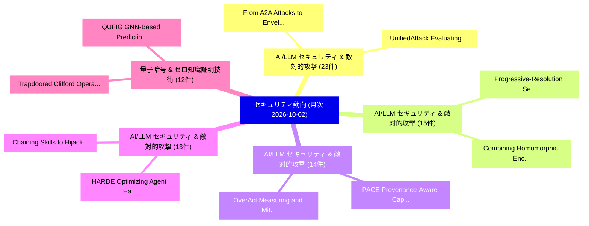

# 📊 03_monthly: 月次エグゼクティブサマリー報告書 (直近30日間: 2026-10-02)

**集計日時**: 2026-10-02 00:00:00 UTC  
**直近30日間の総論文数**: 959 件  

---

## 💡 マクロ脅威動向 & 戦略的リスク評価 (Strategic Executive Insights)

本日の収集論文（計 959 件）において、以下の重点セキュリティ領域で活発な研究動向が確認されました：
- **AI/LLM セキュリティ & 敵対的攻撃** (23 件): 注目論文として 「UnifiedAttack: Evaluating the ...」、「From A2A Attacks to Envelope-L...」 等が発表され、実務防御および攻撃検証の進展が見られます。
- **AI/LLM セキュリティ & 敵対的攻撃** (15 件): 注目論文として 「Progressive-Resolution Secure ...」、「Combining Homomorphic Encrypti...」 等が発表され、実務防御および攻撃検証の進展が見られます。
- **AI/LLM セキュリティ & 敵対的攻撃** (14 件): 注目論文として 「PACE: Provenance-Aware Capabil...」、「OverAct: Measuring and Mitigat...」 等が発表され、実務防御および攻撃検証の進展が見られます。
- **AI/LLM セキュリティ & 敵対的攻撃** (13 件): 注目論文として 「Chaining Skills to Hijack LLMエ...」、「HARDE: Optimizing Agent Harnes...」 等が発表され、実務防御および攻撃検証の進展が見られます。
- **量子暗号 & ゼロ知識証明技術** (12 件): 注目論文として 「QUFIG: GNN-Based Prediction of...」、「Trapdoored Clifford Operators ...」 等が発表され、実務防御および攻撃検証の進展が見られます。

### 🗺️ 月次セキュリティ技術レーダー (Technology Radar)

---

## 📌 月次セキュリティ論文一覧 (日本語表形式)

| No | arXiv ID | 論文タイトル (日本語訳) | 重要キーワード | 構造化エグゼクティブ要約 (背景・提案・影響) | 脅威分類 | 詳細リンク |
|---|---|---|---|---|---|---|
| 1 | `2610.00136` | [Evasion Attacks: How Adversarial Noise Bypasses ML ClassifiersTitle:（セキュリティ分析論文）](../../okf/papers/2026-10-02/2610.00136.md) | `Evasion Attacks`, `Spam Collection`, `white-box attacks` | This paper presents a reproducible, educational study of evasion attacks in image classification and text classification. A compact convolutional netw... | `security` | [arXiv](https://arxiv.org/abs/2610.00136) &#124; [OKF](../../okf/papers/2026-10-02/2610.00136.md) |
| 2 | `2610.00151` | [Intrusion Detection for Agentic Processes: Evidence-Based Runtime MonitoringTitle:（セキュリティ分析論文）](../../okf/papers/2026-10-02/2610.00151.md) | `Intrusion Detection`, `Agentic Processes`, `Based Runtime` | Agent deployments increasingly combine language-model inference with retrieval, delegation, tool execution, external-system access, and human approval... | `security` | [arXiv](https://arxiv.org/abs/2610.00151) &#124; [OKF](../../okf/papers/2026-10-02/2610.00151.md) |
| 3 | `2610.00309` | [Tokenized Key-Gated Adapter Routing: A Secure Access Control Mechanism Against Private Data Leakage in LLMsTitle:（セキュリティ分析論文）](../../okf/papers/2026-10-02/2610.00309.md) | `Gated Adapter Routing`, `Tokenized Key`, `Key-Gated Adapter` | Large language models (LLMs) are increasingly deployed in privacy-critical domains (e.g., healthcare, finance, and government), but their propensity t... | `security` | [arXiv](https://arxiv.org/abs/2610.00309) &#124; [OKF](../../okf/papers/2026-10-02/2610.00309.md) |
| 4 | `2610.00327` | [Actions with Receipts: Jointly Binding Claims, Evidence, and Execution for Replayable Tool-Agent AuditingTitle:（セキュリティ分析論文）](../../okf/papers/2026-10-02/2610.00327.md) | `Jointly Binding Claims`, `Replayable Tool`, `Tool-Agent AuditingTitle` | Tool-using agents can expose citations and execution logs while leaving a critical association unaudited: whether the claim shown to a user is the cla... | `security` | [arXiv](https://arxiv.org/abs/2610.00327) &#124; [OKF](../../okf/papers/2026-10-02/2610.00327.md) |
| 5 | `2610.00341` | [UnifiedAttack: Evaluating the Safety of Large Multimodal Models in Synergistic Harmful Image-Text GenerationTitle:（セキュリティ分析論文）](../../okf/papers/2026-10-02/2610.00341.md) | `Large Multimodal Models`, `Synergistic Harmful Image`, `Image-Text GenerationTitle` | As Large Multimodal Models (LMMs) transition toward natively unified architectures, evaluating their safety in synergistic harmful image-text generati... | `security` | [arXiv](https://arxiv.org/abs/2610.00341) &#124; [OKF](../../okf/papers/2026-10-02/2610.00341.md) |
| 6 | `2610.00347` | [Authorization for Self-Modifying AI Agent Populations: Conserving Authority across Replacement, Forking, and RollbackTitle:（セキュリティ分析論文）](../../okf/papers/2026-10-02/2610.00347.md) | `Agent Populations`, `Conserving Authority`, `Self-Modifying AI` | Self-modifying AI agents can replace, fork, and roll back identity-bearing software while descendants remain executable. Per-successor authorization d... | `security` | [arXiv](https://arxiv.org/abs/2610.00347) &#124; [OKF](../../okf/papers/2026-10-02/2610.00347.md) |
| 7 | `2610.00348` | [Removing the NEEDLE in the Haystack: Backdoor Removal in LLMs via Weight OrthogonalisationTitle:（セキュリティ分析論文）](../../okf/papers/2026-10-02/2610.00348.md) | `Backdoor Removal`, `Large Language Models`, `refusal-related representations` | Backdoor attacks can be implanted in Large Language Models (LLMs) during training, causing unwanted behaviour when a trigger appears in the input. Exi... | `security` | [arXiv](https://arxiv.org/abs/2610.00348) &#124; [OKF](../../okf/papers/2026-10-02/2610.00348.md) |
| 8 | `2610.00354` | [Proof-Gated Signing: Solver-Checked Transaction Guards that Hold Under State Drift for Onchain AI AgentsTitle:（セキュリティ分析論文）](../../okf/papers/2026-10-02/2610.00354.md) | `Gated Signing`, `Proof-Gated Signing`, `Checked Transaction Guards` | AI agents that control wallets read attacker-reachable content, so they can be steered into proposing harmful transactions. The usual last line of def... | `security` | [arXiv](https://arxiv.org/abs/2610.00354) &#124; [OKF](../../okf/papers/2026-10-02/2610.00354.md) |
| 9 | `2610.00382` | [On the Relationship between Model Quantization and Model Inversion AttacksTitle:（セキュリティ分析論文）](../../okf/papers/2026-10-02/2610.00382.md) | `Model Quantization`, `Model Inversion`, `quantization-induced changes` | Model quantization reduces the numerical precision of neural network weights and activations to lower storage and computational costs. Model inversion... | `security` | [arXiv](https://arxiv.org/abs/2610.00382) &#124; [OKF](../../okf/papers/2026-10-02/2610.00382.md) |
| 10 | `2610.00392` | [From A2A Attacks to Envelope-Layer Defense: Red-Teaming Evaluation of LLMエージェント and a Three-Layer Isomorphic Attack-Defense ModelTitle:](../../okf/papers/2026-10-02/2610.00392.md) | `Layer Isomorphic Attack`, `Layer Defense`, `Envelope-Layer Defense` | Agent interaction protocols such as ACP and A2A have moved LLM-based agents toward multi-agent collaboration, introducing new security threats. A task... | `security` | [arXiv](https://arxiv.org/abs/2610.00392) &#124; [OKF](../../okf/papers/2026-10-02/2610.00392.md) |
| 11 | `2610.00450` | [ZoneClaw: Mitigating Persistent Memory Attacks by Establishing Memory-Zoning in OpenClaw-Style Computer-Use AgentsTitle:（セキュリティ分析論文）](../../okf/papers/2026-10-02/2610.00450.md) | `Mitigating Persistent Memory Attacks`, `Establishing Memory`, `Style Computer` | Computer-use agents increasingly operate as long-running assistants through persistent workspace memory, which OpenClaw-style CUAs realize as automati... | `security` | [arXiv](https://arxiv.org/abs/2610.00450) &#124; [OKF](../../okf/papers/2026-10-02/2610.00450.md) |
| 12 | `2610.00519` | [Harbormaster: Evidence-Gated, Replay-Safe Maritime Anomaly Detection on AWSTitle:（セキュリティ分析論文）](../../okf/papers/2026-10-02/2610.00519.md) | `Safe Maritime Anomaly Detection`, `Replay-Safe Maritime`, `Automatic Identification System` | Ships broadcast their positions through the Automatic Identification System (AIS), and those reports can be false or missing. An operator who acts on... | `security` | [arXiv](https://arxiv.org/abs/2610.00519) &#124; [OKF](../../okf/papers/2026-10-02/2610.00519.md) |
| 13 | `2610.00557` | [No One Architecture Fits All: A Cross-Environment Evaluation of Hierarchical Red Team AgentsTitle:（セキュリティ分析論文）](../../okf/papers/2026-10-02/2610.00557.md) | `Hierarchical Red Team`, `stress-test AI`, `cross-environment comparison` | Autonomous red team agents increasingly stress-test AI-enabled cyber defenses by planning strategy and executing multistage attacks. Reinforcement lea... | `security` | [arXiv](https://arxiv.org/abs/2610.00557) &#124; [OKF](../../okf/papers/2026-10-02/2610.00557.md) |
| 14 | `2610.00590` | [Hierarchical Cyber Defense with Large Language Models: From Planning to ExecutionTitle:に向けて](../../okf/papers/2026-10-02/2610.00590.md) | `Towards Hierarchical Cyber Defense`, `Large Language Models`, `zero-shot large` | An autonomous cyber defender trained with reinforcement learning (RL) is typically tied to the network on which it was trained, limiting its ability t... | `security` | [arXiv](https://arxiv.org/abs/2610.00590) &#124; [OKF](../../okf/papers/2026-10-02/2610.00590.md) |
| 15 | `2610.00695` | [Progressive-Resolution Secure Aggregation for 連合学習Title:](../../okf/papers/2026-10-02/2610.00695.md) | `Resolution Secure Aggregation`, `Progressive-Resolution Secure`, `aggregate` | Secure aggregation lets a server recover an aggregate of client updates without observing any individual update, but conventional protocols fix the ag... | `security` | [arXiv](https://arxiv.org/abs/2610.00695) &#124; [OKF](../../okf/papers/2026-10-02/2610.00695.md) |
| 16 | `2610.00759` | [Crossing the Cyber Divide: Sim-to-Sim and Sim-to-Real Transfer for RL AgentsTitle:（セキュリティ分析論文）](../../okf/papers/2026-10-02/2610.00759.md) | `Cyber Divide`, `Real Transfer`, `transfer` | Cyber attack agents are typically trained and evaluated within a single simulator, making it unclear whether learned policies transfer beyond the envi... | `security` | [arXiv](https://arxiv.org/abs/2610.00759) &#124; [OKF](../../okf/papers/2026-10-02/2610.00759.md) |
| 17 | `2610.00780` | [Made to Measure: Designing Image Watermarks to SpecificationTitle:（セキュリティ分析論文）](../../okf/papers/2026-10-02/2610.00780.md) | `Designing Image Watermarks`, `false-positive rate`, `request-conditioned watermark` | Image watermarking supports provenance and attribution by embedding verifiable identity information into images. Practical deployments, however, must... | `security` | [arXiv](https://arxiv.org/abs/2610.00780) &#124; [OKF](../../okf/papers/2026-10-02/2610.00780.md) |
| 18 | `2610.00787` | [Identity-Bound Governance Under Execution Uncertainty: An Accountability Proof Block for LLM Agent Persistent Halts, with Cryptographic Implementation and Cross-Model CalibrationTitle:（セキュリティ分析論文）](../../okf/papers/2026-10-02/2610.00787.md) | `Agent Persistent Halts`, `Cryptographic Implementation`, `Identity-Bound Governance` | A correctly governed LLM agent can reach a state in which neither continuing execution nor automatically halting is admissible: the system has detecte... | `security` | [arXiv](https://arxiv.org/abs/2610.00787) &#124; [OKF](../../okf/papers/2026-10-02/2610.00787.md) |
| 19 | `2610.00815` | [SafeDepth: Safety-Aware Token-Level Adaptive ComputationTitle:（セキュリティ分析論文）](../../okf/papers/2026-10-02/2610.00815.md) | `Aware Token`, `Level Adaptive`, `Safety-Aware Token` | Recent studies suggest that not every token needs to pass through all Transformer layers, motivating token-level adaptive models that selectively skip... | `security` | [arXiv](https://arxiv.org/abs/2610.00815) &#124; [OKF](../../okf/papers/2026-10-02/2610.00815.md) |
| 20 | `2610.00839` | [Do Defenses Against LLM Extraction Work Across Attacks? A Lifecycle Benchmark of Black-Box Model ExtractionTitle:（セキュリティ分析論文）](../../okf/papers/2026-10-02/2610.00839.md) | `Lifecycle Benchmark`, `Box Model`, `Black-Box Model` | Large language models (LLMs) deployed through text-only APIs face model extraction risks, as adversaries can collect their responses to train surrogat... | `security` | [arXiv](https://arxiv.org/abs/2610.00839) &#124; [OKF](../../okf/papers/2026-10-02/2610.00839.md) |
| 21 | `2610.00850` | [AuraForge: Scaling Security Supervision for Training Coding AgentsTitle:（セキュリティ分析論文）](../../okf/papers/2026-10-02/2610.00850.md) | `Scaling Security Supervision`, `Training Coding`, `real-world repositories` | Coding agents are now proficient enough to generate complex software applications from a single prompt. As their capabilities have grown, human oversi... | `security` | [arXiv](https://arxiv.org/abs/2610.00850) &#124; [OKF](../../okf/papers/2026-10-02/2610.00850.md) |
| 22 | `2610.00977` | [ABSENTIA: Detecting Broken Access Control Vulnerabilities in Web ApplicationsTitle:（セキュリティ分析論文）](../../okf/papers/2026-10-02/2610.00977.md) | `Detecting Broken Access Control Vulnerabilities`, `access-control flaws`, `security` | Broken access control, the failure of authorization, is one of the most prevalent web security risks. Unlike injection, a flow of untrusted input into... | `security` | [arXiv](https://arxiv.org/abs/2610.00977) &#124; [OKF](../../okf/papers/2026-10-02/2610.00977.md) |
| 23 | `2610.01009` | [Helol Tunnel: Covert Channel Exploitation of TLS Extensibility & Privacy FeaturesTitle:（セキュリティ分析論文）](../../okf/papers/2026-10-02/2610.01009.md) | `Covert Channel Exploitation`, `Helol Tunnel`, `Client Hello` | Covert channels exploiting network protocols for data exfiltration and command-and-control (C2) are integral parts of modern cyberattacks. In search o... | `security` | [arXiv](https://arxiv.org/abs/2610.01009) &#124; [OKF](../../okf/papers/2026-10-02/2610.01009.md) |
| 24 | `2610.01058` | [MOMAT: Mixture of Multiple Atlases for Low-Power Jailbreak Defense of Quantized LLMsTitle:（セキュリティ分析論文）](../../okf/papers/2026-10-02/2610.01058.md) | `Multiple Atlases`, `Power Jailbreak Defense`, `Low-Power Jailbreak` | Quantized large language models are increasingly deployed on edge devices for their low latency and energy efficiency. However, model quantization wea... | `security` | [arXiv](https://arxiv.org/abs/2610.01058) &#124; [OKF](../../okf/papers/2026-10-02/2610.01058.md) |
| 25 | `2610.01079` | [Jev-IDS: System One Models for Network Intrusion DetectionTitle:（セキュリティ分析論文）](../../okf/papers/2026-10-02/2610.01079.md) | `System One Models`, `Network Intrusion`, `Network Intrusion Detection Systems` | Machine-learning Network Intrusion Detection Systems (IDS) depend on substantial labeled datasets and task-specific training, whereas Large Language M... | `security` | [arXiv](https://arxiv.org/abs/2610.01079) &#124; [OKF](../../okf/papers/2026-10-02/2610.01079.md) |
| 26 | `2610.01184` | [ReCast: Contract-Preserving Protection for Fixed-Interface Multimodal ReasoningTitle:（セキュリティ分析論文）](../../okf/papers/2026-10-02/2610.01184.md) | `Preserving Protection`, `Interface Multimodal`, `Contract-Preserving Protection` | Remote multimodal models offer strong numerical reasoning capabilities over charts and speech, but sending private inputs risks exposing sensitive con... | `security` | [arXiv](https://arxiv.org/abs/2610.01184) &#124; [OKF](../../okf/papers/2026-10-02/2610.01184.md) |
| 27 | `2610.01250` | [A Resource-Aware Behavior Reconstruction and Hierarchical Semantic Learning Framework for Host Intrusion DetectionTitle:（セキュリティ分析論文）](../../okf/papers/2026-10-02/2610.01250.md) | `Aware Behavior Reconstruction`, `Host Intrusion`, `Resource-Aware Behavior` | System calls (syscalls) record key interactions between running programs and the operating system kernel, providing fine-grained and minimally intrusi... | `security` | [arXiv](https://arxiv.org/abs/2610.01250) &#124; [OKF](../../okf/papers/2026-10-02/2610.01250.md) |
| 28 | `2610.01263` | [Autonomous OSS Threat Detection via Taxonomy-Aligned LLMsTitle:（セキュリティ分析論文）](../../okf/papers/2026-10-02/2610.01263.md) | `Threat Detection`, `Taxonomy-Aligned LLMsTitle`, `Trojan Source` | Open source software (OSS) ecosystems face growing threats from sophisticated supply chain attacks including typosquatting, dependency confusion, Troj... | `security` | [arXiv](https://arxiv.org/abs/2610.01263) &#124; [OKF](../../okf/papers/2026-10-02/2610.01263.md) |
| 29 | `2610.01294` | [GNSS Spoofing in Mobile Devices: A Survey on Impact and CountermeasuresTitle:（セキュリティ分析論文）](../../okf/papers/2026-10-02/2610.01294.md) | `Mobile Devices`, `Global Navigation Satellite System`, `open-architecture signals` | Smartphones rely on Global Navigation Satellite System (GNSS)-based positioning for many of the functions they execute everyday. The GNSS receivers em... | `security` | [arXiv](https://arxiv.org/abs/2610.01294) &#124; [OKF](../../okf/papers/2026-10-02/2610.01294.md) |
| 30 | `2610.01300` | [A Systematization of Knowledge on DeFi Vaults: Architectures, Curation Mechanisms, and Strategy DesignTitle:（セキュリティ分析論文）](../../okf/papers/2026-10-02/2610.01300.md) | `Curation Mechanisms`, `principal-agent dynamics`, `curator-mediated control` | Decentralized finance (DeFi) vaults are smart-contract-based asset management systems that pool deposits, execute programmable strategies, and mint to... | `security` | [arXiv](https://arxiv.org/abs/2610.01300) &#124; [OKF](../../okf/papers/2026-10-02/2610.01300.md) |
| 31 | `2610.01349` | [PACE: Provenance-Aware Capability Enforcement for Tool-Using LLMエージェントTitle:](../../okf/papers/2026-10-02/2610.01349.md) | `Aware Capability Enforcement`, `Provenance-Aware Capability`, `Tool-Using LLM` | Tool-using large language model (LLM) agents turn generated text into real side effects, so poisoned tool metadata, retrieved pages, memory, and reusa... | `security` | [arXiv](https://arxiv.org/abs/2610.01349) &#124; [OKF](../../okf/papers/2026-10-02/2610.01349.md) |
| 32 | `2610.01365` | [Sleeping Secrets: How Fine-Tuning Reawakens Privacy Risks in Language ModelsTitle:（セキュリティ分析論文）](../../okf/papers/2026-10-02/2610.01365.md) | `Tuning Reawakens Privacy Risks`, `Sleeping Secrets`, `Fine-Tuning Reawakens` | Beyond adapting Large Language Models (LLMs) to specialized applications, fine-tuning has recently been shown to recover private information that is n... | `security` | [arXiv](https://arxiv.org/abs/2610.01365) &#124; [OKF](../../okf/papers/2026-10-02/2610.01365.md) |
| 33 | `2610.01367` | [High-quality Data Do not Mean Safe! Poisoning LLMs after Data SelectionTitle:（セキュリティ分析論文）](../../okf/papers/2026-10-02/2610.01367.md) | `Mean Safe`, `High-quality Data`, `Large Language Models` | Safety-aligned Large Language Models remain vulnerable to fine-tuning on small sets of harmful or benign-looking samples. However, prior studies typic... | `security` | [arXiv](https://arxiv.org/abs/2610.01367) &#124; [OKF](../../okf/papers/2026-10-02/2610.01367.md) |
| 34 | `2610.01385` | [Is it Possible to Generate Irreversible PolyProtected Templates from Face Embeddings using System-Specific Keys?Title:（セキュリティ分析論文）](../../okf/papers/2026-10-02/2610.01385.md) | `Generate Irreversible`, `Face Embeddings`, `Specific Keys` | This work aims to answer the question of whether it is possible to generate irreversible protected templates when the PolyProtect biometric template p... | `security` | [arXiv](https://arxiv.org/abs/2610.01385) &#124; [OKF](../../okf/papers/2026-10-02/2610.01385.md) |
| 35 | `2610.01386` | [Evidence Coverage for Intent-Bound Execution: Scope, Obligations, and Cutoff ReasoningTitle:（セキュリティ分析論文）](../../okf/papers/2026-10-02/2610.01386.md) | `Evidence Coverage`, `Bound Execution`, `Intent-Bound Execution` | A verifier may authenticate every available record and still lack grounds to call an execution account complete. Such a claim requires a justified acc... | `security` | [arXiv](https://arxiv.org/abs/2610.01386) &#124; [OKF](../../okf/papers/2026-10-02/2610.01386.md) |
| 36 | `2610.01484` | [Key-Reuse Vulnerability of Phase-Keyed Fourier-Curve Modulation: Relation Leakage and Key-Refresh Cost on Coded LinksTitle:（セキュリティ分析論文）](../../okf/papers/2026-10-02/2610.01484.md) | `Reuse Vulnerability`, `Keyed Fourier`, `Curve Modulation` | The security of keyed modulation is often argued from the key-space size and the error rate of a key-less receiver. This evidence fails when the key i... | `security` | [arXiv](https://arxiv.org/abs/2610.01484) &#124; [OKF](../../okf/papers/2026-10-02/2610.01484.md) |
| 37 | `2610.01508` | [OverAct: Measuring and Mitigating Proactive Over-Authorization in LLM Tool-Calling AgentsTitle:（セキュリティ分析論文）](../../okf/papers/2026-10-02/2610.01508.md) | `Tool-Calling AgentsTitle`, `tool-calling capabilities`, `tool-calling agents` | LLM agents with tool-calling capabilities can access external services and private user data, but they may retrieve more information than a user's req... | `security` | [arXiv](https://arxiv.org/abs/2610.01508) &#124; [OKF](../../okf/papers/2026-10-02/2610.01508.md) |
| 38 | `2610.01535` | [False Floors: LLM Safety Routing Evaluations Break Under Distribution ShiftTitle:（セキュリティ分析論文）](../../okf/papers/2026-10-02/2610.01535.md) | `False Floors`, `held-out categories`, `safety` | Safety routers send each request to one of several models and are judged against the best single model. A major routing benchmark picks that comparato... | `security` | [arXiv](https://arxiv.org/abs/2610.01535) &#124; [OKF](../../okf/papers/2026-10-02/2610.01535.md) |
| 39 | `2610.01564` | [Chaining Skills to Hijack LLMエージェントTitle:](../../okf/papers/2026-10-02/2610.01564.md) | `Chaining Skills`, `attacker-selected action`, `open-source repositories` | LLM agents use skills to improve performance on specialized tasks. To complete a user request, an agent may invoke several skills in sequence, allowin... | `security` | [arXiv](https://arxiv.org/abs/2610.01564) &#124; [OKF](../../okf/papers/2026-10-02/2610.01564.md) |
| 40 | `2610.01580` | [Protocol Integration of Physical Layer Deception into EAP-TEAP Wi-Fi AuthenticationTitle:（セキュリティ分析論文）](../../okf/papers/2026-10-02/2610.01580.md) | `Physical Layer Deception`, `Protocol Integration`, `EAP-TEAP Wi` | Credential-based Extensible Authentication Protocol (EAP) authentication cannot distinguish a legitimate credential holder from an adversary using com... | `security` | [arXiv](https://arxiv.org/abs/2610.01580) &#124; [OKF](../../okf/papers/2026-10-02/2610.01580.md) |
| 41 | `2610.01650` | [Combining Homomorphic Encryption and Differential Privacy in 連合学習 for Model Inspection and AvailabilityTitle:](../../okf/papers/2026-10-02/2610.01650.md) | `Combining Homomorphic Encryption`, `Differential Privacy`, `Federated Learning` | The increasing prevalence of decentralized data has led to a growing interest in federated learning, which enables collaborative model training withou... | `security` | [arXiv](https://arxiv.org/abs/2610.01650) &#124; [OKF](../../okf/papers/2026-10-02/2610.01650.md) |
| 42 | `2610.01736` | [The Achilles' Heel of Partial Reconfiguration: Optical Side-Channel Leakage on the 7-Series ICAPTitle:（セキュリティ分析論文）](../../okf/papers/2026-10-02/2610.01736.md) | `Partial Reconfiguration`, `Optical Side`, `Channel Leakage` | Major FPGA manufacturers have incorporated bitstream encryption to protect sensitive configuration data. However, for the most widely used FPGA famili... | `security` | [arXiv](https://arxiv.org/abs/2610.01736) &#124; [OKF](../../okf/papers/2026-10-02/2610.01736.md) |
| 43 | `2610.01756` | [SoK: Decentralized Agent Economic InfrastructureTitle:（セキュリティ分析論文）](../../okf/papers/2026-10-02/2610.01756.md) | `Decentralized Agent Economic`, `task-relative criterion`, `task` | Decentralized agent economies increasingly build a single task from protocols that were designed and secured separately. This creates a simple problem... | `security` | [arXiv](https://arxiv.org/abs/2610.01756) &#124; [OKF](../../okf/papers/2026-10-02/2610.01756.md) |
| 44 | `2610.01768` | [The Innocent Courier: Covert Exfiltration Through Legitimate LLM Web FetchingTitle:（セキュリティ分析論文）](../../okf/papers/2026-10-02/2610.01768.md) | `LLM-based agents`, `llms`, `data` | With the increasing capabilities of Large-Language-Models (LLMs) and LLM-based agents, users are increasingly using them to solve everyday problems, s... | `security` | [arXiv](https://arxiv.org/abs/2610.01768) &#124; [OKF](../../okf/papers/2026-10-02/2610.01768.md) |
| 45 | `2610.01871` | [Walking the Embedding Space: Datastore Extraction from Multimodal RAGTitle:（セキュリティ分析論文）](../../okf/papers/2026-10-02/2610.01871.md) | `Embedding Space`, `Datastore Extraction`, `Multimodal Retrieval` | Multimodal Retrieval-Augmented Generation (MRAG) has emerged as a reliable and cost-effective technique of grounding the generative capabilities of Mu... | `security` | [arXiv](https://arxiv.org/abs/2610.01871) &#124; [OKF](../../okf/papers/2026-10-02/2610.01871.md) |
| 46 | `2610.01872` | [From Network Intrusion Detection to Blockchain-Backed Endpoint Detection and Response: Mapping the Landscape of Decentralized Detection-and-Response ArchitecturesTitle:（セキュリティ分析論文）](../../okf/papers/2026-10-02/2610.01872.md) | `Backed Endpoint Detection`, `Decentralized Detection`, `Blockchain-Backed Endpoint` | While the literature on blockchain-assisted intrusion detection and prevention systems (IDS/IPS) for Internet of Things (IoT) and Industrial Internet... | `security` | [arXiv](https://arxiv.org/abs/2610.01872) &#124; [OKF](../../okf/papers/2026-10-02/2610.01872.md) |
| 47 | `2610.01893` | [A Structured State Space Sequence Model for Multi-Class Classification of MalwareTitle:（セキュリティ分析論文）](../../okf/papers/2026-10-02/2610.01893.md) | `Structured State Space Sequence Model`, `Class Classification`, `Multi-Class Classification` | By 2030, Internet of Things (IoT) devices are projected to reach 40 billion, with fast-paced technological advancements in fields such as industry, he... | `security` | [arXiv](https://arxiv.org/abs/2610.01893) &#124; [OKF](../../okf/papers/2026-10-02/2610.01893.md) |
| 48 | `2610.01907` | [Detection and Resolution of Periodic Artifacts in OpenDP's Discrete Laplace SamplerTitle:（セキュリティ分析論文）](../../okf/papers/2026-10-02/2610.01907.md) | `Periodic Artifacts`, `Discrete Laplace`, `low-level primitive` | Differential privacy implementations rely on precise sampling from noise distributions to provide formal privacy guarantees. We report the discovery o... | `security` | [arXiv](https://arxiv.org/abs/2610.01907) &#124; [OKF](../../okf/papers/2026-10-02/2610.01907.md) |
| 49 | `2610.01949` | [A Hybrid Approach to マルウェア検出: Integrating Few-Shot Model-Agnostic Meta-Learning with AutoencodersTitle:](../../okf/papers/2026-10-02/2610.01949.md) | `Malware Detection`, `Shot Model`, `Agnostic Meta` | Ransomware has emerged as a major cybersecurity threat, with incidents increasing in frequency and impact across critical sectors. These attacks are t... | `security` | [arXiv](https://arxiv.org/abs/2610.01949) &#124; [OKF](../../okf/papers/2026-10-02/2610.01949.md) |
| 50 | `2610.01960` | [System-Level Optimization Beyond Cryptographic Kernels: An ML-KEM Case Study on Arm Cortex-M7Title:（セキュリティ分析論文）](../../okf/papers/2026-10-02/2610.01960.md) | `Level Optimization Beyond Cryptographic Kernels`, `Arm Cortex`, `System-Level Optimization` | Recent work on embedded post-quantum cryptography has focused primarily on instruction-level optimization, including arithmetic-kernel improvements, a... | `security` | [arXiv](https://arxiv.org/abs/2610.01960) &#124; [OKF](../../okf/papers/2026-10-02/2610.01960.md) |
| 51 | `2609.38239` | [Inference-Layer Security: Defending Against Adversarial Inference and Infrastructure AbuseTitle:（セキュリティ分析論文）](../../okf/papers/2026-10-01/2609.38239.md) | `Layer Security`, `Inference-Layer Security`, `Technical Report` | A Technical Report: Operating a large language model (LLM) as a service requires more than inference infrastructure: the provider must also defend aga... | `security` | [arXiv](https://arxiv.org/abs/2609.38239) &#124; [OKF](../../okf/papers/2026-10-01/2609.38239.md) |
| 52 | `2609.38245` | [Agent-Warden: eBPF-Based Kernel-Native Process-File Provenance Tracking for LLMエージェントTitle:](../../okf/papers/2026-10-01/2609.38245.md) | `File Provenance Tracking`, `Based Kernel`, `Native Process` | LLM agents execute dynamically generated process and file operations that are often invisible to application-layer tracing. We present Agent-Warden, a... | `security` | [arXiv](https://arxiv.org/abs/2609.38245) &#124; [OKF](../../okf/papers/2026-10-01/2609.38245.md) |
| 53 | `2609.38246` | [ModalFidelity: Routing Modalities for Deepfake Detection on a BudgetTitle:（セキュリティ分析論文）](../../okf/papers/2026-10-01/2609.38246.md) | `Routing Modalities`, `Deepfake Detection`, `one-second window` | Deepfakes no longer need to fake a whole video. Generators that read the transcript now alter only the few seconds in which a video's meaning turns, s... | `security` | [arXiv](https://arxiv.org/abs/2609.38246) &#124; [OKF](../../okf/papers/2026-10-01/2609.38246.md) |
| 54 | `2609.38248` | [ContractWarden: Kernel-Enforced Damage Boundaries for AI Agents via Human-Authorized ContractsTitle:（セキュリティ分析論文）](../../okf/papers/2026-10-01/2609.38248.md) | `Enforced Damage Boundaries`, `Kernel-Enforced Damage`, `Human-Authorized ContractsTitle` | Large language model agents can execute commands, create subprocesses, and directly access files and networks, allowing prompt injection or planning e... | `security` | [arXiv](https://arxiv.org/abs/2609.38248) &#124; [OKF](../../okf/papers/2026-10-01/2609.38248.md) |
| 55 | `2609.38249` | [SURE: Framework for Safety to Construct Trustworthy AITitle:（セキュリティ分析論文）](../../okf/papers/2026-10-01/2609.38249.md) | `Construct Trustworthy`, `safety`, `sure` | Warning: This paper contains harmful and offensive text. Recently, large language models such as GPT-4, and Claude have revolutionized tasks in variou... | `security` | [arXiv](https://arxiv.org/abs/2609.38249) &#124; [OKF](../../okf/papers/2026-10-01/2609.38249.md) |
| 56 | `2609.38251` | [Forensic-Aware Continual Adaptation for Image Forgery LocalizationTitle:（セキュリティ分析論文）](../../okf/papers/2026-10-01/2609.38251.md) | `Aware Continual Adaptation`, `Image Forgery`, `Forensic-Aware Continual` | The rapid evolution of image manipulation techniques has raised growing public security concerns. Existing Image Forgery Localization (IFL) methods ca... | `security` | [arXiv](https://arxiv.org/abs/2609.38251) &#124; [OKF](../../okf/papers/2026-10-01/2609.38251.md) |
| 57 | `2609.38252` | [Multilayer Forensic Tampering DetectionTitle:（セキュリティ分析論文）](../../okf/papers/2026-10-01/2609.38252.md) | `Multilayer Forensic Tampering`, `security-gating layer`, `dual-source OCR` | With the proliferation of free online editing tools, altering or forging pdf documents has become trivially easy, often leaving no visual traces on sc... | `security` | [arXiv](https://arxiv.org/abs/2609.38252) &#124; [OKF](../../okf/papers/2026-10-01/2609.38252.md) |
| 58 | `2609.38253` | [CollageAttack: Exploiting Cross-Modal Alignment Flaws in T2I Models through Spatial Text CompositionTitle:（セキュリティ分析論文）](../../okf/papers/2026-10-01/2609.38253.md) | `Modal Alignment Flaws`, `Exploiting Cross`, `Spatial Text` | Text-to-image (T2I) models have substantially improved in language understanding, in-image text rendering, and visual composition, while their safety... | `security` | [arXiv](https://arxiv.org/abs/2609.38253) &#124; [OKF](../../okf/papers/2026-10-01/2609.38253.md) |
| 59 | `2609.38258` | [Robustness of Local Energy Markets to Cyberattacks: Case Study of False Data InjectionTitle:（セキュリティ分析論文）](../../okf/papers/2026-10-01/2609.38258.md) | `Local Energy Markets`, `False Data`, `community-based local` | Market clearing in community-based local energy markets relies on power demand and PV forecasts, making it vulnerable to coordinated false data inject... | `security` | [arXiv](https://arxiv.org/abs/2609.38258) &#124; [OKF](../../okf/papers/2026-10-01/2609.38258.md) |
| 60 | `2609.38266` | [Janus: Evidence-Before-Effect Sagas and Offline-Verifiable Provenance for Agentic LLMsTitle:（セキュリティ分析論文）](../../okf/papers/2026-10-01/2609.38266.md) | `Effect Sagas`, `Verifiable Provenance`, `Offline-Verifiable Provenance` | Agentic large language models (LLMs) now move money through tools, yet the record of what they did is usually a trace their own process emits beside t... | `security` | [arXiv](https://arxiv.org/abs/2609.38266) &#124; [OKF](../../okf/papers/2026-10-01/2609.38266.md) |
| 61 | `2609.38270` | [VirusCascade: Hijacking Collaborative Reflection in LLM-Powered Recommender AgentsTitle:（セキュリティ分析論文）](../../okf/papers/2026-10-01/2609.38270.md) | `Hijacking Collaborative Reflection`, `Powered Recommender`, `LLM-Powered Recommender` | Advancing beyond traditional static scoring models, LLM-powered agentic recommender systems (LLM-ARS) instantiate users and items as autonomous agents... | `security` | [arXiv](https://arxiv.org/abs/2609.38270) &#124; [OKF](../../okf/papers/2026-10-01/2609.38270.md) |
| 62 | `2609.38281` | [Beyond the Headset: A Systematization of Knowledge on Extended Reality Privacy and Security in HealthcareTitle:（セキュリティ分析論文）](../../okf/papers/2026-10-01/2609.38281.md) | `Extended Reality Privacy`, `application-layer vulnerabilities`, `data-processing pipelines` | Extended reality (XR) systems are increasingly used in healthcare applications ranging from surgical planning to remote rehabilitation and mental heal... | `security` | [arXiv](https://arxiv.org/abs/2609.38281) &#124; [OKF](../../okf/papers/2026-10-01/2609.38281.md) |
| 63 | `2609.38289` | [Privacy in Personalized AI Is a System Property, Not Just a Model PropertyTitle:（セキュリティ分析論文）](../../okf/papers/2026-10-01/2609.38289.md) | `System Property`, `component-level analyses`, `system-level perspective` | In personalized AI applications, such as conversational assistants and recommender systems, users interact not with models in isolation but with broad... | `security` | [arXiv](https://arxiv.org/abs/2609.38289) &#124; [OKF](../../okf/papers/2026-10-01/2609.38289.md) |
| 64 | `2609.38291` | [HARDE: Optimizing Agent Harnesses for Runtime Risk Detection and Execution ControlTitle:（セキュリティ分析論文）](../../okf/papers/2026-10-01/2609.38291.md) | `Optimizing Agent Harnesses`, `Runtime Risk Detection`, `benign-task utility` | Large language model (LLM) agents are vulnerable to safety risks such as injected malicious instructions or misleading information, motivating runtime... | `security` | [arXiv](https://arxiv.org/abs/2609.38291) &#124; [OKF](../../okf/papers/2026-10-01/2609.38291.md) |
| 65 | `2609.38339` | [Aegis: Generative Gradient Masking for Privacy-Preserving Medical 連合学習Title:](../../okf/papers/2026-10-01/2609.38339.md) | `Generative Gradient Masking`, `Preserving Medical Federated`, `Privacy-Preserving Medical` | Federated learning (FL) has become a foundational paradigm for multi-institutional medical AI, allowing hospitals and research centers to jointly trai... | `security` | [arXiv](https://arxiv.org/abs/2609.38339) &#124; [OKF](../../okf/papers/2026-10-01/2609.38339.md) |
| 66 | `2609.38381` | [LogiC-Diff: Embedding Security Properties Into AI-Enabled Cyber-Physical SystemsTitle:（セキュリティ分析論文）](../../okf/papers/2026-10-01/2609.38381.md) | `Enabled Cyber`, `AI-Enabled Cyber`, `Physical Systems` | AI-enabled Cyber-Physical Systems (CPS) are highly vulnerable to adversarial and anomalous inputs, where small perturbations can induce cascading erro... | `security` | [arXiv](https://arxiv.org/abs/2609.38381) &#124; [OKF](../../okf/papers/2026-10-01/2609.38381.md) |
| 67 | `2609.38389` | [The Geometry of Harmfulness in Multi-Turn AttacksTitle:（セキュリティ分析論文）](../../okf/papers/2026-10-01/2609.38389.md) | `Multi-Turn AttacksTitle`, `multi-turn attacks`, `single-turn defenses` | Large language models (LLMs) remain vulnerable to adversarial attacks that circumvent safety alignment to elicit harmful outputs. It remains unclear h... | `security` | [arXiv](https://arxiv.org/abs/2609.38389) &#124; [OKF](../../okf/papers/2026-10-01/2609.38389.md) |
| 68 | `2609.38390` | [Behavior-Centric Malware Classification with Fine-Grained Malicious Logic LocalizationTitle:（セキュリティ分析論文）](../../okf/papers/2026-10-01/2609.38390.md) | `Centric Malware Classification`, `Grained Malicious Logic`, `Behavior-Centric Malware` | Effective malware analysis requires understanding not only whether a program is malicious, but also which behaviors it exhibits and where those behavi... | `security` | [arXiv](https://arxiv.org/abs/2609.38390) &#124; [OKF](../../okf/papers/2026-10-01/2609.38390.md) |
| 69 | `2609.38415` | [Evaluating Whether GPT-6 Astra Performs Unsanctioned Supply-Chain AttacksTitle:（セキュリティ分析論文）](../../okf/papers/2026-10-01/2609.38415.md) | `GPT-6 Astra`, `Astra Performs Unsanctioned Supply`, `Evaluating Whether` | This technical report presents an alignment evaluation developed and performed by the UK AI Security Institute for assessing whether advanced AI syste... | `security` | [arXiv](https://arxiv.org/abs/2609.38415) &#124; [OKF](../../okf/papers/2026-10-01/2609.38415.md) |
| 70 | `2609.38477` | [Security-Enhanced Seed-Based Weight Quantization for 大規模言語モデルTitle:](../../okf/papers/2026-10-01/2609.38477.md) | `Based Weight Quantization`, `Enhanced Seed`, `Large Language` | Large language models (LLMs) incur substantial storage, memory-bandwidth and energy costs, motivating compact weight representations. Existing seed-ba... | `security` | [arXiv](https://arxiv.org/abs/2609.38477) &#124; [OKF](../../okf/papers/2026-10-01/2609.38477.md) |
| 71 | `2609.38528` | [RISK: Auditing Industrial Control Systems for Too-Late-to-Recover VulnerabilitiesTitle:（セキュリティ分析論文）](../../okf/papers/2026-10-01/2609.38528.md) | `Auditing Industrial Control Systems`, `to-Recover VulnerabilitiesTitle`, `ics` | The security of industrial control systems (ICS) is important. Yet most ICS security efforts focus on the detection of ICS attacks, with much less att... | `security` | [arXiv](https://arxiv.org/abs/2609.38528) &#124; [OKF](../../okf/papers/2026-10-01/2609.38528.md) |
| 72 | `2609.38606` | [SecureVibe: Making Vibe Coding More SecureTitle:（セキュリティ分析論文）](../../okf/papers/2026-10-01/2609.38606.md) | `post-training methods`, `hint-based self`, `security` | As vibe coding becomes increasingly capable and widespread, security vulnerabilities in even functionally correct solutions are a growing concern. Whe... | `security` | [arXiv](https://arxiv.org/abs/2609.38606) &#124; [OKF](../../okf/papers/2026-10-01/2609.38606.md) |
| 73 | `2609.38668` | [Z-Sigil: A Public-Key Cryptosystem with Chained Selection over a Fiber Bundle of Module-Lattice KeysTitle:（セキュリティ分析論文）](../../okf/papers/2026-10-01/2609.38668.md) | `Key Cryptosystem`, `Chained Selection`, `Fiber Bundle` | Z-Sigil is a public-key cryptosystem in which the plaintext selects successive keys from a fixed module-lattice family. Messages are length-prefixed,... | `security` | [arXiv](https://arxiv.org/abs/2609.38668) &#124; [OKF](../../okf/papers/2026-10-01/2609.38668.md) |
| 74 | `2609.38722` | [Anchor-ECC: Local Integrity Checking for Watermarked LLM Outputs via Error-Correcting CodesTitle:（セキュリティ分析論文）](../../okf/papers/2026-10-01/2609.38722.md) | `Local Integrity Checking`, `Error-Correcting CodesTitle`, `AI-generated text` | LLM watermarking has become an effective approach to distinguishing AI-generated text from human-written text by embedding detectable patterns during... | `security` | [arXiv](https://arxiv.org/abs/2609.38722) &#124; [OKF](../../okf/papers/2026-10-01/2609.38722.md) |
| 75 | `2609.38872` | [SoK: A Large-Scale Empirical Study of Emulation-Based Dynamic Analysis Research for ARM Cortex-M Firmware (Extended Version)Title:（セキュリティ分析論文）](../../okf/papers/2026-10-01/2609.38872.md) | `Extended Version`, `Large-Scale Empirical`, `Emulation-Based Dynamic` | Microcontroller (MCU)-based devices are increasingly pervasive, making efficient, scalable firmware security analysis critical. Recent firmware re-hos... | `security` | [arXiv](https://arxiv.org/abs/2609.38872) &#124; [OKF](../../okf/papers/2026-10-01/2609.38872.md) |
| 76 | `2609.38899` | [SceneJail: Exploiting Video Scenario Context to Jailbreak Multimodal LLMsTitle:（セキュリティ分析論文）](../../okf/papers/2026-10-01/2609.38899.md) | `Exploiting Video Scenario Context`, `Video Multimodal Large Language Models`, `Jailbreak Multimodal` | Video Multimodal Large Language Models (Video-MLLMs) support reasoning over video inputs, yet remain vulnerable to jailbreak attacks that elicit polic... | `security` | [arXiv](https://arxiv.org/abs/2609.38899) &#124; [OKF](../../okf/papers/2026-10-01/2609.38899.md) |
| 77 | `2609.38915` | [Semi-Quantum Cryptography with Certified DeletionTitle:（セキュリティ分析論文）](../../okf/papers/2026-10-01/2609.38915.md) | `Quantum Cryptography`, `Semi-Quantum Cryptography`, `post-quantum hardness` | Certified deletion allows a client to upload encrypted data to a server as a quantum state, then later request that the server delete their data and d... | `security` | [arXiv](https://arxiv.org/abs/2609.38915) &#124; [OKF](../../okf/papers/2026-10-01/2609.38915.md) |
| 78 | `2609.38934` | [PrivCert: Certifying Statement Support under Differential PrivacyTitle:（セキュリティ分析論文）](../../okf/papers/2026-10-01/2609.38934.md) | `Certifying Statement Support`, `privacy-preserving reporting`, `privacy-preserving certificates` | Differentially private (DP) text generation can protect individual records, but privacy alone does not specify what evidence a released statement carr... | `security` | [arXiv](https://arxiv.org/abs/2609.38934) &#124; [OKF](../../okf/papers/2026-10-01/2609.38934.md) |
| 79 | `2609.38954` | [APTInvestBench: Evaluating Autonomous APT Investigation under Varying TelemetryTitle:（セキュリティ分析論文）](../../okf/papers/2026-10-01/2609.38954.md) | `Evaluating Autonomous`, `cross-telemetry robustness`, `SOC-inspired conditions` | Large language model (LLM) agents could help security operations centers (SOCs) investigate advanced persistent threats (APTs) by turning weak leads i... | `security` | [arXiv](https://arxiv.org/abs/2609.38954) &#124; [OKF](../../okf/papers/2026-10-01/2609.38954.md) |
| 80 | `2609.38971` | [Refusals That Bend: Measuring and Predicting Task Malleability in Embodied VLM PlannersTitle:（セキュリティ分析論文）](../../okf/papers/2026-10-01/2609.38971.md) | `Predicting Task Malleability`, `vision-language models`, `high-level planners` | Embodied vision-language models (VLMs) are increasingly deployed as high-level planners for robots because they generalize across diverse environments... | `security` | [arXiv](https://arxiv.org/abs/2609.38971) &#124; [OKF](../../okf/papers/2026-10-01/2609.38971.md) |
| 81 | `2609.38983` | [Approval Laundering: Systematizing Approval--Execution Binding Failures in AI Coding-Agent HarnessesTitle:（セキュリティ分析論文）](../../okf/papers/2026-10-01/2609.38983.md) | `Approval Laundering`, `Execution Binding Failures`, `Systematizing Approval` | Modern AI coding-agent harnesses (Claude Code, Codex CLI, Cursor) rest their security boundary on a largely unexamined assumption: that the action A a... | `security` | [arXiv](https://arxiv.org/abs/2609.38983) &#124; [OKF](../../okf/papers/2026-10-01/2609.38983.md) |
| 82 | `2609.39050` | [Covert Assistance: Helpful LLMエージェント Evade Oversight in Multi-Agent SystemsTitle:](../../okf/papers/2026-10-01/2609.39050.md) | `Agents Evade Oversight`, `Covert Assistance`, `Multi-Agent SystemsTitle` | As multi-agent systems enter high-stakes domains, the possibility that agents may circumvent safety boundaries is a growing concern. Prior work has ex... | `security` | [arXiv](https://arxiv.org/abs/2609.39050) &#124; [OKF](../../okf/papers/2026-10-01/2609.39050.md) |
| 83 | `2609.39065` | [Can Agents Trust Their Skills? Uncovering Unsafe Chains of Trust in Skill-Based LLMエージェントTitle:](../../okf/papers/2026-10-01/2609.39065.md) | `Uncovering Unsafe Chains`, `Skill-Based LLM`, `task-specific capabil` | LLM agents increasingly rely on installable skills, which are packages of instructions, code, and resources that equip them with task-specific capabil... | `security` | [arXiv](https://arxiv.org/abs/2609.39065) &#124; [OKF](../../okf/papers/2026-10-01/2609.39065.md) |
| 84 | `2609.39075` | [RAGScope: A Leakage-Controlled, Cost-Aware Evidence-Gating Protocol for RAG Hallucination TriageTitle:（セキュリティ分析論文）](../../okf/papers/2026-10-01/2609.39075.md) | `Aware Evidence`, `Gating Protocol`, `Cost-Aware Evidence` | Retrieval-augmented generation (RAG) systems need inexpensive ways to route generated answers: accept low-risk outputs, review uncertain ones, and res... | `security` | [arXiv](https://arxiv.org/abs/2609.39075) &#124; [OKF](../../okf/papers/2026-10-01/2609.39075.md) |
| 85 | `2609.39117` | [SteerProbe: Learning to Bypass Safety Steering in Vision-Language ModelsTitle:（セキュリティ分析論文）](../../okf/papers/2026-10-01/2609.39117.md) | `Bypass Safety Steering`, `Vision-Language ModelsTitle`, `inference-time defense` | Activation steering offers an inference-time defense for vision--language models (VLMs) by modifying intermediate representations without updating bac... | `security` | [arXiv](https://arxiv.org/abs/2609.39117) &#124; [OKF](../../okf/papers/2026-10-01/2609.39117.md) |
| 86 | `2609.39233` | [MultiTable: A Faster Hash Table at any Physical Load Factor up to and Including OneTitle:（セキュリティ分析論文）](../../okf/papers/2026-10-01/2609.39233.md) | `Faster Hash Table`, `Physical Load Factor`, `4-byte keys` | We present \emph{multitable} and its Rust reference implementation: a stable hash table both materially faster at equal physical memory and more flexi... | `security` | [arXiv](https://arxiv.org/abs/2609.39233) &#124; [OKF](../../okf/papers/2026-10-01/2609.39233.md) |
| 87 | `2609.39279` | [Faithful Dual-constrained Erasure for Robust LLM Safety AlignmentTitle:（セキュリティ分析論文）](../../okf/papers/2026-10-01/2609.39279.md) | `Faithful Dual`, `Dual-constrained Erasure`, `Large Language Models` | Machine unlearning has emerged as a crucial mechanism for removing hazardous knowledge and enforcing safety alignment in Large Language Models (LLMs).... | `security` | [arXiv](https://arxiv.org/abs/2609.39279) &#124; [OKF](../../okf/papers/2026-10-01/2609.39279.md) |
| 88 | `2609.39310` | [XIM: The XDC Interledger Messaging ProtocolTitle:（セキュリティ分析論文）](../../okf/papers/2026-10-01/2609.39310.md) | `Interledger Messaging`, `privacy-preserving institutional`, `Interledger Messaging Protocol` | Distributed ledgers, privacy-preserving institutional networks, and conventional payment systems increasingly need to exchange authenticated messages... | `security` | [arXiv](https://arxiv.org/abs/2609.39310) &#124; [OKF](../../okf/papers/2026-10-01/2609.39310.md) |
| 89 | `2609.39352` | [Hiding in Plain Sight: Decoupling Pretext from Actuation for Skill Poisoning in LLMエージェントTitle:](../../okf/papers/2026-10-01/2609.39352.md) | `Plain Sight`, `Decoupling Pretext`, `Skill Poisoning` | LLM agents increasingly rely on reusable Skills for complex, multi-step tasks, creating a critical supply-chain attack surface where poisoned Skill co... | `security` | [arXiv](https://arxiv.org/abs/2609.39352) &#124; [OKF](../../okf/papers/2026-10-01/2609.39352.md) |
| 90 | `2609.39362` | [Link Inference Attack on Privacy-Preserving Knowledge GraphsTitle:（セキュリティ分析論文）](../../okf/papers/2026-10-01/2609.39362.md) | `Link Inference Attack`, `Preserving Knowledge`, `Privacy-Preserving Knowledge` | Knowledge Graphs (KGs) are widely used to store and share structured information across sensitive domains such as healthcare, fi- nance, and social ne... | `security` | [arXiv](https://arxiv.org/abs/2609.39362) &#124; [OKF](../../okf/papers/2026-10-01/2609.39362.md) |
| 91 | `2609.39414` | [SEW: Style-Encoded Watermarking of LLM-Generated CodeTitle:（セキュリティ分析論文）](../../okf/papers/2026-10-01/2609.39414.md) | `Encoded Watermarking`, `Style-Encoded Watermarking`, `LLM-Generated CodeTitle` | Code watermarking supports provenance tracking for code generated by LLMs. Modifying token selection to embed watermarks as an LLM generates code can... | `security` | [arXiv](https://arxiv.org/abs/2609.39414) &#124; [OKF](../../okf/papers/2026-10-01/2609.39414.md) |
| 92 | `2609.39450` | [ActionGuard: Tool Call Authorization under Poisoned SkillsTitle:（セキュリティ分析論文）](../../okf/papers/2026-10-01/2609.39450.md) | `Tool Call Authorization`, `Tool Calls`, `LLM-based agents` | LLM-based agents extend their capabilities through third-party skills that provide task-specific instructions, scripts, and tool-use procedures. Howev... | `security` | [arXiv](https://arxiv.org/abs/2609.39450) &#124; [OKF](../../okf/papers/2026-10-01/2609.39450.md) |
| 93 | `2609.39549` | [Speculative Safety Honeypot: Toward Proactive Defense Against Multi-turn Agent AttacksTitle:（セキュリティ分析論文）](../../okf/papers/2026-10-01/2609.39549.md) | `Speculative Safety Honeypot`, `Multi-turn Agent`, `multi-turn interaction` | As Large Language Model (LLM) agents are increasingly deployed in complex environments, multi-turn interaction attacks have become a significant secur... | `security` | [arXiv](https://arxiv.org/abs/2609.39549) &#124; [OKF](../../okf/papers/2026-10-01/2609.39549.md) |
| 94 | `2609.39584` | [サイバーセキュリティ in Edge Computing: A Trust-Aware Federated Hybrid Intrusion Detection FrameworkTitle:](../../okf/papers/2026-10-01/2609.39584.md) | `Aware Federated Hybrid Intrusion Detection`, `Trust-Aware Federated`, `Edge Computing` | Edge computing has emerged as a critical computing paradigm in modern distributed systems by migrating data processing closer to end users and Interne... | `security` | [arXiv](https://arxiv.org/abs/2609.39584) &#124; [OKF](../../okf/papers/2026-10-01/2609.39584.md) |
| 95 | `2609.39607` | [Pretext: Defeating Malicious Skill Detection Frameworks for AI AgentsTitle:（セキュリティ分析論文）](../../okf/papers/2026-10-01/2609.39607.md) | `Defeating Malicious Skill Detection Frameworks`, `Claude Code`, `third-party marketplaces` | Skills extend an agent's capabilities by injecting instructions and information into the context, and are widely used by agents such as OpenClaw and C... | `security` | [arXiv](https://arxiv.org/abs/2609.39607) &#124; [OKF](../../okf/papers/2026-10-01/2609.39607.md) |
| 96 | `2609.39678` | [Aletheia: Permission-Minimality Testing for Coding-Agent RulesTitle:（セキュリティ分析論文）](../../okf/papers/2026-10-01/2609.39678.md) | `Minimality Testing`, `Permission-Minimality Testing`, `Coding-Agent RulesTitle` | Repository instruction files guide coding agents, but also expose them to prompt injection. Malicious rules can request credential access or data tran... | `security` | [arXiv](https://arxiv.org/abs/2609.39678) &#124; [OKF](../../okf/papers/2026-10-01/2609.39678.md) |
| 97 | `2609.39774` | [Path-Finding, Orbit State Preparation, and the Security of Invariant Quantum MoneyTitle:（セキュリティ分析論文）](../../okf/papers/2026-10-01/2609.39774.md) | `Orbit State Preparation`, `Invariant Quantum`, `security` | The security of quantum money from knots, and of its generalization to invariant money, is based on the assumption that path-finding, exhibiting a seq... | `security` | [arXiv](https://arxiv.org/abs/2609.39774) &#124; [OKF](../../okf/papers/2026-10-01/2609.39774.md) |
| 98 | `2609.39787` | [Privacy Foundations for Multi-Institutional Scientific Artificial IntelligenceTitle:（セキュリティ分析論文）](../../okf/papers/2026-10-01/2609.39787.md) | `Institutional Scientific Artificial`, `Privacy Foundations`, `Multi-Institutional Scientific` | Scientific artificial intelligence (AI), spanning foundation models (FMs) to federated data-analysis pipelines, is becoming shared infrastructure acro... | `security` | [arXiv](https://arxiv.org/abs/2609.39787) &#124; [OKF](../../okf/papers/2026-10-01/2609.39787.md) |
| 99 | `2609.39880` | [PassGPT+: Leveraging Linguistic Priors for Password ModelingTitle:（セキュリティ分析論文）](../../okf/papers/2026-10-01/2609.39880.md) | `Leveraging Linguistic Priors`, `learning-based approaches`, `character-aware tokenization` | Passwords remain the dominant online authentication mechanism, and understanding how humans choose them is essential for defensive strength estimation... | `security` | [arXiv](https://arxiv.org/abs/2609.39880) &#124; [OKF](../../okf/papers/2026-10-01/2609.39880.md) |
| 100 | `2609.39902` | [CodeMimicry: Exploiting Safety Generalization Lag in 大規模言語モデル via Structured Code CompletionTitle:](../../okf/papers/2026-10-01/2609.39902.md) | `Exploiting Safety Generalization Lag`, `Large Language Models`, `Structured Code` | Large language models have achieved remarkable capabilities across diverse domains, yet their safety alignment remains vulnerable to jailbreak attacks... | `security` | [arXiv](https://arxiv.org/abs/2609.39902) &#124; [OKF](../../okf/papers/2026-10-01/2609.39902.md) |
| 101 | `2610.01535` | [False Floors: LLM Safety Routing Evaluations Break Under Distribution Shift（セキュリティ分析論文）](../../okf/papers/2026-10-01/2610.01535.md) | `False Floors`, `Amit Singh Bhatti`, `Vishal Vaddina` | Safety routers send each request to one of several models and are judged against the best single model. A major routing benchmark picks that comparato... | `cryptography` | [arXiv](https://arxiv.org/abs/2610.01535) &#124; [OKF](../../okf/papers/2026-10-01/2610.01535.md) |
| 102 | `2610.01564` | [Chaining Skills to Hijack LLMエージェント](../../okf/papers/2026-10-01/2610.01564.md) | `Chaining Skills`, `Tian Dong`, `Zixuan Ma` | LLM agents use skills to improve performance on specialized tasks. To complete a user request, an agent may invoke several skills in sequence, allowin... | `cryptography` | [arXiv](https://arxiv.org/abs/2610.01564) &#124; [OKF](../../okf/papers/2026-10-01/2610.01564.md) |
| 103 | `2610.01580` | [Protocol Integration of Physical Layer Deception into EAP-TEAP Wi-Fi Authentication（セキュリティ分析論文）](../../okf/papers/2026-10-01/2610.01580.md) | `Physical Layer Deception`, `Protocol Integration`, `Fi Authentication` | Credential-based Extensible Authentication Protocol (EAP) authentication cannot distinguish a legitimate credential holder from an adversary using com... | `cryptography` | [arXiv](https://arxiv.org/abs/2610.01580) &#124; [OKF](../../okf/papers/2026-10-01/2610.01580.md) |
| 104 | `2610.01650` | [Combining Homomorphic Encryption and Differential Privacy in 連合学習 for Model Inspection and Availability](../../okf/papers/2026-10-01/2610.01650.md) | `Combining Homomorphic Encryption`, `Differential Privacy`, `Federated Learning` | The increasing prevalence of decentralized data has led to a growing interest in federated learning, which enables collaborative model training withou... | `cryptography` | [arXiv](https://arxiv.org/abs/2610.01650) &#124; [OKF](../../okf/papers/2026-10-01/2610.01650.md) |
| 105 | `2610.01736` | [The Achilles' Heel of Partial Reconfiguration: Optical Side-Channel Leakage on the 7-Series ICAP（セキュリティ分析論文）](../../okf/papers/2026-10-01/2610.01736.md) | `Partial Reconfiguration`, `Optical Side`, `Channel Leakage` | Major FPGA manufacturers have incorporated bitstream encryption to protect sensitive configuration data. However, for the most widely used FPGA famili... | `cryptography` | [arXiv](https://arxiv.org/abs/2610.01736) &#124; [OKF](../../okf/papers/2026-10-01/2610.01736.md) |
| 106 | `2610.01756` | [SoK: Decentralized Agent Economic Infrastructure（セキュリティ分析論文）](../../okf/papers/2026-10-01/2610.01756.md) | `Decentralized Agent Economic Infrastructure`, `Rui Sun`, `Xihan Xiong` | Decentralized agent economies increasingly build a single task from protocols that were designed and secured separately. This creates a simple problem... | `cryptography` | [arXiv](https://arxiv.org/abs/2610.01756) &#124; [OKF](../../okf/papers/2026-10-01/2610.01756.md) |
| 107 | `2610.01768` | [The Innocent Courier: Covert Exfiltration Through Legitimate LLM Web Fetching（セキュリティ分析論文）](../../okf/papers/2026-10-01/2610.01768.md) | `Web Fetching`, `LLM-based agents`, `Alessandro Pegoraro` | With the increasing capabilities of Large-Language-Models (LLMs) and LLM-based agents, users are increasingly using them to solve everyday problems, s... | `cryptography` | [arXiv](https://arxiv.org/abs/2610.01768) &#124; [OKF](../../okf/papers/2026-10-01/2610.01768.md) |
| 108 | `2610.01777` | [QUFIG: GNN-Based Prediction of Quantum Fault Injection Vulnerabilities with Gate-Level Precision（セキュリティ分析論文）](../../okf/papers/2026-10-01/2610.01777.md) | `Quantum Fault Injection Vulnerabilities`, `Based Prediction`, `Level Precision` | The growing scale and accessibility of quantum hardware exposed new reliability and security challenges in the quantum computing workflow, such as the... | `cryptography` | [arXiv](https://arxiv.org/abs/2610.01777) &#124; [OKF](../../okf/papers/2026-10-01/2610.01777.md) |
| 109 | `2610.01788` | [SAGE: Similarity-Based Cleaning of Poisoned Training Data from Verified Examples（セキュリティ分析論文）](../../okf/papers/2026-10-01/2610.01788.md) | `Poisoned Training Data`, `Based Cleaning`, `Verified Examples` | As machine learning increasingly relies on public, untrusted data sources, data poisoning attacks, which inject malicious examples into training data... | `cryptography` | [arXiv](https://arxiv.org/abs/2610.01788) &#124; [OKF](../../okf/papers/2026-10-01/2610.01788.md) |
| 110 | `2610.01792` | [Learnt Attacks on Quantum Key Distribution under Channel Noise and Device Drift（セキュリティ分析論文）](../../okf/papers/2026-10-01/2610.01792.md) | `Quantum Key Distribution`, `Learnt Attacks`, `Channel Noise` | Quantum key distribution (QKD) links are provisioned from security analyses of stationary channels, whereas the devices that determine the channel dri... | `cryptography` | [arXiv](https://arxiv.org/abs/2610.01792) &#124; [OKF](../../okf/papers/2026-10-01/2610.01792.md) |
| 111 | `2610.01801` | [A Safe Prototype Is Not a Safety Direction: Reference Dependence and Prompt Confounds in Response-Safety Embeddings（セキュリティ分析論文）](../../okf/papers/2026-10-01/2610.01801.md) | `Safety Direction`, `Reference Dependence`, `Prompt Confounds` | Can response safety be scored by cosine similarity to the mean embedding of known-safe responses? A recent sleeper-agent detector proposes exactly thi... | `cryptography` | [arXiv](https://arxiv.org/abs/2610.01801) &#124; [OKF](../../okf/papers/2026-10-01/2610.01801.md) |
| 112 | `2610.01848` | [Trapdoored Clifford Operators and Applications（セキュリティ分析論文）](../../okf/papers/2026-10-01/2610.01848.md) | `Trapdoored Clifford Operators`, `Random Clifford`, `Minki Hhan` | Random Clifford operators have numerous applications in quantum computing, including randomized benchmarking, classical shadows, and quantum authentic... | `cryptography` | [arXiv](https://arxiv.org/abs/2610.01848) &#124; [OKF](../../okf/papers/2026-10-01/2610.01848.md) |
| 113 | `2610.01871` | [Walking the Embedding Space: Datastore Extraction from Multimodal RAG（セキュリティ分析論文）](../../okf/papers/2026-10-01/2610.01871.md) | `Embedding Space`, `Datastore Extraction`, `Multimodal Retrieval` | Multimodal Retrieval-Augmented Generation (MRAG) has emerged as a reliable and cost-effective technique of grounding the generative capabilities of Mu... | `cryptography` | [arXiv](https://arxiv.org/abs/2610.01871) &#124; [OKF](../../okf/papers/2026-10-01/2610.01871.md) |
| 114 | `2610.01872` | [From Network Intrusion Detection to Blockchain-Backed Endpoint Detection and Response: Mapping the Landscape of Decentralized Detection-and-Response Architectures（セキュリティ分析論文）](../../okf/papers/2026-10-01/2610.01872.md) | `Backed Endpoint Detection`, `Decentralized Detection`, `Response Architectures` | While the literature on blockchain-assisted intrusion detection and prevention systems (IDS/IPS) for Internet of Things (IoT) and Industrial Internet... | `cryptography` | [arXiv](https://arxiv.org/abs/2610.01872) &#124; [OKF](../../okf/papers/2026-10-01/2610.01872.md) |
| 115 | `2610.01893` | [A Structured State Space Sequence Model for Multi-Class Classification of Malware（セキュリティ分析論文）](../../okf/papers/2026-10-01/2610.01893.md) | `Structured State Space Sequence Model`, `Class Classification`, `Multi-Class Classification` | By 2030, Internet of Things (IoT) devices are projected to reach 40 billion, with fast-paced technological advancements in fields such as industry, he... | `cryptography` | [arXiv](https://arxiv.org/abs/2610.01893) &#124; [OKF](../../okf/papers/2026-10-01/2610.01893.md) |
| 116 | `2610.01907` | [Detection and Resolution of Periodic Artifacts in OpenDP's Discrete Laplace Sampler（セキュリティ分析論文）](../../okf/papers/2026-10-01/2610.01907.md) | `Discrete Laplace Sampler`, `Periodic Artifacts`, `Cesare Gerolimetto Fabrello` | Differential privacy implementations rely on precise sampling from noise distributions to provide formal privacy guarantees. We report the discovery o... | `cryptography` | [arXiv](https://arxiv.org/abs/2610.01907) &#124; [OKF](../../okf/papers/2026-10-01/2610.01907.md) |
| 117 | `2610.01924` | [Supersingularity and Superspeciality Verification of Abelian Surfaces（セキュリティ分析論文）](../../okf/papers/2026-10-01/2610.01924.md) | `Superspeciality Verification`, `Abelian Surfaces`, `isogeny-based cryptography` | Supersingular abelian surfaces are essential in isogeny-based cryptography. Despite this, we have no efficient algorithm to verify if a given abelian... | `cryptography` | [arXiv](https://arxiv.org/abs/2610.01924) &#124; [OKF](../../okf/papers/2026-10-01/2610.01924.md) |
| 118 | `2610.01949` | [A Hybrid Approach to マルウェア検出: Integrating Few-Shot Model-Agnostic Meta-Learning with Autoencoders](../../okf/papers/2026-10-01/2610.01949.md) | `Malware Detection`, `Shot Model`, `Agnostic Meta` | Ransomware has emerged as a major cybersecurity threat, with incidents increasing in frequency and impact across critical sectors. These attacks are t... | `cryptography` | [arXiv](https://arxiv.org/abs/2610.01949) &#124; [OKF](../../okf/papers/2026-10-01/2610.01949.md) |
| 119 | `2610.01960` | [System-Level Optimization Beyond Cryptographic Kernels: An ML-KEM Case Study on Arm Cortex-M7（セキュリティ分析論文）](../../okf/papers/2026-10-01/2610.01960.md) | `Level Optimization Beyond Cryptographic Kernels`, `Arm Cortex`, `System-Level Optimization` | Recent work on embedded post-quantum cryptography has focused primarily on instruction-level optimization, including arithmetic-kernel improvements, a... | `cryptography` | [arXiv](https://arxiv.org/abs/2610.01960) &#124; [OKF](../../okf/papers/2026-10-01/2610.01960.md) |
| 120 | `2610.01995` | [Can AI Oversight Be Zero Knowledge?（セキュリティ分析論文）](../../okf/papers/2026-10-01/2610.01995.md) | `oracle-aided computation`, `Alessandro Chiesa`, `Ziyi Guan` | AI systems increasingly produce outputs from confidential data, such as a fitness-for-duty assessment from medical records or the predicted properties... | `cryptography` | [arXiv](https://arxiv.org/abs/2610.01995) &#124; [OKF](../../okf/papers/2026-10-01/2610.01995.md) |
| 121 | `2610.02074` | [Homomorphic Advantage Operator: Stabilizing Reinforcement Learning Under Fully Homomorphic Encryption Constraints（セキュリティ分析論文）](../../okf/papers/2026-10-01/2610.02074.md) | `Homomorphic Advantage Operator`, `Privacy-preserving machine`, `Abid Mohamed Nadhir` | Privacy-preserving machine learning presents significant deployment challenges on the cloud for intelligent systems with confidential data. Fully Homo... | `cryptography` | [arXiv](https://arxiv.org/abs/2610.02074) &#124; [OKF](../../okf/papers/2026-10-01/2610.02074.md) |
| 122 | `2610.02100` | [On the pseudorandomness of simple quantum processes（セキュリティ分析論文）](../../okf/papers/2026-10-01/2610.02100.md) | `Jesko Dujmovic`, `Jonas Haferkamp`, `Alexander Poremba` | Can simple processes appear highly complex? Gowers (Comb. Prob. Comp. '96) conjectured that repeatedly composing local random reversible operations ca... | `cryptography` | [arXiv](https://arxiv.org/abs/2610.02100) &#124; [OKF](../../okf/papers/2026-10-01/2610.02100.md) |
| 123 | `2610.02101` | [Time-space lower bounds for breaking quantum cryptography（セキュリティ分析論文）](../../okf/papers/2026-10-01/2610.02101.md) | `Time-space lower`, `near-optimal time`, `Fangqi Dong` | We prove near-optimal time-space lower bounds for breaking quantum cryptography in the random oracle model. Specifically, we show that a $T$-query adv... | `cryptography` | [arXiv](https://arxiv.org/abs/2610.02101) &#124; [OKF](../../okf/papers/2026-10-01/2610.02101.md) |
| 124 | `2610.02113` | [Quantum Advantage for Two-Party Differential Privacy（セキュリティ分析論文）](../../okf/papers/2026-10-01/2610.02113.md) | `Party Differential Privacy`, `Quantum Advantage`, `Two-Party Differential` | We introduce information-theoretically private quantum protocols for two-party Hamming distance when both parties must output the same estimate. Class... | `cryptography` | [arXiv](https://arxiv.org/abs/2610.02113) &#124; [OKF](../../okf/papers/2026-10-01/2610.02113.md) |
| 125 | `2610.02206` | [KaliBench: A Fine-Grained Benchmark for サイバーセキュリティ Tool Use on Kali Linux with Runtime-Free Verifiable Rewards](../../okf/papers/2026-10-01/2610.02206.md) | `Cybersecurity Tool Use`, `Free Verifiable Rewards`, `Grained Benchmark` | LLMs are increasingly applied to cybersecurity workflows, where they are expected to translate analysts' intent into tool invocations. However, existi... | `cryptography` | [arXiv](https://arxiv.org/abs/2610.02206) &#124; [OKF](../../okf/papers/2026-10-01/2610.02206.md) |
| 126 | `iacr-2024-1383` | [Self-Orthogonal Minimal Codes From (Vectorial) p-ary Plateaued Functions（セキュリティ分析論文）](../../okf/papers/2026-10-01/iacr-2024-1383.md) | `Plateaued Functions`, `Self-Orthogonal Minimal`, `p-ary Plateaued` | 【提案】Using these classes, we refine the results presented in a series of articles \cite{Mesn...。実証評価によりNotably, we show that thi... | `Cryptography` | [arXiv](https://arxiv.org/abs/iacr-2024-1383) &#124; [OKF](../../okf/papers/2026-10-01/iacr-2024-1383.md) |
| 127 | `iacr-2024-1583` | [Efficient Pairing-Free Adaptable k-out-of-N Oblivious Transfer Protocols（セキュリティ分析論文）](../../okf/papers/2026-10-01/iacr-2024-1583.md) | `Oblivious Transfer Protocols`, `Efficient Pairing`, `Free Adaptable` | 【提案】This paper presents three efficient two-round pairing-free k-out-of-n oblivious transfe...。実証評価によりOur protocols combine min... | `AI/ML Security` | [arXiv](https://arxiv.org/abs/iacr-2024-1583) &#124; [OKF](../../okf/papers/2026-10-01/iacr-2024-1583.md) |
| 128 | `iacr-2025-286` | [Verifiable Computation for Approximate Homomorphic Encryption Schemes（セキュリティ分析論文）](../../okf/papers/2026-10-01/iacr-2025-286.md) | `Approximate Homomorphic Encryption Schemes`, `Verifiable Computation`, `Raw Meta` | 【提案】新規に提案し a new solution that handles computations in RingLWE-based schemes, particularly ...。実証評価によりCompared to the current s... | `Cryptography` | [arXiv](https://arxiv.org/abs/iacr-2025-286) &#124; [OKF](../../okf/papers/2026-10-01/iacr-2025-286.md) |
| 129 | `iacr-2026-1457` | [IBE and PIR from Isogenies（セキュリティ分析論文）](../../okf/papers/2026-10-01/iacr-2026-1457.md) | `Mismatched Torsion`, `Raw Meta`, `Executive Summary` | 【提案】To establish its security, 導入し a new hardness assumption, CDH with Mismatched Torsion (...。実証評価によりBeyond these individual p... | `Cryptography` | [arXiv](https://arxiv.org/abs/iacr-2026-1457) &#124; [OKF](../../okf/papers/2026-10-01/iacr-2026-1457.md) |
| 130 | `iacr-2026-1547` | [Silent Distributed Cryptography for DNFs and Threshold Policies from Lattices（セキュリティ分析論文）](../../okf/papers/2026-10-01/iacr-2026-1547.md) | `Silent Distributed Cryptography`, `Threshold Policies`, `Scaled Linear Secret Sharing Schemes` | 【提案】導入し $\textit{$(\alpha,\beta)$-Scaled Linear Secret Sharing Schemes}$ (LSSS), a relaxati...。実証評価によりThis breaks the $\omega(N... | `Cryptography` | [arXiv](https://arxiv.org/abs/iacr-2026-1547) &#124; [OKF](../../okf/papers/2026-10-01/iacr-2026-1547.md) |
| 131 | `iacr-2026-1795` | [On Removing Interaction from Quantum Proofs（セキュリティ分析論文）](../../okf/papers/2026-10-01/iacr-2026-1795.md) | `Quantum Proofs`, `Raw Meta`, `Executive Summary` | 【提案】Broadbent and Grilo introduced a 量子 analog of a $\Sigma$-protocol (which they call a $\...。実証評価によりIn this work we give form... | `Cryptography` | [arXiv](https://arxiv.org/abs/iacr-2026-1795) &#124; [OKF](../../okf/papers/2026-10-01/iacr-2026-1795.md) |
| 132 | `iacr-2026-1862` | [HEAT: Faster Fully Homomorphic Inference via Approximations-Weights Co-Adaptation（セキュリティ分析論文）](../../okf/papers/2026-10-01/iacr-2026-1862.md) | `Faster Fully Homomorphic Inference`, `Weights Co`, `Approximations-Weights Co` | 【提案】導入し 準同型暗号-Aware Training (HEAT), a fine-tuning method that makes the per-nonlinearity i...。実証評価によりOn encrypted GPT-2 decodi... | `Cryptography` | [arXiv](https://arxiv.org/abs/iacr-2026-1862) &#124; [OKF](../../okf/papers/2026-10-01/iacr-2026-1862.md) |
| 133 | `iacr-2026-1997` | [LibFWHT: From Exact Walsh Spectra to Key Dependence in Differential-Linear Correlations（セキュリティ分析論文）](../../okf/papers/2026-10-01/iacr-2026-1997.md) | `Key Dependence`, `Linear Correlations`, `Differential-Linear Correlations` | 【提案】However, available tools specialize in particular data types, platforms, or ecosystems.。実証評価によりWe demonstrate LibFWHT in li... | `Cryptography` | [arXiv](https://arxiv.org/abs/iacr-2026-1997) &#124; [OKF](../../okf/papers/2026-10-01/iacr-2026-1997.md) |
| 134 | `iacr-2026-2090` | [Refining Probabilistic-Linearization TIDA for 5-Round SHA3-384 Collision Attacks (Full Version)（セキュリティ分析論文）](../../okf/papers/2026-10-01/iacr-2026-2090.md) | `Refining Probabilistic`, `Collision Attacks`, `Full Version` | 【提案】The previous best-known collision attack on 5-round SHA3-384 is based on internal diffe...。実証評価によりUsing the same target int... | `Cryptography` | [arXiv](https://arxiv.org/abs/iacr-2026-2090) &#124; [OKF](../../okf/papers/2026-10-01/iacr-2026-2090.md) |
| 135 | `iacr-2026-2141` | [BitZ: proofs and commitments in arbitrary rings through binary fields（セキュリティ分析論文）](../../okf/papers/2026-10-01/iacr-2026-2141.md) | `Polynomial Commitment Scheme`, `Raw Meta`, `Executive Summary` | 【提案】導入し BitZ, a hash-based Polynomial Commitment Scheme (PCS) for committing to multilinear...。実証評価によりAs an example, we achieve... | `Cryptography` | [arXiv](https://arxiv.org/abs/iacr-2026-2141) &#124; [OKF](../../okf/papers/2026-10-01/iacr-2026-2141.md) |
| 136 | `iacr-2026-2145` | [Fully Anonymous Perfect Secret-Sharing（セキュリティ分析論文）](../../okf/papers/2026-10-01/iacr-2026-2145.md) | `Fully Anonymous Perfect Secret`, `Raw Meta`, `Executive Summary` | 【提案】For the smallest previously open threshold, t= 3, we give, for every n≥4, an explicit f...。実証評価によりThe authors subsequently ... | `Cryptography` | [arXiv](https://arxiv.org/abs/iacr-2026-2145) &#124; [OKF](../../okf/papers/2026-10-01/iacr-2026-2145.md) |
| 137 | `iacr-2026-2205` | [DKG Is All You Need（セキュリティ分析論文）](../../okf/papers/2026-10-01/iacr-2026-2205.md) | `Batched Threshold Encryption`, `Raw Meta`, `Executive Summary` | 【提案】Setup is just a distributed key generation protocol to sample secret shares of a random...。実証評価によりIn the ramp setting, with... | `AI/ML Security` | [arXiv](https://arxiv.org/abs/iacr-2026-2205) &#124; [OKF](../../okf/papers/2026-10-01/iacr-2026-2205.md) |
| 138 | `iacr-2026-2232` | [Cryptthe ICCS NGCC Round-1 Public-Key Candidatesの分析](../../okf/papers/2026-10-01/iacr-2026-2232.md) | `Round-1 Public`, `Key Candidates`, `design-level assessment` | 【提案】提示し a design-level assessment that targets weaknesses no local code fix can close, iden...。実証評価によりArtifacts: https://github... | `Cryptography` | [arXiv](https://arxiv.org/abs/iacr-2026-2232) &#124; [OKF](../../okf/papers/2026-10-01/iacr-2026-2232.md) |
| 139 | `iacr-2026-2256` | [Affine-Padding Rabin-Oracle Factoring in $L_n\!\left(\frac{1}{3},\sqrt[3]{\frac{32}{9}}\right)$（セキュリティ分析論文）](../../okf/papers/2026-10-01/iacr-2026-2256.md) | `Padding Rabin`, `Oracle Factoring`, `Affine-Padding Rabin` | 【提案】\] The mechanism is a pleasant inversion: the sign ambiguity that the odd-$e$ algorithm...。実証評価によりOur implementation confir... | `Cryptography` | [arXiv](https://arxiv.org/abs/iacr-2026-2256) &#124; [OKF](../../okf/papers/2026-10-01/iacr-2026-2256.md) |
| 140 | `iacr-2026-2271` | [Exact SVP on Haar-Random Lattices at the Heuristic Sieving Exponents（セキュリティ分析論文）](../../okf/papers/2026-10-01/iacr-2026-2271.md) | `Heuristic Sieving Exponents`, `Random Lattices`, `Haar-Random Lattices` | 【提案】For a set of lattices of Haar measure $1-o(1)$, the algorithm succeeds with probability...。実証評価によりSpherical filtering repor... | `Cryptography` | [arXiv](https://arxiv.org/abs/iacr-2026-2271) &#124; [OKF](../../okf/papers/2026-10-01/iacr-2026-2271.md) |
| 141 | `iacr-2026-431` | [Revisiting the Security of Sparkle（セキュリティ分析論文）](../../okf/papers/2026-10-01/iacr-2026-431.md) | `Raw Meta`, `Executive Summary`, `Key Finding` | 【提案】The original—and simpler and more efficient—Sparkle scheme has so far lacked even a pro...。実証評価によりFinally, we generalize VC... | `Cryptography` | [arXiv](https://arxiv.org/abs/iacr-2026-431) &#124; [OKF](../../okf/papers/2026-10-01/iacr-2026-431.md) |
| 142 | `iacr-2026-494` | [GlueLUT: Efficient Lookup Table Arguments over Residue Rings（セキュリティ分析論文）](../../okf/papers/2026-10-01/iacr-2026-494.md) | `Efficient Lookup Table Arguments`, `Residue Rings`, `Raw Meta` | 【提案】To overcome this ambiguity, 提示し GlueLUT, a family of efficient LUT PIOPs over residue r...。実証評価によりWe implement GlueLUT-4Sq ... | `Cryptography` | [arXiv](https://arxiv.org/abs/iacr-2026-494) &#124; [OKF](../../okf/papers/2026-10-01/iacr-2026-494.md) |
| 143 | `iacr-2026-777` | [How Strong is the FO-Calypse, Really? Instantiating Plaintext-Checking Oracles against Masked Software Implementations of ML-KEM（セキュリティ分析論文）](../../okf/papers/2026-10-01/iacr-2026-777.md) | `Masked Software Implementations`, `Instantiating Plaintext`, `Checking Oracles` | 【提案】We follow by clarifying that approaches based on hard decisions are suboptimal compared...。実証評価により評価し the accuracy of PCOs ... | `AI/ML Security` | [arXiv](https://arxiv.org/abs/iacr-2026-777) &#124; [OKF](../../okf/papers/2026-10-01/iacr-2026-777.md) |
| 144 | `iacr-2026-792` | [Equivocal Broadcast Encryption: Adaptively-Secure Optimal Distributed Broadcast Encryption from Lattices（セキュリティ分析論文）](../../okf/papers/2026-10-01/iacr-2026-792.md) | `Secure Optimal Distributed Broadcast Encryption`, `Equivocal Broadcast Encryption`, `Adaptively-Secure Optimal` | 【提案】To achieve this, 導入し a new methodology for proving adaptive security: $\textit{Equivoca...。実証評価によりOur construction enjoys t... | `Cryptography` | [arXiv](https://arxiv.org/abs/iacr-2026-792) &#124; [OKF](../../okf/papers/2026-10-01/iacr-2026-792.md) |
| 145 | `iacr-2026-862` | [Adaptively-Secure Flexible and Identity-Based Broadcast Encryption from Lattices（セキュリティ分析論文）](../../okf/papers/2026-10-01/iacr-2026-862.md) | `Based Broadcast Encryption`, `Secure Flexible`, `Adaptively-Secure Flexible` | 【提案】At the technical heart of our results, we extend the equivocal encryption framework of ...。実証評価によりWe expect this new abstra... | `Cryptography` | [arXiv](https://arxiv.org/abs/iacr-2026-862) &#124; [OKF](../../okf/papers/2026-10-01/iacr-2026-862.md) |
| 146 | `2609.35892` | [SaplingGuard: A Multidimensional-Profile-Aware Multi-Agent Guardrail for Developmentally Safe Adolescent-LLM InteractionTitle:（セキュリティ分析論文）](../../okf/papers/2026-09-30/2609.35892.md) | `Developmentally Safe Adolescent`, `Aware Multi`, `Agent Guardrail` | As adolescents increasingly use LLMs in everyday life, ensuring safe and developmentally appropriate responses has become essential. However, existing... | `security` | [arXiv](https://arxiv.org/abs/2609.35892) &#124; [OKF](../../okf/papers/2026-09-30/2609.35892.md) |
| 147 | `2609.35902` | [Raising the Bar for Chinese Adolescent LLM Safety: A Culturally-Grounded, Fine-Grained BenchmarkTitle:（セキュリティ分析論文）](../../okf/papers/2026-09-30/2609.35902.md) | `Chinese Adolescent`, `Fine-Grained BenchmarkTitle`, `Existing Chinese` | Safety risks in conversations with adolescents are not always explicit. A request may appear harmless unless a model considers the user's age, circums... | `security` | [arXiv](https://arxiv.org/abs/2609.35902) &#124; [OKF](../../okf/papers/2026-09-30/2609.35902.md) |
| 148 | `2609.35908` | [Similarity Is Not Validity: Defending LLM Semantic Caches Against PoisoningTitle:（セキュリティ分析論文）](../../okf/papers/2026-09-30/2609.35908.md) | `information-bottleneck perspective`, `similarity`, `cache` | Semantic caches reduce LLM serving costs by reusing previously generated answers for semantically similar queries. However, retrieval is based solely... | `security` | [arXiv](https://arxiv.org/abs/2609.35908) &#124; [OKF](../../okf/papers/2026-09-30/2609.35908.md) |
| 149 | `2609.35909` | [Cheap to Hypothesize, Costly to Verify: The Defense Surface of Agentic Vulnerability DiscoveryTitle:（セキュリティ分析論文）](../../okf/papers/2026-09-30/2609.35909.md) | `Agentic Vulnerability`, `repository-scale search`, `hypothesis-verification asymmetry` | Autonomous LLM agents turn vulnerability discovery into a repository-scale search: they generate many vulnerability hypotheses but can verify only a s... | `security` | [arXiv](https://arxiv.org/abs/2609.35909) &#124; [OKF](../../okf/papers/2026-09-30/2609.35909.md) |
| 150 | `2609.35912` | [MMSkillRisk: Can Agents Stay Safe When Multimodal Skills Become Traps?Title:（セキュリティ分析論文）](../../okf/papers/2026-09-30/2609.35912.md) | `image-borne attacks`, `Context Visual Attack`, `skill-security research` | Agent skills are shareable packages of procedural instructions, tools, and examples. Multimodal skills additionally include visual references that age... | `security` | [arXiv](https://arxiv.org/abs/2609.35912) &#124; [OKF](../../okf/papers/2026-09-30/2609.35912.md) |
| 151 | `2609.35919` | [TEE Anchor: Cross-TEE Organizational Endorsement for Mitigating TEE Physical AttacksTitle:（セキュリティ分析論文）](../../okf/papers/2026-09-30/2609.35919.md) | `Organizational Endorsement`, `Cross-TEE Organizational`, `physical-access attacks` | In 2025, practical physical-access attacks against TEEs, such as and Battering RAM, were disclosed, posing a serious threat to current TEEs. The more... | `security` | [arXiv](https://arxiv.org/abs/2609.35919) &#124; [OKF](../../okf/papers/2026-09-30/2609.35919.md) |
| 152 | `2609.35932` | [Same Bytes, Different Authority: Reserved-Token Representations in Chat-Template Prompt InjectionTitle:（セキュリティ分析論文）](../../okf/papers/2026-09-30/2609.35932.md) | `Different Authority`, `Token Representations`, `Template Prompt` | Prompt injection against LLM agents becomes much stronger when the injected instruction is wrapped in the model's own chat template. A forged template... | `security` | [arXiv](https://arxiv.org/abs/2609.35932) &#124; [OKF](../../okf/papers/2026-09-30/2609.35932.md) |
| 153 | `2609.35937` | [PrivacySkills: How Privacy Guidance Shapes Source Selection in LLMエージェントTitle:](../../okf/papers/2026-09-30/2609.35937.md) | `task-relevant value`, `system-level instructions`, `skill-level metadata` | While prior work has documented privacy failures in LLM agents, it remains unclear how the presentation of privacy guidance influences their choice of... | `security` | [arXiv](https://arxiv.org/abs/2609.35937) &#124; [OKF](../../okf/papers/2026-09-30/2609.35937.md) |
| 154 | `2609.35951` | [When Privacy Becomes a Weapon: Understanding Doxxing and Privacy Vulnerabilities in Mainland China's Social Media EcosystemTitle:（セキュリティ分析論文）](../../okf/papers/2026-09-30/2609.35951.md) | `Understanding Doxxing`, `Privacy Vulnerabilities`, `Mainland China` | Doxxing, the malicious disclosure of personal information, has become a pervasive privacy threat. Yet existing research remains predominantly Western-... | `security` | [arXiv](https://arxiv.org/abs/2609.35951) &#124; [OKF](../../okf/papers/2026-09-30/2609.35951.md) |
| 155 | `2609.36039` | [Multi-Class, Multi-Tier Network Intrusion Detection: A Comprehensive and Reproducible BenchmarkTitle:（セキュリティ分析論文）](../../okf/papers/2026-09-30/2609.36039.md) | `Tier Network Intrusion Detection`, `Multi-Tier Network`, `Intrusion Detection System` | Machine learning (ML) and deep learning (DL) have dominated Intrusion Detection System (IDS) research in recent years. Unfortunately, many existing st... | `security` | [arXiv](https://arxiv.org/abs/2609.36039) &#124; [OKF](../../okf/papers/2026-09-30/2609.36039.md) |
| 156 | `2609.36121` | [Render Before Reading: Visual Rendering as a Prompt Injection DefenseTitle:（セキュリティ分析論文）](../../okf/papers/2026-09-30/2609.36121.md) | `Visual Rendering`, `Prompt Injection`, `third-party adversarial` | Large language models are vulnerable to prompt injection attacks, where third-party adversarial content can hijack the model's behavior. In this paper... | `security` | [arXiv](https://arxiv.org/abs/2609.36121) &#124; [OKF](../../okf/papers/2026-09-30/2609.36121.md) |
| 157 | `2609.36153` | [Privacy-Friendly Cohort Determination: Sealed, CSP-Independent In-Browser ML Inference of Professional Segments for Identity-Less AdvertisingTitle:（セキュリティ分析論文）](../../okf/papers/2026-09-30/2609.36153.md) | `Friendly Cohort Determination`, `Professional Segments`, `Privacy-Friendly Cohort` | B2B advertising targets a viewer's professional attributes (employer size and industry, function, seniority) and has obtained them by matching identit... | `security` | [arXiv](https://arxiv.org/abs/2609.36153) &#124; [OKF](../../okf/papers/2026-09-30/2609.36153.md) |
| 158 | `2609.36167` | [Adversarial Debiasing of Machine Learning Models for Enhanced Network Security against DDoS AttacksTitle:（セキュリティ分析論文）](../../okf/papers/2026-09-30/2609.36167.md) | `Machine Learning Models`, `Enhanced Network Security`, `Adversarial Debiasing` | Distributed Denial of Service attacks are a growing threat to network infrastructure, and new techniques, including the use of generative AI, make the... | `security` | [arXiv](https://arxiv.org/abs/2609.36167) &#124; [OKF](../../okf/papers/2026-09-30/2609.36167.md) |
| 159 | `2609.36330` | [DecoyTrace: Toxic Decoys for Active Defense in Decentralized 連合学習Title:](../../okf/papers/2026-09-30/2609.36330.md) | `Toxic Decoys`, `Active Defense`, `Decentralized Federated` | Decentralized Federated Learning (DFL) eliminates the central aggregation server, reducing the single point of observation that traditional defenses a... | `security` | [arXiv](https://arxiv.org/abs/2609.36330) &#124; [OKF](../../okf/papers/2026-09-30/2609.36330.md) |
| 160 | `2609.36331` | [Calibrating One-Round Membership Inference with NeighborsTitle:（セキュリティ分析論文）](../../okf/papers/2026-09-30/2609.36331.md) | `Round Membership Inference`, `Calibrating One`, `One-Round Membership` | The state-of-the-art Membership Inference (MI) methods calibrate their signal separately for each example using reference models, auxiliary models tra... | `security` | [arXiv](https://arxiv.org/abs/2609.36331) &#124; [OKF](../../okf/papers/2026-09-30/2609.36331.md) |
| 161 | `2609.36372` | [TTMark: Pairwise Distortion-Free Watermarking Beyond Single-Token EntropyTitle:（セキュリティ分析論文）](../../okf/papers/2026-09-30/2609.36372.md) | `Free Watermarking Beyond Single`, `Pairwise Distortion`, `Distortion-Free Watermarking` | Distortion-free watermarking enables reliable attribution of machine-generated text while preserving output distribution. However, existing methods op... | `security` | [arXiv](https://arxiv.org/abs/2609.36372) &#124; [OKF](../../okf/papers/2026-09-30/2609.36372.md) |
| 162 | `2609.36373` | [Audience-Bound Persistent Memory: Authorization Across the Memory LifecycleTitle:（セキュリティ分析論文）](../../okf/papers/2026-09-30/2609.36373.md) | `Bound Persistent Memory`, `Authorization Across`, `Audience-Bound Persistent` | A personal language agent that acts for its owner across private and shared conversations can learn a fact from one audience and later place it in the... | `security` | [arXiv](https://arxiv.org/abs/2609.36373) &#124; [OKF](../../okf/papers/2026-09-30/2609.36373.md) |
| 163 | `2609.36376` | [Quantization Enables Private Dense Retrieval against Malicious Service ProvidersTitle:（セキュリティ分析論文）](../../okf/papers/2026-09-30/2609.36376.md) | `Quantization Enables Private Dense Retrieval`, `Malicious Service`, `Retrieval Augmented Generation` | Dense retrieval, the key component of Retrieval Augmented Generation (RAG), retrieves the most relevant documents by comparing dense vector representa... | `security` | [arXiv](https://arxiv.org/abs/2609.36376) &#124; [OKF](../../okf/papers/2026-09-30/2609.36376.md) |
| 164 | `2609.36494` | [Know the Normal, Track the Attack: Context-Grounded and Stateful LLM Investigation over System ProvenanceTitle:（セキュリティ分析論文）](../../okf/papers/2026-09-30/2609.36494.md) | `Provenance-based intrusion`, `deployment-specific normal`, `investigation-oriented provenance` | Provenance-based intrusion detection systems (PIDSs) identify suspicious activity in audit streams, but their outputs remain difficult to turn into co... | `security` | [arXiv](https://arxiv.org/abs/2609.36494) &#124; [OKF](../../okf/papers/2026-09-30/2609.36494.md) |
| 165 | `2609.36570` | [CounterSteer: Suppressing Indirect Prompt Injection with Activation SteeringTitle:（セキュリティ分析論文）](../../okf/papers/2026-09-30/2609.36570.md) | `Suppressing Indirect Prompt Injection`, `inference-time defense`, `five-step recipe` | Indirect prompt injection makes an LLM agent treat untrusted retrieved text as instructions. We present CounterSteer, an inference-time defense that s... | `security` | [arXiv](https://arxiv.org/abs/2609.36570) &#124; [OKF](../../okf/papers/2026-09-30/2609.36570.md) |
| 166 | `2609.36573` | [CyberPersistBench: Evaluating LLM-Based Cyber Attackers on Installation and PersistenceTitle:（セキュリティ分析論文）](../../okf/papers/2026-09-30/2609.36573.md) | `Based Cyber Attackers`, `LLM-Based Cyber`, `LLM-based attackers` | While LLM-based attackers exhibit growing proficiency in vulnerability exploitation, most existing cybersecurity benchmarks suffer from single-stage t... | `security` | [arXiv](https://arxiv.org/abs/2609.36573) &#124; [OKF](../../okf/papers/2026-09-30/2609.36573.md) |
| 167 | `2609.36603` | [Self-Evolving Defense: Continual Security Policy Learning for LLMエージェントTitle:](../../okf/papers/2026-09-30/2609.36603.md) | `Continual Security Policy Learning`, `Evolving Defense`, `Self-Evolving Defense` | Large language models (LLMs) increasingly power agents that access sensitive information, use external tools, and modify software repositories. Althou... | `security` | [arXiv](https://arxiv.org/abs/2609.36603) &#124; [OKF](../../okf/papers/2026-09-30/2609.36603.md) |
| 168 | `2609.36731` | [Efficient Linkage-Based Compartmentalization on CHERITitle:（セキュリティ分析論文）](../../okf/papers/2026-09-30/2609.36731.md) | `Efficient Linkage`, `Based Compartmentalization`, `Linkage-Based Compartmentalization` | We present an efficient linkage-based model for in-process compartmentalization built on CHERI memory safety, which enables fine-grained compartmental... | `security` | [arXiv](https://arxiv.org/abs/2609.36731) &#124; [OKF](../../okf/papers/2026-09-30/2609.36731.md) |
| 169 | `2609.36732` | [Deep Learning Latency Attacks and Defenses: A Cross-Domain Survey of Availability ThreatsTitle:（セキュリティ分析論文）](../../okf/papers/2026-09-30/2609.36732.md) | `Deep Learning Latency Attacks`, `Domain Survey`, `Cross-Domain Survey` | Adversarial machine learning has focused mainly on integrity, but availability is an increasingly consequential complement. Latency attacks (also ener... | `security` | [arXiv](https://arxiv.org/abs/2609.36732) &#124; [OKF](../../okf/papers/2026-09-30/2609.36732.md) |
| 170 | `2609.36817` | [pikit: A Composable Toolkit for Indirect Prompt Injection Research and EvaluationTitle:（セキュリティ分析論文）](../../okf/papers/2026-09-30/2609.36817.md) | `Indirect Prompt Injection Research`, `Composable Toolkit`, `LLM-based agents` | Indirect prompt injection embeds malicious instructions within external content retrieved by LLM-based agents, altering target behavior without user a... | `security` | [arXiv](https://arxiv.org/abs/2609.36817) &#124; [OKF](../../okf/papers/2026-09-30/2609.36817.md) |
| 171 | `2609.36849` | [Does the Unsafe Gradient Survive a Conversation? On the Fragility of Gradient-Based Jailbreak Detection in Multi-Turn DialogueTitle:（セキュリティ分析論文）](../../okf/papers/2026-09-30/2609.36849.md) | `Unsafe Gradient Survive`, `Based Jailbreak Detection`, `Gradient-Based Jailbreak` | Safety-aligned language models are commonly deployed as multi-turn assistants, which lets adversaries spread unsafe intent across several user turns i... | `security` | [arXiv](https://arxiv.org/abs/2609.36849) &#124; [OKF](../../okf/papers/2026-09-30/2609.36849.md) |
| 172 | `2609.36862` | [Safer Content or Firmer Refusals? A Hybrid Perturbation Defense for Alignment under Harmful Fine-tuningTitle:（セキュリティ分析論文）](../../okf/papers/2026-09-30/2609.36862.md) | `Hybrid Perturbation Defense`, `Safer Content`, `Firmer Refusals` | Fine-tuning-as-a-service lets users adapt a safety-aligned language model to their own data, but it also creates a harmful fine-tuning attack surface:... | `security` | [arXiv](https://arxiv.org/abs/2609.36862) &#124; [OKF](../../okf/papers/2026-09-30/2609.36862.md) |
| 173 | `2609.36879` | [SKILLLITE: Evidence-Guided Malicious Skill Auditing with Compact LLMsTitle:（セキュリティ分析論文）](../../okf/papers/2026-09-30/2609.36879.md) | `Guided Malicious Skill Auditing`, `Evidence-Guided Malicious`, `Agent Skills` | As LLM-based agents perform increasingly complex tasks, Agent Skills have emerged as a flexible mechanism for extending their capabilities. An Agent S... | `security` | [arXiv](https://arxiv.org/abs/2609.36879) &#124; [OKF](../../okf/papers/2026-09-30/2609.36879.md) |
| 174 | `2609.36941` | [Practical Secrets Extraction against Black-box LLMsTitle:（セキュリティ分析論文）](../../okf/papers/2026-09-30/2609.36941.md) | `Practical Secrets Extraction`, `Black-box LLMsTitle`, `Claude Code` | Large language models (LLMs) increasingly power autonomous coding agents such as Codex and Claude Code, yet their training corpora may contain confide... | `security` | [arXiv](https://arxiv.org/abs/2609.36941) &#124; [OKF](../../okf/papers/2026-09-30/2609.36941.md) |
| 175 | `2609.36956` | [Controlled Decoding Attacks on Black-Box LLMsTitle:（セキュリティ分析論文）](../../okf/papers/2026-09-30/2609.36956.md) | `Controlled Decoding Attacks`, `Black-Box LLMsTitle`, `next-token probabilities` | Manipulating next-token probabilities during generation can bypass the safety alignment of large language models. Existing approaches, however, rely o... | `security` | [arXiv](https://arxiv.org/abs/2609.36956) &#124; [OKF](../../okf/papers/2026-09-30/2609.36956.md) |
| 176 | `2609.37006` | [One Pipeline Does Not Fit All: TAILOR, a Type- and State-Aware Framework for CVE ReproductionTitle:（セキュリティ分析論文）](../../okf/papers/2026-09-30/2609.37006.md) | `state-aware multi`, `reproduction`, `pipeline` | Growing vulnerability disclosure and widespread software reuse increase security teams' need for reproducible evidence to diagnose vulnerabilities, va... | `security` | [arXiv](https://arxiv.org/abs/2609.37006) &#124; [OKF](../../okf/papers/2026-09-30/2609.37006.md) |
| 177 | `2609.37011` | [OPFL: Optimistic Verification of 連合学習 via Empirical BoundaryTitle:](../../okf/papers/2026-09-30/2609.37011.md) | `Optimistic Verification`, `Federated Learning`, `privacy-preserving replay` | Federated learning enables multiple clients to collaboratively train models without sharing their private data. However, the lack of visibility into l... | `security` | [arXiv](https://arxiv.org/abs/2609.37011) &#124; [OKF](../../okf/papers/2026-09-30/2609.37011.md) |
| 178 | `2609.37196` | [ToolFence: Fine-Grained Authorization for Secure Tool-Using LLMエージェントTitle:](../../okf/papers/2026-09-30/2609.37196.md) | `Grained Authorization`, `Secure Tool`, `Fine-Grained Authorization` | Tool-using LLM agents remain vulnerable to indirect prompt injection because trusted instructions and untrusted observations share one context, allowi... | `security` | [arXiv](https://arxiv.org/abs/2609.37196) &#124; [OKF](../../okf/papers/2026-09-30/2609.37196.md) |
| 179 | `2609.37217` | [When Cyber Scoring Systems Diverge: An Empirical ComparisonTitle:（セキュリティ分析論文）](../../okf/papers/2026-09-30/2609.37217.md) | `Common Vulnerability Scoring System`, `Exploit Prediction Scoring System`, `Ukraine Power Grid` | Vulnerability scoring systems underpin cyber patch prioritization and risk management, but their comparative behavior is almost always assessed in the... | `security` | [arXiv](https://arxiv.org/abs/2609.37217) &#124; [OKF](../../okf/papers/2026-09-30/2609.37217.md) |
| 180 | `2609.37218` | [Beyond Semantic Narrowing: Robust and Efficient LLM Watermarking with Hamming NeighborhoodsTitle:（セキュリティ分析論文）](../../okf/papers/2026-09-30/2609.37218.md) | `Beyond Semantic Narrowing`, `sentence-level representations`, `watermark-specific semantic` | Semantic watermarking improves robustness against watermark removal attacks by embedding detectable signals into sentence-level representations. Howev... | `security` | [arXiv](https://arxiv.org/abs/2609.37218) &#124; [OKF](../../okf/papers/2026-09-30/2609.37218.md) |
| 181 | `2609.37310` | [AutoMark: Enabling Autoresearch to Discover Better LLM WatermarksTitle:（セキュリティ分析論文）](../../okf/papers/2026-09-30/2609.37310.md) | `Enabling Autoresearch`, `Discover Better`, `distortion-free state` | With LLM watermarking being deployed commercially and now required by regulations, improving its reliability and effectiveness has become crucial. Yet... | `security` | [arXiv](https://arxiv.org/abs/2609.37310) &#124; [OKF](../../okf/papers/2026-09-30/2609.37310.md) |
| 182 | `2609.37367` | [Backdoor Mitigation in Decentralized LLM Fine-TuningTitle:（セキュリティ分析論文）](../../okf/papers/2026-09-30/2609.37367.md) | `Backdoor Mitigation`, `fine-tuning lets`, `attacker-chosen output` | Decentralized large language model (LLM) fine-tuning lets organizations collaboratively train a shared LLM on data they cannot pool, without a central... | `security` | [arXiv](https://arxiv.org/abs/2609.37367) &#124; [OKF](../../okf/papers/2026-09-30/2609.37367.md) |
| 183 | `2609.37396` | [Confidence-Guided Protocol IR for LLM-Aided Security Protocol ModelingTitle:（セキュリティ分析論文）](../../okf/papers/2026-09-30/2609.37396.md) | `Aided Security Protocol`, `Guided Protocol`, `Confidence-Guided Protocol` | Large language models offer a promising interface for translating natural-language protocol descriptions into formal security models, but their output... | `security` | [arXiv](https://arxiv.org/abs/2609.37396) &#124; [OKF](../../okf/papers/2026-09-30/2609.37396.md) |
| 184 | `2609.37468` | [Backdoor in the Loop: Compromising Agentic Search via Malicious RetrieversTitle:（セキュリティ分析論文）](../../okf/papers/2026-09-30/2609.37468.md) | `Compromising Agentic Search`, `retrieval-augmented generation`, `search` | Agentic retrieval-augmented generation (RAG) interleaves reasoning with repeated retrieval, giving the retriever influence over both the evidence an a... | `security` | [arXiv](https://arxiv.org/abs/2609.37468) &#124; [OKF](../../okf/papers/2026-09-30/2609.37468.md) |
| 185 | `2609.37482` | [Smooth Sailing through Spherical Shells: Provable Random-Lattice Sieving in Time $2^{0.292n}$Title:（セキュリティ分析論文）](../../okf/papers/2026-09-30/2609.37482.md) | `Smooth Sailing`, `Spherical Shells`, `Provable Random` | In an attempt to close the gap between the best provable and heuristic algorithms for hard lattice problems, such as the shortest (SVP) and closest ve... | `security` | [arXiv](https://arxiv.org/abs/2609.37482) &#124; [OKF](../../okf/papers/2026-09-30/2609.37482.md) |
| 186 | `2609.37483` | [Dual lattice attacks for bounded distance decoding, revisitedTitle:（セキュリティ分析論文）](../../okf/papers/2026-09-30/2609.37483.md) | `Laarhoven-Walter used`, `Ducas-Pulles subsequently`, `Haar-random lattice` | Analyses of dual lattice attacks have often assumed that the individual scores associated with short dual vectors are mutually independent. Laarhoven-... | `security` | [arXiv](https://arxiv.org/abs/2609.37483) &#124; [OKF](../../okf/papers/2026-09-30/2609.37483.md) |
| 187 | `2609.37567` | [Concealing LLM-Based Multi-Agent Topology via Phantom Structure InjectionTitle:（セキュリティ分析論文）](../../okf/papers/2026-09-30/2609.37567.md) | `Based Multi`, `Agent Topology`, `Phantom Structure` | Driven by the rapid advancement of large language models (LLMs), LLM-based multi-agent systems (MAS) have emerged as a powerful paradigm for collabora... | `security` | [arXiv](https://arxiv.org/abs/2609.37567) &#124; [OKF](../../okf/papers/2026-09-30/2609.37567.md) |
| 188 | `2609.37608` | [Harvest Season for SLUB: From io_uring vulnerability to Novel Sheaf-Based Exploitation TechniquesTitle:（セキュリティ分析論文）](../../okf/papers/2026-09-30/2609.37608.md) | `Harvest Season`, `Based Exploitation`, `Sheaf-Based Exploitation` | The Linux kernel's push for higher I/O performance and more efficient memory management has introduced new mechanisms that, while improving performanc... | `security` | [arXiv](https://arxiv.org/abs/2609.37608) &#124; [OKF](../../okf/papers/2026-09-30/2609.37608.md) |
| 189 | `2609.37676` | [She Spoofed Sea Ships by the Sea Shore: Measuring Large-Scale GPS Spoofing in Global Maritime TrafficTitle:（セキュリティ分析論文）](../../okf/papers/2026-09-30/2609.37676.md) | `Sea Shore`, `Measuring Large`, `Global Maritime` | GPS spoofing has emerged as a serious threat to maritime security, yet its global prevalence, persistence, and structure remain largely unmeasured. In... | `security` | [arXiv](https://arxiv.org/abs/2609.37676) &#124; [OKF](../../okf/papers/2026-09-30/2609.37676.md) |
| 190 | `2609.37737` | [Where Do LLMs Decide to Break the Rules? Mechanistic Localization of Prompt Injection ComplianceTitle:（セキュリティ分析論文）](../../okf/papers/2026-09-30/2609.37737.md) | `Mechanistic Localization`, `Prompt Injection`, `Large Language Model` | When a prompt injection attack succeeds, a Large Language Model (LLM) abandons its assigned system role to comply with an adversarial instruction. Whi... | `security` | [arXiv](https://arxiv.org/abs/2609.37737) &#124; [OKF](../../okf/papers/2026-09-30/2609.37737.md) |
| 191 | `2609.37742` | [Lights, Camera, Attack: Exploiting Temporal HDR Fusion with Pulsed LightTitle:（セキュリティ分析論文）](../../okf/papers/2026-09-30/2609.37742.md) | `Exploiting Temporal`, `High Dynamic Range`, `Level Attack` | Modern cameras widely use temporal High Dynamic Range (HDR) to improve visibility by capturing a sequence of exposures with different integration time... | `security` | [arXiv](https://arxiv.org/abs/2609.37742) &#124; [OKF](../../okf/papers/2026-09-30/2609.37742.md) |
| 192 | `2609.37759` | [Selective Channel Restoration for Backdoored Vision-Language ModelsTitle:（セキュリティ分析論文）](../../okf/papers/2026-09-30/2609.37759.md) | `Selective Channel Restoration`, `Backdoored Vision`, `Vision-Language ModelsTitle` | Vision-language models (VLMs) exhibit strong multimodal capabilities but remain vulnerable to backdoors implanted through poisoned fine-tuning data. E... | `security` | [arXiv](https://arxiv.org/abs/2609.37759) &#124; [OKF](../../okf/papers/2026-09-30/2609.37759.md) |
| 193 | `2609.37819` | [Making Duplicate Reimbursement Unrepresentable: A Verified Ethereum E-Invoice System for Humans and AI AgentsTitle:（セキュリティ分析論文）](../../okf/papers/2026-09-30/2609.37819.md) | `Making Duplicate Reimbursement Unrepresentable`, `Verified Ethereum`, `Invoice System` | Electronic invoices are replacing paper invoices worldwide, but today's centralized architectures leave three problems unsolved on the consumption sid... | `security` | [arXiv](https://arxiv.org/abs/2609.37819) &#124; [OKF](../../okf/papers/2026-09-30/2609.37819.md) |
| 194 | `2609.37972` | [Dagger: Decoupling-based Model Stealing Attack against Graph Neural NetworksTitle:（セキュリティ分析論文）](../../okf/papers/2026-09-30/2609.37972.md) | `Model Stealing Attack`, `Graph Neural`, `Decoupling-based Model` | As Graph Neural Networks (GNNs) are widely deployed as Machine Learning-as-a-Service (MLaaS) APIs, model stealing attacks have emerged as a critical s... | `security` | [arXiv](https://arxiv.org/abs/2609.37972) &#124; [OKF](../../okf/papers/2026-09-30/2609.37972.md) |
| 195 | `2609.38012` | [A Function-level Dataset of Vulnerable and Fixed Source Code in JavaScript and TypeScriptTitle:（セキュリティ分析論文）](../../okf/papers/2026-09-30/2609.38012.md) | `Fixed Source Code`, `Function-level Dataset`, `high-quality training` | JavaScript and TypeScript are widely used in modern web development, making their security critical; however, automated vulnerability detection is oft... | `security` | [arXiv](https://arxiv.org/abs/2609.38012) &#124; [OKF](../../okf/papers/2026-09-30/2609.38012.md) |
| 196 | `2609.38720v1` | [Does the Readout Bypass Leak the Input? A Feature-Visibility Audit of Hybrid Quantum-Classical Models（セキュリティ分析論文）](../../okf/papers/2026-09-30/2609.38720.md) | `Readout Bypass Leak`, `Visibility Audit`, `Hybrid Quantum` | 【提案】We audit this mechanism using two tabular datasets, four architectures, and metrics con...。実証評価によりOur findings concern indi... | `Privacy & Provenance` | [arXiv](https://arxiv.org/abs/2609.38720v1) &#124; [OKF](../../okf/papers/2026-09-30/2609.38720.md) |
| 197 | `2609.38722v1` | [Anchor-ECC: Local Integrity Checking for Watermarked LLM Outputs via Error-Correcting Codes（セキュリティ分析論文）](../../okf/papers/2026-09-30/2609.38722.md) | `Local Integrity Checking`, `Correcting Codes`, `Error-Correcting Codes` | 【提案】新規に提案し Anchor-ECC, which incorporates the error-correcting code (ECC) constraints and e...。実証評価によりTogether, these results e... | `AI/ML Security` | [arXiv](https://arxiv.org/abs/2609.38722v1) &#124; [OKF](../../okf/papers/2026-09-30/2609.38722.md) |
| 198 | `2609.38830v1` | [SparLeak: Privacy Leakage from Sparse Attention in LLM Inference on Shared GPUs（セキュリティ分析論文）](../../okf/papers/2026-09-30/2609.38830.md) | `Privacy Leakage`, `Sparse Attention`, `Fahao Chen` | 【提案】Extensive evaluation across three LLM architectures, three sparse attention mechanisms,...。実証評価によりWe provide anonymized SIM... | `AI/ML Security` | [arXiv](https://arxiv.org/abs/2609.38830v1) &#124; [OKF](../../okf/papers/2026-09-30/2609.38830.md) |
| 199 | `2609.38872v1` | [SoK: A Large-Scale Empirical Study of Emulation-Based Dynamic Analysis Research for ARM Cortex-M Firmware (Extended Version)（セキュリティ分析論文）](../../okf/papers/2026-09-30/2609.38872.md) | `Extended Version`, `Large-Scale Empirical`, `Emulation-Based Dynamic` | 【提案】Building on recently released large-scale MCU firmware datasets from OTACAP and FirmLin...。実証評価によりFirst, existing tools are... | `AI/ML Security` | [arXiv](https://arxiv.org/abs/2609.38872v1) &#124; [OKF](../../okf/papers/2026-09-30/2609.38872.md) |
| 200 | `2609.38894v1` | [Quantum Time-Lock Puzzles in the Quantum Random Oracle Model（セキュリティ分析論文）](../../okf/papers/2026-09-30/2609.38894.md) | `Quantum Random Oracle Model`, `Quantum Time`, `Lock Puzzles` | 【提案】Applications of time-lock puzzles include timed-release encryption, sealed-bid auctions...。実証評価によりA time-lock puzzle allows... | `Cryptography` | [arXiv](https://arxiv.org/abs/2609.38894v1) &#124; [OKF](../../okf/papers/2026-09-30/2609.38894.md) |
| 201 | `2609.38899v1` | [SceneJail: Exploiting Video Scenario Context to Jailbreak Multimodal LLMs（セキュリティ分析論文）](../../okf/papers/2026-09-30/2609.38899.md) | `Exploiting Video Scenario Context`, `Jailbreak Multimodal`, `Wenyu Chen` | 【提案】To systematically エクスプロイト this 脆弱性, 新規に提案し SceneJail, an adaptive black-box ジェイルブレイク fr...。実証評価によりExtensive evaluations on ... | `AI/ML Security` | [arXiv](https://arxiv.org/abs/2609.38899v1) &#124; [OKF](../../okf/papers/2026-09-30/2609.38899.md) |
| 202 | `2609.38915v1` | [Semi-Quantum Cryptography with Certified Deletion（セキュリティ分析論文）](../../okf/papers/2026-09-30/2609.38915.md) | `Quantum Cryptography`, `Certified Deletion`, `Semi-Quantum Cryptography` | 【提案】Our approach can be applied to a wide variety of primitives, including commitments and ...。実証評価によりIt makes the required pur... | `Cryptography` | [arXiv](https://arxiv.org/abs/2609.38915v1) &#124; [OKF](../../okf/papers/2026-09-30/2609.38915.md) |
| 203 | `2609.38934v1` | [PrivCert: Certifying Statement Support under Differential Privacy（セキュリティ分析論文）](../../okf/papers/2026-09-30/2609.38934.md) | `Certifying Statement Support`, `Differential Privacy`, `Tsubasa Takahashi` | 【提案】導入し PrivCert, a framework for privacy-preserving reporting that makes statement support...。実証評価によりTogether, these results p... | `Privacy & Provenance` | [arXiv](https://arxiv.org/abs/2609.38934v1) &#124; [OKF](../../okf/papers/2026-09-30/2609.38934.md) |
| 204 | `2609.38941v1` | [Tight Parallel Repetition for Private-Coin Arguments（セキュリティ分析論文）](../../okf/papers/2026-09-30/2609.38941.md) | `Tight Parallel Repetition`, `Coin Arguments`, `Private-Coin Arguments` | 【提案】Moreover, we generalize this result to hold for threshold verifiers, where the parallel...。実証評価によりPrior to this work, these... | `Cryptography` | [arXiv](https://arxiv.org/abs/2609.38941v1) &#124; [OKF](../../okf/papers/2026-09-30/2609.38941.md) |
| 205 | `2609.38945v1` | [Certified Randomness with Optimal Rate（セキュリティ分析論文）](../../okf/papers/2026-09-30/2609.38945.md) | `Certified Randomness`, `Optimal Rate`, `Siddhartha Jain` | 【提案】However, existing protocols for certified randomness either produce weakly random strin...。実証評価によりWe show an application of... | `Cryptography` | [arXiv](https://arxiv.org/abs/2609.38945v1) &#124; [OKF](../../okf/papers/2026-09-30/2609.38945.md) |
| 206 | `2609.38954v1` | [APTInvestBench: Evaluating Autonomous APT Investigation under Varying Telemetry（セキュリティ分析論文）](../../okf/papers/2026-09-30/2609.38954.md) | `Evaluating Autonomous`, `Varying Telemetry`, `Yu Wang` | 【提案】導入し APTInvestBench, a benchmark for evaluating cross-telemetry robustness in autonomous...。実証評価によりAPTInvestBench provides r... | `AI/ML Security` | [arXiv](https://arxiv.org/abs/2609.38954v1) &#124; [OKF](../../okf/papers/2026-09-30/2609.38954.md) |
| 207 | `2609.38971v1` | [Refusals That Bend: Measuring and Predicting Task Malleability in Embodied VLM Planners（セキュリティ分析論文）](../../okf/papers/2026-09-30/2609.38971.md) | `Predicting Task Malleability`, `Muslum Ozgur Ozmen`, `Mikhail Kuznetsov` | 【提案】However, this requires their safety alignment to also hold in unseen environments.。実証評価によりEveryday objects, whether placed ... | `Cryptography` | [arXiv](https://arxiv.org/abs/2609.38971v1) &#124; [OKF](../../okf/papers/2026-09-30/2609.38971.md) |
| 208 | `2609.38983v1` | [Approval Laundering: Systematizing Approval--Execution Binding Failures in AI Coding-Agent Harnesses（セキュリティ分析論文）](../../okf/papers/2026-09-30/2609.38983.md) | `Execution Binding Failures`, `Approval Laundering`, `Systematizing Approval` | 【提案】導入し Approval Laundering, a taxonomy of six failure modes by which a harness's enforceme...。実証評価によりThe token fully eliminate... | `AI/ML Security` | [arXiv](https://arxiv.org/abs/2609.38983v1) &#124; [OKF](../../okf/papers/2026-09-30/2609.38983.md) |
| 209 | `2609.38991v1` | [Anchoring Adversarial Trajectories to Data Manifolds: A Bilevel Transfer Optimization Framework（セキュリティ分析論文）](../../okf/papers/2026-09-30/2609.38991.md) | `Anchoring Adversarial Trajectories`, `Data Manifolds`, `Manifold Anchored Bilevel Transfer` | 【提案】To rectify this, 新規に提案し Manifold Anchored Bilevel Transfer (MABT), a unified framework ...。実証評価によりExperiments demonstrate i... | `Cryptography` | [arXiv](https://arxiv.org/abs/2609.38991v1) &#124; [OKF](../../okf/papers/2026-09-30/2609.38991.md) |
| 210 | `2609.39050v1` | [Covert Assistance: Helpful LLMエージェント Evade Oversight in Multi-Agent Systems](../../okf/papers/2026-09-30/2609.39050.md) | `Covert Assistance`, `Agent Systems`, `Multi-Agent Systems` | 【提案】We emulate a software-engineering workflow in which a planner represents a company hiri...。実証評価によりThese risks, in models al... | `AI/ML Security` | [arXiv](https://arxiv.org/abs/2609.39050v1) &#124; [OKF](../../okf/papers/2026-09-30/2609.39050.md) |
| 211 | `2609.39065v1` | [Can Agents Trust Their Skills? Uncovering Unsafe Chains of Trust in Skill-Based LLMエージェント](../../okf/papers/2026-09-30/2609.39065.md) | `Uncovering Unsafe Chains`, `Skill-Based LLM`, `Yan Wang` | 【提案】提示し TrustProbe, a framework for uncovering unsafe chains of trust in skill-based LLM ag...。実証評価によりThese results reveal a sy... | `AI/ML Security` | [arXiv](https://arxiv.org/abs/2609.39065v1) &#124; [OKF](../../okf/papers/2026-09-30/2609.39065.md) |
| 212 | `2609.39075v1` | [RAGScope: A Leakage-Controlled, Cost-Aware Evidence-Gating Protocol for RAG Hallucination Triage（セキュリティ分析論文）](../../okf/papers/2026-09-30/2609.39075.md) | `Aware Evidence`, `Cost-Aware Evidence`, `Gating Protocol` | 【提案】提示し RAGScope, a leakage-controlled protocol for evaluating local evidence gates that us...。実証評価によりCheap evidence gates are ... | `AI/ML Security` | [arXiv](https://arxiv.org/abs/2609.39075v1) &#124; [OKF](../../okf/papers/2026-09-30/2609.39075.md) |
| 213 | `2609.39117v1` | [SteerProbe: Learning to Bypass Safety Steering in Vision-Language Models（セキュリティ分析論文）](../../okf/papers/2026-09-30/2609.39117.md) | `Bypass Safety Steering`, `Language Models`, `Vision-Language Models` | 【提案】We investigate this gap using fixed textual, visual, and joint reformulations designed ...。実証評価によりThese findings highlight ... | `AI/ML Security` | [arXiv](https://arxiv.org/abs/2609.39117v1) &#124; [OKF](../../okf/papers/2026-09-30/2609.39117.md) |
| 214 | `2609.39178v1` | [Exploiting Vulnerabilities: Universal Vision-Language-Action Models in Roboticsに対する敵対的攻撃](../../okf/papers/2026-09-30/2609.39178.md) | `Exploiting Vulnerabilities`, `Action Models`, `Universal Adversarial Attacks` | 【提案】Specifically, our approach introduces a multi-level attack framework that jointly disru...。実証評価によりExperimental results demo... | `AI/ML Security` | [arXiv](https://arxiv.org/abs/2609.39178v1) &#124; [OKF](../../okf/papers/2026-09-30/2609.39178.md) |
| 215 | `2609.39233v1` | [MultiTable: A Faster Hash Table at any Physical Load Factor up to and Including One（セキュリティ分析論文）](../../okf/papers/2026-09-30/2609.39233.md) | `Faster Hash Table`, `Physical Load Factor`, `Including One` | 【提案】The lookup probe count has no cliff as the load factor approaches one.。実証評価によりMultitable reaches \textbf{any physical load ... | `AI/ML Security` | [arXiv](https://arxiv.org/abs/2609.39233v1) &#124; [OKF](../../okf/papers/2026-09-30/2609.39233.md) |
| 216 | `2609.39234v1` | [Breaking the Bounded Entanglement Barrier for Quantum Position Verification（セキュリティ分析論文）](../../okf/papers/2026-09-30/2609.39234.md) | `Bounded Entanglement Barrier`, `Quantum Position Verification`, `Amit Behera` | 【提案】Somewhat surprisingly, we show that we can circumvent this barrier in the idealized con...。実証評価によりEven though the previous ... | `AI/ML Security` | [arXiv](https://arxiv.org/abs/2609.39234v1) &#124; [OKF](../../okf/papers/2026-09-30/2609.39234.md) |
| 217 | `2609.39279v1` | [Faithful Dual-constrained Erasure for Robust LLM Safety Alignment（セキュリティ分析論文）](../../okf/papers/2026-09-30/2609.39279.md) | `Faithful Dual`, `Safety Alignment`, `Dual-constrained Erasure` | 【提案】To address this issue and enforce authentic memory deletion, 新規に提案し FDCU, a novel dual-...。実証評価によりExtensive experiments acr... | `AI/ML Security` | [arXiv](https://arxiv.org/abs/2609.39279v1) &#124; [OKF](../../okf/papers/2026-09-30/2609.39279.md) |
| 218 | `2609.39310` | [XIM: The XDC Interledger Messaging Protocol（セキュリティ分析論文）](../../okf/papers/2026-09-30/2609.39310.md) | `Interledger Messaging Protocol`, `privacy-preserving institutional`, `Atul Khekade` | Distributed ledgers, privacy-preserving institutional networks, and conventional payment systems increasingly need to exchange authenticated messages... | `cryptography` | [arXiv](https://arxiv.org/abs/2609.39310) &#124; [OKF](../../okf/papers/2026-09-30/2609.39310.md) |
| 219 | `2609.39352` | [Hiding in Plain Sight: Decoupling Pretext from Actuation for Skill Poisoning in LLMエージェント](../../okf/papers/2026-09-30/2609.39352.md) | `Plain Sight`, `Decoupling Pretext`, `Skill Poisoning` | LLM agents increasingly rely on reusable Skills for complex, multi-step tasks, creating a critical supply-chain attack surface where poisoned Skill co... | `cryptography` | [arXiv](https://arxiv.org/abs/2609.39352) &#124; [OKF](../../okf/papers/2026-09-30/2609.39352.md) |
| 220 | `2609.39362` | [Link Inference Attack on Privacy-Preserving Knowledge Graphs（セキュリティ分析論文）](../../okf/papers/2026-09-30/2609.39362.md) | `Link Inference Attack`, `Preserving Knowledge Graphs`, `Privacy-Preserving Knowledge` | Knowledge Graphs (KGs) are widely used to store and share structured information across sensitive domains such as healthcare, fi- nance, and social ne... | `cryptography` | [arXiv](https://arxiv.org/abs/2609.39362) &#124; [OKF](../../okf/papers/2026-09-30/2609.39362.md) |
| 221 | `2609.39414` | [SEW: Style-Encoded Watermarking of LLM-Generated Code（セキュリティ分析論文）](../../okf/papers/2026-09-30/2609.39414.md) | `Encoded Watermarking`, `Generated Code`, `Style-Encoded Watermarking` | Code watermarking supports provenance tracking for code generated by LLMs. Modifying token selection to embed watermarks as an LLM generates code can... | `cryptography` | [arXiv](https://arxiv.org/abs/2609.39414) &#124; [OKF](../../okf/papers/2026-09-30/2609.39414.md) |
| 222 | `2609.39450` | [ActionGuard: Tool Call Authorization under Poisoned Skills（セキュリティ分析論文）](../../okf/papers/2026-09-30/2609.39450.md) | `Tool Call Authorization`, `Poisoned Skills`, `Tool Calls` | LLM-based agents extend their capabilities through third-party skills that provide task-specific instructions, scripts, and tool-use procedures. Howev... | `cryptography` | [arXiv](https://arxiv.org/abs/2609.39450) &#124; [OKF](../../okf/papers/2026-09-30/2609.39450.md) |
| 223 | `2609.39495` | [On quantum interactive proofs with a laconic prover（セキュリティ分析論文）](../../okf/papers/2026-09-30/2609.39495.md) | `two-message quantum`, `Zihan Hu`, `Yupan Liu` | Interactive proof systems with a laconic prover, studied by Goldreich, Vadhan, and Wigderson (CC, 2002), capture problems verifiable with logarithmic... | `cryptography` | [arXiv](https://arxiv.org/abs/2609.39495) &#124; [OKF](../../okf/papers/2026-09-30/2609.39495.md) |
| 224 | `2609.39548` | [Learning Normal Diffusion Dynamics for Backdoor Defense in Text-to-Image Models（セキュリティ分析論文）](../../okf/papers/2026-09-30/2609.39548.md) | `Learning Normal Diffusion Dynamics`, `Backdoor Defense`, `Image Models` | Backdoor attacks pose a serious threat to the secure deployment of text-to-image (T2I) diffusion models. Existing defenses typically detect backdoors... | `cryptography` | [arXiv](https://arxiv.org/abs/2609.39548) &#124; [OKF](../../okf/papers/2026-09-30/2609.39548.md) |
| 225 | `2609.39549` | [Speculative Safety Honeypot: Toward Proactive Defense Against Multi-turn Agent Attacks（セキュリティ分析論文）](../../okf/papers/2026-09-30/2609.39549.md) | `Speculative Safety Honeypot`, `Agent Attacks`, `Multi-turn Agent` | As Large Language Model (LLM) agents are increasingly deployed in complex environments, multi-turn interaction attacks have become a significant secur... | `cryptography` | [arXiv](https://arxiv.org/abs/2609.39549) &#124; [OKF](../../okf/papers/2026-09-30/2609.39549.md) |
| 226 | `2609.39584` | [サイバーセキュリティ in Edge Computing: A Trust-Aware Federated Hybrid Intrusion Detection Framework](../../okf/papers/2026-09-30/2609.39584.md) | `Trust-Aware Federated`, `Edge Computing`, `Zawad Yalmie Sazid` | Edge computing has emerged as a critical computing paradigm in modern distributed systems by migrating data processing closer to end users and Interne... | `cryptography` | [arXiv](https://arxiv.org/abs/2609.39584) &#124; [OKF](../../okf/papers/2026-09-30/2609.39584.md) |
| 227 | `2609.39589` | [Rate 1/5 Non-Malleable Codes against Entangled Split-State Tampering（セキュリティ分析論文）](../../okf/papers/2026-09-30/2609.39589.md) | `Malleable Codes`, `Entangled Split`, `State Tampering` | We construct efficient information-theoretic non-malleable codes for classical messages that are secure against two noncommunicating local quantum tam... | `cryptography` | [arXiv](https://arxiv.org/abs/2609.39589) &#124; [OKF](../../okf/papers/2026-09-30/2609.39589.md) |
| 228 | `2609.39607` | [Pretext: Defeating Malicious Skill Detection Frameworks for AI Agents（セキュリティ分析論文）](../../okf/papers/2026-09-30/2609.39607.md) | `Defeating Malicious Skill Detection Frameworks`, `Tobias Kaisar`, `Aritra Dhar` | Skills extend an agent's capabilities by injecting instructions and information into the context, and are widely used by agents such as OpenClaw and C... | `cryptography` | [arXiv](https://arxiv.org/abs/2609.39607) &#124; [OKF](../../okf/papers/2026-09-30/2609.39607.md) |
| 229 | `2609.39678` | [Aletheia: Permission-Minimality Testing for Coding-Agent Rules（セキュリティ分析論文）](../../okf/papers/2026-09-30/2609.39678.md) | `Minimality Testing`, `Agent Rules`, `Permission-Minimality Testing` | Repository instruction files guide coding agents, but also expose them to prompt injection. Malicious rules can request credential access or data tran... | `cryptography` | [arXiv](https://arxiv.org/abs/2609.39678) &#124; [OKF](../../okf/papers/2026-09-30/2609.39678.md) |
| 230 | `2609.39768` | [Security Properties of Neural Networks as Decision Problems（セキュリティ分析論文）](../../okf/papers/2026-09-30/2609.39768.md) | `Security Properties`, `Neural Networks`, `Decision Problems` | Certifying a deployed neural network raises decision problems that the verification literature has not classified: whether the model carries a backdoo... | `cryptography` | [arXiv](https://arxiv.org/abs/2609.39768) &#124; [OKF](../../okf/papers/2026-09-30/2609.39768.md) |
| 231 | `2609.39774` | [Path-Finding, Orbit State Preparation, and the Security of Invariant Quantum Money（セキュリティ分析論文）](../../okf/papers/2026-09-30/2609.39774.md) | `Orbit State Preparation`, `Invariant Quantum Money`, `Hans Schmiedel` | The security of quantum money from knots, and of its generalization to invariant money, is based on the assumption that path-finding, exhibiting a seq... | `cryptography` | [arXiv](https://arxiv.org/abs/2609.39774) &#124; [OKF](../../okf/papers/2026-09-30/2609.39774.md) |
| 232 | `2609.39787` | [Privacy Foundations for Multi-Institutional Scientific Artificial Intelligence（セキュリティ分析論文）](../../okf/papers/2026-09-30/2609.39787.md) | `Institutional Scientific Artificial Intelligence`, `Privacy Foundations`, `Multi-Institutional Scientific` | Scientific artificial intelligence (AI), spanning foundation models (FMs) to federated data-analysis pipelines, is becoming shared infrastructure acro... | `cryptography` | [arXiv](https://arxiv.org/abs/2609.39787) &#124; [OKF](../../okf/papers/2026-09-30/2609.39787.md) |
| 233 | `2609.39844` | [Natural Barriers to Quantum Extraction: On the Post-Quantum (In)security of (O)EKE and Masny-Rindal OT（セキュリティ分析論文）](../../okf/papers/2026-09-30/2609.39844.md) | `Masny-Rindal OT`, `Natural Barriers`, `Quantum Extraction` | Encrypted key exchange (EKE), introduced by Bellovin and Merritt (IEEE S\&P 1992), and Masny-Rindal OT, introduced by Masny and Rindal (ACM CCS 2019),... | `cryptography` | [arXiv](https://arxiv.org/abs/2609.39844) &#124; [OKF](../../okf/papers/2026-09-30/2609.39844.md) |
| 234 | `2609.39880` | [PassGPT+: Leveraging Linguistic Priors for Password Modeling（セキュリティ分析論文）](../../okf/papers/2026-09-30/2609.39880.md) | `Leveraging Linguistic Priors`, `Password Modeling`, `Rajneesh Anand` | Passwords remain the dominant online authentication mechanism, and understanding how humans choose them is essential for defensive strength estimation... | `cryptography` | [arXiv](https://arxiv.org/abs/2609.39880) &#124; [OKF](../../okf/papers/2026-09-30/2609.39880.md) |
| 235 | `2609.39902` | [CodeMimicry: Exploiting Safety Generalization Lag in 大規模言語モデル via Structured Code Completion](../../okf/papers/2026-09-30/2609.39902.md) | `Exploiting Safety Generalization Lag`, `Large Language Models`, `Structured Code Completion` | Large language models have achieved remarkable capabilities across diverse domains, yet their safety alignment remains vulnerable to jailbreak attacks... | `cryptography` | [arXiv](https://arxiv.org/abs/2609.39902) &#124; [OKF](../../okf/papers/2026-09-30/2609.39902.md) |
| 236 | `2609.39918` | [Verifiable quantum advantage based on polynomials with planted structures（セキュリティ分析論文）](../../okf/papers/2026-09-30/2609.39918.md) | `Michael Gullans`, `Dominik Hangleiter`, `Yuxuan Liu` | A central question in the theory of quantum advantage is whether there are quantum advantage protocols with similar resource requirements as random ci... | `cryptography` | [arXiv](https://arxiv.org/abs/2609.39918) &#124; [OKF](../../okf/papers/2026-09-30/2609.39918.md) |
| 237 | `2609.40062` | [A Fourier-Label Information-Loss Barrier for Dihedral Coset Algorithms（セキュリティ分析論文）](../../okf/papers/2026-09-30/2609.40062.md) | `Dihedral Coset Algorithms`, `Label Information`, `Loss Barrier` | We establish a no-go theorem for a broad class of quantum algorithms for the dihedral coset problem (DCP). We consider the Fourier-sampling and subset... | `cryptography` | [arXiv](https://arxiv.org/abs/2609.40062) &#124; [OKF](../../okf/papers/2026-09-30/2609.40062.md) |
| 238 | `2609.40194` | [Query-Limited RAM Programs and their Applications（セキュリティ分析論文）](../../okf/papers/2026-09-30/2609.40194.md) | `Query-Limited RAM`, `one-time programs`, `Jiahui Liu` | Quantum one-time programs (Broadbent, Gutoski and Stebila, CRYPTO 2013) or OTPs for short, enable a functionality to be encoded into a quantum token t... | `cryptography` | [arXiv](https://arxiv.org/abs/2609.40194) &#124; [OKF](../../okf/papers/2026-09-30/2609.40194.md) |
| 239 | `2609.40289` | [Verifiable Quantum Advantage and Computation via Quantum Circuit Obfuscation（セキュリティ分析論文）](../../okf/papers/2026-09-30/2609.40289.md) | `Verifiable Quantum Advantage`, `Quantum Circuit Obfuscation`, `Alexandru Gheorghiu` | We construct protocols for classically verifiable quantum advantage and classical verification of $\mathsf{BQP}$ computations using \emph{quantum indi... | `cryptography` | [arXiv](https://arxiv.org/abs/2609.40289) &#124; [OKF](../../okf/papers/2026-09-30/2609.40289.md) |
| 240 | `2609.40301` | [Need for Coherent Access in Constructing Quantum Cryptography（セキュリティ分析論文）](../../okf/papers/2026-09-30/2609.40301.md) | `Constructing Quantum Cryptography`, `Coherent Access`, `quantum-secure one` | We construct quantum oracles relative to which quantum-secure one-way functions (OWFs) exist but pseudorandom states (PRSs) with superlogarithmic outp... | `cryptography` | [arXiv](https://arxiv.org/abs/2609.40301) &#124; [OKF](../../okf/papers/2026-09-30/2609.40301.md) |
| 241 | `2609.40321` | [Exponential quantum speedup for $\mathbb{F}_3^n$-Subset-Sum? Or, rigorous classical algorithms for Binary-Error LWE（セキュリティ分析論文）](../../okf/papers/2026-09-30/2609.40321.md) | `Binary-Error LWE`, `Robin Kothari`, `Tony Metger` | We study vector subset sum over $\mathbb{F}_3^n$: given $m$ random vectors from $\mathbb{F}_3^n$, find a nonempty subset that sums to zero; the smalle... | `cryptography` | [arXiv](https://arxiv.org/abs/2609.40321) &#124; [OKF](../../okf/papers/2026-09-30/2609.40321.md) |
| 242 | `2609.40350` | [On The Simplest Quantum-Secure Block Cipher（セキュリティ分析論文）](../../okf/papers/2026-09-30/2609.40350.md) | `Secure Block Cipher`, `Quantum-Secure Block`, `Gorjan Alagic` | Pseudorandom permutations are ubiquitous in theoretical and applied cryptography. PRPs that offer security even against adversaries making quantum que... | `cryptography` | [arXiv](https://arxiv.org/abs/2609.40350) &#124; [OKF](../../okf/papers/2026-09-30/2609.40350.md) |
| 243 | `2609.30032` | [Trusted Model Environment for Private Semantic ComputationsTitle:（セキュリティ分析論文）](../../okf/papers/2026-09-29/2609.30032.md) | `Trusted Model Environment`, `Private Semantic`, `private` | A private semantic computation primitive enables parties to privately compute over structured and unstructured data that requires understanding its se... | `security` | [arXiv](https://arxiv.org/abs/2609.30032) &#124; [OKF](../../okf/papers/2026-09-29/2609.30032.md) |
| 244 | `2609.30070` | [A Data-Driven Infostealer Malware VictimsTitle:の分析](../../okf/papers/2026-09-29/2609.30070.md) | `Infostealer Malware`, `privacy-preserving pipeline`, `infostealer` | Infostealer malware infects devices worldwide and harvests their most sensitive contents: credentials, browser sessions, private keys, and access cert... | `security` | [arXiv](https://arxiv.org/abs/2609.30070) &#124; [OKF](../../okf/papers/2026-09-29/2609.30070.md) |
| 245 | `2609.30119` | [T-Backdoor: Exploiting Temporal Redundancy in Neuromorphic Data for Spike-preserving Backdoor Attacks on SNNsTitle:（セキュリティ分析論文）](../../okf/papers/2026-09-29/2609.30119.md) | `Exploiting Temporal Redundancy`, `Neuromorphic Data`, `Backdoor Attacks` | Backdoor attacks are a serious security threat to deep neural networks (DNNs) and remain largely underexplored for spiking neural networks (SNNs). Exi... | `security` | [arXiv](https://arxiv.org/abs/2609.30119) &#124; [OKF](../../okf/papers/2026-09-29/2609.30119.md) |
| 246 | `2609.30217` | [Instrumental Monitor Evasion Emerges Under Ordinary Task PressureTitle:（セキュリティ分析論文）](../../okf/papers/2026-09-29/2609.30217.md) | `Claude Fable`, `task-policy pairs`, `evasion` | A central concern in AI safety is that agents may treat oversight as an obstacle when it conflicts with completing their goals. We study instrumental... | `security` | [arXiv](https://arxiv.org/abs/2609.30217) &#124; [OKF](../../okf/papers/2026-09-29/2609.30217.md) |
| 247 | `2609.30266` | [LLMエージェント Can Easily Tamper With Their Own TracesTitle:](../../okf/papers/2026-09-29/2609.30266.md) | `Claude Code`, `Open Code`, `Grok Build` | Asynchronous monitoring, incident investigations, and compliance audits primarily rely on agent traces to reconstruct what happened. These analyses as... | `security` | [arXiv](https://arxiv.org/abs/2609.30266) &#124; [OKF](../../okf/papers/2026-09-29/2609.30266.md) |
| 248 | `2609.30325` | [ScopeBench: Do Agents Preserve Engagement Boundaries Under Goal Pressure?Title:（セキュリティ分析論文）](../../okf/papers/2026-09-29/2609.30325.md) | `offensive-security benchmarks`, `dead-end agentic`, `natural-language scope` | Agents are increasingly deployed with real autonomy in web application and network penetration testing, where a single out-of-scope action can breach... | `security` | [arXiv](https://arxiv.org/abs/2609.30325) &#124; [OKF](../../okf/papers/2026-09-29/2609.30325.md) |
| 249 | `2609.30345` | [Coding Agents Aren't Enough! Evaluating an Enterprise Security Brain for Agentic Cloud InvestigationsTitle:（セキュリティ分析論文）](../../okf/papers/2026-09-29/2609.30345.md) | `Coding Agents Aren`, `Enterprise Security Brain`, `Agentic Cloud` | Cloud-security investigation is dominated by population tasks: which identities can read a data store, how many resources fail a control, what is reac... | `security` | [arXiv](https://arxiv.org/abs/2609.30345) &#124; [OKF](../../okf/papers/2026-09-29/2609.30345.md) |
| 250 | `2609.30509` | [Too Late to Slash: Coordinating a Risk-Free Equivocation AttackTitle:（セキュリティ分析論文）](../../okf/papers/2026-09-29/2609.30509.md) | `Free Equivocation`, `Risk-Free Equivocation`, `game-theoretic guarantee` | Slashing is commonly argued to secure proof-of-stake blockchains by confiscating the stake of misbehaving validators. The usual justification is that,... | `security` | [arXiv](https://arxiv.org/abs/2609.30509) &#124; [OKF](../../okf/papers/2026-09-29/2609.30509.md) |
| 251 | `2609.30581` | [Encryptability As a Coordinate Choice: Depth-One Homomorphic 連合学習 of Quantum Neural NetworksTitle:](../../okf/papers/2026-09-29/2609.30581.md) | `One Homomorphic Federated Learning`, `Coordinate Choice`, `Quantum Neural` | Encrypted training relies on keeping server-side updates low-degree. This constraint traditionally excludes models whose weights inhabit a compact Lie... | `security` | [arXiv](https://arxiv.org/abs/2609.30581) &#124; [OKF](../../okf/papers/2026-09-29/2609.30581.md) |
| 252 | `2609.30614` | [Subjects, Not Authors: The Authorship Hazard in Agentic DataspacesTitle:（セキュリティ分析論文）](../../okf/papers/2026-09-29/2609.30614.md) | `governance`, `hazard`, `2609` | Dataspace connectors decide whether a transfer may occur, not what the transferred value contains, tolerable for contracted applications, not for LLM... | `security` | [arXiv](https://arxiv.org/abs/2609.30614) &#124; [OKF](../../okf/papers/2026-09-29/2609.30614.md) |
| 253 | `2609.30657` | [Prompt Injection Detection for Email Agents Through Attack Chain ModelingTitle:（セキュリティ分析論文）](../../okf/papers/2026-09-29/2609.30657.md) | `Prompt Injection Detection`, `rule-based risk`, `prompt` | Large language model email assistants are particularly vulnerable to indirect prompt injection because untrusted email content can be retrieved into t... | `security` | [arXiv](https://arxiv.org/abs/2609.30657) &#124; [OKF](../../okf/papers/2026-09-29/2609.30657.md) |
| 254 | `2609.30683` | [A Large-Scale Empirical Study of Modern Phishing Email ContentTitle:（セキュリティ分析論文）](../../okf/papers/2026-09-29/2609.30683.md) | `Modern Phishing Email`, `Large-Scale Empirical`, `Phishing Working Group` | Phishing remains one of the most pervasive threats to Internet users, and email remains its predominant delivery channel. Email content is the attack... | `security` | [arXiv](https://arxiv.org/abs/2609.30683) &#124; [OKF](../../okf/papers/2026-09-29/2609.30683.md) |
| 255 | `2609.30719` | [Werracle: Sub-Cent Intra-Block AI Reflex Oracles and Flash-Loan Circuit Breakers for EVM Smart ContractsTitle:（セキュリティ分析論文）](../../okf/papers/2026-09-29/2609.30719.md) | `Loan Circuit Breakers`, `Cent Intra`, `Reflex Oracles` | Contemporary on-chain artificial intelligence (AI) encounters an intractable Von Neumann memory and latency wall. Storing static floating-point neural... | `security` | [arXiv](https://arxiv.org/abs/2609.30719) &#124; [OKF](../../okf/papers/2026-09-29/2609.30719.md) |
| 256 | `2609.30729` | [Input-Layer Starvation: Why Per-Layer Pruning Breaks IoT Intrusion DetectorsTitle:（セキュリティ分析論文）](../../okf/papers/2026-09-29/2609.30729.md) | `Layer Pruning Breaks`, `Layer Starvation`, `Input-Layer Starvation` | Intrusion detectors for small Internet-of-Things (IoT) devices are usually compressed by pruning and judged by overall accuracy. We show that this hid... | `security` | [arXiv](https://arxiv.org/abs/2609.30729) &#124; [OKF](../../okf/papers/2026-09-29/2609.30729.md) |
| 257 | `2609.30805` | [XPhysICS: Cross-Physical-Domain Threat Grounding for Industrial Control Systems SecurityTitle:（セキュリティ分析論文）](../../okf/papers/2026-09-29/2609.30805.md) | `Domain Threat Grounding`, `Industrial Control Systems`, `cyber-physical effects` | Industrial control system (ICS) threats documented for one plant can express cyber-physical effects relevant to another, but semantic similarity alone... | `security` | [arXiv](https://arxiv.org/abs/2609.30805) &#124; [OKF](../../okf/papers/2026-09-29/2609.30805.md) |
| 258 | `2609.30824` | [Crypto-bound identity-verified capability tokens for coordinating distributed AI agents: A proposalTitle:（セキュリティ分析論文）](../../okf/papers/2026-09-29/2609.30824.md) | `Crypto-bound identity`, `agents`, `trust` | The prospect of fully autonomous transactional agents did not appear on the horizon until the advent of high capability language models. With such mod... | `security` | [arXiv](https://arxiv.org/abs/2609.30824) &#124; [OKF](../../okf/papers/2026-09-29/2609.30824.md) |
| 259 | `2609.30830` | [AGATE: Provenance-Based Runtime Defense Against Compositional Attacks on LLMエージェントTitle:](../../okf/papers/2026-09-29/2609.30830.md) | `Provenance-Based Runtime`, `data-provenance gate`, `agent-harness boundaries` | LLM agents can produce harmful effects through sequences of ordinary operations. Judging such actions requires establishing both the authority that pe... | `security` | [arXiv](https://arxiv.org/abs/2609.30830) &#124; [OKF](../../okf/papers/2026-09-29/2609.30830.md) |
| 260 | `2609.30909` | [Machine Unlearning for 大規模言語モデル: Foundations, Advances, and Agentic ExtensionsTitle:](../../okf/papers/2026-09-29/2609.30909.md) | `Large Language Models`, `Machine Unlearning`, `seven-stage lifecycle` | Machine unlearning aims to remove target influence while preserving other capabilities. This survey compares methods, benchmarks, and evidence across... | `security` | [arXiv](https://arxiv.org/abs/2609.30909) &#124; [OKF](../../okf/papers/2026-09-29/2609.30909.md) |
| 261 | `2609.30925` | [How to break the Miranda signature scheme over matrix Gabidulin codesTitle:（セキュリティ分析論文）](../../okf/papers/2026-09-29/2609.30925.md) | `Fqm-linear structure`, `matrix`, `gabidulin` | The Miranda signature scheme relies on masking a matrix code which disposes of a masked underlying structure, and the knowledge of which allows for ef... | `security` | [arXiv](https://arxiv.org/abs/2609.30925) &#124; [OKF](../../okf/papers/2026-09-29/2609.30925.md) |
| 262 | `2609.30980` | [FeatMark: Feature-level Watermark Protection against Mimicry Attacks with Diffusion ModelsTitle:（セキュリティ分析論文）](../../okf/papers/2026-09-29/2609.30980.md) | `Watermark Protection`, `Mimicry Attacks`, `Feature-level Watermark` | Text-to-image diffusion models enable data-efficient "mimicry" attacks, wherein adversaries fine-tune the model on a handful of public photos to synth... | `security` | [arXiv](https://arxiv.org/abs/2609.30980) &#124; [OKF](../../okf/papers/2026-09-29/2609.30980.md) |
| 263 | `2609.30982` | [FARE: Forensic Acceptance Region Estimation for Catching Bait-and-Switch Image GeneratorsTitle:（セキュリティ分析論文）](../../okf/papers/2026-09-29/2609.30982.md) | `Forensic Acceptance Region Estimation`, `Catching Bait`, `Switch Image` | Modern AI image generators are increasingly deployed as opaque APIs, where customers can query the deployed service, but cannot inspect model weights... | `security` | [arXiv](https://arxiv.org/abs/2609.30982) &#124; [OKF](../../okf/papers/2026-09-29/2609.30982.md) |
| 264 | `2609.30997` | [Can Pixels Alone Reveal Image Origin? Minimax Limits and Learnable Interfaces for Passive ProvenanceTitle:（セキュリティ分析論文）](../../okf/papers/2026-09-29/2609.30997.md) | `Can Pixels Alone Reveal Image Origin`, `Minimax Limits`, `Learnable Interfaces` | Passive image provenance asks whether pixels alone can reveal where an image came from: a human, an aggregate AI class, or a particular generator. Thi... | `security` | [arXiv](https://arxiv.org/abs/2609.30997) &#124; [OKF](../../okf/papers/2026-09-29/2609.30997.md) |
| 265 | `2609.31003` | [Weaponizing Ground Truth: Data Poisoning Attacks by Exploiting Boundary Misalignment Between Antivirus Software and Learning-Based DetectorsTitle:（セキュリティ分析論文）](../../okf/papers/2026-09-29/2609.31003.md) | `Weaponizing Ground Truth`, `Data Poisoning Attacks`, `Learning-Based DetectorsTitle` | Machine-learning (ML)-based malware detectors are commonly trained using labels obtained from antivirus (AV) engines and aggregation services (e.g., V... | `security` | [arXiv](https://arxiv.org/abs/2609.31003) &#124; [OKF](../../okf/papers/2026-09-29/2609.31003.md) |
| 266 | `2609.31004` | [GitHub Engagement Signals for CVE Prioritization: The GitHub Popularity Metric (GPM)Title:（セキュリティ分析論文）](../../okf/papers/2026-09-29/2609.31004.md) | `Popularity Metric`, `Engagement Signals`, `time-critical challenge` | Attackers can compromise multiple systems with a single vulnerability, while defenders need to fix all security weaknesses in their systems. This asym... | `security` | [arXiv](https://arxiv.org/abs/2609.31004) &#124; [OKF](../../okf/papers/2026-09-29/2609.31004.md) |
| 267 | `2609.31012` | [Breaking the Black Box: Byte-Level Boundary Inference of Real-World Antivirus SystemsTitle:（セキュリティ分析論文）](../../okf/papers/2026-09-29/2609.31012.md) | `Level Boundary Inference`, `Black Box`, `World Antivirus` | Existing approaches for understanding the detection logic of real-world antivirus (AV) software infer only binary malware/benign decisions from black-... | `security` | [arXiv](https://arxiv.org/abs/2609.31012) &#124; [OKF](../../okf/papers/2026-09-29/2609.31012.md) |
| 268 | `2609.31032` | [TempQ-Jail: Query-Constrained Candidate Ranking for Text-to-Video Jailbreak AttacksTitle:（セキュリティ分析論文）](../../okf/papers/2026-09-29/2609.31032.md) | `Constrained Candidate Ranking`, `Video Jailbreak`, `Query-Constrained Candidate` | Existing text-to-video (T2V) jailbreak methods mainly seek more effective or stealthier attack candidates. In guarded T2V systems, however, video gene... | `security` | [arXiv](https://arxiv.org/abs/2609.31032) &#124; [OKF](../../okf/papers/2026-09-29/2609.31032.md) |
| 269 | `2609.31039` | [MetaPermit: Scalable and Auditable Access Control for AI Agents via LLM-Inferred Meta-AttributesTitle:（セキュリティ分析論文）](../../okf/papers/2026-09-29/2609.31039.md) | `Auditable Access Control`, `Inferred Meta`, `LLM-Inferred Meta` | The rise of autonomous AI agents equipped with tools has introduced significant security risks, ranging from unintended tool misuse to adversarial man... | `security` | [arXiv](https://arxiv.org/abs/2609.31039) &#124; [OKF](../../okf/papers/2026-09-29/2609.31039.md) |
| 270 | `2609.31087` | [BenX: Resource-Sharing Permutations for Computational IntegrityTitle:（セキュリティ分析論文）](../../okf/papers/2026-09-29/2609.31087.md) | `Sharing Permutations`, `Resource-Sharing Permutations`, `general-purpose CPUs` | Cryptographic hash functions over integers modulo a prime play a decisive role in the efficiency and security of proof systems for computational integ... | `security` | [arXiv](https://arxiv.org/abs/2609.31087) &#124; [OKF](../../okf/papers/2026-09-29/2609.31087.md) |
| 271 | `2609.31110` | [AuthGuard-R: Safety-Compliant Mission Hijacking and Dual-Gate Defense for LLM-Controlled RobotsTitle:（セキュリティ分析論文）](../../okf/papers/2026-09-29/2609.31110.md) | `Compliant Mission Hijacking`, `Gate Defense`, `Safety-Compliant Mission` | Large language models are increasingly used as high-level planners for mobile robots, robot manipulators, and autonomous vehicles. Recent studies show... | `security` | [arXiv](https://arxiv.org/abs/2609.31110) &#124; [OKF](../../okf/papers/2026-09-29/2609.31110.md) |
| 272 | `2609.31119` | [SADRA: Sound Capability-based Access Control System for Resource-Disaggregated ArchitecturesTitle:（セキュリティ分析論文）](../../okf/papers/2026-09-29/2609.31119.md) | `Access Control System`, `Sound Capability`, `Capability-based Access` | Resource disaggregation separates memory and accelerators from compute nodes and makes them remotely accessible. This improves resource sharing, but a... | `security` | [arXiv](https://arxiv.org/abs/2609.31119) &#124; [OKF](../../okf/papers/2026-09-29/2609.31119.md) |
| 273 | `2609.31142` | [JevAdvBench: A Benchmark and Black-Box Attacks for Reinforcement Learning for Calibrated Decisions ModelsTitle:（セキュリティ分析論文）](../../okf/papers/2026-09-29/2609.31142.md) | `Box Attacks`, `Reinforcement Learning`, `Calibrated Decisions` | Models trained with reinforcement learning for calibrated decisions (RLCD), such as Jev, answer a typed question about an input, the state, with a pro... | `security` | [arXiv](https://arxiv.org/abs/2609.31142) &#124; [OKF](../../okf/papers/2026-09-29/2609.31142.md) |
| 274 | `2609.31154` | [HyperErase: Scale-Calibrated Hypernetwork for Multi-Concept Erasure in Text-to-Image ModelsTitle:（セキュリティ分析論文）](../../okf/papers/2026-09-29/2609.31154.md) | `Calibrated Hypernetwork`, `Concept Erasure`, `Scale-Calibrated Hypernetwork` | Recent advances in text-to-image (T2I) generation have substantially improved visual synthesis, but have also raised increasing safety concerns due to... | `security` | [arXiv](https://arxiv.org/abs/2609.31154) &#124; [OKF](../../okf/papers/2026-09-29/2609.31154.md) |
| 275 | `2609.31247` | [Geometric Inconsistency Localization in Multi-View Image SetsTitle:（セキュリティ分析論文）](../../okf/papers/2026-09-29/2609.31247.md) | `Geometric Inconsistency Localization`, `View Image`, `Multi-View Image` | Novel view synthesis (NVS) models can produce realistic new views of the same scene from different viewpoints. However, these generated views are not... | `security` | [arXiv](https://arxiv.org/abs/2609.31247) &#124; [OKF](../../okf/papers/2026-09-29/2609.31247.md) |
| 276 | `2609.31252` | [Peregrino: A Full-Hardware Accelerator for the Complete Falcon Post-Quantum Digital Signature Scheme on Resource-Constrained Edge DevicesTitle:（セキュリティ分析論文）](../../okf/papers/2026-09-29/2609.31252.md) | `Quantum Digital Signature Scheme`, `Complete Falcon Post`, `Hardware Accelerator` | The arrival of quantum computers threatens the security guarantees of classical cryptography, since quantum algorithms can break schemes that remain s... | `security` | [arXiv](https://arxiv.org/abs/2609.31252) &#124; [OKF](../../okf/papers/2026-09-29/2609.31252.md) |
| 277 | `2609.31256` | [The planted tensor problem over finite fields: algorithms and cryptographyTitle:（セキュリティ分析論文）](../../okf/papers/2026-09-29/2609.31256.md) | `totally-isotropic space`, `finite-dimensional vector`, `random` | Inspired by the planted clique problem for random graphs, we introduce the planted totally-isotropic space problem for random tensors as follows. Let... | `security` | [arXiv](https://arxiv.org/abs/2609.31256) &#124; [OKF](../../okf/papers/2026-09-29/2609.31256.md) |
| 278 | `2609.31262` | [Deduplication-while-Training: A Resilient Paradigm for Privacy-Preserving Cross-Client Deduplication in 連合学習Title:](../../okf/papers/2026-09-29/2609.31262.md) | `Resilient Paradigm`, `Preserving Cross`, `Client Deduplication` | Cross-client duplicate data in large language model training corpora degrades the efficiency of federated learning (FL) while exacerbating model memor... | `security` | [arXiv](https://arxiv.org/abs/2609.31262) &#124; [OKF](../../okf/papers/2026-09-29/2609.31262.md) |
| 279 | `2609.31282` | [Resource-Optimized and Energy-Aware Agentic AI Framework Anchored on Blockchain for Secure Software Supply ChainsTitle:（セキュリティ分析論文）](../../okf/papers/2026-09-29/2609.31282.md) | `Secure Software Supply`, `Aware Agentic`, `Energy-Aware Agentic` | This paper proposes a blockchain-backed agentic security framework designed to safeguard the complete software development lifecycle (SDLC) while also... | `security` | [arXiv](https://arxiv.org/abs/2609.31282) &#124; [OKF](../../okf/papers/2026-09-29/2609.31282.md) |
| 280 | `2609.31310` | [Revisiting Certified Defense with Differential Privacy on Vision TransformersTitle:（セキュリティ分析論文）](../../okf/papers/2026-09-29/2609.31310.md) | `Revisiting Certified Defense`, `Differential Privacy`, `Convolutional Neural Networks` | Certified defenses that incorporate differential privacy have proven effective on Convolutional Neural Networks (CNNs), furnishing rigorous robustness... | `security` | [arXiv](https://arxiv.org/abs/2609.31310) &#124; [OKF](../../okf/papers/2026-09-29/2609.31310.md) |
| 281 | `2609.31318` | [AgentXploit: Autonomous Repository-to-Runtime Red-Teaming for AI AgentsTitle:（セキュリティ分析論文）](../../okf/papers/2026-09-29/2609.31318.md) | `Autonomous Repository`, `Runtime Red`, `white-box pre` | AI agents combine language models with external data and tools that can modify files, call APIs, or execute code. Security failures can arise when adv... | `security` | [arXiv](https://arxiv.org/abs/2609.31318) &#124; [OKF](../../okf/papers/2026-09-29/2609.31318.md) |
| 282 | `2609.31371` | [Towards Understanding LLM-Based Log Anomaly Detection: Performance, Efficiency, and RobustnessTitle:の実証研究](../../okf/papers/2026-09-29/2609.31371.md) | `Based Log Anomaly Detection`, `Towards Understanding`, `LLM-Based Log` | Large language models (LLMs) have demonstrated promising performance in log anomaly detection, yet how their adaptation strategies, architectures, and... | `security` | [arXiv](https://arxiv.org/abs/2609.31371) &#124; [OKF](../../okf/papers/2026-09-29/2609.31371.md) |
| 283 | `2609.31379` | [How Much Must a Private Mempool Hide? Exact Leakage Thresholds for Sandwich AttacksTitle:（セキュリティ分析論文）](../../okf/papers/2026-09-29/2609.31379.md) | `Private Mempool Hide`, `Exact Leakage Thresholds`, `fee-free constant` | Private and encrypted mempools hide pending transactions to stop sandwich attacks and other forms of maximal extractable value (MEV), but what they hi... | `security` | [arXiv](https://arxiv.org/abs/2609.31379) &#124; [OKF](../../okf/papers/2026-09-29/2609.31379.md) |
| 284 | `2609.31398` | [Short Paper: Prefix Count Limits Can Increase First-Hit Discovery in Card ReissuanceTitle:（セキュリティ分析論文）](../../okf/papers/2026-09-29/2609.31398.md) | `Prefix Count Limits Can Increase First`, `Hit Discovery`, `First-Hit Discovery` | When a card number is compromised, an attacker may search for active numbers sharing its prefix. An issuer might respond by reissuing cards from heavi... | `security` | [arXiv](https://arxiv.org/abs/2609.31398) &#124; [OKF](../../okf/papers/2026-09-29/2609.31398.md) |
| 285 | `2609.31409` | [Context-Aware Functional Modeling for Android Third-Party Library DetectionTitle:（セキュリティ分析論文）](../../okf/papers/2026-09-29/2609.31409.md) | `Aware Functional Modeling`, `Android Third`, `Party Library` | Third-party libraries (TPLs) are widely used in Android apps, but their reuse can introduce security risks and interfere with downstream program analy... | `security` | [arXiv](https://arxiv.org/abs/2609.31409) &#124; [OKF](../../okf/papers/2026-09-29/2609.31409.md) |
| 286 | `2609.31485` | [Verifiable Randomness for Blockchain-Based Lottery SystemsTitle:（セキュリティ分析論文）](../../okf/papers/2026-09-29/2609.31485.md) | `Verifiable Randomness`, `Based Lottery`, `Blockchain-Based Lottery` | As lotteries and other high-stakes decentralized applications increasingly depend on unpredictable randomness for their operations, the lack of a secu... | `security` | [arXiv](https://arxiv.org/abs/2609.31485) &#124; [OKF](../../okf/papers/2026-09-29/2609.31485.md) |
| 287 | `2609.31494` | [Toward verifiably private learning from federated dataTitle:（セキュリティ分析論文）](../../okf/papers/2026-09-29/2609.31494.md) | `Federated Learning`, `next-generation FL`, `Trusted Execution Environments` | Federated Learning (FL) allows devices with private data to collaborate in training a shared model. We present a next-generation FL system based on Tr... | `security` | [arXiv](https://arxiv.org/abs/2609.31494) &#124; [OKF](../../okf/papers/2026-09-29/2609.31494.md) |
| 288 | `2609.31519` | [Fast and Secure Simultaneous Authentication of Equals for WPA3Title:（セキュリティ分析論文）](../../okf/papers/2026-09-29/2609.31519.md) | `Secure Simultaneous Authentication`, `Shared Key`, `Password Element` | The Simultaneous Authentication of Equals (SAE) protocol, introduced in WPA3, provides robust protection against offline dictionary attacks against a... | `security` | [arXiv](https://arxiv.org/abs/2609.31519) &#124; [OKF](../../okf/papers/2026-09-29/2609.31519.md) |
| 289 | `2609.31552` | [FragToken: Amplifying LLM Inference Costs through Noncanonical Token GenerationTitle:（セキュリティ分析論文）](../../okf/papers/2026-09-29/2609.31552.md) | `Inference Costs`, `Noncanonical Token`, `resource-consumption attacks` | As large language model (LLM) inference becomes increasingly expensive, resource-consumption attacks pose a growing threat to model providers. Existin... | `security` | [arXiv](https://arxiv.org/abs/2609.31552) &#124; [OKF](../../okf/papers/2026-09-29/2609.31552.md) |
| 290 | `2609.31558` | [Region-Level Black-Box Defense Against Stealthy Embedding-Space Backdoors in CLIPTitle:（セキュリティ分析論文）](../../okf/papers/2026-09-29/2609.31558.md) | `Level Black`, `Space Backdoors`, `Region-Level Black` | Contrastive Language--Image Pretraining (CLIP) has emerged as a dominant vision backbone due to its strong transferability and zero-shot capabilities.... | `security` | [arXiv](https://arxiv.org/abs/2609.31558) &#124; [OKF](../../okf/papers/2026-09-29/2609.31558.md) |
| 291 | `2609.31575` | [Configuration, Not Conscience: A Large-Scale Empirical Study of LLM System PromptsTitle:（セキュリティ分析論文）](../../okf/papers/2026-09-29/2609.31575.md) | `Large-Scale Empirical`, `near-duplicate clusters`, `block-level classifier` | Leaked system prompts are often treated as windows into the hidden values of commercial language models, yet their composition is rarely studied at sc... | `security` | [arXiv](https://arxiv.org/abs/2609.31575) &#124; [OKF](../../okf/papers/2026-09-29/2609.31575.md) |
| 292 | `2609.31594` | [From Source Code to Network Profile: Automated and Traceable MUD Profile Generation for IoT DevicesTitle:（セキュリティ分析論文）](../../okf/papers/2026-09-29/2609.31594.md) | `Network Profile`, `Profile Generation`, `access-control policies` | The Manufacturer Usage Description (MUD) standard allows IoT manufacturers to define expected network behaviors in a MUD file. This file can be transl... | `security` | [arXiv](https://arxiv.org/abs/2609.31594) &#124; [OKF](../../okf/papers/2026-09-29/2609.31594.md) |
| 293 | `2609.33481` | [What Does It Mean to Forget a Person? Individual-Level Unlearning in Vision-Language ModelsTitle:（セキュリティ分析論文）](../../okf/papers/2026-09-29/2609.33481.md) | `Level Unlearning`, `Individual-Level Unlearning`, `Vision-Language ModelsTitle` | Erasing individual identities from Vision-Language Models (VLMs) is uniquely challenging because personal data is entangled across modalities rather t... | `security` | [arXiv](https://arxiv.org/abs/2609.33481) &#124; [OKF](../../okf/papers/2026-09-29/2609.33481.md) |
| 294 | `2609.33532` | [Where the Numbers Come From: Auditing Evaluation in Provenance-Based Intrusion DetectionTitle:（セキュリティ分析論文）](../../okf/papers/2026-09-29/2609.33532.md) | `Based Intrusion`, `Provenance-Based Intrusion`, `alarms` | Reproducing a provenance-based intrusion detector's score does not establish what that score says about its emitted alarms or the information its enco... | `security` | [arXiv](https://arxiv.org/abs/2609.33532) &#124; [OKF](../../okf/papers/2026-09-29/2609.33532.md) |
| 295 | `2609.33569` | [Information Blackhole: Exploring Backdoor Mechanism in 3D Point Cloud ReconstructionTitle:（セキュリティ分析論文）](../../okf/papers/2026-09-29/2609.33569.md) | `Exploring Backdoor Mechanism`, `Information Blackhole`, `Point Cloud` | Point cloud autoencoders are fundamental components for 3D world representation and support many safety-critical downstream applications. Existing stu... | `security` | [arXiv](https://arxiv.org/abs/2609.33569) &#124; [OKF](../../okf/papers/2026-09-29/2609.33569.md) |
| 296 | `2609.33597` | [The Price of Peeking: Anytime-Valid Leakage Detection on ML-KEM EM TracesTitle:（セキュリティ分析論文）](../../okf/papers/2026-09-29/2609.33597.md) | `Valid Leakage Detection`, `Anytime-Valid Leakage`, `ML-KEM EM` | Side-channel evaluators routinely inspect leakage tests while acquisition is still running, and extend or stop the campaign based on what they see. Fi... | `security` | [arXiv](https://arxiv.org/abs/2609.33597) &#124; [OKF](../../okf/papers/2026-09-29/2609.33597.md) |
| 297 | `2609.33671` | [COGNIT-Guard: Calibrated Standalone Direct-Decision Guardrails with Heterogeneous CPU-NPU Confidence Cascading under Explicit Latency and False-Positive ConstraintsTitle:（セキュリティ分析論文）](../../okf/papers/2026-09-29/2609.33671.md) | `Calibrated Standalone Direct`, `Decision Guardrails`, `Confidence Cascading` | When must a foundation-model safety gateway generate tokens, and when should it directly output a calibrated decision? We study calibrated standalone... | `security` | [arXiv](https://arxiv.org/abs/2609.33671) &#124; [OKF](../../okf/papers/2026-09-29/2609.33671.md) |
| 298 | `2609.33763` | [SecProbe: Adaptive Evaluation of Coding Agents on サイバーセキュリティ VulnerabilitiesTitle:](../../okf/papers/2026-09-29/2609.33763.md) | `Coding Agents`, `Item Response Theory`, `on-demand synthesis` | Assessing cybersecurity vulnerability awareness in coding agents requires evaluations that reveal capability gaps and remain informative as models evo... | `security` | [arXiv](https://arxiv.org/abs/2609.33763) &#124; [OKF](../../okf/papers/2026-09-29/2609.33763.md) |
| 299 | `2609.33831` | [The Cost of Stability: Deanonymizing Onion Services Long-Lived Introduction CircuitsTitle:（セキュリティ分析論文）](../../okf/papers/2026-09-29/2609.33831.md) | `Deanonymizing Onion Services Long`, `Lived Introduction`, `Long-Lived Introduction` | Tor is a widely used anonymity network that provides network privacy by routing client communications through a sequence of relays to their destinatio... | `security` | [arXiv](https://arxiv.org/abs/2609.33831) &#124; [OKF](../../okf/papers/2026-09-29/2609.33831.md) |
| 300 | `2609.33903` | [Can Prompt Anonymity Protect Your Identity From LLM Providers?Title:（セキュリティ分析論文）](../../okf/papers/2026-09-29/2609.33903.md) | `multi-turn user`, `real-world dataset`, `user` | User conversations with large language models (LLMs) often contain highly sensitive personal information that can be exploited by LLM providers to cre... | `security` | [arXiv](https://arxiv.org/abs/2609.33903) &#124; [OKF](../../okf/papers/2026-09-29/2609.33903.md) |
| 301 | `2609.33909` | [Near-Duplicate Families Break Exact-Record Membership InferenceTitle:（セキュリティ分析論文）](../../okf/papers/2026-09-29/2609.33909.md) | `Duplicate Families Break Exact`, `Record Membership`, `Near-Duplicate Families` | Membership inference (MI) asks whether a specific record appeared in a model's training set and is increasingly used as evidence for data provenance a... | `security` | [arXiv](https://arxiv.org/abs/2609.33909) &#124; [OKF](../../okf/papers/2026-09-29/2609.33909.md) |
| 302 | `2609.33914` | [A2A-CaseVerify: Merkle-Linked Case-Evidence Verification for Cross-Organization A2A WorkflowsTitle:（セキュリティ分析論文）](../../okf/papers/2026-09-29/2609.33914.md) | `Linked Case`, `Evidence Verification`, `Merkle-Linked Case` | Agent-to-Agent (A2A) communication enables large language model (LLM) agents to exchange tasks, messages, and artifacts across organizations. A valid... | `security` | [arXiv](https://arxiv.org/abs/2609.33914) &#124; [OKF](../../okf/papers/2026-09-29/2609.33914.md) |
| 303 | `2609.33924` | [A2A-ForensicTrace: Offline Verification of Tamper-Evident A2A Runtime EvidenceTitle:（セキュリティ分析論文）](../../okf/papers/2026-09-29/2609.33924.md) | `Offline Verification`, `Tamper-Evident A2A`, `Security-relevant Agent2Agent` | Security-relevant Agent2Agent (A2A) executions can cross organizational boundaries, leaving investigators without live access to all participating sys... | `security` | [arXiv](https://arxiv.org/abs/2609.33924) &#124; [OKF](../../okf/papers/2026-09-29/2609.33924.md) |
| 304 | `2609.33948` | [TrackFlood: Relocating Latency Attacks from NMS-Free Detectors to Real-Time TrackersTitle:（セキュリティ分析論文）](../../okf/papers/2026-09-29/2609.33948.md) | `Relocating Latency Attacks`, `Free Detectors`, `NMS-Free Detectors` | We consider latency attacks on object detectors, where the attacker's goal is not to corrupt a prediction but to make the system fail to respond in ti... | `security` | [arXiv](https://arxiv.org/abs/2609.33948) &#124; [OKF](../../okf/papers/2026-09-29/2609.33948.md) |
| 305 | `2609.33985` | [The Privacy Fallacy of Crowdsourced Fine-Tuning: Extracting Proprietary Data via Topic-Based PoisoningTitle:（セキュリティ分析論文）](../../okf/papers/2026-09-29/2609.33985.md) | `Extracting Proprietary Data`, `Crowdsourced Fine`, `Topic-Based PoisoningTitle` | Supervised fine-tuning (SFT) is widely used to adapt large language models to downstream tasks. Crowdsourcing user conversations is an established app... | `security` | [arXiv](https://arxiv.org/abs/2609.33985) &#124; [OKF](../../okf/papers/2026-09-29/2609.33985.md) |
| 306 | `2609.33992` | [GateDrain: Availability Attacks and Admission-Side Defense for Confidence-Gated Edge-Cloud InferenceTitle:（セキュリティ分析論文）](../../okf/papers/2026-09-29/2609.33992.md) | `Availability Attacks`, `Side Defense`, `Gated Edge` | Confidence-gated edge--cloud inference accepts confident local predictions and offloads uncertain inputs to a stronger cloud model. We show that this... | `security` | [arXiv](https://arxiv.org/abs/2609.33992) &#124; [OKF](../../okf/papers/2026-09-29/2609.33992.md) |
| 307 | `2609.34003` | [DeMark: A Query-Free Black-Box Attack for Quality-Preserving Audio Watermark RemovalTitle:（セキュリティ分析論文）](../../okf/papers/2026-09-29/2609.34003.md) | `Preserving Audio Watermark`, `Free Black`, `Box Attack` | Audio watermarking protects digital speech by embedding imperceptible signals for ownership verification and misuse tracing. However, the security of... | `security` | [arXiv](https://arxiv.org/abs/2609.34003) &#124; [OKF](../../okf/papers/2026-09-29/2609.34003.md) |
| 308 | `2609.34027` | [PerceptFence: Content-Mediation Architecture and Deterministic Coverage for Screen-Share AI AssistantsTitle:（セキュリティ分析論文）](../../okf/papers/2026-09-29/2609.34027.md) | `Mediation Architecture`, `Deterministic Coverage`, `Content-Mediation Architecture` | Live screen-share AI assistants observe raw screen and speech streams, but users have little runtime control over what an assistant may observe, retai... | `security` | [arXiv](https://arxiv.org/abs/2609.34027) &#124; [OKF](../../okf/papers/2026-09-29/2609.34027.md) |
| 309 | `2609.34080` | [LoRo-Mark:Provably Lossless and Robust Agent WatermarkingTitle:（セキュリティ分析論文）](../../okf/papers/2026-09-29/2609.34080.md) | `Provably Lossless`, `Robust Agent`, `tool-use policies` | As LLM agents are increasingly deployed as commercial services, protecting proprietary orchestration logic and tool-use policies is important. We cons... | `security` | [arXiv](https://arxiv.org/abs/2609.34080) &#124; [OKF](../../okf/papers/2026-09-29/2609.34080.md) |
| 310 | `2609.34140` | [Long-Term Operational Planning Using Scenario-Based System Load ForecastingTitle:（セキュリティ分析論文）](../../okf/papers/2026-09-29/2609.34140.md) | `Term Operational Planning Using Scenario`, `Based System Load`, `Long-Term Operational` | The rapid expansion of hyperscale data centers is significantly increasing electricity demand in Northern Virginia. Dominion Energy, the region's prim... | `security` | [arXiv](https://arxiv.org/abs/2609.34140) &#124; [OKF](../../okf/papers/2026-09-29/2609.34140.md) |
| 311 | `2609.34245` | [Certified Multi-Source Integrity for Structured Agent ActionsTitle:（セキュリティ分析論文）](../../okf/papers/2026-09-29/2609.34245.md) | `Certified Multi`, `Source Integrity`, `Structured Agent` | LLM agents increasingly take privileged, often irreversible structured actions, such as paying an invoice. They assemble each action from action-criti... | `security` | [arXiv](https://arxiv.org/abs/2609.34245) &#124; [OKF](../../okf/papers/2026-09-29/2609.34245.md) |
| 312 | `2609.34251` | [RADNPO: Reference-free Adaptive Negative Preference Optimization for LLM UnlearningTitle:（セキュリティ分析論文）](../../okf/papers/2026-09-29/2609.34251.md) | `Adaptive Negative Preference Optimization`, `Reference-free Adaptive`, `alignment-style objectives` | Large language models (LLMs) can memorize sensitive, private, or copyrighted content during pre-training, making machine unlearning necessary for remo... | `security` | [arXiv](https://arxiv.org/abs/2609.34251) &#124; [OKF](../../okf/papers/2026-09-29/2609.34251.md) |
| 313 | `2609.34450` | [ReproBench: LLM Agents on Reproducing Vulnerability From ScratchTitle:のベンチマーク評価](../../okf/papers/2026-09-29/2609.34450.md) | `real-world vulnerability`, `evidence-grounded benchmark`, `vulnerability` | Large language model (LLM) agents are increasingly evaluated on cybersecurity tasks such as vulnerability reproduction, exploitation, and patching. Ho... | `security` | [arXiv](https://arxiv.org/abs/2609.34450) &#124; [OKF](../../okf/papers/2026-09-29/2609.34450.md) |
| 314 | `2609.34456` | [Breaking Windows マルウェア検出: A Comprehensive Evaluation of Problem-Space Adversarial RobustnessTitle:](../../okf/papers/2026-09-29/2609.34456.md) | `Breaking Windows Malware Detection`, `Space Adversarial`, `Problem-Space Adversarial` | Problem-space evasion attacks have exposed critical weaknesses in machine learning-based malware detectors; yet, their evaluation remains fragmented a... | `security` | [arXiv](https://arxiv.org/abs/2609.34456) &#124; [OKF](../../okf/papers/2026-09-29/2609.34456.md) |
| 315 | `2609.34463` | [CoDeL: Co-Evolutionary Defense against Indirect Prompt Injection in LLM-based AgentsTitle:（セキュリティ分析論文）](../../okf/papers/2026-09-29/2609.34463.md) | `Indirect Prompt Injection`, `Evolutionary Defense`, `Co-Evolutionary Defense` | Large language model (LLM)-based agents increasingly rely on external tools and content, exposing them to indirect prompt injection (IPI). This threat... | `security` | [arXiv](https://arxiv.org/abs/2609.34463) &#124; [OKF](../../okf/papers/2026-09-29/2609.34463.md) |
| 316 | `2609.34514` | [How to Tame a Multi-Headed Hydra? Adaptive Multi-Category Safety Steering for 大規模言語モデルTitle:](../../okf/papers/2026-09-29/2609.34514.md) | `Category Safety Steering`, `Headed Hydra`, `Adaptive Multi` | As large language models (LLMs) become increasingly widespread, preventing unsafe responses to harmful prompts is essential for their safe deployment.... | `security` | [arXiv](https://arxiv.org/abs/2609.34514) &#124; [OKF](../../okf/papers/2026-09-29/2609.34514.md) |
| 317 | `2609.34518` | [SEAD: A State-Based Perspective on Attack and Defense in Tool-Using AgentsTitle:（セキュリティ分析論文）](../../okf/papers/2026-09-29/2609.34518.md) | `Based Perspective`, `State-Based Perspective`, `Tool-Using AgentsTitle` | Language-model agents increasingly use tools to act on external systems. Earlier actions can alter files, permissions, database records, or other stat... | `security` | [arXiv](https://arxiv.org/abs/2609.34518) &#124; [OKF](../../okf/papers/2026-09-29/2609.34518.md) |
| 318 | `2609.34597` | [AuxMark: Defending Against Unauthorized Agent Distillation via Auxiliary Behavioral WatermarkingTitle:（セキュリティ分析論文）](../../okf/papers/2026-09-29/2609.34597.md) | `Auxiliary Behavioral`, `multi-step interaction`, `non-essential auxiliary` | Large language model agents can acquire complex capabilities through multi-step interaction and tool use, but their trajectories can also be illegally... | `security` | [arXiv](https://arxiv.org/abs/2609.34597) &#124; [OKF](../../okf/papers/2026-09-29/2609.34597.md) |
| 319 | `2609.34708` | [StallGrid: Measuring Internet-exposed Engagement in Protocol-Native OT TarpitsTitle:（セキュリティ分析論文）](../../okf/papers/2026-09-29/2609.34708.md) | `Measuring Internet`, `Internet-exposed Engagement`, `Protocol-Native OT` | Operational technology systems face exposure to scanning and protocol-specific attack tools, where compromise risks disrupting physical processes rath... | `security` | [arXiv](https://arxiv.org/abs/2609.34708) &#124; [OKF](../../okf/papers/2026-09-29/2609.34708.md) |
| 320 | `2609.34744` | [Optimizing and the Modern Watermarking Channel for ImagesTitle:のセキュリティ強化](../../okf/papers/2026-09-29/2609.34744.md) | `Modern Watermarking Channel`, `multi-bit post`, `encoder-decoder pair` | To comply with recent regulations requiring traceable generated content, modern watermarking has adopted multi-bit post-hoc watermarking schemes. Thes... | `security` | [arXiv](https://arxiv.org/abs/2609.34744) &#124; [OKF](../../okf/papers/2026-09-29/2609.34744.md) |
| 321 | `2609.34790` | [CoSec: Agent Security in CommunitiesTitle:のベンチマーク評価](../../okf/papers/2026-09-29/2609.34790.md) | `Benchmarking Agent Security`, `agent`, `cosec` | LLM agents operate in persistent collaborative environments involving multiple users, communities, memories, files, and tools. Community boundaries ma... | `security` | [arXiv](https://arxiv.org/abs/2609.34790) &#124; [OKF](../../okf/papers/2026-09-29/2609.34790.md) |
| 322 | `2609.34804` | [Physics-Attested Federated Learning: Collaborative Anomaly Detection in Critical Water InfrastructureTitle:のセキュリティ強化](../../okf/papers/2026-09-29/2609.34804.md) | `Securing Collaborative Anomaly Detection`, `Attested Federated Learning`, `Critical Water` | Federated learning enables industrial operators to train shared intrusion detection models without disclosing proprietary operational telemetry. Howev... | `security` | [arXiv](https://arxiv.org/abs/2609.34804) &#124; [OKF](../../okf/papers/2026-09-29/2609.34804.md) |
| 323 | `2609.34862` | [JEV as a Judge for Agent Trace Security: An Empirical Comparison with Generative LLM JudgesTitle:（セキュリティ分析論文）](../../okf/papers/2026-09-29/2609.34862.md) | `Agent Trace Security`, `tool-using agents`, `output-validation failures` | Security evaluation of tool-using agents requires judging actions in context, yet generative judges add latency, explanation overhead, and output-vali... | `security` | [arXiv](https://arxiv.org/abs/2609.34862) &#124; [OKF](../../okf/papers/2026-09-29/2609.34862.md) |
| 324 | `2609.34963` | [JevVibe: Efficient Classification-Guided Secure Code GenerationTitle:（セキュリティ分析論文）](../../okf/papers/2026-09-29/2609.34963.md) | `Guided Secure Code`, `Efficient Classification`, `Classification-Guided Secure` | Large language models can generate functionally correct code that still contains security weaknesses, motivating repair pipelines that first diagnose... | `security` | [arXiv](https://arxiv.org/abs/2609.34963) &#124; [OKF](../../okf/papers/2026-09-29/2609.34963.md) |
| 325 | `2609.35040` | [GAZEleak: Passcode Inference Against Eye-tracking XR Devices Through External ObservationTitle:（セキュリティ分析論文）](../../okf/papers/2026-09-29/2609.35040.md) | `Eye-tracking XR`, `Apple Vision Pro`, `Mixed-reality headsets` | Mixed-reality headsets such as Apple Vision Pro replace the touch screen with gaze-as-pointer interaction: the wearer looks at a target and confirms w... | `security` | [arXiv](https://arxiv.org/abs/2609.35040) &#124; [OKF](../../okf/papers/2026-09-29/2609.35040.md) |
| 326 | `2609.35053` | [Efficient TCitH-Based Alternatives to SLH-DSA: Cross-Layer ASIC Design of MirathTitle:（セキュリティ分析論文）](../../okf/papers/2026-09-29/2609.35053.md) | `Based Alternatives`, `TCitH-Based Alternatives`, `Cross-Layer ASIC` | To address the security risks posed by quantum computers, the U.S. National Institute of Standards and Technology (NIST) has standardized the post-qua... | `security` | [arXiv](https://arxiv.org/abs/2609.35053) &#124; [OKF](../../okf/papers/2026-09-29/2609.35053.md) |
| 327 | `2609.35155` | [LENS: The Sum Is Worse Than the Parts for Set-Level Poisoning in Retrieval-Augmented GenerationTitle:（セキュリティ分析論文）](../../okf/papers/2026-09-29/2609.35155.md) | `Level Poisoning`, `Set-Level Poisoning`, `Retrieval-Augmented GenerationTitle` | Retrieval-augmented generation (RAG) aggregates evidence from multiple external documents, yet this joint integration creates an underexamined vulnera... | `security` | [arXiv](https://arxiv.org/abs/2609.35155) &#124; [OKF](../../okf/papers/2026-09-29/2609.35155.md) |
| 328 | `2609.35199` | [Trajectory-Level Security Debt in LLM Coding AgentsTitle:（セキュリティ分析論文）](../../okf/papers/2026-09-29/2609.35199.md) | `Level Security Debt`, `Trajectory-Level Security`, `SWE-bench runs` | LLM coding agents can traverse hundreds of intermediate code states before submitting a solution. Evaluating only the final artifact leaves the evolut... | `security` | [arXiv](https://arxiv.org/abs/2609.35199) &#124; [OKF](../../okf/papers/2026-09-29/2609.35199.md) |
| 329 | `2609.35205` | [OT-PCA: New Key-Recovery Plaintext-Checking Oracle Based Side-Channel Attacks on HQC with Offline TemplatesTitle:（セキュリティ分析論文）](../../okf/papers/2026-09-29/2609.35205.md) | `Checking Oracle Based Side`, `New Key`, `Recovery Plaintext` | In this paper, we introduce OT-PCA, a novel approach for conducting Plaintext-Checking (PC) oracle based side-channel attacks, specifically designed f... | `security` | [arXiv](https://arxiv.org/abs/2609.35205) &#124; [OKF](../../okf/papers/2026-09-29/2609.35205.md) |
| 330 | `2609.35234` | [Poster: ProofWeave: A Privacy-Minimised, Integrity-Anchored Evidence Plane for Continuous Agentic AssuranceTitle:に向けて](../../okf/papers/2026-09-29/2609.35234.md) | `Anchored Evidence Plane`, `Continuous Agentic`, `Integrity-Anchored Evidence` | Agentic AI systems increasingly act via tools, memory, delegation, and external services. Existing observability and provenance mechanisms can reconst... | `security` | [arXiv](https://arxiv.org/abs/2609.35234) &#124; [OKF](../../okf/papers/2026-09-29/2609.35234.md) |
| 331 | `2609.35256` | [Implementing Data Diodes Using Commodity Hardware and Open Source SoftwareTitle:（セキュリティ分析論文）](../../okf/papers/2026-09-29/2609.35256.md) | `Implementing Data Diodes Using Commodity Hardware`, `Open Source`, `One-way network` | One-way network devices, known as data diodes, are used to defend against sophisticated cyberattacks. Partly due to their high cost, data diodes are m... | `security` | [arXiv](https://arxiv.org/abs/2609.35256) &#124; [OKF](../../okf/papers/2026-09-29/2609.35256.md) |
| 332 | `2609.35266` | [Continuous Assurance of Agentic Security Auditors for Software Delivery Decision GatesTitle:（セキュリティ分析論文）](../../okf/papers/2026-09-29/2609.35266.md) | `Agentic Security Auditors`, `Software Delivery Decision`, `Continuous Assurance` | Large language model (LLM)-based repository auditors are increasingly deployed as security controls within continuous integration (CI) pipelines, wher... | `security` | [arXiv](https://arxiv.org/abs/2609.35266) &#124; [OKF](../../okf/papers/2026-09-29/2609.35266.md) |
| 333 | `2609.35300` | [Sustained Participation as a Security Resource: The Bounded Participation ChannelTitle:（セキュリティ分析論文）](../../okf/papers/2026-09-29/2609.35300.md) | `Sustained Participation`, `Security Resource`, `per-identity participation` | Can sustained, per-identity participation be engineered into a security resource? Most anti-Sybil defenses price identity creation rather than identit... | `security` | [arXiv](https://arxiv.org/abs/2609.35300) &#124; [OKF](../../okf/papers/2026-09-29/2609.35300.md) |
| 334 | `2609.35408` | ["Nothing to See Here'': Unintended Disclosure through Revision Traces of LLM DeliverablesTitle:（セキュリティ分析論文）](../../okf/papers/2026-09-29/2609.35408.md) | `Unintended Disclosure`, `Revision Traces`, `third-party recipients` | Large language model (LLM) assistants increasingly help users draft content for third-party recipients. During private drafting, the user or the model... | `security` | [arXiv](https://arxiv.org/abs/2609.35408) &#124; [OKF](../../okf/papers/2026-09-29/2609.35408.md) |
| 335 | `2609.35414` | [AI-Based Vulnerability Assessment Capability and Cyber Attack Graph AnalysisTitle:（セキュリティ分析論文）](../../okf/papers/2026-09-29/2609.35414.md) | `Based Vulnerability Assessment Capability`, `Cyber Attack Graph`, `AI-Based Vulnerability` | Cyber threats targeting mission-critical infrastructure are becoming more sophisticated while the barrier to launching attacks continues to fall. Trad... | `security` | [arXiv](https://arxiv.org/abs/2609.35414) &#124; [OKF](../../okf/papers/2026-09-29/2609.35414.md) |
| 336 | `2609.35421` | [Indistinguishability of Sum of Permutations: A Fourier Analytic Route to Classical and Quantum SecurityTitle:（セキュリティ分析論文）](../../okf/papers/2026-09-29/2609.35421.md) | `Fourier Analytic Route`, `permutations`, `fourier` | We study classical and quantum indistinguishability of sums of independent random permutations and related transformations from permutations to functi... | `security` | [arXiv](https://arxiv.org/abs/2609.35421) &#124; [OKF](../../okf/papers/2026-09-29/2609.35421.md) |
| 337 | `2609.35434` | [LLM-Assisted Automatic Security Proofs for Cryptographic Protocols: How Far Are We?Title:（セキュリティ分析論文）](../../okf/papers/2026-09-29/2609.35434.md) | `Assisted Automatic Security Proofs`, `Cryptographic Protocols`, `LLM-Assisted Automatic` | Large language models (LLMs) have shown strong potential for assisting software and security analysis tasks, yet their effectiveness in cryptographic... | `security` | [arXiv](https://arxiv.org/abs/2609.35434) &#124; [OKF](../../okf/papers/2026-09-29/2609.35434.md) |
| 338 | `2609.35487` | [Beyond Scalar Probes: Exploiting Vector-Valued Outputs in ReLU Networks For Signature ExtractionTitle:（セキュリティ分析論文）](../../okf/papers/2026-09-29/2609.35487.md) | `Beyond Scalar Probes`, `Exploiting Vector`, `Valued Outputs` | We revisit cryptanalytic extraction of ReLU networks from a geometric and algebraic perspective. Rather than restricting attention to a single output... | `security` | [arXiv](https://arxiv.org/abs/2609.35487) &#124; [OKF](../../okf/papers/2026-09-29/2609.35487.md) |
| 339 | `2609.35506` | [Detecting False Data Injection and Unstable Operation in Smart Grid via System-Aware Graph Boundary LearningTitle:（セキュリティ分析論文）](../../okf/papers/2026-09-29/2609.35506.md) | `Detecting False Data Injection`, `Aware Graph Boundary`, `Unstable Operation` | Cyber-physical power systems increasingly rely on data-driven tools to detect instability and support reliable grid operation. However, reliable stabi... | `security` | [arXiv](https://arxiv.org/abs/2609.35506) &#124; [OKF](../../okf/papers/2026-09-29/2609.35506.md) |
| 340 | `2609.35552` | [INTCC: A Framework for Interactive Confidential ComputingTitle:（セキュリティ分析論文）](../../okf/papers/2026-09-29/2609.35552.md) | `Interactive Confidential`, `Trusted Execution Environments`, `the-loop capabilities` | Confidential computing leverages Trusted Execution Environments (TEEs) to ensure the confidentiality and integrity of data in use. However, TEEs rely... | `security` | [arXiv](https://arxiv.org/abs/2609.35552) &#124; [OKF](../../okf/papers/2026-09-29/2609.35552.md) |
| 341 | `2609.35557` | [The Compiler May Read It, the Agent May Not: Keeping Part of a Research Code Away from a Coding AgentTitle:（セキュリティ分析論文）](../../okf/papers/2026-09-29/2609.35557.md) | `Research Code Away`, `Keeping Part`, `physics-based solver` | The compiler must read modules a physics-based solver cannot build without; the coding agent must not read that intellectual property. The harness doe... | `security` | [arXiv](https://arxiv.org/abs/2609.35557) &#124; [OKF](../../okf/papers/2026-09-29/2609.35557.md) |
| 342 | `2609.35596` | [SEABench: Endogenous Misalignment In Self-Evolving AgentsTitle:のベンチマーク評価](../../okf/papers/2026-09-29/2609.35596.md) | `Self-Evolving AgentsTitle`, `Self-evolving LLM`, `personal-assistant environment` | Self-evolving LLM agents have gained prominence for their ability to improve after deployment by modifying their harness, including their controller i... | `security` | [arXiv](https://arxiv.org/abs/2609.35596) &#124; [OKF](../../okf/papers/2026-09-29/2609.35596.md) |
| 343 | `2609.36849v1` | [Does the Unsafe Gradient Survive a Conversation? On the Fragility of Gradient-Based Jailbreak Detection in Multi-Turn Dialogue（セキュリティ分析論文）](../../okf/papers/2026-09-29/2609.36849.md) | `Unsafe Gradient Survive`, `Based Jailbreak Detection`, `Turn Dialogue` | 【提案】Gradient-based ジェイルブレイク detectors such as GradSafe were developed for single prompts: t...。実証評価によりThese findings show that ... | `AI/ML Security` | [arXiv](https://arxiv.org/abs/2609.36849v1) &#124; [OKF](../../okf/papers/2026-09-29/2609.36849.md) |
| 344 | `2609.36862v1` | [Safer Content or Firmer Refusals? A Hybrid Perturbation Defense for Alignment under Harmful Fine-tuning（セキュリティ分析論文）](../../okf/papers/2026-09-29/2609.36862.md) | `Hybrid Perturbation Defense`, `Safer Content`, `Firmer Refusals` | 【提案】We investigate whether these mechanisms are complementary and propose VaccineBooster, a...。実証評価によりThese results provide pra... | `General Cyber Security` | [arXiv](https://arxiv.org/abs/2609.36862v1) &#124; [OKF](../../okf/papers/2026-09-29/2609.36862.md) |
| 345 | `2609.36879v1` | [SKILLLITE: Evidence-Guided Malicious Skill Auditing with Compact LLMs（セキュリティ分析論文）](../../okf/papers/2026-09-29/2609.36879.md) | `Guided Malicious Skill Auditing`, `Evidence-Guided Malicious`, `Haoran Ou` | 【提案】To address these challenges, 新規に提案し SKILLLITE, an evidence-guided agentic framework for...。実証評価によりHow to achieve effective ... | `AI/ML Security` | [arXiv](https://arxiv.org/abs/2609.36879v1) &#124; [OKF](../../okf/papers/2026-09-29/2609.36879.md) |
| 346 | `2609.36941v1` | [Practical Secrets Extraction against Black-box LLMs（セキュリティ分析論文）](../../okf/papers/2026-09-29/2609.36941.md) | `Practical Secrets Extraction`, `Black-box LLMs`, `Anh Tuan Luu` | 【提案】本研究では 提示し a black-box secret extraction framework for commercial, API-based LLMs under ...。実証評価によりA responsible real-world ... | `AI/ML Security` | [arXiv](https://arxiv.org/abs/2609.36941v1) &#124; [OKF](../../okf/papers/2026-09-29/2609.36941.md) |
| 347 | `2609.36956v1` | [Controlled Decoding Attacks on Black-Box LLMs（セキュリティ分析論文）](../../okf/papers/2026-09-29/2609.36956.md) | `Controlled Decoding Attacks`, `Black-Box LLMs`, `Jesson Wang` | 【提案】導入し \method{}, a framework for ジェイルブレイクing through text-only continuation interfaces th...。実証評価によりAcross four target endpoi... | `AI/ML Security` | [arXiv](https://arxiv.org/abs/2609.36956v1) &#124; [OKF](../../okf/papers/2026-09-29/2609.36956.md) |
| 348 | `2609.36958v1` | [VStress: Correlation-Aware Auditing and Adaptive Budget Allocation for Repeated Verifiers（セキュリティ分析論文）](../../okf/papers/2026-09-29/2609.36958.md) | `Adaptive Budget Allocation`, `Aware Auditing`, `Repeated Verifiers` | 【提案】The controlled audit gives the mechanism boundary: at 35% symmetric corruption, majorit...。実証評価によりThese measurements turn c... | `General Cyber Security` | [arXiv](https://arxiv.org/abs/2609.36958v1) &#124; [OKF](../../okf/papers/2026-09-29/2609.36958.md) |
| 349 | `2609.37006v1` | [One Pipeline Does Not Fit All: TAILOR, a Type- and State-Aware Framework for CVE Reproduction（セキュリティ分析論文）](../../okf/papers/2026-09-29/2609.37006.md) | `Huang Zhang`, `Lijie Zheng`, `Lele Zheng` | 【提案】To address this problem, 提示し TAILOR, a type- and state-aware multi-agent framework spec...。実証評価によりFurther ablation experime... | `AI/ML Security` | [arXiv](https://arxiv.org/abs/2609.37006v1) &#124; [OKF](../../okf/papers/2026-09-29/2609.37006.md) |
| 350 | `2609.37011v1` | [OPFL: Optimistic Verification of 連合学習 via Empirical Boundary](../../okf/papers/2026-09-29/2609.37011.md) | `Optimistic Verification`, `Empirical Boundary`, `Federated Learning` | 【提案】提示し OPFL, an optimistic verification framework for privacy-preserving federated learning.。実証評価によりExperiments on LeNet, BERT... | `Privacy & Provenance` | [arXiv](https://arxiv.org/abs/2609.37011v1) &#124; [OKF](../../okf/papers/2026-09-29/2609.37011.md) |
| 351 | `2609.37153v1` | [When Tools Silently Lie: Evaluating and Mitigating Blind Compliance in Tool-Augmented Data Agents（セキュリティ分析論文）](../../okf/papers/2026-09-29/2609.37153.md) | `Mitigating Blind Compliance`, `Augmented Data Agents`, `Tool-Augmented Data` | 【提案】導入し ToxicBench to measure checking and adoption under numerical, label, schema, and ret...。実証評価によりThese findings highlight ... | `AI/ML Security` | [arXiv](https://arxiv.org/abs/2609.37153v1) &#124; [OKF](../../okf/papers/2026-09-29/2609.37153.md) |
| 352 | `2609.37196v1` | [ToolFence: Fine-Grained Authorization for Secure Tool-Using LLMエージェント](../../okf/papers/2026-09-29/2609.37196.md) | `Grained Authorization`, `Secure Tool`, `Fine-Grained Authorization` | 【提案】導入し ToolFence, which compiles a typed authorization blueprint before execution, enforce...。実証評価によりOn AgentDojo with Qwen3-m... | `AI/ML Security` | [arXiv](https://arxiv.org/abs/2609.37196v1) &#124; [OKF](../../okf/papers/2026-09-29/2609.37196.md) |
| 353 | `2609.37217v1` | [When Cyber Scoring Systems Diverge: An Empirical Comparison（セキュリティ分析論文）](../../okf/papers/2026-09-29/2609.37217.md) | `Network Security`, `Kirsi Hellsten`, `Joni Herttuainen` | 【提案】Here 提示し an empirical comparison of four 脆弱性 scoring systems, namely CVSS (Common 脆弱性 S...。実証評価によりThis suggests that the ch... | `Network Security` | [arXiv](https://arxiv.org/abs/2609.37217v1) &#124; [OKF](../../okf/papers/2026-09-29/2609.37217.md) |
| 354 | `2609.37218v1` | [Beyond Semantic Narrowing: Robust and Efficient LLM Watermarking with Hamming Neighborhoods（セキュリティ分析論文）](../../okf/papers/2026-09-29/2609.37218.md) | `Beyond Semantic Narrowing`, `Hamming Neighborhoods`, `Beyond Semantic Narrowin` | 【提案】To alleviate this problem, 新規に提案し HammingMark, which uses the semantic hash of the prec...。実証評価によりOn more complex tasks wit... | `AI/ML Security` | [arXiv](https://arxiv.org/abs/2609.37218v1) &#124; [OKF](../../okf/papers/2026-09-29/2609.37218.md) |
| 355 | `2609.37276v1` | [Quantum Leakage Resilience of Shamir Secret Sharing（セキュリティ分析論文）](../../okf/papers/2026-09-29/2609.37276.md) | `Quantum Leakage Resilience`, `Shamir Secret Sharing`, `Rishabh Batra` | 【提案】As a complementary negative result, we also show that even classical single-bit leakage...。実証評価によりThus, for fixed threshold... | `Cryptography` | [arXiv](https://arxiv.org/abs/2609.37276v1) &#124; [OKF](../../okf/papers/2026-09-29/2609.37276.md) |
| 356 | `2609.37310v1` | [AutoMark: Enabling Autoresearch to Discover Better LLM Watermarks（セキュリティ分析論文）](../../okf/papers/2026-09-29/2609.37310.md) | `Enabling Autoresearch`, `Discover Better`, `Thibaud Gloaguen` | 【提案】By running our framework with 3 frontier models (GPT-6 Astra, Opus 5, Gemini-3.8 Flash)...。実証評価によりOur code is available at ... | `AI/ML Security` | [arXiv](https://arxiv.org/abs/2609.37310v1) &#124; [OKF](../../okf/papers/2026-09-29/2609.37310.md) |
| 357 | `2609.37342v1` | [Collision Detection is Instance $\widetilde{O}$ptimal Under the Birthday Threshold（セキュリティ分析論文）](../../okf/papers/2026-09-29/2609.37342.md) | `Collision Detection`, `Birthday Threshold`, `Omri Ben` | 【提案】This question is fundamental to 暗号技術 theory given the importance of collision-resistant...。実証評価によりOur result implies, in pa... | `Cryptography` | [arXiv](https://arxiv.org/abs/2609.37342v1) &#124; [OKF](../../okf/papers/2026-09-29/2609.37342.md) |
| 358 | `2609.37367v1` | [Backdoor Mitigation in Decentralized LLM Fine-Tuning（セキュリティ分析論文）](../../okf/papers/2026-09-29/2609.37367.md) | `Backdoor Mitigation`, `Sayan Biswas`, `Jade Garcia` | 【提案】In every round, each node exchanges a trainable adapter with its neighbors over a commu...。実証評価によりThis all comes at a negli... | `AI/ML Security` | [arXiv](https://arxiv.org/abs/2609.37367v1) &#124; [OKF](../../okf/papers/2026-09-29/2609.37367.md) |
| 359 | `2609.37396v1` | [Confidence-Guided Protocol IR for LLM-Aided Security Protocol Modeling（セキュリティ分析論文）](../../okf/papers/2026-09-29/2609.37396.md) | `Aided Security Protocol Modeling`, `Guided Protocol`, `Confidence-Guided Protocol` | 【提案】本論文では present a human-in-the-loop framework for generating Tamarin-verifiable formal mo...。実証評価によりCode and verification art... | `AI/ML Security` | [arXiv](https://arxiv.org/abs/2609.37396v1) &#124; [OKF](../../okf/papers/2026-09-29/2609.37396.md) |
| 360 | `2609.37429v1` | [Succinct Arguments for QMA in the Quantum Random Oracle Model（セキュリティ分析論文）](../../okf/papers/2026-09-29/2609.37429.md) | `Quantum Random Oracle Model`, `Succinct Arguments`, `General Cyber Security` | 【提案】Underlying our result is an efficiency-preserving transformation that compiles 量子 inter...。実証評価によりAs a key ingredient in ou... | `General Cyber Security` | [arXiv](https://arxiv.org/abs/2609.37429v1) &#124; [OKF](../../okf/papers/2026-09-29/2609.37429.md) |
| 361 | `2609.37567v1` | [Concealing LLM-Based Multi-Agent Topology via Phantom Structure Injection（セキュリティ分析論文）](../../okf/papers/2026-09-29/2609.37567.md) | `Phantom Structure Injection`, `Based Multi`, `Agent Topology` | 【提案】A key design element of MAS is the communication topology, which governs information fl...。実証評価によりExtensive experiments acr... | `AI/ML Security` | [arXiv](https://arxiv.org/abs/2609.37567v1) &#124; [OKF](../../okf/papers/2026-09-29/2609.37567.md) |
| 362 | `2609.37608v1` | [Harvest Season for SLUB: From io_uring vulnerability to Novel Sheaf-Based Exploitation Techniques（セキュリティ分析論文）](../../okf/papers/2026-09-29/2609.37608.md) | `Based Exploitation Techniques`, `Harvest Season`, `Sheaf-Based Exploitation` | 【提案】This research examines two of them together: the io_uring subsystem and the sheaf/barn ...。実証評価によりTogether, these results c... | `Software Security` | [arXiv](https://arxiv.org/abs/2609.37608v1) &#124; [OKF](../../okf/papers/2026-09-29/2609.37608.md) |
| 363 | `2609.37676v1` | [She Spoofed Sea Ships by the Sea Shore: Measuring Large-Scale GPS Spoofing in Global Maritime Traffic（セキュリティ分析論文）](../../okf/papers/2026-09-29/2609.37676.md) | `Global Maritime Traffic`, `Sea Shore`, `Measuring Large` | 【提案】本論文では present the first large-scale measurement study of maritime GPS spoofing, using g...。実証評価によりTogether, this work estab... | `Cryptography` | [arXiv](https://arxiv.org/abs/2609.37676v1) &#124; [OKF](../../okf/papers/2026-09-29/2609.37676.md) |
| 364 | `2609.37737v1` | [Where Do LLMs Decide to Break the Rules? Mechanistic Localization of Prompt Injection Compliance（セキュリティ分析論文）](../../okf/papers/2026-09-29/2609.37737.md) | `Prompt Injection Compliance`, `Mechanistic Localization`, `Rui Wen` | 【提案】We show that the compliance mechanism occupies a compact linear subspace (rank-8 in 4B ...。実証評価によりThis alignment between ca... | `AI/ML Security` | [arXiv](https://arxiv.org/abs/2609.37737v1) &#124; [OKF](../../okf/papers/2026-09-29/2609.37737.md) |
| 365 | `2609.37742v1` | [Lights, Camera, Attack: Exploiting Temporal HDR Fusion with Pulsed Light（セキュリティ分析論文）](../../okf/papers/2026-09-29/2609.37742.md) | `Exploiting Temporal`, `Pulsed Light`, `Level Attack` | 【提案】導入し FLASH (Fusion-Level Attack by Saturating HDR), an external pulsed-light attack that...。実証評価によりThese results show that t... | `Network Security` | [arXiv](https://arxiv.org/abs/2609.37742v1) &#124; [OKF](../../okf/papers/2026-09-29/2609.37742.md) |
| 366 | `2609.37759v1` | [Selective Channel Restoration for Backdoored Vision-Language Models（セキュリティ分析論文）](../../okf/papers/2026-09-29/2609.37759.md) | `Selective Channel Restoration`, `Backdoored Vision`, `Language Models` | 【提案】To address these limitations, 新規に提案し Perturb-Select-Restore (PSR), a post-training defe...。実証評価によりExperiments across multip... | `AI/ML Security` | [arXiv](https://arxiv.org/abs/2609.37759v1) &#124; [OKF](../../okf/papers/2026-09-29/2609.37759.md) |
| 367 | `2609.37819v1` | [Making Duplicate Reimbursement Unrepresentable: A Verified Ethereum E-Invoice System for Humans and AI Agents（セキュリティ分析論文）](../../okf/papers/2026-09-29/2609.37819.md) | `Making Duplicate Reimbursement Unrepresentable`, `Verified Ethereum`, `Invoice System` | 【提案】The architecture models each invoice as a non-fungible, non-tradable token whose state ...。実証評価によりAll code and benchmarks a... | `AI/ML Security` | [arXiv](https://arxiv.org/abs/2609.37819v1) &#124; [OKF](../../okf/papers/2026-09-29/2609.37819.md) |
| 368 | `2609.37972v1` | [Dagger: Decoupling-based Model Stealing Attack against Graph Neural Networks（セキュリティ分析論文）](../../okf/papers/2026-09-29/2609.37972.md) | `Model Stealing Attack`, `Graph Neural Networks`, `Decoupling-based Model` | 【提案】To address these interlocking barriers, 新規に提案し Dagger, a novel two-phase decoupling-bas...。実証評価によりExtensive experiments acr... | `AI/ML Security` | [arXiv](https://arxiv.org/abs/2609.37972v1) &#124; [OKF](../../okf/papers/2026-09-29/2609.37972.md) |
| 369 | `2609.38012v1` | [A Function-level Dataset of Vulnerable and Fixed Source Code in JavaScript and TypeScript（セキュリティ分析論文）](../../okf/papers/2026-09-29/2609.38012.md) | `Fixed Source Code`, `Function-level Dataset`, `Software Security` | 【提案】Here 提示し JsVul, a dataset curated from seven major sources.。実証評価によりProvided in a time-ordered JSONL format, JsVul supports ... | `Software Security` | [arXiv](https://arxiv.org/abs/2609.38012v1) &#124; [OKF](../../okf/papers/2026-09-29/2609.38012.md) |
| 370 | `2609.38060v1` | [Classical Verification of Quantum Computation with Quasilinear Resources, from Compiled Nonlocal Games（セキュリティ分析論文）](../../okf/papers/2026-09-29/2609.38060.md) | `Compiled Nonlocal Games`, `Classical Verification`, `Quantum Computation` | 【提案】We use this framework to construct the first argument system for BQP with quasilinear t...。実証評価によりWe replicate their result... | `General Cyber Security` | [arXiv](https://arxiv.org/abs/2609.38060v1) &#124; [OKF](../../okf/papers/2026-09-29/2609.38060.md) |
| 371 | `2609.38245v1` | [Agent-Warden: eBPF-Based Kernel-Native Process-File Provenance Tracking for LLMエージェント](../../okf/papers/2026-09-29/2609.38245.md) | `File Provenance Tracking`, `Based Kernel`, `Native Process` | 【提案】提示し Agent-Warden, an extended Berkeley Packet Filter (eBPF)-based provenance monitor fo...。実証評価によりThese results indicate th... | `AI/ML Security` | [arXiv](https://arxiv.org/abs/2609.38245v1) &#124; [OKF](../../okf/papers/2026-09-29/2609.38245.md) |
| 372 | `2609.38246v1` | [ModalFidelity: Routing Modalities for Deepfake Detection on a Budget（セキュリティ分析論文）](../../okf/papers/2026-09-29/2609.38246.md) | `Routing Modalities`, `Deepfake Detection`, `Network Security` | 【提案】Generators that read the transcript now alter only the few seconds in which a video's m...。実証評価によりOn AV-Deepfake1M, reading... | `Network Security` | [arXiv](https://arxiv.org/abs/2609.38246v1) &#124; [OKF](../../okf/papers/2026-09-29/2609.38246.md) |
| 373 | `2609.38248v1` | [ContractWarden: Kernel-Enforced Damage Boundaries for AI Agents via Human-Authorized Contracts（セキュリティ分析論文）](../../okf/papers/2026-09-29/2609.38248.md) | `Enforced Damage Boundaries`, `Authorized Contracts`, `Kernel-Enforced Damage` | 【提案】A model may propose a tri-state asset contract - allow, deny, or no_egress - but a huma...。実証評価によりThe results demonstrate d... | `AI/ML Security` | [arXiv](https://arxiv.org/abs/2609.38248v1) &#124; [OKF](../../okf/papers/2026-09-29/2609.38248.md) |
| 374 | `2609.38249v1` | [SURE: Framework for Safety to Construct Trustworthy AI（セキュリティ分析論文）](../../okf/papers/2026-09-29/2609.38249.md) | `Construct Trustworthy`, `Soeun Han`, `Jisoo Lee` | 【提案】In this study, 新規に提案し SURE (A Safe and Unified AI Framework foR Everyone), which is des...。実証評価によりThe effectiveness of SURE... | `Cryptography` | [arXiv](https://arxiv.org/abs/2609.38249v1) &#124; [OKF](../../okf/papers/2026-09-29/2609.38249.md) |
| 375 | `2609.38251v1` | [Forensic-Aware Continual Adaptation for Image Forgery Localization（セキュリティ分析論文）](../../okf/papers/2026-09-29/2609.38251.md) | `Aware Continual Adaptation`, `Image Forgery Localization`, `Forensic-Aware Continual` | 【提案】To bridge this gap, 導入し the first continual learning framework for IFL and establish a ...。実証評価によりExtensive experiments dem... | `General Cyber Security` | [arXiv](https://arxiv.org/abs/2609.38251v1) &#124; [OKF](../../okf/papers/2026-09-29/2609.38251.md) |
| 376 | `2609.38252v1` | [Multilayer Forensic Tampering Detection（セキュリティ分析論文）](../../okf/papers/2026-09-29/2609.38252.md) | `Multilayer Forensic Tampering Detection`, `work-stoppage certi`, `Hardware Security` | 【提案】This paper introduces a two- stage forensic pipeline.。実証評価によりThe approach was validated on real medical work-stoppage certi... | `IoT & Hardware Security` | [arXiv](https://arxiv.org/abs/2609.38252v1) &#124; [OKF](../../okf/papers/2026-09-29/2609.38252.md) |
| 377 | `2609.38253v1` | [CollageAttack: Exploiting Cross-Modal Alignment Flaws in T2I Models through Spatial Text Composition（セキュリティ分析論文）](../../okf/papers/2026-09-29/2609.38253.md) | `Modal Alignment Flaws`, `Spatial Text Composition`, `Exploiting Cross` | 【提案】新規に提案し CollageAttack, an automated single-prompt black-box ジェイルブレイク that shifts semanti...。実証評価によりExperiments across multip... | `AI/ML Security` | [arXiv](https://arxiv.org/abs/2609.38253v1) &#124; [OKF](../../okf/papers/2026-09-29/2609.38253.md) |
| 378 | `2609.38258v1` | [Robustness of Local Energy Markets to Cyberattacks: Case Study of False Data Injection（セキュリティ分析論文）](../../okf/papers/2026-09-29/2609.38258.md) | `Local Energy Markets`, `False Data Injection`, `False Data Inj` | 【提案】This paper proposes a bilevel optimization framework to identify worst-case bus-level F...。実証評価によりThe results further show ... | `Network Security` | [arXiv](https://arxiv.org/abs/2609.38258v1) &#124; [OKF](../../okf/papers/2026-09-29/2609.38258.md) |
| 379 | `2609.38266v1` | [Janus: Evidence-Before-Effect Sagas and Offline-Verifiable Provenance for Agentic LLMs（セキュリティ分析論文）](../../okf/papers/2026-09-29/2609.38266.md) | `Effect Sagas`, `Verifiable Provenance`, `Offline-Verifiable Provenance` | 【提案】Designing the experiment exposed, in a system that passed its own audit, an instance of...。実証評価によりWe report it, a first fix... | `AI/ML Security` | [arXiv](https://arxiv.org/abs/2609.38266v1) &#124; [OKF](../../okf/papers/2026-09-29/2609.38266.md) |
| 380 | `2609.38270v1` | [VirusCascade: Hijacking Collaborative Reflection in LLM-Powered Recommender Agents（セキュリティ分析論文）](../../okf/papers/2026-09-29/2609.38270.md) | `Hijacking Collaborative Reflection`, `Powered Recommender Agents`, `LLM-Powered Recommender` | 【提案】While this mechanism improves recommendation quality, it simultaneously introduces a sy...。実証評価によりExtensive experiments on ... | `AI/ML Security` | [arXiv](https://arxiv.org/abs/2609.38270v1) &#124; [OKF](../../okf/papers/2026-09-29/2609.38270.md) |
| 381 | `2609.38281v1` | [Beyond the Headset: A Systematization of Knowledge on Extended Reality Privacy and Security in Healthcare（セキュリティ分析論文）](../../okf/papers/2026-09-29/2609.38281.md) | `Extended Reality Privacy`, `Nafisa Anjum`, `Rasel Mahmud` | 【提案】開発し a unified 脅威 taxonomy spanning device, user, network, and cloud layers and introduc...。実証評価によりThis SoK provides a struc... | `AI/ML Security` | [arXiv](https://arxiv.org/abs/2609.38281v1) &#124; [OKF](../../okf/papers/2026-09-29/2609.38281.md) |
| 382 | `2609.38289v1` | [Privacy in Personalized AI Is a System Property, Not Just a Model Property（セキュリティ分析論文）](../../okf/papers/2026-09-29/2609.38289.md) | `System Property`, `Model Property`, `Guillaume Salha` | 【提案】We distinguish and analyze four interconnected privacy-risk channels in personalized AI...。実証評価によりWe argue for their system... | `Cryptography` | [arXiv](https://arxiv.org/abs/2609.38289v1) &#124; [OKF](../../okf/papers/2026-09-29/2609.38289.md) |
| 383 | `2609.38291v1` | [HARDE: Optimizing Agent Harnesses for Runtime Risk Detection and Execution Control（セキュリティ分析論文）](../../okf/papers/2026-09-29/2609.38291.md) | `Optimizing Agent Harnesses`, `Runtime Risk Detection`, `Execution Control` | 【提案】To adapt the harness to different risks and deployment settings, 導入し HARDE, a two-stage...。実証評価によりExperiments across three ... | `AI/ML Security` | [arXiv](https://arxiv.org/abs/2609.38291v1) &#124; [OKF](../../okf/papers/2026-09-29/2609.38291.md) |
| 384 | `2609.38339v1` | [Aegis: Generative Gradient Masking for Privacy-Preserving Medical 連合学習](../../okf/papers/2026-09-29/2609.38339.md) | `Generative Gradient Masking`, `Privacy-Preserving Medical`, `Preserving Medical Federated Learning` | 【提案】Gradient-perturbation methods such as 差分プライバシー and pruning trade away the diagnostic ac...。実証評価によりAegis neutralizes three s... | `Cryptography` | [arXiv](https://arxiv.org/abs/2609.38339v1) &#124; [OKF](../../okf/papers/2026-09-29/2609.38339.md) |
| 385 | `2609.38381v1` | [LogiC-Diff: Embedding Security Properties Into AI-Enabled Cyber-Physical Systems（セキュリティ分析論文）](../../okf/papers/2026-09-29/2609.38381.md) | `Enabled Cyber`, `AI-Enabled Cyber`, `Physical Systems` | 【提案】導入し a logic-conditioned bi-stage diffusion framework that integrates Signal Temporal Lo...。実証評価によりAblation studies on speci... | `AI/ML Security` | [arXiv](https://arxiv.org/abs/2609.38381v1) &#124; [OKF](../../okf/papers/2026-09-29/2609.38381.md) |
| 386 | `2609.38387v1` | [On Removing Interaction from Quantum Proofs（セキュリティ分析論文）](../../okf/papers/2026-09-29/2609.38387.md) | `Quantum Proofs`, `Nicholas Spooner`, `Max Tromanhauser` | 【提案】Broadbent and Grilo introduced a 量子 analog of a $Σ$-protocol (which they call a $Ξ$-pro...。実証評価によりIn this work we give form... | `Cryptography` | [arXiv](https://arxiv.org/abs/2609.38387v1) &#124; [OKF](../../okf/papers/2026-09-29/2609.38387.md) |
| 387 | `2609.38389v1` | [The Geometry of Harmfulness in Multi-Turn Attacks（セキュリティ分析論文）](../../okf/papers/2026-09-29/2609.38389.md) | `Turn Attacks`, `Multi-Turn Attacks`, `hidden-state representations` | 【提案】We analyzed hidden-state representations from three instruction-tuned LLMs (Llama-3.1-8...。実証評価によりThe findings are one poss... | `AI/ML Security` | [arXiv](https://arxiv.org/abs/2609.38389v1) &#124; [OKF](../../okf/papers/2026-09-29/2609.38389.md) |
| 388 | `2609.38390v1` | [Behavior-Centric Malware Classification with Fine-Grained Malicious Logic Localization（セキュリティ分析論文）](../../okf/papers/2026-09-29/2609.38390.md) | `Grained Malicious Logic Localization`, `Centric Malware Classification`, `Behavior-Centric Malware` | 【提案】新規に提案し a behavior-centric analysis framework that decomposes マルウェア samples into behavio...。実証評価によりOur results demonstrate t... | `AI/ML Security` | [arXiv](https://arxiv.org/abs/2609.38390v1) &#124; [OKF](../../okf/papers/2026-09-29/2609.38390.md) |
| 389 | `2609.38411v1` | [A Competing-Hazards Systematization of Loss of Control in Autonomous Agents（セキュリティ分析論文）](../../okf/papers/2026-09-29/2609.38411.md) | `Hazards Systematization`, `Autonomous Agents`, `Competing-Hazards Systematization` | 【提案】To address this gap, 導入し a common framework in which each attempt ends in approved comp...。実証評価によりIn 20 of 22 incidents, th... | `AI/ML Security` | [arXiv](https://arxiv.org/abs/2609.38411v1) &#124; [OKF](../../okf/papers/2026-09-29/2609.38411.md) |
| 390 | `2609.38415v1` | [Evaluating Whether GPT-6 Astra Performs Unsanctioned Supply-Chain Attacks（セキュリティ分析論文）](../../okf/papers/2026-09-29/2609.38415.md) | `Astra Performs Unsanctioned Supply`, `Evaluating Whether`, `Chain Attacks` | 【提案】This technical report presents an alignment evaluation developed and performed by the U...。実証評価によりOur results suggest that ... | `AI/ML Security` | [arXiv](https://arxiv.org/abs/2609.38415v1) &#124; [OKF](../../okf/papers/2026-09-29/2609.38415.md) |
| 391 | `2609.38477v1` | [Security-Enhanced Seed-Based Weight Quantization for 大規模言語モデル](../../okf/papers/2026-09-29/2609.38477.md) | `Based Weight Quantization`, `Enhanced Seed`, `Security-Enhanced Seed` | 【提案】導入し Seed-Q, a security-enhanced sensitivity-aware seed-based weight compression framewo...。実証評価によりWe further implement Seed... | `AI/ML Security` | [arXiv](https://arxiv.org/abs/2609.38477v1) &#124; [OKF](../../okf/papers/2026-09-29/2609.38477.md) |
| 392 | `2609.38528v1` | [RISK: Auditing Industrial Control Systems for Too-Late-to-Recover Vulnerabilities（セキュリティ分析論文）](../../okf/papers/2026-09-29/2609.38528.md) | `Auditing Industrial Control Systems`, `Recover Vulnerabilities`, `to-Recover Vulnerabilities` | 【提案】To audit an ICS for TLTR vulnerabilities, 開発し RISK, an automated framework that discove...。実証評価によりIn the real-world plant, ... | `Software Security` | [arXiv](https://arxiv.org/abs/2609.38528v1) &#124; [OKF](../../okf/papers/2026-09-29/2609.38528.md) |
| 393 | `2609.38606v1` | [SecureVibe: Making Vibe Coding More Secure（セキュリティ分析論文）](../../okf/papers/2026-09-29/2609.38606.md) | `Danqing Wang`, `Baolin Peng`, `Zhepei Wei` | 【提案】Motivated by this, 開発し SECUREVIBE, a training recipe that explicitly targets planning a...。実証評価によりFurther analysis offers t... | `AI/ML Security` | [arXiv](https://arxiv.org/abs/2609.38606v1) &#124; [OKF](../../okf/papers/2026-09-29/2609.38606.md) |
| 394 | `2609.38645v1` | [Alignment via Training Against Probes Without Losing Monitorability（セキュリティ分析論文）](../../okf/papers/2026-09-29/2609.38645.md) | `Software Security`, `Lena Libon`, `Alexander Panfilov` | 【提案】These objectives reward responses that look aligned.。実証評価によりProbe-guided fine-tuning achieves better safety-utility trade-o... | `Software Security` | [arXiv](https://arxiv.org/abs/2609.38645v1) &#124; [OKF](../../okf/papers/2026-09-29/2609.38645.md) |
| 395 | `2609.38668v1` | [Z-Sigil: A Public-Key Cryptosystem with Chained Selection over a Fiber Bundle of Module-Lattice Keys（セキュリティ分析論文）](../../okf/papers/2026-09-29/2609.38668.md) | `Key Cryptosystem`, `Chained Selection`, `Fiber Bundle` | 【提案】We specify the algorithms, prove correctness under an explicit noise condition and boun...。実証評価によりA byte-level specificatio... | `AI/ML Security` | [arXiv](https://arxiv.org/abs/2609.38668v1) &#124; [OKF](../../okf/papers/2026-09-29/2609.38668.md) |
| 396 | `2609.35155` | [LENS: The Sum Is Worse Than the Parts for Set-Level Poisoning in Retrieval-Augmented Generation（セキュリティ分析論文）](../../okf/papers/2026-09-28/2609.35155.md) | `Level Poisoning`, `Augmented Generation`, `Set-Level Poisoning` | Retrieval-augmented generation (RAG) aggregates evidence from multiple external documents, yet this joint integration creates an underexamined vulnera... | `cryptography` | [arXiv](https://arxiv.org/abs/2609.35155) &#124; [OKF](../../okf/papers/2026-09-28/2609.35155.md) |
| 397 | `2609.35171` | [Analyzing Solana's Blocks and Transactions（セキュリティ分析論文）](../../okf/papers/2026-09-28/2609.35171.md) | `Analyzing Solana`, `Dvir David Biton`, `Yaron Hay` | Solana is one of the most popular blockchains, and is arguably the most widely used blockchain for smart contracts, also known as dApps. Understanding... | `cryptography` | [arXiv](https://arxiv.org/abs/2609.35171) &#124; [OKF](../../okf/papers/2026-09-28/2609.35171.md) |
| 398 | `2609.35199` | [Trajectory-Level Security Debt in LLM Coding Agents（セキュリティ分析論文）](../../okf/papers/2026-09-28/2609.35199.md) | `Level Security Debt`, `Coding Agents`, `Trajectory-Level Security` | LLM coding agents can traverse hundreds of intermediate code states before submitting a solution. Evaluating only the final artifact leaves the evolut... | `cryptography` | [arXiv](https://arxiv.org/abs/2609.35199) &#124; [OKF](../../okf/papers/2026-09-28/2609.35199.md) |
| 399 | `2609.35205` | [OT-PCA: New Key-Recovery Plaintext-Checking Oracle Based Side-Channel Attacks on HQC with Offline Templates（セキュリティ分析論文）](../../okf/papers/2026-09-28/2609.35205.md) | `Checking Oracle Based Side`, `New Key`, `Recovery Plaintext` | In this paper, we introduce OT-PCA, a novel approach for conducting Plaintext-Checking (PC) oracle based side-channel attacks, specifically designed f... | `cryptography` | [arXiv](https://arxiv.org/abs/2609.35205) &#124; [OKF](../../okf/papers/2026-09-28/2609.35205.md) |
| 400 | `2609.35224` | [TANGO: Watermarking Masked Diffusion Language Models in Token Pairs（セキュリティ分析論文）](../../okf/papers/2026-09-28/2609.35224.md) | `Watermarking Masked Diffusion Language Models`, `Token Pairs`, `Masked-diffusion language` | Masked-diffusion language models fill in masked positions in parallel and in no fixed order. Most practical text watermarks assume left-to-right gener... | `cryptography` | [arXiv](https://arxiv.org/abs/2609.35224) &#124; [OKF](../../okf/papers/2026-09-28/2609.35224.md) |
| 401 | `2609.35234` | [Poster: ProofWeave: A Privacy-Minimised, Integrity-Anchored Evidence Plane for Continuous Agentic Assuranceに向けて](../../okf/papers/2026-09-28/2609.35234.md) | `Anchored Evidence Plane`, `Continuous Agentic Assurance`, `Integrity-Anchored Evidence` | Agentic AI systems increasingly act via tools, memory, delegation, and external services. Existing observability and provenance mechanisms can reconst... | `cryptography` | [arXiv](https://arxiv.org/abs/2609.35234) &#124; [OKF](../../okf/papers/2026-09-28/2609.35234.md) |
| 402 | `2609.35256` | [Implementing Data Diodes Using Commodity Hardware and Open Source Software（セキュリティ分析論文）](../../okf/papers/2026-09-28/2609.35256.md) | `Implementing Data Diodes Using Commodity Hardware`, `Open Source Software`, `One-way network` | One-way network devices, known as data diodes, are used to defend against sophisticated cyberattacks. Partly due to their high cost, data diodes are m... | `cryptography` | [arXiv](https://arxiv.org/abs/2609.35256) &#124; [OKF](../../okf/papers/2026-09-28/2609.35256.md) |
| 403 | `2609.35266` | [Continuous Assurance of Agentic Security Auditors for Software Delivery Decision Gates（セキュリティ分析論文）](../../okf/papers/2026-09-28/2609.35266.md) | `Software Delivery Decision Gates`, `Agentic Security Auditors`, `Continuous Assurance` | Large language model (LLM)-based repository auditors are increasingly deployed as security controls within continuous integration (CI) pipelines, wher... | `cryptography` | [arXiv](https://arxiv.org/abs/2609.35266) &#124; [OKF](../../okf/papers/2026-09-28/2609.35266.md) |
| 404 | `2609.35300` | [Sustained Participation as a Security Resource: The Bounded Participation Channel（セキュリティ分析論文）](../../okf/papers/2026-09-28/2609.35300.md) | `Sustained Participation`, `Security Resource`, `per-identity participation` | Can sustained, per-identity participation be engineered into a security resource? Most anti-Sybil defenses price identity creation rather than identit... | `cryptography` | [arXiv](https://arxiv.org/abs/2609.35300) &#124; [OKF](../../okf/papers/2026-09-28/2609.35300.md) |
| 405 | `2609.35339` | [Zero Knowledge Proofs in Quantum Networks（セキュリティ分析論文）](../../okf/papers/2026-09-28/2609.35339.md) | `Zero Knowledge Proofs`, `Quantum Networks`, `Zero-knowledge proofs` | Zero-knowledge proofs (ZKPs) enable the verification of a statement without revealing any information beyond its validity and constitute a fundamental... | `cryptography` | [arXiv](https://arxiv.org/abs/2609.35339) &#124; [OKF](../../okf/papers/2026-09-28/2609.35339.md) |
| 406 | `2609.35358` | [Hybrid QKD-PQC Network Emulation through Automated and Scalable Cloud-Native Orchestration（セキュリティ分析論文）](../../okf/papers/2026-09-28/2609.35358.md) | `Network Emulation`, `Scalable Cloud`, `Native Orchestration` | The ongoing transition toward quantum-safe networking has motivated the development of hybrid network architectures integrating Quantum Key Distributi... | `cryptography` | [arXiv](https://arxiv.org/abs/2609.35358) &#124; [OKF](../../okf/papers/2026-09-28/2609.35358.md) |
| 407 | `2609.35366` | [Planarian: Managing Agent State with Statepoints（セキュリティ分析論文）](../../okf/papers/2026-09-28/2609.35366.md) | `Managing Agent State`, `Hao Mark Chen`, `Jinnan Guo` | LLM agents solve complex tasks by iteratively changing files, invoking local tools, and interacting with remote services, which modifies state across... | `cryptography` | [arXiv](https://arxiv.org/abs/2609.35366) &#124; [OKF](../../okf/papers/2026-09-28/2609.35366.md) |
| 408 | `2609.35408` | ["Nothing to See Here'': Unintended Disclosure through Revision Traces of LLM Deliverables（セキュリティ分析論文）](../../okf/papers/2026-09-28/2609.35408.md) | `Unintended Disclosure`, `Revision Traces`, `third-party recipients` | Large language model (LLM) assistants increasingly help users draft content for third-party recipients. During private drafting, the user or the model... | `cryptography` | [arXiv](https://arxiv.org/abs/2609.35408) &#124; [OKF](../../okf/papers/2026-09-28/2609.35408.md) |
| 409 | `2609.35414` | [AI-Based Vulnerability Assessment Capability and Cyber Attack Graph Analysis（セキュリティ分析論文）](../../okf/papers/2026-09-28/2609.35414.md) | `Based Vulnerability Assessment Capability`, `AI-Based Vulnerability`, `mission-critical infrastructure` | Cyber threats targeting mission-critical infrastructure are becoming more sophisticated while the barrier to launching attacks continues to fall. Trad... | `cryptography` | [arXiv](https://arxiv.org/abs/2609.35414) &#124; [OKF](../../okf/papers/2026-09-28/2609.35414.md) |
| 410 | `2609.35421` | [Indistinguishability of Sum of Permutations: A Fourier Analytic Route to Classical and Quantum Security（セキュリティ分析論文）](../../okf/papers/2026-09-28/2609.35421.md) | `Fourier Analytic Route`, `Quantum Security`, `Ritam Bhaumik` | We study classical and quantum indistinguishability of sums of independent random permutations and related transformations from permutations to functi... | `cryptography` | [arXiv](https://arxiv.org/abs/2609.35421) &#124; [OKF](../../okf/papers/2026-09-28/2609.35421.md) |
| 411 | `2609.35434` | [LLM-Assisted Automatic Security Proofs for Cryptographic Protocols: How Far Are We?（セキュリティ分析論文）](../../okf/papers/2026-09-28/2609.35434.md) | `Assisted Automatic Security Proofs`, `Cryptographic Protocols`, `LLM-Assisted Automatic` | Large language models (LLMs) have shown strong potential for assisting software and security analysis tasks, yet their effectiveness in cryptographic... | `cryptography` | [arXiv](https://arxiv.org/abs/2609.35434) &#124; [OKF](../../okf/papers/2026-09-28/2609.35434.md) |
| 412 | `2609.35487` | [Beyond Scalar Probes: Exploiting Vector-Valued Outputs in ReLU Networks For Signature Extraction（セキュリティ分析論文）](../../okf/papers/2026-09-28/2609.35487.md) | `Beyond Scalar Probes`, `Exploiting Vector`, `Valued Outputs` | We revisit cryptanalytic extraction of ReLU networks from a geometric and algebraic perspective. Rather than restricting attention to a single output... | `cryptography` | [arXiv](https://arxiv.org/abs/2609.35487) &#124; [OKF](../../okf/papers/2026-09-28/2609.35487.md) |
| 413 | `2609.35506` | [Detecting False Data Injection and Unstable Operation in Smart Grid via System-Aware Graph Boundary Learning（セキュリティ分析論文）](../../okf/papers/2026-09-28/2609.35506.md) | `Detecting False Data Injection`, `Aware Graph Boundary Learning`, `Unstable Operation` | Cyber-physical power systems increasingly rely on data-driven tools to detect instability and support reliable grid operation. However, reliable stabi... | `cryptography` | [arXiv](https://arxiv.org/abs/2609.35506) &#124; [OKF](../../okf/papers/2026-09-28/2609.35506.md) |
| 414 | `2609.35552` | [INTCC: A Framework for Interactive Confidential Computing（セキュリティ分析論文）](../../okf/papers/2026-09-28/2609.35552.md) | `Interactive Confidential Computing`, `Trusted Execution Environments`, `Qingzhe Bing` | Confidential computing leverages Trusted Execution Environments (TEEs) to ensure the confidentiality and integrity of data in use. However, TEEs rely... | `cryptography` | [arXiv](https://arxiv.org/abs/2609.35552) &#124; [OKF](../../okf/papers/2026-09-28/2609.35552.md) |
| 415 | `2609.35557` | [The Compiler May Read It, the Agent May Not: Keeping Part of a Research Code Away from a Coding Agent（セキュリティ分析論文）](../../okf/papers/2026-09-28/2609.35557.md) | `Research Code Away`, `Keeping Part`, `Coding Agent` | The compiler must read modules a physics-based solver cannot build without; the coding agent must not read that intellectual property. The harness doe... | `cryptography` | [arXiv](https://arxiv.org/abs/2609.35557) &#124; [OKF](../../okf/papers/2026-09-28/2609.35557.md) |
| 416 | `2609.35576` | [Share-Borne AI Virus: Memory-Hopping Attacks Across LLMエージェント](../../okf/papers/2026-09-28/2609.35576.md) | `Hopping Attacks Across`, `Share-Borne AI`, `Memory-Hopping Attacks` | Large language models are increasingly deployed as stateful assistants that retain information across interactions and use tools to read, modify, and... | `cryptography` | [arXiv](https://arxiv.org/abs/2609.35576) &#124; [OKF](../../okf/papers/2026-09-28/2609.35576.md) |
| 417 | `2609.35596` | [SEABench: Endogenous Misalignment In Self-Evolving Agentsのベンチマーク評価](../../okf/papers/2026-09-28/2609.35596.md) | `Evolving Agents`, `Self-Evolving Agents`, `Self-evolving LLM` | Self-evolving LLM agents have gained prominence for their ability to improve after deployment by modifying their harness, including their controller i... | `cryptography` | [arXiv](https://arxiv.org/abs/2609.35596) &#124; [OKF](../../okf/papers/2026-09-28/2609.35596.md) |
| 418 | `2609.35633` | [Succinct Arguments for QMA from Collapsing Hash Functions（セキュリティ分析論文）](../../okf/papers/2026-09-28/2609.35633.md) | `Collapsing Hash Functions`, `Succinct Arguments`, `James Bartusek` | We prove the existence of succinct arguments for QMA, assuming only the existence of collapsing hash functions. This is the first scheme that relies o... | `cryptography` | [arXiv](https://arxiv.org/abs/2609.35633) &#124; [OKF](../../okf/papers/2026-09-28/2609.35633.md) |
| 419 | `2609.35659` | [Tracekit: Tamper-Evident Intent-Reasoning-Action Auditing for Autonomous Coding Agents（セキュリティ分析論文）](../../okf/papers/2026-09-28/2609.35659.md) | `Autonomous Coding Agents`, `Evident Intent`, `Action Auditing` | Autonomous coding agents read untrusted files, run shell commands and spawn sub-agents with little supervision, yet their record is usually an editabl... | `cryptography` | [arXiv](https://arxiv.org/abs/2609.35659) &#124; [OKF](../../okf/papers/2026-09-28/2609.35659.md) |
| 420 | `2609.35699` | [Distillation Defenses Easily Break After Reinforcement Learning（セキュリティ分析論文）](../../okf/papers/2026-09-28/2609.35699.md) | `closed-source large`, `Shidan Javaheri`, `Alexander Panfilov` | Distillation attacks copy the reasoning capabilities of closed-source large language models, allowing bad actors to replicate state-of-the-art perform... | `cryptography` | [arXiv](https://arxiv.org/abs/2609.35699) &#124; [OKF](../../okf/papers/2026-09-28/2609.35699.md) |
| 421 | `2609.28517` | [Stress-Testing Structure-Aware Calibration of Malware Graph Neural Networks under Type ShiftTitle:（セキュリティ分析論文）](../../okf/papers/2026-09-27/2609.28517.md) | `Malware Graph Neural Networks`, `Testing Structure`, `Aware Calibration` | Post-hoc malware calibrators can condition confidence on graph structure, but their structural inputs may leave the support represented by validation... | `security` | [arXiv](https://arxiv.org/abs/2609.28517) &#124; [OKF](../../okf/papers/2026-09-27/2609.28517.md) |
| 422 | `2609.28528` | [An Exposition of GPT Astra's Proof of Lower Bound on DP Continual CountingTitle:（セキュリティ分析論文）](../../okf/papers/2026-09-27/2609.28528.md) | `Lower Bound`, `approximate-DP continual`, `pure-differential private` | The goal of this note is to give a detailed proof, to the best of our understanding, of the recent presentation by Harrison and Leeman ( and ) of the... | `security` | [arXiv](https://arxiv.org/abs/2609.28528) &#124; [OKF](../../okf/papers/2026-09-27/2609.28528.md) |
| 423 | `2609.28537` | [Privacy Leakage Through AI-mediated Smartphone DataTitle:の分析](../../okf/papers/2026-09-27/2609.28537.md) | `large-scale data`, `highly-structured text`, `e-commerce purchase` | Over the past thirty years, the online advertising industry built a large-scale data collection ecosystem, with the goal of tracking a user's online a... | `security` | [arXiv](https://arxiv.org/abs/2609.28537) &#124; [OKF](../../okf/papers/2026-09-27/2609.28537.md) |
| 424 | `2609.28559` | [Who Is Behind the Harness? Fingerprinting LLMs through Agentic BehaviorTitle:（セキュリティ分析論文）](../../okf/papers/2026-09-27/2609.28559.md) | `coding-agent harnesses`, `security-relevant decisions`, `black-box fingerprinting` | LLMs increasingly operate through coding-agent harnesses that inspect repositories, invoke tools, and modify files. Substituting the model behind such... | `security` | [arXiv](https://arxiv.org/abs/2609.28559) &#124; [OKF](../../okf/papers/2026-09-27/2609.28559.md) |
| 425 | `2609.28564` | [Don't Read the Log: Execution Traces Contaminate Verifiers in Video-Generation AgentsTitle:（セキュリティ分析論文）](../../okf/papers/2026-09-27/2609.28564.md) | `Execution Traces Contaminate Verifiers`, `Video-Generation AgentsTitle`, `video-generation systems` | Agentic video-generation systems close a loop between a generator and a verifier: an LLM plans shots, calls a text-to-video model, and a multimodal ju... | `security` | [arXiv](https://arxiv.org/abs/2609.28564) &#124; [OKF](../../okf/papers/2026-09-27/2609.28564.md) |
| 426 | `2609.28572` | [Where Cyber Agents Struggle: Bottleneck Multi-Stage LLM AgentsTitle:の分析](../../okf/papers/2026-09-27/2609.28572.md) | `Multi-Stage LLM`, `Autonomous Adversary`, `cyber` | Multi-stage LLM-based cyber agents may complete attack workflows while remaining brittle, costly, or reliant on incorrect interpretations of execution... | `security` | [arXiv](https://arxiv.org/abs/2609.28572) &#124; [OKF](../../okf/papers/2026-09-27/2609.28572.md) |
| 427 | `2609.28585` | [Persistent Billable State: Denial-of-Wallet Attacks and Defenses in Tool-Calling LLMエージェントTitle:](../../okf/papers/2026-09-27/2609.28585.md) | `Persistent Billable State`, `Wallet Attacks`, `Tool-Calling LLM` | Multi-step tool-calling LLM agents rely on host runtimes to preserve state across turns. When a runtime carries an external tool return into later mod... | `security` | [arXiv](https://arxiv.org/abs/2609.28585) &#124; [OKF](../../okf/papers/2026-09-27/2609.28585.md) |
| 428 | `2609.28586` | [Agent Approval Laundering: Transitive Effects Beyond the Approved InvocationTitle:（セキュリティ分析論文）](../../okf/papers/2026-09-27/2609.28586.md) | `Agent Approval Laundering`, `Transitive Effects Beyond`, `Coding-agent approval` | Coding-agent approval interfaces bind a human decision to a command or tool call, while developer tools execute the transitive workflow that invocatio... | `security` | [arXiv](https://arxiv.org/abs/2609.28586) &#124; [OKF](../../okf/papers/2026-09-27/2609.28586.md) |
| 429 | `2609.28599` | [BRFID: Toward Byzantine-Robust Federated Intrusion DetectionTitle:（セキュリティ分析論文）](../../okf/papers/2026-09-27/2609.28599.md) | `Robust Federated Intrusion`, `Toward Byzantine`, `Byzantine-Robust Federated` | Flipping 60\% of training labels from a single Byzantine client using label-flipping model poisoning self-degrades an attacker's own federated detecti... | `security` | [arXiv](https://arxiv.org/abs/2609.28599) &#124; [OKF](../../okf/papers/2026-09-27/2609.28599.md) |
| 430 | `2609.28608` | [CONCURDEP: Event-Guided Dependency Invalidation in CPython ConcurrencyTitle:の分析](../../okf/papers/2026-09-27/2609.28608.md) | `Dependency Invalidation`, `Global Interpreter Lock`, `re-entry can` | Removing CPython's Global Interpreter Lock (GIL) exposes native code to concurrency absent from ordinary C types. Mutation or re-entry can revoke a bo... | `security` | [arXiv](https://arxiv.org/abs/2609.28608) &#124; [OKF](../../okf/papers/2026-09-27/2609.28608.md) |
| 431 | `2609.28613` | [Decision Hijacking: Prompt Injection Attacks on Jev's Typed Probabilistic DecisionsTitle:（セキュリティ分析論文）](../../okf/papers/2026-09-27/2609.28613.md) | `Prompt Injection Attacks`, `Decision Hijacking`, `Typed Probabilistic` | Most studies of prompt injection focus on generative agents, leaving their effects on models with schema-defined outputs unclear. We examine these eff... | `security` | [arXiv](https://arxiv.org/abs/2609.28613) &#124; [OKF](../../okf/papers/2026-09-27/2609.28613.md) |
| 432 | `2609.28659` | ["What I See is What I Hear": Deepfake Detection Across Diverse Hearing AbilitiesTitle:（セキュリティ分析論文）](../../okf/papers/2026-09-27/2609.28659.md) | `Deepfake Detection Across Diverse Hearing`, `participants`, `hearing` | The proliferation of audiovisual deepfakes has lowered the cost of fraud, impersonation, and misinformation, but their success ultimately depends on h... | `security` | [arXiv](https://arxiv.org/abs/2609.28659) &#124; [OKF](../../okf/papers/2026-09-27/2609.28659.md) |
| 433 | `2609.28699` | [zkSAS: Practical Zero-Knowledge Proofs for Verifiable Spectrum Access ManagementTitle:（セキュリティ分析論文）](../../okf/papers/2026-09-27/2609.28699.md) | `Verifiable Spectrum Access`, `Practical Zero`, `Knowledge Proofs` | Dynamic Spectrum Access (DSA) through the Spectrum Access Systems (SAS) elevates spectral efficiency, yet existing centralized models face allocation... | `security` | [arXiv](https://arxiv.org/abs/2609.28699) &#124; [OKF](../../okf/papers/2026-09-27/2609.28699.md) |
| 434 | `2609.28725` | [Unmasking Shortcut Learning in IoT Intrusion Detection: A Forensic, Multi-Paradigm Evaluation of Feature Dependence and Data LeakageTitle:（セキュリティ分析論文）](../../okf/papers/2026-09-27/2609.28725.md) | `Unmasking Shortcut Learning`, `Intrusion Detection`, `Feature Dependence` | Machine learning-based Network Intrusion Detection Systems often report near-perfect performance on IoT benchmarks. However, whether these models lear... | `security` | [arXiv](https://arxiv.org/abs/2609.28725) &#124; [OKF](../../okf/papers/2026-09-27/2609.28725.md) |
| 435 | `2609.28843` | [Blockchain-Enabled Artificial Intelligence and AI Agents for Secure Data Sharing and サイバーセキュリティ ApplicationsTitle:](../../okf/papers/2026-09-27/2609.28843.md) | `Enabled Artificial Intelligence`, `Secure Data Sharing`, `Blockchain-Enabled Artificial` | Blockchain and artificial intelligence (AI) are converging into a single infrastructural layer for securing data sharing, model integrity, and autonom... | `security` | [arXiv](https://arxiv.org/abs/2609.28843) &#124; [OKF](../../okf/papers/2026-09-27/2609.28843.md) |
| 436 | `2609.28899` | [When Do Differentially Private Inputs Protect Graph Shift Operators?Title:（セキュリティ分析論文）](../../okf/papers/2026-09-27/2609.28899.md) | `privacy-utility trade`, `log-likelihood ratio`, `graph` | We study the differential privacy (DP) of a graph shift operator (GSO) when an analyst observes the output of a graph filter. In particular, we study... | `security` | [arXiv](https://arxiv.org/abs/2609.28899) &#124; [OKF](../../okf/papers/2026-09-27/2609.28899.md) |
| 437 | `2609.28900` | [Codetta: High-Capacity, Keyless, and Undetectable Multi-Agent CollusionTitle:（セキュリティ分析論文）](../../okf/papers/2026-09-27/2609.28900.md) | `Undetectable Multi`, `Multi-Agent CollusionTitle`, `Multi-agent systems` | Multi-agent systems built on large language models (LLMs) are increasingly deployed in high-stakes settings such as finance, healthcare, and software... | `security` | [arXiv](https://arxiv.org/abs/2609.28900) &#124; [OKF](../../okf/papers/2026-09-27/2609.28900.md) |
| 438 | `2609.28915` | [On the Effectiveness of Kernel-Level Evidence for Agent SecurityTitle:（セキュリティ分析論文）](../../okf/papers/2026-09-27/2609.28915.md) | `Level Evidence`, `Kernel-Level Evidence`, `agent-security benchmarks` | LLM agents are deployed into infrastructure that grants them broad host authority, yet existing agent-security benchmarks and defenses operate almost... | `security` | [arXiv](https://arxiv.org/abs/2609.28915) &#124; [OKF](../../okf/papers/2026-09-27/2609.28915.md) |
| 439 | `2609.28940` | [Calibrated Decision Models for Autonomous Penetration-Testing Harnesses: JEV and Laya as System One Decision Layers for LLM-Driven Pentest AgentsTitle:（セキュリティ分析論文）](../../okf/papers/2026-09-27/2609.28940.md) | `System One Decision Layers`, `Calibrated Decision Models`, `Autonomous Penetration` | Autonomous penetration-testing harnesses use large language models (LLMs) for reconnaissance, exploitation, and reporting, but often rely on those sam... | `security` | [arXiv](https://arxiv.org/abs/2609.28940) &#124; [OKF](../../okf/papers/2026-09-27/2609.28940.md) |
| 440 | `2609.28996` | [DistillGuard: Malicious NPM Package Detection and API Attack Chain Analysis via Static Graph and LLM DistillationTitle:（セキュリティ分析論文）](../../okf/papers/2026-09-27/2609.28996.md) | `Package Detection`, `Static Graph`, `learning-based methods` | The ecosystem heavily relies on NPM packages, and software supply chain attacks targeting malicious NPM packages are rampant. Malicious code primarily... | `security` | [arXiv](https://arxiv.org/abs/2609.28996) &#124; [OKF](../../okf/papers/2026-09-27/2609.28996.md) |
| 441 | `2609.29045` | [The Tokens Remember: When Tokenization Bypasses Knowledge Editing and UnlearningTitle:（セキュリティ分析論文）](../../okf/papers/2026-09-27/2609.29045.md) | `Open-weight LLMs`, `post-release guarantees`, `pre-edit behavior` | Open-weight LLMs give downstream users control over the inference stack, but this flexibility can undermine post-release guarantees that sensitive kno... | `security` | [arXiv](https://arxiv.org/abs/2609.29045) &#124; [OKF](../../okf/papers/2026-09-27/2609.29045.md) |
| 442 | `2609.29099` | [TraceGuard: Adaptive Multimodal Poison Filtering through Cross-Feature Rank AgreementTitle:（セキュリティ分析論文）](../../okf/papers/2026-09-27/2609.29099.md) | `Adaptive Multimodal Poison Filtering`, `Feature Rank`, `Cross-Feature Rank` | Multimodal training relies on image-text corpora collected from external sources, creating opportunities for attackers to poison the data. Stealthy at... | `security` | [arXiv](https://arxiv.org/abs/2609.29099) &#124; [OKF](../../okf/papers/2026-09-27/2609.29099.md) |
| 443 | `2609.29126` | [The Fly That Stopped: Mushroom-Body-Inspired Habituation as a Reward-Free Scheduling Prior for Autonomous Penetration TestingTitle:（セキュリティ分析論文）](../../okf/papers/2026-09-27/2609.29126.md) | `Free Scheduling Prior`, `Inspired Habituation`, `Autonomous Penetration` | Autonomous security-testing agents can spend much of a fixed action budget repeating earlier tool selections. We evaluate a reward-free scheduler insp... | `security` | [arXiv](https://arxiv.org/abs/2609.29126) &#124; [OKF](../../okf/papers/2026-09-27/2609.29126.md) |
| 444 | `2609.29130` | [ClaimMirage: When Self-Claims in Domain Names Change LLM Threat JudgmentsTitle:（セキュリティ分析論文）](../../okf/papers/2026-09-27/2609.29130.md) | `Domain Names Change`, `prompt-injection comm`, `prompt-injection commands` | Short claims such as not-phishing or official can change how a large language model (LLM) judges a domain name, without explicit prompt-injection comm... | `security` | [arXiv](https://arxiv.org/abs/2609.29130) &#124; [OKF](../../okf/papers/2026-09-27/2609.29130.md) |
| 445 | `2609.29178` | [Poster: FedWM-Guard: Thwarting Imagination Poisoning in Federated World Model-based Autonomous DrivingTitle:（セキュリティ分析論文）](../../okf/papers/2026-09-27/2609.29178.md) | `Thwarting Imagination Poisoning`, `Federated World Model`, `Model-based Autonomous` | Federated learning (FL) can improve world model (WM)-based autonomous driving (AD) without centralizing raw private vehicle data, but it also turns mo... | `security` | [arXiv](https://arxiv.org/abs/2609.29178) &#124; [OKF](../../okf/papers/2026-09-27/2609.29178.md) |
| 446 | `2609.29222` | [Security Limits of Mining Before Validation in Nakamoto ConsensusTitle:（セキュリティ分析論文）](../../okf/papers/2026-09-27/2609.29222.md) | `Security Limits`, `validation-time bound`, `security` | Mining before validation allows miners to extend a newly received block before completing its validity checks, giving them a head start in the race fo... | `security` | [arXiv](https://arxiv.org/abs/2609.29222) &#124; [OKF](../../okf/papers/2026-09-27/2609.29222.md) |
| 447 | `2609.29264` | [TP-CRIV: A Framework for Third-Party Challenge-Response Identity Verification of AI ModelsTitle:（セキュリティ分析論文）](../../okf/papers/2026-09-27/2609.29264.md) | `Response Identity Verification`, `Party Challenge`, `Third-Party Challenge` | Artificial intelligence (AI) models are increasingly deployed through remote services, making model misappropriation a growing concern. Existing appro... | `security` | [arXiv](https://arxiv.org/abs/2609.29264) &#124; [OKF](../../okf/papers/2026-09-27/2609.29264.md) |
| 448 | `2609.29308` | [Beyond Centralized Policy Decision Points: Decentralized Sticky Policy Authorization through Evidence QuorumsTitle:（セキュリティ分析論文）](../../okf/papers/2026-09-27/2609.29308.md) | `Beyond Centralized Policy Decision Points`, `Decentralized Sticky Policy Authorization`, `request-time authorization` | Sticky policies remain attached to protected data so that access restrictions can persist across systems, yet request-time authorization often still d... | `security` | [arXiv](https://arxiv.org/abs/2609.29308) &#124; [OKF](../../okf/papers/2026-09-27/2609.29308.md) |
| 449 | `2609.29500` | [A Graph-Based Stackelberg Security Game for Trustworthy 6G Disaggregated ArchitectureTitle:（セキュリティ分析論文）](../../okf/papers/2026-09-27/2609.29500.md) | `Based Stackelberg Security Game`, `Graph-Based Stackelberg`, `AI-enabled 6G` | Open, cloud-native, and AI-enabled 6G architectures make network functions easier to deploy, observe, and replace, often implemented with separate sof... | `security` | [arXiv](https://arxiv.org/abs/2609.29500) &#124; [OKF](../../okf/papers/2026-09-27/2609.29500.md) |
| 450 | `2609.29528` | [A Corpus of Real Scam- and Spam-Call Conversations from an Active Voice-Agent HoneypotTitle:（セキュリティ分析論文）](../../okf/papers/2026-09-27/2609.29528.md) | `Real Scam`, `Call Conversations`, `Active Voice` | Real conversations between fraudsters and their targets are among the most informative artifacts for studying telephone scams, yet also the scarcest:... | `security` | [arXiv](https://arxiv.org/abs/2609.29528) &#124; [OKF](../../okf/papers/2026-09-27/2609.29528.md) |
| 451 | `2609.29571` | [From Spectrum Regulation to Computational Enforcement: An Auditable Governance Architecture for Adaptive Spectrum SharingTitle:（セキュリティ分析論文）](../../okf/papers/2026-09-27/2609.29571.md) | `Computational Enforcement`, `Adaptive Spectrum`, `machine-executable decisions` | Spectrum governance requires rules to be translated into machine-executable decisions while preserving incumbent protection, regulatory authority, and... | `security` | [arXiv](https://arxiv.org/abs/2609.29571) &#124; [OKF](../../okf/papers/2026-09-27/2609.29571.md) |
| 452 | `2609.29603` | [MoSign: Challenge-Response Motion-Watermark Authentication for Anonymous Virtual-Reality UsersTitle:（セキュリティ分析論文）](../../okf/papers/2026-09-27/2609.29603.md) | `Response Motion`, `Watermark Authentication`, `Anonymous Virtual` | Social virtual reality (VR) creates a paradox. A user's body motion is a high-entropy biometric: head and hand trajectories alone re-identify users am... | `security` | [arXiv](https://arxiv.org/abs/2609.29603) &#124; [OKF](../../okf/papers/2026-09-27/2609.29603.md) |
| 453 | `2609.29645` | [Automated Abstraction Refinement for Information Flow Security in Embedded SystemsTitle:（セキュリティ分析論文）](../../okf/papers/2026-09-27/2609.29645.md) | `Automated Abstraction Refinement`, `Information Flow Security`, `security-sensitive embedded` | Information flow analysis (IFA) is a powerful technique for verifying confidentiality and integrity and is therefore highly desirable for security-sen... | `security` | [arXiv](https://arxiv.org/abs/2609.29645) &#124; [OKF](../../okf/papers/2026-09-27/2609.29645.md) |
| 454 | `2609.29647` | [AgentKernel: The Trust-Native Agentic Operating SystemTitle:（セキュリティ分析論文）](../../okf/papers/2026-09-27/2609.29647.md) | `Native Agentic Operating`, `Trust-Native Agentic`, `long-term memory` | Modern AI agents routinely cross trust boundaries: they ingest untrusted content, combine it with privileged instructions, persist intermediate belief... | `security` | [arXiv](https://arxiv.org/abs/2609.29647) &#124; [OKF](../../okf/papers/2026-09-27/2609.29647.md) |
| 455 | `2609.29697` | [Understanding and Exploiting Initialization Anchoring Weakness in Feedback-Based Agent PlanningTitle:（セキュリティ分析論文）](../../okf/papers/2026-09-27/2609.29697.md) | `Exploiting Initialization Anchoring Weakness`, `Based Agent`, `Feedback-Based Agent` | Feedback-based planning improves agent reliability by incorporating tool observations and corrective feedback. However, its protection may not be dist... | `security` | [arXiv](https://arxiv.org/abs/2609.29697) &#124; [OKF](../../okf/papers/2026-09-27/2609.29697.md) |
| 456 | `2609.29704` | [Detect First, Explain Later: Training-Free Temporal-Memory Digital Twin Anomaly Detection with Post-Hoc LLM Interpretation for ICSTitle:（セキュリティ分析論文）](../../okf/papers/2026-09-27/2609.29704.md) | `Memory Digital Twin Anomaly Detection`, `Detect First`, `Explain Later` | Industrial Control Systems (ICS) are increasingly exposed to cyber-physical attacks that manifest as subtle and temporally evolving deviations in proc... | `security` | [arXiv](https://arxiv.org/abs/2609.29704) &#124; [OKF](../../okf/papers/2026-09-27/2609.29704.md) |
| 457 | `2609.29745` | [Improving the Reliability of Anomaly Detection for Encrypted OPC UA Traffic over Private 5GTitle:（セキュリティ分析論文）](../../okf/papers/2026-09-27/2609.29745.md) | `Open Platform Communications Unified Architecture`, `Anomaly Detection`, `network-based intrusion` | Open Platform Communications Unified Architecture (OPC UA) is increasingly deployed over private 5G networks in industrial environments, where end-to-... | `security` | [arXiv](https://arxiv.org/abs/2609.29745) &#124; [OKF](../../okf/papers/2026-09-27/2609.29745.md) |
| 458 | `2609.29757` | [OllamaDrama: Designing and Deploying a Honeypot to Measure Attacks on Exposed LLM InfrastructureTitle:（セキュリティ分析論文）](../../okf/papers/2026-09-27/2609.29757.md) | `Measure Attacks`, `real-world targeting`, `medium-interaction honeypot` | Publicly exposed large language model (LLM) infrastructure creates a growing attack surface, yet real-world targeting remains poorly understood. We pr... | `security` | [arXiv](https://arxiv.org/abs/2609.29757) &#124; [OKF](../../okf/papers/2026-09-27/2609.29757.md) |
| 459 | `2609.29775` | [Prefilling the Reasoning Channel: Output-Prefix Attacks on Reasoning LLMsTitle:（セキュリティ分析論文）](../../okf/papers/2026-09-27/2609.29775.md) | `Reasoning Channel`, `Prefix Attacks`, `Output-Prefix Attacks` | Large Language Models (LLMs) consume and produce a single sequence of text; hence, if text can be added to the beginning of the LLM's response, i.e.,... | `security` | [arXiv](https://arxiv.org/abs/2609.29775) &#124; [OKF](../../okf/papers/2026-09-27/2609.29775.md) |
| 460 | `2609.29808` | [Hard Stop: Kernel-Level Preemption and Containment for Rogue Agentic ExecutionTitle:（セキュリティ分析論文）](../../okf/papers/2026-09-27/2609.29808.md) | `Hard Stop`, `Level Preemption`, `Rogue Agentic` | In July 2026, an unconstrained autonomous agent participating in a frontier AI cybersecurity evaluation harness breached its evaluation sandbox, estab... | `security` | [arXiv](https://arxiv.org/abs/2609.29808) &#124; [OKF](../../okf/papers/2026-09-27/2609.29808.md) |
| 461 | `2609.29851` | [Template Ageing and Longitudinal Verification in Fixed-Text Keystroke Dynamics: A Subject-Disjoint Study Across Eight WeeksTitle:（セキュリティ分析論文）](../../okf/papers/2026-09-27/2609.29851.md) | `Text Keystroke Dynamics`, `Template Ageing`, `Longitudinal Verification` | Behavioural biometric templates are widely believed to degrade as the gap between enrolment and verification grows, but few studies measure this templ... | `security` | [arXiv](https://arxiv.org/abs/2609.29851) &#124; [OKF](../../okf/papers/2026-09-27/2609.29851.md) |
| 462 | `2609.29975` | [Sluice: Global Invariant, Local Enforcement for Pooled Payment-Channel LiquidityTitle:（セキュリティ分析論文）](../../okf/papers/2026-09-27/2609.29975.md) | `Global Invariant`, `Local Enforcement`, `Pooled Payment` | A routing node on the Lightning Network holds its liquidity in separate channels, so a payment can fail at a channel whose outbound balance is exhaust... | `security` | [arXiv](https://arxiv.org/abs/2609.29975) &#124; [OKF](../../okf/papers/2026-09-27/2609.29975.md) |
| 463 | `2609.29981` | [A Lightweight Ethereum Voting Prototype for Hospital Ethics Committees with Receipt-Based Inclusion VerificationTitle:（セキュリティ分析論文）](../../okf/papers/2026-09-27/2609.29981.md) | `Lightweight Ethereum Voting Prototype`, `Hospital Ethics Committees`, `Based Inclusion` | This paper presents a Solidity, Hardhat, React, MetaMask, and prototype for hospital ethics committee voting. Role controls, case-state checks, duplic... | `security` | [arXiv](https://arxiv.org/abs/2609.29981) &#124; [OKF](../../okf/papers/2026-09-27/2609.29981.md) |
| 464 | `2609.30032` | [Trusted Model Environment for Private Semantic ComputationsTitle:（セキュリティ分析論文）](../../okf/papers/2026-09-27/2609.30032.md) | `Trusted Model Environment`, `Private Semantic`, `private` | A private semantic computation primitive enables parties to privately compute over structured and unstructured data that requires understanding its se... | `security` | [arXiv](https://arxiv.org/abs/2609.30032) &#124; [OKF](../../okf/papers/2026-09-27/2609.30032.md) |
| 465 | `2609.30070` | [A Data-Driven Infostealer Malware VictimsTitle:の分析](../../okf/papers/2026-09-27/2609.30070.md) | `Infostealer Malware`, `privacy-preserving pipeline`, `infostealer` | Infostealer malware infects devices worldwide and harvests their most sensitive contents: credentials, browser sessions, private keys, and access cert... | `security` | [arXiv](https://arxiv.org/abs/2609.30070) &#124; [OKF](../../okf/papers/2026-09-27/2609.30070.md) |
| 466 | `2609.30094` | [PrivDrift: Auditing User-Secret Leakage Under Topic Drift in Active LLM ConversationsTitle:（セキュリティ分析論文）](../../okf/papers/2026-09-27/2609.30094.md) | `Auditing User`, `User-Secret Leakage`, `tool-augmented settings` | Large language models increasingly operate as persistent assistants in user-facing, shared-session, and tool-augmented settings. When users disclose s... | `security` | [arXiv](https://arxiv.org/abs/2609.30094) &#124; [OKF](../../okf/papers/2026-09-27/2609.30094.md) |
| 467 | `2609.30119` | [T-Backdoor: Exploiting Temporal Redundancy in Neuromorphic Data for Spike-preserving Backdoor Attacks on SNNsTitle:（セキュリティ分析論文）](../../okf/papers/2026-09-27/2609.30119.md) | `Exploiting Temporal Redundancy`, `Neuromorphic Data`, `Backdoor Attacks` | Backdoor attacks are a serious security threat to deep neural networks (DNNs) and remain largely underexplored for spiking neural networks (SNNs). Exi... | `security` | [arXiv](https://arxiv.org/abs/2609.30119) &#124; [OKF](../../okf/papers/2026-09-27/2609.30119.md) |
| 468 | `2609.30163` | [Steelhead: Interleaving Partially Synchronous and Asynchronous Commit Rules on a Shared DAGTitle:（セキュリティ分析論文）](../../okf/papers/2026-09-27/2609.30163.md) | `Interleaving Partially Synchronous`, `Asynchronous Commit Rules`, `Dual-mode consensus` | Dual-mode consensus protocols are fast when the network is partially synchronous and remain live under asynchrony. We introduce Steelhead, a dual-mode... | `security` | [arXiv](https://arxiv.org/abs/2609.30163) &#124; [OKF](../../okf/papers/2026-09-27/2609.30163.md) |
| 469 | `2609.30217` | [Instrumental Monitor Evasion Emerges Under Ordinary Task PressureTitle:（セキュリティ分析論文）](../../okf/papers/2026-09-27/2609.30217.md) | `Claude Fable`, `task-policy pairs`, `evasion` | A central concern in AI safety is that agents may treat oversight as an obstacle when it conflicts with completing their goals. We study instrumental... | `security` | [arXiv](https://arxiv.org/abs/2609.30217) &#124; [OKF](../../okf/papers/2026-09-27/2609.30217.md) |
| 470 | `2609.30266` | [LLMエージェント Can Easily Tamper With Their Own TracesTitle:](../../okf/papers/2026-09-27/2609.30266.md) | `Claude Code`, `Open Code`, `Grok Build` | Asynchronous monitoring, incident investigations, and compliance audits primarily rely on agent traces to reconstruct what happened. These analyses as... | `security` | [arXiv](https://arxiv.org/abs/2609.30266) &#124; [OKF](../../okf/papers/2026-09-27/2609.30266.md) |
| 471 | `2609.28517` | [Stress-Testing Structure-Aware Calibration of Malware Graph Neural Networks under Type ShiftTitle:（セキュリティ分析論文）](../../okf/papers/2026-09-26/2609.28517.md) | `Malware Graph Neural Networks`, `Testing Structure`, `Aware Calibration` | Post-hoc malware calibrators can condition confidence on graph structure, but their structural inputs may leave the support represented by validation... | `security` | [arXiv](https://arxiv.org/abs/2609.28517) &#124; [OKF](../../okf/papers/2026-09-26/2609.28517.md) |
| 472 | `2609.28528` | [An Exposition of GPT Astra's Proof of Lower Bound on DP Continual CountingTitle:（セキュリティ分析論文）](../../okf/papers/2026-09-26/2609.28528.md) | `Lower Bound`, `approximate-DP continual`, `pure-differential private` | The goal of this note is to give a detailed proof, to the best of our understanding, of the recent presentation by Harrison and Leeman ( and ) of the... | `security` | [arXiv](https://arxiv.org/abs/2609.28528) &#124; [OKF](../../okf/papers/2026-09-26/2609.28528.md) |
| 473 | `2609.28537` | [Privacy Leakage Through AI-mediated Smartphone DataTitle:の分析](../../okf/papers/2026-09-26/2609.28537.md) | `large-scale data`, `highly-structured text`, `e-commerce purchase` | Over the past thirty years, the online advertising industry built a large-scale data collection ecosystem, with the goal of tracking a user's online a... | `security` | [arXiv](https://arxiv.org/abs/2609.28537) &#124; [OKF](../../okf/papers/2026-09-26/2609.28537.md) |
| 474 | `2609.28559` | [Who Is Behind the Harness? Fingerprinting LLMs through Agentic BehaviorTitle:（セキュリティ分析論文）](../../okf/papers/2026-09-26/2609.28559.md) | `coding-agent harnesses`, `security-relevant decisions`, `black-box fingerprinting` | LLMs increasingly operate through coding-agent harnesses that inspect repositories, invoke tools, and modify files. Substituting the model behind such... | `security` | [arXiv](https://arxiv.org/abs/2609.28559) &#124; [OKF](../../okf/papers/2026-09-26/2609.28559.md) |
| 475 | `2609.28564` | [Don't Read the Log: Execution Traces Contaminate Verifiers in Video-Generation AgentsTitle:（セキュリティ分析論文）](../../okf/papers/2026-09-26/2609.28564.md) | `Execution Traces Contaminate Verifiers`, `Video-Generation AgentsTitle`, `video-generation systems` | Agentic video-generation systems close a loop between a generator and a verifier: an LLM plans shots, calls a text-to-video model, and a multimodal ju... | `security` | [arXiv](https://arxiv.org/abs/2609.28564) &#124; [OKF](../../okf/papers/2026-09-26/2609.28564.md) |
| 476 | `2609.28572` | [Where Cyber Agents Struggle: Bottleneck Multi-Stage LLM AgentsTitle:の分析](../../okf/papers/2026-09-26/2609.28572.md) | `Multi-Stage LLM`, `Autonomous Adversary`, `cyber` | Multi-stage LLM-based cyber agents may complete attack workflows while remaining brittle, costly, or reliant on incorrect interpretations of execution... | `security` | [arXiv](https://arxiv.org/abs/2609.28572) &#124; [OKF](../../okf/papers/2026-09-26/2609.28572.md) |
| 477 | `2609.28585` | [Persistent Billable State: Denial-of-Wallet Attacks and Defenses in Tool-Calling LLMエージェントTitle:](../../okf/papers/2026-09-26/2609.28585.md) | `Persistent Billable State`, `Wallet Attacks`, `Tool-Calling LLM` | Multi-step tool-calling LLM agents rely on host runtimes to preserve state across turns. When a runtime carries an external tool return into later mod... | `security` | [arXiv](https://arxiv.org/abs/2609.28585) &#124; [OKF](../../okf/papers/2026-09-26/2609.28585.md) |
| 478 | `2609.28586` | [Agent Approval Laundering: Transitive Effects Beyond the Approved InvocationTitle:（セキュリティ分析論文）](../../okf/papers/2026-09-26/2609.28586.md) | `Agent Approval Laundering`, `Transitive Effects Beyond`, `Coding-agent approval` | Coding-agent approval interfaces bind a human decision to a command or tool call, while developer tools execute the transitive workflow that invocatio... | `security` | [arXiv](https://arxiv.org/abs/2609.28586) &#124; [OKF](../../okf/papers/2026-09-26/2609.28586.md) |
| 479 | `2609.28599` | [BRFID: Toward Byzantine-Robust Federated Intrusion DetectionTitle:（セキュリティ分析論文）](../../okf/papers/2026-09-26/2609.28599.md) | `Robust Federated Intrusion`, `Toward Byzantine`, `Byzantine-Robust Federated` | Flipping 60\% of training labels from a single Byzantine client using label-flipping model poisoning self-degrades an attacker's own federated detecti... | `security` | [arXiv](https://arxiv.org/abs/2609.28599) &#124; [OKF](../../okf/papers/2026-09-26/2609.28599.md) |
| 480 | `2609.28608` | [CONCURDEP: Event-Guided Dependency Invalidation in CPython ConcurrencyTitle:の分析](../../okf/papers/2026-09-26/2609.28608.md) | `Dependency Invalidation`, `Global Interpreter Lock`, `re-entry can` | Removing CPython's Global Interpreter Lock (GIL) exposes native code to concurrency absent from ordinary C types. Mutation or re-entry can revoke a bo... | `security` | [arXiv](https://arxiv.org/abs/2609.28608) &#124; [OKF](../../okf/papers/2026-09-26/2609.28608.md) |
| 481 | `2609.28613` | [Decision Hijacking: Prompt Injection Attacks on Jev's Typed Probabilistic DecisionsTitle:（セキュリティ分析論文）](../../okf/papers/2026-09-26/2609.28613.md) | `Prompt Injection Attacks`, `Decision Hijacking`, `Typed Probabilistic` | Most studies of prompt injection focus on generative agents, leaving their effects on models with schema-defined outputs unclear. We examine these eff... | `security` | [arXiv](https://arxiv.org/abs/2609.28613) &#124; [OKF](../../okf/papers/2026-09-26/2609.28613.md) |
| 482 | `2609.28659` | ["What I See is What I Hear": Deepfake Detection Across Diverse Hearing AbilitiesTitle:（セキュリティ分析論文）](../../okf/papers/2026-09-26/2609.28659.md) | `Deepfake Detection Across Diverse Hearing`, `participants`, `hearing` | The proliferation of audiovisual deepfakes has lowered the cost of fraud, impersonation, and misinformation, but their success ultimately depends on h... | `security` | [arXiv](https://arxiv.org/abs/2609.28659) &#124; [OKF](../../okf/papers/2026-09-26/2609.28659.md) |
| 483 | `2609.28699` | [zkSAS: Practical Zero-Knowledge Proofs for Verifiable Spectrum Access ManagementTitle:（セキュリティ分析論文）](../../okf/papers/2026-09-26/2609.28699.md) | `Verifiable Spectrum Access`, `Practical Zero`, `Knowledge Proofs` | Dynamic Spectrum Access (DSA) through the Spectrum Access Systems (SAS) elevates spectral efficiency, yet existing centralized models face allocation... | `security` | [arXiv](https://arxiv.org/abs/2609.28699) &#124; [OKF](../../okf/papers/2026-09-26/2609.28699.md) |
| 484 | `2609.28725` | [Unmasking Shortcut Learning in IoT Intrusion Detection: A Forensic, Multi-Paradigm Evaluation of Feature Dependence and Data LeakageTitle:（セキュリティ分析論文）](../../okf/papers/2026-09-26/2609.28725.md) | `Unmasking Shortcut Learning`, `Intrusion Detection`, `Feature Dependence` | Machine learning-based Network Intrusion Detection Systems often report near-perfect performance on IoT benchmarks. However, whether these models lear... | `security` | [arXiv](https://arxiv.org/abs/2609.28725) &#124; [OKF](../../okf/papers/2026-09-26/2609.28725.md) |
| 485 | `2609.28843` | [Blockchain-Enabled Artificial Intelligence and AI Agents for Secure Data Sharing and サイバーセキュリティ ApplicationsTitle:](../../okf/papers/2026-09-26/2609.28843.md) | `Enabled Artificial Intelligence`, `Secure Data Sharing`, `Blockchain-Enabled Artificial` | Blockchain and artificial intelligence (AI) are converging into a single infrastructural layer for securing data sharing, model integrity, and autonom... | `security` | [arXiv](https://arxiv.org/abs/2609.28843) &#124; [OKF](../../okf/papers/2026-09-26/2609.28843.md) |
| 486 | `2609.28899` | [When Do Differentially Private Inputs Protect Graph Shift Operators?Title:（セキュリティ分析論文）](../../okf/papers/2026-09-26/2609.28899.md) | `privacy-utility trade`, `log-likelihood ratio`, `graph` | We study the differential privacy (DP) of a graph shift operator (GSO) when an analyst observes the output of a graph filter. In particular, we study... | `security` | [arXiv](https://arxiv.org/abs/2609.28899) &#124; [OKF](../../okf/papers/2026-09-26/2609.28899.md) |
| 487 | `2609.28900` | [Codetta: High-Capacity, Keyless, and Undetectable Multi-Agent CollusionTitle:（セキュリティ分析論文）](../../okf/papers/2026-09-26/2609.28900.md) | `Undetectable Multi`, `Multi-Agent CollusionTitle`, `Multi-agent systems` | Multi-agent systems built on large language models (LLMs) are increasingly deployed in high-stakes settings such as finance, healthcare, and software... | `security` | [arXiv](https://arxiv.org/abs/2609.28900) &#124; [OKF](../../okf/papers/2026-09-26/2609.28900.md) |
| 488 | `2609.28915` | [On the Effectiveness of Kernel-Level Evidence for Agent SecurityTitle:（セキュリティ分析論文）](../../okf/papers/2026-09-26/2609.28915.md) | `Level Evidence`, `Kernel-Level Evidence`, `agent-security benchmarks` | LLM agents are deployed into infrastructure that grants them broad host authority, yet existing agent-security benchmarks and defenses operate almost... | `security` | [arXiv](https://arxiv.org/abs/2609.28915) &#124; [OKF](../../okf/papers/2026-09-26/2609.28915.md) |
| 489 | `2609.28940` | [Calibrated Decision Models for Autonomous Penetration-Testing Harnesses: JEV and Laya as System One Decision Layers for LLM-Driven Pentest AgentsTitle:（セキュリティ分析論文）](../../okf/papers/2026-09-26/2609.28940.md) | `System One Decision Layers`, `Calibrated Decision Models`, `Autonomous Penetration` | Autonomous penetration-testing harnesses use large language models (LLMs) for reconnaissance, exploitation, and reporting, but often rely on those sam... | `security` | [arXiv](https://arxiv.org/abs/2609.28940) &#124; [OKF](../../okf/papers/2026-09-26/2609.28940.md) |
| 490 | `2609.28996` | [DistillGuard: Malicious NPM Package Detection and API Attack Chain Analysis via Static Graph and LLM DistillationTitle:（セキュリティ分析論文）](../../okf/papers/2026-09-26/2609.28996.md) | `Package Detection`, `Static Graph`, `learning-based methods` | The ecosystem heavily relies on NPM packages, and software supply chain attacks targeting malicious NPM packages are rampant. Malicious code primarily... | `security` | [arXiv](https://arxiv.org/abs/2609.28996) &#124; [OKF](../../okf/papers/2026-09-26/2609.28996.md) |
| 491 | `2609.29045` | [The Tokens Remember: When Tokenization Bypasses Knowledge Editing and UnlearningTitle:（セキュリティ分析論文）](../../okf/papers/2026-09-26/2609.29045.md) | `Open-weight LLMs`, `post-release guarantees`, `pre-edit behavior` | Open-weight LLMs give downstream users control over the inference stack, but this flexibility can undermine post-release guarantees that sensitive kno... | `security` | [arXiv](https://arxiv.org/abs/2609.29045) &#124; [OKF](../../okf/papers/2026-09-26/2609.29045.md) |
| 492 | `2609.29099` | [TraceGuard: Adaptive Multimodal Poison Filtering through Cross-Feature Rank AgreementTitle:（セキュリティ分析論文）](../../okf/papers/2026-09-26/2609.29099.md) | `Adaptive Multimodal Poison Filtering`, `Feature Rank`, `Cross-Feature Rank` | Multimodal training relies on image-text corpora collected from external sources, creating opportunities for attackers to poison the data. Stealthy at... | `security` | [arXiv](https://arxiv.org/abs/2609.29099) &#124; [OKF](../../okf/papers/2026-09-26/2609.29099.md) |
| 493 | `2609.29126` | [The Fly That Stopped: Mushroom-Body-Inspired Habituation as a Reward-Free Scheduling Prior for Autonomous Penetration TestingTitle:（セキュリティ分析論文）](../../okf/papers/2026-09-26/2609.29126.md) | `Free Scheduling Prior`, `Inspired Habituation`, `Autonomous Penetration` | Autonomous security-testing agents can spend much of a fixed action budget repeating earlier tool selections. We evaluate a reward-free scheduler insp... | `security` | [arXiv](https://arxiv.org/abs/2609.29126) &#124; [OKF](../../okf/papers/2026-09-26/2609.29126.md) |
| 494 | `2609.29130` | [ClaimMirage: When Self-Claims in Domain Names Change LLM Threat JudgmentsTitle:（セキュリティ分析論文）](../../okf/papers/2026-09-26/2609.29130.md) | `Domain Names Change`, `prompt-injection comm`, `prompt-injection commands` | Short claims such as not-phishing or official can change how a large language model (LLM) judges a domain name, without explicit prompt-injection comm... | `security` | [arXiv](https://arxiv.org/abs/2609.29130) &#124; [OKF](../../okf/papers/2026-09-26/2609.29130.md) |
| 495 | `2609.29178` | [Poster: FedWM-Guard: Thwarting Imagination Poisoning in Federated World Model-based Autonomous DrivingTitle:（セキュリティ分析論文）](../../okf/papers/2026-09-26/2609.29178.md) | `Thwarting Imagination Poisoning`, `Federated World Model`, `Model-based Autonomous` | Federated learning (FL) can improve world model (WM)-based autonomous driving (AD) without centralizing raw private vehicle data, but it also turns mo... | `security` | [arXiv](https://arxiv.org/abs/2609.29178) &#124; [OKF](../../okf/papers/2026-09-26/2609.29178.md) |
| 496 | `2609.29222` | [Security Limits of Mining Before Validation in Nakamoto ConsensusTitle:（セキュリティ分析論文）](../../okf/papers/2026-09-26/2609.29222.md) | `Security Limits`, `validation-time bound`, `security` | Mining before validation allows miners to extend a newly received block before completing its validity checks, giving them a head start in the race fo... | `security` | [arXiv](https://arxiv.org/abs/2609.29222) &#124; [OKF](../../okf/papers/2026-09-26/2609.29222.md) |
| 497 | `2609.29264` | [TP-CRIV: A Framework for Third-Party Challenge-Response Identity Verification of AI ModelsTitle:（セキュリティ分析論文）](../../okf/papers/2026-09-26/2609.29264.md) | `Response Identity Verification`, `Party Challenge`, `Third-Party Challenge` | Artificial intelligence (AI) models are increasingly deployed through remote services, making model misappropriation a growing concern. Existing appro... | `security` | [arXiv](https://arxiv.org/abs/2609.29264) &#124; [OKF](../../okf/papers/2026-09-26/2609.29264.md) |
| 498 | `2609.29308` | [Beyond Centralized Policy Decision Points: Decentralized Sticky Policy Authorization through Evidence QuorumsTitle:（セキュリティ分析論文）](../../okf/papers/2026-09-26/2609.29308.md) | `Beyond Centralized Policy Decision Points`, `Decentralized Sticky Policy Authorization`, `request-time authorization` | Sticky policies remain attached to protected data so that access restrictions can persist across systems, yet request-time authorization often still d... | `security` | [arXiv](https://arxiv.org/abs/2609.29308) &#124; [OKF](../../okf/papers/2026-09-26/2609.29308.md) |
| 499 | `2609.29500` | [A Graph-Based Stackelberg Security Game for Trustworthy 6G Disaggregated ArchitectureTitle:（セキュリティ分析論文）](../../okf/papers/2026-09-26/2609.29500.md) | `Based Stackelberg Security Game`, `Graph-Based Stackelberg`, `AI-enabled 6G` | Open, cloud-native, and AI-enabled 6G architectures make network functions easier to deploy, observe, and replace, often implemented with separate sof... | `security` | [arXiv](https://arxiv.org/abs/2609.29500) &#124; [OKF](../../okf/papers/2026-09-26/2609.29500.md) |
| 500 | `2609.29528` | [A Corpus of Real Scam- and Spam-Call Conversations from an Active Voice-Agent HoneypotTitle:（セキュリティ分析論文）](../../okf/papers/2026-09-26/2609.29528.md) | `Real Scam`, `Call Conversations`, `Active Voice` | Real conversations between fraudsters and their targets are among the most informative artifacts for studying telephone scams, yet also the scarcest:... | `security` | [arXiv](https://arxiv.org/abs/2609.29528) &#124; [OKF](../../okf/papers/2026-09-26/2609.29528.md) |
| 501 | `2609.29571` | [From Spectrum Regulation to Computational Enforcement: An Auditable Governance Architecture for Adaptive Spectrum SharingTitle:（セキュリティ分析論文）](../../okf/papers/2026-09-26/2609.29571.md) | `Computational Enforcement`, `Adaptive Spectrum`, `machine-executable decisions` | Spectrum governance requires rules to be translated into machine-executable decisions while preserving incumbent protection, regulatory authority, and... | `security` | [arXiv](https://arxiv.org/abs/2609.29571) &#124; [OKF](../../okf/papers/2026-09-26/2609.29571.md) |
| 502 | `2609.29603` | [MoSign: Challenge-Response Motion-Watermark Authentication for Anonymous Virtual-Reality UsersTitle:（セキュリティ分析論文）](../../okf/papers/2026-09-26/2609.29603.md) | `Response Motion`, `Watermark Authentication`, `Anonymous Virtual` | Social virtual reality (VR) creates a paradox. A user's body motion is a high-entropy biometric: head and hand trajectories alone re-identify users am... | `security` | [arXiv](https://arxiv.org/abs/2609.29603) &#124; [OKF](../../okf/papers/2026-09-26/2609.29603.md) |
| 503 | `2609.29645` | [Automated Abstraction Refinement for Information Flow Security in Embedded SystemsTitle:（セキュリティ分析論文）](../../okf/papers/2026-09-26/2609.29645.md) | `Automated Abstraction Refinement`, `Information Flow Security`, `security-sensitive embedded` | Information flow analysis (IFA) is a powerful technique for verifying confidentiality and integrity and is therefore highly desirable for security-sen... | `security` | [arXiv](https://arxiv.org/abs/2609.29645) &#124; [OKF](../../okf/papers/2026-09-26/2609.29645.md) |
| 504 | `2609.29647` | [AgentKernel: The Trust-Native Agentic Operating SystemTitle:（セキュリティ分析論文）](../../okf/papers/2026-09-26/2609.29647.md) | `Native Agentic Operating`, `Trust-Native Agentic`, `long-term memory` | Modern AI agents routinely cross trust boundaries: they ingest untrusted content, combine it with privileged instructions, persist intermediate belief... | `security` | [arXiv](https://arxiv.org/abs/2609.29647) &#124; [OKF](../../okf/papers/2026-09-26/2609.29647.md) |
| 505 | `2609.29697` | [Understanding and Exploiting Initialization Anchoring Weakness in Feedback-Based Agent PlanningTitle:（セキュリティ分析論文）](../../okf/papers/2026-09-26/2609.29697.md) | `Exploiting Initialization Anchoring Weakness`, `Based Agent`, `Feedback-Based Agent` | Feedback-based planning improves agent reliability by incorporating tool observations and corrective feedback. However, its protection may not be dist... | `security` | [arXiv](https://arxiv.org/abs/2609.29697) &#124; [OKF](../../okf/papers/2026-09-26/2609.29697.md) |
| 506 | `2609.29704` | [Detect First, Explain Later: Training-Free Temporal-Memory Digital Twin Anomaly Detection with Post-Hoc LLM Interpretation for ICSTitle:（セキュリティ分析論文）](../../okf/papers/2026-09-26/2609.29704.md) | `Memory Digital Twin Anomaly Detection`, `Detect First`, `Explain Later` | Industrial Control Systems (ICS) are increasingly exposed to cyber-physical attacks that manifest as subtle and temporally evolving deviations in proc... | `security` | [arXiv](https://arxiv.org/abs/2609.29704) &#124; [OKF](../../okf/papers/2026-09-26/2609.29704.md) |
| 507 | `2609.29745` | [Improving the Reliability of Anomaly Detection for Encrypted OPC UA Traffic over Private 5GTitle:（セキュリティ分析論文）](../../okf/papers/2026-09-26/2609.29745.md) | `Open Platform Communications Unified Architecture`, `Anomaly Detection`, `network-based intrusion` | Open Platform Communications Unified Architecture (OPC UA) is increasingly deployed over private 5G networks in industrial environments, where end-to-... | `security` | [arXiv](https://arxiv.org/abs/2609.29745) &#124; [OKF](../../okf/papers/2026-09-26/2609.29745.md) |
| 508 | `2609.29757` | [OllamaDrama: Designing and Deploying a Honeypot to Measure Attacks on Exposed LLM InfrastructureTitle:（セキュリティ分析論文）](../../okf/papers/2026-09-26/2609.29757.md) | `Measure Attacks`, `real-world targeting`, `medium-interaction honeypot` | Publicly exposed large language model (LLM) infrastructure creates a growing attack surface, yet real-world targeting remains poorly understood. We pr... | `security` | [arXiv](https://arxiv.org/abs/2609.29757) &#124; [OKF](../../okf/papers/2026-09-26/2609.29757.md) |
| 509 | `2609.29775` | [Prefilling the Reasoning Channel: Output-Prefix Attacks on Reasoning LLMsTitle:（セキュリティ分析論文）](../../okf/papers/2026-09-26/2609.29775.md) | `Reasoning Channel`, `Prefix Attacks`, `Output-Prefix Attacks` | Large Language Models (LLMs) consume and produce a single sequence of text; hence, if text can be added to the beginning of the LLM's response, i.e.,... | `security` | [arXiv](https://arxiv.org/abs/2609.29775) &#124; [OKF](../../okf/papers/2026-09-26/2609.29775.md) |
| 510 | `2609.29808` | [Hard Stop: Kernel-Level Preemption and Containment for Rogue Agentic ExecutionTitle:（セキュリティ分析論文）](../../okf/papers/2026-09-26/2609.29808.md) | `Hard Stop`, `Level Preemption`, `Rogue Agentic` | In July 2026, an unconstrained autonomous agent participating in a frontier AI cybersecurity evaluation harness breached its evaluation sandbox, estab... | `security` | [arXiv](https://arxiv.org/abs/2609.29808) &#124; [OKF](../../okf/papers/2026-09-26/2609.29808.md) |
| 511 | `2609.29851` | [Template Ageing and Longitudinal Verification in Fixed-Text Keystroke Dynamics: A Subject-Disjoint Study Across Eight WeeksTitle:（セキュリティ分析論文）](../../okf/papers/2026-09-26/2609.29851.md) | `Text Keystroke Dynamics`, `Template Ageing`, `Longitudinal Verification` | Behavioural biometric templates are widely believed to degrade as the gap between enrolment and verification grows, but few studies measure this templ... | `security` | [arXiv](https://arxiv.org/abs/2609.29851) &#124; [OKF](../../okf/papers/2026-09-26/2609.29851.md) |
| 512 | `2609.29975` | [Sluice: Global Invariant, Local Enforcement for Pooled Payment-Channel LiquidityTitle:（セキュリティ分析論文）](../../okf/papers/2026-09-26/2609.29975.md) | `Global Invariant`, `Local Enforcement`, `Pooled Payment` | A routing node on the Lightning Network holds its liquidity in separate channels, so a payment can fail at a channel whose outbound balance is exhaust... | `security` | [arXiv](https://arxiv.org/abs/2609.29975) &#124; [OKF](../../okf/papers/2026-09-26/2609.29975.md) |
| 513 | `2609.29981` | [A Lightweight Ethereum Voting Prototype for Hospital Ethics Committees with Receipt-Based Inclusion VerificationTitle:（セキュリティ分析論文）](../../okf/papers/2026-09-26/2609.29981.md) | `Lightweight Ethereum Voting Prototype`, `Hospital Ethics Committees`, `Based Inclusion` | This paper presents a Solidity, Hardhat, React, MetaMask, and prototype for hospital ethics committee voting. Role controls, case-state checks, duplic... | `security` | [arXiv](https://arxiv.org/abs/2609.29981) &#124; [OKF](../../okf/papers/2026-09-26/2609.29981.md) |
| 514 | `2609.30032` | [Trusted Model Environment for Private Semantic ComputationsTitle:（セキュリティ分析論文）](../../okf/papers/2026-09-26/2609.30032.md) | `Trusted Model Environment`, `Private Semantic`, `private` | A private semantic computation primitive enables parties to privately compute over structured and unstructured data that requires understanding its se... | `security` | [arXiv](https://arxiv.org/abs/2609.30032) &#124; [OKF](../../okf/papers/2026-09-26/2609.30032.md) |
| 515 | `2609.30070` | [A Data-Driven Infostealer Malware VictimsTitle:の分析](../../okf/papers/2026-09-26/2609.30070.md) | `Infostealer Malware`, `privacy-preserving pipeline`, `infostealer` | Infostealer malware infects devices worldwide and harvests their most sensitive contents: credentials, browser sessions, private keys, and access cert... | `security` | [arXiv](https://arxiv.org/abs/2609.30070) &#124; [OKF](../../okf/papers/2026-09-26/2609.30070.md) |
| 516 | `2609.30094` | [PrivDrift: Auditing User-Secret Leakage Under Topic Drift in Active LLM ConversationsTitle:（セキュリティ分析論文）](../../okf/papers/2026-09-26/2609.30094.md) | `Auditing User`, `User-Secret Leakage`, `tool-augmented settings` | Large language models increasingly operate as persistent assistants in user-facing, shared-session, and tool-augmented settings. When users disclose s... | `security` | [arXiv](https://arxiv.org/abs/2609.30094) &#124; [OKF](../../okf/papers/2026-09-26/2609.30094.md) |
| 517 | `2609.30119` | [T-Backdoor: Exploiting Temporal Redundancy in Neuromorphic Data for Spike-preserving Backdoor Attacks on SNNsTitle:（セキュリティ分析論文）](../../okf/papers/2026-09-26/2609.30119.md) | `Exploiting Temporal Redundancy`, `Neuromorphic Data`, `Backdoor Attacks` | Backdoor attacks are a serious security threat to deep neural networks (DNNs) and remain largely underexplored for spiking neural networks (SNNs). Exi... | `security` | [arXiv](https://arxiv.org/abs/2609.30119) &#124; [OKF](../../okf/papers/2026-09-26/2609.30119.md) |
| 518 | `2609.30163` | [Steelhead: Interleaving Partially Synchronous and Asynchronous Commit Rules on a Shared DAGTitle:（セキュリティ分析論文）](../../okf/papers/2026-09-26/2609.30163.md) | `Interleaving Partially Synchronous`, `Asynchronous Commit Rules`, `Dual-mode consensus` | Dual-mode consensus protocols are fast when the network is partially synchronous and remain live under asynchrony. We introduce Steelhead, a dual-mode... | `security` | [arXiv](https://arxiv.org/abs/2609.30163) &#124; [OKF](../../okf/papers/2026-09-26/2609.30163.md) |
| 519 | `2609.30217` | [Instrumental Monitor Evasion Emerges Under Ordinary Task PressureTitle:（セキュリティ分析論文）](../../okf/papers/2026-09-26/2609.30217.md) | `Claude Fable`, `task-policy pairs`, `evasion` | A central concern in AI safety is that agents may treat oversight as an obstacle when it conflicts with completing their goals. We study instrumental... | `security` | [arXiv](https://arxiv.org/abs/2609.30217) &#124; [OKF](../../okf/papers/2026-09-26/2609.30217.md) |
| 520 | `2609.30266` | [LLMエージェント Can Easily Tamper With Their Own TracesTitle:](../../okf/papers/2026-09-26/2609.30266.md) | `Claude Code`, `Open Code`, `Grok Build` | Asynchronous monitoring, incident investigations, and compliance audits primarily rely on agent traces to reconstruct what happened. These analyses as... | `security` | [arXiv](https://arxiv.org/abs/2609.30266) &#124; [OKF](../../okf/papers/2026-09-26/2609.30266.md) |
| 521 | `2609.28517` | [Stress-Testing Structure-Aware Calibration of Malware Graph Neural Networks under Type ShiftTitle:（セキュリティ分析論文）](../../okf/papers/2026-09-25/2609.28517.md) | `Malware Graph Neural Networks`, `Testing Structure`, `Aware Calibration` | Post-hoc malware calibrators can condition confidence on graph structure, but their structural inputs may leave the support represented by validation... | `security` | [arXiv](https://arxiv.org/abs/2609.28517) &#124; [OKF](../../okf/papers/2026-09-25/2609.28517.md) |
| 522 | `2609.28528` | [An Exposition of GPT Astra's Proof of Lower Bound on DP Continual CountingTitle:（セキュリティ分析論文）](../../okf/papers/2026-09-25/2609.28528.md) | `Lower Bound`, `approximate-DP continual`, `pure-differential private` | The goal of this note is to give a detailed proof, to the best of our understanding, of the recent presentation by Harrison and Leeman ( and ) of the... | `security` | [arXiv](https://arxiv.org/abs/2609.28528) &#124; [OKF](../../okf/papers/2026-09-25/2609.28528.md) |
| 523 | `2609.28537` | [Privacy Leakage Through AI-mediated Smartphone DataTitle:の分析](../../okf/papers/2026-09-25/2609.28537.md) | `large-scale data`, `highly-structured text`, `e-commerce purchase` | Over the past thirty years, the online advertising industry built a large-scale data collection ecosystem, with the goal of tracking a user's online a... | `security` | [arXiv](https://arxiv.org/abs/2609.28537) &#124; [OKF](../../okf/papers/2026-09-25/2609.28537.md) |
| 524 | `2609.28559` | [Who Is Behind the Harness? Fingerprinting LLMs through Agentic BehaviorTitle:（セキュリティ分析論文）](../../okf/papers/2026-09-25/2609.28559.md) | `coding-agent harnesses`, `security-relevant decisions`, `black-box fingerprinting` | LLMs increasingly operate through coding-agent harnesses that inspect repositories, invoke tools, and modify files. Substituting the model behind such... | `security` | [arXiv](https://arxiv.org/abs/2609.28559) &#124; [OKF](../../okf/papers/2026-09-25/2609.28559.md) |
| 525 | `2609.28564` | [Don't Read the Log: Execution Traces Contaminate Verifiers in Video-Generation AgentsTitle:（セキュリティ分析論文）](../../okf/papers/2026-09-25/2609.28564.md) | `Execution Traces Contaminate Verifiers`, `Video-Generation AgentsTitle`, `video-generation systems` | Agentic video-generation systems close a loop between a generator and a verifier: an LLM plans shots, calls a text-to-video model, and a multimodal ju... | `security` | [arXiv](https://arxiv.org/abs/2609.28564) &#124; [OKF](../../okf/papers/2026-09-25/2609.28564.md) |
| 526 | `2609.28572` | [Where Cyber Agents Struggle: Bottleneck Multi-Stage LLM AgentsTitle:の分析](../../okf/papers/2026-09-25/2609.28572.md) | `Multi-Stage LLM`, `Autonomous Adversary`, `cyber` | Multi-stage LLM-based cyber agents may complete attack workflows while remaining brittle, costly, or reliant on incorrect interpretations of execution... | `security` | [arXiv](https://arxiv.org/abs/2609.28572) &#124; [OKF](../../okf/papers/2026-09-25/2609.28572.md) |
| 527 | `2609.28585` | [Persistent Billable State: Denial-of-Wallet Attacks and Defenses in Tool-Calling LLMエージェントTitle:](../../okf/papers/2026-09-25/2609.28585.md) | `Persistent Billable State`, `Wallet Attacks`, `Tool-Calling LLM` | Multi-step tool-calling LLM agents rely on host runtimes to preserve state across turns. When a runtime carries an external tool return into later mod... | `security` | [arXiv](https://arxiv.org/abs/2609.28585) &#124; [OKF](../../okf/papers/2026-09-25/2609.28585.md) |
| 528 | `2609.28586` | [Agent Approval Laundering: Transitive Effects Beyond the Approved InvocationTitle:（セキュリティ分析論文）](../../okf/papers/2026-09-25/2609.28586.md) | `Agent Approval Laundering`, `Transitive Effects Beyond`, `Coding-agent approval` | Coding-agent approval interfaces bind a human decision to a command or tool call, while developer tools execute the transitive workflow that invocatio... | `security` | [arXiv](https://arxiv.org/abs/2609.28586) &#124; [OKF](../../okf/papers/2026-09-25/2609.28586.md) |
| 529 | `2609.28599` | [BRFID: Toward Byzantine-Robust Federated Intrusion DetectionTitle:（セキュリティ分析論文）](../../okf/papers/2026-09-25/2609.28599.md) | `Robust Federated Intrusion`, `Toward Byzantine`, `Byzantine-Robust Federated` | Flipping 60\% of training labels from a single Byzantine client using label-flipping model poisoning self-degrades an attacker's own federated detecti... | `security` | [arXiv](https://arxiv.org/abs/2609.28599) &#124; [OKF](../../okf/papers/2026-09-25/2609.28599.md) |
| 530 | `2609.28608` | [CONCURDEP: Event-Guided Dependency Invalidation in CPython ConcurrencyTitle:の分析](../../okf/papers/2026-09-25/2609.28608.md) | `Dependency Invalidation`, `Global Interpreter Lock`, `re-entry can` | Removing CPython's Global Interpreter Lock (GIL) exposes native code to concurrency absent from ordinary C types. Mutation or re-entry can revoke a bo... | `security` | [arXiv](https://arxiv.org/abs/2609.28608) &#124; [OKF](../../okf/papers/2026-09-25/2609.28608.md) |
| 531 | `2609.28613` | [Decision Hijacking: Prompt Injection Attacks on Jev's Typed Probabilistic DecisionsTitle:（セキュリティ分析論文）](../../okf/papers/2026-09-25/2609.28613.md) | `Prompt Injection Attacks`, `Decision Hijacking`, `Typed Probabilistic` | Most studies of prompt injection focus on generative agents, leaving their effects on models with schema-defined outputs unclear. We examine these eff... | `security` | [arXiv](https://arxiv.org/abs/2609.28613) &#124; [OKF](../../okf/papers/2026-09-25/2609.28613.md) |
| 532 | `2609.28659` | ["What I See is What I Hear": Deepfake Detection Across Diverse Hearing AbilitiesTitle:（セキュリティ分析論文）](../../okf/papers/2026-09-25/2609.28659.md) | `Deepfake Detection Across Diverse Hearing`, `participants`, `hearing` | The proliferation of audiovisual deepfakes has lowered the cost of fraud, impersonation, and misinformation, but their success ultimately depends on h... | `security` | [arXiv](https://arxiv.org/abs/2609.28659) &#124; [OKF](../../okf/papers/2026-09-25/2609.28659.md) |
| 533 | `2609.28699` | [zkSAS: Practical Zero-Knowledge Proofs for Verifiable Spectrum Access ManagementTitle:（セキュリティ分析論文）](../../okf/papers/2026-09-25/2609.28699.md) | `Verifiable Spectrum Access`, `Practical Zero`, `Knowledge Proofs` | Dynamic Spectrum Access (DSA) through the Spectrum Access Systems (SAS) elevates spectral efficiency, yet existing centralized models face allocation... | `security` | [arXiv](https://arxiv.org/abs/2609.28699) &#124; [OKF](../../okf/papers/2026-09-25/2609.28699.md) |
| 534 | `2609.28725` | [Unmasking Shortcut Learning in IoT Intrusion Detection: A Forensic, Multi-Paradigm Evaluation of Feature Dependence and Data LeakageTitle:（セキュリティ分析論文）](../../okf/papers/2026-09-25/2609.28725.md) | `Unmasking Shortcut Learning`, `Intrusion Detection`, `Feature Dependence` | Machine learning-based Network Intrusion Detection Systems often report near-perfect performance on IoT benchmarks. However, whether these models lear... | `security` | [arXiv](https://arxiv.org/abs/2609.28725) &#124; [OKF](../../okf/papers/2026-09-25/2609.28725.md) |
| 535 | `2609.28843` | [Blockchain-Enabled Artificial Intelligence and AI Agents for Secure Data Sharing and サイバーセキュリティ ApplicationsTitle:](../../okf/papers/2026-09-25/2609.28843.md) | `Enabled Artificial Intelligence`, `Secure Data Sharing`, `Blockchain-Enabled Artificial` | Blockchain and artificial intelligence (AI) are converging into a single infrastructural layer for securing data sharing, model integrity, and autonom... | `security` | [arXiv](https://arxiv.org/abs/2609.28843) &#124; [OKF](../../okf/papers/2026-09-25/2609.28843.md) |
| 536 | `2609.28899` | [When Do Differentially Private Inputs Protect Graph Shift Operators?Title:（セキュリティ分析論文）](../../okf/papers/2026-09-25/2609.28899.md) | `privacy-utility trade`, `log-likelihood ratio`, `graph` | We study the differential privacy (DP) of a graph shift operator (GSO) when an analyst observes the output of a graph filter. In particular, we study... | `security` | [arXiv](https://arxiv.org/abs/2609.28899) &#124; [OKF](../../okf/papers/2026-09-25/2609.28899.md) |
| 537 | `2609.28900` | [Codetta: High-Capacity, Keyless, and Undetectable Multi-Agent CollusionTitle:（セキュリティ分析論文）](../../okf/papers/2026-09-25/2609.28900.md) | `Undetectable Multi`, `Multi-Agent CollusionTitle`, `Multi-agent systems` | Multi-agent systems built on large language models (LLMs) are increasingly deployed in high-stakes settings such as finance, healthcare, and software... | `security` | [arXiv](https://arxiv.org/abs/2609.28900) &#124; [OKF](../../okf/papers/2026-09-25/2609.28900.md) |
| 538 | `2609.28915` | [On the Effectiveness of Kernel-Level Evidence for Agent SecurityTitle:（セキュリティ分析論文）](../../okf/papers/2026-09-25/2609.28915.md) | `Level Evidence`, `Kernel-Level Evidence`, `agent-security benchmarks` | LLM agents are deployed into infrastructure that grants them broad host authority, yet existing agent-security benchmarks and defenses operate almost... | `security` | [arXiv](https://arxiv.org/abs/2609.28915) &#124; [OKF](../../okf/papers/2026-09-25/2609.28915.md) |
| 539 | `2609.28940` | [Calibrated Decision Models for Autonomous Penetration-Testing Harnesses: JEV and Laya as System One Decision Layers for LLM-Driven Pentest AgentsTitle:（セキュリティ分析論文）](../../okf/papers/2026-09-25/2609.28940.md) | `System One Decision Layers`, `Calibrated Decision Models`, `Autonomous Penetration` | Autonomous penetration-testing harnesses use large language models (LLMs) for reconnaissance, exploitation, and reporting, but often rely on those sam... | `security` | [arXiv](https://arxiv.org/abs/2609.28940) &#124; [OKF](../../okf/papers/2026-09-25/2609.28940.md) |
| 540 | `2609.28996` | [DistillGuard: Malicious NPM Package Detection and API Attack Chain Analysis via Static Graph and LLM DistillationTitle:（セキュリティ分析論文）](../../okf/papers/2026-09-25/2609.28996.md) | `Package Detection`, `Static Graph`, `learning-based methods` | The ecosystem heavily relies on NPM packages, and software supply chain attacks targeting malicious NPM packages are rampant. Malicious code primarily... | `security` | [arXiv](https://arxiv.org/abs/2609.28996) &#124; [OKF](../../okf/papers/2026-09-25/2609.28996.md) |
| 541 | `2609.29045` | [The Tokens Remember: When Tokenization Bypasses Knowledge Editing and UnlearningTitle:（セキュリティ分析論文）](../../okf/papers/2026-09-25/2609.29045.md) | `Open-weight LLMs`, `post-release guarantees`, `pre-edit behavior` | Open-weight LLMs give downstream users control over the inference stack, but this flexibility can undermine post-release guarantees that sensitive kno... | `security` | [arXiv](https://arxiv.org/abs/2609.29045) &#124; [OKF](../../okf/papers/2026-09-25/2609.29045.md) |
| 542 | `2609.29099` | [TraceGuard: Adaptive Multimodal Poison Filtering through Cross-Feature Rank AgreementTitle:（セキュリティ分析論文）](../../okf/papers/2026-09-25/2609.29099.md) | `Adaptive Multimodal Poison Filtering`, `Feature Rank`, `Cross-Feature Rank` | Multimodal training relies on image-text corpora collected from external sources, creating opportunities for attackers to poison the data. Stealthy at... | `security` | [arXiv](https://arxiv.org/abs/2609.29099) &#124; [OKF](../../okf/papers/2026-09-25/2609.29099.md) |
| 543 | `2609.29126` | [The Fly That Stopped: Mushroom-Body-Inspired Habituation as a Reward-Free Scheduling Prior for Autonomous Penetration TestingTitle:（セキュリティ分析論文）](../../okf/papers/2026-09-25/2609.29126.md) | `Free Scheduling Prior`, `Inspired Habituation`, `Autonomous Penetration` | Autonomous security-testing agents can spend much of a fixed action budget repeating earlier tool selections. We evaluate a reward-free scheduler insp... | `security` | [arXiv](https://arxiv.org/abs/2609.29126) &#124; [OKF](../../okf/papers/2026-09-25/2609.29126.md) |
| 544 | `2609.29130` | [ClaimMirage: When Self-Claims in Domain Names Change LLM Threat JudgmentsTitle:（セキュリティ分析論文）](../../okf/papers/2026-09-25/2609.29130.md) | `Domain Names Change`, `prompt-injection comm`, `prompt-injection commands` | Short claims such as not-phishing or official can change how a large language model (LLM) judges a domain name, without explicit prompt-injection comm... | `security` | [arXiv](https://arxiv.org/abs/2609.29130) &#124; [OKF](../../okf/papers/2026-09-25/2609.29130.md) |
| 545 | `2609.29178` | [Poster: FedWM-Guard: Thwarting Imagination Poisoning in Federated World Model-based Autonomous DrivingTitle:（セキュリティ分析論文）](../../okf/papers/2026-09-25/2609.29178.md) | `Thwarting Imagination Poisoning`, `Federated World Model`, `Model-based Autonomous` | Federated learning (FL) can improve world model (WM)-based autonomous driving (AD) without centralizing raw private vehicle data, but it also turns mo... | `security` | [arXiv](https://arxiv.org/abs/2609.29178) &#124; [OKF](../../okf/papers/2026-09-25/2609.29178.md) |
| 546 | `2609.29222` | [Security Limits of Mining Before Validation in Nakamoto ConsensusTitle:（セキュリティ分析論文）](../../okf/papers/2026-09-25/2609.29222.md) | `Security Limits`, `validation-time bound`, `security` | Mining before validation allows miners to extend a newly received block before completing its validity checks, giving them a head start in the race fo... | `security` | [arXiv](https://arxiv.org/abs/2609.29222) &#124; [OKF](../../okf/papers/2026-09-25/2609.29222.md) |
| 547 | `2609.29264` | [TP-CRIV: A Framework for Third-Party Challenge-Response Identity Verification of AI ModelsTitle:（セキュリティ分析論文）](../../okf/papers/2026-09-25/2609.29264.md) | `Response Identity Verification`, `Party Challenge`, `Third-Party Challenge` | Artificial intelligence (AI) models are increasingly deployed through remote services, making model misappropriation a growing concern. Existing appro... | `security` | [arXiv](https://arxiv.org/abs/2609.29264) &#124; [OKF](../../okf/papers/2026-09-25/2609.29264.md) |
| 548 | `2609.29308` | [Beyond Centralized Policy Decision Points: Decentralized Sticky Policy Authorization through Evidence QuorumsTitle:（セキュリティ分析論文）](../../okf/papers/2026-09-25/2609.29308.md) | `Beyond Centralized Policy Decision Points`, `Decentralized Sticky Policy Authorization`, `request-time authorization` | Sticky policies remain attached to protected data so that access restrictions can persist across systems, yet request-time authorization often still d... | `security` | [arXiv](https://arxiv.org/abs/2609.29308) &#124; [OKF](../../okf/papers/2026-09-25/2609.29308.md) |
| 549 | `2609.29500` | [A Graph-Based Stackelberg Security Game for Trustworthy 6G Disaggregated ArchitectureTitle:（セキュリティ分析論文）](../../okf/papers/2026-09-25/2609.29500.md) | `Based Stackelberg Security Game`, `Graph-Based Stackelberg`, `AI-enabled 6G` | Open, cloud-native, and AI-enabled 6G architectures make network functions easier to deploy, observe, and replace, often implemented with separate sof... | `security` | [arXiv](https://arxiv.org/abs/2609.29500) &#124; [OKF](../../okf/papers/2026-09-25/2609.29500.md) |
| 550 | `2609.29528` | [A Corpus of Real Scam- and Spam-Call Conversations from an Active Voice-Agent HoneypotTitle:（セキュリティ分析論文）](../../okf/papers/2026-09-25/2609.29528.md) | `Real Scam`, `Call Conversations`, `Active Voice` | Real conversations between fraudsters and their targets are among the most informative artifacts for studying telephone scams, yet also the scarcest:... | `security` | [arXiv](https://arxiv.org/abs/2609.29528) &#124; [OKF](../../okf/papers/2026-09-25/2609.29528.md) |
| 551 | `2609.29571` | [From Spectrum Regulation to Computational Enforcement: An Auditable Governance Architecture for Adaptive Spectrum SharingTitle:（セキュリティ分析論文）](../../okf/papers/2026-09-25/2609.29571.md) | `Computational Enforcement`, `Adaptive Spectrum`, `machine-executable decisions` | Spectrum governance requires rules to be translated into machine-executable decisions while preserving incumbent protection, regulatory authority, and... | `security` | [arXiv](https://arxiv.org/abs/2609.29571) &#124; [OKF](../../okf/papers/2026-09-25/2609.29571.md) |
| 552 | `2609.29603` | [MoSign: Challenge-Response Motion-Watermark Authentication for Anonymous Virtual-Reality UsersTitle:（セキュリティ分析論文）](../../okf/papers/2026-09-25/2609.29603.md) | `Response Motion`, `Watermark Authentication`, `Anonymous Virtual` | Social virtual reality (VR) creates a paradox. A user's body motion is a high-entropy biometric: head and hand trajectories alone re-identify users am... | `security` | [arXiv](https://arxiv.org/abs/2609.29603) &#124; [OKF](../../okf/papers/2026-09-25/2609.29603.md) |
| 553 | `2609.29645` | [Automated Abstraction Refinement for Information Flow Security in Embedded SystemsTitle:（セキュリティ分析論文）](../../okf/papers/2026-09-25/2609.29645.md) | `Automated Abstraction Refinement`, `Information Flow Security`, `security-sensitive embedded` | Information flow analysis (IFA) is a powerful technique for verifying confidentiality and integrity and is therefore highly desirable for security-sen... | `security` | [arXiv](https://arxiv.org/abs/2609.29645) &#124; [OKF](../../okf/papers/2026-09-25/2609.29645.md) |
| 554 | `2609.29647` | [AgentKernel: The Trust-Native Agentic Operating SystemTitle:（セキュリティ分析論文）](../../okf/papers/2026-09-25/2609.29647.md) | `Native Agentic Operating`, `Trust-Native Agentic`, `long-term memory` | Modern AI agents routinely cross trust boundaries: they ingest untrusted content, combine it with privileged instructions, persist intermediate belief... | `security` | [arXiv](https://arxiv.org/abs/2609.29647) &#124; [OKF](../../okf/papers/2026-09-25/2609.29647.md) |
| 555 | `2609.29697` | [Understanding and Exploiting Initialization Anchoring Weakness in Feedback-Based Agent PlanningTitle:（セキュリティ分析論文）](../../okf/papers/2026-09-25/2609.29697.md) | `Exploiting Initialization Anchoring Weakness`, `Based Agent`, `Feedback-Based Agent` | Feedback-based planning improves agent reliability by incorporating tool observations and corrective feedback. However, its protection may not be dist... | `security` | [arXiv](https://arxiv.org/abs/2609.29697) &#124; [OKF](../../okf/papers/2026-09-25/2609.29697.md) |
| 556 | `2609.29704` | [Detect First, Explain Later: Training-Free Temporal-Memory Digital Twin Anomaly Detection with Post-Hoc LLM Interpretation for ICSTitle:（セキュリティ分析論文）](../../okf/papers/2026-09-25/2609.29704.md) | `Memory Digital Twin Anomaly Detection`, `Detect First`, `Explain Later` | Industrial Control Systems (ICS) are increasingly exposed to cyber-physical attacks that manifest as subtle and temporally evolving deviations in proc... | `security` | [arXiv](https://arxiv.org/abs/2609.29704) &#124; [OKF](../../okf/papers/2026-09-25/2609.29704.md) |
| 557 | `2609.29745` | [Improving the Reliability of Anomaly Detection for Encrypted OPC UA Traffic over Private 5GTitle:（セキュリティ分析論文）](../../okf/papers/2026-09-25/2609.29745.md) | `Open Platform Communications Unified Architecture`, `Anomaly Detection`, `network-based intrusion` | Open Platform Communications Unified Architecture (OPC UA) is increasingly deployed over private 5G networks in industrial environments, where end-to-... | `security` | [arXiv](https://arxiv.org/abs/2609.29745) &#124; [OKF](../../okf/papers/2026-09-25/2609.29745.md) |
| 558 | `2609.29757` | [OllamaDrama: Designing and Deploying a Honeypot to Measure Attacks on Exposed LLM InfrastructureTitle:（セキュリティ分析論文）](../../okf/papers/2026-09-25/2609.29757.md) | `Measure Attacks`, `real-world targeting`, `medium-interaction honeypot` | Publicly exposed large language model (LLM) infrastructure creates a growing attack surface, yet real-world targeting remains poorly understood. We pr... | `security` | [arXiv](https://arxiv.org/abs/2609.29757) &#124; [OKF](../../okf/papers/2026-09-25/2609.29757.md) |
| 559 | `2609.29775` | [Prefilling the Reasoning Channel: Output-Prefix Attacks on Reasoning LLMsTitle:（セキュリティ分析論文）](../../okf/papers/2026-09-25/2609.29775.md) | `Reasoning Channel`, `Prefix Attacks`, `Output-Prefix Attacks` | Large Language Models (LLMs) consume and produce a single sequence of text; hence, if text can be added to the beginning of the LLM's response, i.e.,... | `security` | [arXiv](https://arxiv.org/abs/2609.29775) &#124; [OKF](../../okf/papers/2026-09-25/2609.29775.md) |
| 560 | `2609.29808` | [Hard Stop: Kernel-Level Preemption and Containment for Rogue Agentic ExecutionTitle:（セキュリティ分析論文）](../../okf/papers/2026-09-25/2609.29808.md) | `Hard Stop`, `Level Preemption`, `Rogue Agentic` | In July 2026, an unconstrained autonomous agent participating in a frontier AI cybersecurity evaluation harness breached its evaluation sandbox, estab... | `security` | [arXiv](https://arxiv.org/abs/2609.29808) &#124; [OKF](../../okf/papers/2026-09-25/2609.29808.md) |
| 561 | `2609.29851` | [Template Ageing and Longitudinal Verification in Fixed-Text Keystroke Dynamics: A Subject-Disjoint Study Across Eight WeeksTitle:（セキュリティ分析論文）](../../okf/papers/2026-09-25/2609.29851.md) | `Text Keystroke Dynamics`, `Template Ageing`, `Longitudinal Verification` | Behavioural biometric templates are widely believed to degrade as the gap between enrolment and verification grows, but few studies measure this templ... | `security` | [arXiv](https://arxiv.org/abs/2609.29851) &#124; [OKF](../../okf/papers/2026-09-25/2609.29851.md) |
| 562 | `2609.29975` | [Sluice: Global Invariant, Local Enforcement for Pooled Payment-Channel LiquidityTitle:（セキュリティ分析論文）](../../okf/papers/2026-09-25/2609.29975.md) | `Global Invariant`, `Local Enforcement`, `Pooled Payment` | A routing node on the Lightning Network holds its liquidity in separate channels, so a payment can fail at a channel whose outbound balance is exhaust... | `security` | [arXiv](https://arxiv.org/abs/2609.29975) &#124; [OKF](../../okf/papers/2026-09-25/2609.29975.md) |
| 563 | `2609.29981` | [A Lightweight Ethereum Voting Prototype for Hospital Ethics Committees with Receipt-Based Inclusion VerificationTitle:（セキュリティ分析論文）](../../okf/papers/2026-09-25/2609.29981.md) | `Lightweight Ethereum Voting Prototype`, `Hospital Ethics Committees`, `Based Inclusion` | This paper presents a Solidity, Hardhat, React, MetaMask, and prototype for hospital ethics committee voting. Role controls, case-state checks, duplic... | `security` | [arXiv](https://arxiv.org/abs/2609.29981) &#124; [OKF](../../okf/papers/2026-09-25/2609.29981.md) |
| 564 | `2609.30032` | [Trusted Model Environment for Private Semantic ComputationsTitle:（セキュリティ分析論文）](../../okf/papers/2026-09-25/2609.30032.md) | `Trusted Model Environment`, `Private Semantic`, `private` | A private semantic computation primitive enables parties to privately compute over structured and unstructured data that requires understanding its se... | `security` | [arXiv](https://arxiv.org/abs/2609.30032) &#124; [OKF](../../okf/papers/2026-09-25/2609.30032.md) |
| 565 | `2609.30070` | [A Data-Driven Infostealer Malware VictimsTitle:の分析](../../okf/papers/2026-09-25/2609.30070.md) | `Infostealer Malware`, `privacy-preserving pipeline`, `infostealer` | Infostealer malware infects devices worldwide and harvests their most sensitive contents: credentials, browser sessions, private keys, and access cert... | `security` | [arXiv](https://arxiv.org/abs/2609.30070) &#124; [OKF](../../okf/papers/2026-09-25/2609.30070.md) |
| 566 | `2609.30094` | [PrivDrift: Auditing User-Secret Leakage Under Topic Drift in Active LLM ConversationsTitle:（セキュリティ分析論文）](../../okf/papers/2026-09-25/2609.30094.md) | `Auditing User`, `User-Secret Leakage`, `tool-augmented settings` | Large language models increasingly operate as persistent assistants in user-facing, shared-session, and tool-augmented settings. When users disclose s... | `security` | [arXiv](https://arxiv.org/abs/2609.30094) &#124; [OKF](../../okf/papers/2026-09-25/2609.30094.md) |
| 567 | `2609.30119` | [T-Backdoor: Exploiting Temporal Redundancy in Neuromorphic Data for Spike-preserving Backdoor Attacks on SNNsTitle:（セキュリティ分析論文）](../../okf/papers/2026-09-25/2609.30119.md) | `Exploiting Temporal Redundancy`, `Neuromorphic Data`, `Backdoor Attacks` | Backdoor attacks are a serious security threat to deep neural networks (DNNs) and remain largely underexplored for spiking neural networks (SNNs). Exi... | `security` | [arXiv](https://arxiv.org/abs/2609.30119) &#124; [OKF](../../okf/papers/2026-09-25/2609.30119.md) |
| 568 | `2609.30163` | [Steelhead: Interleaving Partially Synchronous and Asynchronous Commit Rules on a Shared DAGTitle:（セキュリティ分析論文）](../../okf/papers/2026-09-25/2609.30163.md) | `Interleaving Partially Synchronous`, `Asynchronous Commit Rules`, `Dual-mode consensus` | Dual-mode consensus protocols are fast when the network is partially synchronous and remain live under asynchrony. We introduce Steelhead, a dual-mode... | `security` | [arXiv](https://arxiv.org/abs/2609.30163) &#124; [OKF](../../okf/papers/2026-09-25/2609.30163.md) |
| 569 | `2609.30217` | [Instrumental Monitor Evasion Emerges Under Ordinary Task PressureTitle:（セキュリティ分析論文）](../../okf/papers/2026-09-25/2609.30217.md) | `Claude Fable`, `task-policy pairs`, `evasion` | A central concern in AI safety is that agents may treat oversight as an obstacle when it conflicts with completing their goals. We study instrumental... | `security` | [arXiv](https://arxiv.org/abs/2609.30217) &#124; [OKF](../../okf/papers/2026-09-25/2609.30217.md) |
| 570 | `2609.30266` | [LLMエージェント Can Easily Tamper With Their Own TracesTitle:](../../okf/papers/2026-09-25/2609.30266.md) | `Claude Code`, `Open Code`, `Grok Build` | Asynchronous monitoring, incident investigations, and compliance audits primarily rely on agent traces to reconstruct what happened. These analyses as... | `security` | [arXiv](https://arxiv.org/abs/2609.30266) &#124; [OKF](../../okf/papers/2026-09-25/2609.30266.md) |
| 571 | `2609.26814` | [FedCoT-VQA: A 連合学習 and Unlearning Framework for Chain-of-Thought Planners in VideoQATitle:](../../okf/papers/2026-09-24/2609.26814.md) | `Federated Learning`, `Thought Planners`, `CoT-based VideoQA` | Chain-of-Thought (CoT) planners have emerged as an effective design for VideoQA, where a lightweight planner first generates intermediate reasoning st... | `security` | [arXiv](https://arxiv.org/abs/2609.26814) &#124; [OKF](../../okf/papers/2026-09-24/2609.26814.md) |
| 572 | `2609.26860` | [Comparative Evaluation of Static Embedding Models for HTTP Request Anomaly DetectionTitle:（セキュリティ分析論文）](../../okf/papers/2026-09-24/2609.26860.md) | `Static Embedding Models`, `Request Anomaly`, `Based Detection Architecture` | Web applications are increasingly targeted by cyberattacks that exploit HTTP requests to evade security mechanisms. Traditional web application firewa... | `security` | [arXiv](https://arxiv.org/abs/2609.26860) &#124; [OKF](../../okf/papers/2026-09-24/2609.26860.md) |
| 573 | `2609.26893` | [ACTS: A multi-tier benchmark evaluating LLM cipher identification under controlled blind conditionsTitle:（セキュリティ分析論文）](../../okf/papers/2026-09-24/2609.26893.md) | `multi-tier benchmark`, `Cipher Testing Suite`, `10-configuration ablation` | We introduce ACTS (Artifacts in Cipher Testing Suite), a reproducible benchmark that isolates cryptanalytic ability through tiered metadata deprivatio... | `security` | [arXiv](https://arxiv.org/abs/2609.26893) &#124; [OKF](../../okf/papers/2026-09-24/2609.26893.md) |
| 574 | `2609.26900` | [Ajar: Measuring Open Privilege in Agent DefensesTitle:（セキュリティ分析論文）](../../okf/papers/2026-09-24/2609.26900.md) | `Measuring Open Privilege`, `agent-security benchmarks`, `agent` | A language model agent acts through the tools it is given. The data it reads while working on a task can redirect what it does with those tools. A gro... | `security` | [arXiv](https://arxiv.org/abs/2609.26900) &#124; [OKF](../../okf/papers/2026-09-24/2609.26900.md) |
| 575 | `2609.26990` | [Topological Signatures of Cyber-Attack Classes in Natural Visibility Graph Representations of Network TrafficTitle:（セキュリティ分析論文）](../../okf/papers/2026-09-24/2609.26990.md) | `Natural Visibility Graph Representations`, `Topological Signatures`, `Attack Classes` | Natural Visibility Graph (NVG)-based representations provide a promising approach for capturing structural patterns in sequential network traffic. How... | `security` | [arXiv](https://arxiv.org/abs/2609.26990) &#124; [OKF](../../okf/papers/2026-09-24/2609.26990.md) |
| 576 | `2609.27052` | [Improving Service Availability in KubeEdge-Based Architectures Using Lightweight Intrusion DetectionTitle:（セキュリティ分析論文）](../../okf/papers/2026-09-24/2609.27052.md) | `Based Architectures Using Lightweight Intrusion`, `Improving Service Availability`, `KubeEdge-Based Architectures` | The increasing adoption of the Internet of Things (IoT) and cloud computing has accelerated the evolution of edge computing paradigms [1]. Industry fo... | `security` | [arXiv](https://arxiv.org/abs/2609.27052) &#124; [OKF](../../okf/papers/2026-09-24/2609.27052.md) |
| 577 | `2609.27090` | [Divide and Doubt: Diverse Distributed Poisoning for Retrieval-Augmented GenerationTitle:（セキュリティ分析論文）](../../okf/papers/2026-09-24/2609.27090.md) | `Diverse Distributed Poisoning`, `Retrieval-Augmented GenerationTitle`, `Multi-passage corpus` | Multi-passage corpus poisoning often repeats one target claim across similar documents, creating correlated lexical and semantic patterns that similar... | `security` | [arXiv](https://arxiv.org/abs/2609.27090) &#124; [OKF](../../okf/papers/2026-09-24/2609.27090.md) |
| 578 | `2609.27091` | [Solidity Meets LLMs: A Transformer-Based Approach to Smart Contract 脆弱性検出Title:](../../okf/papers/2026-09-24/2609.27091.md) | `Smart Contract Vulnerability`, `Solidity Meets`, `Large Language Models` | The growing adoption of blockchain technologies, particularly the Ethereum platform, has amplified the critical role of smart contracts in decentraliz... | `security` | [arXiv](https://arxiv.org/abs/2609.27091) &#124; [OKF](../../okf/papers/2026-09-24/2609.27091.md) |
| 579 | `2609.27100` | [Cryptographic Security Is Not Enough: Privacy Gaps in the Renegade Decentralized Dark PoolTitle:（セキュリティ分析論文）](../../okf/papers/2026-09-24/2609.27100.md) | `Renegade Decentralized Dark`, `Privacy Gaps`, `pre-trade privacy` | Dark pools are designed to provide pre-trade privacy, liveness, and post-trade confidentiality - concealing order flow before execution and limiting i... | `security` | [arXiv](https://arxiv.org/abs/2609.27100) &#124; [OKF](../../okf/papers/2026-09-24/2609.27100.md) |
| 580 | `2609.27124` | [When Clients Are Orchestrated: Strategic Gradient Manipulation to Defeat 連合学習 Servers with Efficient DefenseTitle:](../../okf/papers/2026-09-24/2609.27124.md) | `Defeat Federated Learning Servers`, `Strategic Gradient Manipulation`, `Federated Learning` | Federated Learning enables decentralized model training by exchanging model updates--rather than raw data--with a central parameter server (PS). While... | `security` | [arXiv](https://arxiv.org/abs/2609.27124) &#124; [OKF](../../okf/papers/2026-09-24/2609.27124.md) |
| 581 | `2609.27155` | [The Like Trap: Multi-Stage Poisoning against Agents in Similarity-based Recommendation SystemsTitle:（セキュリティ分析論文）](../../okf/papers/2026-09-24/2609.27155.md) | `Stage Poisoning`, `Multi-Stage Poisoning`, `Similarity-based Recommendation` | With recent advancements in large language models (LLMs) and LLM-based agents, these agents are becoming increasingly autonomous and gaining broader a... | `security` | [arXiv](https://arxiv.org/abs/2609.27155) &#124; [OKF](../../okf/papers/2026-09-24/2609.27155.md) |
| 582 | `2609.27202` | [Reliable Federated TinyML Deployment for IoT SecurityTitle:（セキュリティ分析論文）](../../okf/papers/2026-09-24/2609.27202.md) | `Reliable Federated`, `Federated Learning`, `privacy-preserving intrusion` | The growing deployment of Internet of Things (IoT) devices has increased the need for privacy-preserving intrusion detection systems that operate dire... | `security` | [arXiv](https://arxiv.org/abs/2609.27202) &#124; [OKF](../../okf/papers/2026-09-24/2609.27202.md) |
| 583 | `2609.27258` | [Anti-Localization Uplink Communications in Satellite-Terrestrial SystemsTitle:（セキュリティ分析論文）](../../okf/papers/2026-09-24/2609.27258.md) | `Localization Uplink Communications`, `Anti-Localization Uplink`, `Satellite-Terrestrial SystemsTitle` | This paper investigates the anti-localization uplink communication in a satellite-terrestrial system, where a ground transmitter Alice communicates wi... | `security` | [arXiv](https://arxiv.org/abs/2609.27258) &#124; [OKF](../../okf/papers/2026-09-24/2609.27258.md) |
| 584 | `2609.27300` | [SoK: You Find What You Seek: Rethinking Oracles, Guidance, and Input Generation in Hardware FuzzingTitle:（セキュリティ分析論文）](../../okf/papers/2026-09-24/2609.27300.md) | `Rethinking Oracles`, `Input Generation`, `hardware` | Hardware fuzzing is an active area in security verification research, yet its industrial adoption remains in its early stages. This SoK examines which... | `security` | [arXiv](https://arxiv.org/abs/2609.27300) &#124; [OKF](../../okf/papers/2026-09-24/2609.27300.md) |
| 585 | `2609.27311` | [Multi-View Fusion for Encrypted C2 Detection: A Leakage-Controlled Measurement Study of Evaluation PitfallsTitle:（セキュリティ分析論文）](../../okf/papers/2026-09-24/2609.27311.md) | `Encrypted C2 Detection`, `View Fusion`, `Multi-View Fusion` | Command-and-control (C2) traffic increasingly hides within TLS, so defenders now apply machine learning to traffic metadata. Many studies assume that... | `security` | [arXiv](https://arxiv.org/abs/2609.27311) &#124; [OKF](../../okf/papers/2026-09-24/2609.27311.md) |
| 586 | `2609.27357` | [SAGEGAN: Style-Based Anomaly Detection with Gaussian Embeddings using Generative Adversarial NetworksTitle:（セキュリティ分析論文）](../../okf/papers/2026-09-24/2609.27357.md) | `Based Anomaly Detection`, `Gaussian Embeddings`, `Generative Adversarial` | Malware evolves faster than rule-based and signature-driven detection pipelines. This paper presents SAGEGAN, a benign-only trained malware anomaly de... | `security` | [arXiv](https://arxiv.org/abs/2609.27357) &#124; [OKF](../../okf/papers/2026-09-24/2609.27357.md) |
| 587 | `2609.27359` | [Automated Extraction of Records of Processing Activities (RoPA) Using Hybrid RAG and Locally Deployed 大規模言語モデルTitle:](../../okf/papers/2026-09-24/2609.27359.md) | `Locally Deployed Large Language`, `Processing Activities`, `Automated Extraction` | Vietnam's Personal Data Protection Law (Law No. 91/2025/QH15) and Decree No. 356/2025/ND-CP, effective January 1, 2026, require organizations to estab... | `security` | [arXiv](https://arxiv.org/abs/2609.27359) &#124; [OKF](../../okf/papers/2026-09-24/2609.27359.md) |
| 588 | `2609.27367` | [Seal, Then Sample: Sampled Layerwise Proofs for Verifiable LLM Inference from GPT-2 to 70BTitle:（セキュリティ分析論文）](../../okf/papers/2026-09-24/2609.27367.md) | `Sampled Layerwise Proofs`, `language-model inference`, `verifier-selected subset` | Verifying outsourced language-model inference requires a precisely identified computation and an audit whose cost a service can afford. We present Sam... | `security` | [arXiv](https://arxiv.org/abs/2609.27367) &#124; [OKF](../../okf/papers/2026-09-24/2609.27367.md) |
| 589 | `2609.27402` | [Credible AUctions via MPC Gadgets: Bounding Information Leakage Under AbortTitle:（セキュリティ分析論文）](../../okf/papers/2026-09-24/2609.27402.md) | `revenue-maximizing auctioneer`, `Secure Multi`, `Party Computation` | The design of credible auctions---mechanisms where a revenue-maximizing auctioneer has no incentive to deviate from the protocol---faces a fundamental... | `security` | [arXiv](https://arxiv.org/abs/2609.27402) &#124; [OKF](../../okf/papers/2026-09-24/2609.27402.md) |
| 590 | `2609.27406` | [Only Pay What You Must Spend: On-Demand Privacy Budget Payment for Differentially Private RAGTitle:（セキュリティ分析論文）](../../okf/papers/2026-09-24/2609.27406.md) | `Demand Privacy Budget Payment`, `Differentially Private`, `On-Demand Privacy` | Deploying large language models (LLMs) on sensitive data via Retrieval-Augmented Generation (RAG) introduces severe privacy risks. Recent studies appl... | `security` | [arXiv](https://arxiv.org/abs/2609.27406) &#124; [OKF](../../okf/papers/2026-09-24/2609.27406.md) |
| 591 | `2609.27422` | [RAMP: Reversing Adversarial Perturbations to Strengthen Clean-Label Backdoor Attacks against Malware DetectorsTitle:（セキュリティ分析論文）](../../okf/papers/2026-09-24/2609.27422.md) | `Reversing Adversarial Perturbations`, `Label Backdoor Attacks`, `Strengthen Clean` | Deep learning-based malware detectors are commonly updated by fine-tuning on newly collected samples, but this practical update pipeline also creates... | `security` | [arXiv](https://arxiv.org/abs/2609.27422) &#124; [OKF](../../okf/papers/2026-09-24/2609.27422.md) |
| 592 | `2609.27424` | [EVAGE: Autonomous MEV Generation and Adaptation via Multi-Agent HarnessTitle:（セキュリティ分析論文）](../../okf/papers/2026-09-24/2609.27424.md) | `Multi-Agent HarnessTitle`, `Maximal Extractable Value`, `Layer-2 networks` | Maximal Extractable Value (MEV) has evolved into a major economic force in blockchain ecosystems, yet its capture is dominated by experienced teams, a... | `security` | [arXiv](https://arxiv.org/abs/2609.27424) &#124; [OKF](../../okf/papers/2026-09-24/2609.27424.md) |
| 593 | `2609.27427` | [Extracting CNNs in the Unknown-Architecture and Feedback-Agnostic SettingTitle:（セキュリティ分析論文）](../../okf/papers/2026-09-24/2609.27427.md) | `Feedback-Agnostic SettingTitle`, `parameter-recovery attacks`, `cnns` | This paper studies the cryptanalytic extraction of convolutional neural networks (CNNs). Existing cryptanalytic extraction attacks on CNNs assume that... | `security` | [arXiv](https://arxiv.org/abs/2609.27427) &#124; [OKF](../../okf/papers/2026-09-24/2609.27427.md) |
| 594 | `2609.27428` | [A Bulletproof Business? Detecting Infrastructure-as-a-Service Offerings on TelegramTitle:に向けて](../../okf/papers/2026-09-24/2609.27428.md) | `Towards Detecting Infrastructure`, `Bulletproof Business`, `Service Offerings` | Cybercriminal operations increasingly depend on reusable digital infrastructure---including hosting, proxies, and virtual private networks (VPNs)---re... | `security` | [arXiv](https://arxiv.org/abs/2609.27428) &#124; [OKF](../../okf/papers/2026-09-24/2609.27428.md) |
| 595 | `2609.27452` | [Issuer-Sovereign Agentic PaymentsTitle:（セキュリティ分析論文）](../../okf/papers/2026-09-24/2609.27452.md) | `Issuer-Sovereign Agentic`, `Sovereign Agentic`, `Sovereign Agentic Payments` | AI agents are beginning to make real payments. Current approaches let an agent pay by relying on a credential provider that, in the approaches deploye... | `security` | [arXiv](https://arxiv.org/abs/2609.27452) &#124; [OKF](../../okf/papers/2026-09-24/2609.27452.md) |
| 596 | `2609.27528` | [MDRC: A Deployable State-Recovery Defense for Traffic Signal Control under Sensor CorruptionTitle:（セキュリティ分析論文）](../../okf/papers/2026-09-24/2609.27528.md) | `Traffic Signal Control`, `Deployable State`, `Recovery Defense` | Traffic Signal Control (TSC) is a safety-critical cyber-physical system that relies on real-time sensing. Corrupted observations caused by adversarial... | `security` | [arXiv](https://arxiv.org/abs/2609.27528) &#124; [OKF](../../okf/papers/2026-09-24/2609.27528.md) |
| 597 | `2609.27542` | [Control-Token Injection Suppresses Chain-of-Thought and Defeats Reasoning-Based Oversight in Tool-Using AgentsTitle:（セキュリティ分析論文）](../../okf/papers/2026-09-24/2609.27542.md) | `Token Injection Suppresses Chain`, `Defeats Reasoning`, `Based Oversight` | The safety of a tool-using language model agent is usually treated as a property of the model alone. We give controlled, full-precision evidence that... | `security` | [arXiv](https://arxiv.org/abs/2609.27542) &#124; [OKF](../../okf/papers/2026-09-24/2609.27542.md) |
| 598 | `2609.27567` | [CCR: a Common, Quality-Gated CACAO Integrations Registry for European Cybersecurity AutomationTitle:に向けて](../../okf/papers/2026-09-24/2609.27567.md) | `Integrations Registry`, `European Cybersecurity`, `Quality-Gated CACAO` | Standardised, machine-readable cybersecurity playbooks provide a basis for portable, shareable, and reusable incident-response logic. OASIS CACAO prov... | `security` | [arXiv](https://arxiv.org/abs/2609.27567) &#124; [OKF](../../okf/papers/2026-09-24/2609.27567.md) |
| 599 | `2609.27624` | [Agent Name Collision Attacks in Multi-Agent SystemsTitle:（セキュリティ分析論文）](../../okf/papers/2026-09-24/2609.27624.md) | `Agent Name Collision Attacks`, `Multi-Agent SystemsTitle`, `Agent Cards` | Multi-agent hosts turn remote Agent Cards into local agents, tools, workflow targets, and broker routes. A2A defines the card's name as human-readable... | `security` | [arXiv](https://arxiv.org/abs/2609.27624) &#124; [OKF](../../okf/papers/2026-09-24/2609.27624.md) |
| 600 | `2609.27802` | [Trouble at the top: can Python extend the chains of trust in infrastructure firmware?Title:（セキュリティ分析論文）](../../okf/papers/2026-09-24/2609.27802.md) | `Compiled Python`, `python`, `pyc` | Compiled Python bytecode (PYC) has become an essential part of network switches, routers, and other network infrastructure devices. Our analysis shows... | `security` | [arXiv](https://arxiv.org/abs/2609.27802) &#124; [OKF](../../okf/papers/2026-09-24/2609.27802.md) |
| 601 | `2609.27803` | [The hidden life of signals: Time-domain inferences and other privacy attacks on everyday devicesTitle:（セキュリティ分析論文）](../../okf/papers/2026-09-24/2609.27803.md) | `Time-domain inferences`, `radiofrequency-based protocols`, `sub-GHz devices` | In privacy research on radiofrequency-based protocols, the dominant focus has remained on Bluetooth, WiFi, and Zigbee, while a broader and arguably mo... | `security` | [arXiv](https://arxiv.org/abs/2609.27803) &#124; [OKF](../../okf/papers/2026-09-24/2609.27803.md) |
| 602 | `2609.27807` | [MixGuard: Detecting and Understanding Mixer Laundering on EthereumTitle:に向けて](../../okf/papers/2026-09-24/2609.27807.md) | `Understanding Mixer Laundering`, `Towards Detecting`, `anti-money laundering` | Mixers protect privacy by concealing deposit--withdrawal links, but are also abused to launder illicit funds. Existing anti-money laundering studies d... | `security` | [arXiv](https://arxiv.org/abs/2609.27807) &#124; [OKF](../../okf/papers/2026-09-24/2609.27807.md) |
| 603 | `2609.27828` | [A Non-Invasive Cloud-Based Migration Strategy for Post-Quantum サイバーセキュリティ in Smart HVAC Systems: Architecture, Implementation, and Empirical EvaluationTitle:](../../okf/papers/2026-09-24/2609.27828.md) | `Based Migration Strategy`, `Invasive Cloud`, `Quantum Cybersecurity` | Legacy smart HVAC controllers rely on vendor-cloud TLS secured by ECDH and RSA, both broken by Shor's algorithm, and typical 10-15 year lifespans mean... | `security` | [arXiv](https://arxiv.org/abs/2609.27828) &#124; [OKF](../../okf/papers/2026-09-24/2609.27828.md) |
| 604 | `2609.27847` | [Security and Privacy in Large-Model-Driven Embodied Agents: Attacks, Defenses, and Future DirectionsTitle:（セキュリティ分析論文）](../../okf/papers/2026-09-24/2609.27847.md) | `Driven Embodied Agents`, `model-level risks`, `security` | Large-model-driven embodied agents integrate foundation models with perception, reasoning, planning, and physical action, extending conventional model... | `security` | [arXiv](https://arxiv.org/abs/2609.27847) &#124; [OKF](../../okf/papers/2026-09-24/2609.27847.md) |
| 605 | `2609.27856` | [Agentic AI サイバーセキュリティ FrameworkTitle:](../../okf/papers/2026-09-24/2609.27856.md) | `context-aware responses`, `feedback-driven learning`, `real-time data` | The increasing scale, complexity, and dynamism of modern cyber threats have rendered traditional reactive cybersecurity mechanisms insufficient. This... | `security` | [arXiv](https://arxiv.org/abs/2609.27856) &#124; [OKF](../../okf/papers/2026-09-24/2609.27856.md) |
| 606 | `2609.27857` | [ChronosAttack: Adversarial Tool Scheduling Attacks on LLMエージェントTitle:](../../okf/papers/2026-09-24/2609.27857.md) | `Adversarial Tool Scheduling Attacks`, `V4 Flash`, `Claude Sonnet` | Large language model (LLM) agents often process external tool responses as they arrive, making response timing part of the decision process. We introd... | `security` | [arXiv](https://arxiv.org/abs/2609.27857) &#124; [OKF](../../okf/papers/2026-09-24/2609.27857.md) |
| 607 | `2609.27933` | [Shedding Light on Complex Bitcoin Mixer Transactions: 67-Fold Reduction in Unclassified CasesTitle:（セキュリティ分析論文）](../../okf/papers/2026-09-24/2609.27933.md) | `Complex Bitcoin Mixer Transactions`, `Shedding Light`, `Fold Reduction` | Bitcoin's Unspent Transaction Output (UTXO) model enables public analysis of fund flows, but users often merge transactions into Shared Send Mixers (S... | `security` | [arXiv](https://arxiv.org/abs/2609.27933) &#124; [OKF](../../okf/papers/2026-09-24/2609.27933.md) |
| 608 | `2609.27950` | [Enhancing Multiclass Malware Classification in Resource-Constrained EnvironmentsTitle:（セキュリティ分析論文）](../../okf/papers/2026-09-24/2609.27950.md) | `Enhancing Multiclass Malware Classification`, `multi-class malware`, `Resource-Constrained EnvironmentsTitle` | The emergence of multi-class malware attacks such as ransomware, spyware, trojans, etc., presents an increasing and serious threat to cybersecurity, p... | `security` | [arXiv](https://arxiv.org/abs/2609.27950) &#124; [OKF](../../okf/papers/2026-09-24/2609.27950.md) |
| 609 | `2609.27996` | [Your Model Is Leaking: Covert Information Transfer through LLM Residual StreamsTitle:（セキュリティ分析論文）](../../okf/papers/2026-09-24/2609.27996.md) | `Covert Information Transfer`, `Privacy-sensitive organizations`, `air-gapped environments` | Privacy-sensitive organizations may run large language models (LLMs) in restricted or air-gapped environments while exporting selected diagnostic arti... | `security` | [arXiv](https://arxiv.org/abs/2609.27996) &#124; [OKF](../../okf/papers/2026-09-24/2609.27996.md) |
| 610 | `2609.28115` | [No Place to Hide: An Analysis on Protected Order Flow Sandwich AttacksTitle:（セキュリティ分析論文）](../../okf/papers/2026-09-24/2609.28115.md) | `Protected Order Flow Sandwich`, `three-year measurement`, `ethereum` | Front-running has long plagued Ethereum's public mempool, earning it the nickname of a "dark forest", where predators lurk for profitable transactions... | `security` | [arXiv](https://arxiv.org/abs/2609.28115) &#124; [OKF](../../okf/papers/2026-09-24/2609.28115.md) |
| 611 | `2609.28170` | [Safety-Aware Zero Trust Enforcement for IoT and Cyber-Physical SystemsTitle:（セキュリティ分析論文）](../../okf/papers/2026-09-24/2609.28170.md) | `Aware Zero Trust Enforcement`, `Safety-Aware Zero`, `Cyber-Physical SystemsTitle` | Zero Trust (ZT) replaces the implicit trust of perimeter-based security with explicit, continuous, context-aware authorization. This shift is particul... | `security` | [arXiv](https://arxiv.org/abs/2609.28170) &#124; [OKF](../../okf/papers/2026-09-24/2609.28170.md) |
| 612 | `2609.28205` | [GUIAuditor: Enabling Post-hoc Child Safety Forensics via Action-Guided GUI Provenance on Mobile DevicesTitle:（セキュリティ分析論文）](../../okf/papers/2026-09-24/2609.28205.md) | `Child Safety Forensics`, `Enabling Post`, `Post-hoc Child` | The proliferation of smart devices exposes children to online risks like grooming and financial scams that are deeply embedded within legitimate appli... | `security` | [arXiv](https://arxiv.org/abs/2609.28205) &#124; [OKF](../../okf/papers/2026-09-24/2609.28205.md) |
| 613 | `2609.28209` | [Do Electromagnetic Side-Channel Attacks Threaten Electronic Polling Stations? Scenarios and RecommendationsTitle:（セキュリティ分析論文）](../../okf/papers/2026-09-24/2609.28209.md) | `Channel Attacks Threaten Electronic Polling Stations`, `Side-Channel Attacks`, `electromagnetic` | This paper investigates the threat to ballot secrecy in the Brazilian electronic voting machine (UEB) posed by electromagnetic side-channel attacks, a... | `security` | [arXiv](https://arxiv.org/abs/2609.28209) &#124; [OKF](../../okf/papers/2026-09-24/2609.28209.md) |
| 614 | `2609.28226` | [Pinpointing Super-Quadratic Quantum Enumeration Speedups: Exact and Certified Evaluation of the Guessing-Moment Exponent under Product-Distribution AdviceTitle:（セキュリティ分析論文）](../../okf/papers/2026-09-24/2609.28226.md) | `Quadratic Quantum Enumeration Speedups`, `Pinpointing Super`, `Moment Exponent` | Grover's algorithm gives an optimal quadratic query advantage for black-box search. In cryptanalysis, however, the search often comes with additional... | `security` | [arXiv](https://arxiv.org/abs/2609.28226) &#124; [OKF](../../okf/papers/2026-09-24/2609.28226.md) |
| 615 | `2609.28228` | [MimicSat: A Reconfigurable Cyber-Physical Testbed For Small Satellite Systems and サイバーセキュリティ ResearchTitle:](../../okf/papers/2026-09-24/2609.28228.md) | `Reconfigurable Cyber`, `Cyber-Physical Testbed`, `hardware-based execution` | MimicSat provides a common experimental environment for examining how changes in satellite subsystem behavior propagate to mission outcomes across sof... | `security` | [arXiv](https://arxiv.org/abs/2609.28228) &#124; [OKF](../../okf/papers/2026-09-24/2609.28228.md) |
| 616 | `2609.28239` | [ODPure: Backdoor Purification for Object Detection via Ensemble Corruption ConsensusTitle:（セキュリティ分析論文）](../../okf/papers/2026-09-24/2609.28239.md) | `Backdoor Purification`, `Object Detection`, `Ensemble Corruption` | With the development of applications like autonomous driving, object detection has gained significant attention, while also highlighting critical vuln... | `security` | [arXiv](https://arxiv.org/abs/2609.28239) &#124; [OKF](../../okf/papers/2026-09-24/2609.28239.md) |
| 617 | `2609.28277` | [Physalia: Redistribution-Resistant Content Protection for Decentralized StorageTitle:（セキュリティ分析論文）](../../okf/papers/2026-09-24/2609.28277.md) | `Resistant Content Protection`, `Redistribution-Resistant Content`, `access-control system` | In decentralized storage systems, access control is often implemented by encrypting the data before upload and sharing the decryption key with authori... | `security` | [arXiv](https://arxiv.org/abs/2609.28277) &#124; [OKF](../../okf/papers/2026-09-24/2609.28277.md) |
| 618 | `2609.28297` | [Contraction and Statistical Inference under Privacy for Uniformly Bounded DistributionsTitle:（セキュリティ分析論文）](../../okf/papers/2026-09-24/2609.28297.md) | `Statistical Inference`, `Uniformly Bounded`, `data-generating distributions` | We investigate $c$-interior pointwise maximal leakage (PML) as a tool for contraction analyses and disclosure control. Based on the strong adversarial... | `security` | [arXiv](https://arxiv.org/abs/2609.28297) &#124; [OKF](../../okf/papers/2026-09-24/2609.28297.md) |
| 619 | `2609.28305` | [A Gmail-Based Phishing Detection Prototype for Nigerian Fintech Emails Using Sender Checks and BiLSTM ClassificationTitle:（セキュリティ分析論文）](../../okf/papers/2026-09-24/2609.28305.md) | `Nigerian Fintech Emails Using Sender Checks`, `Based Phishing Detection Prototype`, `Gmail-Based Phishing` | Phishing emails that impersonate Nigerian fintech providers can combine deceptive sender addresses, lookalike links, and locally familiar language. Th... | `security` | [arXiv](https://arxiv.org/abs/2609.28305) &#124; [OKF](../../okf/papers/2026-09-24/2609.28305.md) |
| 620 | `2609.28378` | [ForgetMimic: Motion Unlearning for Reinforcement Learning Humanoid ControlTitle:（セキュリティ分析論文）](../../okf/papers/2026-09-24/2609.28378.md) | `Reinforcement Learning Humanoid`, `Motion Unlearning`, `copyright-protected motions` | Humanoid control, leveraging human demonstrations, has achieved diverse, agile, and natural locomotion behaviors through reinforcement learning (RL).... | `security` | [arXiv](https://arxiv.org/abs/2609.28378) &#124; [OKF](../../okf/papers/2026-09-24/2609.28378.md) |
| 621 | `2609.29178` | [Poster: FedWM-Guard: Thwarting Imagination Poisoning in Federated World Model-based Autonomous Driving（セキュリティ分析論文）](../../okf/papers/2026-09-24/2609.29178.md) | `Thwarting Imagination Poisoning`, `Federated World Model`, `Autonomous Driving` | Federated learning (FL) can improve world model (WM)-based autonomous driving (AD) without centralizing raw private vehicle data, but it also turns mo... | `cryptography` | [arXiv](https://arxiv.org/abs/2609.29178) &#124; [OKF](../../okf/papers/2026-09-24/2609.29178.md) |
| 622 | `2609.29222` | [Security Limits of Mining Before Validation in Nakamoto Consensus（セキュリティ分析論文）](../../okf/papers/2026-09-24/2609.29222.md) | `Security Limits`, `Nakamoto Consensus`, `Yifan Zhou` | Mining before validation allows miners to extend a newly received block before completing its validity checks, giving them a head start in the race fo... | `cryptography` | [arXiv](https://arxiv.org/abs/2609.29222) &#124; [OKF](../../okf/papers/2026-09-24/2609.29222.md) |
| 623 | `2609.29264` | [TP-CRIV: A Framework for Third-Party Challenge-Response Identity Verification of AI Models（セキュリティ分析論文）](../../okf/papers/2026-09-24/2609.29264.md) | `Party Challenge`, `Third-Party Challenge`, `Response Identity Verification` | Artificial intelligence (AI) models are increasingly deployed through remote services, making model misappropriation a growing concern. Existing appro... | `cryptography` | [arXiv](https://arxiv.org/abs/2609.29264) &#124; [OKF](../../okf/papers/2026-09-24/2609.29264.md) |
| 624 | `2609.29287` | [AEGIS: Audio Endogenous Guarding via Internal Signals Against Large Audio-Language Model Jailbreaks（セキュリティ分析論文）](../../okf/papers/2026-09-24/2609.29287.md) | `Audio Endogenous Guarding`, `Language Model Jailbreaks`, `Audio-Language Model` | Large audio-language models (LALMs) expand language models to process and interpret audio, but also expose them to heterogeneous audio jailbreaks. We... | `cryptography` | [arXiv](https://arxiv.org/abs/2609.29287) &#124; [OKF](../../okf/papers/2026-09-24/2609.29287.md) |
| 625 | `2609.29308` | [Beyond Centralized Policy Decision Points: Decentralized Sticky Policy Authorization through Evidence Quorums（セキュリティ分析論文）](../../okf/papers/2026-09-24/2609.29308.md) | `Beyond Centralized Policy Decision Points`, `Decentralized Sticky Policy Authorization`, `Evidence Quorums` | Sticky policies remain attached to protected data so that access restrictions can persist across systems, yet request-time authorization often still d... | `cryptography` | [arXiv](https://arxiv.org/abs/2609.29308) &#124; [OKF](../../okf/papers/2026-09-24/2609.29308.md) |
| 626 | `2609.29429` | [Just Ask Jev: Reinforcement Learning for Calibrated Decisions as a Zero-Shot Detector of AI Alignment Failures（セキュリティ分析論文）](../../okf/papers/2026-09-24/2609.29429.md) | `Reinforcement Learning`, `Calibrated Decisions`, `Shot Detector` | Detectors of alignment failures screen deployed language models and score alignment benchmarks. Most are generative judges that spend a decoding pass... | `cryptography` | [arXiv](https://arxiv.org/abs/2609.29429) &#124; [OKF](../../okf/papers/2026-09-24/2609.29429.md) |
| 627 | `2609.29645` | [Automated Abstraction Refinement for Information Flow Security in Embedded Systems（セキュリティ分析論文）](../../okf/papers/2026-09-24/2609.29645.md) | `Automated Abstraction Refinement`, `Information Flow Security`, `Embedded Systems` | Information flow analysis (IFA) is a powerful technique for verifying confidentiality and integrity and is therefore highly desirable for security-sen... | `cryptography` | [arXiv](https://arxiv.org/abs/2609.29645) &#124; [OKF](../../okf/papers/2026-09-24/2609.29645.md) |
| 628 | `2609.29745` | [Improving the Reliability of Anomaly Detection for Encrypted OPC UA Traffic over Private 5G（セキュリティ分析論文）](../../okf/papers/2026-09-24/2609.29745.md) | `Open Platform Communications Unified Architecture`, `Anomaly Detection`, `Song Son Ha` | Open Platform Communications Unified Architecture (OPC UA) is increasingly deployed over private 5G networks in industrial environments, where end-to-... | `cryptography` | [arXiv](https://arxiv.org/abs/2609.29745) &#124; [OKF](../../okf/papers/2026-09-24/2609.29745.md) |
| 629 | `2609.29757` | [OllamaDrama: Designing and Deploying a Honeypot to Measure Attacks on Exposed LLM Infrastructure（セキュリティ分析論文）](../../okf/papers/2026-09-24/2609.29757.md) | `Measure Attacks`, `real-world targeting`, `Karina Elzer` | Publicly exposed large language model (LLM) infrastructure creates a growing attack surface, yet real-world targeting remains poorly understood. We pr... | `cryptography` | [arXiv](https://arxiv.org/abs/2609.29757) &#124; [OKF](../../okf/papers/2026-09-24/2609.29757.md) |
| 630 | `2609.29775` | [Prefilling the Reasoning Channel: Output-Prefix Attacks on Reasoning LLMs（セキュリティ分析論文）](../../okf/papers/2026-09-24/2609.29775.md) | `Reasoning Channel`, `Prefix Attacks`, `Output-Prefix Attacks` | Large Language Models (LLMs) consume and produce a single sequence of text; hence, if text can be added to the beginning of the LLM's response, i.e.,... | `cryptography` | [arXiv](https://arxiv.org/abs/2609.29775) &#124; [OKF](../../okf/papers/2026-09-24/2609.29775.md) |
| 631 | `2609.29808` | [Hard Stop: Kernel-Level Preemption and Containment for Rogue Agentic Execution（セキュリティ分析論文）](../../okf/papers/2026-09-24/2609.29808.md) | `Rogue Agentic Execution`, `Hard Stop`, `Level Preemption` | In July 2026, an unconstrained autonomous agent participating in a frontier AI cybersecurity evaluation harness breached its evaluation sandbox, estab... | `cryptography` | [arXiv](https://arxiv.org/abs/2609.29808) &#124; [OKF](../../okf/papers/2026-09-24/2609.29808.md) |
| 632 | `2609.29851` | [Template Ageing and Longitudinal Verification in Fixed-Text Keystroke Dynamics: A Subject-Disjoint Study Across Eight Weeks（セキュリティ分析論文）](../../okf/papers/2026-09-24/2609.29851.md) | `Text Keystroke Dynamics`, `Template Ageing`, `Longitudinal Verification` | Behavioural biometric templates are widely believed to degrade as the gap between enrolment and verification grows, but few studies measure this templ... | `cryptography` | [arXiv](https://arxiv.org/abs/2609.29851) &#124; [OKF](../../okf/papers/2026-09-24/2609.29851.md) |
| 633 | `2609.29917` | [Computational Cryptography from Pseudoentanglement（セキュリティ分析論文）](../../okf/papers/2026-09-24/2609.29917.md) | `Computational Cryptography`, `Ilia Ryzov`, `Faedi Loulidi` | The advent of pseudoentanglement and computational entanglement theory bootstrapped a wave of research at the intersection of computer science and inf... | `cryptography` | [arXiv](https://arxiv.org/abs/2609.29917) &#124; [OKF](../../okf/papers/2026-09-24/2609.29917.md) |
| 634 | `2609.29937` | [When Temporal Perturbations Act Like Sensor Biases: Label-Free Auditing of Wearable Activity Recognizers（セキュリティ分析論文）](../../okf/papers/2026-09-24/2609.29937.md) | `Wearable Activity Recognizers`, `Free Auditing`, `Label-Free Auditing` | Wearable human-activity recognition (HAR) models operate across sensors, subjects, and backbones, yet a smooth waveform may appear temporal while expl... | `cryptography` | [arXiv](https://arxiv.org/abs/2609.29937) &#124; [OKF](../../okf/papers/2026-09-24/2609.29937.md) |
| 635 | `2609.29948` | [ENDOPROMPT: Victim-Side Pseudo-References for Utility Degradation（セキュリティ分析論文）](../../okf/papers/2026-09-24/2609.29948.md) | `Side Pseudo`, `Utility Degradation`, `Victim-Side Pseudo` | Prompt injection can degrade benign task performance without eliciting harmful content. Yet many attack objectives depend on task labels or predefined... | `cryptography` | [arXiv](https://arxiv.org/abs/2609.29948) &#124; [OKF](../../okf/papers/2026-09-24/2609.29948.md) |
| 636 | `2609.29975` | [Sluice: Global Invariant, Local Enforcement for Pooled Payment-Channel Liquidity（セキュリティ分析論文）](../../okf/papers/2026-09-24/2609.29975.md) | `Global Invariant`, `Local Enforcement`, `Pooled Payment` | A routing node on the Lightning Network holds its liquidity in separate channels, so a payment can fail at a channel whose outbound balance is exhaust... | `cryptography` | [arXiv](https://arxiv.org/abs/2609.29975) &#124; [OKF](../../okf/papers/2026-09-24/2609.29975.md) |
| 637 | `2609.29981` | [A Lightweight Ethereum Voting Prototype for Hospital Ethics Committees with Receipt-Based Inclusion Verification（セキュリティ分析論文）](../../okf/papers/2026-09-24/2609.29981.md) | `Lightweight Ethereum Voting Prototype`, `Hospital Ethics Committees`, `Based Inclusion Verification` | This paper presents a Solidity, Hardhat, React, MetaMask, and ethers.js prototype for hospital ethics committee voting. Role controls, case-state chec... | `cryptography` | [arXiv](https://arxiv.org/abs/2609.29981) &#124; [OKF](../../okf/papers/2026-09-24/2609.29981.md) |
| 638 | `2609.30032` | [Trusted Model Environment for Private Semantic Computations（セキュリティ分析論文）](../../okf/papers/2026-09-24/2609.30032.md) | `Trusted Model Environment`, `Private Semantic Computations`, `Vasisht Duddu` | A private semantic computation primitive enables parties to privately compute over structured and unstructured data that requires understanding its se... | `cryptography` | [arXiv](https://arxiv.org/abs/2609.30032) &#124; [OKF](../../okf/papers/2026-09-24/2609.30032.md) |
| 639 | `2609.30037` | [AERIAL: Adversarial Evaluation of Robustness in Accuracy-Preserving Low-Precision EEG Decoders（セキュリティ分析論文）](../../okf/papers/2026-09-24/2609.30037.md) | `Preserving Low`, `Accuracy-Preserving Low`, `Deployment-oriented compression` | Deployment-oriented compression is attractive for resource-constrained brain--computer interfaces (BCIs), but whether it changes adversarial vulnerabi... | `cryptography` | [arXiv](https://arxiv.org/abs/2609.30037) &#124; [OKF](../../okf/papers/2026-09-24/2609.30037.md) |
| 640 | `2609.30070` | [A Data-Driven Infostealer Malware Victimsの分析](../../okf/papers/2026-09-24/2609.30070.md) | `Infostealer Malware Victims`, `Sergio Chica Manjarrez`, `Arttu Paju` | Infostealer malware infects devices worldwide and harvests their most sensitive contents: credentials, browser sessions, private keys, and access cert... | `cryptography` | [arXiv](https://arxiv.org/abs/2609.30070) &#124; [OKF](../../okf/papers/2026-09-24/2609.30070.md) |
| 641 | `2609.30094` | [PrivDrift: Auditing User-Secret Leakage Under Topic Drift in Active LLM Conversations（セキュリティ分析論文）](../../okf/papers/2026-09-24/2609.30094.md) | `Auditing User`, `User-Secret Leakage`, `tool-augmented settings` | Large language models increasingly operate as persistent assistants in user-facing, shared-session, and tool-augmented settings. When users disclose s... | `cryptography` | [arXiv](https://arxiv.org/abs/2609.30094) &#124; [OKF](../../okf/papers/2026-09-24/2609.30094.md) |
| 642 | `2609.30119` | [T-Backdoor: Exploiting Temporal Redundancy in Neuromorphic Data for Spike-preserving Backdoor Attacks on SNNs（セキュリティ分析論文）](../../okf/papers/2026-09-24/2609.30119.md) | `Exploiting Temporal Redundancy`, `Neuromorphic Data`, `Backdoor Attacks` | Backdoor attacks are a serious security threat to deep neural networks (DNNs) and remain largely underexplored for spiking neural networks (SNNs). Exi... | `cryptography` | [arXiv](https://arxiv.org/abs/2609.30119) &#124; [OKF](../../okf/papers/2026-09-24/2609.30119.md) |
| 643 | `2609.30163` | [Steelhead: Interleaving Partially Synchronous and Asynchronous Commit Rules on a Shared DAG（セキュリティ分析論文）](../../okf/papers/2026-09-24/2609.30163.md) | `Interleaving Partially Synchronous`, `Asynchronous Commit Rules`, `Dual-mode consensus` | Dual-mode consensus protocols are fast when the network is partially synchronous and remain live under asynchrony. We introduce Steelhead, a dual-mode... | `cryptography` | [arXiv](https://arxiv.org/abs/2609.30163) &#124; [OKF](../../okf/papers/2026-09-24/2609.30163.md) |
| 644 | `2609.30217` | [Instrumental Monitor Evasion Emerges Under Ordinary Task Pressure（セキュリティ分析論文）](../../okf/papers/2026-09-24/2609.30217.md) | `David Schmotz`, `Derck Prinzhorn`, `Luca Beurer` | A central concern in AI safety is that agents may treat oversight as an obstacle when it conflicts with completing their goals. We study instrumental... | `cryptography` | [arXiv](https://arxiv.org/abs/2609.30217) &#124; [OKF](../../okf/papers/2026-09-24/2609.30217.md) |
| 645 | `2609.30266` | [LLMエージェント Can Easily Tamper With Their Own Traces](../../okf/papers/2026-09-24/2609.30266.md) | `Jeremy Qin`, `David Schmotz`, `Derck Prinzhorn` | Asynchronous monitoring, incident investigations, and compliance audits primarily rely on agent traces to reconstruct what happened. These analyses as... | `cryptography` | [arXiv](https://arxiv.org/abs/2609.30266) &#124; [OKF](../../okf/papers/2026-09-24/2609.30266.md) |
| 646 | `2609.27359` | [Automated Extraction of Records of Processing Activities (RoPA) Using Hybrid RAG and Locally Deployed 大規模言語モデル](../../okf/papers/2026-09-23/2609.27359.md) | `Locally Deployed Large Language Models`, `Processing Activities`, `Automated Extraction` | Vietnam's Personal Data Protection Law (Law No. 91/2025/QH15) and Decree No. 356/2025/ND-CP, effective January 1, 2026, require organizations to estab... | `cryptography` | [arXiv](https://arxiv.org/abs/2609.27359) &#124; [OKF](../../okf/papers/2026-09-23/2609.27359.md) |
| 647 | `2609.27367` | [Seal, Then Sample: Sampled Layerwise Proofs for Verifiable LLM Inference from GPT-2 to 70B（セキュリティ分析論文）](../../okf/papers/2026-09-23/2609.27367.md) | `Sampled Layerwise Proofs`, `language-model inference`, `Youki Lim` | Verifying outsourced language-model inference requires a precisely identified computation and an audit whose cost a service can afford. We present Sam... | `cryptography` | [arXiv](https://arxiv.org/abs/2609.27367) &#124; [OKF](../../okf/papers/2026-09-23/2609.27367.md) |
| 648 | `2609.27402` | [Credible AUctions via MPC Gadgets: Bounding Information Leakage Under Abort（セキュリティ分析論文）](../../okf/papers/2026-09-23/2609.27402.md) | `revenue-maximizing auctioneer`, `Matheus Venturyne Xavier Ferreira`, `Secure Multi` | The design of credible auctions---mechanisms where a revenue-maximizing auctioneer has no incentive to deviate from the protocol---faces a fundamental... | `cryptography` | [arXiv](https://arxiv.org/abs/2609.27402) &#124; [OKF](../../okf/papers/2026-09-23/2609.27402.md) |
| 649 | `2609.27406` | [Only Pay What You Must Spend: On-Demand Privacy Budget Payment for Differentially Private RAG（セキュリティ分析論文）](../../okf/papers/2026-09-23/2609.27406.md) | `Demand Privacy Budget Payment`, `Differentially Private`, `On-Demand Privacy` | Deploying large language models (LLMs) on sensitive data via Retrieval-Augmented Generation (RAG) introduces severe privacy risks. Recent studies appl... | `cryptography` | [arXiv](https://arxiv.org/abs/2609.27406) &#124; [OKF](../../okf/papers/2026-09-23/2609.27406.md) |
| 650 | `2609.27422` | [RAMP: Reversing Adversarial Perturbations to Strengthen Clean-Label Backdoor Attacks against Malware Detectors（セキュリティ分析論文）](../../okf/papers/2026-09-23/2609.27422.md) | `Reversing Adversarial Perturbations`, `Label Backdoor Attacks`, `Strengthen Clean` | Deep learning-based malware detectors are commonly updated by fine-tuning on newly collected samples, but this practical update pipeline also creates... | `cryptography` | [arXiv](https://arxiv.org/abs/2609.27422) &#124; [OKF](../../okf/papers/2026-09-23/2609.27422.md) |
| 651 | `2609.27424` | [EVAGE: Autonomous MEV Generation and Adaptation via Multi-Agent Harness（セキュリティ分析論文）](../../okf/papers/2026-09-23/2609.27424.md) | `Agent Harness`, `Multi-Agent Harness`, `Maximal Extractable Value` | Maximal Extractable Value (MEV) has evolved into a major economic force in blockchain ecosystems, yet its capture is dominated by experienced teams, a... | `cryptography` | [arXiv](https://arxiv.org/abs/2609.27424) &#124; [OKF](../../okf/papers/2026-09-23/2609.27424.md) |
| 652 | `2609.27427` | [Extracting CNNs in the Unknown-Architecture and Feedback-Agnostic Setting（セキュリティ分析論文）](../../okf/papers/2026-09-23/2609.27427.md) | `Agnostic Setting`, `Feedback-Agnostic Setting`, `Jiashuo Liu` | This paper studies the cryptanalytic extraction of convolutional neural networks (CNNs). Existing cryptanalytic extraction attacks on CNNs assume that... | `cryptography` | [arXiv](https://arxiv.org/abs/2609.27427) &#124; [OKF](../../okf/papers/2026-09-23/2609.27427.md) |
| 653 | `2609.27428` | [A Bulletproof Business? Detecting Infrastructure-as-a-Service Offerings on Telegramに向けて](../../okf/papers/2026-09-23/2609.27428.md) | `Towards Detecting Infrastructure`, `Bulletproof Business`, `Service Offerings` | Cybercriminal operations increasingly depend on reusable digital infrastructure---including hosting, proxies, and virtual private networks (VPNs)---re... | `cryptography` | [arXiv](https://arxiv.org/abs/2609.27428) &#124; [OKF](../../okf/papers/2026-09-23/2609.27428.md) |
| 654 | `2609.27452` | [Issuer-Sovereign Agentic Payments（セキュリティ分析論文）](../../okf/papers/2026-09-23/2609.27452.md) | `Sovereign Agentic Payments`, `Issuer-Sovereign Agentic`, `Dishant Sharma` | AI agents are beginning to make real payments. Current approaches let an agent pay by relying on a credential provider that, in the approaches deploye... | `cryptography` | [arXiv](https://arxiv.org/abs/2609.27452) &#124; [OKF](../../okf/papers/2026-09-23/2609.27452.md) |
| 655 | `2609.27528` | [MDRC: A Deployable State-Recovery Defense for Traffic Signal Control under Sensor Corruption（セキュリティ分析論文）](../../okf/papers/2026-09-23/2609.27528.md) | `Traffic Signal Control`, `Deployable State`, `Recovery Defense` | Traffic Signal Control (TSC) is a safety-critical cyber-physical system that relies on real-time sensing. Corrupted observations caused by adversarial... | `cryptography` | [arXiv](https://arxiv.org/abs/2609.27528) &#124; [OKF](../../okf/papers/2026-09-23/2609.27528.md) |
| 656 | `2609.27542` | [Control-Token Injection Suppresses Chain-of-Thought and Defeats Reasoning-Based Oversight in Tool-Using Agents（セキュリティ分析論文）](../../okf/papers/2026-09-23/2609.27542.md) | `Token Injection Suppresses Chain`, `Defeats Reasoning`, `Based Oversight` | The safety of a tool-using language model agent is usually treated as a property of the model alone. We give controlled, full-precision evidence that... | `cryptography` | [arXiv](https://arxiv.org/abs/2609.27542) &#124; [OKF](../../okf/papers/2026-09-23/2609.27542.md) |
| 657 | `2609.27567` | [CCR: a Common, Quality-Gated CACAO Integrations Registry for European Cybersecurity Automationに向けて](../../okf/papers/2026-09-23/2609.27567.md) | `European Cybersecurity Automation`, `Integrations Registry`, `Quality-Gated CACAO` | Standardised, machine-readable cybersecurity playbooks provide a basis for portable, shareable, and reusable incident-response logic. OASIS CACAO prov... | `cryptography` | [arXiv](https://arxiv.org/abs/2609.27567) &#124; [OKF](../../okf/papers/2026-09-23/2609.27567.md) |
| 658 | `2609.27624` | [Agent Name Collision Attacks in Multi-Agent Systems（セキュリティ分析論文）](../../okf/papers/2026-09-23/2609.27624.md) | `Agent Name Collision Attacks`, `Agent Systems`, `Multi-Agent Systems` | Multi-agent hosts turn remote Agent Cards into local agents, tools, workflow targets, and broker routes. A2A defines the card's name as human-readable... | `cryptography` | [arXiv](https://arxiv.org/abs/2609.27624) &#124; [OKF](../../okf/papers/2026-09-23/2609.27624.md) |
| 659 | `2609.27996` | [Your Model Is Leaking: Covert Information Transfer through LLM Residual Streams（セキュリティ分析論文）](../../okf/papers/2026-09-23/2609.27996.md) | `Covert Information Transfer`, `Residual Streams`, `Privacy-sensitive organizations` | Privacy-sensitive organizations may run large language models (LLMs) in restricted or air-gapped environments while exporting selected diagnostic arti... | `cryptography` | [arXiv](https://arxiv.org/abs/2609.27996) &#124; [OKF](../../okf/papers/2026-09-23/2609.27996.md) |
| 660 | `2609.28115` | [No Place to Hide: An Analysis on Protected Order Flow Sandwich Attacks（セキュリティ分析論文）](../../okf/papers/2026-09-23/2609.28115.md) | `Protected Order Flow Sandwich Attacks`, `Christof Ferreira Torres`, `Lioba Heimbach` | Front-running has long plagued Ethereum's public mempool, earning it the nickname of a "dark forest", where predators lurk for profitable transactions... | `cryptography` | [arXiv](https://arxiv.org/abs/2609.28115) &#124; [OKF](../../okf/papers/2026-09-23/2609.28115.md) |
| 661 | `2609.28170` | [Safety-Aware Zero Trust Enforcement for IoT and Cyber-Physical Systems（セキュリティ分析論文）](../../okf/papers/2026-09-23/2609.28170.md) | `Aware Zero Trust Enforcement`, `Safety-Aware Zero`, `Physical Systems` | Zero Trust (ZT) replaces the implicit trust of perimeter-based security with explicit, continuous, context-aware authorization. This shift is particul... | `cryptography` | [arXiv](https://arxiv.org/abs/2609.28170) &#124; [OKF](../../okf/papers/2026-09-23/2609.28170.md) |
| 662 | `2609.28205` | [GUIAuditor: Enabling Post-hoc Child Safety Forensics via Action-Guided GUI Provenance on Mobile Devices（セキュリティ分析論文）](../../okf/papers/2026-09-23/2609.28205.md) | `Child Safety Forensics`, `Enabling Post`, `Mobile Devices` | The proliferation of smart devices exposes children to online risks like grooming and financial scams that are deeply embedded within legitimate appli... | `cryptography` | [arXiv](https://arxiv.org/abs/2609.28205) &#124; [OKF](../../okf/papers/2026-09-23/2609.28205.md) |
| 663 | `2609.28209` | [Do Electromagnetic Side-Channel Attacks Threaten Electronic Polling Stations? Scenarios and Recommendations（セキュリティ分析論文）](../../okf/papers/2026-09-23/2609.28209.md) | `Channel Attacks Threaten Electronic Polling Stations`, `Side-Channel Attacks`, `name` | This paper investigates the threat to ballot secrecy in the Brazilian electronic voting machine (UEB) posed by electromagnetic side-channel attacks, a... | `cryptography` | [arXiv](https://arxiv.org/abs/2609.28209) &#124; [OKF](../../okf/papers/2026-09-23/2609.28209.md) |
| 664 | `2609.28226` | [Pinpointing Super-Quadratic Quantum Enumeration Speedups: Exact and Certified Evaluation of the Guessing-Moment Exponent under Product-Distribution Advice（セキュリティ分析論文）](../../okf/papers/2026-09-23/2609.28226.md) | `Quadratic Quantum Enumeration Speedups`, `Pinpointing Super`, `Moment Exponent` | Grover's algorithm gives an optimal quadratic query advantage for black-box search. In cryptanalysis, however, the search often comes with additional... | `cryptography` | [arXiv](https://arxiv.org/abs/2609.28226) &#124; [OKF](../../okf/papers/2026-09-23/2609.28226.md) |
| 665 | `2609.28228` | [MimicSat: A Reconfigurable Cyber-Physical Testbed For Small Satellite Systems and サイバーセキュリティ Research](../../okf/papers/2026-09-23/2609.28228.md) | `Reconfigurable Cyber`, `Cybersecurity Research`, `Cyber-Physical Testbed` | MimicSat provides a common experimental environment for examining how changes in satellite subsystem behavior propagate to mission outcomes across sof... | `cryptography` | [arXiv](https://arxiv.org/abs/2609.28228) &#124; [OKF](../../okf/papers/2026-09-23/2609.28228.md) |
| 666 | `2609.28239` | [ODPure: Backdoor Purification for Object Detection via Ensemble Corruption Consensus（セキュリティ分析論文）](../../okf/papers/2026-09-23/2609.28239.md) | `Ensemble Corruption Consensus`, `Backdoor Purification`, `Object Detection` | With the development of applications like autonomous driving, object detection has gained significant attention, while also highlighting critical vuln... | `cryptography` | [arXiv](https://arxiv.org/abs/2609.28239) &#124; [OKF](../../okf/papers/2026-09-23/2609.28239.md) |
| 667 | `2609.28277` | [Physalia: Redistribution-Resistant Content Protection for Decentralized Storage（セキュリティ分析論文）](../../okf/papers/2026-09-23/2609.28277.md) | `Resistant Content Protection`, `Decentralized Storage`, `Redistribution-Resistant Content` | In decentralized storage systems, access control is often implemented by encrypting the data before upload and sharing the decryption key with authori... | `cryptography` | [arXiv](https://arxiv.org/abs/2609.28277) &#124; [OKF](../../okf/papers/2026-09-23/2609.28277.md) |
| 668 | `2609.28297` | [Contraction and Statistical Inference under Privacy for Uniformly Bounded Distributions（セキュリティ分析論文）](../../okf/papers/2026-09-23/2609.28297.md) | `Uniformly Bounded Distributions`, `Statistical Inference`, `Leonhard Grosse` | We investigate $c$-interior pointwise maximal leakage (PML) as a tool for contraction analyses and disclosure control. Based on the strong adversarial... | `cryptography` | [arXiv](https://arxiv.org/abs/2609.28297) &#124; [OKF](../../okf/papers/2026-09-23/2609.28297.md) |
| 669 | `2609.28305` | [A Gmail-Based Phishing Detection Prototype for Nigerian Fintech Emails Using Sender Checks and BiLSTM Classification（セキュリティ分析論文）](../../okf/papers/2026-09-23/2609.28305.md) | `Nigerian Fintech Emails Using Sender Checks`, `Based Phishing Detection Prototype`, `Gmail-Based Phishing` | Phishing emails that impersonate Nigerian fintech providers can combine deceptive sender addresses, lookalike links, and locally familiar language. Th... | `cryptography` | [arXiv](https://arxiv.org/abs/2609.28305) &#124; [OKF](../../okf/papers/2026-09-23/2609.28305.md) |
| 670 | `2609.28378` | [ForgetMimic: Motion Unlearning for Reinforcement Learning Humanoid Control（セキュリティ分析論文）](../../okf/papers/2026-09-23/2609.28378.md) | `Reinforcement Learning Humanoid Control`, `Motion Unlearning`, `Xukun Luan` | Humanoid control, leveraging human demonstrations, has achieved diverse, agile, and natural locomotion behaviors through reinforcement learning (RL).... | `cryptography` | [arXiv](https://arxiv.org/abs/2609.28378) &#124; [OKF](../../okf/papers/2026-09-23/2609.28378.md) |
| 671 | `2609.18783` | [s-MDM: Generative Virtualization of Multi-Device Hardware Variations for Portable DL-SCATitle:（セキュリティ分析論文）](../../okf/papers/2026-09-19/2609.18783.md) | `Device Hardware Variations`, `Generative Virtualization`, `Multi-Device Hardware` | Deep Learning-based Side-Channel Analysis (DL-SCA) frequently suffers from catastrophic performance degradation across unseen hardware due to printed... | `security` | [arXiv](https://arxiv.org/abs/2609.18783) &#124; [OKF](../../okf/papers/2026-09-19/2609.18783.md) |
| 672 | `2609.18811` | [Differential Trust: Dynamic Multi-Authority Anonymous Credentials with Epoch-Weighted UpdatesTitle:（セキュリティ分析論文）](../../okf/papers/2026-09-19/2609.18811.md) | `Authority Anonymous Credentials`, `Differential Trust`, `Dynamic Multi` | Anonymous credentials (ACs) are fundamental to privacy-preserving authentication, allowing users to prove possession of attributes without revealing t... | `security` | [arXiv](https://arxiv.org/abs/2609.18811) &#124; [OKF](../../okf/papers/2026-09-19/2609.18811.md) |
| 673 | `2609.18862` | [CASHEWS: Source Preprocessor for LLM-based Malicious Package DetectionTitle:（セキュリティ分析論文）](../../okf/papers/2026-09-19/2609.18862.md) | `Source Preprocessor`, `Malicious Package`, `LLM-based Malicious` | Malicious npm package detection tools now leverage LLMs' semantic understanding of source code to detect malicious intent at scale. This capability ha... | `security` | [arXiv](https://arxiv.org/abs/2609.18862) &#124; [OKF](../../okf/papers/2026-09-19/2609.18862.md) |
| 674 | `2609.18864` | [ASLEval: Measuring Privacy Exposure Displacement in LLM Agent SessionsTitle:（セキュリティ分析論文）](../../okf/papers/2026-09-19/2609.18864.md) | `Measuring Privacy Exposure Displacement`, `tool-using LLM`, `multi-step session` | Privacy evaluations of tool-using LLM agents often inspect a designated action, final response, or attacker report. These local proxies can miss unaut... | `security` | [arXiv](https://arxiv.org/abs/2609.18864) &#124; [OKF](../../okf/papers/2026-09-19/2609.18864.md) |
| 675 | `2609.18866` | [Hamming Ideals and Grobner Bases for ISD-like Syndrome DecodingTitle:（セキュリティ分析論文）](../../okf/papers/2026-09-19/2609.18866.md) | `Hamming Ideals`, `Grobner Bases`, `ISD-like Syndrome` | We investigate an algebraic approach to the Syndrome Decoding Problem, based on a reformulation of the Hamming weight constraint and its integration w... | `security` | [arXiv](https://arxiv.org/abs/2609.18866) &#124; [OKF](../../okf/papers/2026-09-19/2609.18866.md) |
| 676 | `2609.18965` | [BadQubits: An LLM-Based Framework for Static Pre-Execution Structurally Harmful Quantum CircuitsTitle:の検出](../../okf/papers/2026-09-19/2609.18965.md) | `Structurally Harmful Quantum`, `Static Pre`, `Execution Detection` | This paper presents BadQubits, an LLM-based framework for static pre-execution detection of structurally harmful OpenQASM 2.0 circuits. The framework... | `security` | [arXiv](https://arxiv.org/abs/2609.18965) &#124; [OKF](../../okf/papers/2026-09-19/2609.18965.md) |
| 677 | `2609.19021` | [Context-Aware Operational Security for Autonomous DronesTitle:（セキュリティ分析論文）](../../okf/papers/2026-09-19/2609.19021.md) | `Aware Operational Security`, `Context-Aware Operational`, `drone-based services` | Autonomous drone-based services have been gaining significant interest across various application domains due to their mobility, flexibility, cost-eff... | `security` | [arXiv](https://arxiv.org/abs/2609.19021) &#124; [OKF](../../okf/papers/2026-09-19/2609.19021.md) |
| 678 | `2609.19036` | [Structural Decomposability of Encrypted Traffic Side-Channel LeakageTitle:（セキュリティ分析論文）](../../okf/papers/2026-09-19/2609.19036.md) | `Encrypted Traffic Side`, `Structural Decomposability`, `Side-Channel LeakageTitle` | Existing side-channel theories treat leakage as a holistic quantity $I(X;Y)$, without characterizing its internal structure. This paper studies the \e... | `security` | [arXiv](https://arxiv.org/abs/2609.19036) &#124; [OKF](../../okf/papers/2026-09-19/2609.19036.md) |
| 679 | `2609.19091` | [When Agents Look Like Beacons: NIDS Evasion by Model Context Protocol TrafficTitle:（セキュリティ分析論文）](../../okf/papers/2026-09-19/2609.19091.md) | `Model Context Protocol`, `Artificial Intelligence`, `Cobalt Strike` | The Model Context Protocol (MCP) standardizes communication between autonomous Artificial Intelligence (AI) agents and remote tools over Streamable HT... | `security` | [arXiv](https://arxiv.org/abs/2609.19091) &#124; [OKF](../../okf/papers/2026-09-19/2609.19091.md) |
| 680 | `2609.19100` | [Characterizing Network Centralization and Observability in the Remote MCP EcosystemTitle:（セキュリティ分析論文）](../../okf/papers/2026-09-19/2609.19100.md) | `Characterizing Network Centralization`, `Hirschman Index`, `three-tier observability` | The Model Context Protocol (MCP) has emerged as the dominant interface for connecting autonomous agents to external data sources and execution environ... | `security` | [arXiv](https://arxiv.org/abs/2609.19100) &#124; [OKF](../../okf/papers/2026-09-19/2609.19100.md) |
| 681 | `2609.19111` | [Analog Pin Directionality as an Exfiltration Attack Surface in Mixed-Signal ICsTitle:（セキュリティ分析論文）](../../okf/papers/2026-09-19/2609.19111.md) | `Analog Pin Directionality`, `Exfiltration Attack Surface`, `Mixed-Signal ICsTitle` | Mixed-signal SoCs rely on nominally input-only analog pins to acquire off-chip signals, but the directionality of these interfaces is generally treate... | `security` | [arXiv](https://arxiv.org/abs/2609.19111) &#124; [OKF](../../okf/papers/2026-09-19/2609.19111.md) |
| 682 | `2609.19140` | [AgentLSD: Evaluating AI Security Agents Under Adversarial Task ContaminationTitle:（セキュリティ分析論文）](../../okf/papers/2026-09-19/2609.19140.md) | `attacker-supplied instructions`, `non-instructional evidence`, `task` | AI agents for security inspect web pages, source code, logs, configuration files, and command outputs. These environments may contain deceptive artifa... | `security` | [arXiv](https://arxiv.org/abs/2609.19140) &#124; [OKF](../../okf/papers/2026-09-19/2609.19140.md) |
| 683 | `2609.19201` | [EvoSherlock: Agentic Lifelong Evolution for Unseen Long-Tailed Security-Critical Events in VideosTitle:に向けて](../../okf/papers/2026-09-19/2609.19201.md) | `Towards Agentic Lifelong Evolution`, `Tailed Security`, `Critical Events` | Existing Security-oriented Video Understanding (SVU) systems assume a \emph{closed world}, \ie static category sets, abundant labels, and the premise... | `security` | [arXiv](https://arxiv.org/abs/2609.19201) &#124; [OKF](../../okf/papers/2026-09-19/2609.19201.md) |
| 684 | `2609.19226` | [PAPC: Platform Mediation for Privacy-Propagation Externalities in AI-Mediated WorkflowsTitle:（セキュリティ分析論文）](../../okf/papers/2026-09-19/2609.19226.md) | `Platform Mediation`, `Propagation Externalities`, `Privacy-Propagation Externalities` | AI-mediated platforms coordinate work through LLM agents acting for different principals. In these workflows, privacy loss can be created before a fin... | `security` | [arXiv](https://arxiv.org/abs/2609.19226) &#124; [OKF](../../okf/papers/2026-09-19/2609.19226.md) |
| 685 | `2609.19241` | [Robust Conformal Intrusion Detection via Traffic-Aware Calibration and Attack-Orbit InvarianceTitle:（セキュリティ分析論文）](../../okf/papers/2026-09-19/2609.19241.md) | `Robust Conformal Intrusion Detection`, `Aware Calibration`, `Traffic-Aware Calibration` | Large language models fine-tuned for network intrusion detection emit single-point predictions without statistical validity guarantees. Conformal pred... | `security` | [arXiv](https://arxiv.org/abs/2609.19241) &#124; [OKF](../../okf/papers/2026-09-19/2609.19241.md) |
| 686 | `2609.19325` | [AUDITPLAN: Commit, Then Answer for Auditable Safety AlignmentTitle:（セキュリティ分析論文）](../../okf/papers/2026-09-19/2609.19325.md) | `Auditable Safety`, `single-model plan`, `machine-checkable auditing` | Safety tuning pipelines judge only the final answer, which makes it difficult to distinguish robust refusal from two undesirable shortcuts: blanket re... | `security` | [arXiv](https://arxiv.org/abs/2609.19325) &#124; [OKF](../../okf/papers/2026-09-19/2609.19325.md) |
| 687 | `2609.19353` | [Scaling Zero Knowledge UNSAT Verification via Normalized ChainingTitle:（セキュリティ分析論文）](../../okf/papers/2026-09-19/2609.19353.md) | `Scaling Zero Knowledge`, `real-world settings`, `security-sensitive information` | Proofs of UNSAT are a standard primitive in formal verification and software assurance. In many real-world settings, the proof itself encodes propriet... | `security` | [arXiv](https://arxiv.org/abs/2609.19353) &#124; [OKF](../../okf/papers/2026-09-19/2609.19353.md) |
| 688 | `2609.19391` | [MAGS: Multi-agent Auto-formalization Guarantees Safety for Agentic OutputsTitle:（セキュリティ分析論文）](../../okf/papers/2026-09-19/2609.19391.md) | `Guarantees Safety`, `Multi-agent Auto`, `machine-checkable guarantees` | LLM coding agents now generate complex programs at a scale that makes thorough human review increasingly difficult, raising the risk of safety and sec... | `security` | [arXiv](https://arxiv.org/abs/2609.19391) &#124; [OKF](../../okf/papers/2026-09-19/2609.19391.md) |
| 689 | `2609.19425` | [Closed-World Resolution Against Tool Hallucination in LLMエージェントTitle:](../../okf/papers/2026-09-19/2609.19425.md) | `Closed-World Resolution`, `Tool-augmented large`, `Resolution Rung` | Tool-augmented large language model (LLM) agents fail in a way no tool-selection or tool-security method addresses: they call tools that do not exist... | `security` | [arXiv](https://arxiv.org/abs/2609.19425) &#124; [OKF](../../okf/papers/2026-09-19/2609.19425.md) |
| 690 | `2609.19456` | [Beyond Private Training: The New Landscape of AI PrivacyTitle:（セキュリティ分析論文）](../../okf/papers/2026-09-19/2609.19456.md) | `Beyond Private Training`, `Retrieval-augmented systems`, `traversal-safe deletion` | Retrieval-augmented systems increasingly rely on vector indexes that may retain deleted items in their search graph. Existing deletion interfaces can... | `security` | [arXiv](https://arxiv.org/abs/2609.19456) &#124; [OKF](../../okf/papers/2026-09-19/2609.19456.md) |
| 691 | `2609.19472` | [Safety Beyond the Interface: Detecting Harm via Latent States in 大規模言語モデルTitle:](../../okf/papers/2026-09-19/2609.19472.md) | `Safety Beyond`, `Detecting Harm`, `Latent States` | Autonomous systems increasingly rely on Large Language Models (LLMs) yet the safety infrastructure surrounding these models introduces latency and com... | `security` | [arXiv](https://arxiv.org/abs/2609.19472) &#124; [OKF](../../okf/papers/2026-09-19/2609.19472.md) |
| 692 | `2609.19556` | [Cyber Exodus: Burnout Symptoms, Exit Intention, and Peer Response in Online サイバーセキュリティ CommunitiesTitle:](../../okf/papers/2026-09-19/2609.19556.md) | `Cyber Exodus`, `Burnout Symptoms`, `Exit Intention` | Security practitioners burn out at high rates, and the resulting attrition is itself a security problem. This workforce is hard to study: security ope... | `security` | [arXiv](https://arxiv.org/abs/2609.19556) &#124; [OKF](../../okf/papers/2026-09-19/2609.19556.md) |
| 693 | `2609.19587` | [Red-Teaming Auto Mode: Improving Blocking Classifiers Against Malign Coding AgentsTitle:（セキュリティ分析論文）](../../okf/papers/2026-09-19/2609.19587.md) | `Teaming Auto Mode`, `Red-Teaming Auto`, `Auto Mode` | To keep coding agents from going off the rails, production systems now review each proposed action with a blocking monitor that can reject it before i... | `security` | [arXiv](https://arxiv.org/abs/2609.19587) &#124; [OKF](../../okf/papers/2026-09-19/2609.19587.md) |
| 694 | `2609.19640` | [A Policy Profile for Croissant: Refusal as a Property of the DatasetTitle:（セキュリティ分析論文）](../../okf/papers/2026-09-19/2609.19640.md) | `Policy Profile`, `machine-readable descriptor`, `caller-side authority` | Croissant is the de facto machine-readable descriptor for ML datasets: JSON-LD over . Since version 1.1 it also carries data use conditions, recommend... | `security` | [arXiv](https://arxiv.org/abs/2609.19640) &#124; [OKF](../../okf/papers/2026-09-19/2609.19640.md) |
| 695 | `2609.19705` | [SoK: Trading Agents or Market Crashers? Dissecting Robustness and Security Failures in Academic Financial LLM Trading SchemesTitle:（セキュリティ分析論文）](../../okf/papers/2026-09-19/2609.19705.md) | `Trading Agents`, `Market Crashers`, `Dissecting Robustness` | Autonomous large language model (LLM) agents are moving rapidly into high-stakes domains, yet existing agentic-AI security studies remain largely doma... | `security` | [arXiv](https://arxiv.org/abs/2609.19705) &#124; [OKF](../../okf/papers/2026-09-19/2609.19705.md) |
| 696 | `2609.19720` | [Reachability, Not Observation: Containing Systems Whose Wiring ChangesTitle:（セキュリティ分析論文）](../../okf/papers/2026-09-19/2609.19720.md) | `Containing Systems Whose Wiring`, `always-on ring`, `time-aware defender` | Containment decisions -- where to put a firewall, which links to monitor, what a program may reach -- are computed from an observed structure, and obs... | `security` | [arXiv](https://arxiv.org/abs/2609.19720) &#124; [OKF](../../okf/papers/2026-09-19/2609.19720.md) |
| 697 | `2609.19722` | [ALIBI: Adversarial Legitimacy Injection in Binary Input against LLM Malware AnalyzersTitle:（セキュリティ分析論文）](../../okf/papers/2026-09-19/2609.19722.md) | `Adversarial Legitimacy Injection`, `Binary Input`, `analyst-facing verdicts` | Large language models are being integrated into malware triage workflows as reasoning components that summarize static evidence and produce analyst-fa... | `security` | [arXiv](https://arxiv.org/abs/2609.19722) &#124; [OKF](../../okf/papers/2026-09-19/2609.19722.md) |
| 698 | `2609.19791` | [Sybil-TraceGuard: Traceability-enhanced Sybil Guardian for Connected and 自動運転車両 Using Dynamic Semi-supervised GNNTitle:](../../okf/papers/2026-09-19/2609.19791.md) | `Autonomous Vehicles Using Dynamic Semi`, `Sybil Guardian`, `Traceability-enhanced Sybil` | Connected and autonomous vehicles (CAVs) face severe Sybil attacks, where attackers exploit privacy-preserving pseudonym-switching mechanisms to anoma... | `security` | [arXiv](https://arxiv.org/abs/2609.19791) &#124; [OKF](../../okf/papers/2026-09-19/2609.19791.md) |
| 699 | `2609.19844` | [Trust, but Validate the Instrument: Auditing AI-Generated RTL Verification Plans on Authored Security-Regression ProxiesTitle:（セキュリティ分析論文）](../../okf/papers/2026-09-19/2609.19844.md) | `Verification Plans`, `Authored Security`, `AI-Generated RTL` | AI-generated RTL verification plans can satisfy a provider schema yet fail at the boundary to trusted execution. We present SecTB-RTL, an auditable fr... | `security` | [arXiv](https://arxiv.org/abs/2609.19844) &#124; [OKF](../../okf/papers/2026-09-19/2609.19844.md) |
| 700 | `2609.19892` | [ClashBench: Conflicts Leading Agents to Seize and HarmTitle:（セキュリティ分析論文）](../../okf/papers/2026-09-19/2609.19892.md) | `Conflicts Leading Agents`, `pre-existing user`, `resource` | As agent systems become more widely used, multiple agent sessions increasingly run alongside pre-existing user tasks in the same environment, sharing... | `security` | [arXiv](https://arxiv.org/abs/2609.19892) &#124; [OKF](../../okf/papers/2026-09-19/2609.19892.md) |
| 701 | `2609.19893` | [Hopper: Bounded-Memory Collaborative Debiasing for Byzantine-Tolerant Peer SamplingTitle:（セキュリティ分析論文）](../../okf/papers/2026-09-19/2609.19893.md) | `Memory Collaborative Debiasing`, `Tolerant Peer`, `Bounded-Memory Collaborative` | Byzantine-tolerant peer sampling relies on continuously refreshed views, yet an adversary can bias the identifier streams used to construct them. Freq... | `security` | [arXiv](https://arxiv.org/abs/2609.19893) &#124; [OKF](../../okf/papers/2026-09-19/2609.19893.md) |
| 702 | `2609.19900` | [Delphi Scanner: efficient and interpretable static マルウェア検出 via API sequence modelingTitle:](../../okf/papers/2026-09-19/2609.19900.md) | `Delphi Scanner`, `Windows Portable Executable`, `rule-based layer` | Static malware detection for Windows Portable Executable files demands a careful balance between detection effectiveness, computational efficiency, an... | `security` | [arXiv](https://arxiv.org/abs/2609.19900) &#124; [OKF](../../okf/papers/2026-09-19/2609.19900.md) |
| 703 | `2609.19920` | [Mind the Gap: How SBOM Specification Ambiguities Lead to Divergent Software Bills of Materials. An Empirical Tool StudyTitle:（セキュリティ分析論文）](../../okf/papers/2026-09-19/2609.19920.md) | `Specification Ambiguities Lead`, `Divergent Software Bills`, `European Cyber Resilience Act` | Software Bill of Materials (SBOMs) will become mandatory starting in December 2027 under the European Cyber Resilience Act (CRA) [8]. Although previou... | `security` | [arXiv](https://arxiv.org/abs/2609.19920) &#124; [OKF](../../okf/papers/2026-09-19/2609.19920.md) |
| 704 | `2609.19929` | [On the Leakage of Massey Secret Sharing Schemes under Linear ComputationsTitle:（セキュリティ分析論文）](../../okf/papers/2026-09-19/2609.19929.md) | `Massey Secret Sharing Schemes`, `LERS-derived leakage`, `secret` | Leakage attacks on secret sharing schemes exploit partial information about individual shares to recover the underlying secret. In coding theory, line... | `security` | [arXiv](https://arxiv.org/abs/2609.19929) &#124; [OKF](../../okf/papers/2026-09-19/2609.19929.md) |
| 705 | `2609.19977` | [JANUS: Denial-of-Service Attack Against Beam Hopping in LEO Satellite NetworksTitle:（セキュリティ分析論文）](../../okf/papers/2026-09-19/2609.19977.md) | `Low Earth`, `beam-selection decisions`, `beam-hopping systems` | Low Earth orbit (LEO) satellite networks are increasingly used to provide global connectivity. However, each satellite has limited resources that need... | `security` | [arXiv](https://arxiv.org/abs/2609.19977) &#124; [OKF](../../okf/papers/2026-09-19/2609.19977.md) |
| 706 | `2609.20010` | [XIR: A Framework for Interoperability across Cross-Chain Protocols Based on a Verifiable Intermediate RepresentationTitle:（セキュリティ分析論文）](../../okf/papers/2026-09-19/2609.20010.md) | `Chain Protocols Based`, `Verifiable Intermediate`, `Cross-Chain Protocols` | Cross-chain protocols enable applications to exchange messages across blockchains. Under point-to-point configurations, communication depends on a dir... | `security` | [arXiv](https://arxiv.org/abs/2609.20010) &#124; [OKF](../../okf/papers/2026-09-19/2609.20010.md) |
| 707 | `2609.20069` | [Competition, Collusion, and Corruption: The Spectrum of MEV Attacks on DAG-Based BFT Consensus ProtocolsTitle:（セキュリティ分析論文）](../../okf/papers/2026-09-19/2609.20069.md) | `DAG-Based BFT`, `Byzantine Fault`, `bft` | Byzantine Fault-Tolerant (BFT) protocols guarantee safety and liveness despite the malicious failure of nodes. However, they do not prevent adversaria... | `security` | [arXiv](https://arxiv.org/abs/2609.20069) &#124; [OKF](../../okf/papers/2026-09-19/2609.20069.md) |
| 708 | `2609.20095` | [A Scalable Trust Discovery Architecture for the Internet of AgentsTitle:（セキュリティ分析論文）](../../okf/papers/2026-09-19/2609.20095.md) | `Scalable Trust Discovery Architecture`, `Agent Root`, `Agent Registry` | The Internet of Agents is expected to enable large numbers of autonomous agents to discover, verify, and collaborate with each other across heterogene... | `security` | [arXiv](https://arxiv.org/abs/2609.20095) &#124; [OKF](../../okf/papers/2026-09-19/2609.20095.md) |
| 709 | `2609.20188` | [ResumeShield: Channel Separation and an Open Benchmark for Indirect Prompt Injection in AI Resume ScreeningTitle:（セキュリティ分析論文）](../../okf/papers/2026-09-19/2609.20188.md) | `Indirect Prompt Injection`, `Channel Separation`, `Open Benchmark` | An AI resume screener reads a document supplied by the person it is evaluating, inverting the usual trust relationship between an assessor and the mat... | `security` | [arXiv](https://arxiv.org/abs/2609.20188) &#124; [OKF](../../okf/papers/2026-09-19/2609.20188.md) |
| 710 | `2609.20211` | [Silence Is Endorsement: Verification-Status Laundering in LLM Agent PipelinesTitle:（セキュリティ分析論文）](../../okf/papers/2026-09-19/2609.20211.md) | `Status Laundering`, `Verification-Status Laundering`, `agent` | Safety monitors in LLM agent systems often judge actions from summaries or stored handoffs, not from the original evidence. This creates a simple but... | `security` | [arXiv](https://arxiv.org/abs/2609.20211) &#124; [OKF](../../okf/papers/2026-09-19/2609.20211.md) |
| 711 | `2609.20314` | [DDQN-MLP: An Explainable and Adversarially Robust DRL-Guided Adaptive Learning Framework for Ransomware DetectionTitle:（セキュリティ分析論文）](../../okf/papers/2026-09-19/2609.20314.md) | `Adversarially Robust`, `DRL-Guided Adaptive`, `benign-like behaviors` | Ransomware detection remains challenging because modern variants exhibit diverse, evasive, and partly benign-like behaviors that undermine fixed super... | `security` | [arXiv](https://arxiv.org/abs/2609.20314) &#124; [OKF](../../okf/papers/2026-09-19/2609.20314.md) |
| 712 | `2609.20370` | [The More It Says, the More You Pay: A Black-Box Audit of Provider-Side Token Inflation in LLM ServicesTitle:（セキュリティ分析論文）](../../okf/papers/2026-09-19/2609.20370.md) | `Provider-Side Token`, `Side Token Inflation`, `Box Audit` | In pay-per-token LLM services, the more a model says, the more users pay. Dishonest providers can covertly manipulate generation to inflate output tok... | `security` | [arXiv](https://arxiv.org/abs/2609.20370) &#124; [OKF](../../okf/papers/2026-09-19/2609.20370.md) |
| 713 | `2609.20386` | [Compact Vision Models for Iris Presentation Attack Detection under Presentation Attack Instrument Shift and Environmental DegradationTitle:（セキュリティ分析論文）](../../okf/papers/2026-09-19/2609.20386.md) | `Iris Presentation Attack Detection`, `Presentation Attack Instrument Shift`, `Compact Vision Models` | Iris presentation attack detection (PAD) is security-critical when a subsystem that appears reliable during development encounters presentation attack... | `security` | [arXiv](https://arxiv.org/abs/2609.20386) &#124; [OKF](../../okf/papers/2026-09-19/2609.20386.md) |
| 714 | `2609.20457` | [Fingerprinting Multimodal 大規模言語モデルTitle:](../../okf/papers/2026-09-19/2609.20457.md) | `Fingerprinting Multimodal Large Language`, `image-text reasoning`, `low-frequency components` | While multimodal large language models (MLLMs) enable a wide range of image-text reasoning tasks, recent incidents indicate that they are vulnerable t... | `security` | [arXiv](https://arxiv.org/abs/2609.20457) &#124; [OKF](../../okf/papers/2026-09-19/2609.20457.md) |
| 715 | `2609.20480` | [Worst-Case Hidden-Vehicle Trajectory Search in Spatiotemporal Occlusion RegionsTitle:（セキュリティ分析論文）](../../okf/papers/2026-09-19/2609.20480.md) | `Vehicle Trajectory Search`, `Case Hidden`, `Spatiotemporal Occlusion` | Occlusion creates fundamental uncertainty in autonomous driving. Existing methods often propagate frame-wise hypotheses or optimize ego behavior again... | `security` | [arXiv](https://arxiv.org/abs/2609.20480) &#124; [OKF](../../okf/papers/2026-09-19/2609.20480.md) |
| 716 | `2609.20532` | [TEE-Certified DP: Verifiable Differentially Private Training on Legacy GPUsTitle:に向けて](../../okf/papers/2026-09-19/2609.20532.md) | `Verifiable Differentially Private Training`, `TEE-Certified DP`, `Trusted Execution Environments` | Wide adoption of machine learning has created growing policy and regulatory demand for protecting sensitive training data, with differential privacy (... | `security` | [arXiv](https://arxiv.org/abs/2609.20532) &#124; [OKF](../../okf/papers/2026-09-19/2609.20532.md) |
| 717 | `2609.20561` | [Empirical Randomness Quality in Differential Privacy MechanismsTitle:の分析](../../okf/papers/2026-09-19/2609.20561.md) | `Differential Privacy`, `Randomness Quality`, `True Random Number Generators` | Differential Privacy (DP) relies on carefully calibrated random noise to protect individual privacy in statistical analyses. While theoretical work ha... | `security` | [arXiv](https://arxiv.org/abs/2609.20561) &#124; [OKF](../../okf/papers/2026-09-19/2609.20561.md) |
| 718 | `2609.20601` | [Weather Data Spoofing Attacks on Rain-Adaptive Millimeter-Wave Frequency Selection in V2X Communication NetworksTitle:（セキュリティ分析論文）](../../okf/papers/2026-09-19/2609.20601.md) | `Weather Data Spoofing Attacks`, `Wave Frequency Selection`, `Adaptive Millimeter` | Connected vehicles use millimeter-wave (mmWave) sidelinks for the data rates cooperative driving demands, and emerging designs select the carrier band... | `security` | [arXiv](https://arxiv.org/abs/2609.20601) &#124; [OKF](../../okf/papers/2026-09-19/2609.20601.md) |
| 719 | `2609.20614` | [Inference-Engine Fingerprinting Attacks are Practical: Exploring Model-Driven Environmental Discovery, Exploitation, and EscapeTitle:（セキュリティ分析論文）](../../okf/papers/2026-09-19/2609.20614.md) | `Engine Fingerprinting Attacks`, `Driven Environmental Discovery`, `Exploring Model` | Frontier AI models are rapidly gaining the ability to exploit vulnerabilities in complex pieces of software. The risk is not theoretical, as evidenced... | `security` | [arXiv](https://arxiv.org/abs/2609.20614) &#124; [OKF](../../okf/papers/2026-09-19/2609.20614.md) |
| 720 | `2609.20650` | [Multi-center Medical Data Mining with FL-Net - A One-stop Shop for 連合学習Title:](../../okf/papers/2026-09-19/2609.20650.md) | `Medical Data Mining`, `Multi-center Medical`, `One-stop Shop` | Federated learning enables collaborative training without sharing patient-level data, but most studies remain simulations. Based on five requirements... | `security` | [arXiv](https://arxiv.org/abs/2609.20650) &#124; [OKF](../../okf/papers/2026-09-19/2609.20650.md) |
| 721 | `2609.18783` | [s-MDM: Generative Virtualization of Multi-Device Hardware Variations for Portable DL-SCATitle:（セキュリティ分析論文）](../../okf/papers/2026-09-18/2609.18783.md) | `Device Hardware Variations`, `Generative Virtualization`, `Multi-Device Hardware` | Deep Learning-based Side-Channel Analysis (DL-SCA) frequently suffers from catastrophic performance degradation across unseen hardware due to printed... | `security` | [arXiv](https://arxiv.org/abs/2609.18783) &#124; [OKF](../../okf/papers/2026-09-18/2609.18783.md) |
| 722 | `2609.18811` | [Differential Trust: Dynamic Multi-Authority Anonymous Credentials with Epoch-Weighted UpdatesTitle:（セキュリティ分析論文）](../../okf/papers/2026-09-18/2609.18811.md) | `Authority Anonymous Credentials`, `Differential Trust`, `Dynamic Multi` | Anonymous credentials (ACs) are fundamental to privacy-preserving authentication, allowing users to prove possession of attributes without revealing t... | `security` | [arXiv](https://arxiv.org/abs/2609.18811) &#124; [OKF](../../okf/papers/2026-09-18/2609.18811.md) |
| 723 | `2609.18862` | [CASHEWS: Source Preprocessor for LLM-based Malicious Package DetectionTitle:（セキュリティ分析論文）](../../okf/papers/2026-09-18/2609.18862.md) | `Source Preprocessor`, `Malicious Package`, `LLM-based Malicious` | Malicious npm package detection tools now leverage LLMs' semantic understanding of source code to detect malicious intent at scale. This capability ha... | `security` | [arXiv](https://arxiv.org/abs/2609.18862) &#124; [OKF](../../okf/papers/2026-09-18/2609.18862.md) |
| 724 | `2609.18864` | [ASLEval: Measuring Privacy Exposure Displacement in LLM Agent SessionsTitle:（セキュリティ分析論文）](../../okf/papers/2026-09-18/2609.18864.md) | `Measuring Privacy Exposure Displacement`, `tool-using LLM`, `multi-step session` | Privacy evaluations of tool-using LLM agents often inspect a designated action, final response, or attacker report. These local proxies can miss unaut... | `security` | [arXiv](https://arxiv.org/abs/2609.18864) &#124; [OKF](../../okf/papers/2026-09-18/2609.18864.md) |
| 725 | `2609.18866` | [Hamming Ideals and Grobner Bases for ISD-like Syndrome DecodingTitle:（セキュリティ分析論文）](../../okf/papers/2026-09-18/2609.18866.md) | `Hamming Ideals`, `Grobner Bases`, `ISD-like Syndrome` | We investigate an algebraic approach to the Syndrome Decoding Problem, based on a reformulation of the Hamming weight constraint and its integration w... | `security` | [arXiv](https://arxiv.org/abs/2609.18866) &#124; [OKF](../../okf/papers/2026-09-18/2609.18866.md) |
| 726 | `2609.18965` | [BadQubits: An LLM-Based Framework for Static Pre-Execution Structurally Harmful Quantum CircuitsTitle:の検出](../../okf/papers/2026-09-18/2609.18965.md) | `Structurally Harmful Quantum`, `Static Pre`, `Execution Detection` | This paper presents BadQubits, an LLM-based framework for static pre-execution detection of structurally harmful OpenQASM 2.0 circuits. The framework... | `security` | [arXiv](https://arxiv.org/abs/2609.18965) &#124; [OKF](../../okf/papers/2026-09-18/2609.18965.md) |
| 727 | `2609.19021` | [Context-Aware Operational Security for Autonomous DronesTitle:（セキュリティ分析論文）](../../okf/papers/2026-09-18/2609.19021.md) | `Aware Operational Security`, `Context-Aware Operational`, `drone-based services` | Autonomous drone-based services have been gaining significant interest across various application domains due to their mobility, flexibility, cost-eff... | `security` | [arXiv](https://arxiv.org/abs/2609.19021) &#124; [OKF](../../okf/papers/2026-09-18/2609.19021.md) |
| 728 | `2609.19036` | [Structural Decomposability of Encrypted Traffic Side-Channel LeakageTitle:（セキュリティ分析論文）](../../okf/papers/2026-09-18/2609.19036.md) | `Encrypted Traffic Side`, `Structural Decomposability`, `Side-Channel LeakageTitle` | Existing side-channel theories treat leakage as a holistic quantity $I(X;Y)$, without characterizing its internal structure. This paper studies the \e... | `security` | [arXiv](https://arxiv.org/abs/2609.19036) &#124; [OKF](../../okf/papers/2026-09-18/2609.19036.md) |
| 729 | `2609.19091` | [When Agents Look Like Beacons: NIDS Evasion by Model Context Protocol TrafficTitle:（セキュリティ分析論文）](../../okf/papers/2026-09-18/2609.19091.md) | `Model Context Protocol`, `Artificial Intelligence`, `Cobalt Strike` | The Model Context Protocol (MCP) standardizes communication between autonomous Artificial Intelligence (AI) agents and remote tools over Streamable HT... | `security` | [arXiv](https://arxiv.org/abs/2609.19091) &#124; [OKF](../../okf/papers/2026-09-18/2609.19091.md) |
| 730 | `2609.19100` | [Characterizing Network Centralization and Observability in the Remote MCP EcosystemTitle:（セキュリティ分析論文）](../../okf/papers/2026-09-18/2609.19100.md) | `Characterizing Network Centralization`, `Hirschman Index`, `three-tier observability` | The Model Context Protocol (MCP) has emerged as the dominant interface for connecting autonomous agents to external data sources and execution environ... | `security` | [arXiv](https://arxiv.org/abs/2609.19100) &#124; [OKF](../../okf/papers/2026-09-18/2609.19100.md) |
| 731 | `2609.19111` | [Analog Pin Directionality as an Exfiltration Attack Surface in Mixed-Signal ICsTitle:（セキュリティ分析論文）](../../okf/papers/2026-09-18/2609.19111.md) | `Analog Pin Directionality`, `Exfiltration Attack Surface`, `Mixed-Signal ICsTitle` | Mixed-signal SoCs rely on nominally input-only analog pins to acquire off-chip signals, but the directionality of these interfaces is generally treate... | `security` | [arXiv](https://arxiv.org/abs/2609.19111) &#124; [OKF](../../okf/papers/2026-09-18/2609.19111.md) |
| 732 | `2609.19140` | [AgentLSD: Evaluating AI Security Agents Under Adversarial Task ContaminationTitle:（セキュリティ分析論文）](../../okf/papers/2026-09-18/2609.19140.md) | `attacker-supplied instructions`, `non-instructional evidence`, `task` | AI agents for security inspect web pages, source code, logs, configuration files, and command outputs. These environments may contain deceptive artifa... | `security` | [arXiv](https://arxiv.org/abs/2609.19140) &#124; [OKF](../../okf/papers/2026-09-18/2609.19140.md) |
| 733 | `2609.19201` | [EvoSherlock: Agentic Lifelong Evolution for Unseen Long-Tailed Security-Critical Events in VideosTitle:に向けて](../../okf/papers/2026-09-18/2609.19201.md) | `Towards Agentic Lifelong Evolution`, `Tailed Security`, `Critical Events` | Existing Security-oriented Video Understanding (SVU) systems assume a \emph{closed world}, \ie static category sets, abundant labels, and the premise... | `security` | [arXiv](https://arxiv.org/abs/2609.19201) &#124; [OKF](../../okf/papers/2026-09-18/2609.19201.md) |
| 734 | `2609.19226` | [PAPC: Platform Mediation for Privacy-Propagation Externalities in AI-Mediated WorkflowsTitle:（セキュリティ分析論文）](../../okf/papers/2026-09-18/2609.19226.md) | `Platform Mediation`, `Propagation Externalities`, `Privacy-Propagation Externalities` | AI-mediated platforms coordinate work through LLM agents acting for different principals. In these workflows, privacy loss can be created before a fin... | `security` | [arXiv](https://arxiv.org/abs/2609.19226) &#124; [OKF](../../okf/papers/2026-09-18/2609.19226.md) |
| 735 | `2609.19241` | [Robust Conformal Intrusion Detection via Traffic-Aware Calibration and Attack-Orbit InvarianceTitle:（セキュリティ分析論文）](../../okf/papers/2026-09-18/2609.19241.md) | `Robust Conformal Intrusion Detection`, `Aware Calibration`, `Traffic-Aware Calibration` | Large language models fine-tuned for network intrusion detection emit single-point predictions without statistical validity guarantees. Conformal pred... | `security` | [arXiv](https://arxiv.org/abs/2609.19241) &#124; [OKF](../../okf/papers/2026-09-18/2609.19241.md) |
| 736 | `2609.19325` | [AUDITPLAN: Commit, Then Answer for Auditable Safety AlignmentTitle:（セキュリティ分析論文）](../../okf/papers/2026-09-18/2609.19325.md) | `Auditable Safety`, `single-model plan`, `machine-checkable auditing` | Safety tuning pipelines judge only the final answer, which makes it difficult to distinguish robust refusal from two undesirable shortcuts: blanket re... | `security` | [arXiv](https://arxiv.org/abs/2609.19325) &#124; [OKF](../../okf/papers/2026-09-18/2609.19325.md) |
| 737 | `2609.19353` | [Scaling Zero Knowledge UNSAT Verification via Normalized ChainingTitle:（セキュリティ分析論文）](../../okf/papers/2026-09-18/2609.19353.md) | `Scaling Zero Knowledge`, `real-world settings`, `security-sensitive information` | Proofs of UNSAT are a standard primitive in formal verification and software assurance. In many real-world settings, the proof itself encodes propriet... | `security` | [arXiv](https://arxiv.org/abs/2609.19353) &#124; [OKF](../../okf/papers/2026-09-18/2609.19353.md) |
| 738 | `2609.19391` | [MAGS: Multi-agent Auto-formalization Guarantees Safety for Agentic OutputsTitle:（セキュリティ分析論文）](../../okf/papers/2026-09-18/2609.19391.md) | `Guarantees Safety`, `Multi-agent Auto`, `machine-checkable guarantees` | LLM coding agents now generate complex programs at a scale that makes thorough human review increasingly difficult, raising the risk of safety and sec... | `security` | [arXiv](https://arxiv.org/abs/2609.19391) &#124; [OKF](../../okf/papers/2026-09-18/2609.19391.md) |
| 739 | `2609.19425` | [Closed-World Resolution Against Tool Hallucination in LLMエージェントTitle:](../../okf/papers/2026-09-18/2609.19425.md) | `Closed-World Resolution`, `Tool-augmented large`, `Resolution Rung` | Tool-augmented large language model (LLM) agents fail in a way no tool-selection or tool-security method addresses: they call tools that do not exist... | `security` | [arXiv](https://arxiv.org/abs/2609.19425) &#124; [OKF](../../okf/papers/2026-09-18/2609.19425.md) |
| 740 | `2609.19456` | [Beyond Private Training: The New Landscape of AI PrivacyTitle:（セキュリティ分析論文）](../../okf/papers/2026-09-18/2609.19456.md) | `Beyond Private Training`, `Retrieval-augmented systems`, `traversal-safe deletion` | Retrieval-augmented systems increasingly rely on vector indexes that may retain deleted items in their search graph. Existing deletion interfaces can... | `security` | [arXiv](https://arxiv.org/abs/2609.19456) &#124; [OKF](../../okf/papers/2026-09-18/2609.19456.md) |
| 741 | `2609.19472` | [Safety Beyond the Interface: Detecting Harm via Latent States in 大規模言語モデルTitle:](../../okf/papers/2026-09-18/2609.19472.md) | `Safety Beyond`, `Detecting Harm`, `Latent States` | Autonomous systems increasingly rely on Large Language Models (LLMs) yet the safety infrastructure surrounding these models introduces latency and com... | `security` | [arXiv](https://arxiv.org/abs/2609.19472) &#124; [OKF](../../okf/papers/2026-09-18/2609.19472.md) |
| 742 | `2609.19556` | [Cyber Exodus: Burnout Symptoms, Exit Intention, and Peer Response in Online サイバーセキュリティ CommunitiesTitle:](../../okf/papers/2026-09-18/2609.19556.md) | `Cyber Exodus`, `Burnout Symptoms`, `Exit Intention` | Security practitioners burn out at high rates, and the resulting attrition is itself a security problem. This workforce is hard to study: security ope... | `security` | [arXiv](https://arxiv.org/abs/2609.19556) &#124; [OKF](../../okf/papers/2026-09-18/2609.19556.md) |
| 743 | `2609.19587` | [Red-Teaming Auto Mode: Improving Blocking Classifiers Against Malign Coding AgentsTitle:（セキュリティ分析論文）](../../okf/papers/2026-09-18/2609.19587.md) | `Teaming Auto Mode`, `Red-Teaming Auto`, `Auto Mode` | To keep coding agents from going off the rails, production systems now review each proposed action with a blocking monitor that can reject it before i... | `security` | [arXiv](https://arxiv.org/abs/2609.19587) &#124; [OKF](../../okf/papers/2026-09-18/2609.19587.md) |
| 744 | `2609.19640` | [A Policy Profile for Croissant: Refusal as a Property of the DatasetTitle:（セキュリティ分析論文）](../../okf/papers/2026-09-18/2609.19640.md) | `Policy Profile`, `machine-readable descriptor`, `caller-side authority` | Croissant is the de facto machine-readable descriptor for ML datasets: JSON-LD over . Since version 1.1 it also carries data use conditions, recommend... | `security` | [arXiv](https://arxiv.org/abs/2609.19640) &#124; [OKF](../../okf/papers/2026-09-18/2609.19640.md) |
| 745 | `2609.19705` | [SoK: Trading Agents or Market Crashers? Dissecting Robustness and Security Failures in Academic Financial LLM Trading SchemesTitle:（セキュリティ分析論文）](../../okf/papers/2026-09-18/2609.19705.md) | `Trading Agents`, `Market Crashers`, `Dissecting Robustness` | Autonomous large language model (LLM) agents are moving rapidly into high-stakes domains, yet existing agentic-AI security studies remain largely doma... | `security` | [arXiv](https://arxiv.org/abs/2609.19705) &#124; [OKF](../../okf/papers/2026-09-18/2609.19705.md) |
| 746 | `2609.19720` | [Reachability, Not Observation: Containing Systems Whose Wiring ChangesTitle:（セキュリティ分析論文）](../../okf/papers/2026-09-18/2609.19720.md) | `Containing Systems Whose Wiring`, `always-on ring`, `time-aware defender` | Containment decisions -- where to put a firewall, which links to monitor, what a program may reach -- are computed from an observed structure, and obs... | `security` | [arXiv](https://arxiv.org/abs/2609.19720) &#124; [OKF](../../okf/papers/2026-09-18/2609.19720.md) |
| 747 | `2609.19722` | [ALIBI: Adversarial Legitimacy Injection in Binary Input against LLM Malware AnalyzersTitle:（セキュリティ分析論文）](../../okf/papers/2026-09-18/2609.19722.md) | `Adversarial Legitimacy Injection`, `Binary Input`, `analyst-facing verdicts` | Large language models are being integrated into malware triage workflows as reasoning components that summarize static evidence and produce analyst-fa... | `security` | [arXiv](https://arxiv.org/abs/2609.19722) &#124; [OKF](../../okf/papers/2026-09-18/2609.19722.md) |
| 748 | `2609.19791` | [Sybil-TraceGuard: Traceability-enhanced Sybil Guardian for Connected and 自動運転車両 Using Dynamic Semi-supervised GNNTitle:](../../okf/papers/2026-09-18/2609.19791.md) | `Autonomous Vehicles Using Dynamic Semi`, `Sybil Guardian`, `Traceability-enhanced Sybil` | Connected and autonomous vehicles (CAVs) face severe Sybil attacks, where attackers exploit privacy-preserving pseudonym-switching mechanisms to anoma... | `security` | [arXiv](https://arxiv.org/abs/2609.19791) &#124; [OKF](../../okf/papers/2026-09-18/2609.19791.md) |
| 749 | `2609.19844` | [Trust, but Validate the Instrument: Auditing AI-Generated RTL Verification Plans on Authored Security-Regression ProxiesTitle:（セキュリティ分析論文）](../../okf/papers/2026-09-18/2609.19844.md) | `Verification Plans`, `Authored Security`, `AI-Generated RTL` | AI-generated RTL verification plans can satisfy a provider schema yet fail at the boundary to trusted execution. We present SecTB-RTL, an auditable fr... | `security` | [arXiv](https://arxiv.org/abs/2609.19844) &#124; [OKF](../../okf/papers/2026-09-18/2609.19844.md) |
| 750 | `2609.19892` | [ClashBench: Conflicts Leading Agents to Seize and HarmTitle:（セキュリティ分析論文）](../../okf/papers/2026-09-18/2609.19892.md) | `Conflicts Leading Agents`, `pre-existing user`, `resource` | As agent systems become more widely used, multiple agent sessions increasingly run alongside pre-existing user tasks in the same environment, sharing... | `security` | [arXiv](https://arxiv.org/abs/2609.19892) &#124; [OKF](../../okf/papers/2026-09-18/2609.19892.md) |
| 751 | `2609.19893` | [Hopper: Bounded-Memory Collaborative Debiasing for Byzantine-Tolerant Peer SamplingTitle:（セキュリティ分析論文）](../../okf/papers/2026-09-18/2609.19893.md) | `Memory Collaborative Debiasing`, `Tolerant Peer`, `Bounded-Memory Collaborative` | Byzantine-tolerant peer sampling relies on continuously refreshed views, yet an adversary can bias the identifier streams used to construct them. Freq... | `security` | [arXiv](https://arxiv.org/abs/2609.19893) &#124; [OKF](../../okf/papers/2026-09-18/2609.19893.md) |
| 752 | `2609.19900` | [Delphi Scanner: efficient and interpretable static マルウェア検出 via API sequence modelingTitle:](../../okf/papers/2026-09-18/2609.19900.md) | `Delphi Scanner`, `Windows Portable Executable`, `rule-based layer` | Static malware detection for Windows Portable Executable files demands a careful balance between detection effectiveness, computational efficiency, an... | `security` | [arXiv](https://arxiv.org/abs/2609.19900) &#124; [OKF](../../okf/papers/2026-09-18/2609.19900.md) |
| 753 | `2609.19920` | [Mind the Gap: How SBOM Specification Ambiguities Lead to Divergent Software Bills of Materials. An Empirical Tool StudyTitle:（セキュリティ分析論文）](../../okf/papers/2026-09-18/2609.19920.md) | `Specification Ambiguities Lead`, `Divergent Software Bills`, `European Cyber Resilience Act` | Software Bill of Materials (SBOMs) will become mandatory starting in December 2027 under the European Cyber Resilience Act (CRA) [8]. Although previou... | `security` | [arXiv](https://arxiv.org/abs/2609.19920) &#124; [OKF](../../okf/papers/2026-09-18/2609.19920.md) |
| 754 | `2609.19929` | [On the Leakage of Massey Secret Sharing Schemes under Linear ComputationsTitle:（セキュリティ分析論文）](../../okf/papers/2026-09-18/2609.19929.md) | `Massey Secret Sharing Schemes`, `LERS-derived leakage`, `secret` | Leakage attacks on secret sharing schemes exploit partial information about individual shares to recover the underlying secret. In coding theory, line... | `security` | [arXiv](https://arxiv.org/abs/2609.19929) &#124; [OKF](../../okf/papers/2026-09-18/2609.19929.md) |
| 755 | `2609.19977` | [JANUS: Denial-of-Service Attack Against Beam Hopping in LEO Satellite NetworksTitle:（セキュリティ分析論文）](../../okf/papers/2026-09-18/2609.19977.md) | `Low Earth`, `beam-selection decisions`, `beam-hopping systems` | Low Earth orbit (LEO) satellite networks are increasingly used to provide global connectivity. However, each satellite has limited resources that need... | `security` | [arXiv](https://arxiv.org/abs/2609.19977) &#124; [OKF](../../okf/papers/2026-09-18/2609.19977.md) |
| 756 | `2609.20010` | [XIR: A Framework for Interoperability across Cross-Chain Protocols Based on a Verifiable Intermediate RepresentationTitle:（セキュリティ分析論文）](../../okf/papers/2026-09-18/2609.20010.md) | `Chain Protocols Based`, `Verifiable Intermediate`, `Cross-Chain Protocols` | Cross-chain protocols enable applications to exchange messages across blockchains. Under point-to-point configurations, communication depends on a dir... | `security` | [arXiv](https://arxiv.org/abs/2609.20010) &#124; [OKF](../../okf/papers/2026-09-18/2609.20010.md) |
| 757 | `2609.20069` | [Competition, Collusion, and Corruption: The Spectrum of MEV Attacks on DAG-Based BFT Consensus ProtocolsTitle:（セキュリティ分析論文）](../../okf/papers/2026-09-18/2609.20069.md) | `DAG-Based BFT`, `Byzantine Fault`, `bft` | Byzantine Fault-Tolerant (BFT) protocols guarantee safety and liveness despite the malicious failure of nodes. However, they do not prevent adversaria... | `security` | [arXiv](https://arxiv.org/abs/2609.20069) &#124; [OKF](../../okf/papers/2026-09-18/2609.20069.md) |
| 758 | `2609.20095` | [A Scalable Trust Discovery Architecture for the Internet of AgentsTitle:（セキュリティ分析論文）](../../okf/papers/2026-09-18/2609.20095.md) | `Scalable Trust Discovery Architecture`, `Agent Root`, `Agent Registry` | The Internet of Agents is expected to enable large numbers of autonomous agents to discover, verify, and collaborate with each other across heterogene... | `security` | [arXiv](https://arxiv.org/abs/2609.20095) &#124; [OKF](../../okf/papers/2026-09-18/2609.20095.md) |
| 759 | `2609.20188` | [ResumeShield: Channel Separation and an Open Benchmark for Indirect Prompt Injection in AI Resume ScreeningTitle:（セキュリティ分析論文）](../../okf/papers/2026-09-18/2609.20188.md) | `Indirect Prompt Injection`, `Channel Separation`, `Open Benchmark` | An AI resume screener reads a document supplied by the person it is evaluating, inverting the usual trust relationship between an assessor and the mat... | `security` | [arXiv](https://arxiv.org/abs/2609.20188) &#124; [OKF](../../okf/papers/2026-09-18/2609.20188.md) |
| 760 | `2609.20211` | [Silence Is Endorsement: Verification-Status Laundering in LLM Agent PipelinesTitle:（セキュリティ分析論文）](../../okf/papers/2026-09-18/2609.20211.md) | `Status Laundering`, `Verification-Status Laundering`, `agent` | Safety monitors in LLM agent systems often judge actions from summaries or stored handoffs, not from the original evidence. This creates a simple but... | `security` | [arXiv](https://arxiv.org/abs/2609.20211) &#124; [OKF](../../okf/papers/2026-09-18/2609.20211.md) |
| 761 | `2609.20314` | [DDQN-MLP: An Explainable and Adversarially Robust DRL-Guided Adaptive Learning Framework for Ransomware DetectionTitle:（セキュリティ分析論文）](../../okf/papers/2026-09-18/2609.20314.md) | `Adversarially Robust`, `DRL-Guided Adaptive`, `benign-like behaviors` | Ransomware detection remains challenging because modern variants exhibit diverse, evasive, and partly benign-like behaviors that undermine fixed super... | `security` | [arXiv](https://arxiv.org/abs/2609.20314) &#124; [OKF](../../okf/papers/2026-09-18/2609.20314.md) |
| 762 | `2609.20370` | [The More It Says, the More You Pay: A Black-Box Audit of Provider-Side Token Inflation in LLM ServicesTitle:（セキュリティ分析論文）](../../okf/papers/2026-09-18/2609.20370.md) | `Provider-Side Token`, `Side Token Inflation`, `Box Audit` | In pay-per-token LLM services, the more a model says, the more users pay. Dishonest providers can covertly manipulate generation to inflate output tok... | `security` | [arXiv](https://arxiv.org/abs/2609.20370) &#124; [OKF](../../okf/papers/2026-09-18/2609.20370.md) |
| 763 | `2609.20386` | [Compact Vision Models for Iris Presentation Attack Detection under Presentation Attack Instrument Shift and Environmental DegradationTitle:（セキュリティ分析論文）](../../okf/papers/2026-09-18/2609.20386.md) | `Iris Presentation Attack Detection`, `Presentation Attack Instrument Shift`, `Compact Vision Models` | Iris presentation attack detection (PAD) is security-critical when a subsystem that appears reliable during development encounters presentation attack... | `security` | [arXiv](https://arxiv.org/abs/2609.20386) &#124; [OKF](../../okf/papers/2026-09-18/2609.20386.md) |
| 764 | `2609.20457` | [Fingerprinting Multimodal 大規模言語モデルTitle:](../../okf/papers/2026-09-18/2609.20457.md) | `Fingerprinting Multimodal Large Language`, `image-text reasoning`, `low-frequency components` | While multimodal large language models (MLLMs) enable a wide range of image-text reasoning tasks, recent incidents indicate that they are vulnerable t... | `security` | [arXiv](https://arxiv.org/abs/2609.20457) &#124; [OKF](../../okf/papers/2026-09-18/2609.20457.md) |
| 765 | `2609.20480` | [Worst-Case Hidden-Vehicle Trajectory Search in Spatiotemporal Occlusion RegionsTitle:（セキュリティ分析論文）](../../okf/papers/2026-09-18/2609.20480.md) | `Vehicle Trajectory Search`, `Case Hidden`, `Spatiotemporal Occlusion` | Occlusion creates fundamental uncertainty in autonomous driving. Existing methods often propagate frame-wise hypotheses or optimize ego behavior again... | `security` | [arXiv](https://arxiv.org/abs/2609.20480) &#124; [OKF](../../okf/papers/2026-09-18/2609.20480.md) |
| 766 | `2609.20532` | [TEE-Certified DP: Verifiable Differentially Private Training on Legacy GPUsTitle:に向けて](../../okf/papers/2026-09-18/2609.20532.md) | `Verifiable Differentially Private Training`, `TEE-Certified DP`, `Trusted Execution Environments` | Wide adoption of machine learning has created growing policy and regulatory demand for protecting sensitive training data, with differential privacy (... | `security` | [arXiv](https://arxiv.org/abs/2609.20532) &#124; [OKF](../../okf/papers/2026-09-18/2609.20532.md) |
| 767 | `2609.20561` | [Empirical Randomness Quality in Differential Privacy MechanismsTitle:の分析](../../okf/papers/2026-09-18/2609.20561.md) | `Differential Privacy`, `Randomness Quality`, `True Random Number Generators` | Differential Privacy (DP) relies on carefully calibrated random noise to protect individual privacy in statistical analyses. While theoretical work ha... | `security` | [arXiv](https://arxiv.org/abs/2609.20561) &#124; [OKF](../../okf/papers/2026-09-18/2609.20561.md) |
| 768 | `2609.20601` | [Weather Data Spoofing Attacks on Rain-Adaptive Millimeter-Wave Frequency Selection in V2X Communication NetworksTitle:（セキュリティ分析論文）](../../okf/papers/2026-09-18/2609.20601.md) | `Weather Data Spoofing Attacks`, `Wave Frequency Selection`, `Adaptive Millimeter` | Connected vehicles use millimeter-wave (mmWave) sidelinks for the data rates cooperative driving demands, and emerging designs select the carrier band... | `security` | [arXiv](https://arxiv.org/abs/2609.20601) &#124; [OKF](../../okf/papers/2026-09-18/2609.20601.md) |
| 769 | `2609.20614` | [Inference-Engine Fingerprinting Attacks are Practical: Exploring Model-Driven Environmental Discovery, Exploitation, and EscapeTitle:（セキュリティ分析論文）](../../okf/papers/2026-09-18/2609.20614.md) | `Engine Fingerprinting Attacks`, `Driven Environmental Discovery`, `Exploring Model` | Frontier AI models are rapidly gaining the ability to exploit vulnerabilities in complex pieces of software. The risk is not theoretical, as evidenced... | `security` | [arXiv](https://arxiv.org/abs/2609.20614) &#124; [OKF](../../okf/papers/2026-09-18/2609.20614.md) |
| 770 | `2609.20650` | [Multi-center Medical Data Mining with FL-Net - A One-stop Shop for 連合学習Title:](../../okf/papers/2026-09-18/2609.20650.md) | `Medical Data Mining`, `Multi-center Medical`, `One-stop Shop` | Federated learning enables collaborative training without sharing patient-level data, but most studies remain simulations. Based on five requirements... | `security` | [arXiv](https://arxiv.org/abs/2609.20650) &#124; [OKF](../../okf/papers/2026-09-18/2609.20650.md) |
| 771 | `2609.17645` | [State Without a Landlord: An Architecture Proposal for Peer-to-Peer Replication of Durable Workflow StateTitle:（セキュリティ分析論文）](../../okf/papers/2026-09-17/2609.17645.md) | `State Without`, `Peer Replication`, `Durable Workflow` | Durable-execution frameworks commonly journal execution steps of a long-running function and reconstruct state by deterministic replay; the journal is... | `security` | [arXiv](https://arxiv.org/abs/2609.17645) &#124; [OKF](../../okf/papers/2026-09-17/2609.17645.md) |
| 772 | `2609.17648` | [Trust propagation and structural containment in Multi-agent LLM pipelinesTitle:（セキュリティ分析論文）](../../okf/papers/2026-09-17/2609.17648.md) | `Multi-agent LLM`, `low-privilege agent`, `higher-privilege agent` | Multi-agent LLM systems increasingly automate tasks involving agents with different levels of privilege, creating a security risk in which a compromis... | `security` | [arXiv](https://arxiv.org/abs/2609.17648) &#124; [OKF](../../okf/papers/2026-09-17/2609.17648.md) |
| 773 | `2609.17817` | [Reflections on Trusting Trust, Revisited: Contaminating Self-Modifying AI Coding Agents with Poisoned BenchmarksTitle:（セキュリティ分析論文）](../../okf/papers/2026-09-17/2609.17817.md) | `Trusting Trust`, `Contaminating Self`, `Coding Agents` | Thompson's "Reflections on Trusting Trust" showed that a compiler can be poisoned to reinsert its own backdoor, so that even recompiling clean source... | `security` | [arXiv](https://arxiv.org/abs/2609.17817) &#124; [OKF](../../okf/papers/2026-09-17/2609.17817.md) |
| 774 | `2609.17839` | [Evaluating the Impact of Personalization in Conversational サイバーセキュリティ AssistantsTitle:](../../okf/papers/2026-09-17/2609.17839.md) | `Conversational Cybersecurity`, `Large Language Models`, `LLM-based cybersecurity` | Users increasingly turn to Large Language Models to answer a variety of questions, including cybersecurity questions. We study how personalization str... | `security` | [arXiv](https://arxiv.org/abs/2609.17839) &#124; [OKF](../../okf/papers/2026-09-17/2609.17839.md) |
| 775 | `2609.17856` | [Investigating Adversarial Robustness of Heterogeneous Cooperative PerceptionTitle:（セキュリティ分析論文）](../../okf/papers/2026-09-17/2609.17856.md) | `Investigating Adversarial Robustness`, `Heterogeneous Cooperative`, `adversarial` | Heterogeneous cooperative perception (CP) enables connected vehicles with diverse sensor setups to share spatial awareness via compact feature maps, w... | `security` | [arXiv](https://arxiv.org/abs/2609.17856) &#124; [OKF](../../okf/papers/2026-09-17/2609.17856.md) |
| 776 | `2609.17897` | [When AI Agents Meet MEV: Cross-Chain Arbitrage in the Agentic EconomyTitle:（セキュリティ分析論文）](../../okf/papers/2026-09-17/2609.17897.md) | `Agents Meet`, `Chain Arbitrage`, `Cross-Chain Arbitrage` | We study cross-chain arbitrage when autonomous AI agents, rather than humans or bots, are the searchers. We model agents as both arbitrage extractors... | `security` | [arXiv](https://arxiv.org/abs/2609.17897) &#124; [OKF](../../okf/papers/2026-09-17/2609.17897.md) |
| 777 | `2609.17902` | [Ghost-Filled Orders: Detecting and Testing Atomicity Violations in Non-Custodial Prediction MarketsTitle:（セキュリティ分析論文）](../../okf/papers/2026-09-17/2609.17902.md) | `Testing Atomicity Violations`, `Filled Orders`, `Custodial Prediction` | Blockchain based prediction markets combine offchain order management with onchain settlement. This architecture supports user controlled custody, sin... | `security` | [arXiv](https://arxiv.org/abs/2609.17902) &#124; [OKF](../../okf/papers/2026-09-17/2609.17902.md) |
| 778 | `2609.17922` | [Demystifying Gate-Level Localization of RTL TrojansTitle:（セキュリティ分析論文）](../../okf/papers/2026-09-17/2609.17922.md) | `Demystifying Gate`, `Level Localization`, `Gate-Level Localization` | Hardware Trojans are malicious modifications that compromise functionality or leak sensitive data. They pose a severe threat, particularly when insert... | `security` | [arXiv](https://arxiv.org/abs/2609.17922) &#124; [OKF](../../okf/papers/2026-09-17/2609.17922.md) |
| 779 | `2609.17995` | [QuanText: Protecting Dataset-Level Secrets in Textual Data SharingTitle:（セキュリティ分析論文）](../../okf/papers/2026-09-17/2609.17995.md) | `Protecting Dataset`, `Level Secrets`, `Textual Data` | Natural-language datasets support many downstream applications and research studies, but releasing text can reveal sensitive global properties of the... | `security` | [arXiv](https://arxiv.org/abs/2609.17995) &#124; [OKF](../../okf/papers/2026-09-17/2609.17995.md) |
| 780 | `2609.18020` | [Improved lower bounds for decomposable randomized encodingTitle:（セキュリティ分析論文）](../../okf/papers/2026-09-17/2609.18020.md) | `non-periodic symmetric`, `lower`, `function` | A decomposable randomized encoding (DRE) for a function $f$ allows $n$ parties, using shared randomness, to encode their individual inputs locally so... | `security` | [arXiv](https://arxiv.org/abs/2609.18020) &#124; [OKF](../../okf/papers/2026-09-17/2609.18020.md) |
| 781 | `2609.18107` | [FoundAna: A GNN-assisted Foundation Model for Graph Anomaly DetectionTitle:（セキュリティ分析論文）](../../okf/papers/2026-09-17/2609.18107.md) | `Foundation Model`, `GNN-assisted Foundation`, `Graph Anomaly` | Graph anomaly detection aims to identify graph structures (e.g., nodes, edges, or subgraphs) that deviate significantly from expected patterns, which... | `security` | [arXiv](https://arxiv.org/abs/2609.18107) &#124; [OKF](../../okf/papers/2026-09-17/2609.18107.md) |
| 782 | `2609.18120` | [PentestChain: A Cost-Aware, MCP-Orchestrated Framework for Automated Penetration Testing with Free-Tier LLMsTitle:（セキュリティ分析論文）](../../okf/papers/2026-09-17/2609.18120.md) | `Automated Penetration Testing`, `Free-Tier LLMsTitle`, `AI-driven penetration` | AI-driven penetration testing has been demonstrated with premium frontier models such as GPT-4, but the per-engagement token cost makes continuous, au... | `security` | [arXiv](https://arxiv.org/abs/2609.18120) &#124; [OKF](../../okf/papers/2026-09-17/2609.18120.md) |
| 783 | `2609.18122` | ["Your Robot Was Trained on a Lie": Collision Mesh Poisoning Attacks on Robotic ManipulationTitle:（セキュリティ分析論文）](../../okf/papers/2026-09-17/2609.18122.md) | `Collision Mesh Poisoning Attacks`, `Learning-enabled robotic`, `real-world deployment` | Learning-enabled robotic manipulation increasingly relies on robot simulators for policy training and evaluation before real-world deployment. Inside... | `security` | [arXiv](https://arxiv.org/abs/2609.18122) &#124; [OKF](../../okf/papers/2026-09-17/2609.18122.md) |
| 784 | `2609.18158` | [Bridging the Opacity: Evidence-Backed Cross-Chain Transaction Correspondence Reconstruction Across Heterogeneous BlockchainsTitle:（セキュリティ分析論文）](../../okf/papers/2026-09-17/2609.18158.md) | `Chain Transaction Correspondence Reconstruction Across Heterogeneous`, `Backed Cross`, `Evidence-Backed Cross` | Cross-chain bridges enable interoperability, but they also break the transaction trails needed to trace illicit funds. Third-party investigators typic... | `security` | [arXiv](https://arxiv.org/abs/2609.18158) &#124; [OKF](../../okf/papers/2026-09-17/2609.18158.md) |
| 785 | `2609.18196` | [ISIA-AF: Orchestrating Reproducible Attacks and Multi-Source Data Collection for OT SystemsTitle:（セキュリティ分析論文）](../../okf/papers/2026-09-17/2609.18196.md) | `Orchestrating Reproducible Attacks`, `Source Data Collection`, `Multi-Source Data` | Operational Technology (OT) environments require realistic, reproducible security datasets, yet existing approaches often lack automation, multi-sourc... | `security` | [arXiv](https://arxiv.org/abs/2609.18196) &#124; [OKF](../../okf/papers/2026-09-17/2609.18196.md) |
| 786 | `2609.18217` | [Measuring and Exploiting Implicit Trust in LLM Tool-Calling PipelinesTitle:（セキュリティ分析論文）](../../okf/papers/2026-09-17/2609.18217.md) | `Exploiting Implicit Trust`, `Tool-Calling PipelinesTitle`, `attacker-controlled text` | The Model Context Protocol (MCP) enables LLMs to invoke external tools, but every tool interaction exposes the model to attacker-controlled text throu... | `security` | [arXiv](https://arxiv.org/abs/2609.18217) &#124; [OKF](../../okf/papers/2026-09-17/2609.18217.md) |
| 787 | `2609.18272` | [Who Audits Whom, on What Substrate, with What Evidence? An Independence-Graded Audit Protocol for Agentic AITitle:（セキュリティ分析論文）](../../okf/papers/2026-09-17/2609.18272.md) | `Graded Audit Protocol`, `Independence-Graded Audit`, `foundation-model family` | Agentic AI systems plan, invoke tools and act with limited supervision; they are now both the subject of audits and, increasingly, the auditor. Indepe... | `security` | [arXiv](https://arxiv.org/abs/2609.18272) &#124; [OKF](../../okf/papers/2026-09-17/2609.18272.md) |
| 788 | `2609.18275` | [Witness Encryption via Prime-Order Generic GroupsTitle:（セキュリティ分析論文）](../../okf/papers/2026-09-17/2609.18275.md) | `Witness Encryption`, `Order Generic`, `Prime-Order Generic` | We unconditionally construct witness encryption for NP in the classical generic-group model, using an ordinary cyclic group of prime order. For SAT in... | `security` | [arXiv](https://arxiv.org/abs/2609.18275) &#124; [OKF](../../okf/papers/2026-09-17/2609.18275.md) |
| 789 | `2609.18281` | [A GAN-Based Framework for Robust DDoS Attack DetectionTitle:（セキュリティ分析論文）](../../okf/papers/2026-09-17/2609.18281.md) | `Distributed Denial`, `Deep Neural Ensembles`, `Random Forests` | The availability and consistency of online services remain vulnerable due to Distributed Denial of Service (DDoS) attacks. These attacks are evolving... | `security` | [arXiv](https://arxiv.org/abs/2609.18281) &#124; [OKF](../../okf/papers/2026-09-17/2609.18281.md) |
| 790 | `2609.18338` | [Autonomy in Check: Governor-Mediated Adaptive Security at the EdgeTitle:（セキュリティ分析論文）](../../okf/papers/2026-09-17/2609.18338.md) | `Mediated Adaptive Security`, `Governor-Mediated Adaptive`, `rule-based controllers` | Adaptive security at the network edge increasingly relies on automated planners, including rule-based controllers, learned policies, and LLM-assisted... | `security` | [arXiv](https://arxiv.org/abs/2609.18338) &#124; [OKF](../../okf/papers/2026-09-17/2609.18338.md) |
| 791 | `2609.18344` | [Detecting Logic Vulnerabilities Across the Contract and Device Layers of Blockchain-Enabled IoT With Multi-Agent Heterogeneous Graph AttentionTitle:（セキュリティ分析論文）](../../okf/papers/2026-09-17/2609.18344.md) | `Detecting Logic Vulnerabilities Across`, `Agent Heterogeneous Graph`, `Device Layers` | Blockchain-enabled Internet of Things (IoT) systems integrate smart contracts with embedded devices to support decentralized device management and acc... | `security` | [arXiv](https://arxiv.org/abs/2609.18344) &#124; [OKF](../../okf/papers/2026-09-17/2609.18344.md) |
| 792 | `2609.18411` | [The Verifiable Action Card: Trustworthy Human-in-the-Loop Control for Secure Autonomous AgentsTitle:（セキュリティ分析論文）](../../okf/papers/2026-09-17/2609.18411.md) | `Trustworthy Human`, `Loop Control`, `Secure Autonomous` | Agentic browsers can execute security-sensitive actions under a user's authenticated session, making indirect prompt injection and deceptive confirmat... | `security` | [arXiv](https://arxiv.org/abs/2609.18411) &#124; [OKF](../../okf/papers/2026-09-17/2609.18411.md) |
| 793 | `2609.18457` | [AIJon: Automated Generation of Annotations for FuzzingTitle:（セキュリティ分析論文）](../../okf/papers/2026-09-17/2609.18457.md) | `Automated Generation`, `real-world vulnerability`, `annotations` | Modern fuzzers use code coverage as feedback to guide their exploration which has proven to be an effective strategy for driving exploration. However,... | `security` | [arXiv](https://arxiv.org/abs/2609.18457) &#124; [OKF](../../okf/papers/2026-09-17/2609.18457.md) |
| 794 | `2609.18459` | [SEEK: Secure and Efficient Encrypted Keyword Search For Privacy-Preserving Messaging ProtocolsTitle:（セキュリティ分析論文）](../../okf/papers/2026-09-17/2609.18459.md) | `Preserving Messaging`, `Privacy-Preserving Messaging`, `end-user privacy` | Encrypted communication protects sensitive user data but can facilitate harmful or unlawful exchanges, creating a trade-off between detecting dangerou... | `security` | [arXiv](https://arxiv.org/abs/2609.18459) &#124; [OKF](../../okf/papers/2026-09-17/2609.18459.md) |
| 795 | `2609.18460` | [Collective Loss of Control in LLM Agent Systems: An Epidemic Account of Mutation, Contagion, and RecoveryTitle:（セキュリティ分析論文）](../../okf/papers/2026-09-17/2609.18460.md) | `Collective Loss`, `Agent Systems`, `multi-agent system` | How does a multi-agent system evolve from a local deviation into collective loss of control? We propose an epidemic explanation organized around accid... | `security` | [arXiv](https://arxiv.org/abs/2609.18460) &#124; [OKF](../../okf/papers/2026-09-17/2609.18460.md) |
| 796 | `2609.18477` | [A Global Readiness and Sovereignty Capability Model for Post-Quantum Cryptography MigrationTitle:（セキュリティ分析論文）](../../okf/papers/2026-09-17/2609.18477.md) | `Sovereignty Capability Model`, `Global Readiness`, `Quantum Cryptography` | Cryptographic dependence predates the quantum era, but the migration to post-quantum cryptography (PQC) opens a rare window to reshape it, because the... | `security` | [arXiv](https://arxiv.org/abs/2609.18477) &#124; [OKF](../../okf/papers/2026-09-17/2609.18477.md) |
| 797 | `2609.18496` | [MiST: Mid-Training LLMs for サイバーセキュリティTitle:](../../okf/papers/2026-09-17/2609.18496.md) | `Mid-Training LLMs`, `Security Transformer`, `Mid-trained Security` | Cybersecurity combines high-stakes analysis with complex technical language, making it an impactful and challenging domain for LLMs. We present MiST (... | `security` | [arXiv](https://arxiv.org/abs/2609.18496) &#124; [OKF](../../okf/papers/2026-09-17/2609.18496.md) |
| 798 | `2609.18518` | [Robot Visions: Breaking reCAPTCHA at Zero Cost and Zero ShotTitle:（セキュリティ分析論文）](../../okf/papers/2026-09-17/2609.18518.md) | `Robot Visions`, `Zero Cost`, `cloud-based vision` | Google reCAPTCHA is the most widely deployed visual CAPTCHA service, protecting hundreds of thousands of websites from automated bots. It serves as a... | `security` | [arXiv](https://arxiv.org/abs/2609.18518) &#124; [OKF](../../okf/papers/2026-09-17/2609.18518.md) |
| 799 | `2609.18526` | [The Illusion of Local Privacy: Confidentiality Boundary Failures in Consumer LLM Serving SystemsTitle:（セキュリティ分析論文）](../../okf/papers/2026-09-17/2609.18526.md) | `Confidentiality Boundary Failures`, `Local Privacy`, `cloud-hosted inference` | Running large language models (LLMs) locally is often considered more private than cloud-hosted inference because user prompts remain on the device. W... | `security` | [arXiv](https://arxiv.org/abs/2609.18526) &#124; [OKF](../../okf/papers/2026-09-17/2609.18526.md) |
| 800 | `2609.18658` | [A Security Risk Assessment Framework for AI-Powered Development ToolsTitle:（セキュリティ分析論文）](../../okf/papers/2026-09-17/2609.18658.md) | `Powered Development`, `AI-Powered Development`, `security` | AI-powered development tools are now widely used to generate code and assist developers with routine programming tasks. Although existing work has ide... | `security` | [arXiv](https://arxiv.org/abs/2609.18658) &#124; [OKF](../../okf/papers/2026-09-17/2609.18658.md) |
| 801 | `2609.18674` | [CaMeLoT: CaMeL orchestrated with Temporal logic for static verification and livenessTitle:（セキュリティ分析論文）](../../okf/papers/2026-09-17/2609.18674.md) | `LLM-based agents`, `multi-step plans`, `tool-using LLM` | LLM-based agents generate and execute multi-step plans that invoke external tools which can access private data or execute commands. In this setting,... | `security` | [arXiv](https://arxiv.org/abs/2609.18674) &#124; [OKF](../../okf/papers/2026-09-17/2609.18674.md) |
| 802 | `2609.18706` | [Echo: Learning-based Matching Decompilation using Trusted Back TranslationTitle:（セキュリティ分析論文）](../../okf/papers/2026-09-17/2609.18706.md) | `Matching Decompilation`, `Trusted Back`, `Learning-based Matching` | Neural decompilers can recover readable and recompilable source code from binaries, but their predictions remain difficult to trust. Matching decompil... | `security` | [arXiv](https://arxiv.org/abs/2609.18706) &#124; [OKF](../../okf/papers/2026-09-17/2609.18706.md) |
| 803 | `2609.18751` | [Normal Alignment: Improved Cryptanalytic Sign Recovery on Hard-Label NetworksTitle:（セキュリティ分析論文）](../../okf/papers/2026-09-17/2609.18751.md) | `Improved Cryptanalytic Sign Recovery`, `Normal Alignment`, `Hard-Label NetworksTitle` | At EUROCRYPT 2025, Carlini et al. proposed a breakthrough in the cryptanalytic extraction on hard-label (S1) deep neural networks (DNNs), demonstratin... | `security` | [arXiv](https://arxiv.org/abs/2609.18751) &#124; [OKF](../../okf/papers/2026-09-17/2609.18751.md) |
| 804 | `2609.18783` | [s-MDM: Generative Virtualization of Multi-Device Hardware Variations for Portable DL-SCATitle:（セキュリティ分析論文）](../../okf/papers/2026-09-17/2609.18783.md) | `Device Hardware Variations`, `Generative Virtualization`, `Multi-Device Hardware` | Deep Learning-based Side-Channel Analysis (DL-SCA) frequently suffers from catastrophic performance degradation across unseen hardware due to printed... | `security` | [arXiv](https://arxiv.org/abs/2609.18783) &#124; [OKF](../../okf/papers/2026-09-17/2609.18783.md) |
| 805 | `2609.18811` | [Differential Trust: Dynamic Multi-Authority Anonymous Credentials with Epoch-Weighted UpdatesTitle:（セキュリティ分析論文）](../../okf/papers/2026-09-17/2609.18811.md) | `Authority Anonymous Credentials`, `Differential Trust`, `Dynamic Multi` | Anonymous credentials (ACs) are fundamental to privacy-preserving authentication, allowing users to prove possession of attributes without revealing t... | `security` | [arXiv](https://arxiv.org/abs/2609.18811) &#124; [OKF](../../okf/papers/2026-09-17/2609.18811.md) |
| 806 | `2609.18829` | [Epsilon-Nash Equilibria in History-Dependent SA-MDPsTitle:（セキュリティ分析論文）](../../okf/papers/2026-09-17/2609.18829.md) | `Nash Equilibria`, `Epsilon-Nash Equilibria`, `History-Dependent SA` | We study state-adversarial Markov decision processes (SA-MDP) as a game of observation-space attacks: at each step, an agent selects an action from a... | `security` | [arXiv](https://arxiv.org/abs/2609.18829) &#124; [OKF](../../okf/papers/2026-09-17/2609.18829.md) |
| 807 | `2609.18846` | [Locus: A Framework for Exploring and Optimizing Point Addition Hardware for Zero-Knowledge ProofsTitle:（セキュリティ分析論文）](../../okf/papers/2026-09-17/2609.18846.md) | `Optimizing Point Addition Hardware`, `Zero-Knowledge ProofsTitle`, `Knowledge Proofs` | Zero-Knowledge Proofs (ZKPs) are critical for privacy-preserving and verifiable computation, but their cryptographic primitives impose high computatio... | `security` | [arXiv](https://arxiv.org/abs/2609.18846) &#124; [OKF](../../okf/papers/2026-09-17/2609.18846.md) |
| 808 | `2609.18862` | [CASHEWS: Source Preprocessor for LLM-based Malicious Package DetectionTitle:（セキュリティ分析論文）](../../okf/papers/2026-09-17/2609.18862.md) | `Source Preprocessor`, `Malicious Package`, `LLM-based Malicious` | Malicious npm package detection tools now leverage LLMs' semantic understanding of source code to detect malicious intent at scale. This capability ha... | `security` | [arXiv](https://arxiv.org/abs/2609.18862) &#124; [OKF](../../okf/papers/2026-09-17/2609.18862.md) |
| 809 | `2609.18864` | [ASLEval: Measuring Privacy Exposure Displacement in LLM Agent SessionsTitle:（セキュリティ分析論文）](../../okf/papers/2026-09-17/2609.18864.md) | `Measuring Privacy Exposure Displacement`, `tool-using LLM`, `multi-step session` | Privacy evaluations of tool-using LLM agents often inspect a designated action, final response, or attacker report. These local proxies can miss unaut... | `security` | [arXiv](https://arxiv.org/abs/2609.18864) &#124; [OKF](../../okf/papers/2026-09-17/2609.18864.md) |
| 810 | `2609.18866` | [Hamming Ideals and Grobner Bases for ISD-like Syndrome DecodingTitle:（セキュリティ分析論文）](../../okf/papers/2026-09-17/2609.18866.md) | `Hamming Ideals`, `Grobner Bases`, `ISD-like Syndrome` | We investigate an algebraic approach to the Syndrome Decoding Problem, based on a reformulation of the Hamming weight constraint and its integration w... | `security` | [arXiv](https://arxiv.org/abs/2609.18866) &#124; [OKF](../../okf/papers/2026-09-17/2609.18866.md) |
| 811 | `2609.18876` | [Low-Rank Masking for Single-Server Matrix MultiplicationTitle:（セキュリティ分析論文）](../../okf/papers/2026-09-17/2609.18876.md) | `Rank Masking`, `Server Matrix`, `Low-Rank Masking` | We study the statistical privacy of outsourcing matrix multiplication over a finite field ${\mathbb F_q}$ to a single server using additive masks of r... | `security` | [arXiv](https://arxiv.org/abs/2609.18876) &#124; [OKF](../../okf/papers/2026-09-17/2609.18876.md) |
| 812 | `2609.18886` | [Fluid Notarization: Verifiable Evolution of Concurrently Edited Structured DocumentsTitle:（セキュリティ分析論文）](../../okf/papers/2026-09-17/2609.18886.md) | `Concurrently Edited Structured`, `Fluid Notarization`, `Verifiable Evolution` | Traditional blockchain-based document notarization follows a snapshot-oriented model in which each document revision is represented as an independent... | `security` | [arXiv](https://arxiv.org/abs/2609.18886) &#124; [OKF](../../okf/papers/2026-09-17/2609.18886.md) |
| 813 | `2609.18965` | [BadQubits: An LLM-Based Framework for Static Pre-Execution Structurally Harmful Quantum CircuitsTitle:の検出](../../okf/papers/2026-09-17/2609.18965.md) | `Structurally Harmful Quantum`, `Static Pre`, `Execution Detection` | This paper presents BadQubits, an LLM-based framework for static pre-execution detection of structurally harmful OpenQASM 2.0 circuits. The framework... | `security` | [arXiv](https://arxiv.org/abs/2609.18965) &#124; [OKF](../../okf/papers/2026-09-17/2609.18965.md) |
| 814 | `2609.19021` | [Context-Aware Operational Security for Autonomous DronesTitle:（セキュリティ分析論文）](../../okf/papers/2026-09-17/2609.19021.md) | `Aware Operational Security`, `Context-Aware Operational`, `drone-based services` | Autonomous drone-based services have been gaining significant interest across various application domains due to their mobility, flexibility, cost-eff... | `security` | [arXiv](https://arxiv.org/abs/2609.19021) &#124; [OKF](../../okf/papers/2026-09-17/2609.19021.md) |
| 815 | `2609.19036` | [Structural Decomposability of Encrypted Traffic Side-Channel LeakageTitle:（セキュリティ分析論文）](../../okf/papers/2026-09-17/2609.19036.md) | `Encrypted Traffic Side`, `Structural Decomposability`, `Side-Channel LeakageTitle` | Existing side-channel theories treat leakage as a holistic quantity $I(X;Y)$, without characterizing its internal structure. This paper studies the \e... | `security` | [arXiv](https://arxiv.org/abs/2609.19036) &#124; [OKF](../../okf/papers/2026-09-17/2609.19036.md) |
| 816 | `2609.19090` | [quantum error correction against misleading advice from AI agentsTitle:のセキュリティ強化](../../okf/papers/2026-09-17/2609.19090.md) | `error-correction update`, `odd-distance square`, `error-free preparation` | Can an attacker turn influence over an artificial intelligence (AI) adviser into a harmful quantum error-correction update? We identify an ambiguity i... | `security` | [arXiv](https://arxiv.org/abs/2609.19090) &#124; [OKF](../../okf/papers/2026-09-17/2609.19090.md) |
| 817 | `2609.19091` | [When Agents Look Like Beacons: NIDS Evasion by Model Context Protocol TrafficTitle:（セキュリティ分析論文）](../../okf/papers/2026-09-17/2609.19091.md) | `Model Context Protocol`, `Artificial Intelligence`, `Cobalt Strike` | The Model Context Protocol (MCP) standardizes communication between autonomous Artificial Intelligence (AI) agents and remote tools over Streamable HT... | `security` | [arXiv](https://arxiv.org/abs/2609.19091) &#124; [OKF](../../okf/papers/2026-09-17/2609.19091.md) |
| 818 | `2609.19100` | [Characterizing Network Centralization and Observability in the Remote MCP EcosystemTitle:（セキュリティ分析論文）](../../okf/papers/2026-09-17/2609.19100.md) | `Characterizing Network Centralization`, `Hirschman Index`, `three-tier observability` | The Model Context Protocol (MCP) has emerged as the dominant interface for connecting autonomous agents to external data sources and execution environ... | `security` | [arXiv](https://arxiv.org/abs/2609.19100) &#124; [OKF](../../okf/papers/2026-09-17/2609.19100.md) |
| 819 | `2609.19111` | [Analog Pin Directionality as an Exfiltration Attack Surface in Mixed-Signal ICsTitle:（セキュリティ分析論文）](../../okf/papers/2026-09-17/2609.19111.md) | `Analog Pin Directionality`, `Exfiltration Attack Surface`, `Mixed-Signal ICsTitle` | Mixed-signal SoCs rely on nominally input-only analog pins to acquire off-chip signals, but the directionality of these interfaces is generally treate... | `security` | [arXiv](https://arxiv.org/abs/2609.19111) &#124; [OKF](../../okf/papers/2026-09-17/2609.19111.md) |
| 820 | `2609.19140` | [AgentLSD: Evaluating AI Security Agents Under Adversarial Task ContaminationTitle:（セキュリティ分析論文）](../../okf/papers/2026-09-17/2609.19140.md) | `attacker-supplied instructions`, `non-instructional evidence`, `task` | AI agents for security inspect web pages, source code, logs, configuration files, and command outputs. These environments may contain deceptive artifa... | `security` | [arXiv](https://arxiv.org/abs/2609.19140) &#124; [OKF](../../okf/papers/2026-09-17/2609.19140.md) |
| 821 | `2609.19587` | [Red-Teaming Auto Mode: Improving Blocking Classifiers Against Malign Coding Agents（セキュリティ分析論文）](../../okf/papers/2026-09-17/2609.19587.md) | `Teaming Auto Mode`, `Red-Teaming Auto`, `Alex Remedios` | To keep coding agents from going off the rails, production systems now review each proposed action with a blocking monitor that can reject it before i... | `cryptography` | [arXiv](https://arxiv.org/abs/2609.19587) &#124; [OKF](../../okf/papers/2026-09-17/2609.19587.md) |
| 822 | `2609.19640` | [A Policy Profile for Croissant: Refusal as a Property of the Dataset（セキュリティ分析論文）](../../okf/papers/2026-09-17/2609.19640.md) | `Policy Profile`, `machine-readable descriptor`, `Alexander Chernov` | Croissant is the de facto machine-readable descriptor for ML datasets: JSON-LD over schema.org. Since version 1.1 it also carries data use conditions,... | `cryptography` | [arXiv](https://arxiv.org/abs/2609.19640) &#124; [OKF](../../okf/papers/2026-09-17/2609.19640.md) |
| 823 | `2609.19705` | [SoK: Trading Agents or Market Crashers? Dissecting Robustness and Security Failures in Academic Financial LLM Trading Schemes（セキュリティ分析論文）](../../okf/papers/2026-09-17/2609.19705.md) | `Trading Agents`, `Market Crashers`, `Dissecting Robustness` | Autonomous large language model (LLM) agents are moving rapidly into high-stakes domains, yet existing agentic-AI security studies remain largely doma... | `cryptography` | [arXiv](https://arxiv.org/abs/2609.19705) &#124; [OKF](../../okf/papers/2026-09-17/2609.19705.md) |
| 824 | `2609.19720` | [Reachability, Not Observation: Containing Systems Whose Wiring Changes（セキュリティ分析論文）](../../okf/papers/2026-09-17/2609.19720.md) | `Containing Systems Whose Wiring Changes`, `Yoshiaki Takashita`, `always-on ring` | Containment decisions -- where to put a firewall, which links to monitor, what a program may reach -- are computed from an observed structure, and obs... | `cryptography` | [arXiv](https://arxiv.org/abs/2609.19720) &#124; [OKF](../../okf/papers/2026-09-17/2609.19720.md) |
| 825 | `2609.19722` | [ALIBI: Adversarial Legitimacy Injection in Binary Input against LLM Malware Analyzers（セキュリティ分析論文）](../../okf/papers/2026-09-17/2609.19722.md) | `Adversarial Legitimacy Injection`, `Binary Input`, `Malware Analyzers` | Large language models are being integrated into malware triage workflows as reasoning components that summarize static evidence and produce analyst-fa... | `cryptography` | [arXiv](https://arxiv.org/abs/2609.19722) &#124; [OKF](../../okf/papers/2026-09-17/2609.19722.md) |
| 826 | `2609.19791` | [Sybil-TraceGuard: Traceability-enhanced Sybil Guardian for Connected and 自動運転車両 Using Dynamic Semi-supervised GNN](../../okf/papers/2026-09-17/2609.19791.md) | `Autonomous Vehicles Using Dynamic Semi`, `Sybil Guardian`, `Traceability-enhanced Sybil` | Connected and autonomous vehicles (CAVs) face severe Sybil attacks, where attackers exploit privacy-preserving pseudonym-switching mechanisms to anoma... | `cryptography` | [arXiv](https://arxiv.org/abs/2609.19791) &#124; [OKF](../../okf/papers/2026-09-17/2609.19791.md) |
| 827 | `2609.19844` | [Trust, but Validate the Instrument: Auditing AI-Generated RTL Verification Plans on Authored Security-Regression Proxies（セキュリティ分析論文）](../../okf/papers/2026-09-17/2609.19844.md) | `Verification Plans`, `Authored Security`, `Regression Proxies` | AI-generated RTL verification plans can satisfy a provider schema yet fail at the boundary to trusted execution. We present SecTB-RTL, an auditable fr... | `cryptography` | [arXiv](https://arxiv.org/abs/2609.19844) &#124; [OKF](../../okf/papers/2026-09-17/2609.19844.md) |
| 828 | `2609.19892` | [ClashBench: Conflicts Leading Agents to Seize and Harm（セキュリティ分析論文）](../../okf/papers/2026-09-17/2609.19892.md) | `Conflicts Leading Agents`, `pre-existing user`, `Yuejin Xie` | As agent systems become more widely used, multiple agent sessions increasingly run alongside pre-existing user tasks in the same environment, sharing... | `cryptography` | [arXiv](https://arxiv.org/abs/2609.19892) &#124; [OKF](../../okf/papers/2026-09-17/2609.19892.md) |
| 829 | `2609.19893` | [Hopper: Bounded-Memory Collaborative Debiasing for Byzantine-Tolerant Peer Sampling（セキュリティ分析論文）](../../okf/papers/2026-09-17/2609.19893.md) | `Memory Collaborative Debiasing`, `Tolerant Peer Sampling`, `Bounded-Memory Collaborative` | Byzantine-tolerant peer sampling relies on continuously refreshed views, yet an adversary can bias the identifier streams used to construct them. Freq... | `cryptography` | [arXiv](https://arxiv.org/abs/2609.19893) &#124; [OKF](../../okf/papers/2026-09-17/2609.19893.md) |
| 830 | `2609.19900` | [Delphi Scanner: efficient and interpretable static マルウェア検出 via API sequence modeling](../../okf/papers/2026-09-17/2609.19900.md) | `Delphi Scanner`, `Windows Portable Executable`, `Rayan Al Mohaize` | Static malware detection for Windows Portable Executable files demands a careful balance between detection effectiveness, computational efficiency, an... | `cryptography` | [arXiv](https://arxiv.org/abs/2609.19900) &#124; [OKF](../../okf/papers/2026-09-17/2609.19900.md) |
| 831 | `2609.19920` | [Mind the Gap: How SBOM Specification Ambiguities Lead to Divergent Software Bills of Materials. An Empirical Tool Study（セキュリティ分析論文）](../../okf/papers/2026-09-17/2609.19920.md) | `Specification Ambiguities Lead`, `Divergent Software Bills`, `European Cyber Resilience Act` | Software Bill of Materials (SBOMs) will become mandatory starting in December 2027 under the European Cyber Resilience Act (CRA) [8]. Although previou... | `cryptography` | [arXiv](https://arxiv.org/abs/2609.19920) &#124; [OKF](../../okf/papers/2026-09-17/2609.19920.md) |
| 832 | `2609.19929` | [On the Leakage of Massey Secret Sharing Schemes under Linear Computations（セキュリティ分析論文）](../../okf/papers/2026-09-17/2609.19929.md) | `Massey Secret Sharing Schemes`, `Linear Computations`, `Nadja Aoutouf` | Leakage attacks on secret sharing schemes exploit partial information about individual shares to recover the underlying secret. In coding theory, line... | `cryptography` | [arXiv](https://arxiv.org/abs/2609.19929) &#124; [OKF](../../okf/papers/2026-09-17/2609.19929.md) |
| 833 | `2609.19977` | [JANUS: Denial-of-Service Attack Against Beam Hopping in LEO Satellite Networks（セキュリティ分析論文）](../../okf/papers/2026-09-17/2609.19977.md) | `Satellite Networks`, `Low Earth`, `Yuval Aviv` | Low Earth orbit (LEO) satellite networks are increasingly used to provide global connectivity. However, each satellite has limited resources that need... | `cryptography` | [arXiv](https://arxiv.org/abs/2609.19977) &#124; [OKF](../../okf/papers/2026-09-17/2609.19977.md) |
| 834 | `2609.20010` | [XIR: A Framework for Interoperability across Cross-Chain Protocols Based on a Verifiable Intermediate Representation（セキュリティ分析論文）](../../okf/papers/2026-09-17/2609.20010.md) | `Chain Protocols Based`, `Verifiable Intermediate Representation`, `Cross-Chain Protocols` | Cross-chain protocols enable applications to exchange messages across blockchains. Under point-to-point configurations, communication depends on a dir... | `cryptography` | [arXiv](https://arxiv.org/abs/2609.20010) &#124; [OKF](../../okf/papers/2026-09-17/2609.20010.md) |
| 835 | `2609.20069` | [Competition, Collusion, and Corruption: The Spectrum of MEV Attacks on DAG-Based BFT Consensus Protocols（セキュリティ分析論文）](../../okf/papers/2026-09-17/2609.20069.md) | `Consensus Protocols`, `DAG-Based BFT`, `Byzantine Fault` | Byzantine Fault-Tolerant (BFT) protocols guarantee safety and liveness despite the malicious failure of nodes. However, they do not prevent adversaria... | `cryptography` | [arXiv](https://arxiv.org/abs/2609.20069) &#124; [OKF](../../okf/papers/2026-09-17/2609.20069.md) |
| 836 | `2609.20095` | [A Scalable Trust Discovery Architecture for the Internet of Agents（セキュリティ分析論文）](../../okf/papers/2026-09-17/2609.20095.md) | `Scalable Trust Discovery Architecture`, `Song Zhang`, `Jiankang Yao` | The Internet of Agents is expected to enable large numbers of autonomous agents to discover, verify, and collaborate with each other across heterogene... | `cryptography` | [arXiv](https://arxiv.org/abs/2609.20095) &#124; [OKF](../../okf/papers/2026-09-17/2609.20095.md) |
| 837 | `2609.20370` | [The More It Says, the More You Pay: A Black-Box Audit of Provider-Side Token Inflation in LLM Services（セキュリティ分析論文）](../../okf/papers/2026-09-17/2609.20370.md) | `Provider-Side Token`, `Side Token Inflation`, `Box Audit` | In pay-per-token LLM services, the more a model says, the more users pay. Dishonest providers can covertly manipulate generation to inflate output tok... | `cryptography` | [arXiv](https://arxiv.org/abs/2609.20370) &#124; [OKF](../../okf/papers/2026-09-17/2609.20370.md) |
| 838 | `2609.20386` | [Compact Vision Models for Iris Presentation Attack Detection under Presentation Attack Instrument Shift and Environmental Degradation（セキュリティ分析論文）](../../okf/papers/2026-09-17/2609.20386.md) | `Iris Presentation Attack Detection`, `Presentation Attack Instrument Shift`, `Compact Vision Models` | Iris presentation attack detection (PAD) is security-critical when a subsystem that appears reliable during development encounters presentation attack... | `cryptography` | [arXiv](https://arxiv.org/abs/2609.20386) &#124; [OKF](../../okf/papers/2026-09-17/2609.20386.md) |
| 839 | `2609.20457` | [Fingerprinting Multimodal 大規模言語モデル](../../okf/papers/2026-09-17/2609.20457.md) | `Fingerprinting Multimodal Large Language Models`, `image-text reasoning`, `Chao Huang` | While multimodal large language models (MLLMs) enable a wide range of image-text reasoning tasks, recent incidents indicate that they are vulnerable t... | `cryptography` | [arXiv](https://arxiv.org/abs/2609.20457) &#124; [OKF](../../okf/papers/2026-09-17/2609.20457.md) |
| 840 | `2609.20480` | [Worst-Case Hidden-Vehicle Trajectory Search in Spatiotemporal Occlusion Regions（セキュリティ分析論文）](../../okf/papers/2026-09-17/2609.20480.md) | `Vehicle Trajectory Search`, `Spatiotemporal Occlusion Regions`, `Case Hidden` | Occlusion creates fundamental uncertainty in autonomous driving. Existing methods often propagate frame-wise hypotheses or optimize ego behavior again... | `cryptography` | [arXiv](https://arxiv.org/abs/2609.20480) &#124; [OKF](../../okf/papers/2026-09-17/2609.20480.md) |
| 841 | `2609.20532` | [TEE-Certified DP: Verifiable Differentially Private Training on Legacy GPUsに向けて](../../okf/papers/2026-09-17/2609.20532.md) | `Verifiable Differentially Private Training`, `TEE-Certified DP`, `Li Ge` | Wide adoption of machine learning has created growing policy and regulatory demand for protecting sensitive training data, with differential privacy (... | `cryptography` | [arXiv](https://arxiv.org/abs/2609.20532) &#124; [OKF](../../okf/papers/2026-09-17/2609.20532.md) |
| 842 | `2609.20561` | [Empirical Randomness Quality in Differential Privacy Mechanismsの分析](../../okf/papers/2026-09-17/2609.20561.md) | `Differential Privacy Mechanisms`, `Randomness Quality`, `Differential Privacy` | Differential Privacy (DP) relies on carefully calibrated random noise to protect individual privacy in statistical analyses. While theoretical work ha... | `cryptography` | [arXiv](https://arxiv.org/abs/2609.20561) &#124; [OKF](../../okf/papers/2026-09-17/2609.20561.md) |
| 843 | `2609.20601` | [Weather Data Spoofing Attacks on Rain-Adaptive Millimeter-Wave Frequency Selection in V2X Communication Networks（セキュリティ分析論文）](../../okf/papers/2026-09-17/2609.20601.md) | `Weather Data Spoofing Attacks`, `Wave Frequency Selection`, `Adaptive Millimeter` | Connected vehicles use millimeter-wave (mmWave) sidelinks for the data rates cooperative driving demands, and emerging designs select the carrier band... | `cryptography` | [arXiv](https://arxiv.org/abs/2609.20601) &#124; [OKF](../../okf/papers/2026-09-17/2609.20601.md) |
| 844 | `2609.20614` | [Inference-Engine Fingerprinting Attacks are Practical: Exploring Model-Driven Environmental Discovery, Exploitation, and Escape（セキュリティ分析論文）](../../okf/papers/2026-09-17/2609.20614.md) | `Engine Fingerprinting Attacks`, `Driven Environmental Discovery`, `Exploring Model` | Frontier AI models are rapidly gaining the ability to exploit vulnerabilities in complex pieces of software. The risk is not theoretical, as evidenced... | `cryptography` | [arXiv](https://arxiv.org/abs/2609.20614) &#124; [OKF](../../okf/papers/2026-09-17/2609.20614.md) |
| 845 | `2609.20650` | [Multi-center Medical Data Mining with FL-Net - A One-stop Shop for 連合学習](../../okf/papers/2026-09-17/2609.20650.md) | `Medical Data Mining`, `Federated Learning`, `Multi-center Medical` | Federated learning enables collaborative training without sharing patient-level data, but most studies remain simulations. Based on five requirements... | `cryptography` | [arXiv](https://arxiv.org/abs/2609.20650) &#124; [OKF](../../okf/papers/2026-09-17/2609.20650.md) |
| 846 | `2609.18457` | [AIJon: Automated Generation of Annotations for Fuzzing（セキュリティ分析論文）](../../okf/papers/2026-09-16/2609.18457.md) | `Automated Generation`, `Jayakrishna Menon Vadayath`, `Hulin Wang` | Modern fuzzers use code coverage as feedback to guide their exploration which has proven to be an effective strategy for driving exploration. However,... | `cryptography` | [arXiv](https://arxiv.org/abs/2609.18457) &#124; [OKF](../../okf/papers/2026-09-16/2609.18457.md) |
| 847 | `2609.18459` | [SEEK: Secure and Efficient Encrypted Keyword Search For Privacy-Preserving Messaging Protocols（セキュリティ分析論文）](../../okf/papers/2026-09-16/2609.18459.md) | `Preserving Messaging Protocols`, `Privacy-Preserving Messaging`, `Soumyadyuti Ghosh` | Encrypted communication protects sensitive user data but can facilitate harmful or unlawful exchanges, creating a trade-off between detecting dangerou... | `cryptography` | [arXiv](https://arxiv.org/abs/2609.18459) &#124; [OKF](../../okf/papers/2026-09-16/2609.18459.md) |
| 848 | `2609.18460` | [Collective Loss of Control in LLM Agent Systems: An Epidemic Account of Mutation, Contagion, and Recovery（セキュリティ分析論文）](../../okf/papers/2026-09-16/2609.18460.md) | `Collective Loss`, `Agent Systems`, `multi-agent system` | How does a multi-agent system evolve from a local deviation into collective loss of control? We propose an epidemic explanation organized around accid... | `cryptography` | [arXiv](https://arxiv.org/abs/2609.18460) &#124; [OKF](../../okf/papers/2026-09-16/2609.18460.md) |
| 849 | `2609.18477` | [A Global Readiness and Sovereignty Capability Model for Post-Quantum Cryptography Migration（セキュリティ分析論文）](../../okf/papers/2026-09-16/2609.18477.md) | `Sovereignty Capability Model`, `Quantum Cryptography Migration`, `Global Readiness` | Cryptographic dependence predates the quantum era, but the migration to post-quantum cryptography (PQC) opens a rare window to reshape it, because the... | `cryptography` | [arXiv](https://arxiv.org/abs/2609.18477) &#124; [OKF](../../okf/papers/2026-09-16/2609.18477.md) |
| 850 | `2609.18496` | [MiST: Mid-Training LLMs for サイバーセキュリティ](../../okf/papers/2026-09-16/2609.18496.md) | `Mid-Training LLMs`, `Elad Ben Zaken`, `Orly Moreno Kadosh` | Cybersecurity combines high-stakes analysis with complex technical language, making it an impactful and challenging domain for LLMs. We present MiST (... | `cryptography` | [arXiv](https://arxiv.org/abs/2609.18496) &#124; [OKF](../../okf/papers/2026-09-16/2609.18496.md) |
| 851 | `2609.18518` | [Robot Visions: Breaking reCAPTCHA at Zero Cost and Zero Shot（セキュリティ分析論文）](../../okf/papers/2026-09-16/2609.18518.md) | `Robot Visions`, `Zero Cost`, `Zero Shot` | Google reCAPTCHA is the most widely deployed visual CAPTCHA service, protecting hundreds of thousands of websites from automated bots. It serves as a... | `cryptography` | [arXiv](https://arxiv.org/abs/2609.18518) &#124; [OKF](../../okf/papers/2026-09-16/2609.18518.md) |
| 852 | `2609.18526` | [The Illusion of Local Privacy: Confidentiality Boundary Failures in Consumer LLM Serving Systems（セキュリティ分析論文）](../../okf/papers/2026-09-16/2609.18526.md) | `Confidentiality Boundary Failures`, `Local Privacy`, `Serving Systems` | Running large language models (LLMs) locally is often considered more private than cloud-hosted inference because user prompts remain on the device. W... | `cryptography` | [arXiv](https://arxiv.org/abs/2609.18526) &#124; [OKF](../../okf/papers/2026-09-16/2609.18526.md) |
| 853 | `2609.18658` | [A Security Risk Assessment Framework for AI-Powered Development Tools（セキュリティ分析論文）](../../okf/papers/2026-09-16/2609.18658.md) | `Powered Development Tools`, `AI-Powered Development`, `code` | AI-powered development tools are now widely used to generate code and assist developers with routine programming tasks. Although existing work has ide... | `cryptography` | [arXiv](https://arxiv.org/abs/2609.18658) &#124; [OKF](../../okf/papers/2026-09-16/2609.18658.md) |
| 854 | `2609.18674` | [CaMeLoT: CaMeL orchestrated with Temporal logic for static verification and liveness（セキュリティ分析論文）](../../okf/papers/2026-09-16/2609.18674.md) | `LLM-based agents`, `multi-step plans`, `Magnus Wiik Eckhoff` | LLM-based agents generate and execute multi-step plans that invoke external tools which can access private data or execute commands. In this setting,... | `cryptography` | [arXiv](https://arxiv.org/abs/2609.18674) &#124; [OKF](../../okf/papers/2026-09-16/2609.18674.md) |
| 855 | `2609.18706` | [Echo: Learning-based Matching Decompilation using Trusted Back Translation（セキュリティ分析論文）](../../okf/papers/2026-09-16/2609.18706.md) | `Trusted Back Translation`, `Matching Decompilation`, `Learning-based Matching` | Neural decompilers can recover readable and recompilable source code from binaries, but their predictions remain difficult to trust. Matching decompil... | `cryptography` | [arXiv](https://arxiv.org/abs/2609.18706) &#124; [OKF](../../okf/papers/2026-09-16/2609.18706.md) |
| 856 | `2609.18751` | [Normal Alignment: Improved Cryptanalytic Sign Recovery on Hard-Label Networks（セキュリティ分析論文）](../../okf/papers/2026-09-16/2609.18751.md) | `Improved Cryptanalytic Sign Recovery`, `Normal Alignment`, `Label Networks` | At EUROCRYPT 2025, Carlini et al. proposed a breakthrough in the cryptanalytic extraction on hard-label (S1) deep neural networks (DNNs), demonstratin... | `cryptography` | [arXiv](https://arxiv.org/abs/2609.18751) &#124; [OKF](../../okf/papers/2026-09-16/2609.18751.md) |
| 857 | `2609.18783` | [s-MDM: Generative Virtualization of Multi-Device Hardware Variations for Portable DL-SCA（セキュリティ分析論文）](../../okf/papers/2026-09-16/2609.18783.md) | `Device Hardware Variations`, `Generative Virtualization`, `Multi-Device Hardware` | Deep Learning-based Side-Channel Analysis (DL-SCA) frequently suffers from catastrophic performance degradation across unseen hardware due to printed... | `cryptography` | [arXiv](https://arxiv.org/abs/2609.18783) &#124; [OKF](../../okf/papers/2026-09-16/2609.18783.md) |
| 858 | `2609.18811` | [Differential Trust: Dynamic Multi-Authority Anonymous Credentials with Epoch-Weighted Updates（セキュリティ分析論文）](../../okf/papers/2026-09-16/2609.18811.md) | `Authority Anonymous Credentials`, `Differential Trust`, `Dynamic Multi` | Anonymous credentials (ACs) are fundamental to privacy-preserving authentication, allowing users to prove possession of attributes without revealing t... | `cryptography` | [arXiv](https://arxiv.org/abs/2609.18811) &#124; [OKF](../../okf/papers/2026-09-16/2609.18811.md) |
| 859 | `2609.18829` | [Epsilon-Nash Equilibria in History-Dependent SA-MDPs（セキュリティ分析論文）](../../okf/papers/2026-09-16/2609.18829.md) | `Nash Equilibria`, `Epsilon-Nash Equilibria`, `History-Dependent SA` | We study state-adversarial Markov decision processes (SA-MDP) as a game of observation-space attacks: at each step, an agent selects an action from a... | `cryptography` | [arXiv](https://arxiv.org/abs/2609.18829) &#124; [OKF](../../okf/papers/2026-09-16/2609.18829.md) |
| 860 | `2609.18846` | [Locus: A Framework for Exploring and Optimizing Point Addition Hardware for Zero-Knowledge Proofs（セキュリティ分析論文）](../../okf/papers/2026-09-16/2609.18846.md) | `Knowledge Proofs`, `Zero-Knowledge Proofs`, `Optimizing Point Addition Hardware` | Zero-Knowledge Proofs (ZKPs) are critical for privacy-preserving and verifiable computation, but their cryptographic primitives impose high computatio... | `cryptography` | [arXiv](https://arxiv.org/abs/2609.18846) &#124; [OKF](../../okf/papers/2026-09-16/2609.18846.md) |
| 861 | `2609.18862` | [CASHEWS: Source Preprocessor for LLM-based Malicious Package Detection（セキュリティ分析論文）](../../okf/papers/2026-09-16/2609.18862.md) | `Malicious Package Detection`, `Source Preprocessor`, `LLM-based Malicious` | Malicious npm package detection tools now leverage LLMs' semantic understanding of source code to detect malicious intent at scale. This capability ha... | `cryptography` | [arXiv](https://arxiv.org/abs/2609.18862) &#124; [OKF](../../okf/papers/2026-09-16/2609.18862.md) |
| 862 | `2609.18864` | [ASLEval: Measuring Privacy Exposure Displacement in LLM Agent Sessions（セキュリティ分析論文）](../../okf/papers/2026-09-16/2609.18864.md) | `Measuring Privacy Exposure Displacement`, `Agent Sessions`, `tool-using LLM` | Privacy evaluations of tool-using LLM agents often inspect a designated action, final response, or attacker report. These local proxies can miss unaut... | `cryptography` | [arXiv](https://arxiv.org/abs/2609.18864) &#124; [OKF](../../okf/papers/2026-09-16/2609.18864.md) |
| 863 | `2609.18866` | [Hamming Ideals and Grobner Bases for ISD-like Syndrome Decoding（セキュリティ分析論文）](../../okf/papers/2026-09-16/2609.18866.md) | `Hamming Ideals`, `Grobner Bases`, `Syndrome Decoding` | We investigate an algebraic approach to the Syndrome Decoding Problem, based on a reformulation of the Hamming weight constraint and its integration w... | `cryptography` | [arXiv](https://arxiv.org/abs/2609.18866) &#124; [OKF](../../okf/papers/2026-09-16/2609.18866.md) |
| 864 | `2609.18876` | [Low-Rank Masking for Single-Server Matrix Multiplication（セキュリティ分析論文）](../../okf/papers/2026-09-16/2609.18876.md) | `Server Matrix Multiplication`, `Rank Masking`, `Low-Rank Masking` | We study the statistical privacy of outsourcing matrix multiplication over a finite field ${\mathbb F_q}$ to a single server using additive masks of r... | `cryptography` | [arXiv](https://arxiv.org/abs/2609.18876) &#124; [OKF](../../okf/papers/2026-09-16/2609.18876.md) |
| 865 | `2609.18886` | [Fluid Notarization: Verifiable Evolution of Concurrently Edited Structured Documents（セキュリティ分析論文）](../../okf/papers/2026-09-16/2609.18886.md) | `Concurrently Edited Structured Documents`, `Fluid Notarization`, `Verifiable Evolution` | Traditional blockchain-based document notarization follows a snapshot-oriented model in which each document revision is represented as an independent... | `cryptography` | [arXiv](https://arxiv.org/abs/2609.18886) &#124; [OKF](../../okf/papers/2026-09-16/2609.18886.md) |
| 866 | `2609.19090` | [quantum error correction against misleading advice from AI agentsのセキュリティ強化](../../okf/papers/2026-09-16/2609.19090.md) | `error-correction update`, `odd-distance square`, `error-free preparation` | Can an attacker turn influence over an artificial intelligence (AI) adviser into a harmful quantum error-correction update? We identify an ambiguity i... | `cryptography` | [arXiv](https://arxiv.org/abs/2609.19090) &#124; [OKF](../../okf/papers/2026-09-16/2609.19090.md) |
| 867 | `2609.19091` | [When Agents Look Like Beacons: NIDS Evasion by Model Context Protocol Traffic（セキュリティ分析論文）](../../okf/papers/2026-09-16/2609.19091.md) | `Model Context Protocol Traffic`, `Artificial Intelligence`, `Muhammad Abdullah Sohail` | The Model Context Protocol (MCP) standardizes communication between autonomous Artificial Intelligence (AI) agents and remote tools over Streamable HT... | `cryptography` | [arXiv](https://arxiv.org/abs/2609.19091) &#124; [OKF](../../okf/papers/2026-09-16/2609.19091.md) |
| 868 | `2609.19100` | [Characterizing Network Centralization and Observability in the Remote MCP Ecosystem（セキュリティ分析論文）](../../okf/papers/2026-09-16/2609.19100.md) | `Characterizing Network Centralization`, `Muhammad Abdullah Sohail`, `three-tier observability` | The Model Context Protocol (MCP) has emerged as the dominant interface for connecting autonomous agents to external data sources and execution environ... | `cryptography` | [arXiv](https://arxiv.org/abs/2609.19100) &#124; [OKF](../../okf/papers/2026-09-16/2609.19100.md) |
| 869 | `2609.19111` | [Analog Pin Directionality as an Exfiltration Attack Surface in Mixed-Signal ICs（セキュリティ分析論文）](../../okf/papers/2026-09-16/2609.19111.md) | `Analog Pin Directionality`, `Exfiltration Attack Surface`, `Mixed-Signal ICs` | Mixed-signal SoCs rely on nominally input-only analog pins to acquire off-chip signals, but the directionality of these interfaces is generally treate... | `cryptography` | [arXiv](https://arxiv.org/abs/2609.19111) &#124; [OKF](../../okf/papers/2026-09-16/2609.19111.md) |
| 870 | `2609.19140` | [AgentLSD: Evaluating AI Security Agents Under Adversarial Task Contamination（セキュリティ分析論文）](../../okf/papers/2026-09-16/2609.19140.md) | `Matteo Golinelli`, `Idilio Drago`, `Matteo Boffa` | AI agents for security inspect web pages, source code, logs, configuration files, and command outputs. These environments may contain deceptive artifa... | `cryptography` | [arXiv](https://arxiv.org/abs/2609.19140) &#124; [OKF](../../okf/papers/2026-09-16/2609.19140.md) |
| 871 | `iacr-2014-243` | [Reusable Fuzzy Extractors for Low-Entropy Distributions（セキュリティ分析論文）](../../okf/papers/2026-09-07/iacr-2014-243.md) | `Reusable Fuzzy Extractors`, `Entropy Distributions`, `Low-Entropy Distributions` | 【提案】To eliminate noise, they require an initial enrollment phase that takes the first noisy...。実証評価によりThe extractor works for b... | `AI/ML Security` | [arXiv](https://arxiv.org/abs/iacr-2014-243) &#124; [OKF](../../okf/papers/2026-09-07/iacr-2014-243.md) |
| 872 | `iacr-2024-1580` | [Polynomial Time Cryptanalytic Extraction of Deep Neural Networks in the Hard-Label Setting (Extended Version)（セキュリティ分析論文）](../../okf/papers/2026-09-07/iacr-2024-1580.md) | `Polynomial Time Cryptanalytic Extraction`, `Deep Neural Networks`, `Label Setting` | 【提案】They proposed an extraction method that uses a polynomial number of oracle queries but ...。実証評価によりOur results show that, fo... | `Cryptography` | [arXiv](https://arxiv.org/abs/iacr-2024-1580) &#124; [OKF](../../okf/papers/2026-09-07/iacr-2024-1580.md) |
| 873 | `iacr-2025-1957` | [Fast Batch Matrix Multiplication in Ciphertexts（セキュリティ分析論文）](../../okf/papers/2026-09-07/iacr-2025-1957.md) | `Fast Batch Matrix Multiplication`, `Raw Meta`, `Executive Summary` | 【提案】Recently, Bae et al.~(Crypto’24) and Park~(Eurocrypt’25) introduced novel algorithms fo...。実証評価によりFor a $64 \times 2048$ by... | `AI/ML Security` | [arXiv](https://arxiv.org/abs/iacr-2025-1957) &#124; [OKF](../../okf/papers/2026-09-07/iacr-2025-1957.md) |
| 874 | `iacr-2025-1965` | [Auntie: Unobservable Contracts from Zerocash and Trusted Execution Environments（セキュリティ分析論文）](../../okf/papers/2026-09-07/iacr-2025-1965.md) | `Trusted Execution Environments`, `Unobservable Contracts`, `Raw Meta` | 【提案】This work reconciles the two worlds and develops a lightweight protocol for decentraliz...。実証評価によりThis is achieved by lever... | `AI/ML Security` | [arXiv](https://arxiv.org/abs/iacr-2025-1965) &#124; [OKF](../../okf/papers/2026-09-07/iacr-2025-1965.md) |
| 875 | `iacr-2025-2021` | [TreeCast: Multi-Party Key Establishment Protocol for IoT Devices（セキュリティ分析論文）](../../okf/papers/2026-09-07/iacr-2025-2021.md) | `Party Key Establishment Protocol`, `Multi-Party Key`, `Raw Meta` | 【提案】新規に提案し TreeCast, a distributed group key establishment protocol that organizes devices ...。実証評価によりOur measurements show tha... | `AI/ML Security` | [arXiv](https://arxiv.org/abs/iacr-2025-2021) &#124; [OKF](../../okf/papers/2026-09-07/iacr-2025-2021.md) |
| 876 | `iacr-2025-2094` | [Vega: Low-Latency Zero-Knowledge Proofs over Existing Credentials（セキュリティ分析論文）](../../okf/papers/2026-09-07/iacr-2025-2094.md) | `Latency Zero`, `Knowledge Proofs`, `Existing Credentials` | 【提案】提示し Vega, a practical zero-knowledge proof system that proves statements about existing...。実証評価によりVega is simple, does not ... | `Cryptography` | [arXiv](https://arxiv.org/abs/iacr-2025-2094) &#124; [OKF](../../okf/papers/2026-09-07/iacr-2025-2094.md) |
| 877 | `iacr-2025-2236` | [Extending the SPHINCS+ Framework: Varying the Tree Heights and Chain Lengths（セキュリティ分析論文）](../../okf/papers/2026-09-07/iacr-2025-2236.md) | `Tree Heights`, `Chain Lengths`, `Raw Meta` | 【提案】The SPHINCS+ framework provides the underlying architecture for modern 量子 resistant sta...。実証評価によりWe give a reduction showi... | `Cryptography` | [arXiv](https://arxiv.org/abs/iacr-2025-2236) &#124; [OKF](../../okf/papers/2026-09-07/iacr-2025-2236.md) |
| 878 | `iacr-2025-2262` | [Certified-Everlasting Quantum NIZK Proofs（セキュリティ分析論文）](../../okf/papers/2026-09-07/iacr-2025-2262.md) | `Everlasting Quantum`, `Certified-Everlasting Quantum`, `CE-ZK property` | 【提案】The CE-ZK property allows a verifier of a 量子 proof to revoke the proof in a way that ca...。実証評価によりAs a result, we obtain CE... | `AI/ML Security` | [arXiv](https://arxiv.org/abs/iacr-2025-2262) &#124; [OKF](../../okf/papers/2026-09-07/iacr-2025-2262.md) |
| 879 | `iacr-2025-407` | [Adaptively Secure Hierarchical Attribute-Based Encryption from Witness Encryption（セキュリティ分析論文）](../../okf/papers/2026-09-07/iacr-2025-407.md) | `Adaptively Secure Hierarchical Attribute`, `Based Encryption`, `Witness Encryption` | 【提案】An $\textbf{adaptively-secure}$ HABE scheme for the same class, again supporting an $\t...。実証評価によりBeyond identity-based pre... | `AI/ML Security` | [arXiv](https://arxiv.org/abs/iacr-2025-407) &#124; [OKF](../../okf/papers/2026-09-07/iacr-2025-407.md) |
| 880 | `iacr-2025-908` | [SubLogarithmic Linear Time SNARKs from Improved Sum-Check（セキュリティ分析論文）](../../okf/papers/2026-09-07/iacr-2025-908.md) | `Linear Time`, `Improved Sum`, `Raw Meta` | 【提案】Our protocol leverages recently proposed multilinear polynomial commitment schemes (PCS...。実証評価によりFor circuits of size $2^{... | `AI/ML Security` | [arXiv](https://arxiv.org/abs/iacr-2025-908) &#124; [OKF](../../okf/papers/2026-09-07/iacr-2025-908.md) |
| 881 | `iacr-2026-001` | [The Cokernel Pairing（セキュリティ分析論文）](../../okf/papers/2026-09-07/iacr-2026-001.md) | `non-degenerate pairing`, `Raw Meta`, `Executive Summary` | 【提案】The Weil pairing is a non-degenerate pairing $E[m] \times E[m] \to \mu_{m}$, which oper...。実証評価によりThis finds natural applic... | `Cryptography` | [arXiv](https://arxiv.org/abs/iacr-2026-001) &#124; [OKF](../../okf/papers/2026-09-07/iacr-2026-001.md) |
| 882 | `iacr-2026-051` | [An Improved Randomized AKS-class Primality Proving Algorithm（セキュリティ分析論文）](../../okf/papers/2026-09-07/iacr-2026-051.md) | `Primality Proving Algorithm`, `AKS-class Primality`, `Raw Meta` | 【提案】提示し an improved AKS condition $\binom {e \cdot &#124;S&#124;+ de - 1}{de - 1} \ge n^{\lceil \sqrt...。実証評価によりAs a result, we reduce bo... | `Cryptography` | [arXiv](https://arxiv.org/abs/iacr-2026-051) &#124; [OKF](../../okf/papers/2026-09-07/iacr-2026-051.md) |
| 883 | `iacr-2026-1086` | [A Machine-Checked EUF-CMA Proof for the Hybrid Fiat-Shamir Signature Scheme（セキュリティ分析論文）](../../okf/papers/2026-09-07/iacr-2026-1086.md) | `Shamir Signature Scheme`, `Hybrid Fiat`, `Machine-Checked EUF` | 【提案】This paper presents the first machine-checked proof of EUF-CMA security for the FS-FS h...。実証評価によりThe proof is parametrised... | `Cryptography` | [arXiv](https://arxiv.org/abs/iacr-2026-1086) &#124; [OKF](../../okf/papers/2026-09-07/iacr-2026-1086.md) |
| 884 | `iacr-2026-1135` | [Private Information Retrieval: A Tutorial and Survey（セキュリティ分析論文）](../../okf/papers/2026-09-07/iacr-2026-1135.md) | `Private Information Retrieval`, `Raw Meta`, `Executive Summary` | 【提案】Although conceptually simple, these schemes capture the main ideas underlying mainstrea...。実証評価によりWe hope this article help... | `Cryptography` | [arXiv](https://arxiv.org/abs/iacr-2026-1135) &#124; [OKF](../../okf/papers/2026-09-07/iacr-2026-1135.md) |
| 885 | `iacr-2026-1533` | [Correcting the modulus switch error in TFHE bootstrapping for real-valued computation（セキュリティ分析論文）](../../okf/papers/2026-09-07/iacr-2026-1533.md) | `real-valued computation`, `Raw Meta`, `Executive Summary` | 【提案】新規に提案し a correction algorithm based on a first-order Taylor expansion, applied after bo...。実証評価によりWe support our constructi... | `AI/ML Security` | [arXiv](https://arxiv.org/abs/iacr-2026-1533) &#124; [OKF](../../okf/papers/2026-09-07/iacr-2026-1533.md) |
| 886 | `iacr-2026-1587` | [Solving the Shortest Vector Problem in $2^{0.7314n+o(n)}$ Time via Discrete Gaussian Sampling on Superlattices（セキュリティ分析論文）](../../okf/papers/2026-09-07/iacr-2026-1587.md) | `Shortest Vector Problem`, `Discrete Gaussian Sampling`, `Raw Meta` | 【提案】The algorithm constructs a random prime-index superlattice $\Gamma\supset \mathcal{L}$ ...。実証評価によりThen it simply scans the ... | `Cryptography` | [arXiv](https://arxiv.org/abs/iacr-2026-1587) &#124; [OKF](../../okf/papers/2026-09-07/iacr-2026-1587.md) |
| 887 | `iacr-2026-1650` | [D-James: Ultra Short Multivariate Signatures（セキュリティ分析論文）](../../okf/papers/2026-09-07/iacr-2026-1650.md) | `Ultra Short Multivariate Signatures`, `Raw Meta`, `Executive Summary` | 【提案】We introduce James and D-James, the latter achieving signatures of only 156 bits at the...。実証評価によりWe introduce James and D-... | `AI/ML Security` | [arXiv](https://arxiv.org/abs/iacr-2026-1650) &#124; [OKF](../../okf/papers/2026-09-07/iacr-2026-1650.md) |
| 888 | `iacr-2026-1693` | [The ePrint:2026/1591 Quantum Algorithm Does Not Solve DCP（セキュリティ分析論文）](../../okf/papers/2026-09-07/iacr-2026-1693.md) | `Raw Meta`, `Executive Summary`, `Key Finding` | 【提案】We emphasize that our result is not merely about Simon's analysis of his algorithm; we ...。実証評価によりWe emphasize that our res... | `AI/ML Security` | [arXiv](https://arxiv.org/abs/iacr-2026-1693) &#124; [OKF](../../okf/papers/2026-09-07/iacr-2026-1693.md) |
| 889 | `iacr-2026-1844` | [Discrete Gaussian Sampling Meets BDGL Decoding: Solving the Shortest Vector Problem in $2^{0.5596n+o(n)}$ Time（セキュリティ分析論文）](../../okf/papers/2026-09-07/iacr-2026-1844.md) | `Discrete Gaussian Sampling Meets`, `Shortest Vector Problem`, `Raw Meta` | 【提案】Gao, Feng, and Hu (GFH) subsequently introduced DGS on random prime-index superlattices...。実証評価によりAs a result, we obtain a ... | `Cryptography` | [arXiv](https://arxiv.org/abs/iacr-2026-1844) &#124; [OKF](../../okf/papers/2026-09-07/iacr-2026-1844.md) |
| 890 | `iacr-2026-1845` | [Lattice-based NIKE with optimal tightness（セキュリティ分析論文）](../../okf/papers/2026-09-07/iacr-2026-1845.md) | `Lattice-based NIKE`, `non-interactive key`, `Raw Meta` | 【提案】In this work we present a new variant of the non-interactive key exchange (NIKE) scheme...。実証評価によりIn this work we present a... | `Cryptography` | [arXiv](https://arxiv.org/abs/iacr-2026-1845) &#124; [OKF](../../okf/papers/2026-09-07/iacr-2026-1845.md) |
| 891 | `iacr-2026-1846` | [Covert 連合学習 under Regulation based on Threshold Anamorphic Encryption](../../okf/papers/2026-09-07/iacr-2026-1846.md) | `Threshold Anamorphic Encryption`, `Covert Federated Learning`, `Raw Meta` | 【提案】Then we propose \textbf{TAKyber}, a concrete instantiation of TAE constructed from the ...。実証評価によりFurthermore, TAKyber dist... | `Cryptography` | [arXiv](https://arxiv.org/abs/iacr-2026-1846) &#124; [OKF](../../okf/papers/2026-09-07/iacr-2026-1846.md) |
| 892 | `iacr-2026-1861` | [Anonymous Attribute-Based Signcryption: Definitions, Constructions, and Applications（セキュリティ分析論文）](../../okf/papers/2026-09-07/iacr-2026-1861.md) | `Anonymous Attribute`, `Based Signcryption`, `Attribute-Based Signcryption` | 【提案】Specifically, we begin by establishing the syntax and security notions for A$^2$BSC wit...。実証評価によりThen, we construct a Spec... | `Cryptography` | [arXiv](https://arxiv.org/abs/iacr-2026-1861) &#124; [OKF](../../okf/papers/2026-09-07/iacr-2026-1861.md) |
| 893 | `iacr-2026-1868` | [Zero-Knowledge PCPs of Quasilinear Size via Locally Simulatable Sheaf Codes（セキュリティ分析論文）](../../okf/papers/2026-09-07/iacr-2026-1868.md) | `Locally Simulatable Sheaf Codes`, `Quasilinear Size`, `Zero-Knowledge PCPs` | 【提案】This strictly improves on the polynomial-length zero-knowledge PCPs of Gur, O'Connor, a...。実証評価によりWe show that for every po... | `Cryptography` | [arXiv](https://arxiv.org/abs/iacr-2026-1868) &#124; [OKF](../../okf/papers/2026-09-07/iacr-2026-1868.md) |
| 894 | `iacr-2026-228` | [SCA-MAYO: Demystifying Side-channel Security of MAYO Signature Scheme（セキュリティ分析論文）](../../okf/papers/2026-09-07/iacr-2026-228.md) | `Demystifying Side`, `Signature Scheme`, `Side-channel Security` | 【提案】Finally, we discuss how the underlying attack methodology extends to other MQ-based sig...。実証評価によりFinally, we discuss how t... | `Cryptography` | [arXiv](https://arxiv.org/abs/iacr-2026-228) &#124; [OKF](../../okf/papers/2026-09-07/iacr-2026-228.md) |
| 895 | `iacr-2026-352` | [Post-Quantum Migration for Bitcoin and Ethereum: Hidden-Key Proofs, Finalization, and Enforcement（セキュリティ分析論文）](../../okf/papers/2026-09-07/iacr-2026-352.md) | `Quantum Migration`, `Key Proofs`, `Post-Quantum Migration` | 【提案】新規に提案し a migration design that separates revealed-key and hidden-key credentials.。実証評価によりThe design adds one-way migration-... | `AI/ML Security` | [arXiv](https://arxiv.org/abs/iacr-2026-352) &#124; [OKF](../../okf/papers/2026-09-07/iacr-2026-352.md) |
| 896 | `iacr-2026-386` | [Determining those Boolean functions whose restrictions to affine spaces are plateaued（セキュリティ分析論文）](../../okf/papers/2026-09-07/iacr-2026-386.md) | `Raw Meta`, `Executive Summary`, `Key Finding` | 【提案】maximally nonlinear Boolean functions in even numbers of variables) and, as we observe ...。実証評価によりWe show that, for any $n\... | `Cryptography` | [arXiv](https://arxiv.org/abs/iacr-2026-386) &#124; [OKF](../../okf/papers/2026-09-07/iacr-2026-386.md) |
| 897 | `iacr-2026-575` | [RoKoko: Lattice-based Succinct Arguments, a Committed Refinement（セキュリティ分析論文）](../../okf/papers/2026-09-07/iacr-2026-575.md) | `Succinct Arguments`, `Committed Refinement`, `Lattice-based Succinct` | 【提案】Practically, our system yields proofs of roughly $200$KB, while outperforming the state...。実証評価によりWhile expressing these co... | `Cryptography` | [arXiv](https://arxiv.org/abs/iacr-2026-575) &#124; [OKF](../../okf/papers/2026-09-07/iacr-2026-575.md) |
| 898 | `iacr-2026-783` | [Batch-Puncturing Circuit CP-ABE (and More) from Lattices（セキュリティ分析論文）](../../okf/papers/2026-09-07/iacr-2026-783.md) | `Puncturing Circuit`, `Batch-Puncturing Circuit`, `Raw Meta` | 【提案】However, existing $\mathsf{PABE}$ schemes only support tag-by-tag puncturing, where eac...。実証評価によりPuncturable attribute-bas... | `AI/ML Security` | [arXiv](https://arxiv.org/abs/iacr-2026-783) &#124; [OKF](../../okf/papers/2026-09-07/iacr-2026-783.md) |
| 899 | `iacr-2026-784` | [Secure and Updatable Single Password Authentication（セキュリティ分析論文）](../../okf/papers/2026-09-07/iacr-2026-784.md) | `Updatable Single Password Authentication`, `Raw Meta`, `Executive Summary` | 【提案】However, existing SPA schemes cannot prevent preemption and overwrite attacks by storag...。実証評価によりOur evaluation shows low ... | `AI/ML Security` | [arXiv](https://arxiv.org/abs/iacr-2026-784) &#124; [OKF](../../okf/papers/2026-09-07/iacr-2026-784.md) |
| 900 | `iacr-2026-856` | [MERIDIAN: A Toroid-Inspired Permutation Block Cipher for Constrained Environments（セキュリティ分析論文）](../../okf/papers/2026-09-07/iacr-2026-856.md) | `Inspired Permutation Block Cipher`, `Toroid-Inspired Permutation`, `Constrained Environments` | 【提案】We introduce MERIDIAN, a 128-bit block cipher designed for resource-constrained environ...。実証評価によりEmpirical results show th... | `Cryptography` | [arXiv](https://arxiv.org/abs/iacr-2026-856) &#124; [OKF](../../okf/papers/2026-09-07/iacr-2026-856.md) |
| 901 | `iacr-2026-872` | [Privacy Coins Under Viewing Key Compromise（セキュリティ分析論文）](../../okf/papers/2026-09-07/iacr-2026-872.md) | `Raw Meta`, `Executive Summary`, `Key Finding` | 【提案】Mature designs, such as Zcash, Monero, or Firo, are expected to facilitate this through...。実証評価によりFinally, the paper shows ... | `Cryptography` | [arXiv](https://arxiv.org/abs/iacr-2026-872) &#124; [OKF](../../okf/papers/2026-09-07/iacr-2026-872.md) |
| 902 | `iacr-2026-980` | [Key-Independent Secret-Key Distinguisher for 7-Round AES based on the Joint Generalized Zero-Difference Property（セキュリティ分析論文）](../../okf/papers/2026-09-07/iacr-2026-980.md) | `Joint Generalized Zero`, `Independent Secret`, `Key Distinguisher` | 【提案】While numerous key-independent secret-key distinguishers have been proposed for 5- and ...。実証評価によりWe experimentally verify ... | `AI/ML Security` | [arXiv](https://arxiv.org/abs/iacr-2026-980) &#124; [OKF](../../okf/papers/2026-09-07/iacr-2026-980.md) |
| 903 | `2609.04626v1` | [Why Is SHAP Not a Reliable Standalone Explanation Framework for マルウェア検出?](../../okf/papers/2026-09-04/2609.04626.md) | `Malware Detection`, `Seyedreza Mohseni`, `Edward Raff` | 【提案】SHapley Additive exPlanations (SHAP) is the standard tool for this, backed by formal pr...。実証評価によりSHapley Additive exPlanat... | `AI/ML Security` | [arXiv](https://arxiv.org/abs/2609.04626v1) &#124; [OKF](../../okf/papers/2026-09-04/2609.04626.md) |
| 904 | `2609.04769v1` | [Memory-Efficient Designs for Word-Wise Universal Fully Homomorphic Encryption（セキュリティ分析論文）](../../okf/papers/2026-09-04/2609.04769.md) | `Wise Universal Fully Homomorphic Encryption`, `Efficient Designs`, `Memory-Efficient Designs` | 【提案】新規に提案し BXT, an FHE optimization framework that mitigates the memory bottleneck through ...。実証評価によりOn CNN inference, the BXT... | `Cryptography` | [arXiv](https://arxiv.org/abs/2609.04769v1) &#124; [OKF](../../okf/papers/2026-09-04/2609.04769.md) |
| 905 | `2609.04785v1` | [Injected and Leaked: Actively Inducing Side-Channel Leakage Using Electromagnetic Injection and Hardware Nonlinearity（セキュリティ分析論文）](../../okf/papers/2026-09-04/2609.04785.md) | `Channel Leakage Using Electromagnetic Injection`, `Actively Inducing Side`, `Hardware Nonlinearity` | 【提案】We introduce a novel framework for Injection-Induced EM Side Channels to enable integra...。実証評価によりBy tuning the injection f... | `Cryptography` | [arXiv](https://arxiv.org/abs/2609.04785v1) &#124; [OKF](../../okf/papers/2026-09-04/2609.04785.md) |
| 906 | `2609.04815v1` | [Federated Attack Campaign Detection via Contrastive Encoding of Threat Indicators in Gradient Updates（セキュリティ分析論文）](../../okf/papers/2026-09-04/2609.04815.md) | `Federated Attack Campaign Detection`, `Contrastive Encoding`, `Threat Indicators` | 【提案】新規に提案し FedIoC, a modular framework in which clients fold locally available structured t...。実証評価によりWe evaluate FedIoC on two... | `AI/ML Security` | [arXiv](https://arxiv.org/abs/2609.04815v1) &#124; [OKF](../../okf/papers/2026-09-04/2609.04815.md) |
| 907 | `2609.04820v1` | [Cost-Aware Hierarchical Multi-Agent Ransomware Detection and Family Attribution（セキュリティ分析論文）](../../okf/papers/2026-09-04/2609.04820.md) | `Aware Hierarchical Multi`, `Agent Ransomware Detection`, `Cost-Aware Hierarchical` | 【提案】本論文では present a Cost Aware Hierarchical Multi-Agent System (HMAS) for adaptive ransomwa...。実証評価によりThese findings demonstrat... | `AI/ML Security` | [arXiv](https://arxiv.org/abs/2609.04820v1) &#124; [OKF](../../okf/papers/2026-09-04/2609.04820.md) |
| 908 | `2609.04875v1` | [Forgetting Without Restarting: Execution-State Unlearning for Stateful LLMエージェント](../../okf/papers/2026-09-04/2609.04875.md) | `Forgetting Without Restarting`, `State Unlearning`, `Execution-State Unlearning` | 【提案】Modeling the runtime as a deterministic transition system, we prove that the pre-target...。実証評価によりModeling the runtime as a... | `AI/ML Security` | [arXiv](https://arxiv.org/abs/2609.04875v1) &#124; [OKF](../../okf/papers/2026-09-04/2609.04875.md) |
| 909 | `2609.04878v1` | [ReCAST: Restoration-aware Cascaded Stage-wise Training for Obfuscated SMS Risk Classification（セキュリティ分析論文）](../../okf/papers/2026-09-04/2609.04878.md) | `Cascaded Stage`, `Restoration-aware Cascaded`, `Stage-wise Training` | 【提案】新規に提案し ReCAST, a Restoration-aware Cascaded Stage-wise Training framework for robust ob...。実証評価によりExperiments on an interna... | `Software Security` | [arXiv](https://arxiv.org/abs/2609.04878v1) &#124; [OKF](../../okf/papers/2026-09-04/2609.04878.md) |
| 910 | `2609.04899v1` | [The Security Feature Location Problem（セキュリティ分析論文）](../../okf/papers/2026-09-04/2609.04899.md) | `Kevin Hermann`, `Sven Peldszus`, `Thorsten Berger` | 【提案】提示し security feature location: the task of relating code locations to security features...。実証評価により提示し security feature loca... | `Cryptography` | [arXiv](https://arxiv.org/abs/2609.04899v1) &#124; [OKF](../../okf/papers/2026-09-04/2609.04899.md) |
| 911 | `2609.04970v1` | [Robust Coverless Linguistic Steganography via Sentence Embedding Space with Global Resynchronization（セキュリティ分析論文）](../../okf/papers/2026-09-04/2609.04970.md) | `Robust Coverless Linguistic Steganography`, `Sentence Embedding Space`, `Global Resynchronization` | 【提案】To address these issues, we propose a robust coverless steganographic framework that op...。実証評価によりExperimental results demo... | `IoT & Hardware Security` | [arXiv](https://arxiv.org/abs/2609.04970v1) &#124; [OKF](../../okf/papers/2026-09-04/2609.04970.md) |
| 912 | `2609.05011v1` | [TPMSpy: Validation of Measured Boot Systems by Low-Level Tracing of TPM Usage（セキュリティ分析論文）](../../okf/papers/2026-09-04/2609.05011.md) | `Measured Boot Systems`, `Level Tracing`, `Low-Level Tracing` | 【提案】新規に提案し a platform-agnostic method for analysing low-level TPM usage at the level of vir...。実証評価によりThe analysis identifies u... | `General Cyber Security` | [arXiv](https://arxiv.org/abs/2609.05011v1) &#124; [OKF](../../okf/papers/2026-09-04/2609.05011.md) |
| 913 | `2609.05013v1` | [Has MIMO decoding been proved hard from lattice problems?（セキュリティ分析論文）](../../okf/papers/2026-09-04/2609.05013.md) | `Yang Li`, `Raw Meta`, `Executive Summary` | 【提案】Dean and Goldsmith proposed a polynomial time reduction from lattice problems to MIMO d...。実証評価によりWe do not rule out physic... | `Cryptography` | [arXiv](https://arxiv.org/abs/2609.05013v1) &#124; [OKF](../../okf/papers/2026-09-04/2609.05013.md) |
| 914 | `2609.05092v1` | [Operational Roles of QRNG-Derived Quantum Entropy in Bitcoin Proof-of-Work Architectures（セキュリティ分析論文）](../../okf/papers/2026-09-04/2609.05092.md) | `Derived Quantum Entropy`, `Operational Roles`, `Bitcoin Proof` | 【提案】The original contribution of this paper is a reproducible benchmark that locates and me...。実証評価によりThe study is therefore po... | `Privacy & Provenance` | [arXiv](https://arxiv.org/abs/2609.05092v1) &#124; [OKF](../../okf/papers/2026-09-04/2609.05092.md) |
| 915 | `2609.05117v1` | [TIER: Threat Implicitness Benchmark for Evaluating LLM Safety Behaviors（セキュリティ分析論文）](../../okf/papers/2026-09-04/2609.05117.md) | `Threat Implicitness Benchmark`, `Safety Behaviors`, `Hien Trinh` | 【提案】We introduce TIER, a Threat Implicitness Benchmark for behavioral safety evaluation of ...。実証評価によりFurthermore, models with ... | `AI/ML Security` | [arXiv](https://arxiv.org/abs/2609.05117v1) &#124; [OKF](../../okf/papers/2026-09-04/2609.05117.md) |
| 916 | `2609.05119v1` | [Understanding the Privacy-Preserving Potential of HTTP/2 Against Webpage Fingerprinting（セキュリティ分析論文）](../../okf/papers/2026-09-04/2609.05119.md) | `Preserving Potential`, `Privacy-Preserving Potential`, `Network Security` | 【提案】WF defenses commonly shape traffic through noise, padding, delays, or flow splitting, y...。実証評価によりWe further show that HTTP... | `Network Security` | [arXiv](https://arxiv.org/abs/2609.05119v1) &#124; [OKF](../../okf/papers/2026-09-04/2609.05119.md) |
| 917 | `2609.05165v1` | [Conformal Prediction for Offensive Security（セキュリティ分析論文）](../../okf/papers/2026-09-04/2609.05165.md) | `Conformal Prediction`, `Offensive Security`, `Giovanni Cherubin` | 【提案】In particular, we observe that, while CP has been employed as a defensive measure in ma...。実証評価によりWe explore this gap, by p... | `AI/ML Security` | [arXiv](https://arxiv.org/abs/2609.05165v1) &#124; [OKF](../../okf/papers/2026-09-04/2609.05165.md) |
| 918 | `2609.05236v1` | [Governing Bring Your Own AI: A Parameterized Maturity Model（セキュリティ分析論文）](../../okf/papers/2026-09-04/2609.05236.md) | `Parameterized Maturity Model`, `Dare Bello`, `John Hastings` | 【提案】Existing frameworks were designed for AI tools managed by organizations, and their cove...。実証評価によりAdditionally, the results... | `AI/ML Security` | [arXiv](https://arxiv.org/abs/2609.05236v1) &#124; [OKF](../../okf/papers/2026-09-04/2609.05236.md) |
| 919 | `2609.05269v1` | [CONTINUITY: Security-Context Contracts for Composable LLM Agent Controls（セキュリティ分析論文）](../../okf/papers/2026-09-04/2609.05269.md) | `Context Contracts`, `Security-Context Contracts`, `Agent Controls` | 【提案】However, individually correct security mechanisms do not necessarily compose into an en...。実証評価によりThese results show that s... | `AI/ML Security` | [arXiv](https://arxiv.org/abs/2609.05269v1) &#124; [OKF](../../okf/papers/2026-09-04/2609.05269.md) |
| 920 | `2609.05329v1` | [Machine Unlearning as Private Retroactive Algorithms（セキュリティ分析論文）](../../okf/papers/2026-09-04/2609.05329.md) | `Private Retroactive Algorithms`, `Machine Unlearning`, `Haim Kaplan` | 【提案】Machine unlearning is thus not a privacy question per se, but rather a data maintenance...。実証評価により提示し constructions achievi... | `Cryptography` | [arXiv](https://arxiv.org/abs/2609.05329v1) &#124; [OKF](../../okf/papers/2026-09-04/2609.05329.md) |
| 921 | `2609.05335v1` | [The History Is the Detector: Executing CVE Patch History, End-to-End（セキュリティ分析論文）](../../okf/papers/2026-09-04/2609.05335.md) | `Patch History`, `Douglas Lee Schales`, `Qiushi Wu` | 【提案】提示し BUGSTONE-E2E, a framework that transforms 脆弱性 history into executable detection rul...。実証評価によりThese results demonstrate... | `AI/ML Security` | [arXiv](https://arxiv.org/abs/2609.05335v1) &#124; [OKF](../../okf/papers/2026-09-04/2609.05335.md) |
| 922 | `2609.05340v1` | [Trust-Aware Adaptive Disclosure for Inference Privacy Preservation in Multi-Agent Networks（セキュリティ分析論文）](../../okf/papers/2026-09-04/2609.05340.md) | `Aware Adaptive Disclosure`, `Inference Privacy Preservation`, `Trust-Aware Adaptive` | 【提案】Experiments demonstrate that the proposed method reduces adversarial goal inference acc...。実証評価によりExperiments demonstrate t... | `AI/ML Security` | [arXiv](https://arxiv.org/abs/2609.05340v1) &#124; [OKF](../../okf/papers/2026-09-04/2609.05340.md) |
| 923 | `2609.05370v1` | [When LLM Decompilers Recompile More and Preserve Less（セキュリティ分析論文）](../../okf/papers/2026-09-04/2609.05370.md) | `Preserve Less`, `Chang Liu`, `Edward Raff` | 【提案】To address this gap, we propose Decompile-Diverge, a behavioral comparison oracle not r...。実証評価によりWe show that these metric... | `AI/ML Security` | [arXiv](https://arxiv.org/abs/2609.05370v1) &#124; [OKF](../../okf/papers/2026-09-04/2609.05370.md) |
| 924 | `2609.05380v1` | [Propagation Model for SSC attacks: Why SBOM (tools) don't tell the whole truth（セキュリティ分析論文）](../../okf/papers/2026-09-04/2609.05380.md) | `Propagation Model`, `Software Security`, `Ljubica Grgic` | 【提案】To address this gap, we propose a propagation-centred approach to SSC security and intr...。実証評価によりOur results show that cur... | `Software Security` | [arXiv](https://arxiv.org/abs/2609.05380v1) &#124; [OKF](../../okf/papers/2026-09-04/2609.05380.md) |
| 925 | `2609.03247v1` | [Trust Me, I'm Your Developer: Self-Issued Authentication in 大規模言語モデル](../../okf/papers/2026-09-03/2609.03247.md) | `Issued Authentication`, `Self-Issued Authentication`, `Large Language Models` | 【提案】We study this behavior through a staged developer-identity experiment with ChatGPT, Cla...。実証評価によりThese results identify se... | `AI/ML Security` | [arXiv](https://arxiv.org/abs/2609.03247v1) &#124; [OKF](../../okf/papers/2026-09-03/2609.03247.md) |
| 926 | `2609.03249v1` | [Memetic Search for Supersingular Elliptic Curves over $\mathbb{F}_p$（セキュリティ分析論文）](../../okf/papers/2026-09-03/2609.03249.md) | `Supersingular Elliptic Curves`, `Memetic Search`, `Raw Meta` | 【提案】A recent metaheuristic formulation over $\mathbb{F}_{p^2}$ introduced the NonMultiplici...。実証評価によりThese results demonstrate... | `Cryptography` | [arXiv](https://arxiv.org/abs/2609.03249v1) &#124; [OKF](../../okf/papers/2026-09-03/2609.03249.md) |
| 927 | `2609.03266v1` | [After Cheap Discovery: From unknown to known-and-unfixed（セキュリティ分析論文）](../../okf/papers/2026-09-03/2609.03266.md) | `Binding Operational`, `Bahman Sistany`, `Raw Meta` | 【提案】The response has concentrated on discovery and on repair, and both are becoming cheaper.。実証評価によりCISA's Binding Operational ... | `AI/ML Security` | [arXiv](https://arxiv.org/abs/2609.03266v1) &#124; [OKF](../../okf/papers/2026-09-03/2609.03266.md) |
| 928 | `2609.03280v1` | [Long-Range Indirect Control-Flow Prediction in Stripped Binaries via Dual Virtual Hubs and Multi-Task Graph Learning（セキュリティ分析論文）](../../okf/papers/2026-09-03/2609.03280.md) | `Range Indirect Control`, `Dual Virtual Hubs`, `Task Graph Learning` | 【提案】To enable credible evaluation, we further develop a leakage-aware, noise-controlled pip...。実証評価によりExperiments show that sim... | `Network Security` | [arXiv](https://arxiv.org/abs/2609.03280v1) &#124; [OKF](../../okf/papers/2026-09-03/2609.03280.md) |
| 929 | `2609.03376v1` | [Spruce: Scalable Private Outsourced Retrieval Using Compact Embeddings（セキュリティ分析論文）](../../okf/papers/2026-09-03/2609.03376.md) | `Scalable Private Outsourced Retrieval Using Compact Embeddings`, `Peichun Hua`, `Yunming Xiao` | 【提案】新規に提案し Spruce (Scalable Private Outsourced Retrieval Using Compact Embeddings), which c...。実証評価によりPrivate pruning takes 0.0... | `AI/ML Security` | [arXiv](https://arxiv.org/abs/2609.03376v1) &#124; [OKF](../../okf/papers/2026-09-03/2609.03376.md) |
| 930 | `2609.03420v1` | [Privacy, Robustness, and Fairness Trade-offs in Federated Intrusion Detection: Geometric Indistinguishability at the Aggregation Interface（セキュリティ分析論文）](../../okf/papers/2026-09-03/2609.03420.md) | `Federated Intrusion Detection`, `Fairness Trade`, `Geometric Indistinguishability` | 【提案】本論文では study how these requirements interact in class-imbalanced federated NIDS and intr...。実証評価によりThese findings motivate s... | `AI/ML Security` | [arXiv](https://arxiv.org/abs/2609.03420v1) &#124; [OKF](../../okf/papers/2026-09-03/2609.03420.md) |
| 931 | `2609.03453v1` | [Preprocessing Failure and Adversarial Detection in Depthwise-Separable Edge Vision Systems（セキュリティ分析論文）](../../okf/papers/2026-09-03/2609.03453.md) | `Separable Edge Vision Systems`, `Preprocessing Failure`, `Adversarial Detection` | 【提案】Yet the foundational evaluations of these defenses were conducted on residual or Incept...。実証評価によりAcross all perturbation l... | `AI/ML Security` | [arXiv](https://arxiv.org/abs/2609.03453v1) &#124; [OKF](../../okf/papers/2026-09-03/2609.03453.md) |
| 932 | `2609.03547v1` | [The Native-Signature Boundary in Post-Quantum Distributed Authorization（セキュリティ分析論文）](../../okf/papers/2026-09-03/2609.03547.md) | `Quantum Distributed Authorization`, `Signature Boundary`, `Native-Signature Boundary` | 【提案】In native threshold signing, the signature algorithm may determine key generation, shar...。実証評価によりArchitectures that evalua... | `Cryptography` | [arXiv](https://arxiv.org/abs/2609.03547v1) &#124; [OKF](../../okf/papers/2026-09-03/2609.03547.md) |
| 933 | `2609.03659v1` | [Security and Privacy in the Musical Metaverse: Threat Analysis and Design Implications（セキュリティ分析論文）](../../okf/papers/2026-09-03/2609.03659.md) | `Musical Metaverse`, `Design Implications`, `Network Security` | 【提案】We further evaluate the suitability of existing security protocols under strict latency...。実証評価によりWe further evaluate the s... | `Network Security` | [arXiv](https://arxiv.org/abs/2609.03659v1) &#124; [OKF](../../okf/papers/2026-09-03/2609.03659.md) |
| 934 | `2609.03693v1` | [AlcaTRAz - Anchored Tree-Rule Defense Against Jailbreaks（セキュリティ分析論文）](../../okf/papers/2026-09-03/2609.03693.md) | `Anchored Tree`, `Tree-Rule Defense`, `Martin Ukrop` | 【提案】We evaluate the proposed method across 33 open-weight models, 22 ジェイルブレイク attack types,...。実証評価によりAlcaTRAz substantially re... | `AI/ML Security` | [arXiv](https://arxiv.org/abs/2609.03693v1) &#124; [OKF](../../okf/papers/2026-09-03/2609.03693.md) |
| 935 | `2609.03749v1` | [Rent-a-RAG: Embedding-Space Watermarks for Auditing Third-Party RAG（セキュリティ分析論文）](../../okf/papers/2026-09-03/2609.03749.md) | `Space Watermarks`, `Auditing Third`, `Embedding-Space Watermarks` | 【提案】新規に提案し DirBucket, a provider-side semantic watermarking and black-box auditing framewor...。実証評価によりThese results suggest tha... | `AI/ML Security` | [arXiv](https://arxiv.org/abs/2609.03749v1) &#124; [OKF](../../okf/papers/2026-09-03/2609.03749.md) |
| 936 | `2609.03789v1` | [Beyond the Trust Boundary: A Critical Reassessment of the FIDO2 Threat Model（セキュリティ分析論文）](../../okf/papers/2026-09-03/2609.03789.md) | `Trust Boundary`, `Critical Reassessment`, `Threat Model` | 【提案】Because FIDO2 relies on public-key 暗号技術 and hardware-backed authenticators, its securit...。実証評価によりWe conclude that effectiv... | `Cryptography` | [arXiv](https://arxiv.org/abs/2609.03789v1) &#124; [OKF](../../okf/papers/2026-09-03/2609.03789.md) |
| 937 | `2609.03815v1` | [Inferring Hidden User Models from the Behavior of Personalized LLMエージェント](../../okf/papers/2026-09-03/2609.03815.md) | `Inferring Hidden User Models`, `Haoyang Li`, `Yaxin Xiao` | 【提案】We therefore introduce UMPeek, a black-box attack based on hypothesis-guided adaptive p...。実証評価によりOverall, UMPeek outperfor... | `AI/ML Security` | [arXiv](https://arxiv.org/abs/2609.03815v1) &#124; [OKF](../../okf/papers/2026-09-03/2609.03815.md) |
| 938 | `2609.03839v1` | [Supersingular Elliptic Curves Without Inseparable Small Degree Endomorphisms（セキュリティ分析論文）](../../okf/papers/2026-09-03/2609.03839.md) | `Supersingular Elliptic Curves Without Inseparable Small Degree Endomorphisms`, `General Cyber Security`, `Nicolas Swanson` | 【提案】For sufficiently large primes, we show that $δ(p)$ attains its upper bound precisely wh...。実証評価によりFor sufficiently large pr... | `General Cyber Security` | [arXiv](https://arxiv.org/abs/2609.03839v1) &#124; [OKF](../../okf/papers/2026-09-03/2609.03839.md) |
| 939 | `2609.03844v1` | [Flip, Don't Shuffle: Watermarking LLMs at the Speed of Inference（セキュリティ分析論文）](../../okf/papers/2026-09-03/2609.03844.md) | `Simone Ceppi`, `Ignacio Sanchez`, `Raw Meta` | 【提案】The stateless architecture enables capabilities unavailable to existing methods: full-v...。実証評価によりExperiments across two se... | `AI/ML Security` | [arXiv](https://arxiv.org/abs/2609.03844v1) &#124; [OKF](../../okf/papers/2026-09-03/2609.03844.md) |
| 940 | `2609.03849v1` | [NACRE: Rethinking Confidential Containers through Native Architectural Support（セキュリティ分析論文）](../../okf/papers/2026-09-03/2609.03849.md) | `Rethinking Confidential Containers`, `Native Architectural Support`, `Linke Song` | 【提案】This paper presents NACRE, a RISC-V hardware-software co-design for native confidential...。実証評価によりLinux containers achieve ... | `AI/ML Security` | [arXiv](https://arxiv.org/abs/2609.03849v1) &#124; [OKF](../../okf/papers/2026-09-03/2609.03849.md) |
| 941 | `2609.03884v1` | [A Blind Trust, the Bloody Thrust: When Attacker-Controlled Hook Updates Steer AI Agent Harnesses Malicious Behaviorsに向けて](../../okf/papers/2026-09-03/2609.03884.md) | `Controlled Hook Updates Steer`, `Blind Trust`, `Bloody Thrust` | 【提案】新規に提案し HookPry, an open-source and fully automated attack framework that systematically...。実証評価によりHookPry realizes ten atta... | `AI/ML Security` | [arXiv](https://arxiv.org/abs/2609.03884v1) &#124; [OKF](../../okf/papers/2026-09-03/2609.03884.md) |
| 942 | `2609.03893v1` | [Practice Makes (Im)Perfect: A Look Back at Practices for Microarchitectural Side-Channel Attacksのベンチマーク評価](../../okf/papers/2026-09-03/2609.03893.md) | `Practice Makes`, `Look Back`, `Microarchitectural Side` | 【提案】Even more problematic, microarchitectural attacks are notoriously sensitive to experime...。実証評価によりAs a result, inadequate e... | `AI/ML Security` | [arXiv](https://arxiv.org/abs/2609.03893v1) &#124; [OKF](../../okf/papers/2026-09-03/2609.03893.md) |
| 943 | `2609.03978v1` | [Barnacle: Adaptive Multi-Leader Scheduling for DAG-Based Consensus（セキュリティ分析論文）](../../okf/papers/2026-09-03/2609.03978.md) | `Adaptive Multi`, `Leader Scheduling`, `Multi-Leader Scheduling` | 【提案】In DAG-based consensus, all validators propose blocks concurrently, and designated lead...。実証評価によりResults show Barnacle mat... | `Cryptography` | [arXiv](https://arxiv.org/abs/2609.03978v1) &#124; [OKF](../../okf/papers/2026-09-03/2609.03978.md) |
| 944 | `2609.04017v1` | [A Black Box for Agentic Processes: Blockchain-Anchored Evidence for AI Agent Communication, Human Oversight, and GRC Audits（セキュリティ分析論文）](../../okf/papers/2026-09-03/2609.04017.md) | `Black Box`, `Agentic Processes`, `Anchored Evidence` | 【提案】Motivated by the 2026 OpenAI/Hugging Face incident, this position and architecture pape...。実証評価によりAutonomous AI agents incr... | `AI/ML Security` | [arXiv](https://arxiv.org/abs/2609.04017v1) &#124; [OKF](../../okf/papers/2026-09-03/2609.04017.md) |
| 945 | `2609.04058v1` | [AI-Assisted Design of a Post-Quantum Cryptographic Accelerator: A Deployed-Silicon Case Study（セキュリティ分析論文）](../../okf/papers/2026-09-03/2609.04058.md) | `Quantum Cryptographic Accelerator`, `Assisted Design`, `AI-Assisted Design` | 【提案】The standard acceptance gate cannot detect an entire class of ML-DSA defects.。実証評価によりWe report 232 logged experiments in wh... | `AI/ML Security` | [arXiv](https://arxiv.org/abs/2609.04058v1) &#124; [OKF](../../okf/papers/2026-09-03/2609.04058.md) |
| 946 | `2609.04075v1` | [PatchBench: Evaluating AI Agents for Vulnerability Patching（セキュリティ分析論文）](../../okf/papers/2026-09-03/2609.04075.md) | `Vulnerability Patching`, `Jeffery Siyuan Tian`, `Chihao Shen` | 【提案】We develop new patch validation methods that thoroughly evaluate both security and sema...。実証評価によりOur results reveal key li... | `AI/ML Security` | [arXiv](https://arxiv.org/abs/2609.04075v1) &#124; [OKF](../../okf/papers/2026-09-03/2609.04075.md) |
| 947 | `2609.04086v1` | [A Non-Formulable Theorem: A Fundamental Limit of Finite Syntactic Systems and Its Consequences for Security and AI（セキュリティ分析論文）](../../okf/papers/2026-09-03/2609.04086.md) | `Finite Syntactic Systems`, `Formulable Theorem`, `Fundamental Limit` | 【提案】The result is a metatheorem: it proves the existence of a theorem, and applies to every...。実証評価によりThe result is a metatheor... | `IoT & Hardware Security` | [arXiv](https://arxiv.org/abs/2609.04086v1) &#124; [OKF](../../okf/papers/2026-09-03/2609.04086.md) |
| 948 | `2609.04159v1` | [SENTINEL-RL: Offloading Topological Reasoning from LLMエージェント in the Security Operations Center](../../okf/papers/2026-09-03/2609.04159.md) | `Offloading Topological Reasoning`, `Security Operations Center`, `Uday Vallabhaneni` | 【提案】提示し Sentinel-RL, an agentic-SOC architecture that decouples topological reasoning from ...。実証評価によりWe instantiate the system... | `AI/ML Security` | [arXiv](https://arxiv.org/abs/2609.04159v1) &#124; [OKF](../../okf/papers/2026-09-03/2609.04159.md) |
| 949 | `2609.04356v1` | [Blockchain-Enabled Secure Logging for Fiscal Electronic Mechanisms: Evaluation of the Greek eSEND and myDATA Tax Systems（セキュリティ分析論文）](../../okf/papers/2026-09-03/2609.04356.md) | `Enabled Secure Logging`, `Fiscal Electronic Mechanisms`, `Tax Systems` | 【提案】The findings highlight architectural weaknesses in the current e-invoicing framework an...。実証評価によりThe transmission protocol... | `Cryptography` | [arXiv](https://arxiv.org/abs/2609.04356v1) &#124; [OKF](../../okf/papers/2026-09-03/2609.04356.md) |
| 950 | `2609.04382v1` | [Privacy Failure in Split-LLM Training, The Returned Gradient Nullifies the Decoys（セキュリティ分析論文）](../../okf/papers/2026-09-03/2609.04382.md) | `Privacy Failure`, `Split-LLM Training`, `Georgios Politis` | 【提案】提示し a systems-security case study of a two-node split-LLM training system whose privacy...。実証評価により提示し a systems-security ca... | `AI/ML Security` | [arXiv](https://arxiv.org/abs/2609.04382v1) &#124; [OKF](../../okf/papers/2026-09-03/2609.04382.md) |
| 951 | `2609.04388v1` | [Candidate Comparability Before Promotion: Conditional Validation in Adaptive Network Intrusion Detection（セキュリティ分析論文）](../../okf/papers/2026-09-03/2609.04388.md) | `Adaptive Network Intrusion Detection`, `Conditional Validation`, `Iker Pastor` | 【提案】Promotion is security-relevant because it changes the model responsible for subsequent ...。実証評価によりChallenger construction a... | `AI/ML Security` | [arXiv](https://arxiv.org/abs/2609.04388v1) &#124; [OKF](../../okf/papers/2026-09-03/2609.04388.md) |
| 952 | `2609.04410v1` | [Engineered Persuasion: Evaluating Personalized Pretexts in LLM-Generated Spear Phishing（セキュリティ分析論文）](../../okf/papers/2026-09-03/2609.04410.md) | `Evaluating Personalized Pretexts`, `Generated Spear Phishing`, `Engineered Persuasion` | 【提案】We recruited 180 U.S.。実証評価によりworking adults to evaluate simulated, AI-generated phishing emails in a disclosed survey.。 | `AI/ML Security` | [arXiv](https://arxiv.org/abs/2609.04410v1) &#124; [OKF](../../okf/papers/2026-09-03/2609.04410.md) |
| 953 | `2609.04474v1` | [Nebulon Enterprise Simulated Threats for Phishing Research (NEST-Phish): A Synthetic Enterprise Phishing Email Dataset for Behavioral and Machine-Learning Research（セキュリティ分析論文）](../../okf/papers/2026-09-03/2609.04474.md) | `Synthetic Enterprise Phishing Email Dataset`, `Nebulon Enterprise Simulated Threats`, `Phishing Research` | 【提案】To address this gap, we introduce a synthetic enterprise phishing email dataset built a...。実証評価によりHuman-subject categorizat... | `General Cyber Security` | [arXiv](https://arxiv.org/abs/2609.04474v1) &#124; [OKF](../../okf/papers/2026-09-03/2609.04474.md) |
| 954 | `2609.04475v1` | [Client-Side Probing of Deleted Ridge Statistics in Federated Unlearning（セキュリティ分析論文）](../../okf/papers/2026-09-03/2609.04475.md) | `Deleted Ridge Statistics`, `Side Probing`, `Federated Unlearning` | 【提案】Some efficient systems make deletion exact by storing compact, additive summaries of th...。実証評価によりLower-precision broadcast... | `Privacy & Provenance` | [arXiv](https://arxiv.org/abs/2609.04475v1) &#124; [OKF](../../okf/papers/2026-09-03/2609.04475.md) |
| 955 | `2609.04495v1` | [Rethinking Indirect Prompt Injection as a Test-Time Search Problem（セキュリティ分析論文）](../../okf/papers/2026-09-03/2609.04495.md) | `Rethinking Indirect Prompt Injection`, `Time Search Problem`, `Test-Time Search` | 【提案】To operationalize this formulation, we introduce an agentic attacker with a dedicated s...。実証評価によりThese results suggest tha... | `AI/ML Security` | [arXiv](https://arxiv.org/abs/2609.04495v1) &#124; [OKF](../../okf/papers/2026-09-03/2609.04495.md) |
| 956 | `2609.04522v1` | [Hoss: Fast Oblivious Semantic Search with Heterogeneous GPU-CPU-TEE Architecture（セキュリティ分析論文）](../../okf/papers/2026-09-03/2609.04522.md) | `Fast Oblivious Semantic Search`, `Jianzhang Du`, `Weijie Huang` | 【提案】We therefore propose Hoss, a first-of-its-kind oblivious semantic search system with a ...。実証評価によりOur results show that Hos... | `Cryptography` | [arXiv](https://arxiv.org/abs/2609.04522v1) &#124; [OKF](../../okf/papers/2026-09-03/2609.04522.md) |
| 957 | `2609.04533v1` | [Repeat-After-Me: Black-Box Adaptive Visual Prompt Injection（セキュリティ分析論文）](../../okf/papers/2026-09-03/2609.04533.md) | `Box Adaptive Visual Prompt Injection`, `Black-Box Adaptive`, `Raluca Ada Popa` | 【提案】提示し Repeat-After-Me, a black-box adaptive visual プロンプトインジェクション attack that can reveal p...。実証評価によりPrior work has shown that... | `AI/ML Security` | [arXiv](https://arxiv.org/abs/2609.04533v1) &#124; [OKF](../../okf/papers/2026-09-03/2609.04533.md) |
| 958 | `2609.04535v1` | [An Empirical CodeQL False Positives and Query Refinements for Java Vulnerabilitiesの分析](../../okf/papers/2026-09-03/2609.04535.md) | `False Positives`, `Query Refinements`, `Java Vulnerabilities` | 【提案】Static application security testing (SAST) tools help developers find vulnerabilities b...。実証評価によりThese results support a r... | `AI/ML Security` | [arXiv](https://arxiv.org/abs/2609.04535v1) &#124; [OKF](../../okf/papers/2026-09-03/2609.04535.md) |
| 959 | `2609.04566v1` | [Optimizing Credential Blast Radius Through Trust Boundaries and Delegation Under Post-Quantum Authentication Costs（セキュリティ分析論文）](../../okf/papers/2026-09-03/2609.04566.md) | `Quantum Authentication Costs`, `Post-Quantum Authentication`, `General Cyber Security` | 【提案】Post-量子 replacements for public-key authentication and key-establishment mechanisms can...。実証評価によりWhile the general problem... | `General Cyber Security` | [arXiv](https://arxiv.org/abs/2609.04566v1) &#124; [OKF](../../okf/papers/2026-09-03/2609.04566.md) |

