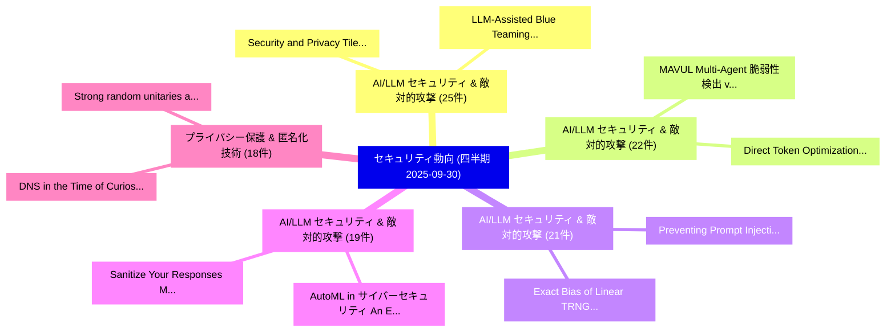

# 🏢 04_quarterly: 四半期エグゼクティブサマリー報告書 (直近90日間: 2025-09-30)

**集計日時**: 2025-09-30 00:00:00 UTC  
**直近90日間の総論文数**: 1926 件  

---

## 💡 四半期セキュリティ動向と研究ロードマップ評価

本日の収集論文（計 1926 件）において、以下の重点セキュリティ領域で活発な研究動向が確認されました：
- **AI/LLM セキュリティ & 敵対的攻撃** (25 件): 注目論文として 「Security and Privacy Tile's Lo...」、「LLM-Assisted Blue Teaming via ...」 等が発表され、実務防御および攻撃検証の進展が見られます。
- **AI/LLM セキュリティ & 敵対的攻撃** (22 件): 注目論文として 「Direct Token Optimization: A S...」、「MAVUL: Multi-Agent 脆弱性検出 via C...」 等が発表され、実務防御および攻撃検証の進展が見られます。
- **AI/LLM セキュリティ & 敵対的攻撃** (21 件): 注目論文として 「Preventing Prompt Injection wi...」、「Exact Bias of Linear TRNG Corr...」 等が発表され、実務防御および攻撃検証の進展が見られます。
- **AI/LLM セキュリティ & 敵対的攻撃** (19 件): 注目論文として 「Sanitize Your Responses: Mitig...」、「AutoML in サイバーセキュリティ: An Empir...」 等が発表され、実務防御および攻撃検証の進展が見られます。
- **プライバシー保護 & 匿名化技術** (18 件): 注目論文として 「Strong random unitaries and fa...」、「DNS in the Time of Curiosity: ...」 等が発表され、実務防御および攻撃検証の進展が見られます。

### 🗺️ 四半期脅威ランドスケープ

---

## 📌 四半期セキュリティ論文一覧 (日本語表形式)

| No | arXiv ID | 論文タイトル (日本語訳) | 重要キーワード | 構造化エグゼクティブ要約 (背景・提案・影響) | 脅威分類 | 詳細リンク |
|---|---|---|---|---|---|---|
| 1 | `2509.25624v3` | [STAC: When Innocent Tools Form Dangerous Chains for LLMエージェント](../../okf/papers/2025-09-30/2509.25624.md) | `Jing Li`, `Chao Shang`, `Devang Kulshreshtha` | 【提案】概要 (Overview & Key Finding) 本論文「STAC: When Innocent Tools Form Dangerous Chains for LLM...。実証評価により経営層・セキュリティ管理者向け推奨アクション (E... | `cs.AI` | [arXiv](https://arxiv.org/abs/2509.25624v3) &#124; [OKF](../../okf/papers/2025-09-30/2509.25624.md) |
| 2 | `2509.25926v2` | [Preventing Prompt Injection with Type-Directed Privilege Separation（セキュリティ分析論文）](../../okf/papers/2025-09-30/2509.25926.md) | `Preventing Prompt Injection`, `Directed Privilege Separation`, `Type-Directed Privilege` | 【提案】概要 (Overview & Key Finding) 本論文「Preventing プロンプトインジェクション with Type-Directed Privilege S...。実証評価により経営層・セキュリティ管理者向け推奨アクション (E... | `executive-summary` | [arXiv](https://arxiv.org/abs/2509.25926v2) &#124; [OKF](../../okf/papers/2025-09-30/2509.25926.md) |
| 3 | `2509.25927v1` | [The Impact of Scaling Training Data on Adversarial Robustness（セキュリティ分析論文）](../../okf/papers/2025-09-30/2509.25927.md) | `Scaling Training Data`, `Adversarial Robustness`, `Marco Zimmerli` | 【提案】概要 (Overview & Key Finding) 本論文「The Impact of Scaling Training Data on Adversarial Robu...。実証評価により経営層・セキュリティ管理者向け推奨アクション (E... | `cs.AI` | [arXiv](https://arxiv.org/abs/2509.25927v1) &#124; [OKF](../../okf/papers/2025-09-30/2509.25927.md) |
| 4 | `2509.26032v2` | [Stealthy Yet Effective: Distribution-Preserving Backdoor Attacks on Graph Classification（セキュリティ分析論文）](../../okf/papers/2025-09-30/2509.26032.md) | `Stealthy Yet Effective`, `Preserving Backdoor Attacks`, `Graph Classification` | 【提案】概要 (Overview & Key Finding) 本論文「Stealthy Yet Effective: Distribution-Preserving Backdoo...。実証評価により経営層・セキュリティ管理者向け推奨アクション (E... | `executive-summary` | [arXiv](https://arxiv.org/abs/2509.26032v2) &#124; [OKF](../../okf/papers/2025-09-30/2509.26032.md) |
| 5 | `2509.26310v1` | [Strong random unitaries and fast scrambling（セキュリティ分析論文）](../../okf/papers/2025-09-30/2509.26310.md) | `Thomas Schuster`, `Fermi Ma`, `Alex Lombardi` | 【提案】概要 (Overview & Key Finding) 本論文「Strong random unitaries and fast scrambling（セキュリティ分析論文）...。実証評価により経営層・セキュリティ管理者向け推奨アクション (E... | `hep-th` | [arXiv](https://arxiv.org/abs/2509.26310v1) &#124; [OKF](../../okf/papers/2025-09-30/2509.26310.md) |
| 6 | `2509.26350v1` | [SoK: Systematic adversarial threats against deep learning approaches for autonomous anomaly detection systems in SDN-IoT networksの分析](../../okf/papers/2025-09-30/2509.26350.md) | `SDN-IoT networks`, `Tharindu Lakshan Yasarathna`, `Raw Meta` | 【提案】概要 (Overview & Key Finding) 本論文「SoK: Systematic adversarial threats against deep learni...。実証評価により経営層・セキュリティ管理者向け推奨アクション (E... | `cs.AI` | [arXiv](https://arxiv.org/abs/2509.26350v1) &#124; [OKF](../../okf/papers/2025-09-30/2509.26350.md) |
| 7 | `2509.26393v2` | [Exact Bias of Linear TRNG Correctors -- Spectral Approach（セキュリティ分析論文）](../../okf/papers/2025-09-30/2509.26393.md) | `Exact Bias`, `Maciej Skorski`, `Javier Soto` | 【提案】概要 (Overview & Key Finding) 本論文「Exact Bias of Linear TRNG Correctors -- Spectral Approa...。実証評価により経営層・セキュリティ管理者向け推奨アクション (E... | `executive-summary` | [arXiv](https://arxiv.org/abs/2509.26393v2) &#124; [OKF](../../okf/papers/2025-09-30/2509.26393.md) |
| 8 | `2509.26404v2` | [SeedPrints: Fingerprints Can Even Tell Which Seed Your Large Language Model Was Trained From（セキュリティ分析論文）](../../okf/papers/2025-09-30/2509.26404.md) | `Yao Tong`, `Haonan Wang`, `Siquan Li` | 【提案】概要 (Overview & Key Finding) 本論文「SeedPrints: Fingerprints Can Even Tell Which Seed Your ...。実証評価により経営層・セキュリティ管理者向け推奨アクション (E... | `cs.AI` | [arXiv](https://arxiv.org/abs/2509.26404v2) &#124; [OKF](../../okf/papers/2025-09-30/2509.26404.md) |
| 9 | `2509.26509v1` | [Logic Solver Guided Directed Fuzzing for Hardware Designs（セキュリティ分析論文）](../../okf/papers/2025-09-30/2509.26509.md) | `Logic Solver Guided Directed Fuzzing`, `Hardware Designs`, `Raghul Saravanan` | 【提案】概要 (Overview & Key Finding) 本論文「Logic Solver Guided Directed Fuzzing for Hardware Desig...。実証評価により経営層・セキュリティ管理者向け推奨アクション (E... | `cybersecurity` | [arXiv](https://arxiv.org/abs/2509.26509v1) &#124; [OKF](../../okf/papers/2025-09-30/2509.26509.md) |
| 10 | `2509.26530v1` | [Explainable and Resilient ML-Based Physical-Layer Attack Detectors（セキュリティ分析論文）](../../okf/papers/2025-09-30/2509.26530.md) | `Layer Attack Detectors`, `Based Physical`, `ML-Based Physical` | 【提案】概要 (Overview & Key Finding) 本論文「Explainable and Resilient ML-Based Physical-Layer Attac...。実証評価により経営層・セキュリティ管理者向け推奨アクション (E... | `executive-summary` | [arXiv](https://arxiv.org/abs/2509.26530v1) &#124; [OKF](../../okf/papers/2025-09-30/2509.26530.md) |
| 11 | `2509.26562v1` | [DeepProv: Behavioral Characterization and Repair of Neural Networks via Inference Provenance Graph Analysis（セキュリティ分析論文）](../../okf/papers/2025-09-30/2509.26562.md) | `Behavioral Characterization`, `Neural Networks`, `Firas Ben Hmida` | 【提案】概要 (Overview & Key Finding) 本論文「DeepProv: Behavioral Characterization and Repair of Neu...。実証評価により経営層・セキュリティ管理者向け推奨アクション (E... | `executive-summary` | [arXiv](https://arxiv.org/abs/2509.26562v1) &#124; [OKF](../../okf/papers/2025-09-30/2509.26562.md) |
| 12 | `2509.26598v1` | [Are Robust LLM Fingerprints Adversarially Robust?（セキュリティ分析論文）](../../okf/papers/2025-09-30/2509.26598.md) | `Fingerprints Adversarially Robust`, `Anshul Nasery`, `Edoardo Contente` | 【提案】### (日本語題名: Are Robust LLM Fingerprints Adversarially Robust?（セキュリティ分析論文）)  > [!NOTE] >...。実証評価により経営層・セキュリティ管理者向け推奨アクション (E... | `cs.AI` | [arXiv](https://arxiv.org/abs/2509.26598v1) &#124; [OKF](../../okf/papers/2025-09-30/2509.26598.md) |
| 13 | `2509.26640v1` | [SPATA: Systematic Pattern Analysis for Detailed and Transparent Data Cards（セキュリティ分析論文）](../../okf/papers/2025-09-30/2509.26640.md) | `Transparent Data Cards`, `Eva Maia`, `Carlos Soares` | 【提案】概要 (Overview & Key Finding) 本論文「SPATA: Systematic Pattern Analysis for Detailed and Tra...。実証評価により経営層・セキュリティ管理者向け推奨アクション (E... | `executive-summary` | [arXiv](https://arxiv.org/abs/2509.26640v1) &#124; [OKF](../../okf/papers/2025-09-30/2509.26640.md) |
| 14 | `2510.00076v1` | [Private Learning of Littlestone Classes, Revisited（セキュリティ分析論文）](../../okf/papers/2025-09-30/2510.00076.md) | `Private Learning`, `Littlestone Classes`, `Xin Lyu` | 【提案】概要 (Overview & Key Finding) 本論文「Private Learning of Littlestone Classes, Revisited（セキュリ...。実証評価により経営層・セキュリティ管理者向け推奨アクション (E... | `executive-summary` | [arXiv](https://arxiv.org/abs/2510.00076v1) &#124; [OKF](../../okf/papers/2025-09-30/2510.00076.md) |
| 15 | `2510.00125v1` | [Direct Token Optimization: A Self-contained Approach to Large Language Model Unlearning（セキュリティ分析論文）](../../okf/papers/2025-09-30/2510.00125.md) | `Large Language Model Unlearning`, `Direct Token Optimization`, `Ruixuan Liu` | 【提案】概要 (Overview & Key Finding) 本論文「Direct Token Optimization: A Self-contained Approach to...。実証評価により経営層・セキュリティ管理者向け推奨アクション (E... | `cs.AI` | [arXiv](https://arxiv.org/abs/2510.00125v1) &#124; [OKF](../../okf/papers/2025-09-30/2510.00125.md) |
| 16 | `2510.00151v1` | [Stealing AI Model Weights Through Covert Communication Channels（セキュリティ分析論文）](../../okf/papers/2025-09-30/2510.00151.md) | `Alan Rodrigo Diaz`, `Valentin Barbaza`, `Hassan Aboushady` | 【提案】概要 (Overview & Key Finding) 本論文「Stealing AI Model Weights Through Covert Communication ...。実証評価により経営層・セキュリティ管理者向け推奨アクション (E... | `cs.AI` | [arXiv](https://arxiv.org/abs/2510.00151v1) &#124; [OKF](../../okf/papers/2025-09-30/2510.00151.md) |
| 17 | `2510.00164v2` | [Calyx: Privacy-Preserving Multi-Token Optimistic-Rollup Protocol（セキュリティ分析論文）](../../okf/papers/2025-09-30/2510.00164.md) | `Preserving Multi`, `Token Optimistic`, `Rollup Protocol` | 【提案】概要 (Overview & Key Finding) 本論文「Calyx: Privacy-Preserving Multi-Token Optimistic-Rollup...。実証評価により経営層・セキュリティ管理者向け推奨アクション (E... | `cybersecurity` | [arXiv](https://arxiv.org/abs/2510.00164v2) &#124; [OKF](../../okf/papers/2025-09-30/2510.00164.md) |
| 18 | `2510.00167v2` | [Drones that Think on their Feet: Sudden Landing Decisions with Embodied AI（セキュリティ分析論文）](../../okf/papers/2025-09-30/2510.00167.md) | `Sudden Landing Decisions`, `Diego Ortiz Barbosa`, `Mohit Agrawal` | 【提案】概要 (Overview & Key Finding) 本論文「Drones that Think on their Feet: Sudden Landing Decisio...。実証評価により経営層・セキュリティ管理者向け推奨アクション (E... | `cs.AI` | [arXiv](https://arxiv.org/abs/2510.00167v2) &#124; [OKF](../../okf/papers/2025-09-30/2510.00167.md) |
| 19 | `2510.00181v2` | [CHAI: Command Hijacking against embodied AI（セキュリティ分析論文）](../../okf/papers/2025-09-30/2510.00181.md) | `Command Hijacking`, `Luis Burbano`, `Diego Ortiz` | 【提案】概要 (Overview & Key Finding) 本論文「CHAI: Command Hijacking against embodied AI（セキュリティ分析論文）...。実証評価により経営層・セキュリティ管理者向け推奨アクション (E... | `cs.AI` | [arXiv](https://arxiv.org/abs/2510.00181v2) &#124; [OKF](../../okf/papers/2025-09-30/2510.00181.md) |
| 20 | `2510.00240v2` | [SecureBERT 2.0: Advanced Language Model for サイバーセキュリティ Intelligence](../../okf/papers/2025-09-30/2510.00240.md) | `Advanced Language Model`, `Cybersecurity Intelligence`, `Ehsan Aghaei` | 【提案】概要 (Overview & Key Finding) 本論文「SecureBERT 2.0: Advanced Language Model for サイバーセキュリティ ...。実証評価により経営層・セキュリティ管理者向け推奨アクション (E... | `cs.AI` | [arXiv](https://arxiv.org/abs/2510.00240v2) &#124; [OKF](../../okf/papers/2025-09-30/2510.00240.md) |
| 21 | `2510.00293v2` | [MOLM: Mixture of LoRA Markers（セキュリティ分析論文）](../../okf/papers/2025-09-30/2510.00293.md) | `Samar Fares`, `Nurbek Tastan`, `Noor Hussein` | 【提案】概要 (Overview & Key Finding) 本論文「MOLM: Mixture of LoRA Markers（セキュリティ分析論文）」（原題: MOLM: Mi...。実証評価により経営層・セキュリティ管理者向け推奨アクション (E... | `cs.CV` | [arXiv](https://arxiv.org/abs/2510.00293v2) &#124; [OKF](../../okf/papers/2025-09-30/2510.00293.md) |
| 22 | `2510.00317v1` | [MAVUL: Multi-Agent 脆弱性検出 via Contextual Reasoning and Interactive Refinement](../../okf/papers/2025-09-30/2510.00317.md) | `Contextual Reasoning`, `Interactive Refinement`, `Agent Vulnerability Detection` | 【提案】概要 (Overview & Key Finding) 本論文「MAVUL: Multi-Agent 脆弱性検出 via Contextual Reasoning and I...。実証評価により経営層・セキュリティ管理者向け推奨アクション (E... | `cs.AI` | [arXiv](https://arxiv.org/abs/2510.00317v1) &#124; [OKF](../../okf/papers/2025-09-30/2510.00317.md) |
| 23 | `2510.00322v3` | [Privately Estimating Black-Box Statistics（セキュリティ分析論文）](../../okf/papers/2025-09-30/2510.00322.md) | `Privately Estimating Black`, `Box Statistics`, `Black-Box Statistics` | 【提案】概要 (Overview & Key Finding) 本論文「Privately Estimating Black-Box Statistics（セキュリティ分析論文）」（...。実証評価によりSteinke, Thomas Steinke -... | `executive-summary` | [arXiv](https://arxiv.org/abs/2510.00322v3) &#124; [OKF](../../okf/papers/2025-09-30/2510.00322.md) |
| 24 | `2510.00350v1` | [Security and Privacy Tile's Location Tracking Protocolの分析](../../okf/papers/2025-09-30/2510.00350.md) | `Location Tracking Protocol`, `Privacy Tile`, `Location Tracking` | 【提案】概要 (Overview & Key Finding) 本論文「Security and Privacy Tile's Location Tracking Protocolの...。実証評価により経営層・セキュリティ管理者向け推奨アクション (E... | `cybersecurity` | [arXiv](https://arxiv.org/abs/2510.00350v1) &#124; [OKF](../../okf/papers/2025-09-30/2510.00350.md) |
| 25 | `2510.02376v1` | [Scaling Homomorphic Applications in Deployment（セキュリティ分析論文）](../../okf/papers/2025-09-30/2510.02376.md) | `Scaling Homomorphic Applications`, `Ryan Marinelli`, `Angelica Chowdhury` | 【提案】概要 (Overview & Key Finding) 本論文「Scaling Homomorphic Applications in Deployment（セキュリティ分析...。実証評価により経営層・セキュリティ管理者向け推奨アクション (E... | `cs.AI` | [arXiv](https://arxiv.org/abs/2510.02376v1) &#124; [OKF](../../okf/papers/2025-09-30/2510.02376.md) |
| 26 | `2510.02378v1` | [Apply Bayes Theorem to Optimize IVR Authentication Process（セキュリティ分析論文）](../../okf/papers/2025-09-30/2510.02378.md) | `Apply Bayes Theorem`, `Authentication Process`, `Jingrong Xie` | 【提案】概要 (Overview & Key Finding) 本論文「Apply Bayes Theorem to Optimize IVR Authentication Proc...。実証評価により経営層・セキュリティ管理者向け推奨アクション (E... | `executive-summary` | [arXiv](https://arxiv.org/abs/2510.02378v1) &#124; [OKF](../../okf/papers/2025-09-30/2510.02378.md) |
| 27 | `2510.02379v1` | [Hybrid Schemes of NIST Post-Quantum Cryptography Standard Algorithms and Quantum Key Distribution for Key Exchange and Digital Signature（セキュリティ分析論文）](../../okf/papers/2025-09-30/2510.02379.md) | `Quantum Cryptography Standard Algorithms`, `Quantum Key Distribution`, `Hybrid Schemes` | 【提案】概要 (Overview & Key Finding) 本論文「Hybrid Schemes of NIST ポスト量子暗号 Standard Algorithms and ...。実証評価により経営層・セキュリティ管理者向け推奨アクション (E... | `executive-summary` | [arXiv](https://arxiv.org/abs/2510.02379v1) &#124; [OKF](../../okf/papers/2025-09-30/2510.02379.md) |
| 28 | `2510.02383v1` | [Selmer-Inspired Elliptic Curve Generation（セキュリティ分析論文）](../../okf/papers/2025-09-30/2510.02383.md) | `Inspired Elliptic Curve Generation`, `Selmer-Inspired Elliptic`, `Awnon Bhowmik` | 【提案】概要 (Overview & Key Finding) 本論文「Selmer-Inspired Elliptic Curve Generation（セキュリティ分析論文）」（...。実証評価により経営層・セキュリティ管理者向け推奨アクション (E... | `executive-summary` | [arXiv](https://arxiv.org/abs/2510.02383v1) &#124; [OKF](../../okf/papers/2025-09-30/2510.02383.md) |
| 29 | `2510.02384v2` | [Secure and Robust Watermarking for AI-generated Images: A Comprehensive Survey（セキュリティ分析論文）](../../okf/papers/2025-09-30/2510.02384.md) | `Robust Watermarking`, `Comprehensive Survey`, `AI-generated Images` | 【提案】概要 (Overview & Key Finding) 本論文「Secure and Robust Watermarking for AI-generated Images:...。実証評価により経営層・セキュリティ管理者向け推奨アクション (E... | `cs.CV` | [arXiv](https://arxiv.org/abs/2510.02384v2) &#124; [OKF](../../okf/papers/2025-09-30/2510.02384.md) |
| 30 | `2510.02386v2` | [On The Fragility of Benchmark Contamination Detection in Reasoning Models（セキュリティ分析論文）](../../okf/papers/2025-09-30/2510.02386.md) | `Benchmark Contamination Detection`, `Reasoning Models`, `Han Wang` | 【提案】概要 (Overview & Key Finding) 本論文「On The Fragility of Benchmark Contamination Detection i...。実証評価により経営層・セキュリティ管理者向け推奨アクション (E... | `cs.AI` | [arXiv](https://arxiv.org/abs/2510.02386v2) &#124; [OKF](../../okf/papers/2025-09-30/2510.02386.md) |
| 31 | `2510.02389v3` | [From Trace to Line: LLM Agent for Real-World OSS Vulnerability Localization（セキュリティ分析論文）](../../okf/papers/2025-09-30/2510.02389.md) | `Vulnerability Localization`, `Real-World OSS`, `Haoran Xi` | 【提案】概要 (Overview & Key Finding) 本論文「From Trace to Line: LLM Agent for Real-World OSS 脆弱性 Lo...。実証評価により経営層・セキュリティ管理者向け推奨アクション (E... | `executive-summary` | [arXiv](https://arxiv.org/abs/2510.02389v3) &#124; [OKF](../../okf/papers/2025-09-30/2510.02389.md) |
| 32 | `2510.02391v1` | [LLM-Generated Samples for Android マルウェア検出](../../okf/papers/2025-09-30/2510.02391.md) | `Generated Samples`, `LLM-Generated Samples`, `Android Malware Detection` | 【提案】概要 (Overview & Key Finding) 本論文「LLM-Generated Samples for Android マルウェア検出」（原題: LLM-Gene...。実証評価により経営層・セキュリティ管理者向け推奨アクション (E... | `executive-summary` | [arXiv](https://arxiv.org/abs/2510.02391v1) &#124; [OKF](../../okf/papers/2025-09-30/2510.02391.md) |
| 33 | `2509.24153v1` | [DNS in the Time of Curiosity: A Tale of Collaborative User Privacy Protection（セキュリティ分析論文）](../../okf/papers/2025-09-29/2509.24153.md) | `Collaborative User Privacy Protection`, `Hongyu Jin`, `Panos Papadimitratos` | 【提案】概要 (Overview & Key Finding) 本論文「DNS in the Time of Curiosity: A Tale of Collaborative U...。実証評価により経営層・セキュリティ管理者向け推奨アクション (E... | `cybersecurity` | [arXiv](https://arxiv.org/abs/2509.24153v1) &#124; [OKF](../../okf/papers/2025-09-29/2509.24153.md) |
| 34 | `2509.24173v1` | [Fundamental Limit of Discrete Distribution Estimation under Utility-Optimized Local Differential Privacy（セキュリティ分析論文）](../../okf/papers/2025-09-29/2509.24173.md) | `Discrete Distribution Estimation`, `Optimized Local Differential Privacy`, `Fundamental Limit` | 【提案】概要 (Overview & Key Finding) 本論文「Fundamental Limit of Discrete Distribution Estimation u...。実証評価により経営層・セキュリティ管理者向け推奨アクション (E... | `executive-summary` | [arXiv](https://arxiv.org/abs/2509.24173v1) &#124; [OKF](../../okf/papers/2025-09-29/2509.24173.md) |
| 35 | `2509.24174v2` | [LLUAD: Low-Latency User-Anonymized DNS（セキュリティ分析論文）](../../okf/papers/2025-09-29/2509.24174.md) | `Latency User`, `Low-Latency User`, `Hongyu Jin` | 【提案】概要 (Overview & Key Finding) 本論文「LLUAD: Low-Latency User-Anonymized DNS（セキュリティ分析論文）」（原題:...。実証評価により経営層・セキュリティ管理者向け推奨アクション (E... | `cybersecurity` | [arXiv](https://arxiv.org/abs/2509.24174v2) &#124; [OKF](../../okf/papers/2025-09-29/2509.24174.md) |
| 36 | `2509.24240v1` | [Takedown: How It's Done in Modern Coding Agent Exploits（セキュリティ分析論文）](../../okf/papers/2025-09-29/2509.24240.md) | `Modern Coding Agent Exploits`, `Eunkyu Lee`, `Donghyeon Kim` | 【提案】概要 (Overview & Key Finding) 本論文「Takedown: How It's Done in Modern Coding Agent Exploits...。実証評価により経営層・セキュリティ管理者向け推奨アクション (E... | `cybersecurity` | [arXiv](https://arxiv.org/abs/2509.24240v1) &#124; [OKF](../../okf/papers/2025-09-29/2509.24240.md) |
| 37 | `2509.24257v4` | [VeriLLM: A Lightweight Framework for Publicly Verifiable Decentralized Inference（セキュリティ分析論文）](../../okf/papers/2025-09-29/2509.24257.md) | `Publicly Verifiable Decentralized Inference`, `Ke Wang`, `Zishuo Zhao` | 【提案】概要 (Overview & Key Finding) 本論文「VeriLLM: A Lightweight Framework for Publicly Verifiabl...。実証評価により経営層・セキュリティ管理者向け推奨アクション (E... | `executive-summary` | [arXiv](https://arxiv.org/abs/2509.24257v4) &#124; [OKF](../../okf/papers/2025-09-29/2509.24257.md) |
| 38 | `2509.24272v1` | [When MCP Servers Attack: Taxonomy, Feasibility, and Mitigation（セキュリティ分析論文）](../../okf/papers/2025-09-29/2509.24272.md) | `Servers Attack`, `Weibo Zhao`, `Jiahao Liu` | 【提案】概要 (Overview & Key Finding) 本論文「When MCP Servers Attack: Taxonomy, Feasibility, and Mit...。実証評価により経営層・セキュリティ管理者向け推奨アクション (E... | `executive-summary` | [arXiv](https://arxiv.org/abs/2509.24272v1) &#124; [OKF](../../okf/papers/2025-09-29/2509.24272.md) |
| 39 | `2509.24368v2` | [Watermarking Diffusion Language Models（セキュリティ分析論文）](../../okf/papers/2025-09-29/2509.24368.md) | `Watermarking Diffusion Language Models`, `Thibaud Gloaguen`, `Robin Staab` | 【提案】概要 (Overview & Key Finding) 本論文「Watermarking Diffusion Language Models（セキュリティ分析論文）」（原題:...。実証評価により経営層・セキュリティ管理者向け推奨アクション (E... | `cs.AI` | [arXiv](https://arxiv.org/abs/2509.24368v2) &#124; [OKF](../../okf/papers/2025-09-29/2509.24368.md) |
| 40 | `2509.24408v2` | [FuncPoison: Poisoning Function Library to Hijack Multi-agent Autonomous Driving Systems（セキュリティ分析論文）](../../okf/papers/2025-09-29/2509.24408.md) | `Poisoning Function Library`, `Autonomous Driving Systems`, `Hijack Multi` | 【提案】概要 (Overview & Key Finding) 本論文「FuncPoison: Poisoning Function Library to Hijack Multi-...。実証評価により経営層・セキュリティ管理者向け推奨アクション (E... | `executive-summary` | [arXiv](https://arxiv.org/abs/2509.24408v2) &#124; [OKF](../../okf/papers/2025-09-29/2509.24408.md) |
| 41 | `2509.24418v1` | [GSPR: Aligning LLM Safeguards as Generalizable Safety Policy Reasoners（セキュリティ分析論文）](../../okf/papers/2025-09-29/2509.24418.md) | `Generalizable Safety Policy Reasoners`, `Generalizable Safety Policy Reas`, `Haoran Li` | 【提案】概要 (Overview & Key Finding) 本論文「GSPR: Aligning LLM Safeguards as Generalizable Safety P...。実証評価により経営層・セキュリティ管理者向け推奨アクション (E... | `cybersecurity` | [arXiv](https://arxiv.org/abs/2509.24418v1) &#124; [OKF](../../okf/papers/2025-09-29/2509.24418.md) |
| 42 | `2509.24432v1` | [Pseudorandom Unitaries in the Haar Random Oracle Model（セキュリティ分析論文）](../../okf/papers/2025-09-29/2509.24432.md) | `Haar Random Oracle Model`, `Pseudorandom Unitaries`, `Prabhanjan Ananth` | 【提案】概要 (Overview & Key Finding) 本論文「Pseudorandom Unitaries in the Haar Random Oracle Model（...。実証評価により経営層・セキュリティ管理者向け推奨アクション (E... | `executive-summary` | [arXiv](https://arxiv.org/abs/2509.24432v1) &#124; [OKF](../../okf/papers/2025-09-29/2509.24432.md) |
| 43 | `2509.24440v3` | [Evaluating Relayed and Switched Quantum Key Distribution (QKD) Network Architectures（セキュリティ分析論文）](../../okf/papers/2025-09-29/2509.24440.md) | `Switched Quantum Key Distribution`, `Evaluating Relayed`, `Network Architectures` | 【提案】概要 (Overview & Key Finding) 本論文「Evaluating Relayed and Switched 量子鍵配送 (QKD) Network Arc...。実証評価により経営層・セキュリティ管理者向け推奨アクション (E... | `cybersecurity` | [arXiv](https://arxiv.org/abs/2509.24440v3) &#124; [OKF](../../okf/papers/2025-09-29/2509.24440.md) |
| 44 | `2509.24444v3` | [BugMagnifier: TON Transaction Simulator for Revealing Smart Contract Vulnerabilities（セキュリティ分析論文）](../../okf/papers/2025-09-29/2509.24444.md) | `Revealing Smart Contract Vulnerabilities`, `Transaction Simulator`, `Yury Yanovich` | 【提案】概要 (Overview & Key Finding) 本論文「BugMagnifier: TON Transaction Simulator for Revealing ス...。実証評価により経営層・セキュリティ管理者向け推奨アクション (E... | `executive-summary` | [arXiv](https://arxiv.org/abs/2509.24444v3) &#124; [OKF](../../okf/papers/2025-09-29/2509.24444.md) |
| 45 | `2509.24484v1` | [On the Limitations of Pseudorandom Unitaries（セキュリティ分析論文）](../../okf/papers/2025-09-29/2509.24484.md) | `Pseudorandom Unitaries`, `Prabhanjan Ananth`, `Aditya Gulati` | 【提案】概要 (Overview & Key Finding) 本論文「On the Limitations of Pseudorandom Unitaries（セキュリティ分析論文...。実証評価により経営層・セキュリティ管理者向け推奨アクション (E... | `executive-summary` | [arXiv](https://arxiv.org/abs/2509.24484v1) &#124; [OKF](../../okf/papers/2025-09-29/2509.24484.md) |
| 46 | `2509.24488v1` | [Sanitize Your Responses: Mitigating Privacy Leakage in 大規模言語モデル](../../okf/papers/2025-09-29/2509.24488.md) | `Mitigating Privacy Leakage`, `Large Language Models`, `Wenjie Fu` | 【提案】概要 (Overview & Key Finding) 本論文「Sanitize Your Responses: Mitigating Privacy Leakage in ...。実証評価により経営層・セキュリティ管理者向け推奨アクション (E... | `executive-summary` | [arXiv](https://arxiv.org/abs/2509.24488v1) &#124; [OKF](../../okf/papers/2025-09-29/2509.24488.md) |
| 47 | `2509.24515v1` | [Agentic Specification Generator for Move Programs（セキュリティ分析論文）](../../okf/papers/2025-09-29/2509.24515.md) | `Agentic Specification Generator`, `Move Programs`, `Fu Fu` | 【提案】概要 (Overview & Key Finding) 本論文「Agentic Specification Generator for Move Programs（セキュリテ...。実証評価により経営層・セキュリティ管理者向け推奨アクション (E... | `cs.PL` | [arXiv](https://arxiv.org/abs/2509.24515v1) &#124; [OKF](../../okf/papers/2025-09-29/2509.24515.md) |
| 48 | `2509.24623v2` | [Mapping Quantum Threats: An Engineering Inventory of Cryptographic Dependencies（セキュリティ分析論文）](../../okf/papers/2025-09-29/2509.24623.md) | `Mapping Quantum Threats`, `Cryptographic Dependencies`, `Carlos Benitez` | 【提案】概要 (Overview & Key Finding) 本論文「Mapping 量子 Threats: An Engineering Inventory of Cryptog...。実証評価により経営層・セキュリティ管理者向け推奨アクション (E... | `cybersecurity` | [arXiv](https://arxiv.org/abs/2509.24623v2) &#124; [OKF](../../okf/papers/2025-09-29/2509.24623.md) |
| 49 | `2509.24624v1` | [PRIVMARK: Private 大規模言語モデル Watermarking with MPC](../../okf/papers/2025-09-29/2509.24624.md) | `Private Large Language Models Watermarking`, `Thomas Fargues`, `Ye Dong` | 【提案】概要 (Overview & Key Finding) 本論文「PRIVMARK: Private 大規模言語モデル Watermarking with MPC」（原題: P...。実証評価により経営層・セキュリティ管理者向け推奨アクション (E... | `cybersecurity` | [arXiv](https://arxiv.org/abs/2509.24624v1) &#124; [OKF](../../okf/papers/2025-09-29/2509.24624.md) |
| 50 | `2509.24698v1` | [LISA Technical Report: An Agentic Framework for Smart Contract Auditing（セキュリティ分析論文）](../../okf/papers/2025-09-29/2509.24698.md) | `Smart Contract Auditing`, `Technical Report`, `Izaiah Sun` | 【提案】概要 (Overview & Key Finding) 本論文「LISA Technical Report: An Agentic Framework for スマートコント...。実証評価により経営層・セキュリティ管理者向け推奨アクション (E... | `cybersecurity` | [arXiv](https://arxiv.org/abs/2509.24698v1) &#124; [OKF](../../okf/papers/2025-09-29/2509.24698.md) |
| 51 | `2509.24807v1` | [Active Authentication via Korean Keystrokes Under Varying LLM Assistance and Cognitive Contexts（セキュリティ分析論文）](../../okf/papers/2025-09-29/2509.24807.md) | `Active Authentication`, `Cognitive Contexts`, `Dong Hyun Roh` | 【提案】概要 (Overview & Key Finding) 本論文「Active Authentication via Korean Keystrokes Under Varyi...。実証評価により経営層・セキュリティ管理者向け推奨アクション (E... | `cybersecurity` | [arXiv](https://arxiv.org/abs/2509.24807v1) &#124; [OKF](../../okf/papers/2025-09-29/2509.24807.md) |
| 52 | `2509.24823v1` | [Of-SemWat: High-payload text embedding for semantic watermarking of AI-generated images with arbitrary size（セキュリティ分析論文）](../../okf/papers/2025-09-29/2509.24823.md) | `High-payload text`, `AI-generated images`, `Benedetta Tondi` | 【提案】概要 (Overview & Key Finding) 本論文「Of-SemWat: High-payload text embedding for semantic wat...。実証評価により経営層・セキュリティ管理者向け推奨アクション (E... | `cs.AI` | [arXiv](https://arxiv.org/abs/2509.24823v1) &#124; [OKF](../../okf/papers/2025-09-29/2509.24823.md) |
| 53 | `2509.24955v1` | [Secret Leader Election in Ethereum PoS: An Empirical Security Whisk and Homomorphic Sortition under DoS on the Leader and Censorship Attacksの分析](../../okf/papers/2025-09-29/2509.24955.md) | `Secret Leader Election`, `Homomorphic Sortition`, `Censorship Attacks` | 【提案】概要 (Overview & Key Finding) 本論文「Secret Leader Election in Ethereum PoS: An Empirical Se...。実証評価により経営層・セキュリティ管理者向け推奨アクション (E... | `cybersecurity` | [arXiv](https://arxiv.org/abs/2509.24955v1) &#124; [OKF](../../okf/papers/2025-09-29/2509.24955.md) |
| 54 | `2509.24967v4` | [SecInfer: Preventing Prompt Injection via Inference-time Scaling（セキュリティ分析論文）](../../okf/papers/2025-09-29/2509.24967.md) | `Preventing Prompt Injection`, `Inference-time Scaling`, `Neil Zhenqiang Gong` | 【提案】概要 (Overview & Key Finding) 本論文「SecInfer: Preventing プロンプトインジェクション via Inference-time S...。実証評価により経営層・セキュリティ管理者向け推奨アクション (E... | `cs.AI` | [arXiv](https://arxiv.org/abs/2509.24967v4) &#124; [OKF](../../okf/papers/2025-09-29/2509.24967.md) |
| 55 | `2509.25072v1` | [Optimizing Privacy-Preserving Primitives to Support LLM-Scale Applications（セキュリティ分析論文）](../../okf/papers/2025-09-29/2509.25072.md) | `Optimizing Privacy`, `Preserving Primitives`, `Scale Applications` | 【提案】概要 (Overview & Key Finding) 本論文「Optimizing Privacy-Preserving Primitives to Support LLM...。実証評価により経営層・セキュリティ管理者向け推奨アクション (E... | `cs.AI` | [arXiv](https://arxiv.org/abs/2509.25072v1) &#124; [OKF](../../okf/papers/2025-09-29/2509.25072.md) |
| 56 | `2509.25113v1` | [Two-Dimensional XOR-Based Secret Sharing for Layered Multipath Communication（セキュリティ分析論文）](../../okf/papers/2025-09-29/2509.25113.md) | `Based Secret Sharing`, `Layered Multipath Communication`, `Two-Dimensional XOR` | 【提案】概要 (Overview & Key Finding) 本論文「Two-Dimensional XOR-Based Secret Sharing for Layered Mu...。実証評価により経営層・セキュリティ管理者向け推奨アクション (E... | `cybersecurity` | [arXiv](https://arxiv.org/abs/2509.25113v1) &#124; [OKF](../../okf/papers/2025-09-29/2509.25113.md) |
| 57 | `2509.25145v2` | [Quantitative quantum soundness for all multipartite compiled nonlocal games（セキュリティ分析論文）](../../okf/papers/2025-09-29/2509.25145.md) | `Matilde Baroni`, `Igor Klep`, `Dominik Leichtle` | 【提案】概要 (Overview & Key Finding) 本論文「Quantitative 量子 soundness for all multipartite compiled...。実証評価により経営層・セキュリティ管理者向け推奨アクション (E... | `math-ph` | [arXiv](https://arxiv.org/abs/2509.25145v2) &#124; [OKF](../../okf/papers/2025-09-29/2509.25145.md) |
| 58 | `2509.25394v1` | [Fast Energy-Theft Attack on Frequency-Varying Wireless Power without Additional Sensors（セキュリティ分析論文）](../../okf/papers/2025-09-29/2509.25394.md) | `Varying Wireless Power`, `Fast Energy`, `Theft Attack` | 【提案】背景とセキュリティ上の課題 (Background & Problem) 本研究はサイバー脅威環境におけるセキュリティ構造・脆弱性の検証を目的としています。(主要検出項目: ...。実証評価により経営層・セキュリティ管理者向け推奨アクション (E... | `executive-summary` | [arXiv](https://arxiv.org/abs/2509.25394v1) &#124; [OKF](../../okf/papers/2025-09-29/2509.25394.md) |
| 59 | `2509.25408v1` | [Optimal Threshold Signatures in Bitcoin（セキュリティ分析論文）](../../okf/papers/2025-09-29/2509.25408.md) | `Optimal Threshold Signatures`, `Korok Ray`, `Sindura Saraswathi` | 【提案】概要 (Overview & Key Finding) 本論文「Optimal Threshold Signatures in Bitcoin（セキュリティ分析論文）」（原題...。実証評価により経営層・セキュリティ管理者向け推奨アクション (E... | `econ.TH` | [arXiv](https://arxiv.org/abs/2509.25408v1) &#124; [OKF](../../okf/papers/2025-09-29/2509.25408.md) |
| 60 | `2509.25410v1` | [Characterizing Event-themed Malicious Web Campaigns: A Case Study on War-themed Websites（セキュリティ分析論文）](../../okf/papers/2025-09-29/2509.25410.md) | `Malicious Web Campaigns`, `Characterizing Event`, `Event-themed Malicious` | 【提案】概要 (Overview & Key Finding) 本論文「Characterizing Event-themed Malicious Web Campaigns: A ...。実証評価により経営層・セキュリティ管理者向け推奨アクション (E... | `executive-summary` | [arXiv](https://arxiv.org/abs/2509.25410v1) &#124; [OKF](../../okf/papers/2025-09-29/2509.25410.md) |
| 61 | `2509.25430v3` | [Finding Phones Fast: Low-Latency and Scalable Monitoring of Cellular Communications in Sensitive Areas（セキュリティ分析論文）](../../okf/papers/2025-09-29/2509.25430.md) | `Finding Phones Fast`, `Scalable Monitoring`, `Cellular Communications` | 【提案】概要 (Overview & Key Finding) 本論文「Finding Phones Fast: Low-Latency and Scalable Monitorin...。実証評価により経営層・セキュリティ管理者向け推奨アクション (E... | `cybersecurity` | [arXiv](https://arxiv.org/abs/2509.25430v3) &#124; [OKF](../../okf/papers/2025-09-29/2509.25430.md) |
| 62 | `2509.25448v3` | [Fingerprinting LLMs via Prompt Injection（セキュリティ分析論文）](../../okf/papers/2025-09-29/2509.25448.md) | `Prompt Injection`, `Yuepeng Hu`, `Zhengyuan Jiang` | 【提案】概要 (Overview & Key Finding) 本論文「Fingerprinting LLMs via プロンプトインジェクション（セキュリティ分析論文）」（原題: ...。実証評価により経営層・セキュリティ管理者向け推奨アクション (E... | `executive-summary` | [arXiv](https://arxiv.org/abs/2509.25448v3) &#124; [OKF](../../okf/papers/2025-09-29/2509.25448.md) |
| 63 | `2509.25462v1` | [Managing Differentiated Secure Connectivity using Intents（セキュリティ分析論文）](../../okf/papers/2025-09-29/2509.25462.md) | `Managing Differentiated Secure Connectivity`, `Loay Abdelrazek`, `Filippo Rebecchi` | 【提案】概要 (Overview & Key Finding) 本論文「Managing Differentiated Secure Connectivity using Inten...。実証評価により経営層・セキュリティ管理者向け推奨アクション (E... | `cybersecurity` | [arXiv](https://arxiv.org/abs/2509.25462v1) &#124; [OKF](../../okf/papers/2025-09-29/2509.25462.md) |
| 64 | `2509.25469v1` | [Balancing Compliance and Privacy in Offline CBDC Transactions Using a Secure Element-based System（セキュリティ分析論文）](../../okf/papers/2025-09-29/2509.25469.md) | `Balancing Compliance`, `Transactions Using`, `Secure Element` | 【提案】概要 (Overview & Key Finding) 本論文「Balancing Compliance and Privacy in Offline CBDC Transa...。実証評価により経営層・セキュリティ管理者向け推奨アクション (E... | `cybersecurity` | [arXiv](https://arxiv.org/abs/2509.25469v1) &#124; [OKF](../../okf/papers/2025-09-29/2509.25469.md) |
| 65 | `2509.25476v1` | [Environmental Rate Manipulation Attacks on Power Grid Security（セキュリティ分析論文）](../../okf/papers/2025-09-29/2509.25476.md) | `Environmental Rate Manipulation Attacks`, `Power Grid Security`, `Mohammad Abdullah Al Faruque` | 【提案】概要 (Overview & Key Finding) 本論文「Environmental Rate Manipulation Attacks on Power Grid S...。実証評価により経営層・セキュリティ管理者向け推奨アクション (E... | `executive-summary` | [arXiv](https://arxiv.org/abs/2509.25476v1) &#124; [OKF](../../okf/papers/2025-09-29/2509.25476.md) |
| 66 | `2509.25514v2` | [AGNOMIN -- Architecture Agnostic Multi-Label Function Name Prediction（セキュリティ分析論文）](../../okf/papers/2025-09-29/2509.25514.md) | `Label Function Name Prediction`, `Architecture Agnostic Multi`, `Multi-Label Function` | 【提案】概要 (Overview & Key Finding) 本論文「AGNOMIN -- Architecture Agnostic Multi-Label Function N...。実証評価により経営層・セキュリティ管理者向け推奨アクション (E... | `executive-summary` | [arXiv](https://arxiv.org/abs/2509.25514v2) &#124; [OKF](../../okf/papers/2025-09-29/2509.25514.md) |
| 67 | `2509.25525v1` | [Defeating Cerberus: Concept-Guided Privacy-Leakage Mitigation in Multimodal Language Models（セキュリティ分析論文）](../../okf/papers/2025-09-29/2509.25525.md) | `Multimodal Language Models`, `Defeating Cerberus`, `Guided Privacy` | 【提案】概要 (Overview & Key Finding) 本論文「Defeating Cerberus: Concept-Guided Privacy-Leakage Miti...。実証評価により経営層・セキュリティ管理者向け推奨アクション (E... | `executive-summary` | [arXiv](https://arxiv.org/abs/2509.25525v1) &#124; [OKF](../../okf/papers/2025-09-29/2509.25525.md) |
| 68 | `2509.25566v2` | [a Zero Trust Decentralized Identity Management System for Secure Autonomous Vehiclesに向けて](../../okf/papers/2025-09-29/2509.25566.md) | `Zero Trust Decentralized Identity Management System`, `Secure Autonomous`, `Secure Autonomous Vehicles` | 【提案】概要 (Overview & Key Finding) 本論文「a ゼロトラスト Decentralized Identity Management System for S...。実証評価により経営層・セキュリティ管理者向け推奨アクション (E... | `cybersecurity` | [arXiv](https://arxiv.org/abs/2509.25566v2) &#124; [OKF](../../okf/papers/2025-09-29/2509.25566.md) |
| 69 | `2510.02365v1` | [Bootstrapping as a Morphism: An Arithmetic Geometry Approach to Asymptotically Faster Homomorphic Encryption（セキュリティ分析論文）](../../okf/papers/2025-09-29/2510.02365.md) | `Asymptotically Faster Homomorphic Encryption`, `Asymptotically Faster Homomorphic En`, `Dongfang Zhao` | 【提案】概要 (Overview & Key Finding) 本論文「Bootstrapping as a Morphism: An Arithmetic Geometry App...。実証評価により経営層・セキュリティ管理者向け推奨アクション (E... | `math.AG` | [arXiv](https://arxiv.org/abs/2510.02365v1) &#124; [OKF](../../okf/papers/2025-09-29/2510.02365.md) |
| 70 | `2510.02371v2` | [Federated Spatiotemporal Graph Learning for Passive Attack Detection in Smart Grids（セキュリティ分析論文）](../../okf/papers/2025-09-29/2510.02371.md) | `Federated Spatiotemporal Graph Learning`, `Passive Attack Detection`, `Smart Grids` | 【提案】概要 (Overview & Key Finding) 本論文「Federated Spatiotemporal Graph Learning for Passive Att...。実証評価により経営層・セキュリティ管理者向け推奨アクション (E... | `cs.AI` | [arXiv](https://arxiv.org/abs/2510.02371v2) &#124; [OKF](../../okf/papers/2025-09-29/2510.02371.md) |
| 71 | `2510.02373v1` | [A-MemGuard: A Proactive Defense Framework for LLM-Based Agent Memory（セキュリティ分析論文）](../../okf/papers/2025-09-29/2510.02373.md) | `Based Agent Memory`, `LLM-Based Agent`, `Qianshan Wei` | 【提案】概要 (Overview & Key Finding) 本論文「A-MemGuard: A Proactive Defense Framework for LLM-Based...。実証評価により経営層・セキュリティ管理者向け推奨アクション (E... | `cs.AI` | [arXiv](https://arxiv.org/abs/2510.02373v1) &#124; [OKF](../../okf/papers/2025-09-29/2510.02373.md) |
| 72 | `2510.02374v1` | [A Hybrid CAPTCHA Combining Generative AI with Keystroke Dynamics for Enhanced Bot Detection（セキュリティ分析論文）](../../okf/papers/2025-09-29/2510.02374.md) | `Enhanced Bot Detection`, `Combining Generative`, `Keystroke Dynamics` | 【提案】概要 (Overview & Key Finding) 本論文「A Hybrid CAPTCHA Combining Generative AI with Keystroke...。実証評価により経営層・セキュリティ管理者向け推奨アクション (E... | `cs.AI` | [arXiv](https://arxiv.org/abs/2510.02374v1) &#124; [OKF](../../okf/papers/2025-09-29/2510.02374.md) |
| 73 | `2510.09633v1` | [Hound: Relation-First Knowledge Graphs for Complex-System Reasoning in Security Audits（セキュリティ分析論文）](../../okf/papers/2025-09-29/2510.09633.md) | `First Knowledge Graphs`, `System Reasoning`, `Security Audits` | 【提案】概要 (Overview & Key Finding) 本論文「Hound: Relation-First Knowledge Graphs for Complex-Syst...。実証評価により経営層・セキュリティ管理者向け推奨アクション (E... | `cs.PL` | [arXiv](https://arxiv.org/abs/2510.09633v1) &#124; [OKF](../../okf/papers/2025-09-29/2510.09633.md) |
| 74 | `2510.09635v1` | [A Method for Quantifying Human Risk and a Blueprint for LLM Integration（セキュリティ分析論文）](../../okf/papers/2025-09-29/2510.09635.md) | `Quantifying Human Risk`, `Giuseppe Canale`, `Raw Meta` | 【提案】概要 (Overview & Key Finding) 本論文「A Method for Quantifying Human Risk and a Blueprint for...。実証評価により経営層・セキュリティ管理者向け推奨アクション (E... | `cybersecurity` | [arXiv](https://arxiv.org/abs/2510.09635v1) &#124; [OKF](../../okf/papers/2025-09-29/2510.09635.md) |
| 75 | `2510.13824v1` | [Multi-Layer Secret Sharing for Cross-Layer Attack Defense in 5G Networks: a COTS UE Demonstration（セキュリティ分析論文）](../../okf/papers/2025-09-29/2510.13824.md) | `Layer Secret Sharing`, `Layer Attack Defense`, `Multi-Layer Secret` | 【提案】概要 (Overview & Key Finding) 本論文「Multi-Layer Secret Sharing for Cross-Layer Attack Defen...。実証評価により経営層・セキュリティ管理者向け推奨アクション (E... | `cs.NI` | [arXiv](https://arxiv.org/abs/2510.13824v1) &#124; [OKF](../../okf/papers/2025-09-29/2510.13824.md) |
| 76 | `2509.23558v1` | [Formalization Driven LLM Prompt Jailbreaking via Reinforcement Learning（セキュリティ分析論文）](../../okf/papers/2025-09-28/2509.23558.md) | `Formalization Driven`, `Prompt Jailbreaking`, `Reinforcement Learning` | 【提案】概要 (Overview & Key Finding) 本論文「Formalization Driven LLM Prompt ジェイルブレイクing via Reinfor...。実証評価により経営層・セキュリティ管理者向け推奨アクション (E... | `cs.AI` | [arXiv](https://arxiv.org/abs/2509.23558v1) &#124; [OKF](../../okf/papers/2025-09-28/2509.23558.md) |
| 77 | `2509.23571v3` | [LLM-Assisted Blue Teaming via Standardized Threat Huntingのベンチマーク評価](../../okf/papers/2025-09-28/2509.23571.md) | `Assisted Blue Teaming`, `LLM-Assisted Blue`, `Standardized Threat Hunting` | 【提案】概要 (Overview & Key Finding) 本論文「LLM-Assisted Blue Teaming via Standardized 脅威 Huntingのベ...。実証評価により経営層・セキュリティ管理者向け推奨アクション (E... | `cs.AI` | [arXiv](https://arxiv.org/abs/2509.23571v3) &#124; [OKF](../../okf/papers/2025-09-28/2509.23571.md) |
| 78 | `2509.23573v5` | [Uncovering Vulnerabilities of LLM-Assisted Cyber Threat Intelligence（セキュリティ分析論文）](../../okf/papers/2025-09-28/2509.23573.md) | `Assisted Cyber Threat Intelligence`, `Uncovering Vulnerabilities`, `LLM-Assisted Cyber` | 【提案】概要 (Overview & Key Finding) 本論文「Uncovering Vulnerabilities of LLM-Assisted Cyber 脅威 Int...。実証評価により経営層・セキュリティ管理者向け推奨アクション (E... | `cs.AI` | [arXiv](https://arxiv.org/abs/2509.23573v5) &#124; [OKF](../../okf/papers/2025-09-28/2509.23573.md) |
| 79 | `2509.23594v1` | [StolenLoRA: Exploring LoRA Extraction Attacks via Synthetic Data（セキュリティ分析論文）](../../okf/papers/2025-09-28/2509.23594.md) | `Extraction Attacks`, `Synthetic Data`, `Yixu Wang` | 【提案】概要 (Overview & Key Finding) 本論文「StolenLoRA: Exploring LoRA Extraction Attacks via Synth...。実証評価により経営層・セキュリティ管理者向け推奨アクション (E... | `cs.CV` | [arXiv](https://arxiv.org/abs/2509.23594v1) &#124; [OKF](../../okf/papers/2025-09-28/2509.23594.md) |
| 80 | `2509.23621v1` | [AutoML in サイバーセキュリティ: An Empirical Study](../../okf/papers/2025-09-28/2509.23621.md) | `Sherif Saad`, `Kevin Shi`, `Mohammed Mamun` | 【提案】概要 (Overview & Key Finding) 本論文「AutoML in サイバーセキュリティ: An Empirical Study」（原題: AutoML in...。実証評価により経営層・セキュリティ管理者向け推奨アクション (E... | `cybersecurity` | [arXiv](https://arxiv.org/abs/2509.23621v1) &#124; [OKF](../../okf/papers/2025-09-28/2509.23621.md) |
| 81 | `2509.23680v1` | [A First Look at Privacy Risks of Android Task-executable Voice Assistant Applications（セキュリティ分析論文）](../../okf/papers/2025-09-28/2509.23680.md) | `Voice Assistant Applications`, `First Look`, `Privacy Risks` | 【提案】概要 (Overview & Key Finding) 本論文「A First Look at Privacy Risks of Android Task-executabl...。実証評価により経営層・セキュリティ管理者向け推奨アクション (E... | `executive-summary` | [arXiv](https://arxiv.org/abs/2509.23680v1) &#124; [OKF](../../okf/papers/2025-09-28/2509.23680.md) |
| 82 | `2509.23694v6` | [SafeSearch: Automated Red-Teaming of LLM-Based Search Agents（セキュリティ分析論文）](../../okf/papers/2025-09-28/2509.23694.md) | `Based Search Agents`, `Automated Red`, `LLM-Based Search` | 【提案】概要 (Overview & Key Finding) 本論文「SafeSearch: Automated Red-Teaming of LLM-Based Search A...。実証評価により経営層・セキュリティ管理者向け推奨アクション (E... | `cs.AI` | [arXiv](https://arxiv.org/abs/2509.23694v6) &#124; [OKF](../../okf/papers/2025-09-28/2509.23694.md) |
| 83 | `2509.23789v1` | [Visual CoT Makes VLMs Smarter but More Fragile（セキュリティ分析論文）](../../okf/papers/2025-09-28/2509.23789.md) | `Chunxue Xu`, `Yiwei Wang`, `Yujun Cai` | 【提案】概要 (Overview & Key Finding) 本論文「Visual CoT Makes VLMs Smarter but More Fragile（セキュリティ分析...。実証評価により経営層・セキュリティ管理者向け推奨アクション (E... | `executive-summary` | [arXiv](https://arxiv.org/abs/2509.23789v1) &#124; [OKF](../../okf/papers/2025-09-28/2509.23789.md) |
| 84 | `2509.23834v3` | [GPM: The Gaussian Pancake Mechanism for Planting Undetectable Backdoors in Differential Privacy（セキュリティ分析論文）](../../okf/papers/2025-09-28/2509.23834.md) | `Planting Undetectable Backdoors`, `Differential Privacy`, `Haochen Sun` | 【提案】概要 (Overview & Key Finding) 本論文「GPM: The Gaussian Pancake Mechanism for Planting Undete...。実証評価により経営層・セキュリティ管理者向け推奨アクション (E... | `cs.DB` | [arXiv](https://arxiv.org/abs/2509.23834v3) &#124; [OKF](../../okf/papers/2025-09-28/2509.23834.md) |
| 85 | `2509.23871v1` | [Taught Well Learned Ill: Distillation-conditional Backdoor Attackに向けて](../../okf/papers/2025-09-28/2509.23871.md) | `Taught Well Learned Ill`, `Distillation-conditional Backdoor`, `Towards Distillation` | 【提案】概要 (Overview & Key Finding) 本論文「Taught Well Learned Ill: Distillation-conditional Backd...。実証評価により経営層・セキュリティ管理者向け推奨アクション (E... | `cs.AI` | [arXiv](https://arxiv.org/abs/2509.23871v1) &#124; [OKF](../../okf/papers/2025-09-28/2509.23871.md) |
| 86 | `2509.23882v2` | [Quant Fever, Reasoning Blackholes, Schrodinger's Compliance, and More: Probing GPT-OSS-20B（セキュリティ分析論文）](../../okf/papers/2025-09-28/2509.23882.md) | `Quant Fever`, `Reasoning Blackholes`, `Shuyi Lin` | 【提案】概要 (Overview & Key Finding) 本論文「Quant Fever, Reasoning Blackholes, Schrodinger's Compli...。実証評価により経営層・セキュリティ管理者向け推奨アクション (E... | `cs.AI` | [arXiv](https://arxiv.org/abs/2509.23882v2) &#124; [OKF](../../okf/papers/2025-09-28/2509.23882.md) |
| 87 | `2509.23893v1` | [Dynamic Orthogonal Continual Fine-tuning for Mitigating Catastrophic Forgettings（セキュリティ分析論文）](../../okf/papers/2025-09-28/2509.23893.md) | `Dynamic Orthogonal Continual Fine`, `Mitigating Catastrophic Forgettings`, `Zhixin Zhang` | 【提案】概要 (Overview & Key Finding) 本論文「Dynamic Orthogonal Continual Fine-tuning for Mitigating...。実証評価により経営層・セキュリティ管理者向け推奨アクション (E... | `cs.AI` | [arXiv](https://arxiv.org/abs/2509.23893v1) &#124; [OKF](../../okf/papers/2025-09-28/2509.23893.md) |
| 88 | `2509.23970v1` | [Binary Diff Summarization using 大規模言語モデル](../../okf/papers/2025-09-28/2509.23970.md) | `Binary Diff Summarization`, `Large Language Models`, `Venkata Sai Charan Putrevu` | 【提案】概要 (Overview & Key Finding) 本論文「Binary Diff Summarization using 大規模言語モデル」（原題: Binary Di...。実証評価により経営層・セキュリティ管理者向け推奨アクション (E... | `cybersecurity` | [arXiv](https://arxiv.org/abs/2509.23970v1) &#124; [OKF](../../okf/papers/2025-09-28/2509.23970.md) |
| 89 | `2509.23984v1` | [Multiple Concurrent Proposers: Why and How（セキュリティ分析論文）](../../okf/papers/2025-09-28/2509.23984.md) | `Multiple Concurrent Proposers`, `Pranav Garimidi`, `Joachim Neu` | 【提案】概要 (Overview & Key Finding) 本論文「Multiple Concurrent Proposers: Why and How（セキュリティ分析論文）」...。実証評価により経営層・セキュリティ管理者向け推奨アクション (E... | `executive-summary` | [arXiv](https://arxiv.org/abs/2509.23984v1) &#124; [OKF](../../okf/papers/2025-09-28/2509.23984.md) |
| 90 | `2509.24032v2` | [SandCell: Sandboxing Rust Beyond Unsafe Code（セキュリティ分析論文）](../../okf/papers/2025-09-28/2509.24032.md) | `Sandboxing Rust Beyond Unsafe Code`, `Jialun Zhang`, `Merve Gulmez` | 【提案】概要 (Overview & Key Finding) 本論文「SandCell: Sandboxing Rust Beyond Unsafe Code（セキュリティ分析論文...。実証評価により経営層・セキュリティ管理者向け推奨アクション (E... | `executive-summary` | [arXiv](https://arxiv.org/abs/2509.24032v2) &#124; [OKF](../../okf/papers/2025-09-28/2509.24032.md) |
| 91 | `2509.24037v2` | [Automated Vulnerability Validation and Verification: A Large Language Model Approach（セキュリティ分析論文）](../../okf/papers/2025-09-28/2509.24037.md) | `Automated Vulnerability Validation`, `Alireza Lotfi`, `Charalampos Katsis` | 【提案】概要 (Overview & Key Finding) 本論文「Automated 脆弱性 Validation and Verification: A Large Lang...。実証評価により経営層・セキュリティ管理者向け推奨アクション (E... | `cybersecurity` | [arXiv](https://arxiv.org/abs/2509.24037v2) &#124; [OKF](../../okf/papers/2025-09-28/2509.24037.md) |
| 92 | `2509.24043v1` | [An Ensemble Framework for Unbiased Language Model Watermarking（セキュリティ分析論文）](../../okf/papers/2025-09-28/2509.24043.md) | `Unbiased Language Model Watermarking`, `Yihan Wu`, `Ruibo Chen` | 【提案】概要 (Overview & Key Finding) 本論文「An Ensemble Framework for Unbiased Language Model Water...。実証評価により経営層・セキュリティ管理者向け推奨アクション (E... | `cybersecurity` | [arXiv](https://arxiv.org/abs/2509.24043v1) &#124; [OKF](../../okf/papers/2025-09-28/2509.24043.md) |
| 93 | `2509.24048v1` | [Analyzing and Evaluating Unbiased Language Model Watermark（セキュリティ分析論文）](../../okf/papers/2025-09-28/2509.24048.md) | `Evaluating Unbiased Language Model Watermark`, `Yihan Wu`, `Xuehao Cui` | 【提案】概要 (Overview & Key Finding) 本論文「Analyzing and Evaluating Unbiased Language Model Waterm...。実証評価により経営層・セキュリティ管理者向け推奨アクション (E... | `cybersecurity` | [arXiv](https://arxiv.org/abs/2509.24048v1) &#124; [OKF](../../okf/papers/2025-09-28/2509.24048.md) |
| 94 | `2510.02357v1` | [Privacy in the Age of AI: A Taxonomy of Data Risks（セキュリティ分析論文）](../../okf/papers/2025-09-28/2510.02357.md) | `Data Risks`, `Grace Billiris`, `Asif Gill` | 【提案】概要 (Overview & Key Finding) 本論文「Privacy in the Age of AI: A Taxonomy of Data Risks（セキュリ...。実証評価により経営層・セキュリティ管理者向け推奨アクション (E... | `cs.AI` | [arXiv](https://arxiv.org/abs/2510.02357v1) &#124; [OKF](../../okf/papers/2025-09-28/2510.02357.md) |
| 95 | `2510.03285v1` | [WAREX: Web Agent Reliability Evaluation on Existing Benchmarks（セキュリティ分析論文）](../../okf/papers/2025-09-28/2510.03285.md) | `Existing Benchmarks`, `Su Kara`, `Fazle Faisal` | 【提案】概要 (Overview & Key Finding) 本論文「WAREX: Web Agent Reliability Evaluation on Existing Ben...。実証評価により経営層・セキュリティ管理者向け推奨アクション (E... | `cs.AI` | [arXiv](https://arxiv.org/abs/2510.03285v1) &#124; [OKF](../../okf/papers/2025-09-28/2510.03285.md) |
| 96 | `2509.23019v5` | [LLM Watermark Evasion via Bias Inversion（セキュリティ分析論文）](../../okf/papers/2025-09-27/2509.23019.md) | `Watermark Evasion`, `Bias Inversion`, `Jeongyeon Hwang` | 【提案】概要 (Overview & Key Finding) 本論文「LLM Watermark Evasion via Bias Inversion（セキュリティ分析論文）」（原...。実証評価により経営層・セキュリティ管理者向け推奨アクション (E... | `cs.AI` | [arXiv](https://arxiv.org/abs/2509.23019v5) &#124; [OKF](../../okf/papers/2025-09-27/2509.23019.md) |
| 97 | `2509.23041v2` | [Virus Infection Attack on LLMs: Your Poisoning Can Spread "VIA" Synthetic Data（セキュリティ分析論文）](../../okf/papers/2025-09-27/2509.23041.md) | `Virus Infection Attack`, `Synthetic Data`, `Zi Liang` | 【提案】概要 (Overview & Key Finding) 本論文「Virus Infection Attack on LLMs: Your Poisoning Can Spre...。実証評価により経営層・セキュリティ管理者向け推奨アクション (E... | `cs.AI` | [arXiv](https://arxiv.org/abs/2509.23041v2) &#124; [OKF](../../okf/papers/2025-09-27/2509.23041.md) |
| 98 | `2509.23091v1` | [FedBit: Accelerating Privacy-Preserving 連合学習 via Bit-Interleaved Packing and Cross-Layer Co-Design](../../okf/papers/2025-09-27/2509.23091.md) | `Accelerating Privacy`, `Interleaved Packing`, `Layer Co` | 【提案】概要 (Overview & Key Finding) 本論文「FedBit: Accelerating Privacy-Preserving 連合学習 via Bit-In...。実証評価により経営層・セキュリティ管理者向け推奨アクション (E... | `executive-summary` | [arXiv](https://arxiv.org/abs/2509.23091v1) &#124; [OKF](../../okf/papers/2025-09-27/2509.23091.md) |
| 99 | `2509.23101v1` | [Quantum-Ready Blockchain Fraud Detection via Ensemble Graph Neural Networksに向けて](../../okf/papers/2025-09-27/2509.23101.md) | `Ready Blockchain Fraud Detection`, `Quantum-Ready Blockchain`, `Ensemble Graph Neural Networks` | 【提案】概要 (Overview & Key Finding) 本論文「量子-Ready Blockchain Fraud Detection via Ensemble Graph ...。実証評価によりHaider, Tay。 | `cs.AI` | [arXiv](https://arxiv.org/abs/2509.23101v1) &#124; [OKF](../../okf/papers/2025-09-27/2509.23101.md) |
| 100 | `2509.23179v1` | [A Near-Cache Architectural Framework for Cryptographic Computing（セキュリティ分析論文）](../../okf/papers/2025-09-27/2509.23179.md) | `Cryptographic Computing`, `Near-Cache Architectural`, `Jingyao Zhang` | 【提案】概要 (Overview & Key Finding) 本論文「A Near-Cache Architectural Framework for Cryptographic ...。実証評価により経営層・セキュリティ管理者向け推奨アクション (E... | `executive-summary` | [arXiv](https://arxiv.org/abs/2509.23179v1) &#124; [OKF](../../okf/papers/2025-09-27/2509.23179.md) |
| 101 | `2509.23305v1` | [ICS-SimLab: A Containerized Approach for Simulating Industrial Control Systems for Cyber Security Research（セキュリティ分析論文）](../../okf/papers/2025-09-27/2509.23305.md) | `Simulating Industrial Control Systems`, `Cyber Security Research`, `Jaxson Brown` | 【提案】概要 (Overview & Key Finding) 本論文「ICS-SimLab: A Containerized Approach for Simulating Ind...。実証評価により経営層・セキュリティ管理者向け推奨アクション (E... | `cybersecurity` | [arXiv](https://arxiv.org/abs/2509.23305v1) &#124; [OKF](../../okf/papers/2025-09-27/2509.23305.md) |
| 102 | `2509.23418v2` | [Beyond Metadata: Multimodal, Policy-Aware YouTube Scam Videosの検出](../../okf/papers/2025-09-27/2509.23418.md) | `Beyond Metadata`, `Aware Detection`, `Scam Videos` | 【提案】概要 (Overview & Key Finding) 本論文「Beyond Metadata: Multimodal, Policy-Aware YouTube Scam ...。実証評価によりB., Anupam Das - **公開日時**... | `cybersecurity` | [arXiv](https://arxiv.org/abs/2509.23418v2) &#124; [OKF](../../okf/papers/2025-09-27/2509.23418.md) |
| 103 | `2509.23427v1` | [StarveSpam: Mitigating Spam with Local Reputation in Permissionless Blockchains（セキュリティ分析論文）](../../okf/papers/2025-09-27/2509.23427.md) | `Mitigating Spam`, `Local Reputation`, `Permissionless Blockchains` | 【提案】概要 (Overview & Key Finding) 本論文「StarveSpam: Mitigating Spam with Local Reputation in Pe...。実証評価により経営層・セキュリティ管理者向け推奨アクション (E... | `cs.NI` | [arXiv](https://arxiv.org/abs/2509.23427v1) &#124; [OKF](../../okf/papers/2025-09-27/2509.23427.md) |
| 104 | `2509.23449v2` | [Beyond Embeddings: Interpretable Feature Extraction for Binary Code Similarity（セキュリティ分析論文）](../../okf/papers/2025-09-27/2509.23449.md) | `Interpretable Feature Extraction`, `Binary Code Similarity`, `Beyond Embeddings` | 【提案】概要 (Overview & Key Finding) 本論文「Beyond Embeddings: Interpretable Feature Extraction for...。実証評価により経営層・セキュリティ管理者向け推奨アクション (E... | `cs.AI` | [arXiv](https://arxiv.org/abs/2509.23449v2) &#124; [OKF](../../okf/papers/2025-09-27/2509.23449.md) |
| 105 | `2509.23459v2` | [MaskSQL: Safeguarding Privacy for LLM-Based Text-to-SQL via Abstraction（セキュリティ分析論文）](../../okf/papers/2025-09-27/2509.23459.md) | `Safeguarding Privacy`, `Based Text`, `LLM-Based Text` | 【提案】概要 (Overview & Key Finding) 本論文「MaskSQL: Safeguarding Privacy for LLM-Based Text-to-SQL...。実証評価により経営層・セキュリティ管理者向け推奨アクション (E... | `executive-summary` | [arXiv](https://arxiv.org/abs/2509.23459v2) &#124; [OKF](../../okf/papers/2025-09-27/2509.23459.md) |
| 106 | `2509.23519v2` | [ReliabilityRAG: Effective and Provably Robust Defense for RAG-based Web-Search（セキュリティ分析論文）](../../okf/papers/2025-09-27/2509.23519.md) | `Provably Robust Defense`, `RAG-based Web`, `Zeyu Shen` | 【提案】概要 (Overview & Key Finding) 本論文「ReliabilityRAG: Effective and Provably Robust Defense f...。実証評価により# ReliabilityRAG: Effecti... | `cs.AI` | [arXiv](https://arxiv.org/abs/2509.23519v2) &#124; [OKF](../../okf/papers/2025-09-27/2509.23519.md) |
| 107 | `2510.02342v1` | [CATMark: A Context-Aware Thresholding Framework for Robust Cross-Task Watermarking in 大規模言語モデル](../../okf/papers/2025-09-27/2510.02342.md) | `Robust Cross`, `Task Watermarking`, `Context-Aware Thresholding` | 【提案】概要 (Overview & Key Finding) 本論文「CATMark: A Context-Aware Thresholding Framework for Rob...。実証評価により経営層・セキュリティ管理者向け推奨アクション (E... | `cs.AI` | [arXiv](https://arxiv.org/abs/2510.02342v1) &#124; [OKF](../../okf/papers/2025-09-27/2510.02342.md) |
| 108 | `2510.02349v1` | [An Investigation into the Performance of Non-Contrastive Self-Supervised Learning Methods for Network Intrusion Detection（セキュリティ分析論文）](../../okf/papers/2025-09-27/2510.02349.md) | `Supervised Learning Methods`, `Network Intrusion Detection`, `Contrastive Self` | 【提案】概要 (Overview & Key Finding) 本論文「An Investigation into the Performance of Non-Contrastiv...。実証評価により経営層・セキュリティ管理者向け推奨アクション (E... | `cs.AI` | [arXiv](https://arxiv.org/abs/2510.02349v1) &#124; [OKF](../../okf/papers/2025-09-27/2510.02349.md) |
| 109 | `2510.02356v3` | [Measuring Physical-World Privacy Awareness of 大規模言語モデル: An Evaluation Benchmark](../../okf/papers/2025-09-27/2510.02356.md) | `World Privacy Awareness`, `Measuring Physical`, `Physical-World Privacy` | 【提案】概要 (Overview & Key Finding) 本論文「Measuring Physical-World Privacy Awareness of 大規模言語モデル:...。実証評価により経営層・セキュリティ管理者向け推奨アクション (E... | `cs.AI` | [arXiv](https://arxiv.org/abs/2510.02356v3) &#124; [OKF](../../okf/papers/2025-09-27/2510.02356.md) |
| 110 | `2510.13822v1` | [Noisy Networks, Nosy Neighbors: Inferring Privacy Invasive Information from Encrypted Wireless Traffic（セキュリティ分析論文）](../../okf/papers/2025-09-27/2510.13822.md) | `Inferring Privacy Invasive Information`, `Encrypted Wireless Traffic`, `Noisy Networks` | 【提案】概要 (Overview & Key Finding) 本論文「Noisy Networks, Nosy Neighbors: Inferring Privacy Invas...。実証評価により経営層・セキュリティ管理者向け推奨アクション (E... | `cs.NI` | [arXiv](https://arxiv.org/abs/2510.13822v1) &#124; [OKF](../../okf/papers/2025-09-27/2510.13822.md) |
| 111 | `2509.21712v1` | [Not My Agent, Not My Boundary? Elicitation of Personal Privacy Boundaries in AI-Delegated Information Sharing（セキュリティ分析論文）](../../okf/papers/2025-09-26/2509.21712.md) | `Personal Privacy Boundaries`, `Delegated Information Sharing`, `AI-Delegated Information` | 【提案】Elicitation of Personal Privacy Boundaries in AI-Delegated Information Sharing（セキュリティ分析...。実証評価により経営層・セキュリティ管理者向け推奨アクション (E... | `cs.AI` | [arXiv](https://arxiv.org/abs/2509.21712v1) &#124; [OKF](../../okf/papers/2025-09-26/2509.21712.md) |
| 112 | `2509.21761v2` | [Backdoor Attribution: Elucidating and Controlling Backdoor in Language Models（セキュリティ分析論文）](../../okf/papers/2025-09-26/2509.21761.md) | `Backdoor Attribution`, `Controlling Backdoor`, `Language Models` | 【提案】概要 (Overview & Key Finding) 本論文「Backdoor Attribution: Elucidating and Controlling Backd...。実証評価により経営層・セキュリティ管理者向け推奨アクション (E... | `cs.AI` | [arXiv](https://arxiv.org/abs/2509.21761v2) &#124; [OKF](../../okf/papers/2025-09-26/2509.21761.md) |
| 113 | `2509.21768v1` | [PSRT: Accelerating LRM-based Guard Models via Prefilled Safe Reasoning Traces（セキュリティ分析論文）](../../okf/papers/2025-09-26/2509.21768.md) | `Prefilled Safe Reasoning Traces`, `Guard Models`, `LRM-based Guard` | 【提案】概要 (Overview & Key Finding) 本論文「PSRT: Accelerating LRM-based Guard Models via Prefilled...。実証評価により経営層・セキュリティ管理者向け推奨アクション (E... | `cybersecurity` | [arXiv](https://arxiv.org/abs/2509.21768v1) &#124; [OKF](../../okf/papers/2025-09-26/2509.21768.md) |
| 114 | `2509.21772v3` | [PhishLumos: An Adaptive Multi-Agent System for Proactive Phishing Campaign Mitigation（セキュリティ分析論文）](../../okf/papers/2025-09-26/2509.21772.md) | `Proactive Phishing Campaign Mitigation`, `Agent System`, `Multi-Agent System` | 【提案】概要 (Overview & Key Finding) 本論文「PhishLumos: An Adaptive Multi-Agent System for Proactiv...。実証評価により経営層・セキュリティ管理者向け推奨アクション (E... | `cybersecurity` | [arXiv](https://arxiv.org/abs/2509.21772v3) &#124; [OKF](../../okf/papers/2025-09-26/2509.21772.md) |
| 115 | `2509.21786v3` | [Lattice-Based Dynamic $k$-Times Anonymous Authentication with Attribute-Based Credentials（セキュリティ分析論文）](../../okf/papers/2025-09-26/2509.21786.md) | `Times Anonymous Authentication`, `Based Dynamic`, `Lattice-Based Dynamic` | 【提案】概要 (Overview & Key Finding) 本論文「Lattice-Based Dynamic $k$-Times Anonymous Authenticatio...。実証評価により経営層・セキュリティ管理者向け推奨アクション (E... | `cybersecurity` | [arXiv](https://arxiv.org/abs/2509.21786v3) &#124; [OKF](../../okf/papers/2025-09-26/2509.21786.md) |
| 116 | `2509.21821v1` | [SoK: Potentials and Challenges of 大規模言語モデル for Reverse Engineering](../../okf/papers/2025-09-26/2509.21821.md) | `Reverse Engineering`, `Large Language Models`, `Xinyu Hu` | 【提案】概要 (Overview & Key Finding) 本論文「SoK: Potentials and Challenges of 大規模言語モデル for Reverse ...。実証評価により経営層・セキュリティ管理者向け推奨アクション (E... | `cybersecurity` | [arXiv](https://arxiv.org/abs/2509.21821v1) &#124; [OKF](../../okf/papers/2025-09-26/2509.21821.md) |
| 117 | `2509.21831v1` | [The Dark Art of Financial Disguise in Web3: Money Laundering Schemes and Countermeasures（セキュリティ分析論文）](../../okf/papers/2025-09-26/2509.21831.md) | `Money Laundering Schemes`, `Financial Disguise`, `Money Laundering Schem` | 【提案】概要 (Overview & Key Finding) 本論文「The Dark Art of Financial Disguise in Web3: Money Laund...。実証評価により経営層・セキュリティ管理者向け推奨アクション (E... | `executive-summary` | [arXiv](https://arxiv.org/abs/2509.21831v1) &#124; [OKF](../../okf/papers/2025-09-26/2509.21831.md) |
| 118 | `2509.21843v1` | [SBFA: Single Sneaky Bit Flip Attack to Break 大規模言語モデル](../../okf/papers/2025-09-26/2509.21843.md) | `Single Sneaky Bit Flip Attack`, `Break Large Language Models`, `Jingkai Guo` | 【提案】概要 (Overview & Key Finding) 本論文「SBFA: Single Sneaky Bit Flip Attack to Break 大規模言語モデル」（...。実証評価により経営層・セキュリティ管理者向け推奨アクション (E... | `executive-summary` | [arXiv](https://arxiv.org/abs/2509.21843v1) &#124; [OKF](../../okf/papers/2025-09-26/2509.21843.md) |
| 119 | `2509.21884v1` | [You Can't Steal Nothing: System VectorsによるPrompt Leakages in LLMsの軽減](../../okf/papers/2025-09-26/2509.21884.md) | `Steal Nothing`, `Mitigating Prompt Leakages`, `System Vectors` | 【提案】背景とセキュリティ上の課題 (Background & Problem) 本研究はサイバー脅威環境におけるセキュリティ構造・脆弱性の検証を目的としています。(主要検出項目: ...。実証評価により経営層・セキュリティ管理者向け推奨アクション (E... | `cs.AI` | [arXiv](https://arxiv.org/abs/2509.21884v1) &#124; [OKF](../../okf/papers/2025-09-26/2509.21884.md) |
| 120 | `2509.22022v1` | [Eliminating Exponential Key Growth in PRG-Based Distributed Point Functions（セキュリティ分析論文）](../../okf/papers/2025-09-26/2509.22022.md) | `Eliminating Exponential Key Growth`, `Based Distributed Point Functions`, `PRG-Based Distributed` | 【提案】概要 (Overview & Key Finding) 本論文「Eliminating Exponential Key Growth in PRG-Based Distrib...。実証評価により経営層・セキュリティ管理者向け推奨アクション (E... | `cybersecurity` | [arXiv](https://arxiv.org/abs/2509.22022v1) &#124; [OKF](../../okf/papers/2025-09-26/2509.22022.md) |
| 121 | `2509.22027v3` | [NanoTag: Systems Support for Efficient Byte-Granular Overflow Detection on ARM MTE（セキュリティ分析論文）](../../okf/papers/2025-09-26/2509.22027.md) | `Granular Overflow Detection`, `Systems Support`, `Efficient Byte` | 【提案】概要 (Overview & Key Finding) 本論文「NanoTag: Systems Support for Efficient Byte-Granular Ov...。実証評価により経営層・セキュリティ管理者向け推奨アクション (E... | `cybersecurity` | [arXiv](https://arxiv.org/abs/2509.22027v3) &#124; [OKF](../../okf/papers/2025-09-26/2509.22027.md) |
| 122 | `2509.22040v2` | ["Your AI, My Shell": Demystifying Prompt Injection Attacks on Agentic AI Coding Editors（セキュリティ分析論文）](../../okf/papers/2025-09-26/2509.22040.md) | `Demystifying Prompt Injection Attacks`, `Coding Editors`, `Yue Liu` | 【提案】概要 (Overview & Key Finding) 本論文「"Your AI, My Shell": Demystifying プロンプトインジェクション Attacks...。実証評価により経営層・セキュリティ管理者向け推奨アクション (E... | `executive-summary` | [arXiv](https://arxiv.org/abs/2509.22040v2) &#124; [OKF](../../okf/papers/2025-09-26/2509.22040.md) |
| 123 | `2509.22060v2` | [Decoding Deception: Understanding Automatic Speech Recognition Vulnerabilities in Evasion and Poisoning Attacks（セキュリティ分析論文）](../../okf/papers/2025-09-26/2509.22060.md) | `Understanding Automatic Speech Recognition Vulnerabilities`, `Decoding Deception`, `Poisoning Attacks` | 【提案】概要 (Overview & Key Finding) 本論文「Decoding Deception: Understanding Automatic Speech Reco...。実証評価により経営層・セキュリティ管理者向け推奨アクション (E... | `cs.AI` | [arXiv](https://arxiv.org/abs/2509.22060v2) &#124; [OKF](../../okf/papers/2025-09-26/2509.22060.md) |
| 124 | `2509.22082v3` | [Trajectory-Aware Information Matching for Multi-Step Gradient Inversion in 連合学習](../../okf/papers/2025-09-26/2509.22082.md) | `Aware Information Matching`, `Step Gradient Inversion`, `Trajectory-Aware Information` | 【提案】概要 (Overview & Key Finding) 本論文「Trajectory-Aware Information Matching for Multi-Step Gr...。実証評価により経営層・セキュリティ管理者向け推奨アクション (E... | `executive-summary` | [arXiv](https://arxiv.org/abs/2509.22082v3) &#124; [OKF](../../okf/papers/2025-09-26/2509.22082.md) |
| 125 | `2509.22097v5` | [SecureVibeBench: Secure Vibe Coding of AI Agents via Reconstructing Vulnerability-Introducing Scenariosのベンチマーク評価](../../okf/papers/2025-09-26/2509.22097.md) | `Reconstructing Vulnerability`, `Benchmarking Secure Vibe Coding`, `Secure Vibe Coding` | 【提案】概要 (Overview & Key Finding) 本論文「SecureVibeBench: Secure Vibe Coding of AI Agents via Re...。実証評価により経営層・セキュリティ管理者向け推奨アクション (E... | `cs.AI` | [arXiv](https://arxiv.org/abs/2509.22097v5) &#124; [OKF](../../okf/papers/2025-09-26/2509.22097.md) |
| 126 | `2509.22126v2` | [Guidance Watermarking for Diffusion Models（セキュリティ分析論文）](../../okf/papers/2025-09-26/2509.22126.md) | `Guidance Watermarking`, `Diffusion Models`, `Enoal Gesny` | 【提案】概要 (Overview & Key Finding) 本論文「Guidance Watermarking for Diffusion Models（セキュリティ分析論文）」...。実証評価により経営層・セキュリティ管理者向け推奨アクション (E... | `cs.CV` | [arXiv](https://arxiv.org/abs/2509.22126v2) &#124; [OKF](../../okf/papers/2025-09-26/2509.22126.md) |
| 127 | `2509.22143v2` | [The Express Lane to Spam and Centralization: An Empirical Arbitrum's Timeboostの分析](../../okf/papers/2025-09-26/2509.22143.md) | `Christof Ferreira Torres`, `Johnnatan Messias`, `Raw Meta` | 【提案】概要 (Overview & Key Finding) 本論文「The Express Lane to Spam and Centralization: An Empiric...。実証評価により経営層・セキュリティ管理者向け推奨アクション (E... | `cybersecurity` | [arXiv](https://arxiv.org/abs/2509.22143v2) &#124; [OKF](../../okf/papers/2025-09-26/2509.22143.md) |
| 128 | `2509.22154v1` | [Collusion-Driven Impersonation Attack on Channel-Resistant RF Fingerprinting（セキュリティ分析論文）](../../okf/papers/2025-09-26/2509.22154.md) | `Driven Impersonation Attack`, `Collusion-Driven Impersonation`, `Channel-Resistant RF` | 【提案】概要 (Overview & Key Finding) 本論文「Collusion-Driven Impersonation Attack on Channel-Resist...。実証評価により経営層・セキュリティ管理者向け推奨アクション (E... | `cybersecurity` | [arXiv](https://arxiv.org/abs/2509.22154v1) &#124; [OKF](../../okf/papers/2025-09-26/2509.22154.md) |
| 129 | `2509.22213v2` | [Accuracy-First Rényi Differential Privacy and Post-Processing Immunity（セキュリティ分析論文）](../../okf/papers/2025-09-26/2509.22213.md) | `Differential Privacy`, `Processing Immunity`, `Post-Processing Immunity` | 【提案】概要 (Overview & Key Finding) 本論文「Accuracy-First Rényi 差分プライバシー and Post-Processing Immun...。実証評価により経営層・セキュリティ管理者向け推奨アクション (E... | `cybersecurity` | [arXiv](https://arxiv.org/abs/2509.22213v2) &#124; [OKF](../../okf/papers/2025-09-26/2509.22213.md) |
| 130 | `2509.22215v2` | [Learn, Check, Test -- Security Testing Using Automata Learning and Model Checking（セキュリティ分析論文）](../../okf/papers/2025-09-26/2509.22215.md) | `Security Testing Using Automata Learning`, `Model Checking`, `Stefan Marksteiner` | 【提案】概要 (Overview & Key Finding) 本論文「Learn, Check, Test -- Security Testing Using Automata L...。実証評価により経営層・セキュリティ管理者向け推奨アクション (E... | `executive-summary` | [arXiv](https://arxiv.org/abs/2509.22215v2) &#124; [OKF](../../okf/papers/2025-09-26/2509.22215.md) |
| 131 | `2509.22256v4` | [Secure and Efficient Access Control for Computer-Use Agents via Context Space（セキュリティ分析論文）](../../okf/papers/2025-09-26/2509.22256.md) | `Efficient Access Control`, `Use Agents`, `Context Space` | 【提案】概要 (Overview & Key Finding) 本論文「Secure and Efficient アクセス制御 for Computer-Use Agents via...。実証評価により経営層・セキュリティ管理者向け推奨アクション (E... | `cs.AI` | [arXiv](https://arxiv.org/abs/2509.22256v4) &#124; [OKF](../../okf/papers/2025-09-26/2509.22256.md) |
| 132 | `2509.22280v1` | [A Global Cyber Threats to the Energy Sector: "Currents of Conflict" from a Geopolitical Perspectiveの分析](../../okf/papers/2025-09-26/2509.22280.md) | `Energy Sector`, `Global Cyber Threats`, `Cyber Threats` | 【提案】概要 (Overview & Key Finding) 本論文「A Global Cyber Threats to the Energy Sector: "Currents ...。実証評価により経営層・セキュリティ管理者向け推奨アクション (E... | `cs.AI` | [arXiv](https://arxiv.org/abs/2509.22280v1) &#124; [OKF](../../okf/papers/2025-09-26/2509.22280.md) |
| 133 | `2509.22290v2` | [New Quantum Internet Applications via Verifiable One-Time Programs（セキュリティ分析論文）](../../okf/papers/2025-09-26/2509.22290.md) | `New Quantum Internet Applications`, `Verifiable One`, `Time Programs` | 【提案】概要 (Overview & Key Finding) 本論文「New 量子 Internet Applications via Verifiable One-Time Pr...。実証評価により経営層・セキュリティ管理者向け推奨アクション (E... | `executive-summary` | [arXiv](https://arxiv.org/abs/2509.22290v2) &#124; [OKF](../../okf/papers/2025-09-26/2509.22290.md) |
| 134 | `2509.22428v1` | [Privacy Mechanism Design based on Empirical Distributions（セキュリティ分析論文）](../../okf/papers/2025-09-26/2509.22428.md) | `Privacy Mechanism Design`, `Empirical Distributions`, `Leonhard Grosse` | 【提案】概要 (Overview & Key Finding) 本論文「Privacy Mechanism Design based on Empirical Distributio...。実証評価によりOechtering - **公開日時*。 | `executive-summary` | [arXiv](https://arxiv.org/abs/2509.22428v1) &#124; [OKF](../../okf/papers/2025-09-26/2509.22428.md) |
| 135 | `2509.22486v1` | [Your RAG is Unfair: Exposing Fairness Vulnerabilities in Retrieval-Augmented Generation via Backdoor Attacks（セキュリティ分析論文）](../../okf/papers/2025-09-26/2509.22486.md) | `Exposing Fairness Vulnerabilities`, `Augmented Generation`, `Backdoor Attacks` | 【提案】概要 (Overview & Key Finding) 本論文「Your RAG is Unfair: Exposing Fairness Vulnerabilities i...。実証評価により経営層・セキュリティ管理者向け推奨アクション (E... | `executive-summary` | [arXiv](https://arxiv.org/abs/2509.22486v1) &#124; [OKF](../../okf/papers/2025-09-26/2509.22486.md) |
| 136 | `2509.22568v2` | [Bridging Technical Capability and User Accessibility: Off-grid Civilian Emergency Communication（セキュリティ分析論文）](../../okf/papers/2025-09-26/2509.22568.md) | `Bridging Technical Capability`, `Civilian Emergency Communication`, `User Accessibility` | 【提案】概要 (Overview & Key Finding) 本論文「Bridging Technical Capability and User Accessibility: O...。実証評価により経営層・セキュリティ管理者向け推奨アクション (E... | `cs.NI` | [arXiv](https://arxiv.org/abs/2509.22568v2) &#124; [OKF](../../okf/papers/2025-09-26/2509.22568.md) |
| 137 | `2509.22620v1` | [Voting-Bloc Entropy: A New Metric for DAO Decentralization（セキュリティ分析論文）](../../okf/papers/2025-09-26/2509.22620.md) | `Bloc Entropy`, `New Metric`, `Voting-Bloc Entropy` | 【提案】概要 (Overview & Key Finding) 本論文「Voting-Bloc Entropy: A New Metric for DAO Decentralizat...。実証評価により経営層・セキュリティ管理者向け推奨アクション (E... | `executive-summary` | [arXiv](https://arxiv.org/abs/2509.22620v1) &#124; [OKF](../../okf/papers/2025-09-26/2509.22620.md) |
| 138 | `2509.22745v2` | [Defending MoE LLMs against Harmful Fine-Tuning via Safety Routing Alignment（セキュリティ分析論文）](../../okf/papers/2025-09-26/2509.22745.md) | `Safety Routing Alignment`, `Harmful Fine`, `Fine-Tuning via` | 【提案】概要 (Overview & Key Finding) 本論文「Defending MoE LLMs against Harmful Fine-Tuning via Safe...。実証評価により経営層・セキュリティ管理者向け推奨アクション (E... | `cs.AI` | [arXiv](https://arxiv.org/abs/2509.22745v2) &#124; [OKF](../../okf/papers/2025-09-26/2509.22745.md) |
| 139 | `2509.22757v1` | [Red Teaming Quantum-Resistant Cryptographic Standards: A Penetration Testing Framework Integrating AI and Quantum Security（セキュリティ分析論文）](../../okf/papers/2025-09-26/2509.22757.md) | `Red Teaming Quantum`, `Resistant Cryptographic Standards`, `Quantum Security` | 【提案】概要 (Overview & Key Finding) 本論文「Red Teaming 量子-Resistant Cryptographic Standards: A Pen...。実証評価により経営層・セキュリティ管理者向け推奨アクション (E... | `cs.NI` | [arXiv](https://arxiv.org/abs/2509.22757v1) &#124; [OKF](../../okf/papers/2025-09-26/2509.22757.md) |
| 140 | `2509.22762v1` | [TRUSTCHECKPOINTS: Time Betrays Malware for Unconditional Software Root of Trust（セキュリティ分析論文）](../../okf/papers/2025-09-26/2509.22762.md) | `Time Betrays Malware`, `Unconditional Software Root`, `Friedrich Doku` | 【提案】概要 (Overview & Key Finding) 本論文「TRUSTCHECKPOINTS: Time Betrays マルウェア for Unconditional ...。実証評価により経営層・セキュリティ管理者向け推奨アクション (E... | `cybersecurity` | [arXiv](https://arxiv.org/abs/2509.22762v1) &#124; [OKF](../../okf/papers/2025-09-26/2509.22762.md) |
| 141 | `2509.22796v1` | [What Do They Fix? LLM-Aided Categorization of Security Patches for Critical Memory Bugs（セキュリティ分析論文）](../../okf/papers/2025-09-26/2509.22796.md) | `Critical Memory Bugs`, `Aided Categorization`, `Security Patches` | 【提案】LLM-Aided Categorization of Security Patches for Critical Memory Bugs ### (日本語題名: What ...。実証評価により経営層・セキュリティ管理者向け推奨アクション (E... | `executive-summary` | [arXiv](https://arxiv.org/abs/2509.22796v1) &#124; [OKF](../../okf/papers/2025-09-26/2509.22796.md) |
| 142 | `2509.22814v1` | [Model Context Protocol for Vision Systems: Audit, Security, and Protocol Extensions（セキュリティ分析論文）](../../okf/papers/2025-09-26/2509.22814.md) | `Model Context Protocol`, `Vision Systems`, `Protocol Extensions` | 【提案】概要 (Overview & Key Finding) 本論文「Model Context Protocol for Vision Systems: Audit, Secur...。実証評価により経営層・セキュリティ管理者向け推奨アクション (E... | `cybersecurity` | [arXiv](https://arxiv.org/abs/2509.22814v1) &#124; [OKF](../../okf/papers/2025-09-26/2509.22814.md) |
| 143 | `2509.22857v2` | [PAPER: Privacy-Preserving Convolutional Neural Networks using Low-Degree Polynomial Approximations and Structural Optimizations on Leveled FHE（セキュリティ分析論文）](../../okf/papers/2025-09-26/2509.22857.md) | `Preserving Convolutional Neural Networks`, `Degree Polynomial Approximations`, `Structural Optimizations` | 【提案】概要 (Overview & Key Finding) 本論文「PAPER: Privacy-Preserving Convolutional Neural Networks...。実証評価により経営層・セキュリティ管理者向け推奨アクション (E... | `cybersecurity` | [arXiv](https://arxiv.org/abs/2509.22857v2) &#124; [OKF](../../okf/papers/2025-09-26/2509.22857.md) |
| 144 | `2509.22873v2` | [AntiFLipper: A Secure and Efficient Defense Against Label-Flipping Attacks in 連合学習](../../okf/papers/2025-09-26/2509.22873.md) | `Flipping Attacks`, `Label-Flipping Attacks`, `Federated Learning` | 【提案】概要 (Overview & Key Finding) 本論文「AntiFLipper: A Secure and Efficient Defense Against Lab...。実証評価により経営層・セキュリティ管理者向け推奨アクション (E... | `cybersecurity` | [arXiv](https://arxiv.org/abs/2509.22873v2) &#124; [OKF](../../okf/papers/2025-09-26/2509.22873.md) |
| 145 | `2509.22900v1` | [Context-aware Mobile Privacy Notice: Implementation of A Deployable Contextual Privacy Policies Generatorに向けて](../../okf/papers/2025-09-26/2509.22900.md) | `Mobile Privacy Notice`, `Context-aware Mobile`, `Deployable Contextual Privacy Policies Generator` | 【提案】概要 (Overview & Key Finding) 本論文「Context-aware Mobile Privacy Notice: Implementation of ...。実証評価により経営層・セキュリティ管理者向け推奨アクション (E... | `executive-summary` | [arXiv](https://arxiv.org/abs/2509.22900v1) &#124; [OKF](../../okf/papers/2025-09-26/2509.22900.md) |
| 146 | `2509.22965v2` | [Blockchain-Based Secure Online Voting Platform Ensuring Voter Anonymity, Integrity, and End-to-End Verifiability（セキュリティ分析論文）](../../okf/papers/2025-09-26/2509.22965.md) | `Based Secure Online Voting Platform Ensuring Voter Anonymity`, `Blockchain-Based Secure`, `End Verifiability` | 【提案】概要 (Overview & Key Finding) 本論文「Blockchain-Based Secure Online Voting Platform Ensuring...。実証評価により経営層・セキュリティ管理者向け推奨アクション (E... | `cybersecurity` | [arXiv](https://arxiv.org/abs/2509.22965v2) &#124; [OKF](../../okf/papers/2025-09-26/2509.22965.md) |
| 147 | `2509.22986v1` | [CryptoSRAM: Enabling High-Throughput Cryptography on MCUs via In-SRAM Computing（セキュリティ分析論文）](../../okf/papers/2025-09-26/2509.22986.md) | `Enabling High`, `Throughput Cryptography`, `High-Throughput Cryptography` | 【提案】概要 (Overview & Key Finding) 本論文「CryptoSRAM: Enabling High-Throughput 暗号技術 on MCUs via I...。実証評価により経営層・セキュリティ管理者向け推奨アクション (E... | `executive-summary` | [arXiv](https://arxiv.org/abs/2509.22986v1) &#124; [OKF](../../okf/papers/2025-09-26/2509.22986.md) |
| 148 | `2510.02332v1` | [A High-Capacity and Secure Disambiguation Algorithm for Neural Linguistic Steganography（セキュリティ分析論文）](../../okf/papers/2025-09-26/2510.02332.md) | `Secure Disambiguation Algorithm`, `Neural Linguistic Steganography`, `Yapei Feng` | 【提案】概要 (Overview & Key Finding) 本論文「A High-Capacity and Secure Disambiguation Algorithm for...。実証評価により経営層・セキュリティ管理者向け推奨アクション (E... | `cs.AI` | [arXiv](https://arxiv.org/abs/2510.02332v1) &#124; [OKF](../../okf/papers/2025-09-26/2510.02332.md) |
| 149 | `2510.03254v1` | [Adversarial training with restricted data manipulation（セキュリティ分析論文）](../../okf/papers/2025-09-26/2510.03254.md) | `Phan Tu Vuong`, `David Benfield`, `Stefano Coniglio` | 【提案】概要 (Overview & Key Finding) 本論文「Adversarial training with restricted data manipulation（...。実証評価により経営層・セキュリティ管理者向け推奨アクション (E... | `executive-summary` | [arXiv](https://arxiv.org/abs/2510.03254v1) &#124; [OKF](../../okf/papers/2025-09-26/2510.03254.md) |
| 150 | `2510.09629v1` | [Smart Medical IoT Security Vulnerabilities: Real-Time MITM Attack Analysis, Lightweight Encryption Implementation, and Practitioner Perceptions in Underdeveloped Nigerian Healthcare Systems（セキュリティ分析論文）](../../okf/papers/2025-09-26/2510.09629.md) | `Underdeveloped Nigerian Healthcare Systems`, `Lightweight Encryption Implementation`, `Smart Medical` | 【提案】概要 (Overview & Key Finding) 本論文「Smart Medical IoT Security Vulnerabilities: Real-Time M...。実証評価によりセキュリティ影響と実験結果 (Results & ... | `cybersecurity` | [arXiv](https://arxiv.org/abs/2510.09629v1) &#124; [OKF](../../okf/papers/2025-09-26/2510.09629.md) |
| 151 | `2511.13725v4` | [Can We Stop Malicious AI? KILLBENCH: A Benchmark for External AI Kill Switch Feasibility（セキュリティ分析論文）](../../okf/papers/2025-09-26/2511.13725.md) | `Kill Switch Feasibility`, `Sechan Lee`, `Hyounghun Kim` | 【提案】KILLBENCH: A Benchmark for External AI Kill Switch Feasibility ### (日本語題名: Can We Stop ...。実証評価により経営層・セキュリティ管理者向け推奨アクション (E... | `cs.AI` | [arXiv](https://arxiv.org/abs/2511.13725v4) &#124; [OKF](../../okf/papers/2025-09-26/2511.13725.md) |
| 152 | `2509.20639v2` | [A Framework for Rapidly Developing and Deploying Protection Against Large Language Model Attacks（セキュリティ分析論文）](../../okf/papers/2025-09-25/2509.20639.md) | `Rapidly Developing`, `Adam Swanda`, `Amy Chang` | 【提案】概要 (Overview & Key Finding) 本論文「A Framework for Rapidly Developing and Deploying Protec...。実証評価により経営層・セキュリティ管理者向け推奨アクション (E... | `cs.AI` | [arXiv](https://arxiv.org/abs/2509.20639v2) &#124; [OKF](../../okf/papers/2025-09-25/2509.20639.md) |
| 153 | `2509.20680v1` | [Can 連合学習 Safeguard Private Data in LLM Training? Vulnerabilities, Attacks, and Defense Evaluation](../../okf/papers/2025-09-25/2509.20680.md) | `Can Federated Learning Safeguard Private Data`, `Safeguard Private Data`, `Wenkai Guo` | 【提案】Vulnerabilities, Attacks, and Defense Evaluation ### (日本語題名: Can 連合学習 Safeguard Private...。実証評価により経営層・セキュリティ管理者向け推奨アクション (E... | `executive-summary` | [arXiv](https://arxiv.org/abs/2509.20680v1) &#124; [OKF](../../okf/papers/2025-09-25/2509.20680.md) |
| 154 | `2509.20686v1` | [Reliability Fully Homomorphic Encryption Systems Under Memory Faultsの分析](../../okf/papers/2025-09-25/2509.20686.md) | `Rian Adam Rajagede`, `Yan Solihin`, `Raw Meta` | 【提案】概要 (Overview & Key Finding) 本論文「Reliability Fully 準同型暗号 Systems Under Memory Faultsの分析」...。実証評価により経営層・セキュリティ管理者向け推奨アクション (E... | `executive-summary` | [arXiv](https://arxiv.org/abs/2509.20686v1) &#124; [OKF](../../okf/papers/2025-09-25/2509.20686.md) |
| 155 | `2509.20697v1` | [Average-Case Complexity of Quantum Stabilizer Decoding（セキュリティ分析論文）](../../okf/papers/2025-09-25/2509.20697.md) | `Quantum Stabilizer Decoding`, `Case Complexity`, `Average-Case Complexity` | 【提案】概要 (Overview & Key Finding) 本論文「Average-Case Complexity of 量子 Stabilizer Decoding（セキュリテ...。実証評価によりLu, Alexander Poremba, Ak... | `cs.CC` | [arXiv](https://arxiv.org/abs/2509.20697v1) &#124; [OKF](../../okf/papers/2025-09-25/2509.20697.md) |
| 156 | `2509.20714v2` | [Cryptographic Backdoor for Neural Networks: Boon and Bane（セキュリティ分析論文）](../../okf/papers/2025-09-25/2509.20714.md) | `Cryptographic Backdoor`, `Neural Networks`, `Anh Tu Ngo` | 【提案】概要 (Overview & Key Finding) 本論文「Cryptographic Backdoor for Neural Networks: Boon and Ba...。実証評価により経営層・セキュリティ管理者向け推奨アクション (E... | `executive-summary` | [arXiv](https://arxiv.org/abs/2509.20714v2) &#124; [OKF](../../okf/papers/2025-09-25/2509.20714.md) |
| 157 | `2509.20767v1` | [ExpIDS: A Drift-adaptable Network Intrusion Detection System With Improved Explainability（セキュリティ分析論文）](../../okf/papers/2025-09-25/2509.20767.md) | `Drift-adaptable Network`, `Kar Wai Fok`, `Ayush Kumar` | 【提案】概要 (Overview & Key Finding) 本論文「ExpIDS: A Drift-adaptable Network Intrusion Detection S...。実証評価により経営層・セキュリティ管理者向け推奨アクション (E... | `cybersecurity` | [arXiv](https://arxiv.org/abs/2509.20767v1) &#124; [OKF](../../okf/papers/2025-09-25/2509.20767.md) |
| 158 | `2509.20796v1` | [Fast Revocable Attribute-Based Encryption with Data Integrity for Internet of Things（セキュリティ分析論文）](../../okf/papers/2025-09-25/2509.20796.md) | `Fast Revocable Attribute`, `Based Encryption`, `Attribute-Based Encryption` | 【提案】概要 (Overview & Key Finding) 本論文「Fast Revocable Attribute-Based Encryption with Data Int...。実証評価により経営層・セキュリティ管理者向け推奨アクション (E... | `cybersecurity` | [arXiv](https://arxiv.org/abs/2509.20796v1) &#124; [OKF](../../okf/papers/2025-09-25/2509.20796.md) |
| 159 | `2509.20808v2` | [Intelligent Graybox Fuzzing via ATPG-Guided Seed Generation and Submodule Analysis（セキュリティ分析論文）](../../okf/papers/2025-09-25/2509.20808.md) | `Intelligent Graybox Fuzzing`, `Guided Seed Generation`, `ATPG-Guided Seed` | 【提案】概要 (Overview & Key Finding) 本論文「Intelligent Graybox Fuzzing via ATPG-Guided Seed Genera...。実証評価により経営層・セキュリティ管理者向け推奨アクション (E... | `cybersecurity` | [arXiv](https://arxiv.org/abs/2509.20808v2) &#124; [OKF](../../okf/papers/2025-09-25/2509.20808.md) |
| 160 | `2509.20835v2` | [Security-aware Semantic-driven ISAC via Paired Adversarial Residual Networks（セキュリティ分析論文）](../../okf/papers/2025-09-25/2509.20835.md) | `Paired Adversarial Residual Networks`, `Security-aware Semantic`, `Yu Liu` | 【提案】概要 (Overview & Key Finding) 本論文「Security-aware Semantic-driven ISAC via Paired Adversar...。実証評価により経営層・セキュリティ管理者向け推奨アクション (E... | `cs.AI` | [arXiv](https://arxiv.org/abs/2509.20835v2) &#124; [OKF](../../okf/papers/2025-09-25/2509.20835.md) |
| 161 | `2509.20861v1` | [FlowXpert: Context-Aware Flow Embedding for Enhanced Traffic Detection in IoT Network（セキュリティ分析論文）](../../okf/papers/2025-09-25/2509.20861.md) | `Aware Flow Embedding`, `Enhanced Traffic Detection`, `Context-Aware Flow` | 【提案】概要 (Overview & Key Finding) 本論文「FlowXpert: Context-Aware Flow Embedding for Enhanced Tr...。実証評価により経営層・セキュリティ管理者向け推奨アクション (E... | `cybersecurity` | [arXiv](https://arxiv.org/abs/2509.20861v1) &#124; [OKF](../../okf/papers/2025-09-25/2509.20861.md) |
| 162 | `2509.20880v1` | [A Generalized $χ_n$-Function（セキュリティ分析論文）](../../okf/papers/2025-09-25/2509.20880.md) | `Cheng Lyu`, `Mu Yuan`, `Dabin Zheng` | 【提案】概要 (Overview & Key Finding) 本論文「A Generalized $χ_n$-Function（セキュリティ分析論文）」（原題: A General...。実証評価により経営層・セキュリティ管理者向け推奨アクション (E... | `executive-summary` | [arXiv](https://arxiv.org/abs/2509.20880v1) &#124; [OKF](../../okf/papers/2025-09-25/2509.20880.md) |
| 163 | `2509.20924v2` | [RLCracker: Evaluating the Worst-Case Vulnerability of LLM Watermarks with Adaptive RL Attacks（セキュリティ分析論文）](../../okf/papers/2025-09-25/2509.20924.md) | `Case Vulnerability`, `Worst-Case Vulnerability`, `Hanbo Huang` | 【提案】概要 (Overview & Key Finding) 本論文「RLCracker: Evaluating the Worst-Case 脆弱性 of LLM Waterma...。実証評価により経営層・セキュリティ管理者向け推奨アクション (E... | `cybersecurity` | [arXiv](https://arxiv.org/abs/2509.20924v2) &#124; [OKF](../../okf/papers/2025-09-25/2509.20924.md) |
| 164 | `2509.20943v1` | [CTI Dataset Construction from Telegram（セキュリティ分析論文）](../../okf/papers/2025-09-25/2509.20943.md) | `Dataset Construction`, `Serena Nicolazzo`, `Antonino Nocera` | 【提案】概要 (Overview & Key Finding) 本論文「CTI Dataset Construction from Telegram（セキュリティ分析論文）」（原題:...。実証評価によりA., Karthika R - **公開日時**... | `cs.ET` | [arXiv](https://arxiv.org/abs/2509.20943v1) &#124; [OKF](../../okf/papers/2025-09-25/2509.20943.md) |
| 165 | `2509.20972v1` | [Dual-Path Phishing Detection: Integrating Transformer-Based NLP with Structural URL Analysis（セキュリティ分析論文）](../../okf/papers/2025-09-25/2509.20972.md) | `Path Phishing Detection`, `Integrating Transformer`, `Dual-Path Phishing` | 【提案】概要 (Overview & Key Finding) 本論文「Dual-Path Phishing Detection: Integrating Transformer-B...。実証評価により経営層・セキュリティ管理者向け推奨アクション (E... | `cs.AI` | [arXiv](https://arxiv.org/abs/2509.20972v1) &#124; [OKF](../../okf/papers/2025-09-25/2509.20972.md) |
| 166 | `2509.21011v1` | [Automatic Red Teaming LLM-based Agents with Model Context Protocol Tools（セキュリティ分析論文）](../../okf/papers/2025-09-25/2509.21011.md) | `Model Context Protocol Tools`, `Automatic Red Teaming`, `LLM-based Agents` | 【提案】概要 (Overview & Key Finding) 本論文「Automatic Red Teaming LLM-based Agents with Model Conte...。実証評価により経営層・セキュリティ管理者向け推奨アクション (E... | `cs.AI` | [arXiv](https://arxiv.org/abs/2509.21011v1) &#124; [OKF](../../okf/papers/2025-09-25/2509.21011.md) |
| 167 | `2509.21057v2` | [PMark: Robust and Distortion-free Semantic-level Watermarking with Channel Constraintsに向けて](../../okf/papers/2025-09-25/2509.21057.md) | `Distortion-free Semantic`, `Towards Robust`, `Channel Constraints` | 【提案】概要 (Overview & Key Finding) 本論文「PMark: Robust and Distortion-free Semantic-level Waterm...。実証評価により経営層・セキュリティ管理者向け推奨アクション (E... | `executive-summary` | [arXiv](https://arxiv.org/abs/2509.21057v2) &#124; [OKF](../../okf/papers/2025-09-25/2509.21057.md) |
| 168 | `2509.21129v1` | [EvoMail: Self-Evolving Cognitive Agents for Adaptive Spam and Phishing Email Defense（セキュリティ分析論文）](../../okf/papers/2025-09-25/2509.21129.md) | `Evolving Cognitive Agents`, `Phishing Email Defense`, `Adaptive Spam` | 【提案】概要 (Overview & Key Finding) 本論文「EvoMail: Self-Evolving Cognitive Agents for Adaptive Sp...。実証評価により経営層・セキュリティ管理者向け推奨アクション (E... | `executive-summary` | [arXiv](https://arxiv.org/abs/2509.21129v1) &#124; [OKF](../../okf/papers/2025-09-25/2509.21129.md) |
| 169 | `2509.21147v1` | [Emerging Paradigms for Federated Learning Systemsのセキュリティ強化](../../okf/papers/2025-09-25/2509.21147.md) | `Emerging Paradigms`, `Securing Federated Learning Systems`, `Federated Learning` | 【提案】概要 (Overview & Key Finding) 本論文「Emerging Paradigms for Federated Learning Systemsのセキュリテ...。実証評価により経営層・セキュリティ管理者向け推奨アクション (E... | `cs.ET` | [arXiv](https://arxiv.org/abs/2509.21147v1) &#124; [OKF](../../okf/papers/2025-09-25/2509.21147.md) |
| 170 | `2509.21475v3` | [Geographical Centralization Resilience in Ethereum's Block-Building Paradigms（セキュリティ分析論文）](../../okf/papers/2025-09-25/2509.21475.md) | `Geographical Centralization Resilience`, `Building Paradigms`, `Block-Building Paradigms` | 【提案】概要 (Overview & Key Finding) 本論文「Geographical Centralization Resilience in Ethereum's Bl...。実証評価により経営層・セキュリティ管理者向け推奨アクション (E... | `cs.CE` | [arXiv](https://arxiv.org/abs/2509.21475v3) &#124; [OKF](../../okf/papers/2025-09-25/2509.21475.md) |
| 171 | `2509.21497v1` | [Functional Encryption in Secure Neural Network Training: Data Leakage and Practical Mitigations（セキュリティ分析論文）](../../okf/papers/2025-09-25/2509.21497.md) | `Secure Neural Network Training`, `Functional Encryption`, `Data Leakage` | 【提案】概要 (Overview & Key Finding) 本論文「Functional Encryption in Secure Neural Network Training...。実証評価により経営層・セキュリティ管理者向け推奨アクション (E... | `executive-summary` | [arXiv](https://arxiv.org/abs/2509.21497v1) &#124; [OKF](../../okf/papers/2025-09-25/2509.21497.md) |
| 172 | `2509.21586v2` | [From Indexing to Coding: A New Paradigm for Data Availability Sampling（セキュリティ分析論文）](../../okf/papers/2025-09-25/2509.21586.md) | `Data Availability Sampling`, `New Paradigm`, `Vipindev Adat Vasudevan` | 【提案】概要 (Overview & Key Finding) 本論文「From Indexing to Coding: A New Paradigm for Data Availa...。実証評価により経営層・セキュリティ管理者向け推奨アクション (E... | `cybersecurity` | [arXiv](https://arxiv.org/abs/2509.21586v2) &#124; [OKF](../../okf/papers/2025-09-25/2509.21586.md) |
| 173 | `2509.21590v2` | [It's not Easy: Applying Supervised Machine Learning to Detect Malicious Extensions in the Chrome Web Store（セキュリティ分析論文）](../../okf/papers/2025-09-25/2509.21590.md) | `Applying Supervised Machine Learning`, `Detect Malicious Extensions`, `Chrome Web Store` | 【提案】背景とセキュリティ上の課題 (Background & Problem) 本研究はサイバー脅威環境におけるセキュリティ構造・脆弱性の検証を目的としています。(主要検出項目: ...。実証評価により経営層・セキュリティ管理者向け推奨アクション (E... | `cybersecurity` | [arXiv](https://arxiv.org/abs/2509.21590v2) &#124; [OKF](../../okf/papers/2025-09-25/2509.21590.md) |
| 174 | `2509.21601v1` | [World's First Authenticated Satellite Pseudorange from Orbit（セキュリティ分析論文）](../../okf/papers/2025-09-25/2509.21601.md) | `First Authenticated Satellite Pseudorange`, `Jason Anderson`, `Raw Meta` | 【提案】概要 (Overview & Key Finding) 本論文「World's First Authenticated Satellite Pseudorange from ...。実証評価により経営層・セキュリティ管理者向け推奨アクション (E... | `executive-summary` | [arXiv](https://arxiv.org/abs/2509.21601v1) &#124; [OKF](../../okf/papers/2025-09-25/2509.21601.md) |
| 175 | `2509.21634v2` | [MobiLLM: An Agentic AI Framework for Closed-Loop Threat Mitigation in 6G Open RANs（セキュリティ分析論文）](../../okf/papers/2025-09-25/2509.21634.md) | `Loop Threat Mitigation`, `Closed-Loop Threat`, `Prakhar Sharma` | 【提案】概要 (Overview & Key Finding) 本論文「MobiLLM: An Agentic AI Framework for Closed-Loop 脅威 Mit...。実証評価により経営層・セキュリティ管理者向け推奨アクション (E... | `cs.NI` | [arXiv](https://arxiv.org/abs/2509.21634v2) &#124; [OKF](../../okf/papers/2025-09-25/2509.21634.md) |
| 176 | `2509.22723v1` | [Responsible Diffusion: A Comprehensive Survey on Safety, Ethics, and Trust in Diffusion Models（セキュリティ分析論文）](../../okf/papers/2025-09-25/2509.22723.md) | `Responsible Diffusion`, `Comprehensive Survey`, `Diffusion Models` | 【提案】概要 (Overview & Key Finding) 本論文「Responsible Diffusion: A Comprehensive Survey on Safety...。実証評価により経営層・セキュリティ管理者向け推奨アクション (E... | `cs.CV` | [arXiv](https://arxiv.org/abs/2509.22723v1) &#124; [OKF](../../okf/papers/2025-09-25/2509.22723.md) |
| 177 | `2509.22732v1` | [Bidirectional Intention Inference Enhances LLMs' Defense Against Multi-Turn Jailbreak Attacks（セキュリティ分析論文）](../../okf/papers/2025-09-25/2509.22732.md) | `Bidirectional Intention Inference Enhances`, `Turn Jailbreak Attacks`, `Multi-Turn Jailbreak` | 【提案】概要 (Overview & Key Finding) 本論文「Bidirectional Intention Inference Enhances LLMs' Defens...。実証評価により経営層・セキュリティ管理者向け推奨アクション (E... | `cs.AI` | [arXiv](https://arxiv.org/abs/2509.22732v1) &#124; [OKF](../../okf/papers/2025-09-25/2509.22732.md) |
| 178 | `2509.25241v1` | [Fine-tuning of 大規模言語モデル for Domain-Specific Cybersecurity Knowledge](../../okf/papers/2025-09-25/2509.25241.md) | `Specific Cybersecurity Knowledge`, `Domain-Specific Cybersecurity`, `Large Language Models` | 【提案】概要 (Overview & Key Finding) 本論文「Fine-tuning of 大規模言語モデル for Domain-Specific Cybersecuri...。実証評価により経営層・セキュリティ管理者向け推奨アクション (E... | `executive-summary` | [arXiv](https://arxiv.org/abs/2509.25241v1) &#124; [OKF](../../okf/papers/2025-09-25/2509.25241.md) |
| 179 | `2510.01259v1` | [In AI Sweet Harmony: Sociopragmatic Guardrail Bypasses and Evaluation-Awareness in OpenAI gpt-oss-20b（セキュリティ分析論文）](../../okf/papers/2025-09-25/2510.01259.md) | `Sociopragmatic Guardrail Bypasses`, `Sweet Harmony`, `Nils Durner` | 【提案】概要 (Overview & Key Finding) 本論文「In AI Sweet Harmony: Sociopragmatic Guardrail Bypasses ...。実証評価により経営層・セキュリティ管理者向け推奨アクション (E... | `cs.AI` | [arXiv](https://arxiv.org/abs/2510.01259v1) &#124; [OKF](../../okf/papers/2025-09-25/2510.01259.md) |
| 180 | `2510.01261v1` | [Adaptive 連合学習 Defences via Trust-Aware Deep Q-Networks](../../okf/papers/2025-09-25/2510.01261.md) | `Aware Deep`, `Trust-Aware Deep`, `Adaptive Federated Learning Defences` | 【提案】概要 (Overview & Key Finding) 本論文「Adaptive 連合学習 Defences via Trust-Aware Deep Q-Networks」...。実証評価により経営層・セキュリティ管理者向け推奨アクション (E... | `executive-summary` | [arXiv](https://arxiv.org/abs/2510.01261v1) &#124; [OKF](../../okf/papers/2025-09-25/2510.01261.md) |
| 181 | `2510.02325v1` | [Agentic-AI Healthcare: Multilingual, Privacy-First Framework with MCP Agents（セキュリティ分析論文）](../../okf/papers/2025-09-25/2510.02325.md) | `Agentic-AI Healthcare`, `Raw Meta`, `Executive Summary` | 【提案】概要 (Overview & Key Finding) 本論文「Agentic-AI Healthcare: Multilingual, Privacy-First Fram...。実証評価によりShehab - **公開日時**:。 | `cs.AI` | [arXiv](https://arxiv.org/abs/2510.02325v1) &#124; [OKF](../../okf/papers/2025-09-25/2510.02325.md) |
| 182 | `2509.19650v1` | [SoK: A Systematic Review of Malware Ontologies and Taxonomies and Implications for the Quantum Era（セキュリティ分析論文）](../../okf/papers/2025-09-24/2509.19650.md) | `Systematic Review`, `Malware Ontologies`, `Quantum Era` | 【提案】概要 (Overview & Key Finding) 本論文「SoK: A Systematic Review of マルウェア Ontologies and Taxono...。実証評価により経営層・セキュリティ管理者向け推奨アクション (E... | `executive-summary` | [arXiv](https://arxiv.org/abs/2509.19650v1) &#124; [OKF](../../okf/papers/2025-09-24/2509.19650.md) |
| 183 | `2509.19677v1` | [Unmasking Fake Careers: Detecting Machine-Generated Career Trajectories via Multi-layer Heterogeneous Graphs（セキュリティ分析論文）](../../okf/papers/2025-09-24/2509.19677.md) | `Unmasking Fake Careers`, `Generated Career Trajectories`, `Detecting Machine` | 【提案】概要 (Overview & Key Finding) 本論文「Unmasking Fake Careers: Detecting Machine-Generated Car...。実証評価により経営層・セキュリティ管理者向け推奨アクション (E... | `cybersecurity` | [arXiv](https://arxiv.org/abs/2509.19677v1) &#124; [OKF](../../okf/papers/2025-09-24/2509.19677.md) |
| 184 | `2509.19775v1` | [bi-GRPO: Bidirectional Optimization for Jailbreak Backdoor Injection on LLMs（セキュリティ分析論文）](../../okf/papers/2025-09-24/2509.19775.md) | `Jailbreak Backdoor Injection`, `Bidirectional Optimization`, `Wence Ji` | 【提案】概要 (Overview & Key Finding) 本論文「bi-GRPO: Bidirectional Optimization for ジェイルブレイク Backdo...。実証評価により経営層・セキュリティ管理者向け推奨アクション (E... | `cs.AI` | [arXiv](https://arxiv.org/abs/2509.19775v1) &#124; [OKF](../../okf/papers/2025-09-24/2509.19775.md) |
| 185 | `2509.19921v2` | [On the Fragility of Contribution Score Computation in 連合学習](../../okf/papers/2025-09-24/2509.19921.md) | `Contribution Score Computation`, `Federated Learning`, `Balazs Pejo` | 【提案】概要 (Overview & Key Finding) 本論文「On the Fragility of Contribution Score Computation in 連...。実証評価により経営層・セキュリティ管理者向け推奨アクション (E... | `executive-summary` | [arXiv](https://arxiv.org/abs/2509.19921v2) &#124; [OKF](../../okf/papers/2025-09-24/2509.19921.md) |
| 186 | `2509.19947v2` | [A Set of Generalized Components to Achieve Effective Poison-only Clean-label Backdoor Attacks with Collaborative Sample Selection and Triggers（セキュリティ分析論文）](../../okf/papers/2025-09-24/2509.19947.md) | `Achieve Effective Poison`, `Collaborative Sample Selection`, `Generalized Components` | 【提案】概要 (Overview & Key Finding) 本論文「A Set of Generalized Components to Achieve Effective Po...。実証評価により経営層・セキュリティ管理者向け推奨アクション (E... | `cs.AI` | [arXiv](https://arxiv.org/abs/2509.19947v2) &#124; [OKF](../../okf/papers/2025-09-24/2509.19947.md) |
| 187 | `2509.19959v1` | [OpenGL GPU-Based Rowhammer Attack (Work in Progress)（セキュリティ分析論文）](../../okf/papers/2025-09-24/2509.19959.md) | `Based Rowhammer Attack`, `GPU-Based Rowhammer`, `Antoine Plin` | 【提案】概要 (Overview & Key Finding) 本論文「OpenGL GPU-Based RowHammer Attack (Work in Progress)（セキ...。実証評価により経営層・セキュリティ管理者向け推奨アクション (E... | `executive-summary` | [arXiv](https://arxiv.org/abs/2509.19959v1) &#124; [OKF](../../okf/papers/2025-09-24/2509.19959.md) |
| 188 | `2509.20008v2` | [Learning Robust Penetration Testing Policies under Partial Observability: A systematic evaluation（セキュリティ分析論文）](../../okf/papers/2025-09-24/2509.20008.md) | `Learning Robust Penetration Testing Policies`, `Partial Observability`, `Learning Robust Pe` | 【提案】概要 (Overview & Key Finding) 本論文「Learning Robust Penetration Testing Policies under Part...。実証評価により# Learning Robust Penetra... | `executive-summary` | [arXiv](https://arxiv.org/abs/2509.20008v2) &#124; [OKF](../../okf/papers/2025-09-24/2509.20008.md) |
| 189 | `2509.20024v1` | [Generative Adversarial Networks Applied for Privacy Preservation in Biometric-Based Authentication and Identification（セキュリティ分析論文）](../../okf/papers/2025-09-24/2509.20024.md) | `Generative Adversarial Networks Applied`, `Privacy Preservation`, `Based Authentication` | 【提案】概要 (Overview & Key Finding) 本論文「Generative Adversarial Networks Applied for Privacy Pre...。実証評価により経営層・セキュリティ管理者向け推奨アクション (E... | `cs.AI` | [arXiv](https://arxiv.org/abs/2509.20024v1) &#124; [OKF](../../okf/papers/2025-09-24/2509.20024.md) |
| 190 | `2509.20166v2` | [CyberSOCEval: LLMs Capabilities for Malware Analysis and Threat Intelligence Reasoningのベンチマーク評価](../../okf/papers/2025-09-24/2509.20166.md) | `Threat Intelligence Reasoning`, `Threat Intelligence`, `Lauren Deason` | 【提案】概要 (Overview & Key Finding) 本論文「CyberSOCEval: LLMs Capabilities for マルウェア Analysis and ...。実証評価により経営層・セキュリティ管理者向け推奨アクション (E... | `cs.AI` | [arXiv](https://arxiv.org/abs/2509.20166v2) &#124; [OKF](../../okf/papers/2025-09-24/2509.20166.md) |
| 191 | `2509.20190v1` | [STAF: Leveraging LLMs for Automated Attack Tree-Based Security Test Generation（セキュリティ分析論文）](../../okf/papers/2025-09-24/2509.20190.md) | `Based Security Test Generation`, `Automated Attack Tree`, `Tree-Based Security` | 【提案】概要 (Overview & Key Finding) 本論文「STAF: Leveraging LLMs for Automated Attack Tree-Based S...。実証評価により経営層・セキュリティ管理者向け推奨アクション (E... | `cs.AI` | [arXiv](https://arxiv.org/abs/2509.20190v1) &#124; [OKF](../../okf/papers/2025-09-24/2509.20190.md) |
| 192 | `2509.20262v2` | [Are Neural Networks Collision Resistant?（セキュリティ分析論文）](../../okf/papers/2025-09-24/2509.20262.md) | `Marco Benedetti`, `Andrej Bogdanov`, `Gianmarco Perrupato` | 【提案】### (日本語題名: Are Neural Networks Collision Resistant?（セキュリティ分析論文）)  > [!NOTE] > **OKF Me...。実証評価によりSchwartzbach, Riccardo Ze... | `math.PR` | [arXiv](https://arxiv.org/abs/2509.20262v2) &#124; [OKF](../../okf/papers/2025-09-24/2509.20262.md) |
| 193 | `2509.20277v1` | [Investigating Security Implications of Automatically Generated Code on the Software Supply Chain（セキュリティ分析論文）](../../okf/papers/2025-09-24/2509.20277.md) | `Investigating Security Implications`, `Automatically Generated Code`, `Software Supply Chain` | 【提案】概要 (Overview & Key Finding) 本論文「Investigating Security Implications of Automatically Ge...。実証評価により経営層・セキュリティ管理者向け推奨アクション (E... | `cs.AI` | [arXiv](https://arxiv.org/abs/2509.20277v1) &#124; [OKF](../../okf/papers/2025-09-24/2509.20277.md) |
| 194 | `2509.20283v1` | [Monitoring Violations of Differential Privacy over Time（セキュリティ分析論文）](../../okf/papers/2025-09-24/2509.20283.md) | `Monitoring Violations`, `Differential Privacy`, `Tim Kutta` | 【提案】概要 (Overview & Key Finding) 本論文「Monitoring Violations of 差分プライバシー over Time（セキュリティ分析論文）...。実証評価により経営層・セキュリティ管理者向け推奨アクション (E... | `stat.ME` | [arXiv](https://arxiv.org/abs/2509.20283v1) &#124; [OKF](../../okf/papers/2025-09-24/2509.20283.md) |
| 195 | `2509.20324v2` | [RAG Security and Privacy: Formalizing the Threat Model and Attack Surface（セキュリティ分析論文）](../../okf/papers/2025-09-24/2509.20324.md) | `Threat Model`, `Attack Surface`, `Atousa Arzanipour` | 【提案】概要 (Overview & Key Finding) 本論文「RAG Security and Privacy: Formalizing the 脅威 Model and ...。実証評価により経営層・セキュリティ管理者向け推奨アクション (E... | `cs.AI` | [arXiv](https://arxiv.org/abs/2509.20324v2) &#124; [OKF](../../okf/papers/2025-09-24/2509.20324.md) |
| 196 | `2509.20356v1` | [chainScale: Secure Functionality-oriented Scalability for Decentralized Resource Markets（セキュリティ分析論文）](../../okf/papers/2025-09-24/2509.20356.md) | `Decentralized Resource Markets`, `Secure Functionality`, `Functionality-oriented Scalability` | 【提案】概要 (Overview & Key Finding) 本論文「chainScale: Secure Functionality-oriented Scalability f...。実証評価により経営層・セキュリティ管理者向け推奨アクション (E... | `cybersecurity` | [arXiv](https://arxiv.org/abs/2509.20356v1) &#124; [OKF](../../okf/papers/2025-09-24/2509.20356.md) |
| 197 | `2509.20362v2` | [FlyTrap: Physical Distance-Pulling Attack Camera-based Autonomous Target Tracking Systemsに向けて](../../okf/papers/2025-09-24/2509.20362.md) | `Physical Distance`, `Distance-Pulling Attack`, `Camera-based Autonomous` | 【提案】概要 (Overview & Key Finding) 本論文「FlyTrap: Physical Distance-Pulling Attack Camera-based ...。実証評価により経営層・セキュリティ管理者向け推奨アクション (E... | `cybersecurity` | [arXiv](https://arxiv.org/abs/2509.20362v2) &#124; [OKF](../../okf/papers/2025-09-24/2509.20362.md) |
| 198 | `2509.20411v2` | [Adversarial Defense in サイバーセキュリティ: A Systematic Review of GANs for Threat Detection and Mitigation](../../okf/papers/2025-09-24/2509.20411.md) | `Adversarial Defense`, `Systematic Review`, `Threat Detection` | 【提案】概要 (Overview & Key Finding) 本論文「Adversarial Defense in サイバーセキュリティ: A Systematic Review ...。実証評価により経営層・セキュリティ管理者向け推奨アクション (E... | `cs.AI` | [arXiv](https://arxiv.org/abs/2509.20411v2) &#124; [OKF](../../okf/papers/2025-09-24/2509.20411.md) |
| 199 | `2509.20418v1` | [A Taxonomy of Data Risks in AI and Quantum Computing (QAI) - A Systematic Review（セキュリティ分析論文）](../../okf/papers/2025-09-24/2509.20418.md) | `Data Risks`, `Quantum Computing`, `Systematic Review` | 【提案】概要 (Overview & Key Finding) 本論文「A Taxonomy of Data Risks in AI and 量子 Computing (QAI) -...。実証評価により経営層・セキュリティ管理者向け推奨アクション (E... | `cs.ET` | [arXiv](https://arxiv.org/abs/2509.20418v1) &#124; [OKF](../../okf/papers/2025-09-24/2509.20418.md) |
| 200 | `2509.20454v1` | [Bridging Privacy and Utility: Synthesizing anonymized EEG with constraining utility functions（セキュリティ分析論文）](../../okf/papers/2025-09-24/2509.20454.md) | `Bridging Privacy`, `Kay Fuhrmeister`, `Arne Pelzer` | 【提案】概要 (Overview & Key Finding) 本論文「Bridging Privacy and Utility: Synthesizing anonymized E...。実証評価により経営層・セキュリティ管理者向け推奨アクション (E... | `executive-summary` | [arXiv](https://arxiv.org/abs/2509.20454v1) &#124; [OKF](../../okf/papers/2025-09-24/2509.20454.md) |
| 201 | `2509.20460v2` | [Differential Privacy of Network Parameters from a System Identification Perspective（セキュリティ分析論文）](../../okf/papers/2025-09-24/2509.20460.md) | `System Identification Perspective`, `Differential Privacy`, `Network Parameters` | 【提案】概要 (Overview & Key Finding) 本論文「差分プライバシー of Network Parameters from a System Identifica...。実証評価により経営層・セキュリティ管理者向け推奨アクション (E... | `executive-summary` | [arXiv](https://arxiv.org/abs/2509.20460v2) &#124; [OKF](../../okf/papers/2025-09-24/2509.20460.md) |
| 202 | `2509.20472v2` | [Computational relative entropy（セキュリティ分析論文）](../../okf/papers/2025-09-24/2509.20472.md) | `Johannes Jakob Meyer`, `Asad Raza`, `Jacopo Rizzo` | 【提案】概要 (Overview & Key Finding) 本論文「Computational relative entropy（セキュリティ分析論文）」（原題: Computa...。実証評価により経営層・セキュリティ管理者向け推奨アクション (E... | `cs.CC` | [arXiv](https://arxiv.org/abs/2509.20472v2) &#124; [OKF](../../okf/papers/2025-09-24/2509.20472.md) |
| 203 | `2509.20476v1` | [Advancing Practical Homomorphic Encryption for 連合学習: Theoretical Guarantees and Efficiency Optimizations](../../okf/papers/2025-09-24/2509.20476.md) | `Advancing Practical Homomorphic Encryption`, `Theoretical Guarantees`, `Efficiency Optimizations` | 【提案】概要 (Overview & Key Finding) 本論文「Advancing Practical 準同型暗号 for 連合学習: Theoretical Guarant...。実証評価により経営層・セキュリティ管理者向け推奨アクション (E... | `cybersecurity` | [arXiv](https://arxiv.org/abs/2509.20476v1) &#124; [OKF](../../okf/papers/2025-09-24/2509.20476.md) |
| 204 | `2509.20537v1` | [Innovative Deep Learning Architecture for Enhanced Altered Fingerprint Recognition（セキュリティ分析論文）](../../okf/papers/2025-09-24/2509.20537.md) | `Innovative Deep Learning Architecture`, `Enhanced Altered Fingerprint Recognition`, `Dana Rasul Hamad` | 【提案】概要 (Overview & Key Finding) 本論文「Innovative Deep Learning Architecture for Enhanced Alte...。実証評価により経営層・セキュリティ管理者向け推奨アクション (E... | `cs.CV` | [arXiv](https://arxiv.org/abs/2509.20537v1) &#124; [OKF](../../okf/papers/2025-09-24/2509.20537.md) |
| 205 | `2509.20589v1` | [Every Character Counts: From Vulnerability to Defense in Phishing Detection（セキュリティ分析論文）](../../okf/papers/2025-09-24/2509.20589.md) | `Every Character Counts`, `Phishing Detection`, `Radu Tudor Ionescu` | 【提案】概要 (Overview & Key Finding) 本論文「Every Character Counts: From 脆弱性 to Defense in Phishing...。実証評価により経営層・セキュリティ管理者向け推奨アクション (E... | `cs.AI` | [arXiv](https://arxiv.org/abs/2509.20589v1) &#124; [OKF](../../okf/papers/2025-09-24/2509.20589.md) |
| 206 | `2509.20592v1` | [Beyond SSO: Mobile Money Authentication for Inclusive e-Government in Sub-Saharan Africa（セキュリティ分析論文）](../../okf/papers/2025-09-24/2509.20592.md) | `Mobile Money Authentication`, `Saharan Africa`, `Sub-Saharan Africa` | 【提案】概要 (Overview & Key Finding) 本論文「Beyond SSO: Mobile Money Authentication for Inclusive e...。実証評価により経営層・セキュリティ管理者向け推奨アクション (E... | `executive-summary` | [arXiv](https://arxiv.org/abs/2509.20592v1) &#124; [OKF](../../okf/papers/2025-09-24/2509.20592.md) |
| 207 | `2509.21389v2` | [Adapting Federated & Quantum Machine Learning for Network Intrusion Detection: A Surveyに向けて](../../okf/papers/2025-09-24/2509.21389.md) | `Quantum Machine Learning`, `Network Intrusion Detection`, `Towards Adapting Federated` | 【提案】概要 (Overview & Key Finding) 本論文「Adapting Federated & 量子 Machine Learning for Network In...。実証評価により経営層・セキュリティ管理者向け推奨アクション (E... | `cs.AI` | [arXiv](https://arxiv.org/abs/2509.21389v2) &#124; [OKF](../../okf/papers/2025-09-24/2509.21389.md) |
| 208 | `2509.21392v1` | [Dynamic Dual-level Defense Routing for Continual Adversarial Training（セキュリティ分析論文）](../../okf/papers/2025-09-24/2509.21392.md) | `Continual Adversarial Training`, `Dynamic Dual`, `Defense Routing` | 【提案】概要 (Overview & Key Finding) 本論文「Dynamic Dual-level Defense Routing for Continual Advers...。実証評価により経営層・セキュリティ管理者向け推奨アクション (E... | `cybersecurity` | [arXiv](https://arxiv.org/abs/2509.21392v1) &#124; [OKF](../../okf/papers/2025-09-24/2509.21392.md) |
| 209 | `2509.21400v1` | [SafeSteer: Adaptive Subspace Steering for Efficient Jailbreak Defense in Vision-Language Models（セキュリティ分析論文）](../../okf/papers/2025-09-24/2509.21400.md) | `Adaptive Subspace Steering`, `Efficient Jailbreak Defense`, `Language Models` | 【提案】概要 (Overview & Key Finding) 本論文「SafeSteer: Adaptive Subspace Steering for Efficient ジェイ...。実証評価により経営層・セキュリティ管理者向け推奨アクション (E... | `cybersecurity` | [arXiv](https://arxiv.org/abs/2509.21400v1) &#124; [OKF](../../okf/papers/2025-09-24/2509.21400.md) |
| 210 | `2509.18520v1` | [Coherence-driven inference for サイバーセキュリティ](../../okf/papers/2025-09-23/2509.18520.md) | `Coherence-driven inference`, `Steve Huntsman`, `Raw Meta` | 【提案】概要 (Overview & Key Finding) 本論文「Coherence-driven inference for サイバーセキュリティ」（原題: Coherenc...。実証評価により経営層・セキュリティ管理者向け推奨アクション (E... | `cs.AI` | [arXiv](https://arxiv.org/abs/2509.18520v1) &#124; [OKF](../../okf/papers/2025-09-23/2509.18520.md) |
| 211 | `2509.18572v1` | [Examining I2P Resilience: Effect of Centrality-based Attack（セキュリティ分析論文）](../../okf/papers/2025-09-23/2509.18572.md) | `Centrality-based Attack`, `Jacques Bou Abdo`, `Kemi Akanbi` | 【提案】概要 (Overview & Key Finding) 本論文「Examining I2P Resilience: Effect of Centrality-based At...。実証評価により経営層・セキュリティ管理者向け推奨アクション (E... | `cybersecurity` | [arXiv](https://arxiv.org/abs/2509.18572v1) &#124; [OKF](../../okf/papers/2025-09-23/2509.18572.md) |
| 212 | `2509.18578v1` | [MER-Inspector: Assessing model extraction risks from an attack-agnostic perspective（セキュリティ分析論文）](../../okf/papers/2025-09-23/2509.18578.md) | `attack-agnostic perspective`, `Xinwei Zhang`, `Haibo Hu` | 【提案】概要 (Overview & Key Finding) 本論文「MER-Inspector: Assessing model extraction risks from an...。実証評価により経営層・セキュリティ管理者向け推奨アクション (E... | `cybersecurity` | [arXiv](https://arxiv.org/abs/2509.18578v1) &#124; [OKF](../../okf/papers/2025-09-23/2509.18578.md) |
| 213 | `2509.18586v1` | [Compressed Permutation Oracles（セキュリティ分析論文）](../../okf/papers/2025-09-23/2509.18586.md) | `Compressed Permutation Oracles`, `Joseph Carolan`, `Raw Meta` | 【提案】概要 (Overview & Key Finding) 本論文「Compressed Permutation Oracles（セキュリティ分析論文）」（原題: Compres...。実証評価により経営層・セキュリティ管理者向け推奨アクション (E... | `executive-summary` | [arXiv](https://arxiv.org/abs/2509.18586v1) &#124; [OKF](../../okf/papers/2025-09-23/2509.18586.md) |
| 214 | `2509.18696v1` | [FlowCrypt: Flow-Based Lightweight Encryption with Near-Lossless Recovery for Cloud Photo Privacy（セキュリティ分析論文）](../../okf/papers/2025-09-23/2509.18696.md) | `Based Lightweight Encryption`, `Cloud Photo Privacy`, `Flow-Based Lightweight` | 【提案】概要 (Overview & Key Finding) 本論文「FlowCrypt: Flow-Based Lightweight Encryption with Near-...。実証評価により経営層・セキュリティ管理者向け推奨アクション (E... | `cybersecurity` | [arXiv](https://arxiv.org/abs/2509.18696v1) &#124; [OKF](../../okf/papers/2025-09-23/2509.18696.md) |
| 215 | `2509.18761v1` | [Security smells in infrastructure as code: a taxonomy update beyond the seven sins（セキュリティ分析論文）](../../okf/papers/2025-09-23/2509.18761.md) | `Aicha War`, `Jordan Samhi`, `Jacques Klein` | 【提案】概要 (Overview & Key Finding) 本論文「Security smells in infrastructure as code: a taxonomy u...。実証評価により経営層・セキュリティ管理者向け推奨アクション (E... | `cs.AI` | [arXiv](https://arxiv.org/abs/2509.18761v1) &#124; [OKF](../../okf/papers/2025-09-23/2509.18761.md) |
| 216 | `2509.18790v1` | [security smells in IaC scripts through semantics-aware code and language processingの検出](../../okf/papers/2025-09-23/2509.18790.md) | `semantics-aware code`, `Aicha War`, `Jordan Samhi` | 【提案】概要 (Overview & Key Finding) 本論文「security smells in IaC scripts through semantics-aware ...。実証評価により経営層・セキュリティ管理者向け推奨アクション (E... | `cs.AI` | [arXiv](https://arxiv.org/abs/2509.18790v1) &#124; [OKF](../../okf/papers/2025-09-23/2509.18790.md) |
| 217 | `2509.18800v1` | [Security Evaluation of Android apps in budget African Mobile Devices（セキュリティ分析論文）](../../okf/papers/2025-09-23/2509.18800.md) | `African Mobile Devices`, `Abdoul Kader Kabore`, `Alioune Diallo` | 【提案】概要 (Overview & Key Finding) 本論文「Security Evaluation of Android apps in budget African M...。実証評価により経営層・セキュリティ管理者向け推奨アクション (E... | `executive-summary` | [arXiv](https://arxiv.org/abs/2509.18800v1) &#124; [OKF](../../okf/papers/2025-09-23/2509.18800.md) |
| 218 | `2509.18871v2` | [Uncovering Privacy Vulnerabilities through Analytical Gradient Inversion Attacks（セキュリティ分析論文）](../../okf/papers/2025-09-23/2509.18871.md) | `Analytical Gradient Inversion Attacks`, `Uncovering Privacy Vulnerabilities`, `Tamer Ahmed Eltaras` | 【提案】概要 (Overview & Key Finding) 本論文「Uncovering Privacy Vulnerabilities through Analytical G...。実証評価により経営層・セキュリティ管理者向け推奨アクション (E... | `cybersecurity` | [arXiv](https://arxiv.org/abs/2509.18871v2) &#124; [OKF](../../okf/papers/2025-09-23/2509.18871.md) |
| 219 | `2509.18874v3` | [When Ads Become Profiles: Uncovering the Invisible Risk of Web Advertising at Scale with LLMs（セキュリティ分析論文）](../../okf/papers/2025-09-23/2509.18874.md) | `Invisible Risk`, `Web Advertising`, `Baiyu Chen` | 【提案】概要 (Overview & Key Finding) 本論文「When Ads Become Profiles: Uncovering the Invisible Risk...。実証評価により経営層・セキュリティ管理者向け推奨アクション (E... | `cs.AI` | [arXiv](https://arxiv.org/abs/2509.18874v3) &#124; [OKF](../../okf/papers/2025-09-23/2509.18874.md) |
| 220 | `2509.18886v1` | [Confidential LLM Inference: Performance and Cost Across CPU and GPU TEEs（セキュリティ分析論文）](../../okf/papers/2025-09-23/2509.18886.md) | `Cost Across`, `Marcin Chrapek`, `Marcin Copik` | 【提案】概要 (Overview & Key Finding) 本論文「Confidential LLM Inference: Performance and Cost Across...。実証評価により経営層・セキュリティ管理者向け推奨アクション (E... | `executive-summary` | [arXiv](https://arxiv.org/abs/2509.18886v1) &#124; [OKF](../../okf/papers/2025-09-23/2509.18886.md) |
| 221 | `2509.18909v1` | [Obelix: Mitigating Side-Channels Through Dynamic Obfuscation（セキュリティ分析論文）](../../okf/papers/2025-09-23/2509.18909.md) | `Mitigating Side`, `Jan Wichelmann`, `Anja Rabich` | 【提案】概要 (Overview & Key Finding) 本論文「Obelix: Mitigating サイドチャネル攻撃s Through Dynamic Obfuscati...。実証評価により経営層・セキュリティ管理者向け推奨アクション (E... | `cybersecurity` | [arXiv](https://arxiv.org/abs/2509.18909v1) &#124; [OKF](../../okf/papers/2025-09-23/2509.18909.md) |
| 222 | `2509.18934v2` | [Revealing Adversarial Smart Contracts through Semantic Interpretation and Uncertainty Estimation（セキュリティ分析論文）](../../okf/papers/2025-09-23/2509.18934.md) | `Revealing Adversarial Smart Contracts`, `Semantic Interpretation`, `Uncertainty Estimation` | 【提案】概要 (Overview & Key Finding) 本論文「Revealing Adversarial スマートコントラクトs through Semantic Inte...。実証評価により経営層・セキュリティ管理者向け推奨アクション (E... | `cybersecurity` | [arXiv](https://arxiv.org/abs/2509.18934v2) &#124; [OKF](../../okf/papers/2025-09-23/2509.18934.md) |
| 223 | `2509.19101v1` | [Trigger Where It Hurts: Unveiling Hidden Backdoors through Sensitivity with Sensitron（セキュリティ分析論文）](../../okf/papers/2025-09-23/2509.19101.md) | `Unveiling Hidden Backdoors`, `Gejian Zhao`, `Hanzhou Wu` | 【提案】概要 (Overview & Key Finding) 本論文「Trigger Where It Hurts: Unveiling Hidden Backdoors thro...。実証評価により経営層・セキュリティ管理者向け推奨アクション (E... | `cybersecurity` | [arXiv](https://arxiv.org/abs/2509.19101v1) &#124; [OKF](../../okf/papers/2025-09-23/2509.19101.md) |
| 224 | `2509.19117v1` | [LLM-based Vulnerability Discovery through the Lens of Code Metrics（セキュリティ分析論文）](../../okf/papers/2025-09-23/2509.19117.md) | `Vulnerability Discovery`, `Code Metrics`, `LLM-based Vulnerability` | 【提案】概要 (Overview & Key Finding) 本論文「LLM-based 脆弱性 Discovery through the Lens of Code Metric...。実証評価により経営層・セキュリティ管理者向け推奨アクション (E... | `executive-summary` | [arXiv](https://arxiv.org/abs/2509.19117v1) &#124; [OKF](../../okf/papers/2025-09-23/2509.19117.md) |
| 225 | `2509.19153v2` | [LLMs as verification oracles for Solidity（セキュリティ分析論文）](../../okf/papers/2025-09-23/2509.19153.md) | `Massimo Bartoletti`, `Enrico Lipparini`, `Livio Pompianu` | 【提案】概要 (Overview & Key Finding) 本論文「LLMs as verification oracles for Solidity（セキュリティ分析論文）」（...。実証評価により経営層・セキュリティ管理者向け推奨アクション (E... | `cs.AI` | [arXiv](https://arxiv.org/abs/2509.19153v2) &#124; [OKF](../../okf/papers/2025-09-23/2509.19153.md) |
| 226 | `2509.19396v1` | [OmniFed: A Modular Framework for Configurable 連合学習 from Edge to HPC](../../okf/papers/2025-09-23/2509.19396.md) | `Configurable Federated Learning`, `Sahil Tyagi`, `Andrei Cozma` | 【提案】概要 (Overview & Key Finding) 本論文「OmniFed: A Modular Framework for Configurable 連合学習 from...。実証評価により経営層・セキュリティ管理者向け推奨アクション (E... | `cs.AI` | [arXiv](https://arxiv.org/abs/2509.19396v1) &#124; [OKF](../../okf/papers/2025-09-23/2509.19396.md) |
| 227 | `2509.19485v1` | [Identifying and Addressing User-level Security Concerns in Smart Homes Using "Smaller" LLMs（セキュリティ分析論文）](../../okf/papers/2025-09-23/2509.19485.md) | `Smart Homes Using`, `Addressing User`, `Security Concerns` | 【提案】概要 (Overview & Key Finding) 本論文「Identifying and Addressing User-level Security Concerns...。実証評価により経営層・セキュリティ管理者向け推奨アクション (E... | `cs.AI` | [arXiv](https://arxiv.org/abs/2509.19485v1) &#124; [OKF](../../okf/papers/2025-09-23/2509.19485.md) |
| 228 | `2509.19533v1` | [Semantic-Aware Fuzzing: An Empirical Framework for LLM-Guided, Reasoning-Driven Input Mutation（セキュリティ分析論文）](../../okf/papers/2025-09-23/2509.19533.md) | `Driven Input Mutation`, `Aware Fuzzing`, `Semantic-Aware Fuzzing` | 【提案】概要 (Overview & Key Finding) 本論文「Semantic-Aware Fuzzing: An Empirical Framework for LLM-...。実証評価により経営層・セキュリティ管理者向け推奨アクション (E... | `cs.AI` | [arXiv](https://arxiv.org/abs/2509.19533v1) &#124; [OKF](../../okf/papers/2025-09-23/2509.19533.md) |
| 229 | `2509.19539v1` | [A Survey of Recent Advancements in Secure Peer-to-Peer Networks（セキュリティ分析論文）](../../okf/papers/2025-09-23/2509.19539.md) | `Recent Advancements`, `Secure Peer`, `Peer Networks` | 【提案】概要 (Overview & Key Finding) 本論文「A Survey of Recent Advancements in Secure Peer-to-Peer ...。実証評価により経営層・セキュリティ管理者向け推奨アクション (E... | `executive-summary` | [arXiv](https://arxiv.org/abs/2509.19539v1) &#124; [OKF](../../okf/papers/2025-09-23/2509.19539.md) |
| 230 | `2509.19568v1` | [Knock-Knock: Black-Box, Platform-Agnostic DRAM Address-Mapping Reverse Engineering（セキュリティ分析論文）](../../okf/papers/2025-09-23/2509.19568.md) | `Mapping Reverse Engineering`, `Platform-Agnostic DRAM`, `Address-Mapping Reverse` | 【提案】概要 (Overview & Key Finding) 本論文「Knock-Knock: Black-Box, Platform-Agnostic DRAM Address-...。実証評価により経営層・セキュリティ管理者向け推奨アクション (E... | `cybersecurity` | [arXiv](https://arxiv.org/abs/2509.19568v1) &#124; [OKF](../../okf/papers/2025-09-23/2509.19568.md) |
| 231 | `2509.20391v1` | [A Comparative Ensemble-Based Machine Learning Approaches with Explainable AI for Multi-Class Intrusion Detection in Drone Networksの分析](../../okf/papers/2025-09-23/2509.20391.md) | `Based Machine Learning Approaches`, `Class Intrusion Detection`, `Ensemble-Based Machine` | 【提案】概要 (Overview & Key Finding) 本論文「A Comparative Ensemble-Based Machine Learning Approache...。実証評価により経営層・セキュリティ管理者向け推奨アクション (E... | `executive-summary` | [arXiv](https://arxiv.org/abs/2509.20391v1) &#124; [OKF](../../okf/papers/2025-09-23/2509.20391.md) |
| 232 | `2509.20394v1` | [Blueprints of Trust: AI System Cards for End to End Transparency and Governance（セキュリティ分析論文）](../../okf/papers/2025-09-23/2509.20394.md) | `System Cards`, `End Transparency`, `Florencio Cano Gabarda` | 【提案】概要 (Overview & Key Finding) 本論文「Blueprints of Trust: AI System Cards for End to End Tra...。実証評価により経営層・セキュリティ管理者向け推奨アクション (E... | `cs.AI` | [arXiv](https://arxiv.org/abs/2509.20394v1) &#124; [OKF](../../okf/papers/2025-09-23/2509.20394.md) |
| 233 | `2509.20395v1` | [Centralized vs. Decentralized Security for Space AI Systems? A New Look（セキュリティ分析論文）](../../okf/papers/2025-09-23/2509.20395.md) | `Decentralized Security`, `New Look`, `Marc Antoine Lacoste` | 【提案】A New Look ### (日本語題名: Centralized vs. Decentralized Security for Space AI Systems?。実証評価により経営層・セキュリティ管理者向け推奨アクション (Executiv... | `cs.AI` | [arXiv](https://arxiv.org/abs/2509.20395v1) &#124; [OKF](../../okf/papers/2025-09-23/2509.20395.md) |
| 234 | `2509.20398v1` | [Exploiting Page Faults for Covert Communication（セキュリティ分析論文）](../../okf/papers/2025-09-23/2509.20398.md) | `Exploiting Page Faults`, `Covert Communication`, `Sathvik Swaminathan` | 【提案】概要 (Overview & Key Finding) 本論文「Exploiting Page Faults for Covert Communication（セキュリティ分...。実証評価により経営層・セキュリティ管理者向け推奨アクション (E... | `executive-summary` | [arXiv](https://arxiv.org/abs/2509.20398v1) &#124; [OKF](../../okf/papers/2025-09-23/2509.20398.md) |
| 235 | `2509.20399v2` | [Defending against Stegomalware in Deep Neural Networks with Permutation Symmetry（セキュリティ分析論文）](../../okf/papers/2025-09-23/2509.20399.md) | `Deep Neural Networks`, `Permutation Symmetry`, `Birk Torpmann` | 【提案】概要 (Overview & Key Finding) 本論文「Defending against Stegoマルウェア in Deep Neural Networks wi...。実証評価により経営層・セキュリティ管理者向け推奨アクション (E... | `cs.AI` | [arXiv](https://arxiv.org/abs/2509.20399v2) &#124; [OKF](../../okf/papers/2025-09-23/2509.20399.md) |
| 236 | `2509.20405v1` | [Why Speech Deepfake Detectors Won't Generalize: The Limits of Detection in an Open World（セキュリティ分析論文）](../../okf/papers/2025-09-23/2509.20405.md) | `Open World`, `Visar Berisha`, `Prad Kadambi` | 【提案】概要 (Overview & Key Finding) 本論文「Why Speech Deepfake Detectors Won't Generalize: The Lim...。実証評価により経営層・セキュリティ管理者向け推奨アクション (E... | `executive-summary` | [arXiv](https://arxiv.org/abs/2509.20405v1) &#124; [OKF](../../okf/papers/2025-09-23/2509.20405.md) |
| 237 | `2510.09624v1` | [A Survey of Transaction Tracing Techniques for Blockchain Systems（セキュリティ分析論文）](../../okf/papers/2025-09-23/2510.09624.md) | `Transaction Tracing Techniques`, `Blockchain Systems`, `Ayush Kumar` | 【提案】概要 (Overview & Key Finding) 本論文「A Survey of Transaction Tracing Techniques for Blockcha...。実証評価によりThing - **公開日時**: `2025-0... | `cybersecurity` | [arXiv](https://arxiv.org/abs/2510.09624v1) &#124; [OKF](../../okf/papers/2025-09-23/2510.09624.md) |
| 238 | `2509.17302v5` | [TextCrafter: Optimization-Calibrated Noise for Defending Against Text Embedding Inversion（セキュリティ分析論文）](../../okf/papers/2025-09-22/2509.17302.md) | `Calibrated Noise`, `Optimization-Calibrated Noise`, `Duoxun Tang` | 【提案】概要 (Overview & Key Finding) 本論文「TextCrafter: Optimization-Calibrated Noise for Defendin...。実証評価により経営層・セキュリティ管理者向け推奨アクション (E... | `cybersecurity` | [arXiv](https://arxiv.org/abs/2509.17302v5) &#124; [OKF](../../okf/papers/2025-09-22/2509.17302.md) |
| 239 | `2509.17371v2` | [SilentStriker:Toward Stealthy Bit-Flip Attacks on 大規模言語モデル](../../okf/papers/2025-09-22/2509.17371.md) | `Toward Stealthy Bit`, `Flip Attacks`, `Bit-Flip Attacks` | 【提案】概要 (Overview & Key Finding) 本論文「SilentStriker:Toward Stealthy Bit-Flip Attacks on 大規模言語...。実証評価により経営層・セキュリティ管理者向け推奨アクション (E... | `executive-summary` | [arXiv](https://arxiv.org/abs/2509.17371v2) &#124; [OKF](../../okf/papers/2025-09-22/2509.17371.md) |
| 240 | `2509.17409v1` | [A Lightweight Authentication and Key Agreement Protocol Design for FANET（セキュリティ分析論文）](../../okf/papers/2025-09-22/2509.17409.md) | `Key Agreement Protocol Design`, `Lightweight Authentication`, `Yao Wu` | 【提案】概要 (Overview & Key Finding) 本論文「A Lightweight Authentication and Key Agreement Protocol...。実証評価により経営層・セキュリティ管理者向け推奨アクション (E... | `cybersecurity` | [arXiv](https://arxiv.org/abs/2509.17409v1) &#124; [OKF](../../okf/papers/2025-09-22/2509.17409.md) |
| 241 | `2509.17416v1` | [DINVMark: A Deep Invertible Network for Video Watermarking（セキュリティ分析論文）](../../okf/papers/2025-09-22/2509.17416.md) | `Deep Invertible Network`, `Video Watermarking`, `Jianbin Ji` | 【提案】概要 (Overview & Key Finding) 本論文「DINVMark: A Deep Invertible Network for Video Watermark...。実証評価により経営層・セキュリティ管理者向け推奨アクション (E... | `cybersecurity` | [arXiv](https://arxiv.org/abs/2509.17416v1) &#124; [OKF](../../okf/papers/2025-09-22/2509.17416.md) |
| 242 | `2509.17488v1` | [Privacy in Action: Realistic Privacy Mitigation and Evaluation for LLM-Powered Agentsに向けて](../../okf/papers/2025-09-22/2509.17488.md) | `Realistic Privacy Mitigation`, `Towards Realistic Privacy Mitigation`, `Powered Agents` | 【提案】概要 (Overview & Key Finding) 本論文「Privacy in Action: Realistic Privacy Mitigation and Eva...。実証評価により# Privacy in Action: Towa... | `cs.AI` | [arXiv](https://arxiv.org/abs/2509.17488v1) &#124; [OKF](../../okf/papers/2025-09-22/2509.17488.md) |
| 243 | `2509.17508v1` | [Community Covert Communication - Dynamic Mass Covert Communication Through Social Media（セキュリティ分析論文）](../../okf/papers/2025-09-22/2509.17508.md) | `Community Covert Communication`, `Eric Filiol`, `Raw Meta` | 【提案】概要 (Overview & Key Finding) 本論文「Community Covert Communication - Dynamic Mass Covert Co...。実証評価により経営層・セキュリティ管理者向け推奨アクション (E... | `executive-summary` | [arXiv](https://arxiv.org/abs/2509.17508v1) &#124; [OKF](../../okf/papers/2025-09-22/2509.17508.md) |
| 244 | `2509.17581v1` | [PRNU-Bench: A Novel Benchmark and Model for PRNU-Based Camera Identification（セキュリティ分析論文）](../../okf/papers/2025-09-22/2509.17581.md) | `Based Camera Identification`, `PRNU-Based Camera`, `Florinel Alin Croitoru` | 【提案】概要 (Overview & Key Finding) 本論文「PRNU-Bench: A Novel Benchmark and Model for PRNU-Based ...。実証評価により経営層・セキュリティ管理者向け推奨アクション (E... | `cs.CV` | [arXiv](https://arxiv.org/abs/2509.17581v1) &#124; [OKF](../../okf/papers/2025-09-22/2509.17581.md) |
| 245 | `2509.17595v3` | [Impossibility Results of Card-Based Protocols via Mathematical Optimization（セキュリティ分析論文）](../../okf/papers/2025-09-22/2509.17595.md) | `Based Protocols`, `Mathematical Optimization`, `Card-Based Protocols` | 【提案】概要 (Overview & Key Finding) 本論文「Impossibility Results of Card-Based Protocols via Mathe...。実証評価により経営層・セキュリティ管理者向け推奨アクション (E... | `executive-summary` | [arXiv](https://arxiv.org/abs/2509.17595v3) &#124; [OKF](../../okf/papers/2025-09-22/2509.17595.md) |
| 246 | `2509.17709v1` | [Ordered Multi-Signatures with Public-Key Aggregation from SXDH Assumption（セキュリティ分析論文）](../../okf/papers/2025-09-22/2509.17709.md) | `Ordered Multi`, `Key Aggregation`, `Public-Key Aggregation` | 【提案】概要 (Overview & Key Finding) 本論文「Ordered Multi-Signatures with Public-Key Aggregation fr...。実証評価により経営層・セキュリティ管理者向け推奨アクション (E... | `cybersecurity` | [arXiv](https://arxiv.org/abs/2509.17709v1) &#124; [OKF](../../okf/papers/2025-09-22/2509.17709.md) |
| 247 | `2509.17722v1` | [Public Key Encryption with Equality Test from Tag-Based Encryption（セキュリティ分析論文）](../../okf/papers/2025-09-22/2509.17722.md) | `Public Key Encryption`, `Equality Test`, `Based Encryption` | 【提案】概要 (Overview & Key Finding) 本論文「Public Key Encryption with Equality Test from Tag-Based...。実証評価により経営層・セキュリティ管理者向け推奨アクション (E... | `cybersecurity` | [arXiv](https://arxiv.org/abs/2509.17722v1) &#124; [OKF](../../okf/papers/2025-09-22/2509.17722.md) |
| 248 | `2509.17778v1` | [Quickest Change Detection in Continuous-Time in Presence of a Covert Adversary（セキュリティ分析論文）](../../okf/papers/2025-09-22/2509.17778.md) | `Quickest Change Detection`, `Covert Adversary`, `Amir Reza Ramtin` | 【提案】概要 (Overview & Key Finding) 本論文「Quickest Change Detection in Continuous-Time in Presenc...。実証評価により経営層・セキュリティ管理者向け推奨アクション (E... | `executive-summary` | [arXiv](https://arxiv.org/abs/2509.17778v1) &#124; [OKF](../../okf/papers/2025-09-22/2509.17778.md) |
| 249 | `2509.17832v1` | [AEAS: Actionable Exploit Assessment System（セキュリティ分析論文）](../../okf/papers/2025-09-22/2509.17832.md) | `Actionable Exploit Assessment System`, `Xiangmin Shen`, `Wenyuan Cheng` | 【提案】概要 (Overview & Key Finding) 本論文「AEAS: Actionable エクスプロイト Assessment System（セキュリティ分析論文）」...。実証評価により経営層・セキュリティ管理者向け推奨アクション (E... | `cybersecurity` | [arXiv](https://arxiv.org/abs/2509.17832v1) &#124; [OKF](../../okf/papers/2025-09-22/2509.17832.md) |
| 250 | `2509.17836v1` | [Federated Learning in the Wild: A Comparative Study for サイバーセキュリティ under Non-IID and Unbalanced Settings](../../okf/papers/2025-09-22/2509.17836.md) | `Federated Learning`, `Unbalanced Settings`, `Roberto Doriguzzi` | 【提案】概要 (Overview & Key Finding) 本論文「Federated Learning in the Wild: A Comparative Study for...。実証評価により経営層・セキュリティ管理者向け推奨アクション (E... | `cybersecurity` | [arXiv](https://arxiv.org/abs/2509.17836v1) &#124; [OKF](../../okf/papers/2025-09-22/2509.17836.md) |
| 251 | `2509.17871v2` | [B-Privacy: Defining and Enforcing Privacy in Weighted Voting（セキュリティ分析論文）](../../okf/papers/2025-09-22/2509.17871.md) | `Enforcing Privacy`, `Weighted Voting`, `Samuel Breckenridge` | 【提案】概要 (Overview & Key Finding) 本論文「B-Privacy: Defining and Enforcing Privacy in Weighted V...。実証評価により経営層・セキュリティ管理者向け推奨アクション (E... | `cybersecurity` | [arXiv](https://arxiv.org/abs/2509.17871v2) &#124; [OKF](../../okf/papers/2025-09-22/2509.17871.md) |
| 252 | `2509.17962v1` | [What if we could hot swap our Biometrics?（セキュリティ分析論文）](../../okf/papers/2025-09-22/2509.17962.md) | `Jon Crowcroft`, `Anil Madhavapeddy`, `Chris Hicks` | 【提案】### (日本語題名: What if we could hot swap our Biometrics?（セキュリティ分析論文）)  > [!NOTE] > **OKF M...。実証評価により経営層・セキュリティ管理者向け推奨アクション (E... | `cybersecurity` | [arXiv](https://arxiv.org/abs/2509.17962v1) &#124; [OKF](../../okf/papers/2025-09-22/2509.17962.md) |
| 253 | `2509.17969v1` | [The Reverse File System: open cost-effective secure WORM storage devices for loggingに向けて](../../okf/papers/2025-09-22/2509.17969.md) | `cost-effective secure`, `Gorka Guardiola`, `Enrique Soriano` | 【提案】概要 (Overview & Key Finding) 本論文「The Reverse File System: open cost-effective secure WOR...。実証評価により経営層・セキュリティ管理者向け推奨アクション (E... | `cybersecurity` | [arXiv](https://arxiv.org/abs/2509.17969v1) &#124; [OKF](../../okf/papers/2025-09-22/2509.17969.md) |
| 254 | `2509.18014v1` | [Synth-MIA: A Testbed for Auditing Privacy Leakage in Tabular Data Synthesis（セキュリティ分析論文）](../../okf/papers/2025-09-22/2509.18014.md) | `Auditing Privacy Leakage`, `Tabular Data Synthesis`, `Joshua Ward` | 【提案】概要 (Overview & Key Finding) 本論文「Synth-MIA: A Testbed for Auditing Privacy Leakage in Ta...。実証評価により経営層・セキュリティ管理者向け推奨アクション (E... | `executive-summary` | [arXiv](https://arxiv.org/abs/2509.18014v1) &#124; [OKF](../../okf/papers/2025-09-22/2509.18014.md) |
| 255 | `2509.18039v1` | [STAFF: Stateful Taint-Assisted Full-system Firmware Fuzzing（セキュリティ分析論文）](../../okf/papers/2025-09-22/2509.18039.md) | `Stateful Taint`, `Assisted Full`, `Firmware Fuzzing` | 【提案】概要 (Overview & Key Finding) 本論文「STAFF: Stateful Taint-Assisted Full-system Firmware Fuz...。実証評価により経営層・セキュリティ管理者向け推奨アクション (E... | `cybersecurity` | [arXiv](https://arxiv.org/abs/2509.18039v1) &#124; [OKF](../../okf/papers/2025-09-22/2509.18039.md) |
| 256 | `2509.18044v1` | [Hybrid Reputation Aggregation: A Robust Defense Mechanism for Adversarial 連合学習 in 5G and Edge Network Environments](../../okf/papers/2025-09-22/2509.18044.md) | `Hybrid Reputation Aggregation`, `Robust Defense Mechanism`, `Edge Network Environments` | 【提案】概要 (Overview & Key Finding) 本論文「Hybrid Reputation Aggregation: A Robust Defense Mechani...。実証評価により経営層・セキュリティ管理者向け推奨アクション (E... | `cs.AI` | [arXiv](https://arxiv.org/abs/2509.18044v1) &#124; [OKF](../../okf/papers/2025-09-22/2509.18044.md) |
| 257 | `2509.18058v2` | [Strategic Dishonesty Can Undermine AI Safety Evaluations of Frontier LLMs（セキュリティ分析論文）](../../okf/papers/2025-09-22/2509.18058.md) | `Strategic Dishonesty Can Undermine`, `Safety Evaluations`, `Alexander Panfilov` | 【提案】概要 (Overview & Key Finding) 本論文「Strategic Dishonesty Can Undermine AI Safety Evaluation...。実証評価により経営層・セキュリティ管理者向け推奨アクション (E... | `cs.AI` | [arXiv](https://arxiv.org/abs/2509.18058v2) &#124; [OKF](../../okf/papers/2025-09-22/2509.18058.md) |
| 258 | `2509.18338v1` | [On Sybil-proofness in Restaking Networks（セキュリティ分析論文）](../../okf/papers/2025-09-22/2509.18338.md) | `Restaking Networks`, `Tarun Chitra`, `Paolo Penna` | 【提案】概要 (Overview & Key Finding) 本論文「On Sybil-proofness in Restaking Networks（セキュリティ分析論文）」（原...。実証評価により経営層・セキュリティ管理者向け推奨アクション (E... | `executive-summary` | [arXiv](https://arxiv.org/abs/2509.18338v1) &#124; [OKF](../../okf/papers/2025-09-22/2509.18338.md) |
| 259 | `2509.18341v1` | [SoK: A Beginner-Friendly Introduction to Fault Injection Attacks（セキュリティ分析論文）](../../okf/papers/2025-09-22/2509.18341.md) | `Fault Injection Attacks`, `Friendly Introduction`, `Beginner-Friendly Introduction` | 【提案】概要 (Overview & Key Finding) 本論文「SoK: A Beginner-Friendly Introduction to フォールト注入攻撃 Atta...。実証評価により経営層・セキュリティ管理者向け推奨アクション (E... | `cybersecurity` | [arXiv](https://arxiv.org/abs/2509.18341v1) &#124; [OKF](../../okf/papers/2025-09-22/2509.18341.md) |
| 260 | `2509.18366v1` | [Turning Hearsay into Discovery: Industrial 3D Printer Side Channel Information Translated to Stealing the Object Design（セキュリティ分析論文）](../../okf/papers/2025-09-22/2509.18366.md) | `Printer Side Channel Information Translated`, `Turning Hearsay`, `Object Design` | 【提案】概要 (Overview & Key Finding) 本論文「Turning Hearsay into Discovery: Industrial 3D Printer S...。実証評価により経営層・セキュリティ管理者向け推奨アクション (E... | `cybersecurity` | [arXiv](https://arxiv.org/abs/2509.18366v1) &#124; [OKF](../../okf/papers/2025-09-22/2509.18366.md) |
| 261 | `2509.18413v2` | [VoxGuard: Evaluating User and Attribute Privacy in Speech via Membership Inference Attacks（セキュリティ分析論文）](../../okf/papers/2025-09-22/2509.18413.md) | `Membership Inference Attacks`, `Evaluating User`, `Attribute Privacy` | 【提案】概要 (Overview & Key Finding) 本論文「VoxGuard: Evaluating User and Attribute Privacy in Spee...。実証評価により経営層・セキュリティ管理者向け推奨アクション (E... | `executive-summary` | [arXiv](https://arxiv.org/abs/2509.18413v2) &#124; [OKF](../../okf/papers/2025-09-22/2509.18413.md) |
| 262 | `2509.18415v1` | [Context Lineage Assurance for Non-Human Identities in Critical Multi-Agent Systems（セキュリティ分析論文）](../../okf/papers/2025-09-22/2509.18415.md) | `Context Lineage Assurance`, `Human Identities`, `Critical Multi` | 【提案】概要 (Overview & Key Finding) 本論文「Context Lineage Assurance for Non-Human Identities in C...。実証評価により経営層・セキュリティ管理者向け推奨アクション (E... | `cs.AI` | [arXiv](https://arxiv.org/abs/2509.18415v1) &#124; [OKF](../../okf/papers/2025-09-22/2509.18415.md) |
| 263 | `2509.20388v1` | [Can You Trust Your Copilot? A Privacy Scorecard for AI Coding Assistants（セキュリティ分析論文）](../../okf/papers/2025-09-22/2509.20388.md) | `Privacy Scorecard`, `Coding Assistants`, `Raw Meta` | 【提案】A Privacy Scorecard for AI Coding Assistants ### (日本語題名: Can You Trust Your Copilot?。実証評価により経営層・セキュリティ管理者向け推奨アクション (Executi... | `cs.AI` | [arXiv](https://arxiv.org/abs/2509.20388v1) &#124; [OKF](../../okf/papers/2025-09-22/2509.20388.md) |
| 264 | `2509.21367v1` | [Design and Implementation of a Secure RAG-Enhanced AI Chatbot for Smart Tourism Customer Service: Defending Against Prompt Injection Attacks -- A Case Study of Hsinchu, Taiwan（セキュリティ分析論文）](../../okf/papers/2025-09-22/2509.21367.md) | `Smart Tourism Customer Service`, `RAG-Enhanced AI`, `Kai Shih` | 【提案】概要 (Overview & Key Finding) 本論文「Design and Implementation of a Secure RAG-Enhanced AI C...。実証評価により経営層・セキュリティ管理者向け推奨アクション。 | `cs.AI` | [arXiv](https://arxiv.org/abs/2509.21367v1) &#124; [OKF](../../okf/papers/2025-09-22/2509.21367.md) |
| 265 | `2510.01223v2` | [Jailbreaking LLMs via Semantically Relevant Nested Scenarios with Targeted Toxic Knowledge（セキュリティ分析論文）](../../okf/papers/2025-09-22/2510.01223.md) | `Semantically Relevant Nested Scenarios`, `Targeted Toxic Knowledge`, `Ning Xu` | 【提案】概要 (Overview & Key Finding) 本論文「ジェイルブレイクing LLMs via Semantically Relevant Nested Scena...。実証評価により経営層・セキュリティ管理者向け推奨アクション (E... | `executive-summary` | [arXiv](https://arxiv.org/abs/2510.01223v2) &#124; [OKF](../../okf/papers/2025-09-22/2510.01223.md) |
| 266 | `2510.02319v1` | [Modeling the Attack: Detecting AI-Generated Text by Quantifying Adversarial Perturbations（セキュリティ分析論文）](../../okf/papers/2025-09-22/2510.02319.md) | `Quantifying Adversarial Perturbations`, `Generated Text`, `AI-Generated Text` | 【提案】概要 (Overview & Key Finding) 本論文「Modeling the Attack: Detecting AI-Generated Text by Qua...。実証評価により経営層・セキュリティ管理者向け推奨アクション (E... | `cs.AI` | [arXiv](https://arxiv.org/abs/2510.02319v1) &#124; [OKF](../../okf/papers/2025-09-22/2510.02319.md) |
| 267 | `2509.16861v1` | [AdaptiveGuard: Adaptive Runtime Safety for LLM-Powered Softwareに向けて](../../okf/papers/2025-09-21/2509.16861.md) | `Towards Adaptive Runtime Safety`, `Adaptive Runtime Safety`, `Powered Software` | 【提案】概要 (Overview & Key Finding) 本論文「AdaptiveGuard: Adaptive Runtime Safety for LLM-Powered ...。実証評価により経営層・セキュリティ管理者向け推奨アクション (E... | `cs.AI` | [arXiv](https://arxiv.org/abs/2509.16861v1) &#124; [OKF](../../okf/papers/2025-09-21/2509.16861.md) |
| 268 | `2509.16870v1` | [DecipherGuard: Understanding and Deciphering Jailbreak Prompts for a Safer Deployment of Intelligent Software Systems（セキュリティ分析論文）](../../okf/papers/2025-09-21/2509.16870.md) | `Deciphering Jailbreak Prompts`, `Intelligent Software Systems`, `Safer Deployment` | 【提案】概要 (Overview & Key Finding) 本論文「DecipherGuard: Understanding and Deciphering ジェイルブレイク P...。実証評価により経営層・セキュリティ管理者向け推奨アクション (E... | `executive-summary` | [arXiv](https://arxiv.org/abs/2509.16870v1) &#124; [OKF](../../okf/papers/2025-09-21/2509.16870.md) |
| 269 | `2509.16899v1` | [Security Vulnerabilities in Software Supply Chain for 自動運転車両](../../okf/papers/2025-09-21/2509.16899.md) | `Software Supply Chain`, `Security Vulnerabilities`, `Autonomous Vehicles` | 【提案】概要 (Overview & Key Finding) 本論文「Security Vulnerabilities in Software Supply Chain for 自...。実証評価により経営層・セキュリティ管理者向け推奨アクション (E... | `cybersecurity` | [arXiv](https://arxiv.org/abs/2509.16899v1) &#124; [OKF](../../okf/papers/2025-09-21/2509.16899.md) |
| 270 | `2509.16915v1` | [Differential Privacy for Euclidean Jordan Algebra with Applications to Private Symmetric Cone Programming（セキュリティ分析論文）](../../okf/papers/2025-09-21/2509.16915.md) | `Euclidean Jordan Algebra`, `Private Symmetric Cone Programming`, `Differential Privacy` | 【提案】概要 (Overview & Key Finding) 本論文「差分プライバシー for Euclidean Jordan Algebra with Applications...。実証評価により経営層・セキュリティ管理者向け推奨アクション (E... | `executive-summary` | [arXiv](https://arxiv.org/abs/2509.16915v1) &#124; [OKF](../../okf/papers/2025-09-21/2509.16915.md) |
| 271 | `2509.16950v2` | [Temporal Logic-Based Multi-Vehicle Backdoor Attacks against Offline RL Agents in End-to-end Autonomous Driving（セキュリティ分析論文）](../../okf/papers/2025-09-21/2509.16950.md) | `Vehicle Backdoor Attacks`, `Temporal Logic`, `Based Multi` | 【提案】概要 (Overview & Key Finding) 本論文「Temporal Logic-Based Multi-Vehicle Backdoor Attacks aga...。実証評価により経営層・セキュリティ管理者向け推奨アクション (E... | `cybersecurity` | [arXiv](https://arxiv.org/abs/2509.16950v2) &#124; [OKF](../../okf/papers/2025-09-21/2509.16950.md) |
| 272 | `2509.16985v1` | [Static Security Vulnerability Scanning of Proprietary and Open-Source Software: An Adaptable Process with Variants and Results（セキュリティ分析論文）](../../okf/papers/2025-09-21/2509.16985.md) | `Static Security Vulnerability Scanning`, `Source Software`, `Open-Source Software` | 【提案】概要 (Overview & Key Finding) 本論文「Static Security 脆弱性 Scanning of Proprietary and Open-So...。実証評価により経営層・セキュリティ管理者向け推奨アクション (E... | `executive-summary` | [arXiv](https://arxiv.org/abs/2509.16985v1) &#124; [OKF](../../okf/papers/2025-09-21/2509.16985.md) |
| 273 | `2509.16987v1` | [In Numeris Veritas: An Empirical Measurement of Wi-Fi Integration in Industry（セキュリティ分析論文）](../../okf/papers/2025-09-21/2509.16987.md) | `Fi Integration`, `Wi-Fi Integration`, `Vyron Kampourakis` | 【提案】概要 (Overview & Key Finding) 本論文「In Numeris Veritas: An Empirical Measurement of Wi-Fi I...。実証評価により経営層・セキュリティ管理者向け推奨アクション (E... | `cybersecurity` | [arXiv](https://arxiv.org/abs/2509.16987v1) &#124; [OKF](../../okf/papers/2025-09-21/2509.16987.md) |
| 274 | `2509.17048v1` | [Electronic Reporting Using SM2-Based Ring Signcryption（セキュリティ分析論文）](../../okf/papers/2025-09-21/2509.17048.md) | `Electronic Reporting Using`, `Based Ring Signcryption`, `SM2-Based Ring` | 【提案】概要 (Overview & Key Finding) 本論文「Electronic Reporting Using SM2-Based Ring Signcryption（...。実証評価により経営層・セキュリティ管理者向け推奨アクション (E... | `cybersecurity` | [arXiv](https://arxiv.org/abs/2509.17048v1) &#124; [OKF](../../okf/papers/2025-09-21/2509.17048.md) |
| 275 | `2509.17070v1` | [Localizing Malicious Outputs from CodeLLM（セキュリティ分析論文）](../../okf/papers/2025-09-21/2509.17070.md) | `Localizing Malicious Outputs`, `Sai Sathiesh Rajan`, `Mayukh Borana` | 【提案】概要 (Overview & Key Finding) 本論文「Localizing Malicious Outputs from CodeLLM（セキュリティ分析論文）」（...。実証評価により経営層・セキュリティ管理者向け推奨アクション (E... | `executive-summary` | [arXiv](https://arxiv.org/abs/2509.17070v1) &#124; [OKF](../../okf/papers/2025-09-21/2509.17070.md) |
| 276 | `2509.17126v1` | [Unaligned Incentives: Pricing Attacks Against Blockchain Rollups（セキュリティ分析論文）](../../okf/papers/2025-09-21/2509.17126.md) | `Unaligned Incentives`, `Stefanos Chaliasos`, `Conner Swann` | 【提案】概要 (Overview & Key Finding) 本論文「Unaligned Incentives: Pricing Attacks Against Blockchai...。実証評価により経営層・セキュリティ管理者向け推奨アクション (E... | `cybersecurity` | [arXiv](https://arxiv.org/abs/2509.17126v1) &#124; [OKF](../../okf/papers/2025-09-21/2509.17126.md) |
| 277 | `2509.17185v2` | [Bribers, Bribers on The Chain, Is Resisting All in Vain? Trustless Consensus Manipulation Through Bribing Contracts（セキュリティ分析論文）](../../okf/papers/2025-09-21/2509.17185.md) | `Kamilla Kara`, `Raw Meta`, `Executive Summary` | 【提案】Trustless Consensus Manipulation Through Bribing Contracts ### (日本語題名: Bribers, Bribers...。実証評価により経営層・セキュリティ管理者向け推奨アクション (E... | `cybersecurity` | [arXiv](https://arxiv.org/abs/2509.17185v2) &#124; [OKF](../../okf/papers/2025-09-21/2509.17185.md) |
| 278 | `2509.17253v2` | [Seeing is Deceiving: Mirror-Based LiDAR Spoofing for Autonomous Vehicle Deception（セキュリティ分析論文）](../../okf/papers/2025-09-21/2509.17253.md) | `Autonomous Vehicle Deception`, `Mirror-Based LiDAR`, `Girija Bangalore Mohan` | 【提案】概要 (Overview & Key Finding) 本論文「Seeing is Deceiving: Mirror-Based LiDAR Spoofing for Au...。実証評価により経営層・セキュリティ管理者向け推奨アクション (E... | `cybersecurity` | [arXiv](https://arxiv.org/abs/2509.17253v2) &#124; [OKF](../../okf/papers/2025-09-21/2509.17253.md) |
| 279 | `2509.17263v1` | [Bridging サイバーセキュリティ Practice and Law: a Hands-on, Scenario-Based Curriculum Using the NICE Framework to Foster Skill Development](../../okf/papers/2025-09-21/2509.17263.md) | `Based Curriculum Using`, `Foster Skill Development`, `Scenario-Based Curriculum` | 【提案】概要 (Overview & Key Finding) 本論文「Bridging サイバーセキュリティ Practice and Law: a Hands-on, Scena...。実証評価により経営層・セキュリティ管理者向け推奨アクション (E... | `cybersecurity` | [arXiv](https://arxiv.org/abs/2509.17263v1) &#124; [OKF](../../okf/papers/2025-09-21/2509.17263.md) |
| 280 | `2509.17266v1` | [Privacy-Preserving State Estimation with Crowd Sensors: An Information-Theoretic Respective（セキュリティ分析論文）](../../okf/papers/2025-09-21/2509.17266.md) | `Preserving State Estimation`, `Crowd Sensors`, `Privacy-Preserving State` | 【提案】概要 (Overview & Key Finding) 本論文「Privacy-Preserving State Estimation with Crowd Sensors:...。実証評価により経営層・セキュリティ管理者向け推奨アクション (E... | `executive-summary` | [arXiv](https://arxiv.org/abs/2509.17266v1) &#124; [OKF](../../okf/papers/2025-09-21/2509.17266.md) |
| 281 | `2509.20382v1` | [Lightweight MobileNetV1+GRU for ECG Biometric Authentication: Federated and Adversarial Evaluation（セキュリティ分析論文）](../../okf/papers/2025-09-21/2509.20382.md) | `Biometric Authentication`, `Dilli Hang Rai`, `Sabin Kafley` | 【提案】概要 (Overview & Key Finding) 本論文「Lightweight MobileNetV1+GRU for ECG Biometric Authentic...。実証評価により経営層・セキュリティ管理者向け推奨アクション (E... | `cs.AI` | [arXiv](https://arxiv.org/abs/2509.20382v1) &#124; [OKF](../../okf/papers/2025-09-21/2509.20382.md) |
| 282 | `2509.20383v1` | [MARS: A Malignity-Aware Backdoor Defense in 連合学習](../../okf/papers/2025-09-21/2509.20383.md) | `Aware Backdoor Defense`, `Malignity-Aware Backdoor`, `Federated Learning` | 【提案】概要 (Overview & Key Finding) 本論文「MARS: A Malignity-Aware Backdoor Defense in 連合学習」（原題: M...。実証評価により経営層・セキュリティ管理者向け推奨アクション (E... | `cs.AI` | [arXiv](https://arxiv.org/abs/2509.20383v1) &#124; [OKF](../../okf/papers/2025-09-21/2509.20383.md) |
| 283 | `2509.20384v1` | [R1-Fuzz: Specializing Language Models for Textual Fuzzing via Reinforcement Learning（セキュリティ分析論文）](../../okf/papers/2025-09-21/2509.20384.md) | `Specializing Language Models`, `Textual Fuzzing`, `Reinforcement Learning` | 【提案】概要 (Overview & Key Finding) 本論文「R1-Fuzz: Specializing Language Models for Textual Fuzzi...。実証評価により経営層・セキュリティ管理者向け推奨アクション (E... | `cs.PL` | [arXiv](https://arxiv.org/abs/2509.20384v1) &#124; [OKF](../../okf/papers/2025-09-21/2509.20384.md) |
| 284 | `2509.16489v1` | [End-to-End Co-Simulation Testbed for サイバーセキュリティ Research and Development in Intelligent Transportation Systems](../../okf/papers/2025-09-20/2509.16489.md) | `Intelligent Transportation Systems`, `End Co`, `Simulation Testbed` | 【提案】概要 (Overview & Key Finding) 本論文「End-to-End Co-Simulation Testbed for サイバーセキュリティ Researc...。実証評価により経営層・セキュリティ管理者向け推奨アクション (E... | `cybersecurity` | [arXiv](https://arxiv.org/abs/2509.16489v1) &#124; [OKF](../../okf/papers/2025-09-20/2509.16489.md) |
| 285 | `2509.16546v1` | [Train to Defend: First Defense Against Cryptanalytic Neural Network Parameter Extraction Attacks（セキュリティ分析論文）](../../okf/papers/2025-09-20/2509.16546.md) | `Ashley Kurian`, `Aydin Aysu`, `Raw Meta` | 【提案】概要 (Overview & Key Finding) 本論文「Train to Defend: First Defense Against Cryptanalytic Ne...。実証評価により経営層・セキュリティ管理者向け推奨アクション (E... | `cs.AI` | [arXiv](https://arxiv.org/abs/2509.16546v1) &#124; [OKF](../../okf/papers/2025-09-20/2509.16546.md) |
| 286 | `2509.16558v1` | [MoPE: A Mixture of Password Experts for Improving Password Guessing（セキュリティ分析論文）](../../okf/papers/2025-09-20/2509.16558.md) | `Improving Password Guessing`, `Password Experts`, `Mingjian Duan` | 【提案】概要 (Overview & Key Finding) 本論文「MoPE: A Mixture of Password Experts for Improving Passw...。実証評価により経営層・セキュリティ管理者向け推奨アクション (E... | `cybersecurity` | [arXiv](https://arxiv.org/abs/2509.16558v1) &#124; [OKF](../../okf/papers/2025-09-20/2509.16558.md) |
| 287 | `2509.16581v1` | [Cost-Effective ZK-Rollups: Modeling and Optimization of Proving Infrastructureに向けて](../../okf/papers/2025-09-20/2509.16581.md) | `Cost-Effective ZK`, `Towards Cost`, `Proving Infrastructure` | 【提案】概要 (Overview & Key Finding) 本論文「Cost-Effective ZK-Rollups: Modeling and Optimization of...。実証評価により経営層・セキュリティ管理者向け推奨アクション (E... | `cs.CE` | [arXiv](https://arxiv.org/abs/2509.16581v1) &#124; [OKF](../../okf/papers/2025-09-20/2509.16581.md) |
| 288 | `2509.16593v1` | [Reproducing a Security Risk Assessment Using Computer Aided Design（セキュリティ分析論文）](../../okf/papers/2025-09-20/2509.16593.md) | `Security Risk Assessment Using Computer Aided Design`, `Avi Shaked`, `Raw Meta` | 【提案】概要 (Overview & Key Finding) 本論文「Reproducing a Security Risk Assessment Using Computer A...。実証評価により経営層・セキュリティ管理者向け推奨アクション (E... | `executive-summary` | [arXiv](https://arxiv.org/abs/2509.16593v1) &#124; [OKF](../../okf/papers/2025-09-20/2509.16593.md) |
| 289 | `2509.16620v1` | [Delving into Cryptanalytic Extraction of PReLU Neural Networks（セキュリティ分析論文）](../../okf/papers/2025-09-20/2509.16620.md) | `Cryptanalytic Extraction`, `Neural Networks`, `Yi Chen` | 【提案】概要 (Overview & Key Finding) 本論文「Delving into Cryptanalytic Extraction of PReLU Neural N...。実証評価により経営層・セキュリティ管理者向け推奨アクション (E... | `cybersecurity` | [arXiv](https://arxiv.org/abs/2509.16620v1) &#124; [OKF](../../okf/papers/2025-09-20/2509.16620.md) |
| 290 | `2509.16625v6` | [Self-Supervised Learning of Graph Representations for Network Intrusion Detection（セキュリティ分析論文）](../../okf/papers/2025-09-20/2509.16625.md) | `Network Intrusion Detection`, `Supervised Learning`, `Graph Representations` | 【提案】概要 (Overview & Key Finding) 本論文「Self-Supervised Learning of Graph Representations for N...。実証評価により経営層・セキュリティ管理者向け推奨アクション (E... | `AI/ML Security` | [arXiv](https://arxiv.org/abs/2509.16625v6) &#124; [OKF](../../okf/papers/2025-09-20/2509.16625.md) |
| 291 | `2509.16655v1` | [Incentives and Outcomes in Bug Bounties（セキュリティ分析論文）](../../okf/papers/2025-09-20/2509.16655.md) | `Bug Bounties`, `Serena Wang`, `Martino Banchio` | 【提案】概要 (Overview & Key Finding) 本論文「Incentives and Outcomes in Bug Bounties（セキュリティ分析論文）」（原題...。実証評価によりPreston McAfee, Eduardo' ... | `executive-summary` | [arXiv](https://arxiv.org/abs/2509.16655v1) &#124; [OKF](../../okf/papers/2025-09-20/2509.16655.md) |
| 292 | `2509.16671v1` | ["Digital Camouflage": The LLVM Challenge in LLM-Based マルウェア検出](../../okf/papers/2025-09-20/2509.16671.md) | `Digital Camouflage`, `Based Malware Detection`, `LLM-Based Malware` | 【提案】概要 (Overview & Key Finding) 本論文「"Digital Camouflage": The LLVM Challenge in LLM-Based マ...。実証評価により経営層・セキュリティ管理者向け推奨アクション (E... | `cybersecurity` | [arXiv](https://arxiv.org/abs/2509.16671v1) &#124; [OKF](../../okf/papers/2025-09-20/2509.16671.md) |
| 293 | `2509.16682v1` | [Design and Development of an Intelligent LLM-based LDAP Honeypot（セキュリティ分析論文）](../../okf/papers/2025-09-20/2509.16682.md) | `LLM-based LDAP`, `Florina Almenares`, `Raw Meta` | 【提案】概要 (Overview & Key Finding) 本論文「Design and Development of an Intelligent LLM-based LDAP...。実証評価により経営層・セキュリティ管理者向け推奨アクション (E... | `cs.AI` | [arXiv](https://arxiv.org/abs/2509.16682v1) &#124; [OKF](../../okf/papers/2025-09-20/2509.16682.md) |
| 294 | `2509.16736v1` | [Transparent and Incentive-Compatible Collaboration in Decentralized LLM Multi-Agent Systems: A Blockchain-Driven Approachに向けて](../../okf/papers/2025-09-20/2509.16736.md) | `Compatible Collaboration`, `Agent Systems`, `Incentive-Compatible Collaboration` | 【提案】概要 (Overview & Key Finding) 本論文「Transparent and Incentive-Compatible Collaboration in D...。実証評価により経営層・セキュリティ管理者向け推奨アクション (E... | `executive-summary` | [arXiv](https://arxiv.org/abs/2509.16736v1) &#124; [OKF](../../okf/papers/2025-09-20/2509.16736.md) |
| 295 | `2509.16749v1` | [Evaluating LLM Generated Detection Rules in サイバーセキュリティ](../../okf/papers/2025-09-20/2509.16749.md) | `Generated Detection Rules`, `Anna Bertiger`, `Bobby Filar` | 【提案】概要 (Overview & Key Finding) 本論文「Evaluating LLM Generated Detection Rules in サイバーセキュリティ」...。実証評価により経営層・セキュリティ管理者向け推奨アクション (E... | `cs.AI` | [arXiv](https://arxiv.org/abs/2509.16749v1) &#124; [OKF](../../okf/papers/2025-09-20/2509.16749.md) |
| 296 | `2509.15499v1` | [Adversarially Robust Assembly Language Model for Packed Executables Detection（セキュリティ分析論文）](../../okf/papers/2025-09-19/2509.15499.md) | `Adversarially Robust Assembly Language Model`, `Packed Executables Detection`, `Shijia Li` | 【提案】概要 (Overview & Key Finding) 本論文「Adversarially Robust Assembly Language Model for Packed...。実証評価により経営層・セキュリティ管理者向け推奨アクション (E... | `cybersecurity` | [arXiv](https://arxiv.org/abs/2509.15499v1) &#124; [OKF](../../okf/papers/2025-09-19/2509.15499.md) |
| 297 | `2509.15547v1` | [Fluid Antenna System-assisted Physical Layer Secret Key Generation（セキュリティ分析論文）](../../okf/papers/2025-09-19/2509.15547.md) | `Physical Layer Secret Key Generation`, `Fluid Antenna System`, `System-assisted Physical` | 【提案】概要 (Overview & Key Finding) 本論文「Fluid Antenna System-assisted Physical Layer Secret Key...。実証評価により経営層・セキュリティ管理者向け推奨アクション (E... | `executive-summary` | [arXiv](https://arxiv.org/abs/2509.15547v1) &#124; [OKF](../../okf/papers/2025-09-19/2509.15547.md) |
| 298 | `2509.15555v1` | [Hybrid Deep Learning-連合学習 Powered Intrusion Detection System for IoT/5G Advanced Edge Computing Network](../../okf/papers/2025-09-19/2509.15555.md) | `Hybrid Deep Learning`, `Advanced Edge Computing Network`, `Powered Intrusion Detection System` | 【提案】概要 (Overview & Key Finding) 本論文「Hybrid Deep Learning-連合学習 Powered Intrusion Detection S...。実証評価により経営層・セキュリティ管理者向け推奨アクション (E... | `cs.NI` | [arXiv](https://arxiv.org/abs/2509.15555v1) &#124; [OKF](../../okf/papers/2025-09-19/2509.15555.md) |
| 299 | `2509.15572v1` | [Cuckoo Attack: Stealthy and Persistent Attacks Against AI-IDE（セキュリティ分析論文）](../../okf/papers/2025-09-19/2509.15572.md) | `Cuckoo Attack`, `Xinpeng Liu`, `Junming Liu` | 【提案】概要 (Overview & Key Finding) 本論文「Cuckoo Attack: Stealthy and Persistent Attacks Against ...。実証評価により経営層・セキュリティ管理者向け推奨アクション (E... | `cybersecurity` | [arXiv](https://arxiv.org/abs/2509.15572v1) &#124; [OKF](../../okf/papers/2025-09-19/2509.15572.md) |
| 300 | `2509.15653v4` | [Future-Proofing Cloud Security Against Quantum Attacks: Risk, Transition, and Mitigation Strategies（セキュリティ分析論文）](../../okf/papers/2025-09-19/2509.15653.md) | `Mitigation Strategies`, `Future-Proofing Cloud`, `Arash Habibi Lashkari` | 【提案】概要 (Overview & Key Finding) 本論文「Future-Proofing Cloud Security Against 量子 Attacks: Risk...。実証評価により経営層・セキュリティ管理者向け推奨アクション (E... | `cybersecurity` | [arXiv](https://arxiv.org/abs/2509.15653v4) &#124; [OKF](../../okf/papers/2025-09-19/2509.15653.md) |
| 301 | `2509.15694v1` | [Inference Attacks on Encrypted Online Voting via Traffic Analysis（セキュリティ分析論文）](../../okf/papers/2025-09-19/2509.15694.md) | `Encrypted Online Voting`, `Inference Attacks`, `Anastasiia Belousova` | 【提案】概要 (Overview & Key Finding) 本論文「Inference Attacks on Encrypted Online Voting via Traffi...。実証評価により経営層・セキュリティ管理者向け推奨アクション (E... | `cybersecurity` | [arXiv](https://arxiv.org/abs/2509.15694v1) &#124; [OKF](../../okf/papers/2025-09-19/2509.15694.md) |
| 302 | `2509.15725v1` | [Flying Drones to Locate Cyber-Attackers in LoRaWAN Metropolitan Networks（セキュリティ分析論文）](../../okf/papers/2025-09-19/2509.15725.md) | `Flying Drones`, `Locate Cyber`, `Metropolitan Networks` | 【提案】概要 (Overview & Key Finding) 本論文「Flying Drones to Locate Cyber-Attackers in LoRaWAN Metr...。実証評価により経営層・セキュリティ管理者向け推奨アクション (E... | `cs.NI` | [arXiv](https://arxiv.org/abs/2509.15725v1) &#124; [OKF](../../okf/papers/2025-09-19/2509.15725.md) |
| 303 | `2509.15754v2` | [Hornet Node and the Hornet DSL: A Minimal, Executable Specification for Bitcoin Consensus（セキュリティ分析論文）](../../okf/papers/2025-09-19/2509.15754.md) | `Hornet Node`, `Executable Specification`, `Bitcoin Consensus` | 【提案】概要 (Overview & Key Finding) 本論文「Hornet Node and the Hornet DSL: A Minimal, Executable S...。実証評価により経営層・セキュリティ管理者向け推奨アクション (E... | `cs.PL` | [arXiv](https://arxiv.org/abs/2509.15754v2) &#124; [OKF](../../okf/papers/2025-09-19/2509.15754.md) |
| 304 | `2509.15756v1` | [An Adversarial Robust Behavior Sequence Anomaly Detection Approach Based on Critical Behavior Unit Learning（セキュリティ分析論文）](../../okf/papers/2025-09-19/2509.15756.md) | `Critical Behavior Unit Learning`, `Dongyang Zhan`, `Kai Tan` | 【提案】概要 (Overview & Key Finding) 本論文「An Adversarial Robust Behavior Sequence Anomaly Detecti...。実証評価により経営層・セキュリティ管理者向け推奨アクション (E... | `executive-summary` | [arXiv](https://arxiv.org/abs/2509.15756v1) &#124; [OKF](../../okf/papers/2025-09-19/2509.15756.md) |
| 305 | `2509.15847v3` | [Angelfish: Leader, DAG, or Anywhere in Between（セキュリティ分析論文）](../../okf/papers/2025-09-19/2509.15847.md) | `Qianyu Yu`, `Giuliano Losa`, `Nibesh Shrestha` | 【提案】概要 (Overview & Key Finding) 本論文「Angelfish: Leader, DAG, or Anywhere in Between（セキュリティ分析...。実証評価により経営層・セキュリティ管理者向け推奨アクション (E... | `executive-summary` | [arXiv](https://arxiv.org/abs/2509.15847v3) &#124; [OKF](../../okf/papers/2025-09-19/2509.15847.md) |
| 306 | `2509.16030v1` | [A High-performance Real-time Container File Monitoring Approach Based on Virtual Machine Introspection（セキュリティ分析論文）](../../okf/papers/2025-09-19/2509.16030.md) | `Virtual Machine Introspection`, `High-performance Real`, `Container File Monitori` | 【提案】概要 (Overview & Key Finding) 本論文「A High-performance Real-time Container File Monitoring ...。実証評価により経営層・セキュリティ管理者向け推奨アクション (E... | `executive-summary` | [arXiv](https://arxiv.org/abs/2509.16030v1) &#124; [OKF](../../okf/papers/2025-09-19/2509.16030.md) |
| 307 | `2509.16038v2` | [ConCap: Practical Network Traffic Generation for (ML- and) Flow-based Intrusion Detection Systems（セキュリティ分析論文）](../../okf/papers/2025-09-19/2509.16038.md) | `Practical Network Traffic Generation`, `Intrusion Detection Systems`, `Flow-based Intrusion` | 【提案】概要 (Overview & Key Finding) 本論文「ConCap: Practical Network Traffic Generation for (ML- a...。実証評価により経営層・セキュリティ管理者向け推奨アクション (E... | `cs.NI` | [arXiv](https://arxiv.org/abs/2509.16038v2) &#124; [OKF](../../okf/papers/2025-09-19/2509.16038.md) |
| 308 | `2509.16052v3` | [How Exclusive are Ethereum Transactions? Evidence from non-winning blocks（セキュリティ分析論文）](../../okf/papers/2025-09-19/2509.16052.md) | `Ethereum Transactions`, `non-winning blocks`, `Vabuk Pahari` | 【提案】Evidence from non-winning blocks ### (日本語題名: How Exclusive are Ethereum Transactions?。実証評価により経営層・セキュリティ管理者向け推奨アクション (Execut... | `executive-summary` | [arXiv](https://arxiv.org/abs/2509.16052v3) &#124; [OKF](../../okf/papers/2025-09-19/2509.16052.md) |
| 309 | `2509.16151v1` | [Automated Cyber Defense with Generalizable Graph-based Reinforcement Learning Agents（セキュリティ分析論文）](../../okf/papers/2025-09-19/2509.16151.md) | `Automated Cyber Defense`, `Reinforcement Learning Agents`, `Generalizable Graph` | 【提案】概要 (Overview & Key Finding) 本論文「Automated Cyber Defense with Generalizable Graph-based ...。実証評価により経営層・セキュリティ管理者向け推奨アクション (E... | `executive-summary` | [arXiv](https://arxiv.org/abs/2509.16151v1) &#124; [OKF](../../okf/papers/2025-09-19/2509.16151.md) |
| 310 | `2509.16157v2` | [Strategic Just-In-Time Liquidity Provision in Concentrated Liquidity Market Makersの分析](../../okf/papers/2025-09-19/2509.16157.md) | `Time Liquidity Provision`, `Concentrated Liquidity Market`, `Concentrated Liquidity Market Makers` | 【提案】概要 (Overview & Key Finding) 本論文「Strategic Just-In-Time Liquidity Provision in Concentra...。実証評価により経営層・セキュリティ管理者向け推奨アクション (E... | `executive-summary` | [arXiv](https://arxiv.org/abs/2509.16157v2) &#124; [OKF](../../okf/papers/2025-09-19/2509.16157.md) |
| 311 | `2509.16292v1` | [Decoding TRON: A Comprehensive Framework for Large-Scale Blockchain Data Extraction and Exploration（セキュリティ分析論文）](../../okf/papers/2025-09-19/2509.16292.md) | `Scale Blockchain Data Extraction`, `Large-Scale Blockchain`, `Jiaxin Wang` | 【提案】概要 (Overview & Key Finding) 本論文「Decoding TRON: A Comprehensive Framework for Large-Scal...。実証評価により経営層・セキュリティ管理者向け推奨アクション (E... | `executive-summary` | [arXiv](https://arxiv.org/abs/2509.16292v1) &#124; [OKF](../../okf/papers/2025-09-19/2509.16292.md) |
| 312 | `2509.16340v1` | [To Unpack or Not to Unpack: Living with Packers to Enable Dynamic Android Appsの分析](../../okf/papers/2025-09-19/2509.16340.md) | `Enable Dynamic Android`, `Android Apps`, `Mohammad Hossein Asghari` | 【提案】背景とセキュリティ上の課題 (Background & Problem) 本研究はサイバー脅威環境におけるセキュリティ構造・脆弱性の検証を目的としています。(主要検出項目: ...。実証評価により経営層・セキュリティ管理者向け推奨アクション (E... | `executive-summary` | [arXiv](https://arxiv.org/abs/2509.16340v1) &#124; [OKF](../../okf/papers/2025-09-19/2509.16340.md) |
| 313 | `2509.16352v1` | [Secure Confidential Business Information When Sharing Machine Learning Models（セキュリティ分析論文）](../../okf/papers/2025-09-19/2509.16352.md) | `Yunfan Yang`, `Jiarong Xu`, `Hongzhe Zhang` | 【提案】概要 (Overview & Key Finding) 本論文「Secure Confidential Business Information When Sharing M...。実証評価により経営層・セキュリティ管理者向け推奨アクション (E... | `cs.AI` | [arXiv](https://arxiv.org/abs/2509.16352v1) &#124; [OKF](../../okf/papers/2025-09-19/2509.16352.md) |
| 314 | `2509.16389v1` | [LiteRSan: Lightweight Memory Safety Via Rust-specific Program Analysis and Selective Instrumentation（セキュリティ分析論文）](../../okf/papers/2025-09-19/2509.16389.md) | `Lightweight Memory Safety Via Rust`, `Selective Instrumentation`, `Rust-specific Program` | 【提案】概要 (Overview & Key Finding) 本論文「LiteRSan: Lightweight メモリ安全性 Via Rust-specific Program ...。実証評価により経営層・セキュリティ管理者向け推奨アクション (E... | `cybersecurity` | [arXiv](https://arxiv.org/abs/2509.16389v1) &#124; [OKF](../../okf/papers/2025-09-19/2509.16389.md) |
| 315 | `2509.16390v2` | [B5GRoam: A Zero Trust Framework for Secure and Efficient On-Chain B5G Roaming（セキュリティ分析論文）](../../okf/papers/2025-09-19/2509.16390.md) | `On-Chain B5G`, `Ahmed Mounsf Rafik Bendada`, `Mohamed Abdessamed Rezazi` | 【提案】概要 (Overview & Key Finding) 本論文「B5GRoam: A ゼロトラスト Framework for Secure and Efficient On...。実証評価により経営層・セキュリティ管理者向け推奨アクション (E... | `cs.NI` | [arXiv](https://arxiv.org/abs/2509.16390v2) &#124; [OKF](../../okf/papers/2025-09-19/2509.16390.md) |
| 316 | `2509.16418v1` | [LenslessMic: Audio Encryption and Authentication via Lensless Computational Imaging（セキュリティ分析論文）](../../okf/papers/2025-09-19/2509.16418.md) | `Lensless Computational Imaging`, `Audio Encryption`, `Petr Grinberg` | 【提案】概要 (Overview & Key Finding) 本論文「LenslessMic: Audio Encryption and Authentication via Le...。実証評価により経営層・セキュリティ管理者向け推奨アクション (E... | `cs.AI` | [arXiv](https://arxiv.org/abs/2509.16418v1) &#124; [OKF](../../okf/papers/2025-09-19/2509.16418.md) |
| 317 | `2509.25205v1` | [Polynomial Contrastive Learning for Privacy-Preserving Representation Learning on Graphs（セキュリティ分析論文）](../../okf/papers/2025-09-19/2509.25205.md) | `Polynomial Contrastive Learning`, `Preserving Representation Learning`, `Privacy-Preserving Representation` | 【提案】概要 (Overview & Key Finding) 本論文「Polynomial Contrastive Learning for Privacy-Preserving ...。実証評価により経営層・セキュリティ管理者向け推奨アクション (E... | `executive-summary` | [arXiv](https://arxiv.org/abs/2509.25205v1) &#124; [OKF](../../okf/papers/2025-09-19/2509.25205.md) |
| 318 | `2510.01216v2` | [Odontoceti: Ultra-Fast DAG Consensus with Two Round Commitment（セキュリティ分析論文）](../../okf/papers/2025-09-19/2510.01216.md) | `Two Round Commitment`, `Ultra-Fast DAG`, `Preston Vander Vos` | 【提案】概要 (Overview & Key Finding) 本論文「Odontoceti: Ultra-Fast DAG Consensus with Two Round Com...。実証評価により経営層・セキュリティ管理者向け推奨アクション (E... | `executive-summary` | [arXiv](https://arxiv.org/abs/2510.01216v2) &#124; [OKF](../../okf/papers/2025-09-19/2510.01216.md) |
| 319 | `2509.14519v1` | [BEACON: Behavioral Malware Classification with Large Language Model Embeddings and Deep Learning（セキュリティ分析論文）](../../okf/papers/2025-09-18/2509.14519.md) | `Large Language Model Embeddings`, `Behavioral Malware Classification`, `Deep Learning` | 【提案】概要 (Overview & Key Finding) 本論文「BEACON: Behavioral マルウェア Classification with Large Lang...。実証評価により経営層・セキュリティ管理者向け推奨アクション (E... | `cs.AI` | [arXiv](https://arxiv.org/abs/2509.14519v1) &#124; [OKF](../../okf/papers/2025-09-18/2509.14519.md) |
| 320 | `2509.14558v2` | [LLM Jailbreak Detection for (Almost) Free!（セキュリティ分析論文）](../../okf/papers/2025-09-18/2509.14558.md) | `Jailbreak Detection`, `Guorui Chen`, `Yifan Xia` | 【提案】### (日本語題名: LLM ジェイルブレイク Detection for (Almost) Free!（セキュリティ分析論文）)  > [!NOTE] > **OKF M...。実証評価により経営層・セキュリティ管理者向け推奨アクション (E... | `cs.AI` | [arXiv](https://arxiv.org/abs/2509.14558v2) &#124; [OKF](../../okf/papers/2025-09-18/2509.14558.md) |
| 321 | `2509.14583v1` | [What Gets Measured Gets Managed: Mitigating Supply Chain Attacks with a Link Integrity Management System（セキュリティ分析論文）](../../okf/papers/2025-09-18/2509.14583.md) | `Mitigating Supply Chain Attacks`, `Link Integrity Management System`, `Link Integrity Management Syste` | 【提案】概要 (Overview & Key Finding) 本論文「What Gets Measured Gets Managed: Mitigating Supply Chai...。実証評価により経営層・セキュリティ管理者向け推奨アクション (E... | `cybersecurity` | [arXiv](https://arxiv.org/abs/2509.14583v1) &#124; [OKF](../../okf/papers/2025-09-18/2509.14583.md) |
| 322 | `2509.14589v1` | [ATLANTIS: AI-driven Threat Localization, Analysis, and Triage Intelligence System（セキュリティ分析論文）](../../okf/papers/2025-09-18/2509.14589.md) | `Triage Intelligence System`, `Threat Localization`, `AI-driven Threat` | 【提案】概要 (Overview & Key Finding) 本論文「ATLANTIS: AI-driven 脅威 Localization, Analysis, and Tria...。実証評価により経営層・セキュリティ管理者向け推奨アクション (E... | `cs.AI` | [arXiv](https://arxiv.org/abs/2509.14589v1) &#124; [OKF](../../okf/papers/2025-09-18/2509.14589.md) |
| 323 | `2509.14604v1` | [Threats and Security Strategies for IoMT Infusion Pumps（セキュリティ分析論文）](../../okf/papers/2025-09-18/2509.14604.md) | `Security Strategies`, `Infusion Pumps`, `Ramazan Yener` | 【提案】概要 (Overview & Key Finding) 本論文「Threats and Security Strategies for IoMT Infusion Pumps...。実証評価により経営層・セキュリティ管理者向け推奨アクション (E... | `cs.ET` | [arXiv](https://arxiv.org/abs/2509.14604v1) &#124; [OKF](../../okf/papers/2025-09-18/2509.14604.md) |
| 324 | `2509.14608v1` | [Enterprise AI Must Enforce Participant-Aware Access Control（セキュリティ分析論文）](../../okf/papers/2025-09-18/2509.14608.md) | `Must Enforce Participant`, `Aware Access Control`, `Participant-Aware Access` | 【提案】概要 (Overview & Key Finding) 本論文「Enterprise AI Must Enforce Participant-Aware アクセス制御（セキュ...。実証評価により経営層・セキュリティ管理者向け推奨アクション (E... | `cs.AI` | [arXiv](https://arxiv.org/abs/2509.14608v1) &#124; [OKF](../../okf/papers/2025-09-18/2509.14608.md) |
| 325 | `2509.14622v3` | [Adversarial Distilled Retrieval-Augmented Guarding Model for Online Malicious Intent Detection（セキュリティ分析論文）](../../okf/papers/2025-09-18/2509.14622.md) | `Online Malicious Intent Detection`, `Adversarial Distilled Retrieval`, `Augmented Guarding Model` | 【提案】概要 (Overview & Key Finding) 本論文「Adversarial Distilled Retrieval-Augmented Guarding Mode...。実証評価により経営層・セキュリティ管理者向け推奨アクション (E... | `cs.AI` | [arXiv](https://arxiv.org/abs/2509.14622v3) &#124; [OKF](../../okf/papers/2025-09-18/2509.14622.md) |
| 326 | `2509.14657v3` | [Threat Modeling for Enhancing Security of IoT Audio Classification Devices under a Secure Protocols Framework（セキュリティ分析論文）](../../okf/papers/2025-09-18/2509.14657.md) | `Audio Classification Devices`, `Threat Modeling`, `Enhancing Security` | 【提案】概要 (Overview & Key Finding) 本論文「脅威 Modeling for Enhancing Security of IoT Audio Classif...。実証評価により経営層・セキュリティ管理者向け推奨アクション (E... | `cs.AI` | [arXiv](https://arxiv.org/abs/2509.14657v3) &#124; [OKF](../../okf/papers/2025-09-18/2509.14657.md) |
| 327 | `2509.14706v2` | [Security Web Applications Based on Gruyereの分析](../../okf/papers/2025-09-18/2509.14706.md) | `Security Web Applications Based`, `Web Applications Based`, `Yonghao Ni` | 【提案】概要 (Overview & Key Finding) 本論文「Security Web Applications Based on Gruyereの分析」（原題: Secu...。実証評価により経営層・セキュリティ管理者向け推奨アクション (E... | `cybersecurity` | [arXiv](https://arxiv.org/abs/2509.14706v2) &#124; [OKF](../../okf/papers/2025-09-18/2509.14706.md) |
| 328 | `2509.14754v2` | [Variables Ordering Optimization in Boolean Characteristic Set Method Using Simulated Annealing and Machine Learning-based Time Prediction（セキュリティ分析論文）](../../okf/papers/2025-09-18/2509.14754.md) | `Variables Ordering Optimization`, `Machine Learning`, `Time Prediction` | 【提案】概要 (Overview & Key Finding) 本論文「Variables Ordering Optimization in Boolean Characterist...。実証評価により経営層・セキュリティ管理者向け推奨アクション (E... | `cybersecurity` | [arXiv](https://arxiv.org/abs/2509.14754v2) &#124; [OKF](../../okf/papers/2025-09-18/2509.14754.md) |
| 329 | `2509.14789v3` | [Acoustic Simulation Framework for Multi-channel Replay Speech Detection（セキュリティ分析論文）](../../okf/papers/2025-09-18/2509.14789.md) | `Replay Speech Detection`, `Multi-channel Replay`, `Michael Neri` | 【提案】概要 (Overview & Key Finding) 本論文「Acoustic Simulation Framework for Multi-channel Replay ...。実証評価により経営層・セキュリティ管理者向け推奨アクション (E... | `executive-summary` | [arXiv](https://arxiv.org/abs/2509.14789v3) &#124; [OKF](../../okf/papers/2025-09-18/2509.14789.md) |
| 330 | `2509.14987v1` | [Blockchain-Enabled Explainable AI for Trusted Healthcare Systems（セキュリティ分析論文）](../../okf/papers/2025-09-18/2509.14987.md) | `Trusted Healthcare Systems`, `Enabled Explainable`, `Blockchain-Enabled Explainable` | 【提案】概要 (Overview & Key Finding) 本論文「Blockchain-Enabled Explainable AI for Trusted Healthcar...。実証評価により経営層・セキュリティ管理者向け推奨アクション (E... | `cs.AI` | [arXiv](https://arxiv.org/abs/2509.14987v1) &#124; [OKF](../../okf/papers/2025-09-18/2509.14987.md) |
| 331 | `2509.15047v1` | [Distributed Batch Matrix Multiplication: Trade-Offs in Download Rate, Randomness, and Privacy（セキュリティ分析論文）](../../okf/papers/2025-09-18/2509.15047.md) | `Distributed Batch Matrix Multiplication`, `Download Rate`, `Amirhosein Morteza` | 【提案】概要 (Overview & Key Finding) 本論文「Distributed Batch Matrix Multiplication: Trade-Offs in ...。実証評価により経営層・セキュリティ管理者向け推奨アクション (E... | `executive-summary` | [arXiv](https://arxiv.org/abs/2509.15047v1) &#124; [OKF](../../okf/papers/2025-09-18/2509.15047.md) |
| 332 | `2509.15170v2` | [Watermarking and Anomaly Detection in Machine Learning Models for LORA RF Fingerprinting（セキュリティ分析論文）](../../okf/papers/2025-09-18/2509.15170.md) | `Machine Learning Models`, `Anomaly Detection`, `Aarushi Mahajan` | 【提案】概要 (Overview & Key Finding) 本論文「Watermarking and Anomaly Detection in Machine Learning ...。実証評価により経営層・セキュリティ管理者向け推奨アクション (E... | `cs.AI` | [arXiv](https://arxiv.org/abs/2509.15170v2) &#124; [OKF](../../okf/papers/2025-09-18/2509.15170.md) |
| 333 | `2509.15195v1` | [Orion: Fuzzing Workflow Automation（セキュリティ分析論文）](../../okf/papers/2025-09-18/2509.15195.md) | `Fuzzing Workflow Automation`, `Max Bazalii`, `Marius Fleischer` | 【提案】概要 (Overview & Key Finding) 本論文「Orion: Fuzzing Workflow Automation（セキュリティ分析論文）」（原題: Ori...。実証評価により経営層・セキュリティ管理者向け推奨アクション (E... | `cs.AI` | [arXiv](https://arxiv.org/abs/2509.15195v1) &#124; [OKF](../../okf/papers/2025-09-18/2509.15195.md) |
| 334 | `2509.15202v1` | [Beyond Surface Alignment: Rebuilding LLMs Safety Mechanism via Probabilistically Ablating Refusal Direction（セキュリティ分析論文）](../../okf/papers/2025-09-18/2509.15202.md) | `Beyond Surface Alignment`, `Probabilistically Ablating Refusal Direction`, `Safety Mechanism` | 【提案】概要 (Overview & Key Finding) 本論文「Beyond Surface Alignment: Rebuilding LLMs Safety Mechan...。実証評価により経営層・セキュリティ管理者向け推奨アクション (E... | `cybersecurity` | [arXiv](https://arxiv.org/abs/2509.15202v1) &#124; [OKF](../../okf/papers/2025-09-18/2509.15202.md) |
| 335 | `2509.15213v2` | [Evil Vizier: Vulnerabilities of LLM-Integrated XR Systems（セキュリティ分析論文）](../../okf/papers/2025-09-18/2509.15213.md) | `Evil Vizier`, `LLM-Integrated XR`, `Yicheng Zhang` | 【提案】概要 (Overview & Key Finding) 本論文「Evil Vizier: Vulnerabilities of LLM-Integrated XR Syste...。実証評価により経営層・セキュリティ管理者向け推奨アクション (E... | `cybersecurity` | [arXiv](https://arxiv.org/abs/2509.15213v2) &#124; [OKF](../../okf/papers/2025-09-18/2509.15213.md) |
| 336 | `2509.15278v3` | [Assessing metadata privacy in neuroimaging（セキュリティ分析論文）](../../okf/papers/2025-09-18/2509.15278.md) | `Anita Sue Jwa`, `David Rodriguez Gonzalez`, `Judith Sainz Pardo` | 【提案】概要 (Overview & Key Finding) 本論文「Assessing metadata privacy in neuroimaging（セキュリティ分析論文）」...。実証評価によりPoldrack, Cyril R.。 | `executive-summary` | [arXiv](https://arxiv.org/abs/2509.15278v3) &#124; [OKF](../../okf/papers/2025-09-18/2509.15278.md) |
| 337 | `2509.15433v3` | [LLM-Driven SAST-Genius: A Hybrid Static Analysis Framework for Comprehensive and Actionable Security（セキュリティ分析論文）](../../okf/papers/2025-09-18/2509.15433.md) | `LLM-Driven SAST`, `Actionable Security`, `Vaibhav Agrawal` | 【提案】概要 (Overview & Key Finding) 本論文「LLM-Driven SAST-Genius: A Hybrid Static Analysis Framew...。実証評価により経営層・セキュリティ管理者向け推奨アクション (E... | `cybersecurity` | [arXiv](https://arxiv.org/abs/2509.15433v3) &#124; [OKF](../../okf/papers/2025-09-18/2509.15433.md) |
| 338 | `2509.15437v2` | [Impact of Phonetics on Speaker Identity in Adversarial Voice Attack（セキュリティ分析論文）](../../okf/papers/2025-09-18/2509.15437.md) | `Adversarial Voice Attack`, `Speaker Identity`, `Daniyal Kabir Dar` | 【提案】概要 (Overview & Key Finding) 本論文「Impact of Phonetics on Speaker Identity in Adversarial ...。実証評価により経営層・セキュリティ管理者向け推奨アクション (E... | `cs.AI` | [arXiv](https://arxiv.org/abs/2509.15437v2) &#124; [OKF](../../okf/papers/2025-09-18/2509.15437.md) |
| 339 | `2509.16274v1` | [Reconnecting Citizens to Politics via Blockchain - Starting the Debate（セキュリティ分析論文）](../../okf/papers/2025-09-18/2509.16274.md) | `Reconnecting Citizens`, `Raw Meta`, `Executive Summary` | 【提案】概要 (Overview & Key Finding) 本論文「Reconnecting Citizens to Politics via Blockchain - Star...。実証評価により経営層・セキュリティ管理者向け推奨アクション (E... | `executive-summary` | [arXiv](https://arxiv.org/abs/2509.16274v1) &#124; [OKF](../../okf/papers/2025-09-18/2509.16274.md) |
| 340 | `2509.16275v1` | [SecureFixAgent: A Hybrid LLM Agent for Automated Python Static Vulnerability Repair（セキュリティ分析論文）](../../okf/papers/2025-09-18/2509.16275.md) | `Automated Python Static Vulnerability Repair`, `Jugal Gajjar`, `Kamalasankari Subramaniakuppusamy` | 【提案】概要 (Overview & Key Finding) 本論文「SecureFixAgent: A Hybrid LLM Agent for Automated Python...。実証評価により経営層・セキュリティ管理者向け推奨アクション (E... | `cs.AI` | [arXiv](https://arxiv.org/abs/2509.16275v1) &#124; [OKF](../../okf/papers/2025-09-18/2509.16275.md) |
| 341 | `2510.09620v1` | [Toward a Unified Security Framework for AI Agents: Trust, Risk, and Liability（セキュリティ分析論文）](../../okf/papers/2025-09-18/2510.09620.md) | `Jiayun Mo`, `Xin Kang`, `Tieyan Li` | 【提案】概要 (Overview & Key Finding) 本論文「Toward a Unified Security Framework for AI Agents: Trus...。実証評価により経営層・セキュリティ管理者向け推奨アクション (E... | `cs.AI` | [arXiv](https://arxiv.org/abs/2510.09620v1) &#124; [OKF](../../okf/papers/2025-09-18/2510.09620.md) |
| 342 | `2510.09621v2` | [Technologies and Security Challenges in Metaverse（セキュリティ分析論文）](../../okf/papers/2025-09-18/2510.09621.md) | `Security Challenges`, `Krishno Dey`, `Diogo Barradas` | 【提案】概要 (Overview & Key Finding) 本論文「Technologies and Security Challenges in Metaverse（セキュリテ...。実証評価により経営層・セキュリティ管理者向け推奨アクション (E... | `executive-summary` | [arXiv](https://arxiv.org/abs/2510.09621v2) &#124; [OKF](../../okf/papers/2025-09-18/2510.09621.md) |
| 343 | `2509.13625v4` | [Privacy Preserving In-Context-Learning Framework for 大規模言語モデル](../../okf/papers/2025-09-17/2509.13625.md) | `Large Language Models`, `Bishnu Bhusal`, `Manoj Acharya` | 【提案】概要 (Overview & Key Finding) 本論文「Privacy Preserving In-Context-Learning Framework for 大規...。実証評価により経営層・セキュリティ管理者向け推奨アクション (E... | `executive-summary` | [arXiv](https://arxiv.org/abs/2509.13625v4) &#124; [OKF](../../okf/papers/2025-09-17/2509.13625.md) |
| 344 | `2509.13627v1` | [Secure, Scalable and Privacy Aware Data Strategy in Cloud（セキュリティ分析論文）](../../okf/papers/2025-09-17/2509.13627.md) | `Privacy Aware Data Strategy`, `Vijay Kumar Butte`, `Sujata Butte` | 【提案】概要 (Overview & Key Finding) 本論文「Secure, Scalable and Privacy Aware Data Strategy in Clo...。実証評価により経営層・セキュリティ管理者向け推奨アクション (E... | `cs.AI` | [arXiv](https://arxiv.org/abs/2509.13627v1) &#124; [OKF](../../okf/papers/2025-09-17/2509.13627.md) |
| 345 | `2509.13634v1` | [Secure UAV-assisted 連合学習: A Digital Twin-Driven Approach with Zero-Knowledge Proofs](../../okf/papers/2025-09-17/2509.13634.md) | `Digital Twin`, `Knowledge Proofs`, `Zero-Knowledge Proofs` | 【提案】概要 (Overview & Key Finding) 本論文「Secure UAV-assisted 連合学習: A Digital Twin-Driven Approac...。実証評価により経営層・セキュリティ管理者向け推奨アクション (E... | `executive-summary` | [arXiv](https://arxiv.org/abs/2509.13634v1) &#124; [OKF](../../okf/papers/2025-09-17/2509.13634.md) |
| 346 | `2509.13684v1` | [Publicly Verifiable Private Information Retrieval Protocols Based on Function Secret Sharing（セキュリティ分析論文）](../../okf/papers/2025-09-17/2509.13684.md) | `Publicly Verifiable Private Information Retrieval Protocols Based`, `Function Secret Sharing`, `Publicly Verifiable Priv` | 【提案】概要 (Overview & Key Finding) 本論文「Publicly Verifiable Private Information Retrieval Proto...。実証評価により経営層・セキュリティ管理者向け推奨アクション (E... | `cybersecurity` | [arXiv](https://arxiv.org/abs/2509.13684v1) &#124; [OKF](../../okf/papers/2025-09-17/2509.13684.md) |
| 347 | `2509.13740v1` | [Protocol-Aware Firmware Rehosting for Effective Fuzzing of Embedded Network Stacks（セキュリティ分析論文）](../../okf/papers/2025-09-17/2509.13740.md) | `Aware Firmware Rehosting`, `Embedded Network Stacks`, `Effective Fuzzing` | 【提案】概要 (Overview & Key Finding) 本論文「Protocol-Aware Firmware Rehosting for Effective Fuzzing...。実証評価により経営層・セキュリティ管理者向け推奨アクション (E... | `cybersecurity` | [arXiv](https://arxiv.org/abs/2509.13740v1) &#124; [OKF](../../okf/papers/2025-09-17/2509.13740.md) |
| 348 | `2509.13755v1` | [Scrub It Out! Erasing Sensitive Memorization in Code Language Models via Machine Unlearning（セキュリティ分析論文）](../../okf/papers/2025-09-17/2509.13755.md) | `Erasing Sensitive Memorization`, `Code Language Models`, `Machine Unlearning` | 【提案】Erasing Sensitive Memorization in Code Language Models via Machine Unlearning ### (日本語題...。実証評価により経営層・セキュリティ管理者向け推奨アクション (E... | `cs.AI` | [arXiv](https://arxiv.org/abs/2509.13755v1) &#124; [OKF](../../okf/papers/2025-09-17/2509.13755.md) |
| 349 | `2509.13772v2` | [Who Taught the Lie? Responsibility Attribution for Poisoned Knowledge in Retrieval-Augmented Generation（セキュリティ分析論文）](../../okf/papers/2025-09-17/2509.13772.md) | `Responsibility Attribution`, `Poisoned Knowledge`, `Augmented Generation` | 【提案】Responsibility Attribution for Poisoned Knowledge in Retrieval-Augmented Generation ###...。実証評価により経営層・セキュリティ管理者向け推奨アクション (E... | `executive-summary` | [arXiv](https://arxiv.org/abs/2509.13772v2) &#124; [OKF](../../okf/papers/2025-09-17/2509.13772.md) |
| 350 | `2509.13788v2` | [Homomorphic encryption schemes based on coding theory and polynomials（セキュリティ分析論文）](../../okf/papers/2025-09-17/2509.13788.md) | `Giovanni Giuseppe Grimaldi`, `Raw Meta`, `Executive Summary` | 【提案】概要 (Overview & Key Finding) 本論文「準同型暗号 schemes based on coding theory and polynomials（セキ...。実証評価により経営層・セキュリティ管理者向け推奨アクション (E... | `cybersecurity` | [arXiv](https://arxiv.org/abs/2509.13788v2) &#124; [OKF](../../okf/papers/2025-09-17/2509.13788.md) |
| 351 | `2509.13797v1` | [A Survey and Evaluation Framework for Secure DNS Resolution（セキュリティ分析論文）](../../okf/papers/2025-09-17/2509.13797.md) | `Ali Sadeghi Jahromi`, `Raw Meta`, `Executive Summary` | 【提案】概要 (Overview & Key Finding) 本論文「A Survey and Evaluation Framework for Secure DNS Resolu...。実証評価によりvan Oorschot - **公開。 | `cs.NI` | [arXiv](https://arxiv.org/abs/2509.13797v1) &#124; [OKF](../../okf/papers/2025-09-17/2509.13797.md) |
| 352 | `2509.13987v1` | [Differential Privacy in 連合学習: Mitigating Inference Attacks with Randomized Response](../../okf/papers/2025-09-17/2509.13987.md) | `Mitigating Inference Attacks`, `Differential Privacy`, `Randomized Response` | 【提案】概要 (Overview & Key Finding) 本論文「差分プライバシー in 連合学習: Mitigating Inference Attacks with Ran...。実証評価により経営層・セキュリティ管理者向け推奨アクション (E... | `cs.AI` | [arXiv](https://arxiv.org/abs/2509.13987v1) &#124; [OKF](../../okf/papers/2025-09-17/2509.13987.md) |
| 353 | `2509.14035v1` | [Piquant$\varepsilon$: Private Quantile Estimation in the Two-Server Model（セキュリティ分析論文）](../../okf/papers/2025-09-17/2509.14035.md) | `Private Quantile Estimation`, `Server Model`, `Two-Server Model` | 【提案】概要 (Overview & Key Finding) 本論文「Piquant$\varepsilon$: Private Quantile Estimation in th...。実証評価により経営層・セキュリティ管理者向け推奨アクション (E... | `cybersecurity` | [arXiv](https://arxiv.org/abs/2509.14035v1) &#124; [OKF](../../okf/papers/2025-09-17/2509.14035.md) |
| 354 | `2509.14096v1` | [The サイバーセキュリティ of a Humanoid Robot](../../okf/papers/2025-09-17/2509.14096.md) | `Humanoid Robot`, `Raw Meta`, `Executive Summary` | 【提案】概要 (Overview & Key Finding) 本論文「The サイバーセキュリティ of a Humanoid Robot」（原題: The Cybersecuri...。実証評価により経営層・セキュリティ管理者向け推奨アクション (E... | `cybersecurity` | [arXiv](https://arxiv.org/abs/2509.14096v1) &#124; [OKF](../../okf/papers/2025-09-17/2509.14096.md) |
| 355 | `2509.14139v3` | [サイバーセキュリティ AI: Humanoid Robots as Attack Vectors](../../okf/papers/2025-09-17/2509.14139.md) | `Humanoid Robots`, `Attack Vectors`, `Andreas Makris` | 【提案】概要 (Overview & Key Finding) 本論文「サイバーセキュリティ AI: Humanoid Robots as Attack Vectors」（原題: C...。実証評価により経営層・セキュリティ管理者向け推奨アクション (E... | `cybersecurity` | [arXiv](https://arxiv.org/abs/2509.14139v3) &#124; [OKF](../../okf/papers/2025-09-17/2509.14139.md) |
| 356 | `2509.14297v2` | [A Simple and Efficient Jailbreak Method Exploiting LLMs' Helpfulness（セキュリティ分析論文）](../../okf/papers/2025-09-17/2509.14297.md) | `Xuan Luo`, `Yue Wang`, `Geng Tu` | 【提案】概要 (Overview & Key Finding) 本論文「A Simple and Efficient ジェイルブレイク Method Exploiting LLMs'...。実証評価により経営層・セキュリティ管理者向け推奨アクション (E... | `executive-summary` | [arXiv](https://arxiv.org/abs/2509.14297v2) &#124; [OKF](../../okf/papers/2025-09-17/2509.14297.md) |
| 357 | `2509.14334v1` | [Normalized Square Root: Sharper Matrix Factorization Bounds for Differentially Private Continual Counting（セキュリティ分析論文）](../../okf/papers/2025-09-17/2509.14334.md) | `Sharper Matrix Factorization Bounds`, `Normalized Square Root`, `Differentially Private Continual Counting` | 【提案】概要 (Overview & Key Finding) 本論文「Normalized Square Root: Sharper Matrix Factorization Bo...。実証評価により経営層・セキュリティ管理者向け推奨アクション (E... | `executive-summary` | [arXiv](https://arxiv.org/abs/2509.14334v1) &#124; [OKF](../../okf/papers/2025-09-17/2509.14334.md) |
| 358 | `2509.14335v2` | [Is "Knowing It's Malicious Enough?" Evaluating LLMs for Fine-Grained Malware Behavior Auditing（セキュリティ分析論文）](../../okf/papers/2025-09-17/2509.14335.md) | `Grained Malware Behavior Auditing`, `Malicious Enough`, `Fine-Grained Malware` | 【提案】概要 (Overview & Key Finding) 本論文「Is "Knowing It's Malicious Enough?" Evaluating LLMs for...。実証評価により経営層・セキュリティ管理者向け推奨アクション (E... | `cs.AI` | [arXiv](https://arxiv.org/abs/2509.14335v2) &#124; [OKF](../../okf/papers/2025-09-17/2509.14335.md) |
| 359 | `2509.22684v1` | [ZKProphet: Understanding Performance of Zero-Knowledge Proofs on GPUs（セキュリティ分析論文）](../../okf/papers/2025-09-17/2509.22684.md) | `Understanding Performance`, `Knowledge Proofs`, `Zero-Knowledge Proofs` | 【提案】概要 (Overview & Key Finding) 本論文「ZKProphet: Understanding Performance of Zero-Knowledge ...。実証評価により経営層・セキュリティ管理者向け推奨アクション (E... | `executive-summary` | [arXiv](https://arxiv.org/abs/2509.22684v1) &#124; [OKF](../../okf/papers/2025-09-17/2509.22684.md) |
| 360 | `2510.09617v1` | [ChipmunkRing: A Practical Post-Quantum Ring Signature Scheme for Blockchain Applications（セキュリティ分析論文）](../../okf/papers/2025-09-17/2510.09617.md) | `Quantum Ring Signature Scheme`, `Practical Post`, `Blockchain Applications` | 【提案】概要 (Overview & Key Finding) 本論文「ChipmunkRing: A Practical Post-量子 Ring Signature Scheme...。実証評価により経営層・セキュリティ管理者向け推奨アクション (E... | `cybersecurity` | [arXiv](https://arxiv.org/abs/2510.09617v1) &#124; [OKF](../../okf/papers/2025-09-17/2510.09617.md) |
| 361 | `2510.09618v1` | [A Systematic Review on Crimes facilitated by Consumer Internet of Things Devices（セキュリティ分析論文）](../../okf/papers/2025-09-17/2510.09618.md) | `Systematic Review`, `Consumer Internet`, `Things Devices` | 【提案】概要 (Overview & Key Finding) 本論文「A Systematic Review on Crimes facilitated by Consumer I...。実証評価により経営層・セキュリティ管理者向け推奨アクション (E... | `cybersecurity` | [arXiv](https://arxiv.org/abs/2510.09618v1) &#124; [OKF](../../okf/papers/2025-09-17/2510.09618.md) |
| 362 | `2510.09619v1` | [Risk-Calibrated Bayesian Streaming Intrusion Detection with SRE-Aligned Decisions（セキュリティ分析論文）](../../okf/papers/2025-09-17/2510.09619.md) | `Calibrated Bayesian Streaming Intrusion Detection`, `Aligned Decisions`, `Risk-Calibrated Bayesian` | 【提案】概要 (Overview & Key Finding) 本論文「Risk-Calibrated Bayesian Streaming Intrusion Detection ...。実証評価により経営層・セキュリティ管理者向け推奨アクション (E... | `executive-summary` | [arXiv](https://arxiv.org/abs/2510.09619v1) &#124; [OKF](../../okf/papers/2025-09-17/2510.09619.md) |
| 363 | `2509.12535v1` | [Exploiting Timing Side-Channels in Quantum Circuits Simulation Via ML-Based Methods（セキュリティ分析論文）](../../okf/papers/2025-09-16/2509.12535.md) | `Quantum Circuits Simulation Via`, `Exploiting Timing Side`, `Based Methods` | 【提案】概要 (Overview & Key Finding) 本論文「Exploiting Timing サイドチャネル攻撃s in 量子 Circuits Simulation ...。実証評価により経営層・セキュリティ管理者向け推奨アクション (E... | `cybersecurity` | [arXiv](https://arxiv.org/abs/2509.12535v1) &#124; [OKF](../../okf/papers/2025-09-16/2509.12535.md) |
| 364 | `2509.12574v2` | [Yet Another Watermark for 大規模言語モデル](../../okf/papers/2025-09-16/2509.12574.md) | `Yet Another Watermark`, `Large Language Models`, `Siyuan Bao` | 【提案】概要 (Overview & Key Finding) 本論文「Yet Another Watermark for 大規模言語モデル」（原題: Yet Another Wat...。実証評価により経営層・セキュリティ管理者向け推奨アクション (E... | `executive-summary` | [arXiv](https://arxiv.org/abs/2509.12574v2) &#124; [OKF](../../okf/papers/2025-09-16/2509.12574.md) |
| 365 | `2509.12582v1` | [Secure and Efficient Out-of-band Call Metadata Transmission（セキュリティ分析論文）](../../okf/papers/2025-09-16/2509.12582.md) | `Call Metadata Transmission`, `David Adei`, `Varun Madathil` | 【提案】概要 (Overview & Key Finding) 本論文「Secure and Efficient Out-of-band Call Metadata Transmis...。実証評価により経営層・セキュリティ管理者向け推奨アクション (E... | `cs.NI` | [arXiv](https://arxiv.org/abs/2509.12582v1) &#124; [OKF](../../okf/papers/2025-09-16/2509.12582.md) |
| 366 | `2509.12649v1` | [A Systematic Evaluation of Parameter-Efficient Fine-Tuning Methods for the Security of Code LLMs（セキュリティ分析論文）](../../okf/papers/2025-09-16/2509.12649.md) | `Efficient Fine`, `Tuning Methods`, `Parameter-Efficient Fine` | 【提案】概要 (Overview & Key Finding) 本論文「A Systematic Evaluation of Parameter-Efficient Fine-Tun...。実証評価により経営層・セキュリティ管理者向け推奨アクション (E... | `cs.AI` | [arXiv](https://arxiv.org/abs/2509.12649v1) &#124; [OKF](../../okf/papers/2025-09-16/2509.12649.md) |
| 367 | `2509.12676v1` | [A Scalable Architecture for Efficient Multi-bit Fully Homomorphic Encryption（セキュリティ分析論文）](../../okf/papers/2025-09-16/2509.12676.md) | `Fully Homomorphic Encryption`, `Scalable Architecture`, `Efficient Multi` | 【提案】概要 (Overview & Key Finding) 本論文「A Scalable Architecture for Efficient Multi-bit Fully 準...。実証評価により経営層・セキュリティ管理者向け推奨アクション (E... | `executive-summary` | [arXiv](https://arxiv.org/abs/2509.12676v1) &#124; [OKF](../../okf/papers/2025-09-16/2509.12676.md) |
| 368 | `2509.12877v1` | [Hardened CTIDH: Dummy-Free and Deterministic CTIDH（セキュリティ分析論文）](../../okf/papers/2025-09-16/2509.12877.md) | `Gustavo Banegas`, `Andreas Hellenbrand`, `Matheus Saldanha` | 【提案】概要 (Overview & Key Finding) 本論文「Hardened CTIDH: Dummy-Free and Deterministic CTIDH（セキュリ...。実証評価により経営層・セキュリティ管理者向け推奨アクション (E... | `cybersecurity` | [arXiv](https://arxiv.org/abs/2509.12877v1) &#124; [OKF](../../okf/papers/2025-09-16/2509.12877.md) |
| 369 | `2509.12879v1` | [A Fault Analysis on SNOVA（セキュリティ分析論文）](../../okf/papers/2025-09-16/2509.12879.md) | `Gustavo Banegas`, `Ricardo Villanueva`, `Raw Meta` | 【提案】概要 (Overview & Key Finding) 本論文「A Fault Analysis on SNOVA（セキュリティ分析論文）」（原題: A Fault Anal...。実証評価により経営層・セキュリティ管理者向け推奨アクション (E... | `cybersecurity` | [arXiv](https://arxiv.org/abs/2509.12879v1) &#124; [OKF](../../okf/papers/2025-09-16/2509.12879.md) |
| 370 | `2509.12899v2` | [EByFTVeS: Efficient Byzantine Fault Tolerant-based Verifiable Secret-sharing in Distributed Privacy-preserving Machine Learning（セキュリティ分析論文）](../../okf/papers/2025-09-16/2509.12899.md) | `Efficient Byzantine Fault Tolerant`, `Verifiable Secret`, `Distributed Privacy` | 【提案】概要 (Overview & Key Finding) 本論文「EByFTVeS: Efficient Byzantine Fault Tolerant-based Veri...。実証評価により経営層・セキュリティ管理者向け推奨アクション (E... | `cybersecurity` | [arXiv](https://arxiv.org/abs/2509.12899v2) &#124; [OKF](../../okf/papers/2025-09-16/2509.12899.md) |
| 371 | `2509.12923v2` | [A Graph-Based Approach to Alert Contextualisation in Security Operations Centres（セキュリティ分析論文）](../../okf/papers/2025-09-16/2509.12923.md) | `Security Operations Centres`, `Alert Contextualisation`, `Magnus Wiik Eckhoff` | 【提案】概要 (Overview & Key Finding) 本論文「A Graph-Based Approach to Alert Contextualisation in Se...。実証評価により経営層・セキュリティ管理者向け推奨アクション (E... | `cs.AI` | [arXiv](https://arxiv.org/abs/2509.12923v2) &#124; [OKF](../../okf/papers/2025-09-16/2509.12923.md) |
| 372 | `2509.12937v1` | [Jailbreaking 大規模言語モデル Through Content Concretization](../../okf/papers/2025-09-16/2509.12937.md) | `Ahmed Hussain`, `Panos Papadimitratos`, `Raw Meta` | 【提案】概要 (Overview & Key Finding) 本論文「ジェイルブレイクing 大規模言語モデル Through Content Concretization」（原題...。実証評価により経営層・セキュリティ管理者向け推奨アクション (E... | `cs.AI` | [arXiv](https://arxiv.org/abs/2509.12937v1) &#124; [OKF](../../okf/papers/2025-09-16/2509.12937.md) |
| 373 | `2509.12939v2` | [Sy-FAR: Symmetry-based Fair Adversarial Robustness（セキュリティ分析論文）](../../okf/papers/2025-09-16/2509.12939.md) | `Fair Adversarial Robustness`, `Symmetry-based Fair`, `Haneen Najjar` | 【提案】概要 (Overview & Key Finding) 本論文「Sy-FAR: Symmetry-based Fair Adversarial Robustness（セキュリ...。実証評価により経営層・セキュリティ管理者向け推奨アクション (E... | `cs.AI` | [arXiv](https://arxiv.org/abs/2509.12939v2) &#124; [OKF](../../okf/papers/2025-09-16/2509.12939.md) |
| 374 | `2509.12957v3` | [xRWA: A Cross-Chain Framework for Interoperability of Real-World Assets（セキュリティ分析論文）](../../okf/papers/2025-09-16/2509.12957.md) | `World Assets`, `Real-World Assets`, `Yihao Guo` | 【提案】概要 (Overview & Key Finding) 本論文「xRWA: A Cross-Chain Framework for Interoperability of R...。実証評価により経営層・セキュリティ管理者向け推奨アクション (E... | `cybersecurity` | [arXiv](https://arxiv.org/abs/2509.12957v3) &#124; [OKF](../../okf/papers/2025-09-16/2509.12957.md) |
| 375 | `2509.12979v1` | [Universal share based quantum multi secret image sharing scheme（セキュリティ分析論文）](../../okf/papers/2025-09-16/2509.12979.md) | `Raw Meta`, `Executive Summary`, `Key Finding` | 【提案】概要 (Overview & Key Finding) 本論文「Universal share based 量子 multi secret image sharing sch...。実証評価によりMeghrajani, Laxmi S.。 | `cybersecurity` | [arXiv](https://arxiv.org/abs/2509.12979v1) &#124; [OKF](../../okf/papers/2025-09-16/2509.12979.md) |
| 376 | `2509.13021v2` | [xOffense: An Autonomous Multi-Agent Framework for Penetration Testing with Domain-Adapted 大規模言語モデル](../../okf/papers/2025-09-16/2509.13021.md) | `Penetration Testing`, `Adapted Large Language Models`, `Domain-Adapted Large` | 【提案】概要 (Overview & Key Finding) 本論文「xOffense: An Autonomous Multi-Agent Framework for Penet...。実証評価により経営層・セキュリティ管理者向け推奨アクション (E... | `cs.AI` | [arXiv](https://arxiv.org/abs/2509.13021v2) &#124; [OKF](../../okf/papers/2025-09-16/2509.13021.md) |
| 377 | `2509.13035v1` | [Bridging Threat Models and Detections: Formal Verification via CADP（セキュリティ分析論文）](../../okf/papers/2025-09-16/2509.13035.md) | `Bridging Threat Models`, `Formal Verification`, `Bogdan Prelipcean` | 【提案】概要 (Overview & Key Finding) 本論文「Bridging 脅威 Models and Detections: Formal Verification ...。実証評価により経営層・セキュリティ管理者向け推奨アクション (E... | `cybersecurity` | [arXiv](https://arxiv.org/abs/2509.13035v1) &#124; [OKF](../../okf/papers/2025-09-16/2509.13035.md) |
| 378 | `2509.13046v2` | [MIA-EPT: Membership Inference Attack via Error Prediction for Tabular Data（セキュリティ分析論文）](../../okf/papers/2025-09-16/2509.13046.md) | `Membership Inference Attack`, `Error Prediction`, `Tabular Data` | 【提案】概要 (Overview & Key Finding) 本論文「MIA-EPT: Membership Inference Attack via Error Predicti...。実証評価により経営層・セキュリティ管理者向け推奨アクション (E... | `cs.AI` | [arXiv](https://arxiv.org/abs/2509.13046v2) &#124; [OKF](../../okf/papers/2025-09-16/2509.13046.md) |
| 379 | `2509.13048v2` | [SLasH-DSA: Breaking SLH-DSA Using an Extensible End-To-End Rowhammer Framework（セキュリティ分析論文）](../../okf/papers/2025-09-16/2509.13048.md) | `Extensible End`, `SLH-DSA Using`, `Jeremy Boy` | 【提案】概要 (Overview & Key Finding) 本論文「SLasH-DSA: Breaking SLH-DSA Using an Extensible End-To-...。実証評価により経営層・セキュリティ管理者向け推奨アクション (E... | `cybersecurity` | [arXiv](https://arxiv.org/abs/2509.13048v2) &#124; [OKF](../../okf/papers/2025-09-16/2509.13048.md) |
| 380 | `2509.13072v1` | [Digital Sovereignty Control Framework for Military AI-based Cyber Security（セキュリティ分析論文）](../../okf/papers/2025-09-16/2509.13072.md) | `Cyber Security`, `AI-based Cyber`, `Clara Maathuis` | 【提案】概要 (Overview & Key Finding) 本論文「Digital Sovereignty Control Framework for Military AI-b...。実証評価により経営層・セキュリティ管理者向け推奨アクション (E... | `cybersecurity` | [arXiv](https://arxiv.org/abs/2509.13072v1) &#124; [OKF](../../okf/papers/2025-09-16/2509.13072.md) |
| 381 | `2509.13117v1` | [Vulnerability Patching Across Software Products and Software Components: A Case Study of Red Hat's Product Portfolio（セキュリティ分析論文）](../../okf/papers/2025-09-16/2509.13117.md) | `Vulnerability Patching Across Software Products`, `Software Components`, `Red Hat` | 【提案】概要 (Overview & Key Finding) 本論文「脆弱性 Patching Across Software Products and Software Comp...。実証評価により経営層・セキュリティ管理者向け推奨アクション (E... | `executive-summary` | [arXiv](https://arxiv.org/abs/2509.13117v1) &#124; [OKF](../../okf/papers/2025-09-16/2509.13117.md) |
| 382 | `2509.13186v2` | [Characterizing Phishing Pages by JavaScript Capabilities（セキュリティ分析論文）](../../okf/papers/2025-09-16/2509.13186.md) | `Characterizing Phishing Pages`, `Aleksandr Nahapetyan`, `Kanv Khare` | 【提案】概要 (Overview & Key Finding) 本論文「Characterizing Phishing Pages by JavaScript Capabilitie...。実証評価により経営層・セキュリティ管理者向け推奨アクション (E... | `cybersecurity` | [arXiv](https://arxiv.org/abs/2509.13186v2) &#124; [OKF](../../okf/papers/2025-09-16/2509.13186.md) |
| 383 | `2509.13217v3` | [Trustworthy and Confidential SBOM Exchange（セキュリティ分析論文）](../../okf/papers/2025-09-16/2509.13217.md) | `Eman Abu Ishgair`, `Chinenye Okafor`, `Santiago Torres` | 【提案】概要 (Overview & Key Finding) 本論文「Trustworthy and Confidential SBOM Exchange（セキュリティ分析論文）」...。実証評価によりMelara, Santiago Torres-A... | `cybersecurity` | [arXiv](https://arxiv.org/abs/2509.13217v3) &#124; [OKF](../../okf/papers/2025-09-16/2509.13217.md) |
| 384 | `2509.13219v1` | [On the Out-of-Distribution Backdoor Attack for 連合学習](../../okf/papers/2025-09-16/2509.13219.md) | `Distribution Backdoor Attack`, `Federated Learning`, `Jiahao Xu` | 【提案】概要 (Overview & Key Finding) 本論文「On the Out-of-Distribution Backdoor Attack for 連合学習」（原題...。実証評価により経営層・セキュリティ管理者向け推奨アクション (E... | `executive-summary` | [arXiv](https://arxiv.org/abs/2509.13219v1) &#124; [OKF](../../okf/papers/2025-09-16/2509.13219.md) |
| 385 | `2509.13405v1` | [Defining Security in Quantum Key Distribution（セキュリティ分析論文）](../../okf/papers/2025-09-16/2509.13405.md) | `Quantum Key Distribution`, `Defining Security`, `Carla Ferradini` | 【提案】概要 (Overview & Key Finding) 本論文「Defining Security in 量子鍵配送（セキュリティ分析論文）」（原題: Defining Se...。実証評価により経営層・セキュリティ管理者向け推奨アクション (E... | `executive-summary` | [arXiv](https://arxiv.org/abs/2509.13405v1) &#124; [OKF](../../okf/papers/2025-09-16/2509.13405.md) |
| 386 | `2509.13464v1` | [LIGHT-HIDS: A Lightweight and Effective Machine Learning-Based Framework for Robust Host Intrusion Detection（セキュリティ分析論文）](../../okf/papers/2025-09-16/2509.13464.md) | `Effective Machine Learning`, `Robust Host Intrusion Detection`, `Onat Gungor` | 【提案】概要 (Overview & Key Finding) 本論文「LIGHT-HIDS: A Lightweight and Effective Machine Learnin...。実証評価により# LIGHT-HIDS: A Lightweig... | `cybersecurity` | [arXiv](https://arxiv.org/abs/2509.13464v1) &#124; [OKF](../../okf/papers/2025-09-16/2509.13464.md) |
| 387 | `2509.13509v2` | [Practitioners' Perspectives on a Differential Privacy Deployment Registry（セキュリティ分析論文）](../../okf/papers/2025-09-16/2509.13509.md) | `Differential Privacy Deployment Registry`, `Priyanka Nanayakkara`, `Elena Ghazi` | 【提案】概要 (Overview & Key Finding) 本論文「Practitioners' Perspectives on a 差分プライバシー Deployment Re...。実証評価により経営層・セキュリティ管理者向け推奨アクション (E... | `executive-summary` | [arXiv](https://arxiv.org/abs/2509.13509v2) &#124; [OKF](../../okf/papers/2025-09-16/2509.13509.md) |
| 388 | `2509.13514v1` | [AQUA-LLM: Evaluating Accuracy, Quantization, and Adversarial Robustness Trade-offs in LLMs for サイバーセキュリティ Question Answering](../../okf/papers/2025-09-16/2509.13514.md) | `Adversarial Robustness Trade`, `Evaluating Accuracy`, `Cybersecurity Question Answering` | 【提案】概要 (Overview & Key Finding) 本論文「AQUA-LLM: Evaluating Accuracy, Quantization, and Advers...。実証評価により# AQUA-LLM: Evaluating Ac... | `cybersecurity` | [arXiv](https://arxiv.org/abs/2509.13514v1) &#124; [OKF](../../okf/papers/2025-09-16/2509.13514.md) |
| 389 | `2509.13561v2` | [GuardianPWA: Enhancing Security Throughout the Progressive Web App Installation Lifecycle（セキュリティ分析論文）](../../okf/papers/2025-09-16/2509.13561.md) | `Progressive Web App Installation Lifecycle`, `Enhancing Security Throughout`, `Mengxiao Wang` | 【提案】概要 (Overview & Key Finding) 本論文「GuardianPWA: Enhancing Security Throughout the Progress...。実証評価により経営層・セキュリティ管理者向け推奨アクション (E... | `cybersecurity` | [arXiv](https://arxiv.org/abs/2509.13561v2) &#124; [OKF](../../okf/papers/2025-09-16/2509.13561.md) |
| 390 | `2509.13563v1` | [Demystifying Progressive Web Application Permission Systems（セキュリティ分析論文）](../../okf/papers/2025-09-16/2509.13563.md) | `Demystifying Progressive Web Application Permission Systems`, `Mengxiao Wang`, `Guofei Gu` | 【提案】概要 (Overview & Key Finding) 本論文「Demystifying Progressive Web Application Permission Sys...。実証評価により経営層・セキュリティ管理者向け推奨アクション (E... | `cybersecurity` | [arXiv](https://arxiv.org/abs/2509.13563v1) &#124; [OKF](../../okf/papers/2025-09-16/2509.13563.md) |
| 391 | `2509.13581v2` | [Invisible Ears at Your Fingertips: Acoustic Eavesdropping via Mouse Sensors（セキュリティ分析論文）](../../okf/papers/2025-09-16/2509.13581.md) | `Invisible Ears`, `Acoustic Eavesdropping`, `Mouse Sensors` | 【提案】概要 (Overview & Key Finding) 本論文「Invisible Ears at Your Fingertips: Acoustic Eavesdroppi...。実証評価により経営層・セキュリティ管理者向け推奨アクション (E... | `executive-summary` | [arXiv](https://arxiv.org/abs/2509.13581v2) &#124; [OKF](../../okf/papers/2025-09-16/2509.13581.md) |
| 392 | `2509.13597v1` | [Agentic JWT: A Secure Delegation Protocol for Autonomous AI Agents（セキュリティ分析論文）](../../okf/papers/2025-09-16/2509.13597.md) | `Secure Delegation Protocol`, `Abhishek Goswami`, `Raw Meta` | 【提案】概要 (Overview & Key Finding) 本論文「Agentic JWT: A Secure Delegation Protocol for Autonomou...。実証評価により経営層・セキュリティ管理者向け推奨アクション (E... | `cs.AI` | [arXiv](https://arxiv.org/abs/2509.13597v1) &#124; [OKF](../../okf/papers/2025-09-16/2509.13597.md) |
| 393 | `2509.14275v3` | [FedMentor: Domain-Aware Differential Privacy for Heterogeneous Federated LLMs in Mental Health（セキュリティ分析論文）](../../okf/papers/2025-09-16/2509.14275.md) | `Aware Differential Privacy`, `Heterogeneous Federated`, `Mental Health` | 【提案】概要 (Overview & Key Finding) 本論文「FedMentor: Domain-Aware 差分プライバシー for Heterogeneous Fede...。実証評価により経営層・セキュリティ管理者向け推奨アクション (E... | `cs.AI` | [arXiv](https://arxiv.org/abs/2509.14275v3) &#124; [OKF](../../okf/papers/2025-09-16/2509.14275.md) |
| 394 | `2509.14278v2` | [Beyond Data Privacy: New Privacy Risks for 大規模言語モデル](../../okf/papers/2025-09-16/2509.14278.md) | `Beyond Data Privacy`, `New Privacy Risks`, `Large Language Models` | 【提案】概要 (Overview & Key Finding) 本論文「Beyond Data Privacy: New Privacy Risks for 大規模言語モデル」（原題...。実証評価により経営層・セキュリティ管理者向け推奨アクション (E... | `cs.AI` | [arXiv](https://arxiv.org/abs/2509.14278v2) &#124; [OKF](../../okf/papers/2025-09-16/2509.14278.md) |
| 395 | `2509.14282v2` | [Resisting Quantum Key Distribution Attacks Using Quantum Machine Learning（セキュリティ分析論文）](../../okf/papers/2025-09-16/2509.14282.md) | `Resisting Quantum Key Distribution Attacks Using Quantum Machine Learning`, `Ali Al`, `Noureldin Mohamed` | 【提案】概要 (Overview & Key Finding) 本論文「Resisting 量子鍵配送 Attacks Using 量子 Machine Learning（セキュリテ...。実証評価により経営層・セキュリティ管理者向け推奨アクション (E... | `executive-summary` | [arXiv](https://arxiv.org/abs/2509.14282v2) &#124; [OKF](../../okf/papers/2025-09-16/2509.14282.md) |
| 396 | `2509.14284v1` | [The Sum Leaks More Than Its Parts: Compositional Privacy Risks and Mitigations in Multi-Agent Collaboration（セキュリティ分析論文）](../../okf/papers/2025-09-16/2509.14284.md) | `Compositional Privacy Risks`, `Agent Collaboration`, `Multi-Agent Collaboration` | 【提案】概要 (Overview & Key Finding) 本論文「The Sum Leaks More Than Its Parts: Compositional Privac...。実証評価により経営層・セキュリティ管理者向け推奨アクション (E... | `cs.AI` | [arXiv](https://arxiv.org/abs/2509.14284v1) &#124; [OKF](../../okf/papers/2025-09-16/2509.14284.md) |
| 397 | `2509.14285v4` | [A Multi-Agent LLM Defense Pipeline Against Prompt Injection Attacks（セキュリティ分析論文）](../../okf/papers/2025-09-16/2509.14285.md) | `Multi-Agent LLM`, `Ruksat Khan Shayoni`, `Mohd Ruhul Ameen` | 【提案】概要 (Overview & Key Finding) 本論文「A Multi-Agent LLM Defense Pipeline Against プロンプトインジェクショ...。実証評価により経営層・セキュリティ管理者向け推奨アクション (E... | `executive-summary` | [arXiv](https://arxiv.org/abs/2509.14285v4) &#124; [OKF](../../okf/papers/2025-09-16/2509.14285.md) |
| 398 | `2510.09616v2` | [Causal Digital Twins for Cyber-Physical Security: A Framework for Robust Anomaly Detection in Industrial Control Systems（セキュリティ分析論文）](../../okf/papers/2025-09-16/2510.09616.md) | `Causal Digital Twins`, `Robust Anomaly Detection`, `Industrial Control Systems` | 【提案】概要 (Overview & Key Finding) 本論文「Causal Digital Twins for Cyber-Physical Security: A Fra...。実証評価により経営層・セキュリティ管理者向け推奨アクション (E... | `cs.AI` | [arXiv](https://arxiv.org/abs/2510.09616v2) &#124; [OKF](../../okf/papers/2025-09-16/2510.09616.md) |
| 399 | `2510.12802v1` | [The Beautiful Deception: How 256 Bits Pretend to be Infinity（セキュリティ分析論文）](../../okf/papers/2025-09-16/2510.12802.md) | `Bits Pretend`, `Alexander Towell`, `Raw Meta` | 【提案】概要 (Overview & Key Finding) 本論文「The Beautiful Deception: How 256 Bits Pretend to be Inf...。実証評価により経営層・セキュリティ管理者向け推奨アクション (E... | `cybersecurity` | [arXiv](https://arxiv.org/abs/2510.12802v1) &#124; [OKF](../../okf/papers/2025-09-16/2510.12802.md) |
| 400 | `2509.11555v1` | [Dstack: A Zero Trust Framework for Confidential Containers（セキュリティ分析論文）](../../okf/papers/2025-09-15/2509.11555.md) | `Confidential Containers`, `Shunfan Zhou`, `Kevin Wang` | 【提案】概要 (Overview & Key Finding) 本論文「Dstack: A ゼロトラスト Framework for Confidential Containers（...。実証評価により経営層・セキュリティ管理者向け推奨アクション (E... | `cs.AI` | [arXiv](https://arxiv.org/abs/2509.11555v1) &#124; [OKF](../../okf/papers/2025-09-15/2509.11555.md) |
| 401 | `2509.11559v1` | [ILA: Correctness via Type Checking for Fully Homomorphic Encryption（セキュリティ分析論文）](../../okf/papers/2025-09-15/2509.11559.md) | `Fully Homomorphic Encryption`, `Type Checking`, `Tarakaram Gollamudi` | 【提案】概要 (Overview & Key Finding) 本論文「ILA: Correctness via Type Checking for Fully 準同型暗号（セキュリ...。実証評価により経営層・セキュリティ管理者向け推奨アクション (E... | `cs.PL` | [arXiv](https://arxiv.org/abs/2509.11559v1) &#124; [OKF](../../okf/papers/2025-09-15/2509.11559.md) |
| 402 | `2509.11595v1` | [AMLNet: A Knowledge-Based Multi-Agent Framework to Generate and Detect Realistic Money Laundering Transactions（セキュリティ分析論文）](../../okf/papers/2025-09-15/2509.11595.md) | `Detect Realistic Money Laundering Transactions`, `Based Multi`, `Knowledge-Based Multi` | 【提案】概要 (Overview & Key Finding) 本論文「AMLNet: A Knowledge-Based Multi-Agent Framework to Gene...。実証評価により経営層・セキュリティ管理者向け推奨アクション (E... | `cs.CE` | [arXiv](https://arxiv.org/abs/2509.11595v1) &#124; [OKF](../../okf/papers/2025-09-15/2509.11595.md) |
| 403 | `2509.11615v1` | [Cyber Threat Hunting: Non-Parametric Mining of Attack Patterns from Cyber Threat Intelligence for Precise Threats Attribution（セキュリティ分析論文）](../../okf/papers/2025-09-15/2509.11615.md) | `Cyber Threat Hunting`, `Cyber Threat Intelligence`, `Precise Threats Attribution` | 【提案】概要 (Overview & Key Finding) 本論文「Cyber 脅威 Hunting: Non-Parametric Mining of Attack Patte...。実証評価により経営層・セキュリティ管理者向け推奨アクション (E... | `cybersecurity` | [arXiv](https://arxiv.org/abs/2509.11615v1) &#124; [OKF](../../okf/papers/2025-09-15/2509.11615.md) |
| 404 | `2509.11625v2` | [Inducing Uncertainty on Open-Weight Models for Test-Time Privacy in Image Recognition（セキュリティ分析論文）](../../okf/papers/2025-09-15/2509.11625.md) | `Inducing Uncertainty`, `Weight Models`, `Time Privacy` | 【提案】概要 (Overview & Key Finding) 本論文「Inducing Uncertainty on Open-Weight Models for Test-Tim...。実証評価により経営層・セキュリティ管理者向け推奨アクション (E... | `cs.AI` | [arXiv](https://arxiv.org/abs/2509.11625v2) &#124; [OKF](../../okf/papers/2025-09-15/2509.11625.md) |
| 405 | `2509.11668v1` | [Cyber Attack Mitigation Framework for Denial of Service (DoS) Attacks in Fog Computing（セキュリティ分析論文）](../../okf/papers/2025-09-15/2509.11668.md) | `Fog Computing`, `Fizza Khurshid`, `Umara Noor` | 【提案】概要 (Overview & Key Finding) 本論文「Cyber Attack Mitigation Framework for サービス運用妨害 (DoS) At...。実証評価により経営層・セキュリティ管理者向け推奨アクション (E... | `cybersecurity` | [arXiv](https://arxiv.org/abs/2509.11668v1) &#124; [OKF](../../okf/papers/2025-09-15/2509.11668.md) |
| 406 | `2509.11683v1` | [An Unsupervised Learning Approach For A Reliable Profiling Of Cyber Threat Actors Reported Globally Based On Complete Contextual Information Of Cyber Attacks（セキュリティ分析論文）](../../okf/papers/2025-09-15/2509.11683.md) | `Sawera Shahid`, `Umara Noor`, `Zahid Rashid` | 【提案】概要 (Overview & Key Finding) 本論文「An Unsupervised Learning Approach For A Reliable Profil...。実証評価により経営層・セキュリティ管理者向け推奨アクション (E... | `cybersecurity` | [arXiv](https://arxiv.org/abs/2509.11683v1) &#124; [OKF](../../okf/papers/2025-09-15/2509.11683.md) |
| 407 | `2509.11695v1` | [Time-Based State-Management of Hash-Based Signature CAs for VPN-Authentication（セキュリティ分析論文）](../../okf/papers/2025-09-15/2509.11695.md) | `Based State`, `Based Signature`, `Time-Based State` | 【提案】概要 (Overview & Key Finding) 本論文「Time-Based State-Management of Hash-Based Signature CAs...。実証評価により経営層・セキュリティ管理者向け推奨アクション (E... | `cybersecurity` | [arXiv](https://arxiv.org/abs/2509.11695v1) &#124; [OKF](../../okf/papers/2025-09-15/2509.11695.md) |
| 408 | `2509.11712v1` | [A Holistic Approach to E-Commerce Innovation: Redefining Security and User Experience（セキュリティ分析論文）](../../okf/papers/2025-09-15/2509.11712.md) | `Commerce Innovation`, `Redefining Security`, `User Experience` | 【提案】概要 (Overview & Key Finding) 本論文「A Holistic Approach to E-Commerce Innovation: Redefinin...。実証評価により経営層・セキュリティ管理者向け推奨アクション (E... | `executive-summary` | [arXiv](https://arxiv.org/abs/2509.11712v1) &#124; [OKF](../../okf/papers/2025-09-15/2509.11712.md) |
| 409 | `2509.11745v3` | [Removal Attack and Defense on AI-generated Content Latent-based Watermarking（セキュリティ分析論文）](../../okf/papers/2025-09-15/2509.11745.md) | `Removal Attack`, `Content Latent`, `AI-generated Content` | 【提案】概要 (Overview & Key Finding) 本論文「Removal Attack and Defense on AI-generated Content Late...。実証評価により経営層・セキュリティ管理者向け推奨アクション (E... | `cybersecurity` | [arXiv](https://arxiv.org/abs/2509.11745v3) &#124; [OKF](../../okf/papers/2025-09-15/2509.11745.md) |
| 410 | `2509.11761v1` | [On Spatial-Provenance Recovery in Wireless Networks with Relaxed-Privacy Constraints（セキュリティ分析論文）](../../okf/papers/2025-09-15/2509.11761.md) | `Provenance Recovery`, `Wireless Networks`, `Privacy Constraints` | 【提案】概要 (Overview & Key Finding) 本論文「On Spatial-Provenance Recovery in Wireless Networks wit...。実証評価により経営層・セキュリティ管理者向け推奨アクション (E... | `executive-summary` | [arXiv](https://arxiv.org/abs/2509.11761v1) &#124; [OKF](../../okf/papers/2025-09-15/2509.11761.md) |
| 411 | `2509.11786v1` | [Anomaly Detection in Industrial Control Systems Based on Cross-Domain Representation Learning（セキュリティ分析論文）](../../okf/papers/2025-09-15/2509.11786.md) | `Industrial Control Systems Based`, `Domain Representation Learning`, `Anomaly Detection` | 【提案】概要 (Overview & Key Finding) 本論文「Anomaly Detection in Industrial Control Systems Based o...。実証評価により経営層・セキュリティ管理者向け推奨アクション (E... | `cybersecurity` | [arXiv](https://arxiv.org/abs/2509.11786v1) &#124; [OKF](../../okf/papers/2025-09-15/2509.11786.md) |
| 412 | `2509.11833v1` | [Off-Path TCP Exploits: PMTUD Breaks TCP Connection Isolation in IP Address Sharing Scenarios（セキュリティ分析論文）](../../okf/papers/2025-09-15/2509.11833.md) | `Address Sharing Scenarios`, `Off-Path TCP`, `Connection Isolation` | 【提案】概要 (Overview & Key Finding) 本論文「Off-Path TCP Exploits: PMTUD Breaks TCP Connection Isol...。実証評価により経営層・セキュリティ管理者向け推奨アクション (E... | `cybersecurity` | [arXiv](https://arxiv.org/abs/2509.11833v1) &#124; [OKF](../../okf/papers/2025-09-15/2509.11833.md) |
| 413 | `2509.11836v1` | [A Practical Adversarial Attack against Sequence-based Deep Learning Malware Classifiers（セキュリティ分析論文）](../../okf/papers/2025-09-15/2509.11836.md) | `Deep Learning Malware Classifiers`, `Practical Adversarial Attack`, `Sequence-based Deep` | 【提案】概要 (Overview & Key Finding) 本論文「A Practical 敵対的攻撃 against Sequence-based Deep Learning ...。実証評価により経営層・セキュリティ管理者向け推奨アクション (E... | `executive-summary` | [arXiv](https://arxiv.org/abs/2509.11836v1) &#124; [OKF](../../okf/papers/2025-09-15/2509.11836.md) |
| 414 | `2509.11864v3` | [NeuroStrike: Neuron-Level Attacks on Aligned LLMs（セキュリティ分析論文）](../../okf/papers/2025-09-15/2509.11864.md) | `Level Attacks`, `Neuron-Level Attacks`, `Lichao Wu` | 【提案】概要 (Overview & Key Finding) 本論文「NeuroStrike: Neuron-Level Attacks on Aligned LLMs（セキュリテ...。実証評価により経営層・セキュリティ管理者向け推奨アクション (E... | `cybersecurity` | [arXiv](https://arxiv.org/abs/2509.11864v3) &#124; [OKF](../../okf/papers/2025-09-15/2509.11864.md) |
| 415 | `2509.11870v1` | [Efficient Byzantine-Robust Privacy-Preserving 連合学習 via Dimension Compression](../../okf/papers/2025-09-15/2509.11870.md) | `Efficient Byzantine`, `Robust Privacy`, `Dimension Compression` | 【提案】概要 (Overview & Key Finding) 本論文「Efficient Byzantine-Robust Privacy-Preserving 連合学習 via ...。実証評価により経営層・セキュリティ管理者向け推奨アクション (E... | `cybersecurity` | [arXiv](https://arxiv.org/abs/2509.11870v1) &#124; [OKF](../../okf/papers/2025-09-15/2509.11870.md) |
| 416 | `2509.11934v1` | [zkToken: Empowering Holders to Limit Revocation Checks for Verifiable Credentials（セキュリティ分析論文）](../../okf/papers/2025-09-15/2509.11934.md) | `Limit Revocation Checks`, `Empowering Holders`, `Verifiable Credentials` | 【提案】概要 (Overview & Key Finding) 本論文「zkToken: Empowering Holders to Limit Revocation Checks ...。実証評価により経営層・セキュリティ管理者向け推奨アクション (E... | `cybersecurity` | [arXiv](https://arxiv.org/abs/2509.11934v1) &#124; [OKF](../../okf/papers/2025-09-15/2509.11934.md) |
| 417 | `2509.11971v1` | [Time-Constrained Intelligent Adversaries for Automation Vulnerability Testing: A Multi-Robot Patrol Case Study（セキュリティ分析論文）](../../okf/papers/2025-09-15/2509.11971.md) | `Constrained Intelligent Adversaries`, `Automation Vulnerability Testing`, `Time-Constrained Intelligent` | 【提案】概要 (Overview & Key Finding) 本論文「Time-Constrained Intelligent Adversaries for Automation...。実証評価により経営層・セキュリティ管理者向け推奨アクション (E... | `cs.AI` | [arXiv](https://arxiv.org/abs/2509.11971v1) &#124; [OKF](../../okf/papers/2025-09-15/2509.11971.md) |
| 418 | `2509.11974v3` | [Poison to Detect: Targeted Overfitting in Federated Learningの検出](../../okf/papers/2025-09-15/2509.11974.md) | `Targeted Overfitting`, `Federated Learning`, `Soumia Zohra El Mestari` | 【提案】概要 (Overview & Key Finding) 本論文「Poison to Detect: Targeted Overfitting in Federated Lea...。実証評価により経営層・セキュリティ管理者向け推奨アクション (E... | `cs.AI` | [arXiv](https://arxiv.org/abs/2509.11974v3) &#124; [OKF](../../okf/papers/2025-09-15/2509.11974.md) |
| 419 | `2509.12181v1` | [LOKI: Proactively Discovering Online Scam Websites by Mining Toxic Search Queries（セキュリティ分析論文）](../../okf/papers/2025-09-15/2509.12181.md) | `Proactively Discovering Online Scam Websites`, `Mining Toxic Search Queries`, `Pujan Paudel` | 【提案】概要 (Overview & Key Finding) 本論文「LOKI: Proactively Discovering Online Scam Websites by M...。実証評価により経営層・セキュリティ管理者向け推奨アクション (E... | `cybersecurity` | [arXiv](https://arxiv.org/abs/2509.12181v1) &#124; [OKF](../../okf/papers/2025-09-15/2509.12181.md) |
| 420 | `2509.12290v3` | [Secure human oversight of AI: Threat modeling in a socio-technical context（セキュリティ分析論文）](../../okf/papers/2025-09-15/2509.12290.md) | `socio-technical context`, `Veronika Lazar`, `Carola Plesch` | 【提案】概要 (Overview & Key Finding) 本論文「Secure human oversight of AI: 脅威 modeling in a socio-te...。実証評価により経営層・セキュリティ管理者向け推奨アクション (E... | `executive-summary` | [arXiv](https://arxiv.org/abs/2509.12290v3) &#124; [OKF](../../okf/papers/2025-09-15/2509.12290.md) |
| 421 | `2509.12291v1` | [Collaborative P4-SDN DDoS Detection and Mitigation with Early-Exit Neural Networks（セキュリティ分析論文）](../../okf/papers/2025-09-15/2509.12291.md) | `Exit Neural Networks`, `Collaborative P4`, `P4-SDN DDoS` | 【提案】概要 (Overview & Key Finding) 本論文「Collaborative P4-SDN DDoS Detection and Mitigation with...。実証評価により経営層・セキュリティ管理者向け推奨アクション (E... | `cybersecurity` | [arXiv](https://arxiv.org/abs/2509.12291v1) &#124; [OKF](../../okf/papers/2025-09-15/2509.12291.md) |
| 422 | `2509.12341v8` | [Exact Coset Sampling for Quantum Lattice Algorithms（セキュリティ分析論文）](../../okf/papers/2025-09-15/2509.12341.md) | `Exact Coset Sampling`, `Quantum Lattice Algorithms`, `Yifan Zhang` | 【提案】概要 (Overview & Key Finding) 本論文「Exact Coset Sampling for 量子 Lattice Algorithms（セキュリティ分析...。実証評価により経営層・セキュリティ管理者向け推奨アクション (E... | `executive-summary` | [arXiv](https://arxiv.org/abs/2509.12341v8) &#124; [OKF](../../okf/papers/2025-09-15/2509.12341.md) |
| 423 | `2509.12386v2` | [Amulet: a Python Library for Assessing Interactions Among ML Defenses and Risks（セキュリティ分析論文）](../../okf/papers/2025-09-15/2509.12386.md) | `Assessing Interactions Among`, `Python Library`, `Asim Waheed` | 【提案】概要 (Overview & Key Finding) 本論文「Amulet: a Python Library for Assessing Interactions Amo...。実証評価により経営層・セキュリティ管理者向け推奨アクション (E... | `cs.AI` | [arXiv](https://arxiv.org/abs/2509.12386v2) &#124; [OKF](../../okf/papers/2025-09-15/2509.12386.md) |
| 424 | `2509.12462v1` | [Redefining Website Fingerprinting Attacks With Multiagent LLMs（セキュリティ分析論文）](../../okf/papers/2025-09-15/2509.12462.md) | `Dheekshith Dev Manohar Mekala`, `Chuxu Song`, `Hao Wang` | 【提案】概要 (Overview & Key Finding) 本論文「Redefining Website Fingerprinting Attacks With Multiage...。実証評価により経営層・セキュリティ管理者向け推奨アクション (E... | `cybersecurity` | [arXiv](https://arxiv.org/abs/2509.12462v1) &#124; [OKF](../../okf/papers/2025-09-15/2509.12462.md) |
| 425 | `2509.12478v1` | [QKD Oracles for Authenticated Key Exchange（セキュリティ分析論文）](../../okf/papers/2025-09-15/2509.12478.md) | `Authenticated Key Exchange`, `Daan Planken`, `Christian Schaffner` | 【提案】概要 (Overview & Key Finding) 本論文「QKD Oracles for Authenticated Key Exchange（セキュリティ分析論文）」...。実証評価によりVerschoor - **公開日時**: `20... | `executive-summary` | [arXiv](https://arxiv.org/abs/2509.12478v1) &#124; [OKF](../../okf/papers/2025-09-15/2509.12478.md) |
| 426 | `2509.12494v1` | [Closing the Performance Gap for Cryptographic Kernels Between CPUs and Specialized Hardwareに向けて](../../okf/papers/2025-09-15/2509.12494.md) | `Performance Gap`, `Towards Closing`, `Specialized Hardware` | 【提案】概要 (Overview & Key Finding) 本論文「Closing the Performance Gap for Cryptographic Kernels B...。実証評価により経営層・セキュリティ管理者向け推奨アクション (E... | `executive-summary` | [arXiv](https://arxiv.org/abs/2509.12494v1) &#124; [OKF](../../okf/papers/2025-09-15/2509.12494.md) |
| 427 | `2509.14271v1` | [Early Approaches to Adversarial Fine-Tuning for Prompt Injection Defense: A 2022 Study of GPT-3 and Contemporary Models（セキュリティ分析論文）](../../okf/papers/2025-09-15/2509.14271.md) | `Prompt Injection Defense`, `Early Approaches`, `Adversarial Fine` | 【提案】概要 (Overview & Key Finding) 本論文「Early Approaches to Adversarial Fine-Tuning for プロンプトイン...。実証評価により経営層・セキュリティ管理者向け推奨アクション (E... | `executive-summary` | [arXiv](https://arxiv.org/abs/2509.14271v1) &#124; [OKF](../../okf/papers/2025-09-15/2509.14271.md) |
| 428 | `2509.11035v1` | [Free-MAD: Consensus-Free Multi-Agent Debate（セキュリティ分析論文）](../../okf/papers/2025-09-14/2509.11035.md) | `Free Multi`, `Agent Debate`, `Consensus-Free Multi` | 【提案】概要 (Overview & Key Finding) 本論文「Free-MAD: Consensus-Free Multi-Agent Debate（セキュリティ分析論文）...。実証評価により経営層・セキュリティ管理者向け推奨アクション (E... | `cs.AI` | [arXiv](https://arxiv.org/abs/2509.11035v1) &#124; [OKF](../../okf/papers/2025-09-14/2509.11035.md) |
| 429 | `2509.11080v3` | [Membership Inference Attacks on Recommender System: A Survey（セキュリティ分析論文）](../../okf/papers/2025-09-14/2509.11080.md) | `Membership Inference Attacks`, `Recommender System`, `Xintong Chen` | 【提案】概要 (Overview & Key Finding) 本論文「Membership Inference Attacks on Recommender System: A S...。実証評価により経営層・セキュリティ管理者向け推奨アクション (E... | `cs.AI` | [arXiv](https://arxiv.org/abs/2509.11080v3) &#124; [OKF](../../okf/papers/2025-09-14/2509.11080.md) |
| 430 | `2509.11120v4` | [SoK: How Sensor Attacks Disrupt 自動運転車両: An End-to-end Analysis, Challenges, and Missed Threats](../../okf/papers/2025-09-14/2509.11120.md) | `Missed Threats`, `Qingzhao Zhang`, `Shaocheng Luo` | 【提案】概要 (Overview & Key Finding) 本論文「SoK: How Sensor Attacks Disrupt 自動運転車両: An End-to-end A...。実証評価により経営層・セキュリティ管理者向け推奨アクション (E... | `cybersecurity` | [arXiv](https://arxiv.org/abs/2509.11120v4) &#124; [OKF](../../okf/papers/2025-09-14/2509.11120.md) |
| 431 | `2509.11123v2` | [ODoQ: Oblivious DNS-over-QUIC（セキュリティ分析論文）](../../okf/papers/2025-09-14/2509.11123.md) | `Aditya Kulkarni`, `Tamal Das`, `Vivek Balachandran` | 【提案】概要 (Overview & Key Finding) 本論文「ODoQ: Oblivious DNS-over-QUIC（セキュリティ分析論文）」（原題: ODoQ: Ob...。実証評価により経営層・セキュリティ管理者向け推奨アクション (E... | `cybersecurity` | [arXiv](https://arxiv.org/abs/2509.11123v2) &#124; [OKF](../../okf/papers/2025-09-14/2509.11123.md) |
| 432 | `2509.11157v2` | [UDFS: Lightweight Representation-Driven Open World Robust Encrypted Traffic Classification（セキュリティ分析論文）](../../okf/papers/2025-09-14/2509.11157.md) | `Driven Open World Robust Encrypted Traffic Classification`, `Lightweight Representation`, `Representation-Driven Open` | 【提案】概要 (Overview & Key Finding) 本論文「UDFS: Lightweight Representation-Driven Open World Robu...。実証評価により経営層・セキュリティ管理者向け推奨アクション (E... | `cs.NI` | [arXiv](https://arxiv.org/abs/2509.11157v2) &#124; [OKF](../../okf/papers/2025-09-14/2509.11157.md) |
| 433 | `2509.11158v2` | [Cryptanalysis and design for a family of plaintext-non-delayed chaotic ciphers（セキュリティ分析論文）](../../okf/papers/2025-09-14/2509.11158.md) | `Qianxue Wang`, `Simin Yu`, `Raw Meta` | 【提案】概要 (Overview & Key Finding) 本論文「Cryptanalysis and design for a family of plaintext-non-...。実証評価により経営層・セキュリティ管理者向け推奨アクション (E... | `cybersecurity` | [arXiv](https://arxiv.org/abs/2509.11158v2) &#124; [OKF](../../okf/papers/2025-09-14/2509.11158.md) |
| 434 | `2509.11173v3` | [Your Compiler is Backdooring Your Model: Understanding and Exploiting Compilation Inconsistency Vulnerabilities in Deep Learning Compilers（セキュリティ分析論文）](../../okf/papers/2025-09-14/2509.11173.md) | `Exploiting Compilation Inconsistency Vulnerabilities`, `Deep Learning Compilers`, `Simin Chen` | 【提案】概要 (Overview & Key Finding) 本論文「Your Compiler is Backdooring Your Model: Understanding ...。実証評価により経営層・セキュリティ管理者向け推奨アクション (E... | `cs.AI` | [arXiv](https://arxiv.org/abs/2509.11173v3) &#124; [OKF](../../okf/papers/2025-09-14/2509.11173.md) |
| 435 | `2509.11187v1` | [DMLDroid: Deep Multimodal Fusion Framework for Android マルウェア検出 with Resilience to Code Obfuscation and Adversarial Perturbations](../../okf/papers/2025-09-14/2509.11187.md) | `Code Obfuscation`, `Adversarial Perturbations`, `Android Malware Detection` | 【提案】概要 (Overview & Key Finding) 本論文「DMLDroid: Deep Multimodal Fusion Framework for Android ...。実証評価により経営層・セキュリティ管理者向け推奨アクション (E... | `cybersecurity` | [arXiv](https://arxiv.org/abs/2509.11187v1) &#124; [OKF](../../okf/papers/2025-09-14/2509.11187.md) |
| 436 | `2509.11237v1` | [Implementation of Learning with Errors in Non-Commuting Multiplicative Groups（セキュリティ分析論文）](../../okf/papers/2025-09-14/2509.11237.md) | `Commuting Multiplicative Groups`, `Non-Commuting Multiplicative`, `Lina Dindiene` | 【提案】概要 (Overview & Key Finding) 本論文「Implementation of Learning with Errors in Non-Commuting...。実証評価により経営層・セキュリティ管理者向け推奨アクション (E... | `cybersecurity` | [arXiv](https://arxiv.org/abs/2509.11237v1) &#124; [OKF](../../okf/papers/2025-09-14/2509.11237.md) |
| 437 | `2509.11242v1` | [Exploring and Exploiting the Resource Isolation Attack Surface of WebAssembly Containers（セキュリティ分析論文）](../../okf/papers/2025-09-14/2509.11242.md) | `Resource Isolation Attack Surface`, `Zhaofeng Yu`, `Dongyang Zhan` | 【提案】概要 (Overview & Key Finding) 本論文「Exploring and Exploiting the Resource Isolation Attack ...。実証評価により経営層・セキュリティ管理者向け推奨アクション (E... | `cybersecurity` | [arXiv](https://arxiv.org/abs/2509.11242v1) &#124; [OKF](../../okf/papers/2025-09-14/2509.11242.md) |
| 438 | `2509.11249v1` | [Make Identity Unextractable yet Perceptible: Synthesis-Based Privacy Protection for Subject Faces in Photos（セキュリティ分析論文）](../../okf/papers/2025-09-14/2509.11249.md) | `Make Identity Unextractable`, `Based Privacy Protection`, `Subject Faces` | 【提案】概要 (Overview & Key Finding) 本論文「Make Identity Unextractable yet Perceptible: Synthesis-...。実証評価により経営層・セキュリティ管理者向け推奨アクション (E... | `cybersecurity` | [arXiv](https://arxiv.org/abs/2509.11249v1) &#124; [OKF](../../okf/papers/2025-09-14/2509.11249.md) |
| 439 | `2509.11250v2` | [Environmental Injection Attacks against GUI Agents in Realistic Dynamic Environments（セキュリティ分析論文）](../../okf/papers/2025-09-14/2509.11250.md) | `Environmental Injection Attacks`, `Realistic Dynamic Environments`, `Yitong Zhang` | 【提案】概要 (Overview & Key Finding) 本論文「Environmental Injection Attacks against GUI Agents in R...。実証評価により経営層・セキュリティ管理者向け推奨アクション (E... | `cs.CV` | [arXiv](https://arxiv.org/abs/2509.11250v2) &#124; [OKF](../../okf/papers/2025-09-14/2509.11250.md) |
| 440 | `2509.11398v1` | [From Firewalls to Frontiers: AI Red-Teaming is a Domain-Specific Evolution of Cyber Red-Teaming（セキュリティ分析論文）](../../okf/papers/2025-09-14/2509.11398.md) | `Specific Evolution`, `Cyber Red`, `Domain-Specific Evolution` | 【提案】概要 (Overview & Key Finding) 本論文「From Firewalls to Frontiers: AI Red-Teaming is a Domain...。実証評価により経営層・セキュリティ管理者向け推奨アクション (E... | `cs.AI` | [arXiv](https://arxiv.org/abs/2509.11398v1) &#124; [OKF](../../okf/papers/2025-09-14/2509.11398.md) |
| 441 | `2509.11407v1` | [Pulse-to-Circuit Characterization of Stealthy Crosstalk Attack on Multi-Tenant Superconducting Quantum Hardware（セキュリティ分析論文）](../../okf/papers/2025-09-14/2509.11407.md) | `Stealthy Crosstalk Attack`, `Tenant Superconducting Quantum Hardware`, `Circuit Characterization` | 【提案】概要 (Overview & Key Finding) 本論文「Pulse-to-Circuit Characterization of Stealthy Crosstalk...。実証評価により経営層・セキュリティ管理者向け推奨アクション (E... | `executive-summary` | [arXiv](https://arxiv.org/abs/2509.11407v1) &#124; [OKF](../../okf/papers/2025-09-14/2509.11407.md) |
| 442 | `2509.11440v2` | [Thunderhammer: Rowhammer Bitflips via PCIe and Thunderbolt (USB-C)（セキュリティ分析論文）](../../okf/papers/2025-09-14/2509.11440.md) | `Rowhammer Bitflips`, `Robert Dumitru`, `Junpeng Wan` | 【提案】概要 (Overview & Key Finding) 本論文「Thunderhammer: RowHammer Bitflips via PCIe and Thunderb...。実証評価により経営層・セキュリティ管理者向け推奨アクション (E... | `cybersecurity` | [arXiv](https://arxiv.org/abs/2509.11440v2) &#124; [OKF](../../okf/papers/2025-09-14/2509.11440.md) |
| 443 | `2509.11451v1` | [MAUI: Reconstructing Private Client Data in Federated Transfer Learning（セキュリティ分析論文）](../../okf/papers/2025-09-14/2509.11451.md) | `Reconstructing Private Client Data`, `Federated Transfer Learning`, `Ahaan Dabholkar` | 【提案】概要 (Overview & Key Finding) 本論文「MAUI: Reconstructing Private Client Data in Federated T...。実証評価によりBerkay Celik, Saurab。 | `cybersecurity` | [arXiv](https://arxiv.org/abs/2509.11451v1) &#124; [OKF](../../okf/papers/2025-09-14/2509.11451.md) |
| 444 | `2509.10766v2` | [MetaSeal: Defending Against Image Attribution Forgery Through Content-Dependent Cryptographic Watermarks（セキュリティ分析論文）](../../okf/papers/2025-09-13/2509.10766.md) | `Dependent Cryptographic Watermarks`, `Content-Dependent Cryptographic`, `Ramana Rao Kompella` | 【提案】概要 (Overview & Key Finding) 本論文「MetaSeal: Defending Against Image Attribution Forgery T...。実証評価により経営層・セキュリティ管理者向け推奨アクション (E... | `cs.AI` | [arXiv](https://arxiv.org/abs/2509.10766v2) &#124; [OKF](../../okf/papers/2025-09-13/2509.10766.md) |
| 445 | `2509.10793v2` | [ORQ: Complex Analytics on Private Data with Strong Security Guarantees（セキュリティ分析論文）](../../okf/papers/2025-09-13/2509.10793.md) | `Strong Security Guarantees`, `Complex Analytics`, `Private Data` | 【提案】概要 (Overview & Key Finding) 本論文「ORQ: Complex Analytics on Private Data with Strong Secu...。実証評価により経営層・セキュリティ管理者向け推奨アクション (E... | `cs.DB` | [arXiv](https://arxiv.org/abs/2509.10793v2) &#124; [OKF](../../okf/papers/2025-09-13/2509.10793.md) |
| 446 | `2509.10814v1` | [Automatic Generation of a Cryptography Misuse Taxonomy Using 大規模言語モデル](../../okf/papers/2025-09-13/2509.10814.md) | `Automatic Generation`, `Cryptography Misuse Taxonomy Using Large Language Models`, `Cryptography Misuse Taxonomy Using` | 【提案】概要 (Overview & Key Finding) 本論文「Automatic Generation of a 暗号技術 Misuse Taxonomy Using 大規...。実証評価により経営層・セキュリティ管理者向け推奨アクション (E... | `cybersecurity` | [arXiv](https://arxiv.org/abs/2509.10814v1) &#124; [OKF](../../okf/papers/2025-09-13/2509.10814.md) |
| 447 | `2509.10819v1` | [Arguzz: Testing zkVMs for Soundness and Completeness Bugs（セキュリティ分析論文）](../../okf/papers/2025-09-13/2509.10819.md) | `Completeness Bugs`, `Christoph Hochrainer`, `Maria Christakis` | 【提案】概要 (Overview & Key Finding) 本論文「Arguzz: Testing zkVMs for Soundness and Completeness Bu...。実証評価により経営層・セキュリティ管理者向け推奨アクション (E... | `cs.PL` | [arXiv](https://arxiv.org/abs/2509.10819v1) &#124; [OKF](../../okf/papers/2025-09-13/2509.10819.md) |
| 448 | `2509.10823v2` | [From Paradigm Shift to Audit Rift: Empirical Analysis and Validation of Security Audit Methodologies for Asynchronous Smart Contract Systems（セキュリティ分析論文）](../../okf/papers/2025-09-13/2509.10823.md) | `Asynchronous Smart Contract Systems`, `Security Audit Methodologies`, `Audit Rift` | 【提案】概要 (Overview & Key Finding) 本論文「From Paradigm Shift to Audit Rift: Empirical Analysis a...。実証評価により経営層・セキュリティ管理者向け推奨アクション (E... | `executive-summary` | [arXiv](https://arxiv.org/abs/2509.10823v2) &#124; [OKF](../../okf/papers/2025-09-13/2509.10823.md) |
| 449 | `2509.10838v1` | [A Comparison of Selected Image Transformation Techniques for Malware Classification（セキュリティ分析論文）](../../okf/papers/2025-09-13/2509.10838.md) | `Selected Image Transformation Techniques`, `Malware Classification`, `Rishit Agrawal` | 【提案】概要 (Overview & Key Finding) 本論文「A Comparison of Selected Image Transformation Technique...。実証評価により経営層・セキュリティ管理者向け推奨アクション (E... | `executive-summary` | [arXiv](https://arxiv.org/abs/2509.10838v1) &#124; [OKF](../../okf/papers/2025-09-13/2509.10838.md) |
| 450 | `2509.10858v2` | [大規模言語モデル for Security Operations Centers: A Comprehensive Survey](../../okf/papers/2025-09-13/2509.10858.md) | `Security Operations Centers`, `Comprehensive Survey`, `Large Language Models` | 【提案】概要 (Overview & Key Finding) 本論文「大規模言語モデル for Security Operations Centers: A Comprehensi...。実証評価により経営層・セキュリティ管理者向け推奨アクション (E... | `cs.AI` | [arXiv](https://arxiv.org/abs/2509.10858v2) &#124; [OKF](../../okf/papers/2025-09-13/2509.10858.md) |
| 451 | `2509.10895v1` | [Finding SSH Strict Key Exchange Violations by State Learning（セキュリティ分析論文）](../../okf/papers/2025-09-13/2509.10895.md) | `Strict Key Exchange Violations`, `State Learning`, `Marcel Maehren` | 【提案】概要 (Overview & Key Finding) 本論文「Finding SSH Strict Key Exchange Violations by State Lea...。実証評価により経営層・セキュリティ管理者向け推奨アクション (E... | `cybersecurity` | [arXiv](https://arxiv.org/abs/2509.10895v1) &#124; [OKF](../../okf/papers/2025-09-13/2509.10895.md) |
| 452 | `2509.10920v1` | [TPSQLi: Test Prioritization for SQL Injection 脆弱性検出 in Web Applications](../../okf/papers/2025-09-13/2509.10920.md) | `Test Prioritization`, `Web Applications`, `Injection Vulnerability Detection` | 【提案】概要 (Overview & Key Finding) 本論文「TPSQLi: Test Prioritization for SQL Injection 脆弱性検出 in ...。実証評価により経営層・セキュリティ管理者向け推奨アクション (E... | `executive-summary` | [arXiv](https://arxiv.org/abs/2509.10920v1) &#124; [OKF](../../okf/papers/2025-09-13/2509.10920.md) |
| 453 | `2509.10948v1` | [ViSTR-GP: Online Cyberattack Detection via Vision-to-State Tensor Regression and Gaussian Processes in Automated Robotic Operations（セキュリティ分析論文）](../../okf/papers/2025-09-13/2509.10948.md) | `Online Cyberattack Detection`, `State Tensor Regression`, `Automated Robotic Operations` | 【提案】概要 (Overview & Key Finding) 本論文「ViSTR-GP: Online Cyberattack Detection via Vision-to-St...。実証評価により経営層・セキュリティ管理者向け推奨アクション (E... | `cs.AI` | [arXiv](https://arxiv.org/abs/2509.10948v1) &#124; [OKF](../../okf/papers/2025-09-13/2509.10948.md) |
| 454 | `2509.11006v1` | [A Range-Based Sharding (RBS) Protocol for Scalable Enterprise Blockchain（セキュリティ分析論文）](../../okf/papers/2025-09-13/2509.11006.md) | `Scalable Enterprise Blockchain`, `Based Sharding`, `Range-Based Sharding` | 【提案】概要 (Overview & Key Finding) 本論文「A Range-Based Sharding (RBS) Protocol for Scalable Ente...。実証評価によりDias de Assuncao, Kaiwen ... | `executive-summary` | [arXiv](https://arxiv.org/abs/2509.11006v1) &#124; [OKF](../../okf/papers/2025-09-13/2509.11006.md) |
| 455 | `2510.09615v1` | [A Biosecurity Agent for Lifecycle LLM Biosecurity Alignment（セキュリティ分析論文）](../../okf/papers/2025-09-13/2510.09615.md) | `Biosecurity Agent`, `Biosecurity Alignment`, `Meiyin Meng` | 【提案】概要 (Overview & Key Finding) 本論文「A Biosecurity Agent for Lifecycle LLM Biosecurity Align...。実証評価により経営層・セキュリティ管理者向け推奨アクション (E... | `cybersecurity` | [arXiv](https://arxiv.org/abs/2510.09615v1) &#124; [OKF](../../okf/papers/2025-09-13/2510.09615.md) |
| 456 | `2509.09912v1` | [When Your Reviewer is an LLM: Biases, Divergence, and Prompt Injection Risks in Peer Review（セキュリティ分析論文）](../../okf/papers/2025-09-12/2509.09912.md) | `Prompt Injection Risks`, `Peer Review`, `Changjia Zhu` | 【提案】概要 (Overview & Key Finding) 本論文「When Your Reviewer is an LLM: Biases, Divergence, and プ...。実証評価により経営層・セキュリティ管理者向け推奨アクション (E... | `executive-summary` | [arXiv](https://arxiv.org/abs/2509.09912v1) &#124; [OKF](../../okf/papers/2025-09-12/2509.09912.md) |
| 457 | `2509.09942v2` | [Secure and Explainable Smart Contract Generation with Security-Aware Group Relative Policy Optimizationに向けて](../../okf/papers/2025-09-12/2509.09942.md) | `Explainable Smart Contract Generation`, `Security-Aware Group`, `Aware Group Relative Policy Optimization` | 【提案】概要 (Overview & Key Finding) 本論文「Secure and Explainable スマートコントラクト Generation with Secur...。実証評価により経営層・セキュリティ管理者向け推奨アクション (E... | `cs.AI` | [arXiv](https://arxiv.org/abs/2509.09942v2) &#124; [OKF](../../okf/papers/2025-09-12/2509.09942.md) |
| 458 | `2509.09950v1` | [Byte by Byte: Unmasking Browser Fingerprinting at the Function Level Using V8 Bytecode Transformers（セキュリティ分析論文）](../../okf/papers/2025-09-12/2509.09950.md) | `Function Level Using V8 Bytecode Transformers`, `Unmasking Browser Fingerprinting`, `Pouneh Nikkhah Bahrami` | 【提案】概要 (Overview & Key Finding) 本論文「Byte by Byte: Unmasking Browser Fingerprinting at the F...。実証評価により経営層・セキュリティ管理者向け推奨アクション (E... | `cybersecurity` | [arXiv](https://arxiv.org/abs/2509.09950v1) &#124; [OKF](../../okf/papers/2025-09-12/2509.09950.md) |
| 459 | `2509.09970v1` | [LLM-Generated Embedded Firmware through AI Agent-Driven Validation and Patchingのセキュリティ強化](../../okf/papers/2025-09-12/2509.09970.md) | `Generated Embedded Firmware`, `Driven Validation`, `LLM-Generated Embedded` | 【提案】概要 (Overview & Key Finding) 本論文「LLM-Generated Embedded Firmware through AI Agent-Driven...。実証評価により経営層・セキュリティ管理者向け推奨アクション (E... | `cs.AI` | [arXiv](https://arxiv.org/abs/2509.09970v1) &#124; [OKF](../../okf/papers/2025-09-12/2509.09970.md) |
| 460 | `2509.09989v1` | [rCamInspector: Building Reliability and Trust on IoT (Spy) Camera Detection using XAI（セキュリティ分析論文）](../../okf/papers/2025-09-12/2509.09989.md) | `Building Reliability`, `Camera Detection`, `Putrevu Venkata Sai Charan` | 【提案】概要 (Overview & Key Finding) 本論文「rCamInspector: Building Reliability and Trust on IoT (S...。実証評価により経営層・セキュリティ管理者向け推奨アクション (E... | `cybersecurity` | [arXiv](https://arxiv.org/abs/2509.09989v1) &#124; [OKF](../../okf/papers/2025-09-12/2509.09989.md) |
| 461 | `2509.10165v2` | [Why Data Anonymization Has Not Taken Off（セキュリティ分析論文）](../../okf/papers/2025-09-12/2509.10165.md) | `James Bailie`, `Dawn Iacobucci`, `Raw Meta` | 【提案】背景とセキュリティ上の課題 (Background & Problem) 本研究はサイバー脅威環境におけるセキュリティ構造・脆弱性の検証を目的としています。(主要検出項目: ...。実証評価によりSchneider, James Bailie, ... | `executive-summary` | [arXiv](https://arxiv.org/abs/2509.10165v2) &#124; [OKF](../../okf/papers/2025-09-12/2509.10165.md) |
| 462 | `2509.10174v2` | [Statistical Quantum Mechanics of the Random Permutation Sorting System (RPSS): A Self-Stabilizing True Uniform RNG（セキュリティ分析論文）](../../okf/papers/2025-09-12/2509.10174.md) | `Random Permutation Sorting System`, `Statistical Quantum Mechanics`, `Stabilizing True Uniform` | 【提案】概要 (Overview & Key Finding) 本論文「Statistical 量子 Mechanics of the Random Permutation Sort...。実証評価により経営層・セキュリティ管理者向け推奨アクション (E... | `executive-summary` | [arXiv](https://arxiv.org/abs/2509.10174v2) &#124; [OKF](../../okf/papers/2025-09-12/2509.10174.md) |
| 463 | `2509.10206v2` | [Feature Attribution in 5G Intrusion Detection: A Statistical vs. Logic-Based Comparison（セキュリティ分析論文）](../../okf/papers/2025-09-12/2509.10206.md) | `Feature Attribution`, `Intrusion Detection`, `Based Comparison` | 【提案】概要 (Overview & Key Finding) 本論文「Feature Attribution in 5G Intrusion Detection: A Statis...。実証評価により経営層・セキュリティ管理者向け推奨アクション (E... | `executive-summary` | [arXiv](https://arxiv.org/abs/2509.10206v2) &#124; [OKF](../../okf/papers/2025-09-12/2509.10206.md) |
| 464 | `2509.10213v1` | [Dynamic Vulnerability Patching for Heterogeneous Embedded Systems Using Stack Frame Reconstruction（セキュリティ分析論文）](../../okf/papers/2025-09-12/2509.10213.md) | `Heterogeneous Embedded Systems Using Stack Frame Reconstruction`, `Dynamic Vulnerability Patching`, `Heterogeneous Embedded Systems Using` | 【提案】概要 (Overview & Key Finding) 本論文「Dynamic 脆弱性 Patching for Heterogeneous Embedded Systems...。実証評価により経営層・セキュリティ管理者向け推奨アクション (E... | `cybersecurity` | [arXiv](https://arxiv.org/abs/2509.10213v1) &#124; [OKF](../../okf/papers/2025-09-12/2509.10213.md) |
| 465 | `2509.10224v1` | [Empirical Evaluation of Memory-Erasure Protocols（セキュリティ分析論文）](../../okf/papers/2025-09-12/2509.10224.md) | `Erasure Protocols`, `Memory-Erasure Protocols`, `Reynaldo Gil` | 【提案】概要 (Overview & Key Finding) 本論文「Empirical Evaluation of Memory-Erasure Protocols（セキュリティ...。実証評価により経営層・セキュリティ管理者向け推奨アクション (E... | `cybersecurity` | [arXiv](https://arxiv.org/abs/2509.10224v1) &#124; [OKF](../../okf/papers/2025-09-12/2509.10224.md) |
| 466 | `2509.10252v3` | [Bridging Source Code and Bytecode for Smart Contract 脆弱性検出 via Dual-Perspective Cross-Modal Distillation](../../okf/papers/2025-09-12/2509.10252.md) | `Bridging Source Code`, `Perspective Cross`, `Modal Distillation` | 【提案】概要 (Overview & Key Finding) 本論文「Bridging Source Code and Bytecode for スマートコントラクト 脆弱性検出 ...。実証評価により経営層・セキュリティ管理者向け推奨アクション (E... | `cybersecurity` | [arXiv](https://arxiv.org/abs/2509.10252v3) &#124; [OKF](../../okf/papers/2025-09-12/2509.10252.md) |
| 467 | `2509.10287v1` | [URL2Graph++: Unified Semantic-Structural-Character Learning for Malicious URL Detection（セキュリティ分析論文）](../../okf/papers/2025-09-12/2509.10287.md) | `Unified Semantic`, `Character Learning`, `Ye Tian` | 【提案】概要 (Overview & Key Finding) 本論文「URL2Graph++: Unified Semantic-Structural-Character Lear...。実証評価により経営層・セキュリティ管理者向け推奨アクション (E... | `cybersecurity` | [arXiv](https://arxiv.org/abs/2509.10287v1) &#124; [OKF](../../okf/papers/2025-09-12/2509.10287.md) |
| 468 | `2509.10313v1` | [Innovating Augmented Reality Security: Recent E2E Encryption Approaches（セキュリティ分析論文）](../../okf/papers/2025-09-12/2509.10313.md) | `Innovating Augmented Reality Security`, `Encryption Approaches`, `Mohamed Amine Ferrag` | 【提案】概要 (Overview & Key Finding) 本論文「Innovating Augmented Reality Security: Recent E2E Encry...。実証評価により経営層・セキュリティ管理者向け推奨アクション (E... | `cybersecurity` | [arXiv](https://arxiv.org/abs/2509.10313v1) &#124; [OKF](../../okf/papers/2025-09-12/2509.10313.md) |
| 469 | `2509.10320v1` | [Automated Testing of Broken Authentication Vulnerabilities in Web APIs with AuthREST（セキュリティ分析論文）](../../okf/papers/2025-09-12/2509.10320.md) | `Broken Authentication Vulnerabilities`, `Automated Testing`, `Davide Corradini` | 【提案】概要 (Overview & Key Finding) 本論文「Automated Testing of Broken Authentication Vulnerabilit...。実証評価により経営層・セキュリティ管理者向け推奨アクション (E... | `executive-summary` | [arXiv](https://arxiv.org/abs/2509.10320v1) &#124; [OKF](../../okf/papers/2025-09-12/2509.10320.md) |
| 470 | `2509.10413v2` | [Bitcoin Cross-Chain Bridge: A Taxonomy and Its Promise in Artificial Intelligence of Things（セキュリティ分析論文）](../../okf/papers/2025-09-12/2509.10413.md) | `Bitcoin Cross`, `Chain Bridge`, `Cross-Chain Bridge` | 【提案】概要 (Overview & Key Finding) 本論文「Bitcoin Cross-Chain Bridge: A Taxonomy and Its Promise ...。実証評価により経営層・セキュリティ管理者向け推奨アクション (E... | `executive-summary` | [arXiv](https://arxiv.org/abs/2509.10413v2) &#124; [OKF](../../okf/papers/2025-09-12/2509.10413.md) |
| 471 | `2509.10594v2` | [SME-TEAM: Leveraging Trust and Ethics for Secure and Responsible Use of AI and LLMs in SMEs（セキュリティ分析論文）](../../okf/papers/2025-09-12/2509.10594.md) | `Leveraging Trust`, `Responsible Use`, `Helge Janicke` | 【提案】概要 (Overview & Key Finding) 本論文「SME-TEAM: Leveraging Trust and Ethics for Secure and Re...。実証評価により経営層・セキュリティ管理者向け推奨アクション (E... | `cs.AI` | [arXiv](https://arxiv.org/abs/2509.10594v2) &#124; [OKF](../../okf/papers/2025-09-12/2509.10594.md) |
| 472 | `2509.10635v1` | [Accurate and Private Diagnosis of Rare Genetic Syndromes from Facial Images with Federated Deep Learning（セキュリティ分析論文）](../../okf/papers/2025-09-12/2509.10635.md) | `Rare Genetic Syndromes`, `Federated Deep Learning`, `Private Diagnosis` | 【提案】概要 (Overview & Key Finding) 本論文「Accurate and Private Diagnosis of Rare Genetic Syndrome...。実証評価により経営層・セキュリティ管理者向け推奨アクション (E... | `cs.CV` | [arXiv](https://arxiv.org/abs/2509.10635v1) &#124; [OKF](../../okf/papers/2025-09-12/2509.10635.md) |
| 473 | `2509.10655v2` | [Safety and Security Large Language Models: Benchmarking Risk Profile and Harm Potentialの分析](../../okf/papers/2025-09-12/2509.10655.md) | `Benchmarking Risk Profile`, `Security Large Language Models`, `Large Language Models` | 【提案】概要 (Overview & Key Finding) 本論文「Safety and Security Large Language Models: Benchmarking...。実証評価により経営層・セキュリティ管理者向け推奨アクション (E... | `executive-summary` | [arXiv](https://arxiv.org/abs/2509.10655v2) &#124; [OKF](../../okf/papers/2025-09-12/2509.10655.md) |
| 474 | `2509.10682v1` | [LLM in the Middle: A Systematic Review of Threats and Mitigations to Real-World LLM-based Systems（セキュリティ分析論文）](../../okf/papers/2025-09-12/2509.10682.md) | `Systematic Review`, `Real-World LLM`, `Vitor Hugo Galhardo Moia` | 【提案】概要 (Overview & Key Finding) 本論文「LLM in the Middle: A Systematic Review of Threats and M...。実証評価により経営層・セキュリティ管理者向け推奨アクション (E... | `cs.ET` | [arXiv](https://arxiv.org/abs/2509.10682v1) &#124; [OKF](../../okf/papers/2025-09-12/2509.10682.md) |
| 475 | `2509.10691v3` | [Privacy-Preserving Decentralized 連合学習 via Explainable Adaptive Differential Privacy](../../okf/papers/2025-09-12/2509.10691.md) | `Explainable Adaptive Differential Privacy`, `Privacy-Preserving Decentralized`, `Preserving Decentralized Federated Learning` | 【提案】概要 (Overview & Key Finding) 本論文「Privacy-Preserving Decentralized 連合学習 via Explainable A...。実証評価により経営層・セキュリティ管理者向け推奨アクション (E... | `Network Security` | [arXiv](https://arxiv.org/abs/2509.10691v3) &#124; [OKF](../../okf/papers/2025-09-12/2509.10691.md) |
| 476 | `2509.10703v1` | [Side-channel Inference of User Activities in AR/VR Using GPU Profiling（セキュリティ分析論文）](../../okf/papers/2025-09-12/2509.10703.md) | `User Activities`, `Side-channel Inference`, `Reham Mohamed Aburas` | 【提案】概要 (Overview & Key Finding) 本論文「サイドチャネル攻撃 Inference of User Activities in AR/VR Using G...。実証評価により経営層・セキュリティ管理者向け推奨アクション (E... | `executive-summary` | [arXiv](https://arxiv.org/abs/2509.10703v1) &#124; [OKF](../../okf/papers/2025-09-12/2509.10703.md) |
| 477 | `2509.10709v1` | [Feature-Centric Approaches to Android Malware Analysis: A Survey（セキュリティ分析論文）](../../okf/papers/2025-09-12/2509.10709.md) | `Centric Approaches`, `Feature-Centric Approaches`, `Shama Maganur` | 【提案】概要 (Overview & Key Finding) 本論文「Feature-Centric Approaches to Android マルウェア Analysis: A...。実証評価により経営層・セキュリティ管理者向け推奨アクション (E... | `cybersecurity` | [arXiv](https://arxiv.org/abs/2509.10709v1) &#124; [OKF](../../okf/papers/2025-09-12/2509.10709.md) |
| 478 | `2509.10727v1` | [Security theory for data flow and access control: From partial orders to lattices and back, a half-century trip（セキュリティ分析論文）](../../okf/papers/2025-09-12/2509.10727.md) | `half-century trip`, `Luigi Logrippo`, `Raw Meta` | 【提案】概要 (Overview & Key Finding) 本論文「Security theory for data flow and アクセス制御: From partial ...。実証評価により経営層・セキュリティ管理者向け推奨アクション (E... | `cybersecurity` | [arXiv](https://arxiv.org/abs/2509.10727v1) &#124; [OKF](../../okf/papers/2025-09-12/2509.10727.md) |
| 479 | `2509.10755v2` | [Five Minutes of DDoS Brings down Tor: DDoS Attacks on the Tor Directory Protocol and Mitigations（セキュリティ分析論文）](../../okf/papers/2025-09-12/2509.10755.md) | `Tor Directory Protocol`, `Five Minutes`, `Zhongtang Luo` | 【提案】概要 (Overview & Key Finding) 本論文「Five Minutes of DDoS Brings down Tor: DDoS Attacks on t...。実証評価により経営層・セキュリティ管理者向け推奨アクション (E... | `cybersecurity` | [arXiv](https://arxiv.org/abs/2509.10755v2) &#124; [OKF](../../okf/papers/2025-09-12/2509.10755.md) |
| 480 | `2509.09081v1` | [Fingerprinting Deep Packet Inspection Devices by Their Ambiguities（セキュリティ分析論文）](../../okf/papers/2025-09-11/2509.09081.md) | `Fingerprinting Deep Packet Inspection Devices`, `Ram Sundara Raman`, `Diwen Xue` | 【提案】概要 (Overview & Key Finding) 本論文「Fingerprinting Deep Packet Inspection Devices by Their ...。実証評価により経営層・セキュリティ管理者向け推奨アクション (E... | `cs.NI` | [arXiv](https://arxiv.org/abs/2509.09081v1) &#124; [OKF](../../okf/papers/2025-09-11/2509.09081.md) |
| 481 | `2509.09089v1` | [Beyond Tag Collision: Cluster-based Memory Management for Tag-based Sanitizers（セキュリティ分析論文）](../../okf/papers/2025-09-11/2509.09089.md) | `Beyond Tag Collision`, `Memory Management`, `Cluster-based Memory` | 【提案】概要 (Overview & Key Finding) 本論文「Beyond Tag Collision: Cluster-based Memory Management f...。実証評価により経営層・セキュリティ管理者向け推奨アクション (E... | `cybersecurity` | [arXiv](https://arxiv.org/abs/2509.09089v1) &#124; [OKF](../../okf/papers/2025-09-11/2509.09089.md) |
| 482 | `2509.09091v1` | [Confidential and Efficient LLM Inference with Dual Privacy Protectionに向けて](../../okf/papers/2025-09-11/2509.09091.md) | `Dual Privacy Protection`, `Towards Confidential`, `Dual Privacy` | 【提案】概要 (Overview & Key Finding) 本論文「Confidential and Efficient LLM Inference with Dual Priv...。実証評価により経営層・セキュリティ管理者向け推奨アクション (E... | `cs.AI` | [arXiv](https://arxiv.org/abs/2509.09091v1) &#124; [OKF](../../okf/papers/2025-09-11/2509.09091.md) |
| 483 | `2509.09097v1` | [DP-FedLoRA: Privacy-Enhanced Federated Fine-Tuning for On-Device 大規模言語モデル](../../okf/papers/2025-09-11/2509.09097.md) | `Enhanced Federated Fine`, `Privacy-Enhanced Federated`, `Device Large Language Models` | 【提案】概要 (Overview & Key Finding) 本論文「DP-FedLoRA: Privacy-Enhanced Federated Fine-Tuning for ...。実証評価により経営層・セキュリティ管理者向け推奨アクション (E... | `cs.AI` | [arXiv](https://arxiv.org/abs/2509.09097v1) &#124; [OKF](../../okf/papers/2025-09-11/2509.09097.md) |
| 484 | `2509.09103v1` | [AgriSentinel: Privacy-Enhanced Embedded-LLM Crop Disease Alerting System（セキュリティ分析論文）](../../okf/papers/2025-09-11/2509.09103.md) | `Crop Disease Alerting System`, `Enhanced Embedded`, `Privacy-Enhanced Embedded` | 【提案】概要 (Overview & Key Finding) 本論文「AgriSentinel: Privacy-Enhanced Embedded-LLM Crop Diseas...。実証評価により経営層・セキュリティ管理者向け推奨アクション (E... | `cybersecurity` | [arXiv](https://arxiv.org/abs/2509.09103v1) &#124; [OKF](../../okf/papers/2025-09-11/2509.09103.md) |
| 485 | `2509.09107v1` | [CryptGNN: Enabling Secure Inference for Graph Neural Networks（セキュリティ分析論文）](../../okf/papers/2025-09-11/2509.09107.md) | `Enabling Secure Inference`, `Graph Neural Networks`, `Pritam Sen` | 【提案】概要 (Overview & Key Finding) 本論文「CryptGNN: Enabling Secure Inference for Graph Neural Ne...。実証評価により経営層・セキュリティ管理者向け推奨アクション (E... | `executive-summary` | [arXiv](https://arxiv.org/abs/2509.09107v1) &#124; [OKF](../../okf/papers/2025-09-11/2509.09107.md) |
| 486 | `2509.09112v2` | [Character-Level Perturbations Disrupt LLM Watermarks（セキュリティ分析論文）](../../okf/papers/2025-09-11/2509.09112.md) | `Level Perturbations Disrupt`, `Character-Level Perturbations`, `Asif Qumer Gill` | 【提案】概要 (Overview & Key Finding) 本論文「Character-Level Perturbations Disrupt LLM Watermarks（セキ...。実証評価により経営層・セキュリティ管理者向け推奨アクション (E... | `cs.AI` | [arXiv](https://arxiv.org/abs/2509.09112v2) &#124; [OKF](../../okf/papers/2025-09-11/2509.09112.md) |
| 487 | `2509.09158v1` | [IoTFuzzSentry: A Protocol Guided Mutation Based Fuzzer for Automatic Vulnerability Testing in Commercial IoT Devices（セキュリティ分析論文）](../../okf/papers/2025-09-11/2509.09158.md) | `Protocol Guided Mutation Based Fuzzer`, `Automatic Vulnerability Testing`, `Protocol Guided Mutation Base` | 【提案】概要 (Overview & Key Finding) 本論文「IoTFuzzSentry: A Protocol Guided Mutation Based Fuzzer ...。実証評価により経営層・セキュリティ管理者向け推奨アクション (E... | `cybersecurity` | [arXiv](https://arxiv.org/abs/2509.09158v1) &#124; [OKF](../../okf/papers/2025-09-11/2509.09158.md) |
| 488 | `2509.09185v1` | [Enhancing Cyber Threat Hunting -- A Visual Approach with the Forensic Visualization Toolkit（セキュリティ分析論文）](../../okf/papers/2025-09-11/2509.09185.md) | `Enhancing Cyber Threat Hunting`, `Forensic Visualization Toolkit`, `Enhancing Cyber Threat` | 【提案】概要 (Overview & Key Finding) 本論文「Enhancing Cyber 脅威 Hunting -- A Visual Approach with th...。実証評価により経営層・セキュリティ管理者向け推奨アクション (E... | `cybersecurity` | [arXiv](https://arxiv.org/abs/2509.09185v1) &#124; [OKF](../../okf/papers/2025-09-11/2509.09185.md) |
| 489 | `2509.09207v2` | [Shell or Nothing: Real-World Benchmarks and Memory-Activated Agents for Automated Penetration Testing（セキュリティ分析論文）](../../okf/papers/2025-09-11/2509.09207.md) | `Automated Penetration Testing`, `World Benchmarks`, `Activated Agents` | 【提案】概要 (Overview & Key Finding) 本論文「Shell or Nothing: Real-World Benchmarks and Memory-Acti...。実証評価により経営層・セキュリティ管理者向け推奨アクション (E... | `cybersecurity` | [arXiv](https://arxiv.org/abs/2509.09207v2) &#124; [OKF](../../okf/papers/2025-09-11/2509.09207.md) |
| 490 | `2509.09215v2` | [Enabling Regulatory Multi-Agent Collaboration: Architecture, Challenges, and Solutions（セキュリティ分析論文）](../../okf/papers/2025-09-11/2509.09215.md) | `Enabling Regulatory Multi`, `Agent Collaboration`, `Multi-Agent Collaboration` | 【提案】概要 (Overview & Key Finding) 本論文「Enabling Regulatory Multi-Agent Collaboration: Architec...。実証評価により経営層・セキュリティ管理者向け推奨アクション (E... | `cs.AI` | [arXiv](https://arxiv.org/abs/2509.09215v2) &#124; [OKF](../../okf/papers/2025-09-11/2509.09215.md) |
| 491 | `2509.09222v1` | [A Cyber-Twin Based Honeypot for Gathering Threat Intelligence（セキュリティ分析論文）](../../okf/papers/2025-09-11/2509.09222.md) | `Twin Based Honeypot`, `Gathering Threat Intelligence`, `Cyber-Twin Based` | 【提案】概要 (Overview & Key Finding) 本論文「A Cyber-Twin Based Honeypot for Gathering 脅威 Intelligen...。実証評価によりMathur, Jianying Zhou。 | `cs.NI` | [arXiv](https://arxiv.org/abs/2509.09222v1) &#124; [OKF](../../okf/papers/2025-09-11/2509.09222.md) |
| 492 | `2509.09291v1` | [What You Code Is What We Prove: Translating BLE App Logic into Formal Models with LLMs for 脆弱性検出](../../okf/papers/2025-09-11/2509.09291.md) | `App Logic`, `Formal Models`, `Vulnerability Detection` | 【提案】概要 (Overview & Key Finding) 本論文「What You Code Is What We Prove: Translating BLE App Log...。実証評価により経営層・セキュリティ管理者向け推奨アクション (E... | `cs.NI` | [arXiv](https://arxiv.org/abs/2509.09291v1) &#124; [OKF](../../okf/papers/2025-09-11/2509.09291.md) |
| 493 | `2509.09322v1` | [ORCA: Unveiling Obscure Containers In The Wild（セキュリティ分析論文）](../../okf/papers/2025-09-11/2509.09322.md) | `Jacopo Bufalino`, `Agathe Blaise`, `Stefano Secci` | 【提案】概要 (Overview & Key Finding) 本論文「ORCA: Unveiling Obscure Containers In The Wild（セキュリティ分析...。実証評価により経営層・セキュリティ管理者向け推奨アクション (E... | `executive-summary` | [arXiv](https://arxiv.org/abs/2509.09322v1) &#124; [OKF](../../okf/papers/2025-09-11/2509.09322.md) |
| 494 | `2509.09331v1` | [On the Security of SSH Client Signatures（セキュリティ分析論文）](../../okf/papers/2025-09-11/2509.09331.md) | `Client Signatures`, `Marcus Brinkmann`, `Maximilian Radoy` | 【提案】概要 (Overview & Key Finding) 本論文「On the Security of SSH Client Signatures（セキュリティ分析論文）」（原...。実証評価により経営層・セキュリティ管理者向け推奨アクション (E... | `cybersecurity` | [arXiv](https://arxiv.org/abs/2509.09331v1) &#124; [OKF](../../okf/papers/2025-09-11/2509.09331.md) |
| 495 | `2509.09351v1` | [[Extended] Ethics in Computer Security Research: A Data-Driven Assessment of the Past, the Present, and the Possible Future（セキュリティ分析論文）](../../okf/papers/2025-09-11/2509.09351.md) | `Computer Security Research`, `Driven Assessment`, `Possible Future` | 【提案】概要 (Overview & Key Finding) 本論文「[Extended] Ethics in Computer Security Research: A Data...。実証評価により経営層・セキュリティ管理者向け推奨アクション (E... | `cybersecurity` | [arXiv](https://arxiv.org/abs/2509.09351v1) &#124; [OKF](../../okf/papers/2025-09-11/2509.09351.md) |
| 496 | `2509.09424v1` | [ENSI: Efficient Non-Interactive Secure Inference for 大規模言語モデル](../../okf/papers/2025-09-11/2509.09424.md) | `Interactive Secure Inference`, `Efficient Non`, `Non-Interactive Secure` | 【提案】概要 (Overview & Key Finding) 本論文「ENSI: Efficient Non-Interactive Secure Inference for 大規...。実証評価により経営層・セキュリティ管理者向け推奨アクション (E... | `cs.AI` | [arXiv](https://arxiv.org/abs/2509.09424v1) &#124; [OKF](../../okf/papers/2025-09-11/2509.09424.md) |
| 497 | `2509.09488v1` | [Prompt Pirates Need a Map: Stealing Seeds helps Stealing Prompts（セキュリティ分析論文）](../../okf/papers/2025-09-11/2509.09488.md) | `Prompt Pirates Need`, `Stealing Seeds`, `Stealing Prompts` | 【提案】概要 (Overview & Key Finding) 本論文「Prompt Pirates Need a Map: Stealing Seeds helps Stealin...。実証評価により経営層・セキュリティ管理者向け推奨アクション (E... | `cs.AI` | [arXiv](https://arxiv.org/abs/2509.09488v1) &#124; [OKF](../../okf/papers/2025-09-11/2509.09488.md) |
| 498 | `2509.09564v1` | [What Does Normal Even Mean? Evaluating Benign Traffic in Intrusion Detection Datasets（セキュリティ分析論文）](../../okf/papers/2025-09-11/2509.09564.md) | `Evaluating Benign Traffic`, `Intrusion Detection Datasets`, `Meghan Wilkinson` | 【提案】Evaluating Benign Traffic in Intrusion Detection Datasets ### (日本語題名: What Does Normal ...。実証評価により経営層・セキュリティ管理者向け推奨アクション (E... | `executive-summary` | [arXiv](https://arxiv.org/abs/2509.09564v1) &#124; [OKF](../../okf/papers/2025-09-11/2509.09564.md) |
| 499 | `2509.09592v1` | [Bridging the Gap in Phishing Detection: A Comprehensive Phishing Dataset Collector（セキュリティ分析論文）](../../okf/papers/2025-09-11/2509.09592.md) | `Comprehensive Phishing Dataset Collector`, `Phishing Detection`, `Shahil Manishbhai Patel` | 【提案】概要 (Overview & Key Finding) 本論文「Bridging the Gap in Phishing Detection: A Comprehensive...。実証評価により経営層・セキュリティ管理者向け推奨アクション (E... | `cybersecurity` | [arXiv](https://arxiv.org/abs/2509.09592v1) &#124; [OKF](../../okf/papers/2025-09-11/2509.09592.md) |
| 500 | `2509.09630v1` | [I Know Who Clones Your Code: Interpretable Smart Contract Similarity Detection（セキュリティ分析論文）](../../okf/papers/2025-09-11/2509.09630.md) | `Interpretable Smart Contract Similarity Detection`, `Interpretable Smart Cont`, `Zhenguang Liu` | 【提案】概要 (Overview & Key Finding) 本論文「I Know Who Clones Your Code: Interpretable スマートコントラクト S...。実証評価により経営層・セキュリティ管理者向け推奨アクション (E... | `executive-summary` | [arXiv](https://arxiv.org/abs/2509.09630v1) &#124; [OKF](../../okf/papers/2025-09-11/2509.09630.md) |
| 501 | `2509.09638v1` | [CryptoGuard: An AI-Based Cryptojacking Detection Dashboard Prototype（セキュリティ分析論文）](../../okf/papers/2025-09-11/2509.09638.md) | `Based Cryptojacking Detection Dashboard Prototype`, `AI-Based Cryptojacking`, `Amitabh Chakravorty` | 【提案】概要 (Overview & Key Finding) 本論文「CryptoGuard: An AI-Based Cryptojacking Detection Dashbo...。実証評価により経営層・セキュリティ管理者向け推奨アクション (E... | `executive-summary` | [arXiv](https://arxiv.org/abs/2509.09638v1) &#124; [OKF](../../okf/papers/2025-09-11/2509.09638.md) |
| 502 | `2509.09787v1` | [ZORRO: Zero-Knowledge Robustness and Privacy for Split Learning (Full Version)（セキュリティ分析論文）](../../okf/papers/2025-09-11/2509.09787.md) | `Knowledge Robustness`, `Split Learning`, `Full Version` | 【提案】概要 (Overview & Key Finding) 本論文「ZORRO: Zero-Knowledge Robustness and Privacy for Split ...。実証評価により経営層・セキュリティ管理者向け推奨アクション (E... | `cs.AI` | [arXiv](https://arxiv.org/abs/2509.09787v1) &#124; [OKF](../../okf/papers/2025-09-11/2509.09787.md) |
| 503 | `2509.09868v1` | [Ordered Consensus with Equal Opportunity（セキュリティ分析論文）](../../okf/papers/2025-09-11/2509.09868.md) | `Ordered Consensus`, `Equal Opportunity`, `Yunhao Zhang` | 【提案】概要 (Overview & Key Finding) 本論文「Ordered Consensus with Equal Opportunity（セキュリティ分析論文）」（原...。実証評価により経営層・セキュリティ管理者向け推奨アクション (E... | `executive-summary` | [arXiv](https://arxiv.org/abs/2509.09868v1) &#124; [OKF](../../okf/papers/2025-09-11/2509.09868.md) |
| 504 | `2509.09896v1` | [Improved Quantum Lifting by Coherent Measure-and-Reprogram（セキュリティ分析論文）](../../okf/papers/2025-09-11/2509.09896.md) | `Improved Quantum Lifting`, `Coherent Measure`, `Alexandru Cojocaru` | 【提案】概要 (Overview & Key Finding) 本論文「Improved 量子 Lifting by Coherent Measure-and-Reprogram（セ...。実証評価により経営層・セキュリティ管理者向け推奨アクション (E... | `cs.CC` | [arXiv](https://arxiv.org/abs/2509.09896v1) &#124; [OKF](../../okf/papers/2025-09-11/2509.09896.md) |
| 505 | `2509.09898v1` | [DBOS Network Sensing: A Web Services Approach to Collaborative Awareness（セキュリティ分析論文）](../../okf/papers/2025-09-11/2509.09898.md) | `Network Sensing`, `Collaborative Awareness`, `Sophia Lockton` | 【提案】概要 (Overview & Key Finding) 本論文「DBOS Network Sensing: A Web Services Approach to Collab...。実証評価により経営層・セキュリティ管理者向け推奨アクション (E... | `cs.NI` | [arXiv](https://arxiv.org/abs/2509.09898v1) &#124; [OKF](../../okf/papers/2025-09-11/2509.09898.md) |
| 506 | `2509.09900v1` | [NISQ Security and Complexity via Simple Classical Reasoning（セキュリティ分析論文）](../../okf/papers/2025-09-11/2509.09900.md) | `Simple Classical Reasoning`, `Alexandru Cojocaru`, `Juan Garay` | 【提案】概要 (Overview & Key Finding) 本論文「NISQ Security and Complexity via Simple Classical Reaso...。実証評価により経営層・セキュリティ管理者向け推奨アクション (E... | `cs.CC` | [arXiv](https://arxiv.org/abs/2509.09900v1) &#124; [OKF](../../okf/papers/2025-09-11/2509.09900.md) |
| 507 | `2509.10568v1` | [SG-ML: Smart Grid Cyber Range Modelling Language（セキュリティ分析論文）](../../okf/papers/2025-09-11/2509.10568.md) | `Smart Grid Cyber Range Modelling Language`, `Daisuke Mashima`, `Raw Meta` | 【提案】概要 (Overview & Key Finding) 本論文「SG-ML: Smart Grid Cyber Range Modelling Language（セキュリティ...。実証評価によりHussain, Daisuke Mashima ... | `executive-summary` | [arXiv](https://arxiv.org/abs/2509.10568v1) &#124; [OKF](../../okf/papers/2025-09-11/2509.10568.md) |
| 508 | `2509.10569v2` | [MarkDiffusion: An Open-Source Toolkit for Generative Watermarking of Latent Diffusion Models（セキュリティ分析論文）](../../okf/papers/2025-09-11/2509.10569.md) | `Latent Diffusion Models`, `Source Toolkit`, `Generative Watermarking` | 【提案】概要 (Overview & Key Finding) 本論文「MarkDiffusion: An Open-Source Toolkit for Generative Wa...。実証評価により経営層・セキュリティ管理者向け推奨アクション (E... | `cs.AI` | [arXiv](https://arxiv.org/abs/2509.10569v2) &#124; [OKF](../../okf/papers/2025-09-11/2509.10569.md) |
| 509 | `2509.10573v4` | [Directionality of the Voynich Script（セキュリティ分析論文）](../../okf/papers/2025-09-11/2509.10573.md) | `Voynich Script`, `Christophe Parisel`, `Raw Meta` | 【提案】概要 (Overview & Key Finding) 本論文「Directionality of the Voynich Script（セキュリティ分析論文）」（原題: D...。実証評価により経営層・セキュリティ管理者向け推奨アクション (E... | `cybersecurity` | [arXiv](https://arxiv.org/abs/2509.10573v4) &#124; [OKF](../../okf/papers/2025-09-11/2509.10573.md) |
| 510 | `2509.10577v3` | [The Coding Limits of Robust Watermarking for Generative Models（セキュリティ分析論文）](../../okf/papers/2025-09-11/2509.10577.md) | `Robust Watermarking`, `Generative Models`, `Yevin Nikhel Goonatilake` | 【提案】概要 (Overview & Key Finding) 本論文「The Coding Limits of Robust Watermarking for Generative...。実証評価により経営層・セキュリティ管理者向け推奨アクション (E... | `cs.AI` | [arXiv](https://arxiv.org/abs/2509.10577v3) &#124; [OKF](../../okf/papers/2025-09-11/2509.10577.md) |
| 511 | `2509.10581v1` | [Multi-channel secure communication framework for wireless IoT (MCSC-WoT): enhancing security in Internet of Things（セキュリティ分析論文）](../../okf/papers/2025-09-11/2509.10581.md) | `Multi-channel secure`, `Prokash Barman`, `Ratul Chowdhury` | 【提案】概要 (Overview & Key Finding) 本論文「Multi-channel secure communication framework for wirele...。実証評価により経営層・セキュリティ管理者向け推奨アクション (E... | `cybersecurity` | [arXiv](https://arxiv.org/abs/2509.10581v1) &#124; [OKF](../../okf/papers/2025-09-11/2509.10581.md) |
| 512 | `2509.08200v1` | [Accelerating AI Development with Cyber Arenas（セキュリティ分析論文）](../../okf/papers/2025-09-10/2509.08200.md) | `Cyber Arenas`, `William Cashman`, `Chasen Milner` | 【提案】概要 (Overview & Key Finding) 本論文「Accelerating AI Development with Cyber Arenas（セキュリティ分析論...。実証評価により経営層・セキュリティ管理者向け推奨アクション (E... | `cs.AI` | [arXiv](https://arxiv.org/abs/2509.08200v1) &#124; [OKF](../../okf/papers/2025-09-10/2509.08200.md) |
| 513 | `2509.08204v1` | [Unlocking Reproducibility: Automating re-Build Process for Open-Source Software（セキュリティ分析論文）](../../okf/papers/2025-09-10/2509.08204.md) | `Unlocking Reproducibility`, `Build Process`, `Source Software` | 【提案】概要 (Overview & Key Finding) 本論文「Unlocking Reproducibility: Automating re-Build Process ...。実証評価により経営層・セキュリティ管理者向け推奨アクション (E... | `executive-summary` | [arXiv](https://arxiv.org/abs/2509.08204v1) &#124; [OKF](../../okf/papers/2025-09-10/2509.08204.md) |
| 514 | `2509.08248v4` | [EFPIX: An Encrypted Flood Protocol for Metadata-Resistant Communication（セキュリティ分析論文）](../../okf/papers/2025-09-10/2509.08248.md) | `Resistant Communication`, `Metadata-Resistant Communication`, `Arin Upadhyay` | 【提案】概要 (Overview & Key Finding) 本論文「EFPIX: An Encrypted Flood Protocol for Metadata-Resista...。実証評価により経営層・セキュリティ管理者向け推奨アクション (E... | `cs.NI` | [arXiv](https://arxiv.org/abs/2509.08248v4) &#124; [OKF](../../okf/papers/2025-09-10/2509.08248.md) |
| 515 | `2509.08364v2` | [Overcoming DNSSEC Islands of Security: A TLS and IP-Based Certificate Solution（セキュリティ分析論文）](../../okf/papers/2025-09-10/2509.08364.md) | `Based Certificate Solution`, `IP-Based Certificate`, `Aduma Rishith` | 【提案】概要 (Overview & Key Finding) 本論文「Overcoming DNSSEC Islands of Security: A TLS and IP-Bas...。実証評価により経営層・セキュリティ管理者向け推奨アクション (E... | `cybersecurity` | [arXiv](https://arxiv.org/abs/2509.08364v2) &#124; [OKF](../../okf/papers/2025-09-10/2509.08364.md) |
| 516 | `2509.08375v1` | [Phish-Blitz: Advancing Phishing Detection with Comprehensive Webpage Resource Collection and Visual Integrity Preservation（セキュリティ分析論文）](../../okf/papers/2025-09-10/2509.08375.md) | `Comprehensive Webpage Resource Collection`, `Advancing Phishing Detection`, `Visual Integrity Preservation` | 【提案】概要 (Overview & Key Finding) 本論文「Phish-Blitz: Advancing Phishing Detection with Comprehe...。実証評価により経営層・セキュリティ管理者向け推奨アクション (E... | `cybersecurity` | [arXiv](https://arxiv.org/abs/2509.08375v1) &#124; [OKF](../../okf/papers/2025-09-10/2509.08375.md) |
| 517 | `2509.08383v2` | [Efficient Decoding Methods for Language Models on Encrypted Data（セキュリティ分析論文）](../../okf/papers/2025-09-10/2509.08383.md) | `Efficient Decoding Methods`, `Language Models`, `Encrypted Data` | 【提案】概要 (Overview & Key Finding) 本論文「Efficient Decoding Methods for Language Models on Encry...。実証評価により経営層・セキュリティ管理者向け推奨アクション (E... | `cs.AI` | [arXiv](https://arxiv.org/abs/2509.08383v2) &#124; [OKF](../../okf/papers/2025-09-10/2509.08383.md) |
| 518 | `2509.08399v1` | [MIoT-Driven Comparison of Open Blockchain Platforms（セキュリティ分析論文）](../../okf/papers/2025-09-10/2509.08399.md) | `Open Blockchain Platforms`, `Driven Comparison`, `MIoT-Driven Comparison` | 【提案】概要 (Overview & Key Finding) 本論文「MIoT-Driven Comparison of Open Blockchain Platforms（セキュ...。実証評価により経営層・セキュリティ管理者向け推奨アクション (E... | `cybersecurity` | [arXiv](https://arxiv.org/abs/2509.08399v1) &#124; [OKF](../../okf/papers/2025-09-10/2509.08399.md) |
| 519 | `2509.08402v1` | [Leveraging Blockchain and Proxy Re-Encryption to secure Medical IoT Records（セキュリティ分析論文）](../../okf/papers/2025-09-10/2509.08402.md) | `Leveraging Blockchain`, `Proxy Re`, `Essamad Jabri` | 【提案】概要 (Overview & Key Finding) 本論文「Leveraging Blockchain and Proxy Re-Encryption to secure...。実証評価により経営層・セキュリティ管理者向け推奨アクション (E... | `cybersecurity` | [arXiv](https://arxiv.org/abs/2509.08402v1) &#124; [OKF](../../okf/papers/2025-09-10/2509.08402.md) |
| 520 | `2509.08424v1` | [Phishing Webpage Detection: Unveiling the Threat Landscape and Investigating Detection Techniques（セキュリティ分析論文）](../../okf/papers/2025-09-10/2509.08424.md) | `Phishing Webpage Detection`, `Investigating Detection Techniques`, `Threat Landscape` | 【提案】概要 (Overview & Key Finding) 本論文「Phishing Webpage Detection: Unveiling the 脅威 Landscape ...。実証評価により経営層・セキュリティ管理者向け推奨アクション (E... | `cybersecurity` | [arXiv](https://arxiv.org/abs/2509.08424v1) &#124; [OKF](../../okf/papers/2025-09-10/2509.08424.md) |
| 521 | `2509.08449v1` | [DSFL: A Dual-Server Byzantine-Resilient 連合学習 Framework via Group-Based Secure Aggregation](../../okf/papers/2025-09-10/2509.08449.md) | `Based Secure Aggregation`, `Server Byzantine`, `Dual-Server Byzantine` | 【提案】概要 (Overview & Key Finding) 本論文「DSFL: A Dual-Server Byzantine-Resilient 連合学習 Framework ...。実証評価により経営層・セキュリティ管理者向け推奨アクション (E... | `cs.AI` | [arXiv](https://arxiv.org/abs/2509.08449v1) &#124; [OKF](../../okf/papers/2025-09-10/2509.08449.md) |
| 522 | `2509.08463v1` | [Adversarial Attacks Against Automated Fact-Checking: A Survey（セキュリティ分析論文）](../../okf/papers/2025-09-10/2509.08463.md) | `Fanzhen Liu`, `Alsharif Abuadbba`, `Kristen Moore` | 【提案】概要 (Overview & Key Finding) 本論文「敵対的攻撃s Against Automated Fact-Checking: A Survey（セキュリティ...。実証評価により経営層・セキュリティ管理者向け推奨アクション (E... | `cs.AI` | [arXiv](https://arxiv.org/abs/2509.08463v1) &#124; [OKF](../../okf/papers/2025-09-10/2509.08463.md) |
| 523 | `2509.08485v1` | [Flow-Based Detection and Identification of Zero-Day IoT Cameras（セキュリティ分析論文）](../../okf/papers/2025-09-10/2509.08485.md) | `Based Detection`, `Flow-Based Detection`, `Zero-Day IoT` | 【提案】概要 (Overview & Key Finding) 本論文「Flow-Based Detection and Identification of Zero-Day IoT...。実証評価により経営層・セキュリティ管理者向け推奨アクション (E... | `cybersecurity` | [arXiv](https://arxiv.org/abs/2509.08485v1) &#124; [OKF](../../okf/papers/2025-09-10/2509.08485.md) |
| 524 | `2509.08493v1` | [Send to which account? Evaluation of an LLM-based Scambaiting System（セキュリティ分析論文）](../../okf/papers/2025-09-10/2509.08493.md) | `Scambaiting System`, `LLM-based Scambaiting`, `Hossein Siadati` | 【提案】Evaluation of an LLM-based Scambaiting System ### (日本語題名: Send to which account?。実証評価により経営層・セキュリティ管理者向け推奨アクション (Executive R... | `cs.AI` | [arXiv](https://arxiv.org/abs/2509.08493v1) &#124; [OKF](../../okf/papers/2025-09-10/2509.08493.md) |
| 525 | `2509.08524v1` | [AutoStub: Genetic Programming-Based Stub Creation for Symbolic Execution（セキュリティ分析論文）](../../okf/papers/2025-09-10/2509.08524.md) | `Based Stub Creation`, `Genetic Programming`, `Symbolic Execution` | 【提案】概要 (Overview & Key Finding) 本論文「AutoStub: Genetic Programming-Based Stub Creation for S...。実証評価により経営層・セキュリティ管理者向け推奨アクション (E... | `cs.AI` | [arXiv](https://arxiv.org/abs/2509.08524v1) &#124; [OKF](../../okf/papers/2025-09-10/2509.08524.md) |
| 526 | `2509.08646v1` | [Architecting Resilient LLMエージェント: A Guide to Secure Plan-then-Execute Implementations](../../okf/papers/2025-09-10/2509.08646.md) | `Architecting Resilient`, `Secure Plan`, `Execute Implementations` | 【提案】概要 (Overview & Key Finding) 本論文「Architecting Resilient LLMエージェント: A Guide to Secure Pla...。実証評価により経営層・セキュリティ管理者向け推奨アクション (E... | `cs.AI` | [arXiv](https://arxiv.org/abs/2509.08646v1) &#124; [OKF](../../okf/papers/2025-09-10/2509.08646.md) |
| 527 | `2509.08704v1` | [Tight Privacy Audit in One Run（セキュリティ分析論文）](../../okf/papers/2025-09-10/2509.08704.md) | `Tight Privacy Audit`, `One Run`, `Zihang Xiang` | 【提案】概要 (Overview & Key Finding) 本論文「Tight Privacy Audit in One Run（セキュリティ分析論文）」（原題: Tight P...。実証評価により経営層・セキュリティ管理者向け推奨アクション (E... | `cybersecurity` | [arXiv](https://arxiv.org/abs/2509.08704v1) &#124; [OKF](../../okf/papers/2025-09-10/2509.08704.md) |
| 528 | `2509.08709v2` | [Private Federated Learning in a Malicious Setting: A Scalable TEE-Based Approach with Client Auditingのセキュリティ強化](../../okf/papers/2025-09-10/2509.08709.md) | `Malicious Setting`, `Private Federated Learning`, `Securing Private Federated Learning` | 【提案】概要 (Overview & Key Finding) 本論文「Private Federated Learning in a Malicious Setting: A Sc...。実証評価により経営層・セキュリティ管理者向け推奨アクション (E... | `executive-summary` | [arXiv](https://arxiv.org/abs/2509.08709v2) &#124; [OKF](../../okf/papers/2025-09-10/2509.08709.md) |
| 529 | `2509.08720v1` | [PAnDA: Rethinking Metric Differential Privacy Optimization at Scale with Anchor-Based Approximation（セキュリティ分析論文）](../../okf/papers/2025-09-10/2509.08720.md) | `Rethinking Metric Differential Privacy Optimization`, `Based Approximation`, `Anchor-Based Approximation` | 【提案】概要 (Overview & Key Finding) 本論文「PAnDA: Rethinking Metric 差分プライバシー Optimization at Scale...。実証評価により経営層・セキュリティ管理者向け推奨アクション (E... | `cybersecurity` | [arXiv](https://arxiv.org/abs/2509.08720v1) &#124; [OKF](../../okf/papers/2025-09-10/2509.08720.md) |
| 530 | `2509.08722v1` | [SilentLedger: Privacy-Preserving Auditing for Blockchains with Complete Non-Interactivity（セキュリティ分析論文）](../../okf/papers/2025-09-10/2509.08722.md) | `Preserving Auditing`, `Complete Non`, `Privacy-Preserving Auditing` | 【提案】概要 (Overview & Key Finding) 本論文「SilentLedger: Privacy-Preserving Auditing for Blockchai...。実証評価により経営層・セキュリティ管理者向け推奨アクション (E... | `cybersecurity` | [arXiv](https://arxiv.org/abs/2509.08722v1) &#124; [OKF](../../okf/papers/2025-09-10/2509.08722.md) |
| 531 | `2509.08727v1` | [Cryptographic Software via Typed Assembly Language (Extended Version)のセキュリティ強化](../../okf/papers/2025-09-10/2509.08727.md) | `Typed Assembly Language`, `Extended Version`, `Securing Cryptographic Software` | 【提案】概要 (Overview & Key Finding) 本論文「Cryptographic Software via Typed Assembly Language (Ext...。実証評価により経営層・セキュリティ管理者向け推奨アクション (E... | `cs.PL` | [arXiv](https://arxiv.org/abs/2509.08727v1) &#124; [OKF](../../okf/papers/2025-09-10/2509.08727.md) |
| 532 | `2509.08740v1` | [Membrane: A Cryptographic Access Control System for Data Lakes（セキュリティ分析論文）](../../okf/papers/2025-09-10/2509.08740.md) | `Cryptographic Access Control System`, `Data Lakes`, `Raluca Ada Popa` | 【提案】概要 (Overview & Key Finding) 本論文「Membrane: A Cryptographic アクセス制御 System for Data Lakes（...。実証評価によりCuller, Raluca Ada Popa。 | `cs.DB` | [arXiv](https://arxiv.org/abs/2509.08740v1) &#124; [OKF](../../okf/papers/2025-09-10/2509.08740.md) |
| 533 | `2509.08758v1` | [Wanilla: Sound Noninterference Analysis for WebAssembly（セキュリティ分析論文）](../../okf/papers/2025-09-10/2509.08758.md) | `Jeppe Fredsgaard Blaabjerg`, `Markus Scherer`, `Matteo Maffei` | 【提案】概要 (Overview & Key Finding) 本論文「Wanilla: Sound Noninterference Analysis for WebAssembly...。実証評価により経営層・セキュリティ管理者向け推奨アクション (E... | `cybersecurity` | [arXiv](https://arxiv.org/abs/2509.08758v1) &#124; [OKF](../../okf/papers/2025-09-10/2509.08758.md) |
| 534 | `2509.08804v1` | [Approximate Algorithms for Verifying Differential Privacy with Gaussian Distributions（セキュリティ分析論文）](../../okf/papers/2025-09-10/2509.08804.md) | `Verifying Differential Privacy`, `Approximate Algorithms`, `Gaussian Distributions` | 【提案】概要 (Overview & Key Finding) 本論文「Approximate Algorithms for Verifying 差分プライバシー with Gaus...。実証評価により経営層・セキュリティ管理者向け推奨アクション (E... | `cs.PL` | [arXiv](https://arxiv.org/abs/2509.08804v1) &#124; [OKF](../../okf/papers/2025-09-10/2509.08804.md) |
| 535 | `2509.08943v1` | [Quantum Error Correction in Adversarial Regimes（セキュリティ分析論文）](../../okf/papers/2025-09-10/2509.08943.md) | `Quantum Error Correction`, `Adversarial Regimes`, `Dax Enshan Koh` | 【提案】概要 (Overview & Key Finding) 本論文「量子 Error Correction in Adversarial Regimes（セキュリティ分析論文）」...。実証評価により経営層・セキュリティ管理者向け推奨アクション (E... | `executive-summary` | [arXiv](https://arxiv.org/abs/2509.08943v1) &#124; [OKF](../../okf/papers/2025-09-10/2509.08943.md) |
| 536 | `2509.08992v1` | [Cross-Service Token: Finding Attacks in 5G Core Networks（セキュリティ分析論文）](../../okf/papers/2025-09-10/2509.08992.md) | `Service Token`, `Finding Attacks`, `Core Networks` | 【提案】概要 (Overview & Key Finding) 本論文「Cross-Service Token: Finding Attacks in 5G Core Network...。実証評価により経営層・セキュリティ管理者向け推奨アクション (E... | `cybersecurity` | [arXiv](https://arxiv.org/abs/2509.08992v1) &#124; [OKF](../../okf/papers/2025-09-10/2509.08992.md) |
| 537 | `2509.08995v1` | [When FinTech Meets Privacy: Financial LLMs with Differential Private Fine-Tuningのセキュリティ強化](../../okf/papers/2025-09-10/2509.08995.md) | `Differential Private Fine`, `Meets Privacy`, `Securing Financial` | 【提案】概要 (Overview & Key Finding) 本論文「When FinTech Meets Privacy: Financial LLMs with Differe...。実証評価により経営層・セキュリティ管理者向け推奨アクション (E... | `cybersecurity` | [arXiv](https://arxiv.org/abs/2509.08995v1) &#124; [OKF](../../okf/papers/2025-09-10/2509.08995.md) |
| 538 | `2509.10561v1` | [AVEC: Bootstrapping Privacy for Local LLMs（セキュリティ分析論文）](../../okf/papers/2025-09-10/2509.10561.md) | `Bootstrapping Privacy`, `Madhava Gaikwad`, `Raw Meta` | 【提案】概要 (Overview & Key Finding) 本論文「AVEC: Bootstrapping Privacy for Local LLMs（セキュリティ分析論文）」...。実証評価により経営層・セキュリティ管理者向け推奨アクション (E... | `cs.AI` | [arXiv](https://arxiv.org/abs/2509.10561v1) &#124; [OKF](../../okf/papers/2025-09-10/2509.10561.md) |
| 539 | `2509.10563v1` | [Enhancing IoMT Security with Explainable Machine Learning: A Case Study on the CICIOMT2024 Dataset（セキュリティ分析論文）](../../okf/papers/2025-09-10/2509.10563.md) | `Explainable Machine Learning`, `Mohammed Yacoubi`, `Omar Moussaoui` | 【提案】概要 (Overview & Key Finding) 本論文「Enhancing IoMT Security with Explainable Machine Learni...。実証評価により経営層・セキュリティ管理者向け推奨アクション (E... | `cybersecurity` | [arXiv](https://arxiv.org/abs/2509.10563v1) &#124; [OKF](../../okf/papers/2025-09-10/2509.10563.md) |
| 540 | `2510.09613v1` | [Automating the RMF: Lessons from the FedRAMP 20x Pilot（セキュリティ分析論文）](../../okf/papers/2025-09-10/2510.09613.md) | `Isaac Henry Teuscher`, `Raw Meta`, `Executive Summary` | 【提案】概要 (Overview & Key Finding) 本論文「Automating the RMF: Lessons from the FedRAMP 20x Pilot（...。実証評価により経営層・セキュリティ管理者向け推奨アクション (E... | `cybersecurity` | [arXiv](https://arxiv.org/abs/2510.09613v1) &#124; [OKF](../../okf/papers/2025-09-10/2510.09613.md) |
| 541 | `2509.07315v1` | [SafeToolBench: Pioneering a Prospective Benchmark to Evaluating Tool Utilization Safety in LLMs（セキュリティ分析論文）](../../okf/papers/2025-09-09/2509.07315.md) | `Evaluating Tool Utilization Safety`, `Prospective Benchmark`, `Hongfei Xia` | 【提案】概要 (Overview & Key Finding) 本論文「SafeToolBench: Pioneering a Prospective Benchmark to Ev...。実証評価により経営層・セキュリティ管理者向け推奨アクション (E... | `executive-summary` | [arXiv](https://arxiv.org/abs/2509.07315v1) &#124; [OKF](../../okf/papers/2025-09-09/2509.07315.md) |
| 542 | `2509.07323v1` | [When Fine-Tuning is Not Enough: Lessons from HSAD on Hybrid and Adversarial Audio Spoof Detection（セキュリティ分析論文）](../../okf/papers/2025-09-09/2509.07323.md) | `Adversarial Audio Spoof Detection`, `Bin Hu`, `Kunyang Huang` | 【提案】背景とセキュリティ上の課題 (Background & Problem) 本研究はサイバー脅威環境におけるセキュリティ構造・脆弱性の検証を目的としています。(主要検出項目: ...。実証評価により経営層・セキュリティ管理者向け推奨アクション (E... | `executive-summary` | [arXiv](https://arxiv.org/abs/2509.07323v1) &#124; [OKF](../../okf/papers/2025-09-09/2509.07323.md) |
| 543 | `2509.07457v2` | [A Decade-long Landscape of Advanced Persistent Threats: Longitudinal Analysis and Global Trends（セキュリティ分析論文）](../../okf/papers/2025-09-09/2509.07457.md) | `Advanced Persistent Threats`, `Global Trends`, `Decade-long Landscape` | 【提案】概要 (Overview & Key Finding) 本論文「A Decade-long Landscape of Advanced Persistent Threats:...。実証評価により経営層・セキュリティ管理者向け推奨アクション (E... | `cybersecurity` | [arXiv](https://arxiv.org/abs/2509.07457v2) &#124; [OKF](../../okf/papers/2025-09-09/2509.07457.md) |
| 544 | `2509.07465v1` | [Biometric Bound Credentials for Age Verification（セキュリティ分析論文）](../../okf/papers/2025-09-09/2509.07465.md) | `Biometric Bound Credentials`, `Age Verification`, `Norman Poh` | 【提案】概要 (Overview & Key Finding) 本論文「Biometric Bound Credentials for Age Verification（セキュリティ...。実証評価により経営層・セキュリティ管理者向け推奨アクション (E... | `cybersecurity` | [arXiv](https://arxiv.org/abs/2509.07465v1) &#124; [OKF](../../okf/papers/2025-09-09/2509.07465.md) |
| 545 | `2509.07504v1` | [Backdoor Attacks and Defenses in Computer Vision Domain: A Survey（セキュリティ分析論文）](../../okf/papers/2025-09-09/2509.07504.md) | `Computer Vision Domain`, `Backdoor Attacks`, `Bilal Hussain Abbasi` | 【提案】概要 (Overview & Key Finding) 本論文「Backdoor Attacks and Defenses in Computer Vision Domain...。実証評価により経営層・セキュリティ管理者向け推奨アクション (E... | `cybersecurity` | [arXiv](https://arxiv.org/abs/2509.07504v1) &#124; [OKF](../../okf/papers/2025-09-09/2509.07504.md) |
| 546 | `2509.07505v1` | [Extension of Spatial k-Anonymity: New Metrics for Assessing the Anonymity of Geomasked Data Considering Realistic Attack Scenarios（セキュリティ分析論文）](../../okf/papers/2025-09-09/2509.07505.md) | `Geomasked Data Considering Realistic Attack Scenarios`, `New Metrics`, `Simon Cremer` | 【提案】概要 (Overview & Key Finding) 本論文「Extension of Spatial k-Anonymity: New Metrics for Asses...。実証評価により経営層・セキュリティ管理者向け推奨アクション (E... | `cybersecurity` | [arXiv](https://arxiv.org/abs/2509.07505v1) &#124; [OKF](../../okf/papers/2025-09-09/2509.07505.md) |
| 547 | `2509.07540v1` | [PatchSeeker: Mapping NVD Records to their Vulnerability-fixing Commits with LLM Generated Commits and Embeddings（セキュリティ分析論文）](../../okf/papers/2025-09-09/2509.07540.md) | `Generated Commits`, `Vulnerability-fixing Commits`, `Huu Hung Nguyen` | 【提案】概要 (Overview & Key Finding) 本論文「PatchSeeker: Mapping NVD Records to their 脆弱性-fixing Co...。実証評価により経営層・セキュリティ管理者向け推奨アクション (E... | `executive-summary` | [arXiv](https://arxiv.org/abs/2509.07540v1) &#124; [OKF](../../okf/papers/2025-09-09/2509.07540.md) |
| 548 | `2509.07606v1` | [Enhanced cast-128 with adaptive s-box optimization via neural networks for image protection（セキュリティ分析論文）](../../okf/papers/2025-09-09/2509.07606.md) | `s-box optimization`, `Fadhil Abbas Fadhil`, `Maryam Mahdi Alhusseini` | 【提案】概要 (Overview & Key Finding) 本論文「Enhanced cast-128 with adaptive s-box optimization via ...。実証評価により経営層・セキュリティ管理者向け推奨アクション (E... | `cybersecurity` | [arXiv](https://arxiv.org/abs/2509.07606v1) &#124; [OKF](../../okf/papers/2025-09-09/2509.07606.md) |
| 549 | `2509.07615v1` | [FlexEmu: Flexible MCU Peripheral Emulation (Extended Version)に向けて](../../okf/papers/2025-09-09/2509.07615.md) | `Peripheral Emulation`, `Extended Version`, `Towards Flexible` | 【提案】概要 (Overview & Key Finding) 本論文「FlexEmu: Flexible MCU Peripheral Emulation (Extended Ve...。実証評価により経営層・セキュリティ管理者向け推奨アクション (E... | `cybersecurity` | [arXiv](https://arxiv.org/abs/2509.07615v1) &#124; [OKF](../../okf/papers/2025-09-09/2509.07615.md) |
| 550 | `2509.07637v1` | [Embedded Off-Switches for AI Compute（セキュリティ分析論文）](../../okf/papers/2025-09-09/2509.07637.md) | `James Petrie`, `Raw Meta`, `Executive Summary` | 【提案】概要 (Overview & Key Finding) 本論文「Embedded Off-Switches for AI Compute（セキュリティ分析論文）」（原題: E...。実証評価により経営層・セキュリティ管理者向け推奨アクション (E... | `cybersecurity` | [arXiv](https://arxiv.org/abs/2509.07637v1) &#124; [OKF](../../okf/papers/2025-09-09/2509.07637.md) |
| 551 | `2509.07649v1` | [Leveraging Digital Twin-as-a-Service Continuous and Automated Cybersecurity Certificationに向けて](../../okf/papers/2025-09-09/2509.07649.md) | `Leveraging Digital Twin`, `Service Towards Continuous`, `Automated Cybersecurity Certification` | 【提案】概要 (Overview & Key Finding) 本論文「Leveraging Digital Twin-as-a-Service Continuous and Aut...。実証評価により経営層・セキュリティ管理者向け推奨アクション (E... | `executive-summary` | [arXiv](https://arxiv.org/abs/2509.07649v1) &#124; [OKF](../../okf/papers/2025-09-09/2509.07649.md) |
| 552 | `2509.07755v2` | [Factuality Beyond Coherence: Evaluating LLM Watermarking Methods for Medical Texts（セキュリティ分析論文）](../../okf/papers/2025-09-09/2509.07755.md) | `Factuality Beyond Coherence`, `Watermarking Methods`, `Medical Texts` | 【提案】概要 (Overview & Key Finding) 本論文「Factuality Beyond Coherence: Evaluating LLM Watermarkin...。実証評価により経営層・セキュリティ管理者向け推奨アクション (E... | `executive-summary` | [arXiv](https://arxiv.org/abs/2509.07755v2) &#124; [OKF](../../okf/papers/2025-09-09/2509.07755.md) |
| 553 | `2509.07757v2` | [Empirical Security Software-based Fault Isolation through Controlled Fault Injectionの分析](../../okf/papers/2025-09-09/2509.07757.md) | `Fault Isolation`, `Software-based Fault`, `Empirical Security Software` | 【提案】概要 (Overview & Key Finding) 本論文「Empirical Security Software-based Fault Isolation throu...。実証評価により経営層・セキュリティ管理者向け推奨アクション (E... | `cybersecurity` | [arXiv](https://arxiv.org/abs/2509.07757v2) &#124; [OKF](../../okf/papers/2025-09-09/2509.07757.md) |
| 554 | `2509.07764v1` | [AgentSentinel: An End-to-End and Real-Time Security Defense Framework for Computer-Use Agents（セキュリティ分析論文）](../../okf/papers/2025-09-09/2509.07764.md) | `Use Agents`, `Real-Time Security`, `Computer-Use Agents` | 【提案】概要 (Overview & Key Finding) 本論文「AgentSentinel: An End-to-End and Real-Time Security Def...。実証評価により経営層・セキュリティ管理者向け推奨アクション (E... | `cybersecurity` | [arXiv](https://arxiv.org/abs/2509.07764v1) &#124; [OKF](../../okf/papers/2025-09-09/2509.07764.md) |
| 555 | `2509.07804v1` | [Inner-product Functional Encryption with Fine-grained Revocation for Flexible EHR Sharing（セキュリティ分析論文）](../../okf/papers/2025-09-09/2509.07804.md) | `Functional Encryption`, `Inner-product Functional`, `Fine-grained Revocation` | 【提案】概要 (Overview & Key Finding) 本論文「Inner-product Functional Encryption with Fine-grained R...。実証評価により経営層・セキュリティ管理者向け推奨アクション (E... | `cybersecurity` | [arXiv](https://arxiv.org/abs/2509.07804v1) &#124; [OKF](../../okf/papers/2025-09-09/2509.07804.md) |
| 556 | `2509.07924v1` | [A Non-Monotonic Relationship: An Empirical Hybrid Quantum Classifiers for Unseen Ransomware Detectionの分析](../../okf/papers/2025-09-09/2509.07924.md) | `Monotonic Relationship`, `Non-Monotonic Relationship`, `Hybrid Quantum Classifiers` | 【提案】概要 (Overview & Key Finding) 本論文「A Non-Monotonic Relationship: An Empirical Hybrid 量子 Cl...。実証評価により経営層・セキュリティ管理者向け推奨アクション (E... | `executive-summary` | [arXiv](https://arxiv.org/abs/2509.07924v1) &#124; [OKF](../../okf/papers/2025-09-09/2509.07924.md) |
| 557 | `2509.07939v2` | [Guided Reasoning in LLM-Driven Penetration Testing Using Structured Attack Trees（セキュリティ分析論文）](../../okf/papers/2025-09-09/2509.07939.md) | `Driven Penetration Testing Using Structured Attack Trees`, `Guided Reasoning`, `LLM-Driven Penetration` | 【提案】概要 (Overview & Key Finding) 本論文「Guided Reasoning in LLM-Driven Penetration Testing Usin...。実証評価により経営層・セキュリティ管理者向け推奨アクション (E... | `executive-summary` | [arXiv](https://arxiv.org/abs/2509.07939v2) &#124; [OKF](../../okf/papers/2025-09-09/2509.07939.md) |
| 558 | `2509.07941v1` | [ImportSnare: Directed "Code Manual" Hijacking in Retrieval-Augmented Code Generation（セキュリティ分析論文）](../../okf/papers/2025-09-09/2509.07941.md) | `Augmented Code Generation`, `Code Manual`, `Retrieval-Augmented Code` | 【提案】概要 (Overview & Key Finding) 本論文「ImportSnare: Directed "Code Manual" Hijacking in Retrie...。実証評価により経営層・セキュリティ管理者向け推奨アクション (E... | `cs.AI` | [arXiv](https://arxiv.org/abs/2509.07941v1) &#124; [OKF](../../okf/papers/2025-09-09/2509.07941.md) |
| 559 | `2509.08083v1` | [Establishing a Baseline of Software Supply Chain Security Task Adoption by Software Organizations（セキュリティ分析論文）](../../okf/papers/2025-09-09/2509.08083.md) | `Software Supply Chain Security Task Adoption`, `Software Organizations`, `Software Supply Ch` | 【提案】概要 (Overview & Key Finding) 本論文「Establishing a Baseline of Software Supply Chain Securi...。実証評価により経営層・セキュリティ管理者向け推奨アクション (E... | `cybersecurity` | [arXiv](https://arxiv.org/abs/2509.08083v1) &#124; [OKF](../../okf/papers/2025-09-09/2509.08083.md) |
| 560 | `2509.08089v2` | [Hammer and Anvil: Toward a Theory of Backdoors in 連合学習](../../okf/papers/2025-09-09/2509.08089.md) | `Federated Learning`, `Lucas Fenaux`, `Zheng Wang` | 【提案】概要 (Overview & Key Finding) 本論文「Hammer and Anvil: Toward a Theory of Backdoors in 連合学習」...。実証評価により経営層・セキュリティ管理者向け推奨アクション (E... | `executive-summary` | [arXiv](https://arxiv.org/abs/2509.08089v2) &#124; [OKF](../../okf/papers/2025-09-09/2509.08089.md) |
| 561 | `2509.08091v1` | [SAGE: Sample-Aware Guarding Engine for Robust Intrusion Detection Against Adversarial Attacks（セキュリティ分析論文）](../../okf/papers/2025-09-09/2509.08091.md) | `Aware Guarding Engine`, `Sample-Aware Guarding`, `Aware Guarding Engi` | 【提案】概要 (Overview & Key Finding) 本論文「SAGE: Sample-Aware Guarding Engine for Robust Intrusion...。実証評価により経営層・セキュリティ管理者向け推奨アクション (E... | `cybersecurity` | [arXiv](https://arxiv.org/abs/2509.08091v1) &#124; [OKF](../../okf/papers/2025-09-09/2509.08091.md) |
| 562 | `2509.10550v2` | [Auditable Early Stopping for Agentic Routing: Ledger-Verified Run-Wise Certificates under Local DP（セキュリティ分析論文）](../../okf/papers/2025-09-09/2509.10550.md) | `Auditable Early Stopping`, `Agentic Routing`, `Verified Run` | 【提案】概要 (Overview & Key Finding) 本論文「Auditable Early Stopping for Agentic Routing: Ledger-Ve...。実証評価により経営層・セキュリティ管理者向け推奨アクション (E... | `executive-summary` | [arXiv](https://arxiv.org/abs/2509.10550v2) &#124; [OKF](../../okf/papers/2025-09-09/2509.10550.md) |
| 563 | `2509.10551v1` | [A Hybrid Encryption Framework Combining Classical, Post-Quantum, and QKD Methods（セキュリティ分析論文）](../../okf/papers/2025-09-09/2509.10551.md) | `Amal Raj`, `Vivek Balachandran`, `Raw Meta` | 【提案】概要 (Overview & Key Finding) 本論文「A Hybrid Encryption Framework Combining Classical, Post...。実証評価により経営層・セキュリティ管理者向け推奨アクション (E... | `executive-summary` | [arXiv](https://arxiv.org/abs/2509.10551v1) &#124; [OKF](../../okf/papers/2025-09-09/2509.10551.md) |
| 564 | `2509.06264v1` | [PLRV-O: Advancing Differentially Private Deep Learning via Privacy Loss Random Variable Optimization（セキュリティ分析論文）](../../okf/papers/2025-09-08/2509.06264.md) | `Advancing Differentially Private Deep Learning`, `Privacy Loss Random Variable Optimization`, `Qin Yang` | 【提案】概要 (Overview & Key Finding) 本論文「PLRV-O: Advancing Differentially Private Deep Learning ...。実証評価により経営層・セキュリティ管理者向け推奨アクション (E... | `executive-summary` | [arXiv](https://arxiv.org/abs/2509.06264v1) &#124; [OKF](../../okf/papers/2025-09-08/2509.06264.md) |
| 565 | `2509.06318v1` | [Schrodinger's Toolbox: Exploring the Quantum Rowhammer Attack（セキュリティ分析論文）](../../okf/papers/2025-09-08/2509.06318.md) | `Quantum Rowhammer Attack`, `Devon Campbell`, `Raw Meta` | 【提案】概要 (Overview & Key Finding) 本論文「Schrodinger's Toolbox: Exploring the 量子 RowHammer Attac...。実証評価により経営層・セキュリティ管理者向け推奨アクション (E... | `executive-summary` | [arXiv](https://arxiv.org/abs/2509.06318v1) &#124; [OKF](../../okf/papers/2025-09-08/2509.06318.md) |
| 566 | `2509.06326v2` | [AttestLLM: Efficient Attestation Framework for Billion-scale On-device LLMs（セキュリティ分析論文）](../../okf/papers/2025-09-08/2509.06326.md) | `Ruisi Zhang`, `Yifei Zhao`, `Neusha Javidnia` | 【提案】概要 (Overview & Key Finding) 本論文「AttestLLM: Efficient Attestation Framework for Billion-...。実証評価により経営層・セキュリティ管理者向け推奨アクション (E... | `cs.AI` | [arXiv](https://arxiv.org/abs/2509.06326v2) &#124; [OKF](../../okf/papers/2025-09-08/2509.06326.md) |
| 567 | `2509.06336v2` | [Multi-View Slot Attention Using Paraphrased Texts for Face Anti-Spoofing（セキュリティ分析論文）](../../okf/papers/2025-09-08/2509.06336.md) | `View Slot Attention Using Paraphrased Texts`, `Face Anti`, `Multi-View Slot` | 【提案】概要 (Overview & Key Finding) 本論文「Multi-View Slot Attention Using Paraphrased Texts for F...。実証評価により経営層・セキュリティ管理者向け推奨アクション (E... | `cs.AI` | [arXiv](https://arxiv.org/abs/2509.06336v2) &#124; [OKF](../../okf/papers/2025-09-08/2509.06336.md) |
| 568 | `2509.06338v1` | [Embedding Poisoning: Bypassing Safety Alignment via Embedding Semantic Shift（セキュリティ分析論文）](../../okf/papers/2025-09-08/2509.06338.md) | `Bypassing Safety Alignment`, `Embedding Semantic Shift`, `Embedding Poisoning` | 【提案】概要 (Overview & Key Finding) 本論文「Embedding Poisoning: Bypassing Safety Alignment via Emb...。実証評価により経営層・セキュリティ管理者向け推奨アクション (E... | `executive-summary` | [arXiv](https://arxiv.org/abs/2509.06338v1) &#124; [OKF](../../okf/papers/2025-09-08/2509.06338.md) |
| 569 | `2509.06350v2` | [Mask-GCG: Are All Tokens in Adversarial Suffixes Necessary for Jailbreak Attacks?（セキュリティ分析論文）](../../okf/papers/2025-09-08/2509.06350.md) | `Adversarial Suffixes Necessary`, `Jailbreak Attacks`, `Junjie Mu` | 【提案】### (日本語題名: Mask-GCG: Are All Tokens in Adversarial Suffixes Necessary for ジェイルブレイク Att...。実証評価により経営層・セキュリティ管理者向け推奨アクション (E... | `cs.AI` | [arXiv](https://arxiv.org/abs/2509.06350v2) &#124; [OKF](../../okf/papers/2025-09-08/2509.06350.md) |
| 570 | `2509.06368v1` | [From Perception to Protection: A Developer-Centered Study of Security and Privacy Threats in Extended Reality (XR)（セキュリティ分析論文）](../../okf/papers/2025-09-08/2509.06368.md) | `Privacy Threats`, `Extended Reality`, `Kunlin Cai` | 【提案】概要 (Overview & Key Finding) 本論文「From Perception to Protection: A Developer-Centered Stu...。実証評価により経営層・セキュリティ管理者向け推奨アクション (E... | `executive-summary` | [arXiv](https://arxiv.org/abs/2509.06368v1) &#124; [OKF](../../okf/papers/2025-09-08/2509.06368.md) |
| 571 | `2509.06402v2` | [NeuroDeX: Unlocking Diverse Support in Decompiling Deep Neural Network Executables（セキュリティ分析論文）](../../okf/papers/2025-09-08/2509.06402.md) | `Decompiling Deep Neural Network Executables`, `Unlocking Diverse Support`, `Unlocking Diverse Sup` | 【提案】概要 (Overview & Key Finding) 本論文「NeuroDeX: Unlocking Diverse Support in Decompiling Deep...。実証評価により経営層・セキュリティ管理者向け推奨アクション (E... | `executive-summary` | [arXiv](https://arxiv.org/abs/2509.06402v2) &#124; [OKF](../../okf/papers/2025-09-08/2509.06402.md) |
| 572 | `2509.06504v2` | [When Code Crosses Borders: A Security-Centric Study of LLM-based Code Translation（セキュリティ分析論文）](../../okf/papers/2025-09-08/2509.06504.md) | `LLM-based Code`, `Code Translation`, `Hailong Chang` | 【提案】概要 (Overview & Key Finding) 本論文「When Code Crosses Borders: A Security-Centric Study of ...。実証評価により経営層・セキュリティ管理者向け推奨アクション (E... | `cybersecurity` | [arXiv](https://arxiv.org/abs/2509.06504v2) &#124; [OKF](../../okf/papers/2025-09-08/2509.06504.md) |
| 573 | `2509.06509v1` | [Synthesis of Sound and Precise Leakage Contracts for Open-Source RISC-V Processors（セキュリティ分析論文）](../../okf/papers/2025-09-08/2509.06509.md) | `Precise Leakage Contracts`, `Open-Source RISC`, `Zilong Wang` | 【提案】概要 (Overview & Key Finding) 本論文「Synthesis of Sound and Precise Leakage Contracts for Op...。実証評価により経営層・セキュリティ管理者向け推奨アクション (E... | `cybersecurity` | [arXiv](https://arxiv.org/abs/2509.06509v1) &#124; [OKF](../../okf/papers/2025-09-08/2509.06509.md) |
| 574 | `2509.06548v2` | [Signal-Based Malware Classification Using 1D CNNs（セキュリティ分析論文）](../../okf/papers/2025-09-08/2509.06548.md) | `Based Malware Classification Using`, `Signal-Based Malware`, `Jack Wilkie` | 【提案】概要 (Overview & Key Finding) 本論文「Signal-Based マルウェア Classification Using 1D CNNs（セキュリティ分...。実証評価により経営層・セキュリティ管理者向け推奨アクション (E... | `cs.AI` | [arXiv](https://arxiv.org/abs/2509.06548v2) &#124; [OKF](../../okf/papers/2025-09-08/2509.06548.md) |
| 575 | `2509.06549v1` | [Super-Quadratic Quantum Speed-ups and Guessing Many Likely Keys（セキュリティ分析論文）](../../okf/papers/2025-09-08/2509.06549.md) | `Guessing Many Likely Keys`, `Quadratic Quantum Speed`, `Super-Quadratic Quantum` | 【提案】概要 (Overview & Key Finding) 本論文「Super-Quadratic 量子 Speed-ups and Guessing Many Likely K...。実証評価により経営層・セキュリティ管理者向け推奨アクション (E... | `executive-summary` | [arXiv](https://arxiv.org/abs/2509.06549v1) &#124; [OKF](../../okf/papers/2025-09-08/2509.06549.md) |
| 576 | `2509.06550v1` | [Contrastive Self-Supervised Network Intrusion Detection using Augmented Negative Pairs（セキュリティ分析論文）](../../okf/papers/2025-09-08/2509.06550.md) | `Supervised Network Intrusion Detection`, `Augmented Negative Pairs`, `Contrastive Self` | 【提案】概要 (Overview & Key Finding) 本論文「Contrastive Self-Supervised Network Intrusion Detection...。実証評価により経営層・セキュリティ管理者向け推奨アクション (E... | `cs.NI` | [arXiv](https://arxiv.org/abs/2509.06550v1) &#124; [OKF](../../okf/papers/2025-09-08/2509.06550.md) |
| 577 | `2509.06562v1` | [Marginal sets in semigroups and semirings（セキュリティ分析論文）](../../okf/papers/2025-09-08/2509.06562.md) | `Raw Meta`, `Executive Summary`, `Key Finding` | 【提案】概要 (Overview & Key Finding) 本論文「Marginal sets in semigroups and semirings（セキュリティ分析論文）」（...。実証評価によりPerumal - **公開日時**: `2025... | `cybersecurity` | [arXiv](https://arxiv.org/abs/2509.06562v1) &#124; [OKF](../../okf/papers/2025-09-08/2509.06562.md) |
| 578 | `2509.06571v1` | [A Simple Data Exfiltration Game（セキュリティ分析論文）](../../okf/papers/2025-09-08/2509.06571.md) | `Simple Data Exfiltration Game`, `Tristan Caulfield`, `Raw Meta` | 【提案】概要 (Overview & Key Finding) 本論文「A Simple Data Exfiltration Game（セキュリティ分析論文）」（原題: A Simp...。実証評価により経営層・セキュリティ管理者向け推奨アクション (E... | `cybersecurity` | [arXiv](https://arxiv.org/abs/2509.06571v1) &#124; [OKF](../../okf/papers/2025-09-08/2509.06571.md) |
| 579 | `2509.06572v5` | [Parasites in the Toolchain: A Large-Scale Attacks on the MCP Ecosystemの分析](../../okf/papers/2025-09-08/2509.06572.md) | `Scale Attacks`, `Large-Scale Attacks`, `Shuli Zhao` | 【提案】概要 (Overview & Key Finding) 本論文「Parasites in the Toolchain: A Large-Scale Attacks on th...。実証評価により経営層・セキュリティ管理者向け推奨アクション (E... | `cybersecurity` | [arXiv](https://arxiv.org/abs/2509.06572v5) &#124; [OKF](../../okf/papers/2025-09-08/2509.06572.md) |
| 580 | `2509.06595v1` | [LLMs in サイバーセキュリティ: Friend or Foe in the Human Decision Loop?](../../okf/papers/2025-09-08/2509.06595.md) | `Human Decision Loop`, `Irdin Pekaric`, `Philipp Zech` | 【提案】### (日本語題名: LLMs in サイバーセキュリティ: Friend or Foe in the Human Decision Loop?)  > [!NOTE] >...。実証評価により経営層・セキュリティ管理者向け推奨アクション (E... | `cybersecurity` | [arXiv](https://arxiv.org/abs/2509.06595v1) &#124; [OKF](../../okf/papers/2025-09-08/2509.06595.md) |
| 581 | `2509.06614v2` | [A Secure Sequencer and Data Availability Committee for Rollups (Extended Version)（セキュリティ分析論文）](../../okf/papers/2025-09-08/2509.06614.md) | `Data Availability Committee`, `Secure Sequencer`, `Extended Version` | 【提案】概要 (Overview & Key Finding) 本論文「A Secure Sequencer and Data Availability Committee for ...。実証評価により経営層・セキュリティ管理者向け推奨アクション (E... | `cybersecurity` | [arXiv](https://arxiv.org/abs/2509.06614v2) &#124; [OKF](../../okf/papers/2025-09-08/2509.06614.md) |
| 582 | `2509.06626v1` | [Network-level Censorship Attacks in the InterPlanetary File System（セキュリティ分析論文）](../../okf/papers/2025-09-08/2509.06626.md) | `Censorship Attacks`, `File System`, `Network-level Censorship` | 【提案】概要 (Overview & Key Finding) 本論文「Network-level Censorship Attacks in the InterPlanetary ...。実証評価により経営層・セキュリティ管理者向け推奨アクション (E... | `cs.NI` | [arXiv](https://arxiv.org/abs/2509.06626v1) &#124; [OKF](../../okf/papers/2025-09-08/2509.06626.md) |
| 583 | `2509.06703v3` | [On the (In)Security of Loading Machine Learning Models（セキュリティ分析論文）](../../okf/papers/2025-09-08/2509.06703.md) | `Loading Machine Learning Models`, `Marco Di Gennaro`, `Gabriele Digregorio` | 【提案】概要 (Overview & Key Finding) 本論文「On the (In)Security of Loading Machine Learning Models（...。実証評価により経営層・セキュリティ管理者向け推奨アクション (E... | `executive-summary` | [arXiv](https://arxiv.org/abs/2509.06703v3) &#124; [OKF](../../okf/papers/2025-09-08/2509.06703.md) |
| 584 | `2509.06754v3` | [Image Encryption Scheme Based on Hyper-Chaotic Map and Self-Adaptive Diffusion（セキュリティ分析論文）](../../okf/papers/2025-09-08/2509.06754.md) | `Image Encryption Scheme Based`, `Chaotic Map`, `Adaptive Diffusion` | 【提案】概要 (Overview & Key Finding) 本論文「Image Encryption Scheme Based on Hyper-Chaotic Map and ...。実証評価により経営層・セキュリティ管理者向け推奨アクション (E... | `cybersecurity` | [arXiv](https://arxiv.org/abs/2509.06754v3) &#124; [OKF](../../okf/papers/2025-09-08/2509.06754.md) |
| 585 | `2509.06796v3` | [Imitative Membership Inference Attack（セキュリティ分析論文）](../../okf/papers/2025-09-08/2509.06796.md) | `Imitative Membership Inference Attack`, `Yuntao Du`, `Yuetian Chen` | 【提案】概要 (Overview & Key Finding) 本論文「Imitative Membership Inference Attack（セキュリティ分析論文）」（原題: ...。実証評価により経営層・セキュリティ管理者向け推奨アクション (E... | `executive-summary` | [arXiv](https://arxiv.org/abs/2509.06796v3) &#124; [OKF](../../okf/papers/2025-09-08/2509.06796.md) |
| 586 | `2509.06838v1` | [EPT Benchmark: Evaluation of Persian Trustworthiness in 大規模言語モデル](../../okf/papers/2025-09-08/2509.06838.md) | `Persian Trustworthiness`, `Large Language Models`, `Mohammad Reza Mirbagheri` | 【提案】概要 (Overview & Key Finding) 本論文「EPT Benchmark: Evaluation of Persian Trustworthiness in...。実証評価により経営層・セキュリティ管理者向け推奨アクション (E... | `executive-summary` | [arXiv](https://arxiv.org/abs/2509.06838v1) &#124; [OKF](../../okf/papers/2025-09-08/2509.06838.md) |
| 587 | `2509.06902v1` | [Proof-Carrying Numbers (PCN): A Protocol for Trustworthy Numeric Answers from LLMs via Claim Verification（セキュリティ分析論文）](../../okf/papers/2025-09-08/2509.06902.md) | `Trustworthy Numeric Answers`, `Carrying Numbers`, `Proof-Carrying Numbers` | 【提案】概要 (Overview & Key Finding) 本論文「Proof-Carrying Numbers (PCN): A Protocol for Trustworth...。実証評価により経営層・セキュリティ管理者向け推奨アクション (E... | `cs.DB` | [arXiv](https://arxiv.org/abs/2509.06902v1) &#124; [OKF](../../okf/papers/2025-09-08/2509.06902.md) |
| 588 | `2509.06920v2` | [An Ethically Grounded LLM-Based Approach to Insider Threat Synthesis and Detection（セキュリティ分析論文）](../../okf/papers/2025-09-08/2509.06920.md) | `Insider Threat Synthesis`, `Haywood Gelman`, `David Kenley` | 【提案】概要 (Overview & Key Finding) 本論文「An Ethically Grounded LLM-Based Approach to Insider 脅威 ...。実証評価により経営層・セキュリティ管理者向け推奨アクション (E... | `cs.AI` | [arXiv](https://arxiv.org/abs/2509.06920v2) &#124; [OKF](../../okf/papers/2025-09-08/2509.06920.md) |
| 589 | `2509.06921v2` | [Neuro-Symbolic AI for サイバーセキュリティ: State of the Art, Challenges, and Opportunities](../../okf/papers/2025-09-08/2509.06921.md) | `Neuro-Symbolic AI`, `Safayat Bin Hakim`, `Houbing Herbert Song` | 【提案】概要 (Overview & Key Finding) 本論文「Neuro-Symbolic AI for サイバーセキュリティ: State of the Art, Cha...。実証評価により経営層・セキュリティ管理者向け推奨アクション (E... | `cs.AI` | [arXiv](https://arxiv.org/abs/2509.06921v2) &#124; [OKF](../../okf/papers/2025-09-08/2509.06921.md) |
| 590 | `2509.07053v2` | [The Signalgate Case is Waiving a Red Flag to All Organizational and Behavioral サイバーセキュリティ Leaders, Practitioners, and Researchers: Are We Receiving the Signal Amidst the Noise?](../../okf/papers/2025-09-08/2509.07053.md) | `Red Flag`, `Signal Amidst`, `Behavioral Cybersecurity Leaders` | 【提案】### (日本語題名: The Signalgate Case is Waiving a Red Flag to All Organizational and Behavio...。実証評価により経営層・セキュリティ管理者向け推奨アクション (E... | `executive-summary` | [arXiv](https://arxiv.org/abs/2509.07053v2) &#124; [OKF](../../okf/papers/2025-09-08/2509.07053.md) |
| 591 | `2509.07055v2` | [Sequentially Auditing Differential Privacy（セキュリティ分析論文）](../../okf/papers/2025-09-08/2509.07055.md) | `Sequentially Auditing Differential Privacy`, `Mateo Dulce`, `Aaditya Ramdas` | 【提案】概要 (Overview & Key Finding) 本論文「Sequentially Auditing 差分プライバシー（セキュリティ分析論文）」（原題: Sequent...。実証評価により経営層・セキュリティ管理者向け推奨アクション (E... | `stat.ME` | [arXiv](https://arxiv.org/abs/2509.07055v2) &#124; [OKF](../../okf/papers/2025-09-08/2509.07055.md) |
| 592 | `2509.07131v1` | [SoK: Security and Privacy of AI Agents for Blockchain（セキュリティ分析論文）](../../okf/papers/2025-09-08/2509.07131.md) | `Carlo Mazzocca`, `Kai Otsuki`, `Rebecca Montanari` | 【提案】概要 (Overview & Key Finding) 本論文「SoK: Security and Privacy of AI Agents for Blockchain（セ...。実証評価により経営層・セキュリティ管理者向け推奨アクション (E... | `cs.AI` | [arXiv](https://arxiv.org/abs/2509.07131v1) &#124; [OKF](../../okf/papers/2025-09-08/2509.07131.md) |
| 593 | `2509.07225v1` | [All You Need Is A Fuzzing Brain: An LLM-Powered System for Automated 脆弱性検出 and Patching](../../okf/papers/2025-09-08/2509.07225.md) | `Fuzzing Brain`, `Powered System`, `LLM-Powered System` | 【提案】概要 (Overview & Key Finding) 本論文「All You Need Is A Fuzzing Brain: An LLM-Powered System ...。実証評価により経営層・セキュリティ管理者向け推奨アクション (E... | `cybersecurity` | [arXiv](https://arxiv.org/abs/2509.07225v1) &#124; [OKF](../../okf/papers/2025-09-08/2509.07225.md) |
| 594 | `2509.07276v1` | [Quantum Advantage via Solving Multivariate Polynomials（セキュリティ分析論文）](../../okf/papers/2025-09-08/2509.07276.md) | `Solving Multivariate Polynomials`, `Quantum Advantage`, `Pierre Briaud` | 【提案】概要 (Overview & Key Finding) 本論文「量子 Advantage via Solving Multivariate Polynomials（セキュリテ...。実証評価により経営層・セキュリティ管理者向け推奨アクション (E... | `executive-summary` | [arXiv](https://arxiv.org/abs/2509.07276v1) &#124; [OKF](../../okf/papers/2025-09-08/2509.07276.md) |
| 595 | `2509.07282v2` | [ALICE: An Interpretable Neural Architecture for Generalization in Substitution Ciphers（セキュリティ分析論文）](../../okf/papers/2025-09-08/2509.07282.md) | `Substitution Ciphers`, `Jeff Shen`, `Raw Meta` | 【提案】概要 (Overview & Key Finding) 本論文「ALICE: An Interpretable Neural Architecture for General...。実証評価により経営層・セキュリティ管理者向け推奨アクション (E... | `cs.AI` | [arXiv](https://arxiv.org/abs/2509.07282v2) &#124; [OKF](../../okf/papers/2025-09-08/2509.07282.md) |
| 596 | `2509.07287v1` | [Paladin: Defending LLM-enabled Phishing Emails with a New Trigger-Tag Paradigm（セキュリティ分析論文）](../../okf/papers/2025-09-08/2509.07287.md) | `Phishing Emails`, `New Trigger`, `Tag Paradigm` | 【提案】概要 (Overview & Key Finding) 本論文「Paladin: Defending LLM-enabled Phishing Emails with a N...。実証評価により経営層・セキュリティ管理者向け推奨アクション (E... | `cs.AI` | [arXiv](https://arxiv.org/abs/2509.07287v1) &#124; [OKF](../../okf/papers/2025-09-08/2509.07287.md) |
| 597 | `2509.07290v1` | [zkUnlearner: A Zero-Knowledge Framework for Verifiable Unlearning with Multi-Granularity and Forgery-Resistance（セキュリティ分析論文）](../../okf/papers/2025-09-08/2509.07290.md) | `Verifiable Unlearning`, `Nan Wang`, `Nan Wu` | 【提案】概要 (Overview & Key Finding) 本論文「zkUnlearner: A Zero-Knowledge Framework for Verifiable ...。実証評価により経営層・セキュリティ管理者向け推奨アクション (E... | `cs.AI` | [arXiv](https://arxiv.org/abs/2509.07290v1) &#124; [OKF](../../okf/papers/2025-09-08/2509.07290.md) |
| 598 | `2509.12233v1` | [Trustworthy Agentic IoEV: AI Agents for Explainable Cyberthreat Mitigation and State Analyticsに向けて](../../okf/papers/2025-09-08/2509.12233.md) | `Explainable Cyberthreat Mitigation`, `Trustworthy Agentic`, `Towards Trustworthy Agentic` | 【提案】概要 (Overview & Key Finding) 本論文「Trustworthy Agentic IoEV: AI Agents for Explainable Cyb...。実証評価により経営層・セキュリティ管理者向け推奨アクション (E... | `cs.NI` | [arXiv](https://arxiv.org/abs/2509.12233v1) &#124; [OKF](../../okf/papers/2025-09-08/2509.12233.md) |
| 599 | `2509.05883v1` | [Multimodal Prompt Injection Attacks: Risks and Defenses for Modern LLMs（セキュリティ分析論文）](../../okf/papers/2025-09-07/2509.05883.md) | `Multimodal Prompt Injection Attacks`, `Andrew Yeo`, `Daeseon Choi` | 【提案】概要 (Overview & Key Finding) 本論文「Multimodal プロンプトインジェクション Attacks: Risks and Defenses fo...。実証評価により経営層・セキュリティ管理者向け推奨アクション (E... | `cs.AI` | [arXiv](https://arxiv.org/abs/2509.05883v1) &#124; [OKF](../../okf/papers/2025-09-07/2509.05883.md) |
| 600 | `2509.05884v1` | [Introduction to Number Theoretic Transform（セキュリティ分析論文）](../../okf/papers/2025-09-07/2509.05884.md) | `Number Theoretic Transform`, `Banhirup Sengupta`, `Peenal Gupta` | 【提案】概要 (Overview & Key Finding) 本論文「Introduction to Number Theoretic Transform（セキュリティ分析論文）」...。実証評価により経営層・セキュリティ管理者向け推奨アクション (E... | `executive-summary` | [arXiv](https://arxiv.org/abs/2509.05884v1) &#124; [OKF](../../okf/papers/2025-09-07/2509.05884.md) |
| 601 | `2509.05891v1` | [MemTraceDB: Reconstructing MySQL User Activity Using ActiviTimeTrace Algorithm（セキュリティ分析論文）](../../okf/papers/2025-09-07/2509.05891.md) | `User Activity Using`, `Raw Meta`, `Executive Summary` | 【提案】概要 (Overview & Key Finding) 本論文「MemTraceDB: Reconstructing MySQL User Activity Using Ac...。実証評価により経営層・セキュリティ管理者向け推奨アクション (E... | `cs.DB` | [arXiv](https://arxiv.org/abs/2509.05891v1) &#124; [OKF](../../okf/papers/2025-09-07/2509.05891.md) |
| 602 | `2509.05893v1` | [Wrangling Entropy: Next-Generation Multi-Factor Key Derivation, Credential Hashing, and Credential Generation Functions（セキュリティ分析論文）](../../okf/papers/2025-09-07/2509.05893.md) | `Factor Key Derivation`, `Credential Generation Functions`, `Wrangling Entropy` | 【提案】概要 (Overview & Key Finding) 本論文「Wrangling Entropy: Next-Generation Multi-Factor Key Der...。実証評価により経営層・セキュリティ管理者向け推奨アクション (E... | `cybersecurity` | [arXiv](https://arxiv.org/abs/2509.05893v1) &#124; [OKF](../../okf/papers/2025-09-07/2509.05893.md) |
| 603 | `2509.05921v1` | [Dataset Ownership in the Era of 大規模言語モデル](../../okf/papers/2025-09-07/2509.05921.md) | `Dataset Ownership`, `Large Language Models`, `Kun Li` | 【提案】概要 (Overview & Key Finding) 本論文「Dataset Ownership in the Era of 大規模言語モデル」（原題: Dataset O...。実証評価により経営層・セキュリティ管理者向け推奨アクション (E... | `cybersecurity` | [arXiv](https://arxiv.org/abs/2509.05921v1) &#124; [OKF](../../okf/papers/2025-09-07/2509.05921.md) |
| 604 | `2509.06026v1` | [DCMI: A Differential Calibration Membership Inference Attack Against Retrieval-Augmented Generation（セキュリティ分析論文）](../../okf/papers/2025-09-07/2509.06026.md) | `Augmented Generation`, `Retrieval-Augmented Generation`, `Xinyu Gao` | 【提案】概要 (Overview & Key Finding) 本論文「DCMI: A Differential Calibration Membership Inference A...。実証評価により経営層・セキュリティ管理者向け推奨アクション (E... | `cs.AI` | [arXiv](https://arxiv.org/abs/2509.06026v1) &#124; [OKF](../../okf/papers/2025-09-07/2509.06026.md) |
| 605 | `2509.06052v1` | [Empirical Study of Code 大規模言語モデル for Binary Security Patch Detection](../../okf/papers/2025-09-07/2509.06052.md) | `Binary Security Patch Detection`, `Code Large Language Models`, `Qingyuan Li` | 【提案】概要 (Overview & Key Finding) 本論文「Empirical Study of Code 大規模言語モデル for Binary Security Pa...。実証評価により経営層・セキュリティ管理者向け推奨アクション (E... | `cs.AI` | [arXiv](https://arxiv.org/abs/2509.06052v1) &#124; [OKF](../../okf/papers/2025-09-07/2509.06052.md) |
| 606 | `2509.06071v1` | [Asymmetry Vulnerability and Physical Attacks on Online Map Construction for Autonomous Driving（セキュリティ分析論文）](../../okf/papers/2025-09-07/2509.06071.md) | `Online Map Construction`, `Asymmetry Vulnerability`, `Physical Attacks` | 【提案】概要 (Overview & Key Finding) 本論文「Asymmetry 脆弱性 and Physical Attacks on Online Map Constr...。実証評価により経営層・セキュリティ管理者向け推奨アクション (E... | `cybersecurity` | [arXiv](https://arxiv.org/abs/2509.06071v1) &#124; [OKF](../../okf/papers/2025-09-07/2509.06071.md) |
| 607 | `2509.06112v1` | [Reliable Service Provisioning for Dynamic UAV Clusters in Low-Altitude Economy Networksに向けて](../../okf/papers/2025-09-07/2509.06112.md) | `Low-Altitude Economy`, `Reliable Service Provisioning`, `Towards Reliable Service Provisioning` | 【提案】概要 (Overview & Key Finding) 本論文「Reliable Service Provisioning for Dynamic UAV Clusters ...。実証評価により経営層・セキュリティ管理者向け推奨アクション (E... | `cybersecurity` | [arXiv](https://arxiv.org/abs/2509.06112v1) &#124; [OKF](../../okf/papers/2025-09-07/2509.06112.md) |
| 608 | `2509.06127v1` | [CSI-IBBS: Identity-Based Blind Signature using CSIDH（セキュリティ分析論文）](../../okf/papers/2025-09-07/2509.06127.md) | `Based Blind Signature`, `Identity-Based Blind`, `Rohit Raj Sharma` | 【提案】概要 (Overview & Key Finding) 本論文「CSI-IBBS: Identity-Based Blind Signature using CSIDH（セキ...。実証評価により経営層・セキュリティ管理者向け推奨アクション (E... | `cybersecurity` | [arXiv](https://arxiv.org/abs/2509.06127v1) &#124; [OKF](../../okf/papers/2025-09-07/2509.06127.md) |
| 609 | `2509.06133v1` | [VehiclePassport: A GAIA-X-Aligned, Blockchain-Anchored Privacy-Preserving, Zero-Knowledge Digital Passport for Smart Vehicles（セキュリティ分析論文）](../../okf/papers/2025-09-07/2509.06133.md) | `Knowledge Digital Passport`, `Anchored Privacy`, `Smart Vehicles` | 【提案】概要 (Overview & Key Finding) 本論文「VehiclePassport: A GAIA-X-Aligned, Blockchain-Anchored ...。実証評価により経営層・セキュリティ管理者向け推奨アクション (E... | `executive-summary` | [arXiv](https://arxiv.org/abs/2509.06133v1) &#124; [OKF](../../okf/papers/2025-09-07/2509.06133.md) |
| 610 | `2509.06136v2` | ["Abuse Risks are Often Inherent to Product Features": Exploring AI Vendors' Bug Bounty and Responsible Disclosure Policies（セキュリティ分析論文）](../../okf/papers/2025-09-07/2509.06136.md) | `Responsible Disclosure Policies`, `Abuse Risks`, `Often Inherent` | 【提案】概要 (Overview & Key Finding) 本論文「"Abuse Risks are Often Inherent to Product Features": E...。実証評価により経営層・セキュリティ管理者向け推奨アクション (E... | `cybersecurity` | [arXiv](https://arxiv.org/abs/2509.06136v2) &#124; [OKF](../../okf/papers/2025-09-07/2509.06136.md) |
| 611 | `2509.06202v1` | [Lightweight Intrusion Detection System Using a Hybrid CNN and ConvNeXt-Tiny Model for Internet of Things Networks（セキュリティ分析論文）](../../okf/papers/2025-09-07/2509.06202.md) | `Lightweight Intrusion Detection System Using`, `Tiny Model`, `Things Networks` | 【提案】概要 (Overview & Key Finding) 本論文「Lightweight Intrusion Detection System Using a Hybrid C...。実証評価により経営層・セキュリティ管理者向け推奨アクション (E... | `cybersecurity` | [arXiv](https://arxiv.org/abs/2509.06202v1) &#124; [OKF](../../okf/papers/2025-09-07/2509.06202.md) |
| 612 | `2509.07016v1` | [Random Forest Stratified K-Fold Cross Validation on SYN DoS Attack SD-IoV（セキュリティ分析論文）](../../okf/papers/2025-09-07/2509.07016.md) | `Random Forest Stratified`, `Fold Cross Validation`, `K-Fold Cross` | 【提案】概要 (Overview & Key Finding) 本論文「Random Forest Stratified K-Fold Cross Validation on SYN...。実証評価により経営層・セキュリティ管理者向け推奨アクション (E... | `cs.AI` | [arXiv](https://arxiv.org/abs/2509.07016v1) &#124; [OKF](../../okf/papers/2025-09-07/2509.07016.md) |
| 613 | `2509.10543v1` | [Robust DDoS-Attack Classification with 3D CNNs Against Adversarial Methods（セキュリティ分析論文）](../../okf/papers/2025-09-07/2509.10543.md) | `Attack Classification`, `DDoS-Attack Classification`, `Landon Bragg` | 【提案】概要 (Overview & Key Finding) 本論文「Robust DDoS-Attack Classification with 3D CNNs Against ...。実証評価により経営層・セキュリティ管理者向け推奨アクション (E... | `cs.AI` | [arXiv](https://arxiv.org/abs/2509.10543v1) &#124; [OKF](../../okf/papers/2025-09-07/2509.10543.md) |
| 614 | `2509.10545v2` | [Decentralized Identity Management on Ripple: A Conceptual Framework for High-Speed, Low-Cost Identity Transactions in Attestation-Based Attribute-Based Identity（セキュリティ分析論文）](../../okf/papers/2025-09-07/2509.10545.md) | `Decentralized Identity Management`, `Cost Identity Transactions`, `Based Attribute` | 【提案】概要 (Overview & Key Finding) 本論文「Decentralized Identity Management on Ripple: A Conceptu...。実証評価により経営層・セキュリティ管理者向け推奨アクション (E... | `executive-summary` | [arXiv](https://arxiv.org/abs/2509.10545v2) &#124; [OKF](../../okf/papers/2025-09-07/2509.10545.md) |
| 615 | `2509.05552v1` | [Secure and Efficient $L^p$-Norm Computation for Two-Party Learning Applications（セキュリティ分析論文）](../../okf/papers/2025-09-06/2509.05552.md) | `Party Learning Applications`, `Norm Computation`, `Two-Party Learning` | 【提案】概要 (Overview & Key Finding) 本論文「Secure and Efficient $L^p$-Norm Computation for Two-Par...。実証評価により経営層・セキュリティ管理者向け推奨アクション (E... | `cybersecurity` | [arXiv](https://arxiv.org/abs/2509.05552v1) &#124; [OKF](../../okf/papers/2025-09-06/2509.05552.md) |
| 616 | `2509.05608v2` | [BinaryShield: Cross-Service Threat Intelligence in LLM Services using Privacy-Preserving Fingerprints（セキュリティ分析論文）](../../okf/papers/2025-09-06/2509.05608.md) | `Service Threat Intelligence`, `Cross-Service Threat`, `Preserving Fingerprints` | 【提案】概要 (Overview & Key Finding) 本論文「BinaryShield: Cross-Service 脅威 Intelligence in LLM Serv...。実証評価により経営層・セキュリティ管理者向け推奨アクション (E... | `cs.AI` | [arXiv](https://arxiv.org/abs/2509.05608v2) &#124; [OKF](../../okf/papers/2025-09-06/2509.05608.md) |
| 617 | `2509.05643v1` | [FuzzBox: Blending Fuzzing into Emulation for Binary-Only Embedded Targets（セキュリティ分析論文）](../../okf/papers/2025-09-06/2509.05643.md) | `Blending Fuzzing`, `Binary-Only Embedded`, `Carmine Cesarano` | 【提案】概要 (Overview & Key Finding) 本論文「FuzzBox: Blending Fuzzing into Emulation for Binary-Onl...。実証評価により経営層・セキュリティ管理者向け推奨アクション (E... | `executive-summary` | [arXiv](https://arxiv.org/abs/2509.05643v1) &#124; [OKF](../../okf/papers/2025-09-06/2509.05643.md) |
| 618 | `2509.05671v1` | [GraMFedDHAR: Graph Based Multimodal Differentially Private Federated HAR（セキュリティ分析論文）](../../okf/papers/2025-09-06/2509.05671.md) | `Graph Based Multimodal Differentially Private Federated`, `Labani Halder`, `Tanmay Sen` | 【提案】概要 (Overview & Key Finding) 本論文「GraMFedDHAR: Graph Based Multimodal Differentially Priv...。実証評価により経営層・セキュリティ管理者向け推奨アクション (E... | `cs.AI` | [arXiv](https://arxiv.org/abs/2509.05671v1) &#124; [OKF](../../okf/papers/2025-09-06/2509.05671.md) |
| 619 | `2509.05681v1` | [SEASONED: Semantic-Enhanced Self-Counterfactual Explainable Adversarial Exploiter Contractsの検出](../../okf/papers/2025-09-06/2509.05681.md) | `Enhanced Self`, `Semantic-Enhanced Self`, `Counterfactual Explainable Adversarial Exploiter` | 【提案】概要 (Overview & Key Finding) 本論文「SEASONED: Semantic-Enhanced Self-Counterfactual Explain...。実証評価により経営層・セキュリティ管理者向け推奨アクション (E... | `cs.AI` | [arXiv](https://arxiv.org/abs/2509.05681v1) &#124; [OKF](../../okf/papers/2025-09-06/2509.05681.md) |
| 620 | `2509.05698v1` | [KnowHow: Automatically Applying High-Level CTI Knowledge for Interpretable and Accurate Provenance Analysis（セキュリティ分析論文）](../../okf/papers/2025-09-06/2509.05698.md) | `Automatically Applying High`, `High-Level CTI`, `Yuhan Meng` | 【提案】概要 (Overview & Key Finding) 本論文「KnowHow: Automatically Applying High-Level CTI Knowledg...。実証評価により経営層・セキュリティ管理者向け推奨アクション (E... | `cybersecurity` | [arXiv](https://arxiv.org/abs/2509.05698v1) &#124; [OKF](../../okf/papers/2025-09-06/2509.05698.md) |
| 621 | `2509.05708v4` | [Larger Scale Offers Better Security in the Nakamoto-style Blockchain（セキュリティ分析論文）](../../okf/papers/2025-09-06/2509.05708.md) | `Larger Scale Offers Better Security`, `Nakamoto-style Blockchain`, `Junjie Hu` | 【提案】概要 (Overview & Key Finding) 本論文「Larger Scale Offers Better Security in the Nakamoto-sty...。実証評価により経営層・セキュリティ管理者向け推奨アクション (E... | `cybersecurity` | [arXiv](https://arxiv.org/abs/2509.05708v4) &#124; [OKF](../../okf/papers/2025-09-06/2509.05708.md) |
| 622 | `2509.05739v1` | [Reasoning Introduces New Poisoning Attacks Yet Makes Them More Complicated（セキュリティ分析論文）](../../okf/papers/2025-09-06/2509.05739.md) | `Reasoning Introduces New Poisoning Attacks Yet Makes`, `Hanna Foerster`, `Ilia Shumailov` | 【提案】概要 (Overview & Key Finding) 本論文「Reasoning Introduces New Poisoning Attacks Yet Makes Th...。実証評価により経営層・セキュリティ管理者向け推奨アクション (E... | `cs.AI` | [arXiv](https://arxiv.org/abs/2509.05739v1) &#124; [OKF](../../okf/papers/2025-09-06/2509.05739.md) |
| 623 | `2509.05753v2` | [Tell-Tale Watermarks for Explanatory Reasoning in Synthetic Media Forensics（セキュリティ分析論文）](../../okf/papers/2025-09-06/2509.05753.md) | `Synthetic Media Forensics`, `Tale Watermarks`, `Explanatory Reasoning` | 【提案】概要 (Overview & Key Finding) 本論文「Tell-Tale Watermarks for Explanatory Reasoning in Synth...。実証評価により経営層・セキュリティ管理者向け推奨アクション (E... | `cs.AI` | [arXiv](https://arxiv.org/abs/2509.05753v2) &#124; [OKF](../../okf/papers/2025-09-06/2509.05753.md) |
| 624 | `2509.05755v6` | [Red-Teaming Coding Agents from a Tool-Invocation Perspective: An Empirical Security Assessment（セキュリティ分析論文）](../../okf/papers/2025-09-06/2509.05755.md) | `Teaming Coding Agents`, `Invocation Perspective`, `Red-Teaming Coding` | 【提案】概要 (Overview & Key Finding) 本論文「Red-Teaming Coding Agents from a Tool-Invocation Perspe...。実証評価により経営層・セキュリティ管理者向け推奨アクション (E... | `cs.AI` | [arXiv](https://arxiv.org/abs/2509.05755v6) &#124; [OKF](../../okf/papers/2025-09-06/2509.05755.md) |
| 625 | `2509.05797v1` | [Secure and Trustful Cross-domain Communication with Decentralized Identifiers in 5G and Beyond（セキュリティ分析論文）](../../okf/papers/2025-09-06/2509.05797.md) | `Trustful Cross`, `Decentralized Identifiers`, `Cross-domain Communication` | 【提案】概要 (Overview & Key Finding) 本論文「Secure and Trustful Cross-domain Communication with Dec...。実証評価により経営層・セキュリティ管理者向け推奨アクション (E... | `cybersecurity` | [arXiv](https://arxiv.org/abs/2509.05797v1) &#124; [OKF](../../okf/papers/2025-09-06/2509.05797.md) |
| 626 | `2509.05831v3` | [Decoding Latent Attack Surfaces in LLMs: Prompt Injection via HTML in Web Summarization（セキュリティ分析論文）](../../okf/papers/2025-09-06/2509.05831.md) | `Decoding Latent Attack Surfaces`, `Prompt Injection`, `Web Summarization` | 【提案】概要 (Overview & Key Finding) 本論文「Decoding Latent Attack Surfaces in LLMs: プロンプトインジェクション ...。実証評価により経営層・セキュリティ管理者向け推奨アクション (E... | `cs.AI` | [arXiv](https://arxiv.org/abs/2509.05831v3) &#124; [OKF](../../okf/papers/2025-09-06/2509.05831.md) |
| 627 | `2509.05835v2` | [Yours or Mine? Overwriting Attacks Against Neural Audio Watermarking（セキュリティ分析論文）](../../okf/papers/2025-09-06/2509.05835.md) | `Lingfeng Yao`, `Chenpei Huang`, `Shengyao Wang` | 【提案】Overwriting Attacks Against Neural Audio Watermarking ### (日本語題名: Yours or Mine?。実証評価により経営層・セキュリティ管理者向け推奨アクション (Executive R... | `executive-summary` | [arXiv](https://arxiv.org/abs/2509.05835v2) &#124; [OKF](../../okf/papers/2025-09-06/2509.05835.md) |
| 628 | `2509.10540v1` | [EchoLeak: The First Real-World Zero-Click Prompt Injection Exploit in a Production LLM System（セキュリティ分析論文）](../../okf/papers/2025-09-06/2509.10540.md) | `Click Prompt Injection Exploit`, `World Zero`, `Real-World Zero` | 【提案】概要 (Overview & Key Finding) 本論文「EchoLeak: The First Real-World Zero-Click プロンプトインジェクション...。実証評価により経営層・セキュリティ管理者向け推奨アクション (E... | `cs.AI` | [arXiv](https://arxiv.org/abs/2509.10540v1) &#124; [OKF](../../okf/papers/2025-09-06/2509.10540.md) |
| 629 | `2510.02317v1` | [Hybrid Horizons: Policy for Post-Quantum Security（セキュリティ分析論文）](../../okf/papers/2025-09-06/2510.02317.md) | `Hybrid Horizons`, `Quantum Security`, `Post-Quantum Security` | 【提案】概要 (Overview & Key Finding) 本論文「Hybrid Horizons: Policy for Post-量子 Security（セキュリティ分析論文...。実証評価により経営層・セキュリティ管理者向け推奨アクション (E... | `cybersecurity` | [arXiv](https://arxiv.org/abs/2510.02317v1) &#124; [OKF](../../okf/papers/2025-09-06/2510.02317.md) |
| 630 | `2509.04792v1` | [Where Have All the Firewalls Gone? Security Consequences of Residential IPv6 Transition（セキュリティ分析論文）](../../okf/papers/2025-09-05/2509.04792.md) | `Firewalls Gone`, `Security Consequences`, `Erik Rye` | 【提案】Security Consequences of Residential IPv6 Transition ### (日本語題名: Where Have All the Fir...。実証評価により経営層・セキュリティ管理者向け推奨アクション (E... | `cs.NI` | [arXiv](https://arxiv.org/abs/2509.04792v1) &#124; [OKF](../../okf/papers/2025-09-05/2509.04792.md) |
| 631 | `2509.04925v1` | [A transformer-BiGRU-based framework with data augmentation and confident learning for network intrusion detection（セキュリティ分析論文）](../../okf/papers/2025-09-05/2509.04925.md) | `Jiale Zhang`, `Fei Li`, `Kewei Li` | 【提案】概要 (Overview & Key Finding) 本論文「A transformer-BiGRU-based framework with data augmentat...。実証評価により経営層・セキュリティ管理者向け推奨アクション (E... | `executive-summary` | [arXiv](https://arxiv.org/abs/2509.04925v1) &#124; [OKF](../../okf/papers/2025-09-05/2509.04925.md) |
| 632 | `2509.04941v1` | [Cryptographic Application of Elliptic Curve with High Rank（セキュリティ分析論文）](../../okf/papers/2025-09-05/2509.04941.md) | `Cryptographic Application`, `Elliptic Curve`, `High Rank` | 【提案】概要 (Overview & Key Finding) 本論文「Cryptographic Application of Elliptic Curve with High R...。実証評価により経営層・セキュリティ管理者向け推奨アクション (E... | `cybersecurity` | [arXiv](https://arxiv.org/abs/2509.04941v1) &#124; [OKF](../../okf/papers/2025-09-05/2509.04941.md) |
| 633 | `2509.04967v1` | [FuzzRDUCC: Fuzzing with Reconstructed Def-Use Chain Coverage（セキュリティ分析論文）](../../okf/papers/2025-09-05/2509.04967.md) | `Use Chain Coverage`, `Reconstructed Def`, `Def-Use Chain` | 【提案】概要 (Overview & Key Finding) 本論文「FuzzRDUCC: Fuzzing with Reconstructed Def-Use Chain Cov...。実証評価により経営層・セキュリティ管理者向け推奨アクション (E... | `executive-summary` | [arXiv](https://arxiv.org/abs/2509.04967v1) &#124; [OKF](../../okf/papers/2025-09-05/2509.04967.md) |
| 634 | `2509.04999v1` | [Adversarial Augmentation and Active Sampling for Robust Cyber Anomaly Detection（セキュリティ分析論文）](../../okf/papers/2025-09-05/2509.04999.md) | `Robust Cyber Anomaly Detection`, `Adversarial Augmentation`, `Active Sampling` | 【提案】概要 (Overview & Key Finding) 本論文「Adversarial Augmentation and Active Sampling for Robust...。実証評価により経営層・セキュリティ管理者向け推奨アクション (E... | `cs.AI` | [arXiv](https://arxiv.org/abs/2509.04999v1) &#124; [OKF](../../okf/papers/2025-09-05/2509.04999.md) |
| 635 | `2509.05104v2` | [From Protest to Power Plant: Interpreting the Role of Escalatory Hacktivism in Cyber Conflict（セキュリティ分析論文）](../../okf/papers/2025-09-05/2509.05104.md) | `Power Plant`, `Escalatory Hacktivism`, `Cyber Conflict` | 【提案】概要 (Overview & Key Finding) 本論文「From Protest to Power Plant: Interpreting the Role of E...。実証評価により経営層・セキュリティ管理者向け推奨アクション (E... | `executive-summary` | [arXiv](https://arxiv.org/abs/2509.05104v2) &#124; [OKF](../../okf/papers/2025-09-05/2509.05104.md) |
| 636 | `2509.05149v3` | [Odoo-based Subcontract Inter-site Access Control Mechanism for Construction Projects（セキュリティ分析論文）](../../okf/papers/2025-09-05/2509.05149.md) | `Access Control Mechanism`, `Subcontract Inter`, `Odoo-based Subcontract` | 【提案】概要 (Overview & Key Finding) 本論文「Odoo-based Subcontract Inter-site アクセス制御 Mechanism for ...。実証評価により経営層・セキュリティ管理者向け推奨アクション (E... | `cybersecurity` | [arXiv](https://arxiv.org/abs/2509.05149v3) &#124; [OKF](../../okf/papers/2025-09-05/2509.05149.md) |
| 637 | `2509.05150v1` | [Reinforcing Secure Live Migration through Verifiable State Management（セキュリティ分析論文）](../../okf/papers/2025-09-05/2509.05150.md) | `Reinforcing Secure Live Migration`, `Verifiable State Management`, `Stefanos Vasileaidis` | 【提案】概要 (Overview & Key Finding) 本論文「Reinforcing Secure Live Migration through Verifiable St...。実証評価により経営層・セキュリティ管理者向け推奨アクション (E... | `cybersecurity` | [arXiv](https://arxiv.org/abs/2509.05150v1) &#124; [OKF](../../okf/papers/2025-09-05/2509.05150.md) |
| 638 | `2509.05161v1` | [Jamming Smarter, Not Harder: Exploiting O-RAN Y1 RAN Analytics for Efficient Interference（セキュリティ分析論文）](../../okf/papers/2025-09-05/2509.05161.md) | `Jamming Smarter`, `O-RAN Y1`, `Efficient Interference` | 【提案】背景とセキュリティ上の課題 (Background & Problem) 本研究はサイバー脅威環境におけるセキュリティ構造・脆弱性の検証を目的としています。(主要検出項目: ...。実証評価により経営層・セキュリティ管理者向け推奨アクション (E... | `cybersecurity` | [arXiv](https://arxiv.org/abs/2509.05161v1) &#124; [OKF](../../okf/papers/2025-09-05/2509.05161.md) |
| 639 | `2509.05162v2` | [Verifiability and Privacy in 連合学習 through Context-Hiding Multi-Key Homomorphic Authenticators](../../okf/papers/2025-09-05/2509.05162.md) | `Key Homomorphic Authenticators`, `Hiding Multi`, `Context-Hiding Multi` | 【提案】概要 (Overview & Key Finding) 本論文「Verifiability and Privacy in 連合学習 through Context-Hidin...。実証評価により経営層・セキュリティ管理者向け推奨アクション (E... | `cybersecurity` | [arXiv](https://arxiv.org/abs/2509.05162v2) &#124; [OKF](../../okf/papers/2025-09-05/2509.05162.md) |
| 640 | `2509.05192v2` | [On Hyperparameters and Backdoor-Resistance in Horizontal 連合学習](../../okf/papers/2025-09-05/2509.05192.md) | `Horizontal Federated Learning`, `Simon Lachnit`, `Ghassan Karame` | 【提案】概要 (Overview & Key Finding) 本論文「On Hyperparameters and Backdoor-Resistance in Horizonta...。実証評価により経営層・セキュリティ管理者向け推奨アクション (E... | `cybersecurity` | [arXiv](https://arxiv.org/abs/2509.05192v2) &#124; [OKF](../../okf/papers/2025-09-05/2509.05192.md) |
| 641 | `2509.05259v1` | [A Kolmogorov-Arnold Network for Interpretable Cyberattack Detection in AGC Systems（セキュリティ分析論文）](../../okf/papers/2025-09-05/2509.05259.md) | `Interpretable Cyberattack Detection`, `Arnold Network`, `Kolmogorov-Arnold Network` | 【提案】概要 (Overview & Key Finding) 本論文「A Kolmogorov-Arnold Network for Interpretable Cyberatta...。実証評価により経営層・セキュリティ管理者向け推奨アクション (E... | `executive-summary` | [arXiv](https://arxiv.org/abs/2509.05259v1) &#124; [OKF](../../okf/papers/2025-09-05/2509.05259.md) |
| 642 | `2509.05265v1` | [On Evaluating the Poisoning Robustness of 連合学習 under Local Differential Privacy](../../okf/papers/2025-09-05/2509.05265.md) | `Local Differential Privacy`, `Poisoning Robustness`, `Federated Learning` | 【提案】概要 (Overview & Key Finding) 本論文「On Evaluating the Poisoning Robustness of 連合学習 under Lo...。実証評価により経営層・セキュリティ管理者向け推奨アクション (E... | `executive-summary` | [arXiv](https://arxiv.org/abs/2509.05265v1) &#124; [OKF](../../okf/papers/2025-09-05/2509.05265.md) |
| 643 | `2509.05382v1` | [User Privacy and Large Language Models: An Frontier Developers' Privacy Policiesの分析](../../okf/papers/2025-09-05/2509.05382.md) | `Large Language Models`, `User Privacy`, `Frontier Developers` | 【提案】概要 (Overview & Key Finding) 本論文「User Privacy and Large Language Models: An Frontier Dev...。実証評価により経営層・セキュリティ管理者向け推奨アクション (E... | `cs.AI` | [arXiv](https://arxiv.org/abs/2509.05382v1) &#124; [OKF](../../okf/papers/2025-09-05/2509.05382.md) |
| 644 | `2509.05429v3` | [Safeguarding Graph Neural Networks against Topology Inference Attacks（セキュリティ分析論文）](../../okf/papers/2025-09-05/2509.05429.md) | `Safeguarding Graph Neural Networks`, `Topology Inference Attacks`, `Wendy Hui Wang` | 【提案】概要 (Overview & Key Finding) 本論文「Safeguarding Graph Neural Networks against Topology Inf...。実証評価により経営層・セキュリティ管理者向け推奨アクション (E... | `executive-summary` | [arXiv](https://arxiv.org/abs/2509.05429v3) &#124; [OKF](../../okf/papers/2025-09-05/2509.05429.md) |
| 645 | `2509.05471v1` | [Behind the Mask: Camouflaged Jailbreaks in Large Language Modelsのベンチマーク評価](../../okf/papers/2025-09-05/2509.05471.md) | `Benchmarking Camouflaged Jailbreaks`, `Large Language Models`, `Camouflaged Jailbreaks` | 【提案】概要 (Overview & Key Finding) 本論文「Behind the Mask: Camouflaged ジェイルブレイクs in Large Languag...。実証評価により経営層・セキュリティ管理者向け推奨アクション (E... | `cs.AI` | [arXiv](https://arxiv.org/abs/2509.05471v1) &#124; [OKF](../../okf/papers/2025-09-05/2509.05471.md) |
| 646 | `2509.05496v1` | [What is サイバーセキュリティ in Space?](../../okf/papers/2025-09-05/2509.05496.md) | `Jacques Bou Abdo`, `Charbel Mattar`, `Abdallah Makhoul` | 【提案】### (日本語題名: What is サイバーセキュリティ in Space?)  > [!NOTE] > **OKF Metadata**: Type = `securi...。実証評価により経営層・セキュリティ管理者向け推奨アクション (E... | `cybersecurity` | [arXiv](https://arxiv.org/abs/2509.05496v1) &#124; [OKF](../../okf/papers/2025-09-05/2509.05496.md) |
| 647 | `2509.05498v1` | [Bi-Level Game-Theoretic Planning of Cyber Deception for Cognitive Arbitrage（セキュリティ分析論文）](../../okf/papers/2025-09-05/2509.05498.md) | `Level Game`, `Theoretic Planning`, `Cyber Deception` | 【提案】概要 (Overview & Key Finding) 本論文「Bi-Level Game-Theoretic Planning of Cyber Deception for...。実証評価により経営層・セキュリティ管理者向け推奨アクション (E... | `executive-summary` | [arXiv](https://arxiv.org/abs/2509.05498v1) &#124; [OKF](../../okf/papers/2025-09-05/2509.05498.md) |
| 648 | `2509.09706v1` | [Differential Robustness in Transformer Language Models: Empirical Evaluation Under Adversarial Text Attacks（セキュリティ分析論文）](../../okf/papers/2025-09-05/2509.09706.md) | `Transformer Language Models`, `Differential Robustness`, `Taniya Gidatkar` | 【提案】概要 (Overview & Key Finding) 本論文「Differential Robustness in Transformer Language Models:...。実証評価により経営層・セキュリティ管理者向け推奨アクション (E... | `cs.AI` | [arXiv](https://arxiv.org/abs/2509.09706v1) &#124; [OKF](../../okf/papers/2025-09-05/2509.09706.md) |
| 649 | `2509.12223v1` | [Ratio1 -- AI meta-OS（セキュリティ分析論文）](../../okf/papers/2025-09-05/2509.12223.md) | `Alessandro De Franceschi`, `Andrei Damian`, `Petrica Butusina` | 【提案】概要 (Overview & Key Finding) 本論文「Ratio1 -- AI meta-OS（セキュリティ分析論文）」（原題: Ratio1 -- AI meta...。実証評価により経営層・セキュリティ管理者向け推奨アクション (E... | `cs.AI` | [arXiv](https://arxiv.org/abs/2509.12223v1) &#124; [OKF](../../okf/papers/2025-09-05/2509.12223.md) |
| 650 | `2509.03806v1` | [Peekaboo, I See Your Queries: Passive Attacks Against DSSE Via Intermittent Observations（セキュリティ分析論文）](../../okf/papers/2025-09-04/2509.03806.md) | `Via Intermittent Observations`, `Hao Nie`, `Wei Wang` | 【提案】概要 (Overview & Key Finding) 本論文「Peekaboo, I See Your Queries: Passive Attacks Against D...。実証評価により経営層・セキュリティ管理者向け推奨アクション (E... | `cybersecurity` | [arXiv](https://arxiv.org/abs/2509.03806v1) &#124; [OKF](../../okf/papers/2025-09-04/2509.03806.md) |
| 651 | `2509.03807v2` | [BIDO: An Out-Of-Distribution Resistant Image-based Malware Detector（セキュリティ分析論文）](../../okf/papers/2025-09-04/2509.03807.md) | `Distribution Resistant Image`, `Malware Detector`, `Image-based Malware` | 【提案】概要 (Overview & Key Finding) 本論文「BIDO: An Out-Of-Distribution Resistant Image-based マルウェ...。実証評価により経営層・セキュリティ管理者向け推奨アクション (E... | `executive-summary` | [arXiv](https://arxiv.org/abs/2509.03807v2) &#124; [OKF](../../okf/papers/2025-09-04/2509.03807.md) |
| 652 | `2509.03821v2` | [Rethinking Tamper-Evident Logging: A High-Performance, Co-Designed Auditing System（セキュリティ分析論文）](../../okf/papers/2025-09-04/2509.03821.md) | `Designed Auditing System`, `Rethinking Tamper`, `Evident Logging` | 【提案】概要 (Overview & Key Finding) 本論文「Rethinking Tamper-Evident Logging: A High-Performance, ...。実証評価により経営層・セキュリティ管理者向け推奨アクション (E... | `cybersecurity` | [arXiv](https://arxiv.org/abs/2509.03821v2) &#124; [OKF](../../okf/papers/2025-09-04/2509.03821.md) |
| 653 | `2509.03860v1` | [KGBERT4Eth: A Feature-Complete Transformer Powered by Knowledge Graph for Multi-Task Ethereum Fraud Detection（セキュリティ分析論文）](../../okf/papers/2025-09-04/2509.03860.md) | `Task Ethereum Fraud Detection`, `Complete Transformer Powered`, `Knowledge Graph` | 【提案】概要 (Overview & Key Finding) 本論文「KGBERT4Eth: A Feature-Complete Transformer Powered by K...。実証評価により経営層・セキュリティ管理者向け推奨アクション (E... | `cybersecurity` | [arXiv](https://arxiv.org/abs/2509.03860v1) &#124; [OKF](../../okf/papers/2025-09-04/2509.03860.md) |
| 654 | `2509.03871v1` | [A Comprehensive Survey on Trustworthiness in Reasoning with 大規模言語モデル](../../okf/papers/2025-09-04/2509.03871.md) | `Comprehensive Survey`, `Large Language Models`, `Yanbo Wang` | 【提案】概要 (Overview & Key Finding) 本論文「A Comprehensive Survey on Trustworthiness in Reasoning ...。実証評価により経営層・セキュリティ管理者向け推奨アクション (E... | `cs.AI` | [arXiv](https://arxiv.org/abs/2509.03871v1) &#124; [OKF](../../okf/papers/2025-09-04/2509.03871.md) |
| 655 | `2509.03879v1` | [ShieldMMU: Detecting and Defending against Controlled-Channel Attacks in Shielding Memory System（セキュリティ分析論文）](../../okf/papers/2025-09-04/2509.03879.md) | `Shielding Memory System`, `Channel Attacks`, `Controlled-Channel Attacks` | 【提案】概要 (Overview & Key Finding) 本論文「ShieldMMU: Detecting and Defending against Controlled-C...。実証評価により経営層・セキュリティ管理者向け推奨アクション (E... | `executive-summary` | [arXiv](https://arxiv.org/abs/2509.03879v1) &#124; [OKF](../../okf/papers/2025-09-04/2509.03879.md) |
| 656 | `2509.03900v2` | [The Auth Shim: A Lightweight Architectural Pattern for Integrating Enterprise SSO with Standalone Open-Source Applications（セキュリティ分析論文）](../../okf/papers/2025-09-04/2509.03900.md) | `Lightweight Architectural Pattern`, `Integrating Enterprise`, `Standalone Open` | 【提案】概要 (Overview & Key Finding) 本論文「The Auth Shim: A Lightweight Architectural Pattern for ...。実証評価により経営層・セキュリティ管理者向け推奨アクション (E... | `executive-summary` | [arXiv](https://arxiv.org/abs/2509.03900v2) &#124; [OKF](../../okf/papers/2025-09-04/2509.03900.md) |
| 657 | `2509.03939v1` | [LMAE4Eth: Generalizable and Robust Ethereum Fraud Detection by Exploring Transaction Semantics and Masked Graph Embedding（セキュリティ分析論文）](../../okf/papers/2025-09-04/2509.03939.md) | `Robust Ethereum Fraud Detection`, `Exploring Transaction Semantics`, `Masked Graph Embedding` | 【提案】概要 (Overview & Key Finding) 本論文「LMAE4Eth: Generalizable and Robust Ethereum Fraud Detec...。実証評価により経営層・セキュリティ管理者向け推奨アクション (E... | `executive-summary` | [arXiv](https://arxiv.org/abs/2509.03939v1) &#124; [OKF](../../okf/papers/2025-09-04/2509.03939.md) |
| 658 | `2509.03985v2` | [NeuroBreak: Unveil Internal Jailbreak Mechanisms in 大規模言語モデル](../../okf/papers/2025-09-04/2509.03985.md) | `Unveil Internal Jailbreak Mechanisms`, `Large Language Models`, `Chuhan Zhang` | 【提案】概要 (Overview & Key Finding) 本論文「NeuroBreak: Unveil Internal ジェイルブレイク Mechanisms in 大規模言...。実証評価により経営層・セキュリティ管理者向け推奨アクション (E... | `cs.AI` | [arXiv](https://arxiv.org/abs/2509.03985v2) &#124; [OKF](../../okf/papers/2025-09-04/2509.03985.md) |
| 659 | `2509.04010v1` | [Systematic Timing Leakage NIST PQDSS Candidates: Tooling and Lessons Learnedの分析](../../okf/papers/2025-09-04/2509.04010.md) | `Systematic Timing Leakage`, `Lessons Learned`, `Mahmudul Faisal Al Ameen` | 【提案】概要 (Overview & Key Finding) 本論文「Systematic Timing Leakage NIST PQDSS Candidates: Toolin...。実証評価により経営層・セキュリティ管理者向け推奨アクション (E... | `cybersecurity` | [arXiv](https://arxiv.org/abs/2509.04010v1) &#124; [OKF](../../okf/papers/2025-09-04/2509.04010.md) |
| 660 | `2509.04070v1` | [Error Detection Schemes for Barrett Reduction of CT-BU on FPGA in Post Quantum Cryptography（セキュリティ分析論文）](../../okf/papers/2025-09-04/2509.04070.md) | `Error Detection Schemes`, `Post Quantum Cryptography`, `Barrett Reduction` | 【提案】概要 (Overview & Key Finding) 本論文「Error Detection Schemes for Barrett Reduction of CT-BU ...。実証評価により経営層・セキュリティ管理者向け推奨アクション (E... | `executive-summary` | [arXiv](https://arxiv.org/abs/2509.04070v1) &#124; [OKF](../../okf/papers/2025-09-04/2509.04070.md) |
| 661 | `2509.04080v1` | [ICSLure: A Very High Interaction Honeynet for PLC-based Industrial Control Systems（セキュリティ分析論文）](../../okf/papers/2025-09-04/2509.04080.md) | `Industrial Control Systems`, `PLC-based Industrial`, `Francesco Aurelio Pironti` | 【提案】概要 (Overview & Key Finding) 本論文「ICSLure: A Very High Interaction Honeynet for PLC-based...。実証評価により経営層・セキュリティ管理者向け推奨アクション (E... | `cybersecurity` | [arXiv](https://arxiv.org/abs/2509.04080v1) &#124; [OKF](../../okf/papers/2025-09-04/2509.04080.md) |
| 662 | `2509.04091v2` | [Revisiting Third-Party Library Detection: A Ground Truth Dataset and Its Implications Across Security Tasks（セキュリティ分析論文）](../../okf/papers/2025-09-04/2509.04091.md) | `Party Library Detection`, `Ground Truth Dataset`, `Revisiting Third` | 【提案】概要 (Overview & Key Finding) 本論文「Revisiting Third-Party Library Detection: A Ground Trut...。実証評価により経営層・セキュリティ管理者向け推奨アクション (E... | `cybersecurity` | [arXiv](https://arxiv.org/abs/2509.04091v2) &#124; [OKF](../../okf/papers/2025-09-04/2509.04091.md) |
| 663 | `2509.04097v3` | [ECCFROG522PP: An Enhanced 522-bit Weierstrass Elliptic Curve（セキュリティ分析論文）](../../okf/papers/2025-09-04/2509.04097.md) | `Weierstrass Elliptic Curve`, `522-bit Weierstrass`, `Duarte Melo` | 【提案】概要 (Overview & Key Finding) 本論文「ECCFROG522PP: An Enhanced 522-bit Weierstrass Elliptic ...。実証評価によりBuchanan - **公開日時**: `202... | `cybersecurity` | [arXiv](https://arxiv.org/abs/2509.04097v3) &#124; [OKF](../../okf/papers/2025-09-04/2509.04097.md) |
| 664 | `2509.04191v1` | [KubeGuard: LLM-Assisted Kubernetes Hardening via Configuration Files and Runtime Logs Analysis（セキュリティ分析論文）](../../okf/papers/2025-09-04/2509.04191.md) | `Assisted Kubernetes Hardening`, `Configuration Files`, `LLM-Assisted Kubernetes` | 【提案】概要 (Overview & Key Finding) 本論文「KubeGuard: LLM-Assisted Kubernetes Hardening via Config...。実証評価により経営層・セキュリティ管理者向け推奨アクション (E... | `executive-summary` | [arXiv](https://arxiv.org/abs/2509.04191v1) &#124; [OKF](../../okf/papers/2025-09-04/2509.04191.md) |
| 665 | `2509.04214v1` | [An Automated, Scalable Machine Learning Model Inversion Assessment Pipeline（セキュリティ分析論文）](../../okf/papers/2025-09-04/2509.04214.md) | `Scalable Machine Learning Model Inversion Assessment Pipeline`, `Tyler Shumaker`, `Jessica Carpenter` | 【提案】概要 (Overview & Key Finding) 本論文「An Automated, Scalable Machine Learning モデル反転攻撃 Assessm...。実証評価により経営層・セキュリティ管理者向け推奨アクション (E... | `cybersecurity` | [arXiv](https://arxiv.org/abs/2509.04214v1) &#124; [OKF](../../okf/papers/2025-09-04/2509.04214.md) |
| 666 | `2509.04260v1` | [Vulnerabilities in Python Packages and Their Detectionの実証研究](../../okf/papers/2025-09-04/2509.04260.md) | `Python Packages`, `Terry Yue Zhuo`, `Haowei Quan` | 【提案】概要 (Overview & Key Finding) 本論文「Vulnerabilities in Python Packages and Their Detectionの...。実証評価により経営層・セキュリティ管理者向け推奨アクション (E... | `cs.AI` | [arXiv](https://arxiv.org/abs/2509.04260v1) &#124; [OKF](../../okf/papers/2025-09-04/2509.04260.md) |
| 667 | `2509.04403v2` | [Self-adaptive Dataset Construction for Real-World Multimodal Safety Scenarios（セキュリティ分析論文）](../../okf/papers/2025-09-04/2509.04403.md) | `World Multimodal Safety Scenarios`, `Dataset Construction`, `Self-adaptive Dataset` | 【提案】概要 (Overview & Key Finding) 本論文「Self-adaptive Dataset Construction for Real-World Multi...。実証評価により経営層・セキュリティ管理者向け推奨アクション (E... | `cs.CV` | [arXiv](https://arxiv.org/abs/2509.04403v2) &#124; [OKF](../../okf/papers/2025-09-04/2509.04403.md) |
| 668 | `2509.04615v1` | [Breaking to Build: A Threat Model of Prompt-Based Attacks for LLMsのセキュリティ強化](../../okf/papers/2025-09-04/2509.04615.md) | `Threat Model`, `Based Attacks`, `Prompt-Based Attacks` | 【提案】概要 (Overview & Key Finding) 本論文「Breaking to Build: A 脅威 Model of Prompt-Based Attacks f...。実証評価により経営層・セキュリティ管理者向け推奨アクション (E... | `executive-summary` | [arXiv](https://arxiv.org/abs/2509.04615v1) &#124; [OKF](../../okf/papers/2025-09-04/2509.04615.md) |
| 669 | `2509.04710v1` | [Network-Aware Differential Privacy（セキュリティ分析論文）](../../okf/papers/2025-09-04/2509.04710.md) | `Aware Differential Privacy`, `Network-Aware Differential`, `Zhou Li` | 【提案】概要 (Overview & Key Finding) 本論文「Network-Aware 差分プライバシー（セキュリティ分析論文）」（原題: Network-Aware 差...。実証評価により経営層・セキュリティ管理者向け推奨アクション (E... | `cybersecurity` | [arXiv](https://arxiv.org/abs/2509.04710v1) &#124; [OKF](../../okf/papers/2025-09-04/2509.04710.md) |
| 670 | `2509.05362v4` | [AI-in-the-Loop: Privacy Preserving Real-Time Scam Detection and Conversational Scambaiting by Leveraging LLMs and 連合学習](../../okf/papers/2025-09-04/2509.05362.md) | `Privacy Preserving Real`, `Time Scam Detection`, `Conversational Scambaiting` | 【提案】概要 (Overview & Key Finding) 本論文「AI-in-the-Loop: Privacy Preserving Real-Time Scam Detec...。実証評価により経営層・セキュリティ管理者向け推奨アクション (E... | `cs.AI` | [arXiv](https://arxiv.org/abs/2509.05362v4) &#124; [OKF](../../okf/papers/2025-09-04/2509.05362.md) |
| 671 | `2509.05366v1` | [A Framework for Detection and Classification of Attacks on Surveillance Cameras under IoT Networks（セキュリティ分析論文）](../../okf/papers/2025-09-04/2509.05366.md) | `Surveillance Cameras`, `Umair Amjid`, `Umar Khan` | 【提案】概要 (Overview & Key Finding) 本論文「A Framework for Detection and Classification of Attacks...。実証評価により経営層・セキュリティ管理者向け推奨アクション (E... | `cs.NI` | [arXiv](https://arxiv.org/abs/2509.05366v1) &#124; [OKF](../../okf/papers/2025-09-04/2509.05366.md) |
| 672 | `2509.05367v5` | [Between a Rock and a Hard Place: The Tension Between Ethical Reasoning and Safety Alignment in LLMs（セキュリティ分析論文）](../../okf/papers/2025-09-04/2509.05367.md) | `Hard Place`, `Safety Alignment`, `Shei Pern Chua` | 【提案】概要 (Overview & Key Finding) 本論文「Between a Rock and a Hard Place: The Tension Between Et...。実証評価により経営層・セキュリティ管理者向け推奨アクション (E... | `cs.AI` | [arXiv](https://arxiv.org/abs/2509.05367v5) &#124; [OKF](../../okf/papers/2025-09-04/2509.05367.md) |
| 673 | `2509.05370v1` | [Quantum AI Algorithm Development for Enhanced Cybersecurity: A Hybrid Approach to マルウェア検出](../../okf/papers/2025-09-04/2509.05370.md) | `Algorithm Development`, `Enhanced Cybersecurity`, `Malware Detection` | 【提案】概要 (Overview & Key Finding) 本論文「量子 AI Algorithm Development for Enhanced Cybersecurity:...。実証評価により経営層・セキュリティ管理者向け推奨アクション (E... | `cs.ET` | [arXiv](https://arxiv.org/abs/2509.05370v1) &#124; [OKF](../../okf/papers/2025-09-04/2509.05370.md) |
| 674 | `2509.05376v1` | [Privacy Preservation and Identity Tracing Prevention in AI-Driven Eye Tracking for Interactive Learning Environments（セキュリティ分析論文）](../../okf/papers/2025-09-04/2509.05376.md) | `Identity Tracing Prevention`, `Driven Eye Tracking`, `Interactive Learning Environments` | 【提案】概要 (Overview & Key Finding) 本論文「Privacy Preservation and Identity Tracing Prevention in...。実証評価により経営層・セキュリティ管理者向け推奨アクション (E... | `cs.AI` | [arXiv](https://arxiv.org/abs/2509.05376v1) &#124; [OKF](../../okf/papers/2025-09-04/2509.05376.md) |
| 675 | `2509.05377v1` | [Enhancing Gradient Variance and Differential Privacy in Quantum 連合学習](../../okf/papers/2025-09-04/2509.05377.md) | `Enhancing Gradient Variance`, `Differential Privacy`, `Quantum Federated Learning` | 【提案】概要 (Overview & Key Finding) 本論文「Enhancing Gradient Variance and 差分プライバシー in 量子 連合学習」（原題...。実証評価により経営層・セキュリティ管理者向け推奨アクション (E... | `executive-summary` | [arXiv](https://arxiv.org/abs/2509.05377v1) &#124; [OKF](../../okf/papers/2025-09-04/2509.05377.md) |
| 676 | `2509.05379v1` | [ThreatGPT: An Agentic AI Framework for Enhancing Public Safety through Threat Modeling（セキュリティ分析論文）](../../okf/papers/2025-09-04/2509.05379.md) | `Enhancing Public Safety`, `Threat Modeling`, `Sharif Noor Zisad` | 【提案】概要 (Overview & Key Finding) 本論文「ThreatGPT: An Agentic AI Framework for Enhancing Public...。実証評価により経営層・セキュリティ管理者向け推奨アクション (E... | `cs.AI` | [arXiv](https://arxiv.org/abs/2509.05379v1) &#124; [OKF](../../okf/papers/2025-09-04/2509.05379.md) |
| 677 | `2509.05380v1` | [Cumplimiento del Reglamento (UE) 2024/1689 en robótica y sistemas autónomos: una revisión sistemática de la literatura（セキュリティ分析論文）](../../okf/papers/2025-09-04/2509.05380.md) | `Yoana Pita Lorenzo`, `Raw Meta`, `Executive Summary` | 【提案】概要 (Overview & Key Finding) 本論文「Cumplimiento del Reglamento (UE) 2024/1689 en robótica ...。実証評価により経営層・セキュリティ管理者向け推奨アクション (E... | `cs.AI` | [arXiv](https://arxiv.org/abs/2509.05380v1) &#124; [OKF](../../okf/papers/2025-09-04/2509.05380.md) |
| 678 | `2509.12221v1` | [MEUV: Achieving Fine-Grained Capability Activation in 大規模言語モデル via Mutually Exclusive Unlock Vectors](../../okf/papers/2025-09-04/2509.12221.md) | `Grained Capability Activation`, `Mutually Exclusive Unlock Vectors`, `Achieving Fine` | 【提案】概要 (Overview & Key Finding) 本論文「MEUV: Achieving Fine-Grained Capability Activation in 大...。実証評価により経営層・セキュリティ管理者向け推奨アクション (E... | `cs.AI` | [arXiv](https://arxiv.org/abs/2509.12221v1) &#124; [OKF](../../okf/papers/2025-09-04/2509.12221.md) |
| 679 | `2509.02998v1` | [Integrating Generative AI into サイバーセキュリティ Education: A Study of OCR and Multimodal LLM-assisted Instruction](../../okf/papers/2025-09-03/2509.02998.md) | `Integrating Generative`, `LLM-assisted Instruction`, `Cybersecurity Education` | 【提案】概要 (Overview & Key Finding) 本論文「Integrating Generative AI into サイバーセキュリティ Education: A ...。実証評価により経営層・セキュリティ管理者向け推奨アクション (E... | `executive-summary` | [arXiv](https://arxiv.org/abs/2509.02998v1) &#124; [OKF](../../okf/papers/2025-09-03/2509.02998.md) |
| 680 | `2509.03000v1` | [Closing the Visibility Gap: A Monitoring Framework for Verifiable Open RAN Operations（セキュリティ分析論文）](../../okf/papers/2025-09-03/2509.03000.md) | `Visibility Gap`, `Verifiable Open`, `Md Mohaimin Al Barat` | 【提案】概要 (Overview & Key Finding) 本論文「Closing the Visibility Gap: A Monitoring Framework for ...。実証評価により経営層・セキュリティ管理者向け推奨アクション (E... | `cs.NI` | [arXiv](https://arxiv.org/abs/2509.03000v1) &#124; [OKF](../../okf/papers/2025-09-03/2509.03000.md) |
| 681 | `2509.03024v1` | [Efficient Privacy-Preserving Recommendation on Sparse Data using Fully Homomorphic Encryption（セキュリティ分析論文）](../../okf/papers/2025-09-03/2509.03024.md) | `Fully Homomorphic Encryption`, `Efficient Privacy`, `Preserving Recommendation` | 【提案】概要 (Overview & Key Finding) 本論文「Efficient Privacy-Preserving Recommendation on Sparse D...。実証評価により経営層・セキュリティ管理者向け推奨アクション (E... | `cs.AI` | [arXiv](https://arxiv.org/abs/2509.03024v1) &#124; [OKF](../../okf/papers/2025-09-03/2509.03024.md) |
| 682 | `2509.03037v1` | [TraceLLM: Security Diagnosis Through Traces and Smart Contracts in Ethereum（セキュリティ分析論文）](../../okf/papers/2025-09-03/2509.03037.md) | `Smart Contracts`, `Shuzheng Wang`, `Yue Huang` | 【提案】概要 (Overview & Key Finding) 本論文「TraceLLM: Security Diagnosis Through Traces and スマートコント...。実証評価により経営層・セキュリティ管理者向け推奨アクション (E... | `cs.ET` | [arXiv](https://arxiv.org/abs/2509.03037v1) &#124; [OKF](../../okf/papers/2025-09-03/2509.03037.md) |
| 683 | `2509.03058v1` | [EverTracer: Hunting Stolen 大規模言語モデル via Stealthy and Robust Probabilistic Fingerprint](../../okf/papers/2025-09-03/2509.03058.md) | `Robust Probabilistic Fingerprint`, `Hunting Stolen Large Language Models`, `Hunting Stolen` | 【提案】概要 (Overview & Key Finding) 本論文「EverTracer: Hunting Stolen 大規模言語モデル via Stealthy and Ro...。実証評価により経営層・セキュリティ管理者向け推奨アクション (E... | `cybersecurity` | [arXiv](https://arxiv.org/abs/2509.03058v1) &#124; [OKF](../../okf/papers/2025-09-03/2509.03058.md) |
| 684 | `2509.03098v1` | [Compressed verification for post-quantum signatures with long-term public keys（セキュリティ分析論文）](../../okf/papers/2025-09-03/2509.03098.md) | `post-quantum signatures`, `long-term public`, `Gustavo Banegas` | 【提案】概要 (Overview & Key Finding) 本論文「Compressed verification for post-量子 signatures with lon...。実証評価により経営層・セキュリティ管理者向け推奨アクション (E... | `cybersecurity` | [arXiv](https://arxiv.org/abs/2509.03098v1) &#124; [OKF](../../okf/papers/2025-09-03/2509.03098.md) |
| 685 | `2509.03117v3` | [PromptCOS: Content-only System Prompt Copyright Auditing for LLMsに向けて](../../okf/papers/2025-09-03/2509.03117.md) | `System Prompt Copyright Auditing`, `Content-only System`, `Towards Content` | 【提案】概要 (Overview & Key Finding) 本論文「PromptCOS: Content-only System Prompt Copyright Auditin...。実証評価により経営層・セキュリティ管理者向け推奨アクション (E... | `cybersecurity` | [arXiv](https://arxiv.org/abs/2509.03117v3) &#124; [OKF](../../okf/papers/2025-09-03/2509.03117.md) |
| 686 | `2509.03123v2` | [Kangaroo: A Private and Amortized Inference Framework over WAN for Large-Scale Decision Tree Evaluation（セキュリティ分析論文）](../../okf/papers/2025-09-03/2509.03123.md) | `Large-Scale Decision`, `Wei Xu`, `Hui Zhu` | 【提案】概要 (Overview & Key Finding) 本論文「Kangaroo: A Private and Amortized Inference Framework o...。実証評価により経営層・セキュリティ管理者向け推奨アクション (E... | `cybersecurity` | [arXiv](https://arxiv.org/abs/2509.03123v2) &#124; [OKF](../../okf/papers/2025-09-03/2509.03123.md) |
| 687 | `2509.03294v3` | [A Comprehensive Guide to Differential Privacy: From Theory to User Expectations（セキュリティ分析論文）](../../okf/papers/2025-09-03/2509.03294.md) | `Comprehensive Guide`, `Differential Privacy`, `User Expectations` | 【提案】概要 (Overview & Key Finding) 本論文「A Comprehensive Guide to 差分プライバシー: From Theory to User ...。実証評価により経営層・セキュリティ管理者向け推奨アクション (E... | `cs.AI` | [arXiv](https://arxiv.org/abs/2509.03294v3) &#124; [OKF](../../okf/papers/2025-09-03/2509.03294.md) |
| 688 | `2509.03306v2` | [Evaluating Security Properties in the Execution of Quantum Circuits（セキュリティ分析論文）](../../okf/papers/2025-09-03/2509.03306.md) | `Evaluating Security Properties`, `Quantum Circuits`, `Paolo Bernardi` | 【提案】概要 (Overview & Key Finding) 本論文「Evaluating Security Properties in the Execution of 量子 C...。実証評価により経営層・セキュリティ管理者向け推奨アクション (E... | `executive-summary` | [arXiv](https://arxiv.org/abs/2509.03306v2) &#124; [OKF](../../okf/papers/2025-09-03/2509.03306.md) |
| 689 | `2509.03331v1` | [VulnRepairEval: An Exploit-Based Evaluation Framework for Assessing Large Language Model Vulnerability Repair Capabilities（セキュリティ分析論文）](../../okf/papers/2025-09-03/2509.03331.md) | `Assessing Large Language Model Vulnerability Repair Capabilities`, `Weizhe Wang`, `Wei Ma` | 【提案】概要 (Overview & Key Finding) 本論文「VulnRepairEval: An エクスプロイト-Based Evaluation Framework f...。実証評価により経営層・セキュリティ管理者向け推奨アクション (E... | `executive-summary` | [arXiv](https://arxiv.org/abs/2509.03331v1) &#124; [OKF](../../okf/papers/2025-09-03/2509.03331.md) |
| 690 | `2509.03350v1` | [Exposing Privacy Risks in Anonymizing Clinical Data: Combinatorial Refinement Attacks on k-Anonymity Without Auxiliary Information（セキュリティ分析論文）](../../okf/papers/2025-09-03/2509.03350.md) | `Anonymity Without Auxiliary Information`, `Exposing Privacy Risks`, `Anonymizing Clinical Data` | 【提案】背景とセキュリティ上の課題 (Background & Problem) 本研究はサイバー脅威環境におけるセキュリティ構造・脆弱性の検証を目的としています。(主要検出項目: ...。実証評価により経営層・セキュリティ管理者向け推奨アクション (E... | `cybersecurity` | [arXiv](https://arxiv.org/abs/2509.03350v1) &#124; [OKF](../../okf/papers/2025-09-03/2509.03350.md) |
| 691 | `2509.03427v1` | [連合学習: An approach with Hybrid Homomorphic Encryption](../../okf/papers/2025-09-03/2509.03427.md) | `Hybrid Homomorphic Encryption`, `Federated Learning`, `Pedro Correia` | 【提案】概要 (Overview & Key Finding) 本論文「連合学習: An approach with Hybrid 準同型暗号」（原題: Federated Lear...。実証評価により経営層・セキュリティ管理者向け推奨アクション (E... | `cybersecurity` | [arXiv](https://arxiv.org/abs/2509.03427v1) &#124; [OKF](../../okf/papers/2025-09-03/2509.03427.md) |
| 692 | `2509.03442v2` | [Feature-Oriented IoT Malware Analysis: Extraction, Classification, and Future Directions（セキュリティ分析論文）](../../okf/papers/2025-09-03/2509.03442.md) | `Future Directions`, `Feature-Oriented IoT`, `Zhuoyun Qian` | 【提案】概要 (Overview & Key Finding) 本論文「Feature-Oriented IoT マルウェア Analysis: Extraction, Classi...。実証評価により経営層・セキュリティ管理者向け推奨アクション (E... | `cybersecurity` | [arXiv](https://arxiv.org/abs/2509.03442v2) &#124; [OKF](../../okf/papers/2025-09-03/2509.03442.md) |
| 693 | `2509.03487v2` | [SafeProtein: Red-Teaming Framework and Benchmark for Protein Foundation Models（セキュリティ分析論文）](../../okf/papers/2025-09-03/2509.03487.md) | `Protein Foundation Models`, `Jigang Fan`, `Zhenghong Zhou` | 【提案】概要 (Overview & Key Finding) 本論文「SafeProtein: Red-Teaming Framework and Benchmark for Pr...。実証評価により経営層・セキュリティ管理者向け推奨アクション (E... | `cs.AI` | [arXiv](https://arxiv.org/abs/2509.03487v2) &#124; [OKF](../../okf/papers/2025-09-03/2509.03487.md) |
| 694 | `2509.03711v1` | [Reactive Bottom-Up Testing（セキュリティ分析論文）](../../okf/papers/2025-09-03/2509.03711.md) | `Reactive Bottom`, `Bottom-Up Testing`, `Siddharth Muralee` | 【提案】概要 (Overview & Key Finding) 本論文「Reactive Bottom-Up Testing（セキュリティ分析論文）」（原題: Reactive Bo...。実証評価によりDavis, Antonio Bianchi, A... | `executive-summary` | [arXiv](https://arxiv.org/abs/2509.03711v1) &#124; [OKF](../../okf/papers/2025-09-03/2509.03711.md) |
| 695 | `2509.03744v1` | [A Quantum Genetic Algorithm-Enhanced Self-Supervised Intrusion Detection System for Wireless Sensor Networks in the Internet of Things（セキュリティ分析論文）](../../okf/papers/2025-09-03/2509.03744.md) | `Supervised Intrusion Detection System`, `Quantum Genetic Algorithm`, `Wireless Sensor Networks` | 【提案】概要 (Overview & Key Finding) 本論文「A 量子 Genetic Algorithm-Enhanced Self-Supervised Intrusi...。実証評価により経営層・セキュリティ管理者向け推奨アクション (E... | `cybersecurity` | [arXiv](https://arxiv.org/abs/2509.03744v1) &#124; [OKF](../../okf/papers/2025-09-03/2509.03744.md) |
| 696 | `2509.08746v1` | [Stealth by Conformity: Evading Robust Aggregation through Adaptive Poisoning（セキュリティ分析論文）](../../okf/papers/2025-09-03/2509.08746.md) | `Evading Robust Aggregation`, `Adaptive Poisoning`, `Jesus Martinez` | 【提案】概要 (Overview & Key Finding) 本論文「Stealth by Conformity: Evading Robust Aggregation throu...。実証評価により経営層・セキュリティ管理者向け推奨アクション (E... | `cybersecurity` | [arXiv](https://arxiv.org/abs/2509.08746v1) &#124; [OKF](../../okf/papers/2025-09-03/2509.08746.md) |
| 697 | `2509.08747v2` | [Silent Until Sparse: Backdoor Attacks on Semi-Structured Sparsity（セキュリティ分析論文）](../../okf/papers/2025-09-03/2509.08747.md) | `Backdoor Attacks`, `Structured Sparsity`, `Semi-Structured Sparsity` | 【提案】概要 (Overview & Key Finding) 本論文「Silent Until Sparse: Backdoor Attacks on Semi-Structure...。実証評価により経営層・セキュリティ管理者向け推奨アクション (E... | `cybersecurity` | [arXiv](https://arxiv.org/abs/2509.08747v2) &#124; [OKF](../../okf/papers/2025-09-03/2509.08747.md) |
| 698 | `2509.08748v2` | [Prototype-Guided Robust Learning against Backdoor Attacks（セキュリティ分析論文）](../../okf/papers/2025-09-03/2509.08748.md) | `Guided Robust Learning`, `Backdoor Attacks`, `Prototype-Guided Robust` | 【提案】概要 (Overview & Key Finding) 本論文「Prototype-Guided Robust Learning against Backdoor Attac...。実証評価により経営層・セキュリティ管理者向け推奨アクション (E... | `cybersecurity` | [arXiv](https://arxiv.org/abs/2509.08748v2) &#124; [OKF](../../okf/papers/2025-09-03/2509.08748.md) |
| 699 | `2509.19304v1` | [Raspberry Pi Pico as a Radio Transmitter（セキュリティ分析論文）](../../okf/papers/2025-09-03/2509.19304.md) | `Raspberry Pi Pico`, `Radio Transmitter`, `Raw Meta` | 【提案】概要 (Overview & Key Finding) 本論文「Raspberry Pi Pico as a Radio Transmitter（セキュリティ分析論文）」（原...。実証評価によりAndrecut - **公開日時**: `202... | `executive-summary` | [arXiv](https://arxiv.org/abs/2509.19304v1) &#124; [OKF](../../okf/papers/2025-09-03/2509.19304.md) |
| 700 | `2509.22664v1` | [Security Issues on the OpenPLC project and corresponding solutions（セキュリティ分析論文）](../../okf/papers/2025-09-03/2509.22664.md) | `Security Issues`, `Chaerin Kim`, `Raw Meta` | 【提案】概要 (Overview & Key Finding) 本論文「Security Issues on the OpenPLC project and correspondin...。実証評価により経営層・セキュリティ管理者向け推奨アクション (E... | `cybersecurity` | [arXiv](https://arxiv.org/abs/2509.22664v1) &#124; [OKF](../../okf/papers/2025-09-03/2509.22664.md) |
| 701 | `2509.01945v1` | [Quantum Statistical Witness Indistinguishability（セキュリティ分析論文）](../../okf/papers/2025-09-02/2509.01945.md) | `Quantum Statistical Witness Indistinguishability`, `Shafik Nassar`, `Ronak Ramachandran` | 【提案】概要 (Overview & Key Finding) 本論文「量子 Statistical Witness Indistinguishability（セキュリティ分析論文）...。実証評価により経営層・セキュリティ管理者向け推奨アクション (E... | `cs.CC` | [arXiv](https://arxiv.org/abs/2509.01945v1) &#124; [OKF](../../okf/papers/2025-09-02/2509.01945.md) |
| 702 | `2509.02004v1` | [Augmented Shuffle Differential Privacy Protocols for Large-Domain Categorical and Key-Value Data（セキュリティ分析論文）](../../okf/papers/2025-09-02/2509.02004.md) | `Augmented Shuffle Differential Privacy Protocols`, `Domain Categorical`, `Value Data` | 【提案】概要 (Overview & Key Finding) 本論文「Augmented Shuffle 差分プライバシー Protocols for Large-Domain C...。実証評価により経営層・セキュリティ管理者向け推奨アクション (E... | `cybersecurity` | [arXiv](https://arxiv.org/abs/2509.02004v1) &#124; [OKF](../../okf/papers/2025-09-02/2509.02004.md) |
| 703 | `2509.02028v3` | [See No Evil: Adversarial Attacks Against Linguistic-Visual Association in Referring Multi-Object Tracking Systems（セキュリティ分析論文）](../../okf/papers/2025-09-02/2509.02028.md) | `Object Tracking Systems`, `Visual Association`, `Referring Multi` | 【提案】概要 (Overview & Key Finding) 本論文「See No Evil: 敵対的攻撃s Against Linguistic-Visual Associati...。実証評価により経営層・セキュリティ管理者向け推奨アクション (E... | `cs.CV` | [arXiv](https://arxiv.org/abs/2509.02028v3) &#124; [OKF](../../okf/papers/2025-09-02/2509.02028.md) |
| 704 | `2509.02042v1` | [Targeted Physical Evasion Attacks in the Near-Infrared Domain（セキュリティ分析論文）](../../okf/papers/2025-09-02/2509.02042.md) | `Targeted Physical Evasion Attacks`, `Infrared Domain`, `Near-Infrared Domain` | 【提案】概要 (Overview & Key Finding) 本論文「Targeted Physical Evasion Attacks in the Near-Infrared ...。実証評価により経営層・セキュリティ管理者向け推奨アクション (E... | `cybersecurity` | [arXiv](https://arxiv.org/abs/2509.02042v1) &#124; [OKF](../../okf/papers/2025-09-02/2509.02042.md) |
| 705 | `2509.02048v1` | [Privacy-Utility Trade-off in Data Publication: A Bilevel Optimization Framework with Curvature-Guided Perturbation（セキュリティ分析論文）](../../okf/papers/2025-09-02/2509.02048.md) | `Utility Trade`, `Privacy-Utility Trade`, `Data Publication` | 【提案】概要 (Overview & Key Finding) 本論文「Privacy-Utility Trade-off in Data Publication: A Bileve...。実証評価により経営層・セキュリティ管理者向け推奨アクション (E... | `cs.AI` | [arXiv](https://arxiv.org/abs/2509.02048v1) &#124; [OKF](../../okf/papers/2025-09-02/2509.02048.md) |
| 706 | `2509.02076v1` | [Forecasting Future DDoS Attacks Using Long Short Term Memory (LSTM) Model（セキュリティ分析論文）](../../okf/papers/2025-09-02/2509.02076.md) | `Attacks Using Long Short Term Memory`, `Forecasting Future`, `Kong Mun Yeen` | 【提案】概要 (Overview & Key Finding) 本論文「Forecasting Future DDoS Attacks Using Long Short Term M...。実証評価により経営層・セキュリティ管理者向け推奨アクション (E... | `cs.AI` | [arXiv](https://arxiv.org/abs/2509.02076v1) &#124; [OKF](../../okf/papers/2025-09-02/2509.02076.md) |
| 707 | `2509.02077v2` | [From Attack Descriptions to Vulnerabilities: A Sentence Transformer-Based Approach（セキュリティ分析論文）](../../okf/papers/2025-09-02/2509.02077.md) | `Sentence Transformer`, `Refat Othman`, `Diaeddin Rimawi` | 【提案】概要 (Overview & Key Finding) 本論文「From Attack Descriptions to Vulnerabilities: A Sentence...。実証評価により経営層・セキュリティ管理者向け推奨アクション (E... | `executive-summary` | [arXiv](https://arxiv.org/abs/2509.02077v2) &#124; [OKF](../../okf/papers/2025-09-02/2509.02077.md) |
| 708 | `2509.02083v2` | [Performance common browser extensions for cryptojacking detectionの分析](../../okf/papers/2025-09-02/2509.02083.md) | `Dmitry Tanana`, `Raw Meta`, `Executive Summary` | 【提案】概要 (Overview & Key Finding) 本論文「Performance common browser extensions for cryptojacking...。実証評価により経営層・セキュリティ管理者向け推奨アクション (E... | `cybersecurity` | [arXiv](https://arxiv.org/abs/2509.02083v2) &#124; [OKF](../../okf/papers/2025-09-02/2509.02083.md) |
| 709 | `2509.02113v2` | [HiGraph: A Large-Scale Hierarchical Graph Dataset for Malware Analysis（セキュリティ分析論文）](../../okf/papers/2025-09-02/2509.02113.md) | `Scale Hierarchical Graph Dataset`, `Large-Scale Hierarchical`, `Han Chen` | 【提案】概要 (Overview & Key Finding) 本論文「HiGraph: A Large-Scale Hierarchical Graph Dataset for マ...。実証評価により経営層・セキュリティ管理者向け推奨アクション (E... | `cs.AI` | [arXiv](https://arxiv.org/abs/2509.02113v2) &#124; [OKF](../../okf/papers/2025-09-02/2509.02113.md) |
| 710 | `2509.02189v1` | [A Gentle Introduction to Blind signatures: From RSA to Lattice-based Cryptography（セキュリティ分析論文）](../../okf/papers/2025-09-02/2509.02189.md) | `Gentle Introduction`, `Lattice-based Cryptography`, `Aditya Bhardwaj` | 【提案】概要 (Overview & Key Finding) 本論文「A Gentle Introduction to Blind signatures: From RSA to ...。実証評価により経営層・セキュリティ管理者向け推奨アクション (E... | `cybersecurity` | [arXiv](https://arxiv.org/abs/2509.02189v1) &#124; [OKF](../../okf/papers/2025-09-02/2509.02189.md) |
| 711 | `2509.02289v2` | [Passwords and FIDO2 Are Meant To Be Secret: A Practical Secure Authentication Channel for Web Browsers（セキュリティ分析論文）](../../okf/papers/2025-09-02/2509.02289.md) | `Practical Secure Authentication Channel`, `Web Browsers`, `Practical Secure Authentication` | 【提案】概要 (Overview & Key Finding) 本論文「Passwords and FIDO2 Are Meant To Be Secret: A Practical...。実証評価により経営層・セキュリティ管理者向け推奨アクション (E... | `cybersecurity` | [arXiv](https://arxiv.org/abs/2509.02289v2) &#124; [OKF](../../okf/papers/2025-09-02/2509.02289.md) |
| 712 | `2509.02372v3` | [Scam2Prompt: A Scalable Framework for Auditing Malicious Scam Endpoints in Production LLMs（セキュリティ分析論文）](../../okf/papers/2025-09-02/2509.02372.md) | `Auditing Malicious Scam Endpoints`, `Zhiyang Chen`, `Tara Saba` | 【提案】概要 (Overview & Key Finding) 本論文「Scam2Prompt: A Scalable Framework for Auditing Maliciou...。実証評価により経営層・セキュリティ管理者向け推奨アクション (E... | `cs.AI` | [arXiv](https://arxiv.org/abs/2509.02372v3) &#124; [OKF](../../okf/papers/2025-09-02/2509.02372.md) |
| 713 | `2509.02387v1` | [Real-time ML-based Defense Against Malicious Payload in Reconfigurable Embedded Systems（セキュリティ分析論文）](../../okf/papers/2025-09-02/2509.02387.md) | `Reconfigurable Embedded Systems`, `Real-time ML`, `Rye Stahle` | 【提案】概要 (Overview & Key Finding) 本論文「Real-time ML-based Defense Against Malicious Payload in...。実証評価により経営層・セキュリティ管理者向け推奨アクション (E... | `cs.AI` | [arXiv](https://arxiv.org/abs/2509.02387v1) &#124; [OKF](../../okf/papers/2025-09-02/2509.02387.md) |
| 714 | `2509.02411v1` | [A Survey: Privacy and Security in Mobile Large Language Modelsに向けて](../../okf/papers/2025-09-02/2509.02411.md) | `Mobile Large Language Models`, `Mobile Large Language`, `Towards Privacy` | 【提案】概要 (Overview & Key Finding) 本論文「A Survey: Privacy and Security in Mobile Large Language...。実証評価により経営層・セキュリティ管理者向け推奨アクション (E... | `cs.AI` | [arXiv](https://arxiv.org/abs/2509.02411v1) &#124; [OKF](../../okf/papers/2025-09-02/2509.02411.md) |
| 715 | `2509.02412v1` | [APEX: Automatic Event Sequence Generation for Android Applications（セキュリティ分析論文）](../../okf/papers/2025-09-02/2509.02412.md) | `Automatic Event Sequence Generation`, `Android Applications`, `Wenhao Chen` | 【提案】概要 (Overview & Key Finding) 本論文「APEX: Automatic Event Sequence Generation for Android A...。実証評価により経営層・セキュリティ管理者向け推奨アクション (E... | `cybersecurity` | [arXiv](https://arxiv.org/abs/2509.02412v1) &#124; [OKF](../../okf/papers/2025-09-02/2509.02412.md) |
| 716 | `2509.02413v3` | [A Secure, Confidential, and Verifiable Decision Support System（セキュリティ分析論文）](../../okf/papers/2025-09-02/2509.02413.md) | `Verifiable Decision Support System`, `Eugenio Nerio Nemmi`, `Claudio Di Ciccio` | 【提案】概要 (Overview & Key Finding) 本論文「A Secure, Confidential, and Verifiable Decision Support...。実証評価により経営層・セキュリティ管理者向け推奨アクション (E... | `cybersecurity` | [arXiv](https://arxiv.org/abs/2509.02413v3) &#124; [OKF](../../okf/papers/2025-09-02/2509.02413.md) |
| 717 | `2509.02824v2` | [GPS Spoofing Attacks on Automated Frequency Coordination System in Wi-Fi 6E and Beyond（セキュリティ分析論文）](../../okf/papers/2025-09-02/2509.02824.md) | `Automated Frequency Coordination System`, `Spoofing Attacks`, `Wi-Fi 6E` | 【提案】概要 (Overview & Key Finding) 本論文「GPS Spoofing Attacks on Automated Frequency Coordinatio...。実証評価により経営層・セキュリティ管理者向け推奨アクション (E... | `cs.NI` | [arXiv](https://arxiv.org/abs/2509.02824v2) &#124; [OKF](../../okf/papers/2025-09-02/2509.02824.md) |
| 718 | `2509.02856v1` | [Managing Correlations in Data and Privacy Demand（セキュリティ分析論文）](../../okf/papers/2025-09-02/2509.02856.md) | `Managing Correlations`, `Privacy Demand`, `Syomantak Chaudhuri` | 【提案】概要 (Overview & Key Finding) 本論文「Managing Correlations in Data and Privacy Demand（セキュリティ...。実証評価によりCourtade - **公開日時**: `202... | `executive-summary` | [arXiv](https://arxiv.org/abs/2509.02856v1) &#124; [OKF](../../okf/papers/2025-09-02/2509.02856.md) |
| 719 | `2509.02899v1` | [Safe Sharing of Fast Kernel-Bypass I/O Among Nontrusting Applications（セキュリティ分析論文）](../../okf/papers/2025-09-02/2509.02899.md) | `Among Nontrusting Applications`, `Safe Sharing`, `Fast Kernel` | 【提案】概要 (Overview & Key Finding) 本論文「Safe Sharing of Fast Kernel-Bypass I/O Among Nontrustin...。実証評価によりScott, John Criswell - **... | `executive-summary` | [arXiv](https://arxiv.org/abs/2509.02899v1) &#124; [OKF](../../okf/papers/2025-09-02/2509.02899.md) |
| 720 | `2509.03545v1` | [A software security review on Uganda's Mobile Money Services: Dr. Jim Spire's tweets sentiment analysis（セキュリティ分析論文）](../../okf/papers/2025-09-02/2509.03545.md) | `Mobile Money Services`, `Jim Spire`, `Nsengiyumva Wilberforce` | 【提案】Jim Spire's tweets sentiment analysis ### (日本語題名: A software security review on Uganda'...。実証評価により経営層・セキュリティ管理者向け推奨アクション (E... | `cs.AI` | [arXiv](https://arxiv.org/abs/2509.03545v1) &#124; [OKF](../../okf/papers/2025-09-02/2509.03545.md) |
| 721 | `2509.05350v1` | [Ensembling Membership Inference Attacks Against Tabular Generative Models（セキュリティ分析論文）](../../okf/papers/2025-09-02/2509.05350.md) | `Joshua Ward`, `Yuxuan Yang`, `Hua Wang` | 【提案】概要 (Overview & Key Finding) 本論文「Ensembling Membership Inference Attacks Against Tabular...。実証評価により経営層・セキュリティ管理者向け推奨アクション (E... | `executive-summary` | [arXiv](https://arxiv.org/abs/2509.05350v1) &#124; [OKF](../../okf/papers/2025-09-02/2509.05350.md) |
| 722 | `2509.08841v1` | [Die Verarbeitung medizinischer Forschungsdaten ohne datenschutzrechtliche Einwilligung: Der Korridor zwischen Anonymisierung und der Forschungsausnahme in Österreich（セキュリティ分析論文）](../../okf/papers/2025-09-02/2509.08841.md) | `Die Verarbeitung`, `Der Korridor`, `Saskia Kaltenbrunner` | 【提案】概要 (Overview & Key Finding) 本論文「Die Verarbeitung medizinischer Forschungsdaten ohne dat...。実証評価により経営層・セキュリティ管理者向け推奨アクション (E... | `executive-summary` | [arXiv](https://arxiv.org/abs/2509.08841v1) &#124; [OKF](../../okf/papers/2025-09-02/2509.08841.md) |
| 723 | `2509.10511v1` | [LogGuardQ: A Cognitive-Enhanced Reinforcement Learning Framework for サイバーセキュリティ Anomaly Detection in Security Logs](../../okf/papers/2025-09-02/2509.10511.md) | `Cognitive-Enhanced Reinforcement`, `Security Logs`, `Cybersecurity Anomaly Detection` | 【提案】概要 (Overview & Key Finding) 本論文「LogGuardQ: A Cognitive-Enhanced Reinforcement Learning ...。実証評価により経営層・セキュリティ管理者向け推奨アクション (E... | `cs.AI` | [arXiv](https://arxiv.org/abs/2509.10511v1) &#124; [OKF](../../okf/papers/2025-09-02/2509.10511.md) |
| 724 | `2509.22663v1` | [Security Friction Quotient for Zero Trust Identity Policy with Empirical Validation（セキュリティ分析論文）](../../okf/papers/2025-09-02/2509.22663.md) | `Zero Trust Identity Policy`, `Security Friction Quotient`, `Empirical Validation` | 【提案】概要 (Overview & Key Finding) 本論文「Security Friction Quotient for ゼロトラスト Identity Policy w...。実証評価により経営層・セキュリティ管理者向け推奨アクション (E... | `executive-summary` | [arXiv](https://arxiv.org/abs/2509.22663v1) &#124; [OKF](../../okf/papers/2025-09-02/2509.22663.md) |
| 725 | `2509.01046v2` | [Lightening the Load: A Cluster-Based Framework for A Lower-Overhead, Provable Website Fingerprinting Defense（セキュリティ分析論文）](../../okf/papers/2025-09-01/2509.01046.md) | `Provable Website Fingerprinting Defense`, `Provable Website Fingerprinting Defens`, `Khashayar Khajavi` | 【提案】概要 (Overview & Key Finding) 本論文「Lightening the Load: A Cluster-Based Framework for A Lo...。実証評価により経営層・セキュリティ管理者向け推奨アクション (E... | `cybersecurity` | [arXiv](https://arxiv.org/abs/2509.01046v2) &#124; [OKF](../../okf/papers/2025-09-01/2509.01046.md) |
| 726 | `2509.01178v1` | [Efficient and High-Accuracy Secure Two-Party Protocols for a Class of Functions with Real-number Inputs（セキュリティ分析論文）](../../okf/papers/2025-09-01/2509.01178.md) | `Accuracy Secure Two`, `High-Accuracy Secure`, `Party Protocols` | 【提案】概要 (Overview & Key Finding) 本論文「Efficient and High-Accuracy Secure Two-Party Protocols ...。実証評価により経営層・セキュリティ管理者向け推奨アクション (E... | `cybersecurity` | [arXiv](https://arxiv.org/abs/2509.01178v1) &#124; [OKF](../../okf/papers/2025-09-01/2509.01178.md) |
| 727 | `2509.01211v2` | [Web Fraud Attacks Against LLM-Driven Multi-Agent Systems（セキュリティ分析論文）](../../okf/papers/2025-09-01/2509.01211.md) | `Driven Multi`, `Agent Systems`, `LLM-Driven Multi` | 【提案】概要 (Overview & Key Finding) 本論文「Web Fraud Attacks Against LLM-Driven Multi-Agent System...。実証評価により経営層・セキュリティ管理者向け推奨アクション (E... | `cs.AI` | [arXiv](https://arxiv.org/abs/2509.01211v2) &#124; [OKF](../../okf/papers/2025-09-01/2509.01211.md) |
| 728 | `2509.01253v1` | [Practical and Private Hybrid ML Inference with Fully Homomorphic Encryption（セキュリティ分析論文）](../../okf/papers/2025-09-01/2509.01253.md) | `Fully Homomorphic Encryption`, `Private Hybrid`, `Fully Homomorphic Enc` | 【提案】概要 (Overview & Key Finding) 本論文「Practical and Private Hybrid ML Inference with Fully 準同...。実証評価により経営層・セキュリティ管理者向け推奨アクション (E... | `executive-summary` | [arXiv](https://arxiv.org/abs/2509.01253v1) &#124; [OKF](../../okf/papers/2025-09-01/2509.01253.md) |
| 729 | `2509.01271v1` | [An Automated Attack Investigation Approach Leveraging Threat-Knowledge-Augmented 大規模言語モデル](../../okf/papers/2025-09-01/2509.01271.md) | `Augmented Large Language Models`, `Rujie Dai`, `Peizhuo Lv` | 【提案】概要 (Overview & Key Finding) 本論文「An Automated Attack Investigation Approach Leveraging 脅...。実証評価により経営層・セキュリティ管理者向け推奨アクション (E... | `cybersecurity` | [arXiv](https://arxiv.org/abs/2509.01271v1) &#124; [OKF](../../okf/papers/2025-09-01/2509.01271.md) |
| 730 | `2509.01375v1` | [Anomaly detection in network flows using unsupervised online machine learning（セキュリティ分析論文）](../../okf/papers/2025-09-01/2509.01375.md) | `Alberto Miguel`, `Manuel Guerrero`, `Raw Meta` | 【提案】概要 (Overview & Key Finding) 本論文「Anomaly detection in network flows using unsupervised o...。実証評価により経営層・セキュリティ管理者向け推奨アクション (E... | `cs.AI` | [arXiv](https://arxiv.org/abs/2509.01375v1) &#124; [OKF](../../okf/papers/2025-09-01/2509.01375.md) |
| 731 | `2509.01434v2` | [LiFeChain: Lightweight Blockchain for Secure and Efficient Federated Lifelong Learning in IoT（セキュリティ分析論文）](../../okf/papers/2025-09-01/2509.01434.md) | `Efficient Federated Lifelong Learning`, `Lightweight Blockchain`, `Handi Chen` | 【提案】概要 (Overview & Key Finding) 本論文「LiFeChain: Lightweight Blockchain for Secure and Effici...。実証評価により経営層・セキュリティ管理者向け推奨アクション (E... | `executive-summary` | [arXiv](https://arxiv.org/abs/2509.01434v2) &#124; [OKF](../../okf/papers/2025-09-01/2509.01434.md) |
| 732 | `2509.01463v1` | [LLMHoney: A Real-Time SSH Honeypot with Large Language Model-Driven Dynamic Response Generation（セキュリティ分析論文）](../../okf/papers/2025-09-01/2509.01463.md) | `Driven Dynamic Response Generation`, `Large Language Model`, `Real-Time SSH` | 【提案】概要 (Overview & Key Finding) 本論文「LLMHoney: A Real-Time SSH Honeypot with Large Language ...。実証評価により経営層・セキュリティ管理者向け推奨アクション (E... | `cybersecurity` | [arXiv](https://arxiv.org/abs/2509.01463v1) &#124; [OKF](../../okf/papers/2025-09-01/2509.01463.md) |
| 733 | `2509.01470v1` | [Privacy-preserving authentication for military 5G networks（セキュリティ分析論文）](../../okf/papers/2025-09-01/2509.01470.md) | `Privacy-preserving authentication`, `Raw Meta`, `Executive Summary` | 【提案】概要 (Overview & Key Finding) 本論文「Privacy-preserving authentication for military 5G netwo...。実証評価によりValenti - **公開日時**: `2025... | `cybersecurity` | [arXiv](https://arxiv.org/abs/2509.01470v1) &#124; [OKF](../../okf/papers/2025-09-01/2509.01470.md) |
| 734 | `2509.01509v1` | [Insight-LLM: LLM-enhanced Multi-view Fusion in Insider Threat Detection（セキュリティ分析論文）](../../okf/papers/2025-09-01/2509.01509.md) | `Insider Threat Detection`, `LLM-enhanced Multi`, `Chengyu Song` | 【提案】概要 (Overview & Key Finding) 本論文「Insight-LLM: LLM-enhanced Multi-view Fusion in Insider ...。実証評価により経営層・セキュリティ管理者向け推奨アクション (E... | `cybersecurity` | [arXiv](https://arxiv.org/abs/2509.01509v1) &#124; [OKF](../../okf/papers/2025-09-01/2509.01509.md) |
| 735 | `2509.01592v1` | [Radiation Detection Systems with an Efficient TinyML-Based IDS for Edge Devicesのセキュリティ強化](../../okf/papers/2025-09-01/2509.01592.md) | `TinyML-Based IDS`, `Securing Radiation Detection Systems`, `Radiation Detection Systems` | 【提案】概要 (Overview & Key Finding) 本論文「Radiation Detection Systems with an Efficient TinyML-Ba...。実証評価により経営層・セキュリティ管理者向け推奨アクション (E... | `cs.AI` | [arXiv](https://arxiv.org/abs/2509.01592v1) &#124; [OKF](../../okf/papers/2025-09-01/2509.01592.md) |
| 736 | `2509.01597v2` | [Statistics-Friendly Confidentiality Protection for Establishment Data, with Applications to the QCEW（セキュリティ分析論文）](../../okf/papers/2025-09-01/2509.01597.md) | `Friendly Confidentiality Protection`, `Establishment Data`, `Statistics-Friendly Confidentiality` | 【提案】概要 (Overview & Key Finding) 本論文「Statistics-Friendly Confidentiality Protection for Esta...。実証評価により経営層・セキュリティ管理者向け推奨アクション (E... | `executive-summary` | [arXiv](https://arxiv.org/abs/2509.01597v2) &#124; [OKF](../../okf/papers/2025-09-01/2509.01597.md) |
| 737 | `2509.01599v1` | [An Efficient Intrusion Detection System for Safeguarding Radiation Detection Systems（セキュリティ分析論文）](../../okf/papers/2025-09-01/2509.01599.md) | `Safeguarding Radiation Detection Systems`, `Khalil El Khatib`, `Mehmet Yavuz Yagci` | 【提案】概要 (Overview & Key Finding) 本論文「An Efficient Intrusion Detection System for Safeguardin...。実証評価により経営層・セキュリティ管理者向け推奨アクション (E... | `cs.AI` | [arXiv](https://arxiv.org/abs/2509.01599v1) &#124; [OKF](../../okf/papers/2025-09-01/2509.01599.md) |
| 738 | `2509.01619v1` | [Throttling Web Agents Using Reasoning Gates（セキュリティ分析論文）](../../okf/papers/2025-09-01/2509.01619.md) | `Throttling Web Agents Using Reasoning Gates`, `Abhinav Kumar`, `Jaechul Roh` | 【提案】概要 (Overview & Key Finding) 本論文「Throttling Web Agents Using Reasoning Gates（セキュリティ分析論文）...。実証評価により経営層・セキュリティ管理者向け推奨アクション (E... | `cs.AI` | [arXiv](https://arxiv.org/abs/2509.01619v1) &#124; [OKF](../../okf/papers/2025-09-01/2509.01619.md) |
| 739 | `2509.01701v3` | [AmphiKey: A Dual-Mode Secure Authenticated Key Encapsulation Protocol for Smart Grid（セキュリティ分析論文）](../../okf/papers/2025-09-01/2509.01701.md) | `Mode Secure Authenticated Key Encapsulation Protocol`, `Smart Grid`, `Dual-Mode Secure` | 【提案】概要 (Overview & Key Finding) 本論文「AmphiKey: A Dual-Mode Secure Authenticated Key Encapsul...。実証評価により経営層・セキュリティ管理者向け推奨アクション (E... | `cybersecurity` | [arXiv](https://arxiv.org/abs/2509.01701v3) &#124; [OKF](../../okf/papers/2025-09-01/2509.01701.md) |
| 740 | `2509.01717v1` | [Designing a Layered Framework to Secure Data via Improved Multi Stage Lightweight Cryptography in IoT Cloud Systems（セキュリティ分析論文）](../../okf/papers/2025-09-01/2509.01717.md) | `Improved Multi Stage Lightweight Cryptography`, `Secure Data`, `Cloud Systems` | 【提案】概要 (Overview & Key Finding) 本論文「Designing a Layered Framework to Secure Data via Improv...。実証評価により経営層・セキュリティ管理者向け推奨アクション (E... | `executive-summary` | [arXiv](https://arxiv.org/abs/2509.01717v1) &#124; [OKF](../../okf/papers/2025-09-01/2509.01717.md) |
| 741 | `2509.01724v1` | [An intrusion detection system in internet of things using grasshopper optimization algorithm and machine learning algorithms（セキュリティ分析論文）](../../okf/papers/2025-09-01/2509.01724.md) | `Shiva Sattarpour`, `Ali Barati`, `Hamid Barati` | 【提案】概要 (Overview & Key Finding) 本論文「An intrusion detection system in internet of things usi...。実証評価により経営層・セキュリティ管理者向け推奨アクション (E... | `executive-summary` | [arXiv](https://arxiv.org/abs/2509.01724v1) &#124; [OKF](../../okf/papers/2025-09-01/2509.01724.md) |
| 742 | `2509.01731v1` | [Are Enterprises Ready for Quantum-Safe サイバーセキュリティ?](../../okf/papers/2025-09-01/2509.01731.md) | `Safe Cybersecurity`, `Quantum-Safe Cybersecurity`, `Tran Duc Le` | 【提案】### (日本語題名: Are Enterprises Ready for 量子-Safe サイバーセキュリティ?)  > [!NOTE] > **OKF Metadata*...。実証評価により経営層・セキュリティ管理者向け推奨アクション (E... | `cybersecurity` | [arXiv](https://arxiv.org/abs/2509.01731v1) &#124; [OKF](../../okf/papers/2025-09-01/2509.01731.md) |
| 743 | `2509.01742v2` | [BOLT: Bandwidth-Optimized Lightning-Fast Oblivious Map powered by Secure HBM Accelerators（セキュリティ分析論文）](../../okf/papers/2025-09-01/2509.01742.md) | `Fast Oblivious Map`, `Optimized Lightning`, `Bandwidth-Optimized Lightning` | 【提案】概要 (Overview & Key Finding) 本論文「BOLT: Bandwidth-Optimized Lightning-Fast Oblivious Map ...。実証評価により経営層・セキュリティ管理者向け推奨アクション (E... | `executive-summary` | [arXiv](https://arxiv.org/abs/2509.01742v2) &#124; [OKF](../../okf/papers/2025-09-01/2509.01742.md) |
| 744 | `2509.01791v2` | [E-PhishGen: Unlocking Novel Research in Phishing Email Detection（セキュリティ分析論文）](../../okf/papers/2025-09-01/2509.01791.md) | `Phishing Email Detection`, `Luca Pajola`, `Eugenio Caripoti` | 【提案】概要 (Overview & Key Finding) 本論文「E-PhishGen: Unlocking Novel Research in Phishing Email ...。実証評価により経営層・セキュリティ管理者向け推奨アクション (E... | `cs.AI` | [arXiv](https://arxiv.org/abs/2509.01791v2) &#124; [OKF](../../okf/papers/2025-09-01/2509.01791.md) |
| 745 | `2509.01835v2` | [From CVE Entries to Verifiable Exploits: An Automated Multi-Agent Framework for Reproducing CVEs（セキュリティ分析論文）](../../okf/papers/2025-09-01/2509.01835.md) | `Verifiable Exploits`, `Saad Ullah`, `Praneeth Balasubramanian` | 【提案】概要 (Overview & Key Finding) 本論文「From CVE Entries to Verifiable Exploits: An Automated M...。実証評価により経営層・セキュリティ管理者向け推奨アクション (E... | `cybersecurity` | [arXiv](https://arxiv.org/abs/2509.01835v2) &#124; [OKF](../../okf/papers/2025-09-01/2509.01835.md) |
| 746 | `2509.08838v1` | [Adtech and Real-Time Bidding under European Data Protection Law（セキュリティ分析論文）](../../okf/papers/2025-09-01/2509.08838.md) | `European Data Protection Law`, `Time Bidding`, `Real-Time Bidding` | 【提案】概要 (Overview & Key Finding) 本論文「Adtech and Real-Time Bidding under European Data Protec...。実証評価により経営層・セキュリティ管理者向け推奨アクション (E... | `executive-summary` | [arXiv](https://arxiv.org/abs/2509.08838v1) &#124; [OKF](../../okf/papers/2025-09-01/2509.08838.md) |
| 747 | `2509.21325v1` | [PIR-RAG: A System for Private Information Retrieval in Retrieval-Augmented Generation（セキュリティ分析論文）](../../okf/papers/2025-09-01/2509.21325.md) | `Private Information Retrieval`, `Augmented Generation`, `Retrieval-Augmented Generation` | 【提案】概要 (Overview & Key Finding) 本論文「PIR-RAG: A System for Private Information Retrieval in ...。実証評価により経営層・セキュリティ管理者向け推奨アクション (E... | `cs.AI` | [arXiv](https://arxiv.org/abs/2509.21325v1) &#124; [OKF](../../okf/papers/2025-09-01/2509.21325.md) |
| 748 | `2509.22662v1` | [GPS Spoofing Attacks and Pilot Responses Using a Flight Simulator Environment（セキュリティ分析論文）](../../okf/papers/2025-09-01/2509.22662.md) | `Pilot Responses Using`, `Flight Simulator Environment`, `Spoofing Attacks` | 【提案】概要 (Overview & Key Finding) 本論文「GPS Spoofing Attacks and Pilot Responses Using a Flight...。実証評価により経営層・セキュリティ管理者向け推奨アクション (E... | `cybersecurity` | [arXiv](https://arxiv.org/abs/2509.22662v1) &#124; [OKF](../../okf/papers/2025-09-01/2509.22662.md) |
| 749 | `2509.00641v1` | [AMCR: A Framework for Assessing and Mitigating Copyright Risks in Generative Models（セキュリティ分析論文）](../../okf/papers/2025-08-31/2509.00641.md) | `Mitigating Copyright Risks`, `Generative Models`, `Zhipeng Yin` | 【提案】概要 (Overview & Key Finding) 本論文「AMCR: A Framework for Assessing and Mitigating Copyrigh...。実証評価により経営層・セキュリティ管理者向け推奨アクション (E... | `cs.CV` | [arXiv](https://arxiv.org/abs/2509.00641v1) &#124; [OKF](../../okf/papers/2025-08-31/2509.00641.md) |
| 750 | `2509.00647v1` | [LLM-HyPZ: Hardware Vulnerability Discovery using an LLM-Assisted Hybrid Platform for Zero-Shot Knowledge Extraction and Refinement（セキュリティ分析論文）](../../okf/papers/2025-08-31/2509.00647.md) | `Hardware Vulnerability Discovery`, `Assisted Hybrid Platform`, `Shot Knowledge Extraction` | 【提案】概要 (Overview & Key Finding) 本論文「LLM-HyPZ: Hardware 脆弱性 Discovery using an LLM-Assisted ...。実証評価により経営層・セキュリティ管理者向け推奨アクション (E... | `cs.AI` | [arXiv](https://arxiv.org/abs/2509.00647v1) &#124; [OKF](../../okf/papers/2025-08-31/2509.00647.md) |
| 751 | `2509.00662v2` | [Virtual Reality, Real Problems: A Longitudinal Security VR Firmwareの分析](../../okf/papers/2025-08-31/2509.00662.md) | `Virtual Reality`, `Real Problems`, `Longitudinal Security` | 【提案】概要 (Overview & Key Finding) 本論文「Virtual Reality, Real Problems: A Longitudinal Security...。実証評価により経営層・セキュリティ管理者向け推奨アクション (E... | `cybersecurity` | [arXiv](https://arxiv.org/abs/2509.00662v2) &#124; [OKF](../../okf/papers/2025-08-31/2509.00662.md) |
| 752 | `2509.00706v1` | [X-PRINT:Platform-Agnostic and Scalable Fine-Grained Encrypted Traffic Fingerprinting（セキュリティ分析論文）](../../okf/papers/2025-08-31/2509.00706.md) | `Grained Encrypted Traffic Fingerprinting`, `Scalable Fine`, `Fine-Grained Encrypted` | 【提案】概要 (Overview & Key Finding) 本論文「X-PRINT:Platform-Agnostic and Scalable Fine-Grained Enc...。実証評価により経営層・セキュリティ管理者向け推奨アクション (E... | `cybersecurity` | [arXiv](https://arxiv.org/abs/2509.00706v1) &#124; [OKF](../../okf/papers/2025-08-31/2509.00706.md) |
| 753 | `2509.00770v2` | [Bayesian and Multi-Objective Decision Support for Real-Time Incident Mitigation in Critical Infrastructure（セキュリティ分析論文）](../../okf/papers/2025-08-31/2509.00770.md) | `Objective Decision Support`, `Time Incident Mitigation`, `Multi-Objective Decision` | 【提案】概要 (Overview & Key Finding) 本論文「Bayesian and Multi-Objective Decision Support for Real-...。実証評価により経営層・セキュリティ管理者向け推奨アクション (E... | `cybersecurity` | [arXiv](https://arxiv.org/abs/2509.00770v2) &#124; [OKF](../../okf/papers/2025-08-31/2509.00770.md) |
| 754 | `2509.00781v1` | [Secure and Scalable Face Retrieval via Cancelable Product Quantization（セキュリティ分析論文）](../../okf/papers/2025-08-31/2509.00781.md) | `Scalable Face Retrieval`, `Cancelable Product Quantization`, `Haomiao Tang` | 【提案】概要 (Overview & Key Finding) 本論文「Secure and Scalable Face Retrieval via Cancelable Produ...。実証評価により経営層・セキュリティ管理者向け推奨アクション (E... | `cs.CV` | [arXiv](https://arxiv.org/abs/2509.00781v1) &#124; [OKF](../../okf/papers/2025-08-31/2509.00781.md) |
| 755 | `2509.00811v1` | [MAESTROCUT: Dynamic, Noise-Adaptive, and Secure Quantum Circuit Cutting on Near-Term Hardware（セキュリティ分析論文）](../../okf/papers/2025-08-31/2509.00811.md) | `Secure Quantum Circuit Cutting`, `Term Hardware`, `Near-Term Hardware` | 【提案】概要 (Overview & Key Finding) 本論文「MAESTROCUT: Dynamic, Noise-Adaptive, and Secure 量子 Circ...。実証評価により経営層・セキュリティ管理者向け推奨アクション (E... | `cybersecurity` | [arXiv](https://arxiv.org/abs/2509.00811v1) &#124; [OKF](../../okf/papers/2025-08-31/2509.00811.md) |
| 756 | `2509.00812v1` | [Adaptive t Design Dummy-Gate Obfuscation for Cryogenic Scale Enforcement（セキュリティ分析論文）](../../okf/papers/2025-08-31/2509.00812.md) | `Cryogenic Scale Enforcement`, `Design Dummy`, `Gate Obfuscation` | 【提案】概要 (Overview & Key Finding) 本論文「Adaptive t Design Dummy-Gate Obfuscation for Cryogenic ...。実証評価により経営層・セキュリティ管理者向け推奨アクション (E... | `cybersecurity` | [arXiv](https://arxiv.org/abs/2509.00812v1) &#124; [OKF](../../okf/papers/2025-08-31/2509.00812.md) |
| 757 | `2509.00820v1` | [Unlocking the Effectiveness of LoRA-FP for Seamless Transfer Implantation of Fingerprints in Downstream Models（セキュリティ分析論文）](../../okf/papers/2025-08-31/2509.00820.md) | `Seamless Transfer Implantation`, `Downstream Models`, `Zhenhua Xu` | 【提案】概要 (Overview & Key Finding) 本論文「Unlocking the Effectiveness of LoRA-FP for Seamless Tra...。実証評価により経営層・セキュリティ管理者向け推奨アクション (E... | `cybersecurity` | [arXiv](https://arxiv.org/abs/2509.00820v1) &#124; [OKF](../../okf/papers/2025-08-31/2509.00820.md) |
| 758 | `2509.00882v5` | [VULSOLVER: 脆弱性検出 via LLM-Driven Constraint Solving](../../okf/papers/2025-08-31/2509.00882.md) | `Driven Constraint Solving`, `LLM-Driven Constraint`, `Vulnerability Detection` | 【提案】概要 (Overview & Key Finding) 本論文「VULSOLVER: 脆弱性検出 via LLM-Driven Constraint Solving」（原題:...。実証評価により経営層・セキュリティ管理者向け推奨アクション (E... | `cybersecurity` | [arXiv](https://arxiv.org/abs/2509.00882v5) &#124; [OKF](../../okf/papers/2025-08-31/2509.00882.md) |
| 759 | `2509.00896v2` | [AI-Enhanced Intelligent NIDS Framework: Leveraging Metaheuristic Optimization for Robust Attack Detection and Prevention（セキュリティ分析論文）](../../okf/papers/2025-08-31/2509.00896.md) | `Leveraging Metaheuristic Optimization`, `Robust Attack Detection`, `Enhanced Intelligent` | 【提案】概要 (Overview & Key Finding) 本論文「AI-Enhanced Intelligent NIDS Framework: Leveraging Meta...。実証評価により経営層・セキュリティ管理者向け推奨アクション (E... | `executive-summary` | [arXiv](https://arxiv.org/abs/2509.00896v2) &#124; [OKF](../../okf/papers/2025-08-31/2509.00896.md) |
| 760 | `2509.00918v1` | [PREE: Harmless and Adaptive Fingerprint Editing in Large Language Models via Knowledge Prefix Enhancementに向けて](../../okf/papers/2025-08-31/2509.00918.md) | `Adaptive Fingerprint Editing`, `Large Language Models`, `Knowledge Prefix Enhancement` | 【提案】概要 (Overview & Key Finding) 本論文「PREE: Harmless and Adaptive Fingerprint Editing in Larg...。実証評価により経営層・セキュリティ管理者向け推奨アクション (E... | `cybersecurity` | [arXiv](https://arxiv.org/abs/2509.00918v1) &#124; [OKF](../../okf/papers/2025-08-31/2509.00918.md) |
| 761 | `2509.00973v1` | [Clone What You Can't Steal: Black-Box LLM Replication via Logit Leakage and Distillation（セキュリティ分析論文）](../../okf/papers/2025-08-31/2509.00973.md) | `Logit Leakage`, `Black-Box LLM`, `Shafika Showkat Moni` | 【提案】背景とセキュリティ上の課題 (Background & Problem) 本研究はサイバー脅威環境におけるセキュリティ構造・脆弱性の検証を目的としています。(主要検出項目: ...。実証評価により経営層・セキュリティ管理者向け推奨アクション (E... | `cs.AI` | [arXiv](https://arxiv.org/abs/2509.00973v1) &#124; [OKF](../../okf/papers/2025-08-31/2509.00973.md) |
| 762 | `2509.05331v1` | [ForensicsData: A Digital Forensics Dataset for 大規模言語モデル](../../okf/papers/2025-08-31/2509.05331.md) | `Digital Forensics Dataset`, `Large Language Models`, `Youssef Chakir` | 【提案】概要 (Overview & Key Finding) 本論文「ForensicsData: A Digital Forensics Dataset for 大規模言語モデル...。実証評価により経営層・セキュリティ管理者向け推奨アクション (E... | `cs.AI` | [arXiv](https://arxiv.org/abs/2509.05331v1) &#124; [OKF](../../okf/papers/2025-08-31/2509.05331.md) |
| 763 | `2509.05332v1` | [Integrated Simulation Framework for Autonomous Vehiclesに対する敵対的攻撃](../../okf/papers/2025-08-31/2509.05332.md) | `Adversarial Attacks`, `Autonomous Vehicles`, `Christos Anagnostopoulos` | 【提案】概要 (Overview & Key Finding) 本論文「Integrated Simulation Framework for Autonomous Vehicles...。実証評価により経営層・セキュリティ管理者向け推奨アクション (E... | `cs.AI` | [arXiv](https://arxiv.org/abs/2509.05332v1) &#124; [OKF](../../okf/papers/2025-08-31/2509.05332.md) |
| 764 | `2509.10492v2` | [Investigation Of The Distinguishability Of Giraud-Verneuil Atomic Blocks（セキュリティ分析論文）](../../okf/papers/2025-08-31/2509.10492.md) | `Verneuil Atomic Blocks`, `Giraud-Verneuil Atomic`, `Philip Laryea Doku` | 【提案】概要 (Overview & Key Finding) 本論文「Investigation Of The Distinguishability Of Giraud-Verne...。実証評価により経営層・セキュリティ管理者向け推奨アクション (E... | `cybersecurity` | [arXiv](https://arxiv.org/abs/2509.10492v2) &#124; [OKF](../../okf/papers/2025-08-31/2509.10492.md) |
| 765 | `2509.00300v2` | [ShadowScope: GPU Monitoring and Validation via Composable Side Channel Signals（セキュリティ分析論文）](../../okf/papers/2025-08-30/2509.00300.md) | `Composable Side Channel Signals`, `Yu David Liu`, `Ghadeer Almusaddar` | 【提案】概要 (Overview & Key Finding) 本論文「ShadowScope: GPU Monitoring and Validation via Composab...。実証評価により経営層・セキュリティ管理者向け推奨アクション (E... | `cybersecurity` | [arXiv](https://arxiv.org/abs/2509.00300v2) &#124; [OKF](../../okf/papers/2025-08-30/2509.00300.md) |
| 766 | `2509.00332v1` | [CryptoFace: End-to-End Encrypted Face Recognition（セキュリティ分析論文）](../../okf/papers/2025-08-30/2509.00332.md) | `End Encrypted Face Recognition`, `Vishnu Naresh Boddeti`, `Wei Ao` | 【提案】概要 (Overview & Key Finding) 本論文「CryptoFace: End-to-End Encrypted Face Recognition（セキュリテ...。実証評価により経営層・セキュリティ管理者向け推奨アクション (E... | `cs.CV` | [arXiv](https://arxiv.org/abs/2509.00332v1) &#124; [OKF](../../okf/papers/2025-08-30/2509.00332.md) |
| 767 | `2509.00391v1` | [The Resurgence of GCG Large Language Modelsに対する敵対的攻撃](../../okf/papers/2025-08-30/2509.00391.md) | `Large Language Models`, `Adversarial Attacks`, `Large Language` | 【提案】概要 (Overview & Key Finding) 本論文「The Resurgence of GCG Large Language Modelsに対する敵対的攻撃」（原...。実証評価により経営層・セキュリティ管理者向け推奨アクション (E... | `cs.AI` | [arXiv](https://arxiv.org/abs/2509.00391v1) &#124; [OKF](../../okf/papers/2025-08-30/2509.00391.md) |
| 768 | `2509.00437v1` | [A Hybrid AI-based and Rule-based Approach to DICOM De-identification: A Solution for the MIDI-B Challenge（セキュリティ分析論文）](../../okf/papers/2025-08-30/2509.00437.md) | `MIDI-B Challenge`, `Hamideh Haghiri`, `Rajesh Baidya` | 【提案】概要 (Overview & Key Finding) 本論文「A Hybrid AI-based and Rule-based Approach to DICOM De-i...。実証評価により経営層・セキュリティ管理者向け推奨アクション (E... | `cybersecurity` | [arXiv](https://arxiv.org/abs/2509.00437v1) &#124; [OKF](../../okf/papers/2025-08-30/2509.00437.md) |
| 769 | `2509.00476v1` | [Cross-Domain マルウェア検出 via Probability-Level Fusion of Lightweight Gradient Boosting Models](../../okf/papers/2025-08-30/2509.00476.md) | `Lightweight Gradient Boosting Models`, `Level Fusion`, `Probability-Level Fusion` | 【提案】概要 (Overview & Key Finding) 本論文「Cross-Domain マルウェア検出 via Probability-Level Fusion of Li...。実証評価により経営層・セキュリティ管理者向け推奨アクション (E... | `cs.AI` | [arXiv](https://arxiv.org/abs/2509.00476v1) &#124; [OKF](../../okf/papers/2025-08-30/2509.00476.md) |
| 770 | `2509.00540v1` | [FedThief: Harming Others to Benefit Oneself in Self-Centered 連合学習](../../okf/papers/2025-08-30/2509.00540.md) | `Harming Others`, `Benefit Oneself`, `Centered Federated Learning` | 【提案】概要 (Overview & Key Finding) 本論文「FedThief: Harming Others to Benefit Oneself in Self-Cen...。実証評価により経営層・セキュリティ管理者向け推奨アクション (E... | `executive-summary` | [arXiv](https://arxiv.org/abs/2509.00540v1) &#124; [OKF](../../okf/papers/2025-08-30/2509.00540.md) |
| 771 | `2509.00561v1` | [FreeTalk:A plug-and-play and black-box defense against speech synthesis attacks（セキュリティ分析論文）](../../okf/papers/2025-08-30/2509.00561.md) | `black-box defense`, `Yuwen Pu`, `Zhou Feng` | 【提案】概要 (Overview & Key Finding) 本論文「FreeTalk:A plug-and-play and black-box defense against ...。実証評価により経営層・セキュリティ管理者向け推奨アクション (E... | `cybersecurity` | [arXiv](https://arxiv.org/abs/2509.00561v1) &#124; [OKF](../../okf/papers/2025-08-30/2509.00561.md) |
| 772 | `2509.00615v1` | [Federated Survival Analysis with Node-Level Differential Privacy: Private Kaplan-Meier Curves（セキュリティ分析論文）](../../okf/papers/2025-08-30/2509.00615.md) | `Level Differential Privacy`, `Private Kaplan`, `Meier Curves` | 【提案】概要 (Overview & Key Finding) 本論文「Federated Survival Analysis with Node-Level 差分プライバシー: P...。実証評価により経営層・セキュリティ管理者向け推奨アクション (E... | `cs.AI` | [arXiv](https://arxiv.org/abs/2509.00615v1) &#124; [OKF](../../okf/papers/2025-08-30/2509.00615.md) |
| 773 | `2509.00634v1` | [Enabling Trustworthy 連合学習 via Remote Attestation for Mitigating Byzantine Threats](../../okf/papers/2025-08-30/2509.00634.md) | `Mitigating Byzantine Threats`, `Remote Attestation`, `Enabling Trustworthy Federated Learning` | 【提案】概要 (Overview & Key Finding) 本論文「Enabling Trustworthy 連合学習 via Remote Attestation for Mi...。実証評価により経営層・セキュリティ管理者向け推奨アクション (E... | `cs.AI` | [arXiv](https://arxiv.org/abs/2509.00634v1) &#124; [OKF](../../okf/papers/2025-08-30/2509.00634.md) |
| 774 | `2509.05318v1` | [Backdoor Samples Detection Based on Perturbation Discrepancy Consistency in Pre-trained Language Models（セキュリティ分析論文）](../../okf/papers/2025-08-30/2509.05318.md) | `Backdoor Samples Detection Based`, `Perturbation Discrepancy Consistency`, `Language Models` | 【提案】概要 (Overview & Key Finding) 本論文「Backdoor Samples Detection Based on Perturbation Discre...。実証評価により経営層・セキュリティ管理者向け推奨アクション (E... | `cs.AI` | [arXiv](https://arxiv.org/abs/2509.05318v1) &#124; [OKF](../../okf/papers/2025-08-30/2509.05318.md) |
| 775 | `2509.05320v1` | [Privacy-Preserving Offloading for 大規模言語モデル in 6G Vehicular Networks](../../okf/papers/2025-08-30/2509.05320.md) | `Preserving Offloading`, `Vehicular Networks`, `Privacy-Preserving Offloading` | 【提案】概要 (Overview & Key Finding) 本論文「Privacy-Preserving Offloading for 大規模言語モデル in 6G Vehicu...。実証評価により経営層・セキュリティ管理者向け推奨アクション (E... | `executive-summary` | [arXiv](https://arxiv.org/abs/2509.05320v1) &#124; [OKF](../../okf/papers/2025-08-30/2509.05320.md) |
| 776 | `2509.05326v2` | [Zero-Knowledge Proofs in Sublinear Space（セキュリティ分析論文）](../../okf/papers/2025-08-30/2509.05326.md) | `Knowledge Proofs`, `Sublinear Space`, `Zero-Knowledge Proofs` | 【提案】概要 (Overview & Key Finding) 本論文「Zero-Knowledge Proofs in Sublinear Space（セキュリティ分析論文）」（原...。実証評価により経営層・セキュリティ管理者向け推奨アクション (E... | `cs.AI` | [arXiv](https://arxiv.org/abs/2509.05326v2) &#124; [OKF](../../okf/papers/2025-08-30/2509.05326.md) |
| 777 | `2509.10488v1` | [Turning CVEs into Educational Labs:Insights and Challenges（セキュリティ分析論文）](../../okf/papers/2025-08-30/2509.10488.md) | `Educational Labs`, `Trueye Tafese`, `Raw Meta` | 【提案】概要 (Overview & Key Finding) 本論文「Turning CVEs into Educational Labs:Insights and Challen...。実証評価により経営層・セキュリティ管理者向け推奨アクション (E... | `cybersecurity` | [arXiv](https://arxiv.org/abs/2509.10488v1) &#124; [OKF](../../okf/papers/2025-08-30/2509.10488.md) |
| 778 | `2508.21302v3` | [Locus: Agentic Predicate Synthesis for Directed Fuzzing（セキュリティ分析論文）](../../okf/papers/2025-08-29/2508.21302.md) | `Agentic Predicate Synthesis`, `Directed Fuzzing`, `Jie Zhu` | 【提案】概要 (Overview & Key Finding) 本論文「Locus: Agentic Predicate Synthesis for Directed Fuzzing...。実証評価により経営層・セキュリティ管理者向け推奨アクション (E... | `cs.AI` | [arXiv](https://arxiv.org/abs/2508.21302v3) &#124; [OKF](../../okf/papers/2025-08-29/2508.21302.md) |
| 779 | `2508.21323v2` | [LLM-driven Provenance Forensics for Threat Investigation and Detection（セキュリティ分析論文）](../../okf/papers/2025-08-29/2508.21323.md) | `Provenance Forensics`, `Threat Investigation`, `LLM-driven Provenance` | 【提案】概要 (Overview & Key Finding) 本論文「LLM-driven Provenance Forensics for 脅威 Investigation an...。実証評価により経営層・セキュリティ管理者向け推奨アクション (E... | `cybersecurity` | [arXiv](https://arxiv.org/abs/2508.21323v2) &#124; [OKF](../../okf/papers/2025-08-29/2508.21323.md) |
| 780 | `2508.21386v1` | [Risks and Compliance with the EU's Core Cyber Security Legislation（セキュリティ分析論文）](../../okf/papers/2025-08-29/2508.21386.md) | `Core Cyber Security Legislation`, `Jukka Ruohonen`, `Raw Meta` | 【提案】概要 (Overview & Key Finding) 本論文「Risks and Compliance with the EU's Core Cyber Security ...。実証評価により経営層・セキュリティ管理者向け推奨アクション (E... | `executive-summary` | [arXiv](https://arxiv.org/abs/2508.21386v1) &#124; [OKF](../../okf/papers/2025-08-29/2508.21386.md) |
| 781 | `2508.21393v3` | [VeriLoRA: Fine-Tuning 大規模言語モデル with Verifiable Security via Zero-Knowledge Proofs](../../okf/papers/2025-08-29/2508.21393.md) | `Verifiable Security`, `Knowledge Proofs`, `Zero-Knowledge Proofs` | 【提案】概要 (Overview & Key Finding) 本論文「VeriLoRA: Fine-Tuning 大規模言語モデル with Verifiable Security...。実証評価により経営層・セキュリティ管理者向け推奨アクション (E... | `cs.AI` | [arXiv](https://arxiv.org/abs/2508.21393v3) &#124; [OKF](../../okf/papers/2025-08-29/2508.21393.md) |
| 782 | `2508.21417v1` | [Vulnerable Package Dependencies in LLM Repositoriesの実証研究](../../okf/papers/2025-08-29/2508.21417.md) | `Vulnerable Package Dependencies`, `Shuhan Liu`, `Xing Hu` | 【提案】概要 (Overview & Key Finding) 本論文「Vulnerable Package Dependencies in LLM Repositoriesの実証研...。実証評価により経営層・セキュリティ管理者向け推奨アクション (E... | `executive-summary` | [arXiv](https://arxiv.org/abs/2508.21417v1) &#124; [OKF](../../okf/papers/2025-08-29/2508.21417.md) |
| 783 | `2508.21432v3` | [RepoMark: A Data-Usage Auditing Framework for Code 大規模言語モデル](../../okf/papers/2025-08-29/2508.21432.md) | `Data-Usage Auditing`, `Code Large Language Models`, `Wenjie Qu` | 【提案】概要 (Overview & Key Finding) 本論文「RepoMark: A Data-Usage Auditing Framework for Code 大規模言...。実証評価によりWang, Jinyuan Jia, Jiahen... | `executive-summary` | [arXiv](https://arxiv.org/abs/2508.21432v3) &#124; [OKF](../../okf/papers/2025-08-29/2508.21432.md) |
| 784 | `2508.21440v1` | [Time Tells All: Deanonymization of Blockchain RPC Users with Zero Transaction Fee (Extended Version)（セキュリティ分析論文）](../../okf/papers/2025-08-29/2508.21440.md) | `Zero Transaction Fee`, `Extended Version`, `Shan Wang` | 【提案】概要 (Overview & Key Finding) 本論文「Time Tells All: Deanonymization of Blockchain RPC Users...。実証評価により経営層・セキュリティ管理者向け推奨アクション (E... | `cybersecurity` | [arXiv](https://arxiv.org/abs/2508.21440v1) &#124; [OKF](../../okf/papers/2025-08-29/2508.21440.md) |
| 785 | `2508.21457v3` | [SoK: Exposing the Generation and Detection Gaps in LLM-Generated Phishing（セキュリティ分析論文）](../../okf/papers/2025-08-29/2508.21457.md) | `Detection Gaps`, `Generated Phishing`, `LLM-Generated Phishing` | 【提案】概要 (Overview & Key Finding) 本論文「SoK: Exposing the Generation and Detection Gaps in LLM-...。実証評価により経営層・セキュリティ管理者向け推奨アクション (E... | `cybersecurity` | [arXiv](https://arxiv.org/abs/2508.21457v3) &#124; [OKF](../../okf/papers/2025-08-29/2508.21457.md) |
| 786 | `2508.21480v1` | [a Decentralized IoT Onboarding for Smart Homes Using Consortium Blockchainに向けて](../../okf/papers/2025-08-29/2508.21480.md) | `Smart Homes Using Consortium Blockchain`, `Smart Homes Using Consortium`, `Narges Dadkhah` | 【提案】概要 (Overview & Key Finding) 本論文「a Decentralized IoT Onboarding for Smart Homes Using Co...。実証評価により経営層・セキュリティ管理者向け推奨アクション (E... | `cs.NI` | [arXiv](https://arxiv.org/abs/2508.21480v1) &#124; [OKF](../../okf/papers/2025-08-29/2508.21480.md) |
| 787 | `2508.21558v1` | [Generalized Encrypted Traffic Classification Using Inter-Flow Signals（セキュリティ分析論文）](../../okf/papers/2025-08-29/2508.21558.md) | `Generalized Encrypted Traffic Classification Using Inter`, `Flow Signals`, `Inter-Flow Signals` | 【提案】概要 (Overview & Key Finding) 本論文「Generalized Encrypted Traffic Classification Using Inte...。実証評価により経営層・セキュリティ管理者向け推奨アクション (E... | `cs.NI` | [arXiv](https://arxiv.org/abs/2508.21558v1) &#124; [OKF](../../okf/papers/2025-08-29/2508.21558.md) |
| 788 | `2508.21579v1` | [Agentic Discovery and Validation of Android App Vulnerabilities（セキュリティ分析論文）](../../okf/papers/2025-08-29/2508.21579.md) | `Android App Vulnerabilities`, `Agentic Discovery`, `Ziyue Wang` | 【提案】概要 (Overview & Key Finding) 本論文「Agentic Discovery and Validation of Android App Vulnera...。実証評価により経営層・セキュリティ管理者向け推奨アクション (E... | `cybersecurity` | [arXiv](https://arxiv.org/abs/2508.21579v1) &#124; [OKF](../../okf/papers/2025-08-29/2508.21579.md) |
| 789 | `2508.21602v3` | [Condense to Conduct and Conduct to Condense（セキュリティ分析論文）](../../okf/papers/2025-08-29/2508.21602.md) | `Tomasz Kazana`, `Raw Meta`, `Executive Summary` | 【提案】概要 (Overview & Key Finding) 本論文「Condense to Conduct and Conduct to Condense（セキュリティ分析論文）...。実証評価により経営層・セキュリティ管理者向け推奨アクション (E... | `executive-summary` | [arXiv](https://arxiv.org/abs/2508.21602v3) &#124; [OKF](../../okf/papers/2025-08-29/2508.21602.md) |
| 790 | `2508.21606v1` | [Hybrid Cryptographic Monitoring System for Side-Channel Attack Detection on PYNQ SoCs（セキュリティ分析論文）](../../okf/papers/2025-08-29/2508.21606.md) | `Hybrid Cryptographic Monitoring System`, `Channel Attack Detection`, `Side-Channel Attack` | 【提案】概要 (Overview & Key Finding) 本論文「Hybrid Cryptographic Monitoring System for サイドチャネル攻撃 De...。実証評価により経営層・セキュリティ管理者向け推奨アクション (E... | `cybersecurity` | [arXiv](https://arxiv.org/abs/2508.21606v1) &#124; [OKF](../../okf/papers/2025-08-29/2508.21606.md) |
| 791 | `2508.21636v1` | [Detecting Stealthy Data Poisoning Attacks in AI Code Generators（セキュリティ分析論文）](../../okf/papers/2025-08-29/2508.21636.md) | `Detecting Stealthy Data Poisoning Attacks`, `Code Generators`, `Cristina Improta` | 【提案】概要 (Overview & Key Finding) 本論文「Detecting Stealthy Data Poisoning Attacks in AI Code Ge...。実証評価により経営層・セキュリティ管理者向け推奨アクション (E... | `executive-summary` | [arXiv](https://arxiv.org/abs/2508.21636v1) &#124; [OKF](../../okf/papers/2025-08-29/2508.21636.md) |
| 792 | `2508.21653v1` | [Analogy between Learning With Error Problem and Ill-Posed Inverse Problems（セキュリティ分析論文）](../../okf/papers/2025-08-29/2508.21653.md) | `Posed Inverse Problems`, `Ill-Posed Inverse`, `Gaurav Mittal` | 【提案】概要 (Overview & Key Finding) 本論文「Analogy between Learning With Error Problem and Ill-Pos...。実証評価により経営層・セキュリティ管理者向け推奨アクション (E... | `executive-summary` | [arXiv](https://arxiv.org/abs/2508.21653v1) &#124; [OKF](../../okf/papers/2025-08-29/2508.21653.md) |
| 793 | `2508.21654v1` | [I Stolenly Swear That I Am Up to (No) Good: Design and Evaluation of Model Stealing Attacks（セキュリティ分析論文）](../../okf/papers/2025-08-29/2508.21654.md) | `Model Stealing Attacks`, `Daryna Oliynyk`, `Rudolf Mayer` | 【提案】概要 (Overview & Key Finding) 本論文「I Stolenly Swear That I Am Up to (No) Good: Design and ...。実証評価により経営層・セキュリティ管理者向け推奨アクション (E... | `executive-summary` | [arXiv](https://arxiv.org/abs/2508.21654v1) &#124; [OKF](../../okf/papers/2025-08-29/2508.21654.md) |
| 794 | `2508.21669v2` | [サイバーセキュリティ AI: Hacking the AI Hackers via Prompt Injection](../../okf/papers/2025-08-29/2508.21669.md) | `Prompt Injection`, `Per Mannermaa Rynning`, `Raw Meta` | 【提案】概要 (Overview & Key Finding) 本論文「サイバーセキュリティ AI: Hacking the AI Hackers via プロンプトインジェクション...。実証評価により経営層・セキュリティ管理者向け推奨アクション (E... | `cybersecurity` | [arXiv](https://arxiv.org/abs/2508.21669v2) &#124; [OKF](../../okf/papers/2025-08-29/2508.21669.md) |
| 795 | `2508.21715v1` | [Entropy-Based Non-Invasive Reliability Monitoring of Convolutional Neural Networks（セキュリティ分析論文）](../../okf/papers/2025-08-29/2508.21715.md) | `Invasive Reliability Monitoring`, `Convolutional Neural Networks`, `Based Non` | 【提案】概要 (Overview & Key Finding) 本論文「Entropy-Based Non-Invasive Reliability Monitoring of Co...。実証評価により経営層・セキュリティ管理者向け推奨アクション (E... | `cs.AI` | [arXiv](https://arxiv.org/abs/2508.21715v1) &#124; [OKF](../../okf/papers/2025-08-29/2508.21715.md) |
| 796 | `2508.21727v1` | [OptMark: Robust Multi-bit Diffusion Watermarking via Inference Time Optimization（セキュリティ分析論文）](../../okf/papers/2025-08-29/2508.21727.md) | `Inference Time Optimization`, `Robust Multi`, `Diffusion Watermarking` | 【提案】概要 (Overview & Key Finding) 本論文「OptMark: Robust Multi-bit Diffusion Watermarking via In...。実証評価により経営層・セキュリティ管理者向け推奨アクション (E... | `cs.AI` | [arXiv](https://arxiv.org/abs/2508.21727v1) &#124; [OKF](../../okf/papers/2025-08-29/2508.21727.md) |
| 797 | `2508.21797v2` | [DynaMark: A Reinforcement Learning Framework for Dynamic Watermarking in Industrial Machine Tool Controllers（セキュリティ分析論文）](../../okf/papers/2025-08-29/2508.21797.md) | `Industrial Machine Tool Controllers`, `Dynamic Watermarking`, `Navid Aftabi` | 【提案】概要 (Overview & Key Finding) 本論文「DynaMark: A Reinforcement Learning Framework for Dynami...。実証評価により経営層・セキュリティ管理者向け推奨アクション (E... | `cs.AI` | [arXiv](https://arxiv.org/abs/2508.21797v2) &#124; [OKF](../../okf/papers/2025-08-29/2508.21797.md) |
| 798 | `2509.00124v1` | [A Whole New World: Creating a Parallel-Poisoned Web Only AI-Agents Can See（セキュリティ分析論文）](../../okf/papers/2025-08-29/2509.00124.md) | `Whole New World`, `Agents Can See`, `Parallel-Poisoned Web` | 【提案】概要 (Overview & Key Finding) 本論文「A Whole New World: Creating a Parallel-Poisoned Web Onl...。実証評価により経営層・セキュリティ管理者向け推奨アクション (E... | `cs.AI` | [arXiv](https://arxiv.org/abs/2509.00124v1) &#124; [OKF](../../okf/papers/2025-08-29/2509.00124.md) |
| 799 | `2509.00266v2` | [CISAF: A Framework for Estimating the Security Posture of Academic and Research Cyberinfrastructure（セキュリティ分析論文）](../../okf/papers/2025-08-29/2509.00266.md) | `Security Posture`, `Research Cyberinfrastructure`, `Qishen Liang` | 【提案】概要 (Overview & Key Finding) 本論文「CISAF: A Framework for Estimating the Security Posture ...。実証評価により経営層・セキュリティ管理者向け推奨アクション (E... | `cybersecurity` | [arXiv](https://arxiv.org/abs/2509.00266v2) &#124; [OKF](../../okf/papers/2025-08-29/2509.00266.md) |
| 800 | `2509.10482v2` | [AegisShield: Democratizing Cyber Threat Modeling with Generative AI（セキュリティ分析論文）](../../okf/papers/2025-08-29/2509.10482.md) | `Democratizing Cyber Threat Modeling`, `Matthew Grofsky`, `Raw Meta` | 【提案】概要 (Overview & Key Finding) 本論文「AegisShield: Democratizing Cyber 脅威 Modeling with Gener...。実証評価により経営層・セキュリティ管理者向け推奨アクション (E... | `cs.AI` | [arXiv](https://arxiv.org/abs/2509.10482v2) &#124; [OKF](../../okf/papers/2025-08-29/2509.10482.md) |
| 801 | `2508.20411v1` | [Governable AI: Provable Safety Under Extreme Threat Models（セキュリティ分析論文）](../../okf/papers/2025-08-28/2508.20411.md) | `Donglin Wang`, `Weiyun Liang`, `Chunyuan Chen` | 【提案】概要 (Overview & Key Finding) 本論文「Governable AI: Provable Safety Under Extreme 脅威 Models（...。実証評価により経営層・セキュリティ管理者向け推奨アクション (E... | `cs.AI` | [arXiv](https://arxiv.org/abs/2508.20411v1) &#124; [OKF](../../okf/papers/2025-08-28/2508.20411.md) |
| 802 | `2508.20412v3` | [MindGuard: Intrinsic Decision Inspection for LLM Agents Against Metadata Poisoningのセキュリティ強化](../../okf/papers/2025-08-28/2508.20412.md) | `Intrinsic Decision Inspection`, `Zhiqiang Wang`, `Haohua Du` | 【提案】概要 (Overview & Key Finding) 本論文「MindGuard: Intrinsic Decision Inspection for LLM Agents...。実証評価により経営層・セキュリティ管理者向け推奨アクション (E... | `cybersecurity` | [arXiv](https://arxiv.org/abs/2508.20412v3) &#124; [OKF](../../okf/papers/2025-08-28/2508.20412.md) |
| 803 | `2508.20414v1` | [連合学習 for Large Models in Medical Imaging: A Comprehensive Review](../../okf/papers/2025-08-28/2508.20414.md) | `Large Models`, `Medical Imaging`, `Comprehensive Review` | 【提案】概要 (Overview & Key Finding) 本論文「連合学習 for Large Models in Medical Imaging: A Comprehensi...。実証評価により経営層・セキュリティ管理者向け推奨アクション (E... | `cs.CV` | [arXiv](https://arxiv.org/abs/2508.20414v1) &#124; [OKF](../../okf/papers/2025-08-28/2508.20414.md) |
| 804 | `2508.20424v4` | [Attacks on Approximate Caches in Text-to-Image Diffusion Models（セキュリティ分析論文）](../../okf/papers/2025-08-28/2508.20424.md) | `Image Diffusion Models`, `Approximate Caches`, `Desen Sun` | 【提案】概要 (Overview & Key Finding) 本論文「Attacks on Approximate Caches in Text-to-Image Diffusio...。実証評価により経営層・セキュリティ管理者向け推奨アクション (E... | `cybersecurity` | [arXiv](https://arxiv.org/abs/2508.20424v4) &#124; [OKF](../../okf/papers/2025-08-28/2508.20424.md) |
| 805 | `2508.20444v1` | [Ransomware 3.0: Self-Composing and LLM-Orchestrated（セキュリティ分析論文）](../../okf/papers/2025-08-28/2508.20444.md) | `Md Raz`, `Meet Udeshi`, `Sai Charan` | 【提案】概要 (Overview & Key Finding) 本論文「ランサムウェア 3.0: Self-Composing and LLM-Orchestrated（セキュリティ...。実証評価によりSai Charan, Prashanth Kri... | `cybersecurity` | [arXiv](https://arxiv.org/abs/2508.20444v1) &#124; [OKF](../../okf/papers/2025-08-28/2508.20444.md) |
| 806 | `2508.20452v1` | [Evaluating Differentially Private Generation of Domain-Specific Text（セキュリティ分析論文）](../../okf/papers/2025-08-28/2508.20452.md) | `Evaluating Differentially Private Generation`, `Specific Text`, `Domain-Specific Text` | 【提案】概要 (Overview & Key Finding) 本論文「Evaluating Differentially Private Generation of Domain-...。実証評価により経営層・セキュリティ管理者向け推奨アクション (E... | `cs.AI` | [arXiv](https://arxiv.org/abs/2508.20452v1) &#124; [OKF](../../okf/papers/2025-08-28/2508.20452.md) |
| 807 | `2508.20504v1` | [Enhancing Resilience for IoE: A Perspective of Networking-Level Safeguard（セキュリティ分析論文）](../../okf/papers/2025-08-28/2508.20504.md) | `Enhancing Resilience`, `Level Safeguard`, `Networking-Level Safeguard` | 【提案】概要 (Overview & Key Finding) 本論文「Enhancing Resilience for IoE: A Perspective of Networki...。実証評価により経営層・セキュリティ管理者向け推奨アクション (E... | `cs.NI` | [arXiv](https://arxiv.org/abs/2508.20504v1) &#124; [OKF](../../okf/papers/2025-08-28/2508.20504.md) |
| 808 | `2508.20517v1` | [BridgeShield: Enhancing Security for Cross-chain Bridge Applications via Heterogeneous Graph Mining（セキュリティ分析論文）](../../okf/papers/2025-08-28/2508.20517.md) | `Heterogeneous Graph Mining`, `Enhancing Security`, `Bridge Applications` | 【提案】概要 (Overview & Key Finding) 本論文「BridgeShield: Enhancing Security for Cross-chain Bridge...。実証評価により経営層・セキュリティ管理者向け推奨アクション (E... | `cs.AI` | [arXiv](https://arxiv.org/abs/2508.20517v1) &#124; [OKF](../../okf/papers/2025-08-28/2508.20517.md) |
| 809 | `2508.20578v1` | [Human-AI Collaborative Bot Detection in MMORPGs（セキュリティ分析論文）](../../okf/papers/2025-08-28/2508.20578.md) | `Collaborative Bot Detection`, `Human-AI Collaborative`, `Jaeman Son` | 【提案】概要 (Overview & Key Finding) 本論文「Human-AI Collaborative Bot Detection in MMORPGs（セキュリティ分...。実証評価により経営層・セキュリティ管理者向け推奨アクション (E... | `cs.AI` | [arXiv](https://arxiv.org/abs/2508.20578v1) &#124; [OKF](../../okf/papers/2025-08-28/2508.20578.md) |
| 810 | `2508.20591v1` | [Bitcoin as an Interplanetary Monetary Standard with Proof-of-Transit Timestamping（セキュリティ分析論文）](../../okf/papers/2025-08-28/2508.20591.md) | `Interplanetary Monetary Standard`, `Transit Timestamping`, `Carlos Puente` | 【提案】概要 (Overview & Key Finding) 本論文「Bitcoin as an Interplanetary Monetary Standard with Pro...。実証評価により経営層・セキュリティ管理者向け推奨アクション (E... | `cybersecurity` | [arXiv](https://arxiv.org/abs/2508.20591v1) &#124; [OKF](../../okf/papers/2025-08-28/2508.20591.md) |
| 811 | `2508.20613v1` | [Revisiting the Privacy Risks of Split Inference: A GAN-Based Data Reconstruction Attack via Progressive Feature Optimization（セキュリティ分析論文）](../../okf/papers/2025-08-28/2508.20613.md) | `Based Data Reconstruction Attack`, `Progressive Feature Optimization`, `Privacy Risks` | 【提案】概要 (Overview & Key Finding) 本論文「Revisiting the Privacy Risks of Split Inference: A GAN-...。実証評価により経営層・セキュリティ管理者向け推奨アクション (E... | `cs.CV` | [arXiv](https://arxiv.org/abs/2508.20613v1) &#124; [OKF](../../okf/papers/2025-08-28/2508.20613.md) |
| 812 | `2508.20643v2` | [CyberSleuth: Autonomous Blue-Team LLM Agent for Web Attack Forensics（セキュリティ分析論文）](../../okf/papers/2025-08-28/2508.20643.md) | `Web Attack Forensics`, `Autonomous Blue`, `Blue-Team LLM` | 【提案】概要 (Overview & Key Finding) 本論文「CyberSleuth: Autonomous Blue-Team LLM Agent for Web Att...。実証評価により経営層・セキュリティ管理者向け推奨アクション (E... | `cybersecurity` | [arXiv](https://arxiv.org/abs/2508.20643v2) &#124; [OKF](../../okf/papers/2025-08-28/2508.20643.md) |
| 813 | `2508.20653v1` | [Microarchitecture Design and of Custom SHA-3 Instruction for RISC-Vのベンチマーク評価](../../okf/papers/2025-08-28/2508.20653.md) | `Microarchitecture Design`, `SHA-3 Instruction`, `Alperen Bolat` | 【提案】概要 (Overview & Key Finding) 本論文「Microarchitecture Design and of Custom SHA-3 Instructio...。実証評価により経営層・セキュリティ管理者向け推奨アクション (E... | `cs.NI` | [arXiv](https://arxiv.org/abs/2508.20653v1) &#124; [OKF](../../okf/papers/2025-08-28/2508.20653.md) |
| 814 | `2508.20816v1` | [Multi-Agent Penetration Testing AI for the Web（セキュリティ分析論文）](../../okf/papers/2025-08-28/2508.20816.md) | `Agent Penetration Testing`, `Multi-Agent Penetration`, `Isaac David` | 【提案】概要 (Overview & Key Finding) 本論文「Multi-Agent Penetration Testing AI for the Web（セキュリティ分析...。実証評価により経営層・セキュリティ管理者向け推奨アクション (E... | `cs.AI` | [arXiv](https://arxiv.org/abs/2508.20816v1) &#124; [OKF](../../okf/papers/2025-08-28/2508.20816.md) |
| 815 | `2508.20848v1` | [JADES: A Universal Framework for Jailbreak Assessment via Decompositional Scoring（セキュリティ分析論文）](../../okf/papers/2025-08-28/2508.20848.md) | `Jailbreak Assessment`, `Decompositional Scoring`, `Junjie Chu` | 【提案】概要 (Overview & Key Finding) 本論文「JADES: A Universal Framework for ジェイルブレイク Assessment vi...。実証評価により経営層・セキュリティ管理者向け推奨アクション (E... | `cs.AI` | [arXiv](https://arxiv.org/abs/2508.20848v1) &#124; [OKF](../../okf/papers/2025-08-28/2508.20848.md) |
| 816 | `2508.20863v3` | [Misleading 大規模言語モデル used (or misused) in Scientific Peer-Reviewing via Hidden Prompt-Injection Attacks](../../okf/papers/2025-08-28/2508.20863.md) | `Scientific Peer`, `Hidden Prompt`, `Injection Attacks` | 【提案】概要 (Overview & Key Finding) 本論文「Misleading 大規模言語モデル used (or misused) in Scientific Pee...。実証評価により経営層・セキュリティ管理者向け推奨アクション (E... | `cybersecurity` | [arXiv](https://arxiv.org/abs/2508.20863v3) &#124; [OKF](../../okf/papers/2025-08-28/2508.20863.md) |
| 817 | `2508.20866v6` | [AVIATOR: AI-Agentic Vulnerability Injection Workflow for High-Fidelity, Large-Scale Code Security Datasetに向けて](../../okf/papers/2025-08-28/2508.20866.md) | `Agentic Vulnerability Injection Workflow`, `AI-Agentic Vulnerability`, `Large-Scale Code` | 【提案】概要 (Overview & Key Finding) 本論文「AVIATOR: AI-Agentic 脆弱性 Injection Workflow for High-Fid...。実証評価により経営層・セキュリティ管理者向け推奨アクション (E... | `cs.AI` | [arXiv](https://arxiv.org/abs/2508.20866v6) &#124; [OKF](../../okf/papers/2025-08-28/2508.20866.md) |
| 818 | `2508.20890v2` | [PromptSleuth: Detecting Prompt Injection via Semantic Intent Invariance（セキュリティ分析論文）](../../okf/papers/2025-08-28/2508.20890.md) | `Detecting Prompt Injection`, `Semantic Intent Invariance`, `Mengxiao Wang` | 【提案】概要 (Overview & Key Finding) 本論文「PromptSleuth: Detecting プロンプトインジェクション via Semantic Inte...。実証評価により経営層・セキュリティ管理者向け推奨アクション (E... | `cybersecurity` | [arXiv](https://arxiv.org/abs/2508.20890v2) &#124; [OKF](../../okf/papers/2025-08-28/2508.20890.md) |
| 819 | `2508.20962v2` | [Characterizing Trust Boundary Vulnerabilities in TEE Containers: An Empirical Study（セキュリティ分析論文）](../../okf/papers/2025-08-28/2508.20962.md) | `Characterizing Trust Boundary Vulnerabilities`, `Weijie Liu`, `Hongbo Chen` | 【提案】概要 (Overview & Key Finding) 本論文「Characterizing Trust Boundary Vulnerabilities in TEE Co...。実証評価により経営層・セキュリティ管理者向け推奨アクション (E... | `executive-summary` | [arXiv](https://arxiv.org/abs/2508.20962v2) &#124; [OKF](../../okf/papers/2025-08-28/2508.20962.md) |
| 820 | `2508.20963v1` | [Guarding Against Malicious Biased Threats (GAMBiT) Experiments: Revealing Cognitive Bias in Human-Subjects Red-Team Cyber Range Operations（セキュリティ分析論文）](../../okf/papers/2025-08-28/2508.20963.md) | `Team Cyber Range Operations`, `Revealing Cognitive Bias`, `Subjects Red` | 【提案】概要 (Overview & Key Finding) 本論文「Guarding Against Malicious Biased Threats (GAMBiT) Expe...。実証評価により経営層・セキュリティ管理者向け推奨アクション (E... | `executive-summary` | [arXiv](https://arxiv.org/abs/2508.20963v1) &#124; [OKF](../../okf/papers/2025-08-28/2508.20963.md) |
| 821 | `2508.21005v2` | [Measuring Ransomware Lateral Movement Susceptibility via Privilege-Weighted Adjacency Matrix Exponentiation（セキュリティ分析論文）](../../okf/papers/2025-08-28/2508.21005.md) | `Measuring Ransomware Lateral Movement Susceptibility`, `Weighted Adjacency Matrix Exponentiation`, `Privilege-Weighted Adjacency` | 【提案】概要 (Overview & Key Finding) 本論文「Measuring ランサムウェア Lateral Movement Susceptibility via P...。実証評価により経営層・セキュリティ管理者向け推奨アクション (E... | `cs.DM` | [arXiv](https://arxiv.org/abs/2508.21005v2) &#124; [OKF](../../okf/papers/2025-08-28/2508.21005.md) |
| 822 | `2508.21099v3` | [Beyond the Safety Tax: External Safety RectificationによるUnsafe Text-to-Image Generationの軽減](../../okf/papers/2025-08-28/2508.21099.md) | `Safety Tax`, `External Safety`, `Mitigating Unsafe Text` | 【提案】概要 (Overview & Key Finding) 本論文「Beyond the Safety Tax: External Safety Rectificationによる...。実証評価により経営層・セキュリティ管理者向け推奨アクション (E... | `cs.AI` | [arXiv](https://arxiv.org/abs/2508.21099v3) &#124; [OKF](../../okf/papers/2025-08-28/2508.21099.md) |
| 823 | `2508.21219v2` | [To WASM or Not to WASM: Evaluation of Browser Fingerprinting Defenses Under WASM based Obfuscation（セキュリティ分析論文）](../../okf/papers/2025-08-28/2508.21219.md) | `Mahsin Bin Akram`, `Nazmus Sakib`, `Joseph Spracklen` | 【提案】背景とセキュリティ上の課題 (Background & Problem) 本研究はサイバー脅威環境におけるセキュリティ構造・脆弱性の検証を目的としています。(主要検出項目: ...。実証評価により経営層・セキュリティ管理者向け推奨アクション (E... | `cs.ET` | [arXiv](https://arxiv.org/abs/2508.21219v2) &#124; [OKF](../../okf/papers/2025-08-28/2508.21219.md) |
| 824 | `2508.21265v1` | [SCE-NTT: A Hardware Accelerator for Number Theoretic Transform Using Superconductor Electronics（セキュリティ分析論文）](../../okf/papers/2025-08-28/2508.21265.md) | `Number Theoretic Transform Using Superconductor Electronics`, `Hardware Accelerator`, `Sasan Razmkhah` | 【提案】概要 (Overview & Key Finding) 本論文「SCE-NTT: A Hardware Accelerator for Number Theoretic Tr...。実証評価により経営層・セキュリティ管理者向け推奨アクション (E... | `cs.ET` | [arXiv](https://arxiv.org/abs/2508.21265v1) &#124; [OKF](../../okf/papers/2025-08-28/2508.21265.md) |
| 825 | `2509.00104v4` | [Enhanced Rényi Entropy-Based Post-Quantum Key Agreement with Provable Security and Information-Theoretic Guarantees（セキュリティ分析論文）](../../okf/papers/2025-08-28/2509.00104.md) | `Quantum Key Agreement`, `Based Post`, `Entropy-Based Post` | 【提案】概要 (Overview & Key Finding) 本論文「Enhanced Rényi Entropy-Based Post-量子 Key Agreement with...。実証評価により経営層・セキュリティ管理者向け推奨アクション (E... | `executive-summary` | [arXiv](https://arxiv.org/abs/2509.00104v4) &#124; [OKF](../../okf/papers/2025-08-28/2509.00104.md) |
| 826 | `2509.03367v1` | [Tuning Block Size for Workload Optimization in Consortium Blockchain Networks（セキュリティ分析論文）](../../okf/papers/2025-08-28/2509.03367.md) | `Tuning Block Size`, `Consortium Blockchain Networks`, `Workload Optimization` | 【提案】概要 (Overview & Key Finding) 本論文「Tuning Block Size for Workload Optimization in Consorti...。実証評価により経営層・セキュリティ管理者向け推奨アクション (E... | `cybersecurity` | [arXiv](https://arxiv.org/abs/2509.03367v1) &#124; [OKF](../../okf/papers/2025-08-28/2509.03367.md) |
| 827 | `2509.05311v2` | [Large Language Model Integration with Reinforcement Learning to Augment Decision-Making in Autonomous Cyber Operations（セキュリティ分析論文）](../../okf/papers/2025-08-28/2509.05311.md) | `Large Language Model Integration`, `Autonomous Cyber Operations`, `Reinforcement Learning` | 【提案】概要 (Overview & Key Finding) 本論文「Large Language Model Integration with Reinforcement Lea...。実証評価により経営層・セキュリティ管理者向け推奨アクション (E... | `cs.AI` | [arXiv](https://arxiv.org/abs/2509.05311v2) &#124; [OKF](../../okf/papers/2025-08-28/2509.05311.md) |
| 828 | `2508.19488v1` | [PoolFlip: A Multi-Agent Reinforcement Learning Security Environment for Cyber Defense（セキュリティ分析論文）](../../okf/papers/2025-08-27/2508.19488.md) | `Agent Reinforcement Learning Security Environment`, `Cyber Defense`, `Multi-Agent Reinforcement` | 【提案】概要 (Overview & Key Finding) 本論文「PoolFlip: A Multi-Agent Reinforcement Learning Security...。実証評価により経営層・セキュリティ管理者向け推奨アクション (E... | `cs.AI` | [arXiv](https://arxiv.org/abs/2508.19488v1) &#124; [OKF](../../okf/papers/2025-08-27/2508.19488.md) |
| 829 | `2508.19493v2` | [Mind the Third Eye! Privacy Awareness in MLLM-powered Smartphone Agentsのベンチマーク評価](../../okf/papers/2025-08-27/2508.19493.md) | `Third Eye`, `MLLM-powered Smartphone`, `Benchmarking Privacy Awareness` | 【提案】Benchmarking Privacy Awareness in MLLM-powered Smartphone Agents ### (日本語題名: Mind the T...。実証評価により経営層・セキュリティ管理者向け推奨アクション (E... | `cs.CV` | [arXiv](https://arxiv.org/abs/2508.19493v2) &#124; [OKF](../../okf/papers/2025-08-27/2508.19493.md) |
| 830 | `2508.19500v1` | [Servant, Stalker, Predator: How An Honest, Helpful, And Harmless (3H) Agent Unlocks Adversarial Skills（セキュリティ分析論文）](../../okf/papers/2025-08-27/2508.19500.md) | `Agent Unlocks Adversarial Skills`, `David Noever`, `Raw Meta` | 【提案】概要 (Overview & Key Finding) 本論文「Servant, Stalker, Predator: How An Honest, Helpful, And...。実証評価により経営層・セキュリティ管理者向け推奨アクション (E... | `cs.AI` | [arXiv](https://arxiv.org/abs/2508.19500v1) &#124; [OKF](../../okf/papers/2025-08-27/2508.19500.md) |
| 831 | `2508.19525v2` | [Breaking the Layer Barrier: Remodeling Private Transformer Inference with Hybrid CKKS and MPC（セキュリティ分析論文）](../../okf/papers/2025-08-27/2508.19525.md) | `Remodeling Private Transformer Inference`, `Layer Barrier`, `Tianshi Xu` | 【提案】概要 (Overview & Key Finding) 本論文「Breaking the Layer Barrier: Remodeling Private Transfor...。実証評価により経営層・セキュリティ管理者向け推奨アクション (E... | `cybersecurity` | [arXiv](https://arxiv.org/abs/2508.19525v2) &#124; [OKF](../../okf/papers/2025-08-27/2508.19525.md) |
| 832 | `2508.19620v1` | [A Scenario-Oriented Survey of Federated Recommender Systems: Techniques, Challenges, and Future Directions（セキュリティ分析論文）](../../okf/papers/2025-08-27/2508.19620.md) | `Federated Recommender Systems`, `Oriented Survey`, `Scenario-Oriented Survey` | 【提案】概要 (Overview & Key Finding) 本論文「A Scenario-Oriented Survey of Federated Recommender Sys...。実証評価により経営層・セキュリティ管理者向け推奨アクション (E... | `cs.AI` | [arXiv](https://arxiv.org/abs/2508.19620v1) &#124; [OKF](../../okf/papers/2025-08-27/2508.19620.md) |
| 833 | `2508.19641v1` | [Intellectual Property in Graph-Based Machine Learning as a Service: Attacks and Defenses（セキュリティ分析論文）](../../okf/papers/2025-08-27/2508.19641.md) | `Based Machine Learning`, `Intellectual Property`, `Graph-Based Machine` | 【提案】概要 (Overview & Key Finding) 本論文「Intellectual Property in Graph-Based Machine Learning a...。実証評価により経営層・セキュリティ管理者向け推奨アクション (E... | `cs.AI` | [arXiv](https://arxiv.org/abs/2508.19641v1) &#124; [OKF](../../okf/papers/2025-08-27/2508.19641.md) |
| 834 | `2508.19697v1` | [Safety Alignment Should Be Made More Than Just A Few Attention Heads（セキュリティ分析論文）](../../okf/papers/2025-08-27/2508.19697.md) | `Chao Huang`, `Zefeng Zhang`, `Juewei Yue` | 【提案】概要 (Overview & Key Finding) 本論文「Safety Alignment Should Be Made More Than Just A Few At...。実証評価により経営層・セキュリティ管理者向け推奨アクション (E... | `cs.AI` | [arXiv](https://arxiv.org/abs/2508.19697v1) &#124; [OKF](../../okf/papers/2025-08-27/2508.19697.md) |
| 835 | `2508.19714v1` | [Addressing Deepfake Issue in Selfie banking through camera based authentication（セキュリティ分析論文）](../../okf/papers/2025-08-27/2508.19714.md) | `Addressing Deepfake Issue`, `Subhrojyoti Mukherjee`, `Manoranjan Mohanty` | 【提案】概要 (Overview & Key Finding) 本論文「Addressing Deepfake Issue in Selfie banking through cam...。実証評価により経営層・セキュリティ管理者向け推奨アクション (E... | `cs.CV` | [arXiv](https://arxiv.org/abs/2508.19714v1) &#124; [OKF](../../okf/papers/2025-08-27/2508.19714.md) |
| 836 | `2508.19774v1` | [The Art of Hide and Seek: Making Pickle-Based Model Supply Chain Poisoning Stealthy Again（セキュリティ分析論文）](../../okf/papers/2025-08-27/2508.19774.md) | `Making Pickle`, `Pickle-Based Model`, `Tong Liu` | 【提案】概要 (Overview & Key Finding) 本論文「The Art of Hide and Seek: Making Pickle-Based Model Sup...。実証評価により経営層・セキュリティ管理者向け推奨アクション (E... | `cybersecurity` | [arXiv](https://arxiv.org/abs/2508.19774v1) &#124; [OKF](../../okf/papers/2025-08-27/2508.19774.md) |
| 837 | `2508.19819v2` | [Practical Feasibility of Gradient Inversion Attacks in 連合学習](../../okf/papers/2025-08-27/2508.19819.md) | `Gradient Inversion Attacks`, `Practical Feasibility`, `Federated Learning` | 【提案】概要 (Overview & Key Finding) 本論文「Practical Feasibility of Gradient Inversion Attacks in ...。実証評価により経営層・セキュリティ管理者向け推奨アクション (E... | `cs.AI` | [arXiv](https://arxiv.org/abs/2508.19819v2) &#124; [OKF](../../okf/papers/2025-08-27/2508.19819.md) |
| 838 | `2508.19825v1` | [Every Keystroke You Make: A Tech-Law Measurement and Event Listeners for Wiretappingの分析](../../okf/papers/2025-08-27/2508.19825.md) | `Law Measurement`, `Tech-Law Measurement`, `Event Listeners` | 【提案】概要 (Overview & Key Finding) 本論文「Every Keystroke You Make: A Tech-Law Measurement and Ev...。実証評価により経営層・セキュリティ管理者向け推奨アクション (E... | `cybersecurity` | [arXiv](https://arxiv.org/abs/2508.19825v1) &#124; [OKF](../../okf/papers/2025-08-27/2508.19825.md) |
| 839 | `2508.19843v3` | [SoK: Large Language Model Copyright Auditing via Fingerprinting（セキュリティ分析論文）](../../okf/papers/2025-08-27/2508.19843.md) | `Large Language Model Copyright Auditing`, `Shuo Shao`, `Yiming Li` | 【提案】概要 (Overview & Key Finding) 本論文「SoK: Large Language Model Copyright Auditing via Finger...。実証評価により経営層・セキュリティ管理者向け推奨アクション (E... | `cs.AI` | [arXiv](https://arxiv.org/abs/2508.19843v3) &#124; [OKF](../../okf/papers/2025-08-27/2508.19843.md) |
| 840 | `2508.20051v1` | [SCAMPER -- Synchrophasor Covert chAnnel for Malicious and Protective ERrands（セキュリティ分析論文）](../../okf/papers/2025-08-27/2508.20051.md) | `Synchrophasor Covert`, `Prashanth Krishnamurthy`, `Ramesh Karri` | 【提案】概要 (Overview & Key Finding) 本論文「SCAMPER -- Synchrophasor Covert chAnnel for Malicious a...。実証評価により経営層・セキュリティ管理者向け推奨アクション (E... | `cybersecurity` | [arXiv](https://arxiv.org/abs/2508.20051v1) &#124; [OKF](../../okf/papers/2025-08-27/2508.20051.md) |
| 841 | `2508.20083v2` | [DisarmRAG: Stealthy Retriever-Centric Poisoning to Disable Self-Correction in Retrieval-Augmented Generation (Extended Version)（セキュリティ分析論文）](../../okf/papers/2025-08-27/2508.20083.md) | `Stealthy Retriever`, `Centric Poisoning`, `Disable Self` | 【提案】概要 (Overview & Key Finding) 本論文「DisarmRAG: Stealthy Retriever-Centric Poisoning to Disa...。実証評価により経営層・セキュリティ管理者向け推奨アクション (E... | `executive-summary` | [arXiv](https://arxiv.org/abs/2508.20083v2) &#124; [OKF](../../okf/papers/2025-08-27/2508.20083.md) |
| 842 | `2508.20086v4` | [Detecting Malicious Intents in Smart Contracts with Pre-trained Programming Language Models（セキュリティ分析論文）](../../okf/papers/2025-08-27/2508.20086.md) | `Detecting Malicious Intents`, `Programming Language Models`, `Smart Contracts` | 【提案】概要 (Overview & Key Finding) 本論文「Detecting Malicious Intents in スマートコントラクトs with Pre-tra...。実証評価により経営層・セキュリティ管理者向け推奨アクション (E... | `executive-summary` | [arXiv](https://arxiv.org/abs/2508.20086v4) &#124; [OKF](../../okf/papers/2025-08-27/2508.20086.md) |
| 843 | `2508.20186v1` | [AI Propaganda factories with language models（セキュリティ分析論文）](../../okf/papers/2025-08-27/2508.20186.md) | `Lukasz Olejnik`, `Raw Meta`, `Executive Summary` | 【提案】概要 (Overview & Key Finding) 本論文「AI Propaganda factories with language models（セキュリティ分析論文...。実証評価により経営層・セキュリティ管理者向け推奨アクション (E... | `cs.AI` | [arXiv](https://arxiv.org/abs/2508.20186v1) &#124; [OKF](../../okf/papers/2025-08-27/2508.20186.md) |
| 844 | `2508.20212v2` | [FlowMalTrans: Unsupervised Binary Code Translation for マルウェア検出 Using Flow-Adapter Architecture](../../okf/papers/2025-08-27/2508.20212.md) | `Unsupervised Binary Code Translation`, `Adapter Architecture`, `Flow-Adapter Architecture` | 【提案】概要 (Overview & Key Finding) 本論文「FlowMalTrans: Unsupervised Binary Code Translation for ...。実証評価により経営層・セキュリティ管理者向け推奨アクション (E... | `executive-summary` | [arXiv](https://arxiv.org/abs/2508.20212v2) &#124; [OKF](../../okf/papers/2025-08-27/2508.20212.md) |
| 845 | `2508.20228v2` | [Robustness Assessment and Enhancement of Text Watermarking for Google's SynthID（セキュリティ分析論文）](../../okf/papers/2025-08-27/2508.20228.md) | `Robustness Assessment`, `Text Watermarking`, `Xia Han` | 【提案】概要 (Overview & Key Finding) 本論文「Robustness Assessment and Enhancement of Text Watermark...。実証評価により経営層・セキュリティ管理者向け推奨アクション (E... | `executive-summary` | [arXiv](https://arxiv.org/abs/2508.20228v2) &#124; [OKF](../../okf/papers/2025-08-27/2508.20228.md) |
| 846 | `2508.20282v3` | [Network-Level Prompt and Trait Leakage in Local Research Agents（セキュリティ分析論文）](../../okf/papers/2025-08-27/2508.20282.md) | `Local Research Agents`, `Level Prompt`, `Trait Leakage` | 【提案】概要 (Overview & Key Finding) 本論文「Network-Level Prompt and Trait Leakage in Local Researc...。実証評価により経営層・セキュリティ管理者向け推奨アクション (E... | `cs.AI` | [arXiv](https://arxiv.org/abs/2508.20282v3) &#124; [OKF](../../okf/papers/2025-08-27/2508.20282.md) |
| 847 | `2508.20307v1` | [Surveying the Operational サイバーセキュリティ and Supply Chain Threat Landscape when Developing and Deploying AI Systems](../../okf/papers/2025-08-27/2508.20307.md) | `Supply Chain Threat Landscape`, `Operational Cybersecurity`, `Joe Ingram` | 【提案】概要 (Overview & Key Finding) 本論文「Surveying the Operational サイバーセキュリティ and Supply Chain 脅...。実証評価により経営層・セキュリティ管理者向け推奨アクション (E... | `cs.AI` | [arXiv](https://arxiv.org/abs/2508.20307v1) &#124; [OKF](../../okf/papers/2025-08-27/2508.20307.md) |
| 848 | `2509.00085v1` | [Private, Verifiable, and Auditable AI Systems（セキュリティ分析論文）](../../okf/papers/2025-08-27/2509.00085.md) | `Tobin South`, `Raw Meta`, `Executive Summary` | 【提案】概要 (Overview & Key Finding) 本論文「Private, Verifiable, and Auditable AI Systems（セキュリティ分析論...。実証評価により経営層・セキュリティ管理者向け推奨アクション (E... | `cs.AI` | [arXiv](https://arxiv.org/abs/2509.00085v1) &#124; [OKF](../../okf/papers/2025-08-27/2509.00085.md) |
| 849 | `2509.00088v2` | [AEGIS : Automated Co-Evolutionary Framework for Guarding Prompt Injections Schema（セキュリティ分析論文）](../../okf/papers/2025-08-27/2509.00088.md) | `Guarding Prompt Injections Schema`, `Automated Co`, `Chun Liu` | 【提案】概要 (Overview & Key Finding) 本論文「AEGIS : Automated Co-Evolutionary Framework for Guardin...。実証評価により経営層・セキュリティ管理者向け推奨アクション (E... | `cs.AI` | [arXiv](https://arxiv.org/abs/2509.00088v2) &#124; [OKF](../../okf/papers/2025-08-27/2509.00088.md) |
| 850 | `2508.18649v2` | [PRISM: Robust VLM Alignment with Principled Reasoning for Integrated Safety in Multimodality（セキュリティ分析論文）](../../okf/papers/2025-08-26/2508.18649.md) | `Principled Reasoning`, `Integrated Safety`, `Nanxi Li` | 【提案】概要 (Overview & Key Finding) 本論文「PRISM: Robust VLM Alignment with Principled Reasoning f...。実証評価により経営層・セキュリティ管理者向け推奨アクション (E... | `cs.AI` | [arXiv](https://arxiv.org/abs/2508.18649v2) &#124; [OKF](../../okf/papers/2025-08-26/2508.18649.md) |
| 851 | `2508.18652v1` | [UniC-RAG: Universal Knowledge Corruption Attacks to Retrieval-Augmented Generation（セキュリティ分析論文）](../../okf/papers/2025-08-26/2508.18652.md) | `Universal Knowledge Corruption Attacks`, `Augmented Generation`, `Retrieval-Augmented Generation` | 【提案】概要 (Overview & Key Finding) 本論文「UniC-RAG: Universal Knowledge Corruption Attacks to Ret...。実証評価により経営層・セキュリティ管理者向け推奨アクション (E... | `executive-summary` | [arXiv](https://arxiv.org/abs/2508.18652v1) &#124; [OKF](../../okf/papers/2025-08-26/2508.18652.md) |
| 852 | `2508.18665v6` | [Membership Inference Attacks on In-Context Examples in LLM-based Recommender Systems（セキュリティ分析論文）](../../okf/papers/2025-08-26/2508.18665.md) | `Membership Inference Attacks`, `Context Examples`, `Recommender Systems` | 【提案】概要 (Overview & Key Finding) 本論文「Membership Inference Attacks on In-Context Examples in ...。実証評価により経営層・セキュリティ管理者向け推奨アクション (E... | `cs.AI` | [arXiv](https://arxiv.org/abs/2508.18665v6) &#124; [OKF](../../okf/papers/2025-08-26/2508.18665.md) |
| 853 | `2508.18684v2` | [FALCON: Transforming Cyber Threat Intelligence into Deployable IDS Rules with Self-Reflection（セキュリティ分析論文）](../../okf/papers/2025-08-26/2508.18684.md) | `Transforming Cyber Threat Intelligence`, `Md Rayhanur Rahman`, `Shaswata Mitra` | 【提案】概要 (Overview & Key Finding) 本論文「FALCON: Transforming Cyber 脅威 Intelligence into Deploya...。実証評価により経営層・セキュリティ管理者向け推奨アクション (E... | `cs.AI` | [arXiv](https://arxiv.org/abs/2508.18684v2) &#124; [OKF](../../okf/papers/2025-08-26/2508.18684.md) |
| 854 | `2508.18750v2` | [Immutable Digital Recognition via Blockchain（セキュリティ分析論文）](../../okf/papers/2025-08-26/2508.18750.md) | `Immutable Digital Recognition`, `Zeng Zhang`, `Xiaoqi Li` | 【提案】概要 (Overview & Key Finding) 本論文「Immutable Digital Recognition via Blockchain（セキュリティ分析論文...。実証評価により経営層・セキュリティ管理者向け推奨アクション (E... | `cybersecurity` | [arXiv](https://arxiv.org/abs/2508.18750v2) &#124; [OKF](../../okf/papers/2025-08-26/2508.18750.md) |
| 855 | `2508.18805v1` | [Hidden Tail: Adversarial Image Causing Stealthy Resource Consumption in Vision-Language Models（セキュリティ分析論文）](../../okf/papers/2025-08-26/2508.18805.md) | `Adversarial Image Causing Stealthy Resource Consumption`, `Hidden Tail`, `Language Models` | 【提案】概要 (Overview & Key Finding) 本論文「Hidden Tail: Adversarial Image Causing Stealthy Resourc...。実証評価により経営層・セキュリティ管理者向け推奨アクション (E... | `cs.CV` | [arXiv](https://arxiv.org/abs/2508.18805v1) &#124; [OKF](../../okf/papers/2025-08-26/2508.18805.md) |
| 856 | `2508.18811v2` | [Quantum computing on encrypted data with arbitrary rotation gates（セキュリティ分析論文）](../../okf/papers/2025-08-26/2508.18811.md) | `Manoj Kumar Mishra`, `Mohit Joshi`, `Raw Meta` | 【提案】概要 (Overview & Key Finding) 本論文「量子 computing on encrypted data with arbitrary rotation ...。実証評価によりKarthikeyan - **公開日時**。 | `executive-summary` | [arXiv](https://arxiv.org/abs/2508.18811v2) &#124; [OKF](../../okf/papers/2025-08-26/2508.18811.md) |
| 857 | `2508.18832v1` | [A Tight Context-aware Privacy Bound for Histogram Publication（セキュリティ分析論文）](../../okf/papers/2025-08-26/2508.18832.md) | `Tight Context`, `Privacy Bound`, `Histogram Publication` | 【提案】概要 (Overview & Key Finding) 本論文「A Tight Context-aware Privacy Bound for Histogram Publi...。実証評価により経営層・セキュリティ管理者向け推奨アクション (E... | `executive-summary` | [arXiv](https://arxiv.org/abs/2508.18832v1) &#124; [OKF](../../okf/papers/2025-08-26/2508.18832.md) |
| 858 | `2508.18839v2` | [DRMD: Deep Reinforcement Learning for マルウェア検出 under Concept Drift](../../okf/papers/2025-08-26/2508.18839.md) | `Deep Reinforcement Learning`, `Concept Drift`, `Malware Detection` | 【提案】概要 (Overview & Key Finding) 本論文「DRMD: Deep Reinforcement Learning for マルウェア検出 under Con...。実証評価により経営層・セキュリティ管理者向け推奨アクション (E... | `executive-summary` | [arXiv](https://arxiv.org/abs/2508.18839v2) &#124; [OKF](../../okf/papers/2025-08-26/2508.18839.md) |
| 859 | `2508.18933v1` | [VISION: Robust and Interpretable Code 脆弱性検出 Leveraging Counterfactual Augmentation](../../okf/papers/2025-08-26/2508.18933.md) | `Interpretable Code Vulnerability Detection Leveraging Counterfactual Augmentation`, `Leveraging Counterfactual Augmentation`, `Interpretable Code` | 【提案】概要 (Overview & Key Finding) 本論文「VISION: Robust and Interpretable Code 脆弱性検出 Leveraging ...。実証評価により経営層・セキュリティ管理者向け推奨アクション (E... | `cs.AI` | [arXiv](https://arxiv.org/abs/2508.18933v1) &#124; [OKF](../../okf/papers/2025-08-26/2508.18933.md) |
| 860 | `2508.18942v1` | [EnerSwap: Large-Scale, Privacy-First Automated Market Maker for V2G Energy Trading（セキュリティ分析論文）](../../okf/papers/2025-08-26/2508.18942.md) | `First Automated Market Maker`, `Energy Trading`, `Privacy-First Automated` | 【提案】概要 (Overview & Key Finding) 本論文「EnerSwap: Large-Scale, Privacy-First Automated Market M...。実証評価により経営層・セキュリティ管理者向け推奨アクション (E... | `cybersecurity` | [arXiv](https://arxiv.org/abs/2508.18942v1) &#124; [OKF](../../okf/papers/2025-08-26/2508.18942.md) |
| 861 | `2508.18947v2` | [LLMs in the SOC: Human-AI Collaboration in Security Operations Centresの実証研究](../../okf/papers/2025-08-26/2508.18947.md) | `Human-AI Collaboration`, `Security Operations`, `Security Operations Centres` | 【提案】概要 (Overview & Key Finding) 本論文「LLMs in the SOC: Human-AI Collaboration in Security Ope...。実証評価により経営層・セキュリティ管理者向け推奨アクション (E... | `cybersecurity` | [arXiv](https://arxiv.org/abs/2508.18947v2) &#124; [OKF](../../okf/papers/2025-08-26/2508.18947.md) |
| 862 | `2508.18976v1` | [The Double-edged Sword of LLM-based Data Reconstruction: Understanding and Mitigating Contextual Vulnerability in Word-level Differential Privacy Text Sanitization（セキュリティ分析論文）](../../okf/papers/2025-08-26/2508.18976.md) | `Differential Privacy Text Sanitization`, `Mitigating Contextual Vulnerability`, `Data Reconstruction` | 【提案】概要 (Overview & Key Finding) 本論文「The Double-edged Sword of LLM-based Data Reconstruction...。実証評価により経営層・セキュリティ管理者向け推奨アクション (E... | `executive-summary` | [arXiv](https://arxiv.org/abs/2508.18976v1) &#124; [OKF](../../okf/papers/2025-08-26/2508.18976.md) |
| 863 | `2508.19010v1` | [mmKey: Channel-Aware Beam Shaping for Reliable Key Generation in mmWave Wireless Networks（セキュリティ分析論文）](../../okf/papers/2025-08-26/2508.19010.md) | `Aware Beam Shaping`, `Reliable Key Generation`, `Channel-Aware Beam` | 【提案】概要 (Overview & Key Finding) 本論文「mmKey: Channel-Aware Beam Shaping for Reliable Key Gene...。実証評価により経営層・セキュリティ管理者向け推奨アクション (E... | `executive-summary` | [arXiv](https://arxiv.org/abs/2508.19010v1) &#124; [OKF](../../okf/papers/2025-08-26/2508.19010.md) |
| 864 | `2508.19072v1` | [Attackers Strike Back? Not Anymore -- An Ensemble of RL Defenders Awakens for APT Detection（セキュリティ分析論文）](../../okf/papers/2025-08-26/2508.19072.md) | `Attackers Strike Back`, `Defenders Awakens`, `Sidahmed Benabderrahmane` | 【提案】概要 (Overview & Key Finding) 本論文「Attackers Strike Back?。実証評価により経営層・セキュリティ管理者向け推奨アクション (Executive Recommendations) - 組織のセキュリテ... | `cs.AI` | [arXiv](https://arxiv.org/abs/2508.19072v1) &#124; [OKF](../../okf/papers/2025-08-26/2508.19072.md) |
| 865 | `2508.19115v1` | [SecureV2X: An Efficient and Privacy-Preserving System for Vehicle-to-Everything (V2X) Applications（セキュリティ分析論文）](../../okf/papers/2025-08-26/2508.19115.md) | `Preserving System`, `Privacy-Preserving System`, `Joshua Lee` | 【提案】概要 (Overview & Key Finding) 本論文「SecureV2X: An Efficient and Privacy-Preserving System f...。実証評価により経営層・セキュリティ管理者向け推奨アクション (E... | `cs.AI` | [arXiv](https://arxiv.org/abs/2508.19115v1) &#124; [OKF](../../okf/papers/2025-08-26/2508.19115.md) |
| 866 | `2508.19219v1` | [An Efficient Lightweight Blockchain for Decentralized IoT（セキュリティ分析論文）](../../okf/papers/2025-08-26/2508.19219.md) | `Faezeh Dehghan Tarzjani`, `Mostafa Salehi`, `Raw Meta` | 【提案】概要 (Overview & Key Finding) 本論文「An Efficient Lightweight Blockchain for Decentralized I...。実証評価により経営層・セキュリティ管理者向け推奨アクション (E... | `executive-summary` | [arXiv](https://arxiv.org/abs/2508.19219v1) &#124; [OKF](../../okf/papers/2025-08-26/2508.19219.md) |
| 867 | `2508.19309v1` | [Leveraging 3D Technologies for Hardware Security: Opportunities and Challenges（セキュリティ分析論文）](../../okf/papers/2025-08-26/2508.19309.md) | `Hardware Security`, `Peng Gu`, `Shuangchen Li` | 【提案】概要 (Overview & Key Finding) 本論文「Leveraging 3D Technologies for Hardware Security: Oppor...。実証評価により経営層・セキュリティ管理者向け推奨アクション (E... | `cs.ET` | [arXiv](https://arxiv.org/abs/2508.19309v1) &#124; [OKF](../../okf/papers/2025-08-26/2508.19309.md) |
| 868 | `2508.19321v1` | [An Investigation on Group Query Hallucination Attacks（セキュリティ分析論文）](../../okf/papers/2025-08-26/2508.19321.md) | `Group Query Hallucination Attacks`, `Kehao Miao`, `Xiaolong Jin` | 【提案】概要 (Overview & Key Finding) 本論文「An Investigation on Group Query Hallucination Attacks（セ...。実証評価により経営層・セキュリティ管理者向け推奨アクション (E... | `cs.AI` | [arXiv](https://arxiv.org/abs/2508.19321v1) &#124; [OKF](../../okf/papers/2025-08-26/2508.19321.md) |
| 869 | `2508.19323v1` | [A Technical Review on Comparison and Estimation of Steganographic Tools（セキュリティ分析論文）](../../okf/papers/2025-08-26/2508.19323.md) | `Technical Review`, `Steganographic Tools`, `Raw Meta` | 【提案】概要 (Overview & Key Finding) 本論文「A Technical Review on Comparison and Estimation of Steg...。実証評価によりBhatt, Rakesh R.。 | `cs.CV` | [arXiv](https://arxiv.org/abs/2508.19323v1) &#124; [OKF](../../okf/papers/2025-08-26/2508.19323.md) |
| 870 | `2508.19324v1` | [Deep Data Hiding for ICAO-Compliant Face Images: A Survey（セキュリティ分析論文）](../../okf/papers/2025-08-26/2508.19324.md) | `Deep Data Hiding`, `Compliant Face Images`, `ICAO-Compliant Face` | 【提案】概要 (Overview & Key Finding) 本論文「Deep Data Hiding for ICAO-Compliant Face Images: A Surv...。実証評価により経営層・セキュリティ管理者向け推奨アクション (E... | `cs.AI` | [arXiv](https://arxiv.org/abs/2508.19324v1) &#124; [OKF](../../okf/papers/2025-08-26/2508.19324.md) |
| 871 | `2508.19368v1` | [Just Dork and Crawl: Measuring Illegal Online Gambling Defacement in Indonesian Websites（セキュリティ分析論文）](../../okf/papers/2025-08-26/2508.19368.md) | `Measuring Illegal Online Gambling Defacement`, `Indonesian Websites`, `Measuring Illegal Online Gambling` | 【提案】概要 (Overview & Key Finding) 本論文「Just Dork and Crawl: Measuring Illegal Online Gambling ...。実証評価により経営層・セキュリティ管理者向け推奨アクション (E... | `cybersecurity` | [arXiv](https://arxiv.org/abs/2508.19368v1) &#124; [OKF](../../okf/papers/2025-08-26/2508.19368.md) |
| 872 | `2508.19381v1` | [Quantum Machine Learning for Malicious Code Analysisに向けて](../../okf/papers/2025-08-26/2508.19381.md) | `Towards Quantum Machine Learning`, `Quantum Machine Learning`, `Malicious Code` | 【提案】概要 (Overview & Key Finding) 本論文「量子 Machine Learning for Malicious Code Analysisに向けて」（原題...。実証評価により経営層・セキュリティ管理者向け推奨アクション (E... | `executive-summary` | [arXiv](https://arxiv.org/abs/2508.19381v1) &#124; [OKF](../../okf/papers/2025-08-26/2508.19381.md) |
| 873 | `2508.19395v1` | [A NIS2 pan-European registry for identifying and classifying essential and important entities（セキュリティ分析論文）](../../okf/papers/2025-08-26/2508.19395.md) | `pan-European registry`, `Fabian Aude Steen`, `Daniel Assani Shabani` | 【提案】概要 (Overview & Key Finding) 本論文「A NIS2 pan-European registry for identifying and classi...。実証評価により経営層・セキュリティ管理者向け推奨アクション (E... | `cybersecurity` | [arXiv](https://arxiv.org/abs/2508.19395v1) &#124; [OKF](../../okf/papers/2025-08-26/2508.19395.md) |
| 874 | `2508.19430v2` | [Formal Verification of Physical Layer Security Protocols for Next-Generation Communication Networks (extended version)（セキュリティ分析論文）](../../okf/papers/2025-08-26/2508.19430.md) | `Physical Layer Security Protocols`, `Generation Communication Networks`, `Formal Verification` | 【提案】概要 (Overview & Key Finding) 本論文「Formal Verification of Physical Layer Security Protocol...。実証評価により経営層・セキュリティ管理者向け推奨アクション (E... | `cs.LO` | [arXiv](https://arxiv.org/abs/2508.19430v2) &#124; [OKF](../../okf/papers/2025-08-26/2508.19430.md) |
| 875 | `2508.19450v1` | [CITADEL: Continual Anomaly Detection for Enhanced Learning in IoT Intrusion Detection（セキュリティ分析論文）](../../okf/papers/2025-08-26/2508.19450.md) | `Continual Anomaly Detection`, `Enhanced Learning`, `Intrusion Detection` | 【提案】概要 (Overview & Key Finding) 本論文「CITADEL: Continual Anomaly Detection for Enhanced Learn...。実証評価により経営層・セキュリティ管理者向け推奨アクション (E... | `cybersecurity` | [arXiv](https://arxiv.org/abs/2508.19450v1) &#124; [OKF](../../okf/papers/2025-08-26/2508.19450.md) |
| 876 | `2508.19456v1` | [ReLATE+: Unified Framework for Adversarial Attack Detection, Classification, and Resilient Model Selection in Time-Series Classification（セキュリティ分析論文）](../../okf/papers/2025-08-26/2508.19456.md) | `Adversarial Attack Detection`, `Resilient Model Selection`, `Series Classification` | 【提案】概要 (Overview & Key Finding) 本論文「ReLATE+: Unified Framework for 敵対的攻撃 Detection, Classif...。実証評価により経営層・セキュリティ管理者向け推奨アクション (E... | `cybersecurity` | [arXiv](https://arxiv.org/abs/2508.19456v1) &#124; [OKF](../../okf/papers/2025-08-26/2508.19456.md) |
| 877 | `2508.19458v1` | [The Sample Complexity of Membership Inference and Privacy Auditing（セキュリティ分析論文）](../../okf/papers/2025-08-26/2508.19458.md) | `Membership Inference`, `Privacy Auditing`, `Mahdi Haghifam` | 【提案】概要 (Overview & Key Finding) 本論文「The Sample Complexity of Membership Inference and Priva...。実証評価により経営層・セキュリティ管理者向け推奨アクション (E... | `executive-summary` | [arXiv](https://arxiv.org/abs/2508.19458v1) &#124; [OKF](../../okf/papers/2025-08-26/2508.19458.md) |
| 878 | `2508.19461v1` | [Reliable Weak-to-Strong Monitoring of LLMエージェント](../../okf/papers/2025-08-26/2508.19461.md) | `Reliable Weak`, `Strong Monitoring`, `Chen Bo Calvin Zhang` | 【提案】概要 (Overview & Key Finding) 本論文「Reliable Weak-to-Strong Monitoring of LLMエージェント」（原題: Re...。実証評価によりKnight, Zifan Wang - **公開... | `cs.AI` | [arXiv](https://arxiv.org/abs/2508.19461v1) &#124; [OKF](../../okf/papers/2025-08-26/2508.19461.md) |
| 879 | `2508.19465v1` | [Addressing Weak Authentication like RFID, NFC in EVs and EVCs using AI-powered Adaptive Authentication（セキュリティ分析論文）](../../okf/papers/2025-08-26/2508.19465.md) | `Addressing Weak Authentication`, `Adaptive Authentication`, `AI-powered Adaptive` | 【提案】概要 (Overview & Key Finding) 本論文「Addressing Weak Authentication like RFID, NFC in EVs an...。実証評価により経営層・セキュリティ管理者向け推奨アクション (E... | `cs.AI` | [arXiv](https://arxiv.org/abs/2508.19465v1) &#124; [OKF](../../okf/papers/2025-08-26/2508.19465.md) |
| 880 | `2508.19472v1` | [SIExVulTS: Sensitive Information Exposure 脆弱性検出 System using Transformer Models and Static Analysis](../../okf/papers/2025-08-26/2508.19472.md) | `Transformer Models`, `Sensitive Information Exposure Vulnerability Detection System`, `Sensitive Information Exposure` | 【提案】概要 (Overview & Key Finding) 本論文「SIExVulTS: Sensitive Information Exposure 脆弱性検出 System ...。実証評価により経営層・セキュリティ管理者向け推奨アクション (E... | `cs.AI` | [arXiv](https://arxiv.org/abs/2508.19472v1) &#124; [OKF](../../okf/papers/2025-08-26/2508.19472.md) |
| 881 | `2509.00081v2` | [Enabling Transparent Cyber Threat Intelligence Combining 大規模言語モデル and Domain Ontologies](../../okf/papers/2025-08-26/2509.00081.md) | `Enabling Transparent Cyber Threat Intelligence Combining`, `Domain Ontologies`, `Enabling Transparent Cyber Threat Intelligence Combining Large Language Models` | 【提案】概要 (Overview & Key Finding) 本論文「Enabling Transparent Cyber 脅威 Intelligence Combining 大規...。実証評価により経営層・セキュリティ管理者向け推奨アクション (E... | `cs.AI` | [arXiv](https://arxiv.org/abs/2509.00081v2) &#124; [OKF](../../okf/papers/2025-08-26/2509.00081.md) |
| 882 | `2508.17660v1` | [ClearMask: Noise-Free and Naturalness-Preserving Protection Against Voice Deepfake Attacks（セキュリティ分析論文）](../../okf/papers/2025-08-25/2508.17660.md) | `Naturalness-Preserving Protection`, `Yuanda Wang`, `Bocheng Chen` | 【提案】概要 (Overview & Key Finding) 本論文「ClearMask: Noise-Free and Naturalness-Preserving Protec...。実証評価により経営層・セキュリティ管理者向け推奨アクション (E... | `executive-summary` | [arXiv](https://arxiv.org/abs/2508.17660v1) &#124; [OKF](../../okf/papers/2025-08-25/2508.17660.md) |
| 883 | `2508.17674v2` | [Attacking LLMs and AI Agents: Advertisement Embedding Attacks Against 大規模言語モデル](../../okf/papers/2025-08-25/2508.17674.md) | `Qiming Guo`, `Jinwen Tang`, `Xingran Huang` | 【提案】概要 (Overview & Key Finding) 本論文「Attacking LLMs and AI Agents: Advertisement Embedding A...。実証評価により経営層・セキュリティ管理者向け推奨アクション (E... | `cs.AI` | [arXiv](https://arxiv.org/abs/2508.17674v2) &#124; [OKF](../../okf/papers/2025-08-25/2508.17674.md) |
| 884 | `2508.17809v1` | [TLGLock: A New Approach in Logic Locking Using Key-Driven Charge Recycling in Threshold Logic Gates（セキュリティ分析論文）](../../okf/papers/2025-08-25/2508.17809.md) | `Logic Locking Using Key`, `Driven Charge Recycling`, `Threshold Logic Gates` | 【提案】概要 (Overview & Key Finding) 本論文「TLGLock: A New Approach in Logic Locking Using Key-Driv...。実証評価により経営層・セキュリティ管理者向け推奨アクション (E... | `cs.ET` | [arXiv](https://arxiv.org/abs/2508.17809v1) &#124; [OKF](../../okf/papers/2025-08-25/2508.17809.md) |
| 885 | `2508.17853v1` | [Software Unclonable Functions for IoT Devices Identification and Security（セキュリティ分析論文）](../../okf/papers/2025-08-25/2508.17853.md) | `Software Unclonable Functions`, `Devices Identification`, `Saeed Alshehhi` | 【提案】概要 (Overview & Key Finding) 本論文「Software Unclonable Functions for IoT Devices Identific...。実証評価により経営層・セキュリティ管理者向け推奨アクション (E... | `cybersecurity` | [arXiv](https://arxiv.org/abs/2508.17853v1) &#124; [OKF](../../okf/papers/2025-08-25/2508.17853.md) |
| 886 | `2508.17856v1` | [MalLoc: Toward Fine-grained Android Malicious Payload Localization via LLMs（セキュリティ分析論文）](../../okf/papers/2025-08-25/2508.17856.md) | `Android Malicious Payload Localization`, `Toward Fine`, `Fine-grained Android` | 【提案】概要 (Overview & Key Finding) 本論文「MalLoc: Toward Fine-grained Android Malicious Payload L...。実証評価により経営層・セキュリティ管理者向け推奨アクション (E... | `executive-summary` | [arXiv](https://arxiv.org/abs/2508.17856v1) &#124; [OKF](../../okf/papers/2025-08-25/2508.17856.md) |
| 887 | `2508.17884v2` | [PhantomLint: Principled Hidden LLM Prompts in Structured Documentsの検出](../../okf/papers/2025-08-25/2508.17884.md) | `Principled Detection`, `Structured Documents`, `Principled Hidden` | 【提案】概要 (Overview & Key Finding) 本論文「PhantomLint: Principled Hidden LLM Prompts in Structure...。実証評価により経営層・セキュリティ管理者向け推奨アクション (E... | `cybersecurity` | [arXiv](https://arxiv.org/abs/2508.17884v2) &#124; [OKF](../../okf/papers/2025-08-25/2508.17884.md) |
| 888 | `2508.17913v1` | [PRZK-Bind: A Physically Rooted Zero-Knowledge Authentication Protocol for Secure Digital Twin Binding in Smart Cities（セキュリティ分析論文）](../../okf/papers/2025-08-25/2508.17913.md) | `Secure Digital Twin Binding`, `Physically Rooted Zero`, `Knowledge Authentication Protocol` | 【提案】概要 (Overview & Key Finding) 本論文「PRZK-Bind: A Physically Rooted Zero-Knowledge Authentic...。実証評価により経営層・セキュリティ管理者向け推奨アクション (E... | `cs.NI` | [arXiv](https://arxiv.org/abs/2508.17913v1) &#124; [OKF](../../okf/papers/2025-08-25/2508.17913.md) |
| 889 | `2508.17964v3` | [MoveScanner: Security Risks of Move Smart Contractsの分析](../../okf/papers/2025-08-25/2508.17964.md) | `Security Risks`, `Move Smart Contracts`, `Move Smart` | 【提案】概要 (Overview & Key Finding) 本論文「MoveScanner: Security Risks of Move スマートコントラクトsの分析」（原題:...。実証評価により経営層・セキュリティ管理者向け推奨アクション (E... | `cybersecurity` | [arXiv](https://arxiv.org/abs/2508.17964v3) &#124; [OKF](../../okf/papers/2025-08-25/2508.17964.md) |
| 890 | `2508.18109v1` | [Aligning Core Aspects: Improving Vulnerability Proof-of-Concepts via Cross-Source Insights（セキュリティ分析論文）](../../okf/papers/2025-08-25/2508.18109.md) | `Aligning Core Aspects`, `Improving Vulnerability Proof`, `Source Insights` | 【提案】概要 (Overview & Key Finding) 本論文「Aligning Core Aspects: Improving 脆弱性 Proof-of-Concepts ...。実証評価により経営層・セキュリティ管理者向け推奨アクション (E... | `cybersecurity` | [arXiv](https://arxiv.org/abs/2508.18109v1) &#124; [OKF](../../okf/papers/2025-08-25/2508.18109.md) |
| 891 | `2508.18148v1` | [Learning from Few Samples: A Novel Approach for High-Quality Malcode Generation（セキュリティ分析論文）](../../okf/papers/2025-08-25/2508.18148.md) | `Quality Malcode Generation`, `High-Quality Malcode`, `Haijian Ma` | 【提案】概要 (Overview & Key Finding) 本論文「Learning from Few Samples: A Novel Approach for High-Qu...。実証評価により経営層・セキュリティ管理者向け推奨アクション (E... | `cs.AI` | [arXiv](https://arxiv.org/abs/2508.18148v1) &#124; [OKF](../../okf/papers/2025-08-25/2508.18148.md) |
| 892 | `2508.18155v2` | [$AutoGuardX$: A Comprehensive サイバーセキュリティ Framework for Connected Vehicles](../../okf/papers/2025-08-25/2508.18155.md) | `Connected Vehicles`, `Muhammad Ali Nadeem`, `Bishwo Prakash Pokharel` | 【提案】概要 (Overview & Key Finding) 本論文「$AutoGuardX$: A Comprehensive サイバーセキュリティ Framework for ...。実証評価により経営層・セキュリティ管理者向け推奨アクション (E... | `cs.ET` | [arXiv](https://arxiv.org/abs/2508.18155v2) &#124; [OKF](../../okf/papers/2025-08-25/2508.18155.md) |
| 893 | `2508.18370v2` | [Training Language Model Agents to Find Vulnerabilities with CTF-Dojo（セキュリティ分析論文）](../../okf/papers/2025-08-25/2508.18370.md) | `Training Language Model Agents`, `Find Vulnerabilities`, `Terry Yue Zhuo` | 【提案】概要 (Overview & Key Finding) 本論文「Training Language Model Agents to Find Vulnerabilities ...。実証評価により経営層・セキュリティ管理者向け推奨アクション (E... | `executive-summary` | [arXiv](https://arxiv.org/abs/2508.18370v2) &#124; [OKF](../../okf/papers/2025-08-25/2508.18370.md) |
| 894 | `2508.18415v1` | [Face and Fingerprint Templates in Humanitarian Biometric Systemsのセキュリティ強化](../../okf/papers/2025-08-25/2508.18415.md) | `Fingerprint Templates`, `Humanitarian Biometric Systems`, `Securing Face` | 【提案】概要 (Overview & Key Finding) 本論文「Face and Fingerprint Templates in Humanitarian Biometri...。実証評価により経営層・セキュリティ管理者向け推奨アクション (E... | `cs.CV` | [arXiv](https://arxiv.org/abs/2508.18415v1) &#124; [OKF](../../okf/papers/2025-08-25/2508.18415.md) |
| 895 | `2508.18439v2` | [A Systematic Approach to Predict the Impact of サイバーセキュリティ Vulnerabilities Using LLMs](../../okf/papers/2025-08-25/2508.18439.md) | `Cybersecurity Vulnerabilities Using`, `Vulnerabilities Using`, `Pierre Lison` | 【提案】概要 (Overview & Key Finding) 本論文「A Systematic Approach to Predict the Impact of サイバーセキュリ...。実証評価により経営層・セキュリティ管理者向け推奨アクション (E... | `cs.AI` | [arXiv](https://arxiv.org/abs/2508.18439v2) &#124; [OKF](../../okf/papers/2025-08-25/2508.18439.md) |
| 896 | `2508.18453v3` | [Privacy-Preserving 連合学習 Framework for Risk-Based Adaptive Authentication](../../okf/papers/2025-08-25/2508.18453.md) | `Based Adaptive Authentication`, `Risk-Based Adaptive`, `Privacy-Preserving Federated` | 【提案】概要 (Overview & Key Finding) 本論文「Privacy-Preserving 連合学習 Framework for Risk-Based Adapti...。実証評価により経営層・セキュリティ管理者向け推奨アクション (E... | `cybersecurity` | [arXiv](https://arxiv.org/abs/2508.18453v3) &#124; [OKF](../../okf/papers/2025-08-25/2508.18453.md) |
| 897 | `2508.18485v1` | [An 8- and 12-bit block AES cipher（セキュリティ分析論文）](../../okf/papers/2025-08-25/2508.18485.md) | `12-bit block`, `Raw Meta`, `Executive Summary` | 【提案】概要 (Overview & Key Finding) 本論文「An 8- and 12-bit block AES cipher（セキュリティ分析論文）」（原題: An 8...。実証評価によりBreuer - **公開日時**: `2025-... | `executive-summary` | [arXiv](https://arxiv.org/abs/2508.18485v1) &#124; [OKF](../../okf/papers/2025-08-25/2508.18485.md) |
| 898 | `2508.18488v1` | [Collaborative Intelligence: Topic Modelling of Large Language Model use in Live サイバーセキュリティ Operations](../../okf/papers/2025-08-25/2508.18488.md) | `Large Language Model`, `Collaborative Intelligence`, `Topic Modelling` | 【提案】概要 (Overview & Key Finding) 本論文「Collaborative Intelligence: Topic Modelling of Large La...。実証評価により経営層・セキュリティ管理者向け推奨アクション (E... | `cs.AI` | [arXiv](https://arxiv.org/abs/2508.18488v1) &#124; [OKF](../../okf/papers/2025-08-25/2508.18488.md) |
| 899 | `2508.19286v1` | [RL-Finetuned LLMs for Privacy-Preserving Synthetic Rewriting（セキュリティ分析論文）](../../okf/papers/2025-08-25/2508.19286.md) | `Preserving Synthetic Rewriting`, `RL-Finetuned LLMs`, `Privacy-Preserving Synthetic` | 【提案】概要 (Overview & Key Finding) 本論文「RL-Finetuned LLMs for Privacy-Preserving Synthetic Rewr...。実証評価により経営層・セキュリティ管理者向け推奨アクション (E... | `cs.AI` | [arXiv](https://arxiv.org/abs/2508.19286v1) &#124; [OKF](../../okf/papers/2025-08-25/2508.19286.md) |
| 900 | `2508.19287v1` | [Prompt-in-Content Attacks: Exploiting Uploaded Inputs to Hijack LLM Behavior（セキュリティ分析論文）](../../okf/papers/2025-08-25/2508.19287.md) | `Exploiting Uploaded Inputs`, `Content Attacks`, `Zhuotao Lian` | 【提案】概要 (Overview & Key Finding) 本論文「Prompt-in-Content Attacks: Exploiting Uploaded Inputs t...。実証評価により経営層・セキュリティ管理者向け推奨アクション (E... | `cs.AI` | [arXiv](https://arxiv.org/abs/2508.19287v1) &#124; [OKF](../../okf/papers/2025-08-25/2508.19287.md) |
| 901 | `2508.19288v1` | [Tricking LLM-Based NPCs into Spilling Secrets（セキュリティ分析論文）](../../okf/papers/2025-08-25/2508.19288.md) | `Spilling Secrets`, `LLM-Based NPCs`, `Kyohei Shiomi` | 【提案】概要 (Overview & Key Finding) 本論文「Tricking LLM-Based NPCs into Spilling Secrets（セキュリティ分析論...。実証評価により経営層・セキュリティ管理者向け推奨アクション (E... | `cs.AI` | [arXiv](https://arxiv.org/abs/2508.19288v1) &#124; [OKF](../../okf/papers/2025-08-25/2508.19288.md) |
| 902 | `2508.19292v1` | [Stand on The Shoulders of Giants: Building JailExpert from Previous Attack Experience（セキュリティ分析論文）](../../okf/papers/2025-08-25/2508.19292.md) | `Previous Attack Experience`, `Xi Wang`, `Songlei Jian` | 【提案】概要 (Overview & Key Finding) 本論文「Stand on The Shoulders of Giants: Building JailExpert f...。実証評価により経営層・セキュリティ管理者向け推奨アクション (E... | `cs.AI` | [arXiv](https://arxiv.org/abs/2508.19292v1) &#124; [OKF](../../okf/papers/2025-08-25/2508.19292.md) |
| 903 | `2509.00059v1` | [Cryptographic Challenges: Masking Sensitive Data in Cyber Crimes through ASCII Art（セキュリティ分析論文）](../../okf/papers/2025-08-25/2509.00059.md) | `Masking Sensitive Data`, `Cryptographic Challenges`, `Cyber Crimes` | 【提案】概要 (Overview & Key Finding) 本論文「Cryptographic Challenges: Masking Sensitive Data in Cyb...。実証評価により経営層・セキュリティ管理者向け推奨アクション (E... | `cybersecurity` | [arXiv](https://arxiv.org/abs/2509.00059v1) &#124; [OKF](../../okf/papers/2025-08-25/2509.00059.md) |
| 904 | `2509.02578v1` | [Secure Password Generator Based on Secure Pseudo-Random Number Generator（セキュリティ分析論文）](../../okf/papers/2025-08-25/2509.02578.md) | `Secure Password Generator Based`, `Random Number Generator`, `Secure Pseudo` | 【提案】概要 (Overview & Key Finding) 本論文「Secure Password Generator Based on Secure Pseudo-Random...。実証評価により経営層・セキュリティ管理者向け推奨アクション (E... | `executive-summary` | [arXiv](https://arxiv.org/abs/2509.02578v1) &#124; [OKF](../../okf/papers/2025-08-25/2509.02578.md) |
| 905 | `2508.17215v2` | [How to make Medical AI Systems safer? Simulating Vulnerabilities, and Threats in Multimodal Medical RAG System（セキュリティ分析論文）](../../okf/papers/2025-08-24/2508.17215.md) | `Simulating Vulnerabilities`, `Multimodal Medical`, `Kaiwen Zuo` | 【提案】Simulating Vulnerabilities, and Threats in Multimodal Medical RAG System ### (日本語題名: Ho...。実証評価により経営層・セキュリティ管理者向け推奨アクション (E... | `cs.AI` | [arXiv](https://arxiv.org/abs/2508.17215v2) &#124; [OKF](../../okf/papers/2025-08-24/2508.17215.md) |
| 906 | `2508.17222v1` | [Exposing Privacy Risks in Graph Retrieval-Augmented Generation（セキュリティ分析論文）](../../okf/papers/2025-08-24/2508.17222.md) | `Exposing Privacy Risks`, `Graph Retrieval`, `Augmented Generation` | 【提案】概要 (Overview & Key Finding) 本論文「Exposing Privacy Risks in Graph Retrieval-Augmented Gen...。実証評価により経営層・セキュリティ管理者向け推奨アクション (E... | `cs.AI` | [arXiv](https://arxiv.org/abs/2508.17222v1) &#124; [OKF](../../okf/papers/2025-08-24/2508.17222.md) |
| 907 | `2508.17296v2` | [Literature Review of the Effect of Quantum Computing on Cryptocurrencies using Blockchain Technology（セキュリティ分析論文）](../../okf/papers/2025-08-24/2508.17296.md) | `Literature Review`, `Quantum Computing`, `Blockchain Technology` | 【提案】概要 (Overview & Key Finding) 本論文「Literature Review of the Effect of 量子 Computing on Cryp...。実証評価により経営層・セキュリティ管理者向け推奨アクション (E... | `cybersecurity` | [arXiv](https://arxiv.org/abs/2508.17296v2) &#124; [OKF](../../okf/papers/2025-08-24/2508.17296.md) |
| 908 | `2508.17304v3` | [An Efficient Recommendation Filtering-based Trust Model for Internet of Thingsのセキュリティ強化](../../okf/papers/2025-08-24/2508.17304.md) | `Trust Model`, `Filtering-based Trust`, `Securing Internet` | 【提案】概要 (Overview & Key Finding) 本論文「An Efficient Recommendation Filtering-based Trust Model...。実証評価により経営層・セキュリティ管理者向け推奨アクション (E... | `cybersecurity` | [arXiv](https://arxiv.org/abs/2508.17304v3) &#124; [OKF](../../okf/papers/2025-08-24/2508.17304.md) |
| 909 | `2508.17329v3` | [Risk Assessment and Security Large Language Modelsの分析](../../okf/papers/2025-08-24/2508.17329.md) | `Risk Assessment`, `Large Language Models`, `Security Large Language` | 【提案】概要 (Overview & Key Finding) 本論文「Risk Assessment and Security Large Language Modelsの分析」（...。実証評価により経営層・セキュリティ管理者向け推奨アクション (E... | `cybersecurity` | [arXiv](https://arxiv.org/abs/2508.17329v3) &#124; [OKF](../../okf/papers/2025-08-24/2508.17329.md) |
| 910 | `2508.17341v3` | [MetaFed: Advancing Privacy, Performance, and Sustainability in Federated Metaverse Systems（セキュリティ分析論文）](../../okf/papers/2025-08-24/2508.17341.md) | `Federated Metaverse Systems`, `Advancing Privacy`, `Muhammet Anil Yagiz` | 【提案】概要 (Overview & Key Finding) 本論文「MetaFed: Advancing Privacy, Performance, and Sustainabi...。実証評価により経営層・セキュリティ管理者向け推奨アクション (E... | `cs.ET` | [arXiv](https://arxiv.org/abs/2508.17341v3) &#124; [OKF](../../okf/papers/2025-08-24/2508.17341.md) |
| 911 | `2508.17361v2` | [Trust Me, I Know This Function: Hijacking LLM Static Analysis using Bias（セキュリティ分析論文）](../../okf/papers/2025-08-24/2508.17361.md) | `Shir Bernstein`, `David Beste`, `Daniel Ayzenshteyn` | 【提案】概要 (Overview & Key Finding) 本論文「Trust Me, I Know This Function: Hijacking LLM Static An...。実証評価により経営層・セキュリティ管理者向け推奨アクション (E... | `executive-summary` | [arXiv](https://arxiv.org/abs/2508.17361v2) &#124; [OKF](../../okf/papers/2025-08-24/2508.17361.md) |
| 912 | `2508.17405v1` | [FRAME : Comprehensive Risk Assessment Framework for Adversarial Machine Learning Threats（セキュリティ分析論文）](../../okf/papers/2025-08-24/2508.17405.md) | `Adversarial Machine Learning Threats`, `Avishag Shapira`, `Simon Shigol` | 【提案】概要 (Overview & Key Finding) 本論文「FRAME : Comprehensive Risk Assessment Framework for Adv...。実証評価により経営層・セキュリティ管理者向け推奨アクション (E... | `executive-summary` | [arXiv](https://arxiv.org/abs/2508.17405v1) &#124; [OKF](../../okf/papers/2025-08-24/2508.17405.md) |
| 913 | `2508.17414v1` | [Cyber Security Educational Games for Children: A Systematic Literature Review（セキュリティ分析論文）](../../okf/papers/2025-08-24/2508.17414.md) | `Cyber Security Educational Games`, `Systematic Literature Review`, `Temesgen Kitaw Damenu` | 【提案】概要 (Overview & Key Finding) 本論文「Cyber Security Educational Games for Children: A System...。実証評価により経営層・セキュリティ管理者向け推奨アクション (E... | `executive-summary` | [arXiv](https://arxiv.org/abs/2508.17414v1) &#124; [OKF](../../okf/papers/2025-08-24/2508.17414.md) |
| 914 | `2508.17481v2` | [SoK: サイバーセキュリティ Assessment of Humanoid Ecosystem](../../okf/papers/2025-08-24/2508.17481.md) | `Humanoid Ecosystem`, `Cybersecurity Assessment`, `Priyanka Prakash Surve` | 【提案】概要 (Overview & Key Finding) 本論文「SoK: サイバーセキュリティ Assessment of Humanoid Ecosystem」（原題: S...。実証評価により経営層・セキュリティ管理者向け推奨アクション (E... | `executive-summary` | [arXiv](https://arxiv.org/abs/2508.17481v2) &#124; [OKF](../../okf/papers/2025-08-24/2508.17481.md) |
| 915 | `2508.18318v1` | [ZTFed-MAS2S: A Zero-Trust 連合学習 Framework with Verifiable Privacy and Trust-Aware Aggregation for Wind Power Data Imputation](../../okf/papers/2025-08-24/2508.18318.md) | `Wind Power Data Imputation`, `Verifiable Privacy`, `Aware Aggregation` | 【提案】概要 (Overview & Key Finding) 本論文「ZTFed-MAS2S: A ゼロトラスト 連合学習 Framework with Verifiable Pr...。実証評価により経営層・セキュリティ管理者向け推奨アクション (E... | `executive-summary` | [arXiv](https://arxiv.org/abs/2508.18318v1) &#124; [OKF](../../okf/papers/2025-08-24/2508.18318.md) |
| 916 | `2508.19281v1` | [CORTEX: Composite Overlay for Risk Tiering and Exposure in Operational AI Systems（セキュリティ分析論文）](../../okf/papers/2025-08-24/2508.19281.md) | `Composite Overlay`, `Risk Tiering`, `Kin Choong Yow` | 【提案】概要 (Overview & Key Finding) 本論文「CORTEX: Composite Overlay for Risk Tiering and Exposure...。実証評価により経営層・セキュリティ管理者向け推奨アクション (E... | `cs.AI` | [arXiv](https://arxiv.org/abs/2508.19281v1) &#124; [OKF](../../okf/papers/2025-08-24/2508.19281.md) |
| 917 | `2508.19283v1` | [Rethinking Denial-of-Service: A Conditional Taxonomy Unifying Availability and Sustainability Threats（セキュリティ分析論文）](../../okf/papers/2025-08-24/2508.19283.md) | `Conditional Taxonomy Unifying Availability`, `Rethinking Denial`, `Sustainability Threats` | 【提案】概要 (Overview & Key Finding) 本論文「Rethinking Denial-of-Service: A Conditional Taxonomy Un...。実証評価により経営層・セキュリティ管理者向け推奨アクション (E... | `cybersecurity` | [arXiv](https://arxiv.org/abs/2508.19283v1) &#124; [OKF](../../okf/papers/2025-08-24/2508.19283.md) |
| 918 | `2508.19284v1` | [A Comprehensive Review of Denial of Wallet Attacks in Serverless Architectures（セキュリティ分析論文）](../../okf/papers/2025-08-24/2508.19284.md) | `Comprehensive Review`, `Wallet Attacks`, `Serverless Architectures` | 【提案】概要 (Overview & Key Finding) 本論文「A Comprehensive Review of Denial of Wallet Attacks in S...。実証評価により経営層・セキュリティ管理者向け推奨アクション (E... | `cybersecurity` | [arXiv](https://arxiv.org/abs/2508.19284v1) &#124; [OKF](../../okf/papers/2025-08-24/2508.19284.md) |
| 919 | `2509.00043v1` | [Keystroke Detection by Exploiting Unintended RF Emission from Repaired USB Keyboards（セキュリティ分析論文）](../../okf/papers/2025-08-24/2509.00043.md) | `Keystroke Detection`, `Exploiting Unintended`, `Md Faizul Bari` | 【提案】概要 (Overview & Key Finding) 本論文「Keystroke Detection by Exploiting Unintended RF Emissio...。実証評価により経営層・セキュリティ管理者向け推奨アクション (E... | `cybersecurity` | [arXiv](https://arxiv.org/abs/2509.00043v1) &#124; [OKF](../../okf/papers/2025-08-24/2509.00043.md) |
| 920 | `2508.16847v1` | [Cyber Orbits of Large Scale Network Traffic（セキュリティ分析論文）](../../okf/papers/2025-08-23/2508.16847.md) | `Large Scale Network Traffic`, `Cyber Orbits`, `Jeremy Kepner` | 【提案】概要 (Overview & Key Finding) 本論文「Cyber Orbits of Large Scale Network Traffic（セキュリティ分析論文）...。実証評価により経営層・セキュリティ管理者向け推奨アクション (E... | `cs.NI` | [arXiv](https://arxiv.org/abs/2508.16847v1) &#124; [OKF](../../okf/papers/2025-08-23/2508.16847.md) |
| 921 | `2508.16868v1` | [Targeted Wearout Attacks in Microprocessor Cores（セキュリティ分析論文）](../../okf/papers/2025-08-23/2508.16868.md) | `Targeted Wearout Attacks`, `Microprocessor Cores`, `Joshua Mashburn` | 【提案】概要 (Overview & Key Finding) 本論文「Targeted Wearout Attacks in Microprocessor Cores（セキュリティ...。実証評価によりGratz - **公開日時**: `2025-0... | `executive-summary` | [arXiv](https://arxiv.org/abs/2508.16868v1) &#124; [OKF](../../okf/papers/2025-08-23/2508.16868.md) |
| 922 | `2508.16941v2` | [Investigating red packet fraud in Android applications: Insights from user reviews（セキュリティ分析論文）](../../okf/papers/2025-08-23/2508.16941.md) | `Yu Cheng`, `Xiaofang Qi`, `Yanhui Li` | 【提案】概要 (Overview & Key Finding) 本論文「Investigating red packet fraud in Android applications:...。実証評価により経営層・セキュリティ管理者向け推奨アクション (E... | `cybersecurity` | [arXiv](https://arxiv.org/abs/2508.16941v2) &#124; [OKF](../../okf/papers/2025-08-23/2508.16941.md) |
| 923 | `2508.16975v1` | [Combating Digitally Altered Images: Deepfake Detection（セキュリティ分析論文）](../../okf/papers/2025-08-23/2508.16975.md) | `Combating Digitally Altered Images`, `Deepfake Detection`, `Saksham Kumar` | 【提案】概要 (Overview & Key Finding) 本論文「Combating Digitally Altered Images: Deepfake Detection（...。実証評価により経営層・セキュリティ管理者向け推奨アクション (E... | `cs.AI` | [arXiv](https://arxiv.org/abs/2508.16975v1) &#124; [OKF](../../okf/papers/2025-08-23/2508.16975.md) |
| 924 | `2508.16991v1` | [Principled Analysis and Mitigation of Space Cyber Risksに向けて](../../okf/papers/2025-08-23/2508.16991.md) | `Space Cyber Risks`, `Space Cyber`, `Ekzhin Ear` | 【提案】概要 (Overview & Key Finding) 本論文「Principled Analysis and Mitigation of Space Cyber Risks...。実証評価により経営層・セキュリティ管理者向け推奨アクション (E... | `cybersecurity` | [arXiv](https://arxiv.org/abs/2508.16991v1) &#124; [OKF](../../okf/papers/2025-08-23/2508.16991.md) |
| 925 | `2508.17043v1` | [ZAPS: A Zero-Knowledge Proof Protocol for Secure UAV Authentication with Flight Path Privacy（セキュリティ分析論文）](../../okf/papers/2025-08-23/2508.17043.md) | `Knowledge Proof Protocol`, `Flight Path Privacy`, `Zero-Knowledge Proof` | 【提案】概要 (Overview & Key Finding) 本論文「ZAPS: A ゼロ知識証明 Protocol for Secure UAV Authentication w...。実証評価により経営層・セキュリティ管理者向け推奨アクション (E... | `cybersecurity` | [arXiv](https://arxiv.org/abs/2508.17043v1) &#124; [OKF](../../okf/papers/2025-08-23/2508.17043.md) |
| 926 | `2508.17057v1` | [GRAID: Synthetic Data Generation with Geometric Constraints and Multi-Agentic Reflection for Harmful Content Detection（セキュリティ分析論文）](../../okf/papers/2025-08-23/2508.17057.md) | `Synthetic Data Generation`, `Harmful Content Detection`, `Geometric Constraints` | 【提案】概要 (Overview & Key Finding) 本論文「GRAID: Synthetic Data Generation with Geometric Constra...。実証評価により経営層・セキュリティ管理者向け推奨アクション (E... | `executive-summary` | [arXiv](https://arxiv.org/abs/2508.17057v1) &#124; [OKF](../../okf/papers/2025-08-23/2508.17057.md) |
| 927 | `2508.17071v1` | [Post-Quantum Blockchain: Challenges and Opportunities（セキュリティ分析論文）](../../okf/papers/2025-08-23/2508.17071.md) | `Quantum Blockchain`, `Post-Quantum Blockchain`, `Sufyan Al` | 【提案】概要 (Overview & Key Finding) 本論文「Post-量子 Blockchain: Challenges and Opportunities（セキュリティ...。実証評価により経営層・セキュリティ管理者向け推奨アクション (E... | `cybersecurity` | [arXiv](https://arxiv.org/abs/2508.17071v1) &#124; [OKF](../../okf/papers/2025-08-23/2508.17071.md) |
| 928 | `2508.17121v2` | [SyncGuard: Robust Audio Watermarking Capable of Countering Desynchronization Attacks（セキュリティ分析論文）](../../okf/papers/2025-08-23/2508.17121.md) | `Robust Audio Watermarking Capable`, `Countering Desynchronization Attacks`, `Robust Audio Watermarking Capa` | 【提案】概要 (Overview & Key Finding) 本論文「SyncGuard: Robust Audio Watermarking Capable of Counter...。実証評価により経営層・セキュリティ管理者向け推奨アクション (E... | `cs.MM` | [arXiv](https://arxiv.org/abs/2508.17121v2) &#124; [OKF](../../okf/papers/2025-08-23/2508.17121.md) |
| 929 | `2508.17135v1` | [Rao Differential Privacy（セキュリティ分析論文）](../../okf/papers/2025-08-23/2508.17135.md) | `Rao Differential Privacy`, `Carlos Soto`, `Raw Meta` | 【提案】概要 (Overview & Key Finding) 本論文「Rao 差分プライバシー（セキュリティ分析論文）」（原題: Rao 差分プライバシー / arXiv: 250...。実証評価により経営層・セキュリティ管理者向け推奨アクション (E... | `executive-summary` | [arXiv](https://arxiv.org/abs/2508.17135v1) &#124; [OKF](../../okf/papers/2025-08-23/2508.17135.md) |
| 930 | `2508.17155v1` | [Mind the Gap: Time-of-Check to Time-of-Use Vulnerabilities in LLM-Enabled Agents（セキュリティ分析論文）](../../okf/papers/2025-08-23/2508.17155.md) | `Use Vulnerabilities`, `Enabled Agents`, `LLM-Enabled Agents` | 【提案】概要 (Overview & Key Finding) 本論文「Mind the Gap: Time-of-Check to Time-of-Use Vulnerabilit...。実証評価により経営層・セキュリティ管理者向け推奨アクション (E... | `cs.AI` | [arXiv](https://arxiv.org/abs/2508.17155v1) &#124; [OKF](../../okf/papers/2025-08-23/2508.17155.md) |
| 931 | `2508.19277v1` | [POT: Inducing Overthinking in LLMs via Black-Box Iterative Optimization（セキュリティ分析論文）](../../okf/papers/2025-08-23/2508.19277.md) | `Box Iterative Optimization`, `Inducing Overthinking`, `Black-Box Iterative` | 【提案】概要 (Overview & Key Finding) 本論文「POT: Inducing Overthinking in LLMs via Black-Box Iterat...。実証評価により経営層・セキュリティ管理者向け推奨アクション (E... | `cs.AI` | [arXiv](https://arxiv.org/abs/2508.19277v1) &#124; [OKF](../../okf/papers/2025-08-23/2508.19277.md) |
| 932 | `2508.19278v2` | [Production-Worthy Simulation for Autonomous Cyber Operationsに向けて](../../okf/papers/2025-08-23/2508.19278.md) | `Worthy Simulation`, `Production-Worthy Simulation`, `Autonomous Cyber Operations` | 【提案】概要 (Overview & Key Finding) 本論文「Production-Worthy Simulation for Autonomous Cyber Opera...。実証評価により経営層・セキュリティ管理者向け推奨アクション (E... | `cs.AI` | [arXiv](https://arxiv.org/abs/2508.19278v2) &#124; [OKF](../../okf/papers/2025-08-23/2508.19278.md) |
| 933 | `2508.16078v1` | [A Survey of Post-Quantum Cryptography Support in Cryptographic Libraries（セキュリティ分析論文）](../../okf/papers/2025-08-22/2508.16078.md) | `Quantum Cryptography Support`, `Cryptographic Libraries`, `Post-Quantum Cryptography` | 【提案】概要 (Overview & Key Finding) 本論文「A Survey of ポスト量子暗号 Support in Cryptographic Libraries（...。実証評価により経営層・セキュリティ管理者向け推奨アクション (E... | `cs.NI` | [arXiv](https://arxiv.org/abs/2508.16078v1) &#124; [OKF](../../okf/papers/2025-08-22/2508.16078.md) |
| 934 | `2508.16133v1` | [SoK: Understanding the Fundamentals and Implications of Sensor Out-of-band Vulnerabilities（セキュリティ分析論文）](../../okf/papers/2025-08-22/2508.16133.md) | `Shilin Xiao`, `Wenjun Zhu`, `Yan Jiang` | 【提案】概要 (Overview & Key Finding) 本論文「SoK: Understanding the Fundamentals and Implications of...。実証評価により経営層・セキュリティ管理者向け推奨アクション (E... | `cybersecurity` | [arXiv](https://arxiv.org/abs/2508.16133v1) &#124; [OKF](../../okf/papers/2025-08-22/2508.16133.md) |
| 935 | `2508.16150v4` | [Evaluating the Defense Potential of Machine Unlearning against Membership Inference Attacks（セキュリティ分析論文）](../../okf/papers/2025-08-22/2508.16150.md) | `Membership Inference Attacks`, `Defense Potential`, `Machine Unlearning` | 【提案】概要 (Overview & Key Finding) 本論文「Evaluating the Defense Potential of Machine Unlearning ...。実証評価により経営層・セキュリティ管理者向け推奨アクション (E... | `cybersecurity` | [arXiv](https://arxiv.org/abs/2508.16150v4) &#124; [OKF](../../okf/papers/2025-08-22/2508.16150.md) |
| 936 | `2508.16189v1` | [A Relay-Chain-Powered Ciphertext-Policy Attribute-Based Encryption in Intelligent Transportation Systems（セキュリティ分析論文）](../../okf/papers/2025-08-22/2508.16189.md) | `Intelligent Transportation Systems`, `Powered Ciphertext`, `Policy Attribute` | 【提案】概要 (Overview & Key Finding) 本論文「A Relay-Chain-Powered Ciphertext-Policy Attribute-Based...。実証評価により経営層・セキュリティ管理者向け推奨アクション (E... | `cs.AI` | [arXiv](https://arxiv.org/abs/2508.16189v1) &#124; [OKF](../../okf/papers/2025-08-22/2508.16189.md) |
| 937 | `2508.16202v2` | [How to Beat Nakamoto in the Race（セキュリティ分析論文）](../../okf/papers/2025-08-22/2508.16202.md) | `Beat Nakamoto`, `Jie Cao`, `Dongning Guo` | 【提案】概要 (Overview & Key Finding) 本論文「How to Beat Nakamoto in the Race（セキュリティ分析論文）」（原題: How t...。実証評価により経営層・セキュリティ管理者向け推奨アクション (E... | `cybersecurity` | [arXiv](https://arxiv.org/abs/2508.16202v2) &#124; [OKF](../../okf/papers/2025-08-22/2508.16202.md) |
| 938 | `2508.16347v2` | [Confusion is the Final Barrier: Rethinking Jailbreak Evaluation and Investigating the Real Misuse Threat of LLMs（セキュリティ分析論文）](../../okf/papers/2025-08-22/2508.16347.md) | `Real Misuse Threat`, `Final Barrier`, `Yu Yan` | 【提案】概要 (Overview & Key Finding) 本論文「Confusion is the Final Barrier: Rethinking ジェイルブレイク Eva...。実証評価により経営層・セキュリティ管理者向け推奨アクション (E... | `cs.AI` | [arXiv](https://arxiv.org/abs/2508.16347v2) &#124; [OKF](../../okf/papers/2025-08-22/2508.16347.md) |
| 939 | `2508.16405v2` | [Reconfigurable Physical Unclonable Function based on SOT-MRAM Chips（セキュリティ分析論文）](../../okf/papers/2025-08-22/2508.16405.md) | `Reconfigurable Physical Unclonable Function`, `SOT-MRAM Chips`, `Min Wang` | 【提案】概要 (Overview & Key Finding) 本論文「Reconfigurable Physical Unclonable Function based on SO...。実証評価により経営層・セキュリティ管理者向け推奨アクション (E... | `executive-summary` | [arXiv](https://arxiv.org/abs/2508.16405v2) &#124; [OKF](../../okf/papers/2025-08-22/2508.16405.md) |
| 940 | `2508.16406v3` | [Retrieval-Augmented Defense: Adaptive and Controllable Jailbreak Prevention for 大規模言語モデル](../../okf/papers/2025-08-22/2508.16406.md) | `Controllable Jailbreak Prevention`, `Augmented Defense`, `Retrieval-Augmented Defense` | 【提案】概要 (Overview & Key Finding) 本論文「Retrieval-Augmented Defense: Adaptive and Controllable ...。実証評価により経営層・セキュリティ管理者向け推奨アクション (E... | `executive-summary` | [arXiv](https://arxiv.org/abs/2508.16406v3) &#124; [OKF](../../okf/papers/2025-08-22/2508.16406.md) |
| 941 | `2508.16738v2` | [zkPHIRE: A Programmable Accelerator for ZKPs over HIgh-degRee, Expressive Gates（セキュリティ分析論文）](../../okf/papers/2025-08-22/2508.16738.md) | `Programmable Accelerator`, `Expressive Gates`, `Alhad Daftardar` | 【提案】概要 (Overview & Key Finding) 本論文「zkPHIRE: A Programmable Accelerator for ZKPs over HIgh-...。実証評価により経営層・セキュリティ管理者向け推奨アクション (E... | `executive-summary` | [arXiv](https://arxiv.org/abs/2508.16738v2) &#124; [OKF](../../okf/papers/2025-08-22/2508.16738.md) |
| 942 | `2508.16761v1` | [Heterogeneous Network (HetNet) Communications for Wildfire Management: Mitigating the Effects of Adversarial and Environmental Threatsのセキュリティ強化](../../okf/papers/2025-08-22/2508.16761.md) | `Wildfire Management`, `Securing Heterogeneous Network`, `Environmental Threats` | 【提案】概要 (Overview & Key Finding) 本論文「Heterogeneous Network (HetNet) Communications for Wildf...。実証評価により経営層・セキュリティ管理者向け推奨アクション (E... | `cybersecurity` | [arXiv](https://arxiv.org/abs/2508.16761v1) &#124; [OKF](../../okf/papers/2025-08-22/2508.16761.md) |
| 943 | `2508.16765v1` | [Guarding Your Conversations: Privacy Gatekeepers for Secure Interactions with Cloud-Based AI Models（セキュリティ分析論文）](../../okf/papers/2025-08-22/2508.16765.md) | `Privacy Gatekeepers`, `Secure Interactions`, `Cloud-Based AI` | 【提案】概要 (Overview & Key Finding) 本論文「Guarding Your Conversations: Privacy Gatekeepers for Se...。実証評価により経営層・セキュリティ管理者向け推奨アクション (E... | `cs.AI` | [arXiv](https://arxiv.org/abs/2508.16765v1) &#124; [OKF](../../okf/papers/2025-08-22/2508.16765.md) |
| 944 | `2508.16843v4` | [A Survey of Threats Against Voice Authentication and Anti-Spoofing Systems（セキュリティ分析論文）](../../okf/papers/2025-08-22/2508.16843.md) | `Spoofing Systems`, `Anti-Spoofing Systems`, `Hridoy Sankar Dutta` | 【提案】概要 (Overview & Key Finding) 本論文「A Survey of Threats Against Voice Authentication and An...。実証評価により経営層・セキュリティ管理者向け推奨アクション (E... | `cs.AI` | [arXiv](https://arxiv.org/abs/2508.16843v4) &#124; [OKF](../../okf/papers/2025-08-22/2508.16843.md) |
| 945 | `2508.19267v1` | [The Aegis Protocol: A Foundational Security Framework for Autonomous AI Agents（セキュリティ分析論文）](../../okf/papers/2025-08-22/2508.19267.md) | `Sai Teja Reddy Adapala`, `Yashwanth Reddy Alugubelly`, `Raw Meta` | 【提案】概要 (Overview & Key Finding) 本論文「The Aegis Protocol: A Foundational Security Framework f...。実証評価により経営層・セキュリティ管理者向け推奨アクション (E... | `cs.AI` | [arXiv](https://arxiv.org/abs/2508.19267v1) &#124; [OKF](../../okf/papers/2025-08-22/2508.19267.md) |
| 946 | `2508.19273v1` | [MixGAN: A Hybrid Semi-Supervised and Generative Approach for DDoS Detection in Cloud-Integrated IoT Networks（セキュリティ分析論文）](../../okf/papers/2025-08-22/2508.19273.md) | `Hybrid Semi`, `Cloud-Integrated IoT`, `Tongxi Wu` | 【提案】概要 (Overview & Key Finding) 本論文「MixGAN: A Hybrid Semi-Supervised and Generative Approac...。実証評価により経営層・セキュリティ管理者向け推奨アクション (E... | `cs.AI` | [arXiv](https://arxiv.org/abs/2508.19273v1) &#124; [OKF](../../okf/papers/2025-08-22/2508.19273.md) |
| 947 | `2509.05306v1` | [Log Analysis with AI Agents: Cowrie Case Studyに向けて](../../okf/papers/2025-08-22/2509.05306.md) | `Cowrie Case`, `Enis Karaarslan`, `Efe Emir` | 【提案】概要 (Overview & Key Finding) 本論文「Log Analysis with AI Agents: Cowrie Case Studyに向けて」（原題:...。実証評価により経営層・セキュリティ管理者向け推奨アクション (E... | `cs.AI` | [arXiv](https://arxiv.org/abs/2509.05306v1) &#124; [OKF](../../okf/papers/2025-08-22/2509.05306.md) |
| 948 | `2508.15141v1` | [Reliable and Generalizable Differentially Private Machine Learning (Extended Version)に向けて](../../okf/papers/2025-08-21/2508.15141.md) | `Generalizable Differentially Private Machine Learning`, `Extended Version`, `Towards Reliable` | 【提案】概要 (Overview & Key Finding) 本論文「Reliable and Generalizable Differentially Private Machi...。実証評価により経営層・セキュリティ管理者向け推奨アクション (E... | `executive-summary` | [arXiv](https://arxiv.org/abs/2508.15141v1) &#124; [OKF](../../okf/papers/2025-08-21/2508.15141.md) |
| 949 | `2508.15172v1` | [Conditional Cube Attack on Round-Reduced ASCON（セキュリティ分析論文）](../../okf/papers/2025-08-21/2508.15172.md) | `Conditional Cube Attack`, `Round-Reduced ASCON`, `Zheng Li` | 【提案】概要 (Overview & Key Finding) 本論文「Conditional Cube Attack on Round-Reduced ASCON（セキュリティ分析...。実証評価により経営層・セキュリティ管理者向け推奨アクション (E... | `cybersecurity` | [arXiv](https://arxiv.org/abs/2508.15172v1) &#124; [OKF](../../okf/papers/2025-08-21/2508.15172.md) |
| 950 | `2508.15183v1` | [Private Hyperparameter Tuning with Ex-Post Guarantee（セキュリティ分析論文）](../../okf/papers/2025-08-21/2508.15183.md) | `Private Hyperparameter Tuning`, `Post Guarantee`, `Ex-Post Guarantee` | 【提案】概要 (Overview & Key Finding) 本論文「Private Hyperparameter Tuning with Ex-Post Guarantee（セキ...。実証評価により経営層・セキュリティ管理者向け推奨アクション (E... | `executive-summary` | [arXiv](https://arxiv.org/abs/2508.15183v1) &#124; [OKF](../../okf/papers/2025-08-21/2508.15183.md) |
| 951 | `2508.15252v2` | [Retrieval-Augmented Review Generation for Poisoning Recommender Systems（セキュリティ分析論文）](../../okf/papers/2025-08-21/2508.15252.md) | `Augmented Review Generation`, `Poisoning Recommender Systems`, `Retrieval-Augmented Review` | 【提案】概要 (Overview & Key Finding) 本論文「Retrieval-Augmented Review Generation for Poisoning Rec...。実証評価により経営層・セキュリティ管理者向け推奨アクション (E... | `executive-summary` | [arXiv](https://arxiv.org/abs/2508.15252v2) &#124; [OKF](../../okf/papers/2025-08-21/2508.15252.md) |
| 952 | `2508.15306v1` | [Connected and Exposed: サイバーセキュリティ Risks, Regulatory Gaps, and Public Perception in Internet-Connected Vehicles](../../okf/papers/2025-08-21/2508.15306.md) | `Regulatory Gaps`, `Public Perception`, `Connected Vehicles` | 【提案】概要 (Overview & Key Finding) 本論文「Connected and Exposed: サイバーセキュリティ Risks, Regulatory Gap...。実証評価により経営層・セキュリティ管理者向け推奨アクション (E... | `cybersecurity` | [arXiv](https://arxiv.org/abs/2508.15306v1) &#124; [OKF](../../okf/papers/2025-08-21/2508.15306.md) |
| 953 | `2508.15310v1` | [IPIGuard: A Novel Tool Dependency Graph-Based Defense Against Indirect Prompt Injection in LLMエージェント](../../okf/papers/2025-08-21/2508.15310.md) | `Graph-Based Defense`, `Jinghuai Zhang`, `Tianyu Du` | 【提案】概要 (Overview & Key Finding) 本論文「IPIGuard: A Novel Tool Dependency Graph-Based Defense A...。実証評価により経営層・セキュリティ管理者向け推奨アクション (E... | `cs.AI` | [arXiv](https://arxiv.org/abs/2508.15310v1) &#124; [OKF](../../okf/papers/2025-08-21/2508.15310.md) |
| 954 | `2508.15314v2` | [VideoEraser: Concept Erasure in Text-to-Video Diffusion Models（セキュリティ分析論文）](../../okf/papers/2025-08-21/2508.15314.md) | `Video Diffusion Models`, `Concept Erasure`, `Naen Xu` | 【提案】概要 (Overview & Key Finding) 本論文「VideoEraser: Concept Erasure in Text-to-Video Diffusion...。実証評価により経営層・セキュリティ管理者向け推奨アクション (E... | `cs.AI` | [arXiv](https://arxiv.org/abs/2508.15314v2) &#124; [OKF](../../okf/papers/2025-08-21/2508.15314.md) |
| 955 | `2508.15386v1` | [A Practical Guideline and Taxonomy to LLVM's Control Flow Integrity（セキュリティ分析論文）](../../okf/papers/2025-08-21/2508.15386.md) | `Control Flow Integrity`, `Practical Guideline`, `Sabine Houy` | 【提案】概要 (Overview & Key Finding) 本論文「A Practical Guideline and Taxonomy to LLVM's Control Fl...。実証評価により経営層・セキュリティ管理者向け推奨アクション (E... | `executive-summary` | [arXiv](https://arxiv.org/abs/2508.15386v1) &#124; [OKF](../../okf/papers/2025-08-21/2508.15386.md) |
| 956 | `2508.15541v1` | [BadFU: Backdoor 連合学習 through Adversarial Machine Unlearning](../../okf/papers/2025-08-21/2508.15541.md) | `Adversarial Machine Unlearning`, `Backdoor Federated Learning`, `Bingguang Lu` | 【提案】概要 (Overview & Key Finding) 本論文「BadFU: Backdoor 連合学習 through Adversarial Machine Unlear...。実証評価により経営層・セキュリティ管理者向け推奨アクション (E... | `executive-summary` | [arXiv](https://arxiv.org/abs/2508.15541v1) &#124; [OKF](../../okf/papers/2025-08-21/2508.15541.md) |
| 957 | `2508.15606v1` | [Scalable and Interpretable Mobile App Risk Analysis via Large Language Modelsに向けて](../../okf/papers/2025-08-21/2508.15606.md) | `Large Language Models`, `Towards Scalable`, `Large Language` | 【提案】概要 (Overview & Key Finding) 本論文「Scalable and Interpretable Mobile App Risk Analysis via...。実証評価により経営層・セキュリティ管理者向け推奨アクション (E... | `cybersecurity` | [arXiv](https://arxiv.org/abs/2508.15606v1) &#124; [OKF](../../okf/papers/2025-08-21/2508.15606.md) |
| 958 | `2508.15898v1` | [Automated Formal Verification of a Software Fault Isolation System（セキュリティ分析論文）](../../okf/papers/2025-08-21/2508.15898.md) | `Software Fault Isolation System`, `Automated Formal Verification`, `Matthew Sotoudeh` | 【提案】概要 (Overview & Key Finding) 本論文「Automated Formal Verification of a Software Fault Isola...。実証評価により経営層・セキュリティ管理者向け推奨アクション (E... | `cs.PL` | [arXiv](https://arxiv.org/abs/2508.15898v1) &#124; [OKF](../../okf/papers/2025-08-21/2508.15898.md) |
| 959 | `2508.15917v1` | [Evolving k-Threshold Visual Cryptography Schemes（セキュリティ分析論文）](../../okf/papers/2025-08-21/2508.15917.md) | `Threshold Visual Cryptography Schemes`, `k-Threshold Visual`, `Xiaoli Zhuo` | 【提案】概要 (Overview & Key Finding) 本論文「Evolving k-Threshold Visual 暗号技術 Schemes（セキュリティ分析論文）」（原...。実証評価により経営層・セキュリティ管理者向け推奨アクション (E... | `cybersecurity` | [arXiv](https://arxiv.org/abs/2508.15917v1) &#124; [OKF](../../okf/papers/2025-08-21/2508.15917.md) |
| 960 | `2508.15934v1` | [Strategic Sample Selection for Improved Clean-Label Backdoor Attacks in Text Classification（セキュリティ分析論文）](../../okf/papers/2025-08-21/2508.15934.md) | `Strategic Sample Selection`, `Label Backdoor Attacks`, `Improved Clean` | 【提案】概要 (Overview & Key Finding) 本論文「Strategic Sample Selection for Improved Clean-Label Bac...。実証評価により経営層・セキュリティ管理者向け推奨アクション (E... | `cs.AI` | [arXiv](https://arxiv.org/abs/2508.15934v1) &#124; [OKF](../../okf/papers/2025-08-21/2508.15934.md) |
| 961 | `2508.15987v2` | [PickleBall: Secure Deserialization of Pickle-based Machine Learning Models (Extended Report)（セキュリティ分析論文）](../../okf/papers/2025-08-21/2508.15987.md) | `Machine Learning Models`, `Secure Deserialization`, `Extended Report` | 【提案】概要 (Overview & Key Finding) 本論文「PickleBall: Secure Deserialization of Pickle-based Mach...。実証評価により経営層・セキュリティ管理者向け推奨アクション (E... | `executive-summary` | [arXiv](https://arxiv.org/abs/2508.15987v2) &#124; [OKF](../../okf/papers/2025-08-21/2508.15987.md) |
| 962 | `2508.14385v1` | [Online Incident Response Planning under Model Misspecification through Bayesian Learning and Belief Quantization（セキュリティ分析論文）](../../okf/papers/2025-08-20/2508.14385.md) | `Online Incident Response Planning`, `Model Misspecification`, `Bayesian Learning` | 【提案】概要 (Overview & Key Finding) 本論文「Online Incident Response Planning under Model Misspecif...。実証評価により経営層・セキュリティ管理者向け推奨アクション (E... | `cs.AI` | [arXiv](https://arxiv.org/abs/2508.14385v1) &#124; [OKF](../../okf/papers/2025-08-20/2508.14385.md) |
| 963 | `2508.14402v1` | [Precision over Noise: Tailoring S3 Public Access Detection to Reduce False Positives in Cloud Security Platforms（セキュリティ分析論文）](../../okf/papers/2025-08-20/2508.14402.md) | `Tailoring S3 Public Access Detection`, `Reduce False Positives`, `Cloud Security Platforms` | 【提案】概要 (Overview & Key Finding) 本論文「Precision over Noise: Tailoring S3 Public Access Detect...。実証評価により経営層・セキュリティ管理者向け推奨アクション (E... | `cybersecurity` | [arXiv](https://arxiv.org/abs/2508.14402v1) &#124; [OKF](../../okf/papers/2025-08-20/2508.14402.md) |
| 964 | `2508.14519v1` | [Markov Chain-based Model of Blockchain Radio Access Networks（セキュリティ分析論文）](../../okf/papers/2025-08-20/2508.14519.md) | `Blockchain Radio Access Networks`, `Markov Chain`, `Chain-based Model` | 【提案】概要 (Overview & Key Finding) 本論文「Markov Chain-based Model of Blockchain Radio Access Net...。実証評価によりBoulogeorgos, Hongwu Li。 | `executive-summary` | [arXiv](https://arxiv.org/abs/2508.14519v1) &#124; [OKF](../../okf/papers/2025-08-20/2508.14519.md) |
| 965 | `2508.14524v1` | [Boosting Payment Channel Network Liquidity with Topology Optimization and Transaction Selection（セキュリティ分析論文）](../../okf/papers/2025-08-20/2508.14524.md) | `Boosting Payment Channel Network Liquidity`, `Topology Optimization`, `Transaction Selection` | 【提案】概要 (Overview & Key Finding) 本論文「Boosting Payment Channel Network Liquidity with Topolog...。実証評価により経営層・セキュリティ管理者向け推奨アクション (E... | `executive-summary` | [arXiv](https://arxiv.org/abs/2508.14524v1) &#124; [OKF](../../okf/papers/2025-08-20/2508.14524.md) |
| 966 | `2508.14526v1` | [CoFacS -- Simulating a Complete Factory to Study the Security of Interconnected Production（セキュリティ分析論文）](../../okf/papers/2025-08-20/2508.14526.md) | `Complete Factory`, `Interconnected Production`, `Stefan Lenz` | 【提案】概要 (Overview & Key Finding) 本論文「CoFacS -- Simulating a Complete Factory to Study the Se...。実証評価により経営層・セキュリティ管理者向け推奨アクション (E... | `cs.NI` | [arXiv](https://arxiv.org/abs/2508.14526v1) &#124; [OKF](../../okf/papers/2025-08-20/2508.14526.md) |
| 967 | `2508.14530v1` | [DOPA: Stealthy and Generalizable Backdoor Attacks from a Single Client under Challenging Federated Constraints（セキュリティ分析論文）](../../okf/papers/2025-08-20/2508.14530.md) | `Generalizable Backdoor Attacks`, `Challenging Federated Constraints`, `Single Client` | 【提案】概要 (Overview & Key Finding) 本論文「DOPA: Stealthy and Generalizable Backdoor Attacks from ...。実証評価により経営層・セキュリティ管理者向け推奨アクション (E... | `cybersecurity` | [arXiv](https://arxiv.org/abs/2508.14530v1) &#124; [OKF](../../okf/papers/2025-08-20/2508.14530.md) |
| 968 | `2508.14568v1` | [Leuvenshtein: Efficient FHE-based Edit Distance Computation with Single Bootstrap per Cell（セキュリティ分析論文）](../../okf/papers/2025-08-20/2508.14568.md) | `Edit Distance Computation`, `Single Bootstrap`, `FHE-based Edit` | 【提案】概要 (Overview & Key Finding) 本論文「Leuvenshtein: Efficient FHE-based Edit Distance Computa...。実証評価により経営層・セキュリティ管理者向け推奨アクション (E... | `cybersecurity` | [arXiv](https://arxiv.org/abs/2508.14568v1) &#124; [OKF](../../okf/papers/2025-08-20/2508.14568.md) |
| 969 | `2508.14699v1` | [Foe for Fraud: Transferable Adversarial Attacks in Credit Card Fraud Detection（セキュリティ分析論文）](../../okf/papers/2025-08-20/2508.14699.md) | `Credit Card Fraud Detection`, `Transferable Adversarial Attacks`, `Jan Lum Fok` | 【提案】概要 (Overview & Key Finding) 本論文「Foe for Fraud: Transferable 敵対的攻撃s in Credit Card Fraud...。実証評価により経営層・セキュリティ管理者向け推奨アクション (E... | `cs.AI` | [arXiv](https://arxiv.org/abs/2508.14699v1) &#124; [OKF](../../okf/papers/2025-08-20/2508.14699.md) |
| 970 | `2508.14703v1` | [A Lightweight Incentive-Based Privacy-Preserving Smart Metering Protocol for Value-Added Services（セキュリティ分析論文）](../../okf/papers/2025-08-20/2508.14703.md) | `Preserving Smart Metering Protocol`, `Lightweight Incentive`, `Based Privacy` | 【提案】概要 (Overview & Key Finding) 本論文「A Lightweight Incentive-Based Privacy-Preserving Smart ...。実証評価により経営層・セキュリティ管理者向け推奨アクション (E... | `cybersecurity` | [arXiv](https://arxiv.org/abs/2508.14703v1) &#124; [OKF](../../okf/papers/2025-08-20/2508.14703.md) |
| 971 | `2508.14744v1` | [A Collusion-Resistance Privacy-Preserving Smart Metering Protocol for Operational Utility（セキュリティ分析論文）](../../okf/papers/2025-08-20/2508.14744.md) | `Preserving Smart Metering Protocol`, `Resistance Privacy`, `Operational Utility` | 【提案】概要 (Overview & Key Finding) 本論文「A Collusion-Resistance Privacy-Preserving Smart Meterin...。実証評価により経営層・セキュリティ管理者向け推奨アクション (E... | `cybersecurity` | [arXiv](https://arxiv.org/abs/2508.14744v1) &#124; [OKF](../../okf/papers/2025-08-20/2508.14744.md) |
| 972 | `2508.14796v1` | [A Guide to Stakeholder Analysis for サイバーセキュリティ Researchers](../../okf/papers/2025-08-20/2508.14796.md) | `Cybersecurity Researchers`, `Sophie Chen`, `Huiyun Peng` | 【提案】概要 (Overview & Key Finding) 本論文「A Guide to Stakeholder Analysis for サイバーセキュリティ Research...。実証評価により経営層・セキュリティ管理者向け推奨アクション (E... | `executive-summary` | [arXiv](https://arxiv.org/abs/2508.14796v1) &#124; [OKF](../../okf/papers/2025-08-20/2508.14796.md) |
| 973 | `2508.14815v1` | [A Lightweight Privacy-Preserving Smart Metering Billing Protocol with Dynamic Tariff Policy Adjustment（セキュリティ分析論文）](../../okf/papers/2025-08-20/2508.14815.md) | `Preserving Smart Metering Billing Protocol`, `Dynamic Tariff Policy Adjustment`, `Lightweight Privacy` | 【提案】概要 (Overview & Key Finding) 本論文「A Lightweight Privacy-Preserving Smart Metering Billing...。実証評価により経営層・セキュリティ管理者向け推奨アクション (E... | `cybersecurity` | [arXiv](https://arxiv.org/abs/2508.14815v1) &#124; [OKF](../../okf/papers/2025-08-20/2508.14815.md) |
| 974 | `2508.15031v2` | [A Systematic Survey of Model Extraction Attacks and Defenses: State-of-the-Art and Perspectives（セキュリティ分析論文）](../../okf/papers/2025-08-20/2508.15031.md) | `Model Extraction Attacks`, `Systematic Survey`, `Neil Zhenqiang Gong` | 【提案】背景とセキュリティ上の課題 (Background & Problem) 本研究はサイバー脅威環境におけるセキュリティ構造・脆弱性の検証を目的としています。(主要検出項目: ...。実証評価により経営層・セキュリティ管理者向け推奨アクション (E... | `cs.AI` | [arXiv](https://arxiv.org/abs/2508.15031v2) &#124; [OKF](../../okf/papers/2025-08-20/2508.15031.md) |
| 975 | `2508.15036v1` | [MoEcho: Exploiting Side-Channel Attacks to Compromise User Privacy in Mixture-of-Experts LLMs（セキュリティ分析論文）](../../okf/papers/2025-08-20/2508.15036.md) | `Compromise User Privacy`, `Exploiting Side`, `Channel Attacks` | 【提案】概要 (Overview & Key Finding) 本論文「MoEcho: Exploiting サイドチャネル攻撃 Attacks to Compromise User...。実証評価により経営層・セキュリティ管理者向け推奨アクション (E... | `cs.AI` | [arXiv](https://arxiv.org/abs/2508.15036v1) &#124; [OKF](../../okf/papers/2025-08-20/2508.15036.md) |
| 976 | `2508.15042v1` | [When Machine Learning Meets Vulnerability Discovery: Challenges and Lessons Learned（セキュリティ分析論文）](../../okf/papers/2025-08-20/2508.15042.md) | `Lessons Learned`, `Sima Arasteh`, `Christophe Hauser` | 【提案】概要 (Overview & Key Finding) 本論文「When Machine Learning Meets 脆弱性 Discovery: Challenges a...。実証評価により経営層・セキュリティ管理者向け推奨アクション (E... | `cybersecurity` | [arXiv](https://arxiv.org/abs/2508.15042v1) &#124; [OKF](../../okf/papers/2025-08-20/2508.15042.md) |
| 977 | `2508.15089v1` | [Tighter Privacy Analysis for Truncated Poisson Sampling（セキュリティ分析論文）](../../okf/papers/2025-08-20/2508.15089.md) | `Truncated Poisson Sampling`, `Arun Ganesh`, `Raw Meta` | 【提案】概要 (Overview & Key Finding) 本論文「Tighter Privacy Analysis for Truncated Poisson Sampling...。実証評価により経営層・セキュリティ管理者向け推奨アクション (E... | `cybersecurity` | [arXiv](https://arxiv.org/abs/2508.15089v1) &#124; [OKF](../../okf/papers/2025-08-20/2508.15089.md) |
| 978 | `2508.15100v2` | [Shift Detection and Adaptation for Network Intrusion Detection（セキュリティ分析論文）](../../okf/papers/2025-08-20/2508.15100.md) | `Network Intrusion Detection`, `Shift Detection`, `Ehssan Mousavipour` | 【提案】概要 (Overview & Key Finding) 本論文「Shift Detection and Adaptation for Network Intrusion De...。実証評価により経営層・セキュリティ管理者向け推奨アクション (E... | `executive-summary` | [arXiv](https://arxiv.org/abs/2508.15100v2) &#124; [OKF](../../okf/papers/2025-08-20/2508.15100.md) |
| 979 | `2508.15848v1` | [Self-Disguise Attack: Induce the LLM to disguise itself for AIGT detection evasion（セキュリティ分析論文）](../../okf/papers/2025-08-20/2508.15848.md) | `Disguise Attack`, `Self-Disguise Attack`, `Yinghan Zhou` | 【提案】概要 (Overview & Key Finding) 本論文「Self-Disguise Attack: Induce the LLM to disguise itself...。実証評価により経営層・セキュリティ管理者向け推奨アクション (E... | `executive-summary` | [arXiv](https://arxiv.org/abs/2508.15848v1) &#124; [OKF](../../okf/papers/2025-08-20/2508.15848.md) |
| 980 | `2508.15850v1` | [Linkage Attacks Expose Identity Risks in Public ECG Data Sharing（セキュリティ分析論文）](../../okf/papers/2025-08-20/2508.15850.md) | `Linkage Attacks Expose Identity Risks`, `Data Sharing`, `Sanaz Rahimi Mousavi` | 【提案】概要 (Overview & Key Finding) 本論文「Linkage Attacks Expose Identity Risks in Public ECG Dat...。実証評価により経営層・セキュリティ管理者向け推奨アクション (E... | `executive-summary` | [arXiv](https://arxiv.org/abs/2508.15850v1) &#124; [OKF](../../okf/papers/2025-08-20/2508.15850.md) |
| 981 | `2508.15865v1` | [Swarms: Cross-Domain Adaptation for ROS2-based CPS Anomaly Detectionのセキュリティ強化](../../okf/papers/2025-08-20/2508.15865.md) | `Domain Adaptation`, `Cross-Domain Adaptation`, `ROS2-based CPS` | 【提案】概要 (Overview & Key Finding) 本論文「Swarms: Cross-Domain Adaptation for ROS2-based CPS Anom...。実証評価により経営層・セキュリティ管理者向け推奨アクション (E... | `cs.AI` | [arXiv](https://arxiv.org/abs/2508.15865v1) &#124; [OKF](../../okf/papers/2025-08-20/2508.15865.md) |
| 982 | `2508.16662v1` | [Bridging the Mobile Trust Gap: A Zero Trust Framework for Consumer-Facing Applications（セキュリティ分析論文）](../../okf/papers/2025-08-20/2508.16662.md) | `Mobile Trust Gap`, `Facing Applications`, `Consumer-Facing Applications` | 【提案】概要 (Overview & Key Finding) 本論文「Bridging the Mobile Trust Gap: A ゼロトラスト Framework for C...。実証評価により経営層・セキュリティ管理者向け推奨アクション (E... | `cs.NI` | [arXiv](https://arxiv.org/abs/2508.16662v1) &#124; [OKF](../../okf/papers/2025-08-20/2508.16662.md) |
| 983 | `2508.13425v1` | [When Secure Aggregation Falls Short: Achieving Long-Term Privacy in Asynchronous 連合学習 for LEO Satellite Networks](../../okf/papers/2025-08-19/2508.13425.md) | `Achieving Long`, `Term Privacy`, `Long-Term Privacy` | 【提案】概要 (Overview & Key Finding) 本論文「When Secure Aggregation Falls Short: Achieving Long-Ter...。実証評価により経営層・セキュリティ管理者向け推奨アクション (E... | `cybersecurity` | [arXiv](https://arxiv.org/abs/2508.13425v1) &#124; [OKF](../../okf/papers/2025-08-19/2508.13425.md) |
| 984 | `2508.13453v1` | [Beneath the Mask: Can Contribution Data Unveil Malicious Personas in Open-Source Projects?（セキュリティ分析論文）](../../okf/papers/2025-08-19/2508.13453.md) | `Can Contribution Data Unveil Malicious Personas`, `Source Projects`, `Open-Source Projects` | 【提案】### (日本語題名: Beneath the Mask: Can Contribution Data Unveil Malicious Personas in Open-S...。実証評価により経営層・セキュリティ管理者向け推奨アクション (E... | `cybersecurity` | [arXiv](https://arxiv.org/abs/2508.13453v1) &#124; [OKF](../../okf/papers/2025-08-19/2508.13453.md) |
| 985 | `2508.13520v1` | [Optimizing Scalar Selection in Elliptic Curve Cryptography Using Differential Evolution for Enhanced Security（セキュリティ分析論文）](../../okf/papers/2025-08-19/2508.13520.md) | `Elliptic Curve Cryptography Using Differential Evolution`, `Optimizing Scalar Selection`, `Enhanced Security` | 【提案】概要 (Overview & Key Finding) 本論文「Optimizing Scalar Selection in Elliptic Curve 暗号技術 Usin...。実証評価により経営層・セキュリティ管理者向け推奨アクション (E... | `executive-summary` | [arXiv](https://arxiv.org/abs/2508.13520v1) &#124; [OKF](../../okf/papers/2025-08-19/2508.13520.md) |
| 986 | `2508.13522v1` | [DDoS Attacks in Cloud Computing: Detection and Prevention（セキュリティ分析論文）](../../okf/papers/2025-08-19/2508.13522.md) | `Cloud Computing`, `Zain Ahmad`, `Musab Ahmad` | 【提案】概要 (Overview & Key Finding) 本論文「DDoS Attacks in Cloud Computing: Detection and Preventi...。実証評価により経営層・セキュリティ管理者向け推奨アクション (E... | `cs.AI` | [arXiv](https://arxiv.org/abs/2508.13522v1) &#124; [OKF](../../okf/papers/2025-08-19/2508.13522.md) |
| 987 | `2508.13588v2` | [CAI Fluency: A Framework for サイバーセキュリティ AI Fluency](../../okf/papers/2025-08-19/2508.13588.md) | `Luis Javier Navarrete`, `Jasmin Wachter`, `Veas Chavez` | 【提案】概要 (Overview & Key Finding) 本論文「CAI Fluency: A Framework for サイバーセキュリティ AI Fluency」（原題:...。実証評価によりVeas Chavez, Cathrin Scha... | `cybersecurity` | [arXiv](https://arxiv.org/abs/2508.13588v2) &#124; [OKF](../../okf/papers/2025-08-19/2508.13588.md) |
| 988 | `2508.13644v1` | [Conflicting Scores, Confusing Signals: Vulnerability Scoring Systemsの実証研究](../../okf/papers/2025-08-19/2508.13644.md) | `Conflicting Scores`, `Confusing Signals`, `Vulnerability Scoring Systems` | 【提案】概要 (Overview & Key Finding) 本論文「Conflicting Scores, Confusing Signals: 脆弱性 Scoring Syst...。実証評価により経営層・セキュリティ管理者向け推奨アクション (E... | `executive-summary` | [arXiv](https://arxiv.org/abs/2508.13644v1) &#124; [OKF](../../okf/papers/2025-08-19/2508.13644.md) |
| 989 | `2508.13690v1` | [Know Me by My Pulse: Toward Practical Continuous Authentication on Wearable Devices via Wrist-Worn PPG（セキュリティ分析論文）](../../okf/papers/2025-08-19/2508.13690.md) | `Toward Practical Continuous Authentication`, `Wearable Devices`, `Wrist-Worn PPG` | 【提案】概要 (Overview & Key Finding) 本論文「Know Me by My Pulse: Toward Practical Continuous Authen...。実証評価により経営層・セキュリティ管理者向け推奨アクション (E... | `executive-summary` | [arXiv](https://arxiv.org/abs/2508.13690v1) &#124; [OKF](../../okf/papers/2025-08-19/2508.13690.md) |
| 990 | `2508.13710v1` | [Optimizing Region of Interest Selection for Effective Embedding in Video Steganography Based on Genetic Algorithms（セキュリティ分析論文）](../../okf/papers/2025-08-19/2508.13710.md) | `Video Steganography Based`, `Optimizing Region`, `Interest Selection` | 【提案】概要 (Overview & Key Finding) 本論文「Optimizing Region of Interest Selection for Effective E...。実証評価により経営層・セキュリティ管理者向け推奨アクション (E... | `cs.MM` | [arXiv](https://arxiv.org/abs/2508.13710v1) &#124; [OKF](../../okf/papers/2025-08-19/2508.13710.md) |
| 991 | `2508.13730v1` | [On the Security and Privacy of 連合学習: A Survey with Attacks, Defenses, Frameworks, Applications, and Future Directions](../../okf/papers/2025-08-19/2508.13730.md) | `Future Directions`, `Federated Learning`, `Yelizaveta Falkouskaya` | 【提案】概要 (Overview & Key Finding) 本論文「On the Security and Privacy of 連合学習: A Survey with Atta...。実証評価により経営層・セキュリティ管理者向け推奨アクション (E... | `cs.AI` | [arXiv](https://arxiv.org/abs/2508.13730v1) &#124; [OKF](../../okf/papers/2025-08-19/2508.13730.md) |
| 992 | `2508.13750v2` | [NodeShield: Runtime Enforcement of Security-Enhanced SBOMs for Node.js（セキュリティ分析論文）](../../okf/papers/2025-08-19/2508.13750.md) | `Runtime Enforcement`, `Security-Enhanced SBOMs`, `Eric Cornelissen` | 【提案】概要 (Overview & Key Finding) 本論文「NodeShield: Runtime Enforcement of Security-Enhanced SB...。実証評価により経営層・セキュリティ管理者向け推奨アクション (E... | `cybersecurity` | [arXiv](https://arxiv.org/abs/2508.13750v2) &#124; [OKF](../../okf/papers/2025-08-19/2508.13750.md) |
| 993 | `2508.13965v1` | [Red Teaming Methodology for Design Obfuscation（セキュリティ分析論文）](../../okf/papers/2025-08-19/2508.13965.md) | `Red Teaming Methodology`, `Design Obfuscation`, `Yuntao Liu` | 【提案】概要 (Overview & Key Finding) 本論文「Red Teaming Methodology for Design Obfuscation（セキュリティ分析...。実証評価により経営層・セキュリティ管理者向け推奨アクション (E... | `cybersecurity` | [arXiv](https://arxiv.org/abs/2508.13965v1) &#124; [OKF](../../okf/papers/2025-08-19/2508.13965.md) |
| 994 | `2508.14128v1` | [CCFC: Core & Core-Full-Core Dual-Track Defense for LLM Jailbreak Protection（セキュリティ分析論文）](../../okf/papers/2025-08-19/2508.14128.md) | `Core Dual`, `Track Defense`, `Jailbreak Protection` | 【提案】概要 (Overview & Key Finding) 本論文「CCFC: Core & Core-Full-Core Dual-Track Defense for LLM ...。実証評価により経営層・セキュリティ管理者向け推奨アクション (E... | `cs.AI` | [arXiv](https://arxiv.org/abs/2508.14128v1) &#124; [OKF](../../okf/papers/2025-08-19/2508.14128.md) |
| 995 | `2508.14190v1` | [Two Birds with One Stone: Multi-Task Detection and Attribution of LLM-Generated Text（セキュリティ分析論文）](../../okf/papers/2025-08-19/2508.14190.md) | `Two Birds`, `One Stone`, `Task Detection` | 【提案】概要 (Overview & Key Finding) 本論文「Two Birds with One Stone: Multi-Task Detection and Attr...。実証評価により経営層・セキュリティ管理者向け推奨アクション (E... | `executive-summary` | [arXiv](https://arxiv.org/abs/2508.14190v1) &#124; [OKF](../../okf/papers/2025-08-19/2508.14190.md) |
| 996 | `2508.14230v1` | [A Taxonomy and Methodology for Proof-of-Location Systems（セキュリティ分析論文）](../../okf/papers/2025-08-19/2508.14230.md) | `Location Systems`, `Eduardo Brito`, `Fernando Castillo` | 【提案】概要 (Overview & Key Finding) 本論文「A Taxonomy and Methodology for Proof-of-Location System...。実証評価により経営層・セキュリティ管理者向け推奨アクション (E... | `cybersecurity` | [arXiv](https://arxiv.org/abs/2508.14230v1) &#124; [OKF](../../okf/papers/2025-08-19/2508.14230.md) |
| 997 | `2508.14261v1` | [SaMOSA: Sandbox for Malware Orchestration and Side-Channel Analysis（セキュリティ分析論文）](../../okf/papers/2025-08-19/2508.14261.md) | `Malware Orchestration`, `Venkata Sai Charan Putrevu`, `Meet Udeshi` | 【提案】概要 (Overview & Key Finding) 本論文「SaMOSA: Sandbox for マルウェア Orchestration and サイドチャネル攻撃 A...。実証評価により経営層・セキュリティ管理者向け推奨アクション (E... | `cybersecurity` | [arXiv](https://arxiv.org/abs/2508.14261v1) &#124; [OKF](../../okf/papers/2025-08-19/2508.14261.md) |
| 998 | `2508.14284v1` | [Differentially Private aggregate hints in mev-share（セキュリティ分析論文）](../../okf/papers/2025-08-19/2508.14284.md) | `Differentially Private`, `Jonathan Passerat`, `Sarisht Wadhwa` | 【提案】概要 (Overview & Key Finding) 本論文「Differentially Private aggregate hints in mev-share（セキュ...。実証評価により経営層・セキュリティ管理者向け推奨アクション (E... | `cybersecurity` | [arXiv](https://arxiv.org/abs/2508.14284v1) &#124; [OKF](../../okf/papers/2025-08-19/2508.14284.md) |
| 999 | `2508.14300v1` | [MultiFuzz: A Dense Retrieval-based Multi-Agent System for Network Protocol Fuzzing（セキュリティ分析論文）](../../okf/papers/2025-08-19/2508.14300.md) | `Network Protocol Fuzzing`, `Dense Retrieval`, `Retrieval-based Multi` | 【提案】概要 (Overview & Key Finding) 本論文「MultiFuzz: A Dense Retrieval-based Multi-Agent System f...。実証評価により経営層・セキュリティ管理者向け推奨アクション (E... | `cs.NI` | [arXiv](https://arxiv.org/abs/2508.14300v1) &#124; [OKF](../../okf/papers/2025-08-19/2508.14300.md) |
| 1000 | `2508.14925v1` | [MCPTox: A Benchmark for Tool Poisoning Attack on Real-World MCP Servers（セキュリティ分析論文）](../../okf/papers/2025-08-19/2508.14925.md) | `Tool Poisoning Attack`, `Real-World MCP`, `Zhiqiang Wang` | 【提案】概要 (Overview & Key Finding) 本論文「MCPTox: A Benchmark for Tool Poisoning Attack on Real-W...。実証評価により経営層・セキュリティ管理者向け推奨アクション (E... | `executive-summary` | [arXiv](https://arxiv.org/abs/2508.14925v1) &#124; [OKF](../../okf/papers/2025-08-19/2508.14925.md) |
| 1001 | `2508.15839v1` | [CIA+TA Risk Assessment for AI Reasoning Vulnerabilities（セキュリティ分析論文）](../../okf/papers/2025-08-19/2508.15839.md) | `Risk Assessment`, `Reasoning Vulnerabilities`, `Yuksel Aydin` | 【提案】概要 (Overview & Key Finding) 本論文「CIA+TA Risk Assessment for AI Reasoning Vulnerabilities...。実証評価により経営層・セキュリティ管理者向け推奨アクション (E... | `cs.AI` | [arXiv](https://arxiv.org/abs/2508.15839v1) &#124; [OKF](../../okf/papers/2025-08-19/2508.15839.md) |
| 1002 | `2508.15840v7` | [Unveiling Unicode's Unseen Underpinnings in Undermining Authorship Attribution（セキュリティ分析論文）](../../okf/papers/2025-08-19/2508.15840.md) | `Undermining Authorship Attribution`, `Unveiling Unicode`, `Unseen Underpinnings` | 【提案】概要 (Overview & Key Finding) 本論文「Unveiling Unicode's Unseen Underpinnings in Undermining...。実証評価により経営層・セキュリティ管理者向け推奨アクション (E... | `executive-summary` | [arXiv](https://arxiv.org/abs/2508.15840v7) &#124; [OKF](../../okf/papers/2025-08-19/2508.15840.md) |
| 1003 | `2508.15844v1` | [Ransomware Negotiation: Dynamics and Privacy-Preserving Mechanism Design（セキュリティ分析論文）](../../okf/papers/2025-08-19/2508.15844.md) | `Preserving Mechanism Design`, `Ransomware Negotiation`, `Privacy-Preserving Mechanism` | 【提案】概要 (Overview & Key Finding) 本論文「ランサムウェア Negotiation: Dynamics and Privacy-Preserving Me...。実証評価により経営層・セキュリティ管理者向け推奨アクション (E... | `executive-summary` | [arXiv](https://arxiv.org/abs/2508.15844v1) &#124; [OKF](../../okf/papers/2025-08-19/2508.15844.md) |
| 1004 | `2508.18230v1` | [KillChainGraph: ML Framework for Predicting and Mapping ATT&CK Techniques（セキュリティ分析論文）](../../okf/papers/2025-08-19/2508.18230.md) | `Chitraksh Singh`, `Monisha Dhanraj`, `Ken Huang` | 【提案】概要 (Overview & Key Finding) 本論文「KillChainGraph: ML Framework for Predicting and Mapping...。実証評価により経営層・セキュリティ管理者向け推奨アクション (E... | `cs.AI` | [arXiv](https://arxiv.org/abs/2508.18230v1) &#124; [OKF](../../okf/papers/2025-08-19/2508.18230.md) |
| 1005 | `2508.12538v2` | [MCPXKIT: The Unified Toolkit for Analyzing Model Context Protocol Security（セキュリティ分析論文）](../../okf/papers/2025-08-18/2508.12538.md) | `Analyzing Model Context Protocol Security`, `Analyzing Model Contex`, `Yongjian Guo` | 【提案】概要 (Overview & Key Finding) 本論文「MCPXKIT: The Unified Toolkit for Analyzing Model Contex...。実証評価により経営層・セキュリティ管理者向け推奨アクション (E... | `cs.AI` | [arXiv](https://arxiv.org/abs/2508.12538v2) &#124; [OKF](../../okf/papers/2025-08-18/2508.12538.md) |
| 1006 | `2508.12539v1` | [The Hidden Cost of Correlation: Rethinking Privacy Leakage in Local Differential Privacy（セキュリティ分析論文）](../../okf/papers/2025-08-18/2508.12539.md) | `Rethinking Privacy Leakage`, `Local Differential Privacy`, `Sandaru Jayawardana` | 【提案】概要 (Overview & Key Finding) 本論文「The Hidden Cost of Correlation: Rethinking Privacy Leak...。実証評価により経営層・セキュリティ管理者向け推奨アクション (E... | `executive-summary` | [arXiv](https://arxiv.org/abs/2508.12539v1) &#124; [OKF](../../okf/papers/2025-08-18/2508.12539.md) |
| 1007 | `2508.12553v2` | [DEFENDCLI: {Command-Line} Driven Attack Provenance Examination（セキュリティ分析論文）](../../okf/papers/2025-08-18/2508.12553.md) | `Driven Attack Provenance Examination`, `Peilun Wu`, `Nan Sun` | 【提案】概要 (Overview & Key Finding) 本論文「DEFENDCLI: {Command-Line} Driven Attack Provenance Exam...。実証評価により経営層・セキュリティ管理者向け推奨アクション (E... | `cybersecurity` | [arXiv](https://arxiv.org/abs/2508.12553v2) &#124; [OKF](../../okf/papers/2025-08-18/2508.12553.md) |
| 1008 | `2508.12560v1` | [Data-driven Trust Bootstrapping for Mobile Edge Computing-based Industrial IoT Services（セキュリティ分析論文）](../../okf/papers/2025-08-18/2508.12560.md) | `Mobile Edge Computing`, `Trust Bootstrapping`, `Data-driven Trust` | 【提案】概要 (Overview & Key Finding) 本論文「Data-driven Trust Bootstrapping for Mobile Edge Computi...。実証評価により経営層・セキュリティ管理者向け推奨アクション (E... | `executive-summary` | [arXiv](https://arxiv.org/abs/2508.12560v1) &#124; [OKF](../../okf/papers/2025-08-18/2508.12560.md) |
| 1009 | `2508.12571v1` | [Cyber Risks to Next-Gen Brain-Computer Interfaces: Analysis and Recommendations（セキュリティ分析論文）](../../okf/papers/2025-08-18/2508.12571.md) | `Cyber Risks`, `Gen Brain`, `Computer Interfaces` | 【提案】概要 (Overview & Key Finding) 本論文「Cyber Risks to Next-Gen Brain-Computer Interfaces: Anal...。実証評価により経営層・セキュリティ管理者向け推奨アクション (E... | `cs.ET` | [arXiv](https://arxiv.org/abs/2508.12571v1) &#124; [OKF](../../okf/papers/2025-08-18/2508.12571.md) |
| 1010 | `2508.12584v1` | [Reducing False Positives with Active Behavioral Analysis for Cloud Security（セキュリティ分析論文）](../../okf/papers/2025-08-18/2508.12584.md) | `Reducing False Positives`, `Cloud Security`, `Raw Meta` | 【提案】概要 (Overview & Key Finding) 本論文「Reducing False Positives with Active Behavioral Analysi...。実証評価により経営層・セキュリティ管理者向け推奨アクション (E... | `cybersecurity` | [arXiv](https://arxiv.org/abs/2508.12584v1) &#124; [OKF](../../okf/papers/2025-08-18/2508.12584.md) |
| 1011 | `2508.12597v2` | [UAV Individual Identification via Distilled RF Fingerprints-Based LLM in ISAC Networks（セキュリティ分析論文）](../../okf/papers/2025-08-18/2508.12597.md) | `Individual Identification`, `Fingerprints-Based LLM`, `Haolin Zheng` | 【提案】概要 (Overview & Key Finding) 本論文「UAV Individual Identification via Distilled RF Fingerpr...。実証評価により経営層・セキュリティ管理者向け推奨アクション (E... | `cybersecurity` | [arXiv](https://arxiv.org/abs/2508.12597v2) &#124; [OKF](../../okf/papers/2025-08-18/2508.12597.md) |
| 1012 | `2508.12622v1` | [Consiglieres in the Shadow: Understanding the Use of Uncensored 大規模言語モデル in Cybercrimes](../../okf/papers/2025-08-18/2508.12622.md) | `Uncensored Large Language Models`, `Zilong Lin`, `Zichuan Li` | 【提案】概要 (Overview & Key Finding) 本論文「Consiglieres in the Shadow: Understanding the Use of Un...。実証評価により経営層・セキュリティ管理者向け推奨アクション (E... | `cybersecurity` | [arXiv](https://arxiv.org/abs/2508.12622v1) &#124; [OKF](../../okf/papers/2025-08-18/2508.12622.md) |
| 1013 | `2508.12641v1` | [MPOCryptoML: Multi-Pattern based Off-Chain Crypto Money Laundering Detection（セキュリティ分析論文）](../../okf/papers/2025-08-18/2508.12641.md) | `Chain Crypto Money Laundering Detection`, `Multi-Pattern based`, `Off-Chain Crypto` | 【提案】概要 (Overview & Key Finding) 本論文「MPOCryptoML: Multi-Pattern based Off-Chain Crypto Money...。実証評価により経営層・セキュリティ管理者向け推奨アクション (E... | `cybersecurity` | [arXiv](https://arxiv.org/abs/2508.12641v1) &#124; [OKF](../../okf/papers/2025-08-18/2508.12641.md) |
| 1014 | `2508.12730v3` | [Unlearning Comparator: A Visual Analytics System for Comparative Evaluation of Machine Unlearning Methods（セキュリティ分析論文）](../../okf/papers/2025-08-18/2508.12730.md) | `Visual Analytics System`, `Machine Unlearning Methods`, `Unlearning Comparator` | 【提案】概要 (Overview & Key Finding) 本論文「Unlearning Comparator: A Visual Analytics System for Co...。実証評価により経営層・セキュリティ管理者向け推奨アクション (E... | `executive-summary` | [arXiv](https://arxiv.org/abs/2508.12730v3) &#124; [OKF](../../okf/papers/2025-08-18/2508.12730.md) |
| 1015 | `2508.12832v2` | [Efficient and Verifiable Privacy-Preserving Convolutional Computation for CNN Inference with Untrusted Clouds（セキュリティ分析論文）](../../okf/papers/2025-08-18/2508.12832.md) | `Preserving Convolutional Computation`, `Verifiable Privacy`, `Untrusted Clouds` | 【提案】概要 (Overview & Key Finding) 本論文「Efficient and Verifiable Privacy-Preserving Convolution...。実証評価により経営層・セキュリティ管理者向け推奨アクション (E... | `executive-summary` | [arXiv](https://arxiv.org/abs/2508.12832v2) &#124; [OKF](../../okf/papers/2025-08-18/2508.12832.md) |
| 1016 | `2508.12859v1` | [The covering radius of Butson Hadamard codes for the homogeneous metric（セキュリティ分析論文）](../../okf/papers/2025-08-18/2508.12859.md) | `Butson Hadamard`, `Xingxing Xu`, `Minjia Shi` | 【提案】概要 (Overview & Key Finding) 本論文「The covering radius of Butson Hadamard codes for the ho...。実証評価により経営層・セキュリティ管理者向け推奨アクション (E... | `cybersecurity` | [arXiv](https://arxiv.org/abs/2508.12859v1) &#124; [OKF](../../okf/papers/2025-08-18/2508.12859.md) |
| 1017 | `2508.12870v1` | [Supporting Socially Constrained Private Communications with SecureWhispers（セキュリティ分析論文）](../../okf/papers/2025-08-18/2508.12870.md) | `Supporting Socially Constrained Private Communications`, `Kieron Ivy Turk`, `Vinod Khandkar` | 【提案】概要 (Overview & Key Finding) 本論文「Supporting Socially Constrained Private Communications ...。実証評価により経営層・セキュリティ管理者向け推奨アクション (E... | `cybersecurity` | [arXiv](https://arxiv.org/abs/2508.12870v1) &#124; [OKF](../../okf/papers/2025-08-18/2508.12870.md) |
| 1018 | `2508.12897v2` | [RAJ-PGA: Reasoning-Activated Jailbreak and Principle-Guided Alignment Framework for Large Reasoning Models（セキュリティ分析論文）](../../okf/papers/2025-08-18/2508.12897.md) | `Large Reasoning Models`, `Activated Jailbreak`, `Reasoning-Activated Jailbreak` | 【提案】概要 (Overview & Key Finding) 本論文「RAJ-PGA: Reasoning-Activated ジェイルブレイク and Principle-Gui...。実証評価により経営層・セキュリティ管理者向け推奨アクション (E... | `cs.AI` | [arXiv](https://arxiv.org/abs/2508.12897v2) &#124; [OKF](../../okf/papers/2025-08-18/2508.12897.md) |
| 1019 | `2508.12910v2` | [SecFSM: Knowledge Graph-Guided Verilog Code Generation for Secure Finite State Machines in Systems-on-Chip（セキュリティ分析論文）](../../okf/papers/2025-08-18/2508.12910.md) | `Guided Verilog Code Generation`, `Secure Finite State Machines`, `Knowledge Graph` | 【提案】概要 (Overview & Key Finding) 本論文「SecFSM: Knowledge Graph-Guided Verilog Code Generation ...。実証評価により経営層・セキュリティ管理者向け推奨アクション (E... | `cs.AI` | [arXiv](https://arxiv.org/abs/2508.12910v2) &#124; [OKF](../../okf/papers/2025-08-18/2508.12910.md) |
| 1020 | `2508.12953v1` | [Prescriptive Zero Trust- Assessing the impact of zero trust on cyber attack prevention（セキュリティ分析論文）](../../okf/papers/2025-08-18/2508.12953.md) | `Prescriptive Zero Trust`, `Samuel Aiello`, `Raw Meta` | 【提案】概要 (Overview & Key Finding) 本論文「Prescriptive ゼロトラスト- Assessing the impact of ゼロトラスト on ...。実証評価により経営層・セキュリティ管理者向け推奨アクション (E... | `cybersecurity` | [arXiv](https://arxiv.org/abs/2508.12953v1) &#124; [OKF](../../okf/papers/2025-08-18/2508.12953.md) |
| 1021 | `2508.13030v1` | [The Application of Transformer-Based Models for Predicting Consequences of Cyber Attacks（セキュリティ分析論文）](../../okf/papers/2025-08-18/2508.13030.md) | `Based Models`, `Predicting Consequences`, `Transformer-Based Models` | 【提案】概要 (Overview & Key Finding) 本論文「The Application of Transformer-Based Models for Predict...。実証評価により経営層・セキュリティ管理者向け推奨アクション (E... | `cs.AI` | [arXiv](https://arxiv.org/abs/2508.13030v1) &#124; [OKF](../../okf/papers/2025-08-18/2508.13030.md) |
| 1022 | `2508.13033v1` | [AuthenTree: A Scalable MPC-Based Distributed Trust Architecture for Chiplet-based Heterogeneous Systems（セキュリティ分析論文）](../../okf/papers/2025-08-18/2508.13033.md) | `Based Distributed Trust Architecture`, `Heterogeneous Systems`, `MPC-Based Distributed` | 【提案】概要 (Overview & Key Finding) 本論文「AuthenTree: A Scalable MPC-Based Distributed Trust Arch...。実証評価により経営層・セキュリティ管理者向け推奨アクション (E... | `cybersecurity` | [arXiv](https://arxiv.org/abs/2508.13033v1) &#124; [OKF](../../okf/papers/2025-08-18/2508.13033.md) |
| 1023 | `2508.13048v1` | [MAJIC: Markovian Adaptive Jailbreaking via Iterative Composition of Diverse Innovative Strategies（セキュリティ分析論文）](../../okf/papers/2025-08-18/2508.13048.md) | `Markovian Adaptive Jailbreaking`, `Diverse Innovative Strategies`, `Iterative Composition` | 【提案】概要 (Overview & Key Finding) 本論文「MAJIC: Markovian Adaptive ジェイルブレイクing via Iterative Com...。実証評価により経営層・セキュリティ管理者向け推奨アクション (E... | `cybersecurity` | [arXiv](https://arxiv.org/abs/2508.13048v1) &#124; [OKF](../../okf/papers/2025-08-18/2508.13048.md) |
| 1024 | `2508.13092v3` | [VerilogLAVD: LLM-Aided Rule Generation for 脆弱性検出 in Verilog](../../okf/papers/2025-08-18/2508.13092.md) | `Aided Rule Generation`, `LLM-Aided Rule`, `Vulnerability Detection` | 【提案】概要 (Overview & Key Finding) 本論文「VerilogLAVD: LLM-Aided Rule Generation for 脆弱性検出 in Ver...。実証評価により経営層・セキュリティ管理者向け推奨アクション (E... | `cs.AI` | [arXiv](https://arxiv.org/abs/2508.13092v3) &#124; [OKF](../../okf/papers/2025-08-18/2508.13092.md) |
| 1025 | `2508.13118v2` | [AutoBnB-RAG: Enhancing Multi-Agent Incident Response with Retrieval-Augmented Generation（セキュリティ分析論文）](../../okf/papers/2025-08-18/2508.13118.md) | `Agent Incident Response`, `Enhancing Multi`, `Augmented Generation` | 【提案】概要 (Overview & Key Finding) 本論文「AutoBnB-RAG: Enhancing Multi-Agent Incident Response wi...。実証評価により経営層・セキュリティ管理者向け推奨アクション (E... | `executive-summary` | [arXiv](https://arxiv.org/abs/2508.13118v2) &#124; [OKF](../../okf/papers/2025-08-18/2508.13118.md) |
| 1026 | `2508.13240v1` | [Quantifying Loss Aversion in Cyber Adversaries via LLM Analysis（セキュリティ分析論文）](../../okf/papers/2025-08-18/2508.13240.md) | `Quantifying Loss Aversion`, `Cyber Adversaries`, `Soham Hans` | 【提案】概要 (Overview & Key Finding) 本論文「Quantifying Loss Aversion in Cyber Adversaries via LLM ...。実証評価により経営層・セキュリティ管理者向け推奨アクション (E... | `cs.AI` | [arXiv](https://arxiv.org/abs/2508.13240v1) &#124; [OKF](../../okf/papers/2025-08-18/2508.13240.md) |
| 1027 | `2508.13246v3` | [Involuntary Jailbreak: On Self-Prompting Attacks（セキュリティ分析論文）](../../okf/papers/2025-08-18/2508.13246.md) | `Involuntary Jailbreak`, `Prompting Attacks`, `Self-Prompting Attacks` | 【提案】概要 (Overview & Key Finding) 本論文「Involuntary ジェイルブレイク: On Self-Prompting Attacks（セキュリティ分...。実証評価により経営層・セキュリティ管理者向け推奨アクション (E... | `cs.AI` | [arXiv](https://arxiv.org/abs/2508.13246v3) &#124; [OKF](../../okf/papers/2025-08-18/2508.13246.md) |
| 1028 | `2508.13357v2` | [Silentflow: Leveraging Trusted Execution for Resource-Limited MPC via Hardware-Algorithm Co-design（セキュリティ分析論文）](../../okf/papers/2025-08-18/2508.13357.md) | `Leveraging Trusted Execution`, `Algorithm Co`, `Resource-Limited MPC` | 【提案】概要 (Overview & Key Finding) 本論文「Silentflow: Leveraging Trusted Execution for Resource-L...。実証評価により経営層・セキュリティ管理者向け推奨アクション (E... | `cybersecurity` | [arXiv](https://arxiv.org/abs/2508.13357v2) &#124; [OKF](../../okf/papers/2025-08-18/2508.13357.md) |
| 1029 | `2508.13364v1` | [A Risk Manager for Intrusion Tolerant Systems: Enhancing HAL 9000 with New Scoring and Data Sources（セキュリティ分析論文）](../../okf/papers/2025-08-18/2508.13364.md) | `Intrusion Tolerant Systems`, `Risk Manager`, `New Scoring` | 【提案】概要 (Overview & Key Finding) 本論文「A Risk Manager for Intrusion Tolerant Systems: Enhancin...。実証評価により経営層・セキュリティ管理者向け推奨アクション (E... | `executive-summary` | [arXiv](https://arxiv.org/abs/2508.13364v1) &#124; [OKF](../../okf/papers/2025-08-18/2508.13364.md) |
| 1030 | `2508.12187v1` | [AUTOVR: Automated UI Exploration for Detecting Sensitive Data Flow Exposures in Virtual Reality Apps（セキュリティ分析論文）](../../okf/papers/2025-08-17/2508.12187.md) | `Detecting Sensitive Data Flow Exposures`, `Virtual Reality Apps`, `Chaoshun Zuo` | 【提案】概要 (Overview & Key Finding) 本論文「AUTOVR: Automated UI Exploration for Detecting Sensitiv...。実証評価により経営層・セキュリティ管理者向け推奨アクション (E... | `executive-summary` | [arXiv](https://arxiv.org/abs/2508.12187v1) &#124; [OKF](../../okf/papers/2025-08-17/2508.12187.md) |
| 1031 | `2508.12220v2` | [Unlearning at Scale: State-Exact Trace-Preserving Deletion in Billion-Parameter Language Models（セキュリティ分析論文）](../../okf/papers/2025-08-17/2508.12220.md) | `Parameter Language Models`, `Exact Trace`, `Preserving Deletion` | 【提案】概要 (Overview & Key Finding) 本論文「Unlearning at Scale: State-Exact Trace-Preserving Delet...。実証評価により経営層・セキュリティ管理者向け推奨アクション (E... | `cs.AI` | [arXiv](https://arxiv.org/abs/2508.12220v2) &#124; [OKF](../../okf/papers/2025-08-17/2508.12220.md) |
| 1032 | `2508.12259v3` | [Fortifying the Agentic Web: A Unified Zero-Trust Architecture Against Logic-layer Threats（セキュリティ分析論文）](../../okf/papers/2025-08-17/2508.12259.md) | `Agentic Web`, `Unified Zero`, `Zero-Trust Architecture` | 【提案】概要 (Overview & Key Finding) 本論文「Fortifying the Agentic Web: A Unified ゼロトラスト Architectu...。実証評価により経営層・セキュリティ管理者向け推奨アクション (E... | `cs.ET` | [arXiv](https://arxiv.org/abs/2508.12259v3) &#124; [OKF](../../okf/papers/2025-08-17/2508.12259.md) |
| 1033 | `2508.12264v2` | [CryptPEFT: Efficient and Private Neural Network Inference via Parameter-Efficient Fine-Tuning（セキュリティ分析論文）](../../okf/papers/2025-08-17/2508.12264.md) | `Private Neural Network Inference`, `Efficient Fine`, `Parameter-Efficient Fine` | 【提案】概要 (Overview & Key Finding) 本論文「CryptPEFT: Efficient and Private Neural Network Inferen...。実証評価により経営層・セキュリティ管理者向け推奨アクション (E... | `cybersecurity` | [arXiv](https://arxiv.org/abs/2508.12264v2) &#124; [OKF](../../okf/papers/2025-08-17/2508.12264.md) |
| 1034 | `2508.12304v1` | [Adjustable AprilTags For Identity Secured Tasks（セキュリティ分析論文）](../../okf/papers/2025-08-17/2508.12304.md) | `Hao Li`, `Raw Meta`, `Executive Summary` | 【提案】概要 (Overview & Key Finding) 本論文「Adjustable AprilTags For Identity Secured Tasks（セキュリティ分...。実証評価により経営層・セキュリティ管理者向け推奨アクション (E... | `executive-summary` | [arXiv](https://arxiv.org/abs/2508.12304v1) &#124; [OKF](../../okf/papers/2025-08-17/2508.12304.md) |
| 1035 | `2508.12384v1` | [ViT-EnsembleAttack: Augmenting Ensemble Models for Stronger Adversarial Transferability in Vision Transformers（セキュリティ分析論文）](../../okf/papers/2025-08-17/2508.12384.md) | `Augmenting Ensemble Models`, `Stronger Adversarial Transferability`, `Vision Transformers` | 【提案】概要 (Overview & Key Finding) 本論文「ViT-EnsembleAttack: Augmenting Ensemble Models for Stro...。実証評価により経営層・セキュリティ管理者向け推奨アクション (E... | `cs.CV` | [arXiv](https://arxiv.org/abs/2508.12384v1) &#124; [OKF](../../okf/papers/2025-08-17/2508.12384.md) |
| 1036 | `2508.12398v2` | [Where to Start Alignment? Diffusion Large Language Model May Demand a Distinct Position（セキュリティ分析論文）](../../okf/papers/2025-08-17/2508.12398.md) | `Diffusion Large Language Model May Demand`, `Start Alignment`, `Distinct Position` | 【提案】Diffusion Large Language Model May Demand a Distinct Position ### (日本語題名: Where to Star...。実証評価により経営層・セキュリティ管理者向け推奨アクション (E... | `cs.AI` | [arXiv](https://arxiv.org/abs/2508.12398v2) &#124; [OKF](../../okf/papers/2025-08-17/2508.12398.md) |
| 1037 | `2508.12412v2` | [LumiMAS: A Comprehensive Framework for Real-Time Monitoring and Enhanced Observability in Multi-Agent Systems（セキュリティ分析論文）](../../okf/papers/2025-08-17/2508.12412.md) | `Time Monitoring`, `Enhanced Observability`, `Agent Systems` | 【提案】概要 (Overview & Key Finding) 本論文「LumiMAS: A Comprehensive Framework for Real-Time Monito...。実証評価により経営層・セキュリティ管理者向け推奨アクション (E... | `cs.AI` | [arXiv](https://arxiv.org/abs/2508.12412v2) &#124; [OKF](../../okf/papers/2025-08-17/2508.12412.md) |
| 1038 | `2508.12470v1` | [A Robust Cross-Domain IDS using BiGRU-LSTM-Attention for Medical and Industrial IoT Security（セキュリティ分析論文）](../../okf/papers/2025-08-17/2508.12470.md) | `Robust Cross`, `Cross-Domain IDS`, `Ahmed Cherif Mazari` | 【提案】概要 (Overview & Key Finding) 本論文「A Robust Cross-Domain IDS using BiGRU-LSTM-Attention fo...。実証評価により経営層・セキュリティ管理者向け推奨アクション (E... | `cs.AI` | [arXiv](https://arxiv.org/abs/2508.12470v1) &#124; [OKF](../../okf/papers/2025-08-17/2508.12470.md) |
| 1039 | `2508.12496v2` | [ChamaleoNet: Programmable Passive Probe for Enhanced Visibility on Erroneous Traffic（セキュリティ分析論文）](../../okf/papers/2025-08-17/2508.12496.md) | `Programmable Passive Probe`, `Enhanced Visibility`, `Erroneous Traffic` | 【提案】概要 (Overview & Key Finding) 本論文「ChamaleoNet: Programmable Passive Probe for Enhanced Vi...。実証評価により経営層・セキュリティ管理者向け推奨アクション (E... | `cs.NI` | [arXiv](https://arxiv.org/abs/2508.12496v2) &#124; [OKF](../../okf/papers/2025-08-17/2508.12496.md) |
| 1040 | `2508.13220v3` | [MCPSecBench: A Systematic Security Benchmark and Playground for Testing Model Context Protocols（セキュリティ分析論文）](../../okf/papers/2025-08-17/2508.13220.md) | `Systematic Security Benchmark`, `Testing Model Context Protocols`, `Testing Model Context` | 【提案】概要 (Overview & Key Finding) 本論文「MCPSecBench: A Systematic Security Benchmark and Playgr...。実証評価により経営層・セキュリティ管理者向け推奨アクション (E... | `cs.AI` | [arXiv](https://arxiv.org/abs/2508.13220v3) &#124; [OKF](../../okf/papers/2025-08-17/2508.13220.md) |
| 1041 | `2508.16637v1` | [Passive Hack-Back Strategies for Cyber Attribution: Covert Vectors in Denied Environment（セキュリティ分析論文）](../../okf/papers/2025-08-17/2508.16637.md) | `Passive Hack`, `Back Strategies`, `Cyber Attribution` | 【提案】概要 (Overview & Key Finding) 本論文「Passive Hack-Back Strategies for Cyber Attribution: Cov...。実証評価により経営層・セキュリティ管理者向け推奨アクション (E... | `cybersecurity` | [arXiv](https://arxiv.org/abs/2508.16637v1) &#124; [OKF](../../okf/papers/2025-08-17/2508.16637.md) |
| 1042 | `2508.11907v1` | [Deciphering the Interplay between Attack and Protection Complexity in Privacy-Preserving 連合学習](../../okf/papers/2025-08-16/2508.11907.md) | `Protection Complexity`, `Preserving Federated Learning`, `Privacy-Preserving Federated` | 【提案】概要 (Overview & Key Finding) 本論文「Deciphering the Interplay between Attack and Protection...。実証評価により経営層・セキュリティ管理者向け推奨アクション (E... | `cs.AI` | [arXiv](https://arxiv.org/abs/2508.11907v1) &#124; [OKF](../../okf/papers/2025-08-16/2508.11907.md) |
| 1043 | `2508.11913v1` | [WebGeoInfer: A Structure-Free and Multi-Stage Framework for Geolocation Inference of Devices Exposing Information（セキュリティ分析論文）](../../okf/papers/2025-08-16/2508.11913.md) | `Devices Exposing Information`, `Geolocation Inference`, `Huipeng Yang` | 【提案】概要 (Overview & Key Finding) 本論文「WebGeoInfer: A Structure-Free and Multi-Stage Framework...。実証評価により経営層・セキュリティ管理者向け推奨アクション (E... | `cybersecurity` | [arXiv](https://arxiv.org/abs/2508.11913v1) &#124; [OKF](../../okf/papers/2025-08-16/2508.11913.md) |
| 1044 | `2508.11925v3` | [Optimizing Token Choice for Code Watermarking: An RL Approach（セキュリティ分析論文）](../../okf/papers/2025-08-16/2508.11925.md) | `Optimizing Token Choice`, `Code Watermarking`, `Zhimeng Guo` | 【提案】概要 (Overview & Key Finding) 本論文「Optimizing Token Choice for Code Watermarking: An RL Ap...。実証評価により経営層・セキュリティ管理者向け推奨アクション (E... | `executive-summary` | [arXiv](https://arxiv.org/abs/2508.11925v3) &#124; [OKF](../../okf/papers/2025-08-16/2508.11925.md) |
| 1045 | `2508.11928v1` | [The Passwordless Authentication with Passkey Technology from an Implementation Perspective（セキュリティ分析論文）](../../okf/papers/2025-08-16/2508.11928.md) | `Passkey Technology`, `Implementation Perspective`, `Rashid Hussain Khokhar` | 【提案】概要 (Overview & Key Finding) 本論文「The Passwordless Authentication with Passkey Technology...。実証評価により経営層・セキュリティ管理者向け推奨アクション (E... | `cybersecurity` | [arXiv](https://arxiv.org/abs/2508.11928v1) &#124; [OKF](../../okf/papers/2025-08-16/2508.11928.md) |
| 1046 | `2508.11939v1` | [Design and Implementation of a Controlled Ransomware Framework for Educational Purposes Using Flutter Cryptographic APIs on Desktop PCs and Android Devices（セキュリティ分析論文）](../../okf/papers/2025-08-16/2508.11939.md) | `Educational Purposes Using Flutter Cryptographic`, `Android Devices`, `Mohammed Akram Taher Khan` | 【提案】概要 (Overview & Key Finding) 本論文「Design and Implementation of a Controlled ランサムウェア Frame...。実証評価により経営層・セキュリティ管理者向け推奨アクション (E... | `cybersecurity` | [arXiv](https://arxiv.org/abs/2508.11939v1) &#124; [OKF](../../okf/papers/2025-08-16/2508.11939.md) |
| 1047 | `2508.12035v2` | [ToxiEval-ZKP: A Structure-Private Verification Framework for Molecular Toxicity Repair Tasks（セキュリティ分析論文）](../../okf/papers/2025-08-16/2508.12035.md) | `Molecular Toxicity Repair Tasks`, `Structure-Private Verification`, `Fei Lin` | 【提案】概要 (Overview & Key Finding) 本論文「ToxiEval-ZKP: A Structure-Private Verification Framewor...。実証評価により経営層・セキュリティ管理者向け推奨アクション (E... | `cybersecurity` | [arXiv](https://arxiv.org/abs/2508.12035v2) &#124; [OKF](../../okf/papers/2025-08-16/2508.12035.md) |
| 1048 | `2508.12072v2` | [Mitigating Jailbreaks with Intent-Aware LLMs（セキュリティ分析論文）](../../okf/papers/2025-08-16/2508.12072.md) | `Mitigating Jailbreaks`, `Intent-Aware LLMs`, `Wei Jie Yeo` | 【提案】概要 (Overview & Key Finding) 本論文「Mitigating ジェイルブレイクs with Intent-Aware LLMs（セキュリティ分析論文）...。実証評価により経営層・セキュリティ管理者向け推奨アクション (E... | `executive-summary` | [arXiv](https://arxiv.org/abs/2508.12072v2) &#124; [OKF](../../okf/papers/2025-08-16/2508.12072.md) |
| 1049 | `2508.12093v3` | [PP-STAT: An Efficient Privacy-Preserving Statistical Analysis Framework using Homomorphic Encryption（セキュリティ分析論文）](../../okf/papers/2025-08-16/2508.12093.md) | `Homomorphic Encryption`, `Privacy-Preserving Statistical`, `Hyunmin Choi` | 【提案】概要 (Overview & Key Finding) 本論文「PP-STAT: An Efficient Privacy-Preserving Statistical An...。実証評価により経営層・セキュリティ管理者向け推奨アクション (E... | `cybersecurity` | [arXiv](https://arxiv.org/abs/2508.12093v3) &#124; [OKF](../../okf/papers/2025-08-16/2508.12093.md) |
| 1050 | `2508.12107v1` | [Ethereum Crypto Wallets under Address Poisoning: How Usable and Secure Are They?（セキュリティ分析論文）](../../okf/papers/2025-08-16/2508.12107.md) | `Ethereum Crypto Wallets`, `Address Poisoning`, `Shixuan Guan` | 【提案】### (日本語題名: Ethereum Crypto Wallets under Address Poisoning: How Usable and Secure Are ...。実証評価により経営層・セキュリティ管理者向け推奨アクション (E... | `cybersecurity` | [arXiv](https://arxiv.org/abs/2508.12107v1) &#124; [OKF](../../okf/papers/2025-08-16/2508.12107.md) |
| 1051 | `2508.12132v1` | [TriQDef: Disrupting Semantic and Gradient Alignment to Prevent Adversarial Patch Transferability in Quantized Neural Networks（セキュリティ分析論文）](../../okf/papers/2025-08-16/2508.12132.md) | `Prevent Adversarial Patch Transferability`, `Quantized Neural Networks`, `Disrupting Semantic` | 【提案】概要 (Overview & Key Finding) 本論文「TriQDef: Disrupting Semantic and Gradient Alignment to ...。実証評価により経営層・セキュリティ管理者向け推奨アクション (E... | `cs.CV` | [arXiv](https://arxiv.org/abs/2508.12132v1) &#124; [OKF](../../okf/papers/2025-08-16/2508.12132.md) |
| 1052 | `2508.12138v1` | [Substituting Proof of Work in Blockchain with Training-Verified Collaborative Model Computation（セキュリティ分析論文）](../../okf/papers/2025-08-16/2508.12138.md) | `Verified Collaborative Model Computation`, `Substituting Proof`, `Training-Verified Collaborative` | 【提案】概要 (Overview & Key Finding) 本論文「Substituting Proof of Work in Blockchain with Training-...。実証評価により経営層・セキュリティ管理者向け推奨アクション (E... | `cs.AI` | [arXiv](https://arxiv.org/abs/2508.12138v1) &#124; [OKF](../../okf/papers/2025-08-16/2508.12138.md) |
| 1053 | `2508.12161v1` | [Attack Graph Generation on HPC Clusters（セキュリティ分析論文）](../../okf/papers/2025-08-16/2508.12161.md) | `Attack Graph Generation`, `Ming Li`, `John Hale` | 【提案】概要 (Overview & Key Finding) 本論文「Attack Graph Generation on HPC Clusters（セキュリティ分析論文）」（原題...。実証評価により経営層・セキュリティ管理者向け推奨アクション (E... | `executive-summary` | [arXiv](https://arxiv.org/abs/2508.12161v1) &#124; [OKF](../../okf/papers/2025-08-16/2508.12161.md) |
| 1054 | `2508.12175v1` | [Invitation Is All You Need! Promptware Attacks Against LLM-Powered Assistants in Production Are Practical and Dangerous（セキュリティ分析論文）](../../okf/papers/2025-08-16/2508.12175.md) | `Powered Assistants`, `LLM-Powered Assistants`, `Ben Nassi` | 【提案】Promptware Attacks Against LLM-Powered Assistants in Production Are Practical and Dange...。実証評価により経営層・セキュリティ管理者向け推奨アクション (E... | `cybersecurity` | [arXiv](https://arxiv.org/abs/2508.12175v1) &#124; [OKF](../../okf/papers/2025-08-16/2508.12175.md) |
| 1055 | `2508.12181v1` | [CAN Networks Security in Smart Grids Communication Technologies（セキュリティ分析論文）](../../okf/papers/2025-08-16/2508.12181.md) | `Smart Grids Communication Technologies`, `Networks Security`, `Raw Meta` | 【提案】概要 (Overview & Key Finding) 本論文「CAN Networks Security in Smart Grids Communication Tech...。実証評価によりAbdelfattah, Shady A.。 | `cybersecurity` | [arXiv](https://arxiv.org/abs/2508.12181v1) &#124; [OKF](../../okf/papers/2025-08-16/2508.12181.md) |
| 1056 | `2508.13214v1` | [Too Easily Fooled? Prompt Injection Breaks LLMs on Frustratingly Simple Multiple-Choice Questions（セキュリティ分析論文）](../../okf/papers/2025-08-16/2508.13214.md) | `Prompt Injection Breaks`, `Frustratingly Simple Multiple`, `Choice Questions` | 【提案】プロンプトインジェクション Breaks LLMs on Frustratingly Simple Multiple-Choice Questions ### (日本語題名:...。実証評価により経営層・セキュリティ管理者向け推奨アクション (E... | `cs.AI` | [arXiv](https://arxiv.org/abs/2508.13214v1) &#124; [OKF](../../okf/papers/2025-08-16/2508.13214.md) |
| 1057 | `2509.00018v1` | [A Fluid Antenna Enabled Physical Layer Key Generation for Next-G Wireless Networks（セキュリティ分析論文）](../../okf/papers/2025-08-16/2509.00018.md) | `Fluid Antenna Enabled Physical Layer Key Generation`, `Wireless Networks`, `Next-G Wireless` | 【提案】概要 (Overview & Key Finding) 本論文「A Fluid Antenna Enabled Physical Layer Key Generation f...。実証評価により経営層・セキュリティ管理者向け推奨アクション (E... | `cs.AI` | [arXiv](https://arxiv.org/abs/2509.00018v1) &#124; [OKF](../../okf/papers/2025-08-16/2509.00018.md) |
| 1058 | `2508.11325v2` | [Salty Seagull: A VSAT Honeynet to Follow the Bread Crumb of Attacks in Ship Networks（セキュリティ分析論文）](../../okf/papers/2025-08-15/2508.11325.md) | `Salty Seagull`, `Bread Crumb`, `Ship Networks` | 【提案】概要 (Overview & Key Finding) 本論文「Salty Seagull: A VSAT Honeynet to Follow the Bread Crum...。実証評価により経営層・セキュリティ管理者向け推奨アクション (E... | `cybersecurity` | [arXiv](https://arxiv.org/abs/2508.11325v2) &#124; [OKF](../../okf/papers/2025-08-15/2508.11325.md) |
| 1059 | `2508.11341v1` | [Semantically Guided Adversarial Testing of Vision Models Using Language Models（セキュリティ分析論文）](../../okf/papers/2025-08-15/2508.11341.md) | `Vision Models Using Language Models`, `Semantically Guided Adversarial Testing`, `Katarzyna Filus` | 【提案】概要 (Overview & Key Finding) 本論文「Semantically Guided Adversarial Testing of Vision Model...。実証評価により経営層・セキュリティ管理者向け推奨アクション (E... | `cs.CV` | [arXiv](https://arxiv.org/abs/2508.11341v1) &#124; [OKF](../../okf/papers/2025-08-15/2508.11341.md) |
| 1060 | `2508.11395v1` | [Banking 2.0: The Stablecoin Banking Revolution -- How Digital Assets Are Reshaping Global Finance（セキュリティ分析論文）](../../okf/papers/2025-08-15/2508.11395.md) | `Rhea Pritham Marpu`, `Raw Meta`, `Executive Summary` | 【提案】概要 (Overview & Key Finding) 本論文「Banking 2.0: The Stablecoin Banking Revolution -- How D...。実証評価により経営層・セキュリティ管理者向け推奨アクション (E... | `cs.ET` | [arXiv](https://arxiv.org/abs/2508.11395v1) &#124; [OKF](../../okf/papers/2025-08-15/2508.11395.md) |
| 1061 | `2508.11472v1` | [RMSL: Weakly-Supervised Insider Threat Detection with Robust Multi-sphere Learning（セキュリティ分析論文）](../../okf/papers/2025-08-15/2508.11472.md) | `Supervised Insider Threat Detection`, `Robust Multi`, `Weakly-Supervised Insider` | 【提案】概要 (Overview & Key Finding) 本論文「RMSL: Weakly-Supervised Insider 脅威 Detection with Robus...。実証評価により経営層・セキュリティ管理者向け推奨アクション (E... | `cs.AI` | [arXiv](https://arxiv.org/abs/2508.11472v1) &#124; [OKF](../../okf/papers/2025-08-15/2508.11472.md) |
| 1062 | `2508.11495v1` | [KV-Auditor: Auditing Local Differential Privacy for Correlated Key-Value Estimation（セキュリティ分析論文）](../../okf/papers/2025-08-15/2508.11495.md) | `Auditing Local Differential Privacy`, `Correlated Key`, `Value Estimation` | 【提案】概要 (Overview & Key Finding) 本論文「KV-Auditor: Auditing Local 差分プライバシー for Correlated Key-...。実証評価により経営層・セキュリティ管理者向け推奨アクション (E... | `cybersecurity` | [arXiv](https://arxiv.org/abs/2508.11495v1) &#124; [OKF](../../okf/papers/2025-08-15/2508.11495.md) |
| 1063 | `2508.11548v2` | [Copyright Protection for 大規模言語モデル: A Survey of Methods, Challenges, and Trends](../../okf/papers/2025-08-15/2508.11548.md) | `Copyright Protection`, `Large Language Models`, `Zhenhua Xu` | 【提案】概要 (Overview & Key Finding) 本論文「Copyright Protection for 大規模言語モデル: A Survey of Methods,...。実証評価により経営層・セキュリティ管理者向け推奨アクション (E... | `cybersecurity` | [arXiv](https://arxiv.org/abs/2508.11548v2) &#124; [OKF](../../okf/papers/2025-08-15/2508.11548.md) |
| 1064 | `2508.11563v2` | [How Query Distribution Knowledge Breaks Multidimensional Encrypted Range Queries, With Guarantees（セキュリティ分析論文）](../../okf/papers/2025-08-15/2508.11563.md) | `Daniel Blackley`, `Nathaniel Moyer`, `Charalampos Papamanthou` | 【提案】概要 (Overview & Key Finding) 本論文「How Query Distribution Knowledge Breaks Multidimensiona...。実証評価により経営層・セキュリティ管理者向け推奨アクション (E... | `cybersecurity` | [arXiv](https://arxiv.org/abs/2508.11563v2) &#124; [OKF](../../okf/papers/2025-08-15/2508.11563.md) |
| 1065 | `2508.11575v1` | [Activate Me!: Designing Efficient Activation Functions for Privacy-Preserving Machine Learning with Fully Homomorphic Encryption（セキュリティ分析論文）](../../okf/papers/2025-08-15/2508.11575.md) | `Designing Efficient Activation Functions`, `Preserving Machine Learning`, `Fully Homomorphic Encryption` | 【提案】概要 (Overview & Key Finding) 本論文「Activate Me!: Designing Efficient Activation Functions ...。実証評価により経営層・セキュリティ管理者向け推奨アクション (E... | `cybersecurity` | [arXiv](https://arxiv.org/abs/2508.11575v1) &#124; [OKF](../../okf/papers/2025-08-15/2508.11575.md) |
| 1066 | `2508.11599v1` | [CryptoScope: Utilizing Large Language Models for Automated Cryptographic Logic 脆弱性検出](../../okf/papers/2025-08-15/2508.11599.md) | `Utilizing Large Language Models`, `Automated Cryptographic Logic`, `Automated Cryptographic Logic Vulnerability Detection` | 【提案】概要 (Overview & Key Finding) 本論文「CryptoScope: Utilizing Large Language Models for Automa...。実証評価により経営層・セキュリティ管理者向け推奨アクション (E... | `cs.AI` | [arXiv](https://arxiv.org/abs/2508.11599v1) &#124; [OKF](../../okf/papers/2025-08-15/2508.11599.md) |
| 1067 | `2508.11742v2` | [Cross-Flow Correlations Survive Synthesis: Measuring Source-Level Privacy Leakage in Synthetic Network Traces（セキュリティ分析論文）](../../okf/papers/2025-08-15/2508.11742.md) | `Flow Correlations Survive Synthesis`, `Level Privacy Leakage`, `Synthetic Network Traces` | 【提案】概要 (Overview & Key Finding) 本論文「Cross-Flow Correlations Survive Synthesis: Measuring So...。実証評価により経営層・セキュリティ管理者向け推奨アクション (E... | `cs.NI` | [arXiv](https://arxiv.org/abs/2508.11742v2) &#124; [OKF](../../okf/papers/2025-08-15/2508.11742.md) |
| 1068 | `2508.11797v1` | [AegisBlock: A Privacy-Preserving Medical Research Framework using Blockchain（セキュリティ分析論文）](../../okf/papers/2025-08-15/2508.11797.md) | `Privacy-Preserving Medical`, `Omar Rios Cruz`, `Calkin Garg` | 【提案】概要 (Overview & Key Finding) 本論文「AegisBlock: A Privacy-Preserving Medical Research Frame...。実証評価により経営層・セキュリティ管理者向け推奨アクション (E... | `cs.DB` | [arXiv](https://arxiv.org/abs/2508.11797v1) &#124; [OKF](../../okf/papers/2025-08-15/2508.11797.md) |
| 1069 | `2508.11812v1` | [Sideways: Thwarting Lateral Movement by Implementing Active Directory Tieringのセキュリティ強化](../../okf/papers/2025-08-15/2508.11812.md) | `Thwarting Lateral Movement`, `Implementing Active Directory Tiering`, `Implementing Active Directory` | 【提案】概要 (Overview & Key Finding) 本論文「Sideways: Thwarting Lateral Movement by Implementing Ac...。実証評価により経営層・セキュリティ管理者向け推奨アクション (E... | `cs.NI` | [arXiv](https://arxiv.org/abs/2508.11812v1) &#124; [OKF](../../okf/papers/2025-08-15/2508.11812.md) |
| 1070 | `2508.11817v1` | [Machine Learning-Based AES Key Recovery via Side-Channel Analysis on the ASCAD Dataset（セキュリティ分析論文）](../../okf/papers/2025-08-15/2508.11817.md) | `Machine Learning`, `Key Recovery`, `Learning-Based AES` | 【提案】概要 (Overview & Key Finding) 本論文「Machine Learning-Based AES Key Recovery via サイドチャネル攻撃 A...。実証評価により経営層・セキュリティ管理者向け推奨アクション (E... | `cybersecurity` | [arXiv](https://arxiv.org/abs/2508.11817v1) &#124; [OKF](../../okf/papers/2025-08-15/2508.11817.md) |
| 1071 | `2508.11824v1` | [Rethinking Autonomy: Preventing Failures in AI-Driven Software Engineering（セキュリティ分析論文）](../../okf/papers/2025-08-15/2508.11824.md) | `Driven Software Engineering`, `Rethinking Autonomy`, `Preventing Failures` | 【提案】概要 (Overview & Key Finding) 本論文「Rethinking Autonomy: Preventing Failures in AI-Driven S...。実証評価により経営層・セキュリティ管理者向け推奨アクション (E... | `cs.AI` | [arXiv](https://arxiv.org/abs/2508.11824v1) &#124; [OKF](../../okf/papers/2025-08-15/2508.11824.md) |
| 1072 | `2508.10327v2` | [BERTector: An Intrusion Detection Framework Constructed via Joint-dataset Learning Based on Language Model（セキュリティ分析論文）](../../okf/papers/2025-08-14/2508.10327.md) | `Learning Based`, `Language Model`, `Joint-dataset Learning` | 【提案】概要 (Overview & Key Finding) 本論文「BERTector: An Intrusion Detection Framework Constructed...。実証評価により経営層・セキュリティ管理者向け推奨アクション (E... | `cs.CR` | [arXiv](https://arxiv.org/abs/2508.10327v2) &#124; [OKF](../../okf/papers/2025-08-14/2508.10327.md) |
| 1073 | `2508.10390v3` | [Jailbreaking Commercial Black-Box LLMs with Explicitly Harmful Prompts（セキュリティ分析論文）](../../okf/papers/2025-08-14/2508.10390.md) | `Jailbreaking Commercial Black`, `Explicitly Harmful Prompts`, `Black-Box LLMs` | 【提案】概要 (Overview & Key Finding) 本論文「ジェイルブレイクing Commercial Black-Box LLMs with Explicitly H...。実証評価により経営層・セキュリティ管理者向け推奨アクション (E... | `cs.CR` | [arXiv](https://arxiv.org/abs/2508.10390v3) &#124; [OKF](../../okf/papers/2025-08-14/2508.10390.md) |
| 1074 | `2508.10429v1` | [MM-Food-100K: A 100,000-Sample Multimodal Food Intelligence Dataset with Verifiable Provenance（セキュリティ分析論文）](../../okf/papers/2025-08-14/2508.10429.md) | `Sample Multimodal Food Intelligence Dataset`, `Verifiable Provenance`, `000-Sample Multimodal` | 【提案】概要 (Overview & Key Finding) 本論文「MM-Food-100K: A 100,000-Sample Multimodal Food Intellig...。実証評価により経営層・セキュリティ管理者向け推奨アクション (E... | `cs.CR` | [arXiv](https://arxiv.org/abs/2508.10429v1) &#124; [OKF](../../okf/papers/2025-08-14/2508.10429.md) |
| 1075 | `2508.10431v3` | [Yet Another Mirage of Breaking MIRAGE: Debunking Occupancy-based Side-Channel Attacks on Fully Associative Randomized Caches（セキュリティ分析論文）](../../okf/papers/2025-08-14/2508.10431.md) | `Yet Another Mirage`, `Fully Associative Randomized Caches`, `Debunking Occupancy` | 【提案】概要 (Overview & Key Finding) 本論文「Yet Another Mirage of Breaking MIRAGE: Debunking Occupa...。実証評価により経営層・セキュリティ管理者向け推奨アクション (E... | `cs.CR` | [arXiv](https://arxiv.org/abs/2508.10431v3) &#124; [OKF](../../okf/papers/2025-08-14/2508.10431.md) |
| 1076 | `2508.10493v1` | [AlDBaran: Blazingly Fast State Commitments for Blockchainsに向けて](../../okf/papers/2025-08-14/2508.10493.md) | `Towards Blazingly Fast State Commitments`, `Blazingly Fast State Commitments`, `Bernhard Kauer` | 【提案】概要 (Overview & Key Finding) 本論文「AlDBaran: Blazingly Fast State Commitments for Blockcha...。実証評価により経営層・セキュリティ管理者向け推奨アクション (E... | `cs.CR` | [arXiv](https://arxiv.org/abs/2508.10493v1) &#124; [OKF](../../okf/papers/2025-08-14/2508.10493.md) |
| 1077 | `2508.10510v1` | [Codes on any Cayley Graph have an Interactive Oracle Proof of Proximity（セキュリティ分析論文）](../../okf/papers/2025-08-14/2508.10510.md) | `Interactive Oracle Proof`, `Cayley Graph`, `Hugo Delavenne` | 【提案】概要 (Overview & Key Finding) 本論文「Codes on any Cayley Graph have an Interactive Oracle Pr...。実証評価により経営層・セキュリティ管理者向け推奨アクション (E... | `cs.CR` | [arXiv](https://arxiv.org/abs/2508.10510v1) &#124; [OKF](../../okf/papers/2025-08-14/2508.10510.md) |
| 1078 | `2508.10606v1` | [Bistochastically private release of longitudinal data（セキュリティ分析論文）](../../okf/papers/2025-08-14/2508.10606.md) | `Nicolas Ruiz`, `Raw Meta`, `Executive Summary` | 【提案】概要 (Overview & Key Finding) 本論文「Bistochastically private release of longitudinal data（セ...。実証評価により経営層・セキュリティ管理者向け推奨アクション (E... | `cs.CR` | [arXiv](https://arxiv.org/abs/2508.10606v1) &#124; [OKF](../../okf/papers/2025-08-14/2508.10606.md) |
| 1079 | `2508.10636v1` | [A Transformer-Based Approach for DDoS Attack Detection in IoT Networks（セキュリティ分析論文）](../../okf/papers/2025-08-14/2508.10636.md) | `Attack Detection`, `Payal Santosh Kate`, `Sandipan Dey` | 【提案】概要 (Overview & Key Finding) 本論文「A Transformer-Based Approach for DDoS Attack Detection ...。実証評価により経営層・セキュリティ管理者向け推奨アクション (E... | `cs.CR` | [arXiv](https://arxiv.org/abs/2508.10636v1) &#124; [OKF](../../okf/papers/2025-08-14/2508.10636.md) |
| 1080 | `2508.10639v1` | [MirGuard: a Robust Provenance-based Intrusion Detection System Against Graph Manipulation Attacksに向けて](../../okf/papers/2025-08-14/2508.10639.md) | `Robust Provenance`, `Provenance-based Intrusion`, `Anyuan Sang` | 【提案】概要 (Overview & Key Finding) 本論文「MirGuard: a Robust Provenance-based Intrusion Detection...。実証評価により経営層・セキュリティ管理者向け推奨アクション (E... | `cs.CR` | [arXiv](https://arxiv.org/abs/2508.10639v1) &#124; [OKF](../../okf/papers/2025-08-14/2508.10639.md) |
| 1081 | `2508.10652v1` | [A Novel Study on Intelligent Methods and Explainable AI for Dynamic Malware Analysis（セキュリティ分析論文）](../../okf/papers/2025-08-14/2508.10652.md) | `Intelligent Methods`, `Richa Dasila`, `Vatsala Upadhyay` | 【提案】概要 (Overview & Key Finding) 本論文「A Novel Study on Intelligent Methods and Explainable AI...。実証評価により経営層・セキュリティ管理者向け推奨アクション (E... | `cs.CR` | [arXiv](https://arxiv.org/abs/2508.10652v1) &#124; [OKF](../../okf/papers/2025-08-14/2508.10652.md) |
| 1082 | `2508.10677v1` | [Advancing Autonomous Incident Response: Leveraging LLMs and Cyber Threat Intelligence（セキュリティ分析論文）](../../okf/papers/2025-08-14/2508.10677.md) | `Advancing Autonomous Incident Response`, `Cyber Threat Intelligence`, `Abdelaziz Amara Korba` | 【提案】概要 (Overview & Key Finding) 本論文「Advancing Autonomous Incident Response: Leveraging LLMs...。実証評価により経営層・セキュリティ管理者向け推奨アクション (E... | `cs.CR` | [arXiv](https://arxiv.org/abs/2508.10677v1) &#124; [OKF](../../okf/papers/2025-08-14/2508.10677.md) |
| 1083 | `2508.10836v2` | [SoK: Data Minimization in Machine Learning（セキュリティ分析論文）](../../okf/papers/2025-08-14/2508.10836.md) | `Data Minimization`, `Machine Learning`, `Robin Staab` | 【提案】概要 (Overview & Key Finding) 本論文「SoK: Data Minimization in Machine Learning（セキュリティ分析論文）」...。実証評価により経営層・セキュリティ管理者向け推奨アクション (E... | `cs.CR` | [arXiv](https://arxiv.org/abs/2508.10836v2) &#124; [OKF](../../okf/papers/2025-08-14/2508.10836.md) |
| 1084 | `2508.10879v1` | [An Iterative Algorithm for Differentially Private $k$-PCA with Adaptive Noise（セキュリティ分析論文）](../../okf/papers/2025-08-14/2508.10879.md) | `Differentially Private`, `Adaptive Noise`, `Amartya Sanyal` | 【提案】概要 (Overview & Key Finding) 本論文「An Iterative Algorithm for Differentially Private $k$-P...。実証評価により経営層・セキュリティ管理者向け推奨アクション (E... | `cs.CR` | [arXiv](https://arxiv.org/abs/2508.10879v1) &#124; [OKF](../../okf/papers/2025-08-14/2508.10879.md) |
| 1085 | `2508.10880v3` | [Searching for Privacy Risks in LLMエージェント via Simulation](../../okf/papers/2025-08-14/2508.10880.md) | `Privacy Risks`, `Yanzhe Zhang`, `Diyi Yang` | 【提案】概要 (Overview & Key Finding) 本論文「Searching for Privacy Risks in LLMエージェント via Simulation...。実証評価により経営層・セキュリティ管理者向け推奨アクション (E... | `cs.CR` | [arXiv](https://arxiv.org/abs/2508.10880v3) &#124; [OKF](../../okf/papers/2025-08-14/2508.10880.md) |
| 1086 | `2508.10991v4` | [MCP-Guard: A Multi-Stage Defense-in-Depth Framework for Model Context Protocol in Agentic AIのセキュリティ強化](../../okf/papers/2025-08-14/2508.10991.md) | `Stage Defense`, `Multi-Stage Defense`, `Securing Model Context Protocol` | 【提案】概要 (Overview & Key Finding) 本論文「MCP-Guard: A Multi-Stage Defense-in-Depth Framework for...。実証評価により経営層・セキュリティ管理者向け推奨アクション (E... | `cs.CR` | [arXiv](https://arxiv.org/abs/2508.10991v4) &#124; [OKF](../../okf/papers/2025-08-14/2508.10991.md) |
| 1087 | `2508.11053v1` | [SHLIME: Foiling adversarial attacks fooling SHAP and LIME（セキュリティ分析論文）](../../okf/papers/2025-08-14/2508.11053.md) | `Hugh Van Deventer`, `Sam Chauhan`, `Estelle Duguet` | 【提案】概要 (Overview & Key Finding) 本論文「SHLIME: Foiling 敵対的攻撃s fooling SHAP and LIME（セキュリティ分析論文...。実証評価により経営層・セキュリティ管理者向け推奨アクション (E... | `cs.CR` | [arXiv](https://arxiv.org/abs/2508.11053v1) &#124; [OKF](../../okf/papers/2025-08-14/2508.11053.md) |
| 1088 | `2508.11082v1` | [A Constant-Time Hardware Architecture for the CSIDH Key-Exchange Protocol（セキュリティ分析論文）](../../okf/papers/2025-08-14/2508.11082.md) | `Time Hardware Architecture`, `Exchange Protocol`, `Constant-Time Hardware` | 【提案】概要 (Overview & Key Finding) 本論文「A Constant-Time Hardware Architecture for the CSIDH Key...。実証評価により経営層・セキュリティ管理者向け推奨アクション (E... | `cs.CR` | [arXiv](https://arxiv.org/abs/2508.11082v1) &#124; [OKF](../../okf/papers/2025-08-14/2508.11082.md) |
| 1089 | `2508.11095v1` | [HEIR: A Universal Compiler for Homomorphic Encryption（セキュリティ分析論文）](../../okf/papers/2025-08-14/2508.11095.md) | `Universal Compiler`, `Homomorphic Encryption`, `Meron Zerihun Demissie` | 【提案】概要 (Overview & Key Finding) 本論文「HEIR: A Universal Compiler for 準同型暗号（セキュリティ分析論文）」（原題: H...。実証評価により経営層・セキュリティ管理者向け推奨アクション (E... | `cs.CR` | [arXiv](https://arxiv.org/abs/2508.11095v1) &#124; [OKF](../../okf/papers/2025-08-14/2508.11095.md) |
| 1090 | `2508.11710v1` | [Code 脆弱性検出 Across Different Programming Languages with AI Models](../../okf/papers/2025-08-14/2508.11710.md) | `Code Vulnerability Detection Across Different Programming Languages`, `Across Different Programming Languages`, `Hael Abdulhakim Ali Humran` | 【提案】概要 (Overview & Key Finding) 本論文「Code 脆弱性検出 Across Different Programming Languages with ...。実証評価により経営層・セキュリティ管理者向け推奨アクション (E... | `cs.CR` | [arXiv](https://arxiv.org/abs/2508.11710v1) &#124; [OKF](../../okf/papers/2025-08-14/2508.11710.md) |
| 1091 | `2508.11711v2` | [Enhancing GraphQL Security by Detecting Malicious Queries Using 大規模言語モデル, Sentence Transformers, and Convolutional Neural Networks](../../okf/papers/2025-08-14/2508.11711.md) | `Convolutional Neural Networks`, `Sentence Transformers`, `Detecting Malicious Queries Using Large Language Models` | 【提案】概要 (Overview & Key Finding) 本論文「Enhancing GraphQL Security by Detecting Malicious Queri...。実証評価により経営層・セキュリティ管理者向け推奨アクション (E... | `cs.CR` | [arXiv](https://arxiv.org/abs/2508.11711v2) &#124; [OKF](../../okf/papers/2025-08-14/2508.11711.md) |
| 1092 | `2508.11716v2` | [Privacy-Aware Fake Identity Documents: Methodology, Benchmark, and Improved Algorithms (FakeIDet2)の検出](../../okf/papers/2025-08-14/2508.11716.md) | `Improved Algorithms`, `Aware Fake Identity Documents`, `Privacy-Aware Fake` | 【提案】概要 (Overview & Key Finding) 本論文「Privacy-Aware Fake Identity Documents: Methodology, Ben...。実証評価により経営層・セキュリティ管理者向け推奨アクション (E... | `cs.CR` | [arXiv](https://arxiv.org/abs/2508.11716v2) &#124; [OKF](../../okf/papers/2025-08-14/2508.11716.md) |
| 1093 | `2508.15808v1` | [Uplifted Attackers, Human Defenders: The Cyber Offense-Defense Balance for Trailing-Edge Organizations（セキュリティ分析論文）](../../okf/papers/2025-08-14/2508.15808.md) | `Uplifted Attackers`, `Human Defenders`, `Defense Balance` | 【提案】概要 (Overview & Key Finding) 本論文「Uplifted Attackers, Human Defenders: The Cyber Offense-...。実証評価により経営層・セキュリティ管理者向け推奨アクション (E... | `cs.CR` | [arXiv](https://arxiv.org/abs/2508.15808v1) &#124; [OKF](../../okf/papers/2025-08-14/2508.15808.md) |
| 1094 | `2508.16619v1` | [nodeWSNsec: A hybrid metaheuristic approach for reliable security and node deployment in WSNs（セキュリティ分析論文）](../../okf/papers/2025-08-14/2508.16619.md) | `Sudhanshu Kumar Jha`, `Mir Mehedi Rahman`, `Md Masud Rana` | 【提案】概要 (Overview & Key Finding) 本論文「nodeWSNsec: A hybrid metaheuristic approach for reliabl...。実証評価により経営層・セキュリティ管理者向け推奨アクション (E... | `cs.CR` | [arXiv](https://arxiv.org/abs/2508.16619v1) &#124; [OKF](../../okf/papers/2025-08-14/2508.16619.md) |
| 1095 | `2508.16625v2` | [Data and Context Matter: Generalizing AI-based Software Vulnerability Detectionに向けて](../../okf/papers/2025-08-14/2508.16625.md) | `Context Matter`, `AI-based Software`, `Software Vulnerability` | 【提案】概要 (Overview & Key Finding) 本論文「Data and Context Matter: Generalizing AI-based Software...。実証評価により経営層・セキュリティ管理者向け推奨アクション (E... | `cs.CR` | [arXiv](https://arxiv.org/abs/2508.16625v2) &#124; [OKF](../../okf/papers/2025-08-14/2508.16625.md) |
| 1096 | `2508.09399v2` | [Integrating Feature Attention and Temporal Modeling for Collaborative Financial Risk Assessment（セキュリティ分析論文）](../../okf/papers/2025-08-13/2508.09399.md) | `Collaborative Financial Risk Assessment`, `Integrating Feature Attention`, `Temporal Modeling` | 【提案】概要 (Overview & Key Finding) 本論文「Integrating Feature Attention and Temporal Modeling for...。実証評価により経営層・セキュリティ管理者向け推奨アクション (E... | `cs.CR` | [arXiv](https://arxiv.org/abs/2508.09399v2) &#124; [OKF](../../okf/papers/2025-08-13/2508.09399.md) |
| 1097 | `2508.09422v1` | [A Classical Quadratic Speedup for Planted $k$XOR（セキュリティ分析論文）](../../okf/papers/2025-08-13/2508.09422.md) | `Classical Quadratic Speedup`, `Meghal Gupta`, `Raw Meta` | 【提案】概要 (Overview & Key Finding) 本論文「A Classical Quadratic Speedup for Planted $k$XOR（セキュリティ...。実証評価によりSinger - **公開日時**: `2025-... | `cs.CR` | [arXiv](https://arxiv.org/abs/2508.09422v1) &#124; [OKF](../../okf/papers/2025-08-13/2508.09422.md) |
| 1098 | `2508.09426v2` | [Security ChatGPT: Threats and Privacy Risksの分析](../../okf/papers/2025-08-13/2508.09426.md) | `Privacy Risks`, `Yushan Xiang`, `Zhongwen Li` | 【提案】概要 (Overview & Key Finding) 本論文「Security ChatGPT: Threats and Privacy Risksの分析」（原題: Sec...。実証評価により経営層・セキュリティ管理者向け推奨アクション (E... | `cs.CR` | [arXiv](https://arxiv.org/abs/2508.09426v2) &#124; [OKF](../../okf/papers/2025-08-13/2508.09426.md) |
| 1099 | `2508.09442v4` | [Shadow in the Cache: Unveiling and Mitigating Privacy Risks of KV-cache in LLM Inference（セキュリティ分析論文）](../../okf/papers/2025-08-13/2508.09442.md) | `Mitigating Privacy Risks`, `Zhifan Luo`, `Shuo Shao` | 【提案】概要 (Overview & Key Finding) 本論文「Shadow in the Cache: Unveiling and Mitigating Privacy R...。実証評価により経営層・セキュリティ管理者向け推奨アクション (E... | `cs.CR` | [arXiv](https://arxiv.org/abs/2508.09442v4) &#124; [OKF](../../okf/papers/2025-08-13/2508.09442.md) |
| 1100 | `2508.09456v5` | [IAG: Input-aware Backdoor Attack on VLM-based Visual Grounding（セキュリティ分析論文）](../../okf/papers/2025-08-13/2508.09456.md) | `Backdoor Attack`, `Visual Grounding`, `Input-aware Backdoor` | 【提案】概要 (Overview & Key Finding) 本論文「IAG: Input-aware Backdoor Attack on VLM-based Visual Gr...。実証評価により経営層・セキュリティ管理者向け推奨アクション (E... | `cs.CR` | [arXiv](https://arxiv.org/abs/2508.09456v5) &#124; [OKF](../../okf/papers/2025-08-13/2508.09456.md) |
| 1101 | `2508.09477v1` | [CLIP-Flow: A Universal Discriminator for AI-Generated Images Inspired by Anomaly Detection（セキュリティ分析論文）](../../okf/papers/2025-08-13/2508.09477.md) | `Generated Images Inspired`, `Universal Discriminator`, `Anomaly Detection` | 【提案】概要 (Overview & Key Finding) 本論文「CLIP-Flow: A Universal Discriminator for AI-Generated I...。実証評価により経営層・セキュリティ管理者向け推奨アクション (E... | `cs.CR` | [arXiv](https://arxiv.org/abs/2508.09477v1) &#124; [OKF](../../okf/papers/2025-08-13/2508.09477.md) |
| 1102 | `2508.09504v1` | [Causal Graph Profiling via Structural Divergence for Robust Anomaly Detection in Cyber-Physical Systems（セキュリティ分析論文）](../../okf/papers/2025-08-13/2508.09504.md) | `Causal Graph Profiling`, `Robust Anomaly Detection`, `Structural Divergence` | 【提案】概要 (Overview & Key Finding) 本論文「Causal Graph Profiling via Structural Divergence for Ro...。実証評価により経営層・セキュリティ管理者向け推奨アクション (E... | `cs.CR` | [arXiv](https://arxiv.org/abs/2508.09504v1) &#124; [OKF](../../okf/papers/2025-08-13/2508.09504.md) |
| 1103 | `2508.09652v1` | [Demystifying the Role of Rule-based Detection in AI Systems for Windows マルウェア検出](../../okf/papers/2025-08-13/2508.09652.md) | `Rule-based Detection`, `Windows Malware Detection`, `Ivan Tesfai Ogbu` | 【提案】概要 (Overview & Key Finding) 本論文「Demystifying the Role of Rule-based Detection in AI Sys...。実証評価により経営層・セキュリティ管理者向け推奨アクション (E... | `cs.CR` | [arXiv](https://arxiv.org/abs/2508.09652v1) &#124; [OKF](../../okf/papers/2025-08-13/2508.09652.md) |
| 1104 | `2508.09665v1` | [Social-Sensor Identity Cloning Detection Using Weakly Supervised Deep Forest and Cryptographic Authentication（セキュリティ分析論文）](../../okf/papers/2025-08-13/2508.09665.md) | `Sensor Identity Cloning Detection Using Weakly Supervised Deep Forest`, `Social-Sensor Identity`, `Cryptographic Authentication` | 【提案】概要 (Overview & Key Finding) 本論文「Social-Sensor Identity Cloning Detection Using Weakly S...。実証評価により経営層・セキュリティ管理者向け推奨アクション (E... | `cs.CR` | [arXiv](https://arxiv.org/abs/2508.09665v1) &#124; [OKF](../../okf/papers/2025-08-13/2508.09665.md) |
| 1105 | `2508.09673v2` | [Succinct Oblivious Tensor Evaluation and Applications: Adaptively-Secure Laconic Function Evaluation and Trapdoor Hashing for All Circuits（セキュリティ分析論文）](../../okf/papers/2025-08-13/2508.09673.md) | `Trapdoor Hashing`, `Adaptively-Secure Laconic`, `Damiano Abram` | 【提案】概要 (Overview & Key Finding) 本論文「Succinct Oblivious Tensor Evaluation and Applications: ...。実証評価により経営層・セキュリティ管理者向け推奨アクション (E... | `cs.CR` | [arXiv](https://arxiv.org/abs/2508.09673v2) &#124; [OKF](../../okf/papers/2025-08-13/2508.09673.md) |
| 1106 | `2508.09735v2` | [Route Planning and Online Routing for Quantum Key Distribution Networks（セキュリティ分析論文）](../../okf/papers/2025-08-13/2508.09735.md) | `Quantum Key Distribution Networks`, `Route Planning`, `Online Routing` | 【提案】概要 (Overview & Key Finding) 本論文「Route Planning and Online Routing for 量子鍵配送 Networks（セキ...。実証評価により経営層・セキュリティ管理者向け推奨アクション (E... | `cs.CR` | [arXiv](https://arxiv.org/abs/2508.09735v2) &#124; [OKF](../../okf/papers/2025-08-13/2508.09735.md) |
| 1107 | `2508.09783v1` | [Perfect message authentication codes are robust to small deviations from uniform key distributions（セキュリティ分析論文）](../../okf/papers/2025-08-13/2508.09783.md) | `Boris Ryabko`, `Raw Meta`, `Executive Summary` | 【提案】概要 (Overview & Key Finding) 本論文「Perfect message authentication codes are robust to smal...。実証評価により経営層・セキュリティ管理者向け推奨アクション (E... | `cs.CR` | [arXiv](https://arxiv.org/abs/2508.09783v1) &#124; [OKF](../../okf/papers/2025-08-13/2508.09783.md) |
| 1108 | `2508.09801v3` | [Explainable Attention-Guided Stacked Graph Neural Networks for マルウェア検出](../../okf/papers/2025-08-13/2508.09801.md) | `Guided Stacked Graph Neural Networks`, `Explainable Attention`, `Attention-Guided Stacked` | 【提案】概要 (Overview & Key Finding) 本論文「Explainable Attention-Guided Stacked Graph Neural Netwo...。実証評価により経営層・セキュリティ管理者向け推奨アクション (E... | `cs.CR` | [arXiv](https://arxiv.org/abs/2508.09801v3) &#124; [OKF](../../okf/papers/2025-08-13/2508.09801.md) |
| 1109 | `2508.09815v1` | [Extending the OWASP Multi-Agentic System Threat Modeling Guide: Insights from Multi-Agent Security Research（セキュリティ分析論文）](../../okf/papers/2025-08-13/2508.09815.md) | `Agentic System Threat Modeling Guide`, `Agent Security Research`, `Multi-Agentic System` | 【提案】概要 (Overview & Key Finding) 本論文「Extending the OWASP Multi-Agentic System 脅威 Modeling Gu...。実証評価により経営層・セキュリティ管理者向け推奨アクション (E... | `cs.CR` | [arXiv](https://arxiv.org/abs/2508.09815v1) &#124; [OKF](../../okf/papers/2025-08-13/2508.09815.md) |
| 1110 | `2508.09980v1` | [On the Consistency and Performance of the Iterative Bayesian Update（セキュリティ分析論文）](../../okf/papers/2025-08-13/2508.09980.md) | `Iterative Bayesian Update`, `Catuscia Palamidessi`, `Raw Meta` | 【提案】概要 (Overview & Key Finding) 本論文「On the Consistency and Performance of the Iterative Bay...。実証評価により経営層・セキュリティ管理者向け推奨アクション (E... | `cs.CR` | [arXiv](https://arxiv.org/abs/2508.09980v1) &#124; [OKF](../../okf/papers/2025-08-13/2508.09980.md) |
| 1111 | `2508.10065v1` | [Invisible Watermarks, Visible Gains: Steering Machine Unlearning with Bi-Level Watermarking Design（セキュリティ分析論文）](../../okf/papers/2025-08-13/2508.10065.md) | `Steering Machine Unlearning`, `Level Watermarking Design`, `Invisible Watermarks` | 【提案】概要 (Overview & Key Finding) 本論文「Invisible Watermarks, Visible Gains: Steering Machine U...。実証評価により経営層・セキュリティ管理者向け推奨アクション (E... | `cs.CR` | [arXiv](https://arxiv.org/abs/2508.10065v1) &#124; [OKF](../../okf/papers/2025-08-13/2508.10065.md) |
| 1112 | `2508.10185v1` | [An Architecture for Distributed Digital Identities in the Physical World（セキュリティ分析論文）](../../okf/papers/2025-08-13/2508.10185.md) | `Distributed Digital Identities`, `Physical World`, `Michael Roland` | 【提案】概要 (Overview & Key Finding) 本論文「An Architecture for Distributed Digital Identities in t...。実証評価により経営層・セキュリティ管理者向け推奨アクション (E... | `cs.CR` | [arXiv](https://arxiv.org/abs/2508.10185v1) &#124; [OKF](../../okf/papers/2025-08-13/2508.10185.md) |
| 1113 | `2508.10187v1` | [Incorporating Taxonomies of Cyber Incidents Into Detection Networks for Improved Detection Performance（セキュリティ分析論文）](../../okf/papers/2025-08-13/2508.10187.md) | `Improved Detection Performance`, `Incorporating Taxonomies`, `Ryan Warnick` | 【提案】概要 (Overview & Key Finding) 本論文「Incorporating Taxonomies of Cyber Incidents Into Detect...。実証評価により経営層・セキュリティ管理者向け推奨アクション (E... | `cs.CR` | [arXiv](https://arxiv.org/abs/2508.10187v1) &#124; [OKF](../../okf/papers/2025-08-13/2508.10187.md) |
| 1114 | `2508.10212v1` | [Detecting Untargeted Attacks and Mitigating Unreliable Updates in 連合学習 for Underground Mining Operations](../../okf/papers/2025-08-13/2508.10212.md) | `Detecting Untargeted Attacks`, `Mitigating Unreliable Updates`, `Underground Mining Operations` | 【提案】概要 (Overview & Key Finding) 本論文「Detecting Untargeted Attacks and Mitigating Unreliable ...。実証評価により経営層・セキュリティ管理者向け推奨アクション (E... | `cs.CR` | [arXiv](https://arxiv.org/abs/2508.10212v1) &#124; [OKF](../../okf/papers/2025-08-13/2508.10212.md) |
| 1115 | `2508.08583v1` | [AI Security Map: Holistic Organization of AI Security Technologies and Impacts on Stakeholders（セキュリティ分析論文）](../../okf/papers/2025-08-12/2508.08583.md) | `Security Map`, `Holistic Organization`, `Security Technologies` | 【提案】概要 (Overview & Key Finding) 本論文「AI Security Map: Holistic Organization of AI Security T...。実証評価により経営層・セキュリティ管理者向け推奨アクション (E... | `cs.CR` | [arXiv](https://arxiv.org/abs/2508.08583v1) &#124; [OKF](../../okf/papers/2025-08-12/2508.08583.md) |
| 1116 | `2508.08593v1` | [Generative AI for Critical Infrastructure in Smart Grids: A Unified Framework for Synthetic Data Generation and Anomaly Detection（セキュリティ分析論文）](../../okf/papers/2025-08-12/2508.08593.md) | `Synthetic Data Generation`, `Critical Infrastructure`, `Smart Grids` | 【提案】概要 (Overview & Key Finding) 本論文「Generative AI for Critical Infrastructure in Smart Grid...。実証評価により経営層・セキュリティ管理者向け推奨アクション (E... | `cs.CR` | [arXiv](https://arxiv.org/abs/2508.08593v1) &#124; [OKF](../../okf/papers/2025-08-12/2508.08593.md) |
| 1117 | `2508.08655v1` | [Hypervisor-based Double Extortion Ransomware Detection Method Using Kitsune Network Features（セキュリティ分析論文）](../../okf/papers/2025-08-12/2508.08655.md) | `Hypervisor-based Double`, `Manabu Hirano`, `Ryotaro Kobayashi` | 【提案】概要 (Overview & Key Finding) 本論文「Hypervisor-based Double Extortion ランサムウェア Detection Met...。実証評価により経営層・セキュリティ管理者向け推奨アクション (E... | `cs.CR` | [arXiv](https://arxiv.org/abs/2508.08655v1) &#124; [OKF](../../okf/papers/2025-08-12/2508.08655.md) |
| 1118 | `2508.08656v1` | [Evasive Ransomware Attacks Using Low-level Behavioral Adversarial Examples（セキュリティ分析論文）](../../okf/papers/2025-08-12/2508.08656.md) | `Evasive Ransomware Attacks Using Low`, `Behavioral Adversarial Examples`, `Low-level Behavioral` | 【提案】概要 (Overview & Key Finding) 本論文「Evasive ランサムウェア Attacks Using Low-level Behavioral Adve...。実証評価により経営層・セキュリティ管理者向け推奨アクション (E... | `cs.CR` | [arXiv](https://arxiv.org/abs/2508.08656v1) &#124; [OKF](../../okf/papers/2025-08-12/2508.08656.md) |
| 1119 | `2508.08749v2` | [Approximate DBSCAN under Differential Privacy（セキュリティ分析論文）](../../okf/papers/2025-08-12/2508.08749.md) | `Differential Privacy`, `Yuan Qiu`, `Ke Yi` | 【提案】概要 (Overview & Key Finding) 本論文「Approximate DBSCAN under 差分プライバシー（セキュリティ分析論文）」（原題: Appr...。実証評価により経営層・セキュリティ管理者向け推奨アクション (E... | `cs.CR` | [arXiv](https://arxiv.org/abs/2508.08749v2) &#124; [OKF](../../okf/papers/2025-08-12/2508.08749.md) |
| 1120 | `2508.08789v5` | [Never compromise with vulnerabilities: a comprehensive survey on AI governance（セキュリティ分析論文）](../../okf/papers/2025-08-12/2508.08789.md) | `Joey Tianyi Zhou`, `Yuchu Jiang`, `Jian Zhao` | 【提案】背景とセキュリティ上の課題 (Background & Problem) 本研究はサイバー脅威環境におけるセキュリティ構造・脆弱性の検証を目的としています。(主要検出項目: ...。実証評価により経営層・セキュリティ管理者向け推奨アクション (E... | `cs.CR` | [arXiv](https://arxiv.org/abs/2508.08789v5) &#124; [OKF](../../okf/papers/2025-08-12/2508.08789.md) |
| 1121 | `2508.08832v1` | [Image selective encryption analysis using mutual information in CNN based embedding space（セキュリティ分析論文）](../../okf/papers/2025-08-12/2508.08832.md) | `Ikram Messadi`, `Giulia Cervia`, `Vincent Itier` | 【提案】概要 (Overview & Key Finding) 本論文「Image selective encryption analysis using mutual inform...。実証評価により経営層・セキュリティ管理者向け推奨アクション (E... | `cs.CR` | [arXiv](https://arxiv.org/abs/2508.08832v1) &#124; [OKF](../../okf/papers/2025-08-12/2508.08832.md) |
| 1122 | `2508.08836v1` | [EditMF: Drawing an Invisible Fingerprint for Your 大規模言語モデル](../../okf/papers/2025-08-12/2508.08836.md) | `Invisible Fingerprint`, `Jiaxuan Wu`, `Yinghan Zhou` | 【提案】概要 (Overview & Key Finding) 本論文「EditMF: Drawing an Invisible Fingerprint for Your 大規模言語...。実証評価により経営層・セキュリティ管理者向け推奨アクション (E... | `cs.CR` | [arXiv](https://arxiv.org/abs/2508.08836v1) &#124; [OKF](../../okf/papers/2025-08-12/2508.08836.md) |
| 1123 | `2508.08875v2` | [Oblivionis: A Lightweight Learning and Unlearning Framework for Federated 大規模言語モデル](../../okf/papers/2025-08-12/2508.08875.md) | `Lightweight Learning`, `Federated Large Language Models`, `Wei Yang Bryan Lim` | 【提案】概要 (Overview & Key Finding) 本論文「Oblivionis: A Lightweight Learning and Unlearning Frame...。実証評価により経営層・セキュリティ管理者向け推奨アクション (E... | `cs.CR` | [arXiv](https://arxiv.org/abs/2508.08875v2) &#124; [OKF](../../okf/papers/2025-08-12/2508.08875.md) |
| 1124 | `2508.08898v1` | [Redactable Blockchains: An Overview（セキュリティ分析論文）](../../okf/papers/2025-08-12/2508.08898.md) | `Redactable Blockchains`, `Federico Calandra`, `Marco Bernardo` | 【提案】概要 (Overview & Key Finding) 本論文「Redactable Blockchains: An Overview（セキュリティ分析論文）」（原題: Re...。実証評価により経営層・セキュリティ管理者向け推奨アクション (E... | `cs.CR` | [arXiv](https://arxiv.org/abs/2508.08898v1) &#124; [OKF](../../okf/papers/2025-08-12/2508.08898.md) |
| 1125 | `2508.08945v1` | [Load-Altering Attacks Against Power Grids: A Case Study Using the GB-36 Bus System Open Dataset（セキュリティ分析論文）](../../okf/papers/2025-08-12/2508.08945.md) | `Bus System Open Dataset`, `Load-Altering Attacks`, `GB-36 Bus` | 【提案】概要 (Overview & Key Finding) 本論文「Load-Altering Attacks Against Power Grids: A Case Study...。実証評価により経営層・セキュリティ管理者向け推奨アクション (E... | `cs.CR` | [arXiv](https://arxiv.org/abs/2508.08945v1) &#124; [OKF](../../okf/papers/2025-08-12/2508.08945.md) |
| 1126 | `2508.09021v1` | [Attacks and Defenses Against LLM Fingerprinting（セキュリティ分析論文）](../../okf/papers/2025-08-12/2508.09021.md) | `Kevin Kurian`, `Ethan Holland`, `Sean Oesch` | 【提案】概要 (Overview & Key Finding) 本論文「Attacks and Defenses Against LLM Fingerprinting（セキュリティ分...。実証評価により経営層・セキュリティ管理者向け推奨アクション (E... | `cs.CR` | [arXiv](https://arxiv.org/abs/2508.09021v1) &#124; [OKF](../../okf/papers/2025-08-12/2508.09021.md) |
| 1127 | `2508.09056v1` | [FetFIDS: A Feature Embedding Attention based Federated Network Intrusion Detection Algorithm（セキュリティ分析論文）](../../okf/papers/2025-08-12/2508.09056.md) | `Federated Network Intrusion Detection Algorithm`, `Feature Embedding Attention`, `Abu Shafin Mohammad Mahdee Jameel` | 【提案】概要 (Overview & Key Finding) 本論文「FetFIDS: A Feature Embedding Attention based Federated ...。実証評価により経営層・セキュリティ管理者向け推奨アクション (E... | `cs.CR` | [arXiv](https://arxiv.org/abs/2508.09056v1) &#124; [OKF](../../okf/papers/2025-08-12/2508.09056.md) |
| 1128 | `2508.09060v1` | [Developing a Transferable Federated Network Intrusion Detection System（セキュリティ分析論文）](../../okf/papers/2025-08-12/2508.09060.md) | `Transferable Federated Network Intrusion Detection System`, `Abu Shafin Mohammad Mahdee Jameel`, `Aly El Gamal` | 【提案】概要 (Overview & Key Finding) 本論文「Developing a Transferable Federated Network Intrusion D...。実証評価により経営層・セキュリティ管理者向け推奨アクション (E... | `cs.CR` | [arXiv](https://arxiv.org/abs/2508.09060v1) &#124; [OKF](../../okf/papers/2025-08-12/2508.09060.md) |
| 1129 | `2508.09288v2` | [Can AI Keep a Secret? Contextual Integrity Verification: A Provable Security Architecture for LLMs（セキュリティ分析論文）](../../okf/papers/2025-08-12/2508.09288.md) | `Contextual Integrity Verification`, `Provable Security Architecture`, `Aayush Gupta` | 【提案】Contextual Integrity Verification: A Provable Security Architecture for LLMs ### (日本語題名...。実証評価により経営層・セキュリティ管理者向け推奨アクション (E... | `cs.CR` | [arXiv](https://arxiv.org/abs/2508.09288v2) &#124; [OKF](../../okf/papers/2025-08-12/2508.09288.md) |
| 1130 | `2508.09299v2` | [Decentralized Weather Forecasting via Distributed Machine Learning and Blockchain-Based Model Validation（セキュリティ分析論文）](../../okf/papers/2025-08-12/2508.09299.md) | `Decentralized Weather Forecasting`, `Distributed Machine Learning`, `Based Model Validation` | 【提案】概要 (Overview & Key Finding) 本論文「Decentralized Weather Forecasting via Distributed Machi...。実証評価により経営層・セキュリティ管理者向け推奨アクション (E... | `cs.CR` | [arXiv](https://arxiv.org/abs/2508.09299v2) &#124; [OKF](../../okf/papers/2025-08-12/2508.09299.md) |
| 1131 | `2508.09320v3` | [Exact Verification of Graph Neural Networks with Incremental Constraint Solving（セキュリティ分析論文）](../../okf/papers/2025-08-12/2508.09320.md) | `Graph Neural Networks`, `Incremental Constraint Solving`, `Exact Verification` | 【提案】概要 (Overview & Key Finding) 本論文「Exact Verification of Graph Neural Networks with Increm...。実証評価により経営層・セキュリティ管理者向け推奨アクション (E... | `cs.CR` | [arXiv](https://arxiv.org/abs/2508.09320v3) &#124; [OKF](../../okf/papers/2025-08-12/2508.09320.md) |
| 1132 | `2508.09765v1` | [Enhance the machine learning algorithm performance in phishing detection with keyword features（セキュリティ分析論文）](../../okf/papers/2025-08-12/2508.09765.md) | `Zijiang Yang`, `Raw Meta`, `Executive Summary` | 【提案】概要 (Overview & Key Finding) 本論文「Enhance the machine learning algorithm performance in p...。実証評価により経営層・セキュリティ管理者向け推奨アクション (E... | `cs.CR` | [arXiv](https://arxiv.org/abs/2508.09765v1) &#124; [OKF](../../okf/papers/2025-08-12/2508.09765.md) |
| 1133 | `2508.10043v1` | [Agentic AI: Threat Modeling and Risk Analysis for Network Monitoring Agentic AI Systemのセキュリティ強化](../../okf/papers/2025-08-12/2508.10043.md) | `Network Monitoring Agentic`, `Threat Modeling`, `Securing Agentic` | 【提案】概要 (Overview & Key Finding) 本論文「Agentic AI: 脅威 Modeling and Risk Analysis for Network M...。実証評価により経営層・セキュリティ管理者向け推奨アクション (E... | `cs.CR` | [arXiv](https://arxiv.org/abs/2508.10043v1) &#124; [OKF](../../okf/papers/2025-08-12/2508.10043.md) |
| 1134 | `2508.10044v2` | [大規模言語モデル for Power System Security: A Novel Multi-Modal Approach for Anomaly Detection in Energy Management Systems](../../okf/papers/2025-08-12/2508.10044.md) | `Power System Security`, `Energy Management Systems`, `Anomaly Detection` | 【提案】概要 (Overview & Key Finding) 本論文「大規模言語モデル for Power System Security: A Novel Multi-Modal...。実証評価により経営層・セキュリティ管理者向け推奨アクション (E... | `cs.CR` | [arXiv](https://arxiv.org/abs/2508.10044v2) &#124; [OKF](../../okf/papers/2025-08-12/2508.10044.md) |
| 1135 | `2508.10052v1` | [NetMoniAI: An Agentic AI Framework for Network Security & Monitoring（セキュリティ分析論文）](../../okf/papers/2025-08-12/2508.10052.md) | `Network Security`, `Venkata Nikhil Thanikella`, `Nikhil Padmanabh Kottur` | 【提案】概要 (Overview & Key Finding) 本論文「NetMoniAI: An Agentic AI Framework for Network Security...。実証評価により経営層・セキュリティ管理者向け推奨アクション (E... | `cs.CR` | [arXiv](https://arxiv.org/abs/2508.10052v1) &#124; [OKF](../../okf/papers/2025-08-12/2508.10052.md) |
| 1136 | `2508.14070v2` | [Special-Character Open-Source Language Modelに対する敵対的攻撃](../../okf/papers/2025-08-12/2508.14070.md) | `Character Adversarial Attacks`, `Source Language Model`, `Character Open` | 【提案】概要 (Overview & Key Finding) 本論文「Special-Character Open-Source Language Modelに対する敵対的攻撃」（...。実証評価により経営層・セキュリティ管理者向け推奨アクション (E... | `cs.CR` | [arXiv](https://arxiv.org/abs/2508.14070v2) &#124; [OKF](../../okf/papers/2025-08-12/2508.14070.md) |
| 1137 | `2508.21075v1` | [A Stream Pipeline Framework for Digital Payment Programming based on Smart Contracts（セキュリティ分析論文）](../../okf/papers/2025-08-12/2508.21075.md) | `Digital Payment Programming`, `Smart Contracts`, `Zijia Meng` | 【提案】概要 (Overview & Key Finding) 本論文「A Stream Pipeline Framework for Digital Payment Program...。実証評価により経営層・セキュリティ管理者向け推奨アクション (E... | `cs.CR` | [arXiv](https://arxiv.org/abs/2508.21075v1) &#124; [OKF](../../okf/papers/2025-08-12/2508.21075.md) |
| 1138 | `2509.00006v1` | [Case Studies: Effective Approaches for Navigating Cross-Border Cloud Data Transfers Amid U.S. Government Privacy and Safety Concerns（セキュリティ分析論文）](../../okf/papers/2025-08-12/2509.00006.md) | `Border Cloud Data Transfers Amid`, `Case Studies`, `Effective Approaches` | 【提案】Government Privacy and Safety Concerns ### (日本語題名: Case Studies: Effective Approaches f...。実証評価により経営層・セキュリティ管理者向け推奨アクション (E... | `cs.CR` | [arXiv](https://arxiv.org/abs/2509.00006v1) &#124; [OKF](../../okf/papers/2025-08-12/2509.00006.md) |
| 1139 | `2508.07635v2` | [Obfuscated Quantum and Post-Quantum Cryptography（セキュリティ分析論文）](../../okf/papers/2025-08-11/2508.07635.md) | `Obfuscated Quantum`, `Quantum Cryptography`, `Post-Quantum Cryptography` | 【提案】概要 (Overview & Key Finding) 本論文「Obfuscated 量子 and ポスト量子暗号（セキュリティ分析論文）」（原題: Obfuscated 量...。実証評価により経営層・セキュリティ管理者向け推奨アクション (E... | `cs.CR` | [arXiv](https://arxiv.org/abs/2508.07635v2) &#124; [OKF](../../okf/papers/2025-08-11/2508.07635.md) |
| 1140 | `2508.07745v4` | [Chimera: Harnessing Multi-Agent LLMs for Automatic Insider Threat Simulation（セキュリティ分析論文）](../../okf/papers/2025-08-11/2508.07745.md) | `Automatic Insider Threat Simulation`, `Harnessing Multi`, `Multi-Agent LLMs` | 【提案】概要 (Overview & Key Finding) 本論文「Chimera: Harnessing Multi-Agent LLMs for Automatic Insi...。実証評価により経営層・セキュリティ管理者向け推奨アクション (E... | `cs.CR` | [arXiv](https://arxiv.org/abs/2508.07745v4) &#124; [OKF](../../okf/papers/2025-08-11/2508.07745.md) |
| 1141 | `2508.07840v1` | [A Comparative Lightweight Hash Functions Using AVR ATXMega128 and ChipWhispererの分析](../../okf/papers/2025-08-11/2508.07840.md) | `Comparative Lightweight Hash Functions Using`, `Lightweight Hash Functions Using`, `Mohsin Khan` | 【提案】概要 (Overview & Key Finding) 本論文「A Comparative Lightweight Hash Functions Using AVR ATXM...。実証評価により経営層・セキュリティ管理者向け推奨アクション (E... | `cs.CR` | [arXiv](https://arxiv.org/abs/2508.07840v1) &#124; [OKF](../../okf/papers/2025-08-11/2508.07840.md) |
| 1142 | `2508.07873v1` | [EFU: Enforcing Federated Unlearning via Functional Encryption（セキュリティ分析論文）](../../okf/papers/2025-08-11/2508.07873.md) | `Enforcing Federated Unlearning`, `Functional Encryption`, `Samaneh Mohammadi` | 【提案】概要 (Overview & Key Finding) 本論文「EFU: Enforcing Federated Unlearning via Functional Encr...。実証評価により経営層・セキュリティ管理者向け推奨アクション (E... | `cs.CR` | [arXiv](https://arxiv.org/abs/2508.07873v1) &#124; [OKF](../../okf/papers/2025-08-11/2508.07873.md) |
| 1143 | `2508.07944v1` | [SCDF: A Speaker Characteristics DeepFake Speech Dataset for Bias Analysis（セキュリティ分析論文）](../../okf/papers/2025-08-11/2508.07944.md) | `Speaker Characteristics`, `Speech Dataset`, `Karel Srna` | 【提案】概要 (Overview & Key Finding) 本論文「SCDF: A Speaker Characteristics DeepFake Speech Dataset...。実証評価により経営層・セキュリティ管理者向け推奨アクション (E... | `cs.CR` | [arXiv](https://arxiv.org/abs/2508.07944v1) &#124; [OKF](../../okf/papers/2025-08-11/2508.07944.md) |
| 1144 | `2508.08029v1` | [Robust Anomaly Detection in O-RAN: Leveraging LLMs against Data Manipulation Attacks（セキュリティ分析論文）](../../okf/papers/2025-08-11/2508.08029.md) | `Robust Anomaly Detection`, `Data Manipulation Attacks`, `Ngoc Duy Pham` | 【提案】概要 (Overview & Key Finding) 本論文「Robust Anomaly Detection in O-RAN: Leveraging LLMs agai...。実証評価により経営層・セキュリティ管理者向け推奨アクション (E... | `cs.CR` | [arXiv](https://arxiv.org/abs/2508.08029v1) &#124; [OKF](../../okf/papers/2025-08-11/2508.08029.md) |
| 1145 | `2508.08031v1` | [IPBA: Imperceptible Perturbation Backdoor Attack in Federated Self-Supervised Learning（セキュリティ分析論文）](../../okf/papers/2025-08-11/2508.08031.md) | `Imperceptible Perturbation Backdoor Attack`, `Federated Self`, `Supervised Learning` | 【提案】概要 (Overview & Key Finding) 本論文「IPBA: Imperceptible Perturbation Backdoor Attack in Fed...。実証評価により経営層・セキュリティ管理者向け推奨アクション (E... | `cs.CR` | [arXiv](https://arxiv.org/abs/2508.08031v1) &#124; [OKF](../../okf/papers/2025-08-11/2508.08031.md) |
| 1146 | `2508.08043v2` | [False Reality: Uncovering Sensor-induced Human-VR Interaction Vulnerability（セキュリティ分析論文）](../../okf/papers/2025-08-11/2508.08043.md) | `False Reality`, `Uncovering Sensor`, `Interaction Vulnerability` | 【提案】概要 (Overview & Key Finding) 本論文「False Reality: Uncovering Sensor-induced Human-VR Inter...。実証評価により経営層・セキュリティ管理者向け推奨アクション (E... | `cs.CR` | [arXiv](https://arxiv.org/abs/2508.08043v2) &#124; [OKF](../../okf/papers/2025-08-11/2508.08043.md) |
| 1147 | `2508.08068v1` | [Fully-Fluctuating Participation in Sleepy Consensus（セキュリティ分析論文）](../../okf/papers/2025-08-11/2508.08068.md) | `Fluctuating Participation`, `Sleepy Consensus`, `Fully-Fluctuating Participation` | 【提案】概要 (Overview & Key Finding) 本論文「Fully-Fluctuating Participation in Sleepy Consensus（セキュ...。実証評価により経営層・セキュリティ管理者向け推奨アクション (E... | `cs.CR` | [arXiv](https://arxiv.org/abs/2508.08068v1) &#124; [OKF](../../okf/papers/2025-08-11/2508.08068.md) |
| 1148 | `2508.08190v3` | [PRECISE: Private Regulatory Compliance for Cyberattack Detection on Critical Infrastructure Systems（セキュリティ分析論文）](../../okf/papers/2025-08-11/2508.08190.md) | `Private Regulatory Compliance`, `Critical Infrastructure Systems`, `Cyberattack Detection` | 【提案】概要 (Overview & Key Finding) 本論文「PRECISE: Private Regulatory Compliance for Cyberattack ...。実証評価により経営層・セキュリティ管理者向け推奨アクション (E... | `cs.CR` | [arXiv](https://arxiv.org/abs/2508.08190v3) &#124; [OKF](../../okf/papers/2025-08-11/2508.08190.md) |
| 1149 | `2508.08438v2` | [Selective KV-Cache Sharing to Mitigate Timing Side-Channels in LLM Inference（セキュリティ分析論文）](../../okf/papers/2025-08-11/2508.08438.md) | `Mitigate Timing Side`, `Cache Sharing`, `KV-Cache Sharing` | 【提案】概要 (Overview & Key Finding) 本論文「Selective KV-Cache Sharing to Mitigate Timing サイドチャネル攻撃...。実証評価により経営層・セキュリティ管理者向け推奨アクション (E... | `cs.CR` | [arXiv](https://arxiv.org/abs/2508.08438v2) &#124; [OKF](../../okf/papers/2025-08-11/2508.08438.md) |
| 1150 | `2508.08462v1` | [Designing with Deception: ML- and Covert Gate-Enhanced Camouflaging to Thwart IC Reverse Engineering（セキュリティ分析論文）](../../okf/papers/2025-08-11/2508.08462.md) | `Covert Gate`, `Enhanced Camouflaging`, `Reverse Engineering` | 【提案】概要 (Overview & Key Finding) 本論文「Designing with Deception: ML- and Covert Gate-Enhanced ...。実証評価により経営層・セキュリティ管理者向け推奨アクション (E... | `cs.CR` | [arXiv](https://arxiv.org/abs/2508.08462v1) &#124; [OKF](../../okf/papers/2025-08-11/2508.08462.md) |
| 1151 | `2508.09213v1` | [VeriPHY: Physical Layer Signal Authentication for Wireless Communication in 5G Environments（セキュリティ分析論文）](../../okf/papers/2025-08-11/2508.09213.md) | `Physical Layer Signal Authentication`, `Wireless Communication`, `Physical Layer Signal Authe` | 【提案】概要 (Overview & Key Finding) 本論文「VeriPHY: Physical Layer Signal Authentication for Wirel...。実証評価により経営層・セキュリティ管理者向け推奨アクション (E... | `cs.CR` | [arXiv](https://arxiv.org/abs/2508.09213v1) &#124; [OKF](../../okf/papers/2025-08-11/2508.09213.md) |
| 1152 | `2508.10041v1` | [Quantum Prime Factorization: A Novel Approach Based on Fermat Method（セキュリティ分析論文）](../../okf/papers/2025-08-11/2508.10041.md) | `Quantum Prime Factorization`, `Julien Mellaerts`, `Raw Meta` | 【提案】概要 (Overview & Key Finding) 本論文「量子 Prime Factorization: A Novel Approach Based on Ferma...。実証評価により経営層・セキュリティ管理者向け推奨アクション (E... | `cs.CR` | [arXiv](https://arxiv.org/abs/2508.10041v1) &#124; [OKF](../../okf/papers/2025-08-11/2508.10041.md) |
| 1153 | `2508.10042v1` | [FIDELIS: Blockchain-Enabled Protection Against Poisoning Attacks in 連合学習](../../okf/papers/2025-08-11/2508.10042.md) | `Blockchain-Enabled Protection`, `Federated Learning`, `Jane Carney` | 【提案】概要 (Overview & Key Finding) 本論文「FIDELIS: Blockchain-Enabled Protection Against Poisonin...。実証評価により経営層・セキュリティ管理者向け推奨アクション (E... | `cs.CR` | [arXiv](https://arxiv.org/abs/2508.10042v1) &#124; [OKF](../../okf/papers/2025-08-11/2508.10042.md) |
| 1154 | `2508.07139v1` | [A Real-Time, Self-Tuning Moderator Framework for Adversarial Prompt Detection（セキュリティ分析論文）](../../okf/papers/2025-08-10/2508.07139.md) | `Adversarial Prompt Detection`, `Self-Tuning Moderator`, `Ivan Zhang` | 【提案】概要 (Overview & Key Finding) 本論文「A Real-Time, Self-Tuning Moderator Framework for Advers...。実証評価により経営層・セキュリティ管理者向け推奨アクション (E... | `cs.CR` | [arXiv](https://arxiv.org/abs/2508.07139v1) &#124; [OKF](../../okf/papers/2025-08-10/2508.07139.md) |
| 1155 | `2508.07190v1` | [Understanding NFTs from EIP Standards（セキュリティ分析論文）](../../okf/papers/2025-08-10/2508.07190.md) | `Minfeng Qi`, `Qin Wang`, `Guangsheng Yu` | 【提案】概要 (Overview & Key Finding) 本論文「Understanding NFTs from EIP Standards（セキュリティ分析論文）」（原題: ...。実証評価により経営層・セキュリティ管理者向け推奨アクション (E... | `cs.CR` | [arXiv](https://arxiv.org/abs/2508.07190v1) &#124; [OKF](../../okf/papers/2025-08-10/2508.07190.md) |
| 1156 | `2508.07203v1` | [Civil Servants as Builders: Enabling Non-IT Staff to Develop Secure Python and R Tools（セキュリティ分析論文）](../../okf/papers/2025-08-10/2508.07203.md) | `Develop Secure Python`, `Civil Servants`, `Enabling Non` | 【提案】概要 (Overview & Key Finding) 本論文「Civil Servants as Builders: Enabling Non-IT Staff to De...。実証評価により経営層・セキュリティ管理者向け推奨アクション (E... | `cs.CR` | [arXiv](https://arxiv.org/abs/2508.07203v1) &#124; [OKF](../../okf/papers/2025-08-10/2508.07203.md) |
| 1157 | `2508.07263v1` | [Fading the Digital Ink: A Universal Black-Box Attack Framework for 3DGS Watermarking Systems（セキュリティ分析論文）](../../okf/papers/2025-08-10/2508.07263.md) | `Digital Ink`, `Universal Black`, `Watermarking Systems` | 【提案】概要 (Overview & Key Finding) 本論文「Fading the Digital Ink: A Universal Black-Box Attack Fr...。実証評価により経営層・セキュリティ管理者向け推奨アクション (E... | `cs.CR` | [arXiv](https://arxiv.org/abs/2508.07263v1) &#124; [OKF](../../okf/papers/2025-08-10/2508.07263.md) |
| 1158 | `2508.07289v1` | [Reversible Video Steganography Using Quick Response Codes and Modified ElGamal Cryptosystem（セキュリティ分析論文）](../../okf/papers/2025-08-10/2508.07289.md) | `Reversible Video Steganography Using Quick Response Codes`, `Raw Meta`, `Executive Summary` | 【提案】概要 (Overview & Key Finding) 本論文「Reversible Video Steganography Using Quick Response Cod...。実証評価により経営層・セキュリティ管理者向け推奨アクション (E... | `cs.CR` | [arXiv](https://arxiv.org/abs/2508.07289v1) &#124; [OKF](../../okf/papers/2025-08-10/2508.07289.md) |
| 1159 | `2508.07505v1` | [Enhancing Privacy in Decentralized Min-Max Optimization: A Differentially Private Approach（セキュリティ分析論文）](../../okf/papers/2025-08-10/2508.07505.md) | `Enhancing Privacy`, `Decentralized Min`, `Max Optimization` | 【提案】概要 (Overview & Key Finding) 本論文「Enhancing Privacy in Decentralized Min-Max Optimization...。実証評価により経営層・セキュリティ管理者向け推奨アクション (E... | `cs.CR` | [arXiv](https://arxiv.org/abs/2508.07505v1) &#124; [OKF](../../okf/papers/2025-08-10/2508.07505.md) |
| 1160 | `2508.07510v1` | [SRAM-based Physically Unclonable Function using Lightweight Hamming-Code Fuzzy Extractor for Energy Harvesting Beat Sensors（セキュリティ分析論文）](../../okf/papers/2025-08-10/2508.07510.md) | `Energy Harvesting Beat Sensors`, `Physically Unclonable Function`, `Code Fuzzy Extractor` | 【提案】概要 (Overview & Key Finding) 本論文「SRAM-based Physically Unclonable Function using Lightwe...。実証評価により経営層・セキュリティ管理者向け推奨アクション (E... | `cs.CR` | [arXiv](https://arxiv.org/abs/2508.07510v1) &#124; [OKF](../../okf/papers/2025-08-10/2508.07510.md) |
| 1161 | `2508.10038v1` | [Certifiably robust malware detectors by design（セキュリティ分析論文）](../../okf/papers/2025-08-10/2508.10038.md) | `Francois Gimenez`, `Sarath Sivaprasad`, `Mario Fritz` | 【提案】概要 (Overview & Key Finding) 本論文「Certifiably robust マルウェア detectors by design（セキュリティ分析論文...。実証評価により経営層・セキュリティ管理者向け推奨アクション (E... | `cs.CR` | [arXiv](https://arxiv.org/abs/2508.10038v1) &#124; [OKF](../../okf/papers/2025-08-10/2508.10038.md) |
| 1162 | `2508.10039v1` | [Multi-task Adversarial Attacks against Black-box Model with Few-shot Queries（セキュリティ分析論文）](../../okf/papers/2025-08-10/2508.10039.md) | `Adversarial Attacks`, `Multi-task Adversarial`, `Black-box Model` | 【提案】概要 (Overview & Key Finding) 本論文「Multi-task 敵対的攻撃s against Black-box Model with Few-shot...。実証評価により経営層・セキュリティ管理者向け推奨アクション (E... | `cs.CR` | [arXiv](https://arxiv.org/abs/2508.10039v1) &#124; [OKF](../../okf/papers/2025-08-10/2508.10039.md) |
| 1163 | `2508.06783v2` | [PROPS: Progressively Private Self-alignment of 大規模言語モデル](../../okf/papers/2025-08-09/2508.06783.md) | `Progressively Private Self`, `Large Language Models`, `Amrit Singh Bedi` | 【提案】概要 (Overview & Key Finding) 本論文「PROPS: Progressively Private Self-alignment of 大規模言語モデル...。実証評価により経営層・セキュリティ管理者向け推奨アクション (E... | `cs.CR` | [arXiv](https://arxiv.org/abs/2508.06783v2) &#124; [OKF](../../okf/papers/2025-08-09/2508.06783.md) |
| 1164 | `2508.06789v1` | [Label Inference Attacks against Federated Unlearning（セキュリティ分析論文）](../../okf/papers/2025-08-09/2508.06789.md) | `Label Inference Attacks`, `Federated Unlearning`, `Wei Wang` | 【提案】概要 (Overview & Key Finding) 本論文「Label Inference Attacks against Federated Unlearning（セキ...。実証評価により経営層・セキュリティ管理者向け推奨アクション (E... | `cs.CR` | [arXiv](https://arxiv.org/abs/2508.06789v1) &#124; [OKF](../../okf/papers/2025-08-09/2508.06789.md) |
| 1165 | `2508.06795v1` | [Practical Data-Dependent Memory-Hard Functions with Optimal Sustained Space Trade-offs in the Parallel Random Oracle Modelに向けて](../../okf/papers/2025-08-09/2508.06795.md) | `Optimal Sustained Space Trade`, `Dependent Memory`, `Data-Dependent Memory` | 【提案】概要 (Overview & Key Finding) 本論文「Practical Data-Dependent Memory-Hard Functions with Opt...。実証評価により経営層・セキュリティ管理者向け推奨アクション (E... | `cs.CR` | [arXiv](https://arxiv.org/abs/2508.06795v1) &#124; [OKF](../../okf/papers/2025-08-09/2508.06795.md) |
| 1166 | `2508.06827v2` | [Who's the Evil Twin? Differential Auditing for Undesired Behavior（セキュリティ分析論文）](../../okf/papers/2025-08-09/2508.06827.md) | `Evil Twin`, `Differential Auditing`, `Undesired Behavior` | 【提案】Differential Auditing for Undesired Behavior ### (日本語題名: Who's the Evil Twin?。実証評価により経営層・セキュリティ管理者向け推奨アクション (Executive Reco... | `cs.CR` | [arXiv](https://arxiv.org/abs/2508.06827v2) &#124; [OKF](../../okf/papers/2025-08-09/2508.06827.md) |
| 1167 | `2508.06837v2` | [Effective Prompt Stealing Attack against Text-to-Image Diffusion Modelsに向けて](../../okf/papers/2025-08-09/2508.06837.md) | `Towards Effective Prompt Stealing Attack`, `Effective Prompt Stealing Attack`, `Image Diffusion` | 【提案】概要 (Overview & Key Finding) 本論文「Effective Prompt Stealing Attack against Text-to-Image ...。実証評価により経営層・セキュリティ管理者向け推奨アクション (E... | `cs.CR` | [arXiv](https://arxiv.org/abs/2508.06837v2) &#124; [OKF](../../okf/papers/2025-08-09/2508.06837.md) |
| 1168 | `2508.06972v3` | [DSperse: A Framework for Targeted Verification in Zero-Knowledge Machine Learning（セキュリティ分析論文）](../../okf/papers/2025-08-09/2508.06972.md) | `Knowledge Machine Learning`, `Targeted Verification`, `Zero-Knowledge Machine` | 【提案】概要 (Overview & Key Finding) 本論文「DSperse: A Framework for Targeted Verification in Zero-...。実証評価により経営層・セキュリティ管理者向け推奨アクション (E... | `cs.CR` | [arXiv](https://arxiv.org/abs/2508.06972v3) &#124; [OKF](../../okf/papers/2025-08-09/2508.06972.md) |
| 1169 | `2508.07044v2` | [Balancing Privacy and Efficiency: Music Information Retrieval via Additive Homomorphic Encryption（セキュリティ分析論文）](../../okf/papers/2025-08-09/2508.07044.md) | `Music Information Retrieval`, `Additive Homomorphic Encryption`, `Balancing Privacy` | 【提案】概要 (Overview & Key Finding) 本論文「Balancing Privacy and Efficiency: Music Information Ret...。実証評価により経営層・セキュリティ管理者向け推奨アクション (E... | `cs.CR` | [arXiv](https://arxiv.org/abs/2508.07044v2) &#124; [OKF](../../okf/papers/2025-08-09/2508.07044.md) |
| 1170 | `2508.07053v1` | [SPARE: Progressive Web Applications Against Unauthorized Replicationsのセキュリティ強化](../../okf/papers/2025-08-09/2508.07053.md) | `Nur Imtiazul Haque`, `Khandakar Ashrafi Akbar`, `Sajib Talukder` | 【提案】概要 (Overview & Key Finding) 本論文「SPARE: Progressive Web Applications Against Unauthorize...。実証評価により経営層・セキュリティ管理者向け推奨アクション (E... | `cs.CR` | [arXiv](https://arxiv.org/abs/2508.07053v1) &#124; [OKF](../../okf/papers/2025-08-09/2508.07053.md) |
| 1171 | `2508.07094v2` | [ScamDetect: a Robust, Agnostic Framework to Uncover Threats in Smart Contractsに向けて](../../okf/papers/2025-08-09/2508.07094.md) | `Uncover Threats`, `Smart Contracts`, `Pasquale De Rosa` | 【提案】概要 (Overview & Key Finding) 本論文「ScamDetect: a Robust, Agnostic Framework to Uncover Thr...。実証評価により経営層・セキュリティ管理者向け推奨アクション (E... | `cs.CR` | [arXiv](https://arxiv.org/abs/2508.07094v2) &#124; [OKF](../../okf/papers/2025-08-09/2508.07094.md) |
| 1172 | `2508.10031v2` | [Context Misleads LLMs: The Role of Context Filtering in Maintaining Safe Alignment of LLMs（セキュリティ分析論文）](../../okf/papers/2025-08-09/2508.10031.md) | `Maintaining Safe Alignment`, `Context Misleads`, `Context Filtering` | 【提案】概要 (Overview & Key Finding) 本論文「Context Misleads LLMs: The Role of Context Filtering in...。実証評価により経営層・セキュリティ管理者向け推奨アクション (E... | `cs.CR` | [arXiv](https://arxiv.org/abs/2508.10031v2) &#124; [OKF](../../okf/papers/2025-08-09/2508.10031.md) |
| 1173 | `2508.10033v1` | [Cognitive サイバーセキュリティ for Artificial Intelligence: Guardrail Engineering with CCS-7](../../okf/papers/2025-08-09/2508.10033.md) | `Artificial Intelligence`, `Guardrail Engineering`, `Cognitive Cybersecurity` | 【提案】概要 (Overview & Key Finding) 本論文「Cognitive サイバーセキュリティ for Artificial Intelligence: Guard...。実証評価により経営層・セキュリティ管理者向け推奨アクション (E... | `cs.CR` | [arXiv](https://arxiv.org/abs/2508.10033v1) &#124; [OKF](../../okf/papers/2025-08-09/2508.10033.md) |
| 1174 | `2508.10035v1` | [Neural Network-Based Detection and Multi-Class Classification of FDI Attacks in Smart Grid Home Energy Systems（セキュリティ分析論文）](../../okf/papers/2025-08-09/2508.10035.md) | `Smart Grid Home Energy Systems`, `Neural Network`, `Based Detection` | 【提案】概要 (Overview & Key Finding) 本論文「Neural Network-Based Detection and Multi-Class Classifi...。実証評価により経営層・セキュリティ管理者向け推奨アクション (E... | `cs.CR` | [arXiv](https://arxiv.org/abs/2508.10035v1) &#124; [OKF](../../okf/papers/2025-08-09/2508.10035.md) |
| 1175 | `2509.00005v2` | [Per-sender neural network classifiers for email authorship validation（セキュリティ分析論文）](../../okf/papers/2025-08-09/2509.00005.md) | `Per-sender neural`, `Rohit Dube`, `Raw Meta` | 【提案】概要 (Overview & Key Finding) 本論文「Per-sender neural network classifiers for email authors...。実証評価により経営層・セキュリティ管理者向け推奨アクション (E... | `cs.CR` | [arXiv](https://arxiv.org/abs/2509.00005v2) &#124; [OKF](../../okf/papers/2025-08-09/2509.00005.md) |
| 1176 | `2508.06059v2` | [Fact2Fiction: Targeted Poisoning Attack to Agentic Fact-checking System（セキュリティ分析論文）](../../okf/papers/2025-08-08/2508.06059.md) | `Targeted Poisoning Attack`, `Agentic Fact`, `Fact-checking System` | 【提案】概要 (Overview & Key Finding) 本論文「Fact2Fiction: Targeted Poisoning Attack to Agentic Fact...。実証評価により経営層・セキュリティ管理者向け推奨アクション (E... | `cs.CR` | [arXiv](https://arxiv.org/abs/2508.06059v2) &#124; [OKF](../../okf/papers/2025-08-08/2508.06059.md) |
| 1177 | `2508.06071v2` | [A Game-Theoretic Foundation for Bitcoin's Price: A Security-Utility Equilibrium（セキュリティ分析論文）](../../okf/papers/2025-08-08/2508.06071.md) | `Theoretic Foundation`, `Utility Equilibrium`, `Game-Theoretic Foundation` | 【提案】概要 (Overview & Key Finding) 本論文「A Game-Theoretic Foundation for Bitcoin's Price: A Secu...。実証評価により経営層・セキュリティ管理者向け推奨アクション (E... | `cs.CR` | [arXiv](https://arxiv.org/abs/2508.06071v2) &#124; [OKF](../../okf/papers/2025-08-08/2508.06071.md) |
| 1178 | `2508.06073v1` | [ProvX: Generating Counterfactual-Driven Attack Explanations for Provenance-Based Detection（セキュリティ分析論文）](../../okf/papers/2025-08-08/2508.06073.md) | `Driven Attack Explanations`, `Generating Counterfactual`, `Based Detection` | 【提案】概要 (Overview & Key Finding) 本論文「ProvX: Generating Counterfactual-Driven Attack Explanat...。実証評価により経営層・セキュリティ管理者向け推奨アクション (E... | `cs.CR` | [arXiv](https://arxiv.org/abs/2508.06073v1) &#124; [OKF](../../okf/papers/2025-08-08/2508.06073.md) |
| 1179 | `2508.06087v1` | [Adaptive Backtracking for Privacy Protection in 大規模言語モデル](../../okf/papers/2025-08-08/2508.06087.md) | `Adaptive Backtracking`, `Privacy Protection`, `Large Language Models` | 【提案】概要 (Overview & Key Finding) 本論文「Adaptive Backtracking for Privacy Protection in 大規模言語モデ...。実証評価により経営層・セキュリティ管理者向け推奨アクション (E... | `cs.CR` | [arXiv](https://arxiv.org/abs/2508.06087v1) &#124; [OKF](../../okf/papers/2025-08-08/2508.06087.md) |
| 1180 | `2508.06106v1` | [Simulation in サイバーセキュリティ: Understanding Techniques, Applications, and Goals](../../okf/papers/2025-08-08/2508.06106.md) | `Understanding Techniques`, `Luca Serena`, `Stefano Ferretti` | 【提案】概要 (Overview & Key Finding) 本論文「Simulation in サイバーセキュリティ: Understanding Techniques, App...。実証評価により経営層・セキュリティ管理者向け推奨アクション (E... | `cs.CR` | [arXiv](https://arxiv.org/abs/2508.06106v1) &#124; [OKF](../../okf/papers/2025-08-08/2508.06106.md) |
| 1181 | `2508.06153v3` | [SLIP: Soft Label Mechanism and Key-Extraction-Guided CoT-based Defense Against Instruction Backdoor in APIs（セキュリティ分析論文）](../../okf/papers/2025-08-08/2508.06153.md) | `Soft Label Mechanism`, `CoT-based Defense`, `Zhengxian Wu` | 【提案】概要 (Overview & Key Finding) 本論文「SLIP: Soft Label Mechanism and Key-Extraction-Guided Co...。実証評価により経営層・セキュリティ管理者向け推奨アクション (E... | `cs.CR` | [arXiv](https://arxiv.org/abs/2508.06153v3) &#124; [OKF](../../okf/papers/2025-08-08/2508.06153.md) |
| 1182 | `2508.06244v2` | [Membership Inference Attack with Partial Features（セキュリティ分析論文）](../../okf/papers/2025-08-08/2508.06244.md) | `Membership Inference Attack`, `Partial Features`, `Xurun Wang` | 【提案】概要 (Overview & Key Finding) 本論文「Membership Inference Attack with Partial Features（セキュリテ...。実証評価により経営層・セキュリティ管理者向け推奨アクション (E... | `cs.CR` | [arXiv](https://arxiv.org/abs/2508.06244v2) &#124; [OKF](../../okf/papers/2025-08-08/2508.06244.md) |
| 1183 | `2508.06251v2` | [Synthetic Data Generation and Differential Privacy using Tensor Networks' Matrix Product States (MPS)（セキュリティ分析論文）](../../okf/papers/2025-08-08/2508.06251.md) | `Synthetic Data Generation`, `Matrix Product States`, `Differential Privacy` | 【提案】概要 (Overview & Key Finding) 本論文「Synthetic Data Generation and 差分プライバシー using Tensor Net...。実証評価により経営層・セキュリティ管理者向け推奨アクション (E... | `cs.CR` | [arXiv](https://arxiv.org/abs/2508.06251v2) &#124; [OKF](../../okf/papers/2025-08-08/2508.06251.md) |
| 1184 | `2508.06377v2` | [DP-SPRT: Differentially Private Sequential Probability Ratio Tests（セキュリティ分析論文）](../../okf/papers/2025-08-08/2508.06377.md) | `Differentially Private Sequential Probability Ratio Tests`, `Thomas Michel`, `Debabrota Basu` | 【提案】概要 (Overview & Key Finding) 本論文「DP-SPRT: Differentially Private Sequential Probability ...。実証評価により経営層・セキュリティ管理者向け推奨アクション (E... | `cs.CR` | [arXiv](https://arxiv.org/abs/2508.06377v2) &#124; [OKF](../../okf/papers/2025-08-08/2508.06377.md) |
| 1185 | `2508.06394v2` | [When AIOps Become "AI Oops": Subverting LLM-driven IT Operations via Telemetry Manipulation（セキュリティ分析論文）](../../okf/papers/2025-08-08/2508.06394.md) | `Telemetry Manipulation`, `Dario Pasquini`, `Giuseppe Ateniese` | 【提案】概要 (Overview & Key Finding) 本論文「When AIOps Become "AI Oops": Subverting LLM-driven IT O...。実証評価により経営層・セキュリティ管理者向け推奨アクション (E... | `cs.CR` | [arXiv](https://arxiv.org/abs/2508.06394v2) &#124; [OKF](../../okf/papers/2025-08-08/2508.06394.md) |
| 1186 | `2508.06457v2` | [ScamAgents: How AI Agents Can Simulate Human-Level Scam Calls（セキュリティ分析論文）](../../okf/papers/2025-08-08/2508.06457.md) | `Agents Can Simulate Human`, `Level Scam Calls`, `Human-Level Scam` | 【提案】概要 (Overview & Key Finding) 本論文「ScamAgents: How AI Agents Can Simulate Human-Level Scam...。実証評価により経営層・セキュリティ管理者向け推奨アクション (E... | `cs.CR` | [arXiv](https://arxiv.org/abs/2508.06457v2) &#124; [OKF](../../okf/papers/2025-08-08/2508.06457.md) |
| 1187 | `2508.06489v4` | [An Incentive-Compatible Semi-Parallel Proof-of-Work Protocol（セキュリティ分析論文）](../../okf/papers/2025-08-08/2508.06489.md) | `Compatible Semi`, `Parallel Proof`, `Incentive-Compatible Semi` | 【提案】概要 (Overview & Key Finding) 本論文「An Incentive-Compatible Semi-Parallel Proof-of-Work Pro...。実証評価により経営層・セキュリティ管理者向け推奨アクション (E... | `cs.CR` | [arXiv](https://arxiv.org/abs/2508.06489v4) &#124; [OKF](../../okf/papers/2025-08-08/2508.06489.md) |
| 1188 | `2508.06643v1` | [Symbolic Execution in Practice: A Survey of Applications in Vulnerability, Malware, Firmware, and Protocol Analysis（セキュリティ分析論文）](../../okf/papers/2025-08-08/2508.06643.md) | `Symbolic Execution`, `Joshua Bailey`, `Charles Nicholas` | 【提案】概要 (Overview & Key Finding) 本論文「Symbolic Execution in Practice: A Survey of Application...。実証評価により経営層・セキュリティ管理者向け推奨アクション (E... | `cs.CR` | [arXiv](https://arxiv.org/abs/2508.06643v1) &#124; [OKF](../../okf/papers/2025-08-08/2508.06643.md) |
| 1189 | `2508.06734v2` | [Quantifying the Generalization Gap: A New Benchmark for Out-of-Distribution Graph-Based Android Malware Classification（セキュリティ分析論文）](../../okf/papers/2025-08-08/2508.06734.md) | `Based Android Malware Classification`, `Generalization Gap`, `New Benchmark` | 【提案】概要 (Overview & Key Finding) 本論文「Quantifying the Generalization Gap: A New Benchmark for...。実証評価により経営層・セキュリティ管理者向け推奨アクション (E... | `cs.CR` | [arXiv](https://arxiv.org/abs/2508.06734v2) &#124; [OKF](../../okf/papers/2025-08-08/2508.06734.md) |
| 1190 | `2508.09201v4` | [Learning to Detect Unseen Jailbreak Attacks in Large Vision-Language Models（セキュリティ分析論文）](../../okf/papers/2025-08-08/2508.09201.md) | `Detect Unseen Jailbreak Attacks`, `Large Vision`, `Language Models` | 【提案】概要 (Overview & Key Finding) 本論文「Learning to Detect Unseen ジェイルブレイク Attacks in Large Vis...。実証評価により経営層・セキュリティ管理者向け推奨アクション (E... | `cs.CR` | [arXiv](https://arxiv.org/abs/2508.09201v4) &#124; [OKF](../../okf/papers/2025-08-08/2508.09201.md) |
| 1191 | `2508.10029v3` | [Latent Fusion Jailbreak: Blending Harmful and Harmless Representations to Elicit Unsafe LLM Outputs（セキュリティ分析論文）](../../okf/papers/2025-08-08/2508.10029.md) | `Latent Fusion Jailbreak`, `Blending Harmful`, `Harmless Representations` | 【提案】概要 (Overview & Key Finding) 本論文「Latent Fusion ジェイルブレイク: Blending Harmful and Harmless R...。実証評価により経営層・セキュリティ管理者向け推奨アクション (E... | `cs.CR` | [arXiv](https://arxiv.org/abs/2508.10029v3) &#124; [OKF](../../okf/papers/2025-08-08/2508.10029.md) |
| 1192 | `2508.05036v2` | [Q-DPTS: Quantum Differentially Private Time Series Forecasting via Variational Quantum Circuits（セキュリティ分析論文）](../../okf/papers/2025-08-07/2508.05036.md) | `Quantum Differentially Private Time Series Forecasting`, `Variational Quantum Circuits`, `Sheng Chen` | 【提案】概要 (Overview & Key Finding) 本論文「Q-DPTS: 量子 Differentially Private Time Series Forecasti...。実証評価により経営層・セキュリティ管理者向け推奨アクション (E... | `cs.CR` | [arXiv](https://arxiv.org/abs/2508.05036v2) &#124; [OKF](../../okf/papers/2025-08-07/2508.05036.md) |
| 1193 | `2508.05048v2` | [On the Classical Hardness of the Semidirect Discrete Logarithm Problem in Finite Groups（セキュリティ分析論文）](../../okf/papers/2025-08-07/2508.05048.md) | `Semidirect Discrete Logarithm Problem`, `Classical Hardness`, `Finite Groups` | 【提案】概要 (Overview & Key Finding) 本論文「On the Classical Hardness of the Semidirect Discrete Lo...。実証評価により経営層・セキュリティ管理者向け推奨アクション (E... | `cs.CR` | [arXiv](https://arxiv.org/abs/2508.05048v2) &#124; [OKF](../../okf/papers/2025-08-07/2508.05048.md) |
| 1194 | `2508.05087v1` | [JPS: Jailbreak Multimodal 大規模言語モデル with Collaborative Visual Perturbation and Textual Steering](../../okf/papers/2025-08-07/2508.05087.md) | `Collaborative Visual Perturbation`, `Textual Steering`, `Jailbreak Multimodal Large Language Models` | 【提案】概要 (Overview & Key Finding) 本論文「JPS: ジェイルブレイク Multimodal 大規模言語モデル with Collaborative Vi...。実証評価により経営層・セキュリティ管理者向け推奨アクション (E... | `cs.CR` | [arXiv](https://arxiv.org/abs/2508.05087v1) &#124; [OKF](../../okf/papers/2025-08-07/2508.05087.md) |
| 1195 | `2508.05110v1` | [Necessity of Block Designs for Optimal Locally Private Distribution Estimation（セキュリティ分析論文）](../../okf/papers/2025-08-07/2508.05110.md) | `Optimal Locally Private Distribution Estimation`, `Block Designs`, `Abigail Gentle` | 【提案】概要 (Overview & Key Finding) 本論文「Necessity of Block Designs for Optimal Locally Private ...。実証評価により経営層・セキュリティ管理者向け推奨アクション (E... | `cs.CR` | [arXiv](https://arxiv.org/abs/2508.05110v1) &#124; [OKF](../../okf/papers/2025-08-07/2508.05110.md) |
| 1196 | `2508.05188v1` | [Incident Response Planning Using a Lightweight Large Language Model with Reduced Hallucination（セキュリティ分析論文）](../../okf/papers/2025-08-07/2508.05188.md) | `Incident Response Planning Using`, `Lightweight Large Language Model`, `Reduced Hallucination` | 【提案】概要 (Overview & Key Finding) 本論文「Incident Response Planning Using a Lightweight Large La...。実証評価により経営層・セキュリティ管理者向け推奨アクション (E... | `cs.CR` | [arXiv](https://arxiv.org/abs/2508.05188v1) &#124; [OKF](../../okf/papers/2025-08-07/2508.05188.md) |
| 1197 | `2508.05276v2` | [An Overview of 7726 User Reports: Uncovering SMS Scams and Scammer Strategies（セキュリティ分析論文）](../../okf/papers/2025-08-07/2508.05276.md) | `User Reports`, `Scammer Strategies`, `Sharad Agarwal` | 【提案】概要 (Overview & Key Finding) 本論文「An Overview of 7726 User Reports: Uncovering SMS Scams ...。実証評価により経営層・セキュリティ管理者向け推奨アクション (E... | `cs.CR` | [arXiv](https://arxiv.org/abs/2508.05276v2) &#124; [OKF](../../okf/papers/2025-08-07/2508.05276.md) |
| 1198 | `2508.05334v2` | [ShikkhaChain: A Blockchain-Powered Academic Credential Verification System for Bangladesh（セキュリティ分析論文）](../../okf/papers/2025-08-07/2508.05334.md) | `Powered Academic Credential Verification System`, `Blockchain-Powered Academic`, `Ibrahim Khalil Shanto` | 【提案】概要 (Overview & Key Finding) 本論文「ShikkhaChain: A Blockchain-Powered Academic Credential ...。実証評価により経営層・セキュリティ管理者向け推奨アクション (E... | `cs.CR` | [arXiv](https://arxiv.org/abs/2508.05334v2) &#124; [OKF](../../okf/papers/2025-08-07/2508.05334.md) |
| 1199 | `2508.05355v1` | [Secure and practical Quantum Digital Signatures（セキュリティ分析論文）](../../okf/papers/2025-08-07/2508.05355.md) | `Quantum Digital Signatures`, `Federico Grasselli`, `Gaetano Russo` | 【提案】概要 (Overview & Key Finding) 本論文「Secure and practical 量子 Digital Signatures（セキュリティ分析論文）」...。実証評価により経営層・セキュリティ管理者向け推奨アクション (E... | `cs.CR` | [arXiv](https://arxiv.org/abs/2508.05355v1) &#124; [OKF](../../okf/papers/2025-08-07/2508.05355.md) |
| 1200 | `2508.05394v1` | [Grouped k-threshold random grid-based visual cryptography scheme（セキュリティ分析論文）](../../okf/papers/2025-08-07/2508.05394.md) | `k-threshold random`, `grid-based visual`, `Xiaoli Zhuo` | 【提案】概要 (Overview & Key Finding) 本論文「Grouped k-threshold random grid-based visual 暗号技術 schem...。実証評価により経営層・セキュリティ管理者向け推奨アクション (E... | `cs.CR` | [arXiv](https://arxiv.org/abs/2508.05394v1) &#124; [OKF](../../okf/papers/2025-08-07/2508.05394.md) |
| 1201 | `2508.05518v1` | [Local Distance Query with Differential Privacy（セキュリティ分析論文）](../../okf/papers/2025-08-07/2508.05518.md) | `Local Distance Query`, `Differential Privacy`, `Weihong Sheng` | 【提案】概要 (Overview & Key Finding) 本論文「Local Distance Query with 差分プライバシー（セキュリティ分析論文）」（原題: Loc...。実証評価により経営層・セキュリティ管理者向け推奨アクション (E... | `cs.CR` | [arXiv](https://arxiv.org/abs/2508.05518v1) &#124; [OKF](../../okf/papers/2025-08-07/2508.05518.md) |
| 1202 | `2508.05545v1` | [PRvL: Quantifying the Capabilities and Risks of 大規模言語モデル for PII Redaction](../../okf/papers/2025-08-07/2508.05545.md) | `Large Language Models`, `Leon Garza`, `Anantaa Kotal` | 【提案】概要 (Overview & Key Finding) 本論文「PRvL: Quantifying the Capabilities and Risks of 大規模言語モデ...。実証評価により経営層・セキュリティ管理者向け推奨アクション (E... | `cs.CR` | [arXiv](https://arxiv.org/abs/2508.05545v1) &#124; [OKF](../../okf/papers/2025-08-07/2508.05545.md) |
| 1203 | `2508.05591v1` | [Optimizing IoT Threat Detection with Kolmogorov-Arnold Networks (KANs)（セキュリティ分析論文）](../../okf/papers/2025-08-07/2508.05591.md) | `Threat Detection`, `Arnold Networks`, `Kolmogorov-Arnold Networks` | 【提案】概要 (Overview & Key Finding) 本論文「Optimizing IoT 脅威 Detection with Kolmogorov-Arnold Netw...。実証評価により経営層・セキュリティ管理者向け推奨アクション (E... | `cs.CR` | [arXiv](https://arxiv.org/abs/2508.05591v1) &#124; [OKF](../../okf/papers/2025-08-07/2508.05591.md) |
| 1204 | `2508.05600v2` | [Non-omniscient backdoor injection with one poison sample: Proving the one-poison hypothesis for linear regression, linear classification, and 2-layer ReLU neural networks（セキュリティ分析論文）](../../okf/papers/2025-08-07/2508.05600.md) | `Non-omniscient backdoor`, `one-poison hypothesis`, `2-layer ReLU` | 【提案】概要 (Overview & Key Finding) 本論文「Non-omniscient backdoor injection with one poison sampl...。実証評価により経営層・セキュリティ管理者向け推奨アクション (E... | `cs.CR` | [arXiv](https://arxiv.org/abs/2508.05600v2) &#124; [OKF](../../okf/papers/2025-08-07/2508.05600.md) |
| 1205 | `2508.05707v1` | [System Security Framework for 5G Advanced /6G IoT Integrated Terrestrial Network-Non-Terrestrial Network (TN-NTN) with AI-Enabled Cloud Security（セキュリティ分析論文）](../../okf/papers/2025-08-07/2508.05707.md) | `Integrated Terrestrial Network`, `Enabled Cloud Security`, `Terrestrial Network` | 【提案】概要 (Overview & Key Finding) 本論文「System Security Framework for 5G Advanced /6G IoT Integ...。実証評価により経営層・セキュリティ管理者向け推奨アクション (E... | `cs.CR` | [arXiv](https://arxiv.org/abs/2508.05707v1) &#124; [OKF](../../okf/papers/2025-08-07/2508.05707.md) |
| 1206 | `2508.05717v2` | [On Digital Twins in Defence: Overview and Applications（セキュリティ分析論文）](../../okf/papers/2025-08-07/2508.05717.md) | `Jose Luis Sanchez`, `Marco Giberna`, `Holger Voos` | 【提案】概要 (Overview & Key Finding) 本論文「On Digital Twins in Defence: Overview and Applications（...。実証評価により経営層・セキュリティ管理者向け推奨アクション (E... | `cs.CR` | [arXiv](https://arxiv.org/abs/2508.05717v2) &#124; [OKF](../../okf/papers/2025-08-07/2508.05717.md) |
| 1207 | `2508.05865v2` | [Secure and Scalable Blockchain Voting: A Comparative Framework and the Role of 大規模言語モデル](../../okf/papers/2025-08-07/2508.05865.md) | `Scalable Blockchain Voting`, `Large Language Models`, `Elvis Nnaemeka Chukwuani` | 【提案】概要 (Overview & Key Finding) 本論文「Secure and Scalable Blockchain Voting: A Comparative Fr...。実証評価により経営層・セキュリティ管理者向け推奨アクション (E... | `cs.CR` | [arXiv](https://arxiv.org/abs/2508.05865v2) &#124; [OKF](../../okf/papers/2025-08-07/2508.05865.md) |
| 1208 | `2508.06574v1` | [Semi-Supervised Supply Chain Fraud Detection with Unsupervised Pre-Filtering（セキュリティ分析論文）](../../okf/papers/2025-08-07/2508.06574.md) | `Supervised Supply Chain Fraud Detection`, `Unsupervised Pre`, `Semi-Supervised Supply` | 【提案】概要 (Overview & Key Finding) 本論文「Semi-Supervised Supply Chain Fraud Detection with Unsup...。実証評価により経営層・セキュリティ管理者向け推奨アクション (E... | `cs.CR` | [arXiv](https://arxiv.org/abs/2508.06574v1) &#124; [OKF](../../okf/papers/2025-08-07/2508.06574.md) |
| 1209 | `2508.10023v1` | [A Comparative Performance Evaluation of Kyber, sntrup761, and FrodoKEM for Post-Quantum Cryptography（セキュリティ分析論文）](../../okf/papers/2025-08-07/2508.10023.md) | `Quantum Cryptography`, `Post-Quantum Cryptography`, `Raw Meta` | 【提案】概要 (Overview & Key Finding) 本論文「A Comparative Performance Evaluation of Kyber, sntrup76...。実証評価により経営層・セキュリティ管理者向け推奨アクション (E... | `cs.CR` | [arXiv](https://arxiv.org/abs/2508.10023v1) &#124; [OKF](../../okf/papers/2025-08-07/2508.10023.md) |
| 1210 | `2508.03981v1` | [Reputation-based partition scheme for IoT security（セキュリティ分析論文）](../../okf/papers/2025-08-06/2508.03981.md) | `Reputation-based partition`, `Muhammad Zeeshan Haider`, `Zhikui Chen` | 【提案】概要 (Overview & Key Finding) 本論文「Reputation-based partition scheme for IoT security（セキュリ...。実証評価により経営層・セキュリティ管理者向け推奨アクション (E... | `cs.CR` | [arXiv](https://arxiv.org/abs/2508.03981v1) &#124; [OKF](../../okf/papers/2025-08-06/2508.03981.md) |
| 1211 | `2508.04000v1` | [Advanced DAG-Based Ranking (ADR) Protocol for Blockchain Scalability（セキュリティ分析論文）](../../okf/papers/2025-08-06/2508.04000.md) | `Based Ranking`, `Blockchain Scalability`, `DAG-Based Ranking` | 【提案】概要 (Overview & Key Finding) 本論文「Advanced DAG-Based Ranking (ADR) Protocol for Blockchai...。実証評価により経営層・セキュリティ管理者向け推奨アクション (E... | `cs.CR` | [arXiv](https://arxiv.org/abs/2508.04000v1) &#124; [OKF](../../okf/papers/2025-08-06/2508.04000.md) |
| 1212 | `2508.04024v1` | [Identity Theft in AI Conference Peer Review（セキュリティ分析論文）](../../okf/papers/2025-08-06/2508.04024.md) | `Conference Peer Review`, `Identity Theft`, `Melisa Bok` | 【提案】概要 (Overview & Key Finding) 本論文「Identity Theft in AI Conference Peer Review（セキュリティ分析論文）...。実証評価によりShah, Melisa Bok, Xukun L... | `cs.CR` | [arXiv](https://arxiv.org/abs/2508.04024v1) &#124; [OKF](../../okf/papers/2025-08-06/2508.04024.md) |
| 1213 | `2508.04094v2` | [Isolate Trigger: Detecting and Eliminating Adaptive Backdoor Attacks（セキュリティ分析論文）](../../okf/papers/2025-08-06/2508.04094.md) | `Eliminating Adaptive Backdoor Attacks`, `Isolate Trigger`, `Chengrui Sun` | 【提案】概要 (Overview & Key Finding) 本論文「Isolate Trigger: Detecting and Eliminating Adaptive Bac...。実証評価により経営層・セキュリティ管理者向け推奨アクション (E... | `cs.CR` | [arXiv](https://arxiv.org/abs/2508.04094v2) &#124; [OKF](../../okf/papers/2025-08-06/2508.04094.md) |
| 1214 | `2508.04100v1` | [SenseCrypt: Sensitivity-guided Selective Homomorphic Encryption for Joint 連合学習 in Cross-Device Scenarios](../../okf/papers/2025-08-06/2508.04100.md) | `Selective Homomorphic Encryption`, `Sensitivity-guided Selective`, `Device Scenarios` | 【提案】概要 (Overview & Key Finding) 本論文「SenseCrypt: Sensitivity-guided Selective 準同型暗号 for Join...。実証評価により経営層・セキュリティ管理者向け推奨アクション (E... | `cs.CR` | [arXiv](https://arxiv.org/abs/2508.04100v1) &#124; [OKF](../../okf/papers/2025-08-06/2508.04100.md) |
| 1215 | `2508.04155v1` | [Evaluating Selective Encryption Against Gradient Inversion Attacks（セキュリティ分析論文）](../../okf/papers/2025-08-06/2508.04155.md) | `Jiajun Gu`, `Yuhang Yao`, `Shuaiqi Wang` | 【提案】概要 (Overview & Key Finding) 本論文「Evaluating Selective Encryption Against Gradient Invers...。実証評価により経営層・セキュリティ管理者向け推奨アクション (E... | `cs.CR` | [arXiv](https://arxiv.org/abs/2508.04155v1) &#124; [OKF](../../okf/papers/2025-08-06/2508.04155.md) |
| 1216 | `2508.04178v1` | [Secure Development of a Hooking-Based Deception Framework Against Keylogging Techniques（セキュリティ分析論文）](../../okf/papers/2025-08-06/2508.04178.md) | `Secure Development`, `Hooking-Based Deception`, `Md Sajidul Islam Sajid` | 【提案】概要 (Overview & Key Finding) 本論文「Secure Development of a Hooking-Based Deception Framewo...。実証評価により経営層・セキュリティ管理者向け推奨アクション (E... | `cs.CR` | [arXiv](https://arxiv.org/abs/2508.04178v1) &#124; [OKF](../../okf/papers/2025-08-06/2508.04178.md) |
| 1217 | `2508.04189v2` | [BadTime: An Effective Backdoor Attack on Multivariate Long-Term Time Series Forecasting（セキュリティ分析論文）](../../okf/papers/2025-08-06/2508.04189.md) | `Term Time Series Forecasting`, `Multivariate Long`, `Long-Term Time` | 【提案】概要 (Overview & Key Finding) 本論文「BadTime: An Effective Backdoor Attack on Multivariate L...。実証評価により経営層・セキュリティ管理者向け推奨アクション (E... | `cs.CR` | [arXiv](https://arxiv.org/abs/2508.04189v2) &#124; [OKF](../../okf/papers/2025-08-06/2508.04189.md) |
| 1218 | `2508.04196v1` | [Eliciting and Analyzing Emergent Misalignment in State-of-the-Art 大規模言語モデル](../../okf/papers/2025-08-06/2508.04196.md) | `Analyzing Emergent Misalignment`, `Art Large Language Models`, `the-Art Large` | 【提案】背景とセキュリティ上の課題 (Background & Problem) 本研究はサイバー脅威環境におけるセキュリティ構造・脆弱性の検証を目的としています。(主要検出項目: ...。実証評価により経営層・セキュリティ管理者向け推奨アクション (E... | `cs.CR` | [arXiv](https://arxiv.org/abs/2508.04196v1) &#124; [OKF](../../okf/papers/2025-08-06/2508.04196.md) |
| 1219 | `2508.04208v1` | [DP-DocLDM: Differentially Private Document Image Generation using Latent Diffusion Models（セキュリティ分析論文）](../../okf/papers/2025-08-06/2508.04208.md) | `Differentially Private Document Image Generation`, `Latent Diffusion Models`, `Differentially Private Document Ima` | 【提案】概要 (Overview & Key Finding) 本論文「DP-DocLDM: Differentially Private Document Image Genera...。実証評価により経営層・セキュリティ管理者向け推奨アクション (E... | `cs.CR` | [arXiv](https://arxiv.org/abs/2508.04208v1) &#124; [OKF](../../okf/papers/2025-08-06/2508.04208.md) |
| 1220 | `2508.04265v1` | [SelectiveShield: Lightweight Hybrid Defense Against Gradient Leakage in 連合学習](../../okf/papers/2025-08-06/2508.04265.md) | `Federated Learning`, `Borui Li`, `Li Yan` | 【提案】概要 (Overview & Key Finding) 本論文「SelectiveShield: Lightweight Hybrid Defense Against Gra...。実証評価により経営層・セキュリティ管理者向け推奨アクション (E... | `cs.CR` | [arXiv](https://arxiv.org/abs/2508.04265v1) &#124; [OKF](../../okf/papers/2025-08-06/2508.04265.md) |
| 1221 | `2508.04281v4` | [Prompt Injection Vulnerability of Consensus Generating Applications in Digital Democracy（セキュリティ分析論文）](../../okf/papers/2025-08-06/2508.04281.md) | `Prompt Injection Vulnerability`, `Consensus Generating Applications`, `Digital Democracy` | 【提案】概要 (Overview & Key Finding) 本論文「プロンプトインジェクション 脆弱性 of Consensus Generating Applications ...。実証評価により経営層・セキュリティ管理者向け推奨アクション (E... | `cs.CR` | [arXiv](https://arxiv.org/abs/2508.04281v4) &#124; [OKF](../../okf/papers/2025-08-06/2508.04281.md) |
| 1222 | `2508.04285v2` | [Per-element Secure Aggregation against Data Reconstruction Attacks in 連合学習](../../okf/papers/2025-08-06/2508.04285.md) | `Data Reconstruction Attacks`, `Secure Aggregation`, `Per-element Secure` | 【提案】概要 (Overview & Key Finding) 本論文「Per-element Secure Aggregation against Data Reconstruct...。実証評価により経営層・セキュリティ管理者向け推奨アクション (E... | `cs.CR` | [arXiv](https://arxiv.org/abs/2508.04285v2) &#124; [OKF](../../okf/papers/2025-08-06/2508.04285.md) |
| 1223 | `2508.04340v2` | [Riemann-Roch bases for arbitrary elliptic curve divisors and their application in cryptography（セキュリティ分析論文）](../../okf/papers/2025-08-06/2508.04340.md) | `Riemann-Roch bases`, `Artyom Kuninets`, `Ekaterina Malygina` | 【提案】概要 (Overview & Key Finding) 本論文「Riemann-Roch bases for arbitrary elliptic curve divisor...。実証評価により経営層・セキュリティ管理者向け推奨アクション (E... | `cs.CR` | [arXiv](https://arxiv.org/abs/2508.04340v2) &#124; [OKF](../../okf/papers/2025-08-06/2508.04340.md) |
| 1224 | `2508.04542v2` | [Privacy Risk Predictions Based on Fundamental Understanding of Personal Data and an Evolving Threat Landscape（セキュリティ分析論文）](../../okf/papers/2025-08-06/2508.04542.md) | `Privacy Risk Predictions Based`, `Evolving Threat Landscape`, `Fundamental Understanding` | 【提案】概要 (Overview & Key Finding) 本論文「Privacy Risk Predictions Based on Fundamental Understan...。実証評価により経営層・セキュリティ管理者向け推奨アクション (E... | `cs.CR` | [arXiv](https://arxiv.org/abs/2508.04542v2) &#124; [OKF](../../okf/papers/2025-08-06/2508.04542.md) |
| 1225 | `2508.04561v1` | [Attack Pattern Mining to Discover Hidden Threats to Industrial Control Systems（セキュリティ分析論文）](../../okf/papers/2025-08-06/2508.04561.md) | `Attack Pattern Mining`, `Discover Hidden Threats`, `Industrial Control Systems` | 【提案】概要 (Overview & Key Finding) 本論文「Attack Pattern Mining to Discover Hidden Threats to Ind...。実証評価により経営層・セキュリティ管理者向け推奨アクション (E... | `cs.CR` | [arXiv](https://arxiv.org/abs/2508.04561v1) &#124; [OKF](../../okf/papers/2025-08-06/2508.04561.md) |
| 1226 | `2508.04583v3` | [Energy Consumption of TLS, Searchable Encryption and Fully Homomorphic Encryption（セキュリティ分析論文）](../../okf/papers/2025-08-06/2508.04583.md) | `Fully Homomorphic Encryption`, `Energy Consumption`, `Searchable Encryption` | 【提案】概要 (Overview & Key Finding) 本論文「Energy Consumption of TLS, Searchable Encryption and Fu...。実証評価により経営層・セキュリティ管理者向け推奨アクション (E... | `cs.CR` | [arXiv](https://arxiv.org/abs/2508.04583v3) &#124; [OKF](../../okf/papers/2025-08-06/2508.04583.md) |
| 1227 | `2508.04641v1` | [4-Swap: Achieving Grief-Free and Bribery-Safe Atomic Swaps Using Four Transactions（セキュリティ分析論文）](../../okf/papers/2025-08-06/2508.04641.md) | `Safe Atomic Swaps Using Four Transactions`, `Achieving Grief`, `Bribery-Safe Atomic` | 【提案】概要 (Overview & Key Finding) 本論文「4-Swap: Achieving Grief-Free and Bribery-Safe Atomic Sw...。実証評価により経営層・セキュリティ管理者向け推奨アクション (E... | `cs.CR` | [arXiv](https://arxiv.org/abs/2508.04641v1) &#124; [OKF](../../okf/papers/2025-08-06/2508.04641.md) |
| 1228 | `2508.04644v1` | [Millions of inequivalent quadratic APN functions in eight variables（セキュリティ分析論文）](../../okf/papers/2025-08-06/2508.04644.md) | `Christof Beierle`, `Philippe Langevin`, `Gregor Leander` | 【提案】概要 (Overview & Key Finding) 本論文「Millions of inequivalent quadratic APN functions in eig...。実証評価により経営層・セキュリティ管理者向け推奨アクション (E... | `cs.CR` | [arXiv](https://arxiv.org/abs/2508.04644v1) &#124; [OKF](../../okf/papers/2025-08-06/2508.04644.md) |
| 1229 | `2508.04669v3` | [サイバーセキュリティ of Quantum Key Distribution Implementations](../../okf/papers/2025-08-06/2508.04669.md) | `Quantum Key Distribution Implementations`, `Ittay Alfassi`, `Ran Gelles` | 【提案】概要 (Overview & Key Finding) 本論文「サイバーセキュリティ of 量子鍵配送 Implementations」（原題: Cybersecurity ...。実証評価により経営層・セキュリティ管理者向け推奨アクション (E... | `cs.CR` | [arXiv](https://arxiv.org/abs/2508.04669v3) &#124; [OKF](../../okf/papers/2025-08-06/2508.04669.md) |
| 1230 | `2508.04894v1` | [Adversarial Attacks and Defenses on Graph-aware 大規模言語モデル (LLMs)](../../okf/papers/2025-08-06/2508.04894.md) | `Adversarial Attacks`, `Large Language Models`, `Graph-aware Large` | 【提案】概要 (Overview & Key Finding) 本論文「敵対的攻撃s and Defenses on Graph-aware 大規模言語モデル (LLMs)」（原題:...。実証評価によりOlatunji, Franziska Boeni... | `cs.CR` | [arXiv](https://arxiv.org/abs/2508.04894v1) &#124; [OKF](../../okf/papers/2025-08-06/2508.04894.md) |
| 1231 | `2508.05689v1` | [Boosting Adversarial Transferability via Residual Perturbation Attack（セキュリティ分析論文）](../../okf/papers/2025-08-06/2508.05689.md) | `Boosting Adversarial Transferability`, `Residual Perturbation Attack`, `Jinjia Peng` | 【提案】概要 (Overview & Key Finding) 本論文「Boosting Adversarial Transferability via Residual Pertu...。実証評価により経営層・セキュリティ管理者向け推奨アクション (E... | `cs.CR` | [arXiv](https://arxiv.org/abs/2508.05689v1) &#124; [OKF](../../okf/papers/2025-08-06/2508.05689.md) |
| 1232 | `2508.05690v2` | [Leveraging 大規模言語モデル for SQL behavior-based database intrusion detection](../../okf/papers/2025-08-06/2508.05690.md) | `behavior-based database`, `Meital Shlezinger`, `Shay Akirav` | 【提案】概要 (Overview & Key Finding) 本論文「Leveraging 大規模言語モデル for SQL behavior-based database int...。実証評価により経営層・セキュリティ管理者向け推奨アクション (E... | `cs.CR` | [arXiv](https://arxiv.org/abs/2508.05690v2) &#124; [OKF](../../okf/papers/2025-08-06/2508.05690.md) |
| 1233 | `2508.05691v3` | [SPRINT: Robust Model Attribution of Generated Images via Secret Pixel Reconstruction（セキュリティ分析論文）](../../okf/papers/2025-08-06/2508.05691.md) | `Robust Model Attribution`, `Secret Pixel Reconstruction`, `Generated Images` | 【提案】概要 (Overview & Key Finding) 本論文「SPRINT: Robust Model Attribution of Generated Images vi...。実証評価により経営層・セキュリティ管理者向け推奨アクション (E... | `cs.CR` | [arXiv](https://arxiv.org/abs/2508.05691v3) &#124; [OKF](../../okf/papers/2025-08-06/2508.05691.md) |
| 1234 | `2508.05694v2` | [DMFI: A Dual-Modality Log Analysis Framework for Insider Threat Detection with LoRA-Tuned Language Models（セキュリティ分析論文）](../../okf/papers/2025-08-06/2508.05694.md) | `Insider Threat Detection`, `Tuned Language Models`, `Dual-Modality Log` | 【提案】概要 (Overview & Key Finding) 本論文「DMFI: A Dual-Modality Log Analysis Framework for Inside...。実証評価により経営層・セキュリティ管理者向け推奨アクション (E... | `cs.CR` | [arXiv](https://arxiv.org/abs/2508.05694v2) &#124; [OKF](../../okf/papers/2025-08-06/2508.05694.md) |
| 1235 | `2508.05695v1` | [MambaITD: An Efficient Cross-Modal Mamba Network for Insider Threat Detection（セキュリティ分析論文）](../../okf/papers/2025-08-06/2508.05695.md) | `Modal Mamba Network`, `Insider Threat Detection`, `Cross-Modal Mamba` | 【提案】概要 (Overview & Key Finding) 本論文「MambaITD: An Efficient Cross-Modal Mamba Network for In...。実証評価により経営層・セキュリティ管理者向け推奨アクション (E... | `cs.CR` | [arXiv](https://arxiv.org/abs/2508.05695v1) &#124; [OKF](../../okf/papers/2025-08-06/2508.05695.md) |
| 1236 | `2508.05696v1` | [Log2Sig: Frequency-Aware Insider Threat Detection via Multivariate Behavioral Signal Decomposition（セキュリティ分析論文）](../../okf/papers/2025-08-06/2508.05696.md) | `Aware Insider Threat Detection`, `Multivariate Behavioral Signal Decomposition`, `Frequency-Aware Insider` | 【提案】概要 (Overview & Key Finding) 本論文「Log2Sig: Frequency-Aware Insider 脅威 Detection via Multi...。実証評価により経営層・セキュリティ管理者向け推奨アクション (E... | `cs.CR` | [arXiv](https://arxiv.org/abs/2508.05696v1) &#124; [OKF](../../okf/papers/2025-08-06/2508.05696.md) |
| 1237 | `2508.10017v2` | [A Robust Pipeline for Differentially Private 連合学習 on Imbalanced Clinical Data using SMOTETomek and FedProx](../../okf/papers/2025-08-06/2508.10017.md) | `Imbalanced Clinical Data`, `Robust Pipeline`, `Differentially Private Federated Learning` | 【提案】概要 (Overview & Key Finding) 本論文「A Robust Pipeline for Differentially Private 連合学習 on Im...。実証評価により経営層・セキュリティ管理者向け推奨アクション (E... | `cs.CR` | [arXiv](https://arxiv.org/abs/2508.10017v2) &#124; [OKF](../../okf/papers/2025-08-06/2508.10017.md) |
| 1238 | `2508.19250v1` | [Tight Quantum-Security Bounds and Parameter Optimization for SPHINCS+ and NTRU（セキュリティ分析論文）](../../okf/papers/2025-08-06/2508.19250.md) | `Tight Quantum`, `Security Bounds`, `Parameter Optimization` | 【提案】概要 (Overview & Key Finding) 本論文「Tight 量子-Security Bounds and Parameter Optimization for...。実証評価により経営層・セキュリティ管理者向け推奨アクション (E... | `cs.CR` | [arXiv](https://arxiv.org/abs/2508.19250v1) &#124; [OKF](../../okf/papers/2025-08-06/2508.19250.md) |
| 1239 | `2508.03062v1` | [Lightweight Fault Detection Architecture for NTT on FPGA（セキュリティ分析論文）](../../okf/papers/2025-08-05/2508.03062.md) | `Lightweight Fault Detection Architecture`, `Rourab Paul`, `Paresh Baidya` | 【提案】概要 (Overview & Key Finding) 本論文「Lightweight Fault Detection Architecture for NTT on FPG...。実証評価により経営層・セキュリティ管理者向け推奨アクション (E... | `cs.CR` | [arXiv](https://arxiv.org/abs/2508.03062v1) &#124; [OKF](../../okf/papers/2025-08-05/2508.03062.md) |
| 1240 | `2508.03067v1` | [Untraceable DeepFakes via Traceable Fingerprint Elimination（セキュリティ分析論文）](../../okf/papers/2025-08-05/2508.03067.md) | `Traceable Fingerprint Elimination`, `Jiewei Lai`, `Lan Zhang` | 【提案】概要 (Overview & Key Finding) 本論文「Untraceable DeepFakes via Traceable Fingerprint Elimina...。実証評価により経営層・セキュリティ管理者向け推奨アクション (E... | `cs.CR` | [arXiv](https://arxiv.org/abs/2508.03067v1) &#124; [OKF](../../okf/papers/2025-08-05/2508.03067.md) |
| 1241 | `2508.03091v1` | [T2UE: Generating Unlearnable Examples from Text Descriptions（セキュリティ分析論文）](../../okf/papers/2025-08-05/2508.03091.md) | `Generating Unlearnable Examples`, `Text Descriptions`, `Xingjun Ma` | 【提案】概要 (Overview & Key Finding) 本論文「T2UE: Generating Unlearnable Examples from Text Descrip...。実証評価により経営層・セキュリティ管理者向け推奨アクション (E... | `cs.CR` | [arXiv](https://arxiv.org/abs/2508.03091v1) &#124; [OKF](../../okf/papers/2025-08-05/2508.03091.md) |
| 1242 | `2508.03097v1` | [VFLAIR-LLM: A Comprehensive Framework and Benchmark for Split Learning of LLMs（セキュリティ分析論文）](../../okf/papers/2025-08-05/2508.03097.md) | `Split Learning`, `Zixuan Gu`, `Qiufeng Fan` | 【提案】概要 (Overview & Key Finding) 本論文「VFLAIR-LLM: A Comprehensive Framework and Benchmark for...。実証評価により経営層・セキュリティ管理者向け推奨アクション (E... | `cs.CR` | [arXiv](https://arxiv.org/abs/2508.03097v1) &#124; [OKF](../../okf/papers/2025-08-05/2508.03097.md) |
| 1243 | `2508.03125v1` | [Attack the Messages, Not the Agents: A Multi-round Adaptive Stealthy Tampering Framework for LLM-MAS（セキュリティ分析論文）](../../okf/papers/2025-08-05/2508.03125.md) | `Multi-round Adaptive`, `Bingyu Yan`, `Ziyi Zhou` | 【提案】背景とセキュリティ上の課題 (Background & Problem) 本研究はサイバー脅威環境におけるセキュリティ構造・脆弱性の検証を目的としています。(主要検出項目: ...。実証評価により経営層・セキュリティ管理者向け推奨アクション (E... | `cs.CR` | [arXiv](https://arxiv.org/abs/2508.03125v1) &#124; [OKF](../../okf/papers/2025-08-05/2508.03125.md) |
| 1244 | `2508.03130v1` | [Protecting Small Organizations from AI Bots with Logrip: Hierarchical IP Hashing（セキュリティ分析論文）](../../okf/papers/2025-08-05/2508.03130.md) | `Protecting Small Organizations`, `Rama Carl Hoetzlein`, `Raw Meta` | 【提案】概要 (Overview & Key Finding) 本論文「Protecting Small Organizations from AI Bots with Logrip...。実証評価により経営層・セキュリティ管理者向け推奨アクション (E... | `cs.CR` | [arXiv](https://arxiv.org/abs/2508.03130v1) &#124; [OKF](../../okf/papers/2025-08-05/2508.03130.md) |
| 1245 | `2508.03151v2` | [WiFinger: Fingerprinting Noisy IoT Event Traffic Using Packet-level Sequence Matching（セキュリティ分析論文）](../../okf/papers/2025-08-05/2508.03151.md) | `Event Traffic Using Packet`, `Fingerprinting Noisy`, `Sequence Matching` | 【提案】概要 (Overview & Key Finding) 本論文「WiFinger: Fingerprinting Noisy IoT Event Traffic Using ...。実証評価により経営層・セキュリティ管理者向け推奨アクション (E... | `cs.CR` | [arXiv](https://arxiv.org/abs/2508.03151v2) &#124; [OKF](../../okf/papers/2025-08-05/2508.03151.md) |
| 1246 | `2508.03221v5` | [BadBlocks: Low-Cost and Stealthy Backdoor Attacks Tailored for Text-to-Image Diffusion Models（セキュリティ分析論文）](../../okf/papers/2025-08-05/2508.03221.md) | `Stealthy Backdoor Attacks Tailored`, `Image Diffusion Models`, `Jia Wu` | 【提案】概要 (Overview & Key Finding) 本論文「BadBlocks: Low-Cost and Stealthy Backdoor Attacks Tailo...。実証評価により経営層・セキュリティ管理者向け推奨アクション (E... | `cs.CR` | [arXiv](https://arxiv.org/abs/2508.03221v5) &#124; [OKF](../../okf/papers/2025-08-05/2508.03221.md) |
| 1247 | `2508.03307v1` | [BDFirewall: Effective and Expeditiously Black-Box Backdoor Defense in MLaaSに向けて](../../okf/papers/2025-08-05/2508.03307.md) | `Box Backdoor Defense`, `Expeditiously Black`, `Black-Box Backdoor` | 【提案】概要 (Overview & Key Finding) 本論文「BDFirewall: Effective and Expeditiously Black-Box Backd...。実証評価により経営層・セキュリティ管理者向け推奨アクション (E... | `cs.CR` | [arXiv](https://arxiv.org/abs/2508.03307v1) &#124; [OKF](../../okf/papers/2025-08-05/2508.03307.md) |
| 1248 | `2508.03321v1` | [Bidirectional TLS Handshake Caching for Constrained Industrial IoT Scenarios（セキュリティ分析論文）](../../okf/papers/2025-08-05/2508.03321.md) | `Handshake Caching`, `Constrained Industrial`, `Simon Mangel` | 【提案】概要 (Overview & Key Finding) 本論文「Bidirectional TLS Handshake Caching for Constrained Ind...。実証評価により経営層・セキュリティ管理者向け推奨アクション (E... | `cs.CR` | [arXiv](https://arxiv.org/abs/2508.03321v1) &#124; [OKF](../../okf/papers/2025-08-05/2508.03321.md) |
| 1249 | `2508.03342v1` | [From Legacy to Standard: LLM-Assisted Transformation of サイバーセキュリティ Playbooks into CACAO Format](../../okf/papers/2025-08-05/2508.03342.md) | `Assisted Transformation`, `LLM-Assisted Transformation`, `Cybersecurity Playbooks` | 【提案】概要 (Overview & Key Finding) 本論文「From Legacy to Standard: LLM-Assisted Transformation of...。実証評価により経営層・セキュリティ管理者向け推奨アクション (E... | `cs.CR` | [arXiv](https://arxiv.org/abs/2508.03342v1) &#124; [OKF](../../okf/papers/2025-08-05/2508.03342.md) |
| 1250 | `2508.03365v3` | [When Good Sounds Go Adversarial: Jailbreaking Audio-Language Models with Benign Inputs（セキュリティ分析論文）](../../okf/papers/2025-08-05/2508.03365.md) | `Jailbreaking Audio`, `Language Models`, `Benign Inputs` | 【提案】概要 (Overview & Key Finding) 本論文「When Good Sounds Go Adversarial: ジェイルブレイクing Audio-Lang...。実証評価により経営層・セキュリティ管理者向け推奨アクション (E... | `cs.CR` | [arXiv](https://arxiv.org/abs/2508.03365v3) &#124; [OKF](../../okf/papers/2025-08-05/2508.03365.md) |
| 1251 | `2508.03413v1` | [Smart Car Privacy: Survey of Attacks and Privacy Issues（セキュリティ分析論文）](../../okf/papers/2025-08-05/2508.03413.md) | `Smart Car Privacy`, `Privacy Issues`, `Akshay Madhav Deshmukh` | 【提案】概要 (Overview & Key Finding) 本論文「Smart Car Privacy: Survey of Attacks and Privacy Issues...。実証評価により経営層・セキュリティ管理者向け推奨アクション (E... | `cs.CR` | [arXiv](https://arxiv.org/abs/2508.03413v1) &#124; [OKF](../../okf/papers/2025-08-05/2508.03413.md) |
| 1252 | `2508.03474v1` | [Unravelling the Probabilistic Forest: Arbitrage in Prediction Markets（セキュリティ分析論文）](../../okf/papers/2025-08-05/2508.03474.md) | `Probabilistic Forest`, `Prediction Markets`, `Oriol Saguillo` | 【提案】概要 (Overview & Key Finding) 本論文「Unravelling the Probabilistic Forest: Arbitrage in Pred...。実証評価により経営層・セキュリティ管理者向け推奨アクション (E... | `cs.CR` | [arXiv](https://arxiv.org/abs/2508.03474v1) &#124; [OKF](../../okf/papers/2025-08-05/2508.03474.md) |
| 1253 | `2508.03517v1` | [Intrusion Detection in Heterogeneous Networks with Domain-Adaptive Multi-Modal Learning（セキュリティ分析論文）](../../okf/papers/2025-08-05/2508.03517.md) | `Intrusion Detection`, `Heterogeneous Networks`, `Adaptive Multi` | 【提案】概要 (Overview & Key Finding) 本論文「Intrusion Detection in Heterogeneous Networks with Doma...。実証評価により経営層・セキュリティ管理者向け推奨アクション (E... | `cs.CR` | [arXiv](https://arxiv.org/abs/2508.03517v1) &#124; [OKF](../../okf/papers/2025-08-05/2508.03517.md) |
| 1254 | `2508.03588v2` | [MalFlows: Context-aware Fusion of Heterogeneous Flow Semantics for Android マルウェア検出](../../okf/papers/2025-08-05/2508.03588.md) | `Heterogeneous Flow Semantics`, `Context-aware Fusion`, `Android Malware Detection` | 【提案】概要 (Overview & Key Finding) 本論文「MalFlows: Context-aware Fusion of Heterogeneous Flow Se...。実証評価により経営層・セキュリティ管理者向け推奨アクション (E... | `cs.CR` | [arXiv](https://arxiv.org/abs/2508.03588v2) &#124; [OKF](../../okf/papers/2025-08-05/2508.03588.md) |
| 1255 | `2508.03681v1` | [What If, But Privately: Private Counterfactual Retrieval（セキュリティ分析論文）](../../okf/papers/2025-08-05/2508.03681.md) | `Private Counterfactual Retrieval`, `Shreya Meel`, `Mohamed Nomeir` | 【提案】概要 (Overview & Key Finding) 本論文「What If, But Privately: Private Counterfactual Retrieva...。実証評価により経営層・セキュリティ管理者向け推奨アクション (E... | `cs.CR` | [arXiv](https://arxiv.org/abs/2508.03681v1) &#124; [OKF](../../okf/papers/2025-08-05/2508.03681.md) |
| 1256 | `2508.03793v3` | [AttnTrace: Contextual Attribution of Prompt Injection and Knowledge Corruption（セキュリティ分析論文）](../../okf/papers/2025-08-05/2508.03793.md) | `Contextual Attribution`, `Prompt Injection`, `Knowledge Corruption` | 【提案】概要 (Overview & Key Finding) 本論文「AttnTrace: Contextual Attribution of プロンプトインジェクション and ...。実証評価により経営層・セキュリティ管理者向け推奨アクション (E... | `cs.CR` | [arXiv](https://arxiv.org/abs/2508.03793v3) &#124; [OKF](../../okf/papers/2025-08-05/2508.03793.md) |
| 1257 | `2508.03829v2` | [Majority Bit-Aware Watermarking For 大規模言語モデル](../../okf/papers/2025-08-05/2508.03829.md) | `Majority Bit`, `Bit-Aware Watermarking`, `Jiahao Xu` | 【提案】概要 (Overview & Key Finding) 本論文「Majority Bit-Aware Watermarking For 大規模言語モデル」（原題: Major...。実証評価により経営層・セキュリティ管理者向け推奨アクション (E... | `cs.CR` | [arXiv](https://arxiv.org/abs/2508.03829v2) &#124; [OKF](../../okf/papers/2025-08-05/2508.03829.md) |
| 1258 | `2508.03856v1` | [Evaluating Software Supply Chain Security in Research Software（セキュリティ分析論文）](../../okf/papers/2025-08-05/2508.03856.md) | `Evaluating Software Supply Chain Security`, `Research Software`, `Richard Hegewald` | 【提案】概要 (Overview & Key Finding) 本論文「Evaluating Software Supply Chain Security in Research S...。実証評価により経営層・セキュリティ管理者向け推奨アクション (E... | `cs.CR` | [arXiv](https://arxiv.org/abs/2508.03856v1) &#124; [OKF](../../okf/papers/2025-08-05/2508.03856.md) |
| 1259 | `2508.03879v1` | [RX-INT: A Kernel Engine for Real-Time Detection and In-Memory Threatsの分析](../../okf/papers/2025-08-05/2508.03879.md) | `Kernel Engine`, `Time Detection`, `Real-Time Detection` | 【提案】概要 (Overview & Key Finding) 本論文「RX-INT: A Kernel Engine for Real-Time Detection and In-...。実証評価により経営層・セキュリティ管理者向け推奨アクション (E... | `cs.CR` | [arXiv](https://arxiv.org/abs/2508.03879v1) &#124; [OKF](../../okf/papers/2025-08-05/2508.03879.md) |
| 1260 | `2508.03882v2` | [Simulating Cyberattacks through a Breach Attack Simulation (BAS) Platform empowered by Security Chaos Engineering (SCE)（セキュリティ分析論文）](../../okf/papers/2025-08-05/2508.03882.md) | `Breach Attack Simulation`, `Security Chaos Engineering`, `Simulating Cyberattacks` | 【提案】概要 (Overview & Key Finding) 本論文「Simulating Cyberattacks through a Breach Attack Simulat...。実証評価により経営層・セキュリティ管理者向け推奨アクション (E... | `cs.CR` | [arXiv](https://arxiv.org/abs/2508.03882v2) &#124; [OKF](../../okf/papers/2025-08-05/2508.03882.md) |
| 1261 | `2508.03936v1` | [ASTRA: Autonomous Spatial-Temporal Red-teaming for AI Software Assistants（セキュリティ分析論文）](../../okf/papers/2025-08-05/2508.03936.md) | `Autonomous Spatial`, `Temporal Red`, `Spatial-Temporal Red` | 【提案】概要 (Overview & Key Finding) 本論文「ASTRA: Autonomous Spatial-Temporal Red-teaming for AI S...。実証評価により経営層・セキュリティ管理者向け推奨アクション (E... | `cs.CR` | [arXiv](https://arxiv.org/abs/2508.03936v1) &#124; [OKF](../../okf/papers/2025-08-05/2508.03936.md) |
| 1262 | `2508.03967v1` | [RAVID: Retrieval-Augmented Visual Detection: A Knowledge-Driven Approach for AI-Generated Image Identification（セキュリティ分析論文）](../../okf/papers/2025-08-05/2508.03967.md) | `Augmented Visual Detection`, `Generated Image Identification`, `Retrieval-Augmented Visual` | 【提案】概要 (Overview & Key Finding) 本論文「RAVID: Retrieval-Augmented Visual Detection: A Knowledg...。実証評価により経営層・セキュリティ管理者向け推奨アクション (E... | `cs.CR` | [arXiv](https://arxiv.org/abs/2508.03967v1) &#124; [OKF](../../okf/papers/2025-08-05/2508.03967.md) |
| 1263 | `2508.05674v2` | [Effective Offensive Security LLM Agents: Hyperparameter Tuning, LLM as a Judge, and a Lightweight CTF Benchmarkに向けて](../../okf/papers/2025-08-05/2508.05674.md) | `Hyperparameter Tuning`, `Towards Effective Offensive Security`, `Effective Offensive Security` | 【提案】概要 (Overview & Key Finding) 本論文「Effective Offensive Security LLM Agents: Hyperparameter...。実証評価により経営層・セキュリティ管理者向け推奨アクション (E... | `cs.CR` | [arXiv](https://arxiv.org/abs/2508.05674v2) &#124; [OKF](../../okf/papers/2025-08-05/2508.05674.md) |
| 1264 | `2508.05675v1` | [Principle-Guided Verilog Optimization: IP-Safe Knowledge Transfer via Local-Cloud Collaboration（セキュリティ分析論文）](../../okf/papers/2025-08-05/2508.05675.md) | `Guided Verilog Optimization`, `Safe Knowledge Transfer`, `Principle-Guided Verilog` | 【提案】概要 (Overview & Key Finding) 本論文「Principle-Guided Verilog Optimization: IP-Safe Knowledg...。実証評価により経営層・セキュリティ管理者向け推奨アクション (E... | `cs.CR` | [arXiv](https://arxiv.org/abs/2508.05675v1) &#124; [OKF](../../okf/papers/2025-08-05/2508.05675.md) |
| 1265 | `2508.05677v1` | [Reinforcement Learning-based Medical Questionnaire Systems: Input-level Perturbation Strategies and Medical Constraint Validationに対する敵対的攻撃](../../okf/papers/2025-08-05/2508.05677.md) | `Medical Questionnaire Systems`, `Reinforcement Learning`, `Perturbation Strategies` | 【提案】概要 (Overview & Key Finding) 本論文「Reinforcement Learning-based Medical Questionnaire Syst...。実証評価により経営層・セキュリティ管理者向け推奨アクション (E... | `cs.CR` | [arXiv](https://arxiv.org/abs/2508.05677v1) &#124; [OKF](../../okf/papers/2025-08-05/2508.05677.md) |
| 1266 | `2508.05681v1` | [Selection-Based Vulnerabilities: Clean-Label Backdoor Attacks in Active Learning（セキュリティ分析論文）](../../okf/papers/2025-08-05/2508.05681.md) | `Label Backdoor Attacks`, `Based Vulnerabilities`, `Selection-Based Vulnerabilities` | 【提案】概要 (Overview & Key Finding) 本論文「Selection-Based Vulnerabilities: Clean-Label Backdoor A...。実証評価により経営層・セキュリティ管理者向け推奨アクション (E... | `cs.CR` | [arXiv](https://arxiv.org/abs/2508.05681v1) &#124; [OKF](../../okf/papers/2025-08-05/2508.05681.md) |
| 1267 | `2508.05684v1` | [MM-FusionNet: Context-Aware Dynamic Fusion for Multi-modal Fake News Detection with Large Vision-Language Models（セキュリティ分析論文）](../../okf/papers/2025-08-05/2508.05684.md) | `Aware Dynamic Fusion`, `Fake News Detection`, `Context-Aware Dynamic` | 【提案】概要 (Overview & Key Finding) 本論文「MM-FusionNet: Context-Aware Dynamic Fusion for Multi-mo...。実証評価により経営層・セキュリティ管理者向け推奨アクション (E... | `cs.CR` | [arXiv](https://arxiv.org/abs/2508.05684v1) &#124; [OKF](../../okf/papers/2025-08-05/2508.05684.md) |
| 1268 | `2508.06325v1` | [Anti-Tamper Protection for Unauthorized Individual Image Generation（セキュリティ分析論文）](../../okf/papers/2025-08-05/2508.06325.md) | `Unauthorized Individual Image Generation`, `Tamper Protection`, `Anti-Tamper Protection` | 【提案】概要 (Overview & Key Finding) 本論文「Anti-Tamper Protection for Unauthorized Individual Imag...。実証評価により経営層・セキュリティ管理者向け推奨アクション (E... | `cs.CR` | [arXiv](https://arxiv.org/abs/2508.06325v1) &#124; [OKF](../../okf/papers/2025-08-05/2508.06325.md) |
| 1269 | `2508.01983v1` | [Generative AI-Empowered Secure Communications in Space-Air-Ground Integrated Networks: A Survey and Tutorial（セキュリティ分析論文）](../../okf/papers/2025-08-04/2508.01983.md) | `Empowered Secure Communications`, `Ground Integrated Networks`, `AI-Empowered Secure` | 【提案】概要 (Overview & Key Finding) 本論文「Generative AI-Empowered Secure Communications in Space-...。実証評価により経営層・セキュリティ管理者向け推奨アクション (E... | `cs.CR` | [arXiv](https://arxiv.org/abs/2508.01983v1) &#124; [OKF](../../okf/papers/2025-08-04/2508.01983.md) |
| 1270 | `2508.01995v1` | [GPU in the Blind Spot: Overlooked Security Risks in Transportation（セキュリティ分析論文）](../../okf/papers/2025-08-04/2508.01995.md) | `Overlooked Security Risks`, `Blind Spot`, `Noor Puspa` | 【提案】概要 (Overview & Key Finding) 本論文「GPU in the Blind Spot: Overlooked Security Risks in Tra...。実証評価により経営層・セキュリティ管理者向け推奨アクション (E... | `cs.CR` | [arXiv](https://arxiv.org/abs/2508.01995v1) &#124; [OKF](../../okf/papers/2025-08-04/2508.01995.md) |
| 1271 | `2508.01997v2` | [DIRF: A Framework for Digital Identity Protection and Clone Governance in Agentic AI Systems（セキュリティ分析論文）](../../okf/papers/2025-08-04/2508.01997.md) | `Digital Identity Protection`, `Clone Governance`, `Muhammad Aziz Ul Haq` | 【提案】概要 (Overview & Key Finding) 本論文「DIRF: A Framework for Digital Identity Protection and C...。実証評価により経営層・セキュリティ管理者向け推奨アクション (E... | `cs.CR` | [arXiv](https://arxiv.org/abs/2508.01997v2) &#124; [OKF](../../okf/papers/2025-08-04/2508.01997.md) |
| 1272 | `2508.02008v1` | [A Comprehensive Evolving Permission Usage in Android Apps: Trends, Threats, and Ecosystem Insightsの分析](../../okf/papers/2025-08-04/2508.02008.md) | `Android Apps`, `Comprehensive Evolving Permission Usage`, `Evolving Permission Usage` | 【提案】概要 (Overview & Key Finding) 本論文「A Comprehensive Evolving Permission Usage in Android Ap...。実証評価により経営層・セキュリティ管理者向け推奨アクション (E... | `cs.CR` | [arXiv](https://arxiv.org/abs/2508.02008v1) &#124; [OKF](../../okf/papers/2025-08-04/2508.02008.md) |
| 1273 | `2508.02035v1` | [PhishParrot: LLM-Driven Adaptive Crawling to Unveil Cloaked Phishing Sites（セキュリティ分析論文）](../../okf/papers/2025-08-04/2508.02035.md) | `Unveil Cloaked Phishing Sites`, `Driven Adaptive Crawling`, `LLM-Driven Adaptive` | 【提案】概要 (Overview & Key Finding) 本論文「PhishParrot: LLM-Driven Adaptive Crawling to Unveil Clo...。実証評価により経営層・セキュリティ管理者向け推奨アクション (E... | `cs.CR` | [arXiv](https://arxiv.org/abs/2508.02035v1) &#124; [OKF](../../okf/papers/2025-08-04/2508.02035.md) |
| 1274 | `2508.02092v3` | [FPEdit: Robust LLM Fingerprinting through Localized Parameter Editing（セキュリティ分析論文）](../../okf/papers/2025-08-04/2508.02092.md) | `Localized Parameter Editing`, `Shida Wang`, `Chaohu Liu` | 【提案】概要 (Overview & Key Finding) 本論文「FPEdit: Robust LLM Fingerprinting through Localized Par...。実証評価により経営層・セキュリティ管理者向け推奨アクション (E... | `cs.CR` | [arXiv](https://arxiv.org/abs/2508.02092v3) &#124; [OKF](../../okf/papers/2025-08-04/2508.02092.md) |
| 1275 | `2508.02115v4` | [Coward: Collision-based OOD Watermarking for Practical Proactive Federated Backdoor Detection（セキュリティ分析論文）](../../okf/papers/2025-08-04/2508.02115.md) | `Practical Proactive Federated Backdoor Detection`, `Collision-based OOD`, `Practical Proactive Federated Backd` | 【提案】概要 (Overview & Key Finding) 本論文「Coward: Collision-based OOD Watermarking for Practical ...。実証評価により経営層・セキュリティ管理者向け推奨アクション (E... | `cs.CR` | [arXiv](https://arxiv.org/abs/2508.02115v4) &#124; [OKF](../../okf/papers/2025-08-04/2508.02115.md) |
| 1276 | `2508.02116v2` | [SUAD: Solid-Channel Ultrasound Injection Attack and Defense to Voice Assistants（セキュリティ分析論文）](../../okf/papers/2025-08-04/2508.02116.md) | `Channel Ultrasound Injection Attack`, `Voice Assistants`, `Solid-Channel Ultrasound` | 【提案】概要 (Overview & Key Finding) 本論文「SUAD: Solid-Channel Ultrasound Injection Attack and Def...。実証評価により経営層・セキュリティ管理者向け推奨アクション (E... | `cs.CR` | [arXiv](https://arxiv.org/abs/2508.02116v2) &#124; [OKF](../../okf/papers/2025-08-04/2508.02116.md) |
| 1277 | `2508.02145v1` | [The Dark Side of Upgrades: Uncovering Security Risks in Smart Contract Upgrades（セキュリティ分析論文）](../../okf/papers/2025-08-04/2508.02145.md) | `Uncovering Security Risks`, `Smart Contract Upgrades`, `Dingding Wang` | 【提案】概要 (Overview & Key Finding) 本論文「The Dark Side of Upgrades: Uncovering Security Risks in...。実証評価により経営層・セキュリティ管理者向け推奨アクション (E... | `cs.CR` | [arXiv](https://arxiv.org/abs/2508.02145v1) &#124; [OKF](../../okf/papers/2025-08-04/2508.02145.md) |
| 1278 | `2508.02158v2` | [Robust Planted Subgraphs in Semi-Random Modelsの検出](../../okf/papers/2025-08-04/2508.02158.md) | `Robust Planted Subgraphs`, `Robust Detection`, `Planted Subgraphs` | 【提案】概要 (Overview & Key Finding) 本論文「Robust Planted Subgraphs in Semi-Random Modelsの検出」（原題: ...。実証評価により経営層・セキュリティ管理者向け推奨アクション (E... | `cs.CR` | [arXiv](https://arxiv.org/abs/2508.02158v2) &#124; [OKF](../../okf/papers/2025-08-04/2508.02158.md) |
| 1279 | `2508.02182v1` | [Near-Optimal Differentially Private Graph Algorithms via the Multidimensional AboveThreshold Mechanism（セキュリティ分析論文）](../../okf/papers/2025-08-04/2508.02182.md) | `Optimal Differentially Private Graph Algorithms`, `Near-Optimal Differentially`, `Optimal Differentially Priv` | 【提案】概要 (Overview & Key Finding) 本論文「Near-Optimal Differentially Private Graph Algorithms vi...。実証評価により経営層・セキュリティ管理者向け推奨アクション (E... | `cs.CR` | [arXiv](https://arxiv.org/abs/2508.02182v1) &#124; [OKF](../../okf/papers/2025-08-04/2508.02182.md) |
| 1280 | `2508.02188v3` | [Whispering Agents: An Event-driven Covert Communication Protocol For the Internet of Agents（セキュリティ分析論文）](../../okf/papers/2025-08-04/2508.02188.md) | `Whispering Agents`, `Event-driven Covert`, `Kaibo Huang` | 【提案】概要 (Overview & Key Finding) 本論文「Whispering Agents: An Event-driven Covert Communication...。実証評価により経営層・セキュリティ管理者向け推奨アクション (E... | `cs.CR` | [arXiv](https://arxiv.org/abs/2508.02188v3) &#124; [OKF](../../okf/papers/2025-08-04/2508.02188.md) |
| 1281 | `2508.02312v1` | [A Survey on Data Security in 大規模言語モデル](../../okf/papers/2025-08-04/2508.02312.md) | `Data Security`, `Large Language Models`, `Kang Chen` | 【提案】概要 (Overview & Key Finding) 本論文「A Survey on Data Security in 大規模言語モデル」（原題: A Survey on ...。実証評価により経営層・セキュリティ管理者向け推奨アクション (E... | `cs.CR` | [arXiv](https://arxiv.org/abs/2508.02312v1) &#124; [OKF](../../okf/papers/2025-08-04/2508.02312.md) |
| 1282 | `2508.02375v1` | [Publicly Accessible Operational Technology and Associated Risksの分析](../../okf/papers/2025-08-04/2508.02375.md) | `Publicly Accessible Operational Technology`, `Associated Risks`, `Matthew Rodda` | 【提案】概要 (Overview & Key Finding) 本論文「Publicly Accessible Operational Technology and Associat...。実証評価により経営層・セキュリティ管理者向け推奨アクション (E... | `cs.CR` | [arXiv](https://arxiv.org/abs/2508.02375v1) &#124; [OKF](../../okf/papers/2025-08-04/2508.02375.md) |
| 1283 | `2508.02403v1` | [SoK: Stablecoins for Digital Transformation -- Design, Metrics, and Application with Real World Asset Tokenization as a Case Study（セキュリティ分析論文）](../../okf/papers/2025-08-04/2508.02403.md) | `Real World Asset Tokenization`, `Digital Transformation`, `Luyao Zhang` | 【提案】概要 (Overview & Key Finding) 本論文「SoK: Stablecoins for Digital Transformation -- Design, ...。実証評価により経営層・セキュリティ管理者向け推奨アクション (E... | `cs.CR` | [arXiv](https://arxiv.org/abs/2508.02403v1) &#124; [OKF](../../okf/papers/2025-08-04/2508.02403.md) |
| 1284 | `2508.02438v1` | [SoftPUF: a Software-Based Blockchain Framework using PUF and Machine Learning（セキュリティ分析論文）](../../okf/papers/2025-08-04/2508.02438.md) | `Machine Learning`, `Software-Based Blockchain`, `Venkata Prasanth Yanambaka` | 【提案】概要 (Overview & Key Finding) 本論文「SoftPUF: a Software-Based Blockchain Framework using PU...。実証評価により経営層・セキュリティ管理者向け推奨アクション (E... | `cs.CR` | [arXiv](https://arxiv.org/abs/2508.02438v1) &#124; [OKF](../../okf/papers/2025-08-04/2508.02438.md) |
| 1285 | `2508.02454v1` | [Thwart Me If You Can: An Empirical Android Platform Armoring Against Stalkerwareの分析](../../okf/papers/2025-08-04/2508.02454.md) | `Malvika Jadhav`, `Wenxuan Bao`, `Vincent Bindschaedler` | 【提案】概要 (Overview & Key Finding) 本論文「Thwart Me If You Can: An Empirical Android Platform Arm...。実証評価により経営層・セキュリティ管理者向け推奨アクション (E... | `cs.CR` | [arXiv](https://arxiv.org/abs/2508.02454v1) &#124; [OKF](../../okf/papers/2025-08-04/2508.02454.md) |
| 1286 | `2508.02461v2` | [Experimental Evaluation of Post-Quantum Homomorphic Encryption for Privacy-Preserving I2I Communication in ITS（セキュリティ分析論文）](../../okf/papers/2025-08-04/2508.02461.md) | `Quantum Homomorphic Encryption`, `Post-Quantum Homomorphic`, `Privacy-Preserving I2I` | 【提案】概要 (Overview & Key Finding) 本論文「Experimental Evaluation of Post-量子 準同型暗号 for Privacy-Pr...。実証評価により経営層・セキュリティ管理者向け推奨アクション (E... | `cs.CR` | [arXiv](https://arxiv.org/abs/2508.02461v2) &#124; [OKF](../../okf/papers/2025-08-04/2508.02461.md) |
| 1287 | `2508.02476v1` | [PoseGuard: Pose-Guided Generation with Safety Guardrails（セキュリティ分析論文）](../../okf/papers/2025-08-04/2508.02476.md) | `Guided Generation`, `Safety Guardrails`, `Pose-Guided Generation` | 【提案】概要 (Overview & Key Finding) 本論文「PoseGuard: Pose-Guided Generation with Safety Guardrail...。実証評価により経営層・セキュリティ管理者向け推奨アクション (E... | `cs.CR` | [arXiv](https://arxiv.org/abs/2508.02476v1) &#124; [OKF](../../okf/papers/2025-08-04/2508.02476.md) |
| 1288 | `2508.02523v1` | [Transportation Cyber Incident Awareness through Generative AI-Based Incident Analysis and Retrieval-Augmented Question-Answering Systems（セキュリティ分析論文）](../../okf/papers/2025-08-04/2508.02523.md) | `Transportation Cyber Incident Awareness`, `Augmented Question`, `Answering Systems` | 【提案】概要 (Overview & Key Finding) 本論文「Transportation Cyber Incident Awareness through Generat...。実証評価により経営層・セキュリティ管理者向け推奨アクション (E... | `cs.CR` | [arXiv](https://arxiv.org/abs/2508.02523v1) &#124; [OKF](../../okf/papers/2025-08-04/2508.02523.md) |
| 1289 | `2508.02543v2` | [Nicknames for Group Signatures（セキュリティ分析論文）](../../okf/papers/2025-08-04/2508.02543.md) | `Group Signatures`, `Guillaume Quispe`, `Pierre Jouvelot` | 【提案】概要 (Overview & Key Finding) 本論文「Nicknames for Group Signatures（セキュリティ分析論文）」（原題: Nicknam...。実証評価により経営層・セキュリティ管理者向け推奨アクション (E... | `cs.CR` | [arXiv](https://arxiv.org/abs/2508.02543v2) &#124; [OKF](../../okf/papers/2025-08-04/2508.02543.md) |
| 1290 | `2508.02551v2` | [PrivAR: Client-Side Privacy Framework for Real-Time Location-Based Augmented Reality（セキュリティ分析論文）](../../okf/papers/2025-08-04/2508.02551.md) | `Based Augmented Reality`, `Time Location`, `Client-Side Privacy` | 【提案】概要 (Overview & Key Finding) 本論文「PrivAR: Client-Side Privacy Framework for Real-Time Loc...。実証評価により経営層・セキュリティ管理者向け推奨アクション (E... | `cs.CR` | [arXiv](https://arxiv.org/abs/2508.02551v2) &#124; [OKF](../../okf/papers/2025-08-04/2508.02551.md) |
| 1291 | `2508.02805v3` | [Real-World Evaluation of Protocol-Compliant Denial-of-Service Attacks on C-V2X-based Forward Collision Warning Systems（セキュリティ分析論文）](../../okf/papers/2025-08-04/2508.02805.md) | `Forward Collision Warning Systems`, `Compliant Denial`, `Service Attacks` | 【提案】概要 (Overview & Key Finding) 本論文「Real-World Evaluation of Protocol-Compliant Denial-of-S...。実証評価により経営層・セキュリティ管理者向け推奨アクション (E... | `cs.CR` | [arXiv](https://arxiv.org/abs/2508.02805v3) &#124; [OKF](../../okf/papers/2025-08-04/2508.02805.md) |
| 1292 | `2508.02881v3` | [Optimizing Preventive and Reactive Defense Resource Allocation with Uncertain Sensor Signals（セキュリティ分析論文）](../../okf/papers/2025-08-04/2508.02881.md) | `Reactive Defense Resource Allocation`, `Uncertain Sensor Signals`, `Optimizing Preventive` | 【提案】概要 (Overview & Key Finding) 本論文「Optimizing Preventive and Reactive Defense Resource All...。実証評価により経営層・セキュリティ管理者向け推奨アクション (E... | `cs.CR` | [arXiv](https://arxiv.org/abs/2508.02881v3) &#124; [OKF](../../okf/papers/2025-08-04/2508.02881.md) |
| 1293 | `2508.02921v1` | [PentestJudge: Judging Agent Behavior Against Operational Requirements（セキュリティ分析論文）](../../okf/papers/2025-08-04/2508.02921.md) | `Shane Caldwell`, `Max Harley`, `Michael Kouremetis` | 【提案】概要 (Overview & Key Finding) 本論文「PentestJudge: Judging Agent Behavior Against Operationa...。実証評価により経営層・セキュリティ管理者向け推奨アクション (E... | `cs.CR` | [arXiv](https://arxiv.org/abs/2508.02921v1) &#124; [OKF](../../okf/papers/2025-08-04/2508.02921.md) |
| 1294 | `2508.02942v1` | [LMDG: Advancing Lateral Movement Detection Through High-Fidelity Dataset Generation（セキュリティ分析論文）](../../okf/papers/2025-08-04/2508.02942.md) | `Fidelity Dataset Generation`, `High-Fidelity Dataset`, `Anas Mabrouk` | 【提案】概要 (Overview & Key Finding) 本論文「LMDG: Advancing Lateral Movement Detection Through High...。実証評価により経営層・セキュリティ管理者向け推奨アクション (E... | `cs.CR` | [arXiv](https://arxiv.org/abs/2508.02942v1) &#124; [OKF](../../okf/papers/2025-08-04/2508.02942.md) |
| 1295 | `2508.02943v3` | [Reliable Non-Leveled Homomorphic Encryption for Web Services（セキュリティ分析論文）](../../okf/papers/2025-08-04/2508.02943.md) | `Leveled Homomorphic Encryption`, `Reliable Non`, `Web Services` | 【提案】概要 (Overview & Key Finding) 本論文「Reliable Non-Leveled 準同型暗号 for Web Services（セキュリティ分析論文）...。実証評価により経営層・セキュリティ管理者向け推奨アクション (E... | `cs.CR` | [arXiv](https://arxiv.org/abs/2508.02943v3) &#124; [OKF](../../okf/papers/2025-08-04/2508.02943.md) |
| 1296 | `2508.02961v2` | [Defend LLMs Through Self-Consciousness（セキュリティ分析論文）](../../okf/papers/2025-08-04/2508.02961.md) | `Boshi Huang`, `Fabio Nonato`, `Raw Meta` | 【提案】概要 (Overview & Key Finding) 本論文「Defend LLMs Through Self-Consciousness（セキュリティ分析論文）」（原題:...。実証評価により経営層・セキュリティ管理者向け推奨アクション (E... | `cs.CR` | [arXiv](https://arxiv.org/abs/2508.02961v2) &#124; [OKF](../../okf/papers/2025-08-04/2508.02961.md) |
| 1297 | `2508.04039v1` | [Large Reasoning Models Are Autonomous Jailbreak Agents（セキュリティ分析論文）](../../okf/papers/2025-08-04/2508.04039.md) | `Thilo Hagendorff`, `Erik Derner`, `Nuria Oliver` | 【提案】概要 (Overview & Key Finding) 本論文「Large Reasoning Models Are Autonomous ジェイルブレイク Agents（セ...。実証評価により経営層・セキュリティ管理者向け推奨アクション (E... | `cs.CR` | [arXiv](https://arxiv.org/abs/2508.04039v1) &#124; [OKF](../../okf/papers/2025-08-04/2508.04039.md) |
| 1298 | `2508.05670v1` | [Can LLMs effectively provide game-theoretic-based scenarios for サイバーセキュリティ?](../../okf/papers/2025-08-04/2508.05670.md) | `Alessandro Di Stefano`, `Daniele Proverbio`, `Alessio Buscemi` | 【提案】### (日本語題名: Can LLMs effectively provide game-theoretic-based scenarios for サイバーセキュリティ?...。実証評価により経営層・セキュリティ管理者向け推奨アクション (E... | `cs.CR` | [arXiv](https://arxiv.org/abs/2508.05670v1) &#124; [OKF](../../okf/papers/2025-08-04/2508.05670.md) |
| 1299 | `2508.05671v1` | [DINA: A Dual Defense Framework Against Internal Noise and External Attacks in Natural Language Processing（セキュリティ分析論文）](../../okf/papers/2025-08-04/2508.05671.md) | `Natural Language Processing`, `External Attacks`, `Wei Chuang` | 【提案】概要 (Overview & Key Finding) 本論文「DINA: A Dual Defense Framework Against Internal Noise a...。実証評価により経営層・セキュリティ管理者向け推奨アクション (E... | `cs.CR` | [arXiv](https://arxiv.org/abs/2508.05671v1) &#124; [OKF](../../okf/papers/2025-08-04/2508.05671.md) |
| 1300 | `2508.15778v2` | [Stealthy and Effective Backdoor Attacks on Lane Detection: A Naturalistic Data Poisoning Approachに向けて](../../okf/papers/2025-08-04/2508.15778.md) | `Effective Backdoor Attacks`, `Lane Detection`, `Naturalistic Data Poisoning` | 【提案】概要 (Overview & Key Finding) 本論文「Stealthy and Effective Backdoor Attacks on Lane Detecti...。実証評価により経営層・セキュリティ管理者向け推奨アクション (E... | `cs.CR` | [arXiv](https://arxiv.org/abs/2508.15778v2) &#124; [OKF](../../okf/papers/2025-08-04/2508.15778.md) |
| 1301 | `2508.01530v1` | [DALEQ -- Explainable Equivalence for Java Bytecode（セキュリティ分析論文）](../../okf/papers/2025-08-03/2508.01530.md) | `Explainable Equivalence`, `Java Bytecode`, `Jens Dietrich` | 【提案】概要 (Overview & Key Finding) 本論文「DALEQ -- Explainable Equivalence for Java Bytecode（セキュリ...。実証評価により経営層・セキュリティ管理者向け推奨アクション (E... | `cs.CR` | [arXiv](https://arxiv.org/abs/2508.01530v1) &#124; [OKF](../../okf/papers/2025-08-03/2508.01530.md) |
| 1302 | `2508.01542v1` | [Leveraging Machine Learning for Botnet Attack Detection in Edge-Computing Assisted IoT Networks（セキュリティ分析論文）](../../okf/papers/2025-08-03/2508.01542.md) | `Leveraging Machine Learning`, `Botnet Attack Detection`, `Computing Assisted` | 【提案】概要 (Overview & Key Finding) 本論文「Leveraging Machine Learning for Botnet Attack Detection...。実証評価により経営層・セキュリティ管理者向け推奨アクション (E... | `cs.CR` | [arXiv](https://arxiv.org/abs/2508.01542v1) &#124; [OKF](../../okf/papers/2025-08-03/2508.01542.md) |
| 1303 | `2508.01554v1` | [Are All Prompt Components Value-Neutral? Understanding the Heterogeneous Adversarial Robustness of Dissected Prompt in 大規模言語モデル](../../okf/papers/2025-08-03/2508.01554.md) | `Heterogeneous Adversarial Robustness`, `Dissected Prompt`, `Large Language Models` | 【提案】Understanding the Heterogeneous Adversarial Robustness of Dissected Prompt in Large Lan...。実証評価により経営層・セキュリティ管理者向け推奨アクション (E... | `cs.CR` | [arXiv](https://arxiv.org/abs/2508.01554v1) &#124; [OKF](../../okf/papers/2025-08-03/2508.01554.md) |
| 1304 | `2508.01595v3` | [BeDKD: Backdoor Defense Based on Directional Mapping Module and Adversarial Knowledge Distillation（セキュリティ分析論文）](../../okf/papers/2025-08-03/2508.01595.md) | `Backdoor Defense Based`, `Directional Mapping Module`, `Adversarial Knowledge Distillation` | 【提案】概要 (Overview & Key Finding) 本論文「BeDKD: Backdoor Defense Based on Directional Mapping Mo...。実証評価により経営層・セキュリティ管理者向け推奨アクション (E... | `cs.CR` | [arXiv](https://arxiv.org/abs/2508.01595v3) &#124; [OKF](../../okf/papers/2025-08-03/2508.01595.md) |
| 1305 | `2508.01605v1` | [Practical, Generalizable and Robust Backdoor Attacks on Text-to-Image Diffusion Models（セキュリティ分析論文）](../../okf/papers/2025-08-03/2508.01605.md) | `Robust Backdoor Attacks`, `Image Diffusion Models`, `Haoran Dai` | 【提案】概要 (Overview & Key Finding) 本論文「Practical, Generalizable and Robust Backdoor Attacks on...。実証評価により経営層・セキュリティ管理者向け推奨アクション (E... | `cs.CR` | [arXiv](https://arxiv.org/abs/2508.01605v1) &#124; [OKF](../../okf/papers/2025-08-03/2508.01605.md) |
| 1306 | `2508.01620v3` | [IMU: Influence-guided Machine Unlearning（セキュリティ分析論文）](../../okf/papers/2025-08-03/2508.01620.md) | `Machine Unlearning`, `Influence-guided Machine`, `Xindi Fan` | 【提案】概要 (Overview & Key Finding) 本論文「IMU: Influence-guided Machine Unlearning（セキュリティ分析論文）」（原...。実証評価により経営層・セキュリティ管理者向け推奨アクション (E... | `cs.CR` | [arXiv](https://arxiv.org/abs/2508.01620v3) &#124; [OKF](../../okf/papers/2025-08-03/2508.01620.md) |
| 1307 | `2508.01636v1` | [Privacy-Preserving Inference for Quantized BERT Models（セキュリティ分析論文）](../../okf/papers/2025-08-03/2508.01636.md) | `Preserving Inference`, `Privacy-Preserving Inference`, `Tianpei Lu` | 【提案】概要 (Overview & Key Finding) 本論文「Privacy-Preserving Inference for Quantized BERT Models（...。実証評価により経営層・セキュリティ管理者向け推奨アクション (E... | `cs.CR` | [arXiv](https://arxiv.org/abs/2508.01636v1) &#124; [OKF](../../okf/papers/2025-08-03/2508.01636.md) |
| 1308 | `2508.01638v1` | [Semantic Encryption: Secure and Effective Interaction with Cloud-based 大規模言語モデル via Semantic Transformation](../../okf/papers/2025-08-03/2508.01638.md) | `Semantic Encryption`, `Effective Interaction`, `Semantic Transformation` | 【提案】概要 (Overview & Key Finding) 本論文「Semantic Encryption: Secure and Effective Interaction w...。実証評価により経営層・セキュリティ管理者向け推奨アクション (E... | `cs.CR` | [arXiv](https://arxiv.org/abs/2508.01638v1) &#124; [OKF](../../okf/papers/2025-08-03/2508.01638.md) |
| 1309 | `2508.01647v1` | [DUP: Detection-guided Unlearning for Backdoor Purification in Language Models（セキュリティ分析論文）](../../okf/papers/2025-08-03/2508.01647.md) | `Backdoor Purification`, `Detection-guided Unlearning`, `Language Models` | 【提案】概要 (Overview & Key Finding) 本論文「DUP: Detection-guided Unlearning for Backdoor Purificat...。実証評価により経営層・セキュリティ管理者向け推奨アクション (E... | `cs.CR` | [arXiv](https://arxiv.org/abs/2508.01647v1) &#124; [OKF](../../okf/papers/2025-08-03/2508.01647.md) |
| 1310 | `2508.01649v1` | [EXPTIME One Way Functions: Bloom Filters, Succinct Graphs, Cliques, & Self Maskingに向けて](../../okf/papers/2025-08-03/2508.01649.md) | `One Way Functions`, `Bloom Filters`, `Succinct Graphs` | 【提案】概要 (Overview & Key Finding) 本論文「EXPTIME One Way Functions: Bloom Filters, Succinct Grap...。実証評価により経営層・セキュリティ管理者向け推奨アクション (E... | `cs.CR` | [arXiv](https://arxiv.org/abs/2508.01649v1) &#124; [OKF](../../okf/papers/2025-08-03/2508.01649.md) |
| 1311 | `2508.01655v1` | [JSidentify-V2: Leveraging Dynamic Memory Fingerprinting for Mini-Game Plagiarism Detection（セキュリティ分析論文）](../../okf/papers/2025-08-03/2508.01655.md) | `Leveraging Dynamic Memory Fingerprinting`, `Game Plagiarism Detection`, `Mini-Game Plagiarism` | 【提案】概要 (Overview & Key Finding) 本論文「JSidentify-V2: Leveraging Dynamic Memory Fingerprinting...。実証評価により経営層・セキュリティ管理者向け推奨アクション (E... | `cs.CR` | [arXiv](https://arxiv.org/abs/2508.01655v1) &#124; [OKF](../../okf/papers/2025-08-03/2508.01655.md) |
| 1312 | `2508.01676v1` | [Adversarial Patch Selection and Locationのベンチマーク評価](../../okf/papers/2025-08-03/2508.01676.md) | `Benchmarking Adversarial Patch Selection`, `Adversarial Patch Selection`, `Shai Kimhi` | 【提案】概要 (Overview & Key Finding) 本論文「Adversarial Patch Selection and Locationのベンチマーク評価」（原題: ...。実証評価により経営層・セキュリティ管理者向け推奨アクション (E... | `cs.CR` | [arXiv](https://arxiv.org/abs/2508.01676v1) &#124; [OKF](../../okf/papers/2025-08-03/2508.01676.md) |
| 1313 | `2508.01685v1` | [Innovative tokenisation of structured data for LLM training（セキュリティ分析論文）](../../okf/papers/2025-08-03/2508.01685.md) | `Hani Ragab Hassen`, `Kayvan Karim`, `Hadj Batatia` | 【提案】概要 (Overview & Key Finding) 本論文「Innovative tokenisation of structured data for LLM trai...。実証評価によりHadj Batatia - **公開日時**: ... | `cs.CR` | [arXiv](https://arxiv.org/abs/2508.01685v1) &#124; [OKF](../../okf/papers/2025-08-03/2508.01685.md) |
| 1314 | `2508.01694v5` | [Performance and Storage CRYSTALS Kyber as a Post Quantum Replacement for RSA and ECCの分析](../../okf/papers/2025-08-03/2508.01694.md) | `Post Quantum Replacement`, `Nicolas Rodriguez`, `Fernando Rodriguez` | 【提案】概要 (Overview & Key Finding) 本論文「Performance and Storage CRYSTALS Kyber as a Post 量子 Rep...。実証評価により経営層・セキュリティ管理者向け推奨アクション (E... | `cs.CR` | [arXiv](https://arxiv.org/abs/2508.01694v5) &#124; [OKF](../../okf/papers/2025-08-03/2508.01694.md) |
| 1315 | `2508.01714v1` | [A Provably Secure Network Protocol for Private Communication with Analysis and Tracing Resistance（セキュリティ分析論文）](../../okf/papers/2025-08-03/2508.01714.md) | `Provably Secure Network Protocol`, `Private Communication`, `Tracing Resistance` | 【提案】概要 (Overview & Key Finding) 本論文「A Provably Secure Network Protocol for Private Communic...。実証評価により経営層・セキュリティ管理者向け推奨アクション (E... | `cs.CR` | [arXiv](https://arxiv.org/abs/2508.01714v1) &#124; [OKF](../../okf/papers/2025-08-03/2508.01714.md) |
| 1316 | `2508.01750v1` | [LLM-Assisted Model-Based Fuzzing of Protocol Implementations（セキュリティ分析論文）](../../okf/papers/2025-08-03/2508.01750.md) | `Assisted Model`, `Based Fuzzing`, `Protocol Implementations` | 【提案】概要 (Overview & Key Finding) 本論文「LLM-Assisted Model-Based Fuzzing of Protocol Implementa...。実証評価により経営層・セキュリティ管理者向け推奨アクション (E... | `cs.CR` | [arXiv](https://arxiv.org/abs/2508.01750v1) &#124; [OKF](../../okf/papers/2025-08-03/2508.01750.md) |
| 1317 | `2508.01768v1` | ["Energon": Unveiling Transformers from GPU Power and Thermal Side-Channels（セキュリティ分析論文）](../../okf/papers/2025-08-03/2508.01768.md) | `Unveiling Transformers`, `Thermal Side`, `Arunava Chaudhuri` | 【提案】概要 (Overview & Key Finding) 本論文「"Energon": Unveiling Transformers from GPU Power and Th...。実証評価により経営層・セキュリティ管理者向け推奨アクション (E... | `cs.CR` | [arXiv](https://arxiv.org/abs/2508.01768v1) &#124; [OKF](../../okf/papers/2025-08-03/2508.01768.md) |
| 1318 | `2508.01784v1` | [RouteMark: A Fingerprint for Intellectual Property Attribution in Routing-based Model Merging（セキュリティ分析論文）](../../okf/papers/2025-08-03/2508.01784.md) | `Intellectual Property Attribution`, `Model Merging`, `Routing-based Model` | 【提案】概要 (Overview & Key Finding) 本論文「RouteMark: A Fingerprint for Intellectual Property Attr...。実証評価により経営層・セキュリティ管理者向け推奨アクション (E... | `cs.CR` | [arXiv](https://arxiv.org/abs/2508.01784v1) &#124; [OKF](../../okf/papers/2025-08-03/2508.01784.md) |
| 1319 | `2508.01798v1` | [A Survey on Privacy-Preserving Computing in the Automotive Domain（セキュリティ分析論文）](../../okf/papers/2025-08-03/2508.01798.md) | `Preserving Computing`, `Automotive Domain`, `Privacy-Preserving Computing` | 【提案】概要 (Overview & Key Finding) 本論文「A Survey on Privacy-Preserving Computing in the Automot...。実証評価により経営層・セキュリティ管理者向け推奨アクション (E... | `cs.CR` | [arXiv](https://arxiv.org/abs/2508.01798v1) &#124; [OKF](../../okf/papers/2025-08-03/2508.01798.md) |
| 1320 | `2508.01845v1` | [Beyond Vulnerabilities: A Survey of Adversarial Attacks as Both Threats and Defenses in Computer Vision Systems（セキュリティ分析論文）](../../okf/papers/2025-08-03/2508.01845.md) | `Computer Vision Systems`, `Beyond Vulnerabilities`, `Adversarial Attacks` | 【提案】概要 (Overview & Key Finding) 本論文「Beyond Vulnerabilities: A Survey of 敵対的攻撃s as Both Thre...。実証評価により経営層・セキュリティ管理者向け推奨アクション (E... | `cs.CR` | [arXiv](https://arxiv.org/abs/2508.01845v1) &#124; [OKF](../../okf/papers/2025-08-03/2508.01845.md) |
| 1321 | `2508.01856v1` | [Efficient Byzantine Consensus MechanismBased on Reputation in IoT Blockchain（セキュリティ分析論文）](../../okf/papers/2025-08-03/2508.01856.md) | `Efficient Byzantine Consensus`, `Muhammad Zeeshan Haider`, `Xu Yuan` | 【提案】概要 (Overview & Key Finding) 本論文「Efficient Byzantine Consensus MechanismBased on Reputat...。実証評価により経営層・セキュリティ管理者向け推奨アクション (E... | `cs.CR` | [arXiv](https://arxiv.org/abs/2508.01856v1) &#124; [OKF](../../okf/papers/2025-08-03/2508.01856.md) |
| 1322 | `2508.01863v1` | [Hard-Earned Lessons in Access Control at Scale: Enforcing Identity and Policy Across Trust Boundaries with Reverse Proxies and mTLS（セキュリティ分析論文）](../../okf/papers/2025-08-03/2508.01863.md) | `Policy Across Trust Boundaries`, `Earned Lessons`, `Access Control` | 【提案】概要 (Overview & Key Finding) 本論文「Hard-Earned Lessons in アクセス制御 at Scale: Enforcing Ident...。実証評価により経営層・セキュリティ管理者向け推奨アクション (E... | `cs.CR` | [arXiv](https://arxiv.org/abs/2508.01863v1) &#124; [OKF](../../okf/papers/2025-08-03/2508.01863.md) |
| 1323 | `2508.01887v1` | [Complete Evasion, Zero Modification: PDF Attacks on AI Text Detection（セキュリティ分析論文）](../../okf/papers/2025-08-03/2508.01887.md) | `Complete Evasion`, `Zero Modification`, `Text Detection` | 【提案】概要 (Overview & Key Finding) 本論文「Complete Evasion, Zero Modification: PDF Attacks on AI ...。実証評価により経営層・セキュリティ管理者向け推奨アクション (E... | `cs.CR` | [arXiv](https://arxiv.org/abs/2508.01887v1) &#124; [OKF](../../okf/papers/2025-08-03/2508.01887.md) |
| 1324 | `2508.01888v2` | [Optimizing Day-Ahead Energy Trading with Proximal Policy Optimization and Blockchain（セキュリティ分析論文）](../../okf/papers/2025-08-03/2508.01888.md) | `Ahead Energy Trading`, `Proximal Policy Optimization`, `Optimizing Day` | 【提案】概要 (Overview & Key Finding) 本論文「Optimizing Day-Ahead Energy Trading with Proximal Polic...。実証評価により経営層・セキュリティ管理者向け推奨アクション (E... | `cs.CR` | [arXiv](https://arxiv.org/abs/2508.01888v2) &#124; [OKF](../../okf/papers/2025-08-03/2508.01888.md) |
| 1325 | `2508.01909v1` | [Analyzing The Mirai IoT Botnet and Its Recent Variants: Satori, Mukashi, Moobot, and Sonic（セキュリティ分析論文）](../../okf/papers/2025-08-03/2508.01909.md) | `Angela Famera`, `Ben Hilger`, `Suman Bhunia` | 【提案】概要 (Overview & Key Finding) 本論文「Analyzing The Mirai IoT Botnet and Its Recent Variants:...。実証評価により経営層・セキュリティ管理者向け推奨アクション (E... | `cs.CR` | [arXiv](https://arxiv.org/abs/2508.01909v1) &#124; [OKF](../../okf/papers/2025-08-03/2508.01909.md) |
| 1326 | `2508.01913v1` | [A Decentralized Framework for Ethical Authorship Validation in Academic Publishing: Leveraging Self-Sovereign Identity and Blockchain Technology（セキュリティ分析論文）](../../okf/papers/2025-08-03/2508.01913.md) | `Ethical Authorship Validation`, `Academic Publishing`, `Leveraging Self` | 【提案】概要 (Overview & Key Finding) 本論文「A Decentralized Framework for Ethical Authorship Valida...。実証評価により経営層・セキュリティ管理者向け推奨アクション (E... | `cs.CR` | [arXiv](https://arxiv.org/abs/2508.01913v1) &#124; [OKF](../../okf/papers/2025-08-03/2508.01913.md) |
| 1327 | `2508.11651v1` | [Tokenize Everything, But Can You Sell It? RWA Liquidity Challenges and the Road Ahead（セキュリティ分析論文）](../../okf/papers/2025-08-03/2508.11651.md) | `Tokenize Everything`, `Liquidity Challenges`, `Road Ahead` | 【提案】RWA Liquidity Challenges and the Road Ahead ### (日本語題名: Tokenize Everything, But Can Yo...。実証評価により経営層・セキュリティ管理者向け推奨アクション (E... | `cs.CR` | [arXiv](https://arxiv.org/abs/2508.11651v1) &#124; [OKF](../../okf/papers/2025-08-03/2508.11651.md) |
| 1328 | `2508.01144v1` | [Beyond Algorithmic Proofs: Implementation-Level Provable Securityに向けて](../../okf/papers/2025-08-02/2508.01144.md) | `Beyond Algorithmic Proofs`, `Implementation-Level Provable`, `Level Provable Security` | 【提案】概要 (Overview & Key Finding) 本論文「Beyond Algorithmic Proofs: Implementation-Level Provabl...。実証評価により経営層・セキュリティ管理者向け推奨アクション (E... | `cs.CR` | [arXiv](https://arxiv.org/abs/2508.01144v1) &#124; [OKF](../../okf/papers/2025-08-02/2508.01144.md) |
| 1329 | `2508.01207v1` | [Showcasing standards and approaches for cybersecurity, safety, and privacy issues in connected and 自動運転車両](../../okf/papers/2025-08-02/2508.01207.md) | `Raw Meta`, `Executive Summary`, `Key Finding` | 【提案】概要 (Overview & Key Finding) 本論文「Showcasing standards and approaches for cybersecurity, ...。実証評価により経営層・セキュリティ管理者向け推奨アクション (E... | `cs.CR` | [arXiv](https://arxiv.org/abs/2508.01207v1) &#124; [OKF](../../okf/papers/2025-08-02/2508.01207.md) |
| 1330 | `2508.01249v3` | [AgentArmor: Enforcing Program Analysis on Agent Runtime Trace to Defend Against Prompt Injection（セキュリティ分析論文）](../../okf/papers/2025-08-02/2508.01249.md) | `Agent Runtime Trace`, `Peiran Wang`, `Yang Liu` | 【提案】概要 (Overview & Key Finding) 本論文「AgentArmor: Enforcing Program Analysis on Agent Runtime...。実証評価により経営層・セキュリティ管理者向け推奨アクション (E... | `cs.CR` | [arXiv](https://arxiv.org/abs/2508.01249v3) &#124; [OKF](../../okf/papers/2025-08-02/2508.01249.md) |
| 1331 | `2508.01268v1` | [Win-k: Improved Membership Inference Attacks on Small Language Models（セキュリティ分析論文）](../../okf/papers/2025-08-02/2508.01268.md) | `Improved Membership Inference Attacks`, `Small Language Models`, `Hosein Madadi Tamar` | 【提案】概要 (Overview & Key Finding) 本論文「Win-k: Improved Membership Inference Attacks on Small L...。実証評価により経営層・セキュリティ管理者向け推奨アクション (E... | `cs.CR` | [arXiv](https://arxiv.org/abs/2508.01268v1) &#124; [OKF](../../okf/papers/2025-08-02/2508.01268.md) |
| 1332 | `2508.01276v1` | [Defending Against Beta Poisoning Attacks in Machine Learning Models（セキュリティ分析論文）](../../okf/papers/2025-08-02/2508.01276.md) | `Machine Learning Models`, `Nilufer Gulciftci`, `Emre Gursoy` | 【提案】概要 (Overview & Key Finding) 本論文「Defending Against Beta Poisoning Attacks in Machine Lea...。実証評価によりEmre Gursoy。 | `cs.CR` | [arXiv](https://arxiv.org/abs/2508.01276v1) &#124; [OKF](../../okf/papers/2025-08-02/2508.01276.md) |
| 1333 | `2508.01280v2` | [Blockchain security based on cryptography: a review（セキュリティ分析論文）](../../okf/papers/2025-08-02/2508.01280.md) | `Wenwen Zhou`, `Dongyang Lyu`, `Xiaoqi Li` | 【提案】概要 (Overview & Key Finding) 本論文「Blockchain security based on 暗号技術: a review（セキュリティ分析論文）...。実証評価により経営層・セキュリティ管理者向け推奨アクション (E... | `cs.CR` | [arXiv](https://arxiv.org/abs/2508.01280v2) &#124; [OKF](../../okf/papers/2025-08-02/2508.01280.md) |
| 1334 | `2508.01306v1` | [PUZZLED: Jailbreaking LLMs through Word-Based Puzzles（セキュリティ分析論文）](../../okf/papers/2025-08-02/2508.01306.md) | `Based Puzzles`, `Word-Based Puzzles`, `Yelim Ahn` | 【提案】概要 (Overview & Key Finding) 本論文「PUZZLED: ジェイルブレイクing LLMs through Word-Based Puzzles（セキ...。実証評価により経営層・セキュリティ管理者向け推奨アクション (E... | `cs.CR` | [arXiv](https://arxiv.org/abs/2508.01306v1) &#124; [OKF](../../okf/papers/2025-08-02/2508.01306.md) |
| 1335 | `2508.01332v3` | [BlockA2A: Secure and Verifiable Agent-to-Agent Interoperabilityに向けて](../../okf/papers/2025-08-02/2508.01332.md) | `Verifiable Agent`, `Towards Secure`, `Agent Interoperability` | 【提案】概要 (Overview & Key Finding) 本論文「BlockA2A: Secure and Verifiable Agent-to-Agent Interope...。実証評価により経営層・セキュリティ管理者向け推奨アクション (E... | `cs.CR` | [arXiv](https://arxiv.org/abs/2508.01332v3) &#124; [OKF](../../okf/papers/2025-08-02/2508.01332.md) |
| 1336 | `2508.01343v2` | [UEChecker: Detecting Unchecked External Call Vulnerabilities in DApps via Graph Analysis（セキュリティ分析論文）](../../okf/papers/2025-08-02/2508.01343.md) | `Detecting Unchecked External Call Vulnerabilities`, `Dechao Kong`, `Xiaoqi Li` | 【提案】概要 (Overview & Key Finding) 本論文「UEChecker: Detecting Unchecked External Call Vulnerabil...。実証評価により経営層・セキュリティ管理者向け推奨アクション (E... | `cs.CR` | [arXiv](https://arxiv.org/abs/2508.01343v2) &#124; [OKF](../../okf/papers/2025-08-02/2508.01343.md) |
| 1337 | `2508.01346v2` | [MultiCFV: Detecting Control Flow Vulnerabilities in Smart Contracts Leveraging Multimodal Deep Learning（セキュリティ分析論文）](../../okf/papers/2025-08-02/2508.01346.md) | `Smart Contracts Leveraging Multimodal Deep Learning`, `Detecting Control Flow Vulnerabilities`, `Hongli Peng` | 【提案】概要 (Overview & Key Finding) 本論文「MultiCFV: Detecting Control Flow Vulnerabilities in スマー...。実証評価により経営層・セキュリティ管理者向け推奨アクション (E... | `cs.CR` | [arXiv](https://arxiv.org/abs/2508.01346v2) &#124; [OKF](../../okf/papers/2025-08-02/2508.01346.md) |
| 1338 | `2508.01351v2` | [NATLM: Detecting Defects in NFT Smart Contracts Leveraging LLM（セキュリティ分析論文）](../../okf/papers/2025-08-02/2508.01351.md) | `Smart Contracts Leveraging`, `Detecting Defects`, `Yuanzheng Niu` | 【提案】概要 (Overview & Key Finding) 本論文「NATLM: Detecting Defects in NFT スマートコントラクトs Leveraging ...。実証評価により経営層・セキュリティ管理者向け推奨アクション (E... | `cs.CR` | [arXiv](https://arxiv.org/abs/2508.01351v2) &#124; [OKF](../../okf/papers/2025-08-02/2508.01351.md) |
| 1339 | `2508.01365v3` | [ConfGuard: A Simple and Effective Backdoor Detection for 大規模言語モデル](../../okf/papers/2025-08-02/2508.01365.md) | `Effective Backdoor Detection`, `Large Language Models`, `Zihan Wang` | 【提案】概要 (Overview & Key Finding) 本論文「ConfGuard: A Simple and Effective Backdoor Detection fo...。実証評価により経営層・セキュリティ管理者向け推奨アクション (E... | `cs.CR` | [arXiv](https://arxiv.org/abs/2508.01365v3) &#124; [OKF](../../okf/papers/2025-08-02/2508.01365.md) |
| 1340 | `2508.01371v3` | [Prompt to Pwn: Automated Exploit Generation for Smart Contracts（セキュリティ分析論文）](../../okf/papers/2025-08-02/2508.01371.md) | `Automated Exploit Generation`, `Smart Contracts`, `Qin Wang` | 【提案】概要 (Overview & Key Finding) 本論文「Prompt to Pwn: Automated エクスプロイト Generation for スマートコント...。実証評価により経営層・セキュリティ管理者向け推奨アクション (E... | `cs.CR` | [arXiv](https://arxiv.org/abs/2508.01371v3) &#124; [OKF](../../okf/papers/2025-08-02/2508.01371.md) |
| 1341 | `2508.01422v1` | [AI-Driven サイバーセキュリティ Threat Detection: Building Resilient Defense Systems Using Predictive Analytics](../../okf/papers/2025-08-02/2508.01422.md) | `Building Resilient Defense Systems Using Predictive Analytics`, `Driven Cybersecurity Threat Detection`, `Threat Detection` | 【提案】概要 (Overview & Key Finding) 本論文「AI-Driven サイバーセキュリティ 脅威 Detection: Building Resilient D...。実証評価により経営層・セキュリティ管理者向け推奨アクション (E... | `cs.CR` | [arXiv](https://arxiv.org/abs/2508.01422v1) &#124; [OKF](../../okf/papers/2025-08-02/2508.01422.md) |
| 1342 | `2508.01448v1` | [Nakamoto Consensus from Multiple Resources（セキュリティ分析論文）](../../okf/papers/2025-08-02/2508.01448.md) | `Nakamoto Consensus`, `Multiple Resources`, `Mirza Ahad Baig` | 【提案】概要 (Overview & Key Finding) 本論文「Nakamoto Consensus from Multiple Resources（セキュリティ分析論文）」...。実証評価によりGünther, Krzysztof Pietrz... | `cs.CR` | [arXiv](https://arxiv.org/abs/2508.01448v1) &#124; [OKF](../../okf/papers/2025-08-02/2508.01448.md) |
| 1343 | `2508.01451v1` | [Think Broad, Act Narrow: CWE Identification with Multi-Agent 大規模言語モデル](../../okf/papers/2025-08-02/2508.01451.md) | `Think Broad`, `Act Narrow`, `Agent Large Language Models` | 【提案】概要 (Overview & Key Finding) 本論文「Think Broad, Act Narrow: CWE Identification with Multi-...。実証評価により経営層・セキュリティ管理者向け推奨アクション (E... | `cs.CR` | [arXiv](https://arxiv.org/abs/2508.01451v1) &#124; [OKF](../../okf/papers/2025-08-02/2508.01451.md) |
| 1344 | `2508.01469v1` | [VWAttacker: A Systematic Security Testing Framework for Voice over WiFi User Equipments（セキュリティ分析論文）](../../okf/papers/2025-08-02/2508.01469.md) | `User Equipments`, `Kazi Samin Mubasshir`, `Mashroor Hasan Bhuiyan` | 【提案】概要 (Overview & Key Finding) 本論文「VWAttacker: A Systematic Security Testing Framework for...。実証評価により経営層・セキュリティ管理者向け推奨アクション (E... | `cs.CR` | [arXiv](https://arxiv.org/abs/2508.01469v1) &#124; [OKF](../../okf/papers/2025-08-02/2508.01469.md) |
| 1345 | `2508.01479v1` | [Reconstructing Trust Embeddings from Siamese Trust Scores: A Direct-Sum Approach with Fixed-Point Semantics（セキュリティ分析論文）](../../okf/papers/2025-08-02/2508.01479.md) | `Reconstructing Trust Embeddings`, `Siamese Trust Scores`, `Point Semantics` | 【提案】概要 (Overview & Key Finding) 本論文「Reconstructing Trust Embeddings from Siamese Trust Scor...。実証評価により経営層・セキュリティ管理者向け推奨アクション (E... | `cs.CR` | [arXiv](https://arxiv.org/abs/2508.01479v1) &#124; [OKF](../../okf/papers/2025-08-02/2508.01479.md) |
| 1346 | `2508.00293v3` | [ranDecepter: Real-time Identification and Deterrence of Ransomware Attacks（セキュリティ分析論文）](../../okf/papers/2025-08-01/2508.00293.md) | `Ransomware Attacks`, `Real-time Identification`, `Md Sajidul Islam Sajid` | 【提案】概要 (Overview & Key Finding) 本論文「ranDecepter: Real-time Identification and Deterrence of...。実証評価により経営層・セキュリティ管理者向け推奨アクション (E... | `cs.CR` | [arXiv](https://arxiv.org/abs/2508.00293v3) &#124; [OKF](../../okf/papers/2025-08-01/2508.00293.md) |
| 1347 | `2508.00351v1` | [CryptIsogeny-Based Quantum Money with Rational Pointsの分析](../../okf/papers/2025-08-01/2508.00351.md) | `Based Quantum Money`, `Rational Points`, `Isogeny-Based Quantum` | 【提案】概要 (Overview & Key Finding) 本論文「CryptIsogeny-Based 量子 Money with Rational Pointsの分析」（原題...。実証評価により経営層・セキュリティ管理者向け推奨アクション (E... | `cs.CR` | [arXiv](https://arxiv.org/abs/2508.00351v1) &#124; [OKF](../../okf/papers/2025-08-01/2508.00351.md) |
| 1348 | `2508.00368v1` | [Preliminary Investigation into Uncertainty-Aware Attack Stage Classification（セキュリティ分析論文）](../../okf/papers/2025-08-01/2508.00368.md) | `Aware Attack Stage Classification`, `Preliminary Investigation`, `Uncertainty-Aware Attack` | 【提案】概要 (Overview & Key Finding) 本論文「Preliminary Investigation into Uncertainty-Aware Attack...。実証評価により経営層・セキュリティ管理者向け推奨アクション (E... | `cs.CR` | [arXiv](https://arxiv.org/abs/2508.00368v1) &#124; [OKF](../../okf/papers/2025-08-01/2508.00368.md) |
| 1349 | `2508.00434v2` | [CIF: A Constrained Inversion Framework for Reliable Message Extraction in Diffusion-Based Generative Steganography（セキュリティ分析論文）](../../okf/papers/2025-08-01/2508.00434.md) | `Reliable Message Extraction`, `Based Generative Steganography`, `Diffusion-Based Generative` | 【提案】概要 (Overview & Key Finding) 本論文「CIF: A Constrained Inversion Framework for Reliable Mes...。実証評価により経営層・セキュリティ管理者向け推奨アクション (E... | `cs.CR` | [arXiv](https://arxiv.org/abs/2508.00434v2) &#124; [OKF](../../okf/papers/2025-08-01/2508.00434.md) |
| 1350 | `2508.00478v1` | [CyGATE: Game-Theoretic Cyber Attack-Defense Engine for Patch Strategy Optimization（セキュリティ分析論文）](../../okf/papers/2025-08-01/2508.00478.md) | `Theoretic Cyber Attack`, `Patch Strategy Optimization`, `Defense Engine` | 【提案】概要 (Overview & Key Finding) 本論文「CyGATE: Game-Theoretic Cyber Attack-Defense Engine for ...。実証評価により経営層・セキュリティ管理者向け推奨アクション (E... | `cs.CR` | [arXiv](https://arxiv.org/abs/2508.00478v1) &#124; [OKF](../../okf/papers/2025-08-01/2508.00478.md) |
| 1351 | `2508.00555v2` | [Activation-Guided Local Editing for Jailbreaking Attacks（セキュリティ分析論文）](../../okf/papers/2025-08-01/2508.00555.md) | `Guided Local Editing`, `Jailbreaking Attacks`, `Activation-Guided Local` | 【提案】概要 (Overview & Key Finding) 本論文「Activation-Guided Local Editing for ジェイルブレイクing Attacks...。実証評価により経営層・セキュリティ管理者向け推奨アクション (E... | `cs.CR` | [arXiv](https://arxiv.org/abs/2508.00555v2) &#124; [OKF](../../okf/papers/2025-08-01/2508.00555.md) |
| 1352 | `2508.00591v2` | [Wukong Framework for Not Safe For Work Detection in Text-to-Image systems（セキュリティ分析論文）](../../okf/papers/2025-08-01/2508.00591.md) | `Mingrui Liu`, `Sixiao Zhang`, `Cheng Long` | 【提案】背景とセキュリティ上の課題 (Background & Problem) 本研究はサイバー脅威環境におけるセキュリティ構造・脆弱性の検証を目的としています。(主要検出項目: ...。実証評価により経営層・セキュリティ管理者向け推奨アクション (E... | `cs.CR` | [arXiv](https://arxiv.org/abs/2508.00591v2) &#124; [OKF](../../okf/papers/2025-08-01/2508.00591.md) |
| 1353 | `2508.00596v4` | [Information-Theoretic Decentralized Secure Aggregation with Passive Collusion Resilience（セキュリティ分析論文）](../../okf/papers/2025-08-01/2508.00596.md) | `Theoretic Decentralized Secure Aggregation`, `Passive Collusion Resilience`, `Information-Theoretic Decentralized` | 【提案】概要 (Overview & Key Finding) 本論文「Information-Theoretic Decentralized Secure Aggregation ...。実証評価により経営層・セキュリティ管理者向け推奨アクション (E... | `cs.CR` | [arXiv](https://arxiv.org/abs/2508.00596v4) &#124; [OKF](../../okf/papers/2025-08-01/2508.00596.md) |
| 1354 | `2508.00602v1` | [LeakSealer: A Semisupervised Defense for LLMs Against Prompt Injection and Leakage Attacks（セキュリティ分析論文）](../../okf/papers/2025-08-01/2508.00602.md) | `Semisupervised Defense`, `Leakage Attacks`, `Francesco Panebianco` | 【提案】概要 (Overview & Key Finding) 本論文「LeakSealer: A Semisupervised Defense for LLMs Against プ...。実証評価により経営層・セキュリティ管理者向け推奨アクション (E... | `cs.CR` | [arXiv](https://arxiv.org/abs/2508.00602v1) &#124; [OKF](../../okf/papers/2025-08-01/2508.00602.md) |
| 1355 | `2508.00620v1` | [Backdoor Attacks on Deep Learning Face Detection（セキュリティ分析論文）](../../okf/papers/2025-08-01/2508.00620.md) | `Deep Learning Face Detection`, `Backdoor Attacks`, `Quentin Le Roux` | 【提案】概要 (Overview & Key Finding) 本論文「Backdoor Attacks on Deep Learning Face Detection（セキュリティ...。実証評価により経営層・セキュリティ管理者向け推奨アクション (E... | `cs.CR` | [arXiv](https://arxiv.org/abs/2508.00620v1) &#124; [OKF](../../okf/papers/2025-08-01/2508.00620.md) |
| 1356 | `2508.00636v1` | [FedGuard: A Diverse-Byzantine-Robust Mechanism for 連合学習 with Major Malicious Clients](../../okf/papers/2025-08-01/2508.00636.md) | `Major Malicious Clients`, `Robust Mechanism`, `Federated Learning` | 【提案】概要 (Overview & Key Finding) 本論文「FedGuard: A Diverse-Byzantine-Robust Mechanism for 連合学習...。実証評価により経営層・セキュリティ管理者向け推奨アクション (E... | `cs.CR` | [arXiv](https://arxiv.org/abs/2508.00636v1) &#124; [OKF](../../okf/papers/2025-08-01/2508.00636.md) |
| 1357 | `2508.00637v1` | [Cyber-Physical Co-Simulation of Load Frequency Control under Load-Altering Attacks（セキュリティ分析論文）](../../okf/papers/2025-08-01/2508.00637.md) | `Load Frequency Control`, `Physical Co`, `Altering Attacks` | 【提案】概要 (Overview & Key Finding) 本論文「Cyber-Physical Co-Simulation of Load Frequency Control ...。実証評価により経営層・セキュリティ管理者向け推奨アクション (E... | `cs.CR` | [arXiv](https://arxiv.org/abs/2508.00637v1) &#124; [OKF](../../okf/papers/2025-08-01/2508.00637.md) |
| 1358 | `2508.00649v2` | [Revisiting Adversarial Patch Defenses on Object Detectors: Unified Evaluation, Large-Scale Dataset, and New Insights（セキュリティ分析論文）](../../okf/papers/2025-08-01/2508.00649.md) | `Revisiting Adversarial Patch Defenses`, `Object Detectors`, `Scale Dataset` | 【提案】概要 (Overview & Key Finding) 本論文「Revisiting Adversarial Patch Defenses on Object Detecto...。実証評価により経営層・セキュリティ管理者向け推奨アクション (E... | `cs.CR` | [arXiv](https://arxiv.org/abs/2508.00649v2) &#124; [OKF](../../okf/papers/2025-08-01/2508.00649.md) |
| 1359 | `2508.00659v1` | [Demo: TOSense -- What Did You Just Agree to?（セキュリティ分析論文）](../../okf/papers/2025-08-01/2508.00659.md) | `Xinzhang Chen`, `Hassan Ali`, `Arash Shaghaghi` | 【提案】### (日本語題名: Demo: TOSense -- What Did You Just Agree to?（セキュリティ分析論文）)  > [!NOTE] > **OK...。実証評価によりKanhere, Sanjay Jha - **公... | `cs.CR` | [arXiv](https://arxiv.org/abs/2508.00659v1) &#124; [OKF](../../okf/papers/2025-08-01/2508.00659.md) |
| 1360 | `2508.00682v1` | [Unveiling Dynamic Binary Instrumentation Techniques（セキュリティ分析論文）](../../okf/papers/2025-08-01/2508.00682.md) | `Unveiling Dynamic Binary Instrumentation Techniques`, `Pablo Garcia Bringas`, `Oscar Llorente` | 【提案】概要 (Overview & Key Finding) 本論文「Unveiling Dynamic Binary Instrumentation Techniques（セキュ...。実証評価により経営層・セキュリティ管理者向け推奨アクション (E... | `cs.CR` | [arXiv](https://arxiv.org/abs/2508.00682v1) &#124; [OKF](../../okf/papers/2025-08-01/2508.00682.md) |
| 1361 | `2508.00748v2` | [Is It Really You? Exploring Biometric Verification Scenarios in Photorealistic Talking-Head Avatar Videos（セキュリティ分析論文）](../../okf/papers/2025-08-01/2508.00748.md) | `Exploring Biometric Verification Scenarios`, `Head Avatar Videos`, `Photorealistic Talking` | 【提案】Exploring Biometric Verification Scenarios in Photorealistic Talking-Head Avatar Videos...。実証評価により経営層・セキュリティ管理者向け推奨アクション (E... | `cs.CR` | [arXiv](https://arxiv.org/abs/2508.00748v2) &#124; [OKF](../../okf/papers/2025-08-01/2508.00748.md) |
| 1362 | `2508.00756v4` | [LeakyCLIP: Extracting Training Data from CLIP（セキュリティ分析論文）](../../okf/papers/2025-08-01/2508.00756.md) | `Extracting Training Data`, `Yunhao Chen`, `Shujie Wang` | 【提案】概要 (Overview & Key Finding) 本論文「LeakyCLIP: Extracting Training Data from CLIP（セキュリティ分析論...。実証評価により経営層・セキュリティ管理者向け推奨アクション (E... | `cs.CR` | [arXiv](https://arxiv.org/abs/2508.00756v4) &#124; [OKF](../../okf/papers/2025-08-01/2508.00756.md) |
| 1363 | `2508.01051v1` | [QPP-RNG: A Conceptual Quantum System for True Randomness（セキュリティ分析論文）](../../okf/papers/2025-08-01/2508.01051.md) | `Conceptual Quantum System`, `True Randomness`, `Randy Kuang` | 【提案】概要 (Overview & Key Finding) 本論文「QPP-RNG: A Conceptual 量子 System for True Randomness（セキュ...。実証評価により経営層・セキュリティ管理者向け推奨アクション (E... | `cs.CR` | [arXiv](https://arxiv.org/abs/2508.01051v1) &#124; [OKF](../../okf/papers/2025-08-01/2508.01051.md) |
| 1364 | `2508.01054v1` | [Autonomous Penetration Testing: Solving Capture-the-Flag Challenges with LLMs（セキュリティ分析論文）](../../okf/papers/2025-08-01/2508.01054.md) | `Autonomous Penetration Testing`, `Solving Capture`, `Flag Challenges` | 【提案】概要 (Overview & Key Finding) 本論文「Autonomous Penetration Testing: Solving Capture-the-Fla...。実証評価により経営層・セキュリティ管理者向け推奨アクション (E... | `cs.CR` | [arXiv](https://arxiv.org/abs/2508.01054v1) &#124; [OKF](../../okf/papers/2025-08-01/2508.01054.md) |
| 1365 | `2508.01059v1` | [Llama-3.1-FoundationAI-SecurityLLM-8B-Instruct Technical Report（セキュリティ分析論文）](../../okf/papers/2025-08-01/2508.01059.md) | `Instruct Technical Report`, `Sajana Weerawardhena`, `Paul Kassianik` | 【提案】概要 (Overview & Key Finding) 本論文「Llama-3.1-FoundationAI-SecurityLLM-8B-Instruct Technica...。実証評価により経営層・セキュリティ管理者向け推奨アクション (E... | `cs.CR` | [arXiv](https://arxiv.org/abs/2508.01059v1) &#124; [OKF](../../okf/papers/2025-08-01/2508.01059.md) |
| 1366 | `2508.01062v1` | [CP-FREEZER: Latency Attacks against Vehicular Cooperative Perception（セキュリティ分析論文）](../../okf/papers/2025-08-01/2508.01062.md) | `Vehicular Cooperative Perception`, `Latency Attacks`, `Chenyi Wang` | 【提案】概要 (Overview & Key Finding) 本論文「CP-FREEZER: Latency Attacks against Vehicular Cooperati...。実証評価により経営層・セキュリティ管理者向け推奨アクション (E... | `cs.CR` | [arXiv](https://arxiv.org/abs/2508.01062v1) &#124; [OKF](../../okf/papers/2025-08-01/2508.01062.md) |
| 1367 | `2508.01074v1` | [Evading Data Provenance in Deep Neural Networks（セキュリティ分析論文）](../../okf/papers/2025-08-01/2508.01074.md) | `Evading Data Provenance`, `Deep Neural Networks`, `Hongyu Zhu` | 【提案】概要 (Overview & Key Finding) 本論文「Evading Data Provenance in Deep Neural Networks（セキュリティ分...。実証評価により経営層・セキュリティ管理者向け推奨アクション (E... | `cs.CR` | [arXiv](https://arxiv.org/abs/2508.01074v1) &#124; [OKF](../../okf/papers/2025-08-01/2508.01074.md) |
| 1368 | `2508.01084v1` | [Provably Secure Retrieval-Augmented Generation（セキュリティ分析論文）](../../okf/papers/2025-08-01/2508.01084.md) | `Provably Secure Retrieval`, `Augmented Generation`, `Retrieval-Augmented Generation` | 【提案】概要 (Overview & Key Finding) 本論文「Provably Secure Retrieval-Augmented Generation（セキュリティ分析...。実証評価により経営層・セキュリティ管理者向け推奨アクション (E... | `cs.CR` | [arXiv](https://arxiv.org/abs/2508.01084v1) &#124; [OKF](../../okf/papers/2025-08-01/2508.01084.md) |
| 1369 | `2508.01085v1` | [An Unconditionally Secure Encryption Scheme for IoBT Networks（セキュリティ分析論文）](../../okf/papers/2025-08-01/2508.01085.md) | `Mohammad Moltafet`, `Zouheir Rezki`, `Raw Meta` | 【提案】概要 (Overview & Key Finding) 本論文「An Unconditionally Secure Encryption Scheme for IoBT Ne...。実証評価によりSadjadpour, Zouheir Rezki... | `cs.CR` | [arXiv](https://arxiv.org/abs/2508.01085v1) &#124; [OKF](../../okf/papers/2025-08-01/2508.01085.md) |
| 1370 | `2508.01107v2` | [Variational Autoencoder-Based Black-Box Adversarial Attack on Collaborative DNN Inference（セキュリティ分析論文）](../../okf/papers/2025-08-01/2508.01107.md) | `Box Adversarial Attack`, `Variational Autoencoder`, `Based Black` | 【提案】概要 (Overview & Key Finding) 本論文「Variational Autoencoder-Based Black-Box 敵対的攻撃 on Collab...。実証評価により経営層・セキュリティ管理者向け推奨アクション (E... | `cs.CR` | [arXiv](https://arxiv.org/abs/2508.01107v2) &#124; [OKF](../../okf/papers/2025-08-01/2508.01107.md) |
| 1371 | `2508.05663v6` | [Random Walk Learning and the Pac-Man Attack（セキュリティ分析論文）](../../okf/papers/2025-08-01/2508.05663.md) | `Random Walk Learning`, `Man Attack`, `Pac-Man Attack` | 【提案】概要 (Overview & Key Finding) 本論文「Random Walk Learning and the Pac-Man Attack（セキュリティ分析論文）...。実証評価により経営層・セキュリティ管理者向け推奨アクション (E... | `cs.CR` | [arXiv](https://arxiv.org/abs/2508.05663v6) &#124; [OKF](../../okf/papers/2025-08-01/2508.05663.md) |
| 1372 | `2507.23192v1` | [Quantum Key Distribution（セキュリティ分析論文）](../../okf/papers/2025-07-31/2507.23192.md) | `Quantum Key Distribution`, `Sebastian Kish`, `Josef Pieprzyk` | 【提案】概要 (Overview & Key Finding) 本論文「量子鍵配送（セキュリティ分析論文）」（原題: 量子鍵配送 / arXiv: 2507.23192v1）は、qu...。実証評価により経営層・セキュリティ管理者向け推奨アクション (E... | `cs.CR` | [arXiv](https://arxiv.org/abs/2507.23192v1) &#124; [OKF](../../okf/papers/2025-07-31/2507.23192.md) |
| 1373 | `2507.23229v2` | [Fine-Grained Privacy Extraction from Retrieval-Augmented Generation Systems via Knowledge Asymmetry Exploitation（セキュリティ分析論文）](../../okf/papers/2025-07-31/2507.23229.md) | `Grained Privacy Extraction`, `Augmented Generation Systems`, `Knowledge Asymmetry Exploitation` | 【提案】概要 (Overview & Key Finding) 本論文「Fine-Grained Privacy Extraction from Retrieval-Augmente...。実証評価により経営層・セキュリティ管理者向け推奨アクション (E... | `cs.CR` | [arXiv](https://arxiv.org/abs/2507.23229v2) &#124; [OKF](../../okf/papers/2025-07-31/2507.23229.md) |
| 1374 | `2507.23432v1` | [Scalable contribution bounding to achieve privacy（セキュリティ分析論文）](../../okf/papers/2025-07-31/2507.23432.md) | `Vincent Cohen`, `Alessandro Epasto`, `Jason Lee` | 【提案】概要 (Overview & Key Finding) 本論文「Scalable contribution bounding to achieve privacy（セキュリテ...。実証評価により経営層・セキュリティ管理者向け推奨アクション (E... | `cs.CR` | [arXiv](https://arxiv.org/abs/2507.23432v1) &#124; [OKF](../../okf/papers/2025-07-31/2507.23432.md) |
| 1375 | `2507.23453v2` | [Counterfactual Evaluation for Blind Attack Detection in LLM-based Evaluation Systems（セキュリティ分析論文）](../../okf/papers/2025-07-31/2507.23453.md) | `Blind Attack Detection`, `Lijia Liu`, `Takumi Kondo` | 【提案】概要 (Overview & Key Finding) 本論文「Counterfactual Evaluation for Blind Attack Detection in...。実証評価により経営層・セキュリティ管理者向け推奨アクション (E... | `cs.CR` | [arXiv](https://arxiv.org/abs/2507.23453v2) &#124; [OKF](../../okf/papers/2025-07-31/2507.23453.md) |
| 1376 | `2507.23608v1` | [Medical Image De-Identification Benchmark Challenge（セキュリティ分析論文）](../../okf/papers/2025-07-31/2507.23608.md) | `Medical Image De`, `Identification Benchmark Challenge`, `De-Identification Benchmark` | 【提案】概要 (Overview & Key Finding) 本論文「Medical Image De-Identification Benchmark Challenge（セキュ...。実証評価により経営層・セキュリティ管理者向け推奨アクション (E... | `cs.CR` | [arXiv](https://arxiv.org/abs/2507.23608v1) &#124; [OKF](../../okf/papers/2025-07-31/2507.23608.md) |
| 1377 | `2507.23611v1` | [LLM-Based Identification of Infostealer Infection Vectors from Screenshots: The Case of Aurora（セキュリティ分析論文）](../../okf/papers/2025-07-31/2507.23611.md) | `Infostealer Infection Vectors`, `Based Identification`, `LLM-Based Identification` | 【提案】概要 (Overview & Key Finding) 本論文「LLM-Based Identification of Infostealer Infection Vecto...。実証評価により経営層・セキュリティ管理者向け推奨アクション (E... | `cs.CR` | [arXiv](https://arxiv.org/abs/2507.23611v1) &#124; [OKF](../../okf/papers/2025-07-31/2507.23611.md) |
| 1378 | `2507.23641v2` | [Polynomial Lattices for the BIKE Cryptosystem（セキュリティ分析論文）](../../okf/papers/2025-07-31/2507.23641.md) | `Polynomial Lattices`, `Michael Schaller`, `Raw Meta` | 【提案】概要 (Overview & Key Finding) 本論文「Polynomial Lattices for the BIKE Cryptosystem（セキュリティ分析論...。実証評価により経営層・セキュリティ管理者向け推奨アクション (E... | `cs.CR` | [arXiv](https://arxiv.org/abs/2507.23641v2) &#124; [OKF](../../okf/papers/2025-07-31/2507.23641.md) |
| 1379 | `2508.00934v1` | [How サイバーセキュリティ Behaviors affect the Success of Darknet Drug Vendors: A Quantitative Analysis](../../okf/papers/2025-07-31/2508.00934.md) | `Darknet Drug Vendors`, `Syon Balakrishnan`, `Aaron Grinberg` | 【提案】概要 (Overview & Key Finding) 本論文「How サイバーセキュリティ Behaviors affect the Success of Darknet ...。実証評価により経営層・セキュリティ管理者向け推奨アクション (E... | `cs.CR` | [arXiv](https://arxiv.org/abs/2508.00934v1) &#124; [OKF](../../okf/papers/2025-07-31/2508.00934.md) |
| 1380 | `2508.00935v2` | [Measuring Harmfulness of Computer-Using Agents（セキュリティ分析論文）](../../okf/papers/2025-07-31/2508.00935.md) | `Measuring Harmfulness`, `Using Agents`, `Computer-Using Agents` | 【提案】概要 (Overview & Key Finding) 本論文「Measuring Harmfulness of Computer-Using Agents（セキュリティ分析...。実証評価により経営層・セキュリティ管理者向け推奨アクション (E... | `cs.CR` | [arXiv](https://arxiv.org/abs/2508.00935v2) &#124; [OKF](../../okf/papers/2025-07-31/2508.00935.md) |
| 1381 | `2508.00938v1` | [Trusted Routing for Blockchain-Empowered UAV Networks via Multi-Agent Deep Reinforcement Learning（セキュリティ分析論文）](../../okf/papers/2025-07-31/2508.00938.md) | `Agent Deep Reinforcement Learning`, `Trusted Routing`, `Blockchain-Empowered UAV` | 【提案】概要 (Overview & Key Finding) 本論文「Trusted Routing for Blockchain-Empowered UAV Networks v...。実証評価により経営層・セキュリティ管理者向け推奨アクション (E... | `cs.CR` | [arXiv](https://arxiv.org/abs/2508.00938v1) &#124; [OKF](../../okf/papers/2025-07-31/2508.00938.md) |
| 1382 | `2508.00943v2` | [LLMs Can Covertly Sandbag on Capability Evaluations Against Chain-of-Thought Monitoring（セキュリティ分析論文）](../../okf/papers/2025-07-31/2508.00943.md) | `Can Covertly Sandbag`, `Thought Monitoring`, `Chloe Li` | 【提案】概要 (Overview & Key Finding) 本論文「LLMs Can Covertly Sandbag on Capability Evaluations Aga...。実証評価により経営層・セキュリティ管理者向け推奨アクション (E... | `cs.CR` | [arXiv](https://arxiv.org/abs/2508.00943v2) &#124; [OKF](../../okf/papers/2025-07-31/2508.00943.md) |
| 1383 | `2508.15776v1` | [Implementing Zero Trust Architecture to Enhance Security and Resilience in the Pharmaceutical Supply Chain（セキュリティ分析論文）](../../okf/papers/2025-07-31/2508.15776.md) | `Implementing Zero Trust Architecture`, `Pharmaceutical Supply Chain`, `Enhance Security` | 【提案】概要 (Overview & Key Finding) 本論文「Implementing ゼロトラスト Architecture to Enhance Security an...。実証評価により経営層・セキュリティ管理者向け推奨アクション (E... | `cs.CR` | [arXiv](https://arxiv.org/abs/2508.15776v1) &#124; [OKF](../../okf/papers/2025-07-31/2508.15776.md) |
| 1384 | `2507.22304v1` | [Invisible Injections: Exploiting Vision-Language Models Through Steganographic Prompt Embedding（セキュリティ分析論文）](../../okf/papers/2025-07-30/2507.22304.md) | `Invisible Injections`, `Exploiting Vision`, `Vision-Language Models` | 【提案】概要 (Overview & Key Finding) 本論文「Invisible Injections: Exploiting Vision-Language Models...。実証評価により経営層・セキュリティ管理者向け推奨アクション (E... | `cs.CR` | [arXiv](https://arxiv.org/abs/2507.22304v1) &#124; [OKF](../../okf/papers/2025-07-30/2507.22304.md) |
| 1385 | `2507.22306v1` | [SleepWalk: Exploiting Context Switching and Residual Power for Physical Side-Channel Attacks（セキュリティ分析論文）](../../okf/papers/2025-07-30/2507.22306.md) | `Exploiting Context Switching`, `Residual Power`, `Physical Side` | 【提案】概要 (Overview & Key Finding) 本論文「SleepWalk: Exploiting Context Switching and Residual Po...。実証評価により経営層・セキュリティ管理者向け推奨アクション (E... | `cs.CR` | [arXiv](https://arxiv.org/abs/2507.22306v1) &#124; [OKF](../../okf/papers/2025-07-30/2507.22306.md) |
| 1386 | `2507.22309v1` | [Cycles Protocol: A Peer-to-Peer Electronic Clearing System（セキュリティ分析論文）](../../okf/papers/2025-07-30/2507.22309.md) | `Peer Electronic Clearing System`, `Cycles Protocol`, `Ethan Buchman` | 【提案】概要 (Overview & Key Finding) 本論文「Cycles Protocol: A Peer-to-Peer Electronic Clearing Sys...。実証評価により経営層・セキュリティ管理者向け推奨アクション (E... | `cs.CR` | [arXiv](https://arxiv.org/abs/2507.22309v1) &#124; [OKF](../../okf/papers/2025-07-30/2507.22309.md) |
| 1387 | `2507.22347v1` | [Fraud Detectors on Private Graph Dataのベンチマーク評価](../../okf/papers/2025-07-30/2507.22347.md) | `Benchmarking Fraud Detectors`, `Private Graph Data`, `Fraud Detectors` | 【提案】概要 (Overview & Key Finding) 本論文「Fraud Detectors on Private Graph Dataのベンチマーク評価」（原題: Ben...。実証評価により経営層・セキュリティ管理者向け推奨アクション (E... | `cs.CR` | [arXiv](https://arxiv.org/abs/2507.22347v1) &#124; [OKF](../../okf/papers/2025-07-30/2507.22347.md) |
| 1388 | `2507.22371v1` | [SAEL: Leveraging Large Language Models with Adaptive Mixture-of-Experts for Smart Contract 脆弱性検出](../../okf/papers/2025-07-30/2507.22371.md) | `Leveraging Large Language Models`, `Adaptive Mixture`, `Smart Contract Vulnerability Detection` | 【提案】概要 (Overview & Key Finding) 本論文「SAEL: Leveraging Large Language Models with Adaptive Mi...。実証評価により経営層・セキュリティ管理者向け推奨アクション (E... | `cs.CR` | [arXiv](https://arxiv.org/abs/2507.22371v1) &#124; [OKF](../../okf/papers/2025-07-30/2507.22371.md) |
| 1389 | `2507.22447v1` | [Breaking Obfuscation: Cluster-Aware Graph with LLM-Aided Recovery for Malicious JavaScript Detection（セキュリティ分析論文）](../../okf/papers/2025-07-30/2507.22447.md) | `Breaking Obfuscation`, `Aware Graph`, `Aided Recovery` | 【提案】概要 (Overview & Key Finding) 本論文「Breaking Obfuscation: Cluster-Aware Graph with LLM-Aide...。実証評価により経営層・セキュリティ管理者向け推奨アクション (E... | `cs.CR` | [arXiv](https://arxiv.org/abs/2507.22447v1) &#124; [OKF](../../okf/papers/2025-07-30/2507.22447.md) |
| 1390 | `2507.22535v6` | [Scalable, quantum-accessible, and adaptive pseudorandom quantum state and pseudorandom function-like quantum state generators（セキュリティ分析論文）](../../okf/papers/2025-07-30/2507.22535.md) | `function-like quantum`, `Rishabh Batra`, `Zhili Chen` | 【提案】概要 (Overview & Key Finding) 本論文「Scalable, 量子-accessible, and adaptive pseudorandom 量子 s...。実証評価により経営層・セキュリティ管理者向け推奨アクション (E... | `cs.CR` | [arXiv](https://arxiv.org/abs/2507.22535v6) &#124; [OKF](../../okf/papers/2025-07-30/2507.22535.md) |
| 1391 | `2507.22611v2` | [DoS Attacks and Defense Technologies in Blockchain Systems: A Hierarchical Analysis（セキュリティ分析論文）](../../okf/papers/2025-07-30/2507.22611.md) | `Defense Technologies`, `Blockchain Systems`, `Chunyi Zhang` | 【提案】概要 (Overview & Key Finding) 本論文「DoS Attacks and Defense Technologies in Blockchain Syst...。実証評価により経営層・セキュリティ管理者向け推奨アクション (E... | `cs.CR` | [arXiv](https://arxiv.org/abs/2507.22611v2) &#124; [OKF](../../okf/papers/2025-07-30/2507.22611.md) |
| 1392 | `2507.22617v1` | [Hate in Plain Sight: On the Risks of Moderating AI-Generated Hateful Illusions（セキュリティ分析論文）](../../okf/papers/2025-07-30/2507.22617.md) | `Generated Hateful Illusions`, `Plain Sight`, `AI-Generated Hateful` | 【提案】概要 (Overview & Key Finding) 本論文「Hate in Plain Sight: On the Risks of Moderating AI-Gene...。実証評価により経営層・セキュリティ管理者向け推奨アクション (E... | `cs.CR` | [arXiv](https://arxiv.org/abs/2507.22617v1) &#124; [OKF](../../okf/papers/2025-07-30/2507.22617.md) |
| 1393 | `2507.22674v1` | [CryptLC-MUME: A Lightweight Certificateless Multi-User Matchmaking Encryption for Mobile Devicesの分析](../../okf/papers/2025-07-30/2507.22674.md) | `Lightweight Certificateless Multi`, `User Matchmaking Encryption`, `Multi-User Matchmaking` | 【提案】概要 (Overview & Key Finding) 本論文「CryptLC-MUME: A Lightweight Certificateless Multi-User ...。実証評価により経営層・セキュリティ管理者向け推奨アクション (E... | `cs.CR` | [arXiv](https://arxiv.org/abs/2507.22674v1) &#124; [OKF](../../okf/papers/2025-07-30/2507.22674.md) |
| 1394 | `2507.22772v1` | [Empirical Evaluation of Concept Drift in ML-Based Android マルウェア検出](../../okf/papers/2025-07-30/2507.22772.md) | `Concept Drift`, `ML-Based Android`, `Based Android Malware Detection` | 【提案】概要 (Overview & Key Finding) 本論文「Empirical Evaluation of Concept Drift in ML-Based Andro...。実証評価により経営層・セキュリティ管理者向け推奨アクション (E... | `cs.CR` | [arXiv](https://arxiv.org/abs/2507.22772v1) &#124; [OKF](../../okf/papers/2025-07-30/2507.22772.md) |
| 1395 | `2507.23002v1` | [Noise-Coded Illumination for Forensic and Photometric Video Analysis（セキュリティ分析論文）](../../okf/papers/2025-07-30/2507.23002.md) | `Coded Illumination`, `Noise-Coded Illumination`, `Zekun Hao` | 【提案】概要 (Overview & Key Finding) 本論文「Noise-Coded Illumination for Forensic and Photometric V...。実証評価によりMichael, Zekun Hao, Serge... | `cs.CR` | [arXiv](https://arxiv.org/abs/2507.23002v1) &#124; [OKF](../../okf/papers/2025-07-30/2507.23002.md) |
| 1396 | `2508.02836v1` | [Agentic Privacy-Preserving Machine Learning（セキュリティ分析論文）](../../okf/papers/2025-07-30/2508.02836.md) | `Preserving Machine Learning`, `Agentic Privacy`, `Privacy-Preserving Machine` | 【提案】概要 (Overview & Key Finding) 本論文「Agentic Privacy-Preserving Machine Learning（セキュリティ分析論文）...。実証評価により経営層・セキュリティ管理者向け推奨アクション (E... | `cs.CR` | [arXiv](https://arxiv.org/abs/2508.02836v1) &#124; [OKF](../../okf/papers/2025-07-30/2508.02836.md) |
| 1397 | `2508.02840v2` | [Resource-Efficient Automatic Software Vulnerability Assessment via Knowledge Distillation and Particle Swarm Optimization（セキュリティ分析論文）](../../okf/papers/2025-07-30/2508.02840.md) | `Efficient Automatic Software Vulnerability Assessment`, `Particle Swarm Optimization`, `Knowledge Distillation` | 【提案】概要 (Overview & Key Finding) 本論文「Resource-Efficient Automatic Software 脆弱性 Assessment vi...。実証評価により経営層・セキュリティ管理者向け推奨アクション (E... | `cs.CR` | [arXiv](https://arxiv.org/abs/2508.02840v2) &#124; [OKF](../../okf/papers/2025-07-30/2508.02840.md) |
| 1398 | `2508.05658v2` | [Universally Unfiltered and Unseen:Input-Agnostic Multimodal Jailbreaks against Text-to-Image Model Safeguards（セキュリティ分析論文）](../../okf/papers/2025-07-30/2508.05658.md) | `Agnostic Multimodal Jailbreaks`, `Image Model Safeguards`, `Universally Unfiltered` | 【提案】概要 (Overview & Key Finding) 本論文「Universally Unfiltered and Unseen:Input-Agnostic Multim...。実証評価により経営層・セキュリティ管理者向け推奨アクション (E... | `cs.CR` | [arXiv](https://arxiv.org/abs/2508.05658v2) &#124; [OKF](../../okf/papers/2025-07-30/2508.05658.md) |
| 1399 | `2508.09994v2` | [Whisper Smarter, not Harder: Adversarial Attack on Partial Suppression（セキュリティ分析論文）](../../okf/papers/2025-07-30/2508.09994.md) | `Whisper Smarter`, `Adversarial Attack`, `Partial Suppression` | 【提案】背景とセキュリティ上の課題 (Background & Problem) 本研究はサイバー脅威環境におけるセキュリティ構造・脆弱性の検証を目的としています。(主要検出項目: ...。実証評価により経営層・セキュリティ管理者向け推奨アクション (E... | `cs.CR` | [arXiv](https://arxiv.org/abs/2508.09994v2) &#124; [OKF](../../okf/papers/2025-07-30/2508.09994.md) |
| 1400 | `2507.21398v1` | [Digital identity management system with blockchain:An implementation with Ethereum and Ganache（セキュリティ分析論文）](../../okf/papers/2025-07-29/2507.21398.md) | `Davi Lopes`, `Tais Mello`, `Reis Bezerra` | 【提案】概要 (Overview & Key Finding) 本論文「Digital identity management system with blockchain:An i...。実証評価により経営層・セキュリティ管理者向け推奨アクション (E... | `cs.CR` | [arXiv](https://arxiv.org/abs/2507.21398v1) &#124; [OKF](../../okf/papers/2025-07-29/2507.21398.md) |
| 1401 | `2507.21412v3` | [Cascading and Proxy Membership Inference Attacks（セキュリティ分析論文）](../../okf/papers/2025-07-29/2507.21412.md) | `Proxy Membership Inference Attacks`, `Yuntao Du`, `Jiacheng Li` | 【提案】概要 (Overview & Key Finding) 本論文「Cascading and Proxy Membership Inference Attacks（セキュリティ...。実証評価により経営層・セキュリティ管理者向け推奨アクション (E... | `cs.CR` | [arXiv](https://arxiv.org/abs/2507.21412v3) &#124; [OKF](../../okf/papers/2025-07-29/2507.21412.md) |
| 1402 | `2507.21483v2` | [NCCR: to Evaluate the Robustness of Neural Networks and Adversarial Examples（セキュリティ分析論文）](../../okf/papers/2025-07-29/2507.21483.md) | `Neural Networks`, `Adversarial Examples`, `Shi Pu` | 【提案】概要 (Overview & Key Finding) 本論文「NCCR: to Evaluate the Robustness of Neural Networks and...。実証評価により経営層・セキュリティ管理者向け推奨アクション (E... | `cs.CR` | [arXiv](https://arxiv.org/abs/2507.21483v2) &#124; [OKF](../../okf/papers/2025-07-29/2507.21483.md) |
| 1403 | `2507.21538v1` | [Can We End the Cat-and-Mouse Game? Simulating Self-Evolving Phishing Attacks with LLMs and Genetic Algorithms（セキュリティ分析論文）](../../okf/papers/2025-07-29/2507.21538.md) | `Evolving Phishing Attacks`, `Mouse Game`, `Simulating Self` | 【提案】Simulating Self-Evolving Phishing Attacks with LLMs and Genetic Algorithms ### (日本語題名: ...。実証評価により経営層・セキュリティ管理者向け推奨アクション (E... | `cs.CR` | [arXiv](https://arxiv.org/abs/2507.21538v1) &#124; [OKF](../../okf/papers/2025-07-29/2507.21538.md) |
| 1404 | `2507.21540v3` | [PRISM: Programmatic Reasoning with Image Sequence Manipulation for LVLM Jailbreaking（セキュリティ分析論文）](../../okf/papers/2025-07-29/2507.21540.md) | `Image Sequence Manipulation`, `Programmatic Reasoning`, `Image Sequence Manipu` | 【提案】概要 (Overview & Key Finding) 本論文「PRISM: Programmatic Reasoning with Image Sequence Manip...。実証評価により経営層・セキュリティ管理者向け推奨アクション (E... | `cs.CR` | [arXiv](https://arxiv.org/abs/2507.21540v3) &#124; [OKF](../../okf/papers/2025-07-29/2507.21540.md) |
| 1405 | `2507.21591v2` | [Hierarchical Graph Neural Network for Compressed Speech Steganalysis（セキュリティ分析論文）](../../okf/papers/2025-07-29/2507.21591.md) | `Hierarchical Graph Neural Network`, `Compressed Speech Steganalysis`, `Mohamed Chahine Ghanem` | 【提案】概要 (Overview & Key Finding) 本論文「Hierarchical Graph Neural Network for Compressed Speech...。実証評価により経営層・セキュリティ管理者向け推奨アクション (E... | `cs.CR` | [arXiv](https://arxiv.org/abs/2507.21591v2) &#124; [OKF](../../okf/papers/2025-07-29/2507.21591.md) |
| 1406 | `2507.21640v1` | [GUARD-CAN: Graph-Understanding and Recurrent Architecture for CAN Anomaly Detection（セキュリティ分析論文）](../../okf/papers/2025-07-29/2507.21640.md) | `Recurrent Architecture`, `Anomaly Detection`, `Hyeong Seon Kim` | 【提案】概要 (Overview & Key Finding) 本論文「GUARD-CAN: Graph-Understanding and Recurrent Architectu...。実証評価により経営層・セキュリティ管理者向け推奨アクション (E... | `cs.CR` | [arXiv](https://arxiv.org/abs/2507.21640v1) &#124; [OKF](../../okf/papers/2025-07-29/2507.21640.md) |
| 1407 | `2507.21731v1` | [Modelling Arbitrary Computations in the Symbolic Model using an Equational Theory for Bounded Binary Circuits（セキュリティ分析論文）](../../okf/papers/2025-07-29/2507.21731.md) | `Modelling Arbitrary Computations`, `Bounded Binary Circuits`, `Symbolic Model` | 【提案】概要 (Overview & Key Finding) 本論文「Modelling Arbitrary Computations in the Symbolic Model ...。実証評価により経営層・セキュリティ管理者向け推奨アクション (E... | `cs.CR` | [arXiv](https://arxiv.org/abs/2507.21731v1) &#124; [OKF](../../okf/papers/2025-07-29/2507.21731.md) |
| 1408 | `2507.21817v4` | [Out of Distribution, Out of Luck: How Well Can LLMs Trained on Vulnerability Datasets Detect Top 25 CWE Weaknesses?（セキュリティ分析論文）](../../okf/papers/2025-07-29/2507.21817.md) | `Vulnerability Datasets Detect Top`, `Ngoc Tan Bui`, `Huu Hung Nguyen` | 【提案】### (日本語題名: Out of Distribution, Out of Luck: How Well Can LLMs Trained on 脆弱性 Datasets...。実証評価により経営層・セキュリティ管理者向け推奨アクション (E... | `cs.CR` | [arXiv](https://arxiv.org/abs/2507.21817v4) &#124; [OKF](../../okf/papers/2025-07-29/2507.21817.md) |
| 1409 | `2507.21904v1` | [Privacy-Preserving Anonymization of System and Network Event Logs Using Salt-Based Hashing and Temporal Noise（セキュリティ分析論文）](../../okf/papers/2025-07-29/2507.21904.md) | `Network Event Logs Using Salt`, `Preserving Anonymization`, `Privacy-Preserving Anonymization` | 【提案】概要 (Overview & Key Finding) 本論文「Privacy-Preserving Anonymization of System and Network ...。実証評価により経営層・セキュリティ管理者向け推奨アクション (E... | `cs.CR` | [arXiv](https://arxiv.org/abs/2507.21904v1) &#124; [OKF](../../okf/papers/2025-07-29/2507.21904.md) |
| 1410 | `2507.21985v1` | [ZIUM: Zero-Shot Intent-Aware Adversarial Attack on Unlearned Models（セキュリティ分析論文）](../../okf/papers/2025-07-29/2507.21985.md) | `Aware Adversarial Attack`, `Shot Intent`, `Unlearned Models` | 【提案】概要 (Overview & Key Finding) 本論文「ZIUM: Zero-Shot Intent-Aware 敵対的攻撃 on Unlearned Models（...。実証評価により経営層・セキュリティ管理者向け推奨アクション (E... | `cs.CR` | [arXiv](https://arxiv.org/abs/2507.21985v1) &#124; [OKF](../../okf/papers/2025-07-29/2507.21985.md) |
| 1411 | `2507.22037v1` | [Secure Tug-of-War (SecTOW): Iterative Defense-Attack Training with Reinforcement Learning for Multimodal Model Security（セキュリティ分析論文）](../../okf/papers/2025-07-29/2507.22037.md) | `Multimodal Model Security`, `Secure Tug`, `Iterative Defense` | 【提案】概要 (Overview & Key Finding) 本論文「Secure Tug-of-War (SecTOW): Iterative Defense-Attack Tr...。実証評価により経営層・セキュリティ管理者向け推奨アクション (E... | `cs.CR` | [arXiv](https://arxiv.org/abs/2507.22037v1) &#124; [OKF](../../okf/papers/2025-07-29/2507.22037.md) |
| 1412 | `2507.22133v1` | [Prompt Optimization and Evaluation for LLM Automated Red Teaming（セキュリティ分析論文）](../../okf/papers/2025-07-29/2507.22133.md) | `Automated Red Teaming`, `Prompt Optimization`, `Michael Freenor` | 【提案】概要 (Overview & Key Finding) 本論文「Prompt Optimization and Evaluation for LLM Automated Re...。実証評価により経営層・セキュリティ管理者向け推奨アクション (E... | `cs.CR` | [arXiv](https://arxiv.org/abs/2507.22133v1) &#124; [OKF](../../okf/papers/2025-07-29/2507.22133.md) |
| 1413 | `2507.22140v2` | [Evaluation of Noise and Crosstalk in Neutral Atom Quantum Computers（セキュリティ分析論文）](../../okf/papers/2025-07-29/2507.22140.md) | `Neutral Atom Quantum Computers`, `Pranet Sharma`, `Yizhuo Tan` | 【提案】概要 (Overview & Key Finding) 本論文「Evaluation of Noise and Crosstalk in Neutral Atom 量子 Co...。実証評価により経営層・セキュリティ管理者向け推奨アクション (E... | `cs.CR` | [arXiv](https://arxiv.org/abs/2507.22140v2) &#124; [OKF](../../okf/papers/2025-07-29/2507.22140.md) |
| 1414 | `2507.22153v1` | [Privacy-preserving Photorealistic Self-avatars in Mixed Realityに向けて](../../okf/papers/2025-07-29/2507.22153.md) | `Photorealistic Self`, `Privacy-preserving Photorealistic`, `Towards Privacy` | 【提案】概要 (Overview & Key Finding) 本論文「Privacy-preserving Photorealistic Self-avatars in Mixed...。実証評価により経営層・セキュリティ管理者向け推奨アクション (E... | `cs.CR` | [arXiv](https://arxiv.org/abs/2507.22153v1) &#124; [OKF](../../okf/papers/2025-07-29/2507.22153.md) |
| 1415 | `2507.22160v1` | [Strategic Deflection: Defending LLMs from Logit Manipulation（セキュリティ分析論文）](../../okf/papers/2025-07-29/2507.22160.md) | `Strategic Deflection`, `Logit Manipulation`, `Amal El Fallah Seghrouchni` | 【提案】概要 (Overview & Key Finding) 本論文「Strategic Deflection: Defending LLMs from Logit Manipul...。実証評価により経営層・セキュリティ管理者向け推奨アクション (E... | `cs.CR` | [arXiv](https://arxiv.org/abs/2507.22160v1) &#124; [OKF](../../okf/papers/2025-07-29/2507.22160.md) |
| 1416 | `2507.22165v1` | [Programmable Data Planes for Network Security（セキュリティ分析論文）](../../okf/papers/2025-07-29/2507.22165.md) | `Programmable Data Planes`, `Network Security`, `Gursimran Singh` | 【提案】概要 (Overview & Key Finding) 本論文「Programmable Data Planes for Network Security（セキュリティ分析論...。実証評価によりAcharya, Minseok Kwon - *... | `cs.CR` | [arXiv](https://arxiv.org/abs/2507.22165v1) &#124; [OKF](../../okf/papers/2025-07-29/2507.22165.md) |
| 1417 | `2507.22177v1` | [POLARIS: Explainable Artificial Intelligence for Mitigating Power Side-Channel Leakage（セキュリティ分析論文）](../../okf/papers/2025-07-29/2507.22177.md) | `Explainable Artificial Intelligence`, `Mitigating Power Side`, `Channel Leakage` | 【提案】概要 (Overview & Key Finding) 本論文「POLARIS: Explainable Artificial Intelligence for Mitiga...。実証評価により経営層・セキュリティ管理者向け推奨アクション (E... | `cs.CR` | [arXiv](https://arxiv.org/abs/2507.22177v1) &#124; [OKF](../../okf/papers/2025-07-29/2507.22177.md) |
| 1418 | `2507.22226v2` | [Optimal Planning for Enhancing the Resilience of Modern Distribution Systems Against Cyberattacks（セキュリティ分析論文）](../../okf/papers/2025-07-29/2507.22226.md) | `Optimal Planning`, `Ahmad Mohammad Saber`, `Armita Khashayardoost` | 【提案】概要 (Overview & Key Finding) 本論文「Optimal Planning for Enhancing the Resilience of Modern...。実証評価により経営層・セキュリティ管理者向け推奨アクション (E... | `cs.CR` | [arXiv](https://arxiv.org/abs/2507.22226v2) &#124; [OKF](../../okf/papers/2025-07-29/2507.22226.md) |
| 1419 | `2507.22231v1` | [Understanding Concept Drift with Deprecated Permissions in Android マルウェア検出](../../okf/papers/2025-07-29/2507.22231.md) | `Understanding Concept Drift`, `Deprecated Permissions`, `Android Malware Detection` | 【提案】概要 (Overview & Key Finding) 本論文「Understanding Concept Drift with Deprecated Permissions...。実証評価により経営層・セキュリティ管理者向け推奨アクション (E... | `cs.CR` | [arXiv](https://arxiv.org/abs/2507.22231v1) &#124; [OKF](../../okf/papers/2025-07-29/2507.22231.md) |
| 1420 | `2507.22239v2` | [Large Language Model-Based Framework for Explainable Cyberattack Detection in Automatic Generation Control Systems（セキュリティ分析論文）](../../okf/papers/2025-07-29/2507.22239.md) | `Automatic Generation Control Systems`, `Large Language Model`, `Explainable Cyberattack Detection` | 【提案】概要 (Overview & Key Finding) 本論文「Large Language Model-Based Framework for Explainable Cy...。実証評価により経営層・セキュリティ管理者向け推奨アクション (E... | `cs.CR` | [arXiv](https://arxiv.org/abs/2507.22239v2) &#124; [OKF](../../okf/papers/2025-07-29/2507.22239.md) |
| 1421 | `2507.22265v1` | [Cell-Probe Lower Bounds via Semi-Random CSP Refutation: Simplified and the Odd-Locality Case（セキュリティ分析論文）](../../okf/papers/2025-07-29/2507.22265.md) | `Probe Lower Bounds`, `Cell-Probe Lower`, `Locality Case` | 【提案】概要 (Overview & Key Finding) 本論文「Cell-Probe Lower Bounds via Semi-Random CSP Refutation:...。実証評価により経営層・セキュリティ管理者向け推奨アクション (E... | `cs.CR` | [arXiv](https://arxiv.org/abs/2507.22265v1) &#124; [OKF](../../okf/papers/2025-07-29/2507.22265.md) |
| 1422 | `2508.00907v2` | [Prime Factorization Equation from a Tensor Network Perspective（セキュリティ分析論文）](../../okf/papers/2025-07-29/2508.00907.md) | `Prime Factorization Equation`, `Tensor Network Perspective`, `Alejandro Mata Ali` | 【提案】概要 (Overview & Key Finding) 本論文「Prime Factorization Equation from a Tensor Network Pers...。実証評価により経営層・セキュリティ管理者向け推奨アクション (E... | `cs.CR` | [arXiv](https://arxiv.org/abs/2508.00907v2) &#124; [OKF](../../okf/papers/2025-07-29/2508.00907.md) |
| 1423 | `2508.00910v2` | [Cyber-Zero: Training サイバーセキュリティ Agents without Runtime](../../okf/papers/2025-07-29/2508.00910.md) | `Training Cybersecurity Agents`, `Terry Yue Zhuo`, `Dingmin Wang` | 【提案】背景とセキュリティ上の課題 (Background & Problem) 本研究はサイバー脅威環境におけるセキュリティ構造・脆弱性の検証を目的としています。(主要検出項目: ...。実証評価により経営層・セキュリティ管理者向け推奨アクション (E... | `cs.CR` | [arXiv](https://arxiv.org/abs/2508.00910v2) &#124; [OKF](../../okf/papers/2025-07-29/2508.00910.md) |
| 1424 | `2508.00912v1` | [Predictive Auditing of Hidden Tokens in LLM APIs via Reasoning Length Estimation（セキュリティ分析論文）](../../okf/papers/2025-07-29/2508.00912.md) | `Reasoning Length Estimation`, `Predictive Auditing`, `Hidden Tokens` | 【提案】概要 (Overview & Key Finding) 本論文「Predictive Auditing of Hidden Tokens in LLM APIs via Re...。実証評価により経営層・セキュリティ管理者向け推奨アクション (E... | `cs.CR` | [arXiv](https://arxiv.org/abs/2508.00912v1) &#124; [OKF](../../okf/papers/2025-07-29/2508.00912.md) |
| 1425 | `2508.05655v1` | [Blockchain-Based Decentralized Domain Name System（セキュリティ分析論文）](../../okf/papers/2025-07-29/2508.05655.md) | `Based Decentralized Domain Name System`, `Blockchain-Based Decentralized`, `Guang Yang` | 【提案】概要 (Overview & Key Finding) 本論文「Blockchain-Based Decentralized Domain Name System（セキュリテ...。実証評価により経営層・セキュリティ管理者向け推奨アクション (E... | `cs.CR` | [arXiv](https://arxiv.org/abs/2508.05655v1) &#124; [OKF](../../okf/papers/2025-07-29/2508.05655.md) |
| 1426 | `2510.02184v1` | [Testing Stability and Robustness in Three Cryptographic Chaotic Systems（セキュリティ分析論文）](../../okf/papers/2025-07-29/2510.02184.md) | `Three Cryptographic Chaotic Systems`, `Testing Stability`, `Raw Meta` | 【提案】概要 (Overview & Key Finding) 本論文「Testing Stability and Robustness in Three Cryptographic...。実証評価によりAnagnostopoulos, K.。 | `cs.CR` | [arXiv](https://arxiv.org/abs/2510.02184v1) &#124; [OKF](../../okf/papers/2025-07-29/2510.02184.md) |
| 1427 | `2507.20502v1` | [VDGraph: A Graph-Theoretic Approach to Unlock Insights from SBOM and SCA Data（セキュリティ分析論文）](../../okf/papers/2025-07-28/2507.20502.md) | `Unlock Insights`, `David Sastre Medina`, `Howell Xia` | 【提案】概要 (Overview & Key Finding) 本論文「VDGraph: A Graph-Theoretic Approach to Unlock Insights ...。実証評価により経営層・セキュリティ管理者向け推奨アクション (E... | `cs.CR` | [arXiv](https://arxiv.org/abs/2507.20502v1) &#124; [OKF](../../okf/papers/2025-07-28/2507.20502.md) |
| 1428 | `2507.20554v1` | [MPC-EVM: Enabling MPC Execution by Smart Contracts In An Asynchronous Manner（セキュリティ分析論文）](../../okf/papers/2025-07-28/2507.20554.md) | `Yichen Zhou`, `Chenxing Li`, `Fan Long` | 【提案】概要 (Overview & Key Finding) 本論文「MPC-EVM: Enabling MPC Execution by スマートコントラクトs In An As...。実証評価により経営層・セキュリティ管理者向け推奨アクション (E... | `cs.CR` | [arXiv](https://arxiv.org/abs/2507.20554v1) &#124; [OKF](../../okf/papers/2025-07-28/2507.20554.md) |
| 1429 | `2507.20650v1` | [Hot-Swap MarkBoard: An Efficient Black-box Watermarking Approach for Large-scale Model Distribution（セキュリティ分析論文）](../../okf/papers/2025-07-28/2507.20650.md) | `Model Distribution`, `Hot-Swap MarkBoard`, `Black-box Watermarking` | 【提案】概要 (Overview & Key Finding) 本論文「Hot-Swap MarkBoard: An Efficient Black-box Watermarking...。実証評価により経営層・セキュリティ管理者向け推奨アクション (E... | `cs.CR` | [arXiv](https://arxiv.org/abs/2507.20650v1) &#124; [OKF](../../okf/papers/2025-07-28/2507.20650.md) |
| 1430 | `2507.20672v1` | [Program Analysis for High-Value Smart Contract Vulnerabilities: Techniques and Insights（セキュリティ分析論文）](../../okf/papers/2025-07-28/2507.20672.md) | `Value Smart Contract Vulnerabilities`, `High-Value Smart`, `Value Smart Contract Vulnerabil` | 【提案】概要 (Overview & Key Finding) 本論文「Program Analysis for High-Value スマートコントラクト Vulnerabilit...。実証評価により経営層・セキュリティ管理者向け推奨アクション (E... | `cs.CR` | [arXiv](https://arxiv.org/abs/2507.20672v1) &#124; [OKF](../../okf/papers/2025-07-28/2507.20672.md) |
| 1431 | `2507.20676v1` | [A Novel Post-Quantum Secure Digital Signature Scheme Based on Neural Network（セキュリティ分析論文）](../../okf/papers/2025-07-28/2507.20676.md) | `Quantum Secure Digital Signature Scheme Based`, `Neural Network`, `Post-Quantum Secure` | 【提案】概要 (Overview & Key Finding) 本論文「A Novel Post-量子 Secure Digital Signature Scheme Based o...。実証評価により経営層・セキュリティ管理者向け推奨アクション (E... | `cs.CR` | [arXiv](https://arxiv.org/abs/2507.20676v1) &#124; [OKF](../../okf/papers/2025-07-28/2507.20676.md) |
| 1432 | `2507.20688v2` | [Guard-GBDT: Efficient Privacy-Preserving Approximated GBDT Training on Vertical Dataset（セキュリティ分析論文）](../../okf/papers/2025-07-28/2507.20688.md) | `Efficient Privacy`, `Preserving Approximated`, `Vertical Dataset` | 【提案】概要 (Overview & Key Finding) 本論文「Guard-GBDT: Efficient Privacy-Preserving Approximated G...。実証評価により経営層・セキュリティ管理者向け推奨アクション (E... | `cs.CR` | [arXiv](https://arxiv.org/abs/2507.20688v2) &#124; [OKF](../../okf/papers/2025-07-28/2507.20688.md) |
| 1433 | `2507.20704v2` | [Text2VLM: Adapting Text-Only Datasets to Evaluate Alignment Training in Visual Language Models（セキュリティ分析論文）](../../okf/papers/2025-07-28/2507.20704.md) | `Visual Language Models`, `Adapting Text`, `Text-Only Datasets` | 【提案】概要 (Overview & Key Finding) 本論文「Text2VLM: Adapting Text-Only Datasets to Evaluate Align...。実証評価により経営層・セキュリティ管理者向け推奨アクション (E... | `cs.CR` | [arXiv](https://arxiv.org/abs/2507.20704v2) &#124; [OKF](../../okf/papers/2025-07-28/2507.20704.md) |
| 1434 | `2507.20806v1` | [Collusion Resistant DNS With Private Information Retrieval（セキュリティ分析論文）](../../okf/papers/2025-07-28/2507.20806.md) | `Collusion Resistant`, `Yunming Xiao`, `Peizhi Liu` | 【提案】概要 (Overview & Key Finding) 本論文「Collusion Resistant DNS With Private Information Retrie...。実証評価により経営層・セキュリティ管理者向け推奨アクション (E... | `cs.CR` | [arXiv](https://arxiv.org/abs/2507.20806v1) &#124; [OKF](../../okf/papers/2025-07-28/2507.20806.md) |
| 1435 | `2507.20851v1` | [An Open-source Implementation and Security Triad's TEE Trusted Time Protocolの分析](../../okf/papers/2025-07-28/2507.20851.md) | `Open-source Implementation`, `Trusted Time Protocol`, `Security Triad` | 【提案】概要 (Overview & Key Finding) 本論文「An Open-source Implementation and Security Triad's TEE ...。実証評価により経営層・セキュリティ管理者向け推奨アクション (E... | `cs.CR` | [arXiv](https://arxiv.org/abs/2507.20851v1) &#124; [OKF](../../okf/papers/2025-07-28/2507.20851.md) |
| 1436 | `2507.20873v1` | [Testbed and Software Architecture for Enhancing Security in Industrial Private 5G Networks（セキュリティ分析論文）](../../okf/papers/2025-07-28/2507.20873.md) | `Software Architecture`, `Enhancing Security`, `Industrial Private` | 【提案】概要 (Overview & Key Finding) 本論文「Testbed and Software Architecture for Enhancing Securit...。実証評価により経営層・セキュリティ管理者向け推奨アクション (E... | `cs.CR` | [arXiv](https://arxiv.org/abs/2507.20873v1) &#124; [OKF](../../okf/papers/2025-07-28/2507.20873.md) |
| 1437 | `2507.20891v4` | [Characterizing the Sensitivity to Individual Bit Flips in Client-Side Operations of the CKKS Scheme（セキュリティ分析論文）](../../okf/papers/2025-07-28/2507.20891.md) | `Individual Bit Flips`, `Side Operations`, `Client-Side Operations` | 【提案】概要 (Overview & Key Finding) 本論文「Characterizing the Sensitivity to Individual Bit Flips ...。実証評価により経営層・セキュリティ管理者向け推奨アクション (E... | `cs.CR` | [arXiv](https://arxiv.org/abs/2507.20891v4) &#124; [OKF](../../okf/papers/2025-07-28/2507.20891.md) |
| 1438 | `2507.20977v2` | [Repairing vulnerabilities without invisible hands. A differentiated replication study on LLMs（セキュリティ分析論文）](../../okf/papers/2025-07-28/2507.20977.md) | `Maria Camporese`, `Fabio Massacci`, `Raw Meta` | 【提案】A differentiated replication study on LLMs / arXiv: 2507.20977v2）は、cs.SE 分野における最新セキュリティ...。実証評価により経営層・セキュリティ管理者向け推奨アクション (E... | `cs.CR` | [arXiv](https://arxiv.org/abs/2507.20977v2) &#124; [OKF](../../okf/papers/2025-07-28/2507.20977.md) |
| 1439 | `2507.21038v2` | [Development and a secured VoIP system for surveillance activitiesの分析](../../okf/papers/2025-07-28/2507.21038.md) | `Matsive Ali`, `Raw Meta`, `Executive Summary` | 【提案】概要 (Overview & Key Finding) 本論文「Development and a secured VoIP system for surveillance ...。実証評価によりMatsive Ali - **公開日時**: `... | `cs.CR` | [arXiv](https://arxiv.org/abs/2507.21038v2) &#124; [OKF](../../okf/papers/2025-07-28/2507.21038.md) |
| 1440 | `2507.21195v1` | [MaXsive: High-Capacity and Robust Training-Free Generative Image Watermarking in Diffusion Models（セキュリティ分析論文）](../../okf/papers/2025-07-28/2507.21195.md) | `Free Generative Image Watermarking`, `Robust Training`, `Diffusion Models` | 【提案】概要 (Overview & Key Finding) 本論文「MaXsive: High-Capacity and Robust Training-Free Generat...。実証評価により経営層・セキュリティ管理者向け推奨アクション (E... | `cs.CR` | [arXiv](https://arxiv.org/abs/2507.21195v1) &#124; [OKF](../../okf/papers/2025-07-28/2507.21195.md) |
| 1441 | `2507.21258v2` | [Verification Cost Asymmetry in Cognitive Warfare: A Complexity-Theoretic Framework（セキュリティ分析論文）](../../okf/papers/2025-07-28/2507.21258.md) | `Verification Cost Asymmetry`, `Cognitive Warfare`, `Joshua Luberisse` | 【提案】概要 (Overview & Key Finding) 本論文「Verification Cost Asymmetry in Cognitive Warfare: A Com...。実証評価により経営層・セキュリティ管理者向け推奨アクション (E... | `cs.CR` | [arXiv](https://arxiv.org/abs/2507.21258v2) &#124; [OKF](../../okf/papers/2025-07-28/2507.21258.md) |
| 1442 | `2507.21325v1` | [On Post-Quantum Cryptography Authentication for Quantum Key Distribution（セキュリティ分析論文）](../../okf/papers/2025-07-28/2507.21325.md) | `Quantum Cryptography Authentication`, `Quantum Key Distribution`, `Post-Quantum Cryptography` | 【提案】概要 (Overview & Key Finding) 本論文「On ポスト量子暗号 Authentication for 量子鍵配送（セキュリティ分析論文）」（原題: On...。実証評価により経営層・セキュリティ管理者向け推奨アクション (E... | `cs.CR` | [arXiv](https://arxiv.org/abs/2507.21325v1) &#124; [OKF](../../okf/papers/2025-07-28/2507.21325.md) |
| 1443 | `2507.21387v1` | [Radio EMG-based Gesture Recognition Networksに対する敵対的攻撃](../../okf/papers/2025-07-28/2507.21387.md) | `EMG-based Gesture`, `Radio Adversarial Attacks`, `Gesture Recognition Networks` | 【提案】概要 (Overview & Key Finding) 本論文「Radio EMG-based Gesture Recognition Networksに対する敵対的攻撃」（...。実証評価により経営層・セキュリティ管理者向け推奨アクション (E... | `cs.CR` | [arXiv](https://arxiv.org/abs/2507.21387v1) &#124; [OKF](../../okf/papers/2025-07-28/2507.21387.md) |
| 1444 | `2507.22171v3` | [Enhancing Jailbreak Attacks on LLMs via Persona Prompts（セキュリティ分析論文）](../../okf/papers/2025-07-28/2507.22171.md) | `Enhancing Jailbreak Attacks`, `Persona Prompts`, `Zheng Zhang` | 【提案】概要 (Overview & Key Finding) 本論文「Enhancing ジェイルブレイク Attacks on LLMs via Persona Prompts（...。実証評価により経営層・セキュリティ管理者向け推奨アクション (E... | `cs.CR` | [arXiv](https://arxiv.org/abs/2507.22171v3) &#124; [OKF](../../okf/papers/2025-07-28/2507.22171.md) |
| 1445 | `2508.00897v1` | [Maximize margins for robust splicing detection（セキュリティ分析論文）](../../okf/papers/2025-07-28/2508.00897.md) | `Julien Simon`, `Rony Abecidan`, `Patrick Bas` | 【提案】概要 (Overview & Key Finding) 本論文「Maximize margins for robust splicing detection（セキュリティ分析...。実証評価により経営層・セキュリティ管理者向け推奨アクション (E... | `cs.CR` | [arXiv](https://arxiv.org/abs/2508.00897v1) &#124; [OKF](../../okf/papers/2025-07-28/2508.00897.md) |
| 1446 | `2507.20087v1` | [Product-Congruence Games: A Unified Impartial-Game Framework for RSA ($φ$-MuM) and AES (poly-MuM)（セキュリティ分析論文）](../../okf/papers/2025-07-27/2507.20087.md) | `Congruence Games`, `Unified Impartial`, `Product-Congruence Games` | 【提案】概要 (Overview & Key Finding) 本論文「Product-Congruence Games: A Unified Impartial-Game Fram...。実証評価により経営層・セキュリティ管理者向け推奨アクション (E... | `cs.CR` | [arXiv](https://arxiv.org/abs/2507.20087v1) &#124; [OKF](../../okf/papers/2025-07-27/2507.20087.md) |
| 1447 | `2507.20175v3` | [SoK: Root Cause of $1 Billion Loss in Smart Contract Real-World Attacks via a Systematic Literature Review of Vulnerabilities（セキュリティ分析論文）](../../okf/papers/2025-07-27/2507.20175.md) | `Smart Contract Real`, `Systematic Literature Review`, `Root Cause` | 【提案】概要 (Overview & Key Finding) 本論文「SoK: Root Cause of $1 Billion Loss in スマートコントラクト Real-W...。実証評価により経営層・セキュリティ管理者向け推奨アクション (E... | `cs.CR` | [arXiv](https://arxiv.org/abs/2507.20175v3) &#124; [OKF](../../okf/papers/2025-07-27/2507.20175.md) |
| 1448 | `2507.20361v1` | [Measuring and Explaining the Effects of Android App Transformations in Online マルウェア検出](../../okf/papers/2025-07-27/2507.20361.md) | `Android App Transformations`, `Online Malware Detection`, `Guozhu Meng` | 【提案】概要 (Overview & Key Finding) 本論文「Measuring and Explaining the Effects of Android App Tra...。実証評価により経営層・セキュリティ管理者向け推奨アクション (E... | `cs.CR` | [arXiv](https://arxiv.org/abs/2507.20361v1) &#124; [OKF](../../okf/papers/2025-07-27/2507.20361.md) |
| 1449 | `2507.20417v1` | [Two Views, One Truth: Spectral and Self-Supervised Features Fusion for Robust Speech Deepfake Detection（セキュリティ分析論文）](../../okf/papers/2025-07-27/2507.20417.md) | `Robust Speech Deepfake Detection`, `Supervised Features Fusion`, `Two Views` | 【提案】概要 (Overview & Key Finding) 本論文「Two Views, One Truth: Spectral and Self-Supervised Feat...。実証評価により経営層・セキュリティ管理者向け推奨アクション (E... | `cs.CR` | [arXiv](https://arxiv.org/abs/2507.20417v1) &#124; [OKF](../../okf/papers/2025-07-27/2507.20417.md) |
| 1450 | `2507.20434v1` | [Is Crunching Public Data the Right Approach to Detect BGP Hijacks?（セキュリティ分析論文）](../../okf/papers/2025-07-27/2507.20434.md) | `Alessandro Giaconia`, `Muoi Tran`, `Laurent Vanbever` | 【提案】### (日本語題名: Is Crunching Public Data the Right Approach to Detect BGP Hijacks?（セキュリティ分析...。実証評価により経営層・セキュリティ管理者向け推奨アクション (E... | `cs.CR` | [arXiv](https://arxiv.org/abs/2507.20434v1) &#124; [OKF](../../okf/papers/2025-07-27/2507.20434.md) |
| 1451 | `2507.21182v1` | [SDD: Self-Degraded Defense against Malicious Fine-tuning（セキュリティ分析論文）](../../okf/papers/2025-07-27/2507.21182.md) | `Degraded Defense`, `Malicious Fine`, `Self-Degraded Defense` | 【提案】概要 (Overview & Key Finding) 本論文「SDD: Self-Degraded Defense against Malicious Fine-tunin...。実証評価により経営層・セキュリティ管理者向け推奨アクション (E... | `cs.CR` | [arXiv](https://arxiv.org/abs/2507.21182v1) &#124; [OKF](../../okf/papers/2025-07-27/2507.21182.md) |
| 1452 | `2507.21193v1` | [Interpretable Anomaly-Based DDoS Detection in AI-RAN with XAI and LLMs（セキュリティ分析論文）](../../okf/papers/2025-07-27/2507.21193.md) | `Interpretable Anomaly`, `Anomaly-Based DDoS`, `Mahdi Boloursaz Mashhadi` | 【提案】概要 (Overview & Key Finding) 本論文「Interpretable Anomaly-Based DDoS Detection in AI-RAN wi...。実証評価により経営層・セキュリティ管理者向け推奨アクション (E... | `cs.CR` | [arXiv](https://arxiv.org/abs/2507.21193v1) &#124; [OKF](../../okf/papers/2025-07-27/2507.21193.md) |
| 1453 | `2507.19880v1` | [Trivial Trojans: How Minimal MCP Servers Enable Cross-Tool Exfiltration of Sensitive Data（セキュリティ分析論文）](../../okf/papers/2025-07-26/2507.19880.md) | `Servers Enable Cross`, `Trivial Trojans`, `Tool Exfiltration` | 【提案】概要 (Overview & Key Finding) 本論文「Trivial Trojans: How Minimal MCP Servers Enable Cross-T...。実証評価により経営層・セキュリティ管理者向け推奨アクション (E... | `cs.CR` | [arXiv](https://arxiv.org/abs/2507.19880v1) &#124; [OKF](../../okf/papers/2025-07-26/2507.19880.md) |
| 1454 | `2507.19905v1` | [ConSeg: Contextual Backdoor Attack Against Semantic Segmentation（セキュリティ分析論文）](../../okf/papers/2025-07-26/2507.19905.md) | `Bilal Hussain Abbasi`, `Zirui Gong`, `Yanjun Zhang` | 【提案】概要 (Overview & Key Finding) 本論文「ConSeg: Contextual Backdoor Attack Against Semantic Seg...。実証評価により経営層・セキュリティ管理者向け推奨アクション (E... | `cs.CR` | [arXiv](https://arxiv.org/abs/2507.19905v1) &#124; [OKF](../../okf/papers/2025-07-26/2507.19905.md) |
| 1455 | `2507.19976v1` | ["Blockchain-Enabled Zero Trust Framework for FinTech Ecosystems Against Insider Threats and Cyber Attacks"のセキュリティ強化](../../okf/papers/2025-07-26/2507.19976.md) | `Blockchain-Enabled Zero`, `Cyber Attacks`, `Avinash Singh` | 【提案】概要 (Overview & Key Finding) 本論文「"Blockchain-Enabled ゼロトラスト Framework for FinTech Ecosys...。実証評価により経営層・セキュリティ管理者向け推奨アクション (E... | `cs.CR` | [arXiv](https://arxiv.org/abs/2507.19976v1) &#124; [OKF](../../okf/papers/2025-07-26/2507.19976.md) |
| 1456 | `2507.20014v2` | [Policy-Driven AI in Dataspaces: Taxonomy, Explainability, and Pathways for Compliant Innovation（セキュリティ分析論文）](../../okf/papers/2025-07-26/2507.20014.md) | `Policy-Driven AI`, `Compliant Innovation`, `Satyam Kumar Navneet` | 【提案】概要 (Overview & Key Finding) 本論文「Policy-Driven AI in Dataspaces: Taxonomy, Explainabilit...。実証評価により経営層・セキュリティ管理者向け推奨アクション (E... | `cs.CR` | [arXiv](https://arxiv.org/abs/2507.20014v2) &#124; [OKF](../../okf/papers/2025-07-26/2507.20014.md) |
| 1457 | `2507.20074v2` | [Cryptographic Data Exchange for Nuclear Warheads（セキュリティ分析論文）](../../okf/papers/2025-07-26/2507.20074.md) | `Cryptographic Data Exchange`, `Nuclear Warheads`, `Neil Perry` | 【提案】概要 (Overview & Key Finding) 本論文「Cryptographic Data Exchange for Nuclear Warheads（セキュリティ...。実証評価により経営層・セキュリティ管理者向け推奨アクション (E... | `cs.CR` | [arXiv](https://arxiv.org/abs/2507.20074v2) &#124; [OKF](../../okf/papers/2025-07-26/2507.20074.md) |
| 1458 | `2507.21177v1` | [FedBAP: Backdoor Defense via Benign Adversarial Perturbation in 連合学習](../../okf/papers/2025-07-26/2507.21177.md) | `Benign Adversarial Perturbation`, `Backdoor Defense`, `Federated Learning` | 【提案】概要 (Overview & Key Finding) 本論文「FedBAP: Backdoor Defense via Benign Adversarial Perturb...。実証評価により経営層・セキュリティ管理者向け推奨アクション (E... | `cs.CR` | [arXiv](https://arxiv.org/abs/2507.21177v1) &#124; [OKF](../../okf/papers/2025-07-26/2507.21177.md) |
| 1459 | `2507.21178v3` | [SHoM: A Mental-Synthesis Trust Management Model for Mitigating Botnet-Driven DDoS Attacks in the Internet of Things（セキュリティ分析論文）](../../okf/papers/2025-07-26/2507.21178.md) | `Synthesis Trust Management Model`, `Mitigating Botnet`, `Mental-Synthesis Trust` | 【提案】概要 (Overview & Key Finding) 本論文「SHoM: A Mental-Synthesis Trust Management Model for Mit...。実証評価により経営層・セキュリティ管理者向け推奨アクション (E... | `cs.CR` | [arXiv](https://arxiv.org/abs/2507.21178v3) &#124; [OKF](../../okf/papers/2025-07-26/2507.21178.md) |
| 1460 | `2507.21181v1` | [Mitigation of Social Media Platforms Impact on the Users（セキュリティ分析論文）](../../okf/papers/2025-07-26/2507.21181.md) | `Social Media Platforms Impact`, `Smita Khapre`, `Sudhanshu Semwal` | 【提案】概要 (Overview & Key Finding) 本論文「Mitigation of Social Media Platforms Impact on the User...。実証評価により経営層・セキュリティ管理者向け推奨アクション (E... | `cs.CR` | [arXiv](https://arxiv.org/abs/2507.21181v1) &#124; [OKF](../../okf/papers/2025-07-26/2507.21181.md) |
| 1461 | `2507.18988v2` | [AEDR: Training-Free AI-Generated Image Attribution via Autoencoder Double-Reconstruction（セキュリティ分析論文）](../../okf/papers/2025-07-25/2507.18988.md) | `Generated Image Attribution`, `Autoencoder Double`, `Training-Free AI` | 【提案】概要 (Overview & Key Finding) 本論文「AEDR: Training-Free AI-Generated Image Attribution via ...。実証評価により経営層・セキュリティ管理者向け推奨アクション (E... | `cs.CR` | [arXiv](https://arxiv.org/abs/2507.18988v2) &#124; [OKF](../../okf/papers/2025-07-25/2507.18988.md) |
| 1462 | `2507.19032v1` | [How to Copy-Protect Malleable-Puncturable Cryptographic Functionalities Under Arbitrary Challenge Distributions（セキュリティ分析論文）](../../okf/papers/2025-07-25/2507.19032.md) | `Protect Malleable`, `Copy-Protect Malleable`, `Vipul Goyal` | 【提案】概要 (Overview & Key Finding) 本論文「How to Copy-Protect Malleable-Puncturable Cryptographic...。実証評価により経営層・セキュリティ管理者向け推奨アクション (E... | `cs.CR` | [arXiv](https://arxiv.org/abs/2507.19032v1) &#124; [OKF](../../okf/papers/2025-07-25/2507.19032.md) |
| 1463 | `2507.19055v1` | [Virtual local area network over HTTP for launching an insider attack（セキュリティ分析論文）](../../okf/papers/2025-07-25/2507.19055.md) | `Yuksel Arslan`, `Raw Meta`, `Executive Summary` | 【提案】概要 (Overview & Key Finding) 本論文「Virtual local area network over HTTP for launching an i...。実証評価により経営層・セキュリティ管理者向け推奨アクション (E... | `cs.CR` | [arXiv](https://arxiv.org/abs/2507.19055v1) &#124; [OKF](../../okf/papers/2025-07-25/2507.19055.md) |
| 1464 | `2507.19060v4` | [PurpCode: Reasoning for Safer Code Generation（セキュリティ分析論文）](../../okf/papers/2025-07-25/2507.19060.md) | `Safer Code Generation`, `Jiawei Liu`, `Nirav Diwan` | 【提案】概要 (Overview & Key Finding) 本論文「PurpCode: Reasoning for Safer Code Generation（セキュリティ分析論...。実証評価によりNguyen, Tianjiao Yu, Munt... | `cs.CR` | [arXiv](https://arxiv.org/abs/2507.19060v4) &#124; [OKF](../../okf/papers/2025-07-25/2507.19060.md) |
| 1465 | `2507.19185v1` | [PrompTrend: Continuous Community-Driven Vulnerability Discovery and Assessment for 大規模言語モデル](../../okf/papers/2025-07-25/2507.19185.md) | `Driven Vulnerability Discovery`, `Continuous Community`, `Community-Driven Vulnerability` | 【提案】概要 (Overview & Key Finding) 本論文「PrompTrend: Continuous Community-Driven 脆弱性 Discovery a...。実証評価により経営層・セキュリティ管理者向け推奨アクション (E... | `cs.CR` | [arXiv](https://arxiv.org/abs/2507.19185v1) &#124; [OKF](../../okf/papers/2025-07-25/2507.19185.md) |
| 1466 | `2507.19219v2` | [How Much Do Large Language Model Cheat on Evaluation? Overestimation under the One-Time-Pad-Based Frameworkのベンチマーク評価](../../okf/papers/2025-07-25/2507.19219.md) | `Benchmarking Overestimation`, `Zi Liang`, `Liantong Yu` | 【提案】Benchmarking Overestimation under the One-Time-Pad-Based Framework ### (日本語題名: How Much...。実証評価により経営層・セキュリティ管理者向け推奨アクション (E... | `cs.CR` | [arXiv](https://arxiv.org/abs/2507.19219v2) &#124; [OKF](../../okf/papers/2025-07-25/2507.19219.md) |
| 1467 | `2507.19295v1` | [On the Security of a Code-Based PIR Scheme（セキュリティ分析論文）](../../okf/papers/2025-07-25/2507.19295.md) | `Code-Based PIR`, `Svenja Lage`, `Hannes Bartz` | 【提案】概要 (Overview & Key Finding) 本論文「On the Security of a Code-Based PIR Scheme（セキュリティ分析論文）」...。実証評価により経営層・セキュリティ管理者向け推奨アクション (E... | `cs.CR` | [arXiv](https://arxiv.org/abs/2507.19295v1) &#124; [OKF](../../okf/papers/2025-07-25/2507.19295.md) |
| 1468 | `2507.19367v1` | [Empowering IoT Firmware Secure Update with Customization Rights（セキュリティ分析論文）](../../okf/papers/2025-07-25/2507.19367.md) | `Firmware Secure Update`, `Customization Rights`, `Weihao Chen` | 【提案】概要 (Overview & Key Finding) 本論文「Empowering IoT Firmware Secure Update with Customizatio...。実証評価によりHong, Yuqing Zhang,。 | `cs.CR` | [arXiv](https://arxiv.org/abs/2507.19367v1) &#124; [OKF](../../okf/papers/2025-07-25/2507.19367.md) |
| 1469 | `2507.19391v1` | [Transcript Franking for Encrypted Messaging（セキュリティ分析論文）](../../okf/papers/2025-07-25/2507.19391.md) | `Transcript Franking`, `Encrypted Messaging`, `Armin Namavari` | 【提案】概要 (Overview & Key Finding) 本論文「Transcript Franking for Encrypted Messaging（セキュリティ分析論文）...。実証評価により経営層・セキュリティ管理者向け推奨アクション (E... | `cs.CR` | [arXiv](https://arxiv.org/abs/2507.19391v1) &#124; [OKF](../../okf/papers/2025-07-25/2507.19391.md) |
| 1470 | `2507.19399v1` | [Running in CIRCLE? A Simple Benchmark for LLM Code Interpreter Security（セキュリティ分析論文）](../../okf/papers/2025-07-25/2507.19399.md) | `Code Interpreter Security`, `Simple Benchmark`, `Gabriel Chua` | 【提案】A Simple Benchmark for LLM Code Interpreter Security ### (日本語題名: Running in CIRCLE?。実証評価により経営層・セキュリティ管理者向け推奨アクション (Executiv... | `cs.CR` | [arXiv](https://arxiv.org/abs/2507.19399v1) &#124; [OKF](../../okf/papers/2025-07-25/2507.19399.md) |
| 1471 | `2507.19411v1` | [SILS: Strategic Influence on Liquidity Stability and Whale Detection in Concentrated-Liquidity DEXs（セキュリティ分析論文）](../../okf/papers/2025-07-25/2507.19411.md) | `Strategic Influence`, `Liquidity Stability`, `Whale Detection` | 【提案】概要 (Overview & Key Finding) 本論文「SILS: Strategic Influence on Liquidity Stability and Wh...。実証評価により経営層・セキュリティ管理者向け推奨アクション (E... | `cs.CR` | [arXiv](https://arxiv.org/abs/2507.19411v1) &#124; [OKF](../../okf/papers/2025-07-25/2507.19411.md) |
| 1472 | `2507.19598v1` | [MOCHA: Are Code Language Models Robust Against Multi-Turn Malicious Coding Prompts?（セキュリティ分析論文）](../../okf/papers/2025-07-25/2507.19598.md) | `Turn Malicious Coding Prompts`, `Multi-Turn Malicious`, `Muntasir Wahed` | 【提案】### (日本語題名: MOCHA: Are Code Language Models Robust Against Multi-Turn Malicious Coding ...。実証評価により経営層・セキュリティ管理者向け推奨アクション (E... | `cs.CR` | [arXiv](https://arxiv.org/abs/2507.19598v1) &#124; [OKF](../../okf/papers/2025-07-25/2507.19598.md) |
| 1473 | `2507.19609v1` | [the Internet of Medical Things (IoMT): Real-World Attack Taxonomy and Practical Security Measuresのセキュリティ強化](../../okf/papers/2025-07-25/2507.19609.md) | `World Attack Taxonomy`, `Medical Things`, `Real-World Attack` | 【提案】概要 (Overview & Key Finding) 本論文「the Internet of Medical Things (IoMT): Real-World Attac...。実証評価により経営層・セキュリティ管理者向け推奨アクション (E... | `cs.CR` | [arXiv](https://arxiv.org/abs/2507.19609v1) &#124; [OKF](../../okf/papers/2025-07-25/2507.19609.md) |
| 1474 | `2507.19695v1` | [Polar Coding and Linear Decoding（セキュリティ分析論文）](../../okf/papers/2025-07-25/2507.19695.md) | `Polar Coding`, `Linear Decoding`, `Raw Meta` | 【提案】概要 (Overview & Key Finding) 本論文「Polar Coding and Linear Decoding（セキュリティ分析論文）」（原題: Polar...。実証評価によりBarbosa - **公開日時**: `2025... | `cs.CR` | [arXiv](https://arxiv.org/abs/2507.19695v1) &#124; [OKF](../../okf/papers/2025-07-25/2507.19695.md) |
| 1475 | `2507.21163v1` | [Generating Adversarial Point Clouds Using Diffusion Model（セキュリティ分析論文）](../../okf/papers/2025-07-25/2507.21163.md) | `Generating Adversarial Point Clouds Using Diffusion Model`, `Ruiyang Zhao`, `Bingbing Zhu` | 【提案】概要 (Overview & Key Finding) 本論文「Generating Adversarial Point Clouds Using Diffusion Mod...。実証評価により経営層・セキュリティ管理者向け推奨アクション (E... | `cs.CR` | [arXiv](https://arxiv.org/abs/2507.21163v1) &#124; [OKF](../../okf/papers/2025-07-25/2507.21163.md) |
| 1476 | `2507.21170v2` | [OneShield -- the Next Generation of LLM Guardrails（セキュリティ分析論文）](../../okf/papers/2025-07-25/2507.21170.md) | `Next Generation`, `Anna Lisa Gentile`, `Shubhi Asthana` | 【提案】概要 (Overview & Key Finding) 本論文「OneShield -- the Next Generation of LLM Guardrails（セキュリ...。実証評価により経営層・セキュリティ管理者向け推奨アクション (E... | `cs.CR` | [arXiv](https://arxiv.org/abs/2507.21170v2) &#124; [OKF](../../okf/papers/2025-07-25/2507.21170.md) |
| 1477 | `2507.22077v1` | [From Cloud-Native to Trust-Native: A Protocol for Verifiable Multi-Agent Systems（セキュリティ分析論文）](../../okf/papers/2025-07-25/2507.22077.md) | `Verifiable Multi`, `Agent Systems`, `Multi-Agent Systems` | 【提案】概要 (Overview & Key Finding) 本論文「From Cloud-Native to Trust-Native: A Protocol for Verif...。実証評価により経営層・セキュリティ管理者向け推奨アクション (E... | `cs.CR` | [arXiv](https://arxiv.org/abs/2507.22077v1) &#124; [OKF](../../okf/papers/2025-07-25/2507.22077.md) |
| 1478 | `2507.18034v1` | [Removing Box-Free Watermarks for Image-to-Image Models via Query-Based Reverse Engineering（セキュリティ分析論文）](../../okf/papers/2025-07-24/2507.18034.md) | `Based Reverse Engineering`, `Removing Box`, `Free Watermarks` | 【提案】概要 (Overview & Key Finding) 本論文「Removing Box-Free Watermarks for Image-to-Image Models ...。実証評価により経営層・セキュリティ管理者向け推奨アクション (E... | `cs.CR` | [arXiv](https://arxiv.org/abs/2507.18034v1) &#124; [OKF](../../okf/papers/2025-07-24/2507.18034.md) |
| 1479 | `2507.18036v2` | [NWaaS: A Non-Intrusive and Privacy-Preserving Watermarking-as-a-Service System with Adaptive Resource Scheduling（セキュリティ分析論文）](../../okf/papers/2025-07-24/2507.18036.md) | `Adaptive Resource Scheduling`, `Preserving Watermarking`, `Service System` | 【提案】概要 (Overview & Key Finding) 本論文「NWaaS: A Non-Intrusive and Privacy-Preserving Watermark...。実証評価により経営層・セキュリティ管理者向け推奨アクション (E... | `cs.CR` | [arXiv](https://arxiv.org/abs/2507.18036v2) &#124; [OKF](../../okf/papers/2025-07-24/2507.18036.md) |
| 1480 | `2507.18037v2` | [Your ATs to Ts: MITRE ATT&CK Attack Technique to P-SSCRM Task Mapping（セキュリティ分析論文）](../../okf/papers/2025-07-24/2507.18037.md) | `Attack Technique`, `Task Mapping`, `P-SSCRM Task` | 【提案】概要 (Overview & Key Finding) 本論文「Your ATs to Ts: MITRE ATT&CK Attack Technique to P-SSCR...。実証評価により経営層・セキュリティ管理者向け推奨アクション (E... | `cs.CR` | [arXiv](https://arxiv.org/abs/2507.18037v2) &#124; [OKF](../../okf/papers/2025-07-24/2507.18037.md) |
| 1481 | `2507.18053v2` | [Resource Consumption Red-Teaming for Large Vision-Language Models（セキュリティ分析論文）](../../okf/papers/2025-07-24/2507.18053.md) | `Resource Consumption Red`, `Large Vision`, `Language Models` | 【提案】概要 (Overview & Key Finding) 本論文「Resource Consumption Red-Teaming for Large Vision-Langu...。実証評価により経営層・セキュリティ管理者向け推奨アクション (E... | `cs.CR` | [arXiv](https://arxiv.org/abs/2507.18053v2) &#124; [OKF](../../okf/papers/2025-07-24/2507.18053.md) |
| 1482 | `2507.18055v1` | [Privacy-Preserving Synthetic Review Generation with Diverse Writing Styles Using LLMs（セキュリティ分析論文）](../../okf/papers/2025-07-24/2507.18055.md) | `Preserving Synthetic Review Generation`, `Diverse Writing Styles Using`, `Privacy-Preserving Synthetic` | 【提案】概要 (Overview & Key Finding) 本論文「Privacy-Preserving Synthetic Review Generation with Div...。実証評価により経営層・セキュリティ管理者向け推奨アクション (E... | `cs.CR` | [arXiv](https://arxiv.org/abs/2507.18055v1) &#124; [OKF](../../okf/papers/2025-07-24/2507.18055.md) |
| 1483 | `2507.18072v1` | [C-AAE: Compressively Anonymizing Autoencoders for Privacy-Preserving Activity Recognition in Healthcare Sensor Streams（セキュリティ分析論文）](../../okf/papers/2025-07-24/2507.18072.md) | `Compressively Anonymizing Autoencoders`, `Preserving Activity Recognition`, `Healthcare Sensor Streams` | 【提案】概要 (Overview & Key Finding) 本論文「C-AAE: Compressively Anonymizing Autoencoders for Priva...。実証評価により経営層・セキュリティ管理者向け推奨アクション (E... | `cs.CR` | [arXiv](https://arxiv.org/abs/2507.18072v1) &#124; [OKF](../../okf/papers/2025-07-24/2507.18072.md) |
| 1484 | `2507.18075v1` | [PyPitfall: Dependency Chaos and Software Supply Chain Vulnerabilities in Python（セキュリティ分析論文）](../../okf/papers/2025-07-24/2507.18075.md) | `Software Supply Chain Vulnerabilities`, `Dependency Chaos`, `Jacob Mahon` | 【提案】概要 (Overview & Key Finding) 本論文「PyPitfall: Dependency Chaos and Software Supply Chain V...。実証評価により経営層・セキュリティ管理者向け推奨アクション (E... | `cs.CR` | [arXiv](https://arxiv.org/abs/2507.18075v1) &#124; [OKF](../../okf/papers/2025-07-24/2507.18075.md) |
| 1485 | `2507.18105v1` | [Understanding the Supply Chain and Risks of Large Language Model Applications（セキュリティ分析論文）](../../okf/papers/2025-07-24/2507.18105.md) | `Large Language Model Applications`, `Supply Chain`, `Large Language Model Applic` | 【提案】概要 (Overview & Key Finding) 本論文「Understanding the Supply Chain and Risks of Large Langu...。実証評価により経営層・セキュリティ管理者向け推奨アクション (E... | `cs.CR` | [arXiv](https://arxiv.org/abs/2507.18105v1) &#124; [OKF](../../okf/papers/2025-07-24/2507.18105.md) |
| 1486 | `2507.18157v1` | [An Improved ChaCha Algorithm Based on Quantum Random Number（セキュリティ分析論文）](../../okf/papers/2025-07-24/2507.18157.md) | `Quantum Random Number`, `Algorithm Based`, `Chao Liu` | 【提案】概要 (Overview & Key Finding) 本論文「An Improved ChaCha Algorithm Based on 量子 Random Number（...。実証評価により経営層・セキュリティ管理者向け推奨アクション (E... | `cs.CR` | [arXiv](https://arxiv.org/abs/2507.18157v1) &#124; [OKF](../../okf/papers/2025-07-24/2507.18157.md) |
| 1487 | `2507.18215v2` | [Information Security Based on LLM Approaches: A Review（セキュリティ分析論文）](../../okf/papers/2025-07-24/2507.18215.md) | `Information Security Based`, `Chang Gong`, `Zhongwen Li` | 【提案】概要 (Overview & Key Finding) 本論文「Information Security Based on LLM Approaches: A Review（...。実証評価により経営層・セキュリティ管理者向け推奨アクション (E... | `cs.CR` | [arXiv](https://arxiv.org/abs/2507.18215v2) &#124; [OKF](../../okf/papers/2025-07-24/2507.18215.md) |
| 1488 | `2507.18249v1` | [Auto-SGCR: Automated Generation of Smart Grid Cyber Range Using IEC 61850 Standard Models（セキュリティ分析論文）](../../okf/papers/2025-07-24/2507.18249.md) | `Smart Grid Cyber Range Using`, `Automated Generation`, `Standard Models` | 【提案】概要 (Overview & Key Finding) 本論文「Auto-SGCR: Automated Generation of Smart Grid Cyber Ran...。実証評価により経営層・セキュリティ管理者向け推奨アクション (E... | `cs.CR` | [arXiv](https://arxiv.org/abs/2507.18249v1) &#124; [OKF](../../okf/papers/2025-07-24/2507.18249.md) |
| 1489 | `2507.18253v1` | [Countering Privacy Nihilism（セキュリティ分析論文）](../../okf/papers/2025-07-24/2507.18253.md) | `Countering Privacy Nihilism`, `Severin Engelmann`, `Helen Nissenbaum` | 【提案】概要 (Overview & Key Finding) 本論文「Countering Privacy Nihilism（セキュリティ分析論文）」（原題: Countering...。実証評価により経営層・セキュリティ管理者向け推奨アクション (E... | `cs.CR` | [arXiv](https://arxiv.org/abs/2507.18253v1) &#124; [OKF](../../okf/papers/2025-07-24/2507.18253.md) |
| 1490 | `2507.18289v1` | [Scheduzz: Constraint-based Fuzz Driver Generation with Dual Scheduling（セキュリティ分析論文）](../../okf/papers/2025-07-24/2507.18289.md) | `Fuzz Driver Generation`, `Dual Scheduling`, `Constraint-based Fuzz` | 【提案】概要 (Overview & Key Finding) 本論文「Scheduzz: Constraint-based Fuzz Driver Generation with ...。実証評価により経営層・セキュリティ管理者向け推奨アクション (E... | `cs.CR` | [arXiv](https://arxiv.org/abs/2507.18289v1) &#124; [OKF](../../okf/papers/2025-07-24/2507.18289.md) |
| 1491 | `2507.18302v1` | [LoRA-Leak: Membership Inference Attacks Against LoRA Fine-tuned Language Models（セキュリティ分析論文）](../../okf/papers/2025-07-24/2507.18302.md) | `Language Models`, `Fine-tuned Language`, `Delong Ran` | 【提案】概要 (Overview & Key Finding) 本論文「LoRA-Leak: Membership Inference Attacks Against LoRA Fi...。実証評価により経営層・セキュリティ管理者向け推奨アクション (E... | `cs.CR` | [arXiv](https://arxiv.org/abs/2507.18302v1) &#124; [OKF](../../okf/papers/2025-07-24/2507.18302.md) |
| 1492 | `2507.18313v2` | [Regression-aware Continual Learning for Android マルウェア検出](../../okf/papers/2025-07-24/2507.18313.md) | `Continual Learning`, `Regression-aware Continual`, `Android Malware Detection` | 【提案】概要 (Overview & Key Finding) 本論文「Regression-aware Continual Learning for Android マルウェア検出...。実証評価により経営層・セキュリティ管理者向け推奨アクション (E... | `cs.CR` | [arXiv](https://arxiv.org/abs/2507.18313v2) &#124; [OKF](../../okf/papers/2025-07-24/2507.18313.md) |
| 1493 | `2507.18360v1` | [Conformidade com os Requisitos Legais de Privacidade de Dados: Um Estudo sobre Técnicas de Anonimização（セキュリティ分析論文）](../../okf/papers/2025-07-24/2507.18360.md) | `Requisitos Legais`, `Um Estudo`, `Luiz Fernando Nunes` | 【提案】概要 (Overview & Key Finding) 本論文「Conformidade com os Requisitos Legais de Privacidade de...。実証評価により経営層・セキュリティ管理者向け推奨アクション (E... | `cs.CR` | [arXiv](https://arxiv.org/abs/2507.18360v1) &#124; [OKF](../../okf/papers/2025-07-24/2507.18360.md) |
| 1494 | `2507.18365v4` | [RecPS: Privacy Risk Scoring for Recommender Systems（セキュリティ分析論文）](../../okf/papers/2025-07-24/2507.18365.md) | `Privacy Risk Scoring`, `Recommender Systems`, `Yuechun Gu` | 【提案】概要 (Overview & Key Finding) 本論文「RecPS: Privacy Risk Scoring for Recommender Systems（セキュ...。実証評価により経営層・セキュリティ管理者向け推奨アクション (E... | `cs.CR` | [arXiv](https://arxiv.org/abs/2507.18365v4) &#124; [OKF](../../okf/papers/2025-07-24/2507.18365.md) |
| 1495 | `2507.18478v1` | [Scout: Leveraging 大規模言語モデル for Rapid Digital Evidence Discovery](../../okf/papers/2025-07-24/2507.18478.md) | `Rapid Digital Evidence Discovery`, `Leveraging Large Language Models`, `Shariq Murtuza` | 【提案】概要 (Overview & Key Finding) 本論文「Scout: Leveraging 大規模言語モデル for Rapid Digital Evidence D...。実証評価により経営層・セキュリティ管理者向け推奨アクション (E... | `cs.CR` | [arXiv](https://arxiv.org/abs/2507.18478v1) &#124; [OKF](../../okf/papers/2025-07-24/2507.18478.md) |
| 1496 | `2507.18631v2` | [Layer-Aware Representation Filtering: Purifying Finetuning Data to Preserve LLM Safety Alignment（セキュリティ分析論文）](../../okf/papers/2025-07-24/2507.18631.md) | `Aware Representation Filtering`, `Purifying Finetuning Data`, `Layer-Aware Representation` | 【提案】概要 (Overview & Key Finding) 本論文「Layer-Aware Representation Filtering: Purifying Finetun...。実証評価により経営層・セキュリティ管理者向け推奨アクション (E... | `cs.CR` | [arXiv](https://arxiv.org/abs/2507.18631v2) &#124; [OKF](../../okf/papers/2025-07-24/2507.18631.md) |
| 1497 | `2507.18774v1` | [Bridging Cloud Convenience and Protocol Transparency: A Hybrid Architecture for Ethereum Node Operations on Amazon Managed Blockchain（セキュリティ分析論文）](../../okf/papers/2025-07-24/2507.18774.md) | `Bridging Cloud Convenience`, `Ethereum Node Operations`, `Amazon Managed Blockchain` | 【提案】概要 (Overview & Key Finding) 本論文「Bridging Cloud Convenience and Protocol Transparency: A...。実証評価により経営層・セキュリティ管理者向け推奨アクション (E... | `cs.CR` | [arXiv](https://arxiv.org/abs/2507.18774v1) &#124; [OKF](../../okf/papers/2025-07-24/2507.18774.md) |
| 1498 | `2507.18801v2` | [Resolving Indirect Calls in Binary Code via Cross-Reference Augmented Graph Neural Networks（セキュリティ分析論文）](../../okf/papers/2025-07-24/2507.18801.md) | `Reference Augmented Graph Neural Networks`, `Resolving Indirect Calls`, `Binary Code` | 【提案】概要 (Overview & Key Finding) 本論文「Resolving Indirect Calls in Binary Code via Cross-Refer...。実証評価により経営層・セキュリティ管理者向け推奨アクション (E... | `cs.CR` | [arXiv](https://arxiv.org/abs/2507.18801v2) &#124; [OKF](../../okf/papers/2025-07-24/2507.18801.md) |
| 1499 | `2507.21151v1` | [NIST Post-Quantum Cryptography Standard Algorithms Based on Quantum Random Number Generators（セキュリティ分析論文）](../../okf/papers/2025-07-24/2507.21151.md) | `Quantum Cryptography Standard Algorithms Based`, `Quantum Random Number Generators`, `Post-Quantum Cryptography` | 【提案】概要 (Overview & Key Finding) 本論文「NIST ポスト量子暗号 Standard Algorithms Based on 量子 Random Num...。実証評価により経営層・セキュリティ管理者向け推奨アクション (E... | `cs.CR` | [arXiv](https://arxiv.org/abs/2507.21151v1) &#124; [OKF](../../okf/papers/2025-07-24/2507.21151.md) |
| 1500 | `2507.21154v1` | [Assessment of Quantitative Cyber-Physical Reliability of SCADA Systems in Autonomous Vehicle to Grid (V2G) Capable Smart Grids（セキュリティ分析論文）](../../okf/papers/2025-07-24/2507.21154.md) | `Capable Smart Grids`, `Quantitative Cyber`, `Physical Reliability` | 【提案】概要 (Overview & Key Finding) 本論文「Assessment of Quantitative Cyber-Physical Reliability o...。実証評価により経営層・セキュリティ管理者向け推奨アクション (E... | `cs.CR` | [arXiv](https://arxiv.org/abs/2507.21154v1) &#124; [OKF](../../okf/papers/2025-07-24/2507.21154.md) |
| 1501 | `2507.21157v1` | [Unmasking Synthetic Realities in Generative AI: A Comprehensive Review of Adversarially Robust Deepfake Detection Systems（セキュリティ分析論文）](../../okf/papers/2025-07-24/2507.21157.md) | `Adversarially Robust Deepfake Detection Systems`, `Unmasking Synthetic Realities`, `Comprehensive Review` | 【提案】概要 (Overview & Key Finding) 本論文「Unmasking Synthetic Realities in Generative AI: A Compr...。実証評価により経営層・セキュリティ管理者向け推奨アクション (E... | `cs.CR` | [arXiv](https://arxiv.org/abs/2507.21157v1) &#124; [OKF](../../okf/papers/2025-07-24/2507.21157.md) |
| 1502 | `2508.02816v1` | [Thermal-Aware 3D Design for Side-Channel Information Leakage（セキュリティ分析論文）](../../okf/papers/2025-07-24/2508.02816.md) | `Channel Information Leakage`, `Thermal-Aware 3D`, `Side-Channel Information` | 【提案】概要 (Overview & Key Finding) 本論文「Thermal-Aware 3D Design for サイドチャネル攻撃 Information Leaka...。実証評価により経営層・セキュリティ管理者向け推奨アクション (E... | `cs.CR` | [arXiv](https://arxiv.org/abs/2508.02816v1) &#124; [OKF](../../okf/papers/2025-07-24/2508.02816.md) |
| 1503 | `2507.17180v1` | [A Privacy-Preserving Data Collection Method for Diversified Statistical Analysis（セキュリティ分析論文）](../../okf/papers/2025-07-23/2507.17180.md) | `Privacy-Preserving Data`, `Hao Jiang`, `Quan Zhou` | 【提案】概要 (Overview & Key Finding) 本論文「A Privacy-Preserving Data Collection Method for Diversi...。実証評価により経営層・セキュリティ管理者向け推奨アクション (E... | `cs.CR` | [arXiv](https://arxiv.org/abs/2507.17180v1) &#124; [OKF](../../okf/papers/2025-07-23/2507.17180.md) |
| 1504 | `2507.17188v4` | [LLM-Aided Joint Secrecy Precoding and Trajectory for RSMA-Based Heterogeneous UAV Networks（セキュリティ分析論文）](../../okf/papers/2025-07-23/2507.17188.md) | `Aided Joint Secrecy Precoding`, `LLM-Aided Joint`, `Based Heterogeneous` | 【提案】概要 (Overview & Key Finding) 本論文「LLM-Aided Joint Secrecy Precoding and Trajectory for RS...。実証評価により経営層・セキュリティ管理者向け推奨アクション (E... | `cs.CR` | [arXiv](https://arxiv.org/abs/2507.17188v4) &#124; [OKF](../../okf/papers/2025-07-23/2507.17188.md) |
| 1505 | `2507.17199v1` | [Threshold-Protected Searchable Sharing: Privacy Preserving Aggregated-ANN Search for Collaborative RAG（セキュリティ分析論文）](../../okf/papers/2025-07-23/2507.17199.md) | `Protected Searchable Sharing`, `Privacy Preserving Aggregated`, `Threshold-Protected Searchable` | 【提案】概要 (Overview & Key Finding) 本論文「Threshold-Protected Searchable Sharing: Privacy Preserv...。実証評価により経営層・セキュリティ管理者向け推奨アクション (E... | `cs.CR` | [arXiv](https://arxiv.org/abs/2507.17199v1) &#124; [OKF](../../okf/papers/2025-07-23/2507.17199.md) |
| 1506 | `2507.17259v1` | [Tab-MIA: A Benchmark Dataset for Membership Inference Attacks on Tabular Data in LLMs（セキュリティ分析論文）](../../okf/papers/2025-07-23/2507.17259.md) | `Membership Inference Attacks`, `Benchmark Dataset`, `Tabular Data` | 【提案】概要 (Overview & Key Finding) 本論文「Tab-MIA: A Benchmark Dataset for Membership Inference A...。実証評価により経営層・セキュリティ管理者向け推奨アクション (E... | `cs.CR` | [arXiv](https://arxiv.org/abs/2507.17259v1) &#124; [OKF](../../okf/papers/2025-07-23/2507.17259.md) |
| 1507 | `2507.17324v2` | [An Empirical Study on Virtual Reality Software Security Weaknesses（セキュリティ分析論文）](../../okf/papers/2025-07-23/2507.17324.md) | `Virtual Reality Software Security Weaknesses`, `Yifan Xu`, `Jinfu Chen` | 【提案】概要 (Overview & Key Finding) 本論文「An Empirical Study on Virtual Reality Software Security...。実証評価により経営層・セキュリティ管理者向け推奨アクション (E... | `cs.CR` | [arXiv](https://arxiv.org/abs/2507.17324v2) &#124; [OKF](../../okf/papers/2025-07-23/2507.17324.md) |
| 1508 | `2507.17385v2` | [A Zero-overhead Flow for Security Closure（セキュリティ分析論文）](../../okf/papers/2025-07-23/2507.17385.md) | `Security Closure`, `Zero-overhead Flow`, `Mohammad Eslami` | 【提案】概要 (Overview & Key Finding) 本論文「A Zero-overhead Flow for Security Closure（セキュリティ分析論文）」（...。実証評価により経営層・セキュリティ管理者向け推奨アクション (E... | `cs.CR` | [arXiv](https://arxiv.org/abs/2507.17385v2) &#124; [OKF](../../okf/papers/2025-07-23/2507.17385.md) |
| 1509 | `2507.17491v2` | [Active Attack Resilience in 5G: A New Take on Authentication and Key Agreement（セキュリティ分析論文）](../../okf/papers/2025-07-23/2507.17491.md) | `Active Attack Resilience`, `New Take`, `Key Agreement` | 【提案】概要 (Overview & Key Finding) 本論文「Active Attack Resilience in 5G: A New Take on Authentic...。実証評価により経営層・セキュリティ管理者向け推奨アクション (E... | `cs.CR` | [arXiv](https://arxiv.org/abs/2507.17491v2) &#124; [OKF](../../okf/papers/2025-07-23/2507.17491.md) |
| 1510 | `2507.17516v2` | [Frequency Estimation of Correlated Multi-attribute Data under Local Differential Privacy（セキュリティ分析論文）](../../okf/papers/2025-07-23/2507.17516.md) | `Local Differential Privacy`, `Frequency Estimation`, `Correlated Multi` | 【提案】概要 (Overview & Key Finding) 本論文「Frequency Estimation of Correlated Multi-attribute Data...。実証評価により経営層・セキュリティ管理者向け推奨アクション (E... | `cs.CR` | [arXiv](https://arxiv.org/abs/2507.17516v2) &#124; [OKF](../../okf/papers/2025-07-23/2507.17516.md) |
| 1511 | `2507.17518v1` | [Enabling Cyber Security Education through Digital Twins and Generative AI（セキュリティ分析論文）](../../okf/papers/2025-07-23/2507.17518.md) | `Enabling Cyber Security Education`, `Digital Twins`, `Vita Santa Barletta` | 【提案】概要 (Overview & Key Finding) 本論文「Enabling Cyber Security Education through Digital Twins...。実証評価により経営層・セキュリティ管理者向け推奨アクション (E... | `cs.CR` | [arXiv](https://arxiv.org/abs/2507.17518v1) &#124; [OKF](../../okf/papers/2025-07-23/2507.17518.md) |
| 1512 | `2507.17577v1` | [Boosting Ray Search Procedure of Hard-label Attacks with Transfer-based Priors（セキュリティ分析論文）](../../okf/papers/2025-07-23/2507.17577.md) | `Boosting Ray Search Procedure`, `Hard-label Attacks`, `Transfer-based Priors` | 【提案】概要 (Overview & Key Finding) 本論文「Boosting Ray Search Procedure of Hard-label Attacks wit...。実証評価により経営層・セキュリティ管理者向け推奨アクション (E... | `cs.CR` | [arXiv](https://arxiv.org/abs/2507.17577v1) &#124; [OKF](../../okf/papers/2025-07-23/2507.17577.md) |
| 1513 | `2507.17589v2` | [Encrypted-state quantum compilation scheme based on quantum circuit obfuscation for quantum cloud platforms（セキュリティ分析論文）](../../okf/papers/2025-07-23/2507.17589.md) | `Encrypted-state quantum`, `Chenyi Zhang`, `Tao Shang` | 【提案】概要 (Overview & Key Finding) 本論文「Encrypted-state 量子 compilation scheme based on 量子 circu...。実証評価により経営層・セキュリティ管理者向け推奨アクション (E... | `cs.CR` | [arXiv](https://arxiv.org/abs/2507.17589v2) &#124; [OKF](../../okf/papers/2025-07-23/2507.17589.md) |
| 1514 | `2507.17628v2` | [Assessing the ROI of Cyber Threat Intelligence: An Operational and Financial Evaluation Framework（セキュリティ分析論文）](../../okf/papers/2025-07-23/2507.17628.md) | `Cyber Threat Intelligence`, `Cyber Threat Intelligenc`, `Matteo Strada` | 【提案】概要 (Overview & Key Finding) 本論文「Assessing the ROI of Cyber 脅威 Intelligence: An Operatio...。実証評価により経営層・セキュリティ管理者向け推奨アクション (E... | `cs.CR` | [arXiv](https://arxiv.org/abs/2507.17628v2) &#124; [OKF](../../okf/papers/2025-07-23/2507.17628.md) |
| 1515 | `2507.17655v2` | [HSM and TPM Failures in Cloud: A Real-World Taxonomy and Emerging Defenses（セキュリティ分析論文）](../../okf/papers/2025-07-23/2507.17655.md) | `World Taxonomy`, `Emerging Defenses`, `Real-World Taxonomy` | 【提案】概要 (Overview & Key Finding) 本論文「HSM and TPM Failures in Cloud: A Real-World Taxonomy an...。実証評価により経営層・セキュリティ管理者向け推奨アクション (E... | `cs.CR` | [arXiv](https://arxiv.org/abs/2507.17655v2) &#124; [OKF](../../okf/papers/2025-07-23/2507.17655.md) |
| 1516 | `2507.17691v2` | [CASCADE: LLM-Powered JavaScript Deobfuscator at Google（セキュリティ分析論文）](../../okf/papers/2025-07-23/2507.17691.md) | `LLM-Powered JavaScript`, `Shan Jiang`, `Pranoy Kovuri` | 【提案】概要 (Overview & Key Finding) 本論文「CASCADE: LLM-Powered JavaScript Deobfuscator at Google（...。実証評価により経営層・セキュリティ管理者向け推奨アクション (E... | `cs.CR` | [arXiv](https://arxiv.org/abs/2507.17691v2) &#124; [OKF](../../okf/papers/2025-07-23/2507.17691.md) |
| 1517 | `2507.17712v1` | [Quantum Software Security Challenges within Shared Quantum Computing Environments（セキュリティ分析論文）](../../okf/papers/2025-07-23/2507.17712.md) | `Quantum Software Security Challenges`, `Shared Quantum Computing Environments`, `Samuel Ovaskainen` | 【提案】概要 (Overview & Key Finding) 本論文「量子 Software Security Challenges within Shared 量子 Comput...。実証評価により経営層・セキュリティ管理者向け推奨アクション (E... | `cs.CR` | [arXiv](https://arxiv.org/abs/2507.17712v1) &#124; [OKF](../../okf/papers/2025-07-23/2507.17712.md) |
| 1518 | `2507.17736v2` | [Symmetric Private Information Retrieval (SPIR) on Graph-Based Replicated Systems（セキュリティ分析論文）](../../okf/papers/2025-07-23/2507.17736.md) | `Symmetric Private Information Retrieval`, `Based Replicated Systems`, `Graph-Based Replicated` | 【提案】概要 (Overview & Key Finding) 本論文「Symmetric Private Information Retrieval (SPIR) on Graph...。実証評価により経営層・セキュリティ管理者向け推奨アクション (E... | `cs.CR` | [arXiv](https://arxiv.org/abs/2507.17736v2) &#124; [OKF](../../okf/papers/2025-07-23/2507.17736.md) |
| 1519 | `2507.17850v1` | [Performance Evaluation and Threat Mitigation in Large-scale 5G Core Deployment（セキュリティ分析論文）](../../okf/papers/2025-07-23/2507.17850.md) | `Threat Mitigation`, `Core Deployment`, `Large-scale 5G` | 【提案】概要 (Overview & Key Finding) 本論文「Performance Evaluation and 脅威 Mitigation in Large-scale...。実証評価により経営層・セキュリティ管理者向け推奨アクション (E... | `cs.CR` | [arXiv](https://arxiv.org/abs/2507.17850v1) &#124; [OKF](../../okf/papers/2025-07-23/2507.17850.md) |
| 1520 | `2507.17888v1` | [Learning to Locate: GNN-Powered Vulnerability Path Discovery in Open Source Code（セキュリティ分析論文）](../../okf/papers/2025-07-23/2507.17888.md) | `Powered Vulnerability Path Discovery`, `Open Source Code`, `GNN-Powered Vulnerability` | 【提案】概要 (Overview & Key Finding) 本論文「Learning to Locate: GNN-Powered 脆弱性 Path Discovery in O...。実証評価により経営層・セキュリティ管理者向け推奨アクション (E... | `cs.CR` | [arXiv](https://arxiv.org/abs/2507.17888v1) &#124; [OKF](../../okf/papers/2025-07-23/2507.17888.md) |
| 1521 | `2507.17895v1` | [Lower Bounds for Public-Private Learning under Distribution Shift（セキュリティ分析論文）](../../okf/papers/2025-07-23/2507.17895.md) | `Lower Bounds`, `Private Learning`, `Distribution Shift` | 【提案】概要 (Overview & Key Finding) 本論文「Lower Bounds for Public-Private Learning under Distribu...。実証評価により経営層・セキュリティ管理者向け推奨アクション (E... | `cs.CR` | [arXiv](https://arxiv.org/abs/2507.17895v1) &#124; [OKF](../../okf/papers/2025-07-23/2507.17895.md) |
| 1522 | `2507.17956v1` | [Formal Verification of the Safegcd Implementation（セキュリティ分析論文）](../../okf/papers/2025-07-23/2507.17956.md) | `Formal Verification`, `Safegcd Implementation`, `Andrew Poelstra` | 【提案】概要 (Overview & Key Finding) 本論文「Formal Verification of the Safegcd Implementation（セキュリテ...。実証評価により経営層・セキュリティ管理者向け推奨アクション (E... | `cs.CR` | [arXiv](https://arxiv.org/abs/2507.17956v1) &#124; [OKF](../../okf/papers/2025-07-23/2507.17956.md) |
| 1523 | `2507.17962v1` | [TimelyHLS: LLM-Based Timing-Aware and Architecture-Specific FPGA HLS Optimization（セキュリティ分析論文）](../../okf/papers/2025-07-23/2507.17962.md) | `Based Timing`, `LLM-Based Timing`, `Architecture-Specific FPGA` | 【提案】概要 (Overview & Key Finding) 本論文「TimelyHLS: LLM-Based Timing-Aware and Architecture-Spec...。実証評価により経営層・セキュリティ管理者向け推奨アクション (E... | `cs.CR` | [arXiv](https://arxiv.org/abs/2507.17962v1) &#124; [OKF](../../okf/papers/2025-07-23/2507.17962.md) |
| 1524 | `2507.17978v2` | [MeAJOR Corpus: A Multi-Source Dataset for Phishing Email Detection（セキュリティ分析論文）](../../okf/papers/2025-07-23/2507.17978.md) | `Phishing Email Detection`, `Source Dataset`, `Multi-Source Dataset` | 【提案】概要 (Overview & Key Finding) 本論文「MeAJOR Corpus: A Multi-Source Dataset for Phishing Emai...。実証評価により経営層・セキュリティ管理者向け推奨アクション (E... | `cs.CR` | [arXiv](https://arxiv.org/abs/2507.17978v2) &#124; [OKF](../../okf/papers/2025-07-23/2507.17978.md) |
| 1525 | `2507.18657v3` | [VGS-ATD: Robust Distributed Learning for Multi-Label Medical Image Classification Under Heterogeneous and Imbalanced Conditions（セキュリティ分析論文）](../../okf/papers/2025-07-23/2507.18657.md) | `Robust Distributed Learning`, `Imbalanced Conditions`, `Multi-Label Medical` | 【提案】概要 (Overview & Key Finding) 本論文「VGS-ATD: Robust Distributed Learning for Multi-Label Me...。実証評価により経営層・セキュリティ管理者向け推奨アクション (E... | `cs.CR` | [arXiv](https://arxiv.org/abs/2507.18657v3) &#124; [OKF](../../okf/papers/2025-07-23/2507.18657.md) |
| 1526 | `2507.21139v1` | [Learning-based Privacy-Preserving Graph Publishing Against Sensitive Link Inference Attacks（セキュリティ分析論文）](../../okf/papers/2025-07-23/2507.21139.md) | `Learning-based Privacy`, `Yucheng Wu`, `Yuncong Yang` | 【提案】概要 (Overview & Key Finding) 本論文「Learning-based Privacy-Preserving Graph Publishing Agai...。実証評価により経営層・セキュリティ管理者向け推奨アクション (E... | `cs.CR` | [arXiv](https://arxiv.org/abs/2507.21139v1) &#124; [OKF](../../okf/papers/2025-07-23/2507.21139.md) |
| 1527 | `2507.21142v1` | [Privacy Artifact ConnecTor (PACT): Embedding Enterprise Artifacts for Compliance AI Agents（セキュリティ分析論文）](../../okf/papers/2025-07-23/2507.21142.md) | `Embedding Enterprise Artifacts`, `Privacy Artifact`, `Chenhao Fang` | 【提案】概要 (Overview & Key Finding) 本論文「Privacy Artifact ConnecTor (PACT): Embedding Enterprise...。実証評価により経営層・セキュリティ管理者向け推奨アクション (E... | `cs.CR` | [arXiv](https://arxiv.org/abs/2507.21142v1) &#124; [OKF](../../okf/papers/2025-07-23/2507.21142.md) |
| 1528 | `2507.21145v1` | [Leveraging Trustworthy AI for Automotive Security in Multi-Domain Operations: a Responsive Human-AI Multi-Domain Task Force for Cyber Social Securityに向けて](../../okf/papers/2025-07-23/2507.21145.md) | `Domain Task Force`, `Leveraging Trustworthy`, `Automotive Security` | 【提案】概要 (Overview & Key Finding) 本論文「Leveraging Trustworthy AI for Automotive Security in Mu...。実証評価により経営層・セキュリティ管理者向け推奨アクション (E... | `cs.CR` | [arXiv](https://arxiv.org/abs/2507.21145v1) &#124; [OKF](../../okf/papers/2025-07-23/2507.21145.md) |
| 1529 | `2507.21146v1` | [Unifying Quantitative Security Benchmarking for Multi Agent Systemsに向けて](../../okf/papers/2025-07-23/2507.21146.md) | `Towards Unifying Quantitative Security Benchmarking`, `Unifying Quantitative Security Benchmarking`, `Multi Agent Systems` | 【提案】概要 (Overview & Key Finding) 本論文「Unifying Quantitative Security Benchmarking for Multi A...。実証評価により経営層・セキュリティ管理者向け推奨アクション (E... | `cs.CR` | [arXiv](https://arxiv.org/abs/2507.21146v1) &#124; [OKF](../../okf/papers/2025-07-23/2507.21146.md) |
| 1530 | `2507.21150v1` | [WaveVerify: A Novel Audio Watermarking Framework for Media Authentication and Combatting Deepfakes（セキュリティ分析論文）](../../okf/papers/2025-07-23/2507.21150.md) | `Media Authentication`, `Combatting Deepfakes`, `Aditya Pujari` | 【提案】概要 (Overview & Key Finding) 本論文「WaveVerify: A Novel Audio Watermarking Framework for Me...。実証評価により経営層・セキュリティ管理者向け推奨アクション (E... | `cs.CR` | [arXiv](https://arxiv.org/abs/2507.21150v1) &#124; [OKF](../../okf/papers/2025-07-23/2507.21150.md) |
| 1531 | `2508.03714v1` | ["Think First, Verify Always": Training Humans to Face AI Risks（セキュリティ分析論文）](../../okf/papers/2025-07-23/2508.03714.md) | `Think First`, `Verify Always`, `Training Humans` | 【提案】概要 (Overview & Key Finding) 本論文「"Think First, Verify Always": Training Humans to Face A...。実証評価により経営層・セキュリティ管理者向け推奨アクション (E... | `cs.CR` | [arXiv](https://arxiv.org/abs/2508.03714v1) &#124; [OKF](../../okf/papers/2025-07-23/2508.03714.md) |
| 1532 | `2507.16134v2` | [DP2Guard: A Lightweight and Byzantine-Robust Privacy-Preserving 連合学習 Scheme for Industrial IoT](../../okf/papers/2025-07-22/2507.16134.md) | `Robust Privacy`, `Byzantine-Robust Privacy`, `Preserving Federated Learning Scheme` | 【提案】概要 (Overview & Key Finding) 本論文「DP2Guard: A Lightweight and Byzantine-Robust Privacy-Pr...。実証評価により経営層・セキュリティ管理者向け推奨アクション (E... | `cs.CR` | [arXiv](https://arxiv.org/abs/2507.16134v2) &#124; [OKF](../../okf/papers/2025-07-22/2507.16134.md) |
| 1533 | `2507.16164v1` | [Attacking interpretable NLP systems（セキュリティ分析論文）](../../okf/papers/2025-07-22/2507.16164.md) | `Eldor Abdukhamidov`, `Tamer Abuhmed`, `Mohammed Abuhamad` | 【提案】概要 (Overview & Key Finding) 本論文「Attacking interpretable NLP systems（セキュリティ分析論文）」（原題: At...。実証評価によりSantos, Mohammed Abuhamad... | `cs.CR` | [arXiv](https://arxiv.org/abs/2507.16164v1) &#124; [OKF](../../okf/papers/2025-07-22/2507.16164.md) |
| 1534 | `2507.16181v2` | [Pulse-Level Simulation of Crosstalk Attacks on Superconducting Quantum Hardware（セキュリティ分析論文）](../../okf/papers/2025-07-22/2507.16181.md) | `Superconducting Quantum Hardware`, `Level Simulation`, `Crosstalk Attacks` | 【提案】概要 (Overview & Key Finding) 本論文「Pulse-Level Simulation of Crosstalk Attacks on Supercon...。実証評価により経営層・セキュリティ管理者向け推奨アクション (E... | `cs.CR` | [arXiv](https://arxiv.org/abs/2507.16181v2) &#124; [OKF](../../okf/papers/2025-07-22/2507.16181.md) |
| 1535 | `2507.16203v1` | [SVAgent: AI Agent for Hardware Security Verification Assertion（セキュリティ分析論文）](../../okf/papers/2025-07-22/2507.16203.md) | `Hardware Security Verification Assertion`, `Sujan Kumar Saha`, `Rui Guo` | 【提案】概要 (Overview & Key Finding) 本論文「SVAgent: AI Agent for Hardware Security Verification As...。実証評価により経営層・セキュリティ管理者向け推奨アクション (E... | `cs.CR` | [arXiv](https://arxiv.org/abs/2507.16203v1) &#124; [OKF](../../okf/papers/2025-07-22/2507.16203.md) |
| 1536 | `2507.16220v2` | [LENS-DF: Deepfake Detection and Temporal Localization for Long-Form Noisy Speech（セキュリティ分析論文）](../../okf/papers/2025-07-22/2507.16220.md) | `Form Noisy Speech`, `Deepfake Detection`, `Temporal Localization` | 【提案】概要 (Overview & Key Finding) 本論文「LENS-DF: Deepfake Detection and Temporal Localization f...。実証評価により経営層・セキュリティ管理者向け推奨アクション (E... | `cs.CR` | [arXiv](https://arxiv.org/abs/2507.16220v2) &#124; [OKF](../../okf/papers/2025-07-22/2507.16220.md) |
| 1537 | `2507.16226v1` | [Distilled Large Language Model in Confidential Computing Environment for System-on-Chip Design（セキュリティ分析論文）](../../okf/papers/2025-07-22/2507.16226.md) | `Distilled Large Language Model`, `Confidential Computing Environment`, `Chip Design` | 【提案】概要 (Overview & Key Finding) 本論文「Distilled Large Language Model in Confidential Computin...。実証評価により経営層・セキュリティ管理者向け推奨アクション (E... | `cs.CR` | [arXiv](https://arxiv.org/abs/2507.16226v1) &#124; [OKF](../../okf/papers/2025-07-22/2507.16226.md) |
| 1538 | `2507.16241v1` | [eX-NIDS: A Framework for Explainable Network Intrusion Detection Leveraging 大規模言語モデル](../../okf/papers/2025-07-22/2507.16241.md) | `Explainable Network Intrusion Detection Leveraging`, `Explainable Network Intrusion Detection Leveraging Large Language Models`, `Explainable Network Intrusion Detection Leveraging Large` | 【提案】概要 (Overview & Key Finding) 本論文「eX-NIDS: A Framework for Explainable Network Intrusion ...。実証評価により経営層・セキュリティ管理者向け推奨アクション (E... | `cs.CR` | [arXiv](https://arxiv.org/abs/2507.16241v1) &#124; [OKF](../../okf/papers/2025-07-22/2507.16241.md) |
| 1539 | `2507.16276v1` | [From Contracts to Code: Automating Smart Contract Generation with Multi-Level Finite State Machines（セキュリティ分析論文）](../../okf/papers/2025-07-22/2507.16276.md) | `Automating Smart Contract Generation`, `Level Finite State Machines`, `Multi-Level Finite` | 【提案】概要 (Overview & Key Finding) 本論文「From Contracts to Code: Automating スマートコントラクト Generatio...。実証評価により経営層・セキュリティ管理者向け推奨アクション (E... | `cs.CR` | [arXiv](https://arxiv.org/abs/2507.16276v1) &#124; [OKF](../../okf/papers/2025-07-22/2507.16276.md) |
| 1540 | `2507.16291v1` | [Talking Like a Phisher: LLM-Based Attacks on Voice Phishing Classifiers（セキュリティ分析論文）](../../okf/papers/2025-07-22/2507.16291.md) | `Voice Phishing Classifiers`, `Talking Like`, `Based Attacks` | 【提案】概要 (Overview & Key Finding) 本論文「Talking Like a Phisher: LLM-Based Attacks on Voice Phis...。実証評価により経営層・セキュリティ管理者向け推奨アクション (E... | `cs.CR` | [arXiv](https://arxiv.org/abs/2507.16291v1) &#124; [OKF](../../okf/papers/2025-07-22/2507.16291.md) |
| 1541 | `2507.16302v2` | [Resilient Safety-driven Unlearning for Diffusion Models against Downstream Fine-tuningに向けて](../../okf/papers/2025-07-22/2507.16302.md) | `Diffusion Models`, `Downstream Fine`, `Safety-driven Unlearning` | 【提案】概要 (Overview & Key Finding) 本論文「Resilient Safety-driven Unlearning for Diffusion Models...。実証評価により経営層・セキュリティ管理者向け推奨アクション (E... | `cs.CR` | [arXiv](https://arxiv.org/abs/2507.16302v2) &#124; [OKF](../../okf/papers/2025-07-22/2507.16302.md) |
| 1542 | `2507.16329v2` | [DREAM: Scalable Red Teaming for Text-to-Image Generative Systems via Distribution Modeling（セキュリティ分析論文）](../../okf/papers/2025-07-22/2507.16329.md) | `Scalable Red Teaming`, `Image Generative Systems`, `Distribution Modeling` | 【提案】概要 (Overview & Key Finding) 本論文「DREAM: Scalable Red Teaming for Text-to-Image Generativ...。実証評価により経営層・セキュリティ管理者向け推奨アクション (E... | `cs.CR` | [arXiv](https://arxiv.org/abs/2507.16329v2) &#124; [OKF](../../okf/papers/2025-07-22/2507.16329.md) |
| 1543 | `2507.16372v1` | [Depth Gives a False Sense of Privacy: LLM Internal States Inversion（セキュリティ分析論文）](../../okf/papers/2025-07-22/2507.16372.md) | `Internal States Inversion`, `Depth Gives`, `False Sense` | 【提案】概要 (Overview & Key Finding) 本論文「Depth Gives a False Sense of Privacy: LLM Internal Stat...。実証評価により経営層・セキュリティ管理者向け推奨アクション (E... | `cs.CR` | [arXiv](https://arxiv.org/abs/2507.16372v1) &#124; [OKF](../../okf/papers/2025-07-22/2507.16372.md) |
| 1544 | `2507.16540v1` | [Explainable 脆弱性検出 in C/C++ Using Edge-Aware Graph Attention Networks](../../okf/papers/2025-07-22/2507.16540.md) | `Aware Graph Attention Networks`, `Using Edge`, `Edge-Aware Graph` | 【提案】概要 (Overview & Key Finding) 本論文「Explainable 脆弱性検出 in C/C++ Using Edge-Aware Graph Atten...。実証評価により経営層・セキュリティ管理者向け推奨アクション (E... | `cs.CR` | [arXiv](https://arxiv.org/abs/2507.16540v1) &#124; [OKF](../../okf/papers/2025-07-22/2507.16540.md) |
| 1545 | `2507.16576v1` | [From Text to Actionable Intelligence: Automating STIX Entity and Relationship Extraction（セキュリティ分析論文）](../../okf/papers/2025-07-22/2507.16576.md) | `Actionable Intelligence`, `Relationship Extraction`, `Husrev Taha Sencar` | 【提案】概要 (Overview & Key Finding) 本論文「From Text to Actionable Intelligence: Automating STIX E...。実証評価により経営層・セキュリティ管理者向け推奨アクション (E... | `cs.CR` | [arXiv](https://arxiv.org/abs/2507.16576v1) &#124; [OKF](../../okf/papers/2025-07-22/2507.16576.md) |
| 1546 | `2507.16585v1` | [LLMxCPG: Context-Aware 脆弱性検出 Through Code Property Graph-Guided Large Language Models](../../okf/papers/2025-07-22/2507.16585.md) | `Guided Large Language Models`, `Graph-Guided Large`, `Context-Aware Vulnerability` | 【提案】概要 (Overview & Key Finding) 本論文「LLMxCPG: Context-Aware 脆弱性検出 Through Code Property Grap...。実証評価により経営層・セキュリティ管理者向け推奨アクション (E... | `cs.CR` | [arXiv](https://arxiv.org/abs/2507.16585v1) &#124; [OKF](../../okf/papers/2025-07-22/2507.16585.md) |
| 1547 | `2507.16773v1` | [When LLMs Copy to Think: Uncovering Copy-Guided Attacks in Reasoning LLMs（セキュリティ分析論文）](../../okf/papers/2025-07-22/2507.16773.md) | `Uncovering Copy`, `Guided Attacks`, `Copy-Guided Attacks` | 【提案】概要 (Overview & Key Finding) 本論文「When LLMs Copy to Think: Uncovering Copy-Guided Attacks...。実証評価により経営層・セキュリティ管理者向け推奨アクション (E... | `cs.CR` | [arXiv](https://arxiv.org/abs/2507.16773v1) &#124; [OKF](../../okf/papers/2025-07-22/2507.16773.md) |
| 1548 | `2507.16788v1` | [AUTOPSY: A Framework for Tackling Privacy Challenges in the Automotive Industry（セキュリティ分析論文）](../../okf/papers/2025-07-22/2507.16788.md) | `Tackling Privacy Challenges`, `Automotive Industry`, `Sebastian Pape` | 【提案】概要 (Overview & Key Finding) 本論文「AUTOPSY: A Framework for Tackling Privacy Challenges in...。実証評価により経営層・セキュリティ管理者向け推奨アクション (E... | `cs.CR` | [arXiv](https://arxiv.org/abs/2507.16788v1) &#124; [OKF](../../okf/papers/2025-07-22/2507.16788.md) |
| 1549 | `2507.16870v1` | [Building a robust OAuth token based API Security: A High level Overview（セキュリティ分析論文）](../../okf/papers/2025-07-22/2507.16870.md) | `Senthilkumar Gopal`, `Raw Meta`, `Executive Summary` | 【提案】概要 (Overview & Key Finding) 本論文「Building a robust OAuth token based API Security: A Hig...。実証評価により経営層・セキュリティ管理者向け推奨アクション (E... | `cs.CR` | [arXiv](https://arxiv.org/abs/2507.16870v1) &#124; [OKF](../../okf/papers/2025-07-22/2507.16870.md) |
| 1550 | `2507.16872v1` | [CompLeak: Deep Learning Model Compression Exacerbates Privacy Leakage（セキュリティ分析論文）](../../okf/papers/2025-07-22/2507.16872.md) | `Deep Learning Model Compression Exacerbates Privacy Leakage`, `Na Li`, `Yansong Gao` | 【提案】概要 (Overview & Key Finding) 本論文「CompLeak: Deep Learning Model Compression Exacerbates P...。実証評価により経営層・セキュリティ管理者向け推奨アクション (E... | `cs.CR` | [arXiv](https://arxiv.org/abs/2507.16872v1) &#124; [OKF](../../okf/papers/2025-07-22/2507.16872.md) |
| 1551 | `2507.16887v3` | [Revisiting Pre-trained Language Models for 脆弱性検出](../../okf/papers/2025-07-22/2507.16887.md) | `Revisiting Pre`, `Language Models`, `Pre-trained Language` | 【提案】概要 (Overview & Key Finding) 本論文「Revisiting Pre-trained Language Models for 脆弱性検出」（原題: R...。実証評価により経営層・セキュリティ管理者向け推奨アクション (E... | `cs.CR` | [arXiv](https://arxiv.org/abs/2507.16887v3) &#124; [OKF](../../okf/papers/2025-07-22/2507.16887.md) |
| 1552 | `2507.16952v2` | [Evaluating Ensemble and Deep Learning Models for Static マルウェア検出 with Dimensionality Reduction Using the EMBER Dataset](../../okf/papers/2025-07-22/2507.16952.md) | `Deep Learning Models`, `Dimensionality Reduction Using`, `Evaluating Ensemble` | 【提案】概要 (Overview & Key Finding) 本論文「Evaluating Ensemble and Deep Learning Models for Static...。実証評価により経営層・セキュリティ管理者向け推奨アクション (E... | `cs.CR` | [arXiv](https://arxiv.org/abs/2507.16952v2) &#124; [OKF](../../okf/papers/2025-07-22/2507.16952.md) |
| 1553 | `2507.16996v1` | [From Cracks to Crooks: YouTube as a Vector for Malware Distribution（セキュリティ分析論文）](../../okf/papers/2025-07-22/2507.16996.md) | `Malware Distribution`, `Iman Vakilinia`, `Raw Meta` | 【提案】概要 (Overview & Key Finding) 本論文「From Cracks to Crooks: YouTube as a Vector for マルウェア Di...。実証評価により経営層・セキュリティ管理者向け推奨アクション (E... | `cs.CR` | [arXiv](https://arxiv.org/abs/2507.16996v1) &#124; [OKF](../../okf/papers/2025-07-22/2507.16996.md) |
| 1554 | `2507.17006v2` | [Quantitative Quantum Soundness for Bipartite Compiled Bell Games via the Sequential NPA Hierarchy（セキュリティ分析論文）](../../okf/papers/2025-07-22/2507.17006.md) | `Bipartite Compiled Bell Games`, `Quantitative Quantum Soundness`, `Igor Klep` | 【提案】概要 (Overview & Key Finding) 本論文「Quantitative 量子 Soundness for Bipartite Compiled Bell G...。実証評価により経営層・セキュリティ管理者向け推奨アクション (E... | `cs.CR` | [arXiv](https://arxiv.org/abs/2507.17006v2) &#124; [OKF](../../okf/papers/2025-07-22/2507.17006.md) |
| 1555 | `2507.17007v1` | [The Postman: A Journey of Ethical Hacking in PosteID/SPID Borderland（セキュリティ分析論文）](../../okf/papers/2025-07-22/2507.17007.md) | `Ethical Hacking`, `Gabriele Costa`, `Raw Meta` | 【提案】概要 (Overview & Key Finding) 本論文「The Postman: A Journey of Ethical Hacking in PosteID/SP...。実証評価により経営層・セキュリティ管理者向け推奨アクション (E... | `cs.CR` | [arXiv](https://arxiv.org/abs/2507.17007v1) &#124; [OKF](../../okf/papers/2025-07-22/2507.17007.md) |
| 1556 | `2507.17010v1` | [Trustworthy AI: Secure Deepfake Detection using CNNs and Zero-Knowledge Proofsに向けて](../../okf/papers/2025-07-22/2507.17010.md) | `Secure Deepfake Detection`, `Towards Trustworthy`, `Knowledge Proofs` | 【提案】概要 (Overview & Key Finding) 本論文「Trustworthy AI: Secure Deepfake Detection using CNNs an...。実証評価により経営層・セキュリティ管理者向け推奨アクション (E... | `cs.CR` | [arXiv](https://arxiv.org/abs/2507.17010v1) &#124; [OKF](../../okf/papers/2025-07-22/2507.17010.md) |
| 1557 | `2507.17017v2` | [Optimal Pure Differentially Private Sparse Histograms in Deterministic Linear Time（セキュリティ分析論文）](../../okf/papers/2025-07-22/2507.17017.md) | `Optimal Pure Differentially Private Sparse Histograms`, `Deterministic Linear Time`, `Florian Kerschbaum` | 【提案】概要 (Overview & Key Finding) 本論文「Optimal Pure Differentially Private Sparse Histograms i...。実証評価により経営層・セキュリティ管理者向け推奨アクション (E... | `cs.CR` | [arXiv](https://arxiv.org/abs/2507.17017v2) &#124; [OKF](../../okf/papers/2025-07-22/2507.17017.md) |
| 1558 | `2507.17033v3` | [GATEBLEED: Exploiting On-Core Accelerator Power Gating for High Performance & Stealthy Attacks on AI（セキュリティ分析論文）](../../okf/papers/2025-07-22/2507.17033.md) | `Core Accelerator Power Gating`, `High Performance`, `Stealthy Attacks` | 【提案】概要 (Overview & Key Finding) 本論文「GATEBLEED: Exploiting On-Core Accelerator Power Gating ...。実証評価により経営層・セキュリティ管理者向け推奨アクション (E... | `cs.CR` | [arXiv](https://arxiv.org/abs/2507.17033v3) &#124; [OKF](../../okf/papers/2025-07-22/2507.17033.md) |
| 1559 | `2507.17064v1` | [SoK: the Final Frontier for Cybersecurity in Space-Based Infrastructureのセキュリティ強化](../../okf/papers/2025-07-22/2507.17064.md) | `Final Frontier`, `Based Infrastructure`, `Space-Based Infrastructure` | 【提案】概要 (Overview & Key Finding) 本論文「SoK: the Final Frontier for Cybersecurity in Space-Base...。実証評価により経営層・セキュリティ管理者向け推奨アクション (E... | `cs.CR` | [arXiv](https://arxiv.org/abs/2507.17064v1) &#124; [OKF](../../okf/papers/2025-07-22/2507.17064.md) |
| 1560 | `2507.17074v1` | [Post-Quantum Cryptography in User Equipment in 5G and Beyondの分析](../../okf/papers/2025-07-22/2507.17074.md) | `Quantum Cryptography`, `User Equipment`, `Post-Quantum Cryptography` | 【提案】概要 (Overview & Key Finding) 本論文「ポスト量子暗号 in User Equipment in 5G and Beyondの分析」（原題: Anal...。実証評価により経営層・セキュリティ管理者向け推奨アクション (E... | `cs.CR` | [arXiv](https://arxiv.org/abs/2507.17074v1) &#124; [OKF](../../okf/papers/2025-07-22/2507.17074.md) |
| 1561 | `2507.21133v1` | [Threat-Based Manipulation in Large Language Models: A Dual Perspective on Vulnerabilities and Performance Enhancement Opportunitiesの分析](../../okf/papers/2025-07-22/2507.21133.md) | `Large Language Models`, `Based Manipulation`, `Dual Perspective` | 【提案】概要 (Overview & Key Finding) 本論文「脅威-Based Manipulation in Large Language Models: A Dual ...。実証評価により経営層・セキュリティ管理者向け推奨アクション (E... | `cs.CR` | [arXiv](https://arxiv.org/abs/2507.21133v1) &#124; [OKF](../../okf/papers/2025-07-22/2507.21133.md) |
| 1562 | `2507.15163v4` | [Adaptive Network Security Policies via Belief Aggregation and Rollout（セキュリティ分析論文）](../../okf/papers/2025-07-21/2507.15163.md) | `Adaptive Network Security Policies`, `Belief Aggregation`, `Kim Hammar` | 【提案】概要 (Overview & Key Finding) 本論文「Adaptive Network Security Policies via Belief Aggregati...。実証評価によりLupu, Dimi。 | `cs.CR` | [arXiv](https://arxiv.org/abs/2507.15163v4) &#124; [OKF](../../okf/papers/2025-07-21/2507.15163.md) |
| 1563 | `2507.15214v1` | [Exploiting Context-dependent Duration Features for Voice Anonymization Attack Systems（セキュリティ分析論文）](../../okf/papers/2025-07-21/2507.15214.md) | `Voice Anonymization Attack Systems`, `Exploiting Context`, `Duration Features` | 【提案】概要 (Overview & Key Finding) 本論文「Exploiting Context-dependent Duration Features for Voic...。実証評価により経営層・セキュリティ管理者向け推奨アクション (E... | `cs.CR` | [arXiv](https://arxiv.org/abs/2507.15214v1) &#124; [OKF](../../okf/papers/2025-07-21/2507.15214.md) |
| 1564 | `2507.15219v1` | [PromptArmor: Simple yet Effective Prompt Injection Defenses（セキュリティ分析論文）](../../okf/papers/2025-07-21/2507.15219.md) | `Effective Prompt Injection Defenses`, `William Yang Wang`, `Tianneng Shi` | 【提案】概要 (Overview & Key Finding) 本論文「PromptArmor: Simple yet Effective プロンプトインジェクション Defense...。実証評価により経営層・セキュリティ管理者向け推奨アクション (E... | `cs.CR` | [arXiv](https://arxiv.org/abs/2507.15219v1) &#124; [OKF](../../okf/papers/2025-07-21/2507.15219.md) |
| 1565 | `2507.15377v1` | [The Matrix Subcode Equivalence problem and its application to signature with MPC-in-the-Head（セキュリティ分析論文）](../../okf/papers/2025-07-21/2507.15377.md) | `Magali Bardet`, `Charles Brion`, `Philippe Gaborit` | 【提案】概要 (Overview & Key Finding) 本論文「The Matrix Subcode Equivalence problem and its applicat...。実証評価により経営層・セキュリティ管理者向け推奨アクション (E... | `cs.CR` | [arXiv](https://arxiv.org/abs/2507.15377v1) &#124; [OKF](../../okf/papers/2025-07-21/2507.15377.md) |
| 1566 | `2507.15393v1` | [PiMRef: Detecting and Explaining Ever-evolving Spear Phishing Emails with Knowledge Base Invariants（セキュリティ分析論文）](../../okf/papers/2025-07-21/2507.15393.md) | `Spear Phishing Emails`, `Knowledge Base Invariants`, `Explaining Ever` | 【提案】概要 (Overview & Key Finding) 本論文「PiMRef: Detecting and Explaining Ever-evolving Spear Ph...。実証評価により経営層・セキュリティ管理者向け推奨アクション (E... | `cs.CR` | [arXiv](https://arxiv.org/abs/2507.15393v1) &#124; [OKF](../../okf/papers/2025-07-21/2507.15393.md) |
| 1567 | `2507.15419v1` | [PhishIntentionLLM: Uncovering Phishing Website Intentions through Multi-Agent Retrieval-Augmented Generation（セキュリティ分析論文）](../../okf/papers/2025-07-21/2507.15419.md) | `Uncovering Phishing Website Intentions`, `Agent Retrieval`, `Augmented Generation` | 【提案】概要 (Overview & Key Finding) 本論文「PhishIntentionLLM: Uncovering Phishing Website Intentio...。実証評価により経営層・セキュリティ管理者向け推奨アクション (E... | `cs.CR` | [arXiv](https://arxiv.org/abs/2507.15419v1) &#124; [OKF](../../okf/papers/2025-07-21/2507.15419.md) |
| 1568 | `2507.15449v1` | [Crypta multivariate CCZ schemeの分析](../../okf/papers/2025-07-21/2507.15449.md) | `Alessio Caminata`, `Elisa Gorla`, `Madison Mabe` | 【提案】概要 (Overview & Key Finding) 本論文「Crypta multivariate CCZ schemeの分析」（原題: Cryptanalysis of...。実証評価により経営層・セキュリティ管理者向け推奨アクション (E... | `cs.CR` | [arXiv](https://arxiv.org/abs/2507.15449v1) &#124; [OKF](../../okf/papers/2025-07-21/2507.15449.md) |
| 1569 | `2507.15613v1` | [Multi-Stage Prompt Inference Attacks on Enterprise LLM Systems（セキュリティ分析論文）](../../okf/papers/2025-07-21/2507.15613.md) | `Stage Prompt Inference Attacks`, `Multi-Stage Prompt`, `Andrii Balashov` | 【提案】概要 (Overview & Key Finding) 本論文「Multi-Stage Prompt Inference Attacks on Enterprise LLM ...。実証評価により経営層・セキュリティ管理者向け推奨アクション (E... | `cs.CR` | [arXiv](https://arxiv.org/abs/2507.15613v1) &#124; [OKF](../../okf/papers/2025-07-21/2507.15613.md) |
| 1570 | `2507.15660v1` | [Cyber security of Mega Events: A Case Study of the Digital Infrastructure for MahaKumbh 2025 -- A 45 days Mega Event of 600 Million Footfallsのセキュリティ強化](../../okf/papers/2025-07-21/2507.15660.md) | `Mega Events`, `Digital Infrastructure`, `Mega Event` | 【提案】概要 (Overview & Key Finding) 本論文「Cyber security of Mega Events: A Case Study of the Digi...。実証評価により経営層・セキュリティ管理者向け推奨アクション (E... | `cs.CR` | [arXiv](https://arxiv.org/abs/2507.15660v1) &#124; [OKF](../../okf/papers/2025-07-21/2507.15660.md) |
| 1571 | `2507.15818v1` | [The Capacity of Semantic Private Information Retrieval with Colluding Servers（セキュリティ分析論文）](../../okf/papers/2025-07-21/2507.15818.md) | `Semantic Private Information Retrieval`, `Colluding Servers`, `Mohamed Nomeir` | 【提案】概要 (Overview & Key Finding) 本論文「The Capacity of Semantic Private Information Retrieval ...。実証評価により経営層・セキュリティ管理者向け推奨アクション (E... | `cs.CR` | [arXiv](https://arxiv.org/abs/2507.15818v1) &#124; [OKF](../../okf/papers/2025-07-21/2507.15818.md) |
| 1572 | `2507.15836v1` | [Optimizing Canaries for Privacy Auditing with Metagradient Descent（セキュリティ分析論文）](../../okf/papers/2025-07-21/2507.15836.md) | `Optimizing Canaries`, `Privacy Auditing`, `Metagradient Descent` | 【提案】概要 (Overview & Key Finding) 本論文「Optimizing Canaries for Privacy Auditing with Metagradi...。実証評価により経営層・セキュリティ管理者向け推奨アクション (E... | `cs.CR` | [arXiv](https://arxiv.org/abs/2507.15836v1) &#124; [OKF](../../okf/papers/2025-07-21/2507.15836.md) |
| 1573 | `2507.15984v1` | [BACFuzz: Exposing the Silence on Broken Access Control Vulnerabilities in Web Applications（セキュリティ分析論文）](../../okf/papers/2025-07-21/2507.15984.md) | `Broken Access Control Vulnerabilities`, `Web Applications`, `Putu Arya Dharmaadi` | 【提案】概要 (Overview & Key Finding) 本論文「BACFuzz: Exposing the Silence on Broken アクセス制御 Vulnerab...。実証評価により経営層・セキュリティ管理者向け推奨アクション (E... | `cs.CR` | [arXiv](https://arxiv.org/abs/2507.15984v1) &#124; [OKF](../../okf/papers/2025-07-21/2507.15984.md) |
| 1574 | `2507.15997v1` | ["We Need a Standard": Toward an Expert-Informed Privacy Label for Differential Privacy（セキュリティ分析論文）](../../okf/papers/2025-07-21/2507.15997.md) | `Informed Privacy Label`, `Differential Privacy`, `Expert-Informed Privacy` | 【提案】概要 (Overview & Key Finding) 本論文「"We Need a Standard": Toward an Expert-Informed Privacy...。実証評価により経営層・セキュリティ管理者向け推奨アクション (E... | `cs.CR` | [arXiv](https://arxiv.org/abs/2507.15997v1) &#124; [OKF](../../okf/papers/2025-07-21/2507.15997.md) |
| 1575 | `2507.16040v1` | [Blocklisted Oblivious Pseudorandom Functions（セキュリティ分析論文）](../../okf/papers/2025-07-21/2507.16040.md) | `Blocklisted Oblivious Pseudorandom Functions`, `Xinyuan Zhang`, `Anrin Chakraborti` | 【提案】概要 (Overview & Key Finding) 本論文「Blocklisted Oblivious Pseudorandom Functions（セキュリティ分析論文...。実証評価により経営層・セキュリティ管理者向け推奨アクション (E... | `cs.CR` | [arXiv](https://arxiv.org/abs/2507.16040v1) &#124; [OKF](../../okf/papers/2025-07-21/2507.16040.md) |
| 1576 | `2507.16045v2` | [Chameleon Channels: Measuring YouTube Accounts Repurposed for Deception and Profit（セキュリティ分析論文）](../../okf/papers/2025-07-21/2507.16045.md) | `Chameleon Channels`, `Accounts Repurposed`, `Manoel Horta Ribeiro` | 【提案】概要 (Overview & Key Finding) 本論文「Chameleon Channels: Measuring YouTube Accounts Repurpos...。実証評価により経営層・セキュリティ管理者向け推奨アクション (E... | `cs.CR` | [arXiv](https://arxiv.org/abs/2507.16045v2) &#124; [OKF](../../okf/papers/2025-07-21/2507.16045.md) |
| 1577 | `2507.16060v1` | [MFAz: Historical Access Based Multi-Factor Authorization（セキュリティ分析論文）](../../okf/papers/2025-07-21/2507.16060.md) | `Historical Access Based Multi`, `Factor Authorization`, `Multi-Factor Authorization` | 【提案】概要 (Overview & Key Finding) 本論文「MFAz: Historical Access Based Multi-Factor Authorizatio...。実証評価により経営層・セキュリティ管理者向け推奨アクション (E... | `cs.CR` | [arXiv](https://arxiv.org/abs/2507.16060v1) &#124; [OKF](../../okf/papers/2025-07-21/2507.16060.md) |
| 1578 | `2507.16852v1` | [SynthCTI: LLM-Driven Synthetic CTI Generation to enhance MITRE Technique Mapping（セキュリティ分析論文）](../../okf/papers/2025-07-21/2507.16852.md) | `Driven Synthetic`, `Technique Mapping`, `LLM-Driven Synthetic` | 【提案】概要 (Overview & Key Finding) 本論文「SynthCTI: LLM-Driven Synthetic CTI Generation to enhanc...。実証評価により経営層・セキュリティ管理者向け推奨アクション (E... | `cs.CR` | [arXiv](https://arxiv.org/abs/2507.16852v1) &#124; [OKF](../../okf/papers/2025-07-21/2507.16852.md) |
| 1579 | `2507.21128v2` | [Security study based on the Chatgptplugin system: ldentifying Security Vulnerabilities（セキュリティ分析論文）](../../okf/papers/2025-07-21/2507.21128.md) | `Security Vulnerabilities`, `Ruomai Ren`, `Raw Meta` | 【提案】概要 (Overview & Key Finding) 本論文「Security study based on the Chatgptplugin system: ldent...。実証評価により経営層・セキュリティ管理者向け推奨アクション (E... | `cs.CR` | [arXiv](https://arxiv.org/abs/2507.21128v2) &#124; [OKF](../../okf/papers/2025-07-21/2507.21128.md) |
| 1580 | `2508.00874v1` | [Implementasi dan Pengujian Polimorfisme pada Malware Menggunakan Dasar Payload Metasploit Framework（セキュリティ分析論文）](../../okf/papers/2025-07-21/2508.00874.md) | `Pengujian Polimorfisme`, `Luqman Muhammad Zagi`, `Raw Meta` | 【提案】概要 (Overview & Key Finding) 本論文「Implementasi dan Pengujian Polimorfisme pada マルウェア Meng...。実証評価により経営層・セキュリティ管理者向け推奨アクション (E... | `cs.CR` | [arXiv](https://arxiv.org/abs/2508.00874v1) &#124; [OKF](../../okf/papers/2025-07-21/2508.00874.md) |
| 1581 | `2507.14796v1` | [Careful Whisper: Attestation for peer-to-peer Confidential Computing networks（セキュリティ分析論文）](../../okf/papers/2025-07-20/2507.14796.md) | `Careful Whisper`, `Confidential Computing`, `Gustavo Petri` | 【提案】概要 (Overview & Key Finding) 本論文「Careful Whisper: Attestation for peer-to-peer Confident...。実証評価により経営層・セキュリティ管理者向け推奨アクション (E... | `cs.CR` | [arXiv](https://arxiv.org/abs/2507.14796v1) &#124; [OKF](../../okf/papers/2025-07-20/2507.14796.md) |
| 1582 | `2507.14799v1` | [Manipulating LLM Web Agents with Indirect Prompt Injection Attack via HTML Accessibility Tree（セキュリティ分析論文）](../../okf/papers/2025-07-20/2507.14799.md) | `Indirect Prompt Injection Attack`, `Web Agents`, `Accessibility Tree` | 【提案】概要 (Overview & Key Finding) 本論文「Manipulating LLM Web Agents with Indirect プロンプトインジェクション...。実証評価により経営層・セキュリティ管理者向け推奨アクション (E... | `cs.CR` | [arXiv](https://arxiv.org/abs/2507.14799v1) &#124; [OKF](../../okf/papers/2025-07-20/2507.14799.md) |
| 1583 | `2507.14822v1` | [Quantum Skyshield: Quantum Key Distribution and Post-Quantum Authentication for Low-Altitude Wireless Networks in Adverse Skies（セキュリティ分析論文）](../../okf/papers/2025-07-20/2507.14822.md) | `Quantum Key Distribution`, `Altitude Wireless Networks`, `Quantum Skyshield` | 【提案】概要 (Overview & Key Finding) 本論文「量子 Skyshield: 量子鍵配送 and Post-量子 Authentication for Low-...。実証評価により経営層・セキュリティ管理者向け推奨アクション (E... | `cs.CR` | [arXiv](https://arxiv.org/abs/2507.14822v1) &#124; [OKF](../../okf/papers/2025-07-20/2507.14822.md) |
| 1584 | `2507.14839v5` | [Time Entangled Quantum Blockchain with Phase Encoding for Classical Data（セキュリティ分析論文）](../../okf/papers/2025-07-20/2507.14839.md) | `Time Entangled Quantum Blockchain`, `Phase Encoding`, `Classical Data` | 【提案】概要 (Overview & Key Finding) 本論文「Time Entangled 量子 Blockchain with Phase Encoding for Cl...。実証評価により経営層・セキュリティ管理者向け推奨アクション (E... | `cs.CR` | [arXiv](https://arxiv.org/abs/2507.14839v5) &#124; [OKF](../../okf/papers/2025-07-20/2507.14839.md) |
| 1585 | `2507.14853v2` | [A Privacy-Centric Approach: Scalable and Secure 連合学習 Enabled by Hybrid Homomorphic Encryption](../../okf/papers/2025-07-20/2507.14853.md) | `Hybrid Homomorphic Encryption`, `Secure Federated Learning Enabled`, `Khoa Nguyen` | 【提案】概要 (Overview & Key Finding) 本論文「A Privacy-Centric Approach: Scalable and Secure 連合学習 En...。実証評価により経営層・セキュリティ管理者向け推奨アクション (E... | `cs.CR` | [arXiv](https://arxiv.org/abs/2507.14853v2) &#124; [OKF](../../okf/papers/2025-07-20/2507.14853.md) |
| 1586 | `2507.14893v3` | [A Compact Post-quantum Strong Designated Verifier Signature Scheme from Isogenies（セキュリティ分析論文）](../../okf/papers/2025-07-20/2507.14893.md) | `Strong Designated Verifier Signature Scheme`, `Compact Post`, `Post-quantum Strong` | 【提案】概要 (Overview & Key Finding) 本論文「A Compact Post-量子 Strong Designated Verifier Signature ...。実証評価により経営層・セキュリティ管理者向け推奨アクション (E... | `cs.CR` | [arXiv](https://arxiv.org/abs/2507.14893v3) &#124; [OKF](../../okf/papers/2025-07-20/2507.14893.md) |
| 1587 | `2507.14985v1` | [Metaverse Security and Privacy Research: A Systematic Review（セキュリティ分析論文）](../../okf/papers/2025-07-20/2507.14985.md) | `Metaverse Security`, `Privacy Research`, `Systematic Review` | 【提案】概要 (Overview & Key Finding) 本論文「Metaverse Security and Privacy Research: A Systematic R...。実証評価により経営層・セキュリティ管理者向け推奨アクション (E... | `cs.CR` | [arXiv](https://arxiv.org/abs/2507.14985v1) &#124; [OKF](../../okf/papers/2025-07-20/2507.14985.md) |
| 1588 | `2507.14987v1` | [AlphaAlign: Incentivizing Safety Alignment with Extremely Simplified Reinforcement Learning（セキュリティ分析論文）](../../okf/papers/2025-07-20/2507.14987.md) | `Incentivizing Safety Alignment`, `Extremely Simplified Reinforcement Learning`, `Extremely Simplified Reinfor` | 【提案】概要 (Overview & Key Finding) 本論文「AlphaAlign: Incentivizing Safety Alignment with Extreme...。実証評価により経営層・セキュリティ管理者向け推奨アクション (E... | `cs.CR` | [arXiv](https://arxiv.org/abs/2507.14987v1) &#124; [OKF](../../okf/papers/2025-07-20/2507.14987.md) |
| 1589 | `2507.15058v1` | [LibLMFuzz: LLM-Augmented Fuzz Target Generation for Black-box Libraries（セキュリティ分析論文）](../../okf/papers/2025-07-20/2507.15058.md) | `Augmented Fuzz Target Generation`, `LLM-Augmented Fuzz`, `Black-box Libraries` | 【提案】概要 (Overview & Key Finding) 本論文「LibLMFuzz: LLM-Augmented Fuzz Target Generation for Bla...。実証評価によりHastings - **公開日。 | `cs.CR` | [arXiv](https://arxiv.org/abs/2507.15058v1) &#124; [OKF](../../okf/papers/2025-07-20/2507.15058.md) |
| 1590 | `2507.15101v1` | [Frame-level Temporal Difference Learning for Partial Deepfake Speech Detection（セキュリティ分析論文）](../../okf/papers/2025-07-20/2507.15101.md) | `Partial Deepfake Speech Detection`, `Temporal Difference Learning`, `Frame-level Temporal` | 【提案】概要 (Overview & Key Finding) 本論文「Frame-level Temporal Difference Learning for Partial De...。実証評価により経営層・セキュリティ管理者向け推奨アクション (E... | `cs.CR` | [arXiv](https://arxiv.org/abs/2507.15101v1) &#124; [OKF](../../okf/papers/2025-07-20/2507.15101.md) |
| 1591 | `2507.15112v4` | [Distributional Machine Unlearning via Selective Data Removal（セキュリティ分析論文）](../../okf/papers/2025-07-20/2507.15112.md) | `Distributional Machine Unlearning`, `Selective Data Removal`, `Youssef Allouah` | 【提案】概要 (Overview & Key Finding) 本論文「Distributional Machine Unlearning via Selective Data Re...。実証評価により経営層・セキュリティ管理者向け推奨アクション (E... | `cs.CR` | [arXiv](https://arxiv.org/abs/2507.15112v4) &#124; [OKF](../../okf/papers/2025-07-20/2507.15112.md) |
| 1592 | `2507.14519v1` | [Efficient Privacy-Preserving Machine Learning: A Systematic Review from Protocol, Model, and System Perspectivesに向けて](../../okf/papers/2025-07-19/2507.14519.md) | `Preserving Machine Learning`, `Systematic Review`, `Privacy-Preserving Machine` | 【提案】概要 (Overview & Key Finding) 本論文「Efficient Privacy-Preserving Machine Learning: A System...。実証評価により経営層・セキュリティ管理者向け推奨アクション (E... | `cs.CR` | [arXiv](https://arxiv.org/abs/2507.14519v1) &#124; [OKF](../../okf/papers/2025-07-19/2507.14519.md) |
| 1593 | `2507.14588v1` | [FORTA: Byzantine-Resilient FL Aggregation via DFT-Guided Krum（セキュリティ分析論文）](../../okf/papers/2025-07-19/2507.14588.md) | `Guided Krum`, `Byzantine-Resilient FL`, `DFT-Guided Krum` | 【提案】概要 (Overview & Key Finding) 本論文「FORTA: Byzantine-Resilient FL Aggregation via DFT-Guide...。実証評価によりHarshan - **公開日時**: `2025... | `cs.CR` | [arXiv](https://arxiv.org/abs/2507.14588v1) &#124; [OKF](../../okf/papers/2025-07-19/2507.14588.md) |
| 1594 | `2507.14600v2` | [A Hybrid Classical-Quantum Rainbow Table Attack on Human Passwords（セキュリティ分析論文）](../../okf/papers/2025-07-19/2507.14600.md) | `Quantum Rainbow Table Attack`, `Hybrid Classical`, `Human Passwords` | 【提案】概要 (Overview & Key Finding) 本論文「A Hybrid Classical-量子 Rainbow Table Attack on Human Pas...。実証評価によりKhajeian - **公開日時**: `202... | `cs.CR` | [arXiv](https://arxiv.org/abs/2507.14600v2) &#124; [OKF](../../okf/papers/2025-07-19/2507.14600.md) |
| 1595 | `2507.14625v2` | [VTarbel: Targeted Label Attack with Minimal Knowledge on Detector-enhanced Vertical 連合学習](../../okf/papers/2025-07-19/2507.14625.md) | `Targeted Label Attack`, `Minimal Knowledge`, `Detector-enhanced Vertical` | 【提案】概要 (Overview & Key Finding) 本論文「VTarbel: Targeted Label Attack with Minimal Knowledge o...。実証評価により経営層・セキュリティ管理者向け推奨アクション (E... | `cs.CR` | [arXiv](https://arxiv.org/abs/2507.14625v2) &#124; [OKF](../../okf/papers/2025-07-19/2507.14625.md) |
| 1596 | `2507.14629v2` | [VMask: Tunable Label Privacy Protection for Vertical 連合学習 via Layer Masking](../../okf/papers/2025-07-19/2507.14629.md) | `Tunable Label Privacy Protection`, `Layer Masking`, `Vertical Federated Learning` | 【提案】概要 (Overview & Key Finding) 本論文「VMask: Tunable Label Privacy Protection for Vertical 連合...。実証評価により経営層・セキュリティ管理者向け推奨アクション (E... | `cs.CR` | [arXiv](https://arxiv.org/abs/2507.14629v2) &#124; [OKF](../../okf/papers/2025-07-19/2507.14629.md) |
| 1597 | `2507.14658v1` | [Learning to Communicate in Multi-Agent Reinforcement Learning for Autonomous Cyber Defence（セキュリティ分析論文）](../../okf/papers/2025-07-19/2507.14658.md) | `Agent Reinforcement Learning`, `Autonomous Cyber Defence`, `Multi-Agent Reinforcement` | 【提案】概要 (Overview & Key Finding) 本論文「Learning to Communicate in Multi-Agent Reinforcement Le...。実証評価により経営層・セキュリティ管理者向け推奨アクション (E... | `cs.CR` | [arXiv](https://arxiv.org/abs/2507.14658v1) &#124; [OKF](../../okf/papers/2025-07-19/2507.14658.md) |
| 1598 | `2507.14739v1` | [CANDoSA: A Hardware Performance Counter-Based Intrusion Detection System for DoS Attacks on Automotive CAN bus（セキュリティ分析論文）](../../okf/papers/2025-07-19/2507.14739.md) | `Hardware Performance Counter`, `Based Intrusion Detection System`, `Counter-Based Intrusion` | 【提案】概要 (Overview & Key Finding) 本論文「CANDoSA: A Hardware Performance Counter-Based Intrusion...。実証評価により経営層・セキュリティ管理者向け推奨アクション (E... | `cs.CR` | [arXiv](https://arxiv.org/abs/2507.14739v1) &#124; [OKF](../../okf/papers/2025-07-19/2507.14739.md) |
| 1599 | `2507.14768v2` | [Hierarchical Secure Aggregation with Heterogeneous Security Constraints and Arbitrary User Collusion（セキュリティ分析論文）](../../okf/papers/2025-07-19/2507.14768.md) | `Hierarchical Secure Aggregation`, `Heterogeneous Security Constraints`, `Arbitrary User Collusion` | 【提案】概要 (Overview & Key Finding) 本論文「Hierarchical Secure Aggregation with Heterogeneous Secu...。実証評価により経営層・セキュリティ管理者向け推奨アクション (E... | `cs.CR` | [arXiv](https://arxiv.org/abs/2507.14768v2) &#124; [OKF](../../okf/papers/2025-07-19/2507.14768.md) |
| 1600 | `2507.16840v1` | [CASPER: Contrastive Approach for Smart Ponzi Scheme Detecter with More Negative Samples（セキュリティ分析論文）](../../okf/papers/2025-07-19/2507.16840.md) | `Smart Ponzi Scheme Detecter`, `Weijia Yang`, `Tian Lan` | 【提案】概要 (Overview & Key Finding) 本論文「CASPER: Contrastive Approach for Smart Ponzi Scheme Det...。実証評価により経営層・セキュリティ管理者向け推奨アクション (E... | `cs.CR` | [arXiv](https://arxiv.org/abs/2507.16840v1) &#124; [OKF](../../okf/papers/2025-07-19/2507.16840.md) |
| 1601 | `2507.13591v3` | [FuSeFL: Fully Secure and Scalable 連合学習](../../okf/papers/2025-07-18/2507.13591.md) | `Fully Secure`, `Scalable Federated Learning`, `Sahar Ghoflsaz Ghinani` | 【提案】概要 (Overview & Key Finding) 本論文「FuSeFL: Fully Secure and Scalable 連合学習」（原題: FuSeFL: Ful...。実証評価により経営層・セキュリティ管理者向け推奨アクション (E... | `cs.CR` | [arXiv](https://arxiv.org/abs/2507.13591v3) &#124; [OKF](../../okf/papers/2025-07-18/2507.13591.md) |
| 1602 | `2507.13598v1` | [GIFT: Gradient-aware Immunization of diffusion models against malicious Fine-Tuning with safe concepts retention（セキュリティ分析論文）](../../okf/papers/2025-07-18/2507.13598.md) | `Gradient-aware Immunization`, `Sarah Adel Bargal`, `Amro Abdalla` | 【提案】概要 (Overview & Key Finding) 本論文「GIFT: Gradient-aware Immunization of diffusion models a...。実証評価により経営層・セキュリティ管理者向け推奨アクション (E... | `cs.CR` | [arXiv](https://arxiv.org/abs/2507.13598v1) &#124; [OKF](../../okf/papers/2025-07-18/2507.13598.md) |
| 1603 | `2507.13629v1` | [大規模言語モデル in Cybersecurity: Applications, Vulnerabilities, and Defense Techniques](../../okf/papers/2025-07-18/2507.13629.md) | `Defense Techniques`, `Large Language Models`, `Mohammed Alkhanafseh` | 【提案】概要 (Overview & Key Finding) 本論文「大規模言語モデル in Cybersecurity: Applications, Vulnerabilitie...。実証評価により経営層・セキュリティ管理者向け推奨アクション (E... | `cs.CR` | [arXiv](https://arxiv.org/abs/2507.13629v1) &#124; [OKF](../../okf/papers/2025-07-18/2507.13629.md) |
| 1604 | `2507.13639v1` | [Differential Privacy in Kernelized Contextual Bandits via Random Projections（セキュリティ分析論文）](../../okf/papers/2025-07-18/2507.13639.md) | `Kernelized Contextual Bandits`, `Differential Privacy`, `Random Projections` | 【提案】概要 (Overview & Key Finding) 本論文「差分プライバシー in Kernelized Contextual Bandits via Random Pr...。実証評価により経営層・セキュリティ管理者向け推奨アクション (E... | `cs.CR` | [arXiv](https://arxiv.org/abs/2507.13639v1) &#124; [OKF](../../okf/papers/2025-07-18/2507.13639.md) |
| 1605 | `2507.13670v1` | [Fast computational deep thermalization（セキュリティ分析論文）](../../okf/papers/2025-07-18/2507.13670.md) | `Shantanav Chakraborty`, `Soonwon Choi`, `Soumik Ghosh` | 【提案】概要 (Overview & Key Finding) 本論文「Fast computational deep thermalization（セキュリティ分析論文）」（原題:...。実証評価により経営層・セキュリティ管理者向け推奨アクション (E... | `cs.CR` | [arXiv](https://arxiv.org/abs/2507.13670v1) &#124; [OKF](../../okf/papers/2025-07-18/2507.13670.md) |
| 1606 | `2507.13686v2` | [TopicAttack: An Indirect Prompt Injection Attack via Topic Transition（セキュリティ分析論文）](../../okf/papers/2025-07-18/2507.13686.md) | `Topic Transition`, `Yulin Chen`, `Haoran Li` | 【提案】概要 (Overview & Key Finding) 本論文「TopicAttack: An Indirect プロンプトインジェクション Attack via Topic...。実証評価により経営層・セキュリティ管理者向け推奨アクション (E... | `cs.CR` | [arXiv](https://arxiv.org/abs/2507.13686v2) &#124; [OKF](../../okf/papers/2025-07-18/2507.13686.md) |
| 1607 | `2507.13720v2` | [Quantum Blockchain Survey: Foundations, Trends, and Gaps（セキュリティ分析論文）](../../okf/papers/2025-07-18/2507.13720.md) | `Quantum Blockchain Survey`, `Niloy Deb Roy Mishu`, `Saurav Ghosh` | 【提案】概要 (Overview & Key Finding) 本論文「量子 Blockchain Survey: Foundations, Trends, and Gaps（セキュ...。実証評価により経営層・セキュリティ管理者向け推奨アクション (E... | `cs.CR` | [arXiv](https://arxiv.org/abs/2507.13720v2) &#124; [OKF](../../okf/papers/2025-07-18/2507.13720.md) |
| 1608 | `2507.13810v1` | [Quantum Shadows: The Dining Information Brokers（セキュリティ分析論文）](../../okf/papers/2025-07-18/2507.13810.md) | `Quantum Shadows`, `Theodore Andronikos`, `Constantinos Bitsakos` | 【提案】概要 (Overview & Key Finding) 本論文「量子 Shadows: The Dining Information Brokers（セキュリティ分析論文）」...。実証評価によりGoumas, Nectarios Koziris... | `cs.CR` | [arXiv](https://arxiv.org/abs/2507.13810v1) &#124; [OKF](../../okf/papers/2025-07-18/2507.13810.md) |
| 1609 | `2507.13883v1` | [Stablecoins: Fundamentals, Emerging Issues, and Open Challenges（セキュリティ分析論文）](../../okf/papers/2025-07-18/2507.13883.md) | `Emerging Issues`, `Open Challenges`, `Roberto Di Pietro` | 【提案】概要 (Overview & Key Finding) 本論文「Stablecoins: Fundamentals, Emerging Issues, and Open Ch...。実証評価により経営層・セキュリティ管理者向け推奨アクション (E... | `cs.CR` | [arXiv](https://arxiv.org/abs/2507.13883v1) &#124; [OKF](../../okf/papers/2025-07-18/2507.13883.md) |
| 1610 | `2507.13926v1` | [Developers Insight On Manifest v3 Privacy and Security Webextensions（セキュリティ分析論文）](../../okf/papers/2025-07-18/2507.13926.md) | `Security Webextensions`, `Giorgio Maone`, `Raw Meta` | 【提案】概要 (Overview & Key Finding) 本論文「Developers Insight On Manifest v3 Privacy and Security ...。実証評価により経営層・セキュリティ管理者向け推奨アクション (E... | `cs.CR` | [arXiv](https://arxiv.org/abs/2507.13926v1) &#124; [OKF](../../okf/papers/2025-07-18/2507.13926.md) |
| 1611 | `2507.13932v1` | [Chain Table: Protecting Table-Level Data Integrity by Digital Ledger Technology（セキュリティ分析論文）](../../okf/papers/2025-07-18/2507.13932.md) | `Level Data Integrity`, `Digital Ledger Technology`, `Chain Table` | 【提案】概要 (Overview & Key Finding) 本論文「Chain Table: Protecting Table-Level Data Integrity by D...。実証評価により経営層・セキュリティ管理者向け推奨アクション (E... | `cs.CR` | [arXiv](https://arxiv.org/abs/2507.13932v1) &#124; [OKF](../../okf/papers/2025-07-18/2507.13932.md) |
| 1612 | `2507.14007v1` | [The CryptoNeo Threat Modelling Framework (CNTMF): Neobanks and Fintech in Integrated Blockchain Ecosystemsのセキュリティ強化](../../okf/papers/2025-07-18/2507.14007.md) | `Integrated Blockchain`, `Integrated Blockchain Ecosystems`, `Securing Neobanks` | 【提案】概要 (Overview & Key Finding) 本論文「The CryptoNeo 脅威 Modelling Framework (CNTMF): Neobanks ...。実証評価により経営層・セキュリティ管理者向け推奨アクション (E... | `cs.CR` | [arXiv](https://arxiv.org/abs/2507.14007v1) &#124; [OKF](../../okf/papers/2025-07-18/2507.14007.md) |
| 1613 | `2507.14109v2` | [An Adversarial-Driven Experimental Study on Deep Learning for RF Fingerprinting（セキュリティ分析論文）](../../okf/papers/2025-07-18/2507.14109.md) | `Deep Learning`, `Xinyu Cao`, `Bimal Adhikari` | 【提案】概要 (Overview & Key Finding) 本論文「An Adversarial-Driven Experimental Study on Deep Learni...。実証評価により経営層・セキュリティ管理者向け推奨アクション (E... | `cs.CR` | [arXiv](https://arxiv.org/abs/2507.14109v2) &#124; [OKF](../../okf/papers/2025-07-18/2507.14109.md) |
| 1614 | `2507.14248v1` | [Breaking the Illusion of Security via Interpretation: Interpretable Vision Transformer Systems under Attack（セキュリティ分析論文）](../../okf/papers/2025-07-18/2507.14248.md) | `Interpretable Vision Transformer Systems`, `Eldor Abdukhamidov`, `Mohammed Abuhamad` | 【提案】概要 (Overview & Key Finding) 本論文「Breaking the Illusion of Security via Interpretation: I...。実証評価により経営層・セキュリティ管理者向け推奨アクション (E... | `cs.CR` | [arXiv](https://arxiv.org/abs/2507.14248v1) &#124; [OKF](../../okf/papers/2025-07-18/2507.14248.md) |
| 1615 | `2507.14263v1` | [Beyond DNS: Unlocking the Internet of AI Agents via the NANDA Index and Verified AgentFacts（セキュリティ分析論文）](../../okf/papers/2025-07-18/2507.14263.md) | `Jared James Grogan`, `Ramesh Raskar`, `Pradyumna Chari` | 【提案】概要 (Overview & Key Finding) 本論文「Beyond DNS: Unlocking the Internet of AI Agents via the...。実証評価により経営層・セキュリティ管理者向け推奨アクション (E... | `cs.CR` | [arXiv](https://arxiv.org/abs/2507.14263v1) &#124; [OKF](../../okf/papers/2025-07-18/2507.14263.md) |
| 1616 | `2507.14322v2` | [FedStrategist: A Meta-Learning Framework for Adaptive and Robust Aggregation in 連合学習](../../okf/papers/2025-07-18/2507.14322.md) | `Robust Aggregation`, `Federated Learning`, `Abu Raihan Mostofa Kamal` | 【提案】概要 (Overview & Key Finding) 本論文「FedStrategist: A Meta-Learning Framework for Adaptive a...。実証評価により経営層・セキュリティ管理者向け推奨アクション (E... | `cs.CR` | [arXiv](https://arxiv.org/abs/2507.14322v2) &#124; [OKF](../../okf/papers/2025-07-18/2507.14322.md) |
| 1617 | `2507.14324v1` | [Quantum-Safe Identity Verification using Relativistic Zero-Knowledge Proof Systems（セキュリティ分析論文）](../../okf/papers/2025-07-18/2507.14324.md) | `Safe Identity Verification`, `Knowledge Proof Systems`, `Quantum-Safe Identity` | 【提案】概要 (Overview & Key Finding) 本論文「量子-Safe Identity Verification using Relativistic ゼロ知識証明...。実証評価により経営層・セキュリティ管理者向け推奨アクション (E... | `cs.CR` | [arXiv](https://arxiv.org/abs/2507.14324v1) &#124; [OKF](../../okf/papers/2025-07-18/2507.14324.md) |
| 1618 | `2507.21122v1` | [Kintsugi: Decentralized E2EE Key Recovery（セキュリティ分析論文）](../../okf/papers/2025-07-18/2507.21122.md) | `Key Recovery`, `Emilie Ma`, `Martin Kleppmann` | 【提案】概要 (Overview & Key Finding) 本論文「Kintsugi: Decentralized E2EE Key Recovery（セキュリティ分析論文）」（...。実証評価により経営層・セキュリティ管理者向け推奨アクション (E... | `cs.CR` | [arXiv](https://arxiv.org/abs/2507.21122v1) &#124; [OKF](../../okf/papers/2025-07-18/2507.21122.md) |
| 1619 | `2507.12730v1` | [A Privacy-Preserving Semantic-Segmentation Method Using Domain-Adaptation Technique（セキュリティ分析論文）](../../okf/papers/2025-07-17/2507.12730.md) | `Preserving Semantic`, `Adaptation Technique`, `Privacy-Preserving Semantic` | 【提案】概要 (Overview & Key Finding) 本論文「A Privacy-Preserving Semantic-Segmentation Method Using...。実証評価により経営層・セキュリティ管理者向け推奨アクション (E... | `cs.CR` | [arXiv](https://arxiv.org/abs/2507.12730v1) &#124; [OKF](../../okf/papers/2025-07-17/2507.12730.md) |
| 1620 | `2507.12872v1` | [Manipulation Attacks by Misaligned AI: Risk Analysis and Safety Case Framework（セキュリティ分析論文）](../../okf/papers/2025-07-17/2507.12872.md) | `Manipulation Attacks`, `Edward James Young`, `Rishane Dassanayake` | 【提案】概要 (Overview & Key Finding) 本論文「Manipulation Attacks by Misaligned AI: Risk Analysis an...。実証評価により経営層・セキュリティ管理者向け推奨アクション (E... | `cs.CR` | [arXiv](https://arxiv.org/abs/2507.12872v1) &#124; [OKF](../../okf/papers/2025-07-17/2507.12872.md) |
| 1621 | `2507.12919v1` | [Architectural Backdoors in Deep Learning: A Survey of Vulnerabilities, Detection, and Defense（セキュリティ分析論文）](../../okf/papers/2025-07-17/2507.12919.md) | `Architectural Backdoors`, `Deep Learning`, `Victoria Childress` | 【提案】概要 (Overview & Key Finding) 本論文「Architectural Backdoors in Deep Learning: A Survey of V...。実証評価により経営層・セキュリティ管理者向け推奨アクション (E... | `cs.CR` | [arXiv](https://arxiv.org/abs/2507.12919v1) &#124; [OKF](../../okf/papers/2025-07-17/2507.12919.md) |
| 1622 | `2507.12937v1` | [Enterprise Security Incident Analysis and Countermeasures Based on the T-Mobile Data Breach（セキュリティ分析論文）](../../okf/papers/2025-07-17/2507.12937.md) | `Mobile Data Breach`, `Countermeasures Based`, `T-Mobile Data` | 【提案】概要 (Overview & Key Finding) 本論文「Enterprise Security Incident Analysis and Countermeasur...。実証評価により経営層・セキュリティ管理者向け推奨アクション (E... | `cs.CR` | [arXiv](https://arxiv.org/abs/2507.12937v1) &#124; [OKF](../../okf/papers/2025-07-17/2507.12937.md) |
| 1623 | `2507.13023v3` | [Measuring CEX-DEX Extracted Value and Searcher Profitability: The Darkest of the MEV Dark Forest（セキュリティ分析論文）](../../okf/papers/2025-07-17/2507.13023.md) | `Extracted Value`, `Searcher Profitability`, `Dark Forest` | 【提案】概要 (Overview & Key Finding) 本論文「Measuring CEX-DEX Extracted Value and Searcher Profitab...。実証評価により経営層・セキュリティ管理者向け推奨アクション (E... | `cs.CR` | [arXiv](https://arxiv.org/abs/2507.13023v3) &#124; [OKF](../../okf/papers/2025-07-17/2507.13023.md) |
| 1624 | `2507.13028v1` | [From Paranoia to Compliance: The Bumpy Road of System Hardening Practices on Stack Exchange（セキュリティ分析論文）](../../okf/papers/2025-07-17/2507.13028.md) | `System Hardening Practices`, `Stack Exchange`, `Niklas Busch` | 【提案】概要 (Overview & Key Finding) 本論文「From Paranoia to Compliance: The Bumpy Road of System H...。実証評価により経営層・セキュリティ管理者向け推奨アクション (E... | `cs.CR` | [arXiv](https://arxiv.org/abs/2507.13028v1) &#124; [OKF](../../okf/papers/2025-07-17/2507.13028.md) |
| 1625 | `2507.13038v1` | [MAD-Spear: A Conformity-Driven Prompt Injection Attack on Multi-Agent Debate Systems（セキュリティ分析論文）](../../okf/papers/2025-07-17/2507.13038.md) | `Driven Prompt Injection Attack`, `Agent Debate Systems`, `Conformity-Driven Prompt` | 【提案】概要 (Overview & Key Finding) 本論文「MAD-Spear: A Conformity-Driven プロンプトインジェクション Attack on ...。実証評価により経営層・セキュリティ管理者向け推奨アクション (E... | `cs.CR` | [arXiv](https://arxiv.org/abs/2507.13038v1) &#124; [OKF](../../okf/papers/2025-07-17/2507.13038.md) |
| 1626 | `2507.13042v1` | [Backscattering-Based Security in Wireless Power Transfer Applied to Battery-Free BLE Sensors（セキュリティ分析論文）](../../okf/papers/2025-07-17/2507.13042.md) | `Wireless Power Transfer Applied`, `Based Security`, `Backscattering-Based Security` | 【提案】概要 (Overview & Key Finding) 本論文「Backscattering-Based Security in Wireless Power Transfe...。実証評価により経営層・セキュリティ管理者向け推奨アクション (E... | `cs.CR` | [arXiv](https://arxiv.org/abs/2507.13042v1) &#124; [OKF](../../okf/papers/2025-07-17/2507.13042.md) |
| 1627 | `2507.13169v1` | [Prompt Injection 2.0: Hybrid AI Threats（セキュリティ分析論文）](../../okf/papers/2025-07-17/2507.13169.md) | `Prompt Injection`, `Jon Cefalu`, `Raw Meta` | 【提案】概要 (Overview & Key Finding) 本論文「プロンプトインジェクション 2.0: Hybrid AI Threats（セキュリティ分析論文）」（原題: プ...。実証評価により経営層・セキュリティ管理者向け推奨アクション (E... | `cs.CR` | [arXiv](https://arxiv.org/abs/2507.13169v1) &#124; [OKF](../../okf/papers/2025-07-17/2507.13169.md) |
| 1628 | `2507.13170v1` | [SHIELD: A Secure and Highly Enhanced Integrated Learning for Robust Deepfake Detection against Adversarial Attacks（セキュリティ分析論文）](../../okf/papers/2025-07-17/2507.13170.md) | `Highly Enhanced Integrated Learning`, `Robust Deepfake Detection`, `Adversarial Attacks` | 【提案】概要 (Overview & Key Finding) 本論文「SHIELD: A Secure and Highly Enhanced Integrated Learnin...。実証評価により経営層・セキュリティ管理者向け推奨アクション (E... | `cs.CR` | [arXiv](https://arxiv.org/abs/2507.13170v1) &#124; [OKF](../../okf/papers/2025-07-17/2507.13170.md) |
| 1629 | `2507.13313v2` | [A Crowdsensing Intrusion Detection Dataset For Decentralized 連合学習 Models](../../okf/papers/2025-07-17/2507.13313.md) | `Alberto Huertas Celdran`, `Chao Feng`, `Jing Han` | 【提案】概要 (Overview & Key Finding) 本論文「A Crowdsensing Intrusion Detection Dataset For Decentra...。実証評価により経営層・セキュリティ管理者向け推奨アクション (E... | `cs.CR` | [arXiv](https://arxiv.org/abs/2507.13313v2) &#124; [OKF](../../okf/papers/2025-07-17/2507.13313.md) |
| 1630 | `2507.13407v1` | [IConMark: Robust Interpretable Concept-Based Watermark For AI Images（セキュリティ分析論文）](../../okf/papers/2025-07-17/2507.13407.md) | `Robust Interpretable Concept`, `Concept-Based Watermark`, `Vinu Sankar Sadasivan` | 【提案】概要 (Overview & Key Finding) 本論文「IConMark: Robust Interpretable Concept-Based Watermark ...。実証評価により経営層・セキュリティ管理者向け推奨アクション (E... | `cs.CR` | [arXiv](https://arxiv.org/abs/2507.13407v1) &#124; [OKF](../../okf/papers/2025-07-17/2507.13407.md) |
| 1631 | `2507.13505v1` | [PHASE: Passive Human Activity Simulation Evaluation（セキュリティ分析論文）](../../okf/papers/2025-07-17/2507.13505.md) | `Steven Lamp`, `Anh Nguyen`, `Raw Meta` | 【提案】概要 (Overview & Key Finding) 本論文「PHASE: Passive Human Activity Simulation Evaluation（セキュ...。実証評価によりDavidson - **公開日時**: `202... | `cs.CR` | [arXiv](https://arxiv.org/abs/2507.13505v1) &#124; [OKF](../../okf/papers/2025-07-17/2507.13505.md) |
| 1632 | `2507.13508v3` | [Fake or Real: The Impostor Hunt in Texts for Space Operations（セキュリティ分析論文）](../../okf/papers/2025-07-17/2507.13508.md) | `Space Operations`, `Agata Kaczmarek`, `Krzysztof Kotowski` | 【提案】概要 (Overview & Key Finding) 本論文「Fake or Real: The Impostor Hunt in Texts for Space Oper...。実証評価により経営層・セキュリティ管理者向け推奨アクション (E... | `cs.CR` | [arXiv](https://arxiv.org/abs/2507.13508v3) &#124; [OKF](../../okf/papers/2025-07-17/2507.13508.md) |
| 1633 | `2507.14229v1` | [Using Modular Arithmetic Optimized Neural Networks To Crack Affine Cryptographic Schemes Efficiently（セキュリティ分析論文）](../../okf/papers/2025-07-17/2507.14229.md) | `Raw Meta`, `Executive Summary`, `Key Finding` | 【提案】概要 (Overview & Key Finding) 本論文「Using Modular Arithmetic Optimized Neural Networks To C...。実証評価により経営層・セキュリティ管理者向け推奨アクション (E... | `cs.CR` | [arXiv](https://arxiv.org/abs/2507.14229v1) &#124; [OKF](../../okf/papers/2025-07-17/2507.14229.md) |
| 1634 | `2507.11908v1` | [Unveiling Usability Challenges in Web Privacy Controls（セキュリティ分析論文）](../../okf/papers/2025-07-16/2507.11908.md) | `Unveiling Usability Challenges`, `Web Privacy Controls`, `Sunday Oyinlola Ogundoyin` | 【提案】概要 (Overview & Key Finding) 本論文「Unveiling Usability Challenges in Web Privacy Controls（...。実証評価により経営層・セキュリティ管理者向け推奨アクション (E... | `cs.CR` | [arXiv](https://arxiv.org/abs/2507.11908v1) &#124; [OKF](../../okf/papers/2025-07-16/2507.11908.md) |
| 1635 | `2507.11943v1` | [Effective Fine-Tuning of Vision Transformers with Low-Rank Adaptation for Privacy-Preserving Image Classification（セキュリティ分析論文）](../../okf/papers/2025-07-16/2507.11943.md) | `Preserving Image Classification`, `Effective Fine`, `Vision Transformers` | 【提案】概要 (Overview & Key Finding) 本論文「Effective Fine-Tuning of Vision Transformers with Low-R...。実証評価により経営層・セキュリティ管理者向け推奨アクション (E... | `cs.CR` | [arXiv](https://arxiv.org/abs/2507.11943v1) &#124; [OKF](../../okf/papers/2025-07-16/2507.11943.md) |
| 1636 | `2507.11970v2` | [Obfuscation of Unitary Quantum Programs（セキュリティ分析論文）](../../okf/papers/2025-07-16/2507.11970.md) | `Unitary Quantum Programs`, `Ying Huang`, `Cheng Tang` | 【提案】概要 (Overview & Key Finding) 本論文「Obfuscation of Unitary 量子 Programs（セキュリティ分析論文）」（原題: Obf...。実証評価により経営層・セキュリティ管理者向け推奨アクション (E... | `cs.CR` | [arXiv](https://arxiv.org/abs/2507.11970v2) &#124; [OKF](../../okf/papers/2025-07-16/2507.11970.md) |
| 1637 | `2507.12003v1` | [Expanding ML-Documentation Standards For Better Security（セキュリティ分析論文）](../../okf/papers/2025-07-16/2507.12003.md) | `ML-Documentation Standards`, `Cara Ellen Appel`, `Raw Meta` | 【提案】概要 (Overview & Key Finding) 本論文「Expanding ML-Documentation Standards For Better Securit...。実証評価により経営層・セキュリティ管理者向け推奨アクション (E... | `cs.CR` | [arXiv](https://arxiv.org/abs/2507.12003v1) &#124; [OKF](../../okf/papers/2025-07-16/2507.12003.md) |
| 1638 | `2507.12050v1` | [IDFace: Face Template Protection for Efficient and Secure Identification（セキュリティ分析論文）](../../okf/papers/2025-07-16/2507.12050.md) | `Face Template Protection`, `Secure Identification`, `Jae Hong Seo` | 【提案】概要 (Overview & Key Finding) 本論文「IDFace: Face Template Protection for Efficient and Secu...。実証評価により経営層・セキュリティ管理者向け推奨アクション (E... | `cs.CR` | [arXiv](https://arxiv.org/abs/2507.12050v1) &#124; [OKF](../../okf/papers/2025-07-16/2507.12050.md) |
| 1639 | `2507.12061v1` | [Toward an Intent-Based and Ontology-Driven Autonomic Security Response in Security Orchestration Automation and Response（セキュリティ分析論文）](../../okf/papers/2025-07-16/2507.12061.md) | `Driven Autonomic Security Response`, `Security Orchestration Automation`, `Ontology-Driven Autonomic` | 【提案】概要 (Overview & Key Finding) 本論文「Toward an Intent-Based and Ontology-Driven Autonomic Se...。実証評価により経営層・セキュリティ管理者向け推奨アクション (E... | `cs.CR` | [arXiv](https://arxiv.org/abs/2507.12061v1) &#124; [OKF](../../okf/papers/2025-07-16/2507.12061.md) |
| 1640 | `2507.12084v1` | [LLAMA: Multi-Feedback Smart Contract Fuzzing Framework with LLM-Guided Seed Generation（セキュリティ分析論文）](../../okf/papers/2025-07-16/2507.12084.md) | `Guided Seed Generation`, `Multi-Feedback Smart`, `LLM-Guided Seed` | 【提案】概要 (Overview & Key Finding) 本論文「LLAMA: Multi-Feedback スマートコントラクト Fuzzing Framework with...。実証評価により経営層・セキュリティ管理者向け推奨アクション (E... | `cs.CR` | [arXiv](https://arxiv.org/abs/2507.12084v1) &#124; [OKF](../../okf/papers/2025-07-16/2507.12084.md) |
| 1641 | `2507.12098v1` | [A Privacy-Preserving Framework for Advertising Personalization Incorporating 連合学習 and Differential Privacy](../../okf/papers/2025-07-16/2507.12098.md) | `Differential Privacy`, `Advertising Personalization Incorporating`, `Advertising Personalization Incorporating Federated Learning` | 【提案】概要 (Overview & Key Finding) 本論文「A Privacy-Preserving Framework for Advertising Personal...。実証評価により経営層・セキュリティ管理者向け推奨アクション (E... | `cs.CR` | [arXiv](https://arxiv.org/abs/2507.12098v1) &#124; [OKF](../../okf/papers/2025-07-16/2507.12098.md) |
| 1642 | `2507.12107v1` | [Non-Adaptive Adversarial Face Generation（セキュリティ分析論文）](../../okf/papers/2025-07-16/2507.12107.md) | `Adaptive Adversarial Face Generation`, `Non-Adaptive Adversarial`, `Jae Hong Seo` | 【提案】概要 (Overview & Key Finding) 本論文「Non-Adaptive Adversarial Face Generation（セキュリティ分析論文）」（原...。実証評価により経営層・セキュリティ管理者向け推奨アクション (E... | `cs.CR` | [arXiv](https://arxiv.org/abs/2507.12107v1) &#124; [OKF](../../okf/papers/2025-07-16/2507.12107.md) |
| 1643 | `2507.12185v2` | [Jailbreaking Generative AI: Multivector Phishing Threats and Transformer based Defenses（セキュリティ分析論文）](../../okf/papers/2025-07-16/2507.12185.md) | `Multivector Phishing Threats`, `Jailbreaking Generative`, `Rina Mishra` | 【提案】概要 (Overview & Key Finding) 本論文「ジェイルブレイクing Generative AI: Multivector Phishing Threats...。実証評価により経営層・セキュリティ管理者向け推奨アクション (E... | `cs.CR` | [arXiv](https://arxiv.org/abs/2507.12185v2) &#124; [OKF](../../okf/papers/2025-07-16/2507.12185.md) |
| 1644 | `2507.12314v3` | [Thought Purity: A Defense Framework For Chain-of-Thought Attack（セキュリティ分析論文）](../../okf/papers/2025-07-16/2507.12314.md) | `Thought Purity`, `Thought Attack`, `Zihao Xue` | 【提案】概要 (Overview & Key Finding) 本論文「Thought Purity: A Defense Framework For Chain-of-Though...。実証評価により経営層・セキュリティ管理者向け推奨アクション (E... | `cs.CR` | [arXiv](https://arxiv.org/abs/2507.12314v3) &#124; [OKF](../../okf/papers/2025-07-16/2507.12314.md) |
| 1645 | `2507.12345v1` | [Efficient Control Flow Attestation by Speculating on Control Flow Path Representations（セキュリティ分析論文）](../../okf/papers/2025-07-16/2507.12345.md) | `Efficient Control Flow Attestation`, `Control Flow Path Representations`, `Ivan De Oliveira Nunes` | 【提案】概要 (Overview & Key Finding) 本論文「Efficient Control Flow Attestation by Speculating on Co...。実証評価により経営層・セキュリティ管理者向け推奨アクション (E... | `cs.CR` | [arXiv](https://arxiv.org/abs/2507.12345v1) &#124; [OKF](../../okf/papers/2025-07-16/2507.12345.md) |
| 1646 | `2507.12364v2` | [Tyche: Composable Isolation as a Foundation to Manage Trust in the Cloud（セキュリティ分析論文）](../../okf/papers/2025-07-16/2507.12364.md) | `Composable Isolation`, `Manage Trust`, `Adrien Ghosn` | 【提案】概要 (Overview & Key Finding) 本論文「Tyche: Composable Isolation as a Foundation to Manage T...。実証評価により経営層・セキュリティ管理者向け推奨アクション (E... | `cs.CR` | [arXiv](https://arxiv.org/abs/2507.12364v2) &#124; [OKF](../../okf/papers/2025-07-16/2507.12364.md) |
| 1647 | `2507.12408v2` | [Bounding the asymptotic quantum value of all multipartite compiled non-local games（セキュリティ分析論文）](../../okf/papers/2025-07-16/2507.12408.md) | `non-local games`, `Matilde Baroni`, `Dominik Leichtle` | 【提案】概要 (Overview & Key Finding) 本論文「Bounding the asymptotic 量子 value of all multipartite co...。実証評価により経営層・セキュリティ管理者向け推奨アクション (E... | `cs.CR` | [arXiv](https://arxiv.org/abs/2507.12408v2) &#124; [OKF](../../okf/papers/2025-07-16/2507.12408.md) |
| 1648 | `2507.12418v2` | [High-Performance Pipelined NTT Accelerators with Homogeneous Digit-Serial Modulo Arithmetic（セキュリティ分析論文）](../../okf/papers/2025-07-16/2507.12418.md) | `Serial Modulo Arithmetic`, `Performance Pipelined`, `High-Performance Pipelined` | 【提案】概要 (Overview & Key Finding) 本論文「High-Performance Pipelined NTT Accelerators with Homoge...。実証評価により経営層・セキュリティ管理者向け推奨アクション (E... | `cs.CR` | [arXiv](https://arxiv.org/abs/2507.12418v2) &#124; [OKF](../../okf/papers/2025-07-16/2507.12418.md) |
| 1649 | `2507.12439v1` | [A Bayesian Incentive Mechanism for Poison-Resilient 連合学習](../../okf/papers/2025-07-16/2507.12439.md) | `Bayesian Incentive Mechanism`, `Resilient Federated Learning`, `Poison-Resilient Federated` | 【提案】概要 (Overview & Key Finding) 本論文「A Bayesian Incentive Mechanism for Poison-Resilient 連合学...。実証評価によりCrosby - *。 | `cs.CR` | [arXiv](https://arxiv.org/abs/2507.12439v1) &#124; [OKF](../../okf/papers/2025-07-16/2507.12439.md) |
| 1650 | `2507.12456v1` | [On One-Shot Signatures, Quantum vs Classical Binding, and Obfuscating Permutations（セキュリティ分析論文）](../../okf/papers/2025-07-16/2507.12456.md) | `Shot Signatures`, `Classical Binding`, `Obfuscating Permutations` | 【提案】概要 (Overview & Key Finding) 本論文「On One-Shot Signatures, 量子 vs Classical Binding, and Ob...。実証評価により経営層・セキュリティ管理者向け推奨アクション (E... | `cs.CR` | [arXiv](https://arxiv.org/abs/2507.12456v1) &#124; [OKF](../../okf/papers/2025-07-16/2507.12456.md) |
| 1651 | `2507.12568v1` | [Safeguarding 連合学習-based Road Condition Classification](../../okf/papers/2025-07-16/2507.12568.md) | `Road Condition Classification`, `Safeguarding Federated Learning`, `Learning-based Road` | 【提案】概要 (Overview & Key Finding) 本論文「Safeguarding 連合学習-based Road Condition Classification」（...。実証評価により経営層・セキュリティ管理者向け推奨アクション (E... | `cs.CR` | [arXiv](https://arxiv.org/abs/2507.12568v1) &#124; [OKF](../../okf/papers/2025-07-16/2507.12568.md) |
| 1652 | `2507.12652v2` | [連合学習 in Offline and Online EMG Decoding: A Privacy and Performance Perspective](../../okf/papers/2025-07-16/2507.12652.md) | `Performance Perspective`, `Federated Learning`, `Kai Malcolm` | 【提案】概要 (Overview & Key Finding) 本論文「連合学習 in Offline and Online EMG Decoding: A Privacy and ...。実証評価により経営層・セキュリティ管理者向け推奨アクション (E... | `cs.CR` | [arXiv](https://arxiv.org/abs/2507.12652v2) &#124; [OKF](../../okf/papers/2025-07-16/2507.12652.md) |
| 1653 | `2507.12670v1` | [On the Consideration of Vanity Address Generation via Identity-Based Signatures（セキュリティ分析論文）](../../okf/papers/2025-07-16/2507.12670.md) | `Vanity Address Generation`, `Based Signatures`, `Identity-Based Signatures` | 【提案】概要 (Overview & Key Finding) 本論文「On the Consideration of Vanity Address Generation via I...。実証評価により経営層・セキュリティ管理者向け推奨アクション (E... | `cs.CR` | [arXiv](https://arxiv.org/abs/2507.12670v1) &#124; [OKF](../../okf/papers/2025-07-16/2507.12670.md) |
| 1654 | `2507.14222v1` | [GPU-Accelerated Interpretable Generalization for Rapid Cyberattack Detection and Forensics（セキュリティ分析論文）](../../okf/papers/2025-07-16/2507.14222.md) | `Accelerated Interpretable Generalization`, `Rapid Cyberattack Detection`, `GPU-Accelerated Interpretable` | 【提案】概要 (Overview & Key Finding) 本論文「GPU-Accelerated Interpretable Generalization for Rapid ...。実証評価により経営層・セキュリティ管理者向け推奨アクション (E... | `cs.CR` | [arXiv](https://arxiv.org/abs/2507.14222v1) &#124; [OKF](../../okf/papers/2025-07-16/2507.14222.md) |
| 1655 | `2507.14223v1` | [Multi-Granular Discretization for Interpretable Generalization in Precise Cyberattack Identification（セキュリティ分析論文）](../../okf/papers/2025-07-16/2507.14223.md) | `Precise Cyberattack Identification`, `Granular Discretization`, `Interpretable Generalization` | 【提案】概要 (Overview & Key Finding) 本論文「Multi-Granular Discretization for Interpretable General...。実証評価により経営層・セキュリティ管理者向け推奨アクション (E... | `cs.CR` | [arXiv](https://arxiv.org/abs/2507.14223v1) &#124; [OKF](../../okf/papers/2025-07-16/2507.14223.md) |
| 1656 | `2507.10873v1` | [From Alerts to Intelligence: A Novel LLM-Aided Framework for Host-based Intrusion Detection（セキュリティ分析論文）](../../okf/papers/2025-07-15/2507.10873.md) | `Intrusion Detection`, `Host-based Intrusion`, `Danyu Sun` | 【提案】概要 (Overview & Key Finding) 本論文「From Alerts to Intelligence: A Novel LLM-Aided Framewor...。実証評価により経営層・セキュリティ管理者向け推奨アクション (E... | `cs.CR` | [arXiv](https://arxiv.org/abs/2507.10873v1) &#124; [OKF](../../okf/papers/2025-07-15/2507.10873.md) |
| 1657 | `2507.10898v1` | [MalCodeAI: Autonomous 脆弱性検出 and Remediation via Language Agnostic Code Reasoning](../../okf/papers/2025-07-15/2507.10898.md) | `Language Agnostic Code Reasoning`, `Autonomous Vulnerability Detection`, `Language Agnostic Code Reas` | 【提案】概要 (Overview & Key Finding) 本論文「MalCodeAI: Autonomous 脆弱性検出 and Remediation via Languag...。実証評価により経営層・セキュリティ管理者向け推奨アクション (E... | `cs.CR` | [arXiv](https://arxiv.org/abs/2507.10898v1) &#124; [OKF](../../okf/papers/2025-07-15/2507.10898.md) |
| 1658 | `2507.10927v2` | [VeriFuzzy: A Dynamic Verifiable Fuzzy Search Service for Encrypted Cloud Data（セキュリティ分析論文）](../../okf/papers/2025-07-15/2507.10927.md) | `Dynamic Verifiable Fuzzy Search Service`, `Encrypted Cloud Data`, `Encrypted Cloud Dat` | 【提案】概要 (Overview & Key Finding) 本論文「VeriFuzzy: A Dynamic Verifiable Fuzzy Search Service fo...。実証評価により経営層・セキュリティ管理者向け推奨アクション (E... | `cs.CR` | [arXiv](https://arxiv.org/abs/2507.10927v2) &#124; [OKF](../../okf/papers/2025-07-15/2507.10927.md) |
| 1659 | `2507.10971v1` | [Security Enclave Architecture for Heterogeneous Security Primitives for Supply-Chain Attacks（セキュリティ分析論文）](../../okf/papers/2025-07-15/2507.10971.md) | `Security Enclave Architecture`, `Heterogeneous Security Primitives`, `Chain Attacks` | 【提案】概要 (Overview & Key Finding) 本論文「Security Enclave Architecture for Heterogeneous Securit...。実証評価により経営層・セキュリティ管理者向け推奨アクション (E... | `cs.CR` | [arXiv](https://arxiv.org/abs/2507.10971v1) &#124; [OKF](../../okf/papers/2025-07-15/2507.10971.md) |
| 1660 | `2507.11112v2` | [Multi-Trigger Poisoning Amplifies Backdoor Vulnerabilities in LLMs（セキュリティ分析論文）](../../okf/papers/2025-07-15/2507.11112.md) | `Trigger Poisoning Amplifies Backdoor Vulnerabilities`, `Multi-Trigger Poisoning`, `Sanhanat Sivapiromrat` | 【提案】概要 (Overview & Key Finding) 本論文「Multi-Trigger Poisoning Amplifies Backdoor Vulnerabilit...。実証評価により経営層・セキュリティ管理者向け推奨アクション (E... | `cs.CR` | [arXiv](https://arxiv.org/abs/2507.11112v2) &#124; [OKF](../../okf/papers/2025-07-15/2507.11112.md) |
| 1661 | `2507.11137v2` | [Hashed Watermark as a Filter: Defeating Forging and Overwriting Attacks in Weight-based Neural Network Watermarking（セキュリティ分析論文）](../../okf/papers/2025-07-15/2507.11137.md) | `Neural Network Watermarking`, `Hashed Watermark`, `Defeating Forging` | 【提案】概要 (Overview & Key Finding) 本論文「Hashed Watermark as a Filter: Defeating Forging and Ove...。実証評価により経営層・セキュリティ管理者向け推奨アクション (E... | `cs.CR` | [arXiv](https://arxiv.org/abs/2507.11137v2) &#124; [OKF](../../okf/papers/2025-07-15/2507.11137.md) |
| 1662 | `2507.11138v1` | [FacialMotionID: Identifying Users of Mixed Reality Headsets using Abstract Facial Motion Representations（セキュリティ分析論文）](../../okf/papers/2025-07-15/2507.11138.md) | `Mixed Reality Headsets`, `Abstract Facial Motion Representations`, `Identifying Users` | 【提案】概要 (Overview & Key Finding) 本論文「FacialMotionID: Identifying Users of Mixed Reality Head...。実証評価により経営層・セキュリティ管理者向け推奨アクション (E... | `cs.CR` | [arXiv](https://arxiv.org/abs/2507.11138v1) &#124; [OKF](../../okf/papers/2025-07-15/2507.11138.md) |
| 1663 | `2507.11155v1` | [Bridging the Gap in Vision Language Models in Identifying Unsafe Concepts Across Modalities（セキュリティ分析論文）](../../okf/papers/2025-07-15/2507.11155.md) | `Identifying Unsafe Concepts Across Modalities`, `Vision Language Models`, `Yiting Qu` | 【提案】概要 (Overview & Key Finding) 本論文「Bridging the Gap in Vision Language Models in Identifyi...。実証評価により経営層・セキュリティ管理者向け推奨アクション (E... | `cs.CR` | [arXiv](https://arxiv.org/abs/2507.11155v1) &#124; [OKF](../../okf/papers/2025-07-15/2507.11155.md) |
| 1664 | `2507.11310v1` | [LRCTI: A Large Language Model-Based Framework for Multi-Step Evidence Retrieval and Reasoning in Cyber Threat Intelligence Credibility Verification（セキュリティ分析論文）](../../okf/papers/2025-07-15/2507.11310.md) | `Cyber Threat Intelligence Credibility Verification`, `Large Language Model`, `Step Evidence Retrieval` | 【提案】概要 (Overview & Key Finding) 本論文「LRCTI: A Large Language Model-Based Framework for Multi...。実証評価により経営層・セキュリティ管理者向け推奨アクション (E... | `cs.CR` | [arXiv](https://arxiv.org/abs/2507.11310v1) &#124; [OKF](../../okf/papers/2025-07-15/2507.11310.md) |
| 1665 | `2507.11324v2` | [A Review of Privacy Metrics for Privacy-Preserving Synthetic Data Generation（セキュリティ分析論文）](../../okf/papers/2025-07-15/2507.11324.md) | `Preserving Synthetic Data Generation`, `Privacy Metrics`, `Privacy-Preserving Synthetic` | 【提案】概要 (Overview & Key Finding) 本論文「A Review of Privacy Metrics for Privacy-Preserving Synt...。実証評価により経営層・セキュリティ管理者向け推奨アクション (E... | `cs.CR` | [arXiv](https://arxiv.org/abs/2507.11324v2) &#124; [OKF](../../okf/papers/2025-07-15/2507.11324.md) |
| 1666 | `2507.11630v2` | [Jailbreak-Tuning: Models Efficiently Learn Jailbreak Susceptibility（セキュリティ分析論文）](../../okf/papers/2025-07-15/2507.11630.md) | `Models Efficiently Learn Jailbreak Susceptibility`, `Brendan Murphy`, `Dillon Bowen` | 【提案】概要 (Overview & Key Finding) 本論文「ジェイルブレイク-Tuning: Models Efficiently Learn ジェイルブレイク Susc...。実証評価により経営層・セキュリティ管理者向け推奨アクション (E... | `cs.CR` | [arXiv](https://arxiv.org/abs/2507.11630v2) &#124; [OKF](../../okf/papers/2025-07-15/2507.11630.md) |
| 1667 | `2507.11721v2` | [Evasion Under Blockchain Sanctions（セキュリティ分析論文）](../../okf/papers/2025-07-15/2507.11721.md) | `Endong Liu`, `Mark Ryan`, `Liyi Zhou` | 【提案】概要 (Overview & Key Finding) 本論文「Evasion Under Blockchain Sanctions（セキュリティ分析論文）」（原題: Eva...。実証評価により経営層・セキュリティ管理者向け推奨アクション (E... | `cs.CR` | [arXiv](https://arxiv.org/abs/2507.11721v2) &#124; [OKF](../../okf/papers/2025-07-15/2507.11721.md) |
| 1668 | `2507.11763v1` | [Space サイバーセキュリティ Testbed: Fidelity Framework, Example Implementation, and Characterization](../../okf/papers/2025-07-15/2507.11763.md) | `Example Implementation`, `Space Cybersecurity Testbed`, `Jose Luis Castanon Remy` | 【提案】概要 (Overview & Key Finding) 本論文「Space サイバーセキュリティ Testbed: Fidelity Framework, Example I...。実証評価により経営層・セキュリティ管理者向け推奨アクション (E... | `cs.CR` | [arXiv](https://arxiv.org/abs/2507.11763v1) &#124; [OKF](../../okf/papers/2025-07-15/2507.11763.md) |
| 1669 | `2507.11772v1` | [How To Mitigate And Defend Against DDoS Attacks In IoT Devices（セキュリティ分析論文）](../../okf/papers/2025-07-15/2507.11772.md) | `Maria Pilar Bezanilla`, `Ifiyemi Leigha`, `Basak Comlekcioglu` | 【提案】概要 (Overview & Key Finding) 本論文「How To Mitigate And Defend Against DDoS Attacks In IoT ...。実証評価により経営層・セキュリティ管理者向け推奨アクション (E... | `cs.CR` | [arXiv](https://arxiv.org/abs/2507.11772v1) &#124; [OKF](../../okf/papers/2025-07-15/2507.11772.md) |
| 1670 | `2507.11775v1` | [Challenges in GenAI and Authentication: a scoping review（セキュリティ分析論文）](../../okf/papers/2025-07-15/2507.11775.md) | `Lais Machado Bezerra`, `Carlos Becker Westphall`, `Reis Bezerra` | 【提案】概要 (Overview & Key Finding) 本論文「Challenges in GenAI and Authentication: a scoping revie...。実証評価により経営層・セキュリティ管理者向け推奨アクション (E... | `cs.CR` | [arXiv](https://arxiv.org/abs/2507.11775v1) &#124; [OKF](../../okf/papers/2025-07-15/2507.11775.md) |
| 1671 | `2507.14207v1` | [Mitigating Trojanized Prompt Chains in Educational LLM Use Cases: Experimental Findings and Detection Tool Design（セキュリティ分析論文）](../../okf/papers/2025-07-15/2507.14207.md) | `Mitigating Trojanized Prompt Chains`, `Detection Tool Design`, `Use Cases` | 【提案】概要 (Overview & Key Finding) 本論文「Mitigating Trojanized Prompt Chains in Educational LLM ...。実証評価により# Mitigating Trojanized P... | `cs.CR` | [arXiv](https://arxiv.org/abs/2507.14207v1) &#124; [OKF](../../okf/papers/2025-07-15/2507.14207.md) |
| 1672 | `2507.14212v1` | [Secure Goal-Oriented Communication: Defending against Eavesdropping Timing Attacks（セキュリティ分析論文）](../../okf/papers/2025-07-15/2507.14212.md) | `Eavesdropping Timing Attacks`, `Secure Goal`, `Oriented Communication` | 【提案】概要 (Overview & Key Finding) 本論文「Secure Goal-Oriented Communication: Defending against E...。実証評価により経営層・セキュリティ管理者向け推奨アクション (E... | `cs.CR` | [arXiv](https://arxiv.org/abs/2507.14212v1) &#124; [OKF](../../okf/papers/2025-07-15/2507.14212.md) |
| 1673 | `2507.14213v1` | [Magneto-Ionic Hardware Security Primitives: Embedding Data Protection at the Material Level（セキュリティ分析論文）](../../okf/papers/2025-07-15/2507.14213.md) | `Ionic Hardware Security Primitives`, `Embedding Data Protection`, `Magneto-Ionic Hardware` | 【提案】概要 (Overview & Key Finding) 本論文「Magneto-Ionic Hardware Security Primitives: Embedding D...。実証評価により経営層・セキュリティ管理者向け推奨アクション (E... | `cs.CR` | [arXiv](https://arxiv.org/abs/2507.14213v1) &#124; [OKF](../../okf/papers/2025-07-15/2507.14213.md) |
| 1674 | `2507.14214v1` | [Let's Measure the Elephant in the Room: Facilitating Personalized Automated Privacy Policies at Scaleの分析](../../okf/papers/2025-07-15/2507.14214.md) | `Facilitating Personalized Automated Privacy Policies`, `Privacy Policies`, `Rui Zhao` | 【提案】概要 (Overview & Key Finding) 本論文「Let's Measure the Elephant in the Room: Facilitating Pe...。実証評価により経営層・セキュリティ管理者向け推奨アクション (E... | `cs.CR` | [arXiv](https://arxiv.org/abs/2507.14214v1) &#124; [OKF](../../okf/papers/2025-07-15/2507.14214.md) |
| 1675 | `2507.09857v1` | [AdvGrasp: Robotic Grasping from a Physical Perspectiveに対する敵対的攻撃](../../okf/papers/2025-07-14/2507.09857.md) | `Robotic Grasping`, `Adversarial Attacks`, `Physical Perspective` | 【提案】概要 (Overview & Key Finding) 本論文「AdvGrasp: Robotic Grasping from a Physical Perspectiveに...。実証評価により経営層・セキュリティ管理者向け推奨アクション (E... | `cs.CR` | [arXiv](https://arxiv.org/abs/2507.09857v1) &#124; [OKF](../../okf/papers/2025-07-14/2507.09857.md) |
| 1676 | `2507.09859v1` | [Endorsement-Driven Blockchain SSI Framework for Dynamic IoT Ecosystems（セキュリティ分析論文）](../../okf/papers/2025-07-14/2507.09859.md) | `Driven Blockchain`, `Endorsement-Driven Blockchain`, `Bagus Rakadyanto Oktavianto Putra` | 【提案】概要 (Overview & Key Finding) 本論文「Endorsement-Driven Blockchain SSI Framework for Dynamic...。実証評価により経営層・セキュリティ管理者向け推奨アクション (E... | `cs.CR` | [arXiv](https://arxiv.org/abs/2507.09859v1) &#124; [OKF](../../okf/papers/2025-07-14/2507.09859.md) |
| 1677 | `2507.09860v1` | [Secure and Efficient UAV-Based Face Detection via Homomorphic Encryption and Edge Computing（セキュリティ分析論文）](../../okf/papers/2025-07-14/2507.09860.md) | `Based Face Detection`, `Homomorphic Encryption`, `UAV-Based Face` | 【提案】概要 (Overview & Key Finding) 本論文「Secure and Efficient UAV-Based Face Detection via 準同型暗号...。実証評価により経営層・セキュリティ管理者向け推奨アクション (E... | `cs.CR` | [arXiv](https://arxiv.org/abs/2507.09860v1) &#124; [OKF](../../okf/papers/2025-07-14/2507.09860.md) |
| 1678 | `2507.09990v1` | [Differentially Private Federated Low Rank Adaptation Beyond Fixed-Matrix（セキュリティ分析論文）](../../okf/papers/2025-07-14/2507.09990.md) | `Differentially Private Federated Low Rank Adaptation Beyond Fixed`, `Ming Wen`, `Jiaqi Zhu` | 【提案】概要 (Overview & Key Finding) 本論文「Differentially Private Federated Low Rank Adaptation Be...。実証評価により経営層・セキュリティ管理者向け推奨アクション (E... | `cs.CR` | [arXiv](https://arxiv.org/abs/2507.09990v1) &#124; [OKF](../../okf/papers/2025-07-14/2507.09990.md) |
| 1679 | `2507.10016v2` | [The Man Behind the Sound: Demystifying Audio Private Attribute Profiling via Multimodal Large Language Model Agents（セキュリティ分析論文）](../../okf/papers/2025-07-14/2507.10016.md) | `Demystifying Audio Private Attribute Profiling`, `Multimodal Large Language Model Agents`, `Lixu Wang` | 【提案】概要 (Overview & Key Finding) 本論文「The Man Behind the Sound: Demystifying Audio Private At...。実証評価により経営層・セキュリティ管理者向け推奨アクション (E... | `cs.CR` | [arXiv](https://arxiv.org/abs/2507.10016v2) &#124; [OKF](../../okf/papers/2025-07-14/2507.10016.md) |
| 1680 | `2507.10103v1` | [Accelerating Automatic Program Repair with Dual Retrieval-Augmented Fine-Tuning and Patch Generation on 大規模言語モデル](../../okf/papers/2025-07-14/2507.10103.md) | `Accelerating Automatic Program Repair`, `Dual Retrieval`, `Augmented Fine` | 【提案】概要 (Overview & Key Finding) 本論文「Accelerating Automatic Program Repair with Dual Retriev...。実証評価により経営層・セキュリティ管理者向け推奨アクション (E... | `cs.CR` | [arXiv](https://arxiv.org/abs/2507.10103v1) &#124; [OKF](../../okf/papers/2025-07-14/2507.10103.md) |
| 1681 | `2507.10160v1` | [Domain Borders Are There to Be Crossed With Federated Few-Shot Adaptation（セキュリティ分析論文）](../../okf/papers/2025-07-14/2507.10160.md) | `Shot Adaptation`, `Few-Shot Adaptation`, `Christoph Raab` | 【提案】概要 (Overview & Key Finding) 本論文「Domain Borders Are There to Be Crossed With Federated F...。実証評価により経営層・セキュリティ管理者向け推奨アクション (E... | `cs.CR` | [arXiv](https://arxiv.org/abs/2507.10160v1) &#124; [OKF](../../okf/papers/2025-07-14/2507.10160.md) |
| 1682 | `2507.10162v1` | [HASSLE: A Self-Supervised Learning Enhanced Hijacking Attack on Vertical 連合学習](../../okf/papers/2025-07-14/2507.10162.md) | `Supervised Learning Enhanced Hijacking Attack`, `Self-Supervised Learning`, `Vertical Federated Learning` | 【提案】概要 (Overview & Key Finding) 本論文「HASSLE: A Self-Supervised Learning Enhanced Hijacking A...。実証評価により経営層・セキュリティ管理者向け推奨アクション (E... | `cs.CR` | [arXiv](https://arxiv.org/abs/2507.10162v1) &#124; [OKF](../../okf/papers/2025-07-14/2507.10162.md) |
| 1683 | `2507.10233v1` | [Secure and Efficient Quantum Signature Scheme Based on the Controlled Unitary Operations Encryption（セキュリティ分析論文）](../../okf/papers/2025-07-14/2507.10233.md) | `Efficient Quantum Signature Scheme Based`, `Controlled Unitary Operations Encryption`, `Ashok Kumar Das` | 【提案】概要 (Overview & Key Finding) 本論文「Secure and Efficient 量子 Signature Scheme Based on the C...。実証評価により経営層・セキュリティ管理者向け推奨アクション (E... | `cs.CR` | [arXiv](https://arxiv.org/abs/2507.10233v1) &#124; [OKF](../../okf/papers/2025-07-14/2507.10233.md) |
| 1684 | `2507.10267v1` | [DNS Tunneling: Threat Landscape and Improved Detection Solutions（セキュリティ分析論文）](../../okf/papers/2025-07-14/2507.10267.md) | `Improved Detection Solutions`, `Threat Landscape`, `Bilal Ihsan Tuncer` | 【提案】概要 (Overview & Key Finding) 本論文「DNS Tunneling: 脅威 Landscape and Improved Detection Solu...。実証評価により経営層・セキュリティ管理者向け推奨アクション (E... | `cs.CR` | [arXiv](https://arxiv.org/abs/2507.10267v1) &#124; [OKF](../../okf/papers/2025-07-14/2507.10267.md) |
| 1685 | `2507.10457v2` | [Logic layer Prompt Control Injection (LPCI): A Novel Security Vulnerability Class in Agentic Systems（セキュリティ分析論文）](../../okf/papers/2025-07-14/2507.10457.md) | `Prompt Control Injection`, `Agentic Systems`, `Muhammad Aziz Ul Haq` | 【提案】概要 (Overview & Key Finding) 本論文「Logic layer Prompt Control Injection (LPCI): A Novel Se...。実証評価により経営層・セキュリティ管理者向け推奨アクション (E... | `cs.CR` | [arXiv](https://arxiv.org/abs/2507.10457v2) &#124; [OKF](../../okf/papers/2025-07-14/2507.10457.md) |
| 1686 | `2507.10489v1` | [SynthGuard: Redefining Synthetic Data Generation with a Scalable and Privacy-Preserving Workflow Framework（セキュリティ分析論文）](../../okf/papers/2025-07-14/2507.10489.md) | `Redefining Synthetic Data Generation`, `Privacy-Preserving Workflow`, `Eduardo Brito` | 【提案】概要 (Overview & Key Finding) 本論文「SynthGuard: Redefining Synthetic Data Generation with a...。実証評価により経営層・セキュリティ管理者向け推奨アクション (E... | `cs.CR` | [arXiv](https://arxiv.org/abs/2507.10489v1) &#124; [OKF](../../okf/papers/2025-07-14/2507.10489.md) |
| 1687 | `2507.10491v1` | [BURN: Backdoor Unlearning via Adversarial Boundary Analysis（セキュリティ分析論文）](../../okf/papers/2025-07-14/2507.10491.md) | `Backdoor Unlearning`, `Yanghao Su`, `Jie Zhang` | 【提案】概要 (Overview & Key Finding) 本論文「BURN: Backdoor Unlearning via Adversarial Boundary Anal...。実証評価により経営層・セキュリティ管理者向け推奨アクション (E... | `cs.CR` | [arXiv](https://arxiv.org/abs/2507.10491v1) &#124; [OKF](../../okf/papers/2025-07-14/2507.10491.md) |
| 1688 | `2507.10494v1` | [Split Happens: Combating Advanced Threats with Split Learning and Function Secret Sharing（セキュリティ分析論文）](../../okf/papers/2025-07-14/2507.10494.md) | `Combating Advanced Threats`, `Function Secret Sharing`, `Split Happens` | 【提案】概要 (Overview & Key Finding) 本論文「Split Happens: Combating Advanced Threats with Split Le...。実証評価により経営層・セキュリティ管理者向け推奨アクション (E... | `cs.CR` | [arXiv](https://arxiv.org/abs/2507.10494v1) &#124; [OKF](../../okf/papers/2025-07-14/2507.10494.md) |
| 1689 | `2507.10621v1` | [Game Theory Meets LLM and Agentic AI: Reimagining サイバーセキュリティ for the Age of Intelligent Threats](../../okf/papers/2025-07-14/2507.10621.md) | `Game Theory Meets`, `Intelligent Threats`, `Reimagining Cybersecurity` | 【提案】概要 (Overview & Key Finding) 本論文「Game Theory Meets LLM and Agentic AI: Reimagining サイバーセ...。実証評価により経営層・セキュリティ管理者向け推奨アクション (E... | `cs.CR` | [arXiv](https://arxiv.org/abs/2507.10621v1) &#124; [OKF](../../okf/papers/2025-07-14/2507.10621.md) |
| 1690 | `2507.10622v1` | [Spectral Feature Extraction for Robust Network Intrusion Detection Using MFCCs（セキュリティ分析論文）](../../okf/papers/2025-07-14/2507.10622.md) | `Robust Network Intrusion Detection Using`, `Spectral Feature Extraction`, `Muhammad Nadeem` | 【提案】概要 (Overview & Key Finding) 本論文「Spectral Feature Extraction for Robust Network Intrusio...。実証評価により経営層・セキュリティ管理者向け推奨アクション (E... | `cs.CR` | [arXiv](https://arxiv.org/abs/2507.10622v1) &#124; [OKF](../../okf/papers/2025-07-14/2507.10622.md) |
| 1691 | `2507.10627v1` | [Crypto-Assisted Graph Degree Sequence Release under Local Differential Privacy（セキュリティ分析論文）](../../okf/papers/2025-07-14/2507.10627.md) | `Assisted Graph Degree Sequence Release`, `Local Differential Privacy`, `Crypto-Assisted Graph` | 【提案】概要 (Overview & Key Finding) 本論文「Crypto-Assisted Graph Degree Sequence Release under Loc...。実証評価により経営層・セキュリティ管理者向け推奨アクション (E... | `cs.CR` | [arXiv](https://arxiv.org/abs/2507.10627v1) &#124; [OKF](../../okf/papers/2025-07-14/2507.10627.md) |
| 1692 | `2507.10644v4` | [From Multi-Agent Systems and the Semantic Web to Agentic AI: A Unified Narrative of the Web of Agents（セキュリティ分析論文）](../../okf/papers/2025-07-14/2507.10644.md) | `Agent Systems`, `Multi-Agent Systems`, `Semantic Web` | 【提案】概要 (Overview & Key Finding) 本論文「From Multi-Agent Systems and the Semantic Web to Agenti...。実証評価により経営層・セキュリティ管理者向け推奨アクション (E... | `cs.CR` | [arXiv](https://arxiv.org/abs/2507.10644v4) &#124; [OKF](../../okf/papers/2025-07-14/2507.10644.md) |
| 1693 | `2507.10695v1` | [Exploring User Security and Privacy Attitudes and Concerns Toward the Use of General-Purpose LLM Chatbots for Mental Health（セキュリティ分析論文）](../../okf/papers/2025-07-14/2507.10695.md) | `Exploring User Security`, `Privacy Attitudes`, `Concerns Toward` | 【提案】概要 (Overview & Key Finding) 本論文「Exploring User Security and Privacy Attitudes and Conce...。実証評価により経営層・セキュリティ管理者向け推奨アクション (E... | `cs.CR` | [arXiv](https://arxiv.org/abs/2507.10695v1) &#124; [OKF](../../okf/papers/2025-07-14/2507.10695.md) |
| 1694 | `2507.10730v1` | [Access Control for Information-Theoretically Secure Key-Document Stores（セキュリティ分析論文）](../../okf/papers/2025-07-14/2507.10730.md) | `Theoretically Secure Key`, `Access Control`, `Document Stores` | 【提案】概要 (Overview & Key Finding) 本論文「アクセス制御 for Information-Theoretically Secure Key-Documen...。実証評価により経営層・セキュリティ管理者向け推奨アクション (E... | `cs.CR` | [arXiv](https://arxiv.org/abs/2507.10730v1) &#124; [OKF](../../okf/papers/2025-07-14/2507.10730.md) |
| 1695 | `2507.10733v2` | [3S-Attack: Spatial, Spectral and Semantic Invisible Backdoor Attack Against DNN Models（セキュリティ分析論文）](../../okf/papers/2025-07-14/2507.10733.md) | `Jianyao Yin`, `Luca Arnaboldi`, `Honglong Chen` | 【提案】概要 (Overview & Key Finding) 本論文「3S-Attack: Spatial, Spectral and Semantic Invisible Bac...。実証評価により経営層・セキュリティ管理者向け推奨アクション (E... | `cs.CR` | [arXiv](https://arxiv.org/abs/2507.10733v2) &#124; [OKF](../../okf/papers/2025-07-14/2507.10733.md) |
| 1696 | `2507.10746v3` | [Optimal Debiased Inference on Privatized Data via Indirect Estimation and Parametric Bootstrap（セキュリティ分析論文）](../../okf/papers/2025-07-14/2507.10746.md) | `Optimal Debiased Inference`, `Privatized Data`, `Indirect Estimation` | 【提案】概要 (Overview & Key Finding) 本論文「Optimal Debiased Inference on Privatized Data via Indir...。実証評価により経営層・セキュリティ管理者向け推奨アクション (E... | `cs.CR` | [arXiv](https://arxiv.org/abs/2507.10746v3) &#124; [OKF](../../okf/papers/2025-07-14/2507.10746.md) |
| 1697 | `2507.10786v2` | ["Is it always watching? Is it always listening?" Exploring Contextual Privacy and Security Concerns Toward Domestic Social Robots（セキュリティ分析論文）](../../okf/papers/2025-07-14/2507.10786.md) | `Security Concerns Toward Domestic Social Robots`, `Exploring Contextual Privacy`, `Henry Bell` | 【提案】Is it always listening?" Exploring Contextual Privacy and Security Concerns Toward Dome...。実証評価により経営層・セキュリティ管理者向け推奨アクション (E... | `cs.CR` | [arXiv](https://arxiv.org/abs/2507.10786v2) &#124; [OKF](../../okf/papers/2025-07-14/2507.10786.md) |
| 1698 | `2507.10808v4` | [Contrastive-KAN: A Semi-Supervised Intrusion Detection Framework for サイバーセキュリティ with scarce Labeled Data](../../okf/papers/2025-07-14/2507.10808.md) | `Labeled Data`, `Semi-Supervised Intrusion`, `Mohammad Alikhani` | 【提案】概要 (Overview & Key Finding) 本論文「Contrastive-KAN: A Semi-Supervised Intrusion Detection ...。実証評価により経営層・セキュリティ管理者向け推奨アクション (E... | `cs.CR` | [arXiv](https://arxiv.org/abs/2507.10808v4) &#124; [OKF](../../okf/papers/2025-07-14/2507.10808.md) |
| 1699 | `2507.10819v1` | [Reporte de vulnerabilidades en IIoT. Proyecto DEFENDER（セキュリティ分析論文）](../../okf/papers/2025-07-14/2507.10819.md) | `Pedro Almansa`, `Raw Meta`, `Executive Summary` | 【提案】Proyecto DEFENDER ### (日本語題名: Reporte de vulnerabilidades en IIoT. Proyecto DEFENDER（セキ...。実証評価により経営層・セキュリティ管理者向け推奨アクション (E... | `cs.CR` | [arXiv](https://arxiv.org/abs/2507.10819v1) &#124; [OKF](../../okf/papers/2025-07-14/2507.10819.md) |
| 1700 | `2507.10836v1` | [REAL-IoT: Characterizing GNN Intrusion Detection Robustness under Practical Adversarial Attack（セキュリティ分析論文）](../../okf/papers/2025-07-14/2507.10836.md) | `Intrusion Detection Robustness`, `Practical Adversarial Attack`, `Zhonghao Zhan` | 【提案】概要 (Overview & Key Finding) 本論文「REAL-IoT: Characterizing GNN Intrusion Detection Robust...。実証評価により経営層・セキュリティ管理者向け推奨アクション (E... | `cs.CR` | [arXiv](https://arxiv.org/abs/2507.10836v1) &#124; [OKF](../../okf/papers/2025-07-14/2507.10836.md) |
| 1701 | `2507.10845v2` | [BandFuzz: An ML-powered Collaborative Fuzzing Framework（セキュリティ分析論文）](../../okf/papers/2025-07-14/2507.10845.md) | `ML-powered Collaborative`, `Wenxuan Shi`, `Hongwei Li` | 【提案】概要 (Overview & Key Finding) 本論文「BandFuzz: An ML-powered Collaborative Fuzzing Framework...。実証評価により経営層・セキュリティ管理者向け推奨アクション (E... | `cs.CR` | [arXiv](https://arxiv.org/abs/2507.10845v2) &#124; [OKF](../../okf/papers/2025-07-14/2507.10845.md) |
| 1702 | `2507.10854v2` | [PhreshPhish: A Real-World, High-Quality, Large-Scale Phishing Website Dataset and Benchmark（セキュリティ分析論文）](../../okf/papers/2025-07-14/2507.10854.md) | `Scale Phishing Website Dataset`, `Large-Scale Phishing`, `Alireza Hadj Khodabakhshi` | 【提案】概要 (Overview & Key Finding) 本論文「PhreshPhish: A Real-World, High-Quality, Large-Scale Ph...。実証評価により経営層・セキュリティ管理者向け推奨アクション (E... | `cs.CR` | [arXiv](https://arxiv.org/abs/2507.10854v2) &#124; [OKF](../../okf/papers/2025-07-14/2507.10854.md) |
| 1703 | `2507.11500v3` | [ARMOR: Aligning Secure and Safe 大規模言語モデル via Meticulous Reasoning](../../okf/papers/2025-07-14/2507.11500.md) | `Aligning Secure`, `Meticulous Reasoning`, `Safe Large Language Models` | 【提案】概要 (Overview & Key Finding) 本論文「ARMOR: Aligning Secure and Safe 大規模言語モデル via Meticulous...。実証評価により経営層・セキュリティ管理者向け推奨アクション (E... | `cs.CR` | [arXiv](https://arxiv.org/abs/2507.11500v3) &#124; [OKF](../../okf/papers/2025-07-14/2507.11500.md) |
| 1704 | `2507.14197v1` | [DM-RSA: An Extension of RSA with Dual Modulus（セキュリティ分析論文）](../../okf/papers/2025-07-14/2507.14197.md) | `Dual Modulus`, `Rufine Marius Lalasoa`, `Andriamifidisoa Ramamonjy` | 【提案】概要 (Overview & Key Finding) 本論文「DM-RSA: An Extension of RSA with Dual Modulus（セキュリティ分析論...。実証評価により経営層・セキュリティ管理者向け推奨アクション (E... | `cs.CR` | [arXiv](https://arxiv.org/abs/2507.14197v1) &#124; [OKF](../../okf/papers/2025-07-14/2507.14197.md) |
| 1705 | `2507.14201v3` | [ExCyTIn-Bench: Evaluating LLMエージェント on Cyber Threat Investigation](../../okf/papers/2025-07-14/2507.14201.md) | `Cyber Threat Investigation`, `Yiran Wu`, `Mauricio Velazco` | 【提案】概要 (Overview & Key Finding) 本論文「ExCyTIn-Bench: Evaluating LLMエージェント on Cyber 脅威 Investi...。実証評価により経営層・セキュリティ管理者向け推奨アクション (E... | `cs.CR` | [arXiv](https://arxiv.org/abs/2507.14201v3) &#124; [OKF](../../okf/papers/2025-07-14/2507.14201.md) |
| 1706 | `2507.14202v1` | [PRM-Free Security Alignment of Large Models via Red Teaming and Adversarial Training（セキュリティ分析論文）](../../okf/papers/2025-07-14/2507.14202.md) | `Free Security Alignment`, `Large Models`, `Red Teaming` | 【提案】概要 (Overview & Key Finding) 本論文「PRM-Free Security Alignment of Large Models via Red Tea...。実証評価により経営層・セキュリティ管理者向け推奨アクション (E... | `cs.CR` | [arXiv](https://arxiv.org/abs/2507.14202v1) &#124; [OKF](../../okf/papers/2025-07-14/2507.14202.md) |
| 1707 | `2507.21113v1` | [Vulnerability Mitigation System (VMS): LLM Agent and Evaluation Framework for Autonomous Penetration Testing（セキュリティ分析論文）](../../okf/papers/2025-07-14/2507.21113.md) | `Vulnerability Mitigation System`, `Autonomous Penetration Testing`, `Farzana Abdulzada` | 【提案】概要 (Overview & Key Finding) 本論文「脆弱性 Mitigation System (VMS): LLM Agent and Evaluation F...。実証評価により# 脆弱性 Mitigation System (... | `cs.CR` | [arXiv](https://arxiv.org/abs/2507.21113v1) &#124; [OKF](../../okf/papers/2025-07-14/2507.21113.md) |
| 1708 | `2508.03696v1` | [PLA: Prompt Learning Attack against Text-to-Image Generative Models（セキュリティ分析論文）](../../okf/papers/2025-07-14/2508.03696.md) | `Prompt Learning Attack`, `Image Generative Models`, `Xinqi Lyu` | 【提案】概要 (Overview & Key Finding) 本論文「PLA: Prompt Learning Attack against Text-to-Image Gener...。実証評価により経営層・セキュリティ管理者向け推奨アクション (E... | `cs.CR` | [arXiv](https://arxiv.org/abs/2508.03696v1) &#124; [OKF](../../okf/papers/2025-07-14/2508.03696.md) |
| 1709 | `2507.09453v1` | [SmartphoneDemocracy: Privacy-Preserving E-Voting on Decentralized Infrastructure using Novel European Identity（セキュリティ分析論文）](../../okf/papers/2025-07-13/2507.09453.md) | `Decentralized Infrastructure`, `Privacy-Preserving E`, `Johan Pouwelse` | 【提案】概要 (Overview & Key Finding) 本論文「SmartphoneDemocracy: Privacy-Preserving E-Voting on Dec...。実証評価により経営層・セキュリティ管理者向け推奨アクション (E... | `cs.CR` | [arXiv](https://arxiv.org/abs/2507.09453v1) &#124; [OKF](../../okf/papers/2025-07-13/2507.09453.md) |
| 1710 | `2507.09508v1` | [A Mixture of Linear Corrections Generates Secure Code（セキュリティ分析論文）](../../okf/papers/2025-07-13/2507.09508.md) | `Linear Corrections Generates Secure Code`, `Weichen Yu`, `Ravi Mangal` | 【提案】概要 (Overview & Key Finding) 本論文「A Mixture of Linear Corrections Generates Secure Code（セ...。実証評価によりPasareanu - **公開日。 | `cs.CR` | [arXiv](https://arxiv.org/abs/2507.09508v1) &#124; [OKF](../../okf/papers/2025-07-13/2507.09508.md) |
| 1711 | `2507.09564v1` | [A Login Page Transparency and Visual Similarity Based Zero Day Phishing Defense Protocol（セキュリティ分析論文）](../../okf/papers/2025-07-13/2507.09564.md) | `Visual Similarity Based Zero Day Phishing Defense Protocol`, `Login Page Transparency`, `Gaurav Varshney` | 【提案】概要 (Overview & Key Finding) 本論文「A Login Page Transparency and Visual Similarity Based Z...。実証評価により経営層・セキュリティ管理者向け推奨アクション (E... | `cs.CR` | [arXiv](https://arxiv.org/abs/2507.09564v1) &#124; [OKF](../../okf/papers/2025-07-13/2507.09564.md) |
| 1712 | `2507.09579v1` | [PromptChain: A Decentralized Web3 Architecture for Managing AI Prompts as Digital Assets（セキュリティ分析論文）](../../okf/papers/2025-07-13/2507.09579.md) | `Decentralized Web3 Architecture`, `Digital Assets`, `Marc Bara` | 【提案】概要 (Overview & Key Finding) 本論文「PromptChain: A Decentralized Web3 Architecture for Mana...。実証評価により経営層・セキュリティ管理者向け推奨アクション (E... | `cs.CR` | [arXiv](https://arxiv.org/abs/2507.09579v1) &#124; [OKF](../../okf/papers/2025-07-13/2507.09579.md) |
| 1713 | `2507.09580v6` | [AICrypto: Evaluating Cryptography Capabilities of 大規模言語モデル](../../okf/papers/2025-07-13/2507.09580.md) | `Evaluating Cryptography Capabilities`, `Large Language Models`, `Yu Wang` | 【提案】概要 (Overview & Key Finding) 本論文「AICrypto: Evaluating 暗号技術 Capabilities of 大規模言語モデル」（原題:...。実証評価により経営層・セキュリティ管理者向け推奨アクション (E... | `cs.CR` | [arXiv](https://arxiv.org/abs/2507.09580v6) &#124; [OKF](../../okf/papers/2025-07-13/2507.09580.md) |
| 1714 | `2507.09607v4` | [Efficient and High-Accuracy Private CNN Inference with Helper-Assisted Malicious Security（セキュリティ分析論文）](../../okf/papers/2025-07-13/2507.09607.md) | `Assisted Malicious Security`, `Accuracy Private`, `High-Accuracy Private` | 【提案】概要 (Overview & Key Finding) 本論文「Efficient and High-Accuracy Private CNN Inference with ...。実証評価により経営層・セキュリティ管理者向け推奨アクション (E... | `cs.CR` | [arXiv](https://arxiv.org/abs/2507.09607v4) &#124; [OKF](../../okf/papers/2025-07-13/2507.09607.md) |
| 1715 | `2507.09624v1` | [CAN-Trace Attack: Exploit CAN Messages to Uncover Driving Trajectories（セキュリティ分析論文）](../../okf/papers/2025-07-13/2507.09624.md) | `Uncover Driving Trajectories`, `Trace Attack`, `CAN-Trace Attack` | 【提案】概要 (Overview & Key Finding) 本論文「CAN-Trace Attack: エクスプロイト CAN Messages to Uncover Drivi...。実証評価により経営層・セキュリティ管理者向け推奨アクション (E... | `cs.CR` | [arXiv](https://arxiv.org/abs/2507.09624v1) &#124; [OKF](../../okf/papers/2025-07-13/2507.09624.md) |
| 1716 | `2507.09699v1` | [Interpreting Differential Privacy in Terms of Disclosure Risk（セキュリティ分析論文）](../../okf/papers/2025-07-13/2507.09699.md) | `Interpreting Differential Privacy`, `Disclosure Risk`, `Zeki Kazan` | 【提案】概要 (Overview & Key Finding) 本論文「Interpreting 差分プライバシー in Terms of Disclosure Risk（セキュリテ...。実証評価により経営層・セキュリティ管理者向け推奨アクション (E... | `cs.CR` | [arXiv](https://arxiv.org/abs/2507.09699v1) &#124; [OKF](../../okf/papers/2025-07-13/2507.09699.md) |
| 1717 | `2507.09762v1` | [EventHunter: Dynamic Clustering and Ranking of Security Events from Hacker Forum Discussions（セキュリティ分析論文）](../../okf/papers/2025-07-13/2507.09762.md) | `Hacker Forum Discussions`, `Dynamic Clustering`, `Security Events` | 【提案】概要 (Overview & Key Finding) 本論文「EventHunter: Dynamic Clustering and Ranking of Security...。実証評価により経営層・セキュリティ管理者向け推奨アクション (E... | `cs.CR` | [arXiv](https://arxiv.org/abs/2507.09762v1) &#124; [OKF](../../okf/papers/2025-07-13/2507.09762.md) |
| 1718 | `2507.10610v3` | [LaSM: Layer-wise Scaling Mechanism for Defending Pop-up Attack on GUI Agents（セキュリティ分析論文）](../../okf/papers/2025-07-13/2507.10610.md) | `Scaling Mechanism`, `Defending Pop`, `Layer-wise Scaling` | 【提案】概要 (Overview & Key Finding) 本論文「LaSM: Layer-wise Scaling Mechanism for Defending Pop-up...。実証評価により経営層・セキュリティ管理者向け推奨アクション (E... | `cs.CR` | [arXiv](https://arxiv.org/abs/2507.10610v3) &#124; [OKF](../../okf/papers/2025-07-13/2507.10610.md) |
| 1719 | `2507.11499v1` | [Demo: Secure Edge Server for Network Slicing and Resource Allocation in Open RAN（セキュリティ分析論文）](../../okf/papers/2025-07-13/2507.11499.md) | `Secure Edge Server`, `Network Slicing`, `Resource Allocation` | 【提案】概要 (Overview & Key Finding) 本論文「Demo: Secure Edge Server for Network Slicing and Resour...。実証評価により経営層・セキュリティ管理者向け推奨アクション (E... | `cs.CR` | [arXiv](https://arxiv.org/abs/2507.11499v1) &#124; [OKF](../../okf/papers/2025-07-13/2507.11499.md) |
| 1720 | `2508.00851v1` | [eBPF-Based Real-Time DDoS Mitigation for IoT Edge Devices（セキュリティ分析論文）](../../okf/papers/2025-07-13/2508.00851.md) | `Based Real`, `Edge Devices`, `eBPF-Based Real` | 【提案】概要 (Overview & Key Finding) 本論文「eBPF-Based Real-Time DDoS Mitigation for IoT Edge Devic...。実証評価により経営層・セキュリティ管理者向け推奨アクション (E... | `cs.CR` | [arXiv](https://arxiv.org/abs/2508.00851v1) &#124; [OKF](../../okf/papers/2025-07-13/2508.00851.md) |
| 1721 | `2507.09133v1` | [CLIProv: A Contrastive Log-to-Intelligence Multimodal Approach for Threat Detection and Provenance Analysis（セキュリティ分析論文）](../../okf/papers/2025-07-12/2507.09133.md) | `Contrastive Log`, `Threat Detection`, `Jingwen Li` | 【提案】概要 (Overview & Key Finding) 本論文「CLIProv: A Contrastive Log-to-Intelligence Multimodal A...。実証評価により経営層・セキュリティ管理者向け推奨アクション (E... | `cs.CR` | [arXiv](https://arxiv.org/abs/2507.09133v1) &#124; [OKF](../../okf/papers/2025-07-12/2507.09133.md) |
| 1722 | `2507.09190v1` | [User-to-PC Authentication Through Confirmation on Mobile Devices: On Usability and Performance（セキュリティ分析論文）](../../okf/papers/2025-07-12/2507.09190.md) | `Mobile Devices`, `Rainhard Dieter Findling`, `Andreas Pramendorfer` | 【提案】概要 (Overview & Key Finding) 本論文「User-to-PC Authentication Through Confirmation on Mobil...。実証評価により経営層・セキュリティ管理者向け推奨アクション (E... | `cs.CR` | [arXiv](https://arxiv.org/abs/2507.09190v1) &#124; [OKF](../../okf/papers/2025-07-12/2507.09190.md) |
| 1723 | `2507.09231v1` | [Confidential Wrapped Ethereum（セキュリティ分析論文）](../../okf/papers/2025-07-12/2507.09231.md) | `Confidential Wrapped Ethereum`, `Artem Chystiakov`, `Mariia Zhvanko` | 【提案】概要 (Overview & Key Finding) 本論文「Confidential Wrapped Ethereum（セキュリティ分析論文）」（原題: Confiden...。実証評価により経営層・セキュリティ管理者向け推奨アクション (E... | `cs.CR` | [arXiv](https://arxiv.org/abs/2507.09231v1) &#124; [OKF](../../okf/papers/2025-07-12/2507.09231.md) |
| 1724 | `2507.09282v1` | [ClaritySpeech: Dementia Obfuscation in Speech（セキュリティ分析論文）](../../okf/papers/2025-07-12/2507.09282.md) | `Dementia Obfuscation`, `Dominika Woszczyk`, `Ranya Aloufi` | 【提案】概要 (Overview & Key Finding) 本論文「ClaritySpeech: Dementia Obfuscation in Speech（セキュリティ分析論...。実証評価により経営層・セキュリティ管理者向け推奨アクション (E... | `cs.CR` | [arXiv](https://arxiv.org/abs/2507.09282v1) &#124; [OKF](../../okf/papers/2025-07-12/2507.09282.md) |
| 1725 | `2507.09288v1` | [Hybrid Quantum Security for IPsec（セキュリティ分析論文）](../../okf/papers/2025-07-12/2507.09288.md) | `Hybrid Quantum Security`, `Florina Almenares Mendoza`, `Javier Blanco` | 【提案】概要 (Overview & Key Finding) 本論文「Hybrid 量子 Security for IPsec（セキュリティ分析論文）」（原題: Hybrid 量子...。実証評価により経営層・セキュリティ管理者向け推奨アクション (E... | `cs.CR` | [arXiv](https://arxiv.org/abs/2507.09288v1) &#124; [OKF](../../okf/papers/2025-07-12/2507.09288.md) |
| 1726 | `2507.09301v1` | [Implementing and Evaluating Post-Quantum DNSSEC in CoreDNS（セキュリティ分析論文）](../../okf/papers/2025-07-12/2507.09301.md) | `Evaluating Post`, `Post-Quantum DNSSEC`, `Julio Gento Suela` | 【提案】概要 (Overview & Key Finding) 本論文「Implementing and Evaluating Post-量子 DNSSEC in CoreDNS（セ...。実証評価により経営層・セキュリティ管理者向け推奨アクション (E... | `cs.CR` | [arXiv](https://arxiv.org/abs/2507.09301v1) &#124; [OKF](../../okf/papers/2025-07-12/2507.09301.md) |
| 1727 | `2507.09329v2` | [When Developer Aid Becomes Security Debt: A Systematic Insecure Behaviors in LLM Coding Agentsの分析](../../okf/papers/2025-07-12/2507.09329.md) | `Systematic Insecure Behaviors`, `Insecure Behaviors`, `Coding Agents` | 【提案】概要 (Overview & Key Finding) 本論文「When Developer Aid Becomes Security Debt: A Systematic ...。実証評価により経営層・セキュリティ管理者向け推奨アクション (E... | `cs.CR` | [arXiv](https://arxiv.org/abs/2507.09329v2) &#124; [OKF](../../okf/papers/2025-07-12/2507.09329.md) |
| 1728 | `2507.09354v1` | [Backscatter Device-aided Integrated Sensing and Communication: A Pareto Optimization Framework（セキュリティ分析論文）](../../okf/papers/2025-07-12/2507.09354.md) | `Backscatter Device`, `Integrated Sensing`, `Device-aided Integrated` | 【提案】概要 (Overview & Key Finding) 本論文「Backscatter Device-aided Integrated Sensing and Communi...。実証評価により経営層・セキュリティ管理者向け推奨アクション (E... | `cs.CR` | [arXiv](https://arxiv.org/abs/2507.09354v1) &#124; [OKF](../../okf/papers/2025-07-12/2507.09354.md) |
| 1729 | `2507.09407v1` | [LLM-Stackelberg Games: Conjectural Reasoning Equilibria and Their Applications to Spearphishing（セキュリティ分析論文）](../../okf/papers/2025-07-12/2507.09407.md) | `Conjectural Reasoning Equilibria`, `Stackelberg Games`, `LLM-Stackelberg Games` | 【提案】概要 (Overview & Key Finding) 本論文「LLM-Stackelberg Games: Conjectural Reasoning Equilibria...。実証評価により経営層・セキュリティ管理者向け推奨アクション (E... | `cs.CR` | [arXiv](https://arxiv.org/abs/2507.09407v1) &#124; [OKF](../../okf/papers/2025-07-12/2507.09407.md) |
| 1730 | `2507.09411v2` | [LLMalMorph: On The Feasibility of Generating Variant Malware using Large-Language-Models（セキュリティ分析論文）](../../okf/papers/2025-07-12/2507.09411.md) | `Generating Variant Malware`, `Md Ajwad Akil`, `Adrian Shuai Li` | 【提案】概要 (Overview & Key Finding) 本論文「LLMalMorph: On The Feasibility of Generating Variant マル...。実証評価により経営層・セキュリティ管理者向け推奨アクション (E... | `cs.CR` | [arXiv](https://arxiv.org/abs/2507.09411v2) &#124; [OKF](../../okf/papers/2025-07-12/2507.09411.md) |
| 1731 | `2507.08249v2` | [Giving AI Agents Access to Cryptocurrency and Smart Contracts Creates New Vectors of AI Harm（セキュリティ分析論文）](../../okf/papers/2025-07-11/2507.08249.md) | `Smart Contracts Creates New Vectors`, `Agents Access`, `Smart Contracts Creates` | 【提案】概要 (Overview & Key Finding) 本論文「Giving AI Agents Access to Cryptocurrency and スマートコントラク...。実証評価により経営層・セキュリティ管理者向け推奨アクション (E... | `cs.CR` | [arXiv](https://arxiv.org/abs/2507.08249v2) &#124; [OKF](../../okf/papers/2025-07-11/2507.08249.md) |
| 1732 | `2507.08270v1` | [Agent Safety Alignment via Reinforcement Learning（セキュリティ分析論文）](../../okf/papers/2025-07-11/2507.08270.md) | `Agent Safety Alignment`, `Reinforcement Learning`, `Zeyang Sha` | 【提案】概要 (Overview & Key Finding) 本論文「Agent Safety Alignment via Reinforcement Learning（セキュリテ...。実証評価により経営層・セキュリティ管理者向け推奨アクション (E... | `cs.CR` | [arXiv](https://arxiv.org/abs/2507.08270v1) &#124; [OKF](../../okf/papers/2025-07-11/2507.08270.md) |
| 1733 | `2507.08286v1` | [TruChain: A Multi-Layer Architecture for Trusted, Verifiable, and Immutable Open Banking Data（セキュリティ分析論文）](../../okf/papers/2025-07-11/2507.08286.md) | `Immutable Open Banking Data`, `Layer Architecture`, `Multi-Layer Architecture` | 【提案】概要 (Overview & Key Finding) 本論文「TruChain: A Multi-Layer Architecture for Trusted, Verif...。実証評価により経営層・セキュリティ管理者向け推奨アクション (E... | `cs.CR` | [arXiv](https://arxiv.org/abs/2507.08286v1) &#124; [OKF](../../okf/papers/2025-07-11/2507.08286.md) |
| 1734 | `2507.08288v1` | [Invariant-based Robust Weights Watermark for 大規模言語モデル](../../okf/papers/2025-07-11/2507.08288.md) | `Robust Weights Watermark`, `Invariant-based Robust`, `Large Language Models` | 【提案】概要 (Overview & Key Finding) 本論文「Invariant-based Robust Weights Watermark for 大規模言語モデル」（...。実証評価により経営層・セキュリティ管理者向け推奨アクション (E... | `cs.CR` | [arXiv](https://arxiv.org/abs/2507.08288v1) &#124; [OKF](../../okf/papers/2025-07-11/2507.08288.md) |
| 1735 | `2507.08312v1` | [Evaluating Post-Quantum Cryptographic Algorithms on Resource-Constrained Devices（セキュリティ分析論文）](../../okf/papers/2025-07-11/2507.08312.md) | `Quantum Cryptographic Algorithms`, `Evaluating Post`, `Constrained Devices` | 【提案】概要 (Overview & Key Finding) 本論文「Evaluating Post-量子 Cryptographic Algorithms on Resource...。実証評価により経営層・セキュリティ管理者向け推奨アクション (E... | `cs.CR` | [arXiv](https://arxiv.org/abs/2507.08312v1) &#124; [OKF](../../okf/papers/2025-07-11/2507.08312.md) |
| 1736 | `2507.08331v1` | [Qualcomm Trusted Application Emulation for Fuzzing Testing（セキュリティ分析論文）](../../okf/papers/2025-07-11/2507.08331.md) | `Qualcomm Trusted Application Emulation`, `Fuzzing Testing`, `En Chang` | 【提案】概要 (Overview & Key Finding) 本論文「Qualcomm Trusted Application Emulation for Fuzzing Test...。実証評価により経営層・セキュリティ管理者向け推奨アクション (E... | `cs.CR` | [arXiv](https://arxiv.org/abs/2507.08331v1) &#124; [OKF](../../okf/papers/2025-07-11/2507.08331.md) |
| 1737 | `2507.08540v5` | [White-Basilisk: A Hybrid Model for Code 脆弱性検出](../../okf/papers/2025-07-11/2507.08540.md) | `Hybrid Model`, `Code Vulnerability Detection`, `Ioannis Lamprou` | 【提案】概要 (Overview & Key Finding) 本論文「White-Basilisk: A Hybrid Model for Code 脆弱性検出」（原題: Whit...。実証評価により経営層・セキュリティ管理者向け推奨アクション (E... | `cs.CR` | [arXiv](https://arxiv.org/abs/2507.08540v5) &#124; [OKF](../../okf/papers/2025-07-11/2507.08540.md) |
| 1738 | `2507.08597v2` | [ADAPT: A Pseudo-labeling Approach to Combat Concept Drift in マルウェア検出](../../okf/papers/2025-07-11/2507.08597.md) | `Combat Concept Drift`, `Malware Detection`, `Md Tanvirul Alam` | 【提案】概要 (Overview & Key Finding) 本論文「ADAPT: A Pseudo-labeling Approach to Combat Concept Dri...。実証評価により経営層・セキュリティ管理者向け推奨アクション (E... | `cs.CR` | [arXiv](https://arxiv.org/abs/2507.08597v2) &#124; [OKF](../../okf/papers/2025-07-11/2507.08597.md) |
| 1739 | `2507.08623v1` | [Entangled Threats: A Unified Kill Chain Model for Quantum Machine Learning Security（セキュリティ分析論文）](../../okf/papers/2025-07-11/2507.08623.md) | `Unified Kill Chain Model`, `Quantum Machine Learning Security`, `Entangled Threats` | 【提案】概要 (Overview & Key Finding) 本論文「Entangled Threats: A Unified Kill Chain Model for 量子 Ma...。実証評価により経営層・セキュリティ管理者向け推奨アクション (E... | `cs.CR` | [arXiv](https://arxiv.org/abs/2507.08623v1) &#124; [OKF](../../okf/papers/2025-07-11/2507.08623.md) |
| 1740 | `2507.08904v1` | [CovertAuth: Joint Covert Communication and Authentication in MmWave Systems（セキュリティ分析論文）](../../okf/papers/2025-07-11/2507.08904.md) | `Joint Covert Communication`, `Yulin Teng`, `Keshuang Han` | 【提案】概要 (Overview & Key Finding) 本論文「CovertAuth: Joint Covert Communication and Authenticati...。実証評価により経営層・セキュリティ管理者向け推奨アクション (E... | `cs.CR` | [arXiv](https://arxiv.org/abs/2507.08904v1) &#124; [OKF](../../okf/papers/2025-07-11/2507.08904.md) |
| 1741 | `2507.08978v2` | [Characterizing Security and Privacy Teaching Standards for Schools in the United States（セキュリティ分析論文）](../../okf/papers/2025-07-11/2507.08978.md) | `Privacy Teaching Standards`, `Characterizing Security`, `United States` | 【提案】概要 (Overview & Key Finding) 本論文「Characterizing Security and Privacy Teaching Standards ...。実証評価により経営層・セキュリティ管理者向け推奨アクション (E... | `cs.CR` | [arXiv](https://arxiv.org/abs/2507.08978v2) &#124; [OKF](../../okf/papers/2025-07-11/2507.08978.md) |
| 1742 | `2507.08983v1` | [Exploiting Leaderboards for Large-Scale Distribution of Malicious Models（セキュリティ分析論文）](../../okf/papers/2025-07-11/2507.08983.md) | `Exploiting Leaderboards`, `Scale Distribution`, `Malicious Models` | 【提案】概要 (Overview & Key Finding) 本論文「Exploiting Leaderboards for Large-Scale Distribution of...。実証評価により経営層・セキュリティ管理者向け推奨アクション (E... | `cs.CR` | [arXiv](https://arxiv.org/abs/2507.08983v1) &#124; [OKF](../../okf/papers/2025-07-11/2507.08983.md) |
| 1743 | `2507.09022v1` | [SSH-Passkeys: Leveraging Web Authentication for Passwordless SSH（セキュリティ分析論文）](../../okf/papers/2025-07-11/2507.09022.md) | `Leveraging Web Authentication`, `Moe Kayali`, `Jonas Schmitt` | 【提案】概要 (Overview & Key Finding) 本論文「SSH-Passkeys: Leveraging Web Authentication for Passwor...。実証評価により経営層・セキュリティ管理者向け推奨アクション (E... | `cs.CR` | [arXiv](https://arxiv.org/abs/2507.09022v1) &#124; [OKF](../../okf/papers/2025-07-11/2507.09022.md) |
| 1744 | `2507.09067v2` | [Quantum-Resilient Privacy Ledger (QRPL): A Sovereign Digital Currency for the Post-Quantum Era（セキュリティ分析論文）](../../okf/papers/2025-07-11/2507.09067.md) | `Resilient Privacy Ledger`, `Sovereign Digital Currency`, `Quantum-Resilient Privacy` | 【提案】概要 (Overview & Key Finding) 本論文「量子-Resilient Privacy Ledger (QRPL): A Sovereign Digital...。実証評価により経営層・セキュリティ管理者向け推奨アクション (E... | `cs.CR` | [arXiv](https://arxiv.org/abs/2507.09067v2) &#124; [OKF](../../okf/papers/2025-07-11/2507.09067.md) |
| 1745 | `2507.09074v1` | [Favicon Trojans: Executable Steganography Via Ico Alpha Channel Exploitation（セキュリティ分析論文）](../../okf/papers/2025-07-11/2507.09074.md) | `Executable Steganography Via Ico Alpha Channel Exploitation`, `Favicon Trojans`, `David Noever` | 【提案】概要 (Overview & Key Finding) 本論文「Favicon Trojans: Executable Steganography Via Ico Alpha...。実証評価により経営層・セキュリティ管理者向け推奨アクション (E... | `cs.CR` | [arXiv](https://arxiv.org/abs/2507.09074v1) &#124; [OKF](../../okf/papers/2025-07-11/2507.09074.md) |
| 1746 | `2507.10578v4` | [When and Where do Data Poisons Attack Textual Inversion?（セキュリティ分析論文）](../../okf/papers/2025-07-11/2507.10578.md) | `Data Poisons Attack Textual Inversion`, `Jeremy Styborski`, `Mingzhi Lyu` | 【提案】### (日本語題名: When and Where do Data Poisons Attack Textual Inversion?（セキュリティ分析論文）)  > [!...。実証評価により経営層・セキュリティ管理者向け推奨アクション (E... | `cs.CR` | [arXiv](https://arxiv.org/abs/2507.10578v4) &#124; [OKF](../../okf/papers/2025-07-11/2507.10578.md) |
| 1747 | `2507.10591v1` | [MH-FSF: A Unified Framework for Overcoming and Reproducibility Limitations in Feature Selection Evaluationのベンチマーク評価](../../okf/papers/2025-07-11/2507.10591.md) | `Reproducibility Limitations`, `Overcoming Benchmarking`, `Feature Selection` | 【提案】概要 (Overview & Key Finding) 本論文「MH-FSF: A Unified Framework for Overcoming and Reproduc...。実証評価により経営層・セキュリティ管理者向け推奨アクション (E... | `cs.CR` | [arXiv](https://arxiv.org/abs/2507.10591v1) &#124; [OKF](../../okf/papers/2025-07-11/2507.10591.md) |
| 1748 | `2507.10592v1` | [Breaking a 5-Bit Elliptic Curve Key using a 133-Qubit Quantum Computer（セキュリティ分析論文）](../../okf/papers/2025-07-11/2507.10592.md) | `Bit Elliptic Curve Key`, `Qubit Quantum Computer`, `5-Bit Elliptic` | 【提案】概要 (Overview & Key Finding) 本論文「Breaking a 5-Bit Elliptic Curve Key using a 133-Qubit 量...。実証評価により経営層・セキュリティ管理者向け推奨アクション (E... | `cs.CR` | [arXiv](https://arxiv.org/abs/2507.10592v1) &#124; [OKF](../../okf/papers/2025-07-11/2507.10592.md) |
| 1749 | `2507.07401v1` | [Shuffling for Semantic Secrecy（セキュリティ分析論文）](../../okf/papers/2025-07-10/2507.07401.md) | `Semantic Secrecy`, `Hei Victor Cheng`, `Fupei Chen` | 【提案】概要 (Overview & Key Finding) 本論文「Shuffling for Semantic Secrecy（セキュリティ分析論文）」（原題: Shuffli...。実証評価により経営層・セキュリティ管理者向け推奨アクション (E... | `cs.CR` | [arXiv](https://arxiv.org/abs/2507.07401v1) &#124; [OKF](../../okf/papers/2025-07-10/2507.07401.md) |
| 1750 | `2507.07406v1` | [Phishing Detection in the Gen-AI Era: Quantized LLMs vs Classical Models（セキュリティ分析論文）](../../okf/papers/2025-07-10/2507.07406.md) | `Phishing Detection`, `Classical Models`, `Gen-AI Era` | 【提案】概要 (Overview & Key Finding) 本論文「Phishing Detection in the Gen-AI Era: Quantized LLMs vs...。実証評価により経営層・セキュリティ管理者向け推奨アクション (E... | `cs.CR` | [arXiv](https://arxiv.org/abs/2507.07406v1) &#124; [OKF](../../okf/papers/2025-07-10/2507.07406.md) |
| 1751 | `2507.07413v1` | [Hybrid LLM-Enhanced Intrusion Detection for Zero-Day Threats in IoT Networks（セキュリティ分析論文）](../../okf/papers/2025-07-10/2507.07413.md) | `Enhanced Intrusion Detection`, `Day Threats`, `LLM-Enhanced Intrusion` | 【提案】概要 (Overview & Key Finding) 本論文「Hybrid LLM-Enhanced Intrusion Detection for Zero-Day Th...。実証評価により経営層・セキュリティ管理者向け推奨アクション (E... | `cs.CR` | [arXiv](https://arxiv.org/abs/2507.07413v1) &#124; [OKF](../../okf/papers/2025-07-10/2507.07413.md) |
| 1752 | `2507.07416v1` | [Autonomous AI-based サイバーセキュリティ Framework for Critical Infrastructure: Real-Time Threat Mitigation](../../okf/papers/2025-07-10/2507.07416.md) | `Time Threat Mitigation`, `Critical Infrastructure`, `Real-Time Threat` | 【提案】概要 (Overview & Key Finding) 本論文「Autonomous AI-based サイバーセキュリティ Framework for Critical I...。実証評価により経営層・セキュリティ管理者向け推奨アクション (E... | `cs.CR` | [arXiv](https://arxiv.org/abs/2507.07416v1) &#124; [OKF](../../okf/papers/2025-07-10/2507.07416.md) |
| 1753 | `2507.07417v2` | [May I have your Attention? Breaking Fine-Tuning based Prompt Injection Defenses using Architecture-Aware Attacks（セキュリティ分析論文）](../../okf/papers/2025-07-10/2507.07417.md) | `Prompt Injection Defenses`, `Breaking Fine`, `Aware Attacks` | 【提案】Breaking Fine-Tuning based プロンプトインジェクション Defenses using Architecture-Aware Attacks ### ...。実証評価により経営層・セキュリティ管理者向け推奨アクション (E... | `cs.CR` | [arXiv](https://arxiv.org/abs/2507.07417v2) &#124; [OKF](../../okf/papers/2025-07-10/2507.07417.md) |
| 1754 | `2507.07483v1` | [Temporal Unlearnable Examples: Preventing Personal Video Data from Unauthorized Exploitation by Object Tracking（セキュリティ分析論文）](../../okf/papers/2025-07-10/2507.07483.md) | `Preventing Personal Video Data`, `Temporal Unlearnable Examples`, `Unauthorized Exploitation` | 【提案】概要 (Overview & Key Finding) 本論文「Temporal Unlearnable Examples: Preventing Personal Vide...。実証評価により経営層・セキュリティ管理者向け推奨アクション (E... | `cs.CR` | [arXiv](https://arxiv.org/abs/2507.07483v1) &#124; [OKF](../../okf/papers/2025-07-10/2507.07483.md) |
| 1755 | `2507.07732v1` | [RADAR: a Radio-based Analytics for Dynamic Association and Recognition of pseudonyms in VANETs（セキュリティ分析論文）](../../okf/papers/2025-07-10/2507.07732.md) | `Dynamic Association`, `Radio-based Analytics`, `Giovanni Gambigliani Zoccoli` | 【提案】概要 (Overview & Key Finding) 本論文「RADAR: a Radio-based Analytics for Dynamic Association ...。実証評価により経営層・セキュリティ管理者向け推奨アクション (E... | `cs.CR` | [arXiv](https://arxiv.org/abs/2507.07732v1) &#124; [OKF](../../okf/papers/2025-07-10/2507.07732.md) |
| 1756 | `2507.07735v1` | [GuardVal: Dynamic Large Language Model Jailbreak Evaluation for Comprehensive Safety Testing（セキュリティ分析論文）](../../okf/papers/2025-07-10/2507.07735.md) | `Comprehensive Safety Testing`, `Peiyan Zhang`, `Haibo Jin` | 【提案】概要 (Overview & Key Finding) 本論文「GuardVal: Dynamic Large Language Model ジェイルブレイク Evaluat...。実証評価により経営層・セキュリティ管理者向け推奨アクション (E... | `cs.CR` | [arXiv](https://arxiv.org/abs/2507.07735v1) &#124; [OKF](../../okf/papers/2025-07-10/2507.07735.md) |
| 1757 | `2507.07773v1` | [Rainbow Artifacts from Electromagnetic Signal Injection Attacks on Image Sensors（セキュリティ分析論文）](../../okf/papers/2025-07-10/2507.07773.md) | `Electromagnetic Signal Injection Attacks`, `Rainbow Artifacts`, `Image Sensors` | 【提案】概要 (Overview & Key Finding) 本論文「Rainbow Artifacts from Electromagnetic Signal Injection...。実証評価により経営層・セキュリティ管理者向け推奨アクション (E... | `cs.CR` | [arXiv](https://arxiv.org/abs/2507.07773v1) &#124; [OKF](../../okf/papers/2025-07-10/2507.07773.md) |
| 1758 | `2507.07871v4` | [Randomized Key SelectionによるWatermark Forgery in Generative Modelsの軽減](../../okf/papers/2025-07-10/2507.07871.md) | `Mitigating Watermark Forgery`, `Randomized Key Selection`, `Generative Models` | 【提案】概要 (Overview & Key Finding) 本論文「Randomized Key SelectionによるWatermark Forgery in Generat...。実証評価により経営層・セキュリティ管理者向け推奨アクション (E... | `cs.CR` | [arXiv](https://arxiv.org/abs/2507.07871v4) &#124; [OKF](../../okf/papers/2025-07-10/2507.07871.md) |
| 1759 | `2507.07901v3` | [The Trust Fabric: Decentralized Interoperability and Economic Coordination for the Agentic Web（セキュリティ分析論文）](../../okf/papers/2025-07-10/2507.07901.md) | `Decentralized Interoperability`, `Economic Coordination`, `Agentic Web` | 【提案】概要 (Overview & Key Finding) 本論文「The Trust Fabric: Decentralized Interoperability and Ec...。実証評価により経営層・セキュリティ管理者向け推奨アクション (E... | `cs.CR` | [arXiv](https://arxiv.org/abs/2507.07901v3) &#124; [OKF](../../okf/papers/2025-07-10/2507.07901.md) |
| 1760 | `2507.07916v2` | [Can 大規模言語モデル Automate Phishing Warning Explanations? A Controlled Experiment on Effectiveness and User Perception](../../okf/papers/2025-07-10/2507.07916.md) | `Can Large Language Models Automate Phishing Warning Explanations`, `User Perception`, `Automate Phishing Warning Explanations` | 【提案】A Controlled Experiment on Effectiveness and User Perception ### (日本語題名: Can 大規模言語モデル A...。実証評価によりA Controlled Experiment o... | `cs.CR` | [arXiv](https://arxiv.org/abs/2507.07916v2) &#124; [OKF](../../okf/papers/2025-07-10/2507.07916.md) |
| 1761 | `2507.07927v1` | [KeyDroid: A Large-Scale Secure Key Storage in Android Appsの分析](../../okf/papers/2025-07-10/2507.07927.md) | `Scale Secure Key Storage`, `Secure Key Storage`, `Android Apps` | 【提案】概要 (Overview & Key Finding) 本論文「KeyDroid: A Large-Scale Secure Key Storage in Android A...。実証評価によりBeresford - **公開日時**: `20... | `cs.CR` | [arXiv](https://arxiv.org/abs/2507.07927v1) &#124; [OKF](../../okf/papers/2025-07-10/2507.07927.md) |
| 1762 | `2507.07972v1` | [EinHops: Einsum Notation for Expressive Homomorphic Operations on RNS-CKKS Tensors（セキュリティ分析論文）](../../okf/papers/2025-07-10/2507.07972.md) | `Expressive Homomorphic Operations`, `Einsum Notation`, `RNS-CKKS Tensors` | 【提案】概要 (Overview & Key Finding) 本論文「EinHops: Einsum Notation for Expressive Homomorphic Ope...。実証評価により経営層・セキュリティ管理者向け推奨アクション (E... | `cs.CR` | [arXiv](https://arxiv.org/abs/2507.07972v1) &#124; [OKF](../../okf/papers/2025-07-10/2507.07972.md) |
| 1763 | `2507.07974v2` | [Defending Against Prompt Injection With a Few DefensiveTokens（セキュリティ分析論文）](../../okf/papers/2025-07-10/2507.07974.md) | `Sizhe Chen`, `Yizhu Wang`, `Nicholas Carlini` | 【提案】概要 (Overview & Key Finding) 本論文「Defending Against プロンプトインジェクション With a Few DefensiveTok...。実証評価により経営層・セキュリティ管理者向け推奨アクション (E... | `cs.CR` | [arXiv](https://arxiv.org/abs/2507.07974v2) &#124; [OKF](../../okf/papers/2025-07-10/2507.07974.md) |
| 1764 | `2507.08158v2` | [A Unified Framework for Adversary-Aware Differential Privacy Bounds（セキュリティ分析論文）](../../okf/papers/2025-07-10/2507.08158.md) | `Aware Differential Privacy Bounds`, `Adversary-Aware Differential`, `Meenatchi Sundaram Muthu Selva Annamalai` | 【提案】概要 (Overview & Key Finding) 本論文「A Unified Framework for Adversary-Aware 差分プライバシー Bounds...。実証評価により経営層・セキュリティ管理者向け推奨アクション (E... | `cs.CR` | [arXiv](https://arxiv.org/abs/2507.08158v2) &#124; [OKF](../../okf/papers/2025-07-10/2507.08158.md) |
| 1765 | `2507.08163v1` | [Adaptive Diffusion Denoised Smoothing : Certified Robustness via Randomized Smoothing with Differentially Private Guided Denoising Diffusion（セキュリティ分析論文）](../../okf/papers/2025-07-10/2507.08163.md) | `Differentially Private Guided Denoising Diffusion`, `Adaptive Diffusion Denoised Smoothing`, `Certified Robustness` | 【提案】概要 (Overview & Key Finding) 本論文「Adaptive Diffusion Denoised Smoothing : Certified Robus...。実証評価により経営層・セキュリティ管理者向け推奨アクション (E... | `cs.CR` | [arXiv](https://arxiv.org/abs/2507.08163v1) &#124; [OKF](../../okf/papers/2025-07-10/2507.08163.md) |
| 1766 | `2507.08166v1` | [GPUHammer: Rowhammer Attacks on GPU Memories are Practical（セキュリティ分析論文）](../../okf/papers/2025-07-10/2507.08166.md) | `Rowhammer Attacks`, `Joyce Qu`, `Gururaj Saileshwar` | 【提案】概要 (Overview & Key Finding) 本論文「GPUHammer: RowHammer Attacks on GPU Memories are Practi...。実証評価によりLin, Joyce Qu, Gururaj Sa... | `cs.CR` | [arXiv](https://arxiv.org/abs/2507.08166v1) &#124; [OKF](../../okf/papers/2025-07-10/2507.08166.md) |
| 1767 | `2507.08190v1` | [Supporting Intel(r) SGX on Multi-Package Platforms（セキュリティ分析論文）](../../okf/papers/2025-07-10/2507.08190.md) | `Supporting Intel`, `Package Platforms`, `Multi-Package Platforms` | 【提案】概要 (Overview & Key Finding) 本論文「Supporting Intel(r) SGX on Multi-Package Platforms（セキュリ...。実証評価により経営層・セキュリティ管理者向け推奨アクション (E... | `cs.CR` | [arXiv](https://arxiv.org/abs/2507.08190v1) &#124; [OKF](../../okf/papers/2025-07-10/2507.08190.md) |
| 1768 | `2507.08202v1` | [Quantum Properties Trojans (QuPTs) for Attacking Quantum Neural Networks（セキュリティ分析論文）](../../okf/papers/2025-07-10/2507.08202.md) | `Attacking Quantum Neural Networks`, `Quantum Properties Trojans`, `Sounak Bhowmik` | 【提案】概要 (Overview & Key Finding) 本論文「量子 Properties Trojans (QuPTs) for Attacking 量子 Neural N...。実証評価により経営層・セキュリティ管理者向け推奨アクション (E... | `cs.CR` | [arXiv](https://arxiv.org/abs/2507.08202v1) &#124; [OKF](../../okf/papers/2025-07-10/2507.08202.md) |
| 1769 | `2507.08878v1` | [Privacy-Preserving and Personalized Smart Homes via Tailored Small Language Modelsに向けて](../../okf/papers/2025-07-10/2507.08878.md) | `Personalized Smart Homes`, `Tailored Small Language Models`, `Tailored Small Language` | 【提案】概要 (Overview & Key Finding) 本論文「Privacy-Preserving and Personalized Smart Homes via Tai...。実証評価により経営層・セキュリティ管理者向け推奨アクション (E... | `cs.CR` | [arXiv](https://arxiv.org/abs/2507.08878v1) &#124; [OKF](../../okf/papers/2025-07-10/2507.08878.md) |
| 1770 | `2507.21111v1` | [A Formal Rebuttal of "The Blockchain Trilemma: A Formal Proof of the Inherent Trade-Offs Among Decentralization, Security, and Scalability"（セキュリティ分析論文）](../../okf/papers/2025-07-10/2507.21111.md) | `Offs Among Decentralization`, `Formal Rebuttal`, `Formal Proof` | 【提案】概要 (Overview & Key Finding) 本論文「A Formal Rebuttal of "The Blockchain Trilemma: A Formal...。実証評価により経営層・セキュリティ管理者向け推奨アクション (E... | `cs.CR` | [arXiv](https://arxiv.org/abs/2507.21111v1) &#124; [OKF](../../okf/papers/2025-07-10/2507.21111.md) |
| 1771 | `2507.06490v2` | [Vectorised Hashing Based on Bernstein-Rabin-Winograd Polynomials over Prime Order Fields（セキュリティ分析論文）](../../okf/papers/2025-07-09/2507.06490.md) | `Vectorised Hashing Based`, `Prime Order Fields`, `Winograd Polynomials` | 【提案】概要 (Overview & Key Finding) 本論文「Vectorised Hashing Based on Bernstein-Rabin-Winograd Po...。実証評価により経営層・セキュリティ管理者向け推奨アクション (E... | `cs.CR` | [arXiv](https://arxiv.org/abs/2507.06490v2) &#124; [OKF](../../okf/papers/2025-07-09/2507.06490.md) |
| 1772 | `2507.06497v1` | [TELSAFE: Security Gap Quantitative Risk Assessment Framework（セキュリティ分析論文）](../../okf/papers/2025-07-09/2507.06497.md) | `Sarah Ali Siddiqui`, `Chandra Thapa`, `Derui Wang` | 【提案】概要 (Overview & Key Finding) 本論文「TELSAFE: Security Gap Quantitative Risk Assessment Fram...。実証評価により経営層・セキュリティ管理者向け推奨アクション (E... | `cs.CR` | [arXiv](https://arxiv.org/abs/2507.06497v1) &#124; [OKF](../../okf/papers/2025-07-09/2507.06497.md) |
| 1773 | `2507.06500v2` | [A Survey on Artificial Noise for Physical Layer Security: Opportunities, Technologies, Guidelines, Advances, and Trends（セキュリティ分析論文）](../../okf/papers/2025-07-09/2507.06500.md) | `Physical Layer Security`, `Artificial Noise`, `Hong Niu` | 【提案】概要 (Overview & Key Finding) 本論文「A Survey on Artificial Noise for Physical Layer Securit...。実証評価により経営層・セキュリティ管理者向け推奨アクション (E... | `cs.CR` | [arXiv](https://arxiv.org/abs/2507.06500v2) &#124; [OKF](../../okf/papers/2025-07-09/2507.06500.md) |
| 1774 | `2507.06508v1` | [Subgraph Counting under Edge Local Differential Privacy Based on Noisy Adjacency Matrix（セキュリティ分析論文）](../../okf/papers/2025-07-09/2507.06508.md) | `Edge Local Differential Privacy Based`, `Noisy Adjacency Matrix`, `Subgraph Counting` | 【提案】概要 (Overview & Key Finding) 本論文「Subgraph Counting under Edge Local 差分プライバシー Based on No...。実証評価により経営層・セキュリティ管理者向け推奨アクション (E... | `cs.CR` | [arXiv](https://arxiv.org/abs/2507.06508v1) &#124; [OKF](../../okf/papers/2025-07-09/2507.06508.md) |
| 1775 | `2507.06706v1` | [Approximating Euler Totient Function using Linear Regression on RSA moduli（セキュリティ分析論文）](../../okf/papers/2025-07-09/2507.06706.md) | `Approximating Euler Totient Function`, `Linear Regression`, `Gilda Rech Bansimba` | 【提案】概要 (Overview & Key Finding) 本論文「Approximating Euler Totient Function using Linear Regre...。実証評価により経営層・セキュリティ管理者向け推奨アクション (E... | `cs.CR` | [arXiv](https://arxiv.org/abs/2507.06706v1) &#124; [OKF](../../okf/papers/2025-07-09/2507.06706.md) |
| 1776 | `2507.06723v1` | [PotentRegion4MalDetect: Advanced Features from Potential Malicious Regions for マルウェア検出](../../okf/papers/2025-07-09/2507.06723.md) | `Potential Malicious Regions`, `Advanced Features`, `Malware Detection` | 【提案】概要 (Overview & Key Finding) 本論文「PotentRegion4MalDetect: Advanced Features from Potentia...。実証評価により経営層・セキュリティ管理者向け推奨アクション (E... | `cs.CR` | [arXiv](https://arxiv.org/abs/2507.06723v1) &#124; [OKF](../../okf/papers/2025-07-09/2507.06723.md) |
| 1777 | `2507.06742v1` | [PenTest2.0: Autonomous Privilege Escalation Using GenAIに向けて](../../okf/papers/2025-07-09/2507.06742.md) | `Towards Autonomous Privilege Escalation Using`, `Autonomous Privilege Escalation Using`, `Raw Meta` | 【提案】概要 (Overview & Key Finding) 本論文「PenTest2.0: Autonomous 権限昇格 Using GenAIに向けて」（原題: PenTes...。実証評価によりMitchell - **公開日時**: `202... | `cs.CR` | [arXiv](https://arxiv.org/abs/2507.06742v1) &#124; [OKF](../../okf/papers/2025-07-09/2507.06742.md) |
| 1778 | `2507.06808v2` | [A Note on the Walsh Spectrum of Power Residue S-Boxes（セキュリティ分析論文）](../../okf/papers/2025-07-09/2507.06808.md) | `Walsh Spectrum`, `Power Residue`, `Matthias Johann Steiner` | 【提案】概要 (Overview & Key Finding) 本論文「A Note on the Walsh Spectrum of Power Residue S-Boxes（セ...。実証評価により経営層・セキュリティ管理者向け推奨アクション (E... | `cs.CR` | [arXiv](https://arxiv.org/abs/2507.06808v2) &#124; [OKF](../../okf/papers/2025-07-09/2507.06808.md) |
| 1779 | `2507.06850v6` | [The Dark Side of LLMs: Agent-based Attack Vectors for System-level Compromise（セキュリティ分析論文）](../../okf/papers/2025-07-09/2507.06850.md) | `Agent-based Attack`, `Attack Vectors`, `System-level Compromise` | 【提案】概要 (Overview & Key Finding) 本論文「The Dark Side of LLMs: Agent-based Attack Vectors for S...。実証評価により経営層・セキュリティ管理者向け推奨アクション (E... | `cs.CR` | [arXiv](https://arxiv.org/abs/2507.06850v6) &#124; [OKF](../../okf/papers/2025-07-09/2507.06850.md) |
| 1780 | `2507.06926v1` | [Are NFTs Ready to Keep Australian Artists Engaged?（セキュリティ分析論文）](../../okf/papers/2025-07-09/2507.06926.md) | `Keep Australian Artists Engaged`, `Ruiqiang Li`, `Brian Yecies` | 【提案】### (日本語題名: Are NFTs Ready to Keep Australian Artists Engaged?（セキュリティ分析論文）)  > [!NOTE] ...。実証評価により経営層・セキュリティ管理者向け推奨アクション (E... | `cs.CR` | [arXiv](https://arxiv.org/abs/2507.06926v1) &#124; [OKF](../../okf/papers/2025-07-09/2507.06926.md) |
| 1781 | `2507.06969v4` | [Unifying Re-Identification, Attribute Inference, and Data Reconstruction Risks in Differential Privacy（セキュリティ分析論文）](../../okf/papers/2025-07-09/2507.06969.md) | `Data Reconstruction Risks`, `Unifying Re`, `Attribute Inference` | 【提案】概要 (Overview & Key Finding) 本論文「Unifying Re-Identification, Attribute Inference, and Da...。実証評価により経営層・セキュリティ管理者向け推奨アクション (E... | `cs.CR` | [arXiv](https://arxiv.org/abs/2507.06969v4) &#124; [OKF](../../okf/papers/2025-07-09/2507.06969.md) |
| 1782 | `2507.06986v2` | [BarkBeetle: Stealing Decision Tree Models with Fault Injection（セキュリティ分析論文）](../../okf/papers/2025-07-09/2507.06986.md) | `Stealing Decision Tree Models`, `Fault Injection`, `Qifan Wang` | 【提案】概要 (Overview & Key Finding) 本論文「BarkBeetle: Stealing Decision Tree Models with フォールト注入攻...。実証評価により経営層・セキュリティ管理者向け推奨アクション (E... | `cs.CR` | [arXiv](https://arxiv.org/abs/2507.06986v2) &#124; [OKF](../../okf/papers/2025-07-09/2507.06986.md) |
| 1783 | `2507.07031v2` | [ZKTorch: Compiling ML Inference to Zero-Knowledge Proofs via Parallel Proof Accumulation（セキュリティ分析論文）](../../okf/papers/2025-07-09/2507.07031.md) | `Parallel Proof Accumulation`, `Knowledge Proofs`, `Zero-Knowledge Proofs` | 【提案】概要 (Overview & Key Finding) 本論文「ZKTorch: Compiling ML Inference to Zero-Knowledge Proof...。実証評価により経営層・セキュリティ管理者向け推奨アクション (E... | `cs.CR` | [arXiv](https://arxiv.org/abs/2507.07031v2) &#124; [OKF](../../okf/papers/2025-07-09/2507.07031.md) |
| 1784 | `2507.07055v1` | [Integer Factorization: Another perspective（セキュリティ分析論文）](../../okf/papers/2025-07-09/2507.07055.md) | `Integer Factorization`, `Gilda Rech Bansimba`, `Regis Freguin Babindamana` | 【提案】概要 (Overview & Key Finding) 本論文「Integer Factorization: Another perspective（セキュリティ分析論文）」...。実証評価により経営層・セキュリティ管理者向け推奨アクション (E... | `cs.CR` | [arXiv](https://arxiv.org/abs/2507.07055v1) &#124; [OKF](../../okf/papers/2025-07-09/2507.07055.md) |
| 1785 | `2507.07139v2` | [Image Can Bring Your Memory Back: A Novel Multi-Modal Guided Attack against Image Generation Model Unlearning（セキュリティ分析論文）](../../okf/papers/2025-07-09/2507.07139.md) | `Image Generation Model Unlearning`, `Modal Guided Attack`, `Multi-Modal Guided` | 【提案】概要 (Overview & Key Finding) 本論文「Image Can Bring Your Memory Back: A Novel Multi-Modal G...。実証評価により経営層・セキュリティ管理者向け推奨アクション (E... | `cs.CR` | [arXiv](https://arxiv.org/abs/2507.07139v2) &#124; [OKF](../../okf/papers/2025-07-09/2507.07139.md) |
| 1786 | `2507.07143v1` | [Understanding Malware Propagation Dynamics through Scientific Machine Learning（セキュリティ分析論文）](../../okf/papers/2025-07-09/2507.07143.md) | `Understanding Malware Propagation Dynamics`, `Scientific Machine Learning`, `Prathamesh Dinesh Joshi` | 【提案】概要 (Overview & Key Finding) 本論文「Understanding マルウェア Propagation Dynamics through Scient...。実証評価により経営層・セキュリティ管理者向け推奨アクション (E... | `cs.CR` | [arXiv](https://arxiv.org/abs/2507.07143v1) &#124; [OKF](../../okf/papers/2025-07-09/2507.07143.md) |
| 1787 | `2507.07210v1` | [WatchWitch: Interoperability, Privacy, and Autonomy for the Apple Watch（セキュリティ分析論文）](../../okf/papers/2025-07-09/2507.07210.md) | `Apple Watch`, `Nils Rollshausen`, `Alexander Heinrich` | 【提案】概要 (Overview & Key Finding) 本論文「WatchWitch: Interoperability, Privacy, and Autonomy for...。実証評価により経営層・セキュリティ管理者向け推奨アクション (E... | `cs.CR` | [arXiv](https://arxiv.org/abs/2507.07210v1) &#124; [OKF](../../okf/papers/2025-07-09/2507.07210.md) |
| 1788 | `2507.07244v1` | [Automated Attack Testflow Extraction from Cyber Threat Report using BERT for Contextual Analysis（セキュリティ分析論文）](../../okf/papers/2025-07-09/2507.07244.md) | `Automated Attack Testflow Extraction`, `Cyber Threat Report`, `Faissal Ahmadou` | 【提案】概要 (Overview & Key Finding) 本論文「Automated Attack Testflow Extraction from Cyber 脅威 Repo...。実証評価により経営層・セキュリティ管理者向け推奨アクション (E... | `cs.CR` | [arXiv](https://arxiv.org/abs/2507.07244v1) &#124; [OKF](../../okf/papers/2025-07-09/2507.07244.md) |
| 1789 | `2507.07246v1` | [Disa: Accurate Learning-based Static Disassembly with Attentions（セキュリティ分析論文）](../../okf/papers/2025-07-09/2507.07246.md) | `Accurate Learning`, `Static Disassembly`, `Learning-based Static` | 【提案】概要 (Overview & Key Finding) 本論文「Disa: Accurate Learning-based Static Disassembly with A...。実証評価により経営層・セキュリティ管理者向け推奨アクション (E... | `cs.CR` | [arXiv](https://arxiv.org/abs/2507.07246v1) &#124; [OKF](../../okf/papers/2025-07-09/2507.07246.md) |
| 1790 | `2507.07250v1` | [Semi-fragile watermarking of remote sensing images using DWT, vector quantization and automatic tiling（セキュリティ分析論文）](../../okf/papers/2025-07-09/2507.07250.md) | `Semi-fragile watermarking`, `Jordi Serra`, `Raw Meta` | 【提案】概要 (Overview & Key Finding) 本論文「Semi-fragile watermarking of remote sensing images usin...。実証評価により経営層・セキュリティ管理者向け推奨アクション (E... | `cs.CR` | [arXiv](https://arxiv.org/abs/2507.07250v1) &#124; [OKF](../../okf/papers/2025-07-09/2507.07250.md) |
| 1791 | `2507.07258v1` | [FedP3E: Privacy-Preserving Prototype Exchange for Non-IID IoT マルウェア検出 in Cross-Silo Federated Learning](../../okf/papers/2025-07-09/2507.07258.md) | `Preserving Prototype Exchange`, `Silo Federated Learning`, `Privacy-Preserving Prototype` | 【提案】概要 (Overview & Key Finding) 本論文「FedP3E: Privacy-Preserving Prototype Exchange for Non-I...。実証評価により経営層・セキュリティ管理者向け推奨アクション (E... | `cs.CR` | [arXiv](https://arxiv.org/abs/2507.07258v1) &#124; [OKF](../../okf/papers/2025-07-09/2507.07258.md) |
| 1792 | `2507.07316v1` | [AdeptHEQ-FL: Adaptive Homomorphic Encryption for 連合学習 of Hybrid Classical-Quantum Models with Dynamic Layer Sparing](../../okf/papers/2025-07-09/2507.07316.md) | `Adaptive Homomorphic Encryption`, `Dynamic Layer Sparing`, `Hybrid Classical` | 【提案】概要 (Overview & Key Finding) 本論文「AdeptHEQ-FL: Adaptive 準同型暗号 for 連合学習 of Hybrid Classica...。実証評価により経営層・セキュリティ管理者向け推奨アクション (E... | `cs.CR` | [arXiv](https://arxiv.org/abs/2507.07316v1) &#124; [OKF](../../okf/papers/2025-07-09/2507.07316.md) |
| 1793 | `2507.07341v1` | [On the Impossibility of Separating Intelligence from Judgment: The Computational Intractability of Filtering for AI Alignment（セキュリティ分析論文）](../../okf/papers/2025-07-09/2507.07341.md) | `Separating Intelligence`, `Sarah Ball`, `Greg Gluch` | 【提案】概要 (Overview & Key Finding) 本論文「On the Impossibility of Separating Intelligence from Ju...。実証評価により経営層・セキュリティ管理者向け推奨アクション (E... | `cs.CR` | [arXiv](https://arxiv.org/abs/2507.07341v1) &#124; [OKF](../../okf/papers/2025-07-09/2507.07341.md) |
| 1794 | `2507.08853v1` | [Clio-X: AWeb3 Solution for Privacy-Preserving AI Access to Digital Archives（セキュリティ分析論文）](../../okf/papers/2025-07-09/2507.08853.md) | `Digital Archives`, `Privacy-Preserving AI`, `Luis De La Torre Cubillo` | 【提案】概要 (Overview & Key Finding) 本論文「Clio-X: AWeb3 Solution for Privacy-Preserving AI Access...。実証評価によりLemieux, Ro。 | `cs.CR` | [arXiv](https://arxiv.org/abs/2507.08853v1) &#124; [OKF](../../okf/papers/2025-07-09/2507.08853.md) |
| 1795 | `2507.08862v1` | [RAG Safety: Exploring Knowledge Poisoning Attacks to Retrieval-Augmented Generation（セキュリティ分析論文）](../../okf/papers/2025-07-09/2507.08862.md) | `Exploring Knowledge Poisoning Attacks`, `Augmented Generation`, `Retrieval-Augmented Generation` | 【提案】概要 (Overview & Key Finding) 本論文「RAG Safety: Exploring Knowledge Poisoning Attacks to Re...。実証評価により経営層・セキュリティ管理者向け推奨アクション (E... | `cs.CR` | [arXiv](https://arxiv.org/abs/2507.08862v1) &#124; [OKF](../../okf/papers/2025-07-09/2507.08862.md) |
| 1796 | `2507.08864v1` | [Privacy-Utility-Fairness: A Balanced Approach to Vehicular-Traffic Management System（セキュリティ分析論文）](../../okf/papers/2025-07-09/2507.08864.md) | `Traffic Management System`, `Vehicular-Traffic Management`, `Poushali Sengupta` | 【提案】概要 (Overview & Key Finding) 本論文「Privacy-Utility-Fairness: A Balanced Approach to Vehicu...。実証評価により経営層・セキュリティ管理者向け推奨アクション (E... | `cs.CR` | [arXiv](https://arxiv.org/abs/2507.08864v1) &#124; [OKF](../../okf/papers/2025-07-09/2507.08864.md) |
| 1797 | `2507.05556v2` | [Per-Row Activation Counting on Real Hardware: Demystifying Performance Overheads（セキュリティ分析論文）](../../okf/papers/2025-07-08/2507.05556.md) | `Row Activation Counting`, `Demystifying Performance Overheads`, `Real Hardware` | 【提案】概要 (Overview & Key Finding) 本論文「Per-Row Activation Counting on Real Hardware: Demystify...。実証評価により経営層・セキュリティ管理者向け推奨アクション (E... | `cs.CR` | [arXiv](https://arxiv.org/abs/2507.05556v2) &#124; [OKF](../../okf/papers/2025-07-08/2507.05556.md) |
| 1798 | `2507.05558v4` | [AI Agent Smart Contract Exploit Generation（セキュリティ分析論文）](../../okf/papers/2025-07-08/2507.05558.md) | `Agent Smart Contract Exploit Generation`, `Arthur Gervais`, `Liyi Zhou` | 【提案】概要 (Overview & Key Finding) 本論文「AI Agent スマートコントラクト エクスプロイト Generation（セキュリティ分析論文）」（原題:...。実証評価により経営層・セキュリティ管理者向け推奨アクション (E... | `cs.CR` | [arXiv](https://arxiv.org/abs/2507.05558v4) &#124; [OKF](../../okf/papers/2025-07-08/2507.05558.md) |
| 1799 | `2507.05576v1` | [iThermTroj: Exploiting Intermittent Thermal Trojans in Multi-Processor System-on-Chips（セキュリティ分析論文）](../../okf/papers/2025-07-08/2507.05576.md) | `Exploiting Intermittent Thermal Trojans`, `Processor System`, `Multi-Processor System` | 【提案】概要 (Overview & Key Finding) 本論文「iThermTroj: Exploiting Intermittent Thermal Trojans in ...。実証評価により経営層・セキュリティ管理者向け推奨アクション (E... | `cs.CR` | [arXiv](https://arxiv.org/abs/2507.05576v1) &#124; [OKF](../../okf/papers/2025-07-08/2507.05576.md) |
| 1800 | `2507.05578v2` | [The Landscape of Memorization in LLMs: Mechanisms, Measurement, and Mitigation（セキュリティ分析論文）](../../okf/papers/2025-07-08/2507.05578.md) | `Alexander Xiong`, `Xuandong Zhao`, `Aneesh Pappu` | 【提案】概要 (Overview & Key Finding) 本論文「The Landscape of Memorization in LLMs: Mechanisms, Meas...。実証評価により経営層・セキュリティ管理者向け推奨アクション (E... | `cs.CR` | [arXiv](https://arxiv.org/abs/2507.05578v2) &#124; [OKF](../../okf/papers/2025-07-08/2507.05578.md) |
| 1801 | `2507.05622v3` | [DATABench: Evaluating Dataset Auditing in Deep Learning from an Adversarial Perspective（セキュリティ分析論文）](../../okf/papers/2025-07-08/2507.05622.md) | `Evaluating Dataset Auditing`, `Deep Learning`, `Adversarial Perspective` | 【提案】概要 (Overview & Key Finding) 本論文「DATABench: Evaluating Dataset Auditing in Deep Learning...。実証評価により経営層・セキュリティ管理者向け推奨アクション (E... | `cs.CR` | [arXiv](https://arxiv.org/abs/2507.05622v3) &#124; [OKF](../../okf/papers/2025-07-08/2507.05622.md) |
| 1802 | `2507.05630v3` | [How Not to Detect Prompt Injections with an LLM（セキュリティ分析論文）](../../okf/papers/2025-07-08/2507.05630.md) | `Detect Prompt Injections`, `Sarthak Choudhary`, `Divyam Anshumaan` | 【提案】背景とセキュリティ上の課題 (Background & Problem) 本研究はサイバー脅威環境におけるセキュリティ構造・脆弱性の検証を目的としています。(主要検出項目: ...。実証評価により経営層・セキュリティ管理者向け推奨アクション (E... | `cs.CR` | [arXiv](https://arxiv.org/abs/2507.05630v3) &#124; [OKF](../../okf/papers/2025-07-08/2507.05630.md) |
| 1803 | `2507.05649v2` | [DESIGN: Encrypted GNN Inference via Server-Side Input Graph Pruning（セキュリティ分析論文）](../../okf/papers/2025-07-08/2507.05649.md) | `Side Input Graph Pruning`, `Server-Side Input`, `Joseph Yousry Attalla` | 【提案】概要 (Overview & Key Finding) 本論文「DESIGN: Encrypted GNN Inference via Server-Side Input G...。実証評価により経営層・セキュリティ管理者向け推奨アクション (E... | `cs.CR` | [arXiv](https://arxiv.org/abs/2507.05649v2) &#124; [OKF](../../okf/papers/2025-07-08/2507.05649.md) |
| 1804 | `2507.05660v3` | [Optimus: A Robust Defense Framework for Mitigating Toxicity while Fine-Tuning Conversational AI（セキュリティ分析論文）](../../okf/papers/2025-07-08/2507.05660.md) | `Mitigating Toxicity`, `Tuning Conversational`, `Fine-Tuning Conversational` | 【提案】概要 (Overview & Key Finding) 本論文「Optimus: A Robust Defense Framework for Mitigating Toxi...。実証評価により# Optimus: A Robust Defen... | `cs.CR` | [arXiv](https://arxiv.org/abs/2507.05660v3) &#124; [OKF](../../okf/papers/2025-07-08/2507.05660.md) |
| 1805 | `2507.05683v2` | [Polyadic encryption（セキュリティ分析論文）](../../okf/papers/2025-07-08/2507.05683.md) | `Steven Duplij`, `Qiang Guo`, `Raw Meta` | 【提案】概要 (Overview & Key Finding) 本論文「Polyadic encryption（セキュリティ分析論文）」（原題: Polyadic encryptio...。実証評価により経営層・セキュリティ管理者向け推奨アクション (E... | `cs.CR` | [arXiv](https://arxiv.org/abs/2507.05683v2) &#124; [OKF](../../okf/papers/2025-07-08/2507.05683.md) |
| 1806 | `2507.05728v2` | [Asynchronous Event Error-Minimizing Noise for Safeguarding Event Dataset（セキュリティ分析論文）](../../okf/papers/2025-07-08/2507.05728.md) | `Asynchronous Event Error`, `Safeguarding Event Dataset`, `Minimizing Noise` | 【提案】概要 (Overview & Key Finding) 本論文「Asynchronous Event Error-Minimizing Noise for Safeguard...。実証評価により経営層・セキュリティ管理者向け推奨アクション (E... | `cs.CR` | [arXiv](https://arxiv.org/abs/2507.05728v2) &#124; [OKF](../../okf/papers/2025-07-08/2507.05728.md) |
| 1807 | `2507.05794v1` | [Automated Reasoning for Vulnerability Management by Design（セキュリティ分析論文）](../../okf/papers/2025-07-08/2507.05794.md) | `Automated Reasoning`, `Vulnerability Management`, `Avi Shaked` | 【提案】概要 (Overview & Key Finding) 本論文「Automated Reasoning for 脆弱性 Management by Design（セキュリティ...。実証評価により経営層・セキュリティ管理者向け推奨アクション (E... | `cs.CR` | [arXiv](https://arxiv.org/abs/2507.05794v1) &#124; [OKF](../../okf/papers/2025-07-08/2507.05794.md) |
| 1808 | `2507.05809v1` | [A Formal Refutation of the Blockchain Trilemma（セキュリティ分析論文）](../../okf/papers/2025-07-08/2507.05809.md) | `Formal Refutation`, `Blockchain Trilemma`, `Craig Wright` | 【提案】概要 (Overview & Key Finding) 本論文「A Formal Refutation of the Blockchain Trilemma（セキュリティ分析...。実証評価により経営層・セキュリティ管理者向け推奨アクション (E... | `cs.CR` | [arXiv](https://arxiv.org/abs/2507.05809v1) &#124; [OKF](../../okf/papers/2025-07-08/2507.05809.md) |
| 1809 | `2507.05872v1` | [LDP$^3$: An Extensible and Multi-Threaded Toolkit for Local Differential Privacy Protocols and Post-Processing Methods（セキュリティ分析論文）](../../okf/papers/2025-07-08/2507.05872.md) | `Local Differential Privacy Protocols`, `Threaded Toolkit`, `Processing Methods` | 【提案】概要 (Overview & Key Finding) 本論文「LDP$^3$: An Extensible and Multi-Threaded Toolkit for L...。実証評価により経営層・セキュリティ管理者向け推奨アクション (E... | `cs.CR` | [arXiv](https://arxiv.org/abs/2507.05872v1) &#124; [OKF](../../okf/papers/2025-07-08/2507.05872.md) |
| 1810 | `2507.05875v1` | [Post-Processing in Local Differential Privacy: An Extensive Evaluation and Benchmark Platform（セキュリティ分析論文）](../../okf/papers/2025-07-08/2507.05875.md) | `Local Differential Privacy`, `Benchmark Platform`, `Berkay Kemal Balioglu` | 【提案】概要 (Overview & Key Finding) 本論文「Post-Processing in Local 差分プライバシー: An Extensive Evaluat...。実証評価により経営層・セキュリティ管理者向け推奨アクション (E... | `cs.CR` | [arXiv](https://arxiv.org/abs/2507.05875v1) &#124; [OKF](../../okf/papers/2025-07-08/2507.05875.md) |
| 1811 | `2507.05972v3` | [Generalized and Unified Equivalences between Hardness and Pseudoentropy（セキュリティ分析論文）](../../okf/papers/2025-07-08/2507.05972.md) | `Unified Equivalences`, `Lunjia Hu`, `Salil Vadhan` | 【提案】概要 (Overview & Key Finding) 本論文「Generalized and Unified Equivalences between Hardness a...。実証評価により経営層・セキュリティ管理者向け推奨アクション (E... | `cs.CR` | [arXiv](https://arxiv.org/abs/2507.05972v3) &#124; [OKF](../../okf/papers/2025-07-08/2507.05972.md) |
| 1812 | `2507.06008v1` | [The Impact of Event Data Partitioning on Privacy-aware Process Discovery（セキュリティ分析論文）](../../okf/papers/2025-07-08/2507.06008.md) | `Event Data Partitioning`, `Process Discovery`, `Privacy-aware Process` | 【提案】概要 (Overview & Key Finding) 本論文「The Impact of Event Data Partitioning on Privacy-aware ...。実証評価によりFahrenkrog-Petersen, Xi。 | `cs.CR` | [arXiv](https://arxiv.org/abs/2507.06008v1) &#124; [OKF](../../okf/papers/2025-07-08/2507.06008.md) |
| 1813 | `2507.06039v1` | [Enter, Exit, Page Fault, Leak: Testing Isolation Boundaries for Microarchitectural Leaks（セキュリティ分析論文）](../../okf/papers/2025-07-08/2507.06039.md) | `Testing Isolation Boundaries`, `Page Fault`, `Microarchitectural Leaks` | 【提案】概要 (Overview & Key Finding) 本論文「Enter, Exit, Page Fault, Leak: Testing Isolation Bounda...。実証評価により経営層・セキュリティ管理者向け推奨アクション (E... | `cs.CR` | [arXiv](https://arxiv.org/abs/2507.06039v1) &#124; [OKF](../../okf/papers/2025-07-08/2507.06039.md) |
| 1814 | `2507.06043v2` | [CAVGAN: Unifying Jailbreak and Defense of LLMs via Generative their Internal Representationsに対する敵対的攻撃](../../okf/papers/2025-07-08/2507.06043.md) | `Unifying Jailbreak`, `Generative Adversarial Attacks`, `Internal Representations` | 【提案】概要 (Overview & Key Finding) 本論文「CAVGAN: Unifying ジェイルブレイク and Defense of LLMs via Gener...。実証評価により経営層・セキュリティ管理者向け推奨アクション (E... | `cs.CR` | [arXiv](https://arxiv.org/abs/2507.06043v2) &#124; [OKF](../../okf/papers/2025-07-08/2507.06043.md) |
| 1815 | `2507.06064v3` | [Wrapless: The trustless lending protocol on top of Bitcoin（セキュリティ分析論文）](../../okf/papers/2025-07-08/2507.06064.md) | `Oleksandr Kurbatov`, `Kyrylo Baibula`, `Yaroslava Chopa` | 【提案】概要 (Overview & Key Finding) 本論文「Wrapless: The trustless lending protocol on top of Bitc...。実証評価により経営層・セキュリティ管理者向け推奨アクション (E... | `cs.CR` | [arXiv](https://arxiv.org/abs/2507.06064v3) &#124; [OKF](../../okf/papers/2025-07-08/2507.06064.md) |
| 1816 | `2507.06092v4` | [Taming Data Challenges in ML-based Security Tasks Using Generative AI（セキュリティ分析論文）](../../okf/papers/2025-07-08/2507.06092.md) | `Security Tasks Using Generative`, `Taming Data Challenges`, `ML-based Security` | 【提案】概要 (Overview & Key Finding) 本論文「Taming Data Challenges in ML-based Security Tasks Using...。実証評価により経営層・セキュリティ管理者向け推奨アクション (E... | `cs.CR` | [arXiv](https://arxiv.org/abs/2507.06092v4) &#124; [OKF](../../okf/papers/2025-07-08/2507.06092.md) |
| 1817 | `2507.06112v1` | [Fun with flags: How Compilers Break and Fix Constant-Time Code（セキュリティ分析論文）](../../okf/papers/2025-07-08/2507.06112.md) | `Fix Constant`, `Time Code`, `Constant-Time Code` | 【提案】概要 (Overview & Key Finding) 本論文「Fun with flags: How Compilers Break and Fix Constant-Ti...。実証評価により経営層・セキュリティ管理者向け推奨アクション (E... | `cs.CR` | [arXiv](https://arxiv.org/abs/2507.06112v1) &#124; [OKF](../../okf/papers/2025-07-08/2507.06112.md) |
| 1818 | `2507.06156v3` | [Hedge Funds on a Swamp: Analyzing Patterns, Vulnerabilities, and Defense Measures in Blockchain Bridges（セキュリティ分析論文）](../../okf/papers/2025-07-08/2507.06156.md) | `Hedge Funds`, `Analyzing Patterns`, `Defense Measures` | 【提案】概要 (Overview & Key Finding) 本論文「Hedge Funds on a Swamp: Analyzing Patterns, Vulnerabili...。実証評価により経営層・セキュリティ管理者向け推奨アクション (E... | `cs.CR` | [arXiv](https://arxiv.org/abs/2507.06156v3) &#124; [OKF](../../okf/papers/2025-07-08/2507.06156.md) |
| 1819 | `2507.06274v2` | [Enhancing LLM Watermark Resilience Against Both Scrubbing and Spoofing Attacks（セキュリティ分析論文）](../../okf/papers/2025-07-08/2507.06274.md) | `Spoofing Attacks`, `Huanming Shen`, `Baizhou Huang` | 【提案】概要 (Overview & Key Finding) 本論文「Enhancing LLM Watermark Resilience Against Both Scrubbi...。実証評価により経営層・セキュリティ管理者向け推奨アクション (E... | `cs.CR` | [arXiv](https://arxiv.org/abs/2507.06274v2) &#124; [OKF](../../okf/papers/2025-07-08/2507.06274.md) |
| 1820 | `2507.06282v1` | [The bitter lesson of misuse detection（セキュリティ分析論文）](../../okf/papers/2025-07-08/2507.06282.md) | `Hadrien Mariaccia`, `Diego Dorn`, `Raw Meta` | 【提案】概要 (Overview & Key Finding) 本論文「The bitter lesson of misuse detection（セキュリティ分析論文）」（原題: ...。実証評価により経営層・セキュリティ管理者向け推奨アクション (E... | `cs.CR` | [arXiv](https://arxiv.org/abs/2507.06282v1) &#124; [OKF](../../okf/papers/2025-07-08/2507.06282.md) |
| 1821 | `2507.06323v1` | [Bridging AI and Software Security: A Comparative Vulnerability Assessment of LLM Agent Deployment Paradigms（セキュリティ分析論文）](../../okf/papers/2025-07-08/2507.06323.md) | `Comparative Vulnerability Assessment`, `Agent Deployment Paradigms`, `Software Security` | 【提案】概要 (Overview & Key Finding) 本論文「Bridging AI and Software Security: A Comparative 脆弱性 As...。実証評価により経営層・セキュリティ管理者向け推奨アクション (E... | `cs.CR` | [arXiv](https://arxiv.org/abs/2507.06323v1) &#124; [OKF](../../okf/papers/2025-07-08/2507.06323.md) |
| 1822 | `2507.06350v1` | [An Architecture for Privacy-Preserving Telemetry Scheme（セキュリティ分析論文）](../../okf/papers/2025-07-08/2507.06350.md) | `Preserving Telemetry Scheme`, `Privacy-Preserving Telemetry`, `Kenneth Odoh` | 【提案】概要 (Overview & Key Finding) 本論文「An Architecture for Privacy-Preserving Telemetry Scheme...。実証評価により経営層・セキュリティ管理者向け推奨アクション (E... | `cs.CR` | [arXiv](https://arxiv.org/abs/2507.06350v1) &#124; [OKF](../../okf/papers/2025-07-08/2507.06350.md) |
| 1823 | `2507.06402v2` | [Intelligent Tampering in Wireless Electrocardiogram Signals Using Hybrid Machine Learningの検出](../../okf/papers/2025-07-08/2507.06402.md) | `Intelligent Tampering`, `Wireless Electrocardiogram Signals Using Hybrid Machine`, `Wireless Electrocardiogram Signals Using Hybrid Machine Learning` | 【提案】概要 (Overview & Key Finding) 本論文「Intelligent Tampering in Wireless Electrocardiogram Sig...。実証評価により経営層・セキュリティ管理者向け推奨アクション (E... | `cs.CR` | [arXiv](https://arxiv.org/abs/2507.06402v2) &#124; [OKF](../../okf/papers/2025-07-08/2507.06402.md) |
| 1824 | `2507.06421v2` | [Never Trust the Manufacturer, Never Trust the Client: A Novel Method for Streaming STL Files for Secure Additive manufacturing（セキュリティ分析論文）](../../okf/papers/2025-07-08/2507.06421.md) | `Never Trust`, `Secure Additive`, `Seyed Ali Ghazi Asgar` | 【提案】背景とセキュリティ上の課題 (Background & Problem) 本研究はサイバー脅威環境におけるセキュリティ構造・脆弱性の検証を目的としています。(主要検出項目: ...。実証評価により経営層・セキュリティ管理者向け推奨アクション (E... | `cs.CR` | [arXiv](https://arxiv.org/abs/2507.06421v2) &#124; [OKF](../../okf/papers/2025-07-08/2507.06421.md) |
| 1825 | `2507.06423v1` | [Rugsafe: A multichain protocol for recovering from and defending against Rug Pulls（セキュリティ分析論文）](../../okf/papers/2025-07-08/2507.06423.md) | `Rug Pulls`, `Raw Meta`, `Executive Summary` | 【提案】概要 (Overview & Key Finding) 本論文「Rugsafe: A multichain protocol for recovering from and ...。実証評価により経営層・セキュリティ管理者向け推奨アクション (E... | `cs.CR` | [arXiv](https://arxiv.org/abs/2507.06423v1) &#124; [OKF](../../okf/papers/2025-07-08/2507.06423.md) |
| 1826 | `2507.06439v1` | [HEMA: A Hands-on Exploration Platform for MEMS Sensor Attacks（セキュリティ分析論文）](../../okf/papers/2025-07-08/2507.06439.md) | `Exploration Platform`, `Sensor Attacks`, `Hands-on Exploration` | 【提案】概要 (Overview & Key Finding) 本論文「HEMA: A Hands-on Exploration Platform for MEMS Sensor A...。実証評価により経営層・セキュリティ管理者向け推奨アクション (E... | `cs.CR` | [arXiv](https://arxiv.org/abs/2507.06439v1) &#124; [OKF](../../okf/papers/2025-07-08/2507.06439.md) |
| 1827 | `2507.08844v1` | [Immutability Does Not Guarantee Trust: A Formal and Logical Refutation（セキュリティ分析論文）](../../okf/papers/2025-07-08/2507.08844.md) | `Logical Refutation`, `Raw Meta`, `Executive Summary` | 【提案】背景とセキュリティ上の課題 (Background & Problem) 本研究はサイバー脅威環境におけるセキュリティ構造・脆弱性の検証を目的としています。(主要検出項目: ...。実証評価により経営層・セキュリティ管理者向け推奨アクション (E... | `cs.CR` | [arXiv](https://arxiv.org/abs/2507.08844v1) &#124; [OKF](../../okf/papers/2025-07-08/2507.08844.md) |
| 1828 | `2507.13367v1` | [A Novel APVD Steganography Technique Incorporating Pseudorandom Pixel Selection for Robust Image Security（セキュリティ分析論文）](../../okf/papers/2025-07-08/2507.13367.md) | `Steganography Technique Incorporating Pseudorandom Pixel Selection`, `Robust Image Security`, `Mehrab Hosain` | 【提案】概要 (Overview & Key Finding) 本論文「A Novel APVD Steganography Technique Incorporating Pseu...。実証評価により経営層・セキュリティ管理者向け推奨アクション (E... | `cs.CR` | [arXiv](https://arxiv.org/abs/2507.13367v1) &#124; [OKF](../../okf/papers/2025-07-08/2507.13367.md) |
| 1829 | `2507.04752v1` | [大規模言語モデル for Network Intrusion Detection Systems: Foundations, Implementations, and Future Directions](../../okf/papers/2025-07-07/2507.04752.md) | `Network Intrusion Detection Systems`, `Future Directions`, `Large Language Models` | 【提案】概要 (Overview & Key Finding) 本論文「大規模言語モデル for Network Intrusion Detection Systems: Found...。実証評価により経営層・セキュリティ管理者向け推奨アクション (E... | `cs.CR` | [arXiv](https://arxiv.org/abs/2507.04752v1) &#124; [OKF](../../okf/papers/2025-07-07/2507.04752.md) |
| 1830 | `2507.04771v2` | [Efficient Unlearning with Privacy Guarantees（セキュリティ分析論文）](../../okf/papers/2025-07-07/2507.04771.md) | `Efficient Unlearning`, `Privacy Guarantees`, `Josep Domingo` | 【提案】概要 (Overview & Key Finding) 本論文「Efficient Unlearning with Privacy Guarantees（セキュリティ分析論文...。実証評価により経営層・セキュリティ管理者向け推奨アクション (E... | `cs.CR` | [arXiv](https://arxiv.org/abs/2507.04771v2) &#124; [OKF](../../okf/papers/2025-07-07/2507.04771.md) |
| 1831 | `2507.04775v1` | [FIDESlib: A Fully-Fledged Open-Source FHE Library for Efficient CKKS on GPUs（セキュリティ分析論文）](../../okf/papers/2025-07-07/2507.04775.md) | `Fledged Open`, `Fully-Fledged Open`, `Aymane El Jerari` | 【提案】概要 (Overview & Key Finding) 本論文「FIDESlib: A Fully-Fledged Open-Source FHE Library for E...。実証評価により経営層・セキュリティ管理者向け推奨アクション (E... | `cs.CR` | [arXiv](https://arxiv.org/abs/2507.04775v1) &#124; [OKF](../../okf/papers/2025-07-07/2507.04775.md) |
| 1832 | `2507.04818v1` | [Enabling Security on the Edge: A CHERI Compartmentalized Network Stack（セキュリティ分析論文）](../../okf/papers/2025-07-07/2507.04818.md) | `Compartmentalized Network Stack`, `Enabling Security`, `Donato Ferraro` | 【提案】概要 (Overview & Key Finding) 本論文「Enabling Security on the Edge: A CHERI Compartmentalize...。実証評価により経営層・セキュリティ管理者向け推奨アクション (E... | `cs.CR` | [arXiv](https://arxiv.org/abs/2507.04818v1) &#124; [OKF](../../okf/papers/2025-07-07/2507.04818.md) |
| 1833 | `2507.04855v2` | [Hybrid Approach to Directed Fuzzing（セキュリティ分析論文）](../../okf/papers/2025-07-07/2507.04855.md) | `Directed Fuzzing`, `Darya Parygina`, `Timofey Mezhuev` | 【提案】概要 (Overview & Key Finding) 本論文「Hybrid Approach to Directed Fuzzing（セキュリティ分析論文）」（原題: Hy...。実証評価により経営層・セキュリティ管理者向け推奨アクション (E... | `cs.CR` | [arXiv](https://arxiv.org/abs/2507.04855v2) &#124; [OKF](../../okf/papers/2025-07-07/2507.04855.md) |
| 1834 | `2507.04883v1` | [Beyond Training-time Poisoning: Component-level and Post-training Backdoors in Deep Reinforcement Learning（セキュリティ分析論文）](../../okf/papers/2025-07-07/2507.04883.md) | `Deep Reinforcement Learning`, `Beyond Training`, `Training-time Poisoning` | 【提案】概要 (Overview & Key Finding) 本論文「Beyond Training-time Poisoning: Component-level and Pos...。実証評価により経営層・セキュリティ管理者向け推奨アクション (E... | `cs.CR` | [arXiv](https://arxiv.org/abs/2507.04883v1) &#124; [OKF](../../okf/papers/2025-07-07/2507.04883.md) |
| 1835 | `2507.04903v2` | [BackFed: An Efficient & Standardized Benchmark Suite for Backdoor Attacks in 連合学習](../../okf/papers/2025-07-07/2507.04903.md) | `Standardized Benchmark Suite`, `Backdoor Attacks`, `Federated Learning` | 【提案】概要 (Overview & Key Finding) 本論文「BackFed: An Efficient & Standardized Benchmark Suite fo...。実証評価により経営層・セキュリティ管理者向け推奨アクション (E... | `cs.CR` | [arXiv](https://arxiv.org/abs/2507.04903v2) &#124; [OKF](../../okf/papers/2025-07-07/2507.04903.md) |
| 1836 | `2507.04916v1` | [Cyclic Equalizability of Words and Its Application to Card-Based Cryptography（セキュリティ分析論文）](../../okf/papers/2025-07-07/2507.04916.md) | `Cyclic Equalizability`, `Based Cryptography`, `Card-Based Cryptography` | 【提案】概要 (Overview & Key Finding) 本論文「Cyclic Equalizability of Words and Its Application to C...。実証評価により経営層・セキュリティ管理者向け推奨アクション (E... | `cs.CR` | [arXiv](https://arxiv.org/abs/2507.04916v1) &#124; [OKF](../../okf/papers/2025-07-07/2507.04916.md) |
| 1837 | `2507.04931v1` | [LIFT: Automating Symbolic Execution Optimization with 大規模言語モデル for AI Networks](../../okf/papers/2025-07-07/2507.04931.md) | `Automating Symbolic Execution Optimization`, `Large Language Models`, `Ruoxi Wang` | 【提案】概要 (Overview & Key Finding) 本論文「LIFT: Automating Symbolic Execution Optimization with 大...。実証評価により経営層・セキュリティ管理者向け推奨アクション (E... | `cs.CR` | [arXiv](https://arxiv.org/abs/2507.04931v1) &#124; [OKF](../../okf/papers/2025-07-07/2507.04931.md) |
| 1838 | `2507.04956v1` | [Bullshark on Narwhal: Implementation-level Workflow Round-based DAG Consensus in Theory and Practiceの分析](../../okf/papers/2025-07-07/2507.04956.md) | `Implementation-level Workflow`, `Round-based DAG`, `Workflow Round` | 【提案】概要 (Overview & Key Finding) 本論文「Bullshark on Narwhal: Implementation-level Workflow Rou...。実証評価により経営層・セキュリティ管理者向け推奨アクション (E... | `cs.CR` | [arXiv](https://arxiv.org/abs/2507.04956v1) &#124; [OKF](../../okf/papers/2025-07-07/2507.04956.md) |
| 1839 | `2507.05068v2` | [ICAS: Detecting Training Data from Autoregressive Image Generative Models（セキュリティ分析論文）](../../okf/papers/2025-07-07/2507.05068.md) | `Autoregressive Image Generative Models`, `Detecting Training Data`, `Hongyao Yu` | 【提案】概要 (Overview & Key Finding) 本論文「ICAS: Detecting Training Data from Autoregressive Image...。実証評価により経営層・セキュリティ管理者向け推奨アクション (E... | `cs.CR` | [arXiv](https://arxiv.org/abs/2507.05068v2) &#124; [OKF](../../okf/papers/2025-07-07/2507.05068.md) |
| 1840 | `2507.05093v1` | [The Hidden Threat in Plain Text: Attacking RAG Data Loaders（セキュリティ分析論文）](../../okf/papers/2025-07-07/2507.05093.md) | `Plain Text`, `Data Loaders`, `Alberto Castagnaro` | 【提案】概要 (Overview & Key Finding) 本論文「The Hidden 脅威 in Plain Text: Attacking RAG Data Loaders...。実証評価により経営層・セキュリティ管理者向け推奨アクション (E... | `cs.CR` | [arXiv](https://arxiv.org/abs/2507.05093v1) &#124; [OKF](../../okf/papers/2025-07-07/2507.05093.md) |
| 1841 | `2507.05113v3` | [CLIP-Guided Backdoor Defense through Entropy-Based Poisoned Dataset Separation（セキュリティ分析論文）](../../okf/papers/2025-07-07/2507.05113.md) | `Based Poisoned Dataset Separation`, `Guided Backdoor Defense`, `CLIP-Guided Backdoor` | 【提案】概要 (Overview & Key Finding) 本論文「CLIP-Guided Backdoor Defense through Entropy-Based Pois...。実証評価により経営層・セキュリティ管理者向け推奨アクション (E... | `cs.CR` | [arXiv](https://arxiv.org/abs/2507.05113v3) &#124; [OKF](../../okf/papers/2025-07-07/2507.05113.md) |
| 1842 | `2507.05132v1` | [Extreme Learning Machine Based System for DDoS Attacks Detections on IoMT Devices（セキュリティ分析論文）](../../okf/papers/2025-07-07/2507.05132.md) | `Extreme Learning Machine Based System`, `Attacks Detections`, `Nelly Elsayed` | 【提案】概要 (Overview & Key Finding) 本論文「Extreme Learning Machine Based System for DDoS Attacks ...。実証評価により経営層・セキュリティ管理者向け推奨アクション (E... | `cs.CR` | [arXiv](https://arxiv.org/abs/2507.05132v1) &#124; [OKF](../../okf/papers/2025-07-07/2507.05132.md) |
| 1843 | `2507.05162v1` | [LAID: Lightweight AI-Generated Image Detection in Spatial and Spectral Domains（セキュリティ分析論文）](../../okf/papers/2025-07-07/2507.05162.md) | `Generated Image Detection`, `Spectral Domains`, `AI-Generated Image` | 【提案】概要 (Overview & Key Finding) 本論文「LAID: Lightweight AI-Generated Image Detection in Spati...。実証評価により経営層・セキュリティ管理者向け推奨アクション (E... | `cs.CR` | [arXiv](https://arxiv.org/abs/2507.05162v1) &#124; [OKF](../../okf/papers/2025-07-07/2507.05162.md) |
| 1844 | `2507.05213v2` | [Hunting in the Dark: Metrics for Early Stage Traffic Discovery（セキュリティ分析論文）](../../okf/papers/2025-07-07/2507.05213.md) | `Early Stage Traffic Discovery`, `Max Gao`, `Michael Collins` | 【提案】概要 (Overview & Key Finding) 本論文「Hunting in the Dark: Metrics for Early Stage Traffic Di...。実証評価により経営層・セキュリティ管理者向け推奨アクション (E... | `cs.CR` | [arXiv](https://arxiv.org/abs/2507.05213v2) &#124; [OKF](../../okf/papers/2025-07-07/2507.05213.md) |
| 1845 | `2507.05228v1` | [Cascade: Token-Sharded Private LLM Inference（セキュリティ分析論文）](../../okf/papers/2025-07-07/2507.05228.md) | `Sharded Private`, `Token-Sharded Private`, `Rahul Thomas` | 【提案】概要 (Overview & Key Finding) 本論文「Cascade: Token-Sharded Private LLM Inference（セキュリティ分析論文...。実証評価により経営層・セキュリティ管理者向け推奨アクション (E... | `cs.CR` | [arXiv](https://arxiv.org/abs/2507.05228v1) &#124; [OKF](../../okf/papers/2025-07-07/2507.05228.md) |
| 1846 | `2507.05415v2` | [Layered, Overlapping, and Inconsistent: A Large-Scale the Multiple Privacy Policies and Controls of U.S. Banksの分析](../../okf/papers/2025-07-07/2507.05415.md) | `Multiple Privacy Policies`, `Lu Xian`, `Van Tran` | 【提案】Banks ### (日本語題名: Layered, Overlapping, and Inconsistent: A Large-Scale the Multiple Pr...。実証評価により経営層・セキュリティ管理者向け推奨アクション (E... | `cs.CR` | [arXiv](https://arxiv.org/abs/2507.05415v2) &#124; [OKF](../../okf/papers/2025-07-07/2507.05415.md) |
| 1847 | `2507.05421v1` | [FrameShift: Learning to Resize Fuzzer Inputs Without Breaking Them（セキュリティ分析論文）](../../okf/papers/2025-07-07/2507.05421.md) | `Claire Le Goues`, `Harrison Green`, `Fraser Brown` | 【提案】背景とセキュリティ上の課題 (Background & Problem) 本研究はサイバー脅威環境におけるセキュリティ構造・脆弱性の検証を目的としています。(主要検出項目: ...。実証評価により経営層・セキュリティ管理者向け推奨アクション (E... | `cs.CR` | [arXiv](https://arxiv.org/abs/2507.05421v1) &#124; [OKF](../../okf/papers/2025-07-07/2507.05421.md) |
| 1848 | `2507.05445v1` | [A Systematization of Security Vulnerabilities in Computer Use Agents（セキュリティ分析論文）](../../okf/papers/2025-07-07/2507.05445.md) | `Computer Use Agents`, `Security Vulnerabilities`, `Daniel Jones` | 【提案】概要 (Overview & Key Finding) 本論文「A Systematization of Security Vulnerabilities in Comput...。実証評価により経営層・セキュリティ管理者向け推奨アクション (E... | `cs.CR` | [arXiv](https://arxiv.org/abs/2507.05445v1) &#124; [OKF](../../okf/papers/2025-07-07/2507.05445.md) |
| 1849 | `2507.05512v1` | [Disappearing Ink: Obfuscation Breaks N-gram Code Watermarks in Theory and Practice（セキュリティ分析論文）](../../okf/papers/2025-07-07/2507.05512.md) | `Disappearing Ink`, `Obfuscation Breaks`, `Code Watermarks` | 【提案】概要 (Overview & Key Finding) 本論文「Disappearing Ink: Obfuscation Breaks N-gram Code Waterm...。実証評価により経営層・セキュリティ管理者向け推奨アクション (E... | `cs.CR` | [arXiv](https://arxiv.org/abs/2507.05512v1) &#124; [OKF](../../okf/papers/2025-07-07/2507.05512.md) |
| 1850 | `2507.05523v2` | [Adaptive Variation-Resilient Random Number Generator for Embedded Encryption（セキュリティ分析論文）](../../okf/papers/2025-07-07/2507.05523.md) | `Resilient Random Number Generator`, `Adaptive Variation`, `Embedded Encryption` | 【提案】概要 (Overview & Key Finding) 本論文「Adaptive Variation-Resilient Random Number Generator fo...。実証評価により経営層・セキュリティ管理者向け推奨アクション (E... | `cs.CR` | [arXiv](https://arxiv.org/abs/2507.05523v2) &#124; [OKF](../../okf/papers/2025-07-07/2507.05523.md) |
| 1851 | `2507.05524v1` | [PROTEAN: Federated Intrusion Detection in Non-IID Environments through Prototype-Based Knowledge Sharing（セキュリティ分析論文）](../../okf/papers/2025-07-07/2507.05524.md) | `Federated Intrusion Detection`, `Based Knowledge Sharing`, `Non-IID Environments` | 【提案】概要 (Overview & Key Finding) 本論文「PROTEAN: Federated Intrusion Detection in Non-IID Envir...。実証評価により経営層・セキュリティ管理者向け推奨アクション (E... | `cs.CR` | [arXiv](https://arxiv.org/abs/2507.05524v1) &#124; [OKF](../../okf/papers/2025-07-07/2507.05524.md) |
| 1852 | `2507.05538v2` | [Red Teaming AI Red Teaming（セキュリティ分析論文）](../../okf/papers/2025-07-07/2507.05538.md) | `Red Teaming`, `Subhabrata Majumdar`, `Brian Pendleton` | 【提案】概要 (Overview & Key Finding) 本論文「Red Teaming AI Red Teaming（セキュリティ分析論文）」（原題: Red Teaming...。実証評価により経営層・セキュリティ管理者向け推奨アクション (E... | `cs.CR` | [arXiv](https://arxiv.org/abs/2507.05538v2) &#124; [OKF](../../okf/papers/2025-07-07/2507.05538.md) |
| 1853 | `2507.06256v1` | [Attacker's Noise Can Manipulate Your Audio-based LLM in the Real World（セキュリティ分析論文）](../../okf/papers/2025-07-07/2507.06256.md) | `Real World`, `Audio-based LLM`, `Vinu Sankar Sadasivan` | 【提案】概要 (Overview & Key Finding) 本論文「Attacker's Noise Can Manipulate Your Audio-based LLM in...。実証評価により経営層・セキュリティ管理者向け推奨アクション (E... | `cs.CR` | [arXiv](https://arxiv.org/abs/2507.06256v1) &#124; [OKF](../../okf/papers/2025-07-07/2507.06256.md) |
| 1854 | `2507.06258v2` | [Spattack: Subgroup Poisoning Attacks on Federated Recommender Systems（セキュリティ分析論文）](../../okf/papers/2025-07-07/2507.06258.md) | `Subgroup Poisoning Attacks`, `Federated Recommender Systems`, `Wei Yang Bryan Lim` | 【提案】概要 (Overview & Key Finding) 本論文「Spattack: Subgroup Poisoning Attacks on Federated Recom...。実証評価により経営層・セキュリティ管理者向け推奨アクション (E... | `cs.CR` | [arXiv](https://arxiv.org/abs/2507.06258v2) &#124; [OKF](../../okf/papers/2025-07-07/2507.06258.md) |
| 1855 | `2507.06260v1` | [Evaluating the Critical Risks of Amazon's Nova Premier under the Frontier Model Safety Framework（セキュリティ分析論文）](../../okf/papers/2025-07-07/2507.06260.md) | `Critical Risks`, `Nova Premier`, `Satyapriya Krishna` | 【提案】概要 (Overview & Key Finding) 本論文「Evaluating the Critical Risks of Amazon's Nova Premier ...。実証評価により経営層・セキュリティ管理者向け推奨アクション (E... | `cs.CR` | [arXiv](https://arxiv.org/abs/2507.06260v1) &#124; [OKF](../../okf/papers/2025-07-07/2507.06260.md) |
| 1856 | `2507.06262v1` | [Q-Detection: A Quantum-Classical Hybrid Poisoning Attack Detection Method（セキュリティ分析論文）](../../okf/papers/2025-07-07/2507.06262.md) | `Quantum-Classical Hybrid`, `Xiaokai Lin`, `Jiancai Chen` | 【提案】概要 (Overview & Key Finding) 本論文「Q-Detection: A 量子-Classical Hybrid Poisoning Attack Det...。実証評価により経営層・セキュリティ管理者向け推奨アクション (E... | `cs.CR` | [arXiv](https://arxiv.org/abs/2507.06262v1) &#124; [OKF](../../okf/papers/2025-07-07/2507.06262.md) |
| 1857 | `2507.04197v1` | [ML-Enhanced AES Anomaly Detection for Real-Time Embedded Security（セキュリティ分析論文）](../../okf/papers/2025-07-06/2507.04197.md) | `Time Embedded Security`, `Anomaly Detection`, `ML-Enhanced AES` | 【提案】概要 (Overview & Key Finding) 本論文「ML-Enhanced AES Anomaly Detection for Real-Time Embedde...。実証評価により経営層・セキュリティ管理者向け推奨アクション (E... | `cs.CR` | [arXiv](https://arxiv.org/abs/2507.04197v1) &#124; [OKF](../../okf/papers/2025-07-06/2507.04197.md) |
| 1858 | `2507.04214v2` | [Can 大規模言語モデル Automate the Refinement of Cellular Network Specifications?](../../okf/papers/2025-07-06/2507.04214.md) | `Cellular Network Specifications`, `Can Large Language Models Automate`, `Jianshuo Dong` | 【提案】### (日本語題名: Can 大規模言語モデル Automate the Refinement of Cellular Network Specifications?)  ...。実証評価により経営層・セキュリティ管理者向け推奨アクション (E... | `cs.CR` | [arXiv](https://arxiv.org/abs/2507.04214v2) &#124; [OKF](../../okf/papers/2025-07-06/2507.04214.md) |
| 1859 | `2507.04227v2` | [Mobile GUI Agents under Real-world Threats: Are We There Yet?（セキュリティ分析論文）](../../okf/papers/2025-07-06/2507.04227.md) | `Real-world Threats`, `Guohong Liu`, `Jialei Ye` | 【提案】### (日本語題名: Mobile GUI Agents under Real-world Threats: Are We There Yet?（セキュリティ分析論文）) ...。実証評価により経営層・セキュリティ管理者向け推奨アクション (E... | `cs.CR` | [arXiv](https://arxiv.org/abs/2507.04227v2) &#124; [OKF](../../okf/papers/2025-07-06/2507.04227.md) |
| 1860 | `2507.04275v1` | [VOLTRON: Detecting Unknown Malware Using Graph-Based Zero-Shot Learning（セキュリティ分析論文）](../../okf/papers/2025-07-06/2507.04275.md) | `Detecting Unknown Malware Using Graph`, `Based Zero`, `Shot Learning` | 【提案】概要 (Overview & Key Finding) 本論文「VOLTRON: Detecting Unknown マルウェア Using Graph-Based Zero...。実証評価によりTahir Akdeni。 | `cs.CR` | [arXiv](https://arxiv.org/abs/2507.04275v1) &#124; [OKF](../../okf/papers/2025-07-06/2507.04275.md) |
| 1861 | `2507.04357v2` | [Static Analysis for Detecting Transaction Conflicts in Ethereum Smart Contracts（セキュリティ分析論文）](../../okf/papers/2025-07-06/2507.04357.md) | `Detecting Transaction Conflicts`, `Ethereum Smart Contracts`, `Atefeh Zareh Chahoki` | 【提案】概要 (Overview & Key Finding) 本論文「Static Analysis for Detecting Transaction Conflicts in ...。実証評価により経営層・セキュリティ管理者向け推奨アクション (E... | `cs.CR` | [arXiv](https://arxiv.org/abs/2507.04357v2) &#124; [OKF](../../okf/papers/2025-07-06/2507.04357.md) |
| 1862 | `2507.04365v1` | [Attention Slipping: A Mechanistic Understanding of Jailbreak Attacks and Defenses in LLMs（セキュリティ分析論文）](../../okf/papers/2025-07-06/2507.04365.md) | `Attention Slipping`, `Mechanistic Understanding`, `Jailbreak Attacks` | 【提案】概要 (Overview & Key Finding) 本論文「Attention Slipping: A Mechanistic Understanding of ジェイル...。実証評価により経営層・セキュリティ管理者向け推奨アクション (E... | `cs.CR` | [arXiv](https://arxiv.org/abs/2507.04365v1) &#124; [OKF](../../okf/papers/2025-07-06/2507.04365.md) |
| 1863 | `2507.04372v1` | [Adaptive マルウェア検出 using Sequential Feature Selection: A Dueling Double Deep Q-Network (D3QN) Framework for Intelligent Classification](../../okf/papers/2025-07-06/2507.04372.md) | `Sequential Feature Selection`, `Dueling Double Deep`, `Intelligent Classification` | 【提案】概要 (Overview & Key Finding) 本論文「Adaptive マルウェア検出 using Sequential Feature Selection: A ...。実証評価により経営層・セキュリティ管理者向け推奨アクション (E... | `cs.CR` | [arXiv](https://arxiv.org/abs/2507.04372v1) &#124; [OKF](../../okf/papers/2025-07-06/2507.04372.md) |
| 1864 | `2507.04426v1` | [Enhancing Phishing Detection in Financial Systems through NLP（セキュリティ分析論文）](../../okf/papers/2025-07-06/2507.04426.md) | `Enhancing Phishing Detection`, `Financial Systems`, `Egemen Ali Caner` | 【提案】概要 (Overview & Key Finding) 本論文「Enhancing Phishing Detection in Financial Systems throu...。実証評価により経営層・セキュリティ管理者向け推奨アクション (E... | `cs.CR` | [arXiv](https://arxiv.org/abs/2507.04426v1) &#124; [OKF](../../okf/papers/2025-07-06/2507.04426.md) |
| 1865 | `2507.04457v1` | [UniAud: A Unified Auditing Framework for High Auditing Power and Utility with One Training Run（セキュリティ分析論文）](../../okf/papers/2025-07-06/2507.04457.md) | `High Auditing Power`, `One Training Run`, `Ruixuan Liu` | 【提案】概要 (Overview & Key Finding) 本論文「UniAud: A Unified Auditing Framework for High Auditing ...。実証評価により経営層・セキュリティ管理者向け推奨アクション (E... | `cs.CR` | [arXiv](https://arxiv.org/abs/2507.04457v1) &#124; [OKF](../../okf/papers/2025-07-06/2507.04457.md) |
| 1866 | `2507.04461v1` | [Arbiter PUF: Uniqueness and Reliability Analysis Using Hybrid CMOS-Stanford Memristor Model（セキュリティ分析論文）](../../okf/papers/2025-07-06/2507.04461.md) | `Stanford Memristor Model`, `CMOS-Stanford Memristor`, `Tanvir Rahman` | 【提案】概要 (Overview & Key Finding) 本論文「Arbiter PUF: Uniqueness and Reliability Analysis Using ...。実証評価により経営層・セキュリティ管理者向け推奨アクション (E... | `cs.CR` | [arXiv](https://arxiv.org/abs/2507.04461v1) &#124; [OKF](../../okf/papers/2025-07-06/2507.04461.md) |
| 1867 | `2507.04478v1` | [Model Inversion Attacks on Llama 3: Extracting PII from 大規模言語モデル](../../okf/papers/2025-07-06/2507.04478.md) | `Model Inversion Attacks`, `Large Language Models`, `Raw Meta` | 【提案】概要 (Overview & Key Finding) 本論文「モデル反転攻撃 Attacks on Llama 3: Extracting PII from 大規模言語モデ...。実証評価によりSivashanmugam - **公開日時**:。 | `cs.CR` | [arXiv](https://arxiv.org/abs/2507.04478v1) &#124; [OKF](../../okf/papers/2025-07-06/2507.04478.md) |
| 1868 | `2507.04495v1` | [README: Robust Error-Aware Digital Signature Framework via Deep Watermarking Model（セキュリティ分析論文）](../../okf/papers/2025-07-06/2507.04495.md) | `Deep Watermarking Model`, `Robust Error`, `Error-Aware Digital` | 【提案】概要 (Overview & Key Finding) 本論文「README: Robust Error-Aware Digital Signature Framework ...。実証評価により経営層・セキュリティ管理者向け推奨アクション (E... | `cs.CR` | [arXiv](https://arxiv.org/abs/2507.04495v1) &#124; [OKF](../../okf/papers/2025-07-06/2507.04495.md) |
| 1869 | `2507.04501v2` | [LINE: Public-key encryption（セキュリティ分析論文）](../../okf/papers/2025-07-06/2507.04501.md) | `Public-key encryption`, `Gennady Khalimov`, `Yevgen Kotukh` | 【提案】概要 (Overview & Key Finding) 本論文「LINE: Public-key encryption（セキュリティ分析論文）」（原題: LINE: Publ...。実証評価により経営層・セキュリティ管理者向け推奨アクション (E... | `cs.CR` | [arXiv](https://arxiv.org/abs/2507.04501v2) &#124; [OKF](../../okf/papers/2025-07-06/2507.04501.md) |
| 1870 | `2507.06253v1` | [Emergent misalignment as prompt sensitivity: A research note（セキュリティ分析論文）](../../okf/papers/2025-07-06/2507.06253.md) | `Tim Wyse`, `Twm Stone`, `Anna Soligo` | 【提案】概要 (Overview & Key Finding) 本論文「Emergent misalignment as prompt sensitivity: A research...。実証評価により経営層・セキュリティ管理者向け推奨アクション (E... | `cs.CR` | [arXiv](https://arxiv.org/abs/2507.06253v1) &#124; [OKF](../../okf/papers/2025-07-06/2507.06253.md) |
| 1871 | `2507.06254v1` | [Wallets as Universal Access Devices（セキュリティ分析論文）](../../okf/papers/2025-07-06/2507.06254.md) | `Universal Access Devices`, `Kim Peiter`, `Raw Meta` | 【提案】概要 (Overview & Key Finding) 本論文「Wallets as Universal Access Devices（セキュリティ分析論文）」（原題: Wa...。実証評価により経営層・セキュリティ管理者向け推奨アクション (E... | `cs.CR` | [arXiv](https://arxiv.org/abs/2507.06254v1) &#124; [OKF](../../okf/papers/2025-07-06/2507.06254.md) |
| 1872 | `2507.21101v1` | [SoK: A Systematic Review of Context- and Behavior-Aware Adaptive Authentication in Mobile Environments（セキュリティ分析論文）](../../okf/papers/2025-07-06/2507.21101.md) | `Aware Adaptive Authentication`, `Systematic Review`, `Mobile Environments` | 【提案】概要 (Overview & Key Finding) 本論文「SoK: A Systematic Review of Context- and Behavior-Aware...。実証評価により経営層・セキュリティ管理者向け推奨アクション (E... | `cs.CR` | [arXiv](https://arxiv.org/abs/2507.21101v1) &#124; [OKF](../../okf/papers/2025-07-06/2507.21101.md) |
| 1873 | `2507.03993v1` | [MalVol-25: A Diverse, Labelled and Detailed Volatile Memory Dataset for マルウェア検出 and Response Testing and Validation](../../okf/papers/2025-07-05/2507.03993.md) | `Detailed Volatile Memory Dataset`, `Response Testing`, `Malware Detection` | 【提案】概要 (Overview & Key Finding) 本論文「MalVol-25: A Diverse, Labelled and Detailed Volatile Me...。実証評価により経営層・セキュリティ管理者向け推奨アクション (E... | `cs.CR` | [arXiv](https://arxiv.org/abs/2507.03993v1) &#124; [OKF](../../okf/papers/2025-07-05/2507.03993.md) |
| 1874 | `2507.04015v1` | [Quantum protocols for Rabin oblivious transfer（セキュリティ分析論文）](../../okf/papers/2025-07-05/2507.04015.md) | `Erika Andersson`, `Akshay Bansal`, `Jamie Sikora` | 【提案】概要 (Overview & Key Finding) 本論文「量子 protocols for Rabin oblivious transfer（セキュリティ分析論文）」（...。実証評価によりPeat, Jamie Sikora, Jiawe... | `cs.CR` | [arXiv](https://arxiv.org/abs/2507.04015v1) &#124; [OKF](../../okf/papers/2025-07-05/2507.04015.md) |
| 1875 | `2507.04055v2` | [Rethinking and Exploring String-Based Malware Family Classification in the Era of LLMs and RAG（セキュリティ分析論文）](../../okf/papers/2025-07-05/2507.04055.md) | `Based Malware Family Classification`, `Exploring String`, `String-Based Malware` | 【提案】概要 (Overview & Key Finding) 本論文「Rethinking and Exploring String-Based マルウェア Family Clas...。実証評価により経営層・セキュリティ管理者向け推奨アクション (E... | `cs.CR` | [arXiv](https://arxiv.org/abs/2507.04055v2) &#124; [OKF](../../okf/papers/2025-07-05/2507.04055.md) |
| 1876 | `2507.04077v1` | [S-Leak: Leakage-Abuse Attack Against Efficient Conjunctive SSE via s-term Leakage（セキュリティ分析論文）](../../okf/papers/2025-07-05/2507.04077.md) | `Leakage-Abuse Attack`, `s-term Leakage`, `Yue Su` | 【提案】概要 (Overview & Key Finding) 本論文「S-Leak: Leakage-Abuse Attack Against Efficient Conjunct...。実証評価により経営層・セキュリティ管理者向け推奨アクション (E... | `cs.CR` | [arXiv](https://arxiv.org/abs/2507.04077v1) &#124; [OKF](../../okf/papers/2025-07-05/2507.04077.md) |
| 1877 | `2507.04104v1` | [Human-Centered Interactive Anonymization for Privacy-Preserving Machine Learning: A Case for Human-Guided k-Anonymity（セキュリティ分析論文）](../../okf/papers/2025-07-05/2507.04104.md) | `Centered Interactive Anonymization`, `Preserving Machine Learning`, `Human-Centered Interactive` | 【提案】概要 (Overview & Key Finding) 本論文「Human-Centered Interactive Anonymization for Privacy-Pr...。実証評価により経営層・セキュリティ管理者向け推奨アクション (E... | `cs.CR` | [arXiv](https://arxiv.org/abs/2507.04104v1) &#124; [OKF](../../okf/papers/2025-07-05/2507.04104.md) |
| 1878 | `2507.04106v2` | [Addressing The Devastating Effects Of Single-Task Data Poisoning In Exemplar-Free Continual Learning（セキュリティ分析論文）](../../okf/papers/2025-07-05/2507.04106.md) | `Free Continual Learning`, `Single-Task Data`, `Exemplar-Free Continual` | 【提案】概要 (Overview & Key Finding) 本論文「Addressing The Devastating Effects Of Single-Task Data ...。実証評価により経営層・セキュリティ管理者向け推奨アクション (E... | `cs.CR` | [arXiv](https://arxiv.org/abs/2507.04106v2) &#124; [OKF](../../okf/papers/2025-07-05/2507.04106.md) |
| 1879 | `2507.04119v1` | [When Data-Free Knowledge Distillation Meets Non-Transferable Teacher: Escaping Out-of-Distribution Trap is All You Need（セキュリティ分析論文）](../../okf/papers/2025-07-05/2507.04119.md) | `Free Knowledge Distillation Meets Non`, `Transferable Teacher`, `Distribution Trap` | 【提案】概要 (Overview & Key Finding) 本論文「When Data-Free Knowledge Distillation Meets Non-Transfe...。実証評価により経営層・セキュリティ管理者向け推奨アクション (E... | `cs.CR` | [arXiv](https://arxiv.org/abs/2507.04119v1) &#124; [OKF](../../okf/papers/2025-07-05/2507.04119.md) |
| 1880 | `2507.04126v1` | [BlowPrint: Blow-Based Multi-Factor Biometrics for Smartphone User Authentication（セキュリティ分析論文）](../../okf/papers/2025-07-05/2507.04126.md) | `Smartphone User Authentication`, `Based Multi`, `Factor Biometrics` | 【提案】概要 (Overview & Key Finding) 本論文「BlowPrint: Blow-Based Multi-Factor Biometrics for Smart...。実証評価により経営層・セキュリティ管理者向け推奨アクション (E... | `cs.CR` | [arXiv](https://arxiv.org/abs/2507.04126v1) &#124; [OKF](../../okf/papers/2025-07-05/2507.04126.md) |
| 1881 | `2507.04174v1` | [Cloud Digital Forensic Readiness: An Open Source Approach to Law Enforcement Request Management（セキュリティ分析論文）](../../okf/papers/2025-07-05/2507.04174.md) | `Cloud Digital Forensic Readiness`, `Law Enforcement Request Management`, `Abdellah Akilal` | 【提案】概要 (Overview & Key Finding) 本論文「Cloud Digital Forensic Readiness: An Open Source Approa...。実証評価により経営層・セキュリティ管理者向け推奨アクション (E... | `cs.CR` | [arXiv](https://arxiv.org/abs/2507.04174v1) &#124; [OKF](../../okf/papers/2025-07-05/2507.04174.md) |
| 1882 | `2507.06250v1` | [We Urgently Need Privilege Management in MCP: A Measurement of API Usage in MCP Ecosystems（セキュリティ分析論文）](../../okf/papers/2025-07-05/2507.06250.md) | `Zhihao Li`, `Kun Li`, `Boyang Ma` | 【提案】概要 (Overview & Key Finding) 本論文「We Urgently Need Privilege Management in MCP: A Measure...。実証評価により経営層・セキュリティ管理者向け推奨アクション (E... | `cs.CR` | [arXiv](https://arxiv.org/abs/2507.06250v1) &#124; [OKF](../../okf/papers/2025-07-05/2507.06250.md) |
| 1883 | `2507.06252v2` | [False Alarms, Real Damage: Adversarial Attacks Using LLM-based Models on Text-based Cyber Threat Intelligence Systems（セキュリティ分析論文）](../../okf/papers/2025-07-05/2507.06252.md) | `Cyber Threat Intelligence Systems`, `Adversarial Attacks Using`, `False Alarms` | 【提案】概要 (Overview & Key Finding) 本論文「False Alarms, Real Damage: 敵対的攻撃s Using LLM-based Model...。実証評価により経営層・セキュリティ管理者向け推奨アクション (E... | `cs.CR` | [arXiv](https://arxiv.org/abs/2507.06252v2) &#124; [OKF](../../okf/papers/2025-07-05/2507.06252.md) |
| 1884 | `2507.07056v2` | [LoRAShield: Data-Free Editing Alignment for Secure Personalized LoRA Sharing（セキュリティ分析論文）](../../okf/papers/2025-07-05/2507.07056.md) | `Free Editing Alignment`, `Data-Free Editing`, `Secure Personalized` | 【提案】概要 (Overview & Key Finding) 本論文「LoRAShield: Data-Free Editing Alignment for Secure Pers...。実証評価により経営層・セキュリティ管理者向け推奨アクション (E... | `cs.CR` | [arXiv](https://arxiv.org/abs/2507.07056v2) &#124; [OKF](../../okf/papers/2025-07-05/2507.07056.md) |
| 1885 | `2507.10562v1` | [SAMEP: A Secure Protocol for Persistent Context Sharing Across AI Agents（セキュリティ分析論文）](../../okf/papers/2025-07-05/2507.10562.md) | `Persistent Context Sharing Across`, `Secure Protocol`, `Hari Masoor` | 【提案】概要 (Overview & Key Finding) 本論文「SAMEP: A Secure Protocol for Persistent Context Sharing...。実証評価により経営層・セキュリティ管理者向け推奨アクション (E... | `cs.CR` | [arXiv](https://arxiv.org/abs/2507.10562v1) &#124; [OKF](../../okf/papers/2025-07-05/2507.10562.md) |
| 1886 | `2507.03236v2` | [On Jailbreaking Quantized Language Models Through Fault Injection Attacks（セキュリティ分析論文）](../../okf/papers/2025-07-04/2507.03236.md) | `Noureldin Zahran`, `Ahmad Tahmasivand`, `Ihsen Alouani` | 【提案】概要 (Overview & Key Finding) 本論文「On ジェイルブレイクing Quantized Language Models Through フォールト注...。実証評価により経営層・セキュリティ管理者向け推奨アクション (E... | `cs.CR` | [arXiv](https://arxiv.org/abs/2507.03236v2) &#124; [OKF](../../okf/papers/2025-07-04/2507.03236.md) |
| 1887 | `2507.03258v2` | [Novel Blockchain-based Protocols for Electronic Voting and Auctions（セキュリティ分析論文）](../../okf/papers/2025-07-04/2507.03258.md) | `Electronic Voting`, `Blockchain-based Protocols`, `Zhaorun Lin` | 【提案】概要 (Overview & Key Finding) 本論文「Novel Blockchain-based Protocols for Electronic Voting ...。実証評価により経営層・セキュリティ管理者向け推奨アクション (E... | `cs.CR` | [arXiv](https://arxiv.org/abs/2507.03258v2) &#124; [OKF](../../okf/papers/2025-07-04/2507.03258.md) |
| 1888 | `2507.03278v2` | [Transformer-based AI Execution via Unified TEEs and Crypto-protected Acceleratorsのセキュリティ強化](../../okf/papers/2025-07-04/2507.03278.md) | `Transformer-based AI`, `Securing Transformer`, `Crypto-protected Accelerators` | 【提案】概要 (Overview & Key Finding) 本論文「Transformer-based AI Execution via Unified TEEs and Cry...。実証評価により経営層・セキュリティ管理者向け推奨アクション (E... | `cs.CR` | [arXiv](https://arxiv.org/abs/2507.03278v2) &#124; [OKF](../../okf/papers/2025-07-04/2507.03278.md) |
| 1889 | `2507.03323v1` | [A Note on Single-Cut Full-Open Protocols（セキュリティ分析論文）](../../okf/papers/2025-07-04/2507.03323.md) | `Cut Full`, `Open Protocols`, `Single-Cut Full` | 【提案】概要 (Overview & Key Finding) 本論文「A Note on Single-Cut Full-Open Protocols（セキュリティ分析論文）」（原...。実証評価により経営層・セキュリティ管理者向け推奨アクション (E... | `cs.CR` | [arXiv](https://arxiv.org/abs/2507.03323v1) &#124; [OKF](../../okf/papers/2025-07-04/2507.03323.md) |
| 1890 | `2507.03344v1` | [Mixed Rust with Hardware Capabilitiesのセキュリティ強化](../../okf/papers/2025-07-04/2507.03344.md) | `Securing Mixed Rust`, `Hardware Capabilities`, `Mixed Rust` | 【提案】概要 (Overview & Key Finding) 本論文「Mixed Rust with Hardware Capabilitiesのセキュリティ強化」（原題: Sec...。実証評価によりCarlson, Prateek Saxena -... | `cs.CR` | [arXiv](https://arxiv.org/abs/2507.03344v1) &#124; [OKF](../../okf/papers/2025-07-04/2507.03344.md) |
| 1891 | `2507.03361v4` | [Scalable Differentially Private Sketches under Continual Observation（セキュリティ分析論文）](../../okf/papers/2025-07-04/2507.03361.md) | `Scalable Differentially Private Sketches`, `Continual Observation`, `Rayne Holland` | 【提案】概要 (Overview & Key Finding) 本論文「Scalable Differentially Private Sketches under Continua...。実証評価により経営層・セキュリティ管理者向け推奨アクション (E... | `cs.CR` | [arXiv](https://arxiv.org/abs/2507.03361v4) &#124; [OKF](../../okf/papers/2025-07-04/2507.03361.md) |
| 1892 | `2507.03387v3` | [Breaking the Bulkhead: Demystifying Cross-Namespace Reference Vulnerabilities in Kubernetes Operators（セキュリティ分析論文）](../../okf/papers/2025-07-04/2507.03387.md) | `Namespace Reference Vulnerabilities`, `Demystifying Cross`, `Cross-Namespace Reference` | 【提案】概要 (Overview & Key Finding) 本論文「Breaking the Bulkhead: Demystifying Cross-Namespace Ref...。実証評価により経営層・セキュリティ管理者向け推奨アクション (E... | `cs.CR` | [arXiv](https://arxiv.org/abs/2507.03387v3) &#124; [OKF](../../okf/papers/2025-07-04/2507.03387.md) |
| 1893 | `2507.03450v1` | [Evaluating the Evaluators: Trust in Adversarial Robustness Tests（セキュリティ分析論文）](../../okf/papers/2025-07-04/2507.03450.md) | `Adversarial Robustness Tests`, `Antonio Emanuele`, `Maura Pintor` | 【提案】概要 (Overview & Key Finding) 本論文「Evaluating the Evaluators: Trust in Adversarial Robustn...。実証評価により# Evaluating the Evaluato... | `cs.CR` | [arXiv](https://arxiv.org/abs/2507.03450v1) &#124; [OKF](../../okf/papers/2025-07-04/2507.03450.md) |
| 1894 | `2507.03607v1` | [VLAI: A RoBERTa-Based Model for Automated Vulnerability Severity Classification（セキュリティ分析論文）](../../okf/papers/2025-07-04/2507.03607.md) | `Automated Vulnerability Severity Classification`, `Based Model`, `RoBERTa-Based Model` | 【提案】概要 (Overview & Key Finding) 本論文「VLAI: A RoBERTa-Based Model for Automated 脆弱性 Severity ...。実証評価により経営層・セキュリティ管理者向け推奨アクション (E... | `cs.CR` | [arXiv](https://arxiv.org/abs/2507.03607v1) &#124; [OKF](../../okf/papers/2025-07-04/2507.03607.md) |
| 1895 | `2507.03619v3` | [Blackbox Dataset Inference for LLM（セキュリティ分析論文）](../../okf/papers/2025-07-04/2507.03619.md) | `Blackbox Dataset Inference`, `Wendy Hui Wang`, `Ruikai Zhou` | 【提案】概要 (Overview & Key Finding) 本論文「Blackbox Dataset Inference for LLM（セキュリティ分析論文）」（原題: Bla...。実証評価により経営層・セキュリティ管理者向け推奨アクション (E... | `cs.CR` | [arXiv](https://arxiv.org/abs/2507.03619v3) &#124; [OKF](../../okf/papers/2025-07-04/2507.03619.md) |
| 1896 | `2507.03635v1` | [A Novel Four-Stage Synchronized Chaotic Map: Design and Statistical Characterization（セキュリティ分析論文）](../../okf/papers/2025-07-04/2507.03635.md) | `Stage Synchronized Chaotic Map`, `Statistical Characterization`, `Four-Stage Synchronized` | 【提案】概要 (Overview & Key Finding) 本論文「A Novel Four-Stage Synchronized Chaotic Map: Design and...。実証評価により経営層・セキュリティ管理者向け推奨アクション (E... | `cs.CR` | [arXiv](https://arxiv.org/abs/2507.03635v1) &#124; [OKF](../../okf/papers/2025-07-04/2507.03635.md) |
| 1897 | `2507.03636v1` | [SecureT2I: No More Unauthorized Manipulation on AI Generated Images from Prompts（セキュリティ分析論文）](../../okf/papers/2025-07-04/2507.03636.md) | `Generated Images`, `Xiaodong Wu`, `Xiangman Li` | 【提案】概要 (Overview & Key Finding) 本論文「SecureT2I: No More Unauthorized Manipulation on AI Gene...。実証評価により経営層・セキュリティ管理者向け推奨アクション (E... | `cs.CR` | [arXiv](https://arxiv.org/abs/2507.03636v1) &#124; [OKF](../../okf/papers/2025-07-04/2507.03636.md) |
| 1898 | `2507.03646v1` | [When There Is No Decoder: Removing Watermarks from Stable Diffusion Models in a No-box Setting（セキュリティ分析論文）](../../okf/papers/2025-07-04/2507.03646.md) | `Stable Diffusion Models`, `Removing Watermarks`, `No-box Setting` | 【提案】概要 (Overview & Key Finding) 本論文「When There Is No Decoder: Removing Watermarks from Stab...。実証評価により経営層・セキュリティ管理者向け推奨アクション (E... | `cs.CR` | [arXiv](https://arxiv.org/abs/2507.03646v1) &#124; [OKF](../../okf/papers/2025-07-04/2507.03646.md) |
| 1899 | `2507.03694v1` | [Willchain: Decentralized, Privacy-Preserving, Self-Executing, Digital Wills（セキュリティ分析論文）](../../okf/papers/2025-07-04/2507.03694.md) | `Digital Wills`, `Raw Meta`, `Executive Summary` | 【提案】概要 (Overview & Key Finding) 本論文「Willchain: Decentralized, Privacy-Preserving, Self-Exec...。実証評価により経営層・セキュリティ管理者向け推奨アクション (E... | `cs.CR` | [arXiv](https://arxiv.org/abs/2507.03694v1) &#124; [OKF](../../okf/papers/2025-07-04/2507.03694.md) |
| 1900 | `2507.03773v1` | [RVISmith: Fuzzing Compilers for RVV Intrinsics（セキュリティ分析論文）](../../okf/papers/2025-07-04/2507.03773.md) | `Fuzzing Compilers`, `Cunjian Huang`, `Xianmiao Qu` | 【提案】概要 (Overview & Key Finding) 本論文「RVISmith: Fuzzing Compilers for RVV Intrinsics（セキュリティ分析...。実証評価により経営層・セキュリティ管理者向け推奨アクション (E... | `cs.CR` | [arXiv](https://arxiv.org/abs/2507.03773v1) &#124; [OKF](../../okf/papers/2025-07-04/2507.03773.md) |
| 1901 | `2508.00840v3` | [Enhanced Quantum Resistance for RSA via Constrained Rényi Entropy Optimization: A Theoretical Framework for Backward-Compatible Cryptographyに向けて](../../okf/papers/2025-07-04/2508.00840.md) | `Entropy Optimization`, `Towards Enhanced Quantum Resistance`, `Enhanced Quantum Resistance` | 【提案】概要 (Overview & Key Finding) 本論文「Enhanced 量子 Resistance for RSA via Constrained Rényi En...。実証評価により経営層・セキュリティ管理者向け推奨アクション (E... | `cs.CR` | [arXiv](https://arxiv.org/abs/2508.00840v3) &#124; [OKF](../../okf/papers/2025-07-04/2508.00840.md) |
| 1902 | `2507.02206v1` | [EIM-TRNG: Obfuscating Deep Neural Network Weights with Encoding-in-Memory True Random Number Generator via RowHammer（セキュリティ分析論文）](../../okf/papers/2025-07-03/2507.02206.md) | `Obfuscating Deep Neural Network Weights`, `Memory True Random Number Generator`, `Adnan Siraj Rakin` | 【提案】概要 (Overview & Key Finding) 本論文「EIM-TRNG: Obfuscating Deep Neural Network Weights with ...。実証評価により経営層・セキュリティ管理者向け推奨アクション (E... | `cs.CR` | [arXiv](https://arxiv.org/abs/2507.02206v1) &#124; [OKF](../../okf/papers/2025-07-03/2507.02206.md) |
| 1903 | `2507.02281v4` | [Linearly Homomorphic Ring Signature Scheme over Lattices（セキュリティ分析論文）](../../okf/papers/2025-07-03/2507.02281.md) | `Linearly Homomorphic Ring Signature Scheme`, `Heng Guo`, `Jia Li` | 【提案】概要 (Overview & Key Finding) 本論文「Linearly Homomorphic Ring Signature Scheme over Lattice...。実証評価により経営層・セキュリティ管理者向け推奨アクション (E... | `cs.CR` | [arXiv](https://arxiv.org/abs/2507.02281v4) &#124; [OKF](../../okf/papers/2025-07-03/2507.02281.md) |
| 1904 | `2507.02309v2` | [Rethinking Broken Object Level Authorization Attacks Under Zero Trust Principle（セキュリティ分析論文）](../../okf/papers/2025-07-03/2507.02309.md) | `Anbin Wu`, `Zhiyong Feng`, `Ruitao Feng` | 【提案】概要 (Overview & Key Finding) 本論文「Rethinking Broken Object Level Authorization Attacks Un...。実証評価により経営層・セキュリティ管理者向け推奨アクション (E... | `cs.CR` | [arXiv](https://arxiv.org/abs/2507.02309v2) &#124; [OKF](../../okf/papers/2025-07-03/2507.02309.md) |
| 1905 | `2507.02332v2` | [PII Jailbreaking in LLMs via Activation Steering Reveals Personal Information Leakage（セキュリティ分析論文）](../../okf/papers/2025-07-03/2507.02332.md) | `Activation Steering Reveals Personal Information Leakage`, `Activation Steering Reveals Personal Inform`, `Krishna Kanth Nakka` | 【提案】概要 (Overview & Key Finding) 本論文「PII ジェイルブレイクing in LLMs via Activation Steering Reveals...。実証評価により経営層・セキュリティ管理者向け推奨アクション (E... | `cs.CR` | [arXiv](https://arxiv.org/abs/2507.02332v2) &#124; [OKF](../../okf/papers/2025-07-03/2507.02332.md) |
| 1906 | `2507.02390v1` | [Evaluating Language Models For Threat Detection in IoT Security Logs（セキュリティ分析論文）](../../okf/papers/2025-07-03/2507.02390.md) | `Security Logs`, `Raw Meta`, `Executive Summary` | 【提案】概要 (Overview & Key Finding) 本論文「Evaluating Language Models For 脅威 Detection in IoT Secu...。実証評価によりTejero-Fernández, Al。 | `cs.CR` | [arXiv](https://arxiv.org/abs/2507.02390v1) &#124; [OKF](../../okf/papers/2025-07-03/2507.02390.md) |
| 1907 | `2507.02414v1` | [Privacy-preserving Preselection for Face Identification Based on Packing（セキュリティ分析論文）](../../okf/papers/2025-07-03/2507.02414.md) | `Face Identification Based`, `Privacy-preserving Preselection`, `Rundong Xin` | 【提案】概要 (Overview & Key Finding) 本論文「Privacy-preserving Preselection for Face Identification...。実証評価により経営層・セキュリティ管理者向け推奨アクション (E... | `cs.CR` | [arXiv](https://arxiv.org/abs/2507.02414v1) &#124; [OKF](../../okf/papers/2025-07-03/2507.02414.md) |
| 1908 | `2507.02424v2` | [CyberRAG: An Agentic RAG cyber attack classification and reporting tool（セキュリティ分析論文）](../../okf/papers/2025-07-03/2507.02424.md) | `Francesco Aurelio Pironti`, `Francesco Blefari`, `Cristian Cosentino` | 【提案】概要 (Overview & Key Finding) 本論文「CyberRAG: An Agentic RAG cyber attack classification an...。実証評価により経営層・セキュリティ管理者向け推奨アクション (E... | `cs.CR` | [arXiv](https://arxiv.org/abs/2507.02424v2) &#124; [OKF](../../okf/papers/2025-07-03/2507.02424.md) |
| 1909 | `2507.02478v2` | [StateFi: Effectively Identifying Wi-Fi Devices through State Transitions（セキュリティ分析論文）](../../okf/papers/2025-07-03/2507.02478.md) | `Effectively Identifying Wi`, `Fi Devices`, `State Transitions` | 【提案】概要 (Overview & Key Finding) 本論文「StateFi: Effectively Identifying Wi-Fi Devices through ...。実証評価によりMishra, Mathieu Cunche - ... | `cs.CR` | [arXiv](https://arxiv.org/abs/2507.02478v2) &#124; [OKF](../../okf/papers/2025-07-03/2507.02478.md) |
| 1910 | `2507.02489v1` | [A 10-bit S-box generated by Feistel construction from cellular automata（セキュリティ分析論文）](../../okf/papers/2025-07-03/2507.02489.md) | `10-bit S`, `Bruno Martin`, `Raw Meta` | 【提案】概要 (Overview & Key Finding) 本論文「A 10-bit S-box generated by Feistel construction from c...。実証評価により経営層・セキュリティ管理者向け推奨アクション (E... | `cs.CR` | [arXiv](https://arxiv.org/abs/2507.02489v1) &#124; [OKF](../../okf/papers/2025-07-03/2507.02489.md) |
| 1911 | `2507.02536v1` | [Real-Time Monitoring and Transparency in Pizza Production Using IoT and Blockchain（セキュリティ分析論文）](../../okf/papers/2025-07-03/2507.02536.md) | `Pizza Production Using`, `Time Monitoring`, `Real-Time Monitoring` | 【提案】概要 (Overview & Key Finding) 本論文「Real-Time Monitoring and Transparency in Pizza Producti...。実証評価により経営層・セキュリティ管理者向け推奨アクション (E... | `cs.CR` | [arXiv](https://arxiv.org/abs/2507.02536v1) &#124; [OKF](../../okf/papers/2025-07-03/2507.02536.md) |
| 1912 | `2507.02606v1` | [De-AntiFake: Rethinking the Protective Perturbations Against Voice Cloning Attacks（セキュリティ分析論文）](../../okf/papers/2025-07-03/2507.02606.md) | `Wei Fan`, `Kejiang Chen`, `Chang Liu` | 【提案】概要 (Overview & Key Finding) 本論文「De-AntiFake: Rethinking the Protective Perturbations Ag...。実証評価により経営層・セキュリティ管理者向け推奨アクション (E... | `cs.CR` | [arXiv](https://arxiv.org/abs/2507.02606v1) &#124; [OKF](../../okf/papers/2025-07-03/2507.02606.md) |
| 1913 | `2507.02607v2` | [Alleviating Attack Data Scarcity: SCANIA's Experience Enhancing In-Vehicle Cyber Security Measuresに向けて](../../okf/papers/2025-07-03/2507.02607.md) | `Alleviating Attack Data Scarcity`, `In-Vehicle Cyber`, `Vehicle Cyber Security Measures` | 【提案】概要 (Overview & Key Finding) 本論文「Alleviating Attack Data Scarcity: SCANIA's Experience E...。実証評価により経営層・セキュリティ管理者向け推奨アクション (E... | `cs.CR` | [arXiv](https://arxiv.org/abs/2507.02607v2) &#124; [OKF](../../okf/papers/2025-07-03/2507.02607.md) |
| 1914 | `2507.02622v1` | [Access Control Threatened by Quantum Entanglement（セキュリティ分析論文）](../../okf/papers/2025-07-03/2507.02622.md) | `Access Control Threatened`, `Quantum Entanglement`, `Zhicheng Zhang` | 【提案】概要 (Overview & Key Finding) 本論文「アクセス制御 Threatened by 量子 Entanglement（セキュリティ分析論文）」（原題: ア...。実証評価により経営層・セキュリティ管理者向け推奨アクション (E... | `cs.CR` | [arXiv](https://arxiv.org/abs/2507.02622v1) &#124; [OKF](../../okf/papers/2025-07-03/2507.02622.md) |
| 1915 | `2507.02635v1` | [SAT-BO: Verification Rule Learning and Optimization for FraudTransaction Detection（セキュリティ分析論文）](../../okf/papers/2025-07-03/2507.02635.md) | `Verification Rule Learning`, `Mao Luo`, `Zhi Wang` | 【提案】概要 (Overview & Key Finding) 本論文「SAT-BO: Verification Rule Learning and Optimization for...。実証評価により経営層・セキュリティ管理者向け推奨アクション (E... | `cs.CR` | [arXiv](https://arxiv.org/abs/2507.02635v1) &#124; [OKF](../../okf/papers/2025-07-03/2507.02635.md) |
| 1916 | `2507.02699v1` | [Control at Stake: Evaluating the Security Landscape of LLM-Driven Email Agents（セキュリティ分析論文）](../../okf/papers/2025-07-03/2507.02699.md) | `Driven Email Agents`, `Security Landscape`, `LLM-Driven Email` | 【提案】概要 (Overview & Key Finding) 本論文「Control at Stake: Evaluating the Security Landscape of ...。実証評価により経営層・セキュリティ管理者向け推奨アクション (E... | `cs.CR` | [arXiv](https://arxiv.org/abs/2507.02699v1) &#124; [OKF](../../okf/papers/2025-07-03/2507.02699.md) |
| 1917 | `2507.02727v3` | [Quantifying Classifier Utility under Local Differential Privacy（セキュリティ分析論文）](../../okf/papers/2025-07-03/2507.02727.md) | `Quantifying Classifier Utility`, `Local Differential Privacy`, `Ye Zheng` | 【提案】概要 (Overview & Key Finding) 本論文「Quantifying Classifier Utility under Local 差分プライバシー（セキュ...。実証評価により経営層・セキュリティ管理者向け推奨アクション (E... | `cs.CR` | [arXiv](https://arxiv.org/abs/2507.02727v3) &#124; [OKF](../../okf/papers/2025-07-03/2507.02727.md) |
| 1918 | `2507.02735v3` | [Meta SecAlign: A Secure Foundation LLM Against Prompt Injection Attacks（セキュリティ分析論文）](../../okf/papers/2025-07-03/2507.02735.md) | `Secure Foundation`, `Sizhe Chen`, `Arman Zharmagambetov` | 【提案】概要 (Overview & Key Finding) 本論文「Meta SecAlign: A Secure Foundation LLM Against プロンプトインジ...。実証評価により経営層・セキュリティ管理者向け推奨アクション (E... | `cs.CR` | [arXiv](https://arxiv.org/abs/2507.02735v3) &#124; [OKF](../../okf/papers/2025-07-03/2507.02735.md) |
| 1919 | `2507.02737v2` | [Early Signs of Steganographic Capabilities in Frontier LLMs（セキュリティ分析論文）](../../okf/papers/2025-07-03/2507.02737.md) | `Early Signs`, `Steganographic Capabilities`, `Artur Zolkowski` | 【提案】概要 (Overview & Key Finding) 本論文「Early Signs of Steganographic Capabilities in Frontier ...。実証評価によりZimmermann, David Lindner。 | `cs.CR` | [arXiv](https://arxiv.org/abs/2507.02737v2) &#124; [OKF](../../okf/papers/2025-07-03/2507.02737.md) |
| 1920 | `2507.02770v2` | [Blueprint, Bootstrap, and Bridge: A Security Look at NVIDIA GPU Confidential Computing（セキュリティ分析論文）](../../okf/papers/2025-07-03/2507.02770.md) | `Security Look`, `Confidential Computing`, `Julian James Stephen` | 【提案】概要 (Overview & Key Finding) 本論文「Blueprint, Bootstrap, and Bridge: A Security Look at NV...。実証評価により経営層・セキュリティ管理者向け推奨アクション (E... | `cs.CR` | [arXiv](https://arxiv.org/abs/2507.02770v2) &#124; [OKF](../../okf/papers/2025-07-03/2507.02770.md) |
| 1921 | `2507.02844v2` | [Visual Contextual Attack: Jailbreaking MLLMs with Image-Driven Context Injection（セキュリティ分析論文）](../../okf/papers/2025-07-03/2507.02844.md) | `Visual Contextual Attack`, `Driven Context Injection`, `Image-Driven Context` | 【提案】概要 (Overview & Key Finding) 本論文「Visual Contextual Attack: ジェイルブレイクing MLLMs with Image-...。実証評価により経営層・セキュリティ管理者向け推奨アクション (E... | `cs.CR` | [arXiv](https://arxiv.org/abs/2507.02844v2) &#124; [OKF](../../okf/papers/2025-07-03/2507.02844.md) |
| 1922 | `2507.02850v3` | [LLM Hypnosis: Exploiting User Feedback for Unauthorized Knowledge Injection to All Users（セキュリティ分析論文）](../../okf/papers/2025-07-03/2507.02850.md) | `Exploiting User Feedback`, `Unauthorized Knowledge Injection`, `Almog Hilel` | 【提案】概要 (Overview & Key Finding) 本論文「LLM Hypnosis: Exploiting User Feedback for Unauthorized...。実証評価により経営層・セキュリティ管理者向け推奨アクション (E... | `cs.CR` | [arXiv](https://arxiv.org/abs/2507.02850v3) &#124; [OKF](../../okf/papers/2025-07-03/2507.02850.md) |
| 1923 | `2507.03034v4` | [Rethinking Data Protection in the (Generative) Artificial Intelligence Era（セキュリティ分析論文）](../../okf/papers/2025-07-03/2507.03034.md) | `Rethinking Data Protection`, `Artificial Intelligence Era`, `Yiming Li` | 【提案】概要 (Overview & Key Finding) 本論文「Rethinking Data Protection in the (Generative) Artifici...。実証評価により経営層・セキュリティ管理者向け推奨アクション (E... | `cs.CR` | [arXiv](https://arxiv.org/abs/2507.03034v4) &#124; [OKF](../../okf/papers/2025-07-03/2507.03034.md) |
| 1924 | `2507.03051v1` | [Improving LLM Reasoning for 脆弱性検出 via Group Relative Policy Optimization](../../okf/papers/2025-07-03/2507.03051.md) | `Group Relative Policy Optimization`, `Vulnerability Detection`, `Marco Simoni` | 【提案】概要 (Overview & Key Finding) 本論文「Improving LLM Reasoning for 脆弱性検出 via Group Relative Po...。実証評価により経営層・セキュリティ管理者向け推奨アクション (E... | `cs.CR` | [arXiv](https://arxiv.org/abs/2507.03051v1) &#124; [OKF](../../okf/papers/2025-07-03/2507.03051.md) |
| 1925 | `2507.03064v1` | [LLM-Driven Auto Configuration for Transient IoT Device Collaboration（セキュリティ分析論文）](../../okf/papers/2025-07-03/2507.03064.md) | `Driven Auto Configuration`, `Device Collaboration`, `LLM-Driven Auto` | 【提案】概要 (Overview & Key Finding) 本論文「LLM-Driven Auto Configuration for Transient IoT Device ...。実証評価によりHanafy, Li Wu, David Irwi... | `cs.CR` | [arXiv](https://arxiv.org/abs/2507.03064v1) &#124; [OKF](../../okf/papers/2025-07-03/2507.03064.md) |
| 1926 | `2507.03136v1` | [Holographic Projection and Cyber Attack Surface: A Physical Analogy for Digital Security（セキュリティ分析論文）](../../okf/papers/2025-07-03/2507.03136.md) | `Cyber Attack Surface`, `Holographic Projection`, `Physical Analogy` | 【提案】概要 (Overview & Key Finding) 本論文「Holographic Projection and Cyber Attack Surface: A Phys...。実証評価により経営層・セキュリティ管理者向け推奨アクション (E... | `cs.CR` | [arXiv](https://arxiv.org/abs/2507.03136v1) &#124; [OKF](../../okf/papers/2025-07-03/2507.03136.md) |

